# Parent Section Magnitude-Probability Distributions

Only fault sections with at least one triggered aftershock are plotted. Sections are sorted by total supraseismogenic trigger rate (decreasing)

## Table Of Contents

* [Garlock (Central)](#garlock-central)
* [Tank Canyon](#tank-canyon)
* [Little Lake](#little-lake)
* [Airport Lake](#airport-lake)
* [Owl Lake](#owl-lake)
* [Panamint Valley](#panamint-valley)
* [Garlock (East)](#garlock-east)
* [Hunter Mountain-Saline Valley](#hunter-mountain-saline-valley)
* [Blackwater](#blackwater)
* [Ash Hill](#ash-hill)
* [Garlock (West)](#garlock-west)
* [Gravel Hills-Harper Lk](#gravel-hills-harper-lk)
* [McLean Lake](#mclean-lake)
* [Goldstone Lake](#goldstone-lake)
* [So Sierra Nevada](#so-sierra-nevada)
* [San Andreas (Mojave N)](#san-andreas-mojave-n)
* [Coyote Canyon](#coyote-canyon)
* [San Andreas (Mojave S)](#san-andreas-mojave-s)
* [Death Valley (So)](#death-valley-so)
* [Towne Pass](#towne-pass)
* [Nelson Lake](#nelson-lake)
* [Lenwood-Lockhart-Old Woman Springs](#lenwood-lockhart-old-woman-springs)
* [San Andreas (San Bernardino N)](#san-andreas-san-bernardino-n)
* [Bicycle Lake](#bicycle-lake)
* [Paradise](#paradise)
* [Death Valley (Black Mtns Frontal)](#death-valley-black-mtns-frontal)
* [Garlic Springs](#garlic-springs)
* [San Andreas (San Bernardino S)](#san-andreas-san-bernardino-s)
* [Helendale-So Lockhart](#helendale-so-lockhart)
* [Coyote Lake](#coyote-lake)
* [Death Valley (No)](#death-valley-no)
* [San Andreas (Big Bend)](#san-andreas-big-bend)
* [San Jacinto (San Bernardino)](#san-jacinto-san-bernardino)
* [Red Pass](#red-pass)
* [Manix-Afton Hills](#manix-afton-hills)
* [San Andreas (Parkfield)](#san-andreas-parkfield)
* [Elsinore (Glen Ivy) rev](#elsinore-glen-ivy-rev)
* [Sierra Nevada  (No Extension)](#sierra-nevada--no-extension)
* [Death Valley (Fish Lake Valley)](#death-valley-fish-lake-valley)
* [Ludlow](#ludlow)
* [Cady](#cady)
* [Calico-Hidalgo](#calico-hidalgo)
* [San Andreas (Cholame) rev](#san-andreas-cholame-rev)
* [San Andreas (Carrizo) rev](#san-andreas-carrizo-rev)
* [San Jacinto (San Jacinto Valley) rev](#san-jacinto-san-jacinto-valley-rev)
* [San Andreas (Creeping Section) 2011 CFM](#san-andreas-creeping-section-2011-cfm)
* [San Jacinto (Anza) rev](#san-jacinto-anza-rev)
* [San Jacinto (Stepovers Combined)](#san-jacinto-stepovers-combined)
* [San Andreas (North Branch Mill Creek)](#san-andreas-north-branch-mill-creek)
* [Santa Ynez (East)](#santa-ynez-east)
* [San Andreas (San Gorgonio Pass-Garnet HIll)](#san-andreas-san-gorgonio-pass-garnet-hill)
* [Baker](#baker)
* [Scodie Lineament](#scodie-lineament)
* [Chino alt 1](#chino-alt-1)
* [Imperial](#imperial)
* [Independence rev 2011](#independence-rev-2011)
* [White Mountains](#white-mountains)
* [Brawley (Seismic Zone) alt 1](#brawley-seismic-zone-alt-1)
* [San Jacinto (Lytle Creek connector)](#san-jacinto-lytle-creek-connector)
* [San Jacinto (Coyote Creek)](#san-jacinto-coyote-creek)
* [Lake Isabella (Seismicity)](#lake-isabella-seismicity)
* [Coronado Bank alt1](#coronado-bank-alt1)
* [San Andreas (Coachella) rev](#san-andreas-coachella-rev)
* [Owens Valley](#owens-valley)
* [White Wolf (Extension)](#white-wolf-extension)
* [Mission Ridge-Arroyo Parida-Santa Ana](#mission-ridge-arroyo-parida-santa-ana)
* [Camp Rock 2011](#camp-rock-2011)
* [Kern Canyon (South Kern) 2011](#kern-canyon-south-kern-2011)
* [Dry Mountain](#dry-mountain)
* [Simi-Santa Rosa](#simi-santa-rosa)
* [Whittier alt 1](#whittier-alt-1)
* [Santa Rosa Island](#santa-rosa-island)
* [Raymond](#raymond)
* [San Jacinto (Borrego)](#san-jacinto-borrego)
* [White Wolf](#white-wolf)
* [Lost Hills](#lost-hills)
* [Monterey Bay-Tularcitos](#monterey-bay-tularcitos)
* [Pleito](#pleito)
* [San Andreas (Santa Cruz Mts) 2011 CFM](#san-andreas-santa-cruz-mts-2011-cfm)
* [Santa Susana alt 1](#santa-susana-alt-1)
* [San Clemente](#san-clemente)
* [Oceanic - West Huasna](#oceanic---west-huasna)
* [Cleghorn Pass](#cleghorn-pass)
* [Oak Ridge (Onshore)](#oak-ridge-onshore)
* [Northridge](#northridge)
* [Sierra Madre](#sierra-madre)
* [Blue Cut](#blue-cut)
* [Big Pine (Central)](#big-pine-central)
* [Pisgah-Bullion Mtn-Mesquite Lk](#pisgah-bullion-mtn-mesquite-lk)
* [Cleghorn Lake](#cleghorn-lake)
* [Great Valley 09 (Laguna Seca)](#great-valley-09-laguna-seca)
* [Elsinore (Stepovers Combined)](#elsinore-stepovers-combined)
* [Great Valley 05 Pittsburg - Kirby Hills alt1](#great-valley-05-pittsburg---kirby-hills-alt1)
* [Pinto Mtn](#pinto-mtn)
* [Palos Verdes](#palos-verdes)
* [Puente Hills](#puente-hills)
* [Santa Cruz Island](#santa-cruz-island)
* [Fitzhugh Creek](#fitzhugh-creek)
* [Tin Mountain](#tin-mountain)
* [Clamshell-Sawpit](#clamshell-sawpit)
* [Calaveras (So) 2011 CFM](#calaveras-so-2011-cfm)
* [Almanor 2011 CFM](#almanor-2011-cfm)
* [Honey Lake 2011 CFM](#honey-lake-2011-cfm)
* [Antelope Valley 2011](#antelope-valley-2011)
* [San Juan](#san-juan)
* [Great Valley 03 Mysterious Ridge](#great-valley-03-mysterious-ridge)
* [West Tahoe](#west-tahoe)
* [Surprise Valley 2011 CFM](#surprise-valley-2011-cfm)
* [San Gabriel (Extension)](#san-gabriel-extension)
* [Elysian Park (Upper)](#elysian-park-upper)
* [Great Valley 10 (Panoche)](#great-valley-10-panoche)
* [Red Mountain](#red-mountain)
* [Great Valley 11](#great-valley-11)
* [Santa Susana East (connector)](#santa-susana-east-connector)
* [Pine Mtn](#pine-mtn)
* [Big Pine (West)](#big-pine-west)
* [Johnson Valley (No) 2011 rev](#johnson-valley-no-2011-rev)
* [Kern Canyon (North Kern) 2011](#kern-canyon-north-kern-2011)
* [Deep Springs](#deep-springs)
* [Elsinore (Temecula) rev](#elsinore-temecula-rev)
* [San Diego Trough south](#san-diego-trough-south)
* [Malibu Coast alt 1](#malibu-coast-alt-1)
* [Verdugo](#verdugo)
* [Rose Canyon](#rose-canyon)
* [Ventura-Pitas Point](#ventura-pitas-point)
* [San Pedro Basin](#san-pedro-basin)
* [Channel Islands Western Deep Ramp](#channel-islands-western-deep-ramp)
* [Santa Ynez (West)](#santa-ynez-west)
* [San Jacinto (Clark) rev](#san-jacinto-clark-rev)
* [Newport-Inglewood (Offshore)](#newport-inglewood-offshore)
* [Mission Creek](#mission-creek)
* [Hunting Creek - Berryessa 2011 CFM](#hunting-creek---berryessa-2011-cfm)
* [Calaveras (So) - Paicines extension 2011 CFM](#calaveras-so---paicines-extension-2011-cfm)
* [Cleghorn](#cleghorn)
* [Anacapa-Dume alt 1](#anacapa-dume-alt-1)
* [Kern Canyon (Lake Isabella) 2011](#kern-canyon-lake-isabella-2011)
* [Hayward (So) 2011 CFM](#hayward-so-2011-cfm)

## Garlock (Central)
*[(top)](#table-of-contents)*

| 1 Week | 1 Month | 1 Year | 10 Year |
|-----|-----|-----|-----|
|  |  |  |  |

| Magnitude | 1 wk TI Prob | 1 wk TD Prob | 1 wk ETAS Prob | 1 wk ETAS/TD Gain | 1 wk ETAS Triggered Only | 1 mo TI Prob | 1 mo TD Prob | 1 mo ETAS Prob | 1 mo ETAS/TD Gain | 1 mo ETAS Triggered Only | 1 yr TI Prob | 1 yr TD Prob | 1 yr ETAS Prob | 1 yr ETAS/TD Gain | 1 yr ETAS Triggered Only | 10 yr TI Prob | 10 yr TD Prob | 10 yr ETAS Prob | 10 yr ETAS/TD Gain | 10 yr ETAS Triggered Only |
|-----|-----|-----|-----|-----|-----|-----|-----|-----|-----|-----|-----|-----|-----|-----|-----|-----|-----|-----|-----|-----|
| 6.0 | 5.5131142E-5 | 7.024681E-5 | 0.07102642 | 1011.09814 | 0.07096116 | 2.3625491E-4 | 3.010234E-4 | 0.07971191 | 264.80304 | 0.0794348 | 0.0028726095 | 0.0036588663 | 0.09274853 | 25.34898 | 0.089416824 | 0.028357591 | 0.036079824 | 0.12765877 | 3.5382311 | 0.095006764 |
| 6.1 | 5.5131142E-5 | 7.024681E-5 | 0.07102642 | 1011.09814 | 0.07096116 | 2.3625491E-4 | 3.010234E-4 | 0.07971191 | 264.80304 | 0.0794348 | 0.0028726095 | 0.0036588663 | 0.09274853 | 25.34898 | 0.089416824 | 0.028357591 | 0.036079824 | 0.12765877 | 3.5382311 | 0.095006764 |
| 6.2 | 4.216245E-5 | 5.1661493E-5 | 0.043504532 | 842.1075 | 0.043455113 | 1.806837E-4 | 2.2138779E-4 | 0.048812035 | 220.48206 | 0.048601408 | 0.0021976046 | 0.0026920962 | 0.057710946 | 21.437178 | 0.055167366 | 0.021759989 | 0.026689773 | 0.08375282 | 3.1380115 | 0.058627803 |
| 6.3 | 4.216245E-5 | 5.1661493E-5 | 0.043504532 | 842.1075 | 0.043455113 | 1.806837E-4 | 2.2138779E-4 | 0.048812035 | 220.48206 | 0.048601408 | 0.0021976046 | 0.0026920962 | 0.057710946 | 21.437178 | 0.055167366 | 0.021759989 | 0.026689773 | 0.08375282 | 3.1380115 | 0.058627803 |
| 6.4 | 3.6858168E-5 | 4.411054E-5 | 0.034336425 | 778.41766 | 0.034293827 | 1.5795401E-4 | 1.8903162E-4 | 0.038557146 | 203.97194 | 0.03837537 | 0.0019213937 | 0.002299056 | 0.045654263 | 19.85783 | 0.043455113 | 0.019048655 | 0.02284894 | 0.06795555 | 2.974123 | 0.046161354 |
| 6.5 | 3.39199E-5 | 4.0018083E-5 | 0.031116169 | 777.5527 | 0.031077394 | 1.453629E-4 | 1.7149492E-4 | 0.03488083 | 203.39279 | 0.03471529 | 0.0017683565 | 0.002085973 | 0.041311003 | 19.80419 | 0.039307024 | 0.017543508 | 0.020759864 | 0.061727166 | 2.9733896 | 0.041835807 |
| 6.6 | 3.3571985E-5 | 3.9472274E-5 | 0.03111564 | 788.2911 | 0.031077394 | 1.4387199E-4 | 1.6915603E-4 | 0.034878574 | 206.19173 | 0.03471529 | 0.0017502342 | 0.0020575512 | 0.041261565 | 20.053724 | 0.039284844 | 0.017365133 | 0.020481179 | 0.06143841 | 2.9997497 | 0.041813623 |
| 6.7 | 3.2580007E-5 | 3.8088703E-5 | 0.029938683 | 786.02527 | 0.029901732 | 1.3962112E-4 | 1.632272E-4 | 0.033497773 | 205.22176 | 0.03333999 | 0.0016985617 | 0.0019855013 | 0.039664805 | 19.977224 | 0.037754264 | 0.016856372 | 0.019773813 | 0.05908636 | 2.9881115 | 0.04010559 |
| 6.8 | 3.2185937E-5 | 3.7515918E-5 | 0.02938359 | 783.2299 | 0.029347176 | 1.3793244E-4 | 1.6077272E-4 | 0.032918755 | 204.75336 | 0.03276325 | 0.0016780337 | 0.001955672 | 0.039038353 | 19.961605 | 0.03715534 | 0.016654192 | 0.019480614 | 0.058195915 | 2.9873757 | 0.039484482 |
| 6.9 | 3.165394E-5 | 3.6720503E-5 | 0.028384652 | 772.9919 | 0.028348971 | 1.3565269E-4 | 1.5736422E-4 | 0.031828694 | 202.26132 | 0.031676315 | 0.0016503202 | 0.001914247 | 0.037736494 | 19.713491 | 0.03589095 | 0.01638118 | 0.019073246 | 0.05647732 | 2.9610753 | 0.038131364 |
| 7.0 | 3.0903822E-5 | 3.5625766E-5 | 0.027407601 | 769.31964 | 0.02737295 | 1.3243823E-4 | 1.5267303E-4 | 0.030759566 | 201.47346 | 0.030611565 | 0.0016112428 | 0.0018572307 | 0.03661875 | 19.716858 | 0.0348262 | 0.015996104 | 0.018512413 | 0.054871064 | 2.9640145 | 0.037044432 |
| 7.1 | 3.0069863E-5 | 3.4392073E-5 | 0.02638605 | 767.2132 | 0.026352566 | 1.2886449E-4 | 1.4738638E-4 | 0.029556774 | 200.53938 | 0.029413722 | 0.0015677959 | 0.0017929734 | 0.03511747 | 19.586163 | 0.033384353 | 0.01556781 | 0.017880075 | 0.052758936 | 2.9507113 | 0.03551385 |
| 7.2 | 2.7957109E-5 | 3.128145E-5 | 0.021924522 | 700.8792 | 0.021893924 | 1.1981068E-4 | 1.340566E-4 | 0.024642205 | 183.81943 | 0.024511434 | 0.0014577188 | 0.0016309366 | 0.029335728 | 17.987043 | 0.02775005 | 0.014481937 | 0.016283695 | 0.04532756 | 2.7836163 | 0.029524634 |
| 7.3 | 2.4519275E-5 | 2.6714795E-5 | 0.015664814 | 586.37225 | 0.015638517 | 1.0507837E-4 | 1.1448703E-4 | 0.017592134 | 153.66049 | 0.017479647 | 0.0012785783 | 0.001393003 | 0.021174198 | 15.200396 | 0.019808788 | 0.012712469 | 0.013928054 | 0.034817092 | 2.4997816 | 0.02118409 |
| 7.4 | 2.3225532E-5 | 2.51994E-5 | 0.0146651445 | 581.96405 | 0.0146403145 | 9.95342E-5 | 1.0799304E-4 | 0.016388038 | 151.75089 | 0.016281804 | 0.0012111551 | 0.0013140367 | 0.019634688 | 14.942268 | 0.018344758 | 0.012045753 | 0.013145725 | 0.032409534 | 2.4654047 | 0.019520419 |
| 7.5 | 2.097765E-5 | 2.2483688E-5 | 0.011423927 | 508.09842 | 0.011401699 | 8.9901114E-5 | 9.635517E-5 | 0.012761225 | 132.43944 | 0.01266609 | 0.0010939965 | 0.0011725046 | 0.015263902 | 13.018202 | 0.014107939 | 0.010886264 | 0.011740365 | 0.026625313 | 2.2678437 | 0.015061778 |
| 7.6 | 1.511254E-5 | 1.5991332E-5 | 0.0061382065 | 383.84586 | 0.006122313 | 6.476642E-5 | 6.853253E-5 | 0.006900211 | 100.685196 | 0.0068321466 | 7.882459E-4 | 8.3407195E-4 | 0.0085913995 | 10.3005495 | 0.007763803 | 0.007854558 | 0.008383559 | 0.016544197 | 1.9734098 | 0.008229631 |
| 7.7 | 9.934069E-6 | 1.0678794E-5 | 0.001629969 | 152.63606 | 0.0016193074 | 4.2573887E-5 | 4.5765457E-5 | 0.0018202678 | 39.773834 | 0.0017745835 | 5.182138E-4 | 5.570524E-4 | 0.0025523468 | 4.581879 | 0.0019964064 | 0.00517007 | 0.005627684 | 0.0077231424 | 1.3723483 | 0.002107318 |
| 7.8 | 6.7562896E-6 | 8.428449E-6 | 0.0010509875 | 124.695244 | 0.0010425678 | 2.8955206E-5 | 3.6121426E-5 | 0.0012117405 | 33.54631 | 0.0011756616 | 3.5247262E-4 | 4.3968976E-4 | 0.0017700422 | 4.0256615 | 0.0013309376 | 0.0035191406 | 0.004446654 | 0.0058158413 | 1.3079139 | 0.0013753022 |
| 7.9 | 3.975453E-6 | 5.37103E-6 | 5.15561E-4 | 95.98923 | 5.1019277E-4 | 1.7037546E-5 | 2.3018498E-5 | 5.7756307E-4 | 25.091257 | 5.5455737E-4 | 2.0741238E-4 | 2.8021427E-4 | 9.2332053E-4 | 3.2950518 | 6.432865E-4 | 0.002072189 | 0.0028336283 | 0.0035193309 | 1.2419875 | 6.876511E-4 |
| 8.0 | 1.6729537E-6 | 2.0775144E-6 | 1.3517101E-4 | 65.06381 | 1.3309377E-4 | 7.169782E-6 | 8.903603E-6 | 1.6417827E-4 | 18.439533 | 1.5527607E-4 | 8.7288594E-5 | 1.0839601E-4 | 2.8583512E-4 | 2.6369526 | 1.7745835E-4 | 8.7254314E-4 | 0.0010969337 | 0.0013185134 | 1.2019991 | 2.2182293E-4 |
| 8.1 | 3.6733252E-7 | 3.1489964E-7 | 6.686176E-5 | 212.32721 | 6.654688E-5 | 1.5742813E-6 | 1.3495693E-6 | 9.0078625E-5 | 66.7462 | 8.8729175E-5 | 1.9166706E-5 | 1.6430899E-5 | 1.05158615E-4 | 6.4000525 | 8.8729175E-5 | 1.9165053E-4 | 1.6638759E-4 | 2.772806E-4 | 1.6664741 | 1.1091147E-4 |

## Tank Canyon
*[(top)](#table-of-contents)*

| 1 Week | 1 Month | 1 Year | 10 Year |
|-----|-----|-----|-----|
|  |  |  |  |

| Magnitude | 1 wk TI Prob | 1 wk TD Prob | 1 wk ETAS Prob | 1 wk ETAS/TD Gain | 1 wk ETAS Triggered Only | 1 mo TI Prob | 1 mo TD Prob | 1 mo ETAS Prob | 1 mo ETAS/TD Gain | 1 mo ETAS Triggered Only | 1 yr TI Prob | 1 yr TD Prob | 1 yr ETAS Prob | 1 yr ETAS/TD Gain | 1 yr ETAS Triggered Only | 10 yr TI Prob | 10 yr TD Prob | 10 yr ETAS Prob | 10 yr ETAS/TD Gain | 10 yr ETAS Triggered Only |
|-----|-----|-----|-----|-----|-----|-----|-----|-----|-----|-----|-----|-----|-----|-----|-----|-----|-----|-----|-----|-----|
| 6.0 | 4.8284557E-5 | 5.7964822E-5 | 0.04082666 | 704.3351 | 0.040771056 | 2.0691741E-4 | 2.4840087E-4 | 0.04777325 | 192.3232 | 0.047536656 | 0.0025163088 | 0.0030207601 | 0.0584859 | 19.361319 | 0.055633195 | 0.02488006 | 0.029863637 | 0.08897866 | 2.9794986 | 0.060934763 |
| 6.1 | 1.7796336E-5 | 2.0873314E-5 | 0.015082337 | 722.5655 | 0.015061778 | 7.626778E-5 | 8.945422E-5 | 0.017811522 | 199.11327 | 0.017723653 | 9.281647E-4 | 0.0010885983 | 0.021451935 | 19.706017 | 0.020385528 | 0.009242975 | 0.010836744 | 0.03273477 | 3.02072 | 0.022137929 |
| 6.2 | 1.7796336E-5 | 2.0873314E-5 | 0.015082337 | 722.5655 | 0.015061778 | 7.626778E-5 | 8.945422E-5 | 0.017811522 | 199.11327 | 0.017723653 | 9.281647E-4 | 0.0010885983 | 0.021451935 | 19.706017 | 0.020385528 | 0.009242975 | 0.010836744 | 0.03273477 | 3.02072 | 0.022137929 |
| 6.3 | 1.3515912E-5 | 1.5759564E-5 | 0.01097364 | 696.31616 | 0.010958053 | 5.792405E-5 | 6.753938E-5 | 0.01291022 | 191.151 | 0.012843548 | 7.049971E-4 | 8.2200574E-4 | 0.015671926 | 19.06547 | 0.014862137 | 0.007027647 | 0.0081922645 | 0.024318684 | 2.9684935 | 0.016259622 |
| 6.4 | 1.0870146E-5 | 1.2618021E-5 | 0.008175599 | 647.9304 | 0.008163084 | 4.658551E-5 | 5.4076212E-5 | 0.009636309 | 178.19867 | 0.009582751 | 5.67031E-4 | 6.581969E-4 | 0.011719876 | 17.806034 | 0.011068964 | 0.005655863 | 0.0065644905 | 0.018662628 | 2.8429666 | 0.012178079 |
| 6.5 | 7.964826E-6 | 9.196094E-6 | 0.005066713 | 550.96356 | 0.005057563 | 3.4134522E-5 | 3.9411298E-5 | 0.005939669 | 150.70981 | 0.00590049 | 4.1550855E-4 | 4.7973756E-4 | 0.0073751216 | 15.373241 | 0.0068986933 | 0.0041473247 | 0.004788321 | 0.012272111 | 2.5629258 | 0.007519798 |
| 6.6 | 6.6317E-6 | 7.6122988E-6 | 0.0038894843 | 510.9474 | 0.0038819015 | 2.8421264E-5 | 3.2623782E-5 | 0.0045354827 | 139.02382 | 0.0045030056 | 3.4597394E-4 | 3.9713128E-4 | 0.0055635534 | 14.009356 | 0.0051684747 | 0.0034543579 | 0.003965368 | 0.009577328 | 2.4152434 | 0.0056343027 |
| 6.7 | 4.793663E-6 | 5.4307857E-6 | 0.0020461907 | 376.77618 | 0.002040771 | 2.0544108E-5 | 2.3274613E-5 | 0.0023301796 | 100.11679 | 0.0023069587 | 2.500958E-4 | 2.8333595E-4 | 0.002966633 | 10.470373 | 0.0026840577 | 0.0024981452 | 0.0028304397 | 0.0057502147 | 2.0315623 | 0.0029280628 |
| 6.8 | 4.382823E-6 | 4.9692567E-6 | 0.0018904549 | 380.4301 | 0.001885495 | 1.8783392E-5 | 2.1296666E-5 | 0.0021285696 | 99.9485 | 0.002107318 | 2.286638E-4 | 2.5926033E-4 | 0.0027208566 | 10.49469 | 0.0024622346 | 0.0022842865 | 0.002590253 | 0.0052231085 | 2.0164473 | 0.002639693 |
| 6.9 | 2.729601E-6 | 3.0735416E-6 | 7.572692E-4 | 246.38326 | 7.54198E-4 | 1.1698237E-5 | 1.3172262E-5 | 8.5608836E-4 | 64.991745 | 8.429272E-4 | 1.4241673E-4 | 1.6036171E-4 | 0.0011140474 | 6.947091 | 9.5383864E-4 | 0.001423255 | 0.0016026258 | 0.0025770825 | 1.6080376 | 9.7602094E-4 |
| 7.0 | 1.8987357E-6 | 2.126939E-6 | 2.683139E-4 | 126.15025 | 2.6618753E-4 | 8.137413E-6 | 9.115425E-6 | 2.7530052E-4 | 30.20161 | 2.6618753E-4 | 9.90685E-5 | 1.1097535E-4 | 4.21493E-4 | 3.7980778 | 3.1055213E-4 | 9.902435E-4 | 0.0011092679 | 0.0014416333 | 1.2996259 | 3.327344E-4 |
| 7.1 | 1.4928986E-6 | 1.6641272E-6 | 2.0130444E-4 | 120.96698 | 1.9964065E-4 | 6.398121E-6 | 7.1319573E-6 | 2.0677118E-4 | 28.992207 | 1.9964065E-4 | 7.789434E-5 | 8.682871E-5 | 3.0863238E-4 | 3.554497 | 2.2182293E-4 | 7.786704E-4 | 8.6800574E-4 | 0.0011117992 | 1.2808661 | 2.4400523E-4 |
| 7.2 | 1.069082E-6 | 1.1828573E-6 | 4.5547393E-5 | 38.506245 | 4.4364588E-5 | 4.581772E-6 | 5.0693816E-6 | 4.9433744E-5 | 9.751435 | 4.4364588E-5 | 5.5781646E-5 | 6.171851E-5 | 1.06080355E-4 | 1.7187772 | 4.4364588E-5 | 5.576765E-4 | 6.170659E-4 | 6.614031E-4 | 1.0718516 | 4.4364588E-5 |
| 7.3 | 8.776551E-7 | 9.770005E-7 | 2.3159273E-5 | 23.704464 | 2.2182294E-5 | 3.7613736E-6 | 4.1871413E-6 | 2.6369342E-5 | 6.297696 | 2.2182294E-5 | 4.579376E-5 | 5.097777E-5 | 7.315893E-5 | 1.4351144 | 2.2182294E-5 | 4.5784327E-4 | 5.097118E-4 | 5.3188275E-4 | 1.0434971 | 2.2182294E-5 |
| 7.4 | 7.55721E-7 | 8.510244E-7 | 2.3033299E-5 | 27.06538 | 2.2182294E-5 | 3.2388E-6 | 3.6472454E-6 | 2.5829459E-5 | 7.0819087 | 2.2182294E-5 | 3.9431678E-5 | 4.4404827E-5 | 6.658614E-5 | 1.4995247 | 2.2182294E-5 | 3.942468E-4 | 4.440104E-4 | 4.6618283E-4 | 1.0499368 | 2.2182294E-5 |
| 7.5 | 5.587665E-7 | 6.305619E-7 | 2.2812843E-5 | 36.178593 | 2.2182294E-5 | 2.3947114E-6 | 2.702408E-6 | 2.4884643E-5 | 9.208322 | 2.2182294E-5 | 2.915522E-5 | 3.290182E-5 | 5.5083383E-5 | 1.6741744 | 2.2182294E-5 | 2.9151395E-4 | 3.290182E-4 | 3.511932E-4 | 1.0673975 | 2.2182294E-5 |

## Little Lake
*[(top)](#table-of-contents)*

| 1 Week | 1 Month | 1 Year | 10 Year |
|-----|-----|-----|-----|
|  |  |  |  |

| Magnitude | 1 wk TI Prob | 1 wk TD Prob | 1 wk ETAS Prob | 1 wk ETAS/TD Gain | 1 wk ETAS Triggered Only | 1 mo TI Prob | 1 mo TD Prob | 1 mo ETAS Prob | 1 mo ETAS/TD Gain | 1 mo ETAS Triggered Only | 1 yr TI Prob | 1 yr TD Prob | 1 yr ETAS Prob | 1 yr ETAS/TD Gain | 1 yr ETAS Triggered Only | 10 yr TI Prob | 10 yr TD Prob | 10 yr ETAS Prob | 10 yr ETAS/TD Gain | 10 yr ETAS Triggered Only |
|-----|-----|-----|-----|-----|-----|-----|-----|-----|-----|-----|-----|-----|-----|-----|-----|-----|-----|-----|-----|-----|
| 6.0 | 2.8424427E-5 | 3.120572E-5 | 0.03432396 | 1099.9253 | 0.034293827 | 1.2181328E-4 | 1.337327E-4 | 0.038326535 | 286.5906 | 0.038197912 | 0.0014820677 | 0.0016271127 | 0.044125672 | 27.119001 | 0.042567823 | 0.014722223 | 0.016165402 | 0.061034944 | 3.7756531 | 0.045606796 |
| 6.1 | 2.8424427E-5 | 3.120572E-5 | 0.03432396 | 1099.9253 | 0.034293827 | 1.2181328E-4 | 1.337327E-4 | 0.038326535 | 286.5906 | 0.038197912 | 0.0014820677 | 0.0016271127 | 0.044125672 | 27.119001 | 0.042567823 | 0.014722223 | 0.016165402 | 0.061034944 | 3.7756531 | 0.045606796 |
| 6.2 | 2.8424427E-5 | 3.120572E-5 | 0.03432396 | 1099.9253 | 0.034293827 | 1.2181328E-4 | 1.337327E-4 | 0.038326535 | 286.5906 | 0.038197912 | 0.0014820677 | 0.0016271127 | 0.044125672 | 27.119001 | 0.042567823 | 0.014722223 | 0.016165402 | 0.061034944 | 3.7756531 | 0.045606796 |
| 6.3 | 1.48860645E-5 | 1.6081389E-5 | 0.023395844 | 1454.8397 | 0.023380138 | 6.379586E-5 | 6.8918576E-5 | 0.025998233 | 377.23114 | 0.025931101 | 7.7643775E-4 | 8.3878887E-4 | 0.029651582 | 35.35047 | 0.028836982 | 0.007737305 | 0.008359048 | 0.039110675 | 4.678843 | 0.031010848 |
| 6.4 | 1.48860645E-5 | 1.6081389E-5 | 0.023395844 | 1454.8397 | 0.023380138 | 6.379586E-5 | 6.8918576E-5 | 0.025998233 | 377.23114 | 0.025931101 | 7.7643775E-4 | 8.3878887E-4 | 0.029651582 | 35.35047 | 0.028836982 | 0.007737305 | 0.008359048 | 0.039110675 | 4.678843 | 0.031010848 |
| 6.5 | 1.2797581E-5 | 1.3765565E-5 | 0.021729933 | 1578.5718 | 0.021716466 | 5.4845623E-5 | 5.899409E-5 | 0.02405882 | 407.81747 | 0.024001243 | 6.675408E-4 | 7.18042E-4 | 0.027450679 | 38.229908 | 0.026751846 | 0.006655392 | 0.00715977 | 0.035658147 | 4.9803476 | 0.028703889 |
| 6.6 | 9.661896E-6 | 1.0289038E-5 | 0.019286504 | 1874.4712 | 0.019276414 | 4.1407468E-5 | 4.409522E-5 | 0.021315977 | 483.40787 | 0.02127282 | 5.040193E-4 | 5.367433E-4 | 0.024259059 | 45.19676 | 0.023735054 | 0.005028777 | 0.0053560743 | 0.030508446 | 5.696046 | 0.025287814 |
| 6.7 | 7.767871E-6 | 8.199687E-6 | 0.016999697 | 2073.2131 | 0.016991638 | 3.329045E-5 | 3.5141118E-5 | 0.018867247 | 536.8995 | 0.018832767 | 4.0523586E-4 | 4.2777284E-4 | 0.021358902 | 49.930473 | 0.020940086 | 0.004044977 | 0.004270846 | 0.026513016 | 6.207907 | 0.02233757 |
| 6.8 | 6.4235196E-6 | 6.7357446E-6 | 0.013648755 | 2026.3171 | 0.013642111 | 2.752908E-5 | 2.8867229E-5 | 0.0150236655 | 520.4401 | 0.01499523 | 3.35115E-4 | 3.5141467E-4 | 0.017093161 | 48.641003 | 0.016747631 | 0.003346101 | 0.00350985 | 0.021281818 | 6.063455 | 0.017834565 |
| 6.9 | 3.1283696E-6 | 3.1121804E-6 | 0.008343629 | 2680.9592 | 0.008340542 | 1.3407229E-5 | 1.3337856E-5 | 0.009196685 | 689.51746 | 0.00918347 | 1.6322079E-4 | 1.6237781E-4 | 0.010453291 | 64.37635 | 0.010292584 | 0.0016310095 | 0.00162274 | 0.012518719 | 7.714556 | 0.010913689 |
| 7.0 | 2.290603E-6 | 2.2286815E-6 | 0.0051706918 | 2320.0676 | 0.0051684747 | 9.816834E-6 | 9.551463E-6 | 0.0056438004 | 590.8833 | 0.0056343027 | 1.19513395E-4 | 1.162839E-4 | 0.0064596822 | 55.55096 | 0.0063441363 | 0.0011944914 | 0.0011623327 | 0.007897912 | 6.794881 | 0.0067434176 |
| 7.1 | 1.293693E-6 | 1.1776827E-6 | 0.0026630498 | 2261.2625 | 0.0026618752 | 5.5443866E-6 | 5.0472063E-6 | 0.002888731 | 572.3426 | 0.0028836983 | 6.750081E-5 | 6.14487E-5 | 0.003166779 | 51.53533 | 0.0031055212 | 6.7480316E-4 | 6.143856E-4 | 0.0038731794 | 6.304151 | 0.0032607971 |
| 7.2 | 4.715842E-7 | 3.0917857E-7 | 8.903833E-5 | 287.9835 | 8.8729175E-5 | 2.0210737E-6 | 1.3250503E-6 | 1.12236376E-4 | 84.703476 | 1.1091147E-4 | 2.4606294E-5 | 1.6132375E-5 | 1.2704206E-4 | 7.8749757 | 1.1091147E-4 | 2.460357E-4 | 1.6131258E-4 | 2.7220615E-4 | 1.6874453 | 1.1091147E-4 |
| 7.3 | 3.9430947E-7 | 2.3097488E-7 | 8.896013E-5 | 385.1507 | 8.8729175E-5 | 1.6898966E-6 | 9.89892E-7 | 8.971898E-5 | 90.635124 | 8.8729175E-5 | 2.0574296E-5 | 1.2051869E-5 | 1.0077997E-4 | 8.362186 | 8.8729175E-5 | 2.0572392E-4 | 1.20512224E-4 | 2.0923071E-4 | 1.7361783 | 8.8729175E-5 |
| 7.4 | 3.547123E-7 | 1.9679135E-7 | 6.674366E-5 | 339.15952 | 6.654688E-5 | 1.5201948E-6 | 8.4339126E-7 | 6.739022E-5 | 79.90386 | 6.654688E-5 | 1.8508214E-5 | 1.0268241E-5 | 7.681444E-5 | 7.480779 | 6.654688E-5 | 1.8506673E-4 | 1.02677724E-4 | 1.6921778E-4 | 1.6480476 | 6.654688E-5 |
| 7.5 | 2.6354266E-7 | 1.4423138E-7 | 6.669111E-5 | 462.38968 | 6.654688E-5 | 1.129468E-6 | 6.181344E-7 | 6.7164976E-5 | 108.65757 | 6.654688E-5 | 1.3751187E-5 | 7.5257603E-6 | 7.4072144E-5 | 9.84248 | 6.654688E-5 | 1.3750336E-4 | 7.5255106E-5 | 1.4179698E-4 | 1.8842174 | 6.654688E-5 |
| 7.6 | 1.269913E-7 | 7.572556E-8 | 2.2258018E-5 | 293.93005 | 2.2182294E-5 | 5.4424834E-7 | 3.245381E-7 | 2.2506825E-5 | 69.350334 | 2.2182294E-5 | 6.6262032E-6 | 3.9512443E-6 | 2.6133452E-5 | 6.61398 | 2.2182294E-5 | 6.626006E-5 | 3.9511775E-5 | 6.1693194E-5 | 1.5613875 | 2.2182294E-5 |

## Airport Lake
*[(top)](#table-of-contents)*

| 1 Week | 1 Month | 1 Year | 10 Year |
|-----|-----|-----|-----|
|  |  |  |  |

| Magnitude | 1 wk TI Prob | 1 wk TD Prob | 1 wk ETAS Prob | 1 wk ETAS/TD Gain | 1 wk ETAS Triggered Only | 1 mo TI Prob | 1 mo TD Prob | 1 mo ETAS Prob | 1 mo ETAS/TD Gain | 1 mo ETAS Triggered Only | 1 yr TI Prob | 1 yr TD Prob | 1 yr ETAS Prob | 1 yr ETAS/TD Gain | 1 yr ETAS Triggered Only | 10 yr TI Prob | 10 yr TD Prob | 10 yr ETAS Prob | 10 yr ETAS/TD Gain | 10 yr ETAS Triggered Only |
|-----|-----|-----|-----|-----|-----|-----|-----|-----|-----|-----|-----|-----|-----|-----|-----|-----|-----|-----|-----|-----|
| 6.0 | 1.2387061E-5 | 1.3103157E-5 | 0.03151155 | 2404.882 | 0.031498857 | 5.3086325E-5 | 5.615534E-5 | 0.0344146 | 612.84644 | 0.034360375 | 6.461343E-4 | 6.8350515E-4 | 0.038478468 | 56.29579 | 0.037820812 | 0.0064425888 | 0.0068168393 | 0.046627004 | 6.839974 | 0.040083405 |
| 6.1 | 1.2387061E-5 | 1.3103157E-5 | 0.03151155 | 2404.882 | 0.031498857 | 5.3086325E-5 | 5.615534E-5 | 0.0344146 | 612.84644 | 0.034360375 | 6.461343E-4 | 6.8350515E-4 | 0.038478468 | 56.29579 | 0.037820812 | 0.0064425888 | 0.0068168393 | 0.046627004 | 6.839974 | 0.040083405 |
| 6.2 | 1.2387061E-5 | 1.3103157E-5 | 0.03151155 | 2404.882 | 0.031498857 | 5.3086325E-5 | 5.615534E-5 | 0.0344146 | 612.84644 | 0.034360375 | 6.461343E-4 | 6.8350515E-4 | 0.038478468 | 56.29579 | 0.037820812 | 0.0064425888 | 0.0068168393 | 0.046627004 | 6.839974 | 0.040083405 |
| 6.3 | 1.2387061E-5 | 1.3103157E-5 | 0.03151155 | 2404.882 | 0.031498857 | 5.3086325E-5 | 5.615534E-5 | 0.0344146 | 612.84644 | 0.034360375 | 6.461343E-4 | 6.8350515E-4 | 0.038478468 | 56.29579 | 0.037820812 | 0.0064425888 | 0.0068168393 | 0.046627004 | 6.839974 | 0.040083405 |
| 6.4 | 1.2387061E-5 | 1.3103157E-5 | 0.03151155 | 2404.882 | 0.031498857 | 5.3086325E-5 | 5.615534E-5 | 0.0344146 | 612.84644 | 0.034360375 | 6.461343E-4 | 6.8350515E-4 | 0.038478468 | 56.29579 | 0.037820812 | 0.0064425888 | 0.0068168393 | 0.046627004 | 6.839974 | 0.040083405 |
| 6.5 | 6.9922594E-6 | 7.384925E-6 | 0.024163725 | 3272.0337 | 0.024156518 | 2.996648E-5 | 3.1649324E-5 | 0.026538651 | 838.52185 | 0.026507841 | 3.6478083E-4 | 3.8526783E-4 | 0.029565921 | 76.74121 | 0.029191898 | 0.003641826 | 0.0038465366 | 0.034782294 | 9.042497 | 0.031055212 |
| 6.6 | 6.9922594E-6 | 7.384925E-6 | 0.024163725 | 3272.0337 | 0.024156518 | 2.996648E-5 | 3.1649324E-5 | 0.026538651 | 838.52185 | 0.026507841 | 3.6478083E-4 | 3.8526783E-4 | 0.029565921 | 76.74121 | 0.029191898 | 0.003641826 | 0.0038465366 | 0.034782294 | 9.042497 | 0.031055212 |
| 6.7 | 5.477277E-6 | 5.7860684E-6 | 0.020413378 | 3528.0222 | 0.02040771 | 2.3473833E-5 | 2.4797222E-5 | 0.022494905 | 907.1542 | 0.022470664 | 2.8575645E-4 | 3.0186825E-4 | 0.025005484 | 82.835754 | 0.024711076 | 0.0028538927 | 0.003014966 | 0.02924385 | 9.699562 | 0.026308201 |
| 6.8 | 3.9950432E-6 | 4.2190873E-6 | 0.015664853 | 3712.8535 | 0.0156607 | 1.7121502E-5 | 1.8081691E-5 | 0.017253412 | 954.1924 | 0.017235642 | 2.0843433E-4 | 2.2012512E-4 | 0.019403586 | 88.14799 | 0.019187685 | 0.0020823893 | 0.0021993418 | 0.022540035 | 10.248537 | 0.020385528 |
| 6.9 | 2.95695E-6 | 3.1230243E-6 | 0.0111386 | 3566.607 | 0.011135512 | 1.2672582E-5 | 1.3384334E-5 | 0.012390939 | 925.77924 | 0.01237772 | 1.5427776E-4 | 1.6294434E-4 | 0.0140024405 | 85.93388 | 0.013841752 | 0.001541707 | 0.0016284712 | 0.016377822 | 10.057176 | 0.014773408 |
| 7.0 | 1.456072E-6 | 1.540812E-6 | 0.0050147315 | 3254.603 | 0.0050131986 | 6.2402937E-6 | 6.603469E-6 | 0.00544123 | 823.99567 | 0.005434662 | 7.597293E-5 | 8.039528E-5 | 0.0062022163 | 77.14652 | 0.006122313 | 7.594696E-4 | 8.0376083E-4 | 0.0072757844 | 9.052176 | 0.0064772298 |
| 7.1 | 6.995192E-7 | 7.4089746E-7 | 0.002573885 | 3474.01 | 0.002573146 | 2.997936E-6 | 3.1752747E-6 | 0.0027759532 | 874.24036 | 0.0027727867 | 3.649926E-5 | 3.865897E-5 | 0.003033153 | 78.45923 | 0.0029946098 | 3.6493264E-4 | 3.865897E-4 | 0.0035352577 | 9.144729 | 0.0031498857 |

## Owl Lake
*[(top)](#table-of-contents)*

| 1 Week | 1 Month | 1 Year | 10 Year |
|-----|-----|-----|-----|
|  |  |  |  |

| Magnitude | 1 wk TI Prob | 1 wk TD Prob | 1 wk ETAS Prob | 1 wk ETAS/TD Gain | 1 wk ETAS Triggered Only | 1 mo TI Prob | 1 mo TD Prob | 1 mo ETAS Prob | 1 mo ETAS/TD Gain | 1 mo ETAS Triggered Only | 1 yr TI Prob | 1 yr TD Prob | 1 yr ETAS Prob | 1 yr ETAS/TD Gain | 1 yr ETAS Triggered Only | 10 yr TI Prob | 10 yr TD Prob | 10 yr ETAS Prob | 10 yr ETAS/TD Gain | 10 yr ETAS Triggered Only |
|-----|-----|-----|-----|-----|-----|-----|-----|-----|-----|-----|-----|-----|-----|-----|-----|-----|-----|-----|-----|-----|
| 6.0 | 5.0320643E-5 | 6.635816E-5 | 0.017633568 | 265.73328 | 0.017568378 | 2.1564208E-4 | 2.843674E-4 | 0.020797154 | 73.13481 | 0.020518621 | 0.0026222812 | 0.0034577388 | 0.027597047 | 7.981241 | 0.024223065 | 0.02591553 | 0.034140717 | 0.059529312 | 1.7436457 | 0.026286019 |
| 6.1 | 5.0320643E-5 | 6.635816E-5 | 0.017633568 | 265.73328 | 0.017568378 | 2.1564208E-4 | 2.843674E-4 | 0.020797154 | 73.13481 | 0.020518621 | 0.0026222812 | 0.0034577388 | 0.027597047 | 7.981241 | 0.024223065 | 0.02591553 | 0.034140717 | 0.059529312 | 1.7436457 | 0.026286019 |
| 6.2 | 2.4125871E-5 | 3.0981035E-5 | 0.014249391 | 459.93915 | 0.01421885 | 1.0339249E-4 | 1.3277028E-4 | 0.016412413 | 123.61511 | 0.016281804 | 0.0012580766 | 0.001615439 | 0.020528516 | 12.707702 | 0.018943679 | 0.012509781 | 0.016070465 | 0.03591013 | 2.2345421 | 0.020163706 |
| 6.3 | 1.7433485E-5 | 2.2355514E-5 | 0.012399799 | 554.664 | 0.01237772 | 7.471279E-5 | 9.580672E-5 | 0.014180214 | 148.00856 | 0.014085757 | 9.0924866E-4 | 0.0011659743 | 0.01751742 | 15.023848 | 0.016370533 | 0.009055373 | 0.011628896 | 0.028773729 | 2.4743302 | 0.017346554 |
| 6.4 | 1.7433485E-5 | 2.2355514E-5 | 0.012399799 | 554.664 | 0.01237772 | 7.471279E-5 | 9.580672E-5 | 0.014180214 | 148.00856 | 0.014085757 | 9.0924866E-4 | 0.0011659743 | 0.01751742 | 15.023848 | 0.016370533 | 0.009055373 | 0.011628896 | 0.028773729 | 2.4743302 | 0.017346554 |
| 6.5 | 1.5182742E-5 | 1.9429144E-5 | 0.012086363 | 622.07385 | 0.012067168 | 6.506727E-5 | 8.326596E-5 | 0.0137242405 | 164.82414 | 0.013642111 | 7.919061E-4 | 0.0010134429 | 0.01690203 | 16.677832 | 0.015904704 | 0.0078909 | 0.010118429 | 0.026740517 | 2.6427538 | 0.016791997 |
| 6.6 | 6.7271576E-6 | 8.547361E-6 | 0.010012677 | 1171.4348 | 0.010004215 | 2.8830356E-5 | 3.6631063E-5 | 0.011304824 | 308.61304 | 0.0112686055 | 3.5095305E-4 | 4.458976E-4 | 0.013195029 | 29.592062 | 0.012754819 | 0.0035039932 | 0.004467813 | 0.017783975 | 3.9804657 | 0.013375923 |
| 6.7 | 6.682835E-6 | 8.479807E-6 | 0.009990428 | 1178.1433 | 0.009982033 | 2.8640408E-5 | 3.6341557E-5 | 0.0112823555 | 310.4533 | 0.011246423 | 3.4864116E-4 | 4.4237426E-4 | 0.013169378 | 29.769766 | 0.012732637 | 0.003480947 | 0.0044327388 | 0.017727286 | 3.9991722 | 0.013353741 |
| 6.8 | 6.5774975E-6 | 8.32628E-6 | 0.009990276 | 1199.8485 | 0.009982033 | 2.8188972E-5 | 3.5683603E-5 | 0.011281705 | 316.15936 | 0.011246423 | 3.4314668E-4 | 4.343669E-4 | 0.013161473 | 30.30036 | 0.012732637 | 0.0034261728 | 0.004352885 | 0.0176485 | 4.054437 | 0.013353741 |
| 6.9 | 6.363419E-6 | 7.999454E-6 | 0.009923406 | 1240.5103 | 0.009915485 | 2.727151E-5 | 3.428296E-5 | 0.011191594 | 326.44775 | 0.011157694 | 3.3198006E-4 | 4.1732067E-4 | 0.013055951 | 31.28518 | 0.012643907 | 0.0033148455 | 0.0041828766 | 0.017392403 | 4.1580005 | 0.013265012 |
| 7.0 | 6.1342453E-6 | 7.6316555E-6 | 0.009789948 | 1282.808 | 0.009782392 | 2.6289357E-5 | 3.2706717E-5 | 0.011034764 | 337.38528 | 0.011002418 | 3.2002592E-4 | 3.9813702E-4 | 0.012881797 | 32.355183 | 0.0124886315 | 0.0031956544 | 0.003991571 | 0.017048977 | 4.2712455 | 0.013109736 |
| 7.1 | 5.842926E-6 | 7.142211E-6 | 0.009323639 | 1305.4275 | 0.009316564 | 2.504087E-5 | 3.0609146E-5 | 0.010566876 | 345.21954 | 0.01053659 | 3.0482994E-4 | 3.7260808E-4 | 0.012257887 | 32.897537 | 0.01188971 | 0.0030441214 | 0.0037370329 | 0.016134795 | 4.3175416 | 0.012444267 |
| 7.2 | 4.77173E-6 | 5.358483E-6 | 0.0057061776 | 1064.8867 | 0.0057008495 | 2.045011E-5 | 2.2964748E-5 | 0.0066109546 | 287.87402 | 0.0065881414 | 2.4895166E-4 | 2.79564E-4 | 0.007642027 | 27.335518 | 0.0073645217 | 0.0024867293 | 0.002808645 | 0.010484282 | 3.7328613 | 0.0076972563 |
| 7.3 | 3.0494948E-6 | 2.710463E-6 | 0.00128928 | 475.66782 | 0.001286573 | 1.3069198E-5 | 1.1616219E-5 | 0.0015643587 | 134.67023 | 0.0015527606 | 1.5910587E-4 | 1.4141845E-4 | 0.0018048552 | 12.762516 | 0.001663672 | 0.0015899199 | 0.0014232415 | 0.003128847 | 2.1983953 | 0.0017080366 |
| 7.4 | 2.7263884E-6 | 2.3056762E-6 | 9.339599E-4 | 405.06982 | 9.3165634E-4 | 1.1684469E-5 | 9.881433E-6 | 0.001074621 | 108.75154 | 0.0010647501 | 1.4224913E-4 | 1.20299905E-4 | 0.0012514608 | 10.402842 | 0.001131297 | 0.0014215811 | 0.0012112238 | 0.0023854615 | 1.9694638 | 0.0011756616 |
| 7.5 | 2.6090431E-6 | 2.1656133E-6 | 8.0072647E-4 | 369.74582 | 7.985626E-4 | 1.1181565E-5 | 9.281167E-6 | 9.187468E-4 | 98.99043 | 9.0947404E-4 | 1.3612706E-4 | 1.1299244E-4 | 0.0010667234 | 9.44066 | 9.5383864E-4 | 0.001360437 | 0.0011379806 | 0.0021128908 | 1.856702 | 9.7602094E-4 |
| 7.6 | 2.3008756E-6 | 1.8727933E-6 | 6.229759E-4 | 332.64526 | 6.2110426E-4 | 9.860858E-6 | 8.0262325E-6 | 6.956718E-4 | 86.67476 | 6.876511E-4 | 1.20049335E-4 | 9.7715085E-5 | 8.0747914E-4 | 8.263608 | 7.098334E-4 | 0.001199845 | 9.849932E-4 | 0.0016941275 | 1.7199383 | 7.098334E-4 |
| 7.7 | 1.7184348E-6 | 1.3419171E-6 | 2.8971134E-4 | 215.89363 | 2.8836983E-4 | 7.3646997E-6 | 5.7510606E-6 | 2.9411924E-4 | 51.141735 | 2.8836983E-4 | 8.966153E-5 | 7.0016955E-5 | 3.5836658E-4 | 5.118283 | 2.8836983E-4 | 8.962536E-4 | 7.078345E-4 | 9.960002E-4 | 1.4071089 | 2.8836983E-4 |
| 7.8 | 8.4612907E-7 | 8.4058576E-7 | 1.5611651E-4 | 185.72348 | 1.5527607E-4 | 3.6262625E-6 | 3.6025056E-6 | 1.58878E-4 | 44.102085 | 1.5527607E-4 | 4.4148852E-5 | 4.3859643E-5 | 1.9912889E-4 | 4.540139 | 1.5527607E-4 | 4.414008E-4 | 4.4398365E-4 | 5.9919077E-4 | 1.3495785 | 1.5527607E-4 |
| 7.9 | 2.716738E-7 | 3.768106E-7 | 6.692367E-5 | 177.60559 | 6.654688E-5 | 1.1643157E-6 | 1.6149015E-6 | 6.816167E-5 | 42.207947 | 6.654688E-5 | 1.4175452E-5 | 1.966126E-5 | 8.6206834E-5 | 4.384604 | 6.654688E-5 | 1.4174548E-4 | 1.9836679E-4 | 2.6490047E-4 | 1.3354074 | 6.654688E-5 |
| 8.0 | 2.1995428E-8 | 3.384878E-8 | 3.384878E-8 | 1.0 | 0.0 | 9.426611E-8 | 1.4506621E-7 | 1.4506621E-7 | 1.0 | 0.0 | 1.1476893E-6 | 1.7661803E-6 | 1.7661803E-6 | 1.0 | 0.0 | 1.14768345E-5 | 1.7963059E-5 | 1.7963059E-5 | 1.0 | 0.0 |

## Panamint Valley
*[(top)](#table-of-contents)*

| 1 Week | 1 Month | 1 Year | 10 Year |
|-----|-----|-----|-----|
|  |  |  |  |

| Magnitude | 1 wk TI Prob | 1 wk TD Prob | 1 wk ETAS Prob | 1 wk ETAS/TD Gain | 1 wk ETAS Triggered Only | 1 mo TI Prob | 1 mo TD Prob | 1 mo ETAS Prob | 1 mo ETAS/TD Gain | 1 mo ETAS Triggered Only | 1 yr TI Prob | 1 yr TD Prob | 1 yr ETAS Prob | 1 yr ETAS/TD Gain | 1 yr ETAS Triggered Only | 10 yr TI Prob | 10 yr TD Prob | 10 yr ETAS Prob | 10 yr ETAS/TD Gain | 10 yr ETAS Triggered Only |
|-----|-----|-----|-----|-----|-----|-----|-----|-----|-----|-----|-----|-----|-----|-----|-----|-----|-----|-----|-----|-----|
| 6.0 | 3.0211835E-5 | 3.3984514E-5 | 0.014629438 | 430.47366 | 0.014595949 | 1.2947287E-4 | 1.4563995E-4 | 0.01669122 | 114.606064 | 0.016547991 | 0.0015751923 | 0.0017717537 | 0.020903299 | 11.798084 | 0.019165503 | 0.015640736 | 0.017583137 | 0.038002484 | 2.1613028 | 0.02078481 |
| 6.1 | 3.0211835E-5 | 3.3984514E-5 | 0.014629438 | 430.47366 | 0.014595949 | 1.2947287E-4 | 1.4563995E-4 | 0.01669122 | 114.606064 | 0.016547991 | 0.0015751923 | 0.0017717537 | 0.020903299 | 11.798084 | 0.019165503 | 0.015640736 | 0.017583137 | 0.038002484 | 2.1613028 | 0.02078481 |
| 6.2 | 3.0211835E-5 | 3.3984514E-5 | 0.014629438 | 430.47366 | 0.014595949 | 1.2947287E-4 | 1.4563995E-4 | 0.01669122 | 114.606064 | 0.016547991 | 0.0015751923 | 0.0017717537 | 0.020903299 | 11.798084 | 0.019165503 | 0.015640736 | 0.017583137 | 0.038002484 | 2.1613028 | 0.02078481 |
| 6.3 | 2.8573924E-5 | 3.210268E-5 | 0.014095225 | 439.06696 | 0.014063574 | 1.2245393E-4 | 1.3757581E-4 | 0.015973555 | 116.10729 | 0.015838157 | 0.001489857 | 0.0016737265 | 0.019943489 | 11.915621 | 0.018300392 | 0.01479908 | 0.016617801 | 0.036075596 | 2.1709008 | 0.019786606 |
| 6.4 | 2.8573924E-5 | 3.210268E-5 | 0.014095225 | 439.06696 | 0.014063574 | 1.2245393E-4 | 1.3757581E-4 | 0.015973555 | 116.10729 | 0.015838157 | 0.001489857 | 0.0016737265 | 0.019943489 | 11.915621 | 0.018300392 | 0.01479908 | 0.016617801 | 0.036075596 | 2.1709008 | 0.019786606 |
| 6.5 | 2.7468774E-5 | 3.0828433E-5 | 0.013916517 | 451.4182 | 0.013886116 | 1.1771801E-4 | 1.3211532E-4 | 0.015724208 | 119.01881 | 0.015594153 | 0.0014322745 | 0.0016073446 | 0.01950183 | 12.132949 | 0.017923294 | 0.014230782 | 0.015963677 | 0.03499785 | 2.1923428 | 0.01934296 |
| 6.6 | 2.6135967E-5 | 2.925248E-5 | 0.013582238 | 464.31064 | 0.013553382 | 1.1200648E-4 | 1.253619E-4 | 0.015296149 | 122.01593 | 0.015172689 | 0.0013628257 | 0.0015252391 | 0.018845335 | 12.35566 | 0.017346554 | 0.013544982 | 0.015154043 | 0.033614036 | 2.218156 | 0.018744038 |
| 6.7 | 2.4498746E-5 | 2.7341335E-5 | 0.013092355 | 478.84842 | 0.013065372 | 1.04990395E-4 | 1.1717203E-4 | 0.014689231 | 125.36466 | 0.014573767 | 0.0012775084 | 0.0014256609 | 0.017994361 | 12.621768 | 0.016592355 | 0.012701893 | 0.014171274 | 0.03188431 | 2.2499251 | 0.017967658 |
| 6.8 | 2.2244329E-5 | 2.4935423E-5 | 0.012513256 | 501.82645 | 0.0124886315 | 9.532935E-5 | 1.0686185E-4 | 0.013969314 | 130.72311 | 0.013863934 | 0.0011600169 | 0.0013002884 | 0.016918471 | 13.011323 | 0.015638517 | 0.011539802 | 0.0129325185 | 0.029507352 | 2.28164 | 0.016791997 |
| 6.9 | 1.9902658E-5 | 2.2290267E-5 | 0.01135719 | 509.51343 | 0.011335152 | 8.529431E-5 | 9.552632E-5 | 0.012649505 | 132.41905 | 0.012555178 | 0.0010379635 | 0.0011624309 | 0.015187501 | 13.065293 | 0.014041392 | 0.010331288 | 0.011568608 | 0.026456142 | 2.2868907 | 0.015061778 |
| 7.0 | 1.8353881E-5 | 2.0566185E-5 | 0.010690031 | 519.7867 | 0.010669683 | 7.865712E-5 | 8.813792E-5 | 0.011865898 | 134.62875 | 0.011778798 | 9.5722964E-4 | 0.0010725686 | 0.014279036 | 13.312935 | 0.013220647 | 0.009531168 | 0.010678849 | 0.024767805 | 2.3193326 | 0.014241033 |
| 7.1 | 1.7667631E-5 | 1.9772613E-5 | 0.010445245 | 528.2683 | 0.010425678 | 7.571623E-5 | 8.473711E-5 | 0.011574192 | 136.5894 | 0.011490428 | 9.2145515E-4 | 0.0010312037 | 0.013905826 | 13.485044 | 0.012887913 | 0.009176437 | 0.010269073 | 0.024012592 | 2.3383408 | 0.013886116 |
| 7.2 | 1.6381597E-5 | 1.8158249E-5 | 0.009467644 | 521.3963 | 0.009449657 | 7.020495E-5 | 7.781885E-5 | 0.010502686 | 134.96327 | 0.010425678 | 8.544101E-4 | 9.4704994E-4 | 0.012603886 | 13.308577 | 0.011667887 | 0.008511325 | 0.009434792 | 0.02182757 | 2.3135188 | 0.012510814 |
| 7.3 | 1.4520491E-5 | 1.5966476E-5 | 0.007934919 | 496.97372 | 0.007919079 | 6.222919E-5 | 6.842605E-5 | 0.008829833 | 129.04198 | 0.008762006 | 7.57377E-4 | 8.327849E-4 | 0.0105405385 | 12.656976 | 0.009715845 | 0.0075480095 | 0.00829975 | 0.018682895 | 2.2510188 | 0.010470043 |
| 7.4 | 1.2852287E-5 | 1.4145411E-5 | 0.0077778385 | 549.8489 | 0.007763803 | 5.5080065E-5 | 6.062187E-5 | 0.00866683 | 142.96541 | 0.00860673 | 6.7039346E-4 | 7.378371E-4 | 0.01024702 | 13.887916 | 0.009516204 | 0.0066837464 | 0.0073567946 | 0.01752962 | 2.3827796 | 0.01024822 |
| 7.5 | 1.1637851E-5 | 1.2836797E-5 | 0.007687812 | 598.8886 | 0.0076750736 | 4.987555E-5 | 5.5013777E-5 | 0.008550365 | 155.42226 | 0.008495819 | 6.070656E-4 | 6.6960254E-4 | 0.010068597 | 15.036677 | 0.009405293 | 0.006054099 | 0.0066787465 | 0.016726317 | 2.5044096 | 0.010115126 |
| 7.6 | 3.0068115E-6 | 3.3330316E-6 | 0.0035081238 | 1052.5325 | 0.0035048025 | 1.2886271E-5 | 1.4284384E-5 | 0.0038739485 | 271.20166 | 0.0038597193 | 1.5687906E-4 | 1.7390578E-4 | 0.004520879 | 25.996143 | 0.0043477295 | 0.0015676835 | 0.0017391363 | 0.0063893166 | 3.6738448 | 0.004658282 |

## Garlock (East)
*[(top)](#table-of-contents)*

| 1 Week | 1 Month | 1 Year | 10 Year |
|-----|-----|-----|-----|
|  |  |  |  |

| Magnitude | 1 wk TI Prob | 1 wk TD Prob | 1 wk ETAS Prob | 1 wk ETAS/TD Gain | 1 wk ETAS Triggered Only | 1 mo TI Prob | 1 mo TD Prob | 1 mo ETAS Prob | 1 mo ETAS/TD Gain | 1 mo ETAS Triggered Only | 1 yr TI Prob | 1 yr TD Prob | 1 yr ETAS Prob | 1 yr ETAS/TD Gain | 1 yr ETAS Triggered Only | 10 yr TI Prob | 10 yr TD Prob | 10 yr ETAS Prob | 10 yr ETAS/TD Gain | 10 yr ETAS Triggered Only |
|-----|-----|-----|-----|-----|-----|-----|-----|-----|-----|-----|-----|-----|-----|-----|-----|-----|-----|-----|-----|-----|
| 6.0 | 4.5092507E-5 | 6.290325E-5 | 0.011242076 | 178.72012 | 0.0111798765 | 1.9323928E-4 | 2.6956003E-4 | 0.013065293 | 48.46896 | 0.012799184 | 0.0023501497 | 0.0032774 | 0.018732006 | 5.715508 | 0.015505424 | 0.023254504 | 0.032351844 | 0.04872938 | 1.5062318 | 0.01692509 |
| 6.1 | 4.5092507E-5 | 6.290325E-5 | 0.011242076 | 178.72012 | 0.0111798765 | 1.9323928E-4 | 2.6956003E-4 | 0.013065293 | 48.46896 | 0.012799184 | 0.0023501497 | 0.0032774 | 0.018732006 | 5.715508 | 0.015505424 | 0.023254504 | 0.032351844 | 0.04872938 | 1.5062318 | 0.01692509 |
| 6.2 | 2.6674514E-5 | 3.4509674E-5 | 0.008530035 | 247.17807 | 0.008495819 | 1.1431433E-4 | 1.4789042E-4 | 0.00981794 | 66.38659 | 0.00967148 | 0.0013908884 | 0.0017991117 | 0.013136013 | 7.3013883 | 0.011357334 | 0.01382215 | 0.017890299 | 0.030024793 | 1.6782722 | 0.012355538 |
| 6.3 | 2.6674514E-5 | 3.4509674E-5 | 0.008530035 | 247.17807 | 0.008495819 | 1.1431433E-4 | 1.4789042E-4 | 0.00981794 | 66.38659 | 0.00967148 | 0.0013908884 | 0.0017991117 | 0.013136013 | 7.3013883 | 0.011357334 | 0.01382215 | 0.017890299 | 0.030024793 | 1.6782722 | 0.012355538 |
| 6.4 | 2.5312667E-5 | 3.233893E-5 | 0.00848352 | 262.33148 | 0.008451454 | 1.0847834E-4 | 1.3858822E-4 | 0.009720012 | 70.13591 | 0.009582751 | 0.0013199237 | 0.0016860351 | 0.012913496 | 7.6590915 | 0.011246423 | 0.013121112 | 0.016778335 | 0.028795708 | 1.7162434 | 0.012222444 |
| 6.5 | 2.5312667E-5 | 3.233893E-5 | 0.00848352 | 262.33148 | 0.008451454 | 1.0847834E-4 | 1.3858822E-4 | 0.009720012 | 70.13591 | 0.009582751 | 0.0013199237 | 0.0016860351 | 0.012913496 | 7.6590915 | 0.011246423 | 0.013121112 | 0.016778335 | 0.028795708 | 1.7162434 | 0.012222444 |
| 6.6 | 2.246556E-5 | 2.8133776E-5 | 0.008146625 | 289.5674 | 0.00811872 | 9.627742E-5 | 1.20567885E-4 | 0.009236392 | 76.60739 | 0.0091169225 | 0.0011715472 | 0.0014669491 | 0.012209579 | 8.323111 | 0.010758413 | 0.011653901 | 0.01461866 | 0.026137836 | 1.7879776 | 0.011690069 |
| 6.7 | 2.2241198E-5 | 2.7803519E-5 | 0.008146297 | 292.99518 | 0.00811872 | 9.531594E-5 | 1.1915263E-4 | 0.009234989 | 77.50555 | 0.0091169225 | 0.0011598538 | 0.0014497414 | 0.012192558 | 8.41016 | 0.010758413 | 0.011538187 | 0.014448853 | 0.025970014 | 1.7973754 | 0.011690069 |
| 6.8 | 1.9528685E-5 | 2.389819E-5 | 0.0077875154 | 325.86212 | 0.007763803 | 8.369167E-5 | 1.0241691E-4 | 0.008819166 | 86.11044 | 0.008717641 | 0.0010184698 | 0.0012462323 | 0.011503835 | 9.230892 | 0.010270402 | 0.010138147 | 0.012436427 | 0.023433452 | 1.8842592 | 0.011135512 |
| 6.9 | 1.3318621E-5 | 1.5198884E-5 | 0.007135607 | 469.48227 | 0.0071205166 | 5.7078556E-5 | 6.513648E-5 | 0.008072423 | 123.9309 | 0.008007809 | 6.9470983E-4 | 7.927538E-4 | 0.010079767 | 12.714876 | 0.009294381 | 0.0069254204 | 0.007939888 | 0.017952695 | 2.2610767 | 0.010092944 |
| 7.0 | 1.1760853E-5 | 1.31077895E-5 | 0.006845165 | 522.2211 | 0.0068321466 | 5.0402683E-5 | 5.6175057E-5 | 0.0077751796 | 138.40982 | 0.0077194385 | 6.134799E-4 | 6.8372174E-4 | 0.0096835755 | 14.163036 | 0.009006011 | 0.0061178906 | 0.00685652 | 0.016571838 | 2.416946 | 0.009782392 |
| 7.1 | 1.0064758E-5 | 1.0902931E-5 | 0.0066877007 | 613.3856 | 0.0066768704 | 4.3133965E-5 | 4.672603E-5 | 0.0075439913 | 161.45158 | 0.007497615 | 5.2502943E-4 | 5.687444E-4 | 0.009325767 | 16.397116 | 0.008762006 | 0.005237907 | 0.0057129986 | 0.015152781 | 2.6523342 | 0.009494022 |
| 7.2 | 9.768808E-6 | 1.0498807E-5 | 0.006598571 | 628.5068 | 0.0065881414 | 4.186565E-5 | 4.499413E-5 | 0.007387003 | 164.17703 | 0.0073423395 | 5.095951E-4 | 5.4766936E-4 | 0.009127515 | 16.666107 | 0.008584548 | 0.0050842804 | 0.0055032647 | 0.014768557 | 2.6835992 | 0.009316564 |
| 7.3 | 9.344516E-6 | 9.944468E-6 | 0.006154379 | 618.87463 | 0.0061444957 | 4.004731E-5 | 4.261847E-5 | 0.0068522925 | 160.78223 | 0.0068099643 | 4.8746695E-4 | 5.1875977E-4 | 0.008522414 | 16.42844 | 0.008007809 | 0.0048639905 | 0.0052149445 | 0.013842991 | 2.6544847 | 0.008673277 |
| 7.4 | 9.023491E-6 | 9.490661E-6 | 0.00564374 | 594.6625 | 0.0056343027 | 3.867153E-5 | 4.0673647E-5 | 0.006273645 | 154.24348 | 0.0062332246 | 4.7072413E-4 | 4.950925E-4 | 0.007767283 | 15.688549 | 0.0072757923 | 0.004697283 | 0.0049783974 | 0.012703549 | 2.5517347 | 0.007763803 |
| 7.5 | 7.081253E-6 | 7.087672E-6 | 0.0025136692 | 354.65372 | 0.0025065993 | 3.0347876E-5 | 3.0375388E-5 | 0.0027808964 | 91.55097 | 0.0027506044 | 3.6942272E-4 | 3.6975832E-4 | 0.0035628276 | 9.635557 | 0.0031942504 | 0.003688092 | 0.0037243143 | 0.007171864 | 1.9256872 | 0.003460438 |
| 7.6 | 6.116396E-6 | 5.959245E-6 | 0.0014256176 | 239.2279 | 0.0014196668 | 2.6212863E-5 | 2.5539372E-5 | 0.001600442 | 62.66568 | 0.0015749428 | 3.1909486E-4 | 3.1089774E-4 | 0.0021958065 | 7.0627937 | 0.001885495 | 0.0031863707 | 0.0031357552 | 0.005170127 | 1.6487662 | 0.002040771 |
| 7.7 | 4.797145E-6 | 4.757281E-6 | 8.698626E-4 | 182.8487 | 8.651095E-4 | 2.055903E-5 | 2.0388188E-5 | 9.520255E-4 | 46.694954 | 9.3165634E-4 | 2.5027743E-4 | 2.4819805E-4 | 0.0013348607 | 5.3782077 | 0.0010869324 | 0.0024999576 | 0.0025093474 | 0.0037041854 | 1.4761549 | 0.0011978439 |
| 7.8 | 3.4028885E-6 | 3.978462E-6 | 4.476226E-4 | 112.511475 | 4.4364587E-4 | 1.4583726E-5 | 1.7050439E-5 | 5.0505257E-4 | 29.62109 | 4.8801047E-4 | 1.775424E-4 | 2.0756939E-4 | 8.06367E-4 | 3.8848069 | 5.9892196E-4 | 0.0017740062 | 0.0021012232 | 0.002743158 | 1.3055053 | 6.432865E-4 |
| 7.9 | 2.5928412E-6 | 3.3724489E-6 | 3.3610573E-4 | 99.66222 | 3.327344E-4 | 1.1112129E-5 | 1.4453272E-5 | 3.6936486E-4 | 25.555794 | 3.549167E-4 | 1.3528178E-4 | 1.7595445E-4 | 6.195223E-4 | 3.520924 | 4.4364587E-4 | 0.0013519945 | 0.0017812408 | 0.002268382 | 1.2734842 | 4.8801047E-4 |
| 8.0 | 1.3743648E-6 | 1.6734747E-6 | 1.3476702E-4 | 80.53126 | 1.3309377E-4 | 5.8901214E-6 | 7.1720146E-6 | 1.6244696E-4 | 22.650116 | 1.5527607E-4 | 7.1709874E-5 | 8.731581E-5 | 2.6475868E-4 | 3.0321963 | 1.7745835E-4 | 7.1686733E-4 | 8.837234E-4 | 0.0011053503 | 1.2507876 | 2.2182293E-4 |
| 8.1 | 3.6733252E-7 | 3.1489964E-7 | 6.686176E-5 | 212.32721 | 6.654688E-5 | 1.5742813E-6 | 1.3495693E-6 | 9.0078625E-5 | 66.7462 | 8.8729175E-5 | 1.9166706E-5 | 1.6430899E-5 | 1.05158615E-4 | 6.4000525 | 8.8729175E-5 | 1.9165053E-4 | 1.6638759E-4 | 2.772806E-4 | 1.6664741 | 1.1091147E-4 |

## Hunter Mountain-Saline Valley
*[(top)](#table-of-contents)*

| 1 Week | 1 Month | 1 Year | 10 Year |
|-----|-----|-----|-----|
|  |  |  |  |

| Magnitude | 1 wk TI Prob | 1 wk TD Prob | 1 wk ETAS Prob | 1 wk ETAS/TD Gain | 1 wk ETAS Triggered Only | 1 mo TI Prob | 1 mo TD Prob | 1 mo ETAS Prob | 1 mo ETAS/TD Gain | 1 mo ETAS Triggered Only | 1 yr TI Prob | 1 yr TD Prob | 1 yr ETAS Prob | 1 yr ETAS/TD Gain | 1 yr ETAS Triggered Only | 10 yr TI Prob | 10 yr TD Prob | 10 yr ETAS Prob | 10 yr ETAS/TD Gain | 10 yr ETAS Triggered Only |
|-----|-----|-----|-----|-----|-----|-----|-----|-----|-----|-----|-----|-----|-----|-----|-----|-----|-----|-----|-----|-----|
| 6.0 | 4.5103672E-5 | 5.4570177E-5 | 0.008106303 | 148.54823 | 0.008052173 | 1.9328714E-4 | 2.3385242E-4 | 0.009193404 | 39.312843 | 0.008961647 | 0.002350731 | 0.0028435152 | 0.012752925 | 4.4849153 | 0.009937668 | 0.023260195 | 0.028091887 | 0.038461838 | 1.369144 | 0.010669683 |
| 6.1 | 4.5103672E-5 | 5.4570177E-5 | 0.008106303 | 148.54823 | 0.008052173 | 1.9328714E-4 | 2.3385242E-4 | 0.009193404 | 39.312843 | 0.008961647 | 0.002350731 | 0.0028435152 | 0.012752925 | 4.4849153 | 0.009937668 | 0.023260195 | 0.028091887 | 0.038461838 | 1.369144 | 0.010669683 |
| 6.2 | 3.9363465E-5 | 4.706337E-5 | 0.008076676 | 171.61278 | 0.008029991 | 1.6868966E-4 | 2.0168544E-4 | 0.009139347 | 45.314857 | 0.008939465 | 0.002051862 | 0.0024528175 | 0.012321854 | 5.023551 | 0.009893303 | 0.020330196 | 0.024273481 | 0.034640886 | 1.4271083 | 0.010625319 |
| 6.3 | 3.9363465E-5 | 4.706337E-5 | 0.008076676 | 171.61278 | 0.008029991 | 1.6868966E-4 | 2.0168544E-4 | 0.009139347 | 45.314857 | 0.008939465 | 0.002051862 | 0.0024528175 | 0.012321854 | 5.023551 | 0.009893303 | 0.020330196 | 0.024273481 | 0.034640886 | 1.4271083 | 0.010625319 |
| 6.4 | 3.2311684E-5 | 3.795099E-5 | 0.007978911 | 210.2425 | 0.007941261 | 1.384713E-4 | 1.6263737E-4 | 0.009011934 | 55.41121 | 0.008850736 | 0.0016845843 | 0.0019783843 | 0.011741423 | 5.934854 | 0.009782392 | 0.016718714 | 0.019616475 | 0.029924626 | 1.5254844 | 0.010514407 |
| 6.5 | 3.2311684E-5 | 3.795099E-5 | 0.007978911 | 210.2425 | 0.007941261 | 1.384713E-4 | 1.6263737E-4 | 0.009011934 | 55.41121 | 0.008850736 | 0.0016845843 | 0.0019783843 | 0.011741423 | 5.934854 | 0.009782392 | 0.016718714 | 0.019616475 | 0.029924626 | 1.5254844 | 0.010514407 |
| 6.6 | 2.9305844E-5 | 3.418183E-5 | 0.007930809 | 232.01825 | 0.007896896 | 1.2559042E-4 | 1.4648569E-4 | 0.008929388 | 60.9574 | 0.008784189 | 0.0015279909 | 0.001782067 | 0.011480598 | 6.4422927 | 0.009715845 | 0.015175272 | 0.01768569 | 0.027948774 | 1.5803043 | 0.010447861 |
| 6.7 | 2.7826512E-5 | 3.2344276E-5 | 0.007928985 | 245.1434 | 0.007896896 | 1.19251024E-4 | 1.386113E-4 | 0.008921582 | 64.36404 | 0.008784189 | 0.0014509142 | 0.0016863465 | 0.011385807 | 6.7517605 | 0.009715845 | 0.014414776 | 0.016743187 | 0.027016116 | 1.6135589 | 0.010447861 |
| 6.8 | 2.3389874E-5 | 2.6866714E-5 | 0.007834825 | 291.61826 | 0.0078081675 | 1.0023846E-4 | 1.15138246E-4 | 0.008809596 | 76.51321 | 0.008695459 | 0.00121972 | 0.001400954 | 0.011014583 | 7.8622017 | 0.009627116 | 0.01213047 | 0.013927434 | 0.02414229 | 1.7334341 | 0.010359132 |
| 6.9 | 2.069209E-5 | 2.3570032E-5 | 0.007831554 | 332.26743 | 0.0078081675 | 8.867737E-5 | 1.01010715E-4 | 0.008773412 | 86.85625 | 0.008673277 | 0.0010791123 | 0.0012291478 | 0.010822276 | 8.804698 | 0.009604934 | 0.010738871 | 0.012228523 | 0.022439066 | 1.8349776 | 0.0103369495 |
| 7.0 | 1.7462342E-5 | 1.9633546E-5 | 0.0078054657 | 397.55762 | 0.0077859852 | 7.483646E-5 | 8.414118E-5 | 0.008734508 | 103.80776 | 0.0086510945 | 9.1075303E-4 | 0.0010239601 | 0.010574739 | 10.327296 | 0.009560569 | 0.009070295 | 0.0101960525 | 0.020383693 | 1.999175 | 0.010292584 |
| 7.1 | 1.4807709E-5 | 1.6441749E-5 | 0.007780117 | 473.19278 | 0.007763803 | 6.3460066E-5 | 7.046283E-5 | 0.008676587 | 123.13707 | 0.00860673 | 7.723524E-4 | 8.575638E-4 | 0.010365607 | 12.087273 | 0.009516204 | 0.007696735 | 0.008545532 | 0.018706175 | 2.1890006 | 0.01024822 |
| 7.2 | 1.4180048E-5 | 1.5698337E-5 | 0.0077793794 | 495.55438 | 0.007763803 | 6.077022E-5 | 6.727694E-5 | 0.008673428 | 128.92126 | 0.00860673 | 7.396263E-4 | 8.188051E-4 | 0.010327217 | 12.612546 | 0.009516204 | 0.0073716943 | 0.008160833 | 0.018325418 | 2.2455328 | 0.01024822 |
| 7.3 | 1.3730402E-5 | 1.5172075E-5 | 0.0077788574 | 512.70886 | 0.007763803 | 5.8843252E-5 | 6.502165E-5 | 0.008671192 | 133.35854 | 0.00860673 | 7.161811E-4 | 7.9136714E-4 | 0.01030004 | 13.015502 | 0.009516204 | 0.007138774 | 0.007888422 | 0.0180558 | 2.2888987 | 0.01024822 |
| 7.4 | 1.2810095E-5 | 1.4109277E-5 | 0.0077334386 | 548.1102 | 0.0077194385 | 5.489925E-5 | 6.0467017E-5 | 0.008622315 | 142.59534 | 0.008562366 | 6.681934E-4 | 7.359531E-4 | 0.010200822 | 13.860696 | 0.009471839 | 0.006661878 | 0.007338053 | 0.017467031 | 2.380336 | 0.010203855 |
| 7.5 | 1.1595659E-5 | 1.2800664E-5 | 0.0076434123 | 597.1106 | 0.007630709 | 4.9694736E-5 | 5.4858923E-5 | 0.008505849 | 155.04951 | 0.008451454 | 6.0486543E-4 | 6.6771836E-4 | 0.010022396 | 15.009914 | 0.009360928 | 0.006032217 | 0.0066599925 | 0.016663684 | 2.5020573 | 0.010070762 |
| 7.6 | 2.997694E-6 | 3.3251579E-6 | 0.003508116 | 1055.0223 | 0.0035048025 | 1.28471975E-5 | 1.425064E-5 | 0.0038739147 | 271.84146 | 0.0038597193 | 1.564034E-4 | 1.73495E-4 | 0.0045204703 | 26.055334 | 0.0043477295 | 0.0015629337 | 0.001735031 | 0.0063852305 | 3.6801822 | 0.004658282 |

## Blackwater
*[(top)](#table-of-contents)*

| 1 Week | 1 Month | 1 Year | 10 Year |
|-----|-----|-----|-----|
|  |  |  |  |

| Magnitude | 1 wk TI Prob | 1 wk TD Prob | 1 wk ETAS Prob | 1 wk ETAS/TD Gain | 1 wk ETAS Triggered Only | 1 mo TI Prob | 1 mo TD Prob | 1 mo ETAS Prob | 1 mo ETAS/TD Gain | 1 mo ETAS Triggered Only | 1 yr TI Prob | 1 yr TD Prob | 1 yr ETAS Prob | 1 yr ETAS/TD Gain | 1 yr ETAS Triggered Only | 10 yr TI Prob | 10 yr TD Prob | 10 yr ETAS Prob | 10 yr ETAS/TD Gain | 10 yr ETAS Triggered Only |
|-----|-----|-----|-----|-----|-----|-----|-----|-----|-----|-----|-----|-----|-----|-----|-----|-----|-----|-----|-----|-----|
| 6.0 | 3.0708583E-5 | 3.3095846E-5 | 0.0044250446 | 133.70392 | 0.0043920944 | 1.3160157E-4 | 1.4183241E-4 | 0.005642261 | 39.781185 | 0.005501209 | 0.0016010714 | 0.0017255784 | 0.0083244955 | 4.824177 | 0.0066103237 | 0.015895851 | 0.017135633 | 0.024221344 | 1.4135073 | 0.0072092456 |
| 6.1 | 3.0708583E-5 | 3.3095846E-5 | 0.0044250446 | 133.70392 | 0.0043920944 | 1.3160157E-4 | 1.4183241E-4 | 0.005642261 | 39.781185 | 0.005501209 | 0.0016010714 | 0.0017255784 | 0.0083244955 | 4.824177 | 0.0066103237 | 0.015895851 | 0.017135633 | 0.024221344 | 1.4135073 | 0.0072092456 |
| 6.2 | 1.1707779E-5 | 1.2545122E-5 | 0.0014100121 | 112.39525 | 0.0013974846 | 5.017523E-5 | 5.3763757E-5 | 0.0017395274 | 32.355022 | 0.0016858544 | 6.107122E-4 | 6.5438676E-4 | 0.0027159902 | 4.150436 | 0.0020629533 | 0.006090366 | 0.0065255696 | 0.008773399 | 1.3444649 | 0.002262594 |
| 6.3 | 1.1707779E-5 | 1.2545122E-5 | 0.0014100121 | 112.39525 | 0.0013974846 | 5.017523E-5 | 5.3763757E-5 | 0.0017395274 | 32.355022 | 0.0016858544 | 6.107122E-4 | 6.5438676E-4 | 0.0027159902 | 4.150436 | 0.0020629533 | 0.006090366 | 0.0065255696 | 0.008773399 | 1.3444649 | 0.002262594 |
| 6.4 | 7.929244E-6 | 8.480098E-6 | 9.844927E-4 | 116.094505 | 9.7602094E-4 | 3.3982033E-5 | 3.6342793E-5 | 0.0011454172 | 31.517038 | 0.0011091147 | 4.136527E-4 | 4.423877E-4 | 0.0018170816 | 4.107441 | 0.0013753022 | 0.0041288356 | 0.0044154758 | 0.0059613804 | 1.3501105 | 0.0015527606 |
| 6.5 | 5.8832115E-6 | 6.285991E-6 | 6.0520414E-4 | 96.278244 | 5.9892196E-4 | 2.521352E-5 | 2.6939697E-5 | 6.923906E-4 | 25.701498 | 6.654688E-4 | 3.0693135E-4 | 3.27944E-4 | 0.0012149448 | 3.7047324 | 8.8729174E-4 | 0.0030650778 | 0.0032748538 | 0.0042918976 | 1.3105617 | 0.0010203855 |
| 6.6 | 5.8832115E-6 | 6.285991E-6 | 6.0520414E-4 | 96.278244 | 5.9892196E-4 | 2.521352E-5 | 2.6939697E-5 | 6.923906E-4 | 25.701498 | 6.654688E-4 | 3.0693135E-4 | 3.27944E-4 | 0.0012149448 | 3.7047324 | 8.8729174E-4 | 0.0030650778 | 0.0032748538 | 0.0042918976 | 1.3105617 | 0.0010203855 |
| 6.7 | 3.0715053E-6 | 3.2814662E-6 | 1.5855701E-4 | 48.318954 | 1.5527607E-4 | 1.3163528E-5 | 1.4063357E-5 | 1.9151921E-4 | 13.618314 | 1.7745835E-4 | 1.6025416E-4 | 1.7120909E-4 | 4.5952955E-4 | 2.6840255 | 2.8836983E-4 | 0.0016013865 | 0.0017108864 | 0.002065196 | 1.2070912 | 3.549167E-4 |
| 6.8 | 2.2722281E-6 | 2.4287538E-6 | 1.1333996E-4 | 46.66589 | 1.1091147E-4 | 9.738084E-6 | 1.0408908E-5 | 1.2131922E-4 | 11.655327 | 1.1091147E-4 | 1.1855473E-4 | 1.26722E-4 | 3.0415787E-4 | 2.4001977 | 1.7745835E-4 | 0.001184915 | 0.0012665876 | 0.0014881296 | 1.1749125 | 2.2182293E-4 |
| 6.9 | 9.952399E-7 | 1.0653489E-6 | 6.761216E-5 | 63.464806 | 6.654688E-5 | 4.265307E-6 | 4.5657757E-6 | 7.111236E-5 | 15.575087 | 6.654688E-5 | 5.1928873E-5 | 5.5587418E-5 | 1.4431166E-4 | 2.596121 | 8.8729175E-5 | 5.191674E-4 | 5.557858E-4 | 6.444656E-4 | 1.1595576 | 8.8729175E-5 |
| 7.0 | 4.7385504E-7 | 5.0755597E-7 | 5.0755597E-7 | 1.0 | 0.0 | 2.0308057E-6 | 2.1752398E-6 | 2.1752398E-6 | 1.0 | 0.0 | 2.4724779E-5 | 2.6483543E-5 | 2.6483543E-5 | 1.0 | 0.0 | 2.4722028E-4 | 2.6483546E-4 | 2.6483546E-4 | 1.0 | 0.0 |

## Ash Hill
*[(top)](#table-of-contents)*

| 1 Week | 1 Month | 1 Year | 10 Year |
|-----|-----|-----|-----|
|  |  |  |  |

| Magnitude | 1 wk TI Prob | 1 wk TD Prob | 1 wk ETAS Prob | 1 wk ETAS/TD Gain | 1 wk ETAS Triggered Only | 1 mo TI Prob | 1 mo TD Prob | 1 mo ETAS Prob | 1 mo ETAS/TD Gain | 1 mo ETAS Triggered Only | 1 yr TI Prob | 1 yr TD Prob | 1 yr ETAS Prob | 1 yr ETAS/TD Gain | 1 yr ETAS Triggered Only | 10 yr TI Prob | 10 yr TD Prob | 10 yr ETAS Prob | 10 yr ETAS/TD Gain | 10 yr ETAS Triggered Only |
|-----|-----|-----|-----|-----|-----|-----|-----|-----|-----|-----|-----|-----|-----|-----|-----|-----|-----|-----|-----|-----|
| 6.0 | 2.1545662E-5 | 2.3194447E-5 | 0.0043042777 | 185.57364 | 0.004281183 | 9.2335285E-5 | 9.940143E-5 | 0.005245182 | 52.76767 | 0.005146292 | 0.0011236023 | 0.0012096206 | 0.00741315 | 6.128492 | 0.0062110424 | 0.011179381 | 0.012038348 | 0.019051231 | 1.5825452 | 0.007098334 |
| 6.1 | 2.1545662E-5 | 2.3194447E-5 | 0.0043042777 | 185.57364 | 0.004281183 | 9.2335285E-5 | 9.940143E-5 | 0.005245182 | 52.76767 | 0.005146292 | 0.0011236023 | 0.0012096206 | 0.00741315 | 6.128492 | 0.0062110424 | 0.011179381 | 0.012038348 | 0.019051231 | 1.5825452 | 0.007098334 |
| 6.2 | 2.1545662E-5 | 2.3194447E-5 | 0.0043042777 | 185.57364 | 0.004281183 | 9.2335285E-5 | 9.940143E-5 | 0.005245182 | 52.76767 | 0.005146292 | 0.0011236023 | 0.0012096206 | 0.00741315 | 6.128492 | 0.0062110424 | 0.011179381 | 0.012038348 | 0.019051231 | 1.5825452 | 0.007098334 |
| 6.3 | 1.0025529E-5 | 1.0746934E-5 | 0.0017853114 | 166.12285 | 0.0017745835 | 4.2965847E-5 | 4.605755E-5 | 0.0022641849 | 49.159904 | 0.0022182295 | 5.229836E-4 | 5.6061964E-4 | 0.003331852 | 5.9431596 | 0.0027727867 | 0.005217545 | 0.0055933665 | 0.008725634 | 1.5599968 | 0.0031498857 |
| 6.4 | 1.0025529E-5 | 1.0746934E-5 | 0.0017853114 | 166.12285 | 0.0017745835 | 4.2965847E-5 | 4.605755E-5 | 0.0022641849 | 49.159904 | 0.0022182295 | 5.229836E-4 | 5.6061964E-4 | 0.003331852 | 5.9431596 | 0.0027727867 | 0.005217545 | 0.0055933665 | 0.008725634 | 1.5599968 | 0.0031498857 |
| 6.5 | 6.9617327E-6 | 7.456634E-6 | 0.0012274737 | 164.61499 | 0.0012200262 | 2.9835655E-5 | 3.195666E-5 | 0.0014515781 | 45.423336 | 0.0014196668 | 3.6318856E-4 | 3.8901155E-4 | 0.002140731 | 5.503001 | 0.0017524012 | 0.0036259557 | 0.0038841602 | 0.0058507165 | 1.5063014 | 0.001974224 |
| 6.6 | 4.9919777E-6 | 5.3466883E-6 | 9.5918024E-4 | 179.39708 | 9.5383864E-4 | 2.1394015E-5 | 2.2914215E-5 | 0.00108764 | 47.46573 | 0.0010647501 | 2.60441E-4 | 2.7895154E-4 | 0.0015429896 | 5.531389 | 0.0012643908 | 0.0026013597 | 0.0027866727 | 0.004224504 | 1.515967 | 0.0014418492 |
| 6.7 | 3.6630722E-6 | 3.924624E-6 | 7.1375526E-4 | 181.8659 | 7.098334E-4 | 1.5698786E-5 | 1.681974E-5 | 8.153689E-4 | 48.476902 | 7.985626E-4 | 1.9111596E-4 | 2.0476682E-4 | 0.0011140547 | 5.4406013 | 9.0947404E-4 | 0.0019095168 | 0.0020463446 | 0.0031089159 | 1.5192534 | 0.0010647501 |
| 6.8 | 2.5599613E-6 | 2.744925E-6 | 4.90754E-4 | 178.78595 | 4.8801047E-4 | 1.0971216E-5 | 1.1763939E-5 | 5.441327E-4 | 46.254295 | 5.3237507E-4 | 1.3356637E-4 | 1.4322149E-4 | 7.642368E-4 | 5.336048 | 6.2110426E-4 | 0.0013348613 | 0.0014317769 | 0.0021627445 | 1.5105318 | 7.320157E-4 |
| 6.9 | 1.7684905E-6 | 1.8968707E-6 | 3.7899514E-4 | 199.8002 | 3.77099E-4 | 7.579223E-6 | 8.129446E-6 | 3.8522537E-4 | 47.386425 | 3.77099E-4 | 9.2273134E-5 | 9.8976E-5 | 5.647581E-4 | 5.70601 | 4.6582817E-4 | 9.223483E-4 | 9.8976E-4 | 0.0014994479 | 1.514961 | 5.1019277E-4 |

## Garlock (West)
*[(top)](#table-of-contents)*

| 1 Week | 1 Month | 1 Year | 10 Year |
|-----|-----|-----|-----|
|  |  |  |  |

| Magnitude | 1 wk TI Prob | 1 wk TD Prob | 1 wk ETAS Prob | 1 wk ETAS/TD Gain | 1 wk ETAS Triggered Only | 1 mo TI Prob | 1 mo TD Prob | 1 mo ETAS Prob | 1 mo ETAS/TD Gain | 1 mo ETAS Triggered Only | 1 yr TI Prob | 1 yr TD Prob | 1 yr ETAS Prob | 1 yr ETAS/TD Gain | 1 yr ETAS Triggered Only | 10 yr TI Prob | 10 yr TD Prob | 10 yr ETAS Prob | 10 yr ETAS/TD Gain | 10 yr ETAS Triggered Only |
|-----|-----|-----|-----|-----|-----|-----|-----|-----|-----|-----|-----|-----|-----|-----|-----|-----|-----|-----|-----|-----|
| 6.0 | 2.5181727E-5 | 2.51973E-5 | 0.0047499067 | 188.50856 | 0.0047248285 | 1.0791722E-4 | 1.0798398E-4 | 0.00536462 | 49.67978 | 0.0052572037 | 0.0013131002 | 0.0013139155 | 0.007250959 | 5.518589 | 0.005944855 | 0.013053683 | 0.013141977 | 0.019358957 | 1.4730628 | 0.0062997714 |
| 6.1 | 2.5077732E-5 | 2.5098372E-5 | 0.0047498085 | 189.24767 | 0.0047248285 | 1.0747157E-4 | 1.0756004E-4 | 0.0053641982 | 49.871666 | 0.0052572037 | 0.001307681 | 0.0013087603 | 0.0072458345 | 5.5364113 | 0.005944855 | 0.013000126 | 0.013091032 | 0.019308334 | 1.4749283 | 0.0062997714 |
| 6.2 | 2.494612E-5 | 2.498005E-5 | 0.0047496906 | 190.13936 | 0.0047248285 | 1.0690756E-4 | 1.0705298E-4 | 0.005363694 | 50.10317 | 0.0052572037 | 0.0013008224 | 0.0013025942 | 0.0072397054 | 5.557913 | 0.005944855 | 0.012932341 | 0.013030097 | 0.019247781 | 1.4771787 | 0.0062997714 |
| 6.3 | 2.4733758E-5 | 2.479942E-5 | 0.004749511 | 191.51701 | 0.0047248285 | 1.0599751E-4 | 1.06278916E-4 | 0.0053629237 | 50.460846 | 0.0052572037 | 0.0012897556 | 0.0012931811 | 0.007230348 | 5.591133 | 0.005944855 | 0.012822957 | 0.012937066 | 0.019155337 | 1.4806554 | 0.0062997714 |
| 6.4 | 2.3237335E-5 | 2.317873E-5 | 0.004725716 | 203.88158 | 0.0047026463 | 9.958477E-5 | 9.933365E-5 | 0.0053338353 | 53.696156 | 0.0052350215 | 0.0012117702 | 0.001208719 | 0.0071242326 | 5.8940353 | 0.0059226723 | 0.012051838 | 0.012101916 | 0.018303534 | 1.5124493 | 0.006277589 |
| 6.5 | 2.2732203E-5 | 2.2993298E-5 | 0.0047255317 | 205.51778 | 0.0047026463 | 9.742009E-5 | 9.8539E-5 | 0.0053330446 | 54.121155 | 0.0052350215 | 0.0011854442 | 0.0011990548 | 0.0071146255 | 5.9335284 | 0.0059226723 | 0.011791403 | 0.012006322 | 0.018208541 | 1.5165794 | 0.006277589 |
| 6.6 | 2.1319436E-5 | 2.17735E-5 | 0.004724317 | 216.97557 | 0.0047026463 | 9.136581E-5 | 9.331167E-5 | 0.0053278445 | 57.0973 | 0.0052350215 | 0.001111811 | 0.0011354799 | 0.0070292703 | 6.1905723 | 0.00590049 | 0.011062649 | 0.011377227 | 0.017561464 | 1.5435629 | 0.006255407 |
| 6.7 | 1.970802E-5 | 2.0393396E-5 | 0.004700762 | 230.50414 | 0.004680464 | 8.446021E-5 | 8.739735E-5 | 0.005299781 | 60.640064 | 0.005212839 | 0.001027818 | 0.001063545 | 0.006935601 | 6.5212107 | 0.005878308 | 0.010230771 | 0.010664964 | 0.016831713 | 1.5782249 | 0.0062332246 |
| 6.8 | 1.8744462E-5 | 1.9901045E-5 | 0.004700272 | 236.18217 | 0.004680464 | 8.033094E-5 | 8.5287415E-5 | 0.005297682 | 62.115635 | 0.005212839 | 9.775903E-4 | 0.0010378812 | 0.006910088 | 6.6578794 | 0.005878308 | 0.009733009 | 0.01041075 | 0.016579082 | 1.5924964 | 0.0062332246 |
| 6.9 | 1.7559682E-5 | 1.8953415E-5 | 0.004699329 | 247.94101 | 0.004680464 | 7.5253614E-5 | 8.12264E-5 | 0.005271462 | 64.89838 | 0.005190657 | 9.158276E-4 | 9.884841E-4 | 0.0068388213 | 6.9184933 | 0.0058561256 | 0.0091206245 | 0.009921231 | 0.016070653 | 1.6198244 | 0.0062110424 |
| 7.0 | 1.6794445E-5 | 1.8216237E-5 | 0.0046764133 | 256.71674 | 0.004658282 | 7.197421E-5 | 7.8067256E-5 | 0.005246138 | 67.20023 | 0.0051684747 | 8.759337E-4 | 9.5005584E-4 | 0.0067784567 | 7.134798 | 0.0058339434 | 0.008724891 | 0.009540141 | 0.015669959 | 1.642529 | 0.00618886 |
| 7.1 | 1.6337795E-5 | 1.7717046E-5 | 0.0046759164 | 263.9219 | 0.004658282 | 7.0017246E-5 | 7.5927994E-5 | 0.00524401 | 69.065575 | 0.0051684747 | 8.521265E-4 | 9.240326E-4 | 0.006752585 | 7.307735 | 0.0058339434 | 0.008488664 | 0.009281996 | 0.015413411 | 1.6605707 | 0.00618886 |
| 7.2 | 1.5780008E-5 | 1.7165687E-5 | 0.0046531856 | 271.07483 | 0.0046360996 | 6.762685E-5 | 7.356516E-5 | 0.0052194786 | 70.95042 | 0.005146292 | 8.2304585E-4 | 8.9528906E-4 | 0.006701847 | 7.485679 | 0.005811761 | 0.008200042 | 0.008996838 | 0.015108035 | 1.6792605 | 0.006166678 |
| 7.3 | 1.5058865E-5 | 1.6618762E-5 | 0.0046526412 | 279.96317 | 0.0046360996 | 6.45364E-5 | 7.122133E-5 | 0.005217147 | 73.252594 | 0.005146292 | 7.854473E-4 | 8.667759E-4 | 0.0066734995 | 7.699221 | 0.005811761 | 0.00782677 | 0.008713539 | 0.014826482 | 1.7015456 | 0.006166678 |
| 7.4 | 1.4887923E-5 | 1.6454731E-5 | 0.0046081143 | 280.04797 | 0.004591735 | 6.380382E-5 | 7.051838E-5 | 0.0051720864 | 73.3438 | 0.0051019276 | 7.7653467E-4 | 8.582243E-4 | 0.006620671 | 7.714383 | 0.0057673967 | 0.0077382675 | 0.008628399 | 0.014697886 | 1.7034315 | 0.006122313 |
| 7.5 | 1.4509299E-5 | 1.6046748E-5 | 0.004164069 | 259.49612 | 0.004148089 | 6.218123E-5 | 6.876997E-5 | 0.004704551 | 68.40995 | 0.0046360996 | 7.567935E-4 | 8.36954E-4 | 0.0060897577 | 7.2760963 | 0.0052572037 | 0.0075422134 | 0.008416704 | 0.013959593 | 1.6585581 | 0.0055899383 |
| 7.6 | 1.2756717E-5 | 1.4050848E-5 | 0.0026315248 | 187.28583 | 0.0026175107 | 5.4670498E-5 | 6.0216535E-5 | 0.003032465 | 50.35934 | 0.0029724275 | 6.6541E-4 | 7.328904E-4 | 0.00414646 | 5.657681 | 0.0034160733 | 0.006634211 | 0.0073816874 | 0.010926674 | 1.4802407 | 0.0035713494 |
| 7.7 | 1.0328985E-5 | 1.1460557E-5 | 0.0016307494 | 142.29234 | 0.0016193074 | 4.4266326E-5 | 4.911575E-5 | 0.0018236121 | 37.128864 | 0.0017745835 | 5.388092E-4 | 5.978206E-4 | 0.0025930335 | 4.3374777 | 0.0019964064 | 0.0053750467 | 0.006038511 | 0.008133104 | 1.3468724 | 0.002107318 |
| 7.8 | 7.0306583E-6 | 8.899601E-6 | 0.0010514582 | 118.14666 | 0.0010425678 | 3.0131043E-5 | 3.814059E-5 | 0.0012137573 | 31.823244 | 0.0011756616 | 3.667837E-4 | 4.642629E-4 | 0.0017945827 | 3.865445 | 0.0013309376 | 0.003661789 | 0.0046952725 | 0.0060641174 | 1.2915368 | 0.0013753022 |
| 7.9 | 4.060633E-6 | 5.4653938E-6 | 5.156554E-4 | 94.34917 | 5.1019277E-4 | 1.7402595E-5 | 2.3422906E-5 | 5.7796726E-4 | 24.6753 | 5.5455737E-4 | 2.11856E-4 | 2.851367E-4 | 9.282398E-4 | 3.2554204 | 6.432865E-4 | 0.0021165414 | 0.002884201 | 0.0035698689 | 1.2377323 | 6.876511E-4 |
| 8.0 | 1.6729537E-6 | 2.0775144E-6 | 1.3517101E-4 | 65.06381 | 1.3309377E-4 | 7.169782E-6 | 8.903603E-6 | 1.6417827E-4 | 18.439533 | 1.5527607E-4 | 8.7288594E-5 | 1.0839601E-4 | 2.8583512E-4 | 2.6369526 | 1.7745835E-4 | 8.7254314E-4 | 0.0010969337 | 0.0013185134 | 1.2019991 | 2.2182293E-4 |
| 8.1 | 3.6733252E-7 | 3.1489964E-7 | 6.686176E-5 | 212.32721 | 6.654688E-5 | 1.5742813E-6 | 1.3495693E-6 | 9.0078625E-5 | 66.7462 | 8.8729175E-5 | 1.9166706E-5 | 1.6430899E-5 | 1.05158615E-4 | 6.4000525 | 8.8729175E-5 | 1.9165053E-4 | 1.6638759E-4 | 2.772806E-4 | 1.6664741 | 1.1091147E-4 |

## Gravel Hills-Harper Lk
*[(top)](#table-of-contents)*

| 1 Week | 1 Month | 1 Year | 10 Year |
|-----|-----|-----|-----|
|  |  |  |  |

| Magnitude | 1 wk TI Prob | 1 wk TD Prob | 1 wk ETAS Prob | 1 wk ETAS/TD Gain | 1 wk ETAS Triggered Only | 1 mo TI Prob | 1 mo TD Prob | 1 mo ETAS Prob | 1 mo ETAS/TD Gain | 1 mo ETAS Triggered Only | 1 yr TI Prob | 1 yr TD Prob | 1 yr ETAS Prob | 1 yr ETAS/TD Gain | 1 yr ETAS Triggered Only | 10 yr TI Prob | 10 yr TD Prob | 10 yr ETAS Prob | 10 yr ETAS/TD Gain | 10 yr ETAS Triggered Only |
|-----|-----|-----|-----|-----|-----|-----|-----|-----|-----|-----|-----|-----|-----|-----|-----|-----|-----|-----|-----|-----|
| 6.0 | 3.0679566E-5 | 3.1464646E-5 | 0.0027819825 | 88.41614 | 0.0027506044 | 1.3147724E-4 | 1.3484273E-4 | 0.003439559 | 25.507929 | 0.0033051618 | 0.0015995599 | 0.0016406906 | 0.005582661 | 3.4026287 | 0.003948448 | 0.015880952 | 0.01630734 | 0.02064963 | 1.2662784 | 0.0044142767 |
| 6.1 | 3.0679566E-5 | 3.1464646E-5 | 0.0027819825 | 88.41614 | 0.0027506044 | 1.3147724E-4 | 1.3484273E-4 | 0.003439559 | 25.507929 | 0.0033051618 | 0.0015995599 | 0.0016406906 | 0.005582661 | 3.4026287 | 0.003948448 | 0.015880952 | 0.01630734 | 0.02064963 | 1.2662784 | 0.0044142767 |
| 6.2 | 1.514536E-5 | 1.3635206E-5 | 6.1254896E-4 | 44.92407 | 5.9892196E-4 | 6.490707E-5 | 5.843536E-5 | 9.0131327E-4 | 15.424108 | 8.429272E-4 | 7.8995706E-4 | 7.1123015E-4 | 0.0017308899 | 2.4336567 | 0.0010203855 | 0.007871548 | 0.0070907404 | 0.008258066 | 1.1646267 | 0.0011756616 |
| 6.3 | 1.514536E-5 | 1.3635206E-5 | 6.1254896E-4 | 44.92407 | 5.9892196E-4 | 6.490707E-5 | 5.843536E-5 | 9.0131327E-4 | 15.424108 | 8.429272E-4 | 7.8995706E-4 | 7.1123015E-4 | 0.0017308899 | 2.4336567 | 0.0010203855 | 0.007871548 | 0.0070907404 | 0.008258066 | 1.1646267 | 0.0011756616 |
| 6.4 | 1.2532521E-5 | 1.06896905E-5 | 5.20877E-4 | 48.72704 | 5.1019277E-4 | 5.37097E-5 | 4.581219E-5 | 6.6688797E-4 | 14.556998 | 6.2110426E-4 | 6.537194E-4 | 5.576265E-4 | 0.0013114039 | 2.3517604 | 7.54198E-4 | 0.0065179965 | 0.005562863 | 0.006445219 | 1.1586155 | 8.8729174E-4 |
| 6.5 | 1.1094058E-5 | 9.083664E-6 | 3.6399715E-4 | 40.071625 | 3.549167E-4 | 4.7545094E-5 | 3.892943E-5 | 4.8255804E-4 | 12.395714 | 4.4364587E-4 | 5.787078E-4 | 4.7386673E-4 | 0.0010059895 | 2.1229377 | 5.3237507E-4 | 0.0057720304 | 0.0047289706 | 0.0053250603 | 1.1260506 | 5.9892196E-4 |
| 6.6 | 9.688328E-6 | 7.5316952E-6 | 1.849887E-4 | 24.561365 | 1.7745835E-4 | 4.1520743E-5 | 3.227831E-5 | 2.9845725E-4 | 9.246372 | 2.6618753E-4 | 5.053978E-4 | 3.9292008E-4 | 7.476973E-4 | 1.9029247 | 3.549167E-4 | 0.0050424994 | 0.0039225104 | 0.0043202257 | 1.101393 | 3.992813E-4 |
| 6.7 | 8.974824E-6 | 6.749413E-6 | 1.6202443E-4 | 24.005707 | 1.5527607E-4 | 3.8462964E-5 | 2.8925748E-5 | 2.2856062E-4 | 7.9016323 | 1.9964065E-4 | 4.6818596E-4 | 3.5211627E-4 | 5.9603556E-4 | 1.6927238 | 2.4400523E-4 | 0.004672008 | 0.0035158044 | 0.0038031605 | 1.0817326 | 2.8836983E-4 |
| 6.8 | 7.4780046E-6 | 5.1161933E-6 | 4.9480554E-5 | 9.671362 | 4.4364588E-5 | 3.20482E-5 | 2.1926366E-5 | 8.847179E-5 | 4.03495 | 6.654688E-5 | 3.9011694E-4 | 2.669222E-4 | 3.5562768E-4 | 1.3323271 | 8.8729175E-5 | 0.0038943281 | 0.0026661542 | 0.00277677 | 1.0414889 | 1.1091147E-4 |
| 6.9 | 6.3409307E-6 | 3.9074966E-6 | 4.827191E-5 | 12.353666 | 4.4364588E-5 | 2.7175134E-5 | 1.6746313E-5 | 8.329208E-5 | 4.9737563 | 6.654688E-5 | 3.3080703E-4 | 2.0386827E-4 | 2.9257935E-4 | 1.4351393 | 8.8729175E-5 | 0.0033031502 | 0.0020369107 | 0.0021475963 | 1.0543399 | 1.1091147E-4 |
| 7.0 | 5.1239335E-6 | 2.6058565E-6 | 2.4788093E-5 | 9.512455 | 2.2182294E-5 | 2.195953E-5 | 1.116791E-5 | 5.5532004E-5 | 4.9724617 | 4.4364588E-5 | 2.6732447E-4 | 1.3596108E-4 | 1.8031964E-4 | 1.3262593 | 4.4364588E-5 | 0.0026700313 | 0.0013588042 | 0.0014252607 | 1.048908 | 6.654688E-5 |
| 7.1 | 4.438899E-6 | 2.0984728E-6 | 2.0984728E-6 | 1.0 | 0.0 | 1.9023713E-5 | 8.993425E-6 | 3.117552E-5 | 3.466479 | 2.2182294E-5 | 2.315891E-4 | 1.0948967E-4 | 1.3166954E-4 | 1.202575 | 2.2182294E-5 | 0.002313479 | 0.0010943791 | 0.0011386952 | 1.0404942 | 4.4364588E-5 |
| 7.2 | 3.50367E-6 | 1.2615716E-6 | 1.2615716E-6 | 1.0 | 0.0 | 1.5015643E-5 | 5.4067245E-6 | 2.75889E-5 | 5.1027007 | 2.2182294E-5 | 1.8280011E-4 | 6.582497E-5 | 8.80058E-5 | 1.3369669 | 2.2182294E-5 | 0.0018264982 | 6.580629E-4 | 6.802306E-4 | 1.0336863 | 2.2182294E-5 |
| 7.3 | 2.561638E-6 | 7.1191585E-7 | 7.1191585E-7 | 1.0 | 0.0 | 1.0978401E-5 | 3.0510646E-6 | 2.523329E-5 | 8.270324 | 2.2182294E-5 | 1.3365384E-4 | 3.71461E-5 | 5.932757E-5 | 1.5971414 | 2.2182294E-5 | 0.0013357349 | 3.7140088E-4 | 3.9357494E-4 | 1.0597038 | 2.2182294E-5 |
| 7.4 | 2.0368864E-6 | 5.304837E-7 | 5.304837E-7 | 1.0 | 0.0 | 8.729483E-6 | 2.2734996E-6 | 2.2734996E-6 | 1.0 | 0.0 | 1.06276275E-4 | 2.7679513E-5 | 2.7679513E-5 | 1.0 | 0.0 | 0.0010622547 | 2.767612E-4 | 2.767612E-4 | 1.0 | 0.0 |
| 7.5 | 1.1681728E-6 | 3.6030585E-7 | 3.6030585E-7 | 1.0 | 0.0 | 5.0064455E-6 | 1.544167E-6 | 1.544167E-6 | 1.0 | 0.0 | 6.0951766E-5 | 1.8800076E-5 | 1.8800076E-5 | 1.0 | 0.0 | 6.093505E-4 | 1.8798532E-4 | 1.8798532E-4 | 1.0 | 0.0 |
| 7.6 | 1.3154387E-7 | 7.1197384E-8 | 7.1197384E-8 | 1.0 | 0.0 | 5.6375933E-7 | 3.051316E-7 | 3.051316E-7 | 1.0 | 0.0 | 6.863748E-6 | 3.7149728E-6 | 3.7149728E-6 | 1.0 | 0.0 | 6.863536E-5 | 3.7149264E-5 | 3.7149264E-5 | 1.0 | 0.0 |

## McLean Lake
*[(top)](#table-of-contents)*

| 1 Week | 1 Month | 1 Year | 10 Year |
|-----|-----|-----|-----|
|  |  |  |  |

| Magnitude | 1 wk TI Prob | 1 wk TD Prob | 1 wk ETAS Prob | 1 wk ETAS/TD Gain | 1 wk ETAS Triggered Only | 1 mo TI Prob | 1 mo TD Prob | 1 mo ETAS Prob | 1 mo ETAS/TD Gain | 1 mo ETAS Triggered Only | 1 yr TI Prob | 1 yr TD Prob | 1 yr ETAS Prob | 1 yr ETAS/TD Gain | 1 yr ETAS Triggered Only | 10 yr TI Prob | 10 yr TD Prob | 10 yr ETAS Prob | 10 yr ETAS/TD Gain | 10 yr ETAS Triggered Only |
|-----|-----|-----|-----|-----|-----|-----|-----|-----|-----|-----|-----|-----|-----|-----|-----|-----|-----|-----|-----|-----|
| 6.0 | 1.7360222E-5 | 1.8501627E-5 | 0.0019705074 | 106.50455 | 0.0019520419 | 7.439883E-5 | 7.9290556E-5 | 0.002585691 | 32.61033 | 0.0025065993 | 9.0542925E-4 | 9.6498354E-4 | 0.0041561513 | 4.3069663 | 0.0031942504 | 0.009017491 | 0.0096127745 | 0.013259638 | 1.3793769 | 0.0036822609 |
| 6.1 | 9.062689E-6 | 9.592193E-6 | 0.0010299679 | 107.37564 | 0.0010203855 | 3.8839516E-5 | 4.1108804E-5 | 0.0013054475 | 31.755913 | 0.0012643908 | 4.727685E-4 | 5.003936E-4 | 0.0022297467 | 4.4559855 | 0.001730219 | 0.0047176396 | 0.004993552 | 0.006913774 | 1.3845404 | 0.0019298596 |
| 6.2 | 9.062689E-6 | 9.592193E-6 | 0.0010299679 | 107.37564 | 0.0010203855 | 3.8839516E-5 | 4.1108804E-5 | 0.0013054475 | 31.755913 | 0.0012643908 | 4.727685E-4 | 5.003936E-4 | 0.0022297467 | 4.4559855 | 0.001730219 | 0.0047176396 | 0.004993552 | 0.006913774 | 1.3845404 | 0.0019298596 |
| 6.3 | 7.2575485E-6 | 7.66771E-6 | 7.6185993E-4 | 99.35952 | 7.54198E-4 | 3.110341E-5 | 3.2861237E-5 | 9.423054E-4 | 28.675287 | 9.0947404E-4 | 3.786182E-4 | 4.0001926E-4 | 0.0016417308 | 4.1041293 | 0.0012422085 | 0.0037797375 | 0.0039936965 | 0.005407694 | 1.3540572 | 0.0014196668 |
| 6.4 | 7.2575485E-6 | 7.66771E-6 | 7.6185993E-4 | 99.35952 | 7.54198E-4 | 3.110341E-5 | 3.2861237E-5 | 9.423054E-4 | 28.675287 | 9.0947404E-4 | 3.786182E-4 | 4.0001926E-4 | 0.0016417308 | 4.1041293 | 0.0012422085 | 0.0037797375 | 0.0039936965 | 0.005407694 | 1.3540572 | 0.0014196668 |
| 6.5 | 6.06582E-6 | 6.4038773E-6 | 6.9405057E-4 | 108.379745 | 6.876511E-4 | 2.5996113E-5 | 2.7444936E-5 | 8.259856E-4 | 30.096104 | 7.985626E-4 | 3.164567E-4 | 3.3409733E-4 | 0.0014650164 | 4.384999 | 0.001131297 | 0.0031600643 | 0.0033365893 | 0.0046188696 | 1.3843087 | 0.001286573 |
| 6.6 | 5.598744E-6 | 5.910262E-6 | 6.935573E-4 | 117.34798 | 6.876511E-4 | 2.3994397E-5 | 2.5329486E-5 | 8.238719E-4 | 32.5262 | 7.985626E-4 | 2.9209262E-4 | 3.0834923E-4 | 0.001417122 | 4.5958343 | 0.0011091147 | 0.0029170897 | 0.003079843 | 0.004296112 | 1.3949126 | 0.0012200262 |
| 6.7 | 5.246996E-6 | 5.539162E-6 | 6.488221E-4 | 117.13362 | 6.432865E-4 | 2.2486933E-5 | 2.3739085E-5 | 7.557374E-4 | 31.835152 | 7.320157E-4 | 2.73744E-4 | 2.8899137E-4 | 0.0013312579 | 4.606566 | 0.0010425678 | 0.0027340704 | 0.0028867796 | 0.004036929 | 1.3984195 | 0.0011534793 |
| 6.8 | 4.02324E-6 | 4.2469046E-6 | 4.700731E-4 | 110.68606 | 4.6582817E-4 | 1.7242342E-5 | 1.8200926E-5 | 5.727482E-4 | 31.46808 | 5.5455737E-4 | 2.099053E-4 | 2.2157968E-4 | 9.977879E-4 | 4.503066 | 7.763803E-4 | 0.0020970714 | 0.002214172 | 0.003077366 | 1.3898495 | 8.651095E-4 |
| 6.9 | 6.835972E-7 | 7.1399285E-7 | 8.944311E-5 | 125.27171 | 8.8729175E-5 | 2.9296991E-6 | 3.0599674E-6 | 9.1788876E-5 | 29.996683 | 8.8729175E-5 | 3.56685E-5 | 3.7254784E-5 | 1.4816213E-4 | 3.9769957 | 1.1091147E-4 | 3.5662777E-4 | 3.7251666E-4 | 5.0556083E-4 | 1.3571496 | 1.3309377E-4 |

## Goldstone Lake
*[(top)](#table-of-contents)*

| 1 Week | 1 Month | 1 Year | 10 Year |
|-----|-----|-----|-----|
|  |  |  |  |

| Magnitude | 1 wk TI Prob | 1 wk TD Prob | 1 wk ETAS Prob | 1 wk ETAS/TD Gain | 1 wk ETAS Triggered Only | 1 mo TI Prob | 1 mo TD Prob | 1 mo ETAS Prob | 1 mo ETAS/TD Gain | 1 mo ETAS Triggered Only | 1 yr TI Prob | 1 yr TD Prob | 1 yr ETAS Prob | 1 yr ETAS/TD Gain | 1 yr ETAS Triggered Only | 10 yr TI Prob | 10 yr TD Prob | 10 yr ETAS Prob | 10 yr ETAS/TD Gain | 10 yr ETAS Triggered Only |
|-----|-----|-----|-----|-----|-----|-----|-----|-----|-----|-----|-----|-----|-----|-----|-----|-----|-----|-----|-----|-----|
| 6.0 | 2.671352E-5 | 3.037609E-5 | 0.0020045403 | 65.99073 | 0.001974224 | 1.1448149E-4 | 1.3017785E-4 | 0.0026586303 | 20.423061 | 0.0025287815 | 0.001392921 | 0.0015839594 | 0.00461812 | 2.9155545 | 0.0030389742 | 0.013842222 | 0.015746197 | 0.01926131 | 1.2232357 | 0.0035713494 |
| 6.1 | 2.671352E-5 | 3.037609E-5 | 0.0020045403 | 65.99073 | 0.001974224 | 1.1448149E-4 | 1.3017785E-4 | 0.0026586303 | 20.423061 | 0.0025287815 | 0.001392921 | 0.0015839594 | 0.00461812 | 2.9155545 | 0.0030389742 | 0.013842222 | 0.015746197 | 0.01926131 | 1.2232357 | 0.0035713494 |
| 6.2 | 1.4197047E-5 | 1.6096245E-5 | 0.0010808292 | 67.14791 | 0.0010647501 | 6.0843064E-5 | 6.8982634E-5 | 0.00144419 | 20.935558 | 0.0013753022 | 7.4051257E-4 | 8.3963864E-4 | 0.0025240774 | 3.0061474 | 0.0016858544 | 0.007380498 | 0.0083743585 | 0.010266061 | 1.2258921 | 0.0019076773 |
| 6.3 | 1.4197047E-5 | 1.6096245E-5 | 0.0010808292 | 67.14791 | 0.0010647501 | 6.0843064E-5 | 6.8982634E-5 | 0.00144419 | 20.935558 | 0.0013753022 | 7.4051257E-4 | 8.3963864E-4 | 0.0025240774 | 3.0061474 | 0.0016858544 | 0.007380498 | 0.0083743585 | 0.010266061 | 1.2258921 | 0.0019076773 |
| 6.4 | 1.3238931E-5 | 1.500846E-5 | 9.688328E-4 | 64.552444 | 9.5383864E-4 | 5.6737044E-5 | 6.4320935E-5 | 0.0013064495 | 20.311419 | 0.0012422085 | 6.9055456E-4 | 7.82924E-4 | 0.002312304 | 2.9534206 | 0.0015305782 | 0.006884126 | 0.0078112837 | 0.009527987 | 1.2197723 | 0.001730219 |
| 6.5 | 1.3238931E-5 | 1.500846E-5 | 9.688328E-4 | 64.552444 | 9.5383864E-4 | 5.6737044E-5 | 6.4320935E-5 | 0.0013064495 | 20.311419 | 0.0012422085 | 6.9055456E-4 | 7.82924E-4 | 0.002312304 | 2.9534206 | 0.0015305782 | 0.006884126 | 0.0078112837 | 0.009527987 | 1.2197723 | 0.001730219 |
| 6.6 | 1.1328278E-5 | 1.2855166E-5 | 8.1140746E-4 | 63.11918 | 7.985626E-4 | 4.8548856E-5 | 5.5092944E-5 | 0.0010754223 | 19.520145 | 0.0010203855 | 5.90922E-4 | 6.7064585E-4 | 0.0019341887 | 2.8840687 | 0.0012643908 | 0.0058935313 | 0.0066956086 | 0.008149837 | 1.2171915 | 0.0014640314 |
| 6.7 | 8.651175E-6 | 9.824565E-6 | 5.8655854E-4 | 59.703262 | 5.7673967E-4 | 3.707594E-5 | 4.2105108E-5 | 7.962714E-4 | 18.911514 | 7.54198E-4 | 4.5130608E-4 | 5.1259965E-4 | 0.0014659493 | 2.859833 | 9.5383864E-4 | 0.0045039062 | 0.005123051 | 0.0062485524 | 1.2196935 | 0.001131297 |
| 6.8 | 1.0215377E-6 | 1.1754702E-6 | 1.1754702E-6 | 1.0 | 0.0 | 4.378012E-6 | 5.0377203E-6 | 5.0377203E-6 | 1.0 | 0.0 | 5.3300988E-5 | 6.1332634E-5 | 6.1332634E-5 | 1.0 | 0.0 | 5.3288206E-4 | 6.1316835E-4 | 6.1316835E-4 | 1.0 | 0.0 |
| 6.9 | 7.9360774E-7 | 9.2833966E-7 | 9.2833966E-7 | 1.0 | 0.0 | 3.4011714E-6 | 3.9785928E-6 | 3.9785928E-6 | 1.0 | 0.0 | 4.1408475E-5 | 4.843836E-5 | 4.843836E-5 | 1.0 | 0.0 | 4.140076E-4 | 4.8428503E-4 | 4.8428503E-4 | 1.0 | 0.0 |
| 7.0 | 7.4382757E-7 | 8.7473285E-7 | 8.7473285E-7 | 1.0 | 0.0 | 3.1878285E-6 | 3.74885E-6 | 3.74885E-6 | 1.0 | 0.0 | 3.8811122E-5 | 4.564136E-5 | 4.564136E-5 | 1.0 | 0.0 | 3.8804344E-4 | 4.5632652E-4 | 4.5632652E-4 | 1.0 | 0.0 |
| 7.1 | 6.4709513E-7 | 7.7113E-7 | 7.7113E-7 | 1.0 | 0.0 | 2.773262E-6 | 3.3048389E-6 | 3.3048389E-6 | 1.0 | 0.0 | 3.376394E-5 | 4.0235733E-5 | 4.0235733E-5 | 1.0 | 0.0 | 3.375881E-4 | 4.0229043E-4 | 4.0229043E-4 | 1.0 | 0.0 |
| 7.2 | 6.356704E-7 | 7.5883594E-7 | 7.5883594E-7 | 1.0 | 0.0 | 2.7242988E-6 | 3.2521505E-6 | 3.2521505E-6 | 1.0 | 0.0 | 3.3167835E-5 | 3.959427E-5 | 3.959427E-5 | 1.0 | 0.0 | 3.3162883E-4 | 3.958781E-4 | 3.958781E-4 | 1.0 | 0.0 |
| 7.3 | 5.7695723E-7 | 6.8965653E-7 | 6.8965653E-7 | 1.0 | 0.0 | 2.4726714E-6 | 2.9556677E-6 | 2.9556677E-6 | 1.0 | 0.0 | 3.0104358E-5 | 3.5984718E-5 | 3.5984718E-5 | 1.0 | 0.0 | 3.0100282E-4 | 3.5979465E-4 | 3.5979465E-4 | 1.0 | 0.0 |
| 7.4 | 5.209647E-7 | 6.193514E-7 | 6.193514E-7 | 1.0 | 0.0 | 2.232704E-6 | 2.6543607E-6 | 2.6543607E-6 | 1.0 | 0.0 | 2.718283E-5 | 3.2316417E-5 | 3.2316417E-5 | 1.0 | 0.0 | 2.7179506E-4 | 3.2312275E-4 | 3.2312275E-4 | 1.0 | 0.0 |
| 7.5 | 4.512955E-7 | 5.348885E-7 | 5.348885E-7 | 1.0 | 0.0 | 1.934122E-6 | 2.2923775E-6 | 2.2923775E-6 | 1.0 | 0.0 | 2.3547682E-5 | 2.7909393E-5 | 2.7909393E-5 | 1.0 | 0.0 | 2.3545188E-4 | 2.7906417E-4 | 2.7906417E-4 | 1.0 | 0.0 |
| 7.6 | 2.21172E-7 | 2.603961E-7 | 2.603961E-7 | 1.0 | 0.0 | 9.478797E-7 | 1.1159829E-6 | 1.1159829E-6 | 1.0 | 0.0 | 1.1540374E-5 | 1.3587036E-5 | 1.3587036E-5 | 1.0 | 0.0 | 1.1539775E-4 | 1.3586486E-4 | 1.3586486E-4 | 1.0 | 0.0 |

## So Sierra Nevada
*[(top)](#table-of-contents)*

| 1 Week | 1 Month | 1 Year | 10 Year |
|-----|-----|-----|-----|
|  |  |  |  |

| Magnitude | 1 wk TI Prob | 1 wk TD Prob | 1 wk ETAS Prob | 1 wk ETAS/TD Gain | 1 wk ETAS Triggered Only | 1 mo TI Prob | 1 mo TD Prob | 1 mo ETAS Prob | 1 mo ETAS/TD Gain | 1 mo ETAS Triggered Only | 1 yr TI Prob | 1 yr TD Prob | 1 yr ETAS Prob | 1 yr ETAS/TD Gain | 1 yr ETAS Triggered Only | 10 yr TI Prob | 10 yr TD Prob | 10 yr ETAS Prob | 10 yr ETAS/TD Gain | 10 yr ETAS Triggered Only |
|-----|-----|-----|-----|-----|-----|-----|-----|-----|-----|-----|-----|-----|-----|-----|-----|-----|-----|-----|-----|-----|
| 6.0 | 1.15488665E-5 | 1.1079643E-5 | 0.002029646 | 183.18697 | 0.0020185888 | 4.9494203E-5 | 4.748339E-5 | 0.0025539636 | 53.786465 | 0.0025065993 | 6.024253E-4 | 5.7796965E-4 | 0.0034378318 | 5.9481177 | 0.0028615159 | 0.006007948 | 0.005765934 | 0.008875604 | 1.5393175 | 0.0031277034 |
| 6.1 | 1.15488665E-5 | 1.1079643E-5 | 0.002029646 | 183.18697 | 0.0020185888 | 4.9494203E-5 | 4.748339E-5 | 0.0025539636 | 53.786465 | 0.0025065993 | 6.024253E-4 | 5.7796965E-4 | 0.0034378318 | 5.9481177 | 0.0028615159 | 0.006007948 | 0.005765934 | 0.008875604 | 1.5393175 | 0.0031277034 |
| 6.2 | 1.15488665E-5 | 1.1079643E-5 | 0.002029646 | 183.18697 | 0.0020185888 | 4.9494203E-5 | 4.748339E-5 | 0.0025539636 | 53.786465 | 0.0025065993 | 6.024253E-4 | 5.7796965E-4 | 0.0034378318 | 5.9481177 | 0.0028615159 | 0.006007948 | 0.005765934 | 0.008875604 | 1.5393175 | 0.0031277034 |
| 6.3 | 1.15488665E-5 | 1.1079643E-5 | 0.002029646 | 183.18697 | 0.0020185888 | 4.9494203E-5 | 4.748339E-5 | 0.0025539636 | 53.786465 | 0.0025065993 | 6.024253E-4 | 5.7796965E-4 | 0.0034378318 | 5.9481177 | 0.0028615159 | 0.006007948 | 0.005765934 | 0.008875604 | 1.5393175 | 0.0031277034 |
| 6.4 | 1.15488665E-5 | 1.1079643E-5 | 0.002029646 | 183.18697 | 0.0020185888 | 4.9494203E-5 | 4.748339E-5 | 0.0025539636 | 53.786465 | 0.0025065993 | 6.024253E-4 | 5.7796965E-4 | 0.0034378318 | 5.9481177 | 0.0028615159 | 0.006007948 | 0.005765934 | 0.008875604 | 1.5393175 | 0.0031277034 |
| 6.5 | 1.15488665E-5 | 1.1079643E-5 | 0.002029646 | 183.18697 | 0.0020185888 | 4.9494203E-5 | 4.748339E-5 | 0.0025539636 | 53.786465 | 0.0025065993 | 6.024253E-4 | 5.7796965E-4 | 0.0034378318 | 5.9481177 | 0.0028615159 | 0.006007948 | 0.005765934 | 0.008875604 | 1.5393175 | 0.0031277034 |
| 6.6 | 7.587044E-6 | 6.935635E-6 | 0.0010938605 | 157.71599 | 0.0010869324 | 3.2515498E-5 | 2.9723828E-5 | 0.0014493484 | 48.76049 | 0.0014196668 | 3.9580427E-4 | 3.6183043E-4 | 0.0020249006 | 5.596269 | 0.001663672 | 0.003951 | 0.0036127048 | 0.0054029794 | 1.4955497 | 0.0017967658 |
| 6.7 | 7.587044E-6 | 6.935635E-6 | 0.0010938605 | 157.71599 | 0.0010869324 | 3.2515498E-5 | 2.9723828E-5 | 0.0014493484 | 48.76049 | 0.0014196668 | 3.9580427E-4 | 3.6183043E-4 | 0.0020249006 | 5.596269 | 0.001663672 | 0.003951 | 0.0036127048 | 0.0054029794 | 1.4955497 | 0.0017967658 |
| 6.8 | 5.9026956E-6 | 5.1793927E-6 | 7.593735E-4 | 146.61438 | 7.54198E-4 | 2.5297022E-5 | 2.2197215E-5 | 9.538329E-4 | 42.970837 | 9.3165634E-4 | 3.0794772E-4 | 2.7021873E-4 | 0.0013790338 | 5.103398 | 0.0011091147 | 0.0030752132 | 0.002699018 | 0.003849384 | 1.4262165 | 0.0011534793 |
| 6.9 | 5.0118915E-6 | 4.2524252E-6 | 6.25354E-4 | 147.0582 | 6.2110426E-4 | 2.1479358E-5 | 1.8224557E-5 | 7.724088E-4 | 42.38286 | 7.54198E-4 | 2.614798E-4 | 2.2186211E-4 | 0.0011311343 | 5.0983667 | 9.0947404E-4 | 0.0026117235 | 0.0022164788 | 0.0031682032 | 1.4293858 | 9.5383864E-4 |
| 7.0 | 4.4924795E-6 | 3.7139177E-6 | 4.917226E-4 | 132.39996 | 4.8801047E-4 | 1.925334E-5 | 1.5916696E-5 | 6.148291E-4 | 38.627934 | 5.9892196E-4 | 2.3438422E-4 | 1.9376918E-4 | 9.47821E-4 | 4.891495 | 7.54198E-4 | 0.0023413717 | 0.0019360651 | 0.0027330818 | 1.4116682 | 7.985626E-4 |
| 7.1 | 3.9118436E-6 | 3.1119775E-6 | 3.5802758E-4 | 115.04825 | 3.549167E-4 | 1.6764936E-5 | 1.3336982E-5 | 4.5697694E-4 | 34.263893 | 4.4364587E-4 | 2.0409399E-4 | 1.6236622E-4 | 7.390122E-4 | 4.5515146 | 5.7673967E-4 | 0.0020390663 | 0.001622532 | 0.002198336 | 1.3548799 | 5.7673967E-4 |
| 7.2 | 3.4200818E-6 | 2.6054543E-6 | 3.1315675E-4 | 120.192764 | 3.1055213E-4 | 1.4657411E-5 | 1.11661875E-5 | 3.88261E-4 | 34.77113 | 3.77099E-4 | 1.7843937E-4 | 1.3594035E-4 | 6.017052E-4 | 4.4262443 | 4.6582817E-4 | 0.0017829615 | 0.0013586218 | 0.001823817 | 1.3424023 | 4.6582817E-4 |
| 7.3 | 2.6593618E-6 | 1.8284203E-6 | 2.2365096E-4 | 122.31923 | 2.2182293E-4 | 1.13972155E-5 | 7.836065E-6 | 2.5183937E-4 | 32.1385 | 2.4400523E-4 | 1.3875226E-4 | 9.540021E-5 | 4.059227E-4 | 4.2549458 | 3.1055213E-4 | 0.0013866565 | 9.5362146E-4 | 0.0012638774 | 1.325345 | 3.1055213E-4 |
| 7.4 | 2.2577992E-6 | 1.436438E-6 | 1.7889454E-4 | 124.54038 | 1.7745835E-4 | 9.676246E-6 | 6.15615E-6 | 2.0579557E-4 | 33.429264 | 1.9964065E-4 | 1.1780193E-4 | 7.49488E-5 | 3.1893575E-4 | 4.2553816 | 2.4400523E-4 | 0.001177395 | 7.492603E-4 | 9.930826E-4 | 1.3254175 | 2.4400523E-4 |
| 7.5 | 1.489319E-6 | 7.353936E-7 | 6.728223E-5 | 91.49145 | 6.654688E-5 | 6.3827797E-6 | 3.1516831E-6 | 9.188058E-5 | 29.15286 | 8.8729175E-5 | 7.770758E-5 | 3.8371072E-5 | 1.2709685E-4 | 3.312309 | 8.8729175E-5 | 7.7680405E-4 | 3.836449E-4 | 4.7234003E-4 | 1.2311907 | 8.8729175E-5 |
| 7.6 | 1.0680322E-6 | 4.6596554E-7 | 2.264825E-5 | 48.60499 | 2.2182294E-5 | 4.577273E-6 | 1.9969937E-6 | 4.6361492E-5 | 23.215643 | 4.4364588E-5 | 5.5726876E-5 | 2.4313129E-5 | 6.8676636E-5 | 2.824673 | 4.4364588E-5 | 5.5712904E-4 | 2.4310495E-4 | 2.8745877E-4 | 1.1824472 | 4.4364588E-5 |
| 7.7 | 5.509146E-7 | 1.5580486E-7 | 1.5580486E-7 | 1.0 | 0.0 | 2.3610605E-6 | 6.677349E-7 | 2.2850014E-5 | 34.22019 | 2.2182294E-5 | 2.8745531E-5 | 8.129644E-6 | 3.0311758E-5 | 3.7285469 | 2.2182294E-5 | 2.8741814E-4 | 8.1293576E-5 | 1.0347407E-4 | 1.2728443 | 2.2182294E-5 |

## San Andreas (Mojave N)
*[(top)](#table-of-contents)*

| 1 Week | 1 Month | 1 Year | 10 Year |
|-----|-----|-----|-----|
|  |  |  |  |

| Magnitude | 1 wk TI Prob | 1 wk TD Prob | 1 wk ETAS Prob | 1 wk ETAS/TD Gain | 1 wk ETAS Triggered Only | 1 mo TI Prob | 1 mo TD Prob | 1 mo ETAS Prob | 1 mo ETAS/TD Gain | 1 mo ETAS Triggered Only | 1 yr TI Prob | 1 yr TD Prob | 1 yr ETAS Prob | 1 yr ETAS/TD Gain | 1 yr ETAS Triggered Only | 10 yr TI Prob | 10 yr TD Prob | 10 yr ETAS Prob | 10 yr ETAS/TD Gain | 10 yr ETAS Triggered Only |
|-----|-----|-----|-----|-----|-----|-----|-----|-----|-----|-----|-----|-----|-----|-----|-----|-----|-----|-----|-----|-----|
| 6.0 | 9.877682E-5 | 1.9400702E-4 | 0.0021456701 | 11.059755 | 0.0019520419 | 4.2326056E-4 | 8.311939E-4 | 0.0030475794 | 3.6665084 | 0.0022182295 | 0.0051410277 | 0.010072956 | 0.012554307 | 1.2463379 | 0.0025065993 | 0.05023708 | 0.09831428 | 0.10067444 | 1.0240064 | 0.0026175107 |
| 6.1 | 9.877682E-5 | 1.9400702E-4 | 0.0021456701 | 11.059755 | 0.0019520419 | 4.2326056E-4 | 8.311939E-4 | 0.0030475794 | 3.6665084 | 0.0022182295 | 0.0051410277 | 0.010072956 | 0.012554307 | 1.2463379 | 0.0025065993 | 0.05023708 | 0.09831428 | 0.10067444 | 1.0240064 | 0.0026175107 |
| 6.2 | 9.877682E-5 | 1.9400702E-4 | 0.0021456701 | 11.059755 | 0.0019520419 | 4.2326056E-4 | 8.311939E-4 | 0.0030475794 | 3.6665084 | 0.0022182295 | 0.0051410277 | 0.010072956 | 0.012554307 | 1.2463379 | 0.0025065993 | 0.05023708 | 0.09831428 | 0.10067444 | 1.0240064 | 0.0026175107 |
| 6.3 | 9.877682E-5 | 1.9400702E-4 | 0.0021456701 | 11.059755 | 0.0019520419 | 4.2326056E-4 | 8.311939E-4 | 0.0030475794 | 3.6665084 | 0.0022182295 | 0.0051410277 | 0.010072956 | 0.012554307 | 1.2463379 | 0.0025065993 | 0.05023708 | 0.09831428 | 0.10067444 | 1.0240064 | 0.0026175107 |
| 6.4 | 9.877682E-5 | 1.9400702E-4 | 0.0021456701 | 11.059755 | 0.0019520419 | 4.2326056E-4 | 8.311939E-4 | 0.0030475794 | 3.6665084 | 0.0022182295 | 0.0051410277 | 0.010072956 | 0.012554307 | 1.2463379 | 0.0025065993 | 0.05023708 | 0.09831428 | 0.10067444 | 1.0240064 | 0.0026175107 |
| 6.5 | 9.861474E-5 | 1.9374468E-4 | 0.0021454084 | 11.0733795 | 0.0019520419 | 4.2256617E-4 | 8.300703E-4 | 0.0030464584 | 3.670121 | 0.0022182295 | 0.0051326132 | 0.010059402 | 0.012540787 | 1.2466731 | 0.0025065993 | 0.050156746 | 0.098192066 | 0.10055256 | 1.0240395 | 0.0026175107 |
| 6.6 | 9.861474E-5 | 1.9374468E-4 | 0.0021454084 | 11.0733795 | 0.0019520419 | 4.2256617E-4 | 8.300703E-4 | 0.0030464584 | 3.670121 | 0.0022182295 | 0.0051326132 | 0.010059402 | 0.012540787 | 1.2466731 | 0.0025065993 | 0.050156746 | 0.098192066 | 0.10055256 | 1.0240395 | 0.0026175107 |
| 6.7 | 9.8552715E-5 | 1.9364421E-4 | 0.002145308 | 11.078607 | 0.0019520419 | 4.223004E-4 | 8.2964E-4 | 0.003046029 | 3.6715071 | 0.0022182295 | 0.0051293927 | 0.010054212 | 0.012535609 | 1.2468017 | 0.0025065993 | 0.050125998 | 0.098145254 | 0.10050587 | 1.0240523 | 0.0026175107 |
| 6.8 | 9.8464974E-5 | 1.9349584E-4 | 0.00214516 | 11.086336 | 0.0019520419 | 4.219245E-4 | 8.290045E-4 | 0.003045395 | 3.6735566 | 0.0022182295 | 0.0051248376 | 0.010046546 | 0.012527963 | 1.246992 | 0.0025065993 | 0.05008251 | 0.09807528 | 0.10043608 | 1.0240713 | 0.0026175107 |
| 6.9 | 9.825824E-5 | 1.9317595E-4 | 0.0021448408 | 11.103043 | 0.0019520419 | 4.2103877E-4 | 8.276344E-4 | 0.0030440278 | 3.6779861 | 0.0022182295 | 0.0051141046 | 0.010030019 | 0.012511477 | 1.2474031 | 0.0025065993 | 0.049980022 | 0.09792438 | 0.100285575 | 1.0241125 | 0.0026175107 |
| 7.0 | 9.781462E-5 | 1.924896E-4 | 0.0021441558 | 11.139073 | 0.0019520419 | 4.1913814E-4 | 8.246948E-4 | 0.0030410949 | 3.6875398 | 0.0022182295 | 0.005091073 | 0.009994558 | 0.012476105 | 1.2482898 | 0.0025065993 | 0.04976007 | 0.09760077 | 0.099962816 | 1.024201 | 0.0026175107 |
| 7.1 | 9.7121134E-5 | 1.9150671E-4 | 0.0021431749 | 11.19112 | 0.0019520419 | 4.1616702E-4 | 8.204851E-4 | 0.0030368946 | 3.7013402 | 0.0022182295 | 0.005055068 | 0.009943774 | 0.012425449 | 1.2495706 | 0.0025065993 | 0.04941613 | 0.09713728 | 0.09950054 | 1.024329 | 0.0026175107 |
| 7.2 | 9.663819E-5 | 1.9081456E-4 | 0.002142484 | 11.228094 | 0.0019520419 | 4.1409794E-4 | 8.175206E-4 | 0.0030339365 | 3.7111437 | 0.0022182295 | 0.0050299936 | 0.00990801 | 0.012389774 | 1.2504805 | 0.0025065993 | 0.049176537 | 0.09681055 | 0.099174656 | 1.0244199 | 0.0026175107 |
| 7.3 | 9.6277574E-5 | 1.9033969E-4 | 0.00214201 | 11.253617 | 0.0019520419 | 4.125529E-4 | 8.154867E-4 | 0.0030319071 | 3.7179112 | 0.0022182295 | 0.0050112694 | 0.009883473 | 0.012365298 | 1.2511086 | 0.0025065993 | 0.04899759 | 0.09658401 | 0.09894871 | 1.0244833 | 0.0026175107 |
| 7.4 | 9.593308E-5 | 1.897375E-4 | 0.002141409 | 11.286166 | 0.0019520419 | 4.1107697E-4 | 8.129075E-4 | 0.0030293337 | 3.7265418 | 0.0022182295 | 0.0049933824 | 0.009852355 | 0.012334258 | 1.2519096 | 0.0025065993 | 0.04882661 | 0.09630218 | 0.09866762 | 1.0245627 | 0.0026175107 |
| 7.5 | 9.561707E-5 | 1.8919831E-4 | 0.0021408708 | 11.315486 | 0.0019520419 | 4.0972308E-4 | 8.1059814E-4 | 0.0030270293 | 3.7343159 | 0.0022182295 | 0.0049769743 | 0.009824493 | 0.012306466 | 1.2526312 | 0.0025065993 | 0.048669744 | 0.09604836 | 0.098414466 | 1.0246345 | 0.0026175107 |
| 7.6 | 9.418194E-5 | 1.8572104E-4 | 0.0021374004 | 11.50866 | 0.0019520419 | 4.0357444E-4 | 7.957047E-4 | 0.0030121692 | 3.7855363 | 0.0022182295 | 0.004902454 | 0.009644784 | 0.012127208 | 1.2573851 | 0.0025065993 | 0.047957025 | 0.094430685 | 0.09680102 | 1.0251013 | 0.0026175107 |
| 7.7 | 8.202141E-5 | 1.6021315E-4 | 0.0018236187 | 11.382453 | 0.001663672 | 3.51473E-4 | 6.8644714E-4 | 0.0025484809 | 3.7125666 | 0.0018633127 | 0.00427079 | 0.008325525 | 0.0103933 | 1.2483659 | 0.0020851356 | 0.04189639 | 0.08223219 | 0.084247656 | 1.0245094 | 0.0021960472 |
| 7.8 | 7.2859846E-5 | 1.4516473E-4 | 0.0012319393 | 8.486493 | 0.0010869324 | 3.1221908E-4 | 6.219862E-4 | 0.0018855905 | 3.0315633 | 0.0012643908 | 0.003794643 | 0.0075464295 | 0.008955383 | 1.1867046 | 0.0014196668 | 0.037304975 | 0.07472468 | 0.07607932 | 1.0181283 | 0.0014640314 |
| 7.9 | 5.3874453E-5 | 1.0045676E-4 | 6.3277833E-4 | 6.2990117 | 5.3237507E-4 | 2.3087008E-4 | 4.3045796E-4 | 0.0010512949 | 2.4422708 | 6.2110426E-4 | 0.0028072202 | 0.0052282433 | 0.005934365 | 1.1350592 | 7.098334E-4 | 0.02772022 | 0.05242443 | 0.05313909 | 1.0136322 | 7.54198E-4 |
| 8.0 | 3.468538E-5 | 5.4260272E-5 | 1.8734681E-4 | 3.4527438 | 1.3309377E-4 | 1.4864317E-4 | 2.325233E-4 | 4.099404E-4 | 1.7630078 | 1.7745835E-4 | 0.0018082283 | 0.002827298 | 0.0030263742 | 1.0704122 | 1.9964065E-4 | 0.017935853 | 0.028947512 | 0.029184453 | 1.0081853 | 2.4400523E-4 |
| 8.1 | 1.9152367E-5 | 1.940263E-5 | 8.5948224E-5 | 4.42972 | 6.654688E-5 | 8.207899E-5 | 8.3151484E-5 | 1.7187328E-4 | 2.06699 | 8.8729175E-5 | 9.988535E-4 | 0.0010118998 | 0.0011005391 | 1.087597 | 8.8729175E-5 | 0.009943757 | 0.01085625 | 0.010965957 | 1.0101055 | 1.1091147E-4 |
| 8.2 | 8.643924E-6 | 5.4748625E-6 | 5.4748625E-6 | 1.0 | 0.0 | 3.704486E-5 | 2.3463486E-5 | 2.3463486E-5 | 1.0 | 0.0 | 4.5092785E-4 | 2.8563058E-4 | 2.8563058E-4 | 1.0 | 0.0 | 0.0045001395 | 0.0032487072 | 0.0032487072 | 1.0 | 0.0 |
| 8.3 | 1.983087E-6 | 7.6599065E-7 | 7.6599065E-7 | 1.0 | 0.0 | 8.498917E-6 | 3.282813E-6 | 3.282813E-6 | 1.0 | 0.0 | 1.034694E-4 | 3.9967534E-5 | 3.9967534E-5 | 1.0 | 0.0 | 0.0010342124 | 4.719687E-4 | 4.719687E-4 | 1.0 | 0.0 |

## Coyote Canyon
*[(top)](#table-of-contents)*

| 1 Week | 1 Month | 1 Year | 10 Year |
|-----|-----|-----|-----|
|  |  |  |  |

| Magnitude | 1 wk TI Prob | 1 wk TD Prob | 1 wk ETAS Prob | 1 wk ETAS/TD Gain | 1 wk ETAS Triggered Only | 1 mo TI Prob | 1 mo TD Prob | 1 mo ETAS Prob | 1 mo ETAS/TD Gain | 1 mo ETAS Triggered Only | 1 yr TI Prob | 1 yr TD Prob | 1 yr ETAS Prob | 1 yr ETAS/TD Gain | 1 yr ETAS Triggered Only | 10 yr TI Prob | 10 yr TD Prob | 10 yr ETAS Prob | 10 yr ETAS/TD Gain | 10 yr ETAS Triggered Only |
|-----|-----|-----|-----|-----|-----|-----|-----|-----|-----|-----|-----|-----|-----|-----|-----|-----|-----|-----|-----|-----|
| 6.0 | 3.5090034E-5 | 4.0364324E-5 | 0.0013268854 | 32.87273 | 0.001286573 | 1.503772E-4 | 1.7297994E-4 | 0.0018141858 | 10.487839 | 0.0016414898 | 0.0018293047 | 0.0021042528 | 0.004096458 | 1.9467521 | 0.0019964064 | 0.018143194 | 0.020869201 | 0.023106296 | 1.107196 | 0.0022847762 |
| 6.1 | 3.5090034E-5 | 4.0364324E-5 | 0.0013268854 | 32.87273 | 0.001286573 | 1.503772E-4 | 1.7297994E-4 | 0.0018141858 | 10.487839 | 0.0016414898 | 0.0018293047 | 0.0021042528 | 0.004096458 | 1.9467521 | 0.0019964064 | 0.018143194 | 0.020869201 | 0.023106296 | 1.107196 | 0.0022847762 |
| 6.2 | 1.841879E-5 | 2.1059794E-5 | 8.417874E-4 | 39.971302 | 8.207449E-4 | 7.8935285E-5 | 9.0253714E-5 | 9.996457E-4 | 11.075952 | 9.0947404E-4 | 9.606133E-4 | 0.001098387 | 0.0022284414 | 2.0288308 | 0.001131297 | 0.0095647145 | 0.010939667 | 0.012256045 | 1.1203307 | 0.0013309376 |
| 6.3 | 1.841879E-5 | 2.1059794E-5 | 8.417874E-4 | 39.971302 | 8.207449E-4 | 7.8935285E-5 | 9.0253714E-5 | 9.996457E-4 | 11.075952 | 9.0947404E-4 | 9.606133E-4 | 0.001098387 | 0.0022284414 | 2.0288308 | 0.001131297 | 0.0095647145 | 0.010939667 | 0.012256045 | 1.1203307 | 0.0013309376 |
| 6.4 | 1.712201E-5 | 1.9565212E-5 | 8.1811217E-4 | 41.814636 | 7.985626E-4 | 7.337798E-5 | 8.3848776E-5 | 9.932466E-4 | 11.845689 | 9.0947404E-4 | 8.930107E-4 | 0.0010204813 | 0.0021506238 | 2.1074603 | 0.001131297 | 0.008894307 | 0.010167871 | 0.011485275 | 1.1295655 | 0.0013309376 |
| 6.5 | 1.4744935E-5 | 1.6836972E-5 | 6.822946E-4 | 40.523594 | 6.654688E-4 | 6.3191044E-5 | 7.215698E-5 | 8.4848126E-4 | 11.758824 | 7.763803E-4 | 7.6907943E-4 | 8.7825063E-4 | 0.0018090887 | 2.0598776 | 9.3165634E-4 | 0.007664232 | 0.008756994 | 0.009834409 | 1.1230347 | 0.0010869324 |
| 6.6 | 1.2017839E-5 | 1.37240895E-5 | 6.348198E-4 | 46.25588 | 6.2110426E-4 | 5.150401E-5 | 5.88167E-5 | 7.6860836E-4 | 13.06786 | 7.098334E-4 | 6.268809E-4 | 7.159466E-4 | 0.0015582703 | 2.1765175 | 8.429272E-4 | 0.0062511545 | 0.0071450938 | 0.0080921175 | 1.1325418 | 9.5383864E-4 |
| 6.7 | 1.00956095E-5 | 1.1533517E-5 | 5.882665E-4 | 51.004955 | 5.7673967E-4 | 4.326618E-5 | 4.942891E-5 | 6.926836E-4 | 14.013735 | 6.432865E-4 | 5.266384E-4 | 6.017178E-4 | 0.0013776309 | 2.2894967 | 7.763803E-4 | 0.005253921 | 0.0060094125 | 0.006891372 | 1.1467631 | 8.8729174E-4 |

## San Andreas (Mojave S)
*[(top)](#table-of-contents)*

| 1 Week | 1 Month | 1 Year | 10 Year |
|-----|-----|-----|-----|
|  |  |  |  |

| Magnitude | 1 wk TI Prob | 1 wk TD Prob | 1 wk ETAS Prob | 1 wk ETAS/TD Gain | 1 wk ETAS Triggered Only | 1 mo TI Prob | 1 mo TD Prob | 1 mo ETAS Prob | 1 mo ETAS/TD Gain | 1 mo ETAS Triggered Only | 1 yr TI Prob | 1 yr TD Prob | 1 yr ETAS Prob | 1 yr ETAS/TD Gain | 1 yr ETAS Triggered Only | 10 yr TI Prob | 10 yr TD Prob | 10 yr ETAS Prob | 10 yr ETAS/TD Gain | 10 yr ETAS Triggered Only |
|-----|-----|-----|-----|-----|-----|-----|-----|-----|-----|-----|-----|-----|-----|-----|-----|-----|-----|-----|-----|-----|
| 6.0 | 3.1064058E-4 | 6.7460834E-4 | 0.0024258273 | 3.595905 | 0.0017524012 | 0.0013306376 | 0.0028881032 | 0.004900862 | 1.6969137 | 0.0020185888 | 0.016080605 | 0.03462235 | 0.03682802 | 1.0637066 | 0.0022847762 | 0.1496549 | 0.28660452 | 0.2883136 | 1.0059632 | 0.0023956879 |
| 6.1 | 3.1064058E-4 | 6.7460834E-4 | 0.0024258273 | 3.595905 | 0.0017524012 | 0.0013306376 | 0.0028881032 | 0.004900862 | 1.6969137 | 0.0020185888 | 0.016080605 | 0.03462235 | 0.03682802 | 1.0637066 | 0.0022847762 | 0.1496549 | 0.28660452 | 0.2883136 | 1.0059632 | 0.0023956879 |
| 6.2 | 3.1064058E-4 | 6.7460834E-4 | 0.0024258273 | 3.595905 | 0.0017524012 | 0.0013306376 | 0.0028881032 | 0.004900862 | 1.6969137 | 0.0020185888 | 0.016080605 | 0.03462235 | 0.03682802 | 1.0637066 | 0.0022847762 | 0.1496549 | 0.28660452 | 0.2883136 | 1.0059632 | 0.0023956879 |
| 6.3 | 3.1064058E-4 | 6.7460834E-4 | 0.0024258273 | 3.595905 | 0.0017524012 | 0.0013306376 | 0.0028881032 | 0.004900862 | 1.6969137 | 0.0020185888 | 0.016080605 | 0.03462235 | 0.03682802 | 1.0637066 | 0.0022847762 | 0.1496549 | 0.28660452 | 0.2883136 | 1.0059632 | 0.0023956879 |
| 6.4 | 1.9872203E-4 | 4.3179357E-4 | 0.0020060565 | 4.6458693 | 0.0015749428 | 8.5138786E-4 | 0.0018492596 | 0.0036427027 | 1.9698168 | 0.0017967658 | 0.010316478 | 0.02228844 | 0.024218662 | 1.086602 | 0.001974224 | 0.098504856 | 0.19699748 | 0.19863622 | 1.0083187 | 0.002040771 |
| 6.5 | 1.291105E-4 | 2.875267E-4 | 0.0016180817 | 5.627588 | 0.0013309376 | 5.5321335E-4 | 0.0012316781 | 0.0027603712 | 2.2411466 | 0.0015305782 | 0.006714592 | 0.0148934 | 0.016575998 | 1.1129761 | 0.0017080366 | 0.065152965 | 0.13803436 | 0.139564 | 1.0110815 | 0.0017745835 |
| 6.6 | 1.291105E-4 | 2.875267E-4 | 0.0016180817 | 5.627588 | 0.0013309376 | 5.5321335E-4 | 0.0012316781 | 0.0027603712 | 2.2411466 | 0.0015305782 | 0.006714592 | 0.0148934 | 0.016575998 | 1.1129761 | 0.0017080366 | 0.065152965 | 0.13803436 | 0.139564 | 1.0110815 | 0.0017745835 |
| 6.7 | 1.08001186E-4 | 2.4333889E-4 | 0.0015739526 | 6.468151 | 0.0013309376 | 4.6278012E-4 | 0.0010424647 | 0.0025714475 | 2.4666998 | 0.0015305782 | 0.0056198016 | 0.012618446 | 0.014304929 | 1.1336522 | 0.0017080366 | 0.054797906 | 0.119176775 | 0.12073987 | 1.0131158 | 0.0017745835 |
| 6.8 | 1.0624356E-4 | 2.3851555E-4 | 0.0015691357 | 6.5787563 | 0.0013309376 | 4.5525006E-4 | 0.0010218095 | 0.0025508238 | 2.496379 | 0.0015305782 | 0.0055285925 | 0.012369843 | 0.0140567515 | 1.1363727 | 0.0017080366 | 0.053930566 | 0.11712591 | 0.11869265 | 1.0133765 | 0.0017745835 |
| 6.9 | 1.0393785E-4 | 2.3221898E-4 | 0.0015628475 | 6.730059 | 0.0013309376 | 4.4537184E-4 | 9.948451E-4 | 0.0025239007 | 2.5369785 | 0.0015305782 | 0.0054089287 | 0.012045221 | 0.013732684 | 1.1400939 | 0.0017080366 | 0.05279156 | 0.11442335 | 0.115994886 | 1.0137343 | 0.0017745835 |
| 7.0 | 1.0155622E-4 | 2.2591476E-4 | 0.0015565517 | 6.889996 | 0.0013309376 | 4.3516833E-4 | 9.6784724E-4 | 0.0024969443 | 2.579895 | 0.0015305782 | 0.005285311 | 0.0117200995 | 0.013408118 | 1.1440276 | 0.0017080366 | 0.05161361 | 0.111683756 | 0.11326014 | 1.0141147 | 0.0017745835 |
| 7.1 | 9.885595E-5 | 2.1879886E-4 | 0.0015494453 | 7.081597 | 0.0013309376 | 4.2359953E-4 | 9.3737274E-4 | 0.0024665163 | 2.6313078 | 0.0015305782 | 0.0051451353 | 0.011352993 | 0.013041638 | 1.14874 | 0.0017080366 | 0.05027629 | 0.1085682 | 0.11015012 | 1.0145707 | 0.0017745835 |
| 7.2 | 9.6411415E-5 | 2.124288E-4 | 0.0015430837 | 7.264004 | 0.0013309376 | 4.1312634E-4 | 9.1009185E-4 | 0.0024392772 | 2.680254 | 0.0015305782 | 0.005018219 | 0.011024255 | 0.012713462 | 1.1532264 | 0.0017080366 | 0.049064007 | 0.105758004 | 0.10734491 | 1.0150051 | 0.0017745835 |
| 7.3 | 9.1180635E-5 | 1.9471257E-4 | 0.0014588571 | 7.492362 | 0.0012643908 | 3.907156E-4 | 8.342157E-4 | 0.002274862 | 2.726947 | 0.0014418492 | 0.004746591 | 0.01010939 | 0.011712327 | 1.1585592 | 0.0016193074 | 0.046464786 | 0.09795115 | 0.099471875 | 1.0155253 | 0.0016858544 |
| 7.4 | 8.887388E-5 | 1.8719878E-4 | 0.0014291747 | 7.63453 | 0.0012422085 | 3.8083247E-4 | 8.020339E-4 | 0.0022205622 | 2.7686636 | 0.0014196668 | 0.0046267817 | 0.00972114 | 0.011302739 | 1.1626968 | 0.0015971252 | 0.045316286 | 0.09458615 | 0.096092455 | 1.0159253 | 0.001663672 |
| 7.5 | 8.6750515E-5 | 1.8051457E-4 | 0.0014224988 | 7.880244 | 0.0012422085 | 3.7173493E-4 | 7.7340455E-4 | 0.0021919734 | 2.8341873 | 0.0014196668 | 0.004516484 | 0.009375632 | 0.010957783 | 1.1687514 | 0.0015971252 | 0.04425787 | 0.091549896 | 0.09306126 | 1.0165086 | 0.001663672 |
| 7.6 | 8.453092E-5 | 1.7439072E-4 | 0.0014163826 | 8.121892 | 0.0012422085 | 3.6222505E-4 | 7.471748E-4 | 0.0021657809 | 2.8986268 | 0.0014196668 | 0.0044011753 | 0.009058985 | 0.010641641 | 1.1747057 | 0.0015971252 | 0.04315024 | 0.08870898 | 0.09022507 | 1.0170906 | 0.001663672 |
| 7.7 | 8.259102E-5 | 1.6961215E-4 | 0.0014116099 | 8.322576 | 0.0012422085 | 3.539135E-4 | 7.2670676E-4 | 0.0021453418 | 2.9521425 | 0.0014196668 | 0.004300386 | 0.008811831 | 0.0103948815 | 1.1796507 | 0.0015971252 | 0.042181134 | 0.08645982 | 0.08797966 | 1.0175785 | 0.001663672 |
| 7.8 | 7.444844E-5 | 1.5283503E-4 | 0.0012396013 | 8.110715 | 0.0010869324 | 3.1902574E-4 | 6.548429E-4 | 0.0019184056 | 2.9295664 | 0.0012643908 | 0.0038772223 | 0.007943616 | 0.009352006 | 1.1772983 | 0.0014196668 | 0.03810269 | 0.078290746 | 0.07964016 | 1.0172359 | 0.0014640314 |
| 7.9 | 5.2586525E-5 | 1.00064186E-4 | 6.3238596E-4 | 6.319803 | 5.3237507E-4 | 2.2535135E-4 | 4.2877605E-4 | 0.0010496139 | 2.4479306 | 6.2110426E-4 | 0.0027402006 | 0.005207864 | 0.005914001 | 1.1355904 | 7.098334E-4 | 0.027066574 | 0.052200034 | 0.05291486 | 1.013694 | 7.54198E-4 |
| 8.0 | 3.379877E-5 | 5.4074168E-5 | 1.8716074E-4 | 3.4611857 | 1.3309377E-4 | 1.4484383E-4 | 2.3172585E-4 | 4.0914307E-4 | 1.7656342 | 1.7745835E-4 | 0.0017620471 | 0.002817614 | 0.0030166921 | 1.0706549 | 1.9964065E-4 | 0.017481409 | 0.028834904 | 0.029071873 | 1.0082182 | 2.4400523E-4 |
| 8.1 | 1.8668277E-5 | 1.9309397E-5 | 8.5855E-5 | 4.4462805 | 6.654688E-5 | 8.000444E-5 | 8.275194E-5 | 1.7147377E-4 | 2.0721421 | 8.8729175E-5 | 9.736188E-4 | 0.0010070398 | 0.0010956796 | 1.0880202 | 8.8729175E-5 | 0.009693642 | 0.010798888 | 0.010908602 | 1.0101597 | 1.1091147E-4 |
| 8.2 | 8.541571E-6 | 5.460819E-6 | 5.460819E-6 | 1.0 | 0.0 | 3.660622E-5 | 2.3403301E-5 | 2.3403301E-5 | 1.0 | 0.0 | 4.455896E-4 | 2.84898E-4 | 2.84898E-4 | 1.0 | 0.0 | 0.0044469717 | 0.0032408056 | 0.0032408056 | 1.0 | 0.0 |
| 8.3 | 1.983087E-6 | 7.6599065E-7 | 7.6599065E-7 | 1.0 | 0.0 | 8.498917E-6 | 3.282813E-6 | 3.282813E-6 | 1.0 | 0.0 | 1.034694E-4 | 3.9967534E-5 | 3.9967534E-5 | 1.0 | 0.0 | 0.0010342124 | 4.719687E-4 | 4.719687E-4 | 1.0 | 0.0 |

## Death Valley (So)
*[(top)](#table-of-contents)*

| 1 Week | 1 Month | 1 Year | 10 Year |
|-----|-----|-----|-----|
|  |  |  |  |

| Magnitude | 1 wk TI Prob | 1 wk TD Prob | 1 wk ETAS Prob | 1 wk ETAS/TD Gain | 1 wk ETAS Triggered Only | 1 mo TI Prob | 1 mo TD Prob | 1 mo ETAS Prob | 1 mo ETAS/TD Gain | 1 mo ETAS Triggered Only | 1 yr TI Prob | 1 yr TD Prob | 1 yr ETAS Prob | 1 yr ETAS/TD Gain | 1 yr ETAS Triggered Only | 10 yr TI Prob | 10 yr TD Prob | 10 yr ETAS Prob | 10 yr ETAS/TD Gain | 10 yr ETAS Triggered Only |
|-----|-----|-----|-----|-----|-----|-----|-----|-----|-----|-----|-----|-----|-----|-----|-----|-----|-----|-----|-----|-----|
| 6.0 | 2.0684236E-5 | 2.5617775E-5 | 0.0012899762 | 50.35473 | 0.0012643908 | 8.864371E-5 | 1.0978594E-4 | 0.0016180164 | 14.737919 | 0.001508396 | 0.0010787029 | 0.0013358411 | 0.0032188175 | 2.409581 | 0.001885495 | 0.010734817 | 0.013281397 | 0.015404502 | 1.1598556 | 0.0021516825 |
| 6.1 | 2.0684236E-5 | 2.5617775E-5 | 0.0012899762 | 50.35473 | 0.0012643908 | 8.864371E-5 | 1.0978594E-4 | 0.0016180164 | 14.737919 | 0.001508396 | 0.0010787029 | 0.0013358411 | 0.0032188175 | 2.409581 | 0.001885495 | 0.010734817 | 0.013281397 | 0.015404502 | 1.1598556 | 0.0021516825 |
| 6.2 | 2.0684236E-5 | 2.5617775E-5 | 0.0012899762 | 50.35473 | 0.0012643908 | 8.864371E-5 | 1.0978594E-4 | 0.0016180164 | 14.737919 | 0.001508396 | 0.0010787029 | 0.0013358411 | 0.0032188175 | 2.409581 | 0.001885495 | 0.010734817 | 0.013281397 | 0.015404502 | 1.1598556 | 0.0021516825 |
| 6.3 | 2.0240292E-5 | 2.511786E-5 | 0.0012451134 | 49.57084 | 0.0012200262 | 8.6741224E-5 | 1.07643624E-4 | 0.0015715174 | 14.599261 | 0.0014640314 | 0.0010555626 | 0.00130979 | 0.0031042024 | 2.3700001 | 0.0017967658 | 0.010505628 | 0.013023956 | 0.0150381485 | 1.1546528 | 0.002040771 |
| 6.4 | 2.0240292E-5 | 2.511786E-5 | 0.0012451134 | 49.57084 | 0.0012200262 | 8.6741224E-5 | 1.07643624E-4 | 0.0015715174 | 14.599261 | 0.0014640314 | 0.0010555626 | 0.00130979 | 0.0031042024 | 2.3700001 | 0.0017967658 | 0.010505628 | 0.013023956 | 0.0150381485 | 1.1546528 | 0.002040771 |
| 6.5 | 1.9962767E-5 | 2.4807114E-5 | 0.0012004395 | 48.390938 | 0.0011756616 | 8.55519E-5 | 1.0631196E-4 | 0.0015258278 | 14.352363 | 0.0014196668 | 0.0010410968 | 0.0012935963 | 0.0030437307 | 2.3529215 | 0.0017524012 | 0.010362327 | 0.012863902 | 0.0148346275 | 1.153198 | 0.0019964064 |
| 6.6 | 1.8937297E-5 | 2.3310964E-5 | 0.0011323998 | 48.57799 | 0.0011091147 | 8.115732E-5 | 9.990039E-5 | 0.0014528851 | 14.543338 | 0.00135312 | 9.876423E-4 | 0.0012156231 | 0.0028551174 | 2.3486862 | 0.0016414898 | 0.009832645 | 0.012092789 | 0.013933568 | 1.1522213 | 0.0018633127 |
| 6.7 | 1.8621096E-5 | 2.2911607E-5 | 0.0010876374 | 47.47102 | 0.0010647501 | 7.980225E-5 | 9.818898E-5 | 0.0013846357 | 14.101742 | 0.001286573 | 9.711593E-4 | 0.0011948098 | 0.002767871 | 2.3165786 | 0.0015749428 | 0.009669261 | 0.011886904 | 0.0136403935 | 1.1475143 | 0.0017745835 |
| 6.8 | 1.7830353E-5 | 2.1805688E-5 | 9.7562355E-4 | 44.7417 | 9.5383864E-4 | 7.641356E-5 | 9.344968E-5 | 0.0012468211 | 13.342167 | 0.0011534793 | 9.29938E-4 | 0.00113717 | 0.0025773796 | 2.2664857 | 0.0014418492 | 0.009260561 | 0.011316354 | 0.012917337 | 1.1414751 | 0.0016193074 |
| 6.9 | 1.3135183E-5 | 1.5303925E-5 | 6.363987E-4 | 41.584015 | 6.2110426E-4 | 5.6292425E-5 | 6.558664E-5 | 8.1973517E-4 | 12.498509 | 7.54198E-4 | 6.8514474E-4 | 7.982312E-4 | 0.0016626501 | 2.082918 | 8.651095E-4 | 0.006830362 | 0.007954649 | 0.008922906 | 1.1217222 | 9.7602094E-4 |
| 7.0 | 1.1507512E-5 | 1.3154199E-5 | 3.2370223E-4 | 24.60828 | 3.1055213E-4 | 4.9316975E-5 | 5.6373956E-5 | 4.9999484E-4 | 8.869252 | 4.4364587E-4 | 6.002687E-4 | 6.8614254E-4 | 0.0012403193 | 1.8076701 | 5.5455737E-4 | 0.0059864987 | 0.0068409415 | 0.0074798274 | 1.0933915 | 6.432865E-4 |
| 7.1 | 9.715903E-6 | 1.0865278E-5 | 1.883217E-4 | 17.332434 | 1.7745835E-4 | 4.1638916E-5 | 4.656467E-5 | 3.3492106E-4 | 7.1926003 | 2.8836983E-4 | 5.068359E-4 | 5.667817E-4 | 9.436669E-4 | 1.6649567 | 3.77099E-4 | 0.0050568148 | 0.0056538144 | 0.0060508386 | 1.0702223 | 3.992813E-4 |
| 7.2 | 9.233269E-6 | 1.02863105E-5 | 1.4337871E-4 | 13.938788 | 1.3309377E-4 | 3.9570554E-5 | 4.4083466E-5 | 2.4371532E-4 | 5.528497 | 1.9964065E-4 | 4.81665E-4 | 5.3658825E-4 | 8.248033E-4 | 1.5371252 | 2.8836983E-4 | 0.0048062233 | 0.0053533576 | 0.005662247 | 1.0577002 | 3.1055213E-4 |
| 7.3 | 8.8041315E-6 | 9.808164E-6 | 1.2071855E-4 | 12.307966 | 1.1091147E-4 | 3.7731446E-5 | 4.2034335E-5 | 1.9730386E-4 | 4.693874 | 1.5527607E-4 | 4.592835E-4 | 5.1165203E-4 | 7.333615E-4 | 1.4333208 | 2.2182293E-4 | 0.0045833546 | 0.005105167 | 0.0053479266 | 1.0475518 | 2.4400523E-4 |
| 7.4 | 8.708749E-6 | 9.707175E-6 | 9.843549E-5 | 10.140488 | 8.8729175E-5 | 3.7322676E-5 | 4.160154E-5 | 1.7468976E-4 | 4.199118 | 1.3309377E-4 | 4.5430884E-4 | 5.0638523E-4 | 7.0592476E-4 | 1.3940469 | 1.9964065E-4 | 0.004533812 | 0.0050527398 | 0.005273442 | 1.0436797 | 2.2182293E-4 |
| 7.5 | 8.612678E-6 | 9.604817E-6 | 9.833314E-5 | 10.237898 | 8.8729175E-5 | 3.6910955E-5 | 4.1162875E-5 | 1.7425117E-4 | 4.2332115 | 1.3309377E-4 | 4.492982E-4 | 5.01047E-4 | 7.005876E-4 | 1.3982474 | 1.9964065E-4 | 0.004483909 | 0.0049995985 | 0.0052203126 | 1.0441463 | 2.2182293E-4 |
| 7.6 | 8.319024E-6 | 9.283916E-6 | 9.801227E-5 | 10.557212 | 8.8729175E-5 | 3.5652476E-5 | 3.978763E-5 | 1.728761E-4 | 4.344971 | 1.3309377E-4 | 4.3398244E-4 | 4.8431093E-4 | 6.616833E-4 | 1.3662367 | 1.7745835E-4 | 0.0043313587 | 0.0048329784 | 0.005031654 | 1.0411084 | 1.9964065E-4 |
| 7.7 | 7.4718328E-6 | 8.34517E-6 | 7.48915E-5 | 8.974233 | 6.654688E-5 | 3.2021748E-5 | 3.5764548E-5 | 1.2449054E-4 | 3.4808369 | 8.8729175E-5 | 3.8979502E-4 | 4.353504E-4 | 5.683862E-4 | 1.3055834 | 1.3309377E-4 | 0.00389112 | 0.0043453807 | 0.004499982 | 1.0355784 | 1.5527607E-4 |
| 7.8 | 3.4586725E-7 | 3.6482615E-7 | 3.6482615E-7 | 1.0 | 0.0 | 1.4822873E-6 | 1.5635396E-6 | 1.5635396E-6 | 1.0 | 0.0 | 1.80467E-5 | 1.9035933E-5 | 1.9035933E-5 | 1.0 | 0.0 | 1.8045233E-4 | 1.9034347E-4 | 1.9034347E-4 | 1.0 | 0.0 |
| 7.9 | 2.5591178E-9 | 2.6696718E-9 | 2.6696718E-9 | 1.0 | 0.0 | 1.0967647E-8 | 1.14414505E-8 | 1.14414505E-8 | 1.0 | 0.0 | 1.335311E-7 | 1.3929966E-7 | 1.3929966E-7 | 1.0 | 0.0 | 1.3353102E-6 | 1.3929966E-6 | 1.3929966E-6 | 1.0 | 0.0 |

## Towne Pass
*[(top)](#table-of-contents)*

| 1 Week | 1 Month | 1 Year | 10 Year |
|-----|-----|-----|-----|
|  | 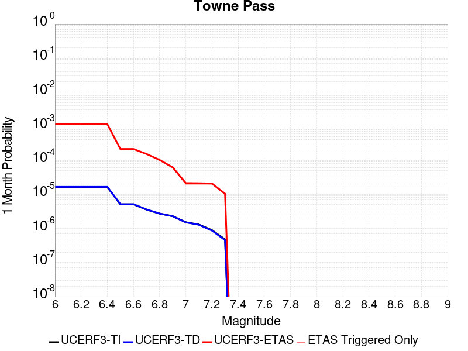 |  |  |

| Magnitude | 1 wk TI Prob | 1 wk TD Prob | 1 wk ETAS Prob | 1 wk ETAS/TD Gain | 1 wk ETAS Triggered Only | 1 mo TI Prob | 1 mo TD Prob | 1 mo ETAS Prob | 1 mo ETAS/TD Gain | 1 mo ETAS Triggered Only | 1 yr TI Prob | 1 yr TD Prob | 1 yr ETAS Prob | 1 yr ETAS/TD Gain | 1 yr ETAS Triggered Only | 10 yr TI Prob | 10 yr TD Prob | 10 yr ETAS Prob | 10 yr ETAS/TD Gain | 10 yr ETAS Triggered Only |
|-----|-----|-----|-----|-----|-----|-----|-----|-----|-----|-----|-----|-----|-----|-----|-----|-----|-----|-----|-----|-----|
| 6.0 | 3.849728E-6 | 3.8945414E-6 | 9.799117E-4 | 251.61157 | 9.7602094E-4 | 1.649873E-5 | 1.669081E-5 | 0.0013254243 | 79.41043 | 0.0013087554 | 2.0085352E-4 | 2.0319603E-4 | 0.0017778189 | 8.74928 | 0.0015749428 | 0.0020067208 | 0.0020305314 | 0.0038679235 | 1.9048823 | 0.0018411304 |
| 6.1 | 3.849728E-6 | 3.8945414E-6 | 9.799117E-4 | 251.61157 | 9.7602094E-4 | 1.649873E-5 | 1.669081E-5 | 0.0013254243 | 79.41043 | 0.0013087554 | 2.0085352E-4 | 2.0319603E-4 | 0.0017778189 | 8.74928 | 0.0015749428 | 0.0020067208 | 0.0020305314 | 0.0038679235 | 1.9048823 | 0.0018411304 |
| 6.2 | 3.849728E-6 | 3.8945414E-6 | 9.799117E-4 | 251.61157 | 9.7602094E-4 | 1.649873E-5 | 1.669081E-5 | 0.0013254243 | 79.41043 | 0.0013087554 | 2.0085352E-4 | 2.0319603E-4 | 0.0017778189 | 8.74928 | 0.0015749428 | 0.0020067208 | 0.0020305314 | 0.0038679235 | 1.9048823 | 0.0018411304 |
| 6.3 | 3.849728E-6 | 3.8945414E-6 | 9.799117E-4 | 251.61157 | 9.7602094E-4 | 1.649873E-5 | 1.669081E-5 | 0.0013254243 | 79.41043 | 0.0013087554 | 2.0085352E-4 | 2.0319603E-4 | 0.0017778189 | 8.74928 | 0.0015749428 | 0.0020067208 | 0.0020305314 | 0.0038679235 | 1.9048823 | 0.0018411304 |
| 6.4 | 3.849728E-6 | 3.8945414E-6 | 9.799117E-4 | 251.61157 | 9.7602094E-4 | 1.649873E-5 | 1.669081E-5 | 0.0013254243 | 79.41043 | 0.0013087554 | 2.0085352E-4 | 2.0319603E-4 | 0.0017778189 | 8.74928 | 0.0015749428 | 0.0020067208 | 0.0020305314 | 0.0038679235 | 1.9048823 | 0.0018411304 |
| 6.5 | 1.1953545E-6 | 1.203052E-6 | 1.786612E-4 | 148.50662 | 1.7745835E-4 | 5.1229376E-6 | 5.1559277E-6 | 2.2697772E-4 | 44.022675 | 2.2182293E-4 | 6.236998E-5 | 6.277173E-5 | 3.2894255E-4 | 5.240298 | 2.6618753E-4 | 6.235248E-4 | 6.275517E-4 | 9.822457E-4 | 1.5652028 | 3.549167E-4 |
| 6.6 | 1.1953545E-6 | 1.203052E-6 | 1.786612E-4 | 148.50662 | 1.7745835E-4 | 5.1229376E-6 | 5.1559277E-6 | 2.2697772E-4 | 44.022675 | 2.2182293E-4 | 6.236998E-5 | 6.277173E-5 | 3.2894255E-4 | 5.240298 | 2.6618753E-4 | 6.235248E-4 | 6.275517E-4 | 9.822457E-4 | 1.5652028 | 3.549167E-4 |
| 6.7 | 8.375951E-7 | 8.4106705E-7 | 1.11752444E-4 | 132.86984 | 1.1091147E-4 | 3.5896885E-6 | 3.6045683E-6 | 1.3669785E-4 | 37.9235 | 1.3309377E-4 | 4.370358E-5 | 4.3884793E-5 | 2.2133536E-4 | 5.043555 | 1.7745835E-4 | 4.3694986E-4 | 4.38767E-4 | 6.6049263E-4 | 1.505338 | 2.2182293E-4 |
| 6.8 | 6.38041E-7 | 6.392156E-7 | 8.936833E-5 | 139.80937 | 8.8729175E-5 | 2.7344586E-6 | 2.7394929E-6 | 9.146843E-5 | 33.388817 | 8.8729175E-5 | 3.3291526E-5 | 3.3352855E-5 | 1.6644219E-4 | 4.9903426 | 1.3309377E-4 | 3.3286537E-4 | 3.334823E-4 | 5.108815E-4 | 1.5319598 | 1.7745835E-4 |
| 6.9 | 5.3460053E-7 | 5.345333E-7 | 4.4899098E-5 | 83.99682 | 4.4364588E-5 | 2.2911431E-6 | 2.2908553E-6 | 4.6655343E-5 | 20.365906 | 4.4364588E-5 | 2.789431E-5 | 2.789084E-5 | 9.443586E-5 | 3.3859098 | 6.654688E-5 | 2.789081E-4 | 2.7887672E-4 | 3.8975725E-4 | 1.397597 | 1.1091147E-4 |
| 7.0 | 3.557783E-7 | 3.5324226E-7 | 2.2535529E-5 | 63.79624 | 2.2182294E-5 | 1.5247632E-6 | 1.5138945E-6 | 2.3696155E-5 | 15.652448 | 2.2182294E-5 | 1.8563835E-5 | 1.843152E-5 | 4.0613406E-5 | 2.2034757 | 2.2182294E-5 | 1.8562283E-4 | 1.8430075E-4 | 2.2865715E-4 | 1.240674 | 4.4364588E-5 |
| 7.1 | 3.037942E-7 | 3.0002218E-7 | 2.2482309E-5 | 74.93549 | 2.2182294E-5 | 1.3019744E-6 | 1.2858087E-6 | 2.3468074E-5 | 18.251606 | 2.2182294E-5 | 1.5851423E-5 | 1.5654618E-5 | 3.7836562E-5 | 2.4169588 | 2.2182294E-5 | 1.5850292E-4 | 1.5653588E-4 | 1.787147E-4 | 1.1416852 | 2.2182294E-5 |
| 7.2 | 2.0808248E-7 | 2.0217689E-7 | 2.2384467E-5 | 110.71724 | 2.2182294E-5 | 8.917818E-7 | 8.6647213E-7 | 2.3048748E-5 | 26.60068 | 2.2182294E-5 | 1.0857389E-5 | 1.0549252E-5 | 3.273131E-5 | 3.102714 | 2.2182294E-5 | 1.0856859E-4 | 1.0548797E-4 | 1.2766792E-4 | 1.2102605 | 2.2182294E-5 |
| 7.3 | 1.1162073E-7 | 1.0636894E-7 | 1.0636894E-7 | 1.0 | 0.0 | 4.7837443E-7 | 4.558668E-7 | 4.558668E-7 | 1.0 | 0.0 | 5.8241935E-6 | 5.550166E-6 | 5.550166E-6 | 1.0 | 0.0 | 5.8240406E-5 | 5.5500474E-5 | 5.5500474E-5 | 1.0 | 0.0 |

## Nelson Lake
*[(top)](#table-of-contents)*

| 1 Week | 1 Month | 1 Year | 10 Year |
|-----|-----|-----|-----|
|  |  |  |  |

| Magnitude | 1 wk TI Prob | 1 wk TD Prob | 1 wk ETAS Prob | 1 wk ETAS/TD Gain | 1 wk ETAS Triggered Only | 1 mo TI Prob | 1 mo TD Prob | 1 mo ETAS Prob | 1 mo ETAS/TD Gain | 1 mo ETAS Triggered Only | 1 yr TI Prob | 1 yr TD Prob | 1 yr ETAS Prob | 1 yr ETAS/TD Gain | 1 yr ETAS Triggered Only | 10 yr TI Prob | 10 yr TD Prob | 10 yr ETAS Prob | 10 yr ETAS/TD Gain | 10 yr ETAS Triggered Only |
|-----|-----|-----|-----|-----|-----|-----|-----|-----|-----|-----|-----|-----|-----|-----|-----|-----|-----|-----|-----|-----|
| 6.0 | 9.913453E-6 | 1.0192255E-5 | 9.418391E-4 | 92.40733 | 9.3165634E-4 | 4.2485535E-5 | 4.3680422E-5 | 0.001241472 | 28.421703 | 0.0011978439 | 5.1713863E-4 | 5.316897E-4 | 0.0020392837 | 3.835477 | 0.001508396 | 0.0051593683 | 0.005305204 | 0.006893856 | 1.2994517 | 0.0015971252 |
| 6.1 | 9.913453E-6 | 1.0192255E-5 | 9.418391E-4 | 92.40733 | 9.3165634E-4 | 4.2485535E-5 | 4.3680422E-5 | 0.001241472 | 28.421703 | 0.0011978439 | 5.1713863E-4 | 5.316897E-4 | 0.0020392837 | 3.835477 | 0.001508396 | 0.0051593683 | 0.005305204 | 0.006893856 | 1.2994517 | 0.0015971252 |
| 6.2 | 4.5596407E-6 | 4.696313E-6 | 3.3742917E-4 | 71.8498 | 3.327344E-4 | 1.954117E-5 | 2.0126909E-5 | 4.859457E-4 | 24.144081 | 4.6582817E-4 | 2.3788778E-4 | 2.4501883E-4 | 8.43794E-4 | 3.4437926 | 5.9892196E-4 | 0.0023763329 | 0.0024476128 | 0.0030893248 | 1.2621788 | 6.432865E-4 |
| 6.3 | 4.5596407E-6 | 4.696313E-6 | 3.3742917E-4 | 71.8498 | 3.327344E-4 | 1.954117E-5 | 2.0126909E-5 | 4.859457E-4 | 24.144081 | 4.6582817E-4 | 2.3788778E-4 | 2.4501883E-4 | 8.43794E-4 | 3.4437926 | 5.9892196E-4 | 0.0023763329 | 0.0024476128 | 0.0030893248 | 1.2621788 | 6.432865E-4 |
| 6.4 | 3.4025713E-6 | 3.5098972E-6 | 2.4751428E-4 | 70.51895 | 2.4400523E-4 | 1.4582367E-5 | 1.5042335E-5 | 3.699537E-4 | 24.594168 | 3.549167E-4 | 1.7752586E-4 | 1.8312587E-4 | 6.4886874E-4 | 3.5432937 | 4.6582817E-4 | 0.001773841 | 0.0018298327 | 0.0023390919 | 1.2783091 | 5.1019277E-4 |
| 6.5 | 2.8352947E-6 | 2.927856E-6 | 2.4693238E-4 | 84.338974 | 2.4400523E-4 | 1.2151207E-5 | 1.2547898E-5 | 3.4527812E-4 | 27.51681 | 3.327344E-4 | 1.479309E-4 | 1.5276071E-4 | 5.963388E-4 | 3.903745 | 4.4364587E-4 | 0.0014783246 | 0.0015266308 | 0.0019917479 | 1.3046689 | 4.6582817E-4 |
| 6.6 | 2.251518E-6 | 2.3290677E-6 | 1.79787E-4 | 77.192696 | 1.7745835E-4 | 9.649328E-6 | 9.981683E-6 | 2.5398447E-4 | 25.445055 | 2.4400523E-4 | 1.1747423E-4 | 1.2152085E-4 | 4.7639443E-4 | 3.920269 | 3.549167E-4 | 0.0011741214 | 0.0012146058 | 0.0015912467 | 1.3100932 | 3.77099E-4 |
| 6.7 | 1.8911853E-6 | 1.9591396E-6 | 1.7941714E-4 | 91.57956 | 1.7745835E-4 | 8.105055E-6 | 8.39629E-6 | 2.3021737E-4 | 27.418941 | 2.2182293E-4 | 9.867457E-5 | 1.0222061E-4 | 4.34921E-4 | 4.2547293 | 3.327344E-4 | 9.863076E-4 | 0.0010217935 | 0.0013763475 | 1.3469919 | 3.549167E-4 |
| 6.8 | 1.4874814E-6 | 1.5438305E-6 | 1.7900192E-4 | 115.94661 | 1.7745835E-4 | 6.374905E-6 | 6.6164025E-6 | 2.0625573E-4 | 31.173395 | 1.9964065E-4 | 7.76117E-5 | 8.055224E-5 | 3.4671833E-4 | 4.3042665 | 2.6618753E-4 | 7.75846E-4 | 8.0528157E-4 | 0.0010934192 | 1.3578098 | 2.8836983E-4 |
| 6.9 | 6.835972E-7 | 7.1399285E-7 | 8.944311E-5 | 125.27171 | 8.8729175E-5 | 2.9296991E-6 | 3.0599674E-6 | 9.1788876E-5 | 29.996683 | 8.8729175E-5 | 3.56685E-5 | 3.7254784E-5 | 1.4816213E-4 | 3.9769957 | 1.1091147E-4 | 3.5662777E-4 | 3.7251666E-4 | 5.0556083E-4 | 1.3571496 | 1.3309377E-4 |

## Lenwood-Lockhart-Old Woman Springs
*[(top)](#table-of-contents)*

| 1 Week | 1 Month | 1 Year | 10 Year |
|-----|-----|-----|-----|
|  |  |  |  |

| Magnitude | 1 wk TI Prob | 1 wk TD Prob | 1 wk ETAS Prob | 1 wk ETAS/TD Gain | 1 wk ETAS Triggered Only | 1 mo TI Prob | 1 mo TD Prob | 1 mo ETAS Prob | 1 mo ETAS/TD Gain | 1 mo ETAS Triggered Only | 1 yr TI Prob | 1 yr TD Prob | 1 yr ETAS Prob | 1 yr ETAS/TD Gain | 1 yr ETAS Triggered Only | 10 yr TI Prob | 10 yr TD Prob | 10 yr ETAS Prob | 10 yr ETAS/TD Gain | 10 yr ETAS Triggered Only |
|-----|-----|-----|-----|-----|-----|-----|-----|-----|-----|-----|-----|-----|-----|-----|-----|-----|-----|-----|-----|-----|
| 6.0 | 3.744542E-5 | 4.396252E-5 | 9.755779E-4 | 22.191128 | 9.3165634E-4 | 1.604705E-4 | 1.8839816E-4 | 0.0012973039 | 6.885969 | 0.0011091147 | 0.0019519776 | 0.0022915069 | 0.003730052 | 1.6277726 | 0.0014418492 | 0.019349206 | 0.022696787 | 0.024192628 | 1.0659053 | 0.0015305782 |
| 6.1 | 3.744542E-5 | 4.396252E-5 | 9.755779E-4 | 22.191128 | 9.3165634E-4 | 1.604705E-4 | 1.8839816E-4 | 0.0012973039 | 6.885969 | 0.0011091147 | 0.0019519776 | 0.0022915069 | 0.003730052 | 1.6277726 | 0.0014418492 | 0.019349206 | 0.022696787 | 0.024192628 | 1.0659053 | 0.0015305782 |
| 6.2 | 3.744542E-5 | 4.396252E-5 | 9.755779E-4 | 22.191128 | 9.3165634E-4 | 1.604705E-4 | 1.8839816E-4 | 0.0012973039 | 6.885969 | 0.0011091147 | 0.0019519776 | 0.0022915069 | 0.003730052 | 1.6277726 | 0.0014418492 | 0.019349206 | 0.022696787 | 0.024192628 | 1.0659053 | 0.0015305782 |
| 6.3 | 2.1079984E-5 | 2.5353434E-5 | 3.3589767E-4 | 13.248607 | 3.1055213E-4 | 9.0339665E-5 | 1.0865316E-4 | 5.0789106E-4 | 4.674425 | 3.992813E-4 | 0.0010993304 | 0.0013220694 | 0.0019423525 | 1.4691759 | 6.2110426E-4 | 0.010939079 | 0.0131442575 | 0.01382287 | 1.0516281 | 6.876511E-4 |
| 6.4 | 2.1079984E-5 | 2.5353434E-5 | 3.3589767E-4 | 13.248607 | 3.1055213E-4 | 9.0339665E-5 | 1.0865316E-4 | 5.0789106E-4 | 4.674425 | 3.992813E-4 | 0.0010993304 | 0.0013220694 | 0.0019423525 | 1.4691759 | 6.2110426E-4 | 0.010939079 | 0.0131442575 | 0.01382287 | 1.0516281 | 6.876511E-4 |
| 6.5 | 1.7397282E-5 | 2.066241E-5 | 2.4248076E-4 | 11.735357 | 2.2182293E-4 | 7.455765E-5 | 8.8550245E-5 | 3.547142E-4 | 4.005796 | 2.6618753E-4 | 9.073613E-4 | 0.0010775778 | 0.0015207456 | 1.411263 | 4.4364587E-4 | 0.009036654 | 0.010724821 | 0.0111856535 | 1.0429688 | 4.6582817E-4 |
| 6.6 | 1.52050325E-5 | 1.7679693E-5 | 1.9513491E-4 | 11.037233 | 1.7745835E-4 | 6.51628E-5 | 7.576796E-5 | 2.975741E-4 | 3.9274397 | 2.2182293E-4 | 7.9306826E-4 | 9.220924E-4 | 0.0013210055 | 1.4326173 | 3.992813E-4 | 0.007902439 | 0.009183526 | 0.009601119 | 1.045472 | 4.214636E-4 |
| 6.7 | 1.332523E-5 | 1.5264002E-5 | 1.7053769E-4 | 11.172541 | 1.5527607E-4 | 5.7106878E-5 | 6.5415545E-5 | 2.6504314E-4 | 4.0516844 | 1.9964065E-4 | 6.950544E-4 | 7.961491E-4 | 0.0011286186 | 1.417597 | 3.327344E-4 | 0.006928845 | 0.007933599 | 0.008285699 | 1.044381 | 3.549167E-4 |
| 6.8 | 1.1525329E-5 | 1.3030979E-5 | 1.23941E-4 | 9.511258 | 1.1091147E-4 | 4.9393333E-5 | 5.584588E-5 | 1.8893222E-4 | 3.3831003 | 1.3309377E-4 | 6.011979E-4 | 6.797157E-4 | 9.235551E-4 | 1.3587372 | 2.4400523E-4 | 0.00599574 | 0.006776819 | 0.007041203 | 1.0390129 | 2.6618753E-4 |
| 6.9 | 1.0253909E-5 | 1.15144385E-5 | 1.2242464E-4 | 10.632271 | 1.1091147E-4 | 4.3944583E-5 | 4.9346683E-5 | 1.6025268E-4 | 3.2474864 | 1.1091147E-4 | 5.3489394E-4 | 6.0063385E-4 | 8.2232355E-4 | 1.369093 | 2.2182293E-4 | 0.0053360825 | 0.0059904843 | 0.0062330277 | 1.0404881 | 2.4400523E-4 |
| 7.0 | 8.104563E-6 | 8.991279E-6 | 7.5537566E-5 | 8.401203 | 6.654688E-5 | 3.4733377E-5 | 3.8533497E-5 | 1.05077816E-4 | 2.7269213 | 6.654688E-5 | 4.2279682E-4 | 4.6904673E-4 | 6.4642186E-4 | 1.3781608 | 1.7745835E-4 | 0.0042199334 | 0.0046808156 | 0.0048574433 | 1.0377344 | 1.7745835E-4 |
| 7.1 | 6.7986157E-6 | 7.515816E-6 | 5.188007E-5 | 6.9027863 | 4.4364588E-5 | 2.91366E-5 | 3.2210253E-5 | 7.6573415E-5 | 2.3772993 | 4.4364588E-5 | 3.5468035E-4 | 3.920914E-4 | 5.473066E-4 | 1.3958647 | 1.5527607E-4 | 0.003541148 | 0.003914213 | 0.004068881 | 1.0395145 | 1.5527607E-4 |
| 7.2 | 5.6893327E-6 | 6.2800136E-6 | 2.846217E-5 | 4.5321827 | 2.2182294E-5 | 2.4382627E-5 | 2.6914078E-5 | 4.9095775E-5 | 1.8241671 | 2.2182294E-5 | 2.9681803E-4 | 3.2763163E-4 | 4.3850674E-4 | 1.3384141 | 1.1091147E-4 | 0.002964219 | 0.0032716845 | 0.0033822332 | 1.0337895 | 1.1091147E-4 |
| 7.3 | 4.253348E-6 | 4.7069107E-6 | 2.68891E-5 | 5.7126856 | 2.2182294E-5 | 1.8228506E-5 | 2.0172329E-5 | 4.2354175E-5 | 2.0996175 | 2.2182294E-5 | 2.2190946E-4 | 2.4557224E-4 | 3.3427964E-4 | 1.3612273 | 8.8729175E-5 | 0.00221688 | 0.0024531898 | 0.0025417013 | 1.0360801 | 8.8729175E-5 |
| 7.4 | 2.5448119E-6 | 2.852045E-6 | 2.5034276E-5 | 8.777658 | 2.2182294E-5 | 1.0906291E-5 | 1.2223002E-5 | 3.4405024E-5 | 2.814777 | 2.2182294E-5 | 1.3277601E-4 | 1.4880655E-4 | 2.3752252E-4 | 1.5961833 | 8.8729175E-5 | 0.001326967 | 0.0014872311 | 0.0015758284 | 1.0595719 | 8.8729175E-5 |
| 7.5 | 4.3706837E-8 | 4.562909E-8 | 4.562909E-8 | 1.0 | 0.0 | 1.8731501E-7 | 1.9555324E-7 | 1.9555324E-7 | 1.0 | 0.0 | 2.2805577E-6 | 2.3808586E-6 | 2.3808586E-6 | 1.0 | 0.0 | 2.2805343E-5 | 2.3808387E-5 | 2.3808387E-5 | 1.0 | 0.0 |

## San Andreas (San Bernardino N)
*[(top)](#table-of-contents)*

| 1 Week | 1 Month | 1 Year | 10 Year |
|-----|-----|-----|-----|
|  |  |  |  |

| Magnitude | 1 wk TI Prob | 1 wk TD Prob | 1 wk ETAS Prob | 1 wk ETAS/TD Gain | 1 wk ETAS Triggered Only | 1 mo TI Prob | 1 mo TD Prob | 1 mo ETAS Prob | 1 mo ETAS/TD Gain | 1 mo ETAS Triggered Only | 1 yr TI Prob | 1 yr TD Prob | 1 yr ETAS Prob | 1 yr ETAS/TD Gain | 1 yr ETAS Triggered Only | 10 yr TI Prob | 10 yr TD Prob | 10 yr ETAS Prob | 10 yr ETAS/TD Gain | 10 yr ETAS Triggered Only |
|-----|-----|-----|-----|-----|-----|-----|-----|-----|-----|-----|-----|-----|-----|-----|-----|-----|-----|-----|-----|-----|
| 6.0 | 1.4273766E-4 | 3.1606483E-4 | 0.0013139526 | 4.1572247 | 9.982032E-4 | 6.115894E-4 | 0.0013538664 | 0.002505784 | 1.8508356 | 0.0011534793 | 0.0074207084 | 0.016360244 | 0.017647587 | 1.0786873 | 0.0013087554 | 0.07177748 | 0.15026689 | 0.15141667 | 1.0076517 | 0.00135312 |
| 6.1 | 1.4273766E-4 | 3.1606483E-4 | 0.0013139526 | 4.1572247 | 9.982032E-4 | 6.115894E-4 | 0.0013538664 | 0.002505784 | 1.8508356 | 0.0011534793 | 0.0074207084 | 0.016360244 | 0.017647587 | 1.0786873 | 0.0013087554 | 0.07177748 | 0.15026689 | 0.15141667 | 1.0076517 | 0.00135312 |
| 6.2 | 1.4273766E-4 | 3.1606483E-4 | 0.0013139526 | 4.1572247 | 9.982032E-4 | 6.115894E-4 | 0.0013538664 | 0.002505784 | 1.8508356 | 0.0011534793 | 0.0074207084 | 0.016360244 | 0.017647587 | 1.0786873 | 0.0013087554 | 0.07177748 | 0.15026689 | 0.15141667 | 1.0076517 | 0.00135312 |
| 6.3 | 1.3730655E-4 | 3.0511338E-4 | 0.001303012 | 4.270583 | 9.982032E-4 | 5.883239E-4 | 0.0013069791 | 0.002458951 | 1.8814002 | 0.0011534793 | 0.0071393442 | 0.015797773 | 0.017085852 | 1.0815356 | 0.0013087554 | 0.06914291 | 0.14556676 | 0.14672291 | 1.0079424 | 0.00135312 |
| 6.4 | 1.3730655E-4 | 3.0511338E-4 | 0.001303012 | 4.270583 | 9.982032E-4 | 5.883239E-4 | 0.0013069791 | 0.002458951 | 1.8814002 | 0.0011534793 | 0.0071393442 | 0.015797773 | 0.017085852 | 1.0815356 | 0.0013087554 | 0.06914291 | 0.14556676 | 0.14672291 | 1.0079424 | 0.00135312 |
| 6.5 | 1.2942807E-4 | 2.8925808E-4 | 0.0012649967 | 4.3732457 | 9.7602094E-4 | 5.545738E-4 | 0.0012390936 | 0.002368989 | 1.9118724 | 0.001131297 | 0.0067310524 | 0.01498286 | 0.016250156 | 1.084583 | 0.001286573 | 0.06530788 | 0.13870941 | 0.13985574 | 1.0082642 | 0.0013309376 |
| 6.6 | 1.1125901E-4 | 2.536472E-4 | 0.0011850672 | 4.6721087 | 9.3165634E-4 | 4.767372E-4 | 0.0010866089 | 0.0021723602 | 1.9992108 | 0.0010869324 | 0.005788839 | 0.013149847 | 0.01435383 | 1.0915587 | 0.0012200262 | 0.056403454 | 0.122999296 | 0.124108166 | 1.0090153 | 0.0012643908 |
| 6.7 | 1.02209575E-4 | 2.3499702E-4 | 0.0011664344 | 4.963614 | 9.3165634E-4 | 4.3796748E-4 | 0.0010067427 | 0.0020925808 | 2.0785656 | 0.0010869324 | 0.0053192247 | 0.012188629 | 0.013393785 | 1.0988754 | 0.0012200262 | 0.051936906 | 0.114790924 | 0.11591017 | 1.0097504 | 0.0012643908 |
| 6.8 | 9.610582E-5 | 2.2025521E-4 | 0.0011517063 | 5.2289634 | 9.3165634E-4 | 4.1181705E-4 | 9.436101E-4 | 0.002029517 | 2.1508002 | 0.0010869324 | 0.0050023515 | 0.011428202 | 0.012634285 | 1.1055357 | 0.0012200262 | 0.048912346 | 0.1081929 | 0.10932049 | 1.0104221 | 0.0012643908 |
| 6.9 | 9.3877505E-5 | 2.1481077E-4 | 0.001146267 | 5.3361707 | 9.3165634E-4 | 4.0227012E-4 | 9.2029345E-4 | 0.0020062255 | 2.1799846 | 0.0010869324 | 0.0048866454 | 0.011147255 | 0.012353682 | 1.1082263 | 0.0012200262 | 0.04780577 | 0.10578323 | 0.106913865 | 1.0106883 | 0.0012643908 |
| 7.0 | 9.1019785E-5 | 2.0808022E-4 | 0.0011395427 | 5.4764585 | 9.3165634E-4 | 3.900265E-4 | 8.914682E-4 | 0.0019774316 | 2.218174 | 0.0010869324 | 0.0047382377 | 0.010799837 | 0.012006687 | 1.111747 | 0.0012200262 | 0.046384744 | 0.102753714 | 0.103888184 | 1.0110407 | 0.0012643908 |
| 7.1 | 8.771155E-5 | 1.9982594E-4 | 0.0011312962 | 5.6614075 | 9.3165634E-4 | 3.758525E-4 | 8.5611636E-4 | 0.0019421183 | 2.2685213 | 0.0010869324 | 0.0045664064 | 0.0103736 | 0.011580969 | 1.1163887 | 0.0012200262 | 0.044737056 | 0.09906527 | 0.1002044 | 1.0114988 | 0.0012643908 |
| 7.2 | 8.0830236E-5 | 1.8388197E-4 | 0.001115367 | 6.065668 | 9.3165634E-4 | 3.4636928E-4 | 7.8782777E-4 | 0.0018739039 | 2.3785706 | 0.0010869324 | 0.0042088944 | 0.009549725 | 0.0107581 | 1.126535 | 0.0012200262 | 0.041300658 | 0.09179615 | 0.09294447 | 1.0125095 | 0.0012643908 |
| 7.3 | 7.7668235E-5 | 1.7331762E-4 | 0.0010826341 | 6.246532 | 9.0947404E-4 | 3.328214E-4 | 7.425784E-4 | 0.0018065379 | 2.4327908 | 0.0010647501 | 0.0040445733 | 0.009003494 | 0.010190553 | 1.1318443 | 0.0011978439 | 0.03971748 | 0.08706327 | 0.08819732 | 1.0130256 | 0.0012422085 |
| 7.4 | 7.520177E-5 | 1.6551897E-4 | 0.0010526639 | 6.3597775 | 8.8729174E-4 | 3.2225347E-4 | 7.0917426E-4 | 0.0017510027 | 2.4690726 | 0.0010425678 | 0.0039163795 | 0.008600081 | 0.009765632 | 1.1355278 | 0.0011756616 | 0.038480744 | 0.08351955 | 0.08463768 | 1.0133877 | 0.0012200262 |
| 7.5 | 7.274697E-5 | 1.5839566E-4 | 0.0010455468 | 6.600856 | 8.8729174E-4 | 3.1173544E-4 | 6.78662E-4 | 0.0017205223 | 2.5351682 | 0.0010425678 | 0.003788775 | 0.008231463 | 0.009397447 | 1.1416497 | 0.0011756616 | 0.03724827 | 0.08023631 | 0.08135845 | 1.0139854 | 0.0012200262 |
| 7.6 | 7.1185845E-5 | 1.540943E-4 | 0.0010412494 | 6.7572217 | 8.8729174E-4 | 3.0504653E-4 | 6.6023704E-4 | 0.0017021166 | 2.5780385 | 0.0010425678 | 0.0037076178 | 0.008008812 | 0.0091750575 | 1.1456203 | 0.0011756616 | 0.036463667 | 0.07822598 | 0.07935057 | 1.0143762 | 0.0012200262 |
| 7.7 | 6.709961E-5 | 1.4318313E-4 | 0.0010303479 | 7.196014 | 8.8729174E-4 | 2.8753807E-4 | 6.1349774E-4 | 0.0016554259 | 2.698341 | 0.0010425678 | 0.003495157 | 0.0074437927 | 0.008610703 | 1.1567628 | 0.0011756616 | 0.034406938 | 0.07305469 | 0.074185595 | 1.0154802 | 0.0012200262 |
| 7.8 | 6.300812E-5 | 1.3202413E-4 | 0.0010191988 | 7.7197914 | 8.8729174E-4 | 2.7000686E-4 | 5.65695E-4 | 0.001607673 | 2.841943 | 0.0010425678 | 0.0032823787 | 0.006865616 | 0.008033206 | 1.1700634 | 0.0011756616 | 0.032343175 | 0.06771354 | 0.06885095 | 1.0167974 | 0.0012200262 |
| 7.9 | 4.983037E-5 | 9.723488E-5 | 6.2955817E-4 | 6.4746127 | 5.3237507E-4 | 2.1354125E-4 | 4.1665437E-4 | 0.0010374999 | 2.490073 | 6.2110426E-4 | 0.0025967648 | 0.0050609782 | 0.0057672192 | 1.1395464 | 7.098334E-4 | 0.025666296 | 0.05064886 | 0.051364858 | 1.0141366 | 7.54198E-4 |
| 8.0 | 3.2211527E-5 | 5.3304586E-5 | 1.8639126E-4 | 3.4967208 | 1.3309377E-4 | 1.380421E-4 | 2.2842824E-4 | 4.0584605E-4 | 1.7766895 | 1.7745835E-4 | 0.0016793669 | 0.0027775685 | 0.0029766548 | 1.0716764 | 1.9964065E-4 | 0.016667323 | 0.028361378 | 0.028598463 | 1.0083594 | 2.4400523E-4 |
| 8.1 | 1.743376E-5 | 1.8824427E-5 | 8.5370055E-5 | 4.535068 | 6.654688E-5 | 7.471398E-5 | 8.067362E-5 | 1.6939564E-4 | 2.0997648 | 8.8729175E-5 | 9.0926304E-4 | 9.817594E-4 | 0.0010704015 | 1.090289 | 8.8729175E-5 | 0.009055517 | 0.010484105 | 0.010593854 | 1.0104681 | 1.1091147E-4 |
| 8.2 | 7.831616E-6 | 5.1551065E-6 | 5.1551065E-6 | 1.0 | 0.0 | 3.3563636E-5 | 2.2093127E-5 | 2.2093127E-5 | 1.0 | 0.0 | 4.0856065E-4 | 2.6895068E-4 | 2.6895068E-4 | 1.0 | 0.0 | 0.004078103 | 0.0030418145 | 0.0030418145 | 1.0 | 0.0 |
| 8.3 | 1.983087E-6 | 7.6599065E-7 | 7.6599065E-7 | 1.0 | 0.0 | 8.498917E-6 | 3.282813E-6 | 3.282813E-6 | 1.0 | 0.0 | 1.034694E-4 | 3.9967534E-5 | 3.9967534E-5 | 1.0 | 0.0 | 0.0010342124 | 4.719687E-4 | 4.719687E-4 | 1.0 | 0.0 |

## Bicycle Lake
*[(top)](#table-of-contents)*

| 1 Week | 1 Month | 1 Year | 10 Year |
|-----|-----|-----|-----|
|  |  |  |  |

| Magnitude | 1 wk TI Prob | 1 wk TD Prob | 1 wk ETAS Prob | 1 wk ETAS/TD Gain | 1 wk ETAS Triggered Only | 1 mo TI Prob | 1 mo TD Prob | 1 mo ETAS Prob | 1 mo ETAS/TD Gain | 1 mo ETAS Triggered Only | 1 yr TI Prob | 1 yr TD Prob | 1 yr ETAS Prob | 1 yr ETAS/TD Gain | 1 yr ETAS Triggered Only | 10 yr TI Prob | 10 yr TD Prob | 10 yr ETAS Prob | 10 yr ETAS/TD Gain | 10 yr ETAS Triggered Only |
|-----|-----|-----|-----|-----|-----|-----|-----|-----|-----|-----|-----|-----|-----|-----|-----|-----|-----|-----|-----|-----|
| 6.0 | 1.9621975E-5 | 2.2097078E-5 | 7.319148E-4 | 33.122696 | 7.098334E-4 | 8.4091465E-5 | 9.4699084E-5 | 8.710059E-4 | 9.197617 | 7.763803E-4 | 0.0010233327 | 0.0011524865 | 0.0021052258 | 1.8266815 | 9.5383864E-4 | 0.01018633 | 0.011478408 | 0.012574792 | 1.095517 | 0.0011091147 |
| 6.1 | 1.9621975E-5 | 2.2097078E-5 | 7.319148E-4 | 33.122696 | 7.098334E-4 | 8.4091465E-5 | 9.4699084E-5 | 8.710059E-4 | 9.197617 | 7.763803E-4 | 0.0010233327 | 0.0011524865 | 0.0021052258 | 1.8266815 | 9.5383864E-4 | 0.01018633 | 0.011478408 | 0.012574792 | 1.095517 | 0.0011091147 |
| 6.2 | 9.9971285E-6 | 1.1255639E-5 | 3.2180425E-4 | 28.59049 | 3.1055213E-4 | 4.2844134E-5 | 4.8237856E-5 | 3.8095622E-4 | 7.8974533 | 3.327344E-4 | 5.2150246E-4 | 5.871896E-4 | 0.0010527443 | 1.7928523 | 4.6582817E-4 | 0.0052028033 | 0.005861487 | 0.0064348457 | 1.097818 | 5.7673967E-4 |
| 6.3 | 9.589428E-6 | 1.0798346E-5 | 3.2134712E-4 | 29.758919 | 3.1055213E-4 | 4.10969E-5 | 4.62781E-5 | 3.7899712E-4 | 8.189557 | 3.327344E-4 | 5.002399E-4 | 5.6334207E-4 | 0.0010289078 | 1.8264353 | 4.6582817E-4 | 0.0049911533 | 0.0056242296 | 0.0061977254 | 1.1019688 | 5.7673967E-4 |
| 6.4 | 9.589428E-6 | 1.0798346E-5 | 3.2134712E-4 | 29.758919 | 3.1055213E-4 | 4.10969E-5 | 4.62781E-5 | 3.7899712E-4 | 8.189557 | 3.327344E-4 | 5.002399E-4 | 5.6334207E-4 | 0.0010289078 | 1.8264353 | 4.6582817E-4 | 0.0049911533 | 0.0056242296 | 0.0061977254 | 1.1019688 | 5.7673967E-4 |
| 6.5 | 5.557707E-6 | 6.2856016E-6 | 1.8374284E-4 | 29.23234 | 1.7745835E-4 | 2.3818526E-5 | 2.6938165E-5 | 2.2657344E-4 | 8.410871 | 1.9964065E-4 | 2.8995197E-4 | 3.2794967E-4 | 6.1622495E-4 | 1.8790228 | 2.8836983E-4 | 0.0028957394 | 0.0032772934 | 0.0036089374 | 1.1011945 | 3.327344E-4 |
| 6.6 | 4.8742945E-6 | 5.5132896E-6 | 1.8297066E-4 | 33.187202 | 1.7745835E-4 | 2.0889667E-5 | 2.3628318E-5 | 2.0108248E-4 | 8.510232 | 1.7745835E-4 | 2.54302E-4 | 2.87663E-4 | 5.3159805E-4 | 1.847989 | 2.4400523E-4 | 0.002540112 | 0.0028754752 | 0.0031408973 | 1.0923054 | 2.6618753E-4 |
| 6.7 | 3.991108E-6 | 4.5159104E-6 | 1.5979126E-4 | 35.384068 | 1.5527607E-4 | 1.7104636E-5 | 1.9353902E-5 | 1.7462696E-4 | 9.02283 | 1.5527607E-4 | 2.0822904E-4 | 2.3563375E-4 | 4.574044E-4 | 1.9411669 | 2.2182293E-4 | 0.0020803404 | 0.0023563374 | 0.0025997679 | 1.1033088 | 2.4400523E-4 |

## Paradise
*[(top)](#table-of-contents)*

| 1 Week | 1 Month | 1 Year | 10 Year |
|-----|-----|-----|-----|
|  |  |  |  |

| Magnitude | 1 wk TI Prob | 1 wk TD Prob | 1 wk ETAS Prob | 1 wk ETAS/TD Gain | 1 wk ETAS Triggered Only | 1 mo TI Prob | 1 mo TD Prob | 1 mo ETAS Prob | 1 mo ETAS/TD Gain | 1 mo ETAS Triggered Only | 1 yr TI Prob | 1 yr TD Prob | 1 yr ETAS Prob | 1 yr ETAS/TD Gain | 1 yr ETAS Triggered Only | 10 yr TI Prob | 10 yr TD Prob | 10 yr ETAS Prob | 10 yr ETAS/TD Gain | 10 yr ETAS Triggered Only |
|-----|-----|-----|-----|-----|-----|-----|-----|-----|-----|-----|-----|-----|-----|-----|-----|-----|-----|-----|-----|-----|
| 6.0 | 1.4851273E-5 | 1.6694692E-5 | 7.708801E-4 | 46.175163 | 7.54198E-4 | 6.364676E-5 | 7.154685E-5 | 9.3659444E-4 | 13.090646 | 8.651095E-4 | 7.7462377E-4 | 8.707584E-4 | 0.0018680925 | 2.1453626 | 9.982032E-4 | 0.0077192914 | 0.008675844 | 0.009841306 | 1.1343341 | 0.0011756616 |
| 6.1 | 1.4851273E-5 | 1.6694692E-5 | 7.708801E-4 | 46.175163 | 7.54198E-4 | 6.364676E-5 | 7.154685E-5 | 9.3659444E-4 | 13.090646 | 8.651095E-4 | 7.7462377E-4 | 8.707584E-4 | 0.0018680925 | 2.1453626 | 9.982032E-4 | 0.0077192914 | 0.008675844 | 0.009841306 | 1.1343341 | 0.0011756616 |
| 6.2 | 1.4851273E-5 | 1.6694692E-5 | 7.708801E-4 | 46.175163 | 7.54198E-4 | 6.364676E-5 | 7.154685E-5 | 9.3659444E-4 | 13.090646 | 8.651095E-4 | 7.7462377E-4 | 8.707584E-4 | 0.0018680925 | 2.1453626 | 9.982032E-4 | 0.0077192914 | 0.008675844 | 0.009841306 | 1.1343341 | 0.0011756616 |
| 6.3 | 1.0426831E-5 | 1.188862E-5 | 4.1116518E-4 | 34.584766 | 3.992813E-4 | 4.4685654E-5 | 5.0950268E-5 | 5.167547E-4 | 10.142336 | 4.6582817E-4 | 5.43912E-4 | 6.201489E-4 | 0.0011300253 | 1.8221837 | 5.1019277E-4 | 0.0054258266 | 0.0061847917 | 0.0067800093 | 1.096239 | 5.9892196E-4 |
| 6.4 | 1.0426831E-5 | 1.188862E-5 | 4.1116518E-4 | 34.584766 | 3.992813E-4 | 4.4685654E-5 | 5.0950268E-5 | 5.167547E-4 | 10.142336 | 4.6582817E-4 | 5.43912E-4 | 6.201489E-4 | 0.0011300253 | 1.8221837 | 5.1019277E-4 | 0.0054258266 | 0.0061847917 | 0.0067800093 | 1.096239 | 5.9892196E-4 |
| 6.5 | 9.25027E-6 | 1.06199595E-5 | 3.2116877E-4 | 30.241997 | 3.1055213E-4 | 3.964341E-5 | 4.551335E-5 | 4.004139E-4 | 8.797725 | 3.549167E-4 | 4.8255164E-4 | 5.53989E-4 | 9.530491E-4 | 1.7203394 | 3.992813E-4 | 0.0048150513 | 0.0055265795 | 0.0059898333 | 1.0838228 | 4.6582817E-4 |
| 6.6 | 7.904275E-6 | 9.159525E-6 | 2.3098044E-4 | 25.217512 | 2.2182293E-4 | 3.3875025E-5 | 3.9254537E-5 | 2.832502E-4 | 7.215731 | 2.4400523E-4 | 4.1235037E-4 | 4.7782314E-4 | 7.660552E-4 | 1.603219 | 2.8836983E-4 | 0.0041158604 | 0.0047683544 | 0.005077426 | 1.0648172 | 3.1055213E-4 |
| 6.7 | 7.2061953E-6 | 8.407248E-6 | 9.713568E-5 | 11.553802 | 8.8729175E-5 | 3.088333E-5 | 3.6030586E-5 | 1.4693807E-4 | 4.078148 | 1.1091147E-4 | 3.7593965E-4 | 4.3858777E-4 | 5.7162315E-4 | 1.3033267 | 1.3309377E-4 | 0.003753043 | 0.004377591 | 0.004510102 | 1.0302703 | 1.3309377E-4 |
| 6.8 | 6.6948724E-6 | 7.842166E-6 | 5.2206407E-5 | 6.657141 | 4.4364588E-5 | 2.8691995E-5 | 3.360887E-5 | 7.797196E-5 | 2.3199818 | 4.4364588E-5 | 3.4926904E-4 | 4.0911473E-4 | 4.7563438E-4 | 1.1625941 | 6.654688E-5 | 0.003487206 | 0.0040839734 | 0.004150248 | 1.0162281 | 6.654688E-5 |
| 6.9 | 6.0421025E-6 | 7.130621E-6 | 5.149489E-5 | 7.2216563 | 4.4364588E-5 | 2.5894467E-5 | 3.0559466E-5 | 7.49227E-5 | 2.4517019 | 4.4364588E-5 | 3.1521954E-4 | 3.7200135E-4 | 4.3852348E-4 | 1.1788223 | 6.654688E-5 | 0.0031477278 | 0.0037141247 | 0.0037804244 | 1.0178508 | 6.654688E-5 |
| 7.0 | 4.134091E-6 | 5.0803087E-6 | 4.9444672E-5 | 9.732612 | 4.4364588E-5 | 1.7717413E-5 | 2.177258E-5 | 6.61362E-5 | 3.0375915 | 4.4364588E-5 | 2.1568815E-4 | 2.6505045E-4 | 3.315797E-4 | 1.251006 | 6.654688E-5 | 0.0021547892 | 0.0026474963 | 0.002713867 | 1.0250692 | 6.654688E-5 |
| 7.1 | 3.7674888E-6 | 4.6318696E-6 | 2.6814061E-5 | 5.7890363 | 2.2182294E-5 | 1.6146281E-5 | 1.9850726E-5 | 4.203258E-5 | 2.1174328 | 2.2182294E-5 | 1.9656324E-4 | 2.4165731E-4 | 2.6383426E-4 | 1.0917702 | 2.2182294E-5 | 0.0019638946 | 0.002414096 | 0.0024362246 | 1.0091665 | 2.2182294E-5 |
| 7.2 | 3.4065345E-6 | 4.156723E-6 | 2.6338925E-5 | 6.3364635 | 2.2182294E-5 | 1.4599351E-5 | 1.7814415E-5 | 3.9996314E-5 | 2.2451658 | 2.2182294E-5 | 1.777326E-4 | 2.1687041E-4 | 2.3904789E-4 | 1.1022614 | 2.2182294E-5 | 0.0017759053 | 0.002166736 | 0.0021888702 | 1.0102155 | 2.2182294E-5 |
| 7.3 | 2.9934936E-6 | 3.6293168E-6 | 3.6293168E-6 | 1.0 | 0.0 | 1.2829195E-5 | 1.555413E-5 | 1.555413E-5 | 1.0 | 0.0 | 1.5618425E-4 | 1.8935655E-4 | 1.8935655E-4 | 1.0 | 0.0 | 0.0015607453 | 0.0018920974 | 0.0018920974 | 1.0 | 0.0 |
| 7.4 | 2.4049796E-6 | 2.8889842E-6 | 2.8889842E-6 | 1.0 | 0.0 | 1.0307015E-5 | 1.238131E-5 | 1.238131E-5 | 1.0 | 0.0 | 1.2548068E-4 | 1.5073347E-4 | 1.5073347E-4 | 1.0 | 0.0 | 0.0012540985 | 0.0015064536 | 0.0015064536 | 1.0 | 0.0 |
| 7.5 | 1.2710091E-6 | 1.5134682E-6 | 1.5134682E-6 | 1.0 | 0.0 | 5.44717E-6 | 6.4862834E-6 | 6.4862834E-6 | 1.0 | 0.0 | 6.631728E-5 | 7.8968886E-5 | 7.8968886E-5 | 1.0 | 0.0 | 6.6297496E-4 | 7.8953087E-4 | 7.8953087E-4 | 1.0 | 0.0 |
| 7.6 | 2.21172E-7 | 2.603961E-7 | 2.603961E-7 | 1.0 | 0.0 | 9.478797E-7 | 1.1159829E-6 | 1.1159829E-6 | 1.0 | 0.0 | 1.1540374E-5 | 1.3587036E-5 | 1.3587036E-5 | 1.0 | 0.0 | 1.1539775E-4 | 1.3586486E-4 | 1.3586486E-4 | 1.0 | 0.0 |

## Death Valley (Black Mtns Frontal)
*[(top)](#table-of-contents)*

| 1 Week | 1 Month | 1 Year | 10 Year |
|-----|-----|-----|-----|
|  |  | 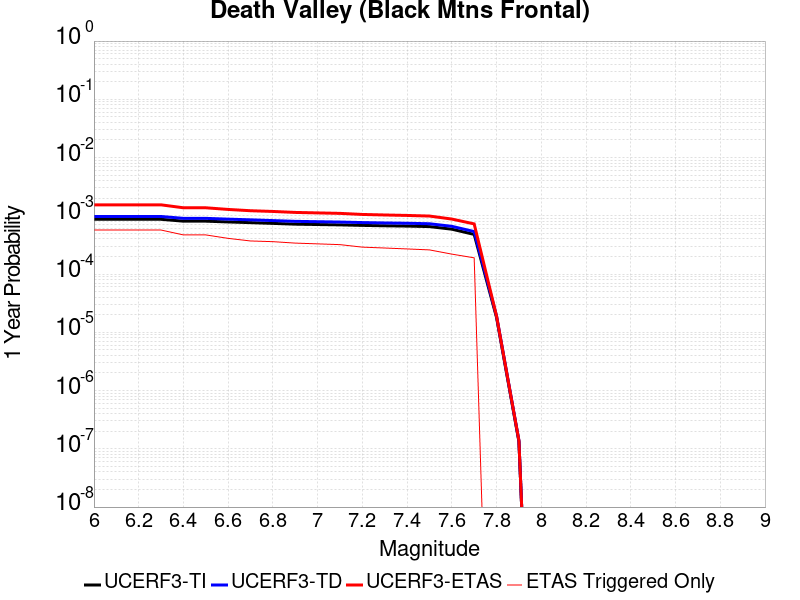 |  |

| Magnitude | 1 wk TI Prob | 1 wk TD Prob | 1 wk ETAS Prob | 1 wk ETAS/TD Gain | 1 wk ETAS Triggered Only | 1 mo TI Prob | 1 mo TD Prob | 1 mo ETAS Prob | 1 mo ETAS/TD Gain | 1 mo ETAS Triggered Only | 1 yr TI Prob | 1 yr TD Prob | 1 yr ETAS Prob | 1 yr ETAS/TD Gain | 1 yr ETAS Triggered Only | 10 yr TI Prob | 10 yr TD Prob | 10 yr ETAS Prob | 10 yr ETAS/TD Gain | 10 yr ETAS Triggered Only |
|-----|-----|-----|-----|-----|-----|-----|-----|-----|-----|-----|-----|-----|-----|-----|-----|-----|-----|-----|-----|-----|
| 6.0 | 1.6707214E-5 | 1.867027E-5 | 3.7358035E-4 | 20.009373 | 3.549167E-4 | 7.160038E-5 | 8.001302E-5 | 5.458039E-4 | 6.8214383 | 4.6582817E-4 | 8.71386E-4 | 9.737309E-4 | 0.0015499089 | 1.5917221 | 5.7673967E-4 | 0.00867977 | 0.009695496 | 0.010420416 | 1.0747685 | 7.320157E-4 |
| 6.1 | 1.6707214E-5 | 1.867027E-5 | 3.7358035E-4 | 20.009373 | 3.549167E-4 | 7.160038E-5 | 8.001302E-5 | 5.458039E-4 | 6.8214383 | 4.6582817E-4 | 8.71386E-4 | 9.737309E-4 | 0.0015499089 | 1.5917221 | 5.7673967E-4 | 0.00867977 | 0.009695496 | 0.010420416 | 1.0747685 | 7.320157E-4 |
| 6.2 | 1.6707214E-5 | 1.867027E-5 | 3.7358035E-4 | 20.009373 | 3.549167E-4 | 7.160038E-5 | 8.001302E-5 | 5.458039E-4 | 6.8214383 | 4.6582817E-4 | 8.71386E-4 | 9.737309E-4 | 0.0015499089 | 1.5917221 | 5.7673967E-4 | 0.00867977 | 0.009695496 | 0.010420416 | 1.0747685 | 7.320157E-4 |
| 6.3 | 1.6707214E-5 | 1.867027E-5 | 3.7358035E-4 | 20.009373 | 3.549167E-4 | 7.160038E-5 | 8.001302E-5 | 5.458039E-4 | 6.8214383 | 4.6582817E-4 | 8.71386E-4 | 9.737309E-4 | 0.0015499089 | 1.5917221 | 5.7673967E-4 | 0.00867977 | 0.009695496 | 0.010420416 | 1.0747685 | 7.320157E-4 |
| 6.4 | 1.5515609E-5 | 1.7338214E-5 | 2.613392E-4 | 15.073019 | 2.4400523E-4 | 6.649377E-5 | 7.4304546E-5 | 4.291949E-4 | 5.7761593 | 3.549167E-4 | 8.0926094E-4 | 9.042885E-4 | 0.0013475332 | 1.4901586 | 4.4364587E-4 | 0.008063202 | 0.009006773 | 0.009578318 | 1.0634573 | 5.7673967E-4 |
| 6.5 | 1.5515609E-5 | 1.7338214E-5 | 2.613392E-4 | 15.073019 | 2.4400523E-4 | 6.649377E-5 | 7.4304546E-5 | 4.291949E-4 | 5.7761593 | 3.549167E-4 | 8.0926094E-4 | 9.042885E-4 | 0.0013475332 | 1.4901586 | 4.4364587E-4 | 0.008063202 | 0.009006773 | 0.009578318 | 1.0634573 | 5.7673967E-4 |
| 6.6 | 1.5041828E-5 | 1.6809145E-5 | 2.6081028E-4 | 15.515976 | 2.4400523E-4 | 6.4463384E-5 | 7.203723E-5 | 3.8256697E-4 | 5.3106837 | 3.1055213E-4 | 7.8455906E-4 | 8.767063E-4 | 0.0012756375 | 1.455034 | 3.992813E-4 | 0.00781795 | 0.008733132 | 0.009260858 | 1.060428 | 5.3237507E-4 |
| 6.7 | 1.4634985E-5 | 1.6356016E-5 | 2.6035725E-4 | 15.918134 | 2.4400523E-4 | 6.271985E-5 | 7.009536E-5 | 3.5844496E-4 | 5.113676 | 2.8836983E-4 | 7.6334673E-4 | 8.5308263E-4 | 0.00122986 | 1.4416656 | 3.77099E-4 | 0.007607299 | 0.008498715 | 0.008938591 | 1.0517579 | 4.4364587E-4 |
| 6.8 | 1.4209158E-5 | 1.5882048E-5 | 2.3770146E-4 | 14.966677 | 2.2182293E-4 | 6.089497E-5 | 6.8064175E-5 | 3.342336E-4 | 4.9105654 | 2.6618753E-4 | 7.4114406E-4 | 8.2837185E-4 | 0.0011829946 | 1.428096 | 3.549167E-4 | 0.007386771 | 0.008253456 | 0.008649442 | 1.0479782 | 3.992813E-4 |
| 6.9 | 1.3780098E-5 | 1.5404594E-5 | 2.1504216E-4 | 13.959614 | 1.9964065E-4 | 5.9056227E-5 | 6.6018045E-5 | 3.1000716E-4 | 4.6957946 | 2.4400523E-4 | 7.1877235E-4 | 8.0347876E-4 | 0.0011359458 | 1.4137845 | 3.327344E-4 | 0.0071645193 | 0.008006332 | 0.008380412 | 1.046723 | 3.77099E-4 |
| 7.0 | 1.3585064E-5 | 1.5188155E-5 | 2.1482578E-4 | 14.144297 | 1.9964065E-4 | 5.8220405E-5 | 6.50905E-5 | 3.0907986E-4 | 4.748463 | 2.4400523E-4 | 7.086029E-4 | 7.9219416E-4 | 0.001124665 | 1.4196835 | 3.327344E-4 | 0.007063476 | 0.007894293 | 0.008246409 | 1.0446037 | 3.549167E-4 |
| 7.1 | 1.3398601E-5 | 1.49813395E-5 | 2.14619E-4 | 14.325755 | 1.9964065E-4 | 5.742131E-5 | 6.420419E-5 | 3.0819376E-4 | 4.8002124 | 2.4400523E-4 | 6.9888023E-4 | 7.8141113E-4 | 0.0011138855 | 1.4254795 | 3.327344E-4 | 0.0069668638 | 0.007787224 | 0.0081393765 | 1.0452219 | 3.549167E-4 |
| 7.2 | 1.3126312E-5 | 1.4679561E-5 | 1.9213531E-4 | 13.088628 | 1.7745835E-4 | 5.6254412E-5 | 6.291092E-5 | 2.847199E-4 | 4.525763 | 2.2182293E-4 | 6.846822E-4 | 7.6567667E-4 | 0.001075991 | 1.4052812 | 3.1055213E-4 | 0.006825765 | 0.00763097 | 0.007961165 | 1.0432705 | 3.327344E-4 |
| 7.3 | 1.2922429E-5 | 1.4453788E-5 | 1.9190958E-4 | 13.277459 | 1.7745835E-4 | 5.5380664E-5 | 6.194336E-5 | 2.8375257E-4 | 4.5808387 | 2.2182293E-4 | 6.74051E-4 | 7.53905E-4 | 0.0010420574 | 1.3822132 | 2.8836983E-4 | 0.006720101 | 0.007514055 | 0.007822273 | 1.041019 | 3.1055213E-4 |
| 7.4 | 1.2768878E-5 | 1.4283772E-5 | 1.695576E-4 | 11.870647 | 1.5527607E-4 | 5.4722615E-5 | 6.1214756E-5 | 2.608432E-4 | 4.261116 | 1.9964065E-4 | 6.660441E-4 | 7.4504025E-4 | 0.0010110295 | 1.3570132 | 2.6618753E-4 | 0.0066405144 | 0.0074260035 | 0.007712232 | 1.038544 | 2.8836983E-4 |
| 7.5 | 1.2521929E-5 | 1.40120155E-5 | 1.692859E-4 | 12.081481 | 1.5527607E-4 | 5.366431E-5 | 6.005014E-5 | 2.596788E-4 | 4.324366 | 1.9964065E-4 | 6.531671E-4 | 7.3087064E-4 | 9.968636E-4 | 1.3639399 | 2.6618753E-4 | 0.006512506 | 0.0072852457 | 0.0075715147 | 1.0392944 | 2.8836983E-4 |
| 7.6 | 1.1301089E-5 | 1.2648149E-5 | 1.2355822E-4 | 9.768877 | 1.1091147E-4 | 4.8432343E-5 | 5.4205255E-5 | 2.094729E-4 | 3.8644388 | 1.5527607E-4 | 5.895042E-4 | 6.5975444E-4 | 8.592634E-4 | 1.3023988 | 1.9964065E-4 | 0.0058794282 | 0.00657851 | 0.006798874 | 1.0334975 | 2.2182293E-4 |
| 7.7 | 9.189108E-6 | 1.0283358E-5 | 7.682956E-5 | 7.4712515 | 6.654688E-5 | 3.93813E-5 | 4.407082E-5 | 1.3279609E-4 | 3.013243 | 8.8729175E-5 | 4.7936183E-4 | 5.3643517E-4 | 6.6945754E-4 | 1.2479748 | 1.3309377E-4 | 0.004783291 | 0.005351914 | 0.005506359 | 1.028858 | 1.5527607E-4 |
| 7.8 | 3.4586725E-7 | 3.6482615E-7 | 3.6482615E-7 | 1.0 | 0.0 | 1.4822873E-6 | 1.5635396E-6 | 1.5635396E-6 | 1.0 | 0.0 | 1.80467E-5 | 1.9035933E-5 | 1.9035933E-5 | 1.0 | 0.0 | 1.8045233E-4 | 1.9034347E-4 | 1.9034347E-4 | 1.0 | 0.0 |
| 7.9 | 2.5591178E-9 | 2.6696718E-9 | 2.6696718E-9 | 1.0 | 0.0 | 1.0967647E-8 | 1.14414505E-8 | 1.14414505E-8 | 1.0 | 0.0 | 1.335311E-7 | 1.3929966E-7 | 1.3929966E-7 | 1.0 | 0.0 | 1.3353102E-6 | 1.3929966E-6 | 1.3929966E-6 | 1.0 | 0.0 |

## Garlic Springs
*[(top)](#table-of-contents)*

| 1 Week | 1 Month | 1 Year | 10 Year |
|-----|-----|-----|-----|
|  |  |  |  |

| Magnitude | 1 wk TI Prob | 1 wk TD Prob | 1 wk ETAS Prob | 1 wk ETAS/TD Gain | 1 wk ETAS Triggered Only | 1 mo TI Prob | 1 mo TD Prob | 1 mo ETAS Prob | 1 mo ETAS/TD Gain | 1 mo ETAS Triggered Only | 1 yr TI Prob | 1 yr TD Prob | 1 yr ETAS Prob | 1 yr ETAS/TD Gain | 1 yr ETAS Triggered Only | 10 yr TI Prob | 10 yr TD Prob | 10 yr ETAS Prob | 10 yr ETAS/TD Gain | 10 yr ETAS Triggered Only |
|-----|-----|-----|-----|-----|-----|-----|-----|-----|-----|-----|-----|-----|-----|-----|-----|-----|-----|-----|-----|-----|
| 6.0 | 1.6760017E-5 | 1.8776833E-5 | 4.402325E-4 | 23.445515 | 4.214636E-4 | 7.182667E-5 | 8.0470316E-5 | 5.684415E-4 | 7.06399 | 4.8801047E-4 | 8.7413884E-4 | 9.794032E-4 | 0.001555578 | 1.5882918 | 5.7673967E-4 | 0.008707083 | 0.009762413 | 0.010421385 | 1.067501 | 6.654688E-4 |
| 6.1 | 9.852767E-6 | 1.09735865E-5 | 2.9934026E-4 | 27.27825 | 2.8836983E-4 | 4.222546E-5 | 4.702921E-5 | 3.3538547E-4 | 7.1314287 | 2.8836983E-4 | 5.139737E-4 | 5.7250116E-4 | 9.272147E-4 | 1.6195856 | 3.549167E-4 | 0.005127866 | 0.005717221 | 0.0061362754 | 1.0732968 | 4.214636E-4 |
| 6.2 | 9.852767E-6 | 1.09735865E-5 | 2.9934026E-4 | 27.27825 | 2.8836983E-4 | 4.222546E-5 | 4.702921E-5 | 3.3538547E-4 | 7.1314287 | 2.8836983E-4 | 5.139737E-4 | 5.7250116E-4 | 9.272147E-4 | 1.6195856 | 3.549167E-4 | 0.005127866 | 0.005717221 | 0.0061362754 | 1.0732968 | 4.214636E-4 |
| 6.3 | 4.3167724E-6 | 4.7780286E-6 | 1.6005334E-4 | 33.49778 | 1.5527607E-4 | 1.8500323E-5 | 2.0477235E-5 | 1.7575012E-4 | 8.582707 | 1.5527607E-4 | 2.2521814E-4 | 2.4930484E-4 | 4.2671894E-4 | 1.7116352 | 1.7745835E-4 | 0.0022499003 | 0.00249251 | 0.00271378 | 1.088774 | 2.2182293E-4 |
| 6.4 | 4.3167724E-6 | 4.7780286E-6 | 1.6005334E-4 | 33.49778 | 1.5527607E-4 | 1.8500323E-5 | 2.0477235E-5 | 1.7575012E-4 | 8.582707 | 1.5527607E-4 | 2.2521814E-4 | 2.4930484E-4 | 4.2671894E-4 | 1.7116352 | 1.7745835E-4 | 0.0022499003 | 0.00249251 | 0.00271378 | 1.088774 | 2.2182293E-4 |
| 6.5 | 4.3167724E-6 | 4.7780286E-6 | 1.6005334E-4 | 33.49778 | 1.5527607E-4 | 1.8500323E-5 | 2.0477235E-5 | 1.7575012E-4 | 8.582707 | 1.5527607E-4 | 2.2521814E-4 | 2.4930484E-4 | 4.2671894E-4 | 1.7116352 | 1.7745835E-4 | 0.0022499003 | 0.00249251 | 0.00271378 | 1.088774 | 2.2182293E-4 |
| 6.6 | 4.301311E-6 | 4.760897E-6 | 1.6003622E-4 | 33.61472 | 1.5527607E-4 | 1.8434059E-5 | 2.0403815E-5 | 1.756767E-4 | 8.609993 | 1.5527607E-4 | 2.2441156E-4 | 2.4841115E-4 | 4.2582542E-4 | 1.7141961 | 1.7745835E-4 | 0.0022418506 | 0.002483593 | 0.002704865 | 1.0890936 | 2.2182293E-4 |
| 6.7 | 3.8599724E-6 | 4.27106E-6 | 1.5954646E-4 | 37.355236 | 1.5527607E-4 | 1.6542634E-5 | 1.8304541E-5 | 1.7357776E-4 | 9.48277 | 1.5527607E-4 | 2.0138794E-4 | 2.228578E-4 | 3.7809924E-4 | 1.6965942 | 1.5527607E-4 | 0.0020120554 | 0.002228578 | 0.0024277738 | 1.0893824 | 1.9964065E-4 |

## San Andreas (San Bernardino S)
*[(top)](#table-of-contents)*

| 1 Week | 1 Month | 1 Year | 10 Year |
|-----|-----|-----|-----|
|  |  |  |  |

| Magnitude | 1 wk TI Prob | 1 wk TD Prob | 1 wk ETAS Prob | 1 wk ETAS/TD Gain | 1 wk ETAS Triggered Only | 1 mo TI Prob | 1 mo TD Prob | 1 mo ETAS Prob | 1 mo ETAS/TD Gain | 1 mo ETAS Triggered Only | 1 yr TI Prob | 1 yr TD Prob | 1 yr ETAS Prob | 1 yr ETAS/TD Gain | 1 yr ETAS Triggered Only | 10 yr TI Prob | 10 yr TD Prob | 10 yr ETAS Prob | 10 yr ETAS/TD Gain | 10 yr ETAS Triggered Only |
|-----|-----|-----|-----|-----|-----|-----|-----|-----|-----|-----|-----|-----|-----|-----|-----|-----|-----|-----|-----|-----|
| 6.0 | 1.2336002E-4 | 3.0004102E-4 | 6.9920253E-4 | 2.3303564 | 3.992813E-4 | 5.2857865E-4 | 0.0012852824 | 0.0017505119 | 1.3619667 | 4.6582817E-4 | 0.006416472 | 0.015540994 | 0.016065095 | 1.0337238 | 5.3237507E-4 | 0.06234337 | 0.14283717 | 0.14331251 | 1.0033278 | 5.5455737E-4 |
| 6.1 | 1.2336002E-4 | 3.0004102E-4 | 6.9920253E-4 | 2.3303564 | 3.992813E-4 | 5.2857865E-4 | 0.0012852824 | 0.0017505119 | 1.3619667 | 4.6582817E-4 | 0.006416472 | 0.015540994 | 0.016065095 | 1.0337238 | 5.3237507E-4 | 0.06234337 | 0.14283717 | 0.14331251 | 1.0033278 | 5.5455737E-4 |
| 6.2 | 1.2336002E-4 | 3.0004102E-4 | 6.9920253E-4 | 2.3303564 | 3.992813E-4 | 5.2857865E-4 | 0.0012852824 | 0.0017505119 | 1.3619667 | 4.6582817E-4 | 0.006416472 | 0.015540994 | 0.016065095 | 1.0337238 | 5.3237507E-4 | 0.06234337 | 0.14283717 | 0.14331251 | 1.0033278 | 5.5455737E-4 |
| 6.3 | 1.1712257E-4 | 2.8792414E-4 | 6.8709045E-4 | 2.3863595 | 3.992813E-4 | 5.018573E-4 | 0.0012334028 | 0.0016986564 | 1.3772115 | 4.6582817E-4 | 0.006093008 | 0.014918125 | 0.015442558 | 1.0351541 | 5.3237507E-4 | 0.059286322 | 0.13754563 | 0.13802391 | 1.0034772 | 5.5455737E-4 |
| 6.4 | 1.1712257E-4 | 2.8792414E-4 | 6.8709045E-4 | 2.3863595 | 3.992813E-4 | 5.018573E-4 | 0.0012334028 | 0.0016986564 | 1.3772115 | 4.6582817E-4 | 0.006093008 | 0.014918125 | 0.015442558 | 1.0351541 | 5.3237507E-4 | 0.059286322 | 0.13754563 | 0.13802391 | 1.0034772 | 5.5455737E-4 |
| 6.5 | 1.0689076E-4 | 2.680528E-4 | 6.672271E-4 | 2.489163 | 3.992813E-4 | 4.5802278E-4 | 0.0011483167 | 0.00161361 | 1.405196 | 4.6582817E-4 | 0.0055621783 | 0.01389575 | 0.014420727 | 1.0377797 | 5.3237507E-4 | 0.05425003 | 0.12879294 | 0.12927608 | 1.0037513 | 5.5455737E-4 |
| 6.6 | 9.7648895E-5 | 2.50501E-4 | 6.2750553E-4 | 2.505002 | 3.77099E-4 | 4.1842813E-4 | 0.0010731576 | 0.0015163275 | 1.4129587 | 4.4364587E-4 | 0.005082469 | 0.012991785 | 0.013473456 | 1.037075 | 4.8801047E-4 | 0.049677886 | 0.12095292 | 0.1214014 | 1.0037079 | 5.1019277E-4 |
| 6.7 | 8.757013E-5 | 2.3120902E-4 | 6.082208E-4 | 2.6306102 | 3.77099E-4 | 3.7524657E-4 | 9.905418E-4 | 0.0014337483 | 1.4474384 | 4.4364587E-4 | 0.00455906 | 0.011997245 | 0.012479401 | 1.0401889 | 4.8801047E-4 | 0.04466656 | 0.11226123 | 0.11271415 | 1.0040345 | 5.1019277E-4 |
| 6.8 | 8.562978E-5 | 2.2680782E-4 | 6.038213E-4 | 2.6622596 | 3.77099E-4 | 3.6693315E-4 | 9.7169366E-4 | 0.0014149084 | 1.4561261 | 4.4364587E-4 | 0.004458263 | 0.011770263 | 0.01225253 | 1.0409733 | 4.8801047E-4 | 0.043698758 | 0.11027153 | 0.11072546 | 1.0041165 | 5.1019277E-4 |
| 6.9 | 6.124075E-5 | 1.7065753E-4 | 5.0333515E-4 | 2.9493873 | 3.327344E-4 | 2.6243398E-4 | 7.311852E-4 | 0.0011080084 | 1.5153595 | 3.77099E-4 | 0.0031904527 | 0.008866051 | 0.009261792 | 1.0446355 | 3.992813E-4 | 0.031450346 | 0.08418263 | 0.08456861 | 1.004585 | 4.214636E-4 |
| 7.0 | 5.8598747E-5 | 1.649477E-4 | 4.9762725E-4 | 3.0168788 | 3.327344E-4 | 2.5111332E-4 | 7.06728E-4 | 0.0010835605 | 1.5332072 | 3.77099E-4 | 0.0030530186 | 0.008570663 | 0.008966522 | 1.0461876 | 3.992813E-4 | 0.03011414 | 0.081500374 | 0.08188748 | 1.0047499 | 4.214636E-4 |
| 7.1 | 5.613814E-5 | 1.5913323E-4 | 4.918147E-4 | 3.0905845 | 3.327344E-4 | 2.4056983E-4 | 6.818221E-4 | 0.0010586639 | 1.5526983 | 3.77099E-4 | 0.0029250039 | 0.008269769 | 0.008665748 | 1.0478828 | 3.992813E-4 | 0.028868021 | 0.07879931 | 0.079187565 | 1.0049272 | 4.214636E-4 |
| 7.2 | 4.991222E-5 | 1.4519796E-4 | 4.7788405E-4 | 3.2912588 | 3.327344E-4 | 2.1389198E-4 | 6.2212895E-4 | 9.989933E-4 | 1.6057657 | 3.77099E-4 | 0.002601025 | 0.007548217 | 0.007944484 | 1.0524981 | 3.992813E-4 | 0.025707912 | 0.07225321 | 0.07264422 | 1.0054116 | 4.214636E-4 |
| 7.3 | 4.7410045E-5 | 1.3714004E-4 | 4.698288E-4 | 3.4259055 | 3.327344E-4 | 2.0317009E-4 | 5.8761094E-4 | 9.6448837E-4 | 1.6413723 | 3.77099E-4 | 0.0024707897 | 0.0071307817 | 0.0075272154 | 1.0555948 | 3.992813E-4 | 0.024434982 | 0.06853558 | 0.06892816 | 1.0057281 | 4.214636E-4 |
| 7.4 | 4.5556746E-5 | 1.3121912E-4 | 4.417305E-4 | 3.3663576 | 3.1055213E-4 | 1.952286E-4 | 5.622468E-4 | 9.169639E-4 | 1.6308923 | 3.549167E-4 | 0.002374317 | 0.0068239477 | 0.0071984734 | 1.0548841 | 3.77099E-4 | 0.023491086 | 0.065788016 | 0.06616103 | 1.00567 | 3.992813E-4 |
| 7.5 | 4.3084514E-5 | 1.2357246E-4 | 4.3408622E-4 | 3.512807 | 3.1055213E-4 | 1.8463485E-4 | 5.2948913E-4 | 8.842179E-4 | 1.6699454 | 3.549167E-4 | 0.0022456115 | 0.0064275465 | 0.0068022218 | 1.0582922 | 3.77099E-4 | 0.022230545 | 0.062188786 | 0.06256323 | 1.0060211 | 3.992813E-4 |
| 7.6 | 3.408608E-5 | 9.83552E-5 | 4.0887677E-4 | 4.1571445 | 3.1055213E-4 | 1.4607502E-4 | 4.214543E-4 | 7.762214E-4 | 1.841769 | 3.549167E-4 | 0.0017770125 | 0.0051191594 | 0.0054943278 | 1.0732871 | 3.77099E-4 | 0.017628696 | 0.050020292 | 0.0503996 | 1.0075831 | 3.992813E-4 |
| 7.7 | 2.8315713E-5 | 8.248679E-5 | 3.930133E-4 | 4.76456 | 3.1055213E-4 | 1.2134742E-4 | 3.5346695E-4 | 7.082582E-4 | 2.0037465 | 3.549167E-4 | 0.0014764034 | 0.0042949775 | 0.004670457 | 1.0874228 | 3.77099E-4 | 0.01466633 | 0.0422714 | 0.042653807 | 1.0090464 | 3.992813E-4 |
| 7.8 | 2.6222975E-5 | 7.463088E-5 | 3.8515983E-4 | 5.160864 | 3.1055213E-4 | 1.1237934E-4 | 3.1980744E-4 | 6.7461067E-4 | 2.1094277 | 3.549167E-4 | 0.0013673597 | 0.0038867102 | 0.0042623435 | 1.0966456 | 3.77099E-4 | 0.013589768 | 0.03843674 | 0.038820677 | 1.0099888 | 3.992813E-4 |
| 7.9 | 2.1469694E-5 | 5.787864E-5 | 2.7968874E-4 | 4.8323307 | 2.2182293E-4 | 9.200973E-5 | 2.4802773E-4 | 5.1414926E-4 | 2.0729506 | 2.6618753E-4 | 0.0011196428 | 0.0030155594 | 0.0033030596 | 1.095339 | 2.8836983E-4 | 0.011140184 | 0.030152109 | 0.030453296 | 1.0099889 | 3.1055213E-4 |
| 8.0 | 1.2420249E-5 | 3.131896E-5 | 5.3500557E-5 | 1.7082483 | 2.2182294E-5 | 5.322855E-5 | 1.342172E-4 | 1.5639652E-4 | 1.1652495 | 2.2182294E-5 | 6.478649E-4 | 0.0016328706 | 0.0016550168 | 1.0135627 | 2.2182294E-5 | 0.0064597935 | 0.016522504 | 0.016566135 | 1.0026407 | 4.4364588E-5 |
| 8.1 | 4.9197724E-6 | 7.822348E-6 | 7.822348E-6 | 1.0 | 0.0 | 2.1084568E-5 | 3.352392E-5 | 3.352392E-5 | 1.0 | 0.0 | 2.566744E-4 | 4.0807744E-4 | 4.0807744E-4 | 1.0 | 0.0 | 0.002563781 | 0.0043843705 | 0.0043843705 | 1.0 | 0.0 |
| 8.2 | 2.5634774E-6 | 2.9067196E-6 | 2.9067196E-6 | 1.0 | 0.0 | 1.0986286E-5 | 1.2457311E-5 | 1.2457311E-5 | 1.0 | 0.0 | 1.3374983E-4 | 1.5165724E-4 | 1.5165724E-4 | 1.0 | 0.0 | 0.0013366934 | 0.0017049741 | 0.0017049741 | 1.0 | 0.0 |
| 8.3 | 5.2850464E-7 | 3.2088764E-7 | 3.2088764E-7 | 1.0 | 0.0 | 2.2650179E-6 | 1.375232E-6 | 1.375232E-6 | 1.0 | 0.0 | 2.7576245E-5 | 1.6743334E-5 | 1.6743334E-5 | 1.0 | 0.0 | 2.7572823E-4 | 1.9870348E-4 | 1.9870348E-4 | 1.0 | 0.0 |

## Helendale-So Lockhart
*[(top)](#table-of-contents)*

| 1 Week | 1 Month | 1 Year | 10 Year |
|-----|-----|-----|-----|
|  |  |  |  |

| Magnitude | 1 wk TI Prob | 1 wk TD Prob | 1 wk ETAS Prob | 1 wk ETAS/TD Gain | 1 wk ETAS Triggered Only | 1 mo TI Prob | 1 mo TD Prob | 1 mo ETAS Prob | 1 mo ETAS/TD Gain | 1 mo ETAS Triggered Only | 1 yr TI Prob | 1 yr TD Prob | 1 yr ETAS Prob | 1 yr ETAS/TD Gain | 1 yr ETAS Triggered Only | 10 yr TI Prob | 10 yr TD Prob | 10 yr ETAS Prob | 10 yr ETAS/TD Gain | 10 yr ETAS Triggered Only |
|-----|-----|-----|-----|-----|-----|-----|-----|-----|-----|-----|-----|-----|-----|-----|-----|-----|-----|-----|-----|-----|
| 6.0 | 1.7296055E-5 | 1.8103729E-5 | 1.5119508E-4 | 8.351599 | 1.3309377E-4 | 7.412385E-5 | 7.7585224E-5 | 2.7721038E-4 | 3.5729792 | 1.9964065E-4 | 9.0208417E-4 | 9.4421144E-4 | 0.0012544703 | 1.3285905 | 3.1055213E-4 | 0.008984311 | 0.009404116 | 0.009865563 | 1.0490687 | 4.6582817E-4 |
| 6.1 | 1.7296055E-5 | 1.8103729E-5 | 1.5119508E-4 | 8.351599 | 1.3309377E-4 | 7.412385E-5 | 7.7585224E-5 | 2.7721038E-4 | 3.5729792 | 1.9964065E-4 | 9.0208417E-4 | 9.4421144E-4 | 0.0012544703 | 1.3285905 | 3.1055213E-4 | 0.008984311 | 0.009404116 | 0.009865563 | 1.0490687 | 4.6582817E-4 |
| 6.2 | 1.7296055E-5 | 1.8103729E-5 | 1.5119508E-4 | 8.351599 | 1.3309377E-4 | 7.412385E-5 | 7.7585224E-5 | 2.7721038E-4 | 3.5729792 | 1.9964065E-4 | 9.0208417E-4 | 9.4421144E-4 | 0.0012544703 | 1.3285905 | 3.1055213E-4 | 0.008984311 | 0.009404116 | 0.009865563 | 1.0490687 | 4.6582817E-4 |
| 6.3 | 1.0669118E-5 | 1.1135425E-5 | 9.986361E-5 | 8.9681015 | 8.8729175E-5 | 4.5723988E-5 | 4.772239E-5 | 1.808098E-4 | 3.7887836 | 1.3309377E-4 | 5.5654737E-4 | 5.80868E-4 | 8.025621E-4 | 1.38166 | 2.2182293E-4 | 0.0055515557 | 0.0057937936 | 0.0060804924 | 1.0494838 | 2.8836983E-4 |
| 6.4 | 1.0669118E-5 | 1.1135425E-5 | 9.986361E-5 | 8.9681015 | 8.8729175E-5 | 4.5723988E-5 | 4.772239E-5 | 1.808098E-4 | 3.7887836 | 1.3309377E-4 | 5.5654737E-4 | 5.80868E-4 | 8.025621E-4 | 1.38166 | 2.2182293E-4 | 0.0055515557 | 0.0057937936 | 0.0060804924 | 1.0494838 | 2.8836983E-4 |
| 6.5 | 8.790038E-6 | 9.170197E-6 | 7.571647E-5 | 8.256799 | 6.654688E-5 | 3.767105E-5 | 3.930026E-5 | 1.2802595E-4 | 3.257636 | 8.8729175E-5 | 4.585485E-4 | 4.7837716E-4 | 6.557506E-4 | 1.3707817 | 1.7745835E-4 | 0.0045760344 | 0.004773638 | 0.0049944026 | 1.0462465 | 2.2182293E-4 |
| 6.6 | 7.396949E-6 | 7.715537E-6 | 5.2079784E-5 | 6.749988 | 4.4364588E-5 | 3.1700827E-5 | 3.3066175E-5 | 9.961086E-5 | 3.01247 | 6.654688E-5 | 3.858892E-4 | 4.025073E-4 | 5.577209E-4 | 1.3856168 | 1.5527607E-4 | 0.003852198 | 0.00401789 | 0.004194635 | 1.0439895 | 1.7745835E-4 |
| 6.7 | 6.4600285E-6 | 6.738031E-6 | 5.110232E-5 | 7.584162 | 4.4364588E-5 | 2.7685543E-5 | 2.887696E-5 | 9.542192E-5 | 3.304431 | 6.654688E-5 | 3.3701936E-4 | 3.5152107E-4 | 4.6239354E-4 | 1.3154078 | 1.1091147E-4 | 0.0033650869 | 0.003509732 | 0.003620254 | 1.0314902 | 1.1091147E-4 |
| 6.8 | 5.600104E-6 | 5.836009E-6 | 2.8018174E-5 | 4.8009133 | 2.2182294E-5 | 2.4000226E-5 | 2.5011232E-5 | 4.719297E-5 | 1.8868711 | 2.2182294E-5 | 2.9216358E-4 | 3.044698E-4 | 3.7099642E-4 | 1.2184999 | 6.654688E-5 | 0.0029177975 | 0.003040588 | 0.0031069326 | 1.0218196 | 6.654688E-5 |
| 6.9 | 4.839122E-6 | 5.0395092E-6 | 2.7221691E-5 | 5.401655 | 2.2182294E-5 | 2.0738931E-5 | 2.159772E-5 | 4.3779535E-5 | 2.0270443 | 2.2182294E-5 | 2.5246723E-4 | 2.6292098E-4 | 3.2945038E-4 | 1.2530395 | 6.654688E-5 | 0.002521806 | 0.002626147 | 0.002692519 | 1.0252736 | 6.654688E-5 |
| 7.0 | 3.6937633E-6 | 3.845208E-6 | 2.6027417E-5 | 6.768793 | 2.2182294E-5 | 1.5830317E-5 | 1.647936E-5 | 3.866129E-5 | 2.346043 | 2.2182294E-5 | 1.9271708E-4 | 2.0061806E-4 | 2.671516E-4 | 1.3316427 | 6.654688E-5 | 0.0019255003 | 0.002004401 | 0.0020708144 | 1.0331339 | 6.654688E-5 |
| 7.1 | 2.7858857E-6 | 2.8978538E-6 | 2.8978538E-6 | 1.0 | 0.0 | 1.1939455E-5 | 1.2419316E-5 | 1.2419316E-5 | 1.0 | 0.0 | 1.4535317E-4 | 1.511949E-4 | 1.9555277E-4 | 1.2933822 | 4.4364588E-5 | 0.0014525814 | 0.0015109418 | 0.0015552393 | 1.0293179 | 4.4364588E-5 |
| 7.2 | 2.1672065E-6 | 2.2540128E-6 | 2.2540128E-6 | 1.0 | 0.0 | 9.2879945E-6 | 9.66002E-6 | 9.66002E-6 | 1.0 | 0.0 | 1.1307546E-4 | 1.1760458E-4 | 1.3978427E-4 | 1.1885954 | 2.2182294E-5 | 0.0011301794 | 0.0011754417 | 0.0011975978 | 1.0188493 | 2.2182294E-5 |
| 7.3 | 1.4823496E-6 | 1.5422102E-6 | 1.5422102E-6 | 1.0 | 0.0 | 6.3529114E-6 | 6.6094562E-6 | 6.6094562E-6 | 1.0 | 0.0 | 7.734395E-5 | 8.046731E-5 | 1.0264782E-4 | 1.2756462 | 2.2182294E-5 | 7.731704E-4 | 8.0439687E-4 | 8.2656136E-4 | 1.0275542 | 2.2182294E-5 |
| 7.4 | 4.2321457E-7 | 4.4108765E-7 | 4.4108765E-7 | 1.0 | 0.0 | 1.8137755E-6 | 1.8903745E-6 | 1.8903745E-6 | 1.0 | 0.0 | 2.2082493E-5 | 2.3015113E-5 | 4.5196895E-5 | 1.9637921 | 2.2182294E-5 | 2.2080299E-4 | 2.3013182E-4 | 2.5230902E-4 | 1.0963674 | 2.2182294E-5 |
| 7.5 | 5.6942316E-8 | 5.9415648E-8 | 5.9415648E-8 | 1.0 | 0.0 | 2.440385E-7 | 2.5463845E-7 | 2.5463845E-7 | 1.0 | 0.0 | 2.9711643E-6 | 3.1002196E-6 | 3.1002196E-6 | 1.0 | 0.0 | 2.9711247E-5 | 3.1001844E-5 | 3.1001844E-5 | 1.0 | 0.0 |

## Coyote Lake
*[(top)](#table-of-contents)*

| 1 Week | 1 Month | 1 Year | 10 Year |
|-----|-----|-----|-----|
|  |  |  |  |

| Magnitude | 1 wk TI Prob | 1 wk TD Prob | 1 wk ETAS Prob | 1 wk ETAS/TD Gain | 1 wk ETAS Triggered Only | 1 mo TI Prob | 1 mo TD Prob | 1 mo ETAS Prob | 1 mo ETAS/TD Gain | 1 mo ETAS Triggered Only | 1 yr TI Prob | 1 yr TD Prob | 1 yr ETAS Prob | 1 yr ETAS/TD Gain | 1 yr ETAS Triggered Only | 10 yr TI Prob | 10 yr TD Prob | 10 yr ETAS Prob | 10 yr ETAS/TD Gain | 10 yr ETAS Triggered Only |
|-----|-----|-----|-----|-----|-----|-----|-----|-----|-----|-----|-----|-----|-----|-----|-----|-----|-----|-----|-----|-----|
| 6.0 | 1.980352E-5 | 2.1706745E-5 | 3.5443393E-4 | 16.328285 | 3.327344E-4 | 8.486947E-5 | 9.302599E-5 | 4.2572946E-4 | 4.576457 | 3.327344E-4 | 0.0010327959 | 0.0011320751 | 0.0015087471 | 1.3327272 | 3.77099E-4 | 0.010280091 | 0.011270258 | 0.011708904 | 1.0389206 | 4.4364587E-4 |
| 6.1 | 1.980352E-5 | 2.1706745E-5 | 3.5443393E-4 | 16.328285 | 3.327344E-4 | 8.486947E-5 | 9.302599E-5 | 4.2572946E-4 | 4.576457 | 3.327344E-4 | 0.0010327959 | 0.0011320751 | 0.0015087471 | 1.3327272 | 3.77099E-4 | 0.010280091 | 0.011270258 | 0.011708904 | 1.0389206 | 4.4364587E-4 |
| 6.2 | 1.980352E-5 | 2.1706745E-5 | 3.5443393E-4 | 16.328285 | 3.327344E-4 | 8.486947E-5 | 9.302599E-5 | 4.2572946E-4 | 4.576457 | 3.327344E-4 | 0.0010327959 | 0.0011320751 | 0.0015087471 | 1.3327272 | 3.77099E-4 | 0.010280091 | 0.011270258 | 0.011708904 | 1.0389206 | 4.4364587E-4 |
| 6.3 | 1.5344787E-5 | 1.682067E-5 | 2.608218E-4 | 15.50603 | 2.4400523E-4 | 6.576172E-5 | 7.2086936E-5 | 3.1607458E-4 | 4.3846307 | 2.4400523E-4 | 8.003548E-4 | 8.773662E-4 | 0.001165483 | 1.3283883 | 2.8836983E-4 | 0.007974784 | 0.00874507 | 0.009074894 | 1.0377156 | 3.327344E-4 |
| 6.4 | 1.5344787E-5 | 1.682067E-5 | 2.608218E-4 | 15.50603 | 2.4400523E-4 | 6.576172E-5 | 7.2086936E-5 | 3.1607458E-4 | 4.3846307 | 2.4400523E-4 | 8.003548E-4 | 8.773662E-4 | 0.001165483 | 1.3283883 | 2.8836983E-4 | 0.007974784 | 0.00874507 | 0.009074894 | 1.0377156 | 3.327344E-4 |
| 6.5 | 1.4189697E-5 | 1.5557987E-5 | 2.5955943E-4 | 16.683355 | 2.4400523E-4 | 6.081157E-5 | 6.6675726E-5 | 3.1066468E-4 | 4.6593375 | 2.4400523E-4 | 7.401293E-4 | 8.115349E-4 | 0.0010775063 | 1.3277389 | 2.6618753E-4 | 0.0073766913 | 0.008091656 | 0.008399695 | 1.0380688 | 3.1055213E-4 |
| 6.6 | 1.3469301E-5 | 1.4771577E-5 | 2.5877322E-4 | 17.51832 | 2.4400523E-4 | 5.7724297E-5 | 6.330556E-5 | 3.0729536E-4 | 4.8541603 | 2.4400523E-4 | 7.025667E-4 | 7.7053264E-4 | 0.0010365151 | 1.3451929 | 2.6618753E-4 | 0.0070034964 | 0.0076845144 | 0.00799268 | 1.0401021 | 3.1055213E-4 |
| 6.7 | 1.3027966E-5 | 1.4281745E-5 | 2.582835E-4 | 18.08487 | 2.4400523E-4 | 5.5832945E-5 | 6.120638E-5 | 3.0519668E-4 | 4.986354 | 2.4400523E-4 | 6.7955407E-4 | 7.4499263E-4 | 9.88816E-4 | 1.327283 | 2.4400523E-4 | 0.006774798 | 0.0074308286 | 0.0077170557 | 1.0385189 | 2.8836983E-4 |
| 6.8 | 5.695434E-6 | 6.2244176E-6 | 9.4953044E-5 | 15.254928 | 8.8729175E-5 | 2.4408775E-5 | 2.6675973E-5 | 1.15402785E-4 | 4.3260946 | 8.8729175E-5 | 2.971363E-4 | 3.2476155E-4 | 4.134619E-4 | 1.2731246 | 8.8729175E-5 | 0.0029673933 | 0.0032458105 | 0.0033342517 | 1.0272478 | 8.8729175E-5 |
| 6.9 | 4.385688E-6 | 4.7930553E-6 | 9.3521805E-5 | 19.51194 | 8.8729175E-5 | 1.879567E-5 | 2.0541665E-5 | 1.0926902E-4 | 5.3193846 | 8.8729175E-5 | 2.2881327E-4 | 2.5009477E-4 | 3.3880176E-4 | 1.3546934 | 8.8729175E-5 | 0.002285778 | 0.0025009478 | 0.002589455 | 1.0353895 | 8.8729175E-5 |

## Death Valley (No)
*[(top)](#table-of-contents)*

| 1 Week | 1 Month | 1 Year | 10 Year |
|-----|-----|-----|-----|
|  |  |  |  |

| Magnitude | 1 wk TI Prob | 1 wk TD Prob | 1 wk ETAS Prob | 1 wk ETAS/TD Gain | 1 wk ETAS Triggered Only | 1 mo TI Prob | 1 mo TD Prob | 1 mo ETAS Prob | 1 mo ETAS/TD Gain | 1 mo ETAS Triggered Only | 1 yr TI Prob | 1 yr TD Prob | 1 yr ETAS Prob | 1 yr ETAS/TD Gain | 1 yr ETAS Triggered Only | 10 yr TI Prob | 10 yr TD Prob | 10 yr ETAS Prob | 10 yr ETAS/TD Gain | 10 yr ETAS Triggered Only |
|-----|-----|-----|-----|-----|-----|-----|-----|-----|-----|-----|-----|-----|-----|-----|-----|-----|-----|-----|-----|-----|
| 6.0 | 2.0074807E-5 | 2.2500084E-5 | 2.4431804E-4 | 10.858539 | 2.2182293E-4 | 8.603206E-5 | 9.642541E-5 | 3.6258728E-4 | 3.7602878 | 2.6618753E-4 | 0.001046937 | 0.0011733545 | 0.0015278547 | 1.3021255 | 3.549167E-4 | 0.010420183 | 0.011672506 | 0.012067127 | 1.0338078 | 3.992813E-4 |
| 6.1 | 2.0074807E-5 | 2.2500084E-5 | 2.4431804E-4 | 10.858539 | 2.2182293E-4 | 8.603206E-5 | 9.642541E-5 | 3.6258728E-4 | 3.7602878 | 2.6618753E-4 | 0.001046937 | 0.0011733545 | 0.0015278547 | 1.3021255 | 3.549167E-4 | 0.010420183 | 0.011672506 | 0.012067127 | 1.0338078 | 3.992813E-4 |
| 6.2 | 2.0074807E-5 | 2.2500084E-5 | 2.4431804E-4 | 10.858539 | 2.2182293E-4 | 8.603206E-5 | 9.642541E-5 | 3.6258728E-4 | 3.7602878 | 2.6618753E-4 | 0.001046937 | 0.0011733545 | 0.0015278547 | 1.3021255 | 3.549167E-4 | 0.010420183 | 0.011672506 | 0.012067127 | 1.0338078 | 3.992813E-4 |
| 6.3 | 1.9050609E-5 | 2.1336948E-5 | 2.2097334E-4 | 10.356371 | 1.9964065E-4 | 8.164292E-5 | 9.1440896E-5 | 3.3542383E-4 | 3.6682036 | 2.4400523E-4 | 9.935491E-4 | 0.001112731 | 0.0014450952 | 1.2986922 | 3.327344E-4 | 0.009891188 | 0.011072419 | 0.011445343 | 1.0336804 | 3.77099E-4 |
| 6.4 | 1.9050609E-5 | 2.1336948E-5 | 2.2097334E-4 | 10.356371 | 1.9964065E-4 | 8.164292E-5 | 9.1440896E-5 | 3.3542383E-4 | 3.6682036 | 2.4400523E-4 | 9.935491E-4 | 0.001112731 | 0.0014450952 | 1.2986922 | 3.327344E-4 | 0.009891188 | 0.011072419 | 0.011445343 | 1.0336804 | 3.77099E-4 |
| 6.5 | 1.8367004E-5 | 2.0561009E-5 | 2.2019754E-4 | 10.709473 | 1.9964065E-4 | 7.8713354E-5 | 8.811567E-5 | 3.3209941E-4 | 3.768903 | 2.4400523E-4 | 9.5791375E-4 | 0.0010722869 | 0.0014046645 | 1.3099709 | 3.327344E-4 | 0.009537951 | 0.0106719155 | 0.01104499 | 1.0349586 | 3.77099E-4 |
| 6.6 | 1.779439E-5 | 1.9910927E-5 | 1.9736575E-4 | 9.912434 | 1.7745835E-4 | 7.625944E-5 | 8.53298E-5 | 3.071338E-4 | 3.5993736 | 2.2182293E-4 | 9.280632E-4 | 0.0010384015 | 0.0013486311 | 1.298757 | 3.1055213E-4 | 0.009241969 | 0.010336253 | 0.010687501 | 1.0339822 | 3.549167E-4 |
| 6.7 | 1.7025437E-5 | 1.9043426E-5 | 1.964984E-4 | 10.318438 | 1.7745835E-4 | 7.296412E-5 | 8.161216E-5 | 3.03417E-4 | 3.7177916 | 2.2182293E-4 | 8.87976E-4 | 9.931813E-4 | 0.001303425 | 1.3123736 | 3.1055213E-4 | 0.008844362 | 0.009888145 | 0.010239553 | 1.0355382 | 3.549167E-4 |
| 6.8 | 1.6545107E-5 | 1.8512545E-5 | 1.9596762E-4 | 10.585666 | 1.7745835E-4 | 7.090568E-5 | 7.93371E-5 | 3.0114246E-4 | 3.7957327 | 2.2182293E-4 | 8.629347E-4 | 9.655073E-4 | 0.0012757595 | 1.321336 | 3.1055213E-4 | 0.008595915 | 0.009613829 | 0.009965333 | 1.0365624 | 3.549167E-4 |
| 6.9 | 1.615478E-5 | 1.8087594E-5 | 1.9554274E-4 | 10.810876 | 1.7745835E-4 | 6.9232934E-5 | 7.751599E-5 | 2.9932175E-4 | 3.8614192 | 2.2182293E-4 | 8.4258494E-4 | 9.433546E-4 | 0.0012314525 | 1.3053972 | 2.8836983E-4 | 0.008393973 | 0.009394196 | 0.009723804 | 1.0350864 | 3.327344E-4 |
| 7.0 | 1.5894311E-5 | 1.780555E-5 | 1.9526074E-4 | 10.966286 | 1.7745835E-4 | 6.81167E-5 | 7.6307304E-5 | 2.9811333E-4 | 3.9067469 | 2.2182293E-4 | 8.2900526E-4 | 9.286515E-4 | 0.0012167535 | 1.3102369 | 2.8836983E-4 | 0.008259195 | 0.009248397 | 0.009578055 | 1.0356448 | 3.327344E-4 |
| 7.1 | 1.5602263E-5 | 1.7483504E-5 | 1.9493875E-4 | 11.149868 | 1.7745835E-4 | 6.6865134E-5 | 7.492718E-5 | 2.967335E-4 | 3.9602919 | 2.2182293E-4 | 8.137789E-4 | 9.118627E-4 | 0.0011999696 | 1.3159542 | 2.8836983E-4 | 0.008108052 | 0.009081894 | 0.009411606 | 1.0363044 | 3.327344E-4 |
| 7.2 | 1.5323829E-5 | 1.717063E-5 | 1.9462593E-4 | 11.334816 | 1.7745835E-4 | 6.56719E-5 | 7.358637E-5 | 2.95393E-4 | 4.014235 | 2.2182293E-4 | 7.99262E-4 | 8.9555193E-4 | 0.0011836635 | 1.321714 | 2.8836983E-4 | 0.007963934 | 0.008920107 | 0.0092498725 | 1.0369688 | 3.327344E-4 |
| 7.3 | 1.4556212E-5 | 1.6302456E-5 | 1.7157599E-4 | 10.524549 | 1.5527607E-4 | 6.238227E-5 | 6.9865826E-5 | 2.6949254E-4 | 3.8572867 | 1.9964065E-4 | 7.592395E-4 | 8.5029035E-4 | 0.0011162516 | 1.3127887 | 2.6618753E-4 | 0.0075665074 | 0.008471014 | 0.008778936 | 1.03635 | 3.1055213E-4 |
| 7.4 | 1.411725E-5 | 1.580796E-5 | 1.7108157E-4 | 10.8224945 | 1.5527607E-4 | 6.0501097E-5 | 6.7746674E-5 | 2.673738E-4 | 3.9466705 | 1.9964065E-4 | 7.363519E-4 | 8.245094E-4 | 0.0010904775 | 1.3225774 | 2.6618753E-4 | 0.0073391674 | 0.008215138 | 0.008523139 | 1.0374919 | 3.1055213E-4 |
| 7.5 | 1.3503312E-5 | 1.5126289E-5 | 1.704E-4 | 11.265156 | 1.5527607E-4 | 5.7870053E-5 | 6.482538E-5 | 2.644531E-4 | 4.0794687 | 1.9964065E-4 | 7.043401E-4 | 7.8896893E-4 | 0.0010549464 | 1.3371204 | 2.6618753E-4 | 0.007021119 | 0.007862304 | 0.008170415 | 1.0391883 | 3.1055213E-4 |
| 7.6 | 1.1279839E-5 | 1.2626327E-5 | 1.235364E-4 | 9.784033 | 1.1091147E-4 | 4.834127E-5 | 5.4111737E-5 | 2.0937939E-4 | 3.8693895 | 1.5527607E-4 | 5.88396E-4 | 6.5861654E-4 | 8.5812574E-4 | 1.3029215 | 1.9964065E-4 | 0.005868405 | 0.006567199 | 0.0067875646 | 1.0335556 | 2.2182293E-4 |
| 7.7 | 9.189108E-6 | 1.0283358E-5 | 7.682956E-5 | 7.4712515 | 6.654688E-5 | 3.93813E-5 | 4.407082E-5 | 1.3279609E-4 | 3.013243 | 8.8729175E-5 | 4.7936183E-4 | 5.3643517E-4 | 6.6945754E-4 | 1.2479748 | 1.3309377E-4 | 0.004783291 | 0.005351914 | 0.005506359 | 1.028858 | 1.5527607E-4 |
| 7.8 | 3.4586725E-7 | 3.6482615E-7 | 3.6482615E-7 | 1.0 | 0.0 | 1.4822873E-6 | 1.5635396E-6 | 1.5635396E-6 | 1.0 | 0.0 | 1.80467E-5 | 1.9035933E-5 | 1.9035933E-5 | 1.0 | 0.0 | 1.8045233E-4 | 1.9034347E-4 | 1.9034347E-4 | 1.0 | 0.0 |
| 7.9 | 2.5591178E-9 | 2.6696718E-9 | 2.6696718E-9 | 1.0 | 0.0 | 1.0967647E-8 | 1.14414505E-8 | 1.14414505E-8 | 1.0 | 0.0 | 1.335311E-7 | 1.3929966E-7 | 1.3929966E-7 | 1.0 | 0.0 | 1.3353102E-6 | 1.3929966E-6 | 1.3929966E-6 | 1.0 | 0.0 |

## San Andreas (Big Bend)
*[(top)](#table-of-contents)*

| 1 Week | 1 Month | 1 Year | 10 Year |
|-----|-----|-----|-----|
|  |  |  |  |

| Magnitude | 1 wk TI Prob | 1 wk TD Prob | 1 wk ETAS Prob | 1 wk ETAS/TD Gain | 1 wk ETAS Triggered Only | 1 mo TI Prob | 1 mo TD Prob | 1 mo ETAS Prob | 1 mo ETAS/TD Gain | 1 mo ETAS Triggered Only | 1 yr TI Prob | 1 yr TD Prob | 1 yr ETAS Prob | 1 yr ETAS/TD Gain | 1 yr ETAS Triggered Only | 10 yr TI Prob | 10 yr TD Prob | 10 yr ETAS Prob | 10 yr ETAS/TD Gain | 10 yr ETAS Triggered Only |
|-----|-----|-----|-----|-----|-----|-----|-----|-----|-----|-----|-----|-----|-----|-----|-----|-----|-----|-----|-----|-----|
| 6.0 | 1.0179969E-4 | 2.0072258E-4 | 3.116118E-4 | 1.5524501 | 1.1091147E-4 | 4.362114E-4 | 8.599571E-4 | 0.0011037525 | 1.2834972 | 2.4400523E-4 | 0.0052979486 | 0.010419999 | 0.0107492665 | 1.0315995 | 3.327344E-4 | 0.051734097 | 0.10144902 | 0.101787865 | 1.00334 | 3.77099E-4 |
| 6.1 | 1.0179969E-4 | 2.0072258E-4 | 3.116118E-4 | 1.5524501 | 1.1091147E-4 | 4.362114E-4 | 8.599571E-4 | 0.0011037525 | 1.2834972 | 2.4400523E-4 | 0.0052979486 | 0.010419999 | 0.0107492665 | 1.0315995 | 3.327344E-4 | 0.051734097 | 0.10144902 | 0.101787865 | 1.00334 | 3.77099E-4 |
| 6.2 | 1.0179969E-4 | 2.0072258E-4 | 3.116118E-4 | 1.5524501 | 1.1091147E-4 | 4.362114E-4 | 8.599571E-4 | 0.0011037525 | 1.2834972 | 2.4400523E-4 | 0.0052979486 | 0.010419999 | 0.0107492665 | 1.0315995 | 3.327344E-4 | 0.051734097 | 0.10144902 | 0.101787865 | 1.00334 | 3.77099E-4 |
| 6.3 | 1.0179969E-4 | 2.0072258E-4 | 3.116118E-4 | 1.5524501 | 1.1091147E-4 | 4.362114E-4 | 8.599571E-4 | 0.0011037525 | 1.2834972 | 2.4400523E-4 | 0.0052979486 | 0.010419999 | 0.0107492665 | 1.0315995 | 3.327344E-4 | 0.051734097 | 0.10144902 | 0.101787865 | 1.00334 | 3.77099E-4 |
| 6.4 | 9.1639464E-5 | 1.8429532E-4 | 2.9518636E-4 | 1.6017029 | 1.1091147E-4 | 3.9268145E-4 | 7.895982E-4 | 9.4475166E-4 | 1.1964967 | 1.5527607E-4 | 0.0047704205 | 0.009571102 | 0.009812772 | 1.02525 | 2.4400523E-4 | 0.046693064 | 0.09377527 | 0.0939964 | 1.002358 | 2.4400523E-4 |
| 6.5 | 9.1639464E-5 | 1.8429532E-4 | 2.9518636E-4 | 1.6017029 | 1.1091147E-4 | 3.9268145E-4 | 7.895982E-4 | 9.4475166E-4 | 1.1964967 | 1.5527607E-4 | 0.0047704205 | 0.009571102 | 0.009812772 | 1.02525 | 2.4400523E-4 | 0.046693064 | 0.09377527 | 0.0939964 | 1.002358 | 2.4400523E-4 |
| 6.6 | 9.042622E-5 | 1.823659E-4 | 2.9325715E-4 | 1.60807 | 1.1091147E-4 | 3.8748336E-4 | 7.8133424E-4 | 9.3648897E-4 | 1.1985767 | 1.5527607E-4 | 0.0047074095 | 0.009471365 | 0.0096910875 | 1.0231986 | 2.2182293E-4 | 0.046089325 | 0.092869274 | 0.0930705 | 1.0021667 | 2.2182293E-4 |
| 6.7 | 8.9836685E-5 | 1.8150927E-4 | 2.924006E-4 | 1.6109403 | 1.1091147E-4 | 3.8495753E-4 | 7.776651E-4 | 9.3282043E-4 | 1.1995143 | 1.5527607E-4 | 0.00467679 | 0.00942708 | 0.009646812 | 1.0233085 | 2.2182293E-4 | 0.045795817 | 0.09246355 | 0.09266486 | 1.0021772 | 2.2182293E-4 |
| 6.8 | 8.9471854E-5 | 1.8097709E-4 | 2.918685E-4 | 1.6127372 | 1.1091147E-4 | 3.8339442E-4 | 7.7538576E-4 | 9.305414E-4 | 1.2001013 | 1.5527607E-4 | 0.004657841 | 0.009399569 | 0.009619307 | 1.0233774 | 2.2182293E-4 | 0.04561414 | 0.092210755 | 0.09241213 | 1.0021838 | 2.2182293E-4 |
| 6.9 | 8.858234E-5 | 1.7979681E-4 | 2.9068836E-4 | 1.6167603 | 1.1091147E-4 | 3.7958333E-4 | 7.703304E-4 | 9.2548685E-4 | 1.2014154 | 1.5527607E-4 | 0.004611638 | 0.009338548 | 0.0095583005 | 1.0235317 | 2.2182293E-4 | 0.04517103 | 0.09165087 | 0.09185237 | 1.0021985 | 2.2182293E-4 |
| 7.0 | 8.7433385E-5 | 1.7818481E-4 | 2.668982E-4 | 1.4978727 | 8.8729175E-5 | 3.746607E-4 | 7.634259E-4 | 8.9641806E-4 | 1.1742043 | 1.3309377E-4 | 0.004551957 | 0.009255203 | 0.009452996 | 1.021371 | 1.9964065E-4 | 0.044598386 | 0.09088532 | 0.091066815 | 1.001997 | 1.9964065E-4 |
| 7.1 | 8.684964E-5 | 1.7730435E-4 | 2.660178E-4 | 1.5003456 | 8.8729175E-5 | 3.7215967E-4 | 7.596547E-4 | 8.9264737E-4 | 1.1750699 | 1.3309377E-4 | 0.0045216335 | 0.009209678 | 0.009385502 | 1.0190912 | 1.7745835E-4 | 0.04430731 | 0.09046686 | 0.09062827 | 1.0017841 | 1.7745835E-4 |
| 7.2 | 8.606521E-5 | 1.762105E-4 | 2.6492405E-4 | 1.5034521 | 8.8729175E-5 | 3.6879873E-4 | 7.549695E-4 | 8.8796276E-4 | 1.1761571 | 1.3309377E-4 | 0.0044808835 | 0.0091531165 | 0.00932895 | 1.0192103 | 1.7745835E-4 | 0.043916024 | 0.089947365 | 0.090108864 | 1.0017954 | 1.7745835E-4 |
| 7.3 | 8.568266E-5 | 1.7563057E-4 | 2.6434415E-4 | 1.5051148 | 8.8729175E-5 | 3.6715972E-4 | 7.524855E-4 | 8.854791E-4 | 1.1767391 | 1.3309377E-4 | 0.0044610105 | 0.009123127 | 0.009298966 | 1.019274 | 1.7745835E-4 | 0.043725148 | 0.08966853 | 0.08983007 | 1.0018016 | 1.7745835E-4 |
| 7.4 | 8.5432206E-5 | 1.7525644E-4 | 2.6397005E-4 | 1.5061933 | 8.8729175E-5 | 3.6608664E-4 | 7.50883E-4 | 8.8387687E-4 | 1.1771165 | 1.3309377E-4 | 0.004447999 | 0.009103781 | 0.009279624 | 1.0193154 | 1.7745835E-4 | 0.043600157 | 0.08948871 | 0.08965029 | 1.0018055 | 1.7745835E-4 |
| 7.5 | 8.4791965E-5 | 1.7394972E-4 | 2.6266347E-4 | 1.5099964 | 8.8729175E-5 | 3.633435E-4 | 7.4528606E-4 | 8.782806E-4 | 1.1784477 | 1.3309377E-4 | 0.0044147377 | 0.009036204 | 0.009212059 | 1.0194612 | 1.7745835E-4 | 0.043280575 | 0.088866346 | 0.08902803 | 1.0018195 | 1.7745835E-4 |
| 7.6 | 8.241105E-5 | 1.6840403E-4 | 2.5711826E-4 | 1.526794 | 8.8729175E-5 | 3.531424E-4 | 7.215321E-4 | 8.5452985E-4 | 1.1843269 | 1.3309377E-4 | 0.0042910352 | 0.008749358 | 0.008925265 | 1.020105 | 1.7745835E-4 | 0.042091176 | 0.086243294 | 0.08640545 | 1.0018802 | 1.7745835E-4 |
| 7.7 | 7.00432E-5 | 1.42045E-4 | 1.864033E-4 | 1.3122833 | 4.4364588E-5 | 3.001506E-4 | 6.0862233E-4 | 6.972975E-4 | 1.1456982 | 8.8729175E-5 | 0.0036482112 | 0.0073848404 | 0.007472914 | 1.0119263 | 8.8729175E-5 | 0.035888977 | 0.07351733 | 0.07359953 | 1.0011182 | 8.8729175E-5 |
| 7.8 | 6.415362E-5 | 1.2968935E-4 | 1.7404817E-4 | 1.3420392 | 4.4364588E-5 | 2.749151E-4 | 5.556931E-4 | 6.4437295E-4 | 1.1595843 | 8.8729175E-5 | 0.0033419547 | 0.0067446055 | 0.0068327365 | 1.0130669 | 8.8729175E-5 | 0.03292141 | 0.06725231 | 0.06733507 | 1.0012306 | 8.8729175E-5 |
| 7.9 | 4.939911E-5 | 9.3411545E-5 | 1.1559176E-4 | 1.2374463 | 2.2182294E-5 | 2.116933E-4 | 4.0027377E-4 | 4.66794E-4 | 1.1661869 | 6.654688E-5 | 0.0025743195 | 0.004862453 | 0.004928676 | 1.0136193 | 6.654688E-5 | 0.025447013 | 0.048914436 | 0.04897773 | 1.0012939 | 6.654688E-5 |
| 8.0 | 3.344983E-5 | 5.222685E-5 | 5.222685E-5 | 1.0 | 0.0 | 1.4334853E-4 | 2.2381016E-4 | 2.459875E-4 | 1.0990899 | 2.2182294E-5 | 0.0017438711 | 0.0027214854 | 0.0027436074 | 1.0081286 | 2.2182294E-5 | 0.017302496 | 0.027922187 | 0.02794375 | 1.0007722 | 2.2182294E-5 |
| 8.1 | 1.9104898E-5 | 1.9173063E-5 | 1.9173063E-5 | 1.0 | 0.0 | 8.1875565E-5 | 8.216769E-5 | 8.216769E-5 | 1.0 | 0.0 | 9.963791E-4 | 9.999331E-4 | 9.999331E-4 | 1.0 | 0.0 | 0.009919235 | 0.010749801 | 0.010749801 | 1.0 | 0.0 |
| 8.2 | 8.643924E-6 | 5.4748625E-6 | 5.4748625E-6 | 1.0 | 0.0 | 3.704486E-5 | 2.3463486E-5 | 2.3463486E-5 | 1.0 | 0.0 | 4.5092785E-4 | 2.8563058E-4 | 2.8563058E-4 | 1.0 | 0.0 | 0.0045001395 | 0.0032487072 | 0.0032487072 | 1.0 | 0.0 |
| 8.3 | 1.983087E-6 | 7.6599065E-7 | 7.6599065E-7 | 1.0 | 0.0 | 8.498917E-6 | 3.282813E-6 | 3.282813E-6 | 1.0 | 0.0 | 1.034694E-4 | 3.9967534E-5 | 3.9967534E-5 | 1.0 | 0.0 | 0.0010342124 | 4.719687E-4 | 4.719687E-4 | 1.0 | 0.0 |

## San Jacinto (San Bernardino)
*[(top)](#table-of-contents)*

| 1 Week | 1 Month | 1 Year | 10 Year |
|-----|-----|-----|-----|
|  |  |  |  |

| Magnitude | 1 wk TI Prob | 1 wk TD Prob | 1 wk ETAS Prob | 1 wk ETAS/TD Gain | 1 wk ETAS Triggered Only | 1 mo TI Prob | 1 mo TD Prob | 1 mo ETAS Prob | 1 mo ETAS/TD Gain | 1 mo ETAS Triggered Only | 1 yr TI Prob | 1 yr TD Prob | 1 yr ETAS Prob | 1 yr ETAS/TD Gain | 1 yr ETAS Triggered Only | 10 yr TI Prob | 10 yr TD Prob | 10 yr ETAS Prob | 10 yr ETAS/TD Gain | 10 yr ETAS Triggered Only |
|-----|-----|-----|-----|-----|-----|-----|-----|-----|-----|-----|-----|-----|-----|-----|-----|-----|-----|-----|-----|-----|
| 6.0 | 3.409352E-5 | 3.5986508E-5 | 2.3561997E-4 | 6.547453 | 1.9964065E-4 | 1.461069E-4 | 1.542188E-4 | 3.9818638E-4 | 2.5819576 | 2.4400523E-4 | 0.0017774 | 0.0018759987 | 0.0021416869 | 1.1416249 | 2.6618753E-4 | 0.01763251 | 0.019349935 | 0.019632725 | 1.0146145 | 2.8836983E-4 |
| 6.1 | 3.409352E-5 | 3.5986508E-5 | 2.3561997E-4 | 6.547453 | 1.9964065E-4 | 1.461069E-4 | 1.542188E-4 | 3.9818638E-4 | 2.5819576 | 2.4400523E-4 | 0.0017774 | 0.0018759987 | 0.0021416869 | 1.1416249 | 2.6618753E-4 | 0.01763251 | 0.019349935 | 0.019632725 | 1.0146145 | 2.8836983E-4 |
| 6.2 | 3.409352E-5 | 3.5986508E-5 | 2.3561997E-4 | 6.547453 | 1.9964065E-4 | 1.461069E-4 | 1.542188E-4 | 3.9818638E-4 | 2.5819576 | 2.4400523E-4 | 0.0017774 | 0.0018759987 | 0.0021416869 | 1.1416249 | 2.6618753E-4 | 0.01763251 | 0.019349935 | 0.019632725 | 1.0146145 | 2.8836983E-4 |
| 6.3 | 3.409352E-5 | 3.5986508E-5 | 2.3561997E-4 | 6.547453 | 1.9964065E-4 | 1.461069E-4 | 1.542188E-4 | 3.9818638E-4 | 2.5819576 | 2.4400523E-4 | 0.0017774 | 0.0018759987 | 0.0021416869 | 1.1416249 | 2.6618753E-4 | 0.01763251 | 0.019349935 | 0.019632725 | 1.0146145 | 2.8836983E-4 |
| 6.4 | 3.400795E-5 | 3.5879173E-5 | 2.3551265E-4 | 6.5640492 | 1.9964065E-4 | 1.4574021E-4 | 1.5375883E-4 | 3.9772654E-4 | 2.5866907 | 2.4400523E-4 | 0.0017729428 | 0.0018704084 | 0.002136098 | 1.142049 | 2.6618753E-4 | 0.017588645 | 0.019295016 | 0.019577822 | 1.0146569 | 2.8836983E-4 |
| 6.5 | 3.341482E-5 | 3.5139812E-5 | 2.3477344E-4 | 6.681124 | 1.9964065E-4 | 1.4319851E-4 | 1.5059051E-4 | 3.94559E-4 | 2.6200788 | 2.4400523E-4 | 0.0017420477 | 0.0018318989 | 0.002097599 | 1.1450408 | 2.6618753E-4 | 0.017284546 | 0.018916558 | 0.019199474 | 1.0149559 | 2.8836983E-4 |
| 6.6 | 3.3364955E-5 | 3.5077028E-5 | 2.1252916E-4 | 6.058927 | 1.7745835E-4 | 1.4298483E-4 | 1.5032147E-4 | 3.7211107E-4 | 2.4754353 | 2.2182293E-4 | 0.0017394501 | 0.001828629 | 0.002072188 | 1.1331922 | 2.4400523E-4 | 0.017258976 | 0.018884424 | 0.019145584 | 1.0138295 | 2.6618753E-4 |
| 6.7 | 3.335922E-5 | 3.5066805E-5 | 2.1251893E-4 | 6.0604024 | 1.7745835E-4 | 1.4296026E-4 | 1.5027766E-4 | 3.7206727E-4 | 2.4758656 | 2.2182293E-4 | 0.0017391514 | 0.0018280965 | 0.0020716556 | 1.133231 | 2.4400523E-4 | 0.017256035 | 0.018879214 | 0.019140378 | 1.0138333 | 2.6618753E-4 |
| 6.8 | 3.327683E-5 | 3.496087E-5 | 2.1241301E-4 | 6.075736 | 1.7745835E-4 | 1.4260718E-4 | 1.498237E-4 | 3.716134E-4 | 2.4803379 | 2.2182293E-4 | 0.0017348597 | 0.0018225788 | 0.0020661394 | 1.1336352 | 2.4400523E-4 | 0.017213784 | 0.018824987 | 0.019086163 | 1.0138739 | 2.6618753E-4 |
| 6.9 | 3.3235785E-5 | 3.4901823E-5 | 2.1235399E-4 | 6.0843234 | 1.7745835E-4 | 1.4243131E-4 | 1.4957068E-4 | 3.7136045E-4 | 2.4828424 | 2.2182293E-4 | 0.0017327217 | 0.0018195034 | 0.0020630646 | 1.1338614 | 2.4400523E-4 | 0.017192734 | 0.018794855 | 0.01905604 | 1.0138966 | 2.6618753E-4 |
| 7.0 | 3.3197095E-5 | 3.4841752E-5 | 2.1229392E-4 | 6.0930896 | 1.7745835E-4 | 1.422655E-4 | 1.4931326E-4 | 3.711031E-4 | 2.4853992 | 2.2182293E-4 | 0.0017307063 | 0.0018163746 | 0.0020599368 | 1.1340925 | 2.4400523E-4 | 0.017172894 | 0.018764233 | 0.019025426 | 1.0139197 | 2.6618753E-4 |
| 7.1 | 3.3129716E-5 | 3.4721965E-5 | 2.1217416E-4 | 6.110661 | 1.7745835E-4 | 1.4197677E-4 | 1.4879994E-4 | 3.7058987E-4 | 2.4905243 | 2.2182293E-4 | 0.0017271966 | 0.0018101353 | 0.002053699 | 1.1345555 | 2.4400523E-4 | 0.017138338 | 0.018703312 | 0.018964522 | 1.013966 | 2.6618753E-4 |
| 7.2 | 3.3034008E-5 | 3.458941E-5 | 2.1204163E-4 | 6.1302466 | 1.7745835E-4 | 1.4156665E-4 | 1.4823192E-4 | 3.7002197E-4 | 2.4962368 | 2.2182293E-4 | 0.0017222111 | 0.0018032312 | 0.0020467965 | 1.1350715 | 2.4400523E-4 | 0.017089253 | 0.018635705 | 0.018896932 | 1.0140176 | 2.6618753E-4 |
| 7.3 | 3.2956614E-5 | 3.445717E-5 | 2.1190941E-4 | 6.1499367 | 1.7745835E-4 | 1.4123498E-4 | 1.4766524E-4 | 3.6945543E-4 | 2.5019798 | 2.2182293E-4 | 0.0017181796 | 0.0017963431 | 0.00203991 | 1.1355904 | 2.4400523E-4 | 0.017049557 | 0.018568452 | 0.018829698 | 1.0140693 | 2.6618753E-4 |
| 7.4 | 3.2915937E-5 | 3.4378863E-5 | 2.1183112E-4 | 6.161667 | 1.7745835E-4 | 1.4106068E-4 | 1.4732967E-4 | 3.6911995E-4 | 2.5054011 | 2.2182293E-4 | 0.0017160608 | 0.0017922645 | 0.0020358325 | 1.1358995 | 2.4400523E-4 | 0.017028693 | 0.018528719 | 0.018789973 | 1.0141001 | 2.6618753E-4 |
| 7.5 | 3.281791E-5 | 3.4243778E-5 | 2.1169605E-4 | 6.1820297 | 1.7745835E-4 | 1.406406E-4 | 1.4675081E-4 | 3.685412E-4 | 2.5113401 | 2.2182293E-4 | 0.0017109542 | 0.0017852283 | 0.002028798 | 1.1364361 | 2.4400523E-4 | 0.016978411 | 0.018459605 | 0.01872088 | 1.0141538 | 2.6618753E-4 |
| 7.6 | 3.2521442E-5 | 3.396873E-5 | 2.1142105E-4 | 6.2239904 | 1.7745835E-4 | 1.3937015E-4 | 1.4557215E-4 | 3.673628E-4 | 2.523579 | 2.2182293E-4 | 0.0016955109 | 0.0017709016 | 0.0020144747 | 1.1375419 | 2.4400523E-4 | 0.016826328 | 0.018317232 | 0.018578544 | 1.0142659 | 2.6618753E-4 |
| 7.7 | 3.0287873E-5 | 3.245276E-5 | 2.0990535E-4 | 6.4680276 | 1.7745835E-4 | 1.297987E-4 | 1.3907586E-4 | 3.6086794E-4 | 2.5947561 | 2.2182293E-4 | 0.0015791537 | 0.0016919347 | 0.0019355271 | 1.1439728 | 2.4400523E-4 | 0.01567979 | 0.01752809 | 0.017789612 | 1.0149201 | 2.6618753E-4 |
| 7.8 | 2.6316151E-5 | 2.9663592E-5 | 2.0711668E-4 | 6.982185 | 1.7745835E-4 | 1.1277862E-4 | 1.2712348E-4 | 3.4891823E-4 | 2.7447188 | 2.2182293E-4 | 0.0013722149 | 0.0015466306 | 0.0017902585 | 1.1575217 | 2.4400523E-4 | 0.013637724 | 0.016069634 | 0.016331544 | 1.0162984 | 2.6618753E-4 |
| 7.9 | 2.0761147E-5 | 2.34181E-5 | 1.7869052E-4 | 7.6304445 | 1.5527607E-4 | 8.897331E-5 | 1.0035944E-4 | 2.778E-4 | 2.7680504 | 1.7745835E-4 | 0.0010827117 | 0.0012211921 | 0.0013984337 | 1.1451383 | 1.7745835E-4 | 0.010774517 | 0.012793174 | 0.0129902605 | 1.0154057 | 1.9964065E-4 |
| 8.0 | 1.5738568E-5 | 1.6033575E-5 | 1.04761326E-4 | 6.533872 | 8.8729175E-5 | 6.744926E-5 | 6.871352E-5 | 1.7961736E-4 | 2.6140034 | 1.1091147E-4 | 8.2088535E-4 | 8.3626667E-4 | 9.470854E-4 | 1.132516 | 1.1091147E-4 | 0.008178596 | 0.008865921 | 0.008997834 | 1.0148787 | 1.3309377E-4 |
| 8.1 | 1.0105832E-5 | 8.3304985E-6 | 7.487683E-5 | 8.988277 | 6.654688E-5 | 4.3309992E-5 | 3.570165E-5 | 1.2442766E-4 | 3.4852076 | 8.8729175E-5 | 5.2717153E-4 | 4.345814E-4 | 5.23272E-4 | 1.2040828 | 8.8729175E-5 | 0.005259227 | 0.004677232 | 0.004787625 | 1.0236021 | 1.1091147E-4 |
| 8.2 | 4.189207E-6 | 1.5784357E-6 | 1.5784357E-6 | 1.0 | 0.0 | 1.7953622E-5 | 6.7647065E-6 | 6.7647065E-6 | 1.0 | 0.0 | 2.1856341E-4 | 8.235722E-5 | 8.235722E-5 | 1.0 | 0.0 | 0.0021834858 | 9.565867E-4 | 9.565867E-4 | 1.0 | 0.0 |
| 8.3 | 1.2758221E-6 | 3.6149942E-7 | 3.6149942E-7 | 1.0 | 0.0 | 5.4677976E-6 | 1.5492824E-6 | 1.5492824E-6 | 1.0 | 0.0 | 6.65684E-5 | 1.8862354E-5 | 1.8862354E-5 | 1.0 | 0.0 | 6.6548464E-4 | 2.2751294E-4 | 2.2751294E-4 | 1.0 | 0.0 |

## Red Pass
*[(top)](#table-of-contents)*

| 1 Week | 1 Month | 1 Year | 10 Year |
|-----|-----|-----|-----|
|  |  |  |  |

| Magnitude | 1 wk TI Prob | 1 wk TD Prob | 1 wk ETAS Prob | 1 wk ETAS/TD Gain | 1 wk ETAS Triggered Only | 1 mo TI Prob | 1 mo TD Prob | 1 mo ETAS Prob | 1 mo ETAS/TD Gain | 1 mo ETAS Triggered Only | 1 yr TI Prob | 1 yr TD Prob | 1 yr ETAS Prob | 1 yr ETAS/TD Gain | 1 yr ETAS Triggered Only | 10 yr TI Prob | 10 yr TD Prob | 10 yr ETAS Prob | 10 yr ETAS/TD Gain | 10 yr ETAS Triggered Only |
|-----|-----|-----|-----|-----|-----|-----|-----|-----|-----|-----|-----|-----|-----|-----|-----|-----|-----|-----|-----|-----|
| 6.0 | 8.258278E-6 | 8.551265E-6 | 9.7279684E-5 | 11.376058 | 8.8729175E-5 | 3.539214E-5 | 3.6647863E-5 | 1.6973676E-4 | 4.6315594 | 1.3309377E-4 | 4.308141E-4 | 4.4611428E-4 | 6.6783826E-4 | 1.4970117 | 2.2182293E-4 | 0.0042997985 | 0.004453945 | 0.0047189468 | 1.0594983 | 2.6618753E-4 |
| 6.1 | 3.649988E-6 | 3.7753161E-6 | 4.8139736E-5 | 12.751181 | 4.4364588E-5 | 1.5642712E-5 | 1.6179853E-5 | 1.04907595E-4 | 6.483841 | 8.8729175E-5 | 1.9043336E-4 | 1.9697666E-4 | 3.0786628E-4 | 1.5629582 | 1.1091147E-4 | 0.0019027026 | 0.001968488 | 0.0020791811 | 1.0562326 | 1.1091147E-4 |
| 6.2 | 3.649988E-6 | 3.7753161E-6 | 4.8139736E-5 | 12.751181 | 4.4364588E-5 | 1.5642712E-5 | 1.6179853E-5 | 1.04907595E-4 | 6.483841 | 8.8729175E-5 | 1.9043336E-4 | 1.9697666E-4 | 3.0786628E-4 | 1.5629582 | 1.1091147E-4 | 0.0019027026 | 0.001968488 | 0.0020791811 | 1.0562326 | 1.1091147E-4 |
| 6.3 | 1.3924937E-6 | 1.4411166E-6 | 1.4411166E-6 | 1.0 | 0.0 | 5.9678164E-6 | 6.1762075E-6 | 6.1762075E-6 | 1.0 | 0.0 | 7.265574E-5 | 7.519415E-5 | 7.519415E-5 | 1.0 | 0.0 | 7.263199E-4 | 7.518258E-4 | 7.518258E-4 | 1.0 | 0.0 |
| 6.4 | 1.3924937E-6 | 1.4411166E-6 | 1.4411166E-6 | 1.0 | 0.0 | 5.9678164E-6 | 6.1762075E-6 | 6.1762075E-6 | 1.0 | 0.0 | 7.265574E-5 | 7.519415E-5 | 7.519415E-5 | 1.0 | 0.0 | 7.263199E-4 | 7.518258E-4 | 7.518258E-4 | 1.0 | 0.0 |
| 6.5 | 9.876812E-7 | 1.0221912E-6 | 1.0221912E-6 | 1.0 | 0.0 | 4.2329125E-6 | 4.3808195E-6 | 4.3808195E-6 | 1.0 | 0.0 | 5.153449E-5 | 5.3336476E-5 | 5.3336476E-5 | 1.0 | 0.0 | 5.1522546E-4 | 5.333648E-4 | 5.333648E-4 | 1.0 | 0.0 |

## Manix-Afton Hills
*[(top)](#table-of-contents)*

| 1 Week | 1 Month | 1 Year | 10 Year |
|-----|-----|-----|-----|
|  |  |  |  |

| Magnitude | 1 wk TI Prob | 1 wk TD Prob | 1 wk ETAS Prob | 1 wk ETAS/TD Gain | 1 wk ETAS Triggered Only | 1 mo TI Prob | 1 mo TD Prob | 1 mo ETAS Prob | 1 mo ETAS/TD Gain | 1 mo ETAS Triggered Only | 1 yr TI Prob | 1 yr TD Prob | 1 yr ETAS Prob | 1 yr ETAS/TD Gain | 1 yr ETAS Triggered Only | 10 yr TI Prob | 10 yr TD Prob | 10 yr ETAS Prob | 10 yr ETAS/TD Gain | 10 yr ETAS Triggered Only |
|-----|-----|-----|-----|-----|-----|-----|-----|-----|-----|-----|-----|-----|-----|-----|-----|-----|-----|-----|-----|-----|
| 6.0 | 1.3783202E-5 | 1.47110895E-5 | 1.478029E-4 | 10.047039 | 1.3309377E-4 | 5.906953E-5 | 6.30461E-5 | 2.4049327E-4 | 3.814562 | 1.7745835E-4 | 7.189342E-4 | 7.6733343E-4 | 9.668209E-4 | 1.259975 | 1.9964065E-4 | 0.0071661277 | 0.007648596 | 0.007890735 | 1.0316579 | 2.4400523E-4 |
| 6.1 | 1.3783202E-5 | 1.47110895E-5 | 1.478029E-4 | 10.047039 | 1.3309377E-4 | 5.906953E-5 | 6.30461E-5 | 2.4049327E-4 | 3.814562 | 1.7745835E-4 | 7.189342E-4 | 7.6733343E-4 | 9.668209E-4 | 1.259975 | 1.9964065E-4 | 0.0071661277 | 0.007648596 | 0.007890735 | 1.0316579 | 2.4400523E-4 |
| 6.2 | 1.3783202E-5 | 1.47110895E-5 | 1.478029E-4 | 10.047039 | 1.3309377E-4 | 5.906953E-5 | 6.30461E-5 | 2.4049327E-4 | 3.814562 | 1.7745835E-4 | 7.189342E-4 | 7.6733343E-4 | 9.668209E-4 | 1.259975 | 1.9964065E-4 | 0.0071661277 | 0.007648596 | 0.007890735 | 1.0316579 | 2.4400523E-4 |
| 6.3 | 1.10494875E-5 | 1.1793136E-5 | 7.833923E-5 | 6.642782 | 6.654688E-5 | 4.7354086E-5 | 5.054109E-5 | 1.6144695E-4 | 3.1943703 | 1.1091147E-4 | 5.763835E-4 | 6.151744E-4 | 7.2601764E-4 | 1.1801819 | 1.1091147E-4 | 0.005748908 | 0.0061357557 | 0.006268033 | 1.0215584 | 1.3309377E-4 |
| 6.4 | 1.10494875E-5 | 1.1793136E-5 | 7.833923E-5 | 6.642782 | 6.654688E-5 | 4.7354086E-5 | 5.054109E-5 | 1.6144695E-4 | 3.1943703 | 1.1091147E-4 | 5.763835E-4 | 6.151744E-4 | 7.2601764E-4 | 1.1801819 | 1.1091147E-4 | 0.005748908 | 0.0061357557 | 0.006268033 | 1.0215584 | 1.3309377E-4 |
| 6.5 | 9.788949E-6 | 1.045432E-5 | 7.7000506E-5 | 7.365425 | 6.654688E-5 | 4.1951964E-5 | 4.480351E-5 | 1.5571E-4 | 3.4753976 | 1.1091147E-4 | 5.1064545E-4 | 5.453555E-4 | 6.562065E-4 | 1.2032638 | 1.1091147E-4 | 0.0050947363 | 0.0054410985 | 0.0055514066 | 1.0202731 | 1.1091147E-4 |
| 6.6 | 8.810006E-6 | 9.4136285E-6 | 7.5959884E-5 | 8.06914 | 6.654688E-5 | 3.775662E-5 | 4.0343548E-5 | 1.5125054E-4 | 3.7490642 | 1.1091147E-4 | 4.5958988E-4 | 4.9108086E-4 | 6.019379E-4 | 1.2257408 | 1.1091147E-4 | 0.0045864056 | 0.004900839 | 0.005011207 | 1.0225202 | 1.1091147E-4 |
| 6.7 | 8.80128E-6 | 9.404108E-6 | 7.595037E-5 | 8.076297 | 6.654688E-5 | 3.7719226E-5 | 4.0302748E-5 | 1.5120975E-4 | 3.7518473 | 1.1091147E-4 | 4.591348E-4 | 4.9058435E-4 | 6.014414E-4 | 1.2259694 | 1.1091147E-4 | 0.004581874 | 0.0048958957 | 0.0050062644 | 1.0225431 | 1.1091147E-4 |
| 6.8 | 6.8994877E-6 | 7.380076E-6 | 5.1744337E-5 | 7.0113554 | 4.4364588E-5 | 2.9568899E-5 | 3.162856E-5 | 1.2035493E-4 | 3.8052611 | 8.8729175E-5 | 3.5994186E-4 | 3.8501783E-4 | 4.7371286E-4 | 1.230366 | 8.8729175E-5 | 0.003593594 | 0.0038443129 | 0.003932701 | 1.0229919 | 8.8729175E-5 |
| 6.9 | 4.9328037E-6 | 5.2709615E-6 | 2.745314E-5 | 5.208374 | 2.2182294E-5 | 2.1140417E-5 | 2.2589675E-5 | 8.913505E-5 | 3.9458318 | 6.654688E-5 | 2.5735417E-4 | 2.7500073E-4 | 3.4152932E-4 | 1.2419214 | 6.654688E-5 | 0.0025705635 | 0.0027472095 | 0.0028135735 | 1.0241569 | 6.654688E-5 |
| 7.0 | 3.347973E-6 | 3.59003E-6 | 2.5772244E-5 | 7.1788383 | 2.2182294E-5 | 1.4348378E-5 | 1.5385775E-5 | 5.974968E-5 | 3.8834364 | 4.4364588E-5 | 1.746775E-4 | 1.8730981E-4 | 2.316661E-4 | 1.236807 | 4.4364588E-5 | 0.0017454025 | 0.0018719219 | 0.0019162035 | 1.0236557 | 4.4364588E-5 |
| 7.1 | 1.2073567E-6 | 1.293482E-6 | 1.293482E-6 | 1.0 | 0.0 | 5.1743755E-6 | 5.543492E-6 | 2.7725662E-5 | 5.0014796 | 2.2182294E-5 | 6.29962E-5 | 6.749156E-5 | 8.967236E-5 | 1.3286455 | 2.2182294E-5 | 6.297835E-4 | 6.7487074E-4 | 6.970381E-4 | 1.0328468 | 2.2182294E-5 |

## San Andreas (Parkfield)
*[(top)](#table-of-contents)*

| 1 Week | 1 Month | 1 Year | 10 Year |
|-----|-----|-----|-----|
|  |  |  |  |

| Magnitude | 1 wk TI Prob | 1 wk TD Prob | 1 wk ETAS Prob | 1 wk ETAS/TD Gain | 1 wk ETAS Triggered Only | 1 mo TI Prob | 1 mo TD Prob | 1 mo ETAS Prob | 1 mo ETAS/TD Gain | 1 mo ETAS Triggered Only | 1 yr TI Prob | 1 yr TD Prob | 1 yr ETAS Prob | 1 yr ETAS/TD Gain | 1 yr ETAS Triggered Only | 10 yr TI Prob | 10 yr TD Prob | 10 yr ETAS Prob | 10 yr ETAS/TD Gain | 10 yr ETAS Triggered Only |
|-----|-----|-----|-----|-----|-----|-----|-----|-----|-----|-----|-----|-----|-----|-----|-----|-----|-----|-----|-----|-----|
| 6.0 | 5.556969E-4 | 7.7782426E-4 | 9.108145E-4 | 1.1709772 | 1.3309377E-4 | 0.0023793848 | 0.0033298214 | 0.003462472 | 1.0398371 | 1.3309377E-4 | 0.028586963 | 0.040191233 | 0.04040414 | 1.0052974 | 2.2182293E-4 | 0.25176284 | 0.33716413 | 0.33731118 | 1.0004361 | 2.2182293E-4 |
| 6.1 | 1.925858E-4 | 3.0276453E-4 | 3.9146683E-4 | 1.2929746 | 8.8729175E-5 | 8.2510663E-4 | 0.0012970108 | 0.0013856249 | 1.0683218 | 8.8729175E-5 | 0.0099994885 | 0.015778083 | 0.015909078 | 1.0083022 | 1.3309377E-4 | 0.095613256 | 0.1497237 | 0.14983685 | 1.0007558 | 1.3309377E-4 |
| 6.2 | 9.4306815E-5 | 1.8242796E-4 | 2.7114095E-4 | 1.4862906 | 8.8729175E-5 | 4.0410945E-4 | 7.816011E-4 | 8.7026093E-4 | 1.1134336 | 8.8729175E-5 | 0.0049089384 | 0.009474681 | 0.009606513 | 1.0139142 | 1.3309377E-4 | 0.048019063 | 0.09185409 | 0.09197496 | 1.0013158 | 1.3309377E-4 |
| 6.3 | 9.283051E-5 | 1.7939322E-4 | 2.6810647E-4 | 1.4945185 | 8.8729175E-5 | 3.9778434E-4 | 7.686027E-4 | 8.572637E-4 | 1.1153535 | 8.8729175E-5 | 0.0048322747 | 0.009317789 | 0.009449643 | 1.0141507 | 1.3309377E-4 | 0.047285385 | 0.09050704 | 0.09062808 | 1.0013374 | 1.3309377E-4 |
| 6.4 | 9.138826E-5 | 1.770153E-4 | 2.6572877E-4 | 1.5011626 | 8.8729175E-5 | 3.916052E-4 | 7.5841765E-4 | 8.4707956E-4 | 1.1169038 | 8.8729175E-5 | 0.0047573745 | 0.00919484 | 0.009326709 | 1.0143417 | 1.3309377E-4 | 0.046568092 | 0.08940927 | 0.08953047 | 1.0013555 | 1.3309377E-4 |
| 6.5 | 9.000255E-5 | 1.7459576E-4 | 2.6330946E-4 | 1.5081091 | 8.8729175E-5 | 3.8566816E-4 | 7.480541E-4 | 8.367169E-4 | 1.1185246 | 8.8729175E-5 | 0.0046854047 | 0.009069731 | 0.009201619 | 1.0145414 | 1.3309377E-4 | 0.045878403 | 0.088295065 | 0.088416405 | 1.0013742 | 1.3309377E-4 |
| 6.6 | 8.8109264E-5 | 1.7140752E-4 | 2.6012148E-4 | 1.5175617 | 8.8729175E-5 | 3.7755648E-4 | 7.3439797E-4 | 8.2306203E-4 | 1.1207302 | 8.8729175E-5 | 0.0045870654 | 0.008904854 | 0.009036763 | 1.0148131 | 1.3309377E-4 | 0.04493529 | 0.0868267 | 0.08694823 | 1.0013998 | 1.3309377E-4 |
| 6.7 | 8.738073E-5 | 1.7007832E-4 | 2.3661388E-4 | 1.3912054 | 6.654688E-5 | 3.7443507E-4 | 7.287046E-4 | 7.95203E-4 | 1.0912557 | 6.654688E-5 | 0.0045492216 | 0.008836143 | 0.008946074 | 1.0124412 | 1.1091147E-4 | 0.04457213 | 0.08622707 | 0.08632841 | 1.0011754 | 1.1091147E-4 |
| 6.8 | 8.710195E-5 | 1.6953335E-4 | 2.3606894E-4 | 1.3924632 | 6.654688E-5 | 3.7324068E-4 | 7.263703E-4 | 7.9286884E-4 | 1.091549 | 6.654688E-5 | 0.0045347405 | 0.008807961 | 0.008917895 | 1.0124813 | 1.1091147E-4 | 0.04443313 | 0.08597467 | 0.08607604 | 1.0011791 | 1.1091147E-4 |
| 6.9 | 8.6801556E-5 | 1.689429E-4 | 2.3547854E-4 | 1.3938351 | 6.654688E-5 | 3.7195362E-4 | 7.2384125E-4 | 7.9033995E-4 | 1.0918692 | 6.654688E-5 | 0.0045191357 | 0.008777418 | 0.008887356 | 1.0125251 | 1.1091147E-4 | 0.044283327 | 0.085700735 | 0.08580214 | 1.0011833 | 1.1091147E-4 |
| 7.0 | 8.5571606E-5 | 1.6647128E-4 | 2.3300709E-4 | 1.3996834 | 6.654688E-5 | 3.6668387E-4 | 7.132544E-4 | 7.7975384E-4 | 1.0932338 | 6.654688E-5 | 0.004455241 | 0.008649553 | 0.008759506 | 1.0127119 | 1.1091147E-4 | 0.043669727 | 0.08454914 | 0.08465067 | 1.0012009 | 1.1091147E-4 |
| 7.1 | 7.82589E-5 | 1.5128135E-4 | 2.1781816E-4 | 1.4398216 | 6.654688E-5 | 3.3535215E-4 | 6.481883E-4 | 7.1469205E-4 | 1.1025994 | 6.654688E-5 | 0.0040752706 | 0.007863307 | 0.007973346 | 1.013994 | 1.1091147E-4 | 0.040013418 | 0.07746111 | 0.07756343 | 1.001321 | 1.1091147E-4 |
| 7.2 | 7.690929E-5 | 1.4865391E-4 | 2.151909E-4 | 1.4475967 | 6.654688E-5 | 3.2956956E-4 | 6.369334E-4 | 7.0343784E-4 | 1.1044136 | 6.654688E-5 | 0.004005129 | 0.007727258 | 0.007837312 | 1.0142424 | 1.1091147E-4 | 0.0393371 | 0.07623427 | 0.07633673 | 1.001344 | 1.1091147E-4 |
| 7.3 | 7.5543794E-5 | 1.4561978E-4 | 2.1215697E-4 | 1.4569241 | 6.654688E-5 | 3.2371894E-4 | 6.2393624E-4 | 6.904416E-4 | 1.10659 | 6.654688E-5 | 0.003934157 | 0.007570127 | 0.007680199 | 1.0145403 | 1.1091147E-4 | 0.038652334 | 0.074797355 | 0.074899964 | 1.0013719 | 1.1091147E-4 |
| 7.4 | 7.4214564E-5 | 1.4262961E-4 | 2.09167E-4 | 1.4665047 | 6.654688E-5 | 3.1802364E-4 | 6.111273E-4 | 6.776335E-4 | 1.1088254 | 6.654688E-5 | 0.003865065 | 0.00741525 | 0.007525339 | 1.0148463 | 1.1091147E-4 | 0.03798529 | 0.07337123 | 0.073474005 | 1.0014007 | 1.1091147E-4 |
| 7.5 | 6.149578E-5 | 1.11907226E-4 | 1.7844666E-4 | 1.5945946 | 6.654688E-5 | 2.6352672E-4 | 4.7951436E-4 | 5.460293E-4 | 1.1387132 | 6.654688E-5 | 0.0032037178 | 0.0058224914 | 0.005932757 | 1.018938 | 1.1091147E-4 | 0.03157923 | 0.058557566 | 0.058661982 | 1.0017831 | 1.1091147E-4 |
| 7.6 | 6.0643448E-5 | 1.10193796E-4 | 1.7673335E-4 | 1.6038412 | 6.654688E-5 | 2.598746E-4 | 4.7217376E-4 | 5.386892E-4 | 1.1408707 | 6.654688E-5 | 0.0031593828 | 0.0057335934 | 0.005843869 | 1.0192332 | 1.1091147E-4 | 0.031148417 | 0.057718582 | 0.05782309 | 1.0018107 | 1.1091147E-4 |
| 7.7 | 5.1652263E-5 | 9.174698E-5 | 1.361075E-4 | 1.4835093 | 4.4364588E-5 | 2.2134806E-4 | 3.931421E-4 | 4.3748925E-4 | 1.1128018 | 4.4364588E-5 | 0.002691582 | 0.0047760103 | 0.004820163 | 1.0092447 | 4.4364588E-5 | 0.026592141 | 0.04853623 | 0.04857844 | 1.0008696 | 4.4364588E-5 |
| 7.8 | 4.8090482E-5 | 8.559635E-5 | 1.2995714E-4 | 1.5182556 | 4.4364588E-5 | 2.060858E-4 | 3.6678996E-4 | 4.111383E-4 | 1.1209093 | 4.4364588E-5 | 0.0025062072 | 0.0044565317 | 0.0045006988 | 1.0099106 | 4.4364588E-5 | 0.024781305 | 0.04530245 | 0.045344803 | 1.000935 | 4.4364588E-5 |
| 7.9 | 3.970278E-5 | 6.750426E-5 | 8.9685054E-5 | 1.3285837 | 2.2182294E-5 | 1.7014367E-4 | 2.892719E-4 | 3.1144777E-4 | 1.076661 | 2.2182294E-5 | 0.002069531 | 0.0035162016 | 0.0035383059 | 1.0062864 | 2.2182294E-5 | 0.020503636 | 0.035881363 | 0.03590275 | 1.000596 | 2.2182294E-5 |
| 8.0 | 2.8982335E-5 | 4.069796E-5 | 4.069796E-5 | 1.0 | 0.0 | 1.2420409E-4 | 1.7440817E-4 | 1.7440817E-4 | 1.0 | 0.0 | 0.0015111357 | 0.0021213528 | 0.0021213528 | 1.0 | 0.0 | 0.015009012 | 0.022010697 | 0.022010697 | 1.0 | 0.0 |
| 8.1 | 1.8836186E-5 | 1.8681134E-5 | 1.8681134E-5 | 1.0 | 0.0 | 8.0724014E-5 | 8.005955E-5 | 8.005955E-5 | 1.0 | 0.0 | 9.823717E-4 | 9.742898E-4 | 9.742898E-4 | 1.0 | 0.0 | 0.009780403 | 0.010488115 | 0.010488115 | 1.0 | 0.0 |
| 8.2 | 8.643924E-6 | 5.4748625E-6 | 5.4748625E-6 | 1.0 | 0.0 | 3.704486E-5 | 2.3463486E-5 | 2.3463486E-5 | 1.0 | 0.0 | 4.5092785E-4 | 2.8563058E-4 | 2.8563058E-4 | 1.0 | 0.0 | 0.0045001395 | 0.0032487072 | 0.0032487072 | 1.0 | 0.0 |
| 8.3 | 1.983087E-6 | 7.6599065E-7 | 7.6599065E-7 | 1.0 | 0.0 | 8.498917E-6 | 3.282813E-6 | 3.282813E-6 | 1.0 | 0.0 | 1.034694E-4 | 3.9967534E-5 | 3.9967534E-5 | 1.0 | 0.0 | 0.0010342124 | 4.719687E-4 | 4.719687E-4 | 1.0 | 0.0 |

## Elsinore (Glen Ivy) rev
*[(top)](#table-of-contents)*

| 1 Week | 1 Month | 1 Year | 10 Year |
|-----|-----|-----|-----|
|  | 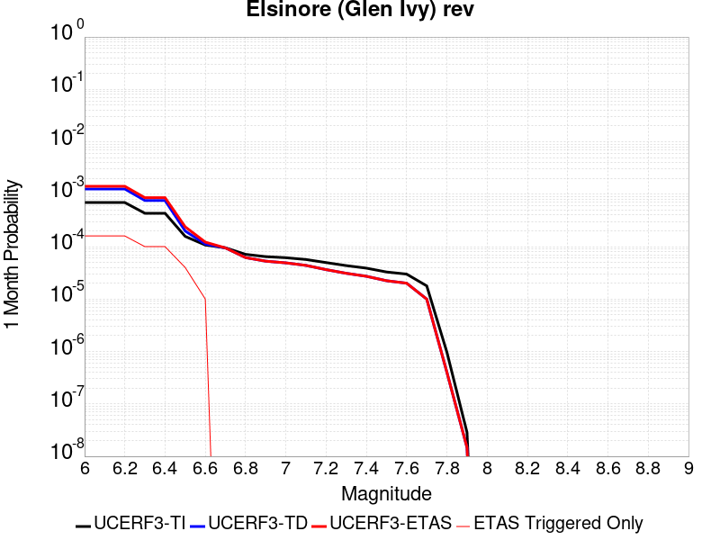 |  |  |

| Magnitude | 1 wk TI Prob | 1 wk TD Prob | 1 wk ETAS Prob | 1 wk ETAS/TD Gain | 1 wk ETAS Triggered Only | 1 mo TI Prob | 1 mo TD Prob | 1 mo ETAS Prob | 1 mo ETAS/TD Gain | 1 mo ETAS Triggered Only | 1 yr TI Prob | 1 yr TD Prob | 1 yr ETAS Prob | 1 yr ETAS/TD Gain | 1 yr ETAS Triggered Only | 10 yr TI Prob | 10 yr TD Prob | 10 yr ETAS Prob | 10 yr ETAS/TD Gain | 10 yr ETAS Triggered Only |
|-----|-----|-----|-----|-----|-----|-----|-----|-----|-----|-----|-----|-----|-----|-----|-----|-----|-----|-----|-----|-----|
| 6.0 | 1.6204086E-4 | 2.9360707E-4 | 4.0448597E-4 | 1.3776438 | 1.1091147E-4 | 6.94276E-4 | 0.0012578638 | 0.0013907902 | 1.1056763 | 1.3309377E-4 | 0.008420097 | 0.015234485 | 0.015431084 | 1.0129049 | 1.9964065E-4 | 0.081081145 | 0.13969168 | 0.13986343 | 1.0012295 | 1.9964065E-4 |
| 6.1 | 1.6204086E-4 | 2.9360707E-4 | 4.0448597E-4 | 1.3776438 | 1.1091147E-4 | 6.94276E-4 | 0.0012578638 | 0.0013907902 | 1.1056763 | 1.3309377E-4 | 0.008420097 | 0.015234485 | 0.015431084 | 1.0129049 | 1.9964065E-4 | 0.081081145 | 0.13969168 | 0.13986343 | 1.0012295 | 1.9964065E-4 |
| 6.2 | 1.6204086E-4 | 2.9360707E-4 | 4.0448597E-4 | 1.3776438 | 1.1091147E-4 | 6.94276E-4 | 0.0012578638 | 0.0013907902 | 1.1056763 | 1.3309377E-4 | 0.008420097 | 0.015234485 | 0.015431084 | 1.0129049 | 1.9964065E-4 | 0.081081145 | 0.13969168 | 0.13986343 | 1.0012295 | 1.9964065E-4 |
| 6.3 | 1.0111737E-4 | 1.7703383E-4 | 2.4356892E-4 | 1.3758327 | 6.654688E-5 | 4.332882E-4 | 7.5861247E-4 | 8.472743E-4 | 1.1168737 | 8.8729175E-5 | 0.005262531 | 0.009217682 | 0.009371527 | 1.0166901 | 1.5527607E-4 | 0.0513964 | 0.0870191 | 0.08716086 | 1.0016291 | 1.5527607E-4 |
| 6.4 | 1.0111737E-4 | 1.7703383E-4 | 2.4356892E-4 | 1.3758327 | 6.654688E-5 | 4.332882E-4 | 7.5861247E-4 | 8.472743E-4 | 1.1168737 | 8.8729175E-5 | 0.005262531 | 0.009217682 | 0.009371527 | 1.0166901 | 1.5527607E-4 | 0.0513964 | 0.0870191 | 0.08716086 | 1.0016291 | 1.5527607E-4 |
| 6.5 | 3.6624708E-5 | 4.6391084E-5 | 4.6391084E-5 | 1.0 | 0.0 | 1.569536E-4 | 1.9880582E-4 | 2.2098371E-4 | 1.1115555 | 2.2182294E-5 | 0.001909235 | 0.0024181372 | 0.002484523 | 1.0274533 | 6.654688E-5 | 0.01892915 | 0.023739954 | 0.023804922 | 1.0027366 | 6.654688E-5 |
| 6.6 | 2.5051324E-5 | 2.614772E-5 | 2.614772E-5 | 1.0 | 0.0 | 1.073584E-4 | 1.12057096E-4 | 1.342369E-4 | 1.1979331 | 2.2182294E-5 | 0.0013063047 | 0.0013634858 | 0.0014077899 | 1.0324932 | 4.4364588E-5 | 0.012986525 | 0.013564618 | 0.013608381 | 1.0032263 | 4.4364588E-5 |
| 6.7 | 2.2189772E-5 | 2.2072849E-5 | 2.2072849E-5 | 1.0 | 0.0 | 9.509556E-5 | 9.4594696E-5 | 9.4594696E-5 | 1.0 | 0.0 | 0.0011571734 | 0.0011511183 | 0.001173275 | 1.019248 | 2.2182294E-5 | 0.011511663 | 0.011465415 | 0.011487343 | 1.0019125 | 2.2182294E-5 |
| 6.8 | 1.6654378E-5 | 1.4437705E-5 | 1.4437705E-5 | 1.0 | 0.0 | 7.137396E-5 | 6.187444E-5 | 6.187444E-5 | 1.0 | 0.0 | 8.686314E-4 | 7.530661E-4 | 7.752317E-4 | 1.0294338 | 2.2182294E-5 | 0.008652439 | 0.00751048 | 0.007532496 | 1.0029314 | 2.2182294E-5 |
| 6.9 | 1.5042909E-5 | 1.2332022E-5 | 1.2332022E-5 | 1.0 | 0.0 | 6.446802E-5 | 5.285047E-5 | 5.285047E-5 | 1.0 | 0.0 | 7.8461546E-4 | 6.4326765E-4 | 6.654357E-4 | 1.0344616 | 2.2182294E-5 | 0.007818509 | 0.00641828 | 0.00644032 | 1.003434 | 2.2182294E-5 |
| 7.0 | 1.4361385E-5 | 1.1451324E-5 | 1.1451324E-5 | 1.0 | 0.0 | 6.154734E-5 | 4.9076196E-5 | 4.9076196E-5 | 1.0 | 0.0 | 7.490812E-4 | 5.973418E-4 | 6.195108E-4 | 1.0371128 | 2.2182294E-5 | 0.007465612 | 0.0059613534 | 0.0059834034 | 1.0036988 | 2.2182294E-5 |
| 7.1 | 1.3265571E-5 | 1.0244926E-5 | 1.0244926E-5 | 1.0 | 0.0 | 5.6851208E-5 | 4.39061E-5 | 4.39061E-5 | 1.0 | 0.0 | 6.919436E-4 | 5.344282E-4 | 5.5659865E-4 | 1.0414844 | 2.2182294E-5 | 0.006897931 | 0.0053347866 | 0.0053568506 | 1.0041358 | 2.2182294E-5 |
| 7.2 | 1.1596403E-5 | 8.505067E-6 | 8.505067E-6 | 1.0 | 0.0 | 4.9697923E-5 | 3.6449786E-5 | 3.6449786E-5 | 1.0 | 0.0 | 6.049042E-4 | 4.436875E-4 | 4.436875E-4 | 1.0 | 0.0 | 0.006032603 | 0.0044294316 | 0.0044294316 | 1.0 | 0.0 |
| 7.3 | 1.0150827E-5 | 7.2387597E-6 | 7.2387597E-6 | 1.0 | 0.0 | 4.3502816E-5 | 3.1022897E-5 | 3.1022897E-5 | 1.0 | 0.0 | 5.2951806E-4 | 3.7763975E-4 | 3.7763975E-4 | 1.0 | 0.0 | 0.005282581 | 0.0037703665 | 0.0037703665 | 1.0 | 0.0 |
| 7.4 | 9.080705E-6 | 6.352519E-6 | 6.352519E-6 | 1.0 | 0.0 | 3.8916725E-5 | 2.7224805E-5 | 2.7224805E-5 | 1.0 | 0.0 | 4.7370812E-4 | 3.3141294E-4 | 3.3141294E-4 | 1.0 | 0.0 | 0.004726996 | 0.0033093381 | 0.0033093381 | 1.0 | 0.0 |
| 7.5 | 7.671649E-6 | 5.2256332E-6 | 5.2256332E-6 | 1.0 | 0.0 | 3.287808E-5 | 2.2395385E-5 | 2.2395385E-5 | 1.0 | 0.0 | 4.0021708E-4 | 2.7263095E-4 | 2.7263095E-4 | 1.0 | 0.0 | 0.0039949706 | 0.00272309 | 0.00272309 | 1.0 | 0.0 |
| 7.6 | 6.990086E-6 | 4.687545E-6 | 4.687545E-6 | 1.0 | 0.0 | 2.9957167E-5 | 2.008933E-5 | 2.008933E-5 | 1.0 | 0.0 | 3.6466747E-4 | 2.445613E-4 | 2.445613E-4 | 1.0 | 0.0 | 0.0036406964 | 0.002443038 | 0.002443038 | 1.0 | 0.0 |
| 7.7 | 4.163505E-6 | 2.3295343E-6 | 2.3295343E-6 | 1.0 | 0.0 | 1.7843471E-5 | 9.983683E-6 | 9.983683E-6 | 1.0 | 0.0 | 2.172226E-4 | 1.21545316E-4 | 1.21545316E-4 | 1.0 | 0.0 | 0.0021701038 | 0.0012148614 | 0.0012148614 | 1.0 | 0.0 |
| 7.8 | 2.2692414E-7 | 9.3854695E-8 | 9.3854695E-8 | 1.0 | 0.0 | 9.725317E-7 | 4.0223435E-7 | 4.0223435E-7 | 1.0 | 0.0 | 1.1840509E-5 | 4.8971956E-6 | 4.8971956E-6 | 1.0 | 0.0 | 1.1839878E-4 | 4.8971204E-5 | 4.8971204E-5 | 1.0 | 0.0 |
| 7.9 | 6.676829E-9 | 3.439853E-9 | 3.439853E-9 | 1.0 | 0.0 | 2.861498E-8 | 1.4742227E-8 | 1.4742227E-8 | 1.0 | 0.0 | 3.4838732E-7 | 1.7948659E-7 | 1.7948659E-7 | 1.0 | 0.0 | 3.4838679E-6 | 1.7948646E-6 | 1.7948646E-6 | 1.0 | 0.0 |

## Sierra Nevada  (No Extension)
*[(top)](#table-of-contents)*

| 1 Week | 1 Month | 1 Year | 10 Year |
|-----|-----|-----|-----|
|  |  |  |  |

| Magnitude | 1 wk TI Prob | 1 wk TD Prob | 1 wk ETAS Prob | 1 wk ETAS/TD Gain | 1 wk ETAS Triggered Only | 1 mo TI Prob | 1 mo TD Prob | 1 mo ETAS Prob | 1 mo ETAS/TD Gain | 1 mo ETAS Triggered Only | 1 yr TI Prob | 1 yr TD Prob | 1 yr ETAS Prob | 1 yr ETAS/TD Gain | 1 yr ETAS Triggered Only | 10 yr TI Prob | 10 yr TD Prob | 10 yr ETAS Prob | 10 yr ETAS/TD Gain | 10 yr ETAS Triggered Only |
|-----|-----|-----|-----|-----|-----|-----|-----|-----|-----|-----|-----|-----|-----|-----|-----|-----|-----|-----|-----|-----|
| 6.0 | 7.7690465E-6 | 6.976322E-6 | 1.4006915E-4 | 20.077795 | 1.3309377E-4 | 3.329549E-5 | 2.9898381E-5 | 2.0735143E-4 | 6.935206 | 1.7745835E-4 | 4.0529718E-4 | 3.6398784E-4 | 5.635558E-4 | 1.548282 | 1.9964065E-4 | 0.004045588 | 0.0036374326 | 0.0038363473 | 1.0546854 | 1.9964065E-4 |
| 6.1 | 7.7690465E-6 | 6.976322E-6 | 1.4006915E-4 | 20.077795 | 1.3309377E-4 | 3.329549E-5 | 2.9898381E-5 | 2.0735143E-4 | 6.935206 | 1.7745835E-4 | 4.0529718E-4 | 3.6398784E-4 | 5.635558E-4 | 1.548282 | 1.9964065E-4 | 0.004045588 | 0.0036374326 | 0.0038363473 | 1.0546854 | 1.9964065E-4 |
| 6.2 | 7.7690465E-6 | 6.976322E-6 | 1.4006915E-4 | 20.077795 | 1.3309377E-4 | 3.329549E-5 | 2.9898381E-5 | 2.0735143E-4 | 6.935206 | 1.7745835E-4 | 4.0529718E-4 | 3.6398784E-4 | 5.635558E-4 | 1.548282 | 1.9964065E-4 | 0.004045588 | 0.0036374326 | 0.0038363473 | 1.0546854 | 1.9964065E-4 |
| 6.3 | 7.7690465E-6 | 6.976322E-6 | 1.4006915E-4 | 20.077795 | 1.3309377E-4 | 3.329549E-5 | 2.9898381E-5 | 2.0735143E-4 | 6.935206 | 1.7745835E-4 | 4.0529718E-4 | 3.6398784E-4 | 5.635558E-4 | 1.548282 | 1.9964065E-4 | 0.004045588 | 0.0036374326 | 0.0038363473 | 1.0546854 | 1.9964065E-4 |
| 6.4 | 7.7690465E-6 | 6.976322E-6 | 1.4006915E-4 | 20.077795 | 1.3309377E-4 | 3.329549E-5 | 2.9898381E-5 | 2.0735143E-4 | 6.935206 | 1.7745835E-4 | 4.0529718E-4 | 3.6398784E-4 | 5.635558E-4 | 1.548282 | 1.9964065E-4 | 0.004045588 | 0.0036374326 | 0.0038363473 | 1.0546854 | 1.9964065E-4 |
| 6.5 | 7.7690465E-6 | 6.976322E-6 | 1.4006915E-4 | 20.077795 | 1.3309377E-4 | 3.329549E-5 | 2.9898381E-5 | 2.0735143E-4 | 6.935206 | 1.7745835E-4 | 4.0529718E-4 | 3.6398784E-4 | 5.635558E-4 | 1.548282 | 1.9964065E-4 | 0.004045588 | 0.0036374326 | 0.0038363473 | 1.0546854 | 1.9964065E-4 |
| 6.6 | 2.653E-6 | 1.614854E-6 | 9.0343885E-5 | 55.945545 | 8.8729175E-5 | 1.136995E-5 | 6.9207845E-6 | 1.17831485E-4 | 17.025742 | 1.1091147E-4 | 1.3842035E-4 | 8.425733E-5 | 2.1733988E-4 | 2.5794775 | 1.3309377E-4 | 0.0013833415 | 8.422573E-4 | 9.752389E-4 | 1.1578872 | 1.3309377E-4 |
| 6.7 | 2.5902466E-6 | 1.5501876E-6 | 9.027922E-5 | 58.237617 | 8.8729175E-5 | 1.11010095E-5 | 6.643644E-6 | 1.1755438E-4 | 17.694262 | 1.1091147E-4 | 1.351464E-4 | 8.0883394E-5 | 2.139664E-4 | 2.6453686 | 1.3309377E-4 | 0.0013506424 | 8.0854254E-4 | 9.415287E-4 | 1.1644764 | 1.3309377E-4 |
| 6.8 | 2.5853892E-6 | 1.5469877E-6 | 9.027603E-5 | 58.356007 | 8.8729175E-5 | 1.1080193E-5 | 6.629931E-6 | 1.17540665E-4 | 17.728792 | 1.1091147E-4 | 1.34893E-4 | 8.071645E-5 | 2.1379947E-4 | 2.648772 | 1.3309377E-4 | 0.0013481114 | 8.068743E-4 | 9.3986065E-4 | 1.1648167 | 1.3309377E-4 |
| 6.9 | 2.458257E-6 | 1.4220619E-6 | 9.0151116E-5 | 63.39464 | 8.8729175E-5 | 1.0535345E-5 | 6.094537E-6 | 1.1700533E-4 | 19.198395 | 1.1091147E-4 | 1.2826028E-4 | 7.4198484E-5 | 2.0728237E-4 | 2.79362 | 1.3309377E-4 | 0.0012818627 | 7.4173906E-4 | 8.747341E-4 | 1.1793016 | 1.3309377E-4 |
| 7.0 | 2.4341468E-6 | 1.3990258E-6 | 9.012808E-5 | 64.42203 | 8.8729175E-5 | 1.0432016E-5 | 5.9958115E-6 | 1.16906616E-4 | 19.498049 | 1.1091147E-4 | 1.270024E-4 | 7.2996576E-5 | 2.0608063E-4 | 2.8231547 | 1.3309377E-4 | 0.0012692984 | 7.297279E-4 | 8.6272456E-4 | 1.1822551 | 1.3309377E-4 |
| 7.1 | 2.3652476E-6 | 1.3339754E-6 | 9.006303E-5 | 67.51476 | 8.8729175E-5 | 1.0136736E-5 | 5.717025E-6 | 1.1662786E-4 | 20.400095 | 1.1091147E-4 | 1.2340778E-4 | 6.9602575E-5 | 2.0268708E-4 | 2.912063 | 1.3309377E-4 | 0.0012333926 | 6.9580943E-4 | 8.288106E-4 | 1.1911459 | 1.3309377E-4 |
| 7.2 | 2.272158E-6 | 1.2502821E-6 | 8.9979345E-5 | 71.96723 | 8.8729175E-5 | 9.737784E-6 | 5.3583412E-6 | 1.1626922E-4 | 21.698734 | 1.1091147E-4 | 1.1855107E-4 | 6.5235865E-5 | 1.9832095E-4 | 3.04006 | 1.3309377E-4 | 0.0011848784 | 6.5216864E-4 | 7.851756E-4 | 1.2039456 | 1.3309377E-4 |
| 7.3 | 2.1382127E-6 | 1.1419703E-6 | 8.987104E-5 | 78.698235 | 8.8729175E-5 | 9.163737E-6 | 4.8941492E-6 | 1.1580508E-4 | 23.661943 | 1.1091147E-4 | 1.1156279E-4 | 5.958465E-5 | 1.9267049E-4 | 3.2335591 | 1.3309377E-4 | 0.001115068 | 5.956879E-4 | 7.287024E-4 | 1.2232956 | 1.3309377E-4 |
| 7.4 | 1.9048055E-6 | 9.575242E-7 | 6.750434E-5 | 70.49883 | 6.654688E-5 | 8.163426E-6 | 4.1036687E-6 | 9.283248E-5 | 22.621826 | 8.8729175E-5 | 9.9385186E-5 | 4.996103E-5 | 1.6086696E-4 | 3.2198486 | 1.1091147E-4 | 9.934074E-4 | 4.994987E-4 | 6.1035476E-4 | 1.2219347 | 1.1091147E-4 |
| 7.5 | 1.5373403E-6 | 7.560042E-7 | 6.730283E-5 | 89.024414 | 6.654688E-5 | 6.5885843E-6 | 3.2400142E-6 | 9.1968905E-5 | 28.38534 | 8.8729175E-5 | 8.021306E-5 | 3.9446462E-5 | 1.2817213E-4 | 3.2492683 | 8.8729175E-5 | 8.0184115E-4 | 3.943951E-4 | 4.8308927E-4 | 1.2248867 | 8.8729175E-5 |
| 7.6 | 1.0680322E-6 | 4.6596554E-7 | 2.264825E-5 | 48.60499 | 2.2182294E-5 | 4.577273E-6 | 1.9969937E-6 | 4.6361492E-5 | 23.215643 | 4.4364588E-5 | 5.5726876E-5 | 2.4313129E-5 | 6.8676636E-5 | 2.824673 | 4.4364588E-5 | 5.5712904E-4 | 2.4310495E-4 | 2.8745877E-4 | 1.1824472 | 4.4364588E-5 |
| 7.7 | 5.509146E-7 | 1.5580486E-7 | 1.5580486E-7 | 1.0 | 0.0 | 2.3610605E-6 | 6.677349E-7 | 2.2850014E-5 | 34.22019 | 2.2182294E-5 | 2.8745531E-5 | 8.129644E-6 | 3.0311758E-5 | 3.7285469 | 2.2182294E-5 | 2.8741814E-4 | 8.1293576E-5 | 1.0347407E-4 | 1.2728443 | 2.2182294E-5 |

## Death Valley (Fish Lake Valley)
*[(top)](#table-of-contents)*

| 1 Week | 1 Month | 1 Year | 10 Year |
|-----|-----|-----|-----|
|  |  |  |  |

| Magnitude | 1 wk TI Prob | 1 wk TD Prob | 1 wk ETAS Prob | 1 wk ETAS/TD Gain | 1 wk ETAS Triggered Only | 1 mo TI Prob | 1 mo TD Prob | 1 mo ETAS Prob | 1 mo ETAS/TD Gain | 1 mo ETAS Triggered Only | 1 yr TI Prob | 1 yr TD Prob | 1 yr ETAS Prob | 1 yr ETAS/TD Gain | 1 yr ETAS Triggered Only | 10 yr TI Prob | 10 yr TD Prob | 10 yr ETAS Prob | 10 yr ETAS/TD Gain | 10 yr ETAS Triggered Only |
|-----|-----|-----|-----|-----|-----|-----|-----|-----|-----|-----|-----|-----|-----|-----|-----|-----|-----|-----|-----|-----|
| 6.0 | 3.872328E-5 | 4.7267473E-5 | 1.13811206E-4 | 2.4078124 | 6.654688E-5 | 1.6594635E-4 | 2.0256084E-4 | 3.1344985E-4 | 1.5474355 | 1.1091147E-4 | 0.0020185246 | 0.002463534 | 0.0026184276 | 1.0628746 | 1.5527607E-4 | 0.02000288 | 0.024388181 | 0.024582952 | 1.0079863 | 1.9964065E-4 |
| 6.1 | 3.872328E-5 | 4.7267473E-5 | 1.13811206E-4 | 2.4078124 | 6.654688E-5 | 1.6594635E-4 | 2.0256084E-4 | 3.1344985E-4 | 1.5474355 | 1.1091147E-4 | 0.0020185246 | 0.002463534 | 0.0026184276 | 1.0628746 | 1.5527607E-4 | 0.02000288 | 0.024388181 | 0.024582952 | 1.0079863 | 1.9964065E-4 |
| 6.2 | 3.872328E-5 | 4.7267473E-5 | 1.13811206E-4 | 2.4078124 | 6.654688E-5 | 1.6594635E-4 | 2.0256084E-4 | 3.1344985E-4 | 1.5474355 | 1.1091147E-4 | 0.0020185246 | 0.002463534 | 0.0026184276 | 1.0628746 | 1.5527607E-4 | 0.02000288 | 0.024388181 | 0.024582952 | 1.0079863 | 1.9964065E-4 |
| 6.3 | 2.8356371E-5 | 3.3609853E-5 | 1.00154495E-4 | 2.979915 | 6.654688E-5 | 1.2152165E-4 | 1.4403471E-4 | 2.549302E-4 | 1.769922 | 1.1091147E-4 | 0.0014785219 | 0.0017522911 | 0.0019072951 | 1.088458 | 1.5527607E-4 | 0.014687235 | 0.017391782 | 0.01758795 | 1.0112793 | 1.9964065E-4 |
| 6.4 | 2.8356371E-5 | 3.3609853E-5 | 1.00154495E-4 | 2.979915 | 6.654688E-5 | 1.2152165E-4 | 1.4403471E-4 | 2.549302E-4 | 1.769922 | 1.1091147E-4 | 0.0014785219 | 0.0017522911 | 0.0019072951 | 1.088458 | 1.5527607E-4 | 0.014687235 | 0.017391782 | 0.01758795 | 1.0112793 | 1.9964065E-4 |
| 6.5 | 2.4448687E-5 | 2.8607552E-5 | 9.515253E-5 | 3.3261333 | 6.654688E-5 | 1.0477588E-4 | 1.2259831E-4 | 2.3349619E-4 | 1.9045627 | 1.1091147E-4 | 0.0012748998 | 0.0014916632 | 0.0016467075 | 1.1039406 | 1.5527607E-4 | 0.012676105 | 0.014821377 | 0.015018058 | 1.0132701 | 1.9964065E-4 |
| 6.6 | 2.1298161E-5 | 2.4660083E-5 | 9.120532E-5 | 3.6985002 | 6.654688E-5 | 9.127464E-5 | 1.0568198E-4 | 1.9440179E-4 | 1.8394979 | 8.8729175E-5 | 0.0011107022 | 0.0012859525 | 0.0014188752 | 1.1033651 | 1.3309377E-4 | 0.011051672 | 0.012788526 | 0.012963714 | 1.0136989 | 1.7745835E-4 |
| 6.7 | 1.8959729E-5 | 2.1781025E-5 | 8.832646E-5 | 4.055202 | 6.654688E-5 | 8.125345E-5 | 9.334405E-5 | 1.8206495E-4 | 1.9504718 | 8.8729175E-5 | 9.888117E-4 | 0.001135897 | 0.0012688396 | 1.1170375 | 1.3309377E-4 | 0.009844234 | 0.01130357 | 0.011479022 | 1.0155219 | 1.7745835E-4 |
| 6.8 | 1.6691629E-5 | 1.9018353E-5 | 8.556397E-5 | 4.499021 | 6.654688E-5 | 7.153359E-5 | 8.150477E-5 | 1.7022672E-4 | 2.0885491 | 8.8729175E-5 | 8.7057345E-4 | 9.918857E-4 | 0.0011248474 | 1.1340494 | 1.3309377E-4 | 0.008671708 | 0.009876343 | 0.0100520495 | 1.0177906 | 1.7745835E-4 |
| 6.9 | 1.450505E-5 | 1.638954E-5 | 8.293533E-5 | 5.06026 | 6.654688E-5 | 6.216302E-5 | 7.0239046E-5 | 1.58962E-4 | 2.2631571 | 8.8729175E-5 | 7.5657194E-4 | 8.5483363E-4 | 9.878136E-4 | 1.1555624 | 1.3309377E-4 | 0.007540013 | 0.008516385 | 0.008692333 | 1.0206598 | 1.7745835E-4 |
| 7.0 | 1.2940855E-5 | 1.4537972E-5 | 8.108389E-5 | 5.5773864 | 6.654688E-5 | 5.545963E-5 | 6.230414E-5 | 1.5102778E-4 | 2.424041 | 8.8729175E-5 | 6.750118E-4 | 7.5829466E-4 | 8.912875E-4 | 1.1753842 | 1.3309377E-4 | 0.006729651 | 0.0075576897 | 0.007733807 | 1.023303 | 1.7745835E-4 |
| 7.1 | 1.2544658E-5 | 1.4078208E-5 | 8.062415E-5 | 5.7268763 | 6.654688E-5 | 5.3761712E-5 | 6.0333812E-5 | 1.4905764E-4 | 2.4705489 | 8.8729175E-5 | 6.5435225E-4 | 7.343222E-4 | 8.6731825E-4 | 1.181114 | 1.3309377E-4 | 0.006524288 | 0.007319551 | 0.00749571 | 1.0240669 | 1.7745835E-4 |
| 7.2 | 1.2489416E-5 | 1.4015674E-5 | 8.056162E-5 | 5.7479663 | 6.654688E-5 | 5.3524967E-5 | 6.0065824E-5 | 1.4878967E-4 | 2.4771104 | 8.8729175E-5 | 6.514716E-4 | 7.310616E-4 | 8.640581E-4 | 1.1819223 | 1.3309377E-4 | 0.006495651 | 0.0072871596 | 0.007463325 | 1.0241747 | 1.7745835E-4 |
| 7.3 | 1.2368307E-5 | 1.3879812E-5 | 8.042577E-5 | 5.794442 | 6.654688E-5 | 5.3005948E-5 | 5.9483587E-5 | 1.4820749E-4 | 2.4915695 | 8.8729175E-5 | 6.451563E-4 | 7.2397763E-4 | 8.5697504E-4 | 1.1837038 | 1.3309377E-4 | 0.0064328653 | 0.007216782 | 0.0073929597 | 1.0244123 | 1.7745835E-4 |
| 7.4 | 1.2161707E-5 | 1.36478675E-5 | 8.0193844E-5 | 5.8759246 | 6.654688E-5 | 5.212056E-5 | 5.8489582E-5 | 1.4721356E-4 | 2.5169194 | 8.8729175E-5 | 6.3438306E-4 | 7.118836E-4 | 8.448826E-4 | 1.186827 | 1.3309377E-4 | 0.006325751 | 0.0070966207 | 0.0072728195 | 1.0248286 | 1.7745835E-4 |
| 7.5 | 1.1707948E-5 | 1.3145515E-5 | 7.969152E-5 | 6.062259 | 6.654688E-5 | 5.0175953E-5 | 5.6336736E-5 | 1.4506091E-4 | 2.5748901 | 8.8729175E-5 | 6.10721E-4 | 6.856895E-4 | 8.18692E-4 | 1.193969 | 1.3309377E-4 | 0.0060904534 | 0.006836321 | 0.0070125666 | 1.0257807 | 1.7745835E-4 |
| 7.6 | 1.0319538E-5 | 1.1579622E-5 | 7.812573E-5 | 6.746829 | 6.654688E-5 | 4.4225842E-5 | 4.9626036E-5 | 1.383508E-4 | 2.7878673 | 8.8729175E-5 | 5.383166E-4 | 6.040347E-4 | 7.3704805E-4 | 1.2202082 | 1.3309377E-4 | 0.0053701443 | 0.0060244603 | 0.006178801 | 1.025619 | 1.5527607E-4 |
| 7.7 | 8.937764E-6 | 1.0022779E-5 | 5.438692E-5 | 5.4263315 | 4.4364588E-5 | 3.830414E-5 | 4.295409E-5 | 1.0949811E-4 | 2.5491896 | 6.654688E-5 | 4.6625308E-4 | 5.228456E-4 | 6.3369906E-4 | 1.2120196 | 1.1091147E-4 | 0.0046527605 | 0.005216664 | 0.005349064 | 1.0253801 | 1.3309377E-4 |
| 7.8 | 3.108007E-7 | 3.284654E-7 | 3.284654E-7 | 1.0 | 0.0 | 1.3320023E-6 | 1.407708E-6 | 1.407708E-6 | 1.0 | 0.0 | 1.6217007E-5 | 1.7138715E-5 | 1.7138715E-5 | 1.0 | 0.0 | 1.6215823E-4 | 1.7137431E-4 | 1.7137431E-4 | 1.0 | 0.0 |
| 7.9 | 2.5591178E-9 | 2.6696718E-9 | 2.6696718E-9 | 1.0 | 0.0 | 1.0967647E-8 | 1.14414505E-8 | 1.14414505E-8 | 1.0 | 0.0 | 1.335311E-7 | 1.3929966E-7 | 1.3929966E-7 | 1.0 | 0.0 | 1.3353102E-6 | 1.3929966E-6 | 1.3929966E-6 | 1.0 | 0.0 |

## Ludlow
*[(top)](#table-of-contents)*

| 1 Week | 1 Month | 1 Year | 10 Year |
|-----|-----|-----|-----|
|  | 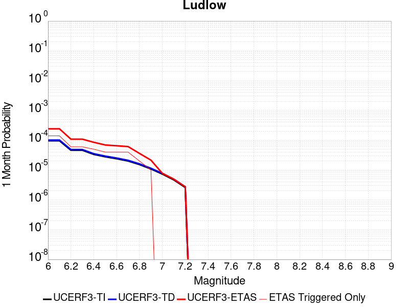 |  |  |

| Magnitude | 1 wk TI Prob | 1 wk TD Prob | 1 wk ETAS Prob | 1 wk ETAS/TD Gain | 1 wk ETAS Triggered Only | 1 mo TI Prob | 1 mo TD Prob | 1 mo ETAS Prob | 1 mo ETAS/TD Gain | 1 mo ETAS Triggered Only | 1 yr TI Prob | 1 yr TD Prob | 1 yr ETAS Prob | 1 yr ETAS/TD Gain | 1 yr ETAS Triggered Only | 10 yr TI Prob | 10 yr TD Prob | 10 yr ETAS Prob | 10 yr ETAS/TD Gain | 10 yr ETAS Triggered Only |
|-----|-----|-----|-----|-----|-----|-----|-----|-----|-----|-----|-----|-----|-----|-----|-----|-----|-----|-----|-----|-----|
| 6.0 | 2.2407607E-5 | 2.3657254E-5 | 1.5674788E-4 | 6.625785 | 1.3309377E-4 | 9.602906E-5 | 1.0138454E-4 | 2.3446481E-4 | 2.3126287 | 1.3309377E-4 | 0.0011685267 | 0.001233702 | 0.0014109414 | 1.1436647 | 1.7745835E-4 | 0.011624013 | 0.012273042 | 0.012470232 | 1.0160669 | 1.9964065E-4 |
| 6.1 | 2.2407607E-5 | 2.3657254E-5 | 1.5674788E-4 | 6.625785 | 1.3309377E-4 | 9.602906E-5 | 1.0138454E-4 | 2.3446481E-4 | 2.3126287 | 1.3309377E-4 | 0.0011685267 | 0.001233702 | 0.0014109414 | 1.1436647 | 1.7745835E-4 | 0.011624013 | 0.012273042 | 0.012470232 | 1.0160669 | 1.9964065E-4 |
| 6.2 | 1.0781252E-5 | 1.1365663E-5 | 7.791179E-5 | 6.8550143 | 6.654688E-5 | 4.620455E-5 | 4.8709102E-5 | 1.1525274E-4 | 2.366144 | 6.654688E-5 | 5.623952E-4 | 5.9287593E-4 | 6.815525E-4 | 1.1495702 | 8.8729175E-5 | 0.00560974 | 0.0059133614 | 0.006023617 | 1.0186452 | 1.1091147E-4 |
| 6.3 | 1.0781252E-5 | 1.1365663E-5 | 7.791179E-5 | 6.8550143 | 6.654688E-5 | 4.620455E-5 | 4.8709102E-5 | 1.1525274E-4 | 2.366144 | 6.654688E-5 | 5.623952E-4 | 5.9287593E-4 | 6.815525E-4 | 1.1495702 | 8.8729175E-5 | 0.00560974 | 0.0059133614 | 0.006023617 | 1.0186452 | 1.1091147E-4 |
| 6.4 | 7.814439E-6 | 8.237729E-6 | 7.478406E-5 | 9.0782385 | 6.654688E-5 | 3.3490025E-5 | 3.530408E-5 | 1.01848615E-4 | 2.8848963 | 6.654688E-5 | 4.0766477E-4 | 4.2974384E-4 | 5.1843486E-4 | 1.2063812 | 8.8729175E-5 | 0.0040691774 | 0.0042892746 | 0.004377623 | 1.0205976 | 8.8729175E-5 |
| 6.5 | 6.4986366E-6 | 6.85092E-6 | 5.1215204E-5 | 7.4756684 | 4.4364588E-5 | 2.7851002E-5 | 2.9360759E-5 | 7.372405E-5 | 2.510972 | 4.4364588E-5 | 3.390332E-4 | 3.5740953E-4 | 4.2393262E-4 | 1.1861258 | 6.654688E-5 | 0.003385164 | 0.0035684432 | 0.0036347527 | 1.0185822 | 6.654688E-5 |
| 6.6 | 5.582177E-6 | 5.8860055E-6 | 5.025033E-5 | 8.537255 | 4.4364588E-5 | 2.3923398E-5 | 2.5225498E-5 | 6.958897E-5 | 2.7586756 | 4.4364588E-5 | 2.9122844E-4 | 3.0707786E-4 | 3.7360433E-4 | 1.2166436 | 6.654688E-5 | 0.0029084706 | 0.003066609 | 0.0031329517 | 1.021634 | 6.654688E-5 |
| 6.7 | 4.6858763E-6 | 4.940427E-6 | 4.9304796E-5 | 9.979865 | 4.4364588E-5 | 2.0082172E-5 | 2.1173091E-5 | 6.553674E-5 | 3.0952845 | 4.4364588E-5 | 2.4447302E-4 | 2.5775246E-4 | 3.2428218E-4 | 1.2581148 | 6.654688E-5 | 0.0024420423 | 0.0025745912 | 0.0026409668 | 1.025781 | 6.654688E-5 |
| 6.8 | 3.5584908E-6 | 3.7520183E-6 | 2.5934229E-5 | 6.912074 | 2.2182294E-5 | 1.5250586E-5 | 1.6079981E-5 | 3.826192E-5 | 2.3794754 | 2.2182294E-5 | 1.8566006E-4 | 1.957566E-4 | 2.4011251E-4 | 1.226587 | 4.4364588E-5 | 0.0018550502 | 0.0019558826 | 0.0020001605 | 1.0226383 | 4.4364588E-5 |
| 6.9 | 2.532834E-6 | 2.6710034E-6 | 2.4853238E-5 | 9.3048315 | 2.2182294E-5 | 1.0854958E-5 | 1.1447109E-5 | 3.362915E-5 | 2.9377854 | 2.2182294E-5 | 1.3215111E-4 | 1.3935992E-4 | 1.6153912E-4 | 1.1591505 | 2.2182294E-5 | 0.0013207254 | 0.0013927529 | 0.0014149043 | 1.0159048 | 2.2182294E-5 |
| 7.0 | 1.7083285E-6 | 1.8019439E-6 | 1.8019439E-6 | 1.0 | 0.0 | 7.3213873E-6 | 7.722595E-6 | 7.722595E-6 | 1.0 | 0.0 | 8.913424E-5 | 9.40187E-5 | 9.40187E-5 | 1.0 | 0.0 | 8.9098496E-4 | 9.3980576E-4 | 9.3980576E-4 | 1.0 | 0.0 |
| 7.1 | 1.0905424E-6 | 1.1497619E-6 | 1.1497619E-6 | 1.0 | 0.0 | 4.6737446E-6 | 4.9275427E-6 | 4.9275427E-6 | 1.0 | 0.0 | 5.6901354E-5 | 5.999128E-5 | 5.999128E-5 | 1.0 | 0.0 | 5.6886784E-4 | 5.997606E-4 | 5.997606E-4 | 1.0 | 0.0 |
| 7.2 | 6.06668E-7 | 6.387277E-7 | 6.387277E-7 | 1.0 | 0.0 | 2.600003E-6 | 2.7374022E-6 | 2.7374022E-6 | 1.0 | 0.0 | 3.1654577E-5 | 3.3327433E-5 | 3.3327433E-5 | 1.0 | 0.0 | 3.1650066E-4 | 3.3323118E-4 | 3.3323118E-4 | 1.0 | 0.0 |

## Cady
*[(top)](#table-of-contents)*

| 1 Week | 1 Month | 1 Year | 10 Year |
|-----|-----|-----|-----|
|  |  |  |  |

| Magnitude | 1 wk TI Prob | 1 wk TD Prob | 1 wk ETAS Prob | 1 wk ETAS/TD Gain | 1 wk ETAS Triggered Only | 1 mo TI Prob | 1 mo TD Prob | 1 mo ETAS Prob | 1 mo ETAS/TD Gain | 1 mo ETAS Triggered Only | 1 yr TI Prob | 1 yr TD Prob | 1 yr ETAS Prob | 1 yr ETAS/TD Gain | 1 yr ETAS Triggered Only | 10 yr TI Prob | 10 yr TD Prob | 10 yr ETAS Prob | 10 yr ETAS/TD Gain | 10 yr ETAS Triggered Only |
|-----|-----|-----|-----|-----|-----|-----|-----|-----|-----|-----|-----|-----|-----|-----|-----|-----|-----|-----|-----|-----|
| 6.0 | 1.9892565E-5 | 2.1858728E-5 | 6.622235E-5 | 3.0295608 | 4.4364588E-5 | 8.525106E-5 | 9.3677416E-5 | 2.045785E-4 | 2.1838615 | 1.1091147E-4 | 0.0010374374 | 0.0011400167 | 0.0012729587 | 1.1166141 | 1.3309377E-4 | 0.010326075 | 0.011350701 | 0.011526144 | 1.0154567 | 1.7745835E-4 |
| 6.1 | 1.9892565E-5 | 2.1858728E-5 | 6.622235E-5 | 3.0295608 | 4.4364588E-5 | 8.525106E-5 | 9.3677416E-5 | 2.045785E-4 | 2.1838615 | 1.1091147E-4 | 0.0010374374 | 0.0011400167 | 0.0012729587 | 1.1166141 | 1.3309377E-4 | 0.010326075 | 0.011350701 | 0.011526144 | 1.0154567 | 1.7745835E-4 |
| 6.2 | 1.9892565E-5 | 2.1858728E-5 | 6.622235E-5 | 3.0295608 | 4.4364588E-5 | 8.525106E-5 | 9.3677416E-5 | 2.045785E-4 | 2.1838615 | 1.1091147E-4 | 0.0010374374 | 0.0011400167 | 0.0012729587 | 1.1166141 | 1.3309377E-4 | 0.010326075 | 0.011350701 | 0.011526144 | 1.0154567 | 1.7745835E-4 |
| 6.3 | 1.1117327E-5 | 1.2176583E-5 | 3.4358607E-5 | 2.8216953 | 2.2182294E-5 | 4.764482E-5 | 5.2184492E-5 | 1.4090903E-4 | 2.7002091 | 8.8729175E-5 | 5.7992124E-4 | 6.351925E-4 | 7.460335E-4 | 1.1744999 | 1.1091147E-4 | 0.0057841022 | 0.0063368753 | 0.0064911675 | 1.0243483 | 1.5527607E-4 |
| 6.4 | 1.1117327E-5 | 1.2176583E-5 | 3.4358607E-5 | 2.8216953 | 2.2182294E-5 | 4.764482E-5 | 5.2184492E-5 | 1.4090903E-4 | 2.7002091 | 8.8729175E-5 | 5.7992124E-4 | 6.351925E-4 | 7.460335E-4 | 1.1744999 | 1.1091147E-4 | 0.0057841022 | 0.0063368753 | 0.0064911675 | 1.0243483 | 1.5527607E-4 |
| 6.5 | 6.103093E-6 | 6.672021E-6 | 6.672021E-6 | 1.0 | 0.0 | 2.615585E-5 | 2.8594131E-5 | 5.077579E-5 | 1.7757417 | 2.2182294E-5 | 3.1840094E-4 | 3.480905E-4 | 3.7026507E-4 | 1.0637034 | 2.2182294E-5 | 0.0031794512 | 0.0034766865 | 0.003520897 | 1.0127162 | 4.4364588E-5 |
| 6.6 | 5.817237E-6 | 6.3656585E-6 | 6.3656585E-6 | 1.0 | 0.0 | 2.4930776E-5 | 2.728118E-5 | 4.946287E-5 | 1.8130766 | 2.2182294E-5 | 3.034899E-4 | 3.3211018E-4 | 3.542851E-4 | 1.0667698 | 2.2182294E-5 | 0.0030307577 | 0.0033173605 | 0.0033615779 | 1.0133291 | 4.4364588E-5 |
| 6.7 | 4.8846314E-6 | 5.3405684E-6 | 5.3405684E-6 | 1.0 | 0.0 | 2.0933967E-5 | 2.2888014E-5 | 2.2888014E-5 | 1.0 | 0.0 | 2.5484123E-4 | 2.7863772E-4 | 2.7863772E-4 | 1.0 | 0.0 | 0.0025454918 | 0.0027840391 | 0.0028061597 | 1.0079455 | 2.2182294E-5 |
| 6.8 | 1.7788773E-6 | 1.9399079E-6 | 1.9399079E-6 | 1.0 | 0.0 | 7.6237375E-6 | 8.313874E-6 | 8.313874E-6 | 1.0 | 0.0 | 9.281505E-5 | 1.01218284E-4 | 1.01218284E-4 | 1.0 | 0.0 | 9.2776294E-4 | 0.0010118765 | 0.0010118765 | 1.0 | 0.0 |
| 6.9 | 7.5455404E-7 | 8.297092E-7 | 8.297092E-7 | 1.0 | 0.0 | 3.233799E-6 | 3.5558937E-6 | 3.5558937E-6 | 1.0 | 0.0 | 3.937079E-5 | 4.3292483E-5 | 4.3292483E-5 | 1.0 | 0.0 | 3.9363815E-4 | 4.3287344E-4 | 4.3287344E-4 | 1.0 | 0.0 |
| 7.0 | 6.8578805E-7 | 7.541816E-7 | 7.541816E-7 | 1.0 | 0.0 | 2.9390883E-6 | 3.2322048E-6 | 3.2322048E-6 | 1.0 | 0.0 | 3.578281E-5 | 3.9351715E-5 | 3.9351715E-5 | 1.0 | 0.0 | 3.577705E-4 | 3.9347992E-4 | 3.9347992E-4 | 1.0 | 0.0 |

## Calico-Hidalgo
*[(top)](#table-of-contents)*

| 1 Week | 1 Month | 1 Year | 10 Year |
|-----|-----|-----|-----|
|  |  |  |  |

| Magnitude | 1 wk TI Prob | 1 wk TD Prob | 1 wk ETAS Prob | 1 wk ETAS/TD Gain | 1 wk ETAS Triggered Only | 1 mo TI Prob | 1 mo TD Prob | 1 mo ETAS Prob | 1 mo ETAS/TD Gain | 1 mo ETAS Triggered Only | 1 yr TI Prob | 1 yr TD Prob | 1 yr ETAS Prob | 1 yr ETAS/TD Gain | 1 yr ETAS Triggered Only | 10 yr TI Prob | 10 yr TD Prob | 10 yr ETAS Prob | 10 yr ETAS/TD Gain | 10 yr ETAS Triggered Only |
|-----|-----|-----|-----|-----|-----|-----|-----|-----|-----|-----|-----|-----|-----|-----|-----|-----|-----|-----|-----|-----|
| 6.0 | 4.0906612E-5 | 5.0703686E-5 | 1.172472E-4 | 2.3123999 | 6.654688E-5 | 1.7530227E-4 | 2.172857E-4 | 3.059956E-4 | 1.4082638 | 8.8729175E-5 | 0.0021322158 | 0.002642648 | 0.0027753902 | 1.0502307 | 1.3309377E-4 | 0.02111873 | 0.026152607 | 0.026303822 | 1.005782 | 1.5527607E-4 |
| 6.1 | 4.0906612E-5 | 5.0703686E-5 | 1.172472E-4 | 2.3123999 | 6.654688E-5 | 1.7530227E-4 | 2.172857E-4 | 3.059956E-4 | 1.4082638 | 8.8729175E-5 | 0.0021322158 | 0.002642648 | 0.0027753902 | 1.0502307 | 1.3309377E-4 | 0.02111873 | 0.026152607 | 0.026303822 | 1.005782 | 1.5527607E-4 |
| 6.2 | 4.0906612E-5 | 5.0703686E-5 | 1.172472E-4 | 2.3123999 | 6.654688E-5 | 1.7530227E-4 | 2.172857E-4 | 3.059956E-4 | 1.4082638 | 8.8729175E-5 | 0.0021322158 | 0.002642648 | 0.0027753902 | 1.0502307 | 1.3309377E-4 | 0.02111873 | 0.026152607 | 0.026303822 | 1.005782 | 1.5527607E-4 |
| 6.3 | 2.4242801E-5 | 3.0090669E-5 | 7.445392E-5 | 2.4743192 | 4.4364588E-5 | 1.0389358E-4 | 1.2895382E-4 | 1.9549212E-4 | 1.5159855 | 6.654688E-5 | 0.0012641704 | 0.0015689151 | 0.0016796526 | 1.0705822 | 1.1091147E-4 | 0.01257003 | 0.01558206 | 0.01571308 | 1.0084084 | 1.3309377E-4 |
| 6.4 | 2.4242801E-5 | 3.0090669E-5 | 7.445392E-5 | 2.4743192 | 4.4364588E-5 | 1.0389358E-4 | 1.2895382E-4 | 1.9549212E-4 | 1.5159855 | 6.654688E-5 | 0.0012641704 | 0.0015689151 | 0.0016796526 | 1.0705822 | 1.1091147E-4 | 0.01257003 | 0.01558206 | 0.01571308 | 1.0084084 | 1.3309377E-4 |
| 6.5 | 2.0286952E-5 | 2.5315738E-5 | 6.9679205E-5 | 2.7524066 | 4.4364588E-5 | 8.694118E-5 | 1.0849161E-4 | 1.7503127E-4 | 1.6133162 | 6.654688E-5 | 0.0010579949 | 0.001320102 | 0.0014087141 | 1.0671252 | 8.8729175E-5 | 0.010529719 | 0.013124538 | 0.013233993 | 1.0083398 | 1.1091147E-4 |
| 6.6 | 2.0269223E-5 | 2.5296687E-5 | 6.966016E-5 | 2.7537262 | 4.4364588E-5 | 8.6865206E-5 | 1.08409964E-4 | 1.7494963E-4 | 1.6137781 | 6.654688E-5 | 0.0010570707 | 0.0013191093 | 0.0014077214 | 1.0671757 | 8.8729175E-5 | 0.010520565 | 0.013114728 | 0.0132241845 | 1.0083461 | 1.1091147E-4 |
| 6.7 | 1.799852E-5 | 2.25406E-5 | 6.690419E-5 | 2.9681635 | 4.4364588E-5 | 7.713423E-5 | 9.659908E-5 | 1.6313953E-4 | 1.6888312 | 6.654688E-5 | 9.3870464E-4 | 0.0011754738 | 0.0012640987 | 1.075395 | 8.8729175E-5 | 0.009347493 | 0.011694173 | 0.011803788 | 1.0093734 | 1.1091147E-4 |
| 6.8 | 1.7458793E-5 | 2.184212E-5 | 6.620574E-5 | 3.031104 | 4.4364588E-5 | 7.4821255E-5 | 9.3605806E-5 | 1.6014646E-4 | 1.7108603 | 6.654688E-5 | 9.10568E-4 | 0.0011390693 | 0.0012276975 | 1.0778074 | 8.8729175E-5 | 0.009068459 | 0.011333893 | 0.011443548 | 1.0096749 | 1.1091147E-4 |
| 6.9 | 1.542884E-5 | 1.9025927E-5 | 6.338967E-5 | 3.331752 | 4.4364588E-5 | 6.612192E-5 | 8.153721E-5 | 1.4807867E-4 | 1.816087 | 6.654688E-5 | 8.04737E-4 | 9.922766E-4 | 0.0010809178 | 1.089331 | 8.8729175E-5 | 0.008018291 | 0.009879857 | 0.00996771 | 1.008892 | 8.8729175E-5 |
| 7.0 | 1.468253E-5 | 1.8030598E-5 | 6.2394385E-5 | 3.4604723 | 4.4364588E-5 | 6.292361E-5 | 7.7271776E-5 | 1.4381352E-4 | 1.8611389 | 6.654688E-5 | 7.658257E-4 | 9.4039086E-4 | 0.0010290366 | 1.0942647 | 8.8729175E-5 | 0.0076319184 | 0.009365481 | 0.00945338 | 1.0093853 | 8.8729175E-5 |
| 7.1 | 1.3139281E-5 | 1.6200942E-5 | 3.8382877E-5 | 2.3691757 | 2.2182294E-5 | 5.6309986E-5 | 6.943083E-5 | 1.1379234E-4 | 1.6389309 | 4.4364588E-5 | 6.853584E-4 | 8.4500515E-4 | 8.8933227E-4 | 1.0524578 | 4.4364588E-5 | 0.0068324856 | 0.0084192185 | 0.0084632095 | 1.0052251 | 4.4364588E-5 |
| 7.2 | 1.1127404E-5 | 1.3866597E-5 | 3.6048583E-5 | 2.5996704 | 2.2182294E-5 | 4.7688E-5 | 5.942698E-5 | 8.1607956E-5 | 1.3732475 | 2.2182294E-5 | 5.8044674E-4 | 7.232942E-4 | 7.4546045E-4 | 1.0306462 | 2.2182294E-5 | 0.0057893298 | 0.0072105085 | 0.007232531 | 1.0030543 | 2.2182294E-5 |
| 7.3 | 9.808154E-6 | 1.2176215E-5 | 1.2176215E-5 | 1.0 | 0.0 | 4.2034266E-5 | 5.2182797E-5 | 5.2182797E-5 | 1.0 | 0.0 | 5.11647E-4 | 6.3515105E-4 | 6.3515105E-4 | 1.0 | 0.0 | 0.0051047057 | 0.006334433 | 0.006334433 | 1.0 | 0.0 |
| 7.4 | 7.942452E-6 | 9.792144E-6 | 9.792144E-6 | 1.0 | 0.0 | 3.4038632E-5 | 4.1965708E-5 | 4.1965708E-5 | 1.0 | 0.0 | 4.1434157E-4 | 5.1082217E-4 | 5.1082217E-4 | 1.0 | 0.0 | 0.0041356985 | 0.005097421 | 0.005097421 | 1.0 | 0.0 |
| 7.5 | 4.7121216E-6 | 5.772836E-6 | 5.772836E-6 | 1.0 | 0.0 | 2.019465E-5 | 2.4740535E-5 | 2.4740535E-5 | 1.0 | 0.0 | 2.4584212E-4 | 3.0118204E-4 | 3.0118204E-4 | 1.0 | 0.0 | 0.0024557032 | 0.0030084911 | 0.0030084911 | 1.0 | 0.0 |
| 7.6 | 2.21172E-7 | 2.603961E-7 | 2.603961E-7 | 1.0 | 0.0 | 9.478797E-7 | 1.1159829E-6 | 1.1159829E-6 | 1.0 | 0.0 | 1.1540374E-5 | 1.3587036E-5 | 1.3587036E-5 | 1.0 | 0.0 | 1.1539775E-4 | 1.3586486E-4 | 1.3586486E-4 | 1.0 | 0.0 |

## San Andreas (Cholame) rev
*[(top)](#table-of-contents)*

| 1 Week | 1 Month | 1 Year | 10 Year |
|-----|-----|-----|-----|
|  |  |  |  |

| Magnitude | 1 wk TI Prob | 1 wk TD Prob | 1 wk ETAS Prob | 1 wk ETAS/TD Gain | 1 wk ETAS Triggered Only | 1 mo TI Prob | 1 mo TD Prob | 1 mo ETAS Prob | 1 mo ETAS/TD Gain | 1 mo ETAS Triggered Only | 1 yr TI Prob | 1 yr TD Prob | 1 yr ETAS Prob | 1 yr ETAS/TD Gain | 1 yr ETAS Triggered Only | 10 yr TI Prob | 10 yr TD Prob | 10 yr ETAS Prob | 10 yr ETAS/TD Gain | 10 yr ETAS Triggered Only |
|-----|-----|-----|-----|-----|-----|-----|-----|-----|-----|-----|-----|-----|-----|-----|-----|-----|-----|-----|-----|-----|
| 6.0 | 1.2302514E-4 | 2.5204287E-4 | 3.4074968E-4 | 1.3519512 | 8.8729175E-5 | 5.27144E-4 | 0.0010797381 | 0.0011905299 | 1.1026098 | 1.1091147E-4 | 0.0063991086 | 0.0130670825 | 0.01322033 | 1.0117277 | 1.5527607E-4 | 0.06217949 | 0.12439073 | 0.12452669 | 1.001093 | 1.5527607E-4 |
| 6.1 | 1.2302514E-4 | 2.5204287E-4 | 3.4074968E-4 | 1.3519512 | 8.8729175E-5 | 5.27144E-4 | 0.0010797381 | 0.0011905299 | 1.1026098 | 1.1091147E-4 | 0.0063991086 | 0.0130670825 | 0.01322033 | 1.0117277 | 1.5527607E-4 | 0.06217949 | 0.12439073 | 0.12452669 | 1.001093 | 1.5527607E-4 |
| 6.2 | 1.2203569E-4 | 2.5021084E-4 | 3.389178E-4 | 1.3545289 | 8.8729175E-5 | 5.2290526E-4 | 0.0010718931 | 0.0011826857 | 1.1033616 | 1.1091147E-4 | 0.006347804 | 0.01297271 | 0.013125971 | 1.0118141 | 1.5527607E-4 | 0.061695136 | 0.12357691 | 0.123712994 | 1.0011013 | 1.5527607E-4 |
| 6.3 | 1.2142645E-4 | 2.4907055E-4 | 3.3777763E-4 | 1.3561524 | 8.8729175E-5 | 5.202953E-4 | 0.0010670102 | 0.0011778034 | 1.1038351 | 1.1091147E-4 | 0.006316212 | 0.012913967 | 0.013067238 | 1.0118686 | 1.5527607E-4 | 0.06139677 | 0.12307103 | 0.1232072 | 1.0011064 | 1.5527607E-4 |
| 6.4 | 1.1865206E-4 | 2.44126E-4 | 3.3283353E-4 | 1.3633678 | 8.8729175E-5 | 5.0840975E-4 | 0.0010458364 | 0.0011566319 | 1.1059396 | 1.1091147E-4 | 0.006172335 | 0.012659196 | 0.012812506 | 1.0121106 | 1.5527607E-4 | 0.060036868 | 0.1208638 | 0.12100031 | 1.0011294 | 1.5527607E-4 |
| 6.5 | 1.17443946E-4 | 2.4205919E-4 | 3.307669E-4 | 1.366471 | 8.8729175E-5 | 5.032341E-4 | 0.0010369857 | 0.0011477821 | 1.1068448 | 1.1091147E-4 | 0.006109677 | 0.012552682 | 0.01270601 | 1.0122147 | 1.5527607E-4 | 0.059444077 | 0.11993805 | 0.120074704 | 1.0011394 | 1.5527607E-4 |
| 6.6 | 1.13579066E-4 | 2.3514954E-4 | 3.2385785E-4 | 1.3772421 | 8.8729175E-5 | 4.866766E-4 | 0.001007396 | 0.0011181957 | 1.1099863 | 1.1091147E-4 | 0.0059092017 | 0.012196515 | 0.012349897 | 1.0125759 | 1.5527607E-4 | 0.057545185 | 0.11685214 | 0.11698928 | 1.0011735 | 1.5527607E-4 |
| 6.7 | 1.1271412E-4 | 2.3359268E-4 | 3.2230114E-4 | 1.3797569 | 8.8729175E-5 | 4.829711E-4 | 0.0010007289 | 0.0011115294 | 1.1107198 | 1.1091147E-4 | 0.005864331 | 0.012116249 | 0.012269643 | 1.0126603 | 1.5527607E-4 | 0.057119697 | 0.116155714 | 0.11629295 | 1.0011815 | 1.5527607E-4 |
| 6.8 | 1.1217975E-4 | 2.3247694E-4 | 3.211855E-4 | 1.38158 | 8.8729175E-5 | 4.8068175E-4 | 9.959509E-4 | 0.0011067518 | 1.1112515 | 1.1091147E-4 | 0.005836608 | 0.012058721 | 0.012212125 | 1.0127214 | 1.5527607E-4 | 0.056856725 | 0.11565396 | 0.11579128 | 1.0011873 | 1.5527607E-4 |
| 6.9 | 1.1146753E-4 | 2.3096445E-4 | 3.1967313E-4 | 1.3840793 | 8.8729175E-5 | 4.7763053E-4 | 9.894737E-4 | 0.0011002754 | 1.1119804 | 1.1091147E-4 | 0.0057996577 | 0.011980731 | 0.012134147 | 1.0128052 | 1.5527607E-4 | 0.056506127 | 0.11497439 | 0.11511181 | 1.0011952 | 1.5527607E-4 |
| 7.0 | 1.0965793E-4 | 2.2719789E-4 | 3.1590692E-4 | 1.3904482 | 8.8729175E-5 | 4.698779E-4 | 9.733434E-4 | 0.0010841469 | 1.1138381 | 1.1091147E-4 | 0.005705768 | 0.011786487 | 0.011939933 | 1.0130188 | 1.5527607E-4 | 0.055614736 | 0.11327597 | 0.113413654 | 1.0012155 | 1.5527607E-4 |
| 7.1 | 9.927982E-5 | 2.0538924E-4 | 2.9410017E-4 | 1.4319162 | 8.8729175E-5 | 4.2541555E-4 | 8.7994366E-4 | 9.907575E-4 | 1.1259329 | 1.1091147E-4 | 0.0051671406 | 0.010660981 | 0.010814602 | 1.0144097 | 1.5527607E-4 | 0.05048634 | 0.1033706 | 0.10350982 | 1.0013468 | 1.5527607E-4 |
| 7.2 | 9.696786E-5 | 2.0043184E-4 | 2.8914324E-4 | 1.4426013 | 8.8729175E-5 | 4.1551032E-4 | 8.5871184E-4 | 9.6952805E-4 | 1.1290494 | 1.1091147E-4 | 0.00504711 | 0.010404981 | 0.0105586415 | 1.014768 | 1.5527607E-4 | 0.04934009 | 0.1011086 | 0.101248175 | 1.0013804 | 1.5527607E-4 |
| 7.3 | 9.4727984E-5 | 1.9472468E-4 | 2.834366E-4 | 1.4555761 | 8.8729175E-5 | 4.0591392E-4 | 8.3426846E-4 | 9.450874E-4 | 1.1328337 | 1.1091147E-4 | 0.0049308087 | 0.010110183 | 0.010263889 | 1.0152031 | 1.5527607E-4 | 0.048228268 | 0.09847952 | 0.0986195 | 1.0014215 | 1.5527607E-4 |
| 7.4 | 9.220358E-5 | 1.8843076E-4 | 2.771432E-4 | 1.4707961 | 8.8729175E-5 | 3.9509835E-4 | 8.073114E-4 | 9.181333E-4 | 1.1372728 | 1.1091147E-4 | 0.004799717 | 0.009784967 | 0.009938723 | 1.0157136 | 1.5527607E-4 | 0.046973653 | 0.095557496 | 0.09569794 | 1.0014697 | 1.5527607E-4 |
| 7.5 | 7.71631E-5 | 1.5177966E-4 | 2.4049537E-4 | 1.5845033 | 8.8729175E-5 | 3.306571E-4 | 6.503223E-4 | 7.611616E-4 | 1.1704376 | 1.1091147E-4 | 0.0040183207 | 0.007889002 | 0.008043053 | 1.0195273 | 1.5527607E-4 | 0.03946433 | 0.07828531 | 0.078428425 | 1.0018282 | 1.5527607E-4 |
| 7.6 | 7.5634416E-5 | 1.483744E-4 | 2.3709041E-4 | 1.59792 | 8.8729175E-5 | 3.241072E-4 | 6.3573546E-4 | 7.465764E-4 | 1.1743507 | 1.1091147E-4 | 0.0039388672 | 0.0077126776 | 0.007866756 | 1.0199773 | 1.5527607E-4 | 0.038697794 | 0.07664872 | 0.0767921 | 1.0018705 | 1.5527607E-4 |
| 7.7 | 6.3783E-5 | 1.235872E-4 | 1.6794632E-4 | 1.3589296 | 4.4364588E-5 | 2.7332708E-4 | 5.29552E-4 | 5.960636E-4 | 1.1255999 | 6.654688E-5 | 0.0033226798 | 0.0064282627 | 0.0064943815 | 1.0102857 | 6.654688E-5 | 0.032734364 | 0.06454029 | 0.06460255 | 1.0009645 | 6.654688E-5 |
| 7.8 | 5.863422E-5 | 1.1416107E-4 | 1.5852059E-4 | 1.3885696 | 4.4364588E-5 | 2.512653E-4 | 4.8917E-4 | 5.556844E-4 | 1.1359738 | 6.654688E-5 | 0.003054864 | 0.0059394026 | 0.0060055545 | 1.0111377 | 6.654688E-5 | 0.030132094 | 0.059659187 | 0.059721764 | 1.0010489 | 6.654688E-5 |
| 7.9 | 4.595283E-5 | 8.426331E-5 | 1.0644374E-4 | 1.2632276 | 2.2182294E-5 | 1.9692584E-4 | 3.610785E-4 | 4.0542707E-4 | 1.1228225 | 4.4364588E-5 | 0.0023949358 | 0.0043872762 | 0.004431446 | 1.0100677 | 4.4364588E-5 | 0.023692891 | 0.044362005 | 0.044404402 | 1.0009557 | 4.4364588E-5 |
| 8.0 | 3.2950178E-5 | 5.0772942E-5 | 5.0772942E-5 | 1.0 | 0.0 | 1.412074E-4 | 2.1758018E-4 | 2.3975765E-4 | 1.1019278 | 2.2182294E-5 | 0.0017178444 | 0.0026458222 | 0.002667946 | 1.0083617 | 2.2182294E-5 | 0.017046256 | 0.027180137 | 0.027201716 | 1.0007939 | 2.2182294E-5 |
| 8.1 | 1.9177472E-5 | 1.9185145E-5 | 1.9185145E-5 | 1.0 | 0.0 | 8.218658E-5 | 8.221946E-5 | 8.221946E-5 | 1.0 | 0.0 | 0.0010001622 | 0.0010005629 | 0.0010005629 | 1.0 | 0.0 | 0.009956728 | 0.010758142 | 0.010758142 | 1.0 | 0.0 |
| 8.2 | 8.643924E-6 | 5.4748625E-6 | 5.4748625E-6 | 1.0 | 0.0 | 3.704486E-5 | 2.3463486E-5 | 2.3463486E-5 | 1.0 | 0.0 | 4.5092785E-4 | 2.8563058E-4 | 2.8563058E-4 | 1.0 | 0.0 | 0.0045001395 | 0.0032487072 | 0.0032487072 | 1.0 | 0.0 |
| 8.3 | 1.983087E-6 | 7.6599065E-7 | 7.6599065E-7 | 1.0 | 0.0 | 8.498917E-6 | 3.282813E-6 | 3.282813E-6 | 1.0 | 0.0 | 1.034694E-4 | 3.9967534E-5 | 3.9967534E-5 | 1.0 | 0.0 | 0.0010342124 | 4.719687E-4 | 4.719687E-4 | 1.0 | 0.0 |

## San Andreas (Carrizo) rev
*[(top)](#table-of-contents)*

| 1 Week | 1 Month | 1 Year | 10 Year |
|-----|-----|-----|-----|
|  |  |  |  |

| Magnitude | 1 wk TI Prob | 1 wk TD Prob | 1 wk ETAS Prob | 1 wk ETAS/TD Gain | 1 wk ETAS Triggered Only | 1 mo TI Prob | 1 mo TD Prob | 1 mo ETAS Prob | 1 mo ETAS/TD Gain | 1 mo ETAS Triggered Only | 1 yr TI Prob | 1 yr TD Prob | 1 yr ETAS Prob | 1 yr ETAS/TD Gain | 1 yr ETAS Triggered Only | 10 yr TI Prob | 10 yr TD Prob | 10 yr ETAS Prob | 10 yr ETAS/TD Gain | 10 yr ETAS Triggered Only |
|-----|-----|-----|-----|-----|-----|-----|-----|-----|-----|-----|-----|-----|-----|-----|-----|-----|-----|-----|-----|-----|
| 6.0 | 1.1674632E-4 | 2.432302E-4 | 3.319378E-4 | 1.3647063 | 8.8729175E-5 | 5.002454E-4 | 0.0010420004 | 0.0011527962 | 1.10633 | 1.1091147E-4 | 0.006073493 | 0.012613042 | 0.01276636 | 1.0121555 | 1.5527607E-4 | 0.0591016 | 0.12061418 | 0.120750725 | 1.0011321 | 1.5527607E-4 |
| 6.1 | 1.1674632E-4 | 2.432302E-4 | 3.319378E-4 | 1.3647063 | 8.8729175E-5 | 5.002454E-4 | 0.0010420004 | 0.0011527962 | 1.10633 | 1.1091147E-4 | 0.006073493 | 0.012613042 | 0.01276636 | 1.0121555 | 1.5527607E-4 | 0.0591016 | 0.12061418 | 0.120750725 | 1.0011321 | 1.5527607E-4 |
| 6.2 | 1.1674632E-4 | 2.432302E-4 | 3.319378E-4 | 1.3647063 | 8.8729175E-5 | 5.002454E-4 | 0.0010420004 | 0.0011527962 | 1.10633 | 1.1091147E-4 | 0.006073493 | 0.012613042 | 0.01276636 | 1.0121555 | 1.5527607E-4 | 0.0591016 | 0.12061418 | 0.120750725 | 1.0011321 | 1.5527607E-4 |
| 6.3 | 1.1674632E-4 | 2.432302E-4 | 3.319378E-4 | 1.3647063 | 8.8729175E-5 | 5.002454E-4 | 0.0010420004 | 0.0011527962 | 1.10633 | 1.1091147E-4 | 0.006073493 | 0.012613042 | 0.01276636 | 1.0121555 | 1.5527607E-4 | 0.0591016 | 0.12061418 | 0.120750725 | 1.0011321 | 1.5527607E-4 |
| 6.4 | 1.1674632E-4 | 2.432302E-4 | 3.319378E-4 | 1.3647063 | 8.8729175E-5 | 5.002454E-4 | 0.0010420004 | 0.0011527962 | 1.10633 | 1.1091147E-4 | 0.006073493 | 0.012613042 | 0.01276636 | 1.0121555 | 1.5527607E-4 | 0.0591016 | 0.12061418 | 0.120750725 | 1.0011321 | 1.5527607E-4 |
| 6.5 | 1.13136164E-4 | 2.3643032E-4 | 3.251385E-4 | 1.375198 | 8.8729175E-5 | 4.847792E-4 | 0.0010128808 | 0.0011236799 | 1.1093901 | 1.1091147E-4 | 0.0058862255 | 0.012262545 | 0.012415916 | 1.0125073 | 1.5527607E-4 | 0.057327334 | 0.117585555 | 0.11772257 | 1.0011653 | 1.5527607E-4 |
| 6.6 | 1.13136164E-4 | 2.3643032E-4 | 3.251385E-4 | 1.375198 | 8.8729175E-5 | 4.847792E-4 | 0.0010128808 | 0.0011236799 | 1.1093901 | 1.1091147E-4 | 0.0058862255 | 0.012262545 | 0.012415916 | 1.0125073 | 1.5527607E-4 | 0.057327334 | 0.117585555 | 0.11772257 | 1.0011653 | 1.5527607E-4 |
| 6.7 | 1.1149675E-4 | 2.3334254E-4 | 3.22051E-4 | 1.3801641 | 8.8729175E-5 | 4.777557E-4 | 9.996577E-4 | 0.0011104583 | 1.1108385 | 1.1091147E-4 | 0.0058011734 | 0.012103349 | 0.012256746 | 1.0126739 | 1.5527607E-4 | 0.05652051 | 0.1162071 | 0.11634433 | 1.0011809 | 1.5527607E-4 |
| 6.8 | 1.1103589E-4 | 2.3236412E-4 | 3.2107267E-4 | 1.3817652 | 8.8729175E-5 | 4.7578133E-4 | 9.954676E-4 | 0.0011062687 | 1.1113055 | 1.1091147E-4 | 0.005777263 | 0.012052901 | 0.012206306 | 1.0127276 | 1.5527607E-4 | 0.056293584 | 0.1157674 | 0.1159047 | 1.001186 | 1.5527607E-4 |
| 6.9 | 1.1053259E-4 | 2.3128795E-4 | 3.1999662E-4 | 1.3835421 | 8.8729175E-5 | 4.7362508E-4 | 9.90859E-4 | 0.0011016605 | 1.1118238 | 1.1091147E-4 | 0.0057511497 | 0.01199741 | 0.012150823 | 1.0127872 | 1.5527607E-4 | 0.05604569 | 0.11528359 | 0.11542097 | 1.0011916 | 1.5527607E-4 |
| 7.0 | 1.1005377E-4 | 2.3029637E-4 | 3.190051E-4 | 1.3851938 | 8.8729175E-5 | 4.7157376E-4 | 9.866126E-4 | 0.0010974146 | 1.1123055 | 1.1091147E-4 | 0.0057263062 | 0.011946279 | 0.0120997 | 1.0128425 | 1.5527607E-4 | 0.055809796 | 0.11483591 | 0.11497335 | 1.0011969 | 1.5527607E-4 |
| 7.1 | 1.0308142E-4 | 2.1539345E-4 | 3.041035E-4 | 1.4118513 | 8.8729175E-5 | 4.417027E-4 | 9.227892E-4 | 0.0010335983 | 1.1200806 | 1.1091147E-4 | 0.0053644776 | 0.011177397 | 0.011330938 | 1.0137367 | 1.5527607E-4 | 0.052368138 | 0.108092256 | 0.10823075 | 1.0012813 | 1.5527607E-4 |
| 7.2 | 1.0027479E-4 | 2.094724E-4 | 2.98183E-4 | 1.4234953 | 8.8729175E-5 | 4.296783E-4 | 8.9743105E-4 | 0.001008243 | 1.1234769 | 1.1091147E-4 | 0.0052187922 | 0.010871782 | 0.01102537 | 1.0141273 | 1.5527607E-4 | 0.050979212 | 0.10539625 | 0.10553516 | 1.001318 | 1.5527607E-4 |
| 7.3 | 9.816942E-5 | 2.0422463E-4 | 2.929357E-4 | 1.4343798 | 8.8729175E-5 | 4.2065824E-4 | 8.7495585E-4 | 9.857703E-4 | 1.1266514 | 1.1091147E-4 | 0.005109493 | 0.010600842 | 0.010754472 | 1.0144923 | 1.5527607E-4 | 0.049935985 | 0.102979995 | 0.103119284 | 1.0013525 | 1.5527607E-4 |
| 7.4 | 9.5634205E-5 | 1.9791997E-4 | 2.8663158E-4 | 1.4482197 | 8.8729175E-5 | 4.0979648E-4 | 8.479536E-4 | 9.5877104E-4 | 1.1306881 | 1.1091147E-4 | 0.0049778637 | 0.010275229 | 0.010428909 | 1.0149564 | 1.5527607E-4 | 0.048678253 | 0.10006632 | 0.100206055 | 1.0013964 | 1.5527607E-4 |
| 7.5 | 8.052417E-5 | 1.611261E-4 | 2.49841E-4 | 1.5505929 | 8.8729175E-5 | 3.4505792E-4 | 6.903579E-4 | 8.011928E-4 | 1.160547 | 1.1091147E-4 | 0.0041929903 | 0.008372796 | 0.008526771 | 1.01839 | 1.5527607E-4 | 0.04114753 | 0.08281049 | 0.08295291 | 1.0017198 | 1.5527607E-4 |
| 7.6 | 7.897024E-5 | 1.5765853E-4 | 2.4637373E-4 | 1.5627047 | 8.8729175E-5 | 3.384E-4 | 6.755046E-4 | 7.863412E-4 | 1.1640797 | 1.1091147E-4 | 0.0041122385 | 0.008193332 | 0.008347336 | 1.0187962 | 1.5527607E-4 | 0.040369697 | 0.08115171 | 0.08129438 | 1.0017581 | 1.5527607E-4 |
| 7.7 | 6.707427E-5 | 1.3276102E-4 | 1.7711973E-4 | 1.3341244 | 4.4364588E-5 | 2.8742946E-4 | 5.688518E-4 | 6.3536083E-4 | 1.116918 | 6.654688E-5 | 0.003493839 | 0.00690381 | 0.0069698975 | 1.0095726 | 6.654688E-5 | 0.034394164 | 0.069048055 | 0.069110006 | 1.0008973 | 6.654688E-5 |
| 7.8 | 6.147705E-5 | 1.2197486E-4 | 1.6633404E-4 | 1.3636748 | 4.4364588E-5 | 2.6344648E-4 | 5.226447E-4 | 5.891568E-4 | 1.1272607 | 6.654688E-5 | 0.0032027436 | 0.006344659 | 0.0064107836 | 1.0104221 | 6.654688E-5 | 0.031569764 | 0.06351457 | 0.063576885 | 1.0009812 | 6.654688E-5 |
| 7.9 | 4.7636717E-5 | 8.87977E-5 | 1.1097803E-4 | 1.249785 | 2.2182294E-5 | 2.0414138E-4 | 3.8050607E-4 | 4.248538E-4 | 1.1165493 | 4.4364588E-5 | 0.0024825884 | 0.0046228287 | 0.0046669883 | 1.0095525 | 4.4364588E-5 | 0.024550365 | 0.046628095 | 0.04667039 | 1.0009071 | 4.4364588E-5 |
| 8.0 | 3.3554235E-5 | 5.2136907E-5 | 5.2136907E-5 | 1.0 | 0.0 | 1.4379594E-4 | 2.2342477E-4 | 2.456021E-4 | 1.0992609 | 2.2182294E-5 | 0.0017493097 | 0.002716805 | 0.002738927 | 1.0081427 | 2.2182294E-5 | 0.017356034 | 0.027880952 | 0.027902516 | 1.0007734 | 2.2182294E-5 |
| 8.1 | 1.9175432E-5 | 1.9184976E-5 | 1.9184976E-5 | 1.0 | 0.0 | 8.217783E-5 | 8.2218736E-5 | 8.2218736E-5 | 1.0 | 0.0 | 0.0010000558 | 0.0010005541 | 0.0010005541 | 1.0 | 0.0 | 0.009955673 | 0.0107580265 | 0.0107580265 | 1.0 | 0.0 |
| 8.2 | 8.643924E-6 | 5.4748625E-6 | 5.4748625E-6 | 1.0 | 0.0 | 3.704486E-5 | 2.3463486E-5 | 2.3463486E-5 | 1.0 | 0.0 | 4.5092785E-4 | 2.8563058E-4 | 2.8563058E-4 | 1.0 | 0.0 | 0.0045001395 | 0.0032487072 | 0.0032487072 | 1.0 | 0.0 |
| 8.3 | 1.983087E-6 | 7.6599065E-7 | 7.6599065E-7 | 1.0 | 0.0 | 8.498917E-6 | 3.282813E-6 | 3.282813E-6 | 1.0 | 0.0 | 1.034694E-4 | 3.9967534E-5 | 3.9967534E-5 | 1.0 | 0.0 | 0.0010342124 | 4.719687E-4 | 4.719687E-4 | 1.0 | 0.0 |

## San Jacinto (San Jacinto Valley) rev
*[(top)](#table-of-contents)*

| 1 Week | 1 Month | 1 Year | 10 Year |
|-----|-----|-----|-----|
|  |  |  |  |

| Magnitude | 1 wk TI Prob | 1 wk TD Prob | 1 wk ETAS Prob | 1 wk ETAS/TD Gain | 1 wk ETAS Triggered Only | 1 mo TI Prob | 1 mo TD Prob | 1 mo ETAS Prob | 1 mo ETAS/TD Gain | 1 mo ETAS Triggered Only | 1 yr TI Prob | 1 yr TD Prob | 1 yr ETAS Prob | 1 yr ETAS/TD Gain | 1 yr ETAS Triggered Only | 10 yr TI Prob | 10 yr TD Prob | 10 yr ETAS Prob | 10 yr ETAS/TD Gain | 10 yr ETAS Triggered Only |
|-----|-----|-----|-----|-----|-----|-----|-----|-----|-----|-----|-----|-----|-----|-----|-----|-----|-----|-----|-----|-----|
| 6.0 | 3.652694E-5 | 3.4402394E-5 | 1.4531004E-4 | 4.2238355 | 1.1091147E-4 | 1.5653463E-4 | 1.474305E-4 | 2.8050464E-4 | 1.9026228 | 1.3309377E-4 | 0.0019041431 | 0.00179349 | 0.001926345 | 1.0740763 | 1.3309377E-4 | 0.018879099 | 0.018526595 | 0.018678995 | 1.0082259 | 1.5527607E-4 |
| 6.1 | 3.652694E-5 | 3.4402394E-5 | 1.4531004E-4 | 4.2238355 | 1.1091147E-4 | 1.5653463E-4 | 1.474305E-4 | 2.8050464E-4 | 1.9026228 | 1.3309377E-4 | 0.0019041431 | 0.00179349 | 0.001926345 | 1.0740763 | 1.3309377E-4 | 0.018879099 | 0.018526595 | 0.018678995 | 1.0082259 | 1.5527607E-4 |
| 6.2 | 3.652694E-5 | 3.4402394E-5 | 1.4531004E-4 | 4.2238355 | 1.1091147E-4 | 1.5653463E-4 | 1.474305E-4 | 2.8050464E-4 | 1.9026228 | 1.3309377E-4 | 0.0019041431 | 0.00179349 | 0.001926345 | 1.0740763 | 1.3309377E-4 | 0.018879099 | 0.018526595 | 0.018678995 | 1.0082259 | 1.5527607E-4 |
| 6.3 | 3.652694E-5 | 3.4402394E-5 | 1.4531004E-4 | 4.2238355 | 1.1091147E-4 | 1.5653463E-4 | 1.474305E-4 | 2.8050464E-4 | 1.9026228 | 1.3309377E-4 | 0.0019041431 | 0.00179349 | 0.001926345 | 1.0740763 | 1.3309377E-4 | 0.018879099 | 0.018526595 | 0.018678995 | 1.0082259 | 1.5527607E-4 |
| 6.4 | 3.646941E-5 | 3.432397E-5 | 1.4523164E-4 | 4.2312016 | 1.1091147E-4 | 1.5628811E-4 | 1.4709444E-4 | 2.8016864E-4 | 1.9046854 | 1.3309377E-4 | 0.0019011468 | 0.0017894056 | 0.0019222612 | 1.0742457 | 1.3309377E-4 | 0.018849645 | 0.018486476 | 0.01863888 | 1.0082442 | 1.5527607E-4 |
| 6.5 | 3.646941E-5 | 3.432397E-5 | 1.4523164E-4 | 4.2312016 | 1.1091147E-4 | 1.5628811E-4 | 1.4709444E-4 | 2.8016864E-4 | 1.9046854 | 1.3309377E-4 | 0.0019011468 | 0.0017894056 | 0.0019222612 | 1.0742457 | 1.3309377E-4 | 0.018849645 | 0.018486476 | 0.01863888 | 1.0082442 | 1.5527607E-4 |
| 6.6 | 3.6442503E-5 | 3.4287354E-5 | 1.4519502E-4 | 4.234652 | 1.1091147E-4 | 1.561728E-4 | 1.4693754E-4 | 2.8001174E-4 | 1.9056516 | 1.3309377E-4 | 0.0018997455 | 0.0017874985 | 0.0019203543 | 1.074325 | 1.3309377E-4 | 0.018835869 | 0.018467745 | 0.018620154 | 1.0082527 | 1.5527607E-4 |
| 6.7 | 3.6432113E-5 | 3.4272925E-5 | 1.451806E-4 | 4.236014 | 1.1091147E-4 | 1.5612828E-4 | 1.4687571E-4 | 2.7994992E-4 | 1.9060328 | 1.3309377E-4 | 0.0018992044 | 0.0017867472 | 0.0019196032 | 1.0743563 | 1.3309377E-4 | 0.018830549 | 0.018460369 | 0.018612778 | 1.0082561 | 1.5527607E-4 |
| 6.8 | 3.6409598E-5 | 3.424198E-5 | 1.4514965E-4 | 4.2389383 | 1.1091147E-4 | 1.560318E-4 | 1.4674311E-4 | 2.7981735E-4 | 1.9068516 | 1.3309377E-4 | 0.0018980318 | 0.0017851355 | 0.0019179917 | 1.0744236 | 1.3309377E-4 | 0.018819023 | 0.018444523 | 0.018596936 | 1.0082632 | 1.5527607E-4 |
| 6.9 | 3.638078E-5 | 3.4202407E-5 | 1.4511008E-4 | 4.2426863 | 1.1091147E-4 | 1.5590832E-4 | 1.4657351E-4 | 2.7964776E-4 | 1.907901 | 1.3309377E-4 | 0.0018965311 | 0.001783074 | 0.0019159305 | 1.0745097 | 1.3309377E-4 | 0.018804269 | 0.018424258 | 0.018576672 | 1.0082725 | 1.5527607E-4 |
| 7.0 | 3.6294874E-5 | 3.408442E-5 | 1.4499211E-4 | 4.2539115 | 1.1091147E-4 | 1.5554018E-4 | 1.4606792E-4 | 2.7914226E-4 | 1.9110441 | 1.3309377E-4 | 0.0018920569 | 0.001776929 | 0.0019097863 | 1.074768 | 1.3309377E-4 | 0.018760284 | 0.018363839 | 0.018516263 | 1.0083003 | 1.5527607E-4 |
| 7.1 | 3.6260717E-5 | 3.4040702E-5 | 1.449484E-4 | 4.2580905 | 1.1091147E-4 | 1.5539382E-4 | 1.4588058E-4 | 2.7895492E-4 | 1.9122143 | 1.3309377E-4 | 0.001890278 | 0.0017746518 | 0.0019075094 | 1.074864 | 1.3309377E-4 | 0.018742796 | 0.018341439 | 0.018493868 | 1.0083106 | 1.5527607E-4 |
| 7.2 | 3.6210204E-5 | 3.397492E-5 | 1.4488262E-4 | 4.264399 | 1.1091147E-4 | 1.5517735E-4 | 1.455987E-4 | 2.7867308E-4 | 1.9139806 | 1.3309377E-4 | 0.001887647 | 0.0017712255 | 0.0019040835 | 1.0750091 | 1.3309377E-4 | 0.01871693 | 0.01830772 | 0.018460153 | 1.0083262 | 1.5527607E-4 |
| 7.3 | 3.6119454E-5 | 3.386321E-5 | 1.4477092E-4 | 4.2751684 | 1.1091147E-4 | 1.5478847E-4 | 1.4511998E-4 | 2.7819443E-4 | 1.9169961 | 1.3309377E-4 | 0.0018829206 | 0.0017654065 | 0.0018982653 | 1.0752568 | 1.3309377E-4 | 0.018670462 | 0.018250274 | 0.018402714 | 1.0083529 | 1.5527607E-4 |
| 7.4 | 3.607848E-5 | 3.381071E-5 | 1.4471843E-4 | 4.2802544 | 1.1091147E-4 | 1.5461289E-4 | 1.44895E-4 | 2.779695E-4 | 1.9184201 | 1.3309377E-4 | 0.0018807866 | 0.0017626719 | 0.0018955311 | 1.0753738 | 1.3309377E-4 | 0.018649481 | 0.018223269 | 0.018375715 | 1.0083655 | 1.5527607E-4 |
| 7.5 | 3.5856774E-5 | 3.3620483E-5 | 1.4452823E-4 | 4.298815 | 1.1091147E-4 | 1.5366284E-4 | 1.4407984E-4 | 2.771544E-4 | 1.923617 | 1.3309377E-4 | 0.0018692396 | 0.0017527633 | 0.0018856237 | 1.0758005 | 1.3309377E-4 | 0.018535944 | 0.018124366 | 0.01827683 | 1.008412 | 1.5527607E-4 |
| 7.6 | 3.286655E-5 | 3.2143445E-5 | 1.4305135E-4 | 4.450405 | 1.1091147E-4 | 1.4084904E-4 | 1.3775036E-4 | 2.708258E-4 | 1.9660623 | 1.3309377E-4 | 0.001713488 | 0.0016758227 | 0.0018086933 | 1.0792868 | 1.3309377E-4 | 0.017003361 | 0.017344031 | 0.017496614 | 1.0087974 | 1.5527607E-4 |
| 7.7 | 2.8882527E-5 | 2.9236293E-5 | 1.4014452E-4 | 4.793512 | 1.1091147E-4 | 1.237764E-4 | 1.2529238E-4 | 2.583695E-4 | 2.0621324 | 1.3309377E-4 | 0.0015059357 | 0.0015243685 | 0.0016572594 | 1.0871776 | 1.3309377E-4 | 0.014957713 | 0.015830461 | 0.015983278 | 1.0096534 | 1.5527607E-4 |
| 7.8 | 2.4950225E-5 | 2.6527203E-5 | 1.3743574E-4 | 5.1809354 | 1.1091147E-4 | 1.0692515E-4 | 1.1368306E-4 | 2.467617E-4 | 2.170611 | 1.3309377E-4 | 0.0013010362 | 0.0013832134 | 0.0015161231 | 1.0960876 | 1.3309377E-4 | 0.012934455 | 0.014411755 | 0.014564793 | 1.010619 | 1.5527607E-4 |
| 7.9 | 1.9881603E-5 | 2.1507445E-5 | 1.3241654E-4 | 6.1567764 | 1.1091147E-4 | 8.520408E-5 | 9.217151E-5 | 2.2525301E-4 | 2.4438462 | 1.3309377E-4 | 0.001036866 | 0.0011216112 | 0.0012545558 | 1.1185299 | 1.3309377E-4 | 0.010320415 | 0.011777027 | 0.011930474 | 1.0130293 | 1.5527607E-4 |
| 8.0 | 1.563292E-5 | 1.5937347E-5 | 1.0466511E-4 | 6.567286 | 8.8729175E-5 | 6.6996516E-5 | 6.8301124E-5 | 1.7920502E-4 | 2.623749 | 1.1091147E-4 | 8.153773E-4 | 8.3124964E-4 | 9.4206893E-4 | 1.1333165 | 1.1091147E-4 | 0.00812392 | 0.008810506 | 0.008942427 | 1.0149732 | 1.3309377E-4 |
| 8.1 | 1.0045313E-5 | 8.301802E-6 | 7.484813E-5 | 9.015889 | 6.654688E-5 | 4.305063E-5 | 3.5578672E-5 | 1.2430469E-4 | 3.493798 | 8.8729175E-5 | 5.2401534E-4 | 4.3308473E-4 | 5.217755E-4 | 1.2047884 | 8.8729175E-5 | 0.0052278144 | 0.0046591135 | 0.0047695083 | 1.0236944 | 1.1091147E-4 |
| 8.2 | 4.1554413E-6 | 1.5655598E-6 | 1.5655598E-6 | 1.0 | 0.0 | 1.7808914E-5 | 6.709525E-6 | 6.709525E-6 | 1.0 | 0.0 | 2.1680194E-4 | 8.168544E-5 | 8.168544E-5 | 1.0 | 0.0 | 0.0021659054 | 9.482903E-4 | 9.482903E-4 | 1.0 | 0.0 |
| 8.3 | 1.2758221E-6 | 3.6149942E-7 | 3.6149942E-7 | 1.0 | 0.0 | 5.4677976E-6 | 1.5492824E-6 | 1.5492824E-6 | 1.0 | 0.0 | 6.65684E-5 | 1.8862354E-5 | 1.8862354E-5 | 1.0 | 0.0 | 6.6548464E-4 | 2.2751294E-4 | 2.2751294E-4 | 1.0 | 0.0 |

## San Andreas (Creeping Section) 2011 CFM
*[(top)](#table-of-contents)*

| 1 Week | 1 Month | 1 Year | 10 Year |
|-----|-----|-----|-----|
|  |  |  |  |

| Magnitude | 1 wk TI Prob | 1 wk TD Prob | 1 wk ETAS Prob | 1 wk ETAS/TD Gain | 1 wk ETAS Triggered Only | 1 mo TI Prob | 1 mo TD Prob | 1 mo ETAS Prob | 1 mo ETAS/TD Gain | 1 mo ETAS Triggered Only | 1 yr TI Prob | 1 yr TD Prob | 1 yr ETAS Prob | 1 yr ETAS/TD Gain | 1 yr ETAS Triggered Only | 10 yr TI Prob | 10 yr TD Prob | 10 yr ETAS Prob | 10 yr ETAS/TD Gain | 10 yr ETAS Triggered Only |
|-----|-----|-----|-----|-----|-----|-----|-----|-----|-----|-----|-----|-----|-----|-----|-----|-----|-----|-----|-----|-----|
| 6.0 | 5.986481E-4 | 0.001228691 | 0.0013173112 | 1.0721257 | 8.8729175E-5 | 0.0025631124 | 0.005246795 | 0.0053350586 | 1.0168223 | 8.8729175E-5 | 0.030762846 | 0.061203245 | 0.06130737 | 1.0017012 | 1.1091147E-4 | 0.26835477 | 0.425928 | 0.4260044 | 1.0001794 | 1.3309377E-4 |
| 6.1 | 5.015945E-4 | 0.0010230356 | 0.001111674 | 1.0866425 | 8.8729175E-5 | 0.00214792 | 0.004369436 | 0.0044577774 | 1.020218 | 8.8729175E-5 | 0.025839351 | 0.051246606 | 0.051351834 | 1.0020534 | 1.1091147E-4 | 0.23032776 | 0.37284943 | 0.3729329 | 1.0002239 | 1.3309377E-4 |
| 6.2 | 4.073338E-4 | 8.1157376E-4 | 8.780666E-4 | 1.0819308 | 6.654688E-5 | 0.0017445484 | 0.0034683137 | 0.0035346297 | 1.0191206 | 6.654688E-5 | 0.021034058 | 0.04093177 | 0.041016866 | 1.002079 | 8.8729175E-5 | 0.19150782 | 0.31302592 | 0.31308687 | 1.0001947 | 8.8729175E-5 |
| 6.3 | 3.464099E-4 | 6.7455834E-4 | 7.410603E-4 | 1.098586 | 6.654688E-5 | 0.0014837692 | 0.0028832308 | 0.002949586 | 1.0230141 | 6.654688E-5 | 0.017915873 | 0.034187846 | 0.034273542 | 1.0025066 | 8.8729175E-5 | 0.16538359 | 0.27130842 | 0.27137306 | 1.0002383 | 8.8729175E-5 |
| 6.4 | 2.935057E-4 | 5.5516965E-4 | 5.995096E-4 | 1.0798674 | 4.4364588E-5 | 0.0012572751 | 0.0023727308 | 0.0024169902 | 1.0186533 | 4.4364588E-5 | 0.015200248 | 0.02826279 | 0.028327456 | 1.002288 | 6.654688E-5 | 0.14201577 | 0.23297668 | 0.23302771 | 1.0002191 | 6.654688E-5 |
| 6.5 | 2.3409708E-4 | 4.2132285E-4 | 4.6566874E-4 | 1.1052539 | 4.4364588E-5 | 0.0010028875 | 0.0018017791 | 0.0018460639 | 1.0245783 | 4.4364588E-5 | 0.012141965 | 0.021586355 | 0.021651465 | 1.0030162 | 6.654688E-5 | 0.11499573 | 0.1868149 | 0.18686903 | 1.0002897 | 6.654688E-5 |
| 6.6 | 1.5842178E-4 | 2.5068692E-4 | 2.9504037E-4 | 1.1769277 | 4.4364588E-5 | 6.7877385E-4 | 0.0010739256 | 0.0011182425 | 1.0412663 | 4.4364588E-5 | 0.0082328 | 0.012995283 | 0.013060966 | 1.0050544 | 6.654688E-5 | 0.07934396 | 0.12313759 | 0.123195946 | 1.0004739 | 6.654688E-5 |
| 6.7 | 1.5616413E-4 | 2.4605254E-4 | 2.9040623E-4 | 1.180261 | 4.4364588E-5 | 6.691031E-4 | 0.0010540807 | 0.0010983985 | 1.042044 | 4.4364588E-5 | 0.0081159435 | 0.012757154 | 0.012822852 | 1.0051498 | 6.654688E-5 | 0.0782586 | 0.12116472 | 0.121223204 | 1.0004827 | 6.654688E-5 |
| 6.8 | 1.5538467E-4 | 2.442914E-4 | 2.8864518E-4 | 1.1815609 | 4.4364588E-5 | 6.6576427E-4 | 0.001046539 | 0.0010908572 | 1.0423473 | 4.4364588E-5 | 0.008075596 | 0.012666538 | 0.012732242 | 1.0051872 | 6.654688E-5 | 0.07788358 | 0.12039561 | 0.12045414 | 1.0004861 | 6.654688E-5 |
| 6.9 | 1.5153569E-4 | 2.3538464E-4 | 2.7973877E-4 | 1.1884326 | 4.4364588E-5 | 6.49277E-4 | 0.0010084033 | 0.0010527231 | 1.0439506 | 4.4364588E-5 | 0.007876333 | 0.012208726 | 0.012274461 | 1.0053842 | 6.654688E-5 | 0.07602952 | 0.11646574 | 0.11652454 | 1.0005049 | 6.654688E-5 |
| 7.0 | 1.4588932E-4 | 2.2395732E-4 | 2.6831197E-4 | 1.1980495 | 4.4364588E-5 | 6.250901E-4 | 9.59466E-4 | 0.001003788 | 1.0461944 | 4.4364588E-5 | 0.0075839474 | 0.011619428 | 0.011685202 | 1.0056607 | 6.654688E-5 | 0.073302895 | 0.11131206 | 0.111371204 | 1.0005313 | 6.654688E-5 |
| 7.1 | 1.1565079E-4 | 1.6281323E-4 | 2.071706E-4 | 1.2724433 | 4.4364588E-5 | 4.955521E-4 | 6.9758523E-4 | 7.4191886E-4 | 1.063553 | 4.4364588E-5 | 0.006016669 | 0.008460228 | 0.008526212 | 1.0077993 | 6.654688E-5 | 0.058563538 | 0.08366478 | 0.083725765 | 1.0007288 | 6.654688E-5 |
| 7.2 | 1.0393792E-4 | 1.4615392E-4 | 1.9051203E-4 | 1.3035027 | 4.4364588E-5 | 4.4537216E-4 | 6.262243E-4 | 6.7056116E-4 | 1.0708002 | 4.4364588E-5 | 0.005408933 | 0.0075977976 | 0.007663839 | 1.0086921 | 6.654688E-5 | 0.052791595 | 0.07561503 | 0.07567655 | 1.0008135 | 6.654688E-5 |
| 7.3 | 9.332884E-5 | 1.2780601E-4 | 1.7216492E-4 | 1.3470801 | 4.4364588E-5 | 3.999194E-4 | 5.4762565E-4 | 5.91966E-4 | 1.0809683 | 4.4364588E-5 | 0.0048581534 | 0.0066470946 | 0.0066911643 | 1.00663 | 4.4364588E-5 | 0.047533102 | 0.06647954 | 0.06652096 | 1.000623 | 4.4364588E-5 |
| 7.4 | 8.670252E-5 | 1.1702972E-4 | 1.613891E-4 | 1.3790438 | 4.4364588E-5 | 3.715293E-4 | 5.014601E-4 | 5.4580247E-4 | 1.0884265 | 4.4364588E-5 | 0.004513991 | 0.0060883067 | 0.006132401 | 1.0072424 | 4.4364588E-5 | 0.044233937 | 0.061148684 | 0.061190337 | 1.0006812 | 4.4364588E-5 |
| 7.5 | 7.3036405E-5 | 9.005699E-5 | 1.3441758E-4 | 1.4925836 | 4.4364588E-5 | 3.129756E-4 | 3.859015E-4 | 4.3024897E-4 | 1.1149192 | 4.4364588E-5 | 0.0038038217 | 0.0046882504 | 0.004732407 | 1.0094186 | 4.4364588E-5 | 0.03739367 | 0.047875606 | 0.047917847 | 1.0008823 | 4.4364588E-5 |
| 7.6 | 6.3935775E-5 | 8.280209E-5 | 1.27163E-4 | 1.5357463 | 4.4364588E-5 | 2.7398168E-4 | 3.5481792E-4 | 3.9916678E-4 | 1.1249905 | 4.4364588E-5 | 0.0033306254 | 0.00431137 | 0.0043555433 | 1.0102458 | 4.4364588E-5 | 0.032811474 | 0.043990135 | 0.044032548 | 1.0009642 | 4.4364588E-5 |
| 7.7 | 5.5050095E-5 | 6.661729E-5 | 8.879811E-5 | 1.3329588 | 2.2182294E-5 | 2.3590765E-4 | 2.8547147E-4 | 3.0764742E-4 | 1.0776819 | 2.2182294E-5 | 0.0028683927 | 0.0034700802 | 0.0034921854 | 1.0063703 | 2.2182294E-5 | 0.0283165 | 0.03579509 | 0.035816476 | 1.0005975 | 2.2182294E-5 |
| 7.8 | 5.027131E-5 | 6.1627725E-5 | 8.380865E-5 | 1.359918 | 2.2182294E-5 | 2.1543067E-4 | 2.640921E-4 | 2.8626854E-4 | 1.0839723 | 2.2182294E-5 | 0.0026197135 | 0.003210584 | 0.003232695 | 1.006887 | 2.2182294E-5 | 0.025890453 | 0.03312572 | 0.033147167 | 1.0006474 | 2.2182294E-5 |
| 7.9 | 3.7271806E-5 | 5.0224386E-5 | 5.0224386E-5 | 1.0 | 0.0 | 1.5972654E-4 | 2.1522962E-4 | 2.1522962E-4 | 1.0 | 0.0 | 0.0019429359 | 0.0026172737 | 0.0026172737 | 1.0 | 0.0 | 0.019260362 | 0.027066687 | 0.027066687 | 1.0 | 0.0 |
| 8.0 | 2.7310243E-5 | 3.1428404E-5 | 3.1428404E-5 | 1.0 | 0.0 | 1.17038646E-4 | 1.3468621E-4 | 1.3468621E-4 | 1.0 | 0.0 | 0.0014240141 | 0.0016385721 | 0.0016385721 | 1.0 | 0.0 | 0.014149235 | 0.01721387 | 0.01721387 | 1.0 | 0.0 |
| 8.1 | 1.7940547E-5 | 1.7400796E-5 | 1.7400796E-5 | 1.0 | 0.0 | 7.688579E-5 | 7.457271E-5 | 7.457271E-5 | 1.0 | 0.0 | 9.3568244E-4 | 9.075451E-4 | 9.075451E-4 | 1.0 | 0.0 | 0.009317525 | 0.009799073 | 0.009799073 | 1.0 | 0.0 |
| 8.2 | 8.643924E-6 | 5.4748625E-6 | 5.4748625E-6 | 1.0 | 0.0 | 3.704486E-5 | 2.3463486E-5 | 2.3463486E-5 | 1.0 | 0.0 | 4.5092785E-4 | 2.8563058E-4 | 2.8563058E-4 | 1.0 | 0.0 | 0.0045001395 | 0.0032487072 | 0.0032487072 | 1.0 | 0.0 |
| 8.3 | 1.983087E-6 | 7.6599065E-7 | 7.6599065E-7 | 1.0 | 0.0 | 8.498917E-6 | 3.282813E-6 | 3.282813E-6 | 1.0 | 0.0 | 1.034694E-4 | 3.9967534E-5 | 3.9967534E-5 | 1.0 | 0.0 | 0.0010342124 | 4.719687E-4 | 4.719687E-4 | 1.0 | 0.0 |

## San Jacinto (Anza) rev
*[(top)](#table-of-contents)*

| 1 Week | 1 Month | 1 Year | 10 Year |
|-----|-----|-----|-----|
|  |  |  |  |

| Magnitude | 1 wk TI Prob | 1 wk TD Prob | 1 wk ETAS Prob | 1 wk ETAS/TD Gain | 1 wk ETAS Triggered Only | 1 mo TI Prob | 1 mo TD Prob | 1 mo ETAS Prob | 1 mo ETAS/TD Gain | 1 mo ETAS Triggered Only | 1 yr TI Prob | 1 yr TD Prob | 1 yr ETAS Prob | 1 yr ETAS/TD Gain | 1 yr ETAS Triggered Only | 10 yr TI Prob | 10 yr TD Prob | 10 yr ETAS Prob | 10 yr ETAS/TD Gain | 10 yr ETAS Triggered Only |
|-----|-----|-----|-----|-----|-----|-----|-----|-----|-----|-----|-----|-----|-----|-----|-----|-----|-----|-----|-----|-----|
| 6.0 | 6.3015636E-5 | 4.3302647E-5 | 1.3202798E-4 | 3.0489585 | 8.8729175E-5 | 2.7003905E-4 | 1.8556965E-4 | 2.9646052E-4 | 1.5975702 | 1.1091147E-4 | 0.0032827691 | 0.0022569813 | 0.0023676425 | 1.0490305 | 1.1091147E-4 | 0.032346968 | 0.023296192 | 0.023426186 | 1.0055801 | 1.3309377E-4 |
| 6.1 | 6.3015636E-5 | 4.3302647E-5 | 1.3202798E-4 | 3.0489585 | 8.8729175E-5 | 2.7003905E-4 | 1.8556965E-4 | 2.9646052E-4 | 1.5975702 | 1.1091147E-4 | 0.0032827691 | 0.0022569813 | 0.0023676425 | 1.0490305 | 1.1091147E-4 | 0.032346968 | 0.023296192 | 0.023426186 | 1.0055801 | 1.3309377E-4 |
| 6.2 | 6.3015636E-5 | 4.3302647E-5 | 1.3202798E-4 | 3.0489585 | 8.8729175E-5 | 2.7003905E-4 | 1.8556965E-4 | 2.9646052E-4 | 1.5975702 | 1.1091147E-4 | 0.0032827691 | 0.0022569813 | 0.0023676425 | 1.0490305 | 1.1091147E-4 | 0.032346968 | 0.023296192 | 0.023426186 | 1.0055801 | 1.3309377E-4 |
| 6.3 | 6.3015636E-5 | 4.3302647E-5 | 1.3202798E-4 | 3.0489585 | 8.8729175E-5 | 2.7003905E-4 | 1.8556965E-4 | 2.9646052E-4 | 1.5975702 | 1.1091147E-4 | 0.0032827691 | 0.0022569813 | 0.0023676425 | 1.0490305 | 1.1091147E-4 | 0.032346968 | 0.023296192 | 0.023426186 | 1.0055801 | 1.3309377E-4 |
| 6.4 | 6.3015636E-5 | 4.3302647E-5 | 1.3202798E-4 | 3.0489585 | 8.8729175E-5 | 2.7003905E-4 | 1.8556965E-4 | 2.9646052E-4 | 1.5975702 | 1.1091147E-4 | 0.0032827691 | 0.0022569813 | 0.0023676425 | 1.0490305 | 1.1091147E-4 | 0.032346968 | 0.023296192 | 0.023426186 | 1.0055801 | 1.3309377E-4 |
| 6.5 | 5.811017E-5 | 4.0082516E-5 | 1.2880814E-4 | 3.2135742 | 8.8729175E-5 | 2.4901982E-4 | 1.7177092E-4 | 2.8266336E-4 | 1.6455832 | 1.1091147E-4 | 0.0030276014 | 0.002089311 | 0.0021999904 | 1.0529742 | 1.1091147E-4 | 0.02986684 | 0.021593736 | 0.021723958 | 1.0060304 | 1.3309377E-4 |
| 6.6 | 5.811017E-5 | 4.0082516E-5 | 1.2880814E-4 | 3.2135742 | 8.8729175E-5 | 2.4901982E-4 | 1.7177092E-4 | 2.8266336E-4 | 1.6455832 | 1.1091147E-4 | 0.0030276014 | 0.002089311 | 0.0021999904 | 1.0529742 | 1.1091147E-4 | 0.02986684 | 0.021593736 | 0.021723958 | 1.0060304 | 1.3309377E-4 |
| 6.7 | 5.712442E-5 | 3.9505223E-5 | 1.282309E-4 | 3.2459226 | 8.8729175E-5 | 2.4479596E-4 | 1.6929714E-4 | 2.8018982E-4 | 1.6550181 | 1.1091147E-4 | 0.0029763177 | 0.0020592497 | 0.0021699327 | 1.0537492 | 1.1091147E-4 | 0.029367693 | 0.021285562 | 0.021415822 | 1.0061197 | 1.3309377E-4 |
| 6.8 | 5.6967532E-5 | 3.9361643E-5 | 1.2808733E-4 | 3.2541153 | 8.8729175E-5 | 2.4412372E-4 | 1.6868189E-4 | 2.7957465E-4 | 1.6574076 | 1.1091147E-4 | 0.0029681553 | 0.002051773 | 0.002162457 | 1.0539455 | 1.1091147E-4 | 0.029288229 | 0.021210281 | 0.021340553 | 1.0061419 | 1.3309377E-4 |
| 6.9 | 5.6211324E-5 | 3.9066435E-5 | 1.2779214E-4 | 3.2711494 | 8.8729175E-5 | 2.4088343E-4 | 1.6741687E-4 | 2.7830977E-4 | 1.6623759 | 1.1091147E-4 | 0.0029288116 | 0.0020364004 | 0.002147086 | 1.0543536 | 1.1091147E-4 | 0.028905109 | 0.021049714 | 0.021180006 | 1.0061897 | 1.3309377E-4 |
| 7.0 | 5.4383527E-5 | 3.792697E-5 | 1.2665278E-4 | 3.3393857 | 8.8729175E-5 | 2.3305144E-4 | 1.6253405E-4 | 2.734275E-4 | 1.6822782 | 1.1091147E-4 | 0.0028337094 | 0.001977061 | 0.002087753 | 1.0559883 | 1.1091147E-4 | 0.027978465 | 0.020440677 | 0.02057105 | 1.0063782 | 1.3309377E-4 |
| 7.1 | 5.1393665E-5 | 3.6389913E-5 | 1.2511585E-4 | 3.4382017 | 8.8729175E-5 | 2.2023996E-4 | 1.5594746E-4 | 2.6684164E-4 | 1.7110995 | 1.1091147E-4 | 0.0026781242 | 0.0018970112 | 0.0020077124 | 1.0583556 | 1.1091147E-4 | 0.026460782 | 0.019614287 | 0.01974477 | 1.0066525 | 1.3309377E-4 |
| 7.2 | 4.785222E-5 | 3.4741795E-5 | 1.234679E-4 | 3.5538719 | 8.8729175E-5 | 2.0506482E-4 | 1.4888494E-4 | 2.597799E-4 | 1.7448367 | 1.1091147E-4 | 0.0024938055 | 0.0018111705 | 0.0019218811 | 1.0611266 | 1.1091147E-4 | 0.024660049 | 0.018728992 | 0.018859593 | 1.0069731 | 1.3309377E-4 |
| 7.3 | 4.2143256E-5 | 3.383628E-5 | 1.2256246E-4 | 3.6222203 | 8.8729175E-5 | 1.8060145E-4 | 1.4500458E-4 | 2.5589997E-4 | 1.7647716 | 1.1091147E-4 | 0.002196605 | 0.0017640047 | 0.0018747204 | 1.0627639 | 1.1091147E-4 | 0.02175019 | 0.01823724 | 0.018367907 | 1.0071648 | 1.3309377E-4 |
| 7.4 | 4.0264713E-5 | 3.347446E-5 | 1.2220067E-4 | 3.650564 | 8.8729175E-5 | 1.7255165E-4 | 1.4345412E-4 | 2.5434967E-4 | 1.7730385 | 1.1091147E-4 | 0.002098792 | 0.0017451581 | 0.001855876 | 1.063443 | 1.1091147E-4 | 0.020790804 | 0.018041821 | 0.018172514 | 1.0072439 | 1.3309377E-4 |
| 7.5 | 3.694492E-5 | 3.218847E-5 | 1.2091479E-4 | 3.756463 | 8.8729175E-5 | 1.5832575E-4 | 1.379433E-4 | 2.4883947E-4 | 1.8039258 | 1.1091147E-4 | 0.0019259118 | 0.001678169 | 0.0017888943 | 1.0659798 | 1.1091147E-4 | 0.01909306 | 0.01735827 | 0.017489053 | 1.0075344 | 1.3309377E-4 |
| 7.6 | 3.200565E-5 | 2.9504106E-5 | 1.18230666E-4 | 4.0072613 | 8.8729175E-5 | 1.3715986E-4 | 1.2644005E-4 | 2.373375E-4 | 1.8770753 | 1.1091147E-4 | 0.001668642 | 0.0015383229 | 0.0016490637 | 1.071988 | 1.1091147E-4 | 0.01656168 | 0.0159463 | 0.016077273 | 1.0082133 | 1.3309377E-4 |
| 7.7 | 2.731642E-5 | 2.6092788E-5 | 1.14819646E-4 | 4.4004364 | 8.8729175E-5 | 1.1706512E-4 | 1.1182144E-4 | 2.2272051E-4 | 1.9917513 | 1.1091147E-4 | 0.001424336 | 0.0013605768 | 0.0014713374 | 1.0814071 | 1.1091147E-4 | 0.014152412 | 0.014167004 | 0.014298213 | 1.0092615 | 1.3309377E-4 |
| 7.8 | 2.3466424E-5 | 2.3504817E-5 | 1.1223191E-4 | 4.774847 | 8.8729175E-5 | 1.0056651E-4 | 1.0073105E-4 | 2.1163134E-4 | 2.1009545 | 1.1091147E-4 | 0.0012237094 | 0.0012257113 | 0.0013364869 | 1.0903765 | 1.1091147E-4 | 0.012169928 | 0.012808893 | 0.012940282 | 1.0102576 | 1.3309377E-4 |
| 7.9 | 1.8611925E-5 | 1.8908117E-5 | 1.0763561E-4 | 5.692561 | 8.8729175E-5 | 7.9762955E-5 | 8.1032274E-5 | 1.9193476E-4 | 2.368621 | 1.1091147E-4 | 9.7068126E-4 | 9.861222E-4 | 0.0010969242 | 1.1123614 | 1.1091147E-4 | 0.0096645225 | 0.010393824 | 0.010525535 | 1.012672 | 1.3309377E-4 |
| 8.0 | 1.5460775E-5 | 1.5740965E-5 | 1.04468745E-4 | 6.6367435 | 8.8729175E-5 | 6.6258784E-5 | 6.7459536E-5 | 1.7836352E-4 | 2.6440077 | 1.1091147E-4 | 8.0640207E-4 | 8.21011E-4 | 9.318315E-4 | 1.1349804 | 1.1091147E-4 | 0.008034821 | 0.0087028835 | 0.008834819 | 1.01516 | 1.3309377E-4 |
| 8.1 | 9.983884E-6 | 8.269952E-6 | 7.4816286E-5 | 9.0467615 | 6.654688E-5 | 4.2787375E-5 | 3.544217E-5 | 1.241682E-4 | 3.5034027 | 8.8729175E-5 | 5.2081177E-4 | 4.314235E-4 | 5.2011444E-4 | 1.2055774 | 8.8729175E-5 | 0.0051959283 | 0.004640022 | 0.004750419 | 1.0237923 | 1.1091147E-4 |
| 8.2 | 4.1226E-6 | 1.5529788E-6 | 1.5529788E-6 | 1.0 | 0.0 | 1.7668166E-5 | 6.6556063E-6 | 6.6556063E-6 | 1.0 | 0.0 | 2.1508869E-4 | 8.102902E-5 | 8.102902E-5 | 1.0 | 0.0 | 0.0021488064 | 9.4050163E-4 | 9.4050163E-4 | 1.0 | 0.0 |
| 8.3 | 1.2750878E-6 | 3.612133E-7 | 3.612133E-7 | 1.0 | 0.0 | 5.4646503E-6 | 1.548056E-6 | 1.548056E-6 | 1.0 | 0.0 | 6.653009E-5 | 1.8847424E-5 | 1.8847424E-5 | 1.0 | 0.0 | 6.6510175E-4 | 2.2734253E-4 | 2.2734253E-4 | 1.0 | 0.0 |

## San Jacinto (Stepovers Combined)
*[(top)](#table-of-contents)*

| 1 Week | 1 Month | 1 Year | 10 Year |
|-----|-----|-----|-----|
|  |  |  |  |

| Magnitude | 1 wk TI Prob | 1 wk TD Prob | 1 wk ETAS Prob | 1 wk ETAS/TD Gain | 1 wk ETAS Triggered Only | 1 mo TI Prob | 1 mo TD Prob | 1 mo ETAS Prob | 1 mo ETAS/TD Gain | 1 mo ETAS Triggered Only | 1 yr TI Prob | 1 yr TD Prob | 1 yr ETAS Prob | 1 yr ETAS/TD Gain | 1 yr ETAS Triggered Only | 10 yr TI Prob | 10 yr TD Prob | 10 yr ETAS Prob | 10 yr ETAS/TD Gain | 10 yr ETAS Triggered Only |
|-----|-----|-----|-----|-----|-----|-----|-----|-----|-----|-----|-----|-----|-----|-----|-----|-----|-----|-----|-----|-----|
| 6.0 | 4.0667746E-5 | 3.5272755E-5 | 1.239988E-4 | 3.515427 | 8.8729175E-5 | 1.742787E-4 | 1.5116022E-4 | 2.620549E-4 | 1.7336236 | 1.1091147E-4 | 0.0021197782 | 0.0018388226 | 0.0019495301 | 1.0602057 | 1.1091147E-4 | 0.020996714 | 0.018986892 | 0.019117458 | 1.0068767 | 1.3309377E-4 |
| 6.1 | 4.0667746E-5 | 3.5272755E-5 | 1.239988E-4 | 3.515427 | 8.8729175E-5 | 1.742787E-4 | 1.5116022E-4 | 2.620549E-4 | 1.7336236 | 1.1091147E-4 | 0.0021197782 | 0.0018388226 | 0.0019495301 | 1.0602057 | 1.1091147E-4 | 0.020996714 | 0.018986892 | 0.019117458 | 1.0068767 | 1.3309377E-4 |
| 6.2 | 4.0667746E-5 | 3.5272755E-5 | 1.239988E-4 | 3.515427 | 8.8729175E-5 | 1.742787E-4 | 1.5116022E-4 | 2.620549E-4 | 1.7336236 | 1.1091147E-4 | 0.0021197782 | 0.0018388226 | 0.0019495301 | 1.0602057 | 1.1091147E-4 | 0.020996714 | 0.018986892 | 0.019117458 | 1.0068767 | 1.3309377E-4 |
| 6.3 | 4.0667746E-5 | 3.5272755E-5 | 1.239988E-4 | 3.515427 | 8.8729175E-5 | 1.742787E-4 | 1.5116022E-4 | 2.620549E-4 | 1.7336236 | 1.1091147E-4 | 0.0021197782 | 0.0018388226 | 0.0019495301 | 1.0602057 | 1.1091147E-4 | 0.020996714 | 0.018986892 | 0.019117458 | 1.0068767 | 1.3309377E-4 |
| 6.4 | 4.0577226E-5 | 3.5144654E-5 | 1.2387072E-4 | 3.524596 | 8.8729175E-5 | 1.738908E-4 | 1.5061127E-4 | 2.6150604E-4 | 1.736298 | 1.1091147E-4 | 0.0021150648 | 0.0018321523 | 0.0019428605 | 1.0604253 | 1.1091147E-4 | 0.020950472 | 0.018921461 | 0.019052036 | 1.0069009 | 1.3309377E-4 |
| 6.5 | 4.0577226E-5 | 3.5144654E-5 | 1.2387072E-4 | 3.524596 | 8.8729175E-5 | 1.738908E-4 | 1.5061127E-4 | 2.6150604E-4 | 1.736298 | 1.1091147E-4 | 0.0021150648 | 0.0018321523 | 0.0019428605 | 1.0604253 | 1.1091147E-4 | 0.020950472 | 0.018921461 | 0.019052036 | 1.0069009 | 1.3309377E-4 |
| 6.6 | 4.053861E-5 | 3.509E-5 | 1.2381606E-4 | 3.5285282 | 8.8729175E-5 | 1.7372532E-4 | 1.5037706E-4 | 2.6127187E-4 | 1.7374449 | 1.1091147E-4 | 0.0021130538 | 0.0018293057 | 0.0019400142 | 1.0605195 | 1.1091147E-4 | 0.020930743 | 0.018893538 | 0.019024117 | 1.0069113 | 1.3309377E-4 |
| 6.7 | 4.0516545E-5 | 3.5059067E-5 | 1.2378514E-4 | 3.5307593 | 8.8729175E-5 | 1.7363077E-4 | 1.5024451E-4 | 2.6113933E-4 | 1.7380955 | 1.1091147E-4 | 0.002111905 | 0.001827695 | 0.0019384038 | 1.0605729 | 1.1091147E-4 | 0.020919468 | 0.018877735 | 0.019008316 | 1.0069172 | 1.3309377E-4 |
| 6.8 | 4.049434E-5 | 3.5030633E-5 | 1.237567E-4 | 3.5328138 | 8.8729175E-5 | 1.7353562E-4 | 1.5012265E-4 | 2.6101747E-4 | 1.7386948 | 1.1091147E-4 | 0.0021107488 | 0.0018262138 | 0.0019369228 | 1.0606221 | 1.1091147E-4 | 0.020908125 | 0.018863149 | 0.018993732 | 1.0069226 | 1.3309377E-4 |
| 6.9 | 4.046386E-5 | 3.499319E-5 | 1.2371926E-4 | 3.535524 | 8.8729175E-5 | 1.73405E-4 | 1.4996222E-4 | 2.6085705E-4 | 1.7394851 | 1.1091147E-4 | 0.0021091616 | 0.0018242638 | 0.0019349729 | 1.0606871 | 1.1091147E-4 | 0.020892553 | 0.01884392 | 0.018974507 | 1.0069299 | 1.3309377E-4 |
| 7.0 | 4.036382E-5 | 3.487376E-5 | 1.2359984E-4 | 3.5442076 | 8.8729175E-5 | 1.7297632E-4 | 1.4945042E-4 | 2.6034532E-4 | 1.742018 | 1.1091147E-4 | 0.0021039525 | 0.0018180435 | 0.0019287533 | 1.0608951 | 1.1091147E-4 | 0.02084144 | 0.018782536 | 0.01891313 | 1.006953 | 1.3309377E-4 |
| 7.1 | 4.0343282E-5 | 3.4852223E-5 | 1.235783E-4 | 3.54578 | 8.8729175E-5 | 1.7288832E-4 | 1.4935812E-4 | 2.6025303E-4 | 1.7424766 | 1.1091147E-4 | 0.002102883 | 0.0018169218 | 0.0019276318 | 1.0609328 | 1.1091147E-4 | 0.020830948 | 0.018771412 | 0.018902007 | 1.0069572 | 1.3309377E-4 |
| 7.2 | 4.0257353E-5 | 3.4756722E-5 | 1.2348281E-4 | 3.5527751 | 8.8729175E-5 | 1.725201E-4 | 1.489489E-4 | 2.5984383E-4 | 1.7445167 | 1.1091147E-4 | 0.0020984085 | 0.0018119477 | 0.0019226582 | 1.0611002 | 1.1091147E-4 | 0.020787042 | 0.018722152 | 0.018852754 | 1.0069758 | 1.3309377E-4 |
| 7.3 | 3.9940667E-5 | 3.4584376E-5 | 1.2331048E-4 | 3.5654967 | 8.8729175E-5 | 1.7116306E-4 | 1.4821035E-4 | 2.5910538E-4 | 1.7482272 | 1.1091147E-4 | 0.0020819185 | 0.0018029709 | 0.0019136824 | 1.0614051 | 1.1091147E-4 | 0.020625217 | 0.018630784 | 0.018761398 | 1.0070107 | 1.3309377E-4 |
| 7.4 | 3.9721202E-5 | 3.4469766E-5 | 1.2319589E-4 | 3.5740273 | 8.8729175E-5 | 1.7022261E-4 | 1.4771923E-4 | 2.586143E-4 | 1.7507154 | 1.1091147E-4 | 0.0020704903 | 0.0017970012 | 0.0019077134 | 1.0616094 | 1.1091147E-4 | 0.020513052 | 0.018569905 | 0.018700529 | 1.0070341 | 1.3309377E-4 |
| 7.5 | 3.7036873E-5 | 3.3537188E-5 | 1.2226339E-4 | 3.6456065 | 8.8729175E-5 | 1.5871979E-4 | 1.437229E-4 | 2.546184E-4 | 1.7715926 | 1.1091147E-4 | 0.0019307006 | 0.0017484248 | 0.0018591423 | 1.0633242 | 1.1091147E-4 | 0.019140124 | 0.018071463 | 0.018202152 | 1.0072317 | 1.3309377E-4 |
| 7.6 | 3.2940967E-5 | 3.1317984E-5 | 1.2004438E-4 | 3.8330812 | 8.8729175E-5 | 1.4116794E-4 | 1.3421304E-4 | 2.4510964E-4 | 1.8262727 | 1.1091147E-4 | 0.0017173645 | 0.0016328214 | 0.0017435517 | 1.0678153 | 1.1091147E-4 | 0.01704153 | 0.016904354 | 0.017035197 | 1.0077403 | 1.3309377E-4 |
| 7.7 | 2.8236149E-5 | 2.7883889E-5 | 1.16610594E-4 | 4.182006 | 8.8729175E-5 | 1.2100645E-4 | 1.19496915E-4 | 2.3039513E-4 | 1.9280425 | 1.1091147E-4 | 0.0014722579 | 0.001453905 | 0.0015646552 | 1.0761743 | 1.1091147E-4 | 0.014625421 | 0.015115095 | 0.015246177 | 1.0086722 | 1.3309377E-4 |
| 7.8 | 2.4329287E-5 | 2.5207537E-5 | 1.13934475E-4 | 4.5198574 | 8.8729175E-5 | 1.042642E-4 | 1.0802783E-4 | 2.1892732E-4 | 2.0265825 | 1.1091147E-4 | 0.0012686774 | 0.0013144462 | 0.0014252119 | 1.084268 | 1.1091147E-4 | 0.012614589 | 0.013712396 | 0.013843665 | 1.009573 | 1.3309377E-4 |
| 7.9 | 1.9370926E-5 | 2.0421452E-5 | 1.09148816E-4 | 5.344812 | 8.8729175E-5 | 8.301561E-5 | 8.7517576E-5 | 1.9841934E-4 | 2.2671943 | 1.1091147E-4 | 0.0010102465 | 0.0010650064 | 0.0011757998 | 1.1040307 | 1.1091147E-4 | 0.0100566605 | 0.011199483 | 0.011331085 | 1.0117508 | 1.3309377E-4 |
| 8.0 | 1.5583017E-5 | 1.588647E-5 | 1.04614235E-4 | 6.585116 | 8.8729175E-5 | 6.6782646E-5 | 6.808309E-5 | 1.7898701E-4 | 2.6289494 | 1.1091147E-4 | 8.127754E-4 | 8.285971E-4 | 9.3941664E-4 | 1.1337436 | 1.1091147E-4 | 0.008098091 | 0.008781809 | 0.008913735 | 1.0150225 | 1.3309377E-4 |
| 8.1 | 1.0024873E-5 | 8.292404E-6 | 7.483873E-5 | 9.024975 | 6.654688E-5 | 4.2963035E-5 | 3.5538393E-5 | 1.2426442E-4 | 3.4966245 | 8.8729175E-5 | 5.229494E-4 | 4.3259456E-4 | 5.2128534E-4 | 1.2050205 | 8.8729175E-5 | 0.0052172043 | 0.0046534105 | 0.004763806 | 1.0237235 | 1.1091147E-4 |
| 8.2 | 4.142796E-6 | 1.5610041E-6 | 1.5610041E-6 | 1.0 | 0.0 | 1.775472E-5 | 6.69E-6 | 6.69E-6 | 1.0 | 0.0 | 2.1614227E-4 | 8.144774E-5 | 8.144774E-5 | 1.0 | 0.0 | 0.0021593217 | 9.454649E-4 | 9.454649E-4 | 1.0 | 0.0 |
| 8.3 | 1.2750878E-6 | 3.612133E-7 | 3.612133E-7 | 1.0 | 0.0 | 5.4646503E-6 | 1.548056E-6 | 1.548056E-6 | 1.0 | 0.0 | 6.653009E-5 | 1.8847424E-5 | 1.8847424E-5 | 1.0 | 0.0 | 6.6510175E-4 | 2.2734253E-4 | 2.2734253E-4 | 1.0 | 0.0 |

## San Andreas (North Branch Mill Creek)
*[(top)](#table-of-contents)*

| 1 Week | 1 Month | 1 Year | 10 Year |
|-----|-----|-----|-----|
|  |  |  |  |

| Magnitude | 1 wk TI Prob | 1 wk TD Prob | 1 wk ETAS Prob | 1 wk ETAS/TD Gain | 1 wk ETAS Triggered Only | 1 mo TI Prob | 1 mo TD Prob | 1 mo ETAS Prob | 1 mo ETAS/TD Gain | 1 mo ETAS Triggered Only | 1 yr TI Prob | 1 yr TD Prob | 1 yr ETAS Prob | 1 yr ETAS/TD Gain | 1 yr ETAS Triggered Only | 10 yr TI Prob | 10 yr TD Prob | 10 yr ETAS Prob | 10 yr ETAS/TD Gain | 10 yr ETAS Triggered Only |
|-----|-----|-----|-----|-----|-----|-----|-----|-----|-----|-----|-----|-----|-----|-----|-----|-----|-----|-----|-----|-----|
| 6.0 | 1.3461156E-5 | 2.3499893E-5 | 1.1222698E-4 | 4.775638 | 8.8729175E-5 | 5.7689394E-5 | 1.00709956E-4 | 2.1161026E-4 | 2.101185 | 1.1091147E-4 | 7.02142E-4 | 0.0012254574 | 0.001358388 | 1.1084744 | 1.3309377E-4 | 0.0069992766 | 0.01222957 | 0.012361036 | 1.0107498 | 1.3309377E-4 |
| 6.1 | 1.3461156E-5 | 2.3499893E-5 | 1.1222698E-4 | 4.775638 | 8.8729175E-5 | 5.7689394E-5 | 1.00709956E-4 | 2.1161026E-4 | 2.101185 | 1.1091147E-4 | 7.02142E-4 | 0.0012254574 | 0.001358388 | 1.1084744 | 1.3309377E-4 | 0.0069992766 | 0.01222957 | 0.012361036 | 1.0107498 | 1.3309377E-4 |
| 6.2 | 1.3461156E-5 | 2.3499893E-5 | 1.1222698E-4 | 4.775638 | 8.8729175E-5 | 5.7689394E-5 | 1.00709956E-4 | 2.1161026E-4 | 2.101185 | 1.1091147E-4 | 7.02142E-4 | 0.0012254574 | 0.001358388 | 1.1084744 | 1.3309377E-4 | 0.0069992766 | 0.01222957 | 0.012361036 | 1.0107498 | 1.3309377E-4 |
| 6.3 | 1.3461156E-5 | 2.3499893E-5 | 1.1222698E-4 | 4.775638 | 8.8729175E-5 | 5.7689394E-5 | 1.00709956E-4 | 2.1161026E-4 | 2.101185 | 1.1091147E-4 | 7.02142E-4 | 0.0012254574 | 0.001358388 | 1.1084744 | 1.3309377E-4 | 0.0069992766 | 0.01222957 | 0.012361036 | 1.0107498 | 1.3309377E-4 |
| 6.4 | 1.3461156E-5 | 2.3499893E-5 | 1.1222698E-4 | 4.775638 | 8.8729175E-5 | 5.7689394E-5 | 1.00709956E-4 | 2.1161026E-4 | 2.101185 | 1.1091147E-4 | 7.02142E-4 | 0.0012254574 | 0.001358388 | 1.1084744 | 1.3309377E-4 | 0.0069992766 | 0.01222957 | 0.012361036 | 1.0107498 | 1.3309377E-4 |
| 6.5 | 1.3450706E-5 | 2.3488852E-5 | 1.12215945E-4 | 4.777413 | 8.8729175E-5 | 5.764461E-5 | 1.0066265E-4 | 2.1156295E-4 | 2.1017027 | 1.1091147E-4 | 7.0159714E-4 | 0.001224882 | 0.0013578128 | 1.1085254 | 1.3309377E-4 | 0.006993862 | 0.01222388 | 0.012355346 | 1.010755 | 1.3309377E-4 |
| 6.6 | 1.3074523E-5 | 2.3103135E-5 | 1.1183026E-4 | 4.84048 | 8.8729175E-5 | 5.6032466E-5 | 9.9009696E-5 | 2.0991018E-4 | 2.1200972 | 1.1091147E-4 | 6.8198174E-4 | 0.0012047797 | 0.0013377131 | 1.1103383 | 1.3309377E-4 | 0.006798926 | 0.012025044 | 0.012156538 | 1.010935 | 1.3309377E-4 |
| 6.7 | 1.3050216E-5 | 2.3078432E-5 | 1.1180556E-4 | 4.8445907 | 8.8729175E-5 | 5.59283E-5 | 9.890384E-5 | 2.0980433E-4 | 2.1212962 | 1.1091147E-4 | 6.8071426E-4 | 0.0012034923 | 0.0013364259 | 1.1104566 | 1.3309377E-4 | 0.0067863287 | 0.012012309 | 0.012143804 | 1.0109466 | 1.3309377E-4 |
| 6.8 | 1.29049395E-5 | 2.292684E-5 | 1.11653986E-4 | 4.870012 | 8.8729175E-5 | 5.530571E-5 | 9.825421E-5 | 2.0915478E-4 | 2.1287107 | 1.1091147E-4 | 6.73139E-4 | 0.0011955918 | 0.0013285264 | 1.1111873 | 1.3309377E-4 | 0.0067110364 | 0.011934154 | 0.012065659 | 1.0110192 | 1.3309377E-4 |
| 6.9 | 1.2867369E-5 | 2.2886245E-5 | 1.1161339E-4 | 4.8768764 | 8.8729175E-5 | 5.51447E-5 | 9.8080236E-5 | 2.0898083E-4 | 2.130713 | 1.1091147E-4 | 6.711799E-4 | 0.0011934759 | 0.0013264109 | 1.1113846 | 1.3309377E-4 | 0.006691564 | 0.011913223 | 0.0120447315 | 1.0110389 | 1.3309377E-4 |
| 7.0 | 1.2495996E-5 | 2.2286325E-5 | 1.1101353E-4 | 4.9812393 | 8.8729175E-5 | 5.3553173E-5 | 9.550934E-5 | 2.0641022E-4 | 2.1611521 | 1.1091147E-4 | 6.518148E-4 | 0.0011622087 | 0.0012951478 | 1.1143849 | 1.3309377E-4 | 0.0064990623 | 0.0116038285 | 0.011735378 | 1.0113367 | 1.3309377E-4 |
| 7.1 | 1.2452067E-5 | 2.2231397E-5 | 1.109586E-4 | 4.991076 | 8.8729175E-5 | 5.3364907E-5 | 9.527396E-5 | 2.0617487E-4 | 2.1640213 | 1.1091147E-4 | 6.4952404E-4 | 0.0011593461 | 0.0012922855 | 1.1146677 | 1.3309377E-4 | 0.0064762887 | 0.0115755 | 0.011707053 | 1.0113648 | 1.3309377E-4 |
| 7.2 | 1.2002777E-5 | 2.1609963E-5 | 1.1033722E-4 | 5.1058497 | 8.8729175E-5 | 5.143946E-5 | 9.2610855E-5 | 2.0351206E-4 | 2.1974967 | 1.1091147E-4 | 6.2609545E-4 | 0.0011269567 | 0.0012599004 | 1.1179671 | 1.3309377E-4 | 0.006243344 | 0.011254923 | 0.011386518 | 1.0116923 | 1.3309377E-4 |
| 7.3 | 1.1923425E-5 | 2.1479793E-5 | 1.1020706E-4 | 5.130732 | 8.8729175E-5 | 5.109939E-5 | 9.205302E-5 | 2.0295428E-4 | 2.204754 | 1.1091147E-4 | 6.219575E-4 | 0.001120172 | 0.0012531166 | 1.1186824 | 1.3309377E-4 | 0.0062021962 | 0.011187789 | 0.011319393 | 1.0117632 | 1.3309377E-4 |
| 7.4 | 1.16105175E-5 | 2.0853771E-5 | 1.09581095E-4 | 5.2547374 | 8.8729175E-5 | 4.975841E-5 | 8.937026E-5 | 2.0027182E-4 | 2.2409225 | 1.1091147E-4 | 6.0564023E-4 | 0.0010875424 | 0.0012204914 | 1.1222472 | 1.3309377E-4 | 0.006039923 | 0.010865397 | 0.010997044 | 1.0121162 | 1.3309377E-4 |
| 7.5 | 1.1037265E-5 | 1.9553907E-5 | 1.0828135E-4 | 5.537581 | 8.8729175E-5 | 4.7301706E-5 | 8.379978E-5 | 1.9470196E-4 | 2.3234184 | 1.1091147E-4 | 5.757461E-4 | 0.0010197869 | 0.001152745 | 1.1303782 | 1.3309377E-4 | 0.005742567 | 0.010194898 | 0.010326634 | 1.0129218 | 1.3309377E-4 |
| 7.6 | 1.0720915E-5 | 1.899582E-5 | 1.0772331E-4 | 5.670896 | 8.8729175E-5 | 4.5945973E-5 | 8.140812E-5 | 1.9231056E-4 | 2.3623018 | 1.1091147E-4 | 5.592486E-4 | 9.906954E-4 | 0.0011236573 | 1.1342107 | 1.3309377E-4 | 0.005578433 | 0.009906623 | 0.010038397 | 1.0133017 | 1.3309377E-4 |
| 7.7 | 9.276279E-6 | 1.6441649E-5 | 1.0516937E-4 | 6.396522 | 8.8729175E-5 | 3.9754876E-5 | 7.0462316E-5 | 1.8136598E-4 | 2.573943 | 1.1091147E-4 | 4.839081E-4 | 8.575427E-4 | 9.905223E-4 | 1.1550705 | 1.3309377E-4 | 0.0048285574 | 0.008586041 | 0.008717992 | 1.0153681 | 1.3309377E-4 |
| 7.8 | 5.8346777E-6 | 1.1155013E-5 | 9.98832E-5 | 8.954108 | 8.8729175E-5 | 2.5005522E-5 | 4.7806327E-5 | 1.5871249E-4 | 3.3199058 | 1.1091147E-4 | 3.043997E-4 | 5.818867E-4 | 7.14903E-4 | 1.2285949 | 1.3309377E-4 | 0.0030398308 | 0.0058469265 | 0.005979242 | 1.02263 | 1.3309377E-4 |
| 7.9 | 4.690204E-6 | 8.509093E-6 | 9.723751E-5 | 11.427483 | 8.8729175E-5 | 2.0100719E-5 | 3.6467034E-5 | 1.4737446E-4 | 4.0413065 | 1.1091147E-4 | 2.4469878E-4 | 4.4389578E-4 | 5.7693047E-4 | 1.299698 | 1.3309377E-4 | 0.002444295 | 0.0044707474 | 0.0046032458 | 1.0296369 | 1.3309377E-4 |
| 8.0 | 2.9570454E-6 | 4.846947E-6 | 2.7029133E-5 | 5.5765276 | 2.2182294E-5 | 1.267299E-5 | 2.0772464E-5 | 6.513613E-5 | 3.135696 | 4.4364588E-5 | 1.5428272E-4 | 2.5287544E-4 | 3.194055E-4 | 1.2630942 | 6.654688E-5 | 0.0015417566 | 0.002549644 | 0.0026160213 | 1.0260339 | 6.654688E-5 |
| 8.1 | 1.6376824E-6 | 2.1968929E-6 | 2.1968929E-6 | 1.0 | 0.0 | 7.01862E-6 | 9.41522E-6 | 9.41522E-6 | 1.0 | 0.0 | 8.544835E-5 | 1.14624294E-4 | 1.14624294E-4 | 1.0 | 0.0 | 8.54155E-4 | 0.0011606582 | 0.0011606582 | 1.0 | 0.0 |
| 8.2 | 6.9631557E-7 | 4.5360213E-7 | 4.5360213E-7 | 1.0 | 0.0 | 2.984206E-6 | 1.9440076E-6 | 1.9440076E-6 | 1.0 | 0.0 | 3.63321E-5 | 2.3668037E-5 | 2.3668037E-5 | 1.0 | 0.0 | 3.6326164E-4 | 2.451564E-4 | 2.451564E-4 | 1.0 | 0.0 |
| 8.3 | 1.7876137E-7 | 8.360375E-8 | 8.360375E-8 | 1.0 | 0.0 | 7.661199E-7 | 3.5830175E-7 | 3.5830175E-7 | 1.0 | 0.0 | 9.32747E-6 | 4.3623154E-6 | 4.3623154E-6 | 1.0 | 0.0 | 9.3270784E-5 | 4.5817014E-5 | 4.5817014E-5 | 1.0 | 0.0 |

## Santa Ynez (East)
*[(top)](#table-of-contents)*

| 1 Week | 1 Month | 1 Year | 10 Year |
|-----|-----|-----|-----|
|  |  |  |  |

| Magnitude | 1 wk TI Prob | 1 wk TD Prob | 1 wk ETAS Prob | 1 wk ETAS/TD Gain | 1 wk ETAS Triggered Only | 1 mo TI Prob | 1 mo TD Prob | 1 mo ETAS Prob | 1 mo ETAS/TD Gain | 1 mo ETAS Triggered Only | 1 yr TI Prob | 1 yr TD Prob | 1 yr ETAS Prob | 1 yr ETAS/TD Gain | 1 yr ETAS Triggered Only | 10 yr TI Prob | 10 yr TD Prob | 10 yr ETAS Prob | 10 yr ETAS/TD Gain | 10 yr ETAS Triggered Only |
|-----|-----|-----|-----|-----|-----|-----|-----|-----|-----|-----|-----|-----|-----|-----|-----|-----|-----|-----|-----|-----|
| 6.0 | 3.2269712E-5 | 3.67505E-5 | 1.0329494E-4 | 2.8107083 | 6.654688E-5 | 1.3829143E-4 | 1.5749598E-4 | 2.462112E-4 | 1.5632855 | 8.8729175E-5 | 0.0016823979 | 0.0019164166 | 0.0020271156 | 1.0577635 | 1.1091147E-4 | 0.016697178 | 0.019056441 | 0.019187 | 1.0068511 | 1.3309377E-4 |
| 6.1 | 3.2269712E-5 | 3.67505E-5 | 1.0329494E-4 | 2.8107083 | 6.654688E-5 | 1.3829143E-4 | 1.5749598E-4 | 2.462112E-4 | 1.5632855 | 8.8729175E-5 | 0.0016823979 | 0.0019164166 | 0.0020271156 | 1.0577635 | 1.1091147E-4 | 0.016697178 | 0.019056441 | 0.019187 | 1.0068511 | 1.3309377E-4 |
| 6.2 | 3.2269712E-5 | 3.67505E-5 | 1.0329494E-4 | 2.8107083 | 6.654688E-5 | 1.3829143E-4 | 1.5749598E-4 | 2.462112E-4 | 1.5632855 | 8.8729175E-5 | 0.0016823979 | 0.0019164166 | 0.0020271156 | 1.0577635 | 1.1091147E-4 | 0.016697178 | 0.019056441 | 0.019187 | 1.0068511 | 1.3309377E-4 |
| 6.3 | 3.2269712E-5 | 3.67505E-5 | 1.0329494E-4 | 2.8107083 | 6.654688E-5 | 1.3829143E-4 | 1.5749598E-4 | 2.462112E-4 | 1.5632855 | 8.8729175E-5 | 0.0016823979 | 0.0019164166 | 0.0020271156 | 1.0577635 | 1.1091147E-4 | 0.016697178 | 0.019056441 | 0.019187 | 1.0068511 | 1.3309377E-4 |
| 6.4 | 1.4404779E-5 | 1.4849382E-5 | 3.7031346E-5 | 2.493797 | 2.2182294E-5 | 6.1733306E-5 | 6.363868E-5 | 8.581957E-5 | 1.348544 | 2.2182294E-5 | 7.513438E-4 | 7.745306E-4 | 7.966957E-4 | 1.0286175 | 2.2182294E-5 | 0.0074880854 | 0.007718862 | 0.007740873 | 1.0028516 | 2.2182294E-5 |
| 6.5 | 1.4404779E-5 | 1.4849382E-5 | 3.7031346E-5 | 2.493797 | 2.2182294E-5 | 6.1733306E-5 | 6.363868E-5 | 8.581957E-5 | 1.348544 | 2.2182294E-5 | 7.513438E-4 | 7.745306E-4 | 7.966957E-4 | 1.0286175 | 2.2182294E-5 | 0.0074880854 | 0.007718862 | 0.007740873 | 1.0028516 | 2.2182294E-5 |
| 6.6 | 1.280208E-5 | 1.3011947E-5 | 1.3011947E-5 | 1.0 | 0.0 | 5.4864904E-5 | 5.5764307E-5 | 5.5764307E-5 | 1.0 | 0.0 | 6.6777546E-4 | 6.787207E-4 | 6.787207E-4 | 1.0 | 0.0 | 0.006657724 | 0.0067666885 | 0.0067666885 | 1.0 | 0.0 |
| 6.7 | 1.2457027E-5 | 1.2628468E-5 | 1.2628468E-5 | 1.0 | 0.0 | 5.3386164E-5 | 5.412089E-5 | 5.412089E-5 | 1.0 | 0.0 | 6.497827E-4 | 6.587243E-4 | 6.587243E-4 | 1.0 | 0.0 | 0.00647886 | 0.006567915 | 0.006567915 | 1.0 | 0.0 |
| 6.8 | 1.2095134E-5 | 1.2230915E-5 | 1.2230915E-5 | 1.0 | 0.0 | 5.1835254E-5 | 5.241716E-5 | 5.241716E-5 | 1.0 | 0.0 | 6.309115E-4 | 6.379937E-4 | 6.379937E-4 | 1.0 | 0.0 | 0.0062912325 | 0.006361809 | 0.006361809 | 1.0 | 0.0 |
| 6.9 | 1.1104036E-5 | 1.1157347E-5 | 1.1157347E-5 | 1.0 | 0.0 | 4.758786E-5 | 4.781633E-5 | 4.781633E-5 | 1.0 | 0.0 | 5.7922816E-4 | 5.820096E-4 | 5.820096E-4 | 1.0 | 0.0 | 0.005777207 | 0.0058049993 | 0.0058049993 | 1.0 | 0.0 |
| 7.0 | 1.0577444E-5 | 1.058168E-5 | 1.058168E-5 | 1.0 | 0.0 | 4.5331115E-5 | 4.5349276E-5 | 4.5349276E-5 | 1.0 | 0.0 | 5.5176654E-4 | 5.519888E-4 | 5.519888E-4 | 1.0 | 0.0 | 0.0055039856 | 0.0055063153 | 0.0055063153 | 1.0 | 0.0 |
| 7.1 | 1.0021775E-5 | 9.980988E-6 | 9.980988E-6 | 1.0 | 0.0 | 4.294976E-5 | 4.2774966E-5 | 4.2774966E-5 | 1.0 | 0.0 | 5.2278786E-4 | 5.2066194E-4 | 5.2066194E-4 | 1.0 | 0.0 | 0.0052155964 | 0.0051945536 | 0.0051945536 | 1.0 | 0.0 |
| 7.2 | 8.874109E-6 | 8.748793E-6 | 8.748793E-6 | 1.0 | 0.0 | 3.8031343E-5 | 3.7494297E-5 | 3.7494297E-5 | 1.0 | 0.0 | 4.629332E-4 | 4.5639853E-4 | 4.5639853E-4 | 1.0 | 0.0 | 0.0046197 | 0.0045547304 | 0.0045547304 | 1.0 | 0.0 |
| 7.3 | 7.5504267E-6 | 7.5051175E-6 | 7.5051175E-6 | 1.0 | 0.0 | 3.235857E-5 | 3.21644E-5 | 3.21644E-5 | 1.0 | 0.0 | 3.9389438E-4 | 3.915322E-4 | 3.915322E-4 | 1.0 | 0.0 | 0.0039319694 | 0.003908531 | 0.003908531 | 1.0 | 0.0 |
| 7.4 | 6.309394E-6 | 6.1831556E-6 | 6.1831556E-6 | 1.0 | 0.0 | 2.703998E-5 | 2.6498974E-5 | 2.6498974E-5 | 1.0 | 0.0 | 3.2916202E-4 | 3.225782E-4 | 3.225782E-4 | 1.0 | 0.0 | 0.003286749 | 0.003221197 | 0.003221197 | 1.0 | 0.0 |
| 7.5 | 4.6103073E-6 | 4.4408903E-6 | 4.4408903E-6 | 1.0 | 0.0 | 1.975831E-5 | 1.9032252E-5 | 1.9032252E-5 | 1.0 | 0.0 | 2.4053088E-4 | 2.3169373E-4 | 2.3169373E-4 | 1.0 | 0.0 | 0.002402707 | 0.002314591 | 0.002314591 | 1.0 | 0.0 |
| 7.6 | 1.2858658E-6 | 1.3008173E-6 | 1.3008173E-6 | 1.0 | 0.0 | 5.5108417E-6 | 5.5749197E-6 | 5.5749197E-6 | 1.0 | 0.0 | 6.7092435E-5 | 6.78726E-5 | 6.78726E-5 | 1.0 | 0.0 | 6.707218E-4 | 6.785256E-4 | 6.785256E-4 | 1.0 | 0.0 |
| 7.7 | 5.3302307E-7 | 5.612138E-7 | 5.612138E-7 | 1.0 | 0.0 | 2.2843826E-6 | 2.4052001E-6 | 2.4052001E-6 | 1.0 | 0.0 | 2.7812002E-5 | 2.9282954E-5 | 2.9282954E-5 | 1.0 | 0.0 | 2.7808524E-4 | 2.9279452E-4 | 2.9279452E-4 | 1.0 | 0.0 |
| 7.8 | 4.613933E-8 | 4.80301E-8 | 4.80301E-8 | 1.0 | 0.0 | 1.9773998E-7 | 2.0584326E-7 | 2.0584326E-7 | 1.0 | 0.0 | 2.4074816E-6 | 2.5061388E-6 | 2.5061388E-6 | 1.0 | 0.0 | 2.4074554E-5 | 2.5061116E-5 | 2.5061116E-5 | 1.0 | 0.0 |

## San Andreas (San Gorgonio Pass-Garnet HIll)
*[(top)](#table-of-contents)*

| 1 Week | 1 Month | 1 Year | 10 Year |
|-----|-----|-----|-----|
|  |  |  |  |

| Magnitude | 1 wk TI Prob | 1 wk TD Prob | 1 wk ETAS Prob | 1 wk ETAS/TD Gain | 1 wk ETAS Triggered Only | 1 mo TI Prob | 1 mo TD Prob | 1 mo ETAS Prob | 1 mo ETAS/TD Gain | 1 mo ETAS Triggered Only | 1 yr TI Prob | 1 yr TD Prob | 1 yr ETAS Prob | 1 yr ETAS/TD Gain | 1 yr ETAS Triggered Only | 10 yr TI Prob | 10 yr TD Prob | 10 yr ETAS Prob | 10 yr ETAS/TD Gain | 10 yr ETAS Triggered Only |
|-----|-----|-----|-----|-----|-----|-----|-----|-----|-----|-----|-----|-----|-----|-----|-----|-----|-----|-----|-----|-----|
| 6.0 | 8.31567E-5 | 2.3382473E-4 | 2.5600183E-4 | 1.094845 | 2.2182294E-5 | 3.5633717E-4 | 0.0010017233 | 0.0010682036 | 1.0663658 | 6.654688E-5 | 0.004329778 | 0.012127888 | 0.012215542 | 1.0072274 | 8.8729175E-5 | 0.042463828 | 0.11257892 | 0.11267734 | 1.0008743 | 1.1091147E-4 |
| 6.1 | 8.31567E-5 | 2.3382473E-4 | 2.5600183E-4 | 1.094845 | 2.2182294E-5 | 3.5633717E-4 | 0.0010017233 | 0.0010682036 | 1.0663658 | 6.654688E-5 | 0.004329778 | 0.012127888 | 0.012215542 | 1.0072274 | 8.8729175E-5 | 0.042463828 | 0.11257892 | 0.11267734 | 1.0008743 | 1.1091147E-4 |
| 6.2 | 8.31567E-5 | 2.3382473E-4 | 2.5600183E-4 | 1.094845 | 2.2182294E-5 | 3.5633717E-4 | 0.0010017233 | 0.0010682036 | 1.0663658 | 6.654688E-5 | 0.004329778 | 0.012127888 | 0.012215542 | 1.0072274 | 8.8729175E-5 | 0.042463828 | 0.11257892 | 0.11267734 | 1.0008743 | 1.1091147E-4 |
| 6.3 | 8.31567E-5 | 2.3382473E-4 | 2.5600183E-4 | 1.094845 | 2.2182294E-5 | 3.5633717E-4 | 0.0010017233 | 0.0010682036 | 1.0663658 | 6.654688E-5 | 0.004329778 | 0.012127888 | 0.012215542 | 1.0072274 | 8.8729175E-5 | 0.042463828 | 0.11257892 | 0.11267734 | 1.0008743 | 1.1091147E-4 |
| 6.4 | 8.059055E-5 | 2.2940808E-4 | 2.515853E-4 | 1.0966715 | 2.2182294E-5 | 3.4534236E-4 | 9.828096E-4 | 0.001049291 | 1.0676444 | 6.654688E-5 | 0.0041964394 | 0.011900152 | 0.011987825 | 1.0073674 | 8.8729175E-5 | 0.041180745 | 0.11056015 | 0.110658795 | 1.0008923 | 1.1091147E-4 |
| 6.5 | 8.059055E-5 | 2.2940808E-4 | 2.515853E-4 | 1.0966715 | 2.2182294E-5 | 3.4534236E-4 | 9.828096E-4 | 0.001049291 | 1.0676444 | 6.654688E-5 | 0.0041964394 | 0.011900152 | 0.011987825 | 1.0073674 | 8.8729175E-5 | 0.041180745 | 0.11056015 | 0.110658795 | 1.0008923 | 1.1091147E-4 |
| 6.6 | 7.619237E-5 | 2.218517E-4 | 2.4402907E-4 | 1.0999649 | 2.2182294E-5 | 3.2649786E-4 | 9.5044886E-4 | 0.0010169325 | 1.0699497 | 6.654688E-5 | 0.0039678677 | 0.01151087 | 0.011598578 | 1.0076196 | 8.8729175E-5 | 0.03897764 | 0.10709683 | 0.10719586 | 1.0009247 | 1.1091147E-4 |
| 6.7 | 7.440636E-5 | 2.1860997E-4 | 2.4078741E-4 | 1.1014476 | 2.2182294E-5 | 3.188454E-4 | 9.3656575E-4 | 0.0010030502 | 1.0709876 | 6.654688E-5 | 0.0038750346 | 0.011343609 | 0.011431331 | 1.0077332 | 8.8729175E-5 | 0.038081564 | 0.105605274 | 0.10570447 | 1.0009394 | 1.1091147E-4 |
| 6.8 | 7.3735864E-5 | 2.1708169E-4 | 2.3925917E-4 | 1.1021619 | 2.2182294E-5 | 3.1597257E-4 | 9.3002064E-4 | 9.965056E-4 | 1.0714877 | 6.654688E-5 | 0.0038401815 | 0.011264749 | 0.0113524785 | 1.007788 | 8.8729175E-5 | 0.03774495 | 0.10490683 | 0.105006106 | 1.0009463 | 1.1091147E-4 |
| 6.9 | 7.27575E-5 | 2.1477141E-4 | 2.3694895E-4 | 1.1032611 | 2.2182294E-5 | 3.117806E-4 | 9.201265E-4 | 9.866122E-4 | 1.072257 | 6.654688E-5 | 0.003789323 | 0.011145527 | 0.011233266 | 1.0078722 | 8.8729175E-5 | 0.037253562 | 0.103854746 | 0.10395414 | 1.000957 | 1.1091147E-4 |
| 7.0 | 7.102591E-5 | 2.1061185E-4 | 2.3278946E-4 | 1.1053009 | 2.2182294E-5 | 3.0436125E-4 | 9.023122E-4 | 9.6879905E-4 | 1.0736849 | 6.654688E-5 | 0.003699303 | 0.010930831 | 0.01101859 | 1.0080286 | 8.8729175E-5 | 0.03638325 | 0.10195695 | 0.10205655 | 1.0009769 | 1.1091147E-4 |
| 7.1 | 7.028513E-5 | 2.0896831E-4 | 2.3114597E-4 | 1.1061293 | 2.2182294E-5 | 3.0118722E-4 | 8.9527335E-4 | 9.6176064E-4 | 1.0742648 | 6.654688E-5 | 0.0036607897 | 0.010845989 | 0.010933756 | 1.008092 | 8.8729175E-5 | 0.036010686 | 0.101199985 | 0.10129967 | 1.000985 | 1.1091147E-4 |
| 7.2 | 6.8498244E-5 | 2.0504706E-4 | 2.2722481E-4 | 1.1081593 | 2.2182294E-5 | 2.9353087E-4 | 8.784794E-4 | 9.449678E-4 | 1.0756859 | 6.654688E-5 | 0.003567883 | 0.010643536 | 0.010731321 | 1.0082477 | 8.8729175E-5 | 0.035111405 | 0.09939202 | 0.09949191 | 1.0010049 | 1.1091147E-4 |
| 7.3 | 6.622592E-5 | 1.9732013E-4 | 1.9732013E-4 | 1.0 | 0.0 | 2.8379448E-4 | 8.453858E-4 | 8.897129E-4 | 1.0524342 | 4.4364588E-5 | 0.0034497243 | 0.0102444785 | 0.010310344 | 1.0064293 | 6.654688E-5 | 0.033966612 | 0.095888525 | 0.095968746 | 1.0008366 | 8.8729175E-5 |
| 7.4 | 5.1050705E-5 | 1.4689034E-4 | 1.4689034E-4 | 1.0 | 0.0 | 2.1877038E-4 | 6.29379E-4 | 6.7371567E-4 | 1.0704451 | 4.4364588E-5 | 0.002660276 | 0.0076359594 | 0.007701998 | 1.0086484 | 6.654688E-5 | 0.02628654 | 0.07286301 | 0.07294528 | 1.001129 | 8.8729175E-5 |
| 7.5 | 3.9302922E-5 | 1.1129847E-4 | 1.1129847E-4 | 1.0 | 0.0 | 1.6843023E-4 | 4.7690657E-4 | 5.2125E-4 | 1.0929813 | 4.4364588E-5 | 0.0020487092 | 0.005790949 | 0.00585711 | 1.011425 | 6.654688E-5 | 0.020299247 | 0.05600951 | 0.05609327 | 1.0014955 | 8.8729175E-5 |
| 7.6 | 2.9851626E-5 | 8.4949745E-5 | 8.4949745E-5 | 1.0 | 0.0 | 1.2792926E-4 | 3.6401965E-4 | 4.083681E-4 | 1.1218297 | 4.4364588E-5 | 0.0015564259 | 0.0044229585 | 0.004489211 | 1.0149792 | 6.654688E-5 | 0.0154556995 | 0.04319374 | 0.043278635 | 1.0019655 | 8.8729175E-5 |
| 7.7 | 2.1135214E-5 | 6.3529005E-5 | 6.3529005E-5 | 1.0 | 0.0 | 9.0576345E-5 | 2.7223877E-4 | 3.1659126E-4 | 1.1629177 | 4.4364588E-5 | 0.0011022091 | 0.0033094748 | 0.0033758015 | 1.0200415 | 6.654688E-5 | 0.010967582 | 0.032582592 | 0.03266843 | 1.0026345 | 8.8729175E-5 |
| 7.8 | 1.883379E-5 | 5.564028E-5 | 5.564028E-5 | 1.0 | 0.0 | 8.0713755E-5 | 2.3843657E-4 | 2.8279057E-4 | 1.1860201 | 4.4364588E-5 | 9.822468E-4 | 0.0028991038 | 0.0029654577 | 1.0228877 | 6.654688E-5 | 0.0097791655 | 0.028695205 | 0.02878139 | 1.0030034 | 8.8729175E-5 |
| 7.9 | 1.5156185E-5 | 4.1658426E-5 | 4.1658426E-5 | 1.0 | 0.0 | 6.495346E-5 | 1.785239E-4 | 2.2288057E-4 | 1.2484635 | 4.4364588E-5 | 7.9052144E-4 | 0.0021713632 | 0.0022377656 | 1.030581 | 6.654688E-5 | 0.007877152 | 0.021759422 | 0.021846222 | 1.003989 | 8.8729175E-5 |
| 8.0 | 1.1405907E-5 | 2.9974231E-5 | 2.9974231E-5 | 1.0 | 0.0 | 4.8881542E-5 | 1.2845467E-4 | 1.2845467E-4 | 1.0 | 0.0 | 5.9497025E-4 | 0.0015628147 | 0.0015628147 | 1.0 | 0.0 | 0.005933798 | 0.015772851 | 0.015794683 | 1.0013841 | 2.2182294E-5 |
| 8.1 | 4.3511436E-6 | 7.369219E-6 | 7.369219E-6 | 1.0 | 0.0 | 1.8647626E-5 | 3.1581985E-5 | 3.1581985E-5 | 1.0 | 0.0 | 2.2701119E-4 | 3.8444297E-4 | 3.8444297E-4 | 1.0 | 0.0 | 0.0022677942 | 0.0041163345 | 0.0041163345 | 1.0 | 0.0 |
| 8.2 | 2.3042528E-6 | 2.7329415E-6 | 2.7329415E-6 | 1.0 | 0.0 | 9.875332E-6 | 1.1712554E-5 | 1.1712554E-5 | 1.0 | 0.0 | 1.2022553E-4 | 1.4259106E-4 | 1.4259106E-4 | 1.0 | 0.0 | 0.0012016051 | 0.0015979785 | 0.0015979785 | 1.0 | 0.0 |
| 8.3 | 5.202968E-7 | 3.1598344E-7 | 3.1598344E-7 | 1.0 | 0.0 | 2.2298414E-6 | 1.3542141E-6 | 1.3542141E-6 | 1.0 | 0.0 | 2.714798E-5 | 1.6487444E-5 | 1.6487444E-5 | 1.0 | 0.0 | 2.7144665E-4 | 1.9563142E-4 | 1.9563142E-4 | 1.0 | 0.0 |

## Baker
*[(top)](#table-of-contents)*

| 1 Week | 1 Month | 1 Year | 10 Year |
|-----|-----|-----|-----|
|  |  |  |  |

| Magnitude | 1 wk TI Prob | 1 wk TD Prob | 1 wk ETAS Prob | 1 wk ETAS/TD Gain | 1 wk ETAS Triggered Only | 1 mo TI Prob | 1 mo TD Prob | 1 mo ETAS Prob | 1 mo ETAS/TD Gain | 1 mo ETAS Triggered Only | 1 yr TI Prob | 1 yr TD Prob | 1 yr ETAS Prob | 1 yr ETAS/TD Gain | 1 yr ETAS Triggered Only | 10 yr TI Prob | 10 yr TD Prob | 10 yr ETAS Prob | 10 yr ETAS/TD Gain | 10 yr ETAS Triggered Only |
|-----|-----|-----|-----|-----|-----|-----|-----|-----|-----|-----|-----|-----|-----|-----|-----|-----|-----|-----|-----|-----|
| 6.0 | 5.695525E-6 | 5.8348373E-6 | 9.45635E-5 | 16.206707 | 8.8729175E-5 | 2.4409164E-5 | 2.5006228E-5 | 1.3591493E-4 | 5.435243 | 1.1091147E-4 | 2.9714106E-4 | 3.044123E-4 | 4.1529E-4 | 1.3642353 | 1.1091147E-4 | 0.0029674405 | 0.0030403486 | 0.003150923 | 1.036369 | 1.1091147E-4 |
| 6.1 | 5.695525E-6 | 5.8348373E-6 | 9.45635E-5 | 16.206707 | 8.8729175E-5 | 2.4409164E-5 | 2.5006228E-5 | 1.3591493E-4 | 5.435243 | 1.1091147E-4 | 2.9714106E-4 | 3.044123E-4 | 4.1529E-4 | 1.3642353 | 1.1091147E-4 | 0.0029674405 | 0.0030403486 | 0.003150923 | 1.036369 | 1.1091147E-4 |
| 6.2 | 5.695525E-6 | 5.8348373E-6 | 9.45635E-5 | 16.206707 | 8.8729175E-5 | 2.4409164E-5 | 2.5006228E-5 | 1.3591493E-4 | 5.435243 | 1.1091147E-4 | 2.9714106E-4 | 3.044123E-4 | 4.1529E-4 | 1.3642353 | 1.1091147E-4 | 0.0029674405 | 0.0030403486 | 0.003150923 | 1.036369 | 1.1091147E-4 |
| 6.3 | 3.2995713E-6 | 3.383667E-6 | 6.993033E-5 | 20.667023 | 6.654688E-5 | 1.4140943E-5 | 1.4501353E-5 | 1.0322924E-4 | 7.118594 | 8.8729175E-5 | 1.7215237E-4 | 1.7654014E-4 | 2.6525365E-4 | 1.5025119 | 8.8729175E-5 | 0.0017201907 | 0.001764046 | 0.0018526186 | 1.05021 | 8.8729175E-5 |
| 6.4 | 3.2995713E-6 | 3.383667E-6 | 6.993033E-5 | 20.667023 | 6.654688E-5 | 1.4140943E-5 | 1.4501353E-5 | 1.0322924E-4 | 7.118594 | 8.8729175E-5 | 1.7215237E-4 | 1.7654014E-4 | 2.6525365E-4 | 1.5025119 | 8.8729175E-5 | 0.0017201907 | 0.001764046 | 0.0018526186 | 1.05021 | 8.8729175E-5 |
| 6.5 | 2.782202E-6 | 2.8558404E-6 | 6.940253E-5 | 24.301964 | 6.654688E-5 | 1.1923668E-5 | 1.223926E-5 | 1.0096735E-4 | 8.249465 | 8.8729175E-5 | 1.4516099E-4 | 1.4900314E-4 | 2.377191E-4 | 1.5953965 | 8.8729175E-5 | 0.001450662 | 0.0014890651 | 0.0015776621 | 1.0594984 | 8.8729175E-5 |
| 6.6 | 2.3163404E-6 | 2.38092E-6 | 4.67454E-5 | 19.633337 | 4.4364588E-5 | 9.927136E-6 | 1.0203904E-5 | 7.6750104E-5 | 7.5216413 | 6.654688E-5 | 1.20856166E-4 | 1.2422565E-4 | 1.9076427E-4 | 1.535627 | 6.654688E-5 | 0.0012079047 | 0.0012415823 | 0.0013080466 | 1.0535319 | 6.654688E-5 |
| 6.7 | 2.037056E-6 | 2.0965003E-6 | 4.6460995E-5 | 22.161215 | 4.4364588E-5 | 8.7302105E-6 | 8.984972E-6 | 7.553126E-5 | 8.406399 | 6.654688E-5 | 1.0628513E-4 | 1.093867E-4 | 1.7592631E-4 | 1.608297 | 6.654688E-5 | 0.0010623431 | 0.0010933448 | 0.0011598188 | 1.0607989 | 6.654688E-5 |
| 6.8 | 1.8356744E-6 | 1.8915287E-6 | 4.6256035E-5 | 24.454313 | 4.4364588E-5 | 7.867153E-6 | 8.106527E-6 | 7.465287E-5 | 9.208983 | 6.654688E-5 | 9.577837E-5 | 9.869264E-5 | 1.6523295E-4 | 1.6742176 | 6.654688E-5 | 9.57371E-4 | 9.86502E-4 | 0.0010529832 | 1.0673909 | 6.654688E-5 |
| 6.9 | 1.6310546E-6 | 1.6832072E-6 | 4.604772E-5 | 27.357132 | 4.4364588E-5 | 6.9902153E-6 | 7.213726E-6 | 7.376013E-5 | 10.22497 | 6.654688E-5 | 8.510255E-5 | 8.782368E-5 | 1.5436472E-4 | 1.7576662 | 6.654688E-5 | 8.5069967E-4 | 8.7790104E-4 | 9.443895E-4 | 1.0757357 | 6.654688E-5 |
| 7.0 | 1.2058036E-6 | 1.2508665E-6 | 2.3433133E-5 | 18.73352 | 2.2182294E-5 | 5.1677193E-6 | 5.3608455E-6 | 4.9725197E-5 | 9.275625 | 4.4364588E-5 | 6.291517E-5 | 6.5266366E-5 | 1.0962806E-4 | 1.6797022 | 4.4364588E-5 | 6.289736E-4 | 6.524743E-4 | 6.9680996E-4 | 1.06795 | 4.4364588E-5 |
| 7.1 | 1.052382E-6 | 1.0951609E-6 | 2.3277431E-5 | 21.254805 | 2.2182294E-5 | 4.5102006E-6 | 4.693538E-6 | 4.905792E-5 | 10.452226 | 4.4364588E-5 | 5.491031E-5 | 5.7142337E-5 | 1.0150439E-4 | 1.776343 | 4.4364588E-5 | 5.4896745E-4 | 5.7127734E-4 | 6.1561656E-4 | 1.0776142 | 4.4364588E-5 |
| 7.2 | 1.0067454E-6 | 1.0487711E-6 | 2.3231041E-5 | 22.150728 | 2.2182294E-5 | 4.3146156E-6 | 4.4947255E-6 | 4.8859114E-5 | 10.870322 | 4.4364588E-5 | 5.252918E-5 | 5.4721917E-5 | 9.908408E-5 | 1.8106836 | 4.4364588E-5 | 5.251676E-4 | 5.470853E-4 | 5.914256E-4 | 1.0810483 | 4.4364588E-5 |
| 7.3 | 9.3596316E-7 | 9.767723E-7 | 2.3159046E-5 | 23.709766 | 2.2182294E-5 | 4.0112645E-6 | 4.1861604E-6 | 4.8550562E-5 | 11.597875 | 4.4364588E-5 | 4.8836053E-5 | 5.096532E-5 | 9.532765E-5 | 1.8704414 | 4.4364588E-5 | 4.8825322E-4 | 5.095371E-4 | 5.538791E-4 | 1.0870241 | 4.4364588E-5 |
| 7.4 | 8.8117395E-7 | 9.2076635E-7 | 2.310304E-5 | 25.0911 | 2.2182294E-5 | 3.7764542E-6 | 3.9461356E-6 | 4.8310547E-5 | 12.2424965 | 4.4364588E-5 | 4.5977362E-5 | 4.8043148E-5 | 9.240561E-5 | 1.9233878 | 4.4364588E-5 | 4.596785E-4 | 4.8032837E-4 | 5.2467163E-4 | 1.0923187 | 4.4364588E-5 |
| 7.5 | 8.292386E-7 | 8.6745956E-7 | 2.3049735E-5 | 26.571537 | 2.2182294E-5 | 3.5538749E-6 | 3.7176785E-6 | 4.8082104E-5 | 12.933367 | 4.4364588E-5 | 4.326757E-5 | 4.5261804E-5 | 8.962439E-5 | 1.9801328 | 4.4364588E-5 | 4.3259145E-4 | 4.5252658E-4 | 4.9687113E-4 | 1.0979931 | 4.4364588E-5 |
| 7.6 | 7.553842E-7 | 7.9144706E-7 | 2.2973723E-5 | 29.027493 | 2.2182294E-5 | 3.2373566E-6 | 3.3919116E-6 | 4.7756348E-5 | 14.079479 | 4.4364588E-5 | 3.9414106E-5 | 4.129575E-5 | 8.56585E-5 | 2.0742693 | 4.4364588E-5 | 3.9407116E-4 | 4.1288146E-4 | 4.5722772E-4 | 1.1074067 | 4.4364588E-5 |
| 7.7 | 6.5285366E-7 | 6.852797E-7 | 2.2867558E-5 | 33.369675 | 2.2182294E-5 | 2.797941E-6 | 2.9369096E-6 | 2.5119138E-5 | 8.552915 | 2.2182294E-5 | 3.40644E-5 | 3.5756293E-5 | 5.7937796E-5 | 1.6203524 | 2.2182294E-5 | 3.405918E-4 | 3.5750607E-4 | 3.7968045E-4 | 1.0620252 | 2.2182294E-5 |
| 7.8 | 3.4586725E-7 | 3.6482615E-7 | 3.6482615E-7 | 1.0 | 0.0 | 1.4822873E-6 | 1.5635396E-6 | 1.5635396E-6 | 1.0 | 0.0 | 1.80467E-5 | 1.9035933E-5 | 1.9035933E-5 | 1.0 | 0.0 | 1.8045233E-4 | 1.9034347E-4 | 1.9034347E-4 | 1.0 | 0.0 |
| 7.9 | 2.5591178E-9 | 2.6696718E-9 | 2.6696718E-9 | 1.0 | 0.0 | 1.0967647E-8 | 1.14414505E-8 | 1.14414505E-8 | 1.0 | 0.0 | 1.335311E-7 | 1.3929966E-7 | 1.3929966E-7 | 1.0 | 0.0 | 1.3353102E-6 | 1.3929966E-6 | 1.3929966E-6 | 1.0 | 0.0 |

## Scodie Lineament
*[(top)](#table-of-contents)*

| 1 Week | 1 Month | 1 Year | 10 Year |
|-----|-----|-----|-----|
|  |  |  |  |

| Magnitude | 1 wk TI Prob | 1 wk TD Prob | 1 wk ETAS Prob | 1 wk ETAS/TD Gain | 1 wk ETAS Triggered Only | 1 mo TI Prob | 1 mo TD Prob | 1 mo ETAS Prob | 1 mo ETAS/TD Gain | 1 mo ETAS Triggered Only | 1 yr TI Prob | 1 yr TD Prob | 1 yr ETAS Prob | 1 yr ETAS/TD Gain | 1 yr ETAS Triggered Only | 10 yr TI Prob | 10 yr TD Prob | 10 yr ETAS Prob | 10 yr ETAS/TD Gain | 10 yr ETAS Triggered Only |
|-----|-----|-----|-----|-----|-----|-----|-----|-----|-----|-----|-----|-----|-----|-----|-----|-----|-----|-----|-----|-----|
| 6.0 | 3.2919327E-6 | 3.0133422E-6 | 6.9560025E-5 | 23.084011 | 6.654688E-5 | 1.4108206E-5 | 1.2914278E-5 | 1.01642305E-4 | 7.8705373 | 8.8729175E-5 | 1.7175387E-4 | 1.5722317E-4 | 2.681172E-4 | 1.7053288 | 1.1091147E-4 | 0.0017162118 | 0.0015714309 | 0.0016821681 | 1.070469 | 1.1091147E-4 |
| 6.1 | 1.8663811E-6 | 1.5490499E-6 | 1.5490499E-6 | 1.0 | 0.0 | 7.998751E-6 | 6.6387715E-6 | 2.8820918E-5 | 4.341303 | 2.2182294E-5 | 9.738045E-5 | 8.082454E-5 | 1.0300504E-4 | 1.2744278 | 2.2182294E-5 | 9.7337784E-4 | 8.080003E-4 | 8.3016464E-4 | 1.0274311 | 2.2182294E-5 |
| 6.2 | 1.8663811E-6 | 1.5490499E-6 | 1.5490499E-6 | 1.0 | 0.0 | 7.998751E-6 | 6.6387715E-6 | 2.8820918E-5 | 4.341303 | 2.2182294E-5 | 9.738045E-5 | 8.082454E-5 | 1.0300504E-4 | 1.2744278 | 2.2182294E-5 | 9.7337784E-4 | 8.080003E-4 | 8.3016464E-4 | 1.0274311 | 2.2182294E-5 |
| 6.3 | 1.8663811E-6 | 1.5490499E-6 | 1.5490499E-6 | 1.0 | 0.0 | 7.998751E-6 | 6.6387715E-6 | 2.8820918E-5 | 4.341303 | 2.2182294E-5 | 9.738045E-5 | 8.082454E-5 | 1.0300504E-4 | 1.2744278 | 2.2182294E-5 | 9.7337784E-4 | 8.080003E-4 | 8.3016464E-4 | 1.0274311 | 2.2182294E-5 |
| 6.4 | 1.8663811E-6 | 1.5490499E-6 | 1.5490499E-6 | 1.0 | 0.0 | 7.998751E-6 | 6.6387715E-6 | 2.8820918E-5 | 4.341303 | 2.2182294E-5 | 9.738045E-5 | 8.082454E-5 | 1.0300504E-4 | 1.2744278 | 2.2182294E-5 | 9.7337784E-4 | 8.080003E-4 | 8.3016464E-4 | 1.0274311 | 2.2182294E-5 |
| 6.5 | 1.8106311E-6 | 1.4909839E-6 | 1.4909839E-6 | 1.0 | 0.0 | 7.759824E-6 | 6.3899183E-6 | 2.857207E-5 | 4.47143 | 2.2182294E-5 | 9.447177E-5 | 7.7794975E-5 | 9.997554E-5 | 1.2851157 | 2.2182294E-5 | 9.4431615E-4 | 7.7772606E-4 | 7.9989113E-4 | 1.0284998 | 2.2182294E-5 |
| 6.6 | 1.2414679E-6 | 8.997558E-7 | 8.997558E-7 | 1.0 | 0.0 | 5.320566E-6 | 3.856091E-6 | 2.60383E-5 | 6.752512 | 2.2182294E-5 | 6.477596E-5 | 4.6946985E-5 | 6.912823E-5 | 1.4724745 | 2.2182294E-5 | 6.475708E-4 | 4.693793E-4 | 4.915512E-4 | 1.0472366 | 2.2182294E-5 |
| 6.7 | 1.1062215E-6 | 7.594311E-7 | 7.594311E-7 | 1.0 | 0.0 | 4.7409408E-6 | 3.2547011E-6 | 2.5436922E-5 | 7.8154407 | 2.2182294E-5 | 5.7719422E-5 | 3.9625334E-5 | 6.180675E-5 | 1.5597786 | 2.2182294E-5 | 5.770443E-4 | 3.961897E-4 | 4.183632E-4 | 1.0559669 | 2.2182294E-5 |
| 6.8 | 1.0006736E-6 | 6.500397E-7 | 6.500397E-7 | 1.0 | 0.0 | 4.288594E-6 | 2.7858816E-6 | 2.4968114E-5 | 8.962374 | 2.2182294E-5 | 5.221238E-5 | 3.3917644E-5 | 5.6099187E-5 | 1.6539824 | 2.2182294E-5 | 5.220012E-4 | 3.3913075E-4 | 3.6130552E-4 | 1.0653871 | 2.2182294E-5 |
| 6.9 | 9.167364E-7 | 5.631625E-7 | 5.631625E-7 | 1.0 | 0.0 | 3.9288643E-6 | 2.4135516E-6 | 2.4595793E-5 | 10.190705 | 2.2182294E-5 | 4.7832873E-5 | 2.9384651E-5 | 5.1566294E-5 | 1.7548717 | 2.2182294E-5 | 4.782258E-4 | 2.9381333E-4 | 3.159891E-4 | 1.0754757 | 2.2182294E-5 |
| 7.0 | 7.6987664E-7 | 4.113383E-7 | 4.113383E-7 | 1.0 | 0.0 | 3.2994672E-6 | 1.7628774E-6 | 2.3945133E-5 | 13.582982 | 2.2182294E-5 | 4.0170275E-5 | 2.1462862E-5 | 4.364468E-5 | 2.0334978 | 2.2182294E-5 | 4.0163012E-4 | 2.1461173E-4 | 2.3678927E-4 | 1.1033379 | 2.2182294E-5 |
| 7.1 | 7.1038727E-7 | 3.5211494E-7 | 3.5211494E-7 | 1.0 | 0.0 | 3.0445133E-6 | 1.5090633E-6 | 2.3691324E-5 | 15.699357 | 2.2182294E-5 | 3.706632E-5 | 1.8372726E-5 | 4.0554612E-5 | 2.207327 | 2.2182294E-5 | 3.7060137E-4 | 1.8371557E-4 | 2.0589378E-4 | 1.1207204 | 2.2182294E-5 |
| 7.2 | 2.0799602E-7 | 3.1186854E-8 | 3.1186854E-8 | 1.0 | 0.0 | 8.914113E-7 | 1.3365793E-7 | 2.231595E-5 | 166.96313 | 2.2182294E-5 | 1.0852878E-5 | 1.6272843E-6 | 2.3809542E-5 | 14.631459 | 2.2182294E-5 | 1.08523476E-4 | 1.627273E-5 | 3.8454662E-5 | 2.3631353 | 2.2182294E-5 |
| 7.3 | 1.5048182E-7 | 1.5945696E-8 | 1.5945696E-8 | 1.0 | 0.0 | 6.449219E-7 | 6.83387E-8 | 2.2250631E-5 | 325.59344 | 2.2182294E-5 | 7.851896E-6 | 8.320234E-7 | 2.30143E-5 | 27.66064 | 2.2182294E-5 | 7.851618E-5 | 8.320206E-6 | 3.0502315E-5 | 3.666053 | 2.2182294E-5 |
| 7.4 | 5.9334678E-8 | 4.8683537E-9 | 4.8683537E-9 | 1.0 | 0.0 | 2.5429145E-7 | 2.0864372E-8 | 2.0864372E-8 | 1.0 | 0.0 | 3.095994E-6 | 2.5402372E-7 | 2.5402372E-7 | 1.0 | 0.0 | 3.095951E-5 | 2.5402353E-6 | 2.5402353E-6 | 1.0 | 0.0 |

## Chino alt 1
*[(top)](#table-of-contents)*

| 1 Week | 1 Month | 1 Year | 10 Year |
|-----|-----|-----|-----|
|  |  |  |  |

| Magnitude | 1 wk TI Prob | 1 wk TD Prob | 1 wk ETAS Prob | 1 wk ETAS/TD Gain | 1 wk ETAS Triggered Only | 1 mo TI Prob | 1 mo TD Prob | 1 mo ETAS Prob | 1 mo ETAS/TD Gain | 1 mo ETAS Triggered Only | 1 yr TI Prob | 1 yr TD Prob | 1 yr ETAS Prob | 1 yr ETAS/TD Gain | 1 yr ETAS Triggered Only | 10 yr TI Prob | 10 yr TD Prob | 10 yr ETAS Prob | 10 yr ETAS/TD Gain | 10 yr ETAS Triggered Only |
|-----|-----|-----|-----|-----|-----|-----|-----|-----|-----|-----|-----|-----|-----|-----|-----|-----|-----|-----|-----|-----|
| 6.0 | 3.939946E-5 | 4.8948554E-5 | 1.1549218E-4 | 2.3594604 | 6.654688E-5 | 1.6884391E-4 | 2.097656E-4 | 2.9847617E-4 | 1.4229033 | 8.8729175E-5 | 0.0020537362 | 0.0025513945 | 0.0026398974 | 1.034688 | 8.8729175E-5 | 0.020348595 | 0.025277847 | 0.025364334 | 1.0034214 | 8.8729175E-5 |
| 6.1 | 2.1505624E-5 | 2.6879026E-5 | 4.9060724E-5 | 1.8252419 | 2.2182294E-5 | 9.2163704E-5 | 1.1519137E-4 | 1.373711E-4 | 1.1925468 | 2.2182294E-5 | 0.0011215154 | 0.001401664 | 0.0014238151 | 1.0158035 | 2.2182294E-5 | 0.011158722 | 0.013945141 | 0.013967014 | 1.0015686 | 2.2182294E-5 |
| 6.2 | 2.1505624E-5 | 2.6879026E-5 | 4.9060724E-5 | 1.8252419 | 2.2182294E-5 | 9.2163704E-5 | 1.1519137E-4 | 1.373711E-4 | 1.1925468 | 2.2182294E-5 | 0.0011215154 | 0.001401664 | 0.0014238151 | 1.0158035 | 2.2182294E-5 | 0.011158722 | 0.013945141 | 0.013967014 | 1.0015686 | 2.2182294E-5 |
| 6.3 | 1.4290785E-5 | 1.8165128E-5 | 1.8165128E-5 | 1.0 | 0.0 | 6.1244784E-5 | 7.784848E-5 | 7.784848E-5 | 1.0 | 0.0 | 7.454001E-4 | 9.4743853E-4 | 9.4743853E-4 | 1.0 | 0.0 | 0.007429048 | 0.0094444575 | 0.0094444575 | 1.0 | 0.0 |
| 6.4 | 1.4290785E-5 | 1.8165128E-5 | 1.8165128E-5 | 1.0 | 0.0 | 6.1244784E-5 | 7.784848E-5 | 7.784848E-5 | 1.0 | 0.0 | 7.454001E-4 | 9.4743853E-4 | 9.4743853E-4 | 1.0 | 0.0 | 0.007429048 | 0.0094444575 | 0.0094444575 | 1.0 | 0.0 |
| 6.5 | 1.3017944E-5 | 1.6652088E-5 | 1.6652088E-5 | 1.0 | 0.0 | 5.5789995E-5 | 7.136439E-5 | 7.136439E-5 | 1.0 | 0.0 | 6.790315E-4 | 8.685589E-4 | 8.685589E-4 | 1.0 | 0.0 | 0.0067696036 | 0.008661949 | 0.008661949 | 1.0 | 0.0 |
| 6.6 | 9.470016E-6 | 1.2039424E-5 | 1.2039424E-5 | 1.0 | 0.0 | 4.058515E-5 | 5.1596704E-5 | 5.1596704E-5 | 1.0 | 0.0 | 4.940122E-4 | 6.280428E-4 | 6.280428E-4 | 1.0 | 0.0 | 0.004929154 | 0.0062718987 | 0.0062718987 | 1.0 | 0.0 |
| 6.7 | 8.314155E-6 | 1.0407736E-5 | 1.0407736E-5 | 1.0 | 0.0 | 3.5631605E-5 | 4.4604003E-5 | 4.4604003E-5 | 1.0 | 0.0 | 4.3372845E-4 | 5.429507E-4 | 5.429507E-4 | 1.0 | 0.0 | 0.004328829 | 0.005425775 | 0.005425775 | 1.0 | 0.0 |
| 6.8 | 3.4856364E-6 | 3.8133708E-6 | 3.8133708E-6 | 1.0 | 0.0 | 1.4938357E-5 | 1.6342927E-5 | 1.6342927E-5 | 1.0 | 0.0 | 1.8185932E-4 | 1.9895904E-4 | 1.9895904E-4 | 1.0 | 0.0 | 0.0018171056 | 0.0019894864 | 0.0019894864 | 1.0 | 0.0 |
| 6.9 | 2.2645952E-6 | 2.1529022E-6 | 2.1529022E-6 | 1.0 | 0.0 | 9.705372E-6 | 9.226692E-6 | 9.226692E-6 | 1.0 | 0.0 | 1.18156495E-4 | 1.123294E-4 | 1.123294E-4 | 1.0 | 0.0 | 0.0011809369 | 0.0011233423 | 0.0011233423 | 1.0 | 0.0 |
| 7.0 | 1.7864003E-6 | 1.5430785E-6 | 1.5430785E-6 | 1.0 | 0.0 | 7.655979E-6 | 6.613177E-6 | 6.613177E-6 | 1.0 | 0.0 | 9.3207556E-5 | 8.051251E-5 | 8.051251E-5 | 1.0 | 0.0 | 9.316847E-4 | 8.0528046E-4 | 8.0528046E-4 | 1.0 | 0.0 |
| 7.1 | 1.7315456E-6 | 1.4733511E-6 | 1.4733511E-6 | 1.0 | 0.0 | 7.420889E-6 | 6.3143466E-6 | 6.3143466E-6 | 1.0 | 0.0 | 9.034557E-5 | 7.6874516E-5 | 7.6874516E-5 | 1.0 | 0.0 | 9.0308854E-4 | 7.6891703E-4 | 7.6891703E-4 | 1.0 | 0.0 |
| 7.2 | 1.6008337E-6 | 1.3574215E-6 | 1.3574215E-6 | 1.0 | 0.0 | 6.860698E-6 | 5.817508E-6 | 5.817508E-6 | 1.0 | 0.0 | 8.352579E-5 | 7.082591E-5 | 7.082591E-5 | 1.0 | 0.0 | 8.34944E-4 | 7.0845755E-4 | 7.0845755E-4 | 1.0 | 0.0 |
| 7.3 | 1.3320939E-6 | 1.121782E-6 | 1.121782E-6 | 1.0 | 0.0 | 5.7089615E-6 | 4.807629E-6 | 4.807629E-6 | 1.0 | 0.0 | 6.9504385E-5 | 5.8531357E-5 | 5.8531357E-5 | 1.0 | 0.0 | 6.9482654E-4 | 5.8530393E-4 | 5.8530393E-4 | 1.0 | 0.0 |
| 7.4 | 1.114294E-6 | 9.237111E-7 | 9.237111E-7 | 1.0 | 0.0 | 4.775537E-6 | 3.958756E-6 | 3.958756E-6 | 1.0 | 0.0 | 5.8140613E-5 | 4.8196827E-5 | 4.8196827E-5 | 1.0 | 0.0 | 5.81254E-4 | 4.8188053E-4 | 4.8188053E-4 | 1.0 | 0.0 |
| 7.5 | 9.354081E-7 | 7.6234323E-7 | 7.6234323E-7 | 1.0 | 0.0 | 4.0088858E-6 | 3.2671815E-6 | 3.2671815E-6 | 1.0 | 0.0 | 4.8807087E-5 | 3.9777242E-5 | 3.9777242E-5 | 1.0 | 0.0 | 4.879637E-4 | 3.977046E-4 | 3.977046E-4 | 1.0 | 0.0 |
| 7.6 | 8.521771E-7 | 6.88071E-7 | 6.88071E-7 | 1.0 | 0.0 | 3.6521824E-6 | 2.9488726E-6 | 2.9488726E-6 | 1.0 | 0.0 | 4.4464414E-5 | 3.5901965E-5 | 3.5901965E-5 | 1.0 | 0.0 | 4.4455516E-4 | 3.589648E-4 | 3.589648E-4 | 1.0 | 0.0 |
| 7.7 | 2.1803626E-7 | 1.418649E-7 | 1.418649E-7 | 1.0 | 0.0 | 9.344408E-7 | 6.079923E-7 | 6.079923E-7 | 1.0 | 0.0 | 1.1376757E-5 | 7.4022914E-6 | 7.4022914E-6 | 1.0 | 0.0 | 1.13761744E-4 | 7.402141E-5 | 7.402141E-5 | 1.0 | 0.0 |

## Imperial
*[(top)](#table-of-contents)*

| 1 Week | 1 Month | 1 Year | 10 Year |
|-----|-----|-----|-----|
|  |  |  |  |

| Magnitude | 1 wk TI Prob | 1 wk TD Prob | 1 wk ETAS Prob | 1 wk ETAS/TD Gain | 1 wk ETAS Triggered Only | 1 mo TI Prob | 1 mo TD Prob | 1 mo ETAS Prob | 1 mo ETAS/TD Gain | 1 mo ETAS Triggered Only | 1 yr TI Prob | 1 yr TD Prob | 1 yr ETAS Prob | 1 yr ETAS/TD Gain | 1 yr ETAS Triggered Only | 10 yr TI Prob | 10 yr TD Prob | 10 yr ETAS Prob | 10 yr ETAS/TD Gain | 10 yr ETAS Triggered Only |
|-----|-----|-----|-----|-----|-----|-----|-----|-----|-----|-----|-----|-----|-----|-----|-----|-----|-----|-----|-----|-----|
| 6.0 | 2.7496446E-4 | 5.0552754E-4 | 5.276986E-4 | 1.0438573 | 2.2182294E-5 | 0.0011778869 | 0.002164787 | 0.002253324 | 1.0408988 | 8.8729175E-5 | 0.0142467655 | 0.026038699 | 0.026125116 | 1.0033189 | 8.8729175E-5 | 0.13367249 | 0.2280438 | 0.22811228 | 1.0003004 | 8.8729175E-5 |
| 6.1 | 2.5356023E-4 | 4.8656776E-4 | 5.0873926E-4 | 1.0455672 | 2.2182294E-5 | 0.001086234 | 0.0020836622 | 0.0021722065 | 1.0424945 | 8.8729175E-5 | 0.013144928 | 0.025071215 | 0.02515772 | 1.0034504 | 8.8729175E-5 | 0.123940155 | 0.21947981 | 0.21954906 | 1.0003155 | 8.8729175E-5 |
| 6.2 | 2.4820742E-4 | 4.7752203E-4 | 4.9969374E-4 | 1.0464307 | 2.2182294E-5 | 0.0010633124 | 0.0020449557 | 0.0021335036 | 1.0433005 | 8.8729175E-5 | 0.01286919 | 0.024611235 | 0.02469778 | 1.0035166 | 8.8729175E-5 | 0.12148927 | 0.21598552 | 0.2160551 | 1.0003221 | 8.8729175E-5 |
| 6.3 | 2.3205351E-4 | 4.5890483E-4 | 4.8107695E-4 | 1.0483153 | 2.2182294E-5 | 9.94136E-4 | 0.0019652895 | 0.0020538443 | 1.0450594 | 8.8729175E-5 | 0.012036599 | 0.02366133 | 0.02374796 | 1.0036613 | 8.8729175E-5 | 0.11405133 | 0.20793462 | 0.20800489 | 1.000338 | 8.8729175E-5 |
| 6.4 | 2.0304754E-4 | 3.987652E-4 | 3.987652E-4 | 1.0 | 0.0 | 8.6991355E-4 | 0.0017078889 | 0.0017743222 | 1.0388979 | 6.654688E-5 | 0.010539869 | 0.020595672 | 0.020660847 | 1.0031645 | 6.654688E-5 | 0.100537635 | 0.1850669 | 0.18512112 | 1.000293 | 6.654688E-5 |
| 6.5 | 1.854992E-4 | 3.6988858E-4 | 3.6988858E-4 | 1.0 | 0.0 | 7.9475436E-4 | 0.0015842861 | 0.0016507275 | 1.0419378 | 6.654688E-5 | 0.009633281 | 0.01911948 | 0.019184755 | 1.003414 | 6.654688E-5 | 0.0922623 | 0.173298 | 0.17335302 | 1.0003175 | 6.654688E-5 |
| 6.6 | 1.6586106E-4 | 3.403506E-4 | 3.403506E-4 | 1.0 | 0.0 | 7.106394E-4 | 0.0014578402 | 0.0015021402 | 1.0303874 | 4.4364588E-5 | 0.008617763 | 0.01760642 | 0.017650003 | 1.0024754 | 4.4364588E-5 | 0.08291132 | 0.16077545 | 0.16081268 | 1.0002316 | 4.4364588E-5 |
| 6.7 | 1.4224656E-4 | 3.076692E-4 | 3.076692E-4 | 1.0 | 0.0 | 6.094856E-4 | 0.001317924 | 0.0013622302 | 1.0336181 | 4.4364588E-5 | 0.0073952693 | 0.015929576 | 0.015973235 | 1.0027406 | 4.4364588E-5 | 0.07153955 | 0.14648417 | 0.14652203 | 1.0002584 | 4.4364588E-5 |
| 6.8 | 1.2317259E-4 | 2.779122E-4 | 2.779122E-4 | 1.0 | 0.0 | 5.2777573E-4 | 0.0011905148 | 0.0012348265 | 1.0372207 | 4.4364588E-5 | 0.0064067547 | 0.0143995695 | 0.014443295 | 1.0030366 | 4.4364588E-5 | 0.06225166 | 0.13293684 | 0.1329753 | 1.0002893 | 4.4364588E-5 |
| 6.9 | 9.859898E-5 | 2.5014306E-4 | 2.5014306E-4 | 1.0 | 0.0 | 4.2249862E-4 | 0.0010716055 | 0.0011159225 | 1.0413557 | 4.4364588E-5 | 0.0051317946 | 0.012969712 | 0.013013501 | 1.0033762 | 4.4364588E-5 | 0.05014893 | 0.11940631 | 0.11944538 | 1.0003272 | 4.4364588E-5 |
| 7.0 | 7.3191884E-5 | 2.1266776E-4 | 2.1266776E-4 | 1.0 | 0.0 | 3.136418E-4 | 9.1111806E-4 | 9.5544226E-4 | 1.0486481 | 4.4364588E-5 | 0.003811904 | 0.011037128 | 0.011081003 | 1.0039753 | 4.4364588E-5 | 0.037471764 | 0.10206493 | 0.10210476 | 1.0003903 | 4.4364588E-5 |
| 7.1 | 7.1760296E-5 | 2.0968143E-4 | 2.0968143E-4 | 1.0 | 0.0 | 3.0750787E-4 | 8.983284E-4 | 9.426531E-4 | 1.0493413 | 4.4364588E-5 | 0.003737482 | 0.010882978 | 0.01092686 | 1.0040321 | 4.4364588E-5 | 0.03675245 | 0.10070146 | 0.10074136 | 1.0003961 | 4.4364588E-5 |
| 7.2 | 6.46614E-5 | 1.9136685E-4 | 1.9136685E-4 | 1.0 | 0.0 | 2.7709085E-4 | 8.1988896E-4 | 8.642171E-4 | 1.0540661 | 4.4364588E-5 | 0.0033683628 | 0.0099370815 | 0.009981005 | 1.0044202 | 4.4364588E-5 | 0.033177625 | 0.09250898 | 0.09254924 | 1.0004352 | 4.4364588E-5 |
| 7.3 | 6.088115E-5 | 1.78084E-4 | 1.78084E-4 | 1.0 | 0.0 | 2.6089314E-4 | 7.6299673E-4 | 8.0732745E-4 | 1.0581008 | 4.4364588E-5 | 0.0031717476 | 0.009250494 | 0.0092944475 | 1.0047516 | 4.4364588E-5 | 0.031268585 | 0.08655989 | 0.086600415 | 1.0004681 | 4.4364588E-5 |
| 7.4 | 4.199346E-5 | 1.1510366E-4 | 1.1510366E-4 | 1.0 | 0.0 | 1.7995955E-4 | 4.9320905E-4 | 5.3755176E-4 | 1.0899066 | 4.4364588E-5 | 0.0021888057 | 0.0059884563 | 0.0060325554 | 1.007364 | 4.4364588E-5 | 0.02167372 | 0.057439793 | 0.05748161 | 1.000728 | 4.4364588E-5 |
| 7.5 | 3.130448E-5 | 8.33328E-5 | 8.33328E-5 | 1.0 | 0.0 | 1.3415517E-4 | 3.57092E-4 | 4.0144075E-4 | 1.1241941 | 4.4364588E-5 | 0.0016321153 | 0.004338988 | 0.0043831603 | 1.0101802 | 4.4364588E-5 | 0.016201803 | 0.04213201 | 0.042174503 | 1.0010086 | 4.4364588E-5 |
| 7.6 | 2.3074248E-5 | 6.0844646E-5 | 6.0844646E-5 | 1.0 | 0.0 | 9.888588E-5 | 2.6073685E-4 | 3.0508987E-4 | 1.1701064 | 4.4364588E-5 | 0.0012032706 | 0.0031698733 | 0.0032140973 | 1.0139513 | 4.4364588E-5 | 0.011967761 | 0.031026395 | 0.031069383 | 1.0013856 | 4.4364588E-5 |
| 7.7 | 1.45864815E-5 | 4.0124698E-5 | 4.0124698E-5 | 1.0 | 0.0 | 6.2511994E-5 | 1.7195169E-4 | 2.1630865E-4 | 1.2579618 | 4.4364588E-5 | 7.608177E-4 | 0.0020915072 | 0.002135779 | 1.0211674 | 4.4364588E-5 | 0.007582182 | 0.020627763 | 0.020671213 | 1.0021063 | 4.4364588E-5 |
| 7.8 | 1.0352979E-5 | 3.0960902E-5 | 3.0960902E-5 | 1.0 | 0.0 | 4.4369157E-5 | 1.3268284E-4 | 1.7704154E-4 | 1.3343213 | 4.4364588E-5 | 5.400606E-4 | 0.0016142189 | 0.0016585119 | 1.0274392 | 4.4364588E-5 | 0.0053875 | 0.016016833 | 0.016060486 | 1.0027255 | 4.4364588E-5 |
| 7.9 | 8.137906E-6 | 2.2149103E-5 | 2.2149103E-5 | 1.0 | 0.0 | 3.4876273E-5 | 9.492128E-5 | 1.3928165E-4 | 1.4673386 | 4.4364588E-5 | 4.2453592E-4 | 0.0011550548 | 0.0011993682 | 1.0383648 | 4.4364588E-5 | 0.004237258 | 0.011617903 | 0.011661752 | 1.0037743 | 4.4364588E-5 |
| 8.0 | 6.93792E-6 | 1.8008766E-5 | 1.8008766E-5 | 1.0 | 0.0 | 2.9733603E-5 | 7.717814E-5 | 9.9358724E-5 | 1.2873946 | 2.2182294E-5 | 3.6194647E-4 | 9.3923963E-4 | 9.6140103E-4 | 1.0235951 | 2.2182294E-5 | 0.0036135751 | 0.00950155 | 0.009523522 | 1.0023124 | 2.2182294E-5 |
| 8.1 | 3.4286315E-6 | 6.379872E-6 | 6.379872E-6 | 1.0 | 0.0 | 1.4694053E-5 | 2.7342023E-5 | 2.7342023E-5 | 1.0 | 0.0 | 1.7888541E-4 | 3.328384E-4 | 3.328384E-4 | 1.0 | 0.0 | 0.0017874148 | 0.003486031 | 0.003486031 | 1.0 | 0.0 |
| 8.2 | 1.4906886E-6 | 1.9366646E-6 | 1.9366646E-6 | 1.0 | 0.0 | 6.3886496E-6 | 8.299965E-6 | 8.299965E-6 | 1.0 | 0.0 | 7.7779034E-5 | 1.0104742E-4 | 1.0104742E-4 | 1.0 | 0.0 | 7.775182E-4 | 0.0011075331 | 0.0011075331 | 1.0 | 0.0 |
| 8.3 | 2.5758007E-8 | 1.4500102E-8 | 1.4500102E-8 | 1.0 | 0.0 | 1.10391454E-7 | 6.214329E-8 | 6.214329E-8 | 1.0 | 0.0 | 1.3440151E-6 | 7.565946E-7 | 7.565946E-7 | 1.0 | 0.0 | 1.344007E-5 | 7.887763E-6 | 7.887763E-6 | 1.0 | 0.0 |

## Independence rev 2011
*[(top)](#table-of-contents)*

| 1 Week | 1 Month | 1 Year | 10 Year |
|-----|-----|-----|-----|
|  |  |  |  |

| Magnitude | 1 wk TI Prob | 1 wk TD Prob | 1 wk ETAS Prob | 1 wk ETAS/TD Gain | 1 wk ETAS Triggered Only | 1 mo TI Prob | 1 mo TD Prob | 1 mo ETAS Prob | 1 mo ETAS/TD Gain | 1 mo ETAS Triggered Only | 1 yr TI Prob | 1 yr TD Prob | 1 yr ETAS Prob | 1 yr ETAS/TD Gain | 1 yr ETAS Triggered Only | 10 yr TI Prob | 10 yr TD Prob | 10 yr ETAS Prob | 10 yr ETAS/TD Gain | 10 yr ETAS Triggered Only |
|-----|-----|-----|-----|-----|-----|-----|-----|-----|-----|-----|-----|-----|-----|-----|-----|-----|-----|-----|-----|-----|
| 6.0 | 4.422171E-6 | 4.326227E-6 | 4.8690625E-5 | 11.254755 | 4.4364588E-5 | 1.8952025E-5 | 1.8540857E-5 | 8.50865E-5 | 4.589135 | 6.654688E-5 | 2.3071647E-4 | 2.2571455E-4 | 3.144237E-4 | 1.3930148 | 8.8729175E-5 | 0.0023047708 | 0.0022551466 | 0.0023436756 | 1.0392565 | 8.8729175E-5 |
| 6.1 | 4.422171E-6 | 4.326227E-6 | 4.8690625E-5 | 11.254755 | 4.4364588E-5 | 1.8952025E-5 | 1.8540857E-5 | 8.50865E-5 | 4.589135 | 6.654688E-5 | 2.3071647E-4 | 2.2571455E-4 | 3.144237E-4 | 1.3930148 | 8.8729175E-5 | 0.0023047708 | 0.0022551466 | 0.0023436756 | 1.0392565 | 8.8729175E-5 |
| 6.2 | 4.422171E-6 | 4.326227E-6 | 4.8690625E-5 | 11.254755 | 4.4364588E-5 | 1.8952025E-5 | 1.8540857E-5 | 8.50865E-5 | 4.589135 | 6.654688E-5 | 2.3071647E-4 | 2.2571455E-4 | 3.144237E-4 | 1.3930148 | 8.8729175E-5 | 0.0023047708 | 0.0022551466 | 0.0023436756 | 1.0392565 | 8.8729175E-5 |
| 6.3 | 4.422171E-6 | 4.326227E-6 | 4.8690625E-5 | 11.254755 | 4.4364588E-5 | 1.8952025E-5 | 1.8540857E-5 | 8.50865E-5 | 4.589135 | 6.654688E-5 | 2.3071647E-4 | 2.2571455E-4 | 3.144237E-4 | 1.3930148 | 8.8729175E-5 | 0.0023047708 | 0.0022551466 | 0.0023436756 | 1.0392565 | 8.8729175E-5 |
| 6.4 | 4.422171E-6 | 4.326227E-6 | 4.8690625E-5 | 11.254755 | 4.4364588E-5 | 1.8952025E-5 | 1.8540857E-5 | 8.50865E-5 | 4.589135 | 6.654688E-5 | 2.3071647E-4 | 2.2571455E-4 | 3.144237E-4 | 1.3930148 | 8.8729175E-5 | 0.0023047708 | 0.0022551466 | 0.0023436756 | 1.0392565 | 8.8729175E-5 |
| 6.5 | 4.422171E-6 | 4.326227E-6 | 4.8690625E-5 | 11.254755 | 4.4364588E-5 | 1.8952025E-5 | 1.8540857E-5 | 8.50865E-5 | 4.589135 | 6.654688E-5 | 2.3071647E-4 | 2.2571455E-4 | 3.144237E-4 | 1.3930148 | 8.8729175E-5 | 0.0023047708 | 0.0022551466 | 0.0023436756 | 1.0392565 | 8.8729175E-5 |
| 6.6 | 2.663744E-6 | 2.5319862E-6 | 4.689646E-5 | 18.52161 | 4.4364588E-5 | 1.1415996E-5 | 1.0851327E-5 | 7.739749E-5 | 7.1325364 | 6.654688E-5 | 1.3898089E-4 | 1.3210738E-4 | 2.2082483E-4 | 1.6715556 | 8.8729175E-5 | 0.0013889399 | 0.0013203367 | 0.0014089488 | 1.0671132 | 8.8729175E-5 |
| 6.7 | 2.663744E-6 | 2.5319862E-6 | 4.689646E-5 | 18.52161 | 4.4364588E-5 | 1.1415996E-5 | 1.0851327E-5 | 7.739749E-5 | 7.1325364 | 6.654688E-5 | 1.3898089E-4 | 1.3210738E-4 | 2.2082483E-4 | 1.6715556 | 8.8729175E-5 | 0.0013889399 | 0.0013203367 | 0.0014089488 | 1.0671132 | 8.8729175E-5 |
| 6.8 | 1.9716529E-6 | 1.8322585E-6 | 4.6196765E-5 | 25.213018 | 4.4364588E-5 | 8.449913E-6 | 7.852514E-6 | 7.439887E-5 | 9.47453 | 6.654688E-5 | 1.0287284E-4 | 9.5600284E-5 | 1.8432098E-4 | 1.928038 | 8.8729175E-5 | 0.0010282523 | 9.556045E-4 | 0.0010442488 | 1.0927626 | 8.8729175E-5 |
| 6.9 | 1.8788617E-6 | 1.7429993E-6 | 4.610751E-5 | 26.45297 | 4.4364588E-5 | 8.0522395E-6 | 7.4699765E-6 | 7.401636E-5 | 9.908514 | 6.654688E-5 | 9.80316E-5 | 9.0943286E-5 | 1.7966439E-4 | 1.9755652 | 8.8729175E-5 | 9.798837E-4 | 9.0907275E-4 | 9.977212E-4 | 1.0975153 | 8.8729175E-5 |
| 7.0 | 1.5045488E-6 | 1.3849503E-6 | 2.3567214E-5 | 17.01665 | 2.2182294E-5 | 6.44805E-6 | 5.9354884E-6 | 5.0299812E-5 | 8.474419 | 4.4364588E-5 | 7.8502184E-5 | 7.226223E-5 | 1.388043E-4 | 1.9208417 | 6.654688E-5 | 7.8474457E-4 | 7.2239246E-4 | 7.888912E-4 | 1.0920535 | 6.654688E-5 |
| 7.1 | 1.272341E-6 | 1.1625096E-6 | 2.3344777E-5 | 20.081362 | 2.2182294E-5 | 5.4528787E-6 | 4.982175E-6 | 4.934654E-5 | 9.904618 | 4.4364588E-5 | 6.6386776E-5 | 6.0656326E-5 | 1.2719916E-4 | 2.097047 | 6.654688E-5 | 6.636695E-4 | 6.064009E-4 | 6.729074E-4 | 1.1096742 | 6.654688E-5 |
| 7.2 | 1.0416892E-6 | 9.4098806E-7 | 2.312326E-5 | 24.573385 | 2.2182294E-5 | 4.464375E-6 | 4.0328E-6 | 4.839721E-5 | 12.0008955 | 4.4364588E-5 | 5.4352407E-5 | 4.909825E-5 | 1.15641866E-4 | 2.3553154 | 6.654688E-5 | 5.4339116E-4 | 4.9087586E-4 | 5.573901E-4 | 1.1355011 | 6.654688E-5 |
| 7.3 | 7.9450155E-7 | 7.235002E-7 | 2.2905779E-5 | 31.659672 | 2.2182294E-5 | 3.4050022E-6 | 3.1007114E-6 | 4.746516E-5 | 15.30783 | 4.4364588E-5 | 4.1455114E-5 | 3.775052E-5 | 1.04294886E-4 | 2.7627406 | 6.654688E-5 | 4.144738E-4 | 3.7744216E-4 | 4.4396395E-4 | 1.1762435 | 6.654688E-5 |
| 7.4 | 5.3893444E-7 | 5.019512E-7 | 2.2684235E-5 | 45.19211 | 2.2182294E-5 | 2.309717E-6 | 2.1512178E-6 | 4.651571E-5 | 21.622967 | 4.4364588E-5 | 2.8120441E-5 | 2.6190766E-5 | 9.273591E-5 | 3.5407863 | 6.654688E-5 | 2.8116882E-4 | 2.6187726E-4 | 3.284067E-4 | 1.2540482 | 6.654688E-5 |
| 7.5 | 3.8852085E-7 | 3.682554E-7 | 2.2550541E-5 | 61.23615 | 2.2182294E-5 | 1.6650882E-6 | 1.5782365E-6 | 4.5942754E-5 | 29.110186 | 4.4364588E-5 | 2.027226E-5 | 1.9214862E-5 | 6.35786E-5 | 3.308824 | 4.4364588E-5 | 2.0270412E-4 | 1.9213221E-4 | 2.3648828E-4 | 1.2308621 | 4.4364588E-5 |
| 7.6 | 2.414929E-7 | 2.345755E-7 | 2.345755E-7 | 1.0 | 0.0 | 1.0349692E-6 | 1.0053232E-6 | 2.3187595E-5 | 23.064816 | 2.2182294E-5 | 1.2600677E-5 | 1.2239742E-5 | 3.4421766E-5 | 2.812295 | 2.2182294E-5 | 1.2599962E-4 | 1.223908E-4 | 1.4457038E-4 | 1.1812193 | 2.2182294E-5 |
| 7.7 | 6.8298014E-8 | 6.85897E-8 | 6.85897E-8 | 1.0 | 0.0 | 2.9270575E-7 | 2.9395582E-7 | 2.2476243E-5 | 76.4613 | 2.2182294E-5 | 3.5636867E-6 | 3.5789067E-6 | 2.5761121E-5 | 7.1980424 | 2.2182294E-5 | 3.5636294E-5 | 3.5788536E-5 | 5.797004E-5 | 1.6197934 | 2.2182294E-5 |

## White Mountains
*[(top)](#table-of-contents)*

| 1 Week | 1 Month | 1 Year | 10 Year |
|-----|-----|-----|-----|
|  |  |  |  |

| Magnitude | 1 wk TI Prob | 1 wk TD Prob | 1 wk ETAS Prob | 1 wk ETAS/TD Gain | 1 wk ETAS Triggered Only | 1 mo TI Prob | 1 mo TD Prob | 1 mo ETAS Prob | 1 mo ETAS/TD Gain | 1 mo ETAS Triggered Only | 1 yr TI Prob | 1 yr TD Prob | 1 yr ETAS Prob | 1 yr ETAS/TD Gain | 1 yr ETAS Triggered Only | 10 yr TI Prob | 10 yr TD Prob | 10 yr ETAS Prob | 10 yr ETAS/TD Gain | 10 yr ETAS Triggered Only |
|-----|-----|-----|-----|-----|-----|-----|-----|-----|-----|-----|-----|-----|-----|-----|-----|-----|-----|-----|-----|-----|
| 6.0 | 3.503579E-5 | 3.378405E-5 | 1.0032868E-4 | 2.9697056 | 6.654688E-5 | 1.5014476E-4 | 1.4478143E-4 | 2.3349776E-4 | 1.6127604 | 8.8729175E-5 | 0.0018264796 | 0.0017614096 | 0.0018499824 | 1.0502852 | 8.8729175E-5 | 0.018115403 | 0.017486818 | 0.017573996 | 1.0049853 | 8.8729175E-5 |
| 6.1 | 3.503579E-5 | 3.378405E-5 | 1.0032868E-4 | 2.9697056 | 6.654688E-5 | 1.5014476E-4 | 1.4478143E-4 | 2.3349776E-4 | 1.6127604 | 8.8729175E-5 | 0.0018264796 | 0.0017614096 | 0.0018499824 | 1.0502852 | 8.8729175E-5 | 0.018115403 | 0.017486818 | 0.017573996 | 1.0049853 | 8.8729175E-5 |
| 6.2 | 3.503579E-5 | 3.378405E-5 | 1.0032868E-4 | 2.9697056 | 6.654688E-5 | 1.5014476E-4 | 1.4478143E-4 | 2.3349776E-4 | 1.6127604 | 8.8729175E-5 | 0.0018264796 | 0.0017614096 | 0.0018499824 | 1.0502852 | 8.8729175E-5 | 0.018115403 | 0.017486818 | 0.017573996 | 1.0049853 | 8.8729175E-5 |
| 6.3 | 1.7818425E-5 | 1.5916074E-5 | 1.5916074E-5 | 1.0 | 0.0 | 7.636245E-5 | 6.821004E-5 | 6.821004E-5 | 1.0 | 0.0 | 9.293162E-4 | 8.301551E-4 | 8.301551E-4 | 1.0 | 0.0 | 0.009254395 | 0.008271999 | 0.008271999 | 1.0 | 0.0 |
| 6.4 | 1.7818425E-5 | 1.5916074E-5 | 1.5916074E-5 | 1.0 | 0.0 | 7.636245E-5 | 6.821004E-5 | 6.821004E-5 | 1.0 | 0.0 | 9.293162E-4 | 8.301551E-4 | 8.301551E-4 | 1.0 | 0.0 | 0.009254395 | 0.008271999 | 0.008271999 | 1.0 | 0.0 |
| 6.5 | 1.3397557E-5 | 1.13362685E-5 | 1.13362685E-5 | 1.0 | 0.0 | 5.741684E-5 | 4.858314E-5 | 4.858314E-5 | 1.0 | 0.0 | 6.988258E-4 | 5.913462E-4 | 5.913462E-4 | 1.0 | 0.0 | 0.006966323 | 0.005898432 | 0.005898432 | 1.0 | 0.0 |
| 6.6 | 1.0818695E-5 | 8.625366E-6 | 8.625366E-6 | 1.0 | 0.0 | 4.6365014E-5 | 3.6965357E-5 | 3.6965357E-5 | 1.0 | 0.0 | 5.6434784E-4 | 4.4996463E-4 | 4.4996463E-4 | 1.0 | 0.0 | 0.005629168 | 0.004490972 | 0.004490972 | 1.0 | 0.0 |
| 6.7 | 9.067908E-6 | 6.802442E-6 | 6.802442E-6 | 1.0 | 0.0 | 3.8861883E-5 | 2.9153016E-5 | 2.9153016E-5 | 1.0 | 0.0 | 4.7304068E-4 | 3.5488335E-4 | 3.5488335E-4 | 1.0 | 0.0 | 0.00472035 | 0.0035434833 | 0.0035434833 | 1.0 | 0.0 |
| 6.8 | 7.295947E-6 | 4.936391E-6 | 4.936391E-6 | 1.0 | 0.0 | 3.126797E-5 | 2.1155796E-5 | 2.1155796E-5 | 1.0 | 0.0 | 3.8062103E-4 | 2.575425E-4 | 2.575425E-4 | 1.0 | 0.0 | 0.0037996976 | 0.0025725532 | 0.0025725532 | 1.0 | 0.0 |
| 6.9 | 6.2243444E-6 | 3.832213E-6 | 3.832213E-6 | 1.0 | 0.0 | 2.6675489E-5 | 1.642367E-5 | 1.642367E-5 | 1.0 | 0.0 | 3.2472567E-4 | 1.9994036E-4 | 1.9994036E-4 | 1.0 | 0.0 | 0.0032425157 | 0.0019976576 | 0.0019976576 | 1.0 | 0.0 |
| 7.0 | 4.9878413E-6 | 2.6795342E-6 | 2.6795342E-6 | 1.0 | 0.0 | 2.1376287E-5 | 1.14836685E-5 | 1.14836685E-5 | 1.0 | 0.0 | 2.602252E-4 | 1.3980496E-4 | 1.3980496E-4 | 1.0 | 0.0 | 0.002599207 | 0.0013971963 | 0.0013971963 | 1.0 | 0.0 |
| 7.1 | 4.0252844E-6 | 1.8857575E-6 | 1.8857575E-6 | 1.0 | 0.0 | 1.7251105E-5 | 8.081794E-6 | 8.081794E-6 | 1.0 | 0.0 | 2.1001195E-4 | 9.8391516E-5 | 9.8391516E-5 | 1.0 | 0.0 | 0.0020981359 | 9.834924E-4 | 9.834924E-4 | 1.0 | 0.0 |
| 7.2 | 3.3284066E-6 | 1.281964E-6 | 1.281964E-6 | 1.0 | 0.0 | 1.4264522E-5 | 5.494121E-6 | 5.494121E-6 | 1.0 | 0.0 | 1.736567E-4 | 6.688897E-5 | 6.688897E-5 | 1.0 | 0.0 | 0.0017352107 | 6.6869846E-4 | 6.6869846E-4 | 1.0 | 0.0 |
| 7.3 | 2.458226E-6 | 6.05722E-7 | 6.05722E-7 | 1.0 | 0.0 | 1.0535211E-5 | 2.5959491E-6 | 2.5959491E-6 | 1.0 | 0.0 | 1.2825865E-4 | 3.1605257E-5 | 3.1605257E-5 | 1.0 | 0.0 | 0.0012818464 | 3.160114E-4 | 3.160114E-4 | 1.0 | 0.0 |
| 7.4 | 1.965953E-6 | 3.1089303E-7 | 3.1089303E-7 | 1.0 | 0.0 | 8.425486E-6 | 1.332398E-6 | 1.332398E-6 | 1.0 | 0.0 | 1.0257547E-4 | 1.6221828E-5 | 1.6221828E-5 | 1.0 | 0.0 | 0.0010252813 | 1.6220656E-4 | 1.6220656E-4 | 1.0 | 0.0 |
| 7.5 | 1.2014192E-6 | 1.8244253E-7 | 1.8244253E-7 | 1.0 | 0.0 | 5.148929E-6 | 7.8189635E-7 | 7.8189635E-7 | 1.0 | 0.0 | 6.2686406E-5 | 9.519547E-6 | 9.519547E-6 | 1.0 | 0.0 | 6.266873E-4 | 9.519148E-5 | 9.519148E-5 | 1.0 | 0.0 |
| 7.6 | 2.5612175E-7 | 4.8946475E-8 | 4.8946475E-8 | 1.0 | 0.0 | 1.0976642E-6 | 2.0977059E-7 | 2.0977059E-7 | 1.0 | 0.0 | 1.3363979E-5 | 2.5539543E-6 | 2.5539543E-6 | 1.0 | 0.0 | 1.3363175E-4 | 2.5539286E-5 | 2.5539286E-5 | 1.0 | 0.0 |

## Brawley (Seismic Zone) alt 1
*[(top)](#table-of-contents)*

| 1 Week | 1 Month | 1 Year | 10 Year |
|-----|-----|-----|-----|
|  |  |  |  |

| Magnitude | 1 wk TI Prob | 1 wk TD Prob | 1 wk ETAS Prob | 1 wk ETAS/TD Gain | 1 wk ETAS Triggered Only | 1 mo TI Prob | 1 mo TD Prob | 1 mo ETAS Prob | 1 mo ETAS/TD Gain | 1 mo ETAS Triggered Only | 1 yr TI Prob | 1 yr TD Prob | 1 yr ETAS Prob | 1 yr ETAS/TD Gain | 1 yr ETAS Triggered Only | 10 yr TI Prob | 10 yr TD Prob | 10 yr ETAS Prob | 10 yr ETAS/TD Gain | 10 yr ETAS Triggered Only |
|-----|-----|-----|-----|-----|-----|-----|-----|-----|-----|-----|-----|-----|-----|-----|-----|-----|-----|-----|-----|-----|
| 6.0 | 2.2521618E-4 | 4.7632487E-4 | 4.984966E-4 | 1.0465475 | 2.2182294E-5 | 9.6485513E-4 | 0.0020398323 | 0.0021283806 | 1.0434096 | 8.8729175E-5 | 0.011683988 | 0.024546238 | 0.024632787 | 1.0035261 | 8.8729175E-5 | 0.11088423 | 0.21350002 | 0.2135698 | 1.0003269 | 8.8729175E-5 |
| 6.1 | 2.2521618E-4 | 4.7632487E-4 | 4.984966E-4 | 1.0465475 | 2.2182294E-5 | 9.6485513E-4 | 0.0020398323 | 0.0021283806 | 1.0434096 | 8.8729175E-5 | 0.011683988 | 0.024546238 | 0.024632787 | 1.0035261 | 8.8729175E-5 | 0.11088423 | 0.21350002 | 0.2135698 | 1.0003269 | 8.8729175E-5 |
| 6.2 | 2.198148E-4 | 4.6717093E-4 | 4.8934284E-4 | 1.04746 | 2.2182294E-5 | 9.417233E-4 | 0.0020006616 | 0.002089213 | 1.0442612 | 8.8729175E-5 | 0.011405343 | 0.024080504 | 0.024167096 | 1.003596 | 8.8729175E-5 | 0.10837428 | 0.20993657 | 0.21000667 | 1.0003339 | 8.8729175E-5 |
| 6.3 | 2.1704129E-4 | 4.615278E-4 | 4.8369984E-4 | 1.0480405 | 2.2182294E-5 | 9.298453E-4 | 0.0019765133 | 0.0020650672 | 1.044803 | 8.8729175E-5 | 0.011262234 | 0.02379366 | 0.023880279 | 1.0036404 | 8.8729175E-5 | 0.107082725 | 0.20782755 | 0.20789784 | 1.0003382 | 8.8729175E-5 |
| 6.4 | 1.876142E-4 | 4.00449E-4 | 4.00449E-4 | 1.0 | 0.0 | 8.038131E-4 | 0.0017150956 | 0.0017815283 | 1.0387341 | 6.654688E-5 | 0.00974259 | 0.020680401 | 0.020745572 | 1.0031513 | 6.654688E-5 | 0.093263686 | 0.18457815 | 0.18463242 | 1.000294 | 6.654688E-5 |
| 6.5 | 1.7390939E-4 | 3.7477075E-4 | 3.7477075E-4 | 1.0 | 0.0 | 7.45113E-4 | 0.0016051838 | 0.0016716239 | 1.0413909 | 6.654688E-5 | 0.009034078 | 0.019368723 | 0.01943398 | 1.0033692 | 6.654688E-5 | 0.086755216 | 0.17440031 | 0.17445526 | 1.0003151 | 6.654688E-5 |
| 6.6 | 1.591791E-4 | 3.4891962E-4 | 3.4891962E-4 | 1.0 | 0.0 | 6.8201777E-4 | 0.0014945229 | 0.0015388211 | 1.0296404 | 4.4364588E-5 | 0.008271996 | 0.018045569 | 0.018089134 | 1.0024141 | 4.4364588E-5 | 0.07970774 | 0.16380852 | 0.16384563 | 1.0002265 | 4.4364588E-5 |
| 6.7 | 1.4268003E-4 | 3.20582E-4 | 3.20582E-4 | 1.0 | 0.0 | 6.1134255E-4 | 0.0013732077 | 0.0014175114 | 1.0322629 | 4.4364588E-5 | 0.007417723 | 0.016592601 | 0.01663623 | 1.0026294 | 4.4364588E-5 | 0.07174956 | 0.15193306 | 0.15197068 | 1.0002476 | 4.4364588E-5 |
| 6.8 | 1.239713E-4 | 2.9053655E-4 | 2.9053655E-4 | 1.0 | 0.0 | 5.3119735E-4 | 0.0012445687 | 0.001288878 | 1.0356022 | 4.4364588E-5 | 0.0064481674 | 0.015048777 | 0.015092474 | 1.0029037 | 4.4364588E-5 | 0.06264243 | 0.13837762 | 0.13841586 | 1.0002762 | 4.4364588E-5 |
| 6.9 | 1.0180238E-4 | 2.625439E-4 | 2.625439E-4 | 1.0 | 0.0 | 4.3622297E-4 | 0.0011247073 | 0.0011690219 | 1.039401 | 4.4364588E-5 | 0.005298089 | 0.013608336 | 0.0136520965 | 1.0032158 | 4.4364588E-5 | 0.05173543 | 0.124961674 | 0.12500049 | 1.0003107 | 4.4364588E-5 |
| 7.0 | 7.6619996E-5 | 2.23993E-4 | 2.23993E-4 | 1.0 | 0.0 | 3.283301E-4 | 9.5962E-4 | 0.001003942 | 1.046187 | 4.4364588E-5 | 0.0039900932 | 0.011621496 | 0.011665344 | 1.0037731 | 4.4364588E-5 | 0.039192066 | 0.107266866 | 0.10730647 | 1.0003692 | 4.4364588E-5 |
| 7.1 | 7.5127435E-5 | 2.2082464E-4 | 2.2082464E-4 | 1.0 | 0.0 | 3.2193496E-4 | 9.4605127E-4 | 9.903739E-4 | 1.0468501 | 4.4364588E-5 | 0.0039125155 | 0.011458045 | 0.011501901 | 1.0038276 | 4.4364588E-5 | 0.038443442 | 0.10583085 | 0.105870515 | 1.0003748 | 4.4364588E-5 |
| 7.2 | 6.788582E-5 | 2.0210193E-4 | 2.0210193E-4 | 1.0 | 0.0 | 2.9090676E-4 | 8.6586666E-4 | 9.1019284E-4 | 1.0511929 | 4.4364588E-5 | 0.0035360386 | 0.0104916105 | 0.010535509 | 1.0041842 | 4.4364588E-5 | 0.034803 | 0.09750131 | 0.09754135 | 1.0004107 | 4.4364588E-5 |
| 7.3 | 6.399602E-5 | 1.8841137E-4 | 1.8841137E-4 | 1.0 | 0.0 | 2.7423984E-4 | 8.072303E-4 | 8.515591E-4 | 1.0549147 | 4.4364588E-5 | 0.0033337586 | 0.009784332 | 0.009828262 | 1.0044899 | 4.4364588E-5 | 0.03284188 | 0.09139617 | 0.091436476 | 1.0004411 | 4.4364588E-5 |
| 7.4 | 4.506759E-5 | 1.2529209E-4 | 1.2529209E-4 | 1.0 | 0.0 | 1.9313251E-4 | 5.368565E-4 | 5.8119727E-4 | 1.0825933 | 4.4364588E-5 | 0.0023488526 | 0.0065168133 | 0.006560889 | 1.0067633 | 4.4364588E-5 | 0.023241805 | 0.062363707 | 0.062405303 | 1.000667 | 4.4364588E-5 |
| 7.5 | 3.43289E-5 | 9.33541E-5 | 9.33541E-5 | 1.0 | 0.0 | 1.4711556E-4 | 4.00028E-4 | 4.443748E-4 | 1.1108594 | 4.4364588E-5 | 0.0017896603 | 0.0048595266 | 0.0049036755 | 1.009085 | 4.4364588E-5 | 0.01775316 | 0.04705519 | 0.047097467 | 1.0008985 | 4.4364588E-5 |
| 7.6 | 2.5980507E-5 | 7.053101E-5 | 7.053101E-5 | 1.0 | 0.0 | 1.1134028E-4 | 3.0224086E-4 | 3.4659205E-4 | 1.1467412 | 4.4364588E-5 | 0.001354725 | 0.003673598 | 0.0037177994 | 1.0120323 | 4.4364588E-5 | 0.013464959 | 0.035840835 | 0.03588361 | 1.0011934 | 4.4364588E-5 |
| 7.7 | 1.7292105E-5 | 4.9407296E-5 | 4.9407296E-5 | 1.0 | 0.0 | 7.4106916E-5 | 2.117284E-4 | 2.560836E-4 | 1.209491 | 4.4364588E-5 | 9.018782E-4 | 0.0025747516 | 0.002619002 | 1.0171863 | 4.4364588E-5 | 0.008982267 | 0.025290398 | 0.025333641 | 1.0017098 | 4.4364588E-5 |
| 7.8 | 1.2927471E-5 | 3.9693266E-5 | 3.9693266E-5 | 1.0 | 0.0 | 5.5402274E-5 | 1.7010293E-4 | 2.1445997E-4 | 1.2607659 | 4.4364588E-5 | 6.743139E-4 | 0.0020690386 | 0.0021133113 | 1.0213977 | 4.4364588E-5 | 0.0067227143 | 0.020431727 | 0.020475186 | 1.002127 | 4.4364588E-5 |
| 7.9 | 1.0200774E-5 | 2.874569E-5 | 2.874569E-5 | 1.0 | 0.0 | 4.371687E-5 | 1.2319001E-4 | 1.6754912E-4 | 1.360087 | 4.4364588E-5 | 5.321229E-4 | 0.0014988075 | 0.0015431056 | 1.0295556 | 4.4364588E-5 | 0.005308505 | 0.014991644 | 0.015035343 | 1.0029149 | 4.4364588E-5 |
| 8.0 | 8.650396E-6 | 2.3277367E-5 | 2.3277367E-5 | 1.0 | 0.0 | 3.70726E-5 | 9.975634E-5 | 1.2193642E-4 | 1.2223426 | 2.2182294E-5 | 4.5126543E-4 | 0.0012138576 | 0.0012360129 | 1.018252 | 2.2182294E-5 | 0.0045035016 | 0.012211097 | 0.012233009 | 1.0017943 | 2.2182294E-5 |
| 8.1 | 3.9368224E-6 | 7.3279825E-6 | 7.3279825E-6 | 1.0 | 0.0 | 1.6871985E-5 | 3.140526E-5 | 3.140526E-5 | 1.0 | 0.0 | 2.0539707E-4 | 3.8229208E-4 | 3.8229208E-4 | 1.0 | 0.0 | 0.0020520731 | 0.004001185 | 0.004001185 | 1.0 | 0.0 |
| 8.2 | 1.7101195E-6 | 2.217876E-6 | 2.217876E-6 | 1.0 | 0.0 | 7.329063E-6 | 9.505149E-6 | 9.505149E-6 | 1.0 | 0.0 | 8.922769E-5 | 1.1571907E-4 | 1.1571907E-4 | 1.0 | 0.0 | 8.9191867E-4 | 0.0012666774 | 0.0012666774 | 1.0 | 0.0 |
| 8.3 | 3.0346666E-8 | 1.721586E-8 | 1.721586E-8 | 1.0 | 0.0 | 1.3005713E-7 | 7.378226E-8 | 7.378226E-8 | 1.0 | 0.0 | 1.5834444E-6 | 8.9829894E-7 | 8.9829894E-7 | 1.0 | 0.0 | 1.5834332E-5 | 9.367729E-6 | 9.367729E-6 | 1.0 | 0.0 |

## San Jacinto (Lytle Creek connector)
*[(top)](#table-of-contents)*

| 1 Week | 1 Month | 1 Year | 10 Year |
|-----|-----|-----|-----|
|  |  |  |  |

| Magnitude | 1 wk TI Prob | 1 wk TD Prob | 1 wk ETAS Prob | 1 wk ETAS/TD Gain | 1 wk ETAS Triggered Only | 1 mo TI Prob | 1 mo TD Prob | 1 mo ETAS Prob | 1 mo ETAS/TD Gain | 1 mo ETAS Triggered Only | 1 yr TI Prob | 1 yr TD Prob | 1 yr ETAS Prob | 1 yr ETAS/TD Gain | 1 yr ETAS Triggered Only | 10 yr TI Prob | 10 yr TD Prob | 10 yr ETAS Prob | 10 yr ETAS/TD Gain | 10 yr ETAS Triggered Only |
|-----|-----|-----|-----|-----|-----|-----|-----|-----|-----|-----|-----|-----|-----|-----|-----|-----|-----|-----|-----|-----|
| 6.0 | 6.693995E-6 | 6.660216E-6 | 5.1024508E-5 | 7.661089 | 4.4364588E-5 | 2.8688235E-5 | 2.854347E-5 | 9.508846E-5 | 3.3313556 | 6.654688E-5 | 3.492233E-4 | 3.4746144E-4 | 4.139852E-4 | 1.1914566 | 6.654688E-5 | 0.00348675 | 0.0035493854 | 0.0036377995 | 1.0249097 | 8.8729175E-5 |
| 6.1 | 6.693995E-6 | 6.660216E-6 | 5.1024508E-5 | 7.661089 | 4.4364588E-5 | 2.8688235E-5 | 2.854347E-5 | 9.508846E-5 | 3.3313556 | 6.654688E-5 | 3.492233E-4 | 3.4746144E-4 | 4.139852E-4 | 1.1914566 | 6.654688E-5 | 0.00348675 | 0.0035493854 | 0.0036377995 | 1.0249097 | 8.8729175E-5 |
| 6.2 | 6.693995E-6 | 6.660216E-6 | 5.1024508E-5 | 7.661089 | 4.4364588E-5 | 2.8688235E-5 | 2.854347E-5 | 9.508846E-5 | 3.3313556 | 6.654688E-5 | 3.492233E-4 | 3.4746144E-4 | 4.139852E-4 | 1.1914566 | 6.654688E-5 | 0.00348675 | 0.0035493854 | 0.0036377995 | 1.0249097 | 8.8729175E-5 |
| 6.3 | 6.693995E-6 | 6.660216E-6 | 5.1024508E-5 | 7.661089 | 4.4364588E-5 | 2.8688235E-5 | 2.854347E-5 | 9.508846E-5 | 3.3313556 | 6.654688E-5 | 3.492233E-4 | 3.4746144E-4 | 4.139852E-4 | 1.1914566 | 6.654688E-5 | 0.00348675 | 0.0035493854 | 0.0036377995 | 1.0249097 | 8.8729175E-5 |
| 6.4 | 6.693995E-6 | 6.660216E-6 | 5.1024508E-5 | 7.661089 | 4.4364588E-5 | 2.8688235E-5 | 2.854347E-5 | 9.508846E-5 | 3.3313556 | 6.654688E-5 | 3.492233E-4 | 3.4746144E-4 | 4.139852E-4 | 1.1914566 | 6.654688E-5 | 0.00348675 | 0.0035493854 | 0.0036377995 | 1.0249097 | 8.8729175E-5 |
| 6.5 | 6.6561875E-6 | 6.6204343E-6 | 5.098473E-5 | 7.7011156 | 4.4364588E-5 | 2.8526205E-5 | 2.837298E-5 | 9.4917974E-5 | 3.3453648 | 6.654688E-5 | 3.472512E-4 | 3.4538636E-4 | 4.1191027E-4 | 1.1926072 | 6.654688E-5 | 0.0034670907 | 0.003528701 | 0.003617117 | 1.0250562 | 8.8729175E-5 |
| 6.6 | 6.6561875E-6 | 6.6204343E-6 | 5.098473E-5 | 7.7011156 | 4.4364588E-5 | 2.8526205E-5 | 2.837298E-5 | 9.4917974E-5 | 3.3453648 | 6.654688E-5 | 3.472512E-4 | 3.4538636E-4 | 4.1191027E-4 | 1.1926072 | 6.654688E-5 | 0.0034670907 | 0.003528701 | 0.003617117 | 1.0250562 | 8.8729175E-5 |
| 6.7 | 6.5802237E-6 | 6.539611E-6 | 5.090391E-5 | 7.783935 | 4.4364588E-5 | 2.8200653E-5 | 2.8026603E-5 | 9.4571624E-5 | 3.3743517 | 6.654688E-5 | 3.4328885E-4 | 3.4117055E-4 | 4.0769472E-4 | 1.194988 | 6.654688E-5 | 0.0034275902 | 0.0034866752 | 0.003575095 | 1.0253594 | 8.8729175E-5 |
| 6.8 | 6.575632E-6 | 6.5341005E-6 | 5.0898398E-5 | 7.789656 | 4.4364588E-5 | 2.8180975E-5 | 2.8002989E-5 | 9.4548006E-5 | 3.3763542 | 6.654688E-5 | 3.4304935E-4 | 3.4088313E-4 | 4.0740732E-4 | 1.1951525 | 6.654688E-5 | 0.0034252026 | 0.00348381 | 0.00357223 | 1.0253803 | 8.8729175E-5 |
| 6.9 | 6.570433E-6 | 6.525495E-6 | 5.0889794E-5 | 7.7986107 | 4.4364588E-5 | 2.8158694E-5 | 2.7966107E-5 | 9.451113E-5 | 3.3794882 | 6.654688E-5 | 3.4277816E-4 | 3.4043423E-4 | 4.0695845E-4 | 1.1954099 | 6.654688E-5 | 0.0034224992 | 0.0034793352 | 0.0035677557 | 1.025413 | 8.8729175E-5 |
| 7.0 | 6.5643826E-6 | 6.515616E-6 | 5.0879917E-5 | 7.808919 | 4.4364588E-5 | 2.8132765E-5 | 2.792377E-5 | 9.446879E-5 | 3.383096 | 6.654688E-5 | 3.424626E-4 | 3.3991894E-4 | 4.064432E-4 | 1.1957062 | 6.654688E-5 | 0.0034193532 | 0.0034741985 | 0.0035626194 | 1.0254507 | 8.8729175E-5 |
| 7.1 | 6.557402E-6 | 6.5043278E-6 | 5.0868628E-5 | 7.8207355 | 4.4364588E-5 | 2.8102848E-5 | 2.7875392E-5 | 9.442042E-5 | 3.3872318 | 6.654688E-5 | 3.4209844E-4 | 3.3933012E-4 | 4.0585443E-4 | 1.196046 | 6.654688E-5 | 0.0034157229 | 0.0034683298 | 0.0035567512 | 1.025494 | 8.8729175E-5 |
| 7.2 | 6.546394E-6 | 6.4862943E-6 | 5.0850595E-5 | 7.839699 | 4.4364588E-5 | 2.8055672E-5 | 2.7798109E-5 | 9.4343144E-5 | 3.3938692 | 6.654688E-5 | 3.4152428E-4 | 3.3838948E-4 | 4.0491385E-4 | 1.1965911 | 6.654688E-5 | 0.0034099987 | 0.0034589572 | 0.0035473793 | 1.0255632 | 8.8729175E-5 |
| 7.3 | 6.5364216E-6 | 6.4670803E-6 | 5.0831382E-5 | 7.86002 | 4.4364588E-5 | 2.8012933E-5 | 2.7715765E-5 | 9.42608E-5 | 3.4009814 | 6.654688E-5 | 3.4100408E-4 | 3.3738726E-4 | 4.039117E-4 | 1.1971753 | 6.654688E-5 | 0.003404813 | 0.0034489788 | 0.003537402 | 1.0256375 | 8.8729175E-5 |
| 7.4 | 6.5269523E-6 | 6.4481674E-6 | 5.081247E-5 | 7.8801413 | 4.4364588E-5 | 2.7972354E-5 | 2.7634711E-5 | 9.4179755E-5 | 3.4080238 | 6.654688E-5 | 3.4051016E-4 | 3.3640073E-4 | 4.0292524E-4 | 1.1977537 | 6.654688E-5 | 0.0033998888 | 0.003439161 | 0.003527585 | 1.0257109 | 8.8729175E-5 |
| 7.5 | 6.5111835E-6 | 6.424442E-6 | 5.0788745E-5 | 7.90555 | 4.4364588E-5 | 2.7904773E-5 | 2.7533031E-5 | 9.407808E-5 | 3.4169168 | 6.654688E-5 | 3.3968766E-4 | 3.3516317E-4 | 4.0168775E-4 | 1.1984842 | 6.654688E-5 | 0.0033916887 | 0.003426834 | 0.0035152591 | 1.0258037 | 8.8729175E-5 |
| 7.6 | 6.4768806E-6 | 6.383551E-6 | 5.0747854E-5 | 7.9497848 | 4.4364588E-5 | 2.7757764E-5 | 2.735779E-5 | 9.3902854E-5 | 3.432399 | 6.654688E-5 | 3.3789838E-4 | 3.3303024E-4 | 3.9955496E-4 | 1.1997558 | 6.654688E-5 | 0.0033738504 | 0.0034055663 | 0.0034939933 | 1.0259655 | 8.8729175E-5 |
| 7.7 | 6.1655364E-6 | 6.1760365E-6 | 5.054035E-5 | 8.183298 | 4.4364588E-5 | 2.642346E-5 | 2.646846E-5 | 9.301358E-5 | 3.514129 | 6.654688E-5 | 3.2165812E-4 | 3.2220592E-4 | 3.8873134E-4 | 1.2064687 | 6.654688E-5 | 0.0032119295 | 0.0032971818 | 0.0033856183 | 1.0268219 | 8.8729175E-5 |
| 7.8 | 5.5043524E-6 | 5.737097E-6 | 5.010143E-5 | 8.732889 | 4.4364588E-5 | 2.3589868E-5 | 2.4587327E-5 | 9.113257E-5 | 3.7064855 | 6.654688E-5 | 2.871688E-4 | 2.9930964E-4 | 3.658366E-4 | 1.222268 | 6.654688E-5 | 0.0028679797 | 0.0030672832 | 0.0031557402 | 1.0288389 | 8.8729175E-5 |
| 7.9 | 3.889249E-6 | 4.076761E-6 | 4.844117E-5 | 11.882268 | 4.4364588E-5 | 1.6668104E-5 | 1.7471715E-5 | 8.401743E-5 | 4.8087683 | 6.654688E-5 | 2.0291525E-4 | 2.1269741E-4 | 2.7923015E-4 | 1.3128046 | 6.654688E-5 | 0.0020273007 | 0.0021943315 | 0.002282866 | 1.0403469 | 8.8729175E-5 |
| 8.0 | 2.668535E-6 | 2.5315155E-6 | 2.4713754E-5 | 9.762434 | 2.2182294E-5 | 1.1436528E-5 | 1.0849307E-5 | 5.5213415E-5 | 5.089119 | 4.4364588E-5 | 1.3923083E-4 | 1.3208234E-4 | 1.7644106E-4 | 1.3358415 | 4.4364588E-5 | 0.0013914363 | 0.0013757964 | 0.0014422517 | 1.0483031 | 6.654688E-5 |
| 8.1 | 1.5911459E-6 | 1.218661E-6 | 2.3400928E-5 | 19.202164 | 2.2182294E-5 | 6.8191785E-6 | 5.2228224E-6 | 4.958718E-5 | 9.494326 | 4.4364588E-5 | 8.3020335E-5 | 6.3586034E-5 | 1.07947795E-4 | 1.6976653 | 4.4364588E-5 | 8.298933E-4 | 6.6932244E-4 | 7.358248E-4 | 1.0993577 | 6.654688E-5 |
| 8.2 | 6.1294963E-7 | 2.1812275E-7 | 2.1812275E-7 | 1.0 | 0.0 | 2.6269242E-6 | 9.3481145E-7 | 9.3481145E-7 | 1.0 | 0.0 | 3.1982334E-5 | 1.138127E-5 | 1.138127E-5 | 1.0 | 0.0 | 3.1977732E-4 | 1.2784546E-4 | 1.2784546E-4 | 1.0 | 0.0 |
| 8.3 | 1.762871E-7 | 4.7546838E-8 | 4.7546838E-8 | 1.0 | 0.0 | 7.5551594E-7 | 2.0377215E-7 | 2.0377215E-7 | 1.0 | 0.0 | 9.1983675E-6 | 2.480923E-6 | 2.480923E-6 | 1.0 | 0.0 | 9.197987E-5 | 2.868753E-5 | 2.868753E-5 | 1.0 | 0.0 |

## San Jacinto (Coyote Creek)
*[(top)](#table-of-contents)*

| 1 Week | 1 Month | 1 Year | 10 Year |
|-----|-----|-----|-----|
|  |  |  |  |

| Magnitude | 1 wk TI Prob | 1 wk TD Prob | 1 wk ETAS Prob | 1 wk ETAS/TD Gain | 1 wk ETAS Triggered Only | 1 mo TI Prob | 1 mo TD Prob | 1 mo ETAS Prob | 1 mo ETAS/TD Gain | 1 mo ETAS Triggered Only | 1 yr TI Prob | 1 yr TD Prob | 1 yr ETAS Prob | 1 yr ETAS/TD Gain | 1 yr ETAS Triggered Only | 10 yr TI Prob | 10 yr TD Prob | 10 yr ETAS Prob | 10 yr ETAS/TD Gain | 10 yr ETAS Triggered Only |
|-----|-----|-----|-----|-----|-----|-----|-----|-----|-----|-----|-----|-----|-----|-----|-----|-----|-----|-----|-----|-----|
| 6.0 | 2.7374346E-5 | 2.4145214E-5 | 6.850873E-5 | 2.8373628 | 4.4364588E-5 | 1.1731335E-4 | 1.034754E-4 | 1.700154E-4 | 1.6430514 | 6.654688E-5 | 0.0014273542 | 0.0012590875 | 0.0013255506 | 1.0527867 | 6.654688E-5 | 0.01418221 | 0.012928318 | 0.0130159 | 1.0067744 | 8.8729175E-5 |
| 6.1 | 2.7374346E-5 | 2.4145214E-5 | 6.850873E-5 | 2.8373628 | 4.4364588E-5 | 1.1731335E-4 | 1.034754E-4 | 1.700154E-4 | 1.6430514 | 6.654688E-5 | 0.0014273542 | 0.0012590875 | 0.0013255506 | 1.0527867 | 6.654688E-5 | 0.01418221 | 0.012928318 | 0.0130159 | 1.0067744 | 8.8729175E-5 |
| 6.2 | 2.7374346E-5 | 2.4145214E-5 | 6.850873E-5 | 2.8373628 | 4.4364588E-5 | 1.1731335E-4 | 1.034754E-4 | 1.700154E-4 | 1.6430514 | 6.654688E-5 | 0.0014273542 | 0.0012590875 | 0.0013255506 | 1.0527867 | 6.654688E-5 | 0.01418221 | 0.012928318 | 0.0130159 | 1.0067744 | 8.8729175E-5 |
| 6.3 | 2.7374346E-5 | 2.4145214E-5 | 6.850873E-5 | 2.8373628 | 4.4364588E-5 | 1.1731335E-4 | 1.034754E-4 | 1.700154E-4 | 1.6430514 | 6.654688E-5 | 0.0014273542 | 0.0012590875 | 0.0013255506 | 1.0527867 | 6.654688E-5 | 0.01418221 | 0.012928318 | 0.0130159 | 1.0067744 | 8.8729175E-5 |
| 6.4 | 2.7374346E-5 | 2.4145214E-5 | 6.850873E-5 | 2.8373628 | 4.4364588E-5 | 1.1731335E-4 | 1.034754E-4 | 1.700154E-4 | 1.6430514 | 6.654688E-5 | 0.0014273542 | 0.0012590875 | 0.0013255506 | 1.0527867 | 6.654688E-5 | 0.01418221 | 0.012928318 | 0.0130159 | 1.0067744 | 8.8729175E-5 |
| 6.5 | 2.7282445E-5 | 2.4031293E-5 | 6.839482E-5 | 2.8460732 | 4.4364588E-5 | 1.16919524E-4 | 1.029872E-4 | 1.6952724E-4 | 1.6460999 | 6.654688E-5 | 0.0014225657 | 0.0012531505 | 0.001319614 | 1.0530372 | 6.654688E-5 | 0.014134934 | 0.012869646 | 0.012957233 | 1.0068058 | 8.8729175E-5 |
| 6.6 | 2.7282445E-5 | 2.4031293E-5 | 6.839482E-5 | 2.8460732 | 4.4364588E-5 | 1.16919524E-4 | 1.029872E-4 | 1.6952724E-4 | 1.6460999 | 6.654688E-5 | 0.0014225657 | 0.0012531505 | 0.001319614 | 1.0530372 | 6.654688E-5 | 0.014134934 | 0.012869646 | 0.012957233 | 1.0068058 | 8.8729175E-5 |
| 6.7 | 2.7216198E-5 | 2.3956412E-5 | 6.831994E-5 | 2.8518434 | 4.4364588E-5 | 1.1663563E-4 | 1.02666316E-4 | 1.6920637E-4 | 1.6481196 | 6.654688E-5 | 0.0014191137 | 0.0012492483 | 0.0013157121 | 1.053203 | 6.654688E-5 | 0.014100855 | 0.0128310565 | 0.012918647 | 1.0068264 | 8.8729175E-5 |
| 6.8 | 2.7078617E-5 | 2.387363E-5 | 6.823716E-5 | 2.858265 | 4.4364588E-5 | 1.1604605E-4 | 1.0231156E-4 | 1.6885163E-4 | 1.6503671 | 6.654688E-5 | 0.001411945 | 0.0012449342 | 0.0013113981 | 1.0533876 | 6.654688E-5 | 0.014030075 | 0.012788199 | 0.0128757935 | 1.0068496 | 8.8729175E-5 |
| 6.9 | 2.6982952E-5 | 2.3793142E-5 | 6.8156674E-5 | 2.8645513 | 4.4364588E-5 | 1.15636096E-4 | 1.0196664E-4 | 1.6850674E-4 | 1.6525674 | 6.654688E-5 | 0.0014069602 | 0.0012407395 | 0.0013072038 | 1.0535684 | 6.654688E-5 | 0.013980856 | 0.012746515 | 0.012834113 | 1.0068723 | 8.8729175E-5 |
| 7.0 | 2.6449972E-5 | 2.3370165E-5 | 6.7733716E-5 | 2.8982987 | 4.4364588E-5 | 1.1335209E-4 | 1.00154015E-4 | 1.6669423E-4 | 1.6643789 | 6.654688E-5 | 0.001379188 | 0.0012186957 | 0.0012851615 | 1.0545385 | 6.654688E-5 | 0.0137065975 | 0.0125278765 | 0.012615494 | 1.0069938 | 8.8729175E-5 |
| 7.1 | 2.6257849E-5 | 2.3196202E-5 | 6.755976E-5 | 2.9125354 | 4.4364588E-5 | 1.1252879E-4 | 9.940852E-5 | 1.6594879E-4 | 1.6693618 | 6.654688E-5 | 0.0013691769 | 0.0012096294 | 0.0012760957 | 1.0549477 | 6.654688E-5 | 0.013607717 | 0.012437741 | 0.012525367 | 1.0070451 | 8.8729175E-5 |
| 7.2 | 2.5270041E-5 | 2.2390966E-5 | 6.675456E-5 | 2.9813166 | 4.4364588E-5 | 1.0829568E-4 | 9.595777E-5 | 1.6249827E-4 | 1.6934352 | 6.654688E-5 | 0.0013177024 | 0.0011676621 | 0.0012341313 | 1.056925 | 6.654688E-5 | 0.013099162 | 0.012018777 | 0.01210644 | 1.0072938 | 8.8729175E-5 |
| 7.3 | 2.339701E-5 | 2.1122814E-5 | 6.548646E-5 | 3.1002717 | 4.4364588E-5 | 1.0026905E-4 | 9.0523215E-5 | 1.5706407E-4 | 1.7350695 | 6.654688E-5 | 0.001220092 | 0.0011015651 | 0.0011680386 | 1.0603447 | 6.654688E-5 | 0.012134149 | 0.011357696 | 0.011445417 | 1.0077236 | 8.8729175E-5 |
| 7.4 | 2.296333E-5 | 2.0853171E-5 | 6.521683E-5 | 3.1274302 | 4.4364588E-5 | 9.841056E-5 | 8.936768E-5 | 1.5590861E-4 | 1.7445749 | 6.654688E-5 | 0.0011974899 | 0.0010875105 | 0.0011539849 | 1.0611254 | 6.654688E-5 | 0.011910575 | 0.01121681 | 0.011304543 | 1.0078217 | 8.8729175E-5 |
| 7.5 | 2.2188895E-5 | 2.0376096E-5 | 6.473978E-5 | 3.1772418 | 4.4364588E-5 | 9.50918E-5 | 8.732321E-5 | 1.5386428E-4 | 1.762009 | 6.654688E-5 | 0.0011571277 | 0.0010626436 | 0.0011291198 | 1.0625573 | 6.654688E-5 | 0.011511209 | 0.010966429 | 0.011054184 | 1.0080023 | 8.8729175E-5 |
| 7.6 | 2.0013189E-5 | 1.8962366E-5 | 6.3326115E-5 | 3.3395681 | 4.4364588E-5 | 8.5767984E-5 | 8.1264756E-5 | 1.4780623E-4 | 1.8188232 | 6.654688E-5 | 0.001043725 | 9.889511E-4 | 0.0010554321 | 1.0672238 | 6.654688E-5 | 0.010388365 | 0.010224434 | 0.0103122555 | 1.0085894 | 8.8729175E-5 |
| 7.7 | 1.7230794E-5 | 1.674371E-5 | 6.110755E-5 | 3.6495829 | 4.4364588E-5 | 7.384417E-5 | 7.175679E-5 | 1.382989E-4 | 1.9273283 | 6.654688E-5 | 8.986819E-4 | 8.7328954E-4 | 9.397783E-4 | 1.076136 | 6.654688E-5 | 0.008950562 | 0.009062956 | 0.009150881 | 1.0097016 | 8.8729175E-5 |
| 7.8 | 1.4478809E-5 | 1.4990978E-5 | 5.93549E-5 | 3.959375 | 4.4364588E-5 | 6.205057E-5 | 6.424547E-5 | 1.3078807E-4 | 2.0357556 | 6.654688E-5 | 7.552038E-4 | 7.819085E-4 | 8.484034E-4 | 1.0850418 | 6.654688E-5 | 0.0075264242 | 0.008141387 | 0.008229394 | 1.0108098 | 8.8729175E-5 |
| 7.9 | 1.1114467E-5 | 1.1645102E-5 | 5.6009172E-5 | 4.8096766 | 4.4364588E-5 | 4.7632562E-5 | 4.990663E-5 | 1.1645019E-4 | 2.3333611 | 6.654688E-5 | 5.797721E-4 | 6.074444E-4 | 6.739508E-4 | 1.1094856 | 6.654688E-5 | 0.0057826187 | 0.0063803247 | 0.006468488 | 1.0138179 | 8.8729175E-5 |
| 8.0 | 9.327402E-6 | 9.899186E-6 | 5.4263335E-5 | 5.4815955 | 4.4364588E-5 | 3.9973966E-5 | 4.2424395E-5 | 1.0896846E-4 | 2.5685327 | 6.654688E-5 | 4.8657437E-4 | 5.1639514E-4 | 5.829077E-4 | 1.1288016 | 6.654688E-5 | 0.0048551033 | 0.0054499684 | 0.005538214 | 1.016192 | 8.8729175E-5 |
| 8.1 | 7.0235833E-6 | 6.827495E-6 | 5.119178E-5 | 7.497886 | 4.4364588E-5 | 3.0100724E-5 | 2.9260367E-5 | 9.5805306E-5 | 3.2742345 | 6.654688E-5 | 3.664147E-4 | 3.5618723E-4 | 4.2271044E-4 | 1.1867646 | 6.654688E-5 | 0.003658111 | 0.0037876023 | 0.0038759955 | 1.0233375 | 8.8729175E-5 |
| 8.2 | 2.0358202E-6 | 8.994527E-7 | 8.994527E-7 | 1.0 | 0.0 | 8.724915E-6 | 3.854792E-6 | 3.854792E-6 | 1.0 | 0.0 | 1.06220665E-4 | 4.69311E-5 | 4.69311E-5 | 1.0 | 0.0 | 0.001061699 | 5.3254166E-4 | 5.3254166E-4 | 1.0 | 0.0 |
| 8.3 | 2.0051264E-7 | 6.617272E-8 | 6.617272E-8 | 1.0 | 0.0 | 8.5933965E-7 | 2.8359733E-7 | 2.8359733E-7 | 1.0 | 0.0 | 1.046241E-5 | 3.4527925E-6 | 3.4527925E-6 | 1.0 | 0.0 | 1.0461917E-4 | 4.01389E-5 | 4.01389E-5 | 1.0 | 0.0 |

## Lake Isabella (Seismicity)
*[(top)](#table-of-contents)*

| 1 Week | 1 Month | 1 Year | 10 Year |
|-----|-----|-----|-----|
|  |  |  |  |

| Magnitude | 1 wk TI Prob | 1 wk TD Prob | 1 wk ETAS Prob | 1 wk ETAS/TD Gain | 1 wk ETAS Triggered Only | 1 mo TI Prob | 1 mo TD Prob | 1 mo ETAS Prob | 1 mo ETAS/TD Gain | 1 mo ETAS Triggered Only | 1 yr TI Prob | 1 yr TD Prob | 1 yr ETAS Prob | 1 yr ETAS/TD Gain | 1 yr ETAS Triggered Only | 10 yr TI Prob | 10 yr TD Prob | 10 yr ETAS Prob | 10 yr ETAS/TD Gain | 10 yr ETAS Triggered Only |
|-----|-----|-----|-----|-----|-----|-----|-----|-----|-----|-----|-----|-----|-----|-----|-----|-----|-----|-----|-----|-----|
| 6.0 | 9.431637E-6 | 9.741651E-6 | 7.6287884E-5 | 7.831104 | 6.654688E-5 | 4.0420677E-5 | 4.1749343E-5 | 1.0829345E-4 | 2.593896 | 6.654688E-5 | 4.920106E-4 | 5.0819275E-4 | 5.9687684E-4 | 1.1745088 | 8.8729175E-5 | 0.004909227 | 0.005071599 | 0.005159878 | 1.0174066 | 8.8729175E-5 |
| 6.1 | 9.431637E-6 | 9.741651E-6 | 7.6287884E-5 | 7.831104 | 6.654688E-5 | 4.0420677E-5 | 4.1749343E-5 | 1.0829345E-4 | 2.593896 | 6.654688E-5 | 4.920106E-4 | 5.0819275E-4 | 5.9687684E-4 | 1.1745088 | 8.8729175E-5 | 0.004909227 | 0.005071599 | 0.005159878 | 1.0174066 | 8.8729175E-5 |
| 6.2 | 9.431637E-6 | 9.741651E-6 | 7.6287884E-5 | 7.831104 | 6.654688E-5 | 4.0420677E-5 | 4.1749343E-5 | 1.0829345E-4 | 2.593896 | 6.654688E-5 | 4.920106E-4 | 5.0819275E-4 | 5.9687684E-4 | 1.1745088 | 8.8729175E-5 | 0.004909227 | 0.005071599 | 0.005159878 | 1.0174066 | 8.8729175E-5 |
| 6.3 | 9.431637E-6 | 9.741651E-6 | 7.6287884E-5 | 7.831104 | 6.654688E-5 | 4.0420677E-5 | 4.1749343E-5 | 1.0829345E-4 | 2.593896 | 6.654688E-5 | 4.920106E-4 | 5.0819275E-4 | 5.9687684E-4 | 1.1745088 | 8.8729175E-5 | 0.004909227 | 0.005071599 | 0.005159878 | 1.0174066 | 8.8729175E-5 |
| 6.4 | 5.144063E-6 | 5.3000763E-6 | 2.7482252E-5 | 5.185256 | 2.2182294E-5 | 2.2045799E-5 | 2.2714434E-5 | 4.4896224E-5 | 1.9765505 | 2.2182294E-5 | 2.6837454E-4 | 2.765166E-4 | 3.2086892E-4 | 1.1603966 | 4.4364588E-5 | 0.0026805066 | 0.0027620657 | 0.0028063077 | 1.0160178 | 4.4364588E-5 |
| 6.5 | 5.144063E-6 | 5.3000763E-6 | 2.7482252E-5 | 5.185256 | 2.2182294E-5 | 2.2045799E-5 | 2.2714434E-5 | 4.4896224E-5 | 1.9765505 | 2.2182294E-5 | 2.6837454E-4 | 2.765166E-4 | 3.2086892E-4 | 1.1603966 | 4.4364588E-5 | 0.0026805066 | 0.0027620657 | 0.0028063077 | 1.0160178 | 4.4364588E-5 |
| 6.6 | 3.4009804E-6 | 3.498786E-6 | 3.498786E-6 | 1.0 | 0.0 | 1.4575549E-5 | 1.4994721E-5 | 1.4994721E-5 | 1.0 | 0.0 | 1.7744285E-4 | 1.8254704E-4 | 2.0472528E-4 | 1.1214933 | 2.2182294E-5 | 0.0017730123 | 0.0018241286 | 0.0018462704 | 1.0121382 | 2.2182294E-5 |
| 6.7 | 3.3880428E-6 | 3.4856528E-6 | 3.4856528E-6 | 1.0 | 0.0 | 1.4520103E-5 | 1.4938435E-5 | 1.4938435E-5 | 1.0 | 0.0 | 1.767679E-4 | 1.8186188E-4 | 2.0404013E-4 | 1.1219511 | 2.2182294E-5 | 0.0017662736 | 0.0018172882 | 0.0018394302 | 1.012184 | 2.2182294E-5 |
| 6.8 | 2.6582E-6 | 2.7337003E-6 | 2.7337003E-6 | 1.0 | 0.0 | 1.1392236E-5 | 1.1715813E-5 | 1.1715813E-5 | 1.0 | 0.0 | 1.3869164E-4 | 1.4263204E-4 | 1.6481116E-4 | 1.155499 | 2.2182294E-5 | 0.0013860512 | 0.0014255369 | 0.0014476876 | 1.0155385 | 2.2182294E-5 |
| 6.9 | 2.406011E-6 | 2.4743288E-6 | 2.4743288E-6 | 1.0 | 0.0 | 1.0311434E-5 | 1.0604231E-5 | 1.0604231E-5 | 1.0 | 0.0 | 1.2553448E-4 | 1.2910018E-4 | 1.5127962E-4 | 1.1718001 | 2.2182294E-5 | 0.0012546359 | 0.0012903814 | 0.0013125351 | 1.0171683 | 2.2182294E-5 |
| 7.0 | 1.6953097E-6 | 1.7429371E-6 | 1.7429371E-6 | 1.0 | 0.0 | 7.265593E-6 | 7.469715E-6 | 7.469715E-6 | 1.0 | 0.0 | 8.8455E-5 | 9.094104E-5 | 1.13121314E-4 | 1.2438973 | 2.2182294E-5 | 8.84198E-4 | 9.09141E-4 | 9.313031E-4 | 1.024377 | 2.2182294E-5 |
| 7.1 | 3.5013824E-7 | 3.5714822E-7 | 3.5714822E-7 | 1.0 | 0.0 | 1.5005916E-6 | 1.5306344E-6 | 1.5306344E-6 | 1.0 | 0.0 | 1.826955E-5 | 1.8635317E-5 | 1.8635317E-5 | 1.0 | 0.0 | 1.8268047E-4 | 1.863378E-4 | 1.863378E-4 | 1.0 | 0.0 |
| 7.2 | 2.2321095E-7 | 2.2750574E-7 | 2.2750574E-7 | 1.0 | 0.0 | 9.56618E-7 | 9.750242E-7 | 9.750242E-7 | 1.0 | 0.0 | 1.1646762E-5 | 1.1870856E-5 | 1.1870856E-5 | 1.0 | 0.0 | 1.1646151E-4 | 1.1870232E-4 | 1.1870232E-4 | 1.0 | 0.0 |
| 7.3 | 1.5760406E-7 | 1.6060922E-7 | 1.6060922E-7 | 1.0 | 0.0 | 6.7544585E-7 | 6.8832503E-7 | 6.8832503E-7 | 1.0 | 0.0 | 8.223522E-6 | 8.380326E-6 | 8.380326E-6 | 1.0 | 0.0 | 8.2232174E-5 | 8.3800165E-5 | 8.3800165E-5 | 1.0 | 0.0 |
| 7.4 | 1.1216497E-7 | 1.1431706E-7 | 1.1431706E-7 | 1.0 | 0.0 | 4.8070694E-7 | 4.899302E-7 | 4.899302E-7 | 1.0 | 0.0 | 5.852591E-6 | 5.964884E-6 | 5.964884E-6 | 1.0 | 0.0 | 5.8524372E-5 | 5.9647282E-5 | 5.9647282E-5 | 1.0 | 0.0 |
| 7.5 | 4.885185E-8 | 4.9787737E-8 | 4.9787737E-8 | 1.0 | 0.0 | 2.0936506E-7 | 2.13376E-7 | 2.13376E-7 | 1.0 | 0.0 | 2.5490165E-6 | 2.59785E-6 | 2.59785E-6 | 1.0 | 0.0 | 2.5489873E-5 | 2.5978214E-5 | 2.5978214E-5 | 1.0 | 0.0 |
| 7.6 | 1.504641E-9 | 1.5317903E-9 | 1.5317903E-9 | 1.0 | 0.0 | 6.4484613E-9 | 6.5648154E-9 | 6.5648154E-9 | 1.0 | 0.0 | 7.851001E-8 | 7.992663E-8 | 7.992663E-8 | 1.0 | 0.0 | 7.8509987E-7 | 7.992663E-7 | 7.992663E-7 | 1.0 | 0.0 |

## Coronado Bank alt1
*[(top)](#table-of-contents)*

| 1 Week | 1 Month | 1 Year | 10 Year |
|-----|-----|-----|-----|
|  |  |  |  |

| Magnitude | 1 wk TI Prob | 1 wk TD Prob | 1 wk ETAS Prob | 1 wk ETAS/TD Gain | 1 wk ETAS Triggered Only | 1 mo TI Prob | 1 mo TD Prob | 1 mo ETAS Prob | 1 mo ETAS/TD Gain | 1 mo ETAS Triggered Only | 1 yr TI Prob | 1 yr TD Prob | 1 yr ETAS Prob | 1 yr ETAS/TD Gain | 1 yr ETAS Triggered Only | 10 yr TI Prob | 10 yr TD Prob | 10 yr ETAS Prob | 10 yr ETAS/TD Gain | 10 yr ETAS Triggered Only |
|-----|-----|-----|-----|-----|-----|-----|-----|-----|-----|-----|-----|-----|-----|-----|-----|-----|-----|-----|-----|-----|
| 6.0 | 7.533492E-5 | 9.394913E-5 | 1.3830955E-4 | 1.4721749 | 4.4364588E-5 | 3.22824E-4 | 4.0258127E-4 | 4.46928E-4 | 1.1101559 | 4.4364588E-5 | 0.0039233007 | 0.0048909658 | 0.0049351132 | 1.0090264 | 4.4364588E-5 | 0.03854755 | 0.04790356 | 0.04796692 | 1.0013226 | 6.654688E-5 |
| 6.1 | 4.1807285E-5 | 5.049283E-5 | 5.049283E-5 | 1.0 | 0.0 | 1.7916178E-4 | 2.1638049E-4 | 2.1638049E-4 | 1.0 | 0.0 | 0.0021791123 | 0.0026313474 | 0.0026313474 | 1.0 | 0.0 | 0.021578677 | 0.026011046 | 0.026011046 | 1.0 | 0.0 |
| 6.2 | 4.1807285E-5 | 5.049283E-5 | 5.049283E-5 | 1.0 | 0.0 | 1.7916178E-4 | 2.1638049E-4 | 2.1638049E-4 | 1.0 | 0.0 | 0.0021791123 | 0.0026313474 | 0.0026313474 | 1.0 | 0.0 | 0.021578677 | 0.026011046 | 0.026011046 | 1.0 | 0.0 |
| 6.3 | 3.1793104E-5 | 3.7711117E-5 | 3.7711117E-5 | 1.0 | 0.0 | 1.3624904E-4 | 1.6160926E-4 | 1.6160926E-4 | 1.0 | 0.0 | 0.0016575698 | 0.001965848 | 0.001965848 | 1.0 | 0.0 | 0.016452603 | 0.019488465 | 0.019488465 | 1.0 | 0.0 |
| 6.4 | 2.9878007E-5 | 3.5335794E-5 | 3.5335794E-5 | 1.0 | 0.0 | 1.2804232E-4 | 1.5143053E-4 | 1.5143053E-4 | 1.0 | 0.0 | 0.0015578003 | 0.0018421387 | 0.0018421387 | 1.0 | 0.0 | 0.015469253 | 0.01827244 | 0.01827244 | 1.0 | 0.0 |
| 6.5 | 2.4512565E-5 | 2.8764043E-5 | 2.8764043E-5 | 1.0 | 0.0 | 1.0504962E-4 | 1.2326881E-4 | 1.2326881E-4 | 1.0 | 0.0 | 0.0012782287 | 0.0014997921 | 0.0014997921 | 1.0 | 0.0 | 0.012709012 | 0.014899683 | 0.014899683 | 1.0 | 0.0 |
| 6.6 | 2.1317413E-5 | 2.490667E-5 | 2.490667E-5 | 1.0 | 0.0 | 9.135714E-5 | 1.0673863E-4 | 1.0673863E-4 | 1.0 | 0.0 | 0.0011117056 | 0.0012987906 | 0.0012987906 | 1.0 | 0.0 | 0.011061605 | 0.012914404 | 0.012914404 | 1.0 | 0.0 |
| 6.7 | 1.8585655E-5 | 2.163488E-5 | 2.163488E-5 | 1.0 | 0.0 | 7.9650374E-5 | 9.271773E-5 | 9.271773E-5 | 1.0 | 0.0 | 9.6931186E-4 | 0.0011282742 | 0.0011282742 | 1.0 | 0.0 | 0.0096509475 | 0.011227623 | 0.011227623 | 1.0 | 0.0 |
| 6.8 | 1.5862879E-5 | 1.8419474E-5 | 1.8419474E-5 | 1.0 | 0.0 | 6.798199E-5 | 7.893833E-5 | 7.893833E-5 | 1.0 | 0.0 | 8.273665E-4 | 9.6066965E-4 | 9.6066965E-4 | 1.0 | 0.0 | 0.008242928 | 0.00956715 | 0.00956715 | 1.0 | 0.0 |
| 6.9 | 1.3021509E-5 | 1.5095265E-5 | 1.5095265E-5 | 1.0 | 0.0 | 5.5805274E-5 | 6.469249E-5 | 6.469249E-5 | 1.0 | 0.0 | 6.792174E-4 | 7.8736455E-4 | 7.8736455E-4 | 1.0 | 0.0 | 0.006771452 | 0.007847573 | 0.007847573 | 1.0 | 0.0 |
| 7.0 | 1.0974371E-5 | 1.2720104E-5 | 1.2720104E-5 | 1.0 | 0.0 | 4.7032172E-5 | 5.451369E-5 | 5.451369E-5 | 1.0 | 0.0 | 5.7246623E-4 | 6.6351966E-4 | 6.6351966E-4 | 1.0 | 0.0 | 0.0057099373 | 0.006617135 | 0.006617135 | 1.0 | 0.0 |
| 7.1 | 8.766221E-6 | 1.01638325E-5 | 1.01638325E-5 | 1.0 | 0.0 | 3.7568978E-5 | 4.355865E-5 | 4.355865E-5 | 1.0 | 0.0 | 4.573063E-4 | 5.3021475E-4 | 5.3021475E-4 | 1.0 | 0.0 | 0.0045636636 | 0.0052911965 | 0.0052911965 | 1.0 | 0.0 |
| 7.2 | 8.026024E-7 | 8.331765E-7 | 8.331765E-7 | 1.0 | 0.0 | 3.43972E-6 | 3.5707515E-6 | 3.5707515E-6 | 1.0 | 0.0 | 4.1877785E-5 | 4.3473043E-5 | 4.3473043E-5 | 1.0 | 0.0 | 4.1869894E-4 | 4.3464647E-4 | 4.3464647E-4 | 1.0 | 0.0 |
| 7.3 | 3.7293114E-7 | 3.7000953E-7 | 3.7000953E-7 | 1.0 | 0.0 | 1.5982754E-6 | 1.5857541E-6 | 1.5857541E-6 | 1.0 | 0.0 | 1.9458828E-5 | 1.9306386E-5 | 1.9306386E-5 | 1.0 | 0.0 | 1.9457124E-4 | 1.9304715E-4 | 1.9304715E-4 | 1.0 | 0.0 |
| 7.4 | 2.0557036E-7 | 1.9674363E-7 | 1.9674363E-7 | 1.0 | 0.0 | 8.810155E-7 | 8.431867E-7 | 8.431867E-7 | 1.0 | 0.0 | 1.0726311E-5 | 1.026575E-5 | 1.026575E-5 | 1.0 | 0.0 | 1.0725793E-4 | 1.0265279E-4 | 1.0265279E-4 | 1.0 | 0.0 |
| 7.5 | 6.845446E-8 | 6.279369E-8 | 6.279369E-8 | 1.0 | 0.0 | 2.9337625E-7 | 2.691158E-7 | 2.691158E-7 | 1.0 | 0.0 | 3.5718497E-6 | 3.2764797E-6 | 3.2764797E-6 | 1.0 | 0.0 | 3.5717923E-5 | 3.2764325E-5 | 3.2764325E-5 | 1.0 | 0.0 |
| 7.6 | 6.0975145E-9 | 5.53185E-9 | 5.53185E-9 | 1.0 | 0.0 | 2.6132206E-8 | 2.370793E-8 | 2.370793E-8 | 1.0 | 0.0 | 3.1815955E-7 | 2.88644E-7 | 2.88644E-7 | 1.0 | 0.0 | 3.181591E-6 | 2.8864374E-6 | 2.8864374E-6 | 1.0 | 0.0 |

## San Andreas (Coachella) rev
*[(top)](#table-of-contents)*

| 1 Week | 1 Month | 1 Year | 10 Year |
|-----|-----|-----|-----|
|  |  |  |  |

| Magnitude | 1 wk TI Prob | 1 wk TD Prob | 1 wk ETAS Prob | 1 wk ETAS/TD Gain | 1 wk ETAS Triggered Only | 1 mo TI Prob | 1 mo TD Prob | 1 mo ETAS Prob | 1 mo ETAS/TD Gain | 1 mo ETAS Triggered Only | 1 yr TI Prob | 1 yr TD Prob | 1 yr ETAS Prob | 1 yr ETAS/TD Gain | 1 yr ETAS Triggered Only | 10 yr TI Prob | 10 yr TD Prob | 10 yr ETAS Prob | 10 yr ETAS/TD Gain | 10 yr ETAS Triggered Only |
|-----|-----|-----|-----|-----|-----|-----|-----|-----|-----|-----|-----|-----|-----|-----|-----|-----|-----|-----|-----|-----|
| 6.0 | 1.1925945E-4 | 3.2729402E-4 | 3.4946905E-4 | 1.0677526 | 2.2182294E-5 | 5.110118E-4 | 0.0014019393 | 0.0014683929 | 1.0474012 | 6.654688E-5 | 0.0062038354 | 0.016936364 | 0.017001783 | 1.0038627 | 6.654688E-5 | 0.060334753 | 0.15265316 | 0.15270954 | 1.0003694 | 6.654688E-5 |
| 6.1 | 1.1925945E-4 | 3.2729402E-4 | 3.4946905E-4 | 1.0677526 | 2.2182294E-5 | 5.110118E-4 | 0.0014019393 | 0.0014683929 | 1.0474012 | 6.654688E-5 | 0.0062038354 | 0.016936364 | 0.017001783 | 1.0038627 | 6.654688E-5 | 0.060334753 | 0.15265316 | 0.15270954 | 1.0003694 | 6.654688E-5 |
| 6.2 | 1.07432395E-4 | 3.0230157E-4 | 3.2447715E-4 | 1.0733558 | 2.2182294E-5 | 4.603433E-4 | 0.0012949388 | 0.0013613995 | 1.0513234 | 6.654688E-5 | 0.005590286 | 0.015653009 | 0.015718514 | 1.0041848 | 6.654688E-5 | 0.05451731 | 0.14182423 | 0.14188135 | 1.0004027 | 6.654688E-5 |
| 6.3 | 1.0718766E-4 | 3.0175463E-4 | 3.2393023E-4 | 1.0734888 | 2.2182294E-5 | 4.592948E-4 | 0.0012925972 | 0.001359058 | 1.0514165 | 6.654688E-5 | 0.005577586 | 0.015624908 | 0.015690414 | 1.0041925 | 6.654688E-5 | 0.054396555 | 0.14159249 | 0.14164962 | 1.0004034 | 6.654688E-5 |
| 6.4 | 1.0355944E-4 | 2.9383553E-4 | 3.160113E-4 | 1.0754701 | 2.2182294E-5 | 4.4375064E-4 | 0.0012586913 | 0.0013251544 | 1.0528034 | 6.654688E-5 | 0.0053892885 | 0.015217941 | 0.015283476 | 1.0043063 | 6.654688E-5 | 0.052604496 | 0.13815255 | 0.13820991 | 1.0004151 | 6.654688E-5 |
| 6.5 | 1.0227914E-4 | 2.9102986E-4 | 3.132057E-4 | 1.0761979 | 2.2182294E-5 | 4.382655E-4 | 0.0012466786 | 0.0013131425 | 1.0533128 | 6.654688E-5 | 0.0053228354 | 0.01507372 | 0.015139264 | 1.0043482 | 6.654688E-5 | 0.051971316 | 0.13693172 | 0.13698916 | 1.0004195 | 6.654688E-5 |
| 6.6 | 1.0116757E-4 | 2.8868738E-4 | 3.1086328E-4 | 1.0768163 | 2.2182294E-5 | 4.3350324E-4 | 0.0012366489 | 0.0013031135 | 1.0537457 | 6.654688E-5 | 0.0052651367 | 0.01495329 | 0.015018842 | 1.0043838 | 6.654688E-5 | 0.051421247 | 0.1359099 | 0.1359674 | 1.0004231 | 6.654688E-5 |
| 6.7 | 1.0050676E-4 | 2.8727303E-4 | 3.0944892E-4 | 1.0771946 | 2.2182294E-5 | 4.3067214E-4 | 0.0012305931 | 0.0012970581 | 1.0540105 | 6.654688E-5 | 0.005230834 | 0.014880571 | 0.014946126 | 1.0044055 | 6.654688E-5 | 0.051094085 | 0.13529462 | 0.13535216 | 1.0004253 | 6.654688E-5 |
| 6.8 | 9.976819E-5 | 2.853096E-4 | 3.0748555E-4 | 1.077726 | 2.2182294E-5 | 4.2750788E-4 | 0.0012221863 | 0.0012886518 | 1.0543824 | 6.654688E-5 | 0.0051924936 | 0.0147796115 | 0.014845175 | 1.004436 | 6.654688E-5 | 0.050728295 | 0.13444631 | 0.13450392 | 1.0004284 | 6.654688E-5 |
| 6.9 | 9.77719E-5 | 2.8027873E-4 | 3.024548E-4 | 1.0791215 | 2.2182294E-5 | 4.1895514E-4 | 0.0012006456 | 0.0012671126 | 1.0553594 | 6.654688E-5 | 0.0050888555 | 0.014520878 | 0.014586458 | 1.0045162 | 6.654688E-5 | 0.049738888 | 0.1322748 | 0.13233255 | 1.0004365 | 6.654688E-5 |
| 7.0 | 8.500761E-5 | 2.4762485E-4 | 2.6980165E-4 | 1.089558 | 2.2182294E-5 | 3.6426744E-4 | 0.001060821 | 0.0011272973 | 1.062665 | 6.654688E-5 | 0.0044259406 | 0.012839786 | 0.0129054785 | 1.0051163 | 6.654688E-5 | 0.04338823 | 0.11813272 | 0.118191406 | 1.0004967 | 6.654688E-5 |
| 7.1 | 8.319876E-5 | 2.4365232E-4 | 2.658292E-4 | 1.0910186 | 2.2182294E-5 | 3.5651738E-4 | 0.0010438096 | 0.001110287 | 1.0636873 | 6.654688E-5 | 0.004331963 | 0.012635092 | 0.012700799 | 1.0052003 | 6.654688E-5 | 0.042484846 | 0.116353 | 0.116411805 | 1.0005054 | 6.654688E-5 |
| 7.2 | 7.563917E-5 | 2.2413683E-4 | 2.4631416E-4 | 1.0989455 | 2.2182294E-5 | 3.2412758E-4 | 9.602359E-4 | 0.0010267189 | 1.069236 | 6.654688E-5 | 0.0039391145 | 0.011628893 | 0.011694667 | 1.005656 | 6.654688E-5 | 0.03870018 | 0.10775925 | 0.107818626 | 1.000551 | 6.654688E-5 |
| 7.3 | 7.082985E-5 | 2.0729867E-4 | 2.0729867E-4 | 1.0 | 0.0 | 3.0352117E-4 | 8.881233E-4 | 9.324485E-4 | 1.0499089 | 4.4364588E-5 | 0.0036891096 | 0.010759917 | 0.010803805 | 1.0040787 | 4.4364588E-5 | 0.03628465 | 0.100282 | 0.10032192 | 1.000398 | 4.4364588E-5 |
| 7.4 | 5.146215E-5 | 1.4273795E-4 | 1.4273795E-4 | 1.0 | 0.0 | 2.2053342E-4 | 6.115915E-4 | 6.55929E-4 | 1.0724952 | 4.4364588E-5 | 0.0026816884 | 0.0074208933 | 0.0074649286 | 1.005934 | 4.4364588E-5 | 0.02649557 | 0.070849575 | 0.0708908 | 1.0005819 | 4.4364588E-5 |
| 7.5 | 4.0285166E-5 | 1.09416E-4 | 1.09416E-4 | 1.0 | 0.0 | 1.7263928E-4 | 4.6884175E-4 | 5.131856E-4 | 1.0945816 | 4.4364588E-5 | 0.002099857 | 0.0056932783 | 0.0057373904 | 1.0077481 | 4.4364588E-5 | 0.020801254 | 0.055011146 | 0.05505307 | 1.0007621 | 4.4364588E-5 |
| 7.6 | 3.1168736E-5 | 8.4389096E-5 | 8.4389096E-5 | 1.0 | 0.0 | 1.3357346E-4 | 3.6161754E-4 | 4.059661E-4 | 1.1226394 | 4.4364588E-5 | 0.0016250437 | 0.0043938323 | 0.004438002 | 1.0100527 | 4.4364588E-5 | 0.016132116 | 0.04281005 | 0.042852513 | 1.000992 | 4.4364588E-5 |
| 7.7 | 2.2100989E-5 | 6.238755E-5 | 6.238755E-5 | 1.0 | 0.0 | 9.4715084E-5 | 2.6734784E-4 | 3.1170057E-4 | 1.1658989 | 4.4364588E-5 | 0.001152546 | 0.0032501083 | 0.0032943287 | 1.0136058 | 4.4364588E-5 | 0.011465867 | 0.0319002 | 0.03194315 | 1.0013463 | 4.4364588E-5 |
| 7.8 | 1.7484861E-5 | 5.179572E-5 | 5.179572E-5 | 1.0 | 0.0 | 7.493296E-5 | 2.2196278E-4 | 2.663175E-4 | 1.1998296 | 4.4364588E-5 | 9.1192697E-4 | 0.0026990508 | 0.0027432956 | 1.0163927 | 4.4364588E-5 | 0.009081938 | 0.026640115 | 0.026683299 | 1.001621 | 4.4364588E-5 |
| 7.9 | 1.3967285E-5 | 3.822255E-5 | 3.822255E-5 | 1.0 | 0.0 | 5.985842E-5 | 1.6380067E-4 | 2.0815797E-4 | 1.2708006 | 4.4364588E-5 | 7.2853256E-4 | 0.00199245 | 0.0020367263 | 1.022222 | 4.4364588E-5 | 0.0072614877 | 0.019909438 | 0.019952917 | 1.0021839 | 4.4364588E-5 |
| 8.0 | 1.1887396E-5 | 3.106521E-5 | 3.106521E-5 | 1.0 | 0.0 | 5.094499E-5 | 1.3312983E-4 | 1.5530917E-4 | 1.1665994 | 2.2182294E-5 | 6.200787E-4 | 0.0016196516 | 0.001641798 | 1.0136735 | 2.2182294E-5 | 0.006183513 | 0.016279267 | 0.016301088 | 1.0013404 | 2.2182294E-5 |
| 8.1 | 5.100864E-6 | 8.973418E-6 | 8.973418E-6 | 1.0 | 0.0 | 2.1860664E-5 | 3.8456936E-5 | 3.8456936E-5 | 1.0 | 0.0 | 2.6612106E-4 | 4.6811273E-4 | 4.6811273E-4 | 1.0 | 0.0 | 0.002658026 | 0.004917731 | 0.004917731 | 1.0 | 0.0 |
| 8.2 | 2.3004484E-6 | 2.7864487E-6 | 2.7864487E-6 | 1.0 | 0.0 | 9.859027E-6 | 1.1941868E-5 | 1.1941868E-5 | 1.0 | 0.0 | 1.2002704E-4 | 1.4538258E-4 | 1.4538258E-4 | 1.0 | 0.0 | 0.0011996223 | 0.0015973912 | 0.0015973912 | 1.0 | 0.0 |
| 8.3 | 1.0424446E-7 | 5.8161504E-8 | 5.8161504E-8 | 1.0 | 0.0 | 4.4676187E-7 | 2.4926356E-7 | 2.4926356E-7 | 1.0 | 0.0 | 5.439312E-6 | 3.03478E-6 | 3.03478E-6 | 1.0 | 0.0 | 5.4391792E-5 | 3.190716E-5 | 3.190716E-5 | 1.0 | 0.0 |

## Owens Valley
*[(top)](#table-of-contents)*

| 1 Week | 1 Month | 1 Year | 10 Year |
|-----|-----|-----|-----|
|  |  |  |  |

| Magnitude | 1 wk TI Prob | 1 wk TD Prob | 1 wk ETAS Prob | 1 wk ETAS/TD Gain | 1 wk ETAS Triggered Only | 1 mo TI Prob | 1 mo TD Prob | 1 mo ETAS Prob | 1 mo ETAS/TD Gain | 1 mo ETAS Triggered Only | 1 yr TI Prob | 1 yr TD Prob | 1 yr ETAS Prob | 1 yr ETAS/TD Gain | 1 yr ETAS Triggered Only | 10 yr TI Prob | 10 yr TD Prob | 10 yr ETAS Prob | 10 yr ETAS/TD Gain | 10 yr ETAS Triggered Only |
|-----|-----|-----|-----|-----|-----|-----|-----|-----|-----|-----|-----|-----|-----|-----|-----|-----|-----|-----|-----|-----|
| 6.0 | 4.83821E-5 | 3.626567E-6 | 4.7990994E-5 | 13.233175 | 4.4364588E-5 | 2.0733538E-4 | 1.5542342E-5 | 5.990624E-5 | 3.8543894 | 4.4364588E-5 | 0.002521386 | 1.8921259E-4 | 2.5574688E-4 | 1.3516377 | 6.654688E-5 | 0.024929691 | 0.001925011 | 0.0019914298 | 1.0345031 | 6.654688E-5 |
| 6.1 | 4.83821E-5 | 3.626567E-6 | 4.7990994E-5 | 13.233175 | 4.4364588E-5 | 2.0733538E-4 | 1.5542342E-5 | 5.990624E-5 | 3.8543894 | 4.4364588E-5 | 0.002521386 | 1.8921259E-4 | 2.5574688E-4 | 1.3516377 | 6.654688E-5 | 0.024929691 | 0.001925011 | 0.0019914298 | 1.0345031 | 6.654688E-5 |
| 6.2 | 4.83821E-5 | 3.626567E-6 | 4.7990994E-5 | 13.233175 | 4.4364588E-5 | 2.0733538E-4 | 1.5542342E-5 | 5.990624E-5 | 3.8543894 | 4.4364588E-5 | 0.002521386 | 1.8921259E-4 | 2.5574688E-4 | 1.3516377 | 6.654688E-5 | 0.024929691 | 0.001925011 | 0.0019914298 | 1.0345031 | 6.654688E-5 |
| 6.3 | 3.953008E-5 | 3.1553948E-6 | 4.7519843E-5 | 15.059873 | 4.4364588E-5 | 1.6940363E-4 | 1.3523055E-5 | 5.7887042E-5 | 4.2806187 | 4.4364588E-5 | 0.002060538 | 1.6463149E-4 | 2.0898877E-4 | 1.2694337 | 4.4364588E-5 | 0.020415364 | 0.0016592 | 0.0017034909 | 1.0266942 | 4.4364588E-5 |
| 6.4 | 3.953008E-5 | 3.1553948E-6 | 4.7519843E-5 | 15.059873 | 4.4364588E-5 | 1.6940363E-4 | 1.3523055E-5 | 5.7887042E-5 | 4.2806187 | 4.4364588E-5 | 0.002060538 | 1.6463149E-4 | 2.0898877E-4 | 1.2694337 | 4.4364588E-5 | 0.020415364 | 0.0016592 | 0.0017034909 | 1.0266942 | 4.4364588E-5 |
| 6.5 | 3.457342E-5 | 2.9715961E-6 | 4.7336052E-5 | 15.929503 | 4.4364588E-5 | 1.4816338E-4 | 1.2735354E-5 | 5.7099376E-5 | 4.483533 | 4.4364588E-5 | 0.0018023965 | 1.550426E-4 | 1.9940031E-4 | 1.2861001 | 4.4364588E-5 | 0.017878477 | 0.001555719 | 0.0016000145 | 1.0284728 | 4.4364588E-5 |
| 6.6 | 3.1127765E-5 | 2.8744932E-6 | 4.7238955E-5 | 16.433836 | 4.4364588E-5 | 1.3339789E-4 | 1.2319203E-5 | 5.6683246E-5 | 4.6012106 | 4.4364588E-5 | 0.0016229092 | 1.4997667E-4 | 1.943346E-4 | 1.2957656 | 4.4364588E-5 | 0.016111081 | 0.0015012559 | 0.0015455538 | 1.0295073 | 4.4364588E-5 |
| 6.7 | 2.806885E-5 | 2.8104134E-6 | 4.7174875E-5 | 16.785744 | 4.4364588E-5 | 1.2028952E-4 | 1.20445775E-5 | 5.640863E-5 | 4.683322 | 4.4364588E-5 | 0.001463541 | 1.4663354E-4 | 1.9099163E-4 | 1.3025098 | 4.4364588E-5 | 0.014539397 | 0.0014657511 | 0.0015100506 | 1.0302231 | 4.4364588E-5 |
| 6.8 | 2.524524E-5 | 2.2353688E-6 | 4.6599856E-5 | 20.84661 | 4.4364588E-5 | 1.0818939E-4 | 9.580118E-6 | 5.394428E-5 | 5.6308575 | 4.4364588E-5 | 0.0013164099 | 1.16632E-4 | 1.6099142E-4 | 1.3803365 | 4.4364588E-5 | 0.01308639 | 0.0011659812 | 0.0012102941 | 1.0380048 | 4.4364588E-5 |
| 6.9 | 2.2704568E-5 | 1.6081682E-6 | 4.5972683E-5 | 28.586987 | 4.4364588E-5 | 9.730166E-5 | 6.8921313E-6 | 5.1256415E-5 | 7.4369464 | 4.4364588E-5 | 0.0011840039 | 8.390849E-5 | 1.2826936E-4 | 1.5286815 | 4.4364588E-5 | 0.011777153 | 8.3897985E-4 | 8.833072E-4 | 1.0528349 | 4.4364588E-5 |
| 7.0 | 2.0871712E-5 | 1.5395453E-6 | 4.5904064E-5 | 29.816639 | 4.4364588E-5 | 8.944713E-5 | 6.598035E-6 | 5.096233E-5 | 7.723865 | 4.4364588E-5 | 0.0010884746 | 8.032813E-5 | 1.2468915E-4 | 1.5522478 | 4.4364588E-5 | 0.010831586 | 8.0316263E-4 | 8.4749155E-4 | 1.055193 | 4.4364588E-5 |
| 7.1 | 1.944928E-5 | 1.3864178E-6 | 4.5750945E-5 | 32.999393 | 4.4364588E-5 | 8.335139E-5 | 5.941777E-6 | 5.0306102E-5 | 8.466508 | 4.4364588E-5 | 0.0010143308 | 7.233874E-5 | 1.16700125E-4 | 1.6132451 | 4.4364588E-5 | 0.010097133 | 7.2330976E-4 | 7.676422E-4 | 1.0612912 | 4.4364588E-5 |
| 7.2 | 1.7876306E-5 | 1.2489141E-6 | 4.5613448E-5 | 36.522484 | 4.4364588E-5 | 7.6610486E-5 | 5.352478E-6 | 4.971683E-5 | 9.288563 | 4.4364588E-5 | 9.3233347E-4 | 6.516448E-5 | 1.09526176E-4 | 1.680765 | 4.4364588E-5 | 0.009284316 | 6.5159105E-4 | 6.959267E-4 | 1.0680422 | 4.4364588E-5 |
| 7.3 | 1.2618672E-5 | 1.1115209E-6 | 4.547606E-5 | 40.913364 | 4.4364588E-5 | 5.40789E-5 | 4.763652E-6 | 4.912803E-5 | 10.313102 | 4.4364588E-5 | 6.582117E-4 | 5.799593E-5 | 1.02357946E-4 | 1.7649161 | 4.4364588E-5 | 0.0065626553 | 5.7994033E-4 | 6.242792E-4 | 1.0764542 | 4.4364588E-5 |
| 7.4 | 7.4874442E-6 | 8.5486437E-7 | 4.5219414E-5 | 52.896595 | 4.4364588E-5 | 3.208865E-5 | 3.6636993E-6 | 4.8028123E-5 | 13.109188 | 4.4364588E-5 | 3.906093E-4 | 4.4604632E-5 | 8.8967245E-5 | 1.9945741 | 4.4364588E-5 | 0.003899234 | 4.4604883E-4 | 4.9039366E-4 | 1.099417 | 4.4364588E-5 |
| 7.5 | 2.4734156E-6 | 6.068616E-7 | 4.4971424E-5 | 74.10491 | 4.4364588E-5 | 1.060031E-5 | 2.6008327E-6 | 4.6965306E-5 | 18.057795 | 4.4364588E-5 | 1.2905113E-4 | 3.166468E-5 | 7.602786E-5 | 2.4010305 | 4.4364588E-5 | 0.0012897621 | 3.1660203E-4 | 3.6095257E-4 | 1.140083 | 4.4364588E-5 |
| 7.6 | 1.1328841E-6 | 3.196531E-7 | 2.250194E-5 | 70.394875 | 2.2182294E-5 | 4.8552088E-6 | 1.3699412E-6 | 2.3552206E-5 | 17.19213 | 2.2182294E-5 | 5.9110564E-5 | 1.6678909E-5 | 3.886083E-5 | 2.3299387 | 2.2182294E-5 | 5.9094845E-4 | 1.6677675E-4 | 1.8895534E-4 | 1.1329837 | 2.2182294E-5 |
| 7.7 | 4.8613185E-7 | 8.964689E-8 | 8.964689E-8 | 1.0 | 0.0 | 2.0834207E-6 | 3.8420092E-7 | 3.8420092E-7 | 1.0 | 0.0 | 2.536535E-5 | 4.6776368E-6 | 4.6776368E-6 | 1.0 | 0.0 | 2.5362454E-4 | 4.677545E-5 | 4.677545E-5 | 1.0 | 0.0 |

## White Wolf (Extension)
*[(top)](#table-of-contents)*

| 1 Week | 1 Month | 1 Year | 10 Year |
|-----|-----|-----|-----|
|  |  |  |  |

| Magnitude | 1 wk TI Prob | 1 wk TD Prob | 1 wk ETAS Prob | 1 wk ETAS/TD Gain | 1 wk ETAS Triggered Only | 1 mo TI Prob | 1 mo TD Prob | 1 mo ETAS Prob | 1 mo ETAS/TD Gain | 1 mo ETAS Triggered Only | 1 yr TI Prob | 1 yr TD Prob | 1 yr ETAS Prob | 1 yr ETAS/TD Gain | 1 yr ETAS Triggered Only | 10 yr TI Prob | 10 yr TD Prob | 10 yr ETAS Prob | 10 yr ETAS/TD Gain | 10 yr ETAS Triggered Only |
|-----|-----|-----|-----|-----|-----|-----|-----|-----|-----|-----|-----|-----|-----|-----|-----|-----|-----|-----|-----|-----|
| 6.0 | 8.222555E-6 | 6.0666657E-6 | 5.0430986E-5 | 8.312801 | 4.4364588E-5 | 3.5239045E-5 | 2.5999774E-5 | 9.254493E-5 | 3.559451 | 6.654688E-5 | 4.289509E-4 | 3.1650788E-4 | 3.830337E-4 | 1.210187 | 6.654688E-5 | 0.0042812387 | 0.003161223 | 0.0032275596 | 1.0209844 | 6.654688E-5 |
| 6.1 | 8.222555E-6 | 6.0666657E-6 | 5.0430986E-5 | 8.312801 | 4.4364588E-5 | 3.5239045E-5 | 2.5999774E-5 | 9.254493E-5 | 3.559451 | 6.654688E-5 | 4.289509E-4 | 3.1650788E-4 | 3.830337E-4 | 1.210187 | 6.654688E-5 | 0.0042812387 | 0.003161223 | 0.0032275596 | 1.0209844 | 6.654688E-5 |
| 6.2 | 8.222555E-6 | 6.0666657E-6 | 5.0430986E-5 | 8.312801 | 4.4364588E-5 | 3.5239045E-5 | 2.5999774E-5 | 9.254493E-5 | 3.559451 | 6.654688E-5 | 4.289509E-4 | 3.1650788E-4 | 3.830337E-4 | 1.210187 | 6.654688E-5 | 0.0042812387 | 0.003161223 | 0.0032275596 | 1.0209844 | 6.654688E-5 |
| 6.3 | 8.222555E-6 | 6.0666657E-6 | 5.0430986E-5 | 8.312801 | 4.4364588E-5 | 3.5239045E-5 | 2.5999774E-5 | 9.254493E-5 | 3.559451 | 6.654688E-5 | 4.289509E-4 | 3.1650788E-4 | 3.830337E-4 | 1.210187 | 6.654688E-5 | 0.0042812387 | 0.003161223 | 0.0032275596 | 1.0209844 | 6.654688E-5 |
| 6.4 | 5.821773E-6 | 3.5571766E-6 | 2.5739391E-5 | 7.235905 | 2.2182294E-5 | 2.4950215E-5 | 1.5244959E-5 | 5.9608872E-5 | 3.910071 | 4.4364588E-5 | 3.0372653E-4 | 1.8559267E-4 | 2.2994902E-4 | 1.2389984 | 4.4364588E-5 | 0.0030331176 | 0.001854485 | 0.0018987674 | 1.0238785 | 4.4364588E-5 |
| 6.5 | 5.766023E-6 | 3.4991106E-6 | 2.5681327E-5 | 7.339387 | 2.2182294E-5 | 2.4711293E-5 | 1.4996108E-5 | 5.936003E-5 | 3.9583623 | 4.4364588E-5 | 3.0081844E-4 | 1.8256342E-4 | 2.269199E-4 | 1.2429649 | 4.4364588E-5 | 0.0030041158 | 0.0018242426 | 0.0018685262 | 1.0242751 | 4.4364588E-5 |
| 6.6 | 4.643576E-6 | 2.332624E-6 | 2.4514866E-5 | 10.509566 | 2.2182294E-5 | 1.9900888E-5 | 9.996925E-6 | 5.436107E-5 | 5.4377794 | 4.4364588E-5 | 2.4226638E-4 | 1.2170619E-4 | 1.6606538E-4 | 1.3644776 | 4.4364588E-5 | 0.0024200242 | 0.0012164378 | 0.0012607484 | 1.0364265 | 4.4364588E-5 |
| 6.7 | 3.9529173E-6 | 1.6483477E-6 | 2.3830606E-5 | 14.457268 | 2.2182294E-5 | 1.6940963E-5 | 7.0643296E-6 | 5.1428604E-5 | 7.2800403 | 4.4364588E-5 | 2.0623671E-4 | 8.6005006E-5 | 1.3036578E-4 | 1.515793 | 4.4364588E-5 | 0.002060454 | 8.597357E-4 | 9.040622E-4 | 1.0515583 | 4.4364588E-5 |
| 6.8 | 3.4377522E-6 | 1.2245237E-6 | 2.340679E-5 | 19.115017 | 2.2182294E-5 | 1.473314E-5 | 5.2479486E-6 | 4.9612303E-5 | 9.453656 | 4.4364588E-5 | 1.7936122E-4 | 6.3891996E-5 | 1.0825375E-4 | 1.6943241 | 4.4364588E-5 | 0.0017921652 | 6.387454E-4 | 6.830816E-4 | 1.0694115 | 4.4364588E-5 |
| 6.9 | 3.1367306E-6 | 1.0033783E-6 | 2.318565E-5 | 23.107584 | 2.2182294E-5 | 1.3443062E-5 | 4.3001864E-6 | 4.8664584E-5 | 11.3168545 | 4.4364588E-5 | 1.63657E-4 | 5.235359E-5 | 9.6715856E-5 | 1.8473587 | 4.4364588E-5 | 0.0016353652 | 5.2342017E-4 | 5.6776154E-4 | 1.0847147 | 4.4364588E-5 |
| 7.0 | 2.8298145E-6 | 7.4286646E-7 | 7.4286646E-7 | 1.0 | 0.0 | 1.2127721E-5 | 3.1837099E-6 | 2.5365933E-5 | 7.967414 | 2.2182294E-5 | 1.47645E-4 | 3.8761027E-5 | 6.0942464E-5 | 1.5722612 | 2.2182294E-5 | 0.0014754693 | 3.8754768E-4 | 4.0972137E-4 | 1.0572155 | 2.2182294E-5 |
| 7.1 | 2.4091064E-6 | 5.4227525E-7 | 5.4227525E-7 | 1.0 | 0.0 | 1.03247E-5 | 2.3240348E-6 | 2.4506277E-5 | 10.544712 | 2.2182294E-5 | 1.2569598E-4 | 2.8294799E-5 | 5.0476465E-5 | 1.7839485 | 2.2182294E-5 | 0.001256249 | 2.8291598E-4 | 3.0509202E-4 | 1.0783838 | 2.2182294E-5 |
| 7.2 | 1.3875518E-6 | 1.0743063E-7 | 1.0743063E-7 | 1.0 | 0.0 | 5.9466374E-6 | 4.6041689E-7 | 2.26427E-5 | 49.17869 | 2.2182294E-5 | 7.23979E-5 | 5.6055624E-6 | 2.7787732E-5 | 4.957171 | 2.2182294E-5 | 7.2374323E-4 | 5.6054323E-5 | 7.8235375E-5 | 1.3957063 | 2.2182294E-5 |
| 7.3 | 7.056077E-7 | 5.002034E-8 | 5.002034E-8 | 1.0 | 0.0 | 3.0240296E-6 | 2.1437286E-7 | 2.2396662E-5 | 104.475266 | 2.2182294E-5 | 3.681694E-5 | 2.609987E-6 | 2.4792223E-5 | 9.498983 | 2.2182294E-5 | 3.681084E-4 | 2.609961E-5 | 4.8281323E-5 | 1.8498869 | 2.2182294E-5 |
| 7.4 | 5.9334678E-8 | 4.8683537E-9 | 4.8683537E-9 | 1.0 | 0.0 | 2.5429145E-7 | 2.0864372E-8 | 2.0864372E-8 | 1.0 | 0.0 | 3.095994E-6 | 2.5402372E-7 | 2.5402372E-7 | 1.0 | 0.0 | 3.095951E-5 | 2.5402353E-6 | 2.5402353E-6 | 1.0 | 0.0 |

## Mission Ridge-Arroyo Parida-Santa Ana
*[(top)](#table-of-contents)*

| 1 Week | 1 Month | 1 Year | 10 Year |
|-----|-----|-----|-----|
|  |  |  |  |

| Magnitude | 1 wk TI Prob | 1 wk TD Prob | 1 wk ETAS Prob | 1 wk ETAS/TD Gain | 1 wk ETAS Triggered Only | 1 mo TI Prob | 1 mo TD Prob | 1 mo ETAS Prob | 1 mo ETAS/TD Gain | 1 mo ETAS Triggered Only | 1 yr TI Prob | 1 yr TD Prob | 1 yr ETAS Prob | 1 yr ETAS/TD Gain | 1 yr ETAS Triggered Only | 10 yr TI Prob | 10 yr TD Prob | 10 yr ETAS Prob | 10 yr ETAS/TD Gain | 10 yr ETAS Triggered Only |
|-----|-----|-----|-----|-----|-----|-----|-----|-----|-----|-----|-----|-----|-----|-----|-----|-----|-----|-----|-----|-----|
| 6.0 | 4.169034E-5 | 4.7138263E-5 | 6.931951E-5 | 1.4705572 | 2.2182294E-5 | 1.7866064E-4 | 2.0201034E-4 | 2.2418816E-4 | 1.1097856 | 2.2182294E-5 | 0.0021730233 | 0.00245745 | 0.0024795777 | 1.0090044 | 2.2182294E-5 | 0.021518968 | 0.024384614 | 0.024449538 | 1.0026625 | 6.654688E-5 |
| 6.1 | 1.73813E-5 | 1.6854226E-5 | 1.6854226E-5 | 1.0 | 0.0 | 7.4489166E-5 | 7.223046E-5 | 7.223046E-5 | 1.0 | 0.0 | 9.065282E-4 | 8.790618E-4 | 8.790618E-4 | 1.0 | 0.0 | 0.009028391 | 0.008756988 | 0.008756988 | 1.0 | 0.0 |
| 6.2 | 1.4622182E-5 | 1.367329E-5 | 1.367329E-5 | 1.0 | 0.0 | 6.2664985E-5 | 5.8598518E-5 | 5.8598518E-5 | 1.0 | 0.0 | 7.6267915E-4 | 7.132073E-4 | 7.132073E-4 | 1.0 | 0.0 | 0.007600669 | 0.007109627 | 0.007109627 | 1.0 | 0.0 |
| 6.3 | 1.3552434E-5 | 1.2482201E-5 | 1.2482201E-5 | 1.0 | 0.0 | 5.8080568E-5 | 5.3494066E-5 | 5.3494066E-5 | 1.0 | 0.0 | 7.069015E-4 | 6.510988E-4 | 6.510988E-4 | 1.0 | 0.0 | 0.00704657 | 0.006492275 | 0.006492275 | 1.0 | 0.0 |
| 6.4 | 1.30977305E-5 | 1.1979156E-5 | 1.1979156E-5 | 1.0 | 0.0 | 5.613192E-5 | 5.1338247E-5 | 5.1338247E-5 | 1.0 | 0.0 | 6.831918E-4 | 6.248669E-4 | 6.248669E-4 | 1.0 | 0.0 | 0.006810953 | 0.0062314444 | 0.0062314444 | 1.0 | 0.0 |
| 6.5 | 1.225205E-5 | 1.1048803E-5 | 1.1048803E-5 | 1.0 | 0.0 | 5.2507727E-5 | 4.7351168E-5 | 4.7351168E-5 | 1.0 | 0.0 | 6.3909404E-4 | 5.7635066E-4 | 5.7635066E-4 | 1.0 | 0.0 | 0.006372592 | 0.005748869 | 0.005748869 | 1.0 | 0.0 |
| 6.6 | 1.1352241E-5 | 1.0063535E-5 | 1.0063535E-5 | 1.0 | 0.0 | 4.8651553E-5 | 4.3128734E-5 | 4.3128734E-5 | 1.0 | 0.0 | 5.921717E-4 | 5.2496797E-4 | 5.2496797E-4 | 1.0 | 0.0 | 0.0059059616 | 0.0052375244 | 0.0052375244 | 1.0 | 0.0 |
| 6.7 | 1.0864116E-5 | 9.517027E-6 | 9.517027E-6 | 1.0 | 0.0 | 4.6559664E-5 | 4.0786632E-5 | 4.0786632E-5 | 1.0 | 0.0 | 5.667165E-4 | 4.964661E-4 | 4.964661E-4 | 1.0 | 0.0 | 0.005652734 | 0.004953804 | 0.004953804 | 1.0 | 0.0 |
| 6.8 | 1.0666365E-5 | 9.299779E-6 | 9.299779E-6 | 1.0 | 0.0 | 4.571219E-5 | 3.9855597E-5 | 3.9855597E-5 | 1.0 | 0.0 | 5.564038E-4 | 4.8513585E-4 | 4.8513585E-4 | 1.0 | 0.0 | 0.005550127 | 0.0048410003 | 0.0048410003 | 1.0 | 0.0 |
| 6.9 | 1.0038665E-5 | 8.592046E-6 | 8.592046E-6 | 1.0 | 0.0 | 4.302214E-5 | 3.682254E-5 | 3.682254E-5 | 1.0 | 0.0 | 5.236687E-4 | 4.4822405E-4 | 4.4822405E-4 | 1.0 | 0.0 | 0.005224364 | 0.004473411 | 0.004473411 | 1.0 | 0.0 |
| 7.0 | 9.5379955E-6 | 8.025073E-6 | 8.025073E-6 | 1.0 | 0.0 | 4.0876483E-5 | 3.4392728E-5 | 3.4392728E-5 | 1.0 | 0.0 | 4.975576E-4 | 4.1865272E-4 | 4.1865272E-4 | 1.0 | 0.0 | 0.00496445 | 0.0041788397 | 0.0041788397 | 1.0 | 0.0 |
| 7.1 | 9.207389E-6 | 7.652375E-6 | 7.652375E-6 | 1.0 | 0.0 | 3.945964E-5 | 3.279549E-5 | 3.279549E-5 | 1.0 | 0.0 | 4.803152E-4 | 3.9921363E-4 | 3.9921363E-4 | 1.0 | 0.0 | 0.004792784 | 0.003985161 | 0.003985161 | 1.0 | 0.0 |
| 7.2 | 7.638091E-6 | 5.9311183E-6 | 5.9311183E-6 | 1.0 | 0.0 | 3.2734264E-5 | 2.541883E-5 | 2.541883E-5 | 1.0 | 0.0 | 3.984668E-4 | 3.0943064E-4 | 3.0943064E-4 | 1.0 | 0.0 | 0.0039775306 | 0.0030900547 | 0.0030900547 | 1.0 | 0.0 |
| 7.3 | 7.2500147E-6 | 5.5961527E-6 | 5.5961527E-6 | 1.0 | 0.0 | 3.1071122E-5 | 2.3983293E-5 | 2.3983293E-5 | 1.0 | 0.0 | 3.7822526E-4 | 2.9195778E-4 | 2.9195778E-4 | 1.0 | 0.0 | 0.0037758215 | 0.0029157975 | 0.0029157975 | 1.0 | 0.0 |
| 7.4 | 6.3899715E-6 | 4.9184964E-6 | 4.9184964E-6 | 1.0 | 0.0 | 2.7385306E-5 | 2.10791E-5 | 2.10791E-5 | 1.0 | 0.0 | 3.3336508E-4 | 2.5660804E-4 | 2.5660804E-4 | 1.0 | 0.0 | 0.0033286542 | 0.0025631618 | 0.0025631618 | 1.0 | 0.0 |
| 7.5 | 5.379025E-6 | 4.0838527E-6 | 4.0838527E-6 | 1.0 | 0.0 | 2.305276E-5 | 1.7502109E-5 | 1.7502109E-5 | 1.0 | 0.0 | 2.806312E-4 | 2.1306744E-4 | 2.1306744E-4 | 1.0 | 0.0 | 0.0028027708 | 0.002128643 | 0.002128643 | 1.0 | 0.0 |
| 7.6 | 4.1270696E-6 | 3.0883439E-6 | 3.0883439E-6 | 1.0 | 0.0 | 1.768732E-5 | 1.3235693E-5 | 1.3235693E-5 | 1.0 | 0.0 | 2.1532185E-4 | 1.6113273E-4 | 1.6113273E-4 | 1.0 | 0.0 | 0.0021511333 | 0.001610167 | 0.001610167 | 1.0 | 0.0 |
| 7.7 | 2.5406805E-6 | 1.8282013E-6 | 1.8282013E-6 | 1.0 | 0.0 | 1.0888585E-5 | 7.835125E-6 | 7.835125E-6 | 1.0 | 0.0 | 1.3256045E-4 | 9.538854E-5 | 9.538854E-5 | 1.0 | 0.0 | 0.0013248142 | 9.534821E-4 | 9.534821E-4 | 1.0 | 0.0 |
| 7.8 | 4.8608285E-7 | 3.5098864E-7 | 3.5098864E-7 | 1.0 | 0.0 | 2.0832106E-6 | 1.5042363E-6 | 1.5042363E-6 | 1.0 | 0.0 | 2.5362791E-5 | 1.8313924E-5 | 1.8313924E-5 | 1.0 | 0.0 | 2.5359896E-4 | 1.8312426E-4 | 1.8312426E-4 | 1.0 | 0.0 |
| 7.9 | 2.0472514E-8 | 1.2688783E-8 | 1.2688783E-8 | 1.0 | 0.0 | 8.7739345E-8 | 5.43805E-8 | 5.43805E-8 | 1.0 | 0.0 | 1.068226E-6 | 6.6208236E-7 | 6.6208236E-7 | 1.0 | 0.0 | 1.0682209E-5 | 6.620805E-6 | 6.620805E-6 | 1.0 | 0.0 |
| 8.0 | 4.443582E-9 | 2.0321211E-9 | 2.0321211E-9 | 1.0 | 0.0 | 1.9043922E-8 | 8.70909E-9 | 8.70909E-9 | 1.0 | 0.0 | 2.3185973E-7 | 1.0603316E-7 | 1.0603316E-7 | 1.0 | 0.0 | 2.3185949E-6 | 1.0603312E-6 | 1.0603312E-6 | 1.0 | 0.0 |

## Camp Rock 2011
*[(top)](#table-of-contents)*

| 1 Week | 1 Month | 1 Year | 10 Year |
|-----|-----|-----|-----|
|  |  |  |  |

| Magnitude | 1 wk TI Prob | 1 wk TD Prob | 1 wk ETAS Prob | 1 wk ETAS/TD Gain | 1 wk ETAS Triggered Only | 1 mo TI Prob | 1 mo TD Prob | 1 mo ETAS Prob | 1 mo ETAS/TD Gain | 1 mo ETAS Triggered Only | 1 yr TI Prob | 1 yr TD Prob | 1 yr ETAS Prob | 1 yr ETAS/TD Gain | 1 yr ETAS Triggered Only | 10 yr TI Prob | 10 yr TD Prob | 10 yr ETAS Prob | 10 yr ETAS/TD Gain | 10 yr ETAS Triggered Only |
|-----|-----|-----|-----|-----|-----|-----|-----|-----|-----|-----|-----|-----|-----|-----|-----|-----|-----|-----|-----|-----|
| 6.0 | 1.6710783E-5 | 4.25026E-6 | 2.643246E-5 | 6.2190213 | 2.2182294E-5 | 7.161568E-5 | 1.8215276E-5 | 6.2579056E-5 | 3.435526 | 4.4364588E-5 | 8.7157206E-4 | 2.2174895E-4 | 2.661037E-4 | 1.2000223 | 4.4364588E-5 | 0.008681616 | 0.0022153298 | 0.0022817291 | 1.0299727 | 6.654688E-5 |
| 6.1 | 1.6710783E-5 | 4.25026E-6 | 2.643246E-5 | 6.2190213 | 2.2182294E-5 | 7.161568E-5 | 1.8215276E-5 | 6.2579056E-5 | 3.435526 | 4.4364588E-5 | 8.7157206E-4 | 2.2174895E-4 | 2.661037E-4 | 1.2000223 | 4.4364588E-5 | 0.008681616 | 0.0022153298 | 0.0022817291 | 1.0299727 | 6.654688E-5 |
| 6.2 | 1.6710783E-5 | 4.25026E-6 | 2.643246E-5 | 6.2190213 | 2.2182294E-5 | 7.161568E-5 | 1.8215276E-5 | 6.2579056E-5 | 3.435526 | 4.4364588E-5 | 8.7157206E-4 | 2.2174895E-4 | 2.661037E-4 | 1.2000223 | 4.4364588E-5 | 0.008681616 | 0.0022153298 | 0.0022817291 | 1.0299727 | 6.654688E-5 |
| 6.3 | 1.6710783E-5 | 4.25026E-6 | 2.643246E-5 | 6.2190213 | 2.2182294E-5 | 7.161568E-5 | 1.8215276E-5 | 6.2579056E-5 | 3.435526 | 4.4364588E-5 | 8.7157206E-4 | 2.2174895E-4 | 2.661037E-4 | 1.2000223 | 4.4364588E-5 | 0.008681616 | 0.0022153298 | 0.0022817291 | 1.0299727 | 6.654688E-5 |
| 6.4 | 7.982846E-6 | 3.6820884E-6 | 2.5864301E-5 | 7.0243564 | 2.2182294E-5 | 3.421175E-5 | 1.5780286E-5 | 6.0144175E-5 | 3.811349 | 4.4364588E-5 | 4.1644843E-4 | 1.9210839E-4 | 2.3646445E-4 | 1.2308909 | 4.4364588E-5 | 0.0041566887 | 0.001919458 | 0.0019858773 | 1.0346031 | 6.654688E-5 |
| 6.5 | 7.982846E-6 | 3.6820884E-6 | 2.5864301E-5 | 7.0243564 | 2.2182294E-5 | 3.421175E-5 | 1.5780286E-5 | 6.0144175E-5 | 3.811349 | 4.4364588E-5 | 4.1644843E-4 | 1.9210839E-4 | 2.3646445E-4 | 1.2308909 | 4.4364588E-5 | 0.0041566887 | 0.001919458 | 0.0019858773 | 1.0346031 | 6.654688E-5 |
| 6.6 | 7.048869E-6 | 3.4243571E-6 | 2.5606576E-5 | 7.4777756 | 2.2182294E-5 | 3.0209088E-5 | 1.4675736E-5 | 5.9039674E-5 | 4.0229445 | 4.4364588E-5 | 3.677336E-4 | 1.7866275E-4 | 2.2301941E-4 | 1.2482704 | 4.4364588E-5 | 0.0036712566 | 0.0017852228 | 0.0018516509 | 1.03721 | 6.654688E-5 |
| 6.7 | 6.987307E-6 | 3.3623348E-6 | 2.5544554E-5 | 7.5972667 | 2.2182294E-5 | 2.9945259E-5 | 1.4409929E-5 | 5.8773876E-5 | 4.078707 | 4.4364588E-5 | 3.6452254E-4 | 1.7542706E-4 | 2.1978386E-4 | 1.2528504 | 4.4364588E-5 | 0.0036392517 | 0.001752917 | 0.0018193471 | 1.037897 | 6.654688E-5 |
| 6.8 | 6.3737602E-6 | 3.1179077E-6 | 2.5300133E-5 | 8.114459 | 2.2182294E-5 | 2.731583E-5 | 1.3362394E-5 | 5.772639E-5 | 4.320063 | 4.4364588E-5 | 3.3251947E-4 | 1.626753E-4 | 2.0703266E-4 | 1.2726743 | 4.4364588E-5 | 0.0033202237 | 0.0016255907 | 0.0016920294 | 1.0408705 | 6.654688E-5 |
| 6.9 | 6.112211E-6 | 2.9331156E-6 | 2.5115345E-5 | 8.562685 | 2.2182294E-5 | 2.6194928E-5 | 1.2570436E-5 | 5.6934467E-5 | 4.5292354 | 4.4364588E-5 | 3.1887658E-4 | 1.5303459E-4 | 1.973924E-4 | 1.2898548 | 4.4364588E-5 | 0.003184194 | 0.0015293199 | 0.001595765 | 1.0434475 | 6.654688E-5 |
| 7.0 | 5.5140117E-6 | 2.641923E-6 | 2.4824158E-5 | 9.396246 | 2.2182294E-5 | 2.3631264E-5 | 1.132248E-5 | 5.5686563E-5 | 4.9182305 | 4.4364588E-5 | 2.8767265E-4 | 1.3784273E-4 | 1.822012E-4 | 1.321805 | 4.4364588E-5 | 0.0028730053 | 0.0013775975 | 0.0014440527 | 1.04824 | 6.654688E-5 |
| 7.1 | 4.8151105E-6 | 2.1342705E-6 | 2.1342705E-6 | 1.0 | 0.0 | 2.0636026E-5 | 9.146843E-6 | 3.1328935E-5 | 3.4251091 | 2.2182294E-5 | 2.5121463E-4 | 1.1135734E-4 | 1.3353716E-4 | 1.199177 | 2.2182294E-5 | 0.0025093083 | 0.0011130372 | 0.0011573525 | 1.0398147 | 4.4364588E-5 |
| 7.2 | 3.818335E-6 | 1.2937425E-6 | 1.2937425E-6 | 1.0 | 0.0 | 1.6364189E-5 | 5.5445994E-6 | 2.772677E-5 | 5.000681 | 2.2182294E-5 | 1.9921579E-4 | 6.750349E-5 | 8.968428E-5 | 1.3285874 | 2.2182294E-5 | 0.0019903728 | 6.748381E-4 | 6.9700537E-4 | 1.0328484 | 2.2182294E-5 |
| 7.3 | 2.7166698E-6 | 7.3835776E-7 | 7.3835776E-7 | 1.0 | 0.0 | 1.1642818E-5 | 3.1643867E-6 | 2.5346611E-5 | 8.00996 | 2.2182294E-5 | 1.4174209E-4 | 3.8525748E-5 | 6.0707185E-5 | 1.5757562 | 2.2182294E-5 | 0.0014165172 | 3.851927E-4 | 4.0736643E-4 | 1.0575653 | 2.2182294E-5 |
| 7.4 | 2.0893426E-6 | 5.4618386E-7 | 5.4618386E-7 | 1.0 | 0.0 | 8.954295E-6 | 2.3407858E-6 | 2.3407858E-6 | 1.0 | 0.0 | 1.0901308E-4 | 2.84987E-5 | 2.84987E-5 | 1.0 | 0.0 | 0.0010895962 | 2.84951E-4 | 2.84951E-4 | 1.0 | 0.0 |
| 7.5 | 1.1681728E-6 | 3.6030585E-7 | 3.6030585E-7 | 1.0 | 0.0 | 5.0064455E-6 | 1.544167E-6 | 1.544167E-6 | 1.0 | 0.0 | 6.0951766E-5 | 1.8800076E-5 | 1.8800076E-5 | 1.0 | 0.0 | 6.093505E-4 | 1.8798532E-4 | 1.8798532E-4 | 1.0 | 0.0 |
| 7.6 | 1.3154387E-7 | 7.1197384E-8 | 7.1197384E-8 | 1.0 | 0.0 | 5.6375933E-7 | 3.051316E-7 | 3.051316E-7 | 1.0 | 0.0 | 6.863748E-6 | 3.7149728E-6 | 3.7149728E-6 | 1.0 | 0.0 | 6.863536E-5 | 3.7149264E-5 | 3.7149264E-5 | 1.0 | 0.0 |

## Kern Canyon (South Kern) 2011
*[(top)](#table-of-contents)*

| 1 Week | 1 Month | 1 Year | 10 Year |
|-----|-----|-----|-----|
|  |  |  |  |

| Magnitude | 1 wk TI Prob | 1 wk TD Prob | 1 wk ETAS Prob | 1 wk ETAS/TD Gain | 1 wk ETAS Triggered Only | 1 mo TI Prob | 1 mo TD Prob | 1 mo ETAS Prob | 1 mo ETAS/TD Gain | 1 mo ETAS Triggered Only | 1 yr TI Prob | 1 yr TD Prob | 1 yr ETAS Prob | 1 yr ETAS/TD Gain | 1 yr ETAS Triggered Only | 10 yr TI Prob | 10 yr TD Prob | 10 yr ETAS Prob | 10 yr ETAS/TD Gain | 10 yr ETAS Triggered Only |
|-----|-----|-----|-----|-----|-----|-----|-----|-----|-----|-----|-----|-----|-----|-----|-----|-----|-----|-----|-----|-----|
| 6.0 | 4.105075E-6 | 4.1137264E-6 | 4.847813E-5 | 11.784481 | 4.4364588E-5 | 1.7593058E-5 | 1.763014E-5 | 6.1993946E-5 | 3.5163615 | 4.4364588E-5 | 2.1417443E-4 | 2.1462646E-4 | 2.8115907E-4 | 1.3099926 | 6.654688E-5 | 0.0021396813 | 0.0021442557 | 0.00221066 | 1.0309684 | 6.654688E-5 |
| 6.1 | 4.105075E-6 | 4.1137264E-6 | 4.847813E-5 | 11.784481 | 4.4364588E-5 | 1.7593058E-5 | 1.763014E-5 | 6.1993946E-5 | 3.5163615 | 4.4364588E-5 | 2.1417443E-4 | 2.1462646E-4 | 2.8115907E-4 | 1.3099926 | 6.654688E-5 | 0.0021396813 | 0.0021442557 | 0.00221066 | 1.0309684 | 6.654688E-5 |
| 6.2 | 4.105075E-6 | 4.1137264E-6 | 4.847813E-5 | 11.784481 | 4.4364588E-5 | 1.7593058E-5 | 1.763014E-5 | 6.1993946E-5 | 3.5163615 | 4.4364588E-5 | 2.1417443E-4 | 2.1462646E-4 | 2.8115907E-4 | 1.3099926 | 6.654688E-5 | 0.0021396813 | 0.0021442557 | 0.00221066 | 1.0309684 | 6.654688E-5 |
| 6.3 | 4.105075E-6 | 4.1137264E-6 | 4.847813E-5 | 11.784481 | 4.4364588E-5 | 1.7593058E-5 | 1.763014E-5 | 6.1993946E-5 | 3.5163615 | 4.4364588E-5 | 2.1417443E-4 | 2.1462646E-4 | 2.8115907E-4 | 1.3099926 | 6.654688E-5 | 0.0021396813 | 0.0021442557 | 0.00221066 | 1.0309684 | 6.654688E-5 |
| 6.4 | 4.105075E-6 | 4.1137264E-6 | 4.847813E-5 | 11.784481 | 4.4364588E-5 | 1.7593058E-5 | 1.763014E-5 | 6.1993946E-5 | 3.5163615 | 4.4364588E-5 | 2.1417443E-4 | 2.1462646E-4 | 2.8115907E-4 | 1.3099926 | 6.654688E-5 | 0.0021396813 | 0.0021442557 | 0.00221066 | 1.0309684 | 6.654688E-5 |
| 6.5 | 2.9849807E-6 | 2.9731548E-6 | 4.733761E-5 | 15.921678 | 4.4364588E-5 | 1.2792712E-5 | 1.274203E-5 | 5.7106052E-5 | 4.4817076 | 4.4364588E-5 | 1.5574014E-4 | 1.5512333E-4 | 2.2165988E-4 | 1.4289268 | 6.654688E-5 | 0.0015563103 | 0.0015501656 | 0.0016166093 | 1.0428623 | 6.654688E-5 |
| 6.6 | 2.9849807E-6 | 2.9731548E-6 | 4.733761E-5 | 15.921678 | 4.4364588E-5 | 1.2792712E-5 | 1.274203E-5 | 5.7106052E-5 | 4.4817076 | 4.4364588E-5 | 1.5574014E-4 | 1.5512333E-4 | 2.2165988E-4 | 1.4289268 | 6.654688E-5 | 0.0015563103 | 0.0015501656 | 0.0016166093 | 1.0428623 | 6.654688E-5 |
| 6.7 | 2.6756725E-6 | 2.6582206E-6 | 2.4840456E-5 | 9.344768 | 2.2182294E-5 | 1.1467117E-5 | 1.1392325E-5 | 3.3574368E-5 | 2.947104 | 2.2182294E-5 | 1.396032E-4 | 1.3869285E-4 | 1.8305128E-4 | 1.3198322 | 4.4364588E-5 | 0.0013951553 | 0.0013860738 | 0.0014303769 | 1.031963 | 4.4364588E-5 |
| 6.8 | 2.3283721E-6 | 2.3047787E-6 | 2.4487023E-5 | 10.624456 | 2.2182294E-5 | 9.9787E-6 | 9.877586E-6 | 3.2059663E-5 | 3.245698 | 2.2182294E-5 | 1.214839E-4 | 1.20253055E-4 | 1.6461231E-4 | 1.3688825 | 4.4364588E-5 | 0.001214175 | 0.0012018873 | 0.0012461985 | 1.0368681 | 4.4364588E-5 |
| 6.9 | 2.0972677E-6 | 2.0696411E-6 | 2.4251889E-5 | 11.71792 | 2.2182294E-5 | 8.988259E-6 | 8.869861E-6 | 3.1051957E-5 | 3.5008395 | 2.2182294E-5 | 1.0942656E-4 | 1.0798526E-4 | 1.5234506E-4 | 1.410795 | 4.4364588E-5 | 0.0010937268 | 0.0010793337 | 0.0011236505 | 1.0410594 | 4.4364588E-5 |
| 7.0 | 1.7132242E-6 | 1.6787036E-6 | 1.6787036E-6 | 1.0 | 0.0 | 7.3423685E-6 | 7.194424E-6 | 7.194424E-6 | 1.0 | 0.0 | 8.938967E-5 | 8.758863E-5 | 1.0976898E-4 | 1.2532332 | 2.2182294E-5 | 8.935372E-4 | 8.7554497E-4 | 8.977078E-4 | 1.0253133 | 2.2182294E-5 |
| 7.1 | 1.4215541E-6 | 1.3815752E-6 | 1.3815752E-6 | 1.0 | 0.0 | 6.0923603E-6 | 5.9210233E-6 | 5.9210233E-6 | 1.0 | 0.0 | 7.417196E-5 | 7.20861E-5 | 7.20861E-5 | 1.0 | 0.0 | 7.414721E-4 | 7.206299E-4 | 7.206299E-4 | 1.0 | 0.0 |
| 7.2 | 9.097853E-7 | 8.6037755E-7 | 8.6037755E-7 | 1.0 | 0.0 | 3.899074E-6 | 3.6873273E-6 | 3.6873273E-6 | 1.0 | 0.0 | 4.7470192E-5 | 4.4892295E-5 | 4.4892295E-5 | 1.0 | 0.0 | 4.7460053E-4 | 4.4883334E-4 | 4.4883334E-4 | 1.0 | 0.0 |
| 7.3 | 6.144169E-7 | 5.628206E-7 | 5.628206E-7 | 1.0 | 0.0 | 2.6332125E-6 | 2.4120861E-6 | 2.4120861E-6 | 1.0 | 0.0 | 3.205889E-5 | 2.9366758E-5 | 2.9366758E-5 | 1.0 | 0.0 | 3.2054266E-4 | 2.936293E-4 | 2.936293E-4 | 1.0 | 0.0 |
| 7.4 | 4.049844E-7 | 3.5728314E-7 | 3.5728314E-7 | 1.0 | 0.0 | 1.7356463E-6 | 1.5312125E-6 | 1.5312125E-6 | 1.0 | 0.0 | 2.1131287E-5 | 1.8642357E-5 | 1.8642357E-5 | 1.0 | 0.0 | 2.1129279E-4 | 1.8640817E-4 | 1.8640817E-4 | 1.0 | 0.0 |
| 7.5 | 1.9871162E-7 | 1.583044E-7 | 1.583044E-7 | 1.0 | 0.0 | 8.5162094E-7 | 6.7844724E-7 | 6.7844724E-7 | 1.0 | 0.0 | 1.0368436E-5 | 8.260065E-6 | 8.260065E-6 | 1.0 | 0.0 | 1.0367952E-4 | 8.259767E-5 | 8.259767E-5 | 1.0 | 0.0 |
| 7.6 | 2.572245E-8 | 1.7352555E-8 | 1.7352555E-8 | 1.0 | 0.0 | 1.10239064E-7 | 7.436809E-8 | 7.436809E-8 | 1.0 | 0.0 | 1.3421597E-6 | 9.054312E-7 | 9.054312E-7 | 1.0 | 0.0 | 1.3421517E-5 | 9.05428E-6 | 9.05428E-6 | 1.0 | 0.0 |

## Dry Mountain
*[(top)](#table-of-contents)*

| 1 Week | 1 Month | 1 Year | 10 Year |
|-----|-----|-----|-----|
|  |  |  |  |

| Magnitude | 1 wk TI Prob | 1 wk TD Prob | 1 wk ETAS Prob | 1 wk ETAS/TD Gain | 1 wk ETAS Triggered Only | 1 mo TI Prob | 1 mo TD Prob | 1 mo ETAS Prob | 1 mo ETAS/TD Gain | 1 mo ETAS Triggered Only | 1 yr TI Prob | 1 yr TD Prob | 1 yr ETAS Prob | 1 yr ETAS/TD Gain | 1 yr ETAS Triggered Only | 10 yr TI Prob | 10 yr TD Prob | 10 yr ETAS Prob | 10 yr ETAS/TD Gain | 10 yr ETAS Triggered Only |
|-----|-----|-----|-----|-----|-----|-----|-----|-----|-----|-----|-----|-----|-----|-----|-----|-----|-----|-----|-----|-----|
| 6.0 | 6.222801E-6 | 6.439381E-6 | 5.0803683E-5 | 7.8895288 | 4.4364588E-5 | 2.6668875E-5 | 2.7597147E-5 | 7.196051E-5 | 2.6075344 | 4.4364588E-5 | 3.2464517E-4 | 3.3595937E-4 | 4.0248389E-4 | 1.1980135 | 6.654688E-5 | 0.0032417132 | 0.0033560768 | 0.0034224004 | 1.0197623 | 6.654688E-5 |
| 6.1 | 6.222801E-6 | 6.439381E-6 | 5.0803683E-5 | 7.8895288 | 4.4364588E-5 | 2.6668875E-5 | 2.7597147E-5 | 7.196051E-5 | 2.6075344 | 4.4364588E-5 | 3.2464517E-4 | 3.3595937E-4 | 4.0248389E-4 | 1.1980135 | 6.654688E-5 | 0.0032417132 | 0.0033560768 | 0.0034224004 | 1.0197623 | 6.654688E-5 |
| 6.2 | 6.222801E-6 | 6.439381E-6 | 5.0803683E-5 | 7.8895288 | 4.4364588E-5 | 2.6668875E-5 | 2.7597147E-5 | 7.196051E-5 | 2.6075344 | 4.4364588E-5 | 3.2464517E-4 | 3.3595937E-4 | 4.0248389E-4 | 1.1980135 | 6.654688E-5 | 0.0032417132 | 0.0033560768 | 0.0034224004 | 1.0197623 | 6.654688E-5 |
| 6.3 | 6.222801E-6 | 6.439381E-6 | 5.0803683E-5 | 7.8895288 | 4.4364588E-5 | 2.6668875E-5 | 2.7597147E-5 | 7.196051E-5 | 2.6075344 | 4.4364588E-5 | 3.2464517E-4 | 3.3595937E-4 | 4.0248389E-4 | 1.1980135 | 6.654688E-5 | 0.0032417132 | 0.0033560768 | 0.0034224004 | 1.0197623 | 6.654688E-5 |
| 6.4 | 6.222801E-6 | 6.439381E-6 | 5.0803683E-5 | 7.8895288 | 4.4364588E-5 | 2.6668875E-5 | 2.7597147E-5 | 7.196051E-5 | 2.6075344 | 4.4364588E-5 | 3.2464517E-4 | 3.3595937E-4 | 4.0248389E-4 | 1.1980135 | 6.654688E-5 | 0.0032417132 | 0.0033560768 | 0.0034224004 | 1.0197623 | 6.654688E-5 |
| 6.5 | 2.8528623E-6 | 2.9521684E-6 | 2.5134397E-5 | 8.513877 | 2.2182294E-5 | 1.22264955E-5 | 1.2652138E-5 | 3.4834153E-5 | 2.7532225 | 2.2182294E-5 | 1.4884741E-4 | 1.540376E-4 | 1.9839534E-4 | 1.2879671 | 4.4364588E-5 | 0.0014874774 | 0.0015401616 | 0.0015844578 | 1.0287608 | 4.4364588E-5 |
| 6.6 | 2.8528623E-6 | 2.9521684E-6 | 2.5134397E-5 | 8.513877 | 2.2182294E-5 | 1.22264955E-5 | 1.2652138E-5 | 3.4834153E-5 | 2.7532225 | 2.2182294E-5 | 1.4884741E-4 | 1.540376E-4 | 1.9839534E-4 | 1.2879671 | 4.4364588E-5 | 0.0014874774 | 0.0015401616 | 0.0015844578 | 1.0287608 | 4.4364588E-5 |
| 6.7 | 2.541E-6 | 2.6293578E-6 | 2.4811594E-5 | 9.43637 | 2.2182294E-5 | 1.0889954E-5 | 1.1268677E-5 | 3.345072E-5 | 2.9684694 | 2.2182294E-5 | 1.3257713E-4 | 1.3719614E-4 | 1.8155464E-4 | 1.3233218 | 4.4364588E-5 | 0.0013249806 | 0.0013719613 | 0.0014162651 | 1.0322922 | 4.4364588E-5 |

## Simi-Santa Rosa
*[(top)](#table-of-contents)*

| 1 Week | 1 Month | 1 Year | 10 Year |
|-----|-----|-----|-----|
|  | 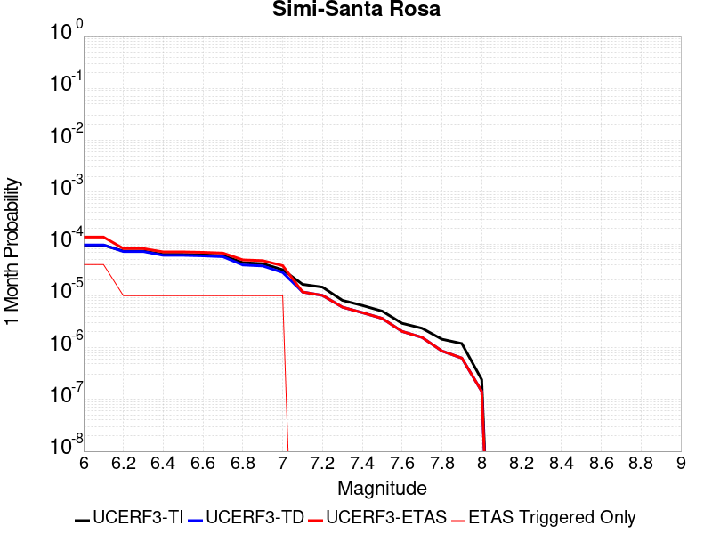 |  |  |

| Magnitude | 1 wk TI Prob | 1 wk TD Prob | 1 wk ETAS Prob | 1 wk ETAS/TD Gain | 1 wk ETAS Triggered Only | 1 mo TI Prob | 1 mo TD Prob | 1 mo ETAS Prob | 1 mo ETAS/TD Gain | 1 mo ETAS Triggered Only | 1 yr TI Prob | 1 yr TD Prob | 1 yr ETAS Prob | 1 yr ETAS/TD Gain | 1 yr ETAS Triggered Only | 10 yr TI Prob | 10 yr TD Prob | 10 yr ETAS Prob | 10 yr ETAS/TD Gain | 10 yr ETAS Triggered Only |
|-----|-----|-----|-----|-----|-----|-----|-----|-----|-----|-----|-----|-----|-----|-----|-----|-----|-----|-----|-----|-----|
| 6.0 | 2.198912E-5 | 2.2275442E-5 | 4.4457243E-5 | 1.9957962 | 2.2182294E-5 | 9.4235686E-5 | 9.5462936E-5 | 1.3982329E-4 | 1.4646866 | 4.4364588E-5 | 0.0011467156 | 0.0011616853 | 0.001228155 | 1.0572182 | 6.654688E-5 | 0.011408163 | 0.011560575 | 0.011626353 | 1.0056899 | 6.654688E-5 |
| 6.1 | 2.198912E-5 | 2.2275442E-5 | 4.4457243E-5 | 1.9957962 | 2.2182294E-5 | 9.4235686E-5 | 9.5462936E-5 | 1.3982329E-4 | 1.4646866 | 4.4364588E-5 | 0.0011467156 | 0.0011616853 | 0.001228155 | 1.0572182 | 6.654688E-5 | 0.011408163 | 0.011560575 | 0.011626353 | 1.0056899 | 6.654688E-5 |
| 6.2 | 1.69983E-5 | 1.6668559E-5 | 1.6668559E-5 | 1.0 | 0.0 | 7.284782E-5 | 7.143489E-5 | 7.143489E-5 | 1.0 | 0.0 | 8.865613E-4 | 8.6940196E-4 | 8.6940196E-4 | 1.0 | 0.0 | 0.008830327 | 0.008662928 | 0.008662928 | 1.0 | 0.0 |
| 6.3 | 1.69983E-5 | 1.6668559E-5 | 1.6668559E-5 | 1.0 | 0.0 | 7.284782E-5 | 7.143489E-5 | 7.143489E-5 | 1.0 | 0.0 | 8.865613E-4 | 8.6940196E-4 | 8.6940196E-4 | 1.0 | 0.0 | 0.008830327 | 0.008662928 | 0.008662928 | 1.0 | 0.0 |
| 6.4 | 1.4666188E-5 | 1.4052543E-5 | 1.4052543E-5 | 1.0 | 0.0 | 6.285358E-5 | 6.0223934E-5 | 6.0223934E-5 | 1.0 | 0.0 | 7.6497364E-4 | 7.3300465E-4 | 7.3300465E-4 | 1.0 | 0.0 | 0.0076234564 | 0.007308344 | 0.007308344 | 1.0 | 0.0 |
| 6.5 | 1.4666188E-5 | 1.4052543E-5 | 1.4052543E-5 | 1.0 | 0.0 | 6.285358E-5 | 6.0223934E-5 | 6.0223934E-5 | 1.0 | 0.0 | 7.6497364E-4 | 7.3300465E-4 | 7.3300465E-4 | 1.0 | 0.0 | 0.0076234564 | 0.007308344 | 0.007308344 | 1.0 | 0.0 |
| 6.6 | 1.4377586E-5 | 1.3729583E-5 | 1.3729583E-5 | 1.0 | 0.0 | 6.1616774E-5 | 5.883988E-5 | 5.883988E-5 | 1.0 | 0.0 | 7.4992597E-4 | 7.1616494E-4 | 7.1616494E-4 | 1.0 | 0.0 | 0.007474003 | 0.0071410383 | 0.0071410383 | 1.0 | 0.0 |
| 6.7 | 1.3881404E-5 | 1.320755E-5 | 1.320755E-5 | 1.0 | 0.0 | 5.9490372E-5 | 5.66027E-5 | 5.66027E-5 | 1.0 | 0.0 | 7.240546E-4 | 6.8894465E-4 | 6.8894465E-4 | 1.0 | 0.0 | 0.007217 | 0.006870538 | 0.006870538 | 1.0 | 0.0 |
| 6.8 | 1.0176516E-5 | 9.154151E-6 | 9.154151E-6 | 1.0 | 0.0 | 4.3612912E-5 | 3.9231574E-5 | 3.9231574E-5 | 1.0 | 0.0 | 5.308578E-4 | 4.7755634E-4 | 4.7755634E-4 | 1.0 | 0.0 | 0.0052959146 | 0.004766934 | 0.004766934 | 1.0 | 0.0 |
| 6.9 | 9.699797E-6 | 8.774719E-6 | 8.774719E-6 | 1.0 | 0.0 | 4.15699E-5 | 3.7605492E-5 | 3.7605492E-5 | 1.0 | 0.0 | 5.05996E-4 | 4.577671E-4 | 4.577671E-4 | 1.0 | 0.0 | 0.005048454 | 0.0045698597 | 0.0045698597 | 1.0 | 0.0 |
| 7.0 | 7.4049476E-6 | 6.559333E-6 | 6.559333E-6 | 1.0 | 0.0 | 3.1735104E-5 | 2.8111197E-5 | 2.8111197E-5 | 1.0 | 0.0 | 3.8630638E-4 | 3.422127E-4 | 3.422127E-4 | 1.0 | 0.0 | 0.0038563553 | 0.0034180996 | 0.0034180996 | 1.0 | 0.0 |
| 7.1 | 3.873439E-6 | 2.7595095E-6 | 2.7595095E-6 | 1.0 | 0.0 | 1.6600346E-5 | 1.1826417E-5 | 1.1826417E-5 | 1.0 | 0.0 | 2.0209046E-4 | 1.4397735E-4 | 1.4397735E-4 | 1.0 | 0.0 | 0.0020190678 | 0.0014388643 | 0.0014388643 | 1.0 | 0.0 |
| 7.2 | 3.417706E-6 | 2.3676484E-6 | 2.3676484E-6 | 1.0 | 0.0 | 1.4647229E-5 | 1.0147027E-5 | 1.0147027E-5 | 1.0 | 0.0 | 1.7831543E-4 | 1.2353327E-4 | 1.2353327E-4 | 1.0 | 0.0 | 0.0017817242 | 0.0012346683 | 0.0012346683 | 1.0 | 0.0 |
| 7.3 | 1.90225E-6 | 1.4073753E-6 | 1.4073753E-6 | 1.0 | 0.0 | 8.152474E-6 | 6.0315947E-6 | 6.0315947E-6 | 1.0 | 0.0 | 9.9251854E-5 | 7.343221E-5 | 7.343221E-5 | 1.0 | 0.0 | 9.920754E-4 | 7.340817E-4 | 7.340817E-4 | 1.0 | 0.0 |
| 7.4 | 1.5170556E-6 | 1.1024773E-6 | 1.1024773E-6 | 1.0 | 0.0 | 6.5016507E-6 | 4.724894E-6 | 4.724894E-6 | 1.0 | 0.0 | 7.915472E-5 | 5.7524077E-5 | 5.7524077E-5 | 1.0 | 0.0 | 7.9126534E-4 | 5.7509297E-4 | 5.7509297E-4 | 1.0 | 0.0 |
| 7.5 | 1.178732E-6 | 8.535102E-7 | 8.535102E-7 | 1.0 | 0.0 | 5.0516987E-6 | 3.6578958E-6 | 3.6578958E-6 | 1.0 | 0.0 | 6.1502695E-5 | 4.453398E-5 | 4.453398E-5 | 1.0 | 0.0 | 6.148568E-4 | 4.452515E-4 | 4.452515E-4 | 1.0 | 0.0 |
| 7.6 | 6.8722386E-7 | 4.793198E-7 | 4.793198E-7 | 1.0 | 0.0 | 2.9452417E-6 | 2.054226E-6 | 2.054226E-6 | 1.0 | 0.0 | 3.5857727E-5 | 2.5009915E-5 | 2.5009915E-5 | 1.0 | 0.0 | 3.5851944E-4 | 2.5007114E-4 | 2.5007114E-4 | 1.0 | 0.0 |
| 7.7 | 5.5126515E-7 | 3.6731157E-7 | 3.6731157E-7 | 1.0 | 0.0 | 2.3625628E-6 | 1.5741915E-6 | 1.5741915E-6 | 1.0 | 0.0 | 2.8763823E-5 | 1.9165615E-5 | 1.9165615E-5 | 1.0 | 0.0 | 2.87601E-4 | 1.9163972E-4 | 1.9163972E-4 | 1.0 | 0.0 |
| 7.8 | 3.3860243E-7 | 2.0075942E-7 | 2.0075942E-7 | 1.0 | 0.0 | 1.4511525E-6 | 8.6039717E-7 | 8.6039717E-7 | 1.0 | 0.0 | 1.7667637E-5 | 1.0475286E-5 | 1.0475286E-5 | 1.0 | 0.0 | 1.7666233E-4 | 1.04747975E-4 | 1.04747975E-4 | 1.0 | 0.0 |
| 7.9 | 2.7955386E-7 | 1.4649108E-7 | 1.4649108E-7 | 1.0 | 0.0 | 1.1980875E-6 | 6.278188E-7 | 6.278188E-7 | 1.0 | 0.0 | 1.4586617E-5 | 7.643667E-6 | 7.643667E-6 | 1.0 | 0.0 | 1.458566E-4 | 7.643409E-5 | 7.643409E-5 | 1.0 | 0.0 |
| 8.0 | 5.6259015E-8 | 3.3355324E-8 | 3.3355324E-8 | 1.0 | 0.0 | 2.4111003E-7 | 1.4295138E-7 | 1.4295138E-7 | 1.0 | 0.0 | 2.9355108E-6 | 1.7404317E-6 | 1.7404317E-6 | 1.0 | 0.0 | 2.935472E-5 | 1.7404194E-5 | 1.7404194E-5 | 1.0 | 0.0 |

## Whittier alt 1
*[(top)](#table-of-contents)*

| 1 Week | 1 Month | 1 Year | 10 Year |
|-----|-----|-----|-----|
|  |  |  |  |

| Magnitude | 1 wk TI Prob | 1 wk TD Prob | 1 wk ETAS Prob | 1 wk ETAS/TD Gain | 1 wk ETAS Triggered Only | 1 mo TI Prob | 1 mo TD Prob | 1 mo ETAS Prob | 1 mo ETAS/TD Gain | 1 mo ETAS Triggered Only | 1 yr TI Prob | 1 yr TD Prob | 1 yr ETAS Prob | 1 yr ETAS/TD Gain | 1 yr ETAS Triggered Only | 10 yr TI Prob | 10 yr TD Prob | 10 yr ETAS Prob | 10 yr ETAS/TD Gain | 10 yr ETAS Triggered Only |
|-----|-----|-----|-----|-----|-----|-----|-----|-----|-----|-----|-----|-----|-----|-----|-----|-----|-----|-----|-----|-----|
| 6.0 | 4.2554693E-5 | 4.725218E-5 | 9.161467E-5 | 1.9388454 | 4.4364588E-5 | 1.8236451E-4 | 2.0249544E-4 | 2.4685104E-4 | 1.2190449 | 4.4364588E-5 | 0.002218027 | 0.0024629154 | 0.0025292984 | 1.026953 | 6.654688E-5 | 0.02196019 | 0.024390234 | 0.024455158 | 1.0026618 | 6.654688E-5 |
| 6.1 | 4.2554693E-5 | 4.725218E-5 | 9.161467E-5 | 1.9388454 | 4.4364588E-5 | 1.8236451E-4 | 2.0249544E-4 | 2.4685104E-4 | 1.2190449 | 4.4364588E-5 | 0.002218027 | 0.0024629154 | 0.0025292984 | 1.026953 | 6.654688E-5 | 0.02196019 | 0.024390234 | 0.024455158 | 1.0026618 | 6.654688E-5 |
| 6.2 | 4.2554693E-5 | 4.725218E-5 | 9.161467E-5 | 1.9388454 | 4.4364588E-5 | 1.8236451E-4 | 2.0249544E-4 | 2.4685104E-4 | 1.2190449 | 4.4364588E-5 | 0.002218027 | 0.0024629154 | 0.0025292984 | 1.026953 | 6.654688E-5 | 0.02196019 | 0.024390234 | 0.024455158 | 1.0026618 | 6.654688E-5 |
| 6.3 | 1.9617712E-5 | 1.8268593E-5 | 4.045048E-5 | 2.214209 | 2.2182294E-5 | 8.40732E-5 | 7.829172E-5 | 1.0047228E-4 | 1.2833066 | 2.2182294E-5 | 0.0010231105 | 9.52804E-4 | 9.971263E-4 | 1.0465177 | 4.4364588E-5 | 0.01018413 | 0.009490474 | 0.009534418 | 1.0046303 | 4.4364588E-5 |
| 6.4 | 1.5611336E-5 | 1.3604271E-5 | 1.3604271E-5 | 1.0 | 0.0 | 6.690401E-5 | 5.8302747E-5 | 5.8302747E-5 | 1.0 | 0.0 | 8.142519E-4 | 7.0961076E-4 | 7.3177734E-4 | 1.0312376 | 2.2182294E-5 | 0.008112748 | 0.0070754145 | 0.00709744 | 1.0031129 | 2.2182294E-5 |
| 6.5 | 1.5150166E-5 | 1.3100925E-5 | 1.3100925E-5 | 1.0 | 0.0 | 6.492767E-5 | 5.6145647E-5 | 5.6145647E-5 | 1.0 | 0.0 | 7.9020765E-4 | 6.8336475E-4 | 7.0553186E-4 | 1.0324383 | 2.2182294E-5 | 0.007874036 | 0.0068145846 | 0.006836616 | 1.003233 | 2.2182294E-5 |
| 6.6 | 1.295588E-5 | 1.0380725E-5 | 1.0380725E-5 | 1.0 | 0.0 | 5.552402E-5 | 4.4488075E-5 | 4.4488075E-5 | 1.0 | 0.0 | 6.7579525E-4 | 5.4150965E-4 | 5.4150965E-4 | 1.0 | 0.0 | 0.006737438 | 0.0054033357 | 0.0054033357 | 1.0 | 0.0 |
| 6.7 | 1.2542085E-5 | 9.899369E-6 | 9.899369E-6 | 1.0 | 0.0 | 5.3750682E-5 | 4.242519E-5 | 4.242519E-5 | 1.0 | 0.0 | 6.542181E-4 | 5.164061E-4 | 5.164061E-4 | 1.0 | 0.0 | 0.006522954 | 0.0051534795 | 0.0051534795 | 1.0 | 0.0 |
| 6.8 | 1.2195878E-5 | 9.495415E-6 | 9.495415E-6 | 1.0 | 0.0 | 5.2267E-5 | 4.069401E-5 | 4.069401E-5 | 1.0 | 0.0 | 6.36165E-4 | 4.9533875E-4 | 4.9533875E-4 | 1.0 | 0.0 | 0.0063434686 | 0.004943688 | 0.004943688 | 1.0 | 0.0 |
| 6.9 | 1.1580298E-5 | 8.772933E-6 | 8.772933E-6 | 1.0 | 0.0 | 4.9628903E-5 | 3.7597754E-5 | 3.7597754E-5 | 1.0 | 0.0 | 6.040644E-4 | 4.5765814E-4 | 4.5765814E-4 | 1.0 | 0.0 | 0.00602425 | 0.0045684157 | 0.0045684157 | 1.0 | 0.0 |
| 7.0 | 1.0964795E-5 | 8.083994E-6 | 8.083994E-6 | 1.0 | 0.0 | 4.6991136E-5 | 3.4645236E-5 | 3.4645236E-5 | 1.0 | 0.0 | 5.7196687E-4 | 4.2172565E-4 | 4.2172565E-4 | 1.0 | 0.0 | 0.0057049696 | 0.004210462 | 0.004210462 | 1.0 | 0.0 |
| 7.1 | 1.0230601E-5 | 7.3266697E-6 | 7.3266697E-6 | 1.0 | 0.0 | 4.3844695E-5 | 3.1399642E-5 | 3.1399642E-5 | 1.0 | 0.0 | 5.336784E-4 | 3.8222488E-4 | 3.8222488E-4 | 1.0 | 0.0 | 0.005323986 | 0.0038168381 | 0.0038168381 | 1.0 | 0.0 |
| 7.2 | 9.40865E-6 | 6.543289E-6 | 6.543289E-6 | 1.0 | 0.0 | 4.032216E-5 | 2.8042374E-5 | 2.8042374E-5 | 1.0 | 0.0 | 4.908117E-4 | 3.4136363E-4 | 3.4136363E-4 | 1.0 | 0.0 | 0.0048972913 | 0.003409485 | 0.003409485 | 1.0 | 0.0 |
| 7.3 | 8.237384E-6 | 5.5977525E-6 | 5.5977525E-6 | 1.0 | 0.0 | 3.5302593E-5 | 2.3990153E-5 | 2.3990153E-5 | 1.0 | 0.0 | 4.2972428E-4 | 2.92042E-4 | 2.92042E-4 | 1.0 | 0.0 | 0.0042889426 | 0.002916903 | 0.002916903 | 1.0 | 0.0 |
| 7.4 | 7.5316966E-6 | 5.027819E-6 | 5.027819E-6 | 1.0 | 0.0 | 3.2278298E-5 | 2.1547625E-5 | 2.1547625E-5 | 1.0 | 0.0 | 3.9291743E-4 | 2.6231175E-4 | 2.6231175E-4 | 1.0 | 0.0 | 0.0039222343 | 0.0026201333 | 0.0026201333 | 1.0 | 0.0 |
| 7.5 | 6.149649E-6 | 3.933841E-6 | 3.933841E-6 | 1.0 | 0.0 | 2.6355372E-5 | 1.6859214E-5 | 1.6859214E-5 | 1.0 | 0.0 | 3.208294E-4 | 2.052425E-4 | 2.052425E-4 | 1.0 | 0.0 | 0.003203666 | 0.0020506186 | 0.0020506186 | 1.0 | 0.0 |
| 7.6 | 5.457711E-6 | 3.3953788E-6 | 3.3953788E-6 | 1.0 | 0.0 | 2.338998E-5 | 1.4551547E-5 | 1.4551547E-5 | 1.0 | 0.0 | 2.8473578E-4 | 1.771515E-4 | 1.771515E-4 | 1.0 | 0.0 | 0.0028437122 | 0.0017701836 | 0.0017701836 | 1.0 | 0.0 |
| 7.7 | 4.1676276E-6 | 2.3331952E-6 | 2.3331952E-6 | 1.0 | 0.0 | 1.7861139E-5 | 9.999374E-6 | 9.999374E-6 | 1.0 | 0.0 | 2.1743766E-4 | 1.2173632E-4 | 1.2173632E-4 | 1.0 | 0.0 | 0.0021722503 | 0.0012167693 | 0.0012167693 | 1.0 | 0.0 |
| 7.8 | 2.2692414E-7 | 9.3854695E-8 | 9.3854695E-8 | 1.0 | 0.0 | 9.725317E-7 | 4.0223435E-7 | 4.0223435E-7 | 1.0 | 0.0 | 1.1840509E-5 | 4.8971956E-6 | 4.8971956E-6 | 1.0 | 0.0 | 1.1839878E-4 | 4.8971204E-5 | 4.8971204E-5 | 1.0 | 0.0 |
| 7.9 | 6.676829E-9 | 3.439853E-9 | 3.439853E-9 | 1.0 | 0.0 | 2.861498E-8 | 1.4742227E-8 | 1.4742227E-8 | 1.0 | 0.0 | 3.4838732E-7 | 1.7948659E-7 | 1.7948659E-7 | 1.0 | 0.0 | 3.4838679E-6 | 1.7948646E-6 | 1.7948646E-6 | 1.0 | 0.0 |

## Santa Rosa Island
*[(top)](#table-of-contents)*

| 1 Week | 1 Month | 1 Year | 10 Year |
|-----|-----|-----|-----|
| 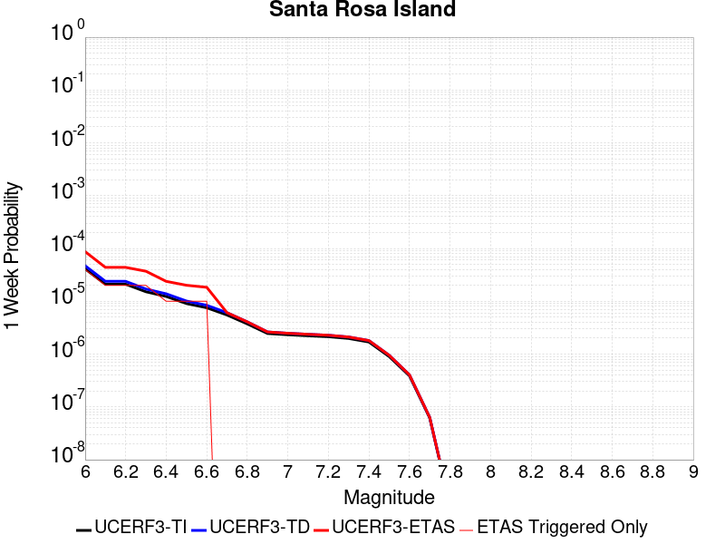 |  |  |  |

| Magnitude | 1 wk TI Prob | 1 wk TD Prob | 1 wk ETAS Prob | 1 wk ETAS/TD Gain | 1 wk ETAS Triggered Only | 1 mo TI Prob | 1 mo TD Prob | 1 mo ETAS Prob | 1 mo ETAS/TD Gain | 1 mo ETAS Triggered Only | 1 yr TI Prob | 1 yr TD Prob | 1 yr ETAS Prob | 1 yr ETAS/TD Gain | 1 yr ETAS Triggered Only | 10 yr TI Prob | 10 yr TD Prob | 10 yr ETAS Prob | 10 yr ETAS/TD Gain | 10 yr ETAS Triggered Only |
|-----|-----|-----|-----|-----|-----|-----|-----|-----|-----|-----|-----|-----|-----|-----|-----|-----|-----|-----|-----|-----|
| 6.0 | 4.1143165E-5 | 4.7091133E-5 | 1.1363488E-4 | 2.4130845 | 6.654688E-5 | 1.7631594E-4 | 2.0180465E-4 | 2.683381E-4 | 1.3296924 | 6.654688E-5 | 0.002144533 | 0.0024544 | 0.0025207836 | 1.0270468 | 6.654688E-5 | 0.021239553 | 0.024293551 | 0.024358481 | 1.0026728 | 6.654688E-5 |
| 6.1 | 2.1061249E-5 | 2.3864959E-5 | 6.822849E-5 | 2.8589401 | 4.4364588E-5 | 9.0259375E-5 | 1.0227455E-4 | 1.466346E-4 | 1.433735 | 4.4364588E-5 | 0.0010983539 | 0.0012445104 | 0.0012888197 | 1.0356039 | 4.4364588E-5 | 0.01092941 | 0.012378449 | 0.012422264 | 1.0035397 | 4.4364588E-5 |
| 6.2 | 2.1061249E-5 | 2.3864959E-5 | 6.822849E-5 | 2.8589401 | 4.4364588E-5 | 9.0259375E-5 | 1.0227455E-4 | 1.466346E-4 | 1.433735 | 4.4364588E-5 | 0.0010983539 | 0.0012445104 | 0.0012888197 | 1.0356039 | 4.4364588E-5 | 0.01092941 | 0.012378449 | 0.012422264 | 1.0035397 | 4.4364588E-5 |
| 6.3 | 1.5158236E-5 | 1.7074419E-5 | 6.143825E-5 | 3.598263 | 4.4364588E-5 | 6.496225E-5 | 7.3174095E-5 | 1.1753544E-4 | 1.6062437 | 4.4364588E-5 | 7.906284E-4 | 8.905424E-4 | 9.348675E-4 | 1.0497731 | 4.4364588E-5 | 0.007878214 | 0.008870989 | 0.008914961 | 1.0049567 | 4.4364588E-5 |
| 6.4 | 1.2341918E-5 | 1.3852917E-5 | 3.6034904E-5 | 2.6012504 | 2.2182294E-5 | 5.2892858E-5 | 5.9368336E-5 | 8.154931E-5 | 1.3736163 | 2.2182294E-5 | 6.437803E-4 | 7.225779E-4 | 7.447442E-4 | 1.0306766 | 2.2182294E-5 | 0.006419184 | 0.007203121 | 0.0072251437 | 1.0030574 | 2.2182294E-5 |
| 6.5 | 9.061158E-6 | 1.0117031E-5 | 3.22991E-5 | 3.1925473 | 2.2182294E-5 | 3.883296E-5 | 4.3358013E-5 | 6.5539345E-5 | 1.5115855 | 2.2182294E-5 | 4.726887E-4 | 5.277613E-4 | 5.499319E-4 | 1.0420088 | 2.2182294E-5 | 0.004716845 | 0.0052656173 | 0.0052876826 | 1.0041904 | 2.2182294E-5 |
| 6.6 | 7.5461685E-6 | 8.400733E-6 | 3.058284E-5 | 3.6404965 | 2.2182294E-5 | 3.2340322E-5 | 3.600267E-5 | 5.8184167E-5 | 1.616107 | 2.2182294E-5 | 3.936723E-4 | 4.3824865E-4 | 4.6042123E-4 | 1.0505936 | 2.2182294E-5 | 0.003929756 | 0.0043742736 | 0.004396359 | 1.0050489 | 2.2182294E-5 |
| 6.7 | 5.5023775E-6 | 6.087381E-6 | 6.087381E-6 | 1.0 | 0.0 | 2.3581404E-5 | 2.6088532E-5 | 2.6088532E-5 | 1.0 | 0.0 | 2.8706578E-4 | 3.1758484E-4 | 3.1758484E-4 | 1.0 | 0.0 | 0.0028669522 | 0.0031716314 | 0.0031716314 | 1.0 | 0.0 |
| 6.8 | 3.7351679E-6 | 4.0831405E-6 | 4.0831405E-6 | 1.0 | 0.0 | 1.6007763E-5 | 1.749907E-5 | 1.749907E-5 | 1.0 | 0.0 | 1.948771E-4 | 2.1303284E-4 | 2.1303284E-4 | 1.0 | 0.0 | 0.0019470629 | 0.0021285315 | 0.0021285315 | 1.0 | 0.0 |
| 6.9 | 2.456366E-6 | 2.6292705E-6 | 2.6292705E-6 | 1.0 | 0.0 | 1.0527241E-5 | 1.1268254E-5 | 1.1268254E-5 | 1.0 | 0.0 | 1.2816161E-4 | 1.3718237E-4 | 1.3718237E-4 | 1.0 | 0.0 | 0.0012808773 | 0.0013709799 | 0.0013709799 | 1.0 | 0.0 |
| 7.0 | 2.3245157E-6 | 2.4827782E-6 | 2.4827782E-6 | 1.0 | 0.0 | 9.962172E-6 | 1.0640435E-5 | 1.0640435E-5 | 1.0 | 0.0 | 1.2128269E-4 | 1.2953962E-4 | 1.2953962E-4 | 1.0 | 0.0 | 0.0012121652 | 0.0012946434 | 0.0012946434 | 1.0 | 0.0 |
| 7.1 | 2.2248344E-6 | 2.37325E-6 | 2.37325E-6 | 1.0 | 0.0 | 9.53497E-6 | 1.0171032E-5 | 1.0171032E-5 | 1.0 | 0.0 | 1.1608207E-4 | 1.2382529E-4 | 1.2382529E-4 | 1.0 | 0.0 | 0.0011602144 | 0.001237565 | 0.001237565 | 1.0 | 0.0 |
| 7.2 | 2.1350402E-6 | 2.276154E-6 | 2.276154E-6 | 1.0 | 0.0 | 9.150141E-6 | 9.754909E-6 | 9.754909E-6 | 1.0 | 0.0 | 1.1139726E-4 | 1.1875956E-4 | 1.1875956E-4 | 1.0 | 0.0 | 0.0011134144 | 0.0011869629 | 0.0011869629 | 1.0 | 0.0 |
| 7.3 | 1.9793572E-6 | 2.108719E-6 | 2.108719E-6 | 1.0 | 0.0 | 8.482932E-6 | 9.037336E-6 | 9.037336E-6 | 1.0 | 0.0 | 1.032748E-4 | 1.10024026E-4 | 1.10024026E-4 | 1.0 | 0.0 | 0.0010322682 | 0.0010996973 | 0.0010996973 | 1.0 | 0.0 |
| 7.4 | 1.6951194E-6 | 1.8045733E-6 | 1.8045733E-6 | 1.0 | 0.0 | 7.264777E-6 | 7.733863E-6 | 7.733863E-6 | 1.0 | 0.0 | 8.844508E-5 | 9.415573E-5 | 9.415573E-5 | 1.0 | 0.0 | 8.840988E-4 | 9.4116E-4 | 9.4116E-4 | 1.0 | 0.0 |
| 7.5 | 8.987207E-7 | 9.5122147E-7 | 9.5122147E-7 | 1.0 | 0.0 | 3.8516546E-6 | 4.076657E-6 | 4.076657E-6 | 1.0 | 0.0 | 4.6892885E-5 | 4.963218E-5 | 4.963218E-5 | 1.0 | 0.0 | 4.688299E-4 | 4.9621216E-4 | 4.9621216E-4 | 1.0 | 0.0 |
| 7.6 | 3.8783037E-7 | 4.052932E-7 | 4.052932E-7 | 1.0 | 0.0 | 1.6621291E-6 | 1.7369698E-6 | 1.7369698E-6 | 1.0 | 0.0 | 2.0236233E-5 | 2.1147409E-5 | 2.1147409E-5 | 1.0 | 0.0 | 2.023439E-4 | 2.1145462E-4 | 2.1145462E-4 | 1.0 | 0.0 |
| 7.7 | 6.181804E-8 | 6.339035E-8 | 6.339035E-8 | 1.0 | 0.0 | 2.6493444E-7 | 2.7167292E-7 | 2.7167292E-7 | 1.0 | 0.0 | 3.225572E-6 | 3.3076128E-6 | 3.3076128E-6 | 1.0 | 0.0 | 3.225525E-5 | 3.307564E-5 | 3.307564E-5 | 1.0 | 0.0 |
| 7.8 | 1.3704449E-9 | 1.3964153E-9 | 1.3964153E-9 | 1.0 | 0.0 | 5.873335E-9 | 5.984637E-9 | 5.984637E-9 | 1.0 | 0.0 | 7.1507856E-8 | 7.286295E-8 | 7.286295E-8 | 1.0 | 0.0 | 7.1507833E-7 | 7.286294E-7 | 7.286294E-7 | 1.0 | 0.0 |

## Raymond
*[(top)](#table-of-contents)*

| 1 Week | 1 Month | 1 Year | 10 Year |
|-----|-----|-----|-----|
|  |  |  |  |

| Magnitude | 1 wk TI Prob | 1 wk TD Prob | 1 wk ETAS Prob | 1 wk ETAS/TD Gain | 1 wk ETAS Triggered Only | 1 mo TI Prob | 1 mo TD Prob | 1 mo ETAS Prob | 1 mo ETAS/TD Gain | 1 mo ETAS Triggered Only | 1 yr TI Prob | 1 yr TD Prob | 1 yr ETAS Prob | 1 yr ETAS/TD Gain | 1 yr ETAS Triggered Only | 10 yr TI Prob | 10 yr TD Prob | 10 yr ETAS Prob | 10 yr ETAS/TD Gain | 10 yr ETAS Triggered Only |
|-----|-----|-----|-----|-----|-----|-----|-----|-----|-----|-----|-----|-----|-----|-----|-----|-----|-----|-----|-----|-----|
| 6.0 | 1.5157413E-5 | 1.5810128E-5 | 3.799207E-5 | 2.403021 | 2.2182294E-5 | 6.4958724E-5 | 6.7756075E-5 | 1.12117654E-4 | 1.6547248 | 4.4364588E-5 | 7.905855E-4 | 8.2464307E-4 | 8.911351E-4 | 1.0806313 | 6.654688E-5 | 0.007877788 | 0.008218348 | 0.008284348 | 1.0080308 | 6.654688E-5 |
| 6.1 | 1.5157413E-5 | 1.5810128E-5 | 3.799207E-5 | 2.403021 | 2.2182294E-5 | 6.4958724E-5 | 6.7756075E-5 | 1.12117654E-4 | 1.6547248 | 4.4364588E-5 | 7.905855E-4 | 8.2464307E-4 | 8.911351E-4 | 1.0806313 | 6.654688E-5 | 0.007877788 | 0.008218348 | 0.008284348 | 1.0080308 | 6.654688E-5 |
| 6.2 | 1.5157413E-5 | 1.5810128E-5 | 3.799207E-5 | 2.403021 | 2.2182294E-5 | 6.4958724E-5 | 6.7756075E-5 | 1.12117654E-4 | 1.6547248 | 4.4364588E-5 | 7.905855E-4 | 8.2464307E-4 | 8.911351E-4 | 1.0806313 | 6.654688E-5 | 0.007877788 | 0.008218348 | 0.008284348 | 1.0080308 | 6.654688E-5 |
| 6.3 | 1.5157413E-5 | 1.5810128E-5 | 3.799207E-5 | 2.403021 | 2.2182294E-5 | 6.4958724E-5 | 6.7756075E-5 | 1.12117654E-4 | 1.6547248 | 4.4364588E-5 | 7.905855E-4 | 8.2464307E-4 | 8.911351E-4 | 1.0806313 | 6.654688E-5 | 0.007877788 | 0.008218348 | 0.008284348 | 1.0080308 | 6.654688E-5 |
| 6.4 | 1.3941944E-5 | 1.445469E-5 | 1.445469E-5 | 1.0 | 0.0 | 5.9749822E-5 | 6.1947336E-5 | 8.412825E-5 | 1.358061 | 2.2182294E-5 | 7.2721124E-4 | 7.5397117E-4 | 7.761367E-4 | 1.0293984 | 2.2182294E-5 | 0.007248361 | 0.0075164647 | 0.00753848 | 1.002929 | 2.2182294E-5 |
| 6.5 | 1.3941944E-5 | 1.445469E-5 | 1.445469E-5 | 1.0 | 0.0 | 5.9749822E-5 | 6.1947336E-5 | 8.412825E-5 | 1.358061 | 2.2182294E-5 | 7.2721124E-4 | 7.5397117E-4 | 7.761367E-4 | 1.0293984 | 2.2182294E-5 | 0.007248361 | 0.0075164647 | 0.00753848 | 1.002929 | 2.2182294E-5 |
| 6.6 | 1.0542609E-5 | 1.0671113E-5 | 1.0671113E-5 | 1.0 | 0.0 | 4.5181827E-5 | 4.573257E-5 | 6.791385E-5 | 1.4850215 | 2.2182294E-5 | 5.499499E-4 | 5.5665727E-4 | 5.788272E-4 | 1.0398269 | 2.2182294E-5 | 0.005485909 | 0.00555319 | 0.0055752494 | 1.0039723 | 2.2182294E-5 |
| 6.7 | 1.0542609E-5 | 1.0671113E-5 | 1.0671113E-5 | 1.0 | 0.0 | 4.5181827E-5 | 4.573257E-5 | 6.791385E-5 | 1.4850215 | 2.2182294E-5 | 5.499499E-4 | 5.5665727E-4 | 5.788272E-4 | 1.0398269 | 2.2182294E-5 | 0.005485909 | 0.00555319 | 0.0055752494 | 1.0039723 | 2.2182294E-5 |
| 6.8 | 1.0079132E-5 | 1.0176646E-5 | 1.0176646E-5 | 1.0 | 0.0 | 4.3195567E-5 | 4.3613498E-5 | 6.5794826E-5 | 1.5085886 | 2.2182294E-5 | 5.257791E-4 | 5.3087034E-4 | 5.530409E-4 | 1.0417626 | 2.2182294E-5 | 0.0052453685 | 0.005296571 | 0.005318636 | 1.0041659 | 2.2182294E-5 |
| 6.9 | 7.721598E-6 | 7.5489047E-6 | 7.5489047E-6 | 1.0 | 0.0 | 3.3092143E-5 | 3.2352054E-5 | 5.453363E-5 | 1.6856312 | 2.2182294E-5 | 4.0282236E-4 | 3.9381627E-4 | 4.1598984E-4 | 1.0563043 | 2.2182294E-5 | 0.0040209293 | 0.0039313175 | 0.0039534126 | 1.0056202 | 2.2182294E-5 |
| 7.0 | 7.137566E-6 | 6.9113057E-6 | 6.9113057E-6 | 1.0 | 0.0 | 3.058921E-5 | 2.961955E-5 | 5.1801188E-5 | 1.748885 | 2.2182294E-5 | 3.7236E-4 | 3.6055944E-4 | 3.8273374E-4 | 1.0614997 | 2.2182294E-5 | 0.0037173668 | 0.0035998628 | 0.0036219652 | 1.0061398 | 2.2182294E-5 |
| 7.1 | 5.654976E-6 | 5.29954E-6 | 5.29954E-6 | 1.0 | 0.0 | 2.4235387E-5 | 2.2712118E-5 | 4.489391E-5 | 1.97665 | 2.2182294E-5 | 2.9502588E-4 | 2.7648517E-4 | 2.9866133E-4 | 1.0802075 | 2.2182294E-5 | 0.0029463451 | 0.002761443 | 0.002783564 | 1.0080106 | 2.2182294E-5 |
| 7.2 | 4.9358455E-6 | 4.5266574E-6 | 4.5266574E-6 | 1.0 | 0.0 | 2.1153453E-5 | 1.9399817E-5 | 4.158168E-5 | 2.143406 | 2.2182294E-5 | 2.5751285E-4 | 2.3616731E-4 | 2.5834437E-4 | 1.093904 | 2.2182294E-5 | 0.0025721465 | 0.0023591854 | 0.0023813155 | 1.0093803 | 2.2182294E-5 |
| 7.3 | 4.2368597E-6 | 3.8056164E-6 | 3.8056164E-6 | 1.0 | 0.0 | 1.8157843E-5 | 1.6309683E-5 | 3.8491617E-5 | 2.3600469 | 2.2182294E-5 | 2.2104931E-4 | 1.9855241E-4 | 2.207303E-4 | 1.1116979 | 2.2182294E-5 | 0.0022082955 | 0.0019837688 | 0.0020059072 | 1.0111597 | 2.2182294E-5 |
| 7.4 | 3.4999923E-6 | 3.043744E-6 | 3.043744E-6 | 1.0 | 0.0 | 1.49998805E-5 | 1.3044552E-5 | 3.5226556E-5 | 2.7004802 | 2.2182294E-5 | 1.8260824E-4 | 1.5880594E-4 | 1.809847E-4 | 1.1396596 | 2.2182294E-5 | 0.0018245826 | 0.0015869403 | 0.0016090873 | 1.0139558 | 2.2182294E-5 |
| 7.5 | 2.738017E-6 | 2.3020468E-6 | 2.3020468E-6 | 1.0 | 0.0 | 1.1734306E-5 | 9.865878E-6 | 9.865878E-6 | 1.0 | 0.0 | 1.428558E-4 | 1.2011051E-4 | 1.2011051E-4 | 1.0 | 0.0 | 0.0014276401 | 0.0012004703 | 0.0012004703 | 1.0 | 0.0 |
| 7.6 | 1.8186392E-6 | 1.442312E-6 | 1.442312E-6 | 1.0 | 0.0 | 7.794145E-6 | 6.181323E-6 | 6.181323E-6 | 1.0 | 0.0 | 9.488958E-5 | 7.5255055E-5 | 7.5255055E-5 | 1.0 | 0.0 | 9.4849075E-4 | 7.523072E-4 | 7.523072E-4 | 1.0 | 0.0 |
| 7.7 | 1.0660348E-6 | 7.6438056E-7 | 7.6438056E-7 | 1.0 | 0.0 | 4.5687125E-6 | 3.2759126E-6 | 3.2759126E-6 | 1.0 | 0.0 | 5.5622655E-5 | 3.9883522E-5 | 3.9883522E-5 | 1.0 | 0.0 | 5.5608735E-4 | 3.9877277E-4 | 3.9877277E-4 | 1.0 | 0.0 |
| 7.8 | 6.913602E-7 | 4.3204133E-7 | 4.3204133E-7 | 1.0 | 0.0 | 2.962969E-6 | 1.8516045E-6 | 1.8516045E-6 | 1.0 | 0.0 | 3.607355E-5 | 2.2543056E-5 | 2.2543056E-5 | 1.0 | 0.0 | 3.6067693E-4 | 2.2541556E-4 | 2.2541556E-4 | 1.0 | 0.0 |
| 7.9 | 7.425201E-8 | 5.3222113E-8 | 5.3222113E-8 | 1.0 | 0.0 | 3.1822285E-7 | 2.2809476E-7 | 2.2809476E-7 | 1.0 | 0.0 | 3.874356E-6 | 2.7770516E-6 | 2.7770516E-6 | 1.0 | 0.0 | 3.8742884E-5 | 2.7770298E-5 | 2.7770298E-5 | 1.0 | 0.0 |

## San Jacinto (Borrego)
*[(top)](#table-of-contents)*

| 1 Week | 1 Month | 1 Year | 10 Year |
|-----|-----|-----|-----|
|  |  |  |  |

| Magnitude | 1 wk TI Prob | 1 wk TD Prob | 1 wk ETAS Prob | 1 wk ETAS/TD Gain | 1 wk ETAS Triggered Only | 1 mo TI Prob | 1 mo TD Prob | 1 mo ETAS Prob | 1 mo ETAS/TD Gain | 1 mo ETAS Triggered Only | 1 yr TI Prob | 1 yr TD Prob | 1 yr ETAS Prob | 1 yr ETAS/TD Gain | 1 yr ETAS Triggered Only | 10 yr TI Prob | 10 yr TD Prob | 10 yr ETAS Prob | 10 yr ETAS/TD Gain | 10 yr ETAS Triggered Only |
|-----|-----|-----|-----|-----|-----|-----|-----|-----|-----|-----|-----|-----|-----|-----|-----|-----|-----|-----|-----|-----|
| 6.0 | 3.543992E-5 | 2.7926513E-5 | 5.010819E-5 | 1.7942873 | 2.2182294E-5 | 1.5187653E-4 | 1.1967963E-4 | 1.6403891E-4 | 1.3706502 | 4.4364588E-5 | 0.0018475284 | 0.0014561379 | 0.0015004379 | 1.0304229 | 4.4364588E-5 | 0.018322436 | 0.014869647 | 0.014935205 | 1.0044088 | 6.654688E-5 |
| 6.1 | 3.542281E-5 | 2.7926513E-5 | 5.010819E-5 | 1.7942873 | 2.2182294E-5 | 1.5180321E-4 | 1.1967963E-4 | 1.6403891E-4 | 1.3706502 | 4.4364588E-5 | 0.0018466372 | 0.0014561379 | 0.0015004379 | 1.0304229 | 4.4364588E-5 | 0.018313672 | 0.014869647 | 0.014935205 | 1.0044088 | 6.654688E-5 |
| 6.2 | 3.4688688E-5 | 2.7926511E-5 | 5.0108185E-5 | 1.7942873 | 2.2182294E-5 | 1.4865733E-4 | 1.1967963E-4 | 1.6403891E-4 | 1.3706502 | 4.4364588E-5 | 0.0018084005 | 0.0014561379 | 0.0015004379 | 1.0304229 | 4.4364588E-5 | 0.017937548 | 0.014869647 | 0.014935204 | 1.0044088 | 6.654688E-5 |
| 6.3 | 3.2087122E-5 | 2.7771865E-5 | 4.995354E-5 | 1.7987105 | 2.2182294E-5 | 1.3750899E-4 | 1.1901691E-4 | 1.6337621E-4 | 1.3727143 | 4.4364588E-5 | 0.0016728862 | 0.00144808 | 0.0014923803 | 1.0305924 | 4.4364588E-5 | 0.016603488 | 0.014790683 | 0.014856245 | 1.0044327 | 6.654688E-5 |
| 6.4 | 3.1828724E-5 | 2.7738852E-5 | 4.992053E-5 | 1.799661 | 2.2182294E-5 | 1.364017E-4 | 1.1887544E-4 | 1.6323476E-4 | 1.373158 | 4.4364588E-5 | 0.0016594254 | 0.0014463598 | 0.0014906602 | 1.0306289 | 4.4364588E-5 | 0.016470885 | 0.014773762 | 0.014839325 | 1.0044378 | 6.654688E-5 |
| 6.5 | 3.1563577E-5 | 2.747857E-5 | 4.9660255E-5 | 1.8072357 | 2.2182294E-5 | 1.3526545E-4 | 1.1776006E-4 | 1.6211942E-4 | 1.3766928 | 4.4364588E-5 | 0.0016456128 | 0.0014327979 | 0.0014770989 | 1.0309192 | 4.4364588E-5 | 0.0163348 | 0.014640348 | 0.014705921 | 1.0044789 | 6.654688E-5 |
| 6.6 | 3.1467625E-5 | 2.7322796E-5 | 4.9504484E-5 | 1.8118382 | 2.2182294E-5 | 1.3485427E-4 | 1.1709251E-4 | 1.614519E-4 | 1.3788406 | 4.4364588E-5 | 0.0016406142 | 0.0014246812 | 0.0014689825 | 1.0310956 | 4.4364588E-5 | 0.016285548 | 0.014560594 | 0.014626172 | 1.0045038 | 6.654688E-5 |
| 6.7 | 3.1223695E-5 | 2.6940816E-5 | 4.912251E-5 | 1.8233491 | 2.2182294E-5 | 1.3380898E-4 | 1.15455594E-4 | 1.5981506E-4 | 1.3842124 | 4.4364588E-5 | 0.0016279068 | 0.0014047775 | 0.0014490798 | 1.0315368 | 4.4364588E-5 | 0.01616033 | 0.014364966 | 0.014430557 | 1.0045661 | 6.654688E-5 |
| 6.8 | 3.1015585E-5 | 2.6761822E-5 | 4.8943522E-5 | 1.8288561 | 2.2182294E-5 | 1.3291716E-4 | 1.1468855E-4 | 1.5904805E-4 | 1.3867823 | 4.4364588E-5 | 0.001617065 | 0.0013954508 | 0.0014397535 | 1.0317479 | 4.4364588E-5 | 0.016053487 | 0.014272246 | 0.014337843 | 1.0045961 | 6.654688E-5 |
| 6.9 | 2.6641965E-5 | 2.2184247E-5 | 4.436605E-5 | 1.9998899 | 2.2182294E-5 | 1.1417485E-4 | 9.50719E-5 | 1.3943228E-4 | 1.4665982 | 4.4364588E-5 | 0.0013891924 | 0.0011568897 | 0.001201203 | 1.0383039 | 4.4364588E-5 | 0.0138054015 | 0.011882438 | 0.011948194 | 1.0055339 | 6.654688E-5 |
| 7.0 | 2.3854353E-5 | 2.0479023E-5 | 4.2660864E-5 | 2.0831492 | 2.2182294E-5 | 1.02228936E-4 | 8.77643E-5 | 1.32125E-4 | 1.5054526 | 4.4364588E-5 | 0.0012439266 | 0.0010680092 | 0.0011123264 | 1.0414952 | 4.4364588E-5 | 0.012369866 | 0.0109828 | 0.011048617 | 1.0059927 | 6.654688E-5 |
| 7.1 | 2.3672901E-5 | 2.031551E-5 | 4.2497355E-5 | 2.0918674 | 2.2182294E-5 | 1.0145135E-4 | 8.7063585E-5 | 1.3142431E-4 | 1.509521 | 4.4364588E-5 | 0.0012344702 | 0.0010594862 | 0.0011038039 | 1.0418293 | 4.4364588E-5 | 0.0122763505 | 0.010897976 | 0.010963798 | 1.0060399 | 6.654688E-5 |
| 7.2 | 2.2717244E-5 | 1.9542893E-5 | 4.1724754E-5 | 2.1350346 | 2.2182294E-5 | 9.735599E-5 | 8.375258E-5 | 1.2811345E-4 | 1.5296657 | 4.4364588E-5 | 0.0011846646 | 0.001019213 | 0.0010635323 | 1.043484 | 4.4364588E-5 | 0.01178369 | 0.010495341 | 0.01056119 | 1.0062741 | 6.654688E-5 |
| 7.3 | 2.1016205E-5 | 1.8384526E-5 | 4.056641E-5 | 2.206552 | 2.2182294E-5 | 9.006634E-5 | 7.878846E-5 | 1.2314954E-4 | 1.5630405 | 4.4364588E-5 | 0.001096006 | 9.5882936E-4 | 0.0010031514 | 1.0462252 | 4.4364588E-5 | 0.010906163 | 0.009890967 | 0.009956855 | 1.0066615 | 6.654688E-5 |
| 7.4 | 2.0683625E-5 | 1.8187047E-5 | 4.0368937E-5 | 2.2196531 | 2.2182294E-5 | 8.86411E-5 | 7.794217E-5 | 1.223033E-4 | 1.5691544 | 4.4364588E-5 | 0.001078671 | 9.485349E-4 | 9.928574E-4 | 1.0467273 | 4.4364588E-5 | 0.010734501 | 0.009787692 | 0.0098535875 | 1.0067325 | 6.654688E-5 |
| 7.5 | 1.9993966E-5 | 1.7782075E-5 | 3.9963972E-5 | 2.2474303 | 2.2182294E-5 | 8.568561E-5 | 7.620667E-5 | 1.2056788E-4 | 1.5821171 | 4.4364588E-5 | 0.001042723 | 9.2742336E-4 | 9.717468E-4 | 1.0477921 | 4.4364588E-5 | 0.010378438 | 0.009574614 | 0.009640524 | 1.0068837 | 6.654688E-5 |
| 7.6 | 1.788966E-5 | 1.6435291E-5 | 3.861722E-5 | 2.3496525 | 2.2182294E-5 | 7.666772E-5 | 7.043507E-5 | 1.1479653E-4 | 1.6298207 | 4.4364588E-5 | 9.3302975E-4 | 8.572113E-4 | 9.015379E-4 | 1.0517101 | 4.4364588E-5 | 0.00929122 | 0.008866487 | 0.008932443 | 1.0074389 | 6.654688E-5 |
| 7.7 | 1.5125781E-5 | 1.4237377E-5 | 3.6419355E-5 | 2.55801 | 2.2182294E-5 | 6.4823165E-5 | 6.1015908E-5 | 1.0537779E-4 | 1.7270544 | 4.4364588E-5 | 7.889362E-4 | 7.426163E-4 | 7.8694796E-4 | 1.0596966 | 4.4364588E-5 | 0.007861412 | 0.0077142045 | 0.0077802376 | 1.00856 | 6.654688E-5 |
| 7.8 | 1.250089E-5 | 1.26304985E-5 | 3.4812514E-5 | 2.7562263 | 2.2182294E-5 | 5.3574146E-5 | 5.412959E-5 | 9.849177E-5 | 1.8195553 | 4.4364588E-5 | 6.5207E-4 | 6.588291E-4 | 7.0316443E-4 | 1.0672941 | 4.4364588E-5 | 0.006501599 | 0.0068677636 | 0.0069338535 | 1.0096232 | 6.654688E-5 |
| 7.9 | 9.561E-6 | 9.754616E-6 | 3.1936695E-5 | 3.2740083 | 2.2182294E-5 | 4.0975072E-5 | 4.1804833E-5 | 8.6167565E-5 | 2.0611868 | 4.4364588E-5 | 4.987573E-4 | 5.088555E-4 | 5.531975E-4 | 1.0871407 | 4.4364588E-5 | 0.0049763937 | 0.0053523467 | 0.005418537 | 1.0123667 | 6.654688E-5 |
| 8.0 | 8.01699E-6 | 8.293488E-6 | 3.0475598E-5 | 3.674642 | 2.2182294E-5 | 3.4358076E-5 | 3.554304E-5 | 7.990605E-5 | 2.2481492 | 4.4364588E-5 | 4.1822926E-4 | 4.3265108E-4 | 4.7699647E-4 | 1.1024969 | 4.4364588E-5 | 0.0041744304 | 0.004573375 | 0.0046396176 | 1.0144844 | 6.654688E-5 |
| 8.1 | 6.541947E-6 | 6.4622354E-6 | 2.8644386E-5 | 4.432582 | 2.2182294E-5 | 2.8036617E-5 | 2.7695003E-5 | 7.205836E-5 | 2.6018543 | 4.4364588E-5 | 3.4129233E-4 | 3.37135E-4 | 3.8148463E-4 | 1.1315485 | 4.4364588E-5 | 0.0034076865 | 0.0035806994 | 0.003647008 | 1.0185183 | 6.654688E-5 |
| 8.2 | 1.7968189E-6 | 7.9713476E-7 | 7.9713476E-7 | 1.0 | 0.0 | 7.70063E-6 | 3.4162877E-6 | 3.4162877E-6 | 1.0 | 0.0 | 9.3751136E-5 | 4.159253E-5 | 4.159253E-5 | 1.0 | 0.0 | 9.371159E-4 | 4.712058E-4 | 4.712058E-4 | 1.0 | 0.0 |
| 8.3 | 1.5167889E-7 | 4.897714E-8 | 4.897714E-8 | 1.0 | 0.0 | 6.500522E-7 | 2.09902E-7 | 2.09902E-7 | 1.0 | 0.0 | 7.9143565E-6 | 2.5555544E-6 | 2.5555544E-6 | 1.0 | 0.0 | 7.914075E-5 | 2.969505E-5 | 2.969505E-5 | 1.0 | 0.0 |

## White Wolf
*[(top)](#table-of-contents)*

| 1 Week | 1 Month | 1 Year | 10 Year |
|-----|-----|-----|-----|
|  |  |  |  |

| Magnitude | 1 wk TI Prob | 1 wk TD Prob | 1 wk ETAS Prob | 1 wk ETAS/TD Gain | 1 wk ETAS Triggered Only | 1 mo TI Prob | 1 mo TD Prob | 1 mo ETAS Prob | 1 mo ETAS/TD Gain | 1 mo ETAS Triggered Only | 1 yr TI Prob | 1 yr TD Prob | 1 yr ETAS Prob | 1 yr ETAS/TD Gain | 1 yr ETAS Triggered Only | 10 yr TI Prob | 10 yr TD Prob | 10 yr ETAS Prob | 10 yr ETAS/TD Gain | 10 yr ETAS Triggered Only |
|-----|-----|-----|-----|-----|-----|-----|-----|-----|-----|-----|-----|-----|-----|-----|-----|-----|-----|-----|-----|-----|
| 6.0 | 2.0037822E-5 | 1.0469162E-6 | 2.3229188E-5 | 22.188202 | 2.2182294E-5 | 8.587355E-5 | 4.486776E-6 | 4.8851165E-5 | 10.88781 | 4.4364588E-5 | 0.001045009 | 5.4625183E-5 | 9.8987344E-5 | 1.8121194 | 4.4364588E-5 | 0.010401085 | 5.461226E-4 | 5.90463E-4 | 1.0811912 | 4.4364588E-5 |
| 6.1 | 2.0037822E-5 | 1.0469162E-6 | 2.3229188E-5 | 22.188202 | 2.2182294E-5 | 8.587355E-5 | 4.486776E-6 | 4.8851165E-5 | 10.88781 | 4.4364588E-5 | 0.001045009 | 5.4625183E-5 | 9.8987344E-5 | 1.8121194 | 4.4364588E-5 | 0.010401085 | 5.461226E-4 | 5.90463E-4 | 1.0811912 | 4.4364588E-5 |
| 6.2 | 2.0037822E-5 | 1.0469162E-6 | 2.3229188E-5 | 22.188202 | 2.2182294E-5 | 8.587355E-5 | 4.486776E-6 | 4.8851165E-5 | 10.88781 | 4.4364588E-5 | 0.001045009 | 5.4625183E-5 | 9.8987344E-5 | 1.8121194 | 4.4364588E-5 | 0.010401085 | 5.461226E-4 | 5.90463E-4 | 1.0811912 | 4.4364588E-5 |
| 6.3 | 2.0037822E-5 | 1.0469162E-6 | 2.3229188E-5 | 22.188202 | 2.2182294E-5 | 8.587355E-5 | 4.486776E-6 | 4.8851165E-5 | 10.88781 | 4.4364588E-5 | 0.001045009 | 5.4625183E-5 | 9.8987344E-5 | 1.8121194 | 4.4364588E-5 | 0.010401085 | 5.461226E-4 | 5.90463E-4 | 1.0811912 | 4.4364588E-5 |
| 6.4 | 1.132487E-5 | 1.0469162E-6 | 2.3229188E-5 | 22.188202 | 2.2182294E-5 | 4.8534253E-5 | 4.486776E-6 | 4.8851165E-5 | 10.88781 | 4.4364588E-5 | 5.907443E-4 | 5.4625183E-5 | 9.8987344E-5 | 1.8121194 | 4.4364588E-5 | 0.005891764 | 5.461226E-4 | 5.90463E-4 | 1.0811912 | 4.4364588E-5 |
| 6.5 | 1.132487E-5 | 1.0469162E-6 | 2.3229188E-5 | 22.188202 | 2.2182294E-5 | 4.8534253E-5 | 4.486776E-6 | 4.8851165E-5 | 10.88781 | 4.4364588E-5 | 5.907443E-4 | 5.4625183E-5 | 9.8987344E-5 | 1.8121194 | 4.4364588E-5 | 0.005891764 | 5.461226E-4 | 5.90463E-4 | 1.0811912 | 4.4364588E-5 |
| 6.6 | 9.347473E-6 | 1.0469162E-6 | 2.3229188E-5 | 22.188202 | 2.2182294E-5 | 4.0059982E-5 | 4.486776E-6 | 4.8851165E-5 | 10.88781 | 4.4364588E-5 | 4.8762115E-4 | 5.4625183E-5 | 9.8987344E-5 | 1.8121194 | 4.4364588E-5 | 0.0048655253 | 5.461226E-4 | 5.90463E-4 | 1.0811912 | 4.4364588E-5 |
| 6.7 | 7.842647E-6 | 1.0048342E-6 | 2.3187105E-5 | 23.075554 | 2.2182294E-5 | 3.361091E-5 | 4.3064256E-6 | 4.8670823E-5 | 11.301908 | 4.4364588E-5 | 4.0913603E-4 | 5.2429517E-5 | 9.679178E-5 | 1.8461314 | 4.4364588E-5 | 0.004083836 | 5.2417646E-4 | 5.685178E-4 | 1.0845923 | 4.4364588E-5 |
| 6.8 | 6.26597E-6 | 9.734822E-7 | 2.3155755E-5 | 23.786522 | 2.2182294E-5 | 2.685388E-5 | 4.17206E-6 | 4.853646E-5 | 11.633692 | 4.4364588E-5 | 3.2689696E-4 | 5.0793697E-5 | 9.5156036E-5 | 1.8733827 | 4.4364588E-5 | 0.003264165 | 5.078258E-4 | 5.521678E-4 | 1.0873175 | 4.4364588E-5 |
| 6.9 | 5.258436E-6 | 9.183254E-7 | 2.31006E-5 | 25.155136 | 2.2182294E-5 | 2.2535958E-5 | 3.9356746E-6 | 4.8300088E-5 | 12.272379 | 4.4364588E-5 | 2.7434074E-4 | 4.7915833E-5 | 9.227829E-5 | 1.9258415 | 4.4364588E-5 | 0.0027400232 | 4.790598E-4 | 5.234031E-4 | 1.0925633 | 4.4364588E-5 |
| 7.0 | 4.675028E-6 | 8.6611794E-7 | 8.6611794E-7 | 1.0 | 0.0 | 2.003568E-5 | 3.7119291E-6 | 2.589414E-5 | 6.9759254 | 2.2182294E-5 | 2.4390711E-4 | 4.5191846E-5 | 6.737314E-5 | 1.490825 | 2.2182294E-5 | 0.0024363957 | 4.518313E-4 | 4.7400355E-4 | 1.049072 | 2.2182294E-5 |
| 7.1 | 2.8270078E-6 | 6.8741696E-7 | 6.8741696E-7 | 1.0 | 0.0 | 1.2115692E-5 | 2.9460696E-6 | 2.5128298E-5 | 8.529431 | 2.2182294E-5 | 1.4749856E-4 | 3.5867848E-5 | 5.8049347E-5 | 1.6184229 | 2.2182294E-5 | 0.001474007 | 3.586247E-4 | 3.8079903E-4 | 1.0618316 | 2.2182294E-5 |
| 7.2 | 1.6881406E-6 | 2.2706382E-7 | 2.2706382E-7 | 1.0 | 0.0 | 7.2348685E-6 | 9.731303E-7 | 2.3155402E-5 | 23.79476 | 2.2182294E-5 | 8.808096E-5 | 1.1847799E-5 | 3.402983E-5 | 2.8722491 | 2.2182294E-5 | 8.8046055E-4 | 1.1847183E-4 | 1.406515E-4 | 1.1872147 | 2.2182294E-5 |
| 7.3 | 9.086107E-7 | 1.5266386E-7 | 1.5266386E-7 | 1.0 | 0.0 | 3.8940398E-6 | 6.5427355E-7 | 2.2836553E-5 | 34.90368 | 2.2182294E-5 | 4.7408903E-5 | 7.965752E-6 | 3.0147869E-5 | 3.7846859 | 2.2182294E-5 | 4.739879E-4 | 7.965475E-5 | 1.0183527E-4 | 1.2784584 | 2.2182294E-5 |
| 7.4 | 1.9717383E-7 | 9.003913E-8 | 9.003913E-8 | 1.0 | 0.0 | 8.450304E-7 | 3.8588192E-7 | 3.8588192E-7 | 1.0 | 0.0 | 1.0288197E-5 | 4.6981027E-6 | 4.6981027E-6 | 1.0 | 0.0 | 1.028772E-4 | 4.6980065E-5 | 4.6980065E-5 | 1.0 | 0.0 |
| 7.5 | 1.086975E-7 | 6.6597195E-8 | 6.6597195E-8 | 1.0 | 0.0 | 4.6584634E-7 | 2.8541652E-7 | 2.8541652E-7 | 1.0 | 0.0 | 5.6716644E-6 | 3.474941E-6 | 3.474941E-6 | 1.0 | 0.0 | 5.6715195E-5 | 3.474889E-5 | 3.474889E-5 | 1.0 | 0.0 |
| 7.6 | 2.4217808E-8 | 1.5820765E-8 | 1.5820765E-8 | 1.0 | 0.0 | 1.03790605E-7 | 6.780328E-8 | 6.780328E-8 | 1.0 | 0.0 | 1.2636499E-6 | 8.255046E-7 | 8.255046E-7 | 1.0 | 0.0 | 1.2636427E-5 | 8.2550205E-6 | 8.2550205E-6 | 1.0 | 0.0 |

## Lost Hills
*[(top)](#table-of-contents)*

| 1 Week | 1 Month | 1 Year | 10 Year |
|-----|-----|-----|-----|
|  |  |  |  |

| Magnitude | 1 wk TI Prob | 1 wk TD Prob | 1 wk ETAS Prob | 1 wk ETAS/TD Gain | 1 wk ETAS Triggered Only | 1 mo TI Prob | 1 mo TD Prob | 1 mo ETAS Prob | 1 mo ETAS/TD Gain | 1 mo ETAS Triggered Only | 1 yr TI Prob | 1 yr TD Prob | 1 yr ETAS Prob | 1 yr ETAS/TD Gain | 1 yr ETAS Triggered Only | 10 yr TI Prob | 10 yr TD Prob | 10 yr ETAS Prob | 10 yr ETAS/TD Gain | 10 yr ETAS Triggered Only |
|-----|-----|-----|-----|-----|-----|-----|-----|-----|-----|-----|-----|-----|-----|-----|-----|-----|-----|-----|-----|-----|
| 6.0 | 2.233523E-5 | 2.5106583E-5 | 4.728832E-5 | 1.8835028 | 2.2182294E-5 | 9.571891E-5 | 1.0759615E-4 | 1.5195596E-4 | 1.4122807 | 4.4364588E-5 | 0.0011647546 | 0.001309364 | 0.0013536705 | 1.0338382 | 4.4364588E-5 | 0.011586686 | 0.013033091 | 0.013076877 | 1.0033597 | 4.4364588E-5 |
| 6.1 | 2.233523E-5 | 2.5106583E-5 | 4.728832E-5 | 1.8835028 | 2.2182294E-5 | 9.571891E-5 | 1.0759615E-4 | 1.5195596E-4 | 1.4122807 | 4.4364588E-5 | 0.0011647546 | 0.001309364 | 0.0013536705 | 1.0338382 | 4.4364588E-5 | 0.011586686 | 0.013033091 | 0.013076877 | 1.0033597 | 4.4364588E-5 |
| 6.2 | 2.233523E-5 | 2.5106583E-5 | 4.728832E-5 | 1.8835028 | 2.2182294E-5 | 9.571891E-5 | 1.0759615E-4 | 1.5195596E-4 | 1.4122807 | 4.4364588E-5 | 0.0011647546 | 0.001309364 | 0.0013536705 | 1.0338382 | 4.4364588E-5 | 0.011586686 | 0.013033091 | 0.013076877 | 1.0033597 | 4.4364588E-5 |
| 6.3 | 2.233523E-5 | 2.5106583E-5 | 4.728832E-5 | 1.8835028 | 2.2182294E-5 | 9.571891E-5 | 1.0759615E-4 | 1.5195596E-4 | 1.4122807 | 4.4364588E-5 | 0.0011647546 | 0.001309364 | 0.0013536705 | 1.0338382 | 4.4364588E-5 | 0.011586686 | 0.013033091 | 0.013076877 | 1.0033597 | 4.4364588E-5 |
| 6.4 | 1.2288092E-5 | 1.3781108E-5 | 1.3781108E-5 | 1.0 | 0.0 | 5.2662188E-5 | 5.906108E-5 | 5.906108E-5 | 1.0 | 0.0 | 6.409735E-4 | 7.189252E-4 | 7.189252E-4 | 1.0 | 0.0 | 0.006391279 | 0.0071752006 | 0.0071752006 | 1.0 | 0.0 |
| 6.5 | 1.2288092E-5 | 1.3781108E-5 | 1.3781108E-5 | 1.0 | 0.0 | 5.2662188E-5 | 5.906108E-5 | 5.906108E-5 | 1.0 | 0.0 | 6.409735E-4 | 7.189252E-4 | 7.189252E-4 | 1.0 | 0.0 | 0.006391279 | 0.0071752006 | 0.0071752006 | 1.0 | 0.0 |
| 6.6 | 8.58281E-6 | 9.63377E-6 | 9.63377E-6 | 1.0 | 0.0 | 3.6782953E-5 | 4.12874E-5 | 4.12874E-5 | 1.0 | 0.0 | 4.4774043E-4 | 5.026414E-4 | 5.026414E-4 | 1.0 | 0.0 | 0.0044683935 | 0.005023205 | 0.005023205 | 1.0 | 0.0 |
| 6.7 | 7.205685E-6 | 8.088302E-6 | 8.088302E-6 | 1.0 | 0.0 | 3.088114E-5 | 3.466415E-5 | 3.466415E-5 | 1.0 | 0.0 | 3.7591302E-4 | 4.2203604E-4 | 4.2203604E-4 | 1.0 | 0.0 | 0.0037527776 | 0.0042203604 | 0.0042203604 | 1.0 | 0.0 |

## Monterey Bay-Tularcitos
*[(top)](#table-of-contents)*

| 1 Week | 1 Month | 1 Year | 10 Year |
|-----|-----|-----|-----|
|  |  |  |  |

| Magnitude | 1 wk TI Prob | 1 wk TD Prob | 1 wk ETAS Prob | 1 wk ETAS/TD Gain | 1 wk ETAS Triggered Only | 1 mo TI Prob | 1 mo TD Prob | 1 mo ETAS Prob | 1 mo ETAS/TD Gain | 1 mo ETAS Triggered Only | 1 yr TI Prob | 1 yr TD Prob | 1 yr ETAS Prob | 1 yr ETAS/TD Gain | 1 yr ETAS Triggered Only | 10 yr TI Prob | 10 yr TD Prob | 10 yr ETAS Prob | 10 yr ETAS/TD Gain | 10 yr ETAS Triggered Only |
|-----|-----|-----|-----|-----|-----|-----|-----|-----|-----|-----|-----|-----|-----|-----|-----|-----|-----|-----|-----|-----|
| 6.0 | 3.0131365E-5 | 3.279877E-5 | 5.4980337E-5 | 1.6762927 | 2.2182294E-5 | 1.2912804E-4 | 1.4055918E-4 | 1.6273836E-4 | 1.1577924 | 2.2182294E-5 | 0.001571 | 0.0017100703 | 0.001754359 | 1.0258988 | 4.4364588E-5 | 0.015599402 | 0.016979916 | 0.017023528 | 1.0025684 | 4.4364588E-5 |
| 6.1 | 3.0131365E-5 | 3.279877E-5 | 5.4980337E-5 | 1.6762927 | 2.2182294E-5 | 1.2912804E-4 | 1.4055918E-4 | 1.6273836E-4 | 1.1577924 | 2.2182294E-5 | 0.001571 | 0.0017100703 | 0.001754359 | 1.0258988 | 4.4364588E-5 | 0.015599402 | 0.016979916 | 0.017023528 | 1.0025684 | 4.4364588E-5 |
| 6.2 | 3.0131365E-5 | 3.279877E-5 | 5.4980337E-5 | 1.6762927 | 2.2182294E-5 | 1.2912804E-4 | 1.4055918E-4 | 1.6273836E-4 | 1.1577924 | 2.2182294E-5 | 0.001571 | 0.0017100703 | 0.001754359 | 1.0258988 | 4.4364588E-5 | 0.015599402 | 0.016979916 | 0.017023528 | 1.0025684 | 4.4364588E-5 |
| 6.3 | 1.6998249E-5 | 1.8330798E-5 | 4.0512685E-5 | 2.2100885 | 2.2182294E-5 | 7.28476E-5 | 7.85583E-5 | 1.0073886E-4 | 1.282345 | 2.2182294E-5 | 8.865586E-4 | 9.5604634E-4 | 9.782074E-4 | 1.0231799 | 2.2182294E-5 | 0.0088303005 | 0.009521258 | 0.009543229 | 1.0023075 | 2.2182294E-5 |
| 6.4 | 1.6998249E-5 | 1.8330798E-5 | 4.0512685E-5 | 2.2100885 | 2.2182294E-5 | 7.28476E-5 | 7.85583E-5 | 1.0073886E-4 | 1.282345 | 2.2182294E-5 | 8.865586E-4 | 9.5604634E-4 | 9.782074E-4 | 1.0231799 | 2.2182294E-5 | 0.0088303005 | 0.009521258 | 0.009543229 | 1.0023075 | 2.2182294E-5 |
| 6.5 | 1.27470785E-5 | 1.3693312E-5 | 3.5875302E-5 | 2.619914 | 2.2182294E-5 | 5.4629192E-5 | 5.8684363E-5 | 8.086536E-5 | 1.377971 | 2.2182294E-5 | 6.649074E-4 | 7.1425823E-4 | 7.364247E-4 | 1.0310342 | 2.2182294E-5 | 0.0066292146 | 0.007120678 | 0.0071427026 | 1.003093 | 2.2182294E-5 |
| 6.6 | 1.2739422E-5 | 1.36854E-5 | 3.586739E-5 | 2.6208508 | 2.2182294E-5 | 5.4596385E-5 | 5.8650454E-5 | 8.083144E-5 | 1.3781897 | 2.2182294E-5 | 6.645082E-4 | 7.1384566E-4 | 7.360121E-4 | 1.0310522 | 2.2182294E-5 | 0.0066252467 | 0.007116579 | 0.0071386034 | 1.0030948 | 2.2182294E-5 |
| 6.7 | 1.0160109E-5 | 1.0885755E-5 | 3.306781E-5 | 3.0377138 | 2.2182294E-5 | 4.35426E-5 | 4.665244E-5 | 6.8833695E-5 | 1.4754577 | 2.2182294E-5 | 5.300022E-4 | 5.6785246E-4 | 5.900222E-4 | 1.0390413 | 2.2182294E-5 | 0.005287399 | 0.0056647263 | 0.0056867828 | 1.0038937 | 2.2182294E-5 |
| 6.8 | 8.349859E-6 | 8.932587E-6 | 3.1114683E-5 | 3.483278 | 2.2182294E-5 | 3.578462E-5 | 3.8281985E-5 | 6.046343E-5 | 1.5794226 | 2.2182294E-5 | 4.3559066E-4 | 4.6598914E-4 | 4.881611E-4 | 1.0475804 | 2.2182294E-5 | 0.004347378 | 0.004650685 | 0.0046727643 | 1.0047475 | 2.2182294E-5 |
| 6.9 | 5.193639E-6 | 5.53643E-6 | 2.77186E-5 | 5.006584 | 2.2182294E-5 | 2.2258262E-5 | 2.372736E-5 | 4.5909128E-5 | 1.9348603 | 2.2182294E-5 | 2.7096065E-4 | 2.8884556E-4 | 3.1102143E-4 | 1.0767742 | 2.2182294E-5 | 0.0027063051 | 0.0028850222 | 0.0029071406 | 1.0076666 | 2.2182294E-5 |
| 7.0 | 4.359381E-6 | 4.643366E-6 | 2.6825557E-5 | 5.7771792 | 2.2182294E-5 | 1.8682927E-5 | 1.9900004E-5 | 4.2081858E-5 | 2.1146657 | 2.2182294E-5 | 2.274409E-4 | 2.422586E-4 | 2.644355E-4 | 1.0915424 | 2.2182294E-5 | 0.0022720827 | 0.002420238 | 0.0024423664 | 1.0091431 | 2.2182294E-5 |
| 7.1 | 3.0398533E-6 | 3.2310427E-6 | 2.5413265E-5 | 7.865345 | 2.2182294E-5 | 1.3027877E-5 | 1.3847267E-5 | 3.6029254E-5 | 2.6019037 | 2.2182294E-5 | 1.5860285E-4 | 1.6858005E-4 | 1.9075861E-4 | 1.1315609 | 2.2182294E-5 | 0.001584897 | 0.0016847793 | 0.0017069243 | 1.0131441 | 2.2182294E-5 |
| 7.2 | 1.642335E-6 | 1.7333153E-6 | 2.391557E-5 | 13.797588 | 2.2182294E-5 | 7.0385595E-6 | 7.428485E-6 | 2.9610614E-5 | 3.9860907 | 2.2182294E-5 | 8.569109E-5 | 9.044012E-5 | 1.126204E-4 | 1.2452483 | 2.2182294E-5 | 8.5658056E-4 | 9.042358E-4 | 9.2639803E-4 | 1.0245093 | 2.2182294E-5 |
| 7.3 | 3.356842E-7 | 3.2952389E-7 | 3.2952389E-7 | 1.0 | 0.0 | 1.4386458E-6 | 1.4122444E-6 | 1.4122444E-6 | 1.0 | 0.0 | 1.7515373E-5 | 1.7193941E-5 | 1.7193941E-5 | 1.0 | 0.0 | 1.7513991E-4 | 1.719262E-4 | 1.719262E-4 | 1.0 | 0.0 |
| 7.4 | 2.1973483E-7 | 2.1006413E-7 | 2.1006413E-7 | 1.0 | 0.0 | 9.417204E-7 | 9.0027453E-7 | 9.0027453E-7 | 1.0 | 0.0 | 1.1465385E-5 | 1.0960787E-5 | 1.0960787E-5 | 1.0 | 0.0 | 1.1464794E-4 | 1.096025E-4 | 1.096025E-4 | 1.0 | 0.0 |
| 7.5 | 1.1944135E-7 | 1.0696043E-7 | 1.0696043E-7 | 1.0 | 0.0 | 5.118914E-7 | 4.5840173E-7 | 4.5840173E-7 | 1.0 | 0.0 | 6.23226E-6 | 5.581027E-6 | 5.581027E-6 | 1.0 | 0.0 | 6.2320854E-5 | 5.5808883E-5 | 5.5808883E-5 | 1.0 | 0.0 |
| 7.6 | 4.636058E-8 | 3.336489E-8 | 3.336489E-8 | 1.0 | 0.0 | 1.9868818E-7 | 1.4299238E-7 | 1.4299238E-7 | 1.0 | 0.0 | 2.419026E-6 | 1.7409308E-6 | 1.7409308E-6 | 1.0 | 0.0 | 2.4189996E-5 | 1.7409173E-5 | 1.7409173E-5 | 1.0 | 0.0 |
| 7.7 | 1.8588572E-8 | 8.003744E-9 | 8.003744E-9 | 1.0 | 0.0 | 7.9665305E-8 | 3.430176E-8 | 3.430176E-8 | 1.0 | 0.0 | 9.699246E-7 | 4.1762385E-7 | 4.1762385E-7 | 1.0 | 0.0 | 9.699204E-6 | 4.176231E-6 | 4.176231E-6 | 1.0 | 0.0 |
| 7.8 | 2.7960154E-9 | 7.6099427E-10 | 7.6099427E-10 | 1.0 | 0.0 | 1.1982923E-8 | 3.2614043E-9 | 3.2614043E-9 | 1.0 | 0.0 | 1.4589209E-7 | 3.9707597E-8 | 3.9707597E-8 | 1.0 | 0.0 | 1.4589199E-6 | 3.9707595E-7 | 3.9707595E-7 | 1.0 | 0.0 |

## Pleito
*[(top)](#table-of-contents)*

| 1 Week | 1 Month | 1 Year | 10 Year |
|-----|-----|-----|-----|
| 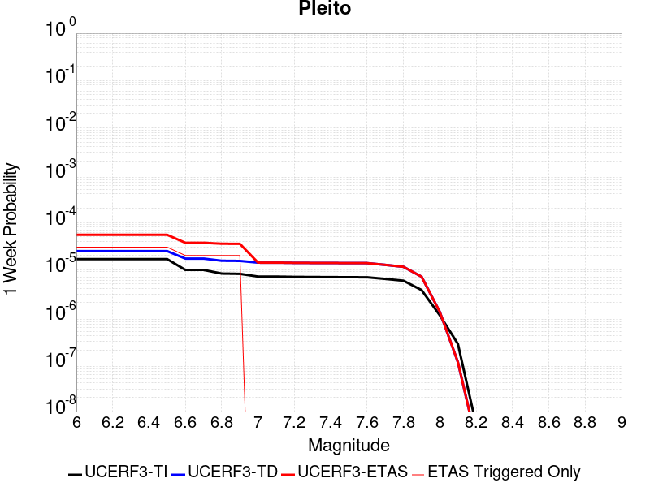 |  |  |  |

| Magnitude | 1 wk TI Prob | 1 wk TD Prob | 1 wk ETAS Prob | 1 wk ETAS/TD Gain | 1 wk ETAS Triggered Only | 1 mo TI Prob | 1 mo TD Prob | 1 mo ETAS Prob | 1 mo ETAS/TD Gain | 1 mo ETAS Triggered Only | 1 yr TI Prob | 1 yr TD Prob | 1 yr ETAS Prob | 1 yr ETAS/TD Gain | 1 yr ETAS Triggered Only | 10 yr TI Prob | 10 yr TD Prob | 10 yr ETAS Prob | 10 yr ETAS/TD Gain | 10 yr ETAS Triggered Only |
|-----|-----|-----|-----|-----|-----|-----|-----|-----|-----|-----|-----|-----|-----|-----|-----|-----|-----|-----|-----|-----|
| 6.0 | 1.6763008E-5 | 2.4763838E-5 | 6.912733E-5 | 2.7914624 | 4.4364588E-5 | 7.183948E-5 | 1.0612683E-4 | 1.5048671E-4 | 1.4179894 | 4.4364588E-5 | 8.742947E-4 | 0.0012914003 | 0.0013357076 | 1.0343095 | 4.4364588E-5 | 0.00870863 | 0.0129538905 | 0.01299768 | 1.0033804 | 4.4364588E-5 |
| 6.1 | 1.6763008E-5 | 2.4763838E-5 | 6.912733E-5 | 2.7914624 | 4.4364588E-5 | 7.183948E-5 | 1.0612683E-4 | 1.5048671E-4 | 1.4179894 | 4.4364588E-5 | 8.742947E-4 | 0.0012914003 | 0.0013357076 | 1.0343095 | 4.4364588E-5 | 0.00870863 | 0.0129538905 | 0.01299768 | 1.0033804 | 4.4364588E-5 |
| 6.2 | 1.6763008E-5 | 2.4763838E-5 | 6.912733E-5 | 2.7914624 | 4.4364588E-5 | 7.183948E-5 | 1.0612683E-4 | 1.5048671E-4 | 1.4179894 | 4.4364588E-5 | 8.742947E-4 | 0.0012914003 | 0.0013357076 | 1.0343095 | 4.4364588E-5 | 0.00870863 | 0.0129538905 | 0.01299768 | 1.0033804 | 4.4364588E-5 |
| 6.3 | 1.6763008E-5 | 2.4763838E-5 | 6.912733E-5 | 2.7914624 | 4.4364588E-5 | 7.183948E-5 | 1.0612683E-4 | 1.5048671E-4 | 1.4179894 | 4.4364588E-5 | 8.742947E-4 | 0.0012914003 | 0.0013357076 | 1.0343095 | 4.4364588E-5 | 0.00870863 | 0.0129538905 | 0.01299768 | 1.0033804 | 4.4364588E-5 |
| 6.4 | 1.6763008E-5 | 2.4763838E-5 | 6.912733E-5 | 2.7914624 | 4.4364588E-5 | 7.183948E-5 | 1.0612683E-4 | 1.5048671E-4 | 1.4179894 | 4.4364588E-5 | 8.742947E-4 | 0.0012914003 | 0.0013357076 | 1.0343095 | 4.4364588E-5 | 0.00870863 | 0.0129538905 | 0.01299768 | 1.0033804 | 4.4364588E-5 |
| 6.5 | 1.6763008E-5 | 2.4763838E-5 | 6.912733E-5 | 2.7914624 | 4.4364588E-5 | 7.183948E-5 | 1.0612683E-4 | 1.5048671E-4 | 1.4179894 | 4.4364588E-5 | 8.742947E-4 | 0.0012914003 | 0.0013357076 | 1.0343095 | 4.4364588E-5 | 0.00870863 | 0.0129538905 | 0.01299768 | 1.0033804 | 4.4364588E-5 |
| 6.6 | 9.910213E-6 | 1.7214623E-5 | 3.9396535E-5 | 2.2885506 | 2.2182294E-5 | 4.247165E-5 | 7.377489E-5 | 9.595555E-5 | 1.3006532 | 2.2182294E-5 | 5.169696E-4 | 8.978429E-4 | 9.2000526E-4 | 1.0246841 | 2.2182294E-5 | 0.0051576863 | 0.009050702 | 0.009072684 | 1.0024287 | 2.2182294E-5 |
| 6.7 | 9.910213E-6 | 1.7214623E-5 | 3.9396535E-5 | 2.2885506 | 2.2182294E-5 | 4.247165E-5 | 7.377489E-5 | 9.595555E-5 | 1.3006532 | 2.2182294E-5 | 5.169696E-4 | 8.978429E-4 | 9.2000526E-4 | 1.0246841 | 2.2182294E-5 | 0.0051576863 | 0.009050702 | 0.009072684 | 1.0024287 | 2.2182294E-5 |
| 6.8 | 8.300162E-6 | 1.5474232E-5 | 3.7656184E-5 | 2.4334767 | 2.2182294E-5 | 3.557164E-5 | 6.631646E-5 | 8.849728E-5 | 1.3344693 | 2.2182294E-5 | 4.3299864E-4 | 8.071053E-4 | 8.2926964E-4 | 1.0274615 | 2.2182294E-5 | 0.004321559 | 0.008150139 | 0.00817214 | 1.0026995 | 2.2182294E-5 |
| 6.9 | 8.183114E-6 | 1.5345448E-5 | 3.7527403E-5 | 2.445507 | 2.2182294E-5 | 3.5070017E-5 | 6.576455E-5 | 8.794539E-5 | 1.3372765 | 2.2182294E-5 | 4.2689382E-4 | 8.003907E-4 | 8.225553E-4 | 1.0276922 | 2.2182294E-5 | 0.0042607468 | 0.008083483 | 0.008105487 | 1.002722 | 2.2182294E-5 |
| 7.0 | 7.1748823E-6 | 1.413244E-5 | 1.413244E-5 | 1.0 | 0.0 | 3.0749135E-5 | 6.0566195E-5 | 6.0566195E-5 | 1.0 | 0.0 | 3.743064E-4 | 7.371445E-4 | 7.371445E-4 | 1.0 | 0.0 | 0.0037367654 | 0.007454939 | 0.007454939 | 1.0 | 0.0 |
| 7.1 | 7.1671807E-6 | 1.412281E-5 | 1.412281E-5 | 1.0 | 0.0 | 3.0716128E-5 | 6.052493E-5 | 6.052493E-5 | 1.0 | 0.0 | 3.7390468E-4 | 7.366424E-4 | 7.366424E-4 | 1.0 | 0.0 | 0.0037327618 | 0.0074499524 | 0.0074499524 | 1.0 | 0.0 |
| 7.2 | 7.0649667E-6 | 1.39701015E-5 | 1.39701015E-5 | 1.0 | 0.0 | 3.0278077E-5 | 5.9870494E-5 | 5.9870494E-5 | 1.0 | 0.0 | 3.6857324E-4 | 7.2868E-4 | 7.2868E-4 | 1.0 | 0.0 | 0.0036796255 | 0.0073707094 | 0.0073707094 | 1.0 | 0.0 |
| 7.3 | 7.02082E-6 | 1.3913556E-5 | 1.3913556E-5 | 1.0 | 0.0 | 3.008888E-5 | 5.9628168E-5 | 5.9628168E-5 | 1.0 | 0.0 | 3.6627054E-4 | 7.2573166E-4 | 7.2573166E-4 | 1.0 | 0.0 | 0.0036566744 | 0.007341209 | 0.007341209 | 1.0 | 0.0 |
| 7.4 | 6.987146E-6 | 1.3873118E-5 | 1.3873118E-5 | 1.0 | 0.0 | 2.9944567E-5 | 5.945487E-5 | 5.945487E-5 | 1.0 | 0.0 | 3.6451413E-4 | 7.2362315E-4 | 7.2362315E-4 | 1.0 | 0.0 | 0.0036391679 | 0.007320144 | 0.007320144 | 1.0 | 0.0 |
| 7.5 | 6.9494554E-6 | 1.3830024E-5 | 1.3830024E-5 | 1.0 | 0.0 | 2.9783041E-5 | 5.9270187E-5 | 5.9270187E-5 | 1.0 | 0.0 | 3.625482E-4 | 7.2137616E-4 | 7.2137616E-4 | 1.0 | 0.0 | 0.0036195726 | 0.0072977724 | 0.0072977724 | 1.0 | 0.0 |
| 7.6 | 6.92694E-6 | 1.3789138E-5 | 1.3789138E-5 | 1.0 | 0.0 | 2.9686547E-5 | 5.909497E-5 | 5.909497E-5 | 1.0 | 0.0 | 3.6137376E-4 | 7.1924424E-4 | 7.1924424E-4 | 1.0 | 0.0 | 0.0036078666 | 0.0072765257 | 0.0072765257 | 1.0 | 0.0 |
| 7.7 | 6.395867E-6 | 1.2668219E-5 | 1.2668219E-5 | 1.0 | 0.0 | 2.741057E-5 | 5.429124E-5 | 5.429124E-5 | 1.0 | 0.0 | 3.336726E-4 | 6.6079566E-4 | 6.6079566E-4 | 1.0 | 0.0 | 0.0033317201 | 0.0066951844 | 0.0066951844 | 1.0 | 0.0 |
| 7.8 | 5.8664327E-6 | 1.153586E-5 | 1.153586E-5 | 1.0 | 0.0 | 2.5141611E-5 | 4.9438466E-5 | 4.9438466E-5 | 1.0 | 0.0 | 3.060561E-4 | 6.017473E-4 | 6.017473E-4 | 1.0 | 0.0 | 0.0030563495 | 0.0061006667 | 0.0061006667 | 1.0 | 0.0 |
| 7.9 | 3.7167474E-6 | 7.1140853E-6 | 7.1140853E-6 | 1.0 | 0.0 | 1.592882E-5 | 3.0488582E-5 | 3.0488582E-5 | 1.0 | 0.0 | 1.9391612E-4 | 3.7113542E-4 | 3.7113542E-4 | 1.0 | 0.0 | 0.0019374699 | 0.0037674906 | 0.0037674906 | 1.0 | 0.0 |
| 8.0 | 1.0903841E-6 | 1.2879392E-6 | 1.2879392E-6 | 1.0 | 0.0 | 4.6730665E-6 | 5.5197274E-6 | 5.5197274E-6 | 1.0 | 0.0 | 5.68931E-5 | 6.720063E-5 | 6.720063E-5 | 1.0 | 0.0 | 5.6878536E-4 | 6.941948E-4 | 6.941948E-4 | 1.0 | 0.0 |
| 8.1 | 2.6894583E-7 | 1.1060341E-7 | 1.1060341E-7 | 1.0 | 0.0 | 1.1526245E-6 | 4.740145E-7 | 4.740145E-7 | 1.0 | 0.0 | 1.4033113E-5 | 5.7711113E-6 | 5.7711113E-6 | 1.0 | 0.0 | 1.4032227E-4 | 6.456908E-5 | 6.456908E-5 | 1.0 | 0.0 |
| 8.2 | 5.2967013E-9 | 2.4578228E-9 | 2.4578228E-9 | 1.0 | 0.0 | 2.2700148E-8 | 1.0533527E-8 | 1.0533527E-8 | 1.0 | 0.0 | 2.7637427E-7 | 1.2824569E-7 | 1.2824569E-7 | 1.0 | 0.0 | 2.7637393E-6 | 1.4592787E-6 | 1.4592787E-6 | 1.0 | 0.0 |

## San Andreas (Santa Cruz Mts) 2011 CFM
*[(top)](#table-of-contents)*

| 1 Week | 1 Month | 1 Year | 10 Year |
|-----|-----|-----|-----|
|  |  |  |  |

| Magnitude | 1 wk TI Prob | 1 wk TD Prob | 1 wk ETAS Prob | 1 wk ETAS/TD Gain | 1 wk ETAS Triggered Only | 1 mo TI Prob | 1 mo TD Prob | 1 mo ETAS Prob | 1 mo ETAS/TD Gain | 1 mo ETAS Triggered Only | 1 yr TI Prob | 1 yr TD Prob | 1 yr ETAS Prob | 1 yr ETAS/TD Gain | 1 yr ETAS Triggered Only | 10 yr TI Prob | 10 yr TD Prob | 10 yr ETAS Prob | 10 yr ETAS/TD Gain | 10 yr ETAS Triggered Only |
|-----|-----|-----|-----|-----|-----|-----|-----|-----|-----|-----|-----|-----|-----|-----|-----|-----|-----|-----|-----|-----|
| 6.0 | 1.7221631E-4 | 1.3793171E-4 | 1.6011094E-4 | 1.1607987 | 2.2182294E-5 | 7.378611E-4 | 5.9100403E-4 | 6.131732E-4 | 1.0375111 | 2.2182294E-5 | 0.008946515 | 0.007172124 | 0.0072161704 | 1.0061413 | 4.4364588E-5 | 0.08594794 | 0.0705551 | 0.07059633 | 1.0005845 | 4.4364588E-5 |
| 6.1 | 1.7221631E-4 | 1.3793171E-4 | 1.6011094E-4 | 1.1607987 | 2.2182294E-5 | 7.378611E-4 | 5.9100403E-4 | 6.131732E-4 | 1.0375111 | 2.2182294E-5 | 0.008946515 | 0.007172124 | 0.0072161704 | 1.0061413 | 4.4364588E-5 | 0.08594794 | 0.0705551 | 0.07059633 | 1.0005845 | 4.4364588E-5 |
| 6.2 | 1.7221631E-4 | 1.3793171E-4 | 1.6011094E-4 | 1.1607987 | 2.2182294E-5 | 7.378611E-4 | 5.9100403E-4 | 6.131732E-4 | 1.0375111 | 2.2182294E-5 | 0.008946515 | 0.007172124 | 0.0072161704 | 1.0061413 | 4.4364588E-5 | 0.08594794 | 0.0705551 | 0.07059633 | 1.0005845 | 4.4364588E-5 |
| 6.3 | 1.716926E-4 | 1.3712609E-4 | 1.5930533E-4 | 1.1617435 | 2.2182294E-5 | 7.3561794E-4 | 5.875529E-4 | 6.0972216E-4 | 1.0377315 | 2.2182294E-5 | 0.008919428 | 0.0071303817 | 0.00717443 | 1.0061775 | 4.4364588E-5 | 0.08569809 | 0.070167266 | 0.07020852 | 1.0005879 | 4.4364588E-5 |
| 6.4 | 1.6392978E-4 | 1.3588481E-4 | 1.5806408E-4 | 1.1632212 | 2.2182294E-5 | 7.02367E-4 | 5.822355E-4 | 6.044049E-4 | 1.0380763 | 2.2182294E-5 | 0.008517839 | 0.007066063 | 0.007110114 | 1.0062342 | 4.4364588E-5 | 0.08198654 | 0.06940135 | 0.06944264 | 1.0005949 | 4.4364588E-5 |
| 6.5 | 1.5742714E-4 | 1.2648388E-4 | 1.4866336E-4 | 1.1753542 | 2.2182294E-5 | 6.745133E-4 | 5.4196286E-4 | 5.641331E-4 | 1.0409074 | 2.2182294E-5 | 0.00818132 | 0.0065787593 | 0.006622832 | 1.0066992 | 4.4364588E-5 | 0.078865945 | 0.06486309 | 0.064904585 | 1.0006396 | 4.4364588E-5 |
| 6.6 | 1.3038084E-4 | 1.1588213E-4 | 1.3806186E-4 | 1.191399 | 2.2182294E-5 | 5.5865536E-4 | 4.9654447E-4 | 5.1871577E-4 | 1.0446512 | 2.2182294E-5 | 0.006780438 | 0.0060289134 | 0.0060730106 | 1.0073143 | 4.4364588E-5 | 0.0657725 | 0.05932738 | 0.05936911 | 1.0007035 | 4.4364588E-5 |
| 6.7 | 1.2867592E-4 | 1.1314701E-4 | 1.3532679E-4 | 1.1960262 | 2.2182294E-5 | 5.5135164E-4 | 4.8482692E-4 | 5.0699845E-4 | 1.0457308 | 2.2182294E-5 | 0.0066920654 | 0.00588703 | 0.005931134 | 1.0074916 | 4.4364588E-5 | 0.06494093 | 0.058038417 | 0.058080208 | 1.00072 | 4.4364588E-5 |
| 6.8 | 1.2801298E-4 | 1.1252261E-4 | 1.3470241E-4 | 1.1971141 | 2.2182294E-5 | 5.485117E-4 | 4.8215193E-4 | 5.043235E-4 | 1.0459846 | 2.2182294E-5 | 0.0066577005 | 0.0058546383 | 0.005898743 | 1.0075333 | 4.4364588E-5 | 0.06461738 | 0.057752274 | 0.057794075 | 1.0007238 | 4.4364588E-5 |
| 6.9 | 1.269149E-4 | 1.1094465E-4 | 1.3312449E-4 | 1.199918 | 2.2182294E-5 | 5.4380763E-4 | 4.7539172E-4 | 4.9756345E-4 | 1.0466388 | 2.2182294E-5 | 0.006600777 | 0.005772772 | 0.00581688 | 1.0076408 | 4.4364588E-5 | 0.06408122 | 0.0570241 | 0.057065934 | 1.0007336 | 4.4364588E-5 |
| 7.0 | 1.2030331E-4 | 1.0824504E-4 | 1.3042493E-4 | 1.2049044 | 2.2182294E-5 | 5.154837E-4 | 4.638261E-4 | 4.8599808E-4 | 1.0478024 | 2.2182294E-5 | 0.006257969 | 0.0056326967 | 0.005676811 | 1.0078319 | 4.4364588E-5 | 0.06084648 | 0.055696685 | 0.05573858 | 1.0007522 | 4.4364588E-5 |
| 7.1 | 8.049617E-5 | 5.3926604E-5 | 7.61077E-5 | 1.4113201 | 2.2182294E-5 | 3.4493793E-4 | 2.3109373E-4 | 2.532709E-4 | 1.0959661 | 2.2182294E-5 | 0.0041915346 | 0.0028099709 | 0.0028542108 | 1.0157439 | 4.4364588E-5 | 0.041133516 | 0.029618956 | 0.029662007 | 1.0014535 | 4.4364588E-5 |
| 7.2 | 7.093979E-5 | 4.2937932E-5 | 6.5119275E-5 | 1.5165908 | 2.2182294E-5 | 3.0399222E-4 | 1.8400686E-4 | 2.0618507E-4 | 1.1205293 | 2.2182294E-5 | 0.0036948253 | 0.0022380045 | 0.0022822698 | 1.019779 | 4.4364588E-5 | 0.03633994 | 0.023941692 | 0.023984993 | 1.0018086 | 4.4364588E-5 |
| 7.3 | 6.193693E-5 | 2.8894141E-5 | 5.1075796E-5 | 1.7676868 | 2.2182294E-5 | 2.6541698E-4 | 1.2382616E-4 | 1.4600571E-4 | 1.1791184 | 2.2182294E-5 | 0.0032266637 | 0.0015065427 | 0.0015286916 | 1.0147018 | 2.2182294E-5 | 0.031802133 | 0.016499156 | 0.016520973 | 1.0013223 | 2.2182294E-5 |
| 7.4 | 5.906492E-5 | 2.702346E-5 | 4.9205155E-5 | 1.8208311 | 2.2182294E-5 | 2.5311083E-4 | 1.1580969E-4 | 1.3798942E-4 | 1.1915188 | 2.2182294E-5 | 0.0030772698 | 0.0014090725 | 0.0014312236 | 1.0157202 | 2.2182294E-5 | 0.030350044 | 0.015471023 | 0.015492861 | 1.0014116 | 2.2182294E-5 |
| 7.5 | 5.424296E-5 | 2.4678277E-5 | 4.6860023E-5 | 1.898837 | 2.2182294E-5 | 2.324491E-4 | 1.05759755E-4 | 1.2793971E-4 | 1.2097201 | 2.2182294E-5 | 0.002826395 | 0.0012868657 | 0.0013090194 | 1.0172153 | 2.2182294E-5 | 0.027907165 | 0.014163188 | 0.014185055 | 1.001544 | 2.2182294E-5 |
| 7.6 | 4.43084E-5 | 1.990431E-5 | 4.208616E-5 | 2.1144245 | 2.2182294E-5 | 1.8987931E-4 | 8.53014E-5 | 1.074818E-4 | 1.260024 | 2.2182294E-5 | 0.0023093296 | 0.0010380499 | 0.0010602092 | 1.021347 | 2.2182294E-5 | 0.022854783 | 0.011412679 | 0.011434609 | 1.0019214 | 2.2182294E-5 |
| 7.7 | 4.118098E-5 | 1.8936442E-5 | 4.1118317E-5 | 2.1713855 | 2.2182294E-5 | 1.7647797E-4 | 8.115366E-5 | 1.03334154E-4 | 1.2733148 | 2.2182294E-5 | 0.002146502 | 9.875982E-4 | 0.0010097586 | 1.0224386 | 2.2182294E-5 | 0.021258866 | 0.010870468 | 0.010892409 | 1.0020185 | 2.2182294E-5 |
| 7.8 | 3.5408906E-5 | 1.856446E-5 | 4.074634E-5 | 2.1948574 | 2.2182294E-5 | 1.5174363E-4 | 7.955955E-5 | 1.0174008E-4 | 1.2787915 | 2.2182294E-5 | 0.0018459131 | 9.682073E-4 | 9.903681E-4 | 1.0228885 | 2.2182294E-5 | 0.018306552 | 0.010652021 | 0.010673966 | 1.0020603 | 2.2182294E-5 |
| 7.9 | 2.5860836E-5 | 1.7315993E-5 | 1.7315993E-5 | 1.0 | 0.0 | 1.10827445E-4 | 7.420929E-5 | 7.420929E-5 | 1.0 | 0.0 | 0.001348489 | 9.031238E-4 | 9.031238E-4 | 1.0 | 0.0 | 0.013403354 | 0.009907599 | 0.009907599 | 1.0 | 0.0 |
| 8.0 | 1.9777332E-5 | 1.4839596E-5 | 1.4839596E-5 | 1.0 | 0.0 | 8.4757245E-5 | 6.3596715E-5 | 6.3596715E-5 | 1.0 | 0.0 | 0.0010314309 | 7.740152E-4 | 7.740152E-4 | 1.0 | 0.0 | 0.010266567 | 0.008508967 | 0.008508967 | 1.0 | 0.0 |
| 8.1 | 1.468494E-5 | 1.2107374E-5 | 1.2107374E-5 | 1.0 | 0.0 | 6.293394E-5 | 5.1887713E-5 | 5.1887713E-5 | 1.0 | 0.0 | 7.6595135E-4 | 6.3155E-4 | 6.3155E-4 | 1.0 | 0.0 | 0.0076331664 | 0.006969149 | 0.006969149 | 1.0 | 0.0 |
| 8.2 | 8.63836E-6 | 5.469061E-6 | 5.469061E-6 | 1.0 | 0.0 | 3.7021015E-5 | 2.3438623E-5 | 2.3438623E-5 | 1.0 | 0.0 | 4.5063766E-4 | 2.8532793E-4 | 2.8532793E-4 | 1.0 | 0.0 | 0.004497249 | 0.00324569 | 0.00324569 | 1.0 | 0.0 |
| 8.3 | 1.983087E-6 | 7.6599065E-7 | 7.6599065E-7 | 1.0 | 0.0 | 8.498917E-6 | 3.282813E-6 | 3.282813E-6 | 1.0 | 0.0 | 1.034694E-4 | 3.9967534E-5 | 3.9967534E-5 | 1.0 | 0.0 | 0.0010342124 | 4.719687E-4 | 4.719687E-4 | 1.0 | 0.0 |

## Santa Susana alt 1
*[(top)](#table-of-contents)*

| 1 Week | 1 Month | 1 Year | 10 Year |
|-----|-----|-----|-----|
|  |  |  |  |

| Magnitude | 1 wk TI Prob | 1 wk TD Prob | 1 wk ETAS Prob | 1 wk ETAS/TD Gain | 1 wk ETAS Triggered Only | 1 mo TI Prob | 1 mo TD Prob | 1 mo ETAS Prob | 1 mo ETAS/TD Gain | 1 mo ETAS Triggered Only | 1 yr TI Prob | 1 yr TD Prob | 1 yr ETAS Prob | 1 yr ETAS/TD Gain | 1 yr ETAS Triggered Only | 10 yr TI Prob | 10 yr TD Prob | 10 yr ETAS Prob | 10 yr ETAS/TD Gain | 10 yr ETAS Triggered Only |
|-----|-----|-----|-----|-----|-----|-----|-----|-----|-----|-----|-----|-----|-----|-----|-----|-----|-----|-----|-----|-----|
| 6.0 | 2.674877E-5 | 2.7198023E-5 | 2.7198023E-5 | 1.0 | 0.0 | 1.1463255E-4 | 1.1655839E-4 | 1.3873809E-4 | 1.1902884 | 2.2182294E-5 | 0.0013947578 | 0.0014182882 | 0.0014625898 | 1.031236 | 4.4364588E-5 | 0.013860362 | 0.014104128 | 0.0141478665 | 1.0031011 | 4.4364588E-5 |
| 6.1 | 2.674877E-5 | 2.7198023E-5 | 2.7198023E-5 | 1.0 | 0.0 | 1.1463255E-4 | 1.1655839E-4 | 1.3873809E-4 | 1.1902884 | 2.2182294E-5 | 0.0013947578 | 0.0014182882 | 0.0014625898 | 1.031236 | 4.4364588E-5 | 0.013860362 | 0.014104128 | 0.0141478665 | 1.0031011 | 4.4364588E-5 |
| 6.2 | 2.674877E-5 | 2.7198023E-5 | 2.7198023E-5 | 1.0 | 0.0 | 1.1463255E-4 | 1.1655839E-4 | 1.3873809E-4 | 1.1902884 | 2.2182294E-5 | 0.0013947578 | 0.0014182882 | 0.0014625898 | 1.031236 | 4.4364588E-5 | 0.013860362 | 0.014104128 | 0.0141478665 | 1.0031011 | 4.4364588E-5 |
| 6.3 | 2.674877E-5 | 2.7198023E-5 | 2.7198023E-5 | 1.0 | 0.0 | 1.1463255E-4 | 1.1655839E-4 | 1.3873809E-4 | 1.1902884 | 2.2182294E-5 | 0.0013947578 | 0.0014182882 | 0.0014625898 | 1.031236 | 4.4364588E-5 | 0.013860362 | 0.014104128 | 0.0141478665 | 1.0031011 | 4.4364588E-5 |
| 6.4 | 2.674877E-5 | 2.7198023E-5 | 2.7198023E-5 | 1.0 | 0.0 | 1.1463255E-4 | 1.1655839E-4 | 1.3873809E-4 | 1.1902884 | 2.2182294E-5 | 0.0013947578 | 0.0014182882 | 0.0014625898 | 1.031236 | 4.4364588E-5 | 0.013860362 | 0.014104128 | 0.0141478665 | 1.0031011 | 4.4364588E-5 |
| 6.5 | 2.674877E-5 | 2.7198023E-5 | 2.7198023E-5 | 1.0 | 0.0 | 1.1463255E-4 | 1.1655839E-4 | 1.3873809E-4 | 1.1902884 | 2.2182294E-5 | 0.0013947578 | 0.0014182882 | 0.0014625898 | 1.031236 | 4.4364588E-5 | 0.013860362 | 0.014104128 | 0.0141478665 | 1.0031011 | 4.4364588E-5 |
| 6.6 | 2.6647976E-5 | 2.7074359E-5 | 2.7074359E-5 | 1.0 | 0.0 | 1.14200615E-4 | 1.1602845E-4 | 1.3820817E-4 | 1.1911576 | 2.2182294E-5 | 0.0013895056 | 0.0014118447 | 0.0014561467 | 1.0313787 | 4.4364588E-5 | 0.013808494 | 0.014040513 | 0.014084254 | 1.0031154 | 4.4364588E-5 |
| 6.7 | 2.6647976E-5 | 2.7074359E-5 | 2.7074359E-5 | 1.0 | 0.0 | 1.14200615E-4 | 1.1602845E-4 | 1.3820817E-4 | 1.1911576 | 2.2182294E-5 | 0.0013895056 | 0.0014118447 | 0.0014561467 | 1.0313787 | 4.4364588E-5 | 0.013808494 | 0.014040513 | 0.014084254 | 1.0031154 | 4.4364588E-5 |
| 6.8 | 1.9073179E-5 | 1.7637283E-5 | 1.7637283E-5 | 1.0 | 0.0 | 8.1739636E-5 | 7.558627E-5 | 9.776689E-5 | 1.2934477 | 2.2182294E-5 | 9.947256E-4 | 9.198925E-4 | 9.6421625E-4 | 1.0481837 | 4.4364588E-5 | 0.009902848 | 0.009163101 | 0.00920706 | 1.0047973 | 4.4364588E-5 |
| 6.9 | 1.9041876E-5 | 1.7619415E-5 | 1.7619415E-5 | 1.0 | 0.0 | 8.160549E-5 | 7.55097E-5 | 9.769032E-5 | 1.2937453 | 2.2182294E-5 | 9.930939E-4 | 9.1896096E-4 | 9.6328475E-4 | 1.0482326 | 4.4364588E-5 | 0.0098866755 | 0.0091538625 | 0.009197821 | 1.0048022 | 4.4364588E-5 |
| 7.0 | 1.5917482E-5 | 1.3863864E-5 | 1.3863864E-5 | 1.0 | 0.0 | 6.8215995E-5 | 5.9415237E-5 | 8.159621E-5 | 1.3733213 | 2.2182294E-5 | 8.302132E-4 | 7.231451E-4 | 7.6747756E-4 | 1.0613052 | 4.4364588E-5 | 0.008271185 | 0.0072088144 | 0.0072528594 | 1.0061098 | 4.4364588E-5 |
| 7.1 | 1.577788E-5 | 1.3743872E-5 | 1.3743872E-5 | 1.0 | 0.0 | 6.761774E-5 | 5.8901005E-5 | 8.108199E-5 | 1.3765808 | 2.2182294E-5 | 8.2293496E-4 | 7.1688846E-4 | 7.612212E-4 | 1.0618405 | 4.4364588E-5 | 0.008198941 | 0.007146652 | 0.0071906997 | 1.0061634 | 4.4364588E-5 |
| 7.2 | 1.5416446E-5 | 1.3469944E-5 | 1.3469944E-5 | 1.0 | 0.0 | 6.606882E-5 | 5.772708E-5 | 7.9908095E-5 | 1.3842393 | 2.2182294E-5 | 8.0409093E-4 | 7.026052E-4 | 7.4693863E-4 | 1.0630987 | 4.4364588E-5 | 0.008011877 | 0.0070047234 | 0.0070487773 | 1.0062891 | 4.4364588E-5 |
| 7.3 | 1.4534083E-5 | 1.2717879E-5 | 1.2717879E-5 | 1.0 | 0.0 | 6.228744E-5 | 5.4504082E-5 | 7.6685166E-5 | 1.4069619 | 2.2182294E-5 | 7.580857E-4 | 6.633896E-4 | 7.077248E-4 | 1.0668312 | 4.4364588E-5 | 0.007555048 | 0.0066149444 | 0.0066590155 | 1.0066624 | 4.4364588E-5 |
| 7.4 | 1.2858995E-5 | 1.1229652E-5 | 1.1229652E-5 | 1.0 | 0.0 | 5.5108816E-5 | 4.8126214E-5 | 7.030744E-5 | 1.460897 | 2.2182294E-5 | 6.7074323E-4 | 5.857831E-4 | 6.301217E-4 | 1.0756911 | 4.4364588E-5 | 0.0066872234 | 0.005843165 | 0.0058872704 | 1.0075482 | 4.4364588E-5 |
| 7.5 | 8.827668E-6 | 7.805457E-6 | 7.805457E-6 | 1.0 | 0.0 | 3.7832317E-5 | 3.3451546E-5 | 3.3451546E-5 | 1.0 | 0.0 | 4.605111E-4 | 4.071989E-4 | 4.2937216E-4 | 1.0544531 | 2.2182294E-5 | 0.0045955796 | 0.0040647765 | 0.004086869 | 1.005435 | 2.2182294E-5 |
| 7.6 | 3.2533426E-6 | 2.871988E-6 | 2.871988E-6 | 1.0 | 0.0 | 1.3942822E-5 | 1.2308465E-5 | 1.2308465E-5 | 1.0 | 0.0 | 1.6974064E-4 | 1.4984563E-4 | 1.4984563E-4 | 1.0 | 0.0 | 0.0016961104 | 0.0014974826 | 0.0014974826 | 1.0 | 0.0 |
| 7.7 | 1.2751709E-6 | 1.1491089E-6 | 1.1491089E-6 | 1.0 | 0.0 | 5.4650063E-6 | 4.9247437E-6 | 4.9247437E-6 | 1.0 | 0.0 | 6.653442E-5 | 5.9957198E-5 | 5.9957198E-5 | 1.0 | 0.0 | 6.6514505E-4 | 5.994191E-4 | 5.994191E-4 | 1.0 | 0.0 |
| 7.8 | 3.067544E-7 | 3.2400436E-7 | 3.2400436E-7 | 1.0 | 0.0 | 1.3146611E-6 | 1.3885895E-6 | 1.3885895E-6 | 1.0 | 0.0 | 1.600588E-5 | 1.6905957E-5 | 1.6905957E-5 | 1.0 | 0.0 | 1.6004729E-4 | 1.6904772E-4 | 1.6904772E-4 | 1.0 | 0.0 |
| 7.9 | 7.622999E-8 | 8.087964E-8 | 8.087964E-8 | 1.0 | 0.0 | 3.2669993E-7 | 3.4662696E-7 | 3.4662696E-7 | 1.0 | 0.0 | 3.977564E-6 | 4.2201773E-6 | 4.2201773E-6 | 1.0 | 0.0 | 3.977493E-5 | 4.220118E-5 | 4.220118E-5 | 1.0 | 0.0 |

## San Clemente
*[(top)](#table-of-contents)*

| 1 Week | 1 Month | 1 Year | 10 Year |
|-----|-----|-----|-----|
|  |  |  |  |

| Magnitude | 1 wk TI Prob | 1 wk TD Prob | 1 wk ETAS Prob | 1 wk ETAS/TD Gain | 1 wk ETAS Triggered Only | 1 mo TI Prob | 1 mo TD Prob | 1 mo ETAS Prob | 1 mo ETAS/TD Gain | 1 mo ETAS Triggered Only | 1 yr TI Prob | 1 yr TD Prob | 1 yr ETAS Prob | 1 yr ETAS/TD Gain | 1 yr ETAS Triggered Only | 10 yr TI Prob | 10 yr TD Prob | 10 yr ETAS Prob | 10 yr ETAS/TD Gain | 10 yr ETAS Triggered Only |
|-----|-----|-----|-----|-----|-----|-----|-----|-----|-----|-----|-----|-----|-----|-----|-----|-----|-----|-----|-----|-----|
| 6.0 | 6.681379E-5 | 8.163422E-5 | 1.0381471E-4 | 1.2717057 | 2.2182294E-5 | 2.8631336E-4 | 3.498173E-4 | 3.7199183E-4 | 1.063389 | 2.2182294E-5 | 0.003480294 | 0.0042512873 | 0.0042733755 | 1.0051956 | 2.2182294E-5 | 0.03426291 | 0.041755714 | 0.041798227 | 1.0010182 | 4.4364588E-5 |
| 6.1 | 6.681379E-5 | 8.163422E-5 | 1.0381471E-4 | 1.2717057 | 2.2182294E-5 | 2.8631336E-4 | 3.498173E-4 | 3.7199183E-4 | 1.063389 | 2.2182294E-5 | 0.003480294 | 0.0042512873 | 0.0042733755 | 1.0051956 | 2.2182294E-5 | 0.03426291 | 0.041755714 | 0.04177697 | 1.000509 | 2.2182294E-5 |
| 6.2 | 3.9400576E-5 | 4.6451984E-5 | 6.863325E-5 | 1.4775095 | 2.2182294E-5 | 1.6884868E-4 | 1.9906509E-4 | 2.2124297E-4 | 1.1114101 | 2.2182294E-5 | 0.0020537945 | 0.002420985 | 0.0024431134 | 1.0091404 | 2.2182294E-5 | 0.020349167 | 0.02395286 | 0.023974512 | 1.0009038 | 2.2182294E-5 |
| 6.3 | 3.2590255E-5 | 3.7929087E-5 | 6.011054E-5 | 1.5848137 | 2.2182294E-5 | 1.3966505E-4 | 1.6254328E-4 | 1.8472197E-4 | 1.1364479 | 2.2182294E-5 | 0.0016990956 | 0.0019771985 | 0.0019993368 | 1.0111969 | 2.2182294E-5 | 0.01686163 | 0.019599866 | 0.019621613 | 1.0011096 | 2.2182294E-5 |
| 6.4 | 2.9454652E-5 | 3.4097775E-5 | 5.6279314E-5 | 1.6505274 | 2.2182294E-5 | 1.2622811E-4 | 1.4612528E-4 | 1.6830434E-4 | 1.1517811 | 2.2182294E-5 | 0.0015357438 | 0.0017776482 | 0.001799791 | 1.0124563 | 2.2182294E-5 | 0.015251739 | 0.017637458 | 0.017659249 | 1.0012355 | 2.2182294E-5 |
| 6.5 | 2.790836E-5 | 3.2247463E-5 | 5.442904E-5 | 1.687855 | 2.2182294E-5 | 1.1960178E-4 | 1.3819622E-4 | 1.6037545E-4 | 1.1604909 | 2.2182294E-5 | 0.001455179 | 0.0016812651 | 0.0017034101 | 1.0131717 | 2.2182294E-5 | 0.014456868 | 0.016688475 | 0.016710287 | 1.001307 | 2.2182294E-5 |
| 6.6 | 2.2492153E-5 | 2.5762707E-5 | 4.7944428E-5 | 1.8610013 | 2.2182294E-5 | 9.639138E-5 | 1.1040701E-4 | 1.3258685E-4 | 1.2008916 | 2.2182294E-5 | 0.0011729331 | 0.0013433908 | 0.0013655433 | 1.01649 | 2.2182294E-5 | 0.011667615 | 0.013354415 | 0.013376301 | 1.0016389 | 2.2182294E-5 |
| 6.7 | 1.9862755E-5 | 2.2666423E-5 | 2.2666423E-5 | 1.0 | 0.0 | 8.512331E-5 | 9.713826E-5 | 9.713826E-5 | 1.0 | 0.0 | 0.0010358836 | 0.0011820279 | 0.0011820279 | 1.0 | 0.0 | 0.010310682 | 0.011758701 | 0.011758701 | 1.0 | 0.0 |
| 6.8 | 1.6697575E-5 | 1.897771E-5 | 1.897771E-5 | 1.0 | 0.0 | 7.155907E-5 | 8.133056E-5 | 8.133056E-5 | 1.0 | 0.0 | 8.7088346E-4 | 9.897591E-4 | 9.897591E-4 | 1.0 | 0.0 | 0.008674784 | 0.0098545365 | 0.0098545365 | 1.0 | 0.0 |
| 6.9 | 1.5218415E-5 | 1.72694E-5 | 1.72694E-5 | 1.0 | 0.0 | 6.522015E-5 | 7.4009666E-5 | 7.4009666E-5 | 1.0 | 0.0 | 7.93766E-4 | 9.00704E-4 | 9.00704E-4 | 1.0 | 0.0 | 0.007909367 | 0.008971481 | 0.008971481 | 1.0 | 0.0 |
| 7.0 | 1.2392958E-5 | 1.4033016E-5 | 1.4033016E-5 | 1.0 | 0.0 | 5.3111595E-5 | 6.014015E-5 | 6.014015E-5 | 1.0 | 0.0 | 6.4644177E-4 | 7.319679E-4 | 7.319679E-4 | 1.0 | 0.0 | 0.0064456454 | 0.0072963564 | 0.0072963564 | 1.0 | 0.0 |
| 7.1 | 1.0934128E-5 | 1.2375138E-5 | 1.2375138E-5 | 1.0 | 0.0 | 4.6859706E-5 | 5.303527E-5 | 5.303527E-5 | 1.0 | 0.0 | 5.7036756E-4 | 6.455204E-4 | 6.455204E-4 | 1.0 | 0.0 | 0.0056890585 | 0.0064371997 | 0.0064371997 | 1.0 | 0.0 |
| 7.2 | 9.5798805E-6 | 1.0844935E-5 | 1.0844935E-5 | 1.0 | 0.0 | 4.1055984E-5 | 4.6477508E-5 | 4.6477508E-5 | 1.0 | 0.0 | 4.9974193E-4 | 5.657239E-4 | 5.657239E-4 | 1.0 | 0.0 | 0.0049861963 | 0.0056435615 | 0.0056435615 | 1.0 | 0.0 |
| 7.3 | 8.0167365E-6 | 9.083918E-6 | 9.083918E-6 | 1.0 | 0.0 | 3.4356988E-5 | 3.8930535E-5 | 3.8930535E-5 | 1.0 | 0.0 | 4.1821605E-4 | 4.7388324E-4 | 4.7388324E-4 | 1.0 | 0.0 | 0.0041742986 | 0.0047294297 | 0.0047294297 | 1.0 | 0.0 |
| 7.4 | 2.9581017E-6 | 3.3623792E-6 | 3.3623792E-6 | 1.0 | 0.0 | 1.2677518E-5 | 1.4410146E-5 | 1.4410146E-5 | 1.0 | 0.0 | 1.5433785E-4 | 1.7543444E-4 | 1.7543444E-4 | 1.0 | 0.0 | 0.001542307 | 0.0017534546 | 0.0017534546 | 1.0 | 0.0 |

## Oceanic - West Huasna
*[(top)](#table-of-contents)*

| 1 Week | 1 Month | 1 Year | 10 Year |
|-----|-----|-----|-----|
|  |  |  |  |

| Magnitude | 1 wk TI Prob | 1 wk TD Prob | 1 wk ETAS Prob | 1 wk ETAS/TD Gain | 1 wk ETAS Triggered Only | 1 mo TI Prob | 1 mo TD Prob | 1 mo ETAS Prob | 1 mo ETAS/TD Gain | 1 mo ETAS Triggered Only | 1 yr TI Prob | 1 yr TD Prob | 1 yr ETAS Prob | 1 yr ETAS/TD Gain | 1 yr ETAS Triggered Only | 10 yr TI Prob | 10 yr TD Prob | 10 yr ETAS Prob | 10 yr ETAS/TD Gain | 10 yr ETAS Triggered Only |
|-----|-----|-----|-----|-----|-----|-----|-----|-----|-----|-----|-----|-----|-----|-----|-----|-----|-----|-----|-----|-----|
| 6.0 | 3.195567E-5 | 2.7926868E-5 | 7.229022E-5 | 2.5885544 | 4.4364588E-5 | 1.3694567E-4 | 1.1968133E-4 | 1.6404061E-4 | 1.3706449 | 4.4364588E-5 | 0.0016660384 | 0.0014561893 | 0.0015004893 | 1.0304219 | 4.4364588E-5 | 0.016536033 | 0.014471028 | 0.01451475 | 1.0030214 | 4.4364588E-5 |
| 6.1 | 2.1156782E-5 | 1.7573486E-5 | 3.975539E-5 | 2.262237 | 2.2182294E-5 | 9.066878E-5 | 7.531282E-5 | 9.7493445E-5 | 1.2945132 | 2.2182294E-5 | 0.0011033333 | 9.165572E-4 | 9.387192E-4 | 1.0241796 | 2.2182294E-5 | 0.010978713 | 0.009128777 | 0.009150757 | 1.0024078 | 2.2182294E-5 |
| 6.2 | 1.6195117E-5 | 1.3327152E-5 | 3.550915E-5 | 2.6644213 | 2.2182294E-5 | 6.9405796E-5 | 5.7115132E-5 | 7.929616E-5 | 1.3883564 | 2.2182294E-5 | 8.44688E-4 | 6.9515745E-4 | 7.173243E-4 | 1.0318875 | 2.2182294E-5 | 0.008414844 | 0.006930123 | 0.0069521517 | 1.0031787 | 2.2182294E-5 |
| 6.3 | 1.3559345E-5 | 1.1179142E-5 | 3.336119E-5 | 2.984235 | 2.2182294E-5 | 5.811018E-5 | 4.7909736E-5 | 7.0090966E-5 | 1.4629796 | 2.2182294E-5 | 7.072618E-4 | 5.831459E-4 | 6.0531526E-4 | 1.0380168 | 2.2182294E-5 | 0.0070501505 | 0.0058162753 | 0.0058383285 | 1.0037917 | 2.2182294E-5 |
| 6.4 | 1.2120619E-5 | 1.0000977E-5 | 3.218305E-5 | 3.2179904 | 2.2182294E-5 | 5.1944477E-5 | 4.2860633E-5 | 6.5041975E-5 | 1.5175226 | 2.2182294E-5 | 6.322405E-4 | 5.2170374E-4 | 5.4387446E-4 | 1.0424968 | 2.2182294E-5 | 0.006304447 | 0.0052048573 | 0.005226924 | 1.0042397 | 2.2182294E-5 |
| 6.5 | 1.13511915E-5 | 9.3674735E-6 | 3.154956E-5 | 3.3679903 | 2.2182294E-5 | 4.8647056E-5 | 4.01457E-5 | 6.2327104E-5 | 1.5525225 | 2.2182294E-5 | 5.9211696E-4 | 4.886647E-4 | 5.108362E-4 | 1.0453715 | 2.2182294E-5 | 0.0059054173 | 0.0048759608 | 0.004898035 | 1.0045271 | 2.2182294E-5 |
| 6.6 | 9.850605E-6 | 8.135418E-6 | 8.135418E-6 | 1.0 | 0.0 | 4.2216197E-5 | 3.4865614E-5 | 3.4865614E-5 | 1.0 | 0.0 | 5.1386096E-4 | 4.2440637E-4 | 4.2440637E-4 | 1.0 | 0.0 | 0.0051267436 | 0.004235991 | 0.004235991 | 1.0 | 0.0 |
| 6.7 | 8.8558645E-6 | 7.318433E-6 | 7.318433E-6 | 1.0 | 0.0 | 3.7953152E-5 | 3.1364336E-5 | 3.1364336E-5 | 1.0 | 0.0 | 4.6198163E-4 | 3.8179406E-4 | 3.8179406E-4 | 1.0 | 0.0 | 0.004610224 | 0.0038114067 | 0.0038114067 | 1.0 | 0.0 |
| 6.8 | 7.67136E-6 | 6.391756E-6 | 6.391756E-6 | 1.0 | 0.0 | 3.2876844E-5 | 2.7392953E-5 | 2.7392953E-5 | 1.0 | 0.0 | 4.0020206E-4 | 3.3345833E-4 | 3.3345833E-4 | 1.0 | 0.0 | 0.003994821 | 0.0033296007 | 0.0033296007 | 1.0 | 0.0 |
| 6.9 | 6.534529E-6 | 5.4583297E-6 | 5.4583297E-6 | 1.0 | 0.0 | 2.8004823E-5 | 2.3392633E-5 | 2.3392633E-5 | 1.0 | 0.0 | 3.4090536E-4 | 2.847682E-4 | 2.847682E-4 | 1.0 | 0.0 | 0.0034038287 | 0.0028440498 | 0.0028440498 | 1.0 | 0.0 |
| 7.0 | 5.460525E-6 | 4.5699517E-6 | 4.5699517E-6 | 1.0 | 0.0 | 2.3402039E-5 | 1.958536E-5 | 1.958536E-5 | 1.0 | 0.0 | 2.8488258E-4 | 2.3842578E-4 | 2.3842578E-4 | 1.0 | 0.0 | 0.0028451765 | 0.0023817138 | 0.0023817138 | 1.0 | 0.0 |
| 7.1 | 4.4825083E-6 | 3.7524428E-6 | 3.7524428E-6 | 1.0 | 0.0 | 1.9210609E-5 | 1.60818E-5 | 1.60818E-5 | 1.0 | 0.0 | 2.3386406E-4 | 1.9577841E-4 | 1.9577841E-4 | 1.0 | 0.0 | 0.002336181 | 0.0019560715 | 0.0019560715 | 1.0 | 0.0 |
| 7.2 | 2.821708E-6 | 2.4249334E-6 | 2.4249334E-6 | 1.0 | 0.0 | 1.2092979E-5 | 1.039253E-5 | 1.039253E-5 | 1.0 | 0.0 | 1.4722206E-4 | 1.2652173E-4 | 1.2652173E-4 | 1.0 | 0.0 | 0.0014712457 | 0.0012644994 | 0.0012644994 | 1.0 | 0.0 |
| 7.3 | 2.0644757E-6 | 1.7687412E-6 | 1.7687412E-6 | 1.0 | 0.0 | 8.847723E-6 | 7.5802973E-6 | 7.5802973E-6 | 1.0 | 0.0 | 1.0771569E-4 | 9.228622E-5 | 9.228622E-5 | 1.0 | 0.0 | 0.001076635 | 9.2248066E-4 | 9.2248066E-4 | 1.0 | 0.0 |
| 7.4 | 1.6980367E-6 | 1.4379892E-6 | 1.4379892E-6 | 1.0 | 0.0 | 7.27728E-6 | 6.162796E-6 | 6.162796E-6 | 1.0 | 0.0 | 8.8597284E-5 | 7.5029464E-5 | 7.5029464E-5 | 1.0 | 0.0 | 8.8561967E-4 | 7.500429E-4 | 7.500429E-4 | 1.0 | 0.0 |
| 7.5 | 1.3637683E-6 | 1.1302635E-6 | 1.1302635E-6 | 1.0 | 0.0 | 5.844708E-6 | 4.8439774E-6 | 4.8439774E-6 | 1.0 | 0.0 | 7.1156996E-5 | 5.897383E-5 | 5.897383E-5 | 1.0 | 0.0 | 7.1134215E-4 | 5.895833E-4 | 5.895833E-4 | 1.0 | 0.0 |
| 7.6 | 9.802994E-7 | 7.677247E-7 | 7.677247E-7 | 1.0 | 0.0 | 4.2012766E-6 | 3.2902446E-6 | 3.2902446E-6 | 1.0 | 0.0 | 5.1149345E-5 | 4.0057992E-5 | 4.0057992E-5 | 1.0 | 0.0 | 5.113757E-4 | 4.0050913E-4 | 4.0050913E-4 | 1.0 | 0.0 |
| 7.7 | 5.986191E-7 | 4.0050548E-7 | 4.0050548E-7 | 1.0 | 0.0 | 2.5655079E-6 | 1.7164509E-6 | 1.7164509E-6 | 1.0 | 0.0 | 3.1234613E-5 | 2.089759E-5 | 2.089759E-5 | 1.0 | 0.0 | 3.123022E-4 | 2.089576E-4 | 2.089576E-4 | 1.0 | 0.0 |
| 7.8 | 2.9189815E-7 | 1.5285792E-7 | 1.5285792E-7 | 1.0 | 0.0 | 1.2509914E-6 | 6.5510517E-7 | 6.5510517E-7 | 1.0 | 0.0 | 1.5230714E-5 | 7.9758765E-6 | 7.9758765E-6 | 1.0 | 0.0 | 1.522967E-4 | 7.9757214E-5 | 7.9757214E-5 | 1.0 | 0.0 |
| 7.9 | 1.2057845E-7 | 4.621248E-8 | 4.621248E-8 | 1.0 | 0.0 | 5.1676466E-7 | 1.9805347E-7 | 1.9805347E-7 | 1.0 | 0.0 | 6.2915915E-6 | 2.4112983E-6 | 2.4112983E-6 | 1.0 | 0.0 | 6.2914136E-5 | 2.4114026E-5 | 2.4114026E-5 | 1.0 | 0.0 |
| 8.0 | 3.3806387E-9 | 9.011393E-10 | 9.011393E-10 | 1.0 | 0.0 | 1.4488451E-8 | 3.8620254E-9 | 3.8620254E-9 | 1.0 | 0.0 | 1.7639688E-7 | 4.702016E-8 | 4.702016E-8 | 1.0 | 0.0 | 1.7639674E-6 | 4.7129527E-7 | 4.7129527E-7 | 1.0 | 0.0 |

## Cleghorn Pass
*[(top)](#table-of-contents)*

| 1 Week | 1 Month | 1 Year | 10 Year |
|-----|-----|-----|-----|
|  |  |  |  |

| Magnitude | 1 wk TI Prob | 1 wk TD Prob | 1 wk ETAS Prob | 1 wk ETAS/TD Gain | 1 wk ETAS Triggered Only | 1 mo TI Prob | 1 mo TD Prob | 1 mo ETAS Prob | 1 mo ETAS/TD Gain | 1 mo ETAS Triggered Only | 1 yr TI Prob | 1 yr TD Prob | 1 yr ETAS Prob | 1 yr ETAS/TD Gain | 1 yr ETAS Triggered Only | 10 yr TI Prob | 10 yr TD Prob | 10 yr ETAS Prob | 10 yr ETAS/TD Gain | 10 yr ETAS Triggered Only |
|-----|-----|-----|-----|-----|-----|-----|-----|-----|-----|-----|-----|-----|-----|-----|-----|-----|-----|-----|-----|-----|
| 6.0 | 1.0522846E-5 | 1.1040642E-5 | 1.1040642E-5 | 1.0 | 0.0 | 4.509713E-5 | 4.7316473E-5 | 4.7316473E-5 | 1.0 | 0.0 | 5.4891926E-4 | 5.759784E-4 | 6.2031747E-4 | 1.0769804 | 4.4364588E-5 | 0.0054756533 | 0.005750022 | 0.005794131 | 1.0076712 | 4.4364588E-5 |
| 6.1 | 1.0522846E-5 | 1.1040642E-5 | 1.1040642E-5 | 1.0 | 0.0 | 4.509713E-5 | 4.7316473E-5 | 4.7316473E-5 | 1.0 | 0.0 | 5.4891926E-4 | 5.759784E-4 | 6.2031747E-4 | 1.0769804 | 4.4364588E-5 | 0.0054756533 | 0.005750022 | 0.005794131 | 1.0076712 | 4.4364588E-5 |
| 6.2 | 2.1045846E-6 | 2.2082024E-6 | 2.2082024E-6 | 1.0 | 0.0 | 9.019617E-6 | 9.463714E-6 | 9.463714E-6 | 1.0 | 0.0 | 1.098083E-4 | 1.1521882E-4 | 1.1521882E-4 | 1.0 | 0.0 | 0.0010975406 | 0.0011520023 | 0.0011520023 | 1.0 | 0.0 |
| 6.3 | 2.1045846E-6 | 2.2082024E-6 | 2.2082024E-6 | 1.0 | 0.0 | 9.019617E-6 | 9.463714E-6 | 9.463714E-6 | 1.0 | 0.0 | 1.098083E-4 | 1.1521882E-4 | 1.1521882E-4 | 1.0 | 0.0 | 0.0010975406 | 0.0011520023 | 0.0011520023 | 1.0 | 0.0 |
| 6.4 | 1.7259927E-6 | 1.810877E-6 | 1.810877E-6 | 1.0 | 0.0 | 7.3970905E-6 | 7.760902E-6 | 7.760902E-6 | 1.0 | 0.0 | 9.005586E-5 | 9.4488976E-5 | 9.4488976E-5 | 1.0 | 0.0 | 9.001937E-4 | 9.448898E-4 | 9.448898E-4 | 1.0 | 0.0 |

## Oak Ridge (Onshore)
*[(top)](#table-of-contents)*

| 1 Week | 1 Month | 1 Year | 10 Year |
|-----|-----|-----|-----|
|  |  |  | 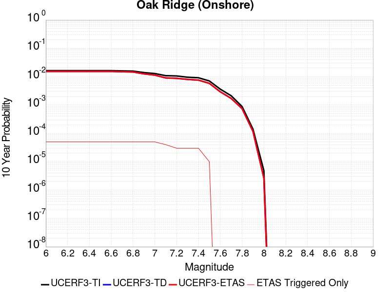 |

| Magnitude | 1 wk TI Prob | 1 wk TD Prob | 1 wk ETAS Prob | 1 wk ETAS/TD Gain | 1 wk ETAS Triggered Only | 1 mo TI Prob | 1 mo TD Prob | 1 mo ETAS Prob | 1 mo ETAS/TD Gain | 1 mo ETAS Triggered Only | 1 yr TI Prob | 1 yr TD Prob | 1 yr ETAS Prob | 1 yr ETAS/TD Gain | 1 yr ETAS Triggered Only | 10 yr TI Prob | 10 yr TD Prob | 10 yr ETAS Prob | 10 yr ETAS/TD Gain | 10 yr ETAS Triggered Only |
|-----|-----|-----|-----|-----|-----|-----|-----|-----|-----|-----|-----|-----|-----|-----|-----|-----|-----|-----|-----|-----|
| 6.0 | 3.155064E-5 | 2.9525974E-5 | 2.9525974E-5 | 1.0 | 0.0 | 1.3521002E-4 | 1.2653397E-4 | 1.4871346E-4 | 1.1752849 | 2.2182294E-5 | 0.001644939 | 0.0015395004 | 0.0015837967 | 1.0287732 | 4.4364588E-5 | 0.01632816 | 0.015292859 | 0.015336545 | 1.0028566 | 4.4364588E-5 |
| 6.1 | 3.155064E-5 | 2.9525974E-5 | 2.9525974E-5 | 1.0 | 0.0 | 1.3521002E-4 | 1.2653397E-4 | 1.4871346E-4 | 1.1752849 | 2.2182294E-5 | 0.001644939 | 0.0015395004 | 0.0015837967 | 1.0287732 | 4.4364588E-5 | 0.01632816 | 0.015292859 | 0.015336545 | 1.0028566 | 4.4364588E-5 |
| 6.2 | 3.155064E-5 | 2.9525974E-5 | 2.9525974E-5 | 1.0 | 0.0 | 1.3521002E-4 | 1.2653397E-4 | 1.4871346E-4 | 1.1752849 | 2.2182294E-5 | 0.001644939 | 0.0015395004 | 0.0015837967 | 1.0287732 | 4.4364588E-5 | 0.01632816 | 0.015292859 | 0.015336545 | 1.0028566 | 4.4364588E-5 |
| 6.3 | 3.155064E-5 | 2.9525974E-5 | 2.9525974E-5 | 1.0 | 0.0 | 1.3521002E-4 | 1.2653397E-4 | 1.4871346E-4 | 1.1752849 | 2.2182294E-5 | 0.001644939 | 0.0015395004 | 0.0015837967 | 1.0287732 | 4.4364588E-5 | 0.01632816 | 0.015292859 | 0.015336545 | 1.0028566 | 4.4364588E-5 |
| 6.4 | 3.155064E-5 | 2.9525974E-5 | 2.9525974E-5 | 1.0 | 0.0 | 1.3521002E-4 | 1.2653397E-4 | 1.4871346E-4 | 1.1752849 | 2.2182294E-5 | 0.001644939 | 0.0015395004 | 0.0015837967 | 1.0287732 | 4.4364588E-5 | 0.01632816 | 0.015292859 | 0.015336545 | 1.0028566 | 4.4364588E-5 |
| 6.5 | 3.155064E-5 | 2.9525974E-5 | 2.9525974E-5 | 1.0 | 0.0 | 1.3521002E-4 | 1.2653397E-4 | 1.4871346E-4 | 1.1752849 | 2.2182294E-5 | 0.001644939 | 0.0015395004 | 0.0015837967 | 1.0287732 | 4.4364588E-5 | 0.01632816 | 0.015292859 | 0.015336545 | 1.0028566 | 4.4364588E-5 |
| 6.6 | 3.155064E-5 | 2.9525974E-5 | 2.9525974E-5 | 1.0 | 0.0 | 1.3521002E-4 | 1.2653397E-4 | 1.4871346E-4 | 1.1752849 | 2.2182294E-5 | 0.001644939 | 0.0015395004 | 0.0015837967 | 1.0287732 | 4.4364588E-5 | 0.01632816 | 0.015292859 | 0.015336545 | 1.0028566 | 4.4364588E-5 |
| 6.7 | 3.098897E-5 | 2.8864175E-5 | 2.8864175E-5 | 1.0 | 0.0 | 1.328031E-4 | 1.2369796E-4 | 1.4587751E-4 | 1.1793041 | 2.2182294E-5 | 0.0016156785 | 0.0015050198 | 0.0015493176 | 1.0294334 | 4.4364588E-5 | 0.016039822 | 0.014952714 | 0.014996415 | 1.0029227 | 4.4364588E-5 |
| 6.8 | 3.0449872E-5 | 2.8239372E-5 | 2.8239372E-5 | 1.0 | 0.0 | 1.3049292E-4 | 1.2102048E-4 | 1.4320009E-4 | 1.1832715 | 2.2182294E-5 | 0.0015875935 | 0.0014724657 | 0.0015167649 | 1.0300851 | 4.4364588E-5 | 0.015762992 | 0.014631462 | 0.014675178 | 1.0029877 | 4.4364588E-5 |
| 6.9 | 2.697928E-5 | 2.4219773E-5 | 2.4219773E-5 | 1.0 | 0.0 | 1.15620365E-4 | 1.0379502E-4 | 1.2597501E-4 | 1.2136903 | 2.2182294E-5 | 0.0014067689 | 0.0012629933 | 0.0013073019 | 1.0350822 | 4.4364588E-5 | 0.0139789665 | 0.01256087 | 0.012604677 | 1.0034876 | 4.4364588E-5 |
| 7.0 | 2.4893961E-5 | 2.1862043E-5 | 2.1862043E-5 | 1.0 | 0.0 | 1.0668404E-4 | 9.3691204E-5 | 1.15871415E-4 | 1.2367375 | 2.2182294E-5 | 0.0012981043 | 0.0011401111 | 0.0011844252 | 1.0388682 | 4.4364588E-5 | 0.012905477 | 0.011344905 | 0.011388767 | 1.0038662 | 4.4364588E-5 |
| 7.1 | 2.0945363E-5 | 1.7354487E-5 | 1.7354487E-5 | 1.0 | 0.0 | 8.976275E-5 | 7.437428E-5 | 9.6554926E-5 | 1.29823 | 2.2182294E-5 | 0.0010923136 | 9.051354E-4 | 9.4945985E-4 | 1.04897 | 4.4364588E-5 | 0.0108696 | 0.009015423 | 0.009059387 | 1.0048766 | 4.4364588E-5 |
| 7.2 | 2.0439404E-5 | 1.6809423E-5 | 1.6809423E-5 | 1.0 | 0.0 | 8.7594504E-5 | 7.203843E-5 | 9.421912E-5 | 1.3079009 | 2.2182294E-5 | 0.0010659413 | 8.767196E-4 | 9.2104526E-4 | 1.0505586 | 4.4364588E-5 | 0.010608427 | 0.008733526 | 0.008777503 | 1.0050354 | 4.4364588E-5 |
| 7.3 | 1.8463334E-5 | 1.5381811E-5 | 1.5381811E-5 | 1.0 | 0.0 | 7.912617E-5 | 6.59204E-5 | 8.810124E-5 | 1.336479 | 2.2182294E-5 | 9.6293533E-4 | 8.0228975E-4 | 8.466187E-4 | 1.0552531 | 4.4364588E-5 | 0.009587734 | 0.007994797 | 0.008038807 | 1.0055048 | 4.4364588E-5 |
| 7.4 | 1.763139E-5 | 1.451684E-5 | 1.451684E-5 | 1.0 | 0.0 | 7.556091E-5 | 6.221356E-5 | 8.439448E-5 | 1.3565285 | 2.2182294E-5 | 9.1956573E-4 | 7.571909E-4 | 8.015219E-4 | 1.0585467 | 4.4364588E-5 | 0.009157699 | 0.007546914 | 0.0075909435 | 1.0058341 | 4.4364588E-5 |
| 7.5 | 1.3594944E-5 | 1.1163356E-5 | 1.1163356E-5 | 1.0 | 0.0 | 5.8262744E-5 | 4.784209E-5 | 4.784209E-5 | 1.0 | 0.0 | 7.0911803E-4 | 5.8232434E-4 | 6.044937E-4 | 1.0380704 | 2.2182294E-5 | 0.007068595 | 0.0058082556 | 0.005830309 | 1.0037969 | 2.2182294E-5 |
| 7.6 | 6.9889534E-6 | 5.6367144E-6 | 5.6367144E-6 | 1.0 | 0.0 | 2.9952313E-5 | 2.4157125E-5 | 2.4157125E-5 | 1.0 | 0.0 | 3.646084E-4 | 2.9407372E-4 | 2.9407372E-4 | 1.0 | 0.0 | 0.0036401073 | 0.0029368899 | 0.0029368899 | 1.0 | 0.0 |
| 7.7 | 4.0824193E-6 | 3.2832586E-6 | 3.2832586E-6 | 1.0 | 0.0 | 1.7495966E-5 | 1.4071033E-5 | 1.4071033E-5 | 1.0 | 0.0 | 2.1299256E-4 | 1.713015E-4 | 1.713015E-4 | 1.0 | 0.0 | 0.0021278851 | 0.0017117079 | 0.0017117079 | 1.0 | 0.0 |
| 7.8 | 1.7023609E-6 | 1.4370495E-6 | 1.4370495E-6 | 1.0 | 0.0 | 7.295812E-6 | 6.1587693E-6 | 6.1587693E-6 | 1.0 | 0.0 | 8.882289E-5 | 7.498047E-5 | 7.498047E-5 | 1.0 | 0.0 | 8.8787393E-4 | 7.495545E-4 | 7.495545E-4 | 1.0 | 0.0 |
| 7.9 | 2.721225E-7 | 2.2616497E-7 | 2.2616497E-7 | 1.0 | 0.0 | 1.1662388E-6 | 9.692781E-7 | 9.692781E-7 | 1.0 | 0.0 | 1.4198865E-5 | 1.1800899E-5 | 1.1800899E-5 | 1.0 | 0.0 | 1.4197957E-4 | 1.1800301E-4 | 1.1800301E-4 | 1.0 | 0.0 |
| 8.0 | 9.364255E-9 | 5.1206666E-9 | 5.1206666E-9 | 1.0 | 0.0 | 4.0132523E-8 | 2.1945715E-8 | 2.1945715E-8 | 1.0 | 0.0 | 4.8861335E-7 | 2.6718905E-7 | 2.6718905E-7 | 1.0 | 0.0 | 4.8861225E-6 | 2.6718876E-6 | 2.6718876E-6 | 1.0 | 0.0 |

## Northridge
*[(top)](#table-of-contents)*

| 1 Week | 1 Month | 1 Year | 10 Year |
|-----|-----|-----|-----|
|  |  |  |  |

| Magnitude | 1 wk TI Prob | 1 wk TD Prob | 1 wk ETAS Prob | 1 wk ETAS/TD Gain | 1 wk ETAS Triggered Only | 1 mo TI Prob | 1 mo TD Prob | 1 mo ETAS Prob | 1 mo ETAS/TD Gain | 1 mo ETAS Triggered Only | 1 yr TI Prob | 1 yr TD Prob | 1 yr ETAS Prob | 1 yr ETAS/TD Gain | 1 yr ETAS Triggered Only | 10 yr TI Prob | 10 yr TD Prob | 10 yr ETAS Prob | 10 yr ETAS/TD Gain | 10 yr ETAS Triggered Only |
|-----|-----|-----|-----|-----|-----|-----|-----|-----|-----|-----|-----|-----|-----|-----|-----|-----|-----|-----|-----|-----|
| 6.0 | 1.8340852E-5 | 7.5880193E-6 | 7.5880193E-6 | 1.0 | 0.0 | 7.860128E-5 | 3.251969E-5 | 5.4701264E-5 | 1.6820967 | 2.2182294E-5 | 9.565505E-4 | 3.958575E-4 | 4.4020452E-4 | 1.1120278 | 4.4364588E-5 | 0.009524435 | 0.003951746 | 0.0039959354 | 1.0111822 | 4.4364588E-5 |
| 6.1 | 1.8340852E-5 | 7.5880193E-6 | 7.5880193E-6 | 1.0 | 0.0 | 7.860128E-5 | 3.251969E-5 | 5.4701264E-5 | 1.6820967 | 2.2182294E-5 | 9.565505E-4 | 3.958575E-4 | 4.4020452E-4 | 1.1120278 | 4.4364588E-5 | 0.009524435 | 0.003951746 | 0.0039959354 | 1.0111822 | 4.4364588E-5 |
| 6.2 | 1.8340852E-5 | 7.5880193E-6 | 7.5880193E-6 | 1.0 | 0.0 | 7.860128E-5 | 3.251969E-5 | 5.4701264E-5 | 1.6820967 | 2.2182294E-5 | 9.565505E-4 | 3.958575E-4 | 4.4020452E-4 | 1.1120278 | 4.4364588E-5 | 0.009524435 | 0.003951746 | 0.0039959354 | 1.0111822 | 4.4364588E-5 |
| 6.3 | 1.8340852E-5 | 7.5880193E-6 | 7.5880193E-6 | 1.0 | 0.0 | 7.860128E-5 | 3.251969E-5 | 5.4701264E-5 | 1.6820967 | 2.2182294E-5 | 9.565505E-4 | 3.958575E-4 | 4.4020452E-4 | 1.1120278 | 4.4364588E-5 | 0.009524435 | 0.003951746 | 0.0039959354 | 1.0111822 | 4.4364588E-5 |
| 6.4 | 1.7361892E-5 | 7.5880193E-6 | 7.5880193E-6 | 1.0 | 0.0 | 7.440598E-5 | 3.251969E-5 | 5.4701264E-5 | 1.6820967 | 2.2182294E-5 | 9.055163E-4 | 3.958575E-4 | 4.4020452E-4 | 1.1120278 | 4.4364588E-5 | 0.009018354 | 0.003951746 | 0.0039959354 | 1.0111822 | 4.4364588E-5 |
| 6.5 | 1.7361892E-5 | 7.5880193E-6 | 7.5880193E-6 | 1.0 | 0.0 | 7.440598E-5 | 3.251969E-5 | 5.4701264E-5 | 1.6820967 | 2.2182294E-5 | 9.055163E-4 | 3.958575E-4 | 4.4020452E-4 | 1.1120278 | 4.4364588E-5 | 0.009018354 | 0.003951746 | 0.0039959354 | 1.0111822 | 4.4364588E-5 |
| 6.6 | 1.5458201E-5 | 7.5880193E-6 | 7.5880193E-6 | 1.0 | 0.0 | 6.624775E-5 | 3.251969E-5 | 5.4701264E-5 | 1.6820967 | 2.2182294E-5 | 8.0626784E-4 | 3.958575E-4 | 4.4020452E-4 | 1.1120278 | 4.4364588E-5 | 0.008033488 | 0.003951746 | 0.0039959354 | 1.0111822 | 4.4364588E-5 |
| 6.7 | 1.2538368E-5 | 6.381603E-6 | 6.381603E-6 | 1.0 | 0.0 | 5.3734755E-5 | 2.7349442E-5 | 4.953113E-5 | 1.8110472 | 2.2182294E-5 | 6.5402425E-4 | 3.3292902E-4 | 3.7727883E-4 | 1.133211 | 4.4364588E-5 | 0.0065210275 | 0.0033243506 | 0.0033685677 | 1.013301 | 4.4364588E-5 |
| 6.8 | 1.1438097E-5 | 6.3502566E-6 | 6.3502566E-6 | 1.0 | 0.0 | 4.9019498E-5 | 2.7215105E-5 | 4.9396796E-5 | 1.8150507 | 2.2182294E-5 | 5.9664896E-4 | 3.3129397E-4 | 3.7564384E-4 | 1.1338687 | 4.4364588E-5 | 0.005950495 | 0.0033080487 | 0.0033522665 | 1.0133667 | 4.4364588E-5 |
| 6.9 | 1.1204891E-5 | 6.2867084E-6 | 6.2867084E-6 | 1.0 | 0.0 | 4.8020076E-5 | 2.694276E-5 | 4.9124457E-5 | 1.8232896 | 2.2182294E-5 | 5.8448757E-4 | 3.2797916E-4 | 3.723292E-4 | 1.1352221 | 4.4364588E-5 | 0.0058295266 | 0.0032749989 | 0.003319218 | 1.0135021 | 4.4364588E-5 |
| 7.0 | 1.061046E-5 | 6.115359E-6 | 6.115359E-6 | 1.0 | 0.0 | 4.5472607E-5 | 2.6208421E-5 | 4.8390135E-5 | 1.8463582 | 2.2182294E-5 | 5.534883E-4 | 3.1904122E-4 | 3.6339168E-4 | 1.1390116 | 4.4364588E-5 | 0.0055211177 | 0.0031858785 | 0.003230102 | 1.013881 | 4.4364588E-5 |
| 7.1 | 1.0266979E-5 | 6.004274E-6 | 6.004274E-6 | 1.0 | 0.0 | 4.40006E-5 | 2.5732352E-5 | 4.7914076E-5 | 1.8620169 | 2.2182294E-5 | 5.355756E-4 | 3.1324677E-4 | 3.5759746E-4 | 1.1415839 | 4.4364588E-5 | 0.0053428668 | 0.003128098 | 0.003172324 | 1.0141382 | 4.4364588E-5 |
| 7.2 | 9.91273E-6 | 5.819984E-6 | 5.819984E-6 | 1.0 | 0.0 | 4.248244E-5 | 2.4942554E-5 | 4.7124293E-5 | 1.8893132 | 2.2182294E-5 | 5.171009E-4 | 3.036337E-4 | 3.479848E-4 | 1.1460679 | 4.4364588E-5 | 0.0051589934 | 0.0030322333 | 0.0030764635 | 1.0145867 | 4.4364588E-5 |
| 7.3 | 8.4959265E-6 | 5.193062E-6 | 5.193062E-6 | 1.0 | 0.0 | 3.6410605E-5 | 2.225579E-5 | 4.443759E-5 | 1.9966755 | 2.2182294E-5 | 4.4320893E-4 | 2.709308E-4 | 3.1528337E-4 | 1.1637044 | 4.4364588E-5 | 0.00442326 | 0.0027060313 | 0.002750276 | 1.0163504 | 4.4364588E-5 |
| 7.4 | 8.0847185E-6 | 4.9819355E-6 | 4.9819355E-6 | 1.0 | 0.0 | 3.4648332E-5 | 2.135098E-5 | 4.35328E-5 | 2.0389135 | 2.2182294E-5 | 4.2176177E-4 | 2.599174E-4 | 3.0427045E-4 | 1.1706429 | 4.4364588E-5 | 0.0042096223 | 0.00259616 | 0.0026404094 | 1.0170442 | 4.4364588E-5 |
| 7.5 | 6.8220684E-6 | 4.2533075E-6 | 4.2533075E-6 | 1.0 | 0.0 | 2.9237108E-5 | 1.8228335E-5 | 1.8228335E-5 | 1.0 | 0.0 | 3.5590364E-4 | 2.2190758E-4 | 2.4408495E-4 | 1.0999397 | 2.2182294E-5 | 0.0035533418 | 0.002216881 | 0.002239014 | 1.0099839 | 2.2182294E-5 |
| 7.6 | 4.4224143E-6 | 2.8999582E-6 | 2.8999582E-6 | 1.0 | 0.0 | 1.8953066E-5 | 1.2428334E-5 | 1.2428334E-5 | 1.0 | 0.0 | 2.3072914E-4 | 1.5130457E-4 | 1.5130457E-4 | 1.0 | 0.0 | 0.0023048974 | 0.0015120271 | 0.0015120271 | 1.0 | 0.0 |
| 7.7 | 2.5297056E-6 | 1.6045905E-6 | 1.6045905E-6 | 1.0 | 0.0 | 1.0841551E-5 | 6.8767986E-6 | 6.8767986E-6 | 1.0 | 0.0 | 1.319879E-4 | 8.3721854E-5 | 8.3721854E-5 | 1.0 | 0.0 | 0.0013190953 | 8.369078E-4 | 8.369078E-4 | 1.0 | 0.0 |
| 7.8 | 1.2508156E-6 | 8.780076E-7 | 8.780076E-7 | 1.0 | 0.0 | 5.3606273E-6 | 3.7628845E-6 | 3.7628845E-6 | 1.0 | 0.0 | 6.526368E-5 | 4.581217E-5 | 4.581217E-5 | 1.0 | 0.0 | 6.524452E-4 | 4.5802852E-4 | 4.5802852E-4 | 1.0 | 0.0 |
| 7.9 | 2.262199E-7 | 1.4664671E-7 | 1.4664671E-7 | 1.0 | 0.0 | 9.695135E-7 | 6.284858E-7 | 6.284858E-7 | 1.0 | 0.0 | 1.1803763E-5 | 7.651788E-6 | 7.651788E-6 | 1.0 | 0.0 | 1.1803136E-4 | 7.651533E-5 | 7.651533E-5 | 1.0 | 0.0 |
| 8.0 | 2.865362E-9 | 1.2753101E-9 | 1.2753101E-9 | 1.0 | 0.0 | 1.2280123E-8 | 5.4656146E-9 | 5.4656146E-9 | 1.0 | 0.0 | 1.4951048E-7 | 6.654386E-8 | 6.654386E-8 | 1.0 | 0.0 | 1.4951038E-6 | 6.654386E-7 | 6.654386E-7 | 1.0 | 0.0 |

## Sierra Madre
*[(top)](#table-of-contents)*

| 1 Week | 1 Month | 1 Year | 10 Year |
|-----|-----|-----|-----|
|  | 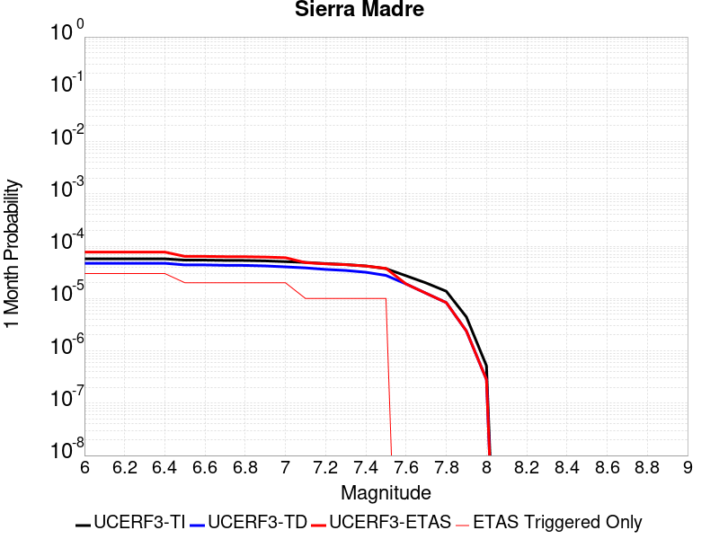 |  |  |

| Magnitude | 1 wk TI Prob | 1 wk TD Prob | 1 wk ETAS Prob | 1 wk ETAS/TD Gain | 1 wk ETAS Triggered Only | 1 mo TI Prob | 1 mo TD Prob | 1 mo ETAS Prob | 1 mo ETAS/TD Gain | 1 mo ETAS Triggered Only | 1 yr TI Prob | 1 yr TD Prob | 1 yr ETAS Prob | 1 yr ETAS/TD Gain | 1 yr ETAS Triggered Only | 10 yr TI Prob | 10 yr TD Prob | 10 yr ETAS Prob | 10 yr ETAS/TD Gain | 10 yr ETAS Triggered Only |
|-----|-----|-----|-----|-----|-----|-----|-----|-----|-----|-----|-----|-----|-----|-----|-----|-----|-----|-----|-----|-----|
| 6.0 | 1.3379373E-5 | 1.10007395E-5 | 3.318279E-5 | 3.0164144 | 2.2182294E-5 | 5.7338908E-5 | 4.7145186E-5 | 6.932643E-5 | 1.4704881 | 2.2182294E-5 | 6.978776E-4 | 5.738429E-4 | 5.960125E-4 | 1.0386335 | 2.2182294E-5 | 0.0069569005 | 0.0057239756 | 0.0057680863 | 1.0077063 | 4.4364588E-5 |
| 6.1 | 1.3379373E-5 | 1.10007395E-5 | 3.318279E-5 | 3.0164144 | 2.2182294E-5 | 5.7338908E-5 | 4.7145186E-5 | 6.932643E-5 | 1.4704881 | 2.2182294E-5 | 6.978776E-4 | 5.738429E-4 | 5.960125E-4 | 1.0386335 | 2.2182294E-5 | 0.0069569005 | 0.0057239756 | 0.0057680863 | 1.0077063 | 4.4364588E-5 |
| 6.2 | 1.3379373E-5 | 1.10007395E-5 | 3.318279E-5 | 3.0164144 | 2.2182294E-5 | 5.7338908E-5 | 4.7145186E-5 | 6.932643E-5 | 1.4704881 | 2.2182294E-5 | 6.978776E-4 | 5.738429E-4 | 5.960125E-4 | 1.0386335 | 2.2182294E-5 | 0.0069569005 | 0.0057239756 | 0.0057680863 | 1.0077063 | 4.4364588E-5 |
| 6.3 | 1.3379373E-5 | 1.10007395E-5 | 3.318279E-5 | 3.0164144 | 2.2182294E-5 | 5.7338908E-5 | 4.7145186E-5 | 6.932643E-5 | 1.4704881 | 2.2182294E-5 | 6.978776E-4 | 5.738429E-4 | 5.960125E-4 | 1.0386335 | 2.2182294E-5 | 0.0069569005 | 0.0057239756 | 0.0057680863 | 1.0077063 | 4.4364588E-5 |
| 6.4 | 1.3379373E-5 | 1.10007395E-5 | 3.318279E-5 | 3.0164144 | 2.2182294E-5 | 5.7338908E-5 | 4.7145186E-5 | 6.932643E-5 | 1.4704881 | 2.2182294E-5 | 6.978776E-4 | 5.738429E-4 | 5.960125E-4 | 1.0386335 | 2.2182294E-5 | 0.0069569005 | 0.0057239756 | 0.0057680863 | 1.0077063 | 4.4364588E-5 |
| 6.5 | 1.26563245E-5 | 1.0230196E-5 | 1.0230196E-5 | 1.0 | 0.0 | 5.4240263E-5 | 4.3842967E-5 | 4.3842967E-5 | 1.0 | 0.0 | 6.601751E-4 | 5.336584E-4 | 5.336584E-4 | 1.0 | 0.0 | 0.006582173 | 0.0053240913 | 0.0053461553 | 1.0041442 | 2.2182294E-5 |
| 6.6 | 1.26563245E-5 | 1.0230196E-5 | 1.0230196E-5 | 1.0 | 0.0 | 5.4240263E-5 | 4.3842967E-5 | 4.3842967E-5 | 1.0 | 0.0 | 6.601751E-4 | 5.336584E-4 | 5.336584E-4 | 1.0 | 0.0 | 0.006582173 | 0.0053240913 | 0.0053461553 | 1.0041442 | 2.2182294E-5 |
| 6.7 | 1.2502474E-5 | 1.006634E-5 | 1.006634E-5 | 1.0 | 0.0 | 5.3580934E-5 | 4.314075E-5 | 4.314075E-5 | 1.0 | 0.0 | 6.521526E-4 | 5.251131E-4 | 5.251131E-4 | 1.0 | 0.0 | 0.0065024206 | 0.0052390425 | 0.0052611083 | 1.0042119 | 2.2182294E-5 |
| 6.8 | 1.2454966E-5 | 1.0018625E-5 | 1.0018625E-5 | 1.0 | 0.0 | 5.3377335E-5 | 4.2936266E-5 | 4.2936266E-5 | 1.0 | 0.0 | 6.4967526E-4 | 5.226247E-4 | 5.226247E-4 | 1.0 | 0.0 | 0.006477792 | 0.0052142753 | 0.005236342 | 1.0042319 | 2.2182294E-5 |
| 6.9 | 1.2225574E-5 | 9.792602E-6 | 9.792602E-6 | 1.0 | 0.0 | 5.2394265E-5 | 4.1967625E-5 | 4.1967625E-5 | 1.0 | 0.0 | 6.3771347E-4 | 5.108371E-4 | 5.108371E-4 | 1.0 | 0.0 | 0.006358865 | 0.0050969445 | 0.0050969445 | 1.0 | 0.0 |
| 7.0 | 1.182946E-5 | 9.399144E-6 | 9.399144E-6 | 1.0 | 0.0 | 5.06967E-5 | 4.0281426E-5 | 4.0281426E-5 | 1.0 | 0.0 | 6.1705755E-4 | 4.9031706E-4 | 4.9031706E-4 | 1.0 | 0.0 | 0.006153469 | 0.004892664 | 0.004892664 | 1.0 | 0.0 |
| 7.1 | 1.14369095E-5 | 8.986159E-6 | 8.986159E-6 | 1.0 | 0.0 | 4.9014405E-5 | 3.8511545E-5 | 3.8511545E-5 | 1.0 | 0.0 | 5.9658696E-4 | 4.687782E-4 | 4.687782E-4 | 1.0 | 0.0 | 0.005949879 | 0.004678199 | 0.004678199 | 1.0 | 0.0 |
| 7.2 | 1.0836419E-5 | 8.3995565E-6 | 8.3995565E-6 | 1.0 | 0.0 | 4.644097E-5 | 3.5997607E-5 | 3.5997607E-5 | 1.0 | 0.0 | 5.652721E-4 | 4.3818366E-4 | 4.3818366E-4 | 1.0 | 0.0 | 0.0056383642 | 0.004373494 | 0.004373494 | 1.0 | 0.0 |
| 7.3 | 1.0403439E-5 | 8.02082E-6 | 8.02082E-6 | 1.0 | 0.0 | 4.4585406E-5 | 3.4374494E-5 | 3.4374494E-5 | 1.0 | 0.0 | 5.426921E-4 | 4.1843E-4 | 4.1843E-4 | 1.0 | 0.0 | 0.005413687 | 0.004176717 | 0.004176717 | 1.0 | 0.0 |
| 7.4 | 9.768864E-6 | 7.414448E-6 | 7.414448E-6 | 1.0 | 0.0 | 4.186589E-5 | 3.1775824E-5 | 3.1775824E-5 | 1.0 | 0.0 | 5.09598E-4 | 3.868029E-4 | 3.868029E-4 | 1.0 | 0.0 | 0.0050843097 | 0.0038615882 | 0.0038615882 | 1.0 | 0.0 |
| 7.5 | 8.687089E-6 | 6.4501564E-6 | 6.4501564E-6 | 1.0 | 0.0 | 3.722985E-5 | 2.764324E-5 | 2.764324E-5 | 1.0 | 0.0 | 4.5317915E-4 | 3.3650533E-4 | 3.3650533E-4 | 1.0 | 0.0 | 0.004522561 | 0.0033602451 | 0.0033602451 | 1.0 | 0.0 |
| 7.6 | 6.3506063E-6 | 4.4303215E-6 | 4.4303215E-6 | 1.0 | 0.0 | 2.72166E-5 | 1.8986955E-5 | 1.8986955E-5 | 1.0 | 0.0 | 3.3131172E-4 | 2.3114192E-4 | 2.3114192E-4 | 1.0 | 0.0 | 0.003308182 | 0.0023092402 | 0.0023092402 | 1.0 | 0.0 |
| 7.7 | 4.62223E-6 | 2.932967E-6 | 2.932967E-6 | 1.0 | 0.0 | 1.9809406E-5 | 1.2569798E-5 | 1.2569798E-5 | 1.0 | 0.0 | 2.4115283E-4 | 1.5302657E-4 | 1.5302657E-4 | 1.0 | 0.0 | 0.0024089129 | 0.001529413 | 0.001529413 | 1.0 | 0.0 |
| 7.8 | 3.2145008E-6 | 1.9494332E-6 | 1.9494332E-6 | 1.0 | 0.0 | 1.3776359E-5 | 8.3546865E-6 | 8.3546865E-6 | 1.0 | 0.0 | 1.6771426E-4 | 1.0171358E-4 | 1.0171358E-4 | 1.0 | 0.0 | 0.0016758774 | 0.0010168145 | 0.0010168145 | 1.0 | 0.0 |
| 7.9 | 1.0391769E-6 | 5.6026335E-7 | 5.6026335E-7 | 1.0 | 0.0 | 4.4536077E-6 | 2.4011265E-6 | 2.4011265E-6 | 1.0 | 0.0 | 5.4221324E-5 | 2.9233326E-5 | 2.9233326E-5 | 1.0 | 0.0 | 5.4208096E-4 | 2.9229524E-4 | 2.9229524E-4 | 1.0 | 0.0 |
| 8.0 | 1.210983E-7 | 6.613821E-8 | 6.613821E-8 | 1.0 | 0.0 | 5.1899264E-7 | 2.8344945E-7 | 2.8344945E-7 | 1.0 | 0.0 | 6.3187167E-6 | 3.4509917E-6 | 3.4509917E-6 | 1.0 | 0.0 | 6.318537E-5 | 3.45094E-5 | 3.45094E-5 | 1.0 | 0.0 |

## Blue Cut
*[(top)](#table-of-contents)*

| 1 Week | 1 Month | 1 Year | 10 Year |
|-----|-----|-----|-----|
|  |  |  |  |

| Magnitude | 1 wk TI Prob | 1 wk TD Prob | 1 wk ETAS Prob | 1 wk ETAS/TD Gain | 1 wk ETAS Triggered Only | 1 mo TI Prob | 1 mo TD Prob | 1 mo ETAS Prob | 1 mo ETAS/TD Gain | 1 mo ETAS Triggered Only | 1 yr TI Prob | 1 yr TD Prob | 1 yr ETAS Prob | 1 yr ETAS/TD Gain | 1 yr ETAS Triggered Only | 10 yr TI Prob | 10 yr TD Prob | 10 yr ETAS Prob | 10 yr ETAS/TD Gain | 10 yr ETAS Triggered Only |
|-----|-----|-----|-----|-----|-----|-----|-----|-----|-----|-----|-----|-----|-----|-----|-----|-----|-----|-----|-----|-----|
| 6.0 | 2.1227985E-5 | 2.2719574E-5 | 4.4901364E-5 | 1.9763294 | 2.2182294E-5 | 9.097391E-5 | 9.73663E-5 | 1.4172657E-4 | 1.4556019 | 4.4364588E-5 | 0.0011070445 | 0.0011848481 | 0.0012291601 | 1.0373989 | 4.4364588E-5 | 0.011015458 | 0.011791152 | 0.011834993 | 1.0037181 | 4.4364588E-5 |
| 6.1 | 2.1227985E-5 | 2.2719574E-5 | 4.4901364E-5 | 1.9763294 | 2.2182294E-5 | 9.097391E-5 | 9.73663E-5 | 1.4172657E-4 | 1.4556019 | 4.4364588E-5 | 0.0011070445 | 0.0011848481 | 0.0012291601 | 1.0373989 | 4.4364588E-5 | 0.011015458 | 0.011791152 | 0.011834993 | 1.0037181 | 4.4364588E-5 |
| 6.2 | 2.1227985E-5 | 2.2719574E-5 | 4.4901364E-5 | 1.9763294 | 2.2182294E-5 | 9.097391E-5 | 9.73663E-5 | 1.4172657E-4 | 1.4556019 | 4.4364588E-5 | 0.0011070445 | 0.0011848481 | 0.0012291601 | 1.0373989 | 4.4364588E-5 | 0.011015458 | 0.011791152 | 0.011834993 | 1.0037181 | 4.4364588E-5 |
| 6.3 | 1.1613981E-5 | 1.2353542E-5 | 3.4535562E-5 | 2.7956 | 2.2182294E-5 | 4.9773254E-5 | 5.2942745E-5 | 7.512387E-5 | 1.4189643 | 2.2182294E-5 | 6.0582085E-4 | 6.443998E-4 | 6.6656776E-4 | 1.034401 | 2.2182294E-5 | 0.0060417196 | 0.0064265593 | 0.006448599 | 1.0034295 | 2.2182294E-5 |
| 6.4 | 1.1613981E-5 | 1.2353542E-5 | 3.4535562E-5 | 2.7956 | 2.2182294E-5 | 4.9773254E-5 | 5.2942745E-5 | 7.512387E-5 | 1.4189643 | 2.2182294E-5 | 6.0582085E-4 | 6.443998E-4 | 6.6656776E-4 | 1.034401 | 2.2182294E-5 | 0.0060417196 | 0.0064265593 | 0.006448599 | 1.0034295 | 2.2182294E-5 |
| 6.5 | 8.931326E-6 | 9.4816E-6 | 3.1663683E-5 | 3.3394876 | 2.2182294E-5 | 3.8276554E-5 | 4.0634844E-5 | 6.281624E-5 | 1.5458713 | 2.2182294E-5 | 4.6591737E-4 | 4.946261E-4 | 5.167974E-4 | 1.0448244 | 2.2182294E-5 | 0.0046494175 | 0.004936161 | 0.004958234 | 1.0044717 | 2.2182294E-5 |
| 6.6 | 7.345353E-6 | 7.79028E-6 | 2.99724E-5 | 3.8474102 | 2.2182294E-5 | 3.1479703E-5 | 3.338653E-5 | 5.556808E-5 | 1.6643864 | 2.2182294E-5 | 3.83198E-4 | 4.064132E-4 | 4.2858647E-4 | 1.0545585 | 2.2182294E-5 | 0.0038253788 | 0.0040574907 | 0.004079583 | 1.0054448 | 2.2182294E-5 |
| 6.7 | 6.2775666E-6 | 6.655149E-6 | 2.8837296E-5 | 4.3330803 | 2.2182294E-5 | 2.690358E-5 | 2.8521798E-5 | 5.070346E-5 | 1.7777091 | 2.2182294E-5 | 3.2750185E-4 | 3.472051E-4 | 3.6937968E-4 | 1.063866 | 2.2182294E-5 | 0.0032701963 | 0.003467367 | 0.0034894724 | 1.0063753 | 2.2182294E-5 |
| 6.8 | 5.5234095E-6 | 5.8551113E-6 | 2.8037275E-5 | 4.7885127 | 2.2182294E-5 | 2.367154E-5 | 2.5093133E-5 | 4.7274872E-5 | 1.8839763 | 2.2182294E-5 | 2.8816288E-4 | 3.0547334E-4 | 3.2764886E-4 | 1.0725939 | 2.2182294E-5 | 0.002877895 | 0.0030512505 | 0.0030733652 | 1.0072477 | 2.2182294E-5 |
| 6.9 | 4.7780054E-6 | 5.0654203E-6 | 2.7247603E-5 | 5.3791394 | 2.2182294E-5 | 2.0477004E-5 | 2.1708804E-5 | 4.3890617E-5 | 2.0217888 | 2.2182294E-5 | 2.4927902E-4 | 2.642797E-4 | 2.864561E-4 | 1.0839127 | 2.2182294E-5 | 0.0024899957 | 0.002640346 | 0.0026624699 | 1.0083791 | 2.2182294E-5 |
| 7.0 | 3.883171E-6 | 4.118487E-6 | 2.630069E-5 | 6.386008 | 2.2182294E-5 | 1.6642054E-5 | 1.7650578E-5 | 3.983248E-5 | 2.2567239 | 2.2182294E-5 | 2.0259817E-4 | 2.1488148E-4 | 2.3705902E-4 | 1.1032082 | 2.2182294E-5 | 0.0020241356 | 0.0021474129 | 0.0021695474 | 1.0103076 | 2.2182294E-5 |
| 7.1 | 2.8358215E-6 | 3.0097158E-6 | 2.5191943E-5 | 8.370207 | 2.2182294E-5 | 1.2153464E-5 | 1.2898756E-5 | 3.5080764E-5 | 2.7197013 | 2.2182294E-5 | 1.4795837E-4 | 1.5703762E-4 | 1.7921643E-4 | 1.1412325 | 2.2182294E-5 | 0.001478599 | 0.0015699116 | 0.001592059 | 1.0141075 | 2.2182294E-5 |

## Big Pine (Central)
*[(top)](#table-of-contents)*

| 1 Week | 1 Month | 1 Year | 10 Year |
|-----|-----|-----|-----|
|  |  |  |  |

| Magnitude | 1 wk TI Prob | 1 wk TD Prob | 1 wk ETAS Prob | 1 wk ETAS/TD Gain | 1 wk ETAS Triggered Only | 1 mo TI Prob | 1 mo TD Prob | 1 mo ETAS Prob | 1 mo ETAS/TD Gain | 1 mo ETAS Triggered Only | 1 yr TI Prob | 1 yr TD Prob | 1 yr ETAS Prob | 1 yr ETAS/TD Gain | 1 yr ETAS Triggered Only | 10 yr TI Prob | 10 yr TD Prob | 10 yr ETAS Prob | 10 yr ETAS/TD Gain | 10 yr ETAS Triggered Only |
|-----|-----|-----|-----|-----|-----|-----|-----|-----|-----|-----|-----|-----|-----|-----|-----|-----|-----|-----|-----|-----|
| 6.0 | 1.2706755E-5 | 1.4250529E-5 | 3.6432506E-5 | 2.5565724 | 2.2182294E-5 | 5.4456385E-5 | 6.107247E-5 | 8.3253406E-5 | 1.3631905 | 2.2182294E-5 | 6.628048E-4 | 7.433402E-4 | 7.8767183E-4 | 1.0596384 | 4.4364588E-5 | 0.006608314 | 0.0074135666 | 0.0074576023 | 1.0059398 | 4.4364588E-5 |
| 6.1 | 8.342579E-6 | 9.510762E-6 | 9.510762E-6 | 1.0 | 0.0 | 3.5753423E-5 | 4.0759893E-5 | 4.0759893E-5 | 1.0 | 0.0 | 4.3521097E-4 | 4.961604E-4 | 5.183317E-4 | 1.0446857 | 2.2182294E-5 | 0.0043435963 | 0.0049540824 | 0.004976155 | 1.0044554 | 2.2182294E-5 |
| 6.2 | 6.923899E-6 | 7.967147E-6 | 7.967147E-6 | 1.0 | 0.0 | 2.9673516E-5 | 3.4144578E-5 | 3.4144578E-5 | 1.0 | 0.0 | 3.6121515E-4 | 4.156502E-4 | 4.3782327E-4 | 1.0533456 | 2.2182294E-5 | 0.003606286 | 0.0041520367 | 0.004174127 | 1.0053203 | 2.2182294E-5 |
| 6.3 | 2.728396E-6 | 3.4242908E-6 | 3.4242908E-6 | 1.0 | 0.0 | 1.1693074E-5 | 1.4675454E-5 | 1.4675454E-5 | 1.0 | 0.0 | 1.4235388E-4 | 1.7865987E-4 | 1.7865987E-4 | 1.0 | 0.0 | 0.0014226272 | 0.0017866704 | 0.0017866704 | 1.0 | 0.0 |
| 6.4 | 2.7136944E-6 | 3.408584E-6 | 3.408584E-6 | 1.0 | 0.0 | 1.1630066E-5 | 1.4608141E-5 | 1.4608141E-5 | 1.0 | 0.0 | 1.4158686E-4 | 1.7784047E-4 | 1.7784047E-4 | 1.0 | 0.0 | 0.0014149669 | 0.0017784894 | 0.0017784894 | 1.0 | 0.0 |
| 6.5 | 2.6971882E-6 | 3.3909291E-6 | 3.3909291E-6 | 1.0 | 0.0 | 1.1559327E-5 | 1.45324775E-5 | 1.45324775E-5 | 1.0 | 0.0 | 1.4072572E-4 | 1.7691942E-4 | 1.7691942E-4 | 1.0 | 0.0 | 0.0014063664 | 0.0017692937 | 0.0017692937 | 1.0 | 0.0 |
| 6.6 | 2.669092E-6 | 3.3609497E-6 | 3.3609497E-6 | 1.0 | 0.0 | 1.1438916E-5 | 1.4403995E-5 | 1.4403995E-5 | 1.0 | 0.0 | 1.3925991E-4 | 1.753554E-4 | 1.753554E-4 | 1.0 | 0.0 | 0.0013917267 | 0.0017536782 | 0.0017536782 | 1.0 | 0.0 |
| 6.7 | 2.6408059E-6 | 3.3309752E-6 | 3.3309752E-6 | 1.0 | 0.0 | 1.1317691E-5 | 1.4275535E-5 | 1.4275535E-5 | 1.0 | 0.0 | 1.3778417E-4 | 1.7379165E-4 | 1.7379165E-4 | 1.0 | 0.0 | 0.0013769877 | 0.0017380653 | 0.0017380653 | 1.0 | 0.0 |
| 6.8 | 2.1786943E-6 | 2.8544325E-6 | 2.8544325E-6 | 1.0 | 0.0 | 9.337228E-6 | 1.2233229E-5 | 1.2233229E-5 | 1.0 | 0.0 | 1.1367482E-4 | 1.4893012E-4 | 1.4893012E-4 | 1.0 | 0.0 | 0.0011361669 | 0.0014897975 | 0.0014897975 | 1.0 | 0.0 |
| 6.9 | 1.4411696E-6 | 2.068499E-6 | 2.068499E-6 | 1.0 | 0.0 | 6.1764263E-6 | 8.864968E-6 | 8.864968E-6 | 1.0 | 0.0 | 7.51954E-5 | 1.079259E-4 | 1.079259E-4 | 1.0 | 0.0 | 7.5169955E-4 | 0.0010801847 | 0.0010801847 | 1.0 | 0.0 |
| 7.0 | 1.0073411E-6 | 1.554261E-6 | 1.554261E-6 | 1.0 | 0.0 | 4.317169E-6 | 6.6611024E-6 | 6.6611024E-6 | 1.0 | 0.0 | 5.2560266E-5 | 8.1096056E-5 | 8.1096056E-5 | 1.0 | 0.0 | 5.2547833E-4 | 8.1210316E-4 | 8.1210316E-4 | 1.0 | 0.0 |
| 7.1 | 8.947104E-7 | 1.4302494E-6 | 1.4302494E-6 | 1.0 | 0.0 | 3.834468E-6 | 6.129627E-6 | 6.129627E-6 | 1.0 | 0.0 | 4.6683643E-5 | 7.46258E-5 | 7.46258E-5 | 1.0 | 0.0 | 4.6673836E-4 | 7.474457E-4 | 7.474457E-4 | 1.0 | 0.0 |
| 7.2 | 5.215166E-7 | 1.0111678E-6 | 1.0111678E-6 | 1.0 | 0.0 | 2.2350691E-6 | 4.3335694E-6 | 4.3335694E-6 | 1.0 | 0.0 | 2.7211627E-5 | 5.2759973E-5 | 5.2759973E-5 | 1.0 | 0.0 | 2.7208295E-4 | 5.2890263E-4 | 5.2890263E-4 | 1.0 | 0.0 |
| 7.3 | 4.4024807E-7 | 9.219589E-7 | 9.219589E-7 | 1.0 | 0.0 | 1.8867761E-6 | 3.9512465E-6 | 3.9512465E-6 | 1.0 | 0.0 | 2.2971257E-5 | 4.810541E-5 | 4.810541E-5 | 1.0 | 0.0 | 2.2968883E-4 | 4.8237795E-4 | 4.8237795E-4 | 1.0 | 0.0 |
| 7.4 | 3.6130905E-7 | 8.358523E-7 | 8.358523E-7 | 1.0 | 0.0 | 1.5484665E-6 | 3.5822195E-6 | 3.5822195E-6 | 1.0 | 0.0 | 1.8852415E-5 | 4.3612687E-5 | 4.3612687E-5 | 1.0 | 0.0 | 1.8850817E-4 | 4.374597E-4 | 4.374597E-4 | 1.0 | 0.0 |
| 7.5 | 3.408184E-7 | 8.108147E-7 | 8.108147E-7 | 1.0 | 0.0 | 1.4606494E-6 | 3.4749157E-6 | 3.4749157E-6 | 1.0 | 0.0 | 1.7783263E-5 | 4.2306317E-5 | 4.2306317E-5 | 1.0 | 0.0 | 1.778184E-4 | 4.2437963E-4 | 4.2437963E-4 | 1.0 | 0.0 |
| 7.6 | 3.1428627E-7 | 7.7316E-7 | 7.7316E-7 | 1.0 | 0.0 | 1.3469405E-6 | 3.3135389E-6 | 3.3135389E-6 | 1.0 | 0.0 | 1.6398877E-5 | 4.0341627E-5 | 4.0341627E-5 | 1.0 | 0.0 | 1.6397667E-4 | 4.0471106E-4 | 4.0471106E-4 | 1.0 | 0.0 |
| 7.7 | 1.7972785E-7 | 5.077752E-7 | 5.077752E-7 | 1.0 | 0.0 | 7.70262E-7 | 2.1761778E-6 | 2.1761778E-6 | 1.0 | 0.0 | 9.377899E-6 | 2.6494654E-5 | 2.6494654E-5 | 1.0 | 0.0 | 9.377503E-5 | 2.662899E-4 | 2.662899E-4 | 1.0 | 0.0 |
| 7.8 | 4.9230927E-8 | 1.198079E-7 | 1.198079E-7 | 1.0 | 0.0 | 2.1098968E-7 | 5.134623E-7 | 5.134623E-7 | 1.0 | 0.0 | 2.5687964E-6 | 6.2513873E-6 | 6.2513873E-6 | 1.0 | 0.0 | 2.5687666E-5 | 6.295415E-5 | 6.295415E-5 | 1.0 | 0.0 |
| 7.9 | 3.6805972E-9 | 4.105293E-9 | 4.105293E-9 | 1.0 | 0.0 | 1.5773987E-8 | 1.7594115E-8 | 1.7594115E-8 | 1.0 | 0.0 | 1.9204828E-7 | 2.1420831E-7 | 2.1420831E-7 | 1.0 | 0.0 | 1.920481E-6 | 2.1900614E-6 | 2.1900614E-6 | 1.0 | 0.0 |

## Pisgah-Bullion Mtn-Mesquite Lk
*[(top)](#table-of-contents)*

| 1 Week | 1 Month | 1 Year | 10 Year |
|-----|-----|-----|-----|
|  |  |  | 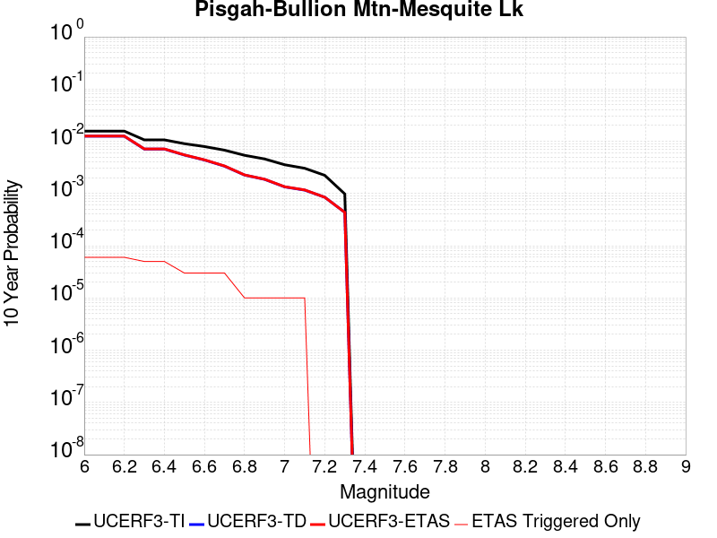 |

| Magnitude | 1 wk TI Prob | 1 wk TD Prob | 1 wk ETAS Prob | 1 wk ETAS/TD Gain | 1 wk ETAS Triggered Only | 1 mo TI Prob | 1 mo TD Prob | 1 mo ETAS Prob | 1 mo ETAS/TD Gain | 1 mo ETAS Triggered Only | 1 yr TI Prob | 1 yr TD Prob | 1 yr ETAS Prob | 1 yr ETAS/TD Gain | 1 yr ETAS Triggered Only | 10 yr TI Prob | 10 yr TD Prob | 10 yr ETAS Prob | 10 yr ETAS/TD Gain | 10 yr ETAS Triggered Only |
|-----|-----|-----|-----|-----|-----|-----|-----|-----|-----|-----|-----|-----|-----|-----|-----|-----|-----|-----|-----|-----|
| 6.0 | 3.0240792E-5 | 2.4091114E-5 | 2.4091114E-5 | 1.0 | 0.0 | 1.2959696E-4 | 1.03244114E-4 | 1.03244114E-4 | 1.0 | 0.0 | 0.0015767008 | 0.0012563728 | 0.0012785272 | 1.0176337 | 2.2182294E-5 | 0.015655609 | 0.012502721 | 0.012546531 | 1.003504 | 4.4364588E-5 |
| 6.1 | 3.0240792E-5 | 2.4091114E-5 | 2.4091114E-5 | 1.0 | 0.0 | 1.2959696E-4 | 1.03244114E-4 | 1.03244114E-4 | 1.0 | 0.0 | 0.0015767008 | 0.0012563728 | 0.0012785272 | 1.0176337 | 2.2182294E-5 | 0.015655609 | 0.012502721 | 0.012546531 | 1.003504 | 4.4364588E-5 |
| 6.2 | 3.0240792E-5 | 2.4091114E-5 | 2.4091114E-5 | 1.0 | 0.0 | 1.2959696E-4 | 1.03244114E-4 | 1.03244114E-4 | 1.0 | 0.0 | 0.0015767008 | 0.0012563728 | 0.0012785272 | 1.0176337 | 2.2182294E-5 | 0.015655609 | 0.012502721 | 0.012546531 | 1.003504 | 4.4364588E-5 |
| 6.3 | 2.0498217E-5 | 1.36380695E-5 | 1.36380695E-5 | 1.0 | 0.0 | 8.784654E-5 | 5.844765E-5 | 5.844765E-5 | 1.0 | 0.0 | 0.0010690069 | 7.1138405E-4 | 7.1138405E-4 | 1.0 | 0.0 | 0.01063879 | 0.0070926943 | 0.0071147196 | 1.0031053 | 2.2182294E-5 |
| 6.4 | 2.0498217E-5 | 1.36380695E-5 | 1.36380695E-5 | 1.0 | 0.0 | 8.784654E-5 | 5.844765E-5 | 5.844765E-5 | 1.0 | 0.0 | 0.0010690069 | 7.1138405E-4 | 7.1138405E-4 | 1.0 | 0.0 | 0.01063879 | 0.0070926943 | 0.0071147196 | 1.0031053 | 2.2182294E-5 |
| 6.5 | 1.7316182E-5 | 1.0477042E-5 | 1.0477042E-5 | 1.0 | 0.0 | 7.42101E-5 | 4.4900895E-5 | 4.4900895E-5 | 1.0 | 0.0 | 9.0313336E-4 | 5.465413E-4 | 5.465413E-4 | 1.0 | 0.0 | 0.008994718 | 0.0054529672 | 0.0054529672 | 1.0 | 0.0 |
| 6.6 | 1.5251077E-5 | 8.414273E-6 | 8.414273E-6 | 1.0 | 0.0 | 6.536012E-5 | 3.6060712E-5 | 3.6060712E-5 | 1.0 | 0.0 | 7.9546886E-4 | 4.3895794E-4 | 4.3895794E-4 | 1.0 | 0.0 | 0.007926274 | 0.0043816264 | 0.0043816264 | 1.0 | 0.0 |
| 6.7 | 1.2997425E-5 | 6.4114965E-6 | 6.4114965E-6 | 1.0 | 0.0 | 5.570206E-5 | 2.7477578E-5 | 2.7477578E-5 | 1.0 | 0.0 | 6.7796157E-4 | 3.3449283E-4 | 3.3449283E-4 | 1.0 | 0.0 | 0.0067589693 | 0.0033403537 | 0.0033403537 | 1.0 | 0.0 |
| 6.8 | 1.035386E-5 | 4.3332193E-6 | 4.3332193E-6 | 1.0 | 0.0 | 4.437293E-5 | 1.8570812E-5 | 1.8570812E-5 | 1.0 | 0.0 | 5.401065E-4 | 2.2607706E-4 | 2.2607706E-4 | 1.0 | 0.0 | 0.0053879567 | 0.0022585576 | 0.0022585576 | 1.0 | 0.0 |
| 6.9 | 8.816252E-6 | 3.580638E-6 | 3.580638E-6 | 1.0 | 0.0 | 3.778339E-5 | 1.5345504E-5 | 1.5345504E-5 | 1.0 | 0.0 | 4.5991567E-4 | 1.8681608E-4 | 1.8681608E-4 | 1.0 | 0.0 | 0.00458965 | 0.0018666488 | 0.0018666488 | 1.0 | 0.0 |
| 7.0 | 6.8232207E-6 | 2.5675843E-6 | 2.5675843E-6 | 1.0 | 0.0 | 2.9242048E-5 | 1.1003888E-5 | 1.1003888E-5 | 1.0 | 0.0 | 3.5596377E-4 | 1.3396442E-4 | 1.3396442E-4 | 1.0 | 0.0 | 0.0035539411 | 0.0013388677 | 0.0013388677 | 1.0 | 0.0 |
| 7.1 | 5.837013E-6 | 2.22738E-6 | 2.22738E-6 | 1.0 | 0.0 | 2.501553E-5 | 9.545881E-6 | 9.545881E-6 | 1.0 | 0.0 | 3.045215E-4 | 1.16215204E-4 | 1.16215204E-4 | 1.0 | 0.0 | 0.0030410455 | 0.0011615733 | 0.0011615733 | 1.0 | 0.0 |
| 7.2 | 4.278052E-6 | 1.6275711E-6 | 1.6275711E-6 | 1.0 | 0.0 | 1.833438E-5 | 6.9752873E-6 | 6.9752873E-6 | 1.0 | 0.0 | 2.231982E-4 | 8.492105E-5 | 8.492105E-5 | 1.0 | 0.0 | 0.0022297418 | 8.489092E-4 | 8.489092E-4 | 1.0 | 0.0 |
| 7.3 | 1.8803692E-6 | 8.344926E-7 | 8.344926E-7 | 1.0 | 0.0 | 8.0587E-6 | 3.5763926E-6 | 3.5763926E-6 | 1.0 | 0.0 | 9.811026E-5 | 4.354186E-5 | 4.354186E-5 | 1.0 | 0.0 | 9.806695E-4 | 4.3534773E-4 | 4.3534773E-4 | 1.0 | 0.0 |

## Cleghorn Lake
*[(top)](#table-of-contents)*

| 1 Week | 1 Month | 1 Year | 10 Year |
|-----|-----|-----|-----|
|  |  |  | 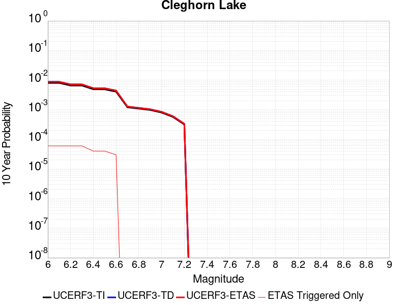 |

| Magnitude | 1 wk TI Prob | 1 wk TD Prob | 1 wk ETAS Prob | 1 wk ETAS/TD Gain | 1 wk ETAS Triggered Only | 1 mo TI Prob | 1 mo TD Prob | 1 mo ETAS Prob | 1 mo ETAS/TD Gain | 1 mo ETAS Triggered Only | 1 yr TI Prob | 1 yr TD Prob | 1 yr ETAS Prob | 1 yr ETAS/TD Gain | 1 yr ETAS Triggered Only | 10 yr TI Prob | 10 yr TD Prob | 10 yr ETAS Prob | 10 yr ETAS/TD Gain | 10 yr ETAS Triggered Only |
|-----|-----|-----|-----|-----|-----|-----|-----|-----|-----|-----|-----|-----|-----|-----|-----|-----|-----|-----|-----|-----|
| 6.0 | 1.5467183E-5 | 1.6794203E-5 | 3.8976126E-5 | 2.3208082 | 2.2182294E-5 | 6.6286244E-5 | 7.197348E-5 | 1.1633488E-4 | 1.6163574 | 4.4364588E-5 | 8.067362E-4 | 8.759797E-4 | 9.2030544E-4 | 1.0506014 | 4.4364588E-5 | 0.008038137 | 0.008730696 | 0.008774673 | 1.0050371 | 4.4364588E-5 |
| 6.1 | 1.5467183E-5 | 1.6794203E-5 | 3.8976126E-5 | 2.3208082 | 2.2182294E-5 | 6.6286244E-5 | 7.197348E-5 | 1.1633488E-4 | 1.6163574 | 4.4364588E-5 | 8.067362E-4 | 8.759797E-4 | 9.2030544E-4 | 1.0506014 | 4.4364588E-5 | 0.008038137 | 0.008730696 | 0.008774673 | 1.0050371 | 4.4364588E-5 |
| 6.2 | 1.2624631E-5 | 1.3681544E-5 | 3.5863533E-5 | 2.6213074 | 2.2182294E-5 | 5.410444E-5 | 5.863415E-5 | 1.02996135E-4 | 1.7565897 | 4.4364588E-5 | 6.585225E-4 | 7.1368564E-4 | 7.580185E-4 | 1.0621183 | 4.4364588E-5 | 0.0065657445 | 0.0071187317 | 0.0071627805 | 1.0061877 | 4.4364588E-5 |
| 6.3 | 1.2624631E-5 | 1.3681544E-5 | 3.5863533E-5 | 2.6213074 | 2.2182294E-5 | 5.410444E-5 | 5.863415E-5 | 1.02996135E-4 | 1.7565897 | 4.4364588E-5 | 6.585225E-4 | 7.1368564E-4 | 7.580185E-4 | 1.0621183 | 4.4364588E-5 | 0.0065657445 | 0.0071187317 | 0.0071627805 | 1.0061877 | 4.4364588E-5 |
| 6.4 | 9.417684E-6 | 1.0170118E-5 | 3.2352185E-5 | 3.1811025 | 2.2182294E-5 | 4.036088E-5 | 4.3585722E-5 | 8.794838E-5 | 2.0178254 | 4.4364588E-5 | 4.912829E-4 | 5.3056807E-4 | 5.749091E-4 | 1.0835727 | 4.4364588E-5 | 0.004901982 | 0.005297049 | 0.0053411787 | 1.008331 | 4.4364588E-5 |
| 6.5 | 9.368219E-6 | 1.0117545E-5 | 3.2299613E-5 | 3.1924362 | 2.2182294E-5 | 4.014889E-5 | 4.3360415E-5 | 8.772308E-5 | 2.0231144 | 4.4364588E-5 | 4.8870314E-4 | 5.2782625E-4 | 5.7216745E-4 | 1.0840071 | 4.4364588E-5 | 0.004876298 | 0.0052697617 | 0.0053138924 | 1.0083743 | 4.4364588E-5 |
| 6.6 | 7.803798E-6 | 8.441831E-6 | 3.0623938E-5 | 3.6276417 | 2.2182294E-5 | 3.3444423E-5 | 3.6179E-5 | 8.0541984E-5 | 2.2262082 | 4.4364588E-5 | 4.0710976E-4 | 4.4043022E-4 | 4.8477526E-4 | 1.1006857 | 4.4364588E-5 | 0.0040636472 | 0.0043994905 | 0.00444366 | 1.0100397 | 4.4364588E-5 |
| 6.7 | 2.3108669E-6 | 2.4438336E-6 | 2.4438336E-6 | 1.0 | 0.0 | 9.903678E-6 | 1.0473532E-5 | 1.0473532E-5 | 1.0 | 0.0 | 1.205706E-4 | 1.2750797E-4 | 1.2750797E-4 | 1.0 | 0.0 | 0.001205052 | 0.0012743667 | 0.0012743667 | 1.0 | 0.0 |
| 6.8 | 2.0882828E-6 | 2.2062823E-6 | 2.2062823E-6 | 1.0 | 0.0 | 8.949753E-6 | 9.455462E-6 | 9.455462E-6 | 1.0 | 0.0 | 1.08957785E-4 | 1.1511434E-4 | 1.1511434E-4 | 1.0 | 0.0 | 0.0010890438 | 0.0011505639 | 0.0011505639 | 1.0 | 0.0 |
| 6.9 | 1.876935E-6 | 1.981051E-6 | 1.981051E-6 | 1.0 | 0.0 | 8.043982E-6 | 8.490192E-6 | 8.490192E-6 | 1.0 | 0.0 | 9.7931086E-5 | 1.03363345E-4 | 1.03363345E-4 | 1.0 | 0.0 | 9.788794E-4 | 0.0010331686 | 0.0010331686 | 1.0 | 0.0 |
| 7.0 | 1.5357559E-6 | 1.6202807E-6 | 1.6202807E-6 | 1.0 | 0.0 | 6.5817944E-6 | 6.9440425E-6 | 6.9440425E-6 | 1.0 | 0.0 | 8.01304E-5 | 8.454057E-5 | 8.454057E-5 | 1.0 | 0.0 | 8.010151E-4 | 8.450965E-4 | 8.450965E-4 | 1.0 | 0.0 |
| 7.1 | 1.0905424E-6 | 1.1497619E-6 | 1.1497619E-6 | 1.0 | 0.0 | 4.6737446E-6 | 4.9275427E-6 | 4.9275427E-6 | 1.0 | 0.0 | 5.6901354E-5 | 5.999128E-5 | 5.999128E-5 | 1.0 | 0.0 | 5.6886784E-4 | 5.997606E-4 | 5.997606E-4 | 1.0 | 0.0 |
| 7.2 | 6.06668E-7 | 6.387277E-7 | 6.387277E-7 | 1.0 | 0.0 | 2.600003E-6 | 2.7374022E-6 | 2.7374022E-6 | 1.0 | 0.0 | 3.1654577E-5 | 3.3327433E-5 | 3.3327433E-5 | 1.0 | 0.0 | 3.1650066E-4 | 3.3323118E-4 | 3.3323118E-4 | 1.0 | 0.0 |

## Great Valley 09 (Laguna Seca)
*[(top)](#table-of-contents)*

| 1 Week | 1 Month | 1 Year | 10 Year |
|-----|-----|-----|-----|
|  |  |  |  |

| Magnitude | 1 wk TI Prob | 1 wk TD Prob | 1 wk ETAS Prob | 1 wk ETAS/TD Gain | 1 wk ETAS Triggered Only | 1 mo TI Prob | 1 mo TD Prob | 1 mo ETAS Prob | 1 mo ETAS/TD Gain | 1 mo ETAS Triggered Only | 1 yr TI Prob | 1 yr TD Prob | 1 yr ETAS Prob | 1 yr ETAS/TD Gain | 1 yr ETAS Triggered Only | 10 yr TI Prob | 10 yr TD Prob | 10 yr ETAS Prob | 10 yr ETAS/TD Gain | 10 yr ETAS Triggered Only |
|-----|-----|-----|-----|-----|-----|-----|-----|-----|-----|-----|-----|-----|-----|-----|-----|-----|-----|-----|-----|-----|
| 6.0 | 5.4353277E-5 | 7.05022E-5 | 1.1486366E-4 | 1.629221 | 4.4364588E-5 | 2.3292181E-4 | 3.0211566E-4 | 3.4646684E-4 | 1.146802 | 4.4364588E-5 | 0.0028321352 | 0.0036721937 | 0.0037163955 | 1.0120368 | 4.4364588E-5 | 0.02796312 | 0.03611547 | 0.036158234 | 1.001184 | 4.4364588E-5 |
| 6.1 | 4.5578287E-5 | 5.822118E-5 | 1.0258319E-4 | 1.7619565 | 4.4364588E-5 | 1.953209E-4 | 2.4949326E-4 | 2.9384677E-4 | 1.1777744 | 4.4364588E-5 | 0.0023754383 | 0.003033432 | 0.003077662 | 1.0145808 | 4.4364588E-5 | 0.023502063 | 0.029919548 | 0.029962584 | 1.0014384 | 4.4364588E-5 |
| 6.2 | 2.8536782E-5 | 3.4737273E-5 | 7.910032E-5 | 2.2771022 | 4.4364588E-5 | 1.2229476E-4 | 1.4886224E-4 | 1.9322021E-4 | 1.2979801 | 4.4364588E-5 | 0.0014879217 | 0.001810813 | 0.0018550972 | 1.0244554 | 4.4364588E-5 | 0.014779986 | 0.017958116 | 0.018001685 | 1.002426 | 4.4364588E-5 |
| 6.3 | 2.3698774E-5 | 2.8213295E-5 | 7.257663E-5 | 2.5724266 | 4.4364588E-5 | 1.01562226E-4 | 1.20905075E-4 | 1.652643E-4 | 1.3668929 | 4.4364588E-5 | 0.0012358186 | 0.0014710218 | 0.0015153211 | 1.0301147 | 4.4364588E-5 | 0.012289686 | 0.014611342 | 0.014655058 | 1.0029919 | 4.4364588E-5 |
| 6.4 | 1.9191197E-5 | 2.2123184E-5 | 4.4304987E-5 | 2.0026498 | 2.2182294E-5 | 8.2245395E-5 | 9.4806666E-5 | 1.16986856E-4 | 1.2339518 | 2.2182294E-5 | 0.0010008777 | 0.0011536429 | 0.0011757995 | 1.0192058 | 2.2182294E-5 | 0.009963818 | 0.011476948 | 0.011498876 | 1.0019106 | 2.2182294E-5 |
| 6.5 | 1.5203241E-5 | 1.6802203E-5 | 3.8984126E-5 | 2.3201792 | 2.2182294E-5 | 6.5155116E-5 | 7.200386E-5 | 9.418456E-5 | 1.3080487 | 2.2182294E-5 | 7.9297484E-4 | 8.7626575E-4 | 8.984286E-4 | 1.0252924 | 2.2182294E-5 | 0.007901512 | 0.0087295165 | 0.008751505 | 1.0025189 | 2.2182294E-5 |
| 6.6 | 1.0984925E-5 | 1.1242595E-5 | 3.342464E-5 | 2.973036 | 2.2182294E-5 | 4.70774E-5 | 4.8181686E-5 | 7.036291E-5 | 1.4603664 | 2.2182294E-5 | 5.730166E-4 | 5.8645656E-4 | 6.086258E-4 | 1.0378021 | 2.2182294E-5 | 0.005715413 | 0.0058494853 | 0.005871538 | 1.00377 | 2.2182294E-5 |
| 6.7 | 9.134616E-6 | 9.019894E-6 | 3.1201987E-5 | 3.4592412 | 2.2182294E-5 | 3.9147766E-5 | 3.865613E-5 | 6.0837567E-5 | 1.5738143 | 2.2182294E-5 | 4.7651984E-4 | 4.7053912E-4 | 4.9271097E-4 | 1.0471201 | 2.2182294E-5 | 0.004754993 | 0.0046956735 | 0.0047177514 | 1.0047019 | 2.2182294E-5 |
| 6.8 | 7.785589E-6 | 7.4519444E-6 | 2.9634073E-5 | 3.97669 | 2.2182294E-5 | 3.3366385E-5 | 3.1936524E-5 | 5.411811E-5 | 1.6945523 | 2.2182294E-5 | 4.0616E-4 | 3.8875983E-4 | 4.109335E-4 | 1.057037 | 2.2182294E-5 | 0.0040541845 | 0.0038810016 | 0.0039030977 | 1.0056934 | 2.2182294E-5 |
| 6.9 | 5.579095E-6 | 4.898492E-6 | 4.898492E-6 | 1.0 | 0.0 | 2.3910188E-5 | 2.0993377E-5 | 2.0993377E-5 | 1.0 | 0.0 | 2.9106764E-4 | 2.5556577E-4 | 2.5556577E-4 | 1.0 | 0.0 | 0.002906867 | 0.002552856 | 0.002552856 | 1.0 | 0.0 |
| 7.0 | 2.6816688E-6 | 1.5216126E-6 | 1.5216126E-6 | 1.0 | 0.0 | 1.1492816E-5 | 6.521181E-6 | 6.521181E-6 | 1.0 | 0.0 | 1.3991605E-4 | 7.939258E-5 | 7.939258E-5 | 1.0 | 0.0 | 0.0013982799 | 7.9365086E-4 | 7.9365086E-4 | 1.0 | 0.0 |
| 7.1 | 1.9951021E-6 | 7.453827E-7 | 7.453827E-7 | 1.0 | 0.0 | 8.55041E-6 | 3.1944935E-6 | 3.1944935E-6 | 1.0 | 0.0 | 1.0409627E-4 | 3.8892307E-5 | 3.8892307E-5 | 1.0 | 0.0 | 0.0010404752 | 3.8885913E-4 | 3.8885913E-4 | 1.0 | 0.0 |
| 7.2 | 1.9951021E-6 | 7.453827E-7 | 7.453827E-7 | 1.0 | 0.0 | 8.55041E-6 | 3.1944935E-6 | 3.1944935E-6 | 1.0 | 0.0 | 1.0409627E-4 | 3.8892307E-5 | 3.8892307E-5 | 1.0 | 0.0 | 0.0010404752 | 3.8885913E-4 | 3.8885913E-4 | 1.0 | 0.0 |
| 7.3 | 1.7087556E-6 | 6.578881E-7 | 6.578881E-7 | 1.0 | 0.0 | 7.3232177E-6 | 2.8195177E-6 | 2.8195177E-6 | 1.0 | 0.0 | 8.915652E-5 | 3.4327128E-5 | 3.4327128E-5 | 1.0 | 0.0 | 8.9120766E-4 | 3.432223E-4 | 3.432223E-4 | 1.0 | 0.0 |
| 7.4 | 1.3804846E-6 | 6.073852E-7 | 6.073852E-7 | 1.0 | 0.0 | 5.916349E-6 | 2.6030768E-6 | 2.6030768E-6 | 1.0 | 0.0 | 7.2029165E-5 | 3.169204E-5 | 3.169204E-5 | 1.0 | 0.0 | 7.200583E-4 | 3.1687922E-4 | 3.1687922E-4 | 1.0 | 0.0 |
| 7.5 | 1.3804846E-6 | 6.073852E-7 | 6.073852E-7 | 1.0 | 0.0 | 5.916349E-6 | 2.6030768E-6 | 2.6030768E-6 | 1.0 | 0.0 | 7.2029165E-5 | 3.169204E-5 | 3.169204E-5 | 1.0 | 0.0 | 7.200583E-4 | 3.1687922E-4 | 3.1687922E-4 | 1.0 | 0.0 |

## Elsinore (Stepovers Combined)
*[(top)](#table-of-contents)*

| 1 Week | 1 Month | 1 Year | 10 Year |
|-----|-----|-----|-----|
|  |  |  |  |

| Magnitude | 1 wk TI Prob | 1 wk TD Prob | 1 wk ETAS Prob | 1 wk ETAS/TD Gain | 1 wk ETAS Triggered Only | 1 mo TI Prob | 1 mo TD Prob | 1 mo ETAS Prob | 1 mo ETAS/TD Gain | 1 mo ETAS Triggered Only | 1 yr TI Prob | 1 yr TD Prob | 1 yr ETAS Prob | 1 yr ETAS/TD Gain | 1 yr ETAS Triggered Only | 10 yr TI Prob | 10 yr TD Prob | 10 yr ETAS Prob | 10 yr ETAS/TD Gain | 10 yr ETAS Triggered Only |
|-----|-----|-----|-----|-----|-----|-----|-----|-----|-----|-----|-----|-----|-----|-----|-----|-----|-----|-----|-----|-----|
| 6.0 | 2.144392E-5 | 1.9760193E-5 | 1.9760193E-5 | 1.0 | 0.0 | 9.189928E-5 | 8.468392E-5 | 1.0686433E-4 | 1.2619201 | 2.2182294E-5 | 0.0011182994 | 0.0010305607 | 0.0010748795 | 1.0430046 | 4.4364588E-5 | 0.011126885 | 0.010264917 | 0.010308826 | 1.0042776 | 4.4364588E-5 |
| 6.1 | 2.144392E-5 | 1.9760193E-5 | 1.9760193E-5 | 1.0 | 0.0 | 9.189928E-5 | 8.468392E-5 | 1.0686433E-4 | 1.2619201 | 2.2182294E-5 | 0.0011182994 | 0.0010305607 | 0.0010748795 | 1.0430046 | 4.4364588E-5 | 0.011126885 | 0.010264917 | 0.010308826 | 1.0042776 | 4.4364588E-5 |
| 6.2 | 2.144392E-5 | 1.9760193E-5 | 1.9760193E-5 | 1.0 | 0.0 | 9.189928E-5 | 8.468392E-5 | 1.0686433E-4 | 1.2619201 | 2.2182294E-5 | 0.0011182994 | 0.0010305607 | 0.0010748795 | 1.0430046 | 4.4364588E-5 | 0.011126885 | 0.010264917 | 0.010308826 | 1.0042776 | 4.4364588E-5 |
| 6.3 | 1.9751555E-5 | 1.7741453E-5 | 1.7741453E-5 | 1.0 | 0.0 | 8.4646774E-5 | 7.603267E-5 | 9.8213284E-5 | 1.2917247 | 2.2182294E-5 | 0.0010300872 | 9.253213E-4 | 9.696448E-4 | 1.0479007 | 4.4364588E-5 | 0.010253254 | 0.009221276 | 0.009265232 | 1.0047667 | 4.4364588E-5 |
| 6.4 | 1.9751555E-5 | 1.7741453E-5 | 1.7741453E-5 | 1.0 | 0.0 | 8.4646774E-5 | 7.603267E-5 | 9.8213284E-5 | 1.2917247 | 2.2182294E-5 | 0.0010300872 | 9.253213E-4 | 9.696448E-4 | 1.0479007 | 4.4364588E-5 | 0.010253254 | 0.009221276 | 0.009265232 | 1.0047667 | 4.4364588E-5 |
| 6.5 | 1.9751555E-5 | 1.7741453E-5 | 1.7741453E-5 | 1.0 | 0.0 | 8.4646774E-5 | 7.603267E-5 | 9.8213284E-5 | 1.2917247 | 2.2182294E-5 | 0.0010300872 | 9.253213E-4 | 9.696448E-4 | 1.0479007 | 4.4364588E-5 | 0.010253254 | 0.009221276 | 0.009265232 | 1.0047667 | 4.4364588E-5 |
| 6.6 | 1.9188685E-5 | 1.7003393E-5 | 1.7003393E-5 | 1.0 | 0.0 | 8.2234634E-5 | 7.286974E-5 | 9.505042E-5 | 1.304388 | 2.2182294E-5 | 0.0010007467 | 8.868442E-4 | 9.311694E-4 | 1.0499809 | 4.4364588E-5 | 0.00996252 | 0.0088398475 | 0.00888382 | 1.0049744 | 4.4364588E-5 |
| 6.7 | 1.7608272E-5 | 1.4732616E-5 | 1.4732616E-5 | 1.0 | 0.0 | 7.546184E-5 | 6.3138315E-5 | 6.3138315E-5 | 1.0 | 0.0 | 9.183606E-4 | 7.684476E-4 | 7.9061283E-4 | 1.0288442 | 2.2182294E-5 | 0.009145746 | 0.00766491 | 0.0076869223 | 1.0028719 | 2.2182294E-5 |
| 6.8 | 1.697165E-5 | 1.3783365E-5 | 1.3783365E-5 | 1.0 | 0.0 | 7.273361E-5 | 5.9070277E-5 | 5.9070277E-5 | 1.0 | 0.0 | 8.8517193E-4 | 7.18952E-4 | 7.4111833E-4 | 1.0308315 | 2.2182294E-5 | 0.008816543 | 0.007172675 | 0.0071946983 | 1.0030705 | 2.2182294E-5 |
| 6.9 | 1.600365E-5 | 1.2846671E-5 | 1.2846671E-5 | 1.0 | 0.0 | 6.858527E-5 | 5.5056043E-5 | 5.5056043E-5 | 1.0 | 0.0 | 8.347058E-4 | 6.7010894E-4 | 6.922764E-4 | 1.0330803 | 2.2182294E-5 | 0.008315775 | 0.0066867657 | 0.0067088 | 1.0032952 | 2.2182294E-5 |
| 7.0 | 1.3314581E-5 | 1.0447548E-5 | 1.0447548E-5 | 1.0 | 0.0 | 5.7061243E-5 | 4.4774453E-5 | 4.4774453E-5 | 1.0 | 0.0 | 6.944992E-4 | 5.449953E-4 | 5.6716555E-4 | 1.0406796 | 2.2182294E-5 | 0.006923327 | 0.0054405155 | 0.0054625766 | 1.004055 | 2.2182294E-5 |
| 7.1 | 1.2865345E-5 | 9.937536E-6 | 9.937536E-6 | 1.0 | 0.0 | 5.5136024E-5 | 4.258876E-5 | 4.258876E-5 | 1.0 | 0.0 | 6.710743E-4 | 5.183973E-4 | 5.405681E-4 | 1.042768 | 2.2182294E-5 | 0.0066905143 | 0.0051752133 | 0.005197281 | 1.0042641 | 2.2182294E-5 |
| 7.2 | 1.1650051E-5 | 8.633809E-6 | 8.633809E-6 | 1.0 | 0.0 | 4.9927836E-5 | 3.7001522E-5 | 3.7001522E-5 | 1.0 | 0.0 | 6.0770183E-4 | 4.504022E-4 | 4.504022E-4 | 1.0 | 0.0 | 0.0060604266 | 0.0044963174 | 0.0044963174 | 1.0 | 0.0 |
| 7.3 | 1.0008533E-5 | 7.2010425E-6 | 7.2010425E-6 | 1.0 | 0.0 | 4.2893007E-5 | 3.0861254E-5 | 3.0861254E-5 | 1.0 | 0.0 | 5.220972E-4 | 3.7567242E-4 | 3.7567242E-4 | 1.0 | 0.0 | 0.005208723 | 0.003750761 | 0.003750761 | 1.0 | 0.0 |
| 7.4 | 9.116759E-6 | 6.410068E-6 | 6.410068E-6 | 1.0 | 0.0 | 3.907124E-5 | 2.747144E-5 | 2.747144E-5 | 1.0 | 0.0 | 4.7558855E-4 | 3.3441483E-4 | 3.3441483E-4 | 1.0 | 0.0 | 0.00474572 | 0.0033392678 | 0.0033392678 | 1.0 | 0.0 |
| 7.5 | 7.870524E-6 | 5.3825365E-6 | 5.3825365E-6 | 1.0 | 0.0 | 3.3730383E-5 | 2.3067816E-5 | 2.3067816E-5 | 1.0 | 0.0 | 4.1059E-4 | 2.8081573E-4 | 2.8081573E-4 | 1.0 | 0.0 | 0.0040983222 | 0.0028047354 | 0.0028047354 | 1.0 | 0.0 |
| 7.6 | 6.9774537E-6 | 4.6776067E-6 | 4.6776067E-6 | 1.0 | 0.0 | 2.990303E-5 | 2.0046738E-5 | 2.0046738E-5 | 1.0 | 0.0 | 3.640086E-4 | 2.4404288E-4 | 2.4404288E-4 | 1.0 | 0.0 | 0.003634129 | 0.0024378651 | 0.0024378651 | 1.0 | 0.0 |
| 7.7 | 4.1616954E-6 | 2.32834E-6 | 2.32834E-6 | 1.0 | 0.0 | 1.7835715E-5 | 9.978567E-6 | 9.978567E-6 | 1.0 | 0.0 | 2.171282E-4 | 1.2148302E-4 | 1.2148302E-4 | 1.0 | 0.0 | 0.0021691616 | 0.0012142392 | 0.0012142392 | 1.0 | 0.0 |
| 7.8 | 2.2692414E-7 | 9.3854695E-8 | 9.3854695E-8 | 1.0 | 0.0 | 9.725317E-7 | 4.0223435E-7 | 4.0223435E-7 | 1.0 | 0.0 | 1.1840509E-5 | 4.8971956E-6 | 4.8971956E-6 | 1.0 | 0.0 | 1.1839878E-4 | 4.8971204E-5 | 4.8971204E-5 | 1.0 | 0.0 |
| 7.9 | 6.676829E-9 | 3.439853E-9 | 3.439853E-9 | 1.0 | 0.0 | 2.861498E-8 | 1.4742227E-8 | 1.4742227E-8 | 1.0 | 0.0 | 3.4838732E-7 | 1.7948659E-7 | 1.7948659E-7 | 1.0 | 0.0 | 3.4838679E-6 | 1.7948646E-6 | 1.7948646E-6 | 1.0 | 0.0 |

## Great Valley 05 Pittsburg - Kirby Hills alt1
*[(top)](#table-of-contents)*

| 1 Week | 1 Month | 1 Year | 10 Year |
|-----|-----|-----|-----|
|  |  |  |  |

| Magnitude | 1 wk TI Prob | 1 wk TD Prob | 1 wk ETAS Prob | 1 wk ETAS/TD Gain | 1 wk ETAS Triggered Only | 1 mo TI Prob | 1 mo TD Prob | 1 mo ETAS Prob | 1 mo ETAS/TD Gain | 1 mo ETAS Triggered Only | 1 yr TI Prob | 1 yr TD Prob | 1 yr ETAS Prob | 1 yr ETAS/TD Gain | 1 yr ETAS Triggered Only | 10 yr TI Prob | 10 yr TD Prob | 10 yr ETAS Prob | 10 yr ETAS/TD Gain | 10 yr ETAS Triggered Only |
|-----|-----|-----|-----|-----|-----|-----|-----|-----|-----|-----|-----|-----|-----|-----|-----|-----|-----|-----|-----|-----|
| 6.0 | 4.187212E-5 | 5.3442072E-5 | 5.3442072E-5 | 1.0 | 0.0 | 1.794396E-4 | 2.290231E-4 | 2.290231E-4 | 1.0 | 0.0 | 0.002182488 | 0.0027857882 | 0.0028079087 | 1.0079405 | 2.2182294E-5 | 0.021611776 | 0.02760304 | 0.027624609 | 1.0007814 | 2.2182294E-5 |
| 6.1 | 4.187212E-5 | 5.3442072E-5 | 5.3442072E-5 | 1.0 | 0.0 | 1.794396E-4 | 2.290231E-4 | 2.290231E-4 | 1.0 | 0.0 | 0.002182488 | 0.0027857882 | 0.0028079087 | 1.0079405 | 2.2182294E-5 | 0.021611776 | 0.02760304 | 0.027624609 | 1.0007814 | 2.2182294E-5 |
| 6.2 | 1.7353306E-5 | 2.2154374E-5 | 2.2154374E-5 | 1.0 | 0.0 | 7.436919E-5 | 9.494618E-5 | 9.494618E-5 | 1.0 | 0.0 | 9.050688E-4 | 0.0011557543 | 0.0011557543 | 1.0 | 0.0 | 0.009013915 | 0.011535114 | 0.011535114 | 1.0 | 0.0 |
| 6.3 | 1.7353306E-5 | 2.2154374E-5 | 2.2154374E-5 | 1.0 | 0.0 | 7.436919E-5 | 9.494618E-5 | 9.494618E-5 | 1.0 | 0.0 | 9.050688E-4 | 0.0011557543 | 0.0011557543 | 1.0 | 0.0 | 0.009013915 | 0.011535114 | 0.011535114 | 1.0 | 0.0 |
| 6.4 | 1.4028824E-5 | 1.7900597E-5 | 1.7900597E-5 | 1.0 | 0.0 | 6.0122147E-5 | 7.671684E-5 | 7.671684E-5 | 1.0 | 0.0 | 7.3174125E-4 | 9.340275E-4 | 9.340275E-4 | 1.0 | 0.0 | 0.0072933645 | 0.009338138 | 0.009338138 | 1.0 | 0.0 |

## Pinto Mtn
*[(top)](#table-of-contents)*

| 1 Week | 1 Month | 1 Year | 10 Year |
|-----|-----|-----|-----|
|  |  |  |  |

| Magnitude | 1 wk TI Prob | 1 wk TD Prob | 1 wk ETAS Prob | 1 wk ETAS/TD Gain | 1 wk ETAS Triggered Only | 1 mo TI Prob | 1 mo TD Prob | 1 mo ETAS Prob | 1 mo ETAS/TD Gain | 1 mo ETAS Triggered Only | 1 yr TI Prob | 1 yr TD Prob | 1 yr ETAS Prob | 1 yr ETAS/TD Gain | 1 yr ETAS Triggered Only | 10 yr TI Prob | 10 yr TD Prob | 10 yr ETAS Prob | 10 yr ETAS/TD Gain | 10 yr ETAS Triggered Only |
|-----|-----|-----|-----|-----|-----|-----|-----|-----|-----|-----|-----|-----|-----|-----|-----|-----|-----|-----|-----|-----|
| 6.0 | 4.4194956E-5 | 4.785362E-5 | 7.0034854E-5 | 1.4635226 | 2.2182294E-5 | 1.893932E-4 | 2.0507174E-4 | 2.2724949E-4 | 1.1081463 | 2.2182294E-5 | 0.0023034236 | 0.0024940541 | 0.0025161812 | 1.0088719 | 2.2182294E-5 | 0.022796938 | 0.024678145 | 0.02469978 | 1.0008767 | 2.2182294E-5 |
| 6.1 | 4.4194956E-5 | 4.785362E-5 | 7.0034854E-5 | 1.4635226 | 2.2182294E-5 | 1.893932E-4 | 2.0507174E-4 | 2.2724949E-4 | 1.1081463 | 2.2182294E-5 | 0.0023034236 | 0.0024940541 | 0.0025161812 | 1.0088719 | 2.2182294E-5 | 0.022796938 | 0.024678145 | 0.02469978 | 1.0008767 | 2.2182294E-5 |
| 6.2 | 4.4194956E-5 | 4.785362E-5 | 7.0034854E-5 | 1.4635226 | 2.2182294E-5 | 1.893932E-4 | 2.0507174E-4 | 2.2724949E-4 | 1.1081463 | 2.2182294E-5 | 0.0023034236 | 0.0024940541 | 0.0025161812 | 1.0088719 | 2.2182294E-5 | 0.022796938 | 0.024678145 | 0.02469978 | 1.0008767 | 2.2182294E-5 |
| 6.3 | 4.4194956E-5 | 4.785362E-5 | 7.0034854E-5 | 1.4635226 | 2.2182294E-5 | 1.893932E-4 | 2.0507174E-4 | 2.2724949E-4 | 1.1081463 | 2.2182294E-5 | 0.0023034236 | 0.0024940541 | 0.0025161812 | 1.0088719 | 2.2182294E-5 | 0.022796938 | 0.024678145 | 0.02469978 | 1.0008767 | 2.2182294E-5 |
| 6.4 | 3.729929E-5 | 3.9603186E-5 | 3.9603186E-5 | 1.0 | 0.0 | 1.5984432E-4 | 1.6971743E-4 | 1.6971743E-4 | 1.0 | 0.0 | 0.0019443673 | 0.002064445 | 0.002064445 | 1.0 | 0.0 | 0.019274427 | 0.02046269 | 0.02046269 | 1.0 | 0.0 |
| 6.5 | 3.729929E-5 | 3.9603186E-5 | 3.9603186E-5 | 1.0 | 0.0 | 1.5984432E-4 | 1.6971743E-4 | 1.6971743E-4 | 1.0 | 0.0 | 0.0019443673 | 0.002064445 | 0.002064445 | 1.0 | 0.0 | 0.019274427 | 0.02046269 | 0.02046269 | 1.0 | 0.0 |
| 6.6 | 3.0204548E-5 | 3.1205298E-5 | 3.1205298E-5 | 1.0 | 0.0 | 1.2944164E-4 | 1.3373033E-4 | 1.3373033E-4 | 1.0 | 0.0 | 0.0015748127 | 0.0016269855 | 0.0016269855 | 1.0 | 0.0 | 0.015636992 | 0.01615461 | 0.01615461 | 1.0 | 0.0 |
| 6.7 | 2.9857754E-5 | 3.081468E-5 | 3.081468E-5 | 1.0 | 0.0 | 1.2795553E-4 | 1.3205643E-4 | 1.3205643E-4 | 1.0 | 0.0 | 0.0015567453 | 0.001606636 | 0.001606636 | 1.0 | 0.0 | 0.015458848 | 0.01595405 | 0.01595405 | 1.0 | 0.0 |
| 6.8 | 2.4819734E-5 | 2.5009364E-5 | 2.5009364E-5 | 1.0 | 0.0 | 1.0636595E-4 | 1.07178705E-4 | 1.07178705E-4 | 1.0 | 0.0 | 0.0012942362 | 0.0013041412 | 0.0013041412 | 1.0 | 0.0 | 0.012867244 | 0.0129672475 | 0.0129672475 | 1.0 | 0.0 |
| 6.9 | 2.331124E-5 | 2.3337643E-5 | 2.3337643E-5 | 1.0 | 0.0 | 9.990149E-5 | 1.00014746E-4 | 1.00014746E-4 | 1.0 | 0.0 | 0.001215622 | 0.0012170197 | 0.0012170197 | 1.0 | 0.0 | 0.012089936 | 0.012105742 | 0.012105742 | 1.0 | 0.0 |
| 7.0 | 2.1818534E-5 | 2.1760772E-5 | 2.1760772E-5 | 1.0 | 0.0 | 9.3504656E-5 | 9.325723E-5 | 9.325723E-5 | 1.0 | 0.0 | 0.0011378246 | 0.0011348352 | 0.0011348352 | 1.0 | 0.0 | 0.011320163 | 0.011292503 | 0.011292503 | 1.0 | 0.0 |
| 7.1 | 2.066081E-5 | 2.0540418E-5 | 2.0540418E-5 | 1.0 | 0.0 | 8.854332E-5 | 8.8027504E-5 | 8.8027504E-5 | 1.0 | 0.0 | 0.0010774818 | 0.0010712275 | 0.0010712275 | 1.0 | 0.0 | 0.010722724 | 0.010662688 | 0.010662688 | 1.0 | 0.0 |
| 7.2 | 1.8990233E-5 | 1.9053701E-5 | 1.9053701E-5 | 1.0 | 0.0 | 8.138417E-5 | 8.1656275E-5 | 8.1656275E-5 | 1.0 | 0.0 | 9.904018E-4 | 9.937311E-4 | 9.937311E-4 | 1.0 | 0.0 | 0.009859995 | 0.009894874 | 0.009894874 | 1.0 | 0.0 |
| 7.3 | 1.3335872E-5 | 1.4906372E-5 | 1.4906372E-5 | 1.0 | 0.0 | 5.7152483E-5 | 6.388296E-5 | 6.388296E-5 | 1.0 | 0.0 | 6.956093E-4 | 7.775102E-4 | 7.775102E-4 | 1.0 | 0.0 | 0.006934359 | 0.0077491994 | 0.0077491994 | 1.0 | 0.0 |
| 7.4 | 9.414066E-6 | 1.186061E-5 | 1.186061E-5 | 1.0 | 0.0 | 4.0345374E-5 | 5.0830247E-5 | 5.0830247E-5 | 1.0 | 0.0 | 4.910942E-4 | 6.1869196E-4 | 6.1869196E-4 | 1.0 | 0.0 | 0.0049001034 | 0.006170644 | 0.006170644 | 1.0 | 0.0 |
| 7.5 | 7.2101157E-6 | 9.157893E-6 | 9.157893E-6 | 1.0 | 0.0 | 3.090013E-5 | 3.924757E-5 | 3.924757E-5 | 1.0 | 0.0 | 3.7614413E-4 | 4.7774217E-4 | 4.7774217E-4 | 1.0 | 0.0 | 0.0037550807 | 0.004767927 | 0.004767927 | 1.0 | 0.0 |
| 7.6 | 3.296375E-6 | 4.5453176E-6 | 4.5453176E-6 | 1.0 | 0.0 | 1.4127245E-5 | 1.9479796E-5 | 1.9479796E-5 | 1.0 | 0.0 | 1.7198564E-4 | 2.3714209E-4 | 2.3714209E-4 | 1.0 | 0.0 | 0.0017185259 | 0.0023690276 | 0.0023690276 | 1.0 | 0.0 |
| 7.7 | 2.5741092E-6 | 3.584251E-6 | 3.584251E-6 | 1.0 | 0.0 | 1.103185E-5 | 1.5360993E-5 | 1.5360993E-5 | 1.0 | 0.0 | 1.3430449E-4 | 1.8700535E-4 | 1.8700535E-4 | 1.0 | 0.0 | 0.0013422335 | 0.0018686098 | 0.0018686098 | 1.0 | 0.0 |

## Palos Verdes
*[(top)](#table-of-contents)*

| 1 Week | 1 Month | 1 Year | 10 Year |
|-----|-----|-----|-----|
|  |  |  | 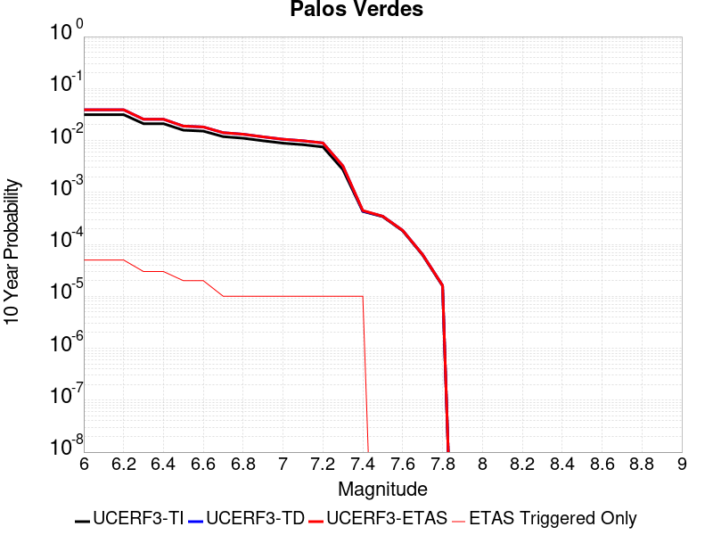 |

| Magnitude | 1 wk TI Prob | 1 wk TD Prob | 1 wk ETAS Prob | 1 wk ETAS/TD Gain | 1 wk ETAS Triggered Only | 1 mo TI Prob | 1 mo TD Prob | 1 mo ETAS Prob | 1 mo ETAS/TD Gain | 1 mo ETAS Triggered Only | 1 yr TI Prob | 1 yr TD Prob | 1 yr ETAS Prob | 1 yr ETAS/TD Gain | 1 yr ETAS Triggered Only | 10 yr TI Prob | 10 yr TD Prob | 10 yr ETAS Prob | 10 yr ETAS/TD Gain | 10 yr ETAS Triggered Only |
|-----|-----|-----|-----|-----|-----|-----|-----|-----|-----|-----|-----|-----|-----|-----|-----|-----|-----|-----|-----|-----|
| 6.0 | 6.126063E-5 | 7.622612E-5 | 7.622612E-5 | 1.0 | 0.0 | 2.6251914E-4 | 3.2664582E-4 | 3.2664582E-4 | 1.0 | 0.0 | 0.0031914865 | 0.003970174 | 0.0039922683 | 1.005565 | 2.2182294E-5 | 0.031460393 | 0.039048895 | 0.03907021 | 1.0005459 | 2.2182294E-5 |
| 6.1 | 6.126063E-5 | 7.622612E-5 | 7.622612E-5 | 1.0 | 0.0 | 2.6251914E-4 | 3.2664582E-4 | 3.2664582E-4 | 1.0 | 0.0 | 0.0031914865 | 0.003970174 | 0.0039922683 | 1.005565 | 2.2182294E-5 | 0.031460393 | 0.039048895 | 0.03907021 | 1.0005459 | 2.2182294E-5 |
| 6.2 | 6.126063E-5 | 7.622612E-5 | 7.622612E-5 | 1.0 | 0.0 | 2.6251914E-4 | 3.2664582E-4 | 3.2664582E-4 | 1.0 | 0.0 | 0.0031914865 | 0.003970174 | 0.0039922683 | 1.005565 | 2.2182294E-5 | 0.031460393 | 0.039048895 | 0.03907021 | 1.0005459 | 2.2182294E-5 |
| 6.3 | 4.0838047E-5 | 4.9749437E-5 | 4.9749437E-5 | 1.0 | 0.0 | 1.7500846E-4 | 2.1319572E-4 | 2.1319572E-4 | 1.0 | 0.0 | 0.0021286458 | 0.0025927818 | 0.0025927818 | 1.0 | 0.0 | 0.021083709 | 0.025646681 | 0.025646681 | 1.0 | 0.0 |
| 6.4 | 4.0838047E-5 | 4.9749437E-5 | 4.9749437E-5 | 1.0 | 0.0 | 1.7500846E-4 | 2.1319572E-4 | 2.1319572E-4 | 1.0 | 0.0 | 0.0021286458 | 0.0025927818 | 0.0025927818 | 1.0 | 0.0 | 0.021083709 | 0.025646681 | 0.025646681 | 1.0 | 0.0 |
| 6.5 | 3.0512005E-5 | 3.656162E-5 | 3.656162E-5 | 1.0 | 0.0 | 1.3075917E-4 | 1.5668393E-4 | 1.5668393E-4 | 1.0 | 0.0 | 0.0015908304 | 0.0019060767 | 0.0019060767 | 1.0 | 0.0 | 0.015794903 | 0.018909154 | 0.018909154 | 1.0 | 0.0 |
| 6.6 | 2.9255087E-5 | 3.515442E-5 | 3.515442E-5 | 1.0 | 0.0 | 1.2537291E-4 | 1.5065377E-4 | 1.5065377E-4 | 1.0 | 0.0 | 0.0015253464 | 0.0018327828 | 0.0018327828 | 1.0 | 0.0 | 0.015149189 | 0.018188225 | 0.018188225 | 1.0 | 0.0 |
| 6.7 | 2.287198E-5 | 2.7248278E-5 | 2.7248278E-5 | 1.0 | 0.0 | 9.801909E-5 | 1.16773626E-4 | 1.16773626E-4 | 1.0 | 0.0 | 0.001192729 | 0.0014208833 | 0.0014208833 | 1.0 | 0.0 | 0.011863477 | 0.014127217 | 0.014127217 | 1.0 | 0.0 |
| 6.8 | 2.1325764E-5 | 2.5431877E-5 | 2.5431877E-5 | 1.0 | 0.0 | 9.139293E-5 | 1.0898971E-4 | 1.0898971E-4 | 1.0 | 0.0 | 0.001112141 | 0.0013262323 | 0.0013262323 | 1.0 | 0.0 | 0.011065915 | 0.013192211 | 0.013192211 | 1.0 | 0.0 |
| 6.9 | 1.9009392E-5 | 2.2613547E-5 | 2.2613547E-5 | 1.0 | 0.0 | 8.1466285E-5 | 9.6912096E-5 | 9.6912096E-5 | 1.0 | 0.0 | 9.914007E-4 | 0.0011793535 | 0.0011793535 | 1.0 | 0.0 | 0.009869894 | 0.011739632 | 0.011739632 | 1.0 | 0.0 |
| 7.0 | 1.7098473E-5 | 2.0319356E-5 | 2.0319356E-5 | 1.0 | 0.0 | 7.3277115E-5 | 8.708052E-5 | 8.708052E-5 | 1.0 | 0.0 | 8.917837E-4 | 0.001059775 | 0.001059775 | 1.0 | 0.0 | 0.008882134 | 0.010555646 | 0.010555646 | 1.0 | 0.0 |
| 7.1 | 1.5982785E-5 | 1.899476E-5 | 1.899476E-5 | 1.0 | 0.0 | 6.849585E-5 | 8.1404054E-5 | 8.1404054E-5 | 1.0 | 0.0 | 8.336179E-4 | 9.907284E-4 | 9.907284E-4 | 1.0 | 0.0 | 0.008304977 | 0.009871479 | 0.009871479 | 1.0 | 0.0 |
| 7.2 | 1.4468002E-5 | 1.7197237E-5 | 1.7197237E-5 | 1.0 | 0.0 | 6.200425E-5 | 7.370083E-5 | 7.370083E-5 | 1.0 | 0.0 | 7.546402E-4 | 8.970222E-4 | 8.970222E-4 | 1.0 | 0.0 | 0.007520827 | 0.008942284 | 0.008942284 | 1.0 | 0.0 |
| 7.3 | 5.288233E-6 | 6.2036747E-6 | 6.2036747E-6 | 1.0 | 0.0 | 2.2663658E-5 | 2.6587102E-5 | 2.6587102E-5 | 1.0 | 0.0 | 2.7589512E-4 | 3.236848E-4 | 3.236848E-4 | 1.0 | 0.0 | 0.0027555283 | 0.0032355562 | 0.0032355562 | 1.0 | 0.0 |
| 7.4 | 8.279556E-7 | 8.408347E-7 | 8.408347E-7 | 1.0 | 0.0 | 3.5483763E-6 | 3.6035726E-6 | 3.6035726E-6 | 1.0 | 0.0 | 4.3200624E-5 | 4.3872686E-5 | 4.3872686E-5 | 1.0 | 0.0 | 4.3192226E-4 | 4.3864746E-4 | 4.3864746E-4 | 1.0 | 0.0 |
| 7.5 | 6.559831E-7 | 6.667229E-7 | 6.667229E-7 | 1.0 | 0.0 | 2.8113532E-6 | 2.857381E-6 | 2.857381E-6 | 1.0 | 0.0 | 3.4227687E-5 | 3.4788125E-5 | 3.4788125E-5 | 1.0 | 0.0 | 3.4222414E-4 | 3.4783344E-4 | 3.4783344E-4 | 1.0 | 0.0 |
| 7.6 | 3.5018968E-7 | 3.5620027E-7 | 3.5620027E-7 | 1.0 | 0.0 | 1.500812E-6 | 1.526572E-6 | 1.526572E-6 | 1.0 | 0.0 | 1.8272232E-5 | 1.8585903E-5 | 1.8585903E-5 | 1.0 | 0.0 | 1.8270731E-4 | 1.8584808E-4 | 1.8584808E-4 | 1.0 | 0.0 |
| 7.7 | 1.1986104E-7 | 1.2198376E-7 | 1.2198376E-7 | 1.0 | 0.0 | 5.1369005E-7 | 5.2278745E-7 | 5.2278745E-7 | 1.0 | 0.0 | 6.2541585E-6 | 6.364919E-6 | 6.364919E-6 | 1.0 | 0.0 | 6.2539824E-5 | 6.364741E-5 | 6.364741E-5 | 1.0 | 0.0 |
| 7.8 | 3.0445005E-8 | 3.1027582E-8 | 3.1027582E-8 | 1.0 | 0.0 | 1.3047858E-7 | 1.3297536E-7 | 1.3297536E-7 | 1.0 | 0.0 | 1.5885756E-6 | 1.6189739E-6 | 1.6189739E-6 | 1.0 | 0.0 | 1.5885644E-5 | 1.6189642E-5 | 1.6189642E-5 | 1.0 | 0.0 |

## Puente Hills
*[(top)](#table-of-contents)*

| 1 Week | 1 Month | 1 Year | 10 Year |
|-----|-----|-----|-----|
|  |  |  |  |

| Magnitude | 1 wk TI Prob | 1 wk TD Prob | 1 wk ETAS Prob | 1 wk ETAS/TD Gain | 1 wk ETAS Triggered Only | 1 mo TI Prob | 1 mo TD Prob | 1 mo ETAS Prob | 1 mo ETAS/TD Gain | 1 mo ETAS Triggered Only | 1 yr TI Prob | 1 yr TD Prob | 1 yr ETAS Prob | 1 yr ETAS/TD Gain | 1 yr ETAS Triggered Only | 10 yr TI Prob | 10 yr TD Prob | 10 yr ETAS Prob | 10 yr ETAS/TD Gain | 10 yr ETAS Triggered Only |
|-----|-----|-----|-----|-----|-----|-----|-----|-----|-----|-----|-----|-----|-----|-----|-----|-----|-----|-----|-----|-----|
| 6.0 | 1.2101656E-5 | 8.098625E-6 | 8.098625E-6 | 1.0 | 0.0 | 5.1863204E-5 | 3.4707962E-5 | 3.4707962E-5 | 1.0 | 0.0 | 6.312516E-4 | 4.2249315E-4 | 4.4466608E-4 | 1.0524812 | 2.2182294E-5 | 0.0062946146 | 0.0042174594 | 0.004239548 | 1.0052375 | 2.2182294E-5 |
| 6.1 | 1.2101656E-5 | 8.098625E-6 | 8.098625E-6 | 1.0 | 0.0 | 5.1863204E-5 | 3.4707962E-5 | 3.4707962E-5 | 1.0 | 0.0 | 6.312516E-4 | 4.2249315E-4 | 4.4466608E-4 | 1.0524812 | 2.2182294E-5 | 0.0062946146 | 0.0042174594 | 0.004239548 | 1.0052375 | 2.2182294E-5 |
| 6.2 | 1.2101656E-5 | 8.098625E-6 | 8.098625E-6 | 1.0 | 0.0 | 5.1863204E-5 | 3.4707962E-5 | 3.4707962E-5 | 1.0 | 0.0 | 6.312516E-4 | 4.2249315E-4 | 4.4466608E-4 | 1.0524812 | 2.2182294E-5 | 0.0062946146 | 0.0042174594 | 0.004239548 | 1.0052375 | 2.2182294E-5 |
| 6.3 | 1.2101656E-5 | 8.098625E-6 | 8.098625E-6 | 1.0 | 0.0 | 5.1863204E-5 | 3.4707962E-5 | 3.4707962E-5 | 1.0 | 0.0 | 6.312516E-4 | 4.2249315E-4 | 4.4466608E-4 | 1.0524812 | 2.2182294E-5 | 0.0062946146 | 0.0042174594 | 0.004239548 | 1.0052375 | 2.2182294E-5 |
| 6.4 | 1.2101656E-5 | 8.098625E-6 | 8.098625E-6 | 1.0 | 0.0 | 5.1863204E-5 | 3.4707962E-5 | 3.4707962E-5 | 1.0 | 0.0 | 6.312516E-4 | 4.2249315E-4 | 4.4466608E-4 | 1.0524812 | 2.2182294E-5 | 0.0062946146 | 0.0042174594 | 0.004239548 | 1.0052375 | 2.2182294E-5 |
| 6.5 | 1.2101656E-5 | 8.098625E-6 | 8.098625E-6 | 1.0 | 0.0 | 5.1863204E-5 | 3.4707962E-5 | 3.4707962E-5 | 1.0 | 0.0 | 6.312516E-4 | 4.2249315E-4 | 4.4466608E-4 | 1.0524812 | 2.2182294E-5 | 0.0062946146 | 0.0042174594 | 0.004239548 | 1.0052375 | 2.2182294E-5 |
| 6.6 | 1.0222488E-5 | 6.3991847E-6 | 6.3991847E-6 | 1.0 | 0.0 | 4.3809923E-5 | 2.7424803E-5 | 2.7424803E-5 | 1.0 | 0.0 | 5.332553E-4 | 3.3384826E-4 | 3.3384826E-4 | 1.0 | 0.0 | 0.0053197746 | 0.0033337125 | 0.0033337125 | 1.0 | 0.0 |
| 6.7 | 1.0222488E-5 | 6.3991847E-6 | 6.3991847E-6 | 1.0 | 0.0 | 4.3809923E-5 | 2.7424803E-5 | 2.7424803E-5 | 1.0 | 0.0 | 5.332553E-4 | 3.3384826E-4 | 3.3384826E-4 | 1.0 | 0.0 | 0.0053197746 | 0.0033337125 | 0.0033337125 | 1.0 | 0.0 |
| 6.8 | 8.6367845E-6 | 5.0282533E-6 | 5.0282533E-6 | 1.0 | 0.0 | 3.7014266E-5 | 2.1549482E-5 | 2.1549482E-5 | 1.0 | 0.0 | 4.505555E-4 | 2.623339E-4 | 2.623339E-4 | 1.0 | 0.0 | 0.004496431 | 0.0026202986 | 0.0026202986 | 1.0 | 0.0 |
| 6.9 | 8.066481E-6 | 4.836117E-6 | 4.836117E-6 | 1.0 | 0.0 | 3.4570177E-5 | 2.0726053E-5 | 2.0726053E-5 | 1.0 | 0.0 | 4.2081063E-4 | 2.52311E-4 | 2.52311E-4 | 1.0 | 0.0 | 0.0042001465 | 0.0025202993 | 0.0025202993 | 1.0 | 0.0 |
| 7.0 | 7.393828E-6 | 4.417296E-6 | 4.417296E-6 | 1.0 | 0.0 | 3.168745E-5 | 1.8931134E-5 | 1.8931134E-5 | 1.0 | 0.0 | 3.857264E-4 | 2.3046264E-4 | 2.3046264E-4 | 1.0 | 0.0 | 0.0038505755 | 0.0023022818 | 0.0023022818 | 1.0 | 0.0 |
| 7.1 | 6.4660953E-6 | 3.8044495E-6 | 3.8044495E-6 | 1.0 | 0.0 | 2.7711543E-5 | 1.6304684E-5 | 1.6304684E-5 | 1.0 | 0.0 | 3.373358E-4 | 1.984918E-4 | 1.984918E-4 | 1.0 | 0.0 | 0.0033682417 | 0.001983181 | 0.001983181 | 1.0 | 0.0 |
| 7.2 | 5.143232E-6 | 2.7865456E-6 | 2.7865456E-6 | 1.0 | 0.0 | 2.2042237E-5 | 1.1942284E-5 | 1.1942284E-5 | 1.0 | 0.0 | 2.6833118E-4 | 1.453877E-4 | 1.453877E-4 | 1.0 | 0.0 | 0.002680074 | 0.0014529356 | 0.0014529356 | 1.0 | 0.0 |
| 7.3 | 3.928255E-6 | 2.0913774E-6 | 2.0913774E-6 | 1.0 | 0.0 | 1.683527E-5 | 8.963015E-6 | 8.963015E-6 | 1.0 | 0.0 | 2.0495013E-4 | 1.0911931E-4 | 1.0911931E-4 | 1.0 | 0.0 | 0.002047612 | 0.001090664 | 0.001090664 | 1.0 | 0.0 |
| 7.4 | 2.7894434E-6 | 1.3546753E-6 | 1.3546753E-6 | 1.0 | 0.0 | 1.1954703E-5 | 5.8057385E-6 | 5.8057385E-6 | 1.0 | 0.0 | 1.4553878E-4 | 7.068262E-5 | 7.068262E-5 | 1.0 | 0.0 | 0.001454435 | 7.066058E-4 | 7.066058E-4 | 1.0 | 0.0 |
| 7.5 | 2.041735E-6 | 8.787305E-7 | 8.787305E-7 | 1.0 | 0.0 | 8.750263E-6 | 3.7659825E-6 | 3.7659825E-6 | 1.0 | 0.0 | 1.06529245E-4 | 4.5849905E-5 | 4.5849905E-5 | 1.0 | 0.0 | 0.0010647819 | 4.5840783E-4 | 4.5840783E-4 | 1.0 | 0.0 |
| 7.6 | 1.6959062E-6 | 6.6986263E-7 | 6.6986263E-7 | 1.0 | 0.0 | 7.268149E-6 | 2.8708366E-6 | 2.8708366E-6 | 1.0 | 0.0 | 8.848612E-5 | 3.4951907E-5 | 3.4951907E-5 | 1.0 | 0.0 | 8.84509E-4 | 3.4946698E-4 | 3.4946698E-4 | 1.0 | 0.0 |
| 7.7 | 1.4767965E-6 | 5.407607E-7 | 5.407607E-7 | 1.0 | 0.0 | 6.3291122E-6 | 2.317544E-6 | 2.317544E-6 | 1.0 | 0.0 | 7.705422E-5 | 2.8215758E-5 | 2.8215758E-5 | 1.0 | 0.0 | 7.702751E-4 | 2.8212433E-4 | 2.8212433E-4 | 1.0 | 0.0 |
| 7.8 | 1.8432911E-7 | 7.28201E-8 | 7.28201E-8 | 1.0 | 0.0 | 7.8998164E-7 | 3.1208612E-7 | 3.1208612E-7 | 1.0 | 0.0 | 9.617985E-6 | 3.7996451E-6 | 3.7996451E-6 | 1.0 | 0.0 | 9.617568E-5 | 3.7996128E-5 | 3.7996128E-5 | 1.0 | 0.0 |

## Santa Cruz Island
*[(top)](#table-of-contents)*

| 1 Week | 1 Month | 1 Year | 10 Year |
|-----|-----|-----|-----|
|  |  |  |  |

| Magnitude | 1 wk TI Prob | 1 wk TD Prob | 1 wk ETAS Prob | 1 wk ETAS/TD Gain | 1 wk ETAS Triggered Only | 1 mo TI Prob | 1 mo TD Prob | 1 mo ETAS Prob | 1 mo ETAS/TD Gain | 1 mo ETAS Triggered Only | 1 yr TI Prob | 1 yr TD Prob | 1 yr ETAS Prob | 1 yr ETAS/TD Gain | 1 yr ETAS Triggered Only | 10 yr TI Prob | 10 yr TD Prob | 10 yr ETAS Prob | 10 yr ETAS/TD Gain | 10 yr ETAS Triggered Only |
|-----|-----|-----|-----|-----|-----|-----|-----|-----|-----|-----|-----|-----|-----|-----|-----|-----|-----|-----|-----|-----|
| 6.0 | 2.9164563E-5 | 3.1599742E-5 | 5.3781336E-5 | 1.7019548 | 2.2182294E-5 | 1.2498499E-4 | 1.3542121E-4 | 1.576005E-4 | 1.16378 | 2.2182294E-5 | 0.0015206301 | 0.0016476426 | 0.0016697883 | 1.0134408 | 2.2182294E-5 | 0.015102667 | 0.016368 | 0.016389819 | 1.001333 | 2.2182294E-5 |
| 6.1 | 2.9164563E-5 | 3.1599742E-5 | 5.3781336E-5 | 1.7019548 | 2.2182294E-5 | 1.2498499E-4 | 1.3542121E-4 | 1.576005E-4 | 1.16378 | 2.2182294E-5 | 0.0015206301 | 0.0016476426 | 0.0016697883 | 1.0134408 | 2.2182294E-5 | 0.015102667 | 0.016368 | 0.016389819 | 1.001333 | 2.2182294E-5 |
| 6.2 | 2.9164563E-5 | 3.1599742E-5 | 5.3781336E-5 | 1.7019548 | 2.2182294E-5 | 1.2498499E-4 | 1.3542121E-4 | 1.576005E-4 | 1.16378 | 2.2182294E-5 | 0.0015206301 | 0.0016476426 | 0.0016697883 | 1.0134408 | 2.2182294E-5 | 0.015102667 | 0.016368 | 0.016389819 | 1.001333 | 2.2182294E-5 |
| 6.3 | 1.6635553E-5 | 1.780436E-5 | 3.998626E-5 | 2.2458692 | 2.2182294E-5 | 7.1293274E-5 | 7.630226E-5 | 9.8482866E-5 | 1.2906939 | 2.2182294E-5 | 8.6765E-4 | 9.2860236E-4 | 9.5076405E-4 | 1.0238657 | 2.2182294E-5 | 0.008642701 | 0.009249094 | 0.00927107 | 1.0023761 | 2.2182294E-5 |
| 6.4 | 1.6635553E-5 | 1.780436E-5 | 3.998626E-5 | 2.2458692 | 2.2182294E-5 | 7.1293274E-5 | 7.630226E-5 | 9.8482866E-5 | 1.2906939 | 2.2182294E-5 | 8.6765E-4 | 9.2860236E-4 | 9.5076405E-4 | 1.0238657 | 2.2182294E-5 | 0.008642701 | 0.009249094 | 0.00927107 | 1.0023761 | 2.2182294E-5 |
| 6.5 | 1.2238748E-5 | 1.3042995E-5 | 3.5225E-5 | 2.7006834 | 2.2182294E-5 | 5.2450723E-5 | 5.5897377E-5 | 7.807843E-5 | 1.3968174 | 2.2182294E-5 | 6.3840044E-4 | 6.8034173E-4 | 7.0250896E-4 | 1.0325824 | 2.2182294E-5 | 0.0063656955 | 0.0067829876 | 0.0068050195 | 1.0032481 | 2.2182294E-5 |
| 6.6 | 1.0489767E-5 | 1.1156636E-5 | 3.333868E-5 | 2.9882379 | 2.2182294E-5 | 4.495537E-5 | 4.781329E-5 | 6.999452E-5 | 1.4639136 | 2.2182294E-5 | 5.4719415E-4 | 5.819735E-4 | 6.041429E-4 | 1.0380934 | 2.2182294E-5 | 0.005458487 | 0.0058047357 | 0.0058267894 | 1.0037992 | 2.2182294E-5 |
| 6.7 | 8.699222E-6 | 9.236782E-6 | 3.1418873E-5 | 3.4014955 | 2.2182294E-5 | 3.7281847E-5 | 3.958561E-5 | 6.176703E-5 | 1.5603404 | 2.2182294E-5 | 4.5381195E-4 | 4.8184878E-4 | 5.0402037E-4 | 1.0460136 | 2.2182294E-5 | 0.0045288634 | 0.004808108 | 0.0048301835 | 1.0045913 | 2.2182294E-5 |
| 6.8 | 8.307732E-6 | 8.8169045E-6 | 3.0999003E-5 | 3.5158603 | 2.2182294E-5 | 3.560408E-5 | 3.7786187E-5 | 5.9967642E-5 | 1.5870255 | 2.2182294E-5 | 4.3339343E-4 | 4.5995016E-4 | 4.8212224E-4 | 1.0482054 | 2.2182294E-5 | 0.004325492 | 0.0045900354 | 0.0046121157 | 1.0048106 | 2.2182294E-5 |
| 6.9 | 8.073121E-6 | 8.564939E-6 | 3.0747044E-5 | 3.589873 | 2.2182294E-5 | 3.459863E-5 | 3.6706366E-5 | 5.8887847E-5 | 1.6042951 | 2.2182294E-5 | 4.2115687E-4 | 4.468088E-4 | 4.6898116E-4 | 1.0496238 | 2.2182294E-5 | 0.004203596 | 0.004459156 | 0.0044812392 | 1.0049523 | 2.2182294E-5 |
| 7.0 | 7.617019E-6 | 8.074664E-6 | 3.0256779E-5 | 3.7471254 | 2.2182294E-5 | 3.264396E-5 | 3.4605247E-5 | 5.6786772E-5 | 1.6409874 | 2.2182294E-5 | 3.9736772E-4 | 4.212378E-4 | 4.4341077E-4 | 1.0526376 | 2.2182294E-5 | 0.003966579 | 0.0042044413 | 0.00422653 | 1.0052538 | 2.2182294E-5 |
| 7.1 | 7.1224836E-6 | 7.545788E-6 | 7.545788E-6 | 1.0 | 0.0 | 3.052457E-5 | 3.2338692E-5 | 3.2338692E-5 | 1.0 | 0.0 | 3.715733E-4 | 3.936528E-4 | 3.936528E-4 | 1.0 | 0.0 | 0.003709526 | 0.003929598 | 0.003929598 | 1.0 | 0.0 |
| 7.2 | 6.441115E-6 | 6.8273835E-6 | 6.8273835E-6 | 1.0 | 0.0 | 2.7604487E-5 | 2.9259887E-5 | 2.9259887E-5 | 1.0 | 0.0 | 3.360328E-4 | 3.5618112E-4 | 3.5618112E-4 | 1.0 | 0.0 | 0.0033552512 | 0.003556131 | 0.003556131 | 1.0 | 0.0 |
| 7.3 | 5.494274E-6 | 5.8199944E-6 | 5.8199944E-6 | 1.0 | 0.0 | 2.3546674E-5 | 2.4942596E-5 | 2.4942596E-5 | 1.0 | 0.0 | 2.8664304E-4 | 3.0363398E-4 | 3.0363398E-4 | 1.0 | 0.0 | 0.002862736 | 0.0030322142 | 0.0030322142 | 1.0 | 0.0 |
| 7.4 | 4.0802624E-6 | 4.312256E-6 | 4.312256E-6 | 1.0 | 0.0 | 1.7486722E-5 | 1.8480967E-5 | 1.8480967E-5 | 1.0 | 0.0 | 2.1288003E-4 | 2.2498262E-4 | 2.2498262E-4 | 1.0 | 0.0 | 0.0021267622 | 0.0022475575 | 0.0022475575 | 1.0 | 0.0 |
| 7.5 | 2.3584746E-6 | 2.4753094E-6 | 2.4753094E-6 | 1.0 | 0.0 | 1.0107709E-5 | 1.0608426E-5 | 1.0608426E-5 | 1.0 | 0.0 | 1.2305441E-4 | 1.2915E-4 | 1.2915E-4 | 1.0 | 0.0 | 0.0012298629 | 0.0012907543 | 0.0012907543 | 1.0 | 0.0 |
| 7.6 | 9.4981914E-7 | 9.86093E-7 | 9.86093E-7 | 1.0 | 0.0 | 4.0706473E-6 | 4.2261063E-6 | 4.2261063E-6 | 1.0 | 0.0 | 4.9559E-5 | 5.145164E-5 | 5.145164E-5 | 1.0 | 0.0 | 4.954795E-4 | 5.1439856E-4 | 5.1439856E-4 | 1.0 | 0.0 |
| 7.7 | 2.6013532E-7 | 2.6416603E-7 | 2.6416603E-7 | 1.0 | 0.0 | 1.1148652E-6 | 1.1321397E-6 | 1.1321397E-6 | 1.0 | 0.0 | 1.3573399E-5 | 1.3783714E-5 | 1.3783714E-5 | 1.0 | 0.0 | 1.357257E-4 | 1.3782867E-4 | 1.3782867E-4 | 1.0 | 0.0 |
| 7.8 | 4.1522263E-8 | 3.965679E-8 | 3.965679E-8 | 1.0 | 0.0 | 1.7795254E-7 | 1.6995766E-7 | 1.6995766E-7 | 1.0 | 0.0 | 2.16657E-6 | 2.0692328E-6 | 2.0692328E-6 | 1.0 | 0.0 | 2.1665488E-5 | 2.0692156E-5 | 2.0692156E-5 | 1.0 | 0.0 |
| 7.9 | 7.7242046E-10 | 5.9468175E-10 | 5.9468175E-10 | 1.0 | 0.0 | 3.3103735E-9 | 2.5486364E-9 | 2.5486364E-9 | 1.0 | 0.0 | 4.0303796E-8 | 3.1029646E-8 | 3.1029646E-8 | 1.0 | 0.0 | 4.030379E-7 | 3.1029643E-7 | 3.1029643E-7 | 1.0 | 0.0 |

## Fitzhugh Creek
*[(top)](#table-of-contents)*

| 1 Week | 1 Month | 1 Year | 10 Year |
|-----|-----|-----|-----|
|  |  |  |  |

| Magnitude | 1 wk TI Prob | 1 wk TD Prob | 1 wk ETAS Prob | 1 wk ETAS/TD Gain | 1 wk ETAS Triggered Only | 1 mo TI Prob | 1 mo TD Prob | 1 mo ETAS Prob | 1 mo ETAS/TD Gain | 1 mo ETAS Triggered Only | 1 yr TI Prob | 1 yr TD Prob | 1 yr ETAS Prob | 1 yr ETAS/TD Gain | 1 yr ETAS Triggered Only | 10 yr TI Prob | 10 yr TD Prob | 10 yr ETAS Prob | 10 yr ETAS/TD Gain | 10 yr ETAS Triggered Only |
|-----|-----|-----|-----|-----|-----|-----|-----|-----|-----|-----|-----|-----|-----|-----|-----|-----|-----|-----|-----|-----|
| 6.0 | 6.1090436E-6 | 6.2101562E-6 | 2.8392313E-5 | 4.571916 | 2.2182294E-5 | 2.6181353E-5 | 2.6614709E-5 | 4.8796413E-5 | 1.8334378 | 2.2182294E-5 | 3.1871133E-4 | 3.239904E-4 | 3.461655E-4 | 1.0684438 | 2.2182294E-5 | 0.0031825465 | 0.0032356246 | 0.0032577352 | 1.0068334 | 2.2182294E-5 |
| 6.1 | 2.9741811E-6 | 3.021581E-6 | 2.5203808E-5 | 8.341265 | 2.2182294E-5 | 1.2746428E-5 | 1.2949574E-5 | 3.513158E-5 | 2.7129526 | 2.2182294E-5 | 1.5517672E-4 | 1.576506E-4 | 1.798294E-4 | 1.1406833 | 2.2182294E-5 | 0.001550684 | 0.0015754806 | 0.0015976279 | 1.0140575 | 2.2182294E-5 |
| 6.2 | 2.9741811E-6 | 3.021581E-6 | 2.5203808E-5 | 8.341265 | 2.2182294E-5 | 1.2746428E-5 | 1.2949574E-5 | 3.513158E-5 | 2.7129526 | 2.2182294E-5 | 1.5517672E-4 | 1.576506E-4 | 1.798294E-4 | 1.1406833 | 2.2182294E-5 | 0.001550684 | 0.0015754806 | 0.0015976279 | 1.0140575 | 2.2182294E-5 |
| 6.3 | 1.4781198E-6 | 1.5012708E-6 | 2.3683531E-5 | 15.775656 | 2.2182294E-5 | 6.3347834E-6 | 6.4340034E-6 | 2.8616154E-5 | 4.4476438 | 2.2182294E-5 | 7.712326E-5 | 7.833137E-5 | 1.00511934E-4 | 1.2831631 | 2.2182294E-5 | 7.70965E-4 | 7.830576E-4 | 8.052225E-4 | 1.0283056 | 2.2182294E-5 |
| 6.4 | 1.4781198E-6 | 1.5012708E-6 | 2.3683531E-5 | 15.775656 | 2.2182294E-5 | 6.3347834E-6 | 6.4340034E-6 | 2.8616154E-5 | 4.4476438 | 2.2182294E-5 | 7.712326E-5 | 7.833137E-5 | 1.00511934E-4 | 1.2831631 | 2.2182294E-5 | 7.70965E-4 | 7.830576E-4 | 8.052225E-4 | 1.0283056 | 2.2182294E-5 |
| 6.5 | 9.5176676E-7 | 9.66606E-7 | 2.314888E-5 | 23.94862 | 2.2182294E-5 | 4.078994E-6 | 4.142591E-6 | 2.6324793E-5 | 6.3546686 | 2.2182294E-5 | 4.9660623E-5 | 5.0434985E-5 | 7.261616E-5 | 1.4397974 | 2.2182294E-5 | 4.964952E-4 | 5.042458E-4 | 5.2641693E-4 | 1.0439688 | 2.2182294E-5 |
| 6.6 | 6.21145E-7 | 6.3085855E-7 | 2.281314E-5 | 36.16205 | 2.2182294E-5 | 2.662047E-6 | 2.7036772E-6 | 2.488591E-5 | 9.204469 | 2.2182294E-5 | 3.2409942E-5 | 3.291684E-5 | 5.5098404E-5 | 1.6738667 | 2.2182294E-5 | 3.2405215E-4 | 3.2912623E-4 | 3.5130122E-4 | 1.0673753 | 2.2182294E-5 |
| 6.7 | 2.2377962E-7 | 2.2734636E-7 | 2.2734636E-7 | 1.0 | 0.0 | 9.590551E-7 | 9.743413E-7 | 9.743413E-7 | 1.0 | 0.0 | 1.1676434E-5 | 1.1862574E-5 | 1.1862574E-5 | 1.0 | 0.0 | 1.1675821E-4 | 1.1862254E-4 | 1.1862254E-4 | 1.0 | 0.0 |
| 6.8 | 1.4785022E-7 | 1.5021492E-7 | 1.5021492E-7 | 1.0 | 0.0 | 6.3364365E-7 | 6.4377826E-7 | 6.4377826E-7 | 1.0 | 0.0 | 7.714584E-6 | 7.838E-6 | 7.838E-6 | 1.0 | 0.0 | 7.714316E-5 | 7.838E-5 | 7.838E-5 | 1.0 | 0.0 |

## Tin Mountain
*[(top)](#table-of-contents)*

| 1 Week | 1 Month | 1 Year | 10 Year |
|-----|-----|-----|-----|
|  |  |  |  |

| Magnitude | 1 wk TI Prob | 1 wk TD Prob | 1 wk ETAS Prob | 1 wk ETAS/TD Gain | 1 wk ETAS Triggered Only | 1 mo TI Prob | 1 mo TD Prob | 1 mo ETAS Prob | 1 mo ETAS/TD Gain | 1 mo ETAS Triggered Only | 1 yr TI Prob | 1 yr TD Prob | 1 yr ETAS Prob | 1 yr ETAS/TD Gain | 1 yr ETAS Triggered Only | 10 yr TI Prob | 10 yr TD Prob | 10 yr ETAS Prob | 10 yr ETAS/TD Gain | 10 yr ETAS Triggered Only |
|-----|-----|-----|-----|-----|-----|-----|-----|-----|-----|-----|-----|-----|-----|-----|-----|-----|-----|-----|-----|-----|
| 6.0 | 4.083776E-6 | 4.1815365E-6 | 2.6363738E-5 | 6.3047967 | 2.2182294E-5 | 1.750178E-5 | 1.792077E-5 | 4.0102666E-5 | 2.2377758 | 2.2182294E-5 | 2.1306332E-4 | 2.1816725E-4 | 2.403447E-4 | 1.1016535 | 2.2182294E-5 | 0.0021285915 | 0.0021798965 | 0.0022020303 | 1.0101537 | 2.2182294E-5 |
| 6.1 | 4.083776E-6 | 4.1815365E-6 | 2.6363738E-5 | 6.3047967 | 2.2182294E-5 | 1.750178E-5 | 1.792077E-5 | 4.0102666E-5 | 2.2377758 | 2.2182294E-5 | 2.1306332E-4 | 2.1816725E-4 | 2.403447E-4 | 1.1016535 | 2.2182294E-5 | 0.0021285915 | 0.0021798965 | 0.0022020303 | 1.0101537 | 2.2182294E-5 |
| 6.2 | 4.083776E-6 | 4.1815365E-6 | 2.6363738E-5 | 6.3047967 | 2.2182294E-5 | 1.750178E-5 | 1.792077E-5 | 4.0102666E-5 | 2.2377758 | 2.2182294E-5 | 2.1306332E-4 | 2.1816725E-4 | 2.403447E-4 | 1.1016535 | 2.2182294E-5 | 0.0021285915 | 0.0021798965 | 0.0022020303 | 1.0101537 | 2.2182294E-5 |
| 6.3 | 4.083776E-6 | 4.1815365E-6 | 2.6363738E-5 | 6.3047967 | 2.2182294E-5 | 1.750178E-5 | 1.792077E-5 | 4.0102666E-5 | 2.2377758 | 2.2182294E-5 | 2.1306332E-4 | 2.1816725E-4 | 2.403447E-4 | 1.1016535 | 2.2182294E-5 | 0.0021285915 | 0.0021798965 | 0.0022020303 | 1.0101537 | 2.2182294E-5 |
| 6.4 | 4.083776E-6 | 4.1815365E-6 | 2.6363738E-5 | 6.3047967 | 2.2182294E-5 | 1.750178E-5 | 1.792077E-5 | 4.0102666E-5 | 2.2377758 | 2.2182294E-5 | 2.1306332E-4 | 2.1816725E-4 | 2.403447E-4 | 1.1016535 | 2.2182294E-5 | 0.0021285915 | 0.0021798965 | 0.0022020303 | 1.0101537 | 2.2182294E-5 |
| 6.5 | 2.3143427E-6 | 2.3731573E-6 | 2.4555398E-5 | 10.347144 | 2.2182294E-5 | 9.9185745E-6 | 1.0170638E-5 | 3.2352706E-5 | 3.1809907 | 2.2182294E-5 | 1.2075195E-4 | 1.2382126E-4 | 1.460008E-4 | 1.1791255 | 2.2182294E-5 | 0.0012068636 | 0.0012375986 | 0.0012597535 | 1.0179014 | 2.2182294E-5 |
| 6.6 | 2.3143427E-6 | 2.3731573E-6 | 2.4555398E-5 | 10.347144 | 2.2182294E-5 | 9.9185745E-6 | 1.0170638E-5 | 3.2352706E-5 | 3.1809907 | 2.2182294E-5 | 1.2075195E-4 | 1.2382126E-4 | 1.460008E-4 | 1.1791255 | 2.2182294E-5 | 0.0012068636 | 0.0012375986 | 0.0012597535 | 1.0179014 | 2.2182294E-5 |
| 6.7 | 1.7029532E-6 | 1.7497915E-6 | 2.3932047E-5 | 13.677085 | 2.2182294E-5 | 7.2983503E-6 | 7.499088E-6 | 2.9681216E-5 | 3.9579768 | 2.2182294E-5 | 8.885379E-5 | 9.1298105E-5 | 1.13478374E-4 | 1.2429434 | 2.2182294E-5 | 8.881827E-4 | 9.1265864E-4 | 9.348207E-4 | 1.0242829 | 2.2182294E-5 |
| 6.8 | 1.2914646E-6 | 1.3299378E-6 | 1.3299378E-6 | 1.0 | 0.0 | 5.534837E-6 | 5.6997237E-6 | 5.6997237E-6 | 1.0 | 0.0 | 6.738455E-5 | 6.939237E-5 | 6.939237E-5 | 1.0 | 0.0 | 6.736412E-4 | 6.9375033E-4 | 6.9375033E-4 | 1.0 | 0.0 |
| 6.9 | 5.8708974E-7 | 6.1169936E-7 | 6.1169936E-7 | 1.0 | 0.0 | 2.5160964E-6 | 2.6215664E-6 | 2.6215664E-6 | 1.0 | 0.0 | 3.0633044E-5 | 3.1917145E-5 | 3.1917145E-5 | 1.0 | 0.0 | 3.0628822E-4 | 3.191297E-4 | 3.191297E-4 | 1.0 | 0.0 |
| 7.0 | 4.6248786E-7 | 4.832015E-7 | 4.832015E-7 | 1.0 | 0.0 | 1.9820893E-6 | 2.0708624E-6 | 2.0708624E-6 | 1.0 | 0.0 | 2.413167E-5 | 2.5212494E-5 | 2.5212494E-5 | 1.0 | 0.0 | 2.412905E-4 | 2.5210003E-4 | 2.5210003E-4 | 1.0 | 0.0 |
| 7.1 | 3.804606E-7 | 3.987147E-7 | 3.987147E-7 | 1.0 | 0.0 | 1.6305444E-6 | 1.7087764E-6 | 1.7087764E-6 | 1.0 | 0.0 | 1.9851697E-5 | 2.0804187E-5 | 2.0804187E-5 | 1.0 | 0.0 | 1.9849923E-4 | 2.0802575E-4 | 2.0802575E-4 | 1.0 | 0.0 |
| 7.2 | 3.5864858E-7 | 3.7616863E-7 | 3.7616863E-7 | 1.0 | 0.0 | 1.5370645E-6 | 1.6121504E-6 | 1.6121504E-6 | 1.0 | 0.0 | 1.87136E-5 | 1.9627789E-5 | 1.9627789E-5 | 1.0 | 0.0 | 1.8712023E-4 | 1.9626386E-4 | 1.9626386E-4 | 1.0 | 0.0 |
| 7.3 | 3.342063E-7 | 3.506347E-7 | 3.506347E-7 | 1.0 | 0.0 | 1.4323119E-6 | 1.5027196E-6 | 1.5027196E-6 | 1.0 | 0.0 | 1.7438259E-5 | 1.829549E-5 | 1.829549E-5 | 1.0 | 0.0 | 1.743689E-4 | 1.8294314E-4 | 1.8294314E-4 | 1.0 | 0.0 |
| 7.4 | 2.971242E-7 | 3.1165817E-7 | 3.1165817E-7 | 1.0 | 0.0 | 1.2733886E-6 | 1.3356774E-6 | 1.3356774E-6 | 1.0 | 0.0 | 1.5503398E-5 | 1.6261785E-5 | 1.6261785E-5 | 1.0 | 0.0 | 1.5502315E-4 | 1.6260923E-4 | 1.6260923E-4 | 1.0 | 0.0 |
| 7.5 | 1.4326713E-7 | 1.5012525E-7 | 1.5012525E-7 | 1.0 | 0.0 | 6.140018E-7 | 6.433939E-7 | 6.433939E-7 | 1.0 | 0.0 | 7.4754466E-6 | 7.8333205E-6 | 7.8333205E-6 | 1.0 | 0.0 | 7.475195E-5 | 7.833321E-5 | 7.833321E-5 | 1.0 | 0.0 |

## Clamshell-Sawpit
*[(top)](#table-of-contents)*

| 1 Week | 1 Month | 1 Year | 10 Year |
|-----|-----|-----|-----|
|  |  |  |  |

| Magnitude | 1 wk TI Prob | 1 wk TD Prob | 1 wk ETAS Prob | 1 wk ETAS/TD Gain | 1 wk ETAS Triggered Only | 1 mo TI Prob | 1 mo TD Prob | 1 mo ETAS Prob | 1 mo ETAS/TD Gain | 1 mo ETAS Triggered Only | 1 yr TI Prob | 1 yr TD Prob | 1 yr ETAS Prob | 1 yr ETAS/TD Gain | 1 yr ETAS Triggered Only | 10 yr TI Prob | 10 yr TD Prob | 10 yr ETAS Prob | 10 yr ETAS/TD Gain | 10 yr ETAS Triggered Only |
|-----|-----|-----|-----|-----|-----|-----|-----|-----|-----|-----|-----|-----|-----|-----|-----|-----|-----|-----|-----|-----|
| 6.0 | 3.202998E-6 | 3.0127644E-6 | 3.0127644E-6 | 1.0 | 0.0 | 1.3727062E-5 | 1.2911788E-5 | 1.2911788E-5 | 1.0 | 0.0 | 1.6711417E-4 | 1.5719049E-4 | 1.5719049E-4 | 1.0 | 0.0 | 0.0016698855 | 0.0015708724 | 0.0015930198 | 1.0140988 | 2.2182294E-5 |
| 6.1 | 3.202998E-6 | 3.0127644E-6 | 3.0127644E-6 | 1.0 | 0.0 | 1.3727062E-5 | 1.2911788E-5 | 1.2911788E-5 | 1.0 | 0.0 | 1.6711417E-4 | 1.5719049E-4 | 1.5719049E-4 | 1.0 | 0.0 | 0.0016698855 | 0.0015708724 | 0.0015930198 | 1.0140988 | 2.2182294E-5 |
| 6.2 | 3.202998E-6 | 3.0127644E-6 | 3.0127644E-6 | 1.0 | 0.0 | 1.3727062E-5 | 1.2911788E-5 | 1.2911788E-5 | 1.0 | 0.0 | 1.6711417E-4 | 1.5719049E-4 | 1.5719049E-4 | 1.0 | 0.0 | 0.0016698855 | 0.0015708724 | 0.0015930198 | 1.0140988 | 2.2182294E-5 |
| 6.3 | 3.202998E-6 | 3.0127644E-6 | 3.0127644E-6 | 1.0 | 0.0 | 1.3727062E-5 | 1.2911788E-5 | 1.2911788E-5 | 1.0 | 0.0 | 1.6711417E-4 | 1.5719049E-4 | 1.5719049E-4 | 1.0 | 0.0 | 0.0016698855 | 0.0015708724 | 0.0015930198 | 1.0140988 | 2.2182294E-5 |
| 6.4 | 3.202998E-6 | 3.0127644E-6 | 3.0127644E-6 | 1.0 | 0.0 | 1.3727062E-5 | 1.2911788E-5 | 1.2911788E-5 | 1.0 | 0.0 | 1.6711417E-4 | 1.5719049E-4 | 1.5719049E-4 | 1.0 | 0.0 | 0.0016698855 | 0.0015708724 | 0.0015930198 | 1.0140988 | 2.2182294E-5 |
| 6.5 | 2.5862723E-6 | 2.380775E-6 | 2.380775E-6 | 1.0 | 0.0 | 1.1083977E-5 | 1.0203283E-5 | 1.0203283E-5 | 1.0 | 0.0 | 1.3493907E-4 | 1.2421819E-4 | 1.2421819E-4 | 1.0 | 0.0 | 0.0013485716 | 0.0012415178 | 0.0012636726 | 1.0178449 | 2.2182294E-5 |
| 6.6 | 2.5862723E-6 | 2.380775E-6 | 2.380775E-6 | 1.0 | 0.0 | 1.1083977E-5 | 1.0203283E-5 | 1.0203283E-5 | 1.0 | 0.0 | 1.3493907E-4 | 1.2421819E-4 | 1.2421819E-4 | 1.0 | 0.0 | 0.0013485716 | 0.0012415178 | 0.0012636726 | 1.0178449 | 2.2182294E-5 |
| 6.7 | 2.5862723E-6 | 2.380775E-6 | 2.380775E-6 | 1.0 | 0.0 | 1.1083977E-5 | 1.0203283E-5 | 1.0203283E-5 | 1.0 | 0.0 | 1.3493907E-4 | 1.2421819E-4 | 1.2421819E-4 | 1.0 | 0.0 | 0.0013485716 | 0.0012415178 | 0.0012636726 | 1.0178449 | 2.2182294E-5 |
| 6.8 | 2.4098806E-6 | 2.1977307E-6 | 2.1977307E-6 | 1.0 | 0.0 | 1.0328019E-5 | 9.4188135E-6 | 9.4188135E-6 | 1.0 | 0.0 | 1.2573638E-4 | 1.1466829E-4 | 1.1466829E-4 | 1.0 | 0.0 | 0.0012566525 | 0.0011461178 | 0.0011682747 | 1.019332 | 2.2182294E-5 |
| 6.9 | 2.0073985E-6 | 1.7784248E-6 | 1.7784248E-6 | 1.0 | 0.0 | 8.603109E-6 | 7.621799E-6 | 7.621799E-6 | 1.0 | 0.0 | 1.0473781E-4 | 9.279157E-5 | 9.279157E-5 | 1.0 | 0.0 | 0.0010468846 | 9.275401E-4 | 9.275401E-4 | 1.0 | 0.0 |
| 7.0 | 1.8166766E-6 | 1.5807095E-6 | 1.5807095E-6 | 1.0 | 0.0 | 7.785734E-6 | 6.7744522E-6 | 6.7744522E-6 | 1.0 | 0.0 | 9.478718E-5 | 8.247593E-5 | 8.247593E-5 | 1.0 | 0.0 | 9.4746763E-4 | 8.244633E-4 | 8.244633E-4 | 1.0 | 0.0 |
| 7.1 | 1.5471421E-6 | 1.3052961E-6 | 1.3052961E-6 | 1.0 | 0.0 | 6.6305925E-6 | 5.5941146E-6 | 5.5941146E-6 | 1.0 | 0.0 | 8.072447E-5 | 6.8106274E-5 | 6.8106274E-5 | 1.0 | 0.0 | 8.0695155E-4 | 6.808595E-4 | 6.808595E-4 | 1.0 | 0.0 |
| 7.2 | 1.3608037E-6 | 1.1153443E-6 | 1.1153443E-6 | 1.0 | 0.0 | 5.8320024E-6 | 4.7800386E-6 | 4.7800386E-6 | 1.0 | 0.0 | 7.1002316E-5 | 5.8195463E-5 | 5.8195463E-5 | 1.0 | 0.0 | 7.097964E-4 | 5.818069E-4 | 5.818069E-4 | 1.0 | 0.0 |
| 7.3 | 1.0749634E-6 | 8.384254E-7 | 8.384254E-7 | 1.0 | 0.0 | 4.6069777E-6 | 3.593247E-6 | 3.593247E-6 | 1.0 | 0.0 | 5.608851E-5 | 4.374693E-5 | 4.374693E-5 | 1.0 | 0.0 | 5.6074356E-4 | 4.37386E-4 | 4.37386E-4 | 1.0 | 0.0 |
| 7.4 | 8.416856E-7 | 6.200048E-7 | 6.200048E-7 | 1.0 | 0.0 | 3.607219E-6 | 2.6571608E-6 | 2.6571608E-6 | 1.0 | 0.0 | 4.3917007E-5 | 3.2350472E-5 | 3.2350472E-5 | 1.0 | 0.0 | 4.390833E-4 | 3.2345962E-4 | 3.2345962E-4 | 1.0 | 0.0 |
| 7.5 | 6.2779594E-7 | 4.496886E-7 | 4.496886E-7 | 1.0 | 0.0 | 2.6905511E-6 | 1.9272356E-6 | 1.9272356E-6 | 1.0 | 0.0 | 3.275697E-5 | 2.346386E-5 | 2.346386E-5 | 1.0 | 0.0 | 3.275214E-4 | 2.346157E-4 | 2.346157E-4 | 1.0 | 0.0 |
| 7.6 | 4.3822078E-7 | 3.0595405E-7 | 3.0595405E-7 | 1.0 | 0.0 | 1.8780877E-6 | 1.311231E-6 | 1.311231E-6 | 1.0 | 0.0 | 2.2865479E-5 | 1.5964137E-5 | 1.5964137E-5 | 1.0 | 0.0 | 2.2863125E-4 | 1.5963144E-4 | 1.5963144E-4 | 1.0 | 0.0 |
| 7.7 | 1.8704569E-7 | 1.12379205E-7 | 1.12379205E-7 | 1.0 | 0.0 | 8.0162414E-7 | 4.816251E-7 | 4.816251E-7 | 1.0 | 0.0 | 9.75973E-6 | 5.86377E-6 | 5.86377E-6 | 1.0 | 0.0 | 9.7593016E-5 | 5.863622E-5 | 5.863622E-5 | 1.0 | 0.0 |
| 7.8 | 3.5378733E-8 | 2.1838144E-8 | 2.1838144E-8 | 1.0 | 0.0 | 1.5162313E-7 | 9.359204E-8 | 9.359204E-8 | 1.0 | 0.0 | 1.84601E-6 | 1.1394826E-6 | 1.1394826E-6 | 1.0 | 0.0 | 1.8459947E-5 | 1.139477E-5 | 1.139477E-5 | 1.0 | 0.0 |
| 7.9 | 7.504945E-9 | 5.1920326E-9 | 5.1920326E-9 | 1.0 | 0.0 | 3.2164053E-8 | 2.225157E-8 | 2.225157E-8 | 1.0 | 0.0 | 3.9159727E-7 | 2.7091284E-7 | 2.7091284E-7 | 1.0 | 0.0 | 3.915966E-6 | 2.7091257E-6 | 2.7091257E-6 | 1.0 | 0.0 |
| 8.0 | 1.6554036E-10 | 1.4180768E-10 | 1.4180768E-10 | 1.0 | 0.0 | 7.0945894E-10 | 6.077475E-10 | 6.077475E-10 | 1.0 | 0.0 | 8.637662E-9 | 7.3993256E-9 | 7.3993256E-9 | 1.0 | 0.0 | 8.6376616E-8 | 7.3993256E-8 | 7.3993256E-8 | 1.0 | 0.0 |

## Calaveras (So) 2011 CFM
*[(top)](#table-of-contents)*

| 1 Week | 1 Month | 1 Year | 10 Year |
|-----|-----|-----|-----|
|  |  |  | 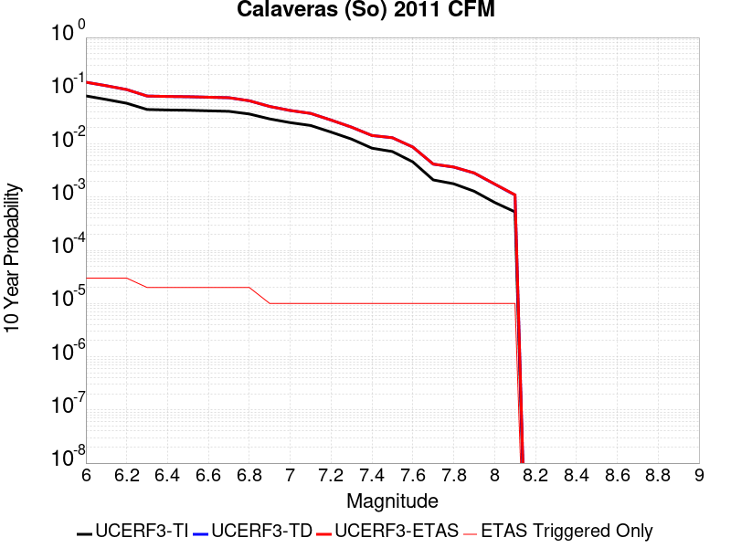 |

| Magnitude | 1 wk TI Prob | 1 wk TD Prob | 1 wk ETAS Prob | 1 wk ETAS/TD Gain | 1 wk ETAS Triggered Only | 1 mo TI Prob | 1 mo TD Prob | 1 mo ETAS Prob | 1 mo ETAS/TD Gain | 1 mo ETAS Triggered Only | 1 yr TI Prob | 1 yr TD Prob | 1 yr ETAS Prob | 1 yr ETAS/TD Gain | 1 yr ETAS Triggered Only | 10 yr TI Prob | 10 yr TD Prob | 10 yr ETAS Prob | 10 yr ETAS/TD Gain | 10 yr ETAS Triggered Only |
|-----|-----|-----|-----|-----|-----|-----|-----|-----|-----|-----|-----|-----|-----|-----|-----|-----|-----|-----|-----|-----|
| 6.0 | 1.5950744E-4 | 3.071188E-4 | 3.071188E-4 | 1.0 | 0.0 | 6.834242E-4 | 0.0013155643 | 0.0013155643 | 1.0 | 0.0 | 0.00828899 | 0.01585904 | 0.01588087 | 1.0013765 | 2.2182294E-5 | 0.079865426 | 0.14440064 | 0.14441963 | 1.0001315 | 2.2182294E-5 |
| 6.1 | 1.3584697E-4 | 2.6036944E-4 | 2.6036944E-4 | 1.0 | 0.0 | 5.8207137E-4 | 0.0011153965 | 0.0011153965 | 1.0 | 0.0 | 0.007063716 | 0.013462106 | 0.01348399 | 1.0016255 | 2.2182294E-5 | 0.06843361 | 0.12402854 | 0.12404797 | 1.0001566 | 2.2182294E-5 |
| 6.2 | 1.14676266E-4 | 2.1726108E-4 | 2.1726108E-4 | 1.0 | 0.0 | 4.9137714E-4 | 9.307893E-4 | 9.307893E-4 | 1.0 | 0.0 | 0.0059661185 | 0.011245592 | 0.011267524 | 1.0019504 | 2.2182294E-5 | 0.058084648 | 0.105019294 | 0.10503914 | 1.0001891 | 2.2182294E-5 |
| 6.3 | 8.691518E-5 | 1.5987165E-4 | 1.5987165E-4 | 1.0 | 0.0 | 3.7244044E-4 | 6.8496726E-4 | 6.8496726E-4 | 1.0 | 0.0 | 0.004525038 | 0.008300893 | 0.008322892 | 1.0026501 | 2.2182294E-5 | 0.044339992 | 0.0793347 | 0.07935512 | 1.0002574 | 2.2182294E-5 |
| 6.4 | 8.50982E-5 | 1.5693568E-4 | 1.5693568E-4 | 1.0 | 0.0 | 3.646556E-4 | 6.7239115E-4 | 6.7239115E-4 | 1.0 | 0.0 | 0.0044306475 | 0.008148931 | 0.0081709325 | 1.0027 | 2.2182294E-5 | 0.04343345 | 0.077940844 | 0.077961296 | 1.0002624 | 2.2182294E-5 |
| 6.5 | 8.4062965E-5 | 1.5518135E-4 | 1.5518135E-4 | 1.0 | 0.0 | 3.602201E-4 | 6.648764E-4 | 6.648764E-4 | 1.0 | 0.0 | 0.004376863 | 0.008058134 | 0.008080137 | 1.0027306 | 2.2182294E-5 | 0.042916555 | 0.077112116 | 0.07713258 | 1.0002655 | 2.2182294E-5 |
| 6.6 | 8.194716E-5 | 1.5154095E-4 | 1.5154095E-4 | 1.0 | 0.0 | 3.5115483E-4 | 6.492825E-4 | 6.492825E-4 | 1.0 | 0.0 | 0.0042669317 | 0.007869979 | 0.007891987 | 1.0027964 | 2.2182294E-5 | 0.04185927 | 0.07539739 | 0.0754179 | 1.000272 | 2.2182294E-5 |
| 6.7 | 8.012326E-5 | 1.4821833E-4 | 1.4821833E-4 | 1.0 | 0.0 | 3.433402E-4 | 6.350497E-4 | 6.350497E-4 | 1.0 | 0.0 | 0.004172157 | 0.007698474 | 0.007720486 | 1.0028592 | 2.2182294E-5 | 0.040946912 | 0.073839515 | 0.073860064 | 1.0002782 | 2.2182294E-5 |
| 6.8 | 7.119773E-5 | 1.2880519E-4 | 1.2880519E-4 | 1.0 | 0.0 | 3.0509746E-4 | 5.519001E-4 | 5.519001E-4 | 1.0 | 0.0 | 0.0037082357 | 0.0066958875 | 0.0067179212 | 1.0032907 | 2.2182294E-5 | 0.036469642 | 0.06468402 | 0.06470476 | 1.0003208 | 2.2182294E-5 |
| 6.9 | 5.7343088E-5 | 9.9189E-5 | 9.9189E-5 | 1.0 | 0.0 | 2.4573295E-4 | 4.2502693E-4 | 4.2502693E-4 | 1.0 | 0.0 | 0.0029876942 | 0.0051625078 | 0.0051625078 | 1.0 | 0.0 | 0.02947844 | 0.050509132 | 0.050509132 | 1.0 | 0.0 |
| 7.0 | 4.8746577E-5 | 8.284751E-5 | 8.284751E-5 | 1.0 | 0.0 | 2.0889717E-4 | 3.550128E-4 | 3.550128E-4 | 1.0 | 0.0 | 0.0025403565 | 0.004313781 | 0.004313781 | 1.0 | 0.0 | 0.025115121 | 0.04248505 | 0.04248505 | 1.0 | 0.0 |
| 7.1 | 4.2998014E-5 | 7.264914E-5 | 7.264914E-5 | 1.0 | 0.0 | 1.8426418E-4 | 3.1131663E-4 | 3.1131663E-4 | 1.0 | 0.0 | 0.002241108 | 0.0037837527 | 0.0037837527 | 1.0 | 0.0 | 0.022186412 | 0.037423246 | 0.037423246 | 1.0 | 0.0 |
| 7.2 | 3.221292E-5 | 5.390566E-5 | 5.390566E-5 | 1.0 | 0.0 | 1.3804805E-4 | 2.3100396E-4 | 2.3100396E-4 | 1.0 | 0.0 | 0.0016794393 | 0.0028088738 | 0.0028088738 | 1.0 | 0.0 | 0.016668037 | 0.028035998 | 0.028035998 | 1.0 | 0.0 |
| 7.3 | 2.3756531E-5 | 3.9471706E-5 | 3.9471706E-5 | 1.0 | 0.0 | 1.0180973E-4 | 1.6915359E-4 | 1.6915359E-4 | 1.0 | 0.0 | 0.0012388286 | 0.0020575167 | 0.0020575167 | 1.0 | 0.0 | 0.012319452 | 0.02064345 | 0.02064345 | 1.0 | 0.0 |
| 7.4 | 1.5997684E-5 | 2.734085E-5 | 2.734085E-5 | 1.0 | 0.0 | 6.8559704E-5 | 1.1716982E-4 | 1.1716982E-4 | 1.0 | 0.0 | 8.343947E-4 | 0.0014256114 | 0.0014256114 | 1.0 | 0.0 | 0.008312687 | 0.014376549 | 0.014376549 | 1.0 | 0.0 |
| 7.5 | 1.3814293E-5 | 2.4782603E-5 | 2.4782603E-5 | 1.0 | 0.0 | 5.9202768E-5 | 1.0620684E-4 | 1.0620684E-4 | 1.0 | 0.0 | 7.205553E-4 | 0.0012923037 | 0.0012923037 | 1.0 | 0.0 | 0.007182234 | 0.013055766 | 0.013055766 | 1.0 | 0.0 |
| 7.6 | 8.817309E-6 | 1.6429829E-5 | 1.6429829E-5 | 1.0 | 0.0 | 3.7787922E-5 | 7.041166E-5 | 7.041166E-5 | 1.0 | 0.0 | 4.5997082E-4 | 8.5692614E-4 | 8.5692614E-4 | 1.0 | 0.0 | 0.004590199 | 0.008719863 | 0.008719863 | 1.0 | 0.0 |
| 7.7 | 4.0352206E-6 | 7.706877E-6 | 7.706877E-6 | 1.0 | 0.0 | 1.7293689E-5 | 3.3029053E-5 | 3.3029053E-5 | 1.0 | 0.0 | 2.1053031E-4 | 4.020546E-4 | 4.020546E-4 | 1.0 | 0.0 | 0.0021033096 | 0.0041649863 | 0.0041649863 | 1.0 | 0.0 |
| 7.8 | 3.413169E-6 | 6.7868646E-6 | 6.7868646E-6 | 1.0 | 0.0 | 1.4627784E-5 | 2.9086239E-5 | 2.9086239E-5 | 1.0 | 0.0 | 1.7807873E-4 | 3.5406748E-4 | 3.5406748E-4 | 1.0 | 0.0 | 0.0017793609 | 0.0036663096 | 0.0036663096 | 1.0 | 0.0 |
| 7.9 | 2.4740732E-6 | 5.278809E-6 | 5.278809E-6 | 1.0 | 0.0 | 1.06031275E-5 | 2.2623271E-5 | 2.2623271E-5 | 1.0 | 0.0 | 1.2908543E-4 | 2.7540355E-4 | 2.7540355E-4 | 1.0 | 0.0 | 0.0012901047 | 0.002834638 | 0.002834638 | 1.0 | 0.0 |
| 8.0 | 1.5231818E-6 | 3.2887135E-6 | 3.2887135E-6 | 1.0 | 0.0 | 6.527906E-6 | 1.409441E-5 | 1.409441E-5 | 1.0 | 0.0 | 7.9474354E-5 | 1.7158597E-4 | 1.7158597E-4 | 1.0 | 0.0 | 7.944594E-4 | 0.001756374 | 0.001756374 | 1.0 | 0.0 |
| 8.1 | 1.0104524E-6 | 2.0456548E-6 | 2.0456548E-6 | 1.0 | 0.0 | 4.330503E-6 | 8.767062E-6 | 8.767062E-6 | 1.0 | 0.0 | 5.2722597E-5 | 1.06733794E-4 | 1.06733794E-4 | 1.0 | 0.0 | 5.271009E-4 | 0.0010929212 | 0.0010929212 | 1.0 | 0.0 |

## Almanor 2011 CFM
*[(top)](#table-of-contents)*

| 1 Week | 1 Month | 1 Year | 10 Year |
|-----|-----|-----|-----|
|  |  |  |  |

| Magnitude | 1 wk TI Prob | 1 wk TD Prob | 1 wk ETAS Prob | 1 wk ETAS/TD Gain | 1 wk ETAS Triggered Only | 1 mo TI Prob | 1 mo TD Prob | 1 mo ETAS Prob | 1 mo ETAS/TD Gain | 1 mo ETAS Triggered Only | 1 yr TI Prob | 1 yr TD Prob | 1 yr ETAS Prob | 1 yr ETAS/TD Gain | 1 yr ETAS Triggered Only | 10 yr TI Prob | 10 yr TD Prob | 10 yr ETAS Prob | 10 yr ETAS/TD Gain | 10 yr ETAS Triggered Only |
|-----|-----|-----|-----|-----|-----|-----|-----|-----|-----|-----|-----|-----|-----|-----|-----|-----|-----|-----|-----|-----|
| 6.0 | 6.1479834E-5 | 8.32787E-5 | 1.0545914E-4 | 1.26634 | 2.2182294E-5 | 2.6345838E-4 | 3.5686578E-4 | 3.7904014E-4 | 1.0621364 | 2.2182294E-5 | 0.0032028882 | 0.0043366123 | 0.004358698 | 1.005093 | 2.2182294E-5 | 0.031571172 | 0.04258577 | 0.04260701 | 1.0004987 | 2.2182294E-5 |
| 6.1 | 4.4387216E-5 | 5.9770442E-5 | 5.9770442E-5 | 1.0 | 0.0 | 1.9021705E-4 | 2.561381E-4 | 2.561381E-4 | 1.0 | 0.0 | 0.0023134327 | 0.003114426 | 0.003114426 | 1.0 | 0.0 | 0.022894967 | 0.030755036 | 0.030755036 | 1.0 | 0.0 |
| 6.2 | 4.4387216E-5 | 5.9770442E-5 | 5.9770442E-5 | 1.0 | 0.0 | 1.9021705E-4 | 2.561381E-4 | 2.561381E-4 | 1.0 | 0.0 | 0.0023134327 | 0.003114426 | 0.003114426 | 1.0 | 0.0 | 0.022894967 | 0.030755036 | 0.030755036 | 1.0 | 0.0 |
| 6.3 | 2.9523822E-5 | 3.954719E-5 | 3.954719E-5 | 1.0 | 0.0 | 1.2652454E-4 | 1.6947983E-4 | 1.6947983E-4 | 1.0 | 0.0 | 0.0015393476 | 0.0020618725 | 0.0020618725 | 1.0 | 0.0 | 0.015287281 | 0.020460794 | 0.020460794 | 1.0 | 0.0 |
| 6.4 | 2.0512744E-5 | 2.7431617E-5 | 2.7431617E-5 | 1.0 | 0.0 | 8.79088E-5 | 1.175612E-4 | 1.175612E-4 | 1.0 | 0.0 | 0.001069764 | 0.0014307408 | 0.0014307408 | 1.0 | 0.0 | 0.010646289 | 0.014244413 | 0.014244413 | 1.0 | 0.0 |
| 6.5 | 1.6750226E-5 | 2.23913E-5 | 2.23913E-5 | 1.0 | 0.0 | 7.178471E-5 | 9.596152E-5 | 9.596152E-5 | 1.0 | 0.0 | 8.7362836E-4 | 0.0011680633 | 0.0011680633 | 1.0 | 0.0 | 0.008702018 | 0.011649038 | 0.011649038 | 1.0 | 0.0 |
| 6.6 | 1.4745303E-5 | 1.9707952E-5 | 1.9707952E-5 | 1.0 | 0.0 | 6.319262E-5 | 8.446223E-5 | 8.446223E-5 | 1.0 | 0.0 | 7.690986E-4 | 0.0010281964 | 0.0010281964 | 1.0 | 0.0 | 0.0076644225 | 0.010264971 | 0.010264971 | 1.0 | 0.0 |
| 6.7 | 9.951145E-7 | 1.1616347E-6 | 1.1616347E-6 | 1.0 | 0.0 | 4.26477E-6 | 4.9784257E-6 | 4.9784257E-6 | 1.0 | 0.0 | 5.1922336E-5 | 6.0610826E-5 | 6.0610826E-5 | 1.0 | 0.0 | 5.1910203E-4 | 6.059602E-4 | 6.059602E-4 | 1.0 | 0.0 |
| 6.8 | 5.866312E-7 | 6.849384E-7 | 6.849384E-7 | 1.0 | 0.0 | 2.5141312E-6 | 2.9354478E-6 | 2.9354478E-6 | 1.0 | 0.0 | 3.0609117E-5 | 3.5738623E-5 | 3.5738623E-5 | 1.0 | 0.0 | 3.06049E-4 | 3.5734157E-4 | 3.5734157E-4 | 1.0 | 0.0 |

## Honey Lake 2011 CFM
*[(top)](#table-of-contents)*

| 1 Week | 1 Month | 1 Year | 10 Year |
|-----|-----|-----|-----|
|  |  |  |  |

| Magnitude | 1 wk TI Prob | 1 wk TD Prob | 1 wk ETAS Prob | 1 wk ETAS/TD Gain | 1 wk ETAS Triggered Only | 1 mo TI Prob | 1 mo TD Prob | 1 mo ETAS Prob | 1 mo ETAS/TD Gain | 1 mo ETAS Triggered Only | 1 yr TI Prob | 1 yr TD Prob | 1 yr ETAS Prob | 1 yr ETAS/TD Gain | 1 yr ETAS Triggered Only | 10 yr TI Prob | 10 yr TD Prob | 10 yr ETAS Prob | 10 yr ETAS/TD Gain | 10 yr ETAS Triggered Only |
|-----|-----|-----|-----|-----|-----|-----|-----|-----|-----|-----|-----|-----|-----|-----|-----|-----|-----|-----|-----|-----|
| 6.0 | 6.155506E-5 | 7.954667E-5 | 7.954667E-5 | 1.0 | 0.0 | 2.6378073E-4 | 3.40873E-4 | 3.40873E-4 | 1.0 | 0.0 | 0.0032068014 | 0.0041427943 | 0.0041427943 | 1.0 | 0.0 | 0.03160919 | 0.040702924 | 0.040724203 | 1.0005229 | 2.2182294E-5 |
| 6.1 | 6.155506E-5 | 7.954667E-5 | 7.954667E-5 | 1.0 | 0.0 | 2.6378073E-4 | 3.40873E-4 | 3.40873E-4 | 1.0 | 0.0 | 0.0032068014 | 0.0041427943 | 0.0041427943 | 1.0 | 0.0 | 0.03160919 | 0.040702924 | 0.040724203 | 1.0005229 | 2.2182294E-5 |
| 6.2 | 4.1335024E-5 | 5.257629E-5 | 5.257629E-5 | 1.0 | 0.0 | 1.7713808E-4 | 2.253086E-4 | 2.253086E-4 | 1.0 | 0.0 | 0.0021545228 | 0.0027398595 | 0.0027398595 | 1.0 | 0.0 | 0.021337535 | 0.027076708 | 0.027076708 | 1.0 | 0.0 |
| 6.3 | 4.1335024E-5 | 5.257629E-5 | 5.257629E-5 | 1.0 | 0.0 | 1.7713808E-4 | 2.253086E-4 | 2.253086E-4 | 1.0 | 0.0 | 0.0021545228 | 0.0027398595 | 0.0027398595 | 1.0 | 0.0 | 0.021337535 | 0.027076708 | 0.027076708 | 1.0 | 0.0 |
| 6.4 | 3.2393702E-5 | 4.0887444E-5 | 4.0887444E-5 | 1.0 | 0.0 | 1.3882275E-4 | 1.7522085E-4 | 1.7522085E-4 | 1.0 | 0.0 | 0.0016888566 | 0.002131335 | 0.002131335 | 1.0 | 0.0 | 0.016760793 | 0.02111982 | 0.02111982 | 1.0 | 0.0 |
| 6.5 | 2.7205504E-5 | 3.4211684E-5 | 3.4211684E-5 | 1.0 | 0.0 | 1.1658981E-4 | 1.4661385E-4 | 1.4661385E-4 | 1.0 | 0.0 | 0.0014185566 | 0.0017836588 | 0.0017836588 | 1.0 | 0.0 | 0.014095354 | 0.017702932 | 0.017702932 | 1.0 | 0.0 |
| 6.6 | 2.069265E-5 | 2.5955307E-5 | 2.5955307E-5 | 1.0 | 0.0 | 8.867977E-5 | 1.1123277E-4 | 1.1123277E-4 | 1.0 | 0.0 | 0.0010791414 | 0.0013535038 | 0.0013535038 | 1.0 | 0.0 | 0.010739161 | 0.013461002 | 0.013461002 | 1.0 | 0.0 |
| 6.7 | 1.8060919E-5 | 2.2656828E-5 | 2.2656828E-5 | 1.0 | 0.0 | 7.7401644E-5 | 9.709754E-5 | 9.709754E-5 | 1.0 | 0.0 | 9.419576E-4 | 0.0011816026 | 0.0011816026 | 1.0 | 0.0 | 0.009379748 | 0.011761238 | 0.011761238 | 1.0 | 0.0 |
| 6.8 | 1.4474663E-5 | 1.818127E-5 | 1.818127E-5 | 1.0 | 0.0 | 6.203279E-5 | 7.791784E-5 | 7.791784E-5 | 1.0 | 0.0 | 7.5498753E-4 | 9.483136E-4 | 9.483136E-4 | 1.0 | 0.0 | 0.007524277 | 0.009450192 | 0.009450192 | 1.0 | 0.0 |
| 6.9 | 8.564552E-6 | 1.0802308E-5 | 1.0802308E-5 | 1.0 | 0.0 | 3.6704707E-5 | 4.6295158E-5 | 4.6295158E-5 | 1.0 | 0.0 | 4.4678818E-4 | 5.635644E-4 | 5.635644E-4 | 1.0 | 0.0 | 0.0044589094 | 0.0056278477 | 0.0056278477 | 1.0 | 0.0 |

## Antelope Valley 2011
*[(top)](#table-of-contents)*

| 1 Week | 1 Month | 1 Year | 10 Year |
|-----|-----|-----|-----|
|  |  |  |  |

| Magnitude | 1 wk TI Prob | 1 wk TD Prob | 1 wk ETAS Prob | 1 wk ETAS/TD Gain | 1 wk ETAS Triggered Only | 1 mo TI Prob | 1 mo TD Prob | 1 mo ETAS Prob | 1 mo ETAS/TD Gain | 1 mo ETAS Triggered Only | 1 yr TI Prob | 1 yr TD Prob | 1 yr ETAS Prob | 1 yr ETAS/TD Gain | 1 yr ETAS Triggered Only | 10 yr TI Prob | 10 yr TD Prob | 10 yr ETAS Prob | 10 yr ETAS/TD Gain | 10 yr ETAS Triggered Only |
|-----|-----|-----|-----|-----|-----|-----|-----|-----|-----|-----|-----|-----|-----|-----|-----|-----|-----|-----|-----|-----|
| 6.0 | 3.1646934E-5 | 3.6904403E-5 | 3.6904403E-5 | 1.0 | 0.0 | 1.3562266E-4 | 1.5815363E-4 | 1.5815363E-4 | 1.0 | 0.0 | 0.0016499552 | 0.0019240845 | 0.001946224 | 1.0115066 | 2.2182294E-5 | 0.016377583 | 0.019100651 | 0.019122409 | 1.0011392 | 2.2182294E-5 |
| 6.1 | 3.1646934E-5 | 3.6904403E-5 | 3.6904403E-5 | 1.0 | 0.0 | 1.3562266E-4 | 1.5815363E-4 | 1.5815363E-4 | 1.0 | 0.0 | 0.0016499552 | 0.0019240845 | 0.001946224 | 1.0115066 | 2.2182294E-5 | 0.016377583 | 0.019100651 | 0.019122409 | 1.0011392 | 2.2182294E-5 |
| 6.2 | 3.1646934E-5 | 3.6904403E-5 | 3.6904403E-5 | 1.0 | 0.0 | 1.3562266E-4 | 1.5815363E-4 | 1.5815363E-4 | 1.0 | 0.0 | 0.0016499552 | 0.0019240845 | 0.001946224 | 1.0115066 | 2.2182294E-5 | 0.016377583 | 0.019100651 | 0.019122409 | 1.0011392 | 2.2182294E-5 |
| 6.3 | 3.1646934E-5 | 3.6904403E-5 | 3.6904403E-5 | 1.0 | 0.0 | 1.3562266E-4 | 1.5815363E-4 | 1.5815363E-4 | 1.0 | 0.0 | 0.0016499552 | 0.0019240845 | 0.001946224 | 1.0115066 | 2.2182294E-5 | 0.016377583 | 0.019100651 | 0.019122409 | 1.0011392 | 2.2182294E-5 |
| 6.4 | 3.1646934E-5 | 3.6904403E-5 | 3.6904403E-5 | 1.0 | 0.0 | 1.3562266E-4 | 1.5815363E-4 | 1.5815363E-4 | 1.0 | 0.0 | 0.0016499552 | 0.0019240845 | 0.001946224 | 1.0115066 | 2.2182294E-5 | 0.016377583 | 0.019100651 | 0.019122409 | 1.0011392 | 2.2182294E-5 |
| 6.5 | 1.8034107E-5 | 2.0940959E-5 | 2.0940959E-5 | 1.0 | 0.0 | 7.7286735E-5 | 8.974457E-5 | 8.974457E-5 | 1.0 | 0.0 | 9.405598E-4 | 0.0010922146 | 0.0010922146 | 1.0 | 0.0 | 0.009365888 | 0.010880542 | 0.010880542 | 1.0 | 0.0 |
| 6.6 | 1.8034107E-5 | 2.0940959E-5 | 2.0940959E-5 | 1.0 | 0.0 | 7.7286735E-5 | 8.974457E-5 | 8.974457E-5 | 1.0 | 0.0 | 9.405598E-4 | 0.0010922146 | 0.0010922146 | 1.0 | 0.0 | 0.009365888 | 0.010880542 | 0.010880542 | 1.0 | 0.0 |
| 6.7 | 1.3567667E-5 | 1.5749509E-5 | 1.5749509E-5 | 1.0 | 0.0 | 5.814585E-5 | 6.749675E-5 | 6.749675E-5 | 1.0 | 0.0 | 7.076958E-4 | 8.2156935E-4 | 8.2156935E-4 | 1.0 | 0.0 | 0.007054463 | 0.008195754 | 0.008195754 | 1.0 | 0.0 |
| 6.8 | 9.867387E-6 | 1.1467935E-5 | 1.1467935E-5 | 1.0 | 0.0 | 4.2288117E-5 | 4.91479E-5 | 4.91479E-5 | 1.0 | 0.0 | 5.1473617E-4 | 5.9830636E-4 | 5.9830636E-4 | 1.0 | 0.0 | 0.005135455 | 0.005976268 | 0.005976268 | 1.0 | 0.0 |
| 6.9 | 7.273233E-6 | 8.454864E-6 | 8.454864E-6 | 1.0 | 0.0 | 3.1170628E-5 | 3.623513E-5 | 3.623513E-5 | 1.0 | 0.0 | 3.794363E-4 | 4.411627E-4 | 4.411627E-4 | 1.0 | 0.0 | 0.0037878908 | 0.004411627 | 0.004411627 | 1.0 | 0.0 |

## San Juan
*[(top)](#table-of-contents)*

| 1 Week | 1 Month | 1 Year | 10 Year |
|-----|-----|-----|-----|
|  |  |  |  |

| Magnitude | 1 wk TI Prob | 1 wk TD Prob | 1 wk ETAS Prob | 1 wk ETAS/TD Gain | 1 wk ETAS Triggered Only | 1 mo TI Prob | 1 mo TD Prob | 1 mo ETAS Prob | 1 mo ETAS/TD Gain | 1 mo ETAS Triggered Only | 1 yr TI Prob | 1 yr TD Prob | 1 yr ETAS Prob | 1 yr ETAS/TD Gain | 1 yr ETAS Triggered Only | 10 yr TI Prob | 10 yr TD Prob | 10 yr ETAS Prob | 10 yr ETAS/TD Gain | 10 yr ETAS Triggered Only |
|-----|-----|-----|-----|-----|-----|-----|-----|-----|-----|-----|-----|-----|-----|-----|-----|-----|-----|-----|-----|-----|
| 6.0 | 8.682808E-6 | 8.7491635E-6 | 3.0931264E-5 | 3.5353396 | 2.2182294E-5 | 3.72115E-5 | 3.74959E-5 | 5.9677364E-5 | 1.5915703 | 2.2182294E-5 | 4.5295584E-4 | 4.564218E-4 | 4.7859398E-4 | 1.0485783 | 2.2182294E-5 | 0.004520337 | 0.004555385 | 0.0045774663 | 1.0048473 | 2.2182294E-5 |
| 6.1 | 8.682808E-6 | 8.7491635E-6 | 3.0931264E-5 | 3.5353396 | 2.2182294E-5 | 3.72115E-5 | 3.74959E-5 | 5.9677364E-5 | 1.5915703 | 2.2182294E-5 | 4.5295584E-4 | 4.564218E-4 | 4.7859398E-4 | 1.0485783 | 2.2182294E-5 | 0.004520337 | 0.004555385 | 0.0045774663 | 1.0048473 | 2.2182294E-5 |
| 6.2 | 8.682808E-6 | 8.7491635E-6 | 3.0931264E-5 | 3.5353396 | 2.2182294E-5 | 3.72115E-5 | 3.74959E-5 | 5.9677364E-5 | 1.5915703 | 2.2182294E-5 | 4.5295584E-4 | 4.564218E-4 | 4.7859398E-4 | 1.0485783 | 2.2182294E-5 | 0.004520337 | 0.004555385 | 0.0045774663 | 1.0048473 | 2.2182294E-5 |
| 6.3 | 6.3054235E-6 | 6.2825848E-6 | 2.846474E-5 | 4.530737 | 2.2182294E-5 | 2.7022963E-5 | 2.6925094E-5 | 4.910679E-5 | 1.8238299 | 2.2182294E-5 | 3.2895492E-4 | 3.2776513E-4 | 3.4994015E-4 | 1.0676552 | 2.2182294E-5 | 0.003284684 | 0.003273017 | 0.0032951266 | 1.0067551 | 2.2182294E-5 |
| 6.4 | 6.1490473E-6 | 6.1144656E-6 | 2.8296625E-5 | 4.627816 | 2.2182294E-5 | 2.6352795E-5 | 2.6204598E-5 | 4.838631E-5 | 1.8464817 | 2.2182294E-5 | 3.2079802E-4 | 3.1899565E-4 | 3.4117087E-4 | 1.0695157 | 2.2182294E-5 | 0.0032033534 | 0.0031855737 | 0.0032076854 | 1.0069412 | 2.2182294E-5 |
| 6.5 | 5.204848E-6 | 5.137233E-6 | 2.7319413E-5 | 5.3179235 | 2.2182294E-5 | 2.23063E-5 | 2.2016533E-5 | 4.419834E-5 | 2.0075066 | 2.2182294E-5 | 2.7154534E-4 | 2.6801927E-4 | 2.9019563E-4 | 1.0827416 | 2.2182294E-5 | 0.0027121378 | 0.0026771144 | 0.0026992373 | 1.0082637 | 2.2182294E-5 |
| 6.6 | 4.5179986E-6 | 4.4150297E-6 | 2.6597227E-5 | 6.0242457 | 2.2182294E-5 | 1.9362706E-5 | 1.8921424E-5 | 4.11033E-5 | 2.1723154 | 2.2182294E-5 | 2.3571544E-4 | 2.3034477E-4 | 2.5252195E-4 | 1.0962782 | 2.2182294E-5 | 0.0023546559 | 0.0023011973 | 0.0023233285 | 1.0096173 | 2.2182294E-5 |
| 6.7 | 3.9442616E-6 | 3.819828E-6 | 3.819828E-6 | 1.0 | 0.0 | 1.6903869E-5 | 1.6370592E-5 | 1.6370592E-5 | 1.0 | 0.0 | 2.0578515E-4 | 1.992944E-4 | 1.992944E-4 | 1.0 | 0.0 | 0.002055947 | 0.0019912818 | 0.0019912818 | 1.0 | 0.0 |
| 6.8 | 3.4536245E-6 | 3.3163353E-6 | 3.3163353E-6 | 1.0 | 0.0 | 1.4801163E-5 | 1.4212792E-5 | 1.4212792E-5 | 1.0 | 0.0 | 1.8018926E-4 | 1.7302761E-4 | 1.7302761E-4 | 1.0 | 0.0 | 0.0018004322 | 0.0017290477 | 0.0017290477 | 1.0 | 0.0 |
| 6.9 | 3.059865E-6 | 2.9120315E-6 | 2.9120315E-6 | 1.0 | 0.0 | 1.3113641E-5 | 1.2480078E-5 | 1.2480078E-5 | 1.0 | 0.0 | 1.596469E-4 | 1.5193493E-4 | 1.5193493E-4 | 1.0 | 0.0 | 0.0015953224 | 0.0015184252 | 0.0015184252 | 1.0 | 0.0 |
| 7.0 | 2.6504351E-6 | 2.4920002E-6 | 2.4920002E-6 | 1.0 | 0.0 | 1.1358958E-5 | 1.0679961E-5 | 1.0679961E-5 | 1.0 | 0.0 | 1.3828653E-4 | 1.300213E-4 | 1.300213E-4 | 1.0 | 0.0 | 0.0013820052 | 0.0012995641 | 0.0012995641 | 1.0 | 0.0 |
| 7.1 | 2.2039317E-6 | 2.0338296E-6 | 2.0338296E-6 | 1.0 | 0.0 | 9.445387E-6 | 8.716386E-6 | 8.716386E-6 | 1.0 | 0.0 | 1.1499152E-4 | 1.0611736E-4 | 1.0611736E-4 | 1.0 | 0.0 | 0.0011493203 | 0.0010607769 | 0.0010607769 | 1.0 | 0.0 |
| 7.2 | 1.0786707E-6 | 8.7701903E-7 | 8.7701903E-7 | 1.0 | 0.0 | 4.622866E-6 | 3.7586476E-6 | 3.7586476E-6 | 1.0 | 0.0 | 5.628194E-5 | 4.5760586E-5 | 4.5760586E-5 | 1.0 | 0.0 | 5.6267687E-4 | 4.5757066E-4 | 4.5757066E-4 | 1.0 | 0.0 |
| 7.3 | 6.846433E-7 | 4.868805E-7 | 4.868805E-7 | 1.0 | 0.0 | 2.9341822E-6 | 2.086629E-6 | 2.086629E-6 | 1.0 | 0.0 | 3.5723086E-5 | 2.5404412E-5 | 2.5404412E-5 | 1.0 | 0.0 | 3.571734E-4 | 2.540486E-4 | 2.540486E-4 | 1.0 | 0.0 |
| 7.4 | 5.23043E-7 | 3.2628162E-7 | 3.2628162E-7 | 1.0 | 0.0 | 2.2416111E-6 | 1.398349E-6 | 1.398349E-6 | 1.0 | 0.0 | 2.7291273E-5 | 1.7024766E-5 | 1.7024766E-5 | 1.0 | 0.0 | 2.7287923E-4 | 1.7026656E-4 | 1.7026656E-4 | 1.0 | 0.0 |
| 7.5 | 4.648444E-7 | 2.7234944E-7 | 2.7234944E-7 | 1.0 | 0.0 | 1.9921886E-6 | 1.1672114E-6 | 1.1672114E-6 | 1.0 | 0.0 | 2.4254627E-5 | 1.42107065E-5 | 1.42107065E-5 | 1.0 | 0.0 | 2.425198E-4 | 1.421276E-4 | 1.421276E-4 | 1.0 | 0.0 |
| 7.6 | 3.9906567E-7 | 2.2083314E-7 | 2.2083314E-7 | 1.0 | 0.0 | 1.7102802E-6 | 9.464274E-7 | 9.464274E-7 | 1.0 | 0.0 | 2.0822463E-5 | 1.1522693E-5 | 1.1522693E-5 | 1.0 | 0.0 | 2.0820512E-4 | 1.15245566E-4 | 1.15245566E-4 | 1.0 | 0.0 |
| 7.7 | 1.8784601E-7 | 5.3666906E-8 | 5.3666906E-8 | 1.0 | 0.0 | 8.0505407E-7 | 2.30001E-7 | 2.30001E-7 | 1.0 | 0.0 | 9.80149E-6 | 2.8002585E-6 | 2.8002585E-6 | 1.0 | 0.0 | 9.801057E-5 | 2.8011282E-5 | 2.8011282E-5 | 1.0 | 0.0 |
| 7.8 | 1.00154914E-7 | 1.2415832E-8 | 1.2415832E-8 | 1.0 | 0.0 | 4.2923529E-7 | 5.3210716E-8 | 5.3210716E-8 | 1.0 | 0.0 | 5.225927E-6 | 6.4784024E-7 | 6.4784024E-7 | 1.0 | 0.0 | 5.225804E-5 | 6.484273E-6 | 6.484273E-6 | 1.0 | 0.0 |
| 7.9 | 6.171429E-8 | 4.2966155E-9 | 4.2966155E-9 | 1.0 | 0.0 | 2.6448978E-7 | 1.8414067E-8 | 1.8414067E-8 | 1.0 | 0.0 | 3.2201583E-6 | 2.2419121E-7 | 2.2419121E-7 | 1.0 | 0.0 | 3.2201115E-5 | 2.2472002E-6 | 2.2472002E-6 | 1.0 | 0.0 |
| 8.0 | 1.3974572E-8 | 3.3788217E-10 | 3.3788217E-10 | 1.0 | 0.0 | 5.989102E-8 | 1.448067E-9 | 1.448067E-9 | 1.0 | 0.0 | 7.2917294E-7 | 1.763022E-8 | 1.763022E-8 | 1.0 | 0.0 | 7.2917055E-6 | 1.8060365E-7 | 1.8060365E-7 | 1.0 | 0.0 |
| 8.1 | 1.8403477E-9 | 1.1302803E-10 | 1.1302803E-10 | 1.0 | 0.0 | 7.887204E-9 | 4.844063E-10 | 4.844063E-10 | 1.0 | 0.0 | 9.602671E-8 | 5.8976446E-9 | 5.8976446E-9 | 1.0 | 0.0 | 9.602667E-7 | 6.021993E-8 | 6.021993E-8 | 1.0 | 0.0 |

## Great Valley 03 Mysterious Ridge
*[(top)](#table-of-contents)*

| 1 Week | 1 Month | 1 Year | 10 Year |
|-----|-----|-----|-----|
|  |  |  | 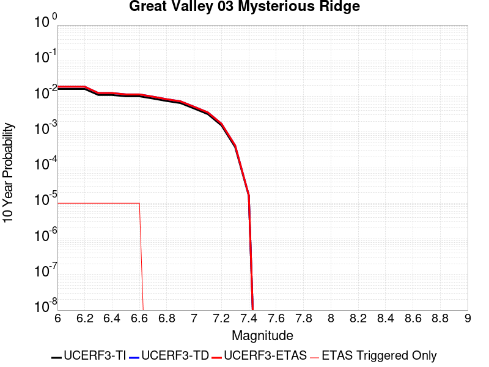 |

| Magnitude | 1 wk TI Prob | 1 wk TD Prob | 1 wk ETAS Prob | 1 wk ETAS/TD Gain | 1 wk ETAS Triggered Only | 1 mo TI Prob | 1 mo TD Prob | 1 mo ETAS Prob | 1 mo ETAS/TD Gain | 1 mo ETAS Triggered Only | 1 yr TI Prob | 1 yr TD Prob | 1 yr ETAS Prob | 1 yr ETAS/TD Gain | 1 yr ETAS Triggered Only | 10 yr TI Prob | 10 yr TD Prob | 10 yr ETAS Prob | 10 yr ETAS/TD Gain | 10 yr ETAS Triggered Only |
|-----|-----|-----|-----|-----|-----|-----|-----|-----|-----|-----|-----|-----|-----|-----|-----|-----|-----|-----|-----|-----|
| 6.0 | 3.1182444E-5 | 3.603423E-5 | 5.8215723E-5 | 1.6155673 | 2.2182294E-5 | 1.336322E-4 | 1.544242E-4 | 1.7660308E-4 | 1.143623 | 2.2182294E-5 | 0.0016257578 | 0.0018786696 | 0.0019008103 | 1.0117853 | 2.2182294E-5 | 0.016139153 | 0.018646652 | 0.01866842 | 1.0011674 | 2.2182294E-5 |
| 6.1 | 3.1182444E-5 | 3.603423E-5 | 5.8215723E-5 | 1.6155673 | 2.2182294E-5 | 1.336322E-4 | 1.544242E-4 | 1.7660308E-4 | 1.143623 | 2.2182294E-5 | 0.0016257578 | 0.0018786696 | 0.0019008103 | 1.0117853 | 2.2182294E-5 | 0.016139153 | 0.018646652 | 0.01866842 | 1.0011674 | 2.2182294E-5 |
| 6.2 | 3.1182444E-5 | 3.603423E-5 | 5.8215723E-5 | 1.6155673 | 2.2182294E-5 | 1.336322E-4 | 1.544242E-4 | 1.7660308E-4 | 1.143623 | 2.2182294E-5 | 0.0016257578 | 0.0018786696 | 0.0019008103 | 1.0117853 | 2.2182294E-5 | 0.016139153 | 0.018646652 | 0.01866842 | 1.0011674 | 2.2182294E-5 |
| 6.3 | 2.106934E-5 | 2.3850307E-5 | 4.6032073E-5 | 1.9300411 | 2.2182294E-5 | 9.0294045E-5 | 1.0221177E-4 | 1.2439181E-4 | 1.2170007 | 2.2182294E-5 | 0.0010987755 | 0.0012437489 | 0.0012659036 | 1.0178128 | 2.2182294E-5 | 0.010933585 | 0.012371127 | 0.012393034 | 1.0017709 | 2.2182294E-5 |
| 6.4 | 2.106934E-5 | 2.3850307E-5 | 4.6032073E-5 | 1.9300411 | 2.2182294E-5 | 9.0294045E-5 | 1.0221177E-4 | 1.2439181E-4 | 1.2170007 | 2.2182294E-5 | 0.0010987755 | 0.0012437489 | 0.0012659036 | 1.0178128 | 2.2182294E-5 | 0.010933585 | 0.012371127 | 0.012393034 | 1.0017709 | 2.2182294E-5 |
| 6.5 | 1.9389783E-5 | 2.1884984E-5 | 4.4066794E-5 | 2.013563 | 2.2182294E-5 | 8.309642E-5 | 9.3789575E-5 | 1.15969786E-4 | 1.2364892 | 2.2182294E-5 | 0.0010112294 | 0.0011413174 | 0.0011634744 | 1.0194135 | 2.2182294E-5 | 0.010066401 | 0.011357434 | 0.011379364 | 1.001931 | 2.2182294E-5 |
| 6.6 | 1.9370193E-5 | 2.1864906E-5 | 4.4046716E-5 | 2.0144937 | 2.2182294E-5 | 8.301247E-5 | 9.370353E-5 | 1.1588374E-4 | 1.2367063 | 2.2182294E-5 | 0.0010102082 | 0.001140271 | 0.001162428 | 1.0194314 | 2.2182294E-5 | 0.010056281 | 0.011347076 | 0.011369006 | 1.0019327 | 2.2182294E-5 |
| 6.7 | 1.6723505E-5 | 1.8799281E-5 | 1.8799281E-5 | 1.0 | 0.0 | 7.16702E-5 | 8.056597E-5 | 8.056597E-5 | 1.0 | 0.0 | 8.722353E-4 | 9.804688E-4 | 9.804688E-4 | 1.0 | 0.0 | 0.008688197 | 0.009763439 | 0.009763439 | 1.0 | 0.0 |
| 6.8 | 1.426937E-5 | 1.599721E-5 | 1.599721E-5 | 1.0 | 0.0 | 6.115301E-5 | 6.855775E-5 | 6.855775E-5 | 1.0 | 0.0 | 7.4428355E-4 | 8.343854E-4 | 8.343854E-4 | 1.0 | 0.0 | 0.007417957 | 0.008314005 | 0.008314005 | 1.0 | 0.0 |
| 6.9 | 1.2469891E-5 | 1.3956928E-5 | 1.3956928E-5 | 1.0 | 0.0 | 5.3441294E-5 | 5.9814105E-5 | 5.9814105E-5 | 1.0 | 0.0 | 6.504535E-4 | 7.280055E-4 | 7.280055E-4 | 1.0 | 0.0 | 0.006485529 | 0.00725743 | 0.00725743 | 1.0 | 0.0 |
| 7.0 | 8.7746275E-6 | 9.791734E-6 | 9.791734E-6 | 1.0 | 0.0 | 3.7605005E-5 | 4.196394E-5 | 4.196394E-5 | 1.0 | 0.0 | 4.5774475E-4 | 5.1079853E-4 | 5.1079853E-4 | 1.0 | 0.0 | 0.00456803 | 0.005096977 | 0.005096977 | 1.0 | 0.0 |
| 7.1 | 6.1067153E-6 | 6.813725E-6 | 6.813725E-6 | 1.0 | 0.0 | 2.6171374E-5 | 2.9201385E-5 | 2.9201385E-5 | 1.0 | 0.0 | 3.1858988E-4 | 3.5547445E-4 | 3.5547445E-4 | 1.0 | 0.0 | 0.0031813353 | 0.003549609 | 0.003549609 | 1.0 | 0.0 |
| 7.2 | 2.939283E-6 | 3.2741057E-6 | 3.2741057E-6 | 1.0 | 0.0 | 1.2596866E-5 | 1.4031816E-5 | 1.4031816E-5 | 1.0 | 0.0 | 1.5335606E-4 | 1.7082572E-4 | 1.7082572E-4 | 1.0 | 0.0 | 0.0015325027 | 0.001707116 | 0.001707116 | 1.0 | 0.0 |
| 7.3 | 7.2387763E-7 | 8.008505E-7 | 8.008505E-7 | 1.0 | 0.0 | 3.102329E-6 | 3.4322145E-6 | 3.4322145E-6 | 1.0 | 0.0 | 3.77702E-5 | 4.178687E-5 | 4.178687E-5 | 1.0 | 0.0 | 3.7763783E-4 | 4.1783508E-4 | 4.1783508E-4 | 1.0 | 0.0 |
| 7.4 | 3.112171E-8 | 3.2068368E-8 | 3.2068368E-8 | 1.0 | 0.0 | 1.3337875E-7 | 1.3743585E-7 | 1.3743585E-7 | 1.0 | 0.0 | 1.6238852E-6 | 1.6732803E-6 | 1.6732803E-6 | 1.0 | 0.0 | 1.6238733E-5 | 1.6732685E-5 | 1.6732685E-5 | 1.0 | 0.0 |

## West Tahoe
*[(top)](#table-of-contents)*

| 1 Week | 1 Month | 1 Year | 10 Year |
|-----|-----|-----|-----|
|  |  |  |  |

| Magnitude | 1 wk TI Prob | 1 wk TD Prob | 1 wk ETAS Prob | 1 wk ETAS/TD Gain | 1 wk ETAS Triggered Only | 1 mo TI Prob | 1 mo TD Prob | 1 mo ETAS Prob | 1 mo ETAS/TD Gain | 1 mo ETAS Triggered Only | 1 yr TI Prob | 1 yr TD Prob | 1 yr ETAS Prob | 1 yr ETAS/TD Gain | 1 yr ETAS Triggered Only | 10 yr TI Prob | 10 yr TD Prob | 10 yr ETAS Prob | 10 yr ETAS/TD Gain | 10 yr ETAS Triggered Only |
|-----|-----|-----|-----|-----|-----|-----|-----|-----|-----|-----|-----|-----|-----|-----|-----|-----|-----|-----|-----|-----|
| 6.0 | 1.952444E-5 | 2.118317E-5 | 4.3364995E-5 | 2.0471437 | 2.2182294E-5 | 8.367348E-5 | 9.078217E-5 | 1.1296244E-4 | 1.2443242 | 2.2182294E-5 | 0.0010182485 | 0.0011047672 | 0.001126925 | 1.0200565 | 2.2182294E-5 | 0.010135954 | 0.010998235 | 0.011020174 | 1.0019947 | 2.2182294E-5 |
| 6.1 | 1.952444E-5 | 2.118317E-5 | 4.3364995E-5 | 2.0471437 | 2.2182294E-5 | 8.367348E-5 | 9.078217E-5 | 1.1296244E-4 | 1.2443242 | 2.2182294E-5 | 0.0010182485 | 0.0011047672 | 0.001126925 | 1.0200565 | 2.2182294E-5 | 0.010135954 | 0.010998235 | 0.011020174 | 1.0019947 | 2.2182294E-5 |
| 6.2 | 1.952444E-5 | 2.118317E-5 | 4.3364995E-5 | 2.0471437 | 2.2182294E-5 | 8.367348E-5 | 9.078217E-5 | 1.1296244E-4 | 1.2443242 | 2.2182294E-5 | 0.0010182485 | 0.0011047672 | 0.001126925 | 1.0200565 | 2.2182294E-5 | 0.010135954 | 0.010998235 | 0.011020174 | 1.0019947 | 2.2182294E-5 |
| 6.3 | 1.952444E-5 | 2.118317E-5 | 4.3364995E-5 | 2.0471437 | 2.2182294E-5 | 8.367348E-5 | 9.078217E-5 | 1.1296244E-4 | 1.2443242 | 2.2182294E-5 | 0.0010182485 | 0.0011047672 | 0.001126925 | 1.0200565 | 2.2182294E-5 | 0.010135954 | 0.010998235 | 0.011020174 | 1.0019947 | 2.2182294E-5 |
| 6.4 | 1.952444E-5 | 2.118317E-5 | 4.3364995E-5 | 2.0471437 | 2.2182294E-5 | 8.367348E-5 | 9.078217E-5 | 1.1296244E-4 | 1.2443242 | 2.2182294E-5 | 0.0010182485 | 0.0011047672 | 0.001126925 | 1.0200565 | 2.2182294E-5 | 0.010135954 | 0.010998235 | 0.011020174 | 1.0019947 | 2.2182294E-5 |
| 6.5 | 1.2685271E-5 | 1.3690627E-5 | 1.3690627E-5 | 1.0 | 0.0 | 5.4364315E-5 | 5.8672893E-5 | 5.8672893E-5 | 1.0 | 0.0 | 6.616845E-4 | 7.141248E-4 | 7.141248E-4 | 1.0 | 0.0 | 0.0065971776 | 0.00711995 | 0.00711995 | 1.0 | 0.0 |
| 6.6 | 1.2685271E-5 | 1.3690627E-5 | 1.3690627E-5 | 1.0 | 0.0 | 5.4364315E-5 | 5.8672893E-5 | 5.8672893E-5 | 1.0 | 0.0 | 6.616845E-4 | 7.141248E-4 | 7.141248E-4 | 1.0 | 0.0 | 0.0065971776 | 0.00711995 | 0.00711995 | 1.0 | 0.0 |
| 6.7 | 9.117886E-6 | 9.809846E-6 | 9.809846E-6 | 1.0 | 0.0 | 3.9076072E-5 | 4.2041564E-5 | 4.2041564E-5 | 1.0 | 0.0 | 4.756473E-4 | 5.11743E-4 | 5.11743E-4 | 1.0 | 0.0 | 0.0047463053 | 0.0051063634 | 0.0051063634 | 1.0 | 0.0 |
| 6.8 | 8.786828E-6 | 9.457863E-6 | 9.457863E-6 | 1.0 | 0.0 | 3.7657293E-5 | 4.053311E-5 | 4.053311E-5 | 1.0 | 0.0 | 4.5838108E-4 | 4.933859E-4 | 4.933859E-4 | 1.0 | 0.0 | 0.0045743673 | 0.0049236063 | 0.0049236063 | 1.0 | 0.0 |
| 6.9 | 6.7562123E-6 | 7.2638086E-6 | 7.2638086E-6 | 1.0 | 0.0 | 2.8954875E-5 | 3.1130265E-5 | 3.1130265E-5 | 1.0 | 0.0 | 3.5246857E-4 | 3.789498E-4 | 3.789498E-4 | 1.0 | 0.0 | 0.0035191004 | 0.0037835082 | 0.0037835082 | 1.0 | 0.0 |
| 7.0 | 5.1792854E-6 | 5.567338E-6 | 5.567338E-6 | 1.0 | 0.0 | 2.2196748E-5 | 2.3859824E-5 | 2.3859824E-5 | 1.0 | 0.0 | 2.702119E-4 | 2.9045844E-4 | 2.9045844E-4 | 1.0 | 0.0 | 0.0026988357 | 0.0029011632 | 0.0029011632 | 1.0 | 0.0 |
| 7.1 | 4.090765E-6 | 4.3974223E-6 | 4.3974223E-6 | 1.0 | 0.0 | 1.7531731E-5 | 1.884598E-5 | 1.884598E-5 | 1.0 | 0.0 | 2.134279E-4 | 2.2942905E-4 | 2.2942905E-4 | 1.0 | 0.0 | 0.0021322304 | 0.0022922563 | 0.0022922563 | 1.0 | 0.0 |
| 7.2 | 2.2356758E-6 | 2.4023684E-6 | 2.4023684E-6 | 1.0 | 0.0 | 9.581432E-6 | 1.0295834E-5 | 1.0295834E-5 | 1.0 | 0.0 | 1.1664769E-4 | 1.2534647E-4 | 1.2534647E-4 | 1.0 | 0.0 | 0.0011658648 | 0.0012529434 | 0.0012529434 | 1.0 | 0.0 |

## Surprise Valley 2011 CFM
*[(top)](#table-of-contents)*

| 1 Week | 1 Month | 1 Year | 10 Year |
|-----|-----|-----|-----|
|  |  |  |  |

| Magnitude | 1 wk TI Prob | 1 wk TD Prob | 1 wk ETAS Prob | 1 wk ETAS/TD Gain | 1 wk ETAS Triggered Only | 1 mo TI Prob | 1 mo TD Prob | 1 mo ETAS Prob | 1 mo ETAS/TD Gain | 1 mo ETAS Triggered Only | 1 yr TI Prob | 1 yr TD Prob | 1 yr ETAS Prob | 1 yr ETAS/TD Gain | 1 yr ETAS Triggered Only | 10 yr TI Prob | 10 yr TD Prob | 10 yr ETAS Prob | 10 yr ETAS/TD Gain | 10 yr ETAS Triggered Only |
|-----|-----|-----|-----|-----|-----|-----|-----|-----|-----|-----|-----|-----|-----|-----|-----|-----|-----|-----|-----|-----|
| 6.0 | 4.0396248E-5 | 4.485131E-5 | 6.703261E-5 | 1.4945519 | 2.2182294E-5 | 1.7311527E-4 | 1.9220692E-4 | 2.1438496E-4 | 1.1153862 | 2.2182294E-5 | 0.002105641 | 0.0023378176 | 0.0023599481 | 1.0094663 | 2.2182294E-5 | 0.020858008 | 0.023153966 | 0.023175634 | 1.0009358 | 2.2182294E-5 |
| 6.1 | 4.0396248E-5 | 4.485131E-5 | 6.703261E-5 | 1.4945519 | 2.2182294E-5 | 1.7311527E-4 | 1.9220692E-4 | 2.1438496E-4 | 1.1153862 | 2.2182294E-5 | 0.002105641 | 0.0023378176 | 0.0023599481 | 1.0094663 | 2.2182294E-5 | 0.020858008 | 0.023153966 | 0.023175634 | 1.0009358 | 2.2182294E-5 |
| 6.2 | 2.2295266E-5 | 2.440125E-5 | 2.440125E-5 | 1.0 | 0.0 | 9.554764E-5 | 1.0457276E-4 | 1.0457276E-4 | 1.0 | 0.0 | 0.0011626717 | 0.0012724606 | 0.0012724606 | 1.0 | 0.0 | 0.011566074 | 0.012654981 | 0.012654981 | 1.0 | 0.0 |
| 6.3 | 1.572643E-5 | 1.7096807E-5 | 1.7096807E-5 | 1.0 | 0.0 | 6.7397246E-5 | 7.327003E-5 | 7.327003E-5 | 1.0 | 0.0 | 8.202525E-4 | 8.91708E-4 | 8.91708E-4 | 1.0 | 0.0 | 0.008172315 | 0.008882407 | 0.008882407 | 1.0 | 0.0 |
| 6.4 | 1.5714395E-5 | 1.7084629E-5 | 1.7084629E-5 | 1.0 | 0.0 | 6.734567E-5 | 7.3217845E-5 | 7.3217845E-5 | 1.0 | 0.0 | 8.1962504E-4 | 8.9107314E-4 | 8.9107314E-4 | 1.0 | 0.0 | 0.008166086 | 0.008876109 | 0.008876109 | 1.0 | 0.0 |
| 6.5 | 1.2733495E-5 | 1.38016E-5 | 1.38016E-5 | 1.0 | 0.0 | 5.457098E-5 | 5.9148413E-5 | 5.9148413E-5 | 1.0 | 0.0 | 6.641992E-4 | 7.1990065E-4 | 7.1990065E-4 | 1.0 | 0.0 | 0.0066221743 | 0.0071763797 | 0.0071763797 | 1.0 | 0.0 |
| 6.6 | 1.0983784E-5 | 1.1886554E-5 | 1.1886554E-5 | 1.0 | 0.0 | 4.7072506E-5 | 5.094141E-5 | 5.094141E-5 | 1.0 | 0.0 | 5.7295704E-4 | 6.200405E-4 | 6.200405E-4 | 1.0 | 0.0 | 0.0057148207 | 0.0061836545 | 0.0061836545 | 1.0 | 0.0 |
| 6.7 | 9.104806E-6 | 9.839491E-6 | 9.839491E-6 | 1.0 | 0.0 | 3.902001E-5 | 4.2168587E-5 | 4.2168587E-5 | 1.0 | 0.0 | 4.7496508E-4 | 5.132855E-4 | 5.132855E-4 | 1.0 | 0.0 | 0.004739512 | 0.005121397 | 0.005121397 | 1.0 | 0.0 |
| 6.8 | 6.2162403E-6 | 6.7041337E-6 | 6.7041337E-6 | 1.0 | 0.0 | 2.6640759E-5 | 2.8731698E-5 | 2.8731698E-5 | 1.0 | 0.0 | 3.2430296E-4 | 3.497545E-4 | 3.497545E-4 | 1.0 | 0.0 | 0.003238301 | 0.0034922638 | 0.0034922638 | 1.0 | 0.0 |
| 6.9 | 4.1792696E-6 | 4.50323E-6 | 4.50323E-6 | 1.0 | 0.0 | 1.7911032E-5 | 1.9299423E-5 | 1.9299423E-5 | 1.0 | 0.0 | 2.1804498E-4 | 2.3494668E-4 | 2.3494668E-4 | 1.0 | 0.0 | 0.0021783116 | 0.0023471361 | 0.0023471361 | 1.0 | 0.0 |
| 7.0 | 2.7478413E-6 | 2.9622424E-6 | 2.9622424E-6 | 1.0 | 0.0 | 1.177641E-5 | 1.269527E-5 | 1.269527E-5 | 1.0 | 0.0 | 1.4336836E-4 | 1.545552E-4 | 1.545552E-4 | 1.0 | 0.0 | 0.001432759 | 0.0015445995 | 0.0015445995 | 1.0 | 0.0 |
| 7.1 | 8.128648E-7 | 8.724922E-7 | 8.724922E-7 | 1.0 | 0.0 | 3.4837017E-6 | 3.7392501E-6 | 3.7392501E-6 | 1.0 | 0.0 | 4.2413245E-5 | 4.552502E-5 | 4.552502E-5 | 1.0 | 0.0 | 4.2405148E-4 | 4.5521575E-4 | 4.5521575E-4 | 1.0 | 0.0 |
| 7.2 | 4.8641045E-8 | 4.9402068E-8 | 4.9402068E-8 | 1.0 | 0.0 | 2.084616E-7 | 2.1172312E-7 | 2.1172312E-7 | 1.0 | 0.0 | 2.538017E-6 | 2.577726E-6 | 2.577726E-6 | 1.0 | 0.0 | 2.537988E-5 | 2.5776973E-5 | 2.5776973E-5 | 1.0 | 0.0 |
| 7.3 | 5.3911844E-9 | 5.4758145E-9 | 5.4758145E-9 | 1.0 | 0.0 | 2.3105075E-8 | 2.3467775E-8 | 2.3467775E-8 | 1.0 | 0.0 | 2.8130427E-7 | 2.8572015E-7 | 2.8572015E-7 | 1.0 | 0.0 | 2.8130391E-6 | 2.8571992E-6 | 2.8571992E-6 | 1.0 | 0.0 |

## San Gabriel (Extension)
*[(top)](#table-of-contents)*

| 1 Week | 1 Month | 1 Year | 10 Year |
|-----|-----|-----|-----|
|  |  |  |  |

| Magnitude | 1 wk TI Prob | 1 wk TD Prob | 1 wk ETAS Prob | 1 wk ETAS/TD Gain | 1 wk ETAS Triggered Only | 1 mo TI Prob | 1 mo TD Prob | 1 mo ETAS Prob | 1 mo ETAS/TD Gain | 1 mo ETAS Triggered Only | 1 yr TI Prob | 1 yr TD Prob | 1 yr ETAS Prob | 1 yr ETAS/TD Gain | 1 yr ETAS Triggered Only | 10 yr TI Prob | 10 yr TD Prob | 10 yr ETAS Prob | 10 yr ETAS/TD Gain | 10 yr ETAS Triggered Only |
|-----|-----|-----|-----|-----|-----|-----|-----|-----|-----|-----|-----|-----|-----|-----|-----|-----|-----|-----|-----|-----|
| 6.0 | 5.6486106E-6 | 5.7168304E-6 | 2.7898997E-5 | 4.8801513 | 2.2182294E-5 | 2.4208108E-5 | 2.450048E-5 | 4.668223E-5 | 1.9053599 | 2.2182294E-5 | 2.9469383E-4 | 2.9825376E-4 | 3.2042945E-4 | 1.0743517 | 2.2182294E-5 | 0.0029430336 | 0.0029786653 | 0.0030007814 | 1.0074248 | 2.2182294E-5 |
| 6.1 | 5.6486106E-6 | 5.7168304E-6 | 2.7898997E-5 | 4.8801513 | 2.2182294E-5 | 2.4208108E-5 | 2.450048E-5 | 4.668223E-5 | 1.9053599 | 2.2182294E-5 | 2.9469383E-4 | 2.9825376E-4 | 3.2042945E-4 | 1.0743517 | 2.2182294E-5 | 0.0029430336 | 0.0029786653 | 0.0030007814 | 1.0074248 | 2.2182294E-5 |
| 6.2 | 5.6486106E-6 | 5.7168304E-6 | 2.7898997E-5 | 4.8801513 | 2.2182294E-5 | 2.4208108E-5 | 2.450048E-5 | 4.668223E-5 | 1.9053599 | 2.2182294E-5 | 2.9469383E-4 | 2.9825376E-4 | 3.2042945E-4 | 1.0743517 | 2.2182294E-5 | 0.0029430336 | 0.0029786653 | 0.0030007814 | 1.0074248 | 2.2182294E-5 |
| 6.3 | 5.6486106E-6 | 5.7168304E-6 | 2.7898997E-5 | 4.8801513 | 2.2182294E-5 | 2.4208108E-5 | 2.450048E-5 | 4.668223E-5 | 1.9053599 | 2.2182294E-5 | 2.9469383E-4 | 2.9825376E-4 | 3.2042945E-4 | 1.0743517 | 2.2182294E-5 | 0.0029430336 | 0.0029786653 | 0.0030007814 | 1.0074248 | 2.2182294E-5 |
| 6.4 | 5.6486106E-6 | 5.7168304E-6 | 2.7898997E-5 | 4.8801513 | 2.2182294E-5 | 2.4208108E-5 | 2.450048E-5 | 4.668223E-5 | 1.9053599 | 2.2182294E-5 | 2.9469383E-4 | 2.9825376E-4 | 3.2042945E-4 | 1.0743517 | 2.2182294E-5 | 0.0029430336 | 0.0029786653 | 0.0030007814 | 1.0074248 | 2.2182294E-5 |
| 6.5 | 4.7134554E-6 | 4.7542544E-6 | 4.7542544E-6 | 1.0 | 0.0 | 2.0200367E-5 | 2.0375222E-5 | 2.0375222E-5 | 1.0 | 0.0 | 2.459117E-4 | 2.4804095E-4 | 2.4804095E-4 | 1.0 | 0.0 | 0.0024563975 | 0.002477729 | 0.002477729 | 1.0 | 0.0 |
| 6.6 | 4.7134554E-6 | 4.7542544E-6 | 4.7542544E-6 | 1.0 | 0.0 | 2.0200367E-5 | 2.0375222E-5 | 2.0375222E-5 | 1.0 | 0.0 | 2.459117E-4 | 2.4804095E-4 | 2.4804095E-4 | 1.0 | 0.0 | 0.0024563975 | 0.002477729 | 0.002477729 | 1.0 | 0.0 |
| 6.7 | 4.2468837E-6 | 4.2740717E-6 | 4.2740717E-6 | 1.0 | 0.0 | 1.8200803E-5 | 1.8317325E-5 | 1.8317325E-5 | 1.0 | 0.0 | 2.2157225E-4 | 2.2299135E-4 | 2.2299135E-4 | 1.0 | 0.0 | 0.0022135144 | 0.0022277518 | 0.0022277518 | 1.0 | 0.0 |
| 6.8 | 4.1180615E-6 | 4.1414614E-6 | 4.1414614E-6 | 1.0 | 0.0 | 1.7648716E-5 | 1.7749004E-5 | 1.7749004E-5 | 1.0 | 0.0 | 2.1485193E-4 | 2.160734E-4 | 2.160734E-4 | 1.0 | 0.0 | 0.0021464431 | 0.0021587082 | 0.0021587082 | 1.0 | 0.0 |
| 6.9 | 3.863861E-6 | 3.8797766E-6 | 3.8797766E-6 | 1.0 | 0.0 | 1.65593E-5 | 1.6627511E-5 | 1.6627511E-5 | 1.0 | 0.0 | 2.0159081E-4 | 2.0242184E-4 | 2.0242184E-4 | 1.0 | 0.0 | 0.0020140803 | 0.002022446 | 0.002022446 | 1.0 | 0.0 |
| 7.0 | 3.6947372E-6 | 3.705676E-6 | 3.705676E-6 | 1.0 | 0.0 | 1.5834492E-5 | 1.5881375E-5 | 1.5881375E-5 | 1.0 | 0.0 | 1.9276788E-4 | 1.9333926E-4 | 1.9333926E-4 | 1.0 | 0.0 | 0.0019260074 | 0.0019317807 | 0.0019317807 | 1.0 | 0.0 |
| 7.1 | 3.5686835E-6 | 3.5728963E-6 | 3.5728963E-6 | 1.0 | 0.0 | 1.5294268E-5 | 1.5312327E-5 | 1.5312327E-5 | 1.0 | 0.0 | 1.861918E-4 | 1.8641229E-4 | 1.8641229E-4 | 1.0 | 0.0 | 0.0018603588 | 0.0018626289 | 0.0018626289 | 1.0 | 0.0 |
| 7.2 | 2.8023446E-6 | 2.7767885E-6 | 2.7767885E-6 | 1.0 | 0.0 | 1.2009994E-5 | 1.1900468E-5 | 1.1900468E-5 | 1.0 | 0.0 | 1.4621185E-4 | 1.4487868E-4 | 1.4487868E-4 | 1.0 | 0.0 | 0.001461157 | 0.0014478569 | 0.0014478569 | 1.0 | 0.0 |
| 7.3 | 2.5843012E-6 | 2.5459642E-6 | 2.5459642E-6 | 1.0 | 0.0 | 1.1075529E-5 | 1.0911231E-5 | 1.0911231E-5 | 1.0 | 0.0 | 1.3483623E-4 | 1.3283623E-4 | 1.3283623E-4 | 1.0 | 0.0 | 0.0013475444 | 0.0013275818 | 0.0013275818 | 1.0 | 0.0 |
| 7.4 | 2.4464468E-6 | 2.396665E-6 | 2.396665E-6 | 1.0 | 0.0 | 1.04847295E-5 | 1.0271382E-5 | 1.0271382E-5 | 1.0 | 0.0 | 1.276441E-4 | 1.25047E-4 | 1.25047E-4 | 1.0 | 0.0 | 0.0012757082 | 0.0012497796 | 0.0012497796 | 1.0 | 0.0 |
| 7.5 | 2.0420266E-6 | 1.8910426E-6 | 1.8910426E-6 | 1.0 | 0.0 | 8.751514E-6 | 8.104444E-6 | 8.104444E-6 | 1.0 | 0.0 | 1.0654447E-4 | 9.8667166E-5 | 9.8667166E-5 | 1.0 | 0.0 | 0.001064934 | 9.862408E-4 | 9.862408E-4 | 1.0 | 0.0 |
| 7.6 | 1.8326596E-6 | 1.6398341E-6 | 1.6398341E-6 | 1.0 | 0.0 | 7.854232E-6 | 7.0278415E-6 | 7.0278415E-6 | 1.0 | 0.0 | 9.562107E-5 | 8.5560634E-5 | 8.5560634E-5 | 1.0 | 0.0 | 9.5579936E-4 | 8.5528276E-4 | 8.5528276E-4 | 1.0 | 0.0 |
| 7.7 | 1.4786998E-6 | 1.2523838E-6 | 1.2523838E-6 | 1.0 | 0.0 | 6.3372695E-6 | 5.367348E-6 | 5.367348E-6 | 1.0 | 0.0 | 7.715353E-5 | 6.534551E-5 | 6.534551E-5 | 1.0 | 0.0 | 7.7126746E-4 | 6.532707E-4 | 6.532707E-4 | 1.0 | 0.0 |
| 7.8 | 7.6975533E-7 | 6.0693884E-7 | 6.0693884E-7 | 1.0 | 0.0 | 3.2989474E-6 | 2.601164E-6 | 2.601164E-6 | 1.0 | 0.0 | 4.0163945E-5 | 3.166871E-5 | 3.166871E-5 | 1.0 | 0.0 | 4.0156685E-4 | 3.1664805E-4 | 3.1664805E-4 | 1.0 | 0.0 |
| 7.9 | 1.7645915E-7 | 9.213256E-8 | 9.213256E-8 | 1.0 | 0.0 | 7.562533E-7 | 3.9485377E-7 | 3.9485377E-7 | 1.0 | 0.0 | 9.207345E-6 | 4.807334E-6 | 4.807334E-6 | 1.0 | 0.0 | 9.206964E-5 | 4.807699E-5 | 4.807699E-5 | 1.0 | 0.0 |
| 8.0 | 1.0463461E-7 | 2.4949307E-8 | 2.4949307E-8 | 1.0 | 0.0 | 4.4843398E-7 | 1.0692559E-7 | 1.0692559E-7 | 1.0 | 0.0 | 5.45967E-6 | 1.3018183E-6 | 1.3018183E-6 | 1.0 | 0.0 | 5.459536E-5 | 1.3022789E-5 | 1.3022789E-5 | 1.0 | 0.0 |
| 8.1 | 7.875717E-8 | 1.3866874E-8 | 1.3866874E-8 | 1.0 | 0.0 | 3.3753068E-7 | 5.942946E-8 | 5.942946E-8 | 1.0 | 0.0 | 4.109428E-6 | 7.235534E-7 | 7.235534E-7 | 1.0 | 0.0 | 4.109352E-5 | 7.2401926E-6 | 7.2401926E-6 | 1.0 | 0.0 |
| 8.2 | 1.33163E-8 | 1.7733891E-9 | 1.7733891E-9 | 1.0 | 0.0 | 5.7069855E-8 | 7.600239E-9 | 7.600239E-9 | 1.0 | 0.0 | 6.9482525E-7 | 9.25329E-8 | 9.25329E-8 | 1.0 | 0.0 | 6.9482307E-6 | 9.272953E-7 | 9.272953E-7 | 1.0 | 0.0 |

## Elysian Park (Upper)
*[(top)](#table-of-contents)*

| 1 Week | 1 Month | 1 Year | 10 Year |
|-----|-----|-----|-----|
|  |  |  |  |

| Magnitude | 1 wk TI Prob | 1 wk TD Prob | 1 wk ETAS Prob | 1 wk ETAS/TD Gain | 1 wk ETAS Triggered Only | 1 mo TI Prob | 1 mo TD Prob | 1 mo ETAS Prob | 1 mo ETAS/TD Gain | 1 mo ETAS Triggered Only | 1 yr TI Prob | 1 yr TD Prob | 1 yr ETAS Prob | 1 yr ETAS/TD Gain | 1 yr ETAS Triggered Only | 10 yr TI Prob | 10 yr TD Prob | 10 yr ETAS Prob | 10 yr ETAS/TD Gain | 10 yr ETAS Triggered Only |
|-----|-----|-----|-----|-----|-----|-----|-----|-----|-----|-----|-----|-----|-----|-----|-----|-----|-----|-----|-----|-----|
| 6.0 | 3.1876025E-5 | 3.7035516E-5 | 3.7035516E-5 | 1.0 | 0.0 | 1.3660437E-4 | 1.587167E-4 | 1.587167E-4 | 1.0 | 0.0 | 0.0016618895 | 0.0019311075 | 0.001953247 | 1.0114646 | 2.2182294E-5 | 0.016495159 | 0.019189782 | 0.01921154 | 1.0011338 | 2.2182294E-5 |
| 6.1 | 3.1876025E-5 | 3.7035516E-5 | 3.7035516E-5 | 1.0 | 0.0 | 1.3660437E-4 | 1.587167E-4 | 1.587167E-4 | 1.0 | 0.0 | 0.0016618895 | 0.0019311075 | 0.001953247 | 1.0114646 | 2.2182294E-5 | 0.016495159 | 0.019189782 | 0.01921154 | 1.0011338 | 2.2182294E-5 |
| 6.2 | 3.1876025E-5 | 3.7035516E-5 | 3.7035516E-5 | 1.0 | 0.0 | 1.3660437E-4 | 1.587167E-4 | 1.587167E-4 | 1.0 | 0.0 | 0.0016618895 | 0.0019311075 | 0.001953247 | 1.0114646 | 2.2182294E-5 | 0.016495159 | 0.019189782 | 0.01921154 | 1.0011338 | 2.2182294E-5 |
| 6.3 | 3.1876025E-5 | 3.7035516E-5 | 3.7035516E-5 | 1.0 | 0.0 | 1.3660437E-4 | 1.587167E-4 | 1.587167E-4 | 1.0 | 0.0 | 0.0016618895 | 0.0019311075 | 0.001953247 | 1.0114646 | 2.2182294E-5 | 0.016495159 | 0.019189782 | 0.01921154 | 1.0011338 | 2.2182294E-5 |
| 6.4 | 1.9273462E-5 | 2.1202266E-5 | 2.1202266E-5 | 1.0 | 0.0 | 8.259794E-5 | 9.086466E-5 | 9.086466E-5 | 1.0 | 0.0 | 0.001005166 | 0.0011058892 | 0.001128047 | 1.0200361 | 2.2182294E-5 | 0.010006315 | 0.011020724 | 0.011042662 | 1.0019906 | 2.2182294E-5 |
| 6.5 | 1.9273462E-5 | 2.1202266E-5 | 2.1202266E-5 | 1.0 | 0.0 | 8.259794E-5 | 9.086466E-5 | 9.086466E-5 | 1.0 | 0.0 | 0.001005166 | 0.0011058892 | 0.001128047 | 1.0200361 | 2.2182294E-5 | 0.010006315 | 0.011020724 | 0.011042662 | 1.0019906 | 2.2182294E-5 |
| 6.6 | 9.813258E-6 | 9.665599E-6 | 9.665599E-6 | 1.0 | 0.0 | 4.205614E-5 | 4.1423376E-5 | 4.1423376E-5 | 1.0 | 0.0 | 5.119132E-4 | 5.0422014E-4 | 5.0422014E-4 | 1.0 | 0.0 | 0.005107356 | 0.0050314846 | 0.0050314846 | 1.0 | 0.0 |
| 6.7 | 9.801478E-6 | 9.653168E-6 | 9.653168E-6 | 1.0 | 0.0 | 4.2005657E-5 | 4.1370105E-5 | 4.1370105E-5 | 1.0 | 0.0 | 5.112989E-4 | 5.035719E-4 | 5.035719E-4 | 1.0 | 0.0 | 0.0051012407 | 0.0050250315 | 0.0050250315 | 1.0 | 0.0 |
| 6.8 | 8.102489E-6 | 7.773004E-6 | 7.773004E-6 | 1.0 | 0.0 | 3.4724493E-5 | 3.3312477E-5 | 3.3312477E-5 | 1.0 | 0.0 | 4.2268867E-4 | 4.055089E-4 | 4.055089E-4 | 1.0 | 0.0 | 0.004218856 | 0.0040481836 | 0.0040481836 | 1.0 | 0.0 |
| 6.9 | 6.08275E-6 | 5.4814514E-6 | 5.4814514E-6 | 1.0 | 0.0 | 2.6068668E-5 | 2.3491726E-5 | 2.3491726E-5 | 1.0 | 0.0 | 3.173398E-4 | 2.85975E-4 | 2.85975E-4 | 1.0 | 0.0 | 0.0031688702 | 0.0028561477 | 0.0028561477 | 1.0 | 0.0 |
| 7.0 | 5.5995934E-6 | 4.98278E-6 | 4.98278E-6 | 1.0 | 0.0 | 2.3998036E-5 | 2.13546E-5 | 2.13546E-5 | 1.0 | 0.0 | 2.9213692E-4 | 2.599619E-4 | 2.599619E-4 | 1.0 | 0.0 | 0.0029175316 | 0.0025966454 | 0.0025966454 | 1.0 | 0.0 |
| 7.1 | 4.709881E-6 | 4.0874015E-6 | 4.0874015E-6 | 1.0 | 0.0 | 2.0185047E-5 | 1.7517319E-5 | 1.7517319E-5 | 1.0 | 0.0 | 2.4572524E-4 | 2.132529E-4 | 2.132529E-4 | 1.0 | 0.0 | 0.002454537 | 0.002130524 | 0.002130524 | 1.0 | 0.0 |
| 7.2 | 3.6063436E-6 | 2.9779544E-6 | 2.9779544E-6 | 1.0 | 0.0 | 1.5455667E-5 | 1.27626E-5 | 1.27626E-5 | 1.0 | 0.0 | 1.881565E-4 | 1.5537368E-4 | 1.5537368E-4 | 1.0 | 0.0 | 0.0018799726 | 0.0015526618 | 0.0015526618 | 1.0 | 0.0 |
| 7.3 | 2.471135E-6 | 2.0954615E-6 | 2.0954615E-6 | 1.0 | 0.0 | 1.0590536E-5 | 8.980519E-6 | 8.980519E-6 | 1.0 | 0.0 | 1.2893214E-4 | 1.093324E-4 | 1.093324E-4 | 1.0 | 0.0 | 0.0012885736 | 0.0010927934 | 0.0010927934 | 1.0 | 0.0 |
| 7.4 | 1.163943E-6 | 1.0275091E-6 | 1.0275091E-6 | 1.0 | 0.0 | 4.988318E-6 | 4.4036033E-6 | 4.4036033E-6 | 1.0 | 0.0 | 6.0731076E-5 | 5.3612584E-5 | 5.3612584E-5 | 1.0 | 0.0 | 6.071448E-4 | 5.359995E-4 | 5.359995E-4 | 1.0 | 0.0 |
| 7.5 | 4.99459E-7 | 4.917604E-7 | 4.917604E-7 | 1.0 | 0.0 | 2.140537E-6 | 2.1075427E-6 | 2.1075427E-6 | 1.0 | 0.0 | 2.6060725E-5 | 2.5659048E-5 | 2.5659048E-5 | 1.0 | 0.0 | 2.605767E-4 | 2.5656243E-4 | 2.5656243E-4 | 1.0 | 0.0 |
| 7.6 | 2.4667852E-7 | 2.4778336E-7 | 2.4778336E-7 | 1.0 | 0.0 | 1.0571932E-6 | 1.0619283E-6 | 1.0619283E-6 | 1.0 | 0.0 | 1.2871251E-5 | 1.2928905E-5 | 1.2928905E-5 | 1.0 | 0.0 | 1.2870505E-4 | 1.2928189E-4 | 1.2928189E-4 | 1.0 | 0.0 |
| 7.7 | 8.2312795E-8 | 7.3864456E-8 | 7.3864456E-8 | 1.0 | 0.0 | 3.527691E-7 | 3.165619E-7 | 3.165619E-7 | 1.0 | 0.0 | 4.294955E-6 | 3.8541357E-6 | 3.8541357E-6 | 1.0 | 0.0 | 4.2948723E-5 | 3.8540802E-5 | 3.8540802E-5 | 1.0 | 0.0 |
| 7.8 | 2.7819295E-8 | 1.7566023E-8 | 1.7566023E-8 | 1.0 | 0.0 | 1.1922555E-7 | 7.5282955E-8 | 7.5282955E-8 | 1.0 | 0.0 | 1.45157E-6 | 9.165697E-7 | 9.165697E-7 | 1.0 | 0.0 | 1.45156055E-5 | 9.165675E-6 | 9.165675E-6 | 1.0 | 0.0 |

## Great Valley 10 (Panoche)
*[(top)](#table-of-contents)*

| 1 Week | 1 Month | 1 Year | 10 Year |
|-----|-----|-----|-----|
|  |  |  |  |

| Magnitude | 1 wk TI Prob | 1 wk TD Prob | 1 wk ETAS Prob | 1 wk ETAS/TD Gain | 1 wk ETAS Triggered Only | 1 mo TI Prob | 1 mo TD Prob | 1 mo ETAS Prob | 1 mo ETAS/TD Gain | 1 mo ETAS Triggered Only | 1 yr TI Prob | 1 yr TD Prob | 1 yr ETAS Prob | 1 yr ETAS/TD Gain | 1 yr ETAS Triggered Only | 10 yr TI Prob | 10 yr TD Prob | 10 yr ETAS Prob | 10 yr ETAS/TD Gain | 10 yr ETAS Triggered Only |
|-----|-----|-----|-----|-----|-----|-----|-----|-----|-----|-----|-----|-----|-----|-----|-----|-----|-----|-----|-----|-----|
| 6.0 | 1.6014626E-5 | 1.6575399E-5 | 3.8757324E-5 | 2.338244 | 2.2182294E-5 | 6.863231E-5 | 7.103552E-5 | 9.3216244E-5 | 1.3122482 | 2.2182294E-5 | 8.35278E-4 | 8.645185E-4 | 8.866816E-4 | 1.0256363 | 2.2182294E-5 | 0.008321454 | 0.008612172 | 0.008634163 | 1.0025535 | 2.2182294E-5 |
| 6.1 | 1.6014626E-5 | 1.6575399E-5 | 3.8757324E-5 | 2.338244 | 2.2182294E-5 | 6.863231E-5 | 7.103552E-5 | 9.3216244E-5 | 1.3122482 | 2.2182294E-5 | 8.35278E-4 | 8.645185E-4 | 8.866816E-4 | 1.0256363 | 2.2182294E-5 | 0.008321454 | 0.008612172 | 0.008634163 | 1.0025535 | 2.2182294E-5 |
| 6.2 | 1.56782E-5 | 1.6198446E-5 | 3.838038E-5 | 2.3693867 | 2.2182294E-5 | 6.719056E-5 | 6.94201E-5 | 9.160085E-5 | 1.3195149 | 2.2182294E-5 | 8.17738E-4 | 8.4486604E-4 | 8.670296E-4 | 1.0262332 | 2.2182294E-5 | 0.008147354 | 0.008417147 | 0.008439142 | 1.0026132 | 2.2182294E-5 |
| 6.3 | 1.5263338E-5 | 1.5723514E-5 | 3.7905458E-5 | 2.41075 | 2.2182294E-5 | 6.541267E-5 | 6.738478E-5 | 8.956558E-5 | 1.3291663 | 2.2182294E-5 | 7.961082E-4 | 8.201049E-4 | 8.4226904E-4 | 1.0270259 | 2.2182294E-5 | 0.007932622 | 0.008171377 | 0.008193377 | 1.0026925 | 2.2182294E-5 |
| 6.4 | 1.4720723E-5 | 1.5099376E-5 | 3.7281334E-5 | 2.4690647 | 2.2182294E-5 | 6.308728E-5 | 6.471004E-5 | 8.68909E-5 | 1.3427731 | 2.2182294E-5 | 7.67817E-4 | 7.8756385E-4 | 8.0972863E-4 | 1.0281435 | 2.2182294E-5 | 0.007651695 | 0.007848303 | 0.007870311 | 1.0028042 | 2.2182294E-5 |
| 6.5 | 1.408264E-5 | 1.4355969E-5 | 3.6537946E-5 | 2.5451396 | 2.2182294E-5 | 6.0352773E-5 | 6.1524166E-5 | 8.370509E-5 | 1.3605238 | 2.2182294E-5 | 7.3454727E-4 | 7.488031E-4 | 7.709688E-4 | 1.0296015 | 2.2182294E-5 | 0.0073212404 | 0.0074633555 | 0.0074853725 | 1.00295 | 2.2182294E-5 |
| 6.6 | 1.3197086E-5 | 1.3321889E-5 | 3.5503886E-5 | 2.665079 | 2.2182294E-5 | 5.6557717E-5 | 5.709259E-5 | 7.927362E-5 | 1.3885098 | 2.2182294E-5 | 6.8837265E-4 | 6.9488434E-4 | 7.170512E-4 | 1.0319 | 2.2182294E-5 | 0.006862442 | 0.0069276537 | 0.0069496823 | 1.0031798 | 2.2182294E-5 |
| 6.7 | 1.017583E-5 | 9.745382E-6 | 3.192746E-5 | 3.2761629 | 2.2182294E-5 | 4.360997E-5 | 4.176527E-5 | 6.394664E-5 | 1.531096 | 2.2182294E-5 | 5.30822E-4 | 5.0837593E-4 | 5.3054694E-4 | 1.0436114 | 2.2182294E-5 | 0.0052955584 | 0.005072382 | 0.005094452 | 1.004351 | 2.2182294E-5 |
| 6.8 | 8.557912E-6 | 7.872707E-6 | 3.0054827E-5 | 3.8175974 | 2.2182294E-5 | 3.667625E-5 | 3.373975E-5 | 5.5921297E-5 | 1.6574306 | 2.2182294E-5 | 4.4644187E-4 | 4.1070607E-4 | 4.3287923E-4 | 1.053988 | 2.2182294E-5 | 0.0044554602 | 0.004099677 | 0.0041217683 | 1.0053886 | 2.2182294E-5 |
| 6.9 | 6.14664E-6 | 5.092071E-6 | 5.092071E-6 | 1.0 | 0.0 | 2.6342475E-5 | 2.1822989E-5 | 2.1822989E-5 | 1.0 | 0.0 | 3.2067244E-4 | 2.6566387E-4 | 2.6566387E-4 | 1.0 | 0.0 | 0.003202101 | 0.002653601 | 0.002653601 | 1.0 | 0.0 |
| 7.0 | 3.2310581E-6 | 1.6951219E-6 | 1.6951219E-6 | 1.0 | 0.0 | 1.3847319E-5 | 7.264788E-6 | 7.264788E-6 | 1.0 | 0.0 | 1.6857806E-4 | 8.8445304E-5 | 8.8445304E-5 | 1.0 | 0.0 | 0.0016845023 | 8.841104E-4 | 8.841104E-4 | 1.0 | 0.0 |
| 7.1 | 2.544492E-6 | 9.1889206E-7 | 9.1889206E-7 | 1.0 | 0.0 | 1.090492E-5 | 3.938103E-6 | 3.938103E-6 | 1.0 | 0.0 | 1.327593E-4 | 4.79454E-5 | 4.79454E-5 | 1.0 | 0.0 | 0.0013268003 | 4.793553E-4 | 4.793553E-4 | 1.0 | 0.0 |
| 7.2 | 2.4479045E-6 | 8.841304E-7 | 8.841304E-7 | 1.0 | 0.0 | 1.0490977E-5 | 3.789125E-6 | 3.789125E-6 | 1.0 | 0.0 | 1.2772017E-4 | 4.6131667E-5 | 4.6131667E-5 | 1.0 | 0.0 | 0.0012764678 | 4.6122566E-4 | 4.6122566E-4 | 1.0 | 0.0 |
| 7.3 | 2.0559578E-6 | 7.892787E-7 | 7.892787E-7 | 1.0 | 0.0 | 8.811218E-6 | 3.3826188E-6 | 3.3826188E-6 | 1.0 | 0.0 | 1.072713E-4 | 4.1182655E-5 | 4.1182655E-5 | 1.0 | 0.0 | 0.0010721954 | 4.1175485E-4 | 4.1175485E-4 | 1.0 | 0.0 |
| 7.4 | 1.727687E-6 | 7.387757E-7 | 7.387757E-7 | 1.0 | 0.0 | 7.404352E-6 | 3.1661782E-6 | 3.1661782E-6 | 1.0 | 0.0 | 9.0144255E-5 | 3.8547583E-5 | 3.8547583E-5 | 1.0 | 0.0 | 9.0107694E-4 | 3.854136E-4 | 3.854136E-4 | 1.0 | 0.0 |
| 7.5 | 1.5002679E-6 | 6.546144E-7 | 6.546144E-7 | 1.0 | 0.0 | 6.4297037E-6 | 2.8054874E-6 | 2.8054874E-6 | 1.0 | 0.0 | 7.827883E-5 | 3.4156317E-5 | 3.4156317E-5 | 1.0 | 0.0 | 7.825126E-4 | 3.4151482E-4 | 3.4151482E-4 | 1.0 | 0.0 |

## Red Mountain
*[(top)](#table-of-contents)*

| 1 Week | 1 Month | 1 Year | 10 Year |
|-----|-----|-----|-----|
|  |  |  |  |

| Magnitude | 1 wk TI Prob | 1 wk TD Prob | 1 wk ETAS Prob | 1 wk ETAS/TD Gain | 1 wk ETAS Triggered Only | 1 mo TI Prob | 1 mo TD Prob | 1 mo ETAS Prob | 1 mo ETAS/TD Gain | 1 mo ETAS Triggered Only | 1 yr TI Prob | 1 yr TD Prob | 1 yr ETAS Prob | 1 yr ETAS/TD Gain | 1 yr ETAS Triggered Only | 10 yr TI Prob | 10 yr TD Prob | 10 yr ETAS Prob | 10 yr ETAS/TD Gain | 10 yr ETAS Triggered Only |
|-----|-----|-----|-----|-----|-----|-----|-----|-----|-----|-----|-----|-----|-----|-----|-----|-----|-----|-----|-----|-----|
| 6.0 | 4.1810763E-5 | 4.7589947E-5 | 4.7589947E-5 | 1.0 | 0.0 | 1.7917668E-4 | 2.039419E-4 | 2.039419E-4 | 1.0 | 0.0 | 0.0021792934 | 0.0024803306 | 0.0024803306 | 1.0 | 0.0 | 0.021580452 | 0.024544092 | 0.02456573 | 1.0008816 | 2.2182294E-5 |
| 6.1 | 4.1810763E-5 | 4.7589947E-5 | 4.7589947E-5 | 1.0 | 0.0 | 1.7917668E-4 | 2.039419E-4 | 2.039419E-4 | 1.0 | 0.0 | 0.0021792934 | 0.0024803306 | 0.0024803306 | 1.0 | 0.0 | 0.021580452 | 0.024544092 | 0.02456573 | 1.0008816 | 2.2182294E-5 |
| 6.2 | 4.1810763E-5 | 4.7589947E-5 | 4.7589947E-5 | 1.0 | 0.0 | 1.7917668E-4 | 2.039419E-4 | 2.039419E-4 | 1.0 | 0.0 | 0.0021792934 | 0.0024803306 | 0.0024803306 | 1.0 | 0.0 | 0.021580452 | 0.024544092 | 0.02456573 | 1.0008816 | 2.2182294E-5 |
| 6.3 | 4.1810763E-5 | 4.7589947E-5 | 4.7589947E-5 | 1.0 | 0.0 | 1.7917668E-4 | 2.039419E-4 | 2.039419E-4 | 1.0 | 0.0 | 0.0021792934 | 0.0024803306 | 0.0024803306 | 1.0 | 0.0 | 0.021580452 | 0.024544092 | 0.02456573 | 1.0008816 | 2.2182294E-5 |
| 6.4 | 4.1810763E-5 | 4.7589947E-5 | 4.7589947E-5 | 1.0 | 0.0 | 1.7917668E-4 | 2.039419E-4 | 2.039419E-4 | 1.0 | 0.0 | 0.0021792934 | 0.0024803306 | 0.0024803306 | 1.0 | 0.0 | 0.021580452 | 0.024544092 | 0.02456573 | 1.0008816 | 2.2182294E-5 |
| 6.5 | 3.154503E-5 | 3.5359728E-5 | 3.5359728E-5 | 1.0 | 0.0 | 1.3518598E-4 | 1.5153342E-4 | 1.5153342E-4 | 1.0 | 0.0 | 0.0016446467 | 0.0018434501 | 0.0018434501 | 1.0 | 0.0 | 0.01632528 | 0.018291233 | 0.018313011 | 1.0011905 | 2.2182294E-5 |
| 6.6 | 3.1535834E-5 | 3.534911E-5 | 3.534911E-5 | 1.0 | 0.0 | 1.3514658E-4 | 1.5148791E-4 | 1.5148791E-4 | 1.0 | 0.0 | 0.0016441676 | 0.001842897 | 0.001842897 | 1.0 | 0.0 | 0.01632056 | 0.018285794 | 0.018307572 | 1.0011909 | 2.2182294E-5 |
| 6.7 | 2.8267326E-5 | 3.146934E-5 | 3.146934E-5 | 1.0 | 0.0 | 1.2114006E-4 | 1.348621E-4 | 1.348621E-4 | 1.0 | 0.0 | 0.0014738824 | 0.0016407946 | 0.0016407946 | 1.0 | 0.0 | 0.014641452 | 0.016295563 | 0.016317384 | 1.0013391 | 2.2182294E-5 |
| 6.8 | 2.8212884E-5 | 3.1407224E-5 | 3.1407224E-5 | 1.0 | 0.0 | 1.20906756E-4 | 1.3459593E-4 | 1.3459593E-4 | 1.0 | 0.0 | 0.0014710457 | 0.0016375587 | 0.0016375587 | 1.0 | 0.0 | 0.014613459 | 0.01626368 | 0.016285501 | 1.0013417 | 2.2182294E-5 |
| 6.9 | 2.4227871E-5 | 2.6706979E-5 | 2.6706979E-5 | 1.0 | 0.0 | 1.03829596E-4 | 1.14453884E-4 | 1.14453884E-4 | 1.0 | 0.0 | 0.0012633923 | 0.0013926612 | 0.0013926612 | 1.0 | 0.0 | 0.012562336 | 0.013847026 | 0.013868901 | 1.0015798 | 2.2182294E-5 |
| 7.0 | 2.348524E-5 | 2.5835763E-5 | 2.5835763E-5 | 1.0 | 0.0 | 1.0064714E-4 | 1.1072042E-4 | 1.1072042E-4 | 1.0 | 0.0 | 0.0012246901 | 0.0013472632 | 0.0013472632 | 1.0 | 0.0 | 0.012179627 | 0.01339859 | 0.013420475 | 1.0016334 | 2.2182294E-5 |
| 7.1 | 2.2311642E-5 | 2.4462828E-5 | 2.4462828E-5 | 1.0 | 0.0 | 9.561782E-5 | 1.048369E-4 | 1.048369E-4 | 1.0 | 0.0 | 0.0011635252 | 0.0012757168 | 0.0012757168 | 1.0 | 0.0 | 0.01157452 | 0.012691451 | 0.012713352 | 1.0017257 | 2.2182294E-5 |
| 7.2 | 1.6533986E-5 | 1.7670347E-5 | 1.7670347E-5 | 1.0 | 0.0 | 7.085802E-5 | 7.572822E-5 | 7.572822E-5 | 1.0 | 0.0 | 8.623549E-4 | 9.216645E-4 | 9.216645E-4 | 1.0 | 0.0 | 0.008590161 | 0.009184699 | 0.009184699 | 1.0 | 0.0 |
| 7.3 | 1.4703092E-5 | 1.555952E-5 | 1.555952E-5 | 1.0 | 0.0 | 6.301173E-5 | 6.66823E-5 | 6.66823E-5 | 1.0 | 0.0 | 7.668978E-4 | 8.1161625E-4 | 8.1161625E-4 | 1.0 | 0.0 | 0.0076425658 | 0.008092596 | 0.008092596 | 1.0 | 0.0 |
| 7.4 | 6.1331984E-6 | 5.528872E-6 | 5.528872E-6 | 1.0 | 0.0 | 2.6284872E-5 | 2.3694953E-5 | 2.3694953E-5 | 1.0 | 0.0 | 3.199713E-4 | 2.8844838E-4 | 2.8844838E-4 | 1.0 | 0.0 | 0.0031951098 | 0.0028807942 | 0.0028807942 | 1.0 | 0.0 |
| 7.5 | 5.954766E-6 | 5.3385015E-6 | 5.3385015E-6 | 1.0 | 0.0 | 2.5520176E-5 | 2.2879094E-5 | 2.2879094E-5 | 1.0 | 0.0 | 3.1066386E-4 | 2.785179E-4 | 2.785179E-4 | 1.0 | 0.0 | 0.003102299 | 0.0027817423 | 0.0027817423 | 1.0 | 0.0 |
| 7.6 | 4.9726646E-6 | 4.315295E-6 | 4.315295E-6 | 1.0 | 0.0 | 2.1311245E-5 | 1.8493993E-5 | 1.8493993E-5 | 1.0 | 0.0 | 2.5943352E-4 | 2.2514143E-4 | 2.2514143E-4 | 1.0 | 0.0 | 0.0025913084 | 0.002249168 | 0.002249168 | 1.0 | 0.0 |
| 7.7 | 3.3613894E-6 | 2.8526642E-6 | 2.8526642E-6 | 1.0 | 0.0 | 1.4405875E-5 | 1.2225649E-5 | 1.2225649E-5 | 1.0 | 0.0 | 1.7537741E-4 | 1.4883737E-4 | 1.4883737E-4 | 1.0 | 0.0 | 0.0017523908 | 0.0014874031 | 0.0014874031 | 1.0 | 0.0 |
| 7.8 | 1.1828961E-6 | 1.0122756E-6 | 1.0122756E-6 | 1.0 | 0.0 | 5.069545E-6 | 4.338317E-6 | 4.338317E-6 | 1.0 | 0.0 | 6.171996E-5 | 5.281776E-5 | 5.281776E-5 | 1.0 | 0.0 | 6.170282E-4 | 5.2805495E-4 | 5.2805495E-4 | 1.0 | 0.0 |
| 7.9 | 2.2967266E-7 | 1.8618952E-7 | 1.8618952E-7 | 1.0 | 0.0 | 9.843111E-7 | 7.9795484E-7 | 7.9795484E-7 | 1.0 | 0.0 | 1.19839215E-5 | 9.7150605E-6 | 9.7150605E-6 | 1.0 | 0.0 | 1.1983275E-4 | 9.714664E-5 | 9.714664E-5 | 1.0 | 0.0 |

## Great Valley 11
*[(top)](#table-of-contents)*

| 1 Week | 1 Month | 1 Year | 10 Year |
|-----|-----|-----|-----|
|  |  |  |  |

| Magnitude | 1 wk TI Prob | 1 wk TD Prob | 1 wk ETAS Prob | 1 wk ETAS/TD Gain | 1 wk ETAS Triggered Only | 1 mo TI Prob | 1 mo TD Prob | 1 mo ETAS Prob | 1 mo ETAS/TD Gain | 1 mo ETAS Triggered Only | 1 yr TI Prob | 1 yr TD Prob | 1 yr ETAS Prob | 1 yr ETAS/TD Gain | 1 yr ETAS Triggered Only | 10 yr TI Prob | 10 yr TD Prob | 10 yr ETAS Prob | 10 yr ETAS/TD Gain | 10 yr ETAS Triggered Only |
|-----|-----|-----|-----|-----|-----|-----|-----|-----|-----|-----|-----|-----|-----|-----|-----|-----|-----|-----|-----|-----|
| 6.0 | 2.8099583E-5 | 2.9832152E-5 | 5.2013784E-5 | 1.7435479 | 2.2182294E-5 | 1.20421224E-4 | 1.278462E-4 | 1.5002566E-4 | 1.1734855 | 2.2182294E-5 | 0.0014651422 | 0.0015554909 | 0.0015776387 | 1.0142385 | 2.2182294E-5 | 0.0145552 | 0.01545356 | 0.0154754 | 1.0014132 | 2.2182294E-5 |
| 6.1 | 2.483194E-5 | 2.590715E-5 | 4.808887E-5 | 1.8562007 | 2.2182294E-5 | 1.0641825E-4 | 1.11026246E-4 | 1.3320608E-4 | 1.199771 | 2.2182294E-5 | 0.0012948721 | 0.0013509706 | 0.0013731229 | 1.0163974 | 2.2182294E-5 | 0.012873529 | 0.013433994 | 0.013455878 | 1.001629 | 2.2182294E-5 |
| 6.2 | 2.483194E-5 | 2.590715E-5 | 4.808887E-5 | 1.8562007 | 2.2182294E-5 | 1.0641825E-4 | 1.11026246E-4 | 1.3320608E-4 | 1.199771 | 2.2182294E-5 | 0.0012948721 | 0.0013509706 | 0.0013731229 | 1.0163974 | 2.2182294E-5 | 0.012873529 | 0.013433994 | 0.013455878 | 1.001629 | 2.2182294E-5 |
| 6.3 | 2.0257901E-5 | 2.0398922E-5 | 4.2580763E-5 | 2.0874026 | 2.2182294E-5 | 8.681669E-5 | 8.742122E-5 | 1.0960158E-4 | 1.2537181 | 2.2182294E-5 | 0.0010564806 | 0.0010638756 | 0.0010860342 | 1.0208282 | 2.2182294E-5 | 0.01051472 | 0.010592012 | 0.010613959 | 1.0020721 | 2.2182294E-5 |
| 6.4 | 1.8054898E-5 | 1.7780874E-5 | 3.9962775E-5 | 2.2475145 | 2.2182294E-5 | 7.737584E-5 | 7.62017E-5 | 9.8382305E-5 | 1.2910775 | 2.2182294E-5 | 9.416436E-4 | 9.2739856E-4 | 9.495603E-4 | 1.0238967 | 2.2182294E-5 | 0.009376635 | 0.009239036 | 0.009261013 | 1.0023787 | 2.2182294E-5 |
| 6.5 | 1.34804895E-5 | 1.2321055E-5 | 3.4503075E-5 | 2.8003347 | 2.2182294E-5 | 5.777225E-5 | 5.2803476E-5 | 7.49846E-5 | 1.4200693 | 2.2182294E-5 | 7.031501E-4 | 6.4269686E-4 | 6.648649E-4 | 1.0344923 | 2.2182294E-5 | 0.007009294 | 0.0064088185 | 0.0064308583 | 1.0034391 | 2.2182294E-5 |
| 6.6 | 1.294883E-5 | 1.1732312E-5 | 3.3914344E-5 | 2.890679 | 2.2182294E-5 | 5.5493805E-5 | 5.028039E-5 | 7.246157E-5 | 1.4411497 | 2.2182294E-5 | 6.754276E-4 | 6.1199587E-4 | 6.341646E-4 | 1.0362236 | 2.2182294E-5 | 0.006733784 | 0.0061035305 | 0.0061255777 | 1.0036122 | 2.2182294E-5 |
| 6.7 | 1.1272237E-5 | 9.811886E-6 | 3.199396E-5 | 3.2607353 | 2.2182294E-5 | 4.8308695E-5 | 4.2050277E-5 | 6.423164E-5 | 1.5274962 | 2.2182294E-5 | 5.879996E-4 | 5.118446E-4 | 5.3401553E-4 | 1.0433158 | 2.2182294E-5 | 0.005864462 | 0.0051069413 | 0.0051290104 | 1.0043213 | 2.2182294E-5 |
| 6.8 | 9.8337505E-6 | 8.19377E-6 | 3.0375882E-5 | 3.7071924 | 2.2182294E-5 | 4.2143965E-5 | 3.5115696E-5 | 5.729721E-5 | 1.6316695 | 2.2182294E-5 | 5.1298196E-4 | 4.2745177E-4 | 4.4962458E-4 | 1.0518721 | 2.2182294E-5 | 0.005117994 | 0.0042665056 | 0.0042885933 | 1.005177 | 2.2182294E-5 |
| 6.9 | 7.4224813E-6 | 5.4131347E-6 | 5.4131347E-6 | 1.0 | 0.0 | 3.1810247E-5 | 2.319895E-5 | 2.319895E-5 | 1.0 | 0.0 | 3.872209E-4 | 2.8241202E-4 | 2.8241202E-4 | 1.0 | 0.0 | 0.0038654688 | 0.0028206722 | 0.0028206722 | 1.0 | 0.0 |
| 7.0 | 4.4628923E-6 | 2.0110795E-6 | 2.0110795E-6 | 1.0 | 0.0 | 1.912654E-5 | 8.618884E-6 | 8.618884E-6 | 1.0 | 0.0 | 2.3284076E-4 | 1.04929975E-4 | 1.04929975E-4 | 1.0 | 0.0 | 0.0023259693 | 0.0010488159 | 0.0010488159 | 1.0 | 0.0 |
| 7.1 | 3.5546527E-6 | 1.1855836E-6 | 1.1855836E-6 | 1.0 | 0.0 | 1.5234136E-5 | 5.081063E-6 | 5.081063E-6 | 1.0 | 0.0 | 1.8545982E-4 | 6.186026E-5 | 6.186026E-5 | 1.0 | 0.0 | 0.0018530512 | 6.1843713E-4 | 6.1843713E-4 | 1.0 | 0.0 |
| 7.2 | 3.2039936E-6 | 1.1254128E-6 | 1.1254128E-6 | 1.0 | 0.0 | 1.3731329E-5 | 4.823189E-6 | 4.823189E-6 | 1.0 | 0.0 | 1.671661E-4 | 5.8720816E-5 | 5.8720816E-5 | 1.0 | 0.0 | 0.0016704041 | 5.870597E-4 | 5.870597E-4 | 1.0 | 0.0 |
| 7.3 | 2.8120473E-6 | 1.0305612E-6 | 1.0305612E-6 | 1.0 | 0.0 | 1.2051575E-5 | 4.4166836E-6 | 4.4166836E-6 | 1.0 | 0.0 | 1.4671806E-4 | 5.3771862E-5 | 5.3771862E-5 | 1.0 | 0.0 | 0.0014662122 | 5.3759513E-4 | 5.3759513E-4 | 1.0 | 0.0 |
| 7.4 | 2.4837766E-6 | 9.800582E-7 | 9.800582E-7 | 1.0 | 0.0 | 1.0644713E-5 | 4.200243E-6 | 4.200243E-6 | 1.0 | 0.0 | 1.2959167E-4 | 5.1136827E-5 | 5.1136827E-5 | 1.0 | 0.0 | 0.0012951613 | 5.112572E-4 | 5.112572E-4 | 1.0 | 0.0 |
| 7.5 | 1.5002679E-6 | 6.546144E-7 | 6.546144E-7 | 1.0 | 0.0 | 6.4297037E-6 | 2.8054874E-6 | 2.8054874E-6 | 1.0 | 0.0 | 7.827883E-5 | 3.4156317E-5 | 3.4156317E-5 | 1.0 | 0.0 | 7.825126E-4 | 3.4151482E-4 | 3.4151482E-4 | 1.0 | 0.0 |

## Santa Susana East (connector)
*[(top)](#table-of-contents)*

| 1 Week | 1 Month | 1 Year | 10 Year |
|-----|-----|-----|-----|
|  |  |  |  |

| Magnitude | 1 wk TI Prob | 1 wk TD Prob | 1 wk ETAS Prob | 1 wk ETAS/TD Gain | 1 wk ETAS Triggered Only | 1 mo TI Prob | 1 mo TD Prob | 1 mo ETAS Prob | 1 mo ETAS/TD Gain | 1 mo ETAS Triggered Only | 1 yr TI Prob | 1 yr TD Prob | 1 yr ETAS Prob | 1 yr ETAS/TD Gain | 1 yr ETAS Triggered Only | 10 yr TI Prob | 10 yr TD Prob | 10 yr ETAS Prob | 10 yr ETAS/TD Gain | 10 yr ETAS Triggered Only |
|-----|-----|-----|-----|-----|-----|-----|-----|-----|-----|-----|-----|-----|-----|-----|-----|-----|-----|-----|-----|-----|
| 6.0 | 2.858397E-5 | 3.202091E-5 | 5.4202494E-5 | 1.6927218 | 2.2182294E-5 | 1.2249697E-4 | 1.3722685E-4 | 1.594061E-4 | 1.1616247 | 2.2182294E-5 | 0.0014903803 | 0.0016697381 | 0.0016918833 | 1.0132627 | 2.2182294E-5 | 0.014804244 | 0.016599052 | 0.016620867 | 1.0013142 | 2.2182294E-5 |
| 6.1 | 2.858397E-5 | 3.202091E-5 | 5.4202494E-5 | 1.6927218 | 2.2182294E-5 | 1.2249697E-4 | 1.3722685E-4 | 1.594061E-4 | 1.1616247 | 2.2182294E-5 | 0.0014903803 | 0.0016697381 | 0.0016918833 | 1.0132627 | 2.2182294E-5 | 0.014804244 | 0.016599052 | 0.016620867 | 1.0013142 | 2.2182294E-5 |
| 6.2 | 2.858397E-5 | 3.202091E-5 | 5.4202494E-5 | 1.6927218 | 2.2182294E-5 | 1.2249697E-4 | 1.3722685E-4 | 1.594061E-4 | 1.1616247 | 2.2182294E-5 | 0.0014903803 | 0.0016697381 | 0.0016918833 | 1.0132627 | 2.2182294E-5 | 0.014804244 | 0.016599052 | 0.016620867 | 1.0013142 | 2.2182294E-5 |
| 6.3 | 1.943582E-5 | 2.036718E-5 | 2.036718E-5 | 1.0 | 0.0 | 8.329371E-5 | 8.7285625E-5 | 8.7285625E-5 | 1.0 | 0.0 | 0.001013629 | 0.0010622967 | 0.0010622967 | 1.0 | 0.0 | 0.010090181 | 0.010583619 | 0.010583619 | 1.0 | 0.0 |
| 6.4 | 1.943582E-5 | 2.036718E-5 | 2.036718E-5 | 1.0 | 0.0 | 8.329371E-5 | 8.7285625E-5 | 8.7285625E-5 | 1.0 | 0.0 | 0.001013629 | 0.0010622967 | 0.0010622967 | 1.0 | 0.0 | 0.010090181 | 0.010583619 | 0.010583619 | 1.0 | 0.0 |
| 6.5 | 1.943582E-5 | 2.036718E-5 | 2.036718E-5 | 1.0 | 0.0 | 8.329371E-5 | 8.7285625E-5 | 8.7285625E-5 | 1.0 | 0.0 | 0.001013629 | 0.0010622967 | 0.0010622967 | 1.0 | 0.0 | 0.010090181 | 0.010583619 | 0.010583619 | 1.0 | 0.0 |
| 6.6 | 1.943582E-5 | 2.036718E-5 | 2.036718E-5 | 1.0 | 0.0 | 8.329371E-5 | 8.7285625E-5 | 8.7285625E-5 | 1.0 | 0.0 | 0.001013629 | 0.0010622967 | 0.0010622967 | 1.0 | 0.0 | 0.010090181 | 0.010583619 | 0.010583619 | 1.0 | 0.0 |
| 6.7 | 1.9404439E-5 | 2.03546E-5 | 2.03546E-5 | 1.0 | 0.0 | 8.3159226E-5 | 8.723172E-5 | 8.723172E-5 | 1.0 | 0.0 | 0.0010119933 | 0.0010616409 | 0.0010616409 | 1.0 | 0.0 | 0.010073971 | 0.010577125 | 0.010577125 | 1.0 | 0.0 |
| 6.8 | 1.2217526E-5 | 1.1592998E-5 | 1.1592998E-5 | 1.0 | 0.0 | 5.2359774E-5 | 4.9683425E-5 | 4.9683425E-5 | 1.0 | 0.0 | 6.372938E-4 | 6.0474465E-4 | 6.0474465E-4 | 1.0 | 0.0 | 0.0063546924 | 0.006033037 | 0.006033037 | 1.0 | 0.0 |
| 6.9 | 1.2217526E-5 | 1.1592998E-5 | 1.1592998E-5 | 1.0 | 0.0 | 5.2359774E-5 | 4.9683425E-5 | 4.9683425E-5 | 1.0 | 0.0 | 6.372938E-4 | 6.0474465E-4 | 6.0474465E-4 | 1.0 | 0.0 | 0.0063546924 | 0.006033037 | 0.006033037 | 1.0 | 0.0 |
| 7.0 | 9.276017E-6 | 8.059113E-6 | 8.059113E-6 | 1.0 | 0.0 | 3.9753755E-5 | 3.4538618E-5 | 3.4538618E-5 | 1.0 | 0.0 | 4.8389446E-4 | 4.2042998E-4 | 4.2042998E-4 | 1.0 | 0.0 | 0.0048284214 | 0.0041970722 | 0.0041970722 | 1.0 | 0.0 |
| 7.1 | 9.130355E-6 | 7.942286E-6 | 7.942286E-6 | 1.0 | 0.0 | 3.9129503E-5 | 3.4037945E-5 | 3.4037945E-5 | 1.0 | 0.0 | 4.7629757E-4 | 4.1433662E-4 | 4.1433662E-4 | 1.0 | 0.0 | 0.00475278 | 0.004136367 | 0.004136367 | 1.0 | 0.0 |
| 7.2 | 8.851015E-6 | 7.741445E-6 | 7.741445E-6 | 1.0 | 0.0 | 3.7932372E-5 | 3.317722E-5 | 3.317722E-5 | 1.0 | 0.0 | 4.6172875E-4 | 4.038612E-4 | 4.038612E-4 | 1.0 | 0.0 | 0.0046077054 | 0.0040319953 | 0.0040319953 | 1.0 | 0.0 |
| 7.3 | 8.573006E-6 | 7.550166E-6 | 7.550166E-6 | 1.0 | 0.0 | 3.6740938E-5 | 3.2357475E-5 | 3.2357475E-5 | 1.0 | 0.0 | 4.472291E-4 | 3.9388443E-4 | 3.9388443E-4 | 1.0 | 0.0 | 0.004463301 | 0.0039325804 | 0.0039325804 | 1.0 | 0.0 |
| 7.4 | 7.852282E-6 | 6.817687E-6 | 6.817687E-6 | 1.0 | 0.0 | 3.36522E-5 | 2.9218349E-5 | 2.9218349E-5 | 1.0 | 0.0 | 4.096385E-4 | 3.5567835E-4 | 3.5567835E-4 | 1.0 | 0.0 | 0.0040888423 | 0.0035517553 | 0.0035517553 | 1.0 | 0.0 |
| 7.5 | 4.8869324E-6 | 4.279055E-6 | 4.279055E-6 | 1.0 | 0.0 | 2.0943828E-5 | 1.8338687E-5 | 1.8338687E-5 | 1.0 | 0.0 | 2.5496128E-4 | 2.232523E-4 | 2.232523E-4 | 1.0 | 0.0 | 0.0025466895 | 0.0022304445 | 0.0022304445 | 1.0 | 0.0 |
| 7.6 | 1.3894544E-6 | 1.1568179E-6 | 1.1568179E-6 | 1.0 | 0.0 | 5.954791E-6 | 4.957783E-6 | 4.957783E-6 | 1.0 | 0.0 | 7.249717E-5 | 6.0359558E-5 | 6.0359558E-5 | 1.0 | 0.0 | 7.247352E-4 | 6.0345343E-4 | 6.0345343E-4 | 1.0 | 0.0 |
| 7.7 | 2.9924632E-7 | 2.371928E-7 | 2.371928E-7 | 1.0 | 0.0 | 1.2824837E-6 | 1.0165402E-6 | 1.0165402E-6 | 1.0 | 0.0 | 1.5614127E-5 | 1.2376314E-5 | 1.2376314E-5 | 1.0 | 0.0 | 1.5613029E-4 | 1.2375697E-4 | 1.2375697E-4 | 1.0 | 0.0 |
| 7.8 | 4.8188564E-8 | 2.6323061E-8 | 2.6323061E-8 | 1.0 | 0.0 | 2.065224E-7 | 1.1281311E-7 | 1.1281311E-7 | 1.0 | 0.0 | 2.5144072E-6 | 1.3734989E-6 | 1.3734989E-6 | 1.0 | 0.0 | 2.5143789E-5 | 1.3734912E-5 | 1.3734912E-5 | 1.0 | 0.0 |
| 7.9 | 2.6127251E-9 | 2.7681102E-9 | 2.7681102E-9 | 1.0 | 0.0 | 1.1197393E-8 | 1.186333E-8 | 1.186333E-8 | 1.0 | 0.0 | 1.3632825E-7 | 1.4443603E-7 | 1.4443603E-7 | 1.0 | 0.0 | 1.3632817E-6 | 1.4443604E-6 | 1.4443604E-6 | 1.0 | 0.0 |

## Pine Mtn
*[(top)](#table-of-contents)*

| 1 Week | 1 Month | 1 Year | 10 Year |
|-----|-----|-----|-----|
|  |  |  | 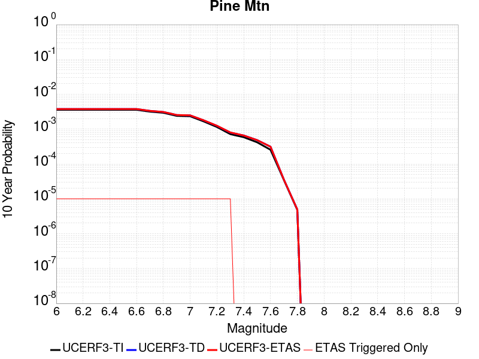 |

| Magnitude | 1 wk TI Prob | 1 wk TD Prob | 1 wk ETAS Prob | 1 wk ETAS/TD Gain | 1 wk ETAS Triggered Only | 1 mo TI Prob | 1 mo TD Prob | 1 mo ETAS Prob | 1 mo ETAS/TD Gain | 1 mo ETAS Triggered Only | 1 yr TI Prob | 1 yr TD Prob | 1 yr ETAS Prob | 1 yr ETAS/TD Gain | 1 yr ETAS Triggered Only | 10 yr TI Prob | 10 yr TD Prob | 10 yr ETAS Prob | 10 yr ETAS/TD Gain | 10 yr ETAS Triggered Only |
|-----|-----|-----|-----|-----|-----|-----|-----|-----|-----|-----|-----|-----|-----|-----|-----|-----|-----|-----|-----|-----|
| 6.0 | 6.894797E-6 | 7.225461E-6 | 2.9407594E-5 | 4.0699954 | 2.2182294E-5 | 2.9548795E-5 | 3.096591E-5 | 5.314752E-5 | 1.7163234 | 2.2182294E-5 | 3.596972E-4 | 3.7694772E-4 | 3.9912167E-4 | 1.0588249 | 2.2182294E-5 | 0.0035911554 | 0.003763381 | 0.0037854798 | 1.005872 | 2.2182294E-5 |
| 6.1 | 6.894797E-6 | 7.225461E-6 | 2.9407594E-5 | 4.0699954 | 2.2182294E-5 | 2.9548795E-5 | 3.096591E-5 | 5.314752E-5 | 1.7163234 | 2.2182294E-5 | 3.596972E-4 | 3.7694772E-4 | 3.9912167E-4 | 1.0588249 | 2.2182294E-5 | 0.0035911554 | 0.003763381 | 0.0037854798 | 1.005872 | 2.2182294E-5 |
| 6.2 | 6.894797E-6 | 7.225461E-6 | 2.9407594E-5 | 4.0699954 | 2.2182294E-5 | 2.9548795E-5 | 3.096591E-5 | 5.314752E-5 | 1.7163234 | 2.2182294E-5 | 3.596972E-4 | 3.7694772E-4 | 3.9912167E-4 | 1.0588249 | 2.2182294E-5 | 0.0035911554 | 0.003763381 | 0.0037854798 | 1.005872 | 2.2182294E-5 |
| 6.3 | 6.894797E-6 | 7.225461E-6 | 2.9407594E-5 | 4.0699954 | 2.2182294E-5 | 2.9548795E-5 | 3.096591E-5 | 5.314752E-5 | 1.7163234 | 2.2182294E-5 | 3.596972E-4 | 3.7694772E-4 | 3.9912167E-4 | 1.0588249 | 2.2182294E-5 | 0.0035911554 | 0.003763381 | 0.0037854798 | 1.005872 | 2.2182294E-5 |
| 6.4 | 6.894797E-6 | 7.225461E-6 | 2.9407594E-5 | 4.0699954 | 2.2182294E-5 | 2.9548795E-5 | 3.096591E-5 | 5.314752E-5 | 1.7163234 | 2.2182294E-5 | 3.596972E-4 | 3.7694772E-4 | 3.9912167E-4 | 1.0588249 | 2.2182294E-5 | 0.0035911554 | 0.003763381 | 0.0037854798 | 1.005872 | 2.2182294E-5 |
| 6.5 | 6.894797E-6 | 7.225461E-6 | 2.9407594E-5 | 4.0699954 | 2.2182294E-5 | 2.9548795E-5 | 3.096591E-5 | 5.314752E-5 | 1.7163234 | 2.2182294E-5 | 3.596972E-4 | 3.7694772E-4 | 3.9912167E-4 | 1.0588249 | 2.2182294E-5 | 0.0035911554 | 0.003763381 | 0.0037854798 | 1.005872 | 2.2182294E-5 |
| 6.6 | 6.894797E-6 | 7.225461E-6 | 2.9407594E-5 | 4.0699954 | 2.2182294E-5 | 2.9548795E-5 | 3.096591E-5 | 5.314752E-5 | 1.7163234 | 2.2182294E-5 | 3.596972E-4 | 3.7694772E-4 | 3.9912167E-4 | 1.0588249 | 2.2182294E-5 | 0.0035911554 | 0.003763381 | 0.0037854798 | 1.005872 | 2.2182294E-5 |
| 6.7 | 6.0867933E-6 | 6.3971133E-6 | 2.8579265E-5 | 4.4675255 | 2.2182294E-5 | 2.6085996E-5 | 2.7415923E-5 | 4.959761E-5 | 1.8090804 | 2.2182294E-5 | 3.1755073E-4 | 3.3373994E-4 | 3.5591485E-4 | 1.0664437 | 2.2182294E-5 | 0.0031709734 | 0.0033326065 | 0.0033547147 | 1.006634 | 2.2182294E-5 |
| 6.8 | 5.6530425E-6 | 5.9505956E-6 | 2.8132758E-5 | 4.727721 | 2.2182294E-5 | 2.42271E-5 | 2.5502315E-5 | 4.7684043E-5 | 1.8697927 | 2.2182294E-5 | 2.94925E-4 | 3.104485E-4 | 3.326239E-4 | 1.0714302 | 2.2182294E-5 | 0.002945339 | 0.0031003528 | 0.0031224664 | 1.0071325 | 2.2182294E-5 |
| 6.9 | 4.6015225E-6 | 4.863834E-6 | 2.704602E-5 | 5.560638 | 2.2182294E-5 | 1.9720663E-5 | 2.0844845E-5 | 4.3026677E-5 | 2.0641398 | 2.2182294E-5 | 2.4007261E-4 | 2.5375787E-4 | 2.7593455E-4 | 1.087393 | 2.2182294E-5 | 0.0023981342 | 0.0025348254 | 0.0025569515 | 1.0087289 | 2.2182294E-5 |
| 7.0 | 4.4875965E-6 | 4.747473E-6 | 2.6929662E-5 | 5.67242 | 2.2182294E-5 | 1.9232413E-5 | 2.0346162E-5 | 4.2528005E-5 | 2.0902224 | 2.2182294E-5 | 2.3412947E-4 | 2.4768783E-4 | 2.6986463E-4 | 1.0895352 | 2.2182294E-5 | 0.0023388295 | 0.0024742614 | 0.0024963887 | 1.0089431 | 2.2182294E-5 |
| 7.1 | 3.203907E-6 | 3.4294096E-6 | 2.5611627E-5 | 7.4682326 | 2.2182294E-5 | 1.3730958E-5 | 1.4697391E-5 | 3.687936E-5 | 2.5092454 | 2.2182294E-5 | 1.6716159E-4 | 1.789267E-4 | 2.0110502E-4 | 1.123952 | 2.2182294E-5 | 0.0016703589 | 0.0017878925 | 0.0018100352 | 1.0123848 | 2.2182294E-5 |
| 7.2 | 2.2060601E-6 | 2.3784817E-6 | 2.4560723E-5 | 10.32622 | 2.2182294E-5 | 9.4545085E-6 | 1.0193455E-5 | 3.2375523E-5 | 3.1761088 | 2.2182294E-5 | 1.15102564E-4 | 1.240987E-4 | 1.4627824E-4 | 1.178725 | 2.2182294E-5 | 0.0011504296 | 0.0012403389 | 0.0012624937 | 1.0178618 | 2.2182294E-5 |
| 7.3 | 1.3765207E-6 | 1.5216481E-6 | 2.3703908E-5 | 15.577786 | 2.2182294E-5 | 5.899361E-6 | 6.521333E-6 | 2.8703482E-5 | 4.401475 | 2.2182294E-5 | 7.182235E-5 | 7.939443E-5 | 1.0157496E-4 | 1.2793714 | 2.2182294E-5 | 7.1799144E-4 | 7.936697E-4 | 8.1583444E-4 | 1.0279268 | 2.2182294E-5 |
| 7.4 | 1.1245983E-6 | 1.2587075E-6 | 1.2587075E-6 | 1.0 | 0.0 | 4.819698E-6 | 5.39445E-6 | 5.39445E-6 | 1.0 | 0.0 | 5.8678244E-5 | 6.567554E-5 | 6.567554E-5 | 1.0 | 0.0 | 5.866275E-4 | 6.5656955E-4 | 6.5656955E-4 | 1.0 | 0.0 |
| 7.5 | 8.031682E-7 | 9.276951E-7 | 9.276951E-7 | 1.0 | 0.0 | 3.4421448E-6 | 3.9758306E-6 | 3.9758306E-6 | 1.0 | 0.0 | 4.1907308E-5 | 4.840473E-5 | 4.840473E-5 | 1.0 | 0.0 | 4.1899405E-4 | 4.8394862E-4 | 4.8394862E-4 | 1.0 | 0.0 |
| 7.6 | 4.8953444E-7 | 6.003009E-7 | 6.003009E-7 | 1.0 | 0.0 | 2.098003E-6 | 2.5727159E-6 | 2.5727159E-6 | 1.0 | 0.0 | 2.5542888E-5 | 3.1322415E-5 | 3.1322415E-5 | 1.0 | 0.0 | 2.5539953E-4 | 3.1318486E-4 | 3.1318486E-4 | 1.0 | 0.0 |
| 7.7 | 6.634529E-8 | 6.788826E-8 | 6.788826E-8 | 1.0 | 0.0 | 2.843369E-7 | 2.9094966E-7 | 2.9094966E-7 | 1.0 | 0.0 | 3.4617963E-6 | 3.5423066E-6 | 3.5423066E-6 | 1.0 | 0.0 | 3.4617424E-5 | 3.542255E-5 | 3.542255E-5 | 1.0 | 0.0 |
| 7.8 | 9.235578E-9 | 9.488566E-9 | 9.488566E-9 | 1.0 | 0.0 | 3.9581046E-8 | 4.0665284E-8 | 4.0665284E-8 | 1.0 | 0.0 | 4.818991E-7 | 4.950997E-7 | 4.950997E-7 | 1.0 | 0.0 | 4.8189804E-6 | 4.950988E-6 | 4.950988E-6 | 1.0 | 0.0 |

## Big Pine (West)
*[(top)](#table-of-contents)*

| 1 Week | 1 Month | 1 Year | 10 Year |
|-----|-----|-----|-----|
|  |  |  |  |

| Magnitude | 1 wk TI Prob | 1 wk TD Prob | 1 wk ETAS Prob | 1 wk ETAS/TD Gain | 1 wk ETAS Triggered Only | 1 mo TI Prob | 1 mo TD Prob | 1 mo ETAS Prob | 1 mo ETAS/TD Gain | 1 mo ETAS Triggered Only | 1 yr TI Prob | 1 yr TD Prob | 1 yr ETAS Prob | 1 yr ETAS/TD Gain | 1 yr ETAS Triggered Only | 10 yr TI Prob | 10 yr TD Prob | 10 yr ETAS Prob | 10 yr ETAS/TD Gain | 10 yr ETAS Triggered Only |
|-----|-----|-----|-----|-----|-----|-----|-----|-----|-----|-----|-----|-----|-----|-----|-----|-----|-----|-----|-----|-----|
| 6.0 | 6.8306974E-7 | 6.8818304E-7 | 2.2870461E-5 | 33.23311 | 2.2182294E-5 | 2.9274386E-6 | 2.949353E-6 | 2.5131581E-5 | 8.5210495 | 2.2182294E-5 | 3.564098E-5 | 3.5907877E-5 | 5.8089376E-5 | 1.6177335 | 2.2182294E-5 | 3.5635266E-4 | 3.5903015E-4 | 3.8120447E-4 | 1.0617617 | 2.2182294E-5 |
| 6.1 | 6.8306974E-7 | 6.8818304E-7 | 2.2870461E-5 | 33.23311 | 2.2182294E-5 | 2.9274386E-6 | 2.949353E-6 | 2.5131581E-5 | 8.5210495 | 2.2182294E-5 | 3.564098E-5 | 3.5907877E-5 | 5.8089376E-5 | 1.6177335 | 2.2182294E-5 | 3.5635266E-4 | 3.5903015E-4 | 3.8120447E-4 | 1.0617617 | 2.2182294E-5 |
| 6.2 | 6.8306974E-7 | 6.8818304E-7 | 2.2870461E-5 | 33.23311 | 2.2182294E-5 | 2.9274386E-6 | 2.949353E-6 | 2.5131581E-5 | 8.5210495 | 2.2182294E-5 | 3.564098E-5 | 3.5907877E-5 | 5.8089376E-5 | 1.6177335 | 2.2182294E-5 | 3.5635266E-4 | 3.5903015E-4 | 3.8120447E-4 | 1.0617617 | 2.2182294E-5 |
| 6.3 | 4.227652E-7 | 4.2665604E-7 | 2.2608941E-5 | 52.991024 | 2.2182294E-5 | 1.8118495E-6 | 1.8285248E-6 | 2.4010778E-5 | 13.131229 | 2.2182294E-5 | 2.2059045E-5 | 2.226208E-5 | 4.444388E-5 | 1.9963939 | 2.2182294E-5 | 2.2056856E-4 | 2.2260031E-4 | 2.4477768E-4 | 1.0996286 | 2.2182294E-5 |
| 6.4 | 4.227652E-7 | 4.2665604E-7 | 2.2608941E-5 | 52.991024 | 2.2182294E-5 | 1.8118495E-6 | 1.8285248E-6 | 2.4010778E-5 | 13.131229 | 2.2182294E-5 | 2.2059045E-5 | 2.226208E-5 | 4.444388E-5 | 1.9963939 | 2.2182294E-5 | 2.2056856E-4 | 2.2260031E-4 | 2.4477768E-4 | 1.0996286 | 2.2182294E-5 |
| 6.5 | 3.1538403E-7 | 3.1884528E-7 | 2.2501132E-5 | 70.570694 | 2.2182294E-5 | 1.3516451E-6 | 1.3664791E-6 | 2.3548742E-5 | 17.233152 | 2.2182294E-5 | 1.6456155E-5 | 1.6636759E-5 | 3.8818685E-5 | 2.333308 | 2.2182294E-5 | 1.6454936E-4 | 1.6635554E-4 | 1.8853415E-4 | 1.1333205 | 2.2182294E-5 |
| 6.6 | 3.1538403E-7 | 3.1884528E-7 | 2.2501132E-5 | 70.570694 | 2.2182294E-5 | 1.3516451E-6 | 1.3664791E-6 | 2.3548742E-5 | 17.233152 | 2.2182294E-5 | 1.6456155E-5 | 1.6636759E-5 | 3.8818685E-5 | 2.333308 | 2.2182294E-5 | 1.6454936E-4 | 1.6635554E-4 | 1.8853415E-4 | 1.1333205 | 2.2182294E-5 |
| 6.7 | 3.1538403E-7 | 3.1884528E-7 | 2.2501132E-5 | 70.570694 | 2.2182294E-5 | 1.3516451E-6 | 1.3664791E-6 | 2.3548742E-5 | 17.233152 | 2.2182294E-5 | 1.6456155E-5 | 1.6636759E-5 | 3.8818685E-5 | 2.333308 | 2.2182294E-5 | 1.6454936E-4 | 1.6635554E-4 | 1.8853415E-4 | 1.1333205 | 2.2182294E-5 |
| 6.8 | 3.1538403E-7 | 3.1884528E-7 | 2.2501132E-5 | 70.570694 | 2.2182294E-5 | 1.3516451E-6 | 1.3664791E-6 | 2.3548742E-5 | 17.233152 | 2.2182294E-5 | 1.6456155E-5 | 1.6636759E-5 | 3.8818685E-5 | 2.333308 | 2.2182294E-5 | 1.6454936E-4 | 1.6635554E-4 | 1.8853415E-4 | 1.1333205 | 2.2182294E-5 |
| 6.9 | 3.0402092E-7 | 3.0739798E-7 | 2.2489685E-5 | 73.16146 | 2.2182294E-5 | 1.3029462E-6 | 1.3174192E-6 | 2.3499684E-5 | 17.837666 | 2.2182294E-5 | 1.5863254E-5 | 1.6039465E-5 | 3.8221402E-5 | 2.3829598 | 2.2182294E-5 | 1.5862122E-4 | 1.6038347E-4 | 1.825622E-4 | 1.1382856 | 2.2182294E-5 |
| 7.0 | 2.3673063E-7 | 2.3944315E-7 | 2.2421731E-5 | 93.64115 | 2.2182294E-5 | 1.0145594E-6 | 1.0261845E-6 | 2.3208457E-5 | 22.61626 | 2.2182294E-5 | 1.235219E-5 | 1.2493728E-5 | 3.4675744E-5 | 2.7754524 | 2.2182294E-5 | 1.2351504E-4 | 1.2493054E-4 | 1.4711005E-4 | 1.1775348 | 2.2182294E-5 |
| 7.1 | 1.632138E-7 | 1.6514511E-7 | 2.2347436E-5 | 135.31999 | 2.2182294E-5 | 6.9948754E-7 | 7.0776457E-7 | 2.2890043E-5 | 32.341324 | 2.2182294E-5 | 8.516227E-6 | 8.617002E-6 | 3.0799103E-5 | 3.5742252 | 2.2182294E-5 | 8.5159016E-5 | 8.616685E-5 | 1.0834723E-4 | 1.2574121 | 2.2182294E-5 |
| 7.2 | 1.1523723E-7 | 1.1657165E-7 | 2.2298864E-5 | 191.28891 | 2.2182294E-5 | 4.9387376E-7 | 4.9959266E-7 | 2.2681876E-5 | 45.400738 | 2.2182294E-5 | 6.0128964E-6 | 6.082525E-6 | 2.8264683E-5 | 4.646867 | 2.2182294E-5 | 6.0127335E-5 | 6.0823695E-5 | 8.300464E-5 | 1.364676 | 2.2182294E-5 |
| 7.3 | 7.777805E-8 | 7.862446E-8 | 2.2260916E-5 | 283.12967 | 2.2182294E-5 | 3.3333444E-7 | 3.3696193E-7 | 2.2519249E-5 | 66.830246 | 2.2182294E-5 | 4.0583395E-6 | 4.102504E-6 | 2.6284708E-5 | 6.406991 | 2.2182294E-5 | 4.0582654E-5 | 4.102434E-5 | 6.320573E-5 | 1.5406884 | 2.2182294E-5 |
| 7.4 | 4.609946E-8 | 4.6522135E-8 | 4.6522135E-8 | 1.0 | 0.0 | 1.975691E-7 | 1.9938055E-7 | 1.9938055E-7 | 1.0 | 0.0 | 2.4054011E-6 | 2.4274557E-6 | 2.4274557E-6 | 1.0 | 0.0 | 2.405375E-5 | 2.427431E-5 | 2.427431E-5 | 1.0 | 0.0 |
| 7.5 | 2.3439137E-8 | 2.3608283E-8 | 2.3608283E-8 | 1.0 | 0.0 | 1.00453434E-7 | 1.0117836E-7 | 1.0117836E-7 | 1.0 | 0.0 | 1.2230199E-6 | 1.2318458E-6 | 1.2318458E-6 | 1.0 | 0.0 | 1.2230132E-5 | 1.2318393E-5 | 1.2318393E-5 | 1.0 | 0.0 |
| 7.6 | 1.6699769E-8 | 1.6817072E-8 | 1.6817072E-8 | 1.0 | 0.0 | 7.157044E-8 | 7.207316E-8 | 7.207316E-8 | 1.0 | 0.0 | 8.713697E-7 | 8.7749044E-7 | 8.7749044E-7 | 1.0 | 0.0 | 8.713663E-6 | 8.774871E-6 | 8.774871E-6 | 1.0 | 0.0 |
| 7.7 | 7.4061512E-9 | 7.4541635E-9 | 7.4541635E-9 | 1.0 | 0.0 | 3.1740647E-8 | 3.1946417E-8 | 3.1946417E-8 | 1.0 | 0.0 | 3.864423E-7 | 3.8894754E-7 | 3.8894754E-7 | 1.0 | 0.0 | 3.8644166E-6 | 3.8894696E-6 | 3.8894696E-6 | 1.0 | 0.0 |
| 7.8 | 1.2189427E-9 | 1.2270763E-9 | 1.2270763E-9 | 1.0 | 0.0 | 5.2240403E-9 | 5.258898E-9 | 5.258898E-9 | 1.0 | 0.0 | 6.3602684E-8 | 6.4027084E-8 | 6.4027084E-8 | 1.0 | 0.0 | 6.360267E-7 | 6.4027074E-7 | 6.4027074E-7 | 1.0 | 0.0 |

## Johnson Valley (No) 2011 rev
*[(top)](#table-of-contents)*

| 1 Week | 1 Month | 1 Year | 10 Year |
|-----|-----|-----|-----|
|  |  |  |  |

| Magnitude | 1 wk TI Prob | 1 wk TD Prob | 1 wk ETAS Prob | 1 wk ETAS/TD Gain | 1 wk ETAS Triggered Only | 1 mo TI Prob | 1 mo TD Prob | 1 mo ETAS Prob | 1 mo ETAS/TD Gain | 1 mo ETAS Triggered Only | 1 yr TI Prob | 1 yr TD Prob | 1 yr ETAS Prob | 1 yr ETAS/TD Gain | 1 yr ETAS Triggered Only | 10 yr TI Prob | 10 yr TD Prob | 10 yr ETAS Prob | 10 yr ETAS/TD Gain | 10 yr ETAS Triggered Only |
|-----|-----|-----|-----|-----|-----|-----|-----|-----|-----|-----|-----|-----|-----|-----|-----|-----|-----|-----|-----|-----|
| 6.0 | 2.577707E-5 | 1.2900938E-5 | 3.5082947E-5 | 2.7194104 | 2.2182294E-5 | 1.1046848E-4 | 5.5288787E-5 | 7.746986E-5 | 1.4011856 | 2.2182294E-5 | 0.0013441239 | 6.7297276E-4 | 6.951401E-4 | 1.0329394 | 2.2182294E-5 | 0.013360229 | 0.006713257 | 0.0067352904 | 1.0032821 | 2.2182294E-5 |
| 6.1 | 2.577707E-5 | 1.2900938E-5 | 3.5082947E-5 | 2.7194104 | 2.2182294E-5 | 1.1046848E-4 | 5.5288787E-5 | 7.746986E-5 | 1.4011856 | 2.2182294E-5 | 0.0013441239 | 6.7297276E-4 | 6.951401E-4 | 1.0329394 | 2.2182294E-5 | 0.013360229 | 0.006713257 | 0.0067352904 | 1.0032821 | 2.2182294E-5 |
| 6.2 | 2.577707E-5 | 1.2900938E-5 | 3.5082947E-5 | 2.7194104 | 2.2182294E-5 | 1.1046848E-4 | 5.5288787E-5 | 7.746986E-5 | 1.4011856 | 2.2182294E-5 | 0.0013441239 | 6.7297276E-4 | 6.951401E-4 | 1.0329394 | 2.2182294E-5 | 0.013360229 | 0.006713257 | 0.0067352904 | 1.0032821 | 2.2182294E-5 |
| 6.3 | 2.577707E-5 | 1.2900938E-5 | 3.5082947E-5 | 2.7194104 | 2.2182294E-5 | 1.1046848E-4 | 5.5288787E-5 | 7.746986E-5 | 1.4011856 | 2.2182294E-5 | 0.0013441239 | 6.7297276E-4 | 6.951401E-4 | 1.0329394 | 2.2182294E-5 | 0.013360229 | 0.006713257 | 0.0067352904 | 1.0032821 | 2.2182294E-5 |
| 6.4 | 1.5296591E-5 | 7.536742E-6 | 2.9718869E-5 | 3.9431984 | 2.2182294E-5 | 6.555518E-5 | 3.2300028E-5 | 5.4481607E-5 | 1.6867355 | 2.2182294E-5 | 7.97842E-4 | 3.9320064E-4 | 4.153742E-4 | 1.0563926 | 2.2182294E-5 | 0.007949836 | 0.0039268904 | 0.003948986 | 1.0056267 | 2.2182294E-5 |
| 6.5 | 1.5296591E-5 | 7.536742E-6 | 2.9718869E-5 | 3.9431984 | 2.2182294E-5 | 6.555518E-5 | 3.2300028E-5 | 5.4481607E-5 | 1.6867355 | 2.2182294E-5 | 7.97842E-4 | 3.9320064E-4 | 4.153742E-4 | 1.0563926 | 2.2182294E-5 | 0.007949836 | 0.0039268904 | 0.003948986 | 1.0056267 | 2.2182294E-5 |
| 6.6 | 1.3289383E-5 | 5.9917306E-6 | 5.9917306E-6 | 1.0 | 0.0 | 5.6953253E-5 | 2.5678688E-5 | 2.5678688E-5 | 1.0 | 0.0 | 6.9318525E-4 | 3.1261015E-4 | 3.1261015E-4 | 1.0 | 0.0 | 0.0069102696 | 0.0031233684 | 0.0031233684 | 1.0 | 0.0 |
| 6.7 | 1.3289383E-5 | 5.9917306E-6 | 5.9917306E-6 | 1.0 | 0.0 | 5.6953253E-5 | 2.5678688E-5 | 2.5678688E-5 | 1.0 | 0.0 | 6.9318525E-4 | 3.1261015E-4 | 3.1261015E-4 | 1.0 | 0.0 | 0.0069102696 | 0.0031233684 | 0.0031233684 | 1.0 | 0.0 |
| 6.8 | 8.330789E-6 | 2.9211888E-6 | 2.9211888E-6 | 1.0 | 0.0 | 3.570289E-5 | 1.2519352E-5 | 1.2519352E-5 | 1.0 | 0.0 | 4.34596E-4 | 1.5241816E-4 | 1.5241816E-4 | 1.0 | 0.0 | 0.0043374705 | 0.0015236961 | 0.0015236961 | 1.0 | 0.0 |
| 6.9 | 7.2359003E-6 | 2.3013247E-6 | 2.3013247E-6 | 1.0 | 0.0 | 3.1010633E-5 | 9.8628125E-6 | 9.8628125E-6 | 1.0 | 0.0 | 3.7748902E-4 | 1.2007845E-4 | 1.2007845E-4 | 1.0 | 0.0 | 0.0037684843 | 0.0012006586 | 0.0012006586 | 1.0 | 0.0 |
| 7.0 | 6.5149957E-6 | 2.088482E-6 | 2.088482E-6 | 1.0 | 0.0 | 2.792111E-5 | 8.950637E-6 | 8.950637E-6 | 1.0 | 0.0 | 3.398865E-4 | 1.0897385E-4 | 1.0897385E-4 | 1.0 | 0.0 | 0.003393671 | 0.0010897239 | 0.0010897239 | 1.0 | 0.0 |
| 7.1 | 1.1662233E-6 | 2.8802024E-8 | 2.8802024E-8 | 1.0 | 0.0 | 4.9980904E-6 | 1.2343725E-7 | 1.2343725E-7 | 1.0 | 0.0 | 6.0850052E-5 | 1.5028476E-6 | 1.5028476E-6 | 1.0 | 0.0 | 6.083339E-4 | 1.50283895E-5 | 1.50283895E-5 | 1.0 | 0.0 |
| 7.2 | 5.413881E-7 | 2.8802024E-8 | 2.8802024E-8 | 1.0 | 0.0 | 2.3202326E-6 | 1.2343725E-7 | 1.2343725E-7 | 1.0 | 0.0 | 2.8248465E-5 | 1.5028476E-6 | 1.5028476E-6 | 1.0 | 0.0 | 2.8244875E-4 | 1.50283895E-5 | 1.50283895E-5 | 1.0 | 0.0 |
| 7.3 | 5.076821E-7 | 2.8802024E-8 | 2.8802024E-8 | 1.0 | 0.0 | 2.1757785E-6 | 1.2343723E-7 | 1.2343723E-7 | 1.0 | 0.0 | 2.648978E-5 | 1.5028475E-6 | 1.5028475E-6 | 1.0 | 0.0 | 2.6486625E-4 | 1.50283895E-5 | 1.50283895E-5 | 1.0 | 0.0 |
| 7.4 | 4.7568687E-7 | 2.8783948E-8 | 2.8783948E-8 | 1.0 | 0.0 | 2.0386565E-6 | 1.2335977E-7 | 1.2335977E-7 | 1.0 | 0.0 | 2.482036E-5 | 1.5019043E-6 | 1.5019043E-6 | 1.0 | 0.0 | 2.4817587E-4 | 1.5018958E-5 | 1.5018958E-5 | 1.0 | 0.0 |
| 7.5 | 3.435626E-7 | 2.5357679E-8 | 2.5357679E-8 | 1.0 | 0.0 | 1.4724103E-6 | 1.0867576E-7 | 1.0867576E-7 | 1.0 | 0.0 | 1.7926448E-5 | 1.3231268E-6 | 1.3231268E-6 | 1.0 | 0.0 | 1.7925001E-4 | 1.3231205E-5 | 1.3231205E-5 | 1.0 | 0.0 |

## Kern Canyon (North Kern) 2011
*[(top)](#table-of-contents)*

| 1 Week | 1 Month | 1 Year | 10 Year |
|-----|-----|-----|-----|
|  |  |  |  |

| Magnitude | 1 wk TI Prob | 1 wk TD Prob | 1 wk ETAS Prob | 1 wk ETAS/TD Gain | 1 wk ETAS Triggered Only | 1 mo TI Prob | 1 mo TD Prob | 1 mo ETAS Prob | 1 mo ETAS/TD Gain | 1 mo ETAS Triggered Only | 1 yr TI Prob | 1 yr TD Prob | 1 yr ETAS Prob | 1 yr ETAS/TD Gain | 1 yr ETAS Triggered Only | 10 yr TI Prob | 10 yr TD Prob | 10 yr ETAS Prob | 10 yr ETAS/TD Gain | 10 yr ETAS Triggered Only |
|-----|-----|-----|-----|-----|-----|-----|-----|-----|-----|-----|-----|-----|-----|-----|-----|-----|-----|-----|-----|-----|
| 6.0 | 6.6264497E-6 | 6.75733E-6 | 6.75733E-6 | 1.0 | 0.0 | 2.8398761E-5 | 2.895971E-5 | 2.895971E-5 | 1.0 | 0.0 | 3.4570007E-4 | 3.5253543E-4 | 3.747099E-4 | 1.0629 | 2.2182294E-5 | 0.0034516277 | 0.0035205502 | 0.0035426544 | 1.0062786 | 2.2182294E-5 |
| 6.1 | 6.6264497E-6 | 6.75733E-6 | 6.75733E-6 | 1.0 | 0.0 | 2.8398761E-5 | 2.895971E-5 | 2.895971E-5 | 1.0 | 0.0 | 3.4570007E-4 | 3.5253543E-4 | 3.747099E-4 | 1.0629 | 2.2182294E-5 | 0.0034516277 | 0.0035205502 | 0.0035426544 | 1.0062786 | 2.2182294E-5 |
| 6.2 | 6.6264497E-6 | 6.75733E-6 | 6.75733E-6 | 1.0 | 0.0 | 2.8398761E-5 | 2.895971E-5 | 2.895971E-5 | 1.0 | 0.0 | 3.4570007E-4 | 3.5253543E-4 | 3.747099E-4 | 1.0629 | 2.2182294E-5 | 0.0034516277 | 0.0035205502 | 0.0035426544 | 1.0062786 | 2.2182294E-5 |
| 6.3 | 6.6264497E-6 | 6.75733E-6 | 6.75733E-6 | 1.0 | 0.0 | 2.8398761E-5 | 2.895971E-5 | 2.895971E-5 | 1.0 | 0.0 | 3.4570007E-4 | 3.5253543E-4 | 3.747099E-4 | 1.0629 | 2.2182294E-5 | 0.0034516277 | 0.0035205502 | 0.0035426544 | 1.0062786 | 2.2182294E-5 |
| 6.4 | 6.6264497E-6 | 6.75733E-6 | 6.75733E-6 | 1.0 | 0.0 | 2.8398761E-5 | 2.895971E-5 | 2.895971E-5 | 1.0 | 0.0 | 3.4570007E-4 | 3.5253543E-4 | 3.747099E-4 | 1.0629 | 2.2182294E-5 | 0.0034516277 | 0.0035205502 | 0.0035426544 | 1.0062786 | 2.2182294E-5 |
| 6.5 | 3.2162225E-6 | 3.2570915E-6 | 3.2570915E-6 | 1.0 | 0.0 | 1.3783738E-5 | 1.3958893E-5 | 1.3958893E-5 | 1.0 | 0.0 | 1.6780409E-4 | 1.6993708E-4 | 1.921156E-4 | 1.1305102 | 2.2182294E-5 | 0.0016767744 | 0.001698151 | 0.0017202956 | 1.0130404 | 2.2182294E-5 |
| 6.6 | 3.2162225E-6 | 3.2570915E-6 | 3.2570915E-6 | 1.0 | 0.0 | 1.3783738E-5 | 1.3958893E-5 | 1.3958893E-5 | 1.0 | 0.0 | 1.6780409E-4 | 1.6993708E-4 | 1.921156E-4 | 1.1305102 | 2.2182294E-5 | 0.0016767744 | 0.001698151 | 0.0017202956 | 1.0130404 | 2.2182294E-5 |
| 6.7 | 2.1908265E-6 | 2.2071222E-6 | 2.2071222E-6 | 1.0 | 0.0 | 9.389223E-6 | 9.459061E-6 | 9.459061E-6 | 1.0 | 0.0 | 1.1430779E-4 | 1.1515819E-4 | 1.3733792E-4 | 1.1926024 | 2.2182294E-5 | 0.0011424901 | 0.0011510046 | 0.0011731613 | 1.0192499 | 2.2182294E-5 |
| 6.8 | 1.7303895E-6 | 1.7365529E-6 | 1.7365529E-6 | 1.0 | 0.0 | 7.415934E-6 | 7.4423488E-6 | 7.4423488E-6 | 1.0 | 0.0 | 9.028525E-5 | 9.0606925E-5 | 1.1278721E-4 | 1.2447968 | 2.2182294E-5 | 9.024858E-4 | 9.057096E-4 | 9.278718E-4 | 1.0244695 | 2.2182294E-5 |
| 6.9 | 1.3700314E-6 | 1.3688622E-6 | 1.3688622E-6 | 1.0 | 0.0 | 5.87155E-6 | 5.8665396E-6 | 5.8665396E-6 | 1.0 | 0.0 | 7.148377E-5 | 7.142282E-5 | 9.3603536E-5 | 1.310555 | 2.2182294E-5 | 7.146078E-4 | 7.140032E-4 | 7.361697E-4 | 1.0310453 | 2.2182294E-5 |
| 7.0 | 1.1467797E-6 | 1.1413804E-6 | 1.1413804E-6 | 1.0 | 0.0 | 4.9147607E-6 | 4.8916213E-6 | 4.8916213E-6 | 1.0 | 0.0 | 5.983557E-5 | 5.9553895E-5 | 8.173487E-5 | 1.3724521 | 2.2182294E-5 | 5.981946E-4 | 5.953825E-4 | 6.1755156E-4 | 1.037235 | 2.2182294E-5 |
| 7.1 | 9.3952065E-7 | 9.3026904E-7 | 9.3026904E-7 | 1.0 | 0.0 | 4.026511E-6 | 3.9868614E-6 | 3.9868614E-6 | 1.0 | 0.0 | 4.9021666E-5 | 4.8538972E-5 | 4.8538972E-5 | 1.0 | 0.0 | 4.901085E-4 | 4.8528548E-4 | 4.8528548E-4 | 1.0 | 0.0 |
| 7.2 | 6.858055E-7 | 6.7193E-7 | 6.7193E-7 | 1.0 | 0.0 | 2.939163E-6 | 2.879697E-6 | 2.879697E-6 | 1.0 | 0.0 | 3.5783723E-5 | 3.5059755E-5 | 3.5059755E-5 | 1.0 | 0.0 | 3.5777962E-4 | 3.5054312E-4 | 3.5054312E-4 | 1.0 | 0.0 |
| 7.3 | 5.1101983E-7 | 4.9393E-7 | 4.9393E-7 | 1.0 | 0.0 | 2.1900833E-6 | 2.116841E-6 | 2.116841E-6 | 1.0 | 0.0 | 2.6663936E-5 | 2.5772239E-5 | 2.5772239E-5 | 1.0 | 0.0 | 2.6660739E-4 | 2.57693E-4 | 2.57693E-4 | 1.0 | 0.0 |
| 7.4 | 3.4999414E-7 | 3.2995905E-7 | 3.2995905E-7 | 1.0 | 0.0 | 1.499974E-6 | 1.4141094E-6 | 1.4141094E-6 | 1.0 | 0.0 | 1.8262032E-5 | 1.721665E-5 | 1.721665E-5 | 1.0 | 0.0 | 1.826053E-4 | 1.7215339E-4 | 1.7215339E-4 | 1.0 | 0.0 |
| 7.5 | 1.7021522E-7 | 1.4750044E-7 | 1.4750044E-7 | 1.0 | 0.0 | 7.2949354E-7 | 6.321446E-7 | 6.321446E-7 | 1.0 | 0.0 | 8.881548E-6 | 7.696334E-6 | 7.696334E-6 | 1.0 | 0.0 | 8.8811925E-5 | 7.696076E-5 | 7.696076E-5 | 1.0 | 0.0 |
| 7.6 | 2.572245E-8 | 1.7352555E-8 | 1.7352555E-8 | 1.0 | 0.0 | 1.10239064E-7 | 7.436809E-8 | 7.436809E-8 | 1.0 | 0.0 | 1.3421597E-6 | 9.054312E-7 | 9.054312E-7 | 1.0 | 0.0 | 1.3421517E-5 | 9.05428E-6 | 9.05428E-6 | 1.0 | 0.0 |

## Deep Springs
*[(top)](#table-of-contents)*

| 1 Week | 1 Month | 1 Year | 10 Year |
|-----|-----|-----|-----|
|  |  |  |  |

| Magnitude | 1 wk TI Prob | 1 wk TD Prob | 1 wk ETAS Prob | 1 wk ETAS/TD Gain | 1 wk ETAS Triggered Only | 1 mo TI Prob | 1 mo TD Prob | 1 mo ETAS Prob | 1 mo ETAS/TD Gain | 1 mo ETAS Triggered Only | 1 yr TI Prob | 1 yr TD Prob | 1 yr ETAS Prob | 1 yr ETAS/TD Gain | 1 yr ETAS Triggered Only | 10 yr TI Prob | 10 yr TD Prob | 10 yr ETAS Prob | 10 yr ETAS/TD Gain | 10 yr ETAS Triggered Only |
|-----|-----|-----|-----|-----|-----|-----|-----|-----|-----|-----|-----|-----|-----|-----|-----|-----|-----|-----|-----|-----|
| 6.0 | 1.9810619E-5 | 2.311252E-5 | 2.311252E-5 | 1.0 | 0.0 | 8.489989E-5 | 9.905276E-5 | 9.905276E-5 | 1.0 | 0.0 | 0.001033166 | 0.0012058079 | 0.0012279635 | 1.0183741 | 2.2182294E-5 | 0.010283757 | 0.012042425 | 0.01206434 | 1.0018198 | 2.2182294E-5 |
| 6.1 | 1.9810619E-5 | 2.311252E-5 | 2.311252E-5 | 1.0 | 0.0 | 8.489989E-5 | 9.905276E-5 | 9.905276E-5 | 1.0 | 0.0 | 0.001033166 | 0.0012058079 | 0.0012279635 | 1.0183741 | 2.2182294E-5 | 0.010283757 | 0.012042425 | 0.01206434 | 1.0018198 | 2.2182294E-5 |
| 6.2 | 1.9810619E-5 | 2.311252E-5 | 2.311252E-5 | 1.0 | 0.0 | 8.489989E-5 | 9.905276E-5 | 9.905276E-5 | 1.0 | 0.0 | 0.001033166 | 0.0012058079 | 0.0012279635 | 1.0183741 | 2.2182294E-5 | 0.010283757 | 0.012042425 | 0.01206434 | 1.0018198 | 2.2182294E-5 |
| 6.3 | 1.9810619E-5 | 2.311252E-5 | 2.311252E-5 | 1.0 | 0.0 | 8.489989E-5 | 9.905276E-5 | 9.905276E-5 | 1.0 | 0.0 | 0.001033166 | 0.0012058079 | 0.0012279635 | 1.0183741 | 2.2182294E-5 | 0.010283757 | 0.012042425 | 0.01206434 | 1.0018198 | 2.2182294E-5 |
| 6.4 | 1.9810619E-5 | 2.311252E-5 | 2.311252E-5 | 1.0 | 0.0 | 8.489989E-5 | 9.905276E-5 | 9.905276E-5 | 1.0 | 0.0 | 0.001033166 | 0.0012058079 | 0.0012279635 | 1.0183741 | 2.2182294E-5 | 0.010283757 | 0.012042425 | 0.01206434 | 1.0018198 | 2.2182294E-5 |
| 6.5 | 1.7190405E-5 | 2.0050555E-5 | 2.0050555E-5 | 1.0 | 0.0 | 7.367108E-5 | 8.593095E-5 | 8.593095E-5 | 1.0 | 0.0 | 8.9657627E-4 | 0.0010462094 | 0.0010683684 | 1.0211804 | 2.2182294E-5 | 0.008929676 | 0.010462056 | 0.010484006 | 1.0020981 | 2.2182294E-5 |
| 6.6 | 1.7190405E-5 | 2.0050555E-5 | 2.0050555E-5 | 1.0 | 0.0 | 7.367108E-5 | 8.593095E-5 | 8.593095E-5 | 1.0 | 0.0 | 8.9657627E-4 | 0.0010462094 | 0.0010683684 | 1.0211804 | 2.2182294E-5 | 0.008929676 | 0.010462056 | 0.010484006 | 1.0020981 | 2.2182294E-5 |

## Elsinore (Temecula) rev
*[(top)](#table-of-contents)*

| 1 Week | 1 Month | 1 Year | 10 Year |
|-----|-----|-----|-----|
|  |  |  |  |

| Magnitude | 1 wk TI Prob | 1 wk TD Prob | 1 wk ETAS Prob | 1 wk ETAS/TD Gain | 1 wk ETAS Triggered Only | 1 mo TI Prob | 1 mo TD Prob | 1 mo ETAS Prob | 1 mo ETAS/TD Gain | 1 mo ETAS Triggered Only | 1 yr TI Prob | 1 yr TD Prob | 1 yr ETAS Prob | 1 yr ETAS/TD Gain | 1 yr ETAS Triggered Only | 10 yr TI Prob | 10 yr TD Prob | 10 yr ETAS Prob | 10 yr ETAS/TD Gain | 10 yr ETAS Triggered Only |
|-----|-----|-----|-----|-----|-----|-----|-----|-----|-----|-----|-----|-----|-----|-----|-----|-----|-----|-----|-----|-----|
| 6.0 | 2.9514995E-5 | 2.2517117E-5 | 2.2517117E-5 | 1.0 | 0.0 | 1.264867E-4 | 9.649849E-5 | 9.649849E-5 | 1.0 | 0.0 | 0.0015388876 | 0.0011742581 | 0.0011964142 | 1.0188683 | 2.2182294E-5 | 0.015282745 | 0.011696897 | 0.011718821 | 1.0018742 | 2.2182294E-5 |
| 6.1 | 2.9514995E-5 | 2.2517117E-5 | 2.2517117E-5 | 1.0 | 0.0 | 1.264867E-4 | 9.649849E-5 | 9.649849E-5 | 1.0 | 0.0 | 0.0015388876 | 0.0011742581 | 0.0011964142 | 1.0188683 | 2.2182294E-5 | 0.015282745 | 0.011696897 | 0.011718821 | 1.0018742 | 2.2182294E-5 |
| 6.2 | 2.9514995E-5 | 2.2517117E-5 | 2.2517117E-5 | 1.0 | 0.0 | 1.264867E-4 | 9.649849E-5 | 9.649849E-5 | 1.0 | 0.0 | 0.0015388876 | 0.0011742581 | 0.0011964142 | 1.0188683 | 2.2182294E-5 | 0.015282745 | 0.011696897 | 0.011718821 | 1.0018742 | 2.2182294E-5 |
| 6.3 | 2.3223649E-5 | 1.8406454E-5 | 1.8406454E-5 | 1.0 | 0.0 | 9.952613E-5 | 7.888251E-5 | 7.888251E-5 | 1.0 | 0.0 | 0.001211057 | 9.599888E-4 | 9.821497E-4 | 1.0230846 | 2.2182294E-5 | 0.012044783 | 0.009569948 | 0.0095919175 | 1.0022957 | 2.2182294E-5 |
| 6.4 | 2.3223649E-5 | 1.8406454E-5 | 1.8406454E-5 | 1.0 | 0.0 | 9.952613E-5 | 7.888251E-5 | 7.888251E-5 | 1.0 | 0.0 | 0.001211057 | 9.599888E-4 | 9.821497E-4 | 1.0230846 | 2.2182294E-5 | 0.012044783 | 0.009569948 | 0.0095919175 | 1.0022957 | 2.2182294E-5 |
| 6.5 | 1.8338875E-5 | 1.4750118E-5 | 1.4750118E-5 | 1.0 | 0.0 | 7.8592806E-5 | 6.321331E-5 | 6.321331E-5 | 1.0 | 0.0 | 9.5644733E-4 | 7.69359E-4 | 7.9152425E-4 | 1.02881 | 2.2182294E-5 | 0.009523412 | 0.0076739118 | 0.0076959236 | 1.0028684 | 2.2182294E-5 |
| 6.6 | 1.8223333E-5 | 1.4612673E-5 | 1.4612673E-5 | 1.0 | 0.0 | 7.809766E-5 | 6.262429E-5 | 6.262429E-5 | 1.0 | 0.0 | 9.504242E-4 | 7.6219277E-4 | 7.843581E-4 | 1.0290811 | 2.2182294E-5 | 0.009463696 | 0.0076027405 | 0.007624754 | 1.0028955 | 2.2182294E-5 |
| 6.7 | 1.7512752E-5 | 1.402721E-5 | 1.402721E-5 | 1.0 | 0.0 | 7.505249E-5 | 6.011528E-5 | 6.011528E-5 | 1.0 | 0.0 | 9.13381E-4 | 7.3166634E-4 | 7.538324E-4 | 1.0302954 | 2.2182294E-5 | 0.00909636 | 0.00729892 | 0.00732094 | 1.003017 | 2.2182294E-5 |
| 6.8 | 1.7417142E-5 | 1.3951195E-5 | 1.3951195E-5 | 1.0 | 0.0 | 7.4642754E-5 | 5.9789512E-5 | 5.9789512E-5 | 1.0 | 0.0 | 9.083966E-4 | 7.277028E-4 | 7.498689E-4 | 1.0304605 | 2.2182294E-5 | 0.009046922 | 0.0072594886 | 0.0072815097 | 1.0030334 | 2.2182294E-5 |
| 6.9 | 1.6402591E-5 | 1.2988613E-5 | 1.2988613E-5 | 1.0 | 0.0 | 7.0294926E-5 | 5.5664343E-5 | 5.5664343E-5 | 1.0 | 0.0 | 8.5550465E-4 | 6.775103E-4 | 6.9967756E-4 | 1.0327187 | 2.2182294E-5 | 0.008522186 | 0.006760169 | 0.006782201 | 1.0032592 | 2.2182294E-5 |
| 7.0 | 1.3912486E-5 | 1.0878233E-5 | 1.0878233E-5 | 1.0 | 0.0 | 5.9623577E-5 | 4.6620182E-5 | 4.6620182E-5 | 1.0 | 0.0 | 7.2567526E-4 | 5.674556E-4 | 5.896253E-4 | 1.0390686 | 2.2182294E-5 | 0.0072331014 | 0.005663986 | 0.0056860424 | 1.0038942 | 2.2182294E-5 |
| 7.1 | 1.3405147E-5 | 1.03274215E-5 | 1.03274215E-5 | 1.0 | 0.0 | 5.7449364E-5 | 4.425964E-5 | 4.425964E-5 | 1.0 | 0.0 | 6.9922156E-4 | 5.3873047E-4 | 5.609008E-4 | 1.041153 | 2.2182294E-5 | 0.0069702556 | 0.005377577 | 0.0053996397 | 1.0041028 | 2.2182294E-5 |
| 7.2 | 1.21402E-5 | 8.996737E-6 | 8.996737E-6 | 1.0 | 0.0 | 5.202839E-5 | 3.8556886E-5 | 3.8556886E-5 | 1.0 | 0.0 | 6.332616E-4 | 4.6933076E-4 | 4.6933076E-4 | 1.0 | 0.0 | 0.0063146 | 0.004684821 | 0.004684821 | 1.0 | 0.0 |
| 7.3 | 1.05047775E-5 | 7.571771E-6 | 7.571771E-6 | 1.0 | 0.0 | 4.5019697E-5 | 3.245005E-5 | 3.245005E-5 | 1.0 | 0.0 | 5.4797693E-4 | 3.950092E-4 | 3.950092E-4 | 1.0 | 0.0 | 0.005466277 | 0.00394346 | 0.00394346 | 1.0 | 0.0 |
| 7.4 | 9.624483E-6 | 6.7868696E-6 | 6.7868696E-6 | 1.0 | 0.0 | 4.124713E-5 | 2.9086266E-5 | 2.9086266E-5 | 1.0 | 0.0 | 5.0206814E-4 | 3.5406914E-4 | 3.5406914E-4 | 1.0 | 0.0 | 0.005009353 | 0.003535204 | 0.003535204 | 1.0 | 0.0 |
| 7.5 | 8.215151E-6 | 5.635538E-6 | 5.635538E-6 | 1.0 | 0.0 | 3.5207315E-5 | 2.4152088E-5 | 2.4152088E-5 | 1.0 | 0.0 | 4.2856473E-4 | 2.9401327E-4 | 2.9401327E-4 | 1.0 | 0.0 | 0.004277392 | 0.002936371 | 0.002936371 | 1.0 | 0.0 |
| 7.6 | 6.975058E-6 | 4.676045E-6 | 4.676045E-6 | 1.0 | 0.0 | 2.9892764E-5 | 2.0040046E-5 | 2.0040046E-5 | 1.0 | 0.0 | 3.6388362E-4 | 2.439614E-4 | 2.439614E-4 | 1.0 | 0.0 | 0.0036328835 | 0.002437052 | 0.002437052 | 1.0 | 0.0 |
| 7.7 | 4.159604E-6 | 2.3269924E-6 | 2.3269924E-6 | 1.0 | 0.0 | 1.7826753E-5 | 9.97279E-6 | 9.97279E-6 | 1.0 | 0.0 | 2.1701909E-4 | 1.21412704E-4 | 1.21412704E-4 | 1.0 | 0.0 | 0.0021680726 | 0.0012135367 | 0.0012135367 | 1.0 | 0.0 |
| 7.8 | 2.2692414E-7 | 9.3854695E-8 | 9.3854695E-8 | 1.0 | 0.0 | 9.725317E-7 | 4.0223435E-7 | 4.0223435E-7 | 1.0 | 0.0 | 1.1840509E-5 | 4.8971956E-6 | 4.8971956E-6 | 1.0 | 0.0 | 1.1839878E-4 | 4.8971204E-5 | 4.8971204E-5 | 1.0 | 0.0 |
| 7.9 | 6.676829E-9 | 3.439853E-9 | 3.439853E-9 | 1.0 | 0.0 | 2.861498E-8 | 1.4742227E-8 | 1.4742227E-8 | 1.0 | 0.0 | 3.4838732E-7 | 1.7948659E-7 | 1.7948659E-7 | 1.0 | 0.0 | 3.4838679E-6 | 1.7948646E-6 | 1.7948646E-6 | 1.0 | 0.0 |

## San Diego Trough south
*[(top)](#table-of-contents)*

| 1 Week | 1 Month | 1 Year | 10 Year |
|-----|-----|-----|-----|
|  |  |  |  |

| Magnitude | 1 wk TI Prob | 1 wk TD Prob | 1 wk ETAS Prob | 1 wk ETAS/TD Gain | 1 wk ETAS Triggered Only | 1 mo TI Prob | 1 mo TD Prob | 1 mo ETAS Prob | 1 mo ETAS/TD Gain | 1 mo ETAS Triggered Only | 1 yr TI Prob | 1 yr TD Prob | 1 yr ETAS Prob | 1 yr ETAS/TD Gain | 1 yr ETAS Triggered Only | 10 yr TI Prob | 10 yr TD Prob | 10 yr ETAS Prob | 10 yr ETAS/TD Gain | 10 yr ETAS Triggered Only |
|-----|-----|-----|-----|-----|-----|-----|-----|-----|-----|-----|-----|-----|-----|-----|-----|-----|-----|-----|-----|-----|
| 6.0 | 8.279495E-5 | 1.04241306E-4 | 1.2642129E-4 | 1.2127753 | 2.2182294E-5 | 3.5478722E-4 | 4.4667677E-4 | 4.6884918E-4 | 1.0496385 | 2.2182294E-5 | 0.004310982 | 0.0054256152 | 0.0054476773 | 1.0040662 | 2.2182294E-5 | 0.042283054 | 0.05299221 | 0.053013217 | 1.0003964 | 2.2182294E-5 |
| 6.1 | 4.6961468E-5 | 5.772944E-5 | 5.772944E-5 | 1.0 | 0.0 | 2.0124791E-4 | 2.473894E-4 | 2.473894E-4 | 1.0 | 0.0 | 0.00244744 | 0.0030079768 | 0.0030079768 | 1.0 | 0.0 | 0.024206603 | 0.029679462 | 0.029679462 | 1.0 | 0.0 |
| 6.2 | 3.5079658E-5 | 4.214154E-5 | 4.214154E-5 | 1.0 | 0.0 | 1.5033272E-4 | 1.8059435E-4 | 1.8059435E-4 | 1.0 | 0.0 | 0.0018287642 | 0.0021965632 | 0.0021965632 | 1.0 | 0.0 | 0.018137876 | 0.021751117 | 0.021751117 | 1.0 | 0.0 |
| 6.3 | 3.5079658E-5 | 4.214154E-5 | 4.214154E-5 | 1.0 | 0.0 | 1.5033272E-4 | 1.8059435E-4 | 1.8059435E-4 | 1.0 | 0.0 | 0.0018287642 | 0.0021965632 | 0.0021965632 | 1.0 | 0.0 | 0.018137876 | 0.021751117 | 0.021751117 | 1.0 | 0.0 |
| 6.4 | 2.7196904E-5 | 3.2087162E-5 | 3.2087162E-5 | 1.0 | 0.0 | 1.16552954E-4 | 1.3750927E-4 | 1.3750927E-4 | 1.0 | 0.0 | 0.0014181085 | 0.0016729041 | 0.0016729041 | 1.0 | 0.0 | 0.014090929 | 0.016604643 | 0.016604643 | 1.0 | 0.0 |
| 6.5 | 2.5584688E-5 | 3.010164E-5 | 3.010164E-5 | 1.0 | 0.0 | 1.0964406E-4 | 1.2900073E-4 | 1.2900073E-4 | 1.0 | 0.0 | 0.0013340989 | 0.0015694655 | 0.0015694655 | 1.0 | 0.0 | 0.013261181 | 0.015585314 | 0.015585314 | 1.0 | 0.0 |
| 6.6 | 2.2034688E-5 | 2.5742738E-5 | 2.5742738E-5 | 1.0 | 0.0 | 9.443096E-5 | 1.1032141E-4 | 1.1032141E-4 | 1.0 | 0.0 | 0.0011490905 | 0.0013423424 | 0.0013423424 | 1.0 | 0.0 | 0.011431668 | 0.013343317 | 0.013343317 | 1.0 | 0.0 |
| 6.7 | 1.9394853E-5 | 2.254176E-5 | 2.254176E-5 | 1.0 | 0.0 | 8.311815E-5 | 9.6603995E-5 | 9.6603995E-5 | 1.0 | 0.0 | 0.0010114936 | 0.0011755243 | 0.0011755243 | 1.0 | 0.0 | 0.01006902 | 0.011693766 | 0.011693766 | 1.0 | 0.0 |
| 6.8 | 1.7615313E-5 | 2.0403182E-5 | 2.0403182E-5 | 1.0 | 0.0 | 7.549201E-5 | 8.74393E-5 | 8.74393E-5 | 1.0 | 0.0 | 9.1872766E-4 | 0.0010640579 | 0.0010640579 | 1.0 | 0.0 | 0.009149387 | 0.010590198 | 0.010590198 | 1.0 | 0.0 |
| 6.9 | 1.5621423E-5 | 1.8026114E-5 | 1.8026114E-5 | 1.0 | 0.0 | 6.6947236E-5 | 7.725251E-5 | 7.725251E-5 | 1.0 | 0.0 | 8.147778E-4 | 9.40147E-4 | 9.40147E-4 | 1.0 | 0.0 | 0.008117969 | 0.009362142 | 0.009362142 | 1.0 | 0.0 |
| 7.0 | 1.3444376E-5 | 1.544809E-5 | 1.544809E-5 | 1.0 | 0.0 | 5.7617483E-5 | 6.620443E-5 | 6.620443E-5 | 1.0 | 0.0 | 7.0126704E-4 | 8.057436E-4 | 8.057436E-4 | 1.0 | 0.0 | 0.006990582 | 0.008028555 | 0.008028555 | 1.0 | 0.0 |
| 7.1 | 1.2268361E-5 | 1.407303E-5 | 1.407303E-5 | 1.0 | 0.0 | 5.2577634E-5 | 6.0311606E-5 | 6.0311606E-5 | 1.0 | 0.0 | 6.399447E-4 | 7.3404907E-4 | 7.3404907E-4 | 1.0 | 0.0 | 0.0063810493 | 0.0073165493 | 0.0073165493 | 1.0 | 0.0 |
| 7.2 | 1.0922655E-5 | 1.2513563E-5 | 1.2513563E-5 | 1.0 | 0.0 | 4.681054E-5 | 5.3628468E-5 | 5.3628468E-5 | 1.0 | 0.0 | 5.697693E-4 | 6.5273355E-4 | 6.5273355E-4 | 1.0 | 0.0 | 0.0056831064 | 0.0065084435 | 0.0065084435 | 1.0 | 0.0 |
| 7.3 | 6.1106753E-6 | 6.928925E-6 | 6.928925E-6 | 1.0 | 0.0 | 2.6188345E-5 | 2.9695057E-5 | 2.9695057E-5 | 1.0 | 0.0 | 3.1879646E-4 | 3.6147775E-4 | 3.6147775E-4 | 1.0 | 0.0 | 0.0031833951 | 0.003608943 | 0.003608943 | 1.0 | 0.0 |
| 7.4 | 4.933187E-6 | 5.5895525E-6 | 5.5895525E-6 | 1.0 | 0.0 | 2.114206E-5 | 2.3955008E-5 | 2.3955008E-5 | 1.0 | 0.0 | 2.5737417E-4 | 2.9161357E-4 | 2.9161357E-4 | 1.0 | 0.0 | 0.002570763 | 0.0029123505 | 0.0029123505 | 1.0 | 0.0 |
| 7.5 | 1.7489613E-6 | 1.969678E-6 | 1.969678E-6 | 1.0 | 0.0 | 7.495527E-6 | 8.4414505E-6 | 8.4414505E-6 | 1.0 | 0.0 | 9.125422E-5 | 1.02770035E-4 | 1.02770035E-4 | 1.0 | 0.0 | 9.1216754E-4 | 0.0010272472 | 0.0010272472 | 1.0 | 0.0 |
| 7.6 | 1.6988751E-7 | 1.7533823E-7 | 1.7533823E-7 | 1.0 | 0.0 | 7.2808916E-7 | 7.5144936E-7 | 7.5144936E-7 | 1.0 | 0.0 | 8.864449E-6 | 9.14886E-6 | 9.14886E-6 | 1.0 | 0.0 | 8.8640954E-5 | 9.1485024E-5 | 9.1485024E-5 | 1.0 | 0.0 |

## Malibu Coast alt 1
*[(top)](#table-of-contents)*

| 1 Week | 1 Month | 1 Year | 10 Year |
|-----|-----|-----|-----|
|  |  |  |  |

| Magnitude | 1 wk TI Prob | 1 wk TD Prob | 1 wk ETAS Prob | 1 wk ETAS/TD Gain | 1 wk ETAS Triggered Only | 1 mo TI Prob | 1 mo TD Prob | 1 mo ETAS Prob | 1 mo ETAS/TD Gain | 1 mo ETAS Triggered Only | 1 yr TI Prob | 1 yr TD Prob | 1 yr ETAS Prob | 1 yr ETAS/TD Gain | 1 yr ETAS Triggered Only | 10 yr TI Prob | 10 yr TD Prob | 10 yr ETAS Prob | 10 yr ETAS/TD Gain | 10 yr ETAS Triggered Only |
|-----|-----|-----|-----|-----|-----|-----|-----|-----|-----|-----|-----|-----|-----|-----|-----|-----|-----|-----|-----|-----|
| 6.0 | 1.6572556E-5 | 1.7598066E-5 | 3.977997E-5 | 2.260474 | 2.2182294E-5 | 7.102331E-5 | 7.541821E-5 | 9.759883E-5 | 1.2941017 | 2.2182294E-5 | 8.6436566E-4 | 9.178488E-4 | 9.400107E-4 | 1.0241455 | 2.2182294E-5 | 0.0086101135 | 0.009142512 | 0.009164492 | 1.0024041 | 2.2182294E-5 |
| 6.1 | 1.6572556E-5 | 1.7598066E-5 | 1.7598066E-5 | 1.0 | 0.0 | 7.102331E-5 | 7.541821E-5 | 7.541821E-5 | 1.0 | 0.0 | 8.6436566E-4 | 9.178488E-4 | 9.178488E-4 | 1.0 | 0.0 | 0.0086101135 | 0.009142512 | 0.009142512 | 1.0 | 0.0 |
| 6.2 | 1.1085717E-5 | 1.1557147E-5 | 1.1557147E-5 | 1.0 | 0.0 | 4.750935E-5 | 4.952971E-5 | 4.952971E-5 | 1.0 | 0.0 | 5.782728E-4 | 6.028609E-4 | 6.028609E-4 | 1.0 | 0.0 | 0.0057677035 | 0.0060126255 | 0.0060126255 | 1.0 | 0.0 |
| 6.3 | 1.0208568E-5 | 1.0592237E-5 | 1.0592237E-5 | 1.0 | 0.0 | 4.375027E-5 | 4.539453E-5 | 4.539453E-5 | 1.0 | 0.0 | 5.325294E-4 | 5.5254117E-4 | 5.5254117E-4 | 1.0 | 0.0 | 0.0053125503 | 0.0055119814 | 0.0055119814 | 1.0 | 0.0 |
| 6.4 | 9.0682315E-6 | 9.342637E-6 | 9.342637E-6 | 1.0 | 0.0 | 3.8863272E-5 | 4.003927E-5 | 4.003927E-5 | 1.0 | 0.0 | 4.730576E-4 | 4.8737114E-4 | 4.8737114E-4 | 1.0 | 0.0 | 0.0047205184 | 0.004863236 | 0.004863236 | 1.0 | 0.0 |
| 6.5 | 7.605796E-6 | 7.748587E-6 | 7.748587E-6 | 1.0 | 0.0 | 3.259586E-5 | 3.3207816E-5 | 3.3207816E-5 | 1.0 | 0.0 | 3.9678233E-4 | 4.0423148E-4 | 4.0423148E-4 | 1.0 | 0.0 | 0.0039607463 | 0.0040351 | 0.0040351 | 1.0 | 0.0 |
| 6.6 | 5.889873E-6 | 5.8795385E-6 | 5.8795385E-6 | 1.0 | 0.0 | 2.5242069E-5 | 2.519778E-5 | 2.519778E-5 | 1.0 | 0.0 | 3.0727885E-4 | 3.0673988E-4 | 3.0673988E-4 | 1.0 | 0.0 | 0.003068543 | 0.0030631777 | 0.0030631777 | 1.0 | 0.0 |
| 6.7 | 5.66586E-6 | 5.641641E-6 | 5.641641E-6 | 1.0 | 0.0 | 2.428203E-5 | 2.417824E-5 | 2.417824E-5 | 1.0 | 0.0 | 2.955936E-4 | 2.9433038E-4 | 2.9433038E-4 | 1.0 | 0.0 | 0.0029520073 | 0.0029394177 | 0.0029394177 | 1.0 | 0.0 |
| 6.8 | 5.521556E-6 | 5.489427E-6 | 5.489427E-6 | 1.0 | 0.0 | 2.3663597E-5 | 2.3525903E-5 | 2.3525903E-5 | 1.0 | 0.0 | 2.880662E-4 | 2.8639034E-4 | 2.8639034E-4 | 1.0 | 0.0 | 0.0028769306 | 0.002860224 | 0.002860224 | 1.0 | 0.0 |
| 6.9 | 5.29752E-6 | 5.2499317E-6 | 5.2499317E-6 | 1.0 | 0.0 | 2.270346E-5 | 2.2499513E-5 | 2.2499513E-5 | 1.0 | 0.0 | 2.7637955E-4 | 2.7389723E-4 | 2.7389723E-4 | 1.0 | 0.0 | 0.0027603607 | 0.0027356069 | 0.0027356069 | 1.0 | 0.0 |
| 7.0 | 5.106743E-6 | 5.0476788E-6 | 5.0476788E-6 | 1.0 | 0.0 | 2.1885859E-5 | 2.163273E-5 | 2.163273E-5 | 1.0 | 0.0 | 2.6642776E-4 | 2.6334674E-4 | 2.6334674E-4 | 1.0 | 0.0 | 0.0026610855 | 0.0026303562 | 0.0026303562 | 1.0 | 0.0 |
| 7.1 | 4.8469647E-6 | 4.770373E-6 | 4.770373E-6 | 1.0 | 0.0 | 2.0772539E-5 | 2.0444295E-5 | 2.0444295E-5 | 1.0 | 0.0 | 2.528763E-4 | 2.4888094E-4 | 2.4888094E-4 | 1.0 | 0.0 | 0.0025258875 | 0.00248603 | 0.00248603 | 1.0 | 0.0 |
| 7.2 | 4.545514E-6 | 4.4481935E-6 | 4.4481935E-6 | 1.0 | 0.0 | 1.9480629E-5 | 1.9063547E-5 | 1.9063547E-5 | 1.0 | 0.0 | 2.3715083E-4 | 2.3207403E-4 | 2.3207403E-4 | 1.0 | 0.0 | 0.0023689792 | 0.0023183243 | 0.0023183243 | 1.0 | 0.0 |
| 7.3 | 3.794097E-6 | 3.6519348E-6 | 3.6519348E-6 | 1.0 | 0.0 | 1.6260314E-5 | 1.5651056E-5 | 1.5651056E-5 | 1.0 | 0.0 | 1.9795135E-4 | 1.9053498E-4 | 1.9053498E-4 | 1.0 | 0.0 | 0.001977751 | 0.0019037209 | 0.0019037209 | 1.0 | 0.0 |
| 7.4 | 2.808217E-6 | 2.719077E-6 | 2.719077E-6 | 1.0 | 0.0 | 1.203516E-5 | 1.1653135E-5 | 1.1653135E-5 | 1.0 | 0.0 | 1.4651821E-4 | 1.418677E-4 | 1.418677E-4 | 1.0 | 0.0 | 0.0014642165 | 0.001417774 | 0.001417774 | 1.0 | 0.0 |
| 7.5 | 1.83809E-6 | 1.8190691E-6 | 1.8190691E-6 | 1.0 | 0.0 | 7.877505E-6 | 7.795988E-6 | 7.795988E-6 | 1.0 | 0.0 | 9.59044E-5 | 9.491203E-5 | 9.491203E-5 | 1.0 | 0.0 | 9.5863023E-4 | 9.48717E-4 | 9.48717E-4 | 1.0 | 0.0 |
| 7.6 | 1.1292672E-6 | 1.1001447E-6 | 1.1001447E-6 | 1.0 | 0.0 | 4.839708E-6 | 4.714897E-6 | 4.714897E-6 | 1.0 | 0.0 | 5.8921847E-5 | 5.7402376E-5 | 5.7402376E-5 | 1.0 | 0.0 | 5.890623E-4 | 5.738771E-4 | 5.738771E-4 | 1.0 | 0.0 |
| 7.7 | 5.065272E-7 | 4.609151E-7 | 4.609151E-7 | 1.0 | 0.0 | 2.170829E-6 | 1.975349E-6 | 1.975349E-6 | 1.0 | 0.0 | 2.6429525E-5 | 2.404962E-5 | 2.404962E-5 | 1.0 | 0.0 | 2.642638E-4 | 2.4047129E-4 | 2.4047129E-4 | 1.0 | 0.0 |
| 7.8 | 8.952991E-8 | 6.707874E-8 | 6.707874E-8 | 1.0 | 0.0 | 3.8369956E-7 | 2.8748025E-7 | 2.8748025E-7 | 1.0 | 0.0 | 4.671532E-6 | 3.5000667E-6 | 3.5000667E-6 | 1.0 | 0.0 | 4.671434E-5 | 3.5000136E-5 | 3.5000136E-5 | 1.0 | 0.0 |
| 7.9 | 8.007447E-10 | 6.1608785E-10 | 6.1608785E-10 | 1.0 | 0.0 | 3.4317629E-9 | 2.6403764E-9 | 2.6403764E-9 | 1.0 | 0.0 | 4.1781714E-8 | 3.2146584E-8 | 3.2146584E-8 | 1.0 | 0.0 | 4.1781706E-7 | 3.214658E-7 | 3.214658E-7 | 1.0 | 0.0 |

## Verdugo
*[(top)](#table-of-contents)*

| 1 Week | 1 Month | 1 Year | 10 Year |
|-----|-----|-----|-----|
|  |  |  |  |

| Magnitude | 1 wk TI Prob | 1 wk TD Prob | 1 wk ETAS Prob | 1 wk ETAS/TD Gain | 1 wk ETAS Triggered Only | 1 mo TI Prob | 1 mo TD Prob | 1 mo ETAS Prob | 1 mo ETAS/TD Gain | 1 mo ETAS Triggered Only | 1 yr TI Prob | 1 yr TD Prob | 1 yr ETAS Prob | 1 yr ETAS/TD Gain | 1 yr ETAS Triggered Only | 10 yr TI Prob | 10 yr TD Prob | 10 yr ETAS Prob | 10 yr ETAS/TD Gain | 10 yr ETAS Triggered Only |
|-----|-----|-----|-----|-----|-----|-----|-----|-----|-----|-----|-----|-----|-----|-----|-----|-----|-----|-----|-----|-----|
| 6.0 | 5.392987E-6 | 4.216517E-6 | 4.216517E-6 | 1.0 | 0.0 | 2.3112598E-5 | 1.8070665E-5 | 4.025256E-5 | 2.2275083 | 2.2182294E-5 | 2.8135953E-4 | 2.1998861E-4 | 2.4216603E-4 | 1.1008116 | 2.2182294E-5 | 0.0028100356 | 0.0021977562 | 0.0022198898 | 1.0100709 | 2.2182294E-5 |
| 6.1 | 5.392987E-6 | 4.216517E-6 | 4.216517E-6 | 1.0 | 0.0 | 2.3112598E-5 | 1.8070665E-5 | 4.025256E-5 | 2.2275083 | 2.2182294E-5 | 2.8135953E-4 | 2.1998861E-4 | 2.4216603E-4 | 1.1008116 | 2.2182294E-5 | 0.0028100356 | 0.0021977562 | 0.0022198898 | 1.0100709 | 2.2182294E-5 |
| 6.2 | 5.392987E-6 | 4.216517E-6 | 4.216517E-6 | 1.0 | 0.0 | 2.3112598E-5 | 1.8070665E-5 | 4.025256E-5 | 2.2275083 | 2.2182294E-5 | 2.8135953E-4 | 2.1998861E-4 | 2.4216603E-4 | 1.1008116 | 2.2182294E-5 | 0.0028100356 | 0.0021977562 | 0.0022198898 | 1.0100709 | 2.2182294E-5 |
| 6.3 | 5.392987E-6 | 4.216517E-6 | 4.216517E-6 | 1.0 | 0.0 | 2.3112598E-5 | 1.8070665E-5 | 4.025256E-5 | 2.2275083 | 2.2182294E-5 | 2.8135953E-4 | 2.1998861E-4 | 2.4216603E-4 | 1.1008116 | 2.2182294E-5 | 0.0028100356 | 0.0021977562 | 0.0022198898 | 1.0100709 | 2.2182294E-5 |
| 6.4 | 5.392987E-6 | 4.216517E-6 | 4.216517E-6 | 1.0 | 0.0 | 2.3112598E-5 | 1.8070665E-5 | 4.025256E-5 | 2.2275083 | 2.2182294E-5 | 2.8135953E-4 | 2.1998861E-4 | 2.4216603E-4 | 1.1008116 | 2.2182294E-5 | 0.0028100356 | 0.0021977562 | 0.0022198898 | 1.0100709 | 2.2182294E-5 |
| 6.5 | 4.9154837E-6 | 3.722465E-6 | 3.722465E-6 | 1.0 | 0.0 | 2.1066187E-5 | 1.5953325E-5 | 3.8135266E-5 | 2.3904274 | 2.2182294E-5 | 2.5645064E-4 | 1.9421462E-4 | 2.1639261E-4 | 1.1141932 | 2.2182294E-5 | 0.002561549 | 0.0019404698 | 0.0019626091 | 1.0114092 | 2.2182294E-5 |
| 6.6 | 4.9154837E-6 | 3.722465E-6 | 3.722465E-6 | 1.0 | 0.0 | 2.1066187E-5 | 1.5953325E-5 | 3.8135266E-5 | 2.3904274 | 2.2182294E-5 | 2.5645064E-4 | 1.9421462E-4 | 2.1639261E-4 | 1.1141932 | 2.2182294E-5 | 0.002561549 | 0.0019404698 | 0.0019626091 | 1.0114092 | 2.2182294E-5 |
| 6.7 | 4.817006E-6 | 3.6206518E-6 | 3.6206518E-6 | 1.0 | 0.0 | 2.0644147E-5 | 1.5516987E-5 | 3.7698937E-5 | 2.4295268 | 2.2182294E-5 | 2.513135E-4 | 1.8890314E-4 | 2.1108125E-4 | 1.1174046 | 2.2182294E-5 | 0.0025102948 | 0.0018874453 | 0.0019095857 | 1.0117303 | 2.2182294E-5 |
| 6.8 | 4.507407E-6 | 3.3071042E-6 | 3.3071042E-6 | 1.0 | 0.0 | 1.9317316E-5 | 1.4173227E-5 | 3.6355206E-5 | 2.565062 | 2.2182294E-5 | 2.3516294E-4 | 1.7254551E-4 | 1.9472398E-4 | 1.1285369 | 2.2182294E-5 | 0.0023491425 | 0.0017241298 | 0.0017462738 | 1.0128436 | 2.2182294E-5 |
| 6.9 | 4.3573054E-6 | 3.161011E-6 | 3.161011E-6 | 1.0 | 0.0 | 1.8674033E-5 | 1.354712E-5 | 3.5729114E-5 | 2.6373956 | 2.2182294E-5 | 2.2733262E-4 | 1.6492383E-4 | 1.8710246E-4 | 1.1344781 | 2.2182294E-5 | 0.0022710022 | 0.0016480266 | 0.0016701724 | 1.0134377 | 2.2182294E-5 |
| 7.0 | 4.171527E-6 | 2.9836704E-6 | 2.9836704E-6 | 1.0 | 0.0 | 1.787785E-5 | 1.2787096E-5 | 3.4969107E-5 | 2.7347183 | 2.2182294E-5 | 2.1764109E-4 | 1.5567189E-4 | 1.7785073E-4 | 1.1424717 | 2.2182294E-5 | 0.0021742806 | 0.0015556397 | 0.0015777875 | 1.014237 | 2.2182294E-5 |
| 7.1 | 4.0405484E-6 | 2.882261E-6 | 2.882261E-6 | 1.0 | 0.0 | 1.731652E-5 | 1.235249E-5 | 3.453451E-5 | 2.795753 | 2.2182294E-5 | 2.1080824E-4 | 1.503813E-4 | 1.7256025E-4 | 1.1474848 | 2.2182294E-5 | 0.0021060838 | 0.0015028063 | 0.0015249553 | 1.0147384 | 2.2182294E-5 |
| 7.2 | 3.8306007E-6 | 2.7018452E-6 | 2.7018452E-6 | 1.0 | 0.0 | 1.6416758E-5 | 1.15792855E-5 | 3.3761324E-5 | 2.9156654 | 2.2182294E-5 | 1.9985568E-4 | 1.4096878E-4 | 1.6314795E-4 | 1.1573339 | 2.2182294E-5 | 0.0019967605 | 0.0014088044 | 0.0014309555 | 1.0157233 | 2.2182294E-5 |
| 7.3 | 3.5750938E-6 | 2.5121758E-6 | 2.5121758E-6 | 1.0 | 0.0 | 1.532174E-5 | 1.0766424E-5 | 3.294848E-5 | 3.0602992 | 2.2182294E-5 | 1.8652623E-4 | 1.3107344E-4 | 1.5325283E-4 | 1.1692134 | 2.2182294E-5 | 0.0018636974 | 0.0013099718 | 0.001332125 | 1.0169113 | 2.2182294E-5 |
| 7.4 | 3.3510041E-6 | 2.3408586E-6 | 2.3408586E-6 | 1.0 | 0.0 | 1.4361368E-5 | 1.0032213E-5 | 3.2214284E-5 | 3.2110846 | 2.2182294E-5 | 1.7483562E-4 | 1.2213545E-4 | 1.4431504E-4 | 1.1815983 | 2.2182294E-5 | 0.0017469813 | 0.0012206937 | 0.0012428489 | 1.0181497 | 2.2182294E-5 |
| 7.5 | 2.948287E-6 | 2.0391124E-6 | 2.0391124E-6 | 1.0 | 0.0 | 1.2635454E-5 | 8.739024E-6 | 8.739024E-6 | 1.0 | 0.0 | 1.538258E-4 | 1.0639253E-4 | 1.0639253E-4 | 1.0 | 0.0 | 0.0015371935 | 0.0010634261 | 0.0010634261 | 1.0 | 0.0 |
| 7.6 | 2.0134323E-6 | 1.4471265E-6 | 1.4471265E-6 | 1.0 | 0.0 | 8.628967E-6 | 6.2019562E-6 | 6.2019562E-6 | 1.0 | 0.0 | 1.05052604E-4 | 7.550629E-5 | 7.550629E-5 | 1.0 | 0.0 | 0.0010500296 | 7.548152E-4 | 7.548152E-4 | 1.0 | 0.0 |
| 7.7 | 5.726436E-7 | 4.045248E-7 | 4.045248E-7 | 1.0 | 0.0 | 2.4541846E-6 | 1.7336766E-6 | 1.7336766E-6 | 1.0 | 0.0 | 2.9879287E-5 | 2.1107335E-5 | 2.1107335E-5 | 1.0 | 0.0 | 2.987527E-4 | 2.1105584E-4 | 2.1105584E-4 | 1.0 | 0.0 |
| 7.8 | 1.6248204E-7 | 1.0687696E-7 | 1.0687696E-7 | 1.0 | 0.0 | 6.963514E-7 | 4.5804404E-7 | 4.5804404E-7 | 1.0 | 0.0 | 8.478045E-6 | 5.5766723E-6 | 5.5766723E-6 | 1.0 | 0.0 | 8.477722E-5 | 5.5765355E-5 | 5.5765355E-5 | 1.0 | 0.0 |
| 7.9 | 4.4475744E-8 | 3.0375546E-8 | 3.0375546E-8 | 1.0 | 0.0 | 1.9061031E-7 | 1.301809E-7 | 1.301809E-7 | 1.0 | 0.0 | 2.320678E-6 | 1.5849514E-6 | 1.5849514E-6 | 1.0 | 0.0 | 2.3206538E-5 | 1.5849415E-5 | 1.5849415E-5 | 1.0 | 0.0 |

## Rose Canyon
*[(top)](#table-of-contents)*

| 1 Week | 1 Month | 1 Year | 10 Year |
|-----|-----|-----|-----|
|  |  |  |  |

| Magnitude | 1 wk TI Prob | 1 wk TD Prob | 1 wk ETAS Prob | 1 wk ETAS/TD Gain | 1 wk ETAS Triggered Only | 1 mo TI Prob | 1 mo TD Prob | 1 mo ETAS Prob | 1 mo ETAS/TD Gain | 1 mo ETAS Triggered Only | 1 yr TI Prob | 1 yr TD Prob | 1 yr ETAS Prob | 1 yr ETAS/TD Gain | 1 yr ETAS Triggered Only | 10 yr TI Prob | 10 yr TD Prob | 10 yr ETAS Prob | 10 yr ETAS/TD Gain | 10 yr ETAS Triggered Only |
|-----|-----|-----|-----|-----|-----|-----|-----|-----|-----|-----|-----|-----|-----|-----|-----|-----|-----|-----|-----|-----|
| 6.0 | 4.5923203E-5 | 4.9714225E-5 | 7.189542E-5 | 1.4461739 | 2.2182294E-5 | 1.9679888E-4 | 2.1304491E-4 | 2.3522248E-4 | 1.1040981 | 2.2182294E-5 | 0.0023933933 | 0.0025909345 | 0.0026130592 | 1.0085393 | 2.2182294E-5 | 0.023677798 | 0.02563999 | 0.025661604 | 1.0008429 | 2.2182294E-5 |
| 6.1 | 4.5923203E-5 | 4.9714225E-5 | 7.189542E-5 | 1.4461739 | 2.2182294E-5 | 1.9679888E-4 | 2.1304491E-4 | 2.3522248E-4 | 1.1040981 | 2.2182294E-5 | 0.0023933933 | 0.0025909345 | 0.0026130592 | 1.0085393 | 2.2182294E-5 | 0.023677798 | 0.02563999 | 0.025661604 | 1.0008429 | 2.2182294E-5 |
| 6.2 | 2.8844734E-5 | 2.9668723E-5 | 2.9668723E-5 | 1.0 | 0.0 | 1.2361443E-4 | 1.2714567E-4 | 1.2714567E-4 | 1.0 | 0.0 | 0.0015039665 | 0.0015468939 | 0.0015468939 | 1.0 | 0.0 | 0.0149382865 | 0.015374276 | 0.015374276 | 1.0 | 0.0 |
| 6.3 | 2.3171577E-5 | 2.3161238E-5 | 2.3161238E-5 | 1.0 | 0.0 | 9.9302975E-5 | 9.9258745E-5 | 9.9258745E-5 | 1.0 | 0.0 | 0.0012083431 | 0.0012078186 | 0.0012078186 | 1.0 | 0.0 | 0.012017938 | 0.012022437 | 0.012022437 | 1.0 | 0.0 |
| 6.4 | 2.0066604E-5 | 1.9667024E-5 | 1.9667024E-5 | 1.0 | 0.0 | 8.599689E-5 | 8.4284584E-5 | 8.4284584E-5 | 1.0 | 0.0 | 0.0010465092 | 0.0010256917 | 0.0010256917 | 1.0 | 0.0 | 0.010415946 | 0.010217559 | 0.010217559 | 1.0 | 0.0 |
| 6.5 | 1.776989E-5 | 1.7113807E-5 | 1.7113807E-5 | 1.0 | 0.0 | 7.615444E-5 | 7.334287E-5 | 7.334287E-5 | 1.0 | 0.0 | 9.267859E-4 | 8.925905E-4 | 8.925905E-4 | 1.0 | 0.0 | 0.009229303 | 0.008896211 | 0.008896211 | 1.0 | 0.0 |
| 6.6 | 1.5227364E-5 | 1.433926E-5 | 1.433926E-5 | 1.0 | 0.0 | 6.52585E-5 | 6.1452556E-5 | 6.1452556E-5 | 1.0 | 0.0 | 7.942326E-4 | 7.479332E-4 | 7.479332E-4 | 1.0 | 0.0 | 0.007914 | 0.007458359 | 0.007458359 | 1.0 | 0.0 |
| 6.7 | 1.2703898E-5 | 1.1673274E-5 | 1.1673274E-5 | 1.0 | 0.0 | 5.4444143E-5 | 5.0027378E-5 | 5.0027378E-5 | 1.0 | 0.0 | 6.626558E-4 | 6.089174E-4 | 6.089174E-4 | 1.0 | 0.0 | 0.006606833 | 0.0060750856 | 0.0060750856 | 1.0 | 0.0 |
| 6.8 | 1.1554917E-5 | 1.0609337E-5 | 1.0609337E-5 | 1.0 | 0.0 | 4.9520135E-5 | 4.546782E-5 | 4.546782E-5 | 1.0 | 0.0 | 6.0274085E-4 | 5.5343413E-4 | 5.5343413E-4 | 1.0 | 0.0 | 0.0060110865 | 0.0055225673 | 0.0055225673 | 1.0 | 0.0 |
| 6.9 | 8.732078E-6 | 7.881357E-6 | 7.881357E-6 | 1.0 | 0.0 | 3.7422655E-5 | 3.3776825E-5 | 3.3776825E-5 | 1.0 | 0.0 | 4.5552556E-4 | 4.111582E-4 | 4.111582E-4 | 1.0 | 0.0 | 0.0045459294 | 0.0041048084 | 0.0041048084 | 1.0 | 0.0 |
| 7.0 | 5.9337494E-6 | 5.1074853E-6 | 5.1074853E-6 | 1.0 | 0.0 | 2.5430107E-5 | 2.188904E-5 | 2.188904E-5 | 1.0 | 0.0 | 3.0956755E-4 | 2.664666E-4 | 2.664666E-4 | 1.0 | 0.0 | 0.0030913667 | 0.0026614866 | 0.0026614866 | 1.0 | 0.0 |
| 7.1 | 5.013409E-6 | 4.1773833E-6 | 4.1773833E-6 | 1.0 | 0.0 | 2.1485863E-5 | 1.7902948E-5 | 1.7902948E-5 | 1.0 | 0.0 | 2.6155898E-4 | 2.179467E-4 | 2.179467E-4 | 1.0 | 0.0 | 0.0026125133 | 0.0021773411 | 0.0021773411 | 1.0 | 0.0 |
| 7.2 | 4.120763E-6 | 3.2821383E-6 | 3.2821383E-6 | 1.0 | 0.0 | 1.7660293E-5 | 1.4066231E-5 | 1.4066231E-5 | 1.0 | 0.0 | 2.1499286E-4 | 1.7124301E-4 | 1.7124301E-4 | 1.0 | 0.0 | 0.0021478499 | 0.00171112 | 0.00171112 | 1.0 | 0.0 |
| 7.3 | 3.2081239E-6 | 2.4405372E-6 | 2.4405372E-6 | 1.0 | 0.0 | 1.374903E-5 | 1.0459404E-5 | 1.0459404E-5 | 1.0 | 0.0 | 1.6738157E-4 | 1.2733586E-4 | 1.2733586E-4 | 1.0 | 0.0 | 0.0016725556 | 0.001272636 | 0.001272636 | 1.0 | 0.0 |
| 7.4 | 2.4194755E-6 | 1.7680634E-6 | 1.7680634E-6 | 1.0 | 0.0 | 1.0369139E-5 | 7.577393E-6 | 7.577393E-6 | 1.0 | 0.0 | 1.2623696E-4 | 9.2250906E-5 | 9.2250906E-5 | 1.0 | 0.0 | 0.0012616527 | 9.2213147E-4 | 9.2213147E-4 | 1.0 | 0.0 |
| 7.5 | 1.3842889E-6 | 9.3786275E-7 | 9.3786275E-7 | 1.0 | 0.0 | 5.9326535E-6 | 4.019406E-6 | 4.019406E-6 | 1.0 | 0.0 | 7.222766E-5 | 4.8935202E-5 | 4.8935202E-5 | 1.0 | 0.0 | 7.220419E-4 | 4.892478E-4 | 4.892478E-4 | 1.0 | 0.0 |
| 7.6 | 1.0021575E-6 | 6.411463E-7 | 6.411463E-7 | 1.0 | 0.0 | 4.2949537E-6 | 2.7477672E-6 | 2.7477672E-6 | 1.0 | 0.0 | 5.2289808E-5 | 3.3453573E-5 | 3.3453573E-5 | 1.0 | 0.0 | 5.2277505E-4 | 3.344875E-4 | 3.344875E-4 | 1.0 | 0.0 |
| 7.7 | 8.7620116E-8 | 6.4492404E-8 | 6.4492404E-8 | 1.0 | 0.0 | 3.7551473E-7 | 2.76396E-7 | 2.76396E-7 | 1.0 | 0.0 | 4.5718825E-6 | 3.3651165E-6 | 3.3651165E-6 | 1.0 | 0.0 | 4.5717883E-5 | 3.3650686E-5 | 3.3650686E-5 | 1.0 | 0.0 |

## Ventura-Pitas Point
*[(top)](#table-of-contents)*

| 1 Week | 1 Month | 1 Year | 10 Year |
|-----|-----|-----|-----|
|  |  |  |  |

| Magnitude | 1 wk TI Prob | 1 wk TD Prob | 1 wk ETAS Prob | 1 wk ETAS/TD Gain | 1 wk ETAS Triggered Only | 1 mo TI Prob | 1 mo TD Prob | 1 mo ETAS Prob | 1 mo ETAS/TD Gain | 1 mo ETAS Triggered Only | 1 yr TI Prob | 1 yr TD Prob | 1 yr ETAS Prob | 1 yr ETAS/TD Gain | 1 yr ETAS Triggered Only | 10 yr TI Prob | 10 yr TD Prob | 10 yr ETAS Prob | 10 yr ETAS/TD Gain | 10 yr ETAS Triggered Only |
|-----|-----|-----|-----|-----|-----|-----|-----|-----|-----|-----|-----|-----|-----|-----|-----|-----|-----|-----|-----|-----|
| 6.0 | 3.3179622E-5 | 3.3735185E-5 | 3.3735185E-5 | 1.0 | 0.0 | 1.4219063E-4 | 1.445728E-4 | 1.445728E-4 | 1.0 | 0.0 | 0.0017297962 | 0.0017590096 | 0.0017811529 | 1.0125885 | 2.2182294E-5 | 0.017163932 | 0.0174764 | 0.017498195 | 1.001247 | 2.2182294E-5 |
| 6.1 | 3.3179622E-5 | 3.3735185E-5 | 3.3735185E-5 | 1.0 | 0.0 | 1.4219063E-4 | 1.445728E-4 | 1.445728E-4 | 1.0 | 0.0 | 0.0017297962 | 0.0017590096 | 0.0017811529 | 1.0125885 | 2.2182294E-5 | 0.017163932 | 0.0174764 | 0.017498195 | 1.001247 | 2.2182294E-5 |
| 6.2 | 3.3179622E-5 | 3.3735185E-5 | 3.3735185E-5 | 1.0 | 0.0 | 1.4219063E-4 | 1.445728E-4 | 1.445728E-4 | 1.0 | 0.0 | 0.0017297962 | 0.0017590096 | 0.0017811529 | 1.0125885 | 2.2182294E-5 | 0.017163932 | 0.0174764 | 0.017498195 | 1.001247 | 2.2182294E-5 |
| 6.3 | 3.3179622E-5 | 3.3735185E-5 | 3.3735185E-5 | 1.0 | 0.0 | 1.4219063E-4 | 1.445728E-4 | 1.445728E-4 | 1.0 | 0.0 | 0.0017297962 | 0.0017590096 | 0.0017811529 | 1.0125885 | 2.2182294E-5 | 0.017163932 | 0.0174764 | 0.017498195 | 1.001247 | 2.2182294E-5 |
| 6.4 | 1.8754668E-5 | 1.701961E-5 | 1.701961E-5 | 1.0 | 0.0 | 8.037467E-5 | 7.293928E-5 | 7.293928E-5 | 1.0 | 0.0 | 9.781223E-4 | 8.8769704E-4 | 9.098596E-4 | 1.0249664 | 2.2182294E-5 | 0.009738282 | 0.008843848 | 0.008865834 | 1.002486 | 2.2182294E-5 |
| 6.5 | 1.8754668E-5 | 1.701961E-5 | 1.701961E-5 | 1.0 | 0.0 | 8.037467E-5 | 7.293928E-5 | 7.293928E-5 | 1.0 | 0.0 | 9.781223E-4 | 8.8769704E-4 | 9.098596E-4 | 1.0249664 | 2.2182294E-5 | 0.009738282 | 0.008843848 | 0.008865834 | 1.002486 | 2.2182294E-5 |
| 6.6 | 1.4361558E-5 | 1.2122275E-5 | 1.2122275E-5 | 1.0 | 0.0 | 6.154808E-5 | 5.1951585E-5 | 5.1951585E-5 | 1.0 | 0.0 | 7.490902E-4 | 6.3232926E-4 | 6.5449753E-4 | 1.0350581 | 2.2182294E-5 | 0.0074657016 | 0.0063055577 | 0.0063275998 | 1.0034957 | 2.2182294E-5 |
| 6.7 | 1.4361558E-5 | 1.2122275E-5 | 1.2122275E-5 | 1.0 | 0.0 | 6.154808E-5 | 5.1951585E-5 | 5.1951585E-5 | 1.0 | 0.0 | 7.490902E-4 | 6.3232926E-4 | 6.5449753E-4 | 1.0350581 | 2.2182294E-5 | 0.0074657016 | 0.0063055577 | 0.0063275998 | 1.0034957 | 2.2182294E-5 |
| 6.8 | 1.3663846E-5 | 1.13444175E-5 | 1.13444175E-5 | 1.0 | 0.0 | 5.8558027E-5 | 4.861804E-5 | 4.861804E-5 | 1.0 | 0.0 | 7.127108E-4 | 5.917658E-4 | 6.1393494E-4 | 1.0374627 | 2.2182294E-5 | 0.007104293 | 0.005902116 | 0.0059241676 | 1.0037361 | 2.2182294E-5 |
| 6.9 | 1.3644157E-5 | 1.1322519E-5 | 1.1322519E-5 | 1.0 | 0.0 | 5.8473648E-5 | 4.8524187E-5 | 4.8524187E-5 | 1.0 | 0.0 | 7.116841E-4 | 5.9062376E-4 | 6.1279297E-4 | 1.0375352 | 2.2182294E-5 | 0.007094092 | 0.0058907564 | 0.0059128082 | 1.0037434 | 2.2182294E-5 |
| 7.0 | 1.3568845E-5 | 1.1242086E-5 | 1.1242086E-5 | 1.0 | 0.0 | 5.8150898E-5 | 4.817949E-5 | 4.817949E-5 | 1.0 | 0.0 | 7.077572E-4 | 5.864293E-4 | 6.085986E-4 | 1.0378039 | 2.2182294E-5 | 0.007055073 | 0.0058490336 | 0.005871086 | 1.0037702 | 2.2182294E-5 |
| 7.1 | 1.306572E-5 | 1.072054E-5 | 1.072054E-5 | 1.0 | 0.0 | 5.599474E-5 | 4.5944373E-5 | 4.5944373E-5 | 1.0 | 0.0 | 6.815227E-4 | 5.5923103E-4 | 5.814009E-4 | 1.0396435 | 2.2182294E-5 | 0.0067943637 | 0.0055784425 | 0.005600501 | 1.0039543 | 2.2182294E-5 |
| 7.2 | 1.232604E-5 | 9.995143E-6 | 9.995143E-6 | 1.0 | 0.0 | 5.2824813E-5 | 4.2835632E-5 | 4.2835632E-5 | 1.0 | 0.0 | 6.429523E-4 | 5.214008E-4 | 5.4357154E-4 | 1.0425215 | 2.2182294E-5 | 0.0064109527 | 0.005201967 | 0.0052240337 | 1.0042421 | 2.2182294E-5 |
| 7.3 | 1.0917261E-5 | 8.84384E-6 | 8.84384E-6 | 1.0 | 0.0 | 4.678742E-5 | 3.790163E-5 | 3.790163E-5 | 1.0 | 0.0 | 5.69488E-4 | 4.6135622E-4 | 4.8352827E-4 | 1.0480584 | 2.2182294E-5 | 0.0056803077 | 0.00460415 | 0.0046262303 | 1.0047957 | 2.2182294E-5 |
| 7.4 | 1.039959E-5 | 8.423562E-6 | 8.423562E-6 | 1.0 | 0.0 | 4.456891E-5 | 3.610049E-5 | 3.610049E-5 | 1.0 | 0.0 | 5.424914E-4 | 4.3943635E-4 | 4.616089E-4 | 1.0504568 | 2.2182294E-5 | 0.0054116896 | 0.004385836 | 0.004407921 | 1.0050355 | 2.2182294E-5 |
| 7.5 | 9.015877E-6 | 7.2975445E-6 | 7.2975445E-6 | 1.0 | 0.0 | 3.86389E-5 | 3.1274823E-5 | 3.1274823E-5 | 1.0 | 0.0 | 4.7032707E-4 | 3.8070587E-4 | 4.0287973E-4 | 1.058244 | 2.2182294E-5 | 0.004693329 | 0.0038006818 | 0.0038227797 | 1.0058142 | 2.2182294E-5 |
| 7.6 | 4.900162E-6 | 3.8741155E-6 | 3.8741155E-6 | 1.0 | 0.0 | 2.1000526E-5 | 1.6603248E-5 | 1.6603248E-5 | 1.0 | 0.0 | 2.556514E-4 | 2.0212591E-4 | 2.0212591E-4 | 1.0 | 0.0 | 0.0025535747 | 0.0020194345 | 0.0020194345 | 1.0 | 0.0 |
| 7.7 | 3.8850626E-6 | 3.1267302E-6 | 3.1267302E-6 | 1.0 | 0.0 | 1.6650163E-5 | 1.3400205E-5 | 1.3400205E-5 | 1.0 | 0.0 | 2.0269687E-4 | 1.6313537E-4 | 1.6313537E-4 | 1.0 | 0.0 | 0.002025121 | 0.0016301654 | 0.0016301654 | 1.0 | 0.0 |
| 7.8 | 2.4654719E-6 | 2.029875E-6 | 2.029875E-6 | 1.0 | 0.0 | 1.0566265E-5 | 8.699436E-6 | 8.699436E-6 | 1.0 | 0.0 | 1.2863669E-4 | 1.0591053E-4 | 1.0591053E-4 | 1.0 | 0.0 | 0.0012856225 | 0.0010586053 | 0.0010586053 | 1.0 | 0.0 |
| 7.9 | 4.095894E-7 | 3.2764765E-7 | 3.2764765E-7 | 1.0 | 0.0 | 1.7553821E-6 | 1.4042034E-6 | 1.4042034E-6 | 1.0 | 0.0 | 2.1371567E-5 | 1.7096047E-5 | 1.7096047E-5 | 1.0 | 0.0 | 2.1369511E-4 | 1.7094762E-4 | 1.7094762E-4 | 1.0 | 0.0 |
| 8.0 | 7.791402E-9 | 5.683497E-9 | 5.683497E-9 | 1.0 | 0.0 | 3.3391725E-8 | 2.4357844E-8 | 2.4357844E-8 | 1.0 | 0.0 | 4.0654416E-7 | 2.9655675E-7 | 2.9655675E-7 | 1.0 | 0.0 | 4.065434E-6 | 2.9655655E-6 | 2.9655655E-6 | 1.0 | 0.0 |

## San Pedro Basin
*[(top)](#table-of-contents)*

| 1 Week | 1 Month | 1 Year | 10 Year |
|-----|-----|-----|-----|
|  |  |  |  |

| Magnitude | 1 wk TI Prob | 1 wk TD Prob | 1 wk ETAS Prob | 1 wk ETAS/TD Gain | 1 wk ETAS Triggered Only | 1 mo TI Prob | 1 mo TD Prob | 1 mo ETAS Prob | 1 mo ETAS/TD Gain | 1 mo ETAS Triggered Only | 1 yr TI Prob | 1 yr TD Prob | 1 yr ETAS Prob | 1 yr ETAS/TD Gain | 1 yr ETAS Triggered Only | 10 yr TI Prob | 10 yr TD Prob | 10 yr ETAS Prob | 10 yr ETAS/TD Gain | 10 yr ETAS Triggered Only |
|-----|-----|-----|-----|-----|-----|-----|-----|-----|-----|-----|-----|-----|-----|-----|-----|-----|-----|-----|-----|-----|
| 6.0 | 5.3449043E-5 | 6.336954E-5 | 8.5550426E-5 | 1.3500245 | 2.2182294E-5 | 2.2904722E-4 | 2.715589E-4 | 2.9373518E-4 | 1.0816628 | 2.2182294E-5 | 0.0027850836 | 0.0033018254 | 0.0033239343 | 1.006696 | 2.2182294E-5 | 0.027504366 | 0.03258945 | 0.032610912 | 1.0006585 | 2.2182294E-5 |
| 6.1 | 5.3449043E-5 | 6.336954E-5 | 8.5550426E-5 | 1.3500245 | 2.2182294E-5 | 2.2904722E-4 | 2.715589E-4 | 2.9373518E-4 | 1.0816628 | 2.2182294E-5 | 0.0027850836 | 0.0033018254 | 0.0033239343 | 1.006696 | 2.2182294E-5 | 0.027504366 | 0.03258945 | 0.032610912 | 1.0006585 | 2.2182294E-5 |
| 6.2 | 2.3189454E-5 | 2.6642796E-5 | 4.88245E-5 | 1.8325591 | 2.2182294E-5 | 9.9379584E-5 | 1.14178685E-4 | 1.3635845E-4 | 1.1942549 | 2.2182294E-5 | 0.0012092749 | 0.0013892864 | 0.0014114379 | 1.0159445 | 2.2182294E-5 | 0.012027155 | 0.013810883 | 0.013832759 | 1.0015839 | 2.2182294E-5 |
| 6.3 | 2.3189454E-5 | 2.6642796E-5 | 4.88245E-5 | 1.8325591 | 2.2182294E-5 | 9.9379584E-5 | 1.14178685E-4 | 1.3635845E-4 | 1.1942549 | 2.2182294E-5 | 0.0012092749 | 0.0013892864 | 0.0014114379 | 1.0159445 | 2.2182294E-5 | 0.012027155 | 0.013810883 | 0.013832759 | 1.0015839 | 2.2182294E-5 |
| 6.4 | 1.966056E-5 | 2.2463413E-5 | 4.464521E-5 | 1.9874634 | 2.2182294E-5 | 8.425682E-5 | 9.626844E-5 | 1.184486E-4 | 1.230399 | 2.2182294E-5 | 0.001025344 | 0.0011714783 | 0.0011936346 | 1.0189131 | 2.2182294E-5 | 0.010206259 | 0.011657117 | 0.01167904 | 1.0018808 | 2.2182294E-5 |
| 6.5 | 1.7342953E-5 | 1.9745148E-5 | 4.1927004E-5 | 2.1234078 | 2.2182294E-5 | 7.4324824E-5 | 8.4619525E-5 | 1.0679995E-4 | 1.2621194 | 2.2182294E-5 | 9.04529E-4 | 0.0010297928 | 0.0010519522 | 1.0215183 | 2.2182294E-5 | 0.009008561 | 0.010253931 | 0.010275886 | 1.0021411 | 2.2182294E-5 |
| 6.6 | 1.439804E-5 | 1.6322716E-5 | 3.8504648E-5 | 2.3589609 | 2.2182294E-5 | 6.170443E-5 | 6.99528E-5 | 9.2133545E-5 | 1.3170816 | 2.2182294E-5 | 7.509924E-4 | 8.513747E-4 | 8.735381E-4 | 1.0260324 | 2.2182294E-5 | 0.0074845953 | 0.008484332 | 0.008506326 | 1.0025923 | 2.2182294E-5 |
| 6.7 | 1.2634884E-5 | 1.4285297E-5 | 3.6467274E-5 | 2.5527837 | 2.2182294E-5 | 5.414838E-5 | 6.1221435E-5 | 8.3402374E-5 | 1.3623067 | 2.2182294E-5 | 6.590571E-4 | 7.4514654E-4 | 7.673123E-4 | 1.0297469 | 2.2182294E-5 | 0.006571059 | 0.007429501 | 0.007451519 | 1.0029635 | 2.2182294E-5 |
| 6.8 | 1.146091E-5 | 1.2933192E-5 | 3.5115198E-5 | 2.7151225 | 2.2182294E-5 | 4.911726E-5 | 5.5426954E-5 | 7.760802E-5 | 1.4001855 | 2.2182294E-5 | 5.9783855E-4 | 6.7464396E-4 | 6.968113E-4 | 1.0328578 | 2.2182294E-5 | 0.0059623276 | 0.006728899 | 0.006750932 | 1.0032744 | 2.2182294E-5 |
| 6.9 | 9.109035E-6 | 1.0235011E-5 | 3.241708E-5 | 3.1672733 | 2.2182294E-5 | 3.9038136E-5 | 4.3863754E-5 | 6.6045075E-5 | 1.5056868 | 2.2182294E-5 | 4.7518566E-4 | 5.3393835E-4 | 5.5610883E-4 | 1.0415225 | 2.2182294E-5 | 0.0047417083 | 0.005329309 | 0.005351373 | 1.0041401 | 2.2182294E-5 |
| 7.0 | 5.9351028E-6 | 6.583964E-6 | 2.8766111E-5 | 4.3691173 | 2.2182294E-5 | 2.5435906E-5 | 2.8216817E-5 | 5.0398485E-5 | 1.7861152 | 2.2182294E-5 | 3.0963816E-4 | 3.435092E-4 | 3.6568387E-4 | 1.0645534 | 2.2182294E-5 | 0.0030920706 | 0.0034320992 | 0.0034542053 | 1.006441 | 2.2182294E-5 |
| 7.1 | 2.1557585E-6 | 2.209648E-6 | 2.4391893E-5 | 11.038814 | 2.2182294E-5 | 9.238933E-6 | 9.469887E-6 | 3.1651973E-5 | 3.342381 | 2.2182294E-5 | 1.1247819E-4 | 1.1528993E-4 | 1.3746967E-4 | 1.1923822 | 2.2182294E-5 | 0.0011242128 | 0.0011523166 | 0.0011744733 | 1.019228 | 2.2182294E-5 |
| 7.2 | 2.1251979E-6 | 2.1779945E-6 | 2.436024E-5 | 11.184712 | 2.2182294E-5 | 9.107958E-6 | 9.334229E-6 | 3.1516316E-5 | 3.376424 | 2.2182294E-5 | 1.1088375E-4 | 1.1363847E-4 | 1.3581823E-4 | 1.1951784 | 2.2182294E-5 | 0.0011082845 | 0.0011358189 | 0.001157976 | 1.0195076 | 2.2182294E-5 |
| 7.3 | 1.7145798E-6 | 1.7442874E-6 | 2.3926543E-5 | 13.717088 | 2.2182294E-5 | 7.3481783E-6 | 7.4754967E-6 | 2.9657625E-5 | 3.9673116 | 2.2182294E-5 | 8.94604E-5 | 9.1010465E-5 | 1.13190734E-4 | 1.2437112 | 2.2182294E-5 | 8.9424395E-4 | 9.0974104E-4 | 9.3190314E-4 | 1.0243609 | 2.2182294E-5 |
| 7.4 | 1.4467993E-6 | 1.4641868E-6 | 1.4641868E-6 | 1.0 | 0.0 | 6.200554E-6 | 6.2750714E-6 | 6.2750714E-6 | 1.0 | 0.0 | 7.548913E-5 | 7.639639E-5 | 7.639639E-5 | 1.0 | 0.0 | 7.546349E-4 | 7.6370855E-4 | 7.6370855E-4 | 1.0 | 0.0 |
| 7.5 | 1.2803735E-6 | 1.2931497E-6 | 1.2931497E-6 | 1.0 | 0.0 | 5.487303E-6 | 5.5420587E-6 | 5.5420587E-6 | 1.0 | 0.0 | 6.680587E-5 | 6.7472545E-5 | 6.7472545E-5 | 1.0 | 0.0 | 6.678579E-4 | 6.7452766E-4 | 6.7452766E-4 | 1.0 | 0.0 |
| 7.6 | 6.755009E-7 | 6.769465E-7 | 6.769465E-7 | 1.0 | 0.0 | 2.8950008E-6 | 2.9011965E-6 | 2.9011965E-6 | 1.0 | 0.0 | 3.5246063E-5 | 3.5321555E-5 | 3.5321555E-5 | 1.0 | 0.0 | 3.5240475E-4 | 3.5316512E-4 | 3.5316512E-4 | 1.0 | 0.0 |
| 7.7 | 6.211885E-8 | 4.569953E-8 | 4.569953E-8 | 1.0 | 0.0 | 2.6622362E-7 | 1.9585512E-7 | 1.9585512E-7 | 1.0 | 0.0 | 3.2412677E-6 | 2.3845337E-6 | 2.3845337E-6 | 1.0 | 0.0 | 3.2412205E-5 | 2.3845101E-5 | 2.3845101E-5 | 1.0 | 0.0 |
| 7.8 | 2.6580573E-9 | 1.5138163E-9 | 1.5138163E-9 | 1.0 | 0.0 | 1.1391674E-8 | 6.487784E-9 | 6.487784E-9 | 1.0 | 0.0 | 1.3869362E-7 | 7.898877E-8 | 7.898877E-8 | 1.0 | 0.0 | 1.3869354E-6 | 7.898877E-7 | 7.898877E-7 | 1.0 | 0.0 |

## Channel Islands Western Deep Ramp
*[(top)](#table-of-contents)*

| 1 Week | 1 Month | 1 Year | 10 Year |
|-----|-----|-----|-----|
|  |  |  |  |

| Magnitude | 1 wk TI Prob | 1 wk TD Prob | 1 wk ETAS Prob | 1 wk ETAS/TD Gain | 1 wk ETAS Triggered Only | 1 mo TI Prob | 1 mo TD Prob | 1 mo ETAS Prob | 1 mo ETAS/TD Gain | 1 mo ETAS Triggered Only | 1 yr TI Prob | 1 yr TD Prob | 1 yr ETAS Prob | 1 yr ETAS/TD Gain | 1 yr ETAS Triggered Only | 10 yr TI Prob | 10 yr TD Prob | 10 yr ETAS Prob | 10 yr ETAS/TD Gain | 10 yr ETAS Triggered Only |
|-----|-----|-----|-----|-----|-----|-----|-----|-----|-----|-----|-----|-----|-----|-----|-----|-----|-----|-----|-----|-----|
| 6.0 | 6.0213506E-6 | 6.2548684E-6 | 2.8437024E-5 | 4.5463824 | 2.2182294E-5 | 2.5805533E-5 | 2.6806329E-5 | 4.898803E-5 | 1.82748 | 2.2182294E-5 | 3.1413708E-4 | 3.2632265E-4 | 3.484977E-4 | 1.0679544 | 2.2182294E-5 | 0.0031369338 | 0.0032588763 | 0.0032809863 | 1.0067846 | 2.2182294E-5 |
| 6.1 | 6.0213506E-6 | 6.2548684E-6 | 2.8437024E-5 | 4.5463824 | 2.2182294E-5 | 2.5805533E-5 | 2.6806329E-5 | 4.898803E-5 | 1.82748 | 2.2182294E-5 | 3.1413708E-4 | 3.2632265E-4 | 3.484977E-4 | 1.0679544 | 2.2182294E-5 | 0.0031369338 | 0.0032588763 | 0.0032809863 | 1.0067846 | 2.2182294E-5 |
| 6.2 | 6.0213506E-6 | 6.2548684E-6 | 2.8437024E-5 | 4.5463824 | 2.2182294E-5 | 2.5805533E-5 | 2.6806329E-5 | 4.898803E-5 | 1.82748 | 2.2182294E-5 | 3.1413708E-4 | 3.2632265E-4 | 3.484977E-4 | 1.0679544 | 2.2182294E-5 | 0.0031369338 | 0.0032588763 | 0.0032809863 | 1.0067846 | 2.2182294E-5 |
| 6.3 | 6.0213506E-6 | 6.2548684E-6 | 2.8437024E-5 | 4.5463824 | 2.2182294E-5 | 2.5805533E-5 | 2.6806329E-5 | 4.898803E-5 | 1.82748 | 2.2182294E-5 | 3.1413708E-4 | 3.2632265E-4 | 3.484977E-4 | 1.0679544 | 2.2182294E-5 | 0.0031369338 | 0.0032588763 | 0.0032809863 | 1.0067846 | 2.2182294E-5 |
| 6.4 | 6.0213506E-6 | 6.2548684E-6 | 2.8437024E-5 | 4.5463824 | 2.2182294E-5 | 2.5805533E-5 | 2.6806329E-5 | 4.898803E-5 | 1.82748 | 2.2182294E-5 | 3.1413708E-4 | 3.2632265E-4 | 3.484977E-4 | 1.0679544 | 2.2182294E-5 | 0.0031369338 | 0.0032588763 | 0.0032809863 | 1.0067846 | 2.2182294E-5 |
| 6.5 | 6.0213506E-6 | 6.2548684E-6 | 2.8437024E-5 | 4.5463824 | 2.2182294E-5 | 2.5805533E-5 | 2.6806329E-5 | 4.898803E-5 | 1.82748 | 2.2182294E-5 | 3.1413708E-4 | 3.2632265E-4 | 3.484977E-4 | 1.0679544 | 2.2182294E-5 | 0.0031369338 | 0.0032588763 | 0.0032809863 | 1.0067846 | 2.2182294E-5 |
| 6.6 | 6.0213506E-6 | 6.2548684E-6 | 2.8437024E-5 | 4.5463824 | 2.2182294E-5 | 2.5805533E-5 | 2.6806329E-5 | 4.898803E-5 | 1.82748 | 2.2182294E-5 | 3.1413708E-4 | 3.2632265E-4 | 3.484977E-4 | 1.0679544 | 2.2182294E-5 | 0.0031369338 | 0.0032588763 | 0.0032809863 | 1.0067846 | 2.2182294E-5 |
| 6.7 | 5.313309E-6 | 5.5252403E-6 | 2.7707412E-5 | 5.014698 | 2.2182294E-5 | 2.2771126E-5 | 2.367941E-5 | 4.586118E-5 | 1.9367534 | 2.2182294E-5 | 2.772032E-4 | 2.8826276E-4 | 3.1043866E-4 | 1.0769295 | 2.2182294E-5 | 0.0027685766 | 0.0028792918 | 0.00290141 | 1.0076818 | 2.2182294E-5 |
| 6.8 | 5.313309E-6 | 5.5252403E-6 | 2.7707412E-5 | 5.014698 | 2.2182294E-5 | 2.2771126E-5 | 2.367941E-5 | 4.586118E-5 | 1.9367534 | 2.2182294E-5 | 2.772032E-4 | 2.8826276E-4 | 3.1043866E-4 | 1.0769295 | 2.2182294E-5 | 0.0027685766 | 0.0028792918 | 0.00290141 | 1.0076818 | 2.2182294E-5 |
| 6.9 | 4.744377E-6 | 4.9394303E-6 | 2.7121616E-5 | 5.4908385 | 2.2182294E-5 | 2.0332885E-5 | 2.1168837E-5 | 4.335066E-5 | 2.0478528 | 2.2182294E-5 | 2.4752476E-4 | 2.5770385E-4 | 2.7988042E-4 | 1.0860546 | 2.2182294E-5 | 0.0024724922 | 0.0025744175 | 0.0025965427 | 1.0085943 | 2.2182294E-5 |
| 7.0 | 4.722209E-6 | 4.9164732E-6 | 2.7098658E-5 | 5.5118084 | 2.2182294E-5 | 2.0237881E-5 | 2.107045E-5 | 4.3252276E-5 | 2.0527458 | 2.2182294E-5 | 2.4636835E-4 | 2.5650626E-4 | 2.7868286E-4 | 1.0864564 | 2.2182294E-5 | 0.002460954 | 0.0025624693 | 0.0025845948 | 1.0086344 | 2.2182294E-5 |
| 7.1 | 4.611174E-6 | 4.801409E-6 | 4.801409E-6 | 1.0 | 0.0 | 1.9762025E-5 | 2.0577325E-5 | 2.0577325E-5 | 1.0 | 0.0 | 2.4057609E-4 | 2.5050386E-4 | 2.5050386E-4 | 1.0 | 0.0 | 0.002403158 | 0.002502582 | 0.002502582 | 1.0 | 0.0 |
| 7.2 | 4.043994E-6 | 4.2120264E-6 | 4.2120264E-6 | 1.0 | 0.0 | 1.7331287E-5 | 1.8051438E-5 | 1.8051438E-5 | 1.0 | 0.0 | 2.10988E-4 | 2.1975765E-4 | 2.1975765E-4 | 1.0 | 0.0 | 0.002107878 | 0.0021957543 | 0.0021957543 | 1.0 | 0.0 |
| 7.3 | 2.1233036E-6 | 2.2297875E-6 | 2.2297875E-6 | 1.0 | 0.0 | 9.099841E-6 | 9.556197E-6 | 9.556197E-6 | 1.0 | 0.0 | 1.1078493E-4 | 1.1634055E-4 | 1.1634055E-4 | 1.0 | 0.0 | 0.0011072971 | 0.001162802 | 0.001162802 | 1.0 | 0.0 |
| 7.4 | 1.9051884E-6 | 2.0014973E-6 | 2.0014973E-6 | 1.0 | 0.0 | 8.165067E-6 | 8.577817E-6 | 8.577817E-6 | 1.0 | 0.0 | 9.940516E-5 | 1.0442998E-4 | 1.0442998E-4 | 1.0 | 0.0 | 9.93607E-4 | 0.0010438144 | 0.0010438144 | 1.0 | 0.0 |
| 7.5 | 1.2408497E-6 | 1.3038839E-6 | 1.3038839E-6 | 1.0 | 0.0 | 5.317916E-6 | 5.588062E-6 | 5.588062E-6 | 1.0 | 0.0 | 6.4743705E-5 | 6.8032554E-5 | 6.8032554E-5 | 1.0 | 0.0 | 6.4724847E-4 | 6.8011944E-4 | 6.8011944E-4 | 1.0 | 0.0 |
| 7.6 | 6.5440025E-7 | 6.886718E-7 | 6.886718E-7 | 1.0 | 0.0 | 2.8045695E-6 | 2.9514472E-6 | 2.9514472E-6 | 1.0 | 0.0 | 3.4145098E-5 | 3.593329E-5 | 3.593329E-5 | 1.0 | 0.0 | 3.4139853E-4 | 3.5927625E-4 | 3.5927625E-4 | 1.0 | 0.0 |
| 7.7 | 3.985963E-7 | 4.1930787E-7 | 4.1930787E-7 | 1.0 | 0.0 | 1.7082689E-6 | 1.7970326E-6 | 1.7970326E-6 | 1.0 | 0.0 | 2.0797976E-5 | 2.1878664E-5 | 2.1878664E-5 | 1.0 | 0.0 | 2.0796029E-4 | 2.1876628E-4 | 2.1876628E-4 | 1.0 | 0.0 |
| 7.8 | 3.706329E-8 | 3.8591796E-8 | 3.8591796E-8 | 1.0 | 0.0 | 1.5884267E-7 | 1.653934E-7 | 1.653934E-7 | 1.0 | 0.0 | 1.9339077E-6 | 2.0136629E-6 | 2.0136629E-6 | 1.0 | 0.0 | 1.933891E-5 | 2.0136458E-5 | 2.0136458E-5 | 1.0 | 0.0 |

## Santa Ynez (West)
*[(top)](#table-of-contents)*

| 1 Week | 1 Month | 1 Year | 10 Year |
|-----|-----|-----|-----|
|  |  |  |  |

| Magnitude | 1 wk TI Prob | 1 wk TD Prob | 1 wk ETAS Prob | 1 wk ETAS/TD Gain | 1 wk ETAS Triggered Only | 1 mo TI Prob | 1 mo TD Prob | 1 mo ETAS Prob | 1 mo ETAS/TD Gain | 1 mo ETAS Triggered Only | 1 yr TI Prob | 1 yr TD Prob | 1 yr ETAS Prob | 1 yr ETAS/TD Gain | 1 yr ETAS Triggered Only | 10 yr TI Prob | 10 yr TD Prob | 10 yr ETAS Prob | 10 yr ETAS/TD Gain | 10 yr ETAS Triggered Only |
|-----|-----|-----|-----|-----|-----|-----|-----|-----|-----|-----|-----|-----|-----|-----|-----|-----|-----|-----|-----|-----|
| 6.0 | 4.7352758E-5 | 5.4972126E-5 | 5.4972126E-5 | 1.0 | 0.0 | 2.0292461E-4 | 2.3557522E-4 | 2.3557522E-4 | 1.0 | 0.0 | 0.0024678076 | 0.0028645284 | 0.0028645284 | 1.0 | 0.0 | 0.024405818 | 0.028304417 | 0.028325971 | 1.0007615 | 2.2182294E-5 |
| 6.1 | 4.7352758E-5 | 5.4972126E-5 | 5.4972126E-5 | 1.0 | 0.0 | 2.0292461E-4 | 2.3557522E-4 | 2.3557522E-4 | 1.0 | 0.0 | 0.0024678076 | 0.0028645284 | 0.0028645284 | 1.0 | 0.0 | 0.024405818 | 0.028304417 | 0.028325971 | 1.0007615 | 2.2182294E-5 |
| 6.2 | 3.0415853E-5 | 3.392511E-5 | 3.392511E-5 | 1.0 | 0.0 | 1.3034715E-4 | 1.4538545E-4 | 1.4538545E-4 | 1.0 | 0.0 | 0.0015858212 | 0.0017686661 | 0.0017686661 | 1.0 | 0.0 | 0.015745522 | 0.017549807 | 0.0175716 | 1.0012418 | 2.2182294E-5 |
| 6.3 | 3.0415853E-5 | 3.392511E-5 | 3.392511E-5 | 1.0 | 0.0 | 1.3034715E-4 | 1.4538545E-4 | 1.4538545E-4 | 1.0 | 0.0 | 0.0015858212 | 0.0017686661 | 0.0017686661 | 1.0 | 0.0 | 0.015745522 | 0.017549807 | 0.0175716 | 1.0012418 | 2.2182294E-5 |
| 6.4 | 2.5452082E-5 | 2.7912422E-5 | 2.7912422E-5 | 1.0 | 0.0 | 1.09075794E-4 | 1.196193E-4 | 1.196193E-4 | 1.0 | 0.0 | 0.0013271887 | 0.0014554089 | 0.0014554089 | 1.0 | 0.0 | 0.013192902 | 0.014460951 | 0.014482813 | 1.0015118 | 2.2182294E-5 |
| 6.5 | 2.3143784E-5 | 2.5128256E-5 | 2.5128256E-5 | 1.0 | 0.0 | 9.9183875E-5 | 1.0768817E-4 | 1.0768817E-4 | 1.0 | 0.0 | 0.0012068948 | 0.0013103267 | 0.0013103267 | 1.0 | 0.0 | 0.012003611 | 0.01302768 | 0.013049574 | 1.0016805 | 2.2182294E-5 |
| 6.6 | 1.9118515E-5 | 2.035434E-5 | 2.035434E-5 | 1.0 | 0.0 | 8.193392E-5 | 8.7230015E-5 | 8.7230015E-5 | 1.0 | 0.0 | 9.97089E-4 | 0.001061516 | 0.001061516 | 1.0 | 0.0 | 0.00992627 | 0.010565365 | 0.010565365 | 1.0 | 0.0 |
| 6.7 | 1.722807E-5 | 1.8146347E-5 | 1.8146347E-5 | 1.0 | 0.0 | 7.3832496E-5 | 7.776777E-5 | 7.776777E-5 | 1.0 | 0.0 | 8.985399E-4 | 9.464169E-4 | 9.464169E-4 | 1.0 | 0.0 | 0.008949154 | 0.0094245095 | 0.0094245095 | 1.0 | 0.0 |
| 6.8 | 1.5317364E-5 | 1.5926486E-5 | 1.5926486E-5 | 1.0 | 0.0 | 6.56442E-5 | 6.82546E-5 | 6.82546E-5 | 1.0 | 0.0 | 7.98925E-4 | 8.306873E-4 | 8.306873E-4 | 1.0 | 0.0 | 0.007960589 | 0.00827631 | 0.00827631 | 1.0 | 0.0 |
| 6.9 | 1.3071226E-5 | 1.3329624E-5 | 1.3329624E-5 | 1.0 | 0.0 | 5.6018336E-5 | 5.7125722E-5 | 5.7125722E-5 | 1.0 | 0.0 | 6.8180985E-4 | 6.9528597E-4 | 6.9528597E-4 | 1.0 | 0.0 | 0.0067972173 | 0.006931367 | 0.006931367 | 1.0 | 0.0 |
| 7.0 | 1.1836986E-5 | 1.19327815E-5 | 1.19327815E-5 | 1.0 | 0.0 | 5.0728955E-5 | 5.11395E-5 | 5.11395E-5 | 1.0 | 0.0 | 6.1745E-4 | 6.2244723E-4 | 6.2244723E-4 | 1.0 | 0.0 | 0.006157372 | 0.006207231 | 0.006207231 | 1.0 | 0.0 |
| 7.1 | 1.0597169E-5 | 1.0542201E-5 | 1.0542201E-5 | 1.0 | 0.0 | 4.541565E-5 | 4.5180084E-5 | 4.5180084E-5 | 1.0 | 0.0 | 5.5279525E-4 | 5.4992986E-4 | 5.4992986E-4 | 1.0 | 0.0 | 0.0055142213 | 0.005485821 | 0.005485821 | 1.0 | 0.0 |
| 7.2 | 9.59113E-6 | 9.459144E-6 | 9.459144E-6 | 1.0 | 0.0 | 4.11042E-5 | 4.0538565E-5 | 4.0538565E-5 | 1.0 | 0.0 | 5.0032866E-4 | 4.934463E-4 | 4.934463E-4 | 1.0 | 0.0 | 0.004992037 | 0.0049236254 | 0.0049236254 | 1.0 | 0.0 |
| 7.3 | 8.586084E-6 | 8.379583E-6 | 8.379583E-6 | 1.0 | 0.0 | 3.679698E-5 | 3.5912013E-5 | 3.5912013E-5 | 1.0 | 0.0 | 4.4791115E-4 | 4.3714207E-4 | 4.3714207E-4 | 1.0 | 0.0 | 0.004470094 | 0.004362933 | 0.004362933 | 1.0 | 0.0 |
| 7.4 | 7.2622997E-6 | 6.9515427E-6 | 6.9515427E-6 | 1.0 | 0.0 | 3.112377E-5 | 2.979199E-5 | 2.979199E-5 | 1.0 | 0.0 | 3.78866E-4 | 3.626581E-4 | 3.626581E-4 | 1.0 | 0.0 | 0.0037822074 | 0.0036207628 | 0.0036207628 | 1.0 | 0.0 |
| 7.5 | 5.627296E-6 | 5.251588E-6 | 5.251588E-6 | 1.0 | 0.0 | 2.411676E-5 | 2.2506614E-5 | 2.2506614E-5 | 1.0 | 0.0 | 2.9358198E-4 | 2.739843E-4 | 2.739843E-4 | 1.0 | 0.0 | 0.0029319443 | 0.002736537 | 0.002736537 | 1.0 | 0.0 |
| 7.6 | 2.265244E-6 | 2.0608625E-6 | 2.0608625E-6 | 1.0 | 0.0 | 9.708152E-6 | 8.832238E-6 | 8.832238E-6 | 1.0 | 0.0 | 1.18190335E-4 | 1.0752728E-4 | 1.0752728E-4 | 1.0 | 0.0 | 0.001181275 | 0.0010747612 | 0.0010747612 | 1.0 | 0.0 |
| 7.7 | 1.3099874E-6 | 1.1016252E-6 | 1.1016252E-6 | 1.0 | 0.0 | 5.61422E-6 | 4.7212425E-6 | 4.7212425E-6 | 1.0 | 0.0 | 6.8350986E-5 | 5.7479636E-5 | 5.7479636E-5 | 1.0 | 0.0 | 6.832996E-4 | 5.7465007E-4 | 5.7465007E-4 | 1.0 | 0.0 |
| 7.8 | 7.903951E-7 | 6.0711415E-7 | 6.0711415E-7 | 1.0 | 0.0 | 3.3874032E-6 | 2.6019152E-6 | 2.6019152E-6 | 1.0 | 0.0 | 4.1240855E-5 | 3.167787E-5 | 3.167787E-5 | 1.0 | 0.0 | 4.12332E-4 | 3.167349E-4 | 3.167349E-4 | 1.0 | 0.0 |
| 7.9 | 7.0753297E-9 | 5.0899476E-9 | 5.0899476E-9 | 1.0 | 0.0 | 3.032284E-8 | 2.181406E-8 | 2.181406E-8 | 1.0 | 0.0 | 3.6918053E-7 | 2.6558615E-7 | 2.6558615E-7 | 1.0 | 0.0 | 3.691799E-6 | 2.6558594E-6 | 2.6558594E-6 | 1.0 | 0.0 |

## San Jacinto (Clark) rev
*[(top)](#table-of-contents)*

| 1 Week | 1 Month | 1 Year | 10 Year |
|-----|-----|-----|-----|
|  |  |  |  |

| Magnitude | 1 wk TI Prob | 1 wk TD Prob | 1 wk ETAS Prob | 1 wk ETAS/TD Gain | 1 wk ETAS Triggered Only | 1 mo TI Prob | 1 mo TD Prob | 1 mo ETAS Prob | 1 mo ETAS/TD Gain | 1 mo ETAS Triggered Only | 1 yr TI Prob | 1 yr TD Prob | 1 yr ETAS Prob | 1 yr ETAS/TD Gain | 1 yr ETAS Triggered Only | 10 yr TI Prob | 10 yr TD Prob | 10 yr ETAS Prob | 10 yr ETAS/TD Gain | 10 yr ETAS Triggered Only |
|-----|-----|-----|-----|-----|-----|-----|-----|-----|-----|-----|-----|-----|-----|-----|-----|-----|-----|-----|-----|-----|
| 6.0 | 4.482615E-5 | 2.1154196E-5 | 4.333602E-5 | 2.048578 | 2.2182294E-5 | 1.9209793E-4 | 9.065773E-5 | 1.1283802E-4 | 1.2446595 | 2.2182294E-5 | 0.0023362834 | 0.0011032083 | 0.0011253661 | 1.0200849 | 2.2182294E-5 | 0.02311874 | 0.011503847 | 0.011525774 | 1.001906 | 2.2182294E-5 |
| 6.1 | 4.482615E-5 | 2.1154196E-5 | 4.333602E-5 | 2.048578 | 2.2182294E-5 | 1.9209793E-4 | 9.065773E-5 | 1.1283802E-4 | 1.2446595 | 2.2182294E-5 | 0.0023362834 | 0.0011032083 | 0.0011253661 | 1.0200849 | 2.2182294E-5 | 0.02311874 | 0.011503847 | 0.011525774 | 1.001906 | 2.2182294E-5 |
| 6.2 | 4.482615E-5 | 2.1154196E-5 | 4.333602E-5 | 2.048578 | 2.2182294E-5 | 1.9209793E-4 | 9.065773E-5 | 1.1283802E-4 | 1.2446595 | 2.2182294E-5 | 0.0023362834 | 0.0011032083 | 0.0011253661 | 1.0200849 | 2.2182294E-5 | 0.02311874 | 0.011503847 | 0.011525774 | 1.001906 | 2.2182294E-5 |
| 6.3 | 4.482615E-5 | 2.1154196E-5 | 4.333602E-5 | 2.048578 | 2.2182294E-5 | 1.9209793E-4 | 9.065773E-5 | 1.1283802E-4 | 1.2446595 | 2.2182294E-5 | 0.0023362834 | 0.0011032083 | 0.0011253661 | 1.0200849 | 2.2182294E-5 | 0.02311874 | 0.011503847 | 0.011525774 | 1.001906 | 2.2182294E-5 |
| 6.4 | 4.482615E-5 | 2.1154196E-5 | 4.333602E-5 | 2.048578 | 2.2182294E-5 | 1.9209793E-4 | 9.065773E-5 | 1.1283802E-4 | 1.2446595 | 2.2182294E-5 | 0.0023362834 | 0.0011032083 | 0.0011253661 | 1.0200849 | 2.2182294E-5 | 0.02311874 | 0.011503847 | 0.011525774 | 1.001906 | 2.2182294E-5 |
| 6.5 | 3.7294863E-5 | 1.7356087E-5 | 3.9537998E-5 | 2.2780478 | 2.2182294E-5 | 1.5982533E-4 | 7.438113E-5 | 9.656178E-5 | 1.2982025 | 2.2182294E-5 | 0.0019441366 | 9.052186E-4 | 9.273808E-4 | 1.0244827 | 2.2182294E-5 | 0.01927216 | 0.0094941035 | 0.009516075 | 1.0023142 | 2.2182294E-5 |
| 6.6 | 3.7294863E-5 | 1.7356087E-5 | 3.9537998E-5 | 2.2780478 | 2.2182294E-5 | 1.5982533E-4 | 7.438113E-5 | 9.656178E-5 | 1.2982025 | 2.2182294E-5 | 0.0019441366 | 9.052186E-4 | 9.273808E-4 | 1.0244827 | 2.2182294E-5 | 0.01927216 | 0.0094941035 | 0.009516075 | 1.0023142 | 2.2182294E-5 |
| 6.7 | 3.6039248E-5 | 1.6604314E-5 | 3.878624E-5 | 2.3359134 | 2.2182294E-5 | 1.5444479E-4 | 7.1159426E-5 | 9.334014E-5 | 1.3117045 | 2.2182294E-5 | 0.0018787434 | 8.6602574E-4 | 8.8818884E-4 | 1.0255917 | 2.2182294E-5 | 0.01862939 | 0.009096047 | 0.009118027 | 1.0024165 | 2.2182294E-5 |
| 6.8 | 3.5031844E-5 | 1.6232942E-5 | 3.8414877E-5 | 2.3664765 | 2.2182294E-5 | 1.5012783E-4 | 6.956792E-5 | 9.174867E-5 | 1.318836 | 2.2182294E-5 | 0.0018262739 | 8.4666436E-4 | 8.6882786E-4 | 1.0261774 | 2.2182294E-5 | 0.01811338 | 0.008895969 | 0.008917954 | 1.0024713 | 2.2182294E-5 |
| 6.9 | 3.435112E-5 | 1.6063195E-5 | 3.8245133E-5 | 2.380917 | 2.2182294E-5 | 1.4721078E-4 | 6.884047E-5 | 9.102123E-5 | 1.3222053 | 2.2182294E-5 | 0.0017908178 | 8.3781447E-4 | 8.599782E-4 | 1.0264542 | 2.2182294E-5 | 0.017764548 | 0.008804181 | 0.008826167 | 1.0024973 | 2.2182294E-5 |
| 7.0 | 2.8959772E-5 | 1.4336745E-5 | 3.6518722E-5 | 2.5472114 | 2.2182294E-5 | 1.241074E-4 | 6.144176E-5 | 8.362269E-5 | 1.3610075 | 2.2182294E-5 | 0.0015099603 | 7.477995E-4 | 7.699652E-4 | 1.0296413 | 2.2182294E-5 | 0.014997416 | 0.007868037 | 0.007890044 | 1.0027971 | 2.2182294E-5 |
| 7.1 | 2.6002877E-5 | 1.2829002E-5 | 3.501101E-5 | 2.7290518 | 2.2182294E-5 | 1.11436144E-4 | 5.498029E-5 | 7.716136E-5 | 1.4034369 | 2.2182294E-5 | 0.0013558907 | 6.691816E-4 | 6.9134904E-4 | 1.0331262 | 2.2182294E-5 | 0.013476475 | 0.0070465137 | 0.00706854 | 1.0031258 | 2.2182294E-5 |
| 7.2 | 2.2544838E-5 | 1.1262543E-5 | 3.3444587E-5 | 2.9695413 | 2.2182294E-5 | 9.661716E-5 | 4.8267157E-5 | 7.044838E-5 | 1.4595511 | 2.2182294E-5 | 0.001175679 | 5.874956E-4 | 6.096649E-4 | 1.0377352 | 2.2182294E-5 | 0.011694785 | 0.0061927503 | 0.006214795 | 1.0035598 | 2.2182294E-5 |
| 7.3 | 1.75334E-5 | 1.0811715E-5 | 3.299377E-5 | 3.0516684 | 2.2182294E-5 | 7.514098E-5 | 4.6335106E-5 | 6.851637E-5 | 1.4787141 | 2.2182294E-5 | 9.144575E-4 | 5.6398526E-4 | 5.8615505E-4 | 1.0393091 | 2.2182294E-5 | 0.009107036 | 0.0059337732 | 0.005955824 | 1.0037161 | 2.2182294E-5 |
| 7.4 | 1.5924552E-5 | 1.0611516E-5 | 3.2793574E-5 | 3.090376 | 2.2182294E-5 | 6.82463E-5 | 4.547714E-5 | 6.7658424E-5 | 1.4877458 | 2.2182294E-5 | 8.305819E-4 | 5.535449E-4 | 5.757149E-4 | 1.040051 | 2.2182294E-5 | 0.008274844 | 0.0058210334 | 0.0058430866 | 1.0037886 | 2.2182294E-5 |
| 7.5 | 1.3428931E-5 | 9.8519E-6 | 3.2033975E-5 | 3.251553 | 2.2182294E-5 | 5.7551293E-5 | 4.2221753E-5 | 6.440311E-5 | 1.5253538 | 2.2182294E-5 | 7.004617E-4 | 5.1392964E-4 | 5.3610053E-4 | 1.0431399 | 2.2182294E-5 | 0.006982579 | 0.0054066023 | 0.005428665 | 1.0040807 | 2.2182294E-5 |
| 7.6 | 1.0688787E-5 | 8.614839E-6 | 3.0796942E-5 | 3.5748713 | 2.2182294E-5 | 4.5808283E-5 | 3.692022E-5 | 5.9101698E-5 | 1.6007948 | 2.2182294E-5 | 5.5757316E-4 | 4.4941145E-4 | 4.7158377E-4 | 1.0493363 | 2.2182294E-5 | 0.005561762 | 0.0047416524 | 0.0047637294 | 1.004656 | 2.2182294E-5 |
| 7.7 | 8.81236E-6 | 7.4680274E-6 | 2.9650157E-5 | 3.9702795 | 2.2182294E-5 | 3.776671E-5 | 3.2005442E-5 | 5.4187025E-5 | 1.6930567 | 2.2182294E-5 | 4.597127E-4 | 3.8959677E-4 | 4.1177042E-4 | 1.0569143 | 2.2182294E-5 | 0.0045876284 | 0.0041346536 | 0.004156744 | 1.0053428 | 2.2182294E-5 |
| 7.8 | 7.780431E-6 | 6.696579E-6 | 2.8878725E-5 | 4.3124595 | 2.2182294E-5 | 3.3344273E-5 | 2.8699309E-5 | 5.0880968E-5 | 1.7728987 | 2.2182294E-5 | 4.0589093E-4 | 3.4935825E-4 | 3.715328E-4 | 1.0634723 | 2.2182294E-5 | 0.0040515037 | 0.0037227906 | 0.0037448902 | 1.0059364 | 2.2182294E-5 |
| 7.9 | 6.5437994E-6 | 5.780382E-6 | 2.7962547E-5 | 4.8374915 | 2.2182294E-5 | 2.8044553E-5 | 2.477283E-5 | 4.6954574E-5 | 1.8954061 | 2.2182294E-5 | 3.4138895E-4 | 3.0156763E-4 | 3.2374324E-4 | 1.0735345 | 2.2182294E-5 | 0.0034086495 | 0.0032344845 | 0.003256595 | 1.0068359 | 2.2182294E-5 |
| 8.0 | 5.4488164E-6 | 4.8133406E-6 | 2.6995527E-5 | 5.6084805 | 2.2182294E-5 | 2.3351862E-5 | 2.062844E-5 | 4.2810276E-5 | 2.0753036 | 2.2182294E-5 | 2.8427184E-4 | 2.5112246E-4 | 2.732992E-4 | 1.0883104 | 2.2182294E-5 | 0.0028390845 | 0.002710839 | 0.0027329612 | 1.0081606 | 2.2182294E-5 |
| 8.1 | 2.8397242E-6 | 1.3670389E-6 | 2.3549303E-5 | 17.226505 | 2.2182294E-5 | 1.217019E-5 | 5.858725E-6 | 2.804089E-5 | 4.786176 | 2.2182294E-5 | 1.4816198E-4 | 7.132765E-5 | 9.3508366E-5 | 1.3109694 | 2.2182294E-5 | 0.0014806325 | 8.115382E-4 | 8.3370245E-4 | 1.0273114 | 2.2182294E-5 |
| 8.2 | 2.030244E-6 | 6.318974E-7 | 6.318974E-7 | 1.0 | 0.0 | 8.701017E-6 | 2.708129E-6 | 2.708129E-6 | 1.0 | 0.0 | 1.05929736E-4 | 3.2970976E-5 | 3.2970976E-5 | 1.0 | 0.0 | 0.0010587925 | 3.9486602E-4 | 3.9486602E-4 | 1.0 | 0.0 |
| 8.3 | 1.0659804E-6 | 2.9250086E-7 | 2.9250086E-7 | 1.0 | 0.0 | 4.568479E-6 | 1.2535745E-6 | 1.2535745E-6 | 1.0 | 0.0 | 5.5619817E-5 | 1.5262167E-5 | 1.5262167E-5 | 1.0 | 0.0 | 5.5605895E-4 | 1.8566217E-4 | 1.8566217E-4 | 1.0 | 0.0 |

## Newport-Inglewood (Offshore)
*[(top)](#table-of-contents)*

| 1 Week | 1 Month | 1 Year | 10 Year |
|-----|-----|-----|-----|
|  |  |  |  |

| Magnitude | 1 wk TI Prob | 1 wk TD Prob | 1 wk ETAS Prob | 1 wk ETAS/TD Gain | 1 wk ETAS Triggered Only | 1 mo TI Prob | 1 mo TD Prob | 1 mo ETAS Prob | 1 mo ETAS/TD Gain | 1 mo ETAS Triggered Only | 1 yr TI Prob | 1 yr TD Prob | 1 yr ETAS Prob | 1 yr ETAS/TD Gain | 1 yr ETAS Triggered Only | 10 yr TI Prob | 10 yr TD Prob | 10 yr ETAS Prob | 10 yr ETAS/TD Gain | 10 yr ETAS Triggered Only |
|-----|-----|-----|-----|-----|-----|-----|-----|-----|-----|-----|-----|-----|-----|-----|-----|-----|-----|-----|-----|-----|
| 6.0 | 1.9626508E-5 | 1.8965357E-5 | 4.114723E-5 | 2.1695995 | 2.2182294E-5 | 8.411089E-5 | 8.1277634E-5 | 1.0345813E-4 | 1.2728978 | 2.2182294E-5 | 0.001023569 | 9.891186E-4 | 0.001011279 | 1.0224042 | 2.2182294E-5 | 0.010188672 | 0.009848503 | 0.009870468 | 1.0022302 | 2.2182294E-5 |
| 6.1 | 1.331886E-5 | 1.2218092E-5 | 3.4400116E-5 | 2.8155062 | 2.2182294E-5 | 5.707958E-5 | 5.2362207E-5 | 7.454334E-5 | 1.4236096 | 2.2182294E-5 | 6.947222E-4 | 6.3732493E-4 | 6.594931E-4 | 1.0347831 | 2.2182294E-5 | 0.006925544 | 0.006355149 | 0.0063771904 | 1.0034683 | 2.2182294E-5 |
| 6.2 | 1.2250852E-5 | 1.1076029E-5 | 1.1076029E-5 | 1.0 | 0.0 | 5.2502597E-5 | 4.7467838E-5 | 4.7467838E-5 | 1.0 | 0.0 | 6.3903164E-4 | 5.777687E-4 | 5.777687E-4 | 1.0 | 0.0 | 0.006371971 | 0.0057627866 | 0.0057627866 | 1.0 | 0.0 |
| 6.3 | 1.2106258E-5 | 1.0918891E-5 | 1.0918891E-5 | 1.0 | 0.0 | 5.1882926E-5 | 4.6794412E-5 | 4.6794412E-5 | 1.0 | 0.0 | 6.3149154E-4 | 5.69574E-4 | 5.69574E-4 | 1.0 | 0.0 | 0.0062970007 | 0.005681259 | 0.005681259 | 1.0 | 0.0 |
| 6.4 | 1.1348758E-5 | 1.0109362E-5 | 1.0109362E-5 | 1.0 | 0.0 | 4.8636626E-5 | 4.3325123E-5 | 4.3325123E-5 | 1.0 | 0.0 | 5.919901E-4 | 5.273565E-4 | 5.273565E-4 | 1.0 | 0.0 | 0.005904155 | 0.0052611465 | 0.0052611465 | 1.0 | 0.0 |
| 6.5 | 1.100837E-5 | 9.7433895E-6 | 9.7433895E-6 | 1.0 | 0.0 | 4.7177873E-5 | 4.1756717E-5 | 4.1756717E-5 | 1.0 | 0.0 | 5.7423924E-4 | 5.082702E-4 | 5.082702E-4 | 1.0 | 0.0 | 0.005727576 | 0.0050711688 | 0.0050711688 | 1.0 | 0.0 |
| 6.6 | 1.0634696E-5 | 9.345544E-6 | 9.345544E-6 | 1.0 | 0.0 | 4.557647E-5 | 4.0051716E-5 | 4.0051716E-5 | 1.0 | 0.0 | 5.5475225E-4 | 4.8752132E-4 | 4.8752132E-4 | 1.0 | 0.0 | 0.0055336943 | 0.0048646047 | 0.0048646047 | 1.0 | 0.0 |
| 6.7 | 9.9780855E-6 | 8.667911E-6 | 8.667911E-6 | 1.0 | 0.0 | 4.276252E-5 | 3.7147664E-5 | 3.7147664E-5 | 1.0 | 0.0 | 5.205093E-4 | 4.5217964E-4 | 4.5217964E-4 | 1.0 | 0.0 | 0.0051929182 | 0.004512675 | 0.004512675 | 1.0 | 0.0 |
| 6.8 | 9.59546E-6 | 8.27295E-6 | 8.27295E-6 | 1.0 | 0.0 | 4.1122752E-5 | 3.5455025E-5 | 3.5455025E-5 | 1.0 | 0.0 | 5.0055445E-4 | 4.315801E-4 | 4.315801E-4 | 1.0 | 0.0 | 0.004994285 | 0.004307495 | 0.004307495 | 1.0 | 0.0 |
| 6.9 | 9.000614E-6 | 7.70684E-6 | 7.70684E-6 | 1.0 | 0.0 | 3.857349E-5 | 3.30289E-5 | 3.30289E-5 | 1.0 | 0.0 | 4.6953102E-4 | 4.0205332E-4 | 4.0205332E-4 | 1.0 | 0.0 | 0.004685402 | 0.0040133307 | 0.0040133307 | 1.0 | 0.0 |
| 7.0 | 7.4070194E-6 | 6.148904E-6 | 6.148904E-6 | 1.0 | 0.0 | 3.1743984E-5 | 2.635218E-5 | 2.635218E-5 | 1.0 | 0.0 | 3.8641447E-4 | 3.207907E-4 | 3.207907E-4 | 1.0 | 0.0 | 0.0038574322 | 0.0032032963 | 0.0032032963 | 1.0 | 0.0 |
| 7.1 | 6.299615E-6 | 5.0565927E-6 | 5.0565927E-6 | 1.0 | 0.0 | 2.699807E-5 | 2.1670932E-5 | 2.1670932E-5 | 1.0 | 0.0 | 3.2865192E-4 | 2.638118E-4 | 2.638118E-4 | 1.0 | 0.0 | 0.003281663 | 0.002635001 | 0.002635001 | 1.0 | 0.0 |
| 7.2 | 5.096653E-6 | 3.892769E-6 | 3.892769E-6 | 1.0 | 0.0 | 2.1842614E-5 | 1.668319E-5 | 1.668319E-5 | 1.0 | 0.0 | 2.6590136E-4 | 2.0309901E-4 | 2.0309901E-4 | 1.0 | 0.0 | 0.0026558342 | 0.0020291451 | 0.0020291451 | 1.0 | 0.0 |
| 7.3 | 3.9753018E-6 | 2.9099103E-6 | 2.9099103E-6 | 1.0 | 0.0 | 1.7036897E-5 | 1.2470985E-5 | 1.2470985E-5 | 1.0 | 0.0 | 2.0740448E-4 | 1.5182374E-4 | 1.5182374E-4 | 1.0 | 0.0 | 0.00207211 | 0.0015172083 | 0.0015172083 | 1.0 | 0.0 |
| 7.4 | 3.0568392E-6 | 2.1449955E-6 | 2.1449955E-6 | 1.0 | 0.0 | 1.3100675E-5 | 9.192806E-6 | 9.192806E-6 | 1.0 | 0.0 | 1.5948903E-4 | 1.1191672E-4 | 1.1191672E-4 | 1.0 | 0.0 | 0.0015937461 | 0.0011186098 | 0.0011186098 | 1.0 | 0.0 |
| 7.5 | 1.7279019E-6 | 1.1469883E-6 | 1.1469883E-6 | 1.0 | 0.0 | 7.405273E-6 | 4.915655E-6 | 4.915655E-6 | 1.0 | 0.0 | 9.015547E-5 | 5.9846494E-5 | 5.9846494E-5 | 1.0 | 0.0 | 9.01189E-4 | 5.9830764E-4 | 5.9830764E-4 | 1.0 | 0.0 |
| 7.6 | 1.1156416E-6 | 7.223012E-7 | 7.223012E-7 | 1.0 | 0.0 | 4.7813123E-6 | 3.095573E-6 | 3.095573E-6 | 1.0 | 0.0 | 5.821092E-5 | 3.7687976E-5 | 3.7687976E-5 | 1.0 | 0.0 | 5.8195676E-4 | 3.7681818E-4 | 3.7681818E-4 | 1.0 | 0.0 |
| 7.7 | 9.117973E-8 | 6.734145E-8 | 6.734145E-8 | 1.0 | 0.0 | 3.907702E-7 | 2.886062E-7 | 2.886062E-7 | 1.0 | 0.0 | 4.757617E-6 | 3.513775E-6 | 3.513775E-6 | 1.0 | 0.0 | 4.7575148E-5 | 3.5137225E-5 | 3.5137225E-5 | 1.0 | 0.0 |

## Mission Creek
*[(top)](#table-of-contents)*

| 1 Week | 1 Month | 1 Year | 10 Year |
|-----|-----|-----|-----|
|  |  |  |  |

| Magnitude | 1 wk TI Prob | 1 wk TD Prob | 1 wk ETAS Prob | 1 wk ETAS/TD Gain | 1 wk ETAS Triggered Only | 1 mo TI Prob | 1 mo TD Prob | 1 mo ETAS Prob | 1 mo ETAS/TD Gain | 1 mo ETAS Triggered Only | 1 yr TI Prob | 1 yr TD Prob | 1 yr ETAS Prob | 1 yr ETAS/TD Gain | 1 yr ETAS Triggered Only | 10 yr TI Prob | 10 yr TD Prob | 10 yr ETAS Prob | 10 yr ETAS/TD Gain | 10 yr ETAS Triggered Only |
|-----|-----|-----|-----|-----|-----|-----|-----|-----|-----|-----|-----|-----|-----|-----|-----|-----|-----|-----|-----|-----|
| 6.0 | 1.1549387E-5 | 1.632237E-5 | 3.8504302E-5 | 2.3589897 | 2.2182294E-5 | 4.9496433E-5 | 6.9951224E-5 | 9.2131966E-5 | 1.3170887 | 2.2182294E-5 | 6.0245243E-4 | 8.513384E-4 | 8.7350176E-4 | 1.0260336 | 2.2182294E-5 | 0.006008218 | 0.008509998 | 0.008531991 | 1.0025845 | 2.2182294E-5 |
| 6.1 | 1.1549387E-5 | 1.632237E-5 | 3.8504302E-5 | 2.3589897 | 2.2182294E-5 | 4.9496433E-5 | 6.9951224E-5 | 9.2131966E-5 | 1.3170887 | 2.2182294E-5 | 6.0245243E-4 | 8.513384E-4 | 8.7350176E-4 | 1.0260336 | 2.2182294E-5 | 0.006008218 | 0.008509998 | 0.008531991 | 1.0025845 | 2.2182294E-5 |
| 6.2 | 1.1549387E-5 | 1.632237E-5 | 3.8504302E-5 | 2.3589897 | 2.2182294E-5 | 4.9496433E-5 | 6.9951224E-5 | 9.2131966E-5 | 1.3170887 | 2.2182294E-5 | 6.0245243E-4 | 8.513384E-4 | 8.7350176E-4 | 1.0260336 | 2.2182294E-5 | 0.006008218 | 0.008509998 | 0.008531991 | 1.0025845 | 2.2182294E-5 |
| 6.3 | 1.1549387E-5 | 1.632237E-5 | 3.8504302E-5 | 2.3589897 | 2.2182294E-5 | 4.9496433E-5 | 6.9951224E-5 | 9.2131966E-5 | 1.3170887 | 2.2182294E-5 | 6.0245243E-4 | 8.513384E-4 | 8.7350176E-4 | 1.0260336 | 2.2182294E-5 | 0.006008218 | 0.008509998 | 0.008531991 | 1.0025845 | 2.2182294E-5 |
| 6.4 | 1.1549387E-5 | 1.632237E-5 | 3.8504302E-5 | 2.3589897 | 2.2182294E-5 | 4.9496433E-5 | 6.9951224E-5 | 9.2131966E-5 | 1.3170887 | 2.2182294E-5 | 6.0245243E-4 | 8.513384E-4 | 8.7350176E-4 | 1.0260336 | 2.2182294E-5 | 0.006008218 | 0.008509998 | 0.008531991 | 1.0025845 | 2.2182294E-5 |
| 6.5 | 1.1549387E-5 | 1.632237E-5 | 3.8504302E-5 | 2.3589897 | 2.2182294E-5 | 4.9496433E-5 | 6.9951224E-5 | 9.2131966E-5 | 1.3170887 | 2.2182294E-5 | 6.0245243E-4 | 8.513384E-4 | 8.7350176E-4 | 1.0260336 | 2.2182294E-5 | 0.006008218 | 0.008509998 | 0.008531991 | 1.0025845 | 2.2182294E-5 |
| 6.6 | 9.202681E-6 | 1.3845646E-5 | 3.6027635E-5 | 2.602091 | 2.2182294E-5 | 3.9439463E-5 | 5.9337188E-5 | 8.151816E-5 | 1.3738124 | 2.2182294E-5 | 4.800697E-4 | 7.221998E-4 | 7.443661E-4 | 1.0306927 | 2.2182294E-5 | 0.004790339 | 0.0072271815 | 0.0072492035 | 1.0030471 | 2.2182294E-5 |
| 6.7 | 9.019164E-6 | 1.3651316E-5 | 3.583331E-5 | 2.6248977 | 2.2182294E-5 | 3.8652986E-5 | 5.8504378E-5 | 8.068538E-5 | 1.3791339 | 2.2182294E-5 | 4.7049852E-4 | 7.12067E-4 | 7.3423353E-4 | 1.0311298 | 2.2182294E-5 | 0.004695036 | 0.007126506 | 0.00714853 | 1.0030905 | 2.2182294E-5 |
| 6.8 | 8.673558E-6 | 1.3273427E-5 | 3.5455425E-5 | 2.6711586 | 2.2182294E-5 | 3.717186E-5 | 5.6884925E-5 | 7.9065954E-5 | 1.3899281 | 2.2182294E-5 | 4.524734E-4 | 6.923627E-4 | 7.1452965E-4 | 1.0320164 | 2.2182294E-5 | 0.0045155324 | 0.006930694 | 0.0069527226 | 1.0031784 | 2.2182294E-5 |
| 6.9 | 7.002255E-6 | 1.1477657E-5 | 3.3659697E-5 | 2.932628 | 2.2182294E-5 | 3.000932E-5 | 4.9189068E-5 | 7.137027E-5 | 1.4509376 | 2.2182294E-5 | 3.653022E-4 | 5.9871917E-4 | 6.208882E-4 | 1.0370274 | 2.2182294E-5 | 0.0036470229 | 0.005999517 | 0.0060215667 | 1.0036752 | 2.2182294E-5 |
| 7.0 | 5.84644E-6 | 9.67498E-6 | 3.185706E-5 | 3.292726 | 2.2182294E-5 | 2.5055931E-5 | 4.1463565E-5 | 6.364494E-5 | 1.5349606 | 2.2182294E-5 | 3.0501327E-4 | 5.047066E-4 | 5.2687764E-4 | 1.0439287 | 2.2182294E-5 | 0.0030459496 | 0.0050638523 | 0.0050859223 | 1.0043583 | 2.2182294E-5 |
| 7.1 | 5.54703E-6 | 9.329456E-6 | 3.1511543E-5 | 3.37764 | 2.2182294E-5 | 2.377277E-5 | 3.9982795E-5 | 6.21642E-5 | 1.5547738 | 2.2182294E-5 | 2.8939504E-4 | 4.8668624E-4 | 5.088578E-4 | 1.0455561 | 2.2182294E-5 | 0.0028901845 | 0.004884446 | 0.0049065202 | 1.0045192 | 2.2182294E-5 |
| 7.2 | 4.384709E-6 | 7.68157E-6 | 2.9863695E-5 | 3.8877068 | 2.2182294E-5 | 1.8791474E-5 | 3.2920623E-5 | 5.5102188E-5 | 1.6737894 | 2.2182294E-5 | 2.2876218E-4 | 4.0073853E-4 | 4.2291192E-4 | 1.0553313 | 2.2182294E-5 | 0.0022852682 | 0.004028366 | 0.004050459 | 1.0054843 | 2.2182294E-5 |
| 7.3 | 3.7888456E-6 | 6.915452E-6 | 2.9097593E-5 | 4.2076197 | 2.2182294E-5 | 1.623781E-5 | 2.9637333E-5 | 5.181897E-5 | 1.7484356 | 2.2182294E-5 | 1.9767738E-4 | 3.6077813E-4 | 3.8295242E-4 | 1.0614624 | 2.2182294E-5 | 0.0019750162 | 0.0036301152 | 0.0036522169 | 1.0060885 | 2.2182294E-5 |
| 7.4 | 2.1982462E-6 | 5.0237763E-6 | 2.7205959E-5 | 5.4154396 | 2.2182294E-5 | 9.421021E-6 | 2.1530293E-5 | 4.371211E-5 | 2.0302608 | 2.2182294E-5 | 1.1469489E-4 | 2.621E-4 | 2.8427647E-4 | 1.0846108 | 2.2182294E-5 | 0.0011463572 | 0.0026458844 | 0.0026680082 | 1.0083615 | 2.2182294E-5 |
| 7.5 | 2.051923E-6 | 4.615016E-6 | 2.6797208E-5 | 5.806525 | 2.2182294E-5 | 8.793926E-6 | 1.9778492E-5 | 4.1960346E-5 | 2.121514 | 2.2182294E-5 | 1.0706078E-4 | 2.4077666E-4 | 2.629536E-4 | 1.0921059 | 2.2182294E-5 | 0.0010700922 | 0.0024335422 | 0.0024556704 | 1.009093 | 2.2182294E-5 |
| 7.6 | 1.8733427E-6 | 4.1233748E-6 | 2.6305577E-5 | 6.379623 | 2.2182294E-5 | 8.028587E-6 | 1.7671488E-5 | 3.985339E-5 | 2.2552369 | 2.2182294E-5 | 9.774366E-5 | 2.151292E-4 | 2.3730673E-4 | 1.1030893 | 2.2182294E-5 | 9.770069E-4 | 0.0021780801 | 0.0022002142 | 1.0101621 | 2.2182294E-5 |
| 7.7 | 1.8411953E-6 | 4.0430496E-6 | 2.6225254E-5 | 6.486503 | 2.2182294E-5 | 7.890813E-6 | 1.732724E-5 | 3.9509152E-5 | 2.2801754 | 2.2182294E-5 | 9.606641E-5 | 2.1093882E-4 | 2.3311643E-4 | 1.1051377 | 2.2182294E-5 | 9.6024893E-4 | 0.0021363653 | 0.0021585003 | 1.010361 | 2.2182294E-5 |
| 7.8 | 1.7194251E-6 | 3.7104276E-6 | 2.589264E-5 | 6.978344 | 2.2182294E-5 | 7.368944E-6 | 1.5901736E-5 | 3.8083675E-5 | 2.3949385 | 2.2182294E-5 | 8.97132E-5 | 1.9358651E-4 | 2.157645E-4 | 1.1145638 | 2.2182294E-5 | 8.967699E-4 | 0.0019623525 | 0.0019844912 | 1.0112817 | 2.2182294E-5 |
| 7.9 | 1.4035052E-6 | 2.9500632E-6 | 2.5132293E-5 | 8.519238 | 2.2182294E-5 | 6.0150082E-6 | 1.2643067E-5 | 3.482508E-5 | 2.7544804 | 2.2182294E-5 | 7.3230265E-5 | 1.5391852E-4 | 1.7609741E-4 | 1.144095 | 2.2182294E-5 | 7.3206134E-4 | 0.0015631086 | 0.0015852563 | 1.014169 | 2.2182294E-5 |
| 8.0 | 3.9318823E-7 | 5.528522E-7 | 2.2735134E-5 | 41.12335 | 2.2182294E-5 | 1.6850913E-6 | 2.3693647E-6 | 2.4551606E-5 | 10.362105 | 2.2182294E-5 | 2.0515794E-5 | 2.8846638E-5 | 5.102829E-5 | 1.7689512 | 2.2182294E-5 | 2.0513899E-4 | 2.9899E-4 | 3.2116566E-4 | 1.0741686 | 2.2182294E-5 |
| 8.1 | 1.596793E-7 | 1.1380002E-7 | 1.1380002E-7 | 1.0 | 0.0 | 6.8433974E-7 | 4.877143E-7 | 4.877143E-7 | 1.0 | 0.0 | 8.331805E-6 | 5.937906E-6 | 5.937906E-6 | 1.0 | 0.0 | 8.331492E-5 | 6.549966E-5 | 6.549966E-5 | 1.0 | 0.0 |
| 8.2 | 4.9003038E-8 | 2.5444924E-8 | 2.5444924E-8 | 1.0 | 0.0 | 2.10013E-7 | 1.0904967E-7 | 1.0904967E-7 | 1.0 | 0.0 | 2.5569052E-6 | 1.327679E-6 | 1.327679E-6 | 1.0 | 0.0 | 2.556876E-5 | 1.495635E-5 | 1.495635E-5 | 1.0 | 0.0 |

## Hunting Creek - Berryessa 2011 CFM
*[(top)](#table-of-contents)*

| 1 Week | 1 Month | 1 Year | 10 Year |
|-----|-----|-----|-----|
|  |  |  |  |

| Magnitude | 1 wk TI Prob | 1 wk TD Prob | 1 wk ETAS Prob | 1 wk ETAS/TD Gain | 1 wk ETAS Triggered Only | 1 mo TI Prob | 1 mo TD Prob | 1 mo ETAS Prob | 1 mo ETAS/TD Gain | 1 mo ETAS Triggered Only | 1 yr TI Prob | 1 yr TD Prob | 1 yr ETAS Prob | 1 yr ETAS/TD Gain | 1 yr ETAS Triggered Only | 10 yr TI Prob | 10 yr TD Prob | 10 yr ETAS Prob | 10 yr ETAS/TD Gain | 10 yr ETAS Triggered Only |
|-----|-----|-----|-----|-----|-----|-----|-----|-----|-----|-----|-----|-----|-----|-----|-----|-----|-----|-----|-----|-----|
| 6.0 | 1.1270982E-4 | 2.0012174E-4 | 2.0012174E-4 | 1.0 | 0.0 | 4.8295266E-4 | 8.5739547E-4 | 8.7955873E-4 | 1.0258496 | 2.2182294E-5 | 0.0058641075 | 0.010386313 | 0.010408265 | 1.0021136 | 2.2182294E-5 | 0.057117578 | 0.09803703 | 0.09805703 | 1.0002041 | 2.2182294E-5 |
| 6.1 | 1.1239393E-4 | 1.9960315E-4 | 1.9960315E-4 | 1.0 | 0.0 | 4.8159933E-4 | 8.551744E-4 | 8.551744E-4 | 1.0 | 0.0 | 0.0058477195 | 0.010359551 | 0.010359551 | 1.0 | 0.0 | 0.056962132 | 0.09779551 | 0.09779551 | 1.0 | 0.0 |
| 6.2 | 7.596265E-5 | 1.2940196E-4 | 1.2940196E-4 | 1.0 | 0.0 | 3.2551357E-4 | 5.5444165E-4 | 5.5444165E-4 | 1.0 | 0.0 | 0.0039559277 | 0.0067210156 | 0.0067210156 | 1.0 | 0.0 | 0.038862433 | 0.0645915 | 0.0645915 | 1.0 | 0.0 |
| 6.3 | 6.78794E-5 | 1.145119E-4 | 1.145119E-4 | 1.0 | 0.0 | 2.9087928E-4 | 4.906513E-4 | 4.906513E-4 | 1.0 | 0.0 | 0.003535705 | 0.005952679 | 0.005952679 | 1.0 | 0.0 | 0.034799766 | 0.057465393 | 0.057465393 | 1.0 | 0.0 |
| 6.4 | 6.2165134E-5 | 1.0436625E-4 | 1.0436625E-4 | 1.0 | 0.0 | 2.6639478E-4 | 4.4721062E-4 | 4.4721062E-4 | 1.0 | 0.0 | 0.0032385332 | 0.005427573 | 0.005427573 | 1.0 | 0.0 | 0.03191742 | 0.052550517 | 0.052550517 | 1.0 | 0.0 |
| 6.5 | 5.4368087E-5 | 9.071415E-5 | 9.071415E-5 | 1.0 | 0.0 | 2.3298527E-4 | 3.8872007E-4 | 3.8872007E-4 | 1.0 | 0.0 | 0.0028329059 | 0.0047198683 | 0.0047198683 | 1.0 | 0.0 | 0.027970633 | 0.045880128 | 0.045880128 | 1.0 | 0.0 |
| 6.6 | 4.729947E-5 | 7.847572E-5 | 7.847572E-5 | 1.0 | 0.0 | 2.0269625E-4 | 3.362842E-4 | 3.362842E-4 | 1.0 | 0.0 | 0.002465034 | 0.0040849647 | 0.0040849647 | 1.0 | 0.0 | 0.02437869 | 0.03985155 | 0.03985155 | 1.0 | 0.0 |
| 6.7 | 3.6875328E-5 | 6.0451803E-5 | 6.0451803E-5 | 1.0 | 0.0 | 1.5802756E-4 | 2.59056E-4 | 2.59056E-4 | 1.0 | 0.0 | 0.0019222875 | 0.0031482063 | 0.0031482063 | 1.0 | 0.0 | 0.019057442 | 0.03089237 | 0.03089237 | 1.0 | 0.0 |
| 6.8 | 2.0292036E-5 | 2.8976308E-5 | 2.8976308E-5 | 1.0 | 0.0 | 8.6962966E-5 | 1.2417832E-4 | 1.2417832E-4 | 1.0 | 0.0 | 0.0010582599 | 0.0015108072 | 0.0015108072 | 1.0 | 0.0 | 0.010532344 | 0.014978523 | 0.014978523 | 1.0 | 0.0 |
| 6.9 | 1.7871042E-5 | 2.4472254E-5 | 2.4472254E-5 | 1.0 | 0.0 | 7.658793E-5 | 1.048769E-4 | 1.048769E-4 | 1.0 | 0.0 | 9.320591E-4 | 0.0012761299 | 0.0012761299 | 1.0 | 0.0 | 0.009281595 | 0.012679775 | 0.012679775 | 1.0 | 0.0 |
| 7.0 | 1.6415532E-5 | 2.1906277E-5 | 2.1906277E-5 | 1.0 | 0.0 | 7.035038E-5 | 9.3880684E-5 | 9.3880684E-5 | 1.0 | 0.0 | 8.561793E-4 | 0.0011424015 | 0.0011424015 | 1.0 | 0.0 | 0.008528882 | 0.01136452 | 0.01136452 | 1.0 | 0.0 |
| 7.1 | 1.5409885E-5 | 2.0346342E-5 | 2.0346342E-5 | 1.0 | 0.0 | 6.6040695E-5 | 8.7195716E-5 | 8.7195716E-5 | 1.0 | 0.0 | 8.0374884E-4 | 0.0010610938 | 0.0010610938 | 1.0 | 0.0 | 0.00800848 | 0.010560595 | 0.010560595 | 1.0 | 0.0 |
| 7.2 | 1.4497423E-5 | 1.9054964E-5 | 1.9054964E-5 | 1.0 | 0.0 | 6.213033E-5 | 8.166159E-5 | 8.166159E-5 | 1.0 | 0.0 | 7.5617427E-4 | 9.937795E-4 | 9.937795E-4 | 1.0 | 0.0 | 0.0075360634 | 0.009893929 | 0.009893929 | 1.0 | 0.0 |
| 7.3 | 1.3615175E-5 | 1.7826127E-5 | 1.7826127E-5 | 1.0 | 0.0 | 5.8349444E-5 | 7.639547E-5 | 7.639547E-5 | 1.0 | 0.0 | 7.101729E-4 | 9.297209E-4 | 9.297209E-4 | 1.0 | 0.0 | 0.0070790765 | 0.009258823 | 0.009258823 | 1.0 | 0.0 |
| 7.4 | 1.2252825E-5 | 1.602625E-5 | 1.602625E-5 | 1.0 | 0.0 | 5.251105E-5 | 6.868213E-5 | 6.868213E-5 | 1.0 | 0.0 | 6.391345E-4 | 8.35887E-4 | 8.35887E-4 | 1.0 | 0.0 | 0.0063729943 | 0.008327872 | 0.008327872 | 1.0 | 0.0 |
| 7.5 | 1.0913301E-5 | 1.4241117E-5 | 1.4241117E-5 | 1.0 | 0.0 | 4.6770452E-5 | 6.1031948E-5 | 6.1031948E-5 | 1.0 | 0.0 | 5.6928146E-4 | 7.4281334E-4 | 7.4281334E-4 | 1.0 | 0.0 | 0.0056782532 | 0.0074036797 | 0.0074036797 | 1.0 | 0.0 |
| 7.6 | 8.623192E-6 | 1.12346415E-5 | 1.12346415E-5 | 1.0 | 0.0 | 3.6956015E-5 | 4.814759E-5 | 4.814759E-5 | 1.0 | 0.0 | 4.4984656E-4 | 5.8604183E-4 | 5.8604183E-4 | 1.0 | 0.0 | 0.00448937 | 0.0058452785 | 0.0058452785 | 1.0 | 0.0 |
| 7.7 | 2.0993634E-6 | 2.662584E-6 | 2.662584E-6 | 1.0 | 0.0 | 8.997241E-6 | 1.1411025E-5 | 1.1411025E-5 | 1.0 | 0.0 | 1.09535904E-4 | 1.3892044E-4 | 1.3892044E-4 | 1.0 | 0.0 | 0.0010948193 | 0.0013883426 | 0.0013883426 | 1.0 | 0.0 |
| 7.8 | 1.8428308E-7 | 2.167437E-7 | 2.167437E-7 | 1.0 | 0.0 | 7.897844E-7 | 9.289013E-7 | 9.289013E-7 | 1.0 | 0.0 | 9.615583E-6 | 1.1309318E-5 | 1.1309318E-5 | 1.0 | 0.0 | 9.615166E-5 | 1.13086026E-4 | 1.13086026E-4 | 1.0 | 0.0 |

## Calaveras (So) - Paicines extension 2011 CFM
*[(top)](#table-of-contents)*

| 1 Week | 1 Month | 1 Year | 10 Year |
|-----|-----|-----|-----|
|  |  |  |  |

| Magnitude | 1 wk TI Prob | 1 wk TD Prob | 1 wk ETAS Prob | 1 wk ETAS/TD Gain | 1 wk ETAS Triggered Only | 1 mo TI Prob | 1 mo TD Prob | 1 mo ETAS Prob | 1 mo ETAS/TD Gain | 1 mo ETAS Triggered Only | 1 yr TI Prob | 1 yr TD Prob | 1 yr ETAS Prob | 1 yr ETAS/TD Gain | 1 yr ETAS Triggered Only | 10 yr TI Prob | 10 yr TD Prob | 10 yr ETAS Prob | 10 yr ETAS/TD Gain | 10 yr ETAS Triggered Only |
|-----|-----|-----|-----|-----|-----|-----|-----|-----|-----|-----|-----|-----|-----|-----|-----|-----|-----|-----|-----|-----|
| 6.0 | 1.5183659E-4 | 3.0533716E-4 | 3.0533716E-4 | 1.0 | 0.0 | 6.5056595E-4 | 0.0013069661 | 0.0013069661 | 1.0 | 0.0 | 0.007891912 | 0.01569571 | 0.015717544 | 1.001391 | 2.2182294E-5 | 0.076174594 | 0.13848671 | 0.13850583 | 1.000138 | 2.2182294E-5 |
| 6.1 | 1.5024997E-4 | 3.0227835E-4 | 3.0227835E-4 | 1.0 | 0.0 | 6.437695E-4 | 0.00129387 | 0.00129387 | 1.0 | 0.0 | 0.0078097614 | 0.015539104 | 0.015560942 | 1.0014054 | 2.2182294E-5 | 0.075409345 | 0.13715632 | 0.13717547 | 1.0001396 | 2.2182294E-5 |
| 6.2 | 1.2743923E-4 | 2.5306802E-4 | 2.5306802E-4 | 1.0 | 0.0 | 5.460538E-4 | 0.0010841049 | 0.0010841049 | 1.0 | 0.0 | 0.0066279583 | 0.013046704 | 0.013068597 | 1.001678 | 2.2182294E-5 | 0.064337276 | 0.11725405 | 0.11727363 | 1.000167 | 2.2182294E-5 |
| 6.3 | 1.1525114E-4 | 2.2595265E-4 | 2.2595265E-4 | 1.0 | 0.0 | 4.9383997E-4 | 9.6799526E-4 | 9.6799526E-4 | 1.0 | 0.0 | 0.0059959386 | 0.011667927 | 0.01168985 | 1.001879 | 2.2182294E-5 | 0.058367174 | 0.10637007 | 0.106389895 | 1.0001863 | 2.2182294E-5 |
| 6.4 | 1.07200925E-4 | 2.0836305E-4 | 2.0836305E-4 | 1.0 | 0.0 | 4.5935164E-4 | 8.926636E-4 | 8.926636E-4 | 1.0 | 0.0 | 0.0055782744 | 0.010772766 | 0.0107947085 | 1.0020369 | 2.2182294E-5 | 0.0544031 | 0.09919256 | 0.09921254 | 1.0002015 | 2.2182294E-5 |
| 6.5 | 9.69631E-5 | 1.8729115E-4 | 1.8729115E-4 | 1.0 | 0.0 | 4.1548995E-4 | 8.024135E-4 | 8.024135E-4 | 1.0 | 0.0 | 0.0050468626 | 0.009694662 | 0.00971663 | 1.0022659 | 2.2182294E-5 | 0.04933773 | 0.090084255 | 0.09010444 | 1.0002241 | 2.2182294E-5 |
| 6.6 | 8.0552316E-5 | 1.5070537E-4 | 1.5070537E-4 | 1.0 | 0.0 | 3.4517853E-4 | 6.456994E-4 | 6.456994E-4 | 1.0 | 0.0 | 0.0041944524 | 0.007826256 | 0.007848265 | 1.0028121 | 2.2182294E-5 | 0.04116161 | 0.074854024 | 0.07487455 | 1.0002742 | 2.2182294E-5 |
| 6.7 | 7.815757E-5 | 1.4610609E-4 | 1.4610609E-4 | 1.0 | 0.0 | 3.34918E-4 | 6.260017E-4 | 6.260017E-4 | 1.0 | 0.0 | 0.004070005 | 0.0075890915 | 0.0076111057 | 1.0029007 | 2.2182294E-5 | 0.039962657 | 0.072703585 | 0.072724156 | 1.0002829 | 2.2182294E-5 |
| 6.8 | 6.965264E-5 | 1.2721405E-4 | 1.2721405E-4 | 1.0 | 0.0 | 2.9847719E-4 | 5.450839E-4 | 5.450839E-4 | 1.0 | 0.0 | 0.0036279052 | 0.00661342 | 0.0066354554 | 1.0033319 | 2.2182294E-5 | 0.03569247 | 0.06379891 | 0.06381968 | 1.0003256 | 2.2182294E-5 |
| 6.9 | 5.8000453E-5 | 1.01435086E-4 | 1.01435086E-4 | 1.0 | 0.0 | 2.4854968E-4 | 4.3464993E-4 | 4.3464993E-4 | 1.0 | 0.0 | 0.0030218933 | 0.0052791284 | 0.0052791284 | 1.0 | 0.0 | 0.029811295 | 0.051501602 | 0.051501602 | 1.0 | 0.0 |
| 7.0 | 4.9865852E-5 | 8.567692E-5 | 8.567692E-5 | 1.0 | 0.0 | 2.1369329E-4 | 3.671356E-4 | 3.671356E-4 | 1.0 | 0.0 | 0.0025986114 | 0.0044608037 | 0.0044608037 | 1.0 | 0.0 | 0.025684336 | 0.043781694 | 0.043781694 | 1.0 | 0.0 |
| 7.1 | 4.283875E-5 | 7.112159E-5 | 7.112159E-5 | 1.0 | 0.0 | 1.8358172E-4 | 3.047715E-4 | 3.047715E-4 | 1.0 | 0.0 | 0.0022328163 | 0.003704336 | 0.003704336 | 1.0 | 0.0 | 0.022105146 | 0.03673583 | 0.03673583 | 1.0 | 0.0 |
| 7.2 | 3.450115E-5 | 5.5776054E-5 | 5.5776054E-5 | 1.0 | 0.0 | 1.478537E-4 | 2.390185E-4 | 2.390185E-4 | 1.0 | 0.0 | 0.0017986323 | 0.0029061958 | 0.0029061958 | 1.0 | 0.0 | 0.017841442 | 0.029079199 | 0.029079199 | 1.0 | 0.0 |
| 7.3 | 2.5709045E-5 | 4.0588155E-5 | 4.0588155E-5 | 1.0 | 0.0 | 1.1017697E-4 | 1.7393773E-4 | 1.7393773E-4 | 1.0 | 0.0 | 0.0013405791 | 0.002115652 | 0.002115652 | 1.0 | 0.0 | 0.013325208 | 0.021297242 | 0.021297242 | 1.0 | 0.0 |
| 7.4 | 1.8003093E-5 | 2.8509934E-5 | 2.8509934E-5 | 1.0 | 0.0 | 7.715383E-5 | 1.2217973E-4 | 1.2217973E-4 | 1.0 | 0.0 | 9.3894306E-4 | 0.0014865254 | 0.0014865254 | 1.0 | 0.0 | 0.009349857 | 0.015052196 | 0.015052196 | 1.0 | 0.0 |
| 7.5 | 1.5595824E-5 | 2.5822499E-5 | 2.5822499E-5 | 1.0 | 0.0 | 6.683753E-5 | 1.1066317E-4 | 1.1066317E-4 | 1.0 | 0.0 | 8.134431E-4 | 0.0013464936 | 0.0013464936 | 1.0 | 0.0 | 0.008104719 | 0.01365213 | 0.01365213 | 1.0 | 0.0 |
| 7.6 | 1.1110309E-5 | 1.9222098E-5 | 1.9222098E-5 | 1.0 | 0.0 | 4.761474E-5 | 8.2377825E-5 | 8.2377825E-5 | 1.0 | 0.0 | 5.795553E-4 | 0.0010024898 | 0.0010024898 | 1.0 | 0.0 | 0.0057804612 | 0.010203943 | 0.010203943 | 1.0 | 0.0 |
| 7.7 | 6.2140443E-6 | 1.0437076E-5 | 1.0437076E-5 | 1.0 | 0.0 | 2.6631347E-5 | 4.4729557E-5 | 4.4729557E-5 | 1.0 | 0.0 | 3.241884E-4 | 5.444464E-4 | 5.444464E-4 | 1.0 | 0.0 | 0.0032371588 | 0.005619835 | 0.005619835 | 1.0 | 0.0 |
| 7.8 | 5.305533E-6 | 9.433038E-6 | 9.433038E-6 | 1.0 | 0.0 | 2.27378E-5 | 4.042668E-5 | 4.042668E-5 | 1.0 | 0.0 | 2.7679754E-4 | 4.920837E-4 | 4.920837E-4 | 1.0 | 0.0 | 0.0027645302 | 0.005074324 | 0.005074324 | 1.0 | 0.0 |
| 7.9 | 3.363505E-6 | 7.3848937E-6 | 7.3848937E-6 | 1.0 | 0.0 | 1.4414942E-5 | 3.164916E-5 | 3.164916E-5 | 1.0 | 0.0 | 1.7548777E-4 | 3.8526047E-4 | 3.8526047E-4 | 1.0 | 0.0 | 0.0017534926 | 0.003948527 | 0.003948527 | 1.0 | 0.0 |
| 8.0 | 2.0271132E-6 | 4.413104E-6 | 4.413104E-6 | 1.0 | 0.0 | 8.687599E-6 | 1.8913164E-5 | 1.8913164E-5 | 1.0 | 0.0 | 1.05766376E-4 | 2.302435E-4 | 2.302435E-4 | 1.0 | 0.0 | 0.0010571606 | 0.002351099 | 0.002351099 | 1.0 | 0.0 |
| 8.1 | 1.2206116E-6 | 2.3751331E-6 | 2.3751331E-6 | 1.0 | 0.0 | 5.2311816E-6 | 1.0179103E-5 | 1.0179103E-5 | 1.0 | 0.0 | 6.3687774E-5 | 1.2392356E-4 | 1.2392356E-4 | 1.0 | 0.0 | 6.366953E-4 | 0.0012705477 | 0.0012705477 | 1.0 | 0.0 |

## Cleghorn
*[(top)](#table-of-contents)*

| 1 Week | 1 Month | 1 Year | 10 Year |
|-----|-----|-----|-----|
|  | 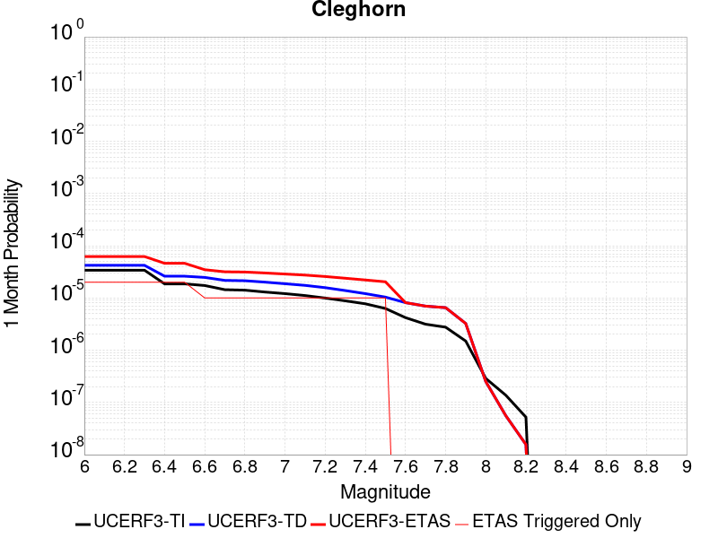 |  |  |

| Magnitude | 1 wk TI Prob | 1 wk TD Prob | 1 wk ETAS Prob | 1 wk ETAS/TD Gain | 1 wk ETAS Triggered Only | 1 mo TI Prob | 1 mo TD Prob | 1 mo ETAS Prob | 1 mo ETAS/TD Gain | 1 mo ETAS Triggered Only | 1 yr TI Prob | 1 yr TD Prob | 1 yr ETAS Prob | 1 yr ETAS/TD Gain | 1 yr ETAS Triggered Only | 10 yr TI Prob | 10 yr TD Prob | 10 yr ETAS Prob | 10 yr ETAS/TD Gain | 10 yr ETAS Triggered Only |
|-----|-----|-----|-----|-----|-----|-----|-----|-----|-----|-----|-----|-----|-----|-----|-----|-----|-----|-----|-----|-----|
| 6.0 | 7.9267165E-6 | 9.831582E-6 | 9.831582E-6 | 1.0 | 0.0 | 3.39712E-5 | 4.2134732E-5 | 4.2134732E-5 | 1.0 | 0.0 | 4.1352084E-4 | 5.128803E-4 | 5.3505116E-4 | 1.0432283 | 2.2182294E-5 | 0.004127522 | 0.0051320773 | 0.0051541454 | 1.0043001 | 2.2182294E-5 |
| 6.1 | 7.9267165E-6 | 9.831582E-6 | 9.831582E-6 | 1.0 | 0.0 | 3.39712E-5 | 4.2134732E-5 | 4.2134732E-5 | 1.0 | 0.0 | 4.1352084E-4 | 5.128803E-4 | 5.3505116E-4 | 1.0432283 | 2.2182294E-5 | 0.004127522 | 0.0051320773 | 0.0051541454 | 1.0043001 | 2.2182294E-5 |
| 6.2 | 7.9267165E-6 | 9.831582E-6 | 9.831582E-6 | 1.0 | 0.0 | 3.39712E-5 | 4.2134732E-5 | 4.2134732E-5 | 1.0 | 0.0 | 4.1352084E-4 | 5.128803E-4 | 5.3505116E-4 | 1.0432283 | 2.2182294E-5 | 0.004127522 | 0.0051320773 | 0.0051541454 | 1.0043001 | 2.2182294E-5 |
| 6.3 | 7.9267165E-6 | 9.831582E-6 | 9.831582E-6 | 1.0 | 0.0 | 3.39712E-5 | 4.2134732E-5 | 4.2134732E-5 | 1.0 | 0.0 | 4.1352084E-4 | 5.128803E-4 | 5.3505116E-4 | 1.0432283 | 2.2182294E-5 | 0.004127522 | 0.0051320773 | 0.0051541454 | 1.0043001 | 2.2182294E-5 |
| 6.4 | 4.3445207E-6 | 6.0914435E-6 | 6.0914435E-6 | 1.0 | 0.0 | 1.8619241E-5 | 2.610593E-5 | 2.610593E-5 | 1.0 | 0.0 | 2.2666567E-4 | 3.1779436E-4 | 3.399696E-4 | 1.0697786 | 2.2182294E-5 | 0.0022643462 | 0.0031875873 | 0.003209699 | 1.0069368 | 2.2182294E-5 |
| 6.5 | 4.3445207E-6 | 6.0914435E-6 | 6.0914435E-6 | 1.0 | 0.0 | 1.8619241E-5 | 2.610593E-5 | 2.610593E-5 | 1.0 | 0.0 | 2.2666567E-4 | 3.1779436E-4 | 3.399696E-4 | 1.0697786 | 2.2182294E-5 | 0.0022643462 | 0.0031875873 | 0.003209699 | 1.0069368 | 2.2182294E-5 |
| 6.6 | 4.040109E-6 | 5.773851E-6 | 5.773851E-6 | 1.0 | 0.0 | 1.7314638E-5 | 2.4744846E-5 | 2.4744846E-5 | 1.0 | 0.0 | 2.1078532E-4 | 3.012278E-4 | 3.2340342E-4 | 1.0736175 | 2.2182294E-5 | 0.002105855 | 0.003022377 | 0.0030444923 | 1.0073172 | 2.2182294E-5 |
| 6.7 | 3.3632055E-6 | 5.067348E-6 | 5.067348E-6 | 1.0 | 0.0 | 1.4413658E-5 | 2.1717027E-5 | 2.1717027E-5 | 1.0 | 0.0 | 1.7547216E-4 | 2.6437303E-4 | 2.6437303E-4 | 1.0 | 0.0 | 0.0017533366 | 0.0026547113 | 0.0026547113 | 1.0 | 0.0 |
| 6.8 | 3.2902772E-6 | 4.9892556E-6 | 4.9892556E-6 | 1.0 | 0.0 | 1.4101111E-5 | 2.1382351E-5 | 2.1382351E-5 | 1.0 | 0.0 | 1.716675E-4 | 2.6029933E-4 | 2.6029933E-4 | 1.0 | 0.0 | 0.0017153495 | 0.0026140702 | 0.0026140702 | 1.0 | 0.0 |
| 6.9 | 3.031547E-6 | 4.6910186E-6 | 4.6910186E-6 | 1.0 | 0.0 | 1.299228E-5 | 2.0104211E-5 | 2.0104211E-5 | 1.0 | 0.0 | 1.5816953E-4 | 2.4474156E-4 | 2.4474156E-4 | 1.0 | 0.0 | 0.00158057 | 0.0024588439 | 0.0024588439 | 1.0 | 0.0 |
| 7.0 | 2.8259715E-6 | 4.3705895E-6 | 4.3705895E-6 | 1.0 | 0.0 | 1.211125E-5 | 1.8730963E-5 | 1.8730963E-5 | 1.0 | 0.0 | 1.4744449E-4 | 2.2802586E-4 | 2.2802586E-4 | 1.0 | 0.0 | 0.001473467 | 0.0022920412 | 0.0022920412 | 1.0 | 0.0 |
| 7.1 | 2.5962665E-6 | 4.0658106E-6 | 4.0658106E-6 | 1.0 | 0.0 | 1.1126809E-5 | 1.7424789E-5 | 1.7424789E-5 | 1.0 | 0.0 | 1.3546048E-4 | 2.1212637E-4 | 2.1212637E-4 | 1.0 | 0.0 | 0.0013537793 | 0.002133366 | 0.002133366 | 1.0 | 0.0 |
| 7.2 | 2.3247253E-6 | 3.6763672E-6 | 3.6763672E-6 | 1.0 | 0.0 | 9.96307E-6 | 1.5755764E-5 | 1.5755764E-5 | 1.0 | 0.0 | 1.21293626E-4 | 1.9180974E-4 | 1.9180974E-4 | 1.0 | 0.0 | 0.0012122744 | 0.0019305905 | 0.0019305905 | 1.0 | 0.0 |
| 7.3 | 2.056928E-6 | 3.2350938E-6 | 3.2350938E-6 | 1.0 | 0.0 | 8.815376E-6 | 1.3864615E-5 | 1.3864615E-5 | 1.0 | 0.0 | 1.0732192E-4 | 1.6878877E-4 | 1.6878877E-4 | 1.0 | 0.0 | 0.001072701 | 0.0017008206 | 0.0017008206 | 1.0 | 0.0 |
| 7.4 | 1.8055999E-6 | 2.8255042E-6 | 2.8255042E-6 | 1.0 | 0.0 | 7.738263E-6 | 1.2109249E-5 | 1.2109249E-5 | 1.0 | 0.0 | 9.4209274E-5 | 1.4742027E-4 | 1.4742027E-4 | 1.0 | 0.0 | 9.4169343E-4 | 0.0014875771 | 0.0014875771 | 1.0 | 0.0 |
| 7.5 | 1.4683443E-6 | 2.4247483E-6 | 2.4247483E-6 | 1.0 | 0.0 | 6.292889E-6 | 1.0391738E-5 | 1.0391738E-5 | 1.0 | 0.0 | 7.661323E-5 | 1.2651215E-4 | 1.2651215E-4 | 1.0 | 0.0 | 7.658682E-4 | 0.0012787961 | 0.0012787961 | 1.0 | 0.0 |
| 7.6 | 9.804088E-7 | 1.900266E-6 | 1.900266E-6 | 1.0 | 0.0 | 4.201745E-6 | 8.143972E-6 | 8.143972E-6 | 1.0 | 0.0 | 5.1155046E-5 | 9.91484E-5 | 9.91484E-5 | 1.0 | 0.0 | 5.114327E-4 | 0.001005471 | 0.001005471 | 1.0 | 0.0 |
| 7.7 | 7.3434086E-7 | 1.6284146E-6 | 1.6284146E-6 | 1.0 | 0.0 | 3.1471714E-6 | 6.978901E-6 | 6.978901E-6 | 1.0 | 0.0 | 3.831614E-5 | 8.4964835E-5 | 8.4964835E-5 | 1.0 | 0.0 | 3.8309532E-4 | 8.6378685E-4 | 8.6378685E-4 | 1.0 | 0.0 |
| 7.8 | 6.434184E-7 | 1.5220047E-6 | 1.5220047E-6 | 1.0 | 0.0 | 2.7575045E-6 | 6.5228614E-6 | 6.5228614E-6 | 1.0 | 0.0 | 3.35721E-5 | 7.941297E-5 | 7.941297E-5 | 1.0 | 0.0 | 3.3567028E-4 | 8.079678E-4 | 8.079678E-4 | 1.0 | 0.0 |
| 7.9 | 3.4943926E-7 | 7.574459E-7 | 7.574459E-7 | 1.0 | 0.0 | 1.497596E-6 | 3.2461926E-6 | 3.2461926E-6 | 1.0 | 0.0 | 1.8233079E-5 | 3.952169E-5 | 3.952169E-5 | 1.0 | 0.0 | 1.8231584E-4 | 4.040099E-4 | 4.040099E-4 | 1.0 | 0.0 |
| 8.0 | 6.717524E-8 | 5.838828E-8 | 5.838828E-8 | 1.0 | 0.0 | 2.8789387E-7 | 2.5023547E-7 | 2.5023547E-7 | 1.0 | 0.0 | 3.505102E-6 | 3.0466126E-6 | 3.0466126E-6 | 1.0 | 0.0 | 3.5050467E-5 | 3.273506E-5 | 3.273506E-5 | 1.0 | 0.0 |
| 8.1 | 3.1984914E-8 | 1.2956093E-8 | 1.2956093E-8 | 1.0 | 0.0 | 1.370782E-7 | 5.552611E-8 | 5.552611E-8 | 1.0 | 0.0 | 1.6689258E-6 | 6.760302E-7 | 6.760302E-7 | 1.0 | 0.0 | 1.6689133E-5 | 7.74454E-6 | 7.74454E-6 | 1.0 | 0.0 |
| 8.2 | 1.21887656E-8 | 3.6495305E-9 | 3.6495305E-9 | 1.0 | 0.0 | 5.2237567E-8 | 1.5640845E-8 | 1.5640845E-8 | 1.0 | 0.0 | 6.359922E-7 | 1.9042727E-7 | 1.9042727E-7 | 1.0 | 0.0 | 6.3599036E-6 | 2.2470974E-6 | 2.2470974E-6 | 1.0 | 0.0 |

## Anacapa-Dume alt 1
*[(top)](#table-of-contents)*

| 1 Week | 1 Month | 1 Year | 10 Year |
|-----|-----|-----|-----|
|  |  | 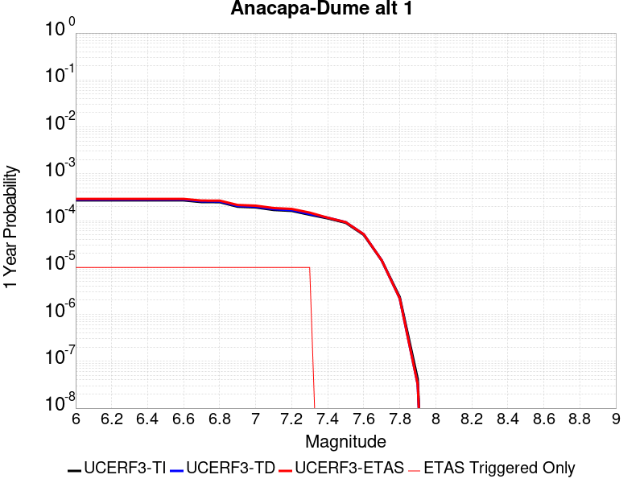 |  |

| Magnitude | 1 wk TI Prob | 1 wk TD Prob | 1 wk ETAS Prob | 1 wk ETAS/TD Gain | 1 wk ETAS Triggered Only | 1 mo TI Prob | 1 mo TD Prob | 1 mo ETAS Prob | 1 mo ETAS/TD Gain | 1 mo ETAS Triggered Only | 1 yr TI Prob | 1 yr TD Prob | 1 yr ETAS Prob | 1 yr ETAS/TD Gain | 1 yr ETAS Triggered Only | 10 yr TI Prob | 10 yr TD Prob | 10 yr ETAS Prob | 10 yr ETAS/TD Gain | 10 yr ETAS Triggered Only |
|-----|-----|-----|-----|-----|-----|-----|-----|-----|-----|-----|-----|-----|-----|-----|-----|-----|-----|-----|-----|-----|
| 6.0 | 5.1871802E-6 | 5.3673907E-6 | 2.7549566E-5 | 5.1327667 | 2.2182294E-5 | 2.2230583E-5 | 2.3002905E-5 | 4.518469E-5 | 1.9643036 | 2.2182294E-5 | 2.7062374E-4 | 2.8002524E-4 | 3.022013E-4 | 1.0791931 | 2.2182294E-5 | 0.002702944 | 0.0027968092 | 0.0028189293 | 1.007909 | 2.2182294E-5 |
| 6.1 | 5.1871802E-6 | 5.3673907E-6 | 2.7549566E-5 | 5.1327667 | 2.2182294E-5 | 2.2230583E-5 | 2.3002905E-5 | 4.518469E-5 | 1.9643036 | 2.2182294E-5 | 2.7062374E-4 | 2.8002524E-4 | 3.022013E-4 | 1.0791931 | 2.2182294E-5 | 0.002702944 | 0.0027968092 | 0.0028189293 | 1.007909 | 2.2182294E-5 |
| 6.2 | 5.1871802E-6 | 5.3673907E-6 | 2.7549566E-5 | 5.1327667 | 2.2182294E-5 | 2.2230583E-5 | 2.3002905E-5 | 4.518469E-5 | 1.9643036 | 2.2182294E-5 | 2.7062374E-4 | 2.8002524E-4 | 3.022013E-4 | 1.0791931 | 2.2182294E-5 | 0.002702944 | 0.0027968092 | 0.0028189293 | 1.007909 | 2.2182294E-5 |
| 6.3 | 5.1871802E-6 | 5.3673907E-6 | 2.7549566E-5 | 5.1327667 | 2.2182294E-5 | 2.2230583E-5 | 2.3002905E-5 | 4.518469E-5 | 1.9643036 | 2.2182294E-5 | 2.7062374E-4 | 2.8002524E-4 | 3.022013E-4 | 1.0791931 | 2.2182294E-5 | 0.002702944 | 0.0027968092 | 0.0028189293 | 1.007909 | 2.2182294E-5 |
| 6.4 | 5.1871802E-6 | 5.3673907E-6 | 2.7549566E-5 | 5.1327667 | 2.2182294E-5 | 2.2230583E-5 | 2.3002905E-5 | 4.518469E-5 | 1.9643036 | 2.2182294E-5 | 2.7062374E-4 | 2.8002524E-4 | 3.022013E-4 | 1.0791931 | 2.2182294E-5 | 0.002702944 | 0.0027968092 | 0.0028189293 | 1.007909 | 2.2182294E-5 |
| 6.5 | 5.1871802E-6 | 5.3673907E-6 | 2.7549566E-5 | 5.1327667 | 2.2182294E-5 | 2.2230583E-5 | 2.3002905E-5 | 4.518469E-5 | 1.9643036 | 2.2182294E-5 | 2.7062374E-4 | 2.8002524E-4 | 3.022013E-4 | 1.0791931 | 2.2182294E-5 | 0.002702944 | 0.0027968092 | 0.0028189293 | 1.007909 | 2.2182294E-5 |
| 6.6 | 5.1871802E-6 | 5.3673907E-6 | 2.7549566E-5 | 5.1327667 | 2.2182294E-5 | 2.2230583E-5 | 2.3002905E-5 | 4.518469E-5 | 1.9643036 | 2.2182294E-5 | 2.7062374E-4 | 2.8002524E-4 | 3.022013E-4 | 1.0791931 | 2.2182294E-5 | 0.002702944 | 0.0027968092 | 0.0028189293 | 1.007909 | 2.2182294E-5 |
| 6.7 | 4.7693475E-6 | 4.9366918E-6 | 2.7118876E-5 | 5.49333 | 2.2182294E-5 | 2.04399E-5 | 2.1157082E-5 | 4.3338907E-5 | 2.048435 | 2.2182294E-5 | 2.4882736E-4 | 2.5755778E-4 | 2.7973438E-4 | 1.0861033 | 2.2182294E-5 | 0.0024854892 | 0.002572669 | 0.0025947941 | 1.0086001 | 2.2182294E-5 |
| 6.8 | 4.753408E-6 | 4.92024E-6 | 2.7102426E-5 | 5.508354 | 2.2182294E-5 | 2.037159E-5 | 2.1086576E-5 | 4.3268403E-5 | 2.0519407 | 2.2182294E-5 | 2.4799586E-4 | 2.5669957E-4 | 2.7887616E-4 | 1.0863912 | 2.2182294E-5 | 0.002477193 | 0.0025641066 | 0.002586232 | 1.0086288 | 2.2182294E-5 |
| 6.9 | 3.800069E-6 | 3.937126E-6 | 2.6119333E-5 | 6.6341114 | 2.2182294E-5 | 1.6285909E-5 | 1.687329E-5 | 3.905521E-5 | 2.3146174 | 2.2182294E-5 | 1.9826289E-4 | 2.0541316E-4 | 2.275909E-4 | 1.1079665 | 2.2182294E-5 | 0.001980861 | 0.0020522568 | 0.0020743934 | 1.0107865 | 2.2182294E-5 |
| 7.0 | 3.6671938E-6 | 3.7999182E-6 | 2.5982128E-5 | 6.837549 | 2.2182294E-5 | 1.571645E-5 | 1.6285263E-5 | 3.8467195E-5 | 2.3620863 | 2.2182294E-5 | 1.9133097E-4 | 1.9825528E-4 | 2.2043317E-4 | 1.1118654 | 2.2182294E-5 | 0.0019116632 | 0.0019808074 | 0.0020029456 | 1.0111765 | 2.2182294E-5 |
| 7.1 | 3.2394885E-6 | 3.3587933E-6 | 2.5541012E-5 | 7.6042233 | 2.2182294E-5 | 1.3883448E-5 | 1.4394749E-5 | 3.6576723E-5 | 2.5409768 | 2.2182294E-5 | 1.6901788E-4 | 1.7524208E-4 | 1.974205E-4 | 1.1265587 | 2.2182294E-5 | 0.0016888938 | 0.0017510501 | 0.0017731936 | 1.0126458 | 2.2182294E-5 |
| 7.2 | 3.0935948E-6 | 3.2079258E-6 | 2.5390149E-5 | 7.914818 | 2.2182294E-5 | 1.3258196E-5 | 1.3748182E-5 | 3.593017E-5 | 2.6134489 | 2.2182294E-5 | 1.6140658E-4 | 1.6737137E-4 | 1.8954994E-4 | 1.1325113 | 2.2182294E-5 | 0.001612894 | 0.0016724641 | 0.0016946093 | 1.013241 | 2.2182294E-5 |
| 7.3 | 2.5604163E-6 | 2.647073E-6 | 2.4829309E-5 | 9.37991 | 2.2182294E-5 | 1.0973167E-5 | 1.1344549E-5 | 3.352659E-5 | 2.955304 | 2.2182294E-5 | 1.3359012E-4 | 1.3811118E-4 | 1.6029041E-4 | 1.1605897 | 2.2182294E-5 | 0.0013350984 | 0.0013802581 | 0.0014024097 | 1.0160489 | 2.2182294E-5 |
| 7.4 | 2.1429005E-6 | 2.2106028E-6 | 2.2106028E-6 | 1.0 | 0.0 | 9.1838265E-6 | 9.473977E-6 | 9.473977E-6 | 1.0 | 0.0 | 1.11807356E-4 | 1.1533959E-4 | 1.1533959E-4 | 1.0 | 0.0 | 0.0011175112 | 0.0011527999 | 0.0011527999 | 1.0 | 0.0 |
| 7.5 | 1.7237151E-6 | 1.7761449E-6 | 1.7761449E-6 | 1.0 | 0.0 | 7.3873293E-6 | 7.6120277E-6 | 7.6120277E-6 | 1.0 | 0.0 | 8.993702E-5 | 9.267252E-5 | 9.267252E-5 | 1.0 | 0.0 | 8.990063E-4 | 9.2634105E-4 | 9.2634105E-4 | 1.0 | 0.0 |
| 7.6 | 9.541696E-7 | 9.823206E-7 | 9.823206E-7 | 1.0 | 0.0 | 4.089292E-6 | 4.2099387E-6 | 4.2099387E-6 | 1.0 | 0.0 | 4.9785995E-5 | 5.1254807E-5 | 5.1254807E-5 | 1.0 | 0.0 | 4.9774844E-4 | 5.1243114E-4 | 5.1243114E-4 | 1.0 | 0.0 |
| 7.7 | 2.7226676E-7 | 2.7172416E-7 | 2.7172416E-7 | 1.0 | 0.0 | 1.166857E-6 | 1.1645316E-6 | 1.1645316E-6 | 1.0 | 0.0 | 1.4206392E-5 | 1.4178081E-5 | 1.4178081E-5 | 1.0 | 0.0 | 1.4205484E-4 | 1.4177183E-4 | 1.4177183E-4 | 1.0 | 0.0 |
| 7.8 | 4.5017995E-8 | 4.2157676E-8 | 4.2157676E-8 | 1.0 | 0.0 | 1.9293425E-7 | 1.8067574E-7 | 1.8067574E-7 | 1.0 | 0.0 | 2.348972E-6 | 2.1997253E-6 | 2.1997253E-6 | 1.0 | 0.0 | 2.348947E-5 | 2.1997055E-5 | 2.1997055E-5 | 1.0 | 0.0 |
| 7.9 | 8.007447E-10 | 6.1608785E-10 | 6.1608785E-10 | 1.0 | 0.0 | 3.4317629E-9 | 2.6403764E-9 | 2.6403764E-9 | 1.0 | 0.0 | 4.1781714E-8 | 3.2146584E-8 | 3.2146584E-8 | 1.0 | 0.0 | 4.1781706E-7 | 3.214658E-7 | 3.214658E-7 | 1.0 | 0.0 |

## Kern Canyon (Lake Isabella) 2011
*[(top)](#table-of-contents)*

| 1 Week | 1 Month | 1 Year | 10 Year |
|-----|-----|-----|-----|
|  |  |  |  |

| Magnitude | 1 wk TI Prob | 1 wk TD Prob | 1 wk ETAS Prob | 1 wk ETAS/TD Gain | 1 wk ETAS Triggered Only | 1 mo TI Prob | 1 mo TD Prob | 1 mo ETAS Prob | 1 mo ETAS/TD Gain | 1 mo ETAS Triggered Only | 1 yr TI Prob | 1 yr TD Prob | 1 yr ETAS Prob | 1 yr ETAS/TD Gain | 1 yr ETAS Triggered Only | 10 yr TI Prob | 10 yr TD Prob | 10 yr ETAS Prob | 10 yr ETAS/TD Gain | 10 yr ETAS Triggered Only |
|-----|-----|-----|-----|-----|-----|-----|-----|-----|-----|-----|-----|-----|-----|-----|-----|-----|-----|-----|-----|-----|
| 6.0 | 4.2387383E-6 | 4.001639E-6 | 4.001639E-6 | 1.0 | 0.0 | 1.8165894E-5 | 1.7149778E-5 | 1.7149778E-5 | 1.0 | 0.0 | 2.2114732E-4 | 2.087804E-4 | 2.3095807E-4 | 1.1062248 | 2.2182294E-5 | 0.0022092736 | 0.0020860266 | 0.0021081625 | 1.0106115 | 2.2182294E-5 |
| 6.1 | 4.2387383E-6 | 4.001639E-6 | 4.001639E-6 | 1.0 | 0.0 | 1.8165894E-5 | 1.7149778E-5 | 1.7149778E-5 | 1.0 | 0.0 | 2.2114732E-4 | 2.087804E-4 | 2.3095807E-4 | 1.1062248 | 2.2182294E-5 | 0.0022092736 | 0.0020860266 | 0.0021081625 | 1.0106115 | 2.2182294E-5 |
| 6.2 | 4.2387383E-6 | 4.001639E-6 | 4.001639E-6 | 1.0 | 0.0 | 1.8165894E-5 | 1.7149778E-5 | 1.7149778E-5 | 1.0 | 0.0 | 2.2114732E-4 | 2.087804E-4 | 2.3095807E-4 | 1.1062248 | 2.2182294E-5 | 0.0022092736 | 0.0020860266 | 0.0021081625 | 1.0106115 | 2.2182294E-5 |
| 6.3 | 4.2387383E-6 | 4.001639E-6 | 4.001639E-6 | 1.0 | 0.0 | 1.8165894E-5 | 1.7149778E-5 | 1.7149778E-5 | 1.0 | 0.0 | 2.2114732E-4 | 2.087804E-4 | 2.3095807E-4 | 1.1062248 | 2.2182294E-5 | 0.0022092736 | 0.0020860266 | 0.0021081625 | 1.0106115 | 2.2182294E-5 |
| 6.4 | 4.2387383E-6 | 4.001639E-6 | 4.001639E-6 | 1.0 | 0.0 | 1.8165894E-5 | 1.7149778E-5 | 1.7149778E-5 | 1.0 | 0.0 | 2.2114732E-4 | 2.087804E-4 | 2.3095807E-4 | 1.1062248 | 2.2182294E-5 | 0.0022092736 | 0.0020860266 | 0.0021081625 | 1.0106115 | 2.2182294E-5 |
| 6.5 | 2.7857532E-6 | 2.517867E-6 | 2.517867E-6 | 1.0 | 0.0 | 1.1938888E-5 | 1.0790815E-5 | 1.0790815E-5 | 1.0 | 0.0 | 1.4534626E-4 | 1.3137059E-4 | 1.5354996E-4 | 1.1688306 | 2.2182294E-5 | 0.0014525123 | 0.001312962 | 0.0013351152 | 1.0168726 | 2.2182294E-5 |
| 6.6 | 2.2233348E-6 | 1.9441236E-6 | 1.9441236E-6 | 1.0 | 0.0 | 9.528543E-6 | 8.331932E-6 | 8.331932E-6 | 1.0 | 0.0 | 1.1600384E-4 | 1.01436635E-4 | 1.01436635E-4 | 1.0 | 0.0 | 0.001159433 | 0.001013912 | 0.001013912 | 1.0 | 0.0 |
| 6.7 | 2.1635126E-6 | 1.8835036E-6 | 1.8835036E-6 | 1.0 | 0.0 | 9.272164E-6 | 8.072134E-6 | 8.072134E-6 | 1.0 | 0.0 | 1.1288274E-4 | 9.827388E-5 | 9.827388E-5 | 1.0 | 0.0 | 0.0011282542 | 9.823124E-4 | 9.823124E-4 | 1.0 | 0.0 |
| 6.8 | 1.8685711E-6 | 1.5831425E-6 | 1.5831425E-6 | 1.0 | 0.0 | 8.008137E-6 | 6.784879E-6 | 6.784879E-6 | 1.0 | 0.0 | 9.74947E-5 | 8.260282E-5 | 8.260282E-5 | 1.0 | 0.0 | 9.745194E-4 | 8.2572614E-4 | 8.2572614E-4 | 1.0 | 0.0 |
| 6.9 | 1.5815071E-6 | 1.3064928E-6 | 1.3064928E-6 | 1.0 | 0.0 | 6.77787E-6 | 5.599243E-6 | 5.599243E-6 | 1.0 | 0.0 | 8.251744E-5 | 6.816868E-5 | 6.816868E-5 | 1.0 | 0.0 | 8.248681E-4 | 6.8148033E-4 | 6.8148033E-4 | 1.0 | 0.0 |
| 7.0 | 1.3772564E-6 | 1.1210718E-6 | 1.1210718E-6 | 1.0 | 0.0 | 5.9025137E-6 | 4.8045845E-6 | 4.8045845E-6 | 1.0 | 0.0 | 7.186073E-5 | 5.8494268E-5 | 5.8494268E-5 | 1.0 | 0.0 | 7.18375E-4 | 5.847908E-4 | 5.847908E-4 | 1.0 | 0.0 |
| 7.1 | 1.0916998E-6 | 8.763777E-7 | 8.763777E-7 | 1.0 | 0.0 | 4.678705E-6 | 3.7558991E-6 | 3.7558991E-6 | 1.0 | 0.0 | 5.6961744E-5 | 4.5727127E-5 | 4.5727127E-5 | 1.0 | 0.0 | 5.6947145E-4 | 4.571785E-4 | 4.571785E-4 | 1.0 | 0.0 |
| 7.2 | 7.6277024E-7 | 5.901454E-7 | 5.901454E-7 | 1.0 | 0.0 | 3.2690114E-6 | 2.5291922E-6 | 2.5291922E-6 | 1.0 | 0.0 | 3.9799485E-5 | 3.0792486E-5 | 3.0792486E-5 | 1.0 | 0.0 | 3.9792358E-4 | 3.0788282E-4 | 3.0788282E-4 | 1.0 | 0.0 |
| 7.3 | 5.3265916E-7 | 4.3824414E-7 | 4.3824414E-7 | 1.0 | 0.0 | 2.282823E-6 | 1.878188E-6 | 1.878188E-6 | 1.0 | 0.0 | 2.7793016E-5 | 2.2866701E-5 | 2.2866701E-5 | 1.0 | 0.0 | 2.778954E-4 | 2.2864387E-4 | 2.2864387E-4 | 1.0 | 0.0 |
| 7.4 | 3.4946007E-7 | 3.006571E-7 | 3.006571E-7 | 1.0 | 0.0 | 1.497685E-6 | 1.2885298E-6 | 1.2885298E-6 | 1.0 | 0.0 | 1.8234163E-5 | 1.568774E-5 | 1.568774E-5 | 1.0 | 0.0 | 1.8232666E-4 | 1.5686655E-4 | 1.5686655E-4 | 1.0 | 0.0 |
| 7.5 | 1.8317026E-7 | 1.4244812E-7 | 1.4244812E-7 | 1.0 | 0.0 | 7.850152E-7 | 6.104918E-7 | 6.104918E-7 | 1.0 | 0.0 | 9.557518E-6 | 7.432713E-6 | 7.432713E-6 | 1.0 | 0.0 | 9.5571064E-5 | 7.432472E-5 | 7.432472E-5 | 1.0 | 0.0 |
| 7.6 | 2.572245E-8 | 1.7352555E-8 | 1.7352555E-8 | 1.0 | 0.0 | 1.10239064E-7 | 7.436809E-8 | 7.436809E-8 | 1.0 | 0.0 | 1.3421597E-6 | 9.054312E-7 | 9.054312E-7 | 1.0 | 0.0 | 1.3421517E-5 | 9.05428E-6 | 9.05428E-6 | 1.0 | 0.0 |

## Hayward (So) 2011 CFM
*[(top)](#table-of-contents)*

| 1 Week | 1 Month | 1 Year | 10 Year |
|-----|-----|-----|-----|
|  |  |  |  |

| Magnitude | 1 wk TI Prob | 1 wk TD Prob | 1 wk ETAS Prob | 1 wk ETAS/TD Gain | 1 wk ETAS Triggered Only | 1 mo TI Prob | 1 mo TD Prob | 1 mo ETAS Prob | 1 mo ETAS/TD Gain | 1 mo ETAS Triggered Only | 1 yr TI Prob | 1 yr TD Prob | 1 yr ETAS Prob | 1 yr ETAS/TD Gain | 1 yr ETAS Triggered Only | 10 yr TI Prob | 10 yr TD Prob | 10 yr ETAS Prob | 10 yr ETAS/TD Gain | 10 yr ETAS Triggered Only |
|-----|-----|-----|-----|-----|-----|-----|-----|-----|-----|-----|-----|-----|-----|-----|-----|-----|-----|-----|-----|-----|
| 6.0 | 1.8091932E-4 | 3.570541E-4 | 3.570541E-4 | 1.0 | 0.0 | 7.751381E-4 | 0.0015293444 | 0.0015293444 | 1.0 | 0.0 | 0.00939654 | 0.018463207 | 0.018484982 | 1.0011792 | 2.2182294E-5 | 0.090090066 | 0.16673161 | 0.16675009 | 1.0001109 | 2.2182294E-5 |
| 6.1 | 1.8091932E-4 | 3.570541E-4 | 3.570541E-4 | 1.0 | 0.0 | 7.751381E-4 | 0.0015293444 | 0.0015293444 | 1.0 | 0.0 | 0.00939654 | 0.018463207 | 0.018484982 | 1.0011792 | 2.2182294E-5 | 0.090090066 | 0.16673161 | 0.16675009 | 1.0001109 | 2.2182294E-5 |
| 6.2 | 1.8091932E-4 | 3.570541E-4 | 3.570541E-4 | 1.0 | 0.0 | 7.751381E-4 | 0.0015293444 | 0.0015293444 | 1.0 | 0.0 | 0.00939654 | 0.018463207 | 0.018484982 | 1.0011792 | 2.2182294E-5 | 0.090090066 | 0.16673161 | 0.16675009 | 1.0001109 | 2.2182294E-5 |
| 6.3 | 1.7322872E-4 | 3.426234E-4 | 3.426234E-4 | 1.0 | 0.0 | 7.4219756E-4 | 0.0014675693 | 0.0014675693 | 1.0 | 0.0 | 0.0089988755 | 0.017723544 | 0.017745333 | 1.0012294 | 2.2182294E-5 | 0.08643075 | 0.16066726 | 0.16068587 | 1.0001159 | 2.2182294E-5 |
| 6.4 | 1.6334097E-4 | 3.234411E-4 | 3.234411E-4 | 1.0 | 0.0 | 6.998449E-4 | 0.0013854484 | 0.0013854484 | 1.0 | 0.0 | 0.008487372 | 0.016739385 | 0.016761197 | 1.001303 | 2.2182294E-5 | 0.081704415 | 0.15255594 | 0.15257473 | 1.0001233 | 2.2182294E-5 |
| 6.5 | 1.5600289E-4 | 3.1018828E-4 | 3.1018828E-4 | 1.0 | 0.0 | 6.684125E-4 | 0.0013287093 | 0.0013287093 | 1.0 | 0.0 | 0.008107598 | 0.016058935 | 0.016080761 | 1.0013591 | 2.2182294E-5 | 0.078181036 | 0.14683272 | 0.14685164 | 1.0001289 | 2.2182294E-5 |
| 6.6 | 1.4046066E-4 | 2.8032906E-4 | 2.8032906E-4 | 1.0 | 0.0 | 6.018354E-4 | 0.0012008639 | 0.0012008639 | 1.0 | 0.0 | 0.0073027555 | 0.014524006 | 0.014545866 | 1.0015051 | 2.2182294E-5 | 0.07067384 | 0.13391982 | 0.13393904 | 1.0001434 | 2.2182294E-5 |
| 6.7 | 1.14696966E-4 | 2.3271477E-4 | 2.3271477E-4 | 1.0 | 0.0 | 4.914658E-4 | 9.969729E-4 | 9.969729E-4 | 1.0 | 0.0 | 0.0059671924 | 0.012071652 | 0.012093567 | 1.0018153 | 2.2182294E-5 | 0.058094822 | 0.11274672 | 0.11276641 | 1.0001745 | 2.2182294E-5 |
| 6.8 | 9.3874296E-5 | 1.8861453E-4 | 1.8861453E-4 | 1.0 | 0.0 | 4.0225635E-4 | 8.0810126E-4 | 8.0810126E-4 | 1.0 | 0.0 | 0.0048864787 | 0.009794984 | 0.009794984 | 1.0 | 0.0 | 0.047804173 | 0.09259856 | 0.09259856 | 1.0 | 0.0 |
| 6.9 | 5.551852E-5 | 1.072948E-4 | 1.072948E-4 | 1.0 | 0.0 | 2.3791482E-4 | 4.5975443E-4 | 4.5975443E-4 | 1.0 | 0.0 | 0.0028927654 | 0.0055832625 | 0.0055832625 | 1.0 | 0.0 | 0.028553981 | 0.054245494 | 0.054245494 | 1.0 | 0.0 |
| 7.0 | 4.2662363E-5 | 8.2464416E-5 | 8.2464416E-5 | 1.0 | 0.0 | 1.8282588E-4 | 3.5337146E-4 | 3.5337146E-4 | 1.0 | 0.0 | 0.0022236328 | 0.0042938837 | 0.0042938837 | 1.0 | 0.0 | 0.022015138 | 0.042064495 | 0.042064495 | 1.0 | 0.0 |
| 7.1 | 3.305886E-5 | 6.3019055E-5 | 6.3019055E-5 | 1.0 | 0.0 | 1.4167312E-4 | 2.700538E-4 | 2.700538E-4 | 1.0 | 0.0 | 0.0017235056 | 0.0032829668 | 0.0032829668 | 1.0 | 0.0 | 0.017101998 | 0.032452874 | 0.032452874 | 1.0 | 0.0 |
| 7.2 | 2.9856887E-5 | 5.7013647E-5 | 5.7013647E-5 | 1.0 | 0.0 | 1.2795182E-4 | 2.4432142E-4 | 2.4432142E-4 | 1.0 | 0.0 | 0.0015567001 | 0.0029705726 | 0.0029705726 | 1.0 | 0.0 | 0.015458403 | 0.029453589 | 0.029453589 | 1.0 | 0.0 |
| 7.3 | 2.4559737E-5 | 4.599088E-5 | 4.599088E-5 | 1.0 | 0.0 | 1.0525176E-4 | 1.9708896E-4 | 1.9708896E-4 | 1.0 | 0.0 | 0.0012806869 | 0.0023969305 | 0.0023969305 | 1.0 | 0.0 | 0.012733313 | 0.023857482 | 0.023857482 | 1.0 | 0.0 |
| 7.4 | 1.9002231E-5 | 3.5049303E-5 | 3.5049303E-5 | 1.0 | 0.0 | 8.143559E-5 | 1.502027E-4 | 1.502027E-4 | 1.0 | 0.0 | 9.910273E-4 | 0.0018271938 | 0.0018271938 | 1.0 | 0.0 | 0.009866194 | 0.018258283 | 0.018258283 | 1.0 | 0.0 |
| 7.5 | 1.2783333E-5 | 2.3330069E-5 | 2.3330069E-5 | 1.0 | 0.0 | 5.4784563E-5 | 9.998221E-5 | 9.998221E-5 | 1.0 | 0.0 | 6.667979E-4 | 0.0012166094 | 0.0012166094 | 1.0 | 0.0 | 0.006648007 | 0.012209582 | 0.012209582 | 1.0 | 0.0 |
| 7.6 | 4.8149627E-6 | 8.887544E-6 | 8.887544E-6 | 1.0 | 0.0 | 2.063539E-5 | 3.8088925E-5 | 3.8088925E-5 | 1.0 | 0.0 | 2.5120692E-4 | 4.636352E-4 | 4.636352E-4 | 1.0 | 0.0 | 0.0025092314 | 0.0046812436 | 0.0046812436 | 1.0 | 0.0 |
| 7.7 | 6.0838227E-7 | 1.2056693E-6 | 1.2056693E-6 | 1.0 | 0.0 | 2.6073499E-6 | 5.1671436E-6 | 5.1671436E-6 | 1.0 | 0.0 | 3.174402E-5 | 6.290816E-5 | 6.290816E-5 | 1.0 | 0.0 | 3.1739488E-4 | 6.5293367E-4 | 6.5293367E-4 | 1.0 | 0.0 |
| 7.8 | 4.5542808E-7 | 9.792182E-7 | 9.792182E-7 | 1.0 | 0.0 | 1.9518332E-6 | 4.1966427E-6 | 4.1966427E-6 | 1.0 | 0.0 | 2.376331E-5 | 5.1092928E-5 | 5.1092928E-5 | 1.0 | 0.0 | 2.3760769E-4 | 5.321372E-4 | 5.321372E-4 | 1.0 | 0.0 |
| 7.9 | 3.3016747E-7 | 7.386335E-7 | 7.386335E-7 | 1.0 | 0.0 | 1.4150027E-6 | 3.1655684E-6 | 3.1655684E-6 | 1.0 | 0.0 | 1.7227521E-5 | 3.8540114E-5 | 3.8540114E-5 | 1.0 | 0.0 | 1.7226185E-4 | 3.9930744E-4 | 3.9930744E-4 | 1.0 | 0.0 |
| 8.0 | 2.347038E-7 | 5.4714894E-7 | 5.4714894E-7 | 1.0 | 0.0 | 1.0058731E-6 | 2.344922E-6 | 2.344922E-6 | 1.0 | 0.0 | 1.2246436E-5 | 2.8549053E-5 | 2.8549053E-5 | 1.0 | 0.0 | 1.2245761E-4 | 2.9355253E-4 | 2.9355253E-4 | 1.0 | 0.0 |
| 8.1 | 1.18822804E-7 | 2.6058973E-7 | 2.6058973E-7 | 1.0 | 0.0 | 5.092405E-7 | 1.1168127E-6 | 1.1168127E-6 | 1.0 | 0.0 | 6.1999854E-6 | 1.359711E-5 | 1.359711E-5 | 1.0 | 0.0 | 6.199812E-5 | 1.3917852E-4 | 1.3917852E-4 | 1.0 | 0.0 |

