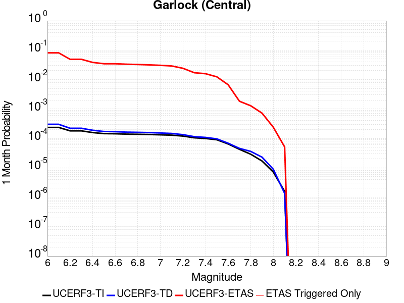
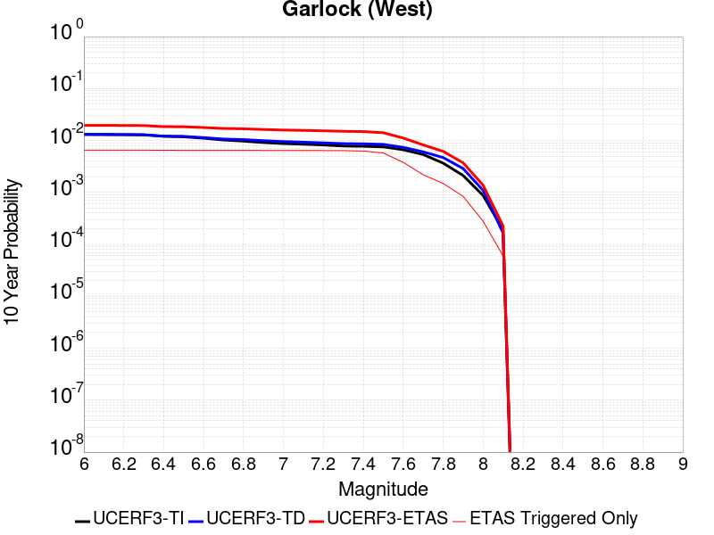
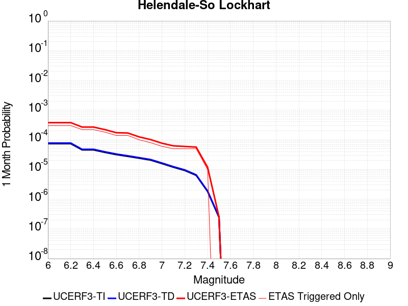
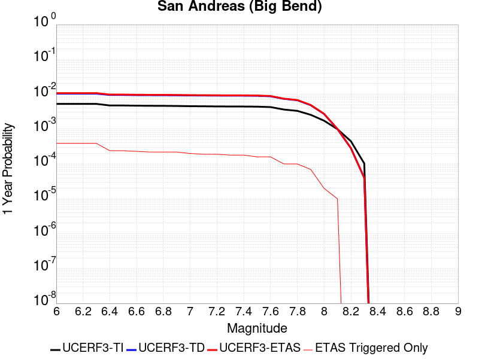
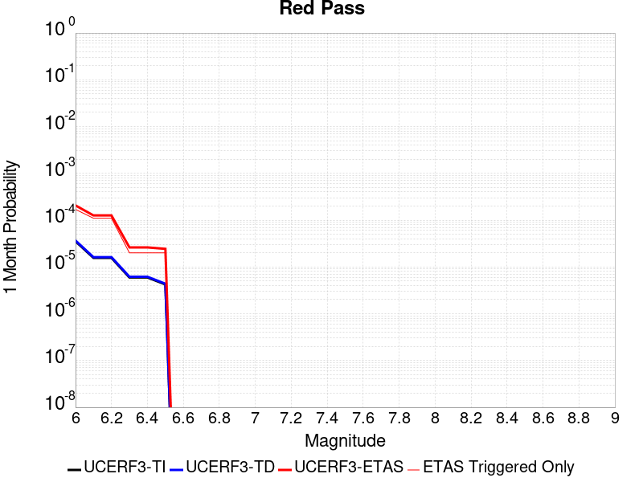

# Parent Section Magnitude-Probability Distributions

Only fault sections with at least one triggered aftershock are plotted. Sections are sorted by total supraseismogenic trigger rate (decreasing)

## Table Of Contents

* [Garlock (Central)](#garlock-central)
* [Tank Canyon](#tank-canyon)
* [Little Lake](#little-lake)
* [Airport Lake](#airport-lake)
* [Owl Lake](#owl-lake)
* [Panamint Valley](#panamint-valley)
* [Garlock (East)](#garlock-east)
* [Hunter Mountain-Saline Valley](#hunter-mountain-saline-valley)
* [Blackwater](#blackwater)
* [Garlock (West)](#garlock-west)
* [Ash Hill](#ash-hill)
* [Gravel Hills-Harper Lk](#gravel-hills-harper-lk)
* [Goldstone Lake](#goldstone-lake)
* [McLean Lake](#mclean-lake)
* [San Andreas (Mojave N)](#san-andreas-mojave-n)
* [Coyote Canyon](#coyote-canyon)
* [So Sierra Nevada](#so-sierra-nevada)
* [San Andreas (Mojave S)](#san-andreas-mojave-s)
* [San Andreas (San Bernardino N)](#san-andreas-san-bernardino-n)
* [Death Valley (So)](#death-valley-so)
* [Bicycle Lake](#bicycle-lake)
* [Lenwood-Lockhart-Old Woman Springs](#lenwood-lockhart-old-woman-springs)
* [Paradise](#paradise)
* [Garlic Springs](#garlic-springs)
* [Nelson Lake](#nelson-lake)
* [Towne Pass](#towne-pass)
* [Helendale-So Lockhart](#helendale-so-lockhart)
* [Coyote Lake](#coyote-lake)
* [Calico-Hidalgo](#calico-hidalgo)
* [San Andreas (Big Bend)](#san-andreas-big-bend)
* [Death Valley (Black Mtns Frontal)](#death-valley-black-mtns-frontal)
* [San Andreas (San Bernardino S)](#san-andreas-san-bernardino-s)
* [San Jacinto (San Bernardino)](#san-jacinto-san-bernardino)
* [Death Valley (No)](#death-valley-no)
* [Newport-Inglewood (Offshore)](#newport-inglewood-offshore)
* [San Jacinto (Stepovers Combined)](#san-jacinto-stepovers-combined)
* [Pisgah-Bullion Mtn-Mesquite Lk](#pisgah-bullion-mtn-mesquite-lk)
* [San Jacinto (San Jacinto Valley) rev](#san-jacinto-san-jacinto-valley-rev)
* [Red Pass](#red-pass)
* [Ludlow](#ludlow)
* [Sierra Nevada  (No Extension)](#sierra-nevada--no-extension)
* [San Andreas (North Branch Mill Creek)](#san-andreas-north-branch-mill-creek)
* [White Mountains](#white-mountains)
* [San Jacinto (Anza) rev](#san-jacinto-anza-rev)
* [San Clemente](#san-clemente)
* [Anacapa-Dume alt 1](#anacapa-dume-alt-1)
* [Sierra Madre](#sierra-madre)
* [Pinto Mtn](#pinto-mtn)
* [Clamshell-Sawpit](#clamshell-sawpit)
* [San Jacinto (Coyote Creek)](#san-jacinto-coyote-creek)
* [San Pedro Basin](#san-pedro-basin)

## Garlock (Central)
*[(top)](#table-of-contents)*

| 1 Week | 1 Month | 1 Year | 10 Year |
|-----|-----|-----|-----|
|  |  |  |  |

| Magnitude | 1 wk TI Prob | 1 wk TD Prob | 1 wk ETAS Prob | 1 wk ETAS/TD Gain | 1 wk ETAS Triggered Only | 1 mo TI Prob | 1 mo TD Prob | 1 mo ETAS Prob | 1 mo ETAS/TD Gain | 1 mo ETAS Triggered Only | 1 yr TI Prob | 1 yr TD Prob | 1 yr ETAS Prob | 1 yr ETAS/TD Gain | 1 yr ETAS Triggered Only | 10 yr TI Prob | 10 yr TD Prob | 10 yr ETAS Prob | 10 yr ETAS/TD Gain | 10 yr ETAS Triggered Only |
|-----|-----|-----|-----|-----|-----|-----|-----|-----|-----|-----|-----|-----|-----|-----|-----|-----|-----|-----|-----|-----|
| 6.0 | 5.5131142E-5 | 7.024681E-5 | 0.06633778 | 944.3529 | 0.06627219 | 2.3625491E-4 | 3.010234E-4 | 0.07128557 | 236.81073 | 0.07100592 | 0.0028726095 | 0.0036588663 | 0.086196005 | 23.558117 | 0.082840234 | 0.028357591 | 0.036079824 | 0.121178575 | 3.3586242 | 0.08828402 |
| 6.1 | 5.5131142E-5 | 7.024681E-5 | 0.06633778 | 944.3529 | 0.06627219 | 2.3625491E-4 | 3.010234E-4 | 0.07128557 | 236.81073 | 0.07100592 | 0.0028726095 | 0.0036588663 | 0.086196005 | 23.558117 | 0.082840234 | 0.028357591 | 0.036079824 | 0.121178575 | 3.3586242 | 0.08828402 |
| 6.2 | 4.216245E-5 | 5.1661493E-5 | 0.038392875 | 743.16235 | 0.038343195 | 1.806837E-4 | 2.2138779E-4 | 0.0413957 | 186.98277 | 0.04118343 | 0.0021976046 | 0.0026920962 | 0.052970577 | 19.67633 | 0.0504142 | 0.021759989 | 0.026689773 | 0.080365814 | 3.0111089 | 0.055147927 |
| 6.3 | 4.216245E-5 | 5.1661493E-5 | 0.038392875 | 743.16235 | 0.038343195 | 1.806837E-4 | 2.2138779E-4 | 0.0413957 | 186.98277 | 0.04118343 | 0.0021976046 | 0.0026920962 | 0.052970577 | 19.67633 | 0.0504142 | 0.021759989 | 0.026689773 | 0.080365814 | 3.0111089 | 0.055147927 |
| 6.4 | 3.6858168E-5 | 4.411054E-5 | 0.032705393 | 741.44165 | 0.032662723 | 1.5795401E-4 | 1.8903162E-4 | 0.035448637 | 187.52756 | 0.035266273 | 0.0019213937 | 0.002299056 | 0.045513086 | 19.796423 | 0.04331361 | 0.019048655 | 0.02284894 | 0.06887333 | 3.01429 | 0.047100592 |
| 6.5 | 3.39199E-5 | 4.0018083E-5 | 0.029624633 | 740.2811 | 0.0295858 | 1.453629E-4 | 1.7149492E-4 | 0.03259197 | 190.04626 | 0.032426037 | 0.0017683565 | 0.002085973 | 0.041530147 | 19.909246 | 0.039526626 | 0.017543508 | 0.020759864 | 0.063174285 | 3.0430975 | 0.04331361 |
| 6.6 | 3.3571985E-5 | 3.9472274E-5 | 0.029624103 | 750.50415 | 0.0295858 | 1.4387199E-4 | 1.6915603E-4 | 0.032589708 | 192.66061 | 0.032426037 | 0.0017502342 | 0.0020575512 | 0.041502852 | 20.170994 | 0.039526626 | 0.017365133 | 0.020481179 | 0.06290767 | 3.071487 | 0.04331361 |
| 6.7 | 3.2580007E-5 | 3.8088703E-5 | 0.028439375 | 746.6617 | 0.028402368 | 1.3962112E-4 | 1.632272E-4 | 0.031400733 | 192.37437 | 0.031242603 | 0.0016985617 | 0.0019855013 | 0.04001635 | 20.15428 | 0.03810651 | 0.016856372 | 0.019773813 | 0.060606904 | 3.0650084 | 0.041656803 |
| 6.8 | 3.2185937E-5 | 3.7515918E-5 | 0.027965462 | 745.4292 | 0.027928995 | 1.3793244E-4 | 1.6077272E-4 | 0.030925056 | 192.35263 | 0.03076923 | 0.0016780337 | 0.001955672 | 0.03951521 | 20.205439 | 0.037633136 | 0.016654192 | 0.019480614 | 0.059861768 | 3.072889 | 0.04118343 |
| 6.9 | 3.165394E-5 | 3.6720503E-5 | 0.027728012 | 755.10974 | 0.027692307 | 1.3565269E-4 | 1.5736422E-4 | 0.030685104 | 194.99417 | 0.030532544 | 0.0016503202 | 0.001914247 | 0.039002877 | 20.375048 | 0.037159763 | 0.01638118 | 0.019073246 | 0.059006833 | 3.0936964 | 0.040710058 |
| 7.0 | 3.0903822E-5 | 3.5625766E-5 | 0.025833523 | 725.1359 | 0.025798816 | 1.3243823E-4 | 1.5267303E-4 | 0.028787354 | 188.55559 | 0.028639054 | 0.0016112428 | 0.0018572307 | 0.037058007 | 19.953367 | 0.035266273 | 0.015996104 | 0.018512413 | 0.056610394 | 3.0579693 | 0.038816568 |
| 7.1 | 3.0069863E-5 | 3.4392073E-5 | 0.025122287 | 730.4674 | 0.025088757 | 1.2886449E-4 | 1.4738638E-4 | 0.027835613 | 188.8615 | 0.027692307 | 0.0015677959 | 0.0017929734 | 0.036050964 | 20.106806 | 0.034319527 | 0.01556781 | 0.017880075 | 0.054840326 | 3.0671196 | 0.037633136 |
| 7.2 | 2.7957109E-5 | 3.128145E-5 | 0.02133239 | 681.9501 | 0.021301774 | 1.1981068E-4 | 1.340566E-4 | 0.023799522 | 177.5334 | 0.02366864 | 0.0014577188 | 0.0016309366 | 0.030223282 | 18.531242 | 0.028639054 | 0.014481937 | 0.016283695 | 0.047250386 | 2.9016993 | 0.03147929 |
| 7.3 | 2.4519275E-5 | 2.6714795E-5 | 0.015174239 | 568.00885 | 0.015147929 | 1.0507837E-4 | 1.1448703E-4 | 0.017153956 | 149.83318 | 0.01704142 | 0.0012785783 | 0.001393003 | 0.022901462 | 16.440351 | 0.02153846 | 0.012712469 | 0.013928054 | 0.037500426 | 2.6924384 | 0.023905326 |
| 7.4 | 2.3225532E-5 | 2.51994E-5 | 0.013989344 | 555.14594 | 0.0139644975 | 9.95342E-5 | 1.0799304E-4 | 0.015727608 | 145.63539 | 0.015621302 | 0.0012111551 | 0.0013140367 | 0.020933192 | 15.930449 | 0.01964497 | 0.012045753 | 0.013145725 | 0.034634624 | 2.634668 | 0.021775149 |
| 7.5 | 2.097765E-5 | 2.2483688E-5 | 0.009963089 | 443.12518 | 0.009940828 | 8.9901114E-5 | 9.635517E-5 | 0.011456207 | 118.895615 | 0.011360947 | 0.0010939965 | 0.0011725046 | 0.015829856 | 13.500889 | 0.014674556 | 0.010886264 | 0.011740365 | 0.02787999 | 2.3747122 | 0.016331362 |
| 7.6 | 1.511254E-5 | 1.5991332E-5 | 0.004039596 | 252.61157 | 0.004023669 | 6.476642E-5 | 6.853253E-5 | 0.005038606 | 73.521385 | 0.004970414 | 7.882459E-4 | 8.3407195E-4 | 0.008401719 | 10.073135 | 0.0075739645 | 0.007854558 | 0.008383559 | 0.01636343 | 1.9518478 | 0.008047338 |
| 7.7 | 9.934069E-6 | 1.0678794E-5 | 0.0023775175 | 222.63914 | 0.002366864 | 4.2573887E-5 | 4.5765457E-5 | 0.0026491967 | 57.88638 | 0.0026035502 | 5.182138E-4 | 5.570524E-4 | 0.0036322614 | 6.5205026 | 0.003076923 | 0.00517007 | 0.005627684 | 0.008922645 | 1.5854915 | 0.0033136094 |
| 7.8 | 6.7562896E-6 | 8.428449E-6 | 0.0014285349 | 169.48964 | 0.0014201184 | 2.8955206E-5 | 3.6121426E-5 | 0.0016928663 | 46.86599 | 0.0016568047 | 3.5247262E-4 | 4.3968976E-4 | 0.0025689306 | 5.8425984 | 0.0021301776 | 0.0035191406 | 0.004446654 | 0.0065673594 | 1.4769216 | 0.0021301776 |
| 7.9 | 3.975453E-6 | 5.37103E-6 | 7.154264E-4 | 133.20096 | 7.100592E-4 | 1.7037546E-5 | 2.3018498E-5 | 7.3306134E-4 | 31.846619 | 7.100592E-4 | 2.0741238E-4 | 2.8021427E-4 | 0.0012266946 | 4.3777018 | 9.4674557E-4 | 0.002072189 | 0.0028336283 | 0.0037776912 | 1.333164 | 9.4674557E-4 |
| 8.0 | 1.6729537E-6 | 2.0775144E-6 | 2.3876342E-4 | 114.927444 | 2.3668639E-4 | 7.169782E-6 | 8.903603E-6 | 2.455879E-4 | 27.58298 | 2.3668639E-4 | 8.7288594E-5 | 1.0839601E-4 | 3.4505673E-4 | 3.1832976 | 2.3668639E-4 | 8.7254314E-4 | 0.0010969337 | 0.0013333606 | 1.2155342 | 2.3668639E-4 |
| 8.1 | 3.6733252E-7 | 3.1489964E-7 | 2.3700122E-4 | 752.6246 | 2.3668639E-4 | 1.5742813E-6 | 1.3495693E-6 | 2.3803565E-4 | 176.37897 | 2.3668639E-4 | 1.9166706E-5 | 1.6430899E-5 | 2.531134E-4 | 15.40472 | 2.3668639E-4 | 1.9165053E-4 | 1.6638759E-4 | 4.030346E-4 | 2.4222636 | 2.3668639E-4 |

## Tank Canyon
*[(top)](#table-of-contents)*

| 1 Week | 1 Month | 1 Year | 10 Year |
|-----|-----|-----|-----|
|  |  |  |  |

| Magnitude | 1 wk TI Prob | 1 wk TD Prob | 1 wk ETAS Prob | 1 wk ETAS/TD Gain | 1 wk ETAS Triggered Only | 1 mo TI Prob | 1 mo TD Prob | 1 mo ETAS Prob | 1 mo ETAS/TD Gain | 1 mo ETAS Triggered Only | 1 yr TI Prob | 1 yr TD Prob | 1 yr ETAS Prob | 1 yr ETAS/TD Gain | 1 yr ETAS Triggered Only | 10 yr TI Prob | 10 yr TD Prob | 10 yr ETAS Prob | 10 yr ETAS/TD Gain | 10 yr ETAS Triggered Only |
|-----|-----|-----|-----|-----|-----|-----|-----|-----|-----|-----|-----|-----|-----|-----|-----|-----|-----|-----|-----|-----|
| 6.0 | 4.8284557E-5 | 5.7964822E-5 | 0.036505558 | 629.7881 | 0.036449704 | 2.0691741E-4 | 2.4840087E-4 | 0.041421603 | 166.75305 | 0.04118343 | 0.0025163088 | 0.0030207601 | 0.050686985 | 16.779547 | 0.04781065 | 0.02488006 | 0.029863637 | 0.08175732 | 2.737688 | 0.053491123 |
| 6.1 | 1.7796336E-5 | 2.0873314E-5 | 0.013275035 | 635.98114 | 0.013254438 | 7.626778E-5 | 8.945422E-5 | 0.014999363 | 167.67642 | 0.014911243 | 9.281647E-4 | 0.0010885983 | 0.018347897 | 16.854607 | 0.017278107 | 0.009242975 | 0.010836744 | 0.029332342 | 2.7067485 | 0.018698225 |
| 6.2 | 1.7796336E-5 | 2.0873314E-5 | 0.013275035 | 635.98114 | 0.013254438 | 7.626778E-5 | 8.945422E-5 | 0.014999363 | 167.67642 | 0.014911243 | 9.281647E-4 | 0.0010885983 | 0.018347897 | 16.854607 | 0.017278107 | 0.009242975 | 0.010836744 | 0.029332342 | 2.7067485 | 0.018698225 |
| 6.3 | 1.3515912E-5 | 1.5759564E-5 | 0.010666479 | 676.82574 | 0.010650887 | 5.792405E-5 | 6.753938E-5 | 0.01213773 | 179.71338 | 0.012071006 | 7.049971E-4 | 8.2200574E-4 | 0.014775024 | 17.974356 | 0.0139644975 | 0.007027647 | 0.0081922645 | 0.023450846 | 2.8625596 | 0.015384615 |
| 6.4 | 1.0870146E-5 | 1.2618021E-5 | 0.008769904 | 695.0301 | 0.008757397 | 4.658551E-5 | 5.4076212E-5 | 0.009994367 | 184.82002 | 0.009940828 | 5.67031E-4 | 6.581969E-4 | 0.012011666 | 18.24935 | 0.011360947 | 0.005655863 | 0.0065644905 | 0.019026522 | 2.8984003 | 0.012544379 |
| 6.5 | 7.964826E-6 | 9.196094E-6 | 0.0059263012 | 644.4368 | 0.00591716 | 3.4134522E-5 | 3.9411298E-5 | 0.0066663693 | 169.14868 | 0.006627219 | 4.1550855E-4 | 4.7973756E-4 | 0.007813496 | 16.287022 | 0.007337278 | 0.0041473247 | 0.004788321 | 0.012797125 | 2.6725705 | 0.008047338 |
| 6.6 | 6.6317E-6 | 7.6122988E-6 | 0.0033211967 | 436.29352 | 0.0033136094 | 2.8421264E-5 | 3.2623782E-5 | 0.0038194824 | 117.07663 | 0.0037869823 | 3.4597394E-4 | 3.9713128E-4 | 0.004892387 | 12.319319 | 0.0044970415 | 0.0034543579 | 0.003965368 | 0.00915182 | 2.3079371 | 0.0052071004 |
| 6.7 | 4.793663E-6 | 5.4307857E-6 | 0.0018989117 | 349.6569 | 0.0018934911 | 2.0544108E-5 | 2.3274613E-5 | 0.0021534027 | 92.52152 | 0.0021301776 | 2.500958E-4 | 2.8333595E-4 | 0.0028861486 | 10.186313 | 0.0026035502 | 0.0024981452 | 0.0028304397 | 0.0056626373 | 2.000621 | 0.0028402368 |
| 6.8 | 4.382823E-6 | 4.9692567E-6 | 0.0016617657 | 334.4093 | 0.0016568047 | 1.8783392E-5 | 2.1296666E-5 | 0.0019147474 | 89.908325 | 0.0018934911 | 2.286638E-4 | 2.5926033E-4 | 0.0026255106 | 10.126928 | 0.002366864 | 0.0022842865 | 0.002590253 | 0.0051870593 | 2.00253 | 0.0026035502 |
| 6.9 | 2.729601E-6 | 3.0735416E-6 | 9.498162E-4 | 309.02988 | 9.4674557E-4 | 1.1698237E-5 | 1.3172262E-5 | 9.5990533E-4 | 72.87324 | 9.4674557E-4 | 1.4241673E-4 | 1.6036171E-4 | 0.001343604 | 8.378583 | 0.001183432 | 0.001423255 | 0.0016026258 | 0.0027841611 | 1.7372496 | 0.001183432 |
| 7.0 | 1.8987357E-6 | 2.126939E-6 | 2.3881282E-4 | 112.28005 | 2.3668639E-4 | 8.137413E-6 | 9.115425E-6 | 2.4579966E-4 | 26.965244 | 2.3668639E-4 | 9.90685E-5 | 1.1097535E-4 | 3.4763548E-4 | 3.132547 | 2.3668639E-4 | 9.902435E-4 | 0.0011092679 | 0.0013456919 | 1.213135 | 2.3668639E-4 |
| 7.1 | 1.4928986E-6 | 1.6641272E-6 | 2.3835013E-4 | 143.2283 | 2.3668639E-4 | 6.398121E-6 | 7.1319573E-6 | 2.4381666E-4 | 34.1865 | 2.3668639E-4 | 7.789434E-5 | 8.682871E-5 | 3.2349455E-4 | 3.7256634 | 2.3668639E-4 | 7.786704E-4 | 8.6800574E-4 | 0.0011044866 | 1.2724416 | 2.3668639E-4 |
| 7.2 | 1.069082E-6 | 1.1828573E-6 | 1.1828573E-6 | 1.0 | 0.0 | 4.581772E-6 | 5.0693816E-6 | 5.0693816E-6 | 1.0 | 0.0 | 5.5781646E-5 | 6.171851E-5 | 6.171851E-5 | 1.0 | 0.0 | 5.576765E-4 | 6.170659E-4 | 6.170659E-4 | 1.0 | 0.0 |
| 7.3 | 8.776551E-7 | 9.770005E-7 | 9.770005E-7 | 1.0 | 0.0 | 3.7613736E-6 | 4.1871413E-6 | 4.1871413E-6 | 1.0 | 0.0 | 4.579376E-5 | 5.097777E-5 | 5.097777E-5 | 1.0 | 0.0 | 4.5784327E-4 | 5.097118E-4 | 5.097118E-4 | 1.0 | 0.0 |
| 7.4 | 7.55721E-7 | 8.510244E-7 | 8.510244E-7 | 1.0 | 0.0 | 3.2388E-6 | 3.6472454E-6 | 3.6472454E-6 | 1.0 | 0.0 | 3.9431678E-5 | 4.4404827E-5 | 4.4404827E-5 | 1.0 | 0.0 | 3.942468E-4 | 4.440104E-4 | 4.440104E-4 | 1.0 | 0.0 |
| 7.5 | 5.587665E-7 | 6.305619E-7 | 6.305619E-7 | 1.0 | 0.0 | 2.3947114E-6 | 2.702408E-6 | 2.702408E-6 | 1.0 | 0.0 | 2.915522E-5 | 3.290182E-5 | 3.290182E-5 | 1.0 | 0.0 | 2.9151395E-4 | 3.290182E-4 | 3.290182E-4 | 1.0 | 0.0 |

## Little Lake
*[(top)](#table-of-contents)*

| 1 Week | 1 Month | 1 Year | 10 Year |
|-----|-----|-----|-----|
|  |  |  |  |

| Magnitude | 1 wk TI Prob | 1 wk TD Prob | 1 wk ETAS Prob | 1 wk ETAS/TD Gain | 1 wk ETAS Triggered Only | 1 mo TI Prob | 1 mo TD Prob | 1 mo ETAS Prob | 1 mo ETAS/TD Gain | 1 mo ETAS Triggered Only | 1 yr TI Prob | 1 yr TD Prob | 1 yr ETAS Prob | 1 yr ETAS/TD Gain | 1 yr ETAS Triggered Only | 10 yr TI Prob | 10 yr TD Prob | 10 yr ETAS Prob | 10 yr ETAS/TD Gain | 10 yr ETAS Triggered Only |
|-----|-----|-----|-----|-----|-----|-----|-----|-----|-----|-----|-----|-----|-----|-----|-----|-----|-----|-----|-----|-----|
| 6.0 | 2.8424427E-5 | 3.120572E-5 | 0.033166267 | 1062.8265 | 0.033136096 | 1.2181328E-4 | 1.337327E-4 | 0.037761837 | 282.368 | 0.037633136 | 0.0014820677 | 0.0016271127 | 0.044633944 | 27.431377 | 0.04307692 | 0.014722223 | 0.016165402 | 0.06040885 | 3.7369225 | 0.044970416 |
| 6.1 | 2.8424427E-5 | 3.120572E-5 | 0.033166267 | 1062.8265 | 0.033136096 | 1.2181328E-4 | 1.337327E-4 | 0.037761837 | 282.368 | 0.037633136 | 0.0014820677 | 0.0016271127 | 0.044633944 | 27.431377 | 0.04307692 | 0.014722223 | 0.016165402 | 0.06040885 | 3.7369225 | 0.044970416 |
| 6.2 | 2.8424427E-5 | 3.120572E-5 | 0.033166267 | 1062.8265 | 0.033136096 | 1.2181328E-4 | 1.337327E-4 | 0.037761837 | 282.368 | 0.037633136 | 0.0014820677 | 0.0016271127 | 0.044633944 | 27.431377 | 0.04307692 | 0.014722223 | 0.016165402 | 0.06040885 | 3.7369225 | 0.044970416 |
| 6.3 | 1.48860645E-5 | 1.6081389E-5 | 0.023210974 | 1443.3439 | 0.023195267 | 6.379586E-5 | 6.8918576E-5 | 0.026102627 | 378.74588 | 0.026035503 | 7.7643775E-4 | 8.3878887E-4 | 0.030636258 | 36.5244 | 0.029822486 | 0.007737305 | 0.008359048 | 0.03980991 | 4.762493 | 0.031715978 |
| 6.4 | 1.48860645E-5 | 1.6081389E-5 | 0.023210974 | 1443.3439 | 0.023195267 | 6.379586E-5 | 6.8918576E-5 | 0.026102627 | 378.74588 | 0.026035503 | 7.7643775E-4 | 8.3878887E-4 | 0.030636258 | 36.5244 | 0.029822486 | 0.007737305 | 0.008359048 | 0.03980991 | 4.762493 | 0.031715978 |
| 6.5 | 1.2797581E-5 | 1.3765565E-5 | 0.021551931 | 1565.6409 | 0.02153846 | 5.4845623E-5 | 5.899409E-5 | 0.024436254 | 414.2153 | 0.024378698 | 6.675408E-4 | 7.18042E-4 | 0.028863499 | 40.197506 | 0.028165681 | 0.006655392 | 0.00715977 | 0.036768734 | 5.1354628 | 0.029822486 |
| 6.6 | 9.661896E-6 | 1.0289038E-5 | 0.01918169 | 1864.284 | 0.019171597 | 4.1407468E-5 | 4.409522E-5 | 0.021581607 | 489.4319 | 0.02153846 | 5.040193E-4 | 5.367433E-4 | 0.025848594 | 48.158203 | 0.025325444 | 0.005028777 | 0.0053560743 | 0.031487547 | 5.878848 | 0.026272189 |
| 6.7 | 7.767871E-6 | 8.199687E-6 | 0.016102742 | 1963.8241 | 0.016094675 | 3.329045E-5 | 3.5141118E-5 | 0.017785996 | 506.13065 | 0.01775148 | 4.0523586E-4 | 4.2777284E-4 | 0.021720435 | 50.77563 | 0.021301774 | 0.004044977 | 0.004270846 | 0.025952995 | 6.076781 | 0.021775149 |
| 6.8 | 6.4235196E-6 | 6.7357446E-6 | 0.012787715 | 1898.4857 | 0.012781065 | 2.752908E-5 | 2.8867229E-5 | 0.0139929615 | 484.73517 | 0.0139644975 | 3.35115E-4 | 3.5141467E-4 | 0.017623449 | 50.15001 | 0.017278107 | 0.003346101 | 0.00350985 | 0.020727312 | 5.90547 | 0.017278107 |
| 6.9 | 3.1283696E-6 | 3.1121804E-6 | 0.008050424 | 2586.7473 | 0.008047338 | 1.3407229E-5 | 1.3337856E-5 | 0.009007301 | 675.3185 | 0.008994083 | 1.6322079E-4 | 1.6237781E-4 | 0.011758128 | 72.412155 | 0.011597633 | 0.0016310095 | 0.00162274 | 0.013201553 | 8.135347 | 0.011597633 |
| 7.0 | 2.290603E-6 | 2.2286815E-6 | 0.0049726316 | 2231.199 | 0.004970414 | 9.816834E-6 | 9.551463E-6 | 0.005453286 | 570.93726 | 0.005443787 | 1.19513395E-4 | 1.162839E-4 | 0.006979391 | 60.02027 | 0.006863905 | 0.0011944914 | 0.0011623327 | 0.00801826 | 6.898421 | 0.006863905 |
| 7.1 | 1.293693E-6 | 1.1776827E-6 | 0.002841411 | 2412.7134 | 0.0028402368 | 5.5443866E-6 | 5.0472063E-6 | 0.0028452696 | 563.7316 | 0.0028402368 | 6.750081E-5 | 6.14487E-5 | 0.0033748546 | 54.921497 | 0.0033136094 | 6.7480316E-4 | 6.143856E-4 | 0.003925959 | 6.3900576 | 0.0033136094 |
| 7.2 | 4.715842E-7 | 3.0917857E-7 | 3.0917857E-7 | 1.0 | 0.0 | 2.0210737E-6 | 1.3250503E-6 | 1.3250503E-6 | 1.0 | 0.0 | 2.4606294E-5 | 1.6132375E-5 | 1.6132375E-5 | 1.0 | 0.0 | 2.460357E-4 | 1.6131258E-4 | 1.6131258E-4 | 1.0 | 0.0 |
| 7.3 | 3.9430947E-7 | 2.3097488E-7 | 2.3097488E-7 | 1.0 | 0.0 | 1.6898966E-6 | 9.89892E-7 | 9.89892E-7 | 1.0 | 0.0 | 2.0574296E-5 | 1.2051869E-5 | 1.2051869E-5 | 1.0 | 0.0 | 2.0572392E-4 | 1.20512224E-4 | 1.20512224E-4 | 1.0 | 0.0 |
| 7.4 | 3.547123E-7 | 1.9679135E-7 | 1.9679135E-7 | 1.0 | 0.0 | 1.5201948E-6 | 8.4339126E-7 | 8.4339126E-7 | 1.0 | 0.0 | 1.8508214E-5 | 1.0268241E-5 | 1.0268241E-5 | 1.0 | 0.0 | 1.8506673E-4 | 1.02677724E-4 | 1.02677724E-4 | 1.0 | 0.0 |
| 7.5 | 2.6354266E-7 | 1.4423138E-7 | 1.4423138E-7 | 1.0 | 0.0 | 1.129468E-6 | 6.181344E-7 | 6.181344E-7 | 1.0 | 0.0 | 1.3751187E-5 | 7.5257603E-6 | 7.5257603E-6 | 1.0 | 0.0 | 1.3750336E-4 | 7.5255106E-5 | 7.5255106E-5 | 1.0 | 0.0 |
| 7.6 | 1.269913E-7 | 7.572556E-8 | 7.572556E-8 | 1.0 | 0.0 | 5.4424834E-7 | 3.245381E-7 | 3.245381E-7 | 1.0 | 0.0 | 6.6262032E-6 | 3.9512443E-6 | 3.9512443E-6 | 1.0 | 0.0 | 6.626006E-5 | 3.9511775E-5 | 3.9511775E-5 | 1.0 | 0.0 |

## Airport Lake
*[(top)](#table-of-contents)*

| 1 Week | 1 Month | 1 Year | 10 Year |
|-----|-----|-----|-----|
|  |  |  |  |

| Magnitude | 1 wk TI Prob | 1 wk TD Prob | 1 wk ETAS Prob | 1 wk ETAS/TD Gain | 1 wk ETAS Triggered Only | 1 mo TI Prob | 1 mo TD Prob | 1 mo ETAS Prob | 1 mo ETAS/TD Gain | 1 mo ETAS Triggered Only | 1 yr TI Prob | 1 yr TD Prob | 1 yr ETAS Prob | 1 yr ETAS/TD Gain | 1 yr ETAS Triggered Only | 10 yr TI Prob | 10 yr TD Prob | 10 yr ETAS Prob | 10 yr ETAS/TD Gain | 10 yr ETAS Triggered Only |
|-----|-----|-----|-----|-----|-----|-----|-----|-----|-----|-----|-----|-----|-----|-----|-----|-----|-----|-----|-----|-----|
| 6.0 | 1.2387061E-5 | 1.3103157E-5 | 0.030308563 | 2313.0735 | 0.030295858 | 5.3086325E-5 | 5.615534E-5 | 0.033427063 | 595.2606 | 0.033372782 | 6.461343E-4 | 6.8350515E-4 | 0.03923702 | 57.40559 | 0.03857988 | 0.0064425888 | 0.0068168393 | 0.047249384 | 6.9312744 | 0.040710058 |
| 6.1 | 1.2387061E-5 | 1.3103157E-5 | 0.030308563 | 2313.0735 | 0.030295858 | 5.3086325E-5 | 5.615534E-5 | 0.033427063 | 595.2606 | 0.033372782 | 6.461343E-4 | 6.8350515E-4 | 0.03923702 | 57.40559 | 0.03857988 | 0.0064425888 | 0.0068168393 | 0.047249384 | 6.9312744 | 0.040710058 |
| 6.2 | 1.2387061E-5 | 1.3103157E-5 | 0.030308563 | 2313.0735 | 0.030295858 | 5.3086325E-5 | 5.615534E-5 | 0.033427063 | 595.2606 | 0.033372782 | 6.461343E-4 | 6.8350515E-4 | 0.03923702 | 57.40559 | 0.03857988 | 0.0064425888 | 0.0068168393 | 0.047249384 | 6.9312744 | 0.040710058 |
| 6.3 | 1.2387061E-5 | 1.3103157E-5 | 0.030308563 | 2313.0735 | 0.030295858 | 5.3086325E-5 | 5.615534E-5 | 0.033427063 | 595.2606 | 0.033372782 | 6.461343E-4 | 6.8350515E-4 | 0.03923702 | 57.40559 | 0.03857988 | 0.0064425888 | 0.0068168393 | 0.047249384 | 6.9312744 | 0.040710058 |
| 6.4 | 1.2387061E-5 | 1.3103157E-5 | 0.030308563 | 2313.0735 | 0.030295858 | 5.3086325E-5 | 5.615534E-5 | 0.033427063 | 595.2606 | 0.033372782 | 6.461343E-4 | 6.8350515E-4 | 0.03923702 | 57.40559 | 0.03857988 | 0.0064425888 | 0.0068168393 | 0.047249384 | 6.9312744 | 0.040710058 |
| 6.5 | 6.9922594E-6 | 7.384925E-6 | 0.022965794 | 3109.821 | 0.02295858 | 2.996648E-5 | 3.1649324E-5 | 0.026066327 | 823.5982 | 0.026035503 | 3.6478083E-4 | 3.8526783E-4 | 0.03043286 | 78.99143 | 0.030059172 | 0.003641826 | 0.0038465366 | 0.035912067 | 9.336208 | 0.03218935 |
| 6.6 | 6.9922594E-6 | 7.384925E-6 | 0.022965794 | 3109.821 | 0.02295858 | 2.996648E-5 | 3.1649324E-5 | 0.026066327 | 823.5982 | 0.026035503 | 3.6478083E-4 | 3.8526783E-4 | 0.03043286 | 78.99143 | 0.030059172 | 0.003641826 | 0.0038465366 | 0.035912067 | 9.336208 | 0.03218935 |
| 6.7 | 5.477277E-6 | 5.7860684E-6 | 0.020834068 | 3600.7295 | 0.020828402 | 2.3473833E-5 | 2.4797222E-5 | 0.02345617 | 945.9192 | 0.023431953 | 2.8575645E-4 | 3.0186825E-4 | 0.027749201 | 91.92487 | 0.02745562 | 0.0028538927 | 0.003014966 | 0.031803645 | 10.548593 | 0.02887574 |
| 6.8 | 3.9950432E-6 | 4.2190873E-6 | 0.016572196 | 3927.9104 | 0.016568048 | 1.7121502E-5 | 1.8081691E-5 | 0.018242605 | 1008.8992 | 0.018224852 | 2.0843433E-4 | 2.2012512E-4 | 0.02199048 | 99.89991 | 0.021775149 | 0.0020823893 | 0.0021993418 | 0.024635097 | 11.201122 | 0.022485208 |
| 6.9 | 2.95695E-6 | 3.1230243E-6 | 0.011837405 | 3790.3662 | 0.01183432 | 1.2672582E-5 | 1.3384334E-5 | 0.013504328 | 1008.9653 | 0.013491124 | 1.5427776E-4 | 1.6294434E-4 | 0.016254997 | 99.757965 | 0.016094675 | 0.001541707 | 0.0016284712 | 0.018169537 | 11.157421 | 0.016568048 |
| 7.0 | 1.456072E-6 | 1.540812E-6 | 0.0049719475 | 3226.836 | 0.004970414 | 6.2402937E-6 | 6.603469E-6 | 0.0054503544 | 825.37744 | 0.005443787 | 7.597293E-5 | 8.039528E-5 | 0.006943749 | 86.37011 | 0.006863905 | 7.594696E-4 | 8.0376083E-4 | 0.007662149 | 9.532872 | 0.006863905 |
| 7.1 | 6.995192E-7 | 7.4089746E-7 | 0.0028409755 | 3834.5056 | 0.0028402368 | 2.997936E-6 | 3.1752747E-6 | 0.002843403 | 895.4825 | 0.0028402368 | 3.649926E-5 | 3.865897E-5 | 0.0033521403 | 86.71054 | 0.0033136094 | 3.6493264E-4 | 3.865897E-4 | 0.0036989183 | 9.568072 | 0.0033136094 |

## Owl Lake
*[(top)](#table-of-contents)*

| 1 Week | 1 Month | 1 Year | 10 Year |
|-----|-----|-----|-----|
|  |  |  |  |

| Magnitude | 1 wk TI Prob | 1 wk TD Prob | 1 wk ETAS Prob | 1 wk ETAS/TD Gain | 1 wk ETAS Triggered Only | 1 mo TI Prob | 1 mo TD Prob | 1 mo ETAS Prob | 1 mo ETAS/TD Gain | 1 mo ETAS Triggered Only | 1 yr TI Prob | 1 yr TD Prob | 1 yr ETAS Prob | 1 yr ETAS/TD Gain | 1 yr ETAS Triggered Only | 10 yr TI Prob | 10 yr TD Prob | 10 yr ETAS Prob | 10 yr ETAS/TD Gain | 10 yr ETAS Triggered Only |
|-----|-----|-----|-----|-----|-----|-----|-----|-----|-----|-----|-----|-----|-----|-----|-----|-----|-----|-----|-----|-----|
| 6.0 | 5.0320643E-5 | 6.635816E-5 | 0.01757999 | 264.9258 | 0.017514793 | 2.1564208E-4 | 2.843674E-4 | 0.020870227 | 73.39178 | 0.020591715 | 0.0026222812 | 0.0034577388 | 0.028931482 | 8.367168 | 0.02556213 | 0.02591553 | 0.034140717 | 0.06157341 | 1.8035183 | 0.028402368 |
| 6.1 | 5.0320643E-5 | 6.635816E-5 | 0.01757999 | 264.9258 | 0.017514793 | 2.1564208E-4 | 2.843674E-4 | 0.020870227 | 73.39178 | 0.020591715 | 0.0026222812 | 0.0034577388 | 0.028931482 | 8.367168 | 0.02556213 | 0.02591553 | 0.034140717 | 0.06157341 | 1.8035183 | 0.028402368 |
| 6.2 | 2.4125871E-5 | 3.0981035E-5 | 0.012574971 | 405.89252 | 0.012544379 | 1.0339249E-4 | 1.3277028E-4 | 0.014332068 | 107.94636 | 0.014201184 | 0.0012580766 | 0.001615439 | 0.019338243 | 11.97089 | 0.01775148 | 0.012509781 | 0.016070465 | 0.03539973 | 2.2027822 | 0.01964497 |
| 6.3 | 1.7433485E-5 | 2.2355514E-5 | 0.010673005 | 477.4216 | 0.010650887 | 7.471279E-5 | 9.580672E-5 | 0.011928992 | 124.511024 | 0.01183432 | 9.0924866E-4 | 0.0011659743 | 0.0155870095 | 13.368228 | 0.01443787 | 0.009055373 | 0.011628896 | 0.027068539 | 2.3276963 | 0.015621302 |
| 6.4 | 1.7433485E-5 | 2.2355514E-5 | 0.010673005 | 477.4216 | 0.010650887 | 7.471279E-5 | 9.580672E-5 | 0.011928992 | 124.511024 | 0.01183432 | 9.0924866E-4 | 0.0011659743 | 0.0155870095 | 13.368228 | 0.01443787 | 0.009055373 | 0.011628896 | 0.027068539 | 2.3276963 | 0.015621302 |
| 6.5 | 1.5182742E-5 | 1.9429144E-5 | 0.010196746 | 524.817 | 0.0101775145 | 6.506727E-5 | 8.326596E-5 | 0.011443267 | 137.43031 | 0.011360947 | 7.919061E-4 | 0.0010134429 | 0.014963788 | 14.7653 | 0.0139644975 | 0.0078909 | 0.010118429 | 0.024878792 | 2.4587605 | 0.014911243 |
| 6.6 | 6.7271576E-6 | 8.547361E-6 | 0.008765869 | 1025.5643 | 0.008757397 | 2.8830356E-5 | 3.6631063E-5 | 0.009740418 | 265.90594 | 0.009704142 | 3.5095305E-4 | 4.458976E-4 | 0.011801778 | 26.467463 | 0.011360947 | 0.0035039932 | 0.004467813 | 0.016484888 | 3.6897 | 0.012071006 |
| 6.7 | 6.682835E-6 | 8.479807E-6 | 0.008529117 | 1005.81506 | 0.00852071 | 2.8640408E-5 | 3.6341557E-5 | 0.009503453 | 261.50375 | 0.009467456 | 3.4864116E-4 | 4.4237426E-4 | 0.011561713 | 26.135592 | 0.011124261 | 0.003480947 | 0.0044327388 | 0.0162146 | 3.657919 | 0.01183432 |
| 6.8 | 6.5774975E-6 | 8.32628E-6 | 0.0085289655 | 1024.3428 | 0.00852071 | 2.8188972E-5 | 3.5683603E-5 | 0.009502801 | 266.30722 | 0.009467456 | 3.4314668E-4 | 4.343669E-4 | 0.011553795 | 26.599161 | 0.011124261 | 0.0034261728 | 0.004352885 | 0.01613569 | 3.7068958 | 0.01183432 |
| 6.9 | 6.363419E-6 | 7.999454E-6 | 0.008528641 | 1066.1528 | 0.00852071 | 2.727151E-5 | 3.428296E-5 | 0.009501414 | 277.14685 | 0.009467456 | 3.3198006E-4 | 4.1732067E-4 | 0.011536939 | 27.645262 | 0.011124261 | 0.0033148455 | 0.0041828766 | 0.015967695 | 3.8173954 | 0.01183432 |
| 7.0 | 6.1342453E-6 | 7.6316555E-6 | 0.008291592 | 1086.4736 | 0.008284024 | 2.6289357E-5 | 3.2706717E-5 | 0.009263174 | 283.21933 | 0.009230769 | 3.2002592E-4 | 3.9813702E-4 | 0.011281376 | 28.335411 | 0.010887574 | 0.0031956544 | 0.003991571 | 0.015542911 | 3.8939335 | 0.011597633 |
| 7.1 | 5.842926E-6 | 7.142211E-6 | 0.007817738 | 1094.5822 | 0.007810651 | 2.504087E-5 | 3.0609146E-5 | 0.008787737 | 287.09512 | 0.008757397 | 3.0482994E-4 | 3.7260808E-4 | 0.010782929 | 28.939064 | 0.010414201 | 0.0030441214 | 0.0037370329 | 0.01458392 | 3.9025397 | 0.010887574 |
| 7.2 | 4.77173E-6 | 5.358483E-6 | 0.0052124313 | 972.7438 | 0.0052071004 | 2.045011E-5 | 2.2964748E-5 | 0.0059399884 | 258.6568 | 0.00591716 | 2.4895166E-4 | 2.79564E-4 | 0.00666831 | 23.852535 | 0.0063905325 | 0.0024867293 | 0.002808645 | 0.009417251 | 3.3529515 | 0.006627219 |
| 7.3 | 3.0494948E-6 | 2.710463E-6 | 0.0011861392 | 437.615 | 0.001183432 | 1.3069198E-5 | 1.1616219E-5 | 0.0014317181 | 123.25164 | 0.0014201184 | 1.5910587E-4 | 1.4141845E-4 | 0.001561336 | 11.04054 | 0.0014201184 | 0.0015899199 | 0.0014232415 | 0.0028413385 | 1.9963856 | 0.0014201184 |
| 7.4 | 2.7263884E-6 | 2.3056762E-6 | 9.490491E-4 | 411.6142 | 9.4674557E-4 | 1.1684469E-5 | 9.881433E-6 | 9.5661764E-4 | 96.80961 | 9.4674557E-4 | 1.4224913E-4 | 1.20299905E-4 | 0.0010669315 | 8.868931 | 9.4674557E-4 | 0.0014215811 | 0.0012112238 | 0.0021568227 | 1.780697 | 9.4674557E-4 |
| 7.5 | 2.6090431E-6 | 2.1656133E-6 | 7.1222323E-4 | 328.87833 | 7.100592E-4 | 1.1181565E-5 | 9.281167E-6 | 7.1933377E-4 | 77.50466 | 7.100592E-4 | 1.3612706E-4 | 1.1299244E-4 | 8.229714E-4 | 7.2834196 | 7.100592E-4 | 0.001360437 | 0.0011379806 | 0.0018472318 | 1.6232542 | 7.100592E-4 |
| 7.6 | 2.3008756E-6 | 1.8727933E-6 | 7.119306E-4 | 380.14374 | 7.100592E-4 | 9.860858E-6 | 8.0262325E-6 | 7.180797E-4 | 89.46659 | 7.100592E-4 | 1.20049335E-4 | 9.7715085E-5 | 8.0770487E-4 | 8.265918 | 7.100592E-4 | 0.001199845 | 9.849932E-4 | 0.001694353 | 1.7201672 | 7.100592E-4 |
| 7.7 | 1.7184348E-6 | 1.3419171E-6 | 2.3802799E-4 | 177.37906 | 2.3668639E-4 | 7.3646997E-6 | 5.7510606E-6 | 2.4243609E-4 | 42.15502 | 2.3668639E-4 | 8.966153E-5 | 7.0016955E-5 | 3.0668676E-4 | 4.3801785 | 2.3668639E-4 | 8.962536E-4 | 7.078345E-4 | 9.4435335E-4 | 1.3341442 | 2.3668639E-4 |
| 7.8 | 8.4612907E-7 | 8.4058576E-7 | 2.3752678E-4 | 282.57294 | 2.3668639E-4 | 3.6262625E-6 | 3.6025056E-6 | 2.4028805E-4 | 66.70026 | 2.3668639E-4 | 4.4148852E-5 | 4.3859643E-5 | 2.8053566E-4 | 6.3962135 | 2.3668639E-4 | 4.414008E-4 | 4.4398365E-4 | 6.8056496E-4 | 1.5328604 | 2.3668639E-4 |
| 7.9 | 2.716738E-7 | 3.768106E-7 | 2.3706311E-4 | 629.13074 | 2.3668639E-4 | 1.1643157E-6 | 1.6149015E-6 | 2.3830091E-4 | 147.56374 | 2.3668639E-4 | 1.4175452E-5 | 1.966126E-5 | 2.56343E-4 | 13.037974 | 2.3668639E-4 | 1.4174548E-4 | 1.9836679E-4 | 4.3500622E-4 | 2.1929388 | 2.3668639E-4 |
| 8.0 | 2.1995428E-8 | 3.384878E-8 | 3.384878E-8 | 1.0 | 0.0 | 9.426611E-8 | 1.4506621E-7 | 1.4506621E-7 | 1.0 | 0.0 | 1.1476893E-6 | 1.7661803E-6 | 1.7661803E-6 | 1.0 | 0.0 | 1.14768345E-5 | 1.7963059E-5 | 1.7963059E-5 | 1.0 | 0.0 |

## Panamint Valley
*[(top)](#table-of-contents)*

| 1 Week | 1 Month | 1 Year | 10 Year |
|-----|-----|-----|-----|
|  |  |  |  |

| Magnitude | 1 wk TI Prob | 1 wk TD Prob | 1 wk ETAS Prob | 1 wk ETAS/TD Gain | 1 wk ETAS Triggered Only | 1 mo TI Prob | 1 mo TD Prob | 1 mo ETAS Prob | 1 mo ETAS/TD Gain | 1 mo ETAS Triggered Only | 1 yr TI Prob | 1 yr TD Prob | 1 yr ETAS Prob | 1 yr ETAS/TD Gain | 1 yr ETAS Triggered Only | 10 yr TI Prob | 10 yr TD Prob | 10 yr ETAS Prob | 10 yr ETAS/TD Gain | 10 yr ETAS Triggered Only |
|-----|-----|-----|-----|-----|-----|-----|-----|-----|-----|-----|-----|-----|-----|-----|-----|-----|-----|-----|-----|-----|
| 6.0 | 3.0211835E-5 | 3.3984514E-5 | 0.013998007 | 411.8937 | 0.0139644975 | 1.2947287E-4 | 1.4563995E-4 | 0.016474623 | 113.11884 | 0.016331362 | 0.0015751923 | 0.0017717537 | 0.021854453 | 12.334927 | 0.020118343 | 0.015640736 | 0.017583137 | 0.03944046 | 2.2430842 | 0.022248521 |
| 6.1 | 3.0211835E-5 | 3.3984514E-5 | 0.013998007 | 411.8937 | 0.0139644975 | 1.2947287E-4 | 1.4563995E-4 | 0.016474623 | 113.11884 | 0.016331362 | 0.0015751923 | 0.0017717537 | 0.021854453 | 12.334927 | 0.020118343 | 0.015640736 | 0.017583137 | 0.03944046 | 2.2430842 | 0.022248521 |
| 6.2 | 3.0211835E-5 | 3.3984514E-5 | 0.013998007 | 411.8937 | 0.0139644975 | 1.2947287E-4 | 1.4563995E-4 | 0.016474623 | 113.11884 | 0.016331362 | 0.0015751923 | 0.0017717537 | 0.021854453 | 12.334927 | 0.020118343 | 0.015640736 | 0.017583137 | 0.03944046 | 2.2430842 | 0.022248521 |
| 6.3 | 2.8573924E-5 | 3.210268E-5 | 0.013286115 | 413.86313 | 0.013254438 | 1.2245393E-4 | 1.3757581E-4 | 0.015756728 | 114.53124 | 0.015621302 | 0.001489857 | 0.0016737265 | 0.020813236 | 12.435267 | 0.019171597 | 0.01479908 | 0.016617801 | 0.037332833 | 2.2465568 | 0.021065088 |
| 6.4 | 2.8573924E-5 | 3.210268E-5 | 0.013286115 | 413.86313 | 0.013254438 | 1.2245393E-4 | 1.3757581E-4 | 0.015756728 | 114.53124 | 0.015621302 | 0.001489857 | 0.0016737265 | 0.020813236 | 12.435267 | 0.019171597 | 0.01479908 | 0.016617801 | 0.037332833 | 2.2465568 | 0.021065088 |
| 6.5 | 2.7468774E-5 | 3.0828433E-5 | 0.013284857 | 430.92874 | 0.013254438 | 1.1771801E-4 | 1.3211532E-4 | 0.015751353 | 119.22427 | 0.015621302 | 0.0014322745 | 0.0016073446 | 0.02051182 | 12.761309 | 0.018934911 | 0.014230782 | 0.015963677 | 0.03645958 | 2.2839088 | 0.020828402 |
| 6.6 | 2.6135967E-5 | 2.925248E-5 | 0.012809943 | 437.90967 | 0.012781065 | 1.1200648E-4 | 1.253619E-4 | 0.015034735 | 119.93066 | 0.014911243 | 0.0013628257 | 0.0015252391 | 0.019722294 | 12.930625 | 0.018224852 | 0.013544982 | 0.015154043 | 0.034967512 | 2.3074708 | 0.020118343 |
| 6.7 | 2.4498746E-5 | 2.7341335E-5 | 0.012571377 | 459.79382 | 0.012544379 | 1.04990395E-4 | 1.1717203E-4 | 0.014790009 | 126.22474 | 0.014674556 | 0.0012775084 | 0.0014256609 | 0.019388182 | 13.599434 | 0.017988166 | 0.012701893 | 0.014171274 | 0.033771183 | 2.383073 | 0.019881656 |
| 6.8 | 2.2244329E-5 | 2.4935423E-5 | 0.01209564 | 485.07858 | 0.012071006 | 9.532935E-5 | 1.0686185E-4 | 0.014306528 | 133.87872 | 0.014201184 | 0.0011600169 | 0.0013002884 | 0.018555928 | 14.270626 | 0.017278107 | 0.011539802 | 0.0129325185 | 0.03185618 | 2.4632618 | 0.019171597 |
| 6.9 | 1.9902658E-5 | 2.2290267E-5 | 0.011146302 | 500.05246 | 0.011124261 | 8.529431E-5 | 9.552632E-5 | 0.012875371 | 134.7835 | 0.012781065 | 0.0010379635 | 0.0011624309 | 0.016765574 | 14.422856 | 0.015621302 | 0.010331288 | 0.011568608 | 0.02864683 | 2.4762557 | 0.017278107 |
| 7.0 | 1.8353881E-5 | 2.0566185E-5 | 0.00996119 | 484.34796 | 0.009940828 | 7.865712E-5 | 8.813792E-5 | 0.011684749 | 132.57346 | 0.011597633 | 9.5722964E-4 | 0.0010725686 | 0.015494953 | 14.446585 | 0.01443787 | 0.009531168 | 0.010678849 | 0.026601652 | 2.4910598 | 0.016094675 |
| 7.1 | 1.7667631E-5 | 1.9772613E-5 | 0.009723723 | 491.77734 | 0.009704142 | 7.571623E-5 | 8.473711E-5 | 0.011444721 | 135.0615 | 0.011360947 | 9.2145515E-4 | 0.0010312037 | 0.015217743 | 14.757262 | 0.014201184 | 0.009176437 | 0.010269073 | 0.025964214 | 2.5283895 | 0.015857989 |
| 7.2 | 1.6381597E-5 | 1.8158249E-5 | 0.008302031 | 457.20438 | 0.008284024 | 7.020495E-5 | 7.781885E-5 | 0.010017874 | 128.73326 | 0.009940828 | 8.544101E-4 | 9.4704994E-4 | 0.0134795485 | 14.233197 | 0.012544379 | 0.008511325 | 0.009434792 | 0.023267537 | 2.466142 | 0.0139644975 |
| 7.3 | 1.4520491E-5 | 1.5966476E-5 | 0.0061697145 | 386.4168 | 0.006153846 | 6.222919E-5 | 6.842605E-5 | 0.0076418724 | 111.68075 | 0.0075739645 | 7.57377E-4 | 8.327849E-4 | 0.011001824 | 13.210882 | 0.0101775145 | 0.0075480095 | 0.00829975 | 0.019566404 | 2.3574688 | 0.011360947 |
| 7.4 | 1.2852287E-5 | 1.4145411E-5 | 0.0059312214 | 419.3036 | 0.00591716 | 5.5080065E-5 | 6.062187E-5 | 0.007397455 | 122.02618 | 0.007337278 | 6.7039346E-4 | 7.378371E-4 | 0.010434819 | 14.142442 | 0.009704142 | 0.0066837464 | 0.0073567946 | 0.017929325 | 2.4371111 | 0.010650887 |
| 7.5 | 1.1637851E-5 | 1.2836797E-5 | 0.0056932373 | 443.50916 | 0.0056804735 | 4.987555E-5 | 5.5013777E-5 | 0.007155215 | 130.06224 | 0.007100592 | 6.070656E-4 | 6.6960254E-4 | 0.010130718 | 15.129451 | 0.009467456 | 0.006054099 | 0.0066787465 | 0.017023394 | 2.5488906 | 0.010414201 |
| 7.6 | 3.0068115E-6 | 3.3330316E-6 | 7.1338983E-4 | 214.03633 | 7.100592E-4 | 1.2886271E-5 | 1.4284384E-5 | 0.0014343824 | 100.41612 | 0.0014201184 | 1.5687906E-4 | 1.7390578E-4 | 0.003486939 | 20.050737 | 0.0033136094 | 0.0015676835 | 0.0017391363 | 0.005046983 | 2.9020054 | 0.0033136094 |

## Garlock (East)
*[(top)](#table-of-contents)*

| 1 Week | 1 Month | 1 Year | 10 Year |
|-----|-----|-----|-----|
|  |  |  |  |

| Magnitude | 1 wk TI Prob | 1 wk TD Prob | 1 wk ETAS Prob | 1 wk ETAS/TD Gain | 1 wk ETAS Triggered Only | 1 mo TI Prob | 1 mo TD Prob | 1 mo ETAS Prob | 1 mo ETAS/TD Gain | 1 mo ETAS Triggered Only | 1 yr TI Prob | 1 yr TD Prob | 1 yr ETAS Prob | 1 yr ETAS/TD Gain | 1 yr ETAS Triggered Only | 10 yr TI Prob | 10 yr TD Prob | 10 yr ETAS Prob | 10 yr ETAS/TD Gain | 10 yr ETAS Triggered Only |
|-----|-----|-----|-----|-----|-----|-----|-----|-----|-----|-----|-----|-----|-----|-----|-----|-----|-----|-----|-----|-----|
| 6.0 | 4.5092507E-5 | 6.290325E-5 | 0.011186464 | 177.83603 | 0.011124261 | 1.9323928E-4 | 2.6956003E-4 | 0.013283802 | 49.27957 | 0.013017751 | 0.0023501497 | 0.0032774 | 0.019791147 | 6.038673 | 0.016568048 | 0.023254504 | 0.032351844 | 0.05021612 | 1.5521872 | 0.018461538 |
| 6.1 | 4.5092507E-5 | 6.290325E-5 | 0.011186464 | 177.83603 | 0.011124261 | 1.9323928E-4 | 2.6956003E-4 | 0.013283802 | 49.27957 | 0.013017751 | 0.0023501497 | 0.0032774 | 0.019791147 | 6.038673 | 0.016568048 | 0.023254504 | 0.032351844 | 0.05021612 | 1.5521872 | 0.018461538 |
| 6.2 | 2.6674514E-5 | 3.4509674E-5 | 0.009738317 | 282.19092 | 0.009704142 | 1.1431433E-4 | 1.4789042E-4 | 0.011033854 | 74.608315 | 0.010887574 | 0.0013908884 | 0.0017991117 | 0.015265964 | 8.485278 | 0.013491124 | 0.01382215 | 0.017890299 | 0.032302324 | 1.8055776 | 0.014674556 |
| 6.3 | 2.6674514E-5 | 3.4509674E-5 | 0.009738317 | 282.19092 | 0.009704142 | 1.1431433E-4 | 1.4789042E-4 | 0.011033854 | 74.608315 | 0.010887574 | 0.0013908884 | 0.0017991117 | 0.015265964 | 8.485278 | 0.013491124 | 0.01382215 | 0.017890299 | 0.032302324 | 1.8055776 | 0.014674556 |
| 6.4 | 2.5312667E-5 | 3.233893E-5 | 0.009736167 | 301.06647 | 0.009704142 | 1.0847834E-4 | 1.3858822E-4 | 0.011024653 | 79.54971 | 0.010887574 | 0.0013199237 | 0.0016860351 | 0.015154413 | 8.988195 | 0.013491124 | 0.013121112 | 0.016778335 | 0.031206677 | 1.8599387 | 0.014674556 |
| 6.5 | 2.5312667E-5 | 3.233893E-5 | 0.009736167 | 301.06647 | 0.009704142 | 1.0847834E-4 | 1.3858822E-4 | 0.011024653 | 79.54971 | 0.010887574 | 0.0013199237 | 0.0016860351 | 0.015154413 | 8.988195 | 0.013491124 | 0.013121112 | 0.016778335 | 0.031206677 | 1.8599387 | 0.014674556 |
| 6.6 | 2.246556E-5 | 2.8133776E-5 | 0.009495323 | 337.50616 | 0.009467456 | 9.627742E-5 | 1.20567885E-4 | 0.010296856 | 85.40297 | 0.0101775145 | 0.0011715472 | 0.0014669491 | 0.014229265 | 9.6999035 | 0.012781065 | 0.011653901 | 0.01461866 | 0.028379016 | 1.9412869 | 0.0139644975 |
| 6.7 | 2.2241198E-5 | 2.7803519E-5 | 0.009494996 | 341.5034 | 0.009467456 | 9.531594E-5 | 1.1915263E-4 | 0.010295454 | 86.4056 | 0.0101775145 | 0.0011598538 | 0.0014497414 | 0.014212278 | 9.803319 | 0.012781065 | 0.011538187 | 0.014448853 | 0.028211579 | 1.9525133 | 0.0139644975 |
| 6.8 | 1.9528685E-5 | 2.389819E-5 | 0.009254447 | 387.24466 | 0.009230769 | 8.369167E-5 | 1.0241691E-4 | 0.010042227 | 98.05244 | 0.009940828 | 0.0010184698 | 0.0012462323 | 0.013538586 | 10.863614 | 0.012307692 | 0.010138147 | 0.012436427 | 0.02575977 | 2.071316 | 0.013491124 |
| 6.9 | 1.3318621E-5 | 1.5198884E-5 | 0.008535779 | 561.60565 | 0.00852071 | 5.7078556E-5 | 6.513648E-5 | 0.009058634 | 139.07158 | 0.008994083 | 6.9470983E-4 | 7.927538E-4 | 0.011908195 | 15.021302 | 0.011124261 | 0.0069254204 | 0.007939888 | 0.020149859 | 2.5378015 | 0.012307692 |
| 7.0 | 1.1760853E-5 | 1.31077895E-5 | 0.00806034 | 614.9275 | 0.008047338 | 5.0402683E-5 | 5.6175057E-5 | 0.008576406 | 152.67285 | 0.00852071 | 6.134799E-4 | 6.8372174E-4 | 0.011327327 | 16.56716 | 0.010650887 | 0.0061178906 | 0.00685652 | 0.018609697 | 2.7141607 | 0.01183432 |
| 7.1 | 1.0064758E-5 | 1.0902931E-5 | 0.007821469 | 717.37305 | 0.007810651 | 4.3133965E-5 | 4.672603E-5 | 0.008093688 | 173.21582 | 0.008047338 | 5.2502943E-4 | 5.687444E-4 | 0.010740471 | 18.884531 | 0.0101775145 | 0.005237907 | 0.0057129986 | 0.01700904 | 2.9772527 | 0.011360947 |
| 7.2 | 9.768808E-6 | 1.0498807E-5 | 0.007821067 | 744.94824 | 0.007810651 | 4.186565E-5 | 4.499413E-5 | 0.008091969 | 179.845 | 0.008047338 | 5.095951E-4 | 5.4766936E-4 | 0.0104830535 | 19.141209 | 0.009940828 | 0.0050842804 | 0.0055032647 | 0.016566304 | 3.0102687 | 0.011124261 |
| 7.3 | 9.344516E-6 | 9.944468E-6 | 0.00734715 | 738.8178 | 0.007337278 | 4.004731E-5 | 4.261847E-5 | 0.00761626 | 178.70798 | 0.0075739645 | 4.8746695E-4 | 5.1875977E-4 | 0.009981304 | 19.240705 | 0.009467456 | 0.0048639905 | 0.0052149445 | 0.015810288 | 3.031727 | 0.010650887 |
| 7.4 | 9.023491E-6 | 9.490661E-6 | 0.0063999626 | 674.3432 | 0.0063905325 | 3.867153E-5 | 4.0673647E-5 | 0.006667623 | 163.92981 | 0.006627219 | 4.7072413E-4 | 4.950925E-4 | 0.008775014 | 17.723991 | 0.008284024 | 0.004697283 | 0.0049783974 | 0.01439872 | 2.89224 | 0.009467456 |
| 7.5 | 7.081253E-6 | 7.087672E-6 | 0.0026106194 | 368.33243 | 0.0026035502 | 3.0347876E-5 | 3.0375388E-5 | 0.0026338466 | 86.70989 | 0.0026035502 | 3.6942272E-4 | 3.6975832E-4 | 0.0039187414 | 10.598115 | 0.003550296 | 0.003688092 | 0.0037243143 | 0.0077329976 | 2.0763547 | 0.004023669 |
| 7.6 | 6.116396E-6 | 5.959245E-6 | 0.0014260692 | 239.30367 | 0.0014201184 | 2.6212863E-5 | 2.5539372E-5 | 0.0014456215 | 56.60364 | 0.0014201184 | 3.1909486E-4 | 3.1089774E-4 | 0.0022038002 | 7.088505 | 0.0018934911 | 0.0031863707 | 0.0031357552 | 0.005495197 | 1.7524319 | 0.002366864 |
| 7.7 | 4.797145E-6 | 4.757281E-6 | 0.0011881836 | 249.76108 | 0.001183432 | 2.055903E-5 | 2.0388188E-5 | 0.001203796 | 59.043793 | 0.001183432 | 2.5027743E-4 | 2.4819805E-4 | 0.0016679639 | 6.7202945 | 0.0014201184 | 0.0024999576 | 0.0025093474 | 0.0041619944 | 1.6585964 | 0.0016568047 |
| 7.8 | 3.4028885E-6 | 3.978462E-6 | 2.4066391E-4 | 60.4917 | 2.3668639E-4 | 1.4583726E-5 | 1.7050439E-5 | 2.5373278E-4 | 14.881306 | 2.3668639E-4 | 1.775424E-4 | 2.0756939E-4 | 6.808439E-4 | 3.2800784 | 4.7337278E-4 | 0.0017740062 | 0.0021012232 | 0.0025736012 | 1.2248111 | 4.7337278E-4 |
| 7.9 | 2.5928412E-6 | 3.3724489E-6 | 2.4005804E-4 | 71.18211 | 2.3668639E-4 | 1.1112129E-5 | 1.4453272E-5 | 2.5113625E-4 | 17.375736 | 2.3668639E-4 | 1.3528178E-4 | 1.7595445E-4 | 6.4924394E-4 | 3.689841 | 4.7337278E-4 | 0.0013519945 | 0.0017812408 | 0.0022537704 | 1.2652811 | 4.7337278E-4 |
| 8.0 | 1.3743648E-6 | 1.6734747E-6 | 2.3835947E-4 | 142.43387 | 2.3668639E-4 | 5.8901214E-6 | 7.1720146E-6 | 2.438567E-4 | 34.001144 | 2.3668639E-4 | 7.1709874E-5 | 8.731581E-5 | 3.2398154E-4 | 3.7104566 | 2.3668639E-4 | 7.1686733E-4 | 8.837234E-4 | 0.0011202006 | 1.267592 | 2.3668639E-4 |
| 8.1 | 3.6733252E-7 | 3.1489964E-7 | 2.3700122E-4 | 752.6246 | 2.3668639E-4 | 1.5742813E-6 | 1.3495693E-6 | 2.3803565E-4 | 176.37897 | 2.3668639E-4 | 1.9166706E-5 | 1.6430899E-5 | 2.531134E-4 | 15.40472 | 2.3668639E-4 | 1.9165053E-4 | 1.6638759E-4 | 4.030346E-4 | 2.4222636 | 2.3668639E-4 |

## Hunter Mountain-Saline Valley
*[(top)](#table-of-contents)*

| 1 Week | 1 Month | 1 Year | 10 Year |
|-----|-----|-----|-----|
|  |  |  |  |

| Magnitude | 1 wk TI Prob | 1 wk TD Prob | 1 wk ETAS Prob | 1 wk ETAS/TD Gain | 1 wk ETAS Triggered Only | 1 mo TI Prob | 1 mo TD Prob | 1 mo ETAS Prob | 1 mo ETAS/TD Gain | 1 mo ETAS Triggered Only | 1 yr TI Prob | 1 yr TD Prob | 1 yr ETAS Prob | 1 yr ETAS/TD Gain | 1 yr ETAS Triggered Only | 10 yr TI Prob | 10 yr TD Prob | 10 yr ETAS Prob | 10 yr ETAS/TD Gain | 10 yr ETAS Triggered Only |
|-----|-----|-----|-----|-----|-----|-----|-----|-----|-----|-----|-----|-----|-----|-----|-----|-----|-----|-----|-----|-----|
| 6.0 | 4.5103672E-5 | 5.4570177E-5 | 0.005971407 | 109.4262 | 0.00591716 | 1.9328714E-4 | 2.3385242E-4 | 0.007806046 | 33.380222 | 0.0075739645 | 0.002350731 | 0.0028435152 | 0.012756077 | 4.4860234 | 0.009940828 | 0.023260195 | 0.028091887 | 0.03867361 | 1.3766825 | 0.010887574 |
| 6.1 | 4.5103672E-5 | 5.4570177E-5 | 0.005971407 | 109.4262 | 0.00591716 | 1.9328714E-4 | 2.3385242E-4 | 0.007806046 | 33.380222 | 0.0075739645 | 0.002350731 | 0.0028435152 | 0.012756077 | 4.4860234 | 0.009940828 | 0.023260195 | 0.028091887 | 0.03867361 | 1.3766825 | 0.010887574 |
| 6.2 | 3.9363465E-5 | 4.706337E-5 | 0.005963945 | 126.72158 | 0.00591716 | 1.6868966E-4 | 2.0168544E-4 | 0.0077741225 | 38.54578 | 0.0075739645 | 0.002051862 | 0.0024528175 | 0.012369263 | 5.0428796 | 0.009940828 | 0.020330196 | 0.024273481 | 0.034896776 | 1.4376502 | 0.010887574 |
| 6.3 | 3.9363465E-5 | 4.706337E-5 | 0.005963945 | 126.72158 | 0.00591716 | 1.6868966E-4 | 2.0168544E-4 | 0.0077741225 | 38.54578 | 0.0075739645 | 0.002051862 | 0.0024528175 | 0.012369263 | 5.0428796 | 0.009940828 | 0.020330196 | 0.024273481 | 0.034896776 | 1.4376502 | 0.010887574 |
| 6.4 | 3.2311684E-5 | 3.795099E-5 | 0.005718209 | 150.67351 | 0.0056804735 | 1.384713E-4 | 1.6263737E-4 | 0.007498722 | 46.107006 | 0.007337278 | 0.0016845843 | 0.0019783843 | 0.011663328 | 5.89538 | 0.009704142 | 0.016718714 | 0.019616475 | 0.030058429 | 1.5323054 | 0.010650887 |
| 6.5 | 3.2311684E-5 | 3.795099E-5 | 0.005718209 | 150.67351 | 0.0056804735 | 1.384713E-4 | 1.6263737E-4 | 0.007498722 | 46.107006 | 0.007337278 | 0.0016845843 | 0.0019783843 | 0.011663328 | 5.89538 | 0.009704142 | 0.016718714 | 0.019616475 | 0.030058429 | 1.5323054 | 0.010650887 |
| 6.6 | 2.9305844E-5 | 3.418183E-5 | 0.005714461 | 167.17831 | 0.0056804735 | 1.2559042E-4 | 1.4648569E-4 | 0.0072460375 | 49.465836 | 0.007100592 | 0.0015279909 | 0.001782067 | 0.011232651 | 6.3031588 | 0.009467456 | 0.015175272 | 0.01768569 | 0.02791571 | 1.5784348 | 0.010414201 |
| 6.7 | 2.7826512E-5 | 3.2344276E-5 | 0.005712634 | 176.61963 | 0.0056804735 | 1.19251024E-4 | 1.386113E-4 | 0.0072382186 | 52.219543 | 0.007100592 | 0.0014509142 | 0.0016863465 | 0.011137837 | 6.6047144 | 0.009467456 | 0.014414776 | 0.016743187 | 0.02698302 | 1.6115822 | 0.010414201 |
| 6.8 | 2.3389874E-5 | 2.6866714E-5 | 0.0057071876 | 212.42596 | 0.0056804735 | 1.0023846E-4 | 1.15138246E-4 | 0.007214912 | 62.66304 | 0.007100592 | 0.00121972 | 0.001400954 | 0.010855146 | 7.748396 | 0.009467456 | 0.01213047 | 0.013927434 | 0.024196591 | 1.737333 | 0.010414201 |
| 6.9 | 2.069209E-5 | 2.3570032E-5 | 0.0057039093 | 241.99838 | 0.0056804735 | 8.867737E-5 | 1.01010715E-4 | 0.007200885 | 71.28833 | 0.007100592 | 0.0010791123 | 0.0012291478 | 0.010684966 | 8.692987 | 0.009467456 | 0.010738871 | 0.012228523 | 0.022515375 | 1.8412178 | 0.010414201 |
| 7.0 | 1.7462342E-5 | 1.9633546E-5 | 0.0056999954 | 290.3192 | 0.0056804735 | 7.483646E-5 | 8.414118E-5 | 0.0071841353 | 85.38192 | 0.007100592 | 9.1075303E-4 | 0.0010239601 | 0.010481722 | 10.236455 | 0.009467456 | 0.009070295 | 0.0101960525 | 0.02050407 | 2.0109813 | 0.010414201 |
| 7.1 | 1.4807709E-5 | 1.6441749E-5 | 0.005696822 | 346.48514 | 0.0056804735 | 6.3460066E-5 | 7.046283E-5 | 0.0071705543 | 101.76364 | 0.007100592 | 7.723524E-4 | 8.575638E-4 | 0.010316901 | 12.030476 | 0.009467456 | 0.007696735 | 0.008545532 | 0.018870737 | 2.208258 | 0.010414201 |
| 7.2 | 1.4180048E-5 | 1.5698337E-5 | 0.0056960825 | 362.84625 | 0.0056804735 | 6.077022E-5 | 6.727694E-5 | 0.007167391 | 106.53563 | 0.007100592 | 7.396263E-4 | 8.188051E-4 | 0.010278509 | 12.553059 | 0.009467456 | 0.0073716943 | 0.008160833 | 0.018490046 | 2.2657056 | 0.010414201 |
| 7.3 | 1.3730402E-5 | 1.5172075E-5 | 0.005695559 | 375.3975 | 0.0056804735 | 5.8843252E-5 | 6.502165E-5 | 0.0071651516 | 110.196396 | 0.007100592 | 7.161811E-4 | 7.9136714E-4 | 0.01025133 | 12.95395 | 0.009467456 | 0.007138774 | 0.007888422 | 0.018220473 | 2.309774 | 0.010414201 |
| 7.4 | 1.2810095E-5 | 1.4109277E-5 | 0.0056945025 | 403.59988 | 0.0056804735 | 5.489925E-5 | 6.0467017E-5 | 0.0071606296 | 118.422066 | 0.007100592 | 6.681934E-4 | 7.359531E-4 | 0.010196441 | 13.854743 | 0.009467456 | 0.006661878 | 0.007338053 | 0.017675834 | 2.4087908 | 0.010414201 |
| 7.5 | 1.1595659E-5 | 1.2800664E-5 | 0.005456518 | 426.26837 | 0.005443787 | 4.9694736E-5 | 5.4858923E-5 | 0.0069183875 | 126.11235 | 0.006863905 | 6.0486543E-4 | 6.6771836E-4 | 0.009892324 | 14.815114 | 0.009230769 | 0.006032217 | 0.0066599925 | 0.016769726 | 2.5179796 | 0.0101775145 |
| 7.6 | 2.997694E-6 | 3.3251579E-6 | 7.13382E-4 | 214.54077 | 7.100592E-4 | 1.28471975E-5 | 1.425064E-5 | 0.0014343488 | 100.651535 | 0.0014201184 | 1.564034E-4 | 1.73495E-4 | 0.0034865297 | 20.09585 | 0.0033136094 | 0.0015629337 | 0.001735031 | 0.0050428915 | 2.9065137 | 0.0033136094 |

## Blackwater
*[(top)](#table-of-contents)*

| 1 Week | 1 Month | 1 Year | 10 Year |
|-----|-----|-----|-----|
|  |  |  |  |

| Magnitude | 1 wk TI Prob | 1 wk TD Prob | 1 wk ETAS Prob | 1 wk ETAS/TD Gain | 1 wk ETAS Triggered Only | 1 mo TI Prob | 1 mo TD Prob | 1 mo ETAS Prob | 1 mo ETAS/TD Gain | 1 mo ETAS Triggered Only | 1 yr TI Prob | 1 yr TD Prob | 1 yr ETAS Prob | 1 yr ETAS/TD Gain | 1 yr ETAS Triggered Only | 10 yr TI Prob | 10 yr TD Prob | 10 yr ETAS Prob | 10 yr ETAS/TD Gain | 10 yr ETAS Triggered Only |
|-----|-----|-----|-----|-----|-----|-----|-----|-----|-----|-----|-----|-----|-----|-----|-----|-----|-----|-----|-----|-----|
| 6.0 | 3.0708583E-5 | 3.3095846E-5 | 0.004766667 | 144.02614 | 0.004733728 | 1.3160157E-4 | 1.4183241E-4 | 0.0062948056 | 44.382 | 0.006153846 | 0.0016010714 | 0.0017255784 | 0.008105083 | 4.697024 | 0.0063905325 | 0.015895851 | 0.017135633 | 0.024812443 | 1.4480027 | 0.007810651 |
| 6.1 | 3.0708583E-5 | 3.3095846E-5 | 0.004766667 | 144.02614 | 0.004733728 | 1.3160157E-4 | 1.4183241E-4 | 0.0062948056 | 44.382 | 0.006153846 | 0.0016010714 | 0.0017255784 | 0.008105083 | 4.697024 | 0.0063905325 | 0.015895851 | 0.017135633 | 0.024812443 | 1.4480027 | 0.007810651 |
| 6.2 | 1.1707779E-5 | 1.2545122E-5 | 0.0016693291 | 133.066 | 0.0016568047 | 5.017523E-5 | 5.3763757E-5 | 0.0021838266 | 40.61894 | 0.0021301776 | 6.107122E-4 | 6.5438676E-4 | 0.0027831702 | 4.253097 | 0.0021301776 | 0.006090366 | 0.0065255696 | 0.009347272 | 1.4324071 | 0.0028402368 |
| 6.3 | 1.1707779E-5 | 1.2545122E-5 | 0.0016693291 | 133.066 | 0.0016568047 | 5.017523E-5 | 5.3763757E-5 | 0.0021838266 | 40.61894 | 0.0021301776 | 6.107122E-4 | 6.5438676E-4 | 0.0027831702 | 4.253097 | 0.0021301776 | 0.006090366 | 0.0065255696 | 0.009347272 | 1.4324071 | 0.0028402368 |
| 6.4 | 7.929244E-6 | 8.480098E-6 | 0.001191902 | 140.55286 | 0.001183432 | 3.3982033E-5 | 3.6342793E-5 | 0.0012197318 | 33.56186 | 0.001183432 | 4.136527E-4 | 4.423877E-4 | 0.0016252962 | 3.6739178 | 0.001183432 | 0.0041288356 | 0.0044154758 | 0.006064965 | 1.37357 | 0.0016568047 |
| 6.5 | 5.8832115E-6 | 6.285991E-6 | 0.0011897105 | 189.2638 | 0.001183432 | 2.521352E-5 | 2.6939697E-5 | 0.0012103397 | 44.927742 | 0.001183432 | 3.0693135E-4 | 3.27944E-4 | 0.0015109879 | 4.607457 | 0.001183432 | 0.0030650778 | 0.0032748538 | 0.0049262326 | 1.5042603 | 0.0016568047 |
| 6.6 | 5.8832115E-6 | 6.285991E-6 | 0.0011897105 | 189.2638 | 0.001183432 | 2.521352E-5 | 2.6939697E-5 | 0.0012103397 | 44.927742 | 0.001183432 | 3.0693135E-4 | 3.27944E-4 | 0.0015109879 | 4.607457 | 0.001183432 | 0.0030650778 | 0.0032748538 | 0.0049262326 | 1.5042603 | 0.0016568047 |
| 6.7 | 3.0715053E-6 | 3.2814662E-6 | 2.3996708E-4 | 73.128006 | 2.3668639E-4 | 1.3163528E-5 | 1.4063357E-5 | 2.507464E-4 | 17.82977 | 2.3668639E-4 | 1.6025416E-4 | 1.7120909E-4 | 4.0785494E-4 | 2.3822038 | 2.3668639E-4 | 0.0016013865 | 0.0017108864 | 0.0021834492 | 1.2762094 | 4.7337278E-4 |
| 6.8 | 2.2722281E-6 | 2.4287538E-6 | 2.3911457E-4 | 98.45155 | 2.3668639E-4 | 9.738084E-6 | 1.0408908E-5 | 2.4709283E-4 | 23.738594 | 2.3668639E-4 | 1.1855473E-4 | 1.26722E-4 | 3.633784E-4 | 2.8675241 | 2.3668639E-4 | 0.001184915 | 0.0012665876 | 0.0017393607 | 1.3732653 | 4.7337278E-4 |
| 6.9 | 9.952399E-7 | 1.0653489E-6 | 1.0653489E-6 | 1.0 | 0.0 | 4.265307E-6 | 4.5657757E-6 | 4.5657757E-6 | 1.0 | 0.0 | 5.1928873E-5 | 5.5587418E-5 | 5.5587418E-5 | 1.0 | 0.0 | 5.191674E-4 | 5.557858E-4 | 5.557858E-4 | 1.0 | 0.0 |
| 7.0 | 4.7385504E-7 | 5.0755597E-7 | 5.0755597E-7 | 1.0 | 0.0 | 2.0308057E-6 | 2.1752398E-6 | 2.1752398E-6 | 1.0 | 0.0 | 2.4724779E-5 | 2.6483543E-5 | 2.6483543E-5 | 1.0 | 0.0 | 2.4722028E-4 | 2.6483546E-4 | 2.6483546E-4 | 1.0 | 0.0 |

## Garlock (West)
*[(top)](#table-of-contents)*

| 1 Week | 1 Month | 1 Year | 10 Year |
|-----|-----|-----|-----|
|  |  |  |  |

| Magnitude | 1 wk TI Prob | 1 wk TD Prob | 1 wk ETAS Prob | 1 wk ETAS/TD Gain | 1 wk ETAS Triggered Only | 1 mo TI Prob | 1 mo TD Prob | 1 mo ETAS Prob | 1 mo ETAS/TD Gain | 1 mo ETAS Triggered Only | 1 yr TI Prob | 1 yr TD Prob | 1 yr ETAS Prob | 1 yr ETAS/TD Gain | 1 yr ETAS Triggered Only | 10 yr TI Prob | 10 yr TD Prob | 10 yr ETAS Prob | 10 yr ETAS/TD Gain | 10 yr ETAS Triggered Only |
|-----|-----|-----|-----|-----|-----|-----|-----|-----|-----|-----|-----|-----|-----|-----|-----|-----|-----|-----|-----|-----|
| 6.0 | 2.5181727E-5 | 2.51973E-5 | 0.005468847 | 217.041 | 0.005443787 | 1.0791722E-4 | 1.0798398E-4 | 0.005787844 | 53.5991 | 0.0056804735 | 0.0013131002 | 0.0013139155 | 0.008641553 | 6.576947 | 0.007337278 | 0.013053683 | 0.013141977 | 0.021083556 | 1.6042911 | 0.008047338 |
| 6.1 | 2.5077732E-5 | 2.5098372E-5 | 0.0054687485 | 217.89256 | 0.005443787 | 1.0747157E-4 | 1.0756004E-4 | 0.0057874224 | 53.80644 | 0.0056804735 | 0.001307681 | 0.0013087603 | 0.0086364355 | 6.598944 | 0.007337278 | 0.013000126 | 0.013091032 | 0.021033023 | 1.6066741 | 0.008047338 |
| 6.2 | 2.494612E-5 | 2.498005E-5 | 0.005468631 | 218.91994 | 0.005443787 | 1.0690756E-4 | 1.0705298E-4 | 0.005786918 | 54.05658 | 0.0056804735 | 0.0013008224 | 0.0013025942 | 0.008630315 | 6.625482 | 0.007337278 | 0.012932341 | 0.013030097 | 0.020972576 | 1.6095488 | 0.008047338 |
| 6.3 | 2.4733758E-5 | 2.479942E-5 | 0.0054684514 | 220.50723 | 0.005443787 | 1.0599751E-4 | 1.06278916E-4 | 0.0057861484 | 54.443054 | 0.0056804735 | 0.0012897556 | 0.0012931811 | 0.008620971 | 6.6664834 | 0.007337278 | 0.012822957 | 0.012937066 | 0.020880295 | 1.61399 | 0.008047338 |
| 6.4 | 2.3237335E-5 | 2.317873E-5 | 0.0052301586 | 225.64474 | 0.0052071004 | 9.958477E-5 | 9.933365E-5 | 0.00554258 | 55.797607 | 0.005443787 | 0.0012117702 | 0.001208719 | 0.008300728 | 6.8673763 | 0.007100592 | 0.012051838 | 0.012101916 | 0.019818043 | 1.6375955 | 0.007810651 |
| 6.5 | 2.2732203E-5 | 2.2993298E-5 | 0.005229974 | 227.45647 | 0.0052071004 | 9.742009E-5 | 9.8539E-5 | 0.0055417893 | 56.239555 | 0.005443787 | 0.0011854442 | 0.0011990548 | 0.008291133 | 6.9147234 | 0.007100592 | 0.011791403 | 0.012006322 | 0.019723196 | 1.6427342 | 0.007810651 |
| 6.6 | 2.1319436E-5 | 2.17735E-5 | 0.0052287607 | 240.14334 | 0.0052071004 | 9.136581E-5 | 9.331167E-5 | 0.0055365907 | 59.334385 | 0.005443787 | 0.001111811 | 0.0011354799 | 0.008228009 | 7.2462835 | 0.007100592 | 0.011062649 | 0.011377227 | 0.019099014 | 1.6787056 | 0.007810651 |
| 6.7 | 1.970802E-5 | 2.0393396E-5 | 0.005227388 | 256.32748 | 0.0052071004 | 8.446021E-5 | 8.739735E-5 | 0.0055307085 | 63.282337 | 0.005443787 | 0.001027818 | 0.001063545 | 0.008156585 | 7.669243 | 0.007100592 | 0.010230771 | 0.010664964 | 0.018392315 | 1.7245548 | 0.007810651 |
| 6.8 | 1.8744462E-5 | 1.9901045E-5 | 0.005226898 | 262.6444 | 0.0052071004 | 8.033094E-5 | 8.5287415E-5 | 0.00552861 | 64.82328 | 0.005443787 | 9.775903E-4 | 0.0010378812 | 0.008131104 | 7.834329 | 0.007100592 | 0.009733009 | 0.01041075 | 0.018140087 | 1.742438 | 0.007810651 |
| 6.9 | 1.7559682E-5 | 1.8953415E-5 | 0.0052259555 | 275.72632 | 0.0052071004 | 7.5253614E-5 | 8.12264E-5 | 0.005524571 | 68.01448 | 0.005443787 | 9.158276E-4 | 9.884841E-4 | 0.008082057 | 8.176213 | 0.007100592 | 0.0091206245 | 0.009921231 | 0.017654391 | 1.7794557 | 0.007810651 |
| 7.0 | 1.6794445E-5 | 1.8216237E-5 | 0.005225222 | 286.8442 | 0.0052071004 | 7.197421E-5 | 7.8067256E-5 | 0.0055214292 | 70.72657 | 0.005443787 | 8.759337E-4 | 9.5005584E-4 | 0.008043902 | 8.466767 | 0.007100592 | 0.008724891 | 0.009540141 | 0.017276276 | 1.8109038 | 0.007810651 |
| 7.1 | 1.6337795E-5 | 1.7717046E-5 | 0.005224725 | 294.89822 | 0.0052071004 | 7.0017246E-5 | 7.5927994E-5 | 0.0055193016 | 72.69126 | 0.005443787 | 8.521265E-4 | 9.240326E-4 | 0.008018063 | 8.677252 | 0.007100592 | 0.008488664 | 0.009281996 | 0.01702015 | 1.8336734 | 0.007810651 |
| 7.2 | 1.5780008E-5 | 1.7165687E-5 | 0.0052241767 | 304.33838 | 0.0052071004 | 6.762685E-5 | 7.356516E-5 | 0.0055169514 | 74.99408 | 0.005443787 | 8.2304585E-4 | 8.9528906E-4 | 0.007989524 | 8.92396 | 0.007100592 | 0.008200042 | 0.008996838 | 0.016737217 | 1.8603444 | 0.007810651 |
| 7.3 | 1.5058865E-5 | 1.6618762E-5 | 0.005223633 | 314.3214 | 0.0052071004 | 6.45364E-5 | 7.122133E-5 | 0.005514621 | 77.429344 | 0.005443787 | 7.854473E-4 | 8.667759E-4 | 0.007961213 | 9.184857 | 0.007100592 | 0.00782677 | 0.008713539 | 0.01645613 | 1.8885704 | 0.007810651 |
| 7.4 | 1.4887923E-5 | 1.6454731E-5 | 0.00522347 | 317.44482 | 0.0052071004 | 6.380382E-5 | 7.051838E-5 | 0.0055139214 | 78.19127 | 0.005443787 | 7.7653467E-4 | 8.582243E-4 | 0.007952722 | 9.266484 | 0.007100592 | 0.0077382675 | 0.008628399 | 0.016371656 | 1.8974153 | 0.007810651 |
| 7.5 | 1.4509299E-5 | 1.6046748E-5 | 0.0047496986 | 295.99133 | 0.004733728 | 6.218123E-5 | 6.876997E-5 | 0.0050388426 | 73.270966 | 0.004970414 | 7.567935E-4 | 8.36954E-4 | 0.007222138 | 8.629074 | 0.0063905325 | 0.0075422134 | 0.008416704 | 0.015457532 | 1.8365303 | 0.007100592 |
| 7.6 | 1.2756717E-5 | 1.4050848E-5 | 0.0033276137 | 236.82654 | 0.0033136094 | 5.4670498E-5 | 6.0216535E-5 | 0.0036102985 | 59.95527 | 0.003550296 | 6.6541E-4 | 7.328904E-4 | 0.004990123 | 6.808826 | 0.004260355 | 0.006634211 | 0.0073816874 | 0.012080473 | 1.6365461 | 0.004733728 |
| 7.7 | 1.0328985E-5 | 1.1460557E-5 | 0.0023782973 | 207.52022 | 0.002366864 | 4.4266326E-5 | 4.911575E-5 | 0.0026525382 | 54.005856 | 0.0026035502 | 5.388092E-4 | 5.978206E-4 | 0.003672904 | 6.1438236 | 0.003076923 | 0.0053750467 | 0.006038511 | 0.009332111 | 1.5454324 | 0.0033136094 |
| 7.8 | 7.0306583E-6 | 8.899601E-6 | 0.0014290053 | 160.5696 | 0.0014201184 | 3.0131043E-5 | 3.814059E-5 | 0.0016948822 | 44.43775 | 0.0016568047 | 3.667837E-4 | 4.642629E-4 | 0.0025934514 | 5.5861697 | 0.0021301776 | 0.003661789 | 0.0046952725 | 0.0068154484 | 1.4515554 | 0.0021301776 |
| 7.9 | 4.060633E-6 | 5.4653938E-6 | 7.155207E-4 | 130.91841 | 7.100592E-4 | 1.7402595E-5 | 2.3422906E-5 | 7.334654E-4 | 31.314022 | 7.100592E-4 | 2.11856E-4 | 2.851367E-4 | 0.0012316123 | 4.319375 | 9.4674557E-4 | 0.0021165414 | 0.002884201 | 0.0038282159 | 1.3273056 | 9.4674557E-4 |
| 8.0 | 1.6729537E-6 | 2.0775144E-6 | 2.3876342E-4 | 114.927444 | 2.3668639E-4 | 7.169782E-6 | 8.903603E-6 | 2.455879E-4 | 27.58298 | 2.3668639E-4 | 8.7288594E-5 | 1.0839601E-4 | 3.4505673E-4 | 3.1832976 | 2.3668639E-4 | 8.7254314E-4 | 0.0010969337 | 0.0013333606 | 1.2155342 | 2.3668639E-4 |
| 8.1 | 3.6733252E-7 | 3.1489964E-7 | 2.3700122E-4 | 752.6246 | 2.3668639E-4 | 1.5742813E-6 | 1.3495693E-6 | 2.3803565E-4 | 176.37897 | 2.3668639E-4 | 1.9166706E-5 | 1.6430899E-5 | 2.531134E-4 | 15.40472 | 2.3668639E-4 | 1.9165053E-4 | 1.6638759E-4 | 4.030346E-4 | 2.4222636 | 2.3668639E-4 |

## Ash Hill
*[(top)](#table-of-contents)*

| 1 Week | 1 Month | 1 Year | 10 Year |
|-----|-----|-----|-----|
|  |  |  |  |

| Magnitude | 1 wk TI Prob | 1 wk TD Prob | 1 wk ETAS Prob | 1 wk ETAS/TD Gain | 1 wk ETAS Triggered Only | 1 mo TI Prob | 1 mo TD Prob | 1 mo ETAS Prob | 1 mo ETAS/TD Gain | 1 mo ETAS Triggered Only | 1 yr TI Prob | 1 yr TD Prob | 1 yr ETAS Prob | 1 yr ETAS/TD Gain | 1 yr ETAS Triggered Only | 10 yr TI Prob | 10 yr TD Prob | 10 yr ETAS Prob | 10 yr ETAS/TD Gain | 10 yr ETAS Triggered Only |
|-----|-----|-----|-----|-----|-----|-----|-----|-----|-----|-----|-----|-----|-----|-----|-----|-----|-----|-----|-----|-----|
| 6.0 | 2.1545662E-5 | 2.3194447E-5 | 0.0045201317 | 194.8799 | 0.0044970415 | 9.2335285E-5 | 9.940143E-5 | 0.004595996 | 46.236713 | 0.0044970415 | 0.0011236023 | 0.0012096206 | 0.0066468227 | 5.494965 | 0.005443787 | 0.011179381 | 0.012038348 | 0.018585786 | 1.5438818 | 0.006627219 |
| 6.1 | 2.1545662E-5 | 2.3194447E-5 | 0.0045201317 | 194.8799 | 0.0044970415 | 9.2335285E-5 | 9.940143E-5 | 0.004595996 | 46.236713 | 0.0044970415 | 0.0011236023 | 0.0012096206 | 0.0066468227 | 5.494965 | 0.005443787 | 0.011179381 | 0.012038348 | 0.018585786 | 1.5438818 | 0.006627219 |
| 6.2 | 2.1545662E-5 | 2.3194447E-5 | 0.0045201317 | 194.8799 | 0.0044970415 | 9.2335285E-5 | 9.940143E-5 | 0.004595996 | 46.236713 | 0.0044970415 | 0.0011236023 | 0.0012096206 | 0.0066468227 | 5.494965 | 0.005443787 | 0.011179381 | 0.012038348 | 0.018585786 | 1.5438818 | 0.006627219 |
| 6.3 | 1.0025529E-5 | 1.0746934E-5 | 0.00143085 | 133.14029 | 0.0014201184 | 4.2965847E-5 | 4.605755E-5 | 0.0014661105 | 31.832142 | 0.0014201184 | 5.229836E-4 | 5.6061964E-4 | 0.0024530492 | 4.3756037 | 0.0018934911 | 0.005217545 | 0.0055933665 | 0.008417716 | 1.5049464 | 0.0028402368 |
| 6.4 | 1.0025529E-5 | 1.0746934E-5 | 0.00143085 | 133.14029 | 0.0014201184 | 4.2965847E-5 | 4.605755E-5 | 0.0014661105 | 31.832142 | 0.0014201184 | 5.229836E-4 | 5.6061964E-4 | 0.0024530492 | 4.3756037 | 0.0018934911 | 0.005217545 | 0.0055933665 | 0.008417716 | 1.5049464 | 0.0028402368 |
| 6.5 | 6.9617327E-6 | 7.456634E-6 | 0.0014275644 | 191.4489 | 0.0014201184 | 2.9835655E-5 | 3.195666E-5 | 0.0014520296 | 45.437466 | 0.0014201184 | 3.6318856E-4 | 3.8901155E-4 | 0.0022817662 | 5.8655486 | 0.0018934911 | 0.0036259557 | 0.0038841602 | 0.006241831 | 1.6069962 | 0.002366864 |
| 6.6 | 4.9919777E-6 | 5.3466883E-6 | 0.0011887723 | 222.33806 | 0.001183432 | 2.1394015E-5 | 2.2914215E-5 | 0.0012063191 | 52.645008 | 0.001183432 | 2.60441E-4 | 2.7895154E-4 | 0.0016986737 | 6.0894938 | 0.0014201184 | 0.0026013597 | 0.0027866727 | 0.0046748873 | 1.6775875 | 0.0018934911 |
| 6.7 | 3.6630722E-6 | 3.924624E-6 | 9.506665E-4 | 242.23125 | 9.4674557E-4 | 1.5698786E-5 | 1.681974E-5 | 9.6354936E-4 | 57.28682 | 9.4674557E-4 | 1.9111596E-4 | 2.0476682E-4 | 0.0013879564 | 6.778229 | 0.001183432 | 0.0019095168 | 0.0020463446 | 0.0036997588 | 1.8079844 | 0.0016568047 |
| 6.8 | 2.5599613E-6 | 2.744925E-6 | 4.761164E-4 | 173.45334 | 4.7337278E-4 | 1.0971216E-5 | 1.1763939E-5 | 4.8513114E-4 | 41.238834 | 4.7337278E-4 | 1.3356637E-4 | 1.4322149E-4 | 8.5317896E-4 | 5.9570594 | 7.100592E-4 | 0.0013348613 | 0.0014317769 | 0.0023771669 | 1.6602914 | 9.4674557E-4 |
| 6.9 | 1.7684905E-6 | 1.8968707E-6 | 2.3858281E-4 | 125.777054 | 2.3668639E-4 | 7.579223E-6 | 8.129446E-6 | 2.448139E-4 | 30.114464 | 2.3668639E-4 | 9.2273134E-5 | 9.8976E-5 | 5.723019E-4 | 5.782229 | 4.7337278E-4 | 9.223483E-4 | 9.8976E-4 | 0.0016991164 | 1.7166953 | 7.100592E-4 |

## Gravel Hills-Harper Lk
*[(top)](#table-of-contents)*

| 1 Week | 1 Month | 1 Year | 10 Year |
|-----|-----|-----|-----|
|  |  |  |  |

| Magnitude | 1 wk TI Prob | 1 wk TD Prob | 1 wk ETAS Prob | 1 wk ETAS/TD Gain | 1 wk ETAS Triggered Only | 1 mo TI Prob | 1 mo TD Prob | 1 mo ETAS Prob | 1 mo ETAS/TD Gain | 1 mo ETAS Triggered Only | 1 yr TI Prob | 1 yr TD Prob | 1 yr ETAS Prob | 1 yr ETAS/TD Gain | 1 yr ETAS Triggered Only | 10 yr TI Prob | 10 yr TD Prob | 10 yr ETAS Prob | 10 yr ETAS/TD Gain | 10 yr ETAS Triggered Only |
|-----|-----|-----|-----|-----|-----|-----|-----|-----|-----|-----|-----|-----|-----|-----|-----|-----|-----|-----|-----|-----|
| 6.0 | 3.0679566E-5 | 3.1464646E-5 | 0.0035816487 | 113.830894 | 0.003550296 | 1.3147724E-4 | 1.3484273E-4 | 0.0043946235 | 32.59073 | 0.004260355 | 0.0015995599 | 0.0016406906 | 0.00660295 | 4.024494 | 0.004970414 | 0.015880952 | 0.01630734 | 0.021895178 | 1.342658 | 0.0056804735 |
| 6.1 | 3.0679566E-5 | 3.1464646E-5 | 0.0035816487 | 113.830894 | 0.003550296 | 1.3147724E-4 | 1.3484273E-4 | 0.0043946235 | 32.59073 | 0.004260355 | 0.0015995599 | 0.0016406906 | 0.00660295 | 4.024494 | 0.004970414 | 0.015880952 | 0.01630734 | 0.021895178 | 1.342658 | 0.0056804735 |
| 6.2 | 1.514536E-5 | 1.3635206E-5 | 7.236847E-4 | 53.074715 | 7.100592E-4 | 6.490707E-5 | 5.843536E-5 | 0.0010051256 | 17.20064 | 9.4674557E-4 | 7.8995706E-4 | 7.1123015E-4 | 0.0016573024 | 2.3301914 | 9.4674557E-4 | 0.007871548 | 0.0070907404 | 0.008500789 | 1.1988578 | 0.0014201184 |
| 6.3 | 1.514536E-5 | 1.3635206E-5 | 7.236847E-4 | 53.074715 | 7.100592E-4 | 6.490707E-5 | 5.843536E-5 | 0.0010051256 | 17.20064 | 9.4674557E-4 | 7.8995706E-4 | 7.1123015E-4 | 0.0016573024 | 2.3301914 | 9.4674557E-4 | 0.007871548 | 0.0070907404 | 0.008500789 | 1.1988578 | 0.0014201184 |
| 6.4 | 1.2532521E-5 | 1.06896905E-5 | 7.207413E-4 | 67.42396 | 7.100592E-4 | 5.37097E-5 | 4.581219E-5 | 7.558388E-4 | 16.49864 | 7.100592E-4 | 6.537194E-4 | 5.576265E-4 | 0.0012672897 | 2.2726498 | 7.100592E-4 | 0.0065179965 | 0.005562863 | 0.0067397114 | 1.2115545 | 0.001183432 |
| 6.5 | 1.1094058E-5 | 9.083664E-6 | 2.457679E-4 | 27.056034 | 2.3668639E-4 | 4.7545094E-5 | 3.892943E-5 | 2.756066E-4 | 7.079647 | 2.3668639E-4 | 5.787078E-4 | 4.7386673E-4 | 7.10441E-4 | 1.4992421 | 2.3668639E-4 | 0.0057720304 | 0.0047289706 | 0.005200105 | 1.0996273 | 4.7337278E-4 |
| 6.6 | 9.688328E-6 | 7.5316952E-6 | 2.442163E-4 | 32.425144 | 2.3668639E-4 | 4.1520743E-5 | 3.227831E-5 | 2.6895705E-4 | 8.332439 | 2.3668639E-4 | 5.053978E-4 | 3.9292008E-4 | 6.2951347E-4 | 1.6021413 | 2.3668639E-4 | 0.0050424994 | 0.0039225104 | 0.0043940265 | 1.1202077 | 4.7337278E-4 |
| 6.7 | 8.974824E-6 | 6.749413E-6 | 2.434342E-4 | 36.067463 | 2.3668639E-4 | 3.8462964E-5 | 2.8925748E-5 | 2.6560528E-4 | 9.182314 | 2.3668639E-4 | 4.6818596E-4 | 3.5211627E-4 | 5.887193E-4 | 1.6719458 | 2.3668639E-4 | 0.004672008 | 0.0035158044 | 0.003987513 | 1.134168 | 4.7337278E-4 |
| 6.8 | 7.4780046E-6 | 5.1161933E-6 | 5.1161933E-6 | 1.0 | 0.0 | 3.20482E-5 | 2.1926366E-5 | 2.1926366E-5 | 1.0 | 0.0 | 3.9011694E-4 | 2.669222E-4 | 2.669222E-4 | 1.0 | 0.0 | 0.0038943281 | 0.0026661542 | 0.0026661542 | 1.0 | 0.0 |
| 6.9 | 6.3409307E-6 | 3.9074966E-6 | 3.9074966E-6 | 1.0 | 0.0 | 2.7175134E-5 | 1.6746313E-5 | 1.6746313E-5 | 1.0 | 0.0 | 3.3080703E-4 | 2.0386827E-4 | 2.0386827E-4 | 1.0 | 0.0 | 0.0033031502 | 0.0020369107 | 0.0020369107 | 1.0 | 0.0 |
| 7.0 | 5.1239335E-6 | 2.6058565E-6 | 2.6058565E-6 | 1.0 | 0.0 | 2.195953E-5 | 1.116791E-5 | 1.116791E-5 | 1.0 | 0.0 | 2.6732447E-4 | 1.3596108E-4 | 1.3596108E-4 | 1.0 | 0.0 | 0.0026700313 | 0.0013588042 | 0.0013588042 | 1.0 | 0.0 |
| 7.1 | 4.438899E-6 | 2.0984728E-6 | 2.0984728E-6 | 1.0 | 0.0 | 1.9023713E-5 | 8.993425E-6 | 8.993425E-6 | 1.0 | 0.0 | 2.315891E-4 | 1.0948967E-4 | 1.0948967E-4 | 1.0 | 0.0 | 0.002313479 | 0.0010943791 | 0.0010943791 | 1.0 | 0.0 |
| 7.2 | 3.50367E-6 | 1.2615716E-6 | 1.2615716E-6 | 1.0 | 0.0 | 1.5015643E-5 | 5.4067245E-6 | 5.4067245E-6 | 1.0 | 0.0 | 1.8280011E-4 | 6.582497E-5 | 6.582497E-5 | 1.0 | 0.0 | 0.0018264982 | 6.580629E-4 | 6.580629E-4 | 1.0 | 0.0 |
| 7.3 | 2.561638E-6 | 7.1191585E-7 | 7.1191585E-7 | 1.0 | 0.0 | 1.0978401E-5 | 3.0510646E-6 | 3.0510646E-6 | 1.0 | 0.0 | 1.3365384E-4 | 3.71461E-5 | 3.71461E-5 | 1.0 | 0.0 | 0.0013357349 | 3.7140088E-4 | 3.7140088E-4 | 1.0 | 0.0 |
| 7.4 | 2.0368864E-6 | 5.304837E-7 | 5.304837E-7 | 1.0 | 0.0 | 8.729483E-6 | 2.2734996E-6 | 2.2734996E-6 | 1.0 | 0.0 | 1.06276275E-4 | 2.7679513E-5 | 2.7679513E-5 | 1.0 | 0.0 | 0.0010622547 | 2.767612E-4 | 2.767612E-4 | 1.0 | 0.0 |
| 7.5 | 1.1681728E-6 | 3.6030585E-7 | 3.6030585E-7 | 1.0 | 0.0 | 5.0064455E-6 | 1.544167E-6 | 1.544167E-6 | 1.0 | 0.0 | 6.0951766E-5 | 1.8800076E-5 | 1.8800076E-5 | 1.0 | 0.0 | 6.093505E-4 | 1.8798532E-4 | 1.8798532E-4 | 1.0 | 0.0 |
| 7.6 | 1.3154387E-7 | 7.1197384E-8 | 7.1197384E-8 | 1.0 | 0.0 | 5.6375933E-7 | 3.051316E-7 | 3.051316E-7 | 1.0 | 0.0 | 6.863748E-6 | 3.7149728E-6 | 3.7149728E-6 | 1.0 | 0.0 | 6.863536E-5 | 3.7149264E-5 | 3.7149264E-5 | 1.0 | 0.0 |

## Goldstone Lake
*[(top)](#table-of-contents)*

| 1 Week | 1 Month | 1 Year | 10 Year |
|-----|-----|-----|-----|
|  |  |  |  |

| Magnitude | 1 wk TI Prob | 1 wk TD Prob | 1 wk ETAS Prob | 1 wk ETAS/TD Gain | 1 wk ETAS Triggered Only | 1 mo TI Prob | 1 mo TD Prob | 1 mo ETAS Prob | 1 mo ETAS/TD Gain | 1 mo ETAS Triggered Only | 1 yr TI Prob | 1 yr TD Prob | 1 yr ETAS Prob | 1 yr ETAS/TD Gain | 1 yr ETAS Triggered Only | 10 yr TI Prob | 10 yr TD Prob | 10 yr ETAS Prob | 10 yr ETAS/TD Gain | 10 yr ETAS Triggered Only |
|-----|-----|-----|-----|-----|-----|-----|-----|-----|-----|-----|-----|-----|-----|-----|-----|-----|-----|-----|-----|-----|
| 6.0 | 2.671352E-5 | 3.037609E-5 | 0.0026338473 | 86.70791 | 0.0026035502 | 1.1448149E-4 | 1.3017785E-4 | 0.003443356 | 26.451166 | 0.0033136094 | 0.001392921 | 0.0015839594 | 0.0056012548 | 3.5362363 | 0.004023669 | 0.013842222 | 0.015746197 | 0.019939467 | 1.2663038 | 0.004260355 |
| 6.1 | 2.671352E-5 | 3.037609E-5 | 0.0026338473 | 86.70791 | 0.0026035502 | 1.1448149E-4 | 1.3017785E-4 | 0.003443356 | 26.451166 | 0.0033136094 | 0.001392921 | 0.0015839594 | 0.0056012548 | 3.5362363 | 0.004023669 | 0.013842222 | 0.015746197 | 0.019939467 | 1.2663038 | 0.004260355 |
| 6.2 | 1.4197047E-5 | 1.6096245E-5 | 0.0011995091 | 74.52106 | 0.001183432 | 6.0843064E-5 | 6.8982634E-5 | 0.0014890031 | 21.585186 | 0.0014201184 | 7.4051257E-4 | 8.3963864E-4 | 0.00273154 | 3.2532327 | 0.0018934911 | 0.007380498 | 0.0083743585 | 0.010251993 | 1.2242123 | 0.0018934911 |
| 6.3 | 1.4197047E-5 | 1.6096245E-5 | 0.0011995091 | 74.52106 | 0.001183432 | 6.0843064E-5 | 6.8982634E-5 | 0.0014890031 | 21.585186 | 0.0014201184 | 7.4051257E-4 | 8.3963864E-4 | 0.00273154 | 3.2532327 | 0.0018934911 | 0.007380498 | 0.0083743585 | 0.010251993 | 1.2242123 | 0.0018934911 |
| 6.4 | 1.3238931E-5 | 1.500846E-5 | 0.0011984226 | 79.84981 | 0.001183432 | 5.6737044E-5 | 6.4320935E-5 | 0.001484348 | 23.077213 | 0.0014201184 | 6.9055456E-4 | 7.82924E-4 | 0.0026749326 | 3.4165928 | 0.0018934911 | 0.006884126 | 0.0078112837 | 0.009689984 | 1.2405111 | 0.0018934911 |
| 6.5 | 1.3238931E-5 | 1.500846E-5 | 0.0011984226 | 79.84981 | 0.001183432 | 5.6737044E-5 | 6.4320935E-5 | 0.001484348 | 23.077213 | 0.0014201184 | 6.9055456E-4 | 7.82924E-4 | 0.0026749326 | 3.4165928 | 0.0018934911 | 0.006884126 | 0.0078112837 | 0.009689984 | 1.2405111 | 0.0018934911 |
| 6.6 | 1.1328278E-5 | 1.2855166E-5 | 9.5958856E-4 | 74.64615 | 9.4674557E-4 | 4.8548856E-5 | 5.5092944E-5 | 0.0012384597 | 22.479462 | 0.001183432 | 5.90922E-4 | 6.7064585E-4 | 0.0023263395 | 3.4688048 | 0.0016568047 | 0.0058935313 | 0.0066956086 | 0.00834132 | 1.2457896 | 0.0016568047 |
| 6.7 | 8.651175E-6 | 9.824565E-6 | 4.831927E-4 | 49.1821 | 4.7337278E-4 | 3.707594E-5 | 4.2105108E-5 | 7.5213437E-4 | 17.863258 | 7.100592E-4 | 4.5130608E-4 | 5.1259965E-4 | 0.0014588599 | 2.8460026 | 9.4674557E-4 | 0.0045039062 | 0.005123051 | 0.0060649463 | 1.1838543 | 9.4674557E-4 |
| 6.8 | 1.0215377E-6 | 1.1754702E-6 | 1.1754702E-6 | 1.0 | 0.0 | 4.378012E-6 | 5.0377203E-6 | 5.0377203E-6 | 1.0 | 0.0 | 5.3300988E-5 | 6.1332634E-5 | 6.1332634E-5 | 1.0 | 0.0 | 5.3288206E-4 | 6.1316835E-4 | 6.1316835E-4 | 1.0 | 0.0 |
| 6.9 | 7.9360774E-7 | 9.2833966E-7 | 9.2833966E-7 | 1.0 | 0.0 | 3.4011714E-6 | 3.9785928E-6 | 3.9785928E-6 | 1.0 | 0.0 | 4.1408475E-5 | 4.843836E-5 | 4.843836E-5 | 1.0 | 0.0 | 4.140076E-4 | 4.8428503E-4 | 4.8428503E-4 | 1.0 | 0.0 |
| 7.0 | 7.4382757E-7 | 8.7473285E-7 | 8.7473285E-7 | 1.0 | 0.0 | 3.1878285E-6 | 3.74885E-6 | 3.74885E-6 | 1.0 | 0.0 | 3.8811122E-5 | 4.564136E-5 | 4.564136E-5 | 1.0 | 0.0 | 3.8804344E-4 | 4.5632652E-4 | 4.5632652E-4 | 1.0 | 0.0 |
| 7.1 | 6.4709513E-7 | 7.7113E-7 | 7.7113E-7 | 1.0 | 0.0 | 2.773262E-6 | 3.3048389E-6 | 3.3048389E-6 | 1.0 | 0.0 | 3.376394E-5 | 4.0235733E-5 | 4.0235733E-5 | 1.0 | 0.0 | 3.375881E-4 | 4.0229043E-4 | 4.0229043E-4 | 1.0 | 0.0 |
| 7.2 | 6.356704E-7 | 7.5883594E-7 | 7.5883594E-7 | 1.0 | 0.0 | 2.7242988E-6 | 3.2521505E-6 | 3.2521505E-6 | 1.0 | 0.0 | 3.3167835E-5 | 3.959427E-5 | 3.959427E-5 | 1.0 | 0.0 | 3.3162883E-4 | 3.958781E-4 | 3.958781E-4 | 1.0 | 0.0 |
| 7.3 | 5.7695723E-7 | 6.8965653E-7 | 6.8965653E-7 | 1.0 | 0.0 | 2.4726714E-6 | 2.9556677E-6 | 2.9556677E-6 | 1.0 | 0.0 | 3.0104358E-5 | 3.5984718E-5 | 3.5984718E-5 | 1.0 | 0.0 | 3.0100282E-4 | 3.5979465E-4 | 3.5979465E-4 | 1.0 | 0.0 |
| 7.4 | 5.209647E-7 | 6.193514E-7 | 6.193514E-7 | 1.0 | 0.0 | 2.232704E-6 | 2.6543607E-6 | 2.6543607E-6 | 1.0 | 0.0 | 2.718283E-5 | 3.2316417E-5 | 3.2316417E-5 | 1.0 | 0.0 | 2.7179506E-4 | 3.2312275E-4 | 3.2312275E-4 | 1.0 | 0.0 |
| 7.5 | 4.512955E-7 | 5.348885E-7 | 5.348885E-7 | 1.0 | 0.0 | 1.934122E-6 | 2.2923775E-6 | 2.2923775E-6 | 1.0 | 0.0 | 2.3547682E-5 | 2.7909393E-5 | 2.7909393E-5 | 1.0 | 0.0 | 2.3545188E-4 | 2.7906417E-4 | 2.7906417E-4 | 1.0 | 0.0 |
| 7.6 | 2.21172E-7 | 2.603961E-7 | 2.603961E-7 | 1.0 | 0.0 | 9.478797E-7 | 1.1159829E-6 | 1.1159829E-6 | 1.0 | 0.0 | 1.1540374E-5 | 1.3587036E-5 | 1.3587036E-5 | 1.0 | 0.0 | 1.1539775E-4 | 1.3586486E-4 | 1.3586486E-4 | 1.0 | 0.0 |

## McLean Lake
*[(top)](#table-of-contents)*

| 1 Week | 1 Month | 1 Year | 10 Year |
|-----|-----|-----|-----|
|  |  |  |  |

| Magnitude | 1 wk TI Prob | 1 wk TD Prob | 1 wk ETAS Prob | 1 wk ETAS/TD Gain | 1 wk ETAS Triggered Only | 1 mo TI Prob | 1 mo TD Prob | 1 mo ETAS Prob | 1 mo ETAS/TD Gain | 1 mo ETAS Triggered Only | 1 yr TI Prob | 1 yr TD Prob | 1 yr ETAS Prob | 1 yr ETAS/TD Gain | 1 yr ETAS Triggered Only | 10 yr TI Prob | 10 yr TD Prob | 10 yr ETAS Prob | 10 yr ETAS/TD Gain | 10 yr ETAS Triggered Only |
|-----|-----|-----|-----|-----|-----|-----|-----|-----|-----|-----|-----|-----|-----|-----|-----|-----|-----|-----|-----|-----|
| 6.0 | 1.7360222E-5 | 1.8501627E-5 | 0.0023853218 | 128.92497 | 0.002366864 | 7.439883E-5 | 7.9290556E-5 | 0.002919302 | 36.81778 | 0.0028402368 | 9.0542925E-4 | 9.6498354E-4 | 0.0047483114 | 4.920614 | 0.0037869823 | 0.009017491 | 0.0096127745 | 0.013832176 | 1.4389368 | 0.004260355 |
| 6.1 | 9.062689E-6 | 9.592193E-6 | 0.0011930128 | 124.37331 | 0.001183432 | 3.8839516E-5 | 4.1108804E-5 | 0.0012244921 | 29.786615 | 0.001183432 | 4.727685E-4 | 5.003936E-4 | 0.0023929372 | 4.7821097 | 0.0018934911 | 0.0047176396 | 0.004993552 | 0.0073485966 | 1.4716172 | 0.002366864 |
| 6.2 | 9.062689E-6 | 9.592193E-6 | 0.0011930128 | 124.37331 | 0.001183432 | 3.8839516E-5 | 4.1108804E-5 | 0.0012244921 | 29.786615 | 0.001183432 | 4.727685E-4 | 5.003936E-4 | 0.0023929372 | 4.7821097 | 0.0018934911 | 0.0047176396 | 0.004993552 | 0.0073485966 | 1.4716172 | 0.002366864 |
| 6.3 | 7.2575485E-6 | 7.66771E-6 | 4.8103687E-4 | 62.735405 | 4.7337278E-4 | 3.110341E-5 | 3.2861237E-5 | 5.0621846E-4 | 15.404729 | 4.7337278E-4 | 3.786182E-4 | 4.0001926E-4 | 0.001346386 | 3.3658032 | 9.4674557E-4 | 0.0037797375 | 0.0039936965 | 0.0051724026 | 1.2951415 | 0.001183432 |
| 6.4 | 7.2575485E-6 | 7.66771E-6 | 4.8103687E-4 | 62.735405 | 4.7337278E-4 | 3.110341E-5 | 3.2861237E-5 | 5.0621846E-4 | 15.404729 | 4.7337278E-4 | 3.786182E-4 | 4.0001926E-4 | 0.001346386 | 3.3658032 | 9.4674557E-4 | 0.0037797375 | 0.0039936965 | 0.0051724026 | 1.2951415 | 0.001183432 |
| 6.5 | 6.06582E-6 | 6.4038773E-6 | 4.7977362E-4 | 74.91924 | 4.7337278E-4 | 2.5996113E-5 | 2.7444936E-5 | 5.0080474E-4 | 18.24762 | 4.7337278E-4 | 3.164567E-4 | 3.3409733E-4 | 0.0012805266 | 3.832795 | 9.4674557E-4 | 0.0031600643 | 0.0033365893 | 0.0045160726 | 1.3534998 | 0.001183432 |
| 6.6 | 5.598744E-6 | 5.910262E-6 | 4.7928025E-4 | 81.09289 | 4.7337278E-4 | 2.3994397E-5 | 2.5329486E-5 | 4.986903E-4 | 19.688133 | 4.7337278E-4 | 2.9209262E-4 | 3.0834923E-4 | 0.0012548029 | 4.069421 | 9.4674557E-4 | 0.0029170897 | 0.003079843 | 0.00425963 | 1.3830673 | 0.001183432 |
| 6.7 | 5.246996E-6 | 5.539162E-6 | 4.7890932E-4 | 86.4588 | 4.7337278E-4 | 2.2486933E-5 | 2.3739085E-5 | 4.9710064E-4 | 20.940176 | 4.7337278E-4 | 2.73744E-4 | 2.8899137E-4 | 0.0012354633 | 4.2750874 | 9.4674557E-4 | 0.0027340704 | 0.0028867796 | 0.004066795 | 1.4087654 | 0.001183432 |
| 6.8 | 4.02324E-6 | 4.2469046E-6 | 4.7761766E-4 | 112.46254 | 4.7337278E-4 | 1.7242342E-5 | 1.8200926E-5 | 4.915651E-4 | 27.007698 | 4.7337278E-4 | 2.099053E-4 | 2.2157968E-4 | 0.0011681155 | 5.2717624 | 9.4674557E-4 | 0.0020970714 | 0.002214172 | 0.0033949835 | 1.5332972 | 0.001183432 |
| 6.9 | 6.835972E-7 | 7.1399285E-7 | 7.1399285E-7 | 1.0 | 0.0 | 2.9296991E-6 | 3.0599674E-6 | 3.0599674E-6 | 1.0 | 0.0 | 3.56685E-5 | 3.7254784E-5 | 3.7254784E-5 | 1.0 | 0.0 | 3.5662777E-4 | 3.7251666E-4 | 3.7251666E-4 | 1.0 | 0.0 |

## San Andreas (Mojave N)
*[(top)](#table-of-contents)*

| 1 Week | 1 Month | 1 Year | 10 Year |
|-----|-----|-----|-----|
|  |  |  |  |

| Magnitude | 1 wk TI Prob | 1 wk TD Prob | 1 wk ETAS Prob | 1 wk ETAS/TD Gain | 1 wk ETAS Triggered Only | 1 mo TI Prob | 1 mo TD Prob | 1 mo ETAS Prob | 1 mo ETAS/TD Gain | 1 mo ETAS Triggered Only | 1 yr TI Prob | 1 yr TD Prob | 1 yr ETAS Prob | 1 yr ETAS/TD Gain | 1 yr ETAS Triggered Only | 10 yr TI Prob | 10 yr TD Prob | 10 yr ETAS Prob | 10 yr ETAS/TD Gain | 10 yr ETAS Triggered Only |
|-----|-----|-----|-----|-----|-----|-----|-----|-----|-----|-----|-----|-----|-----|-----|-----|-----|-----|-----|-----|-----|
| 6.0 | 9.877682E-5 | 1.9400702E-4 | 0.0032703332 | 16.856777 | 0.003076923 | 4.2326056E-4 | 8.311939E-4 | 0.0041420492 | 4.9832525 | 0.0033136094 | 0.0051410277 | 0.010072956 | 0.013821792 | 1.3721684 | 0.0037869823 | 0.05023708 | 0.09831428 | 0.10194236 | 1.0369029 | 0.004023669 |
| 6.1 | 9.877682E-5 | 1.9400702E-4 | 0.0032703332 | 16.856777 | 0.003076923 | 4.2326056E-4 | 8.311939E-4 | 0.0041420492 | 4.9832525 | 0.0033136094 | 0.0051410277 | 0.010072956 | 0.013821792 | 1.3721684 | 0.0037869823 | 0.05023708 | 0.09831428 | 0.10194236 | 1.0369029 | 0.004023669 |
| 6.2 | 9.877682E-5 | 1.9400702E-4 | 0.0032703332 | 16.856777 | 0.003076923 | 4.2326056E-4 | 8.311939E-4 | 0.0041420492 | 4.9832525 | 0.0033136094 | 0.0051410277 | 0.010072956 | 0.013821792 | 1.3721684 | 0.0037869823 | 0.05023708 | 0.09831428 | 0.10194236 | 1.0369029 | 0.004023669 |
| 6.3 | 9.877682E-5 | 1.9400702E-4 | 0.0032703332 | 16.856777 | 0.003076923 | 4.2326056E-4 | 8.311939E-4 | 0.0041420492 | 4.9832525 | 0.0033136094 | 0.0051410277 | 0.010072956 | 0.013821792 | 1.3721684 | 0.0037869823 | 0.05023708 | 0.09831428 | 0.10194236 | 1.0369029 | 0.004023669 |
| 6.4 | 9.877682E-5 | 1.9400702E-4 | 0.0032703332 | 16.856777 | 0.003076923 | 4.2326056E-4 | 8.311939E-4 | 0.0041420492 | 4.9832525 | 0.0033136094 | 0.0051410277 | 0.010072956 | 0.013821792 | 1.3721684 | 0.0037869823 | 0.05023708 | 0.09831428 | 0.10194236 | 1.0369029 | 0.004023669 |
| 6.5 | 9.861474E-5 | 1.9374468E-4 | 0.0032700717 | 16.878252 | 0.003076923 | 4.2256617E-4 | 8.300703E-4 | 0.0041409293 | 4.988649 | 0.0033136094 | 0.0051326132 | 0.010059402 | 0.0138082905 | 1.372675 | 0.0037869823 | 0.050156746 | 0.098192066 | 0.10182065 | 1.0369538 | 0.004023669 |
| 6.6 | 9.861474E-5 | 1.9374468E-4 | 0.0032700717 | 16.878252 | 0.003076923 | 4.2256617E-4 | 8.300703E-4 | 0.0041409293 | 4.988649 | 0.0033136094 | 0.0051326132 | 0.010059402 | 0.0138082905 | 1.372675 | 0.0037869823 | 0.050156746 | 0.098192066 | 0.10182065 | 1.0369538 | 0.004023669 |
| 6.7 | 9.8552715E-5 | 1.9364421E-4 | 0.0032699713 | 16.886492 | 0.003076923 | 4.223004E-4 | 8.2964E-4 | 0.0041405004 | 4.9907193 | 0.0033136094 | 0.0051293927 | 0.010054212 | 0.013803119 | 1.3728693 | 0.0037869823 | 0.050125998 | 0.098145254 | 0.10177402 | 1.0369734 | 0.004023669 |
| 6.8 | 9.8464974E-5 | 1.9349584E-4 | 0.0032698235 | 16.898676 | 0.003076923 | 4.219245E-4 | 8.290045E-4 | 0.004139867 | 4.993781 | 0.0033136094 | 0.0051248376 | 0.010046546 | 0.013795483 | 1.3731567 | 0.0037869823 | 0.05008251 | 0.09807528 | 0.10170433 | 1.0370027 | 0.004023669 |
| 6.9 | 9.825824E-5 | 1.9317595E-4 | 0.0032695045 | 16.925009 | 0.003076923 | 4.2103877E-4 | 8.276344E-4 | 0.0041385014 | 5.000398 | 0.0033136094 | 0.0051141046 | 0.010030019 | 0.013779018 | 1.3737779 | 0.0037869823 | 0.049980022 | 0.09792438 | 0.101554036 | 1.0370659 | 0.004023669 |
| 7.0 | 9.781462E-5 | 1.924896E-4 | 0.0032688205 | 16.981802 | 0.003076923 | 4.1913814E-4 | 8.246948E-4 | 0.0041355714 | 5.014669 | 0.0033136094 | 0.005091073 | 0.009994558 | 0.013743691 | 1.3751174 | 0.0037869823 | 0.04976007 | 0.09760077 | 0.10123173 | 1.0372021 | 0.004023669 |
| 7.1 | 9.7121134E-5 | 1.9150671E-4 | 0.0032678405 | 17.063843 | 0.003076923 | 4.1616702E-4 | 8.204851E-4 | 0.004131376 | 5.0352845 | 0.0033136094 | 0.005055068 | 0.009943774 | 0.0136931 | 1.3770525 | 0.0037869823 | 0.04941613 | 0.09713728 | 0.1007701 | 1.0373988 | 0.004023669 |
| 7.2 | 9.663819E-5 | 1.9081456E-4 | 0.0032671506 | 17.122124 | 0.003076923 | 4.1409794E-4 | 8.175206E-4 | 0.004128421 | 5.049929 | 0.0033136094 | 0.0050299936 | 0.00990801 | 0.013657471 | 1.3784273 | 0.0037869823 | 0.049176537 | 0.09681055 | 0.10044468 | 1.0375386 | 0.004023669 |
| 7.3 | 9.6277574E-5 | 1.9033969E-4 | 0.003266677 | 17.162354 | 0.003076923 | 4.125529E-4 | 8.154867E-4 | 0.004126394 | 5.060038 | 0.0033136094 | 0.0050112694 | 0.009883473 | 0.013633027 | 1.3793762 | 0.0037869823 | 0.04899759 | 0.09658401 | 0.100219056 | 1.0376362 | 0.004023669 |
| 7.4 | 9.593308E-5 | 1.897375E-4 | 0.0032660768 | 17.21366 | 0.003076923 | 4.1107697E-4 | 8.129075E-4 | 0.0041238233 | 5.0729303 | 0.0033136094 | 0.0049933824 | 0.009852355 | 0.013602027 | 1.3805863 | 0.0037869823 | 0.04882661 | 0.09630218 | 0.09993836 | 1.037758 | 0.004023669 |
| 7.5 | 9.561707E-5 | 1.8919831E-4 | 0.0032655392 | 17.259874 | 0.003076923 | 4.0972308E-4 | 8.1059814E-4 | 0.0041215215 | 5.0845437 | 0.0033136094 | 0.0049769743 | 0.009824493 | 0.01357427 | 1.3816764 | 0.0037869823 | 0.048669744 | 0.09604836 | 0.099685565 | 1.0378685 | 0.004023669 |
| 7.6 | 9.418194E-5 | 1.8572104E-4 | 0.0032620726 | 17.564367 | 0.003076923 | 4.0357444E-4 | 7.957047E-4 | 0.0041066776 | 5.161057 | 0.0033136094 | 0.004902454 | 0.009644784 | 0.013395241 | 1.3888587 | 0.0037869823 | 0.047957025 | 0.094430685 | 0.0980744 | 1.0385861 | 0.004023669 |
| 7.7 | 8.202141E-5 | 1.6021315E-4 | 0.002526698 | 15.770852 | 0.002366864 | 3.51473E-4 | 6.8644714E-4 | 0.0032882104 | 4.790187 | 0.0026035502 | 0.00427079 | 0.008325525 | 0.011376831 | 1.3665001 | 0.003076923 | 0.04189639 | 0.08223219 | 0.08527332 | 1.0369822 | 0.0033136094 |
| 7.8 | 7.2859846E-5 | 1.4516473E-4 | 0.0015650769 | 10.781386 | 0.0014201184 | 3.1221908E-4 | 6.219862E-4 | 0.0022777605 | 3.6620755 | 0.0016568047 | 0.003794643 | 0.0075464295 | 0.009660532 | 1.280146 | 0.0021301776 | 0.037304975 | 0.07472468 | 0.07669568 | 1.0263768 | 0.0021301776 |
| 7.9 | 5.3874453E-5 | 1.0045676E-4 | 8.104446E-4 | 8.067596 | 7.100592E-4 | 2.3087008E-4 | 4.3045796E-4 | 0.0011402115 | 2.6488335 | 7.100592E-4 | 0.0028072202 | 0.0052282433 | 0.0061700386 | 1.1801362 | 9.4674557E-4 | 0.02772022 | 0.05242443 | 0.053321544 | 1.0171125 | 9.4674557E-4 |
| 8.0 | 3.468538E-5 | 5.4260272E-5 | 2.9093382E-4 | 5.36182 | 2.3668639E-4 | 1.4864317E-4 | 2.325233E-4 | 4.6915465E-4 | 2.0176673 | 2.3668639E-4 | 0.0018082283 | 0.002827298 | 0.003063315 | 1.083478 | 2.3668639E-4 | 0.017935853 | 0.028947512 | 0.029177345 | 1.0079397 | 2.3668639E-4 |
| 8.1 | 1.9152367E-5 | 1.940263E-5 | 2.5608443E-4 | 13.198439 | 2.3668639E-4 | 8.207899E-5 | 8.3151484E-5 | 3.1981818E-4 | 3.8462114 | 2.3668639E-4 | 9.988535E-4 | 0.0010118998 | 0.0012483466 | 1.2336663 | 2.3668639E-4 | 0.009943757 | 0.01085625 | 0.011090367 | 1.0215652 | 2.3668639E-4 |
| 8.2 | 8.643924E-6 | 5.4748625E-6 | 5.4748625E-6 | 1.0 | 0.0 | 3.704486E-5 | 2.3463486E-5 | 2.3463486E-5 | 1.0 | 0.0 | 4.5092785E-4 | 2.8563058E-4 | 2.8563058E-4 | 1.0 | 0.0 | 0.0045001395 | 0.0032487072 | 0.0032487072 | 1.0 | 0.0 |
| 8.3 | 1.983087E-6 | 7.6599065E-7 | 7.6599065E-7 | 1.0 | 0.0 | 8.498917E-6 | 3.282813E-6 | 3.282813E-6 | 1.0 | 0.0 | 1.034694E-4 | 3.9967534E-5 | 3.9967534E-5 | 1.0 | 0.0 | 0.0010342124 | 4.719687E-4 | 4.719687E-4 | 1.0 | 0.0 |

## Coyote Canyon
*[(top)](#table-of-contents)*

| 1 Week | 1 Month | 1 Year | 10 Year |
|-----|-----|-----|-----|
|  |  |  |  |

| Magnitude | 1 wk TI Prob | 1 wk TD Prob | 1 wk ETAS Prob | 1 wk ETAS/TD Gain | 1 wk ETAS Triggered Only | 1 mo TI Prob | 1 mo TD Prob | 1 mo ETAS Prob | 1 mo ETAS/TD Gain | 1 mo ETAS Triggered Only | 1 yr TI Prob | 1 yr TD Prob | 1 yr ETAS Prob | 1 yr ETAS/TD Gain | 1 yr ETAS Triggered Only | 10 yr TI Prob | 10 yr TD Prob | 10 yr ETAS Prob | 10 yr ETAS/TD Gain | 10 yr ETAS Triggered Only |
|-----|-----|-----|-----|-----|-----|-----|-----|-----|-----|-----|-----|-----|-----|-----|-----|-----|-----|-----|-----|-----|
| 6.0 | 3.5090034E-5 | 4.0364324E-5 | 0.0012237485 | 30.317577 | 0.001183432 | 1.503772E-4 | 1.7297994E-4 | 0.0015928526 | 9.208308 | 0.0014201184 | 0.0018293047 | 0.0021042528 | 0.003757571 | 1.7857033 | 0.0016568047 | 0.018143194 | 0.020869201 | 0.023650166 | 1.1332568 | 0.0028402368 |
| 6.1 | 3.5090034E-5 | 4.0364324E-5 | 0.0012237485 | 30.317577 | 0.001183432 | 1.503772E-4 | 1.7297994E-4 | 0.0015928526 | 9.208308 | 0.0014201184 | 0.0018293047 | 0.0021042528 | 0.003757571 | 1.7857033 | 0.0016568047 | 0.018143194 | 0.020869201 | 0.023650166 | 1.1332568 | 0.0028402368 |
| 6.2 | 1.841879E-5 | 2.1059794E-5 | 2.577412E-4 | 12.2385435 | 2.3668639E-4 | 7.8935285E-5 | 9.0253714E-5 | 3.2691873E-4 | 3.6222193 | 2.3668639E-4 | 9.606133E-4 | 0.001098387 | 0.0015712398 | 1.4304975 | 4.7337278E-4 | 0.0095647145 | 0.010939667 | 0.012578347 | 1.1497924 | 0.0016568047 |
| 6.3 | 1.841879E-5 | 2.1059794E-5 | 2.577412E-4 | 12.2385435 | 2.3668639E-4 | 7.8935285E-5 | 9.0253714E-5 | 3.2691873E-4 | 3.6222193 | 2.3668639E-4 | 9.606133E-4 | 0.001098387 | 0.0015712398 | 1.4304975 | 4.7337278E-4 | 0.0095647145 | 0.010939667 | 0.012578347 | 1.1497924 | 0.0016568047 |
| 6.4 | 1.712201E-5 | 1.9565212E-5 | 2.5624697E-4 | 13.097072 | 2.3668639E-4 | 7.337798E-5 | 8.3848776E-5 | 3.2051533E-4 | 3.82254 | 2.3668639E-4 | 8.930107E-4 | 0.0010204813 | 0.0014933711 | 1.4633987 | 4.7337278E-4 | 0.008894307 | 0.010167871 | 0.011807829 | 1.1612883 | 0.0016568047 |
| 6.5 | 1.4744935E-5 | 1.6836972E-5 | 2.5351936E-4 | 15.057302 | 2.3668639E-4 | 6.3191044E-5 | 7.215698E-5 | 3.088263E-4 | 4.2799225 | 2.3668639E-4 | 7.6907943E-4 | 8.7825063E-4 | 0.0013512077 | 1.5385218 | 4.7337278E-4 | 0.007664232 | 0.008756994 | 0.01039929 | 1.1875411 | 0.0016568047 |
| 6.6 | 1.2017839E-5 | 1.37240895E-5 | 2.5040723E-4 | 18.245817 | 2.3668639E-4 | 5.150401E-5 | 5.88167E-5 | 2.9548918E-4 | 5.023899 | 2.3668639E-4 | 6.268809E-4 | 7.159466E-4 | 0.0011889804 | 1.6607112 | 4.7337278E-4 | 0.0062511545 | 0.0071450938 | 0.00832007 | 1.1644452 | 0.001183432 |
| 6.7 | 1.00956095E-5 | 1.1533517E-5 | 2.4821717E-4 | 21.52138 | 2.3668639E-4 | 4.326618E-5 | 4.942891E-5 | 2.861036E-4 | 5.7881837 | 2.3668639E-4 | 5.266384E-4 | 6.017178E-4 | 0.0010748057 | 1.7862289 | 4.7337278E-4 | 0.005253921 | 0.0060094125 | 0.0071857325 | 1.1957463 | 0.001183432 |

## So Sierra Nevada
*[(top)](#table-of-contents)*

| 1 Week | 1 Month | 1 Year | 10 Year |
|-----|-----|-----|-----|
|  |  |  |  |

| Magnitude | 1 wk TI Prob | 1 wk TD Prob | 1 wk ETAS Prob | 1 wk ETAS/TD Gain | 1 wk ETAS Triggered Only | 1 mo TI Prob | 1 mo TD Prob | 1 mo ETAS Prob | 1 mo ETAS/TD Gain | 1 mo ETAS Triggered Only | 1 yr TI Prob | 1 yr TD Prob | 1 yr ETAS Prob | 1 yr ETAS/TD Gain | 1 yr ETAS Triggered Only | 10 yr TI Prob | 10 yr TD Prob | 10 yr ETAS Prob | 10 yr ETAS/TD Gain | 10 yr ETAS Triggered Only |
|-----|-----|-----|-----|-----|-----|-----|-----|-----|-----|-----|-----|-----|-----|-----|-----|-----|-----|-----|-----|-----|
| 6.0 | 1.15488665E-5 | 1.1079643E-5 | 0.001667866 | 150.53429 | 0.0016568047 | 4.9494203E-5 | 4.748339E-5 | 0.0021775598 | 45.8594 | 0.0021301776 | 6.024253E-4 | 5.7796965E-4 | 0.0029434657 | 5.092768 | 0.002366864 | 0.006007948 | 0.005765934 | 0.008354472 | 1.4489366 | 0.0026035502 |
| 6.1 | 1.15488665E-5 | 1.1079643E-5 | 0.001667866 | 150.53429 | 0.0016568047 | 4.9494203E-5 | 4.748339E-5 | 0.0021775598 | 45.8594 | 0.0021301776 | 6.024253E-4 | 5.7796965E-4 | 0.0029434657 | 5.092768 | 0.002366864 | 0.006007948 | 0.005765934 | 0.008354472 | 1.4489366 | 0.0026035502 |
| 6.2 | 1.15488665E-5 | 1.1079643E-5 | 0.001667866 | 150.53429 | 0.0016568047 | 4.9494203E-5 | 4.748339E-5 | 0.0021775598 | 45.8594 | 0.0021301776 | 6.024253E-4 | 5.7796965E-4 | 0.0029434657 | 5.092768 | 0.002366864 | 0.006007948 | 0.005765934 | 0.008354472 | 1.4489366 | 0.0026035502 |
| 6.3 | 1.15488665E-5 | 1.1079643E-5 | 0.001667866 | 150.53429 | 0.0016568047 | 4.9494203E-5 | 4.748339E-5 | 0.0021775598 | 45.8594 | 0.0021301776 | 6.024253E-4 | 5.7796965E-4 | 0.0029434657 | 5.092768 | 0.002366864 | 0.006007948 | 0.005765934 | 0.008354472 | 1.4489366 | 0.0026035502 |
| 6.4 | 1.15488665E-5 | 1.1079643E-5 | 0.001667866 | 150.53429 | 0.0016568047 | 4.9494203E-5 | 4.748339E-5 | 0.0021775598 | 45.8594 | 0.0021301776 | 6.024253E-4 | 5.7796965E-4 | 0.0029434657 | 5.092768 | 0.002366864 | 0.006007948 | 0.005765934 | 0.008354472 | 1.4489366 | 0.0026035502 |
| 6.5 | 1.15488665E-5 | 1.1079643E-5 | 0.001667866 | 150.53429 | 0.0016568047 | 4.9494203E-5 | 4.748339E-5 | 0.0021775598 | 45.8594 | 0.0021301776 | 6.024253E-4 | 5.7796965E-4 | 0.0029434657 | 5.092768 | 0.002366864 | 0.006007948 | 0.005765934 | 0.008354472 | 1.4489366 | 0.0026035502 |
| 6.6 | 7.587044E-6 | 6.935635E-6 | 0.0014270442 | 205.75537 | 0.0014201184 | 3.2515498E-5 | 2.9723828E-5 | 0.0016864793 | 56.738293 | 0.0016568047 | 3.9580427E-4 | 3.6183043E-4 | 0.0022546365 | 6.231196 | 0.0018934911 | 0.003951 | 0.0036127048 | 0.0054993555 | 1.5222266 | 0.0018934911 |
| 6.7 | 7.587044E-6 | 6.935635E-6 | 0.0014270442 | 205.75537 | 0.0014201184 | 3.2515498E-5 | 2.9723828E-5 | 0.0016864793 | 56.738293 | 0.0016568047 | 3.9580427E-4 | 3.6183043E-4 | 0.0022546365 | 6.231196 | 0.0018934911 | 0.003951 | 0.0036127048 | 0.0054993555 | 1.5222266 | 0.0018934911 |
| 6.8 | 5.9026956E-6 | 5.1793927E-6 | 9.5192005E-4 | 183.7899 | 9.4674557E-4 | 2.5297022E-5 | 2.2197215E-5 | 9.6892175E-4 | 43.6506 | 9.4674557E-4 | 3.0794772E-4 | 2.7021873E-4 | 0.0014533309 | 5.37835 | 0.001183432 | 0.0030752132 | 0.002699018 | 0.0038792558 | 1.4372842 | 0.001183432 |
| 6.9 | 5.0118915E-6 | 4.2524252E-6 | 9.5099397E-4 | 223.63567 | 9.4674557E-4 | 2.1479358E-5 | 1.8224557E-5 | 9.6495287E-4 | 52.94795 | 9.4674557E-4 | 2.614798E-4 | 2.2186211E-4 | 0.0011683976 | 5.266323 | 9.4674557E-4 | 0.0026117235 | 0.0022164788 | 0.0031611258 | 1.4261928 | 9.4674557E-4 |
| 7.0 | 4.4924795E-6 | 3.7139177E-6 | 7.1377045E-4 | 192.18802 | 7.100592E-4 | 1.925334E-5 | 1.5916696E-5 | 7.2596455E-4 | 45.610252 | 7.100592E-4 | 2.3438422E-4 | 1.9376918E-4 | 9.0369076E-4 | 4.6637487 | 7.100592E-4 | 0.0023413717 | 0.0019360651 | 0.0026447496 | 1.3660437 | 7.100592E-4 |
| 7.1 | 3.9118436E-6 | 3.1119775E-6 | 2.3979764E-4 | 77.05635 | 2.3668639E-4 | 1.6764936E-5 | 1.3336982E-5 | 2.500202E-4 | 18.746386 | 2.3668639E-4 | 2.0409399E-4 | 1.6236622E-4 | 3.9901418E-4 | 2.457495 | 2.3668639E-4 | 0.0020390663 | 0.001622532 | 0.0018588344 | 1.145638 | 2.3668639E-4 |
| 7.2 | 3.4200818E-6 | 2.6054543E-6 | 2.3929123E-4 | 91.84242 | 2.3668639E-4 | 1.4657411E-5 | 1.11661875E-5 | 2.4784994E-4 | 22.196468 | 2.3668639E-4 | 1.7843937E-4 | 1.3594035E-4 | 3.7259457E-4 | 2.7408679 | 2.3668639E-4 | 0.0017829615 | 0.0013586218 | 0.0015949865 | 1.1739739 | 2.3668639E-4 |
| 7.3 | 2.6593618E-6 | 1.8284203E-6 | 1.8284203E-6 | 1.0 | 0.0 | 1.13972155E-5 | 7.836065E-6 | 7.836065E-6 | 1.0 | 0.0 | 1.3875226E-4 | 9.540021E-5 | 9.540021E-5 | 1.0 | 0.0 | 0.0013866565 | 9.5362146E-4 | 9.5362146E-4 | 1.0 | 0.0 |
| 7.4 | 2.2577992E-6 | 1.436438E-6 | 1.436438E-6 | 1.0 | 0.0 | 9.676246E-6 | 6.15615E-6 | 6.15615E-6 | 1.0 | 0.0 | 1.1780193E-4 | 7.49488E-5 | 7.49488E-5 | 1.0 | 0.0 | 0.001177395 | 7.492603E-4 | 7.492603E-4 | 1.0 | 0.0 |
| 7.5 | 1.489319E-6 | 7.353936E-7 | 7.353936E-7 | 1.0 | 0.0 | 6.3827797E-6 | 3.1516831E-6 | 3.1516831E-6 | 1.0 | 0.0 | 7.770758E-5 | 3.8371072E-5 | 3.8371072E-5 | 1.0 | 0.0 | 7.7680405E-4 | 3.836449E-4 | 3.836449E-4 | 1.0 | 0.0 |
| 7.6 | 1.0680322E-6 | 4.6596554E-7 | 4.6596554E-7 | 1.0 | 0.0 | 4.577273E-6 | 1.9969937E-6 | 1.9969937E-6 | 1.0 | 0.0 | 5.5726876E-5 | 2.4313129E-5 | 2.4313129E-5 | 1.0 | 0.0 | 5.5712904E-4 | 2.4310495E-4 | 2.4310495E-4 | 1.0 | 0.0 |
| 7.7 | 5.509146E-7 | 1.5580486E-7 | 1.5580486E-7 | 1.0 | 0.0 | 2.3610605E-6 | 6.677349E-7 | 6.677349E-7 | 1.0 | 0.0 | 2.8745531E-5 | 8.129644E-6 | 8.129644E-6 | 1.0 | 0.0 | 2.8741814E-4 | 8.1293576E-5 | 8.1293576E-5 | 1.0 | 0.0 |

## San Andreas (Mojave S)
*[(top)](#table-of-contents)*

| 1 Week | 1 Month | 1 Year | 10 Year |
|-----|-----|-----|-----|
|  |  |  |  |

| Magnitude | 1 wk TI Prob | 1 wk TD Prob | 1 wk ETAS Prob | 1 wk ETAS/TD Gain | 1 wk ETAS Triggered Only | 1 mo TI Prob | 1 mo TD Prob | 1 mo ETAS Prob | 1 mo ETAS/TD Gain | 1 mo ETAS Triggered Only | 1 yr TI Prob | 1 yr TD Prob | 1 yr ETAS Prob | 1 yr ETAS/TD Gain | 1 yr ETAS Triggered Only | 10 yr TI Prob | 10 yr TD Prob | 10 yr ETAS Prob | 10 yr ETAS/TD Gain | 10 yr ETAS Triggered Only |
|-----|-----|-----|-----|-----|-----|-----|-----|-----|-----|-----|-----|-----|-----|-----|-----|-----|-----|-----|-----|-----|
| 6.0 | 3.1064058E-4 | 6.7460834E-4 | 0.0023302953 | 3.454294 | 0.0016568047 | 0.0013306376 | 0.0028881032 | 0.004776126 | 1.6537241 | 0.0018934911 | 0.016080605 | 0.03462235 | 0.036907267 | 1.0659955 | 0.002366864 | 0.1496549 | 0.28660452 | 0.2884619 | 1.0064806 | 0.0026035502 |
| 6.1 | 3.1064058E-4 | 6.7460834E-4 | 0.0023302953 | 3.454294 | 0.0016568047 | 0.0013306376 | 0.0028881032 | 0.004776126 | 1.6537241 | 0.0018934911 | 0.016080605 | 0.03462235 | 0.036907267 | 1.0659955 | 0.002366864 | 0.1496549 | 0.28660452 | 0.2884619 | 1.0064806 | 0.0026035502 |
| 6.2 | 3.1064058E-4 | 6.7460834E-4 | 0.0023302953 | 3.454294 | 0.0016568047 | 0.0013306376 | 0.0028881032 | 0.004776126 | 1.6537241 | 0.0018934911 | 0.016080605 | 0.03462235 | 0.036907267 | 1.0659955 | 0.002366864 | 0.1496549 | 0.28660452 | 0.2884619 | 1.0064806 | 0.0026035502 |
| 6.3 | 3.1064058E-4 | 6.7460834E-4 | 0.0023302953 | 3.454294 | 0.0016568047 | 0.0013306376 | 0.0028881032 | 0.004776126 | 1.6537241 | 0.0018934911 | 0.016080605 | 0.03462235 | 0.036907267 | 1.0659955 | 0.002366864 | 0.1496549 | 0.28660452 | 0.2884619 | 1.0064806 | 0.0026035502 |
| 6.4 | 1.9872203E-4 | 4.3179357E-4 | 0.002087883 | 4.835373 | 0.0016568047 | 8.5138786E-4 | 0.0018492596 | 0.0037392492 | 2.022025 | 0.0018934911 | 0.010316478 | 0.02228844 | 0.02460255 | 1.1038256 | 0.002366864 | 0.098504856 | 0.19699748 | 0.19908814 | 1.0106126 | 0.0026035502 |
| 6.5 | 1.291105E-4 | 2.875267E-4 | 0.0017072367 | 5.9376636 | 0.0014201184 | 5.5321335E-4 | 0.0012316781 | 0.0028864422 | 2.3435037 | 0.0016568047 | 0.006714592 | 0.0148934 | 0.016991852 | 1.1408981 | 0.0021301776 | 0.065152965 | 0.13803436 | 0.14007452 | 1.01478 | 0.002366864 |
| 6.6 | 1.291105E-4 | 2.875267E-4 | 0.0017072367 | 5.9376636 | 0.0014201184 | 5.5321335E-4 | 0.0012316781 | 0.0028864422 | 2.3435037 | 0.0016568047 | 0.006714592 | 0.0148934 | 0.016991852 | 1.1408981 | 0.0021301776 | 0.065152965 | 0.13803436 | 0.14007452 | 1.01478 | 0.002366864 |
| 6.7 | 1.08001186E-4 | 2.4333889E-4 | 0.0016631116 | 6.8345494 | 0.0014201184 | 4.6278012E-4 | 0.0010424647 | 0.0026975423 | 2.5876582 | 0.0016568047 | 0.0056198016 | 0.012618446 | 0.014721744 | 1.1666844 | 0.0021301776 | 0.054797906 | 0.119176775 | 0.12126157 | 1.0174932 | 0.002366864 |
| 6.8 | 1.0624356E-4 | 2.3851555E-4 | 0.0016582952 | 6.952566 | 0.0014201184 | 4.5525006E-4 | 0.0010218095 | 0.0026769214 | 2.619785 | 0.0016568047 | 0.0055285925 | 0.012369843 | 0.014473671 | 1.1700771 | 0.0021301776 | 0.053930566 | 0.11712591 | 0.119215555 | 1.017841 | 0.002366864 |
| 6.9 | 1.0393785E-4 | 2.3221898E-4 | 0.0016520076 | 7.114007 | 0.0014201184 | 4.4537184E-4 | 9.948451E-4 | 0.0026500016 | 2.6637328 | 0.0016568047 | 0.0054089287 | 0.012045221 | 0.01414974 | 1.1747181 | 0.0021301776 | 0.05279156 | 0.11442335 | 0.11651939 | 1.0183183 | 0.002366864 |
| 7.0 | 1.0155622E-4 | 2.2591476E-4 | 0.0016457123 | 7.2846603 | 0.0014201184 | 4.3516833E-4 | 9.6784724E-4 | 0.0026230484 | 2.7101884 | 0.0016568047 | 0.005285311 | 0.0117200995 | 0.013825311 | 1.1796241 | 0.0021301776 | 0.05161361 | 0.111683756 | 0.11378627 | 1.0188257 | 0.002366864 |
| 7.1 | 9.885595E-5 | 2.1879886E-4 | 0.0016386064 | 7.4891 | 0.0014201184 | 4.2359953E-4 | 9.3737274E-4 | 0.0025926244 | 2.7658415 | 0.0016568047 | 0.0051451353 | 0.011352993 | 0.013458987 | 1.1855012 | 0.0021301776 | 0.05027629 | 0.1085682 | 0.1106781 | 1.0194339 | 0.002366864 |
| 7.2 | 9.6411415E-5 | 2.124288E-4 | 0.0016322455 | 7.6837296 | 0.0014201184 | 4.1312634E-4 | 9.1009185E-4 | 0.0025653888 | 2.818824 | 0.0016568047 | 0.005018219 | 0.011024255 | 0.01313095 | 1.1910963 | 0.0021301776 | 0.049064007 | 0.105758004 | 0.10787455 | 1.0200131 | 0.002366864 |
| 7.3 | 9.1180635E-5 | 1.9471257E-4 | 0.0016145544 | 8.291988 | 0.0014201184 | 3.907156E-4 | 8.342157E-4 | 0.0024896383 | 2.984406 | 0.0016568047 | 0.004746591 | 0.01010939 | 0.012218032 | 1.2085826 | 0.0021301776 | 0.046464786 | 0.09795115 | 0.10008618 | 1.0217968 | 0.002366864 |
| 7.4 | 8.887388E-5 | 1.8719878E-4 | 0.0016070512 | 8.584731 | 0.0014201184 | 3.8083247E-4 | 8.020339E-4 | 0.0024575097 | 3.0640972 | 0.0016568047 | 0.0046267817 | 0.00972114 | 0.01183061 | 1.2169982 | 0.0021301776 | 0.045316286 | 0.09458615 | 0.09672914 | 1.0226566 | 0.002366864 |
| 7.5 | 8.6750515E-5 | 1.8051457E-4 | 0.0016003766 | 8.865637 | 0.0014201184 | 3.7173493E-4 | 7.7340455E-4 | 0.002428928 | 3.1405659 | 0.0016568047 | 0.004516484 | 0.009375632 | 0.011485837 | 1.2250735 | 0.0021301776 | 0.04425787 | 0.091549896 | 0.09370007 | 1.0234864 | 0.002366864 |
| 7.6 | 8.453092E-5 | 1.7439072E-4 | 0.0015942614 | 9.141893 | 0.0014201184 | 3.6222505E-4 | 7.471748E-4 | 0.0024027417 | 3.215769 | 0.0016568047 | 0.0044011753 | 0.009058985 | 0.011169865 | 1.2330151 | 0.0021301776 | 0.04315024 | 0.08870898 | 0.09086589 | 1.0243144 | 0.002366864 |
| 7.7 | 8.259102E-5 | 1.6961215E-4 | 0.0015894896 | 9.37132 | 0.0014201184 | 3.539135E-4 | 7.2670676E-4 | 0.0023823075 | 3.278224 | 0.0016568047 | 0.004300386 | 0.008811831 | 0.010923237 | 1.2396104 | 0.0021301776 | 0.042181134 | 0.08645982 | 0.08862205 | 1.0250084 | 0.002366864 |
| 7.8 | 7.444844E-5 | 1.5283503E-4 | 0.0015727363 | 10.290418 | 0.0014201184 | 3.1902574E-4 | 6.548429E-4 | 0.0023105626 | 3.528423 | 0.0016568047 | 0.0038772223 | 0.007943616 | 0.010056872 | 1.266032 | 0.0021301776 | 0.03810269 | 0.078290746 | 0.08025415 | 1.0250784 | 0.0021301776 |
| 7.9 | 5.2586525E-5 | 1.00064186E-4 | 8.100523E-4 | 8.095327 | 7.100592E-4 | 2.2535135E-4 | 4.2877605E-4 | 0.0011385308 | 2.655304 | 7.100592E-4 | 0.0027402006 | 0.005207864 | 0.006149679 | 1.1808448 | 9.4674557E-4 | 0.027066574 | 0.052200034 | 0.05309736 | 1.0171901 | 9.4674557E-4 |
| 8.0 | 3.379877E-5 | 5.4074168E-5 | 2.9074776E-4 | 5.376833 | 2.3668639E-4 | 1.4484383E-4 | 2.3172585E-4 | 4.683574E-4 | 2.0211701 | 2.3668639E-4 | 0.0017620471 | 0.002817614 | 0.0030536335 | 1.0837657 | 2.3668639E-4 | 0.017481409 | 0.028834904 | 0.029064765 | 1.0079716 | 2.3668639E-4 |
| 8.1 | 1.8668277E-5 | 1.9309397E-5 | 2.559912E-4 | 13.257339 | 2.3668639E-4 | 8.000444E-5 | 8.275194E-5 | 3.1941873E-4 | 3.8599548 | 2.3668639E-4 | 9.736188E-4 | 0.0010070398 | 0.0012434878 | 1.2347951 | 2.3668639E-4 | 0.009693642 | 0.010798888 | 0.011033019 | 1.021681 | 2.3668639E-4 |
| 8.2 | 8.541571E-6 | 5.460819E-6 | 5.460819E-6 | 1.0 | 0.0 | 3.660622E-5 | 2.3403301E-5 | 2.3403301E-5 | 1.0 | 0.0 | 4.455896E-4 | 2.84898E-4 | 2.84898E-4 | 1.0 | 0.0 | 0.0044469717 | 0.0032408056 | 0.0032408056 | 1.0 | 0.0 |
| 8.3 | 1.983087E-6 | 7.6599065E-7 | 7.6599065E-7 | 1.0 | 0.0 | 8.498917E-6 | 3.282813E-6 | 3.282813E-6 | 1.0 | 0.0 | 1.034694E-4 | 3.9967534E-5 | 3.9967534E-5 | 1.0 | 0.0 | 0.0010342124 | 4.719687E-4 | 4.719687E-4 | 1.0 | 0.0 |

## San Andreas (San Bernardino N)
*[(top)](#table-of-contents)*

| 1 Week | 1 Month | 1 Year | 10 Year |
|-----|-----|-----|-----|
|  |  |  |  |

| Magnitude | 1 wk TI Prob | 1 wk TD Prob | 1 wk ETAS Prob | 1 wk ETAS/TD Gain | 1 wk ETAS Triggered Only | 1 mo TI Prob | 1 mo TD Prob | 1 mo ETAS Prob | 1 mo ETAS/TD Gain | 1 mo ETAS Triggered Only | 1 yr TI Prob | 1 yr TD Prob | 1 yr ETAS Prob | 1 yr ETAS/TD Gain | 1 yr ETAS Triggered Only | 10 yr TI Prob | 10 yr TD Prob | 10 yr ETAS Prob | 10 yr ETAS/TD Gain | 10 yr ETAS Triggered Only |
|-----|-----|-----|-----|-----|-----|-----|-----|-----|-----|-----|-----|-----|-----|-----|-----|-----|-----|-----|-----|-----|
| 6.0 | 1.4273766E-4 | 3.1606483E-4 | 0.0017357343 | 5.491703 | 0.0014201184 | 6.115894E-4 | 0.0013538664 | 0.003008428 | 2.2221012 | 0.0016568047 | 0.0074207084 | 0.016360244 | 0.01845557 | 1.1280743 | 0.0021301776 | 0.07177748 | 0.15026689 | 0.15207697 | 1.0120457 | 0.0021301776 |
| 6.1 | 1.4273766E-4 | 3.1606483E-4 | 0.0017357343 | 5.491703 | 0.0014201184 | 6.115894E-4 | 0.0013538664 | 0.003008428 | 2.2221012 | 0.0016568047 | 0.0074207084 | 0.016360244 | 0.01845557 | 1.1280743 | 0.0021301776 | 0.07177748 | 0.15026689 | 0.15207697 | 1.0120457 | 0.0021301776 |
| 6.2 | 1.4273766E-4 | 3.1606483E-4 | 0.0017357343 | 5.491703 | 0.0014201184 | 6.115894E-4 | 0.0013538664 | 0.003008428 | 2.2221012 | 0.0016568047 | 0.0074207084 | 0.016360244 | 0.01845557 | 1.1280743 | 0.0021301776 | 0.07177748 | 0.15026689 | 0.15207697 | 1.0120457 | 0.0021301776 |
| 6.3 | 1.3730655E-4 | 3.0511338E-4 | 0.0017247985 | 5.652975 | 0.0014201184 | 5.883239E-4 | 0.0013069791 | 0.0029616186 | 2.266003 | 0.0016568047 | 0.0071393442 | 0.015797773 | 0.017894298 | 1.1327102 | 0.0021301776 | 0.06914291 | 0.14556676 | 0.14738686 | 1.0125035 | 0.0021301776 |
| 6.4 | 1.3730655E-4 | 3.0511338E-4 | 0.0017247985 | 5.652975 | 0.0014201184 | 5.883239E-4 | 0.0013069791 | 0.0029616186 | 2.266003 | 0.0016568047 | 0.0071393442 | 0.015797773 | 0.017894298 | 1.1327102 | 0.0021301776 | 0.06914291 | 0.14556676 | 0.14738686 | 1.0125035 | 0.0021301776 |
| 6.5 | 1.2942807E-4 | 2.8925808E-4 | 0.0017089656 | 5.9081 | 0.0014201184 | 5.545738E-4 | 0.0012390936 | 0.0028938456 | 2.3354533 | 0.0016568047 | 0.0067310524 | 0.01498286 | 0.017081121 | 1.1400441 | 0.0021301776 | 0.06530788 | 0.13870941 | 0.14054412 | 1.013227 | 0.0021301776 |
| 6.6 | 1.1125901E-4 | 2.536472E-4 | 0.0016734053 | 6.5973735 | 0.0014201184 | 4.767372E-4 | 0.0010866089 | 0.0027416132 | 2.5230913 | 0.0016568047 | 0.005788839 | 0.013149847 | 0.015252013 | 1.1598624 | 0.0021301776 | 0.056403454 | 0.122999296 | 0.12486746 | 1.0151885 | 0.0021301776 |
| 6.7 | 1.02209575E-4 | 2.3499702E-4 | 0.0016547816 | 7.0417137 | 0.0014201184 | 4.3796748E-4 | 0.0010067427 | 0.0026618794 | 2.6440513 | 0.0016568047 | 0.0053192247 | 0.012188629 | 0.014292843 | 1.1726375 | 0.0021301776 | 0.051936906 | 0.114790924 | 0.11667658 | 1.0164268 | 0.0021301776 |
| 6.8 | 9.610582E-5 | 2.2025521E-4 | 0.0016400608 | 7.4461837 | 0.0014201184 | 4.1181705E-4 | 9.436101E-4 | 0.0025988515 | 2.7541583 | 0.0016568047 | 0.0050023515 | 0.011428202 | 0.013534035 | 1.1842664 | 0.0021301776 | 0.048912346 | 0.1081929 | 0.11009261 | 1.0175586 | 0.0021301776 |
| 6.9 | 9.3877505E-5 | 2.1481077E-4 | 0.0016346241 | 7.6096 | 0.0014201184 | 4.0227012E-4 | 9.2029345E-4 | 0.0025755735 | 2.7986436 | 0.0016568047 | 0.0048866454 | 0.011147255 | 0.013253687 | 1.1889641 | 0.0021301776 | 0.04780577 | 0.10578323 | 0.10768807 | 1.018007 | 0.0021301776 |
| 7.0 | 9.1019785E-5 | 2.0808022E-4 | 0.0016279031 | 7.8234396 | 0.0014201184 | 3.900265E-4 | 8.914682E-4 | 0.0025467959 | 2.8568556 | 0.0016568047 | 0.0047382377 | 0.010799837 | 0.012907009 | 1.1951115 | 0.0021301776 | 0.046384744 | 0.102753714 | 0.10466501 | 1.0186007 | 0.0021301776 |
| 7.1 | 8.771155E-5 | 1.9982594E-4 | 0.0016196605 | 8.105356 | 0.0014201184 | 3.758525E-4 | 8.5611636E-4 | 0.0025115027 | 2.9335997 | 0.0016568047 | 0.0045664064 | 0.0103736 | 0.012481679 | 1.2032158 | 0.0021301776 | 0.044737056 | 0.09906527 | 0.10098442 | 1.0193726 | 0.0021301776 |
| 7.2 | 8.0830236E-5 | 1.8388197E-4 | 0.0016037392 | 8.721568 | 0.0014201184 | 3.4636928E-4 | 7.8782777E-4 | 0.0024433273 | 3.101347 | 0.0016568047 | 0.0042088944 | 0.009549725 | 0.01165956 | 1.2209315 | 0.0021301776 | 0.041300658 | 0.09179615 | 0.093730785 | 1.0210754 | 0.0021301776 |
| 7.3 | 7.7668235E-5 | 1.7331762E-4 | 0.0015931898 | 9.192313 | 0.0014201184 | 3.328214E-4 | 7.425784E-4 | 0.0023981528 | 3.2294943 | 0.0016568047 | 0.0040445733 | 0.009003494 | 0.011114492 | 1.2344644 | 0.0021301776 | 0.03971748 | 0.08706327 | 0.08900798 | 1.0223368 | 0.0021301776 |
| 7.4 | 7.520177E-5 | 1.6551897E-4 | 0.0015854023 | 9.578372 | 0.0014201184 | 3.2225347E-4 | 7.0917426E-4 | 0.002364804 | 3.334588 | 0.0016568047 | 0.0039163795 | 0.008600081 | 0.010711939 | 1.2455626 | 0.0021301776 | 0.038480744 | 0.08351955 | 0.08547182 | 1.0233749 | 0.0021301776 |
| 7.5 | 7.274697E-5 | 1.5839566E-4 | 0.0015782891 | 9.964219 | 0.0014201184 | 3.1173544E-4 | 6.78662E-4 | 0.0023343423 | 3.4396243 | 0.0016568047 | 0.003788775 | 0.008231463 | 0.010344106 | 1.2566546 | 0.0021301776 | 0.03724827 | 0.08023631 | 0.08219557 | 1.0244186 | 0.0021301776 |
| 7.6 | 7.1185845E-5 | 1.540943E-4 | 0.0015739938 | 10.214484 | 0.0014201184 | 3.0504653E-4 | 6.6023704E-4 | 0.002315948 | 3.507752 | 0.0016568047 | 0.0037076178 | 0.008008812 | 0.0101219285 | 1.263849 | 0.0021301776 | 0.036463667 | 0.07822598 | 0.08018952 | 1.025101 | 0.0021301776 |
| 7.7 | 6.709961E-5 | 1.4318313E-4 | 0.0015630982 | 10.916776 | 0.0014201184 | 2.8753807E-4 | 6.1349774E-4 | 0.002269286 | 3.6989315 | 0.0016568047 | 0.003495157 | 0.0074437927 | 0.009558113 | 1.2840382 | 0.0021301776 | 0.034406938 | 0.07305469 | 0.075029254 | 1.0270284 | 0.0021301776 |
| 7.8 | 6.300812E-5 | 1.3202413E-4 | 0.001551955 | 11.755086 | 0.0014201184 | 2.7000686E-4 | 5.65695E-4 | 0.0022215624 | 3.927138 | 0.0016568047 | 0.0032823787 | 0.006865616 | 0.008981168 | 1.3081373 | 0.0021301776 | 0.032343175 | 0.06771354 | 0.06969947 | 1.0293285 | 0.0021301776 |
| 7.9 | 4.983037E-5 | 9.723488E-5 | 8.07225E-4 | 8.301805 | 7.100592E-4 | 2.1354125E-4 | 4.1665437E-4 | 0.0011264177 | 2.7034822 | 7.100592E-4 | 0.0025967648 | 0.0050609782 | 0.0060029323 | 1.186121 | 9.4674557E-4 | 0.025666296 | 0.05064886 | 0.051547654 | 1.0177456 | 9.4674557E-4 |
| 8.0 | 3.2211527E-5 | 5.3304586E-5 | 2.8997837E-4 | 5.4400263 | 2.3668639E-4 | 1.380421E-4 | 2.2842824E-4 | 4.6506056E-4 | 2.0359154 | 2.3668639E-4 | 0.0016793669 | 0.0027775685 | 0.0030135976 | 1.0849768 | 2.3668639E-4 | 0.016667323 | 0.028361378 | 0.028591352 | 1.0081087 | 2.3668639E-4 |
| 8.1 | 1.743376E-5 | 1.8824427E-5 | 2.5550637E-4 | 13.573129 | 2.3668639E-4 | 7.471398E-5 | 8.067362E-5 | 3.1734092E-4 | 3.9336393 | 2.3668639E-4 | 9.0926304E-4 | 9.817594E-4 | 0.0012182135 | 1.2408472 | 2.3668639E-4 | 0.009055517 | 0.010484105 | 0.01071831 | 1.0223391 | 2.3668639E-4 |
| 8.2 | 7.831616E-6 | 5.1551065E-6 | 5.1551065E-6 | 1.0 | 0.0 | 3.3563636E-5 | 2.2093127E-5 | 2.2093127E-5 | 1.0 | 0.0 | 4.0856065E-4 | 2.6895068E-4 | 2.6895068E-4 | 1.0 | 0.0 | 0.004078103 | 0.0030418145 | 0.0030418145 | 1.0 | 0.0 |
| 8.3 | 1.983087E-6 | 7.6599065E-7 | 7.6599065E-7 | 1.0 | 0.0 | 8.498917E-6 | 3.282813E-6 | 3.282813E-6 | 1.0 | 0.0 | 1.034694E-4 | 3.9967534E-5 | 3.9967534E-5 | 1.0 | 0.0 | 0.0010342124 | 4.719687E-4 | 4.719687E-4 | 1.0 | 0.0 |

## Death Valley (So)
*[(top)](#table-of-contents)*

| 1 Week | 1 Month | 1 Year | 10 Year |
|-----|-----|-----|-----|
|  |  |  |  |

| Magnitude | 1 wk TI Prob | 1 wk TD Prob | 1 wk ETAS Prob | 1 wk ETAS/TD Gain | 1 wk ETAS Triggered Only | 1 mo TI Prob | 1 mo TD Prob | 1 mo ETAS Prob | 1 mo ETAS/TD Gain | 1 mo ETAS Triggered Only | 1 yr TI Prob | 1 yr TD Prob | 1 yr ETAS Prob | 1 yr ETAS/TD Gain | 1 yr ETAS Triggered Only | 10 yr TI Prob | 10 yr TD Prob | 10 yr ETAS Prob | 10 yr ETAS/TD Gain | 10 yr ETAS Triggered Only |
|-----|-----|-----|-----|-----|-----|-----|-----|-----|-----|-----|-----|-----|-----|-----|-----|-----|-----|-----|-----|-----|
| 6.0 | 2.0684236E-5 | 2.5617775E-5 | 0.0014456997 | 56.43346 | 0.0014201184 | 8.864371E-5 | 1.0978594E-4 | 0.0017664088 | 16.089571 | 0.0016568047 | 0.0010787029 | 0.0013358411 | 0.003226803 | 2.4155588 | 0.0018934911 | 0.010734817 | 0.013281397 | 0.015383283 | 1.1582578 | 0.0021301776 |
| 6.1 | 2.0684236E-5 | 2.5617775E-5 | 0.0014456997 | 56.43346 | 0.0014201184 | 8.864371E-5 | 1.0978594E-4 | 0.0017664088 | 16.089571 | 0.0016568047 | 0.0010787029 | 0.0013358411 | 0.003226803 | 2.4155588 | 0.0018934911 | 0.010734817 | 0.013281397 | 0.015383283 | 1.1582578 | 0.0021301776 |
| 6.2 | 2.0684236E-5 | 2.5617775E-5 | 0.0014456997 | 56.43346 | 0.0014201184 | 8.864371E-5 | 1.0978594E-4 | 0.0017664088 | 16.089571 | 0.0016568047 | 0.0010787029 | 0.0013358411 | 0.003226803 | 2.4155588 | 0.0018934911 | 0.010734817 | 0.013281397 | 0.015383283 | 1.1582578 | 0.0021301776 |
| 6.3 | 2.0240292E-5 | 2.511786E-5 | 0.0014452005 | 57.53677 | 0.0014201184 | 8.6741224E-5 | 1.07643624E-4 | 0.00176427 | 16.389915 | 0.0016568047 | 0.0010555626 | 0.00130979 | 0.003200801 | 2.4437513 | 0.0018934911 | 0.010505628 | 0.013023956 | 0.01512639 | 1.1614282 | 0.0021301776 |
| 6.4 | 2.0240292E-5 | 2.511786E-5 | 0.0014452005 | 57.53677 | 0.0014201184 | 8.6741224E-5 | 1.07643624E-4 | 0.00176427 | 16.389915 | 0.0016568047 | 0.0010555626 | 0.00130979 | 0.003200801 | 2.4437513 | 0.0018934911 | 0.010505628 | 0.013023956 | 0.01512639 | 1.1614282 | 0.0021301776 |
| 6.5 | 1.9962767E-5 | 2.4807114E-5 | 0.0014448903 | 58.244995 | 0.0014201184 | 8.55519E-5 | 1.0631196E-4 | 0.0017629405 | 16.58271 | 0.0016568047 | 0.0010410968 | 0.0012935963 | 0.003184638 | 2.4618485 | 0.0018934911 | 0.010362327 | 0.012863902 | 0.014966678 | 1.1634632 | 0.0021301776 |
| 6.6 | 1.8937297E-5 | 2.3310964E-5 | 0.0012067154 | 51.765995 | 0.001183432 | 8.115732E-5 | 9.990039E-5 | 0.0015198769 | 15.213923 | 0.0014201184 | 9.876423E-4 | 0.0012156231 | 0.002870414 | 2.3612695 | 0.0016568047 | 0.009832645 | 0.012092789 | 0.013963382 | 1.1546867 | 0.0018934911 |
| 6.7 | 1.8621096E-5 | 2.2911607E-5 | 0.0012063164 | 52.65089 | 0.001183432 | 7.980225E-5 | 9.818898E-5 | 0.0015181679 | 15.461693 | 0.0014201184 | 9.711593E-4 | 0.0011948098 | 0.002849635 | 2.3850114 | 0.0016568047 | 0.009669261 | 0.011886904 | 0.013757887 | 1.1573987 | 0.0018934911 |
| 6.8 | 1.7830353E-5 | 2.1805688E-5 | 0.0012052119 | 55.270527 | 0.001183432 | 7.641356E-5 | 9.344968E-5 | 0.0015134353 | 16.19519 | 0.0014201184 | 9.29938E-4 | 0.00113717 | 0.0027920906 | 2.4552975 | 0.0016568047 | 0.009260561 | 0.011316354 | 0.013188418 | 1.16543 | 0.0018934911 |
| 6.9 | 1.3135183E-5 | 1.5303925E-5 | 7.253522E-4 | 47.396484 | 7.100592E-4 | 5.6292425E-5 | 6.558664E-5 | 0.0010122701 | 15.434091 | 9.4674557E-4 | 6.8514474E-4 | 7.982312E-4 | 0.0017442211 | 2.1851075 | 9.4674557E-4 | 0.006830362 | 0.007954649 | 0.008893863 | 1.1180712 | 9.4674557E-4 |
| 7.0 | 1.1507512E-5 | 1.3154199E-5 | 2.4983747E-4 | 18.992983 | 2.3668639E-4 | 4.9316975E-5 | 5.6373956E-5 | 5.2972004E-4 | 9.396539 | 4.7337278E-4 | 6.002687E-4 | 6.8614254E-4 | 0.0011591905 | 1.6894311 | 4.7337278E-4 | 0.0059864987 | 0.0068409415 | 0.007311076 | 1.0687237 | 4.7337278E-4 |
| 7.1 | 9.715903E-6 | 1.0865278E-5 | 1.0865278E-5 | 1.0 | 0.0 | 4.1638916E-5 | 4.656467E-5 | 4.656467E-5 | 1.0 | 0.0 | 5.068359E-4 | 5.667817E-4 | 5.667817E-4 | 1.0 | 0.0 | 0.0050568148 | 0.0056538144 | 0.0056538144 | 1.0 | 0.0 |
| 7.2 | 9.233269E-6 | 1.02863105E-5 | 1.02863105E-5 | 1.0 | 0.0 | 3.9570554E-5 | 4.4083466E-5 | 4.4083466E-5 | 1.0 | 0.0 | 4.81665E-4 | 5.3658825E-4 | 5.3658825E-4 | 1.0 | 0.0 | 0.0048062233 | 0.0053533576 | 0.0053533576 | 1.0 | 0.0 |
| 7.3 | 8.8041315E-6 | 9.808164E-6 | 9.808164E-6 | 1.0 | 0.0 | 3.7731446E-5 | 4.2034335E-5 | 4.2034335E-5 | 1.0 | 0.0 | 4.592835E-4 | 5.1165203E-4 | 5.1165203E-4 | 1.0 | 0.0 | 0.0045833546 | 0.005105167 | 0.005105167 | 1.0 | 0.0 |
| 7.4 | 8.708749E-6 | 9.707175E-6 | 9.707175E-6 | 1.0 | 0.0 | 3.7322676E-5 | 4.160154E-5 | 4.160154E-5 | 1.0 | 0.0 | 4.5430884E-4 | 5.0638523E-4 | 5.0638523E-4 | 1.0 | 0.0 | 0.004533812 | 0.0050527398 | 0.0050527398 | 1.0 | 0.0 |
| 7.5 | 8.612678E-6 | 9.604817E-6 | 9.604817E-6 | 1.0 | 0.0 | 3.6910955E-5 | 4.1162875E-5 | 4.1162875E-5 | 1.0 | 0.0 | 4.492982E-4 | 5.01047E-4 | 5.01047E-4 | 1.0 | 0.0 | 0.004483909 | 0.0049995985 | 0.0049995985 | 1.0 | 0.0 |
| 7.6 | 8.319024E-6 | 9.283916E-6 | 9.283916E-6 | 1.0 | 0.0 | 3.5652476E-5 | 3.978763E-5 | 3.978763E-5 | 1.0 | 0.0 | 4.3398244E-4 | 4.8431093E-4 | 4.8431093E-4 | 1.0 | 0.0 | 0.0043313587 | 0.0048329784 | 0.0048329784 | 1.0 | 0.0 |
| 7.7 | 7.4718328E-6 | 8.34517E-6 | 8.34517E-6 | 1.0 | 0.0 | 3.2021748E-5 | 3.5764548E-5 | 3.5764548E-5 | 1.0 | 0.0 | 3.8979502E-4 | 4.353504E-4 | 4.353504E-4 | 1.0 | 0.0 | 0.00389112 | 0.0043453807 | 0.0043453807 | 1.0 | 0.0 |
| 7.8 | 3.4586725E-7 | 3.6482615E-7 | 3.6482615E-7 | 1.0 | 0.0 | 1.4822873E-6 | 1.5635396E-6 | 1.5635396E-6 | 1.0 | 0.0 | 1.80467E-5 | 1.9035933E-5 | 1.9035933E-5 | 1.0 | 0.0 | 1.8045233E-4 | 1.9034347E-4 | 1.9034347E-4 | 1.0 | 0.0 |
| 7.9 | 2.5591178E-9 | 2.6696718E-9 | 2.6696718E-9 | 1.0 | 0.0 | 1.0967647E-8 | 1.14414505E-8 | 1.14414505E-8 | 1.0 | 0.0 | 1.335311E-7 | 1.3929966E-7 | 1.3929966E-7 | 1.0 | 0.0 | 1.3353102E-6 | 1.3929966E-6 | 1.3929966E-6 | 1.0 | 0.0 |

## Bicycle Lake
*[(top)](#table-of-contents)*

| 1 Week | 1 Month | 1 Year | 10 Year |
|-----|-----|-----|-----|
|  |  |  |  |

| Magnitude | 1 wk TI Prob | 1 wk TD Prob | 1 wk ETAS Prob | 1 wk ETAS/TD Gain | 1 wk ETAS Triggered Only | 1 mo TI Prob | 1 mo TD Prob | 1 mo ETAS Prob | 1 mo ETAS/TD Gain | 1 mo ETAS Triggered Only | 1 yr TI Prob | 1 yr TD Prob | 1 yr ETAS Prob | 1 yr ETAS/TD Gain | 1 yr ETAS Triggered Only | 10 yr TI Prob | 10 yr TD Prob | 10 yr ETAS Prob | 10 yr ETAS/TD Gain | 10 yr ETAS Triggered Only |
|-----|-----|-----|-----|-----|-----|-----|-----|-----|-----|-----|-----|-----|-----|-----|-----|-----|-----|-----|-----|-----|
| 6.0 | 1.9621975E-5 | 2.2097078E-5 | 7.3214056E-4 | 33.13291 | 7.100592E-4 | 8.4091465E-5 | 9.4699084E-5 | 8.04691E-4 | 8.497347 | 7.100592E-4 | 0.0010233327 | 0.0011524865 | 0.0023345547 | 2.0256677 | 0.001183432 | 0.01018633 | 0.011478408 | 0.0133501645 | 1.1630676 | 0.0018934911 |
| 6.1 | 1.9621975E-5 | 2.2097078E-5 | 7.3214056E-4 | 33.13291 | 7.100592E-4 | 8.4091465E-5 | 9.4699084E-5 | 8.04691E-4 | 8.497347 | 7.100592E-4 | 0.0010233327 | 0.0011524865 | 0.0023345547 | 2.0256677 | 0.001183432 | 0.01018633 | 0.011478408 | 0.0133501645 | 1.1630676 | 0.0018934911 |
| 6.2 | 9.9971285E-6 | 1.1255639E-5 | 2.4793937E-4 | 22.028013 | 2.3668639E-4 | 4.2844134E-5 | 4.8237856E-5 | 2.8491282E-4 | 5.9064155 | 2.3668639E-4 | 5.2150246E-4 | 5.871896E-4 | 0.0012968319 | 2.2085402 | 7.100592E-4 | 0.0052028033 | 0.005861487 | 0.007037982 | 1.2007161 | 0.001183432 |
| 6.3 | 9.589428E-6 | 1.0798346E-5 | 2.4748218E-4 | 22.918526 | 2.3668639E-4 | 4.10969E-5 | 4.62781E-5 | 2.8295352E-4 | 6.1141996 | 2.3668639E-4 | 5.002399E-4 | 5.6334207E-4 | 0.0012730012 | 2.2597306 | 7.100592E-4 | 0.0049911533 | 0.0056242296 | 0.0068010055 | 1.2092333 | 0.001183432 |
| 6.4 | 9.589428E-6 | 1.0798346E-5 | 2.4748218E-4 | 22.918526 | 2.3668639E-4 | 4.10969E-5 | 4.62781E-5 | 2.8295352E-4 | 6.1141996 | 2.3668639E-4 | 5.002399E-4 | 5.6334207E-4 | 0.0012730012 | 2.2597306 | 7.100592E-4 | 0.0049911533 | 0.0056242296 | 0.0068010055 | 1.2092333 | 0.001183432 |
| 6.5 | 5.557707E-6 | 6.2856016E-6 | 2.429705E-4 | 38.65509 | 2.3668639E-4 | 2.3818526E-5 | 2.6938165E-5 | 2.636182E-4 | 9.786048 | 2.3668639E-4 | 2.8995197E-4 | 3.2794967E-4 | 8.011672E-4 | 2.4429576 | 4.7337278E-4 | 0.0028957394 | 0.0032772934 | 0.0042209364 | 1.2879336 | 9.4674557E-4 |
| 6.6 | 4.8742945E-6 | 5.5132896E-6 | 2.4219838E-4 | 43.92992 | 2.3668639E-4 | 2.0889667E-5 | 2.3628318E-5 | 2.603091E-4 | 11.016828 | 2.3668639E-4 | 2.54302E-4 | 2.87663E-4 | 7.608996E-4 | 2.6451077 | 4.7337278E-4 | 0.002540112 | 0.0028754752 | 0.0035834927 | 1.2462262 | 7.100592E-4 |
| 6.7 | 3.991108E-6 | 4.5159104E-6 | 2.4120123E-4 | 53.41143 | 2.3668639E-4 | 1.7104636E-5 | 1.9353902E-5 | 2.560357E-4 | 13.229153 | 2.3668639E-4 | 2.0822904E-4 | 2.3563375E-4 | 7.08895E-4 | 3.0084612 | 4.7337278E-4 | 0.0020803404 | 0.0023563374 | 0.0030647235 | 1.3006301 | 7.100592E-4 |

## Lenwood-Lockhart-Old Woman Springs
*[(top)](#table-of-contents)*

| 1 Week | 1 Month | 1 Year | 10 Year |
|-----|-----|-----|-----|
|  |  |  |  |

| Magnitude | 1 wk TI Prob | 1 wk TD Prob | 1 wk ETAS Prob | 1 wk ETAS/TD Gain | 1 wk ETAS Triggered Only | 1 mo TI Prob | 1 mo TD Prob | 1 mo ETAS Prob | 1 mo ETAS/TD Gain | 1 mo ETAS Triggered Only | 1 yr TI Prob | 1 yr TD Prob | 1 yr ETAS Prob | 1 yr ETAS/TD Gain | 1 yr ETAS Triggered Only | 10 yr TI Prob | 10 yr TD Prob | 10 yr ETAS Prob | 10 yr ETAS/TD Gain | 10 yr ETAS Triggered Only |
|-----|-----|-----|-----|-----|-----|-----|-----|-----|-----|-----|-----|-----|-----|-----|-----|-----|-----|-----|-----|-----|
| 6.0 | 3.744542E-5 | 4.396252E-5 | 5.173145E-4 | 11.767171 | 4.7337278E-4 | 1.604705E-4 | 1.8839816E-4 | 6.6168176E-4 | 3.5121455 | 4.7337278E-4 | 0.0019519776 | 0.0022915069 | 0.003472227 | 1.5152593 | 0.001183432 | 0.019349206 | 0.022696787 | 0.02385336 | 1.0509576 | 0.001183432 |
| 6.1 | 3.744542E-5 | 4.396252E-5 | 5.173145E-4 | 11.767171 | 4.7337278E-4 | 1.604705E-4 | 1.8839816E-4 | 6.6168176E-4 | 3.5121455 | 4.7337278E-4 | 0.0019519776 | 0.0022915069 | 0.003472227 | 1.5152593 | 0.001183432 | 0.019349206 | 0.022696787 | 0.02385336 | 1.0509576 | 0.001183432 |
| 6.2 | 3.744542E-5 | 4.396252E-5 | 5.173145E-4 | 11.767171 | 4.7337278E-4 | 1.604705E-4 | 1.8839816E-4 | 6.6168176E-4 | 3.5121455 | 4.7337278E-4 | 0.0019519776 | 0.0022915069 | 0.003472227 | 1.5152593 | 0.001183432 | 0.019349206 | 0.022696787 | 0.02385336 | 1.0509576 | 0.001183432 |
| 6.3 | 2.1079984E-5 | 2.5353434E-5 | 2.5353434E-5 | 1.0 | 0.0 | 9.0339665E-5 | 1.0865316E-4 | 1.0865316E-4 | 1.0 | 0.0 | 0.0010993304 | 0.0013220694 | 0.0020311899 | 1.5363716 | 7.100592E-4 | 0.010939079 | 0.0131442575 | 0.013844984 | 1.0533104 | 7.100592E-4 |
| 6.4 | 2.1079984E-5 | 2.5353434E-5 | 2.5353434E-5 | 1.0 | 0.0 | 9.0339665E-5 | 1.0865316E-4 | 1.0865316E-4 | 1.0 | 0.0 | 0.0010993304 | 0.0013220694 | 0.0020311899 | 1.5363716 | 7.100592E-4 | 0.010939079 | 0.0131442575 | 0.013844984 | 1.0533104 | 7.100592E-4 |
| 6.5 | 1.7397282E-5 | 2.066241E-5 | 2.066241E-5 | 1.0 | 0.0 | 7.455765E-5 | 8.8550245E-5 | 8.8550245E-5 | 1.0 | 0.0 | 9.073613E-4 | 0.0010775778 | 0.0015504404 | 1.43882 | 4.7337278E-4 | 0.009036654 | 0.010724821 | 0.011193117 | 1.0436647 | 4.7337278E-4 |
| 6.6 | 1.52050325E-5 | 1.7679693E-5 | 1.7679693E-5 | 1.0 | 0.0 | 6.51628E-5 | 7.576796E-5 | 7.576796E-5 | 1.0 | 0.0 | 7.9306826E-4 | 9.220924E-4 | 0.0013950287 | 1.5128946 | 4.7337278E-4 | 0.007902439 | 0.009183526 | 0.009652552 | 1.0510725 | 4.7337278E-4 |
| 6.7 | 1.332523E-5 | 1.5264002E-5 | 1.5264002E-5 | 1.0 | 0.0 | 5.7106878E-5 | 6.5415545E-5 | 6.5415545E-5 | 1.0 | 0.0 | 6.950544E-4 | 7.961491E-4 | 0.0010326471 | 1.2970524 | 2.3668639E-4 | 0.006928845 | 0.007933599 | 0.008168408 | 1.0295967 | 2.3668639E-4 |
| 6.8 | 1.1525329E-5 | 1.3030979E-5 | 1.3030979E-5 | 1.0 | 0.0 | 4.9393333E-5 | 5.584588E-5 | 5.584588E-5 | 1.0 | 0.0 | 6.011979E-4 | 6.797157E-4 | 9.1624126E-4 | 1.347977 | 2.3668639E-4 | 0.00599574 | 0.006776819 | 0.0070119016 | 1.0346892 | 2.3668639E-4 |
| 6.9 | 1.0253909E-5 | 1.15144385E-5 | 1.15144385E-5 | 1.0 | 0.0 | 4.3944583E-5 | 4.9346683E-5 | 4.9346683E-5 | 1.0 | 0.0 | 5.3489394E-4 | 6.0063385E-4 | 8.371781E-4 | 1.3938243 | 2.3668639E-4 | 0.0053360825 | 0.0059904843 | 0.0062257526 | 1.0392737 | 2.3668639E-4 |
| 7.0 | 8.104563E-6 | 8.991279E-6 | 8.991279E-6 | 1.0 | 0.0 | 3.4733377E-5 | 3.8533497E-5 | 3.8533497E-5 | 1.0 | 0.0 | 4.2279682E-4 | 4.6904673E-4 | 7.0562214E-4 | 1.5043749 | 2.3668639E-4 | 0.0042199334 | 0.0046808156 | 0.004916394 | 1.0503285 | 2.3668639E-4 |
| 7.1 | 6.7986157E-6 | 7.515816E-6 | 7.515816E-6 | 1.0 | 0.0 | 2.91366E-5 | 3.2210253E-5 | 3.2210253E-5 | 1.0 | 0.0 | 3.5468035E-4 | 3.920914E-4 | 6.28685E-4 | 1.6034144 | 2.3668639E-4 | 0.003541148 | 0.003914213 | 0.0041499725 | 1.0602318 | 2.3668639E-4 |
| 7.2 | 5.6893327E-6 | 6.2800136E-6 | 6.2800136E-6 | 1.0 | 0.0 | 2.4382627E-5 | 2.6914078E-5 | 2.6914078E-5 | 1.0 | 0.0 | 2.9681803E-4 | 3.2763163E-4 | 5.6424044E-4 | 1.7221795 | 2.3668639E-4 | 0.002964219 | 0.0032716845 | 0.0035075967 | 1.0721072 | 2.3668639E-4 |
| 7.3 | 4.253348E-6 | 4.7069107E-6 | 4.7069107E-6 | 1.0 | 0.0 | 1.8228506E-5 | 2.0172329E-5 | 2.0172329E-5 | 1.0 | 0.0 | 2.2190946E-4 | 2.4557224E-4 | 4.822005E-4 | 1.963579 | 2.3668639E-4 | 0.00221688 | 0.0024531898 | 0.0026892954 | 1.0962443 | 2.3668639E-4 |
| 7.4 | 2.5448119E-6 | 2.852045E-6 | 2.852045E-6 | 1.0 | 0.0 | 1.0906291E-5 | 1.2223002E-5 | 1.2223002E-5 | 1.0 | 0.0 | 1.3277601E-4 | 1.4880655E-4 | 3.854577E-4 | 2.5903277 | 2.3668639E-4 | 0.001326967 | 0.0014872311 | 0.0017235655 | 1.158909 | 2.3668639E-4 |
| 7.5 | 4.3706837E-8 | 4.562909E-8 | 4.562909E-8 | 1.0 | 0.0 | 1.8731501E-7 | 1.9555324E-7 | 1.9555324E-7 | 1.0 | 0.0 | 2.2805577E-6 | 2.3808586E-6 | 2.3808586E-6 | 1.0 | 0.0 | 2.2805343E-5 | 2.3808387E-5 | 2.3808387E-5 | 1.0 | 0.0 |

## Paradise
*[(top)](#table-of-contents)*

| 1 Week | 1 Month | 1 Year | 10 Year |
|-----|-----|-----|-----|
|  |  |  |  |

| Magnitude | 1 wk TI Prob | 1 wk TD Prob | 1 wk ETAS Prob | 1 wk ETAS/TD Gain | 1 wk ETAS Triggered Only | 1 mo TI Prob | 1 mo TD Prob | 1 mo ETAS Prob | 1 mo ETAS/TD Gain | 1 mo ETAS Triggered Only | 1 yr TI Prob | 1 yr TD Prob | 1 yr ETAS Prob | 1 yr ETAS/TD Gain | 1 yr ETAS Triggered Only | 10 yr TI Prob | 10 yr TD Prob | 10 yr ETAS Prob | 10 yr ETAS/TD Gain | 10 yr ETAS Triggered Only |
|-----|-----|-----|-----|-----|-----|-----|-----|-----|-----|-----|-----|-----|-----|-----|-----|-----|-----|-----|-----|-----|
| 6.0 | 1.4851273E-5 | 1.6694692E-5 | 9.6342445E-4 | 57.70843 | 9.4674557E-4 | 6.364676E-5 | 7.154685E-5 | 0.0014915636 | 20.84737 | 0.0014201184 | 7.7462377E-4 | 8.707584E-4 | 0.00228964 | 2.6294782 | 0.0014201184 | 0.0077192914 | 0.008675844 | 0.010083642 | 1.1622664 | 0.0014201184 |
| 6.1 | 1.4851273E-5 | 1.6694692E-5 | 9.6342445E-4 | 57.70843 | 9.4674557E-4 | 6.364676E-5 | 7.154685E-5 | 0.0014915636 | 20.84737 | 0.0014201184 | 7.7462377E-4 | 8.707584E-4 | 0.00228964 | 2.6294782 | 0.0014201184 | 0.0077192914 | 0.008675844 | 0.010083642 | 1.1622664 | 0.0014201184 |
| 6.2 | 1.4851273E-5 | 1.6694692E-5 | 9.6342445E-4 | 57.70843 | 9.4674557E-4 | 6.364676E-5 | 7.154685E-5 | 0.0014915636 | 20.84737 | 0.0014201184 | 7.7462377E-4 | 8.707584E-4 | 0.00228964 | 2.6294782 | 0.0014201184 | 0.0077192914 | 0.008675844 | 0.010083642 | 1.1622664 | 0.0014201184 |
| 6.3 | 1.0426831E-5 | 1.188862E-5 | 4.8525576E-4 | 40.81683 | 4.7337278E-4 | 4.4685654E-5 | 5.0950268E-5 | 9.976476E-4 | 19.58081 | 9.4674557E-4 | 5.43912E-4 | 6.201489E-4 | 0.0015663074 | 2.5256956 | 9.4674557E-4 | 0.0054258266 | 0.0061847917 | 0.0071256817 | 1.1521297 | 9.4674557E-4 |
| 6.4 | 1.0426831E-5 | 1.188862E-5 | 4.8525576E-4 | 40.81683 | 4.7337278E-4 | 4.4685654E-5 | 5.0950268E-5 | 9.976476E-4 | 19.58081 | 9.4674557E-4 | 5.43912E-4 | 6.201489E-4 | 0.0015663074 | 2.5256956 | 9.4674557E-4 | 0.0054258266 | 0.0061847917 | 0.0071256817 | 1.1521297 | 9.4674557E-4 |
| 6.5 | 9.25027E-6 | 1.06199595E-5 | 4.839877E-4 | 45.573402 | 4.7337278E-4 | 3.964341E-5 | 4.551335E-5 | 7.555402E-4 | 16.60041 | 7.100592E-4 | 4.8255164E-4 | 5.53989E-4 | 0.0012636548 | 2.2810106 | 7.100592E-4 | 0.0048150513 | 0.0055265795 | 0.0062327143 | 1.1277707 | 7.100592E-4 |
| 6.6 | 7.904275E-6 | 9.159525E-6 | 4.8252798E-4 | 52.680458 | 4.7337278E-4 | 3.3875025E-5 | 3.9254537E-5 | 7.4928586E-4 | 19.087877 | 7.100592E-4 | 4.1235037E-4 | 4.7782314E-4 | 0.001187543 | 2.4853191 | 7.100592E-4 | 0.0041158604 | 0.0047683544 | 0.005475028 | 1.1482006 | 7.100592E-4 |
| 6.7 | 7.2061953E-6 | 8.407248E-6 | 2.4509165E-4 | 29.152422 | 2.3668639E-4 | 3.088333E-5 | 3.6030586E-5 | 5.093863E-4 | 14.137608 | 4.7337278E-4 | 3.7593965E-4 | 4.3858777E-4 | 9.117529E-4 | 2.078838 | 4.7337278E-4 | 0.003753043 | 0.004377591 | 0.0048488914 | 1.1076621 | 4.7337278E-4 |
| 6.8 | 6.6948724E-6 | 7.842166E-6 | 2.445267E-4 | 31.181017 | 2.3668639E-4 | 2.8691995E-5 | 3.360887E-5 | 2.702873E-4 | 8.042142 | 2.3668639E-4 | 3.4926904E-4 | 4.0911473E-4 | 6.457043E-4 | 1.5782963 | 2.3668639E-4 | 0.003487206 | 0.0040839734 | 0.004319693 | 1.0577183 | 2.3668639E-4 |
| 6.9 | 6.0421025E-6 | 7.130621E-6 | 2.4381532E-4 | 34.19272 | 2.3668639E-4 | 2.5894467E-5 | 3.0559466E-5 | 2.6723862E-4 | 8.744872 | 2.3668639E-4 | 3.1521954E-4 | 3.7200135E-4 | 6.085997E-4 | 1.6360147 | 2.3668639E-4 | 0.0031477278 | 0.0037141247 | 0.003949932 | 1.0634893 | 2.3668639E-4 |
| 7.0 | 4.134091E-6 | 5.0803087E-6 | 2.4176549E-4 | 47.588737 | 2.3668639E-4 | 1.7717413E-5 | 2.177258E-5 | 2.5845383E-4 | 11.870611 | 2.3668639E-4 | 2.1568815E-4 | 2.6505045E-4 | 5.0167413E-4 | 1.8927495 | 2.3668639E-4 | 0.0021547892 | 0.0026474963 | 0.002883556 | 1.0891634 | 2.3668639E-4 |
| 7.1 | 3.7674888E-6 | 4.6318696E-6 | 4.6318696E-6 | 1.0 | 0.0 | 1.6146281E-5 | 1.9850726E-5 | 1.9850726E-5 | 1.0 | 0.0 | 1.9656324E-4 | 2.4165731E-4 | 2.4165731E-4 | 1.0 | 0.0 | 0.0019638946 | 0.002414096 | 0.002414096 | 1.0 | 0.0 |
| 7.2 | 3.4065345E-6 | 4.156723E-6 | 4.156723E-6 | 1.0 | 0.0 | 1.4599351E-5 | 1.7814415E-5 | 1.7814415E-5 | 1.0 | 0.0 | 1.777326E-4 | 2.1687041E-4 | 2.1687041E-4 | 1.0 | 0.0 | 0.0017759053 | 0.002166736 | 0.002166736 | 1.0 | 0.0 |
| 7.3 | 2.9934936E-6 | 3.6293168E-6 | 3.6293168E-6 | 1.0 | 0.0 | 1.2829195E-5 | 1.555413E-5 | 1.555413E-5 | 1.0 | 0.0 | 1.5618425E-4 | 1.8935655E-4 | 1.8935655E-4 | 1.0 | 0.0 | 0.0015607453 | 0.0018920974 | 0.0018920974 | 1.0 | 0.0 |
| 7.4 | 2.4049796E-6 | 2.8889842E-6 | 2.8889842E-6 | 1.0 | 0.0 | 1.0307015E-5 | 1.238131E-5 | 1.238131E-5 | 1.0 | 0.0 | 1.2548068E-4 | 1.5073347E-4 | 1.5073347E-4 | 1.0 | 0.0 | 0.0012540985 | 0.0015064536 | 0.0015064536 | 1.0 | 0.0 |
| 7.5 | 1.2710091E-6 | 1.5134682E-6 | 1.5134682E-6 | 1.0 | 0.0 | 5.44717E-6 | 6.4862834E-6 | 6.4862834E-6 | 1.0 | 0.0 | 6.631728E-5 | 7.8968886E-5 | 7.8968886E-5 | 1.0 | 0.0 | 6.6297496E-4 | 7.8953087E-4 | 7.8953087E-4 | 1.0 | 0.0 |
| 7.6 | 2.21172E-7 | 2.603961E-7 | 2.603961E-7 | 1.0 | 0.0 | 9.478797E-7 | 1.1159829E-6 | 1.1159829E-6 | 1.0 | 0.0 | 1.1540374E-5 | 1.3587036E-5 | 1.3587036E-5 | 1.0 | 0.0 | 1.1539775E-4 | 1.3586486E-4 | 1.3586486E-4 | 1.0 | 0.0 |

## Garlic Springs
*[(top)](#table-of-contents)*

| 1 Week | 1 Month | 1 Year | 10 Year |
|-----|-----|-----|-----|
|  |  |  |  |

| Magnitude | 1 wk TI Prob | 1 wk TD Prob | 1 wk ETAS Prob | 1 wk ETAS/TD Gain | 1 wk ETAS Triggered Only | 1 mo TI Prob | 1 mo TD Prob | 1 mo ETAS Prob | 1 mo ETAS/TD Gain | 1 mo ETAS Triggered Only | 1 yr TI Prob | 1 yr TD Prob | 1 yr ETAS Prob | 1 yr ETAS/TD Gain | 1 yr ETAS Triggered Only | 10 yr TI Prob | 10 yr TD Prob | 10 yr ETAS Prob | 10 yr ETAS/TD Gain | 10 yr ETAS Triggered Only |
|-----|-----|-----|-----|-----|-----|-----|-----|-----|-----|-----|-----|-----|-----|-----|-----|-----|-----|-----|-----|-----|
| 6.0 | 1.6760017E-5 | 1.8776833E-5 | 9.655046E-4 | 51.419994 | 9.4674557E-4 | 7.182667E-5 | 8.0470316E-5 | 0.0010271397 | 12.764206 | 9.4674557E-4 | 8.7413884E-4 | 9.794032E-4 | 0.002161676 | 2.2071362 | 0.001183432 | 0.008707083 | 0.009762413 | 0.010934291 | 1.1200398 | 0.001183432 |
| 6.1 | 9.852767E-6 | 1.09735865E-5 | 9.5770875E-4 | 87.273994 | 9.4674557E-4 | 4.222546E-5 | 4.702921E-5 | 9.937303E-4 | 21.130064 | 9.4674557E-4 | 5.139737E-4 | 5.7250116E-4 | 0.0017552556 | 3.0659423 | 0.001183432 | 0.005127866 | 0.005717221 | 0.006893887 | 1.2058108 | 0.001183432 |
| 6.2 | 9.852767E-6 | 1.09735865E-5 | 9.5770875E-4 | 87.273994 | 9.4674557E-4 | 4.222546E-5 | 4.702921E-5 | 9.937303E-4 | 21.130064 | 9.4674557E-4 | 5.139737E-4 | 5.7250116E-4 | 0.0017552556 | 3.0659423 | 0.001183432 | 0.005127866 | 0.005717221 | 0.006893887 | 1.2058108 | 0.001183432 |
| 6.3 | 4.3167724E-6 | 4.7780286E-6 | 2.4146329E-4 | 50.536175 | 2.3668639E-4 | 1.8500323E-5 | 2.0477235E-5 | 2.5715877E-4 | 12.558277 | 2.3668639E-4 | 2.2521814E-4 | 2.4930484E-4 | 4.8593222E-4 | 1.9491488 | 2.3668639E-4 | 0.0022499003 | 0.00249251 | 0.0027286063 | 1.0947224 | 2.3668639E-4 |
| 6.4 | 4.3167724E-6 | 4.7780286E-6 | 2.4146329E-4 | 50.536175 | 2.3668639E-4 | 1.8500323E-5 | 2.0477235E-5 | 2.5715877E-4 | 12.558277 | 2.3668639E-4 | 2.2521814E-4 | 2.4930484E-4 | 4.8593222E-4 | 1.9491488 | 2.3668639E-4 | 0.0022499003 | 0.00249251 | 0.0027286063 | 1.0947224 | 2.3668639E-4 |
| 6.5 | 4.3167724E-6 | 4.7780286E-6 | 2.4146329E-4 | 50.536175 | 2.3668639E-4 | 1.8500323E-5 | 2.0477235E-5 | 2.5715877E-4 | 12.558277 | 2.3668639E-4 | 2.2521814E-4 | 2.4930484E-4 | 4.8593222E-4 | 1.9491488 | 2.3668639E-4 | 0.0022499003 | 0.00249251 | 0.0027286063 | 1.0947224 | 2.3668639E-4 |
| 6.6 | 4.301311E-6 | 4.760897E-6 | 2.4144616E-4 | 50.714424 | 2.3668639E-4 | 1.8434059E-5 | 2.0403815E-5 | 2.5708537E-4 | 12.599868 | 2.3668639E-4 | 2.2441156E-4 | 2.4841115E-4 | 4.8503876E-4 | 1.9525642 | 2.3668639E-4 | 0.0022418506 | 0.002483593 | 0.0027196917 | 1.0950633 | 2.3668639E-4 |
| 6.7 | 3.8599724E-6 | 4.27106E-6 | 2.4095643E-4 | 56.416077 | 2.3668639E-4 | 1.6542634E-5 | 1.8304541E-5 | 2.549866E-4 | 13.930237 | 2.3668639E-4 | 2.0138794E-4 | 2.228578E-4 | 4.5949145E-4 | 2.0618145 | 2.3668639E-4 | 0.0020120554 | 0.002228578 | 0.0024647368 | 1.1059685 | 2.3668639E-4 |

## Nelson Lake
*[(top)](#table-of-contents)*

| 1 Week | 1 Month | 1 Year | 10 Year |
|-----|-----|-----|-----|
|  |  |  |  |

| Magnitude | 1 wk TI Prob | 1 wk TD Prob | 1 wk ETAS Prob | 1 wk ETAS/TD Gain | 1 wk ETAS Triggered Only | 1 mo TI Prob | 1 mo TD Prob | 1 mo ETAS Prob | 1 mo ETAS/TD Gain | 1 mo ETAS Triggered Only | 1 yr TI Prob | 1 yr TD Prob | 1 yr ETAS Prob | 1 yr ETAS/TD Gain | 1 yr ETAS Triggered Only | 10 yr TI Prob | 10 yr TD Prob | 10 yr ETAS Prob | 10 yr ETAS/TD Gain | 10 yr ETAS Triggered Only |
|-----|-----|-----|-----|-----|-----|-----|-----|-----|-----|-----|-----|-----|-----|-----|-----|-----|-----|-----|-----|-----|
| 6.0 | 9.913453E-6 | 1.0192255E-5 | 4.835602E-4 | 47.443886 | 4.7337278E-4 | 4.2485535E-5 | 4.3680422E-5 | 5.170325E-4 | 11.836711 | 4.7337278E-4 | 5.1713863E-4 | 5.316897E-4 | 0.0014779319 | 2.7796888 | 9.4674557E-4 | 0.0051593683 | 0.005305204 | 0.0062469267 | 1.1775093 | 9.4674557E-4 |
| 6.1 | 9.913453E-6 | 1.0192255E-5 | 4.835602E-4 | 47.443886 | 4.7337278E-4 | 4.2485535E-5 | 4.3680422E-5 | 5.170325E-4 | 11.836711 | 4.7337278E-4 | 5.1713863E-4 | 5.316897E-4 | 0.0014779319 | 2.7796888 | 9.4674557E-4 | 0.0051593683 | 0.005305204 | 0.0062469267 | 1.1775093 | 9.4674557E-4 |
| 6.2 | 4.5596407E-6 | 4.696313E-6 | 2.413816E-4 | 51.398106 | 2.3668639E-4 | 1.954117E-5 | 2.0126909E-5 | 2.5680853E-4 | 12.759463 | 2.3668639E-4 | 2.3788778E-4 | 2.4501883E-4 | 7.182756E-4 | 2.931512 | 4.7337278E-4 | 0.0023763329 | 0.0024476128 | 0.002919827 | 1.1929284 | 4.7337278E-4 |
| 6.3 | 4.5596407E-6 | 4.696313E-6 | 2.413816E-4 | 51.398106 | 2.3668639E-4 | 1.954117E-5 | 2.0126909E-5 | 2.5680853E-4 | 12.759463 | 2.3668639E-4 | 2.3788778E-4 | 2.4501883E-4 | 7.182756E-4 | 2.931512 | 4.7337278E-4 | 0.0023763329 | 0.0024476128 | 0.002919827 | 1.1929284 | 4.7337278E-4 |
| 6.4 | 3.4025713E-6 | 3.5098972E-6 | 3.5098972E-6 | 1.0 | 0.0 | 1.4582367E-5 | 1.5042335E-5 | 1.5042335E-5 | 1.0 | 0.0 | 1.7752586E-4 | 1.8312587E-4 | 1.8312587E-4 | 1.0 | 0.0 | 0.001773841 | 0.0018298327 | 0.0018298327 | 1.0 | 0.0 |
| 6.5 | 2.8352947E-6 | 2.927856E-6 | 2.927856E-6 | 1.0 | 0.0 | 1.2151207E-5 | 1.2547898E-5 | 1.2547898E-5 | 1.0 | 0.0 | 1.479309E-4 | 1.5276071E-4 | 1.5276071E-4 | 1.0 | 0.0 | 0.0014783246 | 0.0015266308 | 0.0015266308 | 1.0 | 0.0 |
| 6.6 | 2.251518E-6 | 2.3290677E-6 | 2.3290677E-6 | 1.0 | 0.0 | 9.649328E-6 | 9.981683E-6 | 9.981683E-6 | 1.0 | 0.0 | 1.1747423E-4 | 1.2152085E-4 | 1.2152085E-4 | 1.0 | 0.0 | 0.0011741214 | 0.0012146058 | 0.0012146058 | 1.0 | 0.0 |
| 6.7 | 1.8911853E-6 | 1.9591396E-6 | 1.9591396E-6 | 1.0 | 0.0 | 8.105055E-6 | 8.39629E-6 | 8.39629E-6 | 1.0 | 0.0 | 9.867457E-5 | 1.0222061E-4 | 1.0222061E-4 | 1.0 | 0.0 | 9.863076E-4 | 0.0010217935 | 0.0010217935 | 1.0 | 0.0 |
| 6.8 | 1.4874814E-6 | 1.5438305E-6 | 1.5438305E-6 | 1.0 | 0.0 | 6.374905E-6 | 6.6164025E-6 | 6.6164025E-6 | 1.0 | 0.0 | 7.76117E-5 | 8.055224E-5 | 8.055224E-5 | 1.0 | 0.0 | 7.75846E-4 | 8.0528157E-4 | 8.0528157E-4 | 1.0 | 0.0 |
| 6.9 | 6.835972E-7 | 7.1399285E-7 | 7.1399285E-7 | 1.0 | 0.0 | 2.9296991E-6 | 3.0599674E-6 | 3.0599674E-6 | 1.0 | 0.0 | 3.56685E-5 | 3.7254784E-5 | 3.7254784E-5 | 1.0 | 0.0 | 3.5662777E-4 | 3.7251666E-4 | 3.7251666E-4 | 1.0 | 0.0 |

## Towne Pass
*[(top)](#table-of-contents)*

| 1 Week | 1 Month | 1 Year | 10 Year |
|-----|-----|-----|-----|
|  |  |  |  |

| Magnitude | 1 wk TI Prob | 1 wk TD Prob | 1 wk ETAS Prob | 1 wk ETAS/TD Gain | 1 wk ETAS Triggered Only | 1 mo TI Prob | 1 mo TD Prob | 1 mo ETAS Prob | 1 mo ETAS/TD Gain | 1 mo ETAS Triggered Only | 1 yr TI Prob | 1 yr TD Prob | 1 yr ETAS Prob | 1 yr ETAS/TD Gain | 1 yr ETAS Triggered Only | 10 yr TI Prob | 10 yr TD Prob | 10 yr ETAS Prob | 10 yr ETAS/TD Gain | 10 yr ETAS Triggered Only |
|-----|-----|-----|-----|-----|-----|-----|-----|-----|-----|-----|-----|-----|-----|-----|-----|-----|-----|-----|-----|-----|
| 6.0 | 3.849728E-6 | 3.8945414E-6 | 2.4058E-4 | 61.773643 | 2.3668639E-4 | 1.649873E-5 | 1.669081E-5 | 2.5337326E-4 | 15.180406 | 2.3668639E-4 | 2.0085352E-4 | 2.0319603E-4 | 9.131109E-4 | 4.493744 | 7.100592E-4 | 0.0020067208 | 0.0020305314 | 0.0029753547 | 1.4653083 | 9.4674557E-4 |
| 6.1 | 3.849728E-6 | 3.8945414E-6 | 2.4058E-4 | 61.773643 | 2.3668639E-4 | 1.649873E-5 | 1.669081E-5 | 2.5337326E-4 | 15.180406 | 2.3668639E-4 | 2.0085352E-4 | 2.0319603E-4 | 9.131109E-4 | 4.493744 | 7.100592E-4 | 0.0020067208 | 0.0020305314 | 0.0029753547 | 1.4653083 | 9.4674557E-4 |
| 6.2 | 3.849728E-6 | 3.8945414E-6 | 2.4058E-4 | 61.773643 | 2.3668639E-4 | 1.649873E-5 | 1.669081E-5 | 2.5337326E-4 | 15.180406 | 2.3668639E-4 | 2.0085352E-4 | 2.0319603E-4 | 9.131109E-4 | 4.493744 | 7.100592E-4 | 0.0020067208 | 0.0020305314 | 0.0029753547 | 1.4653083 | 9.4674557E-4 |
| 6.3 | 3.849728E-6 | 3.8945414E-6 | 2.4058E-4 | 61.773643 | 2.3668639E-4 | 1.649873E-5 | 1.669081E-5 | 2.5337326E-4 | 15.180406 | 2.3668639E-4 | 2.0085352E-4 | 2.0319603E-4 | 9.131109E-4 | 4.493744 | 7.100592E-4 | 0.0020067208 | 0.0020305314 | 0.0029753547 | 1.4653083 | 9.4674557E-4 |
| 6.4 | 3.849728E-6 | 3.8945414E-6 | 2.4058E-4 | 61.773643 | 2.3668639E-4 | 1.649873E-5 | 1.669081E-5 | 2.5337326E-4 | 15.180406 | 2.3668639E-4 | 2.0085352E-4 | 2.0319603E-4 | 9.131109E-4 | 4.493744 | 7.100592E-4 | 0.0020067208 | 0.0020305314 | 0.0029753547 | 1.4653083 | 9.4674557E-4 |
| 6.5 | 1.1953545E-6 | 1.203052E-6 | 1.203052E-6 | 1.0 | 0.0 | 5.1229376E-6 | 5.1559277E-6 | 5.1559277E-6 | 1.0 | 0.0 | 6.236998E-5 | 6.277173E-5 | 6.277173E-5 | 1.0 | 0.0 | 6.235248E-4 | 6.275517E-4 | 6.275517E-4 | 1.0 | 0.0 |
| 6.6 | 1.1953545E-6 | 1.203052E-6 | 1.203052E-6 | 1.0 | 0.0 | 5.1229376E-6 | 5.1559277E-6 | 5.1559277E-6 | 1.0 | 0.0 | 6.236998E-5 | 6.277173E-5 | 6.277173E-5 | 1.0 | 0.0 | 6.235248E-4 | 6.275517E-4 | 6.275517E-4 | 1.0 | 0.0 |
| 6.7 | 8.375951E-7 | 8.4106705E-7 | 8.4106705E-7 | 1.0 | 0.0 | 3.5896885E-6 | 3.6045683E-6 | 3.6045683E-6 | 1.0 | 0.0 | 4.370358E-5 | 4.3884793E-5 | 4.3884793E-5 | 1.0 | 0.0 | 4.3694986E-4 | 4.38767E-4 | 4.38767E-4 | 1.0 | 0.0 |
| 6.8 | 6.38041E-7 | 6.392156E-7 | 6.392156E-7 | 1.0 | 0.0 | 2.7344586E-6 | 2.7394929E-6 | 2.7394929E-6 | 1.0 | 0.0 | 3.3291526E-5 | 3.3352855E-5 | 3.3352855E-5 | 1.0 | 0.0 | 3.3286537E-4 | 3.334823E-4 | 3.334823E-4 | 1.0 | 0.0 |
| 6.9 | 5.3460053E-7 | 5.345333E-7 | 5.345333E-7 | 1.0 | 0.0 | 2.2911431E-6 | 2.2908553E-6 | 2.2908553E-6 | 1.0 | 0.0 | 2.789431E-5 | 2.789084E-5 | 2.789084E-5 | 1.0 | 0.0 | 2.789081E-4 | 2.7887672E-4 | 2.7887672E-4 | 1.0 | 0.0 |
| 7.0 | 3.557783E-7 | 3.5324226E-7 | 3.5324226E-7 | 1.0 | 0.0 | 1.5247632E-6 | 1.5138945E-6 | 1.5138945E-6 | 1.0 | 0.0 | 1.8563835E-5 | 1.843152E-5 | 1.843152E-5 | 1.0 | 0.0 | 1.8562283E-4 | 1.8430075E-4 | 1.8430075E-4 | 1.0 | 0.0 |
| 7.1 | 3.037942E-7 | 3.0002218E-7 | 3.0002218E-7 | 1.0 | 0.0 | 1.3019744E-6 | 1.2858087E-6 | 1.2858087E-6 | 1.0 | 0.0 | 1.5851423E-5 | 1.5654618E-5 | 1.5654618E-5 | 1.0 | 0.0 | 1.5850292E-4 | 1.5653588E-4 | 1.5653588E-4 | 1.0 | 0.0 |
| 7.2 | 2.0808248E-7 | 2.0217689E-7 | 2.0217689E-7 | 1.0 | 0.0 | 8.917818E-7 | 8.6647213E-7 | 8.6647213E-7 | 1.0 | 0.0 | 1.0857389E-5 | 1.0549252E-5 | 1.0549252E-5 | 1.0 | 0.0 | 1.0856859E-4 | 1.0548797E-4 | 1.0548797E-4 | 1.0 | 0.0 |
| 7.3 | 1.1162073E-7 | 1.0636894E-7 | 1.0636894E-7 | 1.0 | 0.0 | 4.7837443E-7 | 4.558668E-7 | 4.558668E-7 | 1.0 | 0.0 | 5.8241935E-6 | 5.550166E-6 | 5.550166E-6 | 1.0 | 0.0 | 5.8240406E-5 | 5.5500474E-5 | 5.5500474E-5 | 1.0 | 0.0 |

## Helendale-So Lockhart
*[(top)](#table-of-contents)*

| 1 Week | 1 Month | 1 Year | 10 Year |
|-----|-----|-----|-----|
|  |  |  |  |

| Magnitude | 1 wk TI Prob | 1 wk TD Prob | 1 wk ETAS Prob | 1 wk ETAS/TD Gain | 1 wk ETAS Triggered Only | 1 mo TI Prob | 1 mo TD Prob | 1 mo ETAS Prob | 1 mo ETAS/TD Gain | 1 mo ETAS Triggered Only | 1 yr TI Prob | 1 yr TD Prob | 1 yr ETAS Prob | 1 yr ETAS/TD Gain | 1 yr ETAS Triggered Only | 10 yr TI Prob | 10 yr TD Prob | 10 yr ETAS Prob | 10 yr ETAS/TD Gain | 10 yr ETAS Triggered Only |
|-----|-----|-----|-----|-----|-----|-----|-----|-----|-----|-----|-----|-----|-----|-----|-----|-----|-----|-----|-----|-----|
| 6.0 | 1.7296055E-5 | 1.8103729E-5 | 1.8103729E-5 | 1.0 | 0.0 | 7.412385E-5 | 7.7585224E-5 | 7.7585224E-5 | 1.0 | 0.0 | 9.0208417E-4 | 9.4421144E-4 | 0.0014171372 | 1.5008686 | 4.7337278E-4 | 0.008984311 | 0.009404116 | 0.010341958 | 1.0997268 | 9.4674557E-4 |
| 6.1 | 1.7296055E-5 | 1.8103729E-5 | 1.8103729E-5 | 1.0 | 0.0 | 7.412385E-5 | 7.7585224E-5 | 7.7585224E-5 | 1.0 | 0.0 | 9.0208417E-4 | 9.4421144E-4 | 0.0014171372 | 1.5008686 | 4.7337278E-4 | 0.008984311 | 0.009404116 | 0.010341958 | 1.0997268 | 9.4674557E-4 |
| 6.2 | 1.7296055E-5 | 1.8103729E-5 | 1.8103729E-5 | 1.0 | 0.0 | 7.412385E-5 | 7.7585224E-5 | 7.7585224E-5 | 1.0 | 0.0 | 9.0208417E-4 | 9.4421144E-4 | 0.0014171372 | 1.5008686 | 4.7337278E-4 | 0.008984311 | 0.009404116 | 0.010341958 | 1.0997268 | 9.4674557E-4 |
| 6.3 | 1.0669118E-5 | 1.1135425E-5 | 1.1135425E-5 | 1.0 | 0.0 | 4.5723988E-5 | 4.772239E-5 | 4.772239E-5 | 1.0 | 0.0 | 5.5654737E-4 | 5.80868E-4 | 8.1741693E-4 | 1.4072335 | 2.3668639E-4 | 0.0055515557 | 0.0057937936 | 0.0062644235 | 1.08123 | 4.7337278E-4 |
| 6.4 | 1.0669118E-5 | 1.1135425E-5 | 1.1135425E-5 | 1.0 | 0.0 | 4.5723988E-5 | 4.772239E-5 | 4.772239E-5 | 1.0 | 0.0 | 5.5654737E-4 | 5.80868E-4 | 8.1741693E-4 | 1.4072335 | 2.3668639E-4 | 0.0055515557 | 0.0057937936 | 0.0062644235 | 1.08123 | 4.7337278E-4 |
| 6.5 | 8.790038E-6 | 9.170197E-6 | 9.170197E-6 | 1.0 | 0.0 | 3.767105E-5 | 3.930026E-5 | 3.930026E-5 | 1.0 | 0.0 | 4.585485E-4 | 4.7837716E-4 | 7.149503E-4 | 1.4945327 | 2.3668639E-4 | 0.0045760344 | 0.004773638 | 0.0052447515 | 1.0986905 | 4.7337278E-4 |
| 6.6 | 7.396949E-6 | 7.715537E-6 | 7.715537E-6 | 1.0 | 0.0 | 3.1700827E-5 | 3.3066175E-5 | 3.3066175E-5 | 1.0 | 0.0 | 3.858892E-4 | 4.025073E-4 | 6.390984E-4 | 1.5877934 | 2.3668639E-4 | 0.003852198 | 0.00401789 | 0.0042536254 | 1.0586715 | 2.3668639E-4 |
| 6.7 | 6.4600285E-6 | 6.738031E-6 | 6.738031E-6 | 1.0 | 0.0 | 2.7685543E-5 | 2.887696E-5 | 2.887696E-5 | 1.0 | 0.0 | 3.3701936E-4 | 3.5152107E-4 | 5.8812427E-4 | 1.673084 | 2.3668639E-4 | 0.0033650869 | 0.003509732 | 0.0037455875 | 1.0672005 | 2.3668639E-4 |
| 6.8 | 5.600104E-6 | 5.836009E-6 | 5.836009E-6 | 1.0 | 0.0 | 2.4000226E-5 | 2.5011232E-5 | 2.5011232E-5 | 1.0 | 0.0 | 2.9216358E-4 | 3.044698E-4 | 5.410841E-4 | 1.7771356 | 2.3668639E-4 | 0.0029177975 | 0.003040588 | 0.0032765549 | 1.0776056 | 2.3668639E-4 |
| 6.9 | 4.839122E-6 | 5.0395092E-6 | 5.0395092E-6 | 1.0 | 0.0 | 2.0738931E-5 | 2.159772E-5 | 2.159772E-5 | 1.0 | 0.0 | 2.5246723E-4 | 2.6292098E-4 | 4.9954513E-4 | 1.899982 | 2.3668639E-4 | 0.002521806 | 0.002626147 | 0.0028622115 | 1.0898902 | 2.3668639E-4 |
| 7.0 | 3.6937633E-6 | 3.845208E-6 | 3.845208E-6 | 1.0 | 0.0 | 1.5830317E-5 | 1.647936E-5 | 1.647936E-5 | 1.0 | 0.0 | 1.9271708E-4 | 2.0061806E-4 | 4.3725697E-4 | 2.1795495 | 2.3668639E-4 | 0.0019255003 | 0.002004401 | 0.0022406129 | 1.1178467 | 2.3668639E-4 |
| 7.1 | 2.7858857E-6 | 2.8978538E-6 | 2.8978538E-6 | 1.0 | 0.0 | 1.1939455E-5 | 1.2419316E-5 | 1.2419316E-5 | 1.0 | 0.0 | 1.4535317E-4 | 1.511949E-4 | 3.878455E-4 | 2.5652025 | 2.3668639E-4 | 0.0014525814 | 0.0015109418 | 0.0017472706 | 1.1564115 | 2.3668639E-4 |
| 7.2 | 2.1672065E-6 | 2.2540128E-6 | 2.2540128E-6 | 1.0 | 0.0 | 9.2879945E-6 | 9.66002E-6 | 9.66002E-6 | 1.0 | 0.0 | 1.1307546E-4 | 1.1760458E-4 | 3.5426315E-4 | 3.0123243 | 2.3668639E-4 | 0.0011301794 | 0.0011754417 | 0.0014118499 | 1.2011229 | 2.3668639E-4 |
| 7.3 | 1.4823496E-6 | 1.5422102E-6 | 1.5422102E-6 | 1.0 | 0.0 | 6.3529114E-6 | 6.6094562E-6 | 6.6094562E-6 | 1.0 | 0.0 | 7.734395E-5 | 8.046731E-5 | 3.1713466E-4 | 3.9411612 | 2.3668639E-4 | 7.731704E-4 | 8.0439687E-4 | 0.0010408929 | 1.2940041 | 2.3668639E-4 |
| 7.4 | 4.2321457E-7 | 4.4108765E-7 | 4.4108765E-7 | 1.0 | 0.0 | 1.8137755E-6 | 1.8903745E-6 | 1.8903745E-6 | 1.0 | 0.0 | 2.2082493E-5 | 2.3015113E-5 | 2.5969607E-4 | 11.283718 | 2.3668639E-4 | 2.2080299E-4 | 2.3013182E-4 | 4.6676374E-4 | 2.0282452 | 2.3668639E-4 |
| 7.5 | 5.6942316E-8 | 5.9415648E-8 | 5.9415648E-8 | 1.0 | 0.0 | 2.440385E-7 | 2.5463845E-7 | 2.5463845E-7 | 1.0 | 0.0 | 2.9711643E-6 | 3.1002196E-6 | 3.1002196E-6 | 1.0 | 0.0 | 2.9711247E-5 | 3.1001844E-5 | 3.1001844E-5 | 1.0 | 0.0 |

## Coyote Lake
*[(top)](#table-of-contents)*

| 1 Week | 1 Month | 1 Year | 10 Year |
|-----|-----|-----|-----|
|  |  |  |  |

| Magnitude | 1 wk TI Prob | 1 wk TD Prob | 1 wk ETAS Prob | 1 wk ETAS/TD Gain | 1 wk ETAS Triggered Only | 1 mo TI Prob | 1 mo TD Prob | 1 mo ETAS Prob | 1 mo ETAS/TD Gain | 1 mo ETAS Triggered Only | 1 yr TI Prob | 1 yr TD Prob | 1 yr ETAS Prob | 1 yr ETAS/TD Gain | 1 yr ETAS Triggered Only | 10 yr TI Prob | 10 yr TD Prob | 10 yr ETAS Prob | 10 yr ETAS/TD Gain | 10 yr ETAS Triggered Only |
|-----|-----|-----|-----|-----|-----|-----|-----|-----|-----|-----|-----|-----|-----|-----|-----|-----|-----|-----|-----|-----|
| 6.0 | 1.980352E-5 | 2.1706745E-5 | 7.317505E-4 | 33.710743 | 7.100592E-4 | 8.486947E-5 | 9.302599E-5 | 8.030191E-4 | 8.632201 | 7.100592E-4 | 0.0010327959 | 0.0011320751 | 0.0018413304 | 1.6265091 | 7.100592E-4 | 0.010280091 | 0.011270258 | 0.011972315 | 1.0622928 | 7.100592E-4 |
| 6.1 | 1.980352E-5 | 2.1706745E-5 | 7.317505E-4 | 33.710743 | 7.100592E-4 | 8.486947E-5 | 9.302599E-5 | 8.030191E-4 | 8.632201 | 7.100592E-4 | 0.0010327959 | 0.0011320751 | 0.0018413304 | 1.6265091 | 7.100592E-4 | 0.010280091 | 0.011270258 | 0.011972315 | 1.0622928 | 7.100592E-4 |
| 6.2 | 1.980352E-5 | 2.1706745E-5 | 7.317505E-4 | 33.710743 | 7.100592E-4 | 8.486947E-5 | 9.302599E-5 | 8.030191E-4 | 8.632201 | 7.100592E-4 | 0.0010327959 | 0.0011320751 | 0.0018413304 | 1.6265091 | 7.100592E-4 | 0.010280091 | 0.011270258 | 0.011972315 | 1.0622928 | 7.100592E-4 |
| 6.3 | 1.5344787E-5 | 1.682067E-5 | 7.268679E-4 | 43.21278 | 7.100592E-4 | 6.576172E-5 | 7.2086936E-5 | 7.820949E-4 | 10.84933 | 7.100592E-4 | 8.003548E-4 | 8.773662E-4 | 0.0015868024 | 1.8085976 | 7.100592E-4 | 0.007974784 | 0.00874507 | 0.0094489185 | 1.0804853 | 7.100592E-4 |
| 6.4 | 1.5344787E-5 | 1.682067E-5 | 7.268679E-4 | 43.21278 | 7.100592E-4 | 6.576172E-5 | 7.2086936E-5 | 7.820949E-4 | 10.84933 | 7.100592E-4 | 8.003548E-4 | 8.773662E-4 | 0.0015868024 | 1.8085976 | 7.100592E-4 | 0.007974784 | 0.00874507 | 0.0094489185 | 1.0804853 | 7.100592E-4 |
| 6.5 | 1.4189697E-5 | 1.5557987E-5 | 7.256061E-4 | 46.638817 | 7.100592E-4 | 6.081157E-5 | 6.6675726E-5 | 7.766876E-4 | 11.648731 | 7.100592E-4 | 7.401293E-4 | 8.115349E-4 | 0.0015210179 | 1.8742483 | 7.100592E-4 | 0.0073766913 | 0.008091656 | 0.008795969 | 1.087042 | 7.100592E-4 |
| 6.6 | 1.3469301E-5 | 1.4771577E-5 | 7.2482025E-4 | 49.068577 | 7.100592E-4 | 5.7724297E-5 | 6.330556E-5 | 7.733198E-4 | 12.215669 | 7.100592E-4 | 7.025667E-4 | 7.7053264E-4 | 0.0014800447 | 1.9208072 | 7.100592E-4 | 0.0070034964 | 0.0076845144 | 0.008389117 | 1.0916913 | 7.100592E-4 |
| 6.7 | 1.3027966E-5 | 1.4281745E-5 | 7.243308E-4 | 50.717247 | 7.100592E-4 | 5.5832945E-5 | 6.120638E-5 | 7.712221E-4 | 12.600355 | 7.100592E-4 | 6.7955407E-4 | 7.4499263E-4 | 0.0014545228 | 1.9523989 | 7.100592E-4 | 0.006774798 | 0.0074308286 | 0.008135611 | 1.0948458 | 7.100592E-4 |
| 6.8 | 5.695434E-6 | 6.2244176E-6 | 4.7959425E-4 | 77.05046 | 4.7337278E-4 | 2.4408775E-5 | 2.6675973E-5 | 5.000361E-4 | 18.744814 | 4.7337278E-4 | 2.971363E-4 | 3.2476155E-4 | 7.979806E-4 | 2.4571276 | 4.7337278E-4 | 0.0029673933 | 0.0032458105 | 0.0037176467 | 1.1453677 | 4.7337278E-4 |
| 6.9 | 4.385688E-6 | 4.7930553E-6 | 4.7816357E-4 | 99.76174 | 4.7337278E-4 | 1.879567E-5 | 2.0541665E-5 | 4.9390475E-4 | 24.044044 | 4.7337278E-4 | 2.2881327E-4 | 2.5009477E-4 | 7.2334916E-4 | 2.8923001 | 4.7337278E-4 | 0.002285778 | 0.0025009478 | 0.0029731367 | 1.188804 | 4.7337278E-4 |

## Calico-Hidalgo
*[(top)](#table-of-contents)*

| 1 Week | 1 Month | 1 Year | 10 Year |
|-----|-----|-----|-----|
|  |  |  |  |

| Magnitude | 1 wk TI Prob | 1 wk TD Prob | 1 wk ETAS Prob | 1 wk ETAS/TD Gain | 1 wk ETAS Triggered Only | 1 mo TI Prob | 1 mo TD Prob | 1 mo ETAS Prob | 1 mo ETAS/TD Gain | 1 mo ETAS Triggered Only | 1 yr TI Prob | 1 yr TD Prob | 1 yr ETAS Prob | 1 yr ETAS/TD Gain | 1 yr ETAS Triggered Only | 10 yr TI Prob | 10 yr TD Prob | 10 yr ETAS Prob | 10 yr ETAS/TD Gain | 10 yr ETAS Triggered Only |
|-----|-----|-----|-----|-----|-----|-----|-----|-----|-----|-----|-----|-----|-----|-----|-----|-----|-----|-----|-----|-----|
| 6.0 | 4.0906612E-5 | 5.0703686E-5 | 2.873781E-4 | 5.6677947 | 2.3668639E-4 | 1.7530227E-4 | 2.172857E-4 | 4.5392066E-4 | 2.0890498 | 2.3668639E-4 | 0.0021322158 | 0.002642648 | 0.00311477 | 1.1786548 | 4.7337278E-4 | 0.02111873 | 0.026152607 | 0.0266136 | 1.017627 | 4.7337278E-4 |
| 6.1 | 4.0906612E-5 | 5.0703686E-5 | 2.873781E-4 | 5.6677947 | 2.3668639E-4 | 1.7530227E-4 | 2.172857E-4 | 4.5392066E-4 | 2.0890498 | 2.3668639E-4 | 0.0021322158 | 0.002642648 | 0.00311477 | 1.1786548 | 4.7337278E-4 | 0.02111873 | 0.026152607 | 0.0266136 | 1.017627 | 4.7337278E-4 |
| 6.2 | 4.0906612E-5 | 5.0703686E-5 | 2.873781E-4 | 5.6677947 | 2.3668639E-4 | 1.7530227E-4 | 2.172857E-4 | 4.5392066E-4 | 2.0890498 | 2.3668639E-4 | 0.0021322158 | 0.002642648 | 0.00311477 | 1.1786548 | 4.7337278E-4 | 0.02111873 | 0.026152607 | 0.0266136 | 1.017627 | 4.7337278E-4 |
| 6.3 | 2.4242801E-5 | 3.0090669E-5 | 2.6676993E-4 | 8.865538 | 2.3668639E-4 | 1.0389358E-4 | 1.2895382E-4 | 3.6560968E-4 | 2.8351986 | 2.3668639E-4 | 0.0012641704 | 0.0015689151 | 0.0020415452 | 1.3012464 | 4.7337278E-4 | 0.01257003 | 0.01558206 | 0.016048057 | 1.0299059 | 4.7337278E-4 |
| 6.4 | 2.4242801E-5 | 3.0090669E-5 | 2.6676993E-4 | 8.865538 | 2.3668639E-4 | 1.0389358E-4 | 1.2895382E-4 | 3.6560968E-4 | 2.8351986 | 2.3668639E-4 | 0.0012641704 | 0.0015689151 | 0.0020415452 | 1.3012464 | 4.7337278E-4 | 0.01257003 | 0.01558206 | 0.016048057 | 1.0299059 | 4.7337278E-4 |
| 6.5 | 2.0286952E-5 | 2.5315738E-5 | 2.6199615E-4 | 10.349141 | 2.3668639E-4 | 8.694118E-5 | 1.0849161E-4 | 3.451523E-4 | 3.1813736 | 2.3668639E-4 | 0.0010579949 | 0.001320102 | 0.001556476 | 1.1790574 | 2.3668639E-4 | 0.010529719 | 0.013124538 | 0.013358118 | 1.0177972 | 2.3668639E-4 |
| 6.6 | 2.0269223E-5 | 2.5296687E-5 | 2.6197708E-4 | 10.356182 | 2.3668639E-4 | 8.6865206E-5 | 1.08409964E-4 | 3.450707E-4 | 3.1830163 | 2.3668639E-4 | 0.0010570707 | 0.0013191093 | 0.0015554834 | 1.1791923 | 2.3668639E-4 | 0.010520565 | 0.013114728 | 0.01334831 | 1.0178107 | 2.3668639E-4 |
| 6.7 | 1.799852E-5 | 2.25406E-5 | 2.5922165E-4 | 11.500211 | 2.3668639E-4 | 7.713423E-5 | 9.659908E-5 | 3.332626E-4 | 3.4499564 | 2.3668639E-4 | 9.3870464E-4 | 0.0011754738 | 0.001411882 | 1.2011174 | 2.3668639E-4 | 0.009347493 | 0.011694173 | 0.011928092 | 1.020003 | 2.3668639E-4 |
| 6.8 | 1.7458793E-5 | 2.184212E-5 | 2.5852333E-4 | 11.836 | 2.3668639E-4 | 7.4821255E-5 | 9.3605806E-5 | 3.3027004E-4 | 3.5283072 | 2.3668639E-4 | 9.10568E-4 | 0.0011390693 | 0.0013754861 | 1.2075526 | 2.3668639E-4 | 0.009068459 | 0.011333893 | 0.011567897 | 1.0206463 | 2.3668639E-4 |
| 6.9 | 1.542884E-5 | 1.9025927E-5 | 2.5570783E-4 | 13.439966 | 2.3668639E-4 | 6.612192E-5 | 8.153721E-5 | 3.1820431E-4 | 3.9025655 | 2.3668639E-4 | 8.04737E-4 | 9.922766E-4 | 0.0012287281 | 1.238292 | 2.3668639E-4 | 0.008018291 | 0.009879857 | 0.010114206 | 1.0237198 | 2.3668639E-4 |
| 7.0 | 1.468253E-5 | 1.8030598E-5 | 2.547127E-4 | 14.126693 | 2.3668639E-4 | 6.292361E-5 | 7.7271776E-5 | 3.1393988E-4 | 4.0628014 | 2.3668639E-4 | 7.658257E-4 | 9.4039086E-4 | 0.0011768547 | 1.2514527 | 2.3668639E-4 | 0.0076319184 | 0.009365481 | 0.009599951 | 1.0250355 | 2.3668639E-4 |
| 7.1 | 1.3139281E-5 | 1.6200942E-5 | 1.6200942E-5 | 1.0 | 0.0 | 5.6309986E-5 | 6.943083E-5 | 6.943083E-5 | 1.0 | 0.0 | 6.853584E-4 | 8.4500515E-4 | 8.4500515E-4 | 1.0 | 0.0 | 0.0068324856 | 0.0084192185 | 0.0084192185 | 1.0 | 0.0 |
| 7.2 | 1.1127404E-5 | 1.3866597E-5 | 1.3866597E-5 | 1.0 | 0.0 | 4.7688E-5 | 5.942698E-5 | 5.942698E-5 | 1.0 | 0.0 | 5.8044674E-4 | 7.232942E-4 | 7.232942E-4 | 1.0 | 0.0 | 0.0057893298 | 0.0072105085 | 0.0072105085 | 1.0 | 0.0 |
| 7.3 | 9.808154E-6 | 1.2176215E-5 | 1.2176215E-5 | 1.0 | 0.0 | 4.2034266E-5 | 5.2182797E-5 | 5.2182797E-5 | 1.0 | 0.0 | 5.11647E-4 | 6.3515105E-4 | 6.3515105E-4 | 1.0 | 0.0 | 0.0051047057 | 0.006334433 | 0.006334433 | 1.0 | 0.0 |
| 7.4 | 7.942452E-6 | 9.792144E-6 | 9.792144E-6 | 1.0 | 0.0 | 3.4038632E-5 | 4.1965708E-5 | 4.1965708E-5 | 1.0 | 0.0 | 4.1434157E-4 | 5.1082217E-4 | 5.1082217E-4 | 1.0 | 0.0 | 0.0041356985 | 0.005097421 | 0.005097421 | 1.0 | 0.0 |
| 7.5 | 4.7121216E-6 | 5.772836E-6 | 5.772836E-6 | 1.0 | 0.0 | 2.019465E-5 | 2.4740535E-5 | 2.4740535E-5 | 1.0 | 0.0 | 2.4584212E-4 | 3.0118204E-4 | 3.0118204E-4 | 1.0 | 0.0 | 0.0024557032 | 0.0030084911 | 0.0030084911 | 1.0 | 0.0 |
| 7.6 | 2.21172E-7 | 2.603961E-7 | 2.603961E-7 | 1.0 | 0.0 | 9.478797E-7 | 1.1159829E-6 | 1.1159829E-6 | 1.0 | 0.0 | 1.1540374E-5 | 1.3587036E-5 | 1.3587036E-5 | 1.0 | 0.0 | 1.1539775E-4 | 1.3586486E-4 | 1.3586486E-4 | 1.0 | 0.0 |

## San Andreas (Big Bend)
*[(top)](#table-of-contents)*

| 1 Week | 1 Month | 1 Year | 10 Year |
|-----|-----|-----|-----|
|  |  |  |  |

| Magnitude | 1 wk TI Prob | 1 wk TD Prob | 1 wk ETAS Prob | 1 wk ETAS/TD Gain | 1 wk ETAS Triggered Only | 1 mo TI Prob | 1 mo TD Prob | 1 mo ETAS Prob | 1 mo ETAS/TD Gain | 1 mo ETAS Triggered Only | 1 yr TI Prob | 1 yr TD Prob | 1 yr ETAS Prob | 1 yr ETAS/TD Gain | 1 yr ETAS Triggered Only | 10 yr TI Prob | 10 yr TD Prob | 10 yr ETAS Prob | 10 yr ETAS/TD Gain | 10 yr ETAS Triggered Only |
|-----|-----|-----|-----|-----|-----|-----|-----|-----|-----|-----|-----|-----|-----|-----|-----|-----|-----|-----|-----|-----|
| 6.0 | 1.0179969E-4 | 2.0072258E-4 | 2.0072258E-4 | 1.0 | 0.0 | 4.362114E-4 | 8.599571E-4 | 0.0010964399 | 1.2749938 | 2.3668639E-4 | 0.0052979486 | 0.010419999 | 0.010888439 | 1.0449558 | 4.7337278E-4 | 0.051734097 | 0.10144902 | 0.101874374 | 1.0041927 | 4.7337278E-4 |
| 6.1 | 1.0179969E-4 | 2.0072258E-4 | 2.0072258E-4 | 1.0 | 0.0 | 4.362114E-4 | 8.599571E-4 | 0.0010964399 | 1.2749938 | 2.3668639E-4 | 0.0052979486 | 0.010419999 | 0.010888439 | 1.0449558 | 4.7337278E-4 | 0.051734097 | 0.10144902 | 0.101874374 | 1.0041927 | 4.7337278E-4 |
| 6.2 | 1.0179969E-4 | 2.0072258E-4 | 2.0072258E-4 | 1.0 | 0.0 | 4.362114E-4 | 8.599571E-4 | 0.0010964399 | 1.2749938 | 2.3668639E-4 | 0.0052979486 | 0.010419999 | 0.010888439 | 1.0449558 | 4.7337278E-4 | 0.051734097 | 0.10144902 | 0.101874374 | 1.0041927 | 4.7337278E-4 |
| 6.3 | 1.0179969E-4 | 2.0072258E-4 | 2.0072258E-4 | 1.0 | 0.0 | 4.362114E-4 | 8.599571E-4 | 0.0010964399 | 1.2749938 | 2.3668639E-4 | 0.0052979486 | 0.010419999 | 0.010888439 | 1.0449558 | 4.7337278E-4 | 0.051734097 | 0.10144902 | 0.101874374 | 1.0041927 | 4.7337278E-4 |
| 6.4 | 9.1639464E-5 | 1.8429532E-4 | 1.8429532E-4 | 1.0 | 0.0 | 3.9268145E-4 | 7.895982E-4 | 7.895982E-4 | 1.0 | 0.0 | 0.0047704205 | 0.009571102 | 0.009805523 | 1.0244926 | 2.3668639E-4 | 0.046693064 | 0.09377527 | 0.09398976 | 1.0022873 | 2.3668639E-4 |
| 6.5 | 9.1639464E-5 | 1.8429532E-4 | 1.8429532E-4 | 1.0 | 0.0 | 3.9268145E-4 | 7.895982E-4 | 7.895982E-4 | 1.0 | 0.0 | 0.0047704205 | 0.009571102 | 0.009805523 | 1.0244926 | 2.3668639E-4 | 0.046693064 | 0.09377527 | 0.09398976 | 1.0022873 | 2.3668639E-4 |
| 6.6 | 9.042622E-5 | 1.823659E-4 | 1.823659E-4 | 1.0 | 0.0 | 3.8748336E-4 | 7.8133424E-4 | 7.8133424E-4 | 1.0 | 0.0 | 0.0047074095 | 0.009471365 | 0.00970581 | 1.024753 | 2.3668639E-4 | 0.046089325 | 0.092869274 | 0.093083985 | 1.002312 | 2.3668639E-4 |
| 6.7 | 8.9836685E-5 | 1.8150927E-4 | 1.8150927E-4 | 1.0 | 0.0 | 3.8495753E-4 | 7.776651E-4 | 7.776651E-4 | 1.0 | 0.0 | 0.00467679 | 0.00942708 | 0.009661536 | 1.0248704 | 2.3668639E-4 | 0.045795817 | 0.09246355 | 0.09267835 | 1.0023232 | 2.3668639E-4 |
| 6.8 | 8.9471854E-5 | 1.8097709E-4 | 1.8097709E-4 | 1.0 | 0.0 | 3.8339442E-4 | 7.7538576E-4 | 7.7538576E-4 | 1.0 | 0.0 | 0.004657841 | 0.009399569 | 0.00963403 | 1.0249438 | 2.3668639E-4 | 0.04561414 | 0.092210755 | 0.09242562 | 1.0023301 | 2.3668639E-4 |
| 6.9 | 8.858234E-5 | 1.7979681E-4 | 1.7979681E-4 | 1.0 | 0.0 | 3.7958333E-4 | 7.703304E-4 | 7.703304E-4 | 1.0 | 0.0 | 0.004611638 | 0.009338548 | 0.009573025 | 1.0251085 | 2.3668639E-4 | 0.04517103 | 0.09165087 | 0.09186587 | 1.0023458 | 2.3668639E-4 |
| 7.0 | 8.7433385E-5 | 1.7818481E-4 | 1.7818481E-4 | 1.0 | 0.0 | 3.746607E-4 | 7.634259E-4 | 7.634259E-4 | 1.0 | 0.0 | 0.004551957 | 0.009255203 | 0.009489699 | 1.0253366 | 2.3668639E-4 | 0.044598386 | 0.09088532 | 0.09110049 | 1.0023675 | 2.3668639E-4 |
| 7.1 | 8.684964E-5 | 1.7730435E-4 | 1.7730435E-4 | 1.0 | 0.0 | 3.7215967E-4 | 7.596547E-4 | 7.596547E-4 | 1.0 | 0.0 | 0.0045216335 | 0.009209678 | 0.009209678 | 1.0 | 0.0 | 0.04430731 | 0.09046686 | 0.09046686 | 1.0 | 0.0 |
| 7.2 | 8.606521E-5 | 1.762105E-4 | 1.762105E-4 | 1.0 | 0.0 | 3.6879873E-4 | 7.549695E-4 | 7.549695E-4 | 1.0 | 0.0 | 0.0044808835 | 0.0091531165 | 0.0091531165 | 1.0 | 0.0 | 0.043916024 | 0.089947365 | 0.089947365 | 1.0 | 0.0 |
| 7.3 | 8.568266E-5 | 1.7563057E-4 | 1.7563057E-4 | 1.0 | 0.0 | 3.6715972E-4 | 7.524855E-4 | 7.524855E-4 | 1.0 | 0.0 | 0.0044610105 | 0.009123127 | 0.009123127 | 1.0 | 0.0 | 0.043725148 | 0.08966853 | 0.08966853 | 1.0 | 0.0 |
| 7.4 | 8.5432206E-5 | 1.7525644E-4 | 1.7525644E-4 | 1.0 | 0.0 | 3.6608664E-4 | 7.50883E-4 | 7.50883E-4 | 1.0 | 0.0 | 0.004447999 | 0.009103781 | 0.009103781 | 1.0 | 0.0 | 0.043600157 | 0.08948871 | 0.08948871 | 1.0 | 0.0 |
| 7.5 | 8.4791965E-5 | 1.7394972E-4 | 1.7394972E-4 | 1.0 | 0.0 | 3.633435E-4 | 7.4528606E-4 | 7.4528606E-4 | 1.0 | 0.0 | 0.0044147377 | 0.009036204 | 0.009036204 | 1.0 | 0.0 | 0.043280575 | 0.088866346 | 0.088866346 | 1.0 | 0.0 |
| 7.6 | 8.241105E-5 | 1.6840403E-4 | 1.6840403E-4 | 1.0 | 0.0 | 3.531424E-4 | 7.215321E-4 | 7.215321E-4 | 1.0 | 0.0 | 0.0042910352 | 0.008749358 | 0.008749358 | 1.0 | 0.0 | 0.042091176 | 0.086243294 | 0.086243294 | 1.0 | 0.0 |
| 7.7 | 7.00432E-5 | 1.42045E-4 | 1.42045E-4 | 1.0 | 0.0 | 3.001506E-4 | 6.0862233E-4 | 6.0862233E-4 | 1.0 | 0.0 | 0.0036482112 | 0.0073848404 | 0.0073848404 | 1.0 | 0.0 | 0.035888977 | 0.07351733 | 0.07351733 | 1.0 | 0.0 |
| 7.8 | 6.415362E-5 | 1.2968935E-4 | 1.2968935E-4 | 1.0 | 0.0 | 2.749151E-4 | 5.556931E-4 | 5.556931E-4 | 1.0 | 0.0 | 0.0033419547 | 0.0067446055 | 0.0067446055 | 1.0 | 0.0 | 0.03292141 | 0.06725231 | 0.06725231 | 1.0 | 0.0 |
| 7.9 | 4.939911E-5 | 9.3411545E-5 | 9.3411545E-5 | 1.0 | 0.0 | 2.116933E-4 | 4.0027377E-4 | 4.0027377E-4 | 1.0 | 0.0 | 0.0025743195 | 0.004862453 | 0.004862453 | 1.0 | 0.0 | 0.025447013 | 0.048914436 | 0.048914436 | 1.0 | 0.0 |
| 8.0 | 3.344983E-5 | 5.222685E-5 | 5.222685E-5 | 1.0 | 0.0 | 1.4334853E-4 | 2.2381016E-4 | 2.2381016E-4 | 1.0 | 0.0 | 0.0017438711 | 0.0027214854 | 0.0027214854 | 1.0 | 0.0 | 0.017302496 | 0.027922187 | 0.027922187 | 1.0 | 0.0 |
| 8.1 | 1.9104898E-5 | 1.9173063E-5 | 1.9173063E-5 | 1.0 | 0.0 | 8.1875565E-5 | 8.216769E-5 | 8.216769E-5 | 1.0 | 0.0 | 9.963791E-4 | 9.999331E-4 | 9.999331E-4 | 1.0 | 0.0 | 0.009919235 | 0.010749801 | 0.010749801 | 1.0 | 0.0 |
| 8.2 | 8.643924E-6 | 5.4748625E-6 | 5.4748625E-6 | 1.0 | 0.0 | 3.704486E-5 | 2.3463486E-5 | 2.3463486E-5 | 1.0 | 0.0 | 4.5092785E-4 | 2.8563058E-4 | 2.8563058E-4 | 1.0 | 0.0 | 0.0045001395 | 0.0032487072 | 0.0032487072 | 1.0 | 0.0 |
| 8.3 | 1.983087E-6 | 7.6599065E-7 | 7.6599065E-7 | 1.0 | 0.0 | 8.498917E-6 | 3.282813E-6 | 3.282813E-6 | 1.0 | 0.0 | 1.034694E-4 | 3.9967534E-5 | 3.9967534E-5 | 1.0 | 0.0 | 0.0010342124 | 4.719687E-4 | 4.719687E-4 | 1.0 | 0.0 |

## Death Valley (Black Mtns Frontal)
*[(top)](#table-of-contents)*

| 1 Week | 1 Month | 1 Year | 10 Year |
|-----|-----|-----|-----|
|  |  |  |  |

| Magnitude | 1 wk TI Prob | 1 wk TD Prob | 1 wk ETAS Prob | 1 wk ETAS/TD Gain | 1 wk ETAS Triggered Only | 1 mo TI Prob | 1 mo TD Prob | 1 mo ETAS Prob | 1 mo ETAS/TD Gain | 1 mo ETAS Triggered Only | 1 yr TI Prob | 1 yr TD Prob | 1 yr ETAS Prob | 1 yr ETAS/TD Gain | 1 yr ETAS Triggered Only | 10 yr TI Prob | 10 yr TD Prob | 10 yr ETAS Prob | 10 yr ETAS/TD Gain | 10 yr ETAS Triggered Only |
|-----|-----|-----|-----|-----|-----|-----|-----|-----|-----|-----|-----|-----|-----|-----|-----|-----|-----|-----|-----|-----|
| 6.0 | 1.6707214E-5 | 1.867027E-5 | 2.5535224E-4 | 13.676946 | 2.3668639E-4 | 7.160038E-5 | 8.001302E-5 | 5.533479E-4 | 6.9157233 | 4.7337278E-4 | 8.71386E-4 | 9.737309E-4 | 0.0014466427 | 1.48567 | 4.7337278E-4 | 0.00867977 | 0.009695496 | 0.01016428 | 1.0483506 | 4.7337278E-4 |
| 6.1 | 1.6707214E-5 | 1.867027E-5 | 2.5535224E-4 | 13.676946 | 2.3668639E-4 | 7.160038E-5 | 8.001302E-5 | 5.533479E-4 | 6.9157233 | 4.7337278E-4 | 8.71386E-4 | 9.737309E-4 | 0.0014466427 | 1.48567 | 4.7337278E-4 | 0.00867977 | 0.009695496 | 0.01016428 | 1.0483506 | 4.7337278E-4 |
| 6.2 | 1.6707214E-5 | 1.867027E-5 | 2.5535224E-4 | 13.676946 | 2.3668639E-4 | 7.160038E-5 | 8.001302E-5 | 5.533479E-4 | 6.9157233 | 4.7337278E-4 | 8.71386E-4 | 9.737309E-4 | 0.0014466427 | 1.48567 | 4.7337278E-4 | 0.00867977 | 0.009695496 | 0.01016428 | 1.0483506 | 4.7337278E-4 |
| 6.3 | 1.6707214E-5 | 1.867027E-5 | 2.5535224E-4 | 13.676946 | 2.3668639E-4 | 7.160038E-5 | 8.001302E-5 | 5.533479E-4 | 6.9157233 | 4.7337278E-4 | 8.71386E-4 | 9.737309E-4 | 0.0014466427 | 1.48567 | 4.7337278E-4 | 0.00867977 | 0.009695496 | 0.01016428 | 1.0483506 | 4.7337278E-4 |
| 6.4 | 1.5515609E-5 | 1.7338214E-5 | 2.540205E-4 | 14.650904 | 2.3668639E-4 | 6.649377E-5 | 7.4304546E-5 | 5.476422E-4 | 7.3702374 | 4.7337278E-4 | 8.0926094E-4 | 9.042885E-4 | 0.0013772332 | 1.523002 | 4.7337278E-4 | 0.008063202 | 0.009006773 | 0.009475882 | 1.0520841 | 4.7337278E-4 |
| 6.5 | 1.5515609E-5 | 1.7338214E-5 | 2.540205E-4 | 14.650904 | 2.3668639E-4 | 6.649377E-5 | 7.4304546E-5 | 5.476422E-4 | 7.3702374 | 4.7337278E-4 | 8.0926094E-4 | 9.042885E-4 | 0.0013772332 | 1.523002 | 4.7337278E-4 | 0.008063202 | 0.009006773 | 0.009475882 | 1.0520841 | 4.7337278E-4 |
| 6.6 | 1.5041828E-5 | 1.6809145E-5 | 2.5349157E-4 | 15.080574 | 2.3668639E-4 | 6.4463384E-5 | 7.203723E-5 | 3.0870657E-4 | 4.285375 | 2.3668639E-4 | 7.8455906E-4 | 8.767063E-4 | 0.0011131852 | 1.2697356 | 2.3668639E-4 | 0.00781795 | 0.008733132 | 0.008967752 | 1.0268655 | 2.3668639E-4 |
| 6.7 | 1.4634985E-5 | 1.6356016E-5 | 2.5303854E-4 | 15.470671 | 2.3668639E-4 | 6.271985E-5 | 7.009536E-5 | 3.0676517E-4 | 4.3763976 | 2.3668639E-4 | 7.6334673E-4 | 8.5308263E-4 | 0.0010895671 | 1.2772117 | 2.3668639E-4 | 0.007607299 | 0.008498715 | 0.008733391 | 1.0276129 | 2.3668639E-4 |
| 6.8 | 1.4209158E-5 | 1.5882048E-5 | 2.5256467E-4 | 15.902526 | 2.3668639E-4 | 6.089497E-5 | 6.8064175E-5 | 3.0473445E-4 | 4.477164 | 2.3668639E-4 | 7.4114406E-4 | 8.2837185E-4 | 0.0010648622 | 1.2854881 | 2.3668639E-4 | 0.007386771 | 0.008253456 | 0.008488189 | 1.0284406 | 2.3668639E-4 |
| 6.9 | 1.3780098E-5 | 1.5404594E-5 | 1.5404594E-5 | 1.0 | 0.0 | 5.9056227E-5 | 6.6018045E-5 | 6.6018045E-5 | 1.0 | 0.0 | 7.1877235E-4 | 8.0347876E-4 | 8.0347876E-4 | 1.0 | 0.0 | 0.0071645193 | 0.008006332 | 0.008006332 | 1.0 | 0.0 |
| 7.0 | 1.3585064E-5 | 1.5188155E-5 | 1.5188155E-5 | 1.0 | 0.0 | 5.8220405E-5 | 6.50905E-5 | 6.50905E-5 | 1.0 | 0.0 | 7.086029E-4 | 7.9219416E-4 | 7.9219416E-4 | 1.0 | 0.0 | 0.007063476 | 0.007894293 | 0.007894293 | 1.0 | 0.0 |
| 7.1 | 1.3398601E-5 | 1.49813395E-5 | 1.49813395E-5 | 1.0 | 0.0 | 5.742131E-5 | 6.420419E-5 | 6.420419E-5 | 1.0 | 0.0 | 6.9888023E-4 | 7.8141113E-4 | 7.8141113E-4 | 1.0 | 0.0 | 0.0069668638 | 0.007787224 | 0.007787224 | 1.0 | 0.0 |
| 7.2 | 1.3126312E-5 | 1.4679561E-5 | 1.4679561E-5 | 1.0 | 0.0 | 5.6254412E-5 | 6.291092E-5 | 6.291092E-5 | 1.0 | 0.0 | 6.846822E-4 | 7.6567667E-4 | 7.6567667E-4 | 1.0 | 0.0 | 0.006825765 | 0.00763097 | 0.00763097 | 1.0 | 0.0 |
| 7.3 | 1.2922429E-5 | 1.4453788E-5 | 1.4453788E-5 | 1.0 | 0.0 | 5.5380664E-5 | 6.194336E-5 | 6.194336E-5 | 1.0 | 0.0 | 6.74051E-4 | 7.53905E-4 | 7.53905E-4 | 1.0 | 0.0 | 0.006720101 | 0.007514055 | 0.007514055 | 1.0 | 0.0 |
| 7.4 | 1.2768878E-5 | 1.4283772E-5 | 1.4283772E-5 | 1.0 | 0.0 | 5.4722615E-5 | 6.1214756E-5 | 6.1214756E-5 | 1.0 | 0.0 | 6.660441E-4 | 7.4504025E-4 | 7.4504025E-4 | 1.0 | 0.0 | 0.0066405144 | 0.0074260035 | 0.0074260035 | 1.0 | 0.0 |
| 7.5 | 1.2521929E-5 | 1.40120155E-5 | 1.40120155E-5 | 1.0 | 0.0 | 5.366431E-5 | 6.005014E-5 | 6.005014E-5 | 1.0 | 0.0 | 6.531671E-4 | 7.3087064E-4 | 7.3087064E-4 | 1.0 | 0.0 | 0.006512506 | 0.0072852457 | 0.0072852457 | 1.0 | 0.0 |
| 7.6 | 1.1301089E-5 | 1.2648149E-5 | 1.2648149E-5 | 1.0 | 0.0 | 4.8432343E-5 | 5.4205255E-5 | 5.4205255E-5 | 1.0 | 0.0 | 5.895042E-4 | 6.5975444E-4 | 6.5975444E-4 | 1.0 | 0.0 | 0.0058794282 | 0.00657851 | 0.00657851 | 1.0 | 0.0 |
| 7.7 | 9.189108E-6 | 1.0283358E-5 | 1.0283358E-5 | 1.0 | 0.0 | 3.93813E-5 | 4.407082E-5 | 4.407082E-5 | 1.0 | 0.0 | 4.7936183E-4 | 5.3643517E-4 | 5.3643517E-4 | 1.0 | 0.0 | 0.004783291 | 0.005351914 | 0.005351914 | 1.0 | 0.0 |
| 7.8 | 3.4586725E-7 | 3.6482615E-7 | 3.6482615E-7 | 1.0 | 0.0 | 1.4822873E-6 | 1.5635396E-6 | 1.5635396E-6 | 1.0 | 0.0 | 1.80467E-5 | 1.9035933E-5 | 1.9035933E-5 | 1.0 | 0.0 | 1.8045233E-4 | 1.9034347E-4 | 1.9034347E-4 | 1.0 | 0.0 |
| 7.9 | 2.5591178E-9 | 2.6696718E-9 | 2.6696718E-9 | 1.0 | 0.0 | 1.0967647E-8 | 1.14414505E-8 | 1.14414505E-8 | 1.0 | 0.0 | 1.335311E-7 | 1.3929966E-7 | 1.3929966E-7 | 1.0 | 0.0 | 1.3353102E-6 | 1.3929966E-6 | 1.3929966E-6 | 1.0 | 0.0 |

## San Andreas (San Bernardino S)
*[(top)](#table-of-contents)*

| 1 Week | 1 Month | 1 Year | 10 Year |
|-----|-----|-----|-----|
|  |  |  |  |

| Magnitude | 1 wk TI Prob | 1 wk TD Prob | 1 wk ETAS Prob | 1 wk ETAS/TD Gain | 1 wk ETAS Triggered Only | 1 mo TI Prob | 1 mo TD Prob | 1 mo ETAS Prob | 1 mo ETAS/TD Gain | 1 mo ETAS Triggered Only | 1 yr TI Prob | 1 yr TD Prob | 1 yr ETAS Prob | 1 yr ETAS/TD Gain | 1 yr ETAS Triggered Only | 10 yr TI Prob | 10 yr TD Prob | 10 yr ETAS Prob | 10 yr ETAS/TD Gain | 10 yr ETAS Triggered Only |
|-----|-----|-----|-----|-----|-----|-----|-----|-----|-----|-----|-----|-----|-----|-----|-----|-----|-----|-----|-----|-----|
| 6.0 | 1.2336002E-4 | 3.0004102E-4 | 7.732718E-4 | 2.5772202 | 4.7337278E-4 | 5.2857865E-4 | 0.0012852824 | 0.0017580468 | 1.3678292 | 4.7337278E-4 | 0.006416472 | 0.015540994 | 0.01600701 | 1.0299863 | 4.7337278E-4 | 0.06234337 | 0.14283717 | 0.14324293 | 1.0028408 | 4.7337278E-4 |
| 6.1 | 1.2336002E-4 | 3.0004102E-4 | 7.732718E-4 | 2.5772202 | 4.7337278E-4 | 5.2857865E-4 | 0.0012852824 | 0.0017580468 | 1.3678292 | 4.7337278E-4 | 0.006416472 | 0.015540994 | 0.01600701 | 1.0299863 | 4.7337278E-4 | 0.06234337 | 0.14283717 | 0.14324293 | 1.0028408 | 4.7337278E-4 |
| 6.2 | 1.2336002E-4 | 3.0004102E-4 | 7.732718E-4 | 2.5772202 | 4.7337278E-4 | 5.2857865E-4 | 0.0012852824 | 0.0017580468 | 1.3678292 | 4.7337278E-4 | 0.006416472 | 0.015540994 | 0.01600701 | 1.0299863 | 4.7337278E-4 | 0.06234337 | 0.14283717 | 0.14324293 | 1.0028408 | 4.7337278E-4 |
| 6.3 | 1.1712257E-4 | 2.8792414E-4 | 7.611606E-4 | 2.6436152 | 4.7337278E-4 | 5.018573E-4 | 0.0012334028 | 0.0017061917 | 1.3833208 | 4.7337278E-4 | 0.006093008 | 0.014918125 | 0.015384436 | 1.031258 | 4.7337278E-4 | 0.059286322 | 0.13754563 | 0.13795389 | 1.0029682 | 4.7337278E-4 |
| 6.4 | 1.1712257E-4 | 2.8792414E-4 | 7.611606E-4 | 2.6436152 | 4.7337278E-4 | 5.018573E-4 | 0.0012334028 | 0.0017061917 | 1.3833208 | 4.7337278E-4 | 0.006093008 | 0.014918125 | 0.015384436 | 1.031258 | 4.7337278E-4 | 0.059286322 | 0.13754563 | 0.13795389 | 1.0029682 | 4.7337278E-4 |
| 6.5 | 1.0689076E-4 | 2.680528E-4 | 7.4129866E-4 | 2.765495 | 4.7337278E-4 | 4.5802278E-4 | 0.0011483167 | 0.0016211459 | 1.4117585 | 4.7337278E-4 | 0.0055621783 | 0.01389575 | 0.014362546 | 1.0335926 | 4.7337278E-4 | 0.05425003 | 0.12879294 | 0.12920535 | 1.0032021 | 4.7337278E-4 |
| 6.6 | 9.7648895E-5 | 2.50501E-4 | 4.871281E-4 | 1.9446154 | 2.3668639E-4 | 4.1842813E-4 | 0.0010731576 | 0.0013095901 | 1.2203146 | 2.3668639E-4 | 0.005082469 | 0.012991785 | 0.013225397 | 1.0179815 | 2.3668639E-4 | 0.049677886 | 0.12095292 | 0.12116098 | 1.0017202 | 2.3668639E-4 |
| 6.7 | 8.757013E-5 | 2.3120902E-4 | 4.678407E-4 | 2.0234535 | 2.3668639E-4 | 3.7524657E-4 | 9.905418E-4 | 0.0012269937 | 1.2387097 | 2.3668639E-4 | 0.00455906 | 0.011997245 | 0.012231092 | 1.0194917 | 2.3668639E-4 | 0.04466656 | 0.11226123 | 0.11247134 | 1.0018717 | 2.3668639E-4 |
| 6.8 | 8.562978E-5 | 2.2680782E-4 | 4.6344052E-4 | 2.043318 | 2.3668639E-4 | 3.6693315E-4 | 9.7169366E-4 | 0.0012081501 | 1.2433445 | 2.3668639E-4 | 0.004458263 | 0.011770263 | 0.012004164 | 1.0198722 | 2.3668639E-4 | 0.043698758 | 0.11027153 | 0.11048212 | 1.0019097 | 2.3668639E-4 |
| 6.9 | 6.124075E-5 | 1.7065753E-4 | 4.073035E-4 | 2.386672 | 2.3668639E-4 | 2.6243398E-4 | 7.311852E-4 | 9.676985E-4 | 1.3234657 | 2.3668639E-4 | 0.0031904527 | 0.008866051 | 0.009100638 | 1.0264591 | 2.3668639E-4 | 0.031450346 | 0.08418263 | 0.08439939 | 1.0025749 | 2.3668639E-4 |
| 7.0 | 5.8598747E-5 | 1.649477E-4 | 4.0159505E-4 | 2.434681 | 2.3668639E-4 | 2.5111332E-4 | 7.06728E-4 | 9.4324717E-4 | 1.3346678 | 2.3668639E-4 | 0.0030530186 | 0.008570663 | 0.008805321 | 1.0273792 | 2.3668639E-4 | 0.03011414 | 0.081500374 | 0.08171777 | 1.0026674 | 2.3668639E-4 |
| 7.1 | 5.613814E-5 | 1.5913323E-4 | 3.9578194E-4 | 2.4871106 | 2.3668639E-4 | 2.4056983E-4 | 6.818221E-4 | 9.1834704E-4 | 1.3469014 | 2.3668639E-4 | 0.0029250039 | 0.008269769 | 0.008504498 | 1.028384 | 2.3668639E-4 | 0.028868021 | 0.07879931 | 0.07901735 | 1.002767 | 2.3668639E-4 |
| 7.2 | 4.991222E-5 | 1.4519796E-4 | 3.8184997E-4 | 2.6298578 | 2.3668639E-4 | 2.1389198E-4 | 6.2212895E-4 | 8.5866806E-4 | 1.3802092 | 2.3668639E-4 | 0.002601025 | 0.007548217 | 0.007783117 | 1.03112 | 2.3668639E-4 | 0.025707912 | 0.07225321 | 0.072472796 | 1.0030391 | 2.3668639E-4 |
| 7.3 | 4.7410045E-5 | 1.3714004E-4 | 3.7379397E-4 | 2.725637 | 2.3668639E-4 | 2.0317009E-4 | 5.8761094E-4 | 8.2415825E-4 | 1.4025577 | 2.3668639E-4 | 0.0024707897 | 0.0071307817 | 0.00736578 | 1.0329555 | 2.3668639E-4 | 0.024434982 | 0.06853558 | 0.068756044 | 1.0032167 | 2.3668639E-4 |
| 7.4 | 4.5556746E-5 | 1.3121912E-4 | 3.6787445E-4 | 2.8035126 | 2.3668639E-4 | 1.952286E-4 | 5.622468E-4 | 7.988001E-4 | 1.4207287 | 2.3668639E-4 | 0.002374317 | 0.0068239477 | 0.007059019 | 1.034448 | 2.3668639E-4 | 0.023491086 | 0.065788016 | 0.06600913 | 1.003361 | 2.3668639E-4 |
| 7.5 | 4.3084514E-5 | 1.2357246E-4 | 3.602296E-4 | 2.9151285 | 2.3668639E-4 | 1.8463485E-4 | 5.2948913E-4 | 7.660502E-4 | 1.4467723 | 2.3668639E-4 | 0.0022456115 | 0.0064275465 | 0.006662712 | 1.0365871 | 2.3668639E-4 | 0.022230545 | 0.062188786 | 0.062410753 | 1.0035692 | 2.3668639E-4 |
| 7.6 | 3.408608E-5 | 9.83552E-5 | 3.350183E-4 | 3.4062085 | 2.3668639E-4 | 1.4607502E-4 | 4.214543E-4 | 6.580409E-4 | 1.5613577 | 2.3668639E-4 | 0.0017770125 | 0.0051191594 | 0.005354634 | 1.0459987 | 2.3668639E-4 | 0.017628696 | 0.050020292 | 0.05024514 | 1.0044951 | 2.3668639E-4 |
| 7.7 | 2.8315713E-5 | 8.248679E-5 | 3.1915365E-4 | 3.8691487 | 2.3668639E-4 | 1.2134742E-4 | 3.5346695E-4 | 5.900697E-4 | 1.6693772 | 2.3668639E-4 | 0.0014764034 | 0.0042949775 | 0.0045306473 | 1.0548711 | 2.3668639E-4 | 0.01466633 | 0.0422714 | 0.042498086 | 1.0053625 | 2.3668639E-4 |
| 7.8 | 2.6222975E-5 | 7.463088E-5 | 3.112996E-4 | 4.1711903 | 2.3668639E-4 | 1.1237934E-4 | 3.1980744E-4 | 5.5641815E-4 | 1.7398536 | 2.3668639E-4 | 0.0013673597 | 0.0038867102 | 0.0041224766 | 1.0606596 | 2.3668639E-4 | 0.013589768 | 0.03843674 | 0.03866433 | 1.0059211 | 2.3668639E-4 |
| 7.9 | 2.1469694E-5 | 5.787864E-5 | 2.9455134E-4 | 5.08912 | 2.3668639E-4 | 9.200973E-5 | 2.4802773E-4 | 4.8465544E-4 | 1.9540372 | 2.3668639E-4 | 0.0011196428 | 0.0030155594 | 0.003251532 | 1.0782517 | 2.3668639E-4 | 0.011140184 | 0.030152109 | 0.030381659 | 1.0076131 | 2.3668639E-4 |
| 8.0 | 1.2420249E-5 | 3.131896E-5 | 3.131896E-5 | 1.0 | 0.0 | 5.322855E-5 | 1.342172E-4 | 1.342172E-4 | 1.0 | 0.0 | 6.478649E-4 | 0.0016328706 | 0.0016328706 | 1.0 | 0.0 | 0.0064597935 | 0.016522504 | 0.016522504 | 1.0 | 0.0 |
| 8.1 | 4.9197724E-6 | 7.822348E-6 | 7.822348E-6 | 1.0 | 0.0 | 2.1084568E-5 | 3.352392E-5 | 3.352392E-5 | 1.0 | 0.0 | 2.566744E-4 | 4.0807744E-4 | 4.0807744E-4 | 1.0 | 0.0 | 0.002563781 | 0.0043843705 | 0.0043843705 | 1.0 | 0.0 |
| 8.2 | 2.5634774E-6 | 2.9067196E-6 | 2.9067196E-6 | 1.0 | 0.0 | 1.0986286E-5 | 1.2457311E-5 | 1.2457311E-5 | 1.0 | 0.0 | 1.3374983E-4 | 1.5165724E-4 | 1.5165724E-4 | 1.0 | 0.0 | 0.0013366934 | 0.0017049741 | 0.0017049741 | 1.0 | 0.0 |
| 8.3 | 5.2850464E-7 | 3.2088764E-7 | 3.2088764E-7 | 1.0 | 0.0 | 2.2650179E-6 | 1.375232E-6 | 1.375232E-6 | 1.0 | 0.0 | 2.7576245E-5 | 1.6743334E-5 | 1.6743334E-5 | 1.0 | 0.0 | 2.7572823E-4 | 1.9870348E-4 | 1.9870348E-4 | 1.0 | 0.0 |

## San Jacinto (San Bernardino)
*[(top)](#table-of-contents)*

| 1 Week | 1 Month | 1 Year | 10 Year |
|-----|-----|-----|-----|
|  |  |  |  |

| Magnitude | 1 wk TI Prob | 1 wk TD Prob | 1 wk ETAS Prob | 1 wk ETAS/TD Gain | 1 wk ETAS Triggered Only | 1 mo TI Prob | 1 mo TD Prob | 1 mo ETAS Prob | 1 mo ETAS/TD Gain | 1 mo ETAS Triggered Only | 1 yr TI Prob | 1 yr TD Prob | 1 yr ETAS Prob | 1 yr ETAS/TD Gain | 1 yr ETAS Triggered Only | 10 yr TI Prob | 10 yr TD Prob | 10 yr ETAS Prob | 10 yr ETAS/TD Gain | 10 yr ETAS Triggered Only |
|-----|-----|-----|-----|-----|-----|-----|-----|-----|-----|-----|-----|-----|-----|-----|-----|-----|-----|-----|-----|-----|
| 6.0 | 3.409352E-5 | 3.5986508E-5 | 2.726644E-4 | 7.57685 | 2.3668639E-4 | 1.461069E-4 | 1.542188E-4 | 3.908687E-4 | 2.5345075 | 2.3668639E-4 | 0.0017774 | 0.0018759987 | 0.0023484835 | 1.2518578 | 4.7337278E-4 | 0.01763251 | 0.019349935 | 0.019814149 | 1.0239904 | 4.7337278E-4 |
| 6.1 | 3.409352E-5 | 3.5986508E-5 | 2.726644E-4 | 7.57685 | 2.3668639E-4 | 1.461069E-4 | 1.542188E-4 | 3.908687E-4 | 2.5345075 | 2.3668639E-4 | 0.0017774 | 0.0018759987 | 0.0023484835 | 1.2518578 | 4.7337278E-4 | 0.01763251 | 0.019349935 | 0.019814149 | 1.0239904 | 4.7337278E-4 |
| 6.2 | 3.409352E-5 | 3.5986508E-5 | 2.726644E-4 | 7.57685 | 2.3668639E-4 | 1.461069E-4 | 1.542188E-4 | 3.908687E-4 | 2.5345075 | 2.3668639E-4 | 0.0017774 | 0.0018759987 | 0.0023484835 | 1.2518578 | 4.7337278E-4 | 0.01763251 | 0.019349935 | 0.019814149 | 1.0239904 | 4.7337278E-4 |
| 6.3 | 3.409352E-5 | 3.5986508E-5 | 2.726644E-4 | 7.57685 | 2.3668639E-4 | 1.461069E-4 | 1.542188E-4 | 3.908687E-4 | 2.5345075 | 2.3668639E-4 | 0.0017774 | 0.0018759987 | 0.0023484835 | 1.2518578 | 4.7337278E-4 | 0.01763251 | 0.019349935 | 0.019814149 | 1.0239904 | 4.7337278E-4 |
| 6.4 | 3.400795E-5 | 3.5879173E-5 | 2.7255708E-4 | 7.596526 | 2.3668639E-4 | 1.4574021E-4 | 1.5375883E-4 | 3.9040882E-4 | 2.5390985 | 2.3668639E-4 | 0.0017729428 | 0.0018704084 | 0.0023428958 | 1.2526119 | 4.7337278E-4 | 0.017588645 | 0.019295016 | 0.019759256 | 1.02406 | 4.7337278E-4 |
| 6.5 | 3.341482E-5 | 3.5139812E-5 | 2.7181787E-4 | 7.735326 | 2.3668639E-4 | 1.4319851E-4 | 1.5059051E-4 | 3.8724125E-4 | 2.5714853 | 2.3668639E-4 | 0.0017420477 | 0.0018318989 | 0.0023044045 | 1.2579322 | 4.7337278E-4 | 0.017284546 | 0.018916558 | 0.019380977 | 1.0245509 | 4.7337278E-4 |
| 6.6 | 3.3364955E-5 | 3.5077028E-5 | 2.7175513E-4 | 7.747381 | 2.3668639E-4 | 1.4298483E-4 | 1.5032147E-4 | 3.8697227E-4 | 2.5742981 | 2.3668639E-4 | 0.0017394501 | 0.001828629 | 0.0023011363 | 1.2583942 | 4.7337278E-4 | 0.017258976 | 0.018884424 | 0.019348856 | 1.0245935 | 4.7337278E-4 |
| 6.7 | 3.335922E-5 | 3.5066805E-5 | 2.7174488E-4 | 7.7493486 | 2.3668639E-4 | 1.4296026E-4 | 1.5027766E-4 | 3.8692847E-4 | 2.5747573 | 2.3668639E-4 | 0.0017391514 | 0.0018280965 | 0.0023006038 | 1.2584696 | 4.7337278E-4 | 0.017256035 | 0.018879214 | 0.01934365 | 1.0246004 | 4.7337278E-4 |
| 6.8 | 3.327683E-5 | 3.496087E-5 | 2.7163897E-4 | 7.7698007 | 2.3668639E-4 | 1.4260718E-4 | 1.498237E-4 | 3.8647462E-4 | 2.5795293 | 2.3668639E-4 | 0.0017348597 | 0.0018225788 | 0.002295089 | 1.2592535 | 4.7337278E-4 | 0.017213784 | 0.018824987 | 0.019289449 | 1.0246726 | 4.7337278E-4 |
| 6.9 | 3.3235785E-5 | 3.4901823E-5 | 2.7157995E-4 | 7.781254 | 2.3668639E-4 | 1.4243131E-4 | 1.4957068E-4 | 3.8622165E-4 | 2.5822017 | 2.3668639E-4 | 0.0017327217 | 0.0018195034 | 0.002292015 | 1.2596925 | 4.7337278E-4 | 0.017192734 | 0.018794855 | 0.019259332 | 1.0247129 | 4.7337278E-4 |
| 7.0 | 3.3197095E-5 | 3.4841752E-5 | 2.715199E-4 | 7.792946 | 2.3668639E-4 | 1.422655E-4 | 1.4931326E-4 | 3.8596432E-4 | 2.58493 | 2.3668639E-4 | 0.0017307063 | 0.0018163746 | 0.0022888875 | 1.2601407 | 4.7337278E-4 | 0.017172894 | 0.018764233 | 0.019228723 | 1.024754 | 4.7337278E-4 |
| 7.1 | 3.3129716E-5 | 3.4721965E-5 | 2.7140015E-4 | 7.816382 | 2.3668639E-4 | 1.4197677E-4 | 1.4879994E-4 | 3.854511E-4 | 2.5903983 | 2.3668639E-4 | 0.0017271966 | 0.0018101353 | 0.0022826514 | 1.261039 | 4.7337278E-4 | 0.017138338 | 0.018703312 | 0.019167831 | 1.0248362 | 4.7337278E-4 |
| 7.2 | 3.3034008E-5 | 3.458941E-5 | 2.712676E-4 | 7.8425045 | 2.3668639E-4 | 1.4156665E-4 | 1.4823192E-4 | 3.8488323E-4 | 2.5964935 | 2.3668639E-4 | 0.0017222111 | 0.0018032312 | 0.0022757503 | 1.2620403 | 4.7337278E-4 | 0.017089253 | 0.018635705 | 0.019100256 | 1.024928 | 4.7337278E-4 |
| 7.3 | 3.2956614E-5 | 3.445717E-5 | 2.7113542E-4 | 7.868766 | 2.3668639E-4 | 1.4123498E-4 | 1.4766524E-4 | 3.8431666E-4 | 2.6026213 | 2.3668639E-4 | 0.0017181796 | 0.0017963431 | 0.0022688655 | 1.2630469 | 4.7337278E-4 | 0.017049557 | 0.018568452 | 0.019033035 | 1.02502 | 4.7337278E-4 |
| 7.4 | 3.2915937E-5 | 3.4378863E-5 | 2.7105713E-4 | 7.8844113 | 2.3668639E-4 | 1.4106068E-4 | 1.4732967E-4 | 3.839812E-4 | 2.606272 | 2.3668639E-4 | 0.0017160608 | 0.0017922645 | 0.0022647888 | 1.2636466 | 4.7337278E-4 | 0.017028693 | 0.018528719 | 0.01899332 | 1.0250747 | 4.7337278E-4 |
| 7.5 | 3.281791E-5 | 3.4243778E-5 | 2.7092206E-4 | 7.91157 | 2.3668639E-4 | 1.406406E-4 | 1.4675081E-4 | 3.8340245E-4 | 2.612609 | 2.3668639E-4 | 0.0017109542 | 0.0017852283 | 0.002257756 | 1.2646875 | 4.7337278E-4 | 0.016978411 | 0.018459605 | 0.01892424 | 1.0251703 | 4.7337278E-4 |
| 7.6 | 3.2521442E-5 | 3.396873E-5 | 2.7064708E-4 | 7.967536 | 2.3668639E-4 | 1.3937015E-4 | 1.4557215E-4 | 3.822241E-4 | 2.6256676 | 2.3668639E-4 | 0.0016955109 | 0.0017709016 | 0.0022434362 | 1.2668327 | 4.7337278E-4 | 0.016826328 | 0.018317232 | 0.018781934 | 1.0253696 | 4.7337278E-4 |
| 7.7 | 3.0287873E-5 | 3.245276E-5 | 2.6913147E-4 | 8.293022 | 2.3668639E-4 | 1.297987E-4 | 1.3907586E-4 | 3.7572935E-4 | 2.7016144 | 2.3668639E-4 | 0.0015791537 | 0.0016919347 | 0.0021645066 | 1.2793086 | 4.7337278E-4 | 0.01567979 | 0.01752809 | 0.017993165 | 1.0265331 | 4.7337278E-4 |
| 7.8 | 2.6316151E-5 | 2.9663592E-5 | 2.6634295E-4 | 8.978784 | 2.3668639E-4 | 1.1277862E-4 | 1.2712348E-4 | 3.6377978E-4 | 2.8616254 | 2.3668639E-4 | 0.0013722149 | 0.0015466306 | 0.0020192713 | 1.3055937 | 4.7337278E-4 | 0.013637724 | 0.016069634 | 0.0165354 | 1.0289842 | 4.7337278E-4 |
| 7.9 | 2.0761147E-5 | 2.34181E-5 | 2.6009895E-4 | 11.106748 | 2.3668639E-4 | 8.897331E-5 | 1.0035944E-4 | 3.3702207E-4 | 3.3581502 | 2.3668639E-4 | 0.0010827117 | 0.0012211921 | 0.0014575894 | 1.1935792 | 2.3668639E-4 | 0.010774517 | 0.012793174 | 0.013026833 | 1.0182643 | 2.3668639E-4 |
| 8.0 | 1.5738568E-5 | 1.6033575E-5 | 2.5271619E-4 | 15.761685 | 2.3668639E-4 | 6.744926E-5 | 6.871352E-5 | 3.0538364E-4 | 4.4443026 | 2.3668639E-4 | 8.2088535E-4 | 8.3626667E-4 | 0.0010727551 | 1.2827908 | 2.3668639E-4 | 0.008178596 | 0.008865921 | 0.009100509 | 1.0264595 | 2.3668639E-4 |
| 8.1 | 1.0105832E-5 | 8.3304985E-6 | 2.450149E-4 | 29.411797 | 2.3668639E-4 | 4.3309992E-5 | 3.570165E-5 | 2.7237958E-4 | 7.629328 | 2.3668639E-4 | 5.2717153E-4 | 4.345814E-4 | 6.7116495E-4 | 1.544394 | 2.3668639E-4 | 0.005259227 | 0.004677232 | 0.0049128113 | 1.0503672 | 2.3668639E-4 |
| 8.2 | 4.189207E-6 | 1.5784357E-6 | 1.5784357E-6 | 1.0 | 0.0 | 1.7953622E-5 | 6.7647065E-6 | 6.7647065E-6 | 1.0 | 0.0 | 2.1856341E-4 | 8.235722E-5 | 8.235722E-5 | 1.0 | 0.0 | 0.0021834858 | 9.565867E-4 | 9.565867E-4 | 1.0 | 0.0 |
| 8.3 | 1.2758221E-6 | 3.6149942E-7 | 3.6149942E-7 | 1.0 | 0.0 | 5.4677976E-6 | 1.5492824E-6 | 1.5492824E-6 | 1.0 | 0.0 | 6.65684E-5 | 1.8862354E-5 | 1.8862354E-5 | 1.0 | 0.0 | 6.6548464E-4 | 2.2751294E-4 | 2.2751294E-4 | 1.0 | 0.0 |

## Death Valley (No)
*[(top)](#table-of-contents)*

| 1 Week | 1 Month | 1 Year | 10 Year |
|-----|-----|-----|-----|
|  |  |  |  |

| Magnitude | 1 wk TI Prob | 1 wk TD Prob | 1 wk ETAS Prob | 1 wk ETAS/TD Gain | 1 wk ETAS Triggered Only | 1 mo TI Prob | 1 mo TD Prob | 1 mo ETAS Prob | 1 mo ETAS/TD Gain | 1 mo ETAS Triggered Only | 1 yr TI Prob | 1 yr TD Prob | 1 yr ETAS Prob | 1 yr ETAS/TD Gain | 1 yr ETAS Triggered Only | 10 yr TI Prob | 10 yr TD Prob | 10 yr ETAS Prob | 10 yr ETAS/TD Gain | 10 yr ETAS Triggered Only |
|-----|-----|-----|-----|-----|-----|-----|-----|-----|-----|-----|-----|-----|-----|-----|-----|-----|-----|-----|-----|-----|
| 6.0 | 2.0074807E-5 | 2.2500084E-5 | 2.5918114E-4 | 11.519119 | 2.3668639E-4 | 8.603206E-5 | 9.642541E-5 | 3.3308897E-4 | 3.4543693 | 2.3668639E-4 | 0.001046937 | 0.0011733545 | 0.0014097631 | 1.201481 | 2.3668639E-4 | 0.010420183 | 0.011672506 | 0.01190643 | 1.0200405 | 2.3668639E-4 |
| 6.1 | 2.0074807E-5 | 2.2500084E-5 | 2.5918114E-4 | 11.519119 | 2.3668639E-4 | 8.603206E-5 | 9.642541E-5 | 3.3308897E-4 | 3.4543693 | 2.3668639E-4 | 0.001046937 | 0.0011733545 | 0.0014097631 | 1.201481 | 2.3668639E-4 | 0.010420183 | 0.011672506 | 0.01190643 | 1.0200405 | 2.3668639E-4 |
| 6.2 | 2.0074807E-5 | 2.2500084E-5 | 2.5918114E-4 | 11.519119 | 2.3668639E-4 | 8.603206E-5 | 9.642541E-5 | 3.3308897E-4 | 3.4543693 | 2.3668639E-4 | 0.001046937 | 0.0011733545 | 0.0014097631 | 1.201481 | 2.3668639E-4 | 0.010420183 | 0.011672506 | 0.01190643 | 1.0200405 | 2.3668639E-4 |
| 6.3 | 1.9050609E-5 | 2.1336948E-5 | 2.1336948E-5 | 1.0 | 0.0 | 8.164292E-5 | 9.1440896E-5 | 9.1440896E-5 | 1.0 | 0.0 | 9.935491E-4 | 0.001112731 | 0.001112731 | 1.0 | 0.0 | 0.009891188 | 0.011072419 | 0.011072419 | 1.0 | 0.0 |
| 6.4 | 1.9050609E-5 | 2.1336948E-5 | 2.1336948E-5 | 1.0 | 0.0 | 8.164292E-5 | 9.1440896E-5 | 9.1440896E-5 | 1.0 | 0.0 | 9.935491E-4 | 0.001112731 | 0.001112731 | 1.0 | 0.0 | 0.009891188 | 0.011072419 | 0.011072419 | 1.0 | 0.0 |
| 6.5 | 1.8367004E-5 | 2.0561009E-5 | 2.0561009E-5 | 1.0 | 0.0 | 7.8713354E-5 | 8.811567E-5 | 8.811567E-5 | 1.0 | 0.0 | 9.5791375E-4 | 0.0010722869 | 0.0010722869 | 1.0 | 0.0 | 0.009537951 | 0.0106719155 | 0.0106719155 | 1.0 | 0.0 |
| 6.6 | 1.779439E-5 | 1.9910927E-5 | 1.9910927E-5 | 1.0 | 0.0 | 7.625944E-5 | 8.53298E-5 | 8.53298E-5 | 1.0 | 0.0 | 9.280632E-4 | 0.0010384015 | 0.0010384015 | 1.0 | 0.0 | 0.009241969 | 0.010336253 | 0.010336253 | 1.0 | 0.0 |
| 6.7 | 1.7025437E-5 | 1.9043426E-5 | 1.9043426E-5 | 1.0 | 0.0 | 7.296412E-5 | 8.161216E-5 | 8.161216E-5 | 1.0 | 0.0 | 8.87976E-4 | 9.931813E-4 | 9.931813E-4 | 1.0 | 0.0 | 0.008844362 | 0.009888145 | 0.009888145 | 1.0 | 0.0 |
| 6.8 | 1.6545107E-5 | 1.8512545E-5 | 1.8512545E-5 | 1.0 | 0.0 | 7.090568E-5 | 7.93371E-5 | 7.93371E-5 | 1.0 | 0.0 | 8.629347E-4 | 9.655073E-4 | 9.655073E-4 | 1.0 | 0.0 | 0.008595915 | 0.009613829 | 0.009613829 | 1.0 | 0.0 |
| 6.9 | 1.615478E-5 | 1.8087594E-5 | 1.8087594E-5 | 1.0 | 0.0 | 6.9232934E-5 | 7.751599E-5 | 7.751599E-5 | 1.0 | 0.0 | 8.4258494E-4 | 9.433546E-4 | 9.433546E-4 | 1.0 | 0.0 | 0.008393973 | 0.009394196 | 0.009394196 | 1.0 | 0.0 |
| 7.0 | 1.5894311E-5 | 1.780555E-5 | 1.780555E-5 | 1.0 | 0.0 | 6.81167E-5 | 7.6307304E-5 | 7.6307304E-5 | 1.0 | 0.0 | 8.2900526E-4 | 9.286515E-4 | 9.286515E-4 | 1.0 | 0.0 | 0.008259195 | 0.009248397 | 0.009248397 | 1.0 | 0.0 |
| 7.1 | 1.5602263E-5 | 1.7483504E-5 | 1.7483504E-5 | 1.0 | 0.0 | 6.6865134E-5 | 7.492718E-5 | 7.492718E-5 | 1.0 | 0.0 | 8.137789E-4 | 9.118627E-4 | 9.118627E-4 | 1.0 | 0.0 | 0.008108052 | 0.009081894 | 0.009081894 | 1.0 | 0.0 |
| 7.2 | 1.5323829E-5 | 1.717063E-5 | 1.717063E-5 | 1.0 | 0.0 | 6.56719E-5 | 7.358637E-5 | 7.358637E-5 | 1.0 | 0.0 | 7.99262E-4 | 8.9555193E-4 | 8.9555193E-4 | 1.0 | 0.0 | 0.007963934 | 0.008920107 | 0.008920107 | 1.0 | 0.0 |
| 7.3 | 1.4556212E-5 | 1.6302456E-5 | 1.6302456E-5 | 1.0 | 0.0 | 6.238227E-5 | 6.9865826E-5 | 6.9865826E-5 | 1.0 | 0.0 | 7.592395E-4 | 8.5029035E-4 | 8.5029035E-4 | 1.0 | 0.0 | 0.0075665074 | 0.008471014 | 0.008471014 | 1.0 | 0.0 |
| 7.4 | 1.411725E-5 | 1.580796E-5 | 1.580796E-5 | 1.0 | 0.0 | 6.0501097E-5 | 6.7746674E-5 | 6.7746674E-5 | 1.0 | 0.0 | 7.363519E-4 | 8.245094E-4 | 8.245094E-4 | 1.0 | 0.0 | 0.0073391674 | 0.008215138 | 0.008215138 | 1.0 | 0.0 |
| 7.5 | 1.3503312E-5 | 1.5126289E-5 | 1.5126289E-5 | 1.0 | 0.0 | 5.7870053E-5 | 6.482538E-5 | 6.482538E-5 | 1.0 | 0.0 | 7.043401E-4 | 7.8896893E-4 | 7.8896893E-4 | 1.0 | 0.0 | 0.007021119 | 0.007862304 | 0.007862304 | 1.0 | 0.0 |
| 7.6 | 1.1279839E-5 | 1.2626327E-5 | 1.2626327E-5 | 1.0 | 0.0 | 4.834127E-5 | 5.4111737E-5 | 5.4111737E-5 | 1.0 | 0.0 | 5.88396E-4 | 6.5861654E-4 | 6.5861654E-4 | 1.0 | 0.0 | 0.005868405 | 0.006567199 | 0.006567199 | 1.0 | 0.0 |
| 7.7 | 9.189108E-6 | 1.0283358E-5 | 1.0283358E-5 | 1.0 | 0.0 | 3.93813E-5 | 4.407082E-5 | 4.407082E-5 | 1.0 | 0.0 | 4.7936183E-4 | 5.3643517E-4 | 5.3643517E-4 | 1.0 | 0.0 | 0.004783291 | 0.005351914 | 0.005351914 | 1.0 | 0.0 |
| 7.8 | 3.4586725E-7 | 3.6482615E-7 | 3.6482615E-7 | 1.0 | 0.0 | 1.4822873E-6 | 1.5635396E-6 | 1.5635396E-6 | 1.0 | 0.0 | 1.80467E-5 | 1.9035933E-5 | 1.9035933E-5 | 1.0 | 0.0 | 1.8045233E-4 | 1.9034347E-4 | 1.9034347E-4 | 1.0 | 0.0 |
| 7.9 | 2.5591178E-9 | 2.6696718E-9 | 2.6696718E-9 | 1.0 | 0.0 | 1.0967647E-8 | 1.14414505E-8 | 1.14414505E-8 | 1.0 | 0.0 | 1.335311E-7 | 1.3929966E-7 | 1.3929966E-7 | 1.0 | 0.0 | 1.3353102E-6 | 1.3929966E-6 | 1.3929966E-6 | 1.0 | 0.0 |

## Newport-Inglewood (Offshore)
*[(top)](#table-of-contents)*

| 1 Week | 1 Month | 1 Year | 10 Year |
|-----|-----|-----|-----|
|  |  |  |  |

| Magnitude | 1 wk TI Prob | 1 wk TD Prob | 1 wk ETAS Prob | 1 wk ETAS/TD Gain | 1 wk ETAS Triggered Only | 1 mo TI Prob | 1 mo TD Prob | 1 mo ETAS Prob | 1 mo ETAS/TD Gain | 1 mo ETAS Triggered Only | 1 yr TI Prob | 1 yr TD Prob | 1 yr ETAS Prob | 1 yr ETAS/TD Gain | 1 yr ETAS Triggered Only | 10 yr TI Prob | 10 yr TD Prob | 10 yr ETAS Prob | 10 yr ETAS/TD Gain | 10 yr ETAS Triggered Only |
|-----|-----|-----|-----|-----|-----|-----|-----|-----|-----|-----|-----|-----|-----|-----|-----|-----|-----|-----|-----|-----|
| 6.0 | 1.9626508E-5 | 1.8965357E-5 | 2.5564726E-4 | 13.479697 | 2.3668639E-4 | 8.411089E-5 | 8.1277634E-5 | 3.179448E-4 | 3.9118361 | 2.3668639E-4 | 0.001023569 | 9.891186E-4 | 0.0012255708 | 1.2390535 | 2.3668639E-4 | 0.010188672 | 0.009848503 | 0.010082859 | 1.0237961 | 2.3668639E-4 |
| 6.1 | 1.331886E-5 | 1.2218092E-5 | 2.489016E-4 | 20.37156 | 2.3668639E-4 | 5.707958E-5 | 5.2362207E-5 | 2.890362E-4 | 5.519939 | 2.3668639E-4 | 6.947222E-4 | 6.3732493E-4 | 8.7386044E-4 | 1.3711381 | 2.3668639E-4 | 0.006925544 | 0.006355149 | 0.0065903314 | 1.0370066 | 2.3668639E-4 |
| 6.2 | 1.2250852E-5 | 1.1076029E-5 | 1.1076029E-5 | 1.0 | 0.0 | 5.2502597E-5 | 4.7467838E-5 | 4.7467838E-5 | 1.0 | 0.0 | 6.3903164E-4 | 5.777687E-4 | 5.777687E-4 | 1.0 | 0.0 | 0.006371971 | 0.0057627866 | 0.0057627866 | 1.0 | 0.0 |
| 6.3 | 1.2106258E-5 | 1.0918891E-5 | 1.0918891E-5 | 1.0 | 0.0 | 5.1882926E-5 | 4.6794412E-5 | 4.6794412E-5 | 1.0 | 0.0 | 6.3149154E-4 | 5.69574E-4 | 5.69574E-4 | 1.0 | 0.0 | 0.0062970007 | 0.005681259 | 0.005681259 | 1.0 | 0.0 |
| 6.4 | 1.1348758E-5 | 1.0109362E-5 | 1.0109362E-5 | 1.0 | 0.0 | 4.8636626E-5 | 4.3325123E-5 | 4.3325123E-5 | 1.0 | 0.0 | 5.919901E-4 | 5.273565E-4 | 5.273565E-4 | 1.0 | 0.0 | 0.005904155 | 0.0052611465 | 0.0052611465 | 1.0 | 0.0 |
| 6.5 | 1.100837E-5 | 9.7433895E-6 | 9.7433895E-6 | 1.0 | 0.0 | 4.7177873E-5 | 4.1756717E-5 | 4.1756717E-5 | 1.0 | 0.0 | 5.7423924E-4 | 5.082702E-4 | 5.082702E-4 | 1.0 | 0.0 | 0.005727576 | 0.0050711688 | 0.0050711688 | 1.0 | 0.0 |
| 6.6 | 1.0634696E-5 | 9.345544E-6 | 9.345544E-6 | 1.0 | 0.0 | 4.557647E-5 | 4.0051716E-5 | 4.0051716E-5 | 1.0 | 0.0 | 5.5475225E-4 | 4.8752132E-4 | 4.8752132E-4 | 1.0 | 0.0 | 0.0055336943 | 0.0048646047 | 0.0048646047 | 1.0 | 0.0 |
| 6.7 | 9.9780855E-6 | 8.667911E-6 | 8.667911E-6 | 1.0 | 0.0 | 4.276252E-5 | 3.7147664E-5 | 3.7147664E-5 | 1.0 | 0.0 | 5.205093E-4 | 4.5217964E-4 | 4.5217964E-4 | 1.0 | 0.0 | 0.0051929182 | 0.004512675 | 0.004512675 | 1.0 | 0.0 |
| 6.8 | 9.59546E-6 | 8.27295E-6 | 8.27295E-6 | 1.0 | 0.0 | 4.1122752E-5 | 3.5455025E-5 | 3.5455025E-5 | 1.0 | 0.0 | 5.0055445E-4 | 4.315801E-4 | 4.315801E-4 | 1.0 | 0.0 | 0.004994285 | 0.004307495 | 0.004307495 | 1.0 | 0.0 |
| 6.9 | 9.000614E-6 | 7.70684E-6 | 7.70684E-6 | 1.0 | 0.0 | 3.857349E-5 | 3.30289E-5 | 3.30289E-5 | 1.0 | 0.0 | 4.6953102E-4 | 4.0205332E-4 | 4.0205332E-4 | 1.0 | 0.0 | 0.004685402 | 0.0040133307 | 0.0040133307 | 1.0 | 0.0 |
| 7.0 | 7.4070194E-6 | 6.148904E-6 | 6.148904E-6 | 1.0 | 0.0 | 3.1743984E-5 | 2.635218E-5 | 2.635218E-5 | 1.0 | 0.0 | 3.8641447E-4 | 3.207907E-4 | 3.207907E-4 | 1.0 | 0.0 | 0.0038574322 | 0.0032032963 | 0.0032032963 | 1.0 | 0.0 |
| 7.1 | 6.299615E-6 | 5.0565927E-6 | 5.0565927E-6 | 1.0 | 0.0 | 2.699807E-5 | 2.1670932E-5 | 2.1670932E-5 | 1.0 | 0.0 | 3.2865192E-4 | 2.638118E-4 | 2.638118E-4 | 1.0 | 0.0 | 0.003281663 | 0.002635001 | 0.002635001 | 1.0 | 0.0 |
| 7.2 | 5.096653E-6 | 3.892769E-6 | 3.892769E-6 | 1.0 | 0.0 | 2.1842614E-5 | 1.668319E-5 | 1.668319E-5 | 1.0 | 0.0 | 2.6590136E-4 | 2.0309901E-4 | 2.0309901E-4 | 1.0 | 0.0 | 0.0026558342 | 0.0020291451 | 0.0020291451 | 1.0 | 0.0 |
| 7.3 | 3.9753018E-6 | 2.9099103E-6 | 2.9099103E-6 | 1.0 | 0.0 | 1.7036897E-5 | 1.2470985E-5 | 1.2470985E-5 | 1.0 | 0.0 | 2.0740448E-4 | 1.5182374E-4 | 1.5182374E-4 | 1.0 | 0.0 | 0.00207211 | 0.0015172083 | 0.0015172083 | 1.0 | 0.0 |
| 7.4 | 3.0568392E-6 | 2.1449955E-6 | 2.1449955E-6 | 1.0 | 0.0 | 1.3100675E-5 | 9.192806E-6 | 9.192806E-6 | 1.0 | 0.0 | 1.5948903E-4 | 1.1191672E-4 | 1.1191672E-4 | 1.0 | 0.0 | 0.0015937461 | 0.0011186098 | 0.0011186098 | 1.0 | 0.0 |
| 7.5 | 1.7279019E-6 | 1.1469883E-6 | 1.1469883E-6 | 1.0 | 0.0 | 7.405273E-6 | 4.915655E-6 | 4.915655E-6 | 1.0 | 0.0 | 9.015547E-5 | 5.9846494E-5 | 5.9846494E-5 | 1.0 | 0.0 | 9.01189E-4 | 5.9830764E-4 | 5.9830764E-4 | 1.0 | 0.0 |
| 7.6 | 1.1156416E-6 | 7.223012E-7 | 7.223012E-7 | 1.0 | 0.0 | 4.7813123E-6 | 3.095573E-6 | 3.095573E-6 | 1.0 | 0.0 | 5.821092E-5 | 3.7687976E-5 | 3.7687976E-5 | 1.0 | 0.0 | 5.8195676E-4 | 3.7681818E-4 | 3.7681818E-4 | 1.0 | 0.0 |
| 7.7 | 9.117973E-8 | 6.734145E-8 | 6.734145E-8 | 1.0 | 0.0 | 3.907702E-7 | 2.886062E-7 | 2.886062E-7 | 1.0 | 0.0 | 4.757617E-6 | 3.513775E-6 | 3.513775E-6 | 1.0 | 0.0 | 4.7575148E-5 | 3.5137225E-5 | 3.5137225E-5 | 1.0 | 0.0 |

## San Jacinto (Stepovers Combined)
*[(top)](#table-of-contents)*

| 1 Week | 1 Month | 1 Year | 10 Year |
|-----|-----|-----|-----|
|  |  |  |  |

| Magnitude | 1 wk TI Prob | 1 wk TD Prob | 1 wk ETAS Prob | 1 wk ETAS/TD Gain | 1 wk ETAS Triggered Only | 1 mo TI Prob | 1 mo TD Prob | 1 mo ETAS Prob | 1 mo ETAS/TD Gain | 1 mo ETAS Triggered Only | 1 yr TI Prob | 1 yr TD Prob | 1 yr ETAS Prob | 1 yr ETAS/TD Gain | 1 yr ETAS Triggered Only | 10 yr TI Prob | 10 yr TD Prob | 10 yr ETAS Prob | 10 yr ETAS/TD Gain | 10 yr ETAS Triggered Only |
|-----|-----|-----|-----|-----|-----|-----|-----|-----|-----|-----|-----|-----|-----|-----|-----|-----|-----|-----|-----|-----|
| 6.0 | 4.0667746E-5 | 3.5272755E-5 | 2.719508E-4 | 7.709939 | 2.3668639E-4 | 1.742787E-4 | 1.5116022E-4 | 3.878108E-4 | 2.5655615 | 2.3668639E-4 | 0.0021197782 | 0.0018388226 | 0.0020750738 | 1.1284796 | 2.3668639E-4 | 0.020996714 | 0.018986892 | 0.019219084 | 1.0122291 | 2.3668639E-4 |
| 6.1 | 4.0667746E-5 | 3.5272755E-5 | 2.719508E-4 | 7.709939 | 2.3668639E-4 | 1.742787E-4 | 1.5116022E-4 | 3.878108E-4 | 2.5655615 | 2.3668639E-4 | 0.0021197782 | 0.0018388226 | 0.0020750738 | 1.1284796 | 2.3668639E-4 | 0.020996714 | 0.018986892 | 0.019219084 | 1.0122291 | 2.3668639E-4 |
| 6.2 | 4.0667746E-5 | 3.5272755E-5 | 2.719508E-4 | 7.709939 | 2.3668639E-4 | 1.742787E-4 | 1.5116022E-4 | 3.878108E-4 | 2.5655615 | 2.3668639E-4 | 0.0021197782 | 0.0018388226 | 0.0020750738 | 1.1284796 | 2.3668639E-4 | 0.020996714 | 0.018986892 | 0.019219084 | 1.0122291 | 2.3668639E-4 |
| 6.3 | 4.0667746E-5 | 3.5272755E-5 | 2.719508E-4 | 7.709939 | 2.3668639E-4 | 1.742787E-4 | 1.5116022E-4 | 3.878108E-4 | 2.5655615 | 2.3668639E-4 | 0.0021197782 | 0.0018388226 | 0.0020750738 | 1.1284796 | 2.3668639E-4 | 0.020996714 | 0.018986892 | 0.019219084 | 1.0122291 | 2.3668639E-4 |
| 6.4 | 4.0577226E-5 | 3.5144654E-5 | 2.7182273E-4 | 7.7343974 | 2.3668639E-4 | 1.738908E-4 | 1.5061127E-4 | 3.8726203E-4 | 2.5712686 | 2.3668639E-4 | 0.0021150648 | 0.0018321523 | 0.002068405 | 1.1289482 | 2.3668639E-4 | 0.020950472 | 0.018921461 | 0.019153668 | 1.0122722 | 2.3668639E-4 |
| 6.5 | 4.0577226E-5 | 3.5144654E-5 | 2.7182273E-4 | 7.7343974 | 2.3668639E-4 | 1.738908E-4 | 1.5061127E-4 | 3.8726203E-4 | 2.5712686 | 2.3668639E-4 | 0.0021150648 | 0.0018321523 | 0.002068405 | 1.1289482 | 2.3668639E-4 | 0.020950472 | 0.018921461 | 0.019153668 | 1.0122722 | 2.3668639E-4 |
| 6.6 | 4.053861E-5 | 3.509E-5 | 2.7176808E-4 | 7.744887 | 2.3668639E-4 | 1.7372532E-4 | 1.5037706E-4 | 3.8702786E-4 | 2.573716 | 2.3668639E-4 | 0.0021130538 | 0.0018293057 | 0.0020655592 | 1.1291492 | 2.3668639E-4 | 0.020930743 | 0.018893538 | 0.019125754 | 1.0122907 | 2.3668639E-4 |
| 6.7 | 4.0516545E-5 | 3.5059067E-5 | 2.7173717E-4 | 7.750838 | 2.3668639E-4 | 1.7363077E-4 | 1.5024451E-4 | 3.8689535E-4 | 2.5751047 | 2.3668639E-4 | 0.002111905 | 0.001827695 | 0.002063949 | 1.1292633 | 2.3668639E-4 | 0.020919468 | 0.018877735 | 0.019109953 | 1.0123012 | 2.3668639E-4 |
| 6.8 | 4.049434E-5 | 3.5030633E-5 | 2.7170873E-4 | 7.7563186 | 2.3668639E-4 | 1.7353562E-4 | 1.5012265E-4 | 3.8677352E-4 | 2.5763834 | 2.3668639E-4 | 0.0021107488 | 0.0018262138 | 0.0020624679 | 1.1293683 | 2.3668639E-4 | 0.020908125 | 0.018863149 | 0.01909537 | 1.0123109 | 2.3668639E-4 |
| 6.9 | 4.046386E-5 | 3.499319E-5 | 2.716713E-4 | 7.7635474 | 2.3668639E-4 | 1.73405E-4 | 1.4996222E-4 | 3.866131E-4 | 2.5780702 | 2.3668639E-4 | 0.0021091616 | 0.0018242638 | 0.0020605184 | 1.1295068 | 2.3668639E-4 | 0.020892553 | 0.01884392 | 0.019076148 | 1.0123236 | 2.3668639E-4 |
| 7.0 | 4.036382E-5 | 3.487376E-5 | 2.715519E-4 | 7.7867117 | 2.3668639E-4 | 1.7297632E-4 | 1.4945042E-4 | 3.8610143E-4 | 2.583475 | 2.3668639E-4 | 0.0021039525 | 0.0018180435 | 0.0020542997 | 1.1299508 | 2.3668639E-4 | 0.02084144 | 0.018782536 | 0.019014776 | 1.0123647 | 2.3668639E-4 |
| 7.1 | 4.0343282E-5 | 3.4852223E-5 | 2.7153036E-4 | 7.7909055 | 2.3668639E-4 | 1.7288832E-4 | 1.4935812E-4 | 3.8600917E-4 | 2.5844538 | 2.3668639E-4 | 0.002102883 | 0.0018169218 | 0.0020531781 | 1.1300311 | 2.3668639E-4 | 0.020830948 | 0.018771412 | 0.019003656 | 1.0123721 | 2.3668639E-4 |
| 7.2 | 4.0257353E-5 | 3.4756722E-5 | 2.714349E-4 | 7.809565 | 2.3668639E-4 | 1.725201E-4 | 1.489489E-4 | 3.8560003E-4 | 2.5888076 | 2.3668639E-4 | 0.0020984085 | 0.0018119477 | 0.0020482051 | 1.1303887 | 2.3668639E-4 | 0.020787042 | 0.018722152 | 0.018954407 | 1.0124054 | 2.3668639E-4 |
| 7.3 | 3.9940667E-5 | 3.4584376E-5 | 2.7126257E-4 | 7.8435006 | 2.3668639E-4 | 1.7116306E-4 | 1.4821035E-4 | 3.8486166E-4 | 2.596726 | 2.3668639E-4 | 0.0020819185 | 0.0018029709 | 0.0020392307 | 1.131039 | 2.3668639E-4 | 0.020625217 | 0.018630784 | 0.018863061 | 1.0124674 | 2.3668639E-4 |
| 7.4 | 3.9721202E-5 | 3.4469766E-5 | 2.71148E-4 | 7.8662558 | 2.3668639E-4 | 1.7022261E-4 | 1.4771923E-4 | 3.8437065E-4 | 2.6020355 | 2.3668639E-4 | 0.0020704903 | 0.0017970012 | 0.0020332623 | 1.1314752 | 2.3668639E-4 | 0.020513052 | 0.018569905 | 0.018802198 | 1.012509 | 2.3668639E-4 |
| 7.5 | 3.7036873E-5 | 3.3537188E-5 | 2.7021565E-4 | 8.057195 | 2.3668639E-4 | 1.5871979E-4 | 1.437229E-4 | 3.8037528E-4 | 2.6465878 | 2.3668639E-4 | 0.0019307006 | 0.0017484248 | 0.0019846973 | 1.1351346 | 2.3668639E-4 | 0.019140124 | 0.018071463 | 0.018303873 | 1.0128605 | 2.3668639E-4 |
| 7.6 | 3.2940967E-5 | 3.1317984E-5 | 2.6799698E-4 | 8.557286 | 2.3668639E-4 | 1.4116794E-4 | 1.3421304E-4 | 3.7086767E-4 | 2.7632759 | 2.3668639E-4 | 0.0017173645 | 0.0016328214 | 0.0018691212 | 1.1447188 | 2.3668639E-4 | 0.01704153 | 0.016904354 | 0.01713704 | 1.0137649 | 2.3668639E-4 |
| 7.7 | 2.8236149E-5 | 2.7883889E-5 | 2.6456369E-4 | 9.488048 | 2.3668639E-4 | 1.2100645E-4 | 1.19496915E-4 | 3.56155E-4 | 2.9804537 | 2.3668639E-4 | 0.0014722579 | 0.001453905 | 0.0016902473 | 1.1625569 | 2.3668639E-4 | 0.014625421 | 0.015115095 | 0.015348204 | 1.0154222 | 2.3668639E-4 |
| 7.8 | 2.4329287E-5 | 2.5207537E-5 | 2.6188797E-4 | 10.389272 | 2.3668639E-4 | 1.042642E-4 | 1.0802783E-4 | 3.4468865E-4 | 3.1907394 | 2.3668639E-4 | 0.0012686774 | 0.0013144462 | 0.0015508215 | 1.1798288 | 2.3668639E-4 | 0.012614589 | 0.013712396 | 0.013945837 | 1.017024 | 2.3668639E-4 |
| 7.9 | 1.9370926E-5 | 2.0421452E-5 | 2.57103E-4 | 12.589849 | 2.3668639E-4 | 8.301561E-5 | 8.7517576E-5 | 3.2418326E-4 | 3.7042074 | 2.3668639E-4 | 0.0010102465 | 0.0010650064 | 0.0013014408 | 1.2220027 | 2.3668639E-4 | 0.0100566605 | 0.011199483 | 0.011433518 | 1.020897 | 2.3668639E-4 |
| 8.0 | 1.5583017E-5 | 1.588647E-5 | 2.525691E-4 | 15.898379 | 2.3668639E-4 | 6.6782646E-5 | 6.808309E-5 | 3.0475337E-4 | 4.4761977 | 2.3668639E-4 | 8.127754E-4 | 8.285971E-4 | 0.0010650874 | 1.2854104 | 2.3668639E-4 | 0.008098091 | 0.008781809 | 0.009016418 | 1.0267152 | 2.3668639E-4 |
| 8.1 | 1.0024873E-5 | 8.292404E-6 | 2.4497684E-4 | 29.542316 | 2.3668639E-4 | 4.2963035E-5 | 3.5538393E-5 | 2.7221636E-4 | 7.659783 | 2.3668639E-4 | 5.229494E-4 | 4.3259456E-4 | 6.6917855E-4 | 1.5468955 | 2.3668639E-4 | 0.0052172043 | 0.0046534105 | 0.0048889956 | 1.0506263 | 2.3668639E-4 |
| 8.2 | 4.142796E-6 | 1.5610041E-6 | 1.5610041E-6 | 1.0 | 0.0 | 1.775472E-5 | 6.69E-6 | 6.69E-6 | 1.0 | 0.0 | 2.1614227E-4 | 8.144774E-5 | 8.144774E-5 | 1.0 | 0.0 | 0.0021593217 | 9.454649E-4 | 9.454649E-4 | 1.0 | 0.0 |
| 8.3 | 1.2750878E-6 | 3.612133E-7 | 3.612133E-7 | 1.0 | 0.0 | 5.4646503E-6 | 1.548056E-6 | 1.548056E-6 | 1.0 | 0.0 | 6.653009E-5 | 1.8847424E-5 | 1.8847424E-5 | 1.0 | 0.0 | 6.6510175E-4 | 2.2734253E-4 | 2.2734253E-4 | 1.0 | 0.0 |

## Pisgah-Bullion Mtn-Mesquite Lk
*[(top)](#table-of-contents)*

| 1 Week | 1 Month | 1 Year | 10 Year |
|-----|-----|-----|-----|
|  |  |  |  |

| Magnitude | 1 wk TI Prob | 1 wk TD Prob | 1 wk ETAS Prob | 1 wk ETAS/TD Gain | 1 wk ETAS Triggered Only | 1 mo TI Prob | 1 mo TD Prob | 1 mo ETAS Prob | 1 mo ETAS/TD Gain | 1 mo ETAS Triggered Only | 1 yr TI Prob | 1 yr TD Prob | 1 yr ETAS Prob | 1 yr ETAS/TD Gain | 1 yr ETAS Triggered Only | 10 yr TI Prob | 10 yr TD Prob | 10 yr ETAS Prob | 10 yr ETAS/TD Gain | 10 yr ETAS Triggered Only |
|-----|-----|-----|-----|-----|-----|-----|-----|-----|-----|-----|-----|-----|-----|-----|-----|-----|-----|-----|-----|-----|
| 6.0 | 3.0240792E-5 | 2.4091114E-5 | 2.4091114E-5 | 1.0 | 0.0 | 1.2959696E-4 | 1.03244114E-4 | 1.03244114E-4 | 1.0 | 0.0 | 0.0015767008 | 0.0012563728 | 0.0012563728 | 1.0 | 0.0 | 0.015655609 | 0.012502721 | 0.012736448 | 1.0186942 | 2.3668639E-4 |
| 6.1 | 3.0240792E-5 | 2.4091114E-5 | 2.4091114E-5 | 1.0 | 0.0 | 1.2959696E-4 | 1.03244114E-4 | 1.03244114E-4 | 1.0 | 0.0 | 0.0015767008 | 0.0012563728 | 0.0012563728 | 1.0 | 0.0 | 0.015655609 | 0.012502721 | 0.012736448 | 1.0186942 | 2.3668639E-4 |
| 6.2 | 3.0240792E-5 | 2.4091114E-5 | 2.4091114E-5 | 1.0 | 0.0 | 1.2959696E-4 | 1.03244114E-4 | 1.03244114E-4 | 1.0 | 0.0 | 0.0015767008 | 0.0012563728 | 0.0012563728 | 1.0 | 0.0 | 0.015655609 | 0.012502721 | 0.012736448 | 1.0186942 | 2.3668639E-4 |
| 6.3 | 2.0498217E-5 | 1.36380695E-5 | 1.36380695E-5 | 1.0 | 0.0 | 8.784654E-5 | 5.844765E-5 | 5.844765E-5 | 1.0 | 0.0 | 0.0010690069 | 7.1138405E-4 | 7.1138405E-4 | 1.0 | 0.0 | 0.01063879 | 0.0070926943 | 0.007327702 | 1.0331337 | 2.3668639E-4 |
| 6.4 | 2.0498217E-5 | 1.36380695E-5 | 1.36380695E-5 | 1.0 | 0.0 | 8.784654E-5 | 5.844765E-5 | 5.844765E-5 | 1.0 | 0.0 | 0.0010690069 | 7.1138405E-4 | 7.1138405E-4 | 1.0 | 0.0 | 0.01063879 | 0.0070926943 | 0.007327702 | 1.0331337 | 2.3668639E-4 |
| 6.5 | 1.7316182E-5 | 1.0477042E-5 | 1.0477042E-5 | 1.0 | 0.0 | 7.42101E-5 | 4.4900895E-5 | 4.4900895E-5 | 1.0 | 0.0 | 9.0313336E-4 | 5.465413E-4 | 5.465413E-4 | 1.0 | 0.0 | 0.008994718 | 0.0054529672 | 0.0054529672 | 1.0 | 0.0 |
| 6.6 | 1.5251077E-5 | 8.414273E-6 | 8.414273E-6 | 1.0 | 0.0 | 6.536012E-5 | 3.6060712E-5 | 3.6060712E-5 | 1.0 | 0.0 | 7.9546886E-4 | 4.3895794E-4 | 4.3895794E-4 | 1.0 | 0.0 | 0.007926274 | 0.0043816264 | 0.0043816264 | 1.0 | 0.0 |
| 6.7 | 1.2997425E-5 | 6.4114965E-6 | 6.4114965E-6 | 1.0 | 0.0 | 5.570206E-5 | 2.7477578E-5 | 2.7477578E-5 | 1.0 | 0.0 | 6.7796157E-4 | 3.3449283E-4 | 3.3449283E-4 | 1.0 | 0.0 | 0.0067589693 | 0.0033403537 | 0.0033403537 | 1.0 | 0.0 |
| 6.8 | 1.035386E-5 | 4.3332193E-6 | 4.3332193E-6 | 1.0 | 0.0 | 4.437293E-5 | 1.8570812E-5 | 1.8570812E-5 | 1.0 | 0.0 | 5.401065E-4 | 2.2607706E-4 | 2.2607706E-4 | 1.0 | 0.0 | 0.0053879567 | 0.0022585576 | 0.0022585576 | 1.0 | 0.0 |
| 6.9 | 8.816252E-6 | 3.580638E-6 | 3.580638E-6 | 1.0 | 0.0 | 3.778339E-5 | 1.5345504E-5 | 1.5345504E-5 | 1.0 | 0.0 | 4.5991567E-4 | 1.8681608E-4 | 1.8681608E-4 | 1.0 | 0.0 | 0.00458965 | 0.0018666488 | 0.0018666488 | 1.0 | 0.0 |
| 7.0 | 6.8232207E-6 | 2.5675843E-6 | 2.5675843E-6 | 1.0 | 0.0 | 2.9242048E-5 | 1.1003888E-5 | 1.1003888E-5 | 1.0 | 0.0 | 3.5596377E-4 | 1.3396442E-4 | 1.3396442E-4 | 1.0 | 0.0 | 0.0035539411 | 0.0013388677 | 0.0013388677 | 1.0 | 0.0 |
| 7.1 | 5.837013E-6 | 2.22738E-6 | 2.22738E-6 | 1.0 | 0.0 | 2.501553E-5 | 9.545881E-6 | 9.545881E-6 | 1.0 | 0.0 | 3.045215E-4 | 1.16215204E-4 | 1.16215204E-4 | 1.0 | 0.0 | 0.0030410455 | 0.0011615733 | 0.0011615733 | 1.0 | 0.0 |
| 7.2 | 4.278052E-6 | 1.6275711E-6 | 1.6275711E-6 | 1.0 | 0.0 | 1.833438E-5 | 6.9752873E-6 | 6.9752873E-6 | 1.0 | 0.0 | 2.231982E-4 | 8.492105E-5 | 8.492105E-5 | 1.0 | 0.0 | 0.0022297418 | 8.489092E-4 | 8.489092E-4 | 1.0 | 0.0 |
| 7.3 | 1.8803692E-6 | 8.344926E-7 | 8.344926E-7 | 1.0 | 0.0 | 8.0587E-6 | 3.5763926E-6 | 3.5763926E-6 | 1.0 | 0.0 | 9.811026E-5 | 4.354186E-5 | 4.354186E-5 | 1.0 | 0.0 | 9.806695E-4 | 4.3534773E-4 | 4.3534773E-4 | 1.0 | 0.0 |

## San Jacinto (San Jacinto Valley) rev
*[(top)](#table-of-contents)*

| 1 Week | 1 Month | 1 Year | 10 Year |
|-----|-----|-----|-----|
|  |  |  |  |

| Magnitude | 1 wk TI Prob | 1 wk TD Prob | 1 wk ETAS Prob | 1 wk ETAS/TD Gain | 1 wk ETAS Triggered Only | 1 mo TI Prob | 1 mo TD Prob | 1 mo ETAS Prob | 1 mo ETAS/TD Gain | 1 mo ETAS Triggered Only | 1 yr TI Prob | 1 yr TD Prob | 1 yr ETAS Prob | 1 yr ETAS/TD Gain | 1 yr ETAS Triggered Only | 10 yr TI Prob | 10 yr TD Prob | 10 yr ETAS Prob | 10 yr ETAS/TD Gain | 10 yr ETAS Triggered Only |
|-----|-----|-----|-----|-----|-----|-----|-----|-----|-----|-----|-----|-----|-----|-----|-----|-----|-----|-----|-----|-----|
| 6.0 | 3.652694E-5 | 3.4402394E-5 | 2.7108064E-4 | 7.879703 | 2.3668639E-4 | 1.5653463E-4 | 1.474305E-4 | 3.84082E-4 | 2.605173 | 2.3668639E-4 | 0.0019041431 | 0.00179349 | 0.002029752 | 1.1317331 | 2.3668639E-4 | 0.018879099 | 0.018526595 | 0.018758897 | 1.0125388 | 2.3668639E-4 |
| 6.1 | 3.652694E-5 | 3.4402394E-5 | 2.7108064E-4 | 7.879703 | 2.3668639E-4 | 1.5653463E-4 | 1.474305E-4 | 3.84082E-4 | 2.605173 | 2.3668639E-4 | 0.0019041431 | 0.00179349 | 0.002029752 | 1.1317331 | 2.3668639E-4 | 0.018879099 | 0.018526595 | 0.018758897 | 1.0125388 | 2.3668639E-4 |
| 6.2 | 3.652694E-5 | 3.4402394E-5 | 2.7108064E-4 | 7.879703 | 2.3668639E-4 | 1.5653463E-4 | 1.474305E-4 | 3.84082E-4 | 2.605173 | 2.3668639E-4 | 0.0019041431 | 0.00179349 | 0.002029752 | 1.1317331 | 2.3668639E-4 | 0.018879099 | 0.018526595 | 0.018758897 | 1.0125388 | 2.3668639E-4 |
| 6.3 | 3.652694E-5 | 3.4402394E-5 | 2.7108064E-4 | 7.879703 | 2.3668639E-4 | 1.5653463E-4 | 1.474305E-4 | 3.84082E-4 | 2.605173 | 2.3668639E-4 | 0.0019041431 | 0.00179349 | 0.002029752 | 1.1317331 | 2.3668639E-4 | 0.018879099 | 0.018526595 | 0.018758897 | 1.0125388 | 2.3668639E-4 |
| 6.4 | 3.646941E-5 | 3.432397E-5 | 2.7100224E-4 | 7.8954225 | 2.3668639E-4 | 1.5628811E-4 | 1.4709444E-4 | 3.8374602E-4 | 2.608841 | 2.3668639E-4 | 0.0019011468 | 0.0017894056 | 0.0020256685 | 1.1320343 | 2.3668639E-4 | 0.018849645 | 0.018486476 | 0.018718787 | 1.0125666 | 2.3668639E-4 |
| 6.5 | 3.646941E-5 | 3.432397E-5 | 2.7100224E-4 | 7.8954225 | 2.3668639E-4 | 1.5628811E-4 | 1.4709444E-4 | 3.8374602E-4 | 2.608841 | 2.3668639E-4 | 0.0019011468 | 0.0017894056 | 0.0020256685 | 1.1320343 | 2.3668639E-4 | 0.018849645 | 0.018486476 | 0.018718787 | 1.0125666 | 2.3668639E-4 |
| 6.6 | 3.6442503E-5 | 3.4287354E-5 | 2.7096563E-4 | 7.9027863 | 2.3668639E-4 | 1.561728E-4 | 1.4693754E-4 | 3.8358915E-4 | 2.6105592 | 2.3668639E-4 | 0.0018997455 | 0.0017874985 | 0.0020237619 | 1.1321754 | 2.3668639E-4 | 0.018835869 | 0.018467745 | 0.01870006 | 1.0125796 | 2.3668639E-4 |
| 6.7 | 3.6432113E-5 | 3.4272925E-5 | 2.7095122E-4 | 7.905692 | 2.3668639E-4 | 1.5612828E-4 | 1.4687571E-4 | 3.8352734E-4 | 2.6112373 | 2.3668639E-4 | 0.0018992044 | 0.0017867472 | 0.0020230107 | 1.1322311 | 2.3668639E-4 | 0.018830549 | 0.018460369 | 0.018692685 | 1.0125847 | 2.3668639E-4 |
| 6.8 | 3.6409598E-5 | 3.424198E-5 | 2.7092028E-4 | 7.911933 | 2.3668639E-4 | 1.560318E-4 | 1.4674311E-4 | 3.8339477E-4 | 2.6126935 | 2.3668639E-4 | 0.0018980318 | 0.0017851355 | 0.0020213993 | 1.1323507 | 2.3668639E-4 | 0.018819023 | 0.018444523 | 0.018676843 | 1.0125957 | 2.3668639E-4 |
| 6.9 | 3.638078E-5 | 3.4202407E-5 | 2.708807E-4 | 7.9199314 | 2.3668639E-4 | 1.5590832E-4 | 1.4657351E-4 | 3.832252E-4 | 2.6145597 | 2.3668639E-4 | 0.0018965311 | 0.001783074 | 0.0020193383 | 1.132504 | 2.3668639E-4 | 0.018804269 | 0.018424258 | 0.018656584 | 1.0126097 | 2.3668639E-4 |
| 7.0 | 3.6294874E-5 | 3.408442E-5 | 2.7076274E-4 | 7.943886 | 2.3668639E-4 | 1.5554018E-4 | 1.4606792E-4 | 3.8271974E-4 | 2.6201491 | 2.3668639E-4 | 0.0018920569 | 0.001776929 | 0.0020131948 | 1.1329631 | 2.3668639E-4 | 0.018760284 | 0.018363839 | 0.01859618 | 1.012652 | 2.3668639E-4 |
| 7.1 | 3.6260717E-5 | 3.4040702E-5 | 2.7071903E-4 | 7.952804 | 2.3668639E-4 | 1.5539382E-4 | 1.4588058E-4 | 3.8253245E-4 | 2.62223 | 2.3668639E-4 | 0.001890278 | 0.0017746518 | 0.0020109182 | 1.1331339 | 2.3668639E-4 | 0.018742796 | 0.018341439 | 0.018573785 | 1.0126678 | 2.3668639E-4 |
| 7.2 | 3.6210204E-5 | 3.397492E-5 | 2.7065328E-4 | 7.966266 | 2.3668639E-4 | 1.5517735E-4 | 1.455987E-4 | 3.822506E-4 | 2.6253712 | 2.3668639E-4 | 0.001887647 | 0.0017712255 | 0.0020074926 | 1.133392 | 2.3668639E-4 | 0.01871693 | 0.01830772 | 0.018540073 | 1.0126915 | 2.3668639E-4 |
| 7.3 | 3.6119454E-5 | 3.386321E-5 | 2.7054158E-4 | 7.9892488 | 2.3668639E-4 | 1.5478847E-4 | 1.4511998E-4 | 3.8177203E-4 | 2.6307337 | 2.3668639E-4 | 0.0018829206 | 0.0017654065 | 0.002001675 | 1.1338323 | 2.3668639E-4 | 0.018670462 | 0.018250274 | 0.01848264 | 1.0127323 | 2.3668639E-4 |
| 7.4 | 3.607848E-5 | 3.381071E-5 | 2.704891E-4 | 8.000101 | 2.3668639E-4 | 1.5461289E-4 | 1.44895E-4 | 3.8154708E-4 | 2.6332662 | 2.3668639E-4 | 0.0018807866 | 0.0017626719 | 0.0019989412 | 1.1340404 | 2.3668639E-4 | 0.018649481 | 0.018223269 | 0.018455641 | 1.0127515 | 2.3668639E-4 |
| 7.5 | 3.5856774E-5 | 3.3620483E-5 | 2.7029891E-4 | 8.03971 | 2.3668639E-4 | 1.5366284E-4 | 1.4407984E-4 | 3.8073212E-4 | 2.642508 | 2.3668639E-4 | 0.0018692396 | 0.0017527633 | 0.0019890347 | 1.1347995 | 2.3668639E-4 | 0.018535944 | 0.018124366 | 0.018356763 | 1.0128223 | 2.3668639E-4 |
| 7.6 | 3.286655E-5 | 3.2143445E-5 | 2.6882222E-4 | 8.363205 | 2.3668639E-4 | 1.4084904E-4 | 1.3775036E-4 | 3.7440416E-4 | 2.7179902 | 2.3668639E-4 | 0.001713488 | 0.0016758227 | 0.0019121123 | 1.1409993 | 2.3668639E-4 | 0.017003361 | 0.017344031 | 0.017576613 | 1.0134099 | 2.3668639E-4 |
| 7.7 | 2.8882527E-5 | 2.9236293E-5 | 2.6591576E-4 | 9.095399 | 2.3668639E-4 | 1.237764E-4 | 1.2529238E-4 | 3.6194912E-4 | 2.8888357 | 2.3668639E-4 | 0.0015059357 | 0.0015243685 | 0.0017606941 | 1.1550318 | 2.3668639E-4 | 0.014957713 | 0.015830461 | 0.0160634 | 1.0147146 | 2.3668639E-4 |
| 7.8 | 2.4950225E-5 | 2.6527203E-5 | 2.632073E-4 | 9.922166 | 2.3668639E-4 | 1.0692515E-4 | 1.1368306E-4 | 3.5034254E-4 | 3.081748 | 2.3668639E-4 | 0.0013010362 | 0.0013832134 | 0.0016195724 | 1.1708767 | 2.3668639E-4 | 0.012934455 | 0.014411755 | 0.01464503 | 1.0161865 | 2.3668639E-4 |
| 7.9 | 1.9881603E-5 | 2.1507445E-5 | 2.5818875E-4 | 12.0046215 | 2.3668639E-4 | 8.520408E-5 | 9.217151E-5 | 3.288361E-4 | 3.5676541 | 2.3668639E-4 | 0.001036866 | 0.0011216112 | 0.0013580322 | 1.2107868 | 2.3668639E-4 | 0.010320415 | 0.011777027 | 0.012010925 | 1.0198606 | 2.3668639E-4 |
| 8.0 | 1.563292E-5 | 1.5937347E-5 | 2.5261997E-4 | 15.850818 | 2.3668639E-4 | 6.6996516E-5 | 6.8301124E-5 | 3.0497136E-4 | 4.4651 | 2.3668639E-4 | 8.153773E-4 | 8.3124964E-4 | 0.0010677393 | 1.2844989 | 2.3668639E-4 | 0.00812392 | 0.008810506 | 0.009045107 | 1.0266274 | 2.3668639E-4 |
| 8.1 | 1.0045313E-5 | 8.301802E-6 | 2.4498624E-4 | 29.510004 | 2.3668639E-4 | 4.305063E-5 | 3.5578672E-5 | 2.7225664E-4 | 7.652243 | 2.3668639E-4 | 5.2401534E-4 | 4.3308473E-4 | 6.696686E-4 | 1.5462762 | 2.3668639E-4 | 0.0052278144 | 0.0046591135 | 0.004894697 | 1.050564 | 2.3668639E-4 |
| 8.2 | 4.1554413E-6 | 1.5655598E-6 | 1.5655598E-6 | 1.0 | 0.0 | 1.7808914E-5 | 6.709525E-6 | 6.709525E-6 | 1.0 | 0.0 | 2.1680194E-4 | 8.168544E-5 | 8.168544E-5 | 1.0 | 0.0 | 0.0021659054 | 9.482903E-4 | 9.482903E-4 | 1.0 | 0.0 |
| 8.3 | 1.2758221E-6 | 3.6149942E-7 | 3.6149942E-7 | 1.0 | 0.0 | 5.4677976E-6 | 1.5492824E-6 | 1.5492824E-6 | 1.0 | 0.0 | 6.65684E-5 | 1.8862354E-5 | 1.8862354E-5 | 1.0 | 0.0 | 6.6548464E-4 | 2.2751294E-4 | 2.2751294E-4 | 1.0 | 0.0 |

## Red Pass
*[(top)](#table-of-contents)*

| 1 Week | 1 Month | 1 Year | 10 Year |
|-----|-----|-----|-----|
|  |  |  |  |

| Magnitude | 1 wk TI Prob | 1 wk TD Prob | 1 wk ETAS Prob | 1 wk ETAS/TD Gain | 1 wk ETAS Triggered Only | 1 mo TI Prob | 1 mo TD Prob | 1 mo ETAS Prob | 1 mo ETAS/TD Gain | 1 mo ETAS Triggered Only | 1 yr TI Prob | 1 yr TD Prob | 1 yr ETAS Prob | 1 yr ETAS/TD Gain | 1 yr ETAS Triggered Only | 10 yr TI Prob | 10 yr TD Prob | 10 yr ETAS Prob | 10 yr ETAS/TD Gain | 10 yr ETAS Triggered Only |
|-----|-----|-----|-----|-----|-----|-----|-----|-----|-----|-----|-----|-----|-----|-----|-----|-----|-----|-----|-----|-----|
| 6.0 | 8.258278E-6 | 8.551265E-6 | 8.551265E-6 | 1.0 | 0.0 | 3.539214E-5 | 3.6647863E-5 | 3.6647863E-5 | 1.0 | 0.0 | 4.308141E-4 | 4.4611428E-4 | 4.4611428E-4 | 1.0 | 0.0 | 0.0042997985 | 0.004453945 | 0.004689577 | 1.0529041 | 2.3668639E-4 |
| 6.1 | 3.649988E-6 | 3.7753161E-6 | 3.7753161E-6 | 1.0 | 0.0 | 1.5642712E-5 | 1.6179853E-5 | 1.6179853E-5 | 1.0 | 0.0 | 1.9043336E-4 | 1.9697666E-4 | 1.9697666E-4 | 1.0 | 0.0 | 0.0019027026 | 0.001968488 | 0.001968488 | 1.0 | 0.0 |
| 6.2 | 3.649988E-6 | 3.7753161E-6 | 3.7753161E-6 | 1.0 | 0.0 | 1.5642712E-5 | 1.6179853E-5 | 1.6179853E-5 | 1.0 | 0.0 | 1.9043336E-4 | 1.9697666E-4 | 1.9697666E-4 | 1.0 | 0.0 | 0.0019027026 | 0.001968488 | 0.001968488 | 1.0 | 0.0 |
| 6.3 | 1.3924937E-6 | 1.4411166E-6 | 1.4411166E-6 | 1.0 | 0.0 | 5.9678164E-6 | 6.1762075E-6 | 6.1762075E-6 | 1.0 | 0.0 | 7.265574E-5 | 7.519415E-5 | 7.519415E-5 | 1.0 | 0.0 | 7.263199E-4 | 7.518258E-4 | 7.518258E-4 | 1.0 | 0.0 |
| 6.4 | 1.3924937E-6 | 1.4411166E-6 | 1.4411166E-6 | 1.0 | 0.0 | 5.9678164E-6 | 6.1762075E-6 | 6.1762075E-6 | 1.0 | 0.0 | 7.265574E-5 | 7.519415E-5 | 7.519415E-5 | 1.0 | 0.0 | 7.263199E-4 | 7.518258E-4 | 7.518258E-4 | 1.0 | 0.0 |
| 6.5 | 9.876812E-7 | 1.0221912E-6 | 1.0221912E-6 | 1.0 | 0.0 | 4.2329125E-6 | 4.3808195E-6 | 4.3808195E-6 | 1.0 | 0.0 | 5.153449E-5 | 5.3336476E-5 | 5.3336476E-5 | 1.0 | 0.0 | 5.1522546E-4 | 5.333648E-4 | 5.333648E-4 | 1.0 | 0.0 |

## Ludlow
*[(top)](#table-of-contents)*

| 1 Week | 1 Month | 1 Year | 10 Year |
|-----|-----|-----|-----|
|  |  |  |  |

| Magnitude | 1 wk TI Prob | 1 wk TD Prob | 1 wk ETAS Prob | 1 wk ETAS/TD Gain | 1 wk ETAS Triggered Only | 1 mo TI Prob | 1 mo TD Prob | 1 mo ETAS Prob | 1 mo ETAS/TD Gain | 1 mo ETAS Triggered Only | 1 yr TI Prob | 1 yr TD Prob | 1 yr ETAS Prob | 1 yr ETAS/TD Gain | 1 yr ETAS Triggered Only | 10 yr TI Prob | 10 yr TD Prob | 10 yr ETAS Prob | 10 yr ETAS/TD Gain | 10 yr ETAS Triggered Only |
|-----|-----|-----|-----|-----|-----|-----|-----|-----|-----|-----|-----|-----|-----|-----|-----|-----|-----|-----|-----|-----|
| 6.0 | 2.2407607E-5 | 2.3657254E-5 | 2.6033804E-4 | 11.004576 | 2.3668639E-4 | 9.602906E-5 | 1.0138454E-4 | 3.3804693E-4 | 3.3343046 | 2.3668639E-4 | 0.0011685267 | 0.001233702 | 0.0014700963 | 1.1916139 | 2.3668639E-4 | 0.011624013 | 0.012273042 | 0.012506824 | 1.0190483 | 2.3668639E-4 |
| 6.1 | 2.2407607E-5 | 2.3657254E-5 | 2.6033804E-4 | 11.004576 | 2.3668639E-4 | 9.602906E-5 | 1.0138454E-4 | 3.3804693E-4 | 3.3343046 | 2.3668639E-4 | 0.0011685267 | 0.001233702 | 0.0014700963 | 1.1916139 | 2.3668639E-4 | 0.011624013 | 0.012273042 | 0.012506824 | 1.0190483 | 2.3668639E-4 |
| 6.2 | 1.0781252E-5 | 1.1365663E-5 | 2.4804936E-4 | 21.824451 | 2.3668639E-4 | 4.620455E-5 | 4.8709102E-5 | 2.8538395E-4 | 5.8589454 | 2.3668639E-4 | 5.623952E-4 | 5.9287593E-4 | 8.2942203E-4 | 1.3989807 | 2.3668639E-4 | 0.00560974 | 0.0059133614 | 0.006148648 | 1.039789 | 2.3668639E-4 |
| 6.3 | 1.0781252E-5 | 1.1365663E-5 | 2.4804936E-4 | 21.824451 | 2.3668639E-4 | 4.620455E-5 | 4.8709102E-5 | 2.8538395E-4 | 5.8589454 | 2.3668639E-4 | 5.623952E-4 | 5.9287593E-4 | 8.2942203E-4 | 1.3989807 | 2.3668639E-4 | 0.00560974 | 0.0059133614 | 0.006148648 | 1.039789 | 2.3668639E-4 |
| 6.4 | 7.814439E-6 | 8.237729E-6 | 2.4492218E-4 | 29.73176 | 2.3668639E-4 | 3.3490025E-5 | 3.530408E-5 | 2.719821E-4 | 7.7039847 | 2.3668639E-4 | 4.0766477E-4 | 4.2974384E-4 | 6.6632853E-4 | 1.550525 | 2.3668639E-4 | 0.0040691774 | 0.0042892746 | 0.0045249457 | 1.0549443 | 2.3668639E-4 |
| 6.5 | 6.4986366E-6 | 6.85092E-6 | 2.4353569E-4 | 35.547882 | 2.3668639E-4 | 2.7851002E-5 | 2.9360759E-5 | 2.660402E-4 | 9.061081 | 2.3668639E-4 | 3.390332E-4 | 3.5740953E-4 | 5.9401133E-4 | 1.6619908 | 2.3668639E-4 | 0.003385164 | 0.0035684432 | 0.003804285 | 1.066091 | 2.3668639E-4 |
| 6.6 | 5.582177E-6 | 5.8860055E-6 | 2.42571E-4 | 41.21148 | 2.3668639E-4 | 2.3923398E-5 | 2.5225498E-5 | 2.6190592E-4 | 10.3825865 | 2.3668639E-4 | 2.9122844E-4 | 3.0707786E-4 | 5.4369157E-4 | 1.7705332 | 2.3668639E-4 | 0.0029084706 | 0.003066609 | 0.0033025695 | 1.0769451 | 2.3668639E-4 |
| 6.7 | 4.6858763E-6 | 4.940427E-6 | 2.4162565E-4 | 48.907845 | 2.3668639E-4 | 2.0082172E-5 | 2.1173091E-5 | 2.5785447E-4 | 12.178405 | 2.3668639E-4 | 2.4447302E-4 | 2.5775246E-4 | 4.943778E-4 | 1.9180335 | 2.3668639E-4 | 0.0024420423 | 0.0025745912 | 0.0028106684 | 1.091695 | 2.3668639E-4 |
| 6.8 | 3.5584908E-6 | 3.7520183E-6 | 2.4043753E-4 | 64.082184 | 2.3668639E-4 | 1.5250586E-5 | 1.6079981E-5 | 2.5276258E-4 | 15.719083 | 2.3668639E-4 | 1.8566006E-4 | 1.957566E-4 | 4.3239666E-4 | 2.2088485 | 2.3668639E-4 | 0.0018550502 | 0.0019558826 | 0.002192106 | 1.1207759 | 2.3668639E-4 |
| 6.9 | 2.532834E-6 | 2.6710034E-6 | 2.3935676E-4 | 89.613045 | 2.3668639E-4 | 1.0854958E-5 | 1.1447109E-5 | 2.481308E-4 | 21.676285 | 2.3668639E-4 | 1.3215111E-4 | 1.3935992E-4 | 3.760133E-4 | 2.6981454 | 2.3668639E-4 | 0.0013207254 | 0.0013927529 | 0.0016291096 | 1.1697047 | 2.3668639E-4 |
| 7.0 | 1.7083285E-6 | 1.8019439E-6 | 1.8019439E-6 | 1.0 | 0.0 | 7.3213873E-6 | 7.722595E-6 | 7.722595E-6 | 1.0 | 0.0 | 8.913424E-5 | 9.40187E-5 | 9.40187E-5 | 1.0 | 0.0 | 8.9098496E-4 | 9.3980576E-4 | 9.3980576E-4 | 1.0 | 0.0 |
| 7.1 | 1.0905424E-6 | 1.1497619E-6 | 1.1497619E-6 | 1.0 | 0.0 | 4.6737446E-6 | 4.9275427E-6 | 4.9275427E-6 | 1.0 | 0.0 | 5.6901354E-5 | 5.999128E-5 | 5.999128E-5 | 1.0 | 0.0 | 5.6886784E-4 | 5.997606E-4 | 5.997606E-4 | 1.0 | 0.0 |
| 7.2 | 6.06668E-7 | 6.387277E-7 | 6.387277E-7 | 1.0 | 0.0 | 2.600003E-6 | 2.7374022E-6 | 2.7374022E-6 | 1.0 | 0.0 | 3.1654577E-5 | 3.3327433E-5 | 3.3327433E-5 | 1.0 | 0.0 | 3.1650066E-4 | 3.3323118E-4 | 3.3323118E-4 | 1.0 | 0.0 |

## Sierra Nevada  (No Extension)
*[(top)](#table-of-contents)*

| 1 Week | 1 Month | 1 Year | 10 Year |
|-----|-----|-----|-----|
|  |  |  |  |

| Magnitude | 1 wk TI Prob | 1 wk TD Prob | 1 wk ETAS Prob | 1 wk ETAS/TD Gain | 1 wk ETAS Triggered Only | 1 mo TI Prob | 1 mo TD Prob | 1 mo ETAS Prob | 1 mo ETAS/TD Gain | 1 mo ETAS Triggered Only | 1 yr TI Prob | 1 yr TD Prob | 1 yr ETAS Prob | 1 yr ETAS/TD Gain | 1 yr ETAS Triggered Only | 10 yr TI Prob | 10 yr TD Prob | 10 yr ETAS Prob | 10 yr ETAS/TD Gain | 10 yr ETAS Triggered Only |
|-----|-----|-----|-----|-----|-----|-----|-----|-----|-----|-----|-----|-----|-----|-----|-----|-----|-----|-----|-----|-----|
| 6.0 | 7.7690465E-6 | 6.976322E-6 | 2.4366107E-4 | 34.92687 | 2.3668639E-4 | 3.329549E-5 | 2.9898381E-5 | 2.665777E-4 | 8.916124 | 2.3668639E-4 | 4.0529718E-4 | 3.6398784E-4 | 6.005881E-4 | 1.6500224 | 2.3668639E-4 | 0.004045588 | 0.0036374326 | 0.0038732581 | 1.0648329 | 2.3668639E-4 |
| 6.1 | 7.7690465E-6 | 6.976322E-6 | 2.4366107E-4 | 34.92687 | 2.3668639E-4 | 3.329549E-5 | 2.9898381E-5 | 2.665777E-4 | 8.916124 | 2.3668639E-4 | 4.0529718E-4 | 3.6398784E-4 | 6.005881E-4 | 1.6500224 | 2.3668639E-4 | 0.004045588 | 0.0036374326 | 0.0038732581 | 1.0648329 | 2.3668639E-4 |
| 6.2 | 7.7690465E-6 | 6.976322E-6 | 2.4366107E-4 | 34.92687 | 2.3668639E-4 | 3.329549E-5 | 2.9898381E-5 | 2.665777E-4 | 8.916124 | 2.3668639E-4 | 4.0529718E-4 | 3.6398784E-4 | 6.005881E-4 | 1.6500224 | 2.3668639E-4 | 0.004045588 | 0.0036374326 | 0.0038732581 | 1.0648329 | 2.3668639E-4 |
| 6.3 | 7.7690465E-6 | 6.976322E-6 | 2.4366107E-4 | 34.92687 | 2.3668639E-4 | 3.329549E-5 | 2.9898381E-5 | 2.665777E-4 | 8.916124 | 2.3668639E-4 | 4.0529718E-4 | 3.6398784E-4 | 6.005881E-4 | 1.6500224 | 2.3668639E-4 | 0.004045588 | 0.0036374326 | 0.0038732581 | 1.0648329 | 2.3668639E-4 |
| 6.4 | 7.7690465E-6 | 6.976322E-6 | 2.4366107E-4 | 34.92687 | 2.3668639E-4 | 3.329549E-5 | 2.9898381E-5 | 2.665777E-4 | 8.916124 | 2.3668639E-4 | 4.0529718E-4 | 3.6398784E-4 | 6.005881E-4 | 1.6500224 | 2.3668639E-4 | 0.004045588 | 0.0036374326 | 0.0038732581 | 1.0648329 | 2.3668639E-4 |
| 6.5 | 7.7690465E-6 | 6.976322E-6 | 2.4366107E-4 | 34.92687 | 2.3668639E-4 | 3.329549E-5 | 2.9898381E-5 | 2.665777E-4 | 8.916124 | 2.3668639E-4 | 4.0529718E-4 | 3.6398784E-4 | 6.005881E-4 | 1.6500224 | 2.3668639E-4 | 0.004045588 | 0.0036374326 | 0.0038732581 | 1.0648329 | 2.3668639E-4 |
| 6.6 | 2.653E-6 | 1.614854E-6 | 1.614854E-6 | 1.0 | 0.0 | 1.136995E-5 | 6.9207845E-6 | 6.9207845E-6 | 1.0 | 0.0 | 1.3842035E-4 | 8.425733E-5 | 8.425733E-5 | 1.0 | 0.0 | 0.0013833415 | 8.422573E-4 | 8.422573E-4 | 1.0 | 0.0 |
| 6.7 | 2.5902466E-6 | 1.5501876E-6 | 1.5501876E-6 | 1.0 | 0.0 | 1.11010095E-5 | 6.643644E-6 | 6.643644E-6 | 1.0 | 0.0 | 1.351464E-4 | 8.0883394E-5 | 8.0883394E-5 | 1.0 | 0.0 | 0.0013506424 | 8.0854254E-4 | 8.0854254E-4 | 1.0 | 0.0 |
| 6.8 | 2.5853892E-6 | 1.5469877E-6 | 1.5469877E-6 | 1.0 | 0.0 | 1.1080193E-5 | 6.629931E-6 | 6.629931E-6 | 1.0 | 0.0 | 1.34893E-4 | 8.071645E-5 | 8.071645E-5 | 1.0 | 0.0 | 0.0013481114 | 8.068743E-4 | 8.068743E-4 | 1.0 | 0.0 |
| 6.9 | 2.458257E-6 | 1.4220619E-6 | 1.4220619E-6 | 1.0 | 0.0 | 1.0535345E-5 | 6.094537E-6 | 6.094537E-6 | 1.0 | 0.0 | 1.2826028E-4 | 7.4198484E-5 | 7.4198484E-5 | 1.0 | 0.0 | 0.0012818627 | 7.4173906E-4 | 7.4173906E-4 | 1.0 | 0.0 |
| 7.0 | 2.4341468E-6 | 1.3990258E-6 | 1.3990258E-6 | 1.0 | 0.0 | 1.0432016E-5 | 5.9958115E-6 | 5.9958115E-6 | 1.0 | 0.0 | 1.270024E-4 | 7.2996576E-5 | 7.2996576E-5 | 1.0 | 0.0 | 0.0012692984 | 7.297279E-4 | 7.297279E-4 | 1.0 | 0.0 |
| 7.1 | 2.3652476E-6 | 1.3339754E-6 | 1.3339754E-6 | 1.0 | 0.0 | 1.0136736E-5 | 5.717025E-6 | 5.717025E-6 | 1.0 | 0.0 | 1.2340778E-4 | 6.9602575E-5 | 6.9602575E-5 | 1.0 | 0.0 | 0.0012333926 | 6.9580943E-4 | 6.9580943E-4 | 1.0 | 0.0 |
| 7.2 | 2.272158E-6 | 1.2502821E-6 | 1.2502821E-6 | 1.0 | 0.0 | 9.737784E-6 | 5.3583412E-6 | 5.3583412E-6 | 1.0 | 0.0 | 1.1855107E-4 | 6.5235865E-5 | 6.5235865E-5 | 1.0 | 0.0 | 0.0011848784 | 6.5216864E-4 | 6.5216864E-4 | 1.0 | 0.0 |
| 7.3 | 2.1382127E-6 | 1.1419703E-6 | 1.1419703E-6 | 1.0 | 0.0 | 9.163737E-6 | 4.8941492E-6 | 4.8941492E-6 | 1.0 | 0.0 | 1.1156279E-4 | 5.958465E-5 | 5.958465E-5 | 1.0 | 0.0 | 0.001115068 | 5.956879E-4 | 5.956879E-4 | 1.0 | 0.0 |
| 7.4 | 1.9048055E-6 | 9.575242E-7 | 9.575242E-7 | 1.0 | 0.0 | 8.163426E-6 | 4.1036687E-6 | 4.1036687E-6 | 1.0 | 0.0 | 9.9385186E-5 | 4.996103E-5 | 4.996103E-5 | 1.0 | 0.0 | 9.934074E-4 | 4.994987E-4 | 4.994987E-4 | 1.0 | 0.0 |
| 7.5 | 1.5373403E-6 | 7.560042E-7 | 7.560042E-7 | 1.0 | 0.0 | 6.5885843E-6 | 3.2400142E-6 | 3.2400142E-6 | 1.0 | 0.0 | 8.021306E-5 | 3.9446462E-5 | 3.9446462E-5 | 1.0 | 0.0 | 8.0184115E-4 | 3.943951E-4 | 3.943951E-4 | 1.0 | 0.0 |
| 7.6 | 1.0680322E-6 | 4.6596554E-7 | 4.6596554E-7 | 1.0 | 0.0 | 4.577273E-6 | 1.9969937E-6 | 1.9969937E-6 | 1.0 | 0.0 | 5.5726876E-5 | 2.4313129E-5 | 2.4313129E-5 | 1.0 | 0.0 | 5.5712904E-4 | 2.4310495E-4 | 2.4310495E-4 | 1.0 | 0.0 |
| 7.7 | 5.509146E-7 | 1.5580486E-7 | 1.5580486E-7 | 1.0 | 0.0 | 2.3610605E-6 | 6.677349E-7 | 6.677349E-7 | 1.0 | 0.0 | 2.8745531E-5 | 8.129644E-6 | 8.129644E-6 | 1.0 | 0.0 | 2.8741814E-4 | 8.1293576E-5 | 8.1293576E-5 | 1.0 | 0.0 |

## San Andreas (North Branch Mill Creek)
*[(top)](#table-of-contents)*

| 1 Week | 1 Month | 1 Year | 10 Year |
|-----|-----|-----|-----|
|  |  |  |  |

| Magnitude | 1 wk TI Prob | 1 wk TD Prob | 1 wk ETAS Prob | 1 wk ETAS/TD Gain | 1 wk ETAS Triggered Only | 1 mo TI Prob | 1 mo TD Prob | 1 mo ETAS Prob | 1 mo ETAS/TD Gain | 1 mo ETAS Triggered Only | 1 yr TI Prob | 1 yr TD Prob | 1 yr ETAS Prob | 1 yr ETAS/TD Gain | 1 yr ETAS Triggered Only | 10 yr TI Prob | 10 yr TD Prob | 10 yr ETAS Prob | 10 yr ETAS/TD Gain | 10 yr ETAS Triggered Only |
|-----|-----|-----|-----|-----|-----|-----|-----|-----|-----|-----|-----|-----|-----|-----|-----|-----|-----|-----|-----|-----|
| 6.0 | 1.3461156E-5 | 2.3499893E-5 | 2.6018074E-4 | 11.07157 | 2.3668639E-4 | 5.7689394E-5 | 1.00709956E-4 | 3.373725E-4 | 3.349942 | 2.3668639E-4 | 7.02142E-4 | 0.0012254574 | 0.0014618537 | 1.1929046 | 2.3668639E-4 | 0.0069992766 | 0.01222957 | 0.012463362 | 1.0191169 | 2.3668639E-4 |
| 6.1 | 1.3461156E-5 | 2.3499893E-5 | 2.6018074E-4 | 11.07157 | 2.3668639E-4 | 5.7689394E-5 | 1.00709956E-4 | 3.373725E-4 | 3.349942 | 2.3668639E-4 | 7.02142E-4 | 0.0012254574 | 0.0014618537 | 1.1929046 | 2.3668639E-4 | 0.0069992766 | 0.01222957 | 0.012463362 | 1.0191169 | 2.3668639E-4 |
| 6.2 | 1.3461156E-5 | 2.3499893E-5 | 2.6018074E-4 | 11.07157 | 2.3668639E-4 | 5.7689394E-5 | 1.00709956E-4 | 3.373725E-4 | 3.349942 | 2.3668639E-4 | 7.02142E-4 | 0.0012254574 | 0.0014618537 | 1.1929046 | 2.3668639E-4 | 0.0069992766 | 0.01222957 | 0.012463362 | 1.0191169 | 2.3668639E-4 |
| 6.3 | 1.3461156E-5 | 2.3499893E-5 | 2.6018074E-4 | 11.07157 | 2.3668639E-4 | 5.7689394E-5 | 1.00709956E-4 | 3.373725E-4 | 3.349942 | 2.3668639E-4 | 7.02142E-4 | 0.0012254574 | 0.0014618537 | 1.1929046 | 2.3668639E-4 | 0.0069992766 | 0.01222957 | 0.012463362 | 1.0191169 | 2.3668639E-4 |
| 6.4 | 1.3461156E-5 | 2.3499893E-5 | 2.6018074E-4 | 11.07157 | 2.3668639E-4 | 5.7689394E-5 | 1.00709956E-4 | 3.373725E-4 | 3.349942 | 2.3668639E-4 | 7.02142E-4 | 0.0012254574 | 0.0014618537 | 1.1929046 | 2.3668639E-4 | 0.0069992766 | 0.01222957 | 0.012463362 | 1.0191169 | 2.3668639E-4 |
| 6.5 | 1.3450706E-5 | 2.3488852E-5 | 2.6016968E-4 | 11.076304 | 2.3668639E-4 | 5.764461E-5 | 1.0066265E-4 | 3.373252E-4 | 3.3510466 | 2.3668639E-4 | 7.0159714E-4 | 0.001224882 | 0.0014612785 | 1.1929953 | 2.3668639E-4 | 0.006993862 | 0.01222388 | 0.0124576725 | 1.0191259 | 2.3668639E-4 |
| 6.6 | 1.3074523E-5 | 2.3103135E-5 | 2.5978405E-4 | 11.244536 | 2.3668639E-4 | 5.6032466E-5 | 9.9009696E-5 | 3.3567267E-4 | 3.3903008 | 2.3668639E-4 | 6.8198174E-4 | 0.0012047797 | 0.0014411809 | 1.1962194 | 2.3668639E-4 | 0.006798926 | 0.012025044 | 0.0122588845 | 1.0194461 | 2.3668639E-4 |
| 6.7 | 1.3050216E-5 | 2.3078432E-5 | 2.5975937E-4 | 11.255503 | 2.3668639E-4 | 5.59283E-5 | 9.890384E-5 | 3.3556682E-4 | 3.3928595 | 2.3668639E-4 | 6.8071426E-4 | 0.0012034923 | 0.0014398937 | 1.1964296 | 2.3668639E-4 | 0.0067863287 | 0.012012309 | 0.012246152 | 1.019467 | 2.3668639E-4 |
| 6.8 | 1.29049395E-5 | 2.292684E-5 | 2.596078E-4 | 11.323313 | 2.3668639E-4 | 5.530571E-5 | 9.825421E-5 | 3.3491733E-4 | 3.4086819 | 2.3668639E-4 | 6.73139E-4 | 0.0011955918 | 0.0014319952 | 1.1977292 | 2.3668639E-4 | 0.0067110364 | 0.011934154 | 0.012168016 | 1.019596 | 2.3668639E-4 |
| 6.9 | 1.2867369E-5 | 2.2886245E-5 | 2.5956723E-4 | 11.341625 | 2.3668639E-4 | 5.51447E-5 | 9.8080236E-5 | 3.347434E-4 | 3.4129548 | 2.3668639E-4 | 6.711799E-4 | 0.0011934759 | 0.0014298798 | 1.1980802 | 2.3668639E-4 | 0.006691564 | 0.011913223 | 0.01214709 | 1.0196308 | 2.3668639E-4 |
| 7.0 | 1.2495996E-5 | 2.2286325E-5 | 2.5896746E-4 | 11.620015 | 2.3668639E-4 | 5.3553173E-5 | 9.550934E-5 | 3.3217313E-4 | 3.4779124 | 2.3668639E-4 | 6.518148E-4 | 0.0011622087 | 0.0013986201 | 1.2034155 | 2.3668639E-4 | 0.0064990623 | 0.0116038285 | 0.011837768 | 1.0201606 | 2.3668639E-4 |
| 7.1 | 1.2452067E-5 | 2.2231397E-5 | 2.5891254E-4 | 11.646255 | 2.3668639E-4 | 5.3364907E-5 | 9.527396E-5 | 3.319378E-4 | 3.484035 | 2.3668639E-4 | 6.4952404E-4 | 0.0011593461 | 0.001395758 | 1.2039185 | 2.3668639E-4 | 0.0064762887 | 0.0115755 | 0.011809447 | 1.0202105 | 2.3668639E-4 |
| 7.2 | 1.2002777E-5 | 2.1609963E-5 | 2.5829123E-4 | 11.9524145 | 2.3668639E-4 | 5.143946E-5 | 9.2610855E-5 | 3.2927532E-4 | 3.5554721 | 2.3668639E-4 | 6.2609545E-4 | 0.0011269567 | 0.0013633763 | 1.2097859 | 2.3668639E-4 | 0.006243344 | 0.011254923 | 0.011488945 | 1.0207928 | 2.3668639E-4 |
| 7.3 | 1.1923425E-5 | 2.1479793E-5 | 2.581611E-4 | 12.018789 | 2.3668639E-4 | 5.109939E-5 | 9.205302E-5 | 3.2871764E-4 | 3.5709596 | 2.3668639E-4 | 6.219575E-4 | 0.001120172 | 0.0013565932 | 1.211058 | 2.3668639E-4 | 0.0062021962 | 0.011187789 | 0.011421828 | 1.0209191 | 2.3668639E-4 |
| 7.4 | 1.16105175E-5 | 2.0853771E-5 | 2.5753523E-4 | 12.349575 | 2.3668639E-4 | 4.975841E-5 | 8.937026E-5 | 3.260355E-4 | 3.648143 | 2.3668639E-4 | 6.0564023E-4 | 0.0010875424 | 0.0013239713 | 1.2173975 | 2.3668639E-4 | 0.006039923 | 0.010865397 | 0.011099511 | 1.0215468 | 2.3668639E-4 |
| 7.5 | 1.1037265E-5 | 1.9553907E-5 | 2.5623568E-4 | 13.104065 | 2.3668639E-4 | 4.7301706E-5 | 8.379978E-5 | 3.2046632E-4 | 3.8241906 | 2.3668639E-4 | 5.757461E-4 | 0.0010197869 | 0.001256232 | 1.2318573 | 2.3668639E-4 | 0.005742567 | 0.010194898 | 0.010429171 | 1.0229795 | 2.3668639E-4 |
| 7.6 | 1.0720915E-5 | 1.899582E-5 | 2.556777E-4 | 13.459683 | 2.3668639E-4 | 4.5945973E-5 | 8.140812E-5 | 3.1807524E-4 | 3.9071684 | 2.3668639E-4 | 5.592486E-4 | 9.906954E-4 | 0.0012271473 | 1.2386726 | 2.3668639E-4 | 0.005578433 | 0.009906623 | 0.010140964 | 1.023655 | 2.3668639E-4 |
| 7.7 | 9.276279E-6 | 1.6441649E-5 | 2.5312413E-4 | 15.395302 | 2.3668639E-4 | 3.9754876E-5 | 7.0462316E-5 | 3.0713202E-4 | 4.358813 | 2.3668639E-4 | 4.839081E-4 | 8.575427E-4 | 0.0010940261 | 1.2757686 | 2.3668639E-4 | 0.0048285574 | 0.008586041 | 0.008820695 | 1.0273297 | 2.3668639E-4 |
| 7.8 | 5.8346777E-6 | 1.1155013E-5 | 2.4783876E-4 | 22.217703 | 2.3668639E-4 | 2.5005522E-5 | 4.7806327E-5 | 2.844814E-4 | 5.9507065 | 2.3668639E-4 | 3.043997E-4 | 5.818867E-4 | 8.1843534E-4 | 1.4065201 | 2.3668639E-4 | 0.0030398308 | 0.0058469265 | 0.006082229 | 1.0402437 | 2.3668639E-4 |
| 7.9 | 4.690204E-6 | 8.509093E-6 | 2.4519346E-4 | 28.815464 | 2.3668639E-4 | 2.0100719E-5 | 3.6467034E-5 | 2.731448E-4 | 7.490184 | 2.3668639E-4 | 2.4469878E-4 | 4.4389578E-4 | 6.804771E-4 | 1.5329659 | 2.3668639E-4 | 0.002444295 | 0.0044707474 | 0.0047063753 | 1.0527045 | 2.3668639E-4 |
| 8.0 | 2.9570454E-6 | 4.846947E-6 | 4.846947E-6 | 1.0 | 0.0 | 1.267299E-5 | 2.0772464E-5 | 2.0772464E-5 | 1.0 | 0.0 | 1.5428272E-4 | 2.5287544E-4 | 2.5287544E-4 | 1.0 | 0.0 | 0.0015417566 | 0.002549644 | 0.002549644 | 1.0 | 0.0 |
| 8.1 | 1.6376824E-6 | 2.1968929E-6 | 2.1968929E-6 | 1.0 | 0.0 | 7.01862E-6 | 9.41522E-6 | 9.41522E-6 | 1.0 | 0.0 | 8.544835E-5 | 1.14624294E-4 | 1.14624294E-4 | 1.0 | 0.0 | 8.54155E-4 | 0.0011606582 | 0.0011606582 | 1.0 | 0.0 |
| 8.2 | 6.9631557E-7 | 4.5360213E-7 | 4.5360213E-7 | 1.0 | 0.0 | 2.984206E-6 | 1.9440076E-6 | 1.9440076E-6 | 1.0 | 0.0 | 3.63321E-5 | 2.3668037E-5 | 2.3668037E-5 | 1.0 | 0.0 | 3.6326164E-4 | 2.451564E-4 | 2.451564E-4 | 1.0 | 0.0 |
| 8.3 | 1.7876137E-7 | 8.360375E-8 | 8.360375E-8 | 1.0 | 0.0 | 7.661199E-7 | 3.5830175E-7 | 3.5830175E-7 | 1.0 | 0.0 | 9.32747E-6 | 4.3623154E-6 | 4.3623154E-6 | 1.0 | 0.0 | 9.3270784E-5 | 4.5817014E-5 | 4.5817014E-5 | 1.0 | 0.0 |

## White Mountains
*[(top)](#table-of-contents)*

| 1 Week | 1 Month | 1 Year | 10 Year |
|-----|-----|-----|-----|
|  |  |  |  |

| Magnitude | 1 wk TI Prob | 1 wk TD Prob | 1 wk ETAS Prob | 1 wk ETAS/TD Gain | 1 wk ETAS Triggered Only | 1 mo TI Prob | 1 mo TD Prob | 1 mo ETAS Prob | 1 mo ETAS/TD Gain | 1 mo ETAS Triggered Only | 1 yr TI Prob | 1 yr TD Prob | 1 yr ETAS Prob | 1 yr ETAS/TD Gain | 1 yr ETAS Triggered Only | 10 yr TI Prob | 10 yr TD Prob | 10 yr ETAS Prob | 10 yr ETAS/TD Gain | 10 yr ETAS Triggered Only |
|-----|-----|-----|-----|-----|-----|-----|-----|-----|-----|-----|-----|-----|-----|-----|-----|-----|-----|-----|-----|-----|
| 6.0 | 3.503579E-5 | 3.378405E-5 | 2.7046245E-4 | 8.005625 | 2.3668639E-4 | 1.5014476E-4 | 1.4478143E-4 | 3.8143355E-4 | 2.6345475 | 2.3668639E-4 | 0.0018264796 | 0.0017614096 | 0.001997679 | 1.1341366 | 2.3668639E-4 | 0.018115403 | 0.017486818 | 0.017719366 | 1.0132984 | 2.3668639E-4 |
| 6.1 | 3.503579E-5 | 3.378405E-5 | 2.7046245E-4 | 8.005625 | 2.3668639E-4 | 1.5014476E-4 | 1.4478143E-4 | 3.8143355E-4 | 2.6345475 | 2.3668639E-4 | 0.0018264796 | 0.0017614096 | 0.001997679 | 1.1341366 | 2.3668639E-4 | 0.018115403 | 0.017486818 | 0.017719366 | 1.0132984 | 2.3668639E-4 |
| 6.2 | 3.503579E-5 | 3.378405E-5 | 2.7046245E-4 | 8.005625 | 2.3668639E-4 | 1.5014476E-4 | 1.4478143E-4 | 3.8143355E-4 | 2.6345475 | 2.3668639E-4 | 0.0018264796 | 0.0017614096 | 0.001997679 | 1.1341366 | 2.3668639E-4 | 0.018115403 | 0.017486818 | 0.017719366 | 1.0132984 | 2.3668639E-4 |
| 6.3 | 1.7818425E-5 | 1.5916074E-5 | 1.5916074E-5 | 1.0 | 0.0 | 7.636245E-5 | 6.821004E-5 | 6.821004E-5 | 1.0 | 0.0 | 9.293162E-4 | 8.301551E-4 | 8.301551E-4 | 1.0 | 0.0 | 0.009254395 | 0.008271999 | 0.008271999 | 1.0 | 0.0 |
| 6.4 | 1.7818425E-5 | 1.5916074E-5 | 1.5916074E-5 | 1.0 | 0.0 | 7.636245E-5 | 6.821004E-5 | 6.821004E-5 | 1.0 | 0.0 | 9.293162E-4 | 8.301551E-4 | 8.301551E-4 | 1.0 | 0.0 | 0.009254395 | 0.008271999 | 0.008271999 | 1.0 | 0.0 |
| 6.5 | 1.3397557E-5 | 1.13362685E-5 | 1.13362685E-5 | 1.0 | 0.0 | 5.741684E-5 | 4.858314E-5 | 4.858314E-5 | 1.0 | 0.0 | 6.988258E-4 | 5.913462E-4 | 5.913462E-4 | 1.0 | 0.0 | 0.006966323 | 0.005898432 | 0.005898432 | 1.0 | 0.0 |
| 6.6 | 1.0818695E-5 | 8.625366E-6 | 8.625366E-6 | 1.0 | 0.0 | 4.6365014E-5 | 3.6965357E-5 | 3.6965357E-5 | 1.0 | 0.0 | 5.6434784E-4 | 4.4996463E-4 | 4.4996463E-4 | 1.0 | 0.0 | 0.005629168 | 0.004490972 | 0.004490972 | 1.0 | 0.0 |
| 6.7 | 9.067908E-6 | 6.802442E-6 | 6.802442E-6 | 1.0 | 0.0 | 3.8861883E-5 | 2.9153016E-5 | 2.9153016E-5 | 1.0 | 0.0 | 4.7304068E-4 | 3.5488335E-4 | 3.5488335E-4 | 1.0 | 0.0 | 0.00472035 | 0.0035434833 | 0.0035434833 | 1.0 | 0.0 |
| 6.8 | 7.295947E-6 | 4.936391E-6 | 4.936391E-6 | 1.0 | 0.0 | 3.126797E-5 | 2.1155796E-5 | 2.1155796E-5 | 1.0 | 0.0 | 3.8062103E-4 | 2.575425E-4 | 2.575425E-4 | 1.0 | 0.0 | 0.0037996976 | 0.0025725532 | 0.0025725532 | 1.0 | 0.0 |
| 6.9 | 6.2243444E-6 | 3.832213E-6 | 3.832213E-6 | 1.0 | 0.0 | 2.6675489E-5 | 1.642367E-5 | 1.642367E-5 | 1.0 | 0.0 | 3.2472567E-4 | 1.9994036E-4 | 1.9994036E-4 | 1.0 | 0.0 | 0.0032425157 | 0.0019976576 | 0.0019976576 | 1.0 | 0.0 |
| 7.0 | 4.9878413E-6 | 2.6795342E-6 | 2.6795342E-6 | 1.0 | 0.0 | 2.1376287E-5 | 1.14836685E-5 | 1.14836685E-5 | 1.0 | 0.0 | 2.602252E-4 | 1.3980496E-4 | 1.3980496E-4 | 1.0 | 0.0 | 0.002599207 | 0.0013971963 | 0.0013971963 | 1.0 | 0.0 |
| 7.1 | 4.0252844E-6 | 1.8857575E-6 | 1.8857575E-6 | 1.0 | 0.0 | 1.7251105E-5 | 8.081794E-6 | 8.081794E-6 | 1.0 | 0.0 | 2.1001195E-4 | 9.8391516E-5 | 9.8391516E-5 | 1.0 | 0.0 | 0.0020981359 | 9.834924E-4 | 9.834924E-4 | 1.0 | 0.0 |
| 7.2 | 3.3284066E-6 | 1.281964E-6 | 1.281964E-6 | 1.0 | 0.0 | 1.4264522E-5 | 5.494121E-6 | 5.494121E-6 | 1.0 | 0.0 | 1.736567E-4 | 6.688897E-5 | 6.688897E-5 | 1.0 | 0.0 | 0.0017352107 | 6.6869846E-4 | 6.6869846E-4 | 1.0 | 0.0 |
| 7.3 | 2.458226E-6 | 6.05722E-7 | 6.05722E-7 | 1.0 | 0.0 | 1.0535211E-5 | 2.5959491E-6 | 2.5959491E-6 | 1.0 | 0.0 | 1.2825865E-4 | 3.1605257E-5 | 3.1605257E-5 | 1.0 | 0.0 | 0.0012818464 | 3.160114E-4 | 3.160114E-4 | 1.0 | 0.0 |
| 7.4 | 1.965953E-6 | 3.1089303E-7 | 3.1089303E-7 | 1.0 | 0.0 | 8.425486E-6 | 1.332398E-6 | 1.332398E-6 | 1.0 | 0.0 | 1.0257547E-4 | 1.6221828E-5 | 1.6221828E-5 | 1.0 | 0.0 | 0.0010252813 | 1.6220656E-4 | 1.6220656E-4 | 1.0 | 0.0 |
| 7.5 | 1.2014192E-6 | 1.8244253E-7 | 1.8244253E-7 | 1.0 | 0.0 | 5.148929E-6 | 7.8189635E-7 | 7.8189635E-7 | 1.0 | 0.0 | 6.2686406E-5 | 9.519547E-6 | 9.519547E-6 | 1.0 | 0.0 | 6.266873E-4 | 9.519148E-5 | 9.519148E-5 | 1.0 | 0.0 |
| 7.6 | 2.5612175E-7 | 4.8946475E-8 | 4.8946475E-8 | 1.0 | 0.0 | 1.0976642E-6 | 2.0977059E-7 | 2.0977059E-7 | 1.0 | 0.0 | 1.3363979E-5 | 2.5539543E-6 | 2.5539543E-6 | 1.0 | 0.0 | 1.3363175E-4 | 2.5539286E-5 | 2.5539286E-5 | 1.0 | 0.0 |

## San Jacinto (Anza) rev
*[(top)](#table-of-contents)*

| 1 Week | 1 Month | 1 Year | 10 Year |
|-----|-----|-----|-----|
|  |  |  |  |

| Magnitude | 1 wk TI Prob | 1 wk TD Prob | 1 wk ETAS Prob | 1 wk ETAS/TD Gain | 1 wk ETAS Triggered Only | 1 mo TI Prob | 1 mo TD Prob | 1 mo ETAS Prob | 1 mo ETAS/TD Gain | 1 mo ETAS Triggered Only | 1 yr TI Prob | 1 yr TD Prob | 1 yr ETAS Prob | 1 yr ETAS/TD Gain | 1 yr ETAS Triggered Only | 10 yr TI Prob | 10 yr TD Prob | 10 yr ETAS Prob | 10 yr ETAS/TD Gain | 10 yr ETAS Triggered Only |
|-----|-----|-----|-----|-----|-----|-----|-----|-----|-----|-----|-----|-----|-----|-----|-----|-----|-----|-----|-----|-----|
| 6.0 | 6.3015636E-5 | 4.3302647E-5 | 2.799788E-4 | 6.4656277 | 2.3668639E-4 | 2.7003905E-4 | 1.8556965E-4 | 4.2221212E-4 | 2.2752218 | 2.3668639E-4 | 0.0032827691 | 0.0022569813 | 0.0024931335 | 1.1046319 | 2.3668639E-4 | 0.032346968 | 0.023296192 | 0.023527365 | 1.0099232 | 2.3668639E-4 |
| 6.1 | 6.3015636E-5 | 4.3302647E-5 | 2.799788E-4 | 6.4656277 | 2.3668639E-4 | 2.7003905E-4 | 1.8556965E-4 | 4.2221212E-4 | 2.2752218 | 2.3668639E-4 | 0.0032827691 | 0.0022569813 | 0.0024931335 | 1.1046319 | 2.3668639E-4 | 0.032346968 | 0.023296192 | 0.023527365 | 1.0099232 | 2.3668639E-4 |
| 6.2 | 6.3015636E-5 | 4.3302647E-5 | 2.799788E-4 | 6.4656277 | 2.3668639E-4 | 2.7003905E-4 | 1.8556965E-4 | 4.2221212E-4 | 2.2752218 | 2.3668639E-4 | 0.0032827691 | 0.0022569813 | 0.0024931335 | 1.1046319 | 2.3668639E-4 | 0.032346968 | 0.023296192 | 0.023527365 | 1.0099232 | 2.3668639E-4 |
| 6.3 | 6.3015636E-5 | 4.3302647E-5 | 2.799788E-4 | 6.4656277 | 2.3668639E-4 | 2.7003905E-4 | 1.8556965E-4 | 4.2221212E-4 | 2.2752218 | 2.3668639E-4 | 0.0032827691 | 0.0022569813 | 0.0024931335 | 1.1046319 | 2.3668639E-4 | 0.032346968 | 0.023296192 | 0.023527365 | 1.0099232 | 2.3668639E-4 |
| 6.4 | 6.3015636E-5 | 4.3302647E-5 | 2.799788E-4 | 6.4656277 | 2.3668639E-4 | 2.7003905E-4 | 1.8556965E-4 | 4.2221212E-4 | 2.2752218 | 2.3668639E-4 | 0.0032827691 | 0.0022569813 | 0.0024931335 | 1.1046319 | 2.3668639E-4 | 0.032346968 | 0.023296192 | 0.023527365 | 1.0099232 | 2.3668639E-4 |
| 6.5 | 5.811017E-5 | 4.0082516E-5 | 2.767594E-4 | 6.904742 | 2.3668639E-4 | 2.4901982E-4 | 1.7177092E-4 | 4.0841667E-4 | 2.3776822 | 2.3668639E-4 | 0.0030276014 | 0.002089311 | 0.0023255027 | 1.1130477 | 2.3668639E-4 | 0.02986684 | 0.021593736 | 0.021825314 | 1.0107242 | 2.3668639E-4 |
| 6.6 | 5.811017E-5 | 4.0082516E-5 | 2.767594E-4 | 6.904742 | 2.3668639E-4 | 2.4901982E-4 | 1.7177092E-4 | 4.0841667E-4 | 2.3776822 | 2.3668639E-4 | 0.0030276014 | 0.002089311 | 0.0023255027 | 1.1130477 | 2.3668639E-4 | 0.02986684 | 0.021593736 | 0.021825314 | 1.0107242 | 2.3668639E-4 |
| 6.7 | 5.712442E-5 | 3.9505223E-5 | 2.7618225E-4 | 6.9910316 | 2.3668639E-4 | 2.4479596E-4 | 1.6929714E-4 | 4.0594346E-4 | 2.3978164 | 2.3668639E-4 | 0.0029763177 | 0.0020592497 | 0.0022954487 | 1.1147015 | 2.3668639E-4 | 0.029367693 | 0.021285562 | 0.02151721 | 1.0108829 | 2.3668639E-4 |
| 6.8 | 5.6967532E-5 | 3.9361643E-5 | 2.760387E-4 | 7.012886 | 2.3668639E-4 | 2.4412372E-4 | 1.6868189E-4 | 4.0532835E-4 | 2.4029157 | 2.3668639E-4 | 0.0029681553 | 0.002051773 | 0.0022879736 | 1.1151203 | 2.3668639E-4 | 0.029288229 | 0.021210281 | 0.021441948 | 1.0109223 | 2.3668639E-4 |
| 6.9 | 5.6211324E-5 | 3.9066435E-5 | 2.7574357E-4 | 7.0583243 | 2.3668639E-4 | 2.4088343E-4 | 1.6741687E-4 | 4.0406364E-4 | 2.413518 | 2.3668639E-4 | 0.0029288116 | 0.0020364004 | 0.0022726047 | 1.1159911 | 2.3668639E-4 | 0.028905109 | 0.021049714 | 0.021281417 | 1.0110074 | 2.3668639E-4 |
| 7.0 | 5.4383527E-5 | 3.792697E-5 | 2.746044E-4 | 7.240346 | 2.3668639E-4 | 2.3305144E-4 | 1.6253405E-4 | 3.9918197E-4 | 2.4559898 | 2.3668639E-4 | 0.0028337094 | 0.001977061 | 0.0022132795 | 1.1194797 | 2.3668639E-4 | 0.027978465 | 0.020440677 | 0.020672524 | 1.0113425 | 2.3668639E-4 |
| 7.1 | 5.1393665E-5 | 3.6389913E-5 | 2.7306768E-4 | 7.503939 | 2.3668639E-4 | 2.2023996E-4 | 1.5594746E-4 | 3.9259694E-4 | 2.517495 | 2.3668639E-4 | 0.0026781242 | 0.0018970112 | 0.0021332486 | 1.1245314 | 2.3668639E-4 | 0.026460782 | 0.019614287 | 0.019846331 | 1.0118303 | 2.3668639E-4 |
| 7.2 | 4.785222E-5 | 3.4741795E-5 | 2.7141997E-4 | 7.812491 | 2.3668639E-4 | 2.0506482E-4 | 1.4888494E-4 | 3.8553608E-4 | 2.5894902 | 2.3668639E-4 | 0.0024938055 | 0.0018111705 | 0.0020474282 | 1.1304448 | 2.3668639E-4 | 0.024660049 | 0.018728992 | 0.018961245 | 1.0124007 | 2.3668639E-4 |
| 7.3 | 4.2143256E-5 | 3.383628E-5 | 2.7051466E-4 | 7.994811 | 2.3668639E-4 | 1.8060145E-4 | 1.4500458E-4 | 3.8165666E-4 | 2.6320317 | 2.3668639E-4 | 0.002196605 | 0.0017640047 | 0.0020002734 | 1.1339389 | 2.3668639E-4 | 0.02175019 | 0.01823724 | 0.018469611 | 1.0127414 | 2.3668639E-4 |
| 7.4 | 4.0264713E-5 | 3.347446E-5 | 2.7015293E-4 | 8.070418 | 2.3668639E-4 | 1.7255165E-4 | 1.4345412E-4 | 3.8010656E-4 | 2.6496735 | 2.3668639E-4 | 0.002098792 | 0.0017451581 | 0.0019814314 | 1.1353879 | 2.3668639E-4 | 0.020790804 | 0.018041821 | 0.018274236 | 1.0128821 | 2.3668639E-4 |
| 7.5 | 3.694492E-5 | 3.218847E-5 | 2.6886724E-4 | 8.352906 | 2.3668639E-4 | 1.5832575E-4 | 1.379433E-4 | 3.7459703E-4 | 2.7155871 | 2.3668639E-4 | 0.0019259118 | 0.001678169 | 0.0019144581 | 1.1408018 | 2.3668639E-4 | 0.01909306 | 0.01735827 | 0.017590849 | 1.0133986 | 2.3668639E-4 |
| 7.6 | 3.200565E-5 | 2.9504106E-5 | 2.6618352E-4 | 9.0219145 | 2.3668639E-4 | 1.3715986E-4 | 1.2644005E-4 | 3.630965E-4 | 2.871689 | 2.3668639E-4 | 0.001668642 | 0.0015383229 | 0.0017746452 | 1.1536233 | 2.3668639E-4 | 0.01656168 | 0.0159463 | 0.016179213 | 1.014606 | 2.3668639E-4 |
| 7.7 | 2.731642E-5 | 2.6092788E-5 | 2.62773E-4 | 10.070714 | 2.3668639E-4 | 1.1706512E-4 | 1.1182144E-4 | 3.4848138E-4 | 3.116409 | 2.3668639E-4 | 0.001424336 | 0.0013605768 | 0.0015969413 | 1.1737236 | 2.3668639E-4 | 0.014152412 | 0.014167004 | 0.014400338 | 1.0164702 | 2.3668639E-4 |
| 7.8 | 2.3466424E-5 | 2.3504817E-5 | 2.6018565E-4 | 11.06946 | 2.3668639E-4 | 1.0056651E-4 | 1.0073105E-4 | 3.373936E-4 | 3.3494499 | 2.3668639E-4 | 0.0012237094 | 0.0012257113 | 0.0014621076 | 1.1928645 | 2.3668639E-4 | 0.012169928 | 0.012808893 | 0.013042548 | 1.0182416 | 2.3668639E-4 |
| 7.9 | 1.8611925E-5 | 1.8908117E-5 | 2.5559004E-4 | 13.517477 | 2.3668639E-4 | 7.9762955E-5 | 8.1032274E-5 | 3.1769948E-4 | 3.9206538 | 2.3668639E-4 | 9.7068126E-4 | 9.861222E-4 | 0.0012225751 | 1.2397807 | 2.3668639E-4 | 0.0096645225 | 0.010393824 | 0.010628051 | 1.0225351 | 2.3668639E-4 |
| 8.0 | 1.5460775E-5 | 1.5740965E-5 | 2.5242363E-4 | 16.036097 | 2.3668639E-4 | 6.6258784E-5 | 6.7459536E-5 | 3.0412996E-4 | 4.508332 | 2.3668639E-4 | 8.0640207E-4 | 8.21011E-4 | 0.0010575032 | 1.2880498 | 2.3668639E-4 | 0.008034821 | 0.0087028835 | 0.00893751 | 1.0269597 | 2.3668639E-4 |
| 8.1 | 9.983884E-6 | 8.269952E-6 | 2.449544E-4 | 29.619808 | 2.3668639E-4 | 4.2787375E-5 | 3.544217E-5 | 2.7212017E-4 | 7.677864 | 2.3668639E-4 | 5.2081177E-4 | 4.314235E-4 | 6.680078E-4 | 1.5483806 | 2.3668639E-4 | 0.0051959283 | 0.004640022 | 0.00487561 | 1.050773 | 2.3668639E-4 |
| 8.2 | 4.1226E-6 | 1.5529788E-6 | 1.5529788E-6 | 1.0 | 0.0 | 1.7668166E-5 | 6.6556063E-6 | 6.6556063E-6 | 1.0 | 0.0 | 2.1508869E-4 | 8.102902E-5 | 8.102902E-5 | 1.0 | 0.0 | 0.0021488064 | 9.4050163E-4 | 9.4050163E-4 | 1.0 | 0.0 |
| 8.3 | 1.2750878E-6 | 3.612133E-7 | 3.612133E-7 | 1.0 | 0.0 | 5.4646503E-6 | 1.548056E-6 | 1.548056E-6 | 1.0 | 0.0 | 6.653009E-5 | 1.8847424E-5 | 1.8847424E-5 | 1.0 | 0.0 | 6.6510175E-4 | 2.2734253E-4 | 2.2734253E-4 | 1.0 | 0.0 |

## San Clemente
*[(top)](#table-of-contents)*

| 1 Week | 1 Month | 1 Year | 10 Year |
|-----|-----|-----|-----|
|  |  |  |  |

| Magnitude | 1 wk TI Prob | 1 wk TD Prob | 1 wk ETAS Prob | 1 wk ETAS/TD Gain | 1 wk ETAS Triggered Only | 1 mo TI Prob | 1 mo TD Prob | 1 mo ETAS Prob | 1 mo ETAS/TD Gain | 1 mo ETAS Triggered Only | 1 yr TI Prob | 1 yr TD Prob | 1 yr ETAS Prob | 1 yr ETAS/TD Gain | 1 yr ETAS Triggered Only | 10 yr TI Prob | 10 yr TD Prob | 10 yr ETAS Prob | 10 yr ETAS/TD Gain | 10 yr ETAS Triggered Only |
|-----|-----|-----|-----|-----|-----|-----|-----|-----|-----|-----|-----|-----|-----|-----|-----|-----|-----|-----|-----|-----|
| 6.0 | 6.681379E-5 | 8.163422E-5 | 3.183013E-4 | 3.8991158 | 2.3668639E-4 | 2.8631336E-4 | 3.498173E-4 | 5.864209E-4 | 1.6763633 | 2.3668639E-4 | 0.003480294 | 0.0042512873 | 0.004486968 | 1.0554373 | 2.3668639E-4 | 0.03426291 | 0.041755714 | 0.041982517 | 1.0054317 | 2.3668639E-4 |
| 6.1 | 6.681379E-5 | 8.163422E-5 | 3.183013E-4 | 3.8991158 | 2.3668639E-4 | 2.8631336E-4 | 3.498173E-4 | 5.864209E-4 | 1.6763633 | 2.3668639E-4 | 0.003480294 | 0.0042512873 | 0.004486968 | 1.0554373 | 2.3668639E-4 | 0.03426291 | 0.041755714 | 0.041982517 | 1.0054317 | 2.3668639E-4 |
| 6.2 | 3.9400576E-5 | 4.6451984E-5 | 2.831274E-4 | 6.0950546 | 2.3668639E-4 | 1.6884868E-4 | 1.9906509E-4 | 4.3570437E-4 | 2.1887531 | 2.3668639E-4 | 0.0020537945 | 0.002420985 | 0.0026570982 | 1.0975279 | 2.3668639E-4 | 0.020349167 | 0.02395286 | 0.024183877 | 1.0096446 | 2.3668639E-4 |
| 6.3 | 3.2590255E-5 | 3.7929087E-5 | 2.7460651E-4 | 7.2399974 | 2.3668639E-4 | 1.3966505E-4 | 1.6254328E-4 | 3.991912E-4 | 2.455907 | 2.3668639E-4 | 0.0016990956 | 0.0019771985 | 0.0022134169 | 1.1194713 | 2.3668639E-4 | 0.01686163 | 0.019599866 | 0.019831913 | 1.0118393 | 2.3668639E-4 |
| 6.4 | 2.9454652E-5 | 3.4097775E-5 | 2.707761E-4 | 7.941166 | 2.3668639E-4 | 1.2622811E-4 | 1.4612528E-4 | 3.827771E-4 | 2.619513 | 2.3668639E-4 | 0.0015357438 | 0.0017776482 | 0.0020139138 | 1.132909 | 2.3668639E-4 | 0.015251739 | 0.017637458 | 0.01786997 | 1.0131829 | 2.3668639E-4 |
| 6.5 | 2.790836E-5 | 3.2247463E-5 | 2.6892623E-4 | 8.339454 | 2.3668639E-4 | 1.1960178E-4 | 1.3819622E-4 | 3.7484991E-4 | 2.7124467 | 2.3668639E-4 | 0.001455179 | 0.0016812651 | 0.0019175535 | 1.140542 | 2.3668639E-4 | 0.014456868 | 0.016688475 | 0.016921211 | 1.0139459 | 2.3668639E-4 |
| 6.6 | 2.2492153E-5 | 2.5762707E-5 | 2.62443E-4 | 10.186934 | 2.3668639E-4 | 9.639138E-5 | 1.1040701E-4 | 3.4706728E-4 | 3.1435256 | 2.3668639E-4 | 0.0011729331 | 0.0013433908 | 0.0015797593 | 1.1759491 | 2.3668639E-4 | 0.011667615 | 0.013354415 | 0.0135879405 | 1.0174868 | 2.3668639E-4 |
| 6.7 | 1.9862755E-5 | 2.2666423E-5 | 2.2666423E-5 | 1.0 | 0.0 | 8.512331E-5 | 9.713826E-5 | 9.713826E-5 | 1.0 | 0.0 | 0.0010358836 | 0.0011820279 | 0.0011820279 | 1.0 | 0.0 | 0.010310682 | 0.011758701 | 0.011758701 | 1.0 | 0.0 |
| 6.8 | 1.6697575E-5 | 1.897771E-5 | 1.897771E-5 | 1.0 | 0.0 | 7.155907E-5 | 8.133056E-5 | 8.133056E-5 | 1.0 | 0.0 | 8.7088346E-4 | 9.897591E-4 | 9.897591E-4 | 1.0 | 0.0 | 0.008674784 | 0.0098545365 | 0.0098545365 | 1.0 | 0.0 |
| 6.9 | 1.5218415E-5 | 1.72694E-5 | 1.72694E-5 | 1.0 | 0.0 | 6.522015E-5 | 7.4009666E-5 | 7.4009666E-5 | 1.0 | 0.0 | 7.93766E-4 | 9.00704E-4 | 9.00704E-4 | 1.0 | 0.0 | 0.007909367 | 0.008971481 | 0.008971481 | 1.0 | 0.0 |
| 7.0 | 1.2392958E-5 | 1.4033016E-5 | 1.4033016E-5 | 1.0 | 0.0 | 5.3111595E-5 | 6.014015E-5 | 6.014015E-5 | 1.0 | 0.0 | 6.4644177E-4 | 7.319679E-4 | 7.319679E-4 | 1.0 | 0.0 | 0.0064456454 | 0.0072963564 | 0.0072963564 | 1.0 | 0.0 |
| 7.1 | 1.0934128E-5 | 1.2375138E-5 | 1.2375138E-5 | 1.0 | 0.0 | 4.6859706E-5 | 5.303527E-5 | 5.303527E-5 | 1.0 | 0.0 | 5.7036756E-4 | 6.455204E-4 | 6.455204E-4 | 1.0 | 0.0 | 0.0056890585 | 0.0064371997 | 0.0064371997 | 1.0 | 0.0 |
| 7.2 | 9.5798805E-6 | 1.0844935E-5 | 1.0844935E-5 | 1.0 | 0.0 | 4.1055984E-5 | 4.6477508E-5 | 4.6477508E-5 | 1.0 | 0.0 | 4.9974193E-4 | 5.657239E-4 | 5.657239E-4 | 1.0 | 0.0 | 0.0049861963 | 0.0056435615 | 0.0056435615 | 1.0 | 0.0 |
| 7.3 | 8.0167365E-6 | 9.083918E-6 | 9.083918E-6 | 1.0 | 0.0 | 3.4356988E-5 | 3.8930535E-5 | 3.8930535E-5 | 1.0 | 0.0 | 4.1821605E-4 | 4.7388324E-4 | 4.7388324E-4 | 1.0 | 0.0 | 0.0041742986 | 0.0047294297 | 0.0047294297 | 1.0 | 0.0 |
| 7.4 | 2.9581017E-6 | 3.3623792E-6 | 3.3623792E-6 | 1.0 | 0.0 | 1.2677518E-5 | 1.4410146E-5 | 1.4410146E-5 | 1.0 | 0.0 | 1.5433785E-4 | 1.7543444E-4 | 1.7543444E-4 | 1.0 | 0.0 | 0.001542307 | 0.0017534546 | 0.0017534546 | 1.0 | 0.0 |

## Anacapa-Dume alt 1
*[(top)](#table-of-contents)*

| 1 Week | 1 Month | 1 Year | 10 Year |
|-----|-----|-----|-----|
|  |  |  |  |

| Magnitude | 1 wk TI Prob | 1 wk TD Prob | 1 wk ETAS Prob | 1 wk ETAS/TD Gain | 1 wk ETAS Triggered Only | 1 mo TI Prob | 1 mo TD Prob | 1 mo ETAS Prob | 1 mo ETAS/TD Gain | 1 mo ETAS Triggered Only | 1 yr TI Prob | 1 yr TD Prob | 1 yr ETAS Prob | 1 yr ETAS/TD Gain | 1 yr ETAS Triggered Only | 10 yr TI Prob | 10 yr TD Prob | 10 yr ETAS Prob | 10 yr ETAS/TD Gain | 10 yr ETAS Triggered Only |
|-----|-----|-----|-----|-----|-----|-----|-----|-----|-----|-----|-----|-----|-----|-----|-----|-----|-----|-----|-----|-----|
| 6.0 | 5.1871802E-6 | 5.3673907E-6 | 2.4205251E-4 | 45.096867 | 2.3668639E-4 | 2.2230583E-5 | 2.3002905E-5 | 2.5968385E-4 | 11.289176 | 2.3668639E-4 | 2.7062374E-4 | 2.8002524E-4 | 5.166453E-4 | 1.8449957 | 2.3668639E-4 | 0.002702944 | 0.0027968092 | 0.0030328336 | 1.0843906 | 2.3668639E-4 |
| 6.1 | 5.1871802E-6 | 5.3673907E-6 | 2.4205251E-4 | 45.096867 | 2.3668639E-4 | 2.2230583E-5 | 2.3002905E-5 | 2.5968385E-4 | 11.289176 | 2.3668639E-4 | 2.7062374E-4 | 2.8002524E-4 | 5.166453E-4 | 1.8449957 | 2.3668639E-4 | 0.002702944 | 0.0027968092 | 0.0030328336 | 1.0843906 | 2.3668639E-4 |
| 6.2 | 5.1871802E-6 | 5.3673907E-6 | 2.4205251E-4 | 45.096867 | 2.3668639E-4 | 2.2230583E-5 | 2.3002905E-5 | 2.5968385E-4 | 11.289176 | 2.3668639E-4 | 2.7062374E-4 | 2.8002524E-4 | 5.166453E-4 | 1.8449957 | 2.3668639E-4 | 0.002702944 | 0.0027968092 | 0.0030328336 | 1.0843906 | 2.3668639E-4 |
| 6.3 | 5.1871802E-6 | 5.3673907E-6 | 2.4205251E-4 | 45.096867 | 2.3668639E-4 | 2.2230583E-5 | 2.3002905E-5 | 2.5968385E-4 | 11.289176 | 2.3668639E-4 | 2.7062374E-4 | 2.8002524E-4 | 5.166453E-4 | 1.8449957 | 2.3668639E-4 | 0.002702944 | 0.0027968092 | 0.0030328336 | 1.0843906 | 2.3668639E-4 |
| 6.4 | 5.1871802E-6 | 5.3673907E-6 | 2.4205251E-4 | 45.096867 | 2.3668639E-4 | 2.2230583E-5 | 2.3002905E-5 | 2.5968385E-4 | 11.289176 | 2.3668639E-4 | 2.7062374E-4 | 2.8002524E-4 | 5.166453E-4 | 1.8449957 | 2.3668639E-4 | 0.002702944 | 0.0027968092 | 0.0030328336 | 1.0843906 | 2.3668639E-4 |
| 6.5 | 5.1871802E-6 | 5.3673907E-6 | 2.4205251E-4 | 45.096867 | 2.3668639E-4 | 2.2230583E-5 | 2.3002905E-5 | 2.5968385E-4 | 11.289176 | 2.3668639E-4 | 2.7062374E-4 | 2.8002524E-4 | 5.166453E-4 | 1.8449957 | 2.3668639E-4 | 0.002702944 | 0.0027968092 | 0.0030328336 | 1.0843906 | 2.3668639E-4 |
| 6.6 | 5.1871802E-6 | 5.3673907E-6 | 2.4205251E-4 | 45.096867 | 2.3668639E-4 | 2.2230583E-5 | 2.3002905E-5 | 2.5968385E-4 | 11.289176 | 2.3668639E-4 | 2.7062374E-4 | 2.8002524E-4 | 5.166453E-4 | 1.8449957 | 2.3668639E-4 | 0.002702944 | 0.0027968092 | 0.0030328336 | 1.0843906 | 2.3668639E-4 |
| 6.7 | 4.7693475E-6 | 4.9366918E-6 | 2.416219E-4 | 48.944096 | 2.3668639E-4 | 2.04399E-5 | 2.1157082E-5 | 2.5783846E-4 | 12.186863 | 2.3668639E-4 | 2.4882736E-4 | 2.5755778E-4 | 4.941832E-4 | 1.9187275 | 2.3668639E-4 | 0.0024854892 | 0.002572669 | 0.0028087464 | 1.0917636 | 2.3668639E-4 |
| 6.8 | 4.753408E-6 | 4.92024E-6 | 2.4160546E-4 | 49.10441 | 2.3668639E-4 | 2.037159E-5 | 2.1086576E-5 | 2.5776797E-4 | 12.224269 | 2.3668639E-4 | 2.4799586E-4 | 2.5669957E-4 | 4.9332523E-4 | 1.9217999 | 2.3668639E-4 | 0.002477193 | 0.0025641066 | 0.0028001862 | 1.0920708 | 2.3668639E-4 |
| 6.9 | 3.800069E-6 | 3.937126E-6 | 2.4062258E-4 | 61.116302 | 2.3668639E-4 | 1.6285909E-5 | 1.687329E-5 | 2.5355569E-4 | 15.027045 | 2.3668639E-4 | 1.9826289E-4 | 2.0541316E-4 | 4.4205095E-4 | 2.1520088 | 2.3668639E-4 | 0.001980861 | 0.0020522568 | 0.0022884575 | 1.1150931 | 2.3668639E-4 |
| 7.0 | 3.6671938E-6 | 3.7999182E-6 | 2.404854E-4 | 63.286995 | 2.3668639E-4 | 1.571645E-5 | 1.6285263E-5 | 2.529678E-4 | 15.533541 | 2.3668639E-4 | 1.9133097E-4 | 1.9825528E-4 | 4.3489473E-4 | 2.19361 | 2.3668639E-4 | 0.0019116632 | 0.0019808074 | 0.0022170248 | 1.1192532 | 2.3668639E-4 |
| 7.1 | 3.2394885E-6 | 3.3587933E-6 | 2.4004439E-4 | 71.46745 | 2.3668639E-4 | 1.3883448E-5 | 1.4394749E-5 | 2.5107773E-4 | 17.442314 | 2.3668639E-4 | 1.6901788E-4 | 1.7524208E-4 | 4.1188698E-4 | 2.3503885 | 2.3668639E-4 | 0.0016888938 | 0.0017510501 | 0.001987322 | 1.1349316 | 2.3668639E-4 |
| 7.2 | 3.0935948E-6 | 3.2079258E-6 | 2.3989356E-4 | 74.78152 | 2.3668639E-4 | 1.3258196E-5 | 1.3748182E-5 | 2.5043133E-4 | 18.215595 | 2.3668639E-4 | 1.6140658E-4 | 1.6737137E-4 | 4.0401815E-4 | 2.4139025 | 2.3668639E-4 | 0.001612894 | 0.0016724641 | 0.0019087547 | 1.1412829 | 2.3668639E-4 |
| 7.3 | 2.5604163E-6 | 2.647073E-6 | 2.3933283E-4 | 90.41415 | 2.3668639E-4 | 1.0973167E-5 | 1.1344549E-5 | 2.4802826E-4 | 21.863209 | 2.3668639E-4 | 1.3359012E-4 | 1.3811118E-4 | 3.7476487E-4 | 2.7135015 | 2.3668639E-4 | 0.0013350984 | 0.0013802581 | 0.0016166178 | 1.1712431 | 2.3668639E-4 |
| 7.4 | 2.1429005E-6 | 2.2106028E-6 | 2.2106028E-6 | 1.0 | 0.0 | 9.1838265E-6 | 9.473977E-6 | 9.473977E-6 | 1.0 | 0.0 | 1.11807356E-4 | 1.1533959E-4 | 1.1533959E-4 | 1.0 | 0.0 | 0.0011175112 | 0.0011527999 | 0.0011527999 | 1.0 | 0.0 |
| 7.5 | 1.7237151E-6 | 1.7761449E-6 | 1.7761449E-6 | 1.0 | 0.0 | 7.3873293E-6 | 7.6120277E-6 | 7.6120277E-6 | 1.0 | 0.0 | 8.993702E-5 | 9.267252E-5 | 9.267252E-5 | 1.0 | 0.0 | 8.990063E-4 | 9.2634105E-4 | 9.2634105E-4 | 1.0 | 0.0 |
| 7.6 | 9.541696E-7 | 9.823206E-7 | 9.823206E-7 | 1.0 | 0.0 | 4.089292E-6 | 4.2099387E-6 | 4.2099387E-6 | 1.0 | 0.0 | 4.9785995E-5 | 5.1254807E-5 | 5.1254807E-5 | 1.0 | 0.0 | 4.9774844E-4 | 5.1243114E-4 | 5.1243114E-4 | 1.0 | 0.0 |
| 7.7 | 2.7226676E-7 | 2.7172416E-7 | 2.7172416E-7 | 1.0 | 0.0 | 1.166857E-6 | 1.1645316E-6 | 1.1645316E-6 | 1.0 | 0.0 | 1.4206392E-5 | 1.4178081E-5 | 1.4178081E-5 | 1.0 | 0.0 | 1.4205484E-4 | 1.4177183E-4 | 1.4177183E-4 | 1.0 | 0.0 |
| 7.8 | 4.5017995E-8 | 4.2157676E-8 | 4.2157676E-8 | 1.0 | 0.0 | 1.9293425E-7 | 1.8067574E-7 | 1.8067574E-7 | 1.0 | 0.0 | 2.348972E-6 | 2.1997253E-6 | 2.1997253E-6 | 1.0 | 0.0 | 2.348947E-5 | 2.1997055E-5 | 2.1997055E-5 | 1.0 | 0.0 |
| 7.9 | 8.007447E-10 | 6.1608785E-10 | 6.1608785E-10 | 1.0 | 0.0 | 3.4317629E-9 | 2.6403764E-9 | 2.6403764E-9 | 1.0 | 0.0 | 4.1781714E-8 | 3.2146584E-8 | 3.2146584E-8 | 1.0 | 0.0 | 4.1781706E-7 | 3.214658E-7 | 3.214658E-7 | 1.0 | 0.0 |

## Sierra Madre
*[(top)](#table-of-contents)*

| 1 Week | 1 Month | 1 Year | 10 Year |
|-----|-----|-----|-----|
|  |  |  |  |

| Magnitude | 1 wk TI Prob | 1 wk TD Prob | 1 wk ETAS Prob | 1 wk ETAS/TD Gain | 1 wk ETAS Triggered Only | 1 mo TI Prob | 1 mo TD Prob | 1 mo ETAS Prob | 1 mo ETAS/TD Gain | 1 mo ETAS Triggered Only | 1 yr TI Prob | 1 yr TD Prob | 1 yr ETAS Prob | 1 yr ETAS/TD Gain | 1 yr ETAS Triggered Only | 10 yr TI Prob | 10 yr TD Prob | 10 yr ETAS Prob | 10 yr ETAS/TD Gain | 10 yr ETAS Triggered Only |
|-----|-----|-----|-----|-----|-----|-----|-----|-----|-----|-----|-----|-----|-----|-----|-----|-----|-----|-----|-----|-----|
| 6.0 | 1.3379373E-5 | 1.10007395E-5 | 1.10007395E-5 | 1.0 | 0.0 | 5.7338908E-5 | 4.7145186E-5 | 4.7145186E-5 | 1.0 | 0.0 | 6.978776E-4 | 5.738429E-4 | 5.738429E-4 | 1.0 | 0.0 | 0.0069569005 | 0.0057239756 | 0.0059593073 | 1.0411133 | 2.3668639E-4 |
| 6.1 | 1.3379373E-5 | 1.10007395E-5 | 1.10007395E-5 | 1.0 | 0.0 | 5.7338908E-5 | 4.7145186E-5 | 4.7145186E-5 | 1.0 | 0.0 | 6.978776E-4 | 5.738429E-4 | 5.738429E-4 | 1.0 | 0.0 | 0.0069569005 | 0.0057239756 | 0.0059593073 | 1.0411133 | 2.3668639E-4 |
| 6.2 | 1.3379373E-5 | 1.10007395E-5 | 1.10007395E-5 | 1.0 | 0.0 | 5.7338908E-5 | 4.7145186E-5 | 4.7145186E-5 | 1.0 | 0.0 | 6.978776E-4 | 5.738429E-4 | 5.738429E-4 | 1.0 | 0.0 | 0.0069569005 | 0.0057239756 | 0.0059593073 | 1.0411133 | 2.3668639E-4 |
| 6.3 | 1.3379373E-5 | 1.10007395E-5 | 1.10007395E-5 | 1.0 | 0.0 | 5.7338908E-5 | 4.7145186E-5 | 4.7145186E-5 | 1.0 | 0.0 | 6.978776E-4 | 5.738429E-4 | 5.738429E-4 | 1.0 | 0.0 | 0.0069569005 | 0.0057239756 | 0.0059593073 | 1.0411133 | 2.3668639E-4 |
| 6.4 | 1.3379373E-5 | 1.10007395E-5 | 1.10007395E-5 | 1.0 | 0.0 | 5.7338908E-5 | 4.7145186E-5 | 4.7145186E-5 | 1.0 | 0.0 | 6.978776E-4 | 5.738429E-4 | 5.738429E-4 | 1.0 | 0.0 | 0.0069569005 | 0.0057239756 | 0.0059593073 | 1.0411133 | 2.3668639E-4 |
| 6.5 | 1.26563245E-5 | 1.0230196E-5 | 1.0230196E-5 | 1.0 | 0.0 | 5.4240263E-5 | 4.3842967E-5 | 4.3842967E-5 | 1.0 | 0.0 | 6.601751E-4 | 5.336584E-4 | 5.336584E-4 | 1.0 | 0.0 | 0.006582173 | 0.0053240913 | 0.0055595175 | 1.044219 | 2.3668639E-4 |
| 6.6 | 1.26563245E-5 | 1.0230196E-5 | 1.0230196E-5 | 1.0 | 0.0 | 5.4240263E-5 | 4.3842967E-5 | 4.3842967E-5 | 1.0 | 0.0 | 6.601751E-4 | 5.336584E-4 | 5.336584E-4 | 1.0 | 0.0 | 0.006582173 | 0.0053240913 | 0.0055595175 | 1.044219 | 2.3668639E-4 |
| 6.7 | 1.2502474E-5 | 1.006634E-5 | 1.006634E-5 | 1.0 | 0.0 | 5.3580934E-5 | 4.314075E-5 | 4.314075E-5 | 1.0 | 0.0 | 6.521526E-4 | 5.251131E-4 | 5.251131E-4 | 1.0 | 0.0 | 0.0065024206 | 0.0052390425 | 0.0054744887 | 1.0449407 | 2.3668639E-4 |
| 6.8 | 1.2454966E-5 | 1.0018625E-5 | 1.0018625E-5 | 1.0 | 0.0 | 5.3377335E-5 | 4.2936266E-5 | 4.2936266E-5 | 1.0 | 0.0 | 6.4967526E-4 | 5.226247E-4 | 5.226247E-4 | 1.0 | 0.0 | 0.006477792 | 0.0052142753 | 0.0054497276 | 1.0451553 | 2.3668639E-4 |
| 6.9 | 1.2225574E-5 | 9.792602E-6 | 9.792602E-6 | 1.0 | 0.0 | 5.2394265E-5 | 4.1967625E-5 | 4.1967625E-5 | 1.0 | 0.0 | 6.3771347E-4 | 5.108371E-4 | 5.108371E-4 | 1.0 | 0.0 | 0.006358865 | 0.0050969445 | 0.0050969445 | 1.0 | 0.0 |
| 7.0 | 1.182946E-5 | 9.399144E-6 | 9.399144E-6 | 1.0 | 0.0 | 5.06967E-5 | 4.0281426E-5 | 4.0281426E-5 | 1.0 | 0.0 | 6.1705755E-4 | 4.9031706E-4 | 4.9031706E-4 | 1.0 | 0.0 | 0.006153469 | 0.004892664 | 0.004892664 | 1.0 | 0.0 |
| 7.1 | 1.14369095E-5 | 8.986159E-6 | 8.986159E-6 | 1.0 | 0.0 | 4.9014405E-5 | 3.8511545E-5 | 3.8511545E-5 | 1.0 | 0.0 | 5.9658696E-4 | 4.687782E-4 | 4.687782E-4 | 1.0 | 0.0 | 0.005949879 | 0.004678199 | 0.004678199 | 1.0 | 0.0 |
| 7.2 | 1.0836419E-5 | 8.3995565E-6 | 8.3995565E-6 | 1.0 | 0.0 | 4.644097E-5 | 3.5997607E-5 | 3.5997607E-5 | 1.0 | 0.0 | 5.652721E-4 | 4.3818366E-4 | 4.3818366E-4 | 1.0 | 0.0 | 0.0056383642 | 0.004373494 | 0.004373494 | 1.0 | 0.0 |
| 7.3 | 1.0403439E-5 | 8.02082E-6 | 8.02082E-6 | 1.0 | 0.0 | 4.4585406E-5 | 3.4374494E-5 | 3.4374494E-5 | 1.0 | 0.0 | 5.426921E-4 | 4.1843E-4 | 4.1843E-4 | 1.0 | 0.0 | 0.005413687 | 0.004176717 | 0.004176717 | 1.0 | 0.0 |
| 7.4 | 9.768864E-6 | 7.414448E-6 | 7.414448E-6 | 1.0 | 0.0 | 4.186589E-5 | 3.1775824E-5 | 3.1775824E-5 | 1.0 | 0.0 | 5.09598E-4 | 3.868029E-4 | 3.868029E-4 | 1.0 | 0.0 | 0.0050843097 | 0.0038615882 | 0.0038615882 | 1.0 | 0.0 |
| 7.5 | 8.687089E-6 | 6.4501564E-6 | 6.4501564E-6 | 1.0 | 0.0 | 3.722985E-5 | 2.764324E-5 | 2.764324E-5 | 1.0 | 0.0 | 4.5317915E-4 | 3.3650533E-4 | 3.3650533E-4 | 1.0 | 0.0 | 0.004522561 | 0.0033602451 | 0.0033602451 | 1.0 | 0.0 |
| 7.6 | 6.3506063E-6 | 4.4303215E-6 | 4.4303215E-6 | 1.0 | 0.0 | 2.72166E-5 | 1.8986955E-5 | 1.8986955E-5 | 1.0 | 0.0 | 3.3131172E-4 | 2.3114192E-4 | 2.3114192E-4 | 1.0 | 0.0 | 0.003308182 | 0.0023092402 | 0.0023092402 | 1.0 | 0.0 |
| 7.7 | 4.62223E-6 | 2.932967E-6 | 2.932967E-6 | 1.0 | 0.0 | 1.9809406E-5 | 1.2569798E-5 | 1.2569798E-5 | 1.0 | 0.0 | 2.4115283E-4 | 1.5302657E-4 | 1.5302657E-4 | 1.0 | 0.0 | 0.0024089129 | 0.001529413 | 0.001529413 | 1.0 | 0.0 |
| 7.8 | 3.2145008E-6 | 1.9494332E-6 | 1.9494332E-6 | 1.0 | 0.0 | 1.3776359E-5 | 8.3546865E-6 | 8.3546865E-6 | 1.0 | 0.0 | 1.6771426E-4 | 1.0171358E-4 | 1.0171358E-4 | 1.0 | 0.0 | 0.0016758774 | 0.0010168145 | 0.0010168145 | 1.0 | 0.0 |
| 7.9 | 1.0391769E-6 | 5.6026335E-7 | 5.6026335E-7 | 1.0 | 0.0 | 4.4536077E-6 | 2.4011265E-6 | 2.4011265E-6 | 1.0 | 0.0 | 5.4221324E-5 | 2.9233326E-5 | 2.9233326E-5 | 1.0 | 0.0 | 5.4208096E-4 | 2.9229524E-4 | 2.9229524E-4 | 1.0 | 0.0 |
| 8.0 | 1.210983E-7 | 6.613821E-8 | 6.613821E-8 | 1.0 | 0.0 | 5.1899264E-7 | 2.8344945E-7 | 2.8344945E-7 | 1.0 | 0.0 | 6.3187167E-6 | 3.4509917E-6 | 3.4509917E-6 | 1.0 | 0.0 | 6.318537E-5 | 3.45094E-5 | 3.45094E-5 | 1.0 | 0.0 |

## Pinto Mtn
*[(top)](#table-of-contents)*

| 1 Week | 1 Month | 1 Year | 10 Year |
|-----|-----|-----|-----|
|  |  |  |  |

| Magnitude | 1 wk TI Prob | 1 wk TD Prob | 1 wk ETAS Prob | 1 wk ETAS/TD Gain | 1 wk ETAS Triggered Only | 1 mo TI Prob | 1 mo TD Prob | 1 mo ETAS Prob | 1 mo ETAS/TD Gain | 1 mo ETAS Triggered Only | 1 yr TI Prob | 1 yr TD Prob | 1 yr ETAS Prob | 1 yr ETAS/TD Gain | 1 yr ETAS Triggered Only | 10 yr TI Prob | 10 yr TD Prob | 10 yr ETAS Prob | 10 yr ETAS/TD Gain | 10 yr ETAS Triggered Only |
|-----|-----|-----|-----|-----|-----|-----|-----|-----|-----|-----|-----|-----|-----|-----|-----|-----|-----|-----|-----|-----|
| 6.0 | 4.4194956E-5 | 4.785362E-5 | 2.8452868E-4 | 5.945813 | 2.3668639E-4 | 1.893932E-4 | 2.0507174E-4 | 4.417096E-4 | 2.153927 | 2.3668639E-4 | 0.0023034236 | 0.0024940541 | 0.0027301502 | 1.0946636 | 2.3668639E-4 | 0.022796938 | 0.024678145 | 0.02490899 | 1.0093542 | 2.3668639E-4 |
| 6.1 | 4.4194956E-5 | 4.785362E-5 | 2.8452868E-4 | 5.945813 | 2.3668639E-4 | 1.893932E-4 | 2.0507174E-4 | 4.417096E-4 | 2.153927 | 2.3668639E-4 | 0.0023034236 | 0.0024940541 | 0.0027301502 | 1.0946636 | 2.3668639E-4 | 0.022796938 | 0.024678145 | 0.02490899 | 1.0093542 | 2.3668639E-4 |
| 6.2 | 4.4194956E-5 | 4.785362E-5 | 2.8452868E-4 | 5.945813 | 2.3668639E-4 | 1.893932E-4 | 2.0507174E-4 | 4.417096E-4 | 2.153927 | 2.3668639E-4 | 0.0023034236 | 0.0024940541 | 0.0027301502 | 1.0946636 | 2.3668639E-4 | 0.022796938 | 0.024678145 | 0.02490899 | 1.0093542 | 2.3668639E-4 |
| 6.3 | 4.4194956E-5 | 4.785362E-5 | 2.8452868E-4 | 5.945813 | 2.3668639E-4 | 1.893932E-4 | 2.0507174E-4 | 4.417096E-4 | 2.153927 | 2.3668639E-4 | 0.0023034236 | 0.0024940541 | 0.0027301502 | 1.0946636 | 2.3668639E-4 | 0.022796938 | 0.024678145 | 0.02490899 | 1.0093542 | 2.3668639E-4 |
| 6.4 | 3.729929E-5 | 3.9603186E-5 | 3.9603186E-5 | 1.0 | 0.0 | 1.5984432E-4 | 1.6971743E-4 | 1.6971743E-4 | 1.0 | 0.0 | 0.0019443673 | 0.002064445 | 0.002064445 | 1.0 | 0.0 | 0.019274427 | 0.02046269 | 0.02046269 | 1.0 | 0.0 |
| 6.5 | 3.729929E-5 | 3.9603186E-5 | 3.9603186E-5 | 1.0 | 0.0 | 1.5984432E-4 | 1.6971743E-4 | 1.6971743E-4 | 1.0 | 0.0 | 0.0019443673 | 0.002064445 | 0.002064445 | 1.0 | 0.0 | 0.019274427 | 0.02046269 | 0.02046269 | 1.0 | 0.0 |
| 6.6 | 3.0204548E-5 | 3.1205298E-5 | 3.1205298E-5 | 1.0 | 0.0 | 1.2944164E-4 | 1.3373033E-4 | 1.3373033E-4 | 1.0 | 0.0 | 0.0015748127 | 0.0016269855 | 0.0016269855 | 1.0 | 0.0 | 0.015636992 | 0.01615461 | 0.01615461 | 1.0 | 0.0 |
| 6.7 | 2.9857754E-5 | 3.081468E-5 | 3.081468E-5 | 1.0 | 0.0 | 1.2795553E-4 | 1.3205643E-4 | 1.3205643E-4 | 1.0 | 0.0 | 0.0015567453 | 0.001606636 | 0.001606636 | 1.0 | 0.0 | 0.015458848 | 0.01595405 | 0.01595405 | 1.0 | 0.0 |
| 6.8 | 2.4819734E-5 | 2.5009364E-5 | 2.5009364E-5 | 1.0 | 0.0 | 1.0636595E-4 | 1.07178705E-4 | 1.07178705E-4 | 1.0 | 0.0 | 0.0012942362 | 0.0013041412 | 0.0013041412 | 1.0 | 0.0 | 0.012867244 | 0.0129672475 | 0.0129672475 | 1.0 | 0.0 |
| 6.9 | 2.331124E-5 | 2.3337643E-5 | 2.3337643E-5 | 1.0 | 0.0 | 9.990149E-5 | 1.00014746E-4 | 1.00014746E-4 | 1.0 | 0.0 | 0.001215622 | 0.0012170197 | 0.0012170197 | 1.0 | 0.0 | 0.012089936 | 0.012105742 | 0.012105742 | 1.0 | 0.0 |
| 7.0 | 2.1818534E-5 | 2.1760772E-5 | 2.1760772E-5 | 1.0 | 0.0 | 9.3504656E-5 | 9.325723E-5 | 9.325723E-5 | 1.0 | 0.0 | 0.0011378246 | 0.0011348352 | 0.0011348352 | 1.0 | 0.0 | 0.011320163 | 0.011292503 | 0.011292503 | 1.0 | 0.0 |
| 7.1 | 2.066081E-5 | 2.0540418E-5 | 2.0540418E-5 | 1.0 | 0.0 | 8.854332E-5 | 8.8027504E-5 | 8.8027504E-5 | 1.0 | 0.0 | 0.0010774818 | 0.0010712275 | 0.0010712275 | 1.0 | 0.0 | 0.010722724 | 0.010662688 | 0.010662688 | 1.0 | 0.0 |
| 7.2 | 1.8990233E-5 | 1.9053701E-5 | 1.9053701E-5 | 1.0 | 0.0 | 8.138417E-5 | 8.1656275E-5 | 8.1656275E-5 | 1.0 | 0.0 | 9.904018E-4 | 9.937311E-4 | 9.937311E-4 | 1.0 | 0.0 | 0.009859995 | 0.009894874 | 0.009894874 | 1.0 | 0.0 |
| 7.3 | 1.3335872E-5 | 1.4906372E-5 | 1.4906372E-5 | 1.0 | 0.0 | 5.7152483E-5 | 6.388296E-5 | 6.388296E-5 | 1.0 | 0.0 | 6.956093E-4 | 7.775102E-4 | 7.775102E-4 | 1.0 | 0.0 | 0.006934359 | 0.0077491994 | 0.0077491994 | 1.0 | 0.0 |
| 7.4 | 9.414066E-6 | 1.186061E-5 | 1.186061E-5 | 1.0 | 0.0 | 4.0345374E-5 | 5.0830247E-5 | 5.0830247E-5 | 1.0 | 0.0 | 4.910942E-4 | 6.1869196E-4 | 6.1869196E-4 | 1.0 | 0.0 | 0.0049001034 | 0.006170644 | 0.006170644 | 1.0 | 0.0 |
| 7.5 | 7.2101157E-6 | 9.157893E-6 | 9.157893E-6 | 1.0 | 0.0 | 3.090013E-5 | 3.924757E-5 | 3.924757E-5 | 1.0 | 0.0 | 3.7614413E-4 | 4.7774217E-4 | 4.7774217E-4 | 1.0 | 0.0 | 0.0037550807 | 0.004767927 | 0.004767927 | 1.0 | 0.0 |
| 7.6 | 3.296375E-6 | 4.5453176E-6 | 4.5453176E-6 | 1.0 | 0.0 | 1.4127245E-5 | 1.9479796E-5 | 1.9479796E-5 | 1.0 | 0.0 | 1.7198564E-4 | 2.3714209E-4 | 2.3714209E-4 | 1.0 | 0.0 | 0.0017185259 | 0.0023690276 | 0.0023690276 | 1.0 | 0.0 |
| 7.7 | 2.5741092E-6 | 3.584251E-6 | 3.584251E-6 | 1.0 | 0.0 | 1.103185E-5 | 1.5360993E-5 | 1.5360993E-5 | 1.0 | 0.0 | 1.3430449E-4 | 1.8700535E-4 | 1.8700535E-4 | 1.0 | 0.0 | 0.0013422335 | 0.0018686098 | 0.0018686098 | 1.0 | 0.0 |

## Clamshell-Sawpit
*[(top)](#table-of-contents)*

| 1 Week | 1 Month | 1 Year | 10 Year |
|-----|-----|-----|-----|
|  |  |  |  |

| Magnitude | 1 wk TI Prob | 1 wk TD Prob | 1 wk ETAS Prob | 1 wk ETAS/TD Gain | 1 wk ETAS Triggered Only | 1 mo TI Prob | 1 mo TD Prob | 1 mo ETAS Prob | 1 mo ETAS/TD Gain | 1 mo ETAS Triggered Only | 1 yr TI Prob | 1 yr TD Prob | 1 yr ETAS Prob | 1 yr ETAS/TD Gain | 1 yr ETAS Triggered Only | 10 yr TI Prob | 10 yr TD Prob | 10 yr ETAS Prob | 10 yr ETAS/TD Gain | 10 yr ETAS Triggered Only |
|-----|-----|-----|-----|-----|-----|-----|-----|-----|-----|-----|-----|-----|-----|-----|-----|-----|-----|-----|-----|-----|
| 6.0 | 3.202998E-6 | 3.0127644E-6 | 3.0127644E-6 | 1.0 | 0.0 | 1.3727062E-5 | 1.2911788E-5 | 1.2911788E-5 | 1.0 | 0.0 | 1.6711417E-4 | 1.5719049E-4 | 1.5719049E-4 | 1.0 | 0.0 | 0.0016698855 | 0.0015708724 | 0.0018071869 | 1.1504352 | 2.3668639E-4 |
| 6.1 | 3.202998E-6 | 3.0127644E-6 | 3.0127644E-6 | 1.0 | 0.0 | 1.3727062E-5 | 1.2911788E-5 | 1.2911788E-5 | 1.0 | 0.0 | 1.6711417E-4 | 1.5719049E-4 | 1.5719049E-4 | 1.0 | 0.0 | 0.0016698855 | 0.0015708724 | 0.0018071869 | 1.1504352 | 2.3668639E-4 |
| 6.2 | 3.202998E-6 | 3.0127644E-6 | 3.0127644E-6 | 1.0 | 0.0 | 1.3727062E-5 | 1.2911788E-5 | 1.2911788E-5 | 1.0 | 0.0 | 1.6711417E-4 | 1.5719049E-4 | 1.5719049E-4 | 1.0 | 0.0 | 0.0016698855 | 0.0015708724 | 0.0018071869 | 1.1504352 | 2.3668639E-4 |
| 6.3 | 3.202998E-6 | 3.0127644E-6 | 3.0127644E-6 | 1.0 | 0.0 | 1.3727062E-5 | 1.2911788E-5 | 1.2911788E-5 | 1.0 | 0.0 | 1.6711417E-4 | 1.5719049E-4 | 1.5719049E-4 | 1.0 | 0.0 | 0.0016698855 | 0.0015708724 | 0.0018071869 | 1.1504352 | 2.3668639E-4 |
| 6.4 | 3.202998E-6 | 3.0127644E-6 | 3.0127644E-6 | 1.0 | 0.0 | 1.3727062E-5 | 1.2911788E-5 | 1.2911788E-5 | 1.0 | 0.0 | 1.6711417E-4 | 1.5719049E-4 | 1.5719049E-4 | 1.0 | 0.0 | 0.0016698855 | 0.0015708724 | 0.0018071869 | 1.1504352 | 2.3668639E-4 |
| 6.5 | 2.5862723E-6 | 2.380775E-6 | 2.380775E-6 | 1.0 | 0.0 | 1.1083977E-5 | 1.0203283E-5 | 1.0203283E-5 | 1.0 | 0.0 | 1.3493907E-4 | 1.2421819E-4 | 1.2421819E-4 | 1.0 | 0.0 | 0.0013485716 | 0.0012415178 | 0.0014779104 | 1.1904061 | 2.3668639E-4 |
| 6.6 | 2.5862723E-6 | 2.380775E-6 | 2.380775E-6 | 1.0 | 0.0 | 1.1083977E-5 | 1.0203283E-5 | 1.0203283E-5 | 1.0 | 0.0 | 1.3493907E-4 | 1.2421819E-4 | 1.2421819E-4 | 1.0 | 0.0 | 0.0013485716 | 0.0012415178 | 0.0014779104 | 1.1904061 | 2.3668639E-4 |
| 6.7 | 2.5862723E-6 | 2.380775E-6 | 2.380775E-6 | 1.0 | 0.0 | 1.1083977E-5 | 1.0203283E-5 | 1.0203283E-5 | 1.0 | 0.0 | 1.3493907E-4 | 1.2421819E-4 | 1.2421819E-4 | 1.0 | 0.0 | 0.0013485716 | 0.0012415178 | 0.0014779104 | 1.1904061 | 2.3668639E-4 |
| 6.8 | 2.4098806E-6 | 2.1977307E-6 | 2.1977307E-6 | 1.0 | 0.0 | 1.0328019E-5 | 9.4188135E-6 | 9.4188135E-6 | 1.0 | 0.0 | 1.2573638E-4 | 1.1466829E-4 | 1.1466829E-4 | 1.0 | 0.0 | 0.0012566525 | 0.0011461178 | 0.001382533 | 1.2062747 | 2.3668639E-4 |
| 6.9 | 2.0073985E-6 | 1.7784248E-6 | 1.7784248E-6 | 1.0 | 0.0 | 8.603109E-6 | 7.621799E-6 | 7.621799E-6 | 1.0 | 0.0 | 1.0473781E-4 | 9.279157E-5 | 9.279157E-5 | 1.0 | 0.0 | 0.0010468846 | 9.275401E-4 | 9.275401E-4 | 1.0 | 0.0 |
| 7.0 | 1.8166766E-6 | 1.5807095E-6 | 1.5807095E-6 | 1.0 | 0.0 | 7.785734E-6 | 6.7744522E-6 | 6.7744522E-6 | 1.0 | 0.0 | 9.478718E-5 | 8.247593E-5 | 8.247593E-5 | 1.0 | 0.0 | 9.4746763E-4 | 8.244633E-4 | 8.244633E-4 | 1.0 | 0.0 |
| 7.1 | 1.5471421E-6 | 1.3052961E-6 | 1.3052961E-6 | 1.0 | 0.0 | 6.6305925E-6 | 5.5941146E-6 | 5.5941146E-6 | 1.0 | 0.0 | 8.072447E-5 | 6.8106274E-5 | 6.8106274E-5 | 1.0 | 0.0 | 8.0695155E-4 | 6.808595E-4 | 6.808595E-4 | 1.0 | 0.0 |
| 7.2 | 1.3608037E-6 | 1.1153443E-6 | 1.1153443E-6 | 1.0 | 0.0 | 5.8320024E-6 | 4.7800386E-6 | 4.7800386E-6 | 1.0 | 0.0 | 7.1002316E-5 | 5.8195463E-5 | 5.8195463E-5 | 1.0 | 0.0 | 7.097964E-4 | 5.818069E-4 | 5.818069E-4 | 1.0 | 0.0 |
| 7.3 | 1.0749634E-6 | 8.384254E-7 | 8.384254E-7 | 1.0 | 0.0 | 4.6069777E-6 | 3.593247E-6 | 3.593247E-6 | 1.0 | 0.0 | 5.608851E-5 | 4.374693E-5 | 4.374693E-5 | 1.0 | 0.0 | 5.6074356E-4 | 4.37386E-4 | 4.37386E-4 | 1.0 | 0.0 |
| 7.4 | 8.416856E-7 | 6.200048E-7 | 6.200048E-7 | 1.0 | 0.0 | 3.607219E-6 | 2.6571608E-6 | 2.6571608E-6 | 1.0 | 0.0 | 4.3917007E-5 | 3.2350472E-5 | 3.2350472E-5 | 1.0 | 0.0 | 4.390833E-4 | 3.2345962E-4 | 3.2345962E-4 | 1.0 | 0.0 |
| 7.5 | 6.2779594E-7 | 4.496886E-7 | 4.496886E-7 | 1.0 | 0.0 | 2.6905511E-6 | 1.9272356E-6 | 1.9272356E-6 | 1.0 | 0.0 | 3.275697E-5 | 2.346386E-5 | 2.346386E-5 | 1.0 | 0.0 | 3.275214E-4 | 2.346157E-4 | 2.346157E-4 | 1.0 | 0.0 |
| 7.6 | 4.3822078E-7 | 3.0595405E-7 | 3.0595405E-7 | 1.0 | 0.0 | 1.8780877E-6 | 1.311231E-6 | 1.311231E-6 | 1.0 | 0.0 | 2.2865479E-5 | 1.5964137E-5 | 1.5964137E-5 | 1.0 | 0.0 | 2.2863125E-4 | 1.5963144E-4 | 1.5963144E-4 | 1.0 | 0.0 |
| 7.7 | 1.8704569E-7 | 1.12379205E-7 | 1.12379205E-7 | 1.0 | 0.0 | 8.0162414E-7 | 4.816251E-7 | 4.816251E-7 | 1.0 | 0.0 | 9.75973E-6 | 5.86377E-6 | 5.86377E-6 | 1.0 | 0.0 | 9.7593016E-5 | 5.863622E-5 | 5.863622E-5 | 1.0 | 0.0 |
| 7.8 | 3.5378733E-8 | 2.1838144E-8 | 2.1838144E-8 | 1.0 | 0.0 | 1.5162313E-7 | 9.359204E-8 | 9.359204E-8 | 1.0 | 0.0 | 1.84601E-6 | 1.1394826E-6 | 1.1394826E-6 | 1.0 | 0.0 | 1.8459947E-5 | 1.139477E-5 | 1.139477E-5 | 1.0 | 0.0 |
| 7.9 | 7.504945E-9 | 5.1920326E-9 | 5.1920326E-9 | 1.0 | 0.0 | 3.2164053E-8 | 2.225157E-8 | 2.225157E-8 | 1.0 | 0.0 | 3.9159727E-7 | 2.7091284E-7 | 2.7091284E-7 | 1.0 | 0.0 | 3.915966E-6 | 2.7091257E-6 | 2.7091257E-6 | 1.0 | 0.0 |
| 8.0 | 1.6554036E-10 | 1.4180768E-10 | 1.4180768E-10 | 1.0 | 0.0 | 7.0945894E-10 | 6.077475E-10 | 6.077475E-10 | 1.0 | 0.0 | 8.637662E-9 | 7.3993256E-9 | 7.3993256E-9 | 1.0 | 0.0 | 8.6376616E-8 | 7.3993256E-8 | 7.3993256E-8 | 1.0 | 0.0 |

## San Jacinto (Coyote Creek)
*[(top)](#table-of-contents)*

| 1 Week | 1 Month | 1 Year | 10 Year |
|-----|-----|-----|-----|
|  |  |  |  |

| Magnitude | 1 wk TI Prob | 1 wk TD Prob | 1 wk ETAS Prob | 1 wk ETAS/TD Gain | 1 wk ETAS Triggered Only | 1 mo TI Prob | 1 mo TD Prob | 1 mo ETAS Prob | 1 mo ETAS/TD Gain | 1 mo ETAS Triggered Only | 1 yr TI Prob | 1 yr TD Prob | 1 yr ETAS Prob | 1 yr ETAS/TD Gain | 1 yr ETAS Triggered Only | 10 yr TI Prob | 10 yr TD Prob | 10 yr ETAS Prob | 10 yr ETAS/TD Gain | 10 yr ETAS Triggered Only |
|-----|-----|-----|-----|-----|-----|-----|-----|-----|-----|-----|-----|-----|-----|-----|-----|-----|-----|-----|-----|-----|
| 6.0 | 2.7374346E-5 | 2.4145214E-5 | 2.6082588E-4 | 10.802384 | 2.3668639E-4 | 1.1731335E-4 | 1.034754E-4 | 3.401373E-4 | 3.287132 | 2.3668639E-4 | 0.0014273542 | 0.0012590875 | 0.0014954759 | 1.1877458 | 2.3668639E-4 | 0.01418221 | 0.012928318 | 0.013161944 | 1.0180709 | 2.3668639E-4 |
| 6.1 | 2.7374346E-5 | 2.4145214E-5 | 2.6082588E-4 | 10.802384 | 2.3668639E-4 | 1.1731335E-4 | 1.034754E-4 | 3.401373E-4 | 3.287132 | 2.3668639E-4 | 0.0014273542 | 0.0012590875 | 0.0014954759 | 1.1877458 | 2.3668639E-4 | 0.01418221 | 0.012928318 | 0.013161944 | 1.0180709 | 2.3668639E-4 |
| 6.2 | 2.7374346E-5 | 2.4145214E-5 | 2.6082588E-4 | 10.802384 | 2.3668639E-4 | 1.1731335E-4 | 1.034754E-4 | 3.401373E-4 | 3.287132 | 2.3668639E-4 | 0.0014273542 | 0.0012590875 | 0.0014954759 | 1.1877458 | 2.3668639E-4 | 0.01418221 | 0.012928318 | 0.013161944 | 1.0180709 | 2.3668639E-4 |
| 6.3 | 2.7374346E-5 | 2.4145214E-5 | 2.6082588E-4 | 10.802384 | 2.3668639E-4 | 1.1731335E-4 | 1.034754E-4 | 3.401373E-4 | 3.287132 | 2.3668639E-4 | 0.0014273542 | 0.0012590875 | 0.0014954759 | 1.1877458 | 2.3668639E-4 | 0.01418221 | 0.012928318 | 0.013161944 | 1.0180709 | 2.3668639E-4 |
| 6.4 | 2.7374346E-5 | 2.4145214E-5 | 2.6082588E-4 | 10.802384 | 2.3668639E-4 | 1.1731335E-4 | 1.034754E-4 | 3.401373E-4 | 3.287132 | 2.3668639E-4 | 0.0014273542 | 0.0012590875 | 0.0014954759 | 1.1877458 | 2.3668639E-4 | 0.01418221 | 0.012928318 | 0.013161944 | 1.0180709 | 2.3668639E-4 |
| 6.5 | 2.7282445E-5 | 2.4031293E-5 | 2.60712E-4 | 10.848855 | 2.3668639E-4 | 1.16919524E-4 | 1.029872E-4 | 3.396492E-4 | 3.297975 | 2.3668639E-4 | 0.0014225657 | 0.0012531505 | 0.0014895403 | 1.1886364 | 2.3668639E-4 | 0.014134934 | 0.012869646 | 0.013103286 | 1.0181544 | 2.3668639E-4 |
| 6.6 | 2.7282445E-5 | 2.4031293E-5 | 2.60712E-4 | 10.848855 | 2.3668639E-4 | 1.16919524E-4 | 1.029872E-4 | 3.396492E-4 | 3.297975 | 2.3668639E-4 | 0.0014225657 | 0.0012531505 | 0.0014895403 | 1.1886364 | 2.3668639E-4 | 0.014134934 | 0.012869646 | 0.013103286 | 1.0181544 | 2.3668639E-4 |
| 6.7 | 2.7216198E-5 | 2.3956412E-5 | 2.6063714E-4 | 10.87964 | 2.3668639E-4 | 1.1663563E-4 | 1.02666316E-4 | 3.393284E-4 | 3.3051581 | 2.3668639E-4 | 0.0014191137 | 0.0012492483 | 0.001485639 | 1.1892264 | 2.3668639E-4 | 0.014100855 | 0.0128310565 | 0.013064707 | 1.0182097 | 2.3668639E-4 |
| 6.8 | 2.7078617E-5 | 2.387363E-5 | 2.6055437E-4 | 10.913898 | 2.3668639E-4 | 1.1604605E-4 | 1.0231156E-4 | 3.3897374E-4 | 3.3131518 | 2.3668639E-4 | 0.001411945 | 0.0012449342 | 0.0014813258 | 1.1898829 | 2.3668639E-4 | 0.014030075 | 0.012788199 | 0.013021858 | 1.0182714 | 2.3668639E-4 |
| 6.9 | 2.6982952E-5 | 2.3793142E-5 | 2.604739E-4 | 10.947436 | 2.3668639E-4 | 1.15636096E-4 | 1.0196664E-4 | 3.386289E-4 | 3.3209774 | 2.3668639E-4 | 0.0014069602 | 0.0012407395 | 0.0014771322 | 1.1905257 | 2.3668639E-4 | 0.013980856 | 0.012746515 | 0.012980184 | 1.018332 | 2.3668639E-4 |
| 7.0 | 2.6449972E-5 | 2.3370165E-5 | 2.6005102E-4 | 11.12748 | 2.3668639E-4 | 1.1335209E-4 | 1.00154015E-4 | 3.368167E-4 | 3.3629875 | 2.3668639E-4 | 0.001379188 | 0.0012186957 | 0.0014550936 | 1.1939762 | 2.3668639E-4 | 0.0137065975 | 0.0125278765 | 0.012761598 | 1.0186561 | 2.3668639E-4 |
| 7.1 | 2.6257849E-5 | 2.3196202E-5 | 2.598771E-4 | 11.203434 | 2.3668639E-4 | 1.1252879E-4 | 9.940852E-5 | 3.360714E-4 | 3.3807101 | 2.3668639E-4 | 0.0013691769 | 0.0012096294 | 0.0014460294 | 1.1954318 | 2.3668639E-4 | 0.013607717 | 0.012437741 | 0.012671484 | 1.018793 | 2.3668639E-4 |
| 7.2 | 2.5270041E-5 | 2.2390966E-5 | 2.5907205E-4 | 11.570383 | 2.3668639E-4 | 1.0829568E-4 | 9.595777E-5 | 3.3262145E-4 | 3.4663317 | 2.3668639E-4 | 0.0013177024 | 0.0011676621 | 0.001404072 | 1.2024645 | 2.3668639E-4 | 0.013099162 | 0.012018777 | 0.0122526195 | 1.0194564 | 2.3668639E-4 |
| 7.3 | 2.339701E-5 | 2.1122814E-5 | 2.578042E-4 | 12.205012 | 2.3668639E-4 | 1.0026905E-4 | 9.0523215E-5 | 3.2718817E-4 | 3.6144118 | 2.3668639E-4 | 0.001220092 | 0.0011015651 | 0.0013379907 | 1.214627 | 2.3668639E-4 | 0.012134149 | 0.011357696 | 0.011591694 | 1.0206026 | 2.3668639E-4 |
| 7.4 | 2.296333E-5 | 2.0853171E-5 | 2.5753462E-4 | 12.349903 | 2.3668639E-4 | 9.841056E-5 | 8.936768E-5 | 3.2603292E-4 | 3.6482196 | 2.3668639E-4 | 0.0011974899 | 0.0010875105 | 0.0013239394 | 1.2174039 | 2.3668639E-4 | 0.011910575 | 0.01121681 | 0.011450841 | 1.0208644 | 2.3668639E-4 |
| 7.5 | 2.2188895E-5 | 2.0376096E-5 | 2.5705766E-4 | 12.615649 | 2.3668639E-4 | 9.50918E-5 | 8.732321E-5 | 3.2398893E-4 | 3.710227 | 2.3668639E-4 | 0.0011571277 | 0.0010626436 | 0.0012990785 | 1.2224969 | 2.3668639E-4 | 0.011511209 | 0.010966429 | 0.011200519 | 1.0213461 | 2.3668639E-4 |
| 7.6 | 2.0013189E-5 | 1.8962366E-5 | 2.5564426E-4 | 13.481666 | 2.3668639E-4 | 8.5767984E-5 | 8.1264756E-5 | 3.179319E-4 | 3.9122975 | 2.3668639E-4 | 0.001043725 | 9.889511E-4 | 0.0012254034 | 1.239094 | 2.3668639E-4 | 0.010388365 | 0.010224434 | 0.0104587 | 1.0229124 | 2.3668639E-4 |
| 7.7 | 1.7230794E-5 | 1.674371E-5 | 2.5342614E-4 | 15.135602 | 2.3668639E-4 | 7.384417E-5 | 7.175679E-5 | 3.0842618E-4 | 4.2982163 | 2.3668639E-4 | 8.986819E-4 | 8.7328954E-4 | 0.0011097692 | 1.2707919 | 2.3668639E-4 | 0.008950562 | 0.009062956 | 0.009297498 | 1.0258791 | 2.3668639E-4 |
| 7.8 | 1.4478809E-5 | 1.4990978E-5 | 2.5167383E-4 | 16.788353 | 2.3668639E-4 | 6.205057E-5 | 6.424547E-5 | 3.0091667E-4 | 4.683858 | 2.3668639E-4 | 7.552038E-4 | 7.819085E-4 | 0.0010184099 | 1.3024668 | 2.3668639E-4 | 0.0075264242 | 0.008141387 | 0.008376147 | 1.0288353 | 2.3668639E-4 |
| 7.9 | 1.1114467E-5 | 1.1645102E-5 | 2.4832872E-4 | 21.324738 | 2.3668639E-4 | 4.7632562E-5 | 4.990663E-5 | 2.865812E-4 | 5.7423477 | 2.3668639E-4 | 5.797721E-4 | 6.074444E-4 | 8.43987E-4 | 1.3894062 | 2.3668639E-4 | 0.0057826187 | 0.0063803247 | 0.006615501 | 1.0368596 | 2.3668639E-4 |
| 8.0 | 9.327402E-6 | 9.899186E-6 | 2.4658322E-4 | 24.909445 | 2.3668639E-4 | 3.9973966E-5 | 4.2424395E-5 | 2.7910076E-4 | 6.578779 | 2.3668639E-4 | 4.8657437E-4 | 5.1639514E-4 | 7.5295934E-4 | 1.4581069 | 2.3668639E-4 | 0.0048551033 | 0.0054499684 | 0.005685365 | 1.0431923 | 2.3668639E-4 |
| 8.1 | 7.0235833E-6 | 6.827495E-6 | 2.4351227E-4 | 35.666416 | 2.3668639E-4 | 3.0100724E-5 | 2.9260367E-5 | 2.6593983E-4 | 9.088738 | 2.3668639E-4 | 3.664147E-4 | 3.5618723E-4 | 5.927893E-4 | 1.6642632 | 2.3668639E-4 | 0.003658111 | 0.0037876023 | 0.004023392 | 1.0622531 | 2.3668639E-4 |
| 8.2 | 2.0358202E-6 | 8.994527E-7 | 8.994527E-7 | 1.0 | 0.0 | 8.724915E-6 | 3.854792E-6 | 3.854792E-6 | 1.0 | 0.0 | 1.06220665E-4 | 4.69311E-5 | 4.69311E-5 | 1.0 | 0.0 | 0.001061699 | 5.3254166E-4 | 5.3254166E-4 | 1.0 | 0.0 |
| 8.3 | 2.0051264E-7 | 6.617272E-8 | 6.617272E-8 | 1.0 | 0.0 | 8.5933965E-7 | 2.8359733E-7 | 2.8359733E-7 | 1.0 | 0.0 | 1.046241E-5 | 3.4527925E-6 | 3.4527925E-6 | 1.0 | 0.0 | 1.0461917E-4 | 4.01389E-5 | 4.01389E-5 | 1.0 | 0.0 |

## San Pedro Basin
*[(top)](#table-of-contents)*

| 1 Week | 1 Month | 1 Year | 10 Year |
|-----|-----|-----|-----|
|  |  |  |  |

| Magnitude | 1 wk TI Prob | 1 wk TD Prob | 1 wk ETAS Prob | 1 wk ETAS/TD Gain | 1 wk ETAS Triggered Only | 1 mo TI Prob | 1 mo TD Prob | 1 mo ETAS Prob | 1 mo ETAS/TD Gain | 1 mo ETAS Triggered Only | 1 yr TI Prob | 1 yr TD Prob | 1 yr ETAS Prob | 1 yr ETAS/TD Gain | 1 yr ETAS Triggered Only | 10 yr TI Prob | 10 yr TD Prob | 10 yr ETAS Prob | 10 yr ETAS/TD Gain | 10 yr ETAS Triggered Only |
|-----|-----|-----|-----|-----|-----|-----|-----|-----|-----|-----|-----|-----|-----|-----|-----|-----|-----|-----|-----|-----|
| 6.0 | 5.3449043E-5 | 6.336954E-5 | 3.0004093E-4 | 4.7347817 | 2.3668639E-4 | 2.2904722E-4 | 2.715589E-4 | 5.0818105E-4 | 1.8713472 | 2.3668639E-4 | 0.0027850836 | 0.0033018254 | 0.0035377303 | 1.0714468 | 2.3668639E-4 | 0.027504366 | 0.03258945 | 0.032818425 | 1.007026 | 2.3668639E-4 |
| 6.1 | 5.3449043E-5 | 6.336954E-5 | 3.0004093E-4 | 4.7347817 | 2.3668639E-4 | 2.2904722E-4 | 2.715589E-4 | 5.0818105E-4 | 1.8713472 | 2.3668639E-4 | 0.0027850836 | 0.0033018254 | 0.0035377303 | 1.0714468 | 2.3668639E-4 | 0.027504366 | 0.03258945 | 0.032818425 | 1.007026 | 2.3668639E-4 |
| 6.2 | 2.3189454E-5 | 2.6642796E-5 | 2.6332287E-4 | 9.883455 | 2.3668639E-4 | 9.9379584E-5 | 1.14178685E-4 | 3.5083806E-4 | 3.0727105 | 2.3668639E-4 | 0.0012092749 | 0.0013892864 | 0.0016256439 | 1.1701287 | 2.3668639E-4 | 0.012027155 | 0.013810883 | 0.014044302 | 1.016901 | 2.3668639E-4 |
| 6.3 | 2.3189454E-5 | 2.6642796E-5 | 2.6332287E-4 | 9.883455 | 2.3668639E-4 | 9.9379584E-5 | 1.14178685E-4 | 3.5083806E-4 | 3.0727105 | 2.3668639E-4 | 0.0012092749 | 0.0013892864 | 0.0016256439 | 1.1701287 | 2.3668639E-4 | 0.012027155 | 0.013810883 | 0.014044302 | 1.016901 | 2.3668639E-4 |
| 6.4 | 1.966056E-5 | 2.2463413E-5 | 2.591445E-4 | 11.536292 | 2.3668639E-4 | 8.425682E-5 | 9.626844E-5 | 3.3293205E-4 | 3.4583716 | 2.3668639E-4 | 0.001025344 | 0.0011714783 | 0.0014078874 | 1.201804 | 2.3668639E-4 | 0.010206259 | 0.011657117 | 0.011891044 | 1.0200673 | 2.3668639E-4 |
| 6.5 | 1.7342953E-5 | 1.9745148E-5 | 2.5642687E-4 | 12.986829 | 2.3668639E-4 | 7.4324824E-5 | 8.4619525E-5 | 3.212859E-4 | 3.7968292 | 2.3668639E-4 | 9.04529E-4 | 0.0010297928 | 0.0012662354 | 1.2296022 | 2.3668639E-4 | 0.009008561 | 0.010253931 | 0.010488191 | 1.0228459 | 2.3668639E-4 |
| 6.6 | 1.439804E-5 | 1.6322716E-5 | 2.5300524E-4 | 15.500193 | 2.3668639E-4 | 6.170443E-5 | 6.99528E-5 | 3.0662265E-4 | 4.383279 | 2.3668639E-4 | 7.509924E-4 | 8.513747E-4 | 0.0010878596 | 1.2777683 | 2.3668639E-4 | 0.0074845953 | 0.008484332 | 0.00871901 | 1.0276603 | 2.3668639E-4 |
| 6.7 | 1.2634884E-5 | 1.4285297E-5 | 2.509683E-4 | 17.568295 | 2.3668639E-4 | 5.414838E-5 | 6.1221435E-5 | 2.9789333E-4 | 4.8658338 | 2.3668639E-4 | 6.590571E-4 | 7.4514654E-4 | 9.816566E-4 | 1.3174007 | 2.3668639E-4 | 0.006571059 | 0.007429501 | 0.007664429 | 1.031621 | 2.3668639E-4 |
| 6.8 | 1.146091E-5 | 1.2933192E-5 | 2.496165E-4 | 19.300457 | 2.3668639E-4 | 4.911726E-5 | 5.5426954E-5 | 2.9210022E-4 | 5.2700033 | 2.3668639E-4 | 5.9783855E-4 | 6.7464396E-4 | 9.111707E-4 | 1.3505949 | 2.3668639E-4 | 0.0059623276 | 0.006728899 | 0.006963993 | 1.034938 | 2.3668639E-4 |
| 6.9 | 9.109035E-6 | 1.0235011E-5 | 2.46919E-4 | 24.124933 | 2.3668639E-4 | 3.9038136E-5 | 4.3863754E-5 | 2.8053977E-4 | 6.3957076 | 2.3668639E-4 | 4.7518566E-4 | 5.3393835E-4 | 7.7049836E-4 | 1.4430474 | 2.3668639E-4 | 0.0047417083 | 0.005329309 | 0.005564734 | 1.0441755 | 2.3668639E-4 |
| 7.0 | 5.9351028E-6 | 6.583964E-6 | 2.4326879E-4 | 36.94868 | 2.3668639E-4 | 2.5435906E-5 | 2.8216817E-5 | 2.6489652E-4 | 9.387896 | 2.3668639E-4 | 3.0963816E-4 | 3.435092E-4 | 5.801143E-4 | 1.6887882 | 2.3668639E-4 | 0.0030920706 | 0.0034320992 | 0.0036679732 | 1.068726 | 2.3668639E-4 |
| 7.1 | 2.1557585E-6 | 2.209648E-6 | 2.3889552E-4 | 108.11473 | 2.3668639E-4 | 9.238933E-6 | 9.469887E-6 | 2.4615403E-4 | 25.993345 | 2.3668639E-4 | 1.1247819E-4 | 1.1528993E-4 | 3.5194904E-4 | 3.05273 | 2.3668639E-4 | 0.0011242128 | 0.0011523166 | 0.0013887302 | 1.2051638 | 2.3668639E-4 |
| 7.2 | 2.1251979E-6 | 2.1779945E-6 | 2.3886387E-4 | 109.67148 | 2.3668639E-4 | 9.107958E-6 | 9.334229E-6 | 2.460184E-4 | 26.356586 | 2.3668639E-4 | 1.1088375E-4 | 1.1363847E-4 | 3.5029795E-4 | 3.082565 | 2.3668639E-4 | 0.0011082845 | 0.0011358189 | 0.0013722364 | 1.2081473 | 2.3668639E-4 |
| 7.3 | 1.7145798E-6 | 1.7442874E-6 | 2.3843026E-4 | 136.69208 | 2.3668639E-4 | 7.3481783E-6 | 7.4754967E-6 | 2.4416012E-4 | 32.661392 | 2.3668639E-4 | 8.94604E-5 | 9.1010465E-5 | 3.276753E-4 | 3.6004136 | 2.3668639E-4 | 8.9424395E-4 | 9.0974104E-4 | 0.0011462121 | 1.2599323 | 2.3668639E-4 |
| 7.4 | 1.4467993E-6 | 1.4641868E-6 | 1.4641868E-6 | 1.0 | 0.0 | 6.200554E-6 | 6.2750714E-6 | 6.2750714E-6 | 1.0 | 0.0 | 7.548913E-5 | 7.639639E-5 | 7.639639E-5 | 1.0 | 0.0 | 7.546349E-4 | 7.6370855E-4 | 7.6370855E-4 | 1.0 | 0.0 |
| 7.5 | 1.2803735E-6 | 1.2931497E-6 | 1.2931497E-6 | 1.0 | 0.0 | 5.487303E-6 | 5.5420587E-6 | 5.5420587E-6 | 1.0 | 0.0 | 6.680587E-5 | 6.7472545E-5 | 6.7472545E-5 | 1.0 | 0.0 | 6.678579E-4 | 6.7452766E-4 | 6.7452766E-4 | 1.0 | 0.0 |
| 7.6 | 6.755009E-7 | 6.769465E-7 | 6.769465E-7 | 1.0 | 0.0 | 2.8950008E-6 | 2.9011965E-6 | 2.9011965E-6 | 1.0 | 0.0 | 3.5246063E-5 | 3.5321555E-5 | 3.5321555E-5 | 1.0 | 0.0 | 3.5240475E-4 | 3.5316512E-4 | 3.5316512E-4 | 1.0 | 0.0 |
| 7.7 | 6.211885E-8 | 4.569953E-8 | 4.569953E-8 | 1.0 | 0.0 | 2.6622362E-7 | 1.9585512E-7 | 1.9585512E-7 | 1.0 | 0.0 | 3.2412677E-6 | 2.3845337E-6 | 2.3845337E-6 | 1.0 | 0.0 | 3.2412205E-5 | 2.3845101E-5 | 2.3845101E-5 | 1.0 | 0.0 |
| 7.8 | 2.6580573E-9 | 1.5138163E-9 | 1.5138163E-9 | 1.0 | 0.0 | 1.1391674E-8 | 6.487784E-9 | 6.487784E-9 | 1.0 | 0.0 | 1.3869362E-7 | 7.898877E-8 | 7.898877E-8 | 1.0 | 0.0 | 1.3869354E-6 | 7.898877E-7 | 7.898877E-7 | 1.0 | 0.0 |

