# Parent Section Magnitude-Probability Distributions

Only fault sections with at least one triggered aftershock are plotted. Sections are sorted by total supraseismogenic trigger rate (decreasing)

## Table Of Contents

* [Garlock (Central)](#garlock-central)
* [Tank Canyon](#tank-canyon)
* [Little Lake](#little-lake)
* [Airport Lake](#airport-lake)
* [Owl Lake](#owl-lake)
* [Panamint Valley](#panamint-valley)
* [Garlock (East)](#garlock-east)
* [Hunter Mountain-Saline Valley](#hunter-mountain-saline-valley)
* [Blackwater](#blackwater)
* [Ash Hill](#ash-hill)
* [Garlock (West)](#garlock-west)
* [Gravel Hills-Harper Lk](#gravel-hills-harper-lk)
* [McLean Lake](#mclean-lake)
* [Goldstone Lake](#goldstone-lake)
* [So Sierra Nevada](#so-sierra-nevada)
* [San Andreas (Mojave S)](#san-andreas-mojave-s)
* [San Andreas (Mojave N)](#san-andreas-mojave-n)
* [Coyote Canyon](#coyote-canyon)
* [Death Valley (So)](#death-valley-so)
* [Lenwood-Lockhart-Old Woman Springs](#lenwood-lockhart-old-woman-springs)
* [Towne Pass](#towne-pass)
* [Nelson Lake](#nelson-lake)
* [San Andreas (San Bernardino N)](#san-andreas-san-bernardino-n)
* [Bicycle Lake](#bicycle-lake)
* [Paradise](#paradise)
* [Garlic Springs](#garlic-springs)
* [Death Valley (Black Mtns Frontal)](#death-valley-black-mtns-frontal)
* [San Andreas (San Bernardino S)](#san-andreas-san-bernardino-s)
* [Helendale-So Lockhart](#helendale-so-lockhart)
* [San Andreas (Big Bend)](#san-andreas-big-bend)
* [Coyote Lake](#coyote-lake)
* [Death Valley (No)](#death-valley-no)
* [Red Pass](#red-pass)
* [San Andreas (Parkfield)](#san-andreas-parkfield)
* [San Jacinto (San Bernardino)](#san-jacinto-san-bernardino)
* [Elsinore (Glen Ivy) rev](#elsinore-glen-ivy-rev)
* [Sierra Nevada  (No Extension)](#sierra-nevada--no-extension)
* [Ludlow](#ludlow)
* [San Andreas (San Gorgonio Pass-Garnet HIll)](#san-andreas-san-gorgonio-pass-garnet-hill)
* [Manix-Afton Hills](#manix-afton-hills)
* [San Andreas (Carrizo) rev](#san-andreas-carrizo-rev)
* [Death Valley (Fish Lake Valley)](#death-valley-fish-lake-valley)
* [San Andreas (Cholame) rev](#san-andreas-cholame-rev)
* [San Jacinto (San Jacinto Valley) rev](#san-jacinto-san-jacinto-valley-rev)
* [Calico-Hidalgo](#calico-hidalgo)
* [San Andreas (Coachella) rev](#san-andreas-coachella-rev)
* [Cady](#cady)
* [Brawley (Seismic Zone) alt 1](#brawley-seismic-zone-alt-1)
* [San Andreas (Creeping Section) 2011 CFM](#san-andreas-creeping-section-2011-cfm)
* [San Andreas (North Branch Mill Creek)](#san-andreas-north-branch-mill-creek)
* [San Jacinto (Stepovers Combined)](#san-jacinto-stepovers-combined)
* [White Wolf (Extension)](#white-wolf-extension)
* [Baker](#baker)
* [White Mountains](#white-mountains)
* [Imperial](#imperial)
* [Lake Isabella (Seismicity)](#lake-isabella-seismicity)
* [Santa Ynez (East)](#santa-ynez-east)
* [San Jacinto (Anza) rev](#san-jacinto-anza-rev)
* [Scodie Lineament](#scodie-lineament)
* [Dry Mountain](#dry-mountain)
* [Independence rev 2011](#independence-rev-2011)
* [Mission Creek](#mission-creek)
* [Hunting Creek - Berryessa 2011 CFM](#hunting-creek---berryessa-2011-cfm)
* [Chino alt 1](#chino-alt-1)
* [Santa Ynez (West)](#santa-ynez-west)
* [Great Valley 09 (Laguna Seca)](#great-valley-09-laguna-seca)
* [Tin Mountain](#tin-mountain)
* [Kern Canyon (North Kern) 2011](#kern-canyon-north-kern-2011)
* [San Jacinto (Lytle Creek connector)](#san-jacinto-lytle-creek-connector)
* [Kern Canyon (South Kern) 2011](#kern-canyon-south-kern-2011)
* [Palos Verdes](#palos-verdes)
* [San Jacinto (Coyote Creek)](#san-jacinto-coyote-creek)
* [Owens Valley](#owens-valley)
* [Deep Springs](#deep-springs)
* [Rose Canyon](#rose-canyon)
* [Coronado Bank alt1](#coronado-bank-alt1)
* [Pisgah-Bullion Mtn-Mesquite Lk](#pisgah-bullion-mtn-mesquite-lk)
* [Santa Rosa Island](#santa-rosa-island)
* [Cleghorn Pass](#cleghorn-pass)
* [Cleghorn Lake](#cleghorn-lake)
* [Camp Rock 2011](#camp-rock-2011)
* [Big Pine (Central)](#big-pine-central)
* [Oceanic - West Huasna](#oceanic---west-huasna)
* [Simi-Santa Rosa](#simi-santa-rosa)
* [Oak Ridge (Onshore)](#oak-ridge-onshore)
* [San Pedro Basin](#san-pedro-basin)
* [Mission Ridge-Arroyo Parida-Santa Ana](#mission-ridge-arroyo-parida-santa-ana)
* [Pleito](#pleito)
* [Green Valley 2011 CFM](#green-valley-2011-cfm)
* [Lost Hills](#lost-hills)
* [Kern Canyon (Lake Isabella) 2011](#kern-canyon-lake-isabella-2011)
* [Blue Cut](#blue-cut)
* [San Jacinto (Borrego)](#san-jacinto-borrego)
* [Ventura-Pitas Point](#ventura-pitas-point)
* [Pinto Mtn](#pinto-mtn)
* [Whittier alt 1](#whittier-alt-1)
* [San Clemente](#san-clemente)
* [Sierra Madre](#sierra-madre)
* [Raymond](#raymond)
* [Cucamonga](#cucamonga)
* [Santa Cruz Catalina Ridge alt1](#santa-cruz-catalina-ridge-alt1)
* [San Andreas (Santa Cruz Mts) 2011 CFM](#san-andreas-santa-cruz-mts-2011-cfm)
* [Calaveras (So) 2011 CFM](#calaveras-so-2011-cfm)
* [Bullion Mountains](#bullion-mountains)
* [White Wolf](#white-wolf)
* [Santa Ynez River](#santa-ynez-river)
* [Santa Susana alt 1](#santa-susana-alt-1)
* [Cleghorn](#cleghorn)
* [Channel Islands Thrust](#channel-islands-thrust)
* [Elsinore (Stepovers Combined)](#elsinore-stepovers-combined)
* [San Jacinto (Clark) rev](#san-jacinto-clark-rev)
* [San Gabriel](#san-gabriel)
* [Jess Valley](#jess-valley)
* [Calaveras (So) - Paicines extension 2011 CFM](#calaveras-so---paicines-extension-2011-cfm)
* [Great Valley 11](#great-valley-11)
* [Sheephole](#sheephole)
* [Pittville 2011 CFM](#pittville-2011-cfm)
* [Santa Susana East (connector)](#santa-susana-east-connector)
* [Newport-Inglewood (Offshore)](#newport-inglewood-offshore)
* [San Cayetano](#san-cayetano)
* [Great Valley 05 Pittsburg - Kirby Hills alt1](#great-valley-05-pittsburg---kirby-hills-alt1)
* [Elysian Park (Upper)](#elysian-park-upper)
* [Elsinore (Temecula) rev](#elsinore-temecula-rev)
* [Concord 2011 CFM](#concord-2011-cfm)
* [San Diego Trough north alt1](#san-diego-trough-north-alt1)
* [Monterey Bay-Tularcitos](#monterey-bay-tularcitos)
* [Johnson Valley (No) 2011 rev](#johnson-valley-no-2011-rev)
* [Red Mountain](#red-mountain)
* [Northridge](#northridge)
* [Hunting Creek - Bartlett Springs connector 2011](#hunting-creek---bartlett-springs-connector-2011)
* [Clamshell-Sawpit](#clamshell-sawpit)
* [San Juan](#san-juan)
* [Hayward (So) 2011 CFM](#hayward-so-2011-cfm)
* [San Gregorio (South) 2011 CFM](#san-gregorio-south-2011-cfm)
* [San Luis Range - Oceano 2011 CFM](#san-luis-range---oceano-2011-cfm)
* [Pine Mtn](#pine-mtn)
* [Santa Monica Bay](#santa-monica-bay)
* [Fitzhugh Creek](#fitzhugh-creek)
* [Anaheim](#anaheim)
* [Cerro Prieto](#cerro-prieto)
* [Malibu Coast (Extension) alt 1](#malibu-coast-extension-alt-1)
* [Little Salmon (Onshore)](#little-salmon-onshore)
* [Davis Creek](#davis-creek)
* [Los Alamos extension](#los-alamos-extension)
* [La Panza 2011](#la-panza-2011)
* [Rinconada 2011 CFM](#rinconada-2011-cfm)
* [Laguna Salada](#laguna-salada)
* [Eaton Roughs 2011 CFM](#eaton-roughs-2011-cfm)
* [Mono Lake 2011 CFM](#mono-lake-2011-cfm)
* [Antelope Valley 2011](#antelope-valley-2011)
* [Malibu Coast alt 1](#malibu-coast-alt-1)
* [Yorba Linda](#yorba-linda)
* [Almanor 2011 CFM](#almanor-2011-cfm)
* [West Tahoe](#west-tahoe)
* [Santa Cruz Island](#santa-cruz-island)
* [Channel Islands Western Deep Ramp](#channel-islands-western-deep-ramp)
* [Round Valley](#round-valley)
* [Great Valley 10 (Panoche)](#great-valley-10-panoche)
* [Los Alamos 2011 CFM](#los-alamos-2011-cfm)
* [Sierra Madre (San Fernando)](#sierra-madre-san-fernando)
* [San Luis Range 2011 CFM](#san-luis-range-2011-cfm)
* [Verdugo](#verdugo)
* [Big Pine (West)](#big-pine-west)
* [Anacapa-Dume alt 1](#anacapa-dume-alt-1)
* [Surprise Valley 2011 CFM](#surprise-valley-2011-cfm)
* [Calaveras (Central) 2011 CFM](#calaveras-central-2011-cfm)
* [Honey Lake 2011 CFM](#honey-lake-2011-cfm)
* [North Frontal  (West)](#north-frontal--west)
* [Earthquake Valley (So Extension)](#earthquake-valley-so-extension)
* [Shoreline](#shoreline)
* [Puente Hills](#puente-hills)
* [Great Valley 03a Dunnigan Hills](#great-valley-03a-dunnigan-hills)
* [Great Valley 03 Mysterious Ridge](#great-valley-03-mysterious-ridge)
* [Breckenridge 2011](#breckenridge-2011)
* [Bartlett Springs 2011 CFM](#bartlett-springs-2011-cfm)
* [San Diego Trough south](#san-diego-trough-south)
* [Ortigalita (North)](#ortigalita-north)
* [Homestead Valley 2011](#homestead-valley-2011)
* [San Gabriel (Extension)](#san-gabriel-extension)
* [Elmore Ranch](#elmore-ranch)
* [Big Pine (East)](#big-pine-east)
* [Robinson Creek](#robinson-creek)

## Garlock (Central)
*[(top)](#table-of-contents)*

| 1 Week | 1 Month | 1 Year | 10 Year |
|-----|-----|-----|-----|
|  |  |  |  |

| Magnitude | 1 wk TI Prob | 1 wk TD Prob | 1 wk ETAS Prob | 1 wk ETAS/TD Gain | 1 wk ETAS Triggered Only | 1 mo TI Prob | 1 mo TD Prob | 1 mo ETAS Prob | 1 mo ETAS/TD Gain | 1 mo ETAS Triggered Only | 1 yr TI Prob | 1 yr TD Prob | 1 yr ETAS Prob | 1 yr ETAS/TD Gain | 1 yr ETAS Triggered Only | 10 yr TI Prob | 10 yr TD Prob | 10 yr ETAS Prob | 10 yr ETAS/TD Gain | 10 yr ETAS Triggered Only |
|-----|-----|-----|-----|-----|-----|-----|-----|-----|-----|-----|-----|-----|-----|-----|-----|-----|-----|-----|-----|-----|
| 6.0 | 5.5131142E-5 | 7.02476E-5 | 0.072425164 | 1030.9984 | 0.07236 | 2.3625491E-4 | 3.0102677E-4 | 0.08086677 | 268.63647 | 0.08059 | 0.0028726095 | 0.003658906 | 0.09426617 | 25.763483 | 0.09094 | 0.028357591 | 0.036136657 | 0.12951574 | 3.5840542 | 0.09688 |
| 6.1 | 5.5131142E-5 | 7.02476E-5 | 0.072425164 | 1030.9984 | 0.07236 | 2.3625491E-4 | 3.0102677E-4 | 0.08086677 | 268.63647 | 0.08059 | 0.0028726095 | 0.003658906 | 0.09426617 | 25.763483 | 0.09094 | 0.028357591 | 0.036136657 | 0.12951574 | 3.5840542 | 0.09688 |
| 6.2 | 4.216245E-5 | 5.1661802E-5 | 0.043519415 | 842.3906 | 0.04347 | 1.806837E-4 | 2.213891E-4 | 0.048960596 | 221.1518 | 0.04875 | 0.0021976046 | 0.002692112 | 0.058032725 | 21.55658 | 0.05549 | 0.021759989 | 0.026701318 | 0.0843206 | 3.157919 | 0.0592 |
| 6.3 | 4.216245E-5 | 5.1661802E-5 | 0.043519415 | 842.3906 | 0.04347 | 1.806837E-4 | 2.213891E-4 | 0.048960596 | 221.1518 | 0.04875 | 0.0021976046 | 0.002692112 | 0.058032725 | 21.55658 | 0.05549 | 0.021759989 | 0.026701318 | 0.0843206 | 3.157919 | 0.0592 |
| 6.4 | 3.6858168E-5 | 4.411026E-5 | 0.034012612 | 771.08167 | 0.03397 | 1.5795401E-4 | 1.8903041E-4 | 0.038361814 | 202.9399 | 0.03818 | 0.0019213937 | 0.0022990413 | 0.045679078 | 19.868752 | 0.04348 | 0.019048655 | 0.022866098 | 0.06814648 | 2.9802408 | 0.04634 |
| 6.5 | 3.39199E-5 | 4.0018425E-5 | 0.030648794 | 765.86707 | 0.03061 | 1.453629E-4 | 1.7149639E-4 | 0.0345356 | 201.37802 | 0.03437 | 0.0017683565 | 0.0020859907 | 0.041234158 | 19.767181 | 0.03923 | 0.017543508 | 0.020758783 | 0.061710652 | 2.972749 | 0.04182 |
| 6.6 | 3.3571985E-5 | 3.947258E-5 | 0.030628266 | 775.93774 | 0.03059 | 1.4387199E-4 | 1.6915736E-4 | 0.03450335 | 203.97191 | 0.03434 | 0.0017502342 | 0.0020575672 | 0.04115695 | 20.002726 | 0.03918 | 0.017365133 | 0.020480042 | 0.061384793 | 2.9972982 | 0.04176 |
| 6.7 | 3.2580007E-5 | 3.808902E-5 | 0.029556965 | 775.997 | 0.02952 | 1.3962112E-4 | 1.6322857E-4 | 0.033257827 | 203.75003 | 0.0331 | 0.0016985617 | 0.0019855178 | 0.039690506 | 19.990002 | 0.03778 | 0.016856372 | 0.019770874 | 0.059176084 | 2.9930942 | 0.0402 |
| 6.8 | 3.2185937E-5 | 3.7516216E-5 | 0.028896434 | 770.2385 | 0.02886 | 1.3793244E-4 | 1.60774E-4 | 0.03252557 | 202.30617 | 0.03237 | 0.0016780337 | 0.0019556875 | 0.03887335 | 19.877075 | 0.03699 | 0.016654192 | 0.019477878 | 0.058061425 | 2.9808905 | 0.03935 |
| 6.9 | 3.165394E-5 | 3.672075E-5 | 0.028055692 | 764.02826 | 0.02802 | 1.3565269E-4 | 1.5736527E-4 | 0.03158242 | 200.69498 | 0.03143 | 0.0016503202 | 0.00191426 | 0.03777548 | 19.733727 | 0.03593 | 0.01638118 | 0.019071518 | 0.056562606 | 2.9658155 | 0.03822 |
| 7.0 | 3.0903822E-5 | 3.562591E-5 | 0.027074663 | 759.9711 | 0.02704 | 1.3243823E-4 | 1.5267366E-4 | 0.030478043 | 199.6287 | 0.03033 | 0.0016112428 | 0.0018572382 | 0.036562663 | 19.686577 | 0.03477 | 0.015996104 | 0.018513493 | 0.054828495 | 2.9615424 | 0.037 |
| 7.1 | 3.0069863E-5 | 3.4392175E-5 | 0.025793506 | 749.9818 | 0.02576 | 1.2886449E-4 | 1.4738683E-4 | 0.029003134 | 196.7824 | 0.02886 | 0.0015677959 | 0.0017929787 | 0.034773737 | 19.394396 | 0.03304 | 0.01556781 | 0.01788099 | 0.052422114 | 2.9317234 | 0.03517 |
| 7.2 | 2.7957109E-5 | 3.128141E-5 | 0.021410612 | 684.4516 | 0.02138 | 1.1981068E-4 | 1.3405642E-4 | 0.024160836 | 180.22885 | 0.02403 | 0.0014577188 | 0.0016309345 | 0.0290761 | 17.827877 | 0.02749 | 0.014481937 | 0.016284352 | 0.045087546 | 2.7687652 | 0.02928 |
| 7.3 | 2.4519275E-5 | 2.6714602E-5 | 0.015086312 | 564.72156 | 0.01506 | 1.0507837E-4 | 1.1448621E-4 | 0.017102541 | 149.38516 | 0.01699 | 0.0012785783 | 0.001392993 | 0.02086583 | 14.979135 | 0.0195 | 0.012712469 | 0.01392861 | 0.034458615 | 2.4739451 | 0.02082 |
| 7.4 | 2.3225532E-5 | 2.5199166E-5 | 0.013974847 | 554.5758 | 0.01395 | 9.95342E-5 | 1.0799204E-4 | 0.015826294 | 146.55057 | 0.01572 | 0.0012111551 | 0.0013140244 | 0.019270398 | 14.6651745 | 0.01798 | 0.012045753 | 0.013146196 | 0.032024708 | 2.4360437 | 0.01913 |
| 7.5 | 2.097765E-5 | 2.2483406E-5 | 0.010942237 | 486.6806 | 0.01092 | 8.9901114E-5 | 9.6353964E-5 | 0.01238517 | 128.53825 | 0.01229 | 0.0010939965 | 0.00117249 | 0.015216005 | 12.977513 | 0.01406 | 0.010886264 | 0.0117406575 | 0.026584312 | 2.264295 | 0.01502 |
| 7.6 | 1.511254E-5 | 1.5990969E-5 | 0.005815898 | 363.69894 | 0.0058 | 6.476642E-5 | 6.8530964E-5 | 0.0066580796 | 97.15432 | 0.00659 | 7.882459E-4 | 8.34053E-4 | 0.008377756 | 10.044633 | 0.00755 | 0.007854558 | 0.008383867 | 0.01630688 | 1.9450308 | 0.00799 |
| 7.7 | 9.934069E-6 | 1.0678523E-5 | 0.0015706619 | 147.08606 | 0.00156 | 4.2573887E-5 | 4.5764296E-5 | 0.0018356824 | 40.111668 | 0.00179 | 5.182138E-4 | 5.570383E-4 | 0.0026058964 | 4.6781282 | 0.00205 | 0.00517007 | 0.005627419 | 0.007805095 | 1.386976 | 0.00219 |
| 7.8 | 6.7562896E-6 | 8.42837E-6 | 0.0010584195 | 125.5782 | 0.00105 | 2.8955206E-5 | 3.6121084E-5 | 0.0012860759 | 35.604576 | 0.00125 | 3.5247262E-4 | 4.3968562E-4 | 0.0018590613 | 4.2281604 | 0.00142 | 0.0035191406 | 0.004446416 | 0.005929791 | 1.3336114 | 0.00149 |
| 7.9 | 3.975453E-6 | 5.3710532E-6 | 5.9536786E-4 | 110.84751 | 5.9E-4 | 1.7037546E-5 | 2.3018596E-5 | 7.230025E-4 | 31.409494 | 7.0E-4 | 2.0741238E-4 | 2.8021546E-4 | 0.0010699941 | 3.818469 | 7.9E-4 | 0.002072189 | 0.0028335669 | 0.0036711865 | 1.2956061 | 8.4E-4 |
| 8.0 | 1.6729537E-6 | 2.0775192E-6 | 1.8207714E-4 | 87.64162 | 1.8E-4 | 7.169782E-6 | 8.903624E-6 | 2.3890157E-4 | 26.83195 | 2.3E-4 | 8.7288594E-5 | 1.0839626E-4 | 3.6836808E-4 | 3.3983467 | 2.6E-4 | 8.7254314E-4 | 0.001096854 | 0.0013765469 | 1.2549956 | 2.8E-4 |
| 8.1 | 3.6733252E-7 | 3.1489736E-7 | 4.0314884E-5 | 128.02547 | 4.0E-5 | 1.5742813E-6 | 1.3495595E-6 | 5.1349492E-5 | 38.049076 | 5.0E-5 | 1.9166706E-5 | 1.643078E-5 | 6.642996E-5 | 4.0430193 | 5.0E-5 | 1.9165053E-4 | 1.662928E-4 | 2.2628282E-4 | 1.3607494 | 6.0E-5 |

## Tank Canyon
*[(top)](#table-of-contents)*

| 1 Week | 1 Month | 1 Year | 10 Year |
|-----|-----|-----|-----|
|  |  |  |  |

| Magnitude | 1 wk TI Prob | 1 wk TD Prob | 1 wk ETAS Prob | 1 wk ETAS/TD Gain | 1 wk ETAS Triggered Only | 1 mo TI Prob | 1 mo TD Prob | 1 mo ETAS Prob | 1 mo ETAS/TD Gain | 1 mo ETAS Triggered Only | 1 yr TI Prob | 1 yr TD Prob | 1 yr ETAS Prob | 1 yr ETAS/TD Gain | 1 yr ETAS Triggered Only | 10 yr TI Prob | 10 yr TD Prob | 10 yr ETAS Prob | 10 yr ETAS/TD Gain | 10 yr ETAS Triggered Only |
|-----|-----|-----|-----|-----|-----|-----|-----|-----|-----|-----|-----|-----|-----|-----|-----|-----|-----|-----|-----|-----|
| 6.0 | 4.8284557E-5 | 5.796445E-5 | 0.041945536 | 723.64246 | 0.04189 | 2.0691741E-4 | 2.4839927E-4 | 0.04862638 | 195.75896 | 0.04839 | 0.0025163088 | 0.0030207336 | 0.05996819 | 19.852194 | 0.05712 | 0.02488006 | 0.029863616 | 0.09036132 | 3.0257998 | 0.06236 |
| 6.1 | 1.7796336E-5 | 2.0873378E-5 | 0.015420552 | 738.7665 | 0.0154 | 7.626778E-5 | 8.945448E-5 | 0.018097844 | 202.31345 | 0.01801 | 9.281647E-4 | 0.0010886024 | 0.02220559 | 20.398256 | 0.02114 | 0.009242975 | 0.010836642 | 0.0335874 | 3.0994287 | 0.023 |
| 6.2 | 1.7796336E-5 | 2.0873378E-5 | 0.015420552 | 738.7665 | 0.0154 | 7.626778E-5 | 8.945448E-5 | 0.018097844 | 202.31345 | 0.01801 | 9.281647E-4 | 0.0010886024 | 0.02220559 | 20.398256 | 0.02114 | 0.009242975 | 0.010836642 | 0.0335874 | 3.0994287 | 0.023 |
| 6.3 | 1.3515912E-5 | 1.5759651E-5 | 0.011335582 | 719.2786 | 0.01132 | 5.792405E-5 | 6.7539746E-5 | 0.013276648 | 196.57532 | 0.01321 | 7.049971E-4 | 8.2200987E-4 | 0.01636922 | 19.913652 | 0.01556 | 0.007027647 | 0.008192157 | 0.025033055 | 3.0557342 | 0.01698 |
| 6.4 | 1.0870146E-5 | 1.2618114E-5 | 0.0083525125 | 661.9462 | 0.00834 | 4.658551E-5 | 5.4076605E-5 | 0.009863546 | 182.3995 | 0.00981 | 5.67031E-4 | 6.582015E-4 | 0.012270553 | 18.642548 | 0.01162 | 0.005655863 | 0.006564382 | 0.019200884 | 2.92501 | 0.01272 |
| 6.5 | 7.964826E-6 | 9.196184E-6 | 0.005229148 | 568.6215 | 0.00522 | 3.4134522E-5 | 3.941168E-5 | 0.00616917 | 156.53151 | 0.00613 | 4.1550855E-4 | 4.797421E-4 | 0.00777624 | 16.20921 | 0.0073 | 0.0041473247 | 0.004788209 | 0.012759856 | 2.6648493 | 0.00801 |
| 6.6 | 6.6317E-6 | 7.612378E-6 | 0.003997582 | 525.14233 | 0.00399 | 2.8421264E-5 | 3.262412E-5 | 0.004662473 | 142.9149 | 0.00463 | 3.4597394E-4 | 3.9713533E-4 | 0.005854967 | 14.743002 | 0.00546 | 0.0034543579 | 0.0039652516 | 0.009961381 | 2.5121686 | 0.00602 |
| 6.7 | 4.793663E-6 | 5.4308593E-6 | 0.0021054195 | 387.67706 | 0.0021 | 2.0544108E-5 | 2.3274928E-5 | 0.0024232191 | 104.112854 | 0.0024 | 2.500958E-4 | 2.833398E-4 | 0.0031325324 | 11.055745 | 0.00285 | 0.0024981452 | 0.0028303189 | 0.0059414883 | 2.0992293 | 0.00312 |
| 6.8 | 4.382823E-6 | 4.969325E-6 | 0.0019749596 | 397.43015 | 0.00197 | 1.8783392E-5 | 2.1296957E-5 | 0.0022412497 | 105.23802 | 0.00222 | 2.286638E-4 | 2.5926388E-4 | 0.002888582 | 11.141475 | 0.00263 | 0.0022842865 | 0.0025901233 | 0.0054427157 | 2.1013346 | 0.00286 |
| 6.9 | 2.729601E-6 | 3.0735862E-6 | 7.930712E-4 | 258.02795 | 7.9E-4 | 1.1698237E-5 | 1.3172453E-5 | 9.331603E-4 | 70.841805 | 9.2E-4 | 1.4241673E-4 | 1.6036403E-4 | 0.0013001813 | 8.107686 | 0.00114 | 0.001423255 | 0.0016024808 | 0.0028504776 | 1.7787906 | 0.00125 |
| 7.0 | 1.8987357E-6 | 2.126971E-6 | 3.6212621E-4 | 170.25443 | 3.6E-4 | 8.137413E-6 | 9.115562E-6 | 4.091119E-4 | 44.880604 | 4.0E-4 | 9.90685E-5 | 1.1097702E-4 | 6.309193E-4 | 5.685135 | 5.2E-4 | 9.902435E-4 | 0.0011092846 | 0.0016686635 | 1.5042698 | 5.6E-4 |
| 7.1 | 1.4928986E-6 | 1.6641525E-6 | 2.0166382E-4 | 121.18109 | 2.0E-4 | 6.398121E-6 | 7.132066E-6 | 2.4713035E-4 | 34.650597 | 2.4E-4 | 7.789434E-5 | 8.6830034E-5 | 3.86804E-4 | 4.4547257 | 3.0E-4 | 7.786704E-4 | 8.6801895E-4 | 0.0011877412 | 1.3683356 | 3.2E-4 |
| 7.2 | 1.069082E-6 | 1.1828765E-6 | 7.1182796E-5 | 60.177704 | 7.0E-5 | 4.581772E-6 | 5.0694644E-6 | 9.506901E-5 | 18.753265 | 9.0E-5 | 5.5781646E-5 | 6.171951E-5 | 1.6171334E-4 | 2.6201332 | 1.0E-4 | 5.576765E-4 | 6.1707594E-4 | 7.1701425E-4 | 1.1619546 | 1.0E-4 |
| 7.3 | 8.776551E-7 | 9.770151E-7 | 3.0976986E-5 | 31.705738 | 3.0E-5 | 3.7613736E-6 | 4.187204E-6 | 5.4186996E-5 | 12.9410925 | 5.0E-5 | 4.579376E-5 | 5.0978535E-5 | 1.10975474E-4 | 2.1769059 | 6.0E-5 | 4.5784327E-4 | 5.097194E-4 | 5.6968885E-4 | 1.1176518 | 6.0E-5 |
| 7.4 | 7.55721E-7 | 8.5103835E-7 | 3.0851013E-5 | 36.251022 | 3.0E-5 | 3.2388E-6 | 3.6473052E-6 | 4.364716E-5 | 11.966961 | 4.0E-5 | 3.9431678E-5 | 4.4405555E-5 | 9.440333E-5 | 2.1259353 | 5.0E-5 | 3.942468E-4 | 4.4401767E-4 | 4.9399544E-4 | 1.1125581 | 5.0E-5 |
| 7.5 | 5.587665E-7 | 6.305732E-7 | 3.0630556E-5 | 48.575733 | 3.0E-5 | 2.3947114E-6 | 2.7024564E-6 | 4.2702348E-5 | 15.801309 | 4.0E-5 | 2.915522E-5 | 3.2902408E-5 | 7.290109E-5 | 2.2156765 | 4.0E-5 | 2.9151395E-4 | 3.2902407E-4 | 3.6901093E-4 | 1.1215316 | 4.0E-5 |

## Little Lake
*[(top)](#table-of-contents)*

| 1 Week | 1 Month | 1 Year | 10 Year |
|-----|-----|-----|-----|
|  |  |  |  |

| Magnitude | 1 wk TI Prob | 1 wk TD Prob | 1 wk ETAS Prob | 1 wk ETAS/TD Gain | 1 wk ETAS Triggered Only | 1 mo TI Prob | 1 mo TD Prob | 1 mo ETAS Prob | 1 mo ETAS/TD Gain | 1 mo ETAS Triggered Only | 1 yr TI Prob | 1 yr TD Prob | 1 yr ETAS Prob | 1 yr ETAS/TD Gain | 1 yr ETAS Triggered Only | 10 yr TI Prob | 10 yr TD Prob | 10 yr ETAS Prob | 10 yr ETAS/TD Gain | 10 yr ETAS Triggered Only |
|-----|-----|-----|-----|-----|-----|-----|-----|-----|-----|-----|-----|-----|-----|-----|-----|-----|-----|-----|-----|-----|
| 6.0 | 2.8424427E-5 | 3.1205716E-5 | 0.034440134 | 1103.6482 | 0.03441 | 1.2181328E-4 | 1.3373268E-4 | 0.038258635 | 286.08292 | 0.03813 | 0.0014820677 | 0.0016271125 | 0.04416778 | 27.144886 | 0.04261 | 0.014722223 | 0.016165398 | 0.06083149 | 3.7630677 | 0.0454 |
| 6.1 | 2.8424427E-5 | 3.1205716E-5 | 0.034440134 | 1103.6482 | 0.03441 | 1.2181328E-4 | 1.3373268E-4 | 0.038258635 | 286.08292 | 0.03813 | 0.0014820677 | 0.0016271125 | 0.04416778 | 27.144886 | 0.04261 | 0.014722223 | 0.016165398 | 0.06083149 | 3.7630677 | 0.0454 |
| 6.2 | 2.8424427E-5 | 3.1205716E-5 | 0.034440134 | 1103.6482 | 0.03441 | 1.2181328E-4 | 1.3373268E-4 | 0.038258635 | 286.08292 | 0.03813 | 0.0014820677 | 0.0016271125 | 0.04416778 | 27.144886 | 0.04261 | 0.014722223 | 0.016165398 | 0.06083149 | 3.7630677 | 0.0454 |
| 6.3 | 1.48860645E-5 | 1.6081383E-5 | 0.023485703 | 1460.428 | 0.02347 | 6.379586E-5 | 6.8918554E-5 | 0.026047127 | 377.9407 | 0.02598 | 7.7643775E-4 | 8.387886E-4 | 0.029704556 | 35.41364 | 0.02889 | 0.007737305 | 0.008359045 | 0.03884209 | 4.6467137 | 0.03074 |
| 6.4 | 1.48860645E-5 | 1.6081383E-5 | 0.023485703 | 1460.428 | 0.02347 | 6.379586E-5 | 6.8918554E-5 | 0.026047127 | 377.9407 | 0.02598 | 7.7643775E-4 | 8.387886E-4 | 0.029704556 | 35.41364 | 0.02889 | 0.007737305 | 0.008359045 | 0.03884209 | 4.6467137 | 0.03074 |
| 6.5 | 1.2797581E-5 | 1.376556E-5 | 0.021763466 | 1581.0084 | 0.02175 | 5.4845623E-5 | 5.8994065E-5 | 0.024127575 | 408.98306 | 0.02407 | 6.675408E-4 | 7.1804173E-4 | 0.027438842 | 38.213436 | 0.02674 | 0.006655392 | 0.007159767 | 0.03536636 | 4.939596 | 0.02841 |
| 6.6 | 9.661896E-6 | 1.0289033E-5 | 0.019040093 | 1850.5232 | 0.01903 | 4.1407468E-5 | 4.40952E-5 | 0.02103317 | 476.99454 | 0.02099 | 5.040193E-4 | 5.36743E-4 | 0.023814242 | 44.36805 | 0.02329 | 0.005028777 | 0.0053560715 | 0.02994367 | 5.590603 | 0.02472 |
| 6.7 | 7.767871E-6 | 8.199681E-6 | 0.016808063 | 2049.8433 | 0.0168 | 3.329045E-5 | 3.5141096E-5 | 0.018544491 | 527.7152 | 0.01851 | 4.0523586E-4 | 4.2777258E-4 | 0.02087902 | 48.808693 | 0.02046 | 0.004044977 | 0.004270843 | 0.025908038 | 6.0662584 | 0.02173 |
| 6.8 | 6.4235196E-6 | 6.735739E-6 | 0.013366646 | 1984.4364 | 0.01336 | 2.752908E-5 | 2.8867207E-5 | 0.0146084465 | 506.0568 | 0.01458 | 3.35115E-4 | 3.5141438E-4 | 0.01646575 | 46.85565 | 0.01612 | 0.003346101 | 0.0035098472 | 0.020559793 | 5.857746 | 0.01711 |
| 6.9 | 3.1283696E-6 | 3.1121751E-6 | 0.008023087 | 2577.9678 | 0.00802 | 1.3407229E-5 | 1.33378335E-5 | 0.008763221 | 657.01984 | 0.00875 | 1.6322079E-4 | 1.6237753E-4 | 0.009850804 | 60.666054 | 0.00969 | 0.0016310095 | 0.0016227372 | 0.011886056 | 7.324695 | 0.01028 |
| 7.0 | 2.290603E-6 | 2.2286763E-6 | 0.004852218 | 2177.1748 | 0.00485 | 9.816834E-6 | 9.551441E-6 | 0.0052395016 | 548.55615 | 0.00523 | 1.19513395E-4 | 1.1628362E-4 | 0.0059956 | 51.560143 | 0.00588 | 0.0011944914 | 0.0011623299 | 0.007415054 | 6.379474 | 0.00626 |
| 7.1 | 1.293693E-6 | 1.1776774E-6 | 0.002391175 | 2030.4159 | 0.00239 | 5.5443866E-6 | 5.047183E-6 | 0.0025750343 | 510.19235 | 0.00257 | 6.750081E-5 | 6.1448416E-5 | 0.0028412775 | 46.238415 | 0.00278 | 6.7480316E-4 | 6.1438273E-4 | 0.0035325887 | 5.7498174 | 0.00292 |
| 7.2 | 4.715842E-7 | 3.091732E-7 | 7.030915E-5 | 227.41023 | 7.0E-5 | 2.0210737E-6 | 1.3250274E-6 | 1.013249E-4 | 76.47004 | 1.0E-4 | 2.4606294E-5 | 1.6132095E-5 | 1.1613048E-4 | 7.1987233 | 1.0E-4 | 2.460357E-4 | 1.6130977E-4 | 2.812904E-4 | 1.7437903 | 1.2E-4 |
| 7.3 | 3.9430947E-7 | 2.3096938E-7 | 7.0230955E-5 | 304.0704 | 7.0E-5 | 1.6898966E-6 | 9.898685E-7 | 8.098979E-5 | 81.81874 | 8.0E-5 | 2.0574296E-5 | 1.2051582E-5 | 9.205062E-5 | 7.6380525 | 8.0E-5 | 2.0572392E-4 | 1.2050936E-4 | 2.2049731E-4 | 1.8297111 | 1.0E-4 |
| 7.4 | 3.547123E-7 | 1.9678579E-7 | 5.0196777E-5 | 255.08334 | 5.0E-5 | 1.5201948E-6 | 8.433674E-7 | 6.084332E-5 | 72.14331 | 6.0E-5 | 1.8508214E-5 | 1.02679505E-5 | 7.0267335E-5 | 6.843365 | 6.0E-5 | 1.8506673E-4 | 1.0267482E-4 | 1.8266661E-4 | 1.7790788 | 8.0E-5 |
| 7.5 | 2.6354266E-7 | 1.4422719E-7 | 5.014422E-5 | 347.67523 | 5.0E-5 | 1.129468E-6 | 6.1811636E-7 | 5.0618084E-5 | 81.89087 | 5.0E-5 | 1.3751187E-5 | 7.525541E-6 | 5.7525165E-5 | 7.6439905 | 5.0E-5 | 1.3750336E-4 | 7.5252916E-5 | 1.4524764E-4 | 1.9301265 | 7.0E-5 |
| 7.6 | 1.269913E-7 | 7.572344E-8 | 3.0075722E-5 | 397.17847 | 3.0E-5 | 5.4424834E-7 | 3.24529E-7 | 3.032452E-5 | 93.441635 | 3.0E-5 | 6.6262032E-6 | 3.9511337E-6 | 3.3951015E-5 | 8.592728 | 3.0E-5 | 6.626006E-5 | 3.9510673E-5 | 6.9509486E-5 | 1.7592585 | 3.0E-5 |

## Airport Lake
*[(top)](#table-of-contents)*

| 1 Week | 1 Month | 1 Year | 10 Year |
|-----|-----|-----|-----|
|  |  |  |  |

| Magnitude | 1 wk TI Prob | 1 wk TD Prob | 1 wk ETAS Prob | 1 wk ETAS/TD Gain | 1 wk ETAS Triggered Only | 1 mo TI Prob | 1 mo TD Prob | 1 mo ETAS Prob | 1 mo ETAS/TD Gain | 1 mo ETAS Triggered Only | 1 yr TI Prob | 1 yr TD Prob | 1 yr ETAS Prob | 1 yr ETAS/TD Gain | 1 yr ETAS Triggered Only | 10 yr TI Prob | 10 yr TD Prob | 10 yr ETAS Prob | 10 yr ETAS/TD Gain | 10 yr ETAS Triggered Only |
|-----|-----|-----|-----|-----|-----|-----|-----|-----|-----|-----|-----|-----|-----|-----|-----|-----|-----|-----|-----|-----|
| 6.0 | 1.2387061E-5 | 1.3103157E-5 | 0.03161269 | 2412.601 | 0.0316 | 5.3086325E-5 | 5.615534E-5 | 0.034644213 | 616.93536 | 0.03459 | 6.461343E-4 | 6.8350515E-4 | 0.038597573 | 56.47005 | 0.03794 | 0.0064425888 | 0.0068168393 | 0.046534233 | 6.826365 | 0.03999 |
| 6.1 | 1.2387061E-5 | 1.3103157E-5 | 0.03161269 | 2412.601 | 0.0316 | 5.3086325E-5 | 5.615534E-5 | 0.034644213 | 616.93536 | 0.03459 | 6.461343E-4 | 6.8350515E-4 | 0.038597573 | 56.47005 | 0.03794 | 0.0064425888 | 0.0068168393 | 0.046534233 | 6.826365 | 0.03999 |
| 6.2 | 1.2387061E-5 | 1.3103157E-5 | 0.03161269 | 2412.601 | 0.0316 | 5.3086325E-5 | 5.615534E-5 | 0.034644213 | 616.93536 | 0.03459 | 6.461343E-4 | 6.8350515E-4 | 0.038597573 | 56.47005 | 0.03794 | 0.0064425888 | 0.0068168393 | 0.046534233 | 6.826365 | 0.03999 |
| 6.3 | 1.2387061E-5 | 1.3103157E-5 | 0.03161269 | 2412.601 | 0.0316 | 5.3086325E-5 | 5.615534E-5 | 0.034644213 | 616.93536 | 0.03459 | 6.461343E-4 | 6.8350515E-4 | 0.038597573 | 56.47005 | 0.03794 | 0.0064425888 | 0.0068168393 | 0.046534233 | 6.826365 | 0.03999 |
| 6.4 | 1.2387061E-5 | 1.3103157E-5 | 0.03161269 | 2412.601 | 0.0316 | 5.3086325E-5 | 5.615534E-5 | 0.034644213 | 616.93536 | 0.03459 | 6.461343E-4 | 6.8350515E-4 | 0.038597573 | 56.47005 | 0.03794 | 0.0064425888 | 0.0068168393 | 0.046534233 | 6.826365 | 0.03999 |
| 6.5 | 6.9922594E-6 | 7.384925E-6 | 0.024017207 | 3252.1938 | 0.02401 | 2.996648E-5 | 3.1649324E-5 | 0.026420815 | 834.79865 | 0.02639 | 3.6478083E-4 | 3.8526783E-4 | 0.029284129 | 76.009796 | 0.02891 | 0.003641826 | 0.0038465366 | 0.034259103 | 8.90648 | 0.03053 |
| 6.6 | 6.9922594E-6 | 7.384925E-6 | 0.024017207 | 3252.1938 | 0.02401 | 2.996648E-5 | 3.1649324E-5 | 0.026420815 | 834.79865 | 0.02639 | 3.6478083E-4 | 3.8526783E-4 | 0.029284129 | 76.009796 | 0.02891 | 0.003641826 | 0.0038465366 | 0.034259103 | 8.90648 | 0.03053 |
| 6.7 | 5.477277E-6 | 5.7860684E-6 | 0.020325668 | 3512.8635 | 0.02032 | 2.3473833E-5 | 2.4797222E-5 | 0.022354243 | 901.48175 | 0.02233 | 2.8575645E-4 | 3.0186825E-4 | 0.024764482 | 82.037384 | 0.02447 | 0.0028538927 | 0.003014966 | 0.028816938 | 9.557965 | 0.02588 |
| 6.8 | 3.9950432E-6 | 4.2190873E-6 | 0.015534153 | 3681.8755 | 0.01553 | 1.7121502E-5 | 1.8081691E-5 | 0.016997775 | 940.05444 | 0.01698 | 2.0843433E-4 | 2.2012512E-4 | 0.01890601 | 85.887566 | 0.01869 | 0.0020823893 | 0.0021993418 | 0.02187597 | 9.946599 | 0.01972 |
| 6.9 | 2.95695E-6 | 3.1230243E-6 | 0.010783089 | 3452.7715 | 0.01078 | 1.2672582E-5 | 1.3384334E-5 | 0.011833226 | 884.11017 | 0.01182 | 1.5427776E-4 | 1.6294434E-4 | 0.013250811 | 81.32109 | 0.01309 | 0.001541707 | 0.0016284712 | 0.015495852 | 9.515583 | 0.01389 |
| 7.0 | 1.456072E-6 | 1.540812E-6 | 0.0046615335 | 3025.3748 | 0.00466 | 6.2402937E-6 | 6.603469E-6 | 0.0050065704 | 758.1728 | 0.005 | 7.597293E-5 | 8.039528E-5 | 0.005719942 | 71.147736 | 0.00564 | 7.594696E-4 | 8.0376083E-4 | 0.0067789545 | 8.434044 | 0.00598 |
| 7.1 | 6.995192E-7 | 7.4089746E-7 | 0.0022807391 | 3078.3467 | 0.00228 | 2.997936E-6 | 3.1752747E-6 | 0.0024331675 | 766.2857 | 0.00243 | 3.649926E-5 | 3.865897E-5 | 0.0026785568 | 69.28681 | 0.00264 | 3.6493264E-4 | 3.865897E-4 | 0.0031455227 | 8.136592 | 0.00276 |

## Owl Lake
*[(top)](#table-of-contents)*

| 1 Week | 1 Month | 1 Year | 10 Year |
|-----|-----|-----|-----|
|  |  |  |  |

| Magnitude | 1 wk TI Prob | 1 wk TD Prob | 1 wk ETAS Prob | 1 wk ETAS/TD Gain | 1 wk ETAS Triggered Only | 1 mo TI Prob | 1 mo TD Prob | 1 mo ETAS Prob | 1 mo ETAS/TD Gain | 1 mo ETAS Triggered Only | 1 yr TI Prob | 1 yr TD Prob | 1 yr ETAS Prob | 1 yr ETAS/TD Gain | 1 yr ETAS Triggered Only | 10 yr TI Prob | 10 yr TD Prob | 10 yr ETAS Prob | 10 yr ETAS/TD Gain | 10 yr ETAS Triggered Only |
|-----|-----|-----|-----|-----|-----|-----|-----|-----|-----|-----|-----|-----|-----|-----|-----|-----|-----|-----|-----|-----|
| 6.0 | 5.0320643E-5 | 6.6358676E-5 | 0.017415207 | 262.44055 | 0.01735 | 2.1564208E-4 | 2.843643E-4 | 0.02036865 | 71.62872 | 0.02009 | 0.0026222812 | 0.003457547 | 0.027175257 | 7.8596926 | 0.0238 | 0.02591553 | 0.034141295 | 0.059021816 | 1.7287515 | 0.02576 |
| 6.1 | 5.0320643E-5 | 6.6358676E-5 | 0.017415207 | 262.44055 | 0.01735 | 2.1564208E-4 | 2.843643E-4 | 0.02036865 | 71.62872 | 0.02009 | 0.0026222812 | 0.003457547 | 0.027175257 | 7.8596926 | 0.0238 | 0.02591553 | 0.034141295 | 0.059021816 | 1.7287515 | 0.02576 |
| 6.2 | 2.4125871E-5 | 3.0980515E-5 | 0.013830553 | 446.42746 | 0.0138 | 1.0339249E-4 | 1.3276804E-4 | 0.015820686 | 119.16034 | 0.01569 | 0.0012580766 | 0.0016154252 | 0.019985702 | 12.37179 | 0.0184 | 0.012509781 | 0.016070755 | 0.03547384 | 2.2073536 | 0.01972 |
| 6.3 | 1.7433485E-5 | 2.2355545E-5 | 0.012182084 | 544.9245 | 0.01216 | 7.471279E-5 | 9.580685E-5 | 0.013844489 | 144.50418 | 0.01375 | 9.0924866E-4 | 0.001165962 | 0.017217224 | 14.7665415 | 0.01607 | 0.009055373 | 0.0116291465 | 0.028540172 | 2.454193 | 0.01711 |
| 6.4 | 1.7433485E-5 | 2.2355545E-5 | 0.012182084 | 544.9245 | 0.01216 | 7.471279E-5 | 9.580685E-5 | 0.013844489 | 144.50418 | 0.01375 | 9.0924866E-4 | 0.001165962 | 0.017217224 | 14.7665415 | 0.01607 | 0.009055373 | 0.0116291465 | 0.028540172 | 2.454193 | 0.01711 |
| 6.5 | 1.5182742E-5 | 1.9429277E-5 | 0.011769201 | 605.7457 | 0.01175 | 6.506727E-5 | 8.3266525E-5 | 0.013342163 | 160.2344 | 0.01326 | 7.919061E-4 | 0.0010134344 | 0.016527696 | 16.3086 | 0.01553 | 0.0078909 | 0.010118678 | 0.026461618 | 2.6151261 | 0.01651 |
| 6.6 | 6.7271576E-6 | 8.547518E-6 | 0.009798463 | 1146.3519 | 0.00979 | 2.8830356E-5 | 3.6631736E-5 | 0.011026229 | 301.00208 | 0.01099 | 3.5095305E-4 | 4.4590578E-4 | 0.012980314 | 29.109993 | 0.01254 | 0.0035039932 | 0.0044680187 | 0.01756922 | 3.9322171 | 0.01316 |
| 6.7 | 6.682835E-6 | 8.479961E-6 | 0.009788397 | 1154.2974 | 0.00978 | 2.8640408E-5 | 3.6342215E-5 | 0.011015943 | 303.117 | 0.01098 | 3.4864116E-4 | 4.423823E-4 | 0.01296684 | 29.311388 | 0.01253 | 0.003480947 | 0.0044329325 | 0.01752464 | 3.9532835 | 0.01315 |
| 6.8 | 6.5774975E-6 | 8.326427E-6 | 0.009778245 | 1174.3627 | 0.00977 | 2.8188972E-5 | 3.5684232E-5 | 0.010995293 | 308.1275 | 0.01096 | 3.4314668E-4 | 4.3437455E-4 | 0.012938941 | 29.78752 | 0.01251 | 0.0034261728 | 0.0043531056 | 0.017425949 | 4.0031075 | 0.01313 |
| 6.9 | 6.363419E-6 | 7.999591E-6 | 0.009737922 | 1217.3025 | 0.00973 | 2.727151E-5 | 3.428354E-5 | 0.010943909 | 319.2176 | 0.01091 | 3.3198006E-4 | 4.1732774E-4 | 0.012862132 | 30.820217 | 0.01245 | 0.0033148455 | 0.0041830647 | 0.017198391 | 4.1114335 | 0.01307 |
| 7.0 | 6.1342453E-6 | 7.631779E-6 | 0.009627558 | 1261.509 | 0.00962 | 2.6289357E-5 | 3.2707245E-5 | 0.010802355 | 330.27405 | 0.01077 | 3.2002592E-4 | 3.9814346E-4 | 0.012703243 | 31.906193 | 0.01231 | 0.0031956544 | 0.003991739 | 0.016870126 | 4.2262597 | 0.01293 |
| 7.1 | 5.842926E-6 | 7.142312E-6 | 0.009087077 | 1272.288 | 0.00908 | 2.504087E-5 | 3.060958E-5 | 0.010210298 | 333.56543 | 0.01018 | 3.0482994E-4 | 3.7261334E-4 | 0.011978287 | 32.146694 | 0.01161 | 0.0030441214 | 0.0037371595 | 0.01587164 | 4.2469797 | 0.01218 |
| 7.2 | 4.77173E-6 | 5.358478E-6 | 0.005735328 | 1070.3278 | 0.00573 | 2.045011E-5 | 2.2964727E-5 | 0.006502816 | 283.16537 | 0.00648 | 2.4895166E-4 | 2.7956374E-4 | 0.007627509 | 27.283613 | 0.00735 | 0.0024867293 | 0.0028086212 | 0.010467051 | 3.7267578 | 0.00768 |
| 7.3 | 3.0494948E-6 | 2.710356E-6 | 0.0013827066 | 510.1568 | 0.00138 | 1.3069198E-5 | 1.1615762E-5 | 0.0015715976 | 135.29872 | 0.00156 | 1.5910587E-4 | 1.4141288E-4 | 0.0018811668 | 13.302656 | 0.00174 | 0.0015899199 | 0.0014231089 | 0.003230533 | 2.2700534 | 0.00181 |
| 7.4 | 2.7263884E-6 | 2.3055634E-6 | 0.0010023032 | 434.73248 | 0.001 | 1.1684469E-5 | 9.880949E-6 | 0.00110987 | 112.32424 | 0.0011 | 1.4224913E-4 | 1.2029401E-4 | 0.001350146 | 11.223718 | 0.00123 | 0.0014215811 | 0.0012110578 | 0.0024895077 | 2.0556474 | 0.00128 |
| 7.5 | 2.6090431E-6 | 2.1655019E-6 | 8.321637E-4 | 384.28217 | 8.3E-4 | 1.1181565E-5 | 9.2806895E-6 | 9.1927225E-4 | 99.05215 | 9.1E-4 | 1.3612706E-4 | 1.1298663E-4 | 0.0011328714 | 10.026597 | 0.00102 | 0.001360437 | 0.0011378126 | 0.0021966065 | 1.9305521 | 0.00106 |
| 7.6 | 2.3008756E-6 | 1.8726826E-6 | 6.918714E-4 | 369.4547 | 6.9E-4 | 9.860858E-6 | 8.025758E-6 | 7.4801984E-4 | 93.202385 | 7.4E-4 | 1.20049335E-4 | 9.770931E-5 | 9.1762916E-4 | 9.39142 | 8.2E-4 | 0.001199845 | 9.848307E-4 | 0.0018240034 | 1.8520986 | 8.4E-4 |
| 7.7 | 1.7184348E-6 | 1.341808E-6 | 2.9134142E-4 | 217.126 | 2.9E-4 | 7.3646997E-6 | 5.750593E-6 | 3.0574886E-4 | 53.168232 | 3.0E-4 | 8.966153E-5 | 7.0011265E-5 | 4.2998607E-4 | 6.1416698 | 3.6E-4 | 8.962536E-4 | 7.0769014E-4 | 0.0010674354 | 1.5083371 | 3.6E-4 |
| 7.8 | 8.4612907E-7 | 8.4054994E-7 | 1.3084045E-4 | 155.66052 | 1.3E-4 | 3.6262625E-6 | 3.602352E-6 | 1.3360189E-4 | 37.087402 | 1.3E-4 | 4.4148852E-5 | 4.3857777E-5 | 1.938512E-4 | 4.4199963 | 1.5E-4 | 4.414008E-4 | 4.4386165E-4 | 5.937951E-4 | 1.3377931 | 1.5E-4 |
| 7.9 | 2.716738E-7 | 3.7681625E-7 | 5.03768E-5 | 133.69061 | 5.0E-5 | 1.1643157E-6 | 1.6149258E-6 | 5.1614847E-5 | 31.961124 | 5.0E-5 | 1.4175452E-5 | 1.9661555E-5 | 7.966038E-5 | 4.0515804 | 6.0E-5 | 1.4174548E-4 | 1.9829652E-4 | 2.5828462E-4 | 1.3025172 | 6.0E-5 |
| 8.0 | 2.1995428E-8 | 3.3853325E-8 | 3.3853325E-8 | 1.0 | 0.0 | 9.426611E-8 | 1.4508568E-7 | 1.4508568E-7 | 1.0 | 0.0 | 1.1476893E-6 | 1.7664173E-6 | 1.1766399E-5 | 6.661166 | 1.0E-5 | 1.14768345E-5 | 1.7869768E-5 | 2.786959E-5 | 1.5595943 | 1.0E-5 |

## Panamint Valley
*[(top)](#table-of-contents)*

| 1 Week | 1 Month | 1 Year | 10 Year |
|-----|-----|-----|-----|
|  |  |  |  |

| Magnitude | 1 wk TI Prob | 1 wk TD Prob | 1 wk ETAS Prob | 1 wk ETAS/TD Gain | 1 wk ETAS Triggered Only | 1 mo TI Prob | 1 mo TD Prob | 1 mo ETAS Prob | 1 mo ETAS/TD Gain | 1 mo ETAS Triggered Only | 1 yr TI Prob | 1 yr TD Prob | 1 yr ETAS Prob | 1 yr ETAS/TD Gain | 1 yr ETAS Triggered Only | 10 yr TI Prob | 10 yr TD Prob | 10 yr ETAS Prob | 10 yr ETAS/TD Gain | 10 yr ETAS Triggered Only |
|-----|-----|-----|-----|-----|-----|-----|-----|-----|-----|-----|-----|-----|-----|-----|-----|-----|-----|-----|-----|-----|
| 6.0 | 3.0211835E-5 | 3.3984263E-5 | 0.014513493 | 427.0651 | 0.01448 | 1.2947287E-4 | 1.4563887E-4 | 0.016643235 | 114.27743 | 0.0165 | 0.0015751923 | 0.0017717406 | 0.021107422 | 11.913382 | 0.01937 | 0.015640736 | 0.017583003 | 0.038233407 | 2.1744528 | 0.02102 |
| 6.1 | 3.0211835E-5 | 3.3984263E-5 | 0.014513493 | 427.0651 | 0.01448 | 1.2947287E-4 | 1.4563887E-4 | 0.016643235 | 114.27743 | 0.0165 | 0.0015751923 | 0.0017717406 | 0.021107422 | 11.913382 | 0.01937 | 0.015640736 | 0.017583003 | 0.038233407 | 2.1744528 | 0.02102 |
| 6.2 | 3.0211835E-5 | 3.3984263E-5 | 0.014513493 | 427.0651 | 0.01448 | 1.2947287E-4 | 1.4563887E-4 | 0.016643235 | 114.27743 | 0.0165 | 0.0015751923 | 0.0017717406 | 0.021107422 | 11.913382 | 0.01937 | 0.015640736 | 0.017583003 | 0.038233407 | 2.1744528 | 0.02102 |
| 6.3 | 2.8573924E-5 | 3.2102445E-5 | 0.0140016535 | 436.1554 | 0.01397 | 1.2245393E-4 | 1.375748E-4 | 0.015995393 | 116.26688 | 0.01586 | 0.001489857 | 0.0016737141 | 0.020212634 | 12.076514 | 0.01857 | 0.01479908 | 0.016618038 | 0.036413517 | 2.1912043 | 0.02013 |
| 6.4 | 2.8573924E-5 | 3.2102445E-5 | 0.0140016535 | 436.1554 | 0.01397 | 1.2245393E-4 | 1.375748E-4 | 0.015995393 | 116.26688 | 0.01586 | 0.001489857 | 0.0016737141 | 0.020212634 | 12.076514 | 0.01857 | 0.01479908 | 0.016618038 | 0.036413517 | 2.1912043 | 0.02013 |
| 6.5 | 2.7468774E-5 | 3.0828138E-5 | 0.013800404 | 447.65607 | 0.01377 | 1.1771801E-4 | 1.3211406E-4 | 0.015710056 | 118.91282 | 0.01558 | 0.0014322745 | 0.0016073292 | 0.019778077 | 12.304931 | 0.0182 | 0.014230782 | 0.015963882 | 0.035349395 | 2.2143357 | 0.0197 |
| 6.6 | 2.6135967E-5 | 2.9252153E-5 | 0.013338863 | 455.99594 | 0.01331 | 1.1200648E-4 | 1.2536049E-4 | 0.015173473 | 121.03873 | 0.01505 | 0.0013628257 | 0.0015252219 | 0.01899853 | 12.456241 | 0.0175 | 0.013544982 | 0.015154343 | 0.033836864 | 2.2328162 | 0.01897 |
| 6.7 | 2.4498746E-5 | 2.7341044E-5 | 0.012836991 | 469.51355 | 0.01281 | 1.04990395E-4 | 1.17170785E-4 | 0.014595474 | 124.56581 | 0.01448 | 0.0012775084 | 0.0014256459 | 0.018201696 | 12.767333 | 0.0168 | 0.012701893 | 0.014171593 | 0.03211367 | 2.2660594 | 0.0182 |
| 6.8 | 2.2244329E-5 | 2.4935374E-5 | 0.01226463 | 491.85666 | 0.01224 | 9.532935E-5 | 1.0686163E-4 | 0.013895388 | 130.03159 | 0.01379 | 0.0011600169 | 0.0013002857 | 0.017199585 | 13.227543 | 0.01592 | 0.011539802 | 0.012932955 | 0.029910509 | 2.3127358 | 0.0172 |
| 6.9 | 1.9902658E-5 | 2.2290182E-5 | 0.011002045 | 493.58258 | 0.01098 | 8.529431E-5 | 9.552596E-5 | 0.012484343 | 130.69058 | 0.01239 | 0.0010379635 | 0.0011624265 | 0.015435816 | 13.27896 | 0.01429 | 0.010331288 | 0.011569021 | 0.026830396 | 2.3191586 | 0.01544 |
| 7.0 | 1.8353881E-5 | 2.056605E-5 | 0.010420352 | 506.67734 | 0.0104 | 7.865712E-5 | 8.813734E-5 | 0.01174711 | 133.28188 | 0.01166 | 9.5722964E-4 | 0.0010725616 | 0.014498146 | 13.517309 | 0.01344 | 0.009531168 | 0.01067939 | 0.025034431 | 2.3441818 | 0.01451 |
| 7.1 | 1.7667631E-5 | 1.9772435E-5 | 0.010099573 | 510.79056 | 0.01008 | 7.571623E-5 | 8.4736355E-5 | 0.01136378 | 134.1075 | 0.01128 | 9.2145515E-4 | 0.0010311945 | 0.01399781 | 13.574366 | 0.01298 | 0.009176437 | 0.0102695925 | 0.024145612 | 2.3511753 | 0.01402 |
| 7.2 | 1.6381597E-5 | 1.8158042E-5 | 0.008987995 | 494.98703 | 0.00897 | 7.020495E-5 | 7.781795E-5 | 0.010097038 | 129.75203 | 0.01002 | 8.544101E-4 | 9.470391E-4 | 0.01246612 | 13.163258 | 0.01153 | 0.008511325 | 0.009435269 | 0.0217678 | 2.3070672 | 0.01245 |
| 7.3 | 1.4520491E-5 | 1.596657E-5 | 0.0074158483 | 464.46094 | 0.0074 | 6.222919E-5 | 6.842646E-5 | 0.008367859 | 122.28981 | 0.0083 | 7.57377E-4 | 8.327899E-4 | 0.01039482 | 12.481924 | 0.00957 | 0.0075480095 | 0.008300399 | 0.018544657 | 2.2341883 | 0.01033 |
| 7.4 | 1.2852287E-5 | 1.41454875E-5 | 0.007254043 | 512.8168 | 0.00724 | 5.5080065E-5 | 6.06222E-5 | 0.008160131 | 134.60632 | 0.0081 | 6.7039346E-4 | 7.378411E-4 | 0.010050965 | 13.622126 | 0.00932 | 0.0066837464 | 0.007357429 | 0.017333487 | 2.3559163 | 0.01005 |
| 7.5 | 1.1637851E-5 | 1.2836868E-5 | 0.0072027445 | 561.09827 | 0.00719 | 4.987555E-5 | 5.5014076E-5 | 0.008074573 | 146.77284 | 0.00802 | 6.070656E-4 | 6.696062E-4 | 0.009893426 | 14.774991 | 0.00923 | 0.006054099 | 0.0066793845 | 0.016562924 | 2.4797082 | 0.00995 |
| 7.6 | 3.0068115E-6 | 3.3330623E-6 | 0.003083323 | 925.072 | 0.00308 | 1.2886271E-5 | 1.4284516E-5 | 0.0034642352 | 242.51682 | 0.00345 | 1.5687906E-4 | 1.7390738E-4 | 0.004143217 | 23.824274 | 0.00397 | 0.0015676835 | 0.0017397973 | 0.0059424727 | 3.415612 | 0.00421 |

## Garlock (East)
*[(top)](#table-of-contents)*

| 1 Week | 1 Month | 1 Year | 10 Year |
|-----|-----|-----|-----|
|  |  |  |  |

| Magnitude | 1 wk TI Prob | 1 wk TD Prob | 1 wk ETAS Prob | 1 wk ETAS/TD Gain | 1 wk ETAS Triggered Only | 1 mo TI Prob | 1 mo TD Prob | 1 mo ETAS Prob | 1 mo ETAS/TD Gain | 1 mo ETAS Triggered Only | 1 yr TI Prob | 1 yr TD Prob | 1 yr ETAS Prob | 1 yr ETAS/TD Gain | 1 yr ETAS Triggered Only | 10 yr TI Prob | 10 yr TD Prob | 10 yr ETAS Prob | 10 yr ETAS/TD Gain | 10 yr ETAS Triggered Only |
|-----|-----|-----|-----|-----|-----|-----|-----|-----|-----|-----|-----|-----|-----|-----|-----|-----|-----|-----|-----|-----|
| 6.0 | 4.5092507E-5 | 6.2904815E-5 | 0.010872225 | 172.83612 | 0.01081 | 1.9323928E-4 | 2.6956675E-4 | 0.012816183 | 47.54364 | 0.01255 | 0.0023501497 | 0.003277482 | 0.018288122 | 5.5799313 | 0.01506 | 0.023254504 | 0.03235377 | 0.048203815 | 1.489898 | 0.01638 |
| 6.1 | 4.5092507E-5 | 6.2904815E-5 | 0.010872225 | 172.83612 | 0.01081 | 1.9323928E-4 | 2.6956675E-4 | 0.012816183 | 47.54364 | 0.01255 | 0.0023501497 | 0.003277482 | 0.018288122 | 5.5799313 | 0.01506 | 0.023254504 | 0.03235377 | 0.048203815 | 1.489898 | 0.01638 |
| 6.2 | 2.6674514E-5 | 3.4511588E-5 | 0.008414222 | 243.80862 | 0.00838 | 1.1431433E-4 | 1.4789861E-4 | 0.009696486 | 65.561714 | 0.00955 | 0.0013908884 | 0.0017992114 | 0.012919168 | 7.180462 | 0.01114 | 0.01382215 | 0.017872788 | 0.029658314 | 1.6594118 | 0.012 |
| 6.3 | 2.6674514E-5 | 3.4511588E-5 | 0.008414222 | 243.80862 | 0.00838 | 1.1431433E-4 | 1.4789861E-4 | 0.009696486 | 65.561714 | 0.00955 | 0.0013908884 | 0.0017992114 | 0.012919168 | 7.180462 | 0.01114 | 0.01382215 | 0.017872788 | 0.029658314 | 1.6594118 | 0.012 |
| 6.4 | 2.5312667E-5 | 3.2340467E-5 | 0.008352071 | 258.2545 | 0.00832 | 1.0847834E-4 | 1.3859481E-4 | 0.009597284 | 69.24706 | 0.00946 | 0.0013199237 | 0.0016861152 | 0.012707501 | 7.5365553 | 0.01104 | 0.013121112 | 0.016772287 | 0.028453032 | 1.6964313 | 0.01188 |
| 6.5 | 2.5312667E-5 | 3.2340467E-5 | 0.008352071 | 258.2545 | 0.00832 | 1.0847834E-4 | 1.3859481E-4 | 0.009597284 | 69.24706 | 0.00946 | 0.0013199237 | 0.0016861152 | 0.012707501 | 7.5365553 | 0.01104 | 0.013121112 | 0.016772287 | 0.028453032 | 1.6964313 | 0.01188 |
| 6.6 | 2.246556E-5 | 2.8134691E-5 | 0.007977911 | 283.56134 | 0.00795 | 9.627742E-5 | 1.2057181E-4 | 0.009119486 | 75.635315 | 0.009 | 0.0011715472 | 0.0014669969 | 0.011951594 | 8.146979 | 0.0105 | 0.011653901 | 0.014613169 | 0.025757894 | 1.7626494 | 0.01131 |
| 6.7 | 2.2241198E-5 | 2.7804432E-5 | 0.007977583 | 286.9177 | 0.00795 | 9.531594E-5 | 1.1915654E-4 | 0.009118084 | 76.5219 | 0.009 | 0.0011598538 | 0.0014497889 | 0.011934566 | 8.231934 | 0.0105 | 0.011538187 | 0.014442829 | 0.025589481 | 1.7717775 | 0.01131 |
| 6.8 | 1.9528685E-5 | 2.3898969E-5 | 0.0075837183 | 317.3241 | 0.00756 | 8.369167E-5 | 1.0242024E-4 | 0.008641546 | 84.37342 | 0.00854 | 0.0010184698 | 0.0012462728 | 0.011153909 | 8.949814 | 0.00992 | 0.010138147 | 0.012436723 | 0.0229839 | 1.848067 | 0.01068 |
| 6.9 | 1.3318621E-5 | 1.5198818E-5 | 0.006975093 | 458.92337 | 0.00696 | 5.7078556E-5 | 6.51362E-5 | 0.007934623 | 121.81588 | 0.00787 | 6.9470983E-4 | 7.927504E-4 | 0.009865552 | 12.444715 | 0.00908 | 0.0069254204 | 0.007940721 | 0.01762322 | 2.2193475 | 0.00976 |
| 7.0 | 1.1760853E-5 | 1.3107653E-5 | 0.0068130186 | 519.7741 | 0.0068 | 5.0402683E-5 | 5.6174475E-5 | 0.0077457423 | 137.88722 | 0.00769 | 6.134799E-4 | 6.8371464E-4 | 0.009567636 | 13.993611 | 0.00889 | 0.0061178906 | 0.006857401 | 0.016341913 | 2.3831058 | 0.00955 |
| 7.1 | 1.0064758E-5 | 1.0902761E-5 | 0.0066008307 | 605.4275 | 0.00659 | 4.3133965E-5 | 4.67253E-5 | 0.007476378 | 160.00706 | 0.00743 | 5.2502943E-4 | 5.6873553E-4 | 0.00915385 | 16.09509 | 0.00859 | 0.005237907 | 0.0057133473 | 0.01488067 | 2.6045449 | 0.00922 |
| 7.2 | 9.768808E-6 | 1.0498628E-5 | 0.006490431 | 618.217 | 0.00648 | 4.186565E-5 | 4.499337E-5 | 0.0073346654 | 163.01659 | 0.00729 | 5.095951E-4 | 5.4766005E-4 | 0.008963048 | 16.366081 | 0.00842 | 0.0050842804 | 0.005503584 | 0.014493831 | 2.633526 | 0.00904 |
| 7.3 | 9.344516E-6 | 9.9442705E-6 | 0.0060098846 | 604.3565 | 0.006 | 4.004731E-5 | 4.2617627E-5 | 0.0068023293 | 159.61305 | 0.00676 | 4.8746695E-4 | 5.187495E-4 | 0.008334693 | 16.066893 | 0.00782 | 0.0048639905 | 0.005215269 | 0.013541617 | 2.5965328 | 0.00837 |
| 7.4 | 9.023491E-6 | 9.490441E-6 | 0.0054794387 | 577.36395 | 0.00547 | 3.867153E-5 | 4.0672705E-5 | 0.0062204213 | 152.93848 | 0.00618 | 4.7072413E-4 | 4.95081E-4 | 0.007581571 | 15.313799 | 0.00709 | 0.004697283 | 0.0049787266 | 0.012461287 | 2.5029063 | 0.00752 |
| 7.5 | 7.081253E-6 | 7.0873994E-6 | 0.002627069 | 370.66754 | 0.00262 | 3.0347876E-5 | 3.0374218E-5 | 0.0029902842 | 98.448105 | 0.00296 | 3.6942272E-4 | 3.697441E-4 | 0.003768487 | 10.192149 | 0.0034 | 0.003688092 | 0.0037244745 | 0.0073509174 | 1.9736791 | 0.00364 |
| 7.6 | 6.116396E-6 | 5.9589424E-6 | 0.0015359499 | 257.75543 | 0.00153 | 2.6212863E-5 | 2.5538076E-5 | 0.0017554939 | 68.74026 | 0.00173 | 3.1909486E-4 | 3.1088197E-4 | 0.002320257 | 7.463466 | 0.00201 | 0.0031863707 | 0.0031359126 | 0.005289139 | 1.6866347 | 0.00216 |
| 7.7 | 4.797145E-6 | 4.7571157E-6 | 8.447531E-4 | 177.57675 | 8.4E-4 | 2.055903E-5 | 2.0387479E-5 | 9.4036874E-4 | 46.124817 | 9.2E-4 | 2.5027743E-4 | 2.481894E-4 | 0.0013079264 | 5.2698717 | 0.00106 | 0.0024999576 | 0.0025094065 | 0.0036764706 | 1.4650757 | 0.00117 |
| 7.8 | 3.4028885E-6 | 3.978375E-6 | 5.239763E-4 | 131.70612 | 5.2E-4 | 1.4583726E-5 | 1.7050066E-5 | 5.9704017E-4 | 35.016884 | 5.8E-4 | 1.775424E-4 | 2.0756487E-4 | 8.974216E-4 | 4.323572 | 6.9E-4 | 0.0017740062 | 0.0021012141 | 0.0028296802 | 1.3466882 | 7.3E-4 |
| 7.9 | 2.5928412E-6 | 3.372436E-6 | 4.23371E-4 | 125.53864 | 4.2E-4 | 1.1112129E-5 | 1.4453217E-5 | 4.844464E-4 | 33.51824 | 4.7E-4 | 1.3528178E-4 | 1.7595377E-4 | 7.1585877E-4 | 4.068448 | 5.4E-4 | 0.0013519945 | 0.0017812426 | 0.0023502272 | 1.3194313 | 5.7E-4 |
| 8.0 | 1.3743648E-6 | 1.6734741E-6 | 1.716732E-4 | 102.584915 | 1.7E-4 | 5.8901214E-6 | 7.1720124E-6 | 1.9717065E-4 | 27.491678 | 1.9E-4 | 7.1709874E-5 | 8.731578E-5 | 2.9729743E-4 | 3.4048536 | 2.1E-4 | 7.1686733E-4 | 8.837377E-4 | 0.0011135344 | 1.2600282 | 2.3E-4 |
| 8.1 | 3.6733252E-7 | 3.1489736E-7 | 4.0314884E-5 | 128.02547 | 4.0E-5 | 1.5742813E-6 | 1.3495595E-6 | 5.1349492E-5 | 38.049076 | 5.0E-5 | 1.9166706E-5 | 1.643078E-5 | 6.642996E-5 | 4.0430193 | 5.0E-5 | 1.9165053E-4 | 1.662928E-4 | 2.2628282E-4 | 1.3607494 | 6.0E-5 |

## Hunter Mountain-Saline Valley
*[(top)](#table-of-contents)*

| 1 Week | 1 Month | 1 Year | 10 Year |
|-----|-----|-----|-----|
|  |  |  |  |

| Magnitude | 1 wk TI Prob | 1 wk TD Prob | 1 wk ETAS Prob | 1 wk ETAS/TD Gain | 1 wk ETAS Triggered Only | 1 mo TI Prob | 1 mo TD Prob | 1 mo ETAS Prob | 1 mo ETAS/TD Gain | 1 mo ETAS Triggered Only | 1 yr TI Prob | 1 yr TD Prob | 1 yr ETAS Prob | 1 yr ETAS/TD Gain | 1 yr ETAS Triggered Only | 10 yr TI Prob | 10 yr TD Prob | 10 yr ETAS Prob | 10 yr ETAS/TD Gain | 10 yr ETAS Triggered Only |
|-----|-----|-----|-----|-----|-----|-----|-----|-----|-----|-----|-----|-----|-----|-----|-----|-----|-----|-----|-----|-----|
| 6.0 | 4.5103672E-5 | 5.456906E-5 | 0.007514162 | 137.70004 | 0.00746 | 1.9328714E-4 | 2.3384714E-4 | 0.00860189 | 36.784245 | 0.00837 | 0.002350731 | 0.0028435462 | 0.012466106 | 4.384 | 0.00965 | 0.023260195 | 0.028092625 | 0.03820046 | 1.3598039 | 0.0104 |
| 6.1 | 4.5103672E-5 | 5.456906E-5 | 0.007514162 | 137.70004 | 0.00746 | 1.9328714E-4 | 2.3384714E-4 | 0.00860189 | 36.784245 | 0.00837 | 0.002350731 | 0.0028435462 | 0.012466106 | 4.384 | 0.00965 | 0.023260195 | 0.028092625 | 0.03820046 | 1.3598039 | 0.0104 |
| 6.2 | 3.9363465E-5 | 4.706271E-5 | 0.007476713 | 158.86703 | 0.00743 | 1.6868966E-4 | 2.016826E-4 | 0.008540001 | 42.343765 | 0.00834 | 0.002051862 | 0.0024528534 | 0.012029306 | 4.904209 | 0.0096 | 0.020330196 | 0.024274187 | 0.034372948 | 1.4160289 | 0.01035 |
| 6.3 | 3.9363465E-5 | 4.706271E-5 | 0.007476713 | 158.86703 | 0.00743 | 1.6868966E-4 | 2.016826E-4 | 0.008540001 | 42.343765 | 0.00834 | 0.002051862 | 0.0024528534 | 0.012029306 | 4.904209 | 0.0096 | 0.020330196 | 0.024274187 | 0.034372948 | 1.4160289 | 0.01035 |
| 6.4 | 3.2311684E-5 | 3.795112E-5 | 0.0074076713 | 195.1898 | 0.00737 | 1.384713E-4 | 1.6263791E-4 | 0.008441291 | 51.90236 | 0.00828 | 0.0016845843 | 0.001978387 | 0.011489533 | 5.8075256 | 0.00953 | 0.016718714 | 0.019617118 | 0.029695455 | 1.5137521 | 0.01028 |
| 6.5 | 3.2311684E-5 | 3.795112E-5 | 0.0074076713 | 195.1898 | 0.00737 | 1.384713E-4 | 1.6263791E-4 | 0.008441291 | 51.90236 | 0.00828 | 0.0016845843 | 0.001978387 | 0.011489533 | 5.8075256 | 0.00953 | 0.016718714 | 0.019617118 | 0.029695455 | 1.5137521 | 0.01028 |
| 6.6 | 2.9305844E-5 | 3.418196E-5 | 0.0073839305 | 216.01834 | 0.00735 | 1.2559042E-4 | 1.4648624E-4 | 0.008395278 | 57.31103 | 0.00825 | 0.0015279909 | 0.0017820727 | 0.011255161 | 6.3157697 | 0.00949 | 0.015175272 | 0.017686324 | 0.027745217 | 1.5687385 | 0.01024 |
| 6.7 | 2.7826512E-5 | 3.2344353E-5 | 0.0073821065 | 228.23479 | 0.00735 | 1.19251024E-4 | 1.3861163E-4 | 0.008387468 | 60.510563 | 0.00825 | 0.0014509142 | 0.0016863506 | 0.011160347 | 6.618047 | 0.00949 | 0.014414776 | 0.016743818 | 0.026812362 | 1.601329 | 0.01024 |
| 6.8 | 2.3389874E-5 | 2.6866792E-5 | 0.0073266705 | 272.7036 | 0.0073 | 1.0023846E-4 | 1.1513857E-4 | 0.008314194 | 72.21033 | 0.0082 | 0.00121972 | 0.001400958 | 0.010817747 | 7.7216783 | 0.00943 | 0.01213047 | 0.013928067 | 0.023966279 | 1.7207183 | 0.01018 |
| 6.9 | 2.069209E-5 | 2.357011E-5 | 0.0073233983 | 310.707 | 0.0073 | 8.867737E-5 | 1.0101105E-4 | 0.008290184 | 82.07205 | 0.00819 | 0.0010791123 | 0.0012291519 | 0.010637573 | 8.654402 | 0.00942 | 0.010738871 | 0.012229158 | 0.022264909 | 1.8206413 | 0.01016 |
| 7.0 | 1.7462342E-5 | 1.9633622E-5 | 0.0072994907 | 371.78522 | 0.00728 | 7.483646E-5 | 8.414151E-5 | 0.008243455 | 97.97132 | 0.00816 | 9.1075303E-4 | 0.0010239641 | 0.010394359 | 10.151097 | 0.00938 | 0.009070295 | 0.010196688 | 0.0202036 | 1.9813884 | 0.01011 |
| 7.1 | 1.4807709E-5 | 1.6441827E-5 | 0.007256323 | 441.33313 | 0.00724 | 6.3460066E-5 | 7.046316E-5 | 0.008179892 | 116.087494 | 0.00811 | 7.723524E-4 | 8.575678E-4 | 0.010179567 | 11.870276 | 0.00933 | 0.007696735 | 0.008546168 | 0.018520193 | 2.1670759 | 0.01006 |
| 7.2 | 1.4180048E-5 | 1.5698413E-5 | 0.007245585 | 461.54886 | 0.00723 | 6.077022E-5 | 6.727727E-5 | 0.008166732 | 121.389175 | 0.0081 | 7.396263E-4 | 8.1880915E-4 | 0.0101311775 | 12.373064 | 0.00932 | 0.0073716943 | 0.008161469 | 0.018129447 | 2.221346 | 0.01005 |
| 7.3 | 1.3730402E-5 | 1.5172151E-5 | 0.0072450624 | 477.52377 | 0.00723 | 5.8843252E-5 | 6.502197E-5 | 0.008164495 | 125.56518 | 0.0081 | 7.161811E-4 | 7.9137104E-4 | 0.010103996 | 12.767709 | 0.00932 | 0.007138774 | 0.007889058 | 0.017859774 | 2.2638664 | 0.01005 |
| 7.4 | 1.2810095E-5 | 1.4109353E-5 | 0.007214008 | 511.2926 | 0.0072 | 5.489925E-5 | 6.0467344E-5 | 0.00811998 | 134.28703 | 0.00806 | 6.681934E-4 | 7.3595706E-4 | 0.010009128 | 13.600151 | 0.00928 | 0.006661878 | 0.0073386896 | 0.01727523 | 2.3539937 | 0.01001 |
| 7.5 | 1.1595659E-5 | 1.2800734E-5 | 0.0071627093 | 559.55457 | 0.00715 | 4.9694736E-5 | 5.485922E-5 | 0.008034421 | 146.45526 | 0.00798 | 6.0486543E-4 | 6.67722E-4 | 0.009851586 | 14.754023 | 0.00919 | 0.006032217 | 0.006660632 | 0.016504625 | 2.4779367 | 0.00991 |
| 7.6 | 2.997694E-6 | 3.3251877E-6 | 0.003073315 | 924.2531 | 0.00307 | 1.28471975E-5 | 1.4250767E-5 | 0.0034542019 | 242.38707 | 0.00344 | 1.564034E-4 | 1.7349655E-4 | 0.0041328096 | 23.820702 | 0.00396 | 0.0015629337 | 0.0017356955 | 0.0059284056 | 3.4155793 | 0.0042 |

## Blackwater
*[(top)](#table-of-contents)*

| 1 Week | 1 Month | 1 Year | 10 Year |
|-----|-----|-----|-----|
|  |  |  |  |

| Magnitude | 1 wk TI Prob | 1 wk TD Prob | 1 wk ETAS Prob | 1 wk ETAS/TD Gain | 1 wk ETAS Triggered Only | 1 mo TI Prob | 1 mo TD Prob | 1 mo ETAS Prob | 1 mo ETAS/TD Gain | 1 mo ETAS Triggered Only | 1 yr TI Prob | 1 yr TD Prob | 1 yr ETAS Prob | 1 yr ETAS/TD Gain | 1 yr ETAS Triggered Only | 10 yr TI Prob | 10 yr TD Prob | 10 yr ETAS Prob | 10 yr ETAS/TD Gain | 10 yr ETAS Triggered Only |
|-----|-----|-----|-----|-----|-----|-----|-----|-----|-----|-----|-----|-----|-----|-----|-----|-----|-----|-----|-----|-----|
| 6.0 | 3.0708583E-5 | 3.3095846E-5 | 0.004222957 | 127.59779 | 0.00419 | 1.3160157E-4 | 1.4183241E-4 | 0.0052711046 | 37.164318 | 0.00513 | 0.0016010714 | 0.0017255784 | 0.008044655 | 4.662005 | 0.00633 | 0.015895851 | 0.017135633 | 0.023956712 | 1.398064 | 0.00694 |
| 6.1 | 3.0708583E-5 | 3.3095846E-5 | 0.004222957 | 127.59779 | 0.00419 | 1.3160157E-4 | 1.4183241E-4 | 0.0052711046 | 37.164318 | 0.00513 | 0.0016010714 | 0.0017255784 | 0.008044655 | 4.662005 | 0.00633 | 0.015895851 | 0.017135633 | 0.023956712 | 1.398064 | 0.00694 |
| 6.2 | 1.1707779E-5 | 1.2545122E-5 | 0.0013925278 | 111.00153 | 0.00138 | 5.017523E-5 | 5.3763757E-5 | 0.0017336734 | 32.246136 | 0.00168 | 6.107122E-4 | 6.5438676E-4 | 0.0027230321 | 4.161197 | 0.00207 | 0.006090366 | 0.0065255696 | 0.008790691 | 1.3471148 | 0.00228 |
| 6.3 | 1.1707779E-5 | 1.2545122E-5 | 0.0013925278 | 111.00153 | 0.00138 | 5.017523E-5 | 5.3763757E-5 | 0.0017336734 | 32.246136 | 0.00168 | 6.107122E-4 | 6.5438676E-4 | 0.0027230321 | 4.161197 | 0.00207 | 0.006090366 | 0.0065255696 | 0.008790691 | 1.3471148 | 0.00228 |
| 6.4 | 7.929244E-6 | 8.480098E-6 | 8.9847256E-4 | 105.95073 | 8.9E-4 | 3.3982033E-5 | 3.6342793E-5 | 0.0010663053 | 29.340214 | 0.00103 | 4.136527E-4 | 4.423877E-4 | 0.0017717993 | 4.0050826 | 0.00133 | 0.0041288356 | 0.0044154758 | 0.0058789854 | 1.33145 | 0.00147 |
| 6.5 | 5.8832115E-6 | 6.285991E-6 | 5.462826E-4 | 86.90477 | 5.4E-4 | 2.521352E-5 | 2.6939697E-5 | 6.3692324E-4 | 23.642555 | 6.1E-4 | 3.0693135E-4 | 3.27944E-4 | 0.0011676685 | 3.5605729 | 8.4E-4 | 0.0030650778 | 0.0032748538 | 0.0042217425 | 1.2891393 | 9.5E-4 |
| 6.6 | 5.8832115E-6 | 6.285991E-6 | 5.462826E-4 | 86.90477 | 5.4E-4 | 2.521352E-5 | 2.6939697E-5 | 6.3692324E-4 | 23.642555 | 6.1E-4 | 3.0693135E-4 | 3.27944E-4 | 0.0011676685 | 3.5605729 | 8.4E-4 | 0.0030650778 | 0.0032748538 | 0.0042217425 | 1.2891393 | 9.5E-4 |
| 6.7 | 3.0715053E-6 | 3.2814662E-6 | 1.6328094E-4 | 49.758533 | 1.6E-4 | 1.3163528E-5 | 1.4063357E-5 | 1.9406082E-4 | 13.79904 | 1.8E-4 | 1.6025416E-4 | 1.7120909E-4 | 4.8115602E-4 | 2.8103416 | 3.1E-4 | 0.0016013865 | 0.0017108864 | 0.0020902362 | 1.2217271 | 3.8E-4 |
| 6.8 | 2.2722281E-6 | 2.4287538E-6 | 1.2242846E-4 | 50.407936 | 1.2E-4 | 9.738084E-6 | 1.0408908E-5 | 1.4040756E-4 | 13.489173 | 1.3E-4 | 1.1855473E-4 | 1.26722E-4 | 3.5669285E-4 | 2.8147666 | 2.3E-4 | 0.001184915 | 0.0012665876 | 0.0015362456 | 1.2129012 | 2.7E-4 |
| 6.9 | 9.952399E-7 | 1.0653489E-6 | 4.1065305E-5 | 38.546345 | 4.0E-5 | 4.265307E-6 | 4.5657757E-6 | 5.4565546E-5 | 11.950992 | 5.0E-5 | 5.1928873E-5 | 5.5587418E-5 | 1.6558131E-4 | 2.978755 | 1.1E-4 | 5.191674E-4 | 5.557858E-4 | 6.7571906E-4 | 1.2157905 | 1.2E-4 |
| 7.0 | 4.7385504E-7 | 5.0755597E-7 | 5.0755597E-7 | 1.0 | 0.0 | 2.0308057E-6 | 2.1752398E-6 | 1.2175218E-5 | 5.597184 | 1.0E-5 | 2.4724779E-5 | 2.6483543E-5 | 5.648275E-5 | 2.1327488 | 3.0E-5 | 2.4722028E-4 | 2.6483546E-4 | 3.0482485E-4 | 1.1509972 | 4.0E-5 |

## Ash Hill
*[(top)](#table-of-contents)*

| 1 Week | 1 Month | 1 Year | 10 Year |
|-----|-----|-----|-----|
|  |  |  |  |

| Magnitude | 1 wk TI Prob | 1 wk TD Prob | 1 wk ETAS Prob | 1 wk ETAS/TD Gain | 1 wk ETAS Triggered Only | 1 mo TI Prob | 1 mo TD Prob | 1 mo ETAS Prob | 1 mo ETAS/TD Gain | 1 mo ETAS Triggered Only | 1 yr TI Prob | 1 yr TD Prob | 1 yr ETAS Prob | 1 yr ETAS/TD Gain | 1 yr ETAS Triggered Only | 10 yr TI Prob | 10 yr TD Prob | 10 yr ETAS Prob | 10 yr ETAS/TD Gain | 10 yr ETAS Triggered Only |
|-----|-----|-----|-----|-----|-----|-----|-----|-----|-----|-----|-----|-----|-----|-----|-----|-----|-----|-----|-----|-----|
| 6.0 | 2.1545662E-5 | 2.3194447E-5 | 0.004223097 | 182.07362 | 0.0042 | 9.2335285E-5 | 9.940143E-5 | 0.0050989045 | 51.296085 | 0.005 | 0.0011236023 | 0.0012096206 | 0.0072423145 | 5.9872613 | 0.00604 | 0.011179381 | 0.012038348 | 0.018746609 | 1.5572408 | 0.00679 |
| 6.1 | 2.1545662E-5 | 2.3194447E-5 | 0.004223097 | 182.07362 | 0.0042 | 9.2335285E-5 | 9.940143E-5 | 0.0050989045 | 51.296085 | 0.005 | 0.0011236023 | 0.0012096206 | 0.0072423145 | 5.9872613 | 0.00604 | 0.011179381 | 0.012038348 | 0.018746609 | 1.5572408 | 0.00679 |
| 6.2 | 2.1545662E-5 | 2.3194447E-5 | 0.004223097 | 182.07362 | 0.0042 | 9.2335285E-5 | 9.940143E-5 | 0.0050989045 | 51.296085 | 0.005 | 0.0011236023 | 0.0012096206 | 0.0072423145 | 5.9872613 | 0.00604 | 0.011179381 | 0.012038348 | 0.018746609 | 1.5572408 | 0.00679 |
| 6.3 | 1.0025529E-5 | 1.0746934E-5 | 0.0017307284 | 161.04391 | 0.00172 | 4.2965847E-5 | 4.605755E-5 | 0.0021559603 | 46.81014 | 0.00211 | 5.229836E-4 | 5.6061964E-4 | 0.0031691564 | 5.6529527 | 0.00261 | 0.005217545 | 0.0055933665 | 0.008526866 | 1.5244604 | 0.00295 |
| 6.4 | 1.0025529E-5 | 1.0746934E-5 | 0.0017307284 | 161.04391 | 0.00172 | 4.2965847E-5 | 4.605755E-5 | 0.0021559603 | 46.81014 | 0.00211 | 5.229836E-4 | 5.6061964E-4 | 0.0031691564 | 5.6529527 | 0.00261 | 0.005217545 | 0.0055933665 | 0.008526866 | 1.5244604 | 0.00295 |
| 6.5 | 6.9617327E-6 | 7.456634E-6 | 0.001157448 | 155.22394 | 0.00115 | 2.9835655E-5 | 3.195666E-5 | 0.0014019129 | 43.86919 | 0.00137 | 3.6318856E-4 | 3.8901155E-4 | 0.0020783541 | 5.342654 | 0.00169 | 0.0036259557 | 0.0038841602 | 0.005806664 | 1.49496 | 0.00193 |
| 6.6 | 4.9919777E-6 | 5.3466883E-6 | 8.653421E-4 | 161.84637 | 8.6E-4 | 2.1394015E-5 | 2.2914215E-5 | 0.0010628904 | 46.385635 | 0.00104 | 2.60441E-4 | 2.7895154E-4 | 0.0014986112 | 5.372299 | 0.00122 | 0.0026013597 | 0.0027866727 | 0.004162827 | 1.4938343 | 0.00138 |
| 6.7 | 3.6630722E-6 | 3.924624E-6 | 6.9392193E-4 | 176.81235 | 6.9E-4 | 1.5698786E-5 | 1.681974E-5 | 8.3680596E-4 | 49.75142 | 8.2E-4 | 1.9111596E-4 | 2.0476682E-4 | 0.0011545724 | 5.6384735 | 9.5E-4 | 0.0019095168 | 0.0020463446 | 0.0031241344 | 1.5266904 | 0.00108 |
| 6.8 | 2.5599613E-6 | 2.744925E-6 | 4.827436E-4 | 175.86768 | 4.8E-4 | 1.0971216E-5 | 1.1763939E-5 | 5.517576E-4 | 46.90245 | 5.4E-4 | 1.3356637E-4 | 1.4322149E-4 | 8.0312695E-4 | 5.607587 | 6.6E-4 | 0.0013348613 | 0.0014317769 | 0.002180703 | 1.5230746 | 7.5E-4 |
| 6.9 | 1.7684905E-6 | 1.8968707E-6 | 3.2189625E-4 | 169.69858 | 3.2E-4 | 7.579223E-6 | 8.129446E-6 | 3.581266E-4 | 44.053013 | 3.5E-4 | 9.2273134E-5 | 9.8976E-5 | 5.1893445E-4 | 5.243033 | 4.2E-4 | 9.223483E-4 | 9.8976E-4 | 0.0014493047 | 1.4642991 | 4.6E-4 |

## Garlock (West)
*[(top)](#table-of-contents)*

| 1 Week | 1 Month | 1 Year | 10 Year |
|-----|-----|-----|-----|
|  | 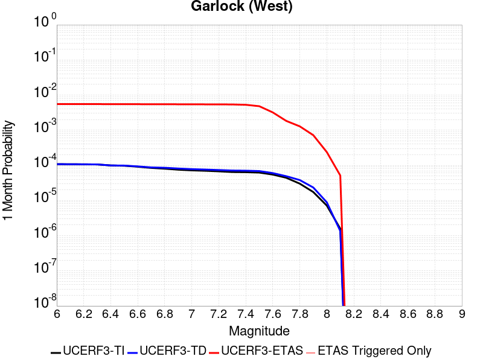 |  |  |

| Magnitude | 1 wk TI Prob | 1 wk TD Prob | 1 wk ETAS Prob | 1 wk ETAS/TD Gain | 1 wk ETAS Triggered Only | 1 mo TI Prob | 1 mo TD Prob | 1 mo ETAS Prob | 1 mo ETAS/TD Gain | 1 mo ETAS Triggered Only | 1 yr TI Prob | 1 yr TD Prob | 1 yr ETAS Prob | 1 yr ETAS/TD Gain | 1 yr ETAS Triggered Only | 10 yr TI Prob | 10 yr TD Prob | 10 yr ETAS Prob | 10 yr ETAS/TD Gain | 10 yr ETAS Triggered Only |
|-----|-----|-----|-----|-----|-----|-----|-----|-----|-----|-----|-----|-----|-----|-----|-----|-----|-----|-----|-----|-----|
| 6.0 | 2.5181727E-5 | 2.5197181E-5 | 0.004805077 | 190.69897 | 0.00478 | 1.0791722E-4 | 1.0798347E-4 | 0.005537397 | 51.280045 | 0.00543 | 0.0013131002 | 0.0013139093 | 0.0074658156 | 5.6821394 | 0.00616 | 0.013053683 | 0.013141794 | 0.01957611 | 1.4896071 | 0.00652 |
| 6.1 | 2.5077732E-5 | 2.5098223E-5 | 0.004804978 | 191.44695 | 0.00478 | 1.0747157E-4 | 1.075594E-4 | 0.0055369753 | 51.478302 | 0.00543 | 0.001307681 | 0.0013087525 | 0.0074606906 | 5.7006125 | 0.00616 | 0.013000126 | 0.013090835 | 0.019525483 | 1.4915384 | 0.00652 |
| 6.2 | 2.494612E-5 | 2.4979914E-5 | 0.0048048603 | 192.34895 | 0.00478 | 1.0690756E-4 | 1.070524E-4 | 0.005536471 | 51.717392 | 0.00543 | 0.0013008224 | 0.0013025872 | 0.0074545634 | 5.72289 | 0.00616 | 0.012932341 | 0.013029906 | 0.019464951 | 1.4938673 | 0.00652 |
| 6.3 | 2.4733758E-5 | 2.4799276E-5 | 0.0048046806 | 193.74278 | 0.00478 | 1.0599751E-4 | 1.06278305E-4 | 0.0055357013 | 52.08684 | 0.00543 | 0.0012897556 | 0.0012931736 | 0.007445208 | 5.7573147 | 0.00616 | 0.012822957 | 0.0129368715 | 0.019372523 | 1.4974658 | 0.00652 |
| 6.4 | 2.3237335E-5 | 2.3178607E-5 | 0.0047830683 | 206.35701 | 0.00476 | 9.958477E-5 | 9.933313E-5 | 0.005508796 | 55.45779 | 0.00541 | 0.0012117702 | 0.0012087126 | 0.0073313033 | 6.0653815 | 0.00613 | 0.012051838 | 0.012101731 | 0.018503312 | 1.5289806 | 0.00648 |
| 6.5 | 2.2732203E-5 | 2.2992977E-5 | 0.0047828835 | 208.01498 | 0.00476 | 9.742009E-5 | 9.8537625E-5 | 0.0055080047 | 55.897476 | 0.00541 | 0.0011854442 | 0.0011990381 | 0.0073117 | 6.0979714 | 0.00612 | 0.011791403 | 0.012006035 | 0.018398356 | 1.5324256 | 0.00647 |
| 6.6 | 2.1319436E-5 | 2.1773201E-5 | 0.0047816695 | 219.61261 | 0.00476 | 9.136581E-5 | 9.3310395E-5 | 0.0055028056 | 58.973125 | 0.00541 | 0.001111811 | 0.0011354643 | 0.007238527 | 6.3749485 | 0.00611 | 0.011062649 | 0.011376952 | 0.017763456 | 1.5613546 | 0.00646 |
| 6.7 | 1.970802E-5 | 2.0393094E-5 | 0.004770296 | 233.91722 | 0.00475 | 8.446021E-5 | 8.739606E-5 | 0.005486924 | 62.782284 | 0.0054 | 0.001027818 | 0.0010635294 | 0.0071570417 | 6.72952 | 0.0061 | 0.010230771 | 0.0106646875 | 0.0170459 | 1.5983497 | 0.00645 |
| 6.8 | 1.8744462E-5 | 1.9900775E-5 | 0.0047698063 | 239.67943 | 0.00475 | 8.033094E-5 | 8.528626E-5 | 0.005484826 | 64.31078 | 0.0054 | 9.775903E-4 | 0.0010378672 | 0.007131536 | 6.871338 | 0.0061 | 0.009733009 | 0.010410495 | 0.016793348 | 1.6131171 | 0.00645 |
| 6.9 | 1.7559682E-5 | 1.8953151E-5 | 0.0047688633 | 251.6132 | 0.00475 | 7.5253614E-5 | 8.122527E-5 | 0.0054707876 | 67.35327 | 0.00539 | 9.158276E-4 | 9.884704E-4 | 0.0070724506 | 7.154944 | 0.00609 | 0.0091206245 | 0.009921073 | 0.016297182 | 1.6426834 | 0.00644 |
| 7.0 | 1.6794445E-5 | 1.8215967E-5 | 0.0047481298 | 260.65756 | 0.00473 | 7.197421E-5 | 7.806611E-5 | 0.005447647 | 69.782486 | 0.00537 | 8.759337E-4 | 9.5004175E-4 | 0.007014275 | 7.383123 | 0.00607 | 0.008724891 | 0.009539958 | 0.015898712 | 1.666539 | 0.00642 |
| 7.1 | 1.6337795E-5 | 1.771677E-5 | 0.004747633 | 267.97397 | 0.00473 | 7.0017246E-5 | 7.592681E-5 | 0.005445519 | 71.720634 | 0.00537 | 8.521265E-4 | 9.2401815E-4 | 0.0069884094 | 7.563065 | 0.00607 | 0.008488664 | 0.009281721 | 0.015642133 | 1.6852621 | 0.00642 |
| 7.2 | 1.5780008E-5 | 1.71654E-5 | 0.0047370843 | 275.96704 | 0.00472 | 6.762685E-5 | 7.3563926E-5 | 0.0054331697 | 73.85644 | 0.00536 | 8.2304585E-4 | 8.952741E-4 | 0.006949849 | 7.762817 | 0.00606 | 0.008200042 | 0.008996559 | 0.015348892 | 1.7060846 | 0.00641 |
| 7.3 | 1.5058865E-5 | 1.6618484E-5 | 0.00471654 | 283.81293 | 0.0047 | 6.45364E-5 | 7.122013E-5 | 0.00541084 | 75.97346 | 0.00534 | 7.854473E-4 | 8.667614E-4 | 0.006901526 | 7.9624295 | 0.00604 | 0.00782677 | 0.008713263 | 0.015047586 | 1.7269747 | 0.00639 |
| 7.4 | 1.4887923E-5 | 1.6454453E-5 | 0.004616379 | 280.555 | 0.0046 | 6.380382E-5 | 7.0517184E-5 | 0.0052901492 | 75.019295 | 0.00522 | 7.7653467E-4 | 8.5820974E-4 | 0.006773129 | 7.892161 | 0.00592 | 0.0077382675 | 0.008628101 | 0.014834089 | 1.7192762 | 0.00626 |
| 7.5 | 1.4509299E-5 | 1.6046468E-5 | 0.0041759796 | 260.24292 | 0.00416 | 6.218123E-5 | 6.876877E-5 | 0.0048184423 | 70.0673 | 0.00475 | 7.567935E-4 | 8.369394E-4 | 0.0062524034 | 7.4705567 | 0.00542 | 0.0075422134 | 0.008416411 | 0.014118016 | 1.6774391 | 0.00575 |
| 7.6 | 1.2756717E-5 | 1.4050529E-5 | 0.0027440123 | 195.296 | 0.00273 | 5.4670498E-5 | 6.0215163E-5 | 0.0032100254 | 53.309254 | 0.00315 | 6.6541E-4 | 7.328737E-4 | 0.004320243 | 5.8949347 | 0.00359 | 0.006634211 | 0.007381374 | 0.0111433985 | 1.5096645 | 0.00379 |
| 7.7 | 1.0328985E-5 | 1.146033E-5 | 0.0015714425 | 137.12018 | 0.00156 | 4.4266326E-5 | 4.9114777E-5 | 0.0018390268 | 37.44345 | 0.00179 | 5.388092E-4 | 5.9780874E-4 | 0.0026465831 | 4.42714 | 0.00205 | 0.0053750467 | 0.006038286 | 0.008215061 | 1.3604957 | 0.00219 |
| 7.8 | 7.0306583E-6 | 8.899537E-6 | 0.0010588901 | 118.98262 | 0.00105 | 3.0131043E-5 | 3.8140315E-5 | 0.0012880927 | 33.77247 | 0.00125 | 3.667837E-4 | 4.6425956E-4 | 0.0018836003 | 4.057214 | 0.00142 | 0.003661789 | 0.0046950667 | 0.006178071 | 1.3158644 | 0.00149 |
| 7.9 | 4.060633E-6 | 5.465412E-6 | 5.9546216E-4 | 108.95101 | 5.9E-4 | 1.7402595E-5 | 2.3422985E-5 | 7.234066E-4 | 30.884476 | 7.0E-4 | 2.11856E-4 | 2.8513762E-4 | 0.0010749124 | 3.7698019 | 7.9E-4 | 0.0021165414 | 0.002884143 | 0.0037217203 | 1.2904077 | 8.4E-4 |
| 8.0 | 1.6729537E-6 | 2.0775192E-6 | 1.8207714E-4 | 87.64162 | 1.8E-4 | 7.169782E-6 | 8.903624E-6 | 2.3890157E-4 | 26.83195 | 2.3E-4 | 8.7288594E-5 | 1.0839626E-4 | 3.6836808E-4 | 3.3983467 | 2.6E-4 | 8.7254314E-4 | 0.001096854 | 0.0013765469 | 1.2549956 | 2.8E-4 |
| 8.1 | 3.6733252E-7 | 3.1489736E-7 | 4.0314884E-5 | 128.02547 | 4.0E-5 | 1.5742813E-6 | 1.3495595E-6 | 5.1349492E-5 | 38.049076 | 5.0E-5 | 1.9166706E-5 | 1.643078E-5 | 6.642996E-5 | 4.0430193 | 5.0E-5 | 1.9165053E-4 | 1.662928E-4 | 2.2628282E-4 | 1.3607494 | 6.0E-5 |

## Gravel Hills-Harper Lk
*[(top)](#table-of-contents)*

| 1 Week | 1 Month | 1 Year | 10 Year |
|-----|-----|-----|-----|
|  |  |  |  |

| Magnitude | 1 wk TI Prob | 1 wk TD Prob | 1 wk ETAS Prob | 1 wk ETAS/TD Gain | 1 wk ETAS Triggered Only | 1 mo TI Prob | 1 mo TD Prob | 1 mo ETAS Prob | 1 mo ETAS/TD Gain | 1 mo ETAS Triggered Only | 1 yr TI Prob | 1 yr TD Prob | 1 yr ETAS Prob | 1 yr ETAS/TD Gain | 1 yr ETAS Triggered Only | 10 yr TI Prob | 10 yr TD Prob | 10 yr ETAS Prob | 10 yr ETAS/TD Gain | 10 yr ETAS Triggered Only |
|-----|-----|-----|-----|-----|-----|-----|-----|-----|-----|-----|-----|-----|-----|-----|-----|-----|-----|-----|-----|-----|
| 6.0 | 3.0679566E-5 | 3.1464628E-5 | 0.0025713847 | 81.72304 | 0.00254 | 1.3147724E-4 | 1.3484266E-4 | 0.0031444367 | 23.319304 | 0.00301 | 0.0015995599 | 0.00164069 | 0.0053146523 | 3.2392788 | 0.00368 | 0.015880952 | 0.016307337 | 0.020340478 | 1.2473205 | 0.0041 |
| 6.1 | 3.0679566E-5 | 3.1464628E-5 | 0.0025713847 | 81.72304 | 0.00254 | 1.3147724E-4 | 1.3484266E-4 | 0.0031444367 | 23.319304 | 0.00301 | 0.0015995599 | 0.00164069 | 0.0053146523 | 3.2392788 | 0.00368 | 0.015880952 | 0.016307337 | 0.020340478 | 1.2473205 | 0.0041 |
| 6.2 | 1.514536E-5 | 1.36352E-5 | 6.9362595E-4 | 50.870243 | 6.8E-4 | 6.490707E-5 | 5.843533E-5 | 8.8838686E-4 | 15.202906 | 8.3E-4 | 7.8995706E-4 | 7.112298E-4 | 0.0017404972 | 2.4471657 | 0.00103 | 0.007871548 | 0.007090737 | 0.008252441 | 1.163834 | 0.00117 |
| 6.3 | 1.514536E-5 | 1.36352E-5 | 6.9362595E-4 | 50.870243 | 6.8E-4 | 6.490707E-5 | 5.843533E-5 | 8.8838686E-4 | 15.202906 | 8.3E-4 | 7.8995706E-4 | 7.112298E-4 | 0.0017404972 | 2.4471657 | 0.00103 | 0.007871548 | 0.007090737 | 0.008252441 | 1.163834 | 0.00117 |
| 6.4 | 1.2532521E-5 | 1.0689684E-5 | 4.7068475E-4 | 44.03168 | 4.6E-4 | 5.37097E-5 | 4.581216E-5 | 5.857874E-4 | 12.786723 | 5.4E-4 | 6.537194E-4 | 5.5762613E-4 | 0.0012472414 | 2.2366982 | 6.9E-4 | 0.0065179965 | 0.005562859 | 0.006358409 | 1.143011 | 8.0E-4 |
| 6.5 | 1.1094058E-5 | 9.083657E-6 | 3.4908057E-4 | 38.42952 | 3.4E-4 | 4.7545094E-5 | 3.89294E-5 | 4.3891382E-4 | 11.274611 | 4.0E-4 | 5.787078E-4 | 4.7386638E-4 | 9.9362E-4 | 2.0968359 | 5.2E-4 | 0.0057720304 | 0.004728967 | 0.005316177 | 1.1241729 | 5.9E-4 |
| 6.6 | 9.688328E-6 | 7.531688E-6 | 2.2753004E-4 | 30.2097 | 2.2E-4 | 4.1520743E-5 | 3.227828E-5 | 3.0226956E-4 | 9.364489 | 2.7E-4 | 5.053978E-4 | 3.9291973E-4 | 7.3278614E-4 | 1.8649766 | 3.4E-4 | 0.0050424994 | 0.0039225067 | 0.004320938 | 1.1015756 | 4.0E-4 |
| 6.7 | 8.974824E-6 | 6.749406E-6 | 1.8674819E-4 | 27.668833 | 1.8E-4 | 3.8462964E-5 | 2.8925719E-5 | 2.2891993E-4 | 7.9140625 | 2.0E-4 | 4.6818596E-4 | 3.5211592E-4 | 6.0202787E-4 | 1.7097435 | 2.5E-4 | 0.004672008 | 0.003515801 | 0.0038147462 | 1.085029 | 3.0E-4 |
| 6.8 | 7.4780046E-6 | 5.1161865E-6 | 9.511573E-5 | 18.591139 | 9.0E-5 | 3.20482E-5 | 2.1926337E-5 | 1.21924146E-4 | 5.5606256 | 1.0E-4 | 3.9011694E-4 | 2.6692182E-4 | 3.868898E-4 | 1.4494498 | 1.2E-4 | 0.0038943281 | 0.0026661505 | 0.0028157507 | 1.0561109 | 1.5E-4 |
| 6.9 | 6.3409307E-6 | 3.907489E-6 | 6.390725E-5 | 16.35507 | 6.0E-5 | 2.7175134E-5 | 1.674628E-5 | 8.674511E-5 | 5.179963 | 7.0E-5 | 3.3080703E-4 | 2.0386786E-4 | 2.9384953E-4 | 1.4413724 | 9.0E-5 | 0.0033031502 | 0.0020369065 | 0.0021466825 | 1.0538934 | 1.1E-4 |
| 7.0 | 5.1239335E-6 | 2.6058492E-6 | 2.2605796E-5 | 8.675021 | 2.0E-5 | 2.195953E-5 | 1.1167879E-5 | 4.1167543E-5 | 3.6862454 | 3.0E-5 | 2.6732447E-4 | 1.359607E-4 | 1.7595525E-4 | 1.2941626 | 4.0E-5 | 0.0026700313 | 0.0013588005 | 0.001418719 | 1.0440966 | 6.0E-5 |
| 7.1 | 4.438899E-6 | 2.0984692E-6 | 1.2098449E-5 | 5.7653685 | 1.0E-5 | 1.9023713E-5 | 8.99341E-6 | 2.899323E-5 | 3.2238305 | 2.0E-5 | 2.315891E-4 | 1.0948948E-4 | 1.394862E-4 | 1.2739689 | 3.0E-5 | 0.002313479 | 0.0010943774 | 0.0011343335 | 1.0365105 | 4.0E-5 |
| 7.2 | 3.50367E-6 | 1.2615715E-6 | 1.2615715E-6 | 1.0 | 0.0 | 1.5015643E-5 | 5.406724E-6 | 1.540667E-5 | 2.8495388 | 1.0E-5 | 1.8280011E-4 | 6.5824956E-5 | 8.5823645E-5 | 1.3038161 | 2.0E-5 | 0.0018264982 | 6.580628E-4 | 6.780497E-4 | 1.0303723 | 2.0E-5 |
| 7.3 | 2.561638E-6 | 7.118686E-7 | 7.118686E-7 | 1.0 | 0.0 | 1.0978401E-5 | 3.050862E-6 | 1.30508315E-5 | 4.2777524 | 1.0E-5 | 1.3365384E-4 | 3.7143633E-5 | 4.714326E-5 | 1.2692151 | 1.0E-5 | 0.0013357349 | 3.7137623E-4 | 3.8137252E-4 | 1.0269169 | 1.0E-5 |
| 7.4 | 2.0368864E-6 | 5.304471E-7 | 5.304471E-7 | 1.0 | 0.0 | 8.729483E-6 | 2.2733427E-6 | 2.2733427E-6 | 1.0 | 0.0 | 1.06276275E-4 | 2.76776E-5 | 2.76776E-5 | 1.0 | 0.0 | 0.0010622547 | 2.767421E-4 | 2.767421E-4 | 1.0 | 0.0 |
| 7.5 | 1.1681728E-6 | 3.6028484E-7 | 3.6028484E-7 | 1.0 | 0.0 | 5.0064455E-6 | 1.544077E-6 | 1.544077E-6 | 1.0 | 0.0 | 6.0951766E-5 | 1.879898E-5 | 1.879898E-5 | 1.0 | 0.0 | 6.093505E-4 | 1.8797436E-4 | 1.8797436E-4 | 1.0 | 0.0 |
| 7.6 | 1.3154387E-7 | 7.1196716E-8 | 7.1196716E-8 | 1.0 | 0.0 | 5.6375933E-7 | 3.0512876E-7 | 3.0512876E-7 | 1.0 | 0.0 | 6.863748E-6 | 3.714938E-6 | 3.714938E-6 | 1.0 | 0.0 | 6.863536E-5 | 3.7148915E-5 | 3.7148915E-5 | 1.0 | 0.0 |

## McLean Lake
*[(top)](#table-of-contents)*

| 1 Week | 1 Month | 1 Year | 10 Year |
|-----|-----|-----|-----|
|  |  | 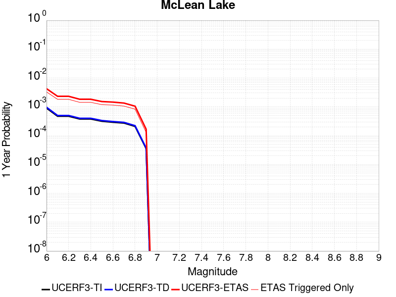 | 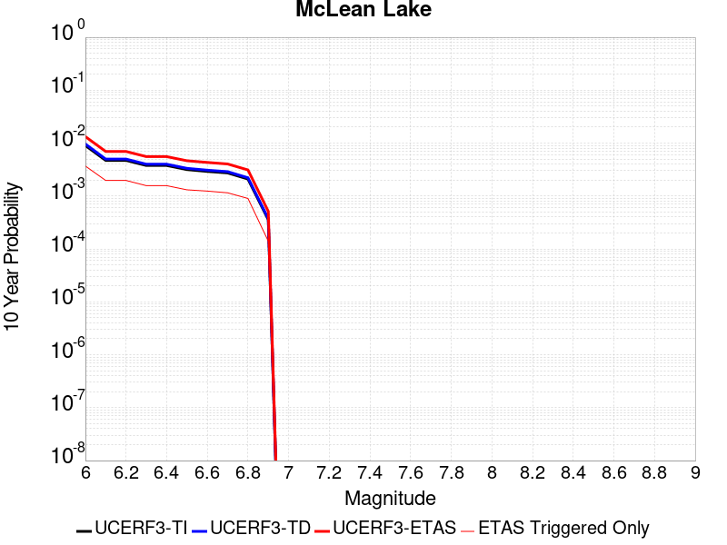 |

| Magnitude | 1 wk TI Prob | 1 wk TD Prob | 1 wk ETAS Prob | 1 wk ETAS/TD Gain | 1 wk ETAS Triggered Only | 1 mo TI Prob | 1 mo TD Prob | 1 mo ETAS Prob | 1 mo ETAS/TD Gain | 1 mo ETAS Triggered Only | 1 yr TI Prob | 1 yr TD Prob | 1 yr ETAS Prob | 1 yr ETAS/TD Gain | 1 yr ETAS Triggered Only | 10 yr TI Prob | 10 yr TD Prob | 10 yr ETAS Prob | 10 yr ETAS/TD Gain | 10 yr ETAS Triggered Only |
|-----|-----|-----|-----|-----|-----|-----|-----|-----|-----|-----|-----|-----|-----|-----|-----|-----|-----|-----|-----|-----|
| 6.0 | 1.7360222E-5 | 1.8501627E-5 | 0.0020584639 | 111.25853 | 0.00204 | 7.439883E-5 | 7.9290556E-5 | 0.0026290885 | 33.15765 | 0.00255 | 9.0542925E-4 | 9.6498354E-4 | 0.004261799 | 4.416447 | 0.0033 | 0.009017491 | 0.0096127745 | 0.013267303 | 1.3801742 | 0.00369 |
| 6.1 | 9.062689E-6 | 9.592193E-6 | 0.0011195815 | 116.71799 | 0.00111 | 3.8839516E-5 | 4.1108804E-5 | 0.0014010529 | 34.081577 | 0.00136 | 4.727685E-4 | 5.003936E-4 | 0.0023194829 | 4.635317 | 0.00182 | 0.0047176396 | 0.004993552 | 0.0069537144 | 1.3925388 | 0.00197 |
| 6.2 | 9.062689E-6 | 9.592193E-6 | 0.0011195815 | 116.71799 | 0.00111 | 3.8839516E-5 | 4.1108804E-5 | 0.0014010529 | 34.081577 | 0.00136 | 4.727685E-4 | 5.003936E-4 | 0.0023194829 | 4.635317 | 0.00182 | 0.0047176396 | 0.004993552 | 0.0069537144 | 1.3925388 | 0.00197 |
| 6.3 | 7.2575485E-6 | 7.66771E-6 | 8.676611E-4 | 113.1578 | 8.6E-4 | 3.110341E-5 | 3.2861237E-5 | 0.0010828268 | 32.95149 | 0.00105 | 3.786182E-4 | 4.0001926E-4 | 0.0018294472 | 4.573398 | 0.00143 | 0.0037797375 | 0.0039936965 | 0.0055574267 | 1.3915495 | 0.00157 |
| 6.4 | 7.2575485E-6 | 7.66771E-6 | 8.676611E-4 | 113.1578 | 8.6E-4 | 3.110341E-5 | 3.2861237E-5 | 0.0010828268 | 32.95149 | 0.00105 | 3.786182E-4 | 4.0001926E-4 | 0.0018294472 | 4.573398 | 0.00143 | 0.0037797375 | 0.0039936965 | 0.0055574267 | 1.3915495 | 0.00157 |
| 6.5 | 6.06582E-6 | 6.4038773E-6 | 7.063994E-4 | 110.30808 | 7.0E-4 | 2.5996113E-5 | 2.7444936E-5 | 8.6742186E-4 | 31.6059 | 8.4E-4 | 3.164567E-4 | 3.3409733E-4 | 0.0015236997 | 4.560646 | 0.00119 | 0.0031600643 | 0.0033365893 | 0.0046422184 | 1.3913065 | 0.00131 |
| 6.6 | 5.598744E-6 | 5.910262E-6 | 7.0590613E-4 | 119.43736 | 7.0E-4 | 2.3994397E-5 | 2.5329486E-5 | 8.5530843E-4 | 33.767303 | 8.3E-4 | 2.9209262E-4 | 3.0834923E-4 | 0.0014579947 | 4.7283874 | 0.00115 | 0.0029170897 | 0.003079843 | 0.004316024 | 1.4013779 | 0.00124 |
| 6.7 | 5.246996E-6 | 5.539162E-6 | 6.455356E-4 | 116.5403 | 6.4E-4 | 2.2486933E-5 | 2.3739085E-5 | 7.8372104E-4 | 33.013954 | 7.6E-4 | 2.73744E-4 | 2.8899137E-4 | 0.001348685 | 4.6668696 | 0.00106 | 0.0027340704 | 0.0028867796 | 0.00403346 | 1.3972178 | 0.00115 |
| 6.8 | 4.02324E-6 | 4.2469046E-6 | 5.0424476E-4 | 118.732315 | 5.0E-4 | 1.7242342E-5 | 1.8200926E-5 | 6.281898E-4 | 34.514168 | 6.1E-4 | 2.099053E-4 | 2.2157968E-4 | 0.0010513958 | 4.745001 | 8.3E-4 | 0.0020970714 | 0.002214172 | 0.0031121792 | 1.4055725 | 9.0E-4 |
| 6.9 | 6.835972E-7 | 7.1399285E-7 | 7.071394E-5 | 99.04013 | 7.0E-5 | 2.9296991E-6 | 3.0599674E-6 | 9.3059694E-5 | 30.411987 | 9.0E-5 | 3.56685E-5 | 3.7254784E-5 | 1.6724995E-4 | 4.4893546 | 1.3E-4 | 3.5662777E-4 | 3.7251666E-4 | 5.124645E-4 | 1.3756821 | 1.4E-4 |

## Goldstone Lake
*[(top)](#table-of-contents)*

| 1 Week | 1 Month | 1 Year | 10 Year |
|-----|-----|-----|-----|
|  |  |  |  |

| Magnitude | 1 wk TI Prob | 1 wk TD Prob | 1 wk ETAS Prob | 1 wk ETAS/TD Gain | 1 wk ETAS Triggered Only | 1 mo TI Prob | 1 mo TD Prob | 1 mo ETAS Prob | 1 mo ETAS/TD Gain | 1 mo ETAS Triggered Only | 1 yr TI Prob | 1 yr TD Prob | 1 yr ETAS Prob | 1 yr ETAS/TD Gain | 1 yr ETAS Triggered Only | 10 yr TI Prob | 10 yr TD Prob | 10 yr ETAS Prob | 10 yr ETAS/TD Gain | 10 yr ETAS Triggered Only |
|-----|-----|-----|-----|-----|-----|-----|-----|-----|-----|-----|-----|-----|-----|-----|-----|-----|-----|-----|-----|-----|
| 6.0 | 2.671352E-5 | 3.0376103E-5 | 0.0018603206 | 61.242897 | 0.00183 | 1.1448149E-4 | 1.3017791E-4 | 0.002449876 | 18.819445 | 0.00232 | 0.001392921 | 0.0015839601 | 0.004479367 | 2.8279543 | 0.0029 | 0.013842222 | 0.015746202 | 0.019063137 | 1.2106498 | 0.00337 |
| 6.1 | 2.671352E-5 | 3.0376103E-5 | 0.0018603206 | 61.242897 | 0.00183 | 1.1448149E-4 | 1.3017791E-4 | 0.002449876 | 18.819445 | 0.00232 | 0.001392921 | 0.0015839601 | 0.004479367 | 2.8279543 | 0.0029 | 0.013842222 | 0.015746202 | 0.019063137 | 1.2106498 | 0.00337 |
| 6.2 | 1.4197047E-5 | 1.6096254E-5 | 9.960805E-4 | 61.882748 | 9.8E-4 | 6.0843064E-5 | 6.898268E-5 | 0.0013188964 | 19.11924 | 0.00125 | 7.4051257E-4 | 8.3963916E-4 | 0.0023883376 | 2.8444812 | 0.00155 | 0.007380498 | 0.008374364 | 0.010139458 | 1.2107735 | 0.00178 |
| 6.3 | 1.4197047E-5 | 1.6096254E-5 | 9.960805E-4 | 61.882748 | 9.8E-4 | 6.0843064E-5 | 6.898268E-5 | 0.0013188964 | 19.11924 | 0.00125 | 7.4051257E-4 | 8.3963916E-4 | 0.0023883376 | 2.8444812 | 0.00155 | 0.007380498 | 0.008374364 | 0.010139458 | 1.2107735 | 0.00178 |
| 6.4 | 1.3238931E-5 | 1.500847E-5 | 8.849954E-4 | 58.9664 | 8.7E-4 | 5.6737044E-5 | 6.432098E-5 | 0.0011742496 | 18.25609 | 0.00111 | 6.9055456E-4 | 7.8292453E-4 | 0.0021718363 | 2.7740047 | 0.00139 | 0.006884126 | 0.007811289 | 0.009408712 | 1.204502 | 0.00161 |
| 6.5 | 1.3238931E-5 | 1.500847E-5 | 8.849954E-4 | 58.9664 | 8.7E-4 | 5.6737044E-5 | 6.432098E-5 | 0.0011742496 | 18.25609 | 0.00111 | 6.9055456E-4 | 7.8292453E-4 | 0.0021718363 | 2.7740047 | 0.00139 | 0.006884126 | 0.007811289 | 0.009408712 | 1.204502 | 0.00161 |
| 6.6 | 1.1328278E-5 | 1.2855176E-5 | 7.728454E-4 | 60.119396 | 7.6E-4 | 4.8548856E-5 | 5.5092984E-5 | 0.0010050406 | 18.242624 | 9.5E-4 | 5.90922E-4 | 6.706464E-4 | 0.001849855 | 2.7583168 | 0.00118 | 0.0058935313 | 0.0066956137 | 0.00805644 | 1.2032416 | 0.00137 |
| 6.7 | 8.651175E-6 | 9.824575E-6 | 5.2981946E-4 | 53.927982 | 5.2E-4 | 3.707594E-5 | 4.2105148E-5 | 7.220765E-4 | 17.149364 | 6.8E-4 | 4.5130608E-4 | 5.126002E-4 | 0.0013821542 | 2.6963594 | 8.7E-4 | 0.0045039062 | 0.0051230565 | 0.0061577284 | 1.2019638 | 0.00104 |
| 6.8 | 1.0215377E-6 | 1.1754802E-6 | 3.1175445E-5 | 26.521456 | 3.0E-5 | 4.378012E-6 | 5.037763E-6 | 4.5037563E-5 | 8.939992 | 4.0E-5 | 5.3300988E-5 | 6.133315E-5 | 1.1133009E-4 | 1.8151698 | 5.0E-5 | 5.3288206E-4 | 6.131735E-4 | 6.631429E-4 | 1.081493 | 5.0E-5 |
| 6.9 | 7.9360774E-7 | 9.283496E-7 | 2.0928332E-5 | 22.543589 | 2.0E-5 | 3.4011714E-6 | 3.9786355E-6 | 2.3978555E-5 | 6.0268292 | 2.0E-5 | 4.1408475E-5 | 4.843888E-5 | 7.843743E-5 | 1.6193072 | 3.0E-5 | 4.140076E-4 | 4.842902E-4 | 5.142757E-4 | 1.0619164 | 3.0E-5 |
| 7.0 | 7.4382757E-7 | 8.747428E-7 | 1.08747345E-5 | 12.431922 | 1.0E-5 | 3.1878285E-6 | 3.7488926E-6 | 1.3748855E-5 | 3.6674442 | 1.0E-5 | 3.8811122E-5 | 4.564188E-5 | 5.5641423E-5 | 1.219087 | 1.0E-5 | 3.8804344E-4 | 4.563317E-4 | 4.6632712E-4 | 1.0219039 | 1.0E-5 |
| 7.1 | 6.4709513E-7 | 7.711399E-7 | 1.0771132E-5 | 13.967805 | 1.0E-5 | 2.773262E-6 | 3.3048816E-6 | 1.3304849E-5 | 4.025817 | 1.0E-5 | 3.376394E-5 | 4.023625E-5 | 5.023585E-5 | 1.2485222 | 1.0E-5 | 3.375881E-4 | 4.022956E-4 | 4.1229159E-4 | 1.0248474 | 1.0E-5 |
| 7.2 | 6.356704E-7 | 7.588459E-7 | 1.07588385E-5 | 14.1778965 | 1.0E-5 | 2.7242988E-6 | 3.252193E-6 | 1.325216E-5 | 4.074838 | 1.0E-5 | 3.3167835E-5 | 3.959479E-5 | 4.9594393E-5 | 1.2525485 | 1.0E-5 | 3.3162883E-4 | 3.9588328E-4 | 4.0587934E-4 | 1.02525 | 1.0E-5 |
| 7.3 | 5.7695723E-7 | 6.896648E-7 | 6.896648E-7 | 1.0 | 0.0 | 2.4726714E-6 | 2.9557032E-6 | 2.9557032E-6 | 1.0 | 0.0 | 3.0104358E-5 | 3.598515E-5 | 3.598515E-5 | 1.0 | 0.0 | 3.0100282E-4 | 3.5979896E-4 | 3.5979896E-4 | 1.0 | 0.0 |
| 7.4 | 5.209647E-7 | 6.193583E-7 | 6.193583E-7 | 1.0 | 0.0 | 2.232704E-6 | 2.6543903E-6 | 2.6543903E-6 | 1.0 | 0.0 | 2.718283E-5 | 3.2316777E-5 | 3.2316777E-5 | 1.0 | 0.0 | 2.7179506E-4 | 3.2312635E-4 | 3.2312635E-4 | 1.0 | 0.0 |
| 7.5 | 4.512955E-7 | 5.3489487E-7 | 5.3489487E-7 | 1.0 | 0.0 | 1.934122E-6 | 2.2924048E-6 | 2.2924048E-6 | 1.0 | 0.0 | 2.3547682E-5 | 2.7909726E-5 | 2.7909726E-5 | 1.0 | 0.0 | 2.3545188E-4 | 2.7906752E-4 | 2.7906752E-4 | 1.0 | 0.0 |
| 7.6 | 2.21172E-7 | 2.6040198E-7 | 2.6040198E-7 | 1.0 | 0.0 | 9.478797E-7 | 1.1160082E-6 | 1.1160082E-6 | 1.0 | 0.0 | 1.1540374E-5 | 1.3587343E-5 | 1.3587343E-5 | 1.0 | 0.0 | 1.1539775E-4 | 1.3586794E-4 | 1.3586794E-4 | 1.0 | 0.0 |

## So Sierra Nevada
*[(top)](#table-of-contents)*

| 1 Week | 1 Month | 1 Year | 10 Year |
|-----|-----|-----|-----|
|  |  |  |  |

| Magnitude | 1 wk TI Prob | 1 wk TD Prob | 1 wk ETAS Prob | 1 wk ETAS/TD Gain | 1 wk ETAS Triggered Only | 1 mo TI Prob | 1 mo TD Prob | 1 mo ETAS Prob | 1 mo ETAS/TD Gain | 1 mo ETAS Triggered Only | 1 yr TI Prob | 1 yr TD Prob | 1 yr ETAS Prob | 1 yr ETAS/TD Gain | 1 yr ETAS Triggered Only | 10 yr TI Prob | 10 yr TD Prob | 10 yr ETAS Prob | 10 yr ETAS/TD Gain | 10 yr ETAS Triggered Only |
|-----|-----|-----|-----|-----|-----|-----|-----|-----|-----|-----|-----|-----|-----|-----|-----|-----|-----|-----|-----|-----|
| 6.0 | 1.15488665E-5 | 1.1079612E-5 | 0.0018310595 | 165.26387 | 0.00182 | 4.9494203E-5 | 4.7483256E-5 | 0.0022573783 | 47.540512 | 0.00221 | 6.024253E-4 | 5.779681E-4 | 0.0032264364 | 5.5823784 | 0.00265 | 0.006007948 | 0.005765918 | 0.008718793 | 1.5121257 | 0.00297 |
| 6.1 | 1.15488665E-5 | 1.1079612E-5 | 0.0018310595 | 165.26387 | 0.00182 | 4.9494203E-5 | 4.7483256E-5 | 0.0022573783 | 47.540512 | 0.00221 | 6.024253E-4 | 5.779681E-4 | 0.0032264364 | 5.5823784 | 0.00265 | 0.006007948 | 0.005765918 | 0.008718793 | 1.5121257 | 0.00297 |
| 6.2 | 1.15488665E-5 | 1.1079612E-5 | 0.0018310595 | 165.26387 | 0.00182 | 4.9494203E-5 | 4.7483256E-5 | 0.0022573783 | 47.540512 | 0.00221 | 6.024253E-4 | 5.779681E-4 | 0.0032264364 | 5.5823784 | 0.00265 | 0.006007948 | 0.005765918 | 0.008718793 | 1.5121257 | 0.00297 |
| 6.3 | 1.15488665E-5 | 1.1079612E-5 | 0.0018310595 | 165.26387 | 0.00182 | 4.9494203E-5 | 4.7483256E-5 | 0.0022573783 | 47.540512 | 0.00221 | 6.024253E-4 | 5.779681E-4 | 0.0032264364 | 5.5823784 | 0.00265 | 0.006007948 | 0.005765918 | 0.008718793 | 1.5121257 | 0.00297 |
| 6.4 | 1.15488665E-5 | 1.1079612E-5 | 0.0018310595 | 165.26387 | 0.00182 | 4.9494203E-5 | 4.7483256E-5 | 0.0022573783 | 47.540512 | 0.00221 | 6.024253E-4 | 5.779681E-4 | 0.0032264364 | 5.5823784 | 0.00265 | 0.006007948 | 0.005765918 | 0.008718793 | 1.5121257 | 0.00297 |
| 6.5 | 1.15488665E-5 | 1.1079612E-5 | 0.0018310595 | 165.26387 | 0.00182 | 4.9494203E-5 | 4.7483256E-5 | 0.0022573783 | 47.540512 | 0.00221 | 6.024253E-4 | 5.779681E-4 | 0.0032264364 | 5.5823784 | 0.00265 | 0.006007948 | 0.005765918 | 0.008718793 | 1.5121257 | 0.00297 |
| 6.6 | 7.587044E-6 | 6.9356042E-6 | 9.56929E-4 | 137.97342 | 9.5E-4 | 3.2515498E-5 | 2.9723697E-5 | 0.0012096886 | 40.697784 | 0.00118 | 3.9580427E-4 | 3.6182883E-4 | 0.0017813151 | 4.9230876 | 0.00142 | 0.003951 | 0.0036126887 | 0.005167053 | 1.4302514 | 0.00156 |
| 6.7 | 7.587044E-6 | 6.9356042E-6 | 9.56929E-4 | 137.97342 | 9.5E-4 | 3.2515498E-5 | 2.9723697E-5 | 0.0012096886 | 40.697784 | 0.00118 | 3.9580427E-4 | 3.6182883E-4 | 0.0017813151 | 4.9230876 | 0.00142 | 0.003951 | 0.0036126887 | 0.005167053 | 1.4302514 | 0.00156 |
| 6.8 | 5.9026956E-6 | 5.179362E-6 | 7.551755E-4 | 145.80473 | 7.5E-4 | 2.5297022E-5 | 2.2197082E-5 | 9.121773E-4 | 41.094467 | 8.9E-4 | 3.0794772E-4 | 2.7021713E-4 | 0.0013199334 | 4.884714 | 0.00105 | 0.0030752132 | 0.002699002 | 0.003815979 | 1.4138482 | 0.00112 |
| 6.9 | 5.0118915E-6 | 4.2523943E-6 | 6.042498E-4 | 142.09637 | 6.0E-4 | 2.1479358E-5 | 1.8224424E-5 | 7.282115E-4 | 39.957996 | 7.1E-4 | 2.614798E-4 | 2.2186051E-4 | 0.0010616741 | 4.7853227 | 8.4E-4 | 0.0026117235 | 0.0022164627 | 0.0031244457 | 1.4096541 | 9.1E-4 |
| 7.0 | 4.4924795E-6 | 3.7138868E-6 | 4.7371213E-4 | 127.55158 | 4.7E-4 | 1.925334E-5 | 1.5916565E-5 | 5.7590764E-4 | 36.18291 | 5.6E-4 | 2.3438422E-4 | 1.9376757E-4 | 8.636378E-4 | 4.457081 | 6.7E-4 | 0.0023413717 | 0.0019360491 | 0.0026746164 | 1.3814816 | 7.4E-4 |
| 7.1 | 3.9118436E-6 | 3.1119469E-6 | 3.5311087E-4 | 113.46944 | 3.5E-4 | 1.6764936E-5 | 1.333685E-5 | 4.433311E-4 | 33.241066 | 4.3E-4 | 2.0409399E-4 | 1.6236462E-4 | 6.9227855E-4 | 4.2637277 | 5.3E-4 | 0.0020390663 | 0.0016225161 | 0.002201575 | 1.3568895 | 5.8E-4 |
| 7.2 | 3.4200818E-6 | 2.6054236E-6 | 2.6260474E-4 | 100.79157 | 2.6E-4 | 1.4657411E-5 | 1.11660565E-5 | 3.4116238E-4 | 30.553524 | 3.3E-4 | 1.7843937E-4 | 1.3593875E-4 | 5.358844E-4 | 3.9421015 | 4.0E-4 | 0.0017829615 | 0.0013586058 | 0.0018079944 | 1.3307719 | 4.5E-4 |
| 7.3 | 2.6593618E-6 | 1.8283897E-6 | 1.8182806E-4 | 99.447105 | 1.8E-4 | 1.13972155E-5 | 7.8359335E-6 | 2.1783428E-4 | 27.799404 | 2.1E-4 | 1.3875226E-4 | 9.539862E-5 | 3.553738E-4 | 3.7251465 | 2.6E-4 | 0.0013866565 | 9.536055E-4 | 0.001243329 | 1.303819 | 2.9E-4 |
| 7.4 | 2.2577992E-6 | 1.4364078E-6 | 1.3143622E-4 | 91.50342 | 1.3E-4 | 9.676246E-6 | 6.1560204E-6 | 1.6615503E-4 | 26.990658 | 1.6E-4 | 1.1780193E-4 | 7.4947224E-5 | 2.7493224E-4 | 3.6683445 | 2.0E-4 | 0.001177395 | 7.4924453E-4 | 9.690797E-4 | 1.2934091 | 2.2E-4 |
| 7.5 | 1.489319E-6 | 7.353661E-7 | 6.073532E-5 | 82.59196 | 6.0E-5 | 6.3827797E-6 | 3.1515651E-6 | 7.315134E-5 | 23.211117 | 7.0E-5 | 7.770758E-5 | 3.8369635E-5 | 1.18366566E-4 | 3.084902 | 8.0E-5 | 7.7680405E-4 | 3.8363054E-4 | 4.8359216E-4 | 1.2605674 | 1.0E-4 |
| 7.6 | 1.0680322E-6 | 4.65941E-7 | 3.0465928E-5 | 65.3858 | 3.0E-5 | 4.577273E-6 | 1.9968884E-6 | 4.199681E-5 | 21.031124 | 4.0E-5 | 5.5726876E-5 | 2.4311848E-5 | 7.4310636E-5 | 3.0565603 | 5.0E-5 | 5.5712904E-4 | 2.4309216E-4 | 2.9308E-4 | 1.2056333 | 5.0E-5 |
| 7.7 | 5.509146E-7 | 1.5578539E-7 | 1.5578539E-7 | 1.0 | 0.0 | 2.3610605E-6 | 6.676515E-7 | 1.0667645E-5 | 15.977864 | 1.0E-5 | 2.8745531E-5 | 8.128628E-6 | 2.8128465E-5 | 3.46042 | 2.0E-5 | 2.8741814E-4 | 8.128342E-5 | 1.01281796E-4 | 1.2460326 | 2.0E-5 |

## San Andreas (Mojave S)
*[(top)](#table-of-contents)*

| 1 Week | 1 Month | 1 Year | 10 Year |
|-----|-----|-----|-----|
|  |  |  |  |

| Magnitude | 1 wk TI Prob | 1 wk TD Prob | 1 wk ETAS Prob | 1 wk ETAS/TD Gain | 1 wk ETAS Triggered Only | 1 mo TI Prob | 1 mo TD Prob | 1 mo ETAS Prob | 1 mo ETAS/TD Gain | 1 mo ETAS Triggered Only | 1 yr TI Prob | 1 yr TD Prob | 1 yr ETAS Prob | 1 yr ETAS/TD Gain | 1 yr ETAS Triggered Only | 10 yr TI Prob | 10 yr TD Prob | 10 yr ETAS Prob | 10 yr ETAS/TD Gain | 10 yr ETAS Triggered Only |
|-----|-----|-----|-----|-----|-----|-----|-----|-----|-----|-----|-----|-----|-----|-----|-----|-----|-----|-----|-----|-----|
| 6.0 | 3.1064058E-4 | 6.7462435E-4 | 0.0024933966 | 3.6959777 | 0.00182 | 0.0013306376 | 0.002888172 | 0.005021991 | 1.7388132 | 0.00214 | 0.016080605 | 0.034565594 | 0.03693091 | 1.0684297 | 0.00245 | 0.1496549 | 0.28654557 | 0.28842196 | 1.0065483 | 0.00263 |
| 6.1 | 3.1064058E-4 | 6.7462435E-4 | 0.0024933966 | 3.6959777 | 0.00182 | 0.0013306376 | 0.002888172 | 0.005021991 | 1.7388132 | 0.00214 | 0.016080605 | 0.034565594 | 0.03693091 | 1.0684297 | 0.00245 | 0.1496549 | 0.28654557 | 0.28842196 | 1.0065483 | 0.00263 |
| 6.2 | 3.1064058E-4 | 6.7462435E-4 | 0.0024933966 | 3.6959777 | 0.00182 | 0.0013306376 | 0.002888172 | 0.005021991 | 1.7388132 | 0.00214 | 0.016080605 | 0.034565594 | 0.03693091 | 1.0684297 | 0.00245 | 0.1496549 | 0.28654557 | 0.28842196 | 1.0065483 | 0.00263 |
| 6.3 | 3.1064058E-4 | 6.7462435E-4 | 0.0024933966 | 3.6959777 | 0.00182 | 0.0013306376 | 0.002888172 | 0.005021991 | 1.7388132 | 0.00214 | 0.016080605 | 0.034565594 | 0.03693091 | 1.0684297 | 0.00245 | 0.1496549 | 0.28654557 | 0.28842196 | 1.0065483 | 0.00263 |
| 6.4 | 1.9872203E-4 | 4.3181062E-4 | 0.0020311198 | 4.703728 | 0.0016 | 8.5138786E-4 | 0.0018493326 | 0.0037258558 | 2.014703 | 0.00188 | 0.010316478 | 0.02228931 | 0.024371834 | 1.0934315 | 0.00213 | 0.098504856 | 0.19686839 | 0.19868347 | 1.0092198 | 0.00226 |
| 6.5 | 1.291105E-4 | 2.8754136E-4 | 0.0016871388 | 5.8674645 | 0.0014 | 5.5321335E-4 | 0.0012317409 | 0.0028797085 | 2.3379173 | 0.00165 | 0.006714592 | 0.014894155 | 0.016765855 | 1.1256669 | 0.0019 | 0.065152965 | 0.13800792 | 0.13975777 | 1.0126793 | 0.00203 |
| 6.6 | 1.291105E-4 | 2.8754136E-4 | 0.0016871388 | 5.8674645 | 0.0014 | 5.5321335E-4 | 0.0012317409 | 0.0028797085 | 2.3379173 | 0.00165 | 0.006714592 | 0.014894155 | 0.016765855 | 1.1256669 | 0.0019 | 0.065152965 | 0.13800792 | 0.13975777 | 1.0126793 | 0.00203 |
| 6.7 | 1.08001186E-4 | 2.4335351E-4 | 0.0016130201 | 6.6283 | 0.00137 | 4.6278012E-4 | 0.0010425274 | 0.0026608384 | 2.5522962 | 0.00162 | 0.0056198016 | 0.0126192 | 0.014465602 | 1.1463169 | 0.00187 | 0.054797906 | 0.11918431 | 0.12094594 | 1.0147808 | 0.002 |
| 6.8 | 1.0624356E-4 | 2.3853009E-4 | 0.0016082033 | 6.7421403 | 0.00137 | 4.5525006E-4 | 0.0010218718 | 0.0026402164 | 2.5837061 | 0.00162 | 0.0055285925 | 0.012370593 | 0.01421746 | 1.149295 | 0.00187 | 0.053930566 | 0.11713308 | 0.11889882 | 1.0150746 | 0.002 |
| 6.9 | 1.0393785E-4 | 2.3223337E-4 | 0.0015919176 | 6.854818 | 0.00136 | 4.4537184E-4 | 9.949068E-4 | 0.0026033048 | 2.6166322 | 0.00161 | 0.0054089287 | 0.012045963 | 0.013883558 | 1.1525486 | 0.00186 | 0.05279156 | 0.114433445 | 0.11619572 | 1.0154 | 0.00199 |
| 7.0 | 1.0155622E-4 | 2.2592908E-4 | 0.0015856219 | 7.0182285 | 0.00136 | 4.3516833E-4 | 9.6790853E-4 | 0.0025763502 | 2.6617703 | 0.00161 | 0.005285311 | 0.011720838 | 0.013559038 | 1.1568317 | 0.00186 | 0.05161361 | 0.11169745 | 0.113465175 | 1.015826 | 0.00199 |
| 7.1 | 9.885595E-5 | 2.188132E-4 | 0.0015785156 | 7.213987 | 0.00136 | 4.2359953E-4 | 9.374342E-4 | 0.0025459249 | 2.715844 | 0.00161 | 0.0051451353 | 0.011353733 | 0.0131926155 | 1.1619627 | 0.00186 | 0.05027629 | 0.10857607 | 0.11035 | 1.0163381 | 0.00199 |
| 7.2 | 9.6411415E-5 | 2.1244297E-4 | 0.001572154 | 7.400358 | 0.00136 | 4.1312634E-4 | 9.101525E-4 | 0.0025186872 | 2.7673242 | 0.00161 | 0.005018219 | 0.011024987 | 0.012864481 | 1.1668477 | 0.00186 | 0.049064007 | 0.1057697 | 0.10754922 | 1.0168245 | 0.00199 |
| 7.3 | 9.1180635E-5 | 1.9472656E-4 | 0.0015144695 | 7.777416 | 0.00132 | 3.907156E-4 | 8.342756E-4 | 0.0023829825 | 2.8563492 | 0.00155 | 0.004746591 | 0.010110112 | 0.011891914 | 1.1762396 | 0.0018 | 0.046464786 | 0.09796176 | 0.09970269 | 1.0177716 | 0.00193 |
| 7.4 | 8.887388E-5 | 1.872126E-4 | 0.0014969674 | 7.996082 | 0.00131 | 3.8083247E-4 | 8.020931E-4 | 0.0023408579 | 2.9184365 | 0.00154 | 0.0046267817 | 0.009721855 | 0.011494453 | 1.1823312 | 0.00179 | 0.045316286 | 0.094593845 | 0.09633222 | 1.0183773 | 0.00192 |
| 7.5 | 8.6750515E-5 | 1.80528E-4 | 0.0014902916 | 8.255182 | 0.00131 | 3.7173493E-4 | 7.734621E-4 | 0.0023022788 | 2.976589 | 0.00153 | 0.004516484 | 0.009376327 | 0.011139637 | 1.1880598 | 0.00178 | 0.04425787 | 0.09155606 | 0.093291186 | 1.0189515 | 0.00191 |
| 7.6 | 8.453092E-5 | 1.7440386E-4 | 0.0014841754 | 8.509992 | 0.00131 | 3.6222505E-4 | 7.4723107E-4 | 0.0022760879 | 3.0460293 | 0.00153 | 0.0044011753 | 0.009059664 | 0.010823538 | 1.1946952 | 0.00178 | 0.04315024 | 0.08871447 | 0.09045503 | 1.0196197 | 0.00191 |
| 7.7 | 8.259102E-5 | 1.6962511E-4 | 0.0014794029 | 8.721603 | 0.00131 | 3.539135E-4 | 7.267622E-4 | 0.0022556502 | 3.1036978 | 0.00153 | 0.004300386 | 0.0088125 | 0.010576814 | 1.2002058 | 0.00178 | 0.042181134 | 0.086465426 | 0.08820114 | 1.0200741 | 0.0019 |
| 7.8 | 7.444844E-5 | 1.528469E-4 | 0.0012626773 | 8.261059 | 0.00111 | 3.1902574E-4 | 6.5489375E-4 | 0.0019840228 | 3.0295339 | 0.00133 | 0.0038772223 | 0.007944231 | 0.009452156 | 1.1898139 | 0.00152 | 0.03810269 | 0.078293875 | 0.07977782 | 1.0189536 | 0.00161 |
| 7.9 | 5.2586525E-5 | 1.0007023E-4 | 7.200082E-4 | 7.195029 | 6.2E-4 | 2.2535135E-4 | 4.2880196E-4 | 0.0011784803 | 2.7483091 | 7.5E-4 | 0.0027402006 | 0.005208178 | 0.006063699 | 1.1642649 | 8.6E-4 | 0.027066574 | 0.052201588 | 0.053083044 | 1.0168855 | 9.3E-4 |
| 8.0 | 3.379877E-5 | 5.4075565E-5 | 2.3406582E-4 | 4.3284955 | 1.8E-4 | 1.4484383E-4 | 2.3173184E-4 | 4.7167623E-4 | 2.03544 | 2.4E-4 | 0.0017620471 | 0.0028176866 | 0.0030968979 | 1.0990922 | 2.8E-4 | 0.017481409 | 0.028835917 | 0.029146688 | 1.0107772 | 3.2E-4 |
| 8.1 | 1.8668277E-5 | 1.9308145E-5 | 5.930737E-5 | 3.0716248 | 4.0E-5 | 8.000444E-5 | 8.274657E-5 | 1.3274243E-4 | 1.6042047 | 5.0E-5 | 9.736188E-4 | 0.0010069745 | 0.0010669141 | 1.0595244 | 6.0E-5 | 0.009693642 | 0.010798624 | 0.010877759 | 1.0073284 | 8.0E-5 |
| 8.2 | 8.541571E-6 | 5.4596358E-6 | 5.4596358E-6 | 1.0 | 0.0 | 3.660622E-5 | 2.339823E-5 | 2.339823E-5 | 1.0 | 0.0 | 4.455896E-4 | 2.848363E-4 | 2.848363E-4 | 1.0 | 0.0 | 0.0044469717 | 0.003240283 | 0.003240283 | 1.0 | 0.0 |
| 8.3 | 1.983087E-6 | 7.6564595E-7 | 7.6564595E-7 | 1.0 | 0.0 | 8.498917E-6 | 3.281336E-6 | 3.281336E-6 | 1.0 | 0.0 | 1.034694E-4 | 3.9949547E-5 | 3.9949547E-5 | 1.0 | 0.0 | 0.0010342124 | 4.717979E-4 | 4.717979E-4 | 1.0 | 0.0 |

## San Andreas (Mojave N)
*[(top)](#table-of-contents)*

| 1 Week | 1 Month | 1 Year | 10 Year |
|-----|-----|-----|-----|
|  |  |  |  |

| Magnitude | 1 wk TI Prob | 1 wk TD Prob | 1 wk ETAS Prob | 1 wk ETAS/TD Gain | 1 wk ETAS Triggered Only | 1 mo TI Prob | 1 mo TD Prob | 1 mo ETAS Prob | 1 mo ETAS/TD Gain | 1 mo ETAS Triggered Only | 1 yr TI Prob | 1 yr TD Prob | 1 yr ETAS Prob | 1 yr ETAS/TD Gain | 1 yr ETAS Triggered Only | 10 yr TI Prob | 10 yr TD Prob | 10 yr ETAS Prob | 10 yr ETAS/TD Gain | 10 yr ETAS Triggered Only |
|-----|-----|-----|-----|-----|-----|-----|-----|-----|-----|-----|-----|-----|-----|-----|-----|-----|-----|-----|-----|-----|
| 6.0 | 9.877682E-5 | 1.9402112E-4 | 0.0020336641 | 10.481664 | 0.00184 | 4.2326056E-4 | 8.312543E-4 | 0.0029594838 | 3.560263 | 0.00213 | 0.0051410277 | 0.010073684 | 0.012499004 | 1.240758 | 0.00245 | 0.05023708 | 0.09832245 | 0.10069387 | 1.0241188 | 0.00263 |
| 6.1 | 9.877682E-5 | 1.9402112E-4 | 0.0020336641 | 10.481664 | 0.00184 | 4.2326056E-4 | 8.312543E-4 | 0.0029594838 | 3.560263 | 0.00213 | 0.0051410277 | 0.010073684 | 0.012499004 | 1.240758 | 0.00245 | 0.05023708 | 0.09832245 | 0.10069387 | 1.0241188 | 0.00263 |
| 6.2 | 9.877682E-5 | 1.9402112E-4 | 0.0020336641 | 10.481664 | 0.00184 | 4.2326056E-4 | 8.312543E-4 | 0.0029594838 | 3.560263 | 0.00213 | 0.0051410277 | 0.010073684 | 0.012499004 | 1.240758 | 0.00245 | 0.05023708 | 0.09832245 | 0.10069387 | 1.0241188 | 0.00263 |
| 6.3 | 9.877682E-5 | 1.9402112E-4 | 0.0020336641 | 10.481664 | 0.00184 | 4.2326056E-4 | 8.312543E-4 | 0.0029594838 | 3.560263 | 0.00213 | 0.0051410277 | 0.010073684 | 0.012499004 | 1.240758 | 0.00245 | 0.05023708 | 0.09832245 | 0.10069387 | 1.0241188 | 0.00263 |
| 6.4 | 9.877682E-5 | 1.9402112E-4 | 0.0020336641 | 10.481664 | 0.00184 | 4.2326056E-4 | 8.312543E-4 | 0.0029594838 | 3.560263 | 0.00213 | 0.0051410277 | 0.010073684 | 0.012499004 | 1.240758 | 0.00245 | 0.05023708 | 0.09832245 | 0.10069387 | 1.0241188 | 0.00263 |
| 6.5 | 9.861474E-5 | 1.937588E-4 | 0.0020334022 | 10.494503 | 0.00184 | 4.2256617E-4 | 8.3013077E-4 | 0.0029583627 | 3.5637307 | 0.00213 | 0.0051326132 | 0.0100601325 | 0.012485485 | 1.2410855 | 0.00245 | 0.050156746 | 0.09820035 | 0.10057208 | 1.024152 | 0.00263 |
| 6.6 | 9.861474E-5 | 1.937588E-4 | 0.0020334022 | 10.494503 | 0.00184 | 4.2256617E-4 | 8.3013077E-4 | 0.0029583627 | 3.5637307 | 0.00213 | 0.0051326132 | 0.0100601325 | 0.012485485 | 1.2410855 | 0.00245 | 0.050156746 | 0.09820035 | 0.10057208 | 1.024152 | 0.00263 |
| 6.7 | 9.8552715E-5 | 1.9365833E-4 | 0.002033302 | 10.49943 | 0.00184 | 4.223004E-4 | 8.2970044E-4 | 0.0029579331 | 3.5650616 | 0.00213 | 0.0051293927 | 0.010054941 | 0.012480306 | 1.2412113 | 0.00245 | 0.050125998 | 0.09815356 | 0.10052542 | 1.0241648 | 0.00263 |
| 6.8 | 9.8464974E-5 | 1.9350994E-4 | 0.0020331538 | 10.506716 | 0.00184 | 4.219245E-4 | 8.290649E-4 | 0.0029572991 | 3.5670295 | 0.00213 | 0.0051248376 | 0.010047276 | 0.012472659 | 1.2413973 | 0.00245 | 0.05008251 | 0.09808378 | 0.10045582 | 1.0241839 | 0.00263 |
| 6.9 | 9.825824E-5 | 1.9319002E-4 | 0.0020328346 | 10.522462 | 0.00184 | 4.2103877E-4 | 8.276947E-4 | 0.0029559317 | 3.5712826 | 0.00213 | 0.0051141046 | 0.010030746 | 0.012456171 | 1.241799 | 0.00245 | 0.049980022 | 0.097932965 | 0.1003054 | 1.0242251 | 0.00263 |
| 7.0 | 9.781462E-5 | 1.9250368E-4 | 0.0020321496 | 10.556419 | 0.00184 | 4.1913814E-4 | 8.247551E-4 | 0.0029529983 | 3.5804548 | 0.00213 | 0.005091073 | 0.009995285 | 0.012420797 | 1.2426655 | 0.00245 | 0.04976007 | 0.09760912 | 0.09998241 | 1.0243142 | 0.00263 |
| 7.1 | 9.7121134E-5 | 1.9152075E-4 | 0.0020311684 | 10.605474 | 0.00184 | 4.1616702E-4 | 8.205452E-4 | 0.0029487975 | 3.593705 | 0.00213 | 0.005055068 | 0.0099444995 | 0.012370136 | 1.2439173 | 0.00245 | 0.04941613 | 0.09714571 | 0.099520214 | 1.0244428 | 0.00263 |
| 7.2 | 9.663819E-5 | 1.9082859E-4 | 0.0020304774 | 10.640321 | 0.00184 | 4.1409794E-4 | 8.175807E-4 | 0.0029458392 | 3.6031175 | 0.00213 | 0.0050299936 | 0.009908735 | 0.0123344585 | 1.2448065 | 0.00245 | 0.049176537 | 0.09681883 | 0.09919419 | 1.0245341 | 0.00263 |
| 7.3 | 9.6277574E-5 | 1.9035369E-4 | 0.0020200054 | 10.611853 | 0.00183 | 4.125529E-4 | 8.1554666E-4 | 0.0029338177 | 3.5973635 | 0.00212 | 0.0050112694 | 0.009884195 | 0.012300079 | 1.2444187 | 0.00244 | 0.04899759 | 0.09659228 | 0.09895921 | 1.0245043 | 0.00262 |
| 7.4 | 9.593308E-5 | 1.8975153E-4 | 0.0020194042 | 10.642361 | 0.00183 | 4.1107697E-4 | 8.129676E-4 | 0.0029312442 | 3.60561 | 0.00212 | 0.0049933824 | 0.009853081 | 0.012269039 | 1.2451982 | 0.00244 | 0.04882661 | 0.09630986 | 0.09867753 | 1.0245838 | 0.00262 |
| 7.5 | 9.561707E-5 | 1.8921228E-4 | 0.002008868 | 10.617006 | 0.00182 | 4.0972308E-4 | 8.106579E-4 | 0.0029189475 | 3.600714 | 0.00211 | 0.0049769743 | 0.009825215 | 0.012231339 | 1.2448928 | 0.00243 | 0.048669744 | 0.096056245 | 0.09841554 | 1.0245615 | 0.00261 |
| 7.6 | 9.418194E-5 | 1.8573487E-4 | 0.0020053969 | 10.797093 | 0.00182 | 4.0357444E-4 | 7.95764E-4 | 0.002904085 | 3.64943 | 0.00211 | 0.004902454 | 0.009645499 | 0.01205206 | 1.249501 | 0.00243 | 0.047957025 | 0.094437465 | 0.09680098 | 1.0250274 | 0.00261 |
| 7.7 | 8.202141E-5 | 1.6022482E-4 | 0.0017699669 | 11.046771 | 0.00161 | 3.51473E-4 | 6.8649714E-4 | 0.0025452203 | 3.7075467 | 0.00186 | 0.00427079 | 0.008326128 | 0.0104483105 | 1.2548822 | 0.00214 | 0.04189639 | 0.082237914 | 0.08435795 | 1.0257792 | 0.00231 |
| 7.8 | 7.2859846E-5 | 1.4517571E-4 | 0.0012550146 | 8.644797 | 0.00111 | 3.1221908E-4 | 6.2203326E-4 | 0.001951206 | 3.1368194 | 0.00133 | 0.003794643 | 0.0075469986 | 0.009055527 | 1.1998845 | 0.00152 | 0.037304975 | 0.07472766 | 0.07621735 | 1.0199349 | 0.00161 |
| 7.9 | 5.3874453E-5 | 1.00462625E-4 | 7.2040036E-4 | 7.1708293 | 6.2E-4 | 2.3087008E-4 | 4.3048308E-4 | 0.0011801602 | 2.7414787 | 7.5E-4 | 0.0028072202 | 0.0052285474 | 0.006084051 | 1.1636217 | 8.6E-4 | 0.02772022 | 0.052425884 | 0.053307127 | 1.0168093 | 9.3E-4 |
| 8.0 | 3.468538E-5 | 5.4261534E-5 | 2.3425177E-4 | 4.317087 | 1.8E-4 | 1.4864317E-4 | 2.3252872E-4 | 4.7247292E-4 | 2.0318906 | 2.4E-4 | 0.0018082283 | 0.0028273636 | 0.003106572 | 1.0987521 | 2.8E-4 | 0.017935853 | 0.028948462 | 0.029259197 | 1.0107341 | 3.2E-4 |
| 8.1 | 1.9152367E-5 | 1.9401303E-5 | 5.9400525E-5 | 3.0616772 | 4.0E-5 | 8.207899E-5 | 8.3145795E-5 | 1.3314163E-4 | 1.6013033 | 5.0E-5 | 9.988535E-4 | 0.0010118305 | 0.0010717699 | 1.0592384 | 6.0E-5 | 0.009943757 | 0.01085595 | 0.010935082 | 1.0072892 | 8.0E-5 |
| 8.2 | 8.643924E-6 | 5.473668E-6 | 5.473668E-6 | 1.0 | 0.0 | 3.704486E-5 | 2.3458366E-5 | 2.3458366E-5 | 1.0 | 0.0 | 4.5092785E-4 | 2.8556827E-4 | 2.8556827E-4 | 1.0 | 0.0 | 0.0045001395 | 0.0032481793 | 0.0032481793 | 1.0 | 0.0 |
| 8.3 | 1.983087E-6 | 7.6564595E-7 | 7.6564595E-7 | 1.0 | 0.0 | 8.498917E-6 | 3.281336E-6 | 3.281336E-6 | 1.0 | 0.0 | 1.034694E-4 | 3.9949547E-5 | 3.9949547E-5 | 1.0 | 0.0 | 0.0010342124 | 4.717979E-4 | 4.717979E-4 | 1.0 | 0.0 |

## Coyote Canyon
*[(top)](#table-of-contents)*

| 1 Week | 1 Month | 1 Year | 10 Year |
|-----|-----|-----|-----|
|  |  |  |  |

| Magnitude | 1 wk TI Prob | 1 wk TD Prob | 1 wk ETAS Prob | 1 wk ETAS/TD Gain | 1 wk ETAS Triggered Only | 1 mo TI Prob | 1 mo TD Prob | 1 mo ETAS Prob | 1 mo ETAS/TD Gain | 1 mo ETAS Triggered Only | 1 yr TI Prob | 1 yr TD Prob | 1 yr ETAS Prob | 1 yr ETAS/TD Gain | 1 yr ETAS Triggered Only | 10 yr TI Prob | 10 yr TD Prob | 10 yr ETAS Prob | 10 yr ETAS/TD Gain | 10 yr ETAS Triggered Only |
|-----|-----|-----|-----|-----|-----|-----|-----|-----|-----|-----|-----|-----|-----|-----|-----|-----|-----|-----|-----|-----|
| 6.0 | 3.5090034E-5 | 4.0364317E-5 | 0.0013503114 | 33.4531 | 0.00131 | 1.503772E-4 | 1.7297991E-4 | 0.0017427084 | 10.074629 | 0.00157 | 0.0018293047 | 0.0021042533 | 0.0040002554 | 1.901033 | 0.0019 | 0.018143194 | 0.020869205 | 0.0230135 | 1.1027493 | 0.00219 |
| 6.1 | 3.5090034E-5 | 4.0364317E-5 | 0.0013503114 | 33.4531 | 0.00131 | 1.503772E-4 | 1.7297991E-4 | 0.0017427084 | 10.074629 | 0.00157 | 0.0018293047 | 0.0021042533 | 0.0040002554 | 1.901033 | 0.0019 | 0.018143194 | 0.020869205 | 0.0230135 | 1.1027493 | 0.00219 |
| 6.2 | 1.841879E-5 | 2.1059794E-5 | 7.510444E-4 | 35.66248 | 7.3E-4 | 7.8935285E-5 | 9.025371E-5 | 8.901815E-4 | 9.863102 | 8.0E-4 | 9.606133E-4 | 0.0010983871 | 0.0021072777 | 1.9185202 | 0.00101 | 0.0095647145 | 0.010939668 | 0.0121364305 | 1.1093967 | 0.00121 |
| 6.3 | 1.841879E-5 | 2.1059794E-5 | 7.510444E-4 | 35.66248 | 7.3E-4 | 7.8935285E-5 | 9.025371E-5 | 8.901815E-4 | 9.863102 | 8.0E-4 | 9.606133E-4 | 0.0010983871 | 0.0021072777 | 1.9185202 | 0.00101 | 0.0095647145 | 0.010939668 | 0.0121364305 | 1.1093967 | 0.00121 |
| 6.4 | 1.712201E-5 | 1.9565212E-5 | 7.0955174E-4 | 36.265987 | 6.9E-4 | 7.337798E-5 | 8.3848776E-5 | 8.537842E-4 | 10.182428 | 7.7E-4 | 8.930107E-4 | 0.0010204813 | 0.0019894915 | 1.9495618 | 9.7E-4 | 0.008894307 | 0.010167871 | 0.011316076 | 1.1129248 | 0.00116 |
| 6.5 | 1.4744935E-5 | 1.6836972E-5 | 6.168269E-4 | 36.63526 | 6.0E-4 | 6.3191044E-5 | 7.215698E-5 | 7.5210794E-4 | 10.423218 | 6.8E-4 | 7.6907943E-4 | 8.782507E-4 | 0.0017075217 | 1.9442304 | 8.3E-4 | 0.007664232 | 0.008756994 | 0.009728413 | 1.1109306 | 9.8E-4 |
| 6.6 | 1.2017839E-5 | 1.3724089E-5 | 5.0371734E-4 | 36.703156 | 4.9E-4 | 5.150401E-5 | 5.88167E-5 | 6.087843E-4 | 10.350536 | 5.5E-4 | 6.268809E-4 | 7.159466E-4 | 0.0013854669 | 1.935154 | 6.7E-4 | 0.0062511545 | 0.0071450938 | 0.007939378 | 1.1111649 | 8.0E-4 |
| 6.7 | 1.00956095E-5 | 1.1533517E-5 | 4.4152857E-4 | 38.282215 | 4.3E-4 | 4.326618E-5 | 4.942891E-5 | 5.294052E-4 | 10.710436 | 4.8E-4 | 5.266384E-4 | 6.017178E-4 | 0.0012013568 | 1.9965452 | 6.0E-4 | 0.005253921 | 0.0060094125 | 0.0067350254 | 1.1207461 | 7.3E-4 |

## Death Valley (So)
*[(top)](#table-of-contents)*

| 1 Week | 1 Month | 1 Year | 10 Year |
|-----|-----|-----|-----|
|  |  |  |  |

| Magnitude | 1 wk TI Prob | 1 wk TD Prob | 1 wk ETAS Prob | 1 wk ETAS/TD Gain | 1 wk ETAS Triggered Only | 1 mo TI Prob | 1 mo TD Prob | 1 mo ETAS Prob | 1 mo ETAS/TD Gain | 1 mo ETAS Triggered Only | 1 yr TI Prob | 1 yr TD Prob | 1 yr ETAS Prob | 1 yr ETAS/TD Gain | 1 yr ETAS Triggered Only | 10 yr TI Prob | 10 yr TD Prob | 10 yr ETAS Prob | 10 yr ETAS/TD Gain | 10 yr ETAS Triggered Only |
|-----|-----|-----|-----|-----|-----|-----|-----|-----|-----|-----|-----|-----|-----|-----|-----|-----|-----|-----|-----|-----|
| 6.0 | 2.0684236E-5 | 2.5618314E-5 | 0.0011255902 | 43.93693 | 0.0011 | 8.864371E-5 | 1.0978825E-4 | 0.0014896367 | 13.568272 | 0.00138 | 0.0010787029 | 0.0013358692 | 0.0030535716 | 2.2858312 | 0.00172 | 0.010734817 | 0.013279985 | 0.015204089 | 1.1448876 | 0.00195 |
| 6.1 | 2.0684236E-5 | 2.5618314E-5 | 0.0011255902 | 43.93693 | 0.0011 | 8.864371E-5 | 1.0978825E-4 | 0.0014896367 | 13.568272 | 0.00138 | 0.0010787029 | 0.0013358692 | 0.0030535716 | 2.2858312 | 0.00172 | 0.010734817 | 0.013279985 | 0.015204089 | 1.1448876 | 0.00195 |
| 6.2 | 2.0684236E-5 | 2.5618314E-5 | 0.0011255902 | 43.93693 | 0.0011 | 8.864371E-5 | 1.0978825E-4 | 0.0014896367 | 13.568272 | 0.00138 | 0.0010787029 | 0.0013358692 | 0.0030535716 | 2.2858312 | 0.00172 | 0.010734817 | 0.013279985 | 0.015204089 | 1.1448876 | 0.00195 |
| 6.3 | 2.0240292E-5 | 2.51184E-5 | 0.0010950916 | 43.597187 | 0.00107 | 8.6741224E-5 | 1.0764593E-4 | 0.0014475017 | 13.4468775 | 0.00134 | 0.0010555626 | 0.001309818 | 0.00294767 | 2.2504423 | 0.00164 | 0.010505628 | 0.013022543 | 0.014858321 | 1.1409693 | 0.00186 |
| 6.4 | 2.0240292E-5 | 2.51184E-5 | 0.0010950916 | 43.597187 | 0.00107 | 8.6741224E-5 | 1.0764593E-4 | 0.0014475017 | 13.4468775 | 0.00134 | 0.0010555626 | 0.001309818 | 0.00294767 | 2.2504423 | 0.00164 | 0.010505628 | 0.013022543 | 0.014858321 | 1.1409693 | 0.00186 |
| 6.5 | 1.9962767E-5 | 2.4807652E-5 | 0.0010647818 | 42.92151 | 0.00104 | 8.55519E-5 | 1.0631427E-4 | 0.001406176 | 13.226598 | 0.0013 | 0.0010410968 | 0.0012936244 | 0.0028915545 | 2.2352352 | 0.0016 | 0.010362327 | 0.01286249 | 0.014668951 | 1.1404442 | 0.00183 |
| 6.6 | 1.8937297E-5 | 2.3311462E-5 | 9.832891E-4 | 42.180496 | 9.6E-4 | 8.115732E-5 | 9.990252E-5 | 0.0012997827 | 13.010509 | 0.0012 | 9.876423E-4 | 0.0012156491 | 0.0026738741 | 2.1995444 | 0.00146 | 0.009832645 | 0.0120915035 | 0.01375119 | 1.1372606 | 0.00168 |
| 6.7 | 1.8621096E-5 | 2.2912098E-5 | 9.228915E-4 | 40.27966 | 9.0E-4 | 7.980225E-5 | 9.8191085E-5 | 0.0012280801 | 12.507043 | 0.00113 | 9.711593E-4 | 0.0011948354 | 0.0025831745 | 2.16195 | 0.00139 | 0.009669261 | 0.011885625 | 0.013446846 | 1.1313537 | 0.00158 |
| 6.8 | 1.7830353E-5 | 2.1806083E-5 | 8.7178755E-4 | 39.979095 | 8.5E-4 | 7.641356E-5 | 9.3451374E-5 | 0.0011633513 | 12.448734 | 0.00107 | 9.29938E-4 | 0.0011371907 | 0.0024556895 | 2.1594353 | 0.00132 | 0.009260561 | 0.01131609 | 0.012779342 | 1.1293073 | 0.00148 |
| 6.9 | 1.3135183E-5 | 1.5304031E-5 | 6.05295E-4 | 39.551346 | 5.9E-4 | 5.6292425E-5 | 6.558709E-5 | 8.0553856E-4 | 12.281969 | 7.4E-4 | 6.8514474E-4 | 7.982367E-4 | 0.0016675423 | 2.0890322 | 8.7E-4 | 0.006830362 | 0.007955158 | 0.008897601 | 1.1184694 | 9.5E-4 |
| 7.0 | 1.1507512E-5 | 1.3154237E-5 | 4.1314898E-4 | 31.408052 | 4.0E-4 | 4.9316975E-5 | 5.637412E-5 | 5.9634366E-4 | 10.578323 | 5.4E-4 | 6.002687E-4 | 6.861445E-4 | 0.0013456916 | 1.9612365 | 6.6E-4 | 0.0059864987 | 0.0068414924 | 0.0075565665 | 1.1045202 | 7.2E-4 |
| 7.1 | 9.715903E-6 | 1.0865287E-5 | 2.0086323E-4 | 18.486694 | 1.9E-4 | 4.1638916E-5 | 4.6564706E-5 | 3.365512E-4 | 7.227603 | 2.9E-4 | 5.068359E-4 | 5.667821E-4 | 9.2657807E-4 | 1.6348047 | 3.6E-4 | 0.0050568148 | 0.005653834 | 0.006041629 | 1.0685897 | 3.9E-4 |
| 7.2 | 9.233269E-6 | 1.0286314E-5 | 1.6028478E-4 | 15.582334 | 1.5E-4 | 3.9570554E-5 | 4.408348E-5 | 2.5407423E-4 | 5.763479 | 2.1E-4 | 4.81665E-4 | 5.365884E-4 | 7.964489E-4 | 1.4842827 | 2.6E-4 | 0.0048062233 | 0.0053533595 | 0.005641807 | 1.0538816 | 2.9E-4 |
| 7.3 | 8.8041315E-6 | 9.808164E-6 | 1.3980689E-4 | 14.254134 | 1.3E-4 | 3.7731446E-5 | 4.2034335E-5 | 2.2202676E-4 | 5.2820334 | 1.8E-4 | 4.592835E-4 | 5.1165203E-4 | 7.315395E-4 | 1.4297597 | 2.2E-4 | 0.0045833546 | 0.005105167 | 0.005353891 | 1.04872 | 2.5E-4 |
| 7.4 | 8.708749E-6 | 9.707175E-6 | 1.2970601E-4 | 13.36187 | 1.2E-4 | 3.7322676E-5 | 4.160154E-5 | 2.1159447E-4 | 5.0862174 | 1.7E-4 | 4.5430884E-4 | 5.0638523E-4 | 7.162789E-4 | 1.414494 | 2.1E-4 | 0.004533812 | 0.0050527398 | 0.005291527 | 1.047259 | 2.4E-4 |
| 7.5 | 8.612678E-6 | 9.604817E-6 | 1.2960366E-4 | 13.49361 | 1.2E-4 | 3.6910955E-5 | 4.1162875E-5 | 2.0115629E-4 | 4.8868375 | 1.6E-4 | 4.492982E-4 | 5.01047E-4 | 7.009468E-4 | 1.3989642 | 2.0E-4 | 0.004483909 | 0.0049995985 | 0.0052284487 | 1.0457737 | 2.3E-4 |
| 7.6 | 8.319024E-6 | 9.283916E-6 | 1.2928281E-4 | 13.92546 | 1.2E-4 | 3.5652476E-5 | 3.978763E-5 | 1.9978127E-4 | 5.02119 | 1.6E-4 | 4.3398244E-4 | 4.8431093E-4 | 6.742189E-4 | 1.39212 | 1.9E-4 | 0.0043313587 | 0.0048329784 | 0.005051915 | 1.0453006 | 2.2E-4 |
| 7.7 | 7.4718328E-6 | 8.34517E-6 | 1.1834425E-4 | 14.181168 | 1.1E-4 | 3.2021748E-5 | 3.5764548E-5 | 1.7575955E-4 | 4.914351 | 1.4E-4 | 3.8979502E-4 | 4.353504E-4 | 6.052764E-4 | 1.3903201 | 1.7E-4 | 0.00389112 | 0.0043453807 | 0.004534555 | 1.0435346 | 1.9E-4 |
| 7.8 | 3.4586725E-7 | 3.6482615E-7 | 3.6482615E-7 | 1.0 | 0.0 | 1.4822873E-6 | 1.5635396E-6 | 1.5635396E-6 | 1.0 | 0.0 | 1.80467E-5 | 1.9035933E-5 | 1.9035933E-5 | 1.0 | 0.0 | 1.8045233E-4 | 1.9034347E-4 | 1.9034347E-4 | 1.0 | 0.0 |
| 7.9 | 2.5591178E-9 | 2.6696718E-9 | 2.6696718E-9 | 1.0 | 0.0 | 1.0967647E-8 | 1.14414505E-8 | 1.14414505E-8 | 1.0 | 0.0 | 1.335311E-7 | 1.3929966E-7 | 1.3929966E-7 | 1.0 | 0.0 | 1.3353102E-6 | 1.3929966E-6 | 1.3929966E-6 | 1.0 | 0.0 |

## Lenwood-Lockhart-Old Woman Springs
*[(top)](#table-of-contents)*

| 1 Week | 1 Month | 1 Year | 10 Year |
|-----|-----|-----|-----|
|  |  |  |  |

| Magnitude | 1 wk TI Prob | 1 wk TD Prob | 1 wk ETAS Prob | 1 wk ETAS/TD Gain | 1 wk ETAS Triggered Only | 1 mo TI Prob | 1 mo TD Prob | 1 mo ETAS Prob | 1 mo ETAS/TD Gain | 1 mo ETAS Triggered Only | 1 yr TI Prob | 1 yr TD Prob | 1 yr ETAS Prob | 1 yr ETAS/TD Gain | 1 yr ETAS Triggered Only | 10 yr TI Prob | 10 yr TD Prob | 10 yr ETAS Prob | 10 yr ETAS/TD Gain | 10 yr ETAS Triggered Only |
|-----|-----|-----|-----|-----|-----|-----|-----|-----|-----|-----|-----|-----|-----|-----|-----|-----|-----|-----|-----|-----|
| 6.0 | 3.744542E-5 | 4.396349E-5 | 0.0010739182 | 24.427502 | 0.00103 | 1.604705E-4 | 1.8840231E-4 | 0.0014981555 | 7.9518957 | 0.00131 | 0.0019519776 | 0.0022915571 | 0.0038978679 | 1.700969 | 0.00161 | 0.019349206 | 0.022697281 | 0.024388015 | 1.0744905 | 0.00173 |
| 6.1 | 3.744542E-5 | 4.396349E-5 | 0.0010739182 | 24.427502 | 0.00103 | 1.604705E-4 | 1.8840231E-4 | 0.0014981555 | 7.9518957 | 0.00131 | 0.0019519776 | 0.0022915571 | 0.0038978679 | 1.700969 | 0.00161 | 0.019349206 | 0.022697281 | 0.024388015 | 1.0744905 | 0.00173 |
| 6.2 | 3.744542E-5 | 4.396349E-5 | 0.0010739182 | 24.427502 | 0.00103 | 1.604705E-4 | 1.8840231E-4 | 0.0014981555 | 7.9518957 | 0.00131 | 0.0019519776 | 0.0022915571 | 0.0038978679 | 1.700969 | 0.00161 | 0.019349206 | 0.022697281 | 0.024388015 | 1.0744905 | 0.00173 |
| 6.3 | 2.1079984E-5 | 2.5354384E-5 | 4.7534297E-4 | 18.74796 | 4.5E-4 | 9.0339665E-5 | 1.0865723E-4 | 7.285899E-4 | 6.7053967 | 6.2E-4 | 0.0010993304 | 0.0013221189 | 0.0021310481 | 1.6118429 | 8.1E-4 | 0.010939079 | 0.013144747 | 0.014003311 | 1.0653161 | 8.7E-4 |
| 6.4 | 2.1079984E-5 | 2.5354384E-5 | 4.7534297E-4 | 18.74796 | 4.5E-4 | 9.0339665E-5 | 1.0865723E-4 | 7.285899E-4 | 6.7053967 | 6.2E-4 | 0.0010993304 | 0.0013221189 | 0.0021310481 | 1.6118429 | 8.1E-4 | 0.010939079 | 0.013144747 | 0.014003311 | 1.0653161 | 8.7E-4 |
| 6.5 | 1.7397282E-5 | 2.0663285E-5 | 3.206571E-4 | 15.518205 | 3.0E-4 | 7.455765E-5 | 8.8554E-5 | 4.8851856E-4 | 5.5166183 | 4.0E-4 | 9.073613E-4 | 0.0010776235 | 0.0016270307 | 1.5098324 | 5.5E-4 | 0.009036654 | 0.010725273 | 0.011299052 | 1.0534979 | 5.8E-4 |
| 6.6 | 1.52050325E-5 | 1.7680086E-5 | 2.5767586E-4 | 14.574355 | 2.4E-4 | 6.51628E-5 | 7.576964E-5 | 3.957454E-4 | 5.2230077 | 3.2E-4 | 7.9306826E-4 | 9.221128E-4 | 0.0013916794 | 1.5092291 | 4.7E-4 | 0.007902439 | 0.009183729 | 0.009679137 | 1.0539441 | 5.0E-4 |
| 6.7 | 1.332523E-5 | 1.5264379E-5 | 2.2526117E-4 | 14.75731 | 2.1E-4 | 5.7106878E-5 | 6.541716E-5 | 3.2540015E-4 | 4.974232 | 2.6E-4 | 6.950544E-4 | 7.9616875E-4 | 0.0011658742 | 1.4643556 | 3.7E-4 | 0.006928845 | 0.0079337945 | 0.0083207 | 1.0487669 | 3.9E-4 |
| 6.8 | 1.1525329E-5 | 1.3031365E-5 | 1.9302902E-4 | 14.812648 | 1.8E-4 | 4.9393333E-5 | 5.5847537E-5 | 2.7583525E-4 | 4.9390764 | 2.2E-4 | 6.011979E-4 | 6.7973585E-4 | 9.995183E-4 | 1.4704511 | 3.2E-4 | 0.00599574 | 0.0067770192 | 0.007114715 | 1.0498296 | 3.4E-4 |
| 6.9 | 1.0253909E-5 | 1.1514835E-5 | 1.9151277E-4 | 16.631828 | 1.8E-4 | 4.3944583E-5 | 4.934838E-5 | 2.493385E-4 | 5.052618 | 2.0E-4 | 5.3489394E-4 | 6.006545E-4 | 8.904803E-4 | 1.4825166 | 2.9E-4 | 0.0053360825 | 0.0059906896 | 0.0062988326 | 1.051437 | 3.1E-4 |
| 7.0 | 8.104563E-6 | 8.99143E-6 | 1.4899018E-4 | 16.570242 | 1.4E-4 | 3.4733377E-5 | 3.853415E-5 | 1.9852798E-4 | 5.1520014 | 1.6E-4 | 4.2279682E-4 | 4.6905465E-4 | 6.9894677E-4 | 1.490118 | 2.3E-4 | 0.0042199334 | 0.0046808943 | 0.0049098176 | 1.0489058 | 2.3E-4 |
| 7.1 | 6.7986157E-6 | 7.5159796E-6 | 1.07515225E-4 | 14.304885 | 1.0E-4 | 2.91366E-5 | 3.2210955E-5 | 1.522071E-4 | 4.7253203 | 1.2E-4 | 3.5468035E-4 | 3.9209996E-4 | 5.8202544E-4 | 1.4843804 | 1.9E-4 | 0.003541148 | 0.003914298 | 0.004103554 | 1.04835 | 1.9E-4 |
| 7.2 | 5.6893327E-6 | 6.280132E-6 | 7.627969E-5 | 12.146193 | 7.0E-5 | 2.4382627E-5 | 2.6914584E-5 | 1.1691216E-4 | 4.343822 | 9.0E-5 | 2.9681803E-4 | 3.276378E-4 | 4.7758865E-4 | 1.4576726 | 1.5E-4 | 0.002964219 | 0.003271746 | 0.0034212554 | 1.0456971 | 1.5E-4 |
| 7.3 | 4.253348E-6 | 4.707075E-6 | 7.4706746E-5 | 15.871162 | 7.0E-5 | 1.8228506E-5 | 2.017303E-5 | 1.0017142E-4 | 4.9656105 | 8.0E-5 | 2.2190946E-4 | 2.455808E-4 | 3.7554887E-4 | 1.5292274 | 1.3E-4 | 0.00221688 | 0.0024532753 | 0.0025829563 | 1.0528604 | 1.3E-4 |
| 7.4 | 2.5448119E-6 | 2.8520594E-6 | 3.2851975E-5 | 11.518684 | 3.0E-5 | 1.0906291E-5 | 1.2223064E-5 | 4.22227E-5 | 3.4543464 | 3.0E-5 | 1.3277601E-4 | 1.4880729E-4 | 2.0879836E-4 | 1.403146 | 6.0E-5 | 0.001326967 | 0.0014872387 | 0.0015471495 | 1.0402832 | 6.0E-5 |
| 7.5 | 4.3706837E-8 | 4.562909E-8 | 4.562909E-8 | 1.0 | 0.0 | 1.8731501E-7 | 1.9555324E-7 | 1.9555324E-7 | 1.0 | 0.0 | 2.2805577E-6 | 2.3808586E-6 | 2.3808586E-6 | 1.0 | 0.0 | 2.2805343E-5 | 2.3808387E-5 | 2.3808387E-5 | 1.0 | 0.0 |

## Towne Pass
*[(top)](#table-of-contents)*

| 1 Week | 1 Month | 1 Year | 10 Year |
|-----|-----|-----|-----|
|  |  |  |  |

| Magnitude | 1 wk TI Prob | 1 wk TD Prob | 1 wk ETAS Prob | 1 wk ETAS/TD Gain | 1 wk ETAS Triggered Only | 1 mo TI Prob | 1 mo TD Prob | 1 mo ETAS Prob | 1 mo ETAS/TD Gain | 1 mo ETAS Triggered Only | 1 yr TI Prob | 1 yr TD Prob | 1 yr ETAS Prob | 1 yr ETAS/TD Gain | 1 yr ETAS Triggered Only | 10 yr TI Prob | 10 yr TD Prob | 10 yr ETAS Prob | 10 yr ETAS/TD Gain | 10 yr ETAS Triggered Only |
|-----|-----|-----|-----|-----|-----|-----|-----|-----|-----|-----|-----|-----|-----|-----|-----|-----|-----|-----|-----|-----|
| 6.0 | 3.849728E-6 | 3.894542E-6 | 9.3389093E-4 | 239.7948 | 9.3E-4 | 1.649873E-5 | 1.6690812E-5 | 0.0011566718 | 69.29991 | 0.00114 | 2.0085352E-4 | 2.0319606E-4 | 0.0016628994 | 8.183719 | 0.00146 | 0.0020067208 | 0.0020305319 | 0.0036971408 | 1.8207747 | 0.00167 |
| 6.1 | 3.849728E-6 | 3.894542E-6 | 9.3389093E-4 | 239.7948 | 9.3E-4 | 1.649873E-5 | 1.6690812E-5 | 0.0011566718 | 69.29991 | 0.00114 | 2.0085352E-4 | 2.0319606E-4 | 0.0016628994 | 8.183719 | 0.00146 | 0.0020067208 | 0.0020305319 | 0.0036971408 | 1.8207747 | 0.00167 |
| 6.2 | 3.849728E-6 | 3.894542E-6 | 9.3389093E-4 | 239.7948 | 9.3E-4 | 1.649873E-5 | 1.6690812E-5 | 0.0011566718 | 69.29991 | 0.00114 | 2.0085352E-4 | 2.0319606E-4 | 0.0016628994 | 8.183719 | 0.00146 | 0.0020067208 | 0.0020305319 | 0.0036971408 | 1.8207747 | 0.00167 |
| 6.3 | 3.849728E-6 | 3.894542E-6 | 9.3389093E-4 | 239.7948 | 9.3E-4 | 1.649873E-5 | 1.6690812E-5 | 0.0011566718 | 69.29991 | 0.00114 | 2.0085352E-4 | 2.0319606E-4 | 0.0016628994 | 8.183719 | 0.00146 | 0.0020067208 | 0.0020305319 | 0.0036971408 | 1.8207747 | 0.00167 |
| 6.4 | 3.849728E-6 | 3.894542E-6 | 9.3389093E-4 | 239.7948 | 9.3E-4 | 1.649873E-5 | 1.6690812E-5 | 0.0011566718 | 69.29991 | 0.00114 | 2.0085352E-4 | 2.0319606E-4 | 0.0016628994 | 8.183719 | 0.00146 | 0.0020067208 | 0.0020305319 | 0.0036971408 | 1.8207747 | 0.00167 |
| 6.5 | 1.1953545E-6 | 1.2030526E-6 | 1.5120287E-4 | 125.68268 | 1.5E-4 | 5.1229376E-6 | 5.15593E-6 | 2.1515485E-4 | 41.729588 | 2.1E-4 | 6.236998E-5 | 6.277176E-5 | 3.2275543E-4 | 5.14173 | 2.6E-4 | 6.235248E-4 | 6.2755204E-4 | 9.373575E-4 | 1.493673 | 3.1E-4 |
| 6.6 | 1.1953545E-6 | 1.2030526E-6 | 1.5120287E-4 | 125.68268 | 1.5E-4 | 5.1229376E-6 | 5.15593E-6 | 2.1515485E-4 | 41.729588 | 2.1E-4 | 6.236998E-5 | 6.277176E-5 | 3.2275543E-4 | 5.14173 | 2.6E-4 | 6.235248E-4 | 6.2755204E-4 | 9.373575E-4 | 1.493673 | 3.1E-4 |
| 6.7 | 8.375951E-7 | 8.410676E-7 | 1.1084098E-4 | 131.78604 | 1.1E-4 | 3.5896885E-6 | 3.6045708E-6 | 1.5360404E-4 | 42.61368 | 1.5E-4 | 4.370358E-5 | 4.3884826E-5 | 2.4387604E-4 | 5.557184 | 2.0E-4 | 4.3694986E-4 | 4.3876728E-4 | 6.686664E-4 | 1.5239658 | 2.3E-4 |
| 6.8 | 6.38041E-7 | 6.3921624E-7 | 7.063917E-5 | 110.50904 | 7.0E-5 | 2.7344586E-6 | 2.7394954E-6 | 1.0273922E-4 | 37.50297 | 1.0E-4 | 3.3291526E-5 | 3.3352884E-5 | 1.8334789E-4 | 5.497212 | 1.5E-4 | 3.3286537E-4 | 3.334826E-4 | 5.134226E-4 | 1.5395783 | 1.8E-4 |
| 6.9 | 5.3460053E-7 | 5.345339E-7 | 4.0534513E-5 | 75.83151 | 4.0E-5 | 2.2911431E-6 | 2.2908578E-6 | 6.229072E-5 | 27.191004 | 6.0E-5 | 2.789431E-5 | 2.7890868E-5 | 1.2788808E-4 | 4.585303 | 1.0E-4 | 2.789081E-4 | 2.78877E-4 | 4.0884074E-4 | 1.4660254 | 1.3E-4 |
| 7.0 | 3.557783E-7 | 3.5324283E-7 | 1.0353239E-5 | 29.309128 | 1.0E-5 | 1.5247632E-6 | 1.513897E-6 | 2.1513866E-5 | 14.210917 | 2.0E-5 | 1.8563835E-5 | 1.8431549E-5 | 3.843118E-5 | 2.085076 | 2.0E-5 | 1.8562283E-4 | 1.8430105E-4 | 2.2429368E-4 | 1.2169962 | 4.0E-5 |
| 7.1 | 3.037942E-7 | 3.0002275E-7 | 1.0300019E-5 | 34.330795 | 1.0E-5 | 1.3019744E-6 | 1.2858112E-6 | 2.1285785E-5 | 16.554363 | 2.0E-5 | 1.5851423E-5 | 1.5654647E-5 | 3.5654335E-5 | 2.277556 | 2.0E-5 | 1.5850292E-4 | 1.5653619E-4 | 1.865315E-4 | 1.1916189 | 3.0E-5 |
| 7.2 | 2.0808248E-7 | 2.0217735E-7 | 1.0202175E-5 | 50.461517 | 1.0E-5 | 8.917818E-7 | 8.6647407E-7 | 2.0866457E-5 | 24.082033 | 2.0E-5 | 1.0857389E-5 | 1.0549275E-5 | 3.0549065E-5 | 2.895845 | 2.0E-5 | 1.0856859E-4 | 1.0548821E-4 | 1.3548504E-4 | 1.284362 | 3.0E-5 |
| 7.3 | 1.1162073E-7 | 1.0636902E-7 | 1.0636902E-7 | 1.0 | 0.0 | 4.7837443E-7 | 4.5586717E-7 | 1.0455863E-5 | 22.936205 | 1.0E-5 | 5.8241935E-6 | 5.5501705E-6 | 1.5550115E-5 | 2.8017364 | 1.0E-5 | 5.8240406E-5 | 5.550052E-5 | 6.549997E-5 | 1.1801685 | 1.0E-5 |

## Nelson Lake
*[(top)](#table-of-contents)*

| 1 Week | 1 Month | 1 Year | 10 Year |
|-----|-----|-----|-----|
|  |  |  |  |

| Magnitude | 1 wk TI Prob | 1 wk TD Prob | 1 wk ETAS Prob | 1 wk ETAS/TD Gain | 1 wk ETAS Triggered Only | 1 mo TI Prob | 1 mo TD Prob | 1 mo ETAS Prob | 1 mo ETAS/TD Gain | 1 mo ETAS Triggered Only | 1 yr TI Prob | 1 yr TD Prob | 1 yr ETAS Prob | 1 yr ETAS/TD Gain | 1 yr ETAS Triggered Only | 10 yr TI Prob | 10 yr TD Prob | 10 yr ETAS Prob | 10 yr ETAS/TD Gain | 10 yr ETAS Triggered Only |
|-----|-----|-----|-----|-----|-----|-----|-----|-----|-----|-----|-----|-----|-----|-----|-----|-----|-----|-----|-----|-----|
| 6.0 | 9.913453E-6 | 1.0192255E-5 | 9.3018287E-4 | 91.263695 | 9.2E-4 | 4.2485535E-5 | 4.3680422E-5 | 0.001243628 | 28.471062 | 0.0012 | 5.1713863E-4 | 5.316897E-4 | 0.0019909134 | 3.7445025 | 0.00146 | 0.0051593683 | 0.005305204 | 0.0068867686 | 1.2981157 | 0.00159 |
| 6.1 | 9.913453E-6 | 1.0192255E-5 | 9.3018287E-4 | 91.263695 | 9.2E-4 | 4.2485535E-5 | 4.3680422E-5 | 0.001243628 | 28.471062 | 0.0012 | 5.1713863E-4 | 5.316897E-4 | 0.0019909134 | 3.7445025 | 0.00146 | 0.0051593683 | 0.005305204 | 0.0068867686 | 1.2981157 | 0.00159 |
| 6.2 | 4.5596407E-6 | 4.696313E-6 | 3.8469452E-4 | 81.914154 | 3.8E-4 | 1.954117E-5 | 2.0126909E-5 | 5.1011704E-4 | 25.345028 | 4.9E-4 | 2.3788778E-4 | 2.4501883E-4 | 8.8486203E-4 | 3.6114042 | 6.4E-4 | 0.0023763329 | 0.0024476128 | 0.0031259484 | 1.2771417 | 6.8E-4 |
| 6.3 | 4.5596407E-6 | 4.696313E-6 | 3.8469452E-4 | 81.914154 | 3.8E-4 | 1.954117E-5 | 2.0126909E-5 | 5.1011704E-4 | 25.345028 | 4.9E-4 | 2.3788778E-4 | 2.4501883E-4 | 8.8486203E-4 | 3.6114042 | 6.4E-4 | 0.0023763329 | 0.0024476128 | 0.0031259484 | 1.2771417 | 6.8E-4 |
| 6.4 | 3.4025713E-6 | 3.5098972E-6 | 2.7350895E-4 | 77.92506 | 2.7E-4 | 1.4582367E-5 | 1.5042335E-5 | 3.6503706E-4 | 24.267315 | 3.5E-4 | 1.7752586E-4 | 1.8312587E-4 | 6.530398E-4 | 3.5660706 | 4.7E-4 | 0.001773841 | 0.0018298327 | 0.0023388995 | 1.278204 | 5.1E-4 |
| 6.5 | 2.8352947E-6 | 2.927856E-6 | 2.5292713E-4 | 86.38646 | 2.5E-4 | 1.2151207E-5 | 1.2547898E-5 | 3.2254402E-4 | 25.705023 | 3.1E-4 | 1.479309E-4 | 1.5276071E-4 | 5.82695E-4 | 3.81443 | 4.3E-4 | 0.0014783246 | 0.0015266308 | 0.0019859285 | 1.3008571 | 4.6E-4 |
| 6.6 | 2.251518E-6 | 2.3290677E-6 | 2.023286E-4 | 86.87107 | 2.0E-4 | 9.649328E-6 | 9.981683E-6 | 2.599792E-4 | 26.045626 | 2.5E-4 | 1.1747423E-4 | 1.2152085E-4 | 4.9147586E-4 | 4.044375 | 3.7E-4 | 0.0011741214 | 0.0012146058 | 0.001604132 | 1.3207018 | 3.9E-4 |
| 6.7 | 1.8911853E-6 | 1.9591396E-6 | 1.9195877E-4 | 97.981155 | 1.9E-4 | 8.105055E-6 | 8.39629E-6 | 2.3839436E-4 | 28.392824 | 2.3E-4 | 9.867457E-5 | 1.0222061E-4 | 4.4218585E-4 | 4.3257995 | 3.4E-4 | 9.863076E-4 | 0.0010217935 | 0.0013814255 | 1.3519617 | 3.6E-4 |
| 6.8 | 1.4874814E-6 | 1.5438305E-6 | 1.6154359E-4 | 104.63816 | 1.6E-4 | 6.374905E-6 | 6.6164025E-6 | 1.9661515E-4 | 29.716322 | 1.9E-4 | 7.76117E-5 | 8.055224E-5 | 3.605297E-4 | 4.475725 | 2.8E-4 | 7.75846E-4 | 8.0528157E-4 | 0.00110504 | 1.3722405 | 3.0E-4 |
| 6.9 | 6.835972E-7 | 7.1399285E-7 | 7.071394E-5 | 99.04013 | 7.0E-5 | 2.9296991E-6 | 3.0599674E-6 | 9.3059694E-5 | 30.411987 | 9.0E-5 | 3.56685E-5 | 3.7254784E-5 | 1.6724995E-4 | 4.4893546 | 1.3E-4 | 3.5662777E-4 | 3.7251666E-4 | 5.124645E-4 | 1.3756821 | 1.4E-4 |

## San Andreas (San Bernardino N)
*[(top)](#table-of-contents)*

| 1 Week | 1 Month | 1 Year | 10 Year |
|-----|-----|-----|-----|
|  |  |  |  |

| Magnitude | 1 wk TI Prob | 1 wk TD Prob | 1 wk ETAS Prob | 1 wk ETAS/TD Gain | 1 wk ETAS Triggered Only | 1 mo TI Prob | 1 mo TD Prob | 1 mo ETAS Prob | 1 mo ETAS/TD Gain | 1 mo ETAS Triggered Only | 1 yr TI Prob | 1 yr TD Prob | 1 yr ETAS Prob | 1 yr ETAS/TD Gain | 1 yr ETAS Triggered Only | 10 yr TI Prob | 10 yr TD Prob | 10 yr ETAS Prob | 10 yr ETAS/TD Gain | 10 yr ETAS Triggered Only |
|-----|-----|-----|-----|-----|-----|-----|-----|-----|-----|-----|-----|-----|-----|-----|-----|-----|-----|-----|-----|-----|
| 6.0 | 1.4273766E-4 | 3.160784E-4 | 0.0012657781 | 4.0046334 | 9.5E-4 | 6.115894E-4 | 0.0013539245 | 0.002512354 | 1.8556086 | 0.00116 | 0.0074207084 | 0.016360939 | 0.01763967 | 1.0781575 | 0.0013 | 0.07177748 | 0.15021163 | 0.15139283 | 1.0078636 | 0.00139 |
| 6.1 | 1.4273766E-4 | 3.160784E-4 | 0.0012657781 | 4.0046334 | 9.5E-4 | 6.115894E-4 | 0.0013539245 | 0.002512354 | 1.8556086 | 0.00116 | 0.0074207084 | 0.016360939 | 0.01763967 | 1.0781575 | 0.0013 | 0.07177748 | 0.15021163 | 0.15139283 | 1.0078636 | 0.00139 |
| 6.2 | 1.4273766E-4 | 3.160784E-4 | 0.0012657781 | 4.0046334 | 9.5E-4 | 6.115894E-4 | 0.0013539245 | 0.002512354 | 1.8556086 | 0.00116 | 0.0074207084 | 0.016360939 | 0.01763967 | 1.0781575 | 0.0013 | 0.07177748 | 0.15021163 | 0.15139283 | 1.0078636 | 0.00139 |
| 6.3 | 1.3730655E-4 | 3.0512668E-4 | 0.0012548368 | 4.112511 | 9.5E-4 | 5.883239E-4 | 0.001307036 | 0.0024655198 | 1.8863442 | 0.00116 | 0.0071393442 | 0.015798455 | 0.017077917 | 1.0809865 | 0.0013 | 0.06914291 | 0.1455135 | 0.14670125 | 1.0081624 | 0.00139 |
| 6.4 | 1.3730655E-4 | 3.0512668E-4 | 0.0012548368 | 4.112511 | 9.5E-4 | 5.883239E-4 | 0.001307036 | 0.0024655198 | 1.8863442 | 0.00116 | 0.0071393442 | 0.015798455 | 0.017077917 | 1.0809865 | 0.0013 | 0.06914291 | 0.1455135 | 0.14670125 | 1.0081624 | 0.00139 |
| 6.5 | 1.2942807E-4 | 2.8927144E-4 | 0.0012289996 | 4.248603 | 9.4E-4 | 5.545738E-4 | 0.0012391509 | 0.002387726 | 1.9269048 | 0.00115 | 0.0067310524 | 0.014983548 | 0.016254218 | 1.0848044 | 0.00129 | 0.06530788 | 0.13865088 | 0.13983954 | 1.008573 | 0.00138 |
| 6.6 | 1.1125901E-4 | 2.5365927E-4 | 0.0011634284 | 4.58658 | 9.1E-4 | 4.767372E-4 | 0.0010866605 | 0.0022054433 | 2.0295608 | 0.00112 | 0.005788839 | 0.0131504685 | 0.01438403 | 1.0938036 | 0.00125 | 0.056403454 | 0.12300496 | 0.12418013 | 1.0095539 | 0.00134 |
| 6.7 | 1.02209575E-4 | 2.3500937E-4 | 0.0011347978 | 4.8287344 | 9.0E-4 | 4.3796748E-4 | 0.0010067957 | 0.002115678 | 2.1013978 | 0.00111 | 0.0053192247 | 0.012189267 | 0.013414152 | 1.1004888 | 0.00124 | 0.051936906 | 0.114792764 | 0.11597009 | 1.010256 | 0.00133 |
| 6.8 | 9.610582E-5 | 2.2026796E-4 | 0.0011200698 | 5.0850325 | 9.0E-4 | 4.1181705E-4 | 9.436647E-4 | 0.0020526173 | 2.1751552 | 0.00111 | 0.0050023515 | 0.011428859 | 0.012654687 | 1.1072572 | 0.00124 | 0.048912346 | 0.10820469 | 0.10939078 | 1.0109615 | 0.00133 |
| 6.9 | 9.3877505E-5 | 2.1482339E-4 | 0.00111463 | 5.1885877 | 9.0E-4 | 4.0227012E-4 | 9.203475E-4 | 0.0020293258 | 2.2049563 | 0.00111 | 0.0048866454 | 0.011147907 | 0.0123740835 | 1.1099917 | 0.00124 | 0.04780577 | 0.105798274 | 0.10698756 | 1.0112411 | 0.00133 |
| 7.0 | 9.1019785E-5 | 2.0809306E-4 | 0.0011079058 | 5.324088 | 9.0E-4 | 3.900265E-4 | 8.915232E-4 | 0.0020005335 | 2.2439501 | 0.00111 | 0.0047382377 | 0.0108004995 | 0.012027107 | 1.1135695 | 0.00124 | 0.046384744 | 0.10276815 | 0.103961475 | 1.0116117 | 0.00133 |
| 7.1 | 8.771155E-5 | 1.9983841E-4 | 0.0010996585 | 5.502739 | 9.0E-4 | 3.758525E-4 | 8.5616973E-4 | 0.0019652194 | 2.295362 | 0.00111 | 0.0045664064 | 0.010374243 | 0.011601379 | 1.1182868 | 0.00124 | 0.044737056 | 0.09907644 | 0.10027467 | 1.012094 | 0.00133 |
| 7.2 | 8.0830236E-5 | 1.8389444E-4 | 0.0010737308 | 5.8388433 | 8.9E-4 | 3.4636928E-4 | 7.8788114E-4 | 0.0018870145 | 2.3950498 | 0.0011 | 0.0042088944 | 0.009550368 | 0.010768621 | 1.1275609 | 0.00123 | 0.041300658 | 0.09180518 | 0.093004 | 1.0130583 | 0.00132 |
| 7.3 | 7.7668235E-5 | 1.7333007E-4 | 0.0010531775 | 6.0761385 | 8.8E-4 | 3.328214E-4 | 7.426318E-4 | 0.0018318223 | 2.466663 | 0.00109 | 0.0040445733 | 0.009004138 | 0.010213153 | 1.1342733 | 0.00122 | 0.03971748 | 0.08706761 | 0.08826356 | 1.0137358 | 0.00131 |
| 7.4 | 7.520177E-5 | 1.655312E-4 | 0.0010353872 | 6.254937 | 8.7E-4 | 3.2225347E-4 | 7.092266E-4 | 0.0017884606 | 2.5217056 | 0.00108 | 0.0039163795 | 0.008600714 | 0.0098003065 | 1.1394761 | 0.00121 | 0.038480744 | 0.08352157 | 0.08471299 | 1.0142648 | 0.0013 |
| 7.5 | 7.274697E-5 | 1.584075E-4 | 0.0010282696 | 6.491294 | 8.7E-4 | 3.1173544E-4 | 6.7871273E-4 | 0.0017479865 | 2.5754437 | 0.00107 | 0.003788775 | 0.008232076 | 0.009422197 | 1.1445713 | 0.0012 | 0.03724827 | 0.08023654 | 0.08142304 | 1.0147874 | 0.00129 |
| 7.6 | 7.1185845E-5 | 1.5410586E-4 | 0.0010239718 | 6.6446 | 8.7E-4 | 3.0504653E-4 | 6.602866E-4 | 0.00172958 | 2.6194386 | 0.00107 | 0.0037076178 | 0.0080094095 | 0.009199798 | 1.1486238 | 0.0012 | 0.036463667 | 0.07822661 | 0.0794157 | 1.0152005 | 0.00129 |
| 7.7 | 6.709961E-5 | 1.4319421E-4 | 0.0010130696 | 7.0747943 | 8.7E-4 | 2.8753807E-4 | 6.135452E-4 | 0.0016828887 | 2.7428927 | 0.00107 | 0.003495157 | 0.0074443663 | 0.008635433 | 1.1599957 | 0.0012 | 0.034406938 | 0.07305558 | 0.07424207 | 1.016241 | 0.00128 |
| 7.8 | 6.300812E-5 | 1.320343E-4 | 9.919207E-4 | 7.512599 | 8.6E-4 | 2.7000686E-4 | 5.657386E-4 | 0.0016251389 | 2.8725967 | 0.00106 | 0.0032823787 | 0.006866143 | 0.008047973 | 1.1721241 | 0.00119 | 0.032343175 | 0.06771385 | 0.06889785 | 1.0174854 | 0.00127 |
| 7.9 | 4.983037E-5 | 9.7241085E-5 | 7.171808E-4 | 7.375286 | 6.2E-4 | 2.1354125E-4 | 4.1668097E-4 | 0.0011663685 | 2.7991884 | 7.5E-4 | 0.0025967648 | 0.0050613005 | 0.0059169475 | 1.1690568 | 8.6E-4 | 0.025666296 | 0.050650507 | 0.051533405 | 1.0174311 | 9.3E-4 |
| 8.0 | 3.2211527E-5 | 5.3306234E-5 | 2.3329664E-4 | 4.376536 | 1.8E-4 | 1.380421E-4 | 2.2843528E-4 | 4.6838046E-4 | 2.0503857 | 2.4E-4 | 0.0016793669 | 0.0027776542 | 0.0030568766 | 1.1005244 | 2.8E-4 | 0.016667323 | 0.028362568 | 0.028673492 | 1.0109625 | 3.2E-4 |
| 8.1 | 1.743376E-5 | 1.8823403E-5 | 5.882265E-5 | 3.1249745 | 4.0E-5 | 7.471398E-5 | 8.066923E-5 | 1.306652E-4 | 1.619765 | 5.0E-5 | 9.0926304E-4 | 9.81706E-4 | 0.001041647 | 1.061058 | 6.0E-5 | 0.009055517 | 0.010483979 | 0.010563141 | 1.0075507 | 8.0E-5 |
| 8.2 | 7.831616E-6 | 5.1540533E-6 | 5.1540533E-6 | 1.0 | 0.0 | 3.3563636E-5 | 2.2088612E-5 | 2.2088612E-5 | 1.0 | 0.0 | 4.0856065E-4 | 2.6889573E-4 | 2.6889573E-4 | 1.0 | 0.0 | 0.004078103 | 0.0030413668 | 0.0030413668 | 1.0 | 0.0 |
| 8.3 | 1.983087E-6 | 7.6564595E-7 | 7.6564595E-7 | 1.0 | 0.0 | 8.498917E-6 | 3.281336E-6 | 3.281336E-6 | 1.0 | 0.0 | 1.034694E-4 | 3.9949547E-5 | 3.9949547E-5 | 1.0 | 0.0 | 0.0010342124 | 4.717979E-4 | 4.717979E-4 | 1.0 | 0.0 |

## Bicycle Lake
*[(top)](#table-of-contents)*

| 1 Week | 1 Month | 1 Year | 10 Year |
|-----|-----|-----|-----|
|  |  |  |  |

| Magnitude | 1 wk TI Prob | 1 wk TD Prob | 1 wk ETAS Prob | 1 wk ETAS/TD Gain | 1 wk ETAS Triggered Only | 1 mo TI Prob | 1 mo TD Prob | 1 mo ETAS Prob | 1 mo ETAS/TD Gain | 1 mo ETAS Triggered Only | 1 yr TI Prob | 1 yr TD Prob | 1 yr ETAS Prob | 1 yr ETAS/TD Gain | 1 yr ETAS Triggered Only | 10 yr TI Prob | 10 yr TD Prob | 10 yr ETAS Prob | 10 yr ETAS/TD Gain | 10 yr ETAS Triggered Only |
|-----|-----|-----|-----|-----|-----|-----|-----|-----|-----|-----|-----|-----|-----|-----|-----|-----|-----|-----|-----|-----|
| 6.0 | 1.9621975E-5 | 2.2097078E-5 | 6.620829E-4 | 29.962465 | 6.4E-4 | 8.4091465E-5 | 9.4699084E-5 | 8.2462997E-4 | 8.707898 | 7.3E-4 | 0.0010233327 | 0.0011524865 | 0.0020214838 | 1.7540195 | 8.7E-4 | 0.01018633 | 0.011478408 | 0.012496585 | 1.0887038 | 0.00103 |
| 6.1 | 1.9621975E-5 | 2.2097078E-5 | 6.620829E-4 | 29.962465 | 6.4E-4 | 8.4091465E-5 | 9.4699084E-5 | 8.2462997E-4 | 8.707898 | 7.3E-4 | 0.0010233327 | 0.0011524865 | 0.0020214838 | 1.7540195 | 8.7E-4 | 0.01018633 | 0.011478408 | 0.012496585 | 1.0887038 | 0.00103 |
| 6.2 | 9.9971285E-6 | 1.125564E-5 | 3.7125158E-4 | 32.98361 | 3.6E-4 | 4.2844134E-5 | 4.8237856E-5 | 4.682176E-4 | 9.706434 | 4.2E-4 | 5.2150246E-4 | 5.871897E-4 | 0.0010968902 | 1.8680339 | 5.1E-4 | 0.0052028033 | 0.005861487 | 0.0064877938 | 1.1068512 | 6.3E-4 |
| 6.3 | 9.589428E-6 | 1.0798346E-5 | 3.6079457E-4 | 33.41202 | 3.5E-4 | 4.10969E-5 | 4.62781E-5 | 4.3626004E-4 | 9.426923 | 3.9E-4 | 5.002399E-4 | 5.6334207E-4 | 0.0010230829 | 1.8160955 | 4.6E-4 | 0.0049911533 | 0.0056242296 | 0.006200968 | 1.1025453 | 5.8E-4 |
| 6.4 | 9.589428E-6 | 1.0798346E-5 | 3.6079457E-4 | 33.41202 | 3.5E-4 | 4.10969E-5 | 4.62781E-5 | 4.3626004E-4 | 9.426923 | 3.9E-4 | 5.002399E-4 | 5.6334207E-4 | 0.0010230829 | 1.8160955 | 4.6E-4 | 0.0049911533 | 0.0056242296 | 0.006200968 | 1.1025453 | 5.8E-4 |
| 6.5 | 5.557707E-6 | 6.2856016E-6 | 2.2628422E-4 | 36.00041 | 2.2E-4 | 2.3818526E-5 | 2.6938165E-5 | 2.5693196E-4 | 9.537842 | 2.3E-4 | 2.8995197E-4 | 3.279497E-4 | 5.9786113E-4 | 1.823027 | 2.7E-4 | 0.0028957394 | 0.0032772934 | 0.003616179 | 1.1034042 | 3.4E-4 |
| 6.6 | 4.8742945E-6 | 5.5132896E-6 | 1.855123E-4 | 33.648205 | 1.8E-4 | 2.0889667E-5 | 2.3628318E-5 | 2.0362406E-4 | 8.617798 | 1.8E-4 | 2.54302E-4 | 2.87663E-4 | 4.9760257E-4 | 1.729811 | 2.1E-4 | 0.002540112 | 0.0028754752 | 0.003144699 | 1.0936276 | 2.7E-4 |
| 6.7 | 3.991108E-6 | 4.5159104E-6 | 1.4451527E-4 | 32.00136 | 1.4E-4 | 1.7104636E-5 | 1.9353902E-5 | 1.593512E-4 | 8.233543 | 1.4E-4 | 2.0822904E-4 | 2.3563375E-4 | 4.055937E-4 | 1.7212887 | 1.7E-4 | 0.0020803404 | 0.0023563374 | 0.0025857955 | 1.0973791 | 2.3E-4 |

## Paradise
*[(top)](#table-of-contents)*

| 1 Week | 1 Month | 1 Year | 10 Year |
|-----|-----|-----|-----|
|  |  |  |  |

| Magnitude | 1 wk TI Prob | 1 wk TD Prob | 1 wk ETAS Prob | 1 wk ETAS/TD Gain | 1 wk ETAS Triggered Only | 1 mo TI Prob | 1 mo TD Prob | 1 mo ETAS Prob | 1 mo ETAS/TD Gain | 1 mo ETAS Triggered Only | 1 yr TI Prob | 1 yr TD Prob | 1 yr ETAS Prob | 1 yr ETAS/TD Gain | 1 yr ETAS Triggered Only | 10 yr TI Prob | 10 yr TD Prob | 10 yr ETAS Prob | 10 yr ETAS/TD Gain | 10 yr ETAS Triggered Only |
|-----|-----|-----|-----|-----|-----|-----|-----|-----|-----|-----|-----|-----|-----|-----|-----|-----|-----|-----|-----|-----|
| 6.0 | 1.4851273E-5 | 1.6694768E-5 | 6.266846E-4 | 37.53778 | 6.1E-4 | 6.364676E-5 | 7.154718E-5 | 8.1149425E-4 | 11.342086 | 7.4E-4 | 7.7462377E-4 | 8.707624E-4 | 0.0017599874 | 2.0212028 | 8.9E-4 | 0.0077192914 | 0.008675884 | 0.009726688 | 1.1211177 | 0.00106 |
| 6.1 | 1.4851273E-5 | 1.6694768E-5 | 6.266846E-4 | 37.53778 | 6.1E-4 | 6.364676E-5 | 7.154718E-5 | 8.1149425E-4 | 11.342086 | 7.4E-4 | 7.7462377E-4 | 8.707624E-4 | 0.0017599874 | 2.0212028 | 8.9E-4 | 0.0077192914 | 0.008675884 | 0.009726688 | 1.1211177 | 0.00106 |
| 6.2 | 1.4851273E-5 | 1.6694768E-5 | 6.266846E-4 | 37.53778 | 6.1E-4 | 6.364676E-5 | 7.154718E-5 | 8.1149425E-4 | 11.342086 | 7.4E-4 | 7.7462377E-4 | 8.707624E-4 | 0.0017599874 | 2.0212028 | 8.9E-4 | 0.0077192914 | 0.008675884 | 0.009726688 | 1.1211177 | 0.00106 |
| 6.3 | 1.0426831E-5 | 1.1888697E-5 | 3.0188524E-4 | 25.392626 | 2.9E-4 | 4.4685654E-5 | 5.09506E-5 | 4.3093125E-4 | 8.457825 | 3.8E-4 | 5.43912E-4 | 6.201529E-4 | 0.0010898615 | 1.7574075 | 4.7E-4 | 0.0054258266 | 0.0061848317 | 0.006721492 | 1.0867704 | 5.4E-4 |
| 6.4 | 1.0426831E-5 | 1.1888697E-5 | 3.0188524E-4 | 25.392626 | 2.9E-4 | 4.4685654E-5 | 5.09506E-5 | 4.3093125E-4 | 8.457825 | 3.8E-4 | 5.43912E-4 | 6.201529E-4 | 0.0010898615 | 1.7574075 | 4.7E-4 | 0.0054258266 | 0.0061848317 | 0.006721492 | 1.0867704 | 5.4E-4 |
| 6.5 | 9.25027E-6 | 1.0620037E-5 | 2.306177E-4 | 21.715338 | 2.2E-4 | 3.964341E-5 | 4.551368E-5 | 3.355005E-4 | 7.371421 | 2.9E-4 | 4.8255164E-4 | 5.5399304E-4 | 9.3378255E-4 | 1.6855491 | 3.8E-4 | 0.0048150513 | 0.0055266195 | 0.005964188 | 1.0791746 | 4.4E-4 |
| 6.6 | 7.904275E-6 | 9.159602E-6 | 1.5915823E-4 | 17.376106 | 1.5E-4 | 3.3875025E-5 | 3.925487E-5 | 2.3924702E-4 | 6.094709 | 2.0E-4 | 4.1235037E-4 | 4.7782718E-4 | 7.277077E-4 | 1.5229517 | 2.5E-4 | 0.0041158604 | 0.004768395 | 0.005037107 | 1.0563529 | 2.7E-4 |
| 6.7 | 7.2061953E-6 | 8.407326E-6 | 8.8406654E-5 | 10.51543 | 8.0E-5 | 3.088333E-5 | 3.603092E-5 | 1.6602624E-4 | 4.6078825 | 1.3E-4 | 3.7593965E-4 | 4.3859181E-4 | 6.0851726E-4 | 1.3874341 | 1.7E-4 | 0.003753043 | 0.004377631 | 0.004556843 | 1.0409381 | 1.8E-4 |
| 6.8 | 6.6948724E-6 | 7.842242E-6 | 6.784177E-5 | 8.650813 | 6.0E-5 | 2.8691995E-5 | 3.3609194E-5 | 1.3360583E-4 | 3.9752762 | 1.0E-4 | 3.4926904E-4 | 4.091187E-4 | 5.390655E-4 | 1.3176262 | 1.3E-4 | 0.003487206 | 0.0040840125 | 0.004223441 | 1.03414 | 1.4E-4 |
| 6.9 | 6.0421025E-6 | 7.1306963E-6 | 5.713034E-5 | 8.0118885 | 5.0E-5 | 2.5894467E-5 | 3.0559786E-5 | 9.055795E-5 | 2.9633045 | 6.0E-5 | 3.1521954E-4 | 3.7200528E-4 | 4.619718E-4 | 1.241842 | 9.0E-5 | 0.0031477278 | 0.0037141638 | 0.0038137925 | 1.026824 | 1.0E-4 |
| 7.0 | 4.134091E-6 | 5.0803824E-6 | 3.508023E-5 | 6.905037 | 3.0E-5 | 1.7717413E-5 | 2.1772896E-5 | 5.177224E-5 | 2.37783 | 3.0E-5 | 2.1568815E-4 | 2.650543E-4 | 3.1504105E-4 | 1.1885906 | 5.0E-5 | 0.0021547892 | 0.0026475347 | 0.0026974024 | 1.0188355 | 5.0E-5 |
| 7.1 | 3.7674888E-6 | 4.631936E-6 | 2.4631843E-5 | 5.317829 | 2.0E-5 | 1.6146281E-5 | 1.9851012E-5 | 3.9850616E-5 | 2.0074854 | 2.0E-5 | 1.9656324E-4 | 2.4166079E-4 | 2.7165352E-4 | 1.1241109 | 3.0E-5 | 0.0019638946 | 0.0024141306 | 0.0024440582 | 1.0123968 | 3.0E-5 |
| 7.2 | 3.4065345E-6 | 4.156782E-6 | 2.41567E-5 | 5.811394 | 2.0E-5 | 1.4599351E-5 | 1.7814667E-5 | 3.7814312E-5 | 2.1226504 | 2.0E-5 | 1.777326E-4 | 2.168735E-4 | 2.3686915E-4 | 1.0921997 | 2.0E-5 | 0.0017759053 | 0.0021667667 | 0.0021867233 | 1.0092103 | 2.0E-5 |
| 7.3 | 2.9934936E-6 | 3.6293673E-6 | 3.6293673E-6 | 1.0 | 0.0 | 1.2829195E-5 | 1.5554348E-5 | 1.5554348E-5 | 1.0 | 0.0 | 1.5618425E-4 | 1.8935918E-4 | 1.8935918E-4 | 1.0 | 0.0 | 0.0015607453 | 0.0018921237 | 0.0018921237 | 1.0 | 0.0 |
| 7.4 | 2.4049796E-6 | 2.8890186E-6 | 2.8890186E-6 | 1.0 | 0.0 | 1.0307015E-5 | 1.2381457E-5 | 1.2381457E-5 | 1.0 | 0.0 | 1.2548068E-4 | 1.5073526E-4 | 1.5073526E-4 | 1.0 | 0.0 | 0.0012540985 | 0.0015064715 | 0.0015064715 | 1.0 | 0.0 |
| 7.5 | 1.2710091E-6 | 1.5134859E-6 | 1.5134859E-6 | 1.0 | 0.0 | 5.44717E-6 | 6.4863593E-6 | 6.4863593E-6 | 1.0 | 0.0 | 6.631728E-5 | 7.896981E-5 | 7.896981E-5 | 1.0 | 0.0 | 6.6297496E-4 | 7.895401E-4 | 7.895401E-4 | 1.0 | 0.0 |
| 7.6 | 2.21172E-7 | 2.6040198E-7 | 2.6040198E-7 | 1.0 | 0.0 | 9.478797E-7 | 1.1160082E-6 | 1.1160082E-6 | 1.0 | 0.0 | 1.1540374E-5 | 1.3587343E-5 | 1.3587343E-5 | 1.0 | 0.0 | 1.1539775E-4 | 1.3586794E-4 | 1.3586794E-4 | 1.0 | 0.0 |

## Garlic Springs
*[(top)](#table-of-contents)*

| 1 Week | 1 Month | 1 Year | 10 Year |
|-----|-----|-----|-----|
|  |  |  |  |

| Magnitude | 1 wk TI Prob | 1 wk TD Prob | 1 wk ETAS Prob | 1 wk ETAS/TD Gain | 1 wk ETAS Triggered Only | 1 mo TI Prob | 1 mo TD Prob | 1 mo ETAS Prob | 1 mo ETAS/TD Gain | 1 mo ETAS Triggered Only | 1 yr TI Prob | 1 yr TD Prob | 1 yr ETAS Prob | 1 yr ETAS/TD Gain | 1 yr ETAS Triggered Only | 10 yr TI Prob | 10 yr TD Prob | 10 yr ETAS Prob | 10 yr ETAS/TD Gain | 10 yr ETAS Triggered Only |
|-----|-----|-----|-----|-----|-----|-----|-----|-----|-----|-----|-----|-----|-----|-----|-----|-----|-----|-----|-----|-----|
| 6.0 | 1.6760017E-5 | 1.8776833E-5 | 4.2876913E-4 | 22.835009 | 4.1E-4 | 7.182667E-5 | 8.0470316E-5 | 5.604317E-4 | 6.9644523 | 4.8E-4 | 8.7413884E-4 | 9.794032E-4 | 0.0015588352 | 1.5916173 | 5.8E-4 | 0.008707083 | 0.009762413 | 0.010475384 | 1.0730323 | 7.2E-4 |
| 6.1 | 9.852767E-6 | 1.0973587E-5 | 2.4097106E-4 | 21.959188 | 2.3E-4 | 4.222546E-5 | 4.702921E-5 | 3.0701698E-4 | 6.5282187 | 2.6E-4 | 5.139737E-4 | 5.7250116E-4 | 8.9231797E-4 | 1.5586308 | 3.2E-4 | 0.005127866 | 0.005717221 | 0.0061248774 | 1.0713031 | 4.1E-4 |
| 6.2 | 9.852767E-6 | 1.0973587E-5 | 2.4097106E-4 | 21.959188 | 2.3E-4 | 4.222546E-5 | 4.702921E-5 | 3.0701698E-4 | 6.5282187 | 2.6E-4 | 5.139737E-4 | 5.7250116E-4 | 8.9231797E-4 | 1.5586308 | 3.2E-4 | 0.005127866 | 0.005717221 | 0.0061248774 | 1.0713031 | 4.1E-4 |
| 6.3 | 4.3167724E-6 | 4.7780286E-6 | 1.2477745E-4 | 26.114841 | 1.2E-4 | 1.8500323E-5 | 2.0477235E-5 | 1.5047457E-4 | 7.3483834 | 1.3E-4 | 2.2521814E-4 | 2.4930484E-4 | 4.0926496E-4 | 1.6416246 | 1.6E-4 | 0.0022499003 | 0.00249251 | 0.0026920114 | 1.0800405 | 2.0E-4 |
| 6.4 | 4.3167724E-6 | 4.7780286E-6 | 1.2477745E-4 | 26.114841 | 1.2E-4 | 1.8500323E-5 | 2.0477235E-5 | 1.5047457E-4 | 7.3483834 | 1.3E-4 | 2.2521814E-4 | 2.4930484E-4 | 4.0926496E-4 | 1.6416246 | 1.6E-4 | 0.0022499003 | 0.00249251 | 0.0026920114 | 1.0800405 | 2.0E-4 |
| 6.5 | 4.3167724E-6 | 4.7780286E-6 | 1.2477745E-4 | 26.114841 | 1.2E-4 | 1.8500323E-5 | 2.0477235E-5 | 1.5047457E-4 | 7.3483834 | 1.3E-4 | 2.2521814E-4 | 2.4930484E-4 | 4.0926496E-4 | 1.6416246 | 1.6E-4 | 0.0022499003 | 0.00249251 | 0.0026920114 | 1.0800405 | 2.0E-4 |
| 6.6 | 4.301311E-6 | 4.760897E-6 | 1.2476032E-4 | 26.205214 | 1.2E-4 | 1.8434059E-5 | 2.0403815E-5 | 1.5040116E-4 | 7.3712277 | 1.3E-4 | 2.2441156E-4 | 2.4841115E-4 | 4.0837142E-4 | 1.6439334 | 1.6E-4 | 0.0022418506 | 0.002483593 | 0.0026830963 | 1.0803285 | 2.0E-4 |
| 6.7 | 3.8599724E-6 | 4.27106E-6 | 1.04270635E-4 | 24.413292 | 1.0E-4 | 1.6542634E-5 | 1.8304541E-5 | 1.1830271E-4 | 6.463025 | 1.0E-4 | 2.0138794E-4 | 2.228578E-4 | 3.4283104E-4 | 1.53834 | 1.2E-4 | 0.0020120554 | 0.002228578 | 0.0023882214 | 1.0716347 | 1.6E-4 |

## Death Valley (Black Mtns Frontal)
*[(top)](#table-of-contents)*

| 1 Week | 1 Month | 1 Year | 10 Year |
|-----|-----|-----|-----|
|  |  |  |  |

| Magnitude | 1 wk TI Prob | 1 wk TD Prob | 1 wk ETAS Prob | 1 wk ETAS/TD Gain | 1 wk ETAS Triggered Only | 1 mo TI Prob | 1 mo TD Prob | 1 mo ETAS Prob | 1 mo ETAS/TD Gain | 1 mo ETAS Triggered Only | 1 yr TI Prob | 1 yr TD Prob | 1 yr ETAS Prob | 1 yr ETAS/TD Gain | 1 yr ETAS Triggered Only | 10 yr TI Prob | 10 yr TD Prob | 10 yr ETAS Prob | 10 yr ETAS/TD Gain | 10 yr ETAS Triggered Only |
|-----|-----|-----|-----|-----|-----|-----|-----|-----|-----|-----|-----|-----|-----|-----|-----|-----|-----|-----|-----|-----|
| 6.0 | 1.6707214E-5 | 1.867027E-5 | 3.7866354E-4 | 20.281633 | 3.6E-4 | 7.160038E-5 | 8.001303E-5 | 5.29977E-4 | 6.6236343 | 4.5E-4 | 8.71386E-4 | 9.737309E-4 | 0.0015431758 | 1.5848074 | 5.7E-4 | 0.00867977 | 0.009695496 | 0.010359 | 1.0684342 | 6.7E-4 |
| 6.1 | 1.6707214E-5 | 1.867027E-5 | 3.7866354E-4 | 20.281633 | 3.6E-4 | 7.160038E-5 | 8.001303E-5 | 5.29977E-4 | 6.6236343 | 4.5E-4 | 8.71386E-4 | 9.737309E-4 | 0.0015431758 | 1.5848074 | 5.7E-4 | 0.00867977 | 0.009695496 | 0.010359 | 1.0684342 | 6.7E-4 |
| 6.2 | 1.6707214E-5 | 1.867027E-5 | 3.7866354E-4 | 20.281633 | 3.6E-4 | 7.160038E-5 | 8.001303E-5 | 5.29977E-4 | 6.6236343 | 4.5E-4 | 8.71386E-4 | 9.737309E-4 | 0.0015431758 | 1.5848074 | 5.7E-4 | 0.00867977 | 0.009695496 | 0.010359 | 1.0684342 | 6.7E-4 |
| 6.3 | 1.6707214E-5 | 1.867027E-5 | 3.7866354E-4 | 20.281633 | 3.6E-4 | 7.160038E-5 | 8.001303E-5 | 5.29977E-4 | 6.6236343 | 4.5E-4 | 8.71386E-4 | 9.737309E-4 | 0.0015431758 | 1.5848074 | 5.7E-4 | 0.00867977 | 0.009695496 | 0.010359 | 1.0684342 | 6.7E-4 |
| 6.4 | 1.5515609E-5 | 1.7338214E-5 | 3.073332E-4 | 17.72577 | 2.9E-4 | 6.649377E-5 | 7.4304546E-5 | 4.542763E-4 | 6.113708 | 3.8E-4 | 8.0926094E-4 | 9.042885E-4 | 0.0013738634 | 1.5192757 | 4.7E-4 | 0.008063202 | 0.009006773 | 0.009561729 | 1.0616155 | 5.6E-4 |
| 6.5 | 1.5515609E-5 | 1.7338214E-5 | 3.073332E-4 | 17.72577 | 2.9E-4 | 6.649377E-5 | 7.4304546E-5 | 4.542763E-4 | 6.113708 | 3.8E-4 | 8.0926094E-4 | 9.042885E-4 | 0.0013738634 | 1.5192757 | 4.7E-4 | 0.008063202 | 0.009006773 | 0.009561729 | 1.0616155 | 5.6E-4 |
| 6.6 | 1.5041828E-5 | 1.6809145E-5 | 2.6680494E-4 | 15.872606 | 2.5E-4 | 6.4463384E-5 | 7.203723E-5 | 3.920142E-4 | 5.4418273 | 3.2E-4 | 7.8455906E-4 | 8.767063E-4 | 0.0012863469 | 1.4672494 | 4.1E-4 | 0.00781795 | 0.008733132 | 0.009228766 | 1.0567533 | 5.0E-4 |
| 6.7 | 1.4634985E-5 | 1.6356016E-5 | 2.4635225E-4 | 15.061873 | 2.3E-4 | 6.271985E-5 | 7.009536E-5 | 3.5007574E-4 | 4.994278 | 2.8E-4 | 7.6334673E-4 | 8.5308263E-4 | 0.001222767 | 1.4333512 | 3.7E-4 | 0.007607299 | 0.008498715 | 0.008925061 | 1.0501659 | 4.3E-4 |
| 6.8 | 1.4209158E-5 | 1.5882048E-5 | 2.3587856E-4 | 14.851898 | 2.2E-4 | 6.089497E-5 | 6.8064175E-5 | 3.380458E-4 | 4.9665747 | 2.7E-4 | 7.4114406E-4 | 8.2837185E-4 | 0.0011880737 | 1.4342275 | 3.6E-4 | 0.007386771 | 0.008253456 | 0.008660072 | 1.0492661 | 4.1E-4 |
| 6.9 | 1.3780098E-5 | 1.5404594E-5 | 2.2540135E-4 | 14.632088 | 2.1E-4 | 5.9056227E-5 | 6.6018045E-5 | 3.2600088E-4 | 4.9380574 | 2.6E-4 | 7.1877235E-4 | 8.0347876E-4 | 0.0011432056 | 1.42282 | 3.4E-4 | 0.0071645193 | 0.008006332 | 0.00838329 | 1.0470824 | 3.8E-4 |
| 7.0 | 1.3585064E-5 | 1.5188155E-5 | 2.1518512E-4 | 14.167956 | 2.0E-4 | 5.8220405E-5 | 6.50905E-5 | 3.1507423E-4 | 4.840556 | 2.5E-4 | 7.086029E-4 | 7.9219416E-4 | 0.0011219328 | 1.4162345 | 3.3E-4 | 0.007063476 | 0.007894293 | 0.008251452 | 1.0452425 | 3.6E-4 |
| 7.1 | 1.3398601E-5 | 1.49813395E-5 | 2.1497834E-4 | 14.349741 | 2.0E-4 | 5.742131E-5 | 6.420419E-5 | 3.1418813E-4 | 4.8935766 | 2.5E-4 | 6.9888023E-4 | 7.8141113E-4 | 0.0011011611 | 1.4091955 | 3.2E-4 | 0.0069668638 | 0.007787224 | 0.008134498 | 1.0445954 | 3.5E-4 |
| 7.2 | 1.3126312E-5 | 1.4679561E-5 | 1.9467692E-4 | 13.261767 | 1.8E-4 | 5.6254412E-5 | 6.291092E-5 | 2.9289644E-4 | 4.655733 | 2.3E-4 | 6.846822E-4 | 7.6567667E-4 | 0.0010554546 | 1.3784599 | 2.9E-4 | 0.006825765 | 0.00763097 | 0.007948528 | 1.0416144 | 3.2E-4 |
| 7.3 | 1.2922429E-5 | 1.4453788E-5 | 1.9445119E-4 | 13.453302 | 1.8E-4 | 5.5380664E-5 | 6.194336E-5 | 2.9192911E-4 | 4.712839 | 2.3E-4 | 6.74051E-4 | 7.53905E-4 | 0.0010336939 | 1.3711196 | 2.8E-4 | 0.006720101 | 0.007514055 | 0.007821726 | 1.040946 | 3.1E-4 |
| 7.4 | 1.2768878E-5 | 1.4283772E-5 | 1.8428134E-4 | 12.901448 | 1.7E-4 | 5.4722615E-5 | 6.1214756E-5 | 2.812013E-4 | 4.5936847 | 2.2E-4 | 6.660441E-4 | 7.4504025E-4 | 0.001014839 | 1.3621266 | 2.7E-4 | 0.0066405144 | 0.0074260035 | 0.0077237757 | 1.0400985 | 3.0E-4 |
| 7.5 | 1.2521929E-5 | 1.40120155E-5 | 1.8400964E-4 | 13.132275 | 1.7E-4 | 5.366431E-5 | 6.005014E-5 | 2.7003753E-4 | 4.4968677 | 2.1E-4 | 6.531671E-4 | 7.3087064E-4 | 9.906807E-4 | 1.3554801 | 2.6E-4 | 0.006512506 | 0.0072852457 | 0.007573133 | 1.0395164 | 2.9E-4 |
| 7.6 | 1.1301089E-5 | 1.2648149E-5 | 1.5264637E-4 | 12.068673 | 1.4E-4 | 4.8432343E-5 | 5.4205255E-5 | 2.341955E-4 | 4.3205314 | 1.8E-4 | 5.895042E-4 | 6.5975444E-4 | 8.796093E-4 | 1.3332374 | 2.2E-4 | 0.0058794282 | 0.00657851 | 0.0068268655 | 1.0377525 | 2.5E-4 |
| 7.7 | 9.189108E-6 | 1.0283358E-5 | 1.3028212E-4 | 12.66922 | 1.2E-4 | 3.93813E-5 | 4.407082E-5 | 1.9406421E-4 | 4.403463 | 1.5E-4 | 4.7936183E-4 | 5.3643517E-4 | 7.2633324E-4 | 1.3540001 | 1.9E-4 | 0.004783291 | 0.005351914 | 0.00556079 | 1.0390283 | 2.1E-4 |
| 7.8 | 3.4586725E-7 | 3.6482615E-7 | 3.6482615E-7 | 1.0 | 0.0 | 1.4822873E-6 | 1.5635396E-6 | 1.5635396E-6 | 1.0 | 0.0 | 1.80467E-5 | 1.9035933E-5 | 1.9035933E-5 | 1.0 | 0.0 | 1.8045233E-4 | 1.9034347E-4 | 1.9034347E-4 | 1.0 | 0.0 |
| 7.9 | 2.5591178E-9 | 2.6696718E-9 | 2.6696718E-9 | 1.0 | 0.0 | 1.0967647E-8 | 1.14414505E-8 | 1.14414505E-8 | 1.0 | 0.0 | 1.335311E-7 | 1.3929966E-7 | 1.3929966E-7 | 1.0 | 0.0 | 1.3353102E-6 | 1.3929966E-6 | 1.3929966E-6 | 1.0 | 0.0 |

## San Andreas (San Bernardino S)
*[(top)](#table-of-contents)*

| 1 Week | 1 Month | 1 Year | 10 Year |
|-----|-----|-----|-----|
|  |  |  |  |

| Magnitude | 1 wk TI Prob | 1 wk TD Prob | 1 wk ETAS Prob | 1 wk ETAS/TD Gain | 1 wk ETAS Triggered Only | 1 mo TI Prob | 1 mo TD Prob | 1 mo ETAS Prob | 1 mo ETAS/TD Gain | 1 mo ETAS Triggered Only | 1 yr TI Prob | 1 yr TD Prob | 1 yr ETAS Prob | 1 yr ETAS/TD Gain | 1 yr ETAS Triggered Only | 10 yr TI Prob | 10 yr TD Prob | 10 yr ETAS Prob | 10 yr ETAS/TD Gain | 10 yr ETAS Triggered Only |
|-----|-----|-----|-----|-----|-----|-----|-----|-----|-----|-----|-----|-----|-----|-----|-----|-----|-----|-----|-----|-----|
| 6.0 | 1.2336002E-4 | 3.0005194E-4 | 6.9993193E-4 | 2.3327026 | 4.0E-4 | 5.2857865E-4 | 0.0012853292 | 0.0017946736 | 1.3962755 | 5.1E-4 | 0.006416472 | 0.015541554 | 0.016122386 | 1.0373727 | 5.9E-4 | 0.06234337 | 0.14294699 | 0.14348693 | 1.0037773 | 6.3E-4 |
| 6.1 | 1.2336002E-4 | 3.0005194E-4 | 6.9993193E-4 | 2.3327026 | 4.0E-4 | 5.2857865E-4 | 0.0012853292 | 0.0017946736 | 1.3962755 | 5.1E-4 | 0.006416472 | 0.015541554 | 0.016122386 | 1.0373727 | 5.9E-4 | 0.06234337 | 0.14294699 | 0.14348693 | 1.0037773 | 6.3E-4 |
| 6.2 | 1.2336002E-4 | 3.0005194E-4 | 6.9993193E-4 | 2.3327026 | 4.0E-4 | 5.2857865E-4 | 0.0012853292 | 0.0017946736 | 1.3962755 | 5.1E-4 | 0.006416472 | 0.015541554 | 0.016122386 | 1.0373727 | 5.9E-4 | 0.06234337 | 0.14294699 | 0.14348693 | 1.0037773 | 6.3E-4 |
| 6.3 | 1.1712257E-4 | 2.8793467E-4 | 6.878195E-4 | 2.388804 | 4.0E-4 | 5.018573E-4 | 0.0012334478 | 0.0017428187 | 1.4129652 | 5.1E-4 | 0.006093008 | 0.014918666 | 0.015499864 | 1.0389577 | 5.9E-4 | 0.059286322 | 0.13765779 | 0.13820106 | 1.0039465 | 6.3E-4 |
| 6.4 | 1.1712257E-4 | 2.8793467E-4 | 6.878195E-4 | 2.388804 | 4.0E-4 | 5.018573E-4 | 0.0012334478 | 0.0017428187 | 1.4129652 | 5.1E-4 | 0.006093008 | 0.014918666 | 0.015499864 | 1.0389577 | 5.9E-4 | 0.059286322 | 0.13765779 | 0.13820106 | 1.0039465 | 6.3E-4 |
| 6.5 | 1.0689076E-4 | 2.6806415E-4 | 6.579596E-4 | 2.4544857 | 3.9E-4 | 4.5802278E-4 | 0.0011483653 | 0.0016477911 | 1.4349015 | 5.0E-4 | 0.0055621783 | 0.013896335 | 0.014468275 | 1.0411576 | 5.8E-4 | 0.05425003 | 0.1288989 | 0.12943898 | 1.00419 | 6.2E-4 |
| 6.6 | 9.7648895E-5 | 2.505129E-4 | 6.304177E-4 | 2.5165079 | 3.8E-4 | 4.1842813E-4 | 0.0010732086 | 0.0015626828 | 1.4560847 | 4.9E-4 | 0.005082469 | 0.012992399 | 0.013545123 | 1.0425421 | 5.6E-4 | 0.049677886 | 0.121077746 | 0.1216051 | 1.0043555 | 6.0E-4 |
| 6.7 | 8.757013E-5 | 2.3122175E-4 | 6.111339E-4 | 2.643064 | 3.8E-4 | 3.7524657E-4 | 9.905964E-4 | 0.0014701209 | 1.4840766 | 4.8E-4 | 0.00455906 | 0.011997902 | 0.012541303 | 1.0452913 | 5.5E-4 | 0.04466656 | 0.112373024 | 0.11288785 | 1.0045813 | 5.8E-4 |
| 6.8 | 8.562978E-5 | 2.2682057E-4 | 6.0673436E-4 | 2.674953 | 3.8E-4 | 3.6693315E-4 | 9.7174826E-4 | 0.0014512818 | 1.4934751 | 4.8E-4 | 0.004458263 | 0.011770921 | 0.012314447 | 1.0461754 | 5.5E-4 | 0.043698758 | 0.11037863 | 0.11089461 | 1.0046747 | 5.8E-4 |
| 6.9 | 6.124075E-5 | 1.7066885E-4 | 5.0061254E-4 | 2.933239 | 3.3E-4 | 2.6243398E-4 | 7.312337E-4 | 0.001140934 | 1.5602863 | 4.1E-4 | 0.0031904527 | 0.008866636 | 0.009332469 | 1.0525377 | 4.7E-4 | 0.031450346 | 0.08420262 | 0.08466967 | 1.0055468 | 5.1E-4 |
| 7.0 | 5.8598747E-5 | 1.6495936E-4 | 4.9490493E-4 | 3.0001628 | 3.3E-4 | 2.5111332E-4 | 7.067779E-4 | 0.0011164881 | 1.5796874 | 4.1E-4 | 0.0030530186 | 0.008571265 | 0.009037237 | 1.0543643 | 4.7E-4 | 0.03011414 | 0.08151562 | 0.08198404 | 1.0057465 | 5.1E-4 |
| 7.1 | 5.613814E-5 | 1.5914452E-4 | 4.89092E-4 | 3.073257 | 3.3E-4 | 2.4056983E-4 | 6.818704E-4 | 0.0010915908 | 1.6008773 | 4.1E-4 | 0.0029250039 | 0.008270353 | 0.008736466 | 1.0563595 | 4.7E-4 | 0.028868021 | 0.07881268 | 0.079282485 | 1.0059611 | 5.1E-4 |
| 7.2 | 4.991222E-5 | 1.4520933E-4 | 4.6516286E-4 | 3.2033951 | 3.2E-4 | 2.1389198E-4 | 6.221777E-4 | 0.0010219287 | 1.6425031 | 4.0E-4 | 0.002601025 | 0.0075488063 | 0.008005334 | 1.0604768 | 4.6E-4 | 0.025707912 | 0.07226191 | 0.07272577 | 1.0064193 | 5.0E-4 |
| 7.3 | 4.7410045E-5 | 1.371513E-4 | 4.571074E-4 | 3.3328695 | 3.2E-4 | 2.0317009E-4 | 5.8765925E-4 | 9.874242E-4 | 1.6802666 | 4.0E-4 | 0.0024707897 | 0.0071313656 | 0.0075880853 | 1.0640438 | 4.6E-4 | 0.024434982 | 0.068541944 | 0.06900767 | 1.0067948 | 5.0E-4 |
| 7.4 | 4.5556746E-5 | 1.3123035E-4 | 4.4118965E-4 | 3.3619485 | 3.1E-4 | 1.952286E-4 | 5.6229485E-4 | 9.520755E-4 | 1.6931963 | 3.9E-4 | 0.002374317 | 0.0068245293 | 0.0072714584 | 1.0654886 | 4.5E-4 | 0.023491086 | 0.06579143 | 0.06624919 | 1.0069578 | 4.9E-4 |
| 7.5 | 4.3084514E-5 | 1.2358342E-4 | 4.3354512E-4 | 3.508117 | 3.1E-4 | 1.8463485E-4 | 5.2953605E-4 | 9.193295E-4 | 1.7361038 | 3.9E-4 | 0.0022456115 | 0.0064281146 | 0.006875222 | 1.0695549 | 4.5E-4 | 0.022230545 | 0.062190283 | 0.06264981 | 1.0073891 | 4.9E-4 |
| 7.6 | 3.408608E-5 | 9.836477E-5 | 4.0833428E-4 | 4.151225 | 3.1E-4 | 1.4607502E-4 | 4.214953E-4 | 8.113309E-4 | 1.9248873 | 3.9E-4 | 0.0017770125 | 0.005119656 | 0.0055673523 | 1.0874466 | 4.5E-4 | 0.017628696 | 0.05002244 | 0.050487924 | 1.0093056 | 4.9E-4 |
| 7.7 | 2.8315713E-5 | 8.2495724E-5 | 3.724718E-4 | 4.5150437 | 2.9E-4 | 1.2134742E-4 | 3.5350522E-4 | 7.233744E-4 | 2.0462906 | 3.7E-4 | 0.0014764034 | 0.004295442 | 0.0047235945 | 1.0996761 | 4.3E-4 | 0.01466633 | 0.042272415 | 0.04272255 | 1.0106484 | 4.7E-4 |
| 7.8 | 2.6222975E-5 | 7.463898E-5 | 3.6461733E-4 | 4.8850794 | 2.9E-4 | 1.1237934E-4 | 3.1984213E-4 | 6.897238E-4 | 2.1564507 | 3.7E-4 | 0.0013673597 | 0.003887131 | 0.0043154596 | 1.1101915 | 4.3E-4 | 0.013589768 | 0.038437475 | 0.038889408 | 1.0117576 | 4.7E-4 |
| 7.9 | 2.1469694E-5 | 5.7884805E-5 | 2.9787092E-4 | 5.145926 | 2.4E-4 | 9.200973E-5 | 2.4805416E-4 | 5.5797724E-4 | 2.249417 | 3.1E-4 | 0.0011196428 | 0.00301588 | 0.0033847643 | 1.122314 | 3.7E-4 | 0.011140184 | 0.030153265 | 0.030550903 | 1.0131872 | 4.1E-4 |
| 8.0 | 1.2420249E-5 | 3.1321662E-5 | 9.131979E-5 | 2.9155471 | 6.0E-5 | 5.322855E-5 | 1.342288E-4 | 2.3421537E-4 | 1.7448967 | 1.0E-4 | 6.478649E-4 | 0.0016330116 | 0.0017528156 | 1.0733639 | 1.2E-4 | 0.0064597935 | 0.01652369 | 0.016661378 | 1.0083327 | 1.4E-4 |
| 8.1 | 4.9197724E-6 | 7.822525E-6 | 7.822525E-6 | 1.0 | 0.0 | 2.1084568E-5 | 3.3524673E-5 | 3.3524673E-5 | 1.0 | 0.0 | 2.566744E-4 | 4.080866E-4 | 4.1808252E-4 | 1.0244946 | 1.0E-5 | 0.002563781 | 0.004384557 | 0.004394513 | 1.0022707 | 1.0E-5 |
| 8.2 | 2.5634774E-6 | 2.9065757E-6 | 2.9065757E-6 | 1.0 | 0.0 | 1.0986286E-5 | 1.2456694E-5 | 1.2456694E-5 | 1.0 | 0.0 | 1.3374983E-4 | 1.5164974E-4 | 1.5164974E-4 | 1.0 | 0.0 | 0.0013366934 | 0.001704941 | 0.001704941 | 1.0 | 0.0 |
| 8.3 | 5.2850464E-7 | 3.2080476E-7 | 3.2080476E-7 | 1.0 | 0.0 | 2.2650179E-6 | 1.3748769E-6 | 1.3748769E-6 | 1.0 | 0.0 | 2.7576245E-5 | 1.673901E-5 | 1.673901E-5 | 1.0 | 0.0 | 2.7572823E-4 | 1.986671E-4 | 1.986671E-4 | 1.0 | 0.0 |

## Helendale-So Lockhart
*[(top)](#table-of-contents)*

| 1 Week | 1 Month | 1 Year | 10 Year |
|-----|-----|-----|-----|
|  |  |  |  |

| Magnitude | 1 wk TI Prob | 1 wk TD Prob | 1 wk ETAS Prob | 1 wk ETAS/TD Gain | 1 wk ETAS Triggered Only | 1 mo TI Prob | 1 mo TD Prob | 1 mo ETAS Prob | 1 mo ETAS/TD Gain | 1 mo ETAS Triggered Only | 1 yr TI Prob | 1 yr TD Prob | 1 yr ETAS Prob | 1 yr ETAS/TD Gain | 1 yr ETAS Triggered Only | 10 yr TI Prob | 10 yr TD Prob | 10 yr ETAS Prob | 10 yr ETAS/TD Gain | 10 yr ETAS Triggered Only |
|-----|-----|-----|-----|-----|-----|-----|-----|-----|-----|-----|-----|-----|-----|-----|-----|-----|-----|-----|-----|-----|
| 6.0 | 1.7296055E-5 | 1.8103729E-5 | 2.4809956E-4 | 13.704334 | 2.3E-4 | 7.412385E-5 | 7.7585224E-5 | 3.7756196E-4 | 4.866416 | 3.0E-4 | 9.0208417E-4 | 9.4421144E-4 | 0.0013638149 | 1.4443957 | 4.2E-4 | 0.008984311 | 0.009404116 | 0.009909321 | 1.0537215 | 5.1E-4 |
| 6.1 | 1.7296055E-5 | 1.8103729E-5 | 2.4809956E-4 | 13.704334 | 2.3E-4 | 7.412385E-5 | 7.7585224E-5 | 3.7756196E-4 | 4.866416 | 3.0E-4 | 9.0208417E-4 | 9.4421144E-4 | 0.0013638149 | 1.4443957 | 4.2E-4 | 0.008984311 | 0.009404116 | 0.009909321 | 1.0537215 | 5.1E-4 |
| 6.2 | 1.7296055E-5 | 1.8103729E-5 | 2.4809956E-4 | 13.704334 | 2.3E-4 | 7.412385E-5 | 7.7585224E-5 | 3.7756196E-4 | 4.866416 | 3.0E-4 | 9.0208417E-4 | 9.4421144E-4 | 0.0013638149 | 1.4443957 | 4.2E-4 | 0.008984311 | 0.009404116 | 0.009909321 | 1.0537215 | 5.1E-4 |
| 6.3 | 1.0669118E-5 | 1.1135425E-5 | 1.7113364E-4 | 15.368399 | 1.6E-4 | 4.5723988E-5 | 4.772239E-5 | 2.677119E-4 | 5.6097755 | 2.2E-4 | 5.5654737E-4 | 5.80868E-4 | 9.006821E-4 | 1.5505797 | 3.2E-4 | 0.0055515557 | 0.0057937936 | 0.0061417655 | 1.0600594 | 3.5E-4 |
| 6.4 | 1.0669118E-5 | 1.1135425E-5 | 1.7113364E-4 | 15.368399 | 1.6E-4 | 4.5723988E-5 | 4.772239E-5 | 2.677119E-4 | 5.6097755 | 2.2E-4 | 5.5654737E-4 | 5.80868E-4 | 9.006821E-4 | 1.5505797 | 3.2E-4 | 0.0055515557 | 0.0057937936 | 0.0061417655 | 1.0600594 | 3.5E-4 |
| 6.5 | 8.790038E-6 | 9.170197E-6 | 1.4916892E-4 | 16.266708 | 1.4E-4 | 3.767105E-5 | 3.930026E-5 | 2.1929319E-4 | 5.579942 | 1.8E-4 | 4.585485E-4 | 4.7837716E-4 | 7.3825277E-4 | 1.5432442 | 2.6E-4 | 0.0045760344 | 0.004773638 | 0.0050523016 | 1.0583755 | 2.8E-4 |
| 6.6 | 7.396949E-6 | 7.715537E-6 | 1.1771469E-4 | 15.256837 | 1.1E-4 | 3.1700827E-5 | 3.3066175E-5 | 1.7306155E-4 | 5.233794 | 1.4E-4 | 3.858892E-4 | 4.025073E-4 | 6.2241877E-4 | 1.5463539 | 2.2E-4 | 0.003852198 | 0.00401789 | 0.0042469655 | 1.057014 | 2.3E-4 |
| 6.7 | 6.4600285E-6 | 6.738031E-6 | 1.1673729E-4 | 17.325134 | 1.1E-4 | 2.7685543E-5 | 2.887696E-5 | 1.6887292E-4 | 5.848016 | 1.4E-4 | 3.3701936E-4 | 3.5152107E-4 | 5.5145076E-4 | 1.568756 | 2.0E-4 | 0.0033650869 | 0.003509732 | 0.00370903 | 1.0567844 | 2.0E-4 |
| 6.8 | 5.600104E-6 | 5.836009E-6 | 8.583554E-5 | 14.707917 | 8.0E-5 | 2.4000226E-5 | 2.5011232E-5 | 1.2500874E-4 | 4.9981036 | 1.0E-4 | 2.9216358E-4 | 3.044698E-4 | 4.644211E-4 | 1.5253437 | 1.6E-4 | 0.0029177975 | 0.003040588 | 0.0032001017 | 1.0524614 | 1.6E-4 |
| 6.9 | 4.839122E-6 | 5.0395092E-6 | 7.5039155E-5 | 14.890171 | 7.0E-5 | 2.0738931E-5 | 2.159772E-5 | 1.0159599E-4 | 4.704015 | 8.0E-5 | 2.5246723E-4 | 2.6292098E-4 | 3.928868E-4 | 1.4943151 | 1.3E-4 | 0.002521806 | 0.002626147 | 0.0027558054 | 1.0493722 | 1.3E-4 |
| 7.0 | 3.6937633E-6 | 3.845208E-6 | 5.3845015E-5 | 14.003148 | 5.0E-5 | 1.5830317E-5 | 1.647936E-5 | 7.647837E-5 | 4.640858 | 6.0E-5 | 1.9271708E-4 | 2.0061806E-4 | 3.0059798E-4 | 1.4983597 | 1.0E-4 | 0.0019255003 | 0.002004401 | 0.0021042004 | 1.0497903 | 1.0E-4 |
| 7.1 | 2.7858857E-6 | 2.8978538E-6 | 4.2897736E-5 | 14.803279 | 4.0E-5 | 1.1939455E-5 | 1.2419316E-5 | 6.2418694E-5 | 5.0259366 | 5.0E-5 | 1.4535317E-4 | 1.511949E-4 | 2.4118129E-4 | 1.5951682 | 9.0E-5 | 0.0014525814 | 0.0015109418 | 0.0016008058 | 1.0594755 | 9.0E-5 |
| 7.2 | 2.1672065E-6 | 2.2540128E-6 | 4.2253923E-5 | 18.746088 | 4.0E-5 | 9.2879945E-6 | 9.66002E-6 | 5.965954E-5 | 6.175923 | 5.0E-5 | 1.1307546E-4 | 1.1760458E-4 | 1.9759517E-4 | 1.6801656 | 8.0E-5 | 0.0011301794 | 0.0011754417 | 0.0012553476 | 1.0679796 | 8.0E-5 |
| 7.3 | 1.4823496E-6 | 1.5422102E-6 | 4.154215E-5 | 26.936762 | 4.0E-5 | 6.3529114E-6 | 6.6094562E-6 | 5.6609126E-5 | 8.564869 | 5.0E-5 | 7.734395E-5 | 8.046731E-5 | 1.6046087E-4 | 1.9941125 | 8.0E-5 | 7.731704E-4 | 8.0439687E-4 | 8.843325E-4 | 1.0993733 | 8.0E-5 |
| 7.4 | 4.2321457E-7 | 4.4108765E-7 | 1.0441083E-5 | 23.67122 | 1.0E-5 | 1.8137755E-6 | 1.8903745E-6 | 1.1890355E-5 | 6.289947 | 1.0E-5 | 2.2082493E-5 | 2.3015113E-5 | 4.3014654E-5 | 1.8689742 | 2.0E-5 | 2.2080299E-4 | 2.3013182E-4 | 2.5012722E-4 | 1.0868868 | 2.0E-5 |
| 7.5 | 5.6942316E-8 | 5.9415648E-8 | 5.9415648E-8 | 1.0 | 0.0 | 2.440385E-7 | 2.5463845E-7 | 2.5463845E-7 | 1.0 | 0.0 | 2.9711643E-6 | 3.1002196E-6 | 3.1002196E-6 | 1.0 | 0.0 | 2.9711247E-5 | 3.1001844E-5 | 3.1001844E-5 | 1.0 | 0.0 |

## San Andreas (Big Bend)
*[(top)](#table-of-contents)*

| 1 Week | 1 Month | 1 Year | 10 Year |
|-----|-----|-----|-----|
|  |  |  |  |

| Magnitude | 1 wk TI Prob | 1 wk TD Prob | 1 wk ETAS Prob | 1 wk ETAS/TD Gain | 1 wk ETAS Triggered Only | 1 mo TI Prob | 1 mo TD Prob | 1 mo ETAS Prob | 1 mo ETAS/TD Gain | 1 mo ETAS Triggered Only | 1 yr TI Prob | 1 yr TD Prob | 1 yr ETAS Prob | 1 yr ETAS/TD Gain | 1 yr ETAS Triggered Only | 10 yr TI Prob | 10 yr TD Prob | 10 yr ETAS Prob | 10 yr ETAS/TD Gain | 10 yr ETAS Triggered Only |
|-----|-----|-----|-----|-----|-----|-----|-----|-----|-----|-----|-----|-----|-----|-----|-----|-----|-----|-----|-----|-----|
| 6.0 | 1.0179969E-4 | 2.0073925E-4 | 4.106971E-4 | 2.0459232 | 2.1E-4 | 4.362114E-4 | 8.6002843E-4 | 0.0011497791 | 1.3369081 | 2.9E-4 | 0.0052979486 | 0.010420859 | 0.010806795 | 1.037035 | 3.9E-4 | 0.051734097 | 0.101455905 | 0.101860255 | 1.0039854 | 4.5E-4 |
| 6.1 | 1.0179969E-4 | 2.0073925E-4 | 4.106971E-4 | 2.0459232 | 2.1E-4 | 4.362114E-4 | 8.6002843E-4 | 0.0011497791 | 1.3369081 | 2.9E-4 | 0.0052979486 | 0.010420859 | 0.010806795 | 1.037035 | 3.9E-4 | 0.051734097 | 0.101455905 | 0.101860255 | 1.0039854 | 4.5E-4 |
| 6.2 | 1.0179969E-4 | 2.0073925E-4 | 4.106971E-4 | 2.0459232 | 2.1E-4 | 4.362114E-4 | 8.6002843E-4 | 0.0011497791 | 1.3369081 | 2.9E-4 | 0.0052979486 | 0.010420859 | 0.010806795 | 1.037035 | 3.9E-4 | 0.051734097 | 0.101455905 | 0.101860255 | 1.0039854 | 4.5E-4 |
| 6.3 | 1.0179969E-4 | 2.0073925E-4 | 4.106971E-4 | 2.0459232 | 2.1E-4 | 4.362114E-4 | 8.6002843E-4 | 0.0011497791 | 1.3369081 | 2.9E-4 | 0.0052979486 | 0.010420859 | 0.010806795 | 1.037035 | 3.9E-4 | 0.051734097 | 0.101455905 | 0.101860255 | 1.0039854 | 4.5E-4 |
| 6.4 | 9.1639464E-5 | 1.8430917E-4 | 3.2428338E-4 | 1.7594533 | 1.4E-4 | 3.9268145E-4 | 7.896575E-4 | 9.495312E-4 | 1.2024595 | 1.6E-4 | 0.0047704205 | 0.009571818 | 0.009809521 | 1.0248336 | 2.4E-4 | 0.046693064 | 0.09378695 | 0.09404069 | 1.0027055 | 2.8E-4 |
| 6.5 | 9.1639464E-5 | 1.8430917E-4 | 3.2428338E-4 | 1.7594533 | 1.4E-4 | 3.9268145E-4 | 7.896575E-4 | 9.495312E-4 | 1.2024595 | 1.6E-4 | 0.0047704205 | 0.009571818 | 0.009809521 | 1.0248336 | 2.4E-4 | 0.046693064 | 0.09378695 | 0.09404069 | 1.0027055 | 2.8E-4 |
| 6.6 | 9.042622E-5 | 1.8238011E-4 | 3.2235458E-4 | 1.7674875 | 1.4E-4 | 3.8748336E-4 | 7.813951E-4 | 9.4127015E-4 | 1.204602 | 1.6E-4 | 0.0047074095 | 0.0094721 | 0.009699921 | 1.0240518 | 2.3E-4 | 0.046089325 | 0.09287721 | 0.09312213 | 1.002637 | 2.7E-4 |
| 6.7 | 8.9836685E-5 | 1.8152347E-4 | 3.1149987E-4 | 1.7160308 | 1.3E-4 | 3.8495753E-4 | 7.7772595E-4 | 9.2760933E-4 | 1.1927199 | 1.5E-4 | 0.00467679 | 0.009427815 | 0.0096457405 | 1.0231152 | 2.2E-4 | 0.045795817 | 0.09247148 | 0.09270744 | 1.0025517 | 2.6E-4 |
| 6.8 | 8.9471854E-5 | 1.8099119E-4 | 3.1096768E-4 | 1.718137 | 1.3E-4 | 3.8339442E-4 | 7.754462E-4 | 9.2532986E-4 | 1.193287 | 1.5E-4 | 0.004657841 | 0.009400298 | 0.00961823 | 1.0231835 | 2.2E-4 | 0.04561414 | 0.0922192 | 0.09245523 | 1.0025594 | 2.6E-4 |
| 6.9 | 8.858234E-5 | 1.7981093E-4 | 3.0978755E-4 | 1.7228516 | 1.3E-4 | 3.7958333E-4 | 7.7039085E-4 | 9.202753E-4 | 1.1945564 | 1.5E-4 | 0.004611638 | 0.009339278 | 0.009557224 | 1.0233364 | 2.2E-4 | 0.04517103 | 0.09165911 | 0.091895275 | 1.0025766 | 2.6E-4 |
| 7.0 | 8.7433385E-5 | 1.7819891E-4 | 2.8817932E-4 | 1.6171777 | 1.1E-4 | 3.746607E-4 | 7.6348626E-4 | 8.93387E-4 | 1.1701416 | 1.3E-4 | 0.004551957 | 0.009255932 | 0.009454081 | 1.0214077 | 2.0E-4 | 0.044598386 | 0.09089323 | 0.091111414 | 1.0024005 | 2.4E-4 |
| 7.1 | 8.684964E-5 | 1.7731842E-4 | 2.872989E-4 | 1.620243 | 1.1E-4 | 3.7215967E-4 | 7.597149E-4 | 8.896162E-4 | 1.1709868 | 1.3E-4 | 0.0045216335 | 0.009210405 | 0.009398655 | 1.0204388 | 1.9E-4 | 0.04430731 | 0.09047475 | 0.09068394 | 1.0023122 | 2.3E-4 |
| 7.2 | 8.606521E-5 | 1.7622454E-4 | 2.8620515E-4 | 1.6240937 | 1.1E-4 | 3.6879873E-4 | 7.550296E-4 | 8.849314E-4 | 1.1720487 | 1.3E-4 | 0.0044808835 | 0.009153842 | 0.009342102 | 1.0205663 | 1.9E-4 | 0.043916024 | 0.08995518 | 0.09016449 | 1.0023268 | 2.3E-4 |
| 7.3 | 8.568266E-5 | 1.7564454E-4 | 2.7562698E-4 | 1.5692316 | 1.0E-4 | 3.6715972E-4 | 7.5254537E-4 | 8.724551E-4 | 1.1593388 | 1.2E-4 | 0.0044610105 | 0.00912385 | 0.009302207 | 1.0195485 | 1.8E-4 | 0.043725148 | 0.08967623 | 0.0898765 | 1.0022333 | 2.2E-4 |
| 7.4 | 8.5432206E-5 | 1.752704E-4 | 2.7525285E-4 | 1.570447 | 1.0E-4 | 3.6608664E-4 | 7.509428E-4 | 8.708527E-4 | 1.1596792 | 1.2E-4 | 0.004447999 | 0.009104501 | 0.009282863 | 1.0195905 | 1.8E-4 | 0.043600157 | 0.08949642 | 0.08969673 | 1.0022382 | 2.2E-4 |
| 7.5 | 8.4791965E-5 | 1.7396381E-4 | 2.539499E-4 | 1.4597857 | 8.0E-5 | 3.633435E-4 | 7.4534636E-4 | 8.452718E-4 | 1.1340659 | 1.0E-4 | 0.0044147377 | 0.009036932 | 0.009195487 | 1.0175451 | 1.6E-4 | 0.043280575 | 0.08887209 | 0.08905432 | 1.0020504 | 2.0E-4 |
| 7.6 | 8.241105E-5 | 1.6841735E-4 | 2.4840387E-4 | 1.4749305 | 8.0E-5 | 3.531424E-4 | 7.2158914E-4 | 8.2151697E-4 | 1.138483 | 1.0E-4 | 0.0042910352 | 0.008750047 | 0.008908647 | 1.0181257 | 1.6E-4 | 0.042091176 | 0.08625032 | 0.086433075 | 1.0021188 | 2.0E-4 |
| 7.7 | 7.00432E-5 | 1.4205615E-4 | 2.0204762E-4 | 1.4223082 | 6.0E-5 | 3.001506E-4 | 6.0867006E-4 | 6.8862137E-4 | 1.1313541 | 8.0E-5 | 0.0036482112 | 0.0073854174 | 0.007484679 | 1.0134403 | 1.0E-4 | 0.035888977 | 0.07352299 | 0.07364343 | 1.0016382 | 1.3E-4 |
| 7.8 | 6.415362E-5 | 1.2969968E-4 | 1.896919E-4 | 1.4625472 | 6.0E-5 | 2.749151E-4 | 5.557374E-4 | 6.356929E-4 | 1.1438729 | 8.0E-5 | 0.0033419547 | 0.0067451415 | 0.006844467 | 1.0147254 | 1.0E-4 | 0.03292141 | 0.06725514 | 0.06736707 | 1.0016643 | 1.2E-4 |
| 7.9 | 4.939911E-5 | 9.341721E-5 | 1.2341441E-4 | 1.3211099 | 3.0E-5 | 2.116933E-4 | 4.0029807E-4 | 4.5027805E-4 | 1.124857 | 5.0E-5 | 0.0025743195 | 0.004862747 | 0.004932407 | 1.0143251 | 7.0E-5 | 0.025447013 | 0.048915803 | 0.0490014 | 1.0017499 | 9.0E-5 |
| 8.0 | 3.344983E-5 | 5.2228E-5 | 5.2228E-5 | 1.0 | 0.0 | 1.4334853E-4 | 2.2381509E-4 | 2.3381285E-4 | 1.0446697 | 1.0E-5 | 0.0017438711 | 0.0027215453 | 0.002741491 | 1.0073287 | 2.0E-5 | 0.017302496 | 0.027923161 | 0.027962044 | 1.0013925 | 4.0E-5 |
| 8.1 | 1.9104898E-5 | 1.9171663E-5 | 1.9171663E-5 | 1.0 | 0.0 | 8.1875565E-5 | 8.2161685E-5 | 8.2161685E-5 | 1.0 | 0.0 | 9.963791E-4 | 9.9986E-4 | 0.0010098501 | 1.0099914 | 1.0E-5 | 0.009919235 | 0.010749552 | 0.010769337 | 1.0018406 | 2.0E-5 |
| 8.2 | 8.643924E-6 | 5.473668E-6 | 5.473668E-6 | 1.0 | 0.0 | 3.704486E-5 | 2.3458366E-5 | 2.3458366E-5 | 1.0 | 0.0 | 4.5092785E-4 | 2.8556827E-4 | 2.8556827E-4 | 1.0 | 0.0 | 0.0045001395 | 0.0032481793 | 0.0032481793 | 1.0 | 0.0 |
| 8.3 | 1.983087E-6 | 7.6564595E-7 | 7.6564595E-7 | 1.0 | 0.0 | 8.498917E-6 | 3.281336E-6 | 3.281336E-6 | 1.0 | 0.0 | 1.034694E-4 | 3.9949547E-5 | 3.9949547E-5 | 1.0 | 0.0 | 0.0010342124 | 4.717979E-4 | 4.717979E-4 | 1.0 | 0.0 |

## Coyote Lake
*[(top)](#table-of-contents)*

| 1 Week | 1 Month | 1 Year | 10 Year |
|-----|-----|-----|-----|
|  |  |  |  |

| Magnitude | 1 wk TI Prob | 1 wk TD Prob | 1 wk ETAS Prob | 1 wk ETAS/TD Gain | 1 wk ETAS Triggered Only | 1 mo TI Prob | 1 mo TD Prob | 1 mo ETAS Prob | 1 mo ETAS/TD Gain | 1 mo ETAS Triggered Only | 1 yr TI Prob | 1 yr TD Prob | 1 yr ETAS Prob | 1 yr ETAS/TD Gain | 1 yr ETAS Triggered Only | 10 yr TI Prob | 10 yr TD Prob | 10 yr ETAS Prob | 10 yr ETAS/TD Gain | 10 yr ETAS Triggered Only |
|-----|-----|-----|-----|-----|-----|-----|-----|-----|-----|-----|-----|-----|-----|-----|-----|-----|-----|-----|-----|-----|
| 6.0 | 1.980352E-5 | 2.1706745E-5 | 3.0170067E-4 | 13.898936 | 2.8E-4 | 8.486947E-5 | 9.302599E-5 | 3.9299807E-4 | 4.224605 | 3.0E-4 | 0.0010327959 | 0.0011320751 | 0.0015016561 | 1.3264635 | 3.7E-4 | 0.010280091 | 0.011270258 | 0.011715187 | 1.0394781 | 4.5E-4 |
| 6.1 | 1.980352E-5 | 2.1706745E-5 | 3.0170067E-4 | 13.898936 | 2.8E-4 | 8.486947E-5 | 9.302599E-5 | 3.9299807E-4 | 4.224605 | 3.0E-4 | 0.0010327959 | 0.0011320751 | 0.0015016561 | 1.3264635 | 3.7E-4 | 0.010280091 | 0.011270258 | 0.011715187 | 1.0394781 | 4.5E-4 |
| 6.2 | 1.980352E-5 | 2.1706745E-5 | 3.0170067E-4 | 13.898936 | 2.8E-4 | 8.486947E-5 | 9.302599E-5 | 3.9299807E-4 | 4.224605 | 3.0E-4 | 0.0010327959 | 0.0011320751 | 0.0015016561 | 1.3264635 | 3.7E-4 | 0.010280091 | 0.011270258 | 0.011715187 | 1.0394781 | 4.5E-4 |
| 6.3 | 1.5344787E-5 | 1.682067E-5 | 2.468168E-4 | 14.673424 | 2.3E-4 | 6.576172E-5 | 7.2086936E-5 | 3.2206893E-4 | 4.467785 | 2.5E-4 | 8.003548E-4 | 8.773662E-4 | 0.0011970855 | 1.364408 | 3.2E-4 | 0.007974784 | 0.00874507 | 0.009131659 | 1.0442065 | 3.9E-4 |
| 6.4 | 1.5344787E-5 | 1.682067E-5 | 2.468168E-4 | 14.673424 | 2.3E-4 | 6.576172E-5 | 7.2086936E-5 | 3.2206893E-4 | 4.467785 | 2.5E-4 | 8.003548E-4 | 8.773662E-4 | 0.0011970855 | 1.364408 | 3.2E-4 | 0.007974784 | 0.00874507 | 0.009131659 | 1.0442065 | 3.9E-4 |
| 6.5 | 1.4189697E-5 | 1.5557987E-5 | 2.2555472E-4 | 14.497681 | 2.1E-4 | 6.081157E-5 | 6.6675726E-5 | 2.9666038E-4 | 4.4493012 | 2.3E-4 | 7.401293E-4 | 8.115349E-4 | 0.0010813158 | 1.3324329 | 2.7E-4 | 0.0073766913 | 0.008091656 | 0.008418986 | 1.0404527 | 3.3E-4 |
| 6.6 | 1.3469301E-5 | 1.4771577E-5 | 2.1476862E-4 | 14.539315 | 2.0E-4 | 5.7724297E-5 | 6.330556E-5 | 2.8329162E-4 | 4.474988 | 2.2E-4 | 7.025667E-4 | 7.7053264E-4 | 0.0010303323 | 1.3371689 | 2.6E-4 | 0.0070034964 | 0.0076845144 | 0.008002055 | 1.0413222 | 3.2E-4 |
| 6.7 | 1.3027966E-5 | 1.4281745E-5 | 1.9427917E-4 | 13.603322 | 1.8E-4 | 5.5832945E-5 | 6.120638E-5 | 2.5119475E-4 | 4.1040616 | 1.9E-4 | 6.7955407E-4 | 7.4499263E-4 | 9.648287E-4 | 1.295085 | 2.2E-4 | 0.006774798 | 0.0074308286 | 0.0077087483 | 1.0374008 | 2.8E-4 |
| 6.8 | 5.695434E-6 | 6.2244176E-6 | 7.622398E-5 | 12.245962 | 7.0E-5 | 2.4408775E-5 | 2.6675973E-5 | 1.0667384E-4 | 3.9988735 | 8.0E-5 | 2.971363E-4 | 3.2476155E-4 | 4.0473556E-4 | 1.2462546 | 8.0E-5 | 0.0029673933 | 0.0032458105 | 0.0033355183 | 1.0276381 | 9.0E-5 |
| 6.9 | 4.385688E-6 | 4.7930553E-6 | 7.479272E-5 | 15.604393 | 7.0E-5 | 1.879567E-5 | 2.0541665E-5 | 1.0054002E-4 | 4.8944435 | 8.0E-5 | 2.2881327E-4 | 2.5009477E-4 | 3.3007478E-4 | 1.3197987 | 8.0E-5 | 0.002285778 | 0.0025009478 | 0.0025907226 | 1.0358963 | 9.0E-5 |

## Death Valley (No)
*[(top)](#table-of-contents)*

| 1 Week | 1 Month | 1 Year | 10 Year |
|-----|-----|-----|-----|
| 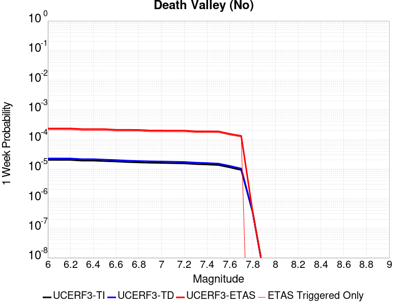 |  |  |  |

| Magnitude | 1 wk TI Prob | 1 wk TD Prob | 1 wk ETAS Prob | 1 wk ETAS/TD Gain | 1 wk ETAS Triggered Only | 1 mo TI Prob | 1 mo TD Prob | 1 mo ETAS Prob | 1 mo ETAS/TD Gain | 1 mo ETAS Triggered Only | 1 yr TI Prob | 1 yr TD Prob | 1 yr ETAS Prob | 1 yr ETAS/TD Gain | 1 yr ETAS Triggered Only | 10 yr TI Prob | 10 yr TD Prob | 10 yr ETAS Prob | 10 yr ETAS/TD Gain | 10 yr ETAS Triggered Only |
|-----|-----|-----|-----|-----|-----|-----|-----|-----|-----|-----|-----|-----|-----|-----|-----|-----|-----|-----|-----|-----|
| 6.0 | 2.0074807E-5 | 2.2500084E-5 | 2.3249535E-4 | 10.333089 | 2.1E-4 | 8.603206E-5 | 9.642541E-5 | 3.5640033E-4 | 3.6961248 | 2.6E-4 | 0.001046937 | 0.0011733545 | 0.001492979 | 1.2724024 | 3.2E-4 | 0.010420183 | 0.011672506 | 0.012028305 | 1.0304817 | 3.6E-4 |
| 6.1 | 2.0074807E-5 | 2.2500084E-5 | 2.3249535E-4 | 10.333089 | 2.1E-4 | 8.603206E-5 | 9.642541E-5 | 3.5640033E-4 | 3.6961248 | 2.6E-4 | 0.001046937 | 0.0011733545 | 0.001492979 | 1.2724024 | 3.2E-4 | 0.010420183 | 0.011672506 | 0.012028305 | 1.0304817 | 3.6E-4 |
| 6.2 | 2.0074807E-5 | 2.2500084E-5 | 2.3249535E-4 | 10.333089 | 2.1E-4 | 8.603206E-5 | 9.642541E-5 | 3.5640033E-4 | 3.6961248 | 2.6E-4 | 0.001046937 | 0.0011733545 | 0.001492979 | 1.2724024 | 3.2E-4 | 0.010420183 | 0.011672506 | 0.012028305 | 1.0304817 | 3.6E-4 |
| 6.3 | 1.9050609E-5 | 2.1336948E-5 | 2.2133268E-4 | 10.373212 | 2.0E-4 | 8.164292E-5 | 9.1440896E-5 | 3.4141802E-4 | 3.7337565 | 2.5E-4 | 9.935491E-4 | 0.001112731 | 0.0014223862 | 1.2782838 | 3.1E-4 | 0.009891188 | 0.011072419 | 0.011418544 | 1.0312601 | 3.5E-4 |
| 6.4 | 1.9050609E-5 | 2.1336948E-5 | 2.2133268E-4 | 10.373212 | 2.0E-4 | 8.164292E-5 | 9.1440896E-5 | 3.4141802E-4 | 3.7337565 | 2.5E-4 | 9.935491E-4 | 0.001112731 | 0.0014223862 | 1.2782838 | 3.1E-4 | 0.009891188 | 0.011072419 | 0.011418544 | 1.0312601 | 3.5E-4 |
| 6.5 | 1.8367004E-5 | 2.0561009E-5 | 2.2055689E-4 | 10.72695 | 2.0E-4 | 7.8713354E-5 | 8.811567E-5 | 3.3809364E-4 | 3.8369298 | 2.5E-4 | 9.5791375E-4 | 0.0010722869 | 0.0013819544 | 1.2887918 | 3.1E-4 | 0.009537951 | 0.0106719155 | 0.01101818 | 1.0324464 | 3.5E-4 |
| 6.6 | 1.779439E-5 | 1.9910927E-5 | 2.0990714E-4 | 10.542309 | 1.9E-4 | 7.625944E-5 | 8.53298E-5 | 3.2530932E-4 | 3.8123767 | 2.4E-4 | 9.280632E-4 | 0.0010384015 | 0.0013380899 | 1.2886056 | 3.0E-4 | 0.009241969 | 0.010336253 | 0.010672739 | 1.0325539 | 3.4E-4 |
| 6.7 | 1.7025437E-5 | 1.9043426E-5 | 2.090398E-4 | 10.977007 | 1.9E-4 | 7.296412E-5 | 8.161216E-5 | 3.2159258E-4 | 3.940498 | 2.4E-4 | 8.87976E-4 | 9.931813E-4 | 0.0012928833 | 1.3017596 | 3.0E-4 | 0.008844362 | 0.009888145 | 0.010224783 | 1.0340446 | 3.4E-4 |
| 6.8 | 1.6545107E-5 | 1.8512545E-5 | 2.0850902E-4 | 11.263121 | 1.9E-4 | 7.090568E-5 | 7.93371E-5 | 3.1931806E-4 | 4.0248265 | 2.4E-4 | 8.629347E-4 | 9.655073E-4 | 0.0012652177 | 1.3104175 | 3.0E-4 | 0.008595915 | 0.009613829 | 0.0099505605 | 1.0350257 | 3.4E-4 |
| 6.9 | 1.615478E-5 | 1.8087594E-5 | 1.9808434E-4 | 10.951392 | 1.8E-4 | 6.9232934E-5 | 7.751599E-5 | 3.0749815E-4 | 3.9668996 | 2.3E-4 | 8.4258494E-4 | 9.433546E-4 | 0.0012230905 | 1.2965331 | 2.8E-4 | 0.008393973 | 0.009394196 | 0.009711189 | 1.0337436 | 3.2E-4 |
| 7.0 | 1.5894311E-5 | 1.780555E-5 | 1.9780235E-4 | 11.109028 | 1.8E-4 | 6.81167E-5 | 7.6307304E-5 | 3.0628976E-4 | 4.0138984 | 2.3E-4 | 8.2900526E-4 | 9.286515E-4 | 0.0012083915 | 1.3012325 | 2.8E-4 | 0.008259195 | 0.009248397 | 0.009565438 | 1.0342805 | 3.2E-4 |
| 7.1 | 1.5602263E-5 | 1.7483504E-5 | 1.9748036E-4 | 11.295239 | 1.8E-4 | 6.6865134E-5 | 7.492718E-5 | 3.0490995E-4 | 4.069417 | 2.3E-4 | 8.137789E-4 | 9.118627E-4 | 0.0011916074 | 1.3067838 | 2.8E-4 | 0.008108052 | 0.009081894 | 0.0093989875 | 1.034915 | 3.2E-4 |
| 7.2 | 1.5323829E-5 | 1.717063E-5 | 1.9716754E-4 | 11.482837 | 1.8E-4 | 6.56719E-5 | 7.358637E-5 | 2.935702E-4 | 3.989464 | 2.2E-4 | 7.99262E-4 | 8.9555193E-4 | 0.0011653102 | 1.30122 | 2.7E-4 | 0.007963934 | 0.008920107 | 0.009227341 | 1.0344429 | 3.1E-4 |
| 7.3 | 1.4556212E-5 | 1.6302456E-5 | 1.8629969E-4 | 11.427707 | 1.7E-4 | 6.238227E-5 | 6.9865826E-5 | 2.7985114E-4 | 4.0055513 | 2.1E-4 | 7.592395E-4 | 8.5029035E-4 | 0.0011100692 | 1.3055179 | 2.6E-4 | 0.0075665074 | 0.008471014 | 0.008768473 | 1.0351149 | 3.0E-4 |
| 7.4 | 1.411725E-5 | 1.580796E-5 | 1.8580527E-4 | 11.753906 | 1.7E-4 | 6.0501097E-5 | 6.7746674E-5 | 2.7773244E-4 | 4.099573 | 2.1E-4 | 7.363519E-4 | 8.245094E-4 | 0.0010842951 | 1.315079 | 2.6E-4 | 0.0073391674 | 0.008215138 | 0.008512674 | 1.0362179 | 3.0E-4 |
| 7.5 | 1.3503312E-5 | 1.5126289E-5 | 1.8512372E-4 | 12.238542 | 1.7E-4 | 5.7870053E-5 | 6.482538E-5 | 2.7481175E-4 | 4.239262 | 2.1E-4 | 7.043401E-4 | 7.8896893E-4 | 0.0010487639 | 1.3292841 | 2.6E-4 | 0.007021119 | 0.007862304 | 0.008159946 | 1.0378567 | 3.0E-4 |
| 7.6 | 1.1279839E-5 | 1.2626327E-5 | 1.5262456E-4 | 12.087804 | 1.4E-4 | 4.834127E-5 | 5.4111737E-5 | 2.34102E-4 | 4.32627 | 1.8E-4 | 5.88396E-4 | 6.5861654E-4 | 8.7847165E-4 | 1.3338135 | 2.2E-4 | 0.005868405 | 0.006567199 | 0.006815557 | 1.037818 | 2.5E-4 |
| 7.7 | 9.189108E-6 | 1.0283358E-5 | 1.3028212E-4 | 12.66922 | 1.2E-4 | 3.93813E-5 | 4.407082E-5 | 1.9406421E-4 | 4.403463 | 1.5E-4 | 4.7936183E-4 | 5.3643517E-4 | 7.2633324E-4 | 1.3540001 | 1.9E-4 | 0.004783291 | 0.005351914 | 0.00556079 | 1.0390283 | 2.1E-4 |
| 7.8 | 3.4586725E-7 | 3.6482615E-7 | 3.6482615E-7 | 1.0 | 0.0 | 1.4822873E-6 | 1.5635396E-6 | 1.5635396E-6 | 1.0 | 0.0 | 1.80467E-5 | 1.9035933E-5 | 1.9035933E-5 | 1.0 | 0.0 | 1.8045233E-4 | 1.9034347E-4 | 1.9034347E-4 | 1.0 | 0.0 |
| 7.9 | 2.5591178E-9 | 2.6696718E-9 | 2.6696718E-9 | 1.0 | 0.0 | 1.0967647E-8 | 1.14414505E-8 | 1.14414505E-8 | 1.0 | 0.0 | 1.335311E-7 | 1.3929966E-7 | 1.3929966E-7 | 1.0 | 0.0 | 1.3353102E-6 | 1.3929966E-6 | 1.3929966E-6 | 1.0 | 0.0 |

## Red Pass
*[(top)](#table-of-contents)*

| 1 Week | 1 Month | 1 Year | 10 Year |
|-----|-----|-----|-----|
|  |  |  |  |

| Magnitude | 1 wk TI Prob | 1 wk TD Prob | 1 wk ETAS Prob | 1 wk ETAS/TD Gain | 1 wk ETAS Triggered Only | 1 mo TI Prob | 1 mo TD Prob | 1 mo ETAS Prob | 1 mo ETAS/TD Gain | 1 mo ETAS Triggered Only | 1 yr TI Prob | 1 yr TD Prob | 1 yr ETAS Prob | 1 yr ETAS/TD Gain | 1 yr ETAS Triggered Only | 10 yr TI Prob | 10 yr TD Prob | 10 yr ETAS Prob | 10 yr ETAS/TD Gain | 10 yr ETAS Triggered Only |
|-----|-----|-----|-----|-----|-----|-----|-----|-----|-----|-----|-----|-----|-----|-----|-----|-----|-----|-----|-----|-----|
| 6.0 | 8.258278E-6 | 8.551265E-6 | 1.4855007E-4 | 17.371706 | 1.4E-4 | 3.539214E-5 | 3.6647863E-5 | 2.0664163E-4 | 5.638572 | 1.7E-4 | 4.308141E-4 | 4.4611428E-4 | 6.860072E-4 | 1.5377388 | 2.4E-4 | 0.0042997985 | 0.004453945 | 0.0047326977 | 1.0625856 | 2.8E-4 |
| 6.1 | 3.649988E-6 | 3.7753161E-6 | 9.377498E-5 | 24.838974 | 9.0E-5 | 1.5642712E-5 | 1.6179853E-5 | 1.2617807E-4 | 7.7984686 | 1.1E-4 | 1.9043336E-4 | 1.9697666E-4 | 3.1695302E-4 | 1.6090893 | 1.2E-4 | 0.0019027026 | 0.001968488 | 0.002098232 | 1.0659106 | 1.3E-4 |
| 6.2 | 3.649988E-6 | 3.7753161E-6 | 9.377498E-5 | 24.838974 | 9.0E-5 | 1.5642712E-5 | 1.6179853E-5 | 1.2617807E-4 | 7.7984686 | 1.1E-4 | 1.9043336E-4 | 1.9697666E-4 | 3.1695302E-4 | 1.6090893 | 1.2E-4 | 0.0019027026 | 0.001968488 | 0.002098232 | 1.0659106 | 1.3E-4 |
| 6.3 | 1.3924937E-6 | 1.4411166E-6 | 2.1441088E-5 | 14.878107 | 2.0E-5 | 5.9678164E-6 | 6.1762075E-6 | 2.6176083E-5 | 4.238213 | 2.0E-5 | 7.265574E-5 | 7.519415E-5 | 9.519264E-5 | 1.2659582 | 2.0E-5 | 7.263199E-4 | 7.518258E-4 | 7.7181077E-4 | 1.0265819 | 2.0E-5 |
| 6.4 | 1.3924937E-6 | 1.4411166E-6 | 2.1441088E-5 | 14.878107 | 2.0E-5 | 5.9678164E-6 | 6.1762075E-6 | 2.6176083E-5 | 4.238213 | 2.0E-5 | 7.265574E-5 | 7.519415E-5 | 9.519264E-5 | 1.2659582 | 2.0E-5 | 7.263199E-4 | 7.518258E-4 | 7.7181077E-4 | 1.0265819 | 2.0E-5 |
| 6.5 | 9.876812E-7 | 1.0221912E-6 | 2.1022171E-5 | 20.56579 | 2.0E-5 | 4.2329125E-6 | 4.3808195E-6 | 2.4380732E-5 | 5.5653358 | 2.0E-5 | 5.153449E-5 | 5.3336476E-5 | 7.333541E-5 | 1.3749579 | 2.0E-5 | 5.1522546E-4 | 5.333648E-4 | 5.533541E-4 | 1.0374777 | 2.0E-5 |

## San Andreas (Parkfield)
*[(top)](#table-of-contents)*

| 1 Week | 1 Month | 1 Year | 10 Year |
|-----|-----|-----|-----|
|  |  |  |  |

| Magnitude | 1 wk TI Prob | 1 wk TD Prob | 1 wk ETAS Prob | 1 wk ETAS/TD Gain | 1 wk ETAS Triggered Only | 1 mo TI Prob | 1 mo TD Prob | 1 mo ETAS Prob | 1 mo ETAS/TD Gain | 1 mo ETAS Triggered Only | 1 yr TI Prob | 1 yr TD Prob | 1 yr ETAS Prob | 1 yr ETAS/TD Gain | 1 yr ETAS Triggered Only | 10 yr TI Prob | 10 yr TD Prob | 10 yr ETAS Prob | 10 yr ETAS/TD Gain | 10 yr ETAS Triggered Only |
|-----|-----|-----|-----|-----|-----|-----|-----|-----|-----|-----|-----|-----|-----|-----|-----|-----|-----|-----|-----|-----|
| 6.0 | 5.556969E-4 | 7.778562E-4 | 9.3773176E-4 | 1.2055335 | 1.6E-4 | 0.0023793848 | 0.0033299583 | 0.0034993922 | 1.0508817 | 1.7E-4 | 0.028586963 | 0.040235043 | 0.040474985 | 1.0059634 | 2.5E-4 | 0.25176284 | 0.3371973 | 0.33738288 | 1.0005504 | 2.8E-4 |
| 6.1 | 1.925858E-4 | 3.0278185E-4 | 3.7276064E-4 | 1.2311195 | 7.0E-5 | 8.2510663E-4 | 0.001297085 | 0.0013669941 | 1.0538971 | 7.0E-5 | 0.0099994885 | 0.01577393 | 0.015892036 | 1.0074875 | 1.2E-4 | 0.095613256 | 0.14975825 | 0.14988577 | 1.0008516 | 1.5E-4 |
| 6.2 | 9.4306815E-5 | 1.8243887E-4 | 2.524261E-4 | 1.3836201 | 7.0E-5 | 4.0410945E-4 | 7.8164786E-4 | 8.515931E-4 | 1.0894845 | 7.0E-5 | 0.0049089384 | 0.009475246 | 0.00959411 | 1.0125446 | 1.2E-4 | 0.048019063 | 0.0918565 | 0.09199273 | 1.001483 | 1.5E-4 |
| 6.3 | 9.283051E-5 | 1.794041E-4 | 2.4939154E-4 | 1.3901106 | 7.0E-5 | 3.9778434E-4 | 7.686494E-4 | 8.3859556E-4 | 1.0909989 | 7.0E-5 | 0.0048322747 | 0.009318355 | 0.009437236 | 1.0127578 | 1.2E-4 | 0.047285385 | 0.090509474 | 0.090645894 | 1.0015073 | 1.5E-4 |
| 6.4 | 9.138826E-5 | 1.7702584E-4 | 2.4701344E-4 | 1.3953525 | 7.0E-5 | 3.916052E-4 | 7.5846276E-4 | 8.284096E-4 | 1.092222 | 7.0E-5 | 0.0047573745 | 0.009195387 | 0.009314284 | 1.01293 | 1.2E-4 | 0.046568092 | 0.0894136 | 0.08955018 | 1.0015275 | 1.5E-4 |
| 6.5 | 9.000255E-5 | 1.746064E-4 | 2.4459418E-4 | 1.4008317 | 7.0E-5 | 3.8566816E-4 | 7.4809964E-4 | 8.1804727E-4 | 1.0935004 | 7.0E-5 | 0.0046854047 | 0.009070284 | 0.009189196 | 1.01311 | 1.2E-4 | 0.045878403 | 0.08829608 | 0.08843283 | 1.0015489 | 1.5E-4 |
| 6.6 | 8.8109264E-5 | 1.7141816E-4 | 2.4140616E-4 | 1.4082881 | 7.0E-5 | 3.7755648E-4 | 7.3444354E-4 | 8.0439216E-4 | 1.0952402 | 7.0E-5 | 0.0045870654 | 0.008905404 | 0.009024336 | 1.013355 | 1.2E-4 | 0.04493529 | 0.08682707 | 0.08696405 | 1.0015776 | 1.5E-4 |
| 6.7 | 8.738073E-5 | 1.7008898E-4 | 2.3007879E-4 | 1.3526965 | 6.0E-5 | 3.7443507E-4 | 7.287503E-4 | 7.887066E-4 | 1.0822728 | 6.0E-5 | 0.0045492216 | 0.008836695 | 0.008945723 | 1.012338 | 1.1E-4 | 0.04457213 | 0.0862268 | 0.086354725 | 1.0014837 | 1.4E-4 |
| 6.8 | 8.710195E-5 | 1.6954402E-4 | 2.2953385E-4 | 1.3538305 | 6.0E-5 | 3.7324068E-4 | 7.26416E-4 | 7.8637246E-4 | 1.0825373 | 6.0E-5 | 0.0045347405 | 0.008808513 | 0.008917544 | 1.012378 | 1.1E-4 | 0.04443313 | 0.08597436 | 0.08610232 | 1.0014884 | 1.4E-4 |
| 6.9 | 8.6801556E-5 | 1.6895356E-4 | 2.2894342E-4 | 1.3550671 | 6.0E-5 | 3.7195362E-4 | 7.238869E-4 | 7.8384345E-4 | 1.0828259 | 6.0E-5 | 0.0045191357 | 0.0087779695 | 0.008887004 | 1.0124214 | 1.1E-4 | 0.044283327 | 0.08570042 | 0.08582842 | 1.0014936 | 1.4E-4 |
| 7.0 | 8.5571606E-5 | 1.664819E-4 | 2.2647191E-4 | 1.3603395 | 6.0E-5 | 3.6668387E-4 | 7.132999E-4 | 7.732571E-4 | 1.0840561 | 6.0E-5 | 0.004455241 | 0.008650103 | 0.008759151 | 1.0126066 | 1.1E-4 | 0.043669727 | 0.08454836 | 0.08467653 | 1.0015159 | 1.4E-4 |
| 7.1 | 7.82589E-5 | 1.5128969E-4 | 2.112806E-4 | 1.3965302 | 6.0E-5 | 3.3535215E-4 | 6.4822397E-4 | 7.081851E-4 | 1.0925006 | 6.0E-5 | 0.0040752706 | 0.007863738 | 0.007972873 | 1.0138782 | 1.1E-4 | 0.040013418 | 0.077460445 | 0.0775896 | 1.0016674 | 1.4E-4 |
| 7.2 | 7.690929E-5 | 1.4866212E-4 | 2.0865319E-4 | 1.4035398 | 6.0E-5 | 3.2956956E-4 | 6.369685E-4 | 6.969303E-4 | 1.0941362 | 6.0E-5 | 0.004005129 | 0.0077276826 | 0.007836833 | 1.0141245 | 1.1E-4 | 0.0393371 | 0.07623341 | 0.07636274 | 1.0016965 | 1.4E-4 |
| 7.3 | 7.5543794E-5 | 1.4562748E-4 | 2.0561874E-4 | 1.4119501 | 6.0E-5 | 3.2371894E-4 | 6.239692E-4 | 6.8393175E-4 | 1.0960985 | 6.0E-5 | 0.003934157 | 0.0075705256 | 0.0076697688 | 1.0131091 | 1.0E-4 | 0.038652334 | 0.07479777 | 0.07491805 | 1.001608 | 1.3E-4 |
| 7.4 | 7.4214564E-5 | 1.4263717E-4 | 2.0262861E-4 | 1.4205877 | 6.0E-5 | 3.1802364E-4 | 6.1115966E-4 | 6.71123E-4 | 1.098114 | 6.0E-5 | 0.003865065 | 0.0074156416 | 0.0075149 | 1.013385 | 1.0E-4 | 0.03798529 | 0.07337152 | 0.07349199 | 1.0016418 | 1.3E-4 |
| 7.5 | 6.149578E-5 | 1.1191443E-4 | 1.7190771E-4 | 1.5360639 | 6.0E-5 | 2.6352672E-4 | 4.795452E-4 | 5.3951645E-4 | 1.1250585 | 6.0E-5 | 0.0032037178 | 0.005822865 | 0.0059222826 | 1.0170736 | 1.0E-4 | 0.03157923 | 0.058559462 | 0.05868185 | 1.00209 | 1.3E-4 |
| 7.6 | 6.0643448E-5 | 1.102009E-4 | 1.7019428E-4 | 1.5444002 | 6.0E-5 | 2.598746E-4 | 4.7220418E-4 | 5.321758E-4 | 1.1270037 | 6.0E-5 | 0.0031593828 | 0.005733962 | 0.005833389 | 1.01734 | 1.0E-4 | 0.031148417 | 0.05772042 | 0.057842914 | 1.0021223 | 1.3E-4 |
| 7.7 | 5.1652263E-5 | 9.175265E-5 | 1.4174805E-4 | 1.5448934 | 5.0E-5 | 2.2134806E-4 | 3.9316638E-4 | 4.4314674E-4 | 1.1271226 | 5.0E-5 | 0.002691582 | 0.0047763046 | 0.0048360177 | 1.012502 | 6.0E-5 | 0.026592141 | 0.04853641 | 0.04862204 | 1.0017643 | 9.0E-5 |
| 7.8 | 4.8090482E-5 | 8.560165E-5 | 1.3559737E-4 | 1.5840509 | 5.0E-5 | 2.060858E-4 | 3.6681266E-4 | 4.1679433E-4 | 1.1362593 | 5.0E-5 | 0.0025062072 | 0.004456807 | 0.0045165396 | 1.0134026 | 6.0E-5 | 0.024781305 | 0.045302264 | 0.04537864 | 1.0016859 | 8.0E-5 |
| 7.9 | 3.970278E-5 | 6.7507375E-5 | 8.750602E-5 | 1.2962439 | 2.0E-5 | 1.7014367E-4 | 2.8928524E-4 | 3.0927945E-4 | 1.0691159 | 2.0E-5 | 0.002069531 | 0.0035163634 | 0.003546258 | 1.0085015 | 3.0E-5 | 0.020503636 | 0.03588176 | 0.035929967 | 1.0013435 | 5.0E-5 |
| 8.0 | 2.8982335E-5 | 4.0698153E-5 | 4.0698153E-5 | 1.0 | 0.0 | 1.2420409E-4 | 1.7440901E-4 | 1.7440901E-4 | 1.0 | 0.0 | 0.0015111357 | 0.0021213628 | 0.0021313417 | 1.004704 | 1.0E-5 | 0.015009012 | 0.02201118 | 0.02204052 | 1.001333 | 3.0E-5 |
| 8.1 | 1.8836186E-5 | 1.867974E-5 | 1.867974E-5 | 1.0 | 0.0 | 8.0724014E-5 | 8.005358E-5 | 8.005358E-5 | 1.0 | 0.0 | 9.823717E-4 | 9.742171E-4 | 9.842074E-4 | 1.0102546 | 1.0E-5 | 0.009780403 | 0.010487711 | 0.010507501 | 1.001887 | 2.0E-5 |
| 8.2 | 8.643924E-6 | 5.473668E-6 | 5.473668E-6 | 1.0 | 0.0 | 3.704486E-5 | 2.3458366E-5 | 2.3458366E-5 | 1.0 | 0.0 | 4.5092785E-4 | 2.8556827E-4 | 2.8556827E-4 | 1.0 | 0.0 | 0.0045001395 | 0.0032481793 | 0.0032481793 | 1.0 | 0.0 |
| 8.3 | 1.983087E-6 | 7.6564595E-7 | 7.6564595E-7 | 1.0 | 0.0 | 8.498917E-6 | 3.281336E-6 | 3.281336E-6 | 1.0 | 0.0 | 1.034694E-4 | 3.9949547E-5 | 3.9949547E-5 | 1.0 | 0.0 | 0.0010342124 | 4.717979E-4 | 4.717979E-4 | 1.0 | 0.0 |

## San Jacinto (San Bernardino)
*[(top)](#table-of-contents)*

| 1 Week | 1 Month | 1 Year | 10 Year |
|-----|-----|-----|-----|
|  |  |  |  |

| Magnitude | 1 wk TI Prob | 1 wk TD Prob | 1 wk ETAS Prob | 1 wk ETAS/TD Gain | 1 wk ETAS Triggered Only | 1 mo TI Prob | 1 mo TD Prob | 1 mo ETAS Prob | 1 mo ETAS/TD Gain | 1 mo ETAS Triggered Only | 1 yr TI Prob | 1 yr TD Prob | 1 yr ETAS Prob | 1 yr ETAS/TD Gain | 1 yr ETAS Triggered Only | 10 yr TI Prob | 10 yr TD Prob | 10 yr ETAS Prob | 10 yr ETAS/TD Gain | 10 yr ETAS Triggered Only |
|-----|-----|-----|-----|-----|-----|-----|-----|-----|-----|-----|-----|-----|-----|-----|-----|-----|-----|-----|-----|-----|
| 6.0 | 3.409352E-5 | 3.598562E-5 | 2.2597879E-4 | 6.279697 | 1.9E-4 | 1.461069E-4 | 1.5421498E-4 | 3.7418105E-4 | 2.42636 | 2.2E-4 | 0.0017774 | 0.0018759521 | 0.0021155018 | 1.1276951 | 2.4E-4 | 0.01763251 | 0.019349992 | 0.019595155 | 1.0126699 | 2.5E-4 |
| 6.1 | 3.409352E-5 | 3.598562E-5 | 2.2597879E-4 | 6.279697 | 1.9E-4 | 1.461069E-4 | 1.5421498E-4 | 3.7418105E-4 | 2.42636 | 2.2E-4 | 0.0017774 | 0.0018759521 | 0.0021155018 | 1.1276951 | 2.4E-4 | 0.01763251 | 0.019349992 | 0.019595155 | 1.0126699 | 2.5E-4 |
| 6.2 | 3.409352E-5 | 3.598562E-5 | 2.2597879E-4 | 6.279697 | 1.9E-4 | 1.461069E-4 | 1.5421498E-4 | 3.7418105E-4 | 2.42636 | 2.2E-4 | 0.0017774 | 0.0018759521 | 0.0021155018 | 1.1276951 | 2.4E-4 | 0.01763251 | 0.019349992 | 0.019595155 | 1.0126699 | 2.5E-4 |
| 6.3 | 3.409352E-5 | 3.598562E-5 | 2.2597879E-4 | 6.279697 | 1.9E-4 | 1.461069E-4 | 1.5421498E-4 | 3.7418105E-4 | 2.42636 | 2.2E-4 | 0.0017774 | 0.0018759521 | 0.0021155018 | 1.1276951 | 2.4E-4 | 0.01763251 | 0.019349992 | 0.019595155 | 1.0126699 | 2.5E-4 |
| 6.4 | 3.400795E-5 | 3.5878285E-5 | 2.2587147E-4 | 6.2954926 | 1.9E-4 | 1.4574021E-4 | 1.5375503E-4 | 3.737212E-4 | 2.4306276 | 2.2E-4 | 0.0017729428 | 0.0018703619 | 0.002109913 | 1.1280774 | 2.4E-4 | 0.017588645 | 0.019295074 | 0.01954025 | 1.0127066 | 2.5E-4 |
| 6.5 | 3.341482E-5 | 3.5138914E-5 | 2.2513224E-4 | 6.4069204 | 1.9E-4 | 1.4319851E-4 | 1.5058667E-4 | 3.7055355E-4 | 2.4607327 | 2.2E-4 | 0.0017420477 | 0.0018318522 | 0.0020714125 | 1.130775 | 2.4E-4 | 0.017284546 | 0.018916616 | 0.019161887 | 1.0129659 | 2.5E-4 |
| 6.6 | 3.3364955E-5 | 3.5076133E-5 | 2.1506981E-4 | 6.1315145 | 1.8E-4 | 1.4298483E-4 | 1.5031763E-4 | 3.6028607E-4 | 2.3968318 | 2.1E-4 | 0.0017394501 | 0.0018285823 | 0.0020581617 | 1.1255505 | 2.3E-4 | 0.017258976 | 0.01888448 | 0.019119948 | 1.0124688 | 2.4E-4 |
| 6.7 | 3.335922E-5 | 3.5065907E-5 | 2.150596E-4 | 6.133011 | 1.8E-4 | 1.4296026E-4 | 1.5027382E-4 | 3.6024227E-4 | 2.3972392 | 2.1E-4 | 0.0017391514 | 0.0018280497 | 0.0020576292 | 1.1255871 | 2.3E-4 | 0.017256035 | 0.018879272 | 0.01911474 | 1.0124724 | 2.4E-4 |
| 6.8 | 3.327683E-5 | 3.4959972E-5 | 2.1495367E-4 | 6.1485653 | 1.8E-4 | 1.4260718E-4 | 1.4981985E-4 | 3.597884E-4 | 2.4014733 | 2.1E-4 | 0.0017348597 | 0.001822532 | 0.002052113 | 1.1259681 | 2.3E-4 | 0.017213784 | 0.018825045 | 0.019060526 | 1.012509 | 2.4E-4 |
| 6.9 | 3.3235785E-5 | 3.4900928E-5 | 2.1489465E-4 | 6.157276 | 1.8E-4 | 1.4243131E-4 | 1.4956683E-4 | 3.5953542E-4 | 2.4038446 | 2.1E-4 | 0.0017327217 | 0.0018194567 | 0.0020490382 | 1.1261814 | 2.3E-4 | 0.017192734 | 0.018794911 | 0.0190304 | 1.0125294 | 2.4E-4 |
| 7.0 | 3.3197095E-5 | 3.4840854E-5 | 2.1483458E-4 | 6.166168 | 1.8E-4 | 1.422655E-4 | 1.4930942E-4 | 3.5927806E-4 | 2.4062653 | 2.1E-4 | 0.0017307063 | 0.0018163278 | 0.00204591 | 1.1263992 | 2.3E-4 | 0.017172894 | 0.01876429 | 0.018999785 | 1.0125502 | 2.4E-4 |
| 7.1 | 3.3129716E-5 | 3.4721066E-5 | 2.1471482E-4 | 6.183993 | 1.8E-4 | 1.4197677E-4 | 1.4879608E-4 | 3.5876484E-4 | 2.4111176 | 2.1E-4 | 0.0017271966 | 0.0018100884 | 0.002039672 | 1.1268356 | 2.3E-4 | 0.017138338 | 0.018703366 | 0.018938877 | 1.012592 | 2.4E-4 |
| 7.2 | 3.3034008E-5 | 3.4588513E-5 | 2.1458228E-4 | 6.2038603 | 1.8E-4 | 1.4156665E-4 | 1.4822806E-4 | 3.5819694E-4 | 2.4165258 | 2.1E-4 | 0.0017222111 | 0.0018031843 | 0.0020327696 | 1.1273221 | 2.3E-4 | 0.017089253 | 0.01863575 | 0.018871278 | 1.0126384 | 2.4E-4 |
| 7.3 | 3.2956614E-5 | 3.4456265E-5 | 2.1445006E-4 | 6.2238336 | 1.8E-4 | 1.4123498E-4 | 1.4766137E-4 | 3.5763034E-4 | 2.421963 | 2.1E-4 | 0.0017181796 | 0.0017962961 | 0.002025883 | 1.1278112 | 2.3E-4 | 0.017049557 | 0.018568495 | 0.01880404 | 1.0126851 | 2.4E-4 |
| 7.4 | 3.2915937E-5 | 3.4377957E-5 | 2.1437177E-4 | 6.235733 | 1.8E-4 | 1.4106068E-4 | 1.473258E-4 | 3.5729486E-4 | 2.4252024 | 2.1E-4 | 0.0017160608 | 0.0017922173 | 0.0020218052 | 1.1281027 | 2.3E-4 | 0.017028693 | 0.018528769 | 0.018764323 | 1.0127128 | 2.4E-4 |
| 7.5 | 3.281791E-5 | 3.424287E-5 | 2.142367E-4 | 6.2563887 | 1.8E-4 | 1.406406E-4 | 1.4674691E-4 | 3.567161E-4 | 2.4308252 | 2.1E-4 | 0.0017109542 | 0.0017851809 | 0.0020147704 | 1.1286085 | 2.3E-4 | 0.016978411 | 0.018459652 | 0.018695222 | 1.0127614 | 2.4E-4 |
| 7.6 | 3.2521442E-5 | 3.396782E-5 | 2.139617E-4 | 6.298953 | 1.8E-4 | 1.3937015E-4 | 1.4556825E-4 | 3.555377E-4 | 2.4424121 | 2.1E-4 | 0.0016955109 | 0.0017708542 | 0.002000447 | 1.1296508 | 2.3E-4 | 0.016826328 | 0.018317295 | 0.0185529 | 1.0128623 | 2.4E-4 |
| 7.7 | 3.0287873E-5 | 3.245191E-5 | 2.1244607E-4 | 6.546489 | 1.8E-4 | 1.297987E-4 | 1.3907222E-4 | 3.49043E-4 | 2.5097969 | 2.1E-4 | 0.0015791537 | 0.0016918903 | 0.0019215011 | 1.1357126 | 2.3E-4 | 0.01567979 | 0.017528199 | 0.017763993 | 1.0134522 | 2.4E-4 |
| 7.8 | 2.6316151E-5 | 2.9662837E-5 | 1.9965779E-4 | 6.730907 | 1.7E-4 | 1.1277862E-4 | 1.2712025E-4 | 3.2709484E-4 | 2.5731134 | 2.0E-4 | 0.0013722149 | 0.0015465913 | 0.001766251 | 1.1420283 | 2.2E-4 | 0.013637724 | 0.016069878 | 0.016296182 | 1.0140826 | 2.3E-4 |
| 7.9 | 2.0761147E-5 | 2.3417291E-5 | 1.8341355E-4 | 7.832398 | 1.6E-4 | 8.897331E-5 | 1.0035596E-4 | 2.803379E-4 | 2.7934353 | 1.8E-4 | 0.0010827117 | 0.0012211498 | 0.0014109178 | 1.1554011 | 1.9E-4 | 0.010774517 | 0.012793272 | 0.012990713 | 1.0154332 | 2.0E-4 |
| 8.0 | 1.5738568E-5 | 1.6032505E-5 | 9.6031225E-5 | 5.989783 | 8.0E-5 | 6.744926E-5 | 6.8708934E-5 | 1.5870275E-4 | 2.3097835 | 9.0E-5 | 8.2088535E-4 | 8.3621085E-4 | 9.3612727E-4 | 1.119487 | 1.0E-4 | 0.008178596 | 0.008865741 | 0.008974765 | 1.0122973 | 1.1E-4 |
| 8.1 | 1.0105832E-5 | 8.329479E-6 | 4.8329144E-5 | 5.8021812 | 4.0E-5 | 4.3309992E-5 | 3.569728E-5 | 8.5695494E-5 | 2.400617 | 5.0E-5 | 5.2717153E-4 | 4.3452822E-4 | 4.8450648E-4 | 1.1150173 | 5.0E-5 | 0.005259227 | 0.0046768794 | 0.0047365986 | 1.0127691 | 6.0E-5 |
| 8.2 | 4.189207E-6 | 1.577699E-6 | 1.577699E-6 | 1.0 | 0.0 | 1.7953622E-5 | 6.7615497E-6 | 6.7615497E-6 | 1.0 | 0.0 | 2.1856341E-4 | 8.231879E-5 | 8.231879E-5 | 1.0 | 0.0 | 0.0021834858 | 9.562628E-4 | 9.562628E-4 | 1.0 | 0.0 |
| 8.3 | 1.2758221E-6 | 3.612677E-7 | 3.612677E-7 | 1.0 | 0.0 | 5.4677976E-6 | 1.5482892E-6 | 1.5482892E-6 | 1.0 | 0.0 | 6.65684E-5 | 1.8850264E-5 | 1.8850264E-5 | 1.0 | 0.0 | 6.6548464E-4 | 2.2739546E-4 | 2.2739546E-4 | 1.0 | 0.0 |

## Elsinore (Glen Ivy) rev
*[(top)](#table-of-contents)*

| 1 Week | 1 Month | 1 Year | 10 Year |
|-----|-----|-----|-----|
|  |  |  |  |

| Magnitude | 1 wk TI Prob | 1 wk TD Prob | 1 wk ETAS Prob | 1 wk ETAS/TD Gain | 1 wk ETAS Triggered Only | 1 mo TI Prob | 1 mo TD Prob | 1 mo ETAS Prob | 1 mo ETAS/TD Gain | 1 mo ETAS Triggered Only | 1 yr TI Prob | 1 yr TD Prob | 1 yr ETAS Prob | 1 yr ETAS/TD Gain | 1 yr ETAS Triggered Only | 10 yr TI Prob | 10 yr TD Prob | 10 yr ETAS Prob | 10 yr ETAS/TD Gain | 10 yr ETAS Triggered Only |
|-----|-----|-----|-----|-----|-----|-----|-----|-----|-----|-----|-----|-----|-----|-----|-----|-----|-----|-----|-----|-----|
| 6.0 | 1.6204086E-4 | 2.937271E-4 | 4.3368596E-4 | 1.4764929 | 1.4E-4 | 6.94276E-4 | 0.0012583778 | 0.0014181765 | 1.1269878 | 1.6E-4 | 0.008420097 | 0.0152346175 | 0.015431571 | 1.012928 | 2.0E-4 | 0.081081145 | 0.13962454 | 0.13980521 | 1.001294 | 2.1E-4 |
| 6.1 | 1.6204086E-4 | 2.937271E-4 | 4.3368596E-4 | 1.4764929 | 1.4E-4 | 6.94276E-4 | 0.0012583778 | 0.0014181765 | 1.1269878 | 1.6E-4 | 0.008420097 | 0.0152346175 | 0.015431571 | 1.012928 | 2.0E-4 | 0.081081145 | 0.13962454 | 0.13980521 | 1.001294 | 2.1E-4 |
| 6.2 | 1.6204086E-4 | 2.937271E-4 | 4.3368596E-4 | 1.4764929 | 1.4E-4 | 6.94276E-4 | 0.0012583778 | 0.0014181765 | 1.1269878 | 1.6E-4 | 0.008420097 | 0.0152346175 | 0.015431571 | 1.012928 | 2.0E-4 | 0.081081145 | 0.13962454 | 0.13980521 | 1.001294 | 2.1E-4 |
| 6.3 | 1.0111737E-4 | 1.7703463E-4 | 2.4702222E-4 | 1.3953329 | 7.0E-5 | 4.332882E-4 | 7.5861585E-4 | 8.5854E-4 | 1.131719 | 1.0E-4 | 0.005262531 | 0.0092177205 | 0.009346522 | 1.0139732 | 1.3E-4 | 0.0513964 | 0.08707393 | 0.087201744 | 1.0014678 | 1.4E-4 |
| 6.4 | 1.0111737E-4 | 1.7703463E-4 | 2.4702222E-4 | 1.3953329 | 7.0E-5 | 4.332882E-4 | 7.5861585E-4 | 8.5854E-4 | 1.131719 | 1.0E-4 | 0.005262531 | 0.0092177205 | 0.009346522 | 1.0139732 | 1.3E-4 | 0.0513964 | 0.08707393 | 0.087201744 | 1.0014678 | 1.4E-4 |
| 6.5 | 3.6624708E-5 | 4.6391986E-5 | 6.6391054E-5 | 1.4310889 | 2.0E-5 | 1.569536E-4 | 1.9880968E-4 | 2.3880172E-4 | 1.2011575 | 4.0E-5 | 0.001909235 | 0.0024181814 | 0.0024780363 | 1.024752 | 6.0E-5 | 0.01892915 | 0.023697061 | 0.023765402 | 1.0028839 | 7.0E-5 |
| 6.6 | 2.5051324E-5 | 2.6147465E-5 | 2.6147465E-5 | 1.0 | 0.0 | 1.073584E-4 | 1.12056E-4 | 1.2205488E-4 | 1.0892311 | 1.0E-5 | 0.0013063047 | 0.0013634725 | 0.0013834452 | 1.0146484 | 2.0E-5 | 0.012986525 | 0.013565759 | 0.013595353 | 1.0021814 | 3.0E-5 |
| 6.7 | 2.2189772E-5 | 2.2072489E-5 | 2.2072489E-5 | 1.0 | 0.0 | 9.509556E-5 | 9.459316E-5 | 9.459316E-5 | 1.0 | 0.0 | 0.0011571734 | 0.0011510996 | 0.0011610881 | 1.0086774 | 1.0E-5 | 0.011511663 | 0.0114663225 | 0.011476208 | 1.0008621 | 1.0E-5 |
| 6.8 | 1.6654378E-5 | 1.44376E-5 | 1.44376E-5 | 1.0 | 0.0 | 7.137396E-5 | 6.187399E-5 | 6.187399E-5 | 1.0 | 0.0 | 8.686314E-4 | 7.5306057E-4 | 7.630531E-4 | 1.0132692 | 1.0E-5 | 0.008652439 | 0.0075100763 | 0.0075200014 | 1.0013216 | 1.0E-5 |
| 6.9 | 1.5042909E-5 | 1.2331886E-5 | 1.2331886E-5 | 1.0 | 0.0 | 6.446802E-5 | 5.2849886E-5 | 5.2849886E-5 | 1.0 | 0.0 | 7.8461546E-4 | 6.4326054E-4 | 6.532541E-4 | 1.0155358 | 1.0E-5 | 0.007818509 | 0.006417925 | 0.006427861 | 1.0015482 | 1.0E-5 |
| 7.0 | 1.4361385E-5 | 1.1451172E-5 | 1.1451172E-5 | 1.0 | 0.0 | 6.154734E-5 | 4.9075545E-5 | 4.9075545E-5 | 1.0 | 0.0 | 7.490812E-4 | 5.973339E-4 | 6.073279E-4 | 1.016731 | 1.0E-5 | 0.007465612 | 0.005960982 | 0.0059709223 | 1.0016676 | 1.0E-5 |
| 7.1 | 1.3265571E-5 | 1.0244736E-5 | 1.0244736E-5 | 1.0 | 0.0 | 5.6851208E-5 | 4.3905282E-5 | 4.3905282E-5 | 1.0 | 0.0 | 6.919436E-4 | 5.344183E-4 | 5.4441293E-4 | 1.0187019 | 1.0E-5 | 0.006897931 | 0.0053346003 | 0.005344547 | 1.0018646 | 1.0E-5 |
| 7.2 | 1.1596403E-5 | 8.504847E-6 | 8.504847E-6 | 1.0 | 0.0 | 4.9697923E-5 | 3.6448844E-5 | 3.6448844E-5 | 1.0 | 0.0 | 6.049042E-4 | 4.4367602E-4 | 4.4367602E-4 | 1.0 | 0.0 | 0.006032603 | 0.004429357 | 0.004429357 | 1.0 | 0.0 |
| 7.3 | 1.0150827E-5 | 7.238537E-6 | 7.238537E-6 | 1.0 | 0.0 | 4.3502816E-5 | 3.102194E-5 | 3.102194E-5 | 1.0 | 0.0 | 5.2951806E-4 | 3.776281E-4 | 3.776281E-4 | 1.0 | 0.0 | 0.005282581 | 0.003770271 | 0.003770271 | 1.0 | 0.0 |
| 7.4 | 9.080705E-6 | 6.352307E-6 | 6.352307E-6 | 1.0 | 0.0 | 3.8916725E-5 | 2.7223898E-5 | 2.7223898E-5 | 1.0 | 0.0 | 4.7370812E-4 | 3.314019E-4 | 3.314019E-4 | 1.0 | 0.0 | 0.004726996 | 0.0033092257 | 0.0033092257 | 1.0 | 0.0 |
| 7.5 | 7.671649E-6 | 5.225419E-6 | 5.225419E-6 | 1.0 | 0.0 | 3.287808E-5 | 2.2394468E-5 | 2.2394468E-5 | 1.0 | 0.0 | 4.0021708E-4 | 2.7261977E-4 | 2.7261977E-4 | 1.0 | 0.0 | 0.0039949706 | 0.0027229784 | 0.0027229784 | 1.0 | 0.0 |
| 7.6 | 6.990086E-6 | 4.687336E-6 | 4.687336E-6 | 1.0 | 0.0 | 2.9957167E-5 | 2.0088435E-5 | 2.0088435E-5 | 1.0 | 0.0 | 3.6466747E-4 | 2.445504E-4 | 2.445504E-4 | 1.0 | 0.0 | 0.0036406964 | 0.0024429292 | 0.0024429292 | 1.0 | 0.0 |
| 7.7 | 4.163505E-6 | 2.329331E-6 | 2.329331E-6 | 1.0 | 0.0 | 1.7843471E-5 | 9.982813E-6 | 9.982813E-6 | 1.0 | 0.0 | 2.172226E-4 | 1.2153471E-4 | 1.2153471E-4 | 1.0 | 0.0 | 0.0021701038 | 0.0012147555 | 0.0012147555 | 1.0 | 0.0 |
| 7.8 | 2.2692414E-7 | 9.384417E-8 | 9.384417E-8 | 1.0 | 0.0 | 9.725317E-7 | 4.0218927E-7 | 4.0218927E-7 | 1.0 | 0.0 | 1.1840509E-5 | 4.8966467E-6 | 4.8966467E-6 | 1.0 | 0.0 | 1.1839878E-4 | 4.8965718E-5 | 4.8965718E-5 | 1.0 | 0.0 |
| 7.9 | 6.676829E-9 | 3.4397174E-9 | 3.4397174E-9 | 1.0 | 0.0 | 2.861498E-8 | 1.4741646E-8 | 1.4741646E-8 | 1.0 | 0.0 | 3.4838732E-7 | 1.7947953E-7 | 1.7947953E-7 | 1.0 | 0.0 | 3.4838679E-6 | 1.794794E-6 | 1.794794E-6 | 1.0 | 0.0 |

## Sierra Nevada  (No Extension)
*[(top)](#table-of-contents)*

| 1 Week | 1 Month | 1 Year | 10 Year |
|-----|-----|-----|-----|
|  |  |  |  |

| Magnitude | 1 wk TI Prob | 1 wk TD Prob | 1 wk ETAS Prob | 1 wk ETAS/TD Gain | 1 wk ETAS Triggered Only | 1 mo TI Prob | 1 mo TD Prob | 1 mo ETAS Prob | 1 mo ETAS/TD Gain | 1 mo ETAS Triggered Only | 1 yr TI Prob | 1 yr TD Prob | 1 yr ETAS Prob | 1 yr ETAS/TD Gain | 1 yr ETAS Triggered Only | 10 yr TI Prob | 10 yr TD Prob | 10 yr ETAS Prob | 10 yr ETAS/TD Gain | 10 yr ETAS Triggered Only |
|-----|-----|-----|-----|-----|-----|-----|-----|-----|-----|-----|-----|-----|-----|-----|-----|-----|-----|-----|-----|-----|
| 6.0 | 7.7690465E-6 | 6.9762887E-6 | 1.2697546E-4 | 18.201004 | 1.2E-4 | 3.329549E-5 | 2.989824E-5 | 1.8989346E-4 | 6.3513255 | 1.6E-4 | 4.0529718E-4 | 3.6398612E-4 | 5.639133E-4 | 1.5492715 | 2.0E-4 | 0.004045588 | 0.0036374154 | 0.0038566152 | 1.0602626 | 2.2E-4 |
| 6.1 | 7.7690465E-6 | 6.9762887E-6 | 1.2697546E-4 | 18.201004 | 1.2E-4 | 3.329549E-5 | 2.989824E-5 | 1.8989346E-4 | 6.3513255 | 1.6E-4 | 4.0529718E-4 | 3.6398612E-4 | 5.639133E-4 | 1.5492715 | 2.0E-4 | 0.004045588 | 0.0036374154 | 0.0038566152 | 1.0602626 | 2.2E-4 |
| 6.2 | 7.7690465E-6 | 6.9762887E-6 | 1.2697546E-4 | 18.201004 | 1.2E-4 | 3.329549E-5 | 2.989824E-5 | 1.8989346E-4 | 6.3513255 | 1.6E-4 | 4.0529718E-4 | 3.6398612E-4 | 5.639133E-4 | 1.5492715 | 2.0E-4 | 0.004045588 | 0.0036374154 | 0.0038566152 | 1.0602626 | 2.2E-4 |
| 6.3 | 7.7690465E-6 | 6.9762887E-6 | 1.2697546E-4 | 18.201004 | 1.2E-4 | 3.329549E-5 | 2.989824E-5 | 1.8989346E-4 | 6.3513255 | 1.6E-4 | 4.0529718E-4 | 3.6398612E-4 | 5.639133E-4 | 1.5492715 | 2.0E-4 | 0.004045588 | 0.0036374154 | 0.0038566152 | 1.0602626 | 2.2E-4 |
| 6.4 | 7.7690465E-6 | 6.9762887E-6 | 1.2697546E-4 | 18.201004 | 1.2E-4 | 3.329549E-5 | 2.989824E-5 | 1.8989346E-4 | 6.3513255 | 1.6E-4 | 4.0529718E-4 | 3.6398612E-4 | 5.639133E-4 | 1.5492715 | 2.0E-4 | 0.004045588 | 0.0036374154 | 0.0038566152 | 1.0602626 | 2.2E-4 |
| 6.5 | 7.7690465E-6 | 6.9762887E-6 | 1.2697546E-4 | 18.201004 | 1.2E-4 | 3.329549E-5 | 2.989824E-5 | 1.8989346E-4 | 6.3513255 | 1.6E-4 | 4.0529718E-4 | 3.6398612E-4 | 5.639133E-4 | 1.5492715 | 2.0E-4 | 0.004045588 | 0.0036374154 | 0.0038566152 | 1.0602626 | 2.2E-4 |
| 6.6 | 2.653E-6 | 1.6148208E-6 | 8.161469E-5 | 50.54102 | 8.0E-5 | 1.136995E-5 | 6.9206426E-6 | 1.0691995E-4 | 15.449426 | 1.0E-4 | 1.3842035E-4 | 8.42556E-5 | 2.1424465E-4 | 2.5427942 | 1.3E-4 | 0.0013833415 | 8.4224E-4 | 9.921136E-4 | 1.1779464 | 1.5E-4 |
| 6.7 | 2.5902466E-6 | 1.5501544E-6 | 8.155003E-5 | 52.60768 | 8.0E-5 | 1.11010095E-5 | 6.643502E-6 | 1.0664284E-4 | 16.052202 | 1.0E-4 | 1.351464E-4 | 8.088166E-5 | 2.1087115E-4 | 2.6071565 | 1.3E-4 | 0.0013506424 | 8.0852525E-4 | 9.58404E-4 | 1.185373 | 1.5E-4 |
| 6.8 | 2.5853892E-6 | 1.5469546E-6 | 8.154683E-5 | 52.714428 | 8.0E-5 | 1.1080193E-5 | 6.629789E-6 | 1.0662912E-4 | 16.083336 | 1.0E-4 | 1.34893E-4 | 8.071472E-5 | 2.1070422E-4 | 2.6104808 | 1.3E-4 | 0.0013481114 | 8.06857E-4 | 9.56736E-4 | 1.1857566 | 1.5E-4 |
| 6.9 | 2.458257E-6 | 1.422029E-6 | 8.142192E-5 | 57.257565 | 8.0E-5 | 1.0535345E-5 | 6.0943958E-6 | 1.0609379E-4 | 17.408419 | 1.0E-4 | 1.2826028E-4 | 7.419676E-5 | 2.0418712E-4 | 2.7519681 | 1.3E-4 | 0.0012818627 | 7.4172183E-4 | 8.916106E-4 | 1.2020822 | 1.5E-4 |
| 7.0 | 2.4341468E-6 | 1.3989927E-6 | 8.139888E-5 | 58.183918 | 8.0E-5 | 1.0432016E-5 | 5.9956697E-6 | 1.0599507E-4 | 17.678604 | 1.0E-4 | 1.270024E-4 | 7.299485E-5 | 2.0298536E-4 | 2.7808175 | 1.3E-4 | 0.0012692984 | 7.297107E-4 | 8.796012E-4 | 1.205411 | 1.5E-4 |
| 7.1 | 2.3652476E-6 | 1.3339427E-6 | 8.1333834E-5 | 60.97251 | 8.0E-5 | 1.0136736E-5 | 5.716885E-6 | 1.0571631E-4 | 18.491943 | 1.0E-4 | 1.2340778E-4 | 6.9600865E-5 | 1.9959181E-4 | 2.867663 | 1.3E-4 | 0.0012333926 | 6.957924E-4 | 8.45688E-4 | 1.2154316 | 1.5E-4 |
| 7.2 | 2.272158E-6 | 1.2502497E-6 | 8.125015E-5 | 64.98714 | 8.0E-5 | 9.737784E-6 | 5.358202E-6 | 1.0535766E-4 | 19.662876 | 1.0E-4 | 1.1855107E-4 | 6.523417E-5 | 1.9522569E-4 | 2.9926906 | 1.3E-4 | 0.0011848784 | 6.5215176E-4 | 8.020539E-4 | 1.2298578 | 1.5E-4 |
| 7.3 | 2.1382127E-6 | 1.1419382E-6 | 8.114185E-5 | 71.05625 | 8.0E-5 | 9.163737E-6 | 4.894012E-6 | 1.0489352E-4 | 21.433033 | 1.0E-4 | 1.1156279E-4 | 5.9582977E-5 | 1.8957524E-4 | 3.1817012 | 1.3E-4 | 0.001115068 | 5.956712E-4 | 7.4558187E-4 | 1.2516668 | 1.5E-4 |
| 7.4 | 1.9048055E-6 | 9.574928E-7 | 6.0957434E-5 | 63.663593 | 6.0E-5 | 8.163426E-6 | 4.103534E-6 | 8.410321E-5 | 20.49531 | 8.0E-5 | 9.9385186E-5 | 4.995939E-5 | 1.599539E-4 | 3.2016783 | 1.1E-4 | 9.934074E-4 | 4.9948227E-4 | 6.2941737E-4 | 1.2601395 | 1.3E-4 |
| 7.5 | 1.5373403E-6 | 7.559763E-7 | 6.075593E-5 | 80.36751 | 6.0E-5 | 6.5885843E-6 | 3.2398946E-6 | 7.3239666E-5 | 22.605572 | 7.0E-5 | 8.021306E-5 | 3.9445007E-5 | 1.1944185E-4 | 3.0280602 | 8.0E-5 | 8.0184115E-4 | 3.9438053E-4 | 4.943411E-4 | 1.2534622 | 1.0E-4 |
| 7.6 | 1.0680322E-6 | 4.65941E-7 | 3.0465928E-5 | 65.3858 | 3.0E-5 | 4.577273E-6 | 1.9968884E-6 | 4.199681E-5 | 21.031124 | 4.0E-5 | 5.5726876E-5 | 2.4311848E-5 | 7.4310636E-5 | 3.0565603 | 5.0E-5 | 5.5712904E-4 | 2.4309216E-4 | 2.9308E-4 | 1.2056333 | 5.0E-5 |
| 7.7 | 5.509146E-7 | 1.5578539E-7 | 1.5578539E-7 | 1.0 | 0.0 | 2.3610605E-6 | 6.676515E-7 | 1.0667645E-5 | 15.977864 | 1.0E-5 | 2.8745531E-5 | 8.128628E-6 | 2.8128465E-5 | 3.46042 | 2.0E-5 | 2.8741814E-4 | 8.128342E-5 | 1.01281796E-4 | 1.2460326 | 2.0E-5 |

## Ludlow
*[(top)](#table-of-contents)*

| 1 Week | 1 Month | 1 Year | 10 Year |
|-----|-----|-----|-----|
|  |  |  |  |

| Magnitude | 1 wk TI Prob | 1 wk TD Prob | 1 wk ETAS Prob | 1 wk ETAS/TD Gain | 1 wk ETAS Triggered Only | 1 mo TI Prob | 1 mo TD Prob | 1 mo ETAS Prob | 1 mo ETAS/TD Gain | 1 mo ETAS Triggered Only | 1 yr TI Prob | 1 yr TD Prob | 1 yr ETAS Prob | 1 yr ETAS/TD Gain | 1 yr ETAS Triggered Only | 10 yr TI Prob | 10 yr TD Prob | 10 yr ETAS Prob | 10 yr ETAS/TD Gain | 10 yr ETAS Triggered Only |
|-----|-----|-----|-----|-----|-----|-----|-----|-----|-----|-----|-----|-----|-----|-----|-----|-----|-----|-----|-----|-----|
| 6.0 | 2.2407607E-5 | 2.3657254E-5 | 1.5365418E-4 | 6.495013 | 1.3E-4 | 9.602906E-5 | 1.0138454E-4 | 2.4137035E-4 | 2.3807411 | 1.4E-4 | 0.0011685267 | 0.001233702 | 0.0014234675 | 1.153818 | 1.9E-4 | 0.011624013 | 0.012273042 | 0.012490342 | 1.0177054 | 2.2E-4 |
| 6.1 | 2.2407607E-5 | 2.3657254E-5 | 1.5365418E-4 | 6.495013 | 1.3E-4 | 9.602906E-5 | 1.0138454E-4 | 2.4137035E-4 | 2.3807411 | 1.4E-4 | 0.0011685267 | 0.001233702 | 0.0014234675 | 1.153818 | 1.9E-4 | 0.011624013 | 0.012273042 | 0.012490342 | 1.0177054 | 2.2E-4 |
| 6.2 | 1.0781252E-5 | 1.1365663E-5 | 7.136498E-5 | 6.2789984 | 6.0E-5 | 4.620455E-5 | 4.8709102E-5 | 1.08706176E-4 | 2.2317426 | 6.0E-5 | 5.623952E-4 | 5.9287593E-4 | 6.928167E-4 | 1.1685693 | 1.0E-4 | 0.00560974 | 0.0059133614 | 0.0060326518 | 1.0201731 | 1.2E-4 |
| 6.3 | 1.0781252E-5 | 1.1365663E-5 | 7.136498E-5 | 6.2789984 | 6.0E-5 | 4.620455E-5 | 4.8709102E-5 | 1.08706176E-4 | 2.2317426 | 6.0E-5 | 5.623952E-4 | 5.9287593E-4 | 6.928167E-4 | 1.1685693 | 1.0E-4 | 0.00560974 | 0.0059133614 | 0.0060326518 | 1.0201731 | 1.2E-4 |
| 6.4 | 7.814439E-6 | 8.237729E-6 | 5.8237318E-5 | 7.0695844 | 5.0E-5 | 3.3490025E-5 | 3.530408E-5 | 8.5302316E-5 | 2.4162169 | 5.0E-5 | 4.0766477E-4 | 4.2974384E-4 | 5.197052E-4 | 1.2093371 | 9.0E-5 | 0.0040691774 | 0.0042892746 | 0.0043888455 | 1.023214 | 1.0E-4 |
| 6.5 | 6.4986366E-6 | 6.85092E-6 | 4.6850644E-5 | 6.838592 | 4.0E-5 | 2.7851002E-5 | 2.9360759E-5 | 6.935959E-5 | 2.3623226 | 4.0E-5 | 3.390332E-4 | 3.5740953E-4 | 4.3738095E-4 | 1.2237529 | 8.0E-5 | 0.003385164 | 0.0035684432 | 0.0036481577 | 1.0223387 | 8.0E-5 |
| 6.6 | 5.582177E-6 | 5.8860055E-6 | 4.588577E-5 | 7.79574 | 4.0E-5 | 2.3923398E-5 | 2.5225498E-5 | 6.522449E-5 | 2.5856571 | 4.0E-5 | 2.9122844E-4 | 3.0707786E-4 | 3.870533E-4 | 1.2604402 | 8.0E-5 | 0.0029084706 | 0.003066609 | 0.0031463634 | 1.0260074 | 8.0E-5 |
| 6.7 | 4.6858763E-6 | 4.940427E-6 | 4.494023E-5 | 9.096426 | 4.0E-5 | 2.0082172E-5 | 2.1173091E-5 | 6.117224E-5 | 2.8891504 | 4.0E-5 | 2.4447302E-4 | 2.5775246E-4 | 3.277344E-4 | 1.2715085 | 7.0E-5 | 0.0024420423 | 0.0025745912 | 0.002644411 | 1.0271188 | 7.0E-5 |
| 6.8 | 3.5584908E-6 | 3.7520183E-6 | 2.3751943E-5 | 6.3304443 | 2.0E-5 | 1.5250586E-5 | 1.6079981E-5 | 3.607966E-5 | 2.2437625 | 2.0E-5 | 1.8566006E-4 | 1.957566E-4 | 2.2575073E-4 | 1.1532215 | 3.0E-5 | 0.0018550502 | 0.0019558826 | 0.001985824 | 1.0153084 | 3.0E-5 |
| 6.9 | 2.532834E-6 | 2.6710034E-6 | 1.26709765E-5 | 4.7439013 | 1.0E-5 | 1.0854958E-5 | 1.1447109E-5 | 2.1446995E-5 | 1.8735731 | 1.0E-5 | 1.3215111E-4 | 1.3935992E-4 | 1.4935853E-4 | 1.0717466 | 1.0E-5 | 0.0013207254 | 0.0013927529 | 0.001402739 | 1.0071701 | 1.0E-5 |
| 7.0 | 1.7083285E-6 | 1.8019439E-6 | 1.8019439E-6 | 1.0 | 0.0 | 7.3213873E-6 | 7.722595E-6 | 7.722595E-6 | 1.0 | 0.0 | 8.913424E-5 | 9.40187E-5 | 9.40187E-5 | 1.0 | 0.0 | 8.9098496E-4 | 9.3980576E-4 | 9.3980576E-4 | 1.0 | 0.0 |
| 7.1 | 1.0905424E-6 | 1.1497619E-6 | 1.1497619E-6 | 1.0 | 0.0 | 4.6737446E-6 | 4.9275427E-6 | 4.9275427E-6 | 1.0 | 0.0 | 5.6901354E-5 | 5.999128E-5 | 5.999128E-5 | 1.0 | 0.0 | 5.6886784E-4 | 5.997606E-4 | 5.997606E-4 | 1.0 | 0.0 |
| 7.2 | 6.06668E-7 | 6.387277E-7 | 6.387277E-7 | 1.0 | 0.0 | 2.600003E-6 | 2.7374022E-6 | 2.7374022E-6 | 1.0 | 0.0 | 3.1654577E-5 | 3.3327433E-5 | 3.3327433E-5 | 1.0 | 0.0 | 3.1650066E-4 | 3.3323118E-4 | 3.3323118E-4 | 1.0 | 0.0 |

## San Andreas (San Gorgonio Pass-Garnet HIll)
*[(top)](#table-of-contents)*

| 1 Week | 1 Month | 1 Year | 10 Year |
|-----|-----|-----|-----|
|  |  |  |  |

| Magnitude | 1 wk TI Prob | 1 wk TD Prob | 1 wk ETAS Prob | 1 wk ETAS/TD Gain | 1 wk ETAS Triggered Only | 1 mo TI Prob | 1 mo TD Prob | 1 mo ETAS Prob | 1 mo ETAS/TD Gain | 1 mo ETAS Triggered Only | 1 yr TI Prob | 1 yr TD Prob | 1 yr ETAS Prob | 1 yr ETAS/TD Gain | 1 yr ETAS Triggered Only | 10 yr TI Prob | 10 yr TD Prob | 10 yr ETAS Prob | 10 yr ETAS/TD Gain | 10 yr ETAS Triggered Only |
|-----|-----|-----|-----|-----|-----|-----|-----|-----|-----|-----|-----|-----|-----|-----|-----|-----|-----|-----|-----|-----|
| 6.0 | 8.31567E-5 | 2.3384395E-4 | 3.238229E-4 | 1.3847821 | 9.0E-5 | 3.5633717E-4 | 0.0010018025 | 0.0011616423 | 1.1595521 | 1.6E-4 | 0.004329778 | 0.012128622 | 0.012326197 | 1.01629 | 2.0E-4 | 0.042463828 | 0.11258187 | 0.11277711 | 1.0017341 | 2.2E-4 |
| 6.1 | 8.31567E-5 | 2.3384395E-4 | 3.238229E-4 | 1.3847821 | 9.0E-5 | 3.5633717E-4 | 0.0010018025 | 0.0011616423 | 1.1595521 | 1.6E-4 | 0.004329778 | 0.012128622 | 0.012326197 | 1.01629 | 2.0E-4 | 0.042463828 | 0.11258187 | 0.11277711 | 1.0017341 | 2.2E-4 |
| 6.2 | 8.31567E-5 | 2.3384395E-4 | 3.238229E-4 | 1.3847821 | 9.0E-5 | 3.5633717E-4 | 0.0010018025 | 0.0011616423 | 1.1595521 | 1.6E-4 | 0.004329778 | 0.012128622 | 0.012326197 | 1.01629 | 2.0E-4 | 0.042463828 | 0.11258187 | 0.11277711 | 1.0017341 | 2.2E-4 |
| 6.3 | 8.31567E-5 | 2.3384395E-4 | 3.238229E-4 | 1.3847821 | 9.0E-5 | 3.5633717E-4 | 0.0010018025 | 0.0011616423 | 1.1595521 | 1.6E-4 | 0.004329778 | 0.012128622 | 0.012326197 | 1.01629 | 2.0E-4 | 0.042463828 | 0.11258187 | 0.11277711 | 1.0017341 | 2.2E-4 |
| 6.4 | 8.059055E-5 | 2.2941893E-4 | 3.0940058E-4 | 1.3486271 | 8.0E-5 | 3.4534236E-4 | 9.828559E-4 | 0.0011227183 | 1.142302 | 1.4E-4 | 0.0041964394 | 0.011900819 | 0.012078676 | 1.014945 | 1.8E-4 | 0.041180745 | 0.110562965 | 0.11074085 | 1.001609 | 2.0E-4 |
| 6.5 | 8.059055E-5 | 2.2941893E-4 | 3.0940058E-4 | 1.3486271 | 8.0E-5 | 3.4534236E-4 | 9.828559E-4 | 0.0011227183 | 1.142302 | 1.4E-4 | 0.0041964394 | 0.011900819 | 0.012078676 | 1.014945 | 1.8E-4 | 0.041180745 | 0.110562965 | 0.11074085 | 1.001609 | 2.0E-4 |
| 6.6 | 7.619237E-5 | 2.2186468E-4 | 3.018469E-4 | 1.3605001 | 8.0E-5 | 3.2649786E-4 | 9.5050444E-4 | 0.0010903714 | 1.1471502 | 1.4E-4 | 0.0039678677 | 0.0115115335 | 0.011689462 | 1.0154564 | 1.8E-4 | 0.03897764 | 0.10709954 | 0.10727812 | 1.0016674 | 2.0E-4 |
| 6.7 | 7.440636E-5 | 2.1862281E-4 | 2.9860533E-4 | 1.365847 | 8.0E-5 | 3.188454E-4 | 9.3662075E-4 | 0.0010764896 | 1.1493335 | 1.4E-4 | 0.0038750346 | 0.011344268 | 0.011522226 | 1.015687 | 1.8E-4 | 0.038081564 | 0.1056081 | 0.10578698 | 1.0016938 | 2.0E-4 |
| 6.8 | 7.3735864E-5 | 2.1709445E-4 | 2.970771E-4 | 1.3684232 | 8.0E-5 | 3.1597257E-4 | 9.300753E-4 | 0.001069945 | 1.1503855 | 1.4E-4 | 0.0038401815 | 0.011265406 | 0.011443378 | 1.0157981 | 1.8E-4 | 0.03774495 | 0.104909696 | 0.10508871 | 1.0017064 | 2.0E-4 |
| 6.9 | 7.27575E-5 | 2.1478413E-4 | 2.9476694E-4 | 1.3723869 | 8.0E-5 | 3.117806E-4 | 9.20181E-4 | 0.0010600522 | 1.152004 | 1.4E-4 | 0.003789323 | 0.011146182 | 0.011324176 | 1.015969 | 1.8E-4 | 0.037253562 | 0.10385753 | 0.104036756 | 1.0017257 | 2.0E-4 |
| 7.0 | 7.102591E-5 | 2.1062451E-4 | 2.9060766E-4 | 1.3797429 | 8.0E-5 | 3.0436125E-4 | 9.023664E-4 | 0.0010422401 | 1.1550076 | 1.4E-4 | 0.003699303 | 0.010931484 | 0.011109517 | 1.0162863 | 1.8E-4 | 0.03638325 | 0.101959534 | 0.102139145 | 1.0017616 | 2.0E-4 |
| 7.1 | 7.028513E-5 | 2.0898094E-4 | 2.8896422E-4 | 1.38273 | 8.0E-5 | 3.0118722E-4 | 8.953274E-4 | 0.0010352021 | 1.1562274 | 1.4E-4 | 0.0036607897 | 0.010846641 | 0.011024688 | 1.016415 | 1.8E-4 | 0.036010686 | 0.10120243 | 0.10138219 | 1.0017762 | 2.0E-4 |
| 7.2 | 6.8498244E-5 | 2.050596E-4 | 2.850432E-4 | 1.3900505 | 8.0E-5 | 2.9353087E-4 | 8.7853306E-4 | 0.0010184101 | 1.1592165 | 1.4E-4 | 0.003567883 | 0.0106441835 | 0.010822267 | 1.0167307 | 1.8E-4 | 0.035111405 | 0.09939449 | 0.09957461 | 1.0018122 | 2.0E-4 |
| 7.3 | 6.622592E-5 | 1.9733235E-4 | 2.5732053E-4 | 1.3039956 | 6.0E-5 | 2.8379448E-4 | 8.4543816E-4 | 9.653367E-4 | 1.1418183 | 1.2E-4 | 0.0034497243 | 0.010245111 | 0.010403471 | 1.0154572 | 1.6E-4 | 0.033966612 | 0.095891245 | 0.09605399 | 1.0016972 | 1.8E-4 |
| 7.4 | 5.1050705E-5 | 1.4690042E-4 | 2.0689161E-4 | 1.4083799 | 6.0E-5 | 2.1877038E-4 | 6.294222E-4 | 7.493467E-4 | 1.190531 | 1.2E-4 | 0.002660276 | 0.007636482 | 0.0077952603 | 1.020792 | 1.6E-4 | 0.02628654 | 0.07286554 | 0.073032424 | 1.0022902 | 1.8E-4 |
| 7.5 | 3.9302922E-5 | 1.11307076E-4 | 1.713004E-4 | 1.5389893 | 6.0E-5 | 1.6843023E-4 | 4.7694342E-4 | 5.968862E-4 | 1.2514821 | 1.2E-4 | 0.0020487092 | 0.0057913954 | 0.0059504686 | 1.0274673 | 1.6E-4 | 0.020299247 | 0.05601151 | 0.056181427 | 1.0030336 | 1.8E-4 |
| 7.6 | 2.9851626E-5 | 8.4956984E-5 | 1.4495189E-4 | 1.7061797 | 6.0E-5 | 1.2792926E-4 | 3.6405068E-4 | 4.84007E-4 | 1.3295045 | 1.2E-4 | 0.0015564259 | 0.0044233347 | 0.004582627 | 1.0360118 | 1.6E-4 | 0.0154556995 | 0.043196145 | 0.043368373 | 1.0039871 | 1.8E-4 |
| 7.7 | 2.1135214E-5 | 6.353527E-5 | 1.0353273E-4 | 1.6295316 | 4.0E-5 | 9.0576345E-5 | 2.722656E-4 | 3.722384E-4 | 1.3671883 | 1.0E-4 | 0.0011022091 | 0.0033098008 | 0.0034493373 | 1.0421586 | 1.4E-4 | 0.010967582 | 0.03258456 | 0.03273935 | 1.0047503 | 1.6E-4 |
| 7.8 | 1.883379E-5 | 5.564576E-5 | 9.564353E-5 | 1.7187928 | 4.0E-5 | 8.0713755E-5 | 2.3846005E-4 | 3.384362E-4 | 1.4192574 | 1.0E-4 | 9.822468E-4 | 0.002899389 | 0.003038983 | 1.048146 | 1.4E-4 | 0.0097791655 | 0.028696978 | 0.028852386 | 1.0054156 | 1.6E-4 |
| 7.9 | 1.5156185E-5 | 4.1662403E-5 | 8.1660735E-5 | 1.9600582 | 4.0E-5 | 6.495346E-5 | 1.7854095E-4 | 2.785231E-4 | 1.5599957 | 1.0E-4 | 7.9052144E-4 | 0.0021715704 | 0.0023112663 | 1.0643295 | 1.4E-4 | 0.007877152 | 0.021760946 | 0.021917464 | 1.0071926 | 1.6E-4 |
| 8.0 | 1.1405907E-5 | 2.9976925E-5 | 4.9976326E-5 | 1.6671598 | 2.0E-5 | 4.8881542E-5 | 1.2846621E-4 | 1.784598E-4 | 1.3891574 | 5.0E-5 | 5.9497025E-4 | 0.0015629551 | 0.0016328456 | 1.044717 | 7.0E-5 | 0.005933798 | 0.015774013 | 0.015852751 | 1.0049917 | 8.0E-5 |
| 8.1 | 4.3511436E-6 | 7.369465E-6 | 7.369465E-6 | 1.0 | 0.0 | 1.8647626E-5 | 3.158304E-5 | 3.158304E-5 | 1.0 | 0.0 | 2.2701119E-4 | 3.844558E-4 | 3.9445196E-4 | 1.0260007 | 1.0E-5 | 0.0022677942 | 0.0041165445 | 0.004126503 | 1.0024192 | 1.0E-5 |
| 8.2 | 2.3042528E-6 | 2.7328301E-6 | 2.7328301E-6 | 1.0 | 0.0 | 9.875332E-6 | 1.1712076E-5 | 1.1712076E-5 | 1.0 | 0.0 | 1.2022553E-4 | 1.4258524E-4 | 1.4258524E-4 | 1.0 | 0.0 | 0.0012016051 | 0.0015979637 | 0.0015979637 | 1.0 | 0.0 |
| 8.3 | 5.202968E-7 | 3.1590292E-7 | 3.1590292E-7 | 1.0 | 0.0 | 2.2298414E-6 | 1.353869E-6 | 1.353869E-6 | 1.0 | 0.0 | 2.714798E-5 | 1.6483244E-5 | 1.6483244E-5 | 1.0 | 0.0 | 2.7144665E-4 | 1.955901E-4 | 1.955901E-4 | 1.0 | 0.0 |

## Manix-Afton Hills
*[(top)](#table-of-contents)*

| 1 Week | 1 Month | 1 Year | 10 Year |
|-----|-----|-----|-----|
|  |  |  |  |

| Magnitude | 1 wk TI Prob | 1 wk TD Prob | 1 wk ETAS Prob | 1 wk ETAS/TD Gain | 1 wk ETAS Triggered Only | 1 mo TI Prob | 1 mo TD Prob | 1 mo ETAS Prob | 1 mo ETAS/TD Gain | 1 mo ETAS Triggered Only | 1 yr TI Prob | 1 yr TD Prob | 1 yr ETAS Prob | 1 yr ETAS/TD Gain | 1 yr ETAS Triggered Only | 10 yr TI Prob | 10 yr TD Prob | 10 yr ETAS Prob | 10 yr ETAS/TD Gain | 10 yr ETAS Triggered Only |
|-----|-----|-----|-----|-----|-----|-----|-----|-----|-----|-----|-----|-----|-----|-----|-----|-----|-----|-----|-----|-----|
| 6.0 | 1.3783202E-5 | 1.47110895E-5 | 1.3470932E-4 | 9.156991 | 1.2E-4 | 5.906953E-5 | 6.30461E-5 | 2.0303727E-4 | 3.2204573 | 1.4E-4 | 7.189342E-4 | 7.6733343E-4 | 9.2721067E-4 | 1.2083544 | 1.6E-4 | 0.0071661277 | 0.007648596 | 0.007856989 | 1.027246 | 2.1E-4 |
| 6.1 | 1.3783202E-5 | 1.47110895E-5 | 1.3470932E-4 | 9.156991 | 1.2E-4 | 5.906953E-5 | 6.30461E-5 | 2.0303727E-4 | 3.2204573 | 1.4E-4 | 7.189342E-4 | 7.6733343E-4 | 9.2721067E-4 | 1.2083544 | 1.6E-4 | 0.0071661277 | 0.007648596 | 0.007856989 | 1.027246 | 2.1E-4 |
| 6.2 | 1.3783202E-5 | 1.47110895E-5 | 1.3470932E-4 | 9.156991 | 1.2E-4 | 5.906953E-5 | 6.30461E-5 | 2.0303727E-4 | 3.2204573 | 1.4E-4 | 7.189342E-4 | 7.6733343E-4 | 9.2721067E-4 | 1.2083544 | 1.6E-4 | 0.0071661277 | 0.007648596 | 0.007856989 | 1.027246 | 2.1E-4 |
| 6.3 | 1.10494875E-5 | 1.1793136E-5 | 7.179243E-5 | 6.0876455 | 6.0E-5 | 4.7354086E-5 | 5.054109E-5 | 1.3053704E-4 | 2.5827906 | 8.0E-5 | 5.763835E-4 | 6.151744E-4 | 6.951252E-4 | 1.1299645 | 8.0E-5 | 0.005748908 | 0.0061357557 | 0.0062450804 | 1.0178177 | 1.1E-4 |
| 6.4 | 1.10494875E-5 | 1.1793136E-5 | 7.179243E-5 | 6.0876455 | 6.0E-5 | 4.7354086E-5 | 5.054109E-5 | 1.3053704E-4 | 2.5827906 | 8.0E-5 | 5.763835E-4 | 6.151744E-4 | 6.951252E-4 | 1.1299645 | 8.0E-5 | 0.005748908 | 0.0061357557 | 0.0062450804 | 1.0178177 | 1.1E-4 |
| 6.5 | 9.788949E-6 | 1.045432E-5 | 7.0453694E-5 | 6.7391944 | 6.0E-5 | 4.1951964E-5 | 4.480351E-5 | 1.2479993E-4 | 2.7854943 | 8.0E-5 | 5.1064545E-4 | 5.453555E-4 | 6.2531186E-4 | 1.1466134 | 8.0E-5 | 0.0050947363 | 0.0054410985 | 0.0055405544 | 1.0182786 | 1.0E-4 |
| 6.6 | 8.810006E-6 | 9.4136285E-6 | 5.9413156E-5 | 6.3113985 | 5.0E-5 | 3.775662E-5 | 4.0343548E-5 | 1.1034072E-4 | 2.7350278 | 7.0E-5 | 4.5958988E-4 | 4.9108086E-4 | 5.610465E-4 | 1.1424727 | 7.0E-5 | 0.0045864056 | 0.004900839 | 0.004990398 | 1.0182742 | 9.0E-5 |
| 6.7 | 8.80128E-6 | 9.404108E-6 | 5.940364E-5 | 6.3167753 | 5.0E-5 | 3.7719226E-5 | 4.0302748E-5 | 1.1029992E-4 | 2.7367842 | 7.0E-5 | 4.591348E-4 | 4.9058435E-4 | 5.6055E-4 | 1.142617 | 7.0E-5 | 0.004581874 | 0.0048958957 | 0.0049854554 | 1.0182928 | 9.0E-5 |
| 6.8 | 6.8994877E-6 | 7.380076E-6 | 3.7379854E-5 | 5.0649686 | 3.0E-5 | 2.9568899E-5 | 3.162856E-5 | 8.1626975E-5 | 2.5807998 | 5.0E-5 | 3.5994186E-4 | 3.8501783E-4 | 4.349986E-4 | 1.1298141 | 5.0E-5 | 0.003593594 | 0.0038443129 | 0.003904082 | 1.0155475 | 6.0E-5 |
| 6.9 | 4.9328037E-6 | 5.2709615E-6 | 1.5270909E-5 | 2.897177 | 1.0E-5 | 2.1140417E-5 | 2.2589675E-5 | 5.2588995E-5 | 2.3280103 | 3.0E-5 | 2.5735417E-4 | 2.7500073E-4 | 3.0499249E-4 | 1.1090606 | 3.0E-5 | 0.0025705635 | 0.0027472095 | 0.0027870997 | 1.0145203 | 4.0E-5 |
| 7.0 | 3.347973E-6 | 3.59003E-6 | 1.35899945E-5 | 3.7854822 | 1.0E-5 | 1.4348378E-5 | 1.5385775E-5 | 3.5385467E-5 | 2.299882 | 2.0E-5 | 1.746775E-4 | 1.8730981E-4 | 2.0730606E-4 | 1.106755 | 2.0E-5 | 0.0017454025 | 0.0018719219 | 0.0019018658 | 1.0159963 | 3.0E-5 |
| 7.1 | 1.2073567E-6 | 1.293482E-6 | 1.293482E-6 | 1.0 | 0.0 | 5.1743755E-6 | 5.543492E-6 | 1.5543437E-5 | 2.8039072 | 1.0E-5 | 6.29962E-5 | 6.749156E-5 | 7.7490884E-5 | 1.1481566 | 1.0E-5 | 6.297835E-4 | 6.7487074E-4 | 6.84864E-4 | 1.0148077 | 1.0E-5 |

## San Andreas (Carrizo) rev
*[(top)](#table-of-contents)*

| 1 Week | 1 Month | 1 Year | 10 Year |
|-----|-----|-----|-----|
|  |  | 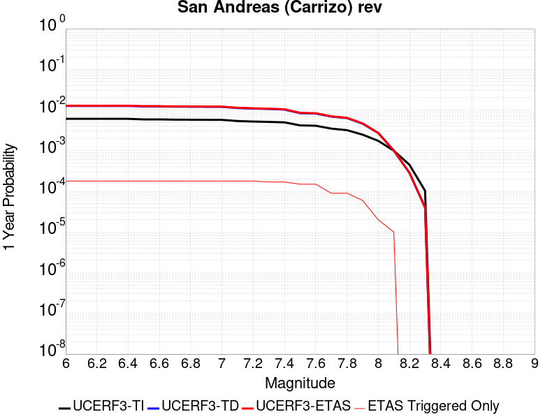 |  |

| Magnitude | 1 wk TI Prob | 1 wk TD Prob | 1 wk ETAS Prob | 1 wk ETAS/TD Gain | 1 wk ETAS Triggered Only | 1 mo TI Prob | 1 mo TD Prob | 1 mo ETAS Prob | 1 mo ETAS/TD Gain | 1 mo ETAS Triggered Only | 1 yr TI Prob | 1 yr TD Prob | 1 yr ETAS Prob | 1 yr ETAS/TD Gain | 1 yr ETAS Triggered Only | 10 yr TI Prob | 10 yr TD Prob | 10 yr ETAS Prob | 10 yr ETAS/TD Gain | 10 yr ETAS Triggered Only |
|-----|-----|-----|-----|-----|-----|-----|-----|-----|-----|-----|-----|-----|-----|-----|-----|-----|-----|-----|-----|-----|
| 6.0 | 1.1674632E-4 | 2.4324407E-4 | 3.4321973E-4 | 1.4110097 | 1.0E-4 | 5.002454E-4 | 0.0010420597 | 0.0011519451 | 1.1054502 | 1.1E-4 | 0.006073493 | 0.012613757 | 0.012791486 | 1.0140902 | 1.8E-4 | 0.0591016 | 0.120640226 | 0.12082489 | 1.0015308 | 2.1E-4 |
| 6.1 | 1.1674632E-4 | 2.4324407E-4 | 3.4321973E-4 | 1.4110097 | 1.0E-4 | 5.002454E-4 | 0.0010420597 | 0.0011519451 | 1.1054502 | 1.1E-4 | 0.006073493 | 0.012613757 | 0.012791486 | 1.0140902 | 1.8E-4 | 0.0591016 | 0.120640226 | 0.12082489 | 1.0015308 | 2.1E-4 |
| 6.2 | 1.1674632E-4 | 2.4324407E-4 | 3.4321973E-4 | 1.4110097 | 1.0E-4 | 5.002454E-4 | 0.0010420597 | 0.0011519451 | 1.1054502 | 1.1E-4 | 0.006073493 | 0.012613757 | 0.012791486 | 1.0140902 | 1.8E-4 | 0.0591016 | 0.120640226 | 0.12082489 | 1.0015308 | 2.1E-4 |
| 6.3 | 1.1674632E-4 | 2.4324407E-4 | 3.4321973E-4 | 1.4110097 | 1.0E-4 | 5.002454E-4 | 0.0010420597 | 0.0011519451 | 1.1054502 | 1.1E-4 | 0.006073493 | 0.012613757 | 0.012791486 | 1.0140902 | 1.8E-4 | 0.0591016 | 0.120640226 | 0.12082489 | 1.0015308 | 2.1E-4 |
| 6.4 | 1.1674632E-4 | 2.4324407E-4 | 3.4321973E-4 | 1.4110097 | 1.0E-4 | 5.002454E-4 | 0.0010420597 | 0.0011519451 | 1.1054502 | 1.1E-4 | 0.006073493 | 0.012613757 | 0.012791486 | 1.0140902 | 1.8E-4 | 0.0591016 | 0.120640226 | 0.12082489 | 1.0015308 | 2.1E-4 |
| 6.5 | 1.13136164E-4 | 2.3644442E-4 | 3.3642078E-4 | 1.4228324 | 1.0E-4 | 4.847792E-4 | 0.0010129412 | 0.0011228297 | 1.1084846 | 1.1E-4 | 0.0058862255 | 0.012263271 | 0.012441063 | 1.014498 | 1.8E-4 | 0.057327334 | 0.11761008 | 0.117795385 | 1.0015756 | 2.1E-4 |
| 6.6 | 1.13136164E-4 | 2.3644442E-4 | 3.3642078E-4 | 1.4228324 | 1.0E-4 | 4.847792E-4 | 0.0010129412 | 0.0011228297 | 1.1084846 | 1.1E-4 | 0.0058862255 | 0.012263271 | 0.012441063 | 1.014498 | 1.8E-4 | 0.057327334 | 0.11761008 | 0.117795385 | 1.0015756 | 2.1E-4 |
| 6.7 | 1.1149675E-4 | 2.3335687E-4 | 3.3333353E-4 | 1.4284282 | 1.0E-4 | 4.777557E-4 | 9.997191E-4 | 0.0011096091 | 1.1099209 | 1.1E-4 | 0.0058011734 | 0.012104088 | 0.01228191 | 1.014691 | 1.8E-4 | 0.05652051 | 0.1162291 | 0.116414696 | 1.0015968 | 2.1E-4 |
| 6.8 | 1.1103589E-4 | 2.3237852E-4 | 3.3235527E-4 | 1.4302324 | 1.0E-4 | 4.7578133E-4 | 9.955293E-4 | 0.0011054198 | 1.110384 | 1.1E-4 | 0.005777263 | 0.012053643 | 0.012231474 | 1.0147532 | 1.8E-4 | 0.056293584 | 0.11578894 | 0.11597462 | 1.0016036 | 2.1E-4 |
| 6.9 | 1.1053259E-4 | 2.3130233E-4 | 3.312792E-4 | 1.4322346 | 1.0E-4 | 4.7362508E-4 | 9.909206E-4 | 0.0011008116 | 1.1108979 | 1.1E-4 | 0.0057511497 | 0.011998152 | 0.012175992 | 1.0148224 | 1.8E-4 | 0.05604569 | 0.11530445 | 0.115490235 | 1.0016112 | 2.1E-4 |
| 7.0 | 1.1005377E-4 | 2.3031076E-4 | 3.3028773E-4 | 1.434096 | 1.0E-4 | 4.7157376E-4 | 9.866742E-4 | 0.0010965657 | 1.1113756 | 1.1E-4 | 0.0057263062 | 0.011947021 | 0.012124871 | 1.0148865 | 1.8E-4 | 0.055809796 | 0.11485658 | 0.11504246 | 1.0016184 | 2.1E-4 |
| 7.1 | 1.0308142E-4 | 2.1540876E-4 | 3.153872E-4 | 1.4641336 | 1.0E-4 | 4.417027E-4 | 9.228548E-4 | 0.0010327533 | 1.1190853 | 1.1E-4 | 0.0053644776 | 0.011178188 | 0.011356177 | 1.0159228 | 1.8E-4 | 0.052368138 | 0.10809042 | 0.10827772 | 1.0017328 | 2.1E-4 |
| 7.2 | 1.0027479E-4 | 2.094876E-4 | 3.0946665E-4 | 1.4772552 | 1.0E-4 | 4.296783E-4 | 8.9749607E-4 | 0.0010073973 | 1.1224532 | 1.1E-4 | 0.0052187922 | 0.010872566 | 0.011050609 | 1.0163754 | 1.8E-4 | 0.050979212 | 0.10539086 | 0.10557873 | 1.0017825 | 2.1E-4 |
| 7.3 | 9.816942E-5 | 2.0423878E-4 | 3.0421835E-4 | 1.4895229 | 1.0E-4 | 4.2065824E-4 | 8.7501644E-4 | 9.849202E-4 | 1.1256019 | 1.1E-4 | 0.005109493 | 0.010601572 | 0.01076977 | 1.0158653 | 1.7E-4 | 0.049935985 | 0.10297546 | 0.10315486 | 1.0017422 | 2.0E-4 |
| 7.4 | 9.5634205E-5 | 1.9793298E-4 | 2.9791318E-4 | 1.5051215 | 1.0E-4 | 4.0979648E-4 | 8.4800937E-4 | 9.579161E-4 | 1.1296055 | 1.1E-4 | 0.0049778637 | 0.010275901 | 0.010444154 | 1.0163735 | 1.7E-4 | 0.048678253 | 0.100067884 | 0.10024787 | 1.0017986 | 2.0E-4 |
| 7.5 | 8.052417E-5 | 1.6113915E-4 | 2.4112627E-4 | 1.4963853 | 8.0E-5 | 3.4505792E-4 | 6.9041376E-4 | 7.8035163E-4 | 1.1302667 | 9.0E-5 | 0.0041929903 | 0.008373471 | 0.008522215 | 1.0177637 | 1.5E-4 | 0.04114753 | 0.082815245 | 0.08298034 | 1.0019935 | 1.8E-4 |
| 7.6 | 7.897024E-5 | 1.5767086E-4 | 2.3765824E-4 | 1.5073061 | 8.0E-5 | 3.384E-4 | 6.755574E-4 | 7.6549663E-4 | 1.1331333 | 9.0E-5 | 0.0041122385 | 0.00819397 | 0.008342741 | 1.0181562 | 1.5E-4 | 0.040369697 | 0.08115866 | 0.081324056 | 1.0020379 | 1.8E-4 |
| 7.7 | 6.707427E-5 | 1.3277122E-4 | 1.9276325E-4 | 1.4518452 | 6.0E-5 | 2.8742946E-4 | 5.688955E-4 | 6.388557E-4 | 1.1229755 | 7.0E-5 | 0.003493839 | 0.0069043385 | 0.006993717 | 1.0129453 | 9.0E-5 | 0.034394164 | 0.06905339 | 0.0691651 | 1.0016178 | 1.2E-4 |
| 7.8 | 6.147705E-5 | 1.2198445E-4 | 1.8197713E-4 | 1.4918059 | 6.0E-5 | 2.6344648E-4 | 5.226858E-4 | 5.926492E-4 | 1.1338537 | 7.0E-5 | 0.0032027436 | 0.006345156 | 0.006434585 | 1.014094 | 9.0E-5 | 0.031569764 | 0.0635172 | 0.06362021 | 1.0016218 | 1.1E-4 |
| 7.9 | 4.7636717E-5 | 8.8802946E-5 | 1.18800286E-4 | 1.3377966 | 3.0E-5 | 2.0414138E-4 | 3.8052857E-4 | 4.2051336E-4 | 1.1050769 | 4.0E-5 | 0.0024825884 | 0.004623101 | 0.004682824 | 1.0129184 | 6.0E-5 | 0.024550365 | 0.046629366 | 0.046705633 | 1.0016357 | 8.0E-5 |
| 8.0 | 3.3554235E-5 | 5.2138024E-5 | 5.2138024E-5 | 1.0 | 0.0 | 1.4379594E-4 | 2.2342955E-4 | 2.3342732E-4 | 1.0447469 | 1.0E-5 | 0.0017493097 | 0.002716863 | 0.0027368087 | 1.0073414 | 2.0E-5 | 0.017356034 | 0.027881905 | 0.02792079 | 1.0013946 | 4.0E-5 |
| 8.1 | 1.9175432E-5 | 1.9183564E-5 | 1.9183564E-5 | 1.0 | 0.0 | 8.217783E-5 | 8.221269E-5 | 8.221269E-5 | 1.0 | 0.0 | 0.0010000558 | 0.0010004805 | 0.0010104704 | 1.0099852 | 1.0E-5 | 0.009955673 | 0.010757771 | 0.010777556 | 1.0018392 | 2.0E-5 |
| 8.2 | 8.643924E-6 | 5.473668E-6 | 5.473668E-6 | 1.0 | 0.0 | 3.704486E-5 | 2.3458366E-5 | 2.3458366E-5 | 1.0 | 0.0 | 4.5092785E-4 | 2.8556827E-4 | 2.8556827E-4 | 1.0 | 0.0 | 0.0045001395 | 0.0032481793 | 0.0032481793 | 1.0 | 0.0 |
| 8.3 | 1.983087E-6 | 7.6564595E-7 | 7.6564595E-7 | 1.0 | 0.0 | 8.498917E-6 | 3.281336E-6 | 3.281336E-6 | 1.0 | 0.0 | 1.034694E-4 | 3.9949547E-5 | 3.9949547E-5 | 1.0 | 0.0 | 0.0010342124 | 4.717979E-4 | 4.717979E-4 | 1.0 | 0.0 |

## Death Valley (Fish Lake Valley)
*[(top)](#table-of-contents)*

| 1 Week | 1 Month | 1 Year | 10 Year |
|-----|-----|-----|-----|
|  |  |  |  |

| Magnitude | 1 wk TI Prob | 1 wk TD Prob | 1 wk ETAS Prob | 1 wk ETAS/TD Gain | 1 wk ETAS Triggered Only | 1 mo TI Prob | 1 mo TD Prob | 1 mo ETAS Prob | 1 mo ETAS/TD Gain | 1 mo ETAS Triggered Only | 1 yr TI Prob | 1 yr TD Prob | 1 yr ETAS Prob | 1 yr ETAS/TD Gain | 1 yr ETAS Triggered Only | 10 yr TI Prob | 10 yr TD Prob | 10 yr ETAS Prob | 10 yr ETAS/TD Gain | 10 yr ETAS Triggered Only |
|-----|-----|-----|-----|-----|-----|-----|-----|-----|-----|-----|-----|-----|-----|-----|-----|-----|-----|-----|-----|-----|
| 6.0 | 3.872328E-5 | 4.7265705E-5 | 1.4726097E-4 | 3.115599 | 1.0E-4 | 1.6594635E-4 | 2.0255324E-4 | 3.425249E-4 | 1.6910362 | 1.4E-4 | 0.0020185246 | 0.0024635606 | 0.0026431172 | 1.0728849 | 1.8E-4 | 0.02000288 | 0.024388338 | 0.024593215 | 1.0084007 | 2.1E-4 |
| 6.1 | 3.872328E-5 | 4.7265705E-5 | 1.4726097E-4 | 3.115599 | 1.0E-4 | 1.6594635E-4 | 2.0255324E-4 | 3.425249E-4 | 1.6910362 | 1.4E-4 | 0.0020185246 | 0.0024635606 | 0.0026431172 | 1.0728849 | 1.8E-4 | 0.02000288 | 0.024388338 | 0.024593215 | 1.0084007 | 2.1E-4 |
| 6.2 | 3.872328E-5 | 4.7265705E-5 | 1.4726097E-4 | 3.115599 | 1.0E-4 | 1.6594635E-4 | 2.0255324E-4 | 3.425249E-4 | 1.6910362 | 1.4E-4 | 0.0020185246 | 0.0024635606 | 0.0026431172 | 1.0728849 | 1.8E-4 | 0.02000288 | 0.024388338 | 0.024593215 | 1.0084007 | 2.1E-4 |
| 6.3 | 2.8356371E-5 | 3.360979E-5 | 1.3360643E-4 | 3.9752235 | 1.0E-4 | 1.2152165E-4 | 1.4403443E-4 | 2.8401427E-4 | 1.9718498 | 1.4E-4 | 0.0014785219 | 0.0017522788 | 0.0019319634 | 1.1025434 | 1.8E-4 | 0.014687235 | 0.017391816 | 0.017598163 | 1.0118647 | 2.1E-4 |
| 6.4 | 2.8356371E-5 | 3.360979E-5 | 1.3360643E-4 | 3.9752235 | 1.0E-4 | 1.2152165E-4 | 1.4403443E-4 | 2.8401427E-4 | 1.9718498 | 1.4E-4 | 0.0014785219 | 0.0017522788 | 0.0019319634 | 1.1025434 | 1.8E-4 | 0.014687235 | 0.017391816 | 0.017598163 | 1.0118647 | 2.1E-4 |
| 6.5 | 2.4448687E-5 | 2.8607585E-5 | 1.2860472E-4 | 4.4954762 | 1.0E-4 | 1.0477588E-4 | 1.2259845E-4 | 2.6258128E-4 | 2.1417994 | 1.4E-4 | 0.0012748998 | 0.0014916616 | 0.0016713932 | 1.1204908 | 1.8E-4 | 0.012676105 | 0.014821392 | 0.015028279 | 1.0139587 | 2.1E-4 |
| 6.6 | 2.1298161E-5 | 2.4660083E-5 | 1.2465761E-4 | 5.055036 | 1.0E-4 | 9.127464E-5 | 1.0568197E-4 | 2.3566822E-4 | 2.2299757 | 1.3E-4 | 0.0011107022 | 0.0012859512 | 0.0014557326 | 1.1320279 | 1.7E-4 | 0.011051672 | 0.01278853 | 0.012985973 | 1.015439 | 2.0E-4 |
| 6.7 | 1.8959729E-5 | 2.1781027E-5 | 1.21778845E-4 | 5.591052 | 1.0E-4 | 8.125345E-5 | 9.334406E-5 | 2.2333192E-4 | 2.3925672 | 1.3E-4 | 9.888117E-4 | 0.001135897 | 0.0013057039 | 1.1494914 | 1.7E-4 | 0.009844234 | 0.01130357 | 0.011501309 | 1.0174935 | 2.0E-4 |
| 6.8 | 1.6691629E-5 | 1.9018351E-5 | 1.1901645E-4 | 6.2579794 | 1.0E-4 | 7.153359E-5 | 8.150477E-5 | 2.1149417E-4 | 2.5948687 | 1.3E-4 | 8.7057345E-4 | 9.918857E-4 | 0.0011617171 | 1.1712207 | 1.7E-4 | 0.008671708 | 0.009876343 | 0.010074369 | 1.0200504 | 2.0E-4 |
| 6.9 | 1.450505E-5 | 1.638954E-5 | 1.163879E-4 | 7.1013527 | 1.0E-4 | 6.216302E-5 | 7.0239046E-5 | 2.0022992E-4 | 2.8506925 | 1.3E-4 | 7.5657194E-4 | 8.5483363E-4 | 0.0010246884 | 1.1986991 | 1.7E-4 | 0.007540013 | 0.008516386 | 0.008714682 | 1.0232842 | 2.0E-4 |
| 7.0 | 1.2940855E-5 | 1.4537972E-5 | 1.1453652E-4 | 7.8784385 | 1.0E-4 | 5.545963E-5 | 6.230414E-5 | 1.9229604E-4 | 3.0864089 | 1.3E-4 | 6.750118E-4 | 7.5829466E-4 | 9.281658E-4 | 1.2240173 | 1.7E-4 | 0.006729651 | 0.0075576897 | 0.0077561783 | 1.0262631 | 2.0E-4 |
| 7.1 | 1.2544658E-5 | 1.4078208E-5 | 1.140768E-4 | 8.103077 | 1.0E-4 | 5.3761712E-5 | 6.0333812E-5 | 1.9032597E-4 | 3.1545491 | 1.3E-4 | 6.5435225E-4 | 7.343222E-4 | 9.0419734E-4 | 1.231336 | 1.7E-4 | 0.006524288 | 0.007319551 | 0.007518087 | 1.027124 | 2.0E-4 |
| 7.2 | 1.2489416E-5 | 1.4015674E-5 | 1.1401427E-4 | 8.134769 | 1.0E-4 | 5.3524967E-5 | 6.0065824E-5 | 1.9005801E-4 | 3.1641624 | 1.3E-4 | 6.514716E-4 | 7.310616E-4 | 9.0093736E-4 | 1.2323686 | 1.7E-4 | 0.006495651 | 0.0072871596 | 0.007485702 | 1.0272455 | 2.0E-4 |
| 7.3 | 1.2368307E-5 | 1.3879812E-5 | 1.1387842E-4 | 8.204608 | 1.0E-4 | 5.3005948E-5 | 5.9483587E-5 | 1.8947585E-4 | 3.1853468 | 1.3E-4 | 6.451563E-4 | 7.2397763E-4 | 8.9385454E-4 | 1.2346439 | 1.7E-4 | 0.0064328653 | 0.007216782 | 0.0074153384 | 1.0275131 | 2.0E-4 |
| 7.4 | 1.2161707E-5 | 1.36478675E-5 | 1.136465E-4 | 8.327052 | 1.0E-4 | 5.212056E-5 | 5.8489582E-5 | 1.8848198E-4 | 3.222488 | 1.3E-4 | 6.3438306E-4 | 7.118836E-4 | 8.817626E-4 | 1.238633 | 1.7E-4 | 0.006325751 | 0.0070966207 | 0.007295201 | 1.0279825 | 2.0E-4 |
| 7.5 | 1.1707948E-5 | 1.3145515E-5 | 1.13144204E-4 | 8.607058 | 1.0E-4 | 5.0175953E-5 | 5.6336736E-5 | 1.8632942E-4 | 3.3074229 | 1.3E-4 | 6.10721E-4 | 6.856895E-4 | 8.5557293E-4 | 1.2477556 | 1.7E-4 | 0.0060904534 | 0.006836321 | 0.007034954 | 1.0290555 | 2.0E-4 |
| 7.6 | 1.0319538E-5 | 1.1579622E-5 | 1.1157846E-4 | 9.63576 | 1.0E-4 | 4.4225842E-5 | 4.9626036E-5 | 1.7961959E-4 | 3.6194625 | 1.3E-4 | 5.383166E-4 | 6.040347E-4 | 7.73932E-4 | 1.2812707 | 1.7E-4 | 0.0053701443 | 0.0060244603 | 0.0062133158 | 1.0313481 | 1.9E-4 |
| 7.7 | 8.937764E-6 | 1.0022779E-5 | 1.00021876E-4 | 9.979455 | 9.0E-5 | 3.830414E-5 | 4.295409E-5 | 1.6294894E-4 | 3.7935605 | 1.2E-4 | 4.6625308E-4 | 5.228456E-4 | 6.8276195E-4 | 1.3058577 | 1.6E-4 | 0.0046527605 | 0.005216664 | 0.0053957254 | 1.0343248 | 1.8E-4 |
| 7.8 | 3.108007E-7 | 3.284654E-7 | 3.284654E-7 | 1.0 | 0.0 | 1.3320023E-6 | 1.407708E-6 | 1.407708E-6 | 1.0 | 0.0 | 1.6217007E-5 | 1.7138715E-5 | 1.7138715E-5 | 1.0 | 0.0 | 1.6215823E-4 | 1.7137431E-4 | 1.7137431E-4 | 1.0 | 0.0 |
| 7.9 | 2.5591178E-9 | 2.6696718E-9 | 2.6696718E-9 | 1.0 | 0.0 | 1.0967647E-8 | 1.14414505E-8 | 1.14414505E-8 | 1.0 | 0.0 | 1.335311E-7 | 1.3929966E-7 | 1.3929966E-7 | 1.0 | 0.0 | 1.3353102E-6 | 1.3929966E-6 | 1.3929966E-6 | 1.0 | 0.0 |

## San Andreas (Cholame) rev
*[(top)](#table-of-contents)*

| 1 Week | 1 Month | 1 Year | 10 Year |
|-----|-----|-----|-----|
|  |  |  | 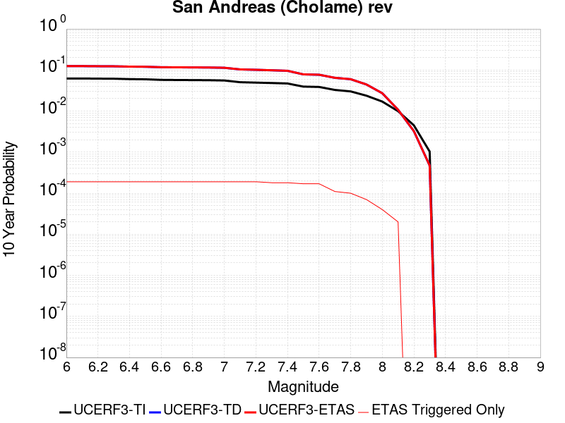 |

| Magnitude | 1 wk TI Prob | 1 wk TD Prob | 1 wk ETAS Prob | 1 wk ETAS/TD Gain | 1 wk ETAS Triggered Only | 1 mo TI Prob | 1 mo TD Prob | 1 mo ETAS Prob | 1 mo ETAS/TD Gain | 1 mo ETAS Triggered Only | 1 yr TI Prob | 1 yr TD Prob | 1 yr ETAS Prob | 1 yr ETAS/TD Gain | 1 yr ETAS Triggered Only | 10 yr TI Prob | 10 yr TD Prob | 10 yr ETAS Prob | 10 yr ETAS/TD Gain | 10 yr ETAS Triggered Only |
|-----|-----|-----|-----|-----|-----|-----|-----|-----|-----|-----|-----|-----|-----|-----|-----|-----|-----|-----|-----|-----|
| 6.0 | 1.2302514E-4 | 2.5205986E-4 | 3.320397E-4 | 1.317305 | 8.0E-5 | 5.27144E-4 | 0.0010798109 | 0.0011697138 | 1.0832579 | 9.0E-5 | 0.0063991086 | 0.013067958 | 0.0132258665 | 1.0120836 | 1.6E-4 | 0.06217949 | 0.12438412 | 0.124550484 | 1.0013375 | 1.9E-4 |
| 6.1 | 1.2302514E-4 | 2.5205986E-4 | 3.320397E-4 | 1.317305 | 8.0E-5 | 5.27144E-4 | 0.0010798109 | 0.0011697138 | 1.0832579 | 9.0E-5 | 0.0063991086 | 0.013067958 | 0.0132258665 | 1.0120836 | 1.6E-4 | 0.06217949 | 0.12438412 | 0.124550484 | 1.0013375 | 1.9E-4 |
| 6.2 | 1.2203569E-4 | 2.502277E-4 | 3.3020767E-4 | 1.3196288 | 8.0E-5 | 5.2290526E-4 | 0.0010719653 | 0.0011618688 | 1.0838679 | 9.0E-5 | 0.006347804 | 0.012973578 | 0.013131502 | 1.0121727 | 1.6E-4 | 0.061695136 | 0.123571314 | 0.123737834 | 1.0013475 | 1.9E-4 |
| 6.3 | 1.2142645E-4 | 2.4908737E-4 | 3.2906746E-4 | 1.3210925 | 8.0E-5 | 5.202953E-4 | 0.0010670823 | 0.0011569862 | 1.0842521 | 9.0E-5 | 0.006316212 | 0.012914834 | 0.013072767 | 1.0122288 | 1.6E-4 | 0.06139677 | 0.12306532 | 0.12323194 | 1.0013539 | 1.9E-4 |
| 6.4 | 1.1865206E-4 | 2.4414246E-4 | 3.2412293E-4 | 1.3275975 | 8.0E-5 | 5.0840975E-4 | 0.0010459068 | 0.0011358127 | 1.0859597 | 9.0E-5 | 0.006172335 | 0.012660044 | 0.012818019 | 1.0124782 | 1.6E-4 | 0.060036868 | 0.12085904 | 0.12102608 | 1.0013821 | 1.9E-4 |
| 6.5 | 1.17443946E-4 | 2.4207575E-4 | 3.2205638E-4 | 1.3303951 | 8.0E-5 | 5.032341E-4 | 0.0010370566 | 0.0011269633 | 1.0866941 | 9.0E-5 | 0.006109677 | 0.012553536 | 0.012711528 | 1.0125854 | 1.6E-4 | 0.059444077 | 0.11993008 | 0.120097294 | 1.0013943 | 1.9E-4 |
| 6.6 | 1.13579066E-4 | 2.3516564E-4 | 3.151468E-4 | 1.3401058 | 8.0E-5 | 4.866766E-4 | 0.001007465 | 0.0010973742 | 1.0892432 | 9.0E-5 | 0.0059092017 | 0.012197345 | 0.012355393 | 1.0129576 | 1.6E-4 | 0.057545185 | 0.1168492 | 0.117017 | 1.001436 | 1.9E-4 |
| 6.7 | 1.1271412E-4 | 2.336088E-4 | 3.135901E-4 | 1.3423729 | 8.0E-5 | 4.829711E-4 | 0.001000798 | 0.0010907078 | 1.0898383 | 9.0E-5 | 0.005864331 | 0.012117079 | 0.012275141 | 1.0130445 | 1.6E-4 | 0.057119697 | 0.11615275 | 0.116320685 | 1.0014458 | 1.9E-4 |
| 6.8 | 1.1217975E-4 | 2.3249313E-4 | 3.1247453E-4 | 1.3440162 | 8.0E-5 | 4.8068175E-4 | 9.960202E-4 | 0.0010859305 | 1.0902696 | 9.0E-5 | 0.005836608 | 0.012059555 | 0.012217626 | 1.0131075 | 1.6E-4 | 0.056856725 | 0.11565061 | 0.115818635 | 1.0014529 | 1.9E-4 |
| 6.9 | 1.1146753E-4 | 2.3098059E-4 | 3.1096212E-4 | 1.3462695 | 8.0E-5 | 4.7763053E-4 | 9.895428E-4 | 0.0010794537 | 1.0908611 | 9.0E-5 | 0.0057996577 | 0.011981564 | 0.012139646 | 1.0131938 | 1.6E-4 | 0.056506127 | 0.11497027 | 0.11513842 | 1.0014626 | 1.9E-4 |
| 7.0 | 1.0965793E-4 | 2.2721413E-4 | 3.0719594E-4 | 1.3520108 | 8.0E-5 | 4.698779E-4 | 9.734129E-4 | 0.0010633253 | 1.0923682 | 9.0E-5 | 0.005705768 | 0.011787324 | 0.011945439 | 1.0134139 | 1.6E-4 | 0.055614736 | 0.11327011 | 0.11343859 | 1.0014874 | 1.9E-4 |
| 7.1 | 9.927982E-5 | 2.0540332E-4 | 2.853869E-4 | 1.3893976 | 8.0E-5 | 4.2541555E-4 | 8.8000396E-4 | 9.699248E-4 | 1.1021823 | 9.0E-5 | 0.0051671406 | 0.010661708 | 0.010820002 | 1.0148469 | 1.6E-4 | 0.05048634 | 0.10336573 | 0.10353609 | 1.0016482 | 1.9E-4 |
| 7.2 | 9.696786E-5 | 2.0044584E-4 | 2.804298E-4 | 1.3990303 | 8.0E-5 | 4.1551032E-4 | 8.587718E-4 | 9.486945E-4 | 1.1047108 | 9.0E-5 | 0.00504711 | 0.010405703 | 0.0105640385 | 1.0152162 | 1.6E-4 | 0.04934009 | 0.10110233 | 0.10127313 | 1.0016893 | 1.9E-4 |
| 7.3 | 9.4727984E-5 | 1.9473763E-4 | 2.7472206E-4 | 1.4107292 | 8.0E-5 | 4.0591392E-4 | 8.343239E-4 | 9.242488E-4 | 1.1077818 | 9.0E-5 | 0.0049308087 | 0.010110851 | 0.010259334 | 1.0146855 | 1.5E-4 | 0.048228268 | 0.09847412 | 0.098636396 | 1.001648 | 1.8E-4 |
| 7.4 | 9.220358E-5 | 1.8844259E-4 | 2.684275E-4 | 1.4244525 | 8.0E-5 | 3.9509835E-4 | 8.07362E-4 | 8.9728937E-4 | 1.1113842 | 9.0E-5 | 0.004799717 | 0.009785578 | 0.00993411 | 1.0151787 | 1.5E-4 | 0.046973653 | 0.09555831 | 0.09572111 | 1.0017036 | 1.8E-4 |
| 7.5 | 7.71631E-5 | 1.5179155E-4 | 2.2178092E-4 | 1.4610888 | 7.0E-5 | 3.306571E-4 | 6.5037323E-4 | 7.3032116E-4 | 1.1229264 | 8.0E-5 | 0.0040183207 | 0.007889617 | 0.008028512 | 1.0176048 | 1.4E-4 | 0.03946433 | 0.078289196 | 0.07844589 | 1.0020014 | 1.7E-4 |
| 7.6 | 7.5634416E-5 | 1.4838556E-4 | 2.1837518E-4 | 1.471674 | 7.0E-5 | 3.241072E-4 | 6.357833E-4 | 7.1573246E-4 | 1.125749 | 8.0E-5 | 0.0039388672 | 0.007713256 | 0.007852176 | 1.0180106 | 1.4E-4 | 0.038697794 | 0.076654874 | 0.07681184 | 1.0020478 | 1.7E-4 |
| 7.7 | 6.3783E-5 | 1.2359623E-4 | 1.7359004E-4 | 1.4044931 | 5.0E-5 | 2.7332708E-4 | 5.2959064E-4 | 5.8955885E-4 | 1.113235 | 6.0E-5 | 0.0033226798 | 0.0064287307 | 0.0065082163 | 1.0123641 | 8.0E-5 | 0.032734364 | 0.06454488 | 0.06464778 | 1.0015942 | 1.1E-4 |
| 7.8 | 5.863422E-5 | 1.14169685E-4 | 1.6416398E-4 | 1.4378946 | 5.0E-5 | 2.512653E-4 | 4.892069E-4 | 5.491776E-4 | 1.1225874 | 6.0E-5 | 0.003054864 | 0.0059398497 | 0.0060193744 | 1.0133884 | 8.0E-5 | 0.030132094 | 0.05966162 | 0.059755653 | 1.0015761 | 1.0E-4 |
| 7.9 | 4.595283E-5 | 8.426815E-5 | 1.04266466E-4 | 1.2373176 | 2.0E-5 | 1.9692584E-4 | 3.6109926E-4 | 3.910884E-4 | 1.0830497 | 3.0E-5 | 0.0023949358 | 0.0043875277 | 0.0044373083 | 1.011346 | 5.0E-5 | 0.023692891 | 0.044363137 | 0.044430032 | 1.0015079 | 7.0E-5 |
| 8.0 | 3.2950178E-5 | 5.077396E-5 | 5.077396E-5 | 1.0 | 0.0 | 1.412074E-4 | 2.1758456E-4 | 2.2758238E-4 | 1.0459491 | 1.0E-5 | 0.0017178444 | 0.0026458753 | 0.0026658224 | 1.0075389 | 2.0E-5 | 0.017046256 | 0.027181072 | 0.027219985 | 1.0014316 | 4.0E-5 |
| 8.1 | 1.9177472E-5 | 1.9183733E-5 | 1.9183733E-5 | 1.0 | 0.0 | 8.218658E-5 | 8.221342E-5 | 8.221342E-5 | 1.0 | 0.0 | 0.0010001622 | 0.0010004893 | 0.0010104793 | 1.0099851 | 1.0E-5 | 0.009956728 | 0.010757887 | 0.010777672 | 1.001839 | 2.0E-5 |
| 8.2 | 8.643924E-6 | 5.473668E-6 | 5.473668E-6 | 1.0 | 0.0 | 3.704486E-5 | 2.3458366E-5 | 2.3458366E-5 | 1.0 | 0.0 | 4.5092785E-4 | 2.8556827E-4 | 2.8556827E-4 | 1.0 | 0.0 | 0.0045001395 | 0.0032481793 | 0.0032481793 | 1.0 | 0.0 |
| 8.3 | 1.983087E-6 | 7.6564595E-7 | 7.6564595E-7 | 1.0 | 0.0 | 8.498917E-6 | 3.281336E-6 | 3.281336E-6 | 1.0 | 0.0 | 1.034694E-4 | 3.9949547E-5 | 3.9949547E-5 | 1.0 | 0.0 | 0.0010342124 | 4.717979E-4 | 4.717979E-4 | 1.0 | 0.0 |

## San Jacinto (San Jacinto Valley) rev
*[(top)](#table-of-contents)*

| 1 Week | 1 Month | 1 Year | 10 Year |
|-----|-----|-----|-----|
|  |  |  |  |

| Magnitude | 1 wk TI Prob | 1 wk TD Prob | 1 wk ETAS Prob | 1 wk ETAS/TD Gain | 1 wk ETAS Triggered Only | 1 mo TI Prob | 1 mo TD Prob | 1 mo ETAS Prob | 1 mo ETAS/TD Gain | 1 mo ETAS Triggered Only | 1 yr TI Prob | 1 yr TD Prob | 1 yr ETAS Prob | 1 yr ETAS/TD Gain | 1 yr ETAS Triggered Only | 10 yr TI Prob | 10 yr TD Prob | 10 yr ETAS Prob | 10 yr ETAS/TD Gain | 10 yr ETAS Triggered Only |
|-----|-----|-----|-----|-----|-----|-----|-----|-----|-----|-----|-----|-----|-----|-----|-----|-----|-----|-----|-----|-----|
| 6.0 | 3.652694E-5 | 3.4401106E-5 | 1.6439664E-4 | 4.778818 | 1.3E-4 | 1.5653463E-4 | 1.4742499E-4 | 2.9740288E-4 | 2.0173166 | 1.5E-4 | 0.0019041431 | 0.0017934233 | 0.0019531364 | 1.0890548 | 1.6E-4 | 0.018879099 | 0.018526303 | 0.018693153 | 1.0090061 | 1.7E-4 |
| 6.1 | 3.652694E-5 | 3.4401106E-5 | 1.6439664E-4 | 4.778818 | 1.3E-4 | 1.5653463E-4 | 1.4742499E-4 | 2.9740288E-4 | 2.0173166 | 1.5E-4 | 0.0019041431 | 0.0017934233 | 0.0019531364 | 1.0890548 | 1.6E-4 | 0.018879099 | 0.018526303 | 0.018693153 | 1.0090061 | 1.7E-4 |
| 6.2 | 3.652694E-5 | 3.4401106E-5 | 1.6439664E-4 | 4.778818 | 1.3E-4 | 1.5653463E-4 | 1.4742499E-4 | 2.9740288E-4 | 2.0173166 | 1.5E-4 | 0.0019041431 | 0.0017934233 | 0.0019531364 | 1.0890548 | 1.6E-4 | 0.018879099 | 0.018526303 | 0.018693153 | 1.0090061 | 1.7E-4 |
| 6.3 | 3.652694E-5 | 3.4401106E-5 | 1.6439664E-4 | 4.778818 | 1.3E-4 | 1.5653463E-4 | 1.4742499E-4 | 2.9740288E-4 | 2.0173166 | 1.5E-4 | 0.0019041431 | 0.0017934233 | 0.0019531364 | 1.0890548 | 1.6E-4 | 0.018879099 | 0.018526303 | 0.018693153 | 1.0090061 | 1.7E-4 |
| 6.4 | 3.646941E-5 | 3.432268E-5 | 1.6431822E-4 | 4.787453 | 1.3E-4 | 1.5628811E-4 | 1.4708891E-4 | 2.9706684E-4 | 2.0196414 | 1.5E-4 | 0.0019011468 | 0.0017893389 | 0.0019490526 | 1.0892586 | 1.6E-4 | 0.018849645 | 0.018486181 | 0.018653039 | 1.009026 | 1.7E-4 |
| 6.5 | 3.646941E-5 | 3.432268E-5 | 1.6431822E-4 | 4.787453 | 1.3E-4 | 1.5628811E-4 | 1.4708891E-4 | 2.9706684E-4 | 2.0196414 | 1.5E-4 | 0.0019011468 | 0.0017893389 | 0.0019490526 | 1.0892586 | 1.6E-4 | 0.018849645 | 0.018486181 | 0.018653039 | 1.009026 | 1.7E-4 |
| 6.6 | 3.6442503E-5 | 3.4286066E-5 | 1.642816E-4 | 4.7914977 | 1.3E-4 | 1.561728E-4 | 1.4693203E-4 | 2.9690997E-4 | 2.0207303 | 1.5E-4 | 0.0018997455 | 0.001787432 | 0.0019471459 | 1.0893539 | 1.6E-4 | 0.018835869 | 0.01846745 | 0.018634312 | 1.0090353 | 1.7E-4 |
| 6.7 | 3.6432113E-5 | 3.427164E-5 | 1.6426719E-4 | 4.7930937 | 1.3E-4 | 1.5612828E-4 | 1.4687021E-4 | 2.968482E-4 | 2.02116 | 1.5E-4 | 0.0018992044 | 0.0017866807 | 0.0019463948 | 1.0893916 | 1.6E-4 | 0.018830549 | 0.018460074 | 0.018626936 | 1.009039 | 1.7E-4 |
| 6.8 | 3.6409598E-5 | 3.4240697E-5 | 1.6423625E-4 | 4.7965217 | 1.3E-4 | 1.560318E-4 | 1.4673761E-4 | 2.967156E-4 | 2.0220828 | 1.5E-4 | 0.0018980318 | 0.0017850689 | 0.0019447833 | 1.0894724 | 1.6E-4 | 0.018819023 | 0.018444229 | 0.018611094 | 1.009047 | 1.7E-4 |
| 6.9 | 3.638078E-5 | 3.4201123E-5 | 1.6419668E-4 | 4.800915 | 1.3E-4 | 1.5590832E-4 | 1.4656801E-4 | 2.9654603E-4 | 2.0232656 | 1.5E-4 | 0.0018965311 | 0.0017830075 | 0.0019427222 | 1.089576 | 1.6E-4 | 0.018804269 | 0.018423963 | 0.01859083 | 1.0090572 | 1.7E-4 |
| 7.0 | 3.6294874E-5 | 3.408314E-5 | 1.6407871E-4 | 4.8140726 | 1.3E-4 | 1.5554018E-4 | 1.4606243E-4 | 2.9604053E-4 | 2.026808 | 1.5E-4 | 0.0018920569 | 0.0017768623 | 0.001936578 | 1.0898864 | 1.6E-4 | 0.018760284 | 0.018363545 | 0.018530423 | 1.0090874 | 1.7E-4 |
| 7.1 | 3.6260717E-5 | 3.403942E-5 | 1.64035E-4 | 4.818971 | 1.3E-4 | 1.5539382E-4 | 1.4587509E-4 | 2.958532E-4 | 2.028127 | 1.5E-4 | 0.001890278 | 0.0017745851 | 0.0019343012 | 1.090002 | 1.6E-4 | 0.018742796 | 0.018341139 | 0.01850802 | 1.0090988 | 1.7E-4 |
| 7.2 | 3.6210204E-5 | 3.397364E-5 | 1.6396922E-4 | 4.826366 | 1.3E-4 | 1.5517735E-4 | 1.455932E-4 | 2.9557137E-4 | 2.0301178 | 1.5E-4 | 0.001887647 | 0.0017711588 | 0.0019308754 | 1.0901763 | 1.6E-4 | 0.01871693 | 0.018307408 | 0.018474296 | 1.0091158 | 1.7E-4 |
| 7.3 | 3.6119454E-5 | 3.386193E-5 | 1.6385752E-4 | 4.8389897 | 1.3E-4 | 1.5478847E-4 | 1.4511449E-4 | 2.9509273E-4 | 2.0335166 | 1.5E-4 | 0.0018829206 | 0.0017653398 | 0.0019250574 | 1.0904741 | 1.6E-4 | 0.018670462 | 0.01824996 | 0.018416857 | 1.0091451 | 1.7E-4 |
| 7.4 | 3.607848E-5 | 3.380943E-5 | 1.6380503E-4 | 4.844951 | 1.3E-4 | 1.5461289E-4 | 1.4488952E-4 | 2.948678E-4 | 2.0351217 | 1.5E-4 | 0.0018807866 | 0.0017626052 | 0.0019223231 | 1.0906147 | 1.6E-4 | 0.018649481 | 0.018222956 | 0.018389858 | 1.0091588 | 1.7E-4 |
| 7.5 | 3.5856774E-5 | 3.3619202E-5 | 1.6361484E-4 | 4.866708 | 1.3E-4 | 1.5366284E-4 | 1.4407437E-4 | 2.9405273E-4 | 2.0409791 | 1.5E-4 | 0.0018692396 | 0.0017526967 | 0.0019124163 | 1.0911279 | 1.6E-4 | 0.018535944 | 0.018124057 | 0.018290976 | 1.0092098 | 1.7E-4 |
| 7.6 | 3.286655E-5 | 3.2142278E-5 | 1.621381E-4 | 5.0443873 | 1.3E-4 | 1.4084904E-4 | 1.3774536E-4 | 2.877247E-4 | 2.088816 | 1.5E-4 | 0.001713488 | 0.0016757617 | 0.0018354936 | 1.0953189 | 1.6E-4 | 0.017003361 | 0.017343804 | 0.017510856 | 1.0096318 | 1.7E-4 |
| 7.7 | 2.8882527E-5 | 2.9235205E-5 | 1.5923141E-4 | 5.4465637 | 1.3E-4 | 1.237764E-4 | 1.2528773E-4 | 2.7526892E-4 | 2.1970942 | 1.5E-4 | 0.0015059357 | 0.0015243118 | 0.0016840679 | 1.1048054 | 1.6E-4 | 0.014957713 | 0.015830338 | 0.015997646 | 1.0105689 | 1.7E-4 |
| 7.8 | 2.4950225E-5 | 2.6526219E-5 | 1.4652303E-4 | 5.523706 | 1.2E-4 | 1.0692515E-4 | 1.1367885E-4 | 2.5366293E-4 | 2.2313995 | 1.4E-4 | 0.0013010362 | 0.0013831621 | 0.0015329546 | 1.1082971 | 1.5E-4 | 0.012934455 | 0.01441176 | 0.014569454 | 1.0109421 | 1.6E-4 |
| 7.9 | 1.9881603E-5 | 2.150649E-5 | 1.4150392E-4 | 6.579591 | 1.2E-4 | 8.520408E-5 | 9.216742E-5 | 2.3215452E-4 | 2.5188348 | 1.4E-4 | 0.001036866 | 0.0011215615 | 0.0012713933 | 1.1335921 | 1.5E-4 | 0.010320415 | 0.011776998 | 0.011935114 | 1.0134258 | 1.6E-4 |
| 8.0 | 1.563292E-5 | 1.5936288E-5 | 9.5935015E-5 | 6.01991 | 8.0E-5 | 6.6996516E-5 | 6.829659E-5 | 1.5829045E-4 | 2.3176918 | 9.0E-5 | 8.153773E-4 | 8.3119445E-4 | 9.3111134E-4 | 1.1202087 | 1.0E-4 | 0.00812392 | 0.008810331 | 0.008919362 | 1.0123754 | 1.1E-4 |
| 8.1 | 1.0045313E-5 | 8.300794E-6 | 4.8300462E-5 | 5.818776 | 4.0E-5 | 4.305063E-5 | 3.557435E-5 | 8.5572574E-5 | 2.405457 | 5.0E-5 | 5.2401534E-4 | 4.3303217E-4 | 4.8301052E-4 | 1.1154149 | 5.0E-5 | 0.0052278144 | 0.0046587666 | 0.004718487 | 1.0128189 | 6.0E-5 |
| 8.2 | 4.1554413E-6 | 1.5648296E-6 | 1.5648296E-6 | 1.0 | 0.0 | 1.7808914E-5 | 6.7063957E-6 | 6.7063957E-6 | 1.0 | 0.0 | 2.1680194E-4 | 8.164734E-5 | 8.164734E-5 | 1.0 | 0.0 | 0.0021659054 | 9.479703E-4 | 9.479703E-4 | 1.0 | 0.0 |
| 8.3 | 1.2758221E-6 | 3.612677E-7 | 3.612677E-7 | 1.0 | 0.0 | 5.4677976E-6 | 1.5482892E-6 | 1.5482892E-6 | 1.0 | 0.0 | 6.65684E-5 | 1.8850264E-5 | 1.8850264E-5 | 1.0 | 0.0 | 6.6548464E-4 | 2.2739546E-4 | 2.2739546E-4 | 1.0 | 0.0 |

## Calico-Hidalgo
*[(top)](#table-of-contents)*

| 1 Week | 1 Month | 1 Year | 10 Year |
|-----|-----|-----|-----|
|  |  |  |  |

| Magnitude | 1 wk TI Prob | 1 wk TD Prob | 1 wk ETAS Prob | 1 wk ETAS/TD Gain | 1 wk ETAS Triggered Only | 1 mo TI Prob | 1 mo TD Prob | 1 mo ETAS Prob | 1 mo ETAS/TD Gain | 1 mo ETAS Triggered Only | 1 yr TI Prob | 1 yr TD Prob | 1 yr ETAS Prob | 1 yr ETAS/TD Gain | 1 yr ETAS Triggered Only | 10 yr TI Prob | 10 yr TD Prob | 10 yr ETAS Prob | 10 yr ETAS/TD Gain | 10 yr ETAS Triggered Only |
|-----|-----|-----|-----|-----|-----|-----|-----|-----|-----|-----|-----|-----|-----|-----|-----|-----|-----|-----|-----|-----|
| 6.0 | 4.0906612E-5 | 5.0704355E-5 | 1.4069979E-4 | 2.7749054 | 9.0E-5 | 1.7530227E-4 | 2.1728857E-4 | 3.1726685E-4 | 1.4601175 | 1.0E-4 | 0.0021322158 | 0.002642678 | 0.0027823083 | 1.0528365 | 1.4E-4 | 0.02111873 | 0.026152814 | 0.026298892 | 1.0055856 | 1.5E-4 |
| 6.1 | 4.0906612E-5 | 5.0704355E-5 | 1.4069979E-4 | 2.7749054 | 9.0E-5 | 1.7530227E-4 | 2.1728857E-4 | 3.1726685E-4 | 1.4601175 | 1.0E-4 | 0.0021322158 | 0.002642678 | 0.0027823083 | 1.0528365 | 1.4E-4 | 0.02111873 | 0.026152814 | 0.026298892 | 1.0055856 | 1.5E-4 |
| 6.2 | 4.0906612E-5 | 5.0704355E-5 | 1.4069979E-4 | 2.7749054 | 9.0E-5 | 1.7530227E-4 | 2.1728857E-4 | 3.1726685E-4 | 1.4601175 | 1.0E-4 | 0.0021322158 | 0.002642678 | 0.0027823083 | 1.0528365 | 1.4E-4 | 0.02111873 | 0.026152814 | 0.026298892 | 1.0055856 | 1.5E-4 |
| 6.3 | 2.4242801E-5 | 3.0090967E-5 | 6.0090064E-5 | 1.9969469 | 3.0E-5 | 1.0389358E-4 | 1.289551E-4 | 1.6894995E-4 | 1.3101455 | 4.0E-5 | 0.0012641704 | 0.0015689312 | 0.0016488057 | 1.0509101 | 8.0E-5 | 0.01257003 | 0.015582229 | 0.015670827 | 1.0056858 | 9.0E-5 |
| 6.4 | 2.4242801E-5 | 3.0090967E-5 | 6.0090064E-5 | 1.9969469 | 3.0E-5 | 1.0389358E-4 | 1.289551E-4 | 1.6894995E-4 | 1.3101455 | 4.0E-5 | 0.0012641704 | 0.0015689312 | 0.0016488057 | 1.0509101 | 8.0E-5 | 0.01257003 | 0.015582229 | 0.015670827 | 1.0056858 | 9.0E-5 |
| 6.5 | 2.0286952E-5 | 2.5316054E-5 | 5.5315297E-5 | 2.1849887 | 3.0E-5 | 8.694118E-5 | 1.0849296E-4 | 1.4848862E-4 | 1.3686475 | 4.0E-5 | 0.0010579949 | 0.0013201186 | 0.0013900261 | 1.0529555 | 7.0E-5 | 0.010529719 | 0.013124701 | 0.013203651 | 1.0060154 | 8.0E-5 |
| 6.6 | 2.0269223E-5 | 2.5297004E-5 | 5.5296245E-5 | 2.1858811 | 3.0E-5 | 8.6865206E-5 | 1.08411325E-4 | 1.4840698E-4 | 1.3689251 | 4.0E-5 | 0.0010570707 | 0.0013191258 | 0.0013890334 | 1.0529954 | 7.0E-5 | 0.010520565 | 0.01311489 | 0.013193841 | 1.00602 | 8.0E-5 |
| 6.7 | 1.799852E-5 | 2.2540933E-5 | 5.2540257E-5 | 2.330882 | 3.0E-5 | 7.713423E-5 | 9.660051E-5 | 1.3659665E-4 | 1.4140365 | 4.0E-5 | 9.3870464E-4 | 0.0011754911 | 0.0012454089 | 1.0594796 | 7.0E-5 | 0.009347493 | 0.011694346 | 0.01177341 | 1.006761 | 8.0E-5 |
| 6.8 | 1.7458793E-5 | 2.184258E-5 | 5.1841926E-5 | 2.373434 | 3.0E-5 | 7.4821255E-5 | 9.360778E-5 | 1.3360403E-4 | 1.427275 | 4.0E-5 | 9.10568E-4 | 0.0011390933 | 0.0012090136 | 1.0613824 | 7.0E-5 | 0.009068459 | 0.011334131 | 0.011413224 | 1.0069783 | 8.0E-5 |
| 6.9 | 1.542884E-5 | 1.9026285E-5 | 4.9025715E-5 | 2.576736 | 3.0E-5 | 6.612192E-5 | 8.153875E-5 | 1.21535486E-4 | 1.4905243 | 4.0E-5 | 8.04737E-4 | 9.922953E-4 | 0.0010622258 | 1.0704736 | 7.0E-5 | 0.008018291 | 0.009880043 | 0.009949352 | 1.007015 | 7.0E-5 |
| 7.0 | 1.468253E-5 | 1.803109E-5 | 4.803055E-5 | 2.6637628 | 3.0E-5 | 6.292361E-5 | 7.727389E-5 | 1.172708E-4 | 1.5175992 | 4.0E-5 | 7.658257E-4 | 9.4041653E-4 | 0.0010103508 | 1.0743651 | 7.0E-5 | 0.0076319184 | 0.009365736 | 0.00943508 | 1.0074041 | 7.0E-5 |
| 7.1 | 1.3139281E-5 | 1.620139E-5 | 3.6201065E-5 | 2.234442 | 2.0E-5 | 5.6309986E-5 | 6.943275E-5 | 9.943067E-5 | 1.4320427 | 3.0E-5 | 6.853584E-4 | 8.4502844E-4 | 8.9498615E-4 | 1.0591196 | 5.0E-5 | 0.0068324856 | 0.008419449 | 0.008469028 | 1.0058886 | 5.0E-5 |
| 7.2 | 1.1127404E-5 | 1.3867038E-5 | 3.386676E-5 | 2.442249 | 2.0E-5 | 4.7688E-5 | 5.9428872E-5 | 7.9427686E-5 | 1.3365167 | 2.0E-5 | 5.8044674E-4 | 7.233172E-4 | 7.5329555E-4 | 1.0414456 | 3.0E-5 | 0.0057893298 | 0.007210737 | 0.007240521 | 1.0041305 | 3.0E-5 |
| 7.3 | 9.808154E-6 | 1.2176586E-5 | 1.2176586E-5 | 1.0 | 0.0 | 4.2034266E-5 | 5.2184383E-5 | 5.2184383E-5 | 1.0 | 0.0 | 5.11647E-4 | 6.351704E-4 | 6.4516405E-4 | 1.0157338 | 1.0E-5 | 0.0051047057 | 0.006334625 | 0.006344562 | 1.0015687 | 1.0E-5 |
| 7.4 | 7.942452E-6 | 9.792348E-6 | 9.792348E-6 | 1.0 | 0.0 | 3.4038632E-5 | 4.1966585E-5 | 4.1966585E-5 | 1.0 | 0.0 | 4.1434157E-4 | 5.108328E-4 | 5.208277E-4 | 1.0195658 | 1.0E-5 | 0.0041356985 | 0.005097527 | 0.0051074764 | 1.0019517 | 1.0E-5 |
| 7.5 | 4.7121216E-6 | 5.7729717E-6 | 5.7729717E-6 | 1.0 | 0.0 | 2.019465E-5 | 2.4741115E-5 | 2.4741115E-5 | 1.0 | 0.0 | 2.4584212E-4 | 3.011891E-4 | 3.011891E-4 | 1.0 | 0.0 | 0.0024557032 | 0.0030085614 | 0.0030085614 | 1.0 | 0.0 |
| 7.6 | 2.21172E-7 | 2.6040198E-7 | 2.6040198E-7 | 1.0 | 0.0 | 9.478797E-7 | 1.1160082E-6 | 1.1160082E-6 | 1.0 | 0.0 | 1.1540374E-5 | 1.3587343E-5 | 1.3587343E-5 | 1.0 | 0.0 | 1.1539775E-4 | 1.3586794E-4 | 1.3586794E-4 | 1.0 | 0.0 |

## San Andreas (Coachella) rev
*[(top)](#table-of-contents)*

| 1 Week | 1 Month | 1 Year | 10 Year |
|-----|-----|-----|-----|
|  |  |  |  |

| Magnitude | 1 wk TI Prob | 1 wk TD Prob | 1 wk ETAS Prob | 1 wk ETAS/TD Gain | 1 wk ETAS Triggered Only | 1 mo TI Prob | 1 mo TD Prob | 1 mo ETAS Prob | 1 mo ETAS/TD Gain | 1 mo ETAS Triggered Only | 1 yr TI Prob | 1 yr TD Prob | 1 yr ETAS Prob | 1 yr ETAS/TD Gain | 1 yr ETAS Triggered Only | 10 yr TI Prob | 10 yr TD Prob | 10 yr ETAS Prob | 10 yr ETAS/TD Gain | 10 yr ETAS Triggered Only |
|-----|-----|-----|-----|-----|-----|-----|-----|-----|-----|-----|-----|-----|-----|-----|-----|-----|-----|-----|-----|-----|
| 6.0 | 1.1925945E-4 | 3.273077E-4 | 4.0728154E-4 | 1.2443383 | 8.0E-5 | 5.110118E-4 | 0.001401998 | 0.0015318157 | 1.0925949 | 1.3E-4 | 0.0062038354 | 0.016937068 | 0.017074697 | 1.0081259 | 1.4E-4 | 0.060334753 | 0.15267672 | 0.15280381 | 1.0008324 | 1.5E-4 |
| 6.1 | 1.1925945E-4 | 3.273077E-4 | 4.0728154E-4 | 1.2443383 | 8.0E-5 | 5.110118E-4 | 0.001401998 | 0.0015318157 | 1.0925949 | 1.3E-4 | 0.0062038354 | 0.016937068 | 0.017074697 | 1.0081259 | 1.4E-4 | 0.060334753 | 0.15267672 | 0.15280381 | 1.0008324 | 1.5E-4 |
| 6.2 | 1.07432395E-4 | 3.0231563E-4 | 3.8229144E-4 | 1.2645441 | 8.0E-5 | 4.603433E-4 | 0.001294999 | 0.0014248306 | 1.1002562 | 1.3E-4 | 0.005590286 | 0.015653731 | 0.01579154 | 1.0088036 | 1.4E-4 | 0.05451731 | 0.14182784 | 0.14195655 | 1.0009077 | 1.5E-4 |
| 6.3 | 1.0718766E-4 | 3.0176868E-4 | 3.8174452E-4 | 1.2650237 | 8.0E-5 | 4.592948E-4 | 0.0012926573 | 0.0014224893 | 1.100438 | 1.3E-4 | 0.005577586 | 0.01562563 | 0.015763443 | 1.0088196 | 1.4E-4 | 0.054396555 | 0.14159605 | 0.14172481 | 1.0009093 | 1.5E-4 |
| 6.4 | 1.0355944E-4 | 2.9384956E-4 | 3.7382604E-4 | 1.2721682 | 8.0E-5 | 4.4375064E-4 | 0.0012587514 | 0.0013885878 | 1.1031469 | 1.3E-4 | 0.0053892885 | 0.015218662 | 0.015356531 | 1.0090592 | 1.4E-4 | 0.052604496 | 0.13815795 | 0.13828723 | 1.0009357 | 1.5E-4 |
| 6.5 | 1.0227914E-4 | 2.9104383E-4 | 3.7102058E-4 | 1.2747927 | 8.0E-5 | 4.382655E-4 | 0.0012467385 | 0.0013765764 | 1.1041421 | 1.3E-4 | 0.0053228354 | 0.015074439 | 0.015212328 | 1.0091473 | 1.4E-4 | 0.051971316 | 0.13694239 | 0.13707185 | 1.0009453 | 1.5E-4 |
| 6.6 | 1.0116757E-4 | 2.8870135E-4 | 3.5868114E-4 | 1.242395 | 7.0E-5 | 4.3350324E-4 | 0.0012367087 | 0.0013565603 | 1.0969118 | 1.2E-4 | 0.0052651367 | 0.014954008 | 0.015082064 | 1.0085633 | 1.3E-4 | 0.051421247 | 0.13591973 | 0.13604072 | 1.00089 | 1.4E-4 |
| 6.7 | 1.0050676E-4 | 2.8728697E-4 | 3.5726686E-4 | 1.2435888 | 7.0E-5 | 4.3067214E-4 | 0.0012306528 | 0.0013505052 | 1.0973892 | 1.2E-4 | 0.005230834 | 0.014881288 | 0.015009353 | 1.0086058 | 1.3E-4 | 0.051094085 | 0.13530464 | 0.1354257 | 1.0008947 | 1.4E-4 |
| 6.8 | 9.976819E-5 | 2.8532353E-4 | 3.5530355E-4 | 1.2452655 | 7.0E-5 | 4.2750788E-4 | 0.001222246 | 0.0013420993 | 1.0980599 | 1.2E-4 | 0.0051924936 | 0.014780328 | 0.014908407 | 1.0086654 | 1.3E-4 | 0.050728295 | 0.13445628 | 0.13457745 | 1.0009012 | 1.4E-4 |
| 6.9 | 9.77719E-5 | 2.802926E-4 | 3.5027295E-4 | 1.2496691 | 7.0E-5 | 4.1895514E-4 | 0.0012007048 | 0.0013205607 | 1.0998213 | 1.2E-4 | 0.0050888555 | 0.0145215895 | 0.014649702 | 1.0088222 | 1.3E-4 | 0.049738888 | 0.13228476 | 0.13240623 | 1.0009183 | 1.4E-4 |
| 7.0 | 8.500761E-5 | 2.4763815E-4 | 3.176208E-4 | 1.2826005 | 7.0E-5 | 3.6426744E-4 | 0.0010608779 | 0.0011807506 | 1.1129938 | 1.2E-4 | 0.0044259406 | 0.01284047 | 0.012968801 | 1.0099943 | 1.3E-4 | 0.04338823 | 0.11813616 | 0.118259616 | 1.0010451 | 1.4E-4 |
| 7.1 | 8.319876E-5 | 2.4366553E-4 | 3.1364846E-4 | 1.287209 | 7.0E-5 | 3.5651738E-4 | 0.0010438662 | 0.0011637409 | 1.1148373 | 1.2E-4 | 0.004331963 | 0.012635773 | 0.012764131 | 1.0101583 | 1.3E-4 | 0.042484846 | 0.11635632 | 0.11648003 | 1.0010632 | 1.4E-4 |
| 7.2 | 7.563917E-5 | 2.2414974E-4 | 2.9413405E-4 | 1.3122213 | 7.0E-5 | 3.2412758E-4 | 9.602912E-4 | 0.001080176 | 1.124842 | 1.2E-4 | 0.0039391145 | 0.011629559 | 0.011758047 | 1.0110484 | 1.3E-4 | 0.03870018 | 0.10776202 | 0.107886925 | 1.0011592 | 1.4E-4 |
| 7.3 | 7.082985E-5 | 2.07311E-4 | 2.5730062E-4 | 1.2411336 | 5.0E-5 | 3.0352117E-4 | 8.881761E-4 | 9.880873E-4 | 1.1124903 | 1.0E-4 | 0.0036891096 | 0.010760553 | 0.01086937 | 1.0101125 | 1.1E-4 | 0.03628465 | 0.10028403 | 0.100392 | 1.0010766 | 1.2E-4 |
| 7.4 | 5.146215E-5 | 1.4274761E-4 | 1.9274047E-4 | 1.3502185 | 5.0E-5 | 2.2053342E-4 | 6.1163295E-4 | 7.115718E-4 | 1.1633967 | 1.0E-4 | 0.0026816884 | 0.0074213943 | 0.007530578 | 1.014712 | 1.1E-4 | 0.02649557 | 0.07085049 | 0.07096199 | 1.0015737 | 1.2E-4 |
| 7.5 | 4.0285166E-5 | 1.0942422E-4 | 1.5941875E-4 | 1.4568872 | 5.0E-5 | 1.7263928E-4 | 4.6887697E-4 | 5.6883006E-4 | 1.2131755 | 1.0E-4 | 0.002099857 | 0.0056937044 | 0.005803078 | 1.0192096 | 1.1E-4 | 0.020801254 | 0.055013083 | 0.05512648 | 1.0020612 | 1.2E-4 |
| 7.6 | 3.1168736E-5 | 8.439599E-5 | 1.3439177E-4 | 1.5923952 | 5.0E-5 | 1.3357346E-4 | 3.616471E-4 | 4.6161094E-4 | 1.2764126 | 1.0E-4 | 0.0016250437 | 0.004394191 | 0.0045037074 | 1.0249231 | 1.1E-4 | 0.016132116 | 0.042812478 | 0.04292734 | 1.0026829 | 1.2E-4 |
| 7.7 | 2.2100989E-5 | 6.239345E-5 | 9.239158E-5 | 1.4807897 | 3.0E-5 | 9.4715084E-5 | 2.6737314E-4 | 3.4735174E-4 | 1.2991273 | 8.0E-5 | 0.001152546 | 0.0032504152 | 0.0033401225 | 1.0275987 | 9.0E-5 | 0.011465867 | 0.031902168 | 0.03199898 | 1.0030346 | 1.0E-4 |
| 7.8 | 1.7484861E-5 | 5.180078E-5 | 8.1799226E-5 | 1.5791118 | 3.0E-5 | 7.493296E-5 | 2.2198448E-4 | 3.019667E-4 | 1.3603055 | 8.0E-5 | 9.1192697E-4 | 0.0026993142 | 0.0027890713 | 1.0332518 | 9.0E-5 | 0.009081938 | 0.026641788 | 0.026739122 | 1.0036535 | 1.0E-4 |
| 7.9 | 1.3967285E-5 | 3.8226146E-5 | 6.8225E-5 | 1.7847731 | 3.0E-5 | 5.985842E-5 | 1.6381606E-4 | 2.4380296E-4 | 1.4882725 | 8.0E-5 | 7.2853256E-4 | 0.0019926373 | 0.002082458 | 1.0450763 | 9.0E-5 | 0.0072614877 | 0.019911002 | 0.020009011 | 1.0049224 | 1.0E-4 |
| 8.0 | 1.1887396E-5 | 3.106798E-5 | 5.106736E-5 | 1.6437296 | 2.0E-5 | 5.094499E-5 | 1.331417E-4 | 1.931337E-4 | 1.4505877 | 6.0E-5 | 6.200787E-4 | 0.0016197958 | 0.0016896825 | 1.0431453 | 7.0E-5 | 0.006183513 | 0.016280567 | 0.016359264 | 1.0048338 | 8.0E-5 |
| 8.1 | 5.100864E-6 | 8.973766E-6 | 8.973766E-6 | 1.0 | 0.0 | 2.1860664E-5 | 3.845843E-5 | 3.845843E-5 | 1.0 | 0.0 | 2.6612106E-4 | 4.6813092E-4 | 4.7812623E-4 | 1.0213516 | 1.0E-5 | 0.002658026 | 0.004918092 | 0.0049379934 | 1.0040466 | 2.0E-5 |
| 8.2 | 2.3004484E-6 | 2.7863473E-6 | 2.7863473E-6 | 1.0 | 0.0 | 9.859027E-6 | 1.19414335E-5 | 1.19414335E-5 | 1.0 | 0.0 | 1.2002704E-4 | 1.4537729E-4 | 1.4537729E-4 | 1.0 | 0.0 | 0.0011996223 | 0.0015973782 | 0.0015973782 | 1.0 | 0.0 |
| 8.3 | 1.0424446E-7 | 5.814421E-8 | 5.814421E-8 | 1.0 | 0.0 | 4.4676187E-7 | 2.4918944E-7 | 2.4918944E-7 | 1.0 | 0.0 | 5.439312E-6 | 3.0338776E-6 | 3.0338776E-6 | 1.0 | 0.0 | 5.4391792E-5 | 3.189592E-5 | 3.189592E-5 | 1.0 | 0.0 |

## Cady
*[(top)](#table-of-contents)*

| 1 Week | 1 Month | 1 Year | 10 Year |
|-----|-----|-----|-----|
|  |  |  |  |

| Magnitude | 1 wk TI Prob | 1 wk TD Prob | 1 wk ETAS Prob | 1 wk ETAS/TD Gain | 1 wk ETAS Triggered Only | 1 mo TI Prob | 1 mo TD Prob | 1 mo ETAS Prob | 1 mo ETAS/TD Gain | 1 mo ETAS Triggered Only | 1 yr TI Prob | 1 yr TD Prob | 1 yr ETAS Prob | 1 yr ETAS/TD Gain | 1 yr ETAS Triggered Only | 10 yr TI Prob | 10 yr TD Prob | 10 yr ETAS Prob | 10 yr ETAS/TD Gain | 10 yr ETAS Triggered Only |
|-----|-----|-----|-----|-----|-----|-----|-----|-----|-----|-----|-----|-----|-----|-----|-----|-----|-----|-----|-----|-----|
| 6.0 | 1.9892565E-5 | 2.1858728E-5 | 9.18572E-5 | 4.202312 | 7.0E-5 | 8.525106E-5 | 9.3677416E-5 | 1.9366805E-4 | 2.067393 | 1.0E-4 | 0.0010374374 | 0.0011400167 | 0.0012498914 | 1.0963798 | 1.1E-4 | 0.010326075 | 0.011350701 | 0.011498998 | 1.0130651 | 1.5E-4 |
| 6.1 | 1.9892565E-5 | 2.1858728E-5 | 9.18572E-5 | 4.202312 | 7.0E-5 | 8.525106E-5 | 9.3677416E-5 | 1.9366805E-4 | 2.067393 | 1.0E-4 | 0.0010374374 | 0.0011400167 | 0.0012498914 | 1.0963798 | 1.1E-4 | 0.010326075 | 0.011350701 | 0.011498998 | 1.0130651 | 1.5E-4 |
| 6.2 | 1.9892565E-5 | 2.1858728E-5 | 9.18572E-5 | 4.202312 | 7.0E-5 | 8.525106E-5 | 9.3677416E-5 | 1.9366805E-4 | 2.067393 | 1.0E-4 | 0.0010374374 | 0.0011400167 | 0.0012498914 | 1.0963798 | 1.1E-4 | 0.010326075 | 0.011350701 | 0.011498998 | 1.0130651 | 1.5E-4 |
| 6.3 | 1.1117327E-5 | 1.2176583E-5 | 3.217634E-5 | 2.6424768 | 2.0E-5 | 4.764482E-5 | 5.2184492E-5 | 1.0218188E-4 | 1.9580891 | 5.0E-5 | 5.7992124E-4 | 6.351925E-4 | 6.9515436E-4 | 1.0943996 | 6.0E-5 | 0.0057841022 | 0.0063368753 | 0.006426305 | 1.0141126 | 9.0E-5 |
| 6.4 | 1.1117327E-5 | 1.2176583E-5 | 3.217634E-5 | 2.6424768 | 2.0E-5 | 4.764482E-5 | 5.2184492E-5 | 1.0218188E-4 | 1.9580891 | 5.0E-5 | 5.7992124E-4 | 6.351925E-4 | 6.9515436E-4 | 1.0943996 | 6.0E-5 | 0.0057841022 | 0.0063368753 | 0.006426305 | 1.0141126 | 9.0E-5 |
| 6.5 | 6.103093E-6 | 6.672021E-6 | 6.672021E-6 | 1.0 | 0.0 | 2.615585E-5 | 2.8594131E-5 | 3.8593847E-5 | 1.3497121 | 1.0E-5 | 3.1840094E-4 | 3.480905E-4 | 3.58087E-4 | 1.0287181 | 1.0E-5 | 0.0031794512 | 0.0034766865 | 0.003496617 | 1.0057327 | 2.0E-5 |
| 6.6 | 5.817237E-6 | 6.3656585E-6 | 6.3656585E-6 | 1.0 | 0.0 | 2.4930776E-5 | 2.728118E-5 | 3.7280905E-5 | 1.366543 | 1.0E-5 | 3.034899E-4 | 3.3211018E-4 | 3.4210685E-4 | 1.0301005 | 1.0E-5 | 0.0030307577 | 0.0033173605 | 0.0033372943 | 1.0060089 | 2.0E-5 |
| 6.7 | 4.8846314E-6 | 5.3405684E-6 | 5.3405684E-6 | 1.0 | 0.0 | 2.0933967E-5 | 2.2888014E-5 | 2.2888014E-5 | 1.0 | 0.0 | 2.5484123E-4 | 2.7863772E-4 | 2.7863772E-4 | 1.0 | 0.0 | 0.0025454918 | 0.0027840391 | 0.0027940113 | 1.0035819 | 1.0E-5 |
| 6.8 | 1.7788773E-6 | 1.9399079E-6 | 1.9399079E-6 | 1.0 | 0.0 | 7.6237375E-6 | 8.313874E-6 | 8.313874E-6 | 1.0 | 0.0 | 9.281505E-5 | 1.01218284E-4 | 1.01218284E-4 | 1.0 | 0.0 | 9.2776294E-4 | 0.0010118765 | 0.0010118765 | 1.0 | 0.0 |
| 6.9 | 7.5455404E-7 | 8.297092E-7 | 8.297092E-7 | 1.0 | 0.0 | 3.233799E-6 | 3.5558937E-6 | 3.5558937E-6 | 1.0 | 0.0 | 3.937079E-5 | 4.3292483E-5 | 4.3292483E-5 | 1.0 | 0.0 | 3.9363815E-4 | 4.3287344E-4 | 4.3287344E-4 | 1.0 | 0.0 |
| 7.0 | 6.8578805E-7 | 7.541816E-7 | 7.541816E-7 | 1.0 | 0.0 | 2.9390883E-6 | 3.2322048E-6 | 3.2322048E-6 | 1.0 | 0.0 | 3.578281E-5 | 3.9351715E-5 | 3.9351715E-5 | 1.0 | 0.0 | 3.577705E-4 | 3.9347992E-4 | 3.9347992E-4 | 1.0 | 0.0 |

## Brawley (Seismic Zone) alt 1
*[(top)](#table-of-contents)*

| 1 Week | 1 Month | 1 Year | 10 Year |
|-----|-----|-----|-----|
|  |  |  |  |

| Magnitude | 1 wk TI Prob | 1 wk TD Prob | 1 wk ETAS Prob | 1 wk ETAS/TD Gain | 1 wk ETAS Triggered Only | 1 mo TI Prob | 1 mo TD Prob | 1 mo ETAS Prob | 1 mo ETAS/TD Gain | 1 mo ETAS Triggered Only | 1 yr TI Prob | 1 yr TD Prob | 1 yr ETAS Prob | 1 yr ETAS/TD Gain | 1 yr ETAS Triggered Only | 10 yr TI Prob | 10 yr TD Prob | 10 yr ETAS Prob | 10 yr ETAS/TD Gain | 10 yr ETAS Triggered Only |
|-----|-----|-----|-----|-----|-----|-----|-----|-----|-----|-----|-----|-----|-----|-----|-----|-----|-----|-----|-----|-----|
| 6.0 | 2.2521618E-4 | 4.763429E-4 | 5.663E-4 | 1.1888496 | 9.0E-5 | 9.6485513E-4 | 0.0020399094 | 0.0021596646 | 1.0587062 | 1.2E-4 | 0.011683988 | 0.024544531 | 0.02467134 | 1.0051665 | 1.3E-4 | 0.11088423 | 0.21349923 | 0.21360934 | 1.0005157 | 1.4E-4 |
| 6.1 | 2.2521618E-4 | 4.763429E-4 | 5.663E-4 | 1.1888496 | 9.0E-5 | 9.6485513E-4 | 0.0020399094 | 0.0021596646 | 1.0587062 | 1.2E-4 | 0.011683988 | 0.024544531 | 0.02467134 | 1.0051665 | 1.3E-4 | 0.11088423 | 0.21349923 | 0.21360934 | 1.0005157 | 1.4E-4 |
| 6.2 | 2.198148E-4 | 4.6718874E-4 | 5.571467E-4 | 1.1925516 | 9.0E-5 | 9.417233E-4 | 0.0020007377 | 0.0021204976 | 1.0598578 | 1.2E-4 | 0.011405343 | 0.024078513 | 0.024205383 | 1.005269 | 1.3E-4 | 0.10837428 | 0.20993572 | 0.21004634 | 1.0005269 | 1.4E-4 |
| 6.3 | 2.1704129E-4 | 4.615455E-4 | 5.5150397E-4 | 1.1949071 | 9.0E-5 | 9.298453E-4 | 0.0019765892 | 0.0020963522 | 1.0605906 | 1.2E-4 | 0.011262234 | 0.023792034 | 0.023918942 | 1.005334 | 1.3E-4 | 0.107082725 | 0.20782684 | 0.20793773 | 1.0005336 | 1.4E-4 |
| 6.4 | 1.876142E-4 | 4.004663E-4 | 4.7043827E-4 | 1.1747262 | 7.0E-5 | 8.038131E-4 | 0.0017151695 | 0.001814998 | 1.0582032 | 1.0E-4 | 0.00974259 | 0.020678662 | 0.020786386 | 1.0052094 | 1.1E-4 | 0.093263686 | 0.18457787 | 0.18467572 | 1.0005301 | 1.2E-4 |
| 6.5 | 1.7390939E-4 | 3.7478763E-4 | 4.447614E-4 | 1.1867025 | 7.0E-5 | 7.45113E-4 | 0.0016052561 | 0.0017050956 | 1.0621953 | 1.0E-4 | 0.009034078 | 0.019367293 | 0.019475162 | 1.0055697 | 1.1E-4 | 0.086755216 | 0.17440015 | 0.17449923 | 1.000568 | 1.2E-4 |
| 6.6 | 1.591791E-4 | 3.4893592E-4 | 4.08915E-4 | 1.1718913 | 6.0E-5 | 6.8201777E-4 | 0.0014945926 | 0.0015744731 | 1.0534463 | 8.0E-5 | 0.008271996 | 0.018045008 | 0.018133383 | 1.0048975 | 9.0E-5 | 0.07970774 | 0.16380787 | 0.16389148 | 1.0005105 | 1.0E-4 |
| 6.7 | 1.4268003E-4 | 3.2059717E-4 | 3.8057796E-4 | 1.1870908 | 6.0E-5 | 6.1134255E-4 | 0.0013732726 | 0.0014531628 | 1.058175 | 8.0E-5 | 0.007417723 | 0.01659171 | 0.016680216 | 1.0053344 | 9.0E-5 | 0.07174956 | 0.15193594 | 0.15202074 | 1.0005581 | 1.0E-4 |
| 6.8 | 1.239713E-4 | 2.9055026E-4 | 3.5053285E-4 | 1.2064447 | 6.0E-5 | 5.3119735E-4 | 0.0012446274 | 0.0013245278 | 1.0641962 | 8.0E-5 | 0.0064481674 | 0.015049482 | 0.015138128 | 1.0058903 | 9.0E-5 | 0.06264243 | 0.13838051 | 0.13846667 | 1.0006226 | 1.0E-4 |
| 6.9 | 1.0180238E-4 | 2.6255674E-4 | 3.0254625E-4 | 1.152308 | 4.0E-5 | 4.3622297E-4 | 0.0011247622 | 0.0011846948 | 1.0532846 | 6.0E-5 | 0.005298089 | 0.013608998 | 0.013678045 | 1.0050737 | 7.0E-5 | 0.05173543 | 0.12496473 | 0.12503473 | 1.0005602 | 8.0E-5 |
| 7.0 | 7.6619996E-5 | 2.2400476E-4 | 2.639958E-4 | 1.1785276 | 4.0E-5 | 3.283301E-4 | 9.596704E-4 | 0.0010196128 | 1.0624615 | 6.0E-5 | 0.0039900932 | 0.011622103 | 0.011691289 | 1.005953 | 7.0E-5 | 0.039192066 | 0.10726982 | 0.107341245 | 1.0006658 | 8.0E-5 |
| 7.1 | 7.5127435E-5 | 2.2083633E-4 | 2.608275E-4 | 1.1810896 | 4.0E-5 | 3.2193496E-4 | 9.461013E-4 | 0.0010060446 | 1.0633582 | 6.0E-5 | 0.0039125155 | 0.011458648 | 0.011527846 | 1.0060389 | 7.0E-5 | 0.038443442 | 0.10583378 | 0.10590531 | 1.0006759 | 8.0E-5 |
| 7.2 | 6.788582E-5 | 2.0211334E-4 | 2.4210526E-4 | 1.1978687 | 4.0E-5 | 2.9090676E-4 | 8.6591556E-4 | 9.2586357E-4 | 1.0692308 | 6.0E-5 | 0.0035360386 | 0.0104922 | 0.010561465 | 1.0066016 | 7.0E-5 | 0.034803 | 0.097503684 | 0.09757589 | 1.0007405 | 8.0E-5 |
| 7.3 | 6.399602E-5 | 1.8842232E-4 | 2.1841667E-4 | 1.1591868 | 3.0E-5 | 2.7423984E-4 | 8.0727716E-4 | 8.572368E-4 | 1.0618865 | 5.0E-5 | 0.0033337586 | 0.009784897 | 0.00984431 | 1.0060719 | 6.0E-5 | 0.03284188 | 0.091397986 | 0.09146159 | 1.0006958 | 7.0E-5 |
| 7.4 | 4.506759E-5 | 1.2530042E-4 | 1.5529666E-4 | 1.2393945 | 3.0E-5 | 1.9313251E-4 | 5.3689216E-4 | 5.868653E-4 | 1.0930786 | 5.0E-5 | 0.0023488526 | 0.006517245 | 0.0065768543 | 1.0091463 | 6.0E-5 | 0.023241805 | 0.062364522 | 0.062430155 | 1.0010524 | 7.0E-5 |
| 7.5 | 3.43289E-5 | 9.336103E-5 | 1.2335823E-4 | 1.3213032 | 3.0E-5 | 1.4711556E-4 | 4.0005764E-4 | 4.5003765E-4 | 1.1249319 | 5.0E-5 | 0.0017896603 | 0.004859886 | 0.0049195946 | 1.012286 | 6.0E-5 | 0.01775316 | 0.047057066 | 0.04712377 | 1.0014175 | 7.0E-5 |
| 7.6 | 2.5980507E-5 | 7.053672E-5 | 1.00534606E-4 | 1.4252803 | 3.0E-5 | 1.1134028E-4 | 3.0226534E-4 | 3.5225024E-4 | 1.1653676 | 5.0E-5 | 0.001354725 | 0.0036738948 | 0.0037336745 | 1.0162715 | 6.0E-5 | 0.013464959 | 0.03584298 | 0.035910472 | 1.0018829 | 7.0E-5 |
| 7.7 | 1.7292105E-5 | 4.9412036E-5 | 5.9411544E-5 | 1.2023698 | 1.0E-5 | 7.4106916E-5 | 2.1174872E-4 | 2.4174237E-4 | 1.1416473 | 3.0E-5 | 9.018782E-4 | 0.0025749984 | 0.0026148953 | 1.015494 | 4.0E-5 | 0.008982267 | 0.025292097 | 0.02534083 | 1.0019269 | 5.0E-5 |
| 7.8 | 1.2927471E-5 | 3.9697254E-5 | 4.9696857E-5 | 1.2518966 | 1.0E-5 | 5.5402274E-5 | 1.7012001E-4 | 2.0011491E-4 | 1.1763161 | 3.0E-5 | 6.743139E-4 | 0.0020692463 | 0.0021091634 | 1.0192907 | 4.0E-5 | 0.0067227143 | 0.020433145 | 0.020482123 | 1.0023971 | 5.0E-5 |
| 7.9 | 1.0200774E-5 | 2.8748475E-5 | 3.874819E-5 | 1.3478346 | 1.0E-5 | 4.371687E-5 | 1.2320194E-4 | 1.5319824E-4 | 1.2434727 | 3.0E-5 | 5.321229E-4 | 0.0014989526 | 0.0015388926 | 1.0266453 | 4.0E-5 | 0.005308505 | 0.014992895 | 0.015042145 | 1.0032849 | 5.0E-5 |
| 8.0 | 8.650396E-6 | 2.3279512E-5 | 2.3279512E-5 | 1.0 | 0.0 | 3.70726E-5 | 9.976552E-5 | 1.0976452E-4 | 1.100225 | 1.0E-5 | 4.5126543E-4 | 0.0012139693 | 0.001233945 | 1.0164549 | 2.0E-5 | 0.0045035016 | 0.012212164 | 0.0122417975 | 1.0024266 | 3.0E-5 |
| 8.1 | 3.9368224E-6 | 7.3283345E-6 | 7.3283345E-6 | 1.0 | 0.0 | 1.6871985E-5 | 3.1406773E-5 | 3.1406773E-5 | 1.0 | 0.0 | 2.0539707E-4 | 3.8231048E-4 | 3.9230665E-4 | 1.0261468 | 1.0E-5 | 0.0020520731 | 0.0040015313 | 0.0040214513 | 1.0049781 | 2.0E-5 |
| 8.2 | 1.7101195E-6 | 2.2178374E-6 | 2.2178374E-6 | 1.0 | 0.0 | 7.329063E-6 | 9.504983E-6 | 9.504983E-6 | 1.0 | 0.0 | 8.922769E-5 | 1.15717055E-4 | 1.15717055E-4 | 1.0 | 0.0 | 8.9191867E-4 | 0.00126669 | 0.00126669 | 1.0 | 0.0 |
| 8.3 | 3.0346666E-8 | 1.721086E-8 | 1.721086E-8 | 1.0 | 0.0 | 1.3005713E-7 | 7.376083E-8 | 7.376083E-8 | 1.0 | 0.0 | 1.5834444E-6 | 8.98038E-7 | 8.98038E-7 | 1.0 | 0.0 | 1.5834332E-5 | 9.36379E-6 | 9.36379E-6 | 1.0 | 0.0 |

## San Andreas (Creeping Section) 2011 CFM
*[(top)](#table-of-contents)*

| 1 Week | 1 Month | 1 Year | 10 Year |
|-----|-----|-----|-----|
|  |  |  |  |

| Magnitude | 1 wk TI Prob | 1 wk TD Prob | 1 wk ETAS Prob | 1 wk ETAS/TD Gain | 1 wk ETAS Triggered Only | 1 mo TI Prob | 1 mo TD Prob | 1 mo ETAS Prob | 1 mo ETAS/TD Gain | 1 mo ETAS Triggered Only | 1 yr TI Prob | 1 yr TD Prob | 1 yr ETAS Prob | 1 yr ETAS/TD Gain | 1 yr ETAS Triggered Only | 10 yr TI Prob | 10 yr TD Prob | 10 yr ETAS Prob | 10 yr ETAS/TD Gain | 10 yr ETAS Triggered Only |
|-----|-----|-----|-----|-----|-----|-----|-----|-----|-----|-----|-----|-----|-----|-----|-----|-----|-----|-----|-----|-----|
| 6.0 | 5.986481E-4 | 0.0012275929 | 0.0012875192 | 1.0488161 | 6.0E-5 | 0.0025631124 | 0.005245547 | 0.005305232 | 1.0113783 | 6.0E-5 | 0.030762846 | 0.06120491 | 0.06129879 | 1.0015339 | 1.0E-4 | 0.26835477 | 0.42593494 | 0.4260038 | 1.0001618 | 1.2E-4 |
| 6.1 | 5.015945E-4 | 0.0010217986 | 0.0010817372 | 1.05866 | 6.0E-5 | 0.00214792 | 0.0043678596 | 0.0044275974 | 1.0136768 | 6.0E-5 | 0.025839351 | 0.05124837 | 0.05133376 | 1.0016662 | 9.0E-5 | 0.23032776 | 0.37285668 | 0.37292567 | 1.000185 | 1.1E-4 |
| 6.2 | 4.073338E-4 | 8.1073755E-4 | 8.60697E-4 | 1.0616223 | 5.0E-5 | 0.0017445484 | 0.0034671477 | 0.0035169744 | 1.014371 | 5.0E-5 | 0.021034058 | 0.04093317 | 0.04100989 | 1.0018744 | 8.0E-5 | 0.19150782 | 0.31303346 | 0.3130953 | 1.0001975 | 9.0E-5 |
| 6.3 | 3.464099E-4 | 6.7391695E-4 | 7.1389E-4 | 1.0593145 | 4.0E-5 | 0.0014837692 | 0.0028829593 | 0.0029228441 | 1.0138346 | 4.0E-5 | 0.017915873 | 0.034189582 | 0.03425719 | 1.0019774 | 7.0E-5 | 0.16538359 | 0.2713166 | 0.27137488 | 1.0002148 | 8.0E-5 |
| 6.4 | 2.935057E-4 | 5.5442745E-4 | 5.844108E-4 | 1.0540799 | 3.0E-5 | 0.0012572751 | 0.0023725363 | 0.002402465 | 1.0126147 | 3.0E-5 | 0.015200248 | 0.02826451 | 0.028322814 | 1.0020628 | 6.0E-5 | 0.14201577 | 0.23298529 | 0.23303898 | 1.0002304 | 7.0E-5 |
| 6.5 | 2.3409708E-4 | 4.2093755E-4 | 4.5092494E-4 | 1.0712395 | 3.0E-5 | 0.0010028875 | 0.0018019684 | 0.0018319144 | 1.0166185 | 3.0E-5 | 0.012141965 | 0.021587461 | 0.021646166 | 1.0027194 | 6.0E-5 | 0.11499573 | 0.18682368 | 0.1868806 | 1.0003047 | 7.0E-5 |
| 6.6 | 1.5842178E-4 | 2.506933E-4 | 2.8068578E-4 | 1.1196381 | 3.0E-5 | 6.7877385E-4 | 0.0010739497 | 0.0011039175 | 1.0279043 | 3.0E-5 | 0.0082328 | 0.012995575 | 0.013054795 | 1.004557 | 6.0E-5 | 0.07934396 | 0.12314638 | 0.123207755 | 1.0004984 | 7.0E-5 |
| 6.7 | 1.5616413E-4 | 2.4605883E-4 | 2.7605143E-4 | 1.1218921 | 3.0E-5 | 6.691031E-4 | 0.0010541069 | 0.0010840752 | 1.0284301 | 3.0E-5 | 0.0081159435 | 0.01275744 | 0.012816675 | 1.0046431 | 6.0E-5 | 0.0782586 | 0.12117351 | 0.12123503 | 1.0005077 | 7.0E-5 |
| 6.8 | 1.5538467E-4 | 2.4429744E-4 | 2.7429013E-4 | 1.1227711 | 3.0E-5 | 6.6576427E-4 | 0.0010465645 | 0.0010765331 | 1.0286353 | 3.0E-5 | 0.008075596 | 0.012666838 | 0.012726079 | 1.0046768 | 6.0E-5 | 0.07788358 | 0.120404355 | 0.12046593 | 1.0005114 | 7.0E-5 |
| 6.9 | 1.5153569E-4 | 2.3539034E-4 | 2.6538328E-4 | 1.1274179 | 3.0E-5 | 6.49277E-4 | 0.0010084276 | 0.0010383973 | 1.0297192 | 3.0E-5 | 0.007876333 | 0.01220901 | 0.012268278 | 1.0048544 | 6.0E-5 | 0.07602952 | 0.11647445 | 0.1165363 | 1.000531 | 7.0E-5 |
| 7.0 | 1.4588932E-4 | 2.2396253E-4 | 2.539558E-4 | 1.133921 | 3.0E-5 | 6.250901E-4 | 9.5948833E-4 | 9.894596E-4 | 1.0312366 | 3.0E-5 | 0.0075839474 | 0.011619697 | 0.011678999 | 1.0051036 | 6.0E-5 | 0.073302895 | 0.11132046 | 0.11138266 | 1.0005589 | 7.0E-5 |
| 7.1 | 1.1565079E-4 | 1.6281738E-4 | 1.928125E-4 | 1.1842256 | 3.0E-5 | 4.955521E-4 | 6.9760304E-4 | 7.275821E-4 | 1.0429744 | 3.0E-5 | 0.006016669 | 0.0084604435 | 0.008519935 | 1.0070318 | 6.0E-5 | 0.058563538 | 0.08367046 | 0.0837346 | 1.0007666 | 7.0E-5 |
| 7.2 | 1.0393792E-4 | 1.4615769E-4 | 1.761533E-4 | 1.2052277 | 3.0E-5 | 4.4537216E-4 | 6.2624045E-4 | 6.562217E-4 | 1.0478749 | 3.0E-5 | 0.005408933 | 0.0075979927 | 0.007657537 | 1.0078368 | 6.0E-5 | 0.052791595 | 0.07561969 | 0.0756844 | 1.0008557 | 7.0E-5 |
| 7.3 | 9.332884E-5 | 1.2780898E-4 | 1.5780515E-4 | 1.2346953 | 3.0E-5 | 3.999194E-4 | 5.4763845E-4 | 5.77622E-4 | 1.0547507 | 3.0E-5 | 0.0048581534 | 0.006647249 | 0.0066969167 | 1.0074719 | 5.0E-5 | 0.047533102 | 0.06648326 | 0.066539265 | 1.0008425 | 6.0E-5 |
| 7.4 | 8.670252E-5 | 1.17032345E-4 | 1.4702883E-4 | 1.2563094 | 3.0E-5 | 3.715293E-4 | 5.0147134E-4 | 5.314563E-4 | 1.059794 | 3.0E-5 | 0.004513991 | 0.006088443 | 0.0061381385 | 1.0081623 | 5.0E-5 | 0.044233937 | 0.061151642 | 0.061207976 | 1.0009211 | 6.0E-5 |
| 7.5 | 7.3036405E-5 | 9.005856E-5 | 1.2005586E-4 | 1.3330866 | 3.0E-5 | 3.129756E-4 | 3.8590826E-4 | 4.1589668E-4 | 1.0777087 | 3.0E-5 | 0.0038038217 | 0.0046883323 | 0.004738098 | 1.0106148 | 5.0E-5 | 0.03739367 | 0.047877792 | 0.04793492 | 1.0011932 | 6.0E-5 |
| 7.6 | 6.3935775E-5 | 8.280385E-5 | 1.1280136E-4 | 1.362272 | 3.0E-5 | 2.7398168E-4 | 3.5482543E-4 | 3.848148E-4 | 1.0845187 | 3.0E-5 | 0.0033306254 | 0.004311461 | 0.004361246 | 1.011547 | 5.0E-5 | 0.032811474 | 0.04399201 | 0.044049367 | 1.0013039 | 6.0E-5 |
| 7.7 | 5.5050095E-5 | 6.6618326E-5 | 8.6616994E-5 | 1.3001977 | 2.0E-5 | 2.3590765E-4 | 2.854759E-4 | 3.054702E-4 | 1.0700384 | 2.0E-5 | 0.0028683927 | 0.003470134 | 0.00350003 | 1.0086153 | 3.0E-5 | 0.0283165 | 0.035796214 | 0.03583478 | 1.0010774 | 4.0E-5 |
| 7.8 | 5.027131E-5 | 6.162871E-5 | 8.162747E-5 | 1.3245041 | 2.0E-5 | 2.1543067E-4 | 2.640963E-4 | 2.8409102E-4 | 1.0757099 | 2.0E-5 | 0.0026197135 | 0.003210635 | 0.0032405388 | 1.009314 | 3.0E-5 | 0.025890453 | 0.03312666 | 0.033165336 | 1.0011675 | 4.0E-5 |
| 7.9 | 3.7271806E-5 | 5.022507E-5 | 5.022507E-5 | 1.0 | 0.0 | 1.5972654E-4 | 2.1523255E-4 | 2.1523255E-4 | 1.0 | 0.0 | 0.0019429359 | 0.002617309 | 0.002627283 | 1.0038108 | 1.0E-5 | 0.019260362 | 0.027067466 | 0.027086923 | 1.000719 | 2.0E-5 |
| 8.0 | 2.7310243E-5 | 3.1427757E-5 | 3.1427757E-5 | 1.0 | 0.0 | 1.17038646E-4 | 1.3468343E-4 | 1.3468343E-4 | 1.0 | 0.0 | 0.0014240141 | 0.0016385383 | 0.001648522 | 1.006093 | 1.0E-5 | 0.014149235 | 0.01721386 | 0.017233515 | 1.0011419 | 2.0E-5 |
| 8.1 | 1.7940547E-5 | 1.7399378E-5 | 1.7399378E-5 | 1.0 | 0.0 | 7.688579E-5 | 7.456663E-5 | 7.456663E-5 | 1.0 | 0.0 | 9.3568244E-4 | 9.074711E-4 | 9.1746205E-4 | 1.0110097 | 1.0E-5 | 0.009317525 | 0.009798636 | 0.009818439 | 1.0020211 | 2.0E-5 |
| 8.2 | 8.643924E-6 | 5.473668E-6 | 5.473668E-6 | 1.0 | 0.0 | 3.704486E-5 | 2.3458366E-5 | 2.3458366E-5 | 1.0 | 0.0 | 4.5092785E-4 | 2.8556827E-4 | 2.8556827E-4 | 1.0 | 0.0 | 0.0045001395 | 0.0032481793 | 0.0032481793 | 1.0 | 0.0 |
| 8.3 | 1.983087E-6 | 7.6564595E-7 | 7.6564595E-7 | 1.0 | 0.0 | 8.498917E-6 | 3.281336E-6 | 3.281336E-6 | 1.0 | 0.0 | 1.034694E-4 | 3.9949547E-5 | 3.9949547E-5 | 1.0 | 0.0 | 0.0010342124 | 4.717979E-4 | 4.717979E-4 | 1.0 | 0.0 |

## San Andreas (North Branch Mill Creek)
*[(top)](#table-of-contents)*

| 1 Week | 1 Month | 1 Year | 10 Year |
|-----|-----|-----|-----|
|  |  |  |  |

| Magnitude | 1 wk TI Prob | 1 wk TD Prob | 1 wk ETAS Prob | 1 wk ETAS/TD Gain | 1 wk ETAS Triggered Only | 1 mo TI Prob | 1 mo TD Prob | 1 mo ETAS Prob | 1 mo ETAS/TD Gain | 1 mo ETAS Triggered Only | 1 yr TI Prob | 1 yr TD Prob | 1 yr ETAS Prob | 1 yr ETAS/TD Gain | 1 yr ETAS Triggered Only | 10 yr TI Prob | 10 yr TD Prob | 10 yr ETAS Prob | 10 yr ETAS/TD Gain | 10 yr ETAS Triggered Only |
|-----|-----|-----|-----|-----|-----|-----|-----|-----|-----|-----|-----|-----|-----|-----|-----|-----|-----|-----|-----|-----|
| 6.0 | 1.3461156E-5 | 2.3500992E-5 | 1.2349864E-4 | 5.2550397 | 1.0E-4 | 5.7689394E-5 | 1.00714664E-4 | 2.2070258E-4 | 2.1913648 | 1.2E-4 | 7.02142E-4 | 0.0012255146 | 0.0013553553 | 1.1059479 | 1.3E-4 | 0.0069992766 | 0.012228744 | 0.0123670325 | 1.0113084 | 1.4E-4 |
| 6.1 | 1.3461156E-5 | 2.3500992E-5 | 1.2349864E-4 | 5.2550397 | 1.0E-4 | 5.7689394E-5 | 1.00714664E-4 | 2.2070258E-4 | 2.1913648 | 1.2E-4 | 7.02142E-4 | 0.0012255146 | 0.0013553553 | 1.1059479 | 1.3E-4 | 0.0069992766 | 0.012228744 | 0.0123670325 | 1.0113084 | 1.4E-4 |
| 6.2 | 1.3461156E-5 | 2.3500992E-5 | 1.2349864E-4 | 5.2550397 | 1.0E-4 | 5.7689394E-5 | 1.00714664E-4 | 2.2070258E-4 | 2.1913648 | 1.2E-4 | 7.02142E-4 | 0.0012255146 | 0.0013553553 | 1.1059479 | 1.3E-4 | 0.0069992766 | 0.012228744 | 0.0123670325 | 1.0113084 | 1.4E-4 |
| 6.3 | 1.3461156E-5 | 2.3500992E-5 | 1.2349864E-4 | 5.2550397 | 1.0E-4 | 5.7689394E-5 | 1.00714664E-4 | 2.2070258E-4 | 2.1913648 | 1.2E-4 | 7.02142E-4 | 0.0012255146 | 0.0013553553 | 1.1059479 | 1.3E-4 | 0.0069992766 | 0.012228744 | 0.0123670325 | 1.0113084 | 1.4E-4 |
| 6.4 | 1.3461156E-5 | 2.3500992E-5 | 1.2349864E-4 | 5.2550397 | 1.0E-4 | 5.7689394E-5 | 1.00714664E-4 | 2.2070258E-4 | 2.1913648 | 1.2E-4 | 7.02142E-4 | 0.0012255146 | 0.0013553553 | 1.1059479 | 1.3E-4 | 0.0069992766 | 0.012228744 | 0.0123670325 | 1.0113084 | 1.4E-4 |
| 6.5 | 1.3450706E-5 | 2.348995E-5 | 1.234876E-4 | 5.2570395 | 1.0E-4 | 5.764461E-5 | 1.00667356E-4 | 2.2065527E-4 | 2.1919248 | 1.2E-4 | 7.0159714E-4 | 0.0012249392 | 0.00135478 | 1.1059977 | 1.3E-4 | 0.006993862 | 0.012223054 | 0.012361343 | 1.0113138 | 1.4E-4 |
| 6.6 | 1.3074523E-5 | 2.3104236E-5 | 1.2310193E-4 | 5.3281107 | 1.0E-4 | 5.6032466E-5 | 9.901441E-5 | 2.1900253E-4 | 2.211825 | 1.2E-4 | 6.8198174E-4 | 0.001204837 | 0.0013346804 | 1.1077684 | 1.3E-4 | 0.006798926 | 0.012024219 | 0.012162535 | 1.0115032 | 1.4E-4 |
| 6.7 | 1.3050216E-5 | 2.3079532E-5 | 1.2307722E-4 | 5.332743 | 1.0E-4 | 5.59283E-5 | 9.890855E-5 | 2.1889668E-4 | 2.213122 | 1.2E-4 | 6.8071426E-4 | 0.0012035496 | 0.0013333932 | 1.1078838 | 1.3E-4 | 0.0067863287 | 0.012011484 | 0.012149802 | 1.0115155 | 1.4E-4 |
| 6.8 | 1.29049395E-5 | 2.2927941E-5 | 1.2292564E-4 | 5.3613906 | 1.0E-4 | 5.530571E-5 | 9.825892E-5 | 2.1824712E-4 | 2.2211432 | 1.2E-4 | 6.73139E-4 | 0.001195649 | 0.0013254936 | 1.1085975 | 1.3E-4 | 0.0067110364 | 0.011933329 | 0.012071658 | 1.0115918 | 1.4E-4 |
| 6.9 | 1.2867369E-5 | 2.2887343E-5 | 1.2288506E-4 | 5.3691273 | 1.0E-4 | 5.51447E-5 | 9.808494E-5 | 2.1807317E-4 | 2.2233093 | 1.2E-4 | 6.711799E-4 | 0.0011935332 | 0.0013233781 | 1.1087903 | 1.3E-4 | 0.006691564 | 0.011912397 | 0.01205073 | 1.0116124 | 1.4E-4 |
| 7.0 | 1.2495996E-5 | 2.2287419E-5 | 1.2228519E-4 | 5.4867363 | 1.0E-4 | 5.3553173E-5 | 9.551403E-5 | 2.1550257E-4 | 2.25624 | 1.2E-4 | 6.518148E-4 | 0.0011622658 | 0.0012921147 | 1.1117204 | 1.3E-4 | 0.0064990623 | 0.011603 | 0.011741376 | 1.0119258 | 1.4E-4 |
| 7.1 | 1.2452067E-5 | 2.2232492E-5 | 1.2223027E-4 | 5.4978213 | 1.0E-4 | 5.3364907E-5 | 9.527864E-5 | 2.1526721E-4 | 2.2593439 | 1.2E-4 | 6.4952404E-4 | 0.001159403 | 0.0012892523 | 1.1119967 | 1.3E-4 | 0.0064762887 | 0.011574671 | 0.01171305 | 1.0119554 | 1.4E-4 |
| 7.2 | 1.2002777E-5 | 2.1611015E-5 | 1.2160886E-4 | 5.62717 | 1.0E-4 | 5.143946E-5 | 9.261536E-5 | 2.1260425E-4 | 2.2955613 | 1.2E-4 | 6.2609545E-4 | 0.0011270114 | 0.0012568649 | 1.1152194 | 1.3E-4 | 0.006243344 | 0.011254058 | 0.011392483 | 1.0123 | 1.4E-4 |
| 7.3 | 1.1923425E-5 | 2.1480853E-5 | 1.21478704E-4 | 5.6552086 | 1.0E-4 | 5.109939E-5 | 9.205757E-5 | 2.1204652E-4 | 2.3034122 | 1.2E-4 | 6.219575E-4 | 0.0011202273 | 0.0012500817 | 1.1159179 | 1.3E-4 | 0.0062021962 | 0.011186945 | 0.011325379 | 1.0123746 | 1.4E-4 |
| 7.4 | 1.16105175E-5 | 2.0854808E-5 | 1.20852725E-4 | 5.7949576 | 1.0E-4 | 4.975841E-5 | 8.93747E-5 | 2.0936398E-4 | 2.342542 | 1.2E-4 | 6.0564023E-4 | 0.0010875963 | 0.0012174549 | 1.1193997 | 1.3E-4 | 0.006039923 | 0.010864409 | 0.011002888 | 1.0127461 | 1.4E-4 |
| 7.5 | 1.1037265E-5 | 1.9554842E-5 | 1.1955289E-4 | 6.113723 | 1.0E-4 | 4.7301706E-5 | 8.380379E-5 | 1.9379456E-4 | 2.3124797 | 1.1E-4 | 5.757461E-4 | 0.0010198357 | 0.0011397133 | 1.117546 | 1.2E-4 | 0.005742567 | 0.010195527 | 0.0103242025 | 1.0126207 | 1.3E-4 |
| 7.6 | 1.0720915E-5 | 1.8996727E-5 | 1.1899483E-4 | 6.2639647 | 1.0E-4 | 4.5945973E-5 | 8.141202E-5 | 1.9140306E-4 | 2.3510418 | 1.1E-4 | 5.592486E-4 | 9.907428E-4 | 0.0011106239 | 1.1210012 | 1.2E-4 | 0.005578433 | 0.009907238 | 0.010035951 | 1.0129917 | 1.3E-4 |
| 7.7 | 9.276279E-6 | 1.6442464E-5 | 1.1644082E-4 | 7.0817137 | 1.0E-4 | 3.9754876E-5 | 7.046581E-5 | 1.8045805E-4 | 2.5609307 | 1.1E-4 | 4.839081E-4 | 8.5758517E-4 | 9.774823E-4 | 1.1398078 | 1.2E-4 | 0.0048285574 | 0.008586576 | 0.00871546 | 1.0150099 | 1.3E-4 |
| 7.8 | 5.8346777E-6 | 1.11555855E-5 | 1.1115447E-4 | 9.96402 | 1.0E-4 | 2.5005522E-5 | 4.7808775E-5 | 1.5780352E-4 | 3.3007228 | 1.1E-4 | 3.043997E-4 | 5.819165E-4 | 7.018467E-4 | 1.2060951 | 1.2E-4 | 0.0030398308 | 0.0058473335 | 0.005976573 | 1.0221024 | 1.3E-4 |
| 7.9 | 4.690204E-6 | 8.509473E-6 | 1.08508626E-4 | 12.751508 | 1.0E-4 | 2.0100719E-5 | 3.6468664E-5 | 1.4646465E-4 | 4.016178 | 1.1E-4 | 2.4469878E-4 | 4.439156E-4 | 5.638623E-4 | 1.2702017 | 1.2E-4 | 0.002444295 | 0.004471165 | 0.0046005836 | 1.0289452 | 1.3E-4 |
| 8.0 | 2.9570454E-6 | 4.8470656E-6 | 4.484687E-5 | 9.252376 | 4.0E-5 | 1.267299E-5 | 2.0772974E-5 | 7.077194E-5 | 3.4069238 | 5.0E-5 | 1.5428272E-4 | 2.5288164E-4 | 3.1286647E-4 | 1.2372051 | 6.0E-5 | 0.0015417566 | 0.002549932 | 0.0026197536 | 1.0273817 | 7.0E-5 |
| 8.1 | 1.6376824E-6 | 2.1968672E-6 | 2.1968672E-6 | 1.0 | 0.0 | 7.01862E-6 | 9.415111E-6 | 9.415111E-6 | 1.0 | 0.0 | 8.544835E-5 | 1.1462297E-4 | 1.1462297E-4 | 1.0 | 0.0 | 8.54155E-4 | 0.0011607445 | 0.0011707328 | 1.0086051 | 1.0E-5 |
| 8.2 | 6.9631557E-7 | 4.535001E-7 | 4.535001E-7 | 1.0 | 0.0 | 2.984206E-6 | 1.9435704E-6 | 1.9435704E-6 | 1.0 | 0.0 | 3.63321E-5 | 2.3662713E-5 | 2.3662713E-5 | 1.0 | 0.0 | 3.6326164E-4 | 2.4510184E-4 | 2.4510184E-4 | 1.0 | 0.0 |
| 8.3 | 1.7876137E-7 | 8.357368E-8 | 8.357368E-8 | 1.0 | 0.0 | 7.661199E-7 | 3.5817288E-7 | 3.5817288E-7 | 1.0 | 0.0 | 9.32747E-6 | 4.3607465E-6 | 4.3607465E-6 | 1.0 | 0.0 | 9.3270784E-5 | 4.5800018E-5 | 4.5800018E-5 | 1.0 | 0.0 |

## San Jacinto (Stepovers Combined)
*[(top)](#table-of-contents)*

| 1 Week | 1 Month | 1 Year | 10 Year |
|-----|-----|-----|-----|
|  |  |  |  |

| Magnitude | 1 wk TI Prob | 1 wk TD Prob | 1 wk ETAS Prob | 1 wk ETAS/TD Gain | 1 wk ETAS Triggered Only | 1 mo TI Prob | 1 mo TD Prob | 1 mo ETAS Prob | 1 mo ETAS/TD Gain | 1 mo ETAS Triggered Only | 1 yr TI Prob | 1 yr TD Prob | 1 yr ETAS Prob | 1 yr ETAS/TD Gain | 1 yr ETAS Triggered Only | 10 yr TI Prob | 10 yr TD Prob | 10 yr ETAS Prob | 10 yr ETAS/TD Gain | 10 yr ETAS Triggered Only |
|-----|-----|-----|-----|-----|-----|-----|-----|-----|-----|-----|-----|-----|-----|-----|-----|-----|-----|-----|-----|-----|
| 6.0 | 4.0667746E-5 | 3.5271103E-5 | 1.4526723E-4 | 4.1185904 | 1.1E-4 | 1.742787E-4 | 1.5115313E-4 | 2.7113498E-4 | 1.7937769 | 1.2E-4 | 0.0021197782 | 0.0018387372 | 0.001968498 | 1.0705707 | 1.3E-4 | 0.020996714 | 0.018986495 | 0.019123837 | 1.0072336 | 1.4E-4 |
| 6.1 | 4.0667746E-5 | 3.5271103E-5 | 1.4526723E-4 | 4.1185904 | 1.1E-4 | 1.742787E-4 | 1.5115313E-4 | 2.7113498E-4 | 1.7937769 | 1.2E-4 | 0.0021197782 | 0.0018387372 | 0.001968498 | 1.0705707 | 1.3E-4 | 0.020996714 | 0.018986495 | 0.019123837 | 1.0072336 | 1.4E-4 |
| 6.2 | 4.0667746E-5 | 3.5271103E-5 | 1.4526723E-4 | 4.1185904 | 1.1E-4 | 1.742787E-4 | 1.5115313E-4 | 2.7113498E-4 | 1.7937769 | 1.2E-4 | 0.0021197782 | 0.0018387372 | 0.001968498 | 1.0705707 | 1.3E-4 | 0.020996714 | 0.018986495 | 0.019123837 | 1.0072336 | 1.4E-4 |
| 6.3 | 4.0667746E-5 | 3.5271103E-5 | 1.4526723E-4 | 4.1185904 | 1.1E-4 | 1.742787E-4 | 1.5115313E-4 | 2.7113498E-4 | 1.7937769 | 1.2E-4 | 0.0021197782 | 0.0018387372 | 0.001968498 | 1.0705707 | 1.3E-4 | 0.020996714 | 0.018986495 | 0.019123837 | 1.0072336 | 1.4E-4 |
| 6.4 | 4.0577226E-5 | 3.5143014E-5 | 1.4513914E-4 | 4.129957 | 1.1E-4 | 1.738908E-4 | 1.5060425E-4 | 2.7058617E-4 | 1.7966703 | 1.2E-4 | 0.0021150648 | 0.0018320669 | 0.0019618287 | 1.0708281 | 1.3E-4 | 0.020950472 | 0.018921062 | 0.019058414 | 1.0072591 | 1.4E-4 |
| 6.5 | 4.0577226E-5 | 3.5143014E-5 | 1.4513914E-4 | 4.129957 | 1.1E-4 | 1.738908E-4 | 1.5060425E-4 | 2.7058617E-4 | 1.7966703 | 1.2E-4 | 0.0021150648 | 0.0018320669 | 0.0019618287 | 1.0708281 | 1.3E-4 | 0.020950472 | 0.018921062 | 0.019058414 | 1.0072591 | 1.4E-4 |
| 6.6 | 4.053861E-5 | 3.5088357E-5 | 1.450845E-4 | 4.134833 | 1.1E-4 | 1.7372532E-4 | 1.5037002E-4 | 2.7035197E-4 | 1.7979114 | 1.2E-4 | 0.0021130538 | 0.0018292206 | 0.0019589828 | 1.0709385 | 1.3E-4 | 0.020930743 | 0.01889314 | 0.019030495 | 1.0072701 | 1.4E-4 |
| 6.7 | 4.0516545E-5 | 3.505743E-5 | 1.4505358E-4 | 4.1375985 | 1.1E-4 | 1.7363077E-4 | 1.502375E-4 | 2.7021946E-4 | 1.7986153 | 1.2E-4 | 0.002111905 | 0.0018276101 | 0.0019573725 | 1.0710012 | 1.3E-4 | 0.020919468 | 0.018877337 | 0.019014694 | 1.0072763 | 1.4E-4 |
| 6.8 | 4.049434E-5 | 3.5028992E-5 | 1.4502514E-4 | 4.140146 | 1.1E-4 | 1.7353562E-4 | 1.5011564E-4 | 2.7009763E-4 | 1.7992637 | 1.2E-4 | 0.0021107488 | 0.0018261289 | 0.0019558915 | 1.0710589 | 1.3E-4 | 0.020908125 | 0.018862749 | 0.019000107 | 1.007282 | 1.4E-4 |
| 6.9 | 4.046386E-5 | 3.4991554E-5 | 1.449877E-4 | 4.1435056 | 1.1E-4 | 1.73405E-4 | 1.499552E-4 | 2.699372E-4 | 1.800119 | 1.2E-4 | 0.0021091616 | 0.0018241788 | 0.0019539418 | 1.0711349 | 1.3E-4 | 0.020892553 | 0.018843522 | 0.018980885 | 1.0072896 | 1.4E-4 |
| 7.0 | 4.036382E-5 | 3.4872126E-5 | 1.4486829E-4 | 4.154272 | 1.1E-4 | 1.7297632E-4 | 1.4944343E-4 | 2.6942548E-4 | 1.8028595 | 1.2E-4 | 0.0021039525 | 0.0018179584 | 0.0019477222 | 1.0713788 | 1.3E-4 | 0.02084144 | 0.018782137 | 0.018919507 | 1.0073138 | 1.4E-4 |
| 7.1 | 4.0343282E-5 | 3.485059E-5 | 1.4484675E-4 | 4.1562214 | 1.1E-4 | 1.7288832E-4 | 1.4935112E-4 | 2.6933322E-4 | 1.8033557 | 1.2E-4 | 0.002102883 | 0.0018168368 | 0.0019466005 | 1.0714229 | 1.3E-4 | 0.020830948 | 0.018771008 | 0.01890838 | 1.0073183 | 1.4E-4 |
| 7.2 | 4.0257353E-5 | 3.475509E-5 | 1.4475126E-4 | 4.164894 | 1.1E-4 | 1.725201E-4 | 1.489419E-4 | 2.6892402E-4 | 1.8055633 | 1.2E-4 | 0.0020984085 | 0.0018118626 | 0.001941627 | 1.0716194 | 1.3E-4 | 0.020787042 | 0.018721746 | 0.018859126 | 1.0073379 | 1.4E-4 |
| 7.3 | 3.9940667E-5 | 3.458276E-5 | 1.4457895E-4 | 4.1806655 | 1.1E-4 | 1.7116306E-4 | 1.4820343E-4 | 2.6818563E-4 | 1.8095778 | 1.2E-4 | 0.0020819185 | 0.0018028866 | 0.0019326523 | 1.0719765 | 1.3E-4 | 0.020625217 | 0.018630387 | 0.01876778 | 1.0073746 | 1.4E-4 |
| 7.4 | 3.9721202E-5 | 3.4468165E-5 | 1.4446437E-4 | 4.191241 | 1.1E-4 | 1.7022261E-4 | 1.4771236E-4 | 2.6769465E-4 | 1.8122697 | 1.2E-4 | 0.0020704903 | 0.0017969179 | 0.0019266843 | 1.0722162 | 1.3E-4 | 0.020513052 | 0.018569522 | 0.018706921 | 1.0073992 | 1.4E-4 |
| 7.5 | 3.7036873E-5 | 3.3535776E-5 | 1.4353209E-4 | 4.279969 | 1.1E-4 | 1.5871979E-4 | 1.4371685E-4 | 2.636996E-4 | 1.8348552 | 1.2E-4 | 0.0019307006 | 0.0017483513 | 0.001878124 | 1.0742258 | 1.3E-4 | 0.019140124 | 0.018071128 | 0.018208599 | 1.0076072 | 1.4E-4 |
| 7.6 | 3.2940967E-5 | 3.13167E-5 | 1.4131326E-4 | 4.5123925 | 1.1E-4 | 1.4116794E-4 | 1.3420754E-4 | 2.5419143E-4 | 1.8940176 | 1.2E-4 | 0.0017173645 | 0.0016327545 | 0.0017625422 | 1.0794901 | 1.3E-4 | 0.01704153 | 0.016904091 | 0.017041724 | 1.008142 | 1.4E-4 |
| 7.7 | 2.8236149E-5 | 2.7882697E-5 | 1.3787963E-4 | 4.944989 | 1.1E-4 | 1.2100645E-4 | 1.1949181E-4 | 2.3947746E-4 | 2.004133 | 1.2E-4 | 0.0014722579 | 0.0014538429 | 0.0015836539 | 1.0892882 | 1.3E-4 | 0.014625421 | 0.015114912 | 0.015252796 | 1.0091224 | 1.4E-4 |
| 7.8 | 2.4329287E-5 | 2.5206451E-5 | 1.2520394E-4 | 4.9671383 | 1.0E-4 | 1.042642E-4 | 1.08023174E-4 | 2.180113E-4 | 2.01819 | 1.1E-4 | 0.0012686774 | 0.0013143895 | 0.0014342319 | 1.0911771 | 1.2E-4 | 0.012614589 | 0.013712341 | 0.013840558 | 1.0093505 | 1.3E-4 |
| 7.9 | 1.9370926E-5 | 2.0420413E-5 | 1.2041837E-4 | 5.8969607 | 1.0E-4 | 8.301561E-5 | 8.751312E-5 | 1.975035E-4 | 2.2568443 | 1.1E-4 | 0.0010102465 | 0.0010649522 | 0.0011848245 | 1.1125611 | 1.2E-4 | 0.0100566605 | 0.011199402 | 0.011327946 | 1.0114777 | 1.3E-4 |
| 8.0 | 1.5583017E-5 | 1.5885415E-5 | 9.588414E-5 | 6.035986 | 8.0E-5 | 6.6782646E-5 | 6.807858E-5 | 1.5807245E-4 | 2.3219118 | 9.0E-5 | 8.127754E-4 | 8.2854216E-4 | 9.2845934E-4 | 1.1205939 | 1.0E-4 | 0.008098091 | 0.008781636 | 0.008890671 | 1.0124161 | 1.1E-4 |
| 8.1 | 1.0024873E-5 | 8.291399E-6 | 4.829107E-5 | 5.824236 | 4.0E-5 | 4.2963035E-5 | 3.553409E-5 | 8.553231E-5 | 2.4070497 | 5.0E-5 | 5.229494E-4 | 4.3254215E-4 | 4.8252053E-4 | 1.1155456 | 5.0E-5 | 0.0052172043 | 0.0046530655 | 0.0047127865 | 1.0128347 | 6.0E-5 |
| 8.2 | 4.142796E-6 | 1.5602761E-6 | 1.5602761E-6 | 1.0 | 0.0 | 1.775472E-5 | 6.6868806E-6 | 6.6868806E-6 | 1.0 | 0.0 | 2.1614227E-4 | 8.140976E-5 | 8.140976E-5 | 1.0 | 0.0 | 0.0021593217 | 9.4514614E-4 | 9.4514614E-4 | 1.0 | 0.0 |
| 8.3 | 1.2750878E-6 | 3.609817E-7 | 3.609817E-7 | 1.0 | 0.0 | 5.4646503E-6 | 1.5470634E-6 | 1.5470634E-6 | 1.0 | 0.0 | 6.653009E-5 | 1.8835339E-5 | 1.8835339E-5 | 1.0 | 0.0 | 6.6510175E-4 | 2.272251E-4 | 2.272251E-4 | 1.0 | 0.0 |

## White Wolf (Extension)
*[(top)](#table-of-contents)*

| 1 Week | 1 Month | 1 Year | 10 Year |
|-----|-----|-----|-----|
|  |  |  |  |

| Magnitude | 1 wk TI Prob | 1 wk TD Prob | 1 wk ETAS Prob | 1 wk ETAS/TD Gain | 1 wk ETAS Triggered Only | 1 mo TI Prob | 1 mo TD Prob | 1 mo ETAS Prob | 1 mo ETAS/TD Gain | 1 mo ETAS Triggered Only | 1 yr TI Prob | 1 yr TD Prob | 1 yr ETAS Prob | 1 yr ETAS/TD Gain | 1 yr ETAS Triggered Only | 10 yr TI Prob | 10 yr TD Prob | 10 yr ETAS Prob | 10 yr ETAS/TD Gain | 10 yr ETAS Triggered Only |
|-----|-----|-----|-----|-----|-----|-----|-----|-----|-----|-----|-----|-----|-----|-----|-----|-----|-----|-----|-----|-----|
| 6.0 | 8.222555E-6 | 6.066615E-6 | 1.16065945E-4 | 19.131912 | 1.1E-4 | 3.5239045E-5 | 2.5999556E-5 | 1.5599618E-4 | 5.999955 | 1.3E-4 | 4.289509E-4 | 3.1650523E-4 | 4.4646408E-4 | 1.4106057 | 1.3E-4 | 0.0042812387 | 0.0031611966 | 0.0032907857 | 1.0409937 | 1.3E-4 |
| 6.1 | 8.222555E-6 | 6.066615E-6 | 1.16065945E-4 | 19.131912 | 1.1E-4 | 3.5239045E-5 | 2.5999556E-5 | 1.5599618E-4 | 5.999955 | 1.3E-4 | 4.289509E-4 | 3.1650523E-4 | 4.4646408E-4 | 1.4106057 | 1.3E-4 | 0.0042812387 | 0.0031611966 | 0.0032907857 | 1.0409937 | 1.3E-4 |
| 6.2 | 8.222555E-6 | 6.066615E-6 | 1.16065945E-4 | 19.131912 | 1.1E-4 | 3.5239045E-5 | 2.5999556E-5 | 1.5599618E-4 | 5.999955 | 1.3E-4 | 4.289509E-4 | 3.1650523E-4 | 4.4646408E-4 | 1.4106057 | 1.3E-4 | 0.0042812387 | 0.0031611966 | 0.0032907857 | 1.0409937 | 1.3E-4 |
| 6.3 | 8.222555E-6 | 6.066615E-6 | 1.16065945E-4 | 19.131912 | 1.1E-4 | 3.5239045E-5 | 2.5999556E-5 | 1.5599618E-4 | 5.999955 | 1.3E-4 | 4.289509E-4 | 3.1650523E-4 | 4.4646408E-4 | 1.4106057 | 1.3E-4 | 0.0042812387 | 0.0031611966 | 0.0032907857 | 1.0409937 | 1.3E-4 |
| 6.4 | 5.821773E-6 | 3.5571256E-6 | 5.355695E-5 | 15.056243 | 5.0E-5 | 2.4950215E-5 | 1.5244741E-5 | 7.524383E-5 | 4.9357233 | 6.0E-5 | 3.0372653E-4 | 1.8559002E-4 | 2.4557888E-4 | 1.3232332 | 6.0E-5 | 0.0030331176 | 0.0018544586 | 0.0019143473 | 1.0322945 | 6.0E-5 |
| 6.5 | 5.766023E-6 | 3.4990599E-6 | 5.3498883E-5 | 15.289503 | 5.0E-5 | 2.4711293E-5 | 1.49958905E-5 | 7.499499E-5 | 5.001036 | 6.0E-5 | 3.0081844E-4 | 1.8256076E-4 | 2.4254981E-4 | 1.3285977 | 6.0E-5 | 0.0030041158 | 0.0018242161 | 0.0018841067 | 1.0328308 | 6.0E-5 |
| 6.6 | 4.643576E-6 | 2.3325733E-6 | 5.2332456E-5 | 22.435505 | 5.0E-5 | 1.9900888E-5 | 9.9967065E-6 | 6.999611E-5 | 7.001917 | 6.0E-5 | 2.4226638E-4 | 1.2170354E-4 | 1.8169623E-4 | 1.4929413 | 6.0E-5 | 0.0024200242 | 0.0012164112 | 0.0012763382 | 1.0492654 | 6.0E-5 |
| 6.7 | 3.9529173E-6 | 1.6482975E-6 | 4.1648233E-5 | 25.267424 | 4.0E-5 | 1.6940963E-5 | 7.064114E-6 | 5.706376E-5 | 8.077978 | 5.0E-5 | 2.0623671E-4 | 8.600239E-5 | 1.3599808E-4 | 1.5813292 | 5.0E-5 | 0.002060454 | 8.597095E-4 | 9.0966653E-4 | 1.0581092 | 5.0E-5 |
| 6.8 | 3.4377522E-6 | 1.2244764E-6 | 3.122444E-5 | 25.500238 | 3.0E-5 | 1.473314E-5 | 5.247746E-6 | 4.5247536E-5 | 8.62228 | 4.0E-5 | 1.7936122E-4 | 6.388952E-5 | 1.0388697E-4 | 1.6260407 | 4.0E-5 | 0.0017921652 | 6.3872064E-4 | 6.786951E-4 | 1.0625852 | 4.0E-5 |
| 6.9 | 3.1367306E-6 | 1.0033316E-6 | 3.1003303E-5 | 30.900356 | 3.0E-5 | 1.3443062E-5 | 4.299986E-6 | 4.4299813E-5 | 10.302317 | 4.0E-5 | 1.63657E-4 | 5.2351144E-5 | 9.234905E-5 | 1.7640312 | 4.0E-5 | 0.0016353652 | 5.233958E-4 | 5.6337484E-4 | 1.076384 | 4.0E-5 |
| 7.0 | 2.8298145E-6 | 7.4282326E-7 | 1.0742816E-5 | 14.462142 | 1.0E-5 | 1.2127721E-5 | 3.1835248E-6 | 2.318346E-5 | 7.282325 | 2.0E-5 | 1.47645E-4 | 3.8758775E-5 | 5.8758E-5 | 1.5159922 | 2.0E-5 | 0.0014754693 | 3.8752513E-4 | 4.075174E-4 | 1.0515896 | 2.0E-5 |
| 7.1 | 2.4091064E-6 | 5.4223835E-7 | 1.0542233E-5 | 19.442064 | 1.0E-5 | 1.03247E-5 | 2.3238767E-6 | 2.2323831E-5 | 9.606288 | 2.0E-5 | 1.2569598E-4 | 2.8292874E-5 | 4.829231E-5 | 1.7068717 | 2.0E-5 | 0.001256249 | 2.8289677E-4 | 3.028911E-4 | 1.0706772 | 2.0E-5 |
| 7.2 | 1.3875518E-6 | 1.0740268E-7 | 1.0107402E-5 | 94.10754 | 1.0E-5 | 5.9466374E-6 | 4.6029712E-7 | 2.0460287E-5 | 44.450176 | 2.0E-5 | 7.23979E-5 | 5.604104E-6 | 2.5603991E-5 | 4.5687933 | 2.0E-5 | 7.2374323E-4 | 5.6039742E-5 | 7.603862E-5 | 1.3568696 | 2.0E-5 |
| 7.3 | 7.056077E-7 | 5.0002956E-8 | 1.0050003E-5 | 200.98816 | 1.0E-5 | 3.0240296E-6 | 2.1429837E-7 | 2.0214295E-5 | 94.3278 | 2.0E-5 | 3.681694E-5 | 2.60908E-6 | 2.2609029E-5 | 8.665517 | 2.0E-5 | 3.681084E-4 | 2.609054E-5 | 4.609002E-5 | 1.7665414 | 2.0E-5 |
| 7.4 | 5.9334678E-8 | 4.8638475E-9 | 4.8638475E-9 | 1.0 | 0.0 | 2.5429145E-7 | 2.084506E-8 | 2.084506E-8 | 1.0 | 0.0 | 3.095994E-6 | 2.5378858E-7 | 2.5378858E-7 | 1.0 | 0.0 | 3.095951E-5 | 2.5378843E-6 | 2.5378843E-6 | 1.0 | 0.0 |

## Baker
*[(top)](#table-of-contents)*

| 1 Week | 1 Month | 1 Year | 10 Year |
|-----|-----|-----|-----|
|  |  |  |  |

| Magnitude | 1 wk TI Prob | 1 wk TD Prob | 1 wk ETAS Prob | 1 wk ETAS/TD Gain | 1 wk ETAS Triggered Only | 1 mo TI Prob | 1 mo TD Prob | 1 mo ETAS Prob | 1 mo ETAS/TD Gain | 1 mo ETAS Triggered Only | 1 yr TI Prob | 1 yr TD Prob | 1 yr ETAS Prob | 1 yr ETAS/TD Gain | 1 yr ETAS Triggered Only | 10 yr TI Prob | 10 yr TD Prob | 10 yr ETAS Prob | 10 yr ETAS/TD Gain | 10 yr ETAS Triggered Only |
|-----|-----|-----|-----|-----|-----|-----|-----|-----|-----|-----|-----|-----|-----|-----|-----|-----|-----|-----|-----|-----|
| 6.0 | 5.695525E-6 | 5.8348373E-6 | 9.5834315E-5 | 16.424505 | 9.0E-5 | 2.4409164E-5 | 2.5006228E-5 | 1.5500297E-4 | 6.198575 | 1.3E-4 | 2.9714106E-4 | 3.044123E-4 | 4.3437272E-4 | 1.4269224 | 1.3E-4 | 0.0029674405 | 0.0030403486 | 0.0031699534 | 1.0426283 | 1.3E-4 |
| 6.1 | 5.695525E-6 | 5.8348373E-6 | 9.5834315E-5 | 16.424505 | 9.0E-5 | 2.4409164E-5 | 2.5006228E-5 | 1.5500297E-4 | 6.198575 | 1.3E-4 | 2.9714106E-4 | 3.044123E-4 | 4.3437272E-4 | 1.4269224 | 1.3E-4 | 0.0029674405 | 0.0030403486 | 0.0031699534 | 1.0426283 | 1.3E-4 |
| 6.2 | 5.695525E-6 | 5.8348373E-6 | 9.5834315E-5 | 16.424505 | 9.0E-5 | 2.4409164E-5 | 2.5006228E-5 | 1.5500297E-4 | 6.198575 | 1.3E-4 | 2.9714106E-4 | 3.044123E-4 | 4.3437272E-4 | 1.4269224 | 1.3E-4 | 0.0029674405 | 0.0030403486 | 0.0031699534 | 1.0426283 | 1.3E-4 |
| 6.3 | 3.2995713E-6 | 3.383667E-6 | 7.338343E-5 | 21.687544 | 7.0E-5 | 1.4140943E-5 | 1.4501353E-5 | 1.2449975E-4 | 8.585389 | 1.1E-4 | 1.7215237E-4 | 1.7654014E-4 | 2.8652072E-4 | 1.6229777 | 1.1E-4 | 0.0017201907 | 0.001764046 | 0.001873852 | 1.0622467 | 1.1E-4 |
| 6.4 | 3.2995713E-6 | 3.383667E-6 | 7.338343E-5 | 21.687544 | 7.0E-5 | 1.4140943E-5 | 1.4501353E-5 | 1.2449975E-4 | 8.585389 | 1.1E-4 | 1.7215237E-4 | 1.7654014E-4 | 2.8652072E-4 | 1.6229777 | 1.1E-4 | 0.0017201907 | 0.001764046 | 0.001873852 | 1.0622467 | 1.1E-4 |
| 6.5 | 2.782202E-6 | 2.8558404E-6 | 6.2855666E-5 | 22.009518 | 6.0E-5 | 1.1923668E-5 | 1.223926E-5 | 1.12238034E-4 | 9.170328 | 1.0E-4 | 1.4516099E-4 | 1.4900314E-4 | 2.4898825E-4 | 1.6710268 | 1.0E-4 | 0.001450662 | 0.0014890651 | 0.0015889162 | 1.0670562 | 1.0E-4 |
| 6.6 | 2.3163404E-6 | 2.38092E-6 | 4.2380823E-5 | 17.800188 | 4.0E-5 | 9.927136E-6 | 1.0203904E-5 | 9.020309E-5 | 8.840056 | 8.0E-5 | 1.20856166E-4 | 1.2422565E-4 | 2.0421571E-4 | 1.6439093 | 8.0E-5 | 0.0012079047 | 0.0012415823 | 0.0013214829 | 1.064354 | 8.0E-5 |
| 6.7 | 2.037056E-6 | 2.0965003E-6 | 4.2096417E-5 | 20.079374 | 4.0E-5 | 8.7302105E-6 | 8.984972E-6 | 8.8984256E-5 | 9.903676 | 8.0E-5 | 1.0628513E-4 | 1.093867E-4 | 1.8937796E-4 | 1.7312703 | 8.0E-5 | 0.0010623431 | 0.0010933448 | 0.0011732572 | 1.07309 | 8.0E-5 |
| 6.8 | 1.8356744E-6 | 1.8915287E-6 | 4.1891453E-5 | 22.146877 | 4.0E-5 | 7.867153E-6 | 8.106527E-6 | 8.810588E-5 | 10.868511 | 8.0E-5 | 9.577837E-5 | 9.869264E-5 | 1.7868474E-4 | 1.8105174 | 8.0E-5 | 9.57371E-4 | 9.86502E-4 | 0.0010664231 | 1.0810146 | 8.0E-5 |
| 6.9 | 1.6310546E-6 | 1.6832072E-6 | 4.168314E-5 | 24.764116 | 4.0E-5 | 6.9902153E-6 | 7.213726E-6 | 8.721315E-5 | 12.08989 | 8.0E-5 | 8.510255E-5 | 8.782368E-5 | 1.6781666E-4 | 1.910836 | 8.0E-5 | 8.5069967E-4 | 8.7790104E-4 | 9.578308E-4 | 1.0910465 | 8.0E-5 |
| 7.0 | 1.2058036E-6 | 1.2508665E-6 | 3.1250827E-5 | 24.983343 | 3.0E-5 | 5.1677193E-6 | 5.3608455E-6 | 7.536047E-5 | 14.057571 | 7.0E-5 | 6.291517E-5 | 6.5266366E-5 | 1.352618E-4 | 2.072458 | 7.0E-5 | 6.289736E-4 | 6.524743E-4 | 7.224286E-4 | 1.107214 | 7.0E-5 |
| 7.1 | 1.052382E-6 | 1.0951609E-6 | 3.109513E-5 | 28.393206 | 3.0E-5 | 4.5102006E-6 | 4.693538E-6 | 7.469321E-5 | 15.914052 | 7.0E-5 | 5.491031E-5 | 5.7142337E-5 | 1.2713834E-4 | 2.2249413 | 7.0E-5 | 5.4896745E-4 | 5.7127734E-4 | 6.412373E-4 | 1.1224624 | 7.0E-5 |
| 7.2 | 1.0067454E-6 | 1.0487711E-6 | 3.104874E-5 | 29.604877 | 3.0E-5 | 4.3146156E-6 | 4.4947255E-6 | 5.44945E-5 | 12.1241 | 5.0E-5 | 5.252918E-5 | 5.4721917E-5 | 1.0471918E-4 | 1.9136606 | 5.0E-5 | 5.251676E-4 | 5.470853E-4 | 5.970579E-4 | 1.0913434 | 5.0E-5 |
| 7.3 | 9.3596316E-7 | 9.767723E-7 | 3.0976742E-5 | 31.713371 | 3.0E-5 | 4.0112645E-6 | 4.1861604E-6 | 5.418595E-5 | 12.944069 | 5.0E-5 | 4.8836053E-5 | 5.096532E-5 | 1.00962774E-4 | 1.9810092 | 5.0E-5 | 4.8825322E-4 | 5.095371E-4 | 5.5951165E-4 | 1.0980783 | 5.0E-5 |
| 7.4 | 8.8117395E-7 | 9.2076635E-7 | 3.092074E-5 | 33.581528 | 3.0E-5 | 3.7764542E-6 | 3.9461356E-6 | 5.394594E-5 | 13.670574 | 5.0E-5 | 4.5977362E-5 | 4.8043148E-5 | 9.804075E-5 | 2.0406811 | 5.0E-5 | 4.596785E-4 | 4.8032837E-4 | 5.303044E-4 | 1.1040455 | 5.0E-5 |
| 7.5 | 8.292386E-7 | 8.6745956E-7 | 3.0867435E-5 | 35.583714 | 3.0E-5 | 3.5538749E-6 | 3.7176785E-6 | 4.371753E-5 | 11.759362 | 4.0E-5 | 4.326757E-5 | 4.5261804E-5 | 8.525999E-5 | 1.8837074 | 4.0E-5 | 4.3259145E-4 | 4.5252658E-4 | 4.925085E-4 | 1.0883526 | 4.0E-5 |
| 7.6 | 7.553842E-7 | 7.9144706E-7 | 3.0791423E-5 | 38.905224 | 3.0E-5 | 3.2373566E-6 | 3.3919116E-6 | 4.3391778E-5 | 12.79272 | 4.0E-5 | 3.9414106E-5 | 4.129575E-5 | 8.129409E-5 | 1.9685827 | 4.0E-5 | 3.9407116E-4 | 4.1288146E-4 | 4.5286494E-4 | 1.0968401 | 4.0E-5 |
| 7.7 | 6.5285366E-7 | 6.852797E-7 | 3.068526E-5 | 44.777718 | 3.0E-5 | 2.797941E-6 | 2.9369096E-6 | 3.2936823E-5 | 11.214789 | 3.0E-5 | 3.40644E-5 | 3.5756293E-5 | 6.575522E-5 | 1.838983 | 3.0E-5 | 3.405918E-4 | 3.5750607E-4 | 3.8749535E-4 | 1.0838847 | 3.0E-5 |
| 7.8 | 3.4586725E-7 | 3.6482615E-7 | 3.6482615E-7 | 1.0 | 0.0 | 1.4822873E-6 | 1.5635396E-6 | 1.5635396E-6 | 1.0 | 0.0 | 1.80467E-5 | 1.9035933E-5 | 1.9035933E-5 | 1.0 | 0.0 | 1.8045233E-4 | 1.9034347E-4 | 1.9034347E-4 | 1.0 | 0.0 |
| 7.9 | 2.5591178E-9 | 2.6696718E-9 | 2.6696718E-9 | 1.0 | 0.0 | 1.0967647E-8 | 1.14414505E-8 | 1.14414505E-8 | 1.0 | 0.0 | 1.335311E-7 | 1.3929966E-7 | 1.3929966E-7 | 1.0 | 0.0 | 1.3353102E-6 | 1.3929966E-6 | 1.3929966E-6 | 1.0 | 0.0 |

## White Mountains
*[(top)](#table-of-contents)*

| 1 Week | 1 Month | 1 Year | 10 Year |
|-----|-----|-----|-----|
|  |  |  |  |

| Magnitude | 1 wk TI Prob | 1 wk TD Prob | 1 wk ETAS Prob | 1 wk ETAS/TD Gain | 1 wk ETAS Triggered Only | 1 mo TI Prob | 1 mo TD Prob | 1 mo ETAS Prob | 1 mo ETAS/TD Gain | 1 mo ETAS Triggered Only | 1 yr TI Prob | 1 yr TD Prob | 1 yr ETAS Prob | 1 yr ETAS/TD Gain | 1 yr ETAS Triggered Only | 10 yr TI Prob | 10 yr TD Prob | 10 yr ETAS Prob | 10 yr ETAS/TD Gain | 10 yr ETAS Triggered Only |
|-----|-----|-----|-----|-----|-----|-----|-----|-----|-----|-----|-----|-----|-----|-----|-----|-----|-----|-----|-----|-----|
| 6.0 | 3.503579E-5 | 3.3784127E-5 | 9.3782095E-5 | 2.775922 | 6.0E-5 | 1.5014476E-4 | 1.4478175E-4 | 2.3476873E-4 | 1.6215353 | 9.0E-5 | 0.0018264796 | 0.0017614134 | 0.0018512548 | 1.0510054 | 9.0E-5 | 0.018115403 | 0.017486857 | 0.017604759 | 1.0067422 | 1.2E-4 |
| 6.1 | 3.503579E-5 | 3.3784127E-5 | 9.3782095E-5 | 2.775922 | 6.0E-5 | 1.5014476E-4 | 1.4478175E-4 | 2.3476873E-4 | 1.6215353 | 9.0E-5 | 0.0018264796 | 0.0017614134 | 0.0018512548 | 1.0510054 | 9.0E-5 | 0.018115403 | 0.017486857 | 0.017604759 | 1.0067422 | 1.2E-4 |
| 6.2 | 3.503579E-5 | 3.3784127E-5 | 9.3782095E-5 | 2.775922 | 6.0E-5 | 1.5014476E-4 | 1.4478175E-4 | 2.3476873E-4 | 1.6215353 | 9.0E-5 | 0.0018264796 | 0.0017614134 | 0.0018512548 | 1.0510054 | 9.0E-5 | 0.018115403 | 0.017486857 | 0.017604759 | 1.0067422 | 1.2E-4 |
| 6.3 | 1.7818425E-5 | 1.591616E-5 | 2.5916E-5 | 1.6282823 | 1.0E-5 | 7.636245E-5 | 6.821041E-5 | 8.8209046E-5 | 1.2931904 | 2.0E-5 | 9.293162E-4 | 8.301596E-4 | 8.5014297E-4 | 1.0240718 | 2.0E-5 | 0.009254395 | 0.0082720425 | 0.0083017945 | 1.0035967 | 3.0E-5 |
| 6.4 | 1.7818425E-5 | 1.591616E-5 | 2.5916E-5 | 1.6282823 | 1.0E-5 | 7.636245E-5 | 6.821041E-5 | 8.8209046E-5 | 1.2931904 | 2.0E-5 | 9.293162E-4 | 8.301596E-4 | 8.5014297E-4 | 1.0240718 | 2.0E-5 | 0.009254395 | 0.0082720425 | 0.0083017945 | 1.0035967 | 3.0E-5 |
| 6.5 | 1.3397557E-5 | 1.1336374E-5 | 2.133626E-5 | 1.8821063 | 1.0E-5 | 5.741684E-5 | 4.8583595E-5 | 5.8583108E-5 | 1.2058208 | 1.0E-5 | 6.988258E-4 | 5.913517E-4 | 6.013458E-4 | 1.0169004 | 1.0E-5 | 0.006966323 | 0.005898487 | 0.0059084278 | 1.0016854 | 1.0E-5 |
| 6.6 | 1.0818695E-5 | 8.625434E-6 | 8.625434E-6 | 1.0 | 0.0 | 4.6365014E-5 | 3.6965648E-5 | 3.6965648E-5 | 1.0 | 0.0 | 5.6434784E-4 | 4.4996818E-4 | 4.4996818E-4 | 1.0 | 0.0 | 0.005629168 | 0.0044910074 | 0.0044910074 | 1.0 | 0.0 |
| 6.7 | 9.067908E-6 | 6.802476E-6 | 6.802476E-6 | 1.0 | 0.0 | 3.8861883E-5 | 2.915316E-5 | 2.915316E-5 | 1.0 | 0.0 | 4.7304068E-4 | 3.548851E-4 | 3.548851E-4 | 1.0 | 0.0 | 0.00472035 | 0.003543501 | 0.003543501 | 1.0 | 0.0 |
| 6.8 | 7.295947E-6 | 4.9364285E-6 | 4.9364285E-6 | 1.0 | 0.0 | 3.126797E-5 | 2.1155956E-5 | 2.1155956E-5 | 1.0 | 0.0 | 3.8062103E-4 | 2.5754445E-4 | 2.5754445E-4 | 1.0 | 0.0 | 0.0037996976 | 0.0025725728 | 0.0025725728 | 1.0 | 0.0 |
| 6.9 | 6.2243444E-6 | 3.8322546E-6 | 3.8322546E-6 | 1.0 | 0.0 | 2.6675489E-5 | 1.6423846E-5 | 1.6423846E-5 | 1.0 | 0.0 | 3.2472567E-4 | 1.9994251E-4 | 1.9994251E-4 | 1.0 | 0.0 | 0.0032425157 | 0.001997679 | 0.001997679 | 1.0 | 0.0 |
| 7.0 | 4.9878413E-6 | 2.679564E-6 | 2.679564E-6 | 1.0 | 0.0 | 2.1376287E-5 | 1.1483797E-5 | 1.1483797E-5 | 1.0 | 0.0 | 2.602252E-4 | 1.3980652E-4 | 1.3980652E-4 | 1.0 | 0.0 | 0.002599207 | 0.0013972119 | 0.0013972119 | 1.0 | 0.0 |
| 7.1 | 4.0252844E-6 | 1.885702E-6 | 1.885702E-6 | 1.0 | 0.0 | 1.7251105E-5 | 8.081555E-6 | 8.081555E-6 | 1.0 | 0.0 | 2.1001195E-4 | 9.838863E-5 | 9.838863E-5 | 1.0 | 0.0 | 0.0020981359 | 9.834635E-4 | 9.834635E-4 | 1.0 | 0.0 |
| 7.2 | 3.3284066E-6 | 1.2818929E-6 | 1.2818929E-6 | 1.0 | 0.0 | 1.4264522E-5 | 5.4938155E-6 | 5.4938155E-6 | 1.0 | 0.0 | 1.736567E-4 | 6.688525E-5 | 6.688525E-5 | 1.0 | 0.0 | 0.0017352107 | 6.6866126E-4 | 6.6866126E-4 | 1.0 | 0.0 |
| 7.3 | 2.458226E-6 | 6.056684E-7 | 6.056684E-7 | 1.0 | 0.0 | 1.0535211E-5 | 2.5957193E-6 | 2.5957193E-6 | 1.0 | 0.0 | 1.2825865E-4 | 3.160246E-5 | 3.160246E-5 | 1.0 | 0.0 | 0.0012818464 | 3.1598343E-4 | 3.1598343E-4 | 1.0 | 0.0 |
| 7.4 | 1.965953E-6 | 3.1084684E-7 | 3.1084684E-7 | 1.0 | 0.0 | 8.425486E-6 | 1.3322001E-6 | 1.3322001E-6 | 1.0 | 0.0 | 1.0257547E-4 | 1.6219417E-5 | 1.6219417E-5 | 1.0 | 0.0 | 0.0010252813 | 1.6218246E-4 | 1.6218246E-4 | 1.0 | 0.0 |
| 7.5 | 1.2014192E-6 | 1.8241002E-7 | 1.8241002E-7 | 1.0 | 0.0 | 5.148929E-6 | 7.8175697E-7 | 7.8175697E-7 | 1.0 | 0.0 | 6.2686406E-5 | 9.51785E-6 | 9.51785E-6 | 1.0 | 0.0 | 6.266873E-4 | 9.517451E-5 | 9.517451E-5 | 1.0 | 0.0 |
| 7.6 | 2.5612175E-7 | 4.893784E-8 | 4.893784E-8 | 1.0 | 0.0 | 1.0976642E-6 | 2.0973359E-7 | 2.0973359E-7 | 1.0 | 0.0 | 1.3363979E-5 | 2.5535037E-6 | 2.5535037E-6 | 1.0 | 0.0 | 1.3363175E-4 | 2.553478E-5 | 2.553478E-5 | 1.0 | 0.0 |

## Imperial
*[(top)](#table-of-contents)*

| 1 Week | 1 Month | 1 Year | 10 Year |
|-----|-----|-----|-----|
|  |  |  |  |

| Magnitude | 1 wk TI Prob | 1 wk TD Prob | 1 wk ETAS Prob | 1 wk ETAS/TD Gain | 1 wk ETAS Triggered Only | 1 mo TI Prob | 1 mo TD Prob | 1 mo ETAS Prob | 1 mo ETAS/TD Gain | 1 mo ETAS Triggered Only | 1 yr TI Prob | 1 yr TD Prob | 1 yr ETAS Prob | 1 yr ETAS/TD Gain | 1 yr ETAS Triggered Only | 10 yr TI Prob | 10 yr TD Prob | 10 yr ETAS Prob | 10 yr ETAS/TD Gain | 10 yr ETAS Triggered Only |
|-----|-----|-----|-----|-----|-----|-----|-----|-----|-----|-----|-----|-----|-----|-----|-----|-----|-----|-----|-----|-----|
| 6.0 | 2.7496446E-4 | 5.055345E-4 | 5.854941E-4 | 1.1581683 | 8.0E-5 | 0.0011778869 | 0.002164817 | 0.002274579 | 1.0507026 | 1.1E-4 | 0.0142467655 | 0.026048409 | 0.026165284 | 1.0044868 | 1.2E-4 | 0.13367249 | 0.22807029 | 0.22816291 | 1.0004061 | 1.2E-4 |
| 6.1 | 2.5356023E-4 | 4.8657708E-4 | 5.6653813E-4 | 1.1643338 | 8.0E-5 | 0.001086234 | 0.002083702 | 0.0021934728 | 1.0526806 | 1.1E-4 | 0.013144928 | 0.02507094 | 0.02518793 | 1.0046664 | 1.2E-4 | 0.123940155 | 0.21949561 | 0.21958928 | 1.0004267 | 1.2E-4 |
| 6.2 | 2.4820742E-4 | 4.775311E-4 | 5.574929E-4 | 1.1674484 | 8.0E-5 | 0.0010633124 | 0.0020449946 | 0.0021547696 | 1.0536798 | 1.1E-4 | 0.01286919 | 0.024610676 | 0.024727723 | 1.004756 | 1.2E-4 | 0.12148927 | 0.21600136 | 0.21609545 | 1.0004356 | 1.2E-4 |
| 6.3 | 2.3205351E-4 | 4.5892023E-4 | 5.388835E-4 | 1.1742423 | 8.0E-5 | 9.94136E-4 | 0.0019653554 | 0.0020751392 | 1.0558596 | 1.1E-4 | 0.012036599 | 0.023661187 | 0.023778347 | 1.0049516 | 1.2E-4 | 0.11405133 | 0.20793827 | 0.20803332 | 1.000457 | 1.2E-4 |
| 6.4 | 2.0304754E-4 | 3.9878016E-4 | 4.5875623E-4 | 1.1503989 | 6.0E-5 | 8.6991355E-4 | 0.0017079529 | 0.0017977993 | 1.0526047 | 9.0E-5 | 0.010539869 | 0.020595418 | 0.020693358 | 1.0047555 | 1.0E-4 | 0.100537635 | 0.18507113 | 0.18515262 | 1.0004404 | 1.0E-4 |
| 6.5 | 1.854992E-4 | 3.6990462E-4 | 4.2988244E-4 | 1.162144 | 6.0E-5 | 7.9475436E-4 | 0.0015843548 | 0.0016742122 | 1.0567155 | 9.0E-5 | 0.009633281 | 0.01911443 | 0.019212518 | 1.0051316 | 1.0E-4 | 0.0922623 | 0.1733039 | 0.17338656 | 1.0004771 | 1.0E-4 |
| 6.6 | 1.6586106E-4 | 3.4036173E-4 | 4.0034132E-4 | 1.176223 | 6.0E-5 | 7.106394E-4 | 0.0014578878 | 0.0015377712 | 1.054794 | 8.0E-5 | 0.008617763 | 0.017607626 | 0.01769604 | 1.0050215 | 9.0E-5 | 0.08291132 | 0.16078055 | 0.16085607 | 1.0004698 | 9.0E-5 |
| 6.7 | 1.4224656E-4 | 3.076812E-4 | 3.6766275E-4 | 1.194947 | 6.0E-5 | 6.094856E-4 | 0.0013179756 | 0.0013978701 | 1.0606191 | 8.0E-5 | 0.0073952693 | 0.015928522 | 0.016017087 | 1.0055603 | 9.0E-5 | 0.07153955 | 0.14648798 | 0.1465648 | 1.0005244 | 9.0E-5 |
| 6.8 | 1.2317259E-4 | 2.779231E-4 | 3.3790641E-4 | 1.2158271 | 6.0E-5 | 5.2777573E-4 | 0.0011905615 | 0.0012704663 | 1.0671152 | 8.0E-5 | 0.0064067547 | 0.014400131 | 0.014488835 | 1.0061599 | 9.0E-5 | 0.06225166 | 0.13294089 | 0.13301891 | 1.000587 | 9.0E-5 |
| 6.9 | 9.859898E-5 | 2.5015484E-4 | 2.9014482E-4 | 1.159861 | 4.0E-5 | 4.2249862E-4 | 0.0010716559 | 0.0011315916 | 1.0559281 | 6.0E-5 | 0.0051317946 | 0.012970319 | 0.013039411 | 1.005327 | 7.0E-5 | 0.05014893 | 0.119408876 | 0.119470514 | 1.0005162 | 7.0E-5 |
| 7.0 | 7.3191884E-5 | 2.1267848E-4 | 2.5266997E-4 | 1.1880373 | 4.0E-5 | 3.136418E-4 | 9.11164E-4 | 9.711093E-4 | 1.0657898 | 6.0E-5 | 0.003811904 | 0.011037681 | 0.011106908 | 1.006272 | 7.0E-5 | 0.037471764 | 0.10206756 | 0.10213042 | 1.0006158 | 7.0E-5 |
| 7.1 | 7.1760296E-5 | 2.0969207E-4 | 2.4968368E-4 | 1.1907159 | 4.0E-5 | 3.0750787E-4 | 8.9837395E-4 | 9.5832004E-4 | 1.0667273 | 6.0E-5 | 0.003737482 | 0.010883528 | 0.010952766 | 1.0063617 | 7.0E-5 | 0.03675245 | 0.10070406 | 0.10076701 | 1.0006251 | 7.0E-5 |
| 7.2 | 6.46614E-5 | 1.9137723E-4 | 2.3136957E-4 | 1.2089713 | 4.0E-5 | 2.7709085E-4 | 8.199333E-4 | 8.798841E-4 | 1.0731167 | 6.0E-5 | 0.0033683628 | 0.009937617 | 0.010006921 | 1.006974 | 7.0E-5 | 0.033177625 | 0.092511006 | 0.09257453 | 1.0006866 | 7.0E-5 |
| 7.3 | 6.088115E-5 | 1.780939E-4 | 2.0808856E-4 | 1.1684204 | 3.0E-5 | 2.6089314E-4 | 7.6303916E-4 | 8.13001E-4 | 1.0654775 | 5.0E-5 | 0.0031717476 | 0.009251006 | 0.009310451 | 1.0064257 | 6.0E-5 | 0.031268585 | 0.08656135 | 0.08661616 | 1.0006331 | 6.0E-5 |
| 7.4 | 4.199346E-5 | 1.1511097E-4 | 1.4510751E-4 | 1.260588 | 3.0E-5 | 1.7995955E-4 | 4.932403E-4 | 5.4321566E-4 | 1.1013205 | 5.0E-5 | 0.0021888057 | 0.005988835 | 0.006048476 | 1.0099586 | 6.0E-5 | 0.02167372 | 0.05744024 | 0.057496794 | 1.0009845 | 6.0E-5 |
| 7.5 | 3.130448E-5 | 8.333871E-5 | 1.1333621E-4 | 1.3599467 | 3.0E-5 | 1.3415517E-4 | 3.5711733E-4 | 4.070995E-4 | 1.13996 | 5.0E-5 | 0.0016321153 | 0.0043392954 | 0.0043990347 | 1.0137671 | 6.0E-5 | 0.016201803 | 0.042133506 | 0.042190976 | 1.001364 | 6.0E-5 |
| 7.6 | 2.3074248E-5 | 6.0849357E-5 | 9.0847534E-5 | 1.4929909 | 3.0E-5 | 9.888588E-5 | 2.6075702E-4 | 3.1074398E-4 | 1.1916994 | 5.0E-5 | 0.0012032706 | 0.0031701182 | 0.0032299282 | 1.0188668 | 6.0E-5 | 0.011967761 | 0.03102816 | 0.0310863 | 1.0018737 | 6.0E-5 |
| 7.7 | 1.45864815E-5 | 4.0128452E-5 | 5.0128052E-5 | 1.2491897 | 1.0E-5 | 6.2511994E-5 | 1.7196777E-4 | 2.0196261E-4 | 1.1744213 | 3.0E-5 | 7.608177E-4 | 0.0020917025 | 0.0021316188 | 1.0190831 | 4.0E-5 | 0.007582182 | 0.02062909 | 0.020668264 | 1.001899 | 4.0E-5 |
| 7.8 | 1.0352979E-5 | 3.096395E-5 | 4.096364E-5 | 1.3229462 | 1.0E-5 | 4.4369157E-5 | 1.326959E-4 | 1.6269193E-4 | 1.2260509 | 3.0E-5 | 5.400606E-4 | 0.0016143778 | 0.0016543132 | 1.0247374 | 4.0E-5 | 0.0053875 | 0.016017893 | 0.016057253 | 1.0024573 | 4.0E-5 |
| 7.9 | 8.137906E-6 | 2.2151205E-5 | 3.2150983E-5 | 1.4514327 | 1.0E-5 | 3.4876273E-5 | 9.493029E-5 | 1.2492744E-4 | 1.3159914 | 3.0E-5 | 4.2453592E-4 | 0.0011551644 | 0.0011951182 | 1.0345871 | 4.0E-5 | 0.004237258 | 0.011618842 | 0.011658378 | 1.0034027 | 4.0E-5 |
| 8.0 | 6.93792E-6 | 1.8010365E-5 | 1.8010365E-5 | 1.0 | 0.0 | 2.9733603E-5 | 7.7185E-5 | 8.718423E-5 | 1.1295488 | 1.0E-5 | 3.6194647E-4 | 9.3932304E-4 | 9.593042E-4 | 1.021272 | 2.0E-5 | 0.0036135751 | 0.009502415 | 0.009522225 | 1.0020847 | 2.0E-5 |
| 8.1 | 3.4286315E-6 | 6.380179E-6 | 6.380179E-6 | 1.0 | 0.0 | 1.4694053E-5 | 2.734334E-5 | 2.734334E-5 | 1.0 | 0.0 | 1.7888541E-4 | 3.3285443E-4 | 3.428511E-4 | 1.0300331 | 1.0E-5 | 0.0017874148 | 0.0034863674 | 0.0034963326 | 1.0028583 | 1.0E-5 |
| 8.2 | 1.4906886E-6 | 1.936633E-6 | 1.936633E-6 | 1.0 | 0.0 | 6.3886496E-6 | 8.2998295E-6 | 8.2998295E-6 | 1.0 | 0.0 | 7.7779034E-5 | 1.0104576E-4 | 1.0104576E-4 | 1.0 | 0.0 | 7.775182E-4 | 0.0011075423 | 0.0011075423 | 1.0 | 0.0 |
| 8.3 | 2.5758007E-8 | 1.4495866E-8 | 1.4495866E-8 | 1.0 | 0.0 | 1.10391454E-7 | 6.212514E-8 | 6.212514E-8 | 1.0 | 0.0 | 1.3440151E-6 | 7.563736E-7 | 7.563736E-7 | 1.0 | 0.0 | 1.344007E-5 | 7.884359E-6 | 7.884359E-6 | 1.0 | 0.0 |

## Lake Isabella (Seismicity)
*[(top)](#table-of-contents)*

| 1 Week | 1 Month | 1 Year | 10 Year |
|-----|-----|-----|-----|
|  |  | 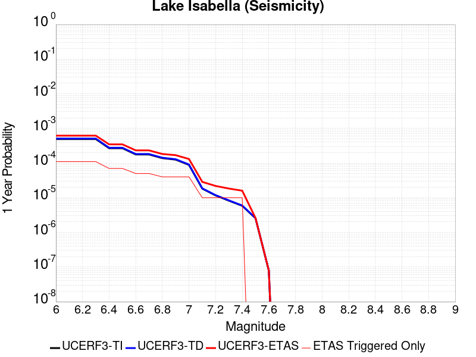 |  |

| Magnitude | 1 wk TI Prob | 1 wk TD Prob | 1 wk ETAS Prob | 1 wk ETAS/TD Gain | 1 wk ETAS Triggered Only | 1 mo TI Prob | 1 mo TD Prob | 1 mo ETAS Prob | 1 mo ETAS/TD Gain | 1 mo ETAS Triggered Only | 1 yr TI Prob | 1 yr TD Prob | 1 yr ETAS Prob | 1 yr ETAS/TD Gain | 1 yr ETAS Triggered Only | 10 yr TI Prob | 10 yr TD Prob | 10 yr ETAS Prob | 10 yr ETAS/TD Gain | 10 yr ETAS Triggered Only |
|-----|-----|-----|-----|-----|-----|-----|-----|-----|-----|-----|-----|-----|-----|-----|-----|-----|-----|-----|-----|-----|
| 6.0 | 9.431637E-6 | 9.741651E-6 | 9.974078E-5 | 10.238589 | 9.0E-5 | 4.0420677E-5 | 4.1749343E-5 | 1.3174559E-4 | 3.1556327 | 9.0E-5 | 4.920106E-4 | 5.0819275E-4 | 6.1813684E-4 | 1.2163433 | 1.1E-4 | 0.004909227 | 0.005071599 | 0.0051909904 | 1.0235412 | 1.2E-4 |
| 6.1 | 9.431637E-6 | 9.741651E-6 | 9.974078E-5 | 10.238589 | 9.0E-5 | 4.0420677E-5 | 4.1749343E-5 | 1.3174559E-4 | 3.1556327 | 9.0E-5 | 4.920106E-4 | 5.0819275E-4 | 6.1813684E-4 | 1.2163433 | 1.1E-4 | 0.004909227 | 0.005071599 | 0.0051909904 | 1.0235412 | 1.2E-4 |
| 6.2 | 9.431637E-6 | 9.741651E-6 | 9.974078E-5 | 10.238589 | 9.0E-5 | 4.0420677E-5 | 4.1749343E-5 | 1.3174559E-4 | 3.1556327 | 9.0E-5 | 4.920106E-4 | 5.0819275E-4 | 6.1813684E-4 | 1.2163433 | 1.1E-4 | 0.004909227 | 0.005071599 | 0.0051909904 | 1.0235412 | 1.2E-4 |
| 6.3 | 9.431637E-6 | 9.741651E-6 | 9.974078E-5 | 10.238589 | 9.0E-5 | 4.0420677E-5 | 4.1749343E-5 | 1.3174559E-4 | 3.1556327 | 9.0E-5 | 4.920106E-4 | 5.0819275E-4 | 6.1813684E-4 | 1.2163433 | 1.1E-4 | 0.004909227 | 0.005071599 | 0.0051909904 | 1.0235412 | 1.2E-4 |
| 6.4 | 5.144063E-6 | 5.3000763E-6 | 5.529981E-5 | 10.433777 | 5.0E-5 | 2.2045799E-5 | 2.2714434E-5 | 7.27133E-5 | 3.2011936 | 5.0E-5 | 2.6837454E-4 | 2.765166E-4 | 3.4649723E-4 | 1.2530794 | 7.0E-5 | 0.0026805066 | 0.0027620657 | 0.0028418447 | 1.0288838 | 8.0E-5 |
| 6.5 | 5.144063E-6 | 5.3000763E-6 | 5.529981E-5 | 10.433777 | 5.0E-5 | 2.2045799E-5 | 2.2714434E-5 | 7.27133E-5 | 3.2011936 | 5.0E-5 | 2.6837454E-4 | 2.765166E-4 | 3.4649723E-4 | 1.2530794 | 7.0E-5 | 0.0026805066 | 0.0027620657 | 0.0028418447 | 1.0288838 | 8.0E-5 |
| 6.6 | 3.4009804E-6 | 3.498786E-6 | 3.349868E-5 | 9.574372 | 3.0E-5 | 1.4575549E-5 | 1.4994721E-5 | 4.499427E-5 | 3.0006742 | 3.0E-5 | 1.7744285E-4 | 1.8254704E-4 | 2.325379E-4 | 1.273852 | 5.0E-5 | 0.0017730123 | 0.0018241286 | 0.0018840191 | 1.0328324 | 6.0E-5 |
| 6.7 | 3.3880428E-6 | 3.4856528E-6 | 3.3485547E-5 | 9.606679 | 3.0E-5 | 1.4520103E-5 | 1.4938435E-5 | 4.4937988E-5 | 3.0082123 | 3.0E-5 | 1.767679E-4 | 1.8186188E-4 | 2.3185278E-4 | 1.274884 | 5.0E-5 | 0.0017662736 | 0.0018172882 | 0.0018771791 | 1.0329562 | 6.0E-5 |
| 6.8 | 2.6582E-6 | 2.7337003E-6 | 2.2733646E-5 | 8.3160715 | 2.0E-5 | 1.1392236E-5 | 1.1715813E-5 | 3.171558E-5 | 2.7070744 | 2.0E-5 | 1.3869164E-4 | 1.4263204E-4 | 1.8262633E-4 | 1.280402 | 4.0E-5 | 0.0013860512 | 0.0014255369 | 0.00146548 | 1.0280195 | 4.0E-5 |
| 6.9 | 2.406011E-6 | 2.4743288E-6 | 2.247428E-5 | 9.08298 | 2.0E-5 | 1.0311434E-5 | 1.0604231E-5 | 3.060402E-5 | 2.8860197 | 2.0E-5 | 1.2553448E-4 | 1.2910018E-4 | 1.6909502E-4 | 1.3097969 | 4.0E-5 | 0.0012546359 | 0.0012903814 | 0.0013303298 | 1.0309585 | 4.0E-5 |
| 7.0 | 1.6953097E-6 | 1.7429371E-6 | 2.1742902E-5 | 12.474863 | 2.0E-5 | 7.265593E-6 | 7.469715E-6 | 2.7469567E-5 | 3.6774583 | 2.0E-5 | 8.8455E-5 | 9.094104E-5 | 1.3093739E-4 | 1.4398054 | 4.0E-5 | 8.84198E-4 | 9.09141E-4 | 9.491046E-4 | 1.0439576 | 4.0E-5 |
| 7.1 | 3.5013824E-7 | 3.5714822E-7 | 3.5714822E-7 | 1.0 | 0.0 | 1.5005916E-6 | 1.5306344E-6 | 1.5306344E-6 | 1.0 | 0.0 | 1.826955E-5 | 1.8635317E-5 | 2.8635131E-5 | 1.5366055 | 1.0E-5 | 1.8268047E-4 | 1.863378E-4 | 1.9633592E-4 | 1.053656 | 1.0E-5 |
| 7.2 | 2.2321095E-7 | 2.2750574E-7 | 2.2750574E-7 | 1.0 | 0.0 | 9.56618E-7 | 9.750242E-7 | 9.750242E-7 | 1.0 | 0.0 | 1.1646762E-5 | 1.1870856E-5 | 2.1870737E-5 | 1.8423892 | 1.0E-5 | 1.1646151E-4 | 1.1870232E-4 | 1.2870114E-4 | 1.0842344 | 1.0E-5 |
| 7.3 | 1.5760406E-7 | 1.6060922E-7 | 1.6060922E-7 | 1.0 | 0.0 | 6.7544585E-7 | 6.8832503E-7 | 6.8832503E-7 | 1.0 | 0.0 | 8.223522E-6 | 8.380326E-6 | 1.8380242E-5 | 2.193261 | 1.0E-5 | 8.2232174E-5 | 8.3800165E-5 | 9.3799325E-5 | 1.1193215 | 1.0E-5 |
| 7.4 | 1.1216497E-7 | 1.1431706E-7 | 1.1431706E-7 | 1.0 | 0.0 | 4.8070694E-7 | 4.899302E-7 | 4.899302E-7 | 1.0 | 0.0 | 5.852591E-6 | 5.964884E-6 | 1.5964824E-5 | 2.6764686 | 1.0E-5 | 5.8524372E-5 | 5.9647282E-5 | 6.964669E-5 | 1.1676422 | 1.0E-5 |
| 7.5 | 4.885185E-8 | 4.9787737E-8 | 4.9787737E-8 | 1.0 | 0.0 | 2.0936506E-7 | 2.13376E-7 | 2.13376E-7 | 1.0 | 0.0 | 2.5490165E-6 | 2.59785E-6 | 2.59785E-6 | 1.0 | 0.0 | 2.5489873E-5 | 2.5978214E-5 | 2.5978214E-5 | 1.0 | 0.0 |
| 7.6 | 1.504641E-9 | 1.5317903E-9 | 1.5317903E-9 | 1.0 | 0.0 | 6.4484613E-9 | 6.5648154E-9 | 6.5648154E-9 | 1.0 | 0.0 | 7.851001E-8 | 7.992663E-8 | 7.992663E-8 | 1.0 | 0.0 | 7.8509987E-7 | 7.992663E-7 | 7.992663E-7 | 1.0 | 0.0 |

## Santa Ynez (East)
*[(top)](#table-of-contents)*

| 1 Week | 1 Month | 1 Year | 10 Year |
|-----|-----|-----|-----|
|  |  | 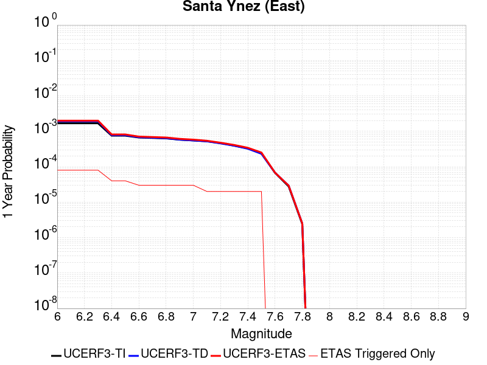 |  |

| Magnitude | 1 wk TI Prob | 1 wk TD Prob | 1 wk ETAS Prob | 1 wk ETAS/TD Gain | 1 wk ETAS Triggered Only | 1 mo TI Prob | 1 mo TD Prob | 1 mo ETAS Prob | 1 mo ETAS/TD Gain | 1 mo ETAS Triggered Only | 1 yr TI Prob | 1 yr TD Prob | 1 yr ETAS Prob | 1 yr ETAS/TD Gain | 1 yr ETAS Triggered Only | 10 yr TI Prob | 10 yr TD Prob | 10 yr ETAS Prob | 10 yr ETAS/TD Gain | 10 yr ETAS Triggered Only |
|-----|-----|-----|-----|-----|-----|-----|-----|-----|-----|-----|-----|-----|-----|-----|-----|-----|-----|-----|-----|-----|
| 6.0 | 3.2269712E-5 | 3.6750775E-5 | 8.6748936E-5 | 2.3604655 | 5.0E-5 | 1.3829143E-4 | 1.5749714E-4 | 2.1748769E-4 | 1.3808993 | 6.0E-5 | 0.0016823979 | 0.0019164253 | 0.001996272 | 1.0416644 | 8.0E-5 | 0.016697178 | 0.019056438 | 0.019144723 | 1.0046328 | 9.0E-5 |
| 6.1 | 3.2269712E-5 | 3.6750775E-5 | 8.6748936E-5 | 2.3604655 | 5.0E-5 | 1.3829143E-4 | 1.5749714E-4 | 2.1748769E-4 | 1.3808993 | 6.0E-5 | 0.0016823979 | 0.0019164253 | 0.001996272 | 1.0416644 | 8.0E-5 | 0.016697178 | 0.019056438 | 0.019144723 | 1.0046328 | 9.0E-5 |
| 6.2 | 3.2269712E-5 | 3.6750775E-5 | 8.6748936E-5 | 2.3604655 | 5.0E-5 | 1.3829143E-4 | 1.5749714E-4 | 2.1748769E-4 | 1.3808993 | 6.0E-5 | 0.0016823979 | 0.0019164253 | 0.001996272 | 1.0416644 | 8.0E-5 | 0.016697178 | 0.019056438 | 0.019144723 | 1.0046328 | 9.0E-5 |
| 6.3 | 3.2269712E-5 | 3.6750775E-5 | 8.6748936E-5 | 2.3604655 | 5.0E-5 | 1.3829143E-4 | 1.5749714E-4 | 2.1748769E-4 | 1.3808993 | 6.0E-5 | 0.0016823979 | 0.0019164253 | 0.001996272 | 1.0416644 | 8.0E-5 | 0.016697178 | 0.019056438 | 0.019144723 | 1.0046328 | 9.0E-5 |
| 6.4 | 1.4404779E-5 | 1.48492945E-5 | 4.484885E-5 | 3.020268 | 3.0E-5 | 6.1733306E-5 | 6.363831E-5 | 9.36364E-5 | 1.4713842 | 3.0E-5 | 7.513438E-4 | 7.7452604E-4 | 8.144951E-4 | 1.0516045 | 4.0E-5 | 0.0074880854 | 0.007718817 | 0.007758508 | 1.0051421 | 4.0E-5 |
| 6.5 | 1.4404779E-5 | 1.48492945E-5 | 4.484885E-5 | 3.020268 | 3.0E-5 | 6.1733306E-5 | 6.363831E-5 | 9.36364E-5 | 1.4713842 | 3.0E-5 | 7.513438E-4 | 7.7452604E-4 | 8.144951E-4 | 1.0516045 | 4.0E-5 | 0.0074880854 | 0.007718817 | 0.007758508 | 1.0051421 | 4.0E-5 |
| 6.6 | 1.280208E-5 | 1.301186E-5 | 3.3011598E-5 | 2.5370393 | 2.0E-5 | 5.4864904E-5 | 5.5763932E-5 | 7.5762815E-5 | 1.3586348 | 2.0E-5 | 6.6777546E-4 | 6.7871617E-4 | 7.086958E-4 | 1.0441711 | 3.0E-5 | 0.006657724 | 0.0067666434 | 0.00679644 | 1.0044035 | 3.0E-5 |
| 6.7 | 1.2457027E-5 | 1.262838E-5 | 3.2628126E-5 | 2.5837145 | 2.0E-5 | 5.3386164E-5 | 5.4120515E-5 | 7.411943E-5 | 1.3695257 | 2.0E-5 | 6.497827E-4 | 6.5871974E-4 | 6.887E-4 | 1.0455129 | 3.0E-5 | 0.00647886 | 0.00656787 | 0.0065976726 | 1.0045377 | 3.0E-5 |
| 6.8 | 1.2095134E-5 | 1.2230827E-5 | 3.2230582E-5 | 2.6351924 | 2.0E-5 | 5.1835254E-5 | 5.2416784E-5 | 7.2415736E-5 | 1.3815372 | 2.0E-5 | 6.309115E-4 | 6.3798914E-4 | 6.6797E-4 | 1.0469928 | 3.0E-5 | 0.0062912325 | 0.006361764 | 0.0063915728 | 1.0046856 | 3.0E-5 |
| 6.9 | 1.1104036E-5 | 1.115726E-5 | 3.1157037E-5 | 2.7925348 | 2.0E-5 | 4.758786E-5 | 4.781596E-5 | 6.7815E-5 | 1.4182504 | 2.0E-5 | 5.7922816E-4 | 5.82005E-4 | 6.119876E-4 | 1.0515159 | 3.0E-5 | 0.005777207 | 0.0058049536 | 0.0058347797 | 1.005138 | 3.0E-5 |
| 7.0 | 1.0577444E-5 | 1.05815925E-5 | 3.058138E-5 | 2.8900547 | 2.0E-5 | 4.5331115E-5 | 4.53489E-5 | 6.5347995E-5 | 1.441005 | 2.0E-5 | 5.5176654E-4 | 5.5198424E-4 | 5.8196764E-4 | 1.0543194 | 3.0E-5 | 0.0055039856 | 0.00550627 | 0.005536105 | 1.0054183 | 3.0E-5 |
| 7.1 | 1.0021775E-5 | 9.9809E-6 | 1.99808E-5 | 2.0019035 | 1.0E-5 | 4.294976E-5 | 4.277459E-5 | 5.2774165E-5 | 1.2337736 | 1.0E-5 | 5.2278786E-4 | 5.206574E-4 | 5.4064696E-4 | 1.038393 | 2.0E-5 | 0.0052155964 | 0.005194508 | 0.0052144043 | 1.0038302 | 2.0E-5 |
| 7.2 | 8.874109E-6 | 8.748706E-6 | 1.8748618E-5 | 2.143016 | 1.0E-5 | 3.8031343E-5 | 3.7493923E-5 | 4.7493548E-5 | 1.2666999 | 1.0E-5 | 4.629332E-4 | 4.56394E-4 | 4.7638486E-4 | 1.0438018 | 2.0E-5 | 0.0046197 | 0.0045546847 | 0.004574594 | 1.004371 | 2.0E-5 |
| 7.3 | 7.5504267E-6 | 7.5050243E-6 | 1.750495E-5 | 2.3324308 | 1.0E-5 | 3.235857E-5 | 3.2164E-5 | 4.2163676E-5 | 1.3108966 | 1.0E-5 | 3.9389438E-4 | 3.9152734E-4 | 4.1151952E-4 | 1.051062 | 2.0E-5 | 0.0039319694 | 0.0039084824 | 0.0039284043 | 1.005097 | 2.0E-5 |
| 7.4 | 6.309394E-6 | 6.183062E-6 | 1.6183E-5 | 2.6173117 | 1.0E-5 | 2.703998E-5 | 2.6498574E-5 | 3.649831E-5 | 1.3773688 | 1.0E-5 | 3.2916202E-4 | 3.2257332E-4 | 3.4256687E-4 | 1.0619814 | 2.0E-5 | 0.003286749 | 0.0032211484 | 0.0032410838 | 1.006189 | 2.0E-5 |
| 7.5 | 4.6103073E-6 | 4.4408016E-6 | 1.4440757E-5 | 3.2518356 | 1.0E-5 | 1.975831E-5 | 1.9031871E-5 | 2.9031682E-5 | 1.5254244 | 1.0E-5 | 2.4053088E-4 | 2.316891E-4 | 2.5168445E-4 | 1.0863025 | 2.0E-5 | 0.002402707 | 0.002314545 | 0.0023344986 | 1.008621 | 2.0E-5 |
| 7.6 | 1.2858658E-6 | 1.3008196E-6 | 1.3008196E-6 | 1.0 | 0.0 | 5.5108417E-6 | 5.574929E-6 | 5.574929E-6 | 1.0 | 0.0 | 6.7092435E-5 | 6.787272E-5 | 6.787272E-5 | 1.0 | 0.0 | 6.707218E-4 | 6.7852676E-4 | 6.7852676E-4 | 1.0 | 0.0 |
| 7.7 | 5.3302307E-7 | 5.612138E-7 | 5.612138E-7 | 1.0 | 0.0 | 2.2843826E-6 | 2.4052001E-6 | 2.4052001E-6 | 1.0 | 0.0 | 2.7812002E-5 | 2.9282955E-5 | 2.9282955E-5 | 1.0 | 0.0 | 2.7808524E-4 | 2.9279455E-4 | 2.9279455E-4 | 1.0 | 0.0 |
| 7.8 | 4.613933E-8 | 4.80301E-8 | 4.80301E-8 | 1.0 | 0.0 | 1.9773998E-7 | 2.0584326E-7 | 2.0584326E-7 | 1.0 | 0.0 | 2.4074816E-6 | 2.5061388E-6 | 2.5061388E-6 | 1.0 | 0.0 | 2.4074554E-5 | 2.5061116E-5 | 2.5061116E-5 | 1.0 | 0.0 |

## San Jacinto (Anza) rev
*[(top)](#table-of-contents)*

| 1 Week | 1 Month | 1 Year | 10 Year |
|-----|-----|-----|-----|
|  |  |  |  |

| Magnitude | 1 wk TI Prob | 1 wk TD Prob | 1 wk ETAS Prob | 1 wk ETAS/TD Gain | 1 wk ETAS Triggered Only | 1 mo TI Prob | 1 mo TD Prob | 1 mo ETAS Prob | 1 mo ETAS/TD Gain | 1 mo ETAS Triggered Only | 1 yr TI Prob | 1 yr TD Prob | 1 yr ETAS Prob | 1 yr ETAS/TD Gain | 1 yr ETAS Triggered Only | 10 yr TI Prob | 10 yr TD Prob | 10 yr ETAS Prob | 10 yr ETAS/TD Gain | 10 yr ETAS Triggered Only |
|-----|-----|-----|-----|-----|-----|-----|-----|-----|-----|-----|-----|-----|-----|-----|-----|-----|-----|-----|-----|-----|
| 6.0 | 6.3015636E-5 | 4.3298347E-5 | 1.2329489E-4 | 2.8475657 | 8.0E-5 | 2.7003905E-4 | 1.8555121E-4 | 2.7553452E-4 | 1.4849513 | 9.0E-5 | 0.0032827691 | 0.0022567573 | 0.0023565318 | 1.0442114 | 1.0E-4 | 0.032346968 | 0.02329361 | 0.023401048 | 1.0046123 | 1.1E-4 |
| 6.1 | 6.3015636E-5 | 4.3298347E-5 | 1.2329489E-4 | 2.8475657 | 8.0E-5 | 2.7003905E-4 | 1.8555121E-4 | 2.7553452E-4 | 1.4849513 | 9.0E-5 | 0.0032827691 | 0.0022567573 | 0.0023565318 | 1.0442114 | 1.0E-4 | 0.032346968 | 0.02329361 | 0.023401048 | 1.0046123 | 1.1E-4 |
| 6.2 | 6.3015636E-5 | 4.3298347E-5 | 1.2329489E-4 | 2.8475657 | 8.0E-5 | 2.7003905E-4 | 1.8555121E-4 | 2.7553452E-4 | 1.4849513 | 9.0E-5 | 0.0032827691 | 0.0022567573 | 0.0023565318 | 1.0442114 | 1.0E-4 | 0.032346968 | 0.02329361 | 0.023401048 | 1.0046123 | 1.1E-4 |
| 6.3 | 6.3015636E-5 | 4.3298347E-5 | 1.2329489E-4 | 2.8475657 | 8.0E-5 | 2.7003905E-4 | 1.8555121E-4 | 2.7553452E-4 | 1.4849513 | 9.0E-5 | 0.0032827691 | 0.0022567573 | 0.0023565318 | 1.0442114 | 1.0E-4 | 0.032346968 | 0.02329361 | 0.023401048 | 1.0046123 | 1.1E-4 |
| 6.4 | 6.3015636E-5 | 4.3298347E-5 | 1.2329489E-4 | 2.8475657 | 8.0E-5 | 2.7003905E-4 | 1.8555121E-4 | 2.7553452E-4 | 1.4849513 | 9.0E-5 | 0.0032827691 | 0.0022567573 | 0.0023565318 | 1.0442114 | 1.0E-4 | 0.032346968 | 0.02329361 | 0.023401048 | 1.0046123 | 1.1E-4 |
| 6.5 | 5.811017E-5 | 4.0080286E-5 | 1.1007748E-4 | 2.7464247 | 7.0E-5 | 2.4901982E-4 | 1.7176138E-4 | 2.5174764E-4 | 1.4656825 | 8.0E-5 | 0.0030276014 | 0.0020891947 | 0.0021790066 | 1.0429888 | 9.0E-5 | 0.02986684 | 0.021590833 | 0.021688674 | 1.0045316 | 1.0E-4 |
| 6.6 | 5.811017E-5 | 4.0080286E-5 | 1.1007748E-4 | 2.7464247 | 7.0E-5 | 2.4901982E-4 | 1.7176138E-4 | 2.5174764E-4 | 1.4656825 | 8.0E-5 | 0.0030276014 | 0.0020891947 | 0.0021790066 | 1.0429888 | 9.0E-5 | 0.02986684 | 0.021590833 | 0.021688674 | 1.0045316 | 1.0E-4 |
| 6.7 | 5.712442E-5 | 3.950301E-5 | 1.09500244E-4 | 2.7719467 | 7.0E-5 | 2.4479596E-4 | 1.6928767E-4 | 2.4927413E-4 | 1.4724884 | 8.0E-5 | 0.0029763177 | 0.0020591344 | 0.0021489493 | 1.0436177 | 9.0E-5 | 0.029367693 | 0.021282919 | 0.02138079 | 1.0045986 | 1.0E-4 |
| 6.8 | 5.6967532E-5 | 3.93593E-5 | 1.09356544E-4 | 2.7784169 | 7.0E-5 | 2.4412372E-4 | 1.6867183E-4 | 2.4865835E-4 | 1.4742137 | 8.0E-5 | 0.0029681553 | 0.0020516508 | 0.0021414661 | 1.0437771 | 9.0E-5 | 0.029288229 | 0.02120852 | 0.0213064 | 1.0046151 | 1.0E-4 |
| 6.9 | 5.6211324E-5 | 3.9064216E-5 | 1.0906148E-4 | 2.7918513 | 7.0E-5 | 2.4088343E-4 | 1.6740736E-4 | 2.4739397E-4 | 1.4777962 | 8.0E-5 | 0.0029288116 | 0.0020362847 | 0.0021261014 | 1.0441082 | 9.0E-5 | 0.028905109 | 0.021047527 | 0.021145422 | 1.0046512 | 1.0E-4 |
| 7.0 | 5.4383527E-5 | 3.7925012E-5 | 1.0792236E-4 | 2.8456776 | 7.0E-5 | 2.3305144E-4 | 1.6252567E-4 | 2.4251266E-4 | 1.49215 | 8.0E-5 | 0.0028337094 | 0.001976959 | 0.002066781 | 1.0454345 | 9.0E-5 | 0.027978465 | 0.02044095 | 0.020538906 | 1.0047921 | 1.0E-4 |
| 7.1 | 5.1393665E-5 | 3.638787E-5 | 1.0638532E-4 | 2.9236479 | 7.0E-5 | 2.2023996E-4 | 1.5593872E-4 | 2.3592624E-4 | 1.5129421 | 8.0E-5 | 0.0026781242 | 0.0018969048 | 0.001986734 | 1.0473558 | 9.0E-5 | 0.026460782 | 0.019616077 | 0.019714115 | 1.0049978 | 1.0E-4 |
| 7.2 | 4.785222E-5 | 3.4738845E-5 | 1.0473641E-4 | 3.0149653 | 7.0E-5 | 2.0506482E-4 | 1.4887229E-4 | 2.2886037E-4 | 1.5372933 | 8.0E-5 | 0.0024938055 | 0.0018110167 | 0.0019008537 | 1.0496058 | 9.0E-5 | 0.024660049 | 0.018728783 | 0.01882691 | 1.0052394 | 1.0E-4 |
| 7.3 | 4.2143256E-5 | 3.3834414E-5 | 1.0383205E-4 | 3.0688295 | 7.0E-5 | 1.8060145E-4 | 1.449966E-4 | 2.24985E-4 | 1.5516571 | 8.0E-5 | 0.002196605 | 0.0017639075 | 0.0018537487 | 1.0509331 | 9.0E-5 | 0.02175019 | 0.018236695 | 0.018334871 | 1.0053835 | 1.0E-4 |
| 7.4 | 4.0264713E-5 | 3.3472694E-5 | 1.0347035E-4 | 3.0911868 | 7.0E-5 | 1.7255165E-4 | 1.4344654E-4 | 2.2343505E-4 | 1.5576191 | 8.0E-5 | 0.002098792 | 0.0017450659 | 0.0018349088 | 1.051484 | 9.0E-5 | 0.020790804 | 0.018041389 | 0.018139586 | 1.0054429 | 1.0E-4 |
| 7.5 | 3.694492E-5 | 3.2186905E-5 | 1.02184655E-4 | 3.1747274 | 7.0E-5 | 1.5832575E-4 | 1.379366E-4 | 2.1792557E-4 | 1.5798966 | 8.0E-5 | 0.0019259118 | 0.0016780876 | 0.0017679366 | 1.0535425 | 9.0E-5 | 0.01909306 | 0.017357888 | 0.017456152 | 1.005661 | 1.0E-4 |
| 7.6 | 3.200565E-5 | 2.9502702E-5 | 9.9500634E-5 | 3.3725939 | 7.0E-5 | 1.3715986E-4 | 1.2643404E-4 | 2.0642392E-4 | 1.632661 | 8.0E-5 | 0.001668642 | 0.0015382497 | 0.0016281112 | 1.058418 | 9.0E-5 | 0.01656168 | 0.015946016 | 0.016044421 | 1.0061711 | 1.0E-4 |
| 7.7 | 2.731642E-5 | 2.6091477E-5 | 9.608965E-5 | 3.6827986 | 7.0E-5 | 1.1706512E-4 | 1.11815825E-4 | 1.9180687E-4 | 1.7153822 | 8.0E-5 | 0.001424336 | 0.0013605085 | 0.001450386 | 1.0660617 | 9.0E-5 | 0.014152412 | 0.0141668 | 0.014265384 | 1.0069587 | 1.0E-4 |
| 7.8 | 2.3466424E-5 | 2.3503619E-5 | 8.350221E-5 | 3.5527384 | 6.0E-5 | 1.0056651E-4 | 1.0072591E-4 | 1.7071886E-4 | 1.6948853 | 7.0E-5 | 0.0012237094 | 0.0012256489 | 0.0013055508 | 1.0651915 | 8.0E-5 | 0.012169928 | 0.012808796 | 0.012897643 | 1.0069364 | 9.0E-5 |
| 7.9 | 1.8611925E-5 | 1.890698E-5 | 7.890585E-5 | 4.1733713 | 6.0E-5 | 7.9762955E-5 | 8.10274E-5 | 1.5102173E-4 | 1.8638353 | 7.0E-5 | 9.7068126E-4 | 9.860628E-4 | 0.001065984 | 1.0810508 | 8.0E-5 | 0.0096645225 | 0.010393705 | 0.01048277 | 1.0085691 | 9.0E-5 |
| 8.0 | 1.5460775E-5 | 1.5739915E-5 | 7.573897E-5 | 4.8119044 | 6.0E-5 | 6.6258784E-5 | 6.745504E-5 | 1.3745032E-4 | 2.0376582 | 7.0E-5 | 8.0640207E-4 | 8.2095637E-4 | 9.008907E-4 | 1.0973673 | 8.0E-5 | 0.008034821 | 0.008702706 | 0.008791923 | 1.0102516 | 9.0E-5 |
| 8.1 | 9.983884E-6 | 8.268954E-6 | 4.8268623E-5 | 5.837331 | 4.0E-5 | 4.2787375E-5 | 3.5437897E-5 | 8.543613E-5 | 2.410869 | 5.0E-5 | 5.2081177E-4 | 4.313715E-4 | 4.813499E-4 | 1.1158594 | 5.0E-5 | 0.0051959283 | 0.00463968 | 0.004699402 | 1.012872 | 6.0E-5 |
| 8.2 | 4.1226E-6 | 1.5522551E-6 | 1.5522551E-6 | 1.0 | 0.0 | 1.7668166E-5 | 6.6525045E-6 | 6.6525045E-6 | 1.0 | 0.0 | 2.1508869E-4 | 8.099126E-5 | 8.099126E-5 | 1.0 | 0.0 | 0.0021488064 | 9.401847E-4 | 9.401847E-4 | 1.0 | 0.0 |
| 8.3 | 1.2750878E-6 | 3.609817E-7 | 3.609817E-7 | 1.0 | 0.0 | 5.4646503E-6 | 1.5470634E-6 | 1.5470634E-6 | 1.0 | 0.0 | 6.653009E-5 | 1.8835339E-5 | 1.8835339E-5 | 1.0 | 0.0 | 6.6510175E-4 | 2.272251E-4 | 2.272251E-4 | 1.0 | 0.0 |

## Scodie Lineament
*[(top)](#table-of-contents)*

| 1 Week | 1 Month | 1 Year | 10 Year |
|-----|-----|-----|-----|
|  |  |  |  |

| Magnitude | 1 wk TI Prob | 1 wk TD Prob | 1 wk ETAS Prob | 1 wk ETAS/TD Gain | 1 wk ETAS Triggered Only | 1 mo TI Prob | 1 mo TD Prob | 1 mo ETAS Prob | 1 mo ETAS/TD Gain | 1 mo ETAS Triggered Only | 1 yr TI Prob | 1 yr TD Prob | 1 yr ETAS Prob | 1 yr ETAS/TD Gain | 1 yr ETAS Triggered Only | 10 yr TI Prob | 10 yr TD Prob | 10 yr ETAS Prob | 10 yr ETAS/TD Gain | 10 yr ETAS Triggered Only |
|-----|-----|-----|-----|-----|-----|-----|-----|-----|-----|-----|-----|-----|-----|-----|-----|-----|-----|-----|-----|-----|
| 6.0 | 3.2919327E-6 | 3.0133303E-6 | 7.301312E-5 | 24.230042 | 7.0E-5 | 1.4108206E-5 | 1.2914227E-5 | 1.02913065E-4 | 7.968968 | 9.0E-5 | 1.7175387E-4 | 1.5722254E-4 | 2.5720682E-4 | 1.635941 | 1.0E-4 | 0.0017162118 | 0.0015714248 | 0.0016712676 | 1.0635365 | 1.0E-4 |
| 6.1 | 1.8663811E-6 | 1.5490382E-6 | 2.1549007E-5 | 13.911218 | 2.0E-5 | 7.998751E-6 | 6.6387206E-6 | 3.663852E-5 | 5.518913 | 3.0E-5 | 9.738045E-5 | 8.082393E-5 | 1.108215E-4 | 1.3711473 | 3.0E-5 | 9.7337784E-4 | 8.079941E-4 | 8.379699E-4 | 1.037099 | 3.0E-5 |
| 6.2 | 1.8663811E-6 | 1.5490382E-6 | 2.1549007E-5 | 13.911218 | 2.0E-5 | 7.998751E-6 | 6.6387206E-6 | 3.663852E-5 | 5.518913 | 3.0E-5 | 9.738045E-5 | 8.082393E-5 | 1.108215E-4 | 1.3711473 | 3.0E-5 | 9.7337784E-4 | 8.079941E-4 | 8.379699E-4 | 1.037099 | 3.0E-5 |
| 6.3 | 1.8663811E-6 | 1.5490382E-6 | 2.1549007E-5 | 13.911218 | 2.0E-5 | 7.998751E-6 | 6.6387206E-6 | 3.663852E-5 | 5.518913 | 3.0E-5 | 9.738045E-5 | 8.082393E-5 | 1.108215E-4 | 1.3711473 | 3.0E-5 | 9.7337784E-4 | 8.079941E-4 | 8.379699E-4 | 1.037099 | 3.0E-5 |
| 6.4 | 1.8663811E-6 | 1.5490382E-6 | 2.1549007E-5 | 13.911218 | 2.0E-5 | 7.998751E-6 | 6.6387206E-6 | 3.663852E-5 | 5.518913 | 3.0E-5 | 9.738045E-5 | 8.082393E-5 | 1.108215E-4 | 1.3711473 | 3.0E-5 | 9.7337784E-4 | 8.079941E-4 | 8.379699E-4 | 1.037099 | 3.0E-5 |
| 6.5 | 1.8106311E-6 | 1.4909722E-6 | 2.1490941E-5 | 14.414047 | 2.0E-5 | 7.759824E-6 | 6.389868E-6 | 3.6389676E-5 | 5.694903 | 3.0E-5 | 9.447177E-5 | 7.779436E-5 | 1.07792024E-4 | 1.3856021 | 3.0E-5 | 9.4431615E-4 | 7.7771995E-4 | 8.076966E-4 | 1.0385443 | 3.0E-5 |
| 6.6 | 1.2414679E-6 | 8.9974395E-7 | 2.0899726E-5 | 23.228525 | 2.0E-5 | 5.320566E-6 | 3.85604E-6 | 3.3855926E-5 | 8.779971 | 3.0E-5 | 6.477596E-5 | 4.6946367E-5 | 7.694496E-5 | 1.6389971 | 3.0E-5 | 6.475708E-4 | 4.6937316E-4 | 4.993591E-4 | 1.063885 | 3.0E-5 |
| 6.7 | 1.1062215E-6 | 7.594193E-7 | 1.0759411E-5 | 14.167946 | 1.0E-5 | 4.7409408E-6 | 3.2546504E-6 | 2.3254586E-5 | 7.145033 | 2.0E-5 | 5.7719422E-5 | 3.962472E-5 | 5.962393E-5 | 1.5047154 | 2.0E-5 | 5.770443E-4 | 3.9618355E-4 | 4.161756E-4 | 1.0504616 | 2.0E-5 |
| 6.8 | 1.0006736E-6 | 6.5002786E-7 | 1.0650021E-5 | 16.383945 | 1.0E-5 | 4.288594E-6 | 2.7858312E-6 | 2.2785776E-5 | 8.179166 | 2.0E-5 | 5.221238E-5 | 3.391703E-5 | 5.391635E-5 | 1.5896543 | 2.0E-5 | 5.220012E-4 | 3.3912458E-4 | 3.591178E-4 | 1.0589554 | 2.0E-5 |
| 6.9 | 9.167364E-7 | 5.6315065E-7 | 1.0563145E-5 | 18.757227 | 1.0E-5 | 3.9288643E-6 | 2.413501E-6 | 2.2413453E-5 | 9.286697 | 2.0E-5 | 4.7832873E-5 | 2.9384037E-5 | 4.938345E-5 | 1.6806217 | 2.0E-5 | 4.782258E-4 | 2.9380718E-4 | 3.138013E-4 | 1.0680518 | 2.0E-5 |
| 7.0 | 7.6987664E-7 | 4.113265E-7 | 1.0411322E-5 | 25.311577 | 1.0E-5 | 3.2994672E-6 | 1.7628269E-6 | 2.1762791E-5 | 12.345393 | 2.0E-5 | 4.0170275E-5 | 2.1462245E-5 | 4.1461815E-5 | 1.931849 | 2.0E-5 | 4.0163012E-4 | 2.1460558E-4 | 2.3460129E-4 | 1.0931742 | 2.0E-5 |
| 7.1 | 7.1038727E-7 | 3.5210306E-7 | 1.03521E-5 | 29.400766 | 1.0E-5 | 3.0445133E-6 | 1.5090123E-6 | 2.1508982E-5 | 14.253682 | 2.0E-5 | 3.706632E-5 | 1.8372106E-5 | 3.8371738E-5 | 2.0885868 | 2.0E-5 | 3.7060137E-4 | 1.8370937E-4 | 2.037057E-4 | 1.1088476 | 2.0E-5 |
| 7.2 | 2.0799602E-7 | 3.1178534E-8 | 1.0031178E-5 | 321.7335 | 1.0E-5 | 8.914113E-7 | 1.3362228E-7 | 2.0133619E-5 | 150.67561 | 2.0E-5 | 1.0852878E-5 | 1.6268501E-6 | 2.1626818E-5 | 13.293675 | 2.0E-5 | 1.08523476E-4 | 1.626839E-5 | 3.6268066E-5 | 2.229358 | 2.0E-5 |
| 7.3 | 1.5048182E-7 | 1.5939106E-8 | 1.0015939E-5 | 628.38776 | 1.0E-5 | 6.449219E-7 | 6.8310456E-8 | 2.006831E-5 | 293.78094 | 2.0E-5 | 7.851896E-6 | 8.316795E-7 | 2.0831663E-5 | 25.047705 | 2.0E-5 | 7.851618E-5 | 8.316767E-6 | 2.8316601E-5 | 3.4047606 | 2.0E-5 |
| 7.4 | 5.9334678E-8 | 4.8638475E-9 | 4.8638475E-9 | 1.0 | 0.0 | 2.5429145E-7 | 2.084506E-8 | 2.084506E-8 | 1.0 | 0.0 | 3.095994E-6 | 2.5378858E-7 | 2.5378858E-7 | 1.0 | 0.0 | 3.095951E-5 | 2.5378843E-6 | 2.5378843E-6 | 1.0 | 0.0 |

## Dry Mountain
*[(top)](#table-of-contents)*

| 1 Week | 1 Month | 1 Year | 10 Year |
|-----|-----|-----|-----|
|  |  |  |  |

| Magnitude | 1 wk TI Prob | 1 wk TD Prob | 1 wk ETAS Prob | 1 wk ETAS/TD Gain | 1 wk ETAS Triggered Only | 1 mo TI Prob | 1 mo TD Prob | 1 mo ETAS Prob | 1 mo ETAS/TD Gain | 1 mo ETAS Triggered Only | 1 yr TI Prob | 1 yr TD Prob | 1 yr ETAS Prob | 1 yr ETAS/TD Gain | 1 yr ETAS Triggered Only | 10 yr TI Prob | 10 yr TD Prob | 10 yr ETAS Prob | 10 yr ETAS/TD Gain | 10 yr ETAS Triggered Only |
|-----|-----|-----|-----|-----|-----|-----|-----|-----|-----|-----|-----|-----|-----|-----|-----|-----|-----|-----|-----|-----|
| 6.0 | 6.222801E-6 | 6.439381E-6 | 7.643893E-5 | 11.87054 | 7.0E-5 | 2.6668875E-5 | 2.7597147E-5 | 1.0759494E-4 | 3.8987706 | 8.0E-5 | 3.2464517E-4 | 3.3595937E-4 | 4.2592915E-4 | 1.2677995 | 9.0E-5 | 0.0032417132 | 0.0033560768 | 0.0034457748 | 1.0267271 | 9.0E-5 |
| 6.1 | 6.222801E-6 | 6.439381E-6 | 7.643893E-5 | 11.87054 | 7.0E-5 | 2.6668875E-5 | 2.7597147E-5 | 1.0759494E-4 | 3.8987706 | 8.0E-5 | 3.2464517E-4 | 3.3595937E-4 | 4.2592915E-4 | 1.2677995 | 9.0E-5 | 0.0032417132 | 0.0033560768 | 0.0034457748 | 1.0267271 | 9.0E-5 |
| 6.2 | 6.222801E-6 | 6.439381E-6 | 7.643893E-5 | 11.87054 | 7.0E-5 | 2.6668875E-5 | 2.7597147E-5 | 1.0759494E-4 | 3.8987706 | 8.0E-5 | 3.2464517E-4 | 3.3595937E-4 | 4.2592915E-4 | 1.2677995 | 9.0E-5 | 0.0032417132 | 0.0033560768 | 0.0034457748 | 1.0267271 | 9.0E-5 |
| 6.3 | 6.222801E-6 | 6.439381E-6 | 7.643893E-5 | 11.87054 | 7.0E-5 | 2.6668875E-5 | 2.7597147E-5 | 1.0759494E-4 | 3.8987706 | 8.0E-5 | 3.2464517E-4 | 3.3595937E-4 | 4.2592915E-4 | 1.2677995 | 9.0E-5 | 0.0032417132 | 0.0033560768 | 0.0034457748 | 1.0267271 | 9.0E-5 |
| 6.4 | 6.222801E-6 | 6.439381E-6 | 7.643893E-5 | 11.87054 | 7.0E-5 | 2.6668875E-5 | 2.7597147E-5 | 1.0759494E-4 | 3.8987706 | 8.0E-5 | 3.2464517E-4 | 3.3595937E-4 | 4.2592915E-4 | 1.2677995 | 9.0E-5 | 0.0032417132 | 0.0033560768 | 0.0034457748 | 1.0267271 | 9.0E-5 |
| 6.5 | 2.8528623E-6 | 2.9521684E-6 | 3.295208E-5 | 11.161992 | 3.0E-5 | 1.22264955E-5 | 1.2652138E-5 | 4.2651758E-5 | 3.3711107 | 3.0E-5 | 1.4884741E-4 | 1.540376E-4 | 1.9403143E-4 | 1.2596369 | 4.0E-5 | 0.0014874774 | 0.0015401616 | 0.0015801 | 1.0259314 | 4.0E-5 |
| 6.6 | 2.8528623E-6 | 2.9521684E-6 | 3.295208E-5 | 11.161992 | 3.0E-5 | 1.22264955E-5 | 1.2652138E-5 | 4.2651758E-5 | 3.3711107 | 3.0E-5 | 1.4884741E-4 | 1.540376E-4 | 1.9403143E-4 | 1.2596369 | 4.0E-5 | 0.0014874774 | 0.0015401616 | 0.0015801 | 1.0259314 | 4.0E-5 |
| 6.7 | 2.541E-6 | 2.6293578E-6 | 2.2629305E-5 | 8.6064 | 2.0E-5 | 1.0889954E-5 | 1.1268677E-5 | 3.126845E-5 | 2.7748113 | 2.0E-5 | 1.3257713E-4 | 1.3719614E-4 | 1.6719202E-4 | 1.2186351 | 3.0E-5 | 0.0013249806 | 0.0013719613 | 0.0014019202 | 1.0218365 | 3.0E-5 |

## Independence rev 2011
*[(top)](#table-of-contents)*

| 1 Week | 1 Month | 1 Year | 10 Year |
|-----|-----|-----|-----|
|  |  |  |  |

| Magnitude | 1 wk TI Prob | 1 wk TD Prob | 1 wk ETAS Prob | 1 wk ETAS/TD Gain | 1 wk ETAS Triggered Only | 1 mo TI Prob | 1 mo TD Prob | 1 mo ETAS Prob | 1 mo ETAS/TD Gain | 1 mo ETAS Triggered Only | 1 yr TI Prob | 1 yr TD Prob | 1 yr ETAS Prob | 1 yr ETAS/TD Gain | 1 yr ETAS Triggered Only | 10 yr TI Prob | 10 yr TD Prob | 10 yr ETAS Prob | 10 yr ETAS/TD Gain | 10 yr ETAS Triggered Only |
|-----|-----|-----|-----|-----|-----|-----|-----|-----|-----|-----|-----|-----|-----|-----|-----|-----|-----|-----|-----|-----|
| 6.0 | 4.422171E-6 | 4.3262253E-6 | 4.432605E-5 | 10.245895 | 4.0E-5 | 1.8952025E-5 | 1.8540852E-5 | 6.853992E-5 | 3.696698 | 5.0E-5 | 2.3071647E-4 | 2.2571447E-4 | 2.9569867E-4 | 1.3100563 | 7.0E-5 | 0.0023047708 | 0.0022551457 | 0.0023449427 | 1.0398188 | 9.0E-5 |
| 6.1 | 4.422171E-6 | 4.3262253E-6 | 4.432605E-5 | 10.245895 | 4.0E-5 | 1.8952025E-5 | 1.8540852E-5 | 6.853992E-5 | 3.696698 | 5.0E-5 | 2.3071647E-4 | 2.2571447E-4 | 2.9569867E-4 | 1.3100563 | 7.0E-5 | 0.0023047708 | 0.0022551457 | 0.0023449427 | 1.0398188 | 9.0E-5 |
| 6.2 | 4.422171E-6 | 4.3262253E-6 | 4.432605E-5 | 10.245895 | 4.0E-5 | 1.8952025E-5 | 1.8540852E-5 | 6.853992E-5 | 3.696698 | 5.0E-5 | 2.3071647E-4 | 2.2571447E-4 | 2.9569867E-4 | 1.3100563 | 7.0E-5 | 0.0023047708 | 0.0022551457 | 0.0023449427 | 1.0398188 | 9.0E-5 |
| 6.3 | 4.422171E-6 | 4.3262253E-6 | 4.432605E-5 | 10.245895 | 4.0E-5 | 1.8952025E-5 | 1.8540852E-5 | 6.853992E-5 | 3.696698 | 5.0E-5 | 2.3071647E-4 | 2.2571447E-4 | 2.9569867E-4 | 1.3100563 | 7.0E-5 | 0.0023047708 | 0.0022551457 | 0.0023449427 | 1.0398188 | 9.0E-5 |
| 6.4 | 4.422171E-6 | 4.3262253E-6 | 4.432605E-5 | 10.245895 | 4.0E-5 | 1.8952025E-5 | 1.8540852E-5 | 6.853992E-5 | 3.696698 | 5.0E-5 | 2.3071647E-4 | 2.2571447E-4 | 2.9569867E-4 | 1.3100563 | 7.0E-5 | 0.0023047708 | 0.0022551457 | 0.0023449427 | 1.0398188 | 9.0E-5 |
| 6.5 | 4.422171E-6 | 4.3262253E-6 | 4.432605E-5 | 10.245895 | 4.0E-5 | 1.8952025E-5 | 1.8540852E-5 | 6.853992E-5 | 3.696698 | 5.0E-5 | 2.3071647E-4 | 2.2571447E-4 | 2.9569867E-4 | 1.3100563 | 7.0E-5 | 0.0023047708 | 0.0022551457 | 0.0023449427 | 1.0398188 | 9.0E-5 |
| 6.6 | 2.663744E-6 | 2.5319846E-6 | 4.2531883E-5 | 16.797844 | 4.0E-5 | 1.1415996E-5 | 1.08513195E-5 | 6.0850776E-5 | 5.6076846 | 5.0E-5 | 1.3898089E-4 | 1.321073E-4 | 2.0209805E-4 | 1.5298023 | 7.0E-5 | 0.0013889399 | 0.0013203359 | 0.0014102171 | 1.0680745 | 9.0E-5 |
| 6.7 | 2.663744E-6 | 2.5319846E-6 | 4.2531883E-5 | 16.797844 | 4.0E-5 | 1.1415996E-5 | 1.08513195E-5 | 6.0850776E-5 | 5.6076846 | 5.0E-5 | 1.3898089E-4 | 1.321073E-4 | 2.0209805E-4 | 1.5298023 | 7.0E-5 | 0.0013889399 | 0.0013203359 | 0.0014102171 | 1.0680745 | 9.0E-5 |
| 6.8 | 1.9716529E-6 | 1.8322567E-6 | 4.1832183E-5 | 22.830963 | 4.0E-5 | 8.449913E-6 | 7.852505E-6 | 5.7852114E-5 | 7.3673444 | 5.0E-5 | 1.0287284E-4 | 9.560019E-5 | 1.655935E-4 | 1.7321461 | 7.0E-5 | 0.0010282523 | 9.5560355E-4 | 0.0010455175 | 1.0940913 | 9.0E-5 |
| 6.9 | 1.8788617E-6 | 1.7429976E-6 | 4.174293E-5 | 23.94893 | 4.0E-5 | 8.0522395E-6 | 7.4699688E-6 | 5.7469595E-5 | 7.6934185 | 5.0E-5 | 9.80316E-5 | 9.09432E-5 | 1.6093683E-4 | 1.7696413 | 7.0E-5 | 9.798837E-4 | 9.090718E-4 | 9.9899E-4 | 1.0989121 | 9.0E-5 |
| 7.0 | 1.5045488E-6 | 1.3849498E-6 | 3.138491E-5 | 22.661406 | 3.0E-5 | 6.44805E-6 | 5.9354857E-6 | 4.593525E-5 | 7.7390885 | 4.0E-5 | 7.8502184E-5 | 7.226219E-5 | 1.3225786E-4 | 1.8302497 | 6.0E-5 | 7.8474457E-4 | 7.223921E-4 | 8.023343E-4 | 1.1106632 | 8.0E-5 |
| 7.1 | 1.272341E-6 | 1.1625089E-6 | 3.1162475E-5 | 26.806225 | 3.0E-5 | 5.4528787E-6 | 4.9821715E-6 | 4.498197E-5 | 9.028587 | 4.0E-5 | 6.6386776E-5 | 6.0656283E-5 | 1.2065264E-4 | 1.9891204 | 6.0E-5 | 6.636695E-4 | 6.064005E-4 | 6.8635197E-4 | 1.1318461 | 8.0E-5 |
| 7.2 | 1.0416892E-6 | 9.409871E-7 | 3.094096E-5 | 32.881386 | 3.0E-5 | 4.464375E-6 | 4.032796E-6 | 4.4032633E-5 | 10.918637 | 4.0E-5 | 5.4352407E-5 | 4.9098202E-5 | 1.0909526E-4 | 2.2219808 | 6.0E-5 | 5.4339116E-4 | 4.908754E-4 | 5.708361E-4 | 1.1628941 | 8.0E-5 |
| 7.3 | 7.9450155E-7 | 7.2350036E-7 | 3.072348E-5 | 42.46505 | 3.0E-5 | 3.4050022E-6 | 3.1007123E-6 | 4.3100586E-5 | 13.900222 | 4.0E-5 | 4.1455114E-5 | 3.7750528E-5 | 9.774826E-5 | 2.5893216 | 6.0E-5 | 4.144738E-4 | 3.7744228E-4 | 4.4741586E-4 | 1.1853888 | 7.0E-5 |
| 7.4 | 5.3893444E-7 | 5.0195166E-7 | 3.0501937E-5 | 60.76668 | 3.0E-5 | 2.309717E-6 | 2.1512196E-6 | 4.2151132E-5 | 19.594063 | 4.0E-5 | 2.8120441E-5 | 2.6190788E-5 | 8.618922E-5 | 3.2908218 | 6.0E-5 | 2.8116882E-4 | 2.6187746E-4 | 3.3185913E-4 | 1.2672306 | 7.0E-5 |
| 7.5 | 3.8852085E-7 | 3.6825622E-7 | 3.0368245E-5 | 82.46499 | 3.0E-5 | 1.6650882E-6 | 1.57824E-6 | 4.1578176E-5 | 26.344646 | 4.0E-5 | 2.027226E-5 | 1.9214905E-5 | 6.9213944E-5 | 3.6020966 | 5.0E-5 | 2.0270412E-4 | 1.9213265E-4 | 2.5212113E-4 | 1.3122243 | 6.0E-5 |
| 7.6 | 2.414929E-7 | 2.3457605E-7 | 2.0234571E-5 | 86.26018 | 2.0E-5 | 1.0349692E-6 | 1.0053255E-6 | 3.1005296E-5 | 30.84105 | 3.0E-5 | 1.2600677E-5 | 1.2239771E-5 | 5.223928E-5 | 4.267995 | 4.0E-5 | 1.2599962E-4 | 1.223911E-4 | 1.6238619E-4 | 1.3267812 | 4.0E-5 |
| 7.7 | 6.8298014E-8 | 6.8589785E-8 | 6.8589785E-8 | 1.0 | 0.0 | 2.9270575E-7 | 2.939562E-7 | 1.0293953E-5 | 35.018665 | 1.0E-5 | 3.5636867E-6 | 3.5789112E-6 | 2.357884E-5 | 6.5882716 | 2.0E-5 | 3.5636294E-5 | 3.5788584E-5 | 5.5787867E-5 | 1.5588174 | 2.0E-5 |

## Mission Creek
*[(top)](#table-of-contents)*

| 1 Week | 1 Month | 1 Year | 10 Year |
|-----|-----|-----|-----|
|  |  |  |  |

| Magnitude | 1 wk TI Prob | 1 wk TD Prob | 1 wk ETAS Prob | 1 wk ETAS/TD Gain | 1 wk ETAS Triggered Only | 1 mo TI Prob | 1 mo TD Prob | 1 mo ETAS Prob | 1 mo ETAS/TD Gain | 1 mo ETAS Triggered Only | 1 yr TI Prob | 1 yr TD Prob | 1 yr ETAS Prob | 1 yr ETAS/TD Gain | 1 yr ETAS Triggered Only | 10 yr TI Prob | 10 yr TD Prob | 10 yr ETAS Prob | 10 yr ETAS/TD Gain | 10 yr ETAS Triggered Only |
|-----|-----|-----|-----|-----|-----|-----|-----|-----|-----|-----|-----|-----|-----|-----|-----|-----|-----|-----|-----|-----|
| 6.0 | 1.1549387E-5 | 1.6322783E-5 | 7.6321805E-5 | 4.675784 | 6.0E-5 | 4.9496433E-5 | 6.995299E-5 | 1.399481E-4 | 2.000602 | 7.0E-5 | 6.0245243E-4 | 8.5135986E-4 | 9.2130026E-4 | 1.0821514 | 7.0E-5 | 0.006008218 | 0.008510157 | 0.008589475 | 1.0093205 | 8.0E-5 |
| 6.1 | 1.1549387E-5 | 1.6322783E-5 | 7.6321805E-5 | 4.675784 | 6.0E-5 | 4.9496433E-5 | 6.995299E-5 | 1.399481E-4 | 2.000602 | 7.0E-5 | 6.0245243E-4 | 8.5135986E-4 | 9.2130026E-4 | 1.0821514 | 7.0E-5 | 0.006008218 | 0.008510157 | 0.008589475 | 1.0093205 | 8.0E-5 |
| 6.2 | 1.1549387E-5 | 1.6322783E-5 | 7.6321805E-5 | 4.675784 | 6.0E-5 | 4.9496433E-5 | 6.995299E-5 | 1.399481E-4 | 2.000602 | 7.0E-5 | 6.0245243E-4 | 8.5135986E-4 | 9.2130026E-4 | 1.0821514 | 7.0E-5 | 0.006008218 | 0.008510157 | 0.008589475 | 1.0093205 | 8.0E-5 |
| 6.3 | 1.1549387E-5 | 1.6322783E-5 | 7.6321805E-5 | 4.675784 | 6.0E-5 | 4.9496433E-5 | 6.995299E-5 | 1.399481E-4 | 2.000602 | 7.0E-5 | 6.0245243E-4 | 8.5135986E-4 | 9.2130026E-4 | 1.0821514 | 7.0E-5 | 0.006008218 | 0.008510157 | 0.008589475 | 1.0093205 | 8.0E-5 |
| 6.4 | 1.1549387E-5 | 1.6322783E-5 | 7.6321805E-5 | 4.675784 | 6.0E-5 | 4.9496433E-5 | 6.995299E-5 | 1.399481E-4 | 2.000602 | 7.0E-5 | 6.0245243E-4 | 8.5135986E-4 | 9.2130026E-4 | 1.0821514 | 7.0E-5 | 0.006008218 | 0.008510157 | 0.008589475 | 1.0093205 | 8.0E-5 |
| 6.5 | 1.1549387E-5 | 1.6322783E-5 | 7.6321805E-5 | 4.675784 | 6.0E-5 | 4.9496433E-5 | 6.995299E-5 | 1.399481E-4 | 2.000602 | 7.0E-5 | 6.0245243E-4 | 8.5135986E-4 | 9.2130026E-4 | 1.0821514 | 7.0E-5 | 0.006008218 | 0.008510157 | 0.008589475 | 1.0093205 | 8.0E-5 |
| 6.6 | 9.202681E-6 | 1.3846059E-5 | 7.384523E-5 | 5.333303 | 6.0E-5 | 3.9439463E-5 | 5.9338956E-5 | 1.293348E-4 | 2.1795936 | 7.0E-5 | 4.800697E-4 | 7.2222133E-4 | 7.9217076E-4 | 1.0968533 | 7.0E-5 | 0.004790339 | 0.0072273402 | 0.007306762 | 1.0109891 | 8.0E-5 |
| 6.7 | 9.019164E-6 | 1.3651728E-5 | 7.365091E-5 | 5.394988 | 6.0E-5 | 3.8652986E-5 | 5.8506146E-5 | 1.2850206E-4 | 2.1963854 | 7.0E-5 | 4.7049852E-4 | 7.1208854E-4 | 7.8203867E-4 | 1.0982324 | 7.0E-5 | 0.004695036 | 0.0071266647 | 0.0072060945 | 1.0111455 | 8.0E-5 |
| 6.8 | 8.673558E-6 | 1.3273839E-5 | 7.327304E-5 | 5.520109 | 6.0E-5 | 3.717186E-5 | 5.688669E-5 | 1.268827E-4 | 2.2304463 | 7.0E-5 | 4.524734E-4 | 6.923842E-4 | 7.623357E-4 | 1.10103 | 7.0E-5 | 0.0045155324 | 0.0069308523 | 0.007010298 | 1.0114626 | 8.0E-5 |
| 6.9 | 7.002255E-6 | 1.1478069E-5 | 7.147738E-5 | 6.2273006 | 6.0E-5 | 3.000932E-5 | 4.9190832E-5 | 1.1918739E-4 | 2.4229593 | 7.0E-5 | 3.653022E-4 | 5.9874065E-4 | 6.6869875E-4 | 1.116842 | 7.0E-5 | 0.0036470229 | 0.005999676 | 0.006079196 | 1.013254 | 8.0E-5 |
| 7.0 | 5.84644E-6 | 9.675359E-6 | 6.967478E-5 | 7.20126 | 6.0E-5 | 2.5055931E-5 | 4.146519E-5 | 1.1146229E-4 | 2.688093 | 7.0E-5 | 3.0501327E-4 | 5.047263E-4 | 5.74691E-4 | 1.1386191 | 7.0E-5 | 0.0030459496 | 0.005063994 | 0.005143589 | 1.0157179 | 8.0E-5 |
| 7.1 | 5.54703E-6 | 9.329834E-6 | 6.9329275E-5 | 7.4309225 | 6.0E-5 | 2.377277E-5 | 3.9984414E-5 | 1.09981615E-4 | 2.750612 | 7.0E-5 | 2.8939504E-4 | 4.8670598E-4 | 5.566719E-4 | 1.143754 | 7.0E-5 | 0.0028901845 | 0.0048845876 | 0.0049641966 | 1.016298 | 8.0E-5 |
| 7.2 | 4.384709E-6 | 7.681918E-6 | 6.768146E-5 | 8.81049 | 6.0E-5 | 1.8791474E-5 | 3.292211E-5 | 1.029198E-4 | 3.1261606 | 7.0E-5 | 2.2876218E-4 | 4.0075663E-4 | 4.7072858E-4 | 1.1745996 | 7.0E-5 | 0.0022852682 | 0.004028542 | 0.0041082194 | 1.0197783 | 8.0E-5 |
| 7.3 | 3.7888456E-6 | 6.915788E-6 | 6.6915374E-5 | 9.67574 | 6.0E-5 | 1.623781E-5 | 2.9638775E-5 | 9.96367E-5 | 3.361701 | 7.0E-5 | 1.9767738E-4 | 3.6079568E-4 | 4.3077042E-4 | 1.1939456 | 7.0E-5 | 0.0019750162 | 0.00363027 | 0.0037099796 | 1.0219569 | 8.0E-5 |
| 7.4 | 2.1982462E-6 | 5.0241033E-6 | 5.502385E-5 | 10.951975 | 5.0E-5 | 9.421021E-6 | 2.1531694E-5 | 8.15304E-5 | 3.7865298 | 6.0E-5 | 1.1469489E-4 | 2.6211704E-4 | 3.221013E-4 | 1.2288454 | 6.0E-5 | 0.0011463572 | 0.0026460327 | 0.0027158475 | 1.0263847 | 7.0E-5 |
| 7.5 | 2.051923E-6 | 4.6153277E-6 | 5.4615095E-5 | 11.833417 | 5.0E-5 | 8.793926E-6 | 1.9779825E-5 | 7.977864E-5 | 4.033334 | 6.0E-5 | 1.0706078E-4 | 2.4079291E-4 | 3.0077845E-4 | 1.2491168 | 6.0E-5 | 0.0010700922 | 0.0024335932 | 0.0025034228 | 1.028694 | 7.0E-5 |
| 7.6 | 1.8733427E-6 | 4.1236603E-6 | 5.4123455E-5 | 13.125099 | 5.0E-5 | 8.028587E-6 | 1.7672712E-5 | 7.767165E-5 | 4.3950047 | 6.0E-5 | 9.774366E-5 | 2.151441E-4 | 2.751312E-4 | 1.2788229 | 6.0E-5 | 9.770069E-4 | 0.0021782513 | 0.0022480988 | 1.0320659 | 7.0E-5 |
| 7.7 | 1.8411953E-6 | 4.0433315E-6 | 5.404313E-5 | 13.36599 | 5.0E-5 | 7.890813E-6 | 1.732845E-5 | 7.732741E-5 | 4.462454 | 6.0E-5 | 9.606641E-5 | 2.1095353E-4 | 2.7094086E-4 | 1.2843628 | 6.0E-5 | 9.6024893E-4 | 0.0021365292 | 0.0022063795 | 1.0326934 | 7.0E-5 |
| 7.8 | 1.7194251E-6 | 3.71068E-6 | 5.3710493E-5 | 14.474569 | 5.0E-5 | 7.368944E-6 | 1.5902819E-5 | 7.5901866E-5 | 4.772856 | 6.0E-5 | 8.97132E-5 | 1.9359968E-4 | 2.5358808E-4 | 1.3098578 | 6.0E-5 | 8.967699E-4 | 0.0019624757 | 0.0020323382 | 1.0355992 | 7.0E-5 |
| 7.9 | 1.4035052E-6 | 2.9502596E-6 | 5.2950112E-5 | 17.94761 | 5.0E-5 | 6.0150082E-6 | 1.2643909E-5 | 7.264315E-5 | 5.745308 | 6.0E-5 | 7.3230265E-5 | 1.5392878E-4 | 2.1391954E-4 | 1.3897307 | 6.0E-5 | 7.3206134E-4 | 0.0015631174 | 0.0016330079 | 1.0447123 | 7.0E-5 |
| 8.0 | 3.9318823E-7 | 5.528477E-7 | 4.0552826E-5 | 73.35261 | 4.0E-5 | 1.6850913E-6 | 2.3693453E-6 | 5.2369225E-5 | 22.102825 | 5.0E-5 | 2.0515794E-5 | 2.8846403E-5 | 7.884496E-5 | 2.7332683 | 5.0E-5 | 2.0513899E-4 | 2.990952E-4 | 3.5907727E-4 | 1.2005451 | 6.0E-5 |
| 8.1 | 1.596793E-7 | 1.13775044E-7 | 1.13775044E-7 | 1.0 | 0.0 | 6.8433974E-7 | 4.876072E-7 | 4.876072E-7 | 1.0 | 0.0 | 8.331805E-6 | 5.936602E-6 | 5.936602E-6 | 1.0 | 0.0 | 8.331492E-5 | 6.5494125E-5 | 6.5494125E-5 | 1.0 | 0.0 |
| 8.2 | 4.9003038E-8 | 2.5435753E-8 | 2.5435753E-8 | 1.0 | 0.0 | 2.10013E-7 | 1.09010365E-7 | 1.09010365E-7 | 1.0 | 0.0 | 2.5569052E-6 | 1.3272004E-6 | 1.3272004E-6 | 1.0 | 0.0 | 2.556876E-5 | 1.4952613E-5 | 1.4952613E-5 | 1.0 | 0.0 |

## Hunting Creek - Berryessa 2011 CFM
*[(top)](#table-of-contents)*

| 1 Week | 1 Month | 1 Year | 10 Year |
|-----|-----|-----|-----|
|  |  |  |  |

| Magnitude | 1 wk TI Prob | 1 wk TD Prob | 1 wk ETAS Prob | 1 wk ETAS/TD Gain | 1 wk ETAS Triggered Only | 1 mo TI Prob | 1 mo TD Prob | 1 mo ETAS Prob | 1 mo ETAS/TD Gain | 1 mo ETAS Triggered Only | 1 yr TI Prob | 1 yr TD Prob | 1 yr ETAS Prob | 1 yr ETAS/TD Gain | 1 yr ETAS Triggered Only | 10 yr TI Prob | 10 yr TD Prob | 10 yr ETAS Prob | 10 yr ETAS/TD Gain | 10 yr ETAS Triggered Only |
|-----|-----|-----|-----|-----|-----|-----|-----|-----|-----|-----|-----|-----|-----|-----|-----|-----|-----|-----|-----|-----|
| 6.0 | 1.1270982E-4 | 2.0028367E-4 | 2.4027565E-4 | 1.1996768 | 4.0E-5 | 4.8295266E-4 | 8.579912E-4 | 9.0794836E-4 | 1.0582256 | 5.0E-5 | 0.0058641075 | 0.010386173 | 0.010455445 | 1.0066698 | 7.0E-5 | 0.057117578 | 0.09804048 | 0.09810361 | 1.000644 | 7.0E-5 |
| 6.1 | 1.1239393E-4 | 1.9976508E-4 | 2.297591E-4 | 1.1501464 | 3.0E-5 | 4.8159933E-4 | 8.557703E-4 | 8.8574464E-4 | 1.0350262 | 3.0E-5 | 0.0058477195 | 0.010359417 | 0.010408899 | 1.0047765 | 5.0E-5 | 0.056962132 | 0.09779895 | 0.09784406 | 1.0004612 | 5.0E-5 |
| 6.2 | 7.596265E-5 | 1.2933646E-4 | 1.5933259E-4 | 1.2319231 | 3.0E-5 | 3.2551357E-4 | 5.5415573E-4 | 5.841391E-4 | 1.0541064 | 3.0E-5 | 0.0039559277 | 0.0067213587 | 0.006771023 | 1.007389 | 5.0E-5 | 0.038862433 | 0.06459229 | 0.06463906 | 1.0007241 | 5.0E-5 |
| 6.3 | 6.78794E-5 | 1.1448377E-4 | 1.4448033E-4 | 1.2620158 | 3.0E-5 | 2.9087928E-4 | 4.9052597E-4 | 5.2051124E-4 | 1.0611289 | 3.0E-5 | 0.003535705 | 0.005952661 | 0.0060023633 | 1.0083497 | 5.0E-5 | 0.034799766 | 0.057466213 | 0.057513338 | 1.00082 | 5.0E-5 |
| 6.4 | 6.2165134E-5 | 1.0434825E-4 | 1.2434616E-4 | 1.1916459 | 2.0E-5 | 2.6639478E-4 | 4.4711027E-4 | 4.6710132E-4 | 1.0447117 | 2.0E-5 | 0.0032385332 | 0.0054274183 | 0.005467201 | 1.00733 | 4.0E-5 | 0.03191742 | 0.05255138 | 0.05258928 | 1.0007212 | 4.0E-5 |
| 6.5 | 5.4368087E-5 | 9.070258E-5 | 1.1070076E-4 | 1.2204809 | 2.0E-5 | 2.3298527E-4 | 3.886537E-4 | 4.0864592E-4 | 1.0514396 | 2.0E-5 | 0.0028329059 | 0.0047197016 | 0.004759513 | 1.0084351 | 4.0E-5 | 0.027970633 | 0.045881182 | 0.045919348 | 1.0008318 | 4.0E-5 |
| 6.6 | 4.729947E-5 | 7.847101E-5 | 9.8469434E-5 | 1.2548512 | 2.0E-5 | 2.0269625E-4 | 3.3624718E-4 | 3.5624043E-4 | 1.05946 | 2.0E-5 | 0.002465034 | 0.004084746 | 0.0041245823 | 1.0097525 | 4.0E-5 | 0.02437869 | 0.03985269 | 0.039891094 | 1.0009637 | 4.0E-5 |
| 6.7 | 3.6875328E-5 | 6.0443555E-5 | 7.044295E-5 | 1.1654336 | 1.0E-5 | 1.5802756E-4 | 2.5900968E-4 | 2.6900708E-4 | 1.0385985 | 1.0E-5 | 0.0019222875 | 0.0031482724 | 0.0031682095 | 1.0063326 | 2.0E-5 | 0.019057442 | 0.03089371 | 0.030913092 | 1.0006274 | 2.0E-5 |
| 6.8 | 2.0292036E-5 | 2.8976721E-5 | 2.8976721E-5 | 1.0 | 0.0 | 8.6962966E-5 | 1.2417998E-4 | 1.2417998E-4 | 1.0 | 0.0 | 0.0010582599 | 0.0015108302 | 0.0015208151 | 1.0066088 | 1.0E-5 | 0.010532344 | 0.0149790775 | 0.014988927 | 1.0006576 | 1.0E-5 |
| 6.9 | 1.7871042E-5 | 2.4472653E-5 | 2.4472653E-5 | 1.0 | 0.0 | 7.658793E-5 | 1.04878585E-4 | 1.04878585E-4 | 1.0 | 0.0 | 9.320591E-4 | 0.0012761486 | 0.0012861358 | 1.0078261 | 1.0E-5 | 0.009281595 | 0.012680395 | 0.0126902675 | 1.0007787 | 1.0E-5 |
| 7.0 | 1.6415532E-5 | 2.1906566E-5 | 2.1906566E-5 | 1.0 | 0.0 | 7.035038E-5 | 9.388191E-5 | 9.388191E-5 | 1.0 | 0.0 | 8.561793E-4 | 0.0011424144 | 0.001152403 | 1.0087434 | 1.0E-5 | 0.008528882 | 0.011365017 | 0.011374903 | 1.0008699 | 1.0E-5 |
| 7.1 | 1.5409885E-5 | 2.0346588E-5 | 2.0346588E-5 | 1.0 | 0.0 | 6.6040695E-5 | 8.719676E-5 | 8.719676E-5 | 1.0 | 0.0 | 8.0374884E-4 | 0.0010611062 | 0.0010710956 | 1.0094141 | 1.0E-5 | 0.00800848 | 0.010560924 | 0.010570819 | 1.0009369 | 1.0E-5 |
| 7.2 | 1.4497423E-5 | 1.905519E-5 | 1.905519E-5 | 1.0 | 0.0 | 6.213033E-5 | 8.166256E-5 | 8.166256E-5 | 1.0 | 0.0 | 7.5617427E-4 | 9.937913E-4 | 0.0010037813 | 1.0100524 | 1.0E-5 | 0.0075360634 | 0.00989425 | 0.009904152 | 1.0010006 | 1.0E-5 |
| 7.3 | 1.3615175E-5 | 1.7826347E-5 | 1.7826347E-5 | 1.0 | 0.0 | 5.8349444E-5 | 7.6396405E-5 | 7.6396405E-5 | 1.0 | 0.0 | 7.101729E-4 | 9.297323E-4 | 9.39723E-4 | 1.0107458 | 1.0E-5 | 0.0070790765 | 0.009259124 | 0.009269032 | 1.00107 | 1.0E-5 |
| 7.4 | 1.2252825E-5 | 1.6026455E-5 | 1.6026455E-5 | 1.0 | 0.0 | 5.251105E-5 | 6.868302E-5 | 6.868302E-5 | 1.0 | 0.0 | 6.391345E-4 | 8.3589775E-4 | 8.458894E-4 | 1.0119532 | 1.0E-5 | 0.0063729943 | 0.008328172 | 0.008338089 | 1.0011908 | 1.0E-5 |
| 7.5 | 1.0913301E-5 | 1.4241286E-5 | 1.4241286E-5 | 1.0 | 0.0 | 4.6770452E-5 | 6.103267E-5 | 6.103267E-5 | 1.0 | 0.0 | 5.6928146E-4 | 7.428222E-4 | 7.5281475E-4 | 1.0134522 | 1.0E-5 | 0.0056782532 | 0.0074039865 | 0.0074139126 | 1.0013406 | 1.0E-5 |
| 7.6 | 8.623192E-6 | 1.12347825E-5 | 1.12347825E-5 | 1.0 | 0.0 | 3.6956015E-5 | 4.8148195E-5 | 4.8148195E-5 | 1.0 | 0.0 | 4.4984656E-4 | 5.8604917E-4 | 5.960433E-4 | 1.0170534 | 1.0E-5 | 0.00448937 | 0.005845504 | 0.0058554453 | 1.0017008 | 1.0E-5 |
| 7.7 | 2.0993634E-6 | 2.66264E-6 | 2.66264E-6 | 1.0 | 0.0 | 8.997241E-6 | 1.1411265E-5 | 1.1411265E-5 | 1.0 | 0.0 | 1.09535904E-4 | 1.3892337E-4 | 1.3892337E-4 | 1.0 | 0.0 | 0.0010948193 | 0.0013883994 | 0.0013883994 | 1.0 | 0.0 |
| 7.8 | 1.8428308E-7 | 2.1674624E-7 | 2.1674624E-7 | 1.0 | 0.0 | 7.897844E-7 | 9.289122E-7 | 9.289122E-7 | 1.0 | 0.0 | 9.615583E-6 | 1.130945E-5 | 1.130945E-5 | 1.0 | 0.0 | 9.615166E-5 | 1.1308173E-4 | 1.1308173E-4 | 1.0 | 0.0 |

## Chino alt 1
*[(top)](#table-of-contents)*

| 1 Week | 1 Month | 1 Year | 10 Year |
|-----|-----|-----|-----|
|  |  |  |  |

| Magnitude | 1 wk TI Prob | 1 wk TD Prob | 1 wk ETAS Prob | 1 wk ETAS/TD Gain | 1 wk ETAS Triggered Only | 1 mo TI Prob | 1 mo TD Prob | 1 mo ETAS Prob | 1 mo ETAS/TD Gain | 1 mo ETAS Triggered Only | 1 yr TI Prob | 1 yr TD Prob | 1 yr ETAS Prob | 1 yr ETAS/TD Gain | 1 yr ETAS Triggered Only | 10 yr TI Prob | 10 yr TD Prob | 10 yr ETAS Prob | 10 yr ETAS/TD Gain | 10 yr ETAS Triggered Only |
|-----|-----|-----|-----|-----|-----|-----|-----|-----|-----|-----|-----|-----|-----|-----|-----|-----|-----|-----|-----|-----|
| 6.0 | 3.939946E-5 | 4.894798E-5 | 1.18944554E-4 | 2.4300196 | 7.0E-5 | 1.6884391E-4 | 2.0976314E-4 | 2.8974636E-4 | 1.3813026 | 8.0E-5 | 0.0020537362 | 0.002551385 | 0.002631181 | 1.0312755 | 8.0E-5 | 0.020348595 | 0.025280168 | 0.025358146 | 1.0030845 | 8.0E-5 |
| 6.1 | 2.1505624E-5 | 2.6878823E-5 | 4.6878286E-5 | 1.7440602 | 2.0E-5 | 9.2163704E-5 | 1.15190494E-4 | 1.351882E-4 | 1.1736054 | 2.0E-5 | 0.0011215154 | 0.0014016517 | 0.0014216236 | 1.0142488 | 2.0E-5 | 0.011158722 | 0.013947425 | 0.013967146 | 1.001414 | 2.0E-5 |
| 6.2 | 2.1505624E-5 | 2.6878823E-5 | 4.6878286E-5 | 1.7440602 | 2.0E-5 | 9.2163704E-5 | 1.15190494E-4 | 1.351882E-4 | 1.1736054 | 2.0E-5 | 0.0011215154 | 0.0014016517 | 0.0014216236 | 1.0142488 | 2.0E-5 | 0.011158722 | 0.013947425 | 0.013967146 | 1.001414 | 2.0E-5 |
| 6.3 | 1.4290785E-5 | 1.8164832E-5 | 1.8164832E-5 | 1.0 | 0.0 | 6.1244784E-5 | 7.784722E-5 | 7.784722E-5 | 1.0 | 0.0 | 7.454001E-4 | 9.4742293E-4 | 9.4742293E-4 | 1.0 | 0.0 | 0.007429048 | 0.00944674 | 0.00944674 | 1.0 | 0.0 |
| 6.4 | 1.4290785E-5 | 1.8164832E-5 | 1.8164832E-5 | 1.0 | 0.0 | 6.1244784E-5 | 7.784722E-5 | 7.784722E-5 | 1.0 | 0.0 | 7.454001E-4 | 9.4742293E-4 | 9.4742293E-4 | 1.0 | 0.0 | 0.007429048 | 0.00944674 | 0.00944674 | 1.0 | 0.0 |
| 6.5 | 1.3017944E-5 | 1.6651793E-5 | 1.6651793E-5 | 1.0 | 0.0 | 5.5789995E-5 | 7.1363116E-5 | 7.1363116E-5 | 1.0 | 0.0 | 6.790315E-4 | 8.6854334E-4 | 8.6854334E-4 | 1.0 | 0.0 | 0.0067696036 | 0.008664233 | 0.008664233 | 1.0 | 0.0 |
| 6.6 | 9.470016E-6 | 1.2039209E-5 | 1.2039209E-5 | 1.0 | 0.0 | 4.058515E-5 | 5.159578E-5 | 5.159578E-5 | 1.0 | 0.0 | 4.940122E-4 | 6.280315E-4 | 6.280315E-4 | 1.0 | 0.0 | 0.004929154 | 0.006273248 | 0.006273248 | 1.0 | 0.0 |
| 6.7 | 8.314155E-6 | 1.040749E-5 | 1.040749E-5 | 1.0 | 0.0 | 3.5631605E-5 | 4.4602948E-5 | 4.4602948E-5 | 1.0 | 0.0 | 4.3372845E-4 | 5.4293784E-4 | 5.4293784E-4 | 1.0 | 0.0 | 0.004328829 | 0.0054270807 | 0.0054270807 | 1.0 | 0.0 |
| 6.8 | 3.4856364E-6 | 3.8134033E-6 | 3.8134033E-6 | 1.0 | 0.0 | 1.4938357E-5 | 1.6343065E-5 | 1.6343065E-5 | 1.0 | 0.0 | 1.8185932E-4 | 1.9896074E-4 | 1.9896074E-4 | 1.0 | 0.0 | 0.0018171056 | 0.0019894529 | 0.0019894529 | 1.0 | 0.0 |
| 6.9 | 2.2645952E-6 | 2.152909E-6 | 2.152909E-6 | 1.0 | 0.0 | 9.705372E-6 | 9.226722E-6 | 9.226722E-6 | 1.0 | 0.0 | 1.18156495E-4 | 1.12329755E-4 | 1.12329755E-4 | 1.0 | 0.0 | 0.0011809369 | 0.0011233138 | 0.0011233138 | 1.0 | 0.0 |
| 7.0 | 1.7864003E-6 | 1.5430741E-6 | 1.5430741E-6 | 1.0 | 0.0 | 7.655979E-6 | 6.613158E-6 | 6.613158E-6 | 1.0 | 0.0 | 9.3207556E-5 | 8.051228E-5 | 8.051228E-5 | 1.0 | 0.0 | 9.316847E-4 | 8.052856E-4 | 8.052856E-4 | 1.0 | 0.0 |
| 7.1 | 1.7315456E-6 | 1.4733466E-6 | 1.4733466E-6 | 1.0 | 0.0 | 7.420889E-6 | 6.314328E-6 | 6.314328E-6 | 1.0 | 0.0 | 9.034557E-5 | 7.687428E-5 | 7.687428E-5 | 1.0 | 0.0 | 9.0308854E-4 | 7.68921E-4 | 7.68921E-4 | 1.0 | 0.0 |
| 7.2 | 1.6008337E-6 | 1.3574178E-6 | 1.3574178E-6 | 1.0 | 0.0 | 6.860698E-6 | 5.817492E-6 | 5.817492E-6 | 1.0 | 0.0 | 8.352579E-5 | 7.082572E-5 | 7.082572E-5 | 1.0 | 0.0 | 8.34944E-4 | 7.0846075E-4 | 7.0846075E-4 | 1.0 | 0.0 |
| 7.3 | 1.3320939E-6 | 1.1217794E-6 | 1.1217794E-6 | 1.0 | 0.0 | 5.7089615E-6 | 4.8076176E-6 | 4.8076176E-6 | 1.0 | 0.0 | 6.9504385E-5 | 5.853122E-5 | 5.853122E-5 | 1.0 | 0.0 | 6.9482654E-4 | 5.8530655E-4 | 5.8530655E-4 | 1.0 | 0.0 |
| 7.4 | 1.114294E-6 | 9.237087E-7 | 9.237087E-7 | 1.0 | 0.0 | 4.775537E-6 | 3.9587458E-6 | 3.9587458E-6 | 1.0 | 0.0 | 5.8140613E-5 | 4.81967E-5 | 4.81967E-5 | 1.0 | 0.0 | 5.81254E-4 | 4.8187698E-4 | 4.8187698E-4 | 1.0 | 0.0 |
| 7.5 | 9.354081E-7 | 7.6233886E-7 | 7.6233886E-7 | 1.0 | 0.0 | 4.0088858E-6 | 3.2671626E-6 | 3.2671626E-6 | 1.0 | 0.0 | 4.8807087E-5 | 3.9777013E-5 | 3.9777013E-5 | 1.0 | 0.0 | 4.879637E-4 | 3.9770233E-4 | 3.9770233E-4 | 1.0 | 0.0 |
| 7.6 | 8.521771E-7 | 6.880688E-7 | 6.880688E-7 | 1.0 | 0.0 | 3.6521824E-6 | 2.948863E-6 | 2.948863E-6 | 1.0 | 0.0 | 4.4464414E-5 | 3.590185E-5 | 3.590185E-5 | 1.0 | 0.0 | 4.4455516E-4 | 3.5896365E-4 | 3.5896365E-4 | 1.0 | 0.0 |
| 7.7 | 2.1803626E-7 | 1.4186368E-7 | 1.4186368E-7 | 1.0 | 0.0 | 9.344408E-7 | 6.0798715E-7 | 6.0798715E-7 | 1.0 | 0.0 | 1.1376757E-5 | 7.4022278E-6 | 7.4022278E-6 | 1.0 | 0.0 | 1.13761744E-4 | 7.402077E-5 | 7.402077E-5 | 1.0 | 0.0 |

## Santa Ynez (West)
*[(top)](#table-of-contents)*

| 1 Week | 1 Month | 1 Year | 10 Year |
|-----|-----|-----|-----|
|  |  |  |  |

| Magnitude | 1 wk TI Prob | 1 wk TD Prob | 1 wk ETAS Prob | 1 wk ETAS/TD Gain | 1 wk ETAS Triggered Only | 1 mo TI Prob | 1 mo TD Prob | 1 mo ETAS Prob | 1 mo ETAS/TD Gain | 1 mo ETAS Triggered Only | 1 yr TI Prob | 1 yr TD Prob | 1 yr ETAS Prob | 1 yr ETAS/TD Gain | 1 yr ETAS Triggered Only | 10 yr TI Prob | 10 yr TD Prob | 10 yr ETAS Prob | 10 yr ETAS/TD Gain | 10 yr ETAS Triggered Only |
|-----|-----|-----|-----|-----|-----|-----|-----|-----|-----|-----|-----|-----|-----|-----|-----|-----|-----|-----|-----|-----|
| 6.0 | 4.7352758E-5 | 5.497084E-5 | 9.4968644E-5 | 1.7276186 | 4.0E-5 | 2.0292461E-4 | 2.3556968E-4 | 2.9555554E-4 | 1.2546418 | 6.0E-5 | 0.0024678076 | 0.002864558 | 0.0029343574 | 1.0243666 | 7.0E-5 | 0.024405818 | 0.028304456 | 0.028382191 | 1.0027465 | 8.0E-5 |
| 6.1 | 4.7352758E-5 | 5.497084E-5 | 9.4968644E-5 | 1.7276186 | 4.0E-5 | 2.0292461E-4 | 2.3556968E-4 | 2.855579E-4 | 1.2122015 | 5.0E-5 | 0.0024678076 | 0.002864558 | 0.0029243862 | 1.0208856 | 6.0E-5 | 0.024405818 | 0.028304456 | 0.028372474 | 1.0024031 | 7.0E-5 |
| 6.2 | 3.0415853E-5 | 3.3925004E-5 | 6.392399E-5 | 1.8842735 | 3.0E-5 | 1.3034715E-4 | 1.4538495E-4 | 1.753806E-4 | 1.2063187 | 3.0E-5 | 0.0015858212 | 0.0017686592 | 0.0018085884 | 1.022576 | 4.0E-5 | 0.015745522 | 0.01754978 | 0.017598901 | 1.002799 | 5.0E-5 |
| 6.3 | 3.0415853E-5 | 3.3925004E-5 | 6.392399E-5 | 1.8842735 | 3.0E-5 | 1.3034715E-4 | 1.4538495E-4 | 1.753806E-4 | 1.2063187 | 3.0E-5 | 0.0015858212 | 0.0017686592 | 0.0018085884 | 1.022576 | 4.0E-5 | 0.015745522 | 0.01754978 | 0.017598901 | 1.002799 | 5.0E-5 |
| 6.4 | 2.5452082E-5 | 2.7912318E-5 | 5.7911482E-5 | 2.0747643 | 3.0E-5 | 1.09075794E-4 | 1.1961885E-4 | 1.4961527E-4 | 1.2507666 | 3.0E-5 | 0.0013271887 | 0.0014554056 | 0.0014953474 | 1.0274438 | 4.0E-5 | 0.013192902 | 0.01446091 | 0.014510187 | 1.0034076 | 5.0E-5 |
| 6.5 | 2.3143784E-5 | 2.5128133E-5 | 4.512763E-5 | 1.7959007 | 2.0E-5 | 9.9183875E-5 | 1.07687636E-4 | 1.2768549E-4 | 1.1857023 | 2.0E-5 | 0.0012068948 | 0.001310323 | 0.0013402837 | 1.0228652 | 3.0E-5 | 0.012003611 | 0.013027638 | 0.013067117 | 1.0030304 | 4.0E-5 |
| 6.6 | 1.9118515E-5 | 2.0354244E-5 | 4.0353836E-5 | 1.982576 | 2.0E-5 | 8.193392E-5 | 8.722961E-5 | 1.0722786E-4 | 1.22926 | 2.0E-5 | 9.97089E-4 | 0.001061511 | 0.0010914791 | 1.0282316 | 3.0E-5 | 0.00992627 | 0.010565317 | 0.010595 | 1.0028095 | 3.0E-5 |
| 6.7 | 1.722807E-5 | 1.8146253E-5 | 3.814589E-5 | 2.102136 | 2.0E-5 | 7.3832496E-5 | 7.776737E-5 | 9.776581E-5 | 1.2571573 | 2.0E-5 | 8.985399E-4 | 9.4641204E-4 | 9.763836E-4 | 1.0316687 | 3.0E-5 | 0.008949154 | 0.009424461 | 0.009454179 | 1.0031532 | 3.0E-5 |
| 6.8 | 1.5317364E-5 | 1.5926391E-5 | 3.5926074E-5 | 2.2557573 | 2.0E-5 | 6.56442E-5 | 6.82542E-5 | 8.825283E-5 | 1.2930022 | 2.0E-5 | 7.98925E-4 | 8.3068234E-4 | 8.606574E-4 | 1.0360849 | 3.0E-5 | 0.007960589 | 0.008276261 | 0.0083060125 | 1.0035949 | 3.0E-5 |
| 6.9 | 1.3071226E-5 | 1.332953E-5 | 3.3329263E-5 | 2.500408 | 2.0E-5 | 5.6018336E-5 | 5.712532E-5 | 7.7124176E-5 | 1.3500874 | 2.0E-5 | 6.8180985E-4 | 6.952811E-4 | 7.2526024E-4 | 1.043118 | 3.0E-5 | 0.0067972173 | 0.0069313184 | 0.0069611105 | 1.0042982 | 3.0E-5 |
| 7.0 | 1.1836986E-5 | 1.1932688E-5 | 3.193245E-5 | 2.6760483 | 2.0E-5 | 5.0728955E-5 | 5.1139097E-5 | 7.113807E-5 | 1.3910702 | 2.0E-5 | 6.1745E-4 | 6.2244234E-4 | 6.5242365E-4 | 1.0481672 | 3.0E-5 | 0.006157372 | 0.0062071825 | 0.006236996 | 1.0048031 | 3.0E-5 |
| 7.1 | 1.0597169E-5 | 1.0542107E-5 | 2.0542002E-5 | 1.9485669 | 1.0E-5 | 4.541565E-5 | 4.5179684E-5 | 5.5179233E-5 | 1.2213284 | 1.0E-5 | 5.5279525E-4 | 5.4992497E-4 | 5.6991394E-4 | 1.0363486 | 2.0E-5 | 0.0055142213 | 0.005485772 | 0.0055056624 | 1.0036258 | 2.0E-5 |
| 7.2 | 9.59113E-6 | 9.45905E-6 | 1.9458956E-5 | 2.0571787 | 1.0E-5 | 4.11042E-5 | 4.053816E-5 | 5.0537757E-5 | 1.2466712 | 1.0E-5 | 5.0032866E-4 | 4.934414E-4 | 5.1343156E-4 | 1.0405116 | 2.0E-5 | 0.004992037 | 0.0049235765 | 0.004943478 | 1.004042 | 2.0E-5 |
| 7.3 | 8.586084E-6 | 8.379489E-6 | 1.8379405E-5 | 2.19338 | 1.0E-5 | 3.679698E-5 | 3.591161E-5 | 4.591125E-5 | 1.2784514 | 1.0E-5 | 4.4791115E-4 | 4.3713715E-4 | 4.5712842E-4 | 1.0457323 | 2.0E-5 | 0.004470094 | 0.004362884 | 0.004382797 | 1.0045642 | 2.0E-5 |
| 7.4 | 7.2622997E-6 | 6.9514485E-6 | 1.6951379E-5 | 2.438539 | 1.0E-5 | 3.112377E-5 | 2.9791589E-5 | 3.9791288E-5 | 1.3356552 | 1.0E-5 | 3.78866E-4 | 3.6265317E-4 | 3.8264593E-4 | 1.055129 | 2.0E-5 | 0.0037822074 | 0.003620714 | 0.0036406417 | 1.0055038 | 2.0E-5 |
| 7.5 | 5.627296E-6 | 5.2514984E-6 | 1.5251446E-5 | 2.9042084 | 1.0E-5 | 2.411676E-5 | 2.2506232E-5 | 3.2506006E-5 | 1.4443114 | 1.0E-5 | 2.9358198E-4 | 2.7397962E-4 | 2.9397415E-4 | 1.0729781 | 2.0E-5 | 0.0029319443 | 0.0027364905 | 0.0027564357 | 1.0072886 | 2.0E-5 |
| 7.6 | 2.265244E-6 | 2.0608632E-6 | 2.0608632E-6 | 1.0 | 0.0 | 9.708152E-6 | 8.832241E-6 | 8.832241E-6 | 1.0 | 0.0 | 1.18190335E-4 | 1.0752732E-4 | 1.0752732E-4 | 1.0 | 0.0 | 0.001181275 | 0.0010747615 | 0.0010747615 | 1.0 | 0.0 |
| 7.7 | 1.3099874E-6 | 1.1016228E-6 | 1.1016228E-6 | 1.0 | 0.0 | 5.61422E-6 | 4.7212325E-6 | 4.7212325E-6 | 1.0 | 0.0 | 6.8350986E-5 | 5.7479516E-5 | 5.7479516E-5 | 1.0 | 0.0 | 6.832996E-4 | 5.7464885E-4 | 5.7464885E-4 | 1.0 | 0.0 |
| 7.8 | 7.903951E-7 | 6.0710704E-7 | 6.0710704E-7 | 1.0 | 0.0 | 3.3874032E-6 | 2.601885E-6 | 2.601885E-6 | 1.0 | 0.0 | 4.1240855E-5 | 3.16775E-5 | 3.16775E-5 | 1.0 | 0.0 | 4.12332E-4 | 3.167312E-4 | 3.167312E-4 | 1.0 | 0.0 |
| 7.9 | 7.0753297E-9 | 5.090092E-9 | 5.090092E-9 | 1.0 | 0.0 | 3.032284E-8 | 2.181468E-8 | 2.181468E-8 | 1.0 | 0.0 | 3.6918053E-7 | 2.655937E-7 | 2.655937E-7 | 1.0 | 0.0 | 3.691799E-6 | 2.6559348E-6 | 2.6559348E-6 | 1.0 | 0.0 |

## Great Valley 09 (Laguna Seca)
*[(top)](#table-of-contents)*

| 1 Week | 1 Month | 1 Year | 10 Year |
|-----|-----|-----|-----|
|  |  |  |  |

| Magnitude | 1 wk TI Prob | 1 wk TD Prob | 1 wk ETAS Prob | 1 wk ETAS/TD Gain | 1 wk ETAS Triggered Only | 1 mo TI Prob | 1 mo TD Prob | 1 mo ETAS Prob | 1 mo ETAS/TD Gain | 1 mo ETAS Triggered Only | 1 yr TI Prob | 1 yr TD Prob | 1 yr ETAS Prob | 1 yr ETAS/TD Gain | 1 yr ETAS Triggered Only | 10 yr TI Prob | 10 yr TD Prob | 10 yr ETAS Prob | 10 yr ETAS/TD Gain | 10 yr ETAS Triggered Only |
|-----|-----|-----|-----|-----|-----|-----|-----|-----|-----|-----|-----|-----|-----|-----|-----|-----|-----|-----|-----|-----|
| 6.0 | 5.4353277E-5 | 7.050019E-5 | 1.1049736E-4 | 1.5673344 | 4.0E-5 | 2.3292181E-4 | 3.0211007E-4 | 3.4209798E-4 | 1.1323621 | 4.0E-5 | 0.0028321352 | 0.0036720056 | 0.0037317853 | 1.0162798 | 6.0E-5 | 0.02796312 | 0.036115844 | 0.03617368 | 1.0016013 | 6.0E-5 |
| 6.1 | 4.5578287E-5 | 5.822054E-5 | 8.8218796E-5 | 1.5152521 | 3.0E-5 | 1.953209E-4 | 2.4949352E-4 | 2.7948603E-4 | 1.1202136 | 3.0E-5 | 0.0023754383 | 0.0030333549 | 0.0030732336 | 1.0131468 | 4.0E-5 | 0.023502063 | 0.029919893 | 0.029968396 | 1.0016211 | 5.0E-5 |
| 6.2 | 2.8536782E-5 | 3.4736422E-5 | 6.473538E-5 | 1.8636168 | 3.0E-5 | 1.2229476E-4 | 1.4886161E-4 | 1.7885714E-4 | 1.2014995 | 3.0E-5 | 0.0014879217 | 0.0018108576 | 0.0018507851 | 1.022049 | 4.0E-5 | 0.014779986 | 0.017958276 | 0.018007379 | 1.0027342 | 5.0E-5 |
| 6.3 | 2.3698774E-5 | 2.8213344E-5 | 5.82125E-5 | 2.0632966 | 3.0E-5 | 1.01562226E-4 | 1.2090833E-4 | 1.509047E-4 | 1.2480918 | 3.0E-5 | 0.0012358186 | 0.001471051 | 0.0015010069 | 1.0203636 | 3.0E-5 | 0.012289686 | 0.014611455 | 0.01465087 | 1.0026976 | 4.0E-5 |
| 6.4 | 1.9191197E-5 | 2.212289E-5 | 3.212267E-5 | 1.4520105 | 1.0E-5 | 8.2245395E-5 | 9.4808805E-5 | 1.04807856E-4 | 1.1054654 | 1.0E-5 | 0.0010008777 | 0.0011536906 | 0.0011636791 | 1.0086578 | 1.0E-5 | 0.009963818 | 0.011477022 | 0.0114869075 | 1.0008613 | 1.0E-5 |
| 6.5 | 1.5203241E-5 | 1.6801298E-5 | 2.680113E-5 | 1.5951821 | 1.0E-5 | 6.5155116E-5 | 7.200338E-5 | 8.200266E-5 | 1.1388724 | 1.0E-5 | 7.9297484E-4 | 8.76301E-4 | 8.8629226E-4 | 1.0114017 | 1.0E-5 | 0.007901512 | 0.008729581 | 0.008739494 | 1.0011356 | 1.0E-5 |
| 6.6 | 1.0984925E-5 | 1.12425605E-5 | 2.1242447E-5 | 1.8894671 | 1.0E-5 | 4.70774E-5 | 4.8181533E-5 | 5.8181053E-5 | 1.2075384 | 1.0E-5 | 5.730166E-4 | 5.8645604E-4 | 5.964502E-4 | 1.0170416 | 1.0E-5 | 0.005715413 | 0.0058494755 | 0.005859417 | 1.0016996 | 1.0E-5 |
| 6.7 | 9.134616E-6 | 9.019868E-6 | 1.9019779E-5 | 2.1086535 | 1.0E-5 | 3.9147766E-5 | 3.865602E-5 | 4.8655635E-5 | 1.2586819 | 1.0E-5 | 4.7651984E-4 | 4.7053778E-4 | 4.8053308E-4 | 1.0212423 | 1.0E-5 | 0.004754993 | 0.00469566 | 0.004705613 | 1.0021197 | 1.0E-5 |
| 6.8 | 7.785589E-6 | 7.4519185E-6 | 1.7451845E-5 | 2.3419263 | 1.0E-5 | 3.3366385E-5 | 3.1936415E-5 | 4.1936095E-5 | 1.3131121 | 1.0E-5 | 4.0616E-4 | 3.887585E-4 | 3.987546E-4 | 1.025713 | 1.0E-5 | 0.0040541845 | 0.003880988 | 0.0038909493 | 1.0025667 | 1.0E-5 |
| 6.9 | 5.579095E-6 | 4.8984666E-6 | 4.8984666E-6 | 1.0 | 0.0 | 2.3910188E-5 | 2.0993268E-5 | 2.0993268E-5 | 1.0 | 0.0 | 2.9106764E-4 | 2.5556443E-4 | 2.5556443E-4 | 1.0 | 0.0 | 0.002906867 | 0.0025528427 | 0.0025528427 | 1.0 | 0.0 |
| 7.0 | 2.6816688E-6 | 1.521587E-6 | 1.521587E-6 | 1.0 | 0.0 | 1.1492816E-5 | 6.521071E-6 | 6.521071E-6 | 1.0 | 0.0 | 1.3991605E-4 | 7.939124E-5 | 7.939124E-5 | 1.0 | 0.0 | 0.0013982799 | 7.936375E-4 | 7.936375E-4 | 1.0 | 0.0 |
| 7.1 | 1.9951021E-6 | 7.45357E-7 | 7.45357E-7 | 1.0 | 0.0 | 8.55041E-6 | 3.1943835E-6 | 3.1943835E-6 | 1.0 | 0.0 | 1.0409627E-4 | 3.889097E-5 | 3.889097E-5 | 1.0 | 0.0 | 0.0010404752 | 3.8884574E-4 | 3.8884574E-4 | 1.0 | 0.0 |
| 7.2 | 1.9951021E-6 | 7.45357E-7 | 7.45357E-7 | 1.0 | 0.0 | 8.55041E-6 | 3.1943835E-6 | 3.1943835E-6 | 1.0 | 0.0 | 1.0409627E-4 | 3.889097E-5 | 3.889097E-5 | 1.0 | 0.0 | 0.0010404752 | 3.8884574E-4 | 3.8884574E-4 | 1.0 | 0.0 |
| 7.3 | 1.7087556E-6 | 6.578663E-7 | 6.578663E-7 | 1.0 | 0.0 | 7.3232177E-6 | 2.819424E-6 | 2.819424E-6 | 1.0 | 0.0 | 8.915652E-5 | 3.432599E-5 | 3.432599E-5 | 1.0 | 0.0 | 8.9120766E-4 | 3.432109E-4 | 3.432109E-4 | 1.0 | 0.0 |
| 7.4 | 1.3804846E-6 | 6.0737113E-7 | 6.0737113E-7 | 1.0 | 0.0 | 5.916349E-6 | 2.6030168E-6 | 2.6030168E-6 | 1.0 | 0.0 | 7.2029165E-5 | 3.169131E-5 | 3.169131E-5 | 1.0 | 0.0 | 7.200583E-4 | 3.168719E-4 | 3.168719E-4 | 1.0 | 0.0 |
| 7.5 | 1.3804846E-6 | 6.0737113E-7 | 6.0737113E-7 | 1.0 | 0.0 | 5.916349E-6 | 2.6030168E-6 | 2.6030168E-6 | 1.0 | 0.0 | 7.2029165E-5 | 3.169131E-5 | 3.169131E-5 | 1.0 | 0.0 | 7.200583E-4 | 3.168719E-4 | 3.168719E-4 | 1.0 | 0.0 |

## Tin Mountain
*[(top)](#table-of-contents)*

| 1 Week | 1 Month | 1 Year | 10 Year |
|-----|-----|-----|-----|
|  |  |  |  |

| Magnitude | 1 wk TI Prob | 1 wk TD Prob | 1 wk ETAS Prob | 1 wk ETAS/TD Gain | 1 wk ETAS Triggered Only | 1 mo TI Prob | 1 mo TD Prob | 1 mo ETAS Prob | 1 mo ETAS/TD Gain | 1 mo ETAS Triggered Only | 1 yr TI Prob | 1 yr TD Prob | 1 yr ETAS Prob | 1 yr ETAS/TD Gain | 1 yr ETAS Triggered Only | 10 yr TI Prob | 10 yr TD Prob | 10 yr ETAS Prob | 10 yr ETAS/TD Gain | 10 yr ETAS Triggered Only |
|-----|-----|-----|-----|-----|-----|-----|-----|-----|-----|-----|-----|-----|-----|-----|-----|-----|-----|-----|-----|-----|
| 6.0 | 4.083776E-6 | 4.1815365E-6 | 5.4181328E-5 | 12.957276 | 5.0E-5 | 1.750178E-5 | 1.792077E-5 | 6.791987E-5 | 3.7900088 | 5.0E-5 | 2.1306332E-4 | 2.1816725E-4 | 2.7815416E-4 | 1.2749584 | 6.0E-5 | 0.0021285915 | 0.0021798965 | 0.0022497438 | 1.0320417 | 7.0E-5 |
| 6.1 | 4.083776E-6 | 4.1815365E-6 | 5.4181328E-5 | 12.957276 | 5.0E-5 | 1.750178E-5 | 1.792077E-5 | 6.791987E-5 | 3.7900088 | 5.0E-5 | 2.1306332E-4 | 2.1816725E-4 | 2.7815416E-4 | 1.2749584 | 6.0E-5 | 0.0021285915 | 0.0021798965 | 0.0022497438 | 1.0320417 | 7.0E-5 |
| 6.2 | 4.083776E-6 | 4.1815365E-6 | 5.4181328E-5 | 12.957276 | 5.0E-5 | 1.750178E-5 | 1.792077E-5 | 6.791987E-5 | 3.7900088 | 5.0E-5 | 2.1306332E-4 | 2.1816725E-4 | 2.7815416E-4 | 1.2749584 | 6.0E-5 | 0.0021285915 | 0.0021798965 | 0.0022497438 | 1.0320417 | 7.0E-5 |
| 6.3 | 4.083776E-6 | 4.1815365E-6 | 5.4181328E-5 | 12.957276 | 5.0E-5 | 1.750178E-5 | 1.792077E-5 | 6.791987E-5 | 3.7900088 | 5.0E-5 | 2.1306332E-4 | 2.1816725E-4 | 2.7815416E-4 | 1.2749584 | 6.0E-5 | 0.0021285915 | 0.0021798965 | 0.0022497438 | 1.0320417 | 7.0E-5 |
| 6.4 | 4.083776E-6 | 4.1815365E-6 | 5.4181328E-5 | 12.957276 | 5.0E-5 | 1.750178E-5 | 1.792077E-5 | 6.791987E-5 | 3.7900088 | 5.0E-5 | 2.1306332E-4 | 2.1816725E-4 | 2.7815416E-4 | 1.2749584 | 6.0E-5 | 0.0021285915 | 0.0021798965 | 0.0022497438 | 1.0320417 | 7.0E-5 |
| 6.5 | 2.3143427E-6 | 2.3731573E-6 | 3.2373086E-5 | 13.641357 | 3.0E-5 | 9.9185745E-6 | 1.0170638E-5 | 4.0170333E-5 | 3.9496374 | 3.0E-5 | 1.2075195E-4 | 1.2382126E-4 | 1.6381631E-4 | 1.3230063 | 4.0E-5 | 0.0012068636 | 0.0012375986 | 0.0012775491 | 1.0322807 | 4.0E-5 |
| 6.6 | 2.3143427E-6 | 2.3731573E-6 | 3.2373086E-5 | 13.641357 | 3.0E-5 | 9.9185745E-6 | 1.0170638E-5 | 4.0170333E-5 | 3.9496374 | 3.0E-5 | 1.2075195E-4 | 1.2382126E-4 | 1.6381631E-4 | 1.3230063 | 4.0E-5 | 0.0012068636 | 0.0012375986 | 0.0012775491 | 1.0322807 | 4.0E-5 |
| 6.7 | 1.7029532E-6 | 1.7497915E-6 | 3.174974E-5 | 18.14487 | 3.0E-5 | 7.2983503E-6 | 7.499088E-6 | 3.7498863E-5 | 5.0004563 | 3.0E-5 | 8.885379E-5 | 9.1298105E-5 | 1.3129445E-4 | 1.4380852 | 4.0E-5 | 8.881827E-4 | 9.1265864E-4 | 9.526221E-4 | 1.043788 | 4.0E-5 |
| 6.8 | 1.2914646E-6 | 1.3299378E-6 | 2.1329912E-5 | 16.038277 | 2.0E-5 | 5.534837E-6 | 5.6997237E-6 | 2.569961E-5 | 4.508922 | 2.0E-5 | 6.738455E-5 | 6.939237E-5 | 9.939029E-5 | 1.4322942 | 3.0E-5 | 6.736412E-4 | 6.9375033E-4 | 7.2372955E-4 | 1.0432132 | 3.0E-5 |
| 6.9 | 5.8708974E-7 | 6.1169936E-7 | 6.1169936E-7 | 1.0 | 0.0 | 2.5160964E-6 | 2.6215664E-6 | 2.6215664E-6 | 1.0 | 0.0 | 3.0633044E-5 | 3.1917145E-5 | 3.1917145E-5 | 1.0 | 0.0 | 3.0628822E-4 | 3.191297E-4 | 3.191297E-4 | 1.0 | 0.0 |
| 7.0 | 4.6248786E-7 | 4.832015E-7 | 4.832015E-7 | 1.0 | 0.0 | 1.9820893E-6 | 2.0708624E-6 | 2.0708624E-6 | 1.0 | 0.0 | 2.413167E-5 | 2.5212494E-5 | 2.5212494E-5 | 1.0 | 0.0 | 2.412905E-4 | 2.5210003E-4 | 2.5210003E-4 | 1.0 | 0.0 |
| 7.1 | 3.804606E-7 | 3.987147E-7 | 3.987147E-7 | 1.0 | 0.0 | 1.6305444E-6 | 1.7087764E-6 | 1.7087764E-6 | 1.0 | 0.0 | 1.9851697E-5 | 2.0804187E-5 | 2.0804187E-5 | 1.0 | 0.0 | 1.9849923E-4 | 2.0802575E-4 | 2.0802575E-4 | 1.0 | 0.0 |
| 7.2 | 3.5864858E-7 | 3.7616863E-7 | 3.7616863E-7 | 1.0 | 0.0 | 1.5370645E-6 | 1.6121504E-6 | 1.6121504E-6 | 1.0 | 0.0 | 1.87136E-5 | 1.9627789E-5 | 1.9627789E-5 | 1.0 | 0.0 | 1.8712023E-4 | 1.9626386E-4 | 1.9626386E-4 | 1.0 | 0.0 |
| 7.3 | 3.342063E-7 | 3.506347E-7 | 3.506347E-7 | 1.0 | 0.0 | 1.4323119E-6 | 1.5027196E-6 | 1.5027196E-6 | 1.0 | 0.0 | 1.7438259E-5 | 1.829549E-5 | 1.829549E-5 | 1.0 | 0.0 | 1.743689E-4 | 1.8294314E-4 | 1.8294314E-4 | 1.0 | 0.0 |
| 7.4 | 2.971242E-7 | 3.1165817E-7 | 3.1165817E-7 | 1.0 | 0.0 | 1.2733886E-6 | 1.3356774E-6 | 1.3356774E-6 | 1.0 | 0.0 | 1.5503398E-5 | 1.6261785E-5 | 1.6261785E-5 | 1.0 | 0.0 | 1.5502315E-4 | 1.6260923E-4 | 1.6260923E-4 | 1.0 | 0.0 |
| 7.5 | 1.4326713E-7 | 1.5012525E-7 | 1.5012525E-7 | 1.0 | 0.0 | 6.140018E-7 | 6.433939E-7 | 6.433939E-7 | 1.0 | 0.0 | 7.4754466E-6 | 7.8333205E-6 | 7.8333205E-6 | 1.0 | 0.0 | 7.475195E-5 | 7.833321E-5 | 7.833321E-5 | 1.0 | 0.0 |

## Kern Canyon (North Kern) 2011
*[(top)](#table-of-contents)*

| 1 Week | 1 Month | 1 Year | 10 Year |
|-----|-----|-----|-----|
|  |  |  |  |

| Magnitude | 1 wk TI Prob | 1 wk TD Prob | 1 wk ETAS Prob | 1 wk ETAS/TD Gain | 1 wk ETAS Triggered Only | 1 mo TI Prob | 1 mo TD Prob | 1 mo ETAS Prob | 1 mo ETAS/TD Gain | 1 mo ETAS Triggered Only | 1 yr TI Prob | 1 yr TD Prob | 1 yr ETAS Prob | 1 yr ETAS/TD Gain | 1 yr ETAS Triggered Only | 10 yr TI Prob | 10 yr TD Prob | 10 yr ETAS Prob | 10 yr ETAS/TD Gain | 10 yr ETAS Triggered Only |
|-----|-----|-----|-----|-----|-----|-----|-----|-----|-----|-----|-----|-----|-----|-----|-----|-----|-----|-----|-----|-----|
| 6.0 | 6.6264497E-6 | 6.75733E-6 | 2.6757196E-5 | 3.9597287 | 2.0E-5 | 2.8398761E-5 | 2.895971E-5 | 6.895855E-5 | 2.3811893 | 4.0E-5 | 3.4570007E-4 | 3.5253543E-4 | 4.2251076E-4 | 1.1984916 | 7.0E-5 | 0.0034516277 | 0.0035205502 | 0.003590304 | 1.0198133 | 7.0E-5 |
| 6.1 | 6.6264497E-6 | 6.75733E-6 | 2.6757196E-5 | 3.9597287 | 2.0E-5 | 2.8398761E-5 | 2.895971E-5 | 6.895855E-5 | 2.3811893 | 4.0E-5 | 3.4570007E-4 | 3.5253543E-4 | 4.2251076E-4 | 1.1984916 | 7.0E-5 | 0.0034516277 | 0.0035205502 | 0.003590304 | 1.0198133 | 7.0E-5 |
| 6.2 | 6.6264497E-6 | 6.75733E-6 | 2.6757196E-5 | 3.9597287 | 2.0E-5 | 2.8398761E-5 | 2.895971E-5 | 6.895855E-5 | 2.3811893 | 4.0E-5 | 3.4570007E-4 | 3.5253543E-4 | 4.2251076E-4 | 1.1984916 | 7.0E-5 | 0.0034516277 | 0.0035205502 | 0.003590304 | 1.0198133 | 7.0E-5 |
| 6.3 | 6.6264497E-6 | 6.75733E-6 | 2.6757196E-5 | 3.9597287 | 2.0E-5 | 2.8398761E-5 | 2.895971E-5 | 6.895855E-5 | 2.3811893 | 4.0E-5 | 3.4570007E-4 | 3.5253543E-4 | 4.2251076E-4 | 1.1984916 | 7.0E-5 | 0.0034516277 | 0.0035205502 | 0.003590304 | 1.0198133 | 7.0E-5 |
| 6.4 | 6.6264497E-6 | 6.75733E-6 | 2.6757196E-5 | 3.9597287 | 2.0E-5 | 2.8398761E-5 | 2.895971E-5 | 6.895855E-5 | 2.3811893 | 4.0E-5 | 3.4570007E-4 | 3.5253543E-4 | 4.2251076E-4 | 1.1984916 | 7.0E-5 | 0.0034516277 | 0.0035205502 | 0.003590304 | 1.0198133 | 7.0E-5 |
| 6.5 | 3.2162225E-6 | 3.2570915E-6 | 1.32570585E-5 | 4.070214 | 1.0E-5 | 1.3783738E-5 | 1.3958894E-5 | 3.3958615E-5 | 2.4327583 | 2.0E-5 | 1.6780409E-4 | 1.6993708E-4 | 2.0993028E-4 | 1.2353412 | 4.0E-5 | 0.0016767744 | 0.001698151 | 0.0017380831 | 1.023515 | 4.0E-5 |
| 6.6 | 3.2162225E-6 | 3.2570915E-6 | 1.32570585E-5 | 4.070214 | 1.0E-5 | 1.3783738E-5 | 1.3958894E-5 | 3.3958615E-5 | 2.4327583 | 2.0E-5 | 1.6780409E-4 | 1.6993708E-4 | 2.0993028E-4 | 1.2353412 | 4.0E-5 | 0.0016767744 | 0.001698151 | 0.0017380831 | 1.023515 | 4.0E-5 |
| 6.7 | 2.1908265E-6 | 2.2071222E-6 | 1.2207101E-5 | 5.5307765 | 1.0E-5 | 9.389223E-6 | 9.459062E-6 | 2.9458874E-5 | 3.1143546 | 2.0E-5 | 1.1430779E-4 | 1.1515819E-4 | 1.5515358E-4 | 1.3473083 | 4.0E-5 | 0.0011424901 | 0.0011510046 | 0.0011909585 | 1.0347122 | 4.0E-5 |
| 6.8 | 1.7303895E-6 | 1.736553E-6 | 1.1736535E-5 | 6.7585244 | 1.0E-5 | 7.415934E-6 | 7.442349E-6 | 2.74422E-5 | 3.6873035 | 2.0E-5 | 9.028525E-5 | 9.060693E-5 | 1.3060331E-4 | 1.4414274 | 4.0E-5 | 9.024858E-4 | 9.0570963E-4 | 9.456734E-4 | 1.0441242 | 4.0E-5 |
| 6.9 | 1.3700314E-6 | 1.3688623E-6 | 1.1368848E-5 | 8.305326 | 1.0E-5 | 5.87155E-6 | 5.86654E-6 | 2.5866422E-5 | 4.4091444 | 2.0E-5 | 7.148377E-5 | 7.142283E-5 | 1.1141997E-4 | 1.5600051 | 4.0E-5 | 7.146078E-4 | 7.140033E-4 | 7.539747E-4 | 1.0559821 | 4.0E-5 |
| 7.0 | 1.1467797E-6 | 1.1413805E-6 | 1.1141369E-5 | 9.76131 | 1.0E-5 | 4.9147607E-6 | 4.8916218E-6 | 2.4891524E-5 | 5.0886035 | 2.0E-5 | 5.983557E-5 | 5.95539E-5 | 9.9551515E-5 | 1.6716205 | 4.0E-5 | 5.981946E-4 | 5.9538253E-4 | 6.3535874E-4 | 1.0671437 | 4.0E-5 |
| 7.1 | 9.3952065E-7 | 9.3026915E-7 | 1.093026E-5 | 11.749567 | 1.0E-5 | 4.026511E-6 | 3.986862E-6 | 2.3986782E-5 | 6.016457 | 2.0E-5 | 4.9021666E-5 | 4.853898E-5 | 7.853752E-5 | 1.61803 | 3.0E-5 | 4.901085E-4 | 4.8528553E-4 | 5.15271E-4 | 1.0617893 | 3.0E-5 |
| 7.2 | 6.858055E-7 | 6.7193014E-7 | 1.06719235E-5 | 15.882489 | 1.0E-5 | 2.939163E-6 | 2.8796974E-6 | 1.2879668E-5 | 4.472577 | 1.0E-5 | 3.5783723E-5 | 3.5059762E-5 | 5.505906E-5 | 1.5704346 | 2.0E-5 | 3.5777962E-4 | 3.5054318E-4 | 3.7053617E-4 | 1.0570343 | 2.0E-5 |
| 7.3 | 5.1101983E-7 | 4.939301E-7 | 1.0493925E-5 | 21.245771 | 1.0E-5 | 2.1900833E-6 | 2.1168414E-6 | 1.21168205E-5 | 5.7240095 | 1.0E-5 | 2.6663936E-5 | 2.5772246E-5 | 4.577173E-5 | 1.7760086 | 2.0E-5 | 2.6660739E-4 | 2.5769303E-4 | 2.7768788E-4 | 1.0775918 | 2.0E-5 |
| 7.4 | 3.4999414E-7 | 3.2995916E-7 | 1.0329956E-5 | 31.306772 | 1.0E-5 | 1.499974E-6 | 1.4141099E-6 | 1.1414096E-5 | 8.071576 | 1.0E-5 | 1.8262032E-5 | 1.7216655E-5 | 3.721631E-5 | 2.161646 | 2.0E-5 | 1.826053E-4 | 1.7215345E-4 | 1.9215001E-4 | 1.1161554 | 2.0E-5 |
| 7.5 | 1.7021522E-7 | 1.4750053E-7 | 1.4750053E-7 | 1.0 | 0.0 | 7.2949354E-7 | 6.32145E-7 | 6.32145E-7 | 1.0 | 0.0 | 8.881548E-6 | 7.696339E-6 | 7.696339E-6 | 1.0 | 0.0 | 8.8811925E-5 | 7.696081E-5 | 7.696081E-5 | 1.0 | 0.0 |
| 7.6 | 2.572245E-8 | 1.735264E-8 | 1.735264E-8 | 1.0 | 0.0 | 1.10239064E-7 | 7.436845E-8 | 7.436845E-8 | 1.0 | 0.0 | 1.3421597E-6 | 9.0543557E-7 | 9.0543557E-7 | 1.0 | 0.0 | 1.3421517E-5 | 9.054324E-6 | 9.054324E-6 | 1.0 | 0.0 |

## San Jacinto (Lytle Creek connector)
*[(top)](#table-of-contents)*

| 1 Week | 1 Month | 1 Year | 10 Year |
|-----|-----|-----|-----|
|  |  |  |  |

| Magnitude | 1 wk TI Prob | 1 wk TD Prob | 1 wk ETAS Prob | 1 wk ETAS/TD Gain | 1 wk ETAS Triggered Only | 1 mo TI Prob | 1 mo TD Prob | 1 mo ETAS Prob | 1 mo ETAS/TD Gain | 1 mo ETAS Triggered Only | 1 yr TI Prob | 1 yr TD Prob | 1 yr ETAS Prob | 1 yr ETAS/TD Gain | 1 yr ETAS Triggered Only | 10 yr TI Prob | 10 yr TD Prob | 10 yr ETAS Prob | 10 yr ETAS/TD Gain | 10 yr ETAS Triggered Only |
|-----|-----|-----|-----|-----|-----|-----|-----|-----|-----|-----|-----|-----|-----|-----|-----|-----|-----|-----|-----|-----|
| 6.0 | 6.693995E-6 | 6.660123E-6 | 4.6659858E-5 | 7.005855 | 4.0E-5 | 2.8688235E-5 | 2.8543072E-5 | 8.854136E-5 | 3.1020262 | 6.0E-5 | 3.492233E-4 | 3.4745657E-4 | 4.0743573E-4 | 1.1726234 | 6.0E-5 | 0.00348675 | 0.0035491167 | 0.0036188683 | 1.0196532 | 7.0E-5 |
| 6.1 | 6.693995E-6 | 6.660123E-6 | 4.6659858E-5 | 7.005855 | 4.0E-5 | 2.8688235E-5 | 2.8543072E-5 | 8.854136E-5 | 3.1020262 | 6.0E-5 | 3.492233E-4 | 3.4745657E-4 | 4.0743573E-4 | 1.1726234 | 6.0E-5 | 0.00348675 | 0.0035491167 | 0.0036188683 | 1.0196532 | 7.0E-5 |
| 6.2 | 6.693995E-6 | 6.660123E-6 | 4.6659858E-5 | 7.005855 | 4.0E-5 | 2.8688235E-5 | 2.8543072E-5 | 8.854136E-5 | 3.1020262 | 6.0E-5 | 3.492233E-4 | 3.4745657E-4 | 4.0743573E-4 | 1.1726234 | 6.0E-5 | 0.00348675 | 0.0035491167 | 0.0036188683 | 1.0196532 | 7.0E-5 |
| 6.3 | 6.693995E-6 | 6.660123E-6 | 4.6659858E-5 | 7.005855 | 4.0E-5 | 2.8688235E-5 | 2.8543072E-5 | 8.854136E-5 | 3.1020262 | 6.0E-5 | 3.492233E-4 | 3.4745657E-4 | 4.0743573E-4 | 1.1726234 | 6.0E-5 | 0.00348675 | 0.0035491167 | 0.0036188683 | 1.0196532 | 7.0E-5 |
| 6.4 | 6.693995E-6 | 6.660123E-6 | 4.6659858E-5 | 7.005855 | 4.0E-5 | 2.8688235E-5 | 2.8543072E-5 | 8.854136E-5 | 3.1020262 | 6.0E-5 | 3.492233E-4 | 3.4745657E-4 | 4.0743573E-4 | 1.1726234 | 6.0E-5 | 0.00348675 | 0.0035491167 | 0.0036188683 | 1.0196532 | 7.0E-5 |
| 6.5 | 6.6561875E-6 | 6.620341E-6 | 4.6620076E-5 | 7.041945 | 4.0E-5 | 2.8526205E-5 | 2.8372582E-5 | 8.837088E-5 | 3.1146576 | 6.0E-5 | 3.472512E-4 | 3.453815E-4 | 4.053608E-4 | 1.173661 | 6.0E-5 | 0.0034670907 | 0.0035284322 | 0.0035981853 | 1.0197688 | 7.0E-5 |
| 6.6 | 6.6561875E-6 | 6.620341E-6 | 4.6620076E-5 | 7.041945 | 4.0E-5 | 2.8526205E-5 | 2.8372582E-5 | 8.837088E-5 | 3.1146576 | 6.0E-5 | 3.472512E-4 | 3.453815E-4 | 4.053608E-4 | 1.173661 | 6.0E-5 | 0.0034670907 | 0.0035284322 | 0.0035981853 | 1.0197688 | 7.0E-5 |
| 6.7 | 6.5802237E-6 | 6.539518E-6 | 4.6539255E-5 | 7.116619 | 4.0E-5 | 2.8200653E-5 | 2.8026205E-5 | 8.802452E-5 | 3.1407936 | 6.0E-5 | 3.4328885E-4 | 3.4116567E-4 | 4.011452E-4 | 1.1758076 | 6.0E-5 | 0.0034275902 | 0.0034864065 | 0.0035561626 | 1.020008 | 7.0E-5 |
| 6.8 | 6.575632E-6 | 6.5340073E-6 | 4.6533747E-5 | 7.1217775 | 4.0E-5 | 2.8180975E-5 | 2.8002589E-5 | 8.800091E-5 | 3.142599 | 6.0E-5 | 3.4304935E-4 | 3.4087826E-4 | 4.008578E-4 | 1.1759559 | 6.0E-5 | 0.0034252026 | 0.0034835413 | 0.0035532976 | 1.0200245 | 7.0E-5 |
| 6.9 | 6.570433E-6 | 6.525401E-6 | 4.652514E-5 | 7.1298513 | 4.0E-5 | 2.8158694E-5 | 2.7965707E-5 | 8.796403E-5 | 3.1454248 | 6.0E-5 | 3.4277816E-4 | 3.4042934E-4 | 4.0040893E-4 | 1.176188 | 6.0E-5 | 0.0034224992 | 0.0034790665 | 0.003548823 | 1.0200503 | 7.0E-5 |
| 7.0 | 6.5643826E-6 | 6.5155223E-6 | 4.6515263E-5 | 7.1391454 | 4.0E-5 | 2.8132765E-5 | 2.7923368E-5 | 8.792169E-5 | 3.1486778 | 6.0E-5 | 3.424626E-4 | 3.3991406E-4 | 3.9989364E-4 | 1.1764553 | 6.0E-5 | 0.0034193532 | 0.0034739296 | 0.0035436864 | 1.0200801 | 7.0E-5 |
| 7.1 | 6.557402E-6 | 6.504234E-6 | 4.6503974E-5 | 7.1498003 | 4.0E-5 | 2.8102848E-5 | 2.7874992E-5 | 8.787332E-5 | 3.152407 | 6.0E-5 | 3.4209844E-4 | 3.3932526E-4 | 3.9930487E-4 | 1.1767615 | 6.0E-5 | 0.0034157229 | 0.0034680606 | 0.0035378179 | 1.0201142 | 7.0E-5 |
| 7.2 | 6.546394E-6 | 6.4862006E-6 | 4.648594E-5 | 7.1668987 | 4.0E-5 | 2.8055672E-5 | 2.7797707E-5 | 8.779604E-5 | 3.1583915 | 6.0E-5 | 3.4152428E-4 | 3.383846E-4 | 3.983643E-4 | 1.177253 | 6.0E-5 | 0.0034099987 | 0.0034586883 | 0.003528446 | 1.0201689 | 7.0E-5 |
| 7.3 | 6.5364216E-6 | 6.4669857E-6 | 4.646673E-5 | 7.1852217 | 4.0E-5 | 2.8012933E-5 | 2.771536E-5 | 8.77137E-5 | 3.1648047 | 6.0E-5 | 3.4100408E-4 | 3.373823E-4 | 3.9736208E-4 | 1.1777798 | 6.0E-5 | 0.003404813 | 0.0034487103 | 0.003518469 | 1.0202274 | 7.0E-5 |
| 7.4 | 6.5269523E-6 | 6.4480723E-6 | 4.6447814E-5 | 7.2033644 | 4.0E-5 | 2.7972354E-5 | 2.7634303E-5 | 8.7632645E-5 | 3.1711545 | 6.0E-5 | 3.4051016E-4 | 3.3639578E-4 | 3.9637557E-4 | 1.1783013 | 6.0E-5 | 0.0033998888 | 0.0034388923 | 0.0035086514 | 1.0202854 | 7.0E-5 |
| 7.5 | 6.5111835E-6 | 6.424346E-6 | 4.6424087E-5 | 7.226275 | 4.0E-5 | 2.7904773E-5 | 2.753262E-5 | 8.753097E-5 | 3.1791732 | 6.0E-5 | 3.3968766E-4 | 3.3515817E-4 | 3.9513805E-4 | 1.17896 | 6.0E-5 | 0.0033916887 | 0.0034265644 | 0.0034963244 | 1.0203587 | 7.0E-5 |
| 7.6 | 6.4768806E-6 | 6.383454E-6 | 4.63832E-5 | 7.26616 | 4.0E-5 | 2.7757764E-5 | 2.7357375E-5 | 8.735574E-5 | 3.1931329 | 6.0E-5 | 3.3789838E-4 | 3.330252E-4 | 3.9300523E-4 | 1.1801065 | 6.0E-5 | 0.0033738504 | 0.0034052972 | 0.0034750588 | 1.0204862 | 7.0E-5 |
| 7.7 | 6.1655364E-6 | 6.1759456E-6 | 4.6175697E-5 | 7.476701 | 4.0E-5 | 2.642346E-5 | 2.646807E-5 | 8.646648E-5 | 3.2668223 | 6.0E-5 | 3.2165812E-4 | 3.2220117E-4 | 3.8218184E-4 | 1.186159 | 6.0E-5 | 0.0032119295 | 0.0032969362 | 0.0033667055 | 1.0211618 | 7.0E-5 |
| 7.8 | 5.5043524E-6 | 5.7370175E-6 | 4.573679E-5 | 7.9722238 | 4.0E-5 | 2.3589868E-5 | 2.4586987E-5 | 8.458551E-5 | 3.4402552 | 6.0E-5 | 2.871688E-4 | 2.993055E-4 | 3.5928754E-4 | 1.200404 | 6.0E-5 | 0.0028679797 | 0.0030670585 | 0.003136844 | 1.0227531 | 7.0E-5 |
| 7.9 | 3.889249E-6 | 4.0766436E-6 | 4.407648E-5 | 10.811954 | 4.0E-5 | 1.6668104E-5 | 1.7471213E-5 | 7.747016E-5 | 4.4341607 | 6.0E-5 | 2.0291525E-4 | 2.126913E-4 | 2.7267853E-4 | 1.2820389 | 6.0E-5 | 0.0020273007 | 0.0021941073 | 0.0022639537 | 1.0318336 | 7.0E-5 |
| 8.0 | 2.668535E-6 | 2.5313454E-6 | 3.253127E-5 | 12.851376 | 3.0E-5 | 1.1436528E-5 | 1.0848577E-5 | 5.0848143E-5 | 4.6870794 | 4.0E-5 | 1.3923083E-4 | 1.3207346E-4 | 1.7206818E-4 | 1.3028218 | 4.0E-5 | 0.0013914363 | 0.0013755665 | 0.0014254977 | 1.0362986 | 5.0E-5 |
| 8.1 | 1.5911459E-6 | 1.2185134E-6 | 2.121849E-5 | 17.413424 | 2.0E-5 | 6.8191785E-6 | 5.2221894E-6 | 3.5222034E-5 | 6.7446866 | 3.0E-5 | 8.3020335E-5 | 6.357832E-5 | 9.357642E-5 | 1.4718289 | 3.0E-5 | 8.298933E-4 | 6.6911156E-4 | 7.090848E-4 | 1.0597408 | 4.0E-5 |
| 8.2 | 6.1294963E-7 | 2.1802066E-7 | 2.1802066E-7 | 1.0 | 0.0 | 2.6269242E-6 | 9.3437393E-7 | 9.3437393E-7 | 1.0 | 0.0 | 3.1982334E-5 | 1.1375943E-5 | 1.1375943E-5 | 1.0 | 0.0 | 3.1977732E-4 | 1.2778955E-4 | 1.2778955E-4 | 1.0 | 0.0 |
| 8.3 | 1.762871E-7 | 4.7516316E-8 | 4.7516316E-8 | 1.0 | 0.0 | 7.5551594E-7 | 2.0364133E-7 | 2.0364133E-7 | 1.0 | 0.0 | 9.1983675E-6 | 2.4793305E-6 | 2.4793305E-6 | 1.0 | 0.0 | 9.197987E-5 | 2.8671833E-5 | 2.8671833E-5 | 1.0 | 0.0 |

## Kern Canyon (South Kern) 2011
*[(top)](#table-of-contents)*

| 1 Week | 1 Month | 1 Year | 10 Year |
|-----|-----|-----|-----|
|  |  |  |  |

| Magnitude | 1 wk TI Prob | 1 wk TD Prob | 1 wk ETAS Prob | 1 wk ETAS/TD Gain | 1 wk ETAS Triggered Only | 1 mo TI Prob | 1 mo TD Prob | 1 mo ETAS Prob | 1 mo ETAS/TD Gain | 1 mo ETAS Triggered Only | 1 yr TI Prob | 1 yr TD Prob | 1 yr ETAS Prob | 1 yr ETAS/TD Gain | 1 yr ETAS Triggered Only | 10 yr TI Prob | 10 yr TD Prob | 10 yr ETAS Prob | 10 yr ETAS/TD Gain | 10 yr ETAS Triggered Only |
|-----|-----|-----|-----|-----|-----|-----|-----|-----|-----|-----|-----|-----|-----|-----|-----|-----|-----|-----|-----|-----|
| 6.0 | 4.105075E-6 | 4.113726E-6 | 3.4113604E-5 | 8.292629 | 3.0E-5 | 1.7593058E-5 | 1.7630138E-5 | 5.7629433E-5 | 3.2688022 | 4.0E-5 | 2.1417443E-4 | 2.1462643E-4 | 2.7461356E-4 | 1.2794955 | 6.0E-5 | 0.0021396813 | 0.0021442554 | 0.0022041267 | 1.0279218 | 6.0E-5 |
| 6.1 | 4.105075E-6 | 4.113726E-6 | 3.4113604E-5 | 8.292629 | 3.0E-5 | 1.7593058E-5 | 1.7630138E-5 | 5.7629433E-5 | 3.2688022 | 4.0E-5 | 2.1417443E-4 | 2.1462643E-4 | 2.7461356E-4 | 1.2794955 | 6.0E-5 | 0.0021396813 | 0.0021442554 | 0.0022041267 | 1.0279218 | 6.0E-5 |
| 6.2 | 4.105075E-6 | 4.113726E-6 | 3.4113604E-5 | 8.292629 | 3.0E-5 | 1.7593058E-5 | 1.7630138E-5 | 5.7629433E-5 | 3.2688022 | 4.0E-5 | 2.1417443E-4 | 2.1462643E-4 | 2.7461356E-4 | 1.2794955 | 6.0E-5 | 0.0021396813 | 0.0021442554 | 0.0022041267 | 1.0279218 | 6.0E-5 |
| 6.3 | 4.105075E-6 | 4.113726E-6 | 3.4113604E-5 | 8.292629 | 3.0E-5 | 1.7593058E-5 | 1.7630138E-5 | 5.7629433E-5 | 3.2688022 | 4.0E-5 | 2.1417443E-4 | 2.1462643E-4 | 2.7461356E-4 | 1.2794955 | 6.0E-5 | 0.0021396813 | 0.0021442554 | 0.0022041267 | 1.0279218 | 6.0E-5 |
| 6.4 | 4.105075E-6 | 4.113726E-6 | 3.4113604E-5 | 8.292629 | 3.0E-5 | 1.7593058E-5 | 1.7630138E-5 | 5.7629433E-5 | 3.2688022 | 4.0E-5 | 2.1417443E-4 | 2.1462643E-4 | 2.7461356E-4 | 1.2794955 | 6.0E-5 | 0.0021396813 | 0.0021442554 | 0.0022041267 | 1.0279218 | 6.0E-5 |
| 6.5 | 2.9849807E-6 | 2.973154E-6 | 3.2973065E-5 | 11.090264 | 3.0E-5 | 1.2792712E-5 | 1.2742028E-5 | 5.2741518E-5 | 4.139178 | 4.0E-5 | 1.5574014E-4 | 1.551233E-4 | 2.1511399E-4 | 1.3867291 | 6.0E-5 | 0.0015563103 | 0.0015501654 | 0.0016100723 | 1.0386455 | 6.0E-5 |
| 6.6 | 2.9849807E-6 | 2.973154E-6 | 3.2973065E-5 | 11.090264 | 3.0E-5 | 1.2792712E-5 | 1.2742028E-5 | 5.2741518E-5 | 4.139178 | 4.0E-5 | 1.5574014E-4 | 1.551233E-4 | 2.1511399E-4 | 1.3867291 | 6.0E-5 | 0.0015563103 | 0.0015501654 | 0.0016100723 | 1.0386455 | 6.0E-5 |
| 6.7 | 2.6756725E-6 | 2.6582202E-6 | 2.2658167E-5 | 8.523811 | 2.0E-5 | 1.1467117E-5 | 1.1392323E-5 | 4.139198E-5 | 3.6333222 | 3.0E-5 | 1.396032E-4 | 1.386928E-4 | 1.8868588E-4 | 1.360459 | 5.0E-5 | 0.0013951553 | 0.0013860734 | 0.0014360042 | 1.0360231 | 5.0E-5 |
| 6.8 | 2.3283721E-6 | 2.3047783E-6 | 2.2304732E-5 | 9.677605 | 2.0E-5 | 9.9787E-6 | 9.877584E-6 | 3.9877286E-5 | 4.03715 | 3.0E-5 | 1.214839E-4 | 1.2025302E-4 | 1.70247E-4 | 1.41574 | 5.0E-5 | 0.001214175 | 0.001201887 | 0.0012518269 | 1.0415512 | 5.0E-5 |
| 6.9 | 2.0972677E-6 | 2.0696405E-6 | 2.2069598E-5 | 10.663494 | 2.0E-5 | 8.988259E-6 | 8.869858E-6 | 3.886959E-5 | 4.382211 | 3.0E-5 | 1.0942656E-4 | 1.0798523E-4 | 1.5797983E-4 | 1.4629763 | 5.0E-5 | 0.0010937268 | 0.0010793334 | 0.0011292794 | 1.0462749 | 5.0E-5 |
| 7.0 | 1.7132242E-6 | 1.6787029E-6 | 1.1678686E-5 | 6.95697 | 1.0E-5 | 7.3423685E-6 | 7.1944214E-6 | 2.7194277E-5 | 3.7799115 | 2.0E-5 | 8.938967E-5 | 8.75886E-5 | 1.275851E-4 | 1.4566405 | 4.0E-5 | 8.935372E-4 | 8.755446E-4 | 9.155096E-4 | 1.0456458 | 4.0E-5 |
| 7.1 | 1.4215541E-6 | 1.3815746E-6 | 1.138156E-5 | 8.238108 | 1.0E-5 | 6.0923603E-6 | 5.9210206E-6 | 2.5920903E-5 | 4.377776 | 2.0E-5 | 7.417196E-5 | 7.208607E-5 | 1.02083904E-4 | 1.4161391 | 3.0E-5 | 7.414721E-4 | 7.206296E-4 | 7.506079E-4 | 1.0416002 | 3.0E-5 |
| 7.2 | 9.097853E-7 | 8.60377E-7 | 1.0860368E-5 | 12.622803 | 1.0E-5 | 3.899074E-6 | 3.6873246E-6 | 1.3687288E-5 | 3.7119834 | 1.0E-5 | 4.7470192E-5 | 4.4892266E-5 | 6.489136E-5 | 1.4454911 | 2.0E-5 | 4.7460053E-4 | 4.4883305E-4 | 4.6882406E-4 | 1.04454 | 2.0E-5 |
| 7.3 | 6.144169E-7 | 5.628199E-7 | 1.0562814E-5 | 18.767664 | 1.0E-5 | 2.6332125E-6 | 2.4120832E-6 | 1.2412059E-5 | 5.1457844 | 1.0E-5 | 3.205889E-5 | 2.9366722E-5 | 4.9366132E-5 | 1.681023 | 2.0E-5 | 3.2054266E-4 | 2.9362892E-4 | 3.1362305E-4 | 1.0680932 | 2.0E-5 |
| 7.4 | 4.049844E-7 | 3.5728252E-7 | 1.0357279E-5 | 28.989046 | 1.0E-5 | 1.7356463E-6 | 1.5312098E-6 | 1.1531194E-5 | 7.5307736 | 1.0E-5 | 2.1131287E-5 | 1.8642324E-5 | 3.864195E-5 | 2.0728076 | 2.0E-5 | 2.1129279E-4 | 1.8640784E-4 | 2.0640412E-4 | 1.1072717 | 2.0E-5 |
| 7.5 | 1.9871162E-7 | 1.5830383E-7 | 1.5830383E-7 | 1.0 | 0.0 | 8.5162094E-7 | 6.784448E-7 | 6.784448E-7 | 1.0 | 0.0 | 1.0368436E-5 | 8.260035E-6 | 8.260035E-6 | 1.0 | 0.0 | 1.0367952E-4 | 8.259736E-5 | 8.259736E-5 | 1.0 | 0.0 |
| 7.6 | 2.572245E-8 | 1.735264E-8 | 1.735264E-8 | 1.0 | 0.0 | 1.10239064E-7 | 7.436845E-8 | 7.436845E-8 | 1.0 | 0.0 | 1.3421597E-6 | 9.0543557E-7 | 9.0543557E-7 | 1.0 | 0.0 | 1.3421517E-5 | 9.054324E-6 | 9.054324E-6 | 1.0 | 0.0 |

## Palos Verdes
*[(top)](#table-of-contents)*

| 1 Week | 1 Month | 1 Year | 10 Year |
|-----|-----|-----|-----|
|  |  |  |  |

| Magnitude | 1 wk TI Prob | 1 wk TD Prob | 1 wk ETAS Prob | 1 wk ETAS/TD Gain | 1 wk ETAS Triggered Only | 1 mo TI Prob | 1 mo TD Prob | 1 mo ETAS Prob | 1 mo ETAS/TD Gain | 1 mo ETAS Triggered Only | 1 yr TI Prob | 1 yr TD Prob | 1 yr ETAS Prob | 1 yr ETAS/TD Gain | 1 yr ETAS Triggered Only | 10 yr TI Prob | 10 yr TD Prob | 10 yr ETAS Prob | 10 yr ETAS/TD Gain | 10 yr ETAS Triggered Only |
|-----|-----|-----|-----|-----|-----|-----|-----|-----|-----|-----|-----|-----|-----|-----|-----|-----|-----|-----|-----|-----|
| 6.0 | 6.126063E-5 | 7.622572E-5 | 9.62242E-5 | 1.2623587 | 2.0E-5 | 2.6251914E-4 | 3.266441E-4 | 3.5663432E-4 | 1.0918131 | 3.0E-5 | 0.0031914865 | 0.0039701737 | 0.004010015 | 1.0100352 | 4.0E-5 | 0.031460393 | 0.03904909 | 0.039097134 | 1.0012305 | 5.0E-5 |
| 6.1 | 6.126063E-5 | 7.622572E-5 | 9.62242E-5 | 1.2623587 | 2.0E-5 | 2.6251914E-4 | 3.266441E-4 | 3.5663432E-4 | 1.0918131 | 3.0E-5 | 0.0031914865 | 0.0039701737 | 0.004010015 | 1.0100352 | 4.0E-5 | 0.031460393 | 0.03904909 | 0.039097134 | 1.0012305 | 5.0E-5 |
| 6.2 | 6.126063E-5 | 7.622572E-5 | 9.62242E-5 | 1.2623587 | 2.0E-5 | 2.6251914E-4 | 3.266441E-4 | 3.5663432E-4 | 1.0918131 | 3.0E-5 | 0.0031914865 | 0.0039701737 | 0.004010015 | 1.0100352 | 4.0E-5 | 0.031460393 | 0.03904909 | 0.039097134 | 1.0012305 | 5.0E-5 |
| 6.3 | 4.0838047E-5 | 4.9749007E-5 | 6.974801E-5 | 1.401998 | 2.0E-5 | 1.7500846E-4 | 2.1319388E-4 | 2.3318961E-4 | 1.0937914 | 2.0E-5 | 0.0021286458 | 0.002592754 | 0.0026127023 | 1.0076938 | 2.0E-5 | 0.021083709 | 0.025646746 | 0.025675977 | 1.0011398 | 3.0E-5 |
| 6.4 | 4.0838047E-5 | 4.9749007E-5 | 6.974801E-5 | 1.401998 | 2.0E-5 | 1.7500846E-4 | 2.1319388E-4 | 2.3318961E-4 | 1.0937914 | 2.0E-5 | 0.0021286458 | 0.002592754 | 0.0026127023 | 1.0076938 | 2.0E-5 | 0.021083709 | 0.025646746 | 0.025675977 | 1.0011398 | 3.0E-5 |
| 6.5 | 3.0512005E-5 | 3.6561592E-5 | 4.656123E-5 | 1.273501 | 1.0E-5 | 1.3075917E-4 | 1.566838E-4 | 1.6668225E-4 | 1.0638129 | 1.0E-5 | 0.0015908304 | 0.001906072 | 0.001916053 | 1.0052364 | 1.0E-5 | 0.015794903 | 0.018909173 | 0.018928794 | 1.0010377 | 2.0E-5 |
| 6.6 | 2.9255087E-5 | 3.5154393E-5 | 4.515404E-5 | 1.2844495 | 1.0E-5 | 1.2537291E-4 | 1.5065364E-4 | 1.6065213E-4 | 1.0663674 | 1.0E-5 | 0.0015253464 | 0.0018327782 | 0.0018427599 | 1.0054462 | 1.0E-5 | 0.015149189 | 0.018188244 | 0.01820788 | 1.0010796 | 2.0E-5 |
| 6.7 | 2.287198E-5 | 2.724828E-5 | 3.7248006E-5 | 1.3669857 | 1.0E-5 | 9.801909E-5 | 1.16773626E-4 | 1.2677246E-4 | 1.0856258 | 1.0E-5 | 0.001192729 | 0.0014208833 | 0.0014308692 | 1.0070279 | 1.0E-5 | 0.011863477 | 0.014127217 | 0.014137076 | 1.0006979 | 1.0E-5 |
| 6.8 | 2.1325764E-5 | 2.5431878E-5 | 3.5431625E-5 | 1.3931973 | 1.0E-5 | 9.139293E-5 | 1.0898972E-4 | 1.18988624E-4 | 1.0917418 | 1.0E-5 | 0.001112141 | 0.0013262323 | 0.001336219 | 1.0075302 | 1.0E-5 | 0.011065915 | 0.013192211 | 0.01320208 | 1.000748 | 1.0E-5 |
| 6.9 | 1.9009392E-5 | 2.2613547E-5 | 3.2613323E-5 | 1.4422028 | 1.0E-5 | 8.1466285E-5 | 9.6912096E-5 | 1.0691113E-4 | 1.1031762 | 1.0E-5 | 9.914007E-4 | 0.0011793535 | 0.0011893417 | 1.0084692 | 1.0E-5 | 0.009869894 | 0.011739633 | 0.011749515 | 1.0008419 | 1.0E-5 |
| 7.0 | 1.7098473E-5 | 2.0319356E-5 | 3.0319152E-5 | 1.4921316 | 1.0E-5 | 7.3277115E-5 | 8.708052E-5 | 9.7079654E-5 | 1.1148262 | 1.0E-5 | 8.917837E-4 | 0.001059775 | 0.0010697644 | 1.009426 | 1.0E-5 | 0.008882134 | 0.010555646 | 0.010565541 | 1.0009373 | 1.0E-5 |
| 7.1 | 1.5982785E-5 | 1.899476E-5 | 2.8994571E-5 | 1.526451 | 1.0E-5 | 6.849585E-5 | 8.1404054E-5 | 9.1403235E-5 | 1.122834 | 1.0E-5 | 8.336179E-4 | 9.907284E-4 | 0.0010007184 | 1.0100836 | 1.0E-5 | 0.008304977 | 0.009871479 | 0.009881381 | 1.001003 | 1.0E-5 |
| 7.2 | 1.4468002E-5 | 1.7197237E-5 | 2.7197064E-5 | 1.5814788 | 1.0E-5 | 6.200425E-5 | 7.370083E-5 | 8.370009E-5 | 1.1356736 | 1.0E-5 | 7.546402E-4 | 8.970222E-4 | 9.0701325E-4 | 1.011138 | 1.0E-5 | 0.007520827 | 0.008942284 | 0.008952194 | 1.0011083 | 1.0E-5 |
| 7.3 | 5.288233E-6 | 6.2036747E-6 | 1.6203612E-5 | 2.6119378 | 1.0E-5 | 2.2663658E-5 | 2.6587102E-5 | 3.6586836E-5 | 1.3761122 | 1.0E-5 | 2.7589512E-4 | 3.236848E-4 | 3.3368156E-4 | 1.0308843 | 1.0E-5 | 0.0027555283 | 0.0032355562 | 0.003245524 | 1.0030806 | 1.0E-5 |
| 7.4 | 8.279556E-7 | 8.408347E-7 | 1.0840827E-5 | 12.892935 | 1.0E-5 | 3.5483763E-6 | 3.6035726E-6 | 1.3603537E-5 | 3.775014 | 1.0E-5 | 4.3200624E-5 | 4.3872686E-5 | 5.387225E-5 | 1.2279222 | 1.0E-5 | 4.3192226E-4 | 4.3864746E-4 | 4.4864308E-4 | 1.0227873 | 1.0E-5 |
| 7.5 | 6.559831E-7 | 6.667229E-7 | 6.667229E-7 | 1.0 | 0.0 | 2.8113532E-6 | 2.857381E-6 | 2.857381E-6 | 1.0 | 0.0 | 3.4227687E-5 | 3.4788125E-5 | 3.4788125E-5 | 1.0 | 0.0 | 3.4222414E-4 | 3.4783344E-4 | 3.4783344E-4 | 1.0 | 0.0 |
| 7.6 | 3.5018968E-7 | 3.5620027E-7 | 3.5620027E-7 | 1.0 | 0.0 | 1.500812E-6 | 1.526572E-6 | 1.526572E-6 | 1.0 | 0.0 | 1.8272232E-5 | 1.8585903E-5 | 1.8585903E-5 | 1.0 | 0.0 | 1.8270731E-4 | 1.8584808E-4 | 1.8584808E-4 | 1.0 | 0.0 |
| 7.7 | 1.1986104E-7 | 1.2198376E-7 | 1.2198376E-7 | 1.0 | 0.0 | 5.1369005E-7 | 5.2278745E-7 | 5.2278745E-7 | 1.0 | 0.0 | 6.2541585E-6 | 6.364919E-6 | 6.364919E-6 | 1.0 | 0.0 | 6.2539824E-5 | 6.364741E-5 | 6.364741E-5 | 1.0 | 0.0 |
| 7.8 | 3.0445005E-8 | 3.1027582E-8 | 3.1027582E-8 | 1.0 | 0.0 | 1.3047858E-7 | 1.3297536E-7 | 1.3297536E-7 | 1.0 | 0.0 | 1.5885756E-6 | 1.6189739E-6 | 1.6189739E-6 | 1.0 | 0.0 | 1.5885644E-5 | 1.6189642E-5 | 1.6189642E-5 | 1.0 | 0.0 |

## San Jacinto (Coyote Creek)
*[(top)](#table-of-contents)*

| 1 Week | 1 Month | 1 Year | 10 Year |
|-----|-----|-----|-----|
|  |  |  |  |

| Magnitude | 1 wk TI Prob | 1 wk TD Prob | 1 wk ETAS Prob | 1 wk ETAS/TD Gain | 1 wk ETAS Triggered Only | 1 mo TI Prob | 1 mo TD Prob | 1 mo ETAS Prob | 1 mo ETAS/TD Gain | 1 mo ETAS Triggered Only | 1 yr TI Prob | 1 yr TD Prob | 1 yr ETAS Prob | 1 yr ETAS/TD Gain | 1 yr ETAS Triggered Only | 10 yr TI Prob | 10 yr TD Prob | 10 yr ETAS Prob | 10 yr ETAS/TD Gain | 10 yr ETAS Triggered Only |
|-----|-----|-----|-----|-----|-----|-----|-----|-----|-----|-----|-----|-----|-----|-----|-----|-----|-----|-----|-----|-----|
| 6.0 | 2.7374346E-5 | 2.41444E-5 | 6.414343E-5 | 2.656659 | 4.0E-5 | 1.1731335E-4 | 1.034719E-4 | 1.5346672E-4 | 1.483173 | 5.0E-5 | 0.0014273542 | 0.001259045 | 0.001308982 | 1.0396626 | 5.0E-5 | 0.01418221 | 0.012928195 | 0.012987419 | 1.004581 | 6.0E-5 |
| 6.1 | 2.7374346E-5 | 2.41444E-5 | 6.414343E-5 | 2.656659 | 4.0E-5 | 1.1731335E-4 | 1.034719E-4 | 1.5346672E-4 | 1.483173 | 5.0E-5 | 0.0014273542 | 0.001259045 | 0.001308982 | 1.0396626 | 5.0E-5 | 0.01418221 | 0.012928195 | 0.012987419 | 1.004581 | 6.0E-5 |
| 6.2 | 2.7374346E-5 | 2.41444E-5 | 6.414343E-5 | 2.656659 | 4.0E-5 | 1.1731335E-4 | 1.034719E-4 | 1.5346672E-4 | 1.483173 | 5.0E-5 | 0.0014273542 | 0.001259045 | 0.001308982 | 1.0396626 | 5.0E-5 | 0.01418221 | 0.012928195 | 0.012987419 | 1.004581 | 6.0E-5 |
| 6.3 | 2.7374346E-5 | 2.41444E-5 | 6.414343E-5 | 2.656659 | 4.0E-5 | 1.1731335E-4 | 1.034719E-4 | 1.5346672E-4 | 1.483173 | 5.0E-5 | 0.0014273542 | 0.001259045 | 0.001308982 | 1.0396626 | 5.0E-5 | 0.01418221 | 0.012928195 | 0.012987419 | 1.004581 | 6.0E-5 |
| 6.4 | 2.7374346E-5 | 2.41444E-5 | 6.414343E-5 | 2.656659 | 4.0E-5 | 1.1731335E-4 | 1.034719E-4 | 1.5346672E-4 | 1.483173 | 5.0E-5 | 0.0014273542 | 0.001259045 | 0.001308982 | 1.0396626 | 5.0E-5 | 0.01418221 | 0.012928195 | 0.012987419 | 1.004581 | 6.0E-5 |
| 6.5 | 2.7282445E-5 | 2.4030476E-5 | 6.402952E-5 | 2.6645129 | 4.0E-5 | 1.16919524E-4 | 1.0298371E-4 | 1.5297855E-4 | 1.4854637 | 5.0E-5 | 0.0014225657 | 0.001253108 | 0.0013030454 | 1.0398508 | 5.0E-5 | 0.014134934 | 0.012869522 | 0.01292875 | 1.0046022 | 6.0E-5 |
| 6.6 | 2.7282445E-5 | 2.4030476E-5 | 6.402952E-5 | 2.6645129 | 4.0E-5 | 1.16919524E-4 | 1.0298371E-4 | 1.5297855E-4 | 1.4854637 | 5.0E-5 | 0.0014225657 | 0.001253108 | 0.0013030454 | 1.0398508 | 5.0E-5 | 0.014134934 | 0.012869522 | 0.01292875 | 1.0046022 | 6.0E-5 |
| 6.7 | 2.7216198E-5 | 2.3955597E-5 | 6.395464E-5 | 2.669716 | 4.0E-5 | 1.1663563E-4 | 1.02662816E-4 | 1.5265768E-4 | 1.4869813 | 5.0E-5 | 0.0014191137 | 0.0012492058 | 0.0012991433 | 1.0399754 | 5.0E-5 | 0.014100855 | 0.012830934 | 0.012890164 | 1.0046161 | 6.0E-5 |
| 6.8 | 2.7078617E-5 | 2.3872815E-5 | 6.387186E-5 | 2.6755059 | 4.0E-5 | 1.1604605E-4 | 1.0230807E-4 | 1.5230295E-4 | 1.48867 | 5.0E-5 | 0.001411945 | 0.0012448917 | 0.0012948294 | 1.0401142 | 5.0E-5 | 0.014030075 | 0.0127880825 | 0.012847315 | 1.0046319 | 6.0E-5 |
| 6.9 | 2.6982952E-5 | 2.3792329E-5 | 6.3791376E-5 | 2.681174 | 4.0E-5 | 1.15636096E-4 | 1.0196315E-4 | 1.5195805E-4 | 1.4903232 | 5.0E-5 | 0.0014069602 | 0.0012406971 | 0.0012906351 | 1.04025 | 5.0E-5 | 0.013980856 | 0.012746378 | 0.012805614 | 1.0046473 | 6.0E-5 |
| 7.0 | 2.6449972E-5 | 2.3369357E-5 | 6.3368425E-5 | 2.7116032 | 4.0E-5 | 1.1335209E-4 | 1.0015055E-4 | 1.5014554E-4 | 1.4991983 | 5.0E-5 | 0.001379188 | 0.0012186535 | 0.0012685927 | 1.0409789 | 5.0E-5 | 0.0137065975 | 0.012527733 | 0.012586981 | 1.0047294 | 6.0E-5 |
| 7.1 | 2.6257849E-5 | 2.3195396E-5 | 6.319447E-5 | 2.72444 | 4.0E-5 | 1.1252879E-4 | 9.940507E-5 | 1.494001E-4 | 1.5029424 | 5.0E-5 | 0.0013691769 | 0.0012095873 | 0.0012595269 | 1.0412865 | 5.0E-5 | 0.013607717 | 0.012437661 | 0.012496915 | 1.0047641 | 6.0E-5 |
| 7.2 | 2.5270041E-5 | 2.2390155E-5 | 6.238926E-5 | 2.7864594 | 4.0E-5 | 1.0829568E-4 | 9.5954296E-5 | 1.459495E-4 | 1.5210314 | 5.0E-5 | 0.0013177024 | 0.0011676198 | 0.0012175614 | 1.0427722 | 5.0E-5 | 0.013099162 | 0.0120187905 | 0.012078069 | 1.0049322 | 6.0E-5 |
| 7.3 | 2.339701E-5 | 2.1122027E-5 | 6.112118E-5 | 2.8937175 | 4.0E-5 | 1.0026905E-4 | 9.051985E-5 | 1.4051532E-4 | 1.5523151 | 5.0E-5 | 0.001220092 | 0.001101524 | 0.001151469 | 1.0453416 | 5.0E-5 | 0.012134149 | 0.011357642 | 0.0114169605 | 1.0052228 | 6.0E-5 |
| 7.4 | 2.296333E-5 | 2.0852396E-5 | 6.0851562E-5 | 2.9182048 | 4.0E-5 | 9.841056E-5 | 8.936436E-5 | 1.393599E-4 | 1.5594572 | 5.0E-5 | 0.0011974899 | 0.0010874701 | 0.0011374156 | 1.0459282 | 5.0E-5 | 0.011910575 | 0.011216754 | 0.011276081 | 1.0052892 | 6.0E-5 |
| 7.5 | 2.2188895E-5 | 2.037534E-5 | 6.0374525E-5 | 2.9631174 | 4.0E-5 | 9.50918E-5 | 8.731998E-5 | 1.3731561E-4 | 1.5725566 | 5.0E-5 | 0.0011571277 | 0.0010626042 | 0.0011125512 | 1.0470042 | 5.0E-5 | 0.011511209 | 0.010966369 | 0.011025711 | 1.0054113 | 6.0E-5 |
| 7.6 | 2.0013189E-5 | 1.8961666E-5 | 5.8960908E-5 | 3.1094794 | 4.0E-5 | 8.5767984E-5 | 8.126176E-5 | 1.312577E-4 | 1.6152456 | 5.0E-5 | 0.001043725 | 9.889146E-4 | 0.0010388652 | 1.0505105 | 5.0E-5 | 0.010388365 | 0.010224371 | 0.010283758 | 1.0058084 | 6.0E-5 |
| 7.7 | 1.7230794E-5 | 1.6743043E-5 | 5.6742374E-5 | 3.389012 | 4.0E-5 | 7.384417E-5 | 7.175393E-5 | 1.2175034E-4 | 1.6967759 | 5.0E-5 | 8.986819E-4 | 8.732547E-4 | 9.232111E-4 | 1.0572071 | 5.0E-5 | 0.008950562 | 0.00906292 | 0.009122376 | 1.0065603 | 6.0E-5 |
| 7.8 | 1.4478809E-5 | 1.499039E-5 | 5.498979E-5 | 3.6683362 | 4.0E-5 | 6.205057E-5 | 6.424295E-5 | 1.1423974E-4 | 1.7782456 | 5.0E-5 | 7.552038E-4 | 7.8187784E-4 | 8.3183876E-4 | 1.0638986 | 5.0E-5 | 0.0075264242 | 0.008141388 | 0.0082009 | 1.0073098 | 6.0E-5 |
| 7.9 | 1.1114467E-5 | 1.1644517E-5 | 5.1644052E-5 | 4.4350533 | 4.0E-5 | 4.7632562E-5 | 4.990412E-5 | 9.990163E-5 | 2.0018713 | 5.0E-5 | 5.797721E-4 | 6.074139E-4 | 6.5738347E-4 | 1.0822662 | 5.0E-5 | 0.0057826187 | 0.0063803545 | 0.0064399717 | 1.0093439 | 6.0E-5 |
| 8.0 | 9.327402E-6 | 9.8986575E-6 | 4.9898263E-5 | 5.040912 | 4.0E-5 | 3.9973966E-5 | 4.2422133E-5 | 9.2420014E-5 | 2.17858 | 5.0E-5 | 4.8657437E-4 | 5.163676E-4 | 5.663418E-4 | 1.0967803 | 5.0E-5 | 0.0048551033 | 0.00544994 | 0.005509613 | 1.0109493 | 6.0E-5 |
| 8.1 | 7.0235833E-6 | 6.826985E-6 | 3.682678E-5 | 5.394296 | 3.0E-5 | 3.0100724E-5 | 2.9258183E-5 | 6.925701E-5 | 2.367099 | 4.0E-5 | 3.664147E-4 | 3.5616063E-4 | 3.961464E-4 | 1.1122689 | 4.0E-5 | 0.003658111 | 0.0037874572 | 0.0038372679 | 1.0131515 | 5.0E-5 |
| 8.2 | 2.0358202E-6 | 8.9912584E-7 | 8.9912584E-7 | 1.0 | 0.0 | 8.724915E-6 | 3.853391E-6 | 3.853391E-6 | 1.0 | 0.0 | 1.06220665E-4 | 4.6914047E-5 | 4.6914047E-5 | 1.0 | 0.0 | 0.001061699 | 5.3239096E-4 | 5.3239096E-4 | 1.0 | 0.0 |
| 8.3 | 2.0051264E-7 | 6.61379E-8 | 6.61379E-8 | 1.0 | 0.0 | 8.5933965E-7 | 2.8344812E-7 | 2.8344812E-7 | 1.0 | 0.0 | 1.046241E-5 | 3.450976E-6 | 3.450976E-6 | 1.0 | 0.0 | 1.0461917E-4 | 4.0120205E-5 | 4.0120205E-5 | 1.0 | 0.0 |

## Owens Valley
*[(top)](#table-of-contents)*

| 1 Week | 1 Month | 1 Year | 10 Year |
|-----|-----|-----|-----|
|  |  |  |  |

| Magnitude | 1 wk TI Prob | 1 wk TD Prob | 1 wk ETAS Prob | 1 wk ETAS/TD Gain | 1 wk ETAS Triggered Only | 1 mo TI Prob | 1 mo TD Prob | 1 mo ETAS Prob | 1 mo ETAS/TD Gain | 1 mo ETAS Triggered Only | 1 yr TI Prob | 1 yr TD Prob | 1 yr ETAS Prob | 1 yr ETAS/TD Gain | 1 yr ETAS Triggered Only | 10 yr TI Prob | 10 yr TD Prob | 10 yr ETAS Prob | 10 yr ETAS/TD Gain | 10 yr ETAS Triggered Only |
|-----|-----|-----|-----|-----|-----|-----|-----|-----|-----|-----|-----|-----|-----|-----|-----|-----|-----|-----|-----|-----|
| 6.0 | 4.83821E-5 | 3.6210524E-6 | 3.3620945E-5 | 9.284854 | 3.0E-5 | 2.0733538E-4 | 1.551871E-5 | 5.551809E-5 | 3.577494 | 4.0E-5 | 0.002521386 | 1.889249E-4 | 2.3891545E-4 | 1.2646054 | 5.0E-5 | 0.024929691 | 0.0019297141 | 0.0019895984 | 1.0310327 | 6.0E-5 |
| 6.1 | 4.83821E-5 | 3.6210524E-6 | 3.3620945E-5 | 9.284854 | 3.0E-5 | 2.0733538E-4 | 1.551871E-5 | 5.551809E-5 | 3.577494 | 4.0E-5 | 0.002521386 | 1.889249E-4 | 2.3891545E-4 | 1.2646054 | 5.0E-5 | 0.024929691 | 0.0019297141 | 0.0019895984 | 1.0310327 | 6.0E-5 |
| 6.2 | 4.83821E-5 | 3.6210524E-6 | 3.3620945E-5 | 9.284854 | 3.0E-5 | 2.0733538E-4 | 1.551871E-5 | 5.551809E-5 | 3.577494 | 4.0E-5 | 0.002521386 | 1.889249E-4 | 2.3891545E-4 | 1.2646054 | 5.0E-5 | 0.024929691 | 0.0019297141 | 0.0019895984 | 1.0310327 | 6.0E-5 |
| 6.3 | 3.953008E-5 | 3.1530958E-6 | 3.3153003E-5 | 10.514428 | 3.0E-5 | 1.6940363E-4 | 1.3513202E-5 | 5.351266E-5 | 3.9600282 | 4.0E-5 | 0.002060538 | 1.6451156E-4 | 2.0450498E-4 | 1.243104 | 4.0E-5 | 0.020415364 | 0.0016621627 | 0.0017120796 | 1.0300313 | 5.0E-5 |
| 6.4 | 3.953008E-5 | 3.1530958E-6 | 3.3153003E-5 | 10.514428 | 3.0E-5 | 1.6940363E-4 | 1.3513202E-5 | 5.351266E-5 | 3.9600282 | 4.0E-5 | 0.002060538 | 1.6451156E-4 | 2.0450498E-4 | 1.243104 | 4.0E-5 | 0.020415364 | 0.0016621627 | 0.0017120796 | 1.0300313 | 5.0E-5 |
| 6.5 | 3.457342E-5 | 2.9707387E-6 | 3.297065E-5 | 11.098468 | 3.0E-5 | 1.4816338E-4 | 1.273168E-5 | 5.273117E-5 | 4.1417294 | 4.0E-5 | 0.0018023965 | 1.5499788E-4 | 1.9499168E-4 | 1.258028 | 4.0E-5 | 0.017878477 | 0.0015563119 | 0.001606234 | 1.0320772 | 5.0E-5 |
| 6.6 | 3.1127765E-5 | 2.8737306E-6 | 3.2873646E-5 | 11.439362 | 3.0E-5 | 1.3339789E-4 | 1.2315934E-5 | 5.231544E-5 | 4.247785 | 4.0E-5 | 0.0016229092 | 1.4993687E-4 | 1.8993087E-4 | 1.2667389 | 4.0E-5 | 0.016111081 | 0.0015013438 | 0.0015512687 | 1.0332536 | 5.0E-5 |
| 6.7 | 2.806885E-5 | 2.8101606E-6 | 3.2810076E-5 | 11.675517 | 3.0E-5 | 1.2028952E-4 | 1.2043493E-5 | 5.204301E-5 | 4.3212557 | 4.0E-5 | 0.001463541 | 1.4662035E-4 | 1.8661449E-4 | 1.2727734 | 4.0E-5 | 0.014539397 | 0.0014656087 | 0.0015155354 | 1.0340655 | 5.0E-5 |
| 6.8 | 2.524524E-5 | 2.2351392E-6 | 3.223507E-5 | 14.421953 | 3.0E-5 | 1.0818939E-4 | 9.579134E-6 | 4.957875E-5 | 5.1757026 | 4.0E-5 | 0.0013164099 | 1.16620016E-4 | 1.5661535E-4 | 1.3429543 | 4.0E-5 | 0.01308639 | 0.001165827 | 0.0012157687 | 1.042838 | 5.0E-5 |
| 6.9 | 2.2704568E-5 | 1.6079711E-6 | 3.1607924E-5 | 19.657022 | 3.0E-5 | 9.730166E-5 | 6.8912864E-6 | 4.689101E-5 | 6.8043914 | 4.0E-5 | 0.0011840039 | 8.38982E-5 | 1.2389485E-4 | 1.4767283 | 4.0E-5 | 0.011777153 | 8.38853E-4 | 8.888111E-4 | 1.0595552 | 5.0E-5 |
| 7.0 | 2.0871712E-5 | 1.5393621E-6 | 3.1539315E-5 | 20.488562 | 3.0E-5 | 8.944713E-5 | 6.5972495E-6 | 4.6596986E-5 | 7.0630927 | 4.0E-5 | 0.0010884746 | 8.031857E-5 | 1.2031536E-4 | 1.4979768 | 4.0E-5 | 0.010831586 | 8.030395E-4 | 8.529994E-4 | 1.0622134 | 5.0E-5 |
| 7.1 | 1.944928E-5 | 1.3862556E-6 | 3.1386215E-5 | 22.641 | 3.0E-5 | 8.335139E-5 | 5.941082E-6 | 4.5940844E-5 | 7.7327404 | 4.0E-5 | 0.0010143308 | 7.233028E-5 | 1.1232738E-4 | 1.5529788 | 4.0E-5 | 0.010097133 | 7.2319806E-4 | 7.731619E-4 | 1.0690874 | 5.0E-5 |
| 7.2 | 1.7876306E-5 | 1.2487686E-6 | 3.1248732E-5 | 25.023636 | 3.0E-5 | 7.6610486E-5 | 5.3518543E-6 | 4.535164E-5 | 8.474005 | 4.0E-5 | 9.3233347E-4 | 6.515689E-5 | 1.0515428E-4 | 1.6138629 | 4.0E-5 | 0.009284316 | 6.5148395E-4 | 7.014514E-4 | 1.0766978 | 5.0E-5 |
| 7.3 | 1.2618672E-5 | 1.1113839E-6 | 3.111135E-5 | 27.993343 | 3.0E-5 | 5.40789E-5 | 4.763065E-6 | 4.4762874E-5 | 9.397913 | 4.0E-5 | 6.582117E-4 | 5.7988782E-5 | 9.798646E-5 | 1.6897485 | 4.0E-5 | 0.0065626553 | 5.7983754E-4 | 6.298086E-4 | 1.086181 | 5.0E-5 |
| 7.4 | 7.4874442E-6 | 8.547518E-7 | 3.0854728E-5 | 36.097878 | 3.0E-5 | 3.208865E-5 | 3.6632168E-6 | 4.366307E-5 | 11.919325 | 4.0E-5 | 3.906093E-4 | 4.4598757E-5 | 8.459697E-5 | 1.8968459 | 4.0E-5 | 0.003899234 | 4.459579E-4 | 4.959356E-4 | 1.1120682 | 5.0E-5 |
| 7.5 | 2.4734156E-6 | 6.0679935E-7 | 3.060678E-5 | 50.439705 | 3.0E-5 | 1.060031E-5 | 2.6005662E-6 | 3.260049E-5 | 12.535919 | 3.0E-5 | 1.2905113E-4 | 3.1661435E-5 | 6.166049E-5 | 1.947495 | 3.0E-5 | 0.0012897621 | 3.1656958E-4 | 3.565569E-4 | 1.1263145 | 4.0E-5 |
| 7.6 | 1.1328841E-6 | 3.1961991E-7 | 1.0319617E-5 | 32.28715 | 1.0E-5 | 4.8552088E-6 | 1.369799E-6 | 1.1369785E-5 | 8.300331 | 1.0E-5 | 5.9110564E-5 | 1.6677177E-5 | 2.667701E-5 | 1.5996119 | 1.0E-5 | 5.9094845E-4 | 1.6675945E-4 | 1.7675778E-4 | 1.0599567 | 1.0E-5 |
| 7.7 | 4.8613185E-7 | 8.962742E-8 | 8.962742E-8 | 1.0 | 0.0 | 2.0834207E-6 | 3.8411747E-7 | 3.8411747E-7 | 1.0 | 0.0 | 2.536535E-5 | 4.676621E-6 | 4.676621E-6 | 1.0 | 0.0 | 2.5362454E-4 | 4.676529E-5 | 4.676529E-5 | 1.0 | 0.0 |

## Deep Springs
*[(top)](#table-of-contents)*

| 1 Week | 1 Month | 1 Year | 10 Year |
|-----|-----|-----|-----|
|  |  |  |  |

| Magnitude | 1 wk TI Prob | 1 wk TD Prob | 1 wk ETAS Prob | 1 wk ETAS/TD Gain | 1 wk ETAS Triggered Only | 1 mo TI Prob | 1 mo TD Prob | 1 mo ETAS Prob | 1 mo ETAS/TD Gain | 1 mo ETAS Triggered Only | 1 yr TI Prob | 1 yr TD Prob | 1 yr ETAS Prob | 1 yr ETAS/TD Gain | 1 yr ETAS Triggered Only | 10 yr TI Prob | 10 yr TD Prob | 10 yr ETAS Prob | 10 yr ETAS/TD Gain | 10 yr ETAS Triggered Only |
|-----|-----|-----|-----|-----|-----|-----|-----|-----|-----|-----|-----|-----|-----|-----|-----|-----|-----|-----|-----|-----|
| 6.0 | 1.9810619E-5 | 2.311252E-5 | 6.31116E-5 | 2.7306237 | 4.0E-5 | 8.489989E-5 | 9.9052755E-5 | 1.3904879E-4 | 1.4037852 | 4.0E-5 | 0.001033166 | 0.0012058078 | 0.0012657355 | 1.0496992 | 6.0E-5 | 0.010283757 | 0.01204243 | 0.012101708 | 1.0049224 | 6.0E-5 |
| 6.1 | 1.9810619E-5 | 2.311252E-5 | 6.31116E-5 | 2.7306237 | 4.0E-5 | 8.489989E-5 | 9.9052755E-5 | 1.3904879E-4 | 1.4037852 | 4.0E-5 | 0.001033166 | 0.0012058078 | 0.0012657355 | 1.0496992 | 6.0E-5 | 0.010283757 | 0.01204243 | 0.012101708 | 1.0049224 | 6.0E-5 |
| 6.2 | 1.9810619E-5 | 2.311252E-5 | 6.31116E-5 | 2.7306237 | 4.0E-5 | 8.489989E-5 | 9.9052755E-5 | 1.3904879E-4 | 1.4037852 | 4.0E-5 | 0.001033166 | 0.0012058078 | 0.0012657355 | 1.0496992 | 6.0E-5 | 0.010283757 | 0.01204243 | 0.012101708 | 1.0049224 | 6.0E-5 |
| 6.3 | 1.9810619E-5 | 2.311252E-5 | 6.31116E-5 | 2.7306237 | 4.0E-5 | 8.489989E-5 | 9.9052755E-5 | 1.3904879E-4 | 1.4037852 | 4.0E-5 | 0.001033166 | 0.0012058078 | 0.0012657355 | 1.0496992 | 6.0E-5 | 0.010283757 | 0.01204243 | 0.012101708 | 1.0049224 | 6.0E-5 |
| 6.4 | 1.9810619E-5 | 2.311252E-5 | 6.31116E-5 | 2.7306237 | 4.0E-5 | 8.489989E-5 | 9.9052755E-5 | 1.3904879E-4 | 1.4037852 | 4.0E-5 | 0.001033166 | 0.0012058078 | 0.0012657355 | 1.0496992 | 6.0E-5 | 0.010283757 | 0.01204243 | 0.012101708 | 1.0049224 | 6.0E-5 |
| 6.5 | 1.7190405E-5 | 2.0050558E-5 | 6.0049755E-5 | 2.994917 | 4.0E-5 | 7.367108E-5 | 8.593096E-5 | 1.2592753E-4 | 1.4654499 | 4.0E-5 | 8.9657627E-4 | 0.0010462092 | 0.0011061465 | 1.05729 | 6.0E-5 | 0.008929676 | 0.010462061 | 0.010521433 | 1.005675 | 6.0E-5 |
| 6.6 | 1.7190405E-5 | 2.0050558E-5 | 6.0049755E-5 | 2.994917 | 4.0E-5 | 7.367108E-5 | 8.593096E-5 | 1.2592753E-4 | 1.4654499 | 4.0E-5 | 8.9657627E-4 | 0.0010462092 | 0.0011061465 | 1.05729 | 6.0E-5 | 0.008929676 | 0.010462061 | 0.010521433 | 1.005675 | 6.0E-5 |

## Rose Canyon
*[(top)](#table-of-contents)*

| 1 Week | 1 Month | 1 Year | 10 Year |
|-----|-----|-----|-----|
|  |  |  |  |

| Magnitude | 1 wk TI Prob | 1 wk TD Prob | 1 wk ETAS Prob | 1 wk ETAS/TD Gain | 1 wk ETAS Triggered Only | 1 mo TI Prob | 1 mo TD Prob | 1 mo ETAS Prob | 1 mo ETAS/TD Gain | 1 mo ETAS Triggered Only | 1 yr TI Prob | 1 yr TD Prob | 1 yr ETAS Prob | 1 yr ETAS/TD Gain | 1 yr ETAS Triggered Only | 10 yr TI Prob | 10 yr TD Prob | 10 yr ETAS Prob | 10 yr ETAS/TD Gain | 10 yr ETAS Triggered Only |
|-----|-----|-----|-----|-----|-----|-----|-----|-----|-----|-----|-----|-----|-----|-----|-----|-----|-----|-----|-----|-----|
| 6.0 | 4.5923203E-5 | 4.9714607E-5 | 8.9712616E-5 | 1.8045526 | 4.0E-5 | 1.9679888E-4 | 2.1304654E-4 | 2.630359E-4 | 1.2346405 | 5.0E-5 | 0.0023933933 | 0.0025909478 | 0.0026507925 | 1.0230975 | 6.0E-5 | 0.023677798 | 0.025618518 | 0.02567698 | 1.002282 | 6.0E-5 |
| 6.1 | 4.5923203E-5 | 4.9714607E-5 | 6.971361E-5 | 1.4022763 | 2.0E-5 | 1.9679888E-4 | 2.1304654E-4 | 2.3304229E-4 | 1.0938562 | 2.0E-5 | 0.0023933933 | 0.0025909478 | 0.00262087 | 1.0115488 | 3.0E-5 | 0.023677798 | 0.025618518 | 0.02564775 | 1.0011411 | 3.0E-5 |
| 6.2 | 2.8844734E-5 | 2.9669678E-5 | 3.9669383E-5 | 1.3370345 | 1.0E-5 | 1.2361443E-4 | 1.2714976E-4 | 1.371485E-4 | 1.0786374 | 1.0E-5 | 0.0015039665 | 0.001546976 | 0.0015669451 | 1.0129085 | 2.0E-5 | 0.0149382865 | 0.015364873 | 0.015384566 | 1.0012816 | 2.0E-5 |
| 6.3 | 2.3171577E-5 | 2.3162425E-5 | 2.3162425E-5 | 1.0 | 0.0 | 9.9302975E-5 | 9.926383E-5 | 9.926383E-5 | 1.0 | 0.0 | 0.0012083431 | 0.0012078804 | 0.0012178684 | 1.008269 | 1.0E-5 | 0.012017938 | 0.012012152 | 0.012022032 | 1.0008225 | 1.0E-5 |
| 6.4 | 2.0066604E-5 | 1.9668067E-5 | 1.9668067E-5 | 1.0 | 0.0 | 8.599689E-5 | 8.428905E-5 | 8.428905E-5 | 1.0 | 0.0 | 0.0010465092 | 0.001025746 | 0.0010357358 | 1.009739 | 1.0E-5 | 0.010415946 | 0.010211479 | 0.010221377 | 1.0009693 | 1.0E-5 |
| 6.5 | 1.776989E-5 | 1.7115402E-5 | 1.7115402E-5 | 1.0 | 0.0 | 7.615444E-5 | 7.33497E-5 | 7.33497E-5 | 1.0 | 0.0 | 9.267859E-4 | 8.926737E-4 | 9.0266473E-4 | 1.0111923 | 1.0E-5 | 0.009229303 | 0.008874663 | 0.008884574 | 1.0011168 | 1.0E-5 |
| 6.6 | 1.5227364E-5 | 1.4340872E-5 | 1.4340872E-5 | 1.0 | 0.0 | 6.52585E-5 | 6.145947E-5 | 6.145947E-5 | 1.0 | 0.0 | 7.942326E-4 | 7.480173E-4 | 7.580098E-4 | 1.0133587 | 1.0E-5 | 0.007914 | 0.0074410336 | 0.007450959 | 1.001334 | 1.0E-5 |
| 6.7 | 1.2703898E-5 | 1.1674277E-5 | 1.1674277E-5 | 1.0 | 0.0 | 5.4444143E-5 | 5.0031682E-5 | 5.0031682E-5 | 1.0 | 0.0 | 6.626558E-4 | 6.089697E-4 | 6.189636E-4 | 1.0164112 | 1.0E-5 | 0.006606833 | 0.0060623093 | 0.006072249 | 1.0016395 | 1.0E-5 |
| 6.8 | 1.1554917E-5 | 1.0610384E-5 | 1.0610384E-5 | 1.0 | 0.0 | 4.9520135E-5 | 4.547231E-5 | 4.547231E-5 | 1.0 | 0.0 | 6.0274085E-4 | 5.5348873E-4 | 5.634832E-4 | 1.0180572 | 1.0E-5 | 0.0060110865 | 0.005504414 | 0.005514359 | 1.0018067 | 1.0E-5 |
| 6.9 | 8.732078E-6 | 7.882285E-6 | 7.882285E-6 | 1.0 | 0.0 | 3.7422655E-5 | 3.37808E-5 | 3.37808E-5 | 1.0 | 0.0 | 4.5552556E-4 | 4.112066E-4 | 4.2120248E-4 | 1.0243087 | 1.0E-5 | 0.0045459294 | 0.004089515 | 0.0040994743 | 1.0024353 | 1.0E-5 |
| 7.0 | 5.9337494E-6 | 5.107436E-6 | 5.107436E-6 | 1.0 | 0.0 | 2.5430107E-5 | 2.1888829E-5 | 2.1888829E-5 | 1.0 | 0.0 | 3.0956755E-4 | 2.6646405E-4 | 2.764614E-4 | 1.0375185 | 1.0E-5 | 0.0030913667 | 0.002661461 | 0.0026714345 | 1.0037473 | 1.0E-5 |
| 7.1 | 5.013409E-6 | 4.17734E-6 | 4.17734E-6 | 1.0 | 0.0 | 2.1485863E-5 | 1.7902763E-5 | 1.7902763E-5 | 1.0 | 0.0 | 2.6155898E-4 | 2.1794444E-4 | 2.1794444E-4 | 1.0 | 0.0 | 0.0026125133 | 0.0021773188 | 0.0021773188 | 1.0 | 0.0 |
| 7.2 | 4.120763E-6 | 3.2820917E-6 | 3.2820917E-6 | 1.0 | 0.0 | 1.7660293E-5 | 1.4066032E-5 | 1.4066032E-5 | 1.0 | 0.0 | 2.1499286E-4 | 1.7124058E-4 | 1.7124058E-4 | 1.0 | 0.0 | 0.0021478499 | 0.0017110958 | 0.0017110958 | 1.0 | 0.0 |
| 7.3 | 3.2081239E-6 | 2.4404965E-6 | 2.4404965E-6 | 1.0 | 0.0 | 1.374903E-5 | 1.0459229E-5 | 1.0459229E-5 | 1.0 | 0.0 | 1.6738157E-4 | 1.2733374E-4 | 1.2733374E-4 | 1.0 | 0.0 | 0.0016725556 | 0.0012726148 | 0.0012726148 | 1.0 | 0.0 |
| 7.4 | 2.4194755E-6 | 1.7680321E-6 | 1.7680321E-6 | 1.0 | 0.0 | 1.0369139E-5 | 7.5772587E-6 | 7.5772587E-6 | 1.0 | 0.0 | 1.2623696E-4 | 9.224927E-5 | 9.224927E-5 | 1.0 | 0.0 | 0.0012616527 | 9.221151E-4 | 9.221151E-4 | 1.0 | 0.0 |
| 7.5 | 1.3842889E-6 | 9.3782967E-7 | 9.3782967E-7 | 1.0 | 0.0 | 5.9326535E-6 | 4.019264E-6 | 4.019264E-6 | 1.0 | 0.0 | 7.222766E-5 | 4.8933474E-5 | 4.8933474E-5 | 1.0 | 0.0 | 7.220419E-4 | 4.8923056E-4 | 4.8923056E-4 | 1.0 | 0.0 |
| 7.6 | 1.0021575E-6 | 6.4113493E-7 | 6.4113493E-7 | 1.0 | 0.0 | 4.2949537E-6 | 2.7477186E-6 | 2.7477186E-6 | 1.0 | 0.0 | 5.2289808E-5 | 3.345298E-5 | 3.345298E-5 | 1.0 | 0.0 | 5.2277505E-4 | 3.344816E-4 | 3.344816E-4 | 1.0 | 0.0 |
| 7.7 | 8.7620116E-8 | 6.449304E-8 | 6.449304E-8 | 1.0 | 0.0 | 3.7551473E-7 | 2.763987E-7 | 2.763987E-7 | 1.0 | 0.0 | 4.5718825E-6 | 3.3651493E-6 | 3.3651493E-6 | 1.0 | 0.0 | 4.5717883E-5 | 3.3651013E-5 | 3.3651013E-5 | 1.0 | 0.0 |

## Coronado Bank alt1
*[(top)](#table-of-contents)*

| 1 Week | 1 Month | 1 Year | 10 Year |
|-----|-----|-----|-----|
|  |  |  |  |

| Magnitude | 1 wk TI Prob | 1 wk TD Prob | 1 wk ETAS Prob | 1 wk ETAS/TD Gain | 1 wk ETAS Triggered Only | 1 mo TI Prob | 1 mo TD Prob | 1 mo ETAS Prob | 1 mo ETAS/TD Gain | 1 mo ETAS Triggered Only | 1 yr TI Prob | 1 yr TD Prob | 1 yr ETAS Prob | 1 yr ETAS/TD Gain | 1 yr ETAS Triggered Only | 10 yr TI Prob | 10 yr TD Prob | 10 yr ETAS Prob | 10 yr ETAS/TD Gain | 10 yr ETAS Triggered Only |
|-----|-----|-----|-----|-----|-----|-----|-----|-----|-----|-----|-----|-----|-----|-----|-----|-----|-----|-----|-----|-----|
| 6.0 | 7.533492E-5 | 9.3951705E-5 | 1.3394795E-4 | 1.4257107 | 4.0E-5 | 3.22824E-4 | 4.025903E-4 | 4.4257418E-4 | 1.0993166 | 4.0E-5 | 0.0039233007 | 0.004891121 | 0.0049408763 | 1.0101726 | 5.0E-5 | 0.03854755 | 0.047904 | 0.047961127 | 1.0011925 | 6.0E-5 |
| 6.1 | 4.1807285E-5 | 5.0493105E-5 | 6.04926E-5 | 1.1980368 | 1.0E-5 | 1.7916178E-4 | 2.1638138E-4 | 2.2637921E-4 | 1.0462047 | 1.0E-5 | 0.0021791123 | 0.0026313365 | 0.002651284 | 1.0075808 | 2.0E-5 | 0.021578677 | 0.026011124 | 0.026030604 | 1.0007489 | 2.0E-5 |
| 6.2 | 4.1807285E-5 | 5.0493105E-5 | 6.04926E-5 | 1.1980368 | 1.0E-5 | 1.7916178E-4 | 2.1638138E-4 | 2.2637921E-4 | 1.0462047 | 1.0E-5 | 0.0021791123 | 0.0026313365 | 0.002651284 | 1.0075808 | 2.0E-5 | 0.021578677 | 0.026011124 | 0.026030604 | 1.0007489 | 2.0E-5 |
| 6.3 | 3.1793104E-5 | 3.7711125E-5 | 4.771075E-5 | 1.2651638 | 1.0E-5 | 1.3624904E-4 | 1.6160926E-4 | 1.7160765E-4 | 1.0618676 | 1.0E-5 | 0.0016575698 | 0.001965849 | 0.0019758292 | 1.0050769 | 1.0E-5 | 0.016452603 | 0.019488495 | 0.0194983 | 1.0005032 | 1.0E-5 |
| 6.4 | 2.9878007E-5 | 3.5335797E-5 | 4.5335444E-5 | 1.2829891 | 1.0E-5 | 1.2804232E-4 | 1.5143053E-4 | 1.6142902E-4 | 1.0660269 | 1.0E-5 | 0.0015578003 | 0.0018421395 | 0.0018521211 | 1.0054184 | 1.0E-5 | 0.015469253 | 0.018272463 | 0.018282281 | 1.0005373 | 1.0E-5 |
| 6.5 | 2.4512565E-5 | 2.8764101E-5 | 3.8763814E-5 | 1.3476455 | 1.0E-5 | 1.0504962E-4 | 1.2326906E-4 | 1.3326782E-4 | 1.0811133 | 1.0E-5 | 0.0012782287 | 0.0014997943 | 0.0015097794 | 1.0066576 | 1.0E-5 | 0.012709012 | 0.0148996925 | 0.014909544 | 1.0006611 | 1.0E-5 |
| 6.6 | 2.1317413E-5 | 2.490667E-5 | 3.490642E-5 | 1.4014889 | 1.0E-5 | 9.135714E-5 | 1.0673863E-4 | 1.1673757E-4 | 1.0936768 | 1.0E-5 | 0.0011117056 | 0.0012987903 | 0.0013087774 | 1.0076895 | 1.0E-5 | 0.011061605 | 0.012914407 | 0.012924278 | 1.0007644 | 1.0E-5 |
| 6.7 | 1.8585655E-5 | 2.1634882E-5 | 3.1634663E-5 | 1.4622066 | 1.0E-5 | 7.9650374E-5 | 9.271774E-5 | 1.0271681E-4 | 1.1078442 | 1.0E-5 | 9.6931186E-4 | 0.0011282744 | 0.001138263 | 1.0088531 | 1.0E-5 | 0.0096509475 | 0.011227623 | 0.0112375105 | 1.0008807 | 1.0E-5 |
| 6.8 | 1.5862879E-5 | 1.8419476E-5 | 2.8419292E-5 | 1.5428936 | 1.0E-5 | 6.798199E-5 | 7.8938334E-5 | 8.8937544E-5 | 1.1266712 | 1.0E-5 | 8.273665E-4 | 9.606697E-4 | 9.7066007E-4 | 1.0103995 | 1.0E-5 | 0.008242928 | 0.009567151 | 0.0095770545 | 1.0010352 | 1.0E-5 |
| 6.9 | 1.3021509E-5 | 1.5095266E-5 | 2.5095114E-5 | 1.6624494 | 1.0E-5 | 5.5805274E-5 | 6.46925E-5 | 7.4691845E-5 | 1.1545675 | 1.0E-5 | 6.792174E-4 | 7.873646E-4 | 7.973567E-4 | 1.0126905 | 1.0E-5 | 0.006771452 | 0.007847573 | 0.007857494 | 1.0012643 | 1.0E-5 |
| 7.0 | 1.0974371E-5 | 1.2720105E-5 | 2.2719978E-5 | 1.786147 | 1.0E-5 | 4.7032172E-5 | 5.4513697E-5 | 6.451315E-5 | 1.1834302 | 1.0E-5 | 5.7246623E-4 | 6.635197E-4 | 6.7351304E-4 | 1.0150611 | 1.0E-5 | 0.0057099373 | 0.0066171354 | 0.0066270693 | 1.0015012 | 1.0E-5 |
| 7.1 | 8.766221E-6 | 1.0163833E-5 | 2.0163732E-5 | 1.9838707 | 1.0E-5 | 3.7568978E-5 | 4.3558655E-5 | 5.355822E-5 | 1.2295655 | 1.0E-5 | 4.573063E-4 | 5.302148E-4 | 5.4020947E-4 | 1.0188503 | 1.0E-5 | 0.0045636636 | 0.005291197 | 0.0053011444 | 1.0018799 | 1.0E-5 |
| 7.2 | 8.026024E-7 | 8.331776E-7 | 8.331776E-7 | 1.0 | 0.0 | 3.43972E-6 | 3.5707562E-6 | 3.5707562E-6 | 1.0 | 0.0 | 4.1877785E-5 | 4.34731E-5 | 4.34731E-5 | 1.0 | 0.0 | 4.1869894E-4 | 4.3464705E-4 | 4.3464705E-4 | 1.0 | 0.0 |
| 7.3 | 3.7293114E-7 | 3.700106E-7 | 3.700106E-7 | 1.0 | 0.0 | 1.5982754E-6 | 1.5857588E-6 | 1.5857588E-6 | 1.0 | 0.0 | 1.9458828E-5 | 1.9306442E-5 | 1.9306442E-5 | 1.0 | 0.0 | 1.9457124E-4 | 1.9304773E-4 | 1.9304773E-4 | 1.0 | 0.0 |
| 7.4 | 2.0557036E-7 | 1.9674441E-7 | 1.9674441E-7 | 1.0 | 0.0 | 8.810155E-7 | 8.4319004E-7 | 8.4319004E-7 | 1.0 | 0.0 | 1.0726311E-5 | 1.02657905E-5 | 1.02657905E-5 | 1.0 | 0.0 | 1.0725793E-4 | 1.026532E-4 | 1.026532E-4 | 1.0 | 0.0 |
| 7.5 | 6.845446E-8 | 6.2794086E-8 | 6.2794086E-8 | 1.0 | 0.0 | 2.9337625E-7 | 2.6911746E-7 | 2.6911746E-7 | 1.0 | 0.0 | 3.5718497E-6 | 3.2765004E-6 | 3.2765004E-6 | 1.0 | 0.0 | 3.5717923E-5 | 3.276453E-5 | 3.276453E-5 | 1.0 | 0.0 |
| 7.6 | 6.0975145E-9 | 5.531901E-9 | 5.531901E-9 | 1.0 | 0.0 | 2.6132206E-8 | 2.3708148E-8 | 2.3708148E-8 | 1.0 | 0.0 | 3.1815955E-7 | 2.8864667E-7 | 2.8864667E-7 | 1.0 | 0.0 | 3.181591E-6 | 2.886464E-6 | 2.886464E-6 | 1.0 | 0.0 |

## Pisgah-Bullion Mtn-Mesquite Lk
*[(top)](#table-of-contents)*

| 1 Week | 1 Month | 1 Year | 10 Year |
|-----|-----|-----|-----|
|  |  |  |  |

| Magnitude | 1 wk TI Prob | 1 wk TD Prob | 1 wk ETAS Prob | 1 wk ETAS/TD Gain | 1 wk ETAS Triggered Only | 1 mo TI Prob | 1 mo TD Prob | 1 mo ETAS Prob | 1 mo ETAS/TD Gain | 1 mo ETAS Triggered Only | 1 yr TI Prob | 1 yr TD Prob | 1 yr ETAS Prob | 1 yr ETAS/TD Gain | 1 yr ETAS Triggered Only | 10 yr TI Prob | 10 yr TD Prob | 10 yr ETAS Prob | 10 yr ETAS/TD Gain | 10 yr ETAS Triggered Only |
|-----|-----|-----|-----|-----|-----|-----|-----|-----|-----|-----|-----|-----|-----|-----|-----|-----|-----|-----|-----|-----|
| 6.0 | 3.0240792E-5 | 2.40909E-5 | 5.409018E-5 | 2.2452536 | 3.0E-5 | 1.2959696E-4 | 1.032432E-4 | 1.332401E-4 | 1.2905461 | 3.0E-5 | 0.0015767008 | 0.0012563618 | 0.001306299 | 1.0397475 | 5.0E-5 | 0.015655609 | 0.012502613 | 0.012561862 | 1.004739 | 6.0E-5 |
| 6.1 | 3.0240792E-5 | 2.40909E-5 | 5.409018E-5 | 2.2452536 | 3.0E-5 | 1.2959696E-4 | 1.032432E-4 | 1.332401E-4 | 1.2905461 | 3.0E-5 | 0.0015767008 | 0.0012563618 | 0.001306299 | 1.0397475 | 5.0E-5 | 0.015655609 | 0.012502613 | 0.012561862 | 1.004739 | 6.0E-5 |
| 6.2 | 3.0240792E-5 | 2.40909E-5 | 5.409018E-5 | 2.2452536 | 3.0E-5 | 1.2959696E-4 | 1.032432E-4 | 1.332401E-4 | 1.2905461 | 3.0E-5 | 0.0015767008 | 0.0012563618 | 0.001306299 | 1.0397475 | 5.0E-5 | 0.015655609 | 0.012502613 | 0.012561862 | 1.004739 | 6.0E-5 |
| 6.3 | 2.0498217E-5 | 1.3638054E-5 | 4.3637647E-5 | 3.1996973 | 3.0E-5 | 8.784654E-5 | 5.8447586E-5 | 8.8445835E-5 | 1.5132504 | 3.0E-5 | 0.0010690069 | 7.1138324E-4 | 7.513548E-4 | 1.0561885 | 4.0E-5 | 0.01063879 | 0.0070926864 | 0.007142332 | 1.0069995 | 5.0E-5 |
| 6.4 | 2.0498217E-5 | 1.3638054E-5 | 4.3637647E-5 | 3.1996973 | 3.0E-5 | 8.784654E-5 | 5.8447586E-5 | 8.8445835E-5 | 1.5132504 | 3.0E-5 | 0.0010690069 | 7.1138324E-4 | 7.513548E-4 | 1.0561885 | 4.0E-5 | 0.01063879 | 0.0070926864 | 0.007142332 | 1.0069995 | 5.0E-5 |
| 6.5 | 1.7316182E-5 | 1.04769715E-5 | 4.0476658E-5 | 3.8633928 | 3.0E-5 | 7.42101E-5 | 4.490059E-5 | 7.4899246E-5 | 1.6681126 | 3.0E-5 | 9.0313336E-4 | 5.465376E-4 | 5.7652115E-4 | 1.0548611 | 3.0E-5 | 0.008994718 | 0.00545293 | 0.0054827663 | 1.0054716 | 3.0E-5 |
| 6.6 | 1.5251077E-5 | 8.414133E-6 | 3.841388E-5 | 4.5653996 | 3.0E-5 | 6.536012E-5 | 3.606011E-5 | 6.605903E-5 | 1.8319142 | 3.0E-5 | 7.9546886E-4 | 4.3895066E-4 | 4.6893748E-4 | 1.0683148 | 3.0E-5 | 0.007926274 | 0.0043815537 | 0.004411422 | 1.0068169 | 3.0E-5 |
| 6.7 | 1.2997425E-5 | 6.4112146E-6 | 3.6411024E-5 | 5.6792707 | 3.0E-5 | 5.570206E-5 | 2.7476372E-5 | 5.7475547E-5 | 2.0918171 | 3.0E-5 | 6.7796157E-4 | 3.3447813E-4 | 3.6446808E-4 | 1.089662 | 3.0E-5 | 0.0067589693 | 0.003340207 | 0.003370107 | 1.0089514 | 3.0E-5 |
| 6.8 | 1.035386E-5 | 4.333145E-6 | 1.4333102E-5 | 3.3077824 | 1.0E-5 | 4.437293E-5 | 1.8570496E-5 | 2.857031E-5 | 1.5384786 | 1.0E-5 | 5.401065E-4 | 2.260732E-4 | 2.3607093E-4 | 1.0442234 | 1.0E-5 | 0.0053879567 | 0.002258519 | 0.0022684964 | 1.0044177 | 1.0E-5 |
| 6.9 | 8.816252E-6 | 3.5805879E-6 | 1.3580552E-5 | 3.7928274 | 1.0E-5 | 3.778339E-5 | 1.534529E-5 | 2.5345136E-5 | 1.6516558 | 1.0E-5 | 4.5991567E-4 | 1.8681347E-4 | 1.9681161E-4 | 1.0535194 | 1.0E-5 | 0.00458965 | 0.0018666228 | 0.0018766042 | 1.0053473 | 1.0E-5 |
| 7.0 | 6.8232207E-6 | 2.5674399E-6 | 1.2567414E-5 | 4.8949203 | 1.0E-5 | 2.9242048E-5 | 1.100327E-5 | 2.100316E-5 | 1.9088107 | 1.0E-5 | 3.5596377E-4 | 1.3395688E-4 | 1.4395555E-4 | 1.0746409 | 1.0E-5 | 0.0035539411 | 0.0013387925 | 0.0013487791 | 1.0074594 | 1.0E-5 |
| 7.1 | 5.837013E-6 | 2.2273143E-6 | 1.2227292E-5 | 5.489702 | 1.0E-5 | 2.501553E-5 | 9.5456E-6 | 1.9545503E-5 | 2.047593 | 1.0E-5 | 3.045215E-4 | 1.1621177E-4 | 1.2621061E-4 | 1.0860398 | 1.0E-5 | 0.0030410455 | 0.001161539 | 0.0011715274 | 1.0085993 | 1.0E-5 |
| 7.2 | 4.278052E-6 | 1.6275065E-6 | 1.6275065E-6 | 1.0 | 0.0 | 1.833438E-5 | 6.975011E-6 | 6.975011E-6 | 1.0 | 0.0 | 2.231982E-4 | 8.491768E-5 | 8.491768E-5 | 1.0 | 0.0 | 0.0022297418 | 8.4887556E-4 | 8.4887556E-4 | 1.0 | 0.0 |
| 7.3 | 1.8803692E-6 | 8.344788E-7 | 8.344788E-7 | 1.0 | 0.0 | 8.0587E-6 | 3.5763337E-6 | 3.5763337E-6 | 1.0 | 0.0 | 9.811026E-5 | 4.354114E-5 | 4.354114E-5 | 1.0 | 0.0 | 9.806695E-4 | 4.3534054E-4 | 4.3534054E-4 | 1.0 | 0.0 |

## Santa Rosa Island
*[(top)](#table-of-contents)*

| 1 Week | 1 Month | 1 Year | 10 Year |
|-----|-----|-----|-----|
|  |  |  |  |

| Magnitude | 1 wk TI Prob | 1 wk TD Prob | 1 wk ETAS Prob | 1 wk ETAS/TD Gain | 1 wk ETAS Triggered Only | 1 mo TI Prob | 1 mo TD Prob | 1 mo ETAS Prob | 1 mo ETAS/TD Gain | 1 mo ETAS Triggered Only | 1 yr TI Prob | 1 yr TD Prob | 1 yr ETAS Prob | 1 yr ETAS/TD Gain | 1 yr ETAS Triggered Only | 10 yr TI Prob | 10 yr TD Prob | 10 yr ETAS Prob | 10 yr ETAS/TD Gain | 10 yr ETAS Triggered Only |
|-----|-----|-----|-----|-----|-----|-----|-----|-----|-----|-----|-----|-----|-----|-----|-----|-----|-----|-----|-----|-----|
| 6.0 | 4.1143165E-5 | 4.709113E-5 | 8.708925E-5 | 1.8493769 | 4.0E-5 | 1.7631594E-4 | 2.0180462E-4 | 2.4179654E-4 | 1.1981715 | 4.0E-5 | 0.002144533 | 0.0024543991 | 0.0025142517 | 1.0243859 | 6.0E-5 | 0.021239553 | 0.024293557 | 0.0243521 | 1.0024098 | 6.0E-5 |
| 6.1 | 2.1061249E-5 | 2.3864959E-5 | 4.3864482E-5 | 1.8380288 | 2.0E-5 | 9.0259375E-5 | 1.0227455E-4 | 1.2227251E-4 | 1.1955321 | 2.0E-5 | 0.0010983539 | 0.0012445103 | 0.0012644854 | 1.0160506 | 2.0E-5 | 0.01092941 | 0.01237845 | 0.012398202 | 1.0015957 | 2.0E-5 |
| 6.2 | 2.1061249E-5 | 2.3864959E-5 | 4.3864482E-5 | 1.8380288 | 2.0E-5 | 9.0259375E-5 | 1.0227455E-4 | 1.2227251E-4 | 1.1955321 | 2.0E-5 | 0.0010983539 | 0.0012445103 | 0.0012644854 | 1.0160506 | 2.0E-5 | 0.01092941 | 0.01237845 | 0.012398202 | 1.0015957 | 2.0E-5 |
| 6.3 | 1.5158236E-5 | 1.7074419E-5 | 3.7074078E-5 | 2.171323 | 2.0E-5 | 6.496225E-5 | 7.3174095E-5 | 9.317263E-5 | 1.2733008 | 2.0E-5 | 7.906284E-4 | 8.9054246E-4 | 9.105246E-4 | 1.0224382 | 2.0E-5 | 0.007878214 | 0.00887099 | 0.008890812 | 1.0022346 | 2.0E-5 |
| 6.4 | 1.2341918E-5 | 1.3852917E-5 | 2.3852777E-5 | 1.7218597 | 1.0E-5 | 5.2892858E-5 | 5.9368336E-5 | 6.936774E-5 | 1.16843 | 1.0E-5 | 6.437803E-4 | 7.225779E-4 | 7.325707E-4 | 1.0138294 | 1.0E-5 | 0.006419184 | 0.0072031217 | 0.0072130496 | 1.0013783 | 1.0E-5 |
| 6.5 | 9.061158E-6 | 1.0117032E-5 | 2.011693E-5 | 1.9884223 | 1.0E-5 | 3.883296E-5 | 4.3358017E-5 | 5.335758E-5 | 1.2306279 | 1.0E-5 | 4.726887E-4 | 5.277613E-4 | 5.37756E-4 | 1.018938 | 1.0E-5 | 0.004716845 | 0.0052656177 | 0.0052755647 | 1.0018891 | 1.0E-5 |
| 6.6 | 7.5461685E-6 | 8.400734E-6 | 1.840065E-5 | 2.1903622 | 1.0E-5 | 3.2340322E-5 | 3.600267E-5 | 4.600231E-5 | 1.2777472 | 1.0E-5 | 3.936723E-4 | 4.3824868E-4 | 4.4824427E-4 | 1.0228081 | 1.0E-5 | 0.003929756 | 0.0043742736 | 0.00438423 | 1.0022761 | 1.0E-5 |
| 6.7 | 5.5023775E-6 | 6.087381E-6 | 6.087381E-6 | 1.0 | 0.0 | 2.3581404E-5 | 2.6088532E-5 | 2.6088532E-5 | 1.0 | 0.0 | 2.8706578E-4 | 3.1758484E-4 | 3.1758484E-4 | 1.0 | 0.0 | 0.0028669522 | 0.0031716316 | 0.0031716316 | 1.0 | 0.0 |
| 6.8 | 3.7351679E-6 | 4.0831405E-6 | 4.0831405E-6 | 1.0 | 0.0 | 1.6007763E-5 | 1.7499071E-5 | 1.7499071E-5 | 1.0 | 0.0 | 1.948771E-4 | 2.1303285E-4 | 2.1303285E-4 | 1.0 | 0.0 | 0.0019470629 | 0.0021285315 | 0.0021285315 | 1.0 | 0.0 |
| 6.9 | 2.456366E-6 | 2.6292707E-6 | 2.6292707E-6 | 1.0 | 0.0 | 1.0527241E-5 | 1.1268255E-5 | 1.1268255E-5 | 1.0 | 0.0 | 1.2816161E-4 | 1.3718239E-4 | 1.3718239E-4 | 1.0 | 0.0 | 0.0012808773 | 0.0013709799 | 0.0013709799 | 1.0 | 0.0 |
| 7.0 | 2.3245157E-6 | 2.4827784E-6 | 2.4827784E-6 | 1.0 | 0.0 | 9.962172E-6 | 1.0640436E-5 | 1.0640436E-5 | 1.0 | 0.0 | 1.2128269E-4 | 1.2953962E-4 | 1.2953962E-4 | 1.0 | 0.0 | 0.0012121652 | 0.0012946434 | 0.0012946434 | 1.0 | 0.0 |
| 7.1 | 2.2248344E-6 | 2.37325E-6 | 2.37325E-6 | 1.0 | 0.0 | 9.53497E-6 | 1.0171032E-5 | 1.0171032E-5 | 1.0 | 0.0 | 1.1608207E-4 | 1.238253E-4 | 1.238253E-4 | 1.0 | 0.0 | 0.0011602144 | 0.0012375651 | 0.0012375651 | 1.0 | 0.0 |
| 7.2 | 2.1350402E-6 | 2.2761542E-6 | 2.2761542E-6 | 1.0 | 0.0 | 9.150141E-6 | 9.75491E-6 | 9.75491E-6 | 1.0 | 0.0 | 1.1139726E-4 | 1.1875957E-4 | 1.1875957E-4 | 1.0 | 0.0 | 0.0011134144 | 0.0011869629 | 0.0011869629 | 1.0 | 0.0 |
| 7.3 | 1.9793572E-6 | 2.1087192E-6 | 2.1087192E-6 | 1.0 | 0.0 | 8.482932E-6 | 9.037337E-6 | 9.037337E-6 | 1.0 | 0.0 | 1.032748E-4 | 1.1002403E-4 | 1.1002403E-4 | 1.0 | 0.0 | 0.0010322682 | 0.0010996974 | 0.0010996974 | 1.0 | 0.0 |
| 7.4 | 1.6951194E-6 | 1.8045735E-6 | 1.8045735E-6 | 1.0 | 0.0 | 7.264777E-6 | 7.733864E-6 | 7.733864E-6 | 1.0 | 0.0 | 8.844508E-5 | 9.415574E-5 | 9.415574E-5 | 1.0 | 0.0 | 8.840988E-4 | 9.411601E-4 | 9.411601E-4 | 1.0 | 0.0 |
| 7.5 | 8.987207E-7 | 9.512216E-7 | 9.512216E-7 | 1.0 | 0.0 | 3.8516546E-6 | 4.0766577E-6 | 4.0766577E-6 | 1.0 | 0.0 | 4.6892885E-5 | 4.9632188E-5 | 4.9632188E-5 | 1.0 | 0.0 | 4.688299E-4 | 4.962122E-4 | 4.962122E-4 | 1.0 | 0.0 |
| 7.6 | 3.8783037E-7 | 4.0529335E-7 | 4.0529335E-7 | 1.0 | 0.0 | 1.6621291E-6 | 1.7369704E-6 | 1.7369704E-6 | 1.0 | 0.0 | 2.0236233E-5 | 2.1147416E-5 | 2.1147416E-5 | 1.0 | 0.0 | 2.023439E-4 | 2.114547E-4 | 2.114547E-4 | 1.0 | 0.0 |
| 7.7 | 6.181804E-8 | 6.339047E-8 | 6.339047E-8 | 1.0 | 0.0 | 2.6493444E-7 | 2.7167343E-7 | 2.7167343E-7 | 1.0 | 0.0 | 3.225572E-6 | 3.307619E-6 | 3.307619E-6 | 1.0 | 0.0 | 3.225525E-5 | 3.3075703E-5 | 3.3075703E-5 | 1.0 | 0.0 |
| 7.8 | 1.3704449E-9 | 1.3964153E-9 | 1.3964153E-9 | 1.0 | 0.0 | 5.873335E-9 | 5.984637E-9 | 5.984637E-9 | 1.0 | 0.0 | 7.1507856E-8 | 7.286295E-8 | 7.286295E-8 | 1.0 | 0.0 | 7.1507833E-7 | 7.286294E-7 | 7.286294E-7 | 1.0 | 0.0 |

## Cleghorn Pass
*[(top)](#table-of-contents)*

| 1 Week | 1 Month | 1 Year | 10 Year |
|-----|-----|-----|-----|
|  |  |  |  |

| Magnitude | 1 wk TI Prob | 1 wk TD Prob | 1 wk ETAS Prob | 1 wk ETAS/TD Gain | 1 wk ETAS Triggered Only | 1 mo TI Prob | 1 mo TD Prob | 1 mo ETAS Prob | 1 mo ETAS/TD Gain | 1 mo ETAS Triggered Only | 1 yr TI Prob | 1 yr TD Prob | 1 yr ETAS Prob | 1 yr ETAS/TD Gain | 1 yr ETAS Triggered Only | 10 yr TI Prob | 10 yr TD Prob | 10 yr ETAS Prob | 10 yr ETAS/TD Gain | 10 yr ETAS Triggered Only |
|-----|-----|-----|-----|-----|-----|-----|-----|-----|-----|-----|-----|-----|-----|-----|-----|-----|-----|-----|-----|-----|
| 6.0 | 1.0522846E-5 | 1.1040642E-5 | 3.104042E-5 | 2.8114688 | 2.0E-5 | 4.509713E-5 | 4.7316473E-5 | 6.731553E-5 | 1.4226657 | 2.0E-5 | 5.4891926E-4 | 5.759784E-4 | 6.159554E-4 | 1.069407 | 4.0E-5 | 0.0054756533 | 0.005750022 | 0.005809677 | 1.0103748 | 6.0E-5 |
| 6.1 | 1.0522846E-5 | 1.1040642E-5 | 3.104042E-5 | 2.8114688 | 2.0E-5 | 4.509713E-5 | 4.7316473E-5 | 6.731553E-5 | 1.4226657 | 2.0E-5 | 5.4891926E-4 | 5.759784E-4 | 6.159554E-4 | 1.069407 | 4.0E-5 | 0.0054756533 | 0.005750022 | 0.005809677 | 1.0103748 | 6.0E-5 |
| 6.2 | 2.1045846E-6 | 2.2082024E-6 | 2.2082024E-6 | 1.0 | 0.0 | 9.019617E-6 | 9.463714E-6 | 9.463714E-6 | 1.0 | 0.0 | 1.098083E-4 | 1.1521882E-4 | 1.1521882E-4 | 1.0 | 0.0 | 0.0010975406 | 0.0011520023 | 0.0011520023 | 1.0 | 0.0 |
| 6.3 | 2.1045846E-6 | 2.2082024E-6 | 2.2082024E-6 | 1.0 | 0.0 | 9.019617E-6 | 9.463714E-6 | 9.463714E-6 | 1.0 | 0.0 | 1.098083E-4 | 1.1521882E-4 | 1.1521882E-4 | 1.0 | 0.0 | 0.0010975406 | 0.0011520023 | 0.0011520023 | 1.0 | 0.0 |
| 6.4 | 1.7259927E-6 | 1.810877E-6 | 1.810877E-6 | 1.0 | 0.0 | 7.3970905E-6 | 7.760902E-6 | 7.760902E-6 | 1.0 | 0.0 | 9.005586E-5 | 9.4488976E-5 | 9.4488976E-5 | 1.0 | 0.0 | 9.001937E-4 | 9.448898E-4 | 9.448898E-4 | 1.0 | 0.0 |

## Cleghorn Lake
*[(top)](#table-of-contents)*

| 1 Week | 1 Month | 1 Year | 10 Year |
|-----|-----|-----|-----|
|  |  |  |  |

| Magnitude | 1 wk TI Prob | 1 wk TD Prob | 1 wk ETAS Prob | 1 wk ETAS/TD Gain | 1 wk ETAS Triggered Only | 1 mo TI Prob | 1 mo TD Prob | 1 mo ETAS Prob | 1 mo ETAS/TD Gain | 1 mo ETAS Triggered Only | 1 yr TI Prob | 1 yr TD Prob | 1 yr ETAS Prob | 1 yr ETAS/TD Gain | 1 yr ETAS Triggered Only | 10 yr TI Prob | 10 yr TD Prob | 10 yr ETAS Prob | 10 yr ETAS/TD Gain | 10 yr ETAS Triggered Only |
|-----|-----|-----|-----|-----|-----|-----|-----|-----|-----|-----|-----|-----|-----|-----|-----|-----|-----|-----|-----|-----|
| 6.0 | 1.5467183E-5 | 1.6794203E-5 | 4.67937E-5 | 2.7863007 | 3.0E-5 | 6.6286244E-5 | 7.197348E-5 | 1.2196988E-4 | 1.6946503 | 5.0E-5 | 8.067362E-4 | 8.759797E-4 | 9.259359E-4 | 1.0570289 | 5.0E-5 | 0.008038137 | 0.008730696 | 0.008790172 | 1.0068123 | 6.0E-5 |
| 6.1 | 1.5467183E-5 | 1.6794203E-5 | 4.67937E-5 | 2.7863007 | 3.0E-5 | 6.6286244E-5 | 7.197348E-5 | 1.2196988E-4 | 1.6946503 | 5.0E-5 | 8.067362E-4 | 8.759797E-4 | 9.259359E-4 | 1.0570289 | 5.0E-5 | 0.008038137 | 0.008730696 | 0.008790172 | 1.0068123 | 6.0E-5 |
| 6.2 | 1.2624631E-5 | 1.3681544E-5 | 4.3681135E-5 | 3.192705 | 3.0E-5 | 5.410444E-5 | 5.863415E-5 | 1.0863122E-4 | 1.8526955 | 5.0E-5 | 6.585225E-4 | 7.1368564E-4 | 7.6364994E-4 | 1.0700089 | 5.0E-5 | 0.0065657445 | 0.0071187317 | 0.0071783047 | 1.0083685 | 6.0E-5 |
| 6.3 | 1.2624631E-5 | 1.3681544E-5 | 4.3681135E-5 | 3.192705 | 3.0E-5 | 5.410444E-5 | 5.863415E-5 | 1.0863122E-4 | 1.8526955 | 5.0E-5 | 6.585225E-4 | 7.1368564E-4 | 7.6364994E-4 | 1.0700089 | 5.0E-5 | 0.0065657445 | 0.0071187317 | 0.0071783047 | 1.0083685 | 6.0E-5 |
| 6.4 | 9.417684E-6 | 1.0170118E-5 | 3.0169915E-5 | 2.9665256 | 2.0E-5 | 4.036088E-5 | 4.3585722E-5 | 7.3584415E-5 | 1.6882688 | 3.0E-5 | 4.912829E-4 | 5.3056807E-4 | 5.605521E-4 | 1.0565132 | 3.0E-5 | 0.004901982 | 0.005297049 | 0.0053368374 | 1.0075114 | 4.0E-5 |
| 6.5 | 9.368219E-6 | 1.0117545E-5 | 3.0117342E-5 | 2.9767442 | 2.0E-5 | 4.014889E-5 | 4.3360415E-5 | 7.3359115E-5 | 1.6918453 | 3.0E-5 | 4.8870314E-4 | 5.2782625E-4 | 5.578104E-4 | 1.0568069 | 3.0E-5 | 0.004876298 | 0.0052697617 | 0.0053095506 | 1.0075505 | 4.0E-5 |
| 6.6 | 7.803798E-6 | 8.441831E-6 | 2.8441662E-5 | 3.3691342 | 2.0E-5 | 3.3444423E-5 | 3.6179E-5 | 6.617791E-5 | 1.8291804 | 3.0E-5 | 4.0710976E-4 | 4.4043022E-4 | 4.70417E-4 | 1.0680852 | 3.0E-5 | 0.0040636472 | 0.0043994905 | 0.0044293585 | 1.006789 | 3.0E-5 |
| 6.7 | 2.3108669E-6 | 2.4438336E-6 | 2.4438336E-6 | 1.0 | 0.0 | 9.903678E-6 | 1.0473532E-5 | 1.0473532E-5 | 1.0 | 0.0 | 1.205706E-4 | 1.2750797E-4 | 1.2750797E-4 | 1.0 | 0.0 | 0.001205052 | 0.0012743667 | 0.0012743667 | 1.0 | 0.0 |
| 6.8 | 2.0882828E-6 | 2.2062823E-6 | 2.2062823E-6 | 1.0 | 0.0 | 8.949753E-6 | 9.455462E-6 | 9.455462E-6 | 1.0 | 0.0 | 1.08957785E-4 | 1.1511434E-4 | 1.1511434E-4 | 1.0 | 0.0 | 0.0010890438 | 0.0011505639 | 0.0011505639 | 1.0 | 0.0 |
| 6.9 | 1.876935E-6 | 1.981051E-6 | 1.981051E-6 | 1.0 | 0.0 | 8.043982E-6 | 8.490192E-6 | 8.490192E-6 | 1.0 | 0.0 | 9.7931086E-5 | 1.03363345E-4 | 1.03363345E-4 | 1.0 | 0.0 | 9.788794E-4 | 0.0010331686 | 0.0010331686 | 1.0 | 0.0 |
| 7.0 | 1.5357559E-6 | 1.6202807E-6 | 1.6202807E-6 | 1.0 | 0.0 | 6.5817944E-6 | 6.9440425E-6 | 6.9440425E-6 | 1.0 | 0.0 | 8.01304E-5 | 8.454057E-5 | 8.454057E-5 | 1.0 | 0.0 | 8.010151E-4 | 8.450965E-4 | 8.450965E-4 | 1.0 | 0.0 |
| 7.1 | 1.0905424E-6 | 1.1497619E-6 | 1.1497619E-6 | 1.0 | 0.0 | 4.6737446E-6 | 4.9275427E-6 | 4.9275427E-6 | 1.0 | 0.0 | 5.6901354E-5 | 5.999128E-5 | 5.999128E-5 | 1.0 | 0.0 | 5.6886784E-4 | 5.997606E-4 | 5.997606E-4 | 1.0 | 0.0 |
| 7.2 | 6.06668E-7 | 6.387277E-7 | 6.387277E-7 | 1.0 | 0.0 | 2.600003E-6 | 2.7374022E-6 | 2.7374022E-6 | 1.0 | 0.0 | 3.1654577E-5 | 3.3327433E-5 | 3.3327433E-5 | 1.0 | 0.0 | 3.1650066E-4 | 3.3323118E-4 | 3.3323118E-4 | 1.0 | 0.0 |

## Camp Rock 2011
*[(top)](#table-of-contents)*

| 1 Week | 1 Month | 1 Year | 10 Year |
|-----|-----|-----|-----|
|  |  |  |  |

| Magnitude | 1 wk TI Prob | 1 wk TD Prob | 1 wk ETAS Prob | 1 wk ETAS/TD Gain | 1 wk ETAS Triggered Only | 1 mo TI Prob | 1 mo TD Prob | 1 mo ETAS Prob | 1 mo ETAS/TD Gain | 1 mo ETAS Triggered Only | 1 yr TI Prob | 1 yr TD Prob | 1 yr ETAS Prob | 1 yr ETAS/TD Gain | 1 yr ETAS Triggered Only | 10 yr TI Prob | 10 yr TD Prob | 10 yr ETAS Prob | 10 yr ETAS/TD Gain | 10 yr ETAS Triggered Only |
|-----|-----|-----|-----|-----|-----|-----|-----|-----|-----|-----|-----|-----|-----|-----|-----|-----|-----|-----|-----|-----|
| 6.0 | 1.6710783E-5 | 4.249999E-6 | 2.4249914E-5 | 5.705863 | 2.0E-5 | 7.161568E-5 | 1.8214158E-5 | 4.8213613E-5 | 2.6470404 | 3.0E-5 | 8.7157206E-4 | 2.2173533E-4 | 2.6172647E-4 | 1.1803552 | 4.0E-5 | 0.008681616 | 0.0022151938 | 0.0022750609 | 1.0270257 | 6.0E-5 |
| 6.1 | 1.6710783E-5 | 4.249999E-6 | 2.4249914E-5 | 5.705863 | 2.0E-5 | 7.161568E-5 | 1.8214158E-5 | 4.8213613E-5 | 2.6470404 | 3.0E-5 | 8.7157206E-4 | 2.2173533E-4 | 2.6172647E-4 | 1.1803552 | 4.0E-5 | 0.008681616 | 0.0022151938 | 0.0022750609 | 1.0270257 | 6.0E-5 |
| 6.2 | 1.6710783E-5 | 4.249999E-6 | 2.4249914E-5 | 5.705863 | 2.0E-5 | 7.161568E-5 | 1.8214158E-5 | 4.8213613E-5 | 2.6470404 | 3.0E-5 | 8.7157206E-4 | 2.2173533E-4 | 2.6172647E-4 | 1.1803552 | 4.0E-5 | 0.008681616 | 0.0022151938 | 0.0022750609 | 1.0270257 | 6.0E-5 |
| 6.3 | 1.6710783E-5 | 4.249999E-6 | 2.4249914E-5 | 5.705863 | 2.0E-5 | 7.161568E-5 | 1.8214158E-5 | 4.8213613E-5 | 2.6470404 | 3.0E-5 | 8.7157206E-4 | 2.2173533E-4 | 2.6172647E-4 | 1.1803552 | 4.0E-5 | 0.008681616 | 0.0022151938 | 0.0022750609 | 1.0270257 | 6.0E-5 |
| 6.4 | 7.982846E-6 | 3.6820359E-6 | 2.3681961E-5 | 6.4317575 | 2.0E-5 | 3.421175E-5 | 1.578006E-5 | 4.5779587E-5 | 2.9011035 | 3.0E-5 | 4.1644843E-4 | 1.9210564E-4 | 2.3209795E-4 | 1.2081788 | 4.0E-5 | 0.0041566887 | 0.0019194306 | 0.0019793154 | 1.0311992 | 6.0E-5 |
| 6.5 | 7.982846E-6 | 3.6820359E-6 | 2.3681961E-5 | 6.4317575 | 2.0E-5 | 3.421175E-5 | 1.578006E-5 | 4.5779587E-5 | 2.9011035 | 3.0E-5 | 4.1644843E-4 | 1.9210564E-4 | 2.3209795E-4 | 1.2081788 | 4.0E-5 | 0.0041566887 | 0.0019194306 | 0.0019793154 | 1.0311992 | 6.0E-5 |
| 6.6 | 7.048869E-6 | 3.4242998E-6 | 2.342423E-5 | 6.84059 | 2.0E-5 | 3.0209088E-5 | 1.467549E-5 | 4.467505E-5 | 3.0441947 | 3.0E-5 | 3.677336E-4 | 1.7865976E-4 | 2.1865261E-4 | 1.2238493 | 4.0E-5 | 0.0036712566 | 0.0017851929 | 0.0018450858 | 1.0335498 | 6.0E-5 |
| 6.7 | 6.987307E-6 | 3.3622775E-6 | 2.336221E-5 | 6.948329 | 2.0E-5 | 2.9945259E-5 | 1.4409683E-5 | 4.440925E-5 | 3.0819035 | 3.0E-5 | 3.6452254E-4 | 1.7542407E-4 | 2.1541705E-4 | 1.2279788 | 4.0E-5 | 0.0036392517 | 0.0017528872 | 0.0018127819 | 1.0341692 | 6.0E-5 |
| 6.8 | 6.3737602E-6 | 3.1178672E-6 | 2.3117806E-5 | 7.4146214 | 2.0E-5 | 2.731583E-5 | 1.3362222E-5 | 4.3361822E-5 | 3.2451057 | 3.0E-5 | 3.3251947E-4 | 1.6267318E-4 | 2.0266668E-4 | 1.2458518 | 4.0E-5 | 0.0033202237 | 0.0016255698 | 0.0016854722 | 1.0368501 | 6.0E-5 |
| 6.9 | 6.112211E-6 | 2.933078E-6 | 2.293302E-5 | 7.818755 | 2.0E-5 | 2.6194928E-5 | 1.2570275E-5 | 4.25699E-5 | 3.3865526 | 3.0E-5 | 3.1887658E-4 | 1.5303263E-4 | 1.9302651E-4 | 1.2613422 | 4.0E-5 | 0.003184194 | 0.0015293002 | 0.0015892085 | 1.0391736 | 6.0E-5 |
| 7.0 | 5.5140117E-6 | 2.64191E-6 | 2.2641858E-5 | 8.570261 | 2.0E-5 | 2.3631264E-5 | 1.1322423E-5 | 4.1322084E-5 | 3.6495795 | 3.0E-5 | 2.8767265E-4 | 1.3784204E-4 | 1.7783653E-4 | 1.2901472 | 4.0E-5 | 0.0028730053 | 0.0013775907 | 0.001437508 | 1.0434943 | 6.0E-5 |
| 7.1 | 4.8151105E-6 | 2.1342612E-6 | 1.213424E-5 | 5.6854525 | 1.0E-5 | 2.0636026E-5 | 9.146803E-6 | 2.914662E-5 | 3.1865366 | 2.0E-5 | 2.5121463E-4 | 1.1135685E-4 | 1.413535E-4 | 1.2693741 | 3.0E-5 | 0.0025093083 | 0.0011130325 | 0.0011529879 | 1.0358979 | 4.0E-5 |
| 7.2 | 3.818335E-6 | 1.2937372E-6 | 1.2937372E-6 | 1.0 | 0.0 | 1.6364189E-5 | 5.5445767E-6 | 1.5544521E-5 | 2.803554 | 1.0E-5 | 1.9921579E-4 | 6.750321E-5 | 8.750187E-5 | 1.2962621 | 2.0E-5 | 0.0019903728 | 6.7483535E-4 | 6.948218E-4 | 1.0296168 | 2.0E-5 |
| 7.3 | 2.7166698E-6 | 7.383078E-7 | 7.383078E-7 | 1.0 | 0.0 | 1.1642818E-5 | 3.1641725E-6 | 1.3164141E-5 | 4.1603737 | 1.0E-5 | 1.4174209E-4 | 3.852314E-5 | 4.8522754E-5 | 1.2595743 | 1.0E-5 | 0.0014165172 | 3.8516664E-4 | 3.951628E-4 | 1.0259528 | 1.0E-5 |
| 7.4 | 2.0893426E-6 | 5.4614605E-7 | 5.4614605E-7 | 1.0 | 0.0 | 8.954295E-6 | 2.340624E-6 | 2.340624E-6 | 1.0 | 0.0 | 1.0901308E-4 | 2.8496728E-5 | 2.8496728E-5 | 1.0 | 0.0 | 0.0010895962 | 2.849313E-4 | 2.849313E-4 | 1.0 | 0.0 |
| 7.5 | 1.1681728E-6 | 3.6028484E-7 | 3.6028484E-7 | 1.0 | 0.0 | 5.0064455E-6 | 1.544077E-6 | 1.544077E-6 | 1.0 | 0.0 | 6.0951766E-5 | 1.879898E-5 | 1.879898E-5 | 1.0 | 0.0 | 6.093505E-4 | 1.8797436E-4 | 1.8797436E-4 | 1.0 | 0.0 |
| 7.6 | 1.3154387E-7 | 7.1196716E-8 | 7.1196716E-8 | 1.0 | 0.0 | 5.6375933E-7 | 3.0512876E-7 | 3.0512876E-7 | 1.0 | 0.0 | 6.863748E-6 | 3.714938E-6 | 3.714938E-6 | 1.0 | 0.0 | 6.863536E-5 | 3.7148915E-5 | 3.7148915E-5 | 1.0 | 0.0 |

## Big Pine (Central)
*[(top)](#table-of-contents)*

| 1 Week | 1 Month | 1 Year | 10 Year |
|-----|-----|-----|-----|
|  |  |  |  |

| Magnitude | 1 wk TI Prob | 1 wk TD Prob | 1 wk ETAS Prob | 1 wk ETAS/TD Gain | 1 wk ETAS Triggered Only | 1 mo TI Prob | 1 mo TD Prob | 1 mo ETAS Prob | 1 mo ETAS/TD Gain | 1 mo ETAS Triggered Only | 1 yr TI Prob | 1 yr TD Prob | 1 yr ETAS Prob | 1 yr ETAS/TD Gain | 1 yr ETAS Triggered Only | 10 yr TI Prob | 10 yr TD Prob | 10 yr ETAS Prob | 10 yr ETAS/TD Gain | 10 yr ETAS Triggered Only |
|-----|-----|-----|-----|-----|-----|-----|-----|-----|-----|-----|-----|-----|-----|-----|-----|-----|-----|-----|-----|-----|
| 6.0 | 1.2706755E-5 | 1.4250602E-5 | 3.425032E-5 | 2.4034295 | 2.0E-5 | 5.4456385E-5 | 6.107279E-5 | 8.1071565E-5 | 1.3274581 | 2.0E-5 | 6.628048E-4 | 7.433441E-4 | 7.933069E-4 | 1.0672137 | 5.0E-5 | 0.006608314 | 0.007413639 | 0.0074632685 | 1.0066943 | 5.0E-5 |
| 6.1 | 8.342579E-6 | 9.510835E-6 | 1.951074E-5 | 2.0514224 | 1.0E-5 | 3.5753423E-5 | 4.076021E-5 | 5.07598E-5 | 1.2453274 | 1.0E-5 | 4.3521097E-4 | 4.9616426E-4 | 5.261494E-4 | 1.0604339 | 3.0E-5 | 0.0043435963 | 0.004954155 | 0.0049840063 | 1.0060256 | 3.0E-5 |
| 6.2 | 6.923899E-6 | 7.967221E-6 | 1.7967142E-5 | 2.2551327 | 1.0E-5 | 2.9673516E-5 | 3.4144894E-5 | 4.4144555E-5 | 1.2928596 | 1.0E-5 | 3.6121515E-4 | 4.1565404E-4 | 4.3564572E-4 | 1.0480969 | 2.0E-5 | 0.003606286 | 0.0041521094 | 0.004172026 | 1.0047969 | 2.0E-5 |
| 6.3 | 2.728396E-6 | 3.4243646E-6 | 3.4243646E-6 | 1.0 | 0.0 | 1.1693074E-5 | 1.4675771E-5 | 1.4675771E-5 | 1.0 | 0.0 | 1.4235388E-4 | 1.7866373E-4 | 1.7866373E-4 | 1.0 | 0.0 | 0.0014226272 | 0.0017867433 | 0.0017867433 | 1.0 | 0.0 |
| 6.4 | 2.7136944E-6 | 3.4086581E-6 | 3.4086581E-6 | 1.0 | 0.0 | 1.1630066E-5 | 1.4608458E-5 | 1.4608458E-5 | 1.0 | 0.0 | 1.4158686E-4 | 1.7784433E-4 | 1.7784433E-4 | 1.0 | 0.0 | 0.0014149669 | 0.0017785623 | 0.0017785623 | 1.0 | 0.0 |
| 6.5 | 2.6971882E-6 | 3.3910032E-6 | 3.3910032E-6 | 1.0 | 0.0 | 1.1559327E-5 | 1.4532795E-5 | 1.4532795E-5 | 1.0 | 0.0 | 1.4072572E-4 | 1.7692328E-4 | 1.7692328E-4 | 1.0 | 0.0 | 0.0014063664 | 0.0017693666 | 0.0017693666 | 1.0 | 0.0 |
| 6.6 | 2.669092E-6 | 3.3610236E-6 | 3.3610236E-6 | 1.0 | 0.0 | 1.1438916E-5 | 1.4404312E-5 | 1.4404312E-5 | 1.0 | 0.0 | 1.3925991E-4 | 1.7535927E-4 | 1.7535927E-4 | 1.0 | 0.0 | 0.0013917267 | 0.0017537511 | 0.0017537511 | 1.0 | 0.0 |
| 6.7 | 2.6408059E-6 | 3.3310494E-6 | 3.3310494E-6 | 1.0 | 0.0 | 1.1317691E-5 | 1.4275853E-5 | 1.4275853E-5 | 1.0 | 0.0 | 1.3778417E-4 | 1.737955E-4 | 1.737955E-4 | 1.0 | 0.0 | 0.0013769877 | 0.0017381381 | 0.0017381381 | 1.0 | 0.0 |
| 6.8 | 2.1786943E-6 | 2.8545066E-6 | 2.8545066E-6 | 1.0 | 0.0 | 9.337228E-6 | 1.2233547E-5 | 1.2233547E-5 | 1.0 | 0.0 | 1.1367482E-4 | 1.4893398E-4 | 1.4893398E-4 | 1.0 | 0.0 | 0.0011361669 | 0.0014898704 | 0.0014898704 | 1.0 | 0.0 |
| 6.9 | 1.4411696E-6 | 2.0685677E-6 | 2.0685677E-6 | 1.0 | 0.0 | 6.1764263E-6 | 8.865261E-6 | 8.865261E-6 | 1.0 | 0.0 | 7.51954E-5 | 1.0792949E-4 | 1.0792949E-4 | 1.0 | 0.0 | 7.5169955E-4 | 0.0010802548 | 0.0010802548 | 1.0 | 0.0 |
| 7.0 | 1.0073411E-6 | 1.5543274E-6 | 1.5543274E-6 | 1.0 | 0.0 | 4.317169E-6 | 6.661387E-6 | 6.661387E-6 | 1.0 | 0.0 | 5.2560266E-5 | 8.109952E-5 | 8.109952E-5 | 1.0 | 0.0 | 5.2547833E-4 | 8.1217213E-4 | 8.1217213E-4 | 1.0 | 0.0 |
| 7.1 | 8.947104E-7 | 1.430316E-6 | 1.430316E-6 | 1.0 | 0.0 | 3.834468E-6 | 6.1299124E-6 | 6.1299124E-6 | 1.0 | 0.0 | 4.6683643E-5 | 7.462928E-5 | 7.462928E-5 | 1.0 | 0.0 | 4.6673836E-4 | 7.4751483E-4 | 7.4751483E-4 | 1.0 | 0.0 |
| 7.2 | 5.215166E-7 | 1.0112277E-6 | 1.0112277E-6 | 1.0 | 0.0 | 2.2350691E-6 | 4.333826E-6 | 4.333826E-6 | 1.0 | 0.0 | 2.7211627E-5 | 5.27631E-5 | 5.27631E-5 | 1.0 | 0.0 | 2.7208295E-4 | 5.289683E-4 | 5.289683E-4 | 1.0 | 0.0 |
| 7.3 | 4.4024807E-7 | 9.220183E-7 | 9.220183E-7 | 1.0 | 0.0 | 1.8867761E-6 | 3.951501E-6 | 3.951501E-6 | 1.0 | 0.0 | 2.2971257E-5 | 4.8108504E-5 | 4.8108504E-5 | 1.0 | 0.0 | 2.2968883E-4 | 4.824433E-4 | 4.824433E-4 | 1.0 | 0.0 |
| 7.4 | 3.6130905E-7 | 8.359109E-7 | 8.359109E-7 | 1.0 | 0.0 | 1.5484665E-6 | 3.5824705E-6 | 3.5824705E-6 | 1.0 | 0.0 | 1.8852415E-5 | 4.3615746E-5 | 4.3615746E-5 | 1.0 | 0.0 | 1.8850817E-4 | 4.3752496E-4 | 4.3752496E-4 | 1.0 | 0.0 |
| 7.5 | 3.408184E-7 | 8.1087245E-7 | 8.1087245E-7 | 1.0 | 0.0 | 1.4606494E-6 | 3.475163E-6 | 3.475163E-6 | 1.0 | 0.0 | 1.7783263E-5 | 4.230933E-5 | 4.230933E-5 | 1.0 | 0.0 | 1.778184E-4 | 4.2444657E-4 | 4.2444657E-4 | 1.0 | 0.0 |
| 7.6 | 3.1428627E-7 | 7.732167E-7 | 7.732167E-7 | 1.0 | 0.0 | 1.3469405E-6 | 3.313782E-6 | 3.313782E-6 | 1.0 | 0.0 | 1.6398877E-5 | 4.0344585E-5 | 4.0344585E-5 | 1.0 | 0.0 | 1.6397667E-4 | 4.0477706E-4 | 4.0477706E-4 | 1.0 | 0.0 |
| 7.7 | 1.7972785E-7 | 5.0782415E-7 | 5.0782415E-7 | 1.0 | 0.0 | 7.70262E-7 | 2.1763874E-6 | 2.1763874E-6 | 1.0 | 0.0 | 9.377899E-6 | 2.6497206E-5 | 2.6497206E-5 | 1.0 | 0.0 | 9.377503E-5 | 2.6633305E-4 | 2.6633305E-4 | 1.0 | 0.0 |
| 7.8 | 4.9230927E-8 | 1.1981747E-7 | 1.1981747E-7 | 1.0 | 0.0 | 2.1098968E-7 | 5.135033E-7 | 5.135033E-7 | 1.0 | 0.0 | 2.5687964E-6 | 6.2518866E-6 | 6.2518866E-6 | 1.0 | 0.0 | 2.5687666E-5 | 6.2971965E-5 | 6.2971965E-5 | 1.0 | 0.0 |
| 7.9 | 3.6805972E-9 | 4.1051638E-9 | 4.1051638E-9 | 1.0 | 0.0 | 1.5773987E-8 | 1.7593557E-8 | 1.7593557E-8 | 1.0 | 0.0 | 1.9204828E-7 | 2.1420155E-7 | 2.1420155E-7 | 1.0 | 0.0 | 1.920481E-6 | 2.1898923E-6 | 2.1898923E-6 | 1.0 | 0.0 |

## Oceanic - West Huasna
*[(top)](#table-of-contents)*

| 1 Week | 1 Month | 1 Year | 10 Year |
|-----|-----|-----|-----|
|  |  |  |  |

| Magnitude | 1 wk TI Prob | 1 wk TD Prob | 1 wk ETAS Prob | 1 wk ETAS/TD Gain | 1 wk ETAS Triggered Only | 1 mo TI Prob | 1 mo TD Prob | 1 mo ETAS Prob | 1 mo ETAS/TD Gain | 1 mo ETAS Triggered Only | 1 yr TI Prob | 1 yr TD Prob | 1 yr ETAS Prob | 1 yr ETAS/TD Gain | 1 yr ETAS Triggered Only | 10 yr TI Prob | 10 yr TD Prob | 10 yr ETAS Prob | 10 yr ETAS/TD Gain | 10 yr ETAS Triggered Only |
|-----|-----|-----|-----|-----|-----|-----|-----|-----|-----|-----|-----|-----|-----|-----|-----|-----|-----|-----|-----|-----|
| 6.0 | 3.195567E-5 | 2.7926368E-5 | 7.7924975E-5 | 2.7903726 | 5.0E-5 | 1.3694567E-4 | 1.19679185E-4 | 1.696732E-4 | 1.4177336 | 5.0E-5 | 0.0016660384 | 0.0014561634 | 0.0015060905 | 1.0342869 | 5.0E-5 | 0.016536033 | 0.01447077 | 0.014520046 | 1.0034052 | 5.0E-5 |
| 6.1 | 2.1156782E-5 | 1.7573117E-5 | 3.7572765E-5 | 2.138082 | 2.0E-5 | 9.066878E-5 | 7.531123E-5 | 9.530973E-5 | 1.2655447 | 2.0E-5 | 0.0011033333 | 9.1653795E-4 | 9.3651965E-4 | 1.0218012 | 2.0E-5 | 0.010978713 | 0.009128587 | 0.009148404 | 1.0021709 | 2.0E-5 |
| 6.2 | 1.6195117E-5 | 1.3327227E-5 | 3.332696E-5 | 2.5006673 | 2.0E-5 | 6.9405796E-5 | 5.7115452E-5 | 7.711431E-5 | 1.350148 | 2.0E-5 | 8.44688E-4 | 6.9516135E-4 | 7.151475E-4 | 1.0287503 | 2.0E-5 | 0.008414844 | 0.0069301617 | 0.006950023 | 1.0028659 | 2.0E-5 |
| 6.3 | 1.3559345E-5 | 1.1179013E-5 | 2.1178901E-5 | 1.8945234 | 1.0E-5 | 5.811018E-5 | 4.7909183E-5 | 5.7908703E-5 | 1.2087183 | 1.0E-5 | 7.072618E-4 | 5.8313913E-4 | 5.931333E-4 | 1.0171386 | 1.0E-5 | 0.0070501505 | 0.005816208 | 0.0058261496 | 1.0017093 | 1.0E-5 |
| 6.4 | 1.2120619E-5 | 1.0000874E-5 | 2.0000774E-5 | 1.9999026 | 1.0E-5 | 5.1944477E-5 | 4.2860185E-5 | 5.285976E-5 | 1.2333068 | 1.0E-5 | 6.322405E-4 | 5.216983E-4 | 5.316931E-4 | 1.0191581 | 1.0E-5 | 0.006304447 | 0.005204804 | 0.0052147517 | 1.0019113 | 1.0E-5 |
| 6.5 | 1.13511915E-5 | 9.367378E-6 | 1.9367284E-5 | 2.0675244 | 1.0E-5 | 4.8647056E-5 | 4.0145293E-5 | 5.0144892E-5 | 1.2490852 | 1.0E-5 | 5.9211696E-4 | 4.886598E-4 | 4.9865484E-4 | 1.0204542 | 1.0E-5 | 0.0059054173 | 0.0048759114 | 0.0048858626 | 1.0020409 | 1.0E-5 |
| 6.6 | 9.850605E-6 | 8.1353155E-6 | 8.1353155E-6 | 1.0 | 0.0 | 4.2216197E-5 | 3.4865174E-5 | 3.4865174E-5 | 1.0 | 0.0 | 5.1386096E-4 | 4.2440102E-4 | 4.2440102E-4 | 1.0 | 0.0 | 0.0051267436 | 0.0042359377 | 0.0042359377 | 1.0 | 0.0 |
| 6.7 | 8.8558645E-6 | 7.318341E-6 | 7.318341E-6 | 1.0 | 0.0 | 3.7953152E-5 | 3.1363943E-5 | 3.1363943E-5 | 1.0 | 0.0 | 4.6198163E-4 | 3.8178926E-4 | 3.8178926E-4 | 1.0 | 0.0 | 0.004610224 | 0.0038113592 | 0.0038113592 | 1.0 | 0.0 |
| 6.8 | 7.67136E-6 | 6.39169E-6 | 6.39169E-6 | 1.0 | 0.0 | 3.2876844E-5 | 2.739267E-5 | 2.739267E-5 | 1.0 | 0.0 | 4.0020206E-4 | 3.3345487E-4 | 3.3345487E-4 | 1.0 | 0.0 | 0.003994821 | 0.0033295664 | 0.0033295664 | 1.0 | 0.0 |
| 6.9 | 6.534529E-6 | 5.458261E-6 | 5.458261E-6 | 1.0 | 0.0 | 2.8004823E-5 | 2.3392338E-5 | 2.3392338E-5 | 1.0 | 0.0 | 3.4090536E-4 | 2.8476462E-4 | 2.8476462E-4 | 1.0 | 0.0 | 0.0034038287 | 0.002844014 | 0.002844014 | 1.0 | 0.0 |
| 7.0 | 5.460525E-6 | 4.5699203E-6 | 4.5699203E-6 | 1.0 | 0.0 | 2.3402039E-5 | 1.9585226E-5 | 1.9585226E-5 | 1.0 | 0.0 | 2.8488258E-4 | 2.3842414E-4 | 2.3842414E-4 | 1.0 | 0.0 | 0.0028451765 | 0.0023816973 | 0.0023816973 | 1.0 | 0.0 |
| 7.1 | 4.4825083E-6 | 3.7524153E-6 | 3.7524153E-6 | 1.0 | 0.0 | 1.9210609E-5 | 1.6081682E-5 | 1.6081682E-5 | 1.0 | 0.0 | 2.3386406E-4 | 1.9577699E-4 | 1.9577699E-4 | 1.0 | 0.0 | 0.002336181 | 0.001956057 | 0.001956057 | 1.0 | 0.0 |
| 7.2 | 2.821708E-6 | 2.424941E-6 | 2.424941E-6 | 1.0 | 0.0 | 1.2092979E-5 | 1.0392562E-5 | 1.0392562E-5 | 1.0 | 0.0 | 1.4722206E-4 | 1.265221E-4 | 1.265221E-4 | 1.0 | 0.0 | 0.0014712457 | 0.0012645032 | 0.0012645032 | 1.0 | 0.0 |
| 7.3 | 2.0644757E-6 | 1.7687502E-6 | 1.7687502E-6 | 1.0 | 0.0 | 8.847723E-6 | 7.580336E-6 | 7.580336E-6 | 1.0 | 0.0 | 1.0771569E-4 | 9.228668E-5 | 9.228668E-5 | 1.0 | 0.0 | 0.001076635 | 9.224854E-4 | 9.224854E-4 | 1.0 | 0.0 |
| 7.4 | 1.6980367E-6 | 1.4379966E-6 | 1.4379966E-6 | 1.0 | 0.0 | 7.27728E-6 | 6.1628284E-6 | 6.1628284E-6 | 1.0 | 0.0 | 8.8597284E-5 | 7.502986E-5 | 7.502986E-5 | 1.0 | 0.0 | 8.8561967E-4 | 7.5004686E-4 | 7.5004686E-4 | 1.0 | 0.0 |
| 7.5 | 1.3637683E-6 | 1.1302697E-6 | 1.1302697E-6 | 1.0 | 0.0 | 5.844708E-6 | 4.844004E-6 | 4.844004E-6 | 1.0 | 0.0 | 7.1156996E-5 | 5.897415E-5 | 5.897415E-5 | 1.0 | 0.0 | 7.1134215E-4 | 5.8958656E-4 | 5.8958656E-4 | 1.0 | 0.0 |
| 7.6 | 9.802994E-7 | 7.6772847E-7 | 7.6772847E-7 | 1.0 | 0.0 | 4.2012766E-6 | 3.2902608E-6 | 3.2902608E-6 | 1.0 | 0.0 | 5.1149345E-5 | 4.005819E-5 | 4.005819E-5 | 1.0 | 0.0 | 5.113757E-4 | 4.0051117E-4 | 4.0051117E-4 | 1.0 | 0.0 |
| 7.7 | 5.986191E-7 | 4.0050708E-7 | 4.0050708E-7 | 1.0 | 0.0 | 2.5655079E-6 | 1.7164577E-6 | 1.7164577E-6 | 1.0 | 0.0 | 3.1234613E-5 | 2.0897673E-5 | 2.0897673E-5 | 1.0 | 0.0 | 3.123022E-4 | 2.0895849E-4 | 2.0895849E-4 | 1.0 | 0.0 |
| 7.8 | 2.9189815E-7 | 1.5285202E-7 | 1.5285202E-7 | 1.0 | 0.0 | 1.2509914E-6 | 6.5507993E-7 | 6.5507993E-7 | 1.0 | 0.0 | 1.5230714E-5 | 7.975569E-6 | 7.975569E-6 | 1.0 | 0.0 | 1.522967E-4 | 7.97542E-5 | 7.97542E-5 | 1.0 | 0.0 |
| 7.9 | 1.2057845E-7 | 4.6208047E-8 | 4.6208047E-8 | 1.0 | 0.0 | 5.1676466E-7 | 1.9803447E-7 | 1.9803447E-7 | 1.0 | 0.0 | 6.2915915E-6 | 2.411067E-6 | 2.411067E-6 | 1.0 | 0.0 | 6.2914136E-5 | 2.4111772E-5 | 2.4111772E-5 | 1.0 | 0.0 |
| 8.0 | 3.3806387E-9 | 9.0093144E-10 | 9.0093144E-10 | 1.0 | 0.0 | 1.4488451E-8 | 3.8611354E-9 | 3.8611354E-9 | 1.0 | 0.0 | 1.7639688E-7 | 4.7009323E-8 | 4.7009323E-8 | 1.0 | 0.0 | 1.7639674E-6 | 4.712806E-7 | 4.712806E-7 | 1.0 | 0.0 |

## Simi-Santa Rosa
*[(top)](#table-of-contents)*

| 1 Week | 1 Month | 1 Year | 10 Year |
|-----|-----|-----|-----|
|  |  |  |  |

| Magnitude | 1 wk TI Prob | 1 wk TD Prob | 1 wk ETAS Prob | 1 wk ETAS/TD Gain | 1 wk ETAS Triggered Only | 1 mo TI Prob | 1 mo TD Prob | 1 mo ETAS Prob | 1 mo ETAS/TD Gain | 1 mo ETAS Triggered Only | 1 yr TI Prob | 1 yr TD Prob | 1 yr ETAS Prob | 1 yr ETAS/TD Gain | 1 yr ETAS Triggered Only | 10 yr TI Prob | 10 yr TD Prob | 10 yr ETAS Prob | 10 yr ETAS/TD Gain | 10 yr ETAS Triggered Only |
|-----|-----|-----|-----|-----|-----|-----|-----|-----|-----|-----|-----|-----|-----|-----|-----|-----|-----|-----|-----|-----|
| 6.0 | 2.198912E-5 | 2.2275388E-5 | 5.227472E-5 | 2.3467479 | 3.0E-5 | 9.4235686E-5 | 9.54627E-5 | 1.3545889E-4 | 1.4189718 | 4.0E-5 | 0.0011467156 | 0.0011616825 | 0.0012116245 | 1.042991 | 5.0E-5 | 0.011408163 | 0.011560547 | 0.01160997 | 1.0042751 | 5.0E-5 |
| 6.1 | 2.198912E-5 | 2.2275388E-5 | 5.227472E-5 | 2.3467479 | 3.0E-5 | 9.4235686E-5 | 9.54627E-5 | 1.3545889E-4 | 1.4189718 | 4.0E-5 | 0.0011467156 | 0.0011616825 | 0.0012116245 | 1.042991 | 5.0E-5 | 0.011408163 | 0.011560547 | 0.01160997 | 1.0042751 | 5.0E-5 |
| 6.2 | 1.69983E-5 | 1.6668506E-5 | 2.6668338E-5 | 1.5999238 | 1.0E-5 | 7.284782E-5 | 7.143466E-5 | 8.1433944E-5 | 1.139978 | 1.0E-5 | 8.865613E-4 | 8.6939917E-4 | 8.7939046E-4 | 1.0114923 | 1.0E-5 | 0.008830327 | 0.0086629 | 0.008672813 | 1.0011443 | 1.0E-5 |
| 6.3 | 1.69983E-5 | 1.6668506E-5 | 2.6668338E-5 | 1.5999238 | 1.0E-5 | 7.284782E-5 | 7.143466E-5 | 8.1433944E-5 | 1.139978 | 1.0E-5 | 8.865613E-4 | 8.6939917E-4 | 8.7939046E-4 | 1.0114923 | 1.0E-5 | 0.008830327 | 0.0086629 | 0.008672813 | 1.0011443 | 1.0E-5 |
| 6.4 | 1.4666188E-5 | 1.4052489E-5 | 2.4052348E-5 | 1.7116077 | 1.0E-5 | 6.285358E-5 | 6.0223705E-5 | 7.0223105E-5 | 1.1660376 | 1.0E-5 | 7.6497364E-4 | 7.330018E-4 | 7.429945E-4 | 1.0136325 | 1.0E-5 | 0.0076234564 | 0.0073083164 | 0.0073182434 | 1.0013583 | 1.0E-5 |
| 6.5 | 1.4666188E-5 | 1.4052489E-5 | 2.4052348E-5 | 1.7116077 | 1.0E-5 | 6.285358E-5 | 6.0223705E-5 | 7.0223105E-5 | 1.1660376 | 1.0E-5 | 7.6497364E-4 | 7.330018E-4 | 7.429945E-4 | 1.0136325 | 1.0E-5 | 0.0076234564 | 0.0073083164 | 0.0073182434 | 1.0013583 | 1.0E-5 |
| 6.6 | 1.4377586E-5 | 1.3729529E-5 | 2.3729392E-5 | 1.7283471 | 1.0E-5 | 6.1616774E-5 | 5.883965E-5 | 6.8839065E-5 | 1.1699435 | 1.0E-5 | 7.4992597E-4 | 7.1616215E-4 | 7.26155E-4 | 1.0139533 | 1.0E-5 | 0.007474003 | 0.0071410104 | 0.007150939 | 1.0013903 | 1.0E-5 |
| 6.7 | 1.3881404E-5 | 1.3207497E-5 | 2.3207365E-5 | 1.7571357 | 1.0E-5 | 5.9490372E-5 | 5.6602472E-5 | 6.6601904E-5 | 1.1766608 | 1.0E-5 | 7.240546E-4 | 6.889419E-4 | 6.98935E-4 | 1.014505 | 1.0E-5 | 0.007217 | 0.0068705105 | 0.006880442 | 1.0014455 | 1.0E-5 |
| 6.8 | 1.0176516E-5 | 9.1541E-6 | 1.9154008E-5 | 2.0923967 | 1.0E-5 | 4.3612912E-5 | 3.923136E-5 | 4.9230966E-5 | 1.2548882 | 1.0E-5 | 5.308578E-4 | 4.775537E-4 | 4.875489E-4 | 1.02093 | 1.0E-5 | 0.0052959146 | 0.004766908 | 0.00477686 | 1.0020878 | 1.0E-5 |
| 6.9 | 9.699797E-6 | 8.774672E-6 | 1.8774585E-5 | 2.1396337 | 1.0E-5 | 4.15699E-5 | 3.760529E-5 | 4.760491E-5 | 1.26591 | 1.0E-5 | 5.05996E-4 | 4.5776463E-4 | 4.6776005E-4 | 1.0218353 | 1.0E-5 | 0.005048454 | 0.0045698346 | 0.004579789 | 1.0021783 | 1.0E-5 |
| 7.0 | 7.4049476E-6 | 6.559291E-6 | 1.6559225E-5 | 2.5245452 | 1.0E-5 | 3.1735104E-5 | 2.8111013E-5 | 3.811073E-5 | 1.3557224 | 1.0E-5 | 3.8630638E-4 | 3.422105E-4 | 3.5220708E-4 | 1.0292118 | 1.0E-5 | 0.0038563553 | 0.0034180775 | 0.0034280433 | 1.0029156 | 1.0E-5 |
| 7.1 | 3.873439E-6 | 2.759473E-6 | 2.759473E-6 | 1.0 | 0.0 | 1.6600346E-5 | 1.1826261E-5 | 1.1826261E-5 | 1.0 | 0.0 | 2.0209046E-4 | 1.4397544E-4 | 1.4397544E-4 | 1.0 | 0.0 | 0.0020190678 | 0.0014388453 | 0.0014388453 | 1.0 | 0.0 |
| 7.2 | 3.417706E-6 | 2.367616E-6 | 2.367616E-6 | 1.0 | 0.0 | 1.4647229E-5 | 1.0146887E-5 | 1.0146887E-5 | 1.0 | 0.0 | 1.7831543E-4 | 1.2353157E-4 | 1.2353157E-4 | 1.0 | 0.0 | 0.0017817242 | 0.0012346513 | 0.0012346513 | 1.0 | 0.0 |
| 7.3 | 1.90225E-6 | 1.4073756E-6 | 1.4073756E-6 | 1.0 | 0.0 | 8.152474E-6 | 6.031596E-6 | 6.031596E-6 | 1.0 | 0.0 | 9.9251854E-5 | 7.343223E-5 | 7.343223E-5 | 1.0 | 0.0 | 9.920754E-4 | 7.340819E-4 | 7.340819E-4 | 1.0 | 0.0 |
| 7.4 | 1.5170556E-6 | 1.1024792E-6 | 1.1024792E-6 | 1.0 | 0.0 | 6.5016507E-6 | 4.7249023E-6 | 4.7249023E-6 | 1.0 | 0.0 | 7.915472E-5 | 5.752418E-5 | 5.752418E-5 | 1.0 | 0.0 | 7.9126534E-4 | 5.75094E-4 | 5.75094E-4 | 1.0 | 0.0 |
| 7.5 | 1.178732E-6 | 8.5351127E-7 | 8.5351127E-7 | 1.0 | 0.0 | 5.0516987E-6 | 3.6579004E-6 | 3.6579004E-6 | 1.0 | 0.0 | 6.1502695E-5 | 4.4534037E-5 | 4.4534037E-5 | 1.0 | 0.0 | 6.148568E-4 | 4.4525208E-4 | 4.4525208E-4 | 1.0 | 0.0 |
| 7.6 | 6.8722386E-7 | 4.793211E-7 | 4.793211E-7 | 1.0 | 0.0 | 2.9452417E-6 | 2.0542318E-6 | 2.0542318E-6 | 1.0 | 0.0 | 3.5857727E-5 | 2.5009986E-5 | 2.5009986E-5 | 1.0 | 0.0 | 3.5851944E-4 | 2.5007184E-4 | 2.5007184E-4 | 1.0 | 0.0 |
| 7.7 | 5.5126515E-7 | 3.6731117E-7 | 3.6731117E-7 | 1.0 | 0.0 | 2.3625628E-6 | 1.5741898E-6 | 1.5741898E-6 | 1.0 | 0.0 | 2.8763823E-5 | 1.9165593E-5 | 1.9165593E-5 | 1.0 | 0.0 | 2.87601E-4 | 1.9163951E-4 | 1.9163951E-4 | 1.0 | 0.0 |
| 7.8 | 3.3860243E-7 | 2.0075514E-7 | 2.0075514E-7 | 1.0 | 0.0 | 1.4511525E-6 | 8.6037886E-7 | 8.6037886E-7 | 1.0 | 0.0 | 1.7667637E-5 | 1.0475063E-5 | 1.0475063E-5 | 1.0 | 0.0 | 1.7666233E-4 | 1.0474575E-4 | 1.0474575E-4 | 1.0 | 0.0 |
| 7.9 | 2.7955386E-7 | 1.4648724E-7 | 1.4648724E-7 | 1.0 | 0.0 | 1.1980875E-6 | 6.278023E-7 | 6.278023E-7 | 1.0 | 0.0 | 1.4586617E-5 | 7.643467E-6 | 7.643467E-6 | 1.0 | 0.0 | 1.458566E-4 | 7.643208E-5 | 7.643208E-5 | 1.0 | 0.0 |
| 8.0 | 5.6259015E-8 | 3.335318E-8 | 3.335318E-8 | 1.0 | 0.0 | 2.4111003E-7 | 1.429422E-7 | 1.429422E-7 | 1.0 | 0.0 | 2.9355108E-6 | 1.7403199E-6 | 1.7403199E-6 | 1.0 | 0.0 | 2.935472E-5 | 1.7403077E-5 | 1.7403077E-5 | 1.0 | 0.0 |

## Oak Ridge (Onshore)
*[(top)](#table-of-contents)*

| 1 Week | 1 Month | 1 Year | 10 Year |
|-----|-----|-----|-----|
| 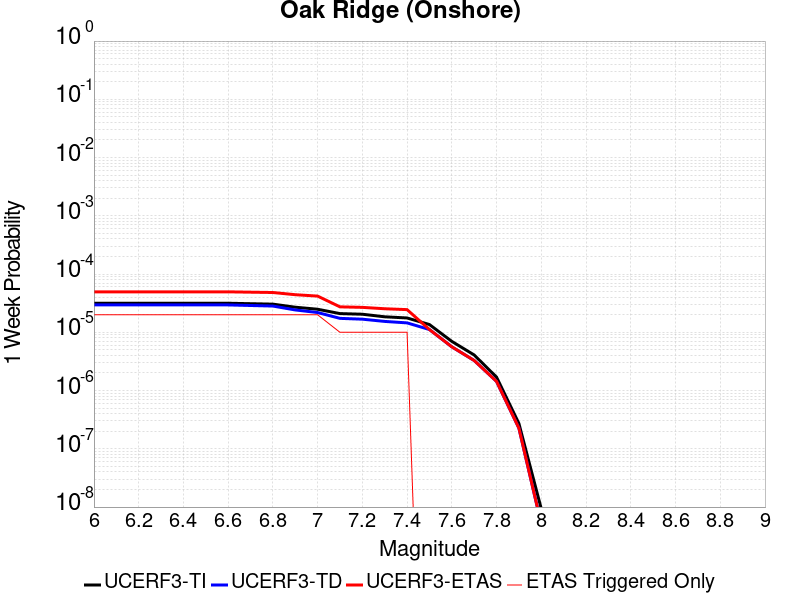 |  |  |  |

| Magnitude | 1 wk TI Prob | 1 wk TD Prob | 1 wk ETAS Prob | 1 wk ETAS/TD Gain | 1 wk ETAS Triggered Only | 1 mo TI Prob | 1 mo TD Prob | 1 mo ETAS Prob | 1 mo ETAS/TD Gain | 1 mo ETAS Triggered Only | 1 yr TI Prob | 1 yr TD Prob | 1 yr ETAS Prob | 1 yr ETAS/TD Gain | 1 yr ETAS Triggered Only | 10 yr TI Prob | 10 yr TD Prob | 10 yr ETAS Prob | 10 yr ETAS/TD Gain | 10 yr ETAS Triggered Only |
|-----|-----|-----|-----|-----|-----|-----|-----|-----|-----|-----|-----|-----|-----|-----|-----|-----|-----|-----|-----|-----|
| 6.0 | 3.155064E-5 | 2.9526076E-5 | 4.9525486E-5 | 1.6773473 | 2.0E-5 | 1.3521002E-4 | 1.265344E-4 | 1.5653062E-4 | 1.2370597 | 3.0E-5 | 0.001644939 | 0.0015395058 | 0.0015894289 | 1.0324279 | 5.0E-5 | 0.01632816 | 0.015293054 | 0.01534229 | 1.0032195 | 5.0E-5 |
| 6.1 | 3.155064E-5 | 2.9526076E-5 | 4.9525486E-5 | 1.6773473 | 2.0E-5 | 1.3521002E-4 | 1.265344E-4 | 1.5653062E-4 | 1.2370597 | 3.0E-5 | 0.001644939 | 0.0015395058 | 0.0015894289 | 1.0324279 | 5.0E-5 | 0.01632816 | 0.015293054 | 0.01534229 | 1.0032195 | 5.0E-5 |
| 6.2 | 3.155064E-5 | 2.9526076E-5 | 4.9525486E-5 | 1.6773473 | 2.0E-5 | 1.3521002E-4 | 1.265344E-4 | 1.5653062E-4 | 1.2370597 | 3.0E-5 | 0.001644939 | 0.0015395058 | 0.0015894289 | 1.0324279 | 5.0E-5 | 0.01632816 | 0.015293054 | 0.01534229 | 1.0032195 | 5.0E-5 |
| 6.3 | 3.155064E-5 | 2.9526076E-5 | 4.9525486E-5 | 1.6773473 | 2.0E-5 | 1.3521002E-4 | 1.265344E-4 | 1.5653062E-4 | 1.2370597 | 3.0E-5 | 0.001644939 | 0.0015395058 | 0.0015894289 | 1.0324279 | 5.0E-5 | 0.01632816 | 0.015293054 | 0.01534229 | 1.0032195 | 5.0E-5 |
| 6.4 | 3.155064E-5 | 2.9526076E-5 | 4.9525486E-5 | 1.6773473 | 2.0E-5 | 1.3521002E-4 | 1.265344E-4 | 1.5653062E-4 | 1.2370597 | 3.0E-5 | 0.001644939 | 0.0015395058 | 0.0015894289 | 1.0324279 | 5.0E-5 | 0.01632816 | 0.015293054 | 0.01534229 | 1.0032195 | 5.0E-5 |
| 6.5 | 3.155064E-5 | 2.9526076E-5 | 4.9525486E-5 | 1.6773473 | 2.0E-5 | 1.3521002E-4 | 1.265344E-4 | 1.5653062E-4 | 1.2370597 | 3.0E-5 | 0.001644939 | 0.0015395058 | 0.0015894289 | 1.0324279 | 5.0E-5 | 0.01632816 | 0.015293054 | 0.01534229 | 1.0032195 | 5.0E-5 |
| 6.6 | 3.155064E-5 | 2.9526076E-5 | 4.9525486E-5 | 1.6773473 | 2.0E-5 | 1.3521002E-4 | 1.265344E-4 | 1.5653062E-4 | 1.2370597 | 3.0E-5 | 0.001644939 | 0.0015395058 | 0.0015894289 | 1.0324279 | 5.0E-5 | 0.01632816 | 0.015293054 | 0.01534229 | 1.0032195 | 5.0E-5 |
| 6.7 | 3.098897E-5 | 2.8864279E-5 | 4.88637E-5 | 1.692878 | 2.0E-5 | 1.328031E-4 | 1.236984E-4 | 1.5369468E-4 | 1.2424954 | 3.0E-5 | 0.0016156785 | 0.0015050253 | 0.00155495 | 1.033172 | 5.0E-5 | 0.016039822 | 0.014952909 | 0.015002162 | 1.0032939 | 5.0E-5 |
| 6.8 | 3.0449872E-5 | 2.8239476E-5 | 4.823891E-5 | 1.7082084 | 2.0E-5 | 1.3049292E-4 | 1.2102092E-4 | 1.5101729E-4 | 1.247861 | 3.0E-5 | 0.0015875935 | 0.001472471 | 0.0015223974 | 1.0339066 | 5.0E-5 | 0.015762992 | 0.014631658 | 0.014680926 | 1.0033673 | 5.0E-5 |
| 6.9 | 2.697928E-5 | 2.4219877E-5 | 4.4219392E-5 | 1.825748 | 2.0E-5 | 1.15620365E-4 | 1.03795464E-4 | 1.3379235E-4 | 1.2889999 | 3.0E-5 | 0.0014067689 | 0.0012629988 | 0.0013129356 | 1.0395383 | 5.0E-5 | 0.0139789665 | 0.012561066 | 0.012610438 | 1.0039306 | 5.0E-5 |
| 7.0 | 2.4893961E-5 | 2.1862146E-5 | 4.186171E-5 | 1.9148033 | 2.0E-5 | 1.0668404E-4 | 9.369165E-5 | 1.2368883E-4 | 1.3201693 | 3.0E-5 | 0.0012981043 | 0.0011401166 | 0.0011900596 | 1.0438051 | 5.0E-5 | 0.012905477 | 0.011345102 | 0.011394535 | 1.0043572 | 5.0E-5 |
| 7.1 | 2.0945363E-5 | 1.7354592E-5 | 2.735442E-5 | 1.5762063 | 1.0E-5 | 8.976275E-5 | 7.437473E-5 | 9.4373245E-5 | 1.2688885 | 2.0E-5 | 0.0010923136 | 9.0514094E-4 | 9.451047E-4 | 1.044152 | 4.0E-5 | 0.0108696 | 0.009015621 | 0.00905526 | 1.0043968 | 4.0E-5 |
| 7.2 | 2.0439404E-5 | 1.680953E-5 | 2.680936E-5 | 1.5948906 | 1.0E-5 | 8.7594504E-5 | 7.203888E-5 | 9.203744E-5 | 1.2776079 | 2.0E-5 | 0.0010659413 | 8.767251E-4 | 9.066988E-4 | 1.0341883 | 3.0E-5 | 0.010608427 | 0.008733723 | 0.008763461 | 1.003405 | 3.0E-5 |
| 7.3 | 1.8463334E-5 | 1.5381947E-5 | 2.5381793E-5 | 1.6501027 | 1.0E-5 | 7.912617E-5 | 6.592098E-5 | 8.5919666E-5 | 1.3033736 | 2.0E-5 | 9.6293533E-4 | 8.0229685E-4 | 8.3227275E-4 | 1.0373627 | 3.0E-5 | 0.009587734 | 0.0079950085 | 0.008024769 | 1.0037223 | 3.0E-5 |
| 7.4 | 1.763139E-5 | 1.4516977E-5 | 2.4516832E-5 | 1.6888386 | 1.0E-5 | 7.556091E-5 | 6.221415E-5 | 8.221291E-5 | 1.3214502 | 2.0E-5 | 9.1956573E-4 | 7.57198E-4 | 7.871753E-4 | 1.0395898 | 3.0E-5 | 0.009157699 | 0.007547126 | 0.0075768996 | 1.003945 | 3.0E-5 |
| 7.5 | 1.3594944E-5 | 1.1163363E-5 | 1.1163363E-5 | 1.0 | 0.0 | 5.8262744E-5 | 4.7842117E-5 | 4.7842117E-5 | 1.0 | 0.0 | 7.0911803E-4 | 5.8232463E-4 | 5.9231883E-4 | 1.0171626 | 1.0E-5 | 0.007068595 | 0.005808362 | 0.0058183037 | 1.0017116 | 1.0E-5 |
| 7.6 | 6.9889534E-6 | 5.6367194E-6 | 5.6367194E-6 | 1.0 | 0.0 | 2.9952313E-5 | 2.4157147E-5 | 2.4157147E-5 | 1.0 | 0.0 | 3.646084E-4 | 2.94074E-4 | 2.94074E-4 | 1.0 | 0.0 | 0.0036401073 | 0.0029368924 | 0.0029368924 | 1.0 | 0.0 |
| 7.7 | 4.0824193E-6 | 3.2832731E-6 | 3.2832731E-6 | 1.0 | 0.0 | 1.7495966E-5 | 1.4071096E-5 | 1.4071096E-5 | 1.0 | 0.0 | 2.1299256E-4 | 1.7130225E-4 | 1.7130225E-4 | 1.0 | 0.0 | 0.0021278851 | 0.0017117155 | 0.0017117155 | 1.0 | 0.0 |
| 7.8 | 1.7023609E-6 | 1.43706E-6 | 1.43706E-6 | 1.0 | 0.0 | 7.295812E-6 | 6.158814E-6 | 6.158814E-6 | 1.0 | 0.0 | 8.882289E-5 | 7.4981006E-5 | 7.4981006E-5 | 1.0 | 0.0 | 8.8787393E-4 | 7.4955984E-4 | 7.4955984E-4 | 1.0 | 0.0 |
| 7.9 | 2.721225E-7 | 2.261692E-7 | 2.261692E-7 | 1.0 | 0.0 | 1.1662388E-6 | 9.692963E-7 | 9.692963E-7 | 1.0 | 0.0 | 1.4198865E-5 | 1.1801121E-5 | 1.1801121E-5 | 1.0 | 0.0 | 1.4197957E-4 | 1.1800523E-4 | 1.1800523E-4 | 1.0 | 0.0 |
| 8.0 | 9.364255E-9 | 5.1204916E-9 | 5.1204916E-9 | 1.0 | 0.0 | 4.0132523E-8 | 2.1944963E-8 | 2.1944963E-8 | 1.0 | 0.0 | 4.8861335E-7 | 2.671799E-7 | 2.671799E-7 | 1.0 | 0.0 | 4.8861225E-6 | 2.6717962E-6 | 2.6717962E-6 | 1.0 | 0.0 |

## San Pedro Basin
*[(top)](#table-of-contents)*

| 1 Week | 1 Month | 1 Year | 10 Year |
|-----|-----|-----|-----|
|  |  |  |  |

| Magnitude | 1 wk TI Prob | 1 wk TD Prob | 1 wk ETAS Prob | 1 wk ETAS/TD Gain | 1 wk ETAS Triggered Only | 1 mo TI Prob | 1 mo TD Prob | 1 mo ETAS Prob | 1 mo ETAS/TD Gain | 1 mo ETAS Triggered Only | 1 yr TI Prob | 1 yr TD Prob | 1 yr ETAS Prob | 1 yr ETAS/TD Gain | 1 yr ETAS Triggered Only | 10 yr TI Prob | 10 yr TD Prob | 10 yr ETAS Prob | 10 yr ETAS/TD Gain | 10 yr ETAS Triggered Only |
|-----|-----|-----|-----|-----|-----|-----|-----|-----|-----|-----|-----|-----|-----|-----|-----|-----|-----|-----|-----|-----|
| 6.0 | 5.3449043E-5 | 6.337018E-5 | 9.336828E-5 | 1.4733788 | 3.0E-5 | 2.2904722E-4 | 2.7156167E-4 | 3.0155352E-4 | 1.1104422 | 3.0E-5 | 0.0027850836 | 0.0033018515 | 0.0033417193 | 1.0120745 | 4.0E-5 | 0.027504366 | 0.03258948 | 0.032637853 | 1.0014843 | 5.0E-5 |
| 6.1 | 5.3449043E-5 | 6.337018E-5 | 9.336828E-5 | 1.4733788 | 3.0E-5 | 2.2904722E-4 | 2.7156167E-4 | 3.0155352E-4 | 1.1104422 | 3.0E-5 | 0.0027850836 | 0.0033018515 | 0.0033417193 | 1.0120745 | 4.0E-5 | 0.027504366 | 0.03258948 | 0.032637853 | 1.0014843 | 5.0E-5 |
| 6.2 | 2.3189454E-5 | 2.6642829E-5 | 3.6642563E-5 | 1.3753256 | 1.0E-5 | 9.9379584E-5 | 1.1417881E-4 | 1.2417766E-4 | 1.087572 | 1.0E-5 | 0.0012092749 | 0.0013892875 | 0.0014092597 | 1.0143759 | 2.0E-5 | 0.012027155 | 0.01381089 | 0.013830613 | 1.0014281 | 2.0E-5 |
| 6.3 | 2.3189454E-5 | 2.6642829E-5 | 3.6642563E-5 | 1.3753256 | 1.0E-5 | 9.9379584E-5 | 1.1417881E-4 | 1.2417766E-4 | 1.087572 | 1.0E-5 | 0.0012092749 | 0.0013892875 | 0.0014092597 | 1.0143759 | 2.0E-5 | 0.012027155 | 0.01381089 | 0.013830613 | 1.0014281 | 2.0E-5 |
| 6.4 | 1.966056E-5 | 2.246342E-5 | 3.2463195E-5 | 1.4451581 | 1.0E-5 | 8.425682E-5 | 9.626848E-5 | 1.06267515E-4 | 1.1038662 | 1.0E-5 | 0.001025344 | 0.0011714787 | 0.0011914552 | 1.0170524 | 2.0E-5 | 0.010206259 | 0.011657119 | 0.011676886 | 1.0016956 | 2.0E-5 |
| 6.5 | 1.7342953E-5 | 1.9745152E-5 | 2.9744955E-5 | 1.5064434 | 1.0E-5 | 7.4324824E-5 | 8.461954E-5 | 9.46187E-5 | 1.118166 | 1.0E-5 | 9.04529E-4 | 0.0010297929 | 0.0010397827 | 1.0097007 | 1.0E-5 | 0.009008561 | 0.010253932 | 0.01026383 | 1.0009652 | 1.0E-5 |
| 6.6 | 1.439804E-5 | 1.6322716E-5 | 2.6322554E-5 | 1.6126331 | 1.0E-5 | 6.170443E-5 | 6.99528E-5 | 7.995211E-5 | 1.1429435 | 1.0E-5 | 7.509924E-4 | 8.513747E-4 | 8.613662E-4 | 1.0117357 | 1.0E-5 | 0.0074845953 | 0.008484333 | 0.008494249 | 1.0011686 | 1.0E-5 |
| 6.7 | 1.2634884E-5 | 1.4285298E-5 | 2.4285155E-5 | 1.7000104 | 1.0E-5 | 5.414838E-5 | 6.122144E-5 | 7.122083E-5 | 1.1633315 | 1.0E-5 | 6.590571E-4 | 7.451466E-4 | 7.5513916E-4 | 1.0134102 | 1.0E-5 | 0.006571059 | 0.007429502 | 0.0074394275 | 1.001336 | 1.0E-5 |
| 6.8 | 1.146091E-5 | 1.2933193E-5 | 2.2933064E-5 | 1.7731943 | 1.0E-5 | 4.911726E-5 | 5.542696E-5 | 6.542641E-5 | 1.1804076 | 1.0E-5 | 5.9783855E-4 | 6.74644E-4 | 6.846373E-4 | 1.0148126 | 1.0E-5 | 0.0059623276 | 0.0067288997 | 0.006738832 | 1.0014762 | 1.0E-5 |
| 6.9 | 9.109035E-6 | 1.0235013E-5 | 2.0234911E-5 | 1.9770284 | 1.0E-5 | 3.9038136E-5 | 4.386376E-5 | 5.386332E-5 | 1.2279686 | 1.0E-5 | 4.7518566E-4 | 5.339384E-4 | 5.4393307E-4 | 1.0187187 | 1.0E-5 | 0.0047417083 | 0.0053293095 | 0.005339256 | 1.0018665 | 1.0E-5 |
| 7.0 | 5.9351028E-6 | 6.583965E-6 | 1.65839E-5 | 2.5188315 | 1.0E-5 | 2.5435906E-5 | 2.821682E-5 | 3.8216538E-5 | 1.3543885 | 1.0E-5 | 3.0963816E-4 | 3.4350925E-4 | 3.5350583E-4 | 1.0291013 | 1.0E-5 | 0.0030920706 | 0.0034320997 | 0.0034420653 | 1.0029037 | 1.0E-5 |
| 7.1 | 2.1557585E-6 | 2.2096492E-6 | 1.2209627E-5 | 5.525595 | 1.0E-5 | 9.238933E-6 | 9.469892E-6 | 1.9469797E-5 | 2.0559683 | 1.0E-5 | 1.1247819E-4 | 1.15289986E-4 | 1.2528883E-4 | 1.0867279 | 1.0E-5 | 0.0011242128 | 0.0011523172 | 0.0011623056 | 1.0086682 | 1.0E-5 |
| 7.2 | 2.1251979E-6 | 2.1779954E-6 | 1.2177974E-5 | 5.5913677 | 1.0E-5 | 9.107958E-6 | 9.334234E-6 | 1.933414E-5 | 2.0713153 | 1.0E-5 | 1.1088375E-4 | 1.13638525E-4 | 1.236374E-4 | 1.0879884 | 1.0E-5 | 0.0011082845 | 0.0011358195 | 0.0011458081 | 1.0087942 | 1.0E-5 |
| 7.3 | 1.7145798E-6 | 1.7442885E-6 | 1.1744271E-5 | 6.7329865 | 1.0E-5 | 7.3481783E-6 | 7.475501E-6 | 1.7475426E-5 | 2.337693 | 1.0E-5 | 8.94604E-5 | 9.1010515E-5 | 1.0100961E-4 | 1.1098675 | 1.0E-5 | 8.9424395E-4 | 9.0974156E-4 | 9.197325E-4 | 1.0109822 | 1.0E-5 |
| 7.4 | 1.4467993E-6 | 1.4641878E-6 | 1.4641878E-6 | 1.0 | 0.0 | 6.200554E-6 | 6.275076E-6 | 6.275076E-6 | 1.0 | 0.0 | 7.548913E-5 | 7.639644E-5 | 7.639644E-5 | 1.0 | 0.0 | 7.546349E-4 | 7.6370913E-4 | 7.6370913E-4 | 1.0 | 0.0 |
| 7.5 | 1.2803735E-6 | 1.2931506E-6 | 1.2931506E-6 | 1.0 | 0.0 | 5.487303E-6 | 5.5420624E-6 | 5.5420624E-6 | 1.0 | 0.0 | 6.680587E-5 | 6.747259E-5 | 6.747259E-5 | 1.0 | 0.0 | 6.678579E-4 | 6.745281E-4 | 6.745281E-4 | 1.0 | 0.0 |
| 7.6 | 6.755009E-7 | 6.76947E-7 | 6.76947E-7 | 1.0 | 0.0 | 2.8950008E-6 | 2.9011985E-6 | 2.9011985E-6 | 1.0 | 0.0 | 3.5246063E-5 | 3.532158E-5 | 3.532158E-5 | 1.0 | 0.0 | 3.5240475E-4 | 3.5316538E-4 | 3.5316538E-4 | 1.0 | 0.0 |
| 7.7 | 6.211885E-8 | 4.5699714E-8 | 4.5699714E-8 | 1.0 | 0.0 | 2.6622362E-7 | 1.9585592E-7 | 1.9585592E-7 | 1.0 | 0.0 | 3.2412677E-6 | 2.3845432E-6 | 2.3845432E-6 | 1.0 | 0.0 | 3.2412205E-5 | 2.3845198E-5 | 2.3845198E-5 | 1.0 | 0.0 |
| 7.8 | 2.6580573E-9 | 1.5138054E-9 | 1.5138054E-9 | 1.0 | 0.0 | 1.1391674E-8 | 6.4877375E-9 | 6.4877375E-9 | 1.0 | 0.0 | 1.3869362E-7 | 7.89882E-8 | 7.89882E-8 | 1.0 | 0.0 | 1.3869354E-6 | 7.89882E-7 | 7.89882E-7 | 1.0 | 0.0 |

## Mission Ridge-Arroyo Parida-Santa Ana
*[(top)](#table-of-contents)*

| 1 Week | 1 Month | 1 Year | 10 Year |
|-----|-----|-----|-----|
|  |  |  |  |

| Magnitude | 1 wk TI Prob | 1 wk TD Prob | 1 wk ETAS Prob | 1 wk ETAS/TD Gain | 1 wk ETAS Triggered Only | 1 mo TI Prob | 1 mo TD Prob | 1 mo ETAS Prob | 1 mo ETAS/TD Gain | 1 mo ETAS Triggered Only | 1 yr TI Prob | 1 yr TD Prob | 1 yr ETAS Prob | 1 yr ETAS/TD Gain | 1 yr ETAS Triggered Only | 10 yr TI Prob | 10 yr TD Prob | 10 yr ETAS Prob | 10 yr ETAS/TD Gain | 10 yr ETAS Triggered Only |
|-----|-----|-----|-----|-----|-----|-----|-----|-----|-----|-----|-----|-----|-----|-----|-----|-----|-----|-----|-----|-----|
| 6.0 | 4.169034E-5 | 4.7137048E-5 | 7.7135635E-5 | 1.636412 | 3.0E-5 | 1.7866064E-4 | 2.0200513E-4 | 2.3199907E-4 | 1.1484811 | 3.0E-5 | 0.0021730233 | 0.0024574657 | 0.002487392 | 1.0121777 | 3.0E-5 | 0.021518968 | 0.02438483 | 0.024433611 | 1.0020005 | 5.0E-5 |
| 6.1 | 1.73813E-5 | 1.6854203E-5 | 1.6854203E-5 | 1.0 | 0.0 | 7.4489166E-5 | 7.223036E-5 | 7.223036E-5 | 1.0 | 0.0 | 9.065282E-4 | 8.790605E-4 | 8.790605E-4 | 1.0 | 0.0 | 0.009028391 | 0.008757128 | 0.008757128 | 1.0 | 0.0 |
| 6.2 | 1.4622182E-5 | 1.3673262E-5 | 1.3673262E-5 | 1.0 | 0.0 | 6.2664985E-5 | 5.85984E-5 | 5.85984E-5 | 1.0 | 0.0 | 7.6267915E-4 | 7.132059E-4 | 7.132059E-4 | 1.0 | 0.0 | 0.007600669 | 0.007109767 | 0.007109767 | 1.0 | 0.0 |
| 6.3 | 1.3552434E-5 | 1.2482174E-5 | 1.2482174E-5 | 1.0 | 0.0 | 5.8080568E-5 | 5.349395E-5 | 5.349395E-5 | 1.0 | 0.0 | 7.069015E-4 | 6.510974E-4 | 6.510974E-4 | 1.0 | 0.0 | 0.00704657 | 0.006492415 | 0.006492415 | 1.0 | 0.0 |
| 6.4 | 1.30977305E-5 | 1.1979128E-5 | 1.1979128E-5 | 1.0 | 0.0 | 5.613192E-5 | 5.133813E-5 | 5.133813E-5 | 1.0 | 0.0 | 6.831918E-4 | 6.2486547E-4 | 6.2486547E-4 | 1.0 | 0.0 | 0.006810953 | 0.006231584 | 0.006231584 | 1.0 | 0.0 |
| 6.5 | 1.225205E-5 | 1.1048776E-5 | 1.1048776E-5 | 1.0 | 0.0 | 5.2507727E-5 | 4.735105E-5 | 4.735105E-5 | 1.0 | 0.0 | 6.3909404E-4 | 5.7634927E-4 | 5.7634927E-4 | 1.0 | 0.0 | 0.006372592 | 0.005749009 | 0.005749009 | 1.0 | 0.0 |
| 6.6 | 1.1352241E-5 | 1.0063508E-5 | 1.0063508E-5 | 1.0 | 0.0 | 4.8651553E-5 | 4.3128617E-5 | 4.3128617E-5 | 1.0 | 0.0 | 5.921717E-4 | 5.249665E-4 | 5.249665E-4 | 1.0 | 0.0 | 0.0059059616 | 0.0052376646 | 0.0052376646 | 1.0 | 0.0 |
| 6.7 | 1.0864116E-5 | 9.517E-6 | 9.517E-6 | 1.0 | 0.0 | 4.6559664E-5 | 4.0786515E-5 | 4.0786515E-5 | 1.0 | 0.0 | 5.667165E-4 | 4.964647E-4 | 4.964647E-4 | 1.0 | 0.0 | 0.005652734 | 0.0049539437 | 0.0049539437 | 1.0 | 0.0 |
| 6.8 | 1.0666365E-5 | 9.299752E-6 | 9.299752E-6 | 1.0 | 0.0 | 4.571219E-5 | 3.985548E-5 | 3.985548E-5 | 1.0 | 0.0 | 5.564038E-4 | 4.8513446E-4 | 4.8513446E-4 | 1.0 | 0.0 | 0.005550127 | 0.00484114 | 0.00484114 | 1.0 | 0.0 |
| 6.9 | 1.0038665E-5 | 8.592018E-6 | 8.592018E-6 | 1.0 | 0.0 | 4.302214E-5 | 3.682243E-5 | 3.682243E-5 | 1.0 | 0.0 | 5.236687E-4 | 4.4822265E-4 | 4.4822265E-4 | 1.0 | 0.0 | 0.005224364 | 0.0044735507 | 0.0044735507 | 1.0 | 0.0 |
| 7.0 | 9.5379955E-6 | 8.025047E-6 | 8.025047E-6 | 1.0 | 0.0 | 4.0876483E-5 | 3.439261E-5 | 3.439261E-5 | 1.0 | 0.0 | 4.975576E-4 | 4.1865133E-4 | 4.1865133E-4 | 1.0 | 0.0 | 0.00496445 | 0.00417898 | 0.00417898 | 1.0 | 0.0 |
| 7.1 | 9.207389E-6 | 7.652347E-6 | 7.652347E-6 | 1.0 | 0.0 | 3.945964E-5 | 3.2795375E-5 | 3.2795375E-5 | 1.0 | 0.0 | 4.803152E-4 | 3.992122E-4 | 3.992122E-4 | 1.0 | 0.0 | 0.004792784 | 0.003985301 | 0.003985301 | 1.0 | 0.0 |
| 7.2 | 7.638091E-6 | 5.9310923E-6 | 5.9310923E-6 | 1.0 | 0.0 | 3.2734264E-5 | 2.5418722E-5 | 2.5418722E-5 | 1.0 | 0.0 | 3.984668E-4 | 3.094293E-4 | 3.094293E-4 | 1.0 | 0.0 | 0.0039775306 | 0.0030901956 | 0.0030901956 | 1.0 | 0.0 |
| 7.3 | 7.2500147E-6 | 5.596131E-6 | 5.596131E-6 | 1.0 | 0.0 | 3.1071122E-5 | 2.3983199E-5 | 2.3983199E-5 | 1.0 | 0.0 | 3.7822526E-4 | 2.9195662E-4 | 2.9195662E-4 | 1.0 | 0.0 | 0.0037758215 | 0.0029159402 | 0.0029159402 | 1.0 | 0.0 |
| 7.4 | 6.3899715E-6 | 4.9184864E-6 | 4.9184864E-6 | 1.0 | 0.0 | 2.7385306E-5 | 2.1079059E-5 | 2.1079059E-5 | 1.0 | 0.0 | 3.3336508E-4 | 2.566075E-4 | 2.566075E-4 | 1.0 | 0.0 | 0.0033286542 | 0.002563311 | 0.002563311 | 1.0 | 0.0 |
| 7.5 | 5.379025E-6 | 4.0838477E-6 | 4.0838477E-6 | 1.0 | 0.0 | 2.305276E-5 | 1.7502087E-5 | 1.7502087E-5 | 1.0 | 0.0 | 2.806312E-4 | 2.1306718E-4 | 2.1306718E-4 | 1.0 | 0.0 | 0.0028027708 | 0.0021286402 | 0.0021286402 | 1.0 | 0.0 |
| 7.6 | 4.1270696E-6 | 3.0883373E-6 | 3.0883373E-6 | 1.0 | 0.0 | 1.768732E-5 | 1.32356645E-5 | 1.32356645E-5 | 1.0 | 0.0 | 2.1532185E-4 | 1.6113237E-4 | 1.6113237E-4 | 1.0 | 0.0 | 0.0021511333 | 0.0016101635 | 0.0016101635 | 1.0 | 0.0 |
| 7.7 | 2.5406805E-6 | 1.8282044E-6 | 1.8282044E-6 | 1.0 | 0.0 | 1.0888585E-5 | 7.835139E-6 | 7.835139E-6 | 1.0 | 0.0 | 1.3256045E-4 | 9.53887E-5 | 9.53887E-5 | 1.0 | 0.0 | 0.0013248142 | 9.534837E-4 | 9.534837E-4 | 1.0 | 0.0 |
| 7.8 | 4.8608285E-7 | 3.509864E-7 | 3.509864E-7 | 1.0 | 0.0 | 2.0832106E-6 | 1.5042266E-6 | 1.5042266E-6 | 1.0 | 0.0 | 2.5362791E-5 | 1.8313805E-5 | 1.8313805E-5 | 1.0 | 0.0 | 2.5359896E-4 | 1.8312308E-4 | 1.8312308E-4 | 1.0 | 0.0 |
| 7.9 | 2.0472514E-8 | 1.2688718E-8 | 1.2688718E-8 | 1.0 | 0.0 | 8.7739345E-8 | 5.438022E-8 | 5.438022E-8 | 1.0 | 0.0 | 1.068226E-6 | 6.6207895E-7 | 6.6207895E-7 | 1.0 | 0.0 | 1.0682209E-5 | 6.620771E-6 | 6.620771E-6 | 1.0 | 0.0 |
| 8.0 | 4.443582E-9 | 2.032067E-9 | 2.032067E-9 | 1.0 | 0.0 | 1.9043922E-8 | 8.7088585E-9 | 8.7088585E-9 | 1.0 | 0.0 | 2.3185973E-7 | 1.0603035E-7 | 1.0603035E-7 | 1.0 | 0.0 | 2.3185949E-6 | 1.0603031E-6 | 1.0603031E-6 | 1.0 | 0.0 |

## Pleito
*[(top)](#table-of-contents)*

| 1 Week | 1 Month | 1 Year | 10 Year |
|-----|-----|-----|-----|
|  |  | 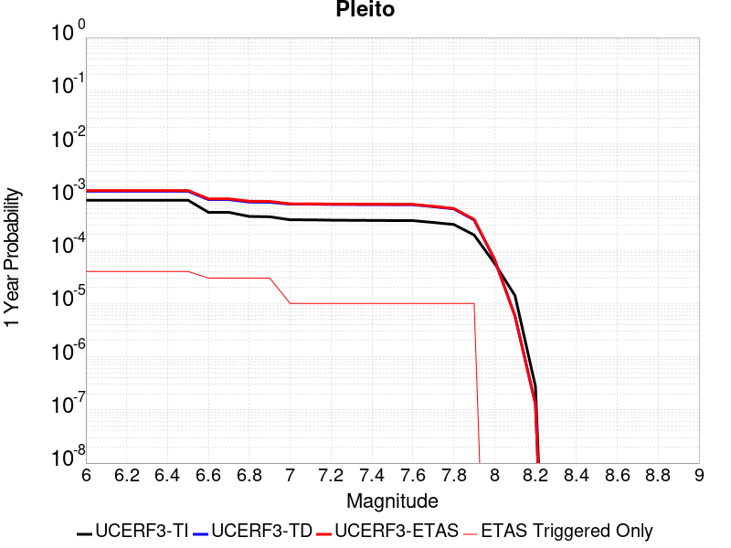 |  |

| Magnitude | 1 wk TI Prob | 1 wk TD Prob | 1 wk ETAS Prob | 1 wk ETAS/TD Gain | 1 wk ETAS Triggered Only | 1 mo TI Prob | 1 mo TD Prob | 1 mo ETAS Prob | 1 mo ETAS/TD Gain | 1 mo ETAS Triggered Only | 1 yr TI Prob | 1 yr TD Prob | 1 yr ETAS Prob | 1 yr ETAS/TD Gain | 1 yr ETAS Triggered Only | 10 yr TI Prob | 10 yr TD Prob | 10 yr ETAS Prob | 10 yr ETAS/TD Gain | 10 yr ETAS Triggered Only |
|-----|-----|-----|-----|-----|-----|-----|-----|-----|-----|-----|-----|-----|-----|-----|-----|-----|-----|-----|-----|-----|
| 6.0 | 1.6763008E-5 | 2.4764735E-5 | 5.4763994E-5 | 2.21137 | 3.0E-5 | 7.183948E-5 | 1.0613067E-4 | 1.3612749E-4 | 1.2826405 | 3.0E-5 | 8.742947E-4 | 0.001291447 | 0.0013313954 | 1.030933 | 4.0E-5 | 0.00870863 | 0.012954412 | 0.013003764 | 1.0038097 | 5.0E-5 |
| 6.1 | 1.6763008E-5 | 2.4764735E-5 | 5.4763994E-5 | 2.21137 | 3.0E-5 | 7.183948E-5 | 1.0613067E-4 | 1.3612749E-4 | 1.2826405 | 3.0E-5 | 8.742947E-4 | 0.001291447 | 0.0013313954 | 1.030933 | 4.0E-5 | 0.00870863 | 0.012954412 | 0.013003764 | 1.0038097 | 5.0E-5 |
| 6.2 | 1.6763008E-5 | 2.4764735E-5 | 5.4763994E-5 | 2.21137 | 3.0E-5 | 7.183948E-5 | 1.0613067E-4 | 1.3612749E-4 | 1.2826405 | 3.0E-5 | 8.742947E-4 | 0.001291447 | 0.0013313954 | 1.030933 | 4.0E-5 | 0.00870863 | 0.012954412 | 0.013003764 | 1.0038097 | 5.0E-5 |
| 6.3 | 1.6763008E-5 | 2.4764735E-5 | 5.4763994E-5 | 2.21137 | 3.0E-5 | 7.183948E-5 | 1.0613067E-4 | 1.3612749E-4 | 1.2826405 | 3.0E-5 | 8.742947E-4 | 0.001291447 | 0.0013313954 | 1.030933 | 4.0E-5 | 0.00870863 | 0.012954412 | 0.013003764 | 1.0038097 | 5.0E-5 |
| 6.4 | 1.6763008E-5 | 2.4764735E-5 | 5.4763994E-5 | 2.21137 | 3.0E-5 | 7.183948E-5 | 1.0613067E-4 | 1.3612749E-4 | 1.2826405 | 3.0E-5 | 8.742947E-4 | 0.001291447 | 0.0013313954 | 1.030933 | 4.0E-5 | 0.00870863 | 0.012954412 | 0.013003764 | 1.0038097 | 5.0E-5 |
| 6.5 | 1.6763008E-5 | 2.4764735E-5 | 5.4763994E-5 | 2.21137 | 3.0E-5 | 7.183948E-5 | 1.0613067E-4 | 1.3612749E-4 | 1.2826405 | 3.0E-5 | 8.742947E-4 | 0.001291447 | 0.0013313954 | 1.030933 | 4.0E-5 | 0.00870863 | 0.012954412 | 0.013003764 | 1.0038097 | 5.0E-5 |
| 6.6 | 9.910213E-6 | 1.721552E-5 | 3.7215177E-5 | 2.1617224 | 2.0E-5 | 4.247165E-5 | 7.3778734E-5 | 9.377726E-5 | 1.2710608 | 2.0E-5 | 5.169696E-4 | 8.9788967E-4 | 9.278627E-4 | 1.0333817 | 3.0E-5 | 0.0051576863 | 0.009051226 | 0.009090864 | 1.0043793 | 4.0E-5 |
| 6.7 | 9.910213E-6 | 1.721552E-5 | 3.7215177E-5 | 2.1617224 | 2.0E-5 | 4.247165E-5 | 7.3778734E-5 | 9.377726E-5 | 1.2710608 | 2.0E-5 | 5.169696E-4 | 8.9788967E-4 | 9.278627E-4 | 1.0333817 | 3.0E-5 | 0.0051576863 | 0.009051226 | 0.009090864 | 1.0043793 | 4.0E-5 |
| 6.8 | 8.300162E-6 | 1.5475129E-5 | 3.547482E-5 | 2.2923763 | 2.0E-5 | 3.557164E-5 | 6.63203E-5 | 8.631898E-5 | 1.3015468 | 2.0E-5 | 4.3299864E-4 | 8.07152E-4 | 8.371278E-4 | 1.0371377 | 3.0E-5 | 0.004321559 | 0.008150663 | 0.008190337 | 1.0048676 | 4.0E-5 |
| 6.9 | 8.183114E-6 | 1.5346344E-5 | 3.534604E-5 | 2.303222 | 2.0E-5 | 3.5070017E-5 | 6.57684E-5 | 8.576708E-5 | 1.3040774 | 2.0E-5 | 4.2689382E-4 | 8.0043747E-4 | 8.304135E-4 | 1.0374495 | 3.0E-5 | 0.0042607468 | 0.008084008 | 0.008123685 | 1.0049081 | 4.0E-5 |
| 7.0 | 7.1748823E-6 | 1.4133306E-5 | 1.4133306E-5 | 1.0 | 0.0 | 3.0749135E-5 | 6.0569906E-5 | 6.0569906E-5 | 1.0 | 0.0 | 3.743064E-4 | 7.3718966E-4 | 7.471823E-4 | 1.013555 | 1.0E-5 | 0.0037367654 | 0.0074553755 | 0.0074752267 | 1.0026627 | 2.0E-5 |
| 7.1 | 7.1671807E-6 | 1.4123676E-5 | 1.4123676E-5 | 1.0 | 0.0 | 3.0716128E-5 | 6.0528637E-5 | 6.0528637E-5 | 1.0 | 0.0 | 3.7390468E-4 | 7.366875E-4 | 7.4668013E-4 | 1.0135642 | 1.0E-5 | 0.0037327618 | 0.0074503883 | 0.007470239 | 1.0026644 | 2.0E-5 |
| 7.2 | 7.0649667E-6 | 1.3970962E-5 | 1.3970962E-5 | 1.0 | 0.0 | 3.0278077E-5 | 5.987418E-5 | 5.987418E-5 | 1.0 | 0.0 | 3.6857324E-4 | 7.287248E-4 | 7.3871756E-4 | 1.0137126 | 1.0E-5 | 0.0036796255 | 0.0073711374 | 0.00739099 | 1.0026933 | 2.0E-5 |
| 7.3 | 7.02082E-6 | 1.3914415E-5 | 1.3914415E-5 | 1.0 | 0.0 | 3.008888E-5 | 5.9631846E-5 | 5.9631846E-5 | 1.0 | 0.0 | 3.6627054E-4 | 7.257764E-4 | 7.3576916E-4 | 1.0137683 | 1.0E-5 | 0.0036566744 | 0.0073416373 | 0.0073614907 | 1.0027041 | 2.0E-5 |
| 7.4 | 6.987146E-6 | 1.3873975E-5 | 1.3873975E-5 | 1.0 | 0.0 | 2.9944567E-5 | 5.9458544E-5 | 5.9458544E-5 | 1.0 | 0.0 | 3.6451413E-4 | 7.2366785E-4 | 7.336606E-4 | 1.0138085 | 1.0E-5 | 0.0036391679 | 0.007320571 | 0.007340425 | 1.002712 | 2.0E-5 |
| 7.5 | 6.9494554E-6 | 1.383088E-5 | 1.383088E-5 | 1.0 | 0.0 | 2.9783041E-5 | 5.9273858E-5 | 5.9273858E-5 | 1.0 | 0.0 | 3.625482E-4 | 7.2142074E-4 | 7.3141354E-4 | 1.0138515 | 1.0E-5 | 0.0036195726 | 0.007298199 | 0.007318053 | 1.0027204 | 2.0E-5 |
| 7.6 | 6.92694E-6 | 1.3789992E-5 | 1.3789992E-5 | 1.0 | 0.0 | 2.9686547E-5 | 5.909863E-5 | 5.909863E-5 | 1.0 | 0.0 | 3.6137376E-4 | 7.192888E-4 | 7.292816E-4 | 1.0138927 | 1.0E-5 | 0.0036078666 | 0.007276951 | 0.0072968053 | 1.0027285 | 2.0E-5 |
| 7.7 | 6.395867E-6 | 1.26690065E-5 | 1.26690065E-5 | 1.0 | 0.0 | 2.741057E-5 | 5.4294615E-5 | 5.4294615E-5 | 1.0 | 0.0 | 3.336726E-4 | 6.6083675E-4 | 6.7083014E-4 | 1.0151223 | 1.0E-5 | 0.0033317201 | 0.0066955453 | 0.0067154113 | 1.0029671 | 2.0E-5 |
| 7.8 | 5.8664327E-6 | 1.1536581E-5 | 1.1536581E-5 | 1.0 | 0.0 | 2.5141611E-5 | 4.9441554E-5 | 4.9441554E-5 | 1.0 | 0.0 | 3.060561E-4 | 6.0178485E-4 | 6.117789E-4 | 1.0166073 | 1.0E-5 | 0.0030563495 | 0.0061010164 | 0.0061208946 | 1.0032581 | 2.0E-5 |
| 7.9 | 3.7167474E-6 | 7.1145205E-6 | 7.1145205E-6 | 1.0 | 0.0 | 1.592882E-5 | 3.0490448E-5 | 3.0490448E-5 | 1.0 | 0.0 | 1.9391612E-4 | 3.7115812E-4 | 3.8115442E-4 | 1.0269327 | 1.0E-5 | 0.0019374699 | 0.0037676243 | 0.003787549 | 1.0052884 | 2.0E-5 |
| 8.0 | 1.0903841E-6 | 1.2879104E-6 | 1.2879104E-6 | 1.0 | 0.0 | 4.6730665E-6 | 5.5196047E-6 | 5.5196047E-6 | 1.0 | 0.0 | 5.68931E-5 | 6.719913E-5 | 6.719913E-5 | 1.0 | 0.0 | 5.6878536E-4 | 6.942094E-4 | 7.0420245E-4 | 1.0143949 | 1.0E-5 |
| 8.1 | 2.6894583E-7 | 1.1056095E-7 | 1.1056095E-7 | 1.0 | 0.0 | 1.1526245E-6 | 4.7383253E-7 | 4.7383253E-7 | 1.0 | 0.0 | 1.4033113E-5 | 5.768896E-6 | 5.768896E-6 | 1.0 | 0.0 | 1.4032227E-4 | 6.454915E-5 | 6.454915E-5 | 1.0 | 0.0 |
| 8.2 | 5.2967013E-9 | 2.4567874E-9 | 2.4567874E-9 | 1.0 | 0.0 | 2.2700148E-8 | 1.0529089E-8 | 1.0529089E-8 | 1.0 | 0.0 | 2.7637427E-7 | 1.2819166E-7 | 1.2819166E-7 | 1.0 | 0.0 | 2.7637393E-6 | 1.4588004E-6 | 1.4588004E-6 | 1.0 | 0.0 |

## Green Valley 2011 CFM
*[(top)](#table-of-contents)*

| 1 Week | 1 Month | 1 Year | 10 Year |
|-----|-----|-----|-----|
|  |  |  |  |

| Magnitude | 1 wk TI Prob | 1 wk TD Prob | 1 wk ETAS Prob | 1 wk ETAS/TD Gain | 1 wk ETAS Triggered Only | 1 mo TI Prob | 1 mo TD Prob | 1 mo ETAS Prob | 1 mo ETAS/TD Gain | 1 mo ETAS Triggered Only | 1 yr TI Prob | 1 yr TD Prob | 1 yr ETAS Prob | 1 yr ETAS/TD Gain | 1 yr ETAS Triggered Only | 10 yr TI Prob | 10 yr TD Prob | 10 yr ETAS Prob | 10 yr ETAS/TD Gain | 10 yr ETAS Triggered Only |
|-----|-----|-----|-----|-----|-----|-----|-----|-----|-----|-----|-----|-----|-----|-----|-----|-----|-----|-----|-----|-----|
| 6.0 | 9.9629346E-5 | 1.7302863E-4 | 2.0302343E-4 | 1.1733518 | 3.0E-5 | 4.2691303E-4 | 7.41326E-4 | 7.8129634E-4 | 1.0539174 | 4.0E-5 | 0.0051852856 | 0.00898692 | 0.00903647 | 1.0055137 | 5.0E-5 | 0.050659515 | 0.08553951 | 0.08558524 | 1.0005345 | 5.0E-5 |
| 6.1 | 9.88615E-5 | 1.7150163E-4 | 2.0149648E-4 | 1.1748954 | 3.0E-5 | 4.2362334E-4 | 7.347854E-4 | 7.74756E-4 | 1.0543977 | 4.0E-5 | 0.0051454236 | 0.008907947 | 0.0089575015 | 1.005563 | 5.0E-5 | 0.050279044 | 0.08482712 | 0.08487287 | 1.0005394 | 5.0E-5 |
| 6.2 | 9.696895E-5 | 1.6789208E-4 | 1.9788706E-4 | 1.1786562 | 3.0E-5 | 4.15515E-4 | 7.1932544E-4 | 7.592967E-4 | 1.0555676 | 4.0E-5 | 0.0050471667 | 0.00872133 | 0.008770893 | 1.0056831 | 5.0E-5 | 0.04934063 | 0.08313578 | 0.08318163 | 1.0005515 | 5.0E-5 |
| 6.3 | 9.275224E-5 | 1.5968543E-4 | 1.8968064E-4 | 1.1878394 | 3.0E-5 | 3.9744904E-4 | 6.841728E-4 | 7.2414544E-4 | 1.0584247 | 4.0E-5 | 0.0048282105 | 0.008296652 | 0.008346236 | 1.0059766 | 5.0E-5 | 0.047246475 | 0.07927481 | 0.07932085 | 1.0005807 | 5.0E-5 |
| 6.4 | 8.391499E-5 | 1.4365884E-4 | 1.6365596E-4 | 1.1391988 | 2.0E-5 | 3.595861E-4 | 6.155238E-4 | 6.455053E-4 | 1.048709 | 3.0E-5 | 0.004369175 | 0.007467181 | 0.0075068823 | 1.0053167 | 4.0E-5 | 0.04284265 | 0.07164672 | 0.071683854 | 1.0005183 | 4.0E-5 |
| 6.5 | 5.9519385E-5 | 9.932622E-5 | 1.19324235E-4 | 1.2013367 | 2.0E-5 | 2.5505814E-4 | 4.2560388E-4 | 4.555911E-4 | 1.070458 | 3.0E-5 | 0.0031009112 | 0.005168341 | 0.005208134 | 1.0076994 | 4.0E-5 | 0.030579966 | 0.05014692 | 0.050184913 | 1.0007577 | 4.0E-5 |
| 6.6 | 4.5361558E-5 | 7.4019794E-5 | 9.4018316E-5 | 1.270178 | 2.0E-5 | 1.9439218E-4 | 3.1717744E-4 | 3.371711E-4 | 1.0630362 | 2.0E-5 | 0.0023641558 | 0.0038538678 | 0.0038837523 | 1.0077544 | 3.0E-5 | 0.023391623 | 0.03766727 | 0.037696138 | 1.0007664 | 3.0E-5 |
| 6.7 | 3.8808106E-5 | 6.264382E-5 | 7.264319E-5 | 1.1596227 | 1.0E-5 | 1.6630985E-4 | 2.6843755E-4 | 2.7843486E-4 | 1.0372427 | 1.0E-5 | 0.0020229418 | 0.0032627317 | 0.003272699 | 1.0030549 | 1.0E-5 | 0.020046256 | 0.032007415 | 0.032017097 | 1.0003024 | 1.0E-5 |
| 6.8 | 2.2284667E-5 | 3.128574E-5 | 3.128574E-5 | 1.0 | 0.0 | 9.550222E-5 | 1.3407487E-4 | 1.3407487E-4 | 1.0 | 0.0 | 0.0011621192 | 0.0016311383 | 0.0016311383 | 1.0 | 0.0 | 0.011560607 | 0.01616672 | 0.01616672 | 1.0 | 0.0 |
| 6.9 | 1.8050168E-5 | 2.4448536E-5 | 2.4448536E-5 | 1.0 | 0.0 | 7.735557E-5 | 1.0477527E-4 | 1.0477527E-4 | 1.0 | 0.0 | 9.4139716E-4 | 0.0012748954 | 0.0012748954 | 1.0 | 0.0 | 0.009374191 | 0.012669067 | 0.012669067 | 1.0 | 0.0 |
| 7.0 | 1.4763166E-5 | 1.9583236E-5 | 1.9583236E-5 | 1.0 | 0.0 | 6.326917E-5 | 8.3925464E-5 | 8.3925464E-5 | 1.0 | 0.0 | 7.7002996E-4 | 0.001021315 | 0.001021315 | 1.0 | 0.0 | 0.007673672 | 0.01016625 | 0.01016625 | 1.0 | 0.0 |
| 7.1 | 1.2399713E-5 | 1.6304042E-5 | 1.6304042E-5 | 1.0 | 0.0 | 5.3140546E-5 | 6.987261E-5 | 6.987261E-5 | 1.0 | 0.0 | 6.467941E-4 | 8.5036893E-4 | 8.5036893E-4 | 1.0 | 0.0 | 0.006449148 | 0.008471781 | 0.008471781 | 1.0 | 0.0 |
| 7.2 | 1.0584195E-5 | 1.39220465E-5 | 1.39220465E-5 | 1.0 | 0.0 | 4.5360044E-5 | 5.966456E-5 | 5.966456E-5 | 1.0 | 0.0 | 5.521186E-4 | 7.2617555E-4 | 7.2617555E-4 | 1.0 | 0.0 | 0.0055074887 | 0.0072386027 | 0.0072386027 | 1.0 | 0.0 |
| 7.3 | 7.998173E-6 | 1.0544255E-5 | 1.0544255E-5 | 1.0 | 0.0 | 3.4277433E-5 | 4.5188888E-5 | 4.5188888E-5 | 1.0 | 0.0 | 4.1724785E-4 | 5.500369E-4 | 5.500369E-4 | 1.0 | 0.0 | 0.004164653 | 0.005487135 | 0.005487135 | 1.0 | 0.0 |
| 7.4 | 6.7571127E-6 | 8.932903E-6 | 8.932903E-6 | 1.0 | 0.0 | 2.8958733E-5 | 3.8283313E-5 | 3.8283313E-5 | 1.0 | 0.0 | 3.5251552E-4 | 4.660006E-4 | 4.660006E-4 | 1.0 | 0.0 | 0.0035195686 | 0.004650633 | 0.004650633 | 1.0 | 0.0 |
| 7.5 | 5.69878E-6 | 7.516483E-6 | 7.516483E-6 | 1.0 | 0.0 | 2.4423114E-5 | 3.2213105E-5 | 3.2213105E-5 | 1.0 | 0.0 | 2.9731085E-4 | 3.9212484E-4 | 3.9212484E-4 | 1.0 | 0.0 | 0.002969134 | 0.0039147018 | 0.0039147018 | 1.0 | 0.0 |
| 7.6 | 4.503664E-6 | 5.9358217E-6 | 5.9358217E-6 | 1.0 | 0.0 | 1.9301275E-5 | 2.5438992E-5 | 2.5438992E-5 | 1.0 | 0.0 | 2.3496768E-4 | 3.0967654E-4 | 3.0967654E-4 | 1.0 | 0.0 | 0.002347194 | 0.0030927279 | 0.0030927279 | 1.0 | 0.0 |
| 7.7 | 1.0873546E-6 | 1.410754E-6 | 1.410754E-6 | 1.0 | 0.0 | 4.6600826E-6 | 6.0460743E-6 | 6.0460743E-6 | 1.0 | 0.0 | 5.6735033E-5 | 7.36085E-5 | 7.36085E-5 | 1.0 | 0.0 | 5.672055E-4 | 7.3587085E-4 | 7.3587085E-4 | 1.0 | 0.0 |
| 7.8 | 4.9373917E-8 | 6.177967E-8 | 6.177967E-8 | 1.0 | 0.0 | 2.1160248E-7 | 2.6477002E-7 | 2.6477002E-7 | 1.0 | 0.0 | 2.5762572E-6 | 3.2235714E-6 | 3.2235714E-6 | 1.0 | 0.0 | 2.5762274E-5 | 3.2228E-5 | 3.2228E-5 | 1.0 | 0.0 |

## Lost Hills
*[(top)](#table-of-contents)*

| 1 Week | 1 Month | 1 Year | 10 Year |
|-----|-----|-----|-----|
|  |  |  |  |

| Magnitude | 1 wk TI Prob | 1 wk TD Prob | 1 wk ETAS Prob | 1 wk ETAS/TD Gain | 1 wk ETAS Triggered Only | 1 mo TI Prob | 1 mo TD Prob | 1 mo ETAS Prob | 1 mo ETAS/TD Gain | 1 mo ETAS Triggered Only | 1 yr TI Prob | 1 yr TD Prob | 1 yr ETAS Prob | 1 yr ETAS/TD Gain | 1 yr ETAS Triggered Only | 10 yr TI Prob | 10 yr TD Prob | 10 yr ETAS Prob | 10 yr ETAS/TD Gain | 10 yr ETAS Triggered Only |
|-----|-----|-----|-----|-----|-----|-----|-----|-----|-----|-----|-----|-----|-----|-----|-----|-----|-----|-----|-----|-----|
| 6.0 | 2.233523E-5 | 2.5106583E-5 | 4.510608E-5 | 1.7965839 | 2.0E-5 | 9.571891E-5 | 1.0759615E-4 | 1.5759077E-4 | 1.4646506 | 5.0E-5 | 0.0011647546 | 0.001309364 | 0.0013592986 | 1.0381365 | 5.0E-5 | 0.011586686 | 0.013033091 | 0.013082439 | 1.0037864 | 5.0E-5 |
| 6.1 | 2.233523E-5 | 2.5106583E-5 | 4.510608E-5 | 1.7965839 | 2.0E-5 | 9.571891E-5 | 1.0759615E-4 | 1.5759077E-4 | 1.4646506 | 5.0E-5 | 0.0011647546 | 0.001309364 | 0.0013592986 | 1.0381365 | 5.0E-5 | 0.011586686 | 0.013033091 | 0.013082439 | 1.0037864 | 5.0E-5 |
| 6.2 | 2.233523E-5 | 2.5106583E-5 | 4.510608E-5 | 1.7965839 | 2.0E-5 | 9.571891E-5 | 1.0759615E-4 | 1.5759077E-4 | 1.4646506 | 5.0E-5 | 0.0011647546 | 0.001309364 | 0.0013592986 | 1.0381365 | 5.0E-5 | 0.011586686 | 0.013033091 | 0.013082439 | 1.0037864 | 5.0E-5 |
| 6.3 | 2.233523E-5 | 2.5106583E-5 | 4.510608E-5 | 1.7965839 | 2.0E-5 | 9.571891E-5 | 1.0759615E-4 | 1.5759077E-4 | 1.4646506 | 5.0E-5 | 0.0011647546 | 0.001309364 | 0.0013592986 | 1.0381365 | 5.0E-5 | 0.011586686 | 0.013033091 | 0.013082439 | 1.0037864 | 5.0E-5 |
| 6.4 | 1.2288092E-5 | 1.3781108E-5 | 1.3781108E-5 | 1.0 | 0.0 | 5.2662188E-5 | 5.906108E-5 | 5.906108E-5 | 1.0 | 0.0 | 6.409735E-4 | 7.189252E-4 | 7.189252E-4 | 1.0 | 0.0 | 0.006391279 | 0.0071752006 | 0.0071752006 | 1.0 | 0.0 |
| 6.5 | 1.2288092E-5 | 1.3781108E-5 | 1.3781108E-5 | 1.0 | 0.0 | 5.2662188E-5 | 5.906108E-5 | 5.906108E-5 | 1.0 | 0.0 | 6.409735E-4 | 7.189252E-4 | 7.189252E-4 | 1.0 | 0.0 | 0.006391279 | 0.0071752006 | 0.0071752006 | 1.0 | 0.0 |
| 6.6 | 8.58281E-6 | 9.63377E-6 | 9.63377E-6 | 1.0 | 0.0 | 3.6782953E-5 | 4.12874E-5 | 4.12874E-5 | 1.0 | 0.0 | 4.4774043E-4 | 5.026414E-4 | 5.026414E-4 | 1.0 | 0.0 | 0.0044683935 | 0.005023205 | 0.005023205 | 1.0 | 0.0 |
| 6.7 | 7.205685E-6 | 8.088302E-6 | 8.088302E-6 | 1.0 | 0.0 | 3.088114E-5 | 3.466415E-5 | 3.466415E-5 | 1.0 | 0.0 | 3.7591302E-4 | 4.2203604E-4 | 4.2203604E-4 | 1.0 | 0.0 | 0.0037527776 | 0.0042203604 | 0.0042203604 | 1.0 | 0.0 |

## Kern Canyon (Lake Isabella) 2011
*[(top)](#table-of-contents)*

| 1 Week | 1 Month | 1 Year | 10 Year |
|-----|-----|-----|-----|
|  |  |  |  |

| Magnitude | 1 wk TI Prob | 1 wk TD Prob | 1 wk ETAS Prob | 1 wk ETAS/TD Gain | 1 wk ETAS Triggered Only | 1 mo TI Prob | 1 mo TD Prob | 1 mo ETAS Prob | 1 mo ETAS/TD Gain | 1 mo ETAS Triggered Only | 1 yr TI Prob | 1 yr TD Prob | 1 yr ETAS Prob | 1 yr ETAS/TD Gain | 1 yr ETAS Triggered Only | 10 yr TI Prob | 10 yr TD Prob | 10 yr ETAS Prob | 10 yr ETAS/TD Gain | 10 yr ETAS Triggered Only |
|-----|-----|-----|-----|-----|-----|-----|-----|-----|-----|-----|-----|-----|-----|-----|-----|-----|-----|-----|-----|-----|
| 6.0 | 4.2387383E-6 | 4.0016344E-6 | 4.4001474E-5 | 10.995876 | 4.0E-5 | 1.8165894E-5 | 1.7149758E-5 | 5.714907E-5 | 3.3323543 | 4.0E-5 | 2.2114732E-4 | 2.0878017E-4 | 2.5876972E-4 | 1.2394364 | 5.0E-5 | 0.0022092736 | 0.002086024 | 0.0021359199 | 1.023919 | 5.0E-5 |
| 6.1 | 4.2387383E-6 | 4.0016344E-6 | 4.4001474E-5 | 10.995876 | 4.0E-5 | 1.8165894E-5 | 1.7149758E-5 | 5.714907E-5 | 3.3323543 | 4.0E-5 | 2.2114732E-4 | 2.0878017E-4 | 2.5876972E-4 | 1.2394364 | 5.0E-5 | 0.0022092736 | 0.002086024 | 0.0021359199 | 1.023919 | 5.0E-5 |
| 6.2 | 4.2387383E-6 | 4.0016344E-6 | 4.4001474E-5 | 10.995876 | 4.0E-5 | 1.8165894E-5 | 1.7149758E-5 | 5.714907E-5 | 3.3323543 | 4.0E-5 | 2.2114732E-4 | 2.0878017E-4 | 2.5876972E-4 | 1.2394364 | 5.0E-5 | 0.0022092736 | 0.002086024 | 0.0021359199 | 1.023919 | 5.0E-5 |
| 6.3 | 4.2387383E-6 | 4.0016344E-6 | 4.4001474E-5 | 10.995876 | 4.0E-5 | 1.8165894E-5 | 1.7149758E-5 | 5.714907E-5 | 3.3323543 | 4.0E-5 | 2.2114732E-4 | 2.0878017E-4 | 2.5876972E-4 | 1.2394364 | 5.0E-5 | 0.0022092736 | 0.002086024 | 0.0021359199 | 1.023919 | 5.0E-5 |
| 6.4 | 4.2387383E-6 | 4.0016344E-6 | 4.4001474E-5 | 10.995876 | 4.0E-5 | 1.8165894E-5 | 1.7149758E-5 | 5.714907E-5 | 3.3323543 | 4.0E-5 | 2.2114732E-4 | 2.0878017E-4 | 2.5876972E-4 | 1.2394364 | 5.0E-5 | 0.0022092736 | 0.002086024 | 0.0021359199 | 1.023919 | 5.0E-5 |
| 6.5 | 2.7857532E-6 | 2.5178624E-6 | 2.2517812E-5 | 8.943226 | 2.0E-5 | 1.1938888E-5 | 1.0790796E-5 | 3.079058E-5 | 2.8534114 | 2.0E-5 | 1.4534626E-4 | 1.3137035E-4 | 1.613664E-4 | 1.228332 | 3.0E-5 | 0.0014525123 | 0.0013129596 | 0.0013429202 | 1.0228192 | 3.0E-5 |
| 6.6 | 2.2233348E-6 | 1.944119E-6 | 2.194408E-5 | 11.2874155 | 2.0E-5 | 9.528543E-6 | 8.331913E-6 | 2.8331746E-5 | 3.4003892 | 2.0E-5 | 1.1600384E-4 | 1.014364E-4 | 1.2143437E-4 | 1.1971478 | 2.0E-5 | 0.001159433 | 0.0010139096 | 0.0010338894 | 1.0197057 | 2.0E-5 |
| 6.7 | 2.1635126E-6 | 1.8834991E-6 | 2.1883461E-5 | 11.618515 | 2.0E-5 | 9.272164E-6 | 8.072114E-6 | 2.8071952E-5 | 3.4776456 | 2.0E-5 | 1.1288274E-4 | 9.827364E-5 | 1.1827167E-4 | 1.2034934 | 2.0E-5 | 0.0011282542 | 9.8231E-4 | 0.0010022903 | 1.0203402 | 2.0E-5 |
| 6.8 | 1.8685711E-6 | 1.583138E-6 | 2.1583106E-5 | 13.633118 | 2.0E-5 | 8.008137E-6 | 6.7848596E-6 | 2.6784724E-5 | 3.9477196 | 2.0E-5 | 9.74947E-5 | 8.2602586E-5 | 1.02600934E-4 | 1.2421032 | 2.0E-5 | 9.745194E-4 | 8.2572375E-4 | 8.457072E-4 | 1.0242012 | 2.0E-5 |
| 6.9 | 1.5815071E-6 | 1.3064887E-6 | 1.1306475E-5 | 8.654094 | 1.0E-5 | 6.77787E-6 | 5.5992255E-6 | 1.559917E-5 | 2.7859514 | 1.0E-5 | 8.251744E-5 | 6.816846E-5 | 7.816778E-5 | 1.1466854 | 1.0E-5 | 8.248681E-4 | 6.8147824E-4 | 6.914714E-4 | 1.0146639 | 1.0E-5 |
| 7.0 | 1.3772564E-6 | 1.1210681E-6 | 1.1121057E-5 | 9.920054 | 1.0E-5 | 5.9025137E-6 | 4.8045686E-6 | 1.4804521E-5 | 3.0813422 | 1.0E-5 | 7.186073E-5 | 5.8494075E-5 | 6.849349E-5 | 1.1709474 | 1.0E-5 | 7.18375E-4 | 5.8478885E-4 | 5.94783E-4 | 1.0170902 | 1.0E-5 |
| 7.1 | 1.0916998E-6 | 8.7637505E-7 | 1.0876366E-5 | 12.41063 | 1.0E-5 | 4.678705E-6 | 3.7558877E-6 | 1.375585E-5 | 3.6624763 | 1.0E-5 | 5.6961744E-5 | 4.5726985E-5 | 5.572653E-5 | 1.2186792 | 1.0E-5 | 5.6947145E-4 | 4.571771E-4 | 4.6717256E-4 | 1.0218633 | 1.0E-5 |
| 7.2 | 7.6277024E-7 | 5.901439E-7 | 1.0590138E-5 | 17.945011 | 1.0E-5 | 3.2690114E-6 | 2.5291856E-6 | 1.252916E-5 | 4.9538317 | 1.0E-5 | 3.9799485E-5 | 3.0792406E-5 | 4.07921E-5 | 1.3247454 | 1.0E-5 | 3.9792358E-4 | 3.07882E-4 | 3.1787893E-4 | 1.03247 | 1.0E-5 |
| 7.3 | 5.3265916E-7 | 4.3824264E-7 | 1.0438238E-5 | 23.8184 | 1.0E-5 | 2.282823E-6 | 1.8781814E-6 | 1.1878163E-5 | 6.3242893 | 1.0E-5 | 2.7793016E-5 | 2.2866623E-5 | 3.2866392E-5 | 1.4373087 | 1.0E-5 | 2.778954E-4 | 2.2864307E-4 | 2.3864079E-4 | 1.0437263 | 1.0E-5 |
| 7.4 | 3.4946007E-7 | 3.0065647E-7 | 1.0300653E-5 | 34.260544 | 1.0E-5 | 1.497685E-6 | 1.2885271E-6 | 1.12885145E-5 | 8.760789 | 1.0E-5 | 1.8234163E-5 | 1.5687707E-5 | 2.568755E-5 | 1.6374319 | 1.0E-5 | 1.8232666E-4 | 1.5686621E-4 | 1.6686464E-4 | 1.0637386 | 1.0E-5 |
| 7.5 | 1.8317026E-7 | 1.4244755E-7 | 1.4244755E-7 | 1.0 | 0.0 | 7.850152E-7 | 6.1048934E-7 | 6.1048934E-7 | 1.0 | 0.0 | 9.557518E-6 | 7.432683E-6 | 7.432683E-6 | 1.0 | 0.0 | 9.5571064E-5 | 7.432442E-5 | 7.432442E-5 | 1.0 | 0.0 |
| 7.6 | 2.572245E-8 | 1.735264E-8 | 1.735264E-8 | 1.0 | 0.0 | 1.10239064E-7 | 7.436845E-8 | 7.436845E-8 | 1.0 | 0.0 | 1.3421597E-6 | 9.0543557E-7 | 9.0543557E-7 | 1.0 | 0.0 | 1.3421517E-5 | 9.054324E-6 | 9.054324E-6 | 1.0 | 0.0 |

## Blue Cut
*[(top)](#table-of-contents)*

| 1 Week | 1 Month | 1 Year | 10 Year |
|-----|-----|-----|-----|
|  |  | 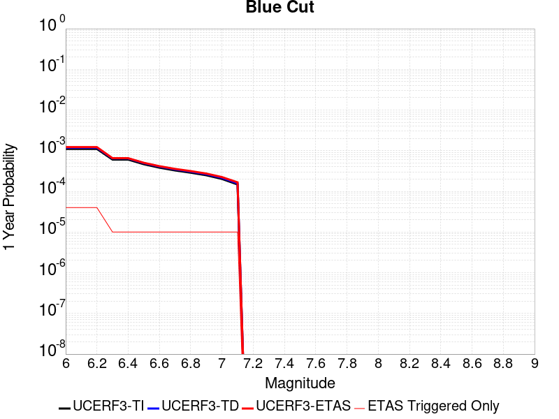 |  |

| Magnitude | 1 wk TI Prob | 1 wk TD Prob | 1 wk ETAS Prob | 1 wk ETAS/TD Gain | 1 wk ETAS Triggered Only | 1 mo TI Prob | 1 mo TD Prob | 1 mo ETAS Prob | 1 mo ETAS/TD Gain | 1 mo ETAS Triggered Only | 1 yr TI Prob | 1 yr TD Prob | 1 yr ETAS Prob | 1 yr ETAS/TD Gain | 1 yr ETAS Triggered Only | 10 yr TI Prob | 10 yr TD Prob | 10 yr ETAS Prob | 10 yr ETAS/TD Gain | 10 yr ETAS Triggered Only |
|-----|-----|-----|-----|-----|-----|-----|-----|-----|-----|-----|-----|-----|-----|-----|-----|-----|-----|-----|-----|-----|
| 6.0 | 2.1227985E-5 | 2.2719574E-5 | 4.271912E-5 | 1.8802782 | 2.0E-5 | 9.097391E-5 | 9.73663E-5 | 1.2736338E-4 | 1.3080848 | 3.0E-5 | 0.0011070445 | 0.0011848481 | 0.0012248007 | 1.0337197 | 4.0E-5 | 0.011015458 | 0.011791152 | 0.01183068 | 1.0033524 | 4.0E-5 |
| 6.1 | 2.1227985E-5 | 2.2719574E-5 | 4.271912E-5 | 1.8802782 | 2.0E-5 | 9.097391E-5 | 9.73663E-5 | 1.2736338E-4 | 1.3080848 | 3.0E-5 | 0.0011070445 | 0.0011848481 | 0.0012248007 | 1.0337197 | 4.0E-5 | 0.011015458 | 0.011791152 | 0.01183068 | 1.0033524 | 4.0E-5 |
| 6.2 | 2.1227985E-5 | 2.2719574E-5 | 4.271912E-5 | 1.8802782 | 2.0E-5 | 9.097391E-5 | 9.73663E-5 | 1.2736338E-4 | 1.3080848 | 3.0E-5 | 0.0011070445 | 0.0011848481 | 0.0012248007 | 1.0337197 | 4.0E-5 | 0.011015458 | 0.011791152 | 0.01183068 | 1.0033524 | 4.0E-5 |
| 6.3 | 1.1613981E-5 | 1.2353542E-5 | 2.2353419E-5 | 1.8094745 | 1.0E-5 | 4.9773254E-5 | 5.2942745E-5 | 6.2942214E-5 | 1.1888733 | 1.0E-5 | 6.0582085E-4 | 6.443998E-4 | 6.5439334E-4 | 1.0155083 | 1.0E-5 | 0.0060417196 | 0.0064265593 | 0.006436495 | 1.001546 | 1.0E-5 |
| 6.4 | 1.1613981E-5 | 1.2353542E-5 | 2.2353419E-5 | 1.8094745 | 1.0E-5 | 4.9773254E-5 | 5.2942745E-5 | 6.2942214E-5 | 1.1888733 | 1.0E-5 | 6.0582085E-4 | 6.443998E-4 | 6.5439334E-4 | 1.0155083 | 1.0E-5 | 0.0060417196 | 0.0064265593 | 0.006436495 | 1.001546 | 1.0E-5 |
| 6.5 | 8.931326E-6 | 9.4816E-6 | 1.9481506E-5 | 2.0546644 | 1.0E-5 | 3.8276554E-5 | 4.0634844E-5 | 5.063444E-5 | 1.2460842 | 1.0E-5 | 4.6591737E-4 | 4.946261E-4 | 5.0462113E-4 | 1.0202073 | 1.0E-5 | 0.0046494175 | 0.004936161 | 0.0049461117 | 1.0020158 | 1.0E-5 |
| 6.6 | 7.345353E-6 | 7.79028E-6 | 1.7790202E-5 | 2.283641 | 1.0E-5 | 3.1479703E-5 | 3.338653E-5 | 4.3386193E-5 | 1.299512 | 1.0E-5 | 3.83198E-4 | 4.064132E-4 | 4.164091E-4 | 1.0245955 | 1.0E-5 | 0.0038253788 | 0.0040574907 | 0.0040674503 | 1.0024545 | 1.0E-5 |
| 6.7 | 6.2775666E-6 | 6.655149E-6 | 1.6655082E-5 | 2.502586 | 1.0E-5 | 2.690358E-5 | 2.8521798E-5 | 3.8521513E-5 | 1.350599 | 1.0E-5 | 3.2750185E-4 | 3.472051E-4 | 3.572016E-4 | 1.0287914 | 1.0E-5 | 0.0032701963 | 0.003467367 | 0.0034773324 | 1.002874 | 1.0E-5 |
| 6.8 | 5.5234095E-6 | 5.8551113E-6 | 1.5855052E-5 | 2.7078996 | 1.0E-5 | 2.367154E-5 | 2.5093133E-5 | 3.5092882E-5 | 1.3985054 | 1.0E-5 | 2.8816288E-4 | 3.0547334E-4 | 3.154703E-4 | 1.032726 | 1.0E-5 | 0.002877895 | 0.0030512505 | 0.00306122 | 1.0032673 | 1.0E-5 |
| 6.9 | 4.7780054E-6 | 5.0654203E-6 | 1.506537E-5 | 2.9741597 | 1.0E-5 | 2.0477004E-5 | 2.1708804E-5 | 3.1708587E-5 | 1.4606326 | 1.0E-5 | 2.4927902E-4 | 2.642797E-4 | 2.7427703E-4 | 1.0378287 | 1.0E-5 | 0.0024899957 | 0.002640346 | 0.0026503198 | 1.0037774 | 1.0E-5 |
| 7.0 | 3.883171E-6 | 4.118487E-6 | 1.41184455E-5 | 3.428066 | 1.0E-5 | 1.6642054E-5 | 1.7650578E-5 | 2.7650402E-5 | 1.5665437 | 1.0E-5 | 2.0259817E-4 | 2.1488148E-4 | 2.2487935E-4 | 1.0465273 | 1.0E-5 | 0.0020241356 | 0.0021474129 | 0.0021573913 | 1.0046468 | 1.0E-5 |
| 7.1 | 2.8358215E-6 | 3.0097158E-6 | 1.3009686E-5 | 4.3225627 | 1.0E-5 | 1.2153464E-5 | 1.2898756E-5 | 2.2898626E-5 | 1.7752585 | 1.0E-5 | 1.4795837E-4 | 1.5703762E-4 | 1.6703604E-4 | 1.063669 | 1.0E-5 | 0.001478599 | 0.0015699116 | 0.001579896 | 1.0063598 | 1.0E-5 |

## San Jacinto (Borrego)
*[(top)](#table-of-contents)*

| 1 Week | 1 Month | 1 Year | 10 Year |
|-----|-----|-----|-----|
|  |  |  |  |

| Magnitude | 1 wk TI Prob | 1 wk TD Prob | 1 wk ETAS Prob | 1 wk ETAS/TD Gain | 1 wk ETAS Triggered Only | 1 mo TI Prob | 1 mo TD Prob | 1 mo ETAS Prob | 1 mo ETAS/TD Gain | 1 mo ETAS Triggered Only | 1 yr TI Prob | 1 yr TD Prob | 1 yr ETAS Prob | 1 yr ETAS/TD Gain | 1 yr ETAS Triggered Only | 10 yr TI Prob | 10 yr TD Prob | 10 yr ETAS Prob | 10 yr ETAS/TD Gain | 10 yr ETAS Triggered Only |
|-----|-----|-----|-----|-----|-----|-----|-----|-----|-----|-----|-----|-----|-----|-----|-----|-----|-----|-----|-----|-----|
| 6.0 | 3.543992E-5 | 2.7925962E-5 | 4.7925405E-5 | 1.7161595 | 2.0E-5 | 1.5187653E-4 | 1.1967727E-4 | 1.4967368E-4 | 1.2506442 | 3.0E-5 | 0.0018475284 | 0.0014561092 | 0.0014860654 | 1.0205729 | 3.0E-5 | 0.018322436 | 0.01486815 | 0.014907557 | 1.0026503 | 4.0E-5 |
| 6.1 | 3.542281E-5 | 2.7925962E-5 | 4.7925405E-5 | 1.7161595 | 2.0E-5 | 1.5180321E-4 | 1.1967727E-4 | 1.4967368E-4 | 1.2506442 | 3.0E-5 | 0.0018466372 | 0.0014561092 | 0.0014860654 | 1.0205729 | 3.0E-5 | 0.018313672 | 0.01486815 | 0.014907557 | 1.0026503 | 4.0E-5 |
| 6.2 | 3.4688688E-5 | 2.7925962E-5 | 4.7925405E-5 | 1.7161595 | 2.0E-5 | 1.4865733E-4 | 1.1967727E-4 | 1.4967368E-4 | 1.2506442 | 3.0E-5 | 0.0018084005 | 0.0014561091 | 0.0014860654 | 1.0205729 | 3.0E-5 | 0.017937548 | 0.01486815 | 0.014907556 | 1.0026503 | 4.0E-5 |
| 6.3 | 3.2087122E-5 | 2.7771312E-5 | 4.7770758E-5 | 1.7201476 | 2.0E-5 | 1.3750899E-4 | 1.1901455E-4 | 1.4901097E-4 | 1.25204 | 3.0E-5 | 0.0016728862 | 0.0014480512 | 0.0014780078 | 1.0206875 | 3.0E-5 | 0.016603488 | 0.014789308 | 0.014828716 | 1.0026647 | 4.0E-5 |
| 6.4 | 3.1828724E-5 | 2.773829E-5 | 4.7737733E-5 | 1.721005 | 2.0E-5 | 1.364017E-4 | 1.1887303E-4 | 1.4886947E-4 | 1.2523401 | 3.0E-5 | 0.0016594254 | 0.0014463306 | 0.0014762871 | 1.0207121 | 3.0E-5 | 0.016470885 | 0.014772502 | 0.014811911 | 1.0026678 | 4.0E-5 |
| 6.5 | 3.1563577E-5 | 2.7477974E-5 | 4.7477424E-5 | 1.7278357 | 2.0E-5 | 1.3526545E-4 | 1.17757496E-4 | 1.4775396E-4 | 1.2547308 | 3.0E-5 | 0.0016456128 | 0.0014327668 | 0.0014627238 | 1.0209085 | 3.0E-5 | 0.0163348 | 0.01463991 | 0.014679325 | 1.0026922 | 4.0E-5 |
| 6.6 | 3.1467625E-5 | 2.7322194E-5 | 4.7321646E-5 | 1.7319857 | 2.0E-5 | 1.3485427E-4 | 1.17089934E-4 | 1.4708642E-4 | 1.2561833 | 3.0E-5 | 0.0016406142 | 0.0014246498 | 0.0014546071 | 1.0210278 | 3.0E-5 | 0.016285548 | 0.014560228 | 0.0145996455 | 1.0027072 | 4.0E-5 |
| 6.7 | 3.1223695E-5 | 2.6940217E-5 | 4.693968E-5 | 1.7423645 | 2.0E-5 | 1.3380898E-4 | 1.1545303E-4 | 1.4544957E-4 | 1.2598159 | 3.0E-5 | 0.0016279068 | 0.0014047464 | 0.0014347043 | 1.0213262 | 3.0E-5 | 0.01616033 | 0.01436451 | 0.014403935 | 1.0027447 | 4.0E-5 |
| 6.8 | 3.1015585E-5 | 2.6761221E-5 | 4.6760684E-5 | 1.7473301 | 2.0E-5 | 1.3291716E-4 | 1.1468597E-4 | 1.4468253E-4 | 1.2615539 | 3.0E-5 | 0.001617065 | 0.0013954195 | 0.0014253776 | 1.0214689 | 3.0E-5 | 0.016053487 | 0.014271772 | 0.014311201 | 1.0027628 | 4.0E-5 |
| 6.9 | 2.6641965E-5 | 2.2183434E-5 | 4.218299E-5 | 1.9015536 | 2.0E-5 | 1.1417485E-4 | 9.506842E-5 | 1.2506556E-4 | 1.3155322 | 3.0E-5 | 0.0013891924 | 0.0011568473 | 0.0011868126 | 1.0259025 | 3.0E-5 | 0.0138054015 | 0.011882191 | 0.011921715 | 1.0033264 | 4.0E-5 |
| 7.0 | 2.3854353E-5 | 2.047825E-5 | 4.047784E-5 | 1.9766259 | 2.0E-5 | 1.02228936E-4 | 8.776099E-5 | 1.1775836E-4 | 1.3418075 | 3.0E-5 | 0.0012439266 | 0.0010679689 | 0.0010979369 | 1.0280607 | 3.0E-5 | 0.012369866 | 0.0109826205 | 0.011022181 | 1.0036021 | 4.0E-5 |
| 7.1 | 2.3672901E-5 | 2.0314741E-5 | 4.0314335E-5 | 1.9844868 | 2.0E-5 | 1.0145135E-4 | 8.706028E-5 | 1.1705767E-4 | 1.3445588 | 3.0E-5 | 0.0012344702 | 0.0010594461 | 0.0010894143 | 1.0282867 | 3.0E-5 | 0.0122763505 | 0.010897858 | 0.0109374225 | 1.0036304 | 4.0E-5 |
| 7.2 | 2.2717244E-5 | 1.9542116E-5 | 3.9541726E-5 | 2.0234106 | 2.0E-5 | 9.735599E-5 | 8.3749255E-5 | 1.1374674E-4 | 1.3581822 | 3.0E-5 | 0.0011846646 | 0.0010191725 | 0.001049142 | 1.0294056 | 3.0E-5 | 0.01178369 | 0.010495322 | 0.010534902 | 1.0037712 | 4.0E-5 |
| 7.3 | 2.1016205E-5 | 1.8383771E-5 | 3.8383405E-5 | 2.087896 | 2.0E-5 | 9.006634E-5 | 7.878522E-5 | 1.0878286E-4 | 1.3807521 | 3.0E-5 | 0.001096006 | 9.5879E-4 | 9.887613E-4 | 1.0312594 | 3.0E-5 | 0.010906163 | 0.009890901 | 0.009930505 | 1.0040041 | 4.0E-5 |
| 7.4 | 2.0683625E-5 | 1.8186302E-5 | 3.818594E-5 | 2.0997088 | 2.0E-5 | 8.86411E-5 | 7.7938974E-5 | 1.07936634E-4 | 1.3848865 | 3.0E-5 | 0.001078671 | 9.48496E-4 | 9.784675E-4 | 1.031599 | 3.0E-5 | 0.010734501 | 0.0097876275 | 0.009827237 | 1.0040468 | 4.0E-5 |
| 7.5 | 1.9993966E-5 | 1.7781347E-5 | 3.7780992E-5 | 2.1247542 | 2.0E-5 | 8.568561E-5 | 7.6203556E-5 | 1.06201274E-4 | 1.3936524 | 3.0E-5 | 0.001042723 | 9.2738547E-4 | 9.5735764E-4 | 1.032319 | 3.0E-5 | 0.010378438 | 0.009574548 | 0.009614166 | 1.0041378 | 4.0E-5 |
| 7.6 | 1.788966E-5 | 1.6434618E-5 | 3.643429E-5 | 2.2169235 | 2.0E-5 | 7.666772E-5 | 7.043219E-5 | 1.0043007E-4 | 1.4259117 | 3.0E-5 | 9.3302975E-4 | 8.5717626E-4 | 8.871505E-4 | 1.0349686 | 3.0E-5 | 0.00929122 | 0.008866415 | 0.008906061 | 1.0044714 | 4.0E-5 |
| 7.7 | 1.5125781E-5 | 1.4236738E-5 | 3.4236455E-5 | 2.4047961 | 2.0E-5 | 6.4823165E-5 | 6.101317E-5 | 9.101134E-5 | 1.4916672 | 3.0E-5 | 7.889362E-4 | 7.4258295E-4 | 7.725607E-4 | 1.0403695 | 3.0E-5 | 0.007861412 | 0.007714161 | 0.0077538528 | 1.0051453 | 4.0E-5 |
| 7.8 | 1.250089E-5 | 1.262994E-5 | 3.2629687E-5 | 2.5835187 | 2.0E-5 | 5.3574146E-5 | 5.4127195E-5 | 8.4125575E-5 | 1.5542201 | 3.0E-5 | 6.5207E-4 | 6.588E-4 | 6.887802E-4 | 1.0455073 | 3.0E-5 | 0.006501599 | 0.006867759 | 0.0069074845 | 1.0057843 | 4.0E-5 |
| 7.9 | 9.561E-6 | 9.754065E-6 | 2.975387E-5 | 3.0504072 | 2.0E-5 | 4.0975072E-5 | 4.180247E-5 | 7.1801216E-5 | 1.717631 | 3.0E-5 | 4.987573E-4 | 5.0882675E-4 | 5.388115E-4 | 1.0589292 | 3.0E-5 | 0.0049763937 | 0.0053523607 | 0.0053921463 | 1.0074333 | 4.0E-5 |
| 8.0 | 8.01699E-6 | 8.292994E-6 | 2.8292829E-5 | 3.4116542 | 2.0E-5 | 3.4358076E-5 | 3.554092E-5 | 6.5539854E-5 | 1.8440675 | 3.0E-5 | 4.1822926E-4 | 4.3262533E-4 | 4.6261234E-4 | 1.0693141 | 3.0E-5 | 0.0041744304 | 0.0045733186 | 0.004613136 | 1.0087063 | 4.0E-5 |
| 8.1 | 6.541947E-6 | 6.461784E-6 | 2.6461654E-5 | 4.0951004 | 2.0E-5 | 2.8036617E-5 | 2.7693068E-5 | 5.769224E-5 | 2.0832736 | 3.0E-5 | 3.4129233E-4 | 3.3711144E-4 | 3.6710134E-4 | 1.0889614 | 3.0E-5 | 0.0034076865 | 0.0035805756 | 0.0036204322 | 1.0111314 | 4.0E-5 |
| 8.2 | 1.7968189E-6 | 7.9684827E-7 | 7.9684827E-7 | 1.0 | 0.0 | 7.70063E-6 | 3.4150596E-6 | 3.4150596E-6 | 1.0 | 0.0 | 9.3751136E-5 | 4.157758E-5 | 4.157758E-5 | 1.0 | 0.0 | 9.371159E-4 | 4.7107413E-4 | 4.7107413E-4 | 1.0 | 0.0 |
| 8.3 | 1.5167889E-7 | 4.8951257E-8 | 4.8951257E-8 | 1.0 | 0.0 | 6.500522E-7 | 2.0979108E-7 | 2.0979108E-7 | 1.0 | 0.0 | 7.9143565E-6 | 2.5542038E-6 | 2.5542038E-6 | 1.0 | 0.0 | 7.914075E-5 | 2.9679897E-5 | 2.9679897E-5 | 1.0 | 0.0 |

## Ventura-Pitas Point
*[(top)](#table-of-contents)*

| 1 Week | 1 Month | 1 Year | 10 Year |
|-----|-----|-----|-----|
|  |  |  |  |

| Magnitude | 1 wk TI Prob | 1 wk TD Prob | 1 wk ETAS Prob | 1 wk ETAS/TD Gain | 1 wk ETAS Triggered Only | 1 mo TI Prob | 1 mo TD Prob | 1 mo ETAS Prob | 1 mo ETAS/TD Gain | 1 mo ETAS Triggered Only | 1 yr TI Prob | 1 yr TD Prob | 1 yr ETAS Prob | 1 yr ETAS/TD Gain | 1 yr ETAS Triggered Only | 10 yr TI Prob | 10 yr TD Prob | 10 yr ETAS Prob | 10 yr ETAS/TD Gain | 10 yr ETAS Triggered Only |
|-----|-----|-----|-----|-----|-----|-----|-----|-----|-----|-----|-----|-----|-----|-----|-----|-----|-----|-----|-----|-----|
| 6.0 | 3.3179622E-5 | 3.373519E-5 | 5.373451E-5 | 1.5928328 | 2.0E-5 | 1.4219063E-4 | 1.4457281E-4 | 1.6456992E-4 | 1.1383185 | 2.0E-5 | 0.0017297962 | 0.0017590097 | 0.0017989393 | 1.0227001 | 4.0E-5 | 0.017163932 | 0.017476497 | 0.017515799 | 1.0022488 | 4.0E-5 |
| 6.1 | 3.3179622E-5 | 3.373519E-5 | 5.373451E-5 | 1.5928328 | 2.0E-5 | 1.4219063E-4 | 1.4457281E-4 | 1.6456992E-4 | 1.1383185 | 2.0E-5 | 0.0017297962 | 0.0017590097 | 0.0017989393 | 1.0227001 | 4.0E-5 | 0.017163932 | 0.017476497 | 0.017515799 | 1.0022488 | 4.0E-5 |
| 6.2 | 3.3179622E-5 | 3.373519E-5 | 5.373451E-5 | 1.5928328 | 2.0E-5 | 1.4219063E-4 | 1.4457281E-4 | 1.6456992E-4 | 1.1383185 | 2.0E-5 | 0.0017297962 | 0.0017590097 | 0.0017989393 | 1.0227001 | 4.0E-5 | 0.017163932 | 0.017476497 | 0.017515799 | 1.0022488 | 4.0E-5 |
| 6.3 | 3.3179622E-5 | 3.373519E-5 | 5.373451E-5 | 1.5928328 | 2.0E-5 | 1.4219063E-4 | 1.4457281E-4 | 1.6456992E-4 | 1.1383185 | 2.0E-5 | 0.0017297962 | 0.0017590097 | 0.0017989393 | 1.0227001 | 4.0E-5 | 0.017163932 | 0.017476497 | 0.017515799 | 1.0022488 | 4.0E-5 |
| 6.4 | 1.8754668E-5 | 1.7019594E-5 | 2.7019423E-5 | 1.5875481 | 1.0E-5 | 8.037467E-5 | 7.2939205E-5 | 8.293848E-5 | 1.1370904 | 1.0E-5 | 9.781223E-4 | 8.8769617E-4 | 9.176695E-4 | 1.0337653 | 3.0E-5 | 0.009738282 | 0.008843943 | 0.008873677 | 1.0033622 | 3.0E-5 |
| 6.5 | 1.8754668E-5 | 1.7019594E-5 | 2.7019423E-5 | 1.5875481 | 1.0E-5 | 8.037467E-5 | 7.2939205E-5 | 8.293848E-5 | 1.1370904 | 1.0E-5 | 9.781223E-4 | 8.8769617E-4 | 9.176695E-4 | 1.0337653 | 3.0E-5 | 0.009738282 | 0.008843943 | 0.008873677 | 1.0033622 | 3.0E-5 |
| 6.6 | 1.4361558E-5 | 1.2122258E-5 | 2.2122136E-5 | 1.8249189 | 1.0E-5 | 6.154808E-5 | 5.1951512E-5 | 6.1950996E-5 | 1.1924772 | 1.0E-5 | 7.490902E-4 | 6.323284E-4 | 6.623094E-4 | 1.0474137 | 3.0E-5 | 0.0074657016 | 0.006305652 | 0.006335463 | 1.0047276 | 3.0E-5 |
| 6.7 | 1.4361558E-5 | 1.2122258E-5 | 2.2122136E-5 | 1.8249189 | 1.0E-5 | 6.154808E-5 | 5.1951512E-5 | 6.1950996E-5 | 1.1924772 | 1.0E-5 | 7.490902E-4 | 6.323284E-4 | 6.623094E-4 | 1.0474137 | 3.0E-5 | 0.0074657016 | 0.006305652 | 0.006335463 | 1.0047276 | 3.0E-5 |
| 6.8 | 1.3663846E-5 | 1.1344401E-5 | 1.1344401E-5 | 1.0 | 0.0 | 5.8558027E-5 | 4.8617967E-5 | 4.8617967E-5 | 1.0 | 0.0 | 7.127108E-4 | 5.917649E-4 | 6.117531E-4 | 1.0337772 | 2.0E-5 | 0.007104293 | 0.0059022107 | 0.005922093 | 1.0033686 | 2.0E-5 |
| 6.9 | 1.3644157E-5 | 1.1322501E-5 | 1.1322501E-5 | 1.0 | 0.0 | 5.8473648E-5 | 4.8524114E-5 | 4.8524114E-5 | 1.0 | 0.0 | 7.116841E-4 | 5.906229E-4 | 6.106111E-4 | 1.0338426 | 2.0E-5 | 0.007094092 | 0.0058908514 | 0.0059107337 | 1.003375 | 2.0E-5 |
| 7.0 | 1.3568845E-5 | 1.12420685E-5 | 1.12420685E-5 | 1.0 | 0.0 | 5.8150898E-5 | 4.8179416E-5 | 4.8179416E-5 | 1.0 | 0.0 | 7.077572E-4 | 5.8642845E-4 | 6.064167E-4 | 1.0340848 | 2.0E-5 | 0.007055073 | 0.005849128 | 0.0058690114 | 1.0033994 | 2.0E-5 |
| 7.1 | 1.306572E-5 | 1.0720521E-5 | 1.0720521E-5 | 1.0 | 0.0 | 5.599474E-5 | 4.594429E-5 | 4.594429E-5 | 1.0 | 0.0 | 6.815227E-4 | 5.5923004E-4 | 5.7921885E-4 | 1.0357435 | 2.0E-5 | 0.0067943637 | 0.005578536 | 0.0055984245 | 1.0035652 | 2.0E-5 |
| 7.2 | 1.232604E-5 | 9.995121E-6 | 9.995121E-6 | 1.0 | 0.0 | 5.2824813E-5 | 4.283554E-5 | 4.283554E-5 | 1.0 | 0.0 | 6.429523E-4 | 5.2139966E-4 | 5.3139444E-4 | 1.0191691 | 1.0E-5 | 0.0064109527 | 0.005202059 | 0.005212007 | 1.0019124 | 1.0E-5 |
| 7.3 | 1.0917261E-5 | 8.843812E-6 | 8.843812E-6 | 1.0 | 0.0 | 4.678742E-5 | 3.7901507E-5 | 3.7901507E-5 | 1.0 | 0.0 | 5.69488E-4 | 4.6135474E-4 | 4.713501E-4 | 1.0216653 | 1.0E-5 | 0.0056803077 | 0.004604239 | 0.004614193 | 1.0021619 | 1.0E-5 |
| 7.4 | 1.039959E-5 | 8.42354E-6 | 8.42354E-6 | 1.0 | 0.0 | 4.456891E-5 | 3.6100395E-5 | 3.6100395E-5 | 1.0 | 0.0 | 5.424914E-4 | 4.394352E-4 | 4.494308E-4 | 1.0227464 | 1.0E-5 | 0.0054116896 | 0.0043859277 | 0.004395884 | 1.00227 | 1.0E-5 |
| 7.5 | 9.015877E-6 | 7.29752E-6 | 7.29752E-6 | 1.0 | 0.0 | 3.86389E-5 | 3.1274718E-5 | 3.1274718E-5 | 1.0 | 0.0 | 4.7032707E-4 | 3.8070456E-4 | 3.9070076E-4 | 1.026257 | 1.0E-5 | 0.004693329 | 0.003800772 | 0.003810734 | 1.002621 | 1.0E-5 |
| 7.6 | 4.900162E-6 | 3.874119E-6 | 3.874119E-6 | 1.0 | 0.0 | 2.1000526E-5 | 1.6603262E-5 | 1.6603262E-5 | 1.0 | 0.0 | 2.556514E-4 | 2.0212609E-4 | 2.0212609E-4 | 1.0 | 0.0 | 0.0025535747 | 0.002019436 | 0.002019436 | 1.0 | 0.0 |
| 7.7 | 3.8850626E-6 | 3.12676E-6 | 3.12676E-6 | 1.0 | 0.0 | 1.6650163E-5 | 1.3400332E-5 | 1.3400332E-5 | 1.0 | 0.0 | 2.0269687E-4 | 1.6313691E-4 | 1.6313691E-4 | 1.0 | 0.0 | 0.002025121 | 0.0016301809 | 0.0016301809 | 1.0 | 0.0 |
| 7.8 | 2.4654719E-6 | 2.029902E-6 | 2.029902E-6 | 1.0 | 0.0 | 1.0566265E-5 | 8.699551E-6 | 8.699551E-6 | 1.0 | 0.0 | 1.2863669E-4 | 1.0591193E-4 | 1.0591193E-4 | 1.0 | 0.0 | 0.0012856225 | 0.0010586192 | 0.0010586192 | 1.0 | 0.0 |
| 7.9 | 4.095894E-7 | 3.2765078E-7 | 3.2765078E-7 | 1.0 | 0.0 | 1.7553821E-6 | 1.4042168E-6 | 1.4042168E-6 | 1.0 | 0.0 | 2.1371567E-5 | 1.709621E-5 | 1.709621E-5 | 1.0 | 0.0 | 2.1369511E-4 | 1.7094925E-4 | 1.7094925E-4 | 1.0 | 0.0 |
| 8.0 | 7.791402E-9 | 5.6836056E-9 | 5.6836056E-9 | 1.0 | 0.0 | 3.3391725E-8 | 2.4358311E-8 | 2.4358311E-8 | 1.0 | 0.0 | 4.0654416E-7 | 2.965624E-7 | 2.965624E-7 | 1.0 | 0.0 | 4.065434E-6 | 2.9656223E-6 | 2.9656223E-6 | 1.0 | 0.0 |

## Pinto Mtn
*[(top)](#table-of-contents)*

| 1 Week | 1 Month | 1 Year | 10 Year |
|-----|-----|-----|-----|
|  |  |  |  |

| Magnitude | 1 wk TI Prob | 1 wk TD Prob | 1 wk ETAS Prob | 1 wk ETAS/TD Gain | 1 wk ETAS Triggered Only | 1 mo TI Prob | 1 mo TD Prob | 1 mo ETAS Prob | 1 mo ETAS/TD Gain | 1 mo ETAS Triggered Only | 1 yr TI Prob | 1 yr TD Prob | 1 yr ETAS Prob | 1 yr ETAS/TD Gain | 1 yr ETAS Triggered Only | 10 yr TI Prob | 10 yr TD Prob | 10 yr ETAS Prob | 10 yr ETAS/TD Gain | 10 yr ETAS Triggered Only |
|-----|-----|-----|-----|-----|-----|-----|-----|-----|-----|-----|-----|-----|-----|-----|-----|-----|-----|-----|-----|-----|
| 6.0 | 4.4194956E-5 | 4.7853926E-5 | 6.785297E-5 | 1.4179186 | 2.0E-5 | 1.893932E-4 | 2.0507304E-4 | 2.350669E-4 | 1.1462593 | 3.0E-5 | 0.0023034236 | 0.0024940688 | 0.002533969 | 1.015998 | 4.0E-5 | 0.022796938 | 0.024678305 | 0.024717318 | 1.0015808 | 4.0E-5 |
| 6.1 | 4.4194956E-5 | 4.7853926E-5 | 6.785297E-5 | 1.4179186 | 2.0E-5 | 1.893932E-4 | 2.0507304E-4 | 2.350669E-4 | 1.1462593 | 3.0E-5 | 0.0023034236 | 0.0024940688 | 0.002533969 | 1.015998 | 4.0E-5 | 0.022796938 | 0.024678305 | 0.024717318 | 1.0015808 | 4.0E-5 |
| 6.2 | 4.4194956E-5 | 4.7853926E-5 | 6.785297E-5 | 1.4179186 | 2.0E-5 | 1.893932E-4 | 2.0507304E-4 | 2.350669E-4 | 1.1462593 | 3.0E-5 | 0.0023034236 | 0.0024940688 | 0.002533969 | 1.015998 | 4.0E-5 | 0.022796938 | 0.024678305 | 0.024717318 | 1.0015808 | 4.0E-5 |
| 6.3 | 4.4194956E-5 | 4.7853926E-5 | 6.785297E-5 | 1.4179186 | 2.0E-5 | 1.893932E-4 | 2.0507304E-4 | 2.350669E-4 | 1.1462593 | 3.0E-5 | 0.0023034236 | 0.0024940688 | 0.002533969 | 1.015998 | 4.0E-5 | 0.022796938 | 0.024678305 | 0.024717318 | 1.0015808 | 4.0E-5 |
| 6.4 | 3.729929E-5 | 3.960349E-5 | 4.9603095E-5 | 1.252493 | 1.0E-5 | 1.5984432E-4 | 1.6971873E-4 | 1.8971533E-4 | 1.117822 | 2.0E-5 | 0.0019443673 | 0.0020644604 | 0.0020943985 | 1.0145017 | 3.0E-5 | 0.019274427 | 0.020462848 | 0.020492235 | 1.0014361 | 3.0E-5 |
| 6.5 | 3.729929E-5 | 3.960349E-5 | 4.9603095E-5 | 1.252493 | 1.0E-5 | 1.5984432E-4 | 1.6971873E-4 | 1.8971533E-4 | 1.117822 | 2.0E-5 | 0.0019443673 | 0.0020644604 | 0.0020943985 | 1.0145017 | 3.0E-5 | 0.019274427 | 0.020462848 | 0.020492235 | 1.0014361 | 3.0E-5 |
| 6.6 | 3.0204548E-5 | 3.12056E-5 | 4.1205287E-5 | 1.3204453 | 1.0E-5 | 1.2944164E-4 | 1.3373162E-4 | 1.4373029E-4 | 1.0747666 | 1.0E-5 | 0.0015748127 | 0.0016270012 | 0.0016469687 | 1.0122726 | 2.0E-5 | 0.015636992 | 0.016154764 | 0.016174441 | 1.0012181 | 2.0E-5 |
| 6.7 | 2.9857754E-5 | 3.0814987E-5 | 4.0814677E-5 | 1.3245075 | 1.0E-5 | 1.2795553E-4 | 1.3205773E-4 | 1.4205641E-4 | 1.0757145 | 1.0E-5 | 0.0015567453 | 0.0016066517 | 0.0016266196 | 1.0124283 | 2.0E-5 | 0.015458848 | 0.015954204 | 0.015973885 | 1.0012336 | 2.0E-5 |
| 6.8 | 2.4819734E-5 | 2.5009665E-5 | 3.5009416E-5 | 1.3998355 | 1.0E-5 | 1.0636595E-4 | 1.0718E-4 | 1.17178926E-4 | 1.093291 | 1.0E-5 | 0.0012942362 | 0.001304157 | 0.0013241309 | 1.0153155 | 2.0E-5 | 0.012867244 | 0.012967403 | 0.012987143 | 1.0015223 | 2.0E-5 |
| 6.9 | 2.331124E-5 | 2.3337945E-5 | 3.333771E-5 | 1.4284767 | 1.0E-5 | 9.990149E-5 | 1.0001605E-4 | 1.1001505E-4 | 1.0999739 | 1.0E-5 | 0.001215622 | 0.0012170355 | 0.0012370112 | 1.0164133 | 2.0E-5 | 0.012089936 | 0.012105897 | 0.012125655 | 1.0016321 | 2.0E-5 |
| 7.0 | 2.1818534E-5 | 2.1761074E-5 | 3.1760857E-5 | 1.4595262 | 1.0E-5 | 9.3504656E-5 | 9.3258524E-5 | 1.0325759E-4 | 1.1072189 | 1.0E-5 | 0.0011378246 | 0.0011348509 | 0.0011548282 | 1.0176035 | 2.0E-5 | 0.011320163 | 0.01129266 | 0.0113124335 | 1.0017511 | 2.0E-5 |
| 7.1 | 2.066081E-5 | 2.0540718E-5 | 3.0540512E-5 | 1.4868279 | 1.0E-5 | 8.854332E-5 | 8.8028784E-5 | 9.802791E-5 | 1.1135892 | 1.0E-5 | 0.0010774818 | 0.0010712431 | 0.0010912217 | 1.0186499 | 2.0E-5 | 0.010722724 | 0.0106628435 | 0.01068263 | 1.0018557 | 2.0E-5 |
| 7.2 | 1.8990233E-5 | 1.9054001E-5 | 2.9053812E-5 | 1.5248141 | 1.0E-5 | 8.138417E-5 | 8.165756E-5 | 9.1656744E-5 | 1.1224526 | 1.0E-5 | 9.904018E-4 | 9.937467E-4 | 0.0010137268 | 1.0201058 | 2.0E-5 | 0.009859995 | 0.009895029 | 0.009914831 | 1.0020012 | 2.0E-5 |
| 7.3 | 1.3335872E-5 | 1.4906713E-5 | 2.4906563E-5 | 1.6708287 | 1.0E-5 | 5.7152483E-5 | 6.388442E-5 | 7.388378E-5 | 1.1565228 | 1.0E-5 | 6.956093E-4 | 7.77528E-4 | 7.975124E-4 | 1.0257026 | 2.0E-5 | 0.006934359 | 0.007749376 | 0.007769221 | 1.0025609 | 2.0E-5 |
| 7.4 | 9.414066E-6 | 1.186096E-5 | 1.186096E-5 | 1.0 | 0.0 | 4.0345374E-5 | 5.083175E-5 | 5.083175E-5 | 1.0 | 0.0 | 4.910942E-4 | 6.1871024E-4 | 6.2870403E-4 | 1.0161526 | 1.0E-5 | 0.0049001034 | 0.0061708256 | 0.0061807637 | 1.0016105 | 1.0E-5 |
| 7.5 | 7.2101157E-6 | 9.158192E-6 | 9.158192E-6 | 1.0 | 0.0 | 3.090013E-5 | 3.9248847E-5 | 3.9248847E-5 | 1.0 | 0.0 | 3.7614413E-4 | 4.7775774E-4 | 4.7775774E-4 | 1.0 | 0.0 | 0.0037550807 | 0.004768082 | 0.004768082 | 1.0 | 0.0 |
| 7.6 | 3.296375E-6 | 4.5455017E-6 | 4.5455017E-6 | 1.0 | 0.0 | 1.4127245E-5 | 1.9480583E-5 | 1.9480583E-5 | 1.0 | 0.0 | 1.7198564E-4 | 2.3715167E-4 | 2.3715167E-4 | 1.0 | 0.0 | 0.0017185259 | 0.0023691233 | 0.0023691233 | 1.0 | 0.0 |
| 7.7 | 2.5741092E-6 | 3.5844084E-6 | 3.5844084E-6 | 1.0 | 0.0 | 1.103185E-5 | 1.5361667E-5 | 1.5361667E-5 | 1.0 | 0.0 | 1.3430449E-4 | 1.8701357E-4 | 1.8701357E-4 | 1.0 | 0.0 | 0.0013422335 | 0.0018686918 | 0.0018686918 | 1.0 | 0.0 |

## Whittier alt 1
*[(top)](#table-of-contents)*

| 1 Week | 1 Month | 1 Year | 10 Year |
|-----|-----|-----|-----|
|  |  |  |  |

| Magnitude | 1 wk TI Prob | 1 wk TD Prob | 1 wk ETAS Prob | 1 wk ETAS/TD Gain | 1 wk ETAS Triggered Only | 1 mo TI Prob | 1 mo TD Prob | 1 mo ETAS Prob | 1 mo ETAS/TD Gain | 1 mo ETAS Triggered Only | 1 yr TI Prob | 1 yr TD Prob | 1 yr ETAS Prob | 1 yr ETAS/TD Gain | 1 yr ETAS Triggered Only | 10 yr TI Prob | 10 yr TD Prob | 10 yr ETAS Prob | 10 yr ETAS/TD Gain | 10 yr ETAS Triggered Only |
|-----|-----|-----|-----|-----|-----|-----|-----|-----|-----|-----|-----|-----|-----|-----|-----|-----|-----|-----|-----|-----|
| 6.0 | 4.2554693E-5 | 4.7252182E-5 | 6.725124E-5 | 1.4232409 | 2.0E-5 | 1.8236451E-4 | 2.0249544E-4 | 2.3248937E-4 | 1.1481215 | 3.0E-5 | 0.002218027 | 0.0024629163 | 0.002502818 | 1.0162009 | 4.0E-5 | 0.02196019 | 0.024390263 | 0.024429288 | 1.0016 | 4.0E-5 |
| 6.1 | 4.2554693E-5 | 4.7252182E-5 | 6.725124E-5 | 1.4232409 | 2.0E-5 | 1.8236451E-4 | 2.0249544E-4 | 2.3248937E-4 | 1.1481215 | 3.0E-5 | 0.002218027 | 0.0024629163 | 0.002502818 | 1.0162009 | 4.0E-5 | 0.02196019 | 0.024390263 | 0.024429288 | 1.0016 | 4.0E-5 |
| 6.2 | 4.2554693E-5 | 4.7252182E-5 | 6.725124E-5 | 1.4232409 | 2.0E-5 | 1.8236451E-4 | 2.0249544E-4 | 2.3248937E-4 | 1.1481215 | 3.0E-5 | 0.002218027 | 0.0024629163 | 0.002502818 | 1.0162009 | 4.0E-5 | 0.02196019 | 0.024390263 | 0.024429288 | 1.0016 | 4.0E-5 |
| 6.3 | 1.9617712E-5 | 1.826841E-5 | 2.8268229E-5 | 1.547383 | 1.0E-5 | 8.40732E-5 | 7.829095E-5 | 8.8290166E-5 | 1.1277187 | 1.0E-5 | 0.0010231105 | 9.527944E-4 | 9.7277533E-4 | 1.020971 | 2.0E-5 | 0.01018413 | 0.0094904 | 0.00951021 | 1.0020874 | 2.0E-5 |
| 6.4 | 1.5611336E-5 | 1.3604089E-5 | 1.3604089E-5 | 1.0 | 0.0 | 6.690401E-5 | 5.8301972E-5 | 5.8301972E-5 | 1.0 | 0.0 | 8.142519E-4 | 7.096013E-4 | 7.195942E-4 | 1.0140824 | 1.0E-5 | 0.008112748 | 0.0070753377 | 0.007085267 | 1.0014033 | 1.0E-5 |
| 6.5 | 1.5150166E-5 | 1.3100744E-5 | 1.3100744E-5 | 1.0 | 0.0 | 6.492767E-5 | 5.614487E-5 | 5.614487E-5 | 1.0 | 0.0 | 7.9020765E-4 | 6.8335526E-4 | 6.9334847E-4 | 1.0146236 | 1.0E-5 | 0.007874036 | 0.006814508 | 0.0068244394 | 1.0014575 | 1.0E-5 |
| 6.6 | 1.295588E-5 | 1.0380544E-5 | 1.0380544E-5 | 1.0 | 0.0 | 5.552402E-5 | 4.44873E-5 | 4.44873E-5 | 1.0 | 0.0 | 6.7579525E-4 | 5.415002E-4 | 5.415002E-4 | 1.0 | 0.0 | 0.006737438 | 0.005403343 | 0.005403343 | 1.0 | 0.0 |
| 6.7 | 1.2542085E-5 | 9.899189E-6 | 9.899189E-6 | 1.0 | 0.0 | 5.3750682E-5 | 4.2424414E-5 | 4.2424414E-5 | 1.0 | 0.0 | 6.542181E-4 | 5.163967E-4 | 5.163967E-4 | 1.0 | 0.0 | 0.006522954 | 0.005153464 | 0.005153464 | 1.0 | 0.0 |
| 6.8 | 1.2195878E-5 | 9.49523E-6 | 9.49523E-6 | 1.0 | 0.0 | 5.2267E-5 | 4.069322E-5 | 4.069322E-5 | 1.0 | 0.0 | 6.36165E-4 | 4.9532915E-4 | 4.9532915E-4 | 1.0 | 0.0 | 0.0063434686 | 0.0049436963 | 0.0049436963 | 1.0 | 0.0 |
| 6.9 | 1.1580298E-5 | 8.772739E-6 | 8.772739E-6 | 1.0 | 0.0 | 4.9628903E-5 | 3.759692E-5 | 3.759692E-5 | 1.0 | 0.0 | 6.040644E-4 | 4.5764804E-4 | 4.5764804E-4 | 1.0 | 0.0 | 0.00602425 | 0.0045684646 | 0.0045684646 | 1.0 | 0.0 |
| 7.0 | 1.0964795E-5 | 8.083794E-6 | 8.083794E-6 | 1.0 | 0.0 | 4.6991136E-5 | 3.4644378E-5 | 3.4644378E-5 | 1.0 | 0.0 | 5.7196687E-4 | 4.217152E-4 | 4.217152E-4 | 1.0 | 0.0 | 0.0057049696 | 0.004210459 | 0.004210459 | 1.0 | 0.0 |
| 7.1 | 1.0230601E-5 | 7.32646E-6 | 7.32646E-6 | 1.0 | 0.0 | 4.3844695E-5 | 3.1398744E-5 | 3.1398744E-5 | 1.0 | 0.0 | 5.336784E-4 | 3.8221394E-4 | 3.8221394E-4 | 1.0 | 0.0 | 0.005323986 | 0.0038167592 | 0.0038167592 | 1.0 | 0.0 |
| 7.2 | 9.40865E-6 | 6.5430822E-6 | 6.5430822E-6 | 1.0 | 0.0 | 4.032216E-5 | 2.8041486E-5 | 2.8041486E-5 | 1.0 | 0.0 | 4.908117E-4 | 3.4135283E-4 | 3.4135283E-4 | 1.0 | 0.0 | 0.0048972913 | 0.0034094024 | 0.0034094024 | 1.0 | 0.0 |
| 7.3 | 8.237384E-6 | 5.5975433E-6 | 5.5975433E-6 | 1.0 | 0.0 | 3.5302593E-5 | 2.3989258E-5 | 2.3989258E-5 | 1.0 | 0.0 | 4.2972428E-4 | 2.920311E-4 | 2.920311E-4 | 1.0 | 0.0 | 0.0042889426 | 0.0029167992 | 0.0029167992 | 1.0 | 0.0 |
| 7.4 | 7.5316966E-6 | 5.0276153E-6 | 5.0276153E-6 | 1.0 | 0.0 | 3.2278298E-5 | 2.154675E-5 | 2.154675E-5 | 1.0 | 0.0 | 3.9291743E-4 | 2.623011E-4 | 2.623011E-4 | 1.0 | 0.0 | 0.0039222343 | 0.0026200267 | 0.0026200267 | 1.0 | 0.0 |
| 7.5 | 6.149649E-6 | 3.9336355E-6 | 3.9336355E-6 | 1.0 | 0.0 | 2.6355372E-5 | 1.6858336E-5 | 1.6858336E-5 | 1.0 | 0.0 | 3.208294E-4 | 2.052318E-4 | 2.052318E-4 | 1.0 | 0.0 | 0.003203666 | 0.0020505118 | 0.0020505118 | 1.0 | 0.0 |
| 7.6 | 5.457711E-6 | 3.3951796E-6 | 3.3951796E-6 | 1.0 | 0.0 | 2.338998E-5 | 1.4550694E-5 | 1.4550694E-5 | 1.0 | 0.0 | 2.8473578E-4 | 1.771411E-4 | 1.771411E-4 | 1.0 | 0.0 | 0.0028437122 | 0.0017700798 | 0.0017700798 | 1.0 | 0.0 |
| 7.7 | 4.1676276E-6 | 2.3329922E-6 | 2.3329922E-6 | 1.0 | 0.0 | 1.7861139E-5 | 9.998504E-6 | 9.998504E-6 | 1.0 | 0.0 | 2.1743766E-4 | 1.2172572E-4 | 1.2172572E-4 | 1.0 | 0.0 | 0.0021722503 | 0.0012166635 | 0.0012166635 | 1.0 | 0.0 |
| 7.8 | 2.2692414E-7 | 9.384417E-8 | 9.384417E-8 | 1.0 | 0.0 | 9.725317E-7 | 4.0218927E-7 | 4.0218927E-7 | 1.0 | 0.0 | 1.1840509E-5 | 4.8966467E-6 | 4.8966467E-6 | 1.0 | 0.0 | 1.1839878E-4 | 4.8965718E-5 | 4.8965718E-5 | 1.0 | 0.0 |
| 7.9 | 6.676829E-9 | 3.4397174E-9 | 3.4397174E-9 | 1.0 | 0.0 | 2.861498E-8 | 1.4741646E-8 | 1.4741646E-8 | 1.0 | 0.0 | 3.4838732E-7 | 1.7947953E-7 | 1.7947953E-7 | 1.0 | 0.0 | 3.4838679E-6 | 1.794794E-6 | 1.794794E-6 | 1.0 | 0.0 |

## San Clemente
*[(top)](#table-of-contents)*

| 1 Week | 1 Month | 1 Year | 10 Year |
|-----|-----|-----|-----|
|  |  |  |  |

| Magnitude | 1 wk TI Prob | 1 wk TD Prob | 1 wk ETAS Prob | 1 wk ETAS/TD Gain | 1 wk ETAS Triggered Only | 1 mo TI Prob | 1 mo TD Prob | 1 mo ETAS Prob | 1 mo ETAS/TD Gain | 1 mo ETAS Triggered Only | 1 yr TI Prob | 1 yr TD Prob | 1 yr ETAS Prob | 1 yr ETAS/TD Gain | 1 yr ETAS Triggered Only | 10 yr TI Prob | 10 yr TD Prob | 10 yr ETAS Prob | 10 yr ETAS/TD Gain | 10 yr ETAS Triggered Only |
|-----|-----|-----|-----|-----|-----|-----|-----|-----|-----|-----|-----|-----|-----|-----|-----|-----|-----|-----|-----|-----|
| 6.0 | 6.681379E-5 | 8.163834E-5 | 1.016367E-4 | 1.2449629 | 2.0E-5 | 2.8631336E-4 | 3.4983488E-4 | 3.698279E-4 | 1.0571498 | 2.0E-5 | 0.003480294 | 0.00425141 | 0.0042713247 | 1.0046843 | 2.0E-5 | 0.03426291 | 0.04175603 | 0.04179436 | 1.0009179 | 4.0E-5 |
| 6.1 | 6.681379E-5 | 8.163834E-5 | 9.163752E-5 | 1.1224815 | 1.0E-5 | 2.8631336E-4 | 3.4983488E-4 | 3.598314E-4 | 1.028575 | 1.0E-5 | 0.003480294 | 0.00425141 | 0.0042613675 | 1.0023421 | 1.0E-5 | 0.03426291 | 0.04175603 | 0.041775193 | 1.000459 | 2.0E-5 |
| 6.2 | 3.9400576E-5 | 4.6452373E-5 | 5.6451907E-5 | 1.2152642 | 1.0E-5 | 1.6884868E-4 | 1.9906677E-4 | 2.0906478E-4 | 1.0502244 | 1.0E-5 | 0.0020537945 | 0.0024209984 | 0.0024309743 | 1.0041205 | 1.0E-5 | 0.020349167 | 0.023952903 | 0.023962663 | 1.0004075 | 1.0E-5 |
| 6.3 | 3.2590255E-5 | 3.792912E-5 | 4.7928737E-5 | 1.2636397 | 1.0E-5 | 1.3966505E-4 | 1.6254342E-4 | 1.725418E-4 | 1.061512 | 1.0E-5 | 0.0016990956 | 0.0019772002 | 0.0019871802 | 1.0050477 | 1.0E-5 | 0.01686163 | 0.019599883 | 0.019609686 | 1.0005002 | 1.0E-5 |
| 6.4 | 2.9454652E-5 | 3.4097764E-5 | 4.409742E-5 | 1.2932644 | 1.0E-5 | 1.2622811E-4 | 1.4612524E-4 | 1.5612377E-4 | 1.0684245 | 1.0E-5 | 0.0015357438 | 0.0017776493 | 0.0017876315 | 1.0056154 | 1.0E-5 | 0.015251739 | 0.01763747 | 0.017647294 | 1.000557 | 1.0E-5 |
| 6.5 | 2.790836E-5 | 3.2247463E-5 | 4.224714E-5 | 1.310092 | 1.0E-5 | 1.1960178E-4 | 1.3819624E-4 | 1.4819486E-4 | 1.0723509 | 1.0E-5 | 0.001455179 | 0.0016812662 | 0.0016912494 | 1.0059379 | 1.0E-5 | 0.014456868 | 0.016688485 | 0.016698318 | 1.0005893 | 1.0E-5 |
| 6.6 | 2.2492153E-5 | 2.5762702E-5 | 3.5762445E-5 | 1.3881481 | 1.0E-5 | 9.639138E-5 | 1.1040699E-4 | 1.20405886E-4 | 1.090564 | 1.0E-5 | 0.0011729331 | 0.0013433909 | 0.0013533775 | 1.0074339 | 1.0E-5 | 0.011667615 | 0.013354417 | 0.013364283 | 1.0007389 | 1.0E-5 |
| 6.7 | 1.9862755E-5 | 2.2666423E-5 | 2.2666423E-5 | 1.0 | 0.0 | 8.512331E-5 | 9.713826E-5 | 9.713826E-5 | 1.0 | 0.0 | 0.0010358836 | 0.0011820279 | 0.0011820279 | 1.0 | 0.0 | 0.010310682 | 0.011758701 | 0.011758701 | 1.0 | 0.0 |
| 6.8 | 1.6697575E-5 | 1.897771E-5 | 1.897771E-5 | 1.0 | 0.0 | 7.155907E-5 | 8.133056E-5 | 8.133056E-5 | 1.0 | 0.0 | 8.7088346E-4 | 9.897591E-4 | 9.897591E-4 | 1.0 | 0.0 | 0.008674784 | 0.0098545365 | 0.0098545365 | 1.0 | 0.0 |
| 6.9 | 1.5218415E-5 | 1.72694E-5 | 1.72694E-5 | 1.0 | 0.0 | 6.522015E-5 | 7.4009666E-5 | 7.4009666E-5 | 1.0 | 0.0 | 7.93766E-4 | 9.00704E-4 | 9.00704E-4 | 1.0 | 0.0 | 0.007909367 | 0.008971481 | 0.008971481 | 1.0 | 0.0 |
| 7.0 | 1.2392958E-5 | 1.4033016E-5 | 1.4033016E-5 | 1.0 | 0.0 | 5.3111595E-5 | 6.014015E-5 | 6.014015E-5 | 1.0 | 0.0 | 6.4644177E-4 | 7.319679E-4 | 7.319679E-4 | 1.0 | 0.0 | 0.0064456454 | 0.0072963564 | 0.0072963564 | 1.0 | 0.0 |
| 7.1 | 1.0934128E-5 | 1.2375138E-5 | 1.2375138E-5 | 1.0 | 0.0 | 4.6859706E-5 | 5.303527E-5 | 5.303527E-5 | 1.0 | 0.0 | 5.7036756E-4 | 6.455204E-4 | 6.455204E-4 | 1.0 | 0.0 | 0.0056890585 | 0.0064371997 | 0.0064371997 | 1.0 | 0.0 |
| 7.2 | 9.5798805E-6 | 1.0844935E-5 | 1.0844935E-5 | 1.0 | 0.0 | 4.1055984E-5 | 4.6477508E-5 | 4.6477508E-5 | 1.0 | 0.0 | 4.9974193E-4 | 5.657239E-4 | 5.657239E-4 | 1.0 | 0.0 | 0.0049861963 | 0.0056435615 | 0.0056435615 | 1.0 | 0.0 |
| 7.3 | 8.0167365E-6 | 9.083918E-6 | 9.083918E-6 | 1.0 | 0.0 | 3.4356988E-5 | 3.8930535E-5 | 3.8930535E-5 | 1.0 | 0.0 | 4.1821605E-4 | 4.7388324E-4 | 4.7388324E-4 | 1.0 | 0.0 | 0.0041742986 | 0.0047294297 | 0.0047294297 | 1.0 | 0.0 |
| 7.4 | 2.9581017E-6 | 3.3623792E-6 | 3.3623792E-6 | 1.0 | 0.0 | 1.2677518E-5 | 1.4410146E-5 | 1.4410146E-5 | 1.0 | 0.0 | 1.5433785E-4 | 1.7543444E-4 | 1.7543444E-4 | 1.0 | 0.0 | 0.001542307 | 0.0017534546 | 0.0017534546 | 1.0 | 0.0 |

## Sierra Madre
*[(top)](#table-of-contents)*

| 1 Week | 1 Month | 1 Year | 10 Year |
|-----|-----|-----|-----|
|  |  |  |  |

| Magnitude | 1 wk TI Prob | 1 wk TD Prob | 1 wk ETAS Prob | 1 wk ETAS/TD Gain | 1 wk ETAS Triggered Only | 1 mo TI Prob | 1 mo TD Prob | 1 mo ETAS Prob | 1 mo ETAS/TD Gain | 1 mo ETAS Triggered Only | 1 yr TI Prob | 1 yr TD Prob | 1 yr ETAS Prob | 1 yr ETAS/TD Gain | 1 yr ETAS Triggered Only | 10 yr TI Prob | 10 yr TD Prob | 10 yr ETAS Prob | 10 yr ETAS/TD Gain | 10 yr ETAS Triggered Only |
|-----|-----|-----|-----|-----|-----|-----|-----|-----|-----|-----|-----|-----|-----|-----|-----|-----|-----|-----|-----|-----|
| 6.0 | 1.3379373E-5 | 1.1000776E-5 | 4.1000447E-5 | 3.7270503 | 3.0E-5 | 5.7338908E-5 | 4.714534E-5 | 7.714392E-5 | 1.6363001 | 3.0E-5 | 6.978776E-4 | 5.738448E-4 | 6.038276E-4 | 1.052249 | 3.0E-5 | 0.0069569005 | 0.0057238447 | 0.005763616 | 1.0069484 | 4.0E-5 |
| 6.1 | 1.3379373E-5 | 1.1000776E-5 | 4.1000447E-5 | 3.7270503 | 3.0E-5 | 5.7338908E-5 | 4.714534E-5 | 7.714392E-5 | 1.6363001 | 3.0E-5 | 6.978776E-4 | 5.738448E-4 | 6.038276E-4 | 1.052249 | 3.0E-5 | 0.0069569005 | 0.0057238447 | 0.005763616 | 1.0069484 | 4.0E-5 |
| 6.2 | 1.3379373E-5 | 1.1000776E-5 | 4.1000447E-5 | 3.7270503 | 3.0E-5 | 5.7338908E-5 | 4.714534E-5 | 7.714392E-5 | 1.6363001 | 3.0E-5 | 6.978776E-4 | 5.738448E-4 | 6.038276E-4 | 1.052249 | 3.0E-5 | 0.0069569005 | 0.0057238447 | 0.005763616 | 1.0069484 | 4.0E-5 |
| 6.3 | 1.3379373E-5 | 1.1000776E-5 | 4.1000447E-5 | 3.7270503 | 3.0E-5 | 5.7338908E-5 | 4.714534E-5 | 7.714392E-5 | 1.6363001 | 3.0E-5 | 6.978776E-4 | 5.738448E-4 | 6.038276E-4 | 1.052249 | 3.0E-5 | 0.0069569005 | 0.0057238447 | 0.005763616 | 1.0069484 | 4.0E-5 |
| 6.4 | 1.3379373E-5 | 1.1000776E-5 | 4.1000447E-5 | 3.7270503 | 3.0E-5 | 5.7338908E-5 | 4.714534E-5 | 7.714392E-5 | 1.6363001 | 3.0E-5 | 6.978776E-4 | 5.738448E-4 | 6.038276E-4 | 1.052249 | 3.0E-5 | 0.0069569005 | 0.0057238447 | 0.005763616 | 1.0069484 | 4.0E-5 |
| 6.5 | 1.26563245E-5 | 1.0230232E-5 | 3.0230027E-5 | 2.95497 | 2.0E-5 | 5.4240263E-5 | 4.384312E-5 | 6.384224E-5 | 1.456152 | 2.0E-5 | 6.601751E-4 | 5.3366035E-4 | 5.536497E-4 | 1.037457 | 2.0E-5 | 0.006582173 | 0.0053239604 | 0.0053538005 | 1.0056049 | 3.0E-5 |
| 6.6 | 1.26563245E-5 | 1.0230232E-5 | 3.0230027E-5 | 2.95497 | 2.0E-5 | 5.4240263E-5 | 4.384312E-5 | 6.384224E-5 | 1.456152 | 2.0E-5 | 6.601751E-4 | 5.3366035E-4 | 5.536497E-4 | 1.037457 | 2.0E-5 | 0.006582173 | 0.0053239604 | 0.0053538005 | 1.0056049 | 3.0E-5 |
| 6.7 | 1.2502474E-5 | 1.00663765E-5 | 3.0066174E-5 | 2.9867923 | 2.0E-5 | 5.3580934E-5 | 4.3140906E-5 | 6.314004E-5 | 1.4635772 | 2.0E-5 | 6.521526E-4 | 5.25115E-4 | 5.451045E-4 | 1.0380669 | 2.0E-5 | 0.0065024206 | 0.0052389116 | 0.0052687544 | 1.0056964 | 3.0E-5 |
| 6.8 | 1.2454966E-5 | 1.0018662E-5 | 3.0018462E-5 | 2.9962547 | 2.0E-5 | 5.3377335E-5 | 4.293642E-5 | 6.293556E-5 | 1.465785 | 2.0E-5 | 6.4967526E-4 | 5.226266E-4 | 5.426161E-4 | 1.0382482 | 2.0E-5 | 0.006477792 | 0.0052141445 | 0.005243988 | 1.0057236 | 3.0E-5 |
| 6.9 | 1.2225574E-5 | 9.792639E-6 | 2.9792443E-5 | 3.0423305 | 2.0E-5 | 5.2394265E-5 | 4.196778E-5 | 6.1966944E-5 | 1.476536 | 2.0E-5 | 6.3771347E-4 | 5.10839E-4 | 5.308288E-4 | 1.0391313 | 2.0E-5 | 0.006358865 | 0.0050968137 | 0.005116712 | 1.003904 | 2.0E-5 |
| 7.0 | 1.182946E-5 | 9.399179E-6 | 2.9398992E-5 | 3.1278253 | 2.0E-5 | 5.06967E-5 | 4.0281582E-5 | 6.0280778E-5 | 1.4964849 | 2.0E-5 | 6.1705755E-4 | 4.903189E-4 | 5.103091E-4 | 1.0407698 | 2.0E-5 | 0.006153469 | 0.004892533 | 0.004912435 | 1.0040679 | 2.0E-5 |
| 7.1 | 1.14369095E-5 | 8.986194E-6 | 1.8986104E-5 | 2.1128082 | 1.0E-5 | 4.9014405E-5 | 3.85117E-5 | 4.8511312E-5 | 1.2596513 | 1.0E-5 | 5.9658696E-4 | 4.6878002E-4 | 4.7877536E-4 | 1.021322 | 1.0E-5 | 0.005949879 | 0.0046780678 | 0.004688021 | 1.0021276 | 1.0E-5 |
| 7.2 | 1.0836419E-5 | 8.39959E-6 | 1.8399505E-5 | 2.1905243 | 1.0E-5 | 4.644097E-5 | 3.599775E-5 | 4.599739E-5 | 1.2777852 | 1.0E-5 | 5.652721E-4 | 4.3818538E-4 | 4.48181E-4 | 1.0228114 | 1.0E-5 | 0.0056383642 | 0.0043733614 | 0.0043833177 | 1.0022765 | 1.0E-5 |
| 7.3 | 1.0403439E-5 | 8.020854E-6 | 1.8020773E-5 | 2.24674 | 1.0E-5 | 4.4585406E-5 | 3.437464E-5 | 4.4374297E-5 | 1.2909021 | 1.0E-5 | 5.426921E-4 | 4.184318E-4 | 4.284276E-4 | 1.0238887 | 1.0E-5 | 0.005413687 | 0.004176585 | 0.004186543 | 1.0023843 | 1.0E-5 |
| 7.4 | 9.768864E-6 | 7.4144855E-6 | 1.7414412E-5 | 2.3487012 | 1.0E-5 | 4.186589E-5 | 3.1775984E-5 | 4.1775667E-5 | 1.3146931 | 1.0E-5 | 5.09598E-4 | 3.868048E-4 | 3.9680096E-4 | 1.0258428 | 1.0E-5 | 0.0050843097 | 0.0038614576 | 0.003871419 | 1.0025797 | 1.0E-5 |
| 7.5 | 8.687089E-6 | 6.450183E-6 | 1.6450118E-5 | 2.5503337 | 1.0E-5 | 3.722985E-5 | 2.7643353E-5 | 3.7643076E-5 | 1.3617406 | 1.0E-5 | 4.5317915E-4 | 3.3650672E-4 | 3.4650334E-4 | 1.0297071 | 1.0E-5 | 0.004522561 | 0.003360109 | 0.0033700755 | 1.002966 | 1.0E-5 |
| 7.6 | 6.3506063E-6 | 4.430329E-6 | 4.430329E-6 | 1.0 | 0.0 | 2.72166E-5 | 1.8986988E-5 | 1.8986988E-5 | 1.0 | 0.0 | 3.3131172E-4 | 2.3114232E-4 | 2.3114232E-4 | 1.0 | 0.0 | 0.003308182 | 0.0023090935 | 0.0023090935 | 1.0 | 0.0 |
| 7.7 | 4.62223E-6 | 2.9329542E-6 | 2.9329542E-6 | 1.0 | 0.0 | 1.9809406E-5 | 1.2569743E-5 | 1.2569743E-5 | 1.0 | 0.0 | 2.4115283E-4 | 1.5302589E-4 | 1.5302589E-4 | 1.0 | 0.0 | 0.0024089129 | 0.0015292577 | 0.0015292577 | 1.0 | 0.0 |
| 7.8 | 3.2145008E-6 | 1.949411E-6 | 1.949411E-6 | 1.0 | 0.0 | 1.3776359E-5 | 8.354592E-6 | 8.354592E-6 | 1.0 | 0.0 | 1.6771426E-4 | 1.01712416E-4 | 1.01712416E-4 | 1.0 | 0.0 | 0.0016758774 | 0.0010166786 | 0.0010166786 | 1.0 | 0.0 |
| 7.9 | 1.0391769E-6 | 5.602482E-7 | 5.602482E-7 | 1.0 | 0.0 | 4.4536077E-6 | 2.4010617E-6 | 2.4010617E-6 | 1.0 | 0.0 | 5.4221324E-5 | 2.9232539E-5 | 2.9232539E-5 | 1.0 | 0.0 | 5.4208096E-4 | 2.9228735E-4 | 2.9228735E-4 | 1.0 | 0.0 |
| 8.0 | 1.210983E-7 | 6.613497E-8 | 6.613497E-8 | 1.0 | 0.0 | 5.1899264E-7 | 2.8343558E-7 | 2.8343558E-7 | 1.0 | 0.0 | 6.3187167E-6 | 3.4508228E-6 | 3.4508228E-6 | 1.0 | 0.0 | 6.318537E-5 | 3.450771E-5 | 3.450771E-5 | 1.0 | 0.0 |

## Raymond
*[(top)](#table-of-contents)*

| 1 Week | 1 Month | 1 Year | 10 Year |
|-----|-----|-----|-----|
|  |  |  |  |

| Magnitude | 1 wk TI Prob | 1 wk TD Prob | 1 wk ETAS Prob | 1 wk ETAS/TD Gain | 1 wk ETAS Triggered Only | 1 mo TI Prob | 1 mo TD Prob | 1 mo ETAS Prob | 1 mo ETAS/TD Gain | 1 mo ETAS Triggered Only | 1 yr TI Prob | 1 yr TD Prob | 1 yr ETAS Prob | 1 yr ETAS/TD Gain | 1 yr ETAS Triggered Only | 10 yr TI Prob | 10 yr TD Prob | 10 yr ETAS Prob | 10 yr ETAS/TD Gain | 10 yr ETAS Triggered Only |
|-----|-----|-----|-----|-----|-----|-----|-----|-----|-----|-----|-----|-----|-----|-----|-----|-----|-----|-----|-----|-----|
| 6.0 | 1.5157413E-5 | 1.5810125E-5 | 2.5809968E-5 | 1.632496 | 1.0E-5 | 6.4958724E-5 | 6.775606E-5 | 8.7754706E-5 | 1.2951566 | 2.0E-5 | 7.905855E-4 | 8.246429E-4 | 8.5461815E-4 | 1.0363494 | 3.0E-5 | 0.007877788 | 0.008218355 | 0.0082481075 | 1.0036204 | 3.0E-5 |
| 6.1 | 1.5157413E-5 | 1.5810125E-5 | 2.5809968E-5 | 1.632496 | 1.0E-5 | 6.4958724E-5 | 6.775606E-5 | 8.7754706E-5 | 1.2951566 | 2.0E-5 | 7.905855E-4 | 8.246429E-4 | 8.5461815E-4 | 1.0363494 | 3.0E-5 | 0.007877788 | 0.008218355 | 0.0082481075 | 1.0036204 | 3.0E-5 |
| 6.2 | 1.5157413E-5 | 1.5810125E-5 | 2.5809968E-5 | 1.632496 | 1.0E-5 | 6.4958724E-5 | 6.775606E-5 | 8.7754706E-5 | 1.2951566 | 2.0E-5 | 7.905855E-4 | 8.246429E-4 | 8.5461815E-4 | 1.0363494 | 3.0E-5 | 0.007877788 | 0.008218355 | 0.0082481075 | 1.0036204 | 3.0E-5 |
| 6.3 | 1.5157413E-5 | 1.5810125E-5 | 2.5809968E-5 | 1.632496 | 1.0E-5 | 6.4958724E-5 | 6.775606E-5 | 8.7754706E-5 | 1.2951566 | 2.0E-5 | 7.905855E-4 | 8.246429E-4 | 8.5461815E-4 | 1.0363494 | 3.0E-5 | 0.007877788 | 0.008218355 | 0.0082481075 | 1.0036204 | 3.0E-5 |
| 6.4 | 1.3941944E-5 | 1.4454688E-5 | 1.4454688E-5 | 1.0 | 0.0 | 5.9749822E-5 | 6.194732E-5 | 7.1946706E-5 | 1.1614175 | 1.0E-5 | 7.2721124E-4 | 7.53971E-4 | 7.6396344E-4 | 1.0132531 | 1.0E-5 | 0.007248361 | 0.007516471 | 0.007526396 | 1.0013204 | 1.0E-5 |
| 6.5 | 1.3941944E-5 | 1.4454688E-5 | 1.4454688E-5 | 1.0 | 0.0 | 5.9749822E-5 | 6.194732E-5 | 7.1946706E-5 | 1.1614175 | 1.0E-5 | 7.2721124E-4 | 7.53971E-4 | 7.6396344E-4 | 1.0132531 | 1.0E-5 | 0.007248361 | 0.007516471 | 0.007526396 | 1.0013204 | 1.0E-5 |
| 6.6 | 1.0542609E-5 | 1.067111E-5 | 1.067111E-5 | 1.0 | 0.0 | 4.5181827E-5 | 4.573256E-5 | 5.57321E-5 | 1.2186526 | 1.0E-5 | 5.499499E-4 | 5.566571E-4 | 5.666515E-4 | 1.0179543 | 1.0E-5 | 0.005485909 | 0.0055531966 | 0.005563141 | 1.0017908 | 1.0E-5 |
| 6.7 | 1.0542609E-5 | 1.067111E-5 | 1.067111E-5 | 1.0 | 0.0 | 4.5181827E-5 | 4.573256E-5 | 5.57321E-5 | 1.2186526 | 1.0E-5 | 5.499499E-4 | 5.566571E-4 | 5.666515E-4 | 1.0179543 | 1.0E-5 | 0.005485909 | 0.0055531966 | 0.005563141 | 1.0017908 | 1.0E-5 |
| 6.8 | 1.0079132E-5 | 1.0176644E-5 | 1.0176644E-5 | 1.0 | 0.0 | 4.3195567E-5 | 4.3613487E-5 | 5.361305E-5 | 1.2292769 | 1.0E-5 | 5.257791E-4 | 5.308702E-4 | 5.408649E-4 | 1.018827 | 1.0E-5 | 0.0052453685 | 0.0052965777 | 0.0053065247 | 1.001878 | 1.0E-5 |
| 6.9 | 7.721598E-6 | 7.548902E-6 | 7.548902E-6 | 1.0 | 0.0 | 3.3092143E-5 | 3.2352043E-5 | 4.235172E-5 | 1.3090895 | 1.0E-5 | 4.0282236E-4 | 3.9381615E-4 | 4.038122E-4 | 1.0253825 | 1.0E-5 | 0.0040209293 | 0.003931324 | 0.0039412845 | 1.0025337 | 1.0E-5 |
| 7.0 | 7.137566E-6 | 6.911303E-6 | 6.911303E-6 | 1.0 | 0.0 | 3.058921E-5 | 2.961954E-5 | 3.9619244E-5 | 1.337605 | 1.0E-5 | 3.7236E-4 | 3.605593E-4 | 3.705557E-4 | 1.0277247 | 1.0E-5 | 0.0037173668 | 0.003599869 | 0.003609833 | 1.0027679 | 1.0E-5 |
| 7.1 | 5.654976E-6 | 5.299538E-6 | 5.299538E-6 | 1.0 | 0.0 | 2.4235387E-5 | 2.2712107E-5 | 3.271188E-5 | 1.4402838 | 1.0E-5 | 2.9502588E-4 | 2.7648505E-4 | 2.8648227E-4 | 1.0361583 | 1.0E-5 | 0.0029463451 | 0.0027614492 | 0.0027714216 | 1.0036113 | 1.0E-5 |
| 7.2 | 4.9358455E-6 | 4.526655E-6 | 4.526655E-6 | 1.0 | 0.0 | 2.1153453E-5 | 1.9399806E-5 | 2.9399613E-5 | 1.5154591 | 1.0E-5 | 2.5751285E-4 | 2.3616718E-4 | 2.4616483E-4 | 1.0423329 | 1.0E-5 | 0.0025721465 | 0.002359192 | 0.0023691682 | 1.0042287 | 1.0E-5 |
| 7.3 | 4.2368597E-6 | 3.8056128E-6 | 3.8056128E-6 | 1.0 | 0.0 | 1.8157843E-5 | 1.6309668E-5 | 2.6309504E-5 | 1.6131233 | 1.0E-5 | 2.2104931E-4 | 1.9855222E-4 | 2.0855023E-4 | 1.0503546 | 1.0E-5 | 0.0022082955 | 0.0019837746 | 0.0019937549 | 1.0050309 | 1.0E-5 |
| 7.4 | 3.4999923E-6 | 3.0437407E-6 | 3.0437407E-6 | 1.0 | 0.0 | 1.49998805E-5 | 1.3044538E-5 | 2.3044407E-5 | 1.7665944 | 1.0E-5 | 1.8260824E-4 | 1.5880575E-4 | 1.6880417E-4 | 1.06296 | 1.0E-5 | 0.0018245826 | 0.0015869461 | 0.0015969302 | 1.0062914 | 1.0E-5 |
| 7.5 | 2.738017E-6 | 2.3020405E-6 | 2.3020405E-6 | 1.0 | 0.0 | 1.1734306E-5 | 9.865851E-6 | 9.865851E-6 | 1.0 | 0.0 | 1.428558E-4 | 1.20110184E-4 | 1.20110184E-4 | 1.0 | 0.0 | 0.0014276401 | 0.0012004747 | 0.0012004747 | 1.0 | 0.0 |
| 7.6 | 1.8186392E-6 | 1.442302E-6 | 1.442302E-6 | 1.0 | 0.0 | 7.794145E-6 | 6.1812802E-6 | 6.1812802E-6 | 1.0 | 0.0 | 9.488958E-5 | 7.5254524E-5 | 7.5254524E-5 | 1.0 | 0.0 | 9.4849075E-4 | 7.5230957E-4 | 7.5230957E-4 | 1.0 | 0.0 |
| 7.7 | 1.0660348E-6 | 7.6437E-7 | 7.6437E-7 | 1.0 | 0.0 | 4.5687125E-6 | 3.2758674E-6 | 3.2758674E-6 | 1.0 | 0.0 | 5.5622655E-5 | 3.988297E-5 | 3.988297E-5 | 1.0 | 0.0 | 5.5608735E-4 | 3.9877492E-4 | 3.9877492E-4 | 1.0 | 0.0 |
| 7.8 | 6.913602E-7 | 4.3202903E-7 | 4.3202903E-7 | 1.0 | 0.0 | 2.962969E-6 | 1.8515517E-6 | 1.8515517E-6 | 1.0 | 0.0 | 3.607355E-5 | 2.2542416E-5 | 2.2542416E-5 | 1.0 | 0.0 | 3.6067693E-4 | 2.2541684E-4 | 2.2541684E-4 | 1.0 | 0.0 |
| 7.9 | 7.425201E-8 | 5.322267E-8 | 5.322267E-8 | 1.0 | 0.0 | 3.1822285E-7 | 2.2809714E-7 | 2.2809714E-7 | 1.0 | 0.0 | 3.874356E-6 | 2.7770805E-6 | 2.7770805E-6 | 1.0 | 0.0 | 3.8742884E-5 | 2.7770588E-5 | 2.7770588E-5 | 1.0 | 0.0 |

## Cucamonga
*[(top)](#table-of-contents)*

| 1 Week | 1 Month | 1 Year | 10 Year |
|-----|-----|-----|-----|
|  |  |  |  |

| Magnitude | 1 wk TI Prob | 1 wk TD Prob | 1 wk ETAS Prob | 1 wk ETAS/TD Gain | 1 wk ETAS Triggered Only | 1 mo TI Prob | 1 mo TD Prob | 1 mo ETAS Prob | 1 mo ETAS/TD Gain | 1 mo ETAS Triggered Only | 1 yr TI Prob | 1 yr TD Prob | 1 yr ETAS Prob | 1 yr ETAS/TD Gain | 1 yr ETAS Triggered Only | 10 yr TI Prob | 10 yr TD Prob | 10 yr ETAS Prob | 10 yr ETAS/TD Gain | 10 yr ETAS Triggered Only |
|-----|-----|-----|-----|-----|-----|-----|-----|-----|-----|-----|-----|-----|-----|-----|-----|-----|-----|-----|-----|-----|
| 6.0 | 1.1848348E-5 | 1.1737109E-5 | 3.1736876E-5 | 2.703977 | 2.0E-5 | 5.0777642E-5 | 5.0300943E-5 | 7.029994E-5 | 1.3975868 | 2.0E-5 | 6.180424E-4 | 6.122446E-4 | 6.3223235E-4 | 1.0326467 | 2.0E-5 | 0.0061632637 | 0.006106745 | 0.0061365617 | 1.0048826 | 3.0E-5 |
| 6.1 | 1.1848348E-5 | 1.1737109E-5 | 3.1736876E-5 | 2.703977 | 2.0E-5 | 5.0777642E-5 | 5.0300943E-5 | 7.029994E-5 | 1.3975868 | 2.0E-5 | 6.180424E-4 | 6.122446E-4 | 6.3223235E-4 | 1.0326467 | 2.0E-5 | 0.0061632637 | 0.006106745 | 0.0061365617 | 1.0048826 | 3.0E-5 |
| 6.2 | 1.1848348E-5 | 1.1737109E-5 | 3.1736876E-5 | 2.703977 | 2.0E-5 | 5.0777642E-5 | 5.0300943E-5 | 7.029994E-5 | 1.3975868 | 2.0E-5 | 6.180424E-4 | 6.122446E-4 | 6.3223235E-4 | 1.0326467 | 2.0E-5 | 0.0061632637 | 0.006106745 | 0.0061365617 | 1.0048826 | 3.0E-5 |
| 6.3 | 1.1848348E-5 | 1.1737109E-5 | 3.1736876E-5 | 2.703977 | 2.0E-5 | 5.0777642E-5 | 5.0300943E-5 | 7.029994E-5 | 1.3975868 | 2.0E-5 | 6.180424E-4 | 6.122446E-4 | 6.3223235E-4 | 1.0326467 | 2.0E-5 | 0.0061632637 | 0.006106745 | 0.0061365617 | 1.0048826 | 3.0E-5 |
| 6.4 | 1.1848348E-5 | 1.1737109E-5 | 3.1736876E-5 | 2.703977 | 2.0E-5 | 5.0777642E-5 | 5.0300943E-5 | 7.029994E-5 | 1.3975868 | 2.0E-5 | 6.180424E-4 | 6.122446E-4 | 6.3223235E-4 | 1.0326467 | 2.0E-5 | 0.0061632637 | 0.006106745 | 0.0061365617 | 1.0048826 | 3.0E-5 |
| 6.5 | 1.16988695E-5 | 1.157614E-5 | 3.157591E-5 | 2.7276716 | 2.0E-5 | 5.013705E-5 | 4.9611102E-5 | 6.9610105E-5 | 1.4031156 | 2.0E-5 | 6.102476E-4 | 6.0385047E-4 | 6.2383834E-4 | 1.0331008 | 2.0E-5 | 0.006085745 | 0.0060232594 | 0.0060530785 | 1.0049506 | 3.0E-5 |
| 6.6 | 1.16988695E-5 | 1.157614E-5 | 3.157591E-5 | 2.7276716 | 2.0E-5 | 5.013705E-5 | 4.9611102E-5 | 6.9610105E-5 | 1.4031156 | 2.0E-5 | 6.102476E-4 | 6.0385047E-4 | 6.2383834E-4 | 1.0331008 | 2.0E-5 | 0.006085745 | 0.0060232594 | 0.0060530785 | 1.0049506 | 3.0E-5 |
| 6.7 | 1.1397107E-5 | 1.1115039E-5 | 3.1114818E-5 | 2.7993438 | 2.0E-5 | 4.884383E-5 | 4.7635025E-5 | 6.763407E-5 | 1.4198391 | 2.0E-5 | 5.9451134E-4 | 5.798046E-4 | 5.99793E-4 | 1.0344744 | 2.0E-5 | 0.005929234 | 0.005784061 | 0.005803945 | 1.0034378 | 2.0E-5 |
| 6.8 | 1.058387E-5 | 9.785037E-6 | 2.9784842E-5 | 3.043917 | 2.0E-5 | 4.5358654E-5 | 4.1935207E-5 | 6.193437E-5 | 1.4769062 | 2.0E-5 | 5.521017E-4 | 5.1044265E-4 | 5.3043244E-4 | 1.0391617 | 2.0E-5 | 0.00550732 | 0.005093702 | 0.0051136003 | 1.0039064 | 2.0E-5 |
| 6.9 | 9.690046E-6 | 8.579504E-6 | 2.8579332E-5 | 3.3311172 | 2.0E-5 | 4.1528107E-5 | 3.6768783E-5 | 5.6768047E-5 | 1.5439197 | 2.0E-5 | 5.054874E-4 | 4.475684E-4 | 4.6755944E-4 | 1.0446659 | 2.0E-5 | 0.005043391 | 0.0044675954 | 0.004487506 | 1.0044566 | 2.0E-5 |
| 7.0 | 9.381461E-6 | 8.18712E-6 | 2.8186956E-5 | 3.4428415 | 2.0E-5 | 4.020564E-5 | 3.508719E-5 | 5.5086486E-5 | 1.5699886 | 2.0E-5 | 4.893937E-4 | 4.2710314E-4 | 4.470946E-4 | 1.046807 | 2.0E-5 | 0.0048831734 | 0.004263747 | 0.004283662 | 1.0046707 | 2.0E-5 |
| 7.1 | 8.946492E-6 | 7.781904E-6 | 1.7781826E-5 | 2.2850225 | 1.0E-5 | 3.8341543E-5 | 3.3350592E-5 | 4.335026E-5 | 1.2998347 | 1.0E-5 | 4.667083E-4 | 4.0596814E-4 | 4.1596408E-4 | 1.0246224 | 1.0E-5 | 0.0046572937 | 0.0040531927 | 0.0040631522 | 1.0024571 | 1.0E-5 |
| 7.2 | 8.251016E-6 | 6.9752878E-6 | 1.6975218E-5 | 2.4336226 | 1.0E-5 | 3.5361016E-5 | 2.9893748E-5 | 3.989345E-5 | 1.3345081 | 1.0E-5 | 4.3043532E-4 | 3.6389584E-4 | 3.7389222E-4 | 1.0274704 | 1.0E-5 | 0.0042960253 | 0.0036339252 | 0.0036438887 | 1.0027418 | 1.0E-5 |
| 7.3 | 7.717881E-6 | 6.4863584E-6 | 1.6486294E-5 | 2.541687 | 1.0E-5 | 3.3076216E-5 | 2.7798384E-5 | 3.7798105E-5 | 1.3597231 | 1.0E-5 | 4.026285E-4 | 3.38393E-4 | 3.483896E-4 | 1.0295415 | 1.0E-5 | 0.004018998 | 0.0033797103 | 0.0033896766 | 1.0029489 | 1.0E-5 |
| 7.4 | 7.275623E-6 | 6.032004E-6 | 1.6031943E-5 | 2.6578138 | 1.0E-5 | 3.118087E-5 | 2.5851192E-5 | 3.585093E-5 | 1.3868194 | 1.0E-5 | 3.7956095E-4 | 3.1469302E-4 | 3.2468987E-4 | 1.031767 | 1.0E-5 | 0.0037891332 | 0.0031434046 | 0.0031533733 | 1.0031712 | 1.0E-5 |
| 7.5 | 6.5109502E-6 | 5.100593E-6 | 1.5100542E-5 | 2.9605463 | 1.0E-5 | 2.7903774E-5 | 2.1859503E-5 | 3.1859283E-5 | 1.457457 | 1.0E-5 | 3.3967546E-4 | 2.661071E-4 | 2.7610443E-4 | 1.0375688 | 1.0E-5 | 0.0033915674 | 0.0026588016 | 0.0026687752 | 1.003751 | 1.0E-5 |
| 7.6 | 5.4495326E-6 | 3.908547E-6 | 3.908547E-6 | 1.0 | 0.0 | 2.335493E-5 | 1.6750808E-5 | 1.6750808E-5 | 1.0 | 0.0 | 2.8430918E-4 | 2.0392207E-4 | 2.0392207E-4 | 1.0 | 0.0 | 0.0028394572 | 0.0020382616 | 0.0020382616 | 1.0 | 0.0 |
| 7.7 | 4.7997164E-6 | 3.2002263E-6 | 3.2002263E-6 | 1.0 | 0.0 | 2.057005E-5 | 1.3715184E-5 | 1.3715184E-5 | 1.0 | 0.0 | 2.504116E-4 | 1.6696959E-4 | 1.6696959E-4 | 1.0 | 0.0 | 0.002501296 | 0.0016693701 | 0.0016693701 | 1.0 | 0.0 |
| 7.8 | 3.3941733E-6 | 2.0641678E-6 | 2.0641678E-6 | 1.0 | 0.0 | 1.4546376E-5 | 8.846404E-6 | 8.846404E-6 | 1.0 | 0.0 | 1.7708774E-4 | 1.07699656E-4 | 1.07699656E-4 | 1.0 | 0.0 | 0.0017694668 | 0.0010766032 | 0.0010766032 | 1.0 | 0.0 |
| 7.9 | 9.750552E-7 | 5.155798E-7 | 5.155798E-7 | 1.0 | 0.0 | 4.178801E-6 | 2.2096258E-6 | 2.2096258E-6 | 1.0 | 0.0 | 5.0875715E-5 | 2.6901867E-5 | 2.6901867E-5 | 1.0 | 0.0 | 5.086407E-4 | 2.689865E-4 | 2.689865E-4 | 1.0 | 0.0 |
| 8.0 | 1.133857E-7 | 6.053372E-8 | 6.053372E-8 | 1.0 | 0.0 | 4.8593864E-7 | 2.594302E-7 | 2.594302E-7 | 1.0 | 0.0 | 5.9162867E-6 | 3.1585582E-6 | 3.1585582E-6 | 1.0 | 0.0 | 5.916129E-5 | 3.158515E-5 | 3.158515E-5 | 1.0 | 0.0 |

## Santa Cruz Catalina Ridge alt1
*[(top)](#table-of-contents)*

| 1 Week | 1 Month | 1 Year | 10 Year |
|-----|-----|-----|-----|
|  |  |  |  |

| Magnitude | 1 wk TI Prob | 1 wk TD Prob | 1 wk ETAS Prob | 1 wk ETAS/TD Gain | 1 wk ETAS Triggered Only | 1 mo TI Prob | 1 mo TD Prob | 1 mo ETAS Prob | 1 mo ETAS/TD Gain | 1 mo ETAS Triggered Only | 1 yr TI Prob | 1 yr TD Prob | 1 yr ETAS Prob | 1 yr ETAS/TD Gain | 1 yr ETAS Triggered Only | 10 yr TI Prob | 10 yr TD Prob | 10 yr ETAS Prob | 10 yr ETAS/TD Gain | 10 yr ETAS Triggered Only |
|-----|-----|-----|-----|-----|-----|-----|-----|-----|-----|-----|-----|-----|-----|-----|-----|-----|-----|-----|-----|-----|
| 6.0 | 3.2833184E-5 | 3.6558402E-5 | 6.65573E-5 | 1.8205749 | 3.0E-5 | 1.4070606E-4 | 1.5667039E-4 | 1.8666568E-4 | 1.1914548 | 3.0E-5 | 0.00171175 | 0.0019059594 | 0.0019359023 | 1.0157101 | 3.0E-5 | 0.016986247 | 0.018913032 | 0.018942466 | 1.0015562 | 3.0E-5 |
| 6.1 | 1.9835548E-5 | 2.1659505E-5 | 5.1658855E-5 | 2.3850431 | 3.0E-5 | 8.500672E-5 | 9.282326E-5 | 1.2282048E-4 | 1.3231648 | 3.0E-5 | 0.0010344655 | 0.0011295575 | 0.0011595236 | 1.0265291 | 3.0E-5 | 0.010296632 | 0.011240296 | 0.011269959 | 1.0026389 | 3.0E-5 |
| 6.2 | 1.9835548E-5 | 2.1659505E-5 | 5.1658855E-5 | 2.3850431 | 3.0E-5 | 8.500672E-5 | 9.282326E-5 | 1.2282048E-4 | 1.3231648 | 3.0E-5 | 0.0010344655 | 0.0011295575 | 0.0011595236 | 1.0265291 | 3.0E-5 | 0.010296632 | 0.011240296 | 0.011269959 | 1.0026389 | 3.0E-5 |
| 6.3 | 1.5728183E-5 | 1.703395E-5 | 3.703361E-5 | 2.174106 | 2.0E-5 | 6.7404755E-5 | 7.300063E-5 | 9.299917E-5 | 1.2739502 | 2.0E-5 | 8.2034385E-4 | 8.884264E-4 | 9.084086E-4 | 1.0224917 | 2.0E-5 | 0.008173222 | 0.008849427 | 0.00886925 | 1.0022401 | 2.0E-5 |
| 6.4 | 1.5728183E-5 | 1.703395E-5 | 3.703361E-5 | 2.174106 | 2.0E-5 | 6.7404755E-5 | 7.300063E-5 | 9.299917E-5 | 1.2739502 | 2.0E-5 | 8.2034385E-4 | 8.884264E-4 | 9.084086E-4 | 1.0224917 | 2.0E-5 | 0.008173222 | 0.008849427 | 0.00886925 | 1.0022401 | 2.0E-5 |
| 6.5 | 1.3707734E-5 | 1.4794522E-5 | 3.4794226E-5 | 2.3518317 | 2.0E-5 | 5.8746107E-5 | 6.3403575E-5 | 8.34023E-5 | 1.3154197 | 2.0E-5 | 7.1499916E-4 | 7.716686E-4 | 7.916532E-4 | 1.0258979 | 2.0E-5 | 0.0071270303 | 0.0076902895 | 0.007710136 | 1.0025806 | 2.0E-5 |
| 6.6 | 1.2539813E-5 | 1.3510219E-5 | 3.350995E-5 | 2.480341 | 2.0E-5 | 5.3740947E-5 | 5.789967E-5 | 7.789851E-5 | 1.3454051 | 2.0E-5 | 6.540996E-4 | 7.0470315E-4 | 7.2468905E-4 | 1.0283607 | 2.0E-5 | 0.0065217763 | 0.0070249885 | 0.007044848 | 1.0028269 | 2.0E-5 |
| 6.7 | 1.1504083E-5 | 1.2377375E-5 | 3.2377127E-5 | 2.6158316 | 2.0E-5 | 4.930228E-5 | 5.3044827E-5 | 7.304377E-5 | 1.3770196 | 2.0E-5 | 6.0008996E-4 | 6.456314E-4 | 6.6561846E-4 | 1.0309575 | 2.0E-5 | 0.005984721 | 0.006437786 | 0.006457657 | 1.0030867 | 2.0E-5 |
| 6.8 | 1.012739E-5 | 1.0877071E-5 | 2.0876963E-5 | 1.9193552 | 1.0E-5 | 4.340238E-5 | 4.6615194E-5 | 5.661473E-5 | 1.2145123 | 1.0E-5 | 5.282958E-4 | 5.673937E-4 | 5.7738804E-4 | 1.0176145 | 1.0E-5 | 0.0052704164 | 0.0056596193 | 0.005669563 | 1.0017569 | 1.0E-5 |
| 6.9 | 8.9607865E-6 | 9.609117E-6 | 1.960902E-5 | 2.0406682 | 1.0E-5 | 3.8402806E-5 | 4.1181287E-5 | 5.1180876E-5 | 1.2428187 | 1.0E-5 | 4.6745385E-4 | 5.012679E-4 | 5.1126286E-4 | 1.0199394 | 1.0E-5 | 0.0046647177 | 0.005001492 | 0.0050114417 | 1.0019894 | 1.0E-5 |
| 7.0 | 8.046829E-6 | 8.619746E-6 | 1.861966E-5 | 2.160117 | 1.0E-5 | 3.4485955E-5 | 3.694125E-5 | 4.694088E-5 | 1.2706901 | 1.0E-5 | 4.1978562E-4 | 4.496677E-4 | 4.5966322E-4 | 1.0222286 | 1.0E-5 | 0.004189935 | 0.0044876686 | 0.004497624 | 1.0022184 | 1.0E-5 |
| 7.1 | 7.136131E-6 | 7.637656E-6 | 7.637656E-6 | 1.0 | 0.0 | 3.0583058E-5 | 3.2732405E-5 | 3.2732405E-5 | 1.0 | 0.0 | 3.7228514E-4 | 3.9844486E-4 | 3.9844486E-4 | 1.0 | 0.0 | 0.0037166206 | 0.003977381 | 0.003977381 | 1.0 | 0.0 |
| 7.2 | 6.362014E-6 | 6.8049585E-6 | 6.8049585E-6 | 1.0 | 0.0 | 2.726549E-5 | 2.9163786E-5 | 2.9163786E-5 | 1.0 | 0.0 | 3.3190678E-4 | 3.550119E-4 | 3.550119E-4 | 1.0 | 0.0 | 0.0033141149 | 0.003544516 | 0.003544516 | 1.0 | 0.0 |
| 7.3 | 5.004101E-6 | 5.351715E-6 | 5.351715E-6 | 1.0 | 0.0 | 2.1445969E-5 | 2.2935723E-5 | 2.2935723E-5 | 1.0 | 0.0 | 2.6107338E-4 | 2.792072E-4 | 2.792072E-4 | 1.0 | 0.0 | 0.002607669 | 0.0027886187 | 0.0027886187 | 1.0 | 0.0 |
| 7.4 | 3.4901443E-6 | 3.7320526E-6 | 3.7320526E-6 | 1.0 | 0.0 | 1.4957676E-5 | 1.5994416E-5 | 1.5994416E-5 | 1.0 | 0.0 | 1.8209449E-4 | 1.9471499E-4 | 1.9471499E-4 | 1.0 | 0.0 | 0.0018194534 | 0.0019454823 | 0.0019454823 | 1.0 | 0.0 |
| 7.5 | 1.1215045E-6 | 1.189387E-6 | 1.189387E-6 | 1.0 | 0.0 | 4.806439E-6 | 5.097363E-6 | 5.097363E-6 | 1.0 | 0.0 | 5.851682E-5 | 6.205866E-5 | 6.205866E-5 | 1.0 | 0.0 | 5.850142E-4 | 6.2041637E-4 | 6.2041637E-4 | 1.0 | 0.0 |
| 7.6 | 2.8599047E-7 | 2.9951994E-7 | 2.9951994E-7 | 1.0 | 0.0 | 1.2256729E-6 | 1.2836562E-6 | 1.2836562E-6 | 1.0 | 0.0 | 1.4922465E-5 | 1.5628404E-5 | 1.5628404E-5 | 1.0 | 0.0 | 1.4921463E-4 | 1.5627318E-4 | 1.5627318E-4 | 1.0 | 0.0 |
| 7.7 | 2.0781519E-7 | 2.1744323E-7 | 2.1744323E-7 | 1.0 | 0.0 | 8.906362E-7 | 9.3189925E-7 | 9.3189925E-7 | 1.0 | 0.0 | 1.08434415E-5 | 1.13458145E-5 | 1.13458145E-5 | 1.0 | 0.0 | 1.0842913E-4 | 1.1345245E-4 | 1.1345245E-4 | 1.0 | 0.0 |
| 7.8 | 3.614776E-8 | 3.764102E-8 | 3.764102E-8 | 1.0 | 0.0 | 1.5491896E-7 | 1.6131864E-7 | 1.6131864E-7 | 1.0 | 0.0 | 1.8861368E-6 | 1.9640527E-6 | 1.9640527E-6 | 1.0 | 0.0 | 1.8861208E-5 | 1.9640367E-5 | 1.9640367E-5 | 1.0 | 0.0 |

## San Andreas (Santa Cruz Mts) 2011 CFM
*[(top)](#table-of-contents)*

| 1 Week | 1 Month | 1 Year | 10 Year |
|-----|-----|-----|-----|
|  |  |  |  |

| Magnitude | 1 wk TI Prob | 1 wk TD Prob | 1 wk ETAS Prob | 1 wk ETAS/TD Gain | 1 wk ETAS Triggered Only | 1 mo TI Prob | 1 mo TD Prob | 1 mo ETAS Prob | 1 mo ETAS/TD Gain | 1 mo ETAS Triggered Only | 1 yr TI Prob | 1 yr TD Prob | 1 yr ETAS Prob | 1 yr ETAS/TD Gain | 1 yr ETAS Triggered Only | 10 yr TI Prob | 10 yr TD Prob | 10 yr ETAS Prob | 10 yr ETAS/TD Gain | 10 yr ETAS Triggered Only |
|-----|-----|-----|-----|-----|-----|-----|-----|-----|-----|-----|-----|-----|-----|-----|-----|-----|-----|-----|-----|-----|
| 6.0 | 1.7221631E-4 | 1.3792426E-4 | 1.4792288E-4 | 1.0724936 | 1.0E-5 | 7.378611E-4 | 5.9097214E-4 | 6.009662E-4 | 1.0169113 | 1.0E-5 | 0.008946515 | 0.0071717235 | 0.0072015086 | 1.0041531 | 3.0E-5 | 0.08594794 | 0.07054796 | 0.07057585 | 1.0003953 | 3.0E-5 |
| 6.1 | 1.7221631E-4 | 1.3792426E-4 | 1.4792288E-4 | 1.0724936 | 1.0E-5 | 7.378611E-4 | 5.9097214E-4 | 6.009662E-4 | 1.0169113 | 1.0E-5 | 0.008946515 | 0.0071717235 | 0.0072015086 | 1.0041531 | 3.0E-5 | 0.08594794 | 0.07054796 | 0.07057585 | 1.0003953 | 3.0E-5 |
| 6.2 | 1.7221631E-4 | 1.3792426E-4 | 1.4792288E-4 | 1.0724936 | 1.0E-5 | 7.378611E-4 | 5.9097214E-4 | 6.009662E-4 | 1.0169113 | 1.0E-5 | 0.008946515 | 0.0071717235 | 0.0072015086 | 1.0041531 | 3.0E-5 | 0.08594794 | 0.07054796 | 0.07057585 | 1.0003953 | 3.0E-5 |
| 6.3 | 1.716926E-4 | 1.3711878E-4 | 1.4711742E-4 | 1.0729195 | 1.0E-5 | 7.3561794E-4 | 5.8752164E-4 | 5.975158E-4 | 1.0170107 | 1.0E-5 | 0.008919428 | 0.007129989 | 0.0071597756 | 1.0041776 | 3.0E-5 | 0.08569809 | 0.07015993 | 0.07018782 | 1.0003976 | 3.0E-5 |
| 6.4 | 1.6392978E-4 | 1.3587909E-4 | 1.4587774E-4 | 1.0735848 | 1.0E-5 | 7.02367E-4 | 5.82211E-4 | 5.922052E-4 | 1.0171659 | 1.0E-5 | 0.008517839 | 0.0070657525 | 0.0070955404 | 1.0042158 | 3.0E-5 | 0.08198654 | 0.069394976 | 0.06942289 | 1.0004023 | 3.0E-5 |
| 6.5 | 1.5742714E-4 | 1.2647794E-4 | 1.3647668E-4 | 1.0790552 | 1.0E-5 | 6.745133E-4 | 5.419374E-4 | 5.51932E-4 | 1.0184423 | 1.0E-5 | 0.00818132 | 0.0065784375 | 0.0066082403 | 1.0045303 | 3.0E-5 | 0.078865945 | 0.06486093 | 0.064888984 | 1.0004325 | 3.0E-5 |
| 6.6 | 1.3038084E-4 | 1.1587992E-4 | 1.2587877E-4 | 1.0862862 | 1.0E-5 | 5.5865536E-4 | 4.96535E-4 | 5.0653005E-4 | 1.0201296 | 1.0E-5 | 0.006780438 | 0.006028784 | 0.0060586035 | 1.0049461 | 3.0E-5 | 0.0657725 | 0.059330538 | 0.059358757 | 1.0004756 | 3.0E-5 |
| 6.7 | 1.2867592E-4 | 1.1314491E-4 | 1.2314378E-4 | 1.0883722 | 1.0E-5 | 5.5135164E-4 | 4.8481792E-4 | 4.948131E-4 | 1.0206163 | 1.0E-5 | 0.0066920654 | 0.005886907 | 0.0059167305 | 1.005066 | 3.0E-5 | 0.06494093 | 0.058041416 | 0.058069672 | 1.0004869 | 3.0E-5 |
| 6.8 | 1.2801298E-4 | 1.12520516E-4 | 1.2251938E-4 | 1.0888627 | 1.0E-5 | 5.485117E-4 | 4.8214293E-4 | 4.921381E-4 | 1.0207307 | 1.0E-5 | 0.0066577005 | 0.0058545293 | 0.005884354 | 1.0050943 | 3.0E-5 | 0.06461738 | 0.05775524 | 0.057783507 | 1.0004895 | 3.0E-5 |
| 6.9 | 1.269149E-4 | 1.1094256E-4 | 1.2094145E-4 | 1.0901268 | 1.0E-5 | 5.4380763E-4 | 4.7538272E-4 | 4.8537797E-4 | 1.0210257 | 1.0E-5 | 0.006600777 | 0.005772663 | 0.00580249 | 1.0051669 | 3.0E-5 | 0.06408122 | 0.057027116 | 0.057055406 | 1.000496 | 3.0E-5 |
| 7.0 | 1.2030331E-4 | 1.0824356E-4 | 1.1824248E-4 | 1.0923742 | 1.0E-5 | 5.154837E-4 | 4.638198E-4 | 4.7381516E-4 | 1.02155 | 1.0E-5 | 0.006257969 | 0.0056326203 | 0.005662451 | 1.0052961 | 3.0E-5 | 0.06084648 | 0.055699922 | 0.055728253 | 1.0005085 | 3.0E-5 |
| 7.1 | 8.049617E-5 | 5.392429E-5 | 6.392375E-5 | 1.1854352 | 1.0E-5 | 3.4493793E-4 | 2.3108382E-4 | 2.410815E-4 | 1.0432644 | 1.0E-5 | 0.0041915346 | 0.0028098505 | 0.0028397662 | 1.0106467 | 3.0E-5 | 0.041133516 | 0.029618833 | 0.029647944 | 1.0009829 | 3.0E-5 |
| 7.2 | 7.093979E-5 | 4.2935415E-5 | 5.2934985E-5 | 1.232898 | 1.0E-5 | 3.0399222E-4 | 1.8399608E-4 | 1.9399423E-4 | 1.0543389 | 1.0E-5 | 0.0036948253 | 0.0022378736 | 0.0022678063 | 1.0133756 | 3.0E-5 | 0.03633994 | 0.023941126 | 0.023970408 | 1.0012231 | 3.0E-5 |
| 7.3 | 6.193693E-5 | 2.8891074E-5 | 3.8890787E-5 | 1.3461176 | 1.0E-5 | 2.6541698E-4 | 1.2381302E-4 | 1.3381179E-4 | 1.0807569 | 1.0E-5 | 0.0032266637 | 0.001506383 | 0.0015263528 | 1.0132568 | 2.0E-5 | 0.031802133 | 0.016497677 | 0.016517347 | 1.0011923 | 2.0E-5 |
| 7.4 | 5.906492E-5 | 2.7020369E-5 | 3.7020098E-5 | 1.3700812 | 1.0E-5 | 2.5311083E-4 | 1.1579645E-4 | 1.2579528E-4 | 1.0863484 | 1.0E-5 | 0.0030772698 | 0.0014089114 | 0.0014288833 | 1.0141754 | 2.0E-5 | 0.030350044 | 0.0154695045 | 0.0154891955 | 1.0012729 | 2.0E-5 |
| 7.5 | 5.424296E-5 | 2.4675093E-5 | 3.4674846E-5 | 1.405257 | 1.0E-5 | 2.324491E-4 | 1.0574612E-4 | 1.1574506E-4 | 1.0945561 | 1.0E-5 | 0.002826395 | 0.0012866998 | 0.0013066741 | 1.0155237 | 2.0E-5 | 0.027907165 | 0.014161854 | 0.014181571 | 1.0013922 | 2.0E-5 |
| 7.6 | 4.43084E-5 | 1.990151E-5 | 2.9901312E-5 | 1.5024644 | 1.0E-5 | 1.8987931E-4 | 8.528939E-5 | 9.5288546E-5 | 1.1172379 | 1.0E-5 | 0.0023093296 | 0.001037904 | 0.0010578833 | 1.0192496 | 2.0E-5 | 0.022854783 | 0.011411123 | 0.011430895 | 1.0017327 | 2.0E-5 |
| 7.7 | 4.118098E-5 | 1.8933848E-5 | 2.8933659E-5 | 1.5281447 | 1.0E-5 | 1.7647797E-4 | 8.1142534E-5 | 9.114172E-5 | 1.12323 | 1.0E-5 | 0.002146502 | 9.874629E-4 | 0.0010074432 | 1.0202339 | 2.0E-5 | 0.021258866 | 0.010868995 | 0.010888778 | 1.0018201 | 2.0E-5 |
| 7.8 | 3.5408906E-5 | 1.856201E-5 | 2.8561824E-5 | 1.5387248 | 1.0E-5 | 1.5174363E-4 | 7.954905E-5 | 8.954825E-5 | 1.1256986 | 1.0E-5 | 0.0018459131 | 9.6807955E-4 | 9.880601E-4 | 1.0206394 | 2.0E-5 | 0.018306552 | 0.0106506655 | 0.010670452 | 1.0018578 | 2.0E-5 |
| 7.9 | 2.5860836E-5 | 1.7313954E-5 | 1.7313954E-5 | 1.0 | 0.0 | 1.10827445E-4 | 7.420055E-5 | 7.420055E-5 | 1.0 | 0.0 | 0.001348489 | 9.030175E-4 | 9.130085E-4 | 1.0110639 | 1.0E-5 | 0.013403354 | 0.009906601 | 0.009916502 | 1.0009995 | 1.0E-5 |
| 8.0 | 1.9777332E-5 | 1.4837888E-5 | 1.4837888E-5 | 1.0 | 0.0 | 8.4757245E-5 | 6.3589396E-5 | 6.3589396E-5 | 1.0 | 0.0 | 0.0010314309 | 7.739261E-4 | 7.8391837E-4 | 1.0129111 | 1.0E-5 | 0.010266567 | 0.008508087 | 0.008518002 | 1.0011654 | 1.0E-5 |
| 8.1 | 1.468494E-5 | 1.2105831E-5 | 1.2105831E-5 | 1.0 | 0.0 | 6.293394E-5 | 5.1881103E-5 | 5.1881103E-5 | 1.0 | 0.0 | 7.6595135E-4 | 6.3146953E-4 | 6.414632E-4 | 1.0158261 | 1.0E-5 | 0.0076331664 | 0.0069684954 | 0.006978426 | 1.001425 | 1.0E-5 |
| 8.2 | 8.63836E-6 | 5.4678667E-6 | 5.4678667E-6 | 1.0 | 0.0 | 3.7021015E-5 | 2.3433504E-5 | 2.3433504E-5 | 1.0 | 0.0 | 4.5063766E-4 | 2.8526565E-4 | 2.8526565E-4 | 1.0 | 0.0 | 0.004497249 | 0.003245162 | 0.003245162 | 1.0 | 0.0 |
| 8.3 | 1.983087E-6 | 7.6564595E-7 | 7.6564595E-7 | 1.0 | 0.0 | 8.498917E-6 | 3.281336E-6 | 3.281336E-6 | 1.0 | 0.0 | 1.034694E-4 | 3.9949547E-5 | 3.9949547E-5 | 1.0 | 0.0 | 0.0010342124 | 4.717979E-4 | 4.717979E-4 | 1.0 | 0.0 |

## Calaveras (So) 2011 CFM
*[(top)](#table-of-contents)*

| 1 Week | 1 Month | 1 Year | 10 Year |
|-----|-----|-----|-----|
|  |  |  |  |

| Magnitude | 1 wk TI Prob | 1 wk TD Prob | 1 wk ETAS Prob | 1 wk ETAS/TD Gain | 1 wk ETAS Triggered Only | 1 mo TI Prob | 1 mo TD Prob | 1 mo ETAS Prob | 1 mo ETAS/TD Gain | 1 mo ETAS Triggered Only | 1 yr TI Prob | 1 yr TD Prob | 1 yr ETAS Prob | 1 yr ETAS/TD Gain | 1 yr ETAS Triggered Only | 10 yr TI Prob | 10 yr TD Prob | 10 yr ETAS Prob | 10 yr ETAS/TD Gain | 10 yr ETAS Triggered Only |
|-----|-----|-----|-----|-----|-----|-----|-----|-----|-----|-----|-----|-----|-----|-----|-----|-----|-----|-----|-----|-----|
| 6.0 | 1.5950744E-4 | 3.0713255E-4 | 3.0713255E-4 | 1.0 | 0.0 | 6.834242E-4 | 0.001315409 | 0.001315409 | 1.0 | 0.0 | 0.00828899 | 0.015858326 | 0.015878009 | 1.0012412 | 2.0E-5 | 0.079865426 | 0.14440185 | 0.14442752 | 1.0001777 | 3.0E-5 |
| 6.1 | 1.3584697E-4 | 2.603514E-4 | 2.603514E-4 | 1.0 | 0.0 | 5.8207137E-4 | 0.0011151754 | 0.0011151754 | 1.0 | 0.0 | 0.007063716 | 0.013461385 | 0.013481116 | 1.0014657 | 2.0E-5 | 0.06843361 | 0.124029994 | 0.12405627 | 1.0002118 | 3.0E-5 |
| 6.2 | 1.14676266E-4 | 2.1714384E-4 | 2.1714384E-4 | 1.0 | 0.0 | 4.9137714E-4 | 9.30223E-4 | 9.30223E-4 | 1.0 | 0.0 | 0.0059661185 | 0.011245058 | 0.011264834 | 1.0017586 | 2.0E-5 | 0.058084648 | 0.10502057 | 0.10504741 | 1.0002557 | 3.0E-5 |
| 6.3 | 8.691518E-5 | 1.5987935E-4 | 1.5987935E-4 | 1.0 | 0.0 | 3.7244044E-4 | 6.849807E-4 | 6.849807E-4 | 1.0 | 0.0 | 0.004525038 | 0.008301122 | 0.008311039 | 1.0011947 | 1.0E-5 | 0.044339992 | 0.0793365 | 0.07935491 | 1.0002321 | 2.0E-5 |
| 6.4 | 8.50982E-5 | 1.5694331E-4 | 1.5694331E-4 | 1.0 | 0.0 | 3.646556E-4 | 6.724042E-4 | 6.724042E-4 | 1.0 | 0.0 | 0.0044306475 | 0.008149155 | 0.008159074 | 1.0012171 | 1.0E-5 | 0.04343345 | 0.07794268 | 0.07796112 | 1.0002366 | 2.0E-5 |
| 6.5 | 8.4062965E-5 | 1.5518743E-4 | 1.5518743E-4 | 1.0 | 0.0 | 3.602201E-4 | 6.6488347E-4 | 6.6488347E-4 | 1.0 | 0.0 | 0.004376863 | 0.008058365 | 0.008068285 | 1.001231 | 1.0E-5 | 0.042916555 | 0.07711388 | 0.077132344 | 1.0002394 | 2.0E-5 |
| 6.6 | 8.194716E-5 | 1.5154552E-4 | 1.5154552E-4 | 1.0 | 0.0 | 3.5115483E-4 | 6.492843E-4 | 6.492843E-4 | 1.0 | 0.0 | 0.0042669317 | 0.007870209 | 0.007880131 | 1.0012606 | 1.0E-5 | 0.04185927 | 0.07539919 | 0.07541768 | 1.0002452 | 2.0E-5 |
| 6.7 | 8.012326E-5 | 1.4822475E-4 | 1.4822475E-4 | 1.0 | 0.0 | 3.433402E-4 | 6.350612E-4 | 6.350612E-4 | 1.0 | 0.0 | 0.004172157 | 0.007698701 | 0.007708624 | 1.0012889 | 1.0E-5 | 0.040946912 | 0.07384132 | 0.07385984 | 1.0002508 | 2.0E-5 |
| 6.8 | 7.119773E-5 | 1.2881879E-4 | 1.2881879E-4 | 1.0 | 0.0 | 3.0509746E-4 | 5.519494E-4 | 5.519494E-4 | 1.0 | 0.0 | 0.0037082357 | 0.006696066 | 0.006705999 | 1.0014834 | 1.0E-5 | 0.036469642 | 0.06468575 | 0.064704455 | 1.0002892 | 2.0E-5 |
| 6.9 | 5.7343088E-5 | 9.919277E-5 | 9.919277E-5 | 1.0 | 0.0 | 2.4573295E-4 | 4.25043E-4 | 4.25043E-4 | 1.0 | 0.0 | 0.0029876942 | 0.005162694 | 0.005162694 | 1.0 | 0.0 | 0.02947844 | 0.05051036 | 0.050519858 | 1.000188 | 1.0E-5 |
| 7.0 | 4.8746577E-5 | 8.2850725E-5 | 8.2850725E-5 | 1.0 | 0.0 | 2.0889717E-4 | 3.5502657E-4 | 3.5502657E-4 | 1.0 | 0.0 | 0.0025403565 | 0.004313948 | 0.004313948 | 1.0 | 0.0 | 0.025115121 | 0.042485245 | 0.04249482 | 1.0002254 | 1.0E-5 |
| 7.1 | 4.2998014E-5 | 7.265203E-5 | 7.265203E-5 | 1.0 | 0.0 | 1.8426418E-4 | 3.1132903E-4 | 3.1132903E-4 | 1.0 | 0.0 | 0.002241108 | 0.003783903 | 0.003783903 | 1.0 | 0.0 | 0.022186412 | 0.037423562 | 0.03743319 | 1.0002573 | 1.0E-5 |
| 7.2 | 3.221292E-5 | 5.390791E-5 | 5.390791E-5 | 1.0 | 0.0 | 1.3804805E-4 | 2.3101359E-4 | 2.3101359E-4 | 1.0 | 0.0 | 0.0016794393 | 0.0028089907 | 0.0028089907 | 1.0 | 0.0 | 0.016668037 | 0.02803602 | 0.028045742 | 1.0003467 | 1.0E-5 |
| 7.3 | 2.3756531E-5 | 3.9473416E-5 | 3.9473416E-5 | 1.0 | 0.0 | 1.0180973E-4 | 1.6916092E-4 | 1.6916092E-4 | 1.0 | 0.0 | 0.0012388286 | 0.0020576057 | 0.0020576057 | 1.0 | 0.0 | 0.012319452 | 0.020643145 | 0.020652939 | 1.0004745 | 1.0E-5 |
| 7.4 | 1.5997684E-5 | 2.7342163E-5 | 2.7342163E-5 | 1.0 | 0.0 | 6.8559704E-5 | 1.1717545E-4 | 1.1717545E-4 | 1.0 | 0.0 | 8.343947E-4 | 0.00142568 | 0.00142568 | 1.0 | 0.0 | 0.008312687 | 0.014376011 | 0.014385867 | 1.0006856 | 1.0E-5 |
| 7.5 | 1.3814293E-5 | 2.4783874E-5 | 2.4783874E-5 | 1.0 | 0.0 | 5.9202768E-5 | 1.062123E-4 | 1.062123E-4 | 1.0 | 0.0 | 7.205553E-4 | 0.00129237 | 0.00129237 | 1.0 | 0.0 | 0.007182234 | 0.013055085 | 0.013064954 | 1.000756 | 1.0E-5 |
| 7.6 | 8.817309E-6 | 1.6430757E-5 | 1.6430757E-5 | 1.0 | 0.0 | 3.7787922E-5 | 7.0415634E-5 | 7.0415634E-5 | 1.0 | 0.0 | 4.5997082E-4 | 8.569745E-4 | 8.569745E-4 | 1.0 | 0.0 | 0.004590199 | 0.008719284 | 0.008729197 | 1.0011369 | 1.0E-5 |
| 7.7 | 4.0352206E-6 | 7.707318E-6 | 7.707318E-6 | 1.0 | 0.0 | 1.7293689E-5 | 3.3030945E-5 | 3.3030945E-5 | 1.0 | 0.0 | 2.1053031E-4 | 4.0207763E-4 | 4.0207763E-4 | 1.0 | 0.0 | 0.0021033096 | 0.004165172 | 0.0041751307 | 1.0023909 | 1.0E-5 |
| 7.8 | 3.413169E-6 | 6.787282E-6 | 6.787282E-6 | 1.0 | 0.0 | 1.4627784E-5 | 2.9088029E-5 | 2.9088029E-5 | 1.0 | 0.0 | 1.7807873E-4 | 3.5408925E-4 | 3.5408925E-4 | 1.0 | 0.0 | 0.0017793609 | 0.0036665166 | 0.00367648 | 1.0027174 | 1.0E-5 |
| 7.9 | 2.4740732E-6 | 5.2791843E-6 | 5.2791843E-6 | 1.0 | 0.0 | 1.06031275E-5 | 2.262488E-5 | 2.262488E-5 | 1.0 | 0.0 | 1.2908543E-4 | 2.7542314E-4 | 2.7542314E-4 | 1.0 | 0.0 | 0.0012901047 | 0.0028347955 | 0.0028447672 | 1.0035176 | 1.0E-5 |
| 8.0 | 1.5231818E-6 | 3.2889548E-6 | 3.2889548E-6 | 1.0 | 0.0 | 6.527906E-6 | 1.40954435E-5 | 1.40954435E-5 | 1.0 | 0.0 | 7.9474354E-5 | 1.7159856E-4 | 1.7159856E-4 | 1.0 | 0.0 | 7.944594E-4 | 0.0017564303 | 0.0017664128 | 1.0056834 | 1.0E-5 |
| 8.1 | 1.0104524E-6 | 2.045782E-6 | 2.045782E-6 | 1.0 | 0.0 | 4.330503E-6 | 8.767608E-6 | 8.767608E-6 | 1.0 | 0.0 | 5.2722597E-5 | 1.0674043E-4 | 1.0674043E-4 | 1.0 | 0.0 | 5.271009E-4 | 0.001092934 | 0.0011029232 | 1.0091397 | 1.0E-5 |

## Bullion Mountains
*[(top)](#table-of-contents)*

| 1 Week | 1 Month | 1 Year | 10 Year |
|-----|-----|-----|-----|
|  |  |  | 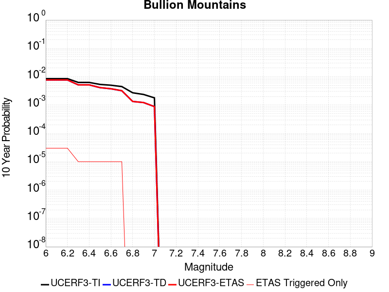 |

| Magnitude | 1 wk TI Prob | 1 wk TD Prob | 1 wk ETAS Prob | 1 wk ETAS/TD Gain | 1 wk ETAS Triggered Only | 1 mo TI Prob | 1 mo TD Prob | 1 mo ETAS Prob | 1 mo ETAS/TD Gain | 1 mo ETAS Triggered Only | 1 yr TI Prob | 1 yr TD Prob | 1 yr ETAS Prob | 1 yr ETAS/TD Gain | 1 yr ETAS Triggered Only | 10 yr TI Prob | 10 yr TD Prob | 10 yr ETAS Prob | 10 yr ETAS/TD Gain | 10 yr ETAS Triggered Only |
|-----|-----|-----|-----|-----|-----|-----|-----|-----|-----|-----|-----|-----|-----|-----|-----|-----|-----|-----|-----|-----|
| 6.0 | 1.6420427E-5 | 1.4692009E-5 | 4.469157E-5 | 3.0418963 | 3.0E-5 | 7.037136E-5 | 6.296445E-5 | 9.296256E-5 | 1.4764293 | 3.0E-5 | 8.5643446E-4 | 7.6636096E-4 | 7.9633796E-4 | 1.039116 | 3.0E-5 | 0.008531413 | 0.0076409746 | 0.0076707457 | 1.0038962 | 3.0E-5 |
| 6.1 | 1.6420427E-5 | 1.4692009E-5 | 4.469157E-5 | 3.0418963 | 3.0E-5 | 7.037136E-5 | 6.296445E-5 | 9.296256E-5 | 1.4764293 | 3.0E-5 | 8.5643446E-4 | 7.6636096E-4 | 7.9633796E-4 | 1.039116 | 3.0E-5 | 0.008531413 | 0.0076409746 | 0.0076707457 | 1.0038962 | 3.0E-5 |
| 6.2 | 1.6420427E-5 | 1.4692009E-5 | 4.469157E-5 | 3.0418963 | 3.0E-5 | 7.037136E-5 | 6.296445E-5 | 9.296256E-5 | 1.4764293 | 3.0E-5 | 8.5643446E-4 | 7.6636096E-4 | 7.9633796E-4 | 1.039116 | 3.0E-5 | 0.008531413 | 0.0076409746 | 0.0076707457 | 1.0038962 | 3.0E-5 |
| 6.3 | 1.2046778E-5 | 9.862255E-6 | 1.9862156E-5 | 2.0139568 | 1.0E-5 | 5.1628023E-5 | 4.2266256E-5 | 5.226583E-5 | 1.2365854 | 1.0E-5 | 6.283899E-4 | 5.144933E-4 | 5.2448816E-4 | 1.0194266 | 1.0E-5 | 0.0062661595 | 0.0051353034 | 0.005145252 | 1.0019373 | 1.0E-5 |
| 6.4 | 1.2046778E-5 | 9.862255E-6 | 1.9862156E-5 | 2.0139568 | 1.0E-5 | 5.1628023E-5 | 4.2266256E-5 | 5.226583E-5 | 1.2365854 | 1.0E-5 | 6.283899E-4 | 5.144933E-4 | 5.2448816E-4 | 1.0194266 | 1.0E-5 | 0.0062661595 | 0.0051353034 | 0.005145252 | 1.0019373 | 1.0E-5 |
| 6.5 | 1.0244343E-5 | 7.879378E-6 | 1.78793E-5 | 2.2691257 | 1.0E-5 | 4.390359E-5 | 3.3768443E-5 | 4.376811E-5 | 1.2961245 | 1.0E-5 | 5.343951E-4 | 4.1107394E-4 | 4.2106982E-4 | 1.0243165 | 1.0E-5 | 0.005331118 | 0.0041051665 | 0.0041151256 | 1.0024259 | 1.0E-5 |
| 6.6 | 9.605408E-6 | 7.1774166E-6 | 1.7177344E-5 | 2.393249 | 1.0E-5 | 4.1165385E-5 | 3.0760108E-5 | 4.07598E-5 | 1.3250864 | 1.0E-5 | 5.010733E-4 | 3.7446033E-4 | 3.8445657E-4 | 1.0266951 | 1.0E-5 | 0.00499945 | 0.0037402906 | 0.0037502532 | 1.0026636 | 1.0E-5 |
| 6.7 | 8.60418E-6 | 6.123926E-6 | 1.6123866E-5 | 2.6329293 | 1.0E-5 | 3.687454E-5 | 2.6245243E-5 | 3.6244983E-5 | 1.3810114 | 1.0E-5 | 4.48855E-4 | 3.195085E-4 | 3.295053E-4 | 1.031288 | 1.0E-5 | 0.004479495 | 0.0031924031 | 0.003202371 | 1.0031224 | 1.0E-5 |
| 6.8 | 5.187994E-6 | 2.563117E-6 | 2.563117E-6 | 1.0 | 0.0 | 2.223407E-5 | 1.0984763E-5 | 1.0984763E-5 | 1.0 | 0.0 | 2.7066618E-4 | 1.3373529E-4 | 1.3373529E-4 | 1.0 | 0.0 | 0.0027033675 | 0.0013369396 | 0.0013369396 | 1.0 | 0.0 |
| 6.9 | 4.5302368E-6 | 2.3442778E-6 | 2.3442778E-6 | 1.0 | 0.0 | 1.9415156E-5 | 1.0046889E-5 | 1.0046889E-5 | 1.0 | 0.0 | 2.3635388E-4 | 1.2231797E-4 | 1.2231797E-4 | 1.0 | 0.0 | 0.0023610266 | 0.0012228956 | 0.0012228956 | 1.0 | 0.0 |
| 7.0 | 3.431668E-6 | 1.6882177E-6 | 1.6882177E-6 | 1.0 | 0.0 | 1.4707065E-5 | 7.2352186E-6 | 7.2352186E-6 | 1.0 | 0.0 | 1.7904381E-4 | 8.808879E-5 | 8.808879E-5 | 1.0 | 0.0 | 0.0017889962 | 8.8088785E-4 | 8.8088785E-4 | 1.0 | 0.0 |

## White Wolf
*[(top)](#table-of-contents)*

| 1 Week | 1 Month | 1 Year | 10 Year |
|-----|-----|-----|-----|
|  |  |  |  |

| Magnitude | 1 wk TI Prob | 1 wk TD Prob | 1 wk ETAS Prob | 1 wk ETAS/TD Gain | 1 wk ETAS Triggered Only | 1 mo TI Prob | 1 mo TD Prob | 1 mo ETAS Prob | 1 mo ETAS/TD Gain | 1 mo ETAS Triggered Only | 1 yr TI Prob | 1 yr TD Prob | 1 yr ETAS Prob | 1 yr ETAS/TD Gain | 1 yr ETAS Triggered Only | 10 yr TI Prob | 10 yr TD Prob | 10 yr ETAS Prob | 10 yr ETAS/TD Gain | 10 yr ETAS Triggered Only |
|-----|-----|-----|-----|-----|-----|-----|-----|-----|-----|-----|-----|-----|-----|-----|-----|-----|-----|-----|-----|-----|
| 6.0 | 2.0037822E-5 | 1.0468583E-6 | 2.1046837E-5 | 20.104763 | 2.0E-5 | 8.587355E-5 | 4.4865283E-6 | 3.4486395E-5 | 7.686655 | 3.0E-5 | 0.001045009 | 5.4622164E-5 | 8.462052E-5 | 1.5491976 | 3.0E-5 | 0.010401085 | 5.4609246E-4 | 5.7607604E-4 | 1.0549058 | 3.0E-5 |
| 6.1 | 2.0037822E-5 | 1.0468583E-6 | 2.1046837E-5 | 20.104763 | 2.0E-5 | 8.587355E-5 | 4.4865283E-6 | 3.4486395E-5 | 7.686655 | 3.0E-5 | 0.001045009 | 5.4622164E-5 | 8.462052E-5 | 1.5491976 | 3.0E-5 | 0.010401085 | 5.4609246E-4 | 5.7607604E-4 | 1.0549058 | 3.0E-5 |
| 6.2 | 2.0037822E-5 | 1.0468583E-6 | 2.1046837E-5 | 20.104763 | 2.0E-5 | 8.587355E-5 | 4.4865283E-6 | 3.4486395E-5 | 7.686655 | 3.0E-5 | 0.001045009 | 5.4622164E-5 | 8.462052E-5 | 1.5491976 | 3.0E-5 | 0.010401085 | 5.4609246E-4 | 5.7607604E-4 | 1.0549058 | 3.0E-5 |
| 6.3 | 2.0037822E-5 | 1.0468583E-6 | 2.1046837E-5 | 20.104763 | 2.0E-5 | 8.587355E-5 | 4.4865283E-6 | 3.4486395E-5 | 7.686655 | 3.0E-5 | 0.001045009 | 5.4622164E-5 | 8.462052E-5 | 1.5491976 | 3.0E-5 | 0.010401085 | 5.4609246E-4 | 5.7607604E-4 | 1.0549058 | 3.0E-5 |
| 6.4 | 1.132487E-5 | 1.0468583E-6 | 2.1046837E-5 | 20.104763 | 2.0E-5 | 4.8534253E-5 | 4.4865283E-6 | 3.4486395E-5 | 7.686655 | 3.0E-5 | 5.907443E-4 | 5.4622164E-5 | 8.462052E-5 | 1.5491976 | 3.0E-5 | 0.005891764 | 5.4609246E-4 | 5.7607604E-4 | 1.0549058 | 3.0E-5 |
| 6.5 | 1.132487E-5 | 1.0468583E-6 | 2.1046837E-5 | 20.104763 | 2.0E-5 | 4.8534253E-5 | 4.4865283E-6 | 3.4486395E-5 | 7.686655 | 3.0E-5 | 5.907443E-4 | 5.4622164E-5 | 8.462052E-5 | 1.5491976 | 3.0E-5 | 0.005891764 | 5.4609246E-4 | 5.7607604E-4 | 1.0549058 | 3.0E-5 |
| 6.6 | 9.347473E-6 | 1.0468583E-6 | 2.1046837E-5 | 20.104763 | 2.0E-5 | 4.0059982E-5 | 4.4865283E-6 | 3.4486395E-5 | 7.686655 | 3.0E-5 | 4.8762115E-4 | 5.4622164E-5 | 8.462052E-5 | 1.5491976 | 3.0E-5 | 0.0048655253 | 5.4609246E-4 | 5.7607604E-4 | 1.0549058 | 3.0E-5 |
| 6.7 | 7.842647E-6 | 1.0047773E-6 | 2.1004756E-5 | 20.904888 | 2.0E-5 | 3.361091E-5 | 4.306182E-6 | 3.4306053E-5 | 7.9666986 | 3.0E-5 | 4.0913603E-4 | 5.2426552E-5 | 8.242498E-5 | 1.5721991 | 3.0E-5 | 0.004083836 | 5.241468E-4 | 5.5413105E-4 | 1.0572059 | 3.0E-5 |
| 6.8 | 6.26597E-6 | 9.734289E-7 | 2.097341E-5 | 21.54591 | 2.0E-5 | 2.685388E-5 | 4.1718313E-6 | 3.4171706E-5 | 8.191056 | 3.0E-5 | 3.2689696E-4 | 5.0790914E-5 | 8.078939E-5 | 1.5906268 | 3.0E-5 | 0.003264165 | 5.07798E-4 | 5.3778273E-4 | 1.0590487 | 3.0E-5 |
| 6.9 | 5.258436E-6 | 9.1827343E-7 | 2.0918254E-5 | 22.779985 | 2.0E-5 | 2.2535958E-5 | 3.935452E-6 | 3.3935336E-5 | 8.622983 | 3.0E-5 | 2.7434074E-4 | 4.7913123E-5 | 7.791168E-5 | 1.6261033 | 3.0E-5 | 0.0027400232 | 4.7903272E-4 | 5.090183E-4 | 1.0625962 | 3.0E-5 |
| 7.0 | 4.675028E-6 | 8.660704E-7 | 1.08660615E-5 | 12.546395 | 1.0E-5 | 2.003568E-5 | 3.7117254E-6 | 2.3711651E-5 | 6.38831 | 2.0E-5 | 2.4390711E-4 | 4.518937E-5 | 6.518846E-5 | 1.442562 | 2.0E-5 | 0.0024363957 | 4.518065E-4 | 4.7179745E-4 | 1.0442468 | 2.0E-5 |
| 7.1 | 2.8270078E-6 | 6.8737717E-7 | 1.068737E-5 | 15.548044 | 1.0E-5 | 1.2115692E-5 | 2.945899E-6 | 2.294584E-5 | 7.789079 | 2.0E-5 | 1.4749856E-4 | 3.586577E-5 | 5.5865054E-5 | 1.5576147 | 2.0E-5 | 0.001474007 | 3.5860392E-4 | 3.7859674E-4 | 1.0557518 | 2.0E-5 |
| 7.2 | 1.6881406E-6 | 2.2703432E-7 | 1.0227032E-5 | 45.046196 | 1.0E-5 | 7.2348685E-6 | 9.730038E-7 | 2.0972984E-5 | 21.554882 | 2.0E-5 | 8.808096E-5 | 1.1846259E-5 | 3.1846022E-5 | 2.6882768 | 2.0E-5 | 8.8046055E-4 | 1.1845643E-4 | 1.3845407E-4 | 1.1688185 | 2.0E-5 |
| 7.3 | 9.086107E-7 | 1.5264496E-7 | 1.0152644E-5 | 66.51149 | 1.0E-5 | 3.8940398E-6 | 6.5419255E-7 | 2.0654179E-5 | 31.57202 | 2.0E-5 | 4.7408903E-5 | 7.964766E-6 | 2.7964606E-5 | 3.5110395 | 2.0E-5 | 4.739879E-4 | 7.964489E-5 | 9.9643294E-5 | 1.2510947 | 2.0E-5 |
| 7.4 | 1.9717383E-7 | 9.003399E-8 | 9.003399E-8 | 1.0 | 0.0 | 8.450304E-7 | 3.8585992E-7 | 3.8585992E-7 | 1.0 | 0.0 | 1.0288197E-5 | 4.697835E-6 | 4.697835E-6 | 1.0 | 0.0 | 1.028772E-4 | 4.6977384E-5 | 4.6977384E-5 | 1.0 | 0.0 |
| 7.5 | 1.086975E-7 | 6.659662E-8 | 6.659662E-8 | 1.0 | 0.0 | 4.6584634E-7 | 2.8541407E-7 | 2.8541407E-7 | 1.0 | 0.0 | 5.6716644E-6 | 3.474911E-6 | 3.474911E-6 | 1.0 | 0.0 | 5.6715195E-5 | 3.474859E-5 | 3.474859E-5 | 1.0 | 0.0 |
| 7.6 | 2.4217808E-8 | 1.5820849E-8 | 1.5820849E-8 | 1.0 | 0.0 | 1.03790605E-7 | 6.780364E-8 | 6.780364E-8 | 1.0 | 0.0 | 1.2636499E-6 | 8.25509E-7 | 8.25509E-7 | 1.0 | 0.0 | 1.2636427E-5 | 8.255064E-6 | 8.255064E-6 | 1.0 | 0.0 |

## Santa Ynez River
*[(top)](#table-of-contents)*

| 1 Week | 1 Month | 1 Year | 10 Year |
|-----|-----|-----|-----|
|  |  |  |  |

| Magnitude | 1 wk TI Prob | 1 wk TD Prob | 1 wk ETAS Prob | 1 wk ETAS/TD Gain | 1 wk ETAS Triggered Only | 1 mo TI Prob | 1 mo TD Prob | 1 mo ETAS Prob | 1 mo ETAS/TD Gain | 1 mo ETAS Triggered Only | 1 yr TI Prob | 1 yr TD Prob | 1 yr ETAS Prob | 1 yr ETAS/TD Gain | 1 yr ETAS Triggered Only | 10 yr TI Prob | 10 yr TD Prob | 10 yr ETAS Prob | 10 yr ETAS/TD Gain | 10 yr ETAS Triggered Only |
|-----|-----|-----|-----|-----|-----|-----|-----|-----|-----|-----|-----|-----|-----|-----|-----|-----|-----|-----|-----|-----|
| 6.0 | 1.6396456E-5 | 1.7209444E-5 | 2.7209273E-5 | 1.5810663 | 1.0E-5 | 7.026863E-5 | 7.3752875E-5 | 9.3751405E-5 | 1.2711558 | 2.0E-5 | 8.551848E-4 | 8.976069E-4 | 9.1758894E-4 | 1.0222615 | 2.0E-5 | 0.0085190125 | 0.008943363 | 0.008973095 | 1.0033244 | 3.0E-5 |
| 6.1 | 1.6396456E-5 | 1.7209444E-5 | 2.7209273E-5 | 1.5810663 | 1.0E-5 | 7.026863E-5 | 7.3752875E-5 | 9.3751405E-5 | 1.2711558 | 2.0E-5 | 8.551848E-4 | 8.976069E-4 | 9.1758894E-4 | 1.0222615 | 2.0E-5 | 0.0085190125 | 0.008943363 | 0.008973095 | 1.0033244 | 3.0E-5 |
| 6.2 | 1.6396456E-5 | 1.7209444E-5 | 2.7209273E-5 | 1.5810663 | 1.0E-5 | 7.026863E-5 | 7.3752875E-5 | 9.3751405E-5 | 1.2711558 | 2.0E-5 | 8.551848E-4 | 8.976069E-4 | 9.1758894E-4 | 1.0222615 | 2.0E-5 | 0.0085190125 | 0.008943363 | 0.008973095 | 1.0033244 | 3.0E-5 |
| 6.3 | 9.736976E-6 | 1.01223395E-5 | 2.0122237E-5 | 1.987904 | 1.0E-5 | 4.172923E-5 | 4.338076E-5 | 5.3380325E-5 | 1.2305069 | 1.0E-5 | 5.0793495E-4 | 5.280378E-4 | 5.380325E-4 | 1.018928 | 1.0E-5 | 0.005067755 | 0.0052683367 | 0.005288231 | 1.0037763 | 2.0E-5 |
| 6.4 | 9.736976E-6 | 1.01223395E-5 | 2.0122237E-5 | 1.987904 | 1.0E-5 | 4.172923E-5 | 4.338076E-5 | 5.3380325E-5 | 1.2305069 | 1.0E-5 | 5.0793495E-4 | 5.280378E-4 | 5.380325E-4 | 1.018928 | 1.0E-5 | 0.005067755 | 0.0052683367 | 0.005288231 | 1.0037763 | 2.0E-5 |
| 6.5 | 7.081964E-6 | 7.329905E-6 | 7.329905E-6 | 1.0 | 0.0 | 3.035092E-5 | 3.141351E-5 | 3.141351E-5 | 1.0 | 0.0 | 3.694598E-4 | 3.8239395E-4 | 3.8239395E-4 | 1.0 | 0.0 | 0.0036884616 | 0.0038175215 | 0.0038175215 | 1.0 | 0.0 |
| 6.6 | 5.873247E-6 | 6.0597517E-6 | 6.0597517E-6 | 1.0 | 0.0 | 2.5170815E-5 | 2.5970112E-5 | 2.5970112E-5 | 1.0 | 0.0 | 3.064116E-4 | 3.161411E-4 | 3.161411E-4 | 1.0 | 0.0 | 0.0030598943 | 0.003157001 | 0.003157001 | 1.0 | 0.0 |
| 6.7 | 4.973277E-6 | 5.11591E-6 | 5.11591E-6 | 1.0 | 0.0 | 2.1313872E-5 | 2.1925147E-5 | 2.1925147E-5 | 1.0 | 0.0 | 2.5946548E-4 | 2.6690646E-4 | 2.6690646E-4 | 1.0 | 0.0 | 0.0025916274 | 0.0026659078 | 0.0026659078 | 1.0 | 0.0 |
| 6.8 | 4.396492E-6 | 4.510987E-6 | 4.510987E-6 | 1.0 | 0.0 | 1.884197E-5 | 1.933266E-5 | 1.933266E-5 | 1.0 | 0.0 | 2.2937685E-4 | 2.3535005E-4 | 2.3535005E-4 | 1.0 | 0.0 | 0.0022914023 | 0.0023510433 | 0.0023510433 | 1.0 | 0.0 |
| 6.9 | 3.5255632E-6 | 3.6013423E-6 | 3.6013423E-6 | 1.0 | 0.0 | 1.5109469E-5 | 1.5434234E-5 | 1.5434234E-5 | 1.0 | 0.0 | 1.8394225E-4 | 1.8789574E-4 | 1.8789574E-4 | 1.0 | 0.0 | 0.0018379007 | 0.001877385 | 0.001877385 | 1.0 | 0.0 |
| 7.0 | 3.211603E-6 | 3.273663E-6 | 3.273663E-6 | 1.0 | 0.0 | 1.376394E-5 | 1.402991E-5 | 1.402991E-5 | 1.0 | 0.0 | 1.6756308E-4 | 1.708009E-4 | 1.708009E-4 | 1.0 | 0.0 | 0.0016743679 | 0.0017067104 | 0.0017067104 | 1.0 | 0.0 |
| 7.1 | 2.5094619E-6 | 2.5409295E-6 | 2.5409295E-6 | 1.0 | 0.0 | 1.0754793E-5 | 1.0889652E-5 | 1.0889652E-5 | 1.0 | 0.0 | 1.3093173E-4 | 1.325735E-4 | 1.325735E-4 | 1.0 | 0.0 | 0.0013085462 | 0.0013249503 | 0.0013249503 | 1.0 | 0.0 |
| 7.2 | 2.0515774E-6 | 2.0619466E-6 | 2.0619466E-6 | 1.0 | 0.0 | 8.792445E-6 | 8.836884E-6 | 8.836884E-6 | 1.0 | 0.0 | 1.0704277E-4 | 1.0758379E-4 | 1.0758379E-4 | 1.0 | 0.0 | 0.0010699122 | 0.0010753215 | 0.0010753215 | 1.0 | 0.0 |
| 7.3 | 1.6845745E-6 | 1.6773996E-6 | 1.6773996E-6 | 1.0 | 0.0 | 7.219585E-6 | 7.1888358E-6 | 7.1888358E-6 | 1.0 | 0.0 | 8.78949E-5 | 8.752059E-5 | 8.752059E-5 | 1.0 | 0.0 | 8.7860145E-4 | 8.7486405E-4 | 8.7486405E-4 | 1.0 | 0.0 |
| 7.4 | 1.3600285E-6 | 1.3333447E-6 | 1.3333447E-6 | 1.0 | 0.0 | 5.82868E-6 | 5.714322E-6 | 5.714322E-6 | 1.0 | 0.0 | 7.096187E-5 | 6.956967E-5 | 6.956967E-5 | 1.0 | 0.0 | 7.0939213E-4 | 6.9548114E-4 | 6.9548114E-4 | 1.0 | 0.0 |
| 7.5 | 9.735342E-7 | 9.2901894E-7 | 9.2901894E-7 | 1.0 | 0.0 | 4.172283E-6 | 3.9815036E-6 | 3.9815036E-6 | 1.0 | 0.0 | 5.079636E-5 | 4.8473747E-5 | 4.8473747E-5 | 1.0 | 0.0 | 5.0784746E-4 | 4.8463346E-4 | 4.8463346E-4 | 1.0 | 0.0 |
| 7.6 | 5.067187E-7 | 4.778609E-7 | 4.778609E-7 | 1.0 | 0.0 | 2.1716498E-6 | 2.0479738E-6 | 2.0479738E-6 | 1.0 | 0.0 | 2.6439517E-5 | 2.4933803E-5 | 2.4933803E-5 | 1.0 | 0.0 | 2.643637E-4 | 2.493108E-4 | 2.493108E-4 | 1.0 | 0.0 |
| 7.7 | 2.769089E-7 | 2.5759346E-7 | 2.5759346E-7 | 1.0 | 0.0 | 1.1867519E-6 | 1.1039714E-6 | 1.1039714E-6 | 1.0 | 0.0 | 1.4448608E-5 | 1.344077E-5 | 1.344077E-5 | 1.0 | 0.0 | 1.444767E-4 | 1.343996E-4 | 1.343996E-4 | 1.0 | 0.0 |
| 7.8 | 1.7044663E-7 | 1.5449208E-7 | 1.5449208E-7 | 1.0 | 0.0 | 7.3048534E-7 | 6.6210873E-7 | 6.6210873E-7 | 1.0 | 0.0 | 8.893623E-6 | 8.061144E-6 | 8.061144E-6 | 1.0 | 0.0 | 8.893267E-5 | 8.060854E-5 | 8.060854E-5 | 1.0 | 0.0 |
| 7.9 | 4.8344287E-8 | 4.0911143E-8 | 4.0911143E-8 | 1.0 | 0.0 | 2.0718979E-7 | 1.7533345E-7 | 1.7533345E-7 | 1.0 | 0.0 | 2.5225327E-6 | 2.1346827E-6 | 2.1346827E-6 | 1.0 | 0.0 | 2.5225041E-5 | 2.1346626E-5 | 2.1346626E-5 | 1.0 | 0.0 |

## Santa Susana alt 1
*[(top)](#table-of-contents)*

| 1 Week | 1 Month | 1 Year | 10 Year |
|-----|-----|-----|-----|
|  |  |  |  |

| Magnitude | 1 wk TI Prob | 1 wk TD Prob | 1 wk ETAS Prob | 1 wk ETAS/TD Gain | 1 wk ETAS Triggered Only | 1 mo TI Prob | 1 mo TD Prob | 1 mo ETAS Prob | 1 mo ETAS/TD Gain | 1 mo ETAS Triggered Only | 1 yr TI Prob | 1 yr TD Prob | 1 yr ETAS Prob | 1 yr ETAS/TD Gain | 1 yr ETAS Triggered Only | 10 yr TI Prob | 10 yr TD Prob | 10 yr ETAS Prob | 10 yr ETAS/TD Gain | 10 yr ETAS Triggered Only |
|-----|-----|-----|-----|-----|-----|-----|-----|-----|-----|-----|-----|-----|-----|-----|-----|-----|-----|-----|-----|-----|
| 6.0 | 2.674877E-5 | 2.7198214E-5 | 3.719794E-5 | 1.3676612 | 1.0E-5 | 1.1463255E-4 | 1.16559204E-4 | 1.3655688E-4 | 1.1715666 | 2.0E-5 | 0.0013947578 | 0.0014182981 | 0.0014482556 | 1.0211221 | 3.0E-5 | 0.013860362 | 0.014104388 | 0.014133965 | 1.002097 | 3.0E-5 |
| 6.1 | 2.674877E-5 | 2.7198214E-5 | 3.719794E-5 | 1.3676612 | 1.0E-5 | 1.1463255E-4 | 1.16559204E-4 | 1.3655688E-4 | 1.1715666 | 2.0E-5 | 0.0013947578 | 0.0014182981 | 0.0014482556 | 1.0211221 | 3.0E-5 | 0.013860362 | 0.014104388 | 0.014133965 | 1.002097 | 3.0E-5 |
| 6.2 | 2.674877E-5 | 2.7198214E-5 | 3.719794E-5 | 1.3676612 | 1.0E-5 | 1.1463255E-4 | 1.16559204E-4 | 1.3655688E-4 | 1.1715666 | 2.0E-5 | 0.0013947578 | 0.0014182981 | 0.0014482556 | 1.0211221 | 3.0E-5 | 0.013860362 | 0.014104388 | 0.014133965 | 1.002097 | 3.0E-5 |
| 6.3 | 2.674877E-5 | 2.7198214E-5 | 3.719794E-5 | 1.3676612 | 1.0E-5 | 1.1463255E-4 | 1.16559204E-4 | 1.3655688E-4 | 1.1715666 | 2.0E-5 | 0.0013947578 | 0.0014182981 | 0.0014482556 | 1.0211221 | 3.0E-5 | 0.013860362 | 0.014104388 | 0.014133965 | 1.002097 | 3.0E-5 |
| 6.4 | 2.674877E-5 | 2.7198214E-5 | 3.719794E-5 | 1.3676612 | 1.0E-5 | 1.1463255E-4 | 1.16559204E-4 | 1.3655688E-4 | 1.1715666 | 2.0E-5 | 0.0013947578 | 0.0014182981 | 0.0014482556 | 1.0211221 | 3.0E-5 | 0.013860362 | 0.014104388 | 0.014133965 | 1.002097 | 3.0E-5 |
| 6.5 | 2.674877E-5 | 2.7198214E-5 | 3.719794E-5 | 1.3676612 | 1.0E-5 | 1.1463255E-4 | 1.16559204E-4 | 1.3655688E-4 | 1.1715666 | 2.0E-5 | 0.0013947578 | 0.0014182981 | 0.0014482556 | 1.0211221 | 3.0E-5 | 0.013860362 | 0.014104388 | 0.014133965 | 1.002097 | 3.0E-5 |
| 6.6 | 2.6647976E-5 | 2.7074553E-5 | 3.7074282E-5 | 1.3693405 | 1.0E-5 | 1.14200615E-4 | 1.16029274E-4 | 1.3602695E-4 | 1.1723503 | 2.0E-5 | 0.0013895056 | 0.0014118546 | 0.0014418123 | 1.0212187 | 3.0E-5 | 0.013808494 | 0.014040773 | 0.014070352 | 1.0021067 | 3.0E-5 |
| 6.7 | 2.6647976E-5 | 2.7074553E-5 | 3.7074282E-5 | 1.3693405 | 1.0E-5 | 1.14200615E-4 | 1.16029274E-4 | 1.3602695E-4 | 1.1723503 | 2.0E-5 | 0.0013895056 | 0.0014118546 | 0.0014418123 | 1.0212187 | 3.0E-5 | 0.013808494 | 0.014040773 | 0.014070352 | 1.0021067 | 3.0E-5 |
| 6.8 | 1.9073179E-5 | 1.7637467E-5 | 2.763729E-5 | 1.5669649 | 1.0E-5 | 8.1739636E-5 | 7.558706E-5 | 9.558554E-5 | 1.2645756 | 2.0E-5 | 9.947256E-4 | 9.19902E-4 | 9.498744E-4 | 1.0325822 | 3.0E-5 | 0.009902848 | 0.009163361 | 0.009193086 | 1.0032439 | 3.0E-5 |
| 6.9 | 1.9041876E-5 | 1.7619597E-5 | 2.7619422E-5 | 1.5675398 | 1.0E-5 | 8.160549E-5 | 7.551048E-5 | 9.550897E-5 | 1.264844 | 2.0E-5 | 9.930939E-4 | 9.189705E-4 | 9.489429E-4 | 1.0326152 | 3.0E-5 | 0.0098866755 | 0.009154123 | 0.009183848 | 1.0032473 | 3.0E-5 |
| 7.0 | 1.5917482E-5 | 1.3864049E-5 | 2.386391E-5 | 1.72128 | 1.0E-5 | 6.8215995E-5 | 5.9416023E-5 | 7.941484E-5 | 1.3365896 | 2.0E-5 | 8.302132E-4 | 7.2315463E-4 | 7.53133E-4 | 1.0414549 | 3.0E-5 | 0.008271185 | 0.0072090672 | 0.007238851 | 1.0041314 | 3.0E-5 |
| 7.1 | 1.577788E-5 | 1.3744056E-5 | 2.3743918E-5 | 1.7275773 | 1.0E-5 | 6.761774E-5 | 5.890179E-5 | 7.8900615E-5 | 1.3395282 | 2.0E-5 | 8.2293496E-4 | 7.16898E-4 | 7.468765E-4 | 1.041817 | 3.0E-5 | 0.008198941 | 0.0071469042 | 0.00717669 | 1.0041677 | 3.0E-5 |
| 7.2 | 1.5416446E-5 | 1.34701295E-5 | 2.3469995E-5 | 1.7423733 | 1.0E-5 | 6.606882E-5 | 5.7727877E-5 | 7.772672E-5 | 1.346433 | 2.0E-5 | 8.0409093E-4 | 7.026149E-4 | 7.325938E-4 | 1.0426676 | 3.0E-5 | 0.008011877 | 0.0070049763 | 0.0070347665 | 1.0042527 | 3.0E-5 |
| 7.3 | 1.4534083E-5 | 1.2718032E-5 | 2.2717904E-5 | 1.7862751 | 1.0E-5 | 6.228744E-5 | 5.4504737E-5 | 7.4503645E-5 | 1.3669206 | 2.0E-5 | 7.580857E-4 | 6.633976E-4 | 6.933777E-4 | 1.0451918 | 3.0E-5 | 0.007555048 | 0.0066151717 | 0.006644973 | 1.004505 | 3.0E-5 |
| 7.4 | 1.2858995E-5 | 1.1229814E-5 | 2.1229702E-5 | 1.8904767 | 1.0E-5 | 5.5108816E-5 | 4.812691E-5 | 6.812595E-5 | 1.415548 | 2.0E-5 | 6.7074323E-4 | 5.8579154E-4 | 6.1577396E-4 | 1.0511827 | 3.0E-5 | 0.0066872234 | 0.0058433902 | 0.005873215 | 1.0051041 | 3.0E-5 |
| 7.5 | 8.827668E-6 | 7.805494E-6 | 7.805494E-6 | 1.0 | 0.0 | 3.7832317E-5 | 3.3451703E-5 | 3.3451703E-5 | 1.0 | 0.0 | 4.605111E-4 | 4.072008E-4 | 4.1719674E-4 | 1.0245479 | 1.0E-5 | 0.0045955796 | 0.0040648985 | 0.004074858 | 1.0024501 | 1.0E-5 |
| 7.6 | 3.2533426E-6 | 2.8720106E-6 | 2.8720106E-6 | 1.0 | 0.0 | 1.3942822E-5 | 1.230856E-5 | 1.230856E-5 | 1.0 | 0.0 | 1.6974064E-4 | 1.4984679E-4 | 1.4984679E-4 | 1.0 | 0.0 | 0.0016961104 | 0.0014974943 | 0.0014974943 | 1.0 | 0.0 |
| 7.7 | 1.2751709E-6 | 1.1491339E-6 | 1.1491339E-6 | 1.0 | 0.0 | 5.4650063E-6 | 4.9248506E-6 | 4.9248506E-6 | 1.0 | 0.0 | 6.653442E-5 | 5.99585E-5 | 5.99585E-5 | 1.0 | 0.0 | 6.6514505E-4 | 5.9943215E-4 | 5.9943215E-4 | 1.0 | 0.0 |
| 7.8 | 3.067544E-7 | 3.240052E-7 | 3.240052E-7 | 1.0 | 0.0 | 1.3146611E-6 | 1.3885931E-6 | 1.3885931E-6 | 1.0 | 0.0 | 1.600588E-5 | 1.6906E-5 | 1.6906E-5 | 1.0 | 0.0 | 1.6004729E-4 | 1.6904817E-4 | 1.6904817E-4 | 1.0 | 0.0 |
| 7.9 | 7.622999E-8 | 8.0879715E-8 | 8.0879715E-8 | 1.0 | 0.0 | 3.2669993E-7 | 3.4662733E-7 | 3.4662733E-7 | 1.0 | 0.0 | 3.977564E-6 | 4.220182E-6 | 4.220182E-6 | 1.0 | 0.0 | 3.977493E-5 | 4.2201224E-5 | 4.2201224E-5 | 1.0 | 0.0 |

## Cleghorn
*[(top)](#table-of-contents)*

| 1 Week | 1 Month | 1 Year | 10 Year |
|-----|-----|-----|-----|
|  |  |  |  |

| Magnitude | 1 wk TI Prob | 1 wk TD Prob | 1 wk ETAS Prob | 1 wk ETAS/TD Gain | 1 wk ETAS Triggered Only | 1 mo TI Prob | 1 mo TD Prob | 1 mo ETAS Prob | 1 mo ETAS/TD Gain | 1 mo ETAS Triggered Only | 1 yr TI Prob | 1 yr TD Prob | 1 yr ETAS Prob | 1 yr ETAS/TD Gain | 1 yr ETAS Triggered Only | 10 yr TI Prob | 10 yr TD Prob | 10 yr ETAS Prob | 10 yr ETAS/TD Gain | 10 yr ETAS Triggered Only |
|-----|-----|-----|-----|-----|-----|-----|-----|-----|-----|-----|-----|-----|-----|-----|-----|-----|-----|-----|-----|-----|
| 6.0 | 7.9267165E-6 | 9.831764E-6 | 1.9831667E-5 | 2.0171015 | 1.0E-5 | 3.39712E-5 | 4.2135514E-5 | 6.213467E-5 | 1.4746389 | 2.0E-5 | 4.1352084E-4 | 5.1288976E-4 | 5.4287433E-4 | 1.0584621 | 3.0E-5 | 0.004127522 | 0.005132214 | 0.0051620603 | 1.0058154 | 3.0E-5 |
| 6.1 | 7.9267165E-6 | 9.831764E-6 | 1.9831667E-5 | 2.0171015 | 1.0E-5 | 3.39712E-5 | 4.2135514E-5 | 6.213467E-5 | 1.4746389 | 2.0E-5 | 4.1352084E-4 | 5.1288976E-4 | 5.4287433E-4 | 1.0584621 | 3.0E-5 | 0.004127522 | 0.005132214 | 0.0051620603 | 1.0058154 | 3.0E-5 |
| 6.2 | 7.9267165E-6 | 9.831764E-6 | 1.9831667E-5 | 2.0171015 | 1.0E-5 | 3.39712E-5 | 4.2135514E-5 | 6.213467E-5 | 1.4746389 | 2.0E-5 | 4.1352084E-4 | 5.1288976E-4 | 5.4287433E-4 | 1.0584621 | 3.0E-5 | 0.004127522 | 0.005132214 | 0.0051620603 | 1.0058154 | 3.0E-5 |
| 6.3 | 7.9267165E-6 | 9.831764E-6 | 1.9831667E-5 | 2.0171015 | 1.0E-5 | 3.39712E-5 | 4.2135514E-5 | 6.213467E-5 | 1.4746389 | 2.0E-5 | 4.1352084E-4 | 5.1288976E-4 | 5.4287433E-4 | 1.0584621 | 3.0E-5 | 0.004127522 | 0.005132214 | 0.0051620603 | 1.0058154 | 3.0E-5 |
| 6.4 | 4.3445207E-6 | 6.0916254E-6 | 1.6091564E-5 | 2.641588 | 1.0E-5 | 1.8619241E-5 | 2.6106709E-5 | 4.6106186E-5 | 1.7660666 | 2.0E-5 | 2.2666567E-4 | 3.1780385E-4 | 3.4779432E-4 | 1.0943679 | 3.0E-5 | 0.0022643462 | 0.0031877246 | 0.003217629 | 1.009381 | 3.0E-5 |
| 6.5 | 4.3445207E-6 | 6.0916254E-6 | 1.6091564E-5 | 2.641588 | 1.0E-5 | 1.8619241E-5 | 2.6106709E-5 | 4.6106186E-5 | 1.7660666 | 2.0E-5 | 2.2666567E-4 | 3.1780385E-4 | 3.4779432E-4 | 1.0943679 | 3.0E-5 | 0.0022643462 | 0.0031877246 | 0.003217629 | 1.009381 | 3.0E-5 |
| 6.6 | 4.040109E-6 | 5.774033E-6 | 1.5773976E-5 | 2.7318816 | 1.0E-5 | 1.7314638E-5 | 2.4745626E-5 | 3.474538E-5 | 1.4041018 | 1.0E-5 | 2.1078532E-4 | 3.0123728E-4 | 3.2123126E-4 | 1.0663729 | 2.0E-5 | 0.002105855 | 0.0030225143 | 0.003042454 | 1.006597 | 2.0E-5 |
| 6.7 | 3.3632055E-6 | 5.06753E-6 | 1.5067479E-5 | 2.9733381 | 1.0E-5 | 1.4413658E-5 | 2.1717806E-5 | 3.1717587E-5 | 1.4604417 | 1.0E-5 | 1.7547216E-4 | 2.643825E-4 | 2.7437988E-4 | 1.037814 | 1.0E-5 | 0.0017533366 | 0.0026548486 | 0.002664822 | 1.0037566 | 1.0E-5 |
| 6.8 | 3.2902772E-6 | 4.9894375E-6 | 1.4989388E-5 | 3.004224 | 1.0E-5 | 1.4101111E-5 | 2.138313E-5 | 3.1382915E-5 | 1.4676484 | 1.0E-5 | 1.716675E-4 | 2.6030882E-4 | 2.7030622E-4 | 1.0384059 | 1.0E-5 | 0.0017153495 | 0.0026142076 | 0.0026241813 | 1.0038153 | 1.0E-5 |
| 6.9 | 3.031547E-6 | 4.6911987E-6 | 1.4691152E-5 | 3.1316414 | 1.0E-5 | 1.299228E-5 | 2.0104984E-5 | 3.0104784E-5 | 1.4973791 | 1.0E-5 | 1.5816953E-4 | 2.4475096E-4 | 2.547485E-4 | 1.0408479 | 1.0E-5 | 0.00158057 | 0.0024589805 | 0.002468956 | 1.0040567 | 1.0E-5 |
| 7.0 | 2.8259715E-6 | 4.3707637E-6 | 1.437072E-5 | 3.2879195 | 1.0E-5 | 1.211125E-5 | 1.8731711E-5 | 2.8731525E-5 | 1.533844 | 1.0E-5 | 1.4744449E-4 | 2.2803496E-4 | 2.3803268E-4 | 1.0438429 | 1.0E-5 | 0.001473467 | 0.0022921748 | 0.0023021519 | 1.0043527 | 1.0E-5 |
| 7.1 | 2.5962665E-6 | 4.065983E-6 | 1.4065942E-5 | 3.45942 | 1.0E-5 | 1.1126809E-5 | 1.7425526E-5 | 2.7425353E-5 | 1.5738608 | 1.0E-5 | 1.3546048E-4 | 2.1213535E-4 | 2.2213323E-4 | 1.0471298 | 1.0E-5 | 0.0013537793 | 0.0021334959 | 0.0021434745 | 1.0046772 | 1.0E-5 |
| 7.2 | 2.3247253E-6 | 3.6765352E-6 | 1.3676498E-5 | 3.719942 | 1.0E-5 | 9.96307E-6 | 1.5756486E-5 | 2.5756328E-5 | 1.6346493 | 1.0E-5 | 1.21293626E-4 | 1.9181852E-4 | 2.018166E-4 | 1.0521226 | 1.0E-5 | 0.0012122744 | 0.0019307166 | 0.0019406972 | 1.0051694 | 1.0E-5 |
| 7.3 | 2.056928E-6 | 3.235253E-6 | 1.3235221E-5 | 4.0909386 | 1.0E-5 | 8.815376E-6 | 1.3865297E-5 | 2.3865157E-5 | 1.7212151 | 1.0E-5 | 1.0732192E-4 | 1.6879707E-4 | 1.7879538E-4 | 1.0592327 | 1.0E-5 | 0.001072701 | 0.0017009423 | 0.0017109253 | 1.0058692 | 1.0E-5 |
| 7.4 | 1.8055999E-6 | 2.8256538E-6 | 1.2825625E-5 | 4.538994 | 1.0E-5 | 7.738263E-6 | 1.210989E-5 | 2.2109769E-5 | 1.8257613 | 1.0E-5 | 9.4209274E-5 | 1.4742807E-4 | 1.5742659E-4 | 1.0678197 | 1.0E-5 | 9.4169343E-4 | 0.0014876705 | 0.0014976555 | 1.006712 | 1.0E-5 |
| 7.5 | 1.4683443E-6 | 2.4248943E-6 | 1.242487E-5 | 5.123881 | 1.0E-5 | 6.292889E-6 | 1.0392363E-5 | 2.039226E-5 | 1.962235 | 1.0E-5 | 7.661323E-5 | 1.2651978E-4 | 1.365185E-4 | 1.0790291 | 1.0E-5 | 7.658682E-4 | 0.0012788812 | 0.0012888685 | 1.0078093 | 1.0E-5 |
| 7.6 | 9.804088E-7 | 1.9004091E-6 | 1.9004091E-6 | 1.0 | 0.0 | 4.201745E-6 | 8.144585E-6 | 8.144585E-6 | 1.0 | 0.0 | 5.1155046E-5 | 9.915586E-5 | 9.915586E-5 | 1.0 | 0.0 | 5.114327E-4 | 0.0010055583 | 0.0010055583 | 1.0 | 0.0 |
| 7.7 | 7.3434086E-7 | 1.6285549E-6 | 1.6285549E-6 | 1.0 | 0.0 | 3.1471714E-6 | 6.9795024E-6 | 6.9795024E-6 | 1.0 | 0.0 | 3.831614E-5 | 8.4972155E-5 | 8.4972155E-5 | 1.0 | 0.0 | 3.8309532E-4 | 8.6387293E-4 | 8.6387293E-4 | 1.0 | 0.0 |
| 7.8 | 6.434184E-7 | 1.5221389E-6 | 1.5221389E-6 | 1.0 | 0.0 | 2.7575045E-6 | 6.523436E-6 | 6.523436E-6 | 1.0 | 0.0 | 3.35721E-5 | 7.9419966E-5 | 7.9419966E-5 | 1.0 | 0.0 | 3.3567028E-4 | 8.080443E-4 | 8.080443E-4 | 1.0 | 0.0 |
| 7.9 | 3.4943926E-7 | 7.5750586E-7 | 7.5750586E-7 | 1.0 | 0.0 | 1.497596E-6 | 3.2464498E-6 | 3.2464498E-6 | 1.0 | 0.0 | 1.8233079E-5 | 3.9524817E-5 | 3.9524817E-5 | 1.0 | 0.0 | 1.8231584E-4 | 4.0401975E-4 | 4.0401975E-4 | 1.0 | 0.0 |
| 8.0 | 6.717524E-8 | 5.837515E-8 | 5.837515E-8 | 1.0 | 0.0 | 2.8789387E-7 | 2.501792E-7 | 2.501792E-7 | 1.0 | 0.0 | 3.505102E-6 | 3.0459275E-6 | 3.0459275E-6 | 1.0 | 0.0 | 3.5050467E-5 | 3.2751934E-5 | 3.2751934E-5 | 1.0 | 0.0 |
| 8.1 | 3.1984914E-8 | 1.2949885E-8 | 1.2949885E-8 | 1.0 | 0.0 | 1.370782E-7 | 5.549951E-8 | 5.549951E-8 | 1.0 | 0.0 | 1.6689258E-6 | 6.757063E-7 | 6.757063E-7 | 1.0 | 0.0 | 1.6689133E-5 | 7.741151E-6 | 7.741151E-6 | 1.0 | 0.0 |
| 8.2 | 1.21887656E-8 | 3.6471115E-9 | 3.6471115E-9 | 1.0 | 0.0 | 5.2237567E-8 | 1.563048E-8 | 1.563048E-8 | 1.0 | 0.0 | 6.359922E-7 | 1.9030107E-7 | 1.9030107E-7 | 1.0 | 0.0 | 6.3599036E-6 | 2.245849E-6 | 2.245849E-6 | 1.0 | 0.0 |

## Channel Islands Thrust
*[(top)](#table-of-contents)*

| 1 Week | 1 Month | 1 Year | 10 Year |
|-----|-----|-----|-----|
|  |  |  |  |

| Magnitude | 1 wk TI Prob | 1 wk TD Prob | 1 wk ETAS Prob | 1 wk ETAS/TD Gain | 1 wk ETAS Triggered Only | 1 mo TI Prob | 1 mo TD Prob | 1 mo ETAS Prob | 1 mo ETAS/TD Gain | 1 mo ETAS Triggered Only | 1 yr TI Prob | 1 yr TD Prob | 1 yr ETAS Prob | 1 yr ETAS/TD Gain | 1 yr ETAS Triggered Only | 10 yr TI Prob | 10 yr TD Prob | 10 yr ETAS Prob | 10 yr ETAS/TD Gain | 10 yr ETAS Triggered Only |
|-----|-----|-----|-----|-----|-----|-----|-----|-----|-----|-----|-----|-----|-----|-----|-----|-----|-----|-----|-----|-----|
| 6.0 | 2.2156251E-5 | 2.4092022E-5 | 3.409178E-5 | 1.4150652 | 1.0E-5 | 9.495191E-5 | 1.03248036E-4 | 1.13247006E-4 | 1.0968442 | 1.0E-5 | 0.0011554264 | 0.0012564266 | 0.0012764013 | 1.0158981 | 2.0E-5 | 0.011494373 | 0.0125038205 | 0.012533446 | 1.0023693 | 3.0E-5 |
| 6.1 | 2.2156251E-5 | 2.4092022E-5 | 3.409178E-5 | 1.4150652 | 1.0E-5 | 9.495191E-5 | 1.03248036E-4 | 1.13247006E-4 | 1.0968442 | 1.0E-5 | 0.0011554264 | 0.0012564266 | 0.0012764013 | 1.0158981 | 2.0E-5 | 0.011494373 | 0.0125038205 | 0.012533446 | 1.0023693 | 3.0E-5 |
| 6.2 | 2.2156251E-5 | 2.4092022E-5 | 3.409178E-5 | 1.4150652 | 1.0E-5 | 9.495191E-5 | 1.03248036E-4 | 1.13247006E-4 | 1.0968442 | 1.0E-5 | 0.0011554264 | 0.0012564266 | 0.0012764013 | 1.0158981 | 2.0E-5 | 0.011494373 | 0.0125038205 | 0.012533446 | 1.0023693 | 3.0E-5 |
| 6.3 | 2.2156251E-5 | 2.4092022E-5 | 3.409178E-5 | 1.4150652 | 1.0E-5 | 9.495191E-5 | 1.03248036E-4 | 1.13247006E-4 | 1.0968442 | 1.0E-5 | 0.0011554264 | 0.0012564266 | 0.0012764013 | 1.0158981 | 2.0E-5 | 0.011494373 | 0.0125038205 | 0.012533446 | 1.0023693 | 3.0E-5 |
| 6.4 | 2.2156251E-5 | 2.4092022E-5 | 3.409178E-5 | 1.4150652 | 1.0E-5 | 9.495191E-5 | 1.03248036E-4 | 1.13247006E-4 | 1.0968442 | 1.0E-5 | 0.0011554264 | 0.0012564266 | 0.0012764013 | 1.0158981 | 2.0E-5 | 0.011494373 | 0.0125038205 | 0.012533446 | 1.0023693 | 3.0E-5 |
| 6.5 | 2.2156251E-5 | 2.4092022E-5 | 3.409178E-5 | 1.4150652 | 1.0E-5 | 9.495191E-5 | 1.03248036E-4 | 1.13247006E-4 | 1.0968442 | 1.0E-5 | 0.0011554264 | 0.0012564266 | 0.0012764013 | 1.0158981 | 2.0E-5 | 0.011494373 | 0.0125038205 | 0.012533446 | 1.0023693 | 3.0E-5 |
| 6.6 | 2.2156251E-5 | 2.4092022E-5 | 3.409178E-5 | 1.4150652 | 1.0E-5 | 9.495191E-5 | 1.03248036E-4 | 1.13247006E-4 | 1.0968442 | 1.0E-5 | 0.0011554264 | 0.0012564266 | 0.0012764013 | 1.0158981 | 2.0E-5 | 0.011494373 | 0.0125038205 | 0.012533446 | 1.0023693 | 3.0E-5 |
| 6.7 | 1.0601296E-5 | 1.1379544E-5 | 1.1379544E-5 | 1.0 | 0.0 | 4.5433335E-5 | 4.876859E-5 | 4.876859E-5 | 1.0 | 0.0 | 5.5301044E-4 | 5.936007E-4 | 5.936007E-4 | 1.0 | 0.0 | 0.005516363 | 0.005920653 | 0.005930594 | 1.001679 | 1.0E-5 |
| 6.8 | 1.0246747E-5 | 1.0996669E-5 | 1.0996669E-5 | 1.0 | 0.0 | 4.391389E-5 | 4.7127756E-5 | 4.7127756E-5 | 1.0 | 0.0 | 5.345204E-4 | 5.7363417E-4 | 5.7363417E-4 | 1.0 | 0.0 | 0.0053323656 | 0.005722025 | 0.0057319677 | 1.0017376 | 1.0E-5 |
| 6.9 | 9.049551E-6 | 9.699645E-6 | 9.699645E-6 | 1.0 | 0.0 | 3.878322E-5 | 4.1569267E-5 | 4.1569267E-5 | 1.0 | 0.0 | 4.7208337E-4 | 5.059924E-4 | 5.059924E-4 | 1.0 | 0.0 | 0.0047108172 | 0.0050488203 | 0.0050488203 | 1.0 | 0.0 |
| 7.0 | 8.6542195E-6 | 9.274603E-6 | 9.274603E-6 | 1.0 | 0.0 | 3.7088983E-5 | 3.9747716E-5 | 3.9747716E-5 | 1.0 | 0.0 | 4.5146482E-4 | 4.8382508E-4 | 4.8382508E-4 | 1.0 | 0.0 | 0.004505487 | 0.0048281294 | 0.0048281294 | 1.0 | 0.0 |
| 7.1 | 8.391028E-6 | 8.992925E-6 | 8.992925E-6 | 1.0 | 0.0 | 3.5961057E-5 | 3.8540562E-5 | 3.8540562E-5 | 1.0 | 0.0 | 4.3773788E-4 | 4.6913436E-4 | 4.6913436E-4 | 1.0 | 0.0 | 0.004368766 | 0.0046818503 | 0.0046818503 | 1.0 | 0.0 |
| 7.2 | 5.965188E-6 | 6.3716957E-6 | 6.3716957E-6 | 1.0 | 0.0 | 2.556484E-5 | 2.7306984E-5 | 2.7306984E-5 | 1.0 | 0.0 | 3.1120746E-4 | 3.3241237E-4 | 3.3241237E-4 | 1.0 | 0.0 | 0.00310772 | 0.0033192094 | 0.0033192094 | 1.0 | 0.0 |
| 7.3 | 4.877518E-6 | 5.206007E-6 | 5.206007E-6 | 1.0 | 0.0 | 2.0903482E-5 | 2.231127E-5 | 2.231127E-5 | 1.0 | 0.0 | 2.5447016E-4 | 2.716063E-4 | 2.716063E-4 | 1.0 | 0.0 | 0.0025417898 | 0.0027127897 | 0.0027127897 | 1.0 | 0.0 |
| 7.4 | 3.8829853E-6 | 4.141863E-6 | 4.141863E-6 | 1.0 | 0.0 | 1.664126E-5 | 1.7750723E-5 | 1.7750723E-5 | 1.0 | 0.0 | 2.0258849E-4 | 2.1609403E-4 | 2.1609403E-4 | 1.0 | 0.0 | 0.002024039 | 0.002158881 | 0.002158881 | 1.0 | 0.0 |
| 7.5 | 1.3489616E-6 | 1.4277905E-6 | 1.4277905E-6 | 1.0 | 0.0 | 5.7812517E-6 | 6.119088E-6 | 6.119088E-6 | 1.0 | 0.0 | 7.038446E-5 | 7.449739E-5 | 7.449739E-5 | 1.0 | 0.0 | 7.036218E-4 | 7.4472814E-4 | 7.4472814E-4 | 1.0 | 0.0 |
| 7.6 | 6.058192E-7 | 6.35378E-7 | 6.35378E-7 | 1.0 | 0.0 | 2.5963652E-6 | 2.7230458E-6 | 2.7230458E-6 | 1.0 | 0.0 | 3.161029E-5 | 3.3152595E-5 | 3.3152595E-5 | 1.0 | 0.0 | 3.1605794E-4 | 3.314781E-4 | 3.314781E-4 | 1.0 | 0.0 |
| 7.7 | 2.2170494E-7 | 2.2607924E-7 | 2.2607924E-7 | 1.0 | 0.0 | 9.5016367E-7 | 9.689107E-7 | 9.689107E-7 | 1.0 | 0.0 | 1.1568181E-5 | 1.17964355E-5 | 1.17964355E-5 | 1.0 | 0.0 | 1.1567579E-4 | 1.179592E-4 | 1.179592E-4 | 1.0 | 0.0 |
| 7.8 | 2.1613102E-8 | 1.5466837E-8 | 1.5466837E-8 | 1.0 | 0.0 | 9.262757E-8 | 6.628645E-8 | 6.628645E-8 | 1.0 | 0.0 | 1.1277401E-6 | 8.070372E-7 | 8.070372E-7 | 1.0 | 0.0 | 1.1277344E-5 | 8.07035E-6 | 8.07035E-6 | 1.0 | 0.0 |

## Elsinore (Stepovers Combined)
*[(top)](#table-of-contents)*

| 1 Week | 1 Month | 1 Year | 10 Year |
|-----|-----|-----|-----|
|  |  |  |  |

| Magnitude | 1 wk TI Prob | 1 wk TD Prob | 1 wk ETAS Prob | 1 wk ETAS/TD Gain | 1 wk ETAS Triggered Only | 1 mo TI Prob | 1 mo TD Prob | 1 mo ETAS Prob | 1 mo ETAS/TD Gain | 1 mo ETAS Triggered Only | 1 yr TI Prob | 1 yr TD Prob | 1 yr ETAS Prob | 1 yr ETAS/TD Gain | 1 yr ETAS Triggered Only | 10 yr TI Prob | 10 yr TD Prob | 10 yr ETAS Prob | 10 yr ETAS/TD Gain | 10 yr ETAS Triggered Only |
|-----|-----|-----|-----|-----|-----|-----|-----|-----|-----|-----|-----|-----|-----|-----|-----|-----|-----|-----|-----|-----|
| 6.0 | 2.144392E-5 | 1.976007E-5 | 1.976007E-5 | 1.0 | 0.0 | 9.189928E-5 | 8.468338E-5 | 9.468253E-5 | 1.1180769 | 1.0E-5 | 0.0011182994 | 0.0010305515 | 0.0010505309 | 1.0193871 | 2.0E-5 | 0.011126885 | 0.010264617 | 0.01029431 | 1.0028926 | 3.0E-5 |
| 6.1 | 2.144392E-5 | 1.976007E-5 | 1.976007E-5 | 1.0 | 0.0 | 9.189928E-5 | 8.468338E-5 | 9.468253E-5 | 1.1180769 | 1.0E-5 | 0.0011182994 | 0.0010305515 | 0.0010505309 | 1.0193871 | 2.0E-5 | 0.011126885 | 0.010264617 | 0.01029431 | 1.0028926 | 3.0E-5 |
| 6.2 | 2.144392E-5 | 1.976007E-5 | 1.976007E-5 | 1.0 | 0.0 | 9.189928E-5 | 8.468338E-5 | 9.468253E-5 | 1.1180769 | 1.0E-5 | 0.0011182994 | 0.0010305515 | 0.0010505309 | 1.0193871 | 2.0E-5 | 0.011126885 | 0.010264617 | 0.01029431 | 1.0028926 | 3.0E-5 |
| 6.3 | 1.9751555E-5 | 1.7741326E-5 | 1.7741326E-5 | 1.0 | 0.0 | 8.4646774E-5 | 7.603211E-5 | 8.603135E-5 | 1.1315134 | 1.0E-5 | 0.0010300872 | 9.25312E-4 | 9.4529346E-4 | 1.0215943 | 2.0E-5 | 0.010253254 | 0.0092209745 | 0.009250698 | 1.0032234 | 3.0E-5 |
| 6.4 | 1.9751555E-5 | 1.7741326E-5 | 1.7741326E-5 | 1.0 | 0.0 | 8.4646774E-5 | 7.603211E-5 | 8.603135E-5 | 1.1315134 | 1.0E-5 | 0.0010300872 | 9.25312E-4 | 9.4529346E-4 | 1.0215943 | 2.0E-5 | 0.010253254 | 0.0092209745 | 0.009250698 | 1.0032234 | 3.0E-5 |
| 6.5 | 1.9751555E-5 | 1.7741326E-5 | 1.7741326E-5 | 1.0 | 0.0 | 8.4646774E-5 | 7.603211E-5 | 8.603135E-5 | 1.1315134 | 1.0E-5 | 0.0010300872 | 9.25312E-4 | 9.4529346E-4 | 1.0215943 | 2.0E-5 | 0.010253254 | 0.0092209745 | 0.009250698 | 1.0032234 | 3.0E-5 |
| 6.6 | 1.9188685E-5 | 1.7003247E-5 | 1.7003247E-5 | 1.0 | 0.0 | 8.2234634E-5 | 7.2869116E-5 | 8.2868384E-5 | 1.1372224 | 1.0E-5 | 0.0010007467 | 8.8683655E-4 | 9.068188E-4 | 1.0225321 | 2.0E-5 | 0.00996252 | 0.008839546 | 0.008869281 | 1.0033638 | 3.0E-5 |
| 6.7 | 1.7608272E-5 | 1.4732402E-5 | 1.4732402E-5 | 1.0 | 0.0 | 7.546184E-5 | 6.313739E-5 | 6.313739E-5 | 1.0 | 0.0 | 9.183606E-4 | 7.684364E-4 | 7.7842874E-4 | 1.0130035 | 1.0E-5 | 0.009145746 | 0.007664441 | 0.0076743644 | 1.0012947 | 1.0E-5 |
| 6.8 | 1.697165E-5 | 1.3783126E-5 | 1.3783126E-5 | 1.0 | 0.0 | 7.273361E-5 | 5.906925E-5 | 5.906925E-5 | 1.0 | 0.0 | 8.8517193E-4 | 7.189395E-4 | 7.289323E-4 | 1.0138993 | 1.0E-5 | 0.008816543 | 0.0071722106 | 0.007182139 | 1.0013843 | 1.0E-5 |
| 6.9 | 1.600365E-5 | 1.2846429E-5 | 1.2846429E-5 | 1.0 | 0.0 | 6.858527E-5 | 5.5055007E-5 | 5.5055007E-5 | 1.0 | 0.0 | 8.347058E-4 | 6.700963E-4 | 6.8008964E-4 | 1.0149132 | 1.0E-5 | 0.008315775 | 0.006686422 | 0.006696355 | 1.0014856 | 1.0E-5 |
| 7.0 | 1.3314581E-5 | 1.044738E-5 | 1.044738E-5 | 1.0 | 0.0 | 5.7061243E-5 | 4.4773733E-5 | 4.4773733E-5 | 1.0 | 0.0 | 6.944992E-4 | 5.449866E-4 | 5.549811E-4 | 1.018339 | 1.0E-5 | 0.006923327 | 0.005440055 | 0.005450001 | 1.0018282 | 1.0E-5 |
| 7.1 | 1.2865345E-5 | 9.937339E-6 | 9.937339E-6 | 1.0 | 0.0 | 5.5136024E-5 | 4.258792E-5 | 4.258792E-5 | 1.0 | 0.0 | 6.710743E-4 | 5.1838707E-4 | 5.283819E-4 | 1.0192806 | 1.0E-5 | 0.0066905143 | 0.005175021 | 0.0051849694 | 1.0019224 | 1.0E-5 |
| 7.2 | 1.1650051E-5 | 8.633585E-6 | 8.633585E-6 | 1.0 | 0.0 | 4.9927836E-5 | 3.7000562E-5 | 3.7000562E-5 | 1.0 | 0.0 | 6.0770183E-4 | 4.503905E-4 | 4.503905E-4 | 1.0 | 0.0 | 0.0060604266 | 0.00449624 | 0.00449624 | 1.0 | 0.0 |
| 7.3 | 1.0008533E-5 | 7.2008215E-6 | 7.2008215E-6 | 1.0 | 0.0 | 4.2893007E-5 | 3.0860305E-5 | 3.0860305E-5 | 1.0 | 0.0 | 5.220972E-4 | 3.756609E-4 | 3.756609E-4 | 1.0 | 0.0 | 0.005208723 | 0.0037506663 | 0.0037506663 | 1.0 | 0.0 |
| 7.4 | 9.116759E-6 | 6.409854E-6 | 6.409854E-6 | 1.0 | 0.0 | 3.907124E-5 | 2.7470522E-5 | 2.7470522E-5 | 1.0 | 0.0 | 4.7558855E-4 | 3.3440365E-4 | 3.3440365E-4 | 1.0 | 0.0 | 0.00474572 | 0.0033391542 | 0.0033391542 | 1.0 | 0.0 |
| 7.5 | 7.870524E-6 | 5.382316E-6 | 5.382316E-6 | 1.0 | 0.0 | 3.3730383E-5 | 2.306687E-5 | 2.306687E-5 | 1.0 | 0.0 | 4.1059E-4 | 2.8080423E-4 | 2.8080423E-4 | 1.0 | 0.0 | 0.0040983222 | 0.0028046207 | 0.0028046207 | 1.0 | 0.0 |
| 7.6 | 6.9774537E-6 | 4.677398E-6 | 4.677398E-6 | 1.0 | 0.0 | 2.990303E-5 | 2.0045845E-5 | 2.0045845E-5 | 1.0 | 0.0 | 3.640086E-4 | 2.44032E-4 | 2.44032E-4 | 1.0 | 0.0 | 0.003634129 | 0.0024377564 | 0.0024377564 | 1.0 | 0.0 |
| 7.7 | 4.1616954E-6 | 2.3281368E-6 | 2.3281368E-6 | 1.0 | 0.0 | 1.7835715E-5 | 9.977695E-6 | 9.977695E-6 | 1.0 | 0.0 | 2.171282E-4 | 1.2147242E-4 | 1.2147242E-4 | 1.0 | 0.0 | 0.0021691616 | 0.0012141332 | 0.0012141332 | 1.0 | 0.0 |
| 7.8 | 2.2692414E-7 | 9.384417E-8 | 9.384417E-8 | 1.0 | 0.0 | 9.725317E-7 | 4.0218927E-7 | 4.0218927E-7 | 1.0 | 0.0 | 1.1840509E-5 | 4.8966467E-6 | 4.8966467E-6 | 1.0 | 0.0 | 1.1839878E-4 | 4.8965718E-5 | 4.8965718E-5 | 1.0 | 0.0 |
| 7.9 | 6.676829E-9 | 3.4397174E-9 | 3.4397174E-9 | 1.0 | 0.0 | 2.861498E-8 | 1.4741646E-8 | 1.4741646E-8 | 1.0 | 0.0 | 3.4838732E-7 | 1.7947953E-7 | 1.7947953E-7 | 1.0 | 0.0 | 3.4838679E-6 | 1.794794E-6 | 1.794794E-6 | 1.0 | 0.0 |

## San Jacinto (Clark) rev
*[(top)](#table-of-contents)*

| 1 Week | 1 Month | 1 Year | 10 Year |
|-----|-----|-----|-----|
|  |  |  |  |

| Magnitude | 1 wk TI Prob | 1 wk TD Prob | 1 wk ETAS Prob | 1 wk ETAS/TD Gain | 1 wk ETAS Triggered Only | 1 mo TI Prob | 1 mo TD Prob | 1 mo ETAS Prob | 1 mo ETAS/TD Gain | 1 mo ETAS Triggered Only | 1 yr TI Prob | 1 yr TD Prob | 1 yr ETAS Prob | 1 yr ETAS/TD Gain | 1 yr ETAS Triggered Only | 10 yr TI Prob | 10 yr TD Prob | 10 yr ETAS Prob | 10 yr ETAS/TD Gain | 10 yr ETAS Triggered Only |
|-----|-----|-----|-----|-----|-----|-----|-----|-----|-----|-----|-----|-----|-----|-----|-----|-----|-----|-----|-----|-----|
| 6.0 | 4.482615E-5 | 2.1153059E-5 | 4.1152634E-5 | 1.9454697 | 2.0E-5 | 1.9209793E-4 | 9.065287E-5 | 1.1065105E-4 | 1.2206018 | 2.0E-5 | 0.0023362834 | 0.0011031491 | 0.001133116 | 1.0271648 | 3.0E-5 | 0.02311874 | 0.011485709 | 0.011515364 | 1.002582 | 3.0E-5 |
| 6.1 | 4.482615E-5 | 2.1153059E-5 | 4.1152634E-5 | 1.9454697 | 2.0E-5 | 1.9209793E-4 | 9.065287E-5 | 1.1065105E-4 | 1.2206018 | 2.0E-5 | 0.0023362834 | 0.0011031491 | 0.001133116 | 1.0271648 | 3.0E-5 | 0.02311874 | 0.011485709 | 0.011515364 | 1.002582 | 3.0E-5 |
| 6.2 | 4.482615E-5 | 2.1153059E-5 | 4.1152634E-5 | 1.9454697 | 2.0E-5 | 1.9209793E-4 | 9.065287E-5 | 1.1065105E-4 | 1.2206018 | 2.0E-5 | 0.0023362834 | 0.0011031491 | 0.001133116 | 1.0271648 | 3.0E-5 | 0.02311874 | 0.011485709 | 0.011515364 | 1.002582 | 3.0E-5 |
| 6.3 | 4.482615E-5 | 2.1153059E-5 | 4.1152634E-5 | 1.9454697 | 2.0E-5 | 1.9209793E-4 | 9.065287E-5 | 1.1065105E-4 | 1.2206018 | 2.0E-5 | 0.0023362834 | 0.0011031491 | 0.001133116 | 1.0271648 | 3.0E-5 | 0.02311874 | 0.011485709 | 0.011515364 | 1.002582 | 3.0E-5 |
| 6.4 | 4.482615E-5 | 2.1153059E-5 | 4.1152634E-5 | 1.9454697 | 2.0E-5 | 1.9209793E-4 | 9.065287E-5 | 1.1065105E-4 | 1.2206018 | 2.0E-5 | 0.0023362834 | 0.0011031491 | 0.001133116 | 1.0271648 | 3.0E-5 | 0.02311874 | 0.011485709 | 0.011515364 | 1.002582 | 3.0E-5 |
| 6.5 | 3.7294863E-5 | 1.7354667E-5 | 3.735432E-5 | 2.152408 | 2.0E-5 | 1.5982533E-4 | 7.437504E-5 | 9.437356E-5 | 1.2688874 | 2.0E-5 | 0.0019441366 | 9.051445E-4 | 9.351173E-4 | 1.0331138 | 3.0E-5 | 0.01927216 | 0.009485902 | 0.009515618 | 1.0031326 | 3.0E-5 |
| 6.6 | 3.7294863E-5 | 1.7354667E-5 | 3.735432E-5 | 2.152408 | 2.0E-5 | 1.5982533E-4 | 7.437504E-5 | 9.437356E-5 | 1.2688874 | 2.0E-5 | 0.0019441366 | 9.051445E-4 | 9.351173E-4 | 1.0331138 | 3.0E-5 | 0.01927216 | 0.009485902 | 0.009515618 | 1.0031326 | 3.0E-5 |
| 6.7 | 3.6039248E-5 | 1.6602684E-5 | 3.6602352E-5 | 2.2046046 | 2.0E-5 | 1.5444479E-4 | 7.115244E-5 | 9.1151014E-5 | 1.2810667 | 2.0E-5 | 0.0018787434 | 8.659408E-4 | 8.9591485E-4 | 1.0346144 | 3.0E-5 | 0.01862939 | 0.009088189 | 0.009117916 | 1.003271 | 3.0E-5 |
| 6.8 | 3.5031844E-5 | 1.6231123E-5 | 3.62308E-5 | 2.2321806 | 2.0E-5 | 1.5012783E-4 | 6.956012E-5 | 8.955873E-5 | 1.2875011 | 2.0E-5 | 0.0018262739 | 8.4656954E-4 | 8.765441E-4 | 1.0354072 | 3.0E-5 | 0.01811338 | 0.008888788 | 0.008918521 | 1.003345 | 3.0E-5 |
| 6.9 | 3.435112E-5 | 1.6061658E-5 | 3.6061338E-5 | 2.2451813 | 2.0E-5 | 1.4721078E-4 | 6.8833884E-5 | 8.883251E-5 | 1.2905346 | 2.0E-5 | 0.0017908178 | 8.377344E-4 | 8.677093E-4 | 1.0357809 | 3.0E-5 | 0.017764548 | 0.008796512 | 0.008826248 | 1.0033804 | 3.0E-5 |
| 7.0 | 2.8959772E-5 | 1.43355255E-5 | 3.4335237E-5 | 2.3951156 | 2.0E-5 | 1.241074E-4 | 6.1436534E-5 | 8.1435304E-5 | 1.3255192 | 2.0E-5 | 0.0015099603 | 7.477359E-4 | 7.7771343E-4 | 1.0400912 | 3.0E-5 | 0.014997416 | 0.007868331 | 0.007898095 | 1.0037827 | 3.0E-5 |
| 7.1 | 2.6002877E-5 | 1.2827699E-5 | 3.2827444E-5 | 2.559106 | 2.0E-5 | 1.11436144E-4 | 5.4974706E-5 | 7.497361E-5 | 1.3637837 | 2.0E-5 | 0.0013558907 | 6.6911365E-4 | 6.9909357E-4 | 1.0448054 | 3.0E-5 | 0.013476475 | 0.0070483433 | 0.007078132 | 1.0042263 | 3.0E-5 |
| 7.2 | 2.2544838E-5 | 1.1260331E-5 | 3.1260108E-5 | 2.7761266 | 2.0E-5 | 9.661716E-5 | 4.825768E-5 | 6.825671E-5 | 1.4144218 | 2.0E-5 | 0.001175679 | 5.873803E-4 | 6.173627E-4 | 1.0510442 | 3.0E-5 | 0.011694785 | 0.00619256 | 0.0062223743 | 1.0048145 | 3.0E-5 |
| 7.3 | 1.75334E-5 | 1.0810585E-5 | 3.081037E-5 | 2.8500187 | 2.0E-5 | 7.514098E-5 | 4.6330264E-5 | 6.632934E-5 | 1.4316633 | 2.0E-5 | 9.144575E-4 | 5.6392635E-4 | 5.9390947E-4 | 1.0531684 | 3.0E-5 | 0.009107036 | 0.0059332196 | 0.0059630414 | 1.0050262 | 3.0E-5 |
| 7.4 | 1.5924552E-5 | 1.0610475E-5 | 3.0610263E-5 | 2.8849096 | 2.0E-5 | 6.82463E-5 | 4.547268E-5 | 6.547177E-5 | 1.4398046 | 2.0E-5 | 8.305819E-4 | 5.534906E-4 | 5.83474E-4 | 1.0541714 | 3.0E-5 | 0.008274844 | 0.0058205863 | 0.0058504115 | 1.0051241 | 3.0E-5 |
| 7.5 | 1.3428931E-5 | 9.851045E-6 | 2.9850848E-5 | 3.0302215 | 2.0E-5 | 5.7551293E-5 | 4.221809E-5 | 6.2217245E-5 | 1.4737105 | 2.0E-5 | 7.004617E-4 | 5.1388505E-4 | 5.438697E-4 | 1.0583488 | 3.0E-5 | 0.006982579 | 0.005406209 | 0.0054360465 | 1.0055192 | 3.0E-5 |
| 7.6 | 1.0688787E-5 | 8.614091E-6 | 2.8613918E-5 | 3.3217573 | 2.0E-5 | 4.5808283E-5 | 3.6917012E-5 | 5.6916273E-5 | 1.5417356 | 2.0E-5 | 5.5757316E-4 | 4.4937237E-4 | 4.793589E-4 | 1.0667298 | 3.0E-5 | 0.005561762 | 0.0047413614 | 0.004771219 | 1.0062973 | 3.0E-5 |
| 7.7 | 8.81236E-6 | 7.4673385E-6 | 2.746719E-5 | 3.6783104 | 2.0E-5 | 3.776671E-5 | 3.200249E-5 | 5.2001848E-5 | 1.6249315 | 2.0E-5 | 4.597127E-4 | 3.8956082E-4 | 4.1954915E-4 | 1.0769798 | 3.0E-5 | 0.0045876284 | 0.0041344194 | 0.0041642953 | 1.0072261 | 3.0E-5 |
| 7.8 | 7.780431E-6 | 6.695928E-6 | 1.669586E-5 | 2.4934351 | 1.0E-5 | 3.3344273E-5 | 2.8696519E-5 | 3.869623E-5 | 1.3484644 | 1.0E-5 | 4.0589093E-4 | 3.4932428E-4 | 3.693173E-4 | 1.0572333 | 2.0E-5 | 0.0040515037 | 0.0037226272 | 0.0037425528 | 1.0053525 | 2.0E-5 |
| 7.9 | 6.5437994E-6 | 5.7797783E-6 | 1.577972E-5 | 2.7301602 | 1.0E-5 | 2.8044553E-5 | 2.4770245E-5 | 3.4769997E-5 | 1.4037002 | 1.0E-5 | 3.4138895E-4 | 3.0153614E-4 | 3.2153013E-4 | 1.0663071 | 2.0E-5 | 0.0034086495 | 0.0032343294 | 0.0032542646 | 1.0061637 | 2.0E-5 |
| 8.0 | 5.4488164E-6 | 4.812793E-6 | 1.4812745E-5 | 3.0777855 | 1.0E-5 | 2.3351862E-5 | 2.0626094E-5 | 3.0625888E-5 | 1.4848127 | 1.0E-5 | 2.8427184E-4 | 2.510939E-4 | 2.7108888E-4 | 1.0796314 | 2.0E-5 | 0.0028390845 | 0.0027107038 | 0.0027306494 | 1.0073582 | 2.0E-5 |
| 8.1 | 2.8397242E-6 | 1.3665673E-6 | 1.1366554E-5 | 8.3175955 | 1.0E-5 | 1.217019E-5 | 5.856704E-6 | 1.5856645E-5 | 2.7074351 | 1.0E-5 | 1.4816198E-4 | 7.1303046E-5 | 8.1302336E-5 | 1.1402365 | 1.0E-5 | 0.0014806325 | 8.113543E-4 | 8.213462E-4 | 1.012315 | 1.0E-5 |
| 8.2 | 2.030244E-6 | 6.3151083E-7 | 6.3151083E-7 | 1.0 | 0.0 | 8.701017E-6 | 2.7064723E-6 | 2.7064723E-6 | 1.0 | 0.0 | 1.05929736E-4 | 3.2950808E-5 | 3.2950808E-5 | 1.0 | 0.0 | 0.0010587925 | 3.9470522E-4 | 3.9470522E-4 | 1.0 | 0.0 |
| 8.3 | 1.0659804E-6 | 2.9230563E-7 | 2.9230563E-7 | 1.0 | 0.0 | 4.568479E-6 | 1.2527379E-6 | 1.2527379E-6 | 1.0 | 0.0 | 5.5619817E-5 | 1.5251981E-5 | 1.5251981E-5 | 1.0 | 0.0 | 5.5605895E-4 | 1.8556409E-4 | 1.8556409E-4 | 1.0 | 0.0 |

## San Gabriel
*[(top)](#table-of-contents)*

| 1 Week | 1 Month | 1 Year | 10 Year |
|-----|-----|-----|-----|
|  |  |  |  |

| Magnitude | 1 wk TI Prob | 1 wk TD Prob | 1 wk ETAS Prob | 1 wk ETAS/TD Gain | 1 wk ETAS Triggered Only | 1 mo TI Prob | 1 mo TD Prob | 1 mo ETAS Prob | 1 mo ETAS/TD Gain | 1 mo ETAS Triggered Only | 1 yr TI Prob | 1 yr TD Prob | 1 yr ETAS Prob | 1 yr ETAS/TD Gain | 1 yr ETAS Triggered Only | 10 yr TI Prob | 10 yr TD Prob | 10 yr ETAS Prob | 10 yr ETAS/TD Gain | 10 yr ETAS Triggered Only |
|-----|-----|-----|-----|-----|-----|-----|-----|-----|-----|-----|-----|-----|-----|-----|-----|-----|-----|-----|-----|-----|
| 6.0 | 1.083775E-5 | 1.198525E-5 | 3.198501E-5 | 2.6686978 | 2.0E-5 | 4.6446676E-5 | 5.1364408E-5 | 7.1363385E-5 | 1.3893547 | 2.0E-5 | 5.653415E-4 | 6.251936E-4 | 6.5517484E-4 | 1.0479552 | 3.0E-5 | 0.0056390543 | 0.0062463325 | 0.006276145 | 1.0047728 | 3.0E-5 |
| 6.1 | 1.083775E-5 | 1.198525E-5 | 3.198501E-5 | 2.6686978 | 2.0E-5 | 4.6446676E-5 | 5.1364408E-5 | 7.1363385E-5 | 1.3893547 | 2.0E-5 | 5.653415E-4 | 6.251936E-4 | 6.5517484E-4 | 1.0479552 | 3.0E-5 | 0.0056390543 | 0.0062463325 | 0.006276145 | 1.0047728 | 3.0E-5 |
| 6.2 | 1.083775E-5 | 1.198525E-5 | 3.198501E-5 | 2.6686978 | 2.0E-5 | 4.6446676E-5 | 5.1364408E-5 | 7.1363385E-5 | 1.3893547 | 2.0E-5 | 5.653415E-4 | 6.251936E-4 | 6.5517484E-4 | 1.0479552 | 3.0E-5 | 0.0056390543 | 0.0062463325 | 0.006276145 | 1.0047728 | 3.0E-5 |
| 6.3 | 1.083775E-5 | 1.198525E-5 | 3.198501E-5 | 2.6686978 | 2.0E-5 | 4.6446676E-5 | 5.1364408E-5 | 7.1363385E-5 | 1.3893547 | 2.0E-5 | 5.653415E-4 | 6.251936E-4 | 6.5517484E-4 | 1.0479552 | 3.0E-5 | 0.0056390543 | 0.0062463325 | 0.006276145 | 1.0047728 | 3.0E-5 |
| 6.4 | 1.083775E-5 | 1.198525E-5 | 3.198501E-5 | 2.6686978 | 2.0E-5 | 4.6446676E-5 | 5.1364408E-5 | 7.1363385E-5 | 1.3893547 | 2.0E-5 | 5.653415E-4 | 6.251936E-4 | 6.5517484E-4 | 1.0479552 | 3.0E-5 | 0.0056390543 | 0.0062463325 | 0.006276145 | 1.0047728 | 3.0E-5 |
| 6.5 | 6.7317824E-6 | 7.717007E-6 | 2.7716853E-5 | 3.5916584 | 2.0E-5 | 2.8850178E-5 | 3.3072472E-5 | 5.3071813E-5 | 1.6047125 | 2.0E-5 | 3.511943E-4 | 4.0258403E-4 | 4.3257195E-4 | 1.0744886 | 3.0E-5 | 0.003506398 | 0.004029533 | 0.004059412 | 1.007415 | 3.0E-5 |
| 6.6 | 6.7317824E-6 | 7.717007E-6 | 2.7716853E-5 | 3.5916584 | 2.0E-5 | 2.8850178E-5 | 3.3072472E-5 | 5.3071813E-5 | 1.6047125 | 2.0E-5 | 3.511943E-4 | 4.0258403E-4 | 4.3257195E-4 | 1.0744886 | 3.0E-5 | 0.003506398 | 0.004029533 | 0.004059412 | 1.007415 | 3.0E-5 |
| 6.7 | 6.274881E-6 | 7.2459275E-6 | 2.7245782E-5 | 3.7601511 | 2.0E-5 | 2.6892068E-5 | 3.105361E-5 | 5.105299E-5 | 1.6440275 | 2.0E-5 | 3.2736175E-4 | 3.7801306E-4 | 4.0800174E-4 | 1.0793324 | 3.0E-5 | 0.0032687993 | 0.0037846796 | 0.0038145662 | 1.0078967 | 3.0E-5 |
| 6.8 | 5.996209E-6 | 6.958647E-6 | 2.6958509E-5 | 3.8741019 | 2.0E-5 | 2.5697784E-5 | 2.9822439E-5 | 4.9821843E-5 | 1.6706159 | 2.0E-5 | 3.128256E-4 | 3.6302864E-4 | 3.9301775E-4 | 1.0826081 | 3.0E-5 | 0.003123856 | 0.0036353325 | 0.0036652235 | 1.0082223 | 3.0E-5 |
| 6.9 | 5.686331E-6 | 6.6236917E-6 | 2.662356E-5 | 4.019444 | 2.0E-5 | 2.4369761E-5 | 2.8386947E-5 | 4.838638E-5 | 1.7045292 | 2.0E-5 | 2.9666146E-4 | 3.4555717E-4 | 3.755468E-4 | 1.0867863 | 3.0E-5 | 0.0029626573 | 0.0034611735 | 0.0034910697 | 1.0086375 | 3.0E-5 |
| 7.0 | 5.2329838E-6 | 6.1475757E-6 | 2.6147452E-5 | 4.253295 | 2.0E-5 | 2.242688E-5 | 2.6346492E-5 | 4.6345966E-5 | 1.7590944 | 2.0E-5 | 2.7301308E-4 | 3.207221E-4 | 3.5071245E-4 | 1.093509 | 3.0E-5 | 0.002726779 | 0.0032135549 | 0.0032434585 | 1.0093055 | 3.0E-5 |
| 7.1 | 5.135671E-6 | 6.0377E-6 | 2.603758E-5 | 4.3124995 | 2.0E-5 | 2.2009834E-5 | 2.5875606E-5 | 4.5875087E-5 | 1.7729088 | 2.0E-5 | 2.6793676E-4 | 3.1499073E-4 | 3.4498126E-4 | 1.0952109 | 3.0E-5 | 0.0026761394 | 0.0031564054 | 0.0031863106 | 1.0094745 | 3.0E-5 |
| 7.2 | 4.989062E-6 | 5.8710784E-6 | 2.587096E-5 | 4.406509 | 2.0E-5 | 2.1381518E-5 | 2.5161527E-5 | 4.5161025E-5 | 1.7948443 | 2.0E-5 | 2.6028889E-4 | 3.0629928E-4 | 3.362901E-4 | 1.0979134 | 3.0E-5 | 0.0025998424 | 0.003069734 | 0.0030996418 | 1.0097429 | 3.0E-5 |
| 7.3 | 4.8219395E-6 | 5.7026323E-6 | 1.5702575E-5 | 2.7535663 | 1.0E-5 | 2.0665291E-5 | 2.4439627E-5 | 3.4439385E-5 | 1.4091616 | 1.0E-5 | 2.5157086E-4 | 2.975126E-4 | 3.1750664E-4 | 1.067204 | 2.0E-5 | 0.0025128627 | 0.002982106 | 0.0030020464 | 1.0066867 | 2.0E-5 |
| 7.4 | 4.7118383E-6 | 5.5911896E-6 | 1.5591133E-5 | 2.7885182 | 1.0E-5 | 2.0193436E-5 | 2.3962024E-5 | 3.3961784E-5 | 1.417317 | 1.0E-5 | 2.4582737E-4 | 2.9169934E-4 | 3.116935E-4 | 1.0685438 | 2.0E-5 | 0.002455556 | 0.0029241266 | 0.002944068 | 1.0068196 | 2.0E-5 |
| 7.5 | 4.5506545E-6 | 5.4365555E-6 | 5.4365555E-6 | 1.0 | 0.0 | 1.9502659E-5 | 2.329932E-5 | 2.329932E-5 | 1.0 | 0.0 | 2.37419E-4 | 2.8363304E-4 | 2.936302E-4 | 1.0352468 | 1.0E-5 | 0.002371655 | 0.0028436715 | 0.0028536431 | 1.0035065 | 1.0E-5 |
| 7.6 | 4.343636E-6 | 5.2294336E-6 | 5.2294336E-6 | 1.0 | 0.0 | 1.861545E-5 | 2.241167E-5 | 2.241167E-5 | 1.0 | 0.0 | 2.2661954E-4 | 2.7282868E-4 | 2.8282593E-4 | 1.036643 | 1.0E-5 | 0.0022638857 | 0.0027358893 | 0.002745862 | 1.0036451 | 1.0E-5 |
| 7.7 | 2.936235E-6 | 2.743946E-6 | 2.743946E-6 | 1.0 | 0.0 | 1.2583803E-5 | 1.1759716E-5 | 1.1759716E-5 | 1.0 | 0.0 | 1.5319703E-4 | 1.4316518E-4 | 1.4316518E-4 | 1.0 | 0.0 | 0.0015309147 | 0.0014379849 | 0.0014379849 | 1.0 | 0.0 |
| 7.8 | 1.4541639E-6 | 9.122518E-7 | 9.122518E-7 | 1.0 | 0.0 | 6.232116E-6 | 3.9096444E-6 | 3.9096444E-6 | 1.0 | 0.0 | 7.587337E-5 | 4.7598885E-5 | 4.7598885E-5 | 1.0 | 0.0 | 7.584747E-4 | 4.8078224E-4 | 4.8078224E-4 | 1.0 | 0.0 |
| 7.9 | 8.098958E-7 | 2.4165956E-7 | 2.4165956E-7 | 1.0 | 0.0 | 3.4709774E-6 | 1.0356835E-6 | 1.0356835E-6 | 1.0 | 0.0 | 4.225833E-5 | 1.2609373E-5 | 1.2609373E-5 | 1.0 | 0.0 | 4.2250296E-4 | 1.2917137E-4 | 1.2917137E-4 | 1.0 | 0.0 |
| 8.0 | 5.2473234E-7 | 7.672734E-8 | 7.672734E-8 | 1.0 | 0.0 | 2.248851E-6 | 3.2883142E-7 | 3.2883142E-7 | 1.0 | 0.0 | 2.7379416E-5 | 4.003515E-6 | 4.003515E-6 | 1.0 | 0.0 | 2.7376044E-4 | 4.215796E-5 | 4.215796E-5 | 1.0 | 0.0 |
| 8.1 | 3.3162388E-7 | 4.1457096E-8 | 4.1457096E-8 | 1.0 | 0.0 | 1.4212444E-6 | 1.7767324E-7 | 1.7767324E-7 | 1.0 | 0.0 | 1.7303513E-5 | 2.1631695E-6 | 2.1631695E-6 | 1.0 | 0.0 | 1.7302166E-4 | 2.294416E-5 | 2.294416E-5 | 1.0 | 0.0 |
| 8.2 | 1.0235345E-7 | 1.4032201E-8 | 1.4032201E-8 | 1.0 | 0.0 | 4.3865757E-7 | 6.013801E-8 | 6.013801E-8 | 1.0 | 0.0 | 5.340643E-6 | 7.3217996E-7 | 7.3217996E-7 | 1.0 | 0.0 | 5.3405143E-5 | 7.921925E-6 | 7.921925E-6 | 1.0 | 0.0 |

## Jess Valley
*[(top)](#table-of-contents)*

| 1 Week | 1 Month | 1 Year | 10 Year |
|-----|-----|-----|-----|
|  |  |  |  |

| Magnitude | 1 wk TI Prob | 1 wk TD Prob | 1 wk ETAS Prob | 1 wk ETAS/TD Gain | 1 wk ETAS Triggered Only | 1 mo TI Prob | 1 mo TD Prob | 1 mo ETAS Prob | 1 mo ETAS/TD Gain | 1 mo ETAS Triggered Only | 1 yr TI Prob | 1 yr TD Prob | 1 yr ETAS Prob | 1 yr ETAS/TD Gain | 1 yr ETAS Triggered Only | 10 yr TI Prob | 10 yr TD Prob | 10 yr ETAS Prob | 10 yr ETAS/TD Gain | 10 yr ETAS Triggered Only |
|-----|-----|-----|-----|-----|-----|-----|-----|-----|-----|-----|-----|-----|-----|-----|-----|-----|-----|-----|-----|-----|
| 6.0 | 3.3861274E-6 | 3.4340592E-6 | 2.3433991E-5 | 6.8239913 | 2.0E-5 | 1.4511894E-5 | 1.471733E-5 | 3.4717035E-5 | 2.3589222 | 2.0E-5 | 1.7666799E-4 | 1.7917156E-4 | 1.9916799E-4 | 1.1116048 | 2.0E-5 | 0.001765276 | 0.0017905476 | 0.0018105118 | 1.0111498 | 2.0E-5 |
| 6.1 | 3.3861274E-6 | 3.4340592E-6 | 2.3433991E-5 | 6.8239913 | 2.0E-5 | 1.4511894E-5 | 1.471733E-5 | 3.4717035E-5 | 2.3589222 | 2.0E-5 | 1.7666799E-4 | 1.7917156E-4 | 1.9916799E-4 | 1.1116048 | 2.0E-5 | 0.001765276 | 0.0017905476 | 0.0018105118 | 1.0111498 | 2.0E-5 |
| 6.2 | 3.3861274E-6 | 3.4340592E-6 | 2.3433991E-5 | 6.8239913 | 2.0E-5 | 1.4511894E-5 | 1.471733E-5 | 3.4717035E-5 | 2.3589222 | 2.0E-5 | 1.7666799E-4 | 1.7917156E-4 | 1.9916799E-4 | 1.1116048 | 2.0E-5 | 0.001765276 | 0.0017905476 | 0.0018105118 | 1.0111498 | 2.0E-5 |
| 6.3 | 3.3861274E-6 | 3.4340592E-6 | 2.3433991E-5 | 6.8239913 | 2.0E-5 | 1.4511894E-5 | 1.471733E-5 | 3.4717035E-5 | 2.3589222 | 2.0E-5 | 1.7666799E-4 | 1.7917156E-4 | 1.9916799E-4 | 1.1116048 | 2.0E-5 | 0.001765276 | 0.0017905476 | 0.0018105118 | 1.0111498 | 2.0E-5 |
| 6.4 | 1.5291708E-6 | 1.5502784E-6 | 2.1550248E-5 | 13.900888 | 2.0E-5 | 6.553573E-6 | 6.644038E-6 | 2.6643906E-5 | 4.0101976 | 2.0E-5 | 7.978683E-5 | 8.088895E-5 | 1.0088734E-4 | 1.2472326 | 2.0E-5 | 7.975819E-4 | 8.086733E-4 | 8.286572E-4 | 1.0247118 | 2.0E-5 |
| 6.5 | 1.5291708E-6 | 1.5502784E-6 | 2.1550248E-5 | 13.900888 | 2.0E-5 | 6.553573E-6 | 6.644038E-6 | 2.6643906E-5 | 4.0101976 | 2.0E-5 | 7.978683E-5 | 8.088895E-5 | 1.0088734E-4 | 1.2472326 | 2.0E-5 | 7.975819E-4 | 8.086733E-4 | 8.286572E-4 | 1.0247118 | 2.0E-5 |
| 6.6 | 5.396423E-7 | 5.4719953E-7 | 1.05471945E-5 | 19.274858 | 1.0E-5 | 2.312751E-6 | 2.3451398E-6 | 1.2345116E-5 | 5.264128 | 1.0E-5 | 2.8157378E-5 | 2.855189E-5 | 3.8551607E-5 | 1.3502295 | 1.0E-5 | 2.8153812E-4 | 2.8550063E-4 | 2.954978E-4 | 1.0350162 | 1.0E-5 |
| 6.7 | 5.396423E-7 | 5.4719953E-7 | 1.05471945E-5 | 19.274858 | 1.0E-5 | 2.312751E-6 | 2.3451398E-6 | 1.2345116E-5 | 5.264128 | 1.0E-5 | 2.8157378E-5 | 2.855189E-5 | 3.8551607E-5 | 1.3502295 | 1.0E-5 | 2.8153812E-4 | 2.8550063E-4 | 2.954978E-4 | 1.0350162 | 1.0E-5 |
| 6.8 | 3.6058395E-7 | 3.6563068E-7 | 3.6563068E-7 | 1.0 | 0.0 | 1.5453588E-6 | 1.5669885E-6 | 1.5669885E-6 | 1.0 | 0.0 | 1.8814582E-5 | 1.9078087E-5 | 1.9078087E-5 | 1.0 | 0.0 | 1.8812988E-4 | 1.9078086E-4 | 1.9078086E-4 | 1.0 | 0.0 |

## Calaveras (So) - Paicines extension 2011 CFM
*[(top)](#table-of-contents)*

| 1 Week | 1 Month | 1 Year | 10 Year |
|-----|-----|-----|-----|
|  |  |  |  |

| Magnitude | 1 wk TI Prob | 1 wk TD Prob | 1 wk ETAS Prob | 1 wk ETAS/TD Gain | 1 wk ETAS Triggered Only | 1 mo TI Prob | 1 mo TD Prob | 1 mo ETAS Prob | 1 mo ETAS/TD Gain | 1 mo ETAS Triggered Only | 1 yr TI Prob | 1 yr TD Prob | 1 yr ETAS Prob | 1 yr ETAS/TD Gain | 1 yr ETAS Triggered Only | 10 yr TI Prob | 10 yr TD Prob | 10 yr ETAS Prob | 10 yr ETAS/TD Gain | 10 yr ETAS Triggered Only |
|-----|-----|-----|-----|-----|-----|-----|-----|-----|-----|-----|-----|-----|-----|-----|-----|-----|-----|-----|-----|-----|
| 6.0 | 1.5183659E-4 | 3.0520977E-4 | 3.0520977E-4 | 1.0 | 0.0 | 6.5056595E-4 | 0.0013068188 | 0.0013068188 | 1.0 | 0.0 | 0.007891912 | 0.015696203 | 0.015706047 | 1.000627 | 1.0E-5 | 0.076174594 | 0.13848905 | 0.13850628 | 1.0001245 | 2.0E-5 |
| 6.1 | 1.5024997E-4 | 3.021517E-4 | 3.021517E-4 | 1.0 | 0.0 | 6.437695E-4 | 0.0012937278 | 0.0012937278 | 1.0 | 0.0 | 0.0078097614 | 0.015539596 | 0.015549441 | 1.0006335 | 1.0E-5 | 0.075409345 | 0.13715863 | 0.13717589 | 1.0001258 | 2.0E-5 |
| 6.2 | 1.2743923E-4 | 2.5313982E-4 | 2.5313982E-4 | 1.0 | 0.0 | 5.460538E-4 | 0.0010839999 | 0.0010839999 | 1.0 | 0.0 | 0.0066279583 | 0.013046881 | 0.013056751 | 1.0007565 | 1.0E-5 | 0.064337276 | 0.117256075 | 0.117273726 | 1.0001506 | 2.0E-5 |
| 6.3 | 1.1525114E-4 | 2.2599236E-4 | 2.2599236E-4 | 1.0 | 0.0 | 4.9383997E-4 | 9.678718E-4 | 9.678718E-4 | 1.0 | 0.0 | 0.0059959386 | 0.011668079 | 0.011677962 | 1.000847 | 1.0E-5 | 0.058367174 | 0.106372125 | 0.10639 | 1.000168 | 2.0E-5 |
| 6.4 | 1.07200925E-4 | 2.0840544E-4 | 2.0840544E-4 | 1.0 | 0.0 | 4.5935164E-4 | 8.926123E-4 | 8.926123E-4 | 1.0 | 0.0 | 0.0055782744 | 0.010772959 | 0.010782851 | 1.0009183 | 1.0E-5 | 0.0544031 | 0.099194765 | 0.09921278 | 1.0001817 | 2.0E-5 |
| 6.5 | 9.69631E-5 | 1.8734725E-4 | 1.8734725E-4 | 1.0 | 0.0 | 4.1548995E-4 | 8.024631E-4 | 8.024631E-4 | 1.0 | 0.0 | 0.0050468626 | 0.009694842 | 0.009704744 | 1.0010215 | 1.0E-5 | 0.04933773 | 0.090086564 | 0.090104766 | 1.0002021 | 2.0E-5 |
| 6.6 | 8.0552316E-5 | 1.507068E-4 | 1.507068E-4 | 1.0 | 0.0 | 3.4517853E-4 | 6.4569083E-4 | 6.4569083E-4 | 1.0 | 0.0 | 0.0041944524 | 0.007826508 | 0.00783643 | 1.0012677 | 1.0E-5 | 0.04116161 | 0.0748563 | 0.0748748 | 1.0002471 | 2.0E-5 |
| 6.7 | 7.815757E-5 | 1.4611272E-4 | 1.4611272E-4 | 1.0 | 0.0 | 3.34918E-4 | 6.26014E-4 | 6.26014E-4 | 1.0 | 0.0 | 0.004070005 | 0.007589312 | 0.0075992355 | 1.0013076 | 1.0E-5 | 0.039962657 | 0.07270582 | 0.072724365 | 1.0002551 | 2.0E-5 |
| 6.8 | 6.965264E-5 | 1.2722758E-4 | 1.2722758E-4 | 1.0 | 0.0 | 2.9847719E-4 | 5.4513285E-4 | 5.4513285E-4 | 1.0 | 0.0 | 0.0036279052 | 0.0066135945 | 0.0066235284 | 1.001502 | 1.0E-5 | 0.03569247 | 0.063801065 | 0.06381979 | 1.0002935 | 2.0E-5 |
| 6.9 | 5.8000453E-5 | 1.01439E-4 | 1.01439E-4 | 1.0 | 0.0 | 2.4854968E-4 | 4.346666E-4 | 4.346666E-4 | 1.0 | 0.0 | 0.0030218933 | 0.005279322 | 0.005279322 | 1.0 | 0.0 | 0.029811295 | 0.051502965 | 0.05151245 | 1.0001842 | 1.0E-5 |
| 7.0 | 4.9865852E-5 | 8.568029E-5 | 8.568029E-5 | 1.0 | 0.0 | 2.1369329E-4 | 3.6715003E-4 | 3.6715003E-4 | 1.0 | 0.0 | 0.0025986114 | 0.004460979 | 0.004460979 | 1.0 | 0.0 | 0.025684336 | 0.043782018 | 0.043791577 | 1.0002184 | 1.0E-5 |
| 7.1 | 4.283875E-5 | 7.1124625E-5 | 7.1124625E-5 | 1.0 | 0.0 | 1.8358172E-4 | 3.0478454E-4 | 3.0478454E-4 | 1.0 | 0.0 | 0.0022328163 | 0.003704494 | 0.003704494 | 1.0 | 0.0 | 0.022105146 | 0.03673582 | 0.036745455 | 1.0002623 | 1.0E-5 |
| 7.2 | 3.450115E-5 | 5.5778568E-5 | 5.5778568E-5 | 1.0 | 0.0 | 1.478537E-4 | 2.3902925E-4 | 2.3902925E-4 | 1.0 | 0.0 | 0.0017986323 | 0.0029063264 | 0.0029063264 | 1.0 | 0.0 | 0.017841442 | 0.029079042 | 0.029088752 | 1.0003339 | 1.0E-5 |
| 7.3 | 2.5709045E-5 | 4.059001E-5 | 4.059001E-5 | 1.0 | 0.0 | 1.1017697E-4 | 1.7394568E-4 | 1.7394568E-4 | 1.0 | 0.0 | 0.0013405791 | 0.0021157486 | 0.0021157486 | 1.0 | 0.0 | 0.013325208 | 0.02129686 | 0.021306649 | 1.0004596 | 1.0E-5 |
| 7.4 | 1.8003093E-5 | 2.8511378E-5 | 2.8511378E-5 | 1.0 | 0.0 | 7.715383E-5 | 1.2218591E-4 | 1.2218591E-4 | 1.0 | 0.0 | 9.3894306E-4 | 0.0014866006 | 0.0014866006 | 1.0 | 0.0 | 0.009349857 | 0.015051589 | 0.015061439 | 1.0006543 | 1.0E-5 |
| 7.5 | 1.5595824E-5 | 2.5823752E-5 | 2.5823752E-5 | 1.0 | 0.0 | 6.683753E-5 | 1.10668545E-4 | 1.10668545E-4 | 1.0 | 0.0 | 8.134431E-4 | 0.0013465589 | 0.0013465589 | 1.0 | 0.0 | 0.008104719 | 0.013651571 | 0.013661435 | 1.0007225 | 1.0E-5 |
| 7.6 | 1.1110309E-5 | 1.9223195E-5 | 1.9223195E-5 | 1.0 | 0.0 | 4.761474E-5 | 8.2382525E-5 | 8.2382525E-5 | 1.0 | 0.0 | 5.795553E-4 | 0.0010025471 | 0.0010025471 | 1.0 | 0.0 | 0.0057804612 | 0.01020344 | 0.010213338 | 1.00097 | 1.0E-5 |
| 7.7 | 6.2140443E-6 | 1.04376995E-5 | 1.04376995E-5 | 1.0 | 0.0 | 2.6631347E-5 | 4.4732235E-5 | 4.4732235E-5 | 1.0 | 0.0 | 3.241884E-4 | 5.4447894E-4 | 5.4447894E-4 | 1.0 | 0.0 | 0.0032371588 | 0.005620102 | 0.005630046 | 1.0017693 | 1.0E-5 |
| 7.8 | 5.305533E-6 | 9.433651E-6 | 9.433651E-6 | 1.0 | 0.0 | 2.27378E-5 | 4.0429306E-5 | 4.0429306E-5 | 1.0 | 0.0 | 2.7679754E-4 | 4.9211574E-4 | 4.9211574E-4 | 1.0 | 0.0 | 0.0027645302 | 0.005074622 | 0.0050845714 | 1.0019606 | 1.0E-5 |
| 7.9 | 3.363505E-6 | 7.3854467E-6 | 7.3854467E-6 | 1.0 | 0.0 | 1.4414942E-5 | 3.1651532E-5 | 3.1651532E-5 | 1.0 | 0.0 | 1.7548777E-4 | 3.8528934E-4 | 3.8528934E-4 | 1.0 | 0.0 | 0.0017534926 | 0.003948784 | 0.0039587445 | 1.0025225 | 1.0E-5 |
| 8.0 | 2.0271132E-6 | 4.4134235E-6 | 4.4134235E-6 | 1.0 | 0.0 | 8.687599E-6 | 1.8914534E-5 | 1.8914534E-5 | 1.0 | 0.0 | 1.05766376E-4 | 2.3026018E-4 | 2.3026018E-4 | 1.0 | 0.0 | 0.0010571606 | 0.002351194 | 0.0023611705 | 1.0042431 | 1.0E-5 |
| 8.1 | 1.2206116E-6 | 2.3752666E-6 | 2.3752666E-6 | 1.0 | 0.0 | 5.2311816E-6 | 1.0179674E-5 | 1.0179674E-5 | 1.0 | 0.0 | 6.3687774E-5 | 1.2393051E-4 | 1.2393051E-4 | 1.0 | 0.0 | 6.366953E-4 | 0.0012705618 | 0.0012805491 | 1.0078605 | 1.0E-5 |

## Great Valley 11
*[(top)](#table-of-contents)*

| 1 Week | 1 Month | 1 Year | 10 Year |
|-----|-----|-----|-----|
|  |  |  |  |

| Magnitude | 1 wk TI Prob | 1 wk TD Prob | 1 wk ETAS Prob | 1 wk ETAS/TD Gain | 1 wk ETAS Triggered Only | 1 mo TI Prob | 1 mo TD Prob | 1 mo ETAS Prob | 1 mo ETAS/TD Gain | 1 mo ETAS Triggered Only | 1 yr TI Prob | 1 yr TD Prob | 1 yr ETAS Prob | 1 yr ETAS/TD Gain | 1 yr ETAS Triggered Only | 10 yr TI Prob | 10 yr TD Prob | 10 yr ETAS Prob | 10 yr ETAS/TD Gain | 10 yr ETAS Triggered Only |
|-----|-----|-----|-----|-----|-----|-----|-----|-----|-----|-----|-----|-----|-----|-----|-----|-----|-----|-----|-----|-----|
| 6.0 | 2.8099583E-5 | 2.983214E-5 | 4.9831542E-5 | 1.6703979 | 2.0E-5 | 1.20421224E-4 | 1.2784619E-4 | 1.4784362E-4 | 1.156418 | 2.0E-5 | 0.0014651422 | 0.0015554894 | 0.0015754583 | 1.0128376 | 2.0E-5 | 0.0145552 | 0.015453546 | 0.015473237 | 1.0012742 | 2.0E-5 |
| 6.1 | 2.483194E-5 | 2.5907144E-5 | 4.5906625E-5 | 1.7719679 | 2.0E-5 | 1.0641825E-4 | 1.11026246E-4 | 1.3102403E-4 | 1.1801176 | 2.0E-5 | 0.0012948721 | 0.0013509697 | 0.0013709427 | 1.0147842 | 2.0E-5 | 0.012873529 | 0.013433979 | 0.01345371 | 1.0014688 | 2.0E-5 |
| 6.2 | 2.483194E-5 | 2.5907144E-5 | 4.5906625E-5 | 1.7719679 | 2.0E-5 | 1.0641825E-4 | 1.11026246E-4 | 1.3102403E-4 | 1.1801176 | 2.0E-5 | 0.0012948721 | 0.0013509697 | 0.0013709427 | 1.0147842 | 2.0E-5 | 0.012873529 | 0.013433979 | 0.01345371 | 1.0014688 | 2.0E-5 |
| 6.3 | 2.0257901E-5 | 2.0398915E-5 | 3.039871E-5 | 1.4902122 | 1.0E-5 | 8.681669E-5 | 8.742122E-5 | 9.742035E-5 | 1.1143787 | 1.0E-5 | 0.0010564806 | 0.0010638753 | 0.0010738646 | 1.0093896 | 1.0E-5 | 0.01051472 | 0.010591993 | 0.0106018875 | 1.0009341 | 1.0E-5 |
| 6.4 | 1.8054898E-5 | 1.7780852E-5 | 2.7780674E-5 | 1.5623927 | 1.0E-5 | 7.737584E-5 | 7.6201635E-5 | 8.6200875E-5 | 1.1312208 | 1.0E-5 | 9.416436E-4 | 9.2739763E-4 | 9.3738834E-4 | 1.0107728 | 1.0E-5 | 0.009376635 | 0.009239015 | 0.009248923 | 1.0010724 | 1.0E-5 |
| 6.5 | 1.34804895E-5 | 1.2321004E-5 | 2.232088E-5 | 1.8116121 | 1.0E-5 | 5.777225E-5 | 5.2803258E-5 | 6.280273E-5 | 1.1893723 | 1.0E-5 | 7.031501E-4 | 6.426942E-4 | 6.5268774E-4 | 1.0155495 | 1.0E-5 | 0.007009294 | 0.006408792 | 0.0064187283 | 1.0015503 | 1.0E-5 |
| 6.6 | 1.294883E-5 | 1.1732261E-5 | 2.1732143E-5 | 1.8523407 | 1.0E-5 | 5.5493805E-5 | 5.028017E-5 | 6.0279668E-5 | 1.1988755 | 1.0E-5 | 6.754276E-4 | 6.1199325E-4 | 6.219871E-4 | 1.01633 | 1.0E-5 | 0.006733784 | 0.0061035044 | 0.0061134435 | 1.0016284 | 1.0E-5 |
| 6.7 | 1.1272237E-5 | 9.811834E-6 | 1.9811736E-5 | 2.0191674 | 1.0E-5 | 4.8308695E-5 | 4.205006E-5 | 5.204964E-5 | 1.2378018 | 1.0E-5 | 5.879996E-4 | 5.1184196E-4 | 5.218368E-4 | 1.0195273 | 1.0E-5 | 0.005864462 | 0.005106915 | 0.0051168636 | 1.0019481 | 1.0E-5 |
| 6.8 | 9.8337505E-6 | 8.193719E-6 | 1.8193638E-5 | 2.220437 | 1.0E-5 | 4.2143965E-5 | 3.5115478E-5 | 4.5115125E-5 | 1.2847648 | 1.0E-5 | 5.1298196E-4 | 4.2744912E-4 | 4.3744483E-4 | 1.0233846 | 1.0E-5 | 0.005117994 | 0.0042664795 | 0.0042764368 | 1.0023339 | 1.0E-5 |
| 6.9 | 7.4224813E-6 | 5.4130837E-6 | 5.4130837E-6 | 1.0 | 0.0 | 3.1810247E-5 | 2.3198732E-5 | 2.3198732E-5 | 1.0 | 0.0 | 3.872209E-4 | 2.8240937E-4 | 2.8240937E-4 | 1.0 | 0.0 | 0.0038654688 | 0.0028206457 | 0.0028206457 | 1.0 | 0.0 |
| 7.0 | 4.4628923E-6 | 2.0110294E-6 | 2.0110294E-6 | 1.0 | 0.0 | 1.912654E-5 | 8.61867E-6 | 8.61867E-6 | 1.0 | 0.0 | 2.3284076E-4 | 1.0492737E-4 | 1.0492737E-4 | 1.0 | 0.0 | 0.0023259693 | 0.0010487898 | 0.0010487898 | 1.0 | 0.0 |
| 7.1 | 3.5546527E-6 | 1.1855383E-6 | 1.1855383E-6 | 1.0 | 0.0 | 1.5234136E-5 | 5.080869E-6 | 5.080869E-6 | 1.0 | 0.0 | 1.8545982E-4 | 6.185789E-5 | 6.185789E-5 | 1.0 | 0.0 | 0.0018530512 | 6.1841356E-4 | 6.1841356E-4 | 1.0 | 0.0 |
| 7.2 | 3.2039936E-6 | 1.1253728E-6 | 1.1253728E-6 | 1.0 | 0.0 | 1.3731329E-5 | 4.8230177E-6 | 4.8230177E-6 | 1.0 | 0.0 | 1.671661E-4 | 5.8718724E-5 | 5.8718724E-5 | 1.0 | 0.0 | 0.0016704041 | 5.870388E-4 | 5.870388E-4 | 1.0 | 0.0 |
| 7.3 | 2.8120473E-6 | 1.0305271E-6 | 1.0305271E-6 | 1.0 | 0.0 | 1.2051575E-5 | 4.4165376E-6 | 4.4165376E-6 | 1.0 | 0.0 | 1.4671806E-4 | 5.3770087E-5 | 5.3770087E-5 | 1.0 | 0.0 | 0.0014662122 | 5.375774E-4 | 5.375774E-4 | 1.0 | 0.0 |
| 7.4 | 2.4837766E-6 | 9.80032E-7 | 9.80032E-7 | 1.0 | 0.0 | 1.0644713E-5 | 4.2001307E-6 | 4.2001307E-6 | 1.0 | 0.0 | 1.2959167E-4 | 5.113546E-5 | 5.113546E-5 | 1.0 | 0.0 | 0.0012951613 | 5.1124353E-4 | 5.1124353E-4 | 1.0 | 0.0 |
| 7.5 | 1.5002679E-6 | 6.545985E-7 | 6.545985E-7 | 1.0 | 0.0 | 6.4297037E-6 | 2.8054194E-6 | 2.8054194E-6 | 1.0 | 0.0 | 7.827883E-5 | 3.4155488E-5 | 3.4155488E-5 | 1.0 | 0.0 | 7.825126E-4 | 3.4150656E-4 | 3.4150656E-4 | 1.0 | 0.0 |

## Sheephole
*[(top)](#table-of-contents)*

| 1 Week | 1 Month | 1 Year | 10 Year |
|-----|-----|-----|-----|
|  |  |  | 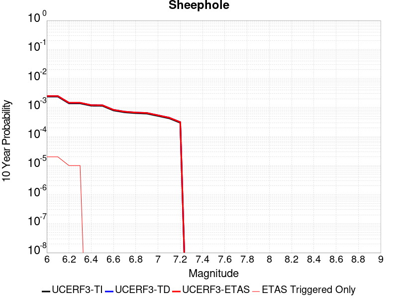 |

| Magnitude | 1 wk TI Prob | 1 wk TD Prob | 1 wk ETAS Prob | 1 wk ETAS/TD Gain | 1 wk ETAS Triggered Only | 1 mo TI Prob | 1 mo TD Prob | 1 mo ETAS Prob | 1 mo ETAS/TD Gain | 1 mo ETAS Triggered Only | 1 yr TI Prob | 1 yr TD Prob | 1 yr ETAS Prob | 1 yr ETAS/TD Gain | 1 yr ETAS Triggered Only | 10 yr TI Prob | 10 yr TD Prob | 10 yr ETAS Prob | 10 yr ETAS/TD Gain | 10 yr ETAS Triggered Only |
|-----|-----|-----|-----|-----|-----|-----|-----|-----|-----|-----|-----|-----|-----|-----|-----|-----|-----|-----|-----|-----|
| 6.0 | 4.5579695E-6 | 4.7412627E-6 | 1.4741215E-5 | 3.1091328 | 1.0E-5 | 1.9534009E-5 | 2.031957E-5 | 3.0319366E-5 | 1.4921265 | 1.0E-5 | 2.3780059E-4 | 2.473682E-4 | 2.5736575E-4 | 1.0404155 | 1.0E-5 | 0.0023754628 | 0.002471473 | 0.0024914236 | 1.0080724 | 2.0E-5 |
| 6.1 | 4.5579695E-6 | 4.7412627E-6 | 1.4741215E-5 | 3.1091328 | 1.0E-5 | 1.9534009E-5 | 2.031957E-5 | 3.0319366E-5 | 1.4921265 | 1.0E-5 | 2.3780059E-4 | 2.473682E-4 | 2.5736575E-4 | 1.0404155 | 1.0E-5 | 0.0023754628 | 0.002471473 | 0.0024914236 | 1.0080724 | 2.0E-5 |
| 6.2 | 2.6677674E-6 | 2.7873941E-6 | 2.7873941E-6 | 1.0 | 0.0 | 1.1433239E-5 | 1.1945926E-5 | 1.1945926E-5 | 1.0 | 0.0 | 1.3919079E-4 | 1.4543302E-4 | 1.4543302E-4 | 1.0 | 0.0 | 0.0013910364 | 0.0014534844 | 0.0014634698 | 1.00687 | 1.0E-5 |
| 6.3 | 2.6677674E-6 | 2.7873941E-6 | 2.7873941E-6 | 1.0 | 0.0 | 1.1433239E-5 | 1.1945926E-5 | 1.1945926E-5 | 1.0 | 0.0 | 1.3919079E-4 | 1.4543302E-4 | 1.4543302E-4 | 1.0 | 0.0 | 0.0013910364 | 0.0014534844 | 0.0014634698 | 1.00687 | 1.0E-5 |
| 6.4 | 2.2159759E-6 | 2.3228788E-6 | 2.3228788E-6 | 1.0 | 0.0 | 9.497005E-6 | 9.955161E-6 | 9.955161E-6 | 1.0 | 0.0 | 1.156199E-4 | 1.2119815E-4 | 1.2119815E-4 | 1.0 | 0.0 | 0.0011555976 | 0.0012113999 | 0.0012113999 | 1.0 | 0.0 |
| 6.5 | 2.1986082E-6 | 2.304759E-6 | 2.304759E-6 | 1.0 | 0.0 | 9.4225725E-6 | 9.877506E-6 | 9.877506E-6 | 1.0 | 0.0 | 1.1471378E-4 | 1.2025281E-4 | 1.2025281E-4 | 1.0 | 0.0 | 0.0011465458 | 0.0012019566 | 0.0012019566 | 1.0 | 0.0 |
| 6.6 | 1.5232331E-6 | 1.6018919E-6 | 1.6018919E-6 | 1.0 | 0.0 | 6.5281256E-6 | 6.865234E-6 | 6.865234E-6 | 1.0 | 0.0 | 7.947703E-5 | 8.35812E-5 | 8.35812E-5 | 1.0 | 0.0 | 7.9448614E-4 | 8.3551643E-4 | 8.3551643E-4 | 1.0 | 0.0 |
| 6.7 | 1.3137362E-6 | 1.382819E-6 | 1.382819E-6 | 1.0 | 0.0 | 5.6302856E-6 | 5.926355E-6 | 5.926355E-6 | 1.0 | 0.0 | 6.854657E-5 | 7.215112E-5 | 7.215112E-5 | 1.0 | 0.0 | 6.8525434E-4 | 7.212908E-4 | 7.212908E-4 | 1.0 | 0.0 |
| 6.8 | 1.2275751E-6 | 1.2922847E-6 | 1.2922847E-6 | 1.0 | 0.0 | 5.2610258E-6 | 5.5383516E-6 | 5.5383516E-6 | 1.0 | 0.0 | 6.4051106E-5 | 6.7427485E-5 | 6.7427485E-5 | 1.0 | 0.0 | 6.4032647E-4 | 6.740836E-4 | 6.740836E-4 | 1.0 | 0.0 |
| 6.9 | 1.1837088E-6 | 1.246102E-6 | 1.246102E-6 | 1.0 | 0.0 | 5.0730278E-6 | 5.340427E-6 | 5.340427E-6 | 1.0 | 0.0 | 6.176237E-5 | 6.501789E-5 | 6.501789E-5 | 1.0 | 0.0 | 6.17452E-4 | 6.5000186E-4 | 6.5000186E-4 | 1.0 | 0.0 |
| 7.0 | 9.849371E-7 | 1.0366288E-6 | 1.0366288E-6 | 1.0 | 0.0 | 4.2211523E-6 | 4.442688E-6 | 4.442688E-6 | 1.0 | 0.0 | 5.1391315E-5 | 5.4088487E-5 | 5.4088487E-5 | 1.0 | 0.0 | 5.137943E-4 | 5.407633E-4 | 5.407633E-4 | 1.0 | 0.0 |
| 7.1 | 8.1643645E-7 | 8.591669E-7 | 8.591669E-7 | 1.0 | 0.0 | 3.4990085E-6 | 3.682139E-6 | 3.682139E-6 | 1.0 | 0.0 | 4.2599597E-5 | 4.482921E-5 | 4.482921E-5 | 1.0 | 0.0 | 4.259143E-4 | 4.4821028E-4 | 4.4821028E-4 | 1.0 | 0.0 |
| 7.2 | 5.7295756E-7 | 6.029502E-7 | 6.029502E-7 | 1.0 | 0.0 | 2.45553E-6 | 2.58407E-6 | 2.58407E-6 | 1.0 | 0.0 | 2.9895667E-5 | 3.1460666E-5 | 3.1460666E-5 | 1.0 | 0.0 | 2.9891645E-4 | 3.145688E-4 | 3.145688E-4 | 1.0 | 0.0 |

## Pittville 2011 CFM
*[(top)](#table-of-contents)*

| 1 Week | 1 Month | 1 Year | 10 Year |
|-----|-----|-----|-----|
|  |  |  |  |

| Magnitude | 1 wk TI Prob | 1 wk TD Prob | 1 wk ETAS Prob | 1 wk ETAS/TD Gain | 1 wk ETAS Triggered Only | 1 mo TI Prob | 1 mo TD Prob | 1 mo ETAS Prob | 1 mo ETAS/TD Gain | 1 mo ETAS Triggered Only | 1 yr TI Prob | 1 yr TD Prob | 1 yr ETAS Prob | 1 yr ETAS/TD Gain | 1 yr ETAS Triggered Only | 10 yr TI Prob | 10 yr TD Prob | 10 yr ETAS Prob | 10 yr ETAS/TD Gain | 10 yr ETAS Triggered Only |
|-----|-----|-----|-----|-----|-----|-----|-----|-----|-----|-----|-----|-----|-----|-----|-----|-----|-----|-----|-----|-----|
| 6.0 | 2.5031832E-5 | 2.7056969E-5 | 3.70567E-5 | 1.3695805 | 1.0E-5 | 1.0727487E-4 | 1.1595384E-4 | 1.2595268E-4 | 1.0862312 | 1.0E-5 | 0.001305289 | 0.0014109211 | 0.001420907 | 1.0070776 | 1.0E-5 | 0.012976485 | 0.014029415 | 0.014039275 | 1.0007027 | 1.0E-5 |
| 6.1 | 1.2540113E-5 | 1.3513067E-5 | 2.3512932E-5 | 1.7400144 | 1.0E-5 | 5.3742235E-5 | 5.7911984E-5 | 6.79114E-5 | 1.1726658 | 1.0E-5 | 6.541153E-4 | 7.048728E-4 | 7.1486575E-4 | 1.014177 | 1.0E-5 | 0.0065219323 | 0.0070286044 | 0.007038534 | 1.0014127 | 1.0E-5 |
| 6.2 | 6.603218E-6 | 7.107189E-6 | 1.7107119E-5 | 2.407016 | 1.0E-5 | 2.8299199E-5 | 3.0459063E-5 | 4.045876E-5 | 1.3282995 | 1.0E-5 | 3.4448825E-4 | 3.7078248E-4 | 3.8077877E-4 | 1.02696 | 1.0E-5 | 0.0034395473 | 0.0037022792 | 0.0037122422 | 1.002691 | 1.0E-5 |
| 6.3 | 6.603218E-6 | 7.107189E-6 | 1.7107119E-5 | 2.407016 | 1.0E-5 | 2.8299199E-5 | 3.0459063E-5 | 4.045876E-5 | 1.3282995 | 1.0E-5 | 3.4448825E-4 | 3.7078248E-4 | 3.8077877E-4 | 1.02696 | 1.0E-5 | 0.0034395473 | 0.0037022792 | 0.0037122422 | 1.002691 | 1.0E-5 |
| 6.4 | 3.9389015E-6 | 4.239175E-6 | 4.239175E-6 | 1.0 | 0.0 | 1.6880897E-5 | 1.8167784E-5 | 1.8167784E-5 | 1.0 | 0.0 | 2.0550552E-4 | 2.2117342E-4 | 2.2117342E-4 | 1.0 | 0.0 | 0.0020531558 | 0.002209838 | 0.002209838 | 1.0 | 0.0 |
| 6.5 | 2.4533072E-6 | 2.6412686E-6 | 2.6412686E-6 | 1.0 | 0.0 | 1.0514132E-5 | 1.1319685E-5 | 1.1319685E-5 | 1.0 | 0.0 | 1.2800204E-4 | 1.3781038E-4 | 1.3781038E-4 | 1.0 | 0.0 | 0.0012792832 | 0.0013774394 | 0.0013774394 | 1.0 | 0.0 |
| 6.6 | 1.3482367E-6 | 1.452993E-6 | 1.452993E-6 | 1.0 | 0.0 | 5.778144E-6 | 6.2271047E-6 | 6.2271047E-6 | 1.0 | 0.0 | 7.0346636E-5 | 7.58135E-5 | 7.58135E-5 | 1.0 | 0.0 | 7.032437E-4 | 7.5798744E-4 | 7.5798744E-4 | 1.0 | 0.0 |

## Santa Susana East (connector)
*[(top)](#table-of-contents)*

| 1 Week | 1 Month | 1 Year | 10 Year |
|-----|-----|-----|-----|
|  |  |  |  |

| Magnitude | 1 wk TI Prob | 1 wk TD Prob | 1 wk ETAS Prob | 1 wk ETAS/TD Gain | 1 wk ETAS Triggered Only | 1 mo TI Prob | 1 mo TD Prob | 1 mo ETAS Prob | 1 mo ETAS/TD Gain | 1 mo ETAS Triggered Only | 1 yr TI Prob | 1 yr TD Prob | 1 yr ETAS Prob | 1 yr ETAS/TD Gain | 1 yr ETAS Triggered Only | 10 yr TI Prob | 10 yr TD Prob | 10 yr ETAS Prob | 10 yr ETAS/TD Gain | 10 yr ETAS Triggered Only |
|-----|-----|-----|-----|-----|-----|-----|-----|-----|-----|-----|-----|-----|-----|-----|-----|-----|-----|-----|-----|-----|
| 6.0 | 2.858397E-5 | 3.2021693E-5 | 5.2021052E-5 | 1.6245567 | 2.0E-5 | 1.2249697E-4 | 1.3723019E-4 | 1.5722745E-4 | 1.1457205 | 2.0E-5 | 0.0014903803 | 0.00166977 | 0.0016897366 | 1.0119576 | 2.0E-5 | 0.014804244 | 0.016599316 | 0.016618984 | 1.0011848 | 2.0E-5 |
| 6.1 | 2.858397E-5 | 3.2021693E-5 | 5.2021052E-5 | 1.6245567 | 2.0E-5 | 1.2249697E-4 | 1.3723019E-4 | 1.5722745E-4 | 1.1457205 | 2.0E-5 | 0.0014903803 | 0.00166977 | 0.0016897366 | 1.0119576 | 2.0E-5 | 0.014804244 | 0.016599316 | 0.016618984 | 1.0011848 | 2.0E-5 |
| 6.2 | 2.858397E-5 | 3.2021693E-5 | 5.2021052E-5 | 1.6245567 | 2.0E-5 | 1.2249697E-4 | 1.3723019E-4 | 1.5722745E-4 | 1.1457205 | 2.0E-5 | 0.0014903803 | 0.00166977 | 0.0016897366 | 1.0119576 | 2.0E-5 | 0.014804244 | 0.016599316 | 0.016618984 | 1.0011848 | 2.0E-5 |
| 6.3 | 1.943582E-5 | 2.0367343E-5 | 3.0367139E-5 | 1.490972 | 1.0E-5 | 8.329371E-5 | 8.7286324E-5 | 9.7285454E-5 | 1.1145555 | 1.0E-5 | 0.001013629 | 0.001062305 | 0.0010722943 | 1.0094035 | 1.0E-5 | 0.010090181 | 0.010583852 | 0.010593747 | 1.0009348 | 1.0E-5 |
| 6.4 | 1.943582E-5 | 2.0367343E-5 | 3.0367139E-5 | 1.490972 | 1.0E-5 | 8.329371E-5 | 8.7286324E-5 | 9.7285454E-5 | 1.1145555 | 1.0E-5 | 0.001013629 | 0.001062305 | 0.0010722943 | 1.0094035 | 1.0E-5 | 0.010090181 | 0.010583852 | 0.010593747 | 1.0009348 | 1.0E-5 |
| 6.5 | 1.943582E-5 | 2.0367343E-5 | 3.0367139E-5 | 1.490972 | 1.0E-5 | 8.329371E-5 | 8.7286324E-5 | 9.7285454E-5 | 1.1145555 | 1.0E-5 | 0.001013629 | 0.001062305 | 0.0010722943 | 1.0094035 | 1.0E-5 | 0.010090181 | 0.010583852 | 0.010593747 | 1.0009348 | 1.0E-5 |
| 6.6 | 1.943582E-5 | 2.0367343E-5 | 3.0367139E-5 | 1.490972 | 1.0E-5 | 8.329371E-5 | 8.7286324E-5 | 9.7285454E-5 | 1.1145555 | 1.0E-5 | 0.001013629 | 0.001062305 | 0.0010722943 | 1.0094035 | 1.0E-5 | 0.010090181 | 0.010583852 | 0.010593747 | 1.0009348 | 1.0E-5 |
| 6.7 | 1.9404439E-5 | 2.0354766E-5 | 3.0354562E-5 | 1.4912754 | 1.0E-5 | 8.3159226E-5 | 8.723242E-5 | 9.7231554E-5 | 1.1146263 | 1.0E-5 | 0.0010119933 | 0.0010616493 | 0.0010716388 | 1.0094093 | 1.0E-5 | 0.010073971 | 0.010577358 | 0.010587253 | 1.0009354 | 1.0E-5 |
| 6.8 | 1.2217526E-5 | 1.1593157E-5 | 2.1593041E-5 | 1.8625678 | 1.0E-5 | 5.2359774E-5 | 4.9684106E-5 | 5.968361E-5 | 1.2012616 | 1.0E-5 | 6.372938E-4 | 6.047529E-4 | 6.147469E-4 | 1.0165256 | 1.0E-5 | 0.0063546924 | 0.006033274 | 0.006043214 | 1.0016475 | 1.0E-5 |
| 6.9 | 1.2217526E-5 | 1.1593157E-5 | 2.1593041E-5 | 1.8625678 | 1.0E-5 | 5.2359774E-5 | 4.9684106E-5 | 5.968361E-5 | 1.2012616 | 1.0E-5 | 6.372938E-4 | 6.047529E-4 | 6.147469E-4 | 1.0165256 | 1.0E-5 | 0.0063546924 | 0.006033274 | 0.006043214 | 1.0016475 | 1.0E-5 |
| 7.0 | 9.276017E-6 | 8.059273E-6 | 1.8059192E-5 | 2.2407968 | 1.0E-5 | 3.9753755E-5 | 3.4539302E-5 | 4.453896E-5 | 1.2895153 | 1.0E-5 | 4.8389446E-4 | 4.2043833E-4 | 4.3043413E-4 | 1.0237747 | 1.0E-5 | 0.0048284214 | 0.0041973097 | 0.004207268 | 1.0023725 | 1.0E-5 |
| 7.1 | 9.130355E-6 | 7.942446E-6 | 1.7942368E-5 | 2.259048 | 1.0E-5 | 3.9129503E-5 | 3.4038632E-5 | 4.403829E-5 | 1.2937739 | 1.0E-5 | 4.7629757E-4 | 4.1434498E-4 | 4.2434083E-4 | 1.0241245 | 1.0E-5 | 0.00475278 | 0.0041366047 | 0.0041465634 | 1.0024074 | 1.0E-5 |
| 7.2 | 8.851015E-6 | 7.741608E-6 | 1.7741531E-5 | 2.2917113 | 1.0E-5 | 3.7932372E-5 | 3.317792E-5 | 4.3177588E-5 | 1.3013953 | 1.0E-5 | 4.6172875E-4 | 4.038697E-4 | 4.1386567E-4 | 1.0247505 | 1.0E-5 | 0.0046077054 | 0.0040322347 | 0.004042194 | 1.00247 | 1.0E-5 |
| 7.3 | 8.573006E-6 | 7.5503312E-6 | 1.7550256E-5 | 2.3244352 | 1.0E-5 | 3.6740938E-5 | 3.235818E-5 | 4.2357857E-5 | 1.3090309 | 1.0E-5 | 4.472291E-4 | 3.9389305E-4 | 4.038891E-4 | 1.0253776 | 1.0E-5 | 0.004463301 | 0.003932817 | 0.0039427774 | 1.0025327 | 1.0E-5 |
| 7.4 | 7.852282E-6 | 6.8178556E-6 | 1.6817787E-5 | 2.4667268 | 1.0E-5 | 3.36522E-5 | 2.921907E-5 | 3.921878E-5 | 1.3422322 | 1.0E-5 | 4.096385E-4 | 3.5568717E-4 | 3.656836E-4 | 1.0281045 | 1.0E-5 | 0.0040888423 | 0.0035519868 | 0.0035619512 | 1.0028054 | 1.0E-5 |
| 7.5 | 4.8869324E-6 | 4.2790975E-6 | 4.2790975E-6 | 1.0 | 0.0 | 2.0943828E-5 | 1.833887E-5 | 1.833887E-5 | 1.0 | 0.0 | 2.5496128E-4 | 2.2325452E-4 | 2.2325452E-4 | 1.0 | 0.0 | 0.0025466895 | 0.00223057 | 0.00223057 | 1.0 | 0.0 |
| 7.6 | 1.3894544E-6 | 1.1568394E-6 | 1.1568394E-6 | 1.0 | 0.0 | 5.954791E-6 | 4.957875E-6 | 4.957875E-6 | 1.0 | 0.0 | 7.249717E-5 | 6.036068E-5 | 6.036068E-5 | 1.0 | 0.0 | 7.247352E-4 | 6.0346466E-4 | 6.0346466E-4 | 1.0 | 0.0 |
| 7.7 | 2.9924632E-7 | 2.3719332E-7 | 2.3719332E-7 | 1.0 | 0.0 | 1.2824837E-6 | 1.0165425E-6 | 1.0165425E-6 | 1.0 | 0.0 | 1.5614127E-5 | 1.2376341E-5 | 1.2376341E-5 | 1.0 | 0.0 | 1.5613029E-4 | 1.2375724E-4 | 1.2375724E-4 | 1.0 | 0.0 |
| 7.8 | 4.8188564E-8 | 2.6321862E-8 | 2.6321862E-8 | 1.0 | 0.0 | 2.065224E-7 | 1.12807975E-7 | 1.12807975E-7 | 1.0 | 0.0 | 2.5144072E-6 | 1.3734362E-6 | 1.3734362E-6 | 1.0 | 0.0 | 2.5143789E-5 | 1.3734286E-5 | 1.3734286E-5 | 1.0 | 0.0 |
| 7.9 | 2.6127251E-9 | 2.7681102E-9 | 2.7681102E-9 | 1.0 | 0.0 | 1.1197393E-8 | 1.186333E-8 | 1.186333E-8 | 1.0 | 0.0 | 1.3632825E-7 | 1.4443603E-7 | 1.4443603E-7 | 1.0 | 0.0 | 1.3632817E-6 | 1.4443604E-6 | 1.4443604E-6 | 1.0 | 0.0 |

## Newport-Inglewood (Offshore)
*[(top)](#table-of-contents)*

| 1 Week | 1 Month | 1 Year | 10 Year |
|-----|-----|-----|-----|
|  |  |  |  |

| Magnitude | 1 wk TI Prob | 1 wk TD Prob | 1 wk ETAS Prob | 1 wk ETAS/TD Gain | 1 wk ETAS Triggered Only | 1 mo TI Prob | 1 mo TD Prob | 1 mo ETAS Prob | 1 mo ETAS/TD Gain | 1 mo ETAS Triggered Only | 1 yr TI Prob | 1 yr TD Prob | 1 yr ETAS Prob | 1 yr ETAS/TD Gain | 1 yr ETAS Triggered Only | 10 yr TI Prob | 10 yr TD Prob | 10 yr ETAS Prob | 10 yr ETAS/TD Gain | 10 yr ETAS Triggered Only |
|-----|-----|-----|-----|-----|-----|-----|-----|-----|-----|-----|-----|-----|-----|-----|-----|-----|-----|-----|-----|-----|
| 6.0 | 1.9626508E-5 | 1.8965342E-5 | 2.8965153E-5 | 1.5272676 | 1.0E-5 | 8.411089E-5 | 8.1277576E-5 | 9.1276765E-5 | 1.1230252 | 1.0E-5 | 0.001023569 | 9.891179E-4 | 0.0010090981 | 1.0202 | 2.0E-5 | 0.010188672 | 0.009848497 | 0.0098683 | 1.0020108 | 2.0E-5 |
| 6.1 | 1.331886E-5 | 1.2218078E-5 | 2.2217957E-5 | 1.8184493 | 1.0E-5 | 5.707958E-5 | 5.2362153E-5 | 6.236163E-5 | 1.1909677 | 1.0E-5 | 6.947222E-4 | 6.3732424E-4 | 6.5731147E-4 | 1.0313612 | 2.0E-5 | 0.006925544 | 0.006355142 | 0.006375015 | 1.0031271 | 2.0E-5 |
| 6.2 | 1.2250852E-5 | 1.1076016E-5 | 1.1076016E-5 | 1.0 | 0.0 | 5.2502597E-5 | 4.746778E-5 | 4.746778E-5 | 1.0 | 0.0 | 6.3903164E-4 | 5.7776796E-4 | 5.877622E-4 | 1.017298 | 1.0E-5 | 0.006371971 | 0.0057627796 | 0.005772722 | 1.0017253 | 1.0E-5 |
| 6.3 | 1.2106258E-5 | 1.0918878E-5 | 1.0918878E-5 | 1.0 | 0.0 | 5.1882926E-5 | 4.6794354E-5 | 4.6794354E-5 | 1.0 | 0.0 | 6.3149154E-4 | 5.695733E-4 | 5.795676E-4 | 1.017547 | 1.0E-5 | 0.0062970007 | 0.005681252 | 0.0056911954 | 1.0017502 | 1.0E-5 |
| 6.4 | 1.1348758E-5 | 1.0109348E-5 | 1.0109348E-5 | 1.0 | 0.0 | 4.8636626E-5 | 4.3325064E-5 | 4.3325064E-5 | 1.0 | 0.0 | 5.919901E-4 | 5.2735576E-4 | 5.3735054E-4 | 1.0189525 | 1.0E-5 | 0.005904155 | 0.0052611395 | 0.005271087 | 1.0018908 | 1.0E-5 |
| 6.5 | 1.100837E-5 | 9.743376E-6 | 9.743376E-6 | 1.0 | 0.0 | 4.7177873E-5 | 4.175666E-5 | 4.175666E-5 | 1.0 | 0.0 | 5.7423924E-4 | 5.082695E-4 | 5.182644E-4 | 1.0196646 | 1.0E-5 | 0.005727576 | 0.005071162 | 0.005081111 | 1.001962 | 1.0E-5 |
| 6.6 | 1.0634696E-5 | 9.34553E-6 | 9.34553E-6 | 1.0 | 0.0 | 4.557647E-5 | 4.0051662E-5 | 4.0051662E-5 | 1.0 | 0.0 | 5.5475225E-4 | 4.875206E-4 | 4.975157E-4 | 1.020502 | 1.0E-5 | 0.0055336943 | 0.0048645977 | 0.004874549 | 1.0020456 | 1.0E-5 |
| 6.7 | 9.9780855E-6 | 8.667898E-6 | 8.667898E-6 | 1.0 | 0.0 | 4.276252E-5 | 3.7147613E-5 | 3.7147613E-5 | 1.0 | 0.0 | 5.205093E-4 | 4.5217903E-4 | 4.621745E-4 | 1.0221051 | 1.0E-5 | 0.0051929182 | 0.0045126686 | 0.0045226235 | 1.002206 | 1.0E-5 |
| 6.8 | 9.59546E-6 | 8.272933E-6 | 8.272933E-6 | 1.0 | 0.0 | 4.1122752E-5 | 3.545495E-5 | 3.545495E-5 | 1.0 | 0.0 | 5.0055445E-4 | 4.3157916E-4 | 4.4157484E-4 | 1.0231607 | 1.0E-5 | 0.004994285 | 0.004307486 | 0.004317443 | 1.0023116 | 1.0E-5 |
| 6.9 | 9.000614E-6 | 7.706823E-6 | 7.706823E-6 | 1.0 | 0.0 | 3.857349E-5 | 3.3028828E-5 | 3.3028828E-5 | 1.0 | 0.0 | 4.6953102E-4 | 4.0205245E-4 | 4.1204842E-4 | 1.0248624 | 1.0E-5 | 0.004685402 | 0.0040133223 | 0.004023282 | 1.0024817 | 1.0E-5 |
| 7.0 | 7.4070194E-6 | 6.148865E-6 | 6.148865E-6 | 1.0 | 0.0 | 3.1743984E-5 | 2.6352012E-5 | 2.6352012E-5 | 1.0 | 0.0 | 3.8641447E-4 | 3.2078868E-4 | 3.3078546E-4 | 1.0311632 | 1.0E-5 | 0.0038574322 | 0.0032032758 | 0.0032132438 | 1.0031118 | 1.0E-5 |
| 7.1 | 6.299615E-6 | 5.0565613E-6 | 5.0565613E-6 | 1.0 | 0.0 | 2.699807E-5 | 2.1670798E-5 | 2.1670798E-5 | 1.0 | 0.0 | 3.2865192E-4 | 2.6381016E-4 | 2.6381016E-4 | 1.0 | 0.0 | 0.003281663 | 0.0026349847 | 0.0026349847 | 1.0 | 0.0 |
| 7.2 | 5.096653E-6 | 3.892733E-6 | 3.892733E-6 | 1.0 | 0.0 | 2.1842614E-5 | 1.6683034E-5 | 1.6683034E-5 | 1.0 | 0.0 | 2.6590136E-4 | 2.0309711E-4 | 2.0309711E-4 | 1.0 | 0.0 | 0.0026558342 | 0.0020291263 | 0.0020291263 | 1.0 | 0.0 |
| 7.3 | 3.9753018E-6 | 2.9098787E-6 | 2.9098787E-6 | 1.0 | 0.0 | 1.7036897E-5 | 1.24708495E-5 | 1.24708495E-5 | 1.0 | 0.0 | 2.0740448E-4 | 1.518221E-4 | 1.518221E-4 | 1.0 | 0.0 | 0.00207211 | 0.0015171919 | 0.0015171919 | 1.0 | 0.0 |
| 7.4 | 3.0568392E-6 | 2.1449732E-6 | 2.1449732E-6 | 1.0 | 0.0 | 1.3100675E-5 | 9.19271E-6 | 9.19271E-6 | 1.0 | 0.0 | 1.5948903E-4 | 1.11915564E-4 | 1.11915564E-4 | 1.0 | 0.0 | 0.0015937461 | 0.0011185983 | 0.0011185983 | 1.0 | 0.0 |
| 7.5 | 1.7279019E-6 | 1.1469651E-6 | 1.1469651E-6 | 1.0 | 0.0 | 7.405273E-6 | 4.9155556E-6 | 4.9155556E-6 | 1.0 | 0.0 | 9.015547E-5 | 5.9845286E-5 | 5.9845286E-5 | 1.0 | 0.0 | 9.01189E-4 | 5.982956E-4 | 5.982956E-4 | 1.0 | 0.0 |
| 7.6 | 1.1156416E-6 | 7.222962E-7 | 7.222962E-7 | 1.0 | 0.0 | 4.7813123E-6 | 3.0955514E-6 | 3.0955514E-6 | 1.0 | 0.0 | 5.821092E-5 | 3.768771E-5 | 3.768771E-5 | 1.0 | 0.0 | 5.8195676E-4 | 3.7681553E-4 | 3.7681553E-4 | 1.0 | 0.0 |
| 7.7 | 9.117973E-8 | 6.7342256E-8 | 6.7342256E-8 | 1.0 | 0.0 | 3.907702E-7 | 2.8860964E-7 | 2.8860964E-7 | 1.0 | 0.0 | 4.757617E-6 | 3.5138169E-6 | 3.5138169E-6 | 1.0 | 0.0 | 4.7575148E-5 | 3.5137644E-5 | 3.5137644E-5 | 1.0 | 0.0 |

## San Cayetano
*[(top)](#table-of-contents)*

| 1 Week | 1 Month | 1 Year | 10 Year |
|-----|-----|-----|-----|
|  |  |  |  |

| Magnitude | 1 wk TI Prob | 1 wk TD Prob | 1 wk ETAS Prob | 1 wk ETAS/TD Gain | 1 wk ETAS Triggered Only | 1 mo TI Prob | 1 mo TD Prob | 1 mo ETAS Prob | 1 mo ETAS/TD Gain | 1 mo ETAS Triggered Only | 1 yr TI Prob | 1 yr TD Prob | 1 yr ETAS Prob | 1 yr ETAS/TD Gain | 1 yr ETAS Triggered Only | 10 yr TI Prob | 10 yr TD Prob | 10 yr ETAS Prob | 10 yr ETAS/TD Gain | 10 yr ETAS Triggered Only |
|-----|-----|-----|-----|-----|-----|-----|-----|-----|-----|-----|-----|-----|-----|-----|-----|-----|-----|-----|-----|-----|
| 6.0 | 2.3476267E-5 | 1.8169216E-5 | 2.8169034E-5 | 1.5503715 | 1.0E-5 | 1.0060869E-4 | 7.786576E-5 | 8.786499E-5 | 1.1284162 | 1.0E-5 | 0.0012242225 | 9.4760704E-4 | 9.6758804E-4 | 1.0210857 | 2.0E-5 | 0.012175002 | 0.00943675 | 0.009456561 | 1.0020994 | 2.0E-5 |
| 6.1 | 2.3476267E-5 | 1.8169216E-5 | 2.8169034E-5 | 1.5503715 | 1.0E-5 | 1.0060869E-4 | 7.786576E-5 | 8.786499E-5 | 1.1284162 | 1.0E-5 | 0.0012242225 | 9.4760704E-4 | 9.6758804E-4 | 1.0210857 | 2.0E-5 | 0.012175002 | 0.00943675 | 0.009456561 | 1.0020994 | 2.0E-5 |
| 6.2 | 2.3476267E-5 | 1.8169216E-5 | 2.8169034E-5 | 1.5503715 | 1.0E-5 | 1.0060869E-4 | 7.786576E-5 | 8.786499E-5 | 1.1284162 | 1.0E-5 | 0.0012242225 | 9.4760704E-4 | 9.6758804E-4 | 1.0210857 | 2.0E-5 | 0.012175002 | 0.00943675 | 0.009456561 | 1.0020994 | 2.0E-5 |
| 6.3 | 2.3476267E-5 | 1.8169216E-5 | 2.8169034E-5 | 1.5503715 | 1.0E-5 | 1.0060869E-4 | 7.786576E-5 | 8.786499E-5 | 1.1284162 | 1.0E-5 | 0.0012242225 | 9.4760704E-4 | 9.6758804E-4 | 1.0210857 | 2.0E-5 | 0.012175002 | 0.00943675 | 0.009456561 | 1.0020994 | 2.0E-5 |
| 6.4 | 2.3476267E-5 | 1.8169216E-5 | 2.8169034E-5 | 1.5503715 | 1.0E-5 | 1.0060869E-4 | 7.786576E-5 | 8.786499E-5 | 1.1284162 | 1.0E-5 | 0.0012242225 | 9.4760704E-4 | 9.6758804E-4 | 1.0210857 | 2.0E-5 | 0.012175002 | 0.00943675 | 0.009456561 | 1.0020994 | 2.0E-5 |
| 6.5 | 2.3476267E-5 | 1.8169216E-5 | 2.8169034E-5 | 1.5503715 | 1.0E-5 | 1.0060869E-4 | 7.786576E-5 | 8.786499E-5 | 1.1284162 | 1.0E-5 | 0.0012242225 | 9.4760704E-4 | 9.6758804E-4 | 1.0210857 | 2.0E-5 | 0.012175002 | 0.00943675 | 0.009456561 | 1.0020994 | 2.0E-5 |
| 6.6 | 2.3476267E-5 | 1.8169216E-5 | 2.8169034E-5 | 1.5503715 | 1.0E-5 | 1.0060869E-4 | 7.786576E-5 | 8.786499E-5 | 1.1284162 | 1.0E-5 | 0.0012242225 | 9.4760704E-4 | 9.6758804E-4 | 1.0210857 | 2.0E-5 | 0.012175002 | 0.00943675 | 0.009456561 | 1.0020994 | 2.0E-5 |
| 6.7 | 2.3476267E-5 | 1.8169216E-5 | 2.8169034E-5 | 1.5503715 | 1.0E-5 | 1.0060869E-4 | 7.786576E-5 | 8.786499E-5 | 1.1284162 | 1.0E-5 | 0.0012242225 | 9.4760704E-4 | 9.6758804E-4 | 1.0210857 | 2.0E-5 | 0.012175002 | 0.00943675 | 0.009456561 | 1.0020994 | 2.0E-5 |
| 6.8 | 2.3241924E-5 | 1.7936945E-5 | 2.7936767E-5 | 1.5574985 | 1.0E-5 | 9.960445E-5 | 7.687038E-5 | 8.6869615E-5 | 1.1300792 | 1.0E-5 | 0.0012120095 | 9.354987E-4 | 9.5548E-4 | 1.021359 | 2.0E-5 | 0.012054204 | 0.0093166195 | 0.009336432 | 1.0021267 | 2.0E-5 |
| 6.9 | 2.2761007E-5 | 1.7432383E-5 | 2.743221E-5 | 1.573635 | 1.0E-5 | 9.7543525E-5 | 7.47081E-5 | 8.470735E-5 | 1.1338443 | 1.0E-5 | 0.0011869454 | 9.09195E-4 | 9.291768E-4 | 1.0219774 | 2.0E-5 | 0.011806256 | 0.009055741 | 0.00907556 | 1.0021886 | 2.0E-5 |
| 7.0 | 2.240283E-5 | 1.7066137E-5 | 2.7065966E-5 | 1.5859457 | 1.0E-5 | 9.600859E-5 | 7.313856E-5 | 8.313783E-5 | 1.1367168 | 1.0E-5 | 0.0011682777 | 8.9010154E-4 | 9.1008376E-4 | 1.0224494 | 2.0E-5 | 0.011621549 | 0.008866336 | 0.008886159 | 1.0022358 | 2.0E-5 |
| 7.1 | 2.1871154E-5 | 1.658602E-5 | 2.6585854E-5 | 1.6029074 | 1.0E-5 | 9.373015E-5 | 7.108103E-5 | 8.108031E-5 | 1.1406745 | 1.0E-5 | 0.0011405671 | 8.6507126E-4 | 8.8505395E-4 | 1.0230995 | 2.0E-5 | 0.011347309 | 0.008617996 | 0.008637824 | 1.0023007 | 2.0E-5 |
| 7.2 | 2.0714133E-5 | 1.5564563E-5 | 2.5564406E-5 | 1.6424751 | 1.0E-5 | 8.8771834E-5 | 6.670358E-5 | 7.670291E-5 | 1.149907 | 1.0E-5 | 0.0010802611 | 8.118168E-4 | 8.318005E-4 | 1.0246161 | 2.0E-5 | 0.010750249 | 0.008089443 | 0.008109281 | 1.0024524 | 2.0E-5 |
| 7.3 | 1.8408395E-5 | 1.3996829E-5 | 2.3996688E-5 | 1.7144376 | 1.0E-5 | 7.8890735E-5 | 5.9985046E-5 | 6.9984446E-5 | 1.1666982 | 1.0E-5 | 9.600714E-4 | 7.300762E-4 | 7.500616E-4 | 1.0273744 | 2.0E-5 | 0.009559342 | 0.0072776447 | 0.007297499 | 1.0027281 | 2.0E-5 |
| 7.4 | 1.6856795E-5 | 1.285006E-5 | 2.284993E-5 | 1.7781966 | 1.0E-5 | 7.2241404E-5 | 5.5070537E-5 | 6.506999E-5 | 1.1815753 | 1.0E-5 | 8.7918417E-4 | 6.7028037E-4 | 6.9026696E-4 | 1.0298183 | 2.0E-5 | 0.00875714 | 0.0066834087 | 0.006703275 | 1.0029725 | 2.0E-5 |
| 7.5 | 1.2822778E-5 | 9.577415E-6 | 1.957732E-5 | 2.0441132 | 1.0E-5 | 5.495361E-5 | 4.1045427E-5 | 5.1045015E-5 | 1.2436225 | 1.0E-5 | 6.688548E-4 | 4.9961504E-4 | 5.1960506E-4 | 1.0400108 | 2.0E-5 | 0.006668452 | 0.0049851923 | 0.0050050924 | 1.0039918 | 2.0E-5 |
| 7.6 | 5.6272684E-6 | 3.854899E-6 | 3.854899E-6 | 1.0 | 0.0 | 2.4116642E-5 | 1.6520893E-5 | 1.6520893E-5 | 1.0 | 0.0 | 2.9358055E-4 | 2.0112342E-4 | 2.0112342E-4 | 1.0 | 0.0 | 0.0029319301 | 0.0020094248 | 0.0020094248 | 1.0 | 0.0 |
| 7.7 | 3.5261346E-6 | 2.3407094E-6 | 2.3407094E-6 | 1.0 | 0.0 | 1.5111918E-5 | 1.0031574E-5 | 1.0031574E-5 | 1.0 | 0.0 | 1.8397206E-4 | 1.2212765E-4 | 1.2212765E-4 | 1.0 | 0.0 | 0.0018381984 | 0.0012206127 | 0.0012206127 | 1.0 | 0.0 |
| 7.8 | 1.4826929E-6 | 1.0564395E-6 | 1.0564395E-6 | 1.0 | 0.0 | 6.354383E-6 | 4.52759E-6 | 4.52759E-6 | 1.0 | 0.0 | 7.736187E-5 | 5.5122033E-5 | 5.5122033E-5 | 1.0 | 0.0 | 7.733494E-4 | 5.510856E-4 | 5.510856E-4 | 1.0 | 0.0 |
| 7.9 | 2.7568166E-7 | 1.6977887E-7 | 1.6977887E-7 | 1.0 | 0.0 | 1.1814923E-6 | 7.276235E-7 | 7.276235E-7 | 1.0 | 0.0 | 1.4384574E-5 | 8.85878E-6 | 8.85878E-6 | 1.0 | 0.0 | 1.4383643E-4 | 8.858431E-5 | 8.858431E-5 | 1.0 | 0.0 |
| 8.0 | 5.407832E-8 | 2.688677E-8 | 2.688677E-8 | 1.0 | 0.0 | 2.3176422E-7 | 1.15229014E-7 | 1.15229014E-7 | 1.0 | 0.0 | 2.8217257E-6 | 1.4029123E-6 | 1.4029123E-6 | 1.0 | 0.0 | 2.8216898E-5 | 1.40290385E-5 | 1.40290385E-5 | 1.0 | 0.0 |

## Great Valley 05 Pittsburg - Kirby Hills alt1
*[(top)](#table-of-contents)*

| 1 Week | 1 Month | 1 Year | 10 Year |
|-----|-----|-----|-----|
|  |  |  |  |

| Magnitude | 1 wk TI Prob | 1 wk TD Prob | 1 wk ETAS Prob | 1 wk ETAS/TD Gain | 1 wk ETAS Triggered Only | 1 mo TI Prob | 1 mo TD Prob | 1 mo ETAS Prob | 1 mo ETAS/TD Gain | 1 mo ETAS Triggered Only | 1 yr TI Prob | 1 yr TD Prob | 1 yr ETAS Prob | 1 yr ETAS/TD Gain | 1 yr ETAS Triggered Only | 10 yr TI Prob | 10 yr TD Prob | 10 yr ETAS Prob | 10 yr ETAS/TD Gain | 10 yr ETAS Triggered Only |
|-----|-----|-----|-----|-----|-----|-----|-----|-----|-----|-----|-----|-----|-----|-----|-----|-----|-----|-----|-----|-----|
| 6.0 | 4.187212E-5 | 5.344289E-5 | 6.3442356E-5 | 1.1871057 | 1.0E-5 | 1.794396E-4 | 2.2902661E-4 | 2.3902432E-4 | 1.043653 | 1.0E-5 | 0.002182488 | 0.0027857998 | 0.002805744 | 1.0071592 | 2.0E-5 | 0.021611776 | 0.027603218 | 0.027622666 | 1.0007045 | 2.0E-5 |
| 6.1 | 4.187212E-5 | 5.344289E-5 | 6.3442356E-5 | 1.1871057 | 1.0E-5 | 1.794396E-4 | 2.2902661E-4 | 2.3902432E-4 | 1.043653 | 1.0E-5 | 0.002182488 | 0.0027857998 | 0.002805744 | 1.0071592 | 2.0E-5 | 0.021611776 | 0.027603218 | 0.027622666 | 1.0007045 | 2.0E-5 |
| 6.2 | 1.7353306E-5 | 2.2154672E-5 | 2.2154672E-5 | 1.0 | 0.0 | 7.436919E-5 | 9.4947456E-5 | 9.4947456E-5 | 1.0 | 0.0 | 9.050688E-4 | 0.0011557573 | 0.0011557573 | 1.0 | 0.0 | 0.009013915 | 0.0115352 | 0.0115352 | 1.0 | 0.0 |
| 6.3 | 1.7353306E-5 | 2.2154672E-5 | 2.2154672E-5 | 1.0 | 0.0 | 7.436919E-5 | 9.4947456E-5 | 9.4947456E-5 | 1.0 | 0.0 | 9.050688E-4 | 0.0011557573 | 0.0011557573 | 1.0 | 0.0 | 0.009013915 | 0.0115352 | 0.0115352 | 1.0 | 0.0 |
| 6.4 | 1.4028824E-5 | 1.7901062E-5 | 1.7901062E-5 | 1.0 | 0.0 | 6.0122147E-5 | 7.671883E-5 | 7.671883E-5 | 1.0 | 0.0 | 7.3174125E-4 | 9.340303E-4 | 9.340303E-4 | 1.0 | 0.0 | 0.0072933645 | 0.009338211 | 0.009338211 | 1.0 | 0.0 |

## Elysian Park (Upper)
*[(top)](#table-of-contents)*

| 1 Week | 1 Month | 1 Year | 10 Year |
|-----|-----|-----|-----|
|  |  |  |  |

| Magnitude | 1 wk TI Prob | 1 wk TD Prob | 1 wk ETAS Prob | 1 wk ETAS/TD Gain | 1 wk ETAS Triggered Only | 1 mo TI Prob | 1 mo TD Prob | 1 mo ETAS Prob | 1 mo ETAS/TD Gain | 1 mo ETAS Triggered Only | 1 yr TI Prob | 1 yr TD Prob | 1 yr ETAS Prob | 1 yr ETAS/TD Gain | 1 yr ETAS Triggered Only | 10 yr TI Prob | 10 yr TD Prob | 10 yr ETAS Prob | 10 yr ETAS/TD Gain | 10 yr ETAS Triggered Only |
|-----|-----|-----|-----|-----|-----|-----|-----|-----|-----|-----|-----|-----|-----|-----|-----|-----|-----|-----|-----|-----|
| 6.0 | 3.1876025E-5 | 3.7035275E-5 | 4.7034904E-5 | 1.2700028 | 1.0E-5 | 1.3660437E-4 | 1.5871569E-4 | 1.687141E-4 | 1.0629958 | 1.0E-5 | 0.0016618895 | 0.001931122 | 0.0019510834 | 1.0103366 | 2.0E-5 | 0.016495159 | 0.019189863 | 0.019209478 | 1.0010222 | 2.0E-5 |
| 6.1 | 3.1876025E-5 | 3.7035275E-5 | 4.7034904E-5 | 1.2700028 | 1.0E-5 | 1.3660437E-4 | 1.5871569E-4 | 1.687141E-4 | 1.0629958 | 1.0E-5 | 0.0016618895 | 0.001931122 | 0.0019510834 | 1.0103366 | 2.0E-5 | 0.016495159 | 0.019189863 | 0.019209478 | 1.0010222 | 2.0E-5 |
| 6.2 | 3.1876025E-5 | 3.7035275E-5 | 4.7034904E-5 | 1.2700028 | 1.0E-5 | 1.3660437E-4 | 1.5871569E-4 | 1.687141E-4 | 1.0629958 | 1.0E-5 | 0.0016618895 | 0.001931122 | 0.0019510834 | 1.0103366 | 2.0E-5 | 0.016495159 | 0.019189863 | 0.019209478 | 1.0010222 | 2.0E-5 |
| 6.3 | 3.1876025E-5 | 3.7035275E-5 | 4.7034904E-5 | 1.2700028 | 1.0E-5 | 1.3660437E-4 | 1.5871569E-4 | 1.687141E-4 | 1.0629958 | 1.0E-5 | 0.0016618895 | 0.001931122 | 0.0019510834 | 1.0103366 | 2.0E-5 | 0.016495159 | 0.019189863 | 0.019209478 | 1.0010222 | 2.0E-5 |
| 6.4 | 1.9273462E-5 | 2.120244E-5 | 2.120244E-5 | 1.0 | 0.0 | 8.259794E-5 | 9.086542E-5 | 9.086542E-5 | 1.0 | 0.0 | 0.001005166 | 0.0011058967 | 0.0011158857 | 1.0090325 | 1.0E-5 | 0.010006315 | 0.011020744 | 0.011030634 | 1.0008974 | 1.0E-5 |
| 6.5 | 1.9273462E-5 | 2.120244E-5 | 2.120244E-5 | 1.0 | 0.0 | 8.259794E-5 | 9.086542E-5 | 9.086542E-5 | 1.0 | 0.0 | 0.001005166 | 0.0011058967 | 0.0011158857 | 1.0090325 | 1.0E-5 | 0.010006315 | 0.011020744 | 0.011030634 | 1.0008974 | 1.0E-5 |
| 6.6 | 9.813258E-6 | 9.665589E-6 | 9.665589E-6 | 1.0 | 0.0 | 4.205614E-5 | 4.1423333E-5 | 4.1423333E-5 | 1.0 | 0.0 | 5.119132E-4 | 5.042196E-4 | 5.042196E-4 | 1.0 | 0.0 | 0.005107356 | 0.0050314795 | 0.0050314795 | 1.0 | 0.0 |
| 6.7 | 9.801478E-6 | 9.653158E-6 | 9.653158E-6 | 1.0 | 0.0 | 4.2005657E-5 | 4.137006E-5 | 4.137006E-5 | 1.0 | 0.0 | 5.112989E-4 | 5.0357135E-4 | 5.0357135E-4 | 1.0 | 0.0 | 0.0051012407 | 0.005025026 | 0.005025026 | 1.0 | 0.0 |
| 6.8 | 8.102489E-6 | 7.772994E-6 | 7.772994E-6 | 1.0 | 0.0 | 3.4724493E-5 | 3.3312434E-5 | 3.3312434E-5 | 1.0 | 0.0 | 4.2268867E-4 | 4.0550836E-4 | 4.0550836E-4 | 1.0 | 0.0 | 0.004218856 | 0.0040481784 | 0.0040481784 | 1.0 | 0.0 |
| 6.9 | 6.08275E-6 | 5.481441E-6 | 5.481441E-6 | 1.0 | 0.0 | 2.6068668E-5 | 2.3491682E-5 | 2.3491682E-5 | 1.0 | 0.0 | 3.173398E-4 | 2.8597447E-4 | 2.8597447E-4 | 1.0 | 0.0 | 0.0031688702 | 0.0028561424 | 0.0028561424 | 1.0 | 0.0 |
| 7.0 | 5.5995934E-6 | 4.9827686E-6 | 4.9827686E-6 | 1.0 | 0.0 | 2.3998036E-5 | 2.1354552E-5 | 2.1354552E-5 | 1.0 | 0.0 | 2.9213692E-4 | 2.5996132E-4 | 2.5996132E-4 | 1.0 | 0.0 | 0.0029175316 | 0.0025966396 | 0.0025966396 | 1.0 | 0.0 |
| 7.1 | 4.709881E-6 | 4.0873906E-6 | 4.0873906E-6 | 1.0 | 0.0 | 2.0185047E-5 | 1.7517272E-5 | 1.7517272E-5 | 1.0 | 0.0 | 2.4572524E-4 | 2.1325232E-4 | 2.1325232E-4 | 1.0 | 0.0 | 0.002454537 | 0.0021305184 | 0.0021305184 | 1.0 | 0.0 |
| 7.2 | 3.6063436E-6 | 2.9779412E-6 | 2.9779412E-6 | 1.0 | 0.0 | 1.5455667E-5 | 1.27625435E-5 | 1.27625435E-5 | 1.0 | 0.0 | 1.881565E-4 | 1.55373E-4 | 1.55373E-4 | 1.0 | 0.0 | 0.0018799726 | 0.0015526549 | 0.0015526549 | 1.0 | 0.0 |
| 7.3 | 2.471135E-6 | 2.0954562E-6 | 2.0954562E-6 | 1.0 | 0.0 | 1.0590536E-5 | 8.980496E-6 | 8.980496E-6 | 1.0 | 0.0 | 1.2893214E-4 | 1.0933213E-4 | 1.0933213E-4 | 1.0 | 0.0 | 0.0012885736 | 0.0010927906 | 0.0010927906 | 1.0 | 0.0 |
| 7.4 | 1.163943E-6 | 1.0275061E-6 | 1.0275061E-6 | 1.0 | 0.0 | 4.988318E-6 | 4.40359E-6 | 4.40359E-6 | 1.0 | 0.0 | 6.0731076E-5 | 5.361242E-5 | 5.361242E-5 | 1.0 | 0.0 | 6.071448E-4 | 5.3599785E-4 | 5.3599785E-4 | 1.0 | 0.0 |
| 7.5 | 4.99459E-7 | 4.917601E-7 | 4.917601E-7 | 1.0 | 0.0 | 2.140537E-6 | 2.1075416E-6 | 2.1075416E-6 | 1.0 | 0.0 | 2.6060725E-5 | 2.5659032E-5 | 2.5659032E-5 | 1.0 | 0.0 | 2.605767E-4 | 2.5656226E-4 | 2.5656226E-4 | 1.0 | 0.0 |
| 7.6 | 2.4667852E-7 | 2.4778313E-7 | 2.4778313E-7 | 1.0 | 0.0 | 1.0571932E-6 | 1.0619274E-6 | 1.0619274E-6 | 1.0 | 0.0 | 1.2871251E-5 | 1.2928893E-5 | 1.2928893E-5 | 1.0 | 0.0 | 1.2870505E-4 | 1.2928178E-4 | 1.2928178E-4 | 1.0 | 0.0 |
| 7.7 | 8.2312795E-8 | 7.3864214E-8 | 7.3864214E-8 | 1.0 | 0.0 | 3.527691E-7 | 3.165609E-7 | 3.165609E-7 | 1.0 | 0.0 | 4.294955E-6 | 3.854123E-6 | 3.854123E-6 | 1.0 | 0.0 | 4.2948723E-5 | 3.854068E-5 | 3.854068E-5 | 1.0 | 0.0 |
| 7.8 | 2.7819295E-8 | 1.7565618E-8 | 1.7565618E-8 | 1.0 | 0.0 | 1.1922555E-7 | 7.528122E-8 | 7.528122E-8 | 1.0 | 0.0 | 1.45157E-6 | 9.1654863E-7 | 9.1654863E-7 | 1.0 | 0.0 | 1.45156055E-5 | 9.165463E-6 | 9.165463E-6 | 1.0 | 0.0 |

## Elsinore (Temecula) rev
*[(top)](#table-of-contents)*

| 1 Week | 1 Month | 1 Year | 10 Year |
|-----|-----|-----|-----|
|  |  |  |  |

| Magnitude | 1 wk TI Prob | 1 wk TD Prob | 1 wk ETAS Prob | 1 wk ETAS/TD Gain | 1 wk ETAS Triggered Only | 1 mo TI Prob | 1 mo TD Prob | 1 mo ETAS Prob | 1 mo ETAS/TD Gain | 1 mo ETAS Triggered Only | 1 yr TI Prob | 1 yr TD Prob | 1 yr ETAS Prob | 1 yr ETAS/TD Gain | 1 yr ETAS Triggered Only | 10 yr TI Prob | 10 yr TD Prob | 10 yr ETAS Prob | 10 yr ETAS/TD Gain | 10 yr ETAS Triggered Only |
|-----|-----|-----|-----|-----|-----|-----|-----|-----|-----|-----|-----|-----|-----|-----|-----|-----|-----|-----|-----|-----|
| 6.0 | 2.9514995E-5 | 2.251887E-5 | 3.2518645E-5 | 1.444062 | 1.0E-5 | 1.264867E-4 | 9.6505995E-5 | 1.0650503E-4 | 1.1036105 | 1.0E-5 | 0.0015388876 | 0.0011743492 | 0.0011943257 | 1.0170107 | 2.0E-5 | 0.015282745 | 0.011688135 | 0.011707901 | 1.0016911 | 2.0E-5 |
| 6.1 | 2.9514995E-5 | 2.251887E-5 | 3.2518645E-5 | 1.444062 | 1.0E-5 | 1.264867E-4 | 9.6505995E-5 | 1.0650503E-4 | 1.1036105 | 1.0E-5 | 0.0015388876 | 0.0011743492 | 0.0011943257 | 1.0170107 | 2.0E-5 | 0.015282745 | 0.011688135 | 0.011707901 | 1.0016911 | 2.0E-5 |
| 6.2 | 2.9514995E-5 | 2.251887E-5 | 3.2518645E-5 | 1.444062 | 1.0E-5 | 1.264867E-4 | 9.6505995E-5 | 1.0650503E-4 | 1.1036105 | 1.0E-5 | 0.0015388876 | 0.0011743492 | 0.0011943257 | 1.0170107 | 2.0E-5 | 0.015282745 | 0.011688135 | 0.011707901 | 1.0016911 | 2.0E-5 |
| 6.3 | 2.3223649E-5 | 1.840822E-5 | 1.840822E-5 | 1.0 | 0.0 | 9.952613E-5 | 7.889008E-5 | 7.889008E-5 | 1.0 | 0.0 | 0.001211057 | 9.600807E-4 | 9.700711E-4 | 1.0104058 | 1.0E-5 | 0.012044783 | 0.009551284 | 0.0095611885 | 1.001037 | 1.0E-5 |
| 6.4 | 2.3223649E-5 | 1.840822E-5 | 1.840822E-5 | 1.0 | 0.0 | 9.952613E-5 | 7.889008E-5 | 7.889008E-5 | 1.0 | 0.0 | 0.001211057 | 9.600807E-4 | 9.700711E-4 | 1.0104058 | 1.0E-5 | 0.012044783 | 0.009551284 | 0.0095611885 | 1.001037 | 1.0E-5 |
| 6.5 | 1.8338875E-5 | 1.4750074E-5 | 1.4750074E-5 | 1.0 | 0.0 | 7.8592806E-5 | 6.321312E-5 | 6.321312E-5 | 1.0 | 0.0 | 9.5644733E-4 | 7.6935673E-4 | 7.7934907E-4 | 1.0129879 | 1.0E-5 | 0.009523412 | 0.0076699676 | 0.007679891 | 1.0012938 | 1.0E-5 |
| 6.6 | 1.8223333E-5 | 1.461263E-5 | 1.461263E-5 | 1.0 | 0.0 | 7.809766E-5 | 6.26241E-5 | 6.26241E-5 | 1.0 | 0.0 | 9.504242E-4 | 7.621905E-4 | 7.721829E-4 | 1.01311 | 1.0E-5 | 0.009463696 | 0.007598796 | 0.00760872 | 1.001306 | 1.0E-5 |
| 6.7 | 1.7512752E-5 | 1.4026963E-5 | 1.4026963E-5 | 1.0 | 0.0 | 7.505249E-5 | 6.0114216E-5 | 6.0114216E-5 | 1.0 | 0.0 | 9.13381E-4 | 7.316534E-4 | 7.416461E-4 | 1.0136577 | 1.0E-5 | 0.00909636 | 0.0072983317 | 0.0073082587 | 1.0013602 | 1.0E-5 |
| 6.8 | 1.7417142E-5 | 1.395093E-5 | 1.395093E-5 | 1.0 | 0.0 | 7.4642754E-5 | 5.978838E-5 | 5.978838E-5 | 1.0 | 0.0 | 9.083966E-4 | 7.27689E-4 | 7.376817E-4 | 1.0137321 | 1.0E-5 | 0.009046922 | 0.007259359 | 0.0072692866 | 1.0013676 | 1.0E-5 |
| 6.9 | 1.6402591E-5 | 1.29883665E-5 | 1.29883665E-5 | 1.0 | 0.0 | 7.0294926E-5 | 5.5663284E-5 | 5.5663284E-5 | 1.0 | 0.0 | 8.5550465E-4 | 6.774974E-4 | 6.874907E-4 | 1.0147502 | 1.0E-5 | 0.008522186 | 0.0067598647 | 0.006769797 | 1.0014694 | 1.0E-5 |
| 7.0 | 1.3912486E-5 | 1.0878067E-5 | 1.0878067E-5 | 1.0 | 0.0 | 5.9623577E-5 | 4.661947E-5 | 4.661947E-5 | 1.0 | 0.0 | 7.2567526E-4 | 5.674469E-4 | 5.774413E-4 | 1.0176128 | 1.0E-5 | 0.0072331014 | 0.0056635314 | 0.005673475 | 1.0017557 | 1.0E-5 |
| 7.1 | 1.3405147E-5 | 1.0327192E-5 | 1.0327192E-5 | 1.0 | 0.0 | 5.7449364E-5 | 4.4258657E-5 | 4.4258657E-5 | 1.0 | 0.0 | 6.9922156E-4 | 5.3871854E-4 | 5.4871314E-4 | 1.0185525 | 1.0E-5 | 0.0069702556 | 0.005377366 | 0.0053873123 | 1.0018497 | 1.0E-5 |
| 7.2 | 1.21402E-5 | 8.996479E-6 | 8.996479E-6 | 1.0 | 0.0 | 5.202839E-5 | 3.8555776E-5 | 3.8555776E-5 | 1.0 | 0.0 | 6.332616E-4 | 4.6931725E-4 | 4.6931725E-4 | 1.0 | 0.0 | 0.0063146 | 0.0046847262 | 0.0046847262 | 1.0 | 0.0 |
| 7.3 | 1.05047775E-5 | 7.571515E-6 | 7.571515E-6 | 1.0 | 0.0 | 4.5019697E-5 | 3.2448956E-5 | 3.2448956E-5 | 1.0 | 0.0 | 5.4797693E-4 | 3.9499588E-4 | 3.9499588E-4 | 1.0 | 0.0 | 0.005466277 | 0.003943348 | 0.003943348 | 1.0 | 0.0 |
| 7.4 | 9.624483E-6 | 6.786621E-6 | 6.786621E-6 | 1.0 | 0.0 | 4.124713E-5 | 2.90852E-5 | 2.90852E-5 | 1.0 | 0.0 | 5.0206814E-4 | 3.5405616E-4 | 3.5405616E-4 | 1.0 | 0.0 | 0.005009353 | 0.0035350726 | 0.0035350726 | 1.0 | 0.0 |
| 7.5 | 8.215151E-6 | 5.6353133E-6 | 5.6353133E-6 | 1.0 | 0.0 | 3.5207315E-5 | 2.4151126E-5 | 2.4151126E-5 | 1.0 | 0.0 | 4.2856473E-4 | 2.9400157E-4 | 2.9400157E-4 | 1.0 | 0.0 | 0.004277392 | 0.002936254 | 0.002936254 | 1.0 | 0.0 |
| 7.6 | 6.975058E-6 | 4.675836E-6 | 4.675836E-6 | 1.0 | 0.0 | 2.9892764E-5 | 2.003915E-5 | 2.003915E-5 | 1.0 | 0.0 | 3.6388362E-4 | 2.439505E-4 | 2.439505E-4 | 1.0 | 0.0 | 0.0036328835 | 0.0024369434 | 0.0024369434 | 1.0 | 0.0 |
| 7.7 | 4.159604E-6 | 2.326789E-6 | 2.326789E-6 | 1.0 | 0.0 | 1.7826753E-5 | 9.971919E-6 | 9.971919E-6 | 1.0 | 0.0 | 2.1701909E-4 | 1.2140209E-4 | 1.2140209E-4 | 1.0 | 0.0 | 0.0021680726 | 0.0012134308 | 0.0012134308 | 1.0 | 0.0 |
| 7.8 | 2.2692414E-7 | 9.384417E-8 | 9.384417E-8 | 1.0 | 0.0 | 9.725317E-7 | 4.0218927E-7 | 4.0218927E-7 | 1.0 | 0.0 | 1.1840509E-5 | 4.8966467E-6 | 4.8966467E-6 | 1.0 | 0.0 | 1.1839878E-4 | 4.8965718E-5 | 4.8965718E-5 | 1.0 | 0.0 |
| 7.9 | 6.676829E-9 | 3.4397174E-9 | 3.4397174E-9 | 1.0 | 0.0 | 2.861498E-8 | 1.4741646E-8 | 1.4741646E-8 | 1.0 | 0.0 | 3.4838732E-7 | 1.7947953E-7 | 1.7947953E-7 | 1.0 | 0.0 | 3.4838679E-6 | 1.794794E-6 | 1.794794E-6 | 1.0 | 0.0 |

## Concord 2011 CFM
*[(top)](#table-of-contents)*

| 1 Week | 1 Month | 1 Year | 10 Year |
|-----|-----|-----|-----|
|  |  |  |  |

| Magnitude | 1 wk TI Prob | 1 wk TD Prob | 1 wk ETAS Prob | 1 wk ETAS/TD Gain | 1 wk ETAS Triggered Only | 1 mo TI Prob | 1 mo TD Prob | 1 mo ETAS Prob | 1 mo ETAS/TD Gain | 1 mo ETAS Triggered Only | 1 yr TI Prob | 1 yr TD Prob | 1 yr ETAS Prob | 1 yr ETAS/TD Gain | 1 yr ETAS Triggered Only | 10 yr TI Prob | 10 yr TD Prob | 10 yr ETAS Prob | 10 yr ETAS/TD Gain | 10 yr ETAS Triggered Only |
|-----|-----|-----|-----|-----|-----|-----|-----|-----|-----|-----|-----|-----|-----|-----|-----|-----|-----|-----|-----|-----|
| 6.0 | 5.7865112E-5 | 9.7585355E-5 | 1.0758438E-4 | 1.1024644 | 1.0E-5 | 2.4796976E-4 | 4.181607E-4 | 4.3815232E-4 | 1.0478085 | 2.0E-5 | 0.0030148525 | 0.005079743 | 0.0050996416 | 1.0039172 | 2.0E-5 | 0.029742775 | 0.049266078 | 0.04928509 | 1.000386 | 2.0E-5 |
| 6.1 | 5.7865112E-5 | 9.7585355E-5 | 1.0758438E-4 | 1.1024644 | 1.0E-5 | 2.4796976E-4 | 4.181607E-4 | 4.3815232E-4 | 1.0478085 | 2.0E-5 | 0.0030148525 | 0.005079743 | 0.0050996416 | 1.0039172 | 2.0E-5 | 0.029742775 | 0.049266078 | 0.04928509 | 1.000386 | 2.0E-5 |
| 6.2 | 5.6789337E-5 | 9.578793E-5 | 1.0578697E-4 | 1.1043873 | 1.0E-5 | 2.4336016E-4 | 4.1045985E-4 | 4.3045165E-4 | 1.0487058 | 2.0E-5 | 0.0029588845 | 0.0049864696 | 0.0050063697 | 1.0039909 | 2.0E-5 | 0.029197963 | 0.04838257 | 0.0484016 | 1.0003934 | 2.0E-5 |
| 6.3 | 5.203322E-5 | 8.803241E-5 | 9.803152E-5 | 1.1135845 | 1.0E-5 | 2.2298045E-4 | 3.772316E-4 | 3.9722404E-4 | 1.0529978 | 2.0E-5 | 0.0027114071 | 0.0045839064 | 0.004603815 | 1.004343 | 2.0E-5 | 0.026785625 | 0.04455397 | 0.044573076 | 1.0004289 | 2.0E-5 |
| 6.4 | 4.7120942E-5 | 7.897583E-5 | 8.897504E-5 | 1.126611 | 1.0E-5 | 2.0193127E-4 | 3.3842813E-4 | 3.5842136E-4 | 1.0590768 | 2.0E-5 | 0.0024557412 | 0.004113323 | 0.004133241 | 1.0048423 | 2.0E-5 | 0.024287801 | 0.040080756 | 0.040099956 | 1.000479 | 2.0E-5 |
| 6.5 | 2.9598437E-5 | 4.6675777E-5 | 5.6675308E-5 | 1.2142339 | 1.0E-5 | 1.2684427E-4 | 2.000249E-4 | 2.2002088E-4 | 1.0999676 | 2.0E-5 | 0.001543235 | 0.0024327936 | 0.0024527449 | 1.008201 | 2.0E-5 | 0.015325619 | 0.023909668 | 0.02392919 | 1.0008165 | 2.0E-5 |
| 6.6 | 2.0443718E-5 | 2.9984873E-5 | 3.9984574E-5 | 1.3334914 | 1.0E-5 | 8.7613E-5 | 1.2850047E-4 | 1.3849919E-4 | 1.0778108 | 1.0E-5 | 0.0010661662 | 0.0015634067 | 0.001573391 | 1.0063863 | 1.0E-5 | 0.010610655 | 0.0154669015 | 0.015476747 | 1.0006366 | 1.0E-5 |
| 6.7 | 1.798539E-5 | 2.5557883E-5 | 2.5557883E-5 | 1.0 | 0.0 | 7.7077966E-5 | 1.0952931E-4 | 1.0952931E-4 | 1.0 | 0.0 | 9.380202E-4 | 0.0013327252 | 0.0013327252 | 1.0 | 0.0 | 0.009340706 | 0.013217516 | 0.013217516 | 1.0 | 0.0 |
| 6.8 | 1.613555E-5 | 2.1959608E-5 | 2.1959608E-5 | 1.0 | 0.0 | 6.915052E-5 | 9.4109295E-5 | 9.4109295E-5 | 1.0 | 0.0 | 8.4158237E-4 | 0.0011451923 | 0.0011451923 | 1.0 | 0.0 | 0.008384023 | 0.011378321 | 0.011378321 | 1.0 | 0.0 |
| 6.9 | 1.2916435E-5 | 1.708134E-5 | 1.708134E-5 | 1.0 | 0.0 | 5.5354973E-5 | 7.320372E-5 | 7.320372E-5 | 1.0 | 0.0 | 6.7373837E-4 | 8.908967E-4 | 8.908967E-4 | 1.0 | 0.0 | 0.006716994 | 0.008867833 | 0.008867833 | 1.0 | 0.0 |
| 7.0 | 9.81129E-6 | 1.2631038E-5 | 1.2631038E-5 | 1.0 | 0.0 | 4.2047708E-5 | 5.4131906E-5 | 5.4131906E-5 | 1.0 | 0.0 | 5.118106E-4 | 6.588583E-4 | 6.588583E-4 | 1.0 | 0.0 | 0.005106334 | 0.0065697595 | 0.0065697595 | 1.0 | 0.0 |
| 7.1 | 8.0889195E-6 | 1.04184555E-5 | 1.04184555E-5 | 1.0 | 0.0 | 3.4666336E-5 | 4.4649765E-5 | 4.4649765E-5 | 1.0 | 0.0 | 4.219809E-4 | 5.434764E-4 | 5.434764E-4 | 1.0 | 0.0 | 0.004211805 | 0.0054219896 | 0.0054219896 | 1.0 | 0.0 |
| 7.2 | 6.267438E-6 | 8.115879E-6 | 8.115879E-6 | 1.0 | 0.0 | 2.6860173E-5 | 3.478188E-5 | 3.478188E-5 | 1.0 | 0.0 | 3.2697353E-4 | 4.2338783E-4 | 4.2338783E-4 | 1.0 | 0.0 | 0.0032649285 | 0.004226169 | 0.004226169 | 1.0 | 0.0 |
| 7.3 | 3.6761196E-6 | 4.840281E-6 | 4.840281E-6 | 1.0 | 0.0 | 1.5754704E-5 | 2.0743897E-5 | 2.0743897E-5 | 1.0 | 0.0 | 1.9179663E-4 | 2.5252788E-4 | 2.5252788E-4 | 1.0 | 0.0 | 0.0019163118 | 0.0025226264 | 0.0025226264 | 1.0 | 0.0 |
| 7.4 | 2.8044356E-6 | 3.7096993E-6 | 3.7096993E-6 | 1.0 | 0.0 | 1.2018954E-5 | 1.5898615E-5 | 1.5898615E-5 | 1.0 | 0.0 | 1.4632095E-4 | 1.9354856E-4 | 1.9354856E-4 | 1.0 | 0.0 | 0.0014622464 | 0.0019340349 | 0.0019340349 | 1.0 | 0.0 |
| 7.5 | 2.4578699E-6 | 3.2448306E-6 | 3.2448306E-6 | 1.0 | 0.0 | 1.0533685E-5 | 1.3906343E-5 | 1.3906343E-5 | 1.0 | 0.0 | 1.2824008E-4 | 1.6929668E-4 | 1.6929668E-4 | 1.0 | 0.0 | 0.0012816609 | 0.0016918926 | 0.0016918926 | 1.0 | 0.0 |
| 7.6 | 1.7713267E-6 | 2.335189E-6 | 2.335189E-6 | 1.0 | 0.0 | 7.591378E-6 | 1.0007916E-5 | 1.0007916E-5 | 1.0 | 0.0 | 9.2421105E-5 | 1.2183965E-4 | 1.2183965E-4 | 1.0 | 0.0 | 9.2382677E-4 | 0.0012178655 | 0.0012178655 | 1.0 | 0.0 |
| 7.7 | 5.1912366E-7 | 6.829346E-7 | 6.829346E-7 | 1.0 | 0.0 | 2.2248137E-6 | 2.9268595E-6 | 2.9268595E-6 | 1.0 | 0.0 | 2.708677E-5 | 3.5633944E-5 | 3.5633944E-5 | 1.0 | 0.0 | 2.708347E-4 | 3.5630353E-4 | 3.5630353E-4 | 1.0 | 0.0 |

## San Diego Trough north alt1
*[(top)](#table-of-contents)*

| 1 Week | 1 Month | 1 Year | 10 Year |
|-----|-----|-----|-----|
|  |  |  |  |

| Magnitude | 1 wk TI Prob | 1 wk TD Prob | 1 wk ETAS Prob | 1 wk ETAS/TD Gain | 1 wk ETAS Triggered Only | 1 mo TI Prob | 1 mo TD Prob | 1 mo ETAS Prob | 1 mo ETAS/TD Gain | 1 mo ETAS Triggered Only | 1 yr TI Prob | 1 yr TD Prob | 1 yr ETAS Prob | 1 yr ETAS/TD Gain | 1 yr ETAS Triggered Only | 10 yr TI Prob | 10 yr TD Prob | 10 yr ETAS Prob | 10 yr ETAS/TD Gain | 10 yr ETAS Triggered Only |
|-----|-----|-----|-----|-----|-----|-----|-----|-----|-----|-----|-----|-----|-----|-----|-----|-----|-----|-----|-----|-----|
| 6.0 | 7.329252E-5 | 8.821269E-5 | 1.0821093E-4 | 1.2267047 | 2.0E-5 | 3.14073E-4 | 3.7800326E-4 | 3.979957E-4 | 1.0528896 | 2.0E-5 | 0.0038171355 | 0.0045930487 | 0.0046129567 | 1.0043344 | 2.0E-5 | 0.03752231 | 0.045045137 | 0.045064237 | 1.000424 | 2.0E-5 |
| 6.1 | 3.7940346E-5 | 4.4884906E-5 | 5.488446E-5 | 1.222782 | 1.0E-5 | 1.6259136E-4 | 1.9235026E-4 | 2.0234832E-4 | 1.0519785 | 1.0E-5 | 0.0019777524 | 0.002339431 | 0.0023494076 | 1.0042646 | 1.0E-5 | 0.019602431 | 0.023156732 | 0.023166502 | 1.0004219 | 1.0E-5 |
| 6.2 | 2.8645263E-5 | 3.329672E-5 | 4.329639E-5 | 1.3003199 | 1.0E-5 | 1.2275964E-4 | 1.4269259E-4 | 1.5269115E-4 | 1.0700707 | 1.0E-5 | 0.0014935739 | 0.0017359206 | 0.0017459032 | 1.0057507 | 1.0E-5 | 0.0148357535 | 0.017226268 | 0.017236095 | 1.0005705 | 1.0E-5 |
| 6.3 | 2.8645263E-5 | 3.329672E-5 | 4.329639E-5 | 1.3003199 | 1.0E-5 | 1.2275964E-4 | 1.4269259E-4 | 1.5269115E-4 | 1.0700707 | 1.0E-5 | 0.0014935739 | 0.0017359206 | 0.0017459032 | 1.0057507 | 1.0E-5 | 0.0148357535 | 0.017226268 | 0.017236095 | 1.0005705 | 1.0E-5 |
| 6.4 | 2.2204576E-5 | 2.544832E-5 | 3.5448065E-5 | 1.3929433 | 1.0E-5 | 9.5159E-5 | 1.0905972E-4 | 1.1905863E-4 | 1.0916829 | 1.0E-5 | 0.001157945 | 0.0013270028 | 0.0013369895 | 1.0075258 | 1.0E-5 | 0.011519298 | 0.013191959 | 0.013201827 | 1.000748 | 1.0E-5 |
| 6.5 | 2.1004838E-5 | 2.4024695E-5 | 3.4024455E-5 | 1.4162284 | 1.0E-5 | 9.0017624E-5 | 1.0295897E-4 | 1.1295794E-4 | 1.0971161 | 1.0E-5 | 0.0010954136 | 0.0012528135 | 0.001262801 | 1.007972 | 1.0E-5 | 0.010900296 | 0.012458592 | 0.0124684675 | 1.0007926 | 1.0E-5 |
| 6.6 | 1.820557E-5 | 2.070479E-5 | 3.070458E-5 | 1.48297 | 1.0E-5 | 7.802154E-5 | 8.8731824E-5 | 9.873094E-5 | 1.1126891 | 1.0E-5 | 9.4949827E-4 | 0.0010797799 | 0.0010897692 | 1.0092511 | 1.0E-5 | 0.009454516 | 0.010746005 | 0.0107558975 | 1.0009205 | 1.0E-5 |
| 6.7 | 1.5884485E-5 | 1.7983646E-5 | 2.7983466E-5 | 1.5560508 | 1.0E-5 | 6.807459E-5 | 7.707051E-5 | 8.706974E-5 | 1.1297413 | 1.0E-5 | 8.284929E-4 | 9.3793223E-4 | 9.479229E-4 | 1.0106517 | 1.0E-5 | 0.008254109 | 0.009340104 | 0.00935001 | 1.0010606 | 1.0E-5 |
| 6.8 | 1.4331171E-5 | 1.6201066E-5 | 2.6200903E-5 | 1.6172334 | 1.0E-5 | 6.141786E-5 | 6.94313E-5 | 7.94306E-5 | 1.1440172 | 1.0E-5 | 7.4750587E-4 | 8.450002E-4 | 8.549917E-4 | 1.0118244 | 1.0E-5 | 0.0074499645 | 0.008418139 | 0.008428055 | 1.0011779 | 1.0E-5 |
| 6.9 | 1.2574203E-5 | 1.4205835E-5 | 1.4205835E-5 | 1.0 | 0.0 | 5.3888325E-5 | 6.0880735E-5 | 6.0880735E-5 | 1.0 | 0.0 | 6.558929E-4 | 7.409723E-4 | 7.409723E-4 | 1.0 | 0.0 | 0.0065396037 | 0.007385203 | 0.007385203 | 1.0 | 0.0 |
| 7.0 | 1.0883844E-5 | 1.2289262E-5 | 1.2289262E-5 | 1.0 | 0.0 | 4.664421E-5 | 5.2667205E-5 | 5.2667205E-5 | 1.0 | 0.0 | 5.677453E-4 | 6.4103556E-4 | 6.4103556E-4 | 1.0 | 0.0 | 0.00566297 | 0.006391993 | 0.006391993 | 1.0 | 0.0 |
| 7.1 | 9.393088E-6 | 1.060702E-5 | 1.060702E-5 | 1.0 | 0.0 | 4.025547E-5 | 4.545787E-5 | 4.545787E-5 | 1.0 | 0.0 | 4.900001E-4 | 5.533098E-4 | 5.533098E-4 | 1.0 | 0.0 | 0.0048892107 | 0.005519418 | 0.005519418 | 1.0 | 0.0 |
| 7.2 | 8.190791E-6 | 9.258625E-6 | 9.258625E-6 | 1.0 | 0.0 | 3.510292E-5 | 3.9679224E-5 | 3.9679224E-5 | 1.0 | 0.0 | 4.2729423E-4 | 4.8298817E-4 | 4.8298817E-4 | 1.0 | 0.0 | 0.0042647356 | 0.004819465 | 0.004819465 | 1.0 | 0.0 |
| 7.3 | 6.268162E-6 | 7.089716E-6 | 7.089716E-6 | 1.0 | 0.0 | 2.6863276E-5 | 3.0384144E-5 | 3.0384144E-5 | 1.0 | 0.0 | 3.2701128E-4 | 3.6986457E-4 | 3.6986457E-4 | 1.0 | 0.0 | 0.003265305 | 0.003692536 | 0.003692536 | 1.0 | 0.0 |
| 7.4 | 4.985186E-6 | 5.6426816E-6 | 5.6426816E-6 | 1.0 | 0.0 | 2.1364907E-5 | 2.4182698E-5 | 2.4182698E-5 | 1.0 | 0.0 | 2.600867E-4 | 2.9438498E-4 | 2.9438498E-4 | 1.0 | 0.0 | 0.002597825 | 0.0029399914 | 0.0029399914 | 1.0 | 0.0 |
| 7.5 | 1.7489613E-6 | 1.969678E-6 | 1.969678E-6 | 1.0 | 0.0 | 7.495527E-6 | 8.4414505E-6 | 8.4414505E-6 | 1.0 | 0.0 | 9.125422E-5 | 1.02770035E-4 | 1.02770035E-4 | 1.0 | 0.0 | 9.1216754E-4 | 0.0010272472 | 0.0010272472 | 1.0 | 0.0 |
| 7.6 | 1.6988751E-7 | 1.7533823E-7 | 1.7533823E-7 | 1.0 | 0.0 | 7.2808916E-7 | 7.5144936E-7 | 7.5144936E-7 | 1.0 | 0.0 | 8.864449E-6 | 9.14886E-6 | 9.14886E-6 | 1.0 | 0.0 | 8.8640954E-5 | 9.1485024E-5 | 9.1485024E-5 | 1.0 | 0.0 |

## Monterey Bay-Tularcitos
*[(top)](#table-of-contents)*

| 1 Week | 1 Month | 1 Year | 10 Year |
|-----|-----|-----|-----|
|  |  |  |  |

| Magnitude | 1 wk TI Prob | 1 wk TD Prob | 1 wk ETAS Prob | 1 wk ETAS/TD Gain | 1 wk ETAS Triggered Only | 1 mo TI Prob | 1 mo TD Prob | 1 mo ETAS Prob | 1 mo ETAS/TD Gain | 1 mo ETAS Triggered Only | 1 yr TI Prob | 1 yr TD Prob | 1 yr ETAS Prob | 1 yr ETAS/TD Gain | 1 yr ETAS Triggered Only | 10 yr TI Prob | 10 yr TD Prob | 10 yr ETAS Prob | 10 yr ETAS/TD Gain | 10 yr ETAS Triggered Only |
|-----|-----|-----|-----|-----|-----|-----|-----|-----|-----|-----|-----|-----|-----|-----|-----|-----|-----|-----|-----|-----|
| 6.0 | 3.0131365E-5 | 3.279877E-5 | 4.279844E-5 | 1.3048794 | 1.0E-5 | 1.2912804E-4 | 1.4055918E-4 | 1.5055778E-4 | 1.0711344 | 1.0E-5 | 0.001571 | 0.0017100703 | 0.001730036 | 1.0116755 | 2.0E-5 | 0.015599402 | 0.016979916 | 0.016999578 | 1.0011579 | 2.0E-5 |
| 6.1 | 3.0131365E-5 | 3.279877E-5 | 4.279844E-5 | 1.3048794 | 1.0E-5 | 1.2912804E-4 | 1.4055918E-4 | 1.5055778E-4 | 1.0711344 | 1.0E-5 | 0.001571 | 0.0017100703 | 0.001730036 | 1.0116755 | 2.0E-5 | 0.015599402 | 0.016979916 | 0.016999578 | 1.0011579 | 2.0E-5 |
| 6.2 | 3.0131365E-5 | 3.279877E-5 | 4.279844E-5 | 1.3048794 | 1.0E-5 | 1.2912804E-4 | 1.4055918E-4 | 1.5055778E-4 | 1.0711344 | 1.0E-5 | 0.001571 | 0.0017100703 | 0.001730036 | 1.0116755 | 2.0E-5 | 0.015599402 | 0.016979916 | 0.016999578 | 1.0011579 | 2.0E-5 |
| 6.3 | 1.6998249E-5 | 1.8330798E-5 | 2.8330614E-5 | 1.54552 | 1.0E-5 | 7.28476E-5 | 7.85583E-5 | 8.8557514E-5 | 1.127284 | 1.0E-5 | 8.865586E-4 | 9.5604634E-4 | 9.6603675E-4 | 1.0104498 | 1.0E-5 | 0.0088303005 | 0.009521258 | 0.009531163 | 1.0010403 | 1.0E-5 |
| 6.4 | 1.6998249E-5 | 1.8330798E-5 | 2.8330614E-5 | 1.54552 | 1.0E-5 | 7.28476E-5 | 7.85583E-5 | 8.8557514E-5 | 1.127284 | 1.0E-5 | 8.865586E-4 | 9.5604634E-4 | 9.6603675E-4 | 1.0104498 | 1.0E-5 | 0.0088303005 | 0.009521258 | 0.009531163 | 1.0010403 | 1.0E-5 |
| 6.5 | 1.27470785E-5 | 1.3693312E-5 | 2.3693176E-5 | 1.7302735 | 1.0E-5 | 5.4629192E-5 | 5.8684363E-5 | 6.8683774E-5 | 1.1703931 | 1.0E-5 | 6.649074E-4 | 7.1425823E-4 | 7.242511E-4 | 1.0139905 | 1.0E-5 | 0.0066292146 | 0.007120678 | 0.007130607 | 1.0013944 | 1.0E-5 |
| 6.6 | 1.2739422E-5 | 1.36854E-5 | 2.3685263E-5 | 1.7306957 | 1.0E-5 | 5.4596385E-5 | 5.8650454E-5 | 6.864987E-5 | 1.1704917 | 1.0E-5 | 6.645082E-4 | 7.1384566E-4 | 7.238385E-4 | 1.0139986 | 1.0E-5 | 0.0066252467 | 0.007116579 | 0.007126508 | 1.0013952 | 1.0E-5 |
| 6.7 | 1.0160109E-5 | 1.0885755E-5 | 2.0885645E-5 | 1.9186218 | 1.0E-5 | 4.35426E-5 | 4.665244E-5 | 5.6651974E-5 | 1.214341 | 1.0E-5 | 5.300022E-4 | 5.6785246E-4 | 5.778468E-4 | 1.0176002 | 1.0E-5 | 0.005287399 | 0.0056647263 | 0.0056746695 | 1.0017554 | 1.0E-5 |
| 6.8 | 8.349859E-6 | 8.932587E-6 | 1.8932498E-5 | 2.1194866 | 1.0E-5 | 3.578462E-5 | 3.8281985E-5 | 4.8281603E-5 | 1.2612095 | 1.0E-5 | 4.3559066E-4 | 4.6598914E-4 | 4.759845E-4 | 1.0214497 | 1.0E-5 | 0.004347378 | 0.004650685 | 0.0046606385 | 1.0021402 | 1.0E-5 |
| 6.9 | 5.193639E-6 | 5.53643E-6 | 1.5536374E-5 | 2.8062081 | 1.0E-5 | 2.2258262E-5 | 2.372736E-5 | 3.3727123E-5 | 1.4214444 | 1.0E-5 | 2.7096065E-4 | 2.8884556E-4 | 2.9884267E-4 | 1.0346106 | 1.0E-5 | 0.0027063051 | 0.0028850224 | 0.0028949934 | 1.0034562 | 1.0E-5 |
| 7.0 | 4.359381E-6 | 4.643366E-6 | 1.4643319E-5 | 3.1536002 | 1.0E-5 | 1.8682927E-5 | 1.9900004E-5 | 2.9899806E-5 | 1.5025024 | 1.0E-5 | 2.274409E-4 | 2.422586E-4 | 2.5225617E-4 | 1.0412682 | 1.0E-5 | 0.0022720827 | 0.002420238 | 0.0024302138 | 1.0041218 | 1.0E-5 |
| 7.1 | 3.0398533E-6 | 3.2310427E-6 | 1.3231011E-5 | 4.0949664 | 1.0E-5 | 1.3027877E-5 | 1.3847267E-5 | 2.3847128E-5 | 1.7221541 | 1.0E-5 | 1.5860285E-4 | 1.6858005E-4 | 1.7857837E-4 | 1.059309 | 1.0E-5 | 0.001584897 | 0.0016847793 | 0.0016947625 | 1.0059255 | 1.0E-5 |
| 7.2 | 1.642335E-6 | 1.7333153E-6 | 1.1733298E-5 | 6.7692804 | 1.0E-5 | 7.0385595E-6 | 7.428485E-6 | 1.742841E-5 | 2.3461595 | 1.0E-5 | 8.569109E-5 | 9.044012E-5 | 1.0043921E-4 | 1.1105604 | 1.0E-5 | 8.5658056E-4 | 9.042358E-4 | 9.1422675E-4 | 1.011049 | 1.0E-5 |
| 7.3 | 3.356842E-7 | 3.2952389E-7 | 3.2952389E-7 | 1.0 | 0.0 | 1.4386458E-6 | 1.4122445E-6 | 1.4122445E-6 | 1.0 | 0.0 | 1.7515373E-5 | 1.7193941E-5 | 1.7193941E-5 | 1.0 | 0.0 | 1.7513991E-4 | 1.719262E-4 | 1.719262E-4 | 1.0 | 0.0 |
| 7.4 | 2.1973483E-7 | 2.1006414E-7 | 2.1006414E-7 | 1.0 | 0.0 | 9.417204E-7 | 9.002746E-7 | 9.002746E-7 | 1.0 | 0.0 | 1.1465385E-5 | 1.0960788E-5 | 1.0960788E-5 | 1.0 | 0.0 | 1.1464794E-4 | 1.0960251E-4 | 1.0960251E-4 | 1.0 | 0.0 |
| 7.5 | 1.1944135E-7 | 1.0696035E-7 | 1.0696035E-7 | 1.0 | 0.0 | 5.118914E-7 | 4.5840142E-7 | 4.5840142E-7 | 1.0 | 0.0 | 6.23226E-6 | 5.581023E-6 | 5.581023E-6 | 1.0 | 0.0 | 6.2320854E-5 | 5.5808843E-5 | 5.5808843E-5 | 1.0 | 0.0 |
| 7.6 | 4.636058E-8 | 3.3364433E-8 | 3.3364433E-8 | 1.0 | 0.0 | 1.9868818E-7 | 1.4299042E-7 | 1.4299042E-7 | 1.0 | 0.0 | 2.419026E-6 | 1.740907E-6 | 1.740907E-6 | 1.0 | 0.0 | 2.4189996E-5 | 1.7408936E-5 | 1.7408936E-5 | 1.0 | 0.0 |
| 7.7 | 1.8588572E-8 | 8.003168E-9 | 8.003168E-9 | 1.0 | 0.0 | 7.9665305E-8 | 3.429929E-8 | 3.429929E-8 | 1.0 | 0.0 | 9.699246E-7 | 4.1759378E-7 | 4.1759378E-7 | 1.0 | 0.0 | 9.699204E-6 | 4.1759304E-6 | 4.1759304E-6 | 1.0 | 0.0 |
| 7.8 | 2.7960154E-9 | 7.608624E-10 | 7.608624E-10 | 1.0 | 0.0 | 1.1982923E-8 | 3.2608392E-9 | 3.2608392E-9 | 1.0 | 0.0 | 1.4589209E-7 | 3.9700716E-8 | 3.9700716E-8 | 1.0 | 0.0 | 1.4589199E-6 | 3.970071E-7 | 3.970071E-7 | 1.0 | 0.0 |

## Johnson Valley (No) 2011 rev
*[(top)](#table-of-contents)*

| 1 Week | 1 Month | 1 Year | 10 Year |
|-----|-----|-----|-----|
|  |  |  |  |

| Magnitude | 1 wk TI Prob | 1 wk TD Prob | 1 wk ETAS Prob | 1 wk ETAS/TD Gain | 1 wk ETAS Triggered Only | 1 mo TI Prob | 1 mo TD Prob | 1 mo ETAS Prob | 1 mo ETAS/TD Gain | 1 mo ETAS Triggered Only | 1 yr TI Prob | 1 yr TD Prob | 1 yr ETAS Prob | 1 yr ETAS/TD Gain | 1 yr ETAS Triggered Only | 10 yr TI Prob | 10 yr TD Prob | 10 yr ETAS Prob | 10 yr ETAS/TD Gain | 10 yr ETAS Triggered Only |
|-----|-----|-----|-----|-----|-----|-----|-----|-----|-----|-----|-----|-----|-----|-----|-----|-----|-----|-----|-----|-----|
| 6.0 | 2.577707E-5 | 1.2901208E-5 | 2.2901078E-5 | 1.7751112 | 1.0E-5 | 1.1046848E-4 | 5.528994E-5 | 6.528939E-5 | 1.1808547 | 1.0E-5 | 0.0013441239 | 6.729868E-4 | 6.929733E-4 | 1.0296983 | 2.0E-5 | 0.013360229 | 0.006713397 | 0.0067332624 | 1.0029591 | 2.0E-5 |
| 6.1 | 2.577707E-5 | 1.2901208E-5 | 2.2901078E-5 | 1.7751112 | 1.0E-5 | 1.1046848E-4 | 5.528994E-5 | 6.528939E-5 | 1.1808547 | 1.0E-5 | 0.0013441239 | 6.729868E-4 | 6.929733E-4 | 1.0296983 | 2.0E-5 | 0.013360229 | 0.006713397 | 0.0067332624 | 1.0029591 | 2.0E-5 |
| 6.2 | 2.577707E-5 | 1.2901208E-5 | 2.2901078E-5 | 1.7751112 | 1.0E-5 | 1.1046848E-4 | 5.528994E-5 | 6.528939E-5 | 1.1808547 | 1.0E-5 | 0.0013441239 | 6.729868E-4 | 6.929733E-4 | 1.0296983 | 2.0E-5 | 0.013360229 | 0.006713397 | 0.0067332624 | 1.0029591 | 2.0E-5 |
| 6.3 | 2.577707E-5 | 1.2901208E-5 | 2.2901078E-5 | 1.7751112 | 1.0E-5 | 1.1046848E-4 | 5.528994E-5 | 6.528939E-5 | 1.1808547 | 1.0E-5 | 0.0013441239 | 6.729868E-4 | 6.929733E-4 | 1.0296983 | 2.0E-5 | 0.013360229 | 0.006713397 | 0.0067332624 | 1.0029591 | 2.0E-5 |
| 6.4 | 1.5296591E-5 | 7.5369735E-6 | 1.7536899E-5 | 2.3267825 | 1.0E-5 | 6.555518E-5 | 3.230102E-5 | 4.2300697E-5 | 1.3095777 | 1.0E-5 | 7.97842E-4 | 3.9321271E-4 | 4.0320877E-4 | 1.0254215 | 1.0E-5 | 0.007949836 | 0.003927011 | 0.003936972 | 1.0025364 | 1.0E-5 |
| 6.5 | 1.5296591E-5 | 7.5369735E-6 | 1.7536899E-5 | 2.3267825 | 1.0E-5 | 6.555518E-5 | 3.230102E-5 | 4.2300697E-5 | 1.3095777 | 1.0E-5 | 7.97842E-4 | 3.9321271E-4 | 4.0320877E-4 | 1.0254215 | 1.0E-5 | 0.007949836 | 0.003927011 | 0.003936972 | 1.0025364 | 1.0E-5 |
| 6.6 | 1.3289383E-5 | 5.9919316E-6 | 5.9919316E-6 | 1.0 | 0.0 | 5.6953253E-5 | 2.567955E-5 | 2.567955E-5 | 1.0 | 0.0 | 6.9318525E-4 | 3.1262063E-4 | 3.1262063E-4 | 1.0 | 0.0 | 0.0069102696 | 0.0031234731 | 0.0031234731 | 1.0 | 0.0 |
| 6.7 | 1.3289383E-5 | 5.9919316E-6 | 5.9919316E-6 | 1.0 | 0.0 | 5.6953253E-5 | 2.567955E-5 | 2.567955E-5 | 1.0 | 0.0 | 6.9318525E-4 | 3.1262063E-4 | 3.1262063E-4 | 1.0 | 0.0 | 0.0069102696 | 0.0031234731 | 0.0031234731 | 1.0 | 0.0 |
| 6.8 | 8.330789E-6 | 2.9214577E-6 | 2.9214577E-6 | 1.0 | 0.0 | 3.570289E-5 | 1.2520505E-5 | 1.2520505E-5 | 1.0 | 0.0 | 4.34596E-4 | 1.524322E-4 | 1.524322E-4 | 1.0 | 0.0 | 0.0043374705 | 0.0015238364 | 0.0015238364 | 1.0 | 0.0 |
| 6.9 | 7.2359003E-6 | 2.3014702E-6 | 2.3014702E-6 | 1.0 | 0.0 | 3.1010633E-5 | 9.863436E-6 | 9.863436E-6 | 1.0 | 0.0 | 3.7748902E-4 | 1.2008605E-4 | 1.2008605E-4 | 1.0 | 0.0 | 0.0037684843 | 0.0012007345 | 0.0012007345 | 1.0 | 0.0 |
| 7.0 | 6.5149957E-6 | 2.0886398E-6 | 2.0886398E-6 | 1.0 | 0.0 | 2.792111E-5 | 8.951313E-6 | 8.951313E-6 | 1.0 | 0.0 | 3.398865E-4 | 1.0898209E-4 | 1.0898209E-4 | 1.0 | 0.0 | 0.003393671 | 0.0010898062 | 0.0010898062 | 1.0 | 0.0 |
| 7.1 | 1.1662233E-6 | 2.8793124E-8 | 2.8793124E-8 | 1.0 | 0.0 | 4.9980904E-6 | 1.2339909E-7 | 1.2339909E-7 | 1.0 | 0.0 | 6.0850052E-5 | 1.5023832E-6 | 1.5023832E-6 | 1.0 | 0.0 | 6.083339E-4 | 1.5023746E-5 | 1.5023746E-5 | 1.0 | 0.0 |
| 7.2 | 5.413881E-7 | 2.8793124E-8 | 2.8793124E-8 | 1.0 | 0.0 | 2.3202326E-6 | 1.2339909E-7 | 1.2339909E-7 | 1.0 | 0.0 | 2.8248465E-5 | 1.5023832E-6 | 1.5023832E-6 | 1.0 | 0.0 | 2.8244875E-4 | 1.5023746E-5 | 1.5023746E-5 | 1.0 | 0.0 |
| 7.3 | 5.076821E-7 | 2.8793124E-8 | 2.8793124E-8 | 1.0 | 0.0 | 2.1757785E-6 | 1.2339909E-7 | 1.2339909E-7 | 1.0 | 0.0 | 2.648978E-5 | 1.5023832E-6 | 1.5023832E-6 | 1.0 | 0.0 | 2.6486625E-4 | 1.5023746E-5 | 1.5023746E-5 | 1.0 | 0.0 |
| 7.4 | 4.7568687E-7 | 2.8775073E-8 | 2.8775073E-8 | 1.0 | 0.0 | 2.0386565E-6 | 1.2332174E-7 | 1.2332174E-7 | 1.0 | 0.0 | 2.482036E-5 | 1.5014413E-6 | 1.5014413E-6 | 1.0 | 0.0 | 2.4817587E-4 | 1.5014328E-5 | 1.5014328E-5 | 1.0 | 0.0 |
| 7.5 | 3.435626E-7 | 2.5350424E-8 | 2.5350424E-8 | 1.0 | 0.0 | 1.4724103E-6 | 1.0864467E-7 | 1.0864467E-7 | 1.0 | 0.0 | 1.7926448E-5 | 1.3227482E-6 | 1.3227482E-6 | 1.0 | 0.0 | 1.7925001E-4 | 1.3227419E-5 | 1.3227419E-5 | 1.0 | 0.0 |

## Red Mountain
*[(top)](#table-of-contents)*

| 1 Week | 1 Month | 1 Year | 10 Year |
|-----|-----|-----|-----|
|  |  |  |  |

| Magnitude | 1 wk TI Prob | 1 wk TD Prob | 1 wk ETAS Prob | 1 wk ETAS/TD Gain | 1 wk ETAS Triggered Only | 1 mo TI Prob | 1 mo TD Prob | 1 mo ETAS Prob | 1 mo ETAS/TD Gain | 1 mo ETAS Triggered Only | 1 yr TI Prob | 1 yr TD Prob | 1 yr ETAS Prob | 1 yr ETAS/TD Gain | 1 yr ETAS Triggered Only | 10 yr TI Prob | 10 yr TD Prob | 10 yr ETAS Prob | 10 yr ETAS/TD Gain | 10 yr ETAS Triggered Only |
|-----|-----|-----|-----|-----|-----|-----|-----|-----|-----|-----|-----|-----|-----|-----|-----|-----|-----|-----|-----|-----|
| 6.0 | 4.1810763E-5 | 4.7590016E-5 | 5.758954E-5 | 1.210118 | 1.0E-5 | 1.7917668E-4 | 2.039422E-4 | 2.1394016E-4 | 1.0490235 | 1.0E-5 | 0.0021792934 | 0.0024803334 | 0.0024903086 | 1.0040218 | 1.0E-5 | 0.021580452 | 0.02454411 | 0.02456362 | 1.0007949 | 2.0E-5 |
| 6.1 | 4.1810763E-5 | 4.7590016E-5 | 5.758954E-5 | 1.210118 | 1.0E-5 | 1.7917668E-4 | 2.039422E-4 | 2.1394016E-4 | 1.0490235 | 1.0E-5 | 0.0021792934 | 0.0024803334 | 0.0024903086 | 1.0040218 | 1.0E-5 | 0.021580452 | 0.02454411 | 0.02456362 | 1.0007949 | 2.0E-5 |
| 6.2 | 4.1810763E-5 | 4.7590016E-5 | 5.758954E-5 | 1.210118 | 1.0E-5 | 1.7917668E-4 | 2.039422E-4 | 2.1394016E-4 | 1.0490235 | 1.0E-5 | 0.0021792934 | 0.0024803334 | 0.0024903086 | 1.0040218 | 1.0E-5 | 0.021580452 | 0.02454411 | 0.02456362 | 1.0007949 | 2.0E-5 |
| 6.3 | 4.1810763E-5 | 4.7590016E-5 | 5.758954E-5 | 1.210118 | 1.0E-5 | 1.7917668E-4 | 2.039422E-4 | 2.1394016E-4 | 1.0490235 | 1.0E-5 | 0.0021792934 | 0.0024803334 | 0.0024903086 | 1.0040218 | 1.0E-5 | 0.021580452 | 0.02454411 | 0.02456362 | 1.0007949 | 2.0E-5 |
| 6.4 | 4.1810763E-5 | 4.7590016E-5 | 5.758954E-5 | 1.210118 | 1.0E-5 | 1.7917668E-4 | 2.039422E-4 | 2.1394016E-4 | 1.0490235 | 1.0E-5 | 0.0021792934 | 0.0024803334 | 0.0024903086 | 1.0040218 | 1.0E-5 | 0.021580452 | 0.02454411 | 0.02456362 | 1.0007949 | 2.0E-5 |
| 6.5 | 3.154503E-5 | 3.5359757E-5 | 4.5359404E-5 | 1.2827973 | 1.0E-5 | 1.3518598E-4 | 1.5153353E-4 | 1.6153202E-4 | 1.065982 | 1.0E-5 | 0.0016446467 | 0.0018434518 | 0.0018534333 | 1.0054146 | 1.0E-5 | 0.01632528 | 0.018291244 | 0.018310878 | 1.0010734 | 2.0E-5 |
| 6.6 | 3.1535834E-5 | 3.5349138E-5 | 4.5348785E-5 | 1.2828823 | 1.0E-5 | 1.3514658E-4 | 1.5148803E-4 | 1.6148652E-4 | 1.0660018 | 1.0E-5 | 0.0016441676 | 0.0018428987 | 0.0018528802 | 1.0054163 | 1.0E-5 | 0.01632056 | 0.018285805 | 0.01830544 | 1.0010737 | 2.0E-5 |
| 6.7 | 2.8267326E-5 | 3.1469353E-5 | 4.146904E-5 | 1.3177595 | 1.0E-5 | 1.2114006E-4 | 1.3486217E-4 | 1.4486082E-4 | 1.0741398 | 1.0E-5 | 0.0014738824 | 0.0016407954 | 0.0016507789 | 1.0060846 | 1.0E-5 | 0.014641452 | 0.01629557 | 0.016315246 | 1.0012074 | 2.0E-5 |
| 6.8 | 2.8212884E-5 | 3.1407242E-5 | 4.1406925E-5 | 1.3183879 | 1.0E-5 | 1.20906756E-4 | 1.3459599E-4 | 1.4459465E-4 | 1.0742865 | 1.0E-5 | 0.0014710457 | 0.0016375595 | 0.0016475432 | 1.0060966 | 1.0E-5 | 0.014613459 | 0.016263688 | 0.016283363 | 1.0012097 | 2.0E-5 |
| 6.9 | 2.4227871E-5 | 2.6706994E-5 | 3.6706726E-5 | 1.3744237 | 1.0E-5 | 1.03829596E-4 | 1.1445395E-4 | 1.2445281E-4 | 1.0873613 | 1.0E-5 | 0.0012633923 | 0.0013926621 | 0.001402648 | 1.0071704 | 1.0E-5 | 0.012562336 | 0.0138470335 | 0.013866757 | 1.0014243 | 2.0E-5 |
| 7.0 | 2.348524E-5 | 2.5835778E-5 | 3.583552E-5 | 1.3870502 | 1.0E-5 | 1.0064714E-4 | 1.10720495E-4 | 1.20719385E-4 | 1.0903075 | 1.0E-5 | 0.0012246901 | 0.001347264 | 0.0013572506 | 1.0074124 | 1.0E-5 | 0.012179627 | 0.013398598 | 0.01341833 | 1.0014727 | 2.0E-5 |
| 7.1 | 2.2311642E-5 | 2.4462845E-5 | 3.44626E-5 | 1.4087732 | 1.0E-5 | 9.561782E-5 | 1.04836974E-4 | 1.1483592E-4 | 1.0953763 | 1.0E-5 | 0.0011635252 | 0.0012757176 | 0.0012857048 | 1.0078287 | 1.0E-5 | 0.01157452 | 0.01269146 | 0.0127112055 | 1.0015559 | 2.0E-5 |
| 7.2 | 1.6533986E-5 | 1.7670362E-5 | 2.7670185E-5 | 1.5659094 | 1.0E-5 | 7.085802E-5 | 7.572828E-5 | 8.572753E-5 | 1.1320411 | 1.0E-5 | 8.623549E-4 | 9.2166534E-4 | 9.316561E-4 | 1.0108399 | 1.0E-5 | 0.008590161 | 0.009184707 | 0.009194615 | 1.0010787 | 1.0E-5 |
| 7.3 | 1.4703092E-5 | 1.5559537E-5 | 2.555938E-5 | 1.6426827 | 1.0E-5 | 6.301173E-5 | 6.668237E-5 | 7.66817E-5 | 1.1499547 | 1.0E-5 | 7.668978E-4 | 8.1161706E-4 | 8.2160893E-4 | 1.0123111 | 1.0E-5 | 0.0076425658 | 0.008092604 | 0.008102523 | 1.0012257 | 1.0E-5 |
| 7.4 | 6.1331984E-6 | 5.5288874E-6 | 5.5288874E-6 | 1.0 | 0.0 | 2.6284872E-5 | 2.3695018E-5 | 2.3695018E-5 | 1.0 | 0.0 | 3.199713E-4 | 2.884492E-4 | 2.884492E-4 | 1.0 | 0.0 | 0.0031951098 | 0.0028808024 | 0.0028808024 | 1.0 | 0.0 |
| 7.5 | 5.954766E-6 | 5.338517E-6 | 5.338517E-6 | 1.0 | 0.0 | 2.5520176E-5 | 2.2879161E-5 | 2.2879161E-5 | 1.0 | 0.0 | 3.1066386E-4 | 2.785187E-4 | 2.785187E-4 | 1.0 | 0.0 | 0.003102299 | 0.0027817504 | 0.0027817504 | 1.0 | 0.0 |
| 7.6 | 4.9726646E-6 | 4.315309E-6 | 4.315309E-6 | 1.0 | 0.0 | 2.1311245E-5 | 1.8494053E-5 | 1.8494053E-5 | 1.0 | 0.0 | 2.5943352E-4 | 2.2514217E-4 | 2.2514217E-4 | 1.0 | 0.0 | 0.0025913084 | 0.0022491754 | 0.0022491754 | 1.0 | 0.0 |
| 7.7 | 3.3613894E-6 | 2.8526886E-6 | 2.8526886E-6 | 1.0 | 0.0 | 1.4405875E-5 | 1.22257525E-5 | 1.22257525E-5 | 1.0 | 0.0 | 1.7537741E-4 | 1.4883863E-4 | 1.4883863E-4 | 1.0 | 0.0 | 0.0017523908 | 0.0014874157 | 0.0014874157 | 1.0 | 0.0 |
| 7.8 | 1.1828961E-6 | 1.0122935E-6 | 1.0122935E-6 | 1.0 | 0.0 | 5.069545E-6 | 4.338394E-6 | 4.338394E-6 | 1.0 | 0.0 | 6.171996E-5 | 5.281869E-5 | 5.281869E-5 | 1.0 | 0.0 | 6.170282E-4 | 5.280643E-4 | 5.280643E-4 | 1.0 | 0.0 |
| 7.9 | 2.2967266E-7 | 1.861919E-7 | 1.861919E-7 | 1.0 | 0.0 | 9.843111E-7 | 7.97965E-7 | 7.97965E-7 | 1.0 | 0.0 | 1.19839215E-5 | 9.715184E-6 | 9.715184E-6 | 1.0 | 0.0 | 1.1983275E-4 | 9.714788E-5 | 9.714788E-5 | 1.0 | 0.0 |

## Northridge
*[(top)](#table-of-contents)*

| 1 Week | 1 Month | 1 Year | 10 Year |
|-----|-----|-----|-----|
|  |  |  |  |

| Magnitude | 1 wk TI Prob | 1 wk TD Prob | 1 wk ETAS Prob | 1 wk ETAS/TD Gain | 1 wk ETAS Triggered Only | 1 mo TI Prob | 1 mo TD Prob | 1 mo ETAS Prob | 1 mo ETAS/TD Gain | 1 mo ETAS Triggered Only | 1 yr TI Prob | 1 yr TD Prob | 1 yr ETAS Prob | 1 yr ETAS/TD Gain | 1 yr ETAS Triggered Only | 10 yr TI Prob | 10 yr TD Prob | 10 yr ETAS Prob | 10 yr ETAS/TD Gain | 10 yr ETAS Triggered Only |
|-----|-----|-----|-----|-----|-----|-----|-----|-----|-----|-----|-----|-----|-----|-----|-----|-----|-----|-----|-----|-----|
| 6.0 | 1.8340852E-5 | 7.5878907E-6 | 7.5878907E-6 | 1.0 | 0.0 | 7.860128E-5 | 3.251914E-5 | 4.2518812E-5 | 1.3075012 | 1.0E-5 | 9.565505E-4 | 3.9585077E-4 | 4.1584286E-4 | 1.0505041 | 2.0E-5 | 0.009524435 | 0.0039516874 | 0.0039716084 | 1.0050411 | 2.0E-5 |
| 6.1 | 1.8340852E-5 | 7.5878907E-6 | 7.5878907E-6 | 1.0 | 0.0 | 7.860128E-5 | 3.251914E-5 | 4.2518812E-5 | 1.3075012 | 1.0E-5 | 9.565505E-4 | 3.9585077E-4 | 4.1584286E-4 | 1.0505041 | 2.0E-5 | 0.009524435 | 0.0039516874 | 0.0039716084 | 1.0050411 | 2.0E-5 |
| 6.2 | 1.8340852E-5 | 7.5878907E-6 | 7.5878907E-6 | 1.0 | 0.0 | 7.860128E-5 | 3.251914E-5 | 4.2518812E-5 | 1.3075012 | 1.0E-5 | 9.565505E-4 | 3.9585077E-4 | 4.1584286E-4 | 1.0505041 | 2.0E-5 | 0.009524435 | 0.0039516874 | 0.0039716084 | 1.0050411 | 2.0E-5 |
| 6.3 | 1.8340852E-5 | 7.5878907E-6 | 7.5878907E-6 | 1.0 | 0.0 | 7.860128E-5 | 3.251914E-5 | 4.2518812E-5 | 1.3075012 | 1.0E-5 | 9.565505E-4 | 3.9585077E-4 | 4.1584286E-4 | 1.0505041 | 2.0E-5 | 0.009524435 | 0.0039516874 | 0.0039716084 | 1.0050411 | 2.0E-5 |
| 6.4 | 1.7361892E-5 | 7.5878907E-6 | 7.5878907E-6 | 1.0 | 0.0 | 7.440598E-5 | 3.251914E-5 | 4.2518812E-5 | 1.3075012 | 1.0E-5 | 9.055163E-4 | 3.9585077E-4 | 4.1584286E-4 | 1.0505041 | 2.0E-5 | 0.009018354 | 0.0039516874 | 0.0039716084 | 1.0050411 | 2.0E-5 |
| 6.5 | 1.7361892E-5 | 7.5878907E-6 | 7.5878907E-6 | 1.0 | 0.0 | 7.440598E-5 | 3.251914E-5 | 4.2518812E-5 | 1.3075012 | 1.0E-5 | 9.055163E-4 | 3.9585077E-4 | 4.1584286E-4 | 1.0505041 | 2.0E-5 | 0.009018354 | 0.0039516874 | 0.0039716084 | 1.0050411 | 2.0E-5 |
| 6.6 | 1.5458201E-5 | 7.5878907E-6 | 7.5878907E-6 | 1.0 | 0.0 | 6.624775E-5 | 3.251914E-5 | 4.2518812E-5 | 1.3075012 | 1.0E-5 | 8.0626784E-4 | 3.9585077E-4 | 4.1584286E-4 | 1.0505041 | 2.0E-5 | 0.008033488 | 0.0039516874 | 0.0039716084 | 1.0050411 | 2.0E-5 |
| 6.7 | 1.2538368E-5 | 6.381497E-6 | 6.381497E-6 | 1.0 | 0.0 | 5.3734755E-5 | 2.7348988E-5 | 3.7348713E-5 | 1.3656342 | 1.0E-5 | 6.5402425E-4 | 3.329235E-4 | 3.5291683E-4 | 1.0600538 | 2.0E-5 | 0.0065210275 | 0.0033243035 | 0.003344237 | 1.0059963 | 2.0E-5 |
| 6.8 | 1.1438097E-5 | 6.350156E-6 | 6.350156E-6 | 1.0 | 0.0 | 4.9019498E-5 | 2.7214674E-5 | 3.7214402E-5 | 1.3674388 | 1.0E-5 | 5.9664896E-4 | 3.3128873E-4 | 3.512821E-4 | 1.0603503 | 2.0E-5 | 0.005950495 | 0.0033080047 | 0.0033279385 | 1.0060259 | 2.0E-5 |
| 6.9 | 1.1204891E-5 | 6.2866116E-6 | 6.2866116E-6 | 1.0 | 0.0 | 4.8020076E-5 | 2.6942345E-5 | 3.6942074E-5 | 1.371153 | 1.0E-5 | 5.8448757E-4 | 3.2797412E-4 | 3.4796755E-4 | 1.0609604 | 2.0E-5 | 0.0058295266 | 0.0032749567 | 0.0032948912 | 1.006087 | 2.0E-5 |
| 7.0 | 1.061046E-5 | 6.1152687E-6 | 6.1152687E-6 | 1.0 | 0.0 | 4.5472607E-5 | 2.6208034E-5 | 3.620777E-5 | 1.3815523 | 1.0E-5 | 5.534883E-4 | 3.190365E-4 | 3.3903014E-4 | 1.0626688 | 2.0E-5 | 0.0055211177 | 0.0031858315 | 0.0032057676 | 1.0062578 | 2.0E-5 |
| 7.1 | 1.0266979E-5 | 6.0041907E-6 | 6.0041907E-6 | 1.0 | 0.0 | 4.40006E-5 | 2.5731995E-5 | 3.5731737E-5 | 1.3886112 | 1.0E-5 | 5.355756E-4 | 3.1324243E-4 | 3.3323615E-4 | 1.0638283 | 2.0E-5 | 0.0053428668 | 0.0031280548 | 0.003147992 | 1.0063738 | 2.0E-5 |
| 7.2 | 9.91273E-6 | 5.819906E-6 | 5.819906E-6 | 1.0 | 0.0 | 4.248244E-5 | 2.4942217E-5 | 3.4941968E-5 | 1.4009167 | 1.0E-5 | 5.171009E-4 | 3.036296E-4 | 3.2362354E-4 | 1.0658498 | 2.0E-5 | 0.0051589934 | 0.0030321924 | 0.0030521317 | 1.006576 | 2.0E-5 |
| 7.3 | 8.4959265E-6 | 5.1930183E-6 | 5.1930183E-6 | 1.0 | 0.0 | 3.6410605E-5 | 2.2255605E-5 | 3.2255382E-5 | 1.4493151 | 1.0E-5 | 4.4320893E-4 | 2.7092852E-4 | 2.909231E-4 | 1.0738002 | 2.0E-5 | 0.00442326 | 0.0027060085 | 0.0027259544 | 1.007371 | 2.0E-5 |
| 7.4 | 8.0847185E-6 | 4.9818977E-6 | 4.9818977E-6 | 1.0 | 0.0 | 3.4648332E-5 | 2.1350817E-5 | 3.1350603E-5 | 1.4683561 | 1.0E-5 | 4.2176177E-4 | 2.5991542E-4 | 2.7991025E-4 | 1.0769281 | 2.0E-5 | 0.0042096223 | 0.0025961401 | 0.0026160881 | 1.0076838 | 2.0E-5 |
| 7.5 | 6.8220684E-6 | 4.2532647E-6 | 4.2532647E-6 | 1.0 | 0.0 | 2.9237108E-5 | 1.8228153E-5 | 1.8228153E-5 | 1.0 | 0.0 | 3.5590364E-4 | 2.2190536E-4 | 2.3190313E-4 | 1.0450543 | 1.0E-5 | 0.0035533418 | 0.0022168586 | 0.0022268365 | 1.0045009 | 1.0E-5 |
| 7.6 | 4.4224143E-6 | 2.8999295E-6 | 2.8999295E-6 | 1.0 | 0.0 | 1.8953066E-5 | 1.24282105E-5 | 1.24282105E-5 | 1.0 | 0.0 | 2.3072914E-4 | 1.5130307E-4 | 1.5130307E-4 | 1.0 | 0.0 | 0.0023048974 | 0.0015120122 | 0.0015120122 | 1.0 | 0.0 |
| 7.7 | 2.5297056E-6 | 1.6045943E-6 | 1.6045943E-6 | 1.0 | 0.0 | 1.0841551E-5 | 6.876815E-6 | 6.876815E-6 | 1.0 | 0.0 | 1.319879E-4 | 8.372205E-5 | 8.372205E-5 | 1.0 | 0.0 | 0.0013190953 | 8.369098E-4 | 8.369098E-4 | 1.0 | 0.0 |
| 7.8 | 1.2508156E-6 | 8.780148E-7 | 8.780148E-7 | 1.0 | 0.0 | 5.3606273E-6 | 3.7629154E-6 | 3.7629154E-6 | 1.0 | 0.0 | 6.526368E-5 | 4.5812543E-5 | 4.5812543E-5 | 1.0 | 0.0 | 6.524452E-4 | 4.580323E-4 | 4.580323E-4 | 1.0 | 0.0 |
| 7.9 | 2.262199E-7 | 1.466491E-7 | 1.466491E-7 | 1.0 | 0.0 | 9.695135E-7 | 6.2849597E-7 | 6.2849597E-7 | 1.0 | 0.0 | 1.1803763E-5 | 7.651913E-6 | 7.651913E-6 | 1.0 | 0.0 | 1.1803136E-4 | 7.651657E-5 | 7.651657E-5 | 1.0 | 0.0 |
| 8.0 | 2.865362E-9 | 1.27525E-9 | 1.27525E-9 | 1.0 | 0.0 | 1.2280123E-8 | 5.465357E-9 | 5.465357E-9 | 1.0 | 0.0 | 1.4951048E-7 | 6.654073E-8 | 6.654073E-8 | 1.0 | 0.0 | 1.4951038E-6 | 6.6540724E-7 | 6.6540724E-7 | 1.0 | 0.0 |

## Hunting Creek - Bartlett Springs connector 2011
*[(top)](#table-of-contents)*

| 1 Week | 1 Month | 1 Year | 10 Year |
|-----|-----|-----|-----|
|  |  |  |  |

| Magnitude | 1 wk TI Prob | 1 wk TD Prob | 1 wk ETAS Prob | 1 wk ETAS/TD Gain | 1 wk ETAS Triggered Only | 1 mo TI Prob | 1 mo TD Prob | 1 mo ETAS Prob | 1 mo ETAS/TD Gain | 1 mo ETAS Triggered Only | 1 yr TI Prob | 1 yr TD Prob | 1 yr ETAS Prob | 1 yr ETAS/TD Gain | 1 yr ETAS Triggered Only | 10 yr TI Prob | 10 yr TD Prob | 10 yr ETAS Prob | 10 yr ETAS/TD Gain | 10 yr ETAS Triggered Only |
|-----|-----|-----|-----|-----|-----|-----|-----|-----|-----|-----|-----|-----|-----|-----|-----|-----|-----|-----|-----|-----|
| 6.0 | 4.940016E-5 | 6.7870766E-5 | 7.7870085E-5 | 1.1473289 | 1.0E-5 | 2.1169778E-4 | 2.9084194E-4 | 3.0083905E-4 | 1.0343729 | 1.0E-5 | 0.002574374 | 0.0035350819 | 0.003555011 | 1.0056375 | 2.0E-5 | 0.025447546 | 0.03477475 | 0.034794055 | 1.0005552 | 2.0E-5 |
| 6.1 | 4.940016E-5 | 6.7870766E-5 | 7.7870085E-5 | 1.1473289 | 1.0E-5 | 2.1169778E-4 | 2.9084194E-4 | 3.0083905E-4 | 1.0343729 | 1.0E-5 | 0.002574374 | 0.0035350819 | 0.003555011 | 1.0056375 | 2.0E-5 | 0.025447546 | 0.03477475 | 0.034794055 | 1.0005552 | 2.0E-5 |
| 6.2 | 4.472471E-5 | 6.100572E-5 | 7.100511E-5 | 1.1639091 | 1.0E-5 | 1.9166325E-4 | 2.6142647E-4 | 2.7142384E-4 | 1.0382416 | 1.0E-5 | 0.0023310026 | 0.0031781218 | 0.0031980583 | 1.006273 | 2.0E-5 | 0.02306703 | 0.031317808 | 0.03133718 | 1.0006186 | 2.0E-5 |
| 6.3 | 4.472471E-5 | 6.100572E-5 | 7.100511E-5 | 1.1639091 | 1.0E-5 | 1.9166325E-4 | 2.6142647E-4 | 2.7142384E-4 | 1.0382416 | 1.0E-5 | 0.0023310026 | 0.0031781218 | 0.0031980583 | 1.006273 | 2.0E-5 | 0.02306703 | 0.031317808 | 0.03133718 | 1.0006186 | 2.0E-5 |
| 6.4 | 4.0001003E-5 | 5.410516E-5 | 6.410462E-5 | 1.1848153 | 1.0E-5 | 1.714216E-4 | 2.318579E-4 | 2.418556E-4 | 1.0431199 | 1.0E-5 | 0.0020850603 | 0.0028191686 | 0.0028391122 | 1.0070742 | 2.0E-5 | 0.02065605 | 0.027829198 | 0.027848642 | 1.0006987 | 2.0E-5 |
| 6.5 | 3.8033053E-5 | 5.126649E-5 | 6.126598E-5 | 1.1950492 | 1.0E-5 | 1.6298861E-4 | 2.1969521E-4 | 2.2969302E-4 | 1.0455076 | 1.0E-5 | 0.0019825802 | 0.0026714848 | 0.0026914314 | 1.0074664 | 2.0E-5 | 0.019649856 | 0.026391273 | 0.026410745 | 1.0007378 | 2.0E-5 |
| 6.6 | 3.653754E-5 | 4.912955E-5 | 4.912955E-5 | 1.0 | 0.0 | 1.5658008E-4 | 2.1053842E-4 | 2.1053842E-4 | 1.0 | 0.0 | 0.0019046954 | 0.0025602889 | 0.002570263 | 1.0038958 | 1.0E-5 | 0.018884527 | 0.025307199 | 0.025316946 | 1.0003852 | 1.0E-5 |
| 6.7 | 3.372024E-5 | 4.5140216E-5 | 4.5140216E-5 | 1.0 | 0.0 | 1.4450731E-4 | 1.9344388E-4 | 1.9344388E-4 | 1.0 | 0.0 | 0.0017579567 | 0.0023526535 | 0.00236263 | 1.0042405 | 1.0E-5 | 0.017441148 | 0.023278862 | 0.023288628 | 1.0004196 | 1.0E-5 |
| 6.8 | 2.9650024E-5 | 3.9411647E-5 | 3.9411647E-5 | 1.0 | 0.0 | 1.2706534E-4 | 1.6889606E-4 | 1.6889606E-4 | 1.0 | 0.0 | 0.0015459227 | 0.0020543607 | 0.00206434 | 1.0048577 | 1.0E-5 | 0.015352124 | 0.020351961 | 0.020361759 | 1.0004814 | 1.0E-5 |
| 6.9 | 2.860775E-5 | 3.7812886E-5 | 3.7812886E-5 | 1.0 | 0.0 | 1.2259888E-4 | 1.620452E-4 | 1.620452E-4 | 1.0 | 0.0 | 0.0014916194 | 0.0019711219 | 0.0019811022 | 1.0050633 | 1.0E-5 | 0.014816469 | 0.019536555 | 0.01954636 | 1.0005019 | 1.0E-5 |
| 7.0 | 2.6696067E-5 | 3.5067544E-5 | 3.5067544E-5 | 1.0 | 0.0 | 1.144067E-4 | 1.5028086E-4 | 1.5028086E-4 | 1.0 | 0.0 | 0.0013920115 | 0.0018281427 | 0.0018381244 | 1.00546 | 1.0E-5 | 0.013833242 | 0.01813184 | 0.018141657 | 1.0005416 | 1.0E-5 |
| 7.1 | 2.456087E-5 | 3.2013326E-5 | 3.2013326E-5 | 1.0 | 0.0 | 1.0525662E-4 | 1.3719281E-4 | 1.3719281E-4 | 1.0 | 0.0 | 0.001280746 | 0.0016690517 | 0.001679035 | 1.0059814 | 1.0E-5 | 0.012733897 | 0.016566671 | 0.016576506 | 1.0005937 | 1.0E-5 |
| 7.2 | 2.295761E-5 | 2.9823148E-5 | 2.9823148E-5 | 1.0 | 0.0 | 9.8386045E-5 | 1.2780727E-4 | 1.2780727E-4 | 1.0 | 0.0 | 0.0011971919 | 0.0015549522 | 0.0015649366 | 1.0064211 | 1.0E-5 | 0.011907627 | 0.015442378 | 0.015452223 | 1.0006375 | 1.0E-5 |
| 7.3 | 2.1256936E-5 | 2.7542124E-5 | 2.7542124E-5 | 1.0 | 0.0 | 9.109797E-5 | 1.1803238E-4 | 1.1803238E-4 | 1.0 | 0.0 | 0.0011085535 | 0.0014361058 | 0.0014460915 | 1.0069532 | 1.0E-5 | 0.011030397 | 0.014269741 | 0.014279598 | 1.0006908 | 1.0E-5 |
| 7.4 | 1.8784336E-5 | 2.430697E-5 | 2.430697E-5 | 1.0 | 0.0 | 8.050181E-5 | 1.0416861E-4 | 1.0416861E-4 | 1.0 | 0.0 | 9.796688E-4 | 0.0012675226 | 0.0012775098 | 1.0078794 | 1.0E-5 | 0.009753612 | 0.012604194 | 0.012614068 | 1.0007834 | 1.0E-5 |
| 7.5 | 1.7248298E-5 | 2.2269056E-5 | 2.2269056E-5 | 1.0 | 0.0 | 7.391918E-5 | 9.543537E-5 | 9.543537E-5 | 1.0 | 0.0 | 8.9959445E-4 | 0.0011613137 | 0.001171302 | 1.008601 | 1.0E-5 | 0.008959615 | 0.011553645 | 0.011563529 | 1.0008556 | 1.0E-5 |
| 7.6 | 1.0653709E-5 | 1.3722259E-5 | 1.3722259E-5 | 1.0 | 0.0 | 4.5657955E-5 | 5.880837E-5 | 5.880837E-5 | 1.0 | 0.0 | 5.557438E-4 | 7.157594E-4 | 7.2575227E-4 | 1.0139612 | 1.0E-5 | 0.0055435603 | 0.0071350415 | 0.00714497 | 1.0013915 | 1.0E-5 |
| 7.7 | 3.286316E-6 | 4.0903997E-6 | 4.0903997E-6 | 1.0 | 0.0 | 1.4084137E-5 | 1.7530168E-5 | 1.7530168E-5 | 1.0 | 0.0 | 1.7146087E-4 | 2.1340905E-4 | 2.1340905E-4 | 1.0 | 0.0 | 0.0017132863 | 0.0021320845 | 0.0021320845 | 1.0 | 0.0 |
| 7.8 | 5.1855085E-7 | 5.972095E-7 | 5.972095E-7 | 1.0 | 0.0 | 2.222359E-6 | 2.5594668E-6 | 2.5594668E-6 | 1.0 | 0.0 | 2.7056883E-5 | 3.1161075E-5 | 3.1161075E-5 | 1.0 | 0.0 | 2.705359E-4 | 3.1156064E-4 | 3.1156064E-4 | 1.0 | 0.0 |

## Clamshell-Sawpit
*[(top)](#table-of-contents)*

| 1 Week | 1 Month | 1 Year | 10 Year |
|-----|-----|-----|-----|
|  |  |  |  |

| Magnitude | 1 wk TI Prob | 1 wk TD Prob | 1 wk ETAS Prob | 1 wk ETAS/TD Gain | 1 wk ETAS Triggered Only | 1 mo TI Prob | 1 mo TD Prob | 1 mo ETAS Prob | 1 mo ETAS/TD Gain | 1 mo ETAS Triggered Only | 1 yr TI Prob | 1 yr TD Prob | 1 yr ETAS Prob | 1 yr ETAS/TD Gain | 1 yr ETAS Triggered Only | 10 yr TI Prob | 10 yr TD Prob | 10 yr ETAS Prob | 10 yr ETAS/TD Gain | 10 yr ETAS Triggered Only |
|-----|-----|-----|-----|-----|-----|-----|-----|-----|-----|-----|-----|-----|-----|-----|-----|-----|-----|-----|-----|-----|
| 6.0 | 3.202998E-6 | 3.0127642E-6 | 1.3012734E-5 | 4.319201 | 1.0E-5 | 1.3727062E-5 | 1.2911787E-5 | 2.2911658E-5 | 1.7744762 | 1.0E-5 | 1.6711417E-4 | 1.5719047E-4 | 1.671889E-4 | 1.0636071 | 1.0E-5 | 0.0016698855 | 0.0015708723 | 0.0015908409 | 1.0127118 | 2.0E-5 |
| 6.1 | 3.202998E-6 | 3.0127642E-6 | 1.3012734E-5 | 4.319201 | 1.0E-5 | 1.3727062E-5 | 1.2911787E-5 | 2.2911658E-5 | 1.7744762 | 1.0E-5 | 1.6711417E-4 | 1.5719047E-4 | 1.671889E-4 | 1.0636071 | 1.0E-5 | 0.0016698855 | 0.0015708723 | 0.0015908409 | 1.0127118 | 2.0E-5 |
| 6.2 | 3.202998E-6 | 3.0127642E-6 | 1.3012734E-5 | 4.319201 | 1.0E-5 | 1.3727062E-5 | 1.2911787E-5 | 2.2911658E-5 | 1.7744762 | 1.0E-5 | 1.6711417E-4 | 1.5719047E-4 | 1.671889E-4 | 1.0636071 | 1.0E-5 | 0.0016698855 | 0.0015708723 | 0.0015908409 | 1.0127118 | 2.0E-5 |
| 6.3 | 3.202998E-6 | 3.0127642E-6 | 1.3012734E-5 | 4.319201 | 1.0E-5 | 1.3727062E-5 | 1.2911787E-5 | 2.2911658E-5 | 1.7744762 | 1.0E-5 | 1.6711417E-4 | 1.5719047E-4 | 1.671889E-4 | 1.0636071 | 1.0E-5 | 0.0016698855 | 0.0015708723 | 0.0015908409 | 1.0127118 | 2.0E-5 |
| 6.4 | 3.202998E-6 | 3.0127642E-6 | 1.3012734E-5 | 4.319201 | 1.0E-5 | 1.3727062E-5 | 1.2911787E-5 | 2.2911658E-5 | 1.7744762 | 1.0E-5 | 1.6711417E-4 | 1.5719047E-4 | 1.671889E-4 | 1.0636071 | 1.0E-5 | 0.0016698855 | 0.0015708723 | 0.0015908409 | 1.0127118 | 2.0E-5 |
| 6.5 | 2.5862723E-6 | 2.3807747E-6 | 2.3807747E-6 | 1.0 | 0.0 | 1.1083977E-5 | 1.0203283E-5 | 1.0203283E-5 | 1.0 | 0.0 | 1.3493907E-4 | 1.2421819E-4 | 1.2421819E-4 | 1.0 | 0.0 | 0.0013485716 | 0.0012415178 | 0.0012515055 | 1.0080446 | 1.0E-5 |
| 6.6 | 2.5862723E-6 | 2.3807747E-6 | 2.3807747E-6 | 1.0 | 0.0 | 1.1083977E-5 | 1.0203283E-5 | 1.0203283E-5 | 1.0 | 0.0 | 1.3493907E-4 | 1.2421819E-4 | 1.2421819E-4 | 1.0 | 0.0 | 0.0013485716 | 0.0012415178 | 0.0012515055 | 1.0080446 | 1.0E-5 |
| 6.7 | 2.5862723E-6 | 2.3807747E-6 | 2.3807747E-6 | 1.0 | 0.0 | 1.1083977E-5 | 1.0203283E-5 | 1.0203283E-5 | 1.0 | 0.0 | 1.3493907E-4 | 1.2421819E-4 | 1.2421819E-4 | 1.0 | 0.0 | 0.0013485716 | 0.0012415178 | 0.0012515055 | 1.0080446 | 1.0E-5 |
| 6.8 | 2.4098806E-6 | 2.1977307E-6 | 2.1977307E-6 | 1.0 | 0.0 | 1.0328019E-5 | 9.4188135E-6 | 9.4188135E-6 | 1.0 | 0.0 | 1.2573638E-4 | 1.14668284E-4 | 1.14668284E-4 | 1.0 | 0.0 | 0.0012566525 | 0.0011461178 | 0.0011561064 | 1.0087152 | 1.0E-5 |
| 6.9 | 2.0073985E-6 | 1.7784247E-6 | 1.7784247E-6 | 1.0 | 0.0 | 8.603109E-6 | 7.6217984E-6 | 7.6217984E-6 | 1.0 | 0.0 | 1.0473781E-4 | 9.279157E-5 | 9.279157E-5 | 1.0 | 0.0 | 0.0010468846 | 9.2754007E-4 | 9.2754007E-4 | 1.0 | 0.0 |
| 7.0 | 1.8166766E-6 | 1.5807094E-6 | 1.5807094E-6 | 1.0 | 0.0 | 7.785734E-6 | 6.774452E-6 | 6.774452E-6 | 1.0 | 0.0 | 9.478718E-5 | 8.247593E-5 | 8.247593E-5 | 1.0 | 0.0 | 9.4746763E-4 | 8.244633E-4 | 8.244633E-4 | 1.0 | 0.0 |
| 7.1 | 1.5471421E-6 | 1.3052961E-6 | 1.3052961E-6 | 1.0 | 0.0 | 6.6305925E-6 | 5.5941146E-6 | 5.5941146E-6 | 1.0 | 0.0 | 8.072447E-5 | 6.810627E-5 | 6.810627E-5 | 1.0 | 0.0 | 8.0695155E-4 | 6.8085943E-4 | 6.8085943E-4 | 1.0 | 0.0 |
| 7.2 | 1.3608037E-6 | 1.1153442E-6 | 1.1153442E-6 | 1.0 | 0.0 | 5.8320024E-6 | 4.780038E-6 | 4.780038E-6 | 1.0 | 0.0 | 7.1002316E-5 | 5.8195455E-5 | 5.8195455E-5 | 1.0 | 0.0 | 7.097964E-4 | 5.818068E-4 | 5.818068E-4 | 1.0 | 0.0 |
| 7.3 | 1.0749634E-6 | 8.384255E-7 | 8.384255E-7 | 1.0 | 0.0 | 4.6069777E-6 | 3.5932474E-6 | 3.5932474E-6 | 1.0 | 0.0 | 5.608851E-5 | 4.3746935E-5 | 4.3746935E-5 | 1.0 | 0.0 | 5.6074356E-4 | 4.3738607E-4 | 4.3738607E-4 | 1.0 | 0.0 |
| 7.4 | 8.416856E-7 | 6.2000527E-7 | 6.2000527E-7 | 1.0 | 0.0 | 3.607219E-6 | 2.657163E-6 | 2.657163E-6 | 1.0 | 0.0 | 4.3917007E-5 | 3.2350497E-5 | 3.2350497E-5 | 1.0 | 0.0 | 4.390833E-4 | 3.2345986E-4 | 3.2345986E-4 | 1.0 | 0.0 |
| 7.5 | 6.2779594E-7 | 4.4968908E-7 | 4.4968908E-7 | 1.0 | 0.0 | 2.6905511E-6 | 1.9272377E-6 | 1.9272377E-6 | 1.0 | 0.0 | 3.275697E-5 | 2.3463885E-5 | 2.3463885E-5 | 1.0 | 0.0 | 3.275214E-4 | 2.3461595E-4 | 2.3461595E-4 | 1.0 | 0.0 |
| 7.6 | 4.3822078E-7 | 3.059551E-7 | 3.059551E-7 | 1.0 | 0.0 | 1.8780877E-6 | 1.3112356E-6 | 1.3112356E-6 | 1.0 | 0.0 | 2.2865479E-5 | 1.5964191E-5 | 1.5964191E-5 | 1.0 | 0.0 | 2.2863125E-4 | 1.5963199E-4 | 1.5963199E-4 | 1.0 | 0.0 |
| 7.7 | 1.8704569E-7 | 1.12379E-7 | 1.12379E-7 | 1.0 | 0.0 | 8.0162414E-7 | 4.8162417E-7 | 4.8162417E-7 | 1.0 | 0.0 | 9.75973E-6 | 5.8637593E-6 | 5.8637593E-6 | 1.0 | 0.0 | 9.7593016E-5 | 5.863611E-5 | 5.863611E-5 | 1.0 | 0.0 |
| 7.8 | 3.5378733E-8 | 2.1838002E-8 | 2.1838002E-8 | 1.0 | 0.0 | 1.5162313E-7 | 9.359143E-8 | 9.359143E-8 | 1.0 | 0.0 | 1.84601E-6 | 1.1394751E-6 | 1.1394751E-6 | 1.0 | 0.0 | 1.8459947E-5 | 1.1394695E-5 | 1.1394695E-5 | 1.0 | 0.0 |
| 7.9 | 7.504945E-9 | 5.1921663E-9 | 5.1921663E-9 | 1.0 | 0.0 | 3.2164053E-8 | 2.2252141E-8 | 2.2252141E-8 | 1.0 | 0.0 | 3.9159727E-7 | 2.709198E-7 | 2.709198E-7 | 1.0 | 0.0 | 3.915966E-6 | 2.7091953E-6 | 2.7091953E-6 | 1.0 | 0.0 |
| 8.0 | 1.6554036E-10 | 1.418149E-10 | 1.418149E-10 | 1.0 | 0.0 | 7.0945894E-10 | 6.0777794E-10 | 6.0777794E-10 | 1.0 | 0.0 | 8.637662E-9 | 7.3996964E-9 | 7.3996964E-9 | 1.0 | 0.0 | 8.6376616E-8 | 7.3996965E-8 | 7.3996965E-8 | 1.0 | 0.0 |

## San Juan
*[(top)](#table-of-contents)*

| 1 Week | 1 Month | 1 Year | 10 Year |
|-----|-----|-----|-----|
|  |  |  |  |

| Magnitude | 1 wk TI Prob | 1 wk TD Prob | 1 wk ETAS Prob | 1 wk ETAS/TD Gain | 1 wk ETAS Triggered Only | 1 mo TI Prob | 1 mo TD Prob | 1 mo ETAS Prob | 1 mo ETAS/TD Gain | 1 mo ETAS Triggered Only | 1 yr TI Prob | 1 yr TD Prob | 1 yr ETAS Prob | 1 yr ETAS/TD Gain | 1 yr ETAS Triggered Only | 10 yr TI Prob | 10 yr TD Prob | 10 yr ETAS Prob | 10 yr ETAS/TD Gain | 10 yr ETAS Triggered Only |
|-----|-----|-----|-----|-----|-----|-----|-----|-----|-----|-----|-----|-----|-----|-----|-----|-----|-----|-----|-----|-----|
| 6.0 | 8.682808E-6 | 8.74917E-6 | 2.8748995E-5 | 3.2859113 | 2.0E-5 | 3.72115E-5 | 3.749593E-5 | 5.749518E-5 | 1.5333712 | 2.0E-5 | 4.5295584E-4 | 4.5642213E-4 | 4.76413E-4 | 1.043799 | 2.0E-5 | 0.004520337 | 0.004555389 | 0.0045752977 | 1.0043705 | 2.0E-5 |
| 6.1 | 8.682808E-6 | 8.74917E-6 | 2.8748995E-5 | 3.2859113 | 2.0E-5 | 3.72115E-5 | 3.749593E-5 | 5.749518E-5 | 1.5333712 | 2.0E-5 | 4.5295584E-4 | 4.5642213E-4 | 4.76413E-4 | 1.043799 | 2.0E-5 | 0.004520337 | 0.004555389 | 0.0045752977 | 1.0043705 | 2.0E-5 |
| 6.2 | 8.682808E-6 | 8.74917E-6 | 2.8748995E-5 | 3.2859113 | 2.0E-5 | 3.72115E-5 | 3.749593E-5 | 5.749518E-5 | 1.5333712 | 2.0E-5 | 4.5295584E-4 | 4.5642213E-4 | 4.76413E-4 | 1.043799 | 2.0E-5 | 0.004520337 | 0.004555389 | 0.0045752977 | 1.0043705 | 2.0E-5 |
| 6.3 | 6.3054235E-6 | 6.282591E-6 | 1.6282529E-5 | 2.59169 | 1.0E-5 | 2.7022963E-5 | 2.692512E-5 | 3.6924852E-5 | 1.3713903 | 1.0E-5 | 3.2895492E-4 | 3.2776545E-4 | 3.3776215E-4 | 1.0304996 | 1.0E-5 | 0.003284684 | 0.0032730205 | 0.0032829877 | 1.0030453 | 1.0E-5 |
| 6.4 | 6.1490473E-6 | 6.1144706E-6 | 1.6114409E-5 | 2.6354547 | 1.0E-5 | 2.6352795E-5 | 2.6204618E-5 | 3.6204357E-5 | 1.3816022 | 1.0E-5 | 3.2079802E-4 | 3.189959E-4 | 3.289927E-4 | 1.0313383 | 1.0E-5 | 0.0032033534 | 0.0031855768 | 0.003195545 | 1.0031291 | 1.0E-5 |
| 6.5 | 5.204848E-6 | 5.137238E-6 | 1.5137187E-5 | 2.9465613 | 1.0E-5 | 2.23063E-5 | 2.2016555E-5 | 3.2016334E-5 | 1.4541937 | 1.0E-5 | 2.7154534E-4 | 2.6801953E-4 | 2.7801684E-4 | 1.0373007 | 1.0E-5 | 0.0027121378 | 0.0026771172 | 0.0026870905 | 1.0037254 | 1.0E-5 |
| 6.6 | 4.5179986E-6 | 4.415036E-6 | 1.4414992E-5 | 3.2649772 | 1.0E-5 | 1.9362706E-5 | 1.892145E-5 | 2.8921262E-5 | 1.5284907 | 1.0E-5 | 2.3571544E-4 | 2.303451E-4 | 2.403428E-4 | 1.0434031 | 1.0E-5 | 0.0023546559 | 0.0023012008 | 0.0023111778 | 1.0043355 | 1.0E-5 |
| 6.7 | 3.9442616E-6 | 3.8198336E-6 | 3.8198336E-6 | 1.0 | 0.0 | 1.6903869E-5 | 1.6370615E-5 | 1.6370615E-5 | 1.0 | 0.0 | 2.0578515E-4 | 1.9929469E-4 | 1.9929469E-4 | 1.0 | 0.0 | 0.002055947 | 0.001991285 | 0.001991285 | 1.0 | 0.0 |
| 6.8 | 3.4536245E-6 | 3.3163408E-6 | 3.3163408E-6 | 1.0 | 0.0 | 1.4801163E-5 | 1.4212815E-5 | 1.4212815E-5 | 1.0 | 0.0 | 1.8018926E-4 | 1.7302789E-4 | 1.7302789E-4 | 1.0 | 0.0 | 0.0018004322 | 0.001729051 | 0.001729051 | 1.0 | 0.0 |
| 6.9 | 3.059865E-6 | 2.9120363E-6 | 2.9120363E-6 | 1.0 | 0.0 | 1.3113641E-5 | 1.2480099E-5 | 1.2480099E-5 | 1.0 | 0.0 | 1.596469E-4 | 1.5193518E-4 | 1.5193518E-4 | 1.0 | 0.0 | 0.0015953224 | 0.0015184281 | 0.0015184281 | 1.0 | 0.0 |
| 7.0 | 2.6504351E-6 | 2.492005E-6 | 2.492005E-6 | 1.0 | 0.0 | 1.1358958E-5 | 1.0679981E-5 | 1.0679981E-5 | 1.0 | 0.0 | 1.3828653E-4 | 1.3002155E-4 | 1.3002155E-4 | 1.0 | 0.0 | 0.0013820052 | 0.001299567 | 0.001299567 | 1.0 | 0.0 |
| 7.1 | 2.2039317E-6 | 2.0338366E-6 | 2.0338366E-6 | 1.0 | 0.0 | 9.445387E-6 | 8.716416E-6 | 8.716416E-6 | 1.0 | 0.0 | 1.1499152E-4 | 1.0611773E-4 | 1.0611773E-4 | 1.0 | 0.0 | 0.0011493203 | 0.0010607811 | 0.0010607811 | 1.0 | 0.0 |
| 7.2 | 1.0786707E-6 | 8.770239E-7 | 8.770239E-7 | 1.0 | 0.0 | 4.622866E-6 | 3.7586685E-6 | 3.7586685E-6 | 1.0 | 0.0 | 5.628194E-5 | 4.576084E-5 | 4.576084E-5 | 1.0 | 0.0 | 5.6267687E-4 | 4.5757365E-4 | 4.5757365E-4 | 1.0 | 0.0 |
| 7.3 | 6.846433E-7 | 4.868812E-7 | 4.868812E-7 | 1.0 | 0.0 | 2.9341822E-6 | 2.086632E-6 | 2.086632E-6 | 1.0 | 0.0 | 3.5723086E-5 | 2.5404452E-5 | 2.5404452E-5 | 1.0 | 0.0 | 3.571734E-4 | 2.5405022E-4 | 2.5405022E-4 | 1.0 | 0.0 |
| 7.4 | 5.23043E-7 | 3.2627884E-7 | 3.2627884E-7 | 1.0 | 0.0 | 2.2416111E-6 | 1.3983371E-6 | 1.3983371E-6 | 1.0 | 0.0 | 2.7291273E-5 | 1.7024622E-5 | 1.7024622E-5 | 1.0 | 0.0 | 2.7287923E-4 | 1.7026608E-4 | 1.7026608E-4 | 1.0 | 0.0 |
| 7.5 | 4.648444E-7 | 2.723464E-7 | 2.723464E-7 | 1.0 | 0.0 | 1.9921886E-6 | 1.1671983E-6 | 1.1671983E-6 | 1.0 | 0.0 | 2.4254627E-5 | 1.4210547E-5 | 1.4210547E-5 | 1.0 | 0.0 | 2.425198E-4 | 1.4212691E-4 | 1.4212691E-4 | 1.0 | 0.0 |
| 7.6 | 3.9906567E-7 | 2.2083036E-7 | 2.2083036E-7 | 1.0 | 0.0 | 1.7102802E-6 | 9.4641547E-7 | 9.4641547E-7 | 1.0 | 0.0 | 2.0822463E-5 | 1.1522548E-5 | 1.1522548E-5 | 1.0 | 0.0 | 2.0820512E-4 | 1.15244526E-4 | 1.15244526E-4 | 1.0 | 0.0 |
| 7.7 | 1.8784601E-7 | 5.366277E-8 | 5.366277E-8 | 1.0 | 0.0 | 8.0505407E-7 | 2.2998329E-7 | 2.2998329E-7 | 1.0 | 0.0 | 9.80149E-6 | 2.800043E-6 | 2.800043E-6 | 1.0 | 0.0 | 9.801057E-5 | 2.8008939E-5 | 2.8008939E-5 | 1.0 | 0.0 |
| 7.8 | 1.00154914E-7 | 1.2412917E-8 | 1.2412917E-8 | 1.0 | 0.0 | 4.2923529E-7 | 5.3198217E-8 | 5.3198217E-8 | 1.0 | 0.0 | 5.225927E-6 | 6.476881E-7 | 6.476881E-7 | 1.0 | 0.0 | 5.225804E-5 | 6.4827886E-6 | 6.4827886E-6 | 1.0 | 0.0 |
| 7.9 | 6.171429E-8 | 4.2946513E-9 | 4.2946513E-9 | 1.0 | 0.0 | 2.6448978E-7 | 1.8405647E-8 | 1.8405647E-8 | 1.0 | 0.0 | 3.2201583E-6 | 2.2408874E-7 | 2.2408874E-7 | 1.0 | 0.0 | 3.2201115E-5 | 2.2462114E-6 | 2.2462114E-6 | 1.0 | 0.0 |
| 8.0 | 1.3974572E-8 | 3.3737857E-10 | 3.3737857E-10 | 1.0 | 0.0 | 5.989102E-8 | 1.4459075E-9 | 1.4459075E-9 | 1.0 | 0.0 | 7.2917294E-7 | 1.760392E-8 | 1.760392E-8 | 1.0 | 0.0 | 7.2917055E-6 | 1.8038004E-7 | 1.8038004E-7 | 1.0 | 0.0 |
| 8.1 | 1.8403477E-9 | 1.1291601E-10 | 1.1291601E-10 | 1.0 | 0.0 | 7.887204E-9 | 4.839261E-10 | 4.839261E-10 | 1.0 | 0.0 | 9.602671E-8 | 5.8917977E-9 | 5.8917977E-9 | 1.0 | 0.0 | 9.602667E-7 | 6.0206084E-8 | 6.0206084E-8 | 1.0 | 0.0 |

## Hayward (So) 2011 CFM
*[(top)](#table-of-contents)*

| 1 Week | 1 Month | 1 Year | 10 Year |
|-----|-----|-----|-----|
|  |  |  |  |

| Magnitude | 1 wk TI Prob | 1 wk TD Prob | 1 wk ETAS Prob | 1 wk ETAS/TD Gain | 1 wk ETAS Triggered Only | 1 mo TI Prob | 1 mo TD Prob | 1 mo ETAS Prob | 1 mo ETAS/TD Gain | 1 mo ETAS Triggered Only | 1 yr TI Prob | 1 yr TD Prob | 1 yr ETAS Prob | 1 yr ETAS/TD Gain | 1 yr ETAS Triggered Only | 10 yr TI Prob | 10 yr TD Prob | 10 yr ETAS Prob | 10 yr ETAS/TD Gain | 10 yr ETAS Triggered Only |
|-----|-----|-----|-----|-----|-----|-----|-----|-----|-----|-----|-----|-----|-----|-----|-----|-----|-----|-----|-----|-----|
| 6.0 | 1.8091932E-4 | 3.570673E-4 | 3.570673E-4 | 1.0 | 0.0 | 7.751381E-4 | 0.0015294008 | 0.0015294008 | 1.0 | 0.0 | 0.00939654 | 0.018463885 | 0.0184737 | 1.0005316 | 1.0E-5 | 0.090090066 | 0.1667085 | 0.16672516 | 1.0001 | 2.0E-5 |
| 6.1 | 1.8091932E-4 | 3.570673E-4 | 3.570673E-4 | 1.0 | 0.0 | 7.751381E-4 | 0.0015294008 | 0.0015294008 | 1.0 | 0.0 | 0.00939654 | 0.018463885 | 0.0184737 | 1.0005316 | 1.0E-5 | 0.090090066 | 0.1667085 | 0.16672516 | 1.0001 | 2.0E-5 |
| 6.2 | 1.8091932E-4 | 3.570673E-4 | 3.570673E-4 | 1.0 | 0.0 | 7.751381E-4 | 0.0015294008 | 0.0015294008 | 1.0 | 0.0 | 0.00939654 | 0.018463885 | 0.0184737 | 1.0005316 | 1.0E-5 | 0.090090066 | 0.1667085 | 0.16672516 | 1.0001 | 2.0E-5 |
| 6.3 | 1.7322872E-4 | 3.4263515E-4 | 3.4263515E-4 | 1.0 | 0.0 | 7.4219756E-4 | 0.0014676197 | 0.0014676197 | 1.0 | 0.0 | 0.0089988755 | 0.017724147 | 0.01773397 | 1.0005542 | 1.0E-5 | 0.08643075 | 0.16065954 | 0.16067632 | 1.0001044 | 2.0E-5 |
| 6.4 | 1.6334097E-4 | 3.2345165E-4 | 3.2345165E-4 | 1.0 | 0.0 | 6.998449E-4 | 0.0013854936 | 0.0013854936 | 1.0 | 0.0 | 0.008487372 | 0.016739927 | 0.01674976 | 1.0005873 | 1.0E-5 | 0.081704415 | 0.15256606 | 0.152583 | 1.0001111 | 2.0E-5 |
| 6.5 | 1.5600289E-4 | 3.101982E-4 | 3.101982E-4 | 1.0 | 0.0 | 6.684125E-4 | 0.0013287518 | 0.0013287518 | 1.0 | 0.0 | 0.008107598 | 0.016059443 | 0.016069284 | 1.0006127 | 1.0E-5 | 0.078181036 | 0.14684291 | 0.14685997 | 1.0001162 | 2.0E-5 |
| 6.6 | 1.4046066E-4 | 2.8034003E-4 | 2.8034003E-4 | 1.0 | 0.0 | 6.018354E-4 | 0.0012009109 | 0.0012009109 | 1.0 | 0.0 | 0.0073027555 | 0.014524571 | 0.014534425 | 1.0006785 | 1.0E-5 | 0.07067384 | 0.13393044 | 0.13394777 | 1.0001293 | 2.0E-5 |
| 6.7 | 1.14696966E-4 | 2.3272466E-4 | 2.3272466E-4 | 1.0 | 0.0 | 4.914658E-4 | 9.970153E-4 | 9.970153E-4 | 1.0 | 0.0 | 0.0059671924 | 0.012072163 | 0.012082042 | 1.0008184 | 1.0E-5 | 0.058094822 | 0.11274141 | 0.11275916 | 1.0001574 | 2.0E-5 |
| 6.8 | 9.3874296E-5 | 1.8862431E-4 | 1.8862431E-4 | 1.0 | 0.0 | 4.0225635E-4 | 8.081431E-4 | 8.081431E-4 | 1.0 | 0.0 | 0.0048864787 | 0.009795489 | 0.009795489 | 1.0 | 0.0 | 0.047804173 | 0.092592984 | 0.09260206 | 1.000098 | 1.0E-5 |
| 6.9 | 5.551852E-5 | 1.0729875E-4 | 1.0729875E-4 | 1.0 | 0.0 | 2.3791482E-4 | 4.5977137E-4 | 4.5977137E-4 | 1.0 | 0.0 | 0.0028927654 | 0.005583468 | 0.005583468 | 1.0 | 0.0 | 0.028553981 | 0.054246075 | 0.05425553 | 1.0001744 | 1.0E-5 |
| 7.0 | 4.2662363E-5 | 8.246792E-5 | 8.246792E-5 | 1.0 | 0.0 | 1.8282588E-4 | 3.5338648E-4 | 3.5338648E-4 | 1.0 | 0.0 | 0.0022236328 | 0.0042940658 | 0.0042940658 | 1.0 | 0.0 | 0.022015138 | 0.04206509 | 0.04207467 | 1.0002277 | 1.0E-5 |
| 7.1 | 3.305886E-5 | 6.302183E-5 | 6.302183E-5 | 1.0 | 0.0 | 1.4167312E-4 | 2.7006568E-4 | 2.7006568E-4 | 1.0 | 0.0 | 0.0017235056 | 0.003283111 | 0.003283111 | 1.0 | 0.0 | 0.017101998 | 0.032453902 | 0.03246358 | 1.0002981 | 1.0E-5 |
| 7.2 | 2.9856887E-5 | 5.701622E-5 | 5.701622E-5 | 1.0 | 0.0 | 1.2795182E-4 | 2.4433242E-4 | 2.4433242E-4 | 1.0 | 0.0 | 0.0015567001 | 0.0029707062 | 0.0029707062 | 1.0 | 0.0 | 0.015458403 | 0.029454801 | 0.029464506 | 1.0003295 | 1.0E-5 |
| 7.3 | 2.4559737E-5 | 4.599286E-5 | 4.599286E-5 | 1.0 | 0.0 | 1.0525176E-4 | 1.9709744E-4 | 1.9709744E-4 | 1.0 | 0.0 | 0.0012806869 | 0.0023970334 | 0.0023970334 | 1.0 | 0.0 | 0.012733313 | 0.023858516 | 0.023868278 | 1.0004091 | 1.0E-5 |
| 7.4 | 1.9002231E-5 | 3.505084E-5 | 3.505084E-5 | 1.0 | 0.0 | 8.143559E-5 | 1.502093E-4 | 1.502093E-4 | 1.0 | 0.0 | 9.910273E-4 | 0.001827274 | 0.001827274 | 1.0 | 0.0 | 0.009866194 | 0.018258808 | 0.018268624 | 1.0005376 | 1.0E-5 |
| 7.5 | 1.2783333E-5 | 2.3331182E-5 | 2.3331182E-5 | 1.0 | 0.0 | 5.4784563E-5 | 9.998698E-5 | 9.998698E-5 | 1.0 | 0.0 | 6.667979E-4 | 0.0012166675 | 0.0012166675 | 1.0 | 0.0 | 0.006648007 | 0.012209443 | 0.012219322 | 1.0008091 | 1.0E-5 |
| 7.6 | 4.8149627E-6 | 8.888056E-6 | 8.888056E-6 | 1.0 | 0.0 | 2.063539E-5 | 3.8091122E-5 | 3.8091122E-5 | 1.0 | 0.0 | 2.5120692E-4 | 4.6366194E-4 | 4.6366194E-4 | 1.0 | 0.0 | 0.0025092314 | 0.0046805087 | 0.004690462 | 1.0021266 | 1.0E-5 |
| 7.7 | 6.0838227E-7 | 1.205754E-6 | 1.205754E-6 | 1.0 | 0.0 | 2.6073499E-6 | 5.1675065E-6 | 5.1675065E-6 | 1.0 | 0.0 | 3.174402E-5 | 6.291258E-5 | 6.291258E-5 | 1.0 | 0.0 | 3.1739488E-4 | 6.5296254E-4 | 6.6295604E-4 | 1.0153048 | 1.0E-5 |
| 7.8 | 4.5542808E-7 | 9.792941E-7 | 9.792941E-7 | 1.0 | 0.0 | 1.9518332E-6 | 4.196968E-6 | 4.196968E-6 | 1.0 | 0.0 | 2.376331E-5 | 5.109689E-5 | 5.109689E-5 | 1.0 | 0.0 | 2.3760769E-4 | 5.321693E-4 | 5.4216397E-4 | 1.0187811 | 1.0E-5 |
| 7.9 | 3.3016747E-7 | 7.3869535E-7 | 7.3869535E-7 | 1.0 | 0.0 | 1.4150027E-6 | 3.1658333E-6 | 3.1658333E-6 | 1.0 | 0.0 | 1.7227521E-5 | 3.854334E-5 | 3.854334E-5 | 1.0 | 0.0 | 1.7226185E-4 | 3.9932923E-4 | 4.0932524E-4 | 1.025032 | 1.0E-5 |
| 8.0 | 2.347038E-7 | 5.471963E-7 | 5.471963E-7 | 1.0 | 0.0 | 1.0058731E-6 | 2.3451248E-6 | 2.3451248E-6 | 1.0 | 0.0 | 1.2246436E-5 | 2.8551523E-5 | 2.8551523E-5 | 1.0 | 0.0 | 1.2245761E-4 | 2.9357258E-4 | 3.0356963E-4 | 1.0340531 | 1.0E-5 |
| 8.1 | 1.18822804E-7 | 2.6060948E-7 | 2.6060948E-7 | 1.0 | 0.0 | 5.092405E-7 | 1.1168972E-6 | 1.1168972E-6 | 1.0 | 0.0 | 6.1999854E-6 | 1.359814E-5 | 1.359814E-5 | 1.0 | 0.0 | 6.199812E-5 | 1.3918082E-4 | 1.4917942E-4 | 1.071839 | 1.0E-5 |

## San Gregorio (South) 2011 CFM
*[(top)](#table-of-contents)*

| 1 Week | 1 Month | 1 Year | 10 Year |
|-----|-----|-----|-----|
|  |  |  |  |

| Magnitude | 1 wk TI Prob | 1 wk TD Prob | 1 wk ETAS Prob | 1 wk ETAS/TD Gain | 1 wk ETAS Triggered Only | 1 mo TI Prob | 1 mo TD Prob | 1 mo ETAS Prob | 1 mo ETAS/TD Gain | 1 mo ETAS Triggered Only | 1 yr TI Prob | 1 yr TD Prob | 1 yr ETAS Prob | 1 yr ETAS/TD Gain | 1 yr ETAS Triggered Only | 10 yr TI Prob | 10 yr TD Prob | 10 yr ETAS Prob | 10 yr ETAS/TD Gain | 10 yr ETAS Triggered Only |
|-----|-----|-----|-----|-----|-----|-----|-----|-----|-----|-----|-----|-----|-----|-----|-----|-----|-----|-----|-----|-----|
| 6.0 | 1.8770423E-5 | 1.6279559E-5 | 2.6279396E-5 | 1.6142572 | 1.0E-5 | 8.044219E-5 | 6.9767695E-5 | 7.976699E-5 | 1.1433228 | 1.0E-5 | 9.789435E-4 | 8.490944E-4 | 8.5908594E-4 | 1.0117673 | 1.0E-5 | 0.009746423 | 0.008471475 | 0.008481391 | 1.0011704 | 1.0E-5 |
| 6.1 | 1.8770423E-5 | 1.6279559E-5 | 2.6279396E-5 | 1.6142572 | 1.0E-5 | 8.044219E-5 | 6.9767695E-5 | 7.976699E-5 | 1.1433228 | 1.0E-5 | 9.789435E-4 | 8.490944E-4 | 8.5908594E-4 | 1.0117673 | 1.0E-5 | 0.009746423 | 0.008471475 | 0.008481391 | 1.0011704 | 1.0E-5 |
| 6.2 | 1.7508692E-5 | 1.4899064E-5 | 2.4898914E-5 | 1.6711731 | 1.0E-5 | 7.5035096E-5 | 6.3851585E-5 | 7.385095E-5 | 1.1566032 | 1.0E-5 | 9.1316935E-4 | 7.7711884E-4 | 7.8711106E-4 | 1.012858 | 1.0E-5 | 0.00909426 | 0.007756904 | 0.007766826 | 1.0012791 | 1.0E-5 |
| 6.3 | 1.7508692E-5 | 1.4899064E-5 | 2.4898914E-5 | 1.6711731 | 1.0E-5 | 7.5035096E-5 | 6.3851585E-5 | 7.385095E-5 | 1.1566032 | 1.0E-5 | 9.1316935E-4 | 7.7711884E-4 | 7.8711106E-4 | 1.012858 | 1.0E-5 | 0.00909426 | 0.007756904 | 0.007766826 | 1.0012791 | 1.0E-5 |
| 6.4 | 1.6004591E-5 | 1.3248901E-5 | 1.3248901E-5 | 1.0 | 0.0 | 6.85893E-5 | 5.6779776E-5 | 5.6779776E-5 | 1.0 | 0.0 | 8.347548E-4 | 6.910755E-4 | 6.910755E-4 | 1.0 | 0.0 | 0.008316261 | 0.0069019548 | 0.0069019548 | 1.0 | 0.0 |
| 6.5 | 1.6004591E-5 | 1.3248901E-5 | 1.3248901E-5 | 1.0 | 0.0 | 6.85893E-5 | 5.6779776E-5 | 5.6779776E-5 | 1.0 | 0.0 | 8.347548E-4 | 6.910755E-4 | 6.910755E-4 | 1.0 | 0.0 | 0.008316261 | 0.0069019548 | 0.0069019548 | 1.0 | 0.0 |
| 6.6 | 1.5442201E-5 | 1.2633533E-5 | 1.2633533E-5 | 1.0 | 0.0 | 6.617918E-5 | 5.414259E-5 | 5.414259E-5 | 1.0 | 0.0 | 8.0543366E-4 | 6.5898756E-4 | 6.5898756E-4 | 1.0 | 0.0 | 0.008025207 | 0.0065830066 | 0.0065830066 | 1.0 | 0.0 |
| 6.7 | 1.489921E-5 | 1.2042042E-5 | 1.2042042E-5 | 1.0 | 0.0 | 6.3852196E-5 | 5.1607734E-5 | 5.1607734E-5 | 1.0 | 0.0 | 7.7712315E-4 | 6.281437E-4 | 6.281437E-4 | 1.0 | 0.0 | 0.0077441116 | 0.0062763398 | 0.0062763398 | 1.0 | 0.0 |
| 6.8 | 1.3876024E-5 | 1.0920992E-5 | 1.0920992E-5 | 1.0 | 0.0 | 5.9467322E-5 | 4.6803412E-5 | 4.6803412E-5 | 1.0 | 0.0 | 7.237741E-4 | 5.696829E-4 | 5.696829E-4 | 1.0 | 0.0 | 0.0072142133 | 0.005694849 | 0.005694849 | 1.0 | 0.0 |
| 6.9 | 1.33922495E-5 | 1.0392495E-5 | 1.0392495E-5 | 1.0 | 0.0 | 5.7394092E-5 | 4.4538505E-5 | 4.4538505E-5 | 1.0 | 0.0 | 6.9854903E-4 | 5.4212165E-4 | 5.4212165E-4 | 1.0 | 0.0 | 0.0069635725 | 0.0054206066 | 0.0054206066 | 1.0 | 0.0 |
| 7.0 | 1.2807324E-5 | 9.752456E-6 | 9.752456E-6 | 1.0 | 0.0 | 5.4887376E-5 | 4.179557E-5 | 4.179557E-5 | 1.0 | 0.0 | 6.680489E-4 | 5.0874247E-4 | 5.0874247E-4 | 1.0 | 0.0 | 0.006660442 | 0.0050883847 | 0.0050883847 | 1.0 | 0.0 |
| 7.1 | 1.2191438E-5 | 9.061344E-6 | 9.061344E-6 | 1.0 | 0.0 | 5.224797E-5 | 3.8833754E-5 | 3.8833754E-5 | 1.0 | 0.0 | 6.3593336E-4 | 4.7269845E-4 | 4.7269845E-4 | 1.0 | 0.0 | 0.0063411663 | 0.004729529 | 0.004729529 | 1.0 | 0.0 |
| 7.2 | 1.1769438E-5 | 8.581538E-6 | 8.581538E-6 | 1.0 | 0.0 | 5.0439474E-5 | 3.6777503E-5 | 3.6777503E-5 | 1.0 | 0.0 | 6.1392755E-4 | 4.476742E-4 | 4.476742E-4 | 1.0 | 0.0 | 0.0061223423 | 0.0044803214 | 0.0044803214 | 1.0 | 0.0 |
| 7.3 | 1.150374E-5 | 8.296966E-6 | 8.296966E-6 | 1.0 | 0.0 | 4.9300812E-5 | 3.5557943E-5 | 3.5557943E-5 | 1.0 | 0.0 | 6.0007203E-4 | 4.3283202E-4 | 4.3283202E-4 | 1.0 | 0.0 | 0.0059845424 | 0.004332466 | 0.004332466 | 1.0 | 0.0 |
| 7.4 | 1.12514E-5 | 8.042707E-6 | 8.042707E-6 | 1.0 | 0.0 | 4.8219394E-5 | 3.446829E-5 | 3.446829E-5 | 1.0 | 0.0 | 5.8691297E-4 | 4.1957066E-4 | 4.1957066E-4 | 1.0 | 0.0 | 0.005853653 | 0.0042003556 | 0.0042003556 | 1.0 | 0.0 |
| 7.5 | 1.059696E-5 | 7.39299E-6 | 7.39299E-6 | 1.0 | 0.0 | 4.5414752E-5 | 3.168386E-5 | 3.168386E-5 | 1.0 | 0.0 | 5.5278436E-4 | 3.8568274E-4 | 3.8568274E-4 | 1.0 | 0.0 | 0.0055141128 | 0.003862607 | 0.003862607 | 1.0 | 0.0 |
| 7.6 | 9.018592E-6 | 5.836751E-6 | 5.836751E-6 | 1.0 | 0.0 | 3.8650534E-5 | 2.5014408E-5 | 2.5014408E-5 | 1.0 | 0.0 | 4.7046866E-4 | 3.0450788E-4 | 3.0450788E-4 | 1.0 | 0.0 | 0.004694739 | 0.0030530049 | 0.0030530049 | 1.0 | 0.0 |
| 7.7 | 6.243489E-6 | 3.239351E-6 | 3.239351E-6 | 1.0 | 0.0 | 2.6757538E-5 | 1.3882858E-5 | 1.3882858E-5 | 1.0 | 0.0 | 3.257243E-4 | 1.690107E-4 | 1.690107E-4 | 1.0 | 0.0 | 0.003252473 | 0.0016990631 | 0.0016990631 | 1.0 | 0.0 |
| 7.8 | 3.1941963E-6 | 1.380876E-6 | 1.380876E-6 | 1.0 | 0.0 | 1.368934E-5 | 5.9180265E-6 | 5.9180265E-6 | 1.0 | 0.0 | 1.6665498E-4 | 7.2049595E-5 | 7.2049595E-5 | 1.0 | 0.0 | 0.0016653005 | 7.2625576E-4 | 7.2625576E-4 | 1.0 | 0.0 |
| 7.9 | 2.0098398E-6 | 6.915071E-7 | 6.915071E-7 | 1.0 | 0.0 | 8.6135715E-6 | 2.9635985E-6 | 2.9635985E-6 | 1.0 | 0.0 | 1.0486518E-4 | 3.6081216E-5 | 3.6081216E-5 | 1.0 | 0.0 | 0.0010481571 | 3.6566515E-4 | 3.6566515E-4 | 1.0 | 0.0 |
| 8.0 | 8.353119E-7 | 3.1619197E-7 | 3.1619197E-7 | 1.0 | 0.0 | 3.579903E-6 | 1.3551078E-6 | 1.3551078E-6 | 1.0 | 0.0 | 4.358445E-5 | 1.6498312E-5 | 1.6498312E-5 | 1.0 | 0.0 | 4.3575902E-4 | 1.6616881E-4 | 1.6616881E-4 | 1.0 | 0.0 |
| 8.1 | 1.5033264E-7 | 6.52693E-8 | 6.52693E-8 | 1.0 | 0.0 | 6.442826E-7 | 2.7972553E-7 | 2.7972553E-7 | 1.0 | 0.0 | 7.844113E-6 | 3.4056532E-6 | 3.4056532E-6 | 1.0 | 0.0 | 7.843835E-5 | 3.4072833E-5 | 3.4072833E-5 | 1.0 | 0.0 |

## San Luis Range - Oceano 2011 CFM
*[(top)](#table-of-contents)*

| 1 Week | 1 Month | 1 Year | 10 Year |
|-----|-----|-----|-----|
|  |  |  |  |

| Magnitude | 1 wk TI Prob | 1 wk TD Prob | 1 wk ETAS Prob | 1 wk ETAS/TD Gain | 1 wk ETAS Triggered Only | 1 mo TI Prob | 1 mo TD Prob | 1 mo ETAS Prob | 1 mo ETAS/TD Gain | 1 mo ETAS Triggered Only | 1 yr TI Prob | 1 yr TD Prob | 1 yr ETAS Prob | 1 yr ETAS/TD Gain | 1 yr ETAS Triggered Only | 10 yr TI Prob | 10 yr TD Prob | 10 yr ETAS Prob | 10 yr ETAS/TD Gain | 10 yr ETAS Triggered Only |
|-----|-----|-----|-----|-----|-----|-----|-----|-----|-----|-----|-----|-----|-----|-----|-----|-----|-----|-----|-----|-----|
| 6.0 | 1.6025788E-6 | 1.620119E-6 | 1.1620103E-5 | 7.172376 | 1.0E-5 | 6.8681766E-6 | 6.943351E-6 | 1.694328E-5 | 2.4402168 | 1.0E-5 | 8.361684E-5 | 8.453243E-5 | 9.4531584E-5 | 1.1182878 | 1.0E-5 | 8.3585386E-4 | 8.4504357E-4 | 8.5503515E-4 | 1.0118237 | 1.0E-5 |
| 6.1 | 1.6025788E-6 | 1.620119E-6 | 1.1620103E-5 | 7.172376 | 1.0E-5 | 6.8681766E-6 | 6.943351E-6 | 1.694328E-5 | 2.4402168 | 1.0E-5 | 8.361684E-5 | 8.453243E-5 | 9.4531584E-5 | 1.1182878 | 1.0E-5 | 8.3585386E-4 | 8.4504357E-4 | 8.5503515E-4 | 1.0118237 | 1.0E-5 |
| 6.2 | 1.6025788E-6 | 1.620119E-6 | 1.1620103E-5 | 7.172376 | 1.0E-5 | 6.8681766E-6 | 6.943351E-6 | 1.694328E-5 | 2.4402168 | 1.0E-5 | 8.361684E-5 | 8.453243E-5 | 9.4531584E-5 | 1.1182878 | 1.0E-5 | 8.3585386E-4 | 8.4504357E-4 | 8.5503515E-4 | 1.0118237 | 1.0E-5 |
| 6.3 | 1.6025788E-6 | 1.620119E-6 | 1.1620103E-5 | 7.172376 | 1.0E-5 | 6.8681766E-6 | 6.943351E-6 | 1.694328E-5 | 2.4402168 | 1.0E-5 | 8.361684E-5 | 8.453243E-5 | 9.4531584E-5 | 1.1182878 | 1.0E-5 | 8.3585386E-4 | 8.4504357E-4 | 8.5503515E-4 | 1.0118237 | 1.0E-5 |
| 6.4 | 1.1621186E-6 | 1.1749894E-6 | 1.1174978E-5 | 9.510705 | 1.0E-5 | 4.980499E-6 | 5.0356607E-6 | 1.503561E-5 | 2.9858267 | 1.0E-5 | 6.0635884E-5 | 6.130771E-5 | 7.1307106E-5 | 1.1631016 | 1.0E-5 | 6.0619344E-4 | 6.1293464E-4 | 6.229285E-4 | 1.016305 | 1.0E-5 |
| 6.5 | 1.1621186E-6 | 1.1749894E-6 | 1.1174978E-5 | 9.510705 | 1.0E-5 | 4.980499E-6 | 5.0356607E-6 | 1.503561E-5 | 2.9858267 | 1.0E-5 | 6.0635884E-5 | 6.130771E-5 | 7.1307106E-5 | 1.1631016 | 1.0E-5 | 6.0619344E-4 | 6.1293464E-4 | 6.229285E-4 | 1.016305 | 1.0E-5 |
| 6.6 | 7.164729E-7 | 7.2485784E-7 | 1.0724851E-5 | 14.795799 | 1.0E-5 | 3.0705946E-6 | 3.10653E-6 | 1.3106499E-5 | 4.2190156 | 1.0E-5 | 3.738385E-5 | 3.7821363E-5 | 4.7820984E-5 | 1.2643908 | 1.0E-5 | 3.737756E-4 | 3.7815105E-4 | 3.8814725E-4 | 1.0264344 | 1.0E-5 |
| 6.7 | 7.164729E-7 | 7.2485784E-7 | 1.0724851E-5 | 14.795799 | 1.0E-5 | 3.0705946E-6 | 3.10653E-6 | 1.3106499E-5 | 4.2190156 | 1.0E-5 | 3.738385E-5 | 3.7821363E-5 | 4.7820984E-5 | 1.2643908 | 1.0E-5 | 3.737756E-4 | 3.7815105E-4 | 3.8814725E-4 | 1.0264344 | 1.0E-5 |
| 6.8 | 6.700177E-7 | 6.7774397E-7 | 1.0677737E-5 | 15.754825 | 1.0E-5 | 2.8715012E-6 | 2.904614E-6 | 1.2904585E-5 | 4.4427886 | 1.0E-5 | 3.495997E-5 | 3.536312E-5 | 4.536276E-5 | 1.2827705 | 1.0E-5 | 3.495447E-4 | 3.5357653E-4 | 3.63573E-4 | 1.0282724 | 1.0E-5 |
| 6.9 | 5.657865E-7 | 5.7217864E-7 | 5.7217864E-7 | 1.0 | 0.0 | 2.424797E-6 | 2.452192E-6 | 2.452192E-6 | 1.0 | 0.0 | 2.9521503E-5 | 2.9855039E-5 | 2.9855039E-5 | 1.0 | 0.0 | 2.9517582E-4 | 2.9851135E-4 | 2.9851135E-4 | 1.0 | 0.0 |
| 7.0 | 4.608413E-7 | 4.660169E-7 | 4.660169E-7 | 1.0 | 0.0 | 1.9750328E-6 | 1.9972138E-6 | 1.9972138E-6 | 1.0 | 0.0 | 2.4045758E-5 | 2.431581E-5 | 2.431581E-5 | 1.0 | 0.0 | 2.4043156E-4 | 2.4313178E-4 | 2.4313178E-4 | 1.0 | 0.0 |
| 7.1 | 3.9177846E-7 | 3.9621602E-7 | 3.9621602E-7 | 1.0 | 0.0 | 1.6790494E-6 | 1.6980675E-6 | 1.6980675E-6 | 1.0 | 0.0 | 2.0442236E-5 | 2.0673779E-5 | 2.0673779E-5 | 1.0 | 0.0 | 2.0440355E-4 | 2.067187E-4 | 2.067187E-4 | 1.0 | 0.0 |
| 7.2 | 3.3974752E-7 | 3.436653E-7 | 3.436653E-7 | 1.0 | 0.0 | 1.45606E-6 | 1.4728505E-6 | 1.4728505E-6 | 1.0 | 0.0 | 1.7727387E-5 | 1.7931809E-5 | 1.7931809E-5 | 1.0 | 0.0 | 1.7725973E-4 | 1.7930372E-4 | 1.7930372E-4 | 1.0 | 0.0 |
| 7.3 | 2.8900928E-7 | 2.923402E-7 | 2.923402E-7 | 1.0 | 0.0 | 1.2386106E-6 | 1.2528859E-6 | 1.2528859E-6 | 1.0 | 0.0 | 1.5079979E-5 | 1.525378E-5 | 1.525378E-5 | 1.0 | 0.0 | 1.5078956E-4 | 1.5252741E-4 | 1.5252741E-4 | 1.0 | 0.0 |
| 7.4 | 2.1881527E-7 | 2.2139594E-7 | 2.2139594E-7 | 1.0 | 0.0 | 9.3777936E-7 | 9.488394E-7 | 9.488394E-7 | 1.0 | 0.0 | 1.14174045E-5 | 1.1552059E-5 | 1.1552059E-5 | 1.0 | 0.0 | 1.1416818E-4 | 1.1551464E-4 | 1.1551464E-4 | 1.0 | 0.0 |
| 7.5 | 1.356398E-7 | 1.3718639E-7 | 1.3718639E-7 | 1.0 | 0.0 | 5.813133E-7 | 5.8794154E-7 | 5.8794154E-7 | 1.0 | 0.0 | 7.0774663E-6 | 7.158165E-6 | 7.158165E-6 | 1.0 | 0.0 | 7.077241E-5 | 7.157937E-5 | 7.157937E-5 | 1.0 | 0.0 |
| 7.6 | 5.9269272E-8 | 6.001364E-8 | 6.001364E-8 | 1.0 | 0.0 | 2.5401116E-7 | 2.572013E-7 | 2.572013E-7 | 1.0 | 0.0 | 3.0925814E-6 | 3.1314214E-6 | 3.1314214E-6 | 1.0 | 0.0 | 3.0925385E-5 | 3.1313786E-5 | 3.1313786E-5 | 1.0 | 0.0 |
| 7.7 | 5.946232E-9 | 6.036928E-9 | 6.036928E-9 | 1.0 | 0.0 | 2.5483851E-8 | 2.5872547E-8 | 2.5872547E-8 | 1.0 | 0.0 | 3.1026585E-7 | 3.1499823E-7 | 3.1499823E-7 | 1.0 | 0.0 | 3.102654E-6 | 3.1499787E-6 | 3.1499787E-6 | 1.0 | 0.0 |

## Pine Mtn
*[(top)](#table-of-contents)*

| 1 Week | 1 Month | 1 Year | 10 Year |
|-----|-----|-----|-----|
|  |  |  |  |

| Magnitude | 1 wk TI Prob | 1 wk TD Prob | 1 wk ETAS Prob | 1 wk ETAS/TD Gain | 1 wk ETAS Triggered Only | 1 mo TI Prob | 1 mo TD Prob | 1 mo ETAS Prob | 1 mo ETAS/TD Gain | 1 mo ETAS Triggered Only | 1 yr TI Prob | 1 yr TD Prob | 1 yr ETAS Prob | 1 yr ETAS/TD Gain | 1 yr ETAS Triggered Only | 10 yr TI Prob | 10 yr TD Prob | 10 yr ETAS Prob | 10 yr ETAS/TD Gain | 10 yr ETAS Triggered Only |
|-----|-----|-----|-----|-----|-----|-----|-----|-----|-----|-----|-----|-----|-----|-----|-----|-----|-----|-----|-----|-----|
| 6.0 | 6.894797E-6 | 7.2254716E-6 | 1.72254E-5 | 2.3839827 | 1.0E-5 | 2.9548795E-5 | 3.0965955E-5 | 4.0965646E-5 | 1.3229253 | 1.0E-5 | 3.596972E-4 | 3.7694827E-4 | 3.869445E-4 | 1.0265188 | 1.0E-5 | 0.0035911554 | 0.0037633865 | 0.0037733489 | 1.0026472 | 1.0E-5 |
| 6.1 | 6.894797E-6 | 7.2254716E-6 | 1.72254E-5 | 2.3839827 | 1.0E-5 | 2.9548795E-5 | 3.0965955E-5 | 4.0965646E-5 | 1.3229253 | 1.0E-5 | 3.596972E-4 | 3.7694827E-4 | 3.869445E-4 | 1.0265188 | 1.0E-5 | 0.0035911554 | 0.0037633865 | 0.0037733489 | 1.0026472 | 1.0E-5 |
| 6.2 | 6.894797E-6 | 7.2254716E-6 | 1.72254E-5 | 2.3839827 | 1.0E-5 | 2.9548795E-5 | 3.0965955E-5 | 4.0965646E-5 | 1.3229253 | 1.0E-5 | 3.596972E-4 | 3.7694827E-4 | 3.869445E-4 | 1.0265188 | 1.0E-5 | 0.0035911554 | 0.0037633865 | 0.0037733489 | 1.0026472 | 1.0E-5 |
| 6.3 | 6.894797E-6 | 7.2254716E-6 | 1.72254E-5 | 2.3839827 | 1.0E-5 | 2.9548795E-5 | 3.0965955E-5 | 4.0965646E-5 | 1.3229253 | 1.0E-5 | 3.596972E-4 | 3.7694827E-4 | 3.869445E-4 | 1.0265188 | 1.0E-5 | 0.0035911554 | 0.0037633865 | 0.0037733489 | 1.0026472 | 1.0E-5 |
| 6.4 | 6.894797E-6 | 7.2254716E-6 | 1.72254E-5 | 2.3839827 | 1.0E-5 | 2.9548795E-5 | 3.0965955E-5 | 4.0965646E-5 | 1.3229253 | 1.0E-5 | 3.596972E-4 | 3.7694827E-4 | 3.869445E-4 | 1.0265188 | 1.0E-5 | 0.0035911554 | 0.0037633865 | 0.0037733489 | 1.0026472 | 1.0E-5 |
| 6.5 | 6.894797E-6 | 7.2254716E-6 | 1.72254E-5 | 2.3839827 | 1.0E-5 | 2.9548795E-5 | 3.0965955E-5 | 4.0965646E-5 | 1.3229253 | 1.0E-5 | 3.596972E-4 | 3.7694827E-4 | 3.869445E-4 | 1.0265188 | 1.0E-5 | 0.0035911554 | 0.0037633865 | 0.0037733489 | 1.0026472 | 1.0E-5 |
| 6.6 | 6.894797E-6 | 7.2254716E-6 | 1.72254E-5 | 2.3839827 | 1.0E-5 | 2.9548795E-5 | 3.0965955E-5 | 4.0965646E-5 | 1.3229253 | 1.0E-5 | 3.596972E-4 | 3.7694827E-4 | 3.869445E-4 | 1.0265188 | 1.0E-5 | 0.0035911554 | 0.0037633865 | 0.0037733489 | 1.0026472 | 1.0E-5 |
| 6.7 | 6.0867933E-6 | 6.397124E-6 | 1.639706E-5 | 2.5631926 | 1.0E-5 | 2.6085996E-5 | 2.7415968E-5 | 3.7415695E-5 | 1.364741 | 1.0E-5 | 3.1755073E-4 | 3.337405E-4 | 3.4373713E-4 | 1.0299534 | 1.0E-5 | 0.0031709734 | 0.0033326119 | 0.0033425784 | 1.0029906 | 1.0E-5 |
| 6.8 | 5.6530425E-6 | 5.950606E-6 | 1.5950547E-5 | 2.6804912 | 1.0E-5 | 2.42271E-5 | 2.5502359E-5 | 3.5502104E-5 | 1.3921106 | 1.0E-5 | 2.94925E-4 | 3.1044905E-4 | 3.2044595E-4 | 1.0322014 | 1.0E-5 | 0.002945339 | 0.0031003582 | 0.0031103273 | 1.0032154 | 1.0E-5 |
| 6.9 | 4.6015225E-6 | 4.8638444E-6 | 1.48637955E-5 | 3.0559769 | 1.0E-5 | 1.9720663E-5 | 2.084489E-5 | 3.084468E-5 | 1.4797239 | 1.0E-5 | 2.4007261E-4 | 2.5375842E-4 | 2.6375588E-4 | 1.0393976 | 1.0E-5 | 0.0023981342 | 0.002534831 | 0.0025448054 | 1.003935 | 1.0E-5 |
| 7.0 | 4.4875965E-6 | 4.7474837E-6 | 1.4747436E-5 | 3.106369 | 1.0E-5 | 1.9232413E-5 | 2.0346208E-5 | 3.0346004E-5 | 1.4914821 | 1.0E-5 | 2.3412947E-4 | 2.4768838E-4 | 2.576859E-4 | 1.0403633 | 1.0E-5 | 0.0023388295 | 0.0024742668 | 0.0024842422 | 1.0040317 | 1.0E-5 |
| 7.1 | 3.203907E-6 | 3.42942E-6 | 1.3429386E-5 | 3.915935 | 1.0E-5 | 1.3730958E-5 | 1.4697435E-5 | 2.4697289E-5 | 1.6803808 | 1.0E-5 | 1.6716159E-4 | 1.7892725E-4 | 1.8892546E-4 | 1.0558786 | 1.0E-5 | 0.0016703589 | 0.001787898 | 0.0017978802 | 1.0055832 | 1.0E-5 |
| 7.2 | 2.2060601E-6 | 2.3784874E-6 | 1.2378464E-5 | 5.204343 | 1.0E-5 | 9.4545085E-6 | 1.019348E-5 | 2.0193378E-5 | 1.9810092 | 1.0E-5 | 1.15102564E-4 | 1.2409901E-4 | 1.3409776E-4 | 1.0805708 | 1.0E-5 | 0.0011504296 | 0.0012403419 | 0.0012503295 | 1.0080523 | 1.0E-5 |
| 7.3 | 1.3765207E-6 | 1.5216535E-6 | 1.1521638E-5 | 7.5717883 | 1.0E-5 | 5.899361E-6 | 6.5213567E-6 | 1.6521291E-5 | 2.5334132 | 1.0E-5 | 7.182235E-5 | 7.939472E-5 | 8.939392E-5 | 1.125943 | 1.0E-5 | 7.1799144E-4 | 7.9367263E-4 | 8.036647E-4 | 1.0125897 | 1.0E-5 |
| 7.4 | 1.1245983E-6 | 1.2587126E-6 | 1.2587126E-6 | 1.0 | 0.0 | 4.819698E-6 | 5.394472E-6 | 5.394472E-6 | 1.0 | 0.0 | 5.8678244E-5 | 6.56758E-5 | 6.56758E-5 | 1.0 | 0.0 | 5.866275E-4 | 6.565722E-4 | 6.565722E-4 | 1.0 | 0.0 |
| 7.5 | 8.031682E-7 | 9.276999E-7 | 9.276999E-7 | 1.0 | 0.0 | 3.4421448E-6 | 3.975851E-6 | 3.975851E-6 | 1.0 | 0.0 | 4.1907308E-5 | 4.840498E-5 | 4.840498E-5 | 1.0 | 0.0 | 4.1899405E-4 | 4.8395112E-4 | 4.8395112E-4 | 1.0 | 0.0 |
| 7.6 | 4.8953444E-7 | 6.0030544E-7 | 6.0030544E-7 | 1.0 | 0.0 | 2.098003E-6 | 2.5727354E-6 | 2.5727354E-6 | 1.0 | 0.0 | 2.5542888E-5 | 3.1322652E-5 | 3.1322652E-5 | 1.0 | 0.0 | 2.5539953E-4 | 3.1318725E-4 | 3.1318725E-4 | 1.0 | 0.0 |
| 7.7 | 6.634529E-8 | 6.788826E-8 | 6.788826E-8 | 1.0 | 0.0 | 2.843369E-7 | 2.9094966E-7 | 2.9094966E-7 | 1.0 | 0.0 | 3.4617963E-6 | 3.5423066E-6 | 3.5423066E-6 | 1.0 | 0.0 | 3.4617424E-5 | 3.542255E-5 | 3.542255E-5 | 1.0 | 0.0 |
| 7.8 | 9.235578E-9 | 9.488566E-9 | 9.488566E-9 | 1.0 | 0.0 | 3.9581046E-8 | 4.0665284E-8 | 4.0665284E-8 | 1.0 | 0.0 | 4.818991E-7 | 4.950997E-7 | 4.950997E-7 | 1.0 | 0.0 | 4.8189804E-6 | 4.950988E-6 | 4.950988E-6 | 1.0 | 0.0 |

## Santa Monica Bay
*[(top)](#table-of-contents)*

| 1 Week | 1 Month | 1 Year | 10 Year |
|-----|-----|-----|-----|
|  |  |  |  |

| Magnitude | 1 wk TI Prob | 1 wk TD Prob | 1 wk ETAS Prob | 1 wk ETAS/TD Gain | 1 wk ETAS Triggered Only | 1 mo TI Prob | 1 mo TD Prob | 1 mo ETAS Prob | 1 mo ETAS/TD Gain | 1 mo ETAS Triggered Only | 1 yr TI Prob | 1 yr TD Prob | 1 yr ETAS Prob | 1 yr ETAS/TD Gain | 1 yr ETAS Triggered Only | 10 yr TI Prob | 10 yr TD Prob | 10 yr ETAS Prob | 10 yr ETAS/TD Gain | 10 yr ETAS Triggered Only |
|-----|-----|-----|-----|-----|-----|-----|-----|-----|-----|-----|-----|-----|-----|-----|-----|-----|-----|-----|-----|-----|
| 6.0 | 6.493459E-7 | 6.570905E-7 | 1.0657084E-5 | 16.218594 | 1.0E-5 | 2.782908E-6 | 2.8160991E-6 | 1.2816071E-5 | 4.5510015 | 1.0E-5 | 3.388138E-5 | 3.4285487E-5 | 4.428514E-5 | 1.2916586 | 1.0E-5 | 3.3876215E-4 | 3.4280377E-4 | 3.5280033E-4 | 1.0291612 | 1.0E-5 |
| 6.1 | 6.493459E-7 | 6.570905E-7 | 1.0657084E-5 | 16.218594 | 1.0E-5 | 2.782908E-6 | 2.8160991E-6 | 1.2816071E-5 | 4.5510015 | 1.0E-5 | 3.388138E-5 | 3.4285487E-5 | 4.428514E-5 | 1.2916586 | 1.0E-5 | 3.3876215E-4 | 3.4280377E-4 | 3.5280033E-4 | 1.0291612 | 1.0E-5 |
| 6.2 | 6.493459E-7 | 6.570905E-7 | 1.0657084E-5 | 16.218594 | 1.0E-5 | 2.782908E-6 | 2.8160991E-6 | 1.2816071E-5 | 4.5510015 | 1.0E-5 | 3.388138E-5 | 3.4285487E-5 | 4.428514E-5 | 1.2916586 | 1.0E-5 | 3.3876215E-4 | 3.4280377E-4 | 3.5280033E-4 | 1.0291612 | 1.0E-5 |
| 6.3 | 6.493459E-7 | 6.570905E-7 | 1.0657084E-5 | 16.218594 | 1.0E-5 | 2.782908E-6 | 2.8160991E-6 | 1.2816071E-5 | 4.5510015 | 1.0E-5 | 3.388138E-5 | 3.4285487E-5 | 4.428514E-5 | 1.2916586 | 1.0E-5 | 3.3876215E-4 | 3.4280377E-4 | 3.5280033E-4 | 1.0291612 | 1.0E-5 |
| 6.4 | 6.493459E-7 | 6.570905E-7 | 1.0657084E-5 | 16.218594 | 1.0E-5 | 2.782908E-6 | 2.8160991E-6 | 1.2816071E-5 | 4.5510015 | 1.0E-5 | 3.388138E-5 | 3.4285487E-5 | 4.428514E-5 | 1.2916586 | 1.0E-5 | 3.3876215E-4 | 3.4280377E-4 | 3.5280033E-4 | 1.0291612 | 1.0E-5 |
| 6.5 | 6.493459E-7 | 6.570905E-7 | 1.0657084E-5 | 16.218594 | 1.0E-5 | 2.782908E-6 | 2.8160991E-6 | 1.2816071E-5 | 4.5510015 | 1.0E-5 | 3.388138E-5 | 3.4285487E-5 | 4.428514E-5 | 1.2916586 | 1.0E-5 | 3.3876215E-4 | 3.4280377E-4 | 3.5280033E-4 | 1.0291612 | 1.0E-5 |
| 6.6 | 6.493459E-7 | 6.570905E-7 | 1.0657084E-5 | 16.218594 | 1.0E-5 | 2.782908E-6 | 2.8160991E-6 | 1.2816071E-5 | 4.5510015 | 1.0E-5 | 3.388138E-5 | 3.4285487E-5 | 4.428514E-5 | 1.2916586 | 1.0E-5 | 3.3876215E-4 | 3.4280377E-4 | 3.5280033E-4 | 1.0291612 | 1.0E-5 |
| 6.7 | 6.493459E-7 | 6.570905E-7 | 1.0657084E-5 | 16.218594 | 1.0E-5 | 2.782908E-6 | 2.8160991E-6 | 1.2816071E-5 | 4.5510015 | 1.0E-5 | 3.388138E-5 | 3.4285487E-5 | 4.428514E-5 | 1.2916586 | 1.0E-5 | 3.3876215E-4 | 3.4280377E-4 | 3.5280033E-4 | 1.0291612 | 1.0E-5 |
| 6.8 | 6.493459E-7 | 6.570905E-7 | 1.0657084E-5 | 16.218594 | 1.0E-5 | 2.782908E-6 | 2.8160991E-6 | 1.2816071E-5 | 4.5510015 | 1.0E-5 | 3.388138E-5 | 3.4285487E-5 | 4.428514E-5 | 1.2916586 | 1.0E-5 | 3.3876215E-4 | 3.4280377E-4 | 3.5280033E-4 | 1.0291612 | 1.0E-5 |
| 6.9 | 6.493459E-7 | 6.570905E-7 | 1.0657084E-5 | 16.218594 | 1.0E-5 | 2.782908E-6 | 2.8160991E-6 | 1.2816071E-5 | 4.5510015 | 1.0E-5 | 3.388138E-5 | 3.4285487E-5 | 4.428514E-5 | 1.2916586 | 1.0E-5 | 3.3876215E-4 | 3.4280377E-4 | 3.5280033E-4 | 1.0291612 | 1.0E-5 |
| 7.0 | 6.3621707E-7 | 6.4389707E-7 | 1.064389E-5 | 16.530422 | 1.0E-5 | 2.726642E-6 | 2.759556E-6 | 1.27595285E-5 | 4.623761 | 1.0E-5 | 3.319636E-5 | 3.3597094E-5 | 4.359676E-5 | 1.2976348 | 1.0E-5 | 3.31914E-4 | 3.3592194E-4 | 3.4591858E-4 | 1.0297588 | 1.0E-5 |
| 7.1 | 5.796316E-7 | 5.8694985E-7 | 1.0586944E-5 | 18.037222 | 1.0E-5 | 2.4841331E-6 | 2.515497E-6 | 1.2515472E-5 | 4.9753475 | 1.0E-5 | 3.0243902E-5 | 3.062576E-5 | 4.0625455E-5 | 1.3265125 | 1.0E-5 | 3.0239785E-4 | 3.0621697E-4 | 3.162139E-4 | 1.0326465 | 1.0E-5 |
| 7.2 | 5.2654514E-7 | 5.3347253E-7 | 1.05334675E-5 | 19.745098 | 1.0E-5 | 2.25662E-6 | 2.286309E-6 | 1.2286286E-5 | 5.3738523 | 1.0E-5 | 2.7474003E-5 | 2.7835471E-5 | 3.783519E-5 | 1.3592439 | 1.0E-5 | 2.7470608E-4 | 2.7832124E-4 | 2.8831846E-4 | 1.0359197 | 1.0E-5 |
| 7.3 | 4.582996E-7 | 4.6463197E-7 | 1.0464627E-5 | 22.522402 | 1.0E-5 | 1.9641398E-6 | 1.9912784E-6 | 1.1991258E-5 | 6.0218897 | 1.0E-5 | 2.3913139E-5 | 2.4243556E-5 | 3.4243316E-5 | 1.4124707 | 1.0E-5 | 2.3910566E-4 | 2.4241036E-4 | 2.5240795E-4 | 1.0412424 | 1.0E-5 |
| 7.4 | 3.9690556E-7 | 4.026118E-7 | 1.0402608E-5 | 25.837812 | 1.0E-5 | 1.7010227E-6 | 1.725478E-6 | 1.172546E-5 | 6.7954855 | 1.0E-5 | 2.0709755E-5 | 2.1007503E-5 | 3.1007294E-5 | 1.4760104 | 1.0E-5 | 2.0707825E-4 | 2.1005633E-4 | 2.2005422E-4 | 1.0475963 | 1.0E-5 |
| 7.5 | 2.514765E-7 | 2.5540857E-7 | 2.5540857E-7 | 1.0 | 0.0 | 1.077756E-6 | 1.0946077E-6 | 1.0946077E-6 | 1.0 | 0.0 | 1.31216E-5 | 1.3326773E-5 | 1.3326773E-5 | 1.0 | 0.0 | 1.3120825E-4 | 1.3326031E-4 | 1.3326031E-4 | 1.0 | 0.0 |
| 7.6 | 1.6412821E-7 | 1.6690133E-7 | 1.6690133E-7 | 1.0 | 0.0 | 7.0340644E-7 | 7.152912E-7 | 7.152912E-7 | 1.0 | 0.0 | 8.563939E-6 | 8.708636E-6 | 8.708636E-6 | 1.0 | 0.0 | 8.56361E-5 | 8.7083E-5 | 8.7083E-5 | 1.0 | 0.0 |
| 7.7 | 1.2030355E-7 | 1.224329E-7 | 1.224329E-7 | 1.0 | 0.0 | 5.155865E-7 | 5.247123E-7 | 5.247123E-7 | 1.0 | 0.0 | 6.277248E-6 | 6.388354E-6 | 6.388354E-6 | 1.0 | 0.0 | 6.2770705E-5 | 6.3881744E-5 | 6.3881744E-5 | 1.0 | 0.0 |
| 7.8 | 3.0539674E-8 | 3.1123864E-8 | 3.1123864E-8 | 1.0 | 0.0 | 1.308843E-7 | 1.3338799E-7 | 1.3338799E-7 | 1.0 | 0.0 | 1.5935152E-6 | 1.6239977E-6 | 1.6239977E-6 | 1.0 | 0.0 | 1.5935038E-5 | 1.623988E-5 | 1.623988E-5 | 1.0 | 0.0 |

## Fitzhugh Creek
*[(top)](#table-of-contents)*

| 1 Week | 1 Month | 1 Year | 10 Year |
|-----|-----|-----|-----|
|  |  |  |  |

| Magnitude | 1 wk TI Prob | 1 wk TD Prob | 1 wk ETAS Prob | 1 wk ETAS/TD Gain | 1 wk ETAS Triggered Only | 1 mo TI Prob | 1 mo TD Prob | 1 mo ETAS Prob | 1 mo ETAS/TD Gain | 1 mo ETAS Triggered Only | 1 yr TI Prob | 1 yr TD Prob | 1 yr ETAS Prob | 1 yr ETAS/TD Gain | 1 yr ETAS Triggered Only | 10 yr TI Prob | 10 yr TD Prob | 10 yr ETAS Prob | 10 yr ETAS/TD Gain | 10 yr ETAS Triggered Only |
|-----|-----|-----|-----|-----|-----|-----|-----|-----|-----|-----|-----|-----|-----|-----|-----|-----|-----|-----|-----|-----|
| 6.0 | 6.1090436E-6 | 6.2101562E-6 | 1.6210093E-5 | 2.6102555 | 1.0E-5 | 2.6181353E-5 | 2.6614709E-5 | 3.661444E-5 | 1.375722 | 1.0E-5 | 3.1871133E-4 | 3.239904E-4 | 3.3398715E-4 | 1.0308551 | 1.0E-5 | 0.0031825465 | 0.0032356246 | 0.0032455921 | 1.0030806 | 1.0E-5 |
| 6.1 | 2.9741811E-6 | 3.021581E-6 | 1.302155E-5 | 4.309516 | 1.0E-5 | 1.2746428E-5 | 1.2949574E-5 | 2.2949444E-5 | 1.7722162 | 1.0E-5 | 1.5517672E-4 | 1.576506E-4 | 1.6764902E-4 | 1.0634214 | 1.0E-5 | 0.001550684 | 0.0015754806 | 0.0015854648 | 1.0063373 | 1.0E-5 |
| 6.2 | 2.9741811E-6 | 3.021581E-6 | 1.302155E-5 | 4.309516 | 1.0E-5 | 1.2746428E-5 | 1.2949574E-5 | 2.2949444E-5 | 1.7722162 | 1.0E-5 | 1.5517672E-4 | 1.576506E-4 | 1.6764902E-4 | 1.0634214 | 1.0E-5 | 0.001550684 | 0.0015754806 | 0.0015854648 | 1.0063373 | 1.0E-5 |
| 6.3 | 1.4781198E-6 | 1.5012708E-6 | 1.1501256E-5 | 7.661013 | 1.0E-5 | 6.3347834E-6 | 6.4340034E-6 | 1.6433938E-5 | 2.5542324 | 1.0E-5 | 7.712326E-5 | 7.833137E-5 | 8.833059E-5 | 1.1276528 | 1.0E-5 | 7.70965E-4 | 7.830576E-4 | 7.9304975E-4 | 1.0127604 | 1.0E-5 |
| 6.4 | 1.4781198E-6 | 1.5012708E-6 | 1.1501256E-5 | 7.661013 | 1.0E-5 | 6.3347834E-6 | 6.4340034E-6 | 1.6433938E-5 | 2.5542324 | 1.0E-5 | 7.712326E-5 | 7.833137E-5 | 8.833059E-5 | 1.1276528 | 1.0E-5 | 7.70965E-4 | 7.830576E-4 | 7.9304975E-4 | 1.0127604 | 1.0E-5 |
| 6.5 | 9.5176676E-7 | 9.66606E-7 | 1.0966596E-5 | 11.345468 | 1.0E-5 | 4.078994E-6 | 4.142591E-6 | 1.414255E-5 | 3.413938 | 1.0E-5 | 4.9660623E-5 | 5.0434985E-5 | 6.043448E-5 | 1.1982651 | 1.0E-5 | 4.964952E-4 | 5.042458E-4 | 5.1424076E-4 | 1.0198216 | 1.0E-5 |
| 6.6 | 6.21145E-7 | 6.3085855E-7 | 1.0630853E-5 | 16.851402 | 1.0E-5 | 2.662047E-6 | 2.7036772E-6 | 1.270365E-5 | 4.6986566 | 1.0E-5 | 3.2409942E-5 | 3.291684E-5 | 4.2916512E-5 | 1.3037859 | 1.0E-5 | 3.2405215E-4 | 3.2912623E-4 | 3.3912293E-4 | 1.0303735 | 1.0E-5 |
| 6.7 | 2.2377962E-7 | 2.2734636E-7 | 2.2734636E-7 | 1.0 | 0.0 | 9.590551E-7 | 9.743413E-7 | 9.743413E-7 | 1.0 | 0.0 | 1.1676434E-5 | 1.1862574E-5 | 1.1862574E-5 | 1.0 | 0.0 | 1.1675821E-4 | 1.1862254E-4 | 1.1862254E-4 | 1.0 | 0.0 |
| 6.8 | 1.4785022E-7 | 1.5021492E-7 | 1.5021492E-7 | 1.0 | 0.0 | 6.3364365E-7 | 6.4377826E-7 | 6.4377826E-7 | 1.0 | 0.0 | 7.714584E-6 | 7.838E-6 | 7.838E-6 | 1.0 | 0.0 | 7.714316E-5 | 7.838E-5 | 7.838E-5 | 1.0 | 0.0 |

## Anaheim
*[(top)](#table-of-contents)*

| 1 Week | 1 Month | 1 Year | 10 Year |
|-----|-----|-----|-----|
|  |  |  |  |

| Magnitude | 1 wk TI Prob | 1 wk TD Prob | 1 wk ETAS Prob | 1 wk ETAS/TD Gain | 1 wk ETAS Triggered Only | 1 mo TI Prob | 1 mo TD Prob | 1 mo ETAS Prob | 1 mo ETAS/TD Gain | 1 mo ETAS Triggered Only | 1 yr TI Prob | 1 yr TD Prob | 1 yr ETAS Prob | 1 yr ETAS/TD Gain | 1 yr ETAS Triggered Only | 10 yr TI Prob | 10 yr TD Prob | 10 yr ETAS Prob | 10 yr ETAS/TD Gain | 10 yr ETAS Triggered Only |
|-----|-----|-----|-----|-----|-----|-----|-----|-----|-----|-----|-----|-----|-----|-----|-----|-----|-----|-----|-----|-----|
| 6.0 | 2.9254998E-6 | 2.5122672E-6 | 1.2512242E-5 | 4.9804583 | 1.0E-5 | 1.25377965E-5 | 1.0766828E-5 | 2.076672E-5 | 1.9287686 | 1.0E-5 | 1.5263697E-4 | 1.310806E-4 | 1.4107929E-4 | 1.0762789 | 1.0E-5 | 0.0015253217 | 0.001310263 | 0.0013202499 | 1.007622 | 1.0E-5 |
| 6.1 | 1.6729715E-6 | 1.2337158E-6 | 1.2337158E-6 | 1.0 | 0.0 | 7.1698582E-6 | 5.287345E-6 | 5.287345E-6 | 1.0 | 0.0 | 8.7289525E-5 | 6.437194E-5 | 6.437194E-5 | 1.0 | 0.0 | 8.7255245E-4 | 6.435739E-4 | 6.435739E-4 | 1.0 | 0.0 |
| 6.2 | 1.6729715E-6 | 1.2337158E-6 | 1.2337158E-6 | 1.0 | 0.0 | 7.1698582E-6 | 5.287345E-6 | 5.287345E-6 | 1.0 | 0.0 | 8.7289525E-5 | 6.437194E-5 | 6.437194E-5 | 1.0 | 0.0 | 8.7255245E-4 | 6.435739E-4 | 6.435739E-4 | 1.0 | 0.0 |
| 6.3 | 1.1444064E-6 | 6.9594773E-7 | 6.9594773E-7 | 1.0 | 0.0 | 4.9045893E-6 | 2.9826301E-6 | 2.9826301E-6 | 1.0 | 0.0 | 5.971174E-5 | 3.6312973E-5 | 3.6312973E-5 | 1.0 | 0.0 | 5.96957E-4 | 3.6307587E-4 | 3.6307587E-4 | 1.0 | 0.0 |
| 6.4 | 1.1444064E-6 | 6.9594773E-7 | 6.9594773E-7 | 1.0 | 0.0 | 4.9045893E-6 | 2.9826301E-6 | 2.9826301E-6 | 1.0 | 0.0 | 5.971174E-5 | 3.6312973E-5 | 3.6312973E-5 | 1.0 | 0.0 | 5.96957E-4 | 3.6307587E-4 | 3.6307587E-4 | 1.0 | 0.0 |
| 6.5 | 1.1385318E-6 | 6.9001607E-7 | 6.9001607E-7 | 1.0 | 0.0 | 4.879413E-6 | 2.9572088E-6 | 2.9572088E-6 | 1.0 | 0.0 | 5.9405233E-5 | 3.600348E-5 | 3.600348E-5 | 1.0 | 0.0 | 5.938936E-4 | 3.5998193E-4 | 3.5998193E-4 | 1.0 | 0.0 |
| 6.6 | 1.1165511E-6 | 6.678032E-7 | 6.678032E-7 | 1.0 | 0.0 | 4.78521E-6 | 2.862011E-6 | 2.862011E-6 | 1.0 | 0.0 | 5.8258374E-5 | 3.484448E-5 | 3.484448E-5 | 1.0 | 0.0 | 5.8243104E-4 | 3.483956E-4 | 3.483956E-4 | 1.0 | 0.0 |
| 6.7 | 1.1098243E-6 | 6.610226E-7 | 6.610226E-7 | 1.0 | 0.0 | 4.7563813E-6 | 2.8329514E-6 | 2.8329514E-6 | 1.0 | 0.0 | 5.7907404E-5 | 3.449069E-5 | 3.449069E-5 | 1.0 | 0.0 | 5.7892315E-4 | 3.4485882E-4 | 3.4485882E-4 | 1.0 | 0.0 |
| 6.8 | 1.1077587E-6 | 6.5894295E-7 | 6.5894295E-7 | 1.0 | 0.0 | 4.7475287E-6 | 2.8240383E-6 | 2.8240383E-6 | 1.0 | 0.0 | 5.779963E-5 | 3.438218E-5 | 3.438218E-5 | 1.0 | 0.0 | 5.77846E-4 | 3.4377404E-4 | 3.4377404E-4 | 1.0 | 0.0 |
| 6.9 | 1.1024468E-6 | 6.5360064E-7 | 6.5360064E-7 | 1.0 | 0.0 | 4.7247636E-6 | 2.801143E-6 | 2.801143E-6 | 1.0 | 0.0 | 5.752248E-5 | 3.4103436E-5 | 3.4103436E-5 | 1.0 | 0.0 | 5.750759E-4 | 3.4098746E-4 | 3.4098746E-4 | 1.0 | 0.0 |
| 7.0 | 1.0993066E-6 | 6.5101136E-7 | 6.5101136E-7 | 1.0 | 0.0 | 4.7113053E-6 | 2.790046E-6 | 2.790046E-6 | 1.0 | 0.0 | 5.7358633E-5 | 3.3968336E-5 | 3.3968336E-5 | 1.0 | 0.0 | 5.734383E-4 | 3.3963687E-4 | 3.3963687E-4 | 1.0 | 0.0 |
| 7.1 | 8.334877E-7 | 4.4046894E-7 | 4.4046894E-7 | 1.0 | 0.0 | 3.5720855E-6 | 1.8877229E-6 | 1.8877229E-6 | 1.0 | 0.0 | 4.348927E-5 | 2.2982806E-5 | 2.2982806E-5 | 1.0 | 0.0 | 4.3480762E-4 | 2.2980652E-4 | 2.2980652E-4 | 1.0 | 0.0 |
| 7.2 | 7.794411E-7 | 3.997425E-7 | 3.997425E-7 | 1.0 | 0.0 | 3.3404576E-6 | 1.7131812E-6 | 1.7131812E-6 | 1.0 | 0.0 | 4.0669314E-5 | 2.0857802E-5 | 2.0857802E-5 | 1.0 | 0.0 | 4.066187E-4 | 2.085605E-4 | 2.085605E-4 | 1.0 | 0.0 |
| 7.3 | 5.01704E-7 | 2.5571964E-7 | 2.5571964E-7 | 1.0 | 0.0 | 2.150158E-6 | 1.095941E-6 | 1.095941E-6 | 1.0 | 0.0 | 2.617786E-5 | 1.3343012E-5 | 1.3343012E-5 | 1.0 | 0.0 | 2.6174777E-4 | 1.3342335E-4 | 1.3342335E-4 | 1.0 | 0.0 |
| 7.4 | 2.4008182E-7 | 1.2367195E-7 | 1.2367195E-7 | 1.0 | 0.0 | 1.0289217E-6 | 5.300226E-7 | 5.300226E-7 | 1.0 | 0.0 | 1.252705E-5 | 6.4530136E-6 | 6.4530136E-6 | 1.0 | 0.0 | 1.2526344E-4 | 6.452902E-5 | 6.452902E-5 | 1.0 | 0.0 |
| 7.5 | 2.0263876E-8 | 1.6121012E-8 | 1.6121012E-8 | 1.0 | 0.0 | 8.684518E-8 | 6.909005E-8 | 6.909005E-8 | 1.0 | 0.0 | 1.0573395E-6 | 8.4117113E-7 | 8.4117113E-7 | 1.0 | 0.0 | 1.0573345E-5 | 8.411688E-6 | 8.411688E-6 | 1.0 | 0.0 |
| 7.6 | 1.4871431E-9 | 1.508418E-9 | 1.508418E-9 | 1.0 | 0.0 | 6.37347E-9 | 6.4646484E-9 | 6.4646484E-9 | 1.0 | 0.0 | 7.7596994E-8 | 7.870709E-8 | 7.870709E-8 | 1.0 | 0.0 | 7.759697E-7 | 7.8707063E-7 | 7.8707063E-7 | 1.0 | 0.0 |
| 7.7 | 1.5093293E-10 | 1.5333512E-10 | 1.5333512E-10 | 1.0 | 0.0 | 6.4685546E-10 | 6.571509E-10 | 6.571509E-10 | 1.0 | 0.0 | 7.875465E-9 | 8.0008125E-9 | 8.0008125E-9 | 1.0 | 0.0 | 7.8754645E-8 | 8.000812E-8 | 8.000812E-8 | 1.0 | 0.0 |

## Cerro Prieto
*[(top)](#table-of-contents)*

| 1 Week | 1 Month | 1 Year | 10 Year |
|-----|-----|-----|-----|
|  |  |  |  |

| Magnitude | 1 wk TI Prob | 1 wk TD Prob | 1 wk ETAS Prob | 1 wk ETAS/TD Gain | 1 wk ETAS Triggered Only | 1 mo TI Prob | 1 mo TD Prob | 1 mo ETAS Prob | 1 mo ETAS/TD Gain | 1 mo ETAS Triggered Only | 1 yr TI Prob | 1 yr TD Prob | 1 yr ETAS Prob | 1 yr ETAS/TD Gain | 1 yr ETAS Triggered Only | 10 yr TI Prob | 10 yr TD Prob | 10 yr ETAS Prob | 10 yr ETAS/TD Gain | 10 yr ETAS Triggered Only |
|-----|-----|-----|-----|-----|-----|-----|-----|-----|-----|-----|-----|-----|-----|-----|-----|-----|-----|-----|-----|-----|
| 6.0 | 2.9101528E-4 | 5.9654453E-4 | 6.0653855E-4 | 1.0167532 | 1.0E-5 | 0.0012466122 | 0.0025543566 | 0.002564331 | 1.0039049 | 1.0E-5 | 0.015072231 | 0.030802928 | 0.03081262 | 1.0003146 | 1.0E-5 | 0.14089979 | 0.25386256 | 0.25387004 | 1.0000294 | 1.0E-5 |
| 6.1 | 2.9101528E-4 | 5.9654453E-4 | 6.0653855E-4 | 1.0167532 | 1.0E-5 | 0.0012466122 | 0.0025543566 | 0.002564331 | 1.0039049 | 1.0E-5 | 0.015072231 | 0.030802928 | 0.03081262 | 1.0003146 | 1.0E-5 | 0.14089979 | 0.25386256 | 0.25387004 | 1.0000294 | 1.0E-5 |
| 6.2 | 2.9101528E-4 | 5.9654453E-4 | 6.0653855E-4 | 1.0167532 | 1.0E-5 | 0.0012466122 | 0.0025543566 | 0.002564331 | 1.0039049 | 1.0E-5 | 0.015072231 | 0.030802928 | 0.03081262 | 1.0003146 | 1.0E-5 | 0.14089979 | 0.25386256 | 0.25387004 | 1.0000294 | 1.0E-5 |
| 6.3 | 2.9101528E-4 | 5.9654453E-4 | 6.0653855E-4 | 1.0167532 | 1.0E-5 | 0.0012466122 | 0.0025543566 | 0.002564331 | 1.0039049 | 1.0E-5 | 0.015072231 | 0.030802928 | 0.03081262 | 1.0003146 | 1.0E-5 | 0.14089979 | 0.25386256 | 0.25387004 | 1.0000294 | 1.0E-5 |
| 6.4 | 2.508648E-4 | 5.140412E-4 | 5.240361E-4 | 1.0194438 | 1.0E-5 | 0.0010746918 | 0.0022013725 | 0.0022113505 | 1.0045326 | 1.0E-5 | 0.013006088 | 0.026629416 | 0.02663915 | 1.0003655 | 1.0E-5 | 0.12270685 | 0.2242222 | 0.22422995 | 1.0000346 | 1.0E-5 |
| 6.5 | 2.508648E-4 | 5.140412E-4 | 5.240361E-4 | 1.0194438 | 1.0E-5 | 0.0010746918 | 0.0022013725 | 0.0022113505 | 1.0045326 | 1.0E-5 | 0.013006088 | 0.026629416 | 0.02663915 | 1.0003655 | 1.0E-5 | 0.12270685 | 0.2242222 | 0.22422995 | 1.0000346 | 1.0E-5 |
| 6.6 | 2.294914E-4 | 4.7123645E-4 | 4.8123175E-4 | 1.0212108 | 1.0E-5 | 9.831638E-4 | 0.0020182093 | 0.0020281891 | 1.0049449 | 1.0E-5 | 0.011904482 | 0.024394194 | 0.02440395 | 1.0004 | 1.0E-5 | 0.11286586 | 0.20837563 | 0.20838355 | 1.000038 | 1.0E-5 |
| 6.7 | 1.9621674E-4 | 4.0426268E-4 | 4.1425863E-4 | 1.0247264 | 1.0E-5 | 8.4065786E-4 | 0.0017315624 | 0.001741545 | 1.0057651 | 1.0E-5 | 0.010187071 | 0.020888962 | 0.020898754 | 1.0004687 | 1.0E-5 | 0.09732539 | 0.18264732 | 0.18265548 | 1.0000447 | 1.0E-5 |
| 6.8 | 1.5476145E-4 | 3.0572579E-4 | 3.1572272E-4 | 1.0326991 | 1.0E-5 | 6.6309475E-4 | 0.0013096977 | 0.0013196847 | 1.0076253 | 1.0E-5 | 0.008043335 | 0.015826825 | 0.015836667 | 1.0006218 | 1.0E-5 | 0.07758363 | 0.14310057 | 0.14310914 | 1.0000598 | 1.0E-5 |
| 6.9 | 1.20509176E-4 | 2.2588465E-4 | 2.358824E-4 | 1.0442604 | 1.0E-5 | 5.1636563E-4 | 9.6778123E-4 | 9.777716E-4 | 1.0103229 | 1.0E-5 | 0.006268645 | 0.011734025 | 0.011743907 | 1.0008422 | 1.0E-5 | 0.060947374 | 0.10917958 | 0.10918849 | 1.0000815 | 1.0E-5 |
| 7.0 | 9.3269155E-5 | 1.6721459E-4 | 1.6721459E-4 | 1.0 | 0.0 | 3.9966372E-4 | 7.1648025E-4 | 7.1648025E-4 | 1.0 | 0.0 | 0.0048550544 | 0.008695914 | 0.008695914 | 1.0 | 0.0 | 0.04750344 | 0.082943216 | 0.082943216 | 1.0 | 0.0 |
| 7.1 | 5.029709E-5 | 8.174011E-5 | 8.174011E-5 | 1.0 | 0.0 | 2.1554115E-4 | 3.50287E-4 | 3.50287E-4 | 1.0 | 0.0 | 0.0026210553 | 0.004259821 | 0.004259821 | 1.0 | 0.0 | 0.025903556 | 0.04226813 | 0.04226813 | 1.0 | 0.0 |
| 7.2 | 6.5445185E-8 | 6.824737E-8 | 6.824737E-8 | 1.0 | 0.0 | 2.8047933E-7 | 2.9248872E-7 | 2.9248872E-7 | 1.0 | 0.0 | 3.4148304E-6 | 3.56105E-6 | 3.56105E-6 | 1.0 | 0.0 | 3.414778E-5 | 3.56105E-5 | 3.56105E-5 | 1.0 | 0.0 |

## Malibu Coast (Extension) alt 1
*[(top)](#table-of-contents)*

| 1 Week | 1 Month | 1 Year | 10 Year |
|-----|-----|-----|-----|
|  |  |  |  |

| Magnitude | 1 wk TI Prob | 1 wk TD Prob | 1 wk ETAS Prob | 1 wk ETAS/TD Gain | 1 wk ETAS Triggered Only | 1 mo TI Prob | 1 mo TD Prob | 1 mo ETAS Prob | 1 mo ETAS/TD Gain | 1 mo ETAS Triggered Only | 1 yr TI Prob | 1 yr TD Prob | 1 yr ETAS Prob | 1 yr ETAS/TD Gain | 1 yr ETAS Triggered Only | 10 yr TI Prob | 10 yr TD Prob | 10 yr ETAS Prob | 10 yr ETAS/TD Gain | 10 yr ETAS Triggered Only |
|-----|-----|-----|-----|-----|-----|-----|-----|-----|-----|-----|-----|-----|-----|-----|-----|-----|-----|-----|-----|-----|
| 6.0 | 8.930738E-6 | 9.3292765E-6 | 9.3292765E-6 | 1.0 | 0.0 | 3.827403E-5 | 3.998201E-5 | 3.998201E-5 | 1.0 | 0.0 | 4.6588664E-4 | 4.86674E-4 | 4.86674E-4 | 1.0 | 0.0 | 0.0046491115 | 0.004856264 | 0.004866216 | 1.0020492 | 1.0E-5 |
| 6.1 | 7.199952E-6 | 7.5302974E-6 | 7.5302974E-6 | 1.0 | 0.0 | 3.0856572E-5 | 3.2272306E-5 | 3.2272306E-5 | 1.0 | 0.0 | 3.75614E-4 | 3.928451E-4 | 3.928451E-4 | 1.0 | 0.0 | 0.0037497976 | 0.0039215726 | 0.0039315335 | 1.00254 | 1.0E-5 |
| 6.2 | 6.3721413E-6 | 6.666792E-6 | 6.666792E-6 | 1.0 | 0.0 | 2.7308892E-5 | 2.8571656E-5 | 2.8571656E-5 | 1.0 | 0.0 | 3.3243504E-4 | 3.4780474E-4 | 3.4780474E-4 | 1.0 | 0.0 | 0.0033193815 | 0.0034726441 | 0.0034826095 | 1.0028696 | 1.0E-5 |
| 6.3 | 6.016345E-6 | 6.295159E-6 | 6.295159E-6 | 1.0 | 0.0 | 2.578408E-5 | 2.6978976E-5 | 2.6978976E-5 | 1.0 | 0.0 | 3.1387596E-4 | 3.2841985E-4 | 3.2841985E-4 | 1.0 | 0.0 | 0.00313433 | 0.0032793812 | 0.0032893484 | 1.0030394 | 1.0E-5 |
| 6.4 | 5.8104883E-6 | 6.0795455E-6 | 6.0795455E-6 | 1.0 | 0.0 | 2.4901856E-5 | 2.6054937E-5 | 2.6054937E-5 | 1.0 | 0.0 | 3.031379E-4 | 3.17173E-4 | 3.17173E-4 | 1.0 | 0.0 | 0.0030272473 | 0.0031672379 | 0.003177206 | 1.0031474 | 1.0E-5 |
| 6.5 | 5.476925E-6 | 5.727514E-6 | 5.727514E-6 | 1.0 | 0.0 | 2.3472323E-5 | 2.454626E-5 | 2.454626E-5 | 1.0 | 0.0 | 2.8573806E-4 | 2.9881002E-4 | 2.9881002E-4 | 1.0 | 0.0 | 0.0028537093 | 0.0029841145 | 0.0029940845 | 1.0033411 | 1.0E-5 |
| 6.6 | 5.222387E-6 | 5.4585807E-6 | 5.4585807E-6 | 1.0 | 0.0 | 2.2381464E-5 | 2.3393708E-5 | 2.3393708E-5 | 1.0 | 0.0 | 2.7246025E-4 | 2.8478145E-4 | 2.8478145E-4 | 1.0 | 0.0 | 0.0027212645 | 0.002844196 | 0.0028541675 | 1.003506 | 1.0E-5 |
| 6.7 | 5.0337076E-6 | 5.259104E-6 | 5.259104E-6 | 1.0 | 0.0 | 2.1572854E-5 | 2.2538823E-5 | 2.2538823E-5 | 1.0 | 0.0 | 2.6261783E-4 | 2.743759E-4 | 2.743759E-4 | 1.0 | 0.0 | 0.002623077 | 0.0027404015 | 0.0027503741 | 1.0036391 | 1.0E-5 |
| 6.8 | 4.5675624E-6 | 4.7587173E-6 | 4.7587173E-6 | 1.0 | 0.0 | 1.9575122E-5 | 2.0394344E-5 | 2.0394344E-5 | 1.0 | 0.0 | 2.3830103E-4 | 2.4827302E-4 | 2.4827302E-4 | 1.0 | 0.0 | 0.0023804565 | 0.0024799763 | 0.0024899517 | 1.0040222 | 1.0E-5 |
| 6.9 | 4.2802412E-6 | 4.4520216E-6 | 4.4520216E-6 | 1.0 | 0.0 | 1.8343762E-5 | 1.9079953E-5 | 1.9079953E-5 | 1.0 | 0.0 | 2.2331243E-4 | 2.3227383E-4 | 2.3227383E-4 | 1.0 | 0.0 | 0.0022308815 | 0.0023203273 | 0.0023203273 | 1.0 | 0.0 |
| 7.0 | 3.9794063E-6 | 4.1301E-6 | 4.1301E-6 | 1.0 | 0.0 | 1.7054486E-5 | 1.770031E-5 | 1.770031E-5 | 1.0 | 0.0 | 2.0761859E-4 | 2.1548007E-4 | 2.1548007E-4 | 1.0 | 0.0 | 0.0020742472 | 0.002152725 | 0.002152725 | 1.0 | 0.0 |
| 7.1 | 3.7730424E-6 | 3.911218E-6 | 3.911218E-6 | 1.0 | 0.0 | 1.6170083E-5 | 1.6762255E-5 | 1.6762255E-5 | 1.0 | 0.0 | 1.9685295E-4 | 2.0406146E-4 | 2.0406146E-4 | 1.0 | 0.0 | 0.0019667868 | 0.0020387538 | 0.0020387538 | 1.0 | 0.0 |
| 7.2 | 3.424985E-6 | 3.541338E-6 | 3.541338E-6 | 1.0 | 0.0 | 1.4678424E-5 | 1.5177075E-5 | 1.5177075E-5 | 1.0 | 0.0 | 1.7869516E-4 | 1.8476533E-4 | 1.8476533E-4 | 1.0 | 0.0 | 0.0017855153 | 0.0018461292 | 0.0018461292 | 1.0 | 0.0 |
| 7.3 | 2.6966375E-6 | 2.759654E-6 | 2.759654E-6 | 1.0 | 0.0 | 1.15569665E-5 | 1.1827035E-5 | 1.1827035E-5 | 1.0 | 0.0 | 1.4069698E-4 | 1.4398468E-4 | 1.4398468E-4 | 1.0 | 0.0 | 0.0014060794 | 0.001438918 | 0.001438918 | 1.0 | 0.0 |
| 7.4 | 2.215957E-6 | 2.249379E-6 | 2.249379E-6 | 1.0 | 0.0 | 9.496924E-6 | 9.64016E-6 | 9.64016E-6 | 1.0 | 0.0 | 1.1561892E-4 | 1.1736266E-4 | 1.1736266E-4 | 1.0 | 0.0 | 0.0011555878 | 0.0011730106 | 0.0011730106 | 1.0 | 0.0 |
| 7.5 | 1.2040218E-6 | 1.2219067E-6 | 1.2219067E-6 | 1.0 | 0.0 | 5.160083E-6 | 5.2367327E-6 | 5.2367327E-6 | 1.0 | 0.0 | 6.2822204E-5 | 6.3755375E-5 | 6.3755375E-5 | 1.0 | 0.0 | 6.280445E-4 | 6.3737266E-4 | 6.3737266E-4 | 1.0 | 0.0 |
| 7.6 | 6.6157446E-7 | 6.6789755E-7 | 6.6789755E-7 | 1.0 | 0.0 | 2.835316E-6 | 2.8624152E-6 | 2.8624152E-6 | 1.0 | 0.0 | 3.4519428E-5 | 3.4849363E-5 | 3.4849363E-5 | 1.0 | 0.0 | 3.4514067E-4 | 3.484405E-4 | 3.484405E-4 | 1.0 | 0.0 |
| 7.7 | 2.6012302E-7 | 2.4357584E-7 | 2.4357584E-7 | 1.0 | 0.0 | 1.1148124E-6 | 1.0438962E-6 | 1.0438962E-6 | 1.0 | 0.0 | 1.3572758E-5 | 1.2709373E-5 | 1.2709373E-5 | 1.0 | 0.0 | 1.3571928E-4 | 1.2708752E-4 | 1.2708752E-4 | 1.0 | 0.0 |
| 7.8 | 2.8323132E-8 | 2.0266642E-8 | 2.0266642E-8 | 1.0 | 0.0 | 1.2138484E-7 | 8.685703E-8 | 8.685703E-8 | 1.0 | 0.0 | 1.4778595E-6 | 1.0574839E-6 | 1.0574839E-6 | 1.0 | 0.0 | 1.4778497E-5 | 1.0574797E-5 | 1.0574797E-5 | 1.0 | 0.0 |

## Little Salmon (Onshore)
*[(top)](#table-of-contents)*

| 1 Week | 1 Month | 1 Year | 10 Year |
|-----|-----|-----|-----|
|  |  |  |  |

| Magnitude | 1 wk TI Prob | 1 wk TD Prob | 1 wk ETAS Prob | 1 wk ETAS/TD Gain | 1 wk ETAS Triggered Only | 1 mo TI Prob | 1 mo TD Prob | 1 mo ETAS Prob | 1 mo ETAS/TD Gain | 1 mo ETAS Triggered Only | 1 yr TI Prob | 1 yr TD Prob | 1 yr ETAS Prob | 1 yr ETAS/TD Gain | 1 yr ETAS Triggered Only | 10 yr TI Prob | 10 yr TD Prob | 10 yr ETAS Prob | 10 yr ETAS/TD Gain | 10 yr ETAS Triggered Only |
|-----|-----|-----|-----|-----|-----|-----|-----|-----|-----|-----|-----|-----|-----|-----|-----|-----|-----|-----|-----|-----|
| 6.0 | 4.1582247E-5 | 5.1820014E-5 | 6.18195E-5 | 1.1929656 | 1.0E-5 | 1.7819746E-4 | 2.2207153E-4 | 2.320693E-4 | 1.0450206 | 1.0E-5 | 0.0021673953 | 0.0027011954 | 0.0027111683 | 1.003692 | 1.0E-5 | 0.021463778 | 0.027034452 | 0.02704418 | 1.0003599 | 1.0E-5 |
| 6.1 | 4.1582247E-5 | 5.1820014E-5 | 6.18195E-5 | 1.1929656 | 1.0E-5 | 1.7819746E-4 | 2.2207153E-4 | 2.320693E-4 | 1.0450206 | 1.0E-5 | 0.0021673953 | 0.0027011954 | 0.0027111683 | 1.003692 | 1.0E-5 | 0.021463778 | 0.027034452 | 0.02704418 | 1.0003599 | 1.0E-5 |
| 6.2 | 4.1582247E-5 | 5.1820014E-5 | 6.18195E-5 | 1.1929656 | 1.0E-5 | 1.7819746E-4 | 2.2207153E-4 | 2.320693E-4 | 1.0450206 | 1.0E-5 | 0.0021673953 | 0.0027011954 | 0.0027111683 | 1.003692 | 1.0E-5 | 0.021463778 | 0.027034452 | 0.02704418 | 1.0003599 | 1.0E-5 |
| 6.3 | 4.1582247E-5 | 5.1820014E-5 | 6.18195E-5 | 1.1929656 | 1.0E-5 | 1.7819746E-4 | 2.2207153E-4 | 2.320693E-4 | 1.0450206 | 1.0E-5 | 0.0021673953 | 0.0027011954 | 0.0027111683 | 1.003692 | 1.0E-5 | 0.021463778 | 0.027034452 | 0.02704418 | 1.0003599 | 1.0E-5 |
| 6.4 | 4.1582247E-5 | 5.1820014E-5 | 6.18195E-5 | 1.1929656 | 1.0E-5 | 1.7819746E-4 | 2.2207153E-4 | 2.320693E-4 | 1.0450206 | 1.0E-5 | 0.0021673953 | 0.0027011954 | 0.0027111683 | 1.003692 | 1.0E-5 | 0.021463778 | 0.027034452 | 0.02704418 | 1.0003599 | 1.0E-5 |
| 6.5 | 4.1582247E-5 | 5.1820014E-5 | 6.18195E-5 | 1.1929656 | 1.0E-5 | 1.7819746E-4 | 2.2207153E-4 | 2.320693E-4 | 1.0450206 | 1.0E-5 | 0.0021673953 | 0.0027011954 | 0.0027111683 | 1.003692 | 1.0E-5 | 0.021463778 | 0.027034452 | 0.02704418 | 1.0003599 | 1.0E-5 |
| 6.6 | 4.1582247E-5 | 5.1820014E-5 | 6.18195E-5 | 1.1929656 | 1.0E-5 | 1.7819746E-4 | 2.2207153E-4 | 2.320693E-4 | 1.0450206 | 1.0E-5 | 0.0021673953 | 0.0027011954 | 0.0027111683 | 1.003692 | 1.0E-5 | 0.021463778 | 0.027034452 | 0.02704418 | 1.0003599 | 1.0E-5 |
| 6.7 | 4.1582247E-5 | 5.1820014E-5 | 6.18195E-5 | 1.1929656 | 1.0E-5 | 1.7819746E-4 | 2.2207153E-4 | 2.320693E-4 | 1.0450206 | 1.0E-5 | 0.0021673953 | 0.0027011954 | 0.0027111683 | 1.003692 | 1.0E-5 | 0.021463778 | 0.027034452 | 0.02704418 | 1.0003599 | 1.0E-5 |
| 6.8 | 3.4607925E-5 | 4.094412E-5 | 4.094412E-5 | 1.0 | 0.0 | 1.4831126E-4 | 1.7546724E-4 | 1.7546724E-4 | 1.0 | 0.0 | 0.001804194 | 0.0021349725 | 0.0021349725 | 1.0 | 0.0 | 0.01789616 | 0.021454342 | 0.021454342 | 1.0 | 0.0 |
| 6.9 | 3.4607925E-5 | 4.094412E-5 | 4.094412E-5 | 1.0 | 0.0 | 1.4831126E-4 | 1.7546724E-4 | 1.7546724E-4 | 1.0 | 0.0 | 0.001804194 | 0.0021349725 | 0.0021349725 | 1.0 | 0.0 | 0.01789616 | 0.021454342 | 0.021454342 | 1.0 | 0.0 |
| 7.0 | 1.8411014E-5 | 1.7285503E-5 | 1.7285503E-5 | 1.0 | 0.0 | 7.8901954E-5 | 7.4078926E-5 | 7.4078926E-5 | 1.0 | 0.0 | 9.6020795E-4 | 9.0159115E-4 | 9.0159115E-4 | 1.0 | 0.0 | 0.009560696 | 0.009006166 | 0.009006166 | 1.0 | 0.0 |
| 7.1 | 1.6183103E-5 | 1.4205894E-5 | 1.4205894E-5 | 1.0 | 0.0 | 6.935431E-5 | 6.088125E-5 | 6.088125E-5 | 1.0 | 0.0 | 8.440616E-4 | 7.410246E-4 | 7.410246E-4 | 1.0 | 0.0 | 0.008408628 | 0.0074117873 | 0.0074117873 | 1.0 | 0.0 |
| 7.2 | 1.4868988E-5 | 1.2585783E-5 | 1.2585783E-5 | 1.0 | 0.0 | 6.372268E-5 | 5.393821E-5 | 5.393821E-5 | 1.0 | 0.0 | 7.755474E-4 | 6.5654493E-4 | 6.5654493E-4 | 1.0 | 0.0 | 0.0077284635 | 0.0065716365 | 0.0065716365 | 1.0 | 0.0 |
| 7.3 | 9.3599865E-6 | 7.694566E-6 | 7.694566E-6 | 1.0 | 0.0 | 4.011361E-5 | 3.2976495E-5 | 3.2976495E-5 | 1.0 | 0.0 | 4.8827377E-4 | 4.0145052E-4 | 4.0145052E-4 | 1.0 | 0.0 | 0.004872023 | 0.0040242276 | 0.0040242276 | 1.0 | 0.0 |
| 7.4 | 5.941556E-6 | 4.9508285E-6 | 4.9508285E-6 | 1.0 | 0.0 | 2.5463563E-5 | 2.1217837E-5 | 2.1217837E-5 | 1.0 | 0.0 | 3.0997477E-4 | 2.5832717E-4 | 2.5832717E-4 | 1.0 | 0.0 | 0.0030954275 | 0.0025927064 | 0.0025927064 | 1.0 | 0.0 |

## Davis Creek
*[(top)](#table-of-contents)*

| 1 Week | 1 Month | 1 Year | 10 Year |
|-----|-----|-----|-----|
|  |  |  |  |

| Magnitude | 1 wk TI Prob | 1 wk TD Prob | 1 wk ETAS Prob | 1 wk ETAS/TD Gain | 1 wk ETAS Triggered Only | 1 mo TI Prob | 1 mo TD Prob | 1 mo ETAS Prob | 1 mo ETAS/TD Gain | 1 mo ETAS Triggered Only | 1 yr TI Prob | 1 yr TD Prob | 1 yr ETAS Prob | 1 yr ETAS/TD Gain | 1 yr ETAS Triggered Only | 10 yr TI Prob | 10 yr TD Prob | 10 yr ETAS Prob | 10 yr ETAS/TD Gain | 10 yr ETAS Triggered Only |
|-----|-----|-----|-----|-----|-----|-----|-----|-----|-----|-----|-----|-----|-----|-----|-----|-----|-----|-----|-----|-----|
| 6.0 | 2.331472E-5 | 2.5417214E-5 | 2.5417214E-5 | 1.0 | 0.0 | 9.99164E-5 | 1.0892704E-4 | 1.0892704E-4 | 1.0 | 0.0 | 0.0012158032 | 0.0013254983 | 0.0013354851 | 1.0075344 | 1.0E-5 | 0.01209173 | 0.013187704 | 0.013197572 | 1.0007483 | 1.0E-5 |
| 6.1 | 1.0407654E-5 | 1.1316986E-5 | 1.1316986E-5 | 1.0 | 0.0 | 4.4603472E-5 | 4.8500624E-5 | 4.8500624E-5 | 1.0 | 0.0 | 5.4291193E-4 | 5.9036224E-4 | 5.9036224E-4 | 1.0 | 0.0 | 0.0054158745 | 0.005890611 | 0.005890611 | 1.0 | 0.0 |
| 6.2 | 1.0407654E-5 | 1.1316986E-5 | 1.1316986E-5 | 1.0 | 0.0 | 4.4603472E-5 | 4.8500624E-5 | 4.8500624E-5 | 1.0 | 0.0 | 5.4291193E-4 | 5.9036224E-4 | 5.9036224E-4 | 1.0 | 0.0 | 0.0054158745 | 0.005890611 | 0.005890611 | 1.0 | 0.0 |
| 6.3 | 5.1323277E-6 | 5.568556E-6 | 5.568556E-6 | 1.0 | 0.0 | 2.1995505E-5 | 2.386507E-5 | 2.386507E-5 | 1.0 | 0.0 | 2.6776237E-4 | 2.905271E-4 | 2.905271E-4 | 1.0 | 0.0 | 0.0026743996 | 0.0029023192 | 0.0029023192 | 1.0 | 0.0 |
| 6.4 | 2.4985154E-6 | 2.704538E-6 | 2.704538E-6 | 1.0 | 0.0 | 1.07078795E-5 | 1.1590847E-5 | 1.1590847E-5 | 1.0 | 0.0 | 1.3036063E-4 | 1.4111304E-4 | 1.4111304E-4 | 1.0 | 0.0 | 0.0013028418 | 0.001410589 | 0.001410589 | 1.0 | 0.0 |
| 6.5 | 2.4846438E-6 | 2.6904722E-6 | 2.6904722E-6 | 1.0 | 0.0 | 1.064843E-5 | 1.1530565E-5 | 1.1530565E-5 | 1.0 | 0.0 | 1.2963692E-4 | 1.403792E-4 | 1.403792E-4 | 1.0 | 0.0 | 0.0012956132 | 0.0014032599 | 0.0014032599 | 1.0 | 0.0 |
| 6.6 | 2.072566E-7 | 2.1018087E-7 | 2.1018087E-7 | 1.0 | 0.0 | 8.882423E-7 | 9.0077486E-7 | 9.0077486E-7 | 1.0 | 0.0 | 1.0814296E-5 | 1.0966881E-5 | 1.0966881E-5 | 1.0 | 0.0 | 1.081377E-4 | 1.09663575E-4 | 1.09663575E-4 | 1.0 | 0.0 |
| 6.7 | 1.7544528E-7 | 1.7790826E-7 | 1.7790826E-7 | 1.0 | 0.0 | 7.5190815E-7 | 7.6246374E-7 | 7.6246374E-7 | 1.0 | 0.0 | 9.154443E-6 | 9.282958E-6 | 9.282958E-6 | 1.0 | 0.0 | 9.1540656E-5 | 9.282586E-5 | 9.282586E-5 | 1.0 | 0.0 |
| 6.8 | 1.2320395E-7 | 1.2481138E-7 | 1.2481138E-7 | 1.0 | 0.0 | 5.280168E-7 | 5.349058E-7 | 5.349058E-7 | 1.0 | 0.0 | 6.428586E-6 | 6.5124595E-6 | 6.5124595E-6 | 1.0 | 0.0 | 6.4284E-5 | 6.5122804E-5 | 6.5122804E-5 | 1.0 | 0.0 |
| 6.9 | 6.399997E-8 | 6.486058E-8 | 6.486058E-8 | 1.0 | 0.0 | 2.7428555E-7 | 2.7797387E-7 | 2.7797387E-7 | 1.0 | 0.0 | 3.3394215E-6 | 3.3843273E-6 | 3.3843273E-6 | 1.0 | 0.0 | 3.3393713E-5 | 3.384282E-5 | 3.384282E-5 | 1.0 | 0.0 |
| 7.0 | 6.4455685E-9 | 6.535264E-9 | 6.535264E-9 | 1.0 | 0.0 | 2.7623864E-8 | 2.8008275E-8 | 2.8008275E-8 | 1.0 | 0.0 | 3.3632048E-7 | 3.4100074E-7 | 3.4100074E-7 | 1.0 | 0.0 | 3.3631998E-6 | 3.4100074E-6 | 3.4100074E-6 | 1.0 | 0.0 |

## Los Alamos extension
*[(top)](#table-of-contents)*

| 1 Week | 1 Month | 1 Year | 10 Year |
|-----|-----|-----|-----|
|  |  |  |  |

| Magnitude | 1 wk TI Prob | 1 wk TD Prob | 1 wk ETAS Prob | 1 wk ETAS/TD Gain | 1 wk ETAS Triggered Only | 1 mo TI Prob | 1 mo TD Prob | 1 mo ETAS Prob | 1 mo ETAS/TD Gain | 1 mo ETAS Triggered Only | 1 yr TI Prob | 1 yr TD Prob | 1 yr ETAS Prob | 1 yr ETAS/TD Gain | 1 yr ETAS Triggered Only | 10 yr TI Prob | 10 yr TD Prob | 10 yr ETAS Prob | 10 yr ETAS/TD Gain | 10 yr ETAS Triggered Only |
|-----|-----|-----|-----|-----|-----|-----|-----|-----|-----|-----|-----|-----|-----|-----|-----|-----|-----|-----|-----|-----|
| 6.0 | 4.0146506E-6 | 4.086164E-6 | 1.4086124E-5 | 3.4472728 | 1.0E-5 | 1.7205533E-5 | 1.7512022E-5 | 2.7511845E-5 | 1.5710263 | 1.0E-5 | 2.0945723E-4 | 2.1318911E-4 | 2.2318697E-4 | 1.0468967 | 1.0E-5 | 0.0020925992 | 0.002129955 | 0.0021399339 | 1.0046849 | 1.0E-5 |
| 6.1 | 4.0146506E-6 | 4.086164E-6 | 1.4086124E-5 | 3.4472728 | 1.0E-5 | 1.7205533E-5 | 1.7512022E-5 | 2.7511845E-5 | 1.5710263 | 1.0E-5 | 2.0945723E-4 | 2.1318911E-4 | 2.2318697E-4 | 1.0468967 | 1.0E-5 | 0.0020925992 | 0.002129955 | 0.0021399339 | 1.0046849 | 1.0E-5 |
| 6.2 | 4.0146506E-6 | 4.086164E-6 | 1.4086124E-5 | 3.4472728 | 1.0E-5 | 1.7205533E-5 | 1.7512022E-5 | 2.7511845E-5 | 1.5710263 | 1.0E-5 | 2.0945723E-4 | 2.1318911E-4 | 2.2318697E-4 | 1.0468967 | 1.0E-5 | 0.0020925992 | 0.002129955 | 0.0021399339 | 1.0046849 | 1.0E-5 |
| 6.3 | 4.0146506E-6 | 4.086164E-6 | 1.4086124E-5 | 3.4472728 | 1.0E-5 | 1.7205533E-5 | 1.7512022E-5 | 2.7511845E-5 | 1.5710263 | 1.0E-5 | 2.0945723E-4 | 2.1318911E-4 | 2.2318697E-4 | 1.0468967 | 1.0E-5 | 0.0020925992 | 0.002129955 | 0.0021399339 | 1.0046849 | 1.0E-5 |
| 6.4 | 4.0146506E-6 | 4.086164E-6 | 1.4086124E-5 | 3.4472728 | 1.0E-5 | 1.7205533E-5 | 1.7512022E-5 | 2.7511845E-5 | 1.5710263 | 1.0E-5 | 2.0945723E-4 | 2.1318911E-4 | 2.2318697E-4 | 1.0468967 | 1.0E-5 | 0.0020925992 | 0.002129955 | 0.0021399339 | 1.0046849 | 1.0E-5 |
| 6.5 | 4.0146506E-6 | 4.086164E-6 | 1.4086124E-5 | 3.4472728 | 1.0E-5 | 1.7205533E-5 | 1.7512022E-5 | 2.7511845E-5 | 1.5710263 | 1.0E-5 | 2.0945723E-4 | 2.1318911E-4 | 2.2318697E-4 | 1.0468967 | 1.0E-5 | 0.0020925992 | 0.002129955 | 0.0021399339 | 1.0046849 | 1.0E-5 |
| 6.6 | 4.0146506E-6 | 4.086164E-6 | 1.4086124E-5 | 3.4472728 | 1.0E-5 | 1.7205533E-5 | 1.7512022E-5 | 2.7511845E-5 | 1.5710263 | 1.0E-5 | 2.0945723E-4 | 2.1318911E-4 | 2.2318697E-4 | 1.0468967 | 1.0E-5 | 0.0020925992 | 0.002129955 | 0.0021399339 | 1.0046849 | 1.0E-5 |
| 6.7 | 4.0146506E-6 | 4.086164E-6 | 1.4086124E-5 | 3.4472728 | 1.0E-5 | 1.7205533E-5 | 1.7512022E-5 | 2.7511845E-5 | 1.5710263 | 1.0E-5 | 2.0945723E-4 | 2.1318911E-4 | 2.2318697E-4 | 1.0468967 | 1.0E-5 | 0.0020925992 | 0.002129955 | 0.0021399339 | 1.0046849 | 1.0E-5 |
| 6.8 | 3.6584688E-6 | 3.7188636E-6 | 1.3718826E-5 | 3.6889834 | 1.0E-5 | 1.5679057E-5 | 1.5937894E-5 | 2.5937736E-5 | 1.6274254 | 1.0E-5 | 1.9087581E-4 | 1.9402753E-4 | 2.0402558E-4 | 1.051529 | 1.0E-5 | 0.0019071194 | 0.0019386737 | 0.0019486542 | 1.0051482 | 1.0E-5 |
| 6.9 | 3.644631E-6 | 3.7045736E-6 | 1.3704536E-5 | 3.699356 | 1.0E-5 | 1.5619753E-5 | 1.5876652E-5 | 2.5876494E-5 | 1.6298457 | 1.0E-5 | 1.901539E-4 | 1.9328203E-4 | 2.032801E-4 | 1.0517279 | 1.0E-5 | 0.0018999127 | 0.0019312317 | 0.0019412123 | 1.0051681 | 1.0E-5 |
| 7.0 | 3.6318522E-6 | 3.691334E-6 | 1.3691297E-5 | 3.7090378 | 1.0E-5 | 1.5564989E-5 | 1.5819913E-5 | 2.5819754E-5 | 1.6321048 | 1.0E-5 | 1.8948725E-4 | 1.9259135E-4 | 2.0258942E-4 | 1.0519134 | 1.0E-5 | 0.0018932576 | 0.0019243368 | 0.0019343175 | 1.0051866 | 1.0E-5 |
| 7.1 | 3.5001724E-6 | 3.5554046E-6 | 1.3555369E-5 | 3.8126094 | 1.0E-5 | 1.5000653E-5 | 1.5237365E-5 | 2.5237212E-5 | 1.6562715 | 1.0E-5 | 1.8261763E-4 | 1.8550004E-4 | 1.9549819E-4 | 1.0538983 | 1.0E-5 | 0.0018246764 | 0.0018535426 | 0.0018635241 | 1.005385 | 1.0E-5 |
| 7.2 | 2.5204702E-6 | 2.5436989E-6 | 2.5436989E-6 | 1.0 | 0.0 | 1.080197E-5 | 1.0901522E-5 | 1.0901522E-5 | 1.0 | 0.0 | 1.3150605E-4 | 1.3271799E-4 | 1.3271799E-4 | 1.0 | 0.0 | 0.0013142825 | 0.001326393 | 0.001326393 | 1.0 | 0.0 |
| 7.3 | 2.1399692E-6 | 2.1501362E-6 | 2.1501362E-6 | 1.0 | 0.0 | 9.1712645E-6 | 9.2148375E-6 | 9.2148375E-6 | 1.0 | 0.0 | 1.1165442E-4 | 1.121849E-4 | 1.121849E-4 | 1.0 | 0.0 | 0.0011159834 | 0.001121286 | 0.001121286 | 1.0 | 0.0 |
| 7.4 | 1.9660122E-6 | 1.970241E-6 | 1.970241E-6 | 1.0 | 0.0 | 8.42574E-6 | 8.4438625E-6 | 8.4438625E-6 | 1.0 | 0.0 | 1.0257855E-4 | 1.0279921E-4 | 1.0279921E-4 | 1.0 | 0.0 | 0.0010253121 | 0.0010275197 | 0.0010275197 | 1.0 | 0.0 |
| 7.5 | 1.7204633E-6 | 1.7151029E-6 | 1.7151029E-6 | 1.0 | 0.0 | 7.373393E-6 | 7.3504207E-6 | 7.3504207E-6 | 1.0 | 0.0 | 8.976737E-5 | 8.948772E-5 | 8.948772E-5 | 1.0 | 0.0 | 8.9731114E-4 | 8.945199E-4 | 8.945199E-4 | 1.0 | 0.0 |
| 7.6 | 1.3717638E-6 | 1.3535872E-6 | 1.3535872E-6 | 1.0 | 0.0 | 5.878974E-6 | 5.801075E-6 | 5.801075E-6 | 1.0 | 0.0 | 7.157416E-5 | 7.062583E-5 | 7.062583E-5 | 1.0 | 0.0 | 7.1551115E-4 | 7.0603646E-4 | 7.0603646E-4 | 1.0 | 0.0 |
| 7.7 | 8.272564E-7 | 7.9576733E-7 | 7.9576733E-7 | 1.0 | 0.0 | 3.5453797E-6 | 3.4104269E-6 | 3.4104269E-6 | 1.0 | 0.0 | 4.3164142E-5 | 4.1521158E-5 | 4.1521158E-5 | 1.0 | 0.0 | 4.315576E-4 | 4.151342E-4 | 4.151342E-4 | 1.0 | 0.0 |
| 7.8 | 3.9708277E-7 | 3.671937E-7 | 3.671937E-7 | 1.0 | 0.0 | 1.7017821E-6 | 1.5736864E-6 | 1.5736864E-6 | 1.0 | 0.0 | 2.0719E-5 | 1.9159465E-5 | 1.9159465E-5 | 1.0 | 0.0 | 2.071707E-4 | 1.9157819E-4 | 1.9157819E-4 | 1.0 | 0.0 |
| 7.9 | 9.292528E-8 | 7.889168E-8 | 7.889168E-8 | 1.0 | 0.0 | 3.9825116E-7 | 3.3810713E-7 | 3.3810713E-7 | 1.0 | 0.0 | 4.848697E-6 | 4.1164467E-6 | 4.1164467E-6 | 1.0 | 0.0 | 4.8485912E-5 | 4.1163716E-5 | 4.1163716E-5 | 1.0 | 0.0 |
| 8.0 | 7.880441E-11 | 8.2353124E-11 | 8.2353124E-11 | 1.0 | 0.0 | 3.3773329E-10 | 3.52942E-10 | 3.52942E-10 | 1.0 | 0.0 | 4.1119033E-9 | 4.2970694E-9 | 4.2970694E-9 | 1.0 | 0.0 | 4.1119034E-8 | 4.2970694E-8 | 4.2970694E-8 | 1.0 | 0.0 |

## La Panza 2011
*[(top)](#table-of-contents)*

| 1 Week | 1 Month | 1 Year | 10 Year |
|-----|-----|-----|-----|
|  |  |  |  |

| Magnitude | 1 wk TI Prob | 1 wk TD Prob | 1 wk ETAS Prob | 1 wk ETAS/TD Gain | 1 wk ETAS Triggered Only | 1 mo TI Prob | 1 mo TD Prob | 1 mo ETAS Prob | 1 mo ETAS/TD Gain | 1 mo ETAS Triggered Only | 1 yr TI Prob | 1 yr TD Prob | 1 yr ETAS Prob | 1 yr ETAS/TD Gain | 1 yr ETAS Triggered Only | 10 yr TI Prob | 10 yr TD Prob | 10 yr ETAS Prob | 10 yr ETAS/TD Gain | 10 yr ETAS Triggered Only |
|-----|-----|-----|-----|-----|-----|-----|-----|-----|-----|-----|-----|-----|-----|-----|-----|-----|-----|-----|-----|-----|
| 6.0 | 4.6754544E-6 | 4.7175886E-6 | 1.47175415E-5 | 3.119717 | 1.0E-5 | 2.0037509E-5 | 2.021809E-5 | 3.0217889E-5 | 1.4945965 | 1.0E-5 | 2.4392935E-4 | 2.4612944E-4 | 2.5612698E-4 | 1.040619 | 1.0E-5 | 0.0024366176 | 0.0024587628 | 0.0024687382 | 1.004057 | 1.0E-5 |
| 6.1 | 4.6754544E-6 | 4.7175886E-6 | 1.47175415E-5 | 3.119717 | 1.0E-5 | 2.0037509E-5 | 2.021809E-5 | 3.0217889E-5 | 1.4945965 | 1.0E-5 | 2.4392935E-4 | 2.4612944E-4 | 2.5612698E-4 | 1.040619 | 1.0E-5 | 0.0024366176 | 0.0024587628 | 0.0024687382 | 1.004057 | 1.0E-5 |
| 6.2 | 4.6754544E-6 | 4.7175886E-6 | 1.47175415E-5 | 3.119717 | 1.0E-5 | 2.0037509E-5 | 2.021809E-5 | 3.0217889E-5 | 1.4945965 | 1.0E-5 | 2.4392935E-4 | 2.4612944E-4 | 2.5612698E-4 | 1.040619 | 1.0E-5 | 0.0024366176 | 0.0024587628 | 0.0024687382 | 1.004057 | 1.0E-5 |
| 6.3 | 4.6754544E-6 | 4.7175886E-6 | 1.47175415E-5 | 3.119717 | 1.0E-5 | 2.0037509E-5 | 2.021809E-5 | 3.0217889E-5 | 1.4945965 | 1.0E-5 | 2.4392935E-4 | 2.4612944E-4 | 2.5612698E-4 | 1.040619 | 1.0E-5 | 0.0024366176 | 0.0024587628 | 0.0024687382 | 1.004057 | 1.0E-5 |
| 6.4 | 4.6754544E-6 | 4.7175886E-6 | 1.47175415E-5 | 3.119717 | 1.0E-5 | 2.0037509E-5 | 2.021809E-5 | 3.0217889E-5 | 1.4945965 | 1.0E-5 | 2.4392935E-4 | 2.4612944E-4 | 2.5612698E-4 | 1.040619 | 1.0E-5 | 0.0024366176 | 0.0024587628 | 0.0024687382 | 1.004057 | 1.0E-5 |
| 6.5 | 2.485343E-6 | 2.5006007E-6 | 1.2500575E-5 | 4.999029 | 1.0E-5 | 1.0651426E-5 | 1.0716818E-5 | 2.071671E-5 | 1.9331028 | 1.0E-5 | 1.296734E-4 | 1.3046984E-4 | 1.4046853E-4 | 1.0766361 | 1.0E-5 | 0.0012959775 | 0.0013039707 | 0.0013139577 | 1.0076588 | 1.0E-5 |
| 6.6 | 2.485343E-6 | 2.5006007E-6 | 1.2500575E-5 | 4.999029 | 1.0E-5 | 1.0651426E-5 | 1.0716818E-5 | 2.071671E-5 | 1.9331028 | 1.0E-5 | 1.296734E-4 | 1.3046984E-4 | 1.4046853E-4 | 1.0766361 | 1.0E-5 | 0.0012959775 | 0.0013039707 | 0.0013139577 | 1.0076588 | 1.0E-5 |
| 6.7 | 1.5108508E-6 | 1.514639E-6 | 1.1514624E-5 | 7.602223 | 1.0E-5 | 6.4750584E-6 | 6.4912947E-6 | 1.649123E-5 | 2.5405147 | 1.0E-5 | 7.8830984E-5 | 7.902876E-5 | 8.902797E-5 | 1.1265262 | 1.0E-5 | 7.880303E-4 | 7.9001737E-4 | 8.0000947E-4 | 1.012648 | 1.0E-5 |
| 6.8 | 1.3865837E-6 | 1.3885118E-6 | 1.1388498E-5 | 8.201945 | 1.0E-5 | 5.942488E-6 | 5.950752E-6 | 1.5950693E-5 | 2.68045 | 1.0E-5 | 7.234739E-5 | 7.244809E-5 | 8.244737E-5 | 1.1380198 | 1.0E-5 | 7.232384E-4 | 7.242546E-4 | 7.342473E-4 | 1.0137973 | 1.0E-5 |
| 6.9 | 9.826583E-7 | 9.796303E-7 | 9.796303E-7 | 1.0 | 0.0 | 4.2113857E-6 | 4.198409E-6 | 4.198409E-6 | 1.0 | 0.0 | 5.1272415E-5 | 5.1114486E-5 | 5.1114486E-5 | 1.0 | 0.0 | 5.126059E-4 | 5.1103265E-4 | 5.1103265E-4 | 1.0 | 0.0 |
| 7.0 | 6.7797646E-7 | 6.710231E-7 | 6.710231E-7 | 1.0 | 0.0 | 2.9056102E-6 | 2.8758104E-6 | 2.8758104E-6 | 1.0 | 0.0 | 3.537523E-5 | 3.501246E-5 | 3.501246E-5 | 1.0 | 0.0 | 3.5369597E-4 | 3.5007254E-4 | 3.5007254E-4 | 1.0 | 0.0 |
| 7.1 | 3.4979826E-7 | 3.3874045E-7 | 3.3874045E-7 | 1.0 | 0.0 | 1.4991346E-6 | 1.4517441E-6 | 1.4517441E-6 | 1.0 | 0.0 | 1.825181E-5 | 1.7674853E-5 | 1.7674853E-5 | 1.0 | 0.0 | 1.825031E-4 | 1.7673563E-4 | 1.7673563E-4 | 1.0 | 0.0 |
| 7.2 | 2.5088332E-7 | 2.3832064E-7 | 2.3832064E-7 | 1.0 | 0.0 | 1.0752137E-6 | 1.0213738E-6 | 1.0213738E-6 | 1.0 | 0.0 | 1.3090649E-5 | 1.2435164E-5 | 1.2435164E-5 | 1.0 | 0.0 | 1.3089878E-4 | 1.2434553E-4 | 1.2434553E-4 | 1.0 | 0.0 |
| 7.3 | 1.0159086E-7 | 8.644785E-8 | 8.644785E-8 | 1.0 | 0.0 | 4.3538932E-7 | 3.704907E-7 | 3.704907E-7 | 1.0 | 0.0 | 5.300852E-6 | 4.510716E-6 | 4.510716E-6 | 1.0 | 0.0 | 5.3007258E-5 | 4.510628E-5 | 4.510628E-5 | 1.0 | 0.0 |
| 7.4 | 3.5006252E-8 | 1.9403883E-8 | 1.9403883E-8 | 1.0 | 0.0 | 1.5002678E-7 | 8.315949E-8 | 8.315949E-8 | 1.0 | 0.0 | 1.8265745E-6 | 1.0124663E-6 | 1.0124663E-6 | 1.0 | 0.0 | 1.8265595E-5 | 1.012462E-5 | 1.012462E-5 | 1.0 | 0.0 |
| 7.5 | 2.592274E-8 | 1.0238468E-8 | 1.0238468E-8 | 1.0 | 0.0 | 1.1109746E-7 | 4.3879147E-8 | 4.3879147E-8 | 1.0 | 0.0 | 1.3526106E-6 | 5.342285E-7 | 5.342285E-7 | 1.0 | 0.0 | 1.3526024E-5 | 5.342273E-6 | 5.342273E-6 | 1.0 | 0.0 |
| 7.6 | 1.9016717E-8 | 5.2442264E-9 | 5.2442264E-9 | 1.0 | 0.0 | 8.150022E-8 | 2.2475257E-8 | 2.2475257E-8 | 1.0 | 0.0 | 9.922647E-7 | 2.736362E-7 | 2.736362E-7 | 1.0 | 0.0 | 9.922603E-6 | 2.736359E-6 | 2.736359E-6 | 1.0 | 0.0 |
| 7.7 | 1.17738495E-8 | 1.2393437E-9 | 1.2393437E-9 | 1.0 | 0.0 | 5.0459356E-8 | 5.3114735E-9 | 5.3114735E-9 | 1.0 | 0.0 | 6.1434247E-7 | 6.466719E-8 | 6.466719E-8 | 1.0 | 0.0 | 6.143408E-6 | 6.466717E-7 | 6.466717E-7 | 1.0 | 0.0 |
| 7.8 | 5.489079E-9 | 2.009185E-10 | 2.009185E-10 | 1.0 | 0.0 | 2.3524624E-8 | 8.61079E-10 | 8.61079E-10 | 1.0 | 0.0 | 2.8641225E-7 | 1.0483639E-8 | 1.0483639E-8 | 1.0 | 0.0 | 2.8641189E-6 | 1.0483638E-7 | 1.0483638E-7 | 1.0 | 0.0 |
| 7.9 | 2.5081048E-9 | 6.675449E-11 | 6.675449E-11 | 1.0 | 0.0 | 1.0749021E-8 | 2.8609015E-10 | 2.8609015E-10 | 1.0 | 0.0 | 1.3086932E-7 | 3.483148E-9 | 3.483148E-9 | 1.0 | 0.0 | 1.3086925E-6 | 3.483148E-8 | 3.483148E-8 | 1.0 | 0.0 |

## Rinconada 2011 CFM
*[(top)](#table-of-contents)*

| 1 Week | 1 Month | 1 Year | 10 Year |
|-----|-----|-----|-----|
|  |  |  |  |

| Magnitude | 1 wk TI Prob | 1 wk TD Prob | 1 wk ETAS Prob | 1 wk ETAS/TD Gain | 1 wk ETAS Triggered Only | 1 mo TI Prob | 1 mo TD Prob | 1 mo ETAS Prob | 1 mo ETAS/TD Gain | 1 mo ETAS Triggered Only | 1 yr TI Prob | 1 yr TD Prob | 1 yr ETAS Prob | 1 yr ETAS/TD Gain | 1 yr ETAS Triggered Only | 10 yr TI Prob | 10 yr TD Prob | 10 yr ETAS Prob | 10 yr ETAS/TD Gain | 10 yr ETAS Triggered Only |
|-----|-----|-----|-----|-----|-----|-----|-----|-----|-----|-----|-----|-----|-----|-----|-----|-----|-----|-----|-----|-----|
| 6.0 | 1.5752368E-5 | 1.6274716E-5 | 2.6274553E-5 | 1.6144401 | 1.0E-5 | 6.75084E-5 | 6.974694E-5 | 7.9746234E-5 | 1.1433655 | 1.0E-5 | 8.2160486E-4 | 8.488413E-4 | 8.5883273E-4 | 1.0117707 | 1.0E-5 | 0.008185739 | 0.00845637 | 0.008466286 | 1.0011725 | 1.0E-5 |
| 6.1 | 1.0966133E-5 | 1.1323029E-5 | 2.1322916E-5 | 1.8831459 | 1.0E-5 | 4.6996865E-5 | 4.852637E-5 | 5.8525886E-5 | 1.2060635 | 1.0E-5 | 5.720366E-4 | 5.9064914E-4 | 6.006432E-4 | 1.0169206 | 1.0E-5 | 0.0057056635 | 0.005890889 | 0.00590083 | 1.0016875 | 1.0E-5 |
| 6.2 | 1.0966133E-5 | 1.1323029E-5 | 2.1322916E-5 | 1.8831459 | 1.0E-5 | 4.6996865E-5 | 4.852637E-5 | 5.8525886E-5 | 1.2060635 | 1.0E-5 | 5.720366E-4 | 5.9064914E-4 | 6.006432E-4 | 1.0169206 | 1.0E-5 | 0.0057056635 | 0.005890889 | 0.00590083 | 1.0016875 | 1.0E-5 |
| 6.3 | 8.926149E-6 | 9.212772E-6 | 1.9212679E-5 | 2.0854397 | 1.0E-5 | 3.8254362E-5 | 3.948271E-5 | 4.9482318E-5 | 1.2532654 | 1.0E-5 | 4.6564735E-4 | 4.8059633E-4 | 4.905915E-4 | 1.0207975 | 1.0E-5 | 0.0046467283 | 0.0047956146 | 0.0048055667 | 1.0020752 | 1.0E-5 |
| 6.4 | 7.676955E-6 | 7.920191E-6 | 7.920191E-6 | 1.0 | 0.0 | 3.290082E-5 | 3.3943234E-5 | 3.3943234E-5 | 1.0 | 0.0 | 4.0049385E-4 | 4.131807E-4 | 4.131807E-4 | 1.0 | 0.0 | 0.0039977287 | 0.004124151 | 0.004124151 | 1.0 | 0.0 |
| 6.5 | 6.1671026E-6 | 6.358955E-6 | 6.358955E-6 | 1.0 | 0.0 | 2.6430173E-5 | 2.725238E-5 | 2.725238E-5 | 1.0 | 0.0 | 3.2173982E-4 | 3.317473E-4 | 3.317473E-4 | 1.0 | 0.0 | 0.003212744 | 0.0033125326 | 0.0033125326 | 1.0 | 0.0 |
| 6.6 | 5.553456E-6 | 5.7248126E-6 | 5.7248126E-6 | 1.0 | 0.0 | 2.3800309E-5 | 2.4534682E-5 | 2.4534682E-5 | 1.0 | 0.0 | 2.897302E-4 | 2.9866886E-4 | 2.9866886E-4 | 1.0 | 0.0 | 0.0028935277 | 0.0029826832 | 0.0029826832 | 1.0 | 0.0 |
| 6.7 | 4.787857E-6 | 4.93331E-6 | 4.93331E-6 | 1.0 | 0.0 | 2.0519226E-5 | 2.1142585E-5 | 2.1142585E-5 | 1.0 | 0.0 | 2.4979294E-4 | 2.573806E-4 | 2.573806E-4 | 1.0 | 0.0 | 0.0024951235 | 0.002570831 | 0.002570831 | 1.0 | 0.0 |
| 6.8 | 3.9955166E-6 | 4.1134763E-6 | 4.1134763E-6 | 1.0 | 0.0 | 1.7123532E-5 | 1.7629065E-5 | 1.7629065E-5 | 1.0 | 0.0 | 2.0845905E-4 | 2.1461275E-4 | 2.1461275E-4 | 1.0 | 0.0 | 0.002082636 | 0.0021440587 | 0.0021440587 | 1.0 | 0.0 |
| 6.9 | 3.4250072E-6 | 3.5224466E-6 | 3.5224466E-6 | 1.0 | 0.0 | 1.46785205E-5 | 1.5096112E-5 | 1.5096112E-5 | 1.0 | 0.0 | 1.7869633E-4 | 1.8377969E-4 | 1.8377969E-4 | 1.0 | 0.0 | 0.001785527 | 0.0018362795 | 0.0018362795 | 1.0 | 0.0 |
| 7.0 | 2.7712713E-6 | 2.8467002E-6 | 2.8467002E-6 | 1.0 | 0.0 | 1.1876823E-5 | 1.22000865E-5 | 1.22000865E-5 | 1.0 | 0.0 | 1.4459073E-4 | 1.4852594E-4 | 1.4852594E-4 | 1.0 | 0.0 | 0.0014449668 | 0.0014842683 | 0.0014842683 | 1.0 | 0.0 |
| 7.1 | 2.227358E-6 | 2.2856987E-6 | 2.2856987E-6 | 1.0 | 0.0 | 9.545785E-6 | 9.795815E-6 | 9.795815E-6 | 1.0 | 0.0 | 1.16213734E-4 | 1.1925753E-4 | 1.1925753E-4 | 1.0 | 0.0 | 0.0011615298 | 0.0011919363 | 0.0011919363 | 1.0 | 0.0 |
| 7.2 | 1.581796E-6 | 1.6209015E-6 | 1.6209015E-6 | 1.0 | 0.0 | 6.779108E-6 | 6.946702E-6 | 6.946702E-6 | 1.0 | 0.0 | 8.253252E-5 | 8.4572814E-5 | 8.4572814E-5 | 1.0 | 0.0 | 8.250187E-4 | 8.4540684E-4 | 8.4540684E-4 | 1.0 | 0.0 |
| 7.3 | 1.0306567E-6 | 1.054648E-6 | 1.054648E-6 | 1.0 | 0.0 | 4.4170924E-6 | 4.519912E-6 | 4.519912E-6 | 1.0 | 0.0 | 5.3776774E-5 | 5.502854E-5 | 5.502854E-5 | 1.0 | 0.0 | 5.376376E-4 | 5.501494E-4 | 5.501494E-4 | 1.0 | 0.0 |
| 7.4 | 6.535541E-7 | 6.682744E-7 | 6.682744E-7 | 1.0 | 0.0 | 2.800943E-6 | 2.8640302E-6 | 2.8640302E-6 | 1.0 | 0.0 | 3.4100947E-5 | 3.4869012E-5 | 3.4869012E-5 | 1.0 | 0.0 | 3.4095717E-4 | 3.486355E-4 | 3.486355E-4 | 1.0 | 0.0 |
| 7.5 | 3.2656962E-7 | 3.3316712E-7 | 3.3316712E-7 | 1.0 | 0.0 | 1.3995833E-6 | 1.4278584E-6 | 1.4278584E-6 | 1.0 | 0.0 | 1.7039794E-5 | 1.7384036E-5 | 1.7384036E-5 | 1.0 | 0.0 | 1.7038487E-4 | 1.738268E-4 | 1.738268E-4 | 1.0 | 0.0 |
| 7.6 | 9.754343E-8 | 9.821017E-8 | 9.821017E-8 | 1.0 | 0.0 | 4.180432E-7 | 4.2090065E-7 | 4.2090065E-7 | 1.0 | 0.0 | 5.089664E-6 | 5.1244533E-6 | 5.1244533E-6 | 1.0 | 0.0 | 5.0895473E-5 | 5.124336E-5 | 5.124336E-5 | 1.0 | 0.0 |
| 7.7 | 6.0001453E-9 | 5.8491207E-9 | 5.8491207E-9 | 1.0 | 0.0 | 2.5714908E-8 | 2.506766E-8 | 2.506766E-8 | 1.0 | 0.0 | 3.1307894E-7 | 3.051987E-7 | 3.051987E-7 | 1.0 | 0.0 | 3.1307852E-6 | 3.0519832E-6 | 3.0519832E-6 | 1.0 | 0.0 |
| 7.8 | 7.400003E-11 | 7.4654505E-11 | 7.4654505E-11 | 1.0 | 0.0 | 3.171432E-10 | 3.1994773E-10 | 3.1994773E-10 | 1.0 | 0.0 | 3.861218E-9 | 3.895363E-9 | 3.895363E-9 | 1.0 | 0.0 | 3.861218E-8 | 3.895363E-8 | 3.895363E-8 | 1.0 | 0.0 |

## Laguna Salada
*[(top)](#table-of-contents)*

| 1 Week | 1 Month | 1 Year | 10 Year |
|-----|-----|-----|-----|
|  |  |  |  |

| Magnitude | 1 wk TI Prob | 1 wk TD Prob | 1 wk ETAS Prob | 1 wk ETAS/TD Gain | 1 wk ETAS Triggered Only | 1 mo TI Prob | 1 mo TD Prob | 1 mo ETAS Prob | 1 mo ETAS/TD Gain | 1 mo ETAS Triggered Only | 1 yr TI Prob | 1 yr TD Prob | 1 yr ETAS Prob | 1 yr ETAS/TD Gain | 1 yr ETAS Triggered Only | 10 yr TI Prob | 10 yr TD Prob | 10 yr ETAS Prob | 10 yr ETAS/TD Gain | 10 yr ETAS Triggered Only |
|-----|-----|-----|-----|-----|-----|-----|-----|-----|-----|-----|-----|-----|-----|-----|-----|-----|-----|-----|-----|-----|
| 6.0 | 4.6465593E-5 | 4.634507E-5 | 5.634461E-5 | 1.2157627 | 1.0E-5 | 1.9912305E-4 | 1.9860751E-4 | 2.0860552E-4 | 1.0503405 | 1.0E-5 | 0.0024216278 | 0.0024154421 | 0.002425418 | 1.00413 | 1.0E-5 | 0.02395408 | 0.023965387 | 0.023975147 | 1.0004072 | 1.0E-5 |
| 6.1 | 3.982297E-5 | 3.7244878E-5 | 3.7244878E-5 | 1.0 | 0.0 | 1.706587E-4 | 1.5961178E-4 | 1.5961178E-4 | 1.0 | 0.0 | 0.0020757897 | 0.0019416384 | 0.0019416384 | 1.0 | 0.0 | 0.020565065 | 0.019322045 | 0.019322045 | 1.0 | 0.0 |
| 6.2 | 3.6067784E-5 | 3.2600165E-5 | 3.2600165E-5 | 1.0 | 0.0 | 1.5456705E-4 | 1.3970808E-4 | 1.3970808E-4 | 1.0 | 0.0 | 0.0018802295 | 0.0016997134 | 0.0016997134 | 1.0 | 0.0 | 0.018644003 | 0.016963193 | 0.016963193 | 1.0 | 0.0 |
| 6.3 | 3.2859112E-5 | 2.8847233E-5 | 2.8847233E-5 | 1.0 | 0.0 | 1.4081717E-4 | 1.2362566E-4 | 1.2362566E-4 | 1.0 | 0.0 | 0.0017131006 | 0.0015041964 | 0.0015041964 | 1.0 | 0.0 | 0.016999546 | 0.015031838 | 0.015031838 | 1.0 | 0.0 |
| 6.4 | 2.9132116E-5 | 2.4851877E-5 | 2.4851877E-5 | 1.0 | 0.0 | 1.2484594E-4 | 1.0650421E-4 | 1.0650421E-4 | 1.0 | 0.0 | 0.0015189396 | 0.001296006 | 0.001296006 | 1.0 | 0.0 | 0.015085992 | 0.012965128 | 0.012965128 | 1.0 | 0.0 |
| 6.5 | 2.7075037E-5 | 2.2824677E-5 | 2.2824677E-5 | 1.0 | 0.0 | 1.1603071E-4 | 9.7816875E-5 | 9.7816875E-5 | 1.0 | 0.0 | 0.0014117584 | 0.0011903581 | 0.0011903581 | 1.0 | 0.0 | 0.014028233 | 0.011916272 | 0.011916272 | 1.0 | 0.0 |
| 6.6 | 2.2367465E-5 | 1.8572848E-5 | 1.8572848E-5 | 1.0 | 0.0 | 9.5857045E-5 | 7.959595E-5 | 7.959595E-5 | 1.0 | 0.0 | 0.0011664346 | 9.687322E-4 | 9.687322E-4 | 1.0 | 0.0 | 0.011603311 | 0.009708806 | 0.009708806 | 1.0 | 0.0 |
| 6.7 | 1.9458053E-5 | 1.5913607E-5 | 1.5913607E-5 | 1.0 | 0.0 | 8.338899E-5 | 6.819984E-5 | 6.819984E-5 | 1.0 | 0.0 | 0.001014788 | 8.300971E-4 | 8.300971E-4 | 1.0 | 0.0 | 0.010101665 | 0.008315945 | 0.008315945 | 1.0 | 0.0 |
| 6.8 | 1.0767866E-5 | 9.183346E-6 | 9.183346E-6 | 1.0 | 0.0 | 4.614718E-5 | 3.9356994E-5 | 3.9356994E-5 | 1.0 | 0.0 | 5.6169706E-4 | 4.7913467E-4 | 4.7913467E-4 | 1.0 | 0.0 | 0.0056027942 | 0.0048085325 | 0.0048085325 | 1.0 | 0.0 |
| 6.9 | 2.1384765E-6 | 1.7913964E-6 | 1.7913964E-6 | 1.0 | 0.0 | 9.164866E-6 | 7.677392E-6 | 7.677392E-6 | 1.0 | 0.0 | 1.1157654E-4 | 9.346863E-5 | 9.346863E-5 | 1.0 | 0.0 | 0.0011152053 | 9.343315E-4 | 9.343315E-4 | 1.0 | 0.0 |
| 7.0 | 2.0952946E-6 | 1.7493335E-6 | 1.7493335E-6 | 1.0 | 0.0 | 8.979802E-6 | 7.497124E-6 | 7.497124E-6 | 1.0 | 0.0 | 1.0932361E-4 | 9.127405E-5 | 9.127405E-5 | 1.0 | 0.0 | 0.0010926984 | 9.124038E-4 | 9.124038E-4 | 1.0 | 0.0 |
| 7.1 | 1.7887576E-6 | 1.4500541E-6 | 1.4500541E-6 | 1.0 | 0.0 | 7.666081E-6 | 6.2145045E-6 | 6.2145045E-6 | 1.0 | 0.0 | 9.333054E-5 | 7.565928E-5 | 7.565928E-5 | 1.0 | 0.0 | 9.329135E-4 | 7.5636554E-4 | 7.5636554E-4 | 1.0 | 0.0 |
| 7.2 | 9.723109E-7 | 7.135829E-7 | 7.135829E-7 | 1.0 | 0.0 | 4.16704E-6 | 3.0582096E-6 | 3.0582096E-6 | 1.0 | 0.0 | 5.073253E-5 | 3.7233232E-5 | 3.7233232E-5 | 1.0 | 0.0 | 5.072095E-4 | 3.722862E-4 | 3.722862E-4 | 1.0 | 0.0 |

## Eaton Roughs 2011 CFM
*[(top)](#table-of-contents)*

| 1 Week | 1 Month | 1 Year | 10 Year |
|-----|-----|-----|-----|
|  |  |  |  |

| Magnitude | 1 wk TI Prob | 1 wk TD Prob | 1 wk ETAS Prob | 1 wk ETAS/TD Gain | 1 wk ETAS Triggered Only | 1 mo TI Prob | 1 mo TD Prob | 1 mo ETAS Prob | 1 mo ETAS/TD Gain | 1 mo ETAS Triggered Only | 1 yr TI Prob | 1 yr TD Prob | 1 yr ETAS Prob | 1 yr ETAS/TD Gain | 1 yr ETAS Triggered Only | 10 yr TI Prob | 10 yr TD Prob | 10 yr ETAS Prob | 10 yr ETAS/TD Gain | 10 yr ETAS Triggered Only |
|-----|-----|-----|-----|-----|-----|-----|-----|-----|-----|-----|-----|-----|-----|-----|-----|-----|-----|-----|-----|-----|
| 6.0 | 6.8044945E-5 | 8.8434645E-5 | 8.8434645E-5 | 1.0 | 0.0 | 2.9158857E-4 | 3.7895713E-4 | 3.7895713E-4 | 1.0 | 0.0 | 0.0035443127 | 0.0046046837 | 0.0046146377 | 1.0021617 | 1.0E-5 | 0.03488314 | 0.04516368 | 0.045173228 | 1.0002114 | 1.0E-5 |
| 6.1 | 6.8044945E-5 | 8.8434645E-5 | 8.8434645E-5 | 1.0 | 0.0 | 2.9158857E-4 | 3.7895713E-4 | 3.7895713E-4 | 1.0 | 0.0 | 0.0035443127 | 0.0046046837 | 0.0046146377 | 1.0021617 | 1.0E-5 | 0.03488314 | 0.04516368 | 0.045173228 | 1.0002114 | 1.0E-5 |
| 6.2 | 6.8044945E-5 | 8.8434645E-5 | 8.8434645E-5 | 1.0 | 0.0 | 2.9158857E-4 | 3.7895713E-4 | 3.7895713E-4 | 1.0 | 0.0 | 0.0035443127 | 0.0046046837 | 0.0046146377 | 1.0021617 | 1.0E-5 | 0.03488314 | 0.04516368 | 0.045173228 | 1.0002114 | 1.0E-5 |
| 6.3 | 6.8044945E-5 | 8.8434645E-5 | 8.8434645E-5 | 1.0 | 0.0 | 2.9158857E-4 | 3.7895713E-4 | 3.7895713E-4 | 1.0 | 0.0 | 0.0035443127 | 0.0046046837 | 0.0046146377 | 1.0021617 | 1.0E-5 | 0.03488314 | 0.04516368 | 0.045173228 | 1.0002114 | 1.0E-5 |
| 6.4 | 4.5830013E-5 | 5.71553E-5 | 5.71553E-5 | 1.0 | 0.0 | 1.9639956E-4 | 2.4493135E-4 | 2.4493135E-4 | 1.0 | 0.0 | 0.0023885423 | 0.002978342 | 0.002978342 | 1.0 | 0.0 | 0.023630321 | 0.029421948 | 0.029421948 | 1.0 | 0.0 |
| 6.5 | 4.5830013E-5 | 5.71553E-5 | 5.71553E-5 | 1.0 | 0.0 | 1.9639956E-4 | 2.4493135E-4 | 2.4493135E-4 | 1.0 | 0.0 | 0.0023885423 | 0.002978342 | 0.002978342 | 1.0 | 0.0 | 0.023630321 | 0.029421948 | 0.029421948 | 1.0 | 0.0 |
| 6.6 | 3.222194E-5 | 3.8262962E-5 | 3.8262962E-5 | 1.0 | 0.0 | 1.3808672E-4 | 1.6397446E-4 | 1.6397446E-4 | 1.0 | 0.0 | 0.0016799092 | 0.0019946485 | 0.0019946485 | 1.0 | 0.0 | 0.016672665 | 0.019776754 | 0.019776754 | 1.0 | 0.0 |
| 6.7 | 2.4155654E-5 | 2.7786275E-5 | 2.7786275E-5 | 1.0 | 0.0 | 1.0352012E-4 | 1.1907864E-4 | 1.1907864E-4 | 1.0 | 0.0 | 0.0012596287 | 0.0014488265 | 0.0014488265 | 1.0 | 0.0 | 0.012525126 | 0.01439499 | 0.01439499 | 1.0 | 0.0 |
| 6.8 | 2.1814667E-5 | 2.4940904E-5 | 2.4940904E-5 | 1.0 | 0.0 | 9.348808E-5 | 1.0688523E-4 | 1.0688523E-4 | 1.0 | 0.0 | 0.001137623 | 0.0013005546 | 0.0013005546 | 1.0 | 0.0 | 0.011318169 | 0.012930086 | 0.012930086 | 1.0 | 0.0 |
| 6.9 | 2.0700467E-5 | 2.362897E-5 | 2.362897E-5 | 1.0 | 0.0 | 8.871327E-5 | 1.01263104E-4 | 1.01263104E-4 | 1.0 | 0.0 | 0.0010795488 | 0.0012321841 | 0.0012321841 | 1.0 | 0.0 | 0.010743194 | 0.012254083 | 0.012254083 | 1.0 | 0.0 |
| 7.0 | 2.0104066E-5 | 2.2936536E-5 | 2.2936536E-5 | 1.0 | 0.0 | 8.615744E-5 | 9.829576E-5 | 9.829576E-5 | 1.0 | 0.0 | 0.0010484619 | 0.0011960969 | 0.0011960969 | 1.0 | 0.0 | 0.010435291 | 0.01189712 | 0.01189712 | 1.0 | 0.0 |
| 7.1 | 1.8225232E-5 | 2.0773083E-5 | 2.0773083E-5 | 1.0 | 0.0 | 7.81058E-5 | 8.902447E-5 | 8.902447E-5 | 1.0 | 0.0 | 9.5052324E-4 | 0.0010833355 | 0.0010833355 | 1.0 | 0.0 | 0.009464677 | 0.010780873 | 0.010780873 | 1.0 | 0.0 |
| 7.2 | 1.7526572E-5 | 1.9993524E-5 | 1.9993524E-5 | 1.0 | 0.0 | 7.511172E-5 | 8.568373E-5 | 8.568373E-5 | 1.0 | 0.0 | 9.141015E-4 | 0.0010427017 | 0.0010427017 | 1.0 | 0.0 | 0.009103506 | 0.010378398 | 0.010378398 | 1.0 | 0.0 |
| 7.3 | 1.5727232E-5 | 1.8021543E-5 | 1.8021543E-5 | 1.0 | 0.0 | 6.740067E-5 | 7.72329E-5 | 7.72329E-5 | 1.0 | 0.0 | 8.2029426E-4 | 9.399062E-4 | 9.399062E-4 | 1.0 | 0.0 | 0.008172729 | 0.009359558 | 0.009359558 | 1.0 | 0.0 |
| 7.4 | 1.4457361E-5 | 1.6598395E-5 | 1.6598395E-5 | 1.0 | 0.0 | 6.195865E-5 | 7.113405E-5 | 7.113405E-5 | 1.0 | 0.0 | 7.540854E-4 | 8.657138E-4 | 8.657138E-4 | 1.0 | 0.0 | 0.007515317 | 0.008623603 | 0.008623603 | 1.0 | 0.0 |
| 7.5 | 1.33280955E-5 | 1.5345471E-5 | 1.5345471E-5 | 1.0 | 0.0 | 5.711916E-5 | 6.576465E-5 | 6.576465E-5 | 1.0 | 0.0 | 6.9520384E-4 | 8.0039137E-4 | 8.0039137E-4 | 1.0 | 0.0 | 0.00693033 | 0.007975256 | 0.007975256 | 1.0 | 0.0 |
| 7.6 | 1.0699478E-5 | 1.2387852E-5 | 1.2387852E-5 | 1.0 | 0.0 | 4.5854096E-5 | 5.3089716E-5 | 5.3089716E-5 | 1.0 | 0.0 | 5.581306E-4 | 6.461761E-4 | 6.461761E-4 | 1.0 | 0.0 | 0.005567309 | 0.0064430824 | 0.0064430824 | 1.0 | 0.0 |
| 7.7 | 5.9390236E-6 | 6.8529853E-6 | 6.8529853E-6 | 1.0 | 0.0 | 2.545271E-5 | 2.9369607E-5 | 2.9369607E-5 | 1.0 | 0.0 | 3.0984267E-4 | 3.5751655E-4 | 3.5751655E-4 | 1.0 | 0.0 | 0.0030941102 | 0.0035694393 | 0.0035694393 | 1.0 | 0.0 |
| 7.8 | 2.1622036E-6 | 2.329702E-6 | 2.329702E-6 | 1.0 | 0.0 | 9.266554E-6 | 9.984399E-6 | 9.984399E-6 | 1.0 | 0.0 | 1.1281446E-4 | 1.21553356E-4 | 1.21553356E-4 | 1.0 | 0.0 | 0.001127572 | 0.0012148687 | 0.0012148687 | 1.0 | 0.0 |
| 7.9 | 4.9586197E-7 | 5.2189216E-7 | 5.2189216E-7 | 1.0 | 0.0 | 2.125121E-6 | 2.2366787E-6 | 2.2366787E-6 | 1.0 | 0.0 | 2.5873042E-5 | 2.7231245E-5 | 2.7231245E-5 | 1.0 | 0.0 | 2.5870028E-4 | 2.7228118E-4 | 2.7228118E-4 | 1.0 | 0.0 |

## Mono Lake 2011 CFM
*[(top)](#table-of-contents)*

| 1 Week | 1 Month | 1 Year | 10 Year |
|-----|-----|-----|-----|
|  |  |  |  |

| Magnitude | 1 wk TI Prob | 1 wk TD Prob | 1 wk ETAS Prob | 1 wk ETAS/TD Gain | 1 wk ETAS Triggered Only | 1 mo TI Prob | 1 mo TD Prob | 1 mo ETAS Prob | 1 mo ETAS/TD Gain | 1 mo ETAS Triggered Only | 1 yr TI Prob | 1 yr TD Prob | 1 yr ETAS Prob | 1 yr ETAS/TD Gain | 1 yr ETAS Triggered Only | 10 yr TI Prob | 10 yr TD Prob | 10 yr ETAS Prob | 10 yr ETAS/TD Gain | 10 yr ETAS Triggered Only |
|-----|-----|-----|-----|-----|-----|-----|-----|-----|-----|-----|-----|-----|-----|-----|-----|-----|-----|-----|-----|-----|
| 6.0 | 2.0341662E-5 | 2.3828192E-5 | 3.3827953E-5 | 1.4196609 | 1.0E-5 | 8.717564E-5 | 1.0211982E-4 | 1.12118796E-4 | 1.0979142 | 1.0E-5 | 0.0010608466 | 0.0012431308 | 0.0012531184 | 1.0080342 | 1.0E-5 | 0.010557966 | 0.012413842 | 0.012423717 | 1.0007956 | 1.0E-5 |
| 6.1 | 2.0341662E-5 | 2.3828192E-5 | 3.3827953E-5 | 1.4196609 | 1.0E-5 | 8.717564E-5 | 1.0211982E-4 | 1.12118796E-4 | 1.0979142 | 1.0E-5 | 0.0010608466 | 0.0012431308 | 0.0012531184 | 1.0080342 | 1.0E-5 | 0.010557966 | 0.012413842 | 0.012423717 | 1.0007956 | 1.0E-5 |
| 6.2 | 2.0341662E-5 | 2.3828192E-5 | 3.3827953E-5 | 1.4196609 | 1.0E-5 | 8.717564E-5 | 1.0211982E-4 | 1.12118796E-4 | 1.0979142 | 1.0E-5 | 0.0010608466 | 0.0012431308 | 0.0012531184 | 1.0080342 | 1.0E-5 | 0.010557966 | 0.012413842 | 0.012423717 | 1.0007956 | 1.0E-5 |
| 6.3 | 2.0341662E-5 | 2.3828192E-5 | 3.3827953E-5 | 1.4196609 | 1.0E-5 | 8.717564E-5 | 1.0211982E-4 | 1.12118796E-4 | 1.0979142 | 1.0E-5 | 0.0010608466 | 0.0012431308 | 0.0012531184 | 1.0080342 | 1.0E-5 | 0.010557966 | 0.012413842 | 0.012423717 | 1.0007956 | 1.0E-5 |
| 6.4 | 1.749821E-5 | 2.049101E-5 | 3.0490804E-5 | 1.4880089 | 1.0E-5 | 7.499018E-5 | 8.781861E-5 | 9.7817734E-5 | 1.1138611 | 1.0E-5 | 9.1262296E-4 | 0.0010691914 | 0.0010791807 | 1.0093429 | 1.0E-5 | 0.009088841 | 0.01069187 | 0.010701763 | 1.0009253 | 1.0E-5 |
| 6.5 | 1.749821E-5 | 2.049101E-5 | 3.0490804E-5 | 1.4880089 | 1.0E-5 | 7.499018E-5 | 8.781861E-5 | 9.7817734E-5 | 1.1138611 | 1.0E-5 | 9.1262296E-4 | 0.0010691914 | 0.0010791807 | 1.0093429 | 1.0E-5 | 0.009088841 | 0.01069187 | 0.010701763 | 1.0009253 | 1.0E-5 |

## Antelope Valley 2011
*[(top)](#table-of-contents)*

| 1 Week | 1 Month | 1 Year | 10 Year |
|-----|-----|-----|-----|
|  |  |  |  |

| Magnitude | 1 wk TI Prob | 1 wk TD Prob | 1 wk ETAS Prob | 1 wk ETAS/TD Gain | 1 wk ETAS Triggered Only | 1 mo TI Prob | 1 mo TD Prob | 1 mo ETAS Prob | 1 mo ETAS/TD Gain | 1 mo ETAS Triggered Only | 1 yr TI Prob | 1 yr TD Prob | 1 yr ETAS Prob | 1 yr ETAS/TD Gain | 1 yr ETAS Triggered Only | 10 yr TI Prob | 10 yr TD Prob | 10 yr ETAS Prob | 10 yr ETAS/TD Gain | 10 yr ETAS Triggered Only |
|-----|-----|-----|-----|-----|-----|-----|-----|-----|-----|-----|-----|-----|-----|-----|-----|-----|-----|-----|-----|-----|
| 6.0 | 3.1646934E-5 | 3.6904392E-5 | 3.6904392E-5 | 1.0 | 0.0 | 1.3562266E-4 | 1.5815359E-4 | 1.5815359E-4 | 1.0 | 0.0 | 0.0016499552 | 0.0019240839 | 0.0019340647 | 1.0051873 | 1.0E-5 | 0.016377583 | 0.019100657 | 0.019110465 | 1.0005136 | 1.0E-5 |
| 6.1 | 3.1646934E-5 | 3.6904392E-5 | 3.6904392E-5 | 1.0 | 0.0 | 1.3562266E-4 | 1.5815359E-4 | 1.5815359E-4 | 1.0 | 0.0 | 0.0016499552 | 0.0019240839 | 0.0019340647 | 1.0051873 | 1.0E-5 | 0.016377583 | 0.019100657 | 0.019110465 | 1.0005136 | 1.0E-5 |
| 6.2 | 3.1646934E-5 | 3.6904392E-5 | 3.6904392E-5 | 1.0 | 0.0 | 1.3562266E-4 | 1.5815359E-4 | 1.5815359E-4 | 1.0 | 0.0 | 0.0016499552 | 0.0019240839 | 0.0019340647 | 1.0051873 | 1.0E-5 | 0.016377583 | 0.019100657 | 0.019110465 | 1.0005136 | 1.0E-5 |
| 6.3 | 3.1646934E-5 | 3.6904392E-5 | 3.6904392E-5 | 1.0 | 0.0 | 1.3562266E-4 | 1.5815359E-4 | 1.5815359E-4 | 1.0 | 0.0 | 0.0016499552 | 0.0019240839 | 0.0019340647 | 1.0051873 | 1.0E-5 | 0.016377583 | 0.019100657 | 0.019110465 | 1.0005136 | 1.0E-5 |
| 6.4 | 3.1646934E-5 | 3.6904392E-5 | 3.6904392E-5 | 1.0 | 0.0 | 1.3562266E-4 | 1.5815359E-4 | 1.5815359E-4 | 1.0 | 0.0 | 0.0016499552 | 0.0019240839 | 0.0019340647 | 1.0051873 | 1.0E-5 | 0.016377583 | 0.019100657 | 0.019110465 | 1.0005136 | 1.0E-5 |
| 6.5 | 1.8034107E-5 | 2.0940955E-5 | 2.0940955E-5 | 1.0 | 0.0 | 7.7286735E-5 | 8.974456E-5 | 8.974456E-5 | 1.0 | 0.0 | 9.405598E-4 | 0.0010922147 | 0.0010922147 | 1.0 | 0.0 | 0.009365888 | 0.010880543 | 0.010880543 | 1.0 | 0.0 |
| 6.6 | 1.8034107E-5 | 2.0940955E-5 | 2.0940955E-5 | 1.0 | 0.0 | 7.7286735E-5 | 8.974456E-5 | 8.974456E-5 | 1.0 | 0.0 | 9.405598E-4 | 0.0010922147 | 0.0010922147 | 1.0 | 0.0 | 0.009365888 | 0.010880543 | 0.010880543 | 1.0 | 0.0 |
| 6.7 | 1.3567667E-5 | 1.5749509E-5 | 1.5749509E-5 | 1.0 | 0.0 | 5.814585E-5 | 6.749675E-5 | 6.749675E-5 | 1.0 | 0.0 | 7.076958E-4 | 8.2156935E-4 | 8.2156935E-4 | 1.0 | 0.0 | 0.007054463 | 0.008195754 | 0.008195754 | 1.0 | 0.0 |
| 6.8 | 9.867387E-6 | 1.1467935E-5 | 1.1467935E-5 | 1.0 | 0.0 | 4.2288117E-5 | 4.91479E-5 | 4.91479E-5 | 1.0 | 0.0 | 5.1473617E-4 | 5.9830636E-4 | 5.9830636E-4 | 1.0 | 0.0 | 0.005135455 | 0.005976268 | 0.005976268 | 1.0 | 0.0 |
| 6.9 | 7.273233E-6 | 8.454864E-6 | 8.454864E-6 | 1.0 | 0.0 | 3.1170628E-5 | 3.623513E-5 | 3.623513E-5 | 1.0 | 0.0 | 3.794363E-4 | 4.411627E-4 | 4.411627E-4 | 1.0 | 0.0 | 0.0037878908 | 0.004411627 | 0.004411627 | 1.0 | 0.0 |

## Malibu Coast alt 1
*[(top)](#table-of-contents)*

| 1 Week | 1 Month | 1 Year | 10 Year |
|-----|-----|-----|-----|
|  |  |  |  |

| Magnitude | 1 wk TI Prob | 1 wk TD Prob | 1 wk ETAS Prob | 1 wk ETAS/TD Gain | 1 wk ETAS Triggered Only | 1 mo TI Prob | 1 mo TD Prob | 1 mo ETAS Prob | 1 mo ETAS/TD Gain | 1 mo ETAS Triggered Only | 1 yr TI Prob | 1 yr TD Prob | 1 yr ETAS Prob | 1 yr ETAS/TD Gain | 1 yr ETAS Triggered Only | 10 yr TI Prob | 10 yr TD Prob | 10 yr ETAS Prob | 10 yr ETAS/TD Gain | 10 yr ETAS Triggered Only |
|-----|-----|-----|-----|-----|-----|-----|-----|-----|-----|-----|-----|-----|-----|-----|-----|-----|-----|-----|-----|-----|
| 6.0 | 1.6572556E-5 | 1.759807E-5 | 2.7597893E-5 | 1.5682342 | 1.0E-5 | 7.102331E-5 | 7.5418226E-5 | 8.5417465E-5 | 1.132584 | 1.0E-5 | 8.6436566E-4 | 9.1784896E-4 | 9.278398E-4 | 1.010885 | 1.0E-5 | 0.0086101135 | 0.009142514 | 0.009152423 | 1.0010837 | 1.0E-5 |
| 6.1 | 1.6572556E-5 | 1.759807E-5 | 1.759807E-5 | 1.0 | 0.0 | 7.102331E-5 | 7.5418226E-5 | 7.5418226E-5 | 1.0 | 0.0 | 8.6436566E-4 | 9.1784896E-4 | 9.1784896E-4 | 1.0 | 0.0 | 0.0086101135 | 0.009142514 | 0.009142514 | 1.0 | 0.0 |
| 6.2 | 1.1085717E-5 | 1.155715E-5 | 1.155715E-5 | 1.0 | 0.0 | 4.750935E-5 | 4.9529724E-5 | 4.9529724E-5 | 1.0 | 0.0 | 5.782728E-4 | 6.0286105E-4 | 6.0286105E-4 | 1.0 | 0.0 | 0.0057677035 | 0.0060126274 | 0.0060126274 | 1.0 | 0.0 |
| 6.3 | 1.0208568E-5 | 1.0592241E-5 | 1.0592241E-5 | 1.0 | 0.0 | 4.375027E-5 | 4.5394543E-5 | 4.5394543E-5 | 1.0 | 0.0 | 5.325294E-4 | 5.5254134E-4 | 5.5254134E-4 | 1.0 | 0.0 | 0.0053125503 | 0.0055119833 | 0.0055119833 | 1.0 | 0.0 |
| 6.4 | 9.0682315E-6 | 9.342641E-6 | 9.342641E-6 | 1.0 | 0.0 | 3.8863272E-5 | 4.0039286E-5 | 4.0039286E-5 | 1.0 | 0.0 | 4.730576E-4 | 4.873713E-4 | 4.873713E-4 | 1.0 | 0.0 | 0.0047205184 | 0.004863238 | 0.004863238 | 1.0 | 0.0 |
| 6.5 | 7.605796E-6 | 7.74859E-6 | 7.74859E-6 | 1.0 | 0.0 | 3.259586E-5 | 3.320783E-5 | 3.320783E-5 | 1.0 | 0.0 | 3.9678233E-4 | 4.0423166E-4 | 4.0423166E-4 | 1.0 | 0.0 | 0.0039607463 | 0.0040351013 | 0.0040351013 | 1.0 | 0.0 |
| 6.6 | 5.889873E-6 | 5.8795417E-6 | 5.8795417E-6 | 1.0 | 0.0 | 2.5242069E-5 | 2.5197793E-5 | 2.5197793E-5 | 1.0 | 0.0 | 3.0727885E-4 | 3.0674002E-4 | 3.0674002E-4 | 1.0 | 0.0 | 0.003068543 | 0.0030631793 | 0.0030631793 | 1.0 | 0.0 |
| 6.7 | 5.66586E-6 | 5.6416443E-6 | 5.6416443E-6 | 1.0 | 0.0 | 2.428203E-5 | 2.4178253E-5 | 2.4178253E-5 | 1.0 | 0.0 | 2.955936E-4 | 2.9433056E-4 | 2.9433056E-4 | 1.0 | 0.0 | 0.0029520073 | 0.0029394194 | 0.0029394194 | 1.0 | 0.0 |
| 6.8 | 5.521556E-6 | 5.48943E-6 | 5.48943E-6 | 1.0 | 0.0 | 2.3663597E-5 | 2.3525918E-5 | 2.3525918E-5 | 1.0 | 0.0 | 2.880662E-4 | 2.8639048E-4 | 2.8639048E-4 | 1.0 | 0.0 | 0.0028769306 | 0.0028602257 | 0.0028602257 | 1.0 | 0.0 |
| 6.9 | 5.29752E-6 | 5.2499345E-6 | 5.2499345E-6 | 1.0 | 0.0 | 2.270346E-5 | 2.2499526E-5 | 2.2499526E-5 | 1.0 | 0.0 | 2.7637955E-4 | 2.7389737E-4 | 2.7389737E-4 | 1.0 | 0.0 | 0.0027603607 | 0.0027356083 | 0.0027356083 | 1.0 | 0.0 |
| 7.0 | 5.106743E-6 | 5.0476815E-6 | 5.0476815E-6 | 1.0 | 0.0 | 2.1885859E-5 | 2.1632743E-5 | 2.1632743E-5 | 1.0 | 0.0 | 2.6642776E-4 | 2.6334688E-4 | 2.6334688E-4 | 1.0 | 0.0 | 0.0026610855 | 0.0026303576 | 0.0026303576 | 1.0 | 0.0 |
| 7.1 | 4.8469647E-6 | 4.770376E-6 | 4.770376E-6 | 1.0 | 0.0 | 2.0772539E-5 | 2.044431E-5 | 2.044431E-5 | 1.0 | 0.0 | 2.528763E-4 | 2.488811E-4 | 2.488811E-4 | 1.0 | 0.0 | 0.0025258875 | 0.0024860317 | 0.0024860317 | 1.0 | 0.0 |
| 7.2 | 4.545514E-6 | 4.4481967E-6 | 4.4481967E-6 | 1.0 | 0.0 | 1.9480629E-5 | 1.906356E-5 | 1.906356E-5 | 1.0 | 0.0 | 2.3715083E-4 | 2.3207419E-4 | 2.3207419E-4 | 1.0 | 0.0 | 0.0023689792 | 0.002318326 | 0.002318326 | 1.0 | 0.0 |
| 7.3 | 3.794097E-6 | 3.6519373E-6 | 3.6519373E-6 | 1.0 | 0.0 | 1.6260314E-5 | 1.5651065E-5 | 1.5651065E-5 | 1.0 | 0.0 | 1.9795135E-4 | 1.9053511E-4 | 1.9053511E-4 | 1.0 | 0.0 | 0.001977751 | 0.0019037221 | 0.0019037221 | 1.0 | 0.0 |
| 7.4 | 2.808217E-6 | 2.7190777E-6 | 2.7190777E-6 | 1.0 | 0.0 | 1.203516E-5 | 1.1653137E-5 | 1.1653137E-5 | 1.0 | 0.0 | 1.4651821E-4 | 1.4186774E-4 | 1.4186774E-4 | 1.0 | 0.0 | 0.0014642165 | 0.0014177744 | 0.0014177744 | 1.0 | 0.0 |
| 7.5 | 1.83809E-6 | 1.8190703E-6 | 1.8190703E-6 | 1.0 | 0.0 | 7.877505E-6 | 7.795992E-6 | 7.795992E-6 | 1.0 | 0.0 | 9.59044E-5 | 9.4912095E-5 | 9.4912095E-5 | 1.0 | 0.0 | 9.5863023E-4 | 9.487176E-4 | 9.487176E-4 | 1.0 | 0.0 |
| 7.6 | 1.1292672E-6 | 1.1001456E-6 | 1.1001456E-6 | 1.0 | 0.0 | 4.839708E-6 | 4.7149015E-6 | 4.7149015E-6 | 1.0 | 0.0 | 5.8921847E-5 | 5.7402427E-5 | 5.7402427E-5 | 1.0 | 0.0 | 5.890623E-4 | 5.7387765E-4 | 5.7387765E-4 | 1.0 | 0.0 |
| 7.7 | 5.065272E-7 | 4.6091537E-7 | 4.6091537E-7 | 1.0 | 0.0 | 2.170829E-6 | 1.9753502E-6 | 1.9753502E-6 | 1.0 | 0.0 | 2.6429525E-5 | 2.4049634E-5 | 2.4049634E-5 | 1.0 | 0.0 | 2.642638E-4 | 2.4047145E-4 | 2.4047145E-4 | 1.0 | 0.0 |
| 7.8 | 8.952991E-8 | 6.707853E-8 | 6.707853E-8 | 1.0 | 0.0 | 3.8369956E-7 | 2.874794E-7 | 2.874794E-7 | 1.0 | 0.0 | 4.671532E-6 | 3.5000562E-6 | 3.5000562E-6 | 1.0 | 0.0 | 4.671434E-5 | 3.500003E-5 | 3.500003E-5 | 1.0 | 0.0 |
| 7.9 | 8.007447E-10 | 6.161581E-10 | 6.161581E-10 | 1.0 | 0.0 | 3.4317629E-9 | 2.640678E-9 | 2.640678E-9 | 1.0 | 0.0 | 4.1781714E-8 | 3.2150254E-8 | 3.2150254E-8 | 1.0 | 0.0 | 4.1781706E-7 | 3.2150248E-7 | 3.2150248E-7 | 1.0 | 0.0 |

## Yorba Linda
*[(top)](#table-of-contents)*

| 1 Week | 1 Month | 1 Year | 10 Year |
|-----|-----|-----|-----|
|  |  |  |  |

| Magnitude | 1 wk TI Prob | 1 wk TD Prob | 1 wk ETAS Prob | 1 wk ETAS/TD Gain | 1 wk ETAS Triggered Only | 1 mo TI Prob | 1 mo TD Prob | 1 mo ETAS Prob | 1 mo ETAS/TD Gain | 1 mo ETAS Triggered Only | 1 yr TI Prob | 1 yr TD Prob | 1 yr ETAS Prob | 1 yr ETAS/TD Gain | 1 yr ETAS Triggered Only | 10 yr TI Prob | 10 yr TD Prob | 10 yr ETAS Prob | 10 yr ETAS/TD Gain | 10 yr ETAS Triggered Only |
|-----|-----|-----|-----|-----|-----|-----|-----|-----|-----|-----|-----|-----|-----|-----|-----|-----|-----|-----|-----|-----|
| 6.0 | 1.9346849E-6 | 1.6909112E-6 | 1.6909112E-6 | 1.0 | 0.0 | 8.29148E-6 | 7.2467474E-6 | 1.7246675E-5 | 2.3799195 | 1.0E-5 | 1.009441E-4 | 8.822652E-5 | 9.8225646E-5 | 1.1133347 | 1.0E-5 | 0.0010089825 | 8.8200805E-4 | 8.919992E-4 | 1.0113277 | 1.0E-5 |
| 6.1 | 1.9346849E-6 | 1.6909112E-6 | 1.6909112E-6 | 1.0 | 0.0 | 8.29148E-6 | 7.2467474E-6 | 1.7246675E-5 | 2.3799195 | 1.0E-5 | 1.009441E-4 | 8.822652E-5 | 9.8225646E-5 | 1.1133347 | 1.0E-5 | 0.0010089825 | 8.8200805E-4 | 8.919992E-4 | 1.0113277 | 1.0E-5 |
| 6.2 | 1.9346849E-6 | 1.6909112E-6 | 1.6909112E-6 | 1.0 | 0.0 | 8.29148E-6 | 7.2467474E-6 | 1.7246675E-5 | 2.3799195 | 1.0E-5 | 1.009441E-4 | 8.822652E-5 | 9.8225646E-5 | 1.1133347 | 1.0E-5 | 0.0010089825 | 8.8200805E-4 | 8.919992E-4 | 1.0113277 | 1.0E-5 |
| 6.3 | 1.1028608E-6 | 8.481863E-7 | 8.481863E-7 | 1.0 | 0.0 | 4.7265376E-6 | 3.6350793E-6 | 3.6350793E-6 | 1.0 | 0.0 | 5.754407E-5 | 4.425626E-5 | 4.425626E-5 | 1.0 | 0.0 | 5.7529175E-4 | 4.42481E-4 | 4.42481E-4 | 1.0 | 0.0 |
| 6.4 | 1.1028608E-6 | 8.481863E-7 | 8.481863E-7 | 1.0 | 0.0 | 4.7265376E-6 | 3.6350793E-6 | 3.6350793E-6 | 1.0 | 0.0 | 5.754407E-5 | 4.425626E-5 | 4.425626E-5 | 1.0 | 0.0 | 5.7529175E-4 | 4.42481E-4 | 4.42481E-4 | 1.0 | 0.0 |
| 6.5 | 8.4451364E-7 | 5.869109E-7 | 5.869109E-7 | 1.0 | 0.0 | 3.619339E-6 | 2.5153304E-6 | 2.5153304E-6 | 1.0 | 0.0 | 4.406456E-5 | 3.0623738E-5 | 3.0623738E-5 | 1.0 | 0.0 | 4.4055824E-4 | 3.0619733E-4 | 3.0619733E-4 | 1.0 | 0.0 |
| 6.6 | 8.422957E-7 | 5.844643E-7 | 5.844643E-7 | 1.0 | 0.0 | 3.6098338E-6 | 2.5048448E-6 | 2.5048448E-6 | 1.0 | 0.0 | 4.3948843E-5 | 3.049608E-5 | 3.049608E-5 | 1.0 | 0.0 | 4.394015E-4 | 3.049211E-4 | 3.049211E-4 | 1.0 | 0.0 |
| 6.7 | 8.4119705E-7 | 5.832485E-7 | 5.832485E-7 | 1.0 | 0.0 | 3.6051254E-6 | 2.499634E-6 | 2.499634E-6 | 1.0 | 0.0 | 4.3891516E-5 | 3.0432642E-5 | 3.0432642E-5 | 1.0 | 0.0 | 4.388285E-4 | 3.042869E-4 | 3.042869E-4 | 1.0 | 0.0 |
| 6.8 | 7.5919155E-7 | 4.9949944E-7 | 4.9949944E-7 | 1.0 | 0.0 | 3.253674E-6 | 2.1407102E-6 | 2.1407102E-6 | 1.0 | 0.0 | 3.961276E-5 | 2.6062853E-5 | 2.6062853E-5 | 1.0 | 0.0 | 3.9605703E-4 | 2.6059969E-4 | 2.6059969E-4 | 1.0 | 0.0 |
| 6.9 | 7.5804564E-7 | 4.981178E-7 | 4.981178E-7 | 1.0 | 0.0 | 3.248763E-6 | 2.134789E-6 | 2.134789E-6 | 1.0 | 0.0 | 3.955297E-5 | 2.5990763E-5 | 2.5990763E-5 | 1.0 | 0.0 | 3.9545933E-4 | 2.5987893E-4 | 2.5987893E-4 | 1.0 | 0.0 |
| 7.0 | 7.539293E-7 | 4.943313E-7 | 4.943313E-7 | 1.0 | 0.0 | 3.2311218E-6 | 2.118561E-6 | 2.118561E-6 | 1.0 | 0.0 | 3.9338196E-5 | 2.5793192E-5 | 2.5793192E-5 | 1.0 | 0.0 | 3.9331234E-4 | 2.579037E-4 | 2.579037E-4 | 1.0 | 0.0 |
| 7.1 | 6.0900885E-7 | 3.7817128E-7 | 3.7817128E-7 | 1.0 | 0.0 | 2.6100352E-6 | 1.6207331E-6 | 1.6207331E-6 | 1.0 | 0.0 | 3.1776715E-5 | 1.973225E-5 | 1.973225E-5 | 1.0 | 0.0 | 3.1772171E-4 | 1.9730533E-4 | 1.9730533E-4 | 1.0 | 0.0 |
| 7.2 | 5.849925E-7 | 3.5878818E-7 | 3.5878818E-7 | 1.0 | 0.0 | 2.5071083E-6 | 1.5376628E-6 | 1.5376628E-6 | 1.0 | 0.0 | 3.0523614E-5 | 1.8720886E-5 | 1.8720886E-5 | 1.0 | 0.0 | 3.0519423E-4 | 1.8719342E-4 | 1.8719342E-4 | 1.0 | 0.0 |
| 7.3 | 4.89808E-7 | 3.0379488E-7 | 3.0379488E-7 | 1.0 | 0.0 | 2.0991754E-6 | 1.3019775E-6 | 1.3019775E-6 | 1.0 | 0.0 | 2.5557161E-5 | 1.5851463E-5 | 1.5851463E-5 | 1.0 | 0.0 | 2.5554223E-4 | 1.5850355E-4 | 1.5850355E-4 | 1.0 | 0.0 |
| 7.4 | 3.8700415E-7 | 2.4722343E-7 | 2.4722343E-7 | 1.0 | 0.0 | 1.6585881E-6 | 1.0595286E-6 | 1.0595286E-6 | 1.0 | 0.0 | 2.0193123E-5 | 1.2899685E-5 | 1.2899685E-5 | 1.0 | 0.0 | 2.0191289E-4 | 1.2898949E-4 | 1.2898949E-4 | 1.0 | 0.0 |
| 7.5 | 2.900565E-7 | 1.8637462E-7 | 1.8637462E-7 | 1.0 | 0.0 | 1.2430987E-6 | 7.9874815E-7 | 7.9874815E-7 | 1.0 | 0.0 | 1.5134622E-5 | 9.724716E-6 | 9.724716E-6 | 1.0 | 0.0 | 1.5133592E-4 | 9.7242984E-5 | 9.7242984E-5 | 1.0 | 0.0 |
| 7.6 | 2.2770318E-7 | 1.4814276E-7 | 1.4814276E-7 | 1.0 | 0.0 | 9.758704E-7 | 6.348974E-7 | 6.348974E-7 | 1.0 | 0.0 | 1.1881158E-5 | 7.729848E-6 | 7.729848E-6 | 1.0 | 0.0 | 1.1880523E-4 | 7.729585E-5 | 7.729585E-5 | 1.0 | 0.0 |
| 7.7 | 1.5017194E-7 | 8.7355275E-8 | 8.7355275E-8 | 1.0 | 0.0 | 6.4359386E-7 | 3.7437968E-7 | 3.7437968E-7 | 1.0 | 0.0 | 7.835727E-6 | 4.5580637E-6 | 4.5580637E-6 | 1.0 | 0.0 | 7.835451E-5 | 4.5579727E-5 | 4.5579727E-5 | 1.0 | 0.0 |
| 7.8 | 3.895753E-8 | 1.8532088E-8 | 1.8532088E-8 | 1.0 | 0.0 | 1.6696083E-7 | 7.942323E-8 | 7.942323E-8 | 1.0 | 0.0 | 2.0327461E-6 | 9.669774E-7 | 9.669774E-7 | 1.0 | 0.0 | 2.0327276E-5 | 9.669734E-6 | 9.669734E-6 | 1.0 | 0.0 |
| 7.9 | 6.648505E-9 | 3.4183114E-9 | 3.4183114E-9 | 1.0 | 0.0 | 2.8493591E-8 | 1.4649906E-8 | 1.4649906E-8 | 1.0 | 0.0 | 3.4690942E-7 | 1.783626E-7 | 1.783626E-7 | 1.0 | 0.0 | 3.4690888E-6 | 1.7836247E-6 | 1.7836247E-6 | 1.0 | 0.0 |

## Almanor 2011 CFM
*[(top)](#table-of-contents)*

| 1 Week | 1 Month | 1 Year | 10 Year |
|-----|-----|-----|-----|
|  |  |  |  |

| Magnitude | 1 wk TI Prob | 1 wk TD Prob | 1 wk ETAS Prob | 1 wk ETAS/TD Gain | 1 wk ETAS Triggered Only | 1 mo TI Prob | 1 mo TD Prob | 1 mo ETAS Prob | 1 mo ETAS/TD Gain | 1 mo ETAS Triggered Only | 1 yr TI Prob | 1 yr TD Prob | 1 yr ETAS Prob | 1 yr ETAS/TD Gain | 1 yr ETAS Triggered Only | 10 yr TI Prob | 10 yr TD Prob | 10 yr ETAS Prob | 10 yr ETAS/TD Gain | 10 yr ETAS Triggered Only |
|-----|-----|-----|-----|-----|-----|-----|-----|-----|-----|-----|-----|-----|-----|-----|-----|-----|-----|-----|-----|-----|
| 6.0 | 6.1479834E-5 | 8.327245E-5 | 9.3271614E-5 | 1.1200777 | 1.0E-5 | 2.6345838E-4 | 3.5683523E-4 | 3.6683163E-4 | 1.0280142 | 1.0E-5 | 0.0032028882 | 0.004336495 | 0.0043464517 | 1.002296 | 1.0E-5 | 0.031571172 | 0.04258658 | 0.042596154 | 1.0002248 | 1.0E-5 |
| 6.1 | 4.4387216E-5 | 5.9767433E-5 | 5.9767433E-5 | 1.0 | 0.0 | 1.9021705E-4 | 2.561236E-4 | 2.561236E-4 | 1.0 | 0.0 | 0.0023134327 | 0.003114351 | 0.003114351 | 1.0 | 0.0 | 0.022894967 | 0.030755581 | 0.030755581 | 1.0 | 0.0 |
| 6.2 | 4.4387216E-5 | 5.9767433E-5 | 5.9767433E-5 | 1.0 | 0.0 | 1.9021705E-4 | 2.561236E-4 | 2.561236E-4 | 1.0 | 0.0 | 0.0023134327 | 0.003114351 | 0.003114351 | 1.0 | 0.0 | 0.022894967 | 0.030755581 | 0.030755581 | 1.0 | 0.0 |
| 6.3 | 2.9523822E-5 | 3.9546965E-5 | 3.9546965E-5 | 1.0 | 0.0 | 1.2652454E-4 | 1.6947731E-4 | 1.6947731E-4 | 1.0 | 0.0 | 0.0015393476 | 0.0020617929 | 0.0020617929 | 1.0 | 0.0 | 0.015287281 | 0.020461112 | 0.020461112 | 1.0 | 0.0 |
| 6.4 | 2.0512744E-5 | 2.7430639E-5 | 2.7430639E-5 | 1.0 | 0.0 | 8.79088E-5 | 1.17555675E-4 | 1.17555675E-4 | 1.0 | 0.0 | 0.001069764 | 0.0014306171 | 0.0014306171 | 1.0 | 0.0 | 0.010646289 | 0.01424458 | 0.01424458 | 1.0 | 0.0 |
| 6.5 | 1.6750226E-5 | 2.2390364E-5 | 2.2390364E-5 | 1.0 | 0.0 | 7.178471E-5 | 9.595619E-5 | 9.595619E-5 | 1.0 | 0.0 | 8.7362836E-4 | 0.0011679606 | 0.0011679606 | 1.0 | 0.0 | 0.008702018 | 0.011649196 | 0.011649196 | 1.0 | 0.0 |
| 6.6 | 1.4745303E-5 | 1.970686E-5 | 1.970686E-5 | 1.0 | 0.0 | 6.319262E-5 | 8.445639E-5 | 8.445639E-5 | 1.0 | 0.0 | 7.690986E-4 | 0.0010280984 | 0.0010280984 | 1.0 | 0.0 | 0.0076644225 | 0.01026513 | 0.01026513 | 1.0 | 0.0 |
| 6.7 | 9.951145E-7 | 1.1616347E-6 | 1.1616347E-6 | 1.0 | 0.0 | 4.26477E-6 | 4.9784257E-6 | 4.9784257E-6 | 1.0 | 0.0 | 5.1922336E-5 | 6.0610826E-5 | 6.0610826E-5 | 1.0 | 0.0 | 5.1910203E-4 | 6.059602E-4 | 6.059602E-4 | 1.0 | 0.0 |
| 6.8 | 5.866312E-7 | 6.849384E-7 | 6.849384E-7 | 1.0 | 0.0 | 2.5141312E-6 | 2.9354478E-6 | 2.9354478E-6 | 1.0 | 0.0 | 3.0609117E-5 | 3.5738623E-5 | 3.5738623E-5 | 1.0 | 0.0 | 3.06049E-4 | 3.5734157E-4 | 3.5734157E-4 | 1.0 | 0.0 |

## West Tahoe
*[(top)](#table-of-contents)*

| 1 Week | 1 Month | 1 Year | 10 Year |
|-----|-----|-----|-----|
|  |  |  |  |

| Magnitude | 1 wk TI Prob | 1 wk TD Prob | 1 wk ETAS Prob | 1 wk ETAS/TD Gain | 1 wk ETAS Triggered Only | 1 mo TI Prob | 1 mo TD Prob | 1 mo ETAS Prob | 1 mo ETAS/TD Gain | 1 mo ETAS Triggered Only | 1 yr TI Prob | 1 yr TD Prob | 1 yr ETAS Prob | 1 yr ETAS/TD Gain | 1 yr ETAS Triggered Only | 10 yr TI Prob | 10 yr TD Prob | 10 yr ETAS Prob | 10 yr ETAS/TD Gain | 10 yr ETAS Triggered Only |
|-----|-----|-----|-----|-----|-----|-----|-----|-----|-----|-----|-----|-----|-----|-----|-----|-----|-----|-----|-----|-----|
| 6.0 | 1.952444E-5 | 2.118317E-5 | 3.1182957E-5 | 1.4720628 | 1.0E-5 | 8.367348E-5 | 9.078217E-5 | 1.0078125E-4 | 1.1101438 | 1.0E-5 | 0.0010182485 | 0.0011047672 | 0.0011147561 | 1.0090417 | 1.0E-5 | 0.010135954 | 0.010998235 | 0.011008126 | 1.0008992 | 1.0E-5 |
| 6.1 | 1.952444E-5 | 2.118317E-5 | 3.1182957E-5 | 1.4720628 | 1.0E-5 | 8.367348E-5 | 9.078217E-5 | 1.0078125E-4 | 1.1101438 | 1.0E-5 | 0.0010182485 | 0.0011047672 | 0.0011147561 | 1.0090417 | 1.0E-5 | 0.010135954 | 0.010998235 | 0.011008126 | 1.0008992 | 1.0E-5 |
| 6.2 | 1.952444E-5 | 2.118317E-5 | 3.1182957E-5 | 1.4720628 | 1.0E-5 | 8.367348E-5 | 9.078217E-5 | 1.0078125E-4 | 1.1101438 | 1.0E-5 | 0.0010182485 | 0.0011047672 | 0.0011147561 | 1.0090417 | 1.0E-5 | 0.010135954 | 0.010998235 | 0.011008126 | 1.0008992 | 1.0E-5 |
| 6.3 | 1.952444E-5 | 2.118317E-5 | 3.1182957E-5 | 1.4720628 | 1.0E-5 | 8.367348E-5 | 9.078217E-5 | 1.0078125E-4 | 1.1101438 | 1.0E-5 | 0.0010182485 | 0.0011047672 | 0.0011147561 | 1.0090417 | 1.0E-5 | 0.010135954 | 0.010998235 | 0.011008126 | 1.0008992 | 1.0E-5 |
| 6.4 | 1.952444E-5 | 2.118317E-5 | 3.1182957E-5 | 1.4720628 | 1.0E-5 | 8.367348E-5 | 9.078217E-5 | 1.0078125E-4 | 1.1101438 | 1.0E-5 | 0.0010182485 | 0.0011047672 | 0.0011147561 | 1.0090417 | 1.0E-5 | 0.010135954 | 0.010998235 | 0.011008126 | 1.0008992 | 1.0E-5 |
| 6.5 | 1.2685271E-5 | 1.3690627E-5 | 1.3690627E-5 | 1.0 | 0.0 | 5.4364315E-5 | 5.8672893E-5 | 5.8672893E-5 | 1.0 | 0.0 | 6.616845E-4 | 7.141248E-4 | 7.141248E-4 | 1.0 | 0.0 | 0.0065971776 | 0.00711995 | 0.00711995 | 1.0 | 0.0 |
| 6.6 | 1.2685271E-5 | 1.3690627E-5 | 1.3690627E-5 | 1.0 | 0.0 | 5.4364315E-5 | 5.8672893E-5 | 5.8672893E-5 | 1.0 | 0.0 | 6.616845E-4 | 7.141248E-4 | 7.141248E-4 | 1.0 | 0.0 | 0.0065971776 | 0.00711995 | 0.00711995 | 1.0 | 0.0 |
| 6.7 | 9.117886E-6 | 9.809846E-6 | 9.809846E-6 | 1.0 | 0.0 | 3.9076072E-5 | 4.2041564E-5 | 4.2041564E-5 | 1.0 | 0.0 | 4.756473E-4 | 5.11743E-4 | 5.11743E-4 | 1.0 | 0.0 | 0.0047463053 | 0.0051063634 | 0.0051063634 | 1.0 | 0.0 |
| 6.8 | 8.786828E-6 | 9.457863E-6 | 9.457863E-6 | 1.0 | 0.0 | 3.7657293E-5 | 4.053311E-5 | 4.053311E-5 | 1.0 | 0.0 | 4.5838108E-4 | 4.933859E-4 | 4.933859E-4 | 1.0 | 0.0 | 0.0045743673 | 0.0049236063 | 0.0049236063 | 1.0 | 0.0 |
| 6.9 | 6.7562123E-6 | 7.2638086E-6 | 7.2638086E-6 | 1.0 | 0.0 | 2.8954875E-5 | 3.1130265E-5 | 3.1130265E-5 | 1.0 | 0.0 | 3.5246857E-4 | 3.789498E-4 | 3.789498E-4 | 1.0 | 0.0 | 0.0035191004 | 0.0037835082 | 0.0037835082 | 1.0 | 0.0 |
| 7.0 | 5.1792854E-6 | 5.567338E-6 | 5.567338E-6 | 1.0 | 0.0 | 2.2196748E-5 | 2.3859824E-5 | 2.3859824E-5 | 1.0 | 0.0 | 2.702119E-4 | 2.9045844E-4 | 2.9045844E-4 | 1.0 | 0.0 | 0.0026988357 | 0.0029011632 | 0.0029011632 | 1.0 | 0.0 |
| 7.1 | 4.090765E-6 | 4.3974223E-6 | 4.3974223E-6 | 1.0 | 0.0 | 1.7531731E-5 | 1.884598E-5 | 1.884598E-5 | 1.0 | 0.0 | 2.134279E-4 | 2.2942905E-4 | 2.2942905E-4 | 1.0 | 0.0 | 0.0021322304 | 0.0022922563 | 0.0022922563 | 1.0 | 0.0 |
| 7.2 | 2.2356758E-6 | 2.4023684E-6 | 2.4023684E-6 | 1.0 | 0.0 | 9.581432E-6 | 1.0295834E-5 | 1.0295834E-5 | 1.0 | 0.0 | 1.1664769E-4 | 1.2534647E-4 | 1.2534647E-4 | 1.0 | 0.0 | 0.0011658648 | 0.0012529434 | 0.0012529434 | 1.0 | 0.0 |

## Santa Cruz Island
*[(top)](#table-of-contents)*

| 1 Week | 1 Month | 1 Year | 10 Year |
|-----|-----|-----|-----|
|  |  |  |  |

| Magnitude | 1 wk TI Prob | 1 wk TD Prob | 1 wk ETAS Prob | 1 wk ETAS/TD Gain | 1 wk ETAS Triggered Only | 1 mo TI Prob | 1 mo TD Prob | 1 mo ETAS Prob | 1 mo ETAS/TD Gain | 1 mo ETAS Triggered Only | 1 yr TI Prob | 1 yr TD Prob | 1 yr ETAS Prob | 1 yr ETAS/TD Gain | 1 yr ETAS Triggered Only | 10 yr TI Prob | 10 yr TD Prob | 10 yr ETAS Prob | 10 yr ETAS/TD Gain | 10 yr ETAS Triggered Only |
|-----|-----|-----|-----|-----|-----|-----|-----|-----|-----|-----|-----|-----|-----|-----|-----|-----|-----|-----|-----|-----|
| 6.0 | 2.9164563E-5 | 3.1599742E-5 | 4.159943E-5 | 1.3164482 | 1.0E-5 | 1.2498499E-4 | 1.3542121E-4 | 1.4541986E-4 | 1.0738337 | 1.0E-5 | 0.0015206301 | 0.0016476426 | 0.0016576261 | 1.0060593 | 1.0E-5 | 0.015102667 | 0.016368 | 0.016377836 | 1.0006009 | 1.0E-5 |
| 6.1 | 2.9164563E-5 | 3.1599742E-5 | 4.159943E-5 | 1.3164482 | 1.0E-5 | 1.2498499E-4 | 1.3542121E-4 | 1.4541986E-4 | 1.0738337 | 1.0E-5 | 0.0015206301 | 0.0016476426 | 0.0016576261 | 1.0060593 | 1.0E-5 | 0.015102667 | 0.016368 | 0.016377836 | 1.0006009 | 1.0E-5 |
| 6.2 | 2.9164563E-5 | 3.1599742E-5 | 4.159943E-5 | 1.3164482 | 1.0E-5 | 1.2498499E-4 | 1.3542121E-4 | 1.4541986E-4 | 1.0738337 | 1.0E-5 | 0.0015206301 | 0.0016476426 | 0.0016576261 | 1.0060593 | 1.0E-5 | 0.015102667 | 0.016368 | 0.016377836 | 1.0006009 | 1.0E-5 |
| 6.3 | 1.6635553E-5 | 1.780436E-5 | 2.780418E-5 | 1.5616502 | 1.0E-5 | 7.1293274E-5 | 7.630227E-5 | 8.63015E-5 | 1.1310477 | 1.0E-5 | 8.6765E-4 | 9.286024E-4 | 9.385931E-4 | 1.0107589 | 1.0E-5 | 0.008642701 | 0.009249094 | 0.009259001 | 1.0010712 | 1.0E-5 |
| 6.4 | 1.6635553E-5 | 1.780436E-5 | 2.780418E-5 | 1.5616502 | 1.0E-5 | 7.1293274E-5 | 7.630227E-5 | 8.63015E-5 | 1.1310477 | 1.0E-5 | 8.6765E-4 | 9.286024E-4 | 9.385931E-4 | 1.0107589 | 1.0E-5 | 0.008642701 | 0.009249094 | 0.009259001 | 1.0010712 | 1.0E-5 |
| 6.5 | 1.2238748E-5 | 1.3042996E-5 | 2.3042865E-5 | 1.766685 | 1.0E-5 | 5.2450723E-5 | 5.5897377E-5 | 6.589682E-5 | 1.1788893 | 1.0E-5 | 6.3840044E-4 | 6.8034173E-4 | 6.9033494E-4 | 1.0146885 | 1.0E-5 | 0.0063656955 | 0.006782988 | 0.00679292 | 1.0014642 | 1.0E-5 |
| 6.6 | 1.0489767E-5 | 1.1156636E-5 | 2.1156524E-5 | 1.8963175 | 1.0E-5 | 4.495537E-5 | 4.781329E-5 | 5.7812813E-5 | 1.2091368 | 1.0E-5 | 5.4719415E-4 | 5.819736E-4 | 5.919677E-4 | 1.0171729 | 1.0E-5 | 0.005458487 | 0.005804736 | 0.005814678 | 1.0017127 | 1.0E-5 |
| 6.7 | 8.699222E-6 | 9.236783E-6 | 1.923669E-5 | 2.082618 | 1.0E-5 | 3.7281847E-5 | 3.958561E-5 | 4.958522E-5 | 1.252607 | 1.0E-5 | 4.5381195E-4 | 4.818488E-4 | 4.9184397E-4 | 1.0207434 | 1.0E-5 | 0.0045288634 | 0.004808108 | 0.00481806 | 1.0020698 | 1.0E-5 |
| 6.8 | 8.307732E-6 | 8.8169045E-6 | 1.8816816E-5 | 2.1341748 | 1.0E-5 | 3.560408E-5 | 3.7786187E-5 | 4.7785812E-5 | 1.264637 | 1.0E-5 | 4.3339343E-4 | 4.5995016E-4 | 4.6994555E-4 | 1.0217315 | 1.0E-5 | 0.004325492 | 0.0045900354 | 0.0045999894 | 1.0021687 | 1.0E-5 |
| 6.9 | 8.073121E-6 | 8.564939E-6 | 1.8564853E-5 | 2.1675406 | 1.0E-5 | 3.459863E-5 | 3.670637E-5 | 4.6706E-5 | 1.2724223 | 1.0E-5 | 4.2115687E-4 | 4.4680882E-4 | 4.5680435E-4 | 1.0223709 | 1.0E-5 | 0.004203596 | 0.004459156 | 0.0044691116 | 1.0022326 | 1.0E-5 |
| 7.0 | 7.617019E-6 | 8.074665E-6 | 1.8074585E-5 | 2.2384315 | 1.0E-5 | 3.264396E-5 | 3.4605247E-5 | 4.46049E-5 | 1.2889636 | 1.0E-5 | 3.9736772E-4 | 4.2123784E-4 | 4.3123364E-4 | 1.0237296 | 1.0E-5 | 0.003966579 | 0.0042044413 | 0.0042143995 | 1.0023685 | 1.0E-5 |
| 7.1 | 7.1224836E-6 | 7.5457883E-6 | 7.5457883E-6 | 1.0 | 0.0 | 3.052457E-5 | 3.2338692E-5 | 3.2338692E-5 | 1.0 | 0.0 | 3.715733E-4 | 3.9365282E-4 | 3.9365282E-4 | 1.0 | 0.0 | 0.003709526 | 0.0039295983 | 0.0039295983 | 1.0 | 0.0 |
| 7.2 | 6.441115E-6 | 6.8273835E-6 | 6.8273835E-6 | 1.0 | 0.0 | 2.7604487E-5 | 2.9259889E-5 | 2.9259889E-5 | 1.0 | 0.0 | 3.360328E-4 | 3.5618115E-4 | 3.5618115E-4 | 1.0 | 0.0 | 0.0033552512 | 0.0035561312 | 0.0035561312 | 1.0 | 0.0 |
| 7.3 | 5.494274E-6 | 5.8199944E-6 | 5.8199944E-6 | 1.0 | 0.0 | 2.3546674E-5 | 2.4942596E-5 | 2.4942596E-5 | 1.0 | 0.0 | 2.8664304E-4 | 3.03634E-4 | 3.03634E-4 | 1.0 | 0.0 | 0.002862736 | 0.0030322145 | 0.0030322145 | 1.0 | 0.0 |
| 7.4 | 4.0802624E-6 | 4.3122564E-6 | 4.3122564E-6 | 1.0 | 0.0 | 1.7486722E-5 | 1.8480969E-5 | 1.8480969E-5 | 1.0 | 0.0 | 2.1288003E-4 | 2.2498264E-4 | 2.2498264E-4 | 1.0 | 0.0 | 0.0021267622 | 0.0022475577 | 0.0022475577 | 1.0 | 0.0 |
| 7.5 | 2.3584746E-6 | 2.4753099E-6 | 2.4753099E-6 | 1.0 | 0.0 | 1.0107709E-5 | 1.0608428E-5 | 1.0608428E-5 | 1.0 | 0.0 | 1.2305441E-4 | 1.2915001E-4 | 1.2915001E-4 | 1.0 | 0.0 | 0.0012298629 | 0.0012907545 | 0.0012907545 | 1.0 | 0.0 |
| 7.6 | 9.4981914E-7 | 9.860934E-7 | 9.860934E-7 | 1.0 | 0.0 | 4.0706473E-6 | 4.2261076E-6 | 4.2261076E-6 | 1.0 | 0.0 | 4.9559E-5 | 5.1451658E-5 | 5.1451658E-5 | 1.0 | 0.0 | 4.954795E-4 | 5.1439874E-4 | 5.1439874E-4 | 1.0 | 0.0 |
| 7.7 | 2.6013532E-7 | 2.6416632E-7 | 2.6416632E-7 | 1.0 | 0.0 | 1.1148652E-6 | 1.1321408E-6 | 1.1321408E-6 | 1.0 | 0.0 | 1.3573399E-5 | 1.3783729E-5 | 1.3783729E-5 | 1.0 | 0.0 | 1.357257E-4 | 1.378288E-4 | 1.378288E-4 | 1.0 | 0.0 |
| 7.8 | 4.1522263E-8 | 3.965698E-8 | 3.965698E-8 | 1.0 | 0.0 | 1.7795254E-7 | 1.6995848E-7 | 1.6995848E-7 | 1.0 | 0.0 | 2.16657E-6 | 2.0692428E-6 | 2.0692428E-6 | 1.0 | 0.0 | 2.1665488E-5 | 2.0692256E-5 | 2.0692256E-5 | 1.0 | 0.0 |
| 7.9 | 7.7242046E-10 | 5.9475225E-10 | 5.9475225E-10 | 1.0 | 0.0 | 3.3103735E-9 | 2.5489382E-9 | 2.5489382E-9 | 1.0 | 0.0 | 4.0303796E-8 | 3.1033323E-8 | 3.1033323E-8 | 1.0 | 0.0 | 4.030379E-7 | 3.103332E-7 | 3.103332E-7 | 1.0 | 0.0 |

## Channel Islands Western Deep Ramp
*[(top)](#table-of-contents)*

| 1 Week | 1 Month | 1 Year | 10 Year |
|-----|-----|-----|-----|
|  |  |  |  |

| Magnitude | 1 wk TI Prob | 1 wk TD Prob | 1 wk ETAS Prob | 1 wk ETAS/TD Gain | 1 wk ETAS Triggered Only | 1 mo TI Prob | 1 mo TD Prob | 1 mo ETAS Prob | 1 mo ETAS/TD Gain | 1 mo ETAS Triggered Only | 1 yr TI Prob | 1 yr TD Prob | 1 yr ETAS Prob | 1 yr ETAS/TD Gain | 1 yr ETAS Triggered Only | 10 yr TI Prob | 10 yr TD Prob | 10 yr ETAS Prob | 10 yr ETAS/TD Gain | 10 yr ETAS Triggered Only |
|-----|-----|-----|-----|-----|-----|-----|-----|-----|-----|-----|-----|-----|-----|-----|-----|-----|-----|-----|-----|-----|
| 6.0 | 6.0213506E-6 | 6.2548684E-6 | 1.6254806E-5 | 2.5987446 | 1.0E-5 | 2.5805533E-5 | 2.6806329E-5 | 3.680606E-5 | 1.3730363 | 1.0E-5 | 3.1413708E-4 | 3.2632265E-4 | 3.3631938E-4 | 1.0306345 | 1.0E-5 | 0.0031369338 | 0.0032588763 | 0.0032688437 | 1.0030586 | 1.0E-5 |
| 6.1 | 6.0213506E-6 | 6.2548684E-6 | 1.6254806E-5 | 2.5987446 | 1.0E-5 | 2.5805533E-5 | 2.6806329E-5 | 3.680606E-5 | 1.3730363 | 1.0E-5 | 3.1413708E-4 | 3.2632265E-4 | 3.3631938E-4 | 1.0306345 | 1.0E-5 | 0.0031369338 | 0.0032588763 | 0.0032688437 | 1.0030586 | 1.0E-5 |
| 6.2 | 6.0213506E-6 | 6.2548684E-6 | 1.6254806E-5 | 2.5987446 | 1.0E-5 | 2.5805533E-5 | 2.6806329E-5 | 3.680606E-5 | 1.3730363 | 1.0E-5 | 3.1413708E-4 | 3.2632265E-4 | 3.3631938E-4 | 1.0306345 | 1.0E-5 | 0.0031369338 | 0.0032588763 | 0.0032688437 | 1.0030586 | 1.0E-5 |
| 6.3 | 6.0213506E-6 | 6.2548684E-6 | 1.6254806E-5 | 2.5987446 | 1.0E-5 | 2.5805533E-5 | 2.6806329E-5 | 3.680606E-5 | 1.3730363 | 1.0E-5 | 3.1413708E-4 | 3.2632265E-4 | 3.3631938E-4 | 1.0306345 | 1.0E-5 | 0.0031369338 | 0.0032588763 | 0.0032688437 | 1.0030586 | 1.0E-5 |
| 6.4 | 6.0213506E-6 | 6.2548684E-6 | 1.6254806E-5 | 2.5987446 | 1.0E-5 | 2.5805533E-5 | 2.6806329E-5 | 3.680606E-5 | 1.3730363 | 1.0E-5 | 3.1413708E-4 | 3.2632265E-4 | 3.3631938E-4 | 1.0306345 | 1.0E-5 | 0.0031369338 | 0.0032588763 | 0.0032688437 | 1.0030586 | 1.0E-5 |
| 6.5 | 6.0213506E-6 | 6.2548684E-6 | 1.6254806E-5 | 2.5987446 | 1.0E-5 | 2.5805533E-5 | 2.6806329E-5 | 3.680606E-5 | 1.3730363 | 1.0E-5 | 3.1413708E-4 | 3.2632265E-4 | 3.3631938E-4 | 1.0306345 | 1.0E-5 | 0.0031369338 | 0.0032588763 | 0.0032688437 | 1.0030586 | 1.0E-5 |
| 6.6 | 6.0213506E-6 | 6.2548684E-6 | 1.6254806E-5 | 2.5987446 | 1.0E-5 | 2.5805533E-5 | 2.6806329E-5 | 3.680606E-5 | 1.3730363 | 1.0E-5 | 3.1413708E-4 | 3.2632265E-4 | 3.3631938E-4 | 1.0306345 | 1.0E-5 | 0.0031369338 | 0.0032588763 | 0.0032688437 | 1.0030586 | 1.0E-5 |
| 6.7 | 5.313309E-6 | 5.5252403E-6 | 1.5525186E-5 | 2.809866 | 1.0E-5 | 2.2771126E-5 | 2.367941E-5 | 3.3679175E-5 | 1.4222978 | 1.0E-5 | 2.772032E-4 | 2.8826276E-4 | 2.982599E-4 | 1.0346806 | 1.0E-5 | 0.0027685766 | 0.0028792918 | 0.002889263 | 1.003463 | 1.0E-5 |
| 6.8 | 5.313309E-6 | 5.5252403E-6 | 1.5525186E-5 | 2.809866 | 1.0E-5 | 2.2771126E-5 | 2.367941E-5 | 3.3679175E-5 | 1.4222978 | 1.0E-5 | 2.772032E-4 | 2.8826276E-4 | 2.982599E-4 | 1.0346806 | 1.0E-5 | 0.0027685766 | 0.0028792918 | 0.002889263 | 1.003463 | 1.0E-5 |
| 6.9 | 4.744377E-6 | 4.9394303E-6 | 1.4939381E-5 | 3.024515 | 1.0E-5 | 2.0332885E-5 | 2.1168837E-5 | 3.1168624E-5 | 1.4723825 | 1.0E-5 | 2.4752476E-4 | 2.5770385E-4 | 2.6770125E-4 | 1.0387943 | 1.0E-5 | 0.0024724922 | 0.0025744175 | 0.0025843917 | 1.0038744 | 1.0E-5 |
| 7.0 | 4.722209E-6 | 4.9164732E-6 | 1.4916424E-5 | 3.0339684 | 1.0E-5 | 2.0237881E-5 | 2.107045E-5 | 3.1070238E-5 | 1.4745883 | 1.0E-5 | 2.4636835E-4 | 2.5650626E-4 | 2.665037E-4 | 1.0389754 | 1.0E-5 | 0.002460954 | 0.0025624693 | 0.0025724438 | 1.0038925 | 1.0E-5 |
| 7.1 | 4.611174E-6 | 4.801409E-6 | 4.801409E-6 | 1.0 | 0.0 | 1.9762025E-5 | 2.0577325E-5 | 2.0577325E-5 | 1.0 | 0.0 | 2.4057609E-4 | 2.5050386E-4 | 2.5050386E-4 | 1.0 | 0.0 | 0.002403158 | 0.002502582 | 0.002502582 | 1.0 | 0.0 |
| 7.2 | 4.043994E-6 | 4.2120264E-6 | 4.2120264E-6 | 1.0 | 0.0 | 1.7331287E-5 | 1.8051438E-5 | 1.8051438E-5 | 1.0 | 0.0 | 2.10988E-4 | 2.1975765E-4 | 2.1975765E-4 | 1.0 | 0.0 | 0.002107878 | 0.0021957543 | 0.0021957543 | 1.0 | 0.0 |
| 7.3 | 2.1233036E-6 | 2.2297875E-6 | 2.2297875E-6 | 1.0 | 0.0 | 9.099841E-6 | 9.556197E-6 | 9.556197E-6 | 1.0 | 0.0 | 1.1078493E-4 | 1.1634055E-4 | 1.1634055E-4 | 1.0 | 0.0 | 0.0011072971 | 0.001162802 | 0.001162802 | 1.0 | 0.0 |
| 7.4 | 1.9051884E-6 | 2.0014973E-6 | 2.0014973E-6 | 1.0 | 0.0 | 8.165067E-6 | 8.577817E-6 | 8.577817E-6 | 1.0 | 0.0 | 9.940516E-5 | 1.0442998E-4 | 1.0442998E-4 | 1.0 | 0.0 | 9.93607E-4 | 0.0010438144 | 0.0010438144 | 1.0 | 0.0 |
| 7.5 | 1.2408497E-6 | 1.3038839E-6 | 1.3038839E-6 | 1.0 | 0.0 | 5.317916E-6 | 5.588062E-6 | 5.588062E-6 | 1.0 | 0.0 | 6.4743705E-5 | 6.8032554E-5 | 6.8032554E-5 | 1.0 | 0.0 | 6.4724847E-4 | 6.8011944E-4 | 6.8011944E-4 | 1.0 | 0.0 |
| 7.6 | 6.5440025E-7 | 6.886718E-7 | 6.886718E-7 | 1.0 | 0.0 | 2.8045695E-6 | 2.9514472E-6 | 2.9514472E-6 | 1.0 | 0.0 | 3.4145098E-5 | 3.593329E-5 | 3.593329E-5 | 1.0 | 0.0 | 3.4139853E-4 | 3.5927625E-4 | 3.5927625E-4 | 1.0 | 0.0 |
| 7.7 | 3.985963E-7 | 4.1930787E-7 | 4.1930787E-7 | 1.0 | 0.0 | 1.7082689E-6 | 1.7970326E-6 | 1.7970326E-6 | 1.0 | 0.0 | 2.0797976E-5 | 2.1878664E-5 | 2.1878664E-5 | 1.0 | 0.0 | 2.0796029E-4 | 2.1876628E-4 | 2.1876628E-4 | 1.0 | 0.0 |
| 7.8 | 3.706329E-8 | 3.8591796E-8 | 3.8591796E-8 | 1.0 | 0.0 | 1.5884267E-7 | 1.653934E-7 | 1.653934E-7 | 1.0 | 0.0 | 1.9339077E-6 | 2.0136629E-6 | 2.0136629E-6 | 1.0 | 0.0 | 1.933891E-5 | 2.0136458E-5 | 2.0136458E-5 | 1.0 | 0.0 |

## Round Valley
*[(top)](#table-of-contents)*

| 1 Week | 1 Month | 1 Year | 10 Year |
|-----|-----|-----|-----|
|  |  |  |  |

| Magnitude | 1 wk TI Prob | 1 wk TD Prob | 1 wk ETAS Prob | 1 wk ETAS/TD Gain | 1 wk ETAS Triggered Only | 1 mo TI Prob | 1 mo TD Prob | 1 mo ETAS Prob | 1 mo ETAS/TD Gain | 1 mo ETAS Triggered Only | 1 yr TI Prob | 1 yr TD Prob | 1 yr ETAS Prob | 1 yr ETAS/TD Gain | 1 yr ETAS Triggered Only | 10 yr TI Prob | 10 yr TD Prob | 10 yr ETAS Prob | 10 yr ETAS/TD Gain | 10 yr ETAS Triggered Only |
|-----|-----|-----|-----|-----|-----|-----|-----|-----|-----|-----|-----|-----|-----|-----|-----|-----|-----|-----|-----|-----|
| 6.0 | 1.588152E-5 | 1.3670525E-5 | 2.3670389E-5 | 1.7314909 | 1.0E-5 | 6.806188E-5 | 5.8586873E-5 | 6.858628E-5 | 1.1706767 | 1.0E-5 | 8.283384E-4 | 7.131011E-4 | 7.23094E-4 | 1.0140133 | 1.0E-5 | 0.008252576 | 0.0071120164 | 0.0071219453 | 1.0013961 | 1.0E-5 |
| 6.1 | 1.588152E-5 | 1.3670525E-5 | 2.3670389E-5 | 1.7314909 | 1.0E-5 | 6.806188E-5 | 5.8586873E-5 | 6.858628E-5 | 1.1706767 | 1.0E-5 | 8.283384E-4 | 7.131011E-4 | 7.23094E-4 | 1.0140133 | 1.0E-5 | 0.008252576 | 0.0071120164 | 0.0071219453 | 1.0013961 | 1.0E-5 |
| 6.2 | 1.588152E-5 | 1.3670525E-5 | 2.3670389E-5 | 1.7314909 | 1.0E-5 | 6.806188E-5 | 5.8586873E-5 | 6.858628E-5 | 1.1706767 | 1.0E-5 | 8.283384E-4 | 7.131011E-4 | 7.23094E-4 | 1.0140133 | 1.0E-5 | 0.008252576 | 0.0071120164 | 0.0071219453 | 1.0013961 | 1.0E-5 |
| 6.3 | 1.588152E-5 | 1.3670525E-5 | 2.3670389E-5 | 1.7314909 | 1.0E-5 | 6.806188E-5 | 5.8586873E-5 | 6.858628E-5 | 1.1706767 | 1.0E-5 | 8.283384E-4 | 7.131011E-4 | 7.23094E-4 | 1.0140133 | 1.0E-5 | 0.008252576 | 0.0071120164 | 0.0071219453 | 1.0013961 | 1.0E-5 |
| 6.4 | 1.588152E-5 | 1.3670525E-5 | 2.3670389E-5 | 1.7314909 | 1.0E-5 | 6.806188E-5 | 5.8586873E-5 | 6.858628E-5 | 1.1706767 | 1.0E-5 | 8.283384E-4 | 7.131011E-4 | 7.23094E-4 | 1.0140133 | 1.0E-5 | 0.008252576 | 0.0071120164 | 0.0071219453 | 1.0013961 | 1.0E-5 |
| 6.5 | 1.0646776E-5 | 7.952847E-6 | 7.952847E-6 | 1.0 | 0.0 | 4.5628243E-5 | 3.4083234E-5 | 3.4083234E-5 | 1.0 | 0.0 | 5.553823E-4 | 4.1489274E-4 | 4.1489274E-4 | 1.0 | 0.0 | 0.005539963 | 0.00414201 | 0.00414201 | 1.0 | 0.0 |
| 6.6 | 8.632956E-6 | 5.768552E-6 | 5.768552E-6 | 1.0 | 0.0 | 3.6997862E-5 | 2.4722152E-5 | 2.4722152E-5 | 1.0 | 0.0 | 4.5035584E-4 | 3.0095447E-4 | 3.0095447E-4 | 1.0 | 0.0 | 0.0044944426 | 0.0030058469 | 0.0030058469 | 1.0 | 0.0 |
| 6.7 | 8.632956E-6 | 5.768552E-6 | 5.768552E-6 | 1.0 | 0.0 | 3.6997862E-5 | 2.4722152E-5 | 2.4722152E-5 | 1.0 | 0.0 | 4.5035584E-4 | 3.0095447E-4 | 3.0095447E-4 | 1.0 | 0.0 | 0.0044944426 | 0.0030058469 | 0.0030058469 | 1.0 | 0.0 |
| 6.8 | 7.143895E-6 | 4.201644E-6 | 4.201644E-6 | 1.0 | 0.0 | 3.0616335E-5 | 1.8006931E-5 | 1.8006931E-5 | 1.0 | 0.0 | 3.726901E-4 | 2.19214E-4 | 2.19214E-4 | 1.0 | 0.0 | 0.0037206567 | 0.0021901424 | 0.0021901424 | 1.0 | 0.0 |
| 6.9 | 6.5120694E-6 | 3.6642807E-6 | 3.6642807E-6 | 1.0 | 0.0 | 2.790857E-5 | 1.5703974E-5 | 1.5703974E-5 | 1.0 | 0.0 | 3.3973387E-4 | 1.9118062E-4 | 1.9118062E-4 | 1.0 | 0.0 | 0.0033921495 | 0.0019103106 | 0.0019103106 | 1.0 | 0.0 |
| 7.0 | 5.0614435E-6 | 2.6834869E-6 | 2.6834869E-6 | 1.0 | 0.0 | 2.169172E-5 | 1.1500612E-5 | 1.1500612E-5 | 1.0 | 0.0 | 2.6406467E-4 | 1.40012E-4 | 1.40012E-4 | 1.0 | 0.0 | 0.0026375111 | 0.0013993392 | 0.0013993392 | 1.0 | 0.0 |
| 7.1 | 4.41728E-6 | 2.3573243E-6 | 2.3573243E-6 | 1.0 | 0.0 | 1.8931061E-5 | 1.01027845E-5 | 1.01027845E-5 | 1.0 | 0.0 | 2.304613E-4 | 1.2299545E-4 | 1.2299545E-4 | 1.0 | 0.0 | 0.0023022245 | 0.0012293702 | 0.0012293702 | 1.0 | 0.0 |
| 7.2 | 2.535495E-6 | 1.120784E-6 | 1.120784E-6 | 1.0 | 0.0 | 1.0866362E-5 | 4.803354E-6 | 4.803354E-6 | 1.0 | 0.0 | 1.3228992E-4 | 5.8479785E-5 | 5.8479785E-5 | 1.0 | 0.0 | 0.0013221119 | 5.846952E-4 | 5.846952E-4 | 1.0 | 0.0 |
| 7.3 | 7.900015E-7 | 4.0888176E-7 | 4.0888176E-7 | 1.0 | 0.0 | 3.3857161E-6 | 1.7523504E-6 | 1.7523504E-6 | 1.0 | 0.0 | 4.1220315E-5 | 2.1334865E-5 | 2.1334865E-5 | 1.0 | 0.0 | 4.121267E-4 | 2.1334866E-4 | 2.1334866E-4 | 1.0 | 0.0 |

## Great Valley 10 (Panoche)
*[(top)](#table-of-contents)*

| 1 Week | 1 Month | 1 Year | 10 Year |
|-----|-----|-----|-----|
|  |  |  |  |

| Magnitude | 1 wk TI Prob | 1 wk TD Prob | 1 wk ETAS Prob | 1 wk ETAS/TD Gain | 1 wk ETAS Triggered Only | 1 mo TI Prob | 1 mo TD Prob | 1 mo ETAS Prob | 1 mo ETAS/TD Gain | 1 mo ETAS Triggered Only | 1 yr TI Prob | 1 yr TD Prob | 1 yr ETAS Prob | 1 yr ETAS/TD Gain | 1 yr ETAS Triggered Only | 10 yr TI Prob | 10 yr TD Prob | 10 yr ETAS Prob | 10 yr ETAS/TD Gain | 10 yr ETAS Triggered Only |
|-----|-----|-----|-----|-----|-----|-----|-----|-----|-----|-----|-----|-----|-----|-----|-----|-----|-----|-----|-----|-----|
| 6.0 | 1.6014626E-5 | 1.6575357E-5 | 2.6575191E-5 | 1.6032953 | 1.0E-5 | 6.863231E-5 | 7.103534E-5 | 8.103463E-5 | 1.140765 | 1.0E-5 | 8.35278E-4 | 8.6451764E-4 | 8.74509E-4 | 1.0115571 | 1.0E-5 | 0.008321454 | 0.008612158 | 0.008622072 | 1.0011512 | 1.0E-5 |
| 6.1 | 1.6014626E-5 | 1.6575357E-5 | 2.6575191E-5 | 1.6032953 | 1.0E-5 | 6.863231E-5 | 7.103534E-5 | 8.103463E-5 | 1.140765 | 1.0E-5 | 8.35278E-4 | 8.6451764E-4 | 8.74509E-4 | 1.0115571 | 1.0E-5 | 0.008321454 | 0.008612158 | 0.008622072 | 1.0011512 | 1.0E-5 |
| 6.2 | 1.56782E-5 | 1.6198404E-5 | 2.6198242E-5 | 1.6173348 | 1.0E-5 | 6.719056E-5 | 6.941991E-5 | 7.9419224E-5 | 1.144041 | 1.0E-5 | 8.17738E-4 | 8.4486516E-4 | 8.5485674E-4 | 1.0118262 | 1.0E-5 | 0.008147354 | 0.008417133 | 0.008427049 | 1.001178 | 1.0E-5 |
| 6.3 | 1.5263338E-5 | 1.5723472E-5 | 2.5723315E-5 | 1.6359818 | 1.0E-5 | 6.541267E-5 | 6.73846E-5 | 7.738393E-5 | 1.1483918 | 1.0E-5 | 7.961082E-4 | 8.201041E-4 | 8.3009584E-4 | 1.0121835 | 1.0E-5 | 0.007932622 | 0.008171363 | 0.008181281 | 1.0012138 | 1.0E-5 |
| 6.4 | 1.4720723E-5 | 1.5099334E-5 | 2.5099182E-5 | 1.6622709 | 1.0E-5 | 6.308728E-5 | 6.470986E-5 | 7.4709205E-5 | 1.154526 | 1.0E-5 | 7.67817E-4 | 7.87563E-4 | 7.975551E-4 | 1.0126874 | 1.0E-5 | 0.007651695 | 0.007848289 | 0.00785821 | 1.0012642 | 1.0E-5 |
| 6.5 | 1.408264E-5 | 1.4355928E-5 | 2.4355784E-5 | 1.6965663 | 1.0E-5 | 6.0352773E-5 | 6.1523984E-5 | 7.152337E-5 | 1.1625283 | 1.0E-5 | 7.3454727E-4 | 7.488022E-4 | 7.587948E-4 | 1.0133446 | 1.0E-5 | 0.0073212404 | 0.0074633416 | 0.007473267 | 1.0013299 | 1.0E-5 |
| 6.6 | 1.3197086E-5 | 1.33218455E-5 | 2.3321712E-5 | 1.7506367 | 1.0E-5 | 5.6557717E-5 | 5.7092402E-5 | 6.709183E-5 | 1.1751447 | 1.0E-5 | 6.8837265E-4 | 6.948834E-4 | 7.0487644E-4 | 1.0143809 | 1.0E-5 | 0.006862442 | 0.0069276392 | 0.00693757 | 1.0014335 | 1.0E-5 |
| 6.7 | 1.017583E-5 | 9.745348E-6 | 1.974525E-5 | 2.0261207 | 1.0E-5 | 4.360997E-5 | 4.176512E-5 | 5.1764702E-5 | 1.2394242 | 1.0E-5 | 5.30822E-4 | 5.083741E-4 | 5.18369E-4 | 1.0196606 | 1.0E-5 | 0.0052955584 | 0.0050723637 | 0.005082313 | 1.0019615 | 1.0E-5 |
| 6.8 | 8.557912E-6 | 7.8726725E-6 | 1.7872593E-5 | 2.2702067 | 1.0E-5 | 3.667625E-5 | 3.37396E-5 | 4.3739263E-5 | 1.2963777 | 1.0E-5 | 4.4644187E-4 | 4.1070423E-4 | 4.2070015E-4 | 1.0243384 | 1.0E-5 | 0.0044554602 | 0.004099659 | 0.0041096183 | 1.0024292 | 1.0E-5 |
| 6.9 | 6.14664E-6 | 5.0920366E-6 | 5.0920366E-6 | 1.0 | 0.0 | 2.6342475E-5 | 2.182284E-5 | 2.182284E-5 | 1.0 | 0.0 | 3.2067244E-4 | 2.6566206E-4 | 2.6566206E-4 | 1.0 | 0.0 | 0.003202101 | 0.0026535832 | 0.0026535832 | 1.0 | 0.0 |
| 7.0 | 3.2310581E-6 | 1.6950871E-6 | 1.6950871E-6 | 1.0 | 0.0 | 1.3847319E-5 | 7.2646394E-6 | 7.2646394E-6 | 1.0 | 0.0 | 1.6857806E-4 | 8.844349E-5 | 8.844349E-5 | 1.0 | 0.0 | 0.0016845023 | 8.840923E-4 | 8.840923E-4 | 1.0 | 0.0 |
| 7.1 | 2.544492E-6 | 9.188573E-7 | 9.188573E-7 | 1.0 | 0.0 | 1.090492E-5 | 3.9379543E-6 | 3.9379543E-6 | 1.0 | 0.0 | 1.327593E-4 | 4.7943588E-5 | 4.7943588E-5 | 1.0 | 0.0 | 0.0013268003 | 4.793372E-4 | 4.793372E-4 | 1.0 | 0.0 |
| 7.2 | 2.4479045E-6 | 8.840978E-7 | 8.840978E-7 | 1.0 | 0.0 | 1.0490977E-5 | 3.7889852E-6 | 3.7889852E-6 | 1.0 | 0.0 | 1.2772017E-4 | 4.6129968E-5 | 4.6129968E-5 | 1.0 | 0.0 | 0.0012764678 | 4.6120866E-4 | 4.6120866E-4 | 1.0 | 0.0 |
| 7.3 | 2.0559578E-6 | 7.892521E-7 | 7.892521E-7 | 1.0 | 0.0 | 8.811218E-6 | 3.382505E-6 | 3.382505E-6 | 1.0 | 0.0 | 1.072713E-4 | 4.1181265E-5 | 4.1181265E-5 | 1.0 | 0.0 | 0.0010721954 | 4.1174097E-4 | 4.1174097E-4 | 1.0 | 0.0 |
| 7.4 | 1.727687E-6 | 7.3875697E-7 | 7.3875697E-7 | 1.0 | 0.0 | 7.404352E-6 | 3.1660977E-6 | 3.1660977E-6 | 1.0 | 0.0 | 9.0144255E-5 | 3.8546605E-5 | 3.8546605E-5 | 1.0 | 0.0 | 9.0107694E-4 | 3.854038E-4 | 3.854038E-4 | 1.0 | 0.0 |
| 7.5 | 1.5002679E-6 | 6.545985E-7 | 6.545985E-7 | 1.0 | 0.0 | 6.4297037E-6 | 2.8054194E-6 | 2.8054194E-6 | 1.0 | 0.0 | 7.827883E-5 | 3.4155488E-5 | 3.4155488E-5 | 1.0 | 0.0 | 7.825126E-4 | 3.4150656E-4 | 3.4150656E-4 | 1.0 | 0.0 |

## Los Alamos 2011 CFM
*[(top)](#table-of-contents)*

| 1 Week | 1 Month | 1 Year | 10 Year |
|-----|-----|-----|-----|
|  |  |  |  |

| Magnitude | 1 wk TI Prob | 1 wk TD Prob | 1 wk ETAS Prob | 1 wk ETAS/TD Gain | 1 wk ETAS Triggered Only | 1 mo TI Prob | 1 mo TD Prob | 1 mo ETAS Prob | 1 mo ETAS/TD Gain | 1 mo ETAS Triggered Only | 1 yr TI Prob | 1 yr TD Prob | 1 yr ETAS Prob | 1 yr ETAS/TD Gain | 1 yr ETAS Triggered Only | 10 yr TI Prob | 10 yr TD Prob | 10 yr ETAS Prob | 10 yr ETAS/TD Gain | 10 yr ETAS Triggered Only |
|-----|-----|-----|-----|-----|-----|-----|-----|-----|-----|-----|-----|-----|-----|-----|-----|-----|-----|-----|-----|-----|
| 6.0 | 4.6284417E-6 | 4.7517333E-6 | 1.4751686E-5 | 3.1044853 | 1.0E-5 | 1.9836029E-5 | 2.0364423E-5 | 3.036422E-5 | 1.4910425 | 1.0E-5 | 2.4147688E-4 | 2.479104E-4 | 2.5790793E-4 | 1.0403272 | 1.0E-5 | 0.0024121467 | 0.0024765125 | 0.0024864879 | 1.004028 | 1.0E-5 |
| 6.1 | 4.6284417E-6 | 4.7517333E-6 | 1.4751686E-5 | 3.1044853 | 1.0E-5 | 1.9836029E-5 | 2.0364423E-5 | 3.036422E-5 | 1.4910425 | 1.0E-5 | 2.4147688E-4 | 2.479104E-4 | 2.5790793E-4 | 1.0403272 | 1.0E-5 | 0.0024121467 | 0.0024765125 | 0.0024864879 | 1.004028 | 1.0E-5 |
| 6.2 | 4.6284417E-6 | 4.7517333E-6 | 1.4751686E-5 | 3.1044853 | 1.0E-5 | 1.9836029E-5 | 2.0364423E-5 | 3.036422E-5 | 1.4910425 | 1.0E-5 | 2.4147688E-4 | 2.479104E-4 | 2.5790793E-4 | 1.0403272 | 1.0E-5 | 0.0024121467 | 0.0024765125 | 0.0024864879 | 1.004028 | 1.0E-5 |
| 6.3 | 4.6284417E-6 | 4.7517333E-6 | 1.4751686E-5 | 3.1044853 | 1.0E-5 | 1.9836029E-5 | 2.0364423E-5 | 3.036422E-5 | 1.4910425 | 1.0E-5 | 2.4147688E-4 | 2.479104E-4 | 2.5790793E-4 | 1.0403272 | 1.0E-5 | 0.0024121467 | 0.0024765125 | 0.0024864879 | 1.004028 | 1.0E-5 |
| 6.4 | 4.6284417E-6 | 4.7517333E-6 | 1.4751686E-5 | 3.1044853 | 1.0E-5 | 1.9836029E-5 | 2.0364423E-5 | 3.036422E-5 | 1.4910425 | 1.0E-5 | 2.4147688E-4 | 2.479104E-4 | 2.5790793E-4 | 1.0403272 | 1.0E-5 | 0.0024121467 | 0.0024765125 | 0.0024864879 | 1.004028 | 1.0E-5 |
| 6.5 | 4.6284417E-6 | 4.7517333E-6 | 1.4751686E-5 | 3.1044853 | 1.0E-5 | 1.9836029E-5 | 2.0364423E-5 | 3.036422E-5 | 1.4910425 | 1.0E-5 | 2.4147688E-4 | 2.479104E-4 | 2.5790793E-4 | 1.0403272 | 1.0E-5 | 0.0024121467 | 0.0024765125 | 0.0024864879 | 1.004028 | 1.0E-5 |
| 6.6 | 4.6284417E-6 | 4.7517333E-6 | 1.4751686E-5 | 3.1044853 | 1.0E-5 | 1.9836029E-5 | 2.0364423E-5 | 3.036422E-5 | 1.4910425 | 1.0E-5 | 2.4147688E-4 | 2.479104E-4 | 2.5790793E-4 | 1.0403272 | 1.0E-5 | 0.0024121467 | 0.0024765125 | 0.0024864879 | 1.004028 | 1.0E-5 |
| 6.7 | 4.062321E-6 | 4.166351E-6 | 1.41663095E-5 | 3.4001718 | 1.0E-5 | 1.7409831E-5 | 1.7855677E-5 | 2.7855498E-5 | 1.560036 | 1.0E-5 | 2.1194408E-4 | 2.1737268E-4 | 2.2737052E-4 | 1.0459939 | 1.0E-5 | 0.0021174205 | 0.0021717504 | 0.0021817286 | 1.0045946 | 1.0E-5 |
| 6.8 | 4.062321E-6 | 4.166351E-6 | 1.41663095E-5 | 3.4001718 | 1.0E-5 | 1.7409831E-5 | 1.7855677E-5 | 2.7855498E-5 | 1.560036 | 1.0E-5 | 2.1194408E-4 | 2.1737268E-4 | 2.2737052E-4 | 1.0459939 | 1.0E-5 | 0.0021174205 | 0.0021717504 | 0.0021817286 | 1.0045946 | 1.0E-5 |
| 6.9 | 3.2936077E-6 | 3.37296E-6 | 1.3372926E-5 | 3.964745 | 1.0E-5 | 1.4115385E-5 | 1.4455468E-5 | 2.4455323E-5 | 1.6917697 | 1.0E-5 | 1.7184127E-4 | 1.7598206E-4 | 1.8598029E-4 | 1.056814 | 1.0E-5 | 0.0017170844 | 0.0017585196 | 0.0017685019 | 1.0056766 | 1.0E-5 |
| 7.0 | 3.1687898E-6 | 3.2448177E-6 | 1.3244785E-5 | 4.081827 | 1.0E-5 | 1.3580457E-5 | 1.3906293E-5 | 2.3906154E-5 | 1.7190889 | 1.0E-5 | 1.6532952E-4 | 1.692969E-4 | 1.792952E-4 | 1.0590578 | 1.0E-5 | 0.0016520657 | 0.0016917707 | 0.0017017538 | 1.005901 | 1.0E-5 |
| 7.1 | 2.9379228E-6 | 3.007328E-6 | 1.3007298E-5 | 4.325201 | 1.0E-5 | 1.25910365E-5 | 1.288849E-5 | 2.2888362E-5 | 1.775876 | 1.0E-5 | 1.5328509E-4 | 1.5690697E-4 | 1.669054E-4 | 1.063722 | 1.0E-5 | 0.001531794 | 0.001568051 | 0.0015780353 | 1.0063673 | 1.0E-5 |
| 7.2 | 2.0020686E-6 | 2.041632E-6 | 2.041632E-6 | 1.0 | 0.0 | 8.580266E-6 | 8.749822E-6 | 8.749822E-6 | 1.0 | 0.0 | 1.0445973E-4 | 1.0652392E-4 | 1.0652392E-4 | 1.0 | 0.0 | 0.0010441064 | 0.001064733 | 0.001064733 | 1.0 | 0.0 |
| 7.3 | 1.7364243E-6 | 1.7678824E-6 | 1.7678824E-6 | 1.0 | 0.0 | 7.441797E-6 | 7.576617E-6 | 7.576617E-6 | 1.0 | 0.0 | 9.0600115E-5 | 9.224144E-5 | 9.224144E-5 | 1.0 | 0.0 | 9.0563187E-4 | 9.2203467E-4 | 9.2203467E-4 | 1.0 | 0.0 |
| 7.4 | 1.5718434E-6 | 1.5983198E-6 | 1.5983198E-6 | 1.0 | 0.0 | 6.7364545E-6 | 6.8499244E-6 | 6.8499244E-6 | 1.0 | 0.0 | 8.201325E-5 | 8.339467E-5 | 8.339467E-5 | 1.0 | 0.0 | 8.198299E-4 | 8.3363673E-4 | 8.3363673E-4 | 1.0 | 0.0 |
| 7.5 | 1.3841119E-6 | 1.4042814E-6 | 1.4042814E-6 | 1.0 | 0.0 | 5.9318945E-6 | 6.018335E-6 | 6.018335E-6 | 1.0 | 0.0 | 7.221842E-5 | 7.327079E-5 | 7.327079E-5 | 1.0 | 0.0 | 7.2194956E-4 | 7.3246926E-4 | 7.3246926E-4 | 1.0 | 0.0 |
| 7.6 | 1.0843726E-6 | 1.0934443E-6 | 1.0934443E-6 | 1.0 | 0.0 | 4.647303E-6 | 4.6861815E-6 | 4.6861815E-6 | 1.0 | 0.0 | 5.6579443E-5 | 5.705279E-5 | 5.705279E-5 | 1.0 | 0.0 | 5.656504E-4 | 5.70384E-4 | 5.70384E-4 | 1.0 | 0.0 |
| 7.7 | 5.544814E-7 | 5.501884E-7 | 5.501884E-7 | 1.0 | 0.0 | 2.3763469E-6 | 2.3579482E-6 | 2.3579482E-6 | 1.0 | 0.0 | 2.8931638E-5 | 2.8707644E-5 | 2.8707644E-5 | 1.0 | 0.0 | 2.8927872E-4 | 2.870395E-4 | 2.870395E-4 | 1.0 | 0.0 |
| 7.8 | 2.0707465E-7 | 1.9778598E-7 | 1.9778598E-7 | 1.0 | 0.0 | 8.874625E-7 | 8.476539E-7 | 8.476539E-7 | 1.0 | 0.0 | 1.08048025E-5 | 1.0320137E-5 | 1.0320137E-5 | 1.0 | 0.0 | 1.0804277E-4 | 1.0319663E-4 | 1.0319663E-4 | 1.0 | 0.0 |
| 7.9 | 3.9821284E-8 | 3.4331528E-8 | 3.4331528E-8 | 1.0 | 0.0 | 1.7066264E-7 | 1.4713511E-7 | 1.4713511E-7 | 1.0 | 0.0 | 2.0778157E-6 | 1.7913685E-6 | 1.7913685E-6 | 1.0 | 0.0 | 2.0777963E-5 | 1.7913546E-5 | 1.7913546E-5 | 1.0 | 0.0 |
| 8.0 | 7.880441E-11 | 8.2353124E-11 | 8.2353124E-11 | 1.0 | 0.0 | 3.3773329E-10 | 3.52942E-10 | 3.52942E-10 | 1.0 | 0.0 | 4.1119033E-9 | 4.2970694E-9 | 4.2970694E-9 | 1.0 | 0.0 | 4.1119034E-8 | 4.2970694E-8 | 4.2970694E-8 | 1.0 | 0.0 |

## Sierra Madre (San Fernando)
*[(top)](#table-of-contents)*

| 1 Week | 1 Month | 1 Year | 10 Year |
|-----|-----|-----|-----|
|  |  |  |  |

| Magnitude | 1 wk TI Prob | 1 wk TD Prob | 1 wk ETAS Prob | 1 wk ETAS/TD Gain | 1 wk ETAS Triggered Only | 1 mo TI Prob | 1 mo TD Prob | 1 mo ETAS Prob | 1 mo ETAS/TD Gain | 1 mo ETAS Triggered Only | 1 yr TI Prob | 1 yr TD Prob | 1 yr ETAS Prob | 1 yr ETAS/TD Gain | 1 yr ETAS Triggered Only | 10 yr TI Prob | 10 yr TD Prob | 10 yr ETAS Prob | 10 yr ETAS/TD Gain | 10 yr ETAS Triggered Only |
|-----|-----|-----|-----|-----|-----|-----|-----|-----|-----|-----|-----|-----|-----|-----|-----|-----|-----|-----|-----|-----|
| 6.0 | 1.0346413E-5 | 6.2872386E-6 | 1.6287177E-5 | 2.5905135 | 1.0E-5 | 4.4341014E-5 | 2.6945036E-5 | 3.6944766E-5 | 1.3711159 | 1.0E-5 | 5.3971814E-4 | 3.2800753E-4 | 3.3800426E-4 | 1.030477 | 1.0E-5 | 0.0053840918 | 0.0032753467 | 0.003285314 | 1.003043 | 1.0E-5 |
| 6.1 | 1.0346413E-5 | 6.2872386E-6 | 1.6287177E-5 | 2.5905135 | 1.0E-5 | 4.4341014E-5 | 2.6945036E-5 | 3.6944766E-5 | 1.3711159 | 1.0E-5 | 5.3971814E-4 | 3.2800753E-4 | 3.3800426E-4 | 1.030477 | 1.0E-5 | 0.0053840918 | 0.0032753467 | 0.003285314 | 1.003043 | 1.0E-5 |
| 6.2 | 1.0346413E-5 | 6.2872386E-6 | 1.6287177E-5 | 2.5905135 | 1.0E-5 | 4.4341014E-5 | 2.6945036E-5 | 3.6944766E-5 | 1.3711159 | 1.0E-5 | 5.3971814E-4 | 3.2800753E-4 | 3.3800426E-4 | 1.030477 | 1.0E-5 | 0.0053840918 | 0.0032753467 | 0.003285314 | 1.003043 | 1.0E-5 |
| 6.3 | 1.0346413E-5 | 6.2872386E-6 | 1.6287177E-5 | 2.5905135 | 1.0E-5 | 4.4341014E-5 | 2.6945036E-5 | 3.6944766E-5 | 1.3711159 | 1.0E-5 | 5.3971814E-4 | 3.2800753E-4 | 3.3800426E-4 | 1.030477 | 1.0E-5 | 0.0053840918 | 0.0032753467 | 0.003285314 | 1.003043 | 1.0E-5 |
| 6.4 | 1.0249558E-5 | 6.2872386E-6 | 1.6287177E-5 | 2.5905135 | 1.0E-5 | 4.392594E-5 | 2.6945036E-5 | 3.6944766E-5 | 1.3711159 | 1.0E-5 | 5.3466705E-4 | 3.2800753E-4 | 3.3800426E-4 | 1.030477 | 1.0E-5 | 0.0053338245 | 0.0032753467 | 0.003285314 | 1.003043 | 1.0E-5 |
| 6.5 | 1.0249558E-5 | 6.2872386E-6 | 1.6287177E-5 | 2.5905135 | 1.0E-5 | 4.392594E-5 | 2.6945036E-5 | 3.6944766E-5 | 1.3711159 | 1.0E-5 | 5.3466705E-4 | 3.2800753E-4 | 3.3800426E-4 | 1.030477 | 1.0E-5 | 0.0053338245 | 0.0032753467 | 0.003285314 | 1.003043 | 1.0E-5 |
| 6.6 | 9.9035515E-6 | 6.2872386E-6 | 1.6287177E-5 | 2.5905135 | 1.0E-5 | 4.2443102E-5 | 2.6945036E-5 | 3.6944766E-5 | 1.3711159 | 1.0E-5 | 5.166222E-4 | 3.2800753E-4 | 3.3800426E-4 | 1.030477 | 1.0E-5 | 0.0051542283 | 0.0032753467 | 0.003285314 | 1.003043 | 1.0E-5 |
| 6.7 | 9.87217E-6 | 6.274661E-6 | 1.6274598E-5 | 2.5937016 | 1.0E-5 | 4.2308613E-5 | 2.6891132E-5 | 3.6890862E-5 | 1.3718598 | 1.0E-5 | 5.149856E-4 | 3.2735144E-4 | 3.3734817E-4 | 1.0305382 | 1.0E-5 | 0.005137938 | 0.003268805 | 0.0032787723 | 1.0030493 | 1.0E-5 |
| 6.8 | 9.4359175E-6 | 6.1786473E-6 | 1.6178585E-5 | 2.6184673 | 1.0E-5 | 4.043902E-5 | 2.6479653E-5 | 3.647939E-5 | 1.3776385 | 1.0E-5 | 4.9223384E-4 | 3.223432E-4 | 3.3233996E-4 | 1.0310129 | 1.0E-5 | 0.0049114493 | 0.0032188678 | 0.0032288358 | 1.0030967 | 1.0E-5 |
| 6.9 | 8.700447E-6 | 6.0399334E-6 | 1.6039872E-5 | 2.6556375 | 1.0E-5 | 3.72871E-5 | 2.5885178E-5 | 3.5884917E-5 | 1.3863115 | 1.0E-5 | 4.5387587E-4 | 3.1510755E-4 | 3.251044E-4 | 1.0317252 | 1.0E-5 | 0.0045295 | 0.0031467169 | 0.0031566853 | 1.0031679 | 1.0E-5 |
| 7.0 | 8.648878E-6 | 6.014848E-6 | 1.6014788E-5 | 2.6625423 | 1.0E-5 | 3.7066096E-5 | 2.5777672E-5 | 3.5777415E-5 | 1.3879226 | 1.0E-5 | 4.5118626E-4 | 3.1379904E-4 | 3.2379592E-4 | 1.0318575 | 1.0E-5 | 0.004502713 | 0.0031336688 | 0.0031436374 | 1.0031811 | 1.0E-5 |
| 7.1 | 8.505786E-6 | 5.9244794E-6 | 1.592442E-5 | 2.687902 | 1.0E-5 | 3.645286E-5 | 2.5390384E-5 | 3.539013E-5 | 1.3938398 | 1.0E-5 | 4.437232E-4 | 3.0908515E-4 | 3.1908206E-4 | 1.0323435 | 1.0E-5 | 0.0044283825 | 0.0030866617 | 0.0030966308 | 1.0032297 | 1.0E-5 |
| 7.2 | 8.139752E-6 | 5.698777E-6 | 1.569872E-5 | 2.7547524 | 1.0E-5 | 3.4884186E-5 | 2.4423107E-5 | 3.4422865E-5 | 1.4094383 | 1.0E-5 | 4.246322E-4 | 2.973118E-4 | 3.0730883E-4 | 1.0336248 | 1.0E-5 | 0.004238217 | 0.0029692466 | 0.0029792169 | 1.0033579 | 1.0E-5 |
| 7.3 | 7.8816E-6 | 5.5520936E-6 | 1.5552037E-5 | 2.8011124 | 1.0E-5 | 3.3777847E-5 | 2.3794475E-5 | 3.3794237E-5 | 1.4202557 | 1.0E-5 | 4.111677E-4 | 2.8966027E-4 | 2.9965737E-4 | 1.0345132 | 1.0E-5 | 0.004104078 | 0.0028929329 | 0.0029029038 | 1.0034467 | 1.0E-5 |
| 7.4 | 7.5810603E-6 | 5.356333E-6 | 1.535628E-5 | 2.8669388 | 1.0E-5 | 3.2489854E-5 | 2.2955517E-5 | 3.295529E-5 | 1.4356151 | 1.0E-5 | 3.9549218E-4 | 2.7944864E-4 | 2.8944583E-4 | 1.0357747 | 1.0E-5 | 0.0039478904 | 0.0027910774 | 0.0028010495 | 1.0035728 | 1.0E-5 |
| 7.5 | 6.349153E-6 | 4.4075887E-6 | 4.4075887E-6 | 1.0 | 0.0 | 2.7210372E-5 | 1.8889532E-5 | 1.8889532E-5 | 1.0 | 0.0 | 3.312359E-4 | 2.2995661E-4 | 2.2995661E-4 | 1.0 | 0.0 | 0.0033074263 | 0.0022972687 | 0.0022972687 | 1.0 | 0.0 |
| 7.6 | 4.430576E-6 | 2.8905786E-6 | 2.8905786E-6 | 1.0 | 0.0 | 1.8988047E-5 | 1.23881355E-5 | 1.23881355E-5 | 1.0 | 0.0 | 2.3115493E-4 | 1.5081534E-4 | 1.5081534E-4 | 1.0 | 0.0 | 0.0023091463 | 0.0015071525 | 0.0015071525 | 1.0 | 0.0 |
| 7.7 | 3.005066E-6 | 1.7509823E-6 | 1.7509823E-6 | 1.0 | 0.0 | 1.2878791E-5 | 7.504188E-6 | 7.504188E-6 | 1.0 | 0.0 | 1.56788E-4 | 9.135967E-5 | 9.135967E-5 | 1.0 | 0.0 | 0.0015667742 | 9.1322226E-4 | 9.1322226E-4 | 1.0 | 0.0 |
| 7.8 | 1.8459098E-6 | 1.0581826E-6 | 1.0581826E-6 | 1.0 | 0.0 | 7.911018E-6 | 4.5350607E-6 | 4.5350607E-6 | 1.0 | 0.0 | 9.631238E-5 | 5.5212968E-5 | 5.5212968E-5 | 1.0 | 0.0 | 9.627065E-4 | 5.5199297E-4 | 5.5199297E-4 | 1.0 | 0.0 |
| 7.9 | 9.839262E-7 | 5.2340516E-7 | 5.2340516E-7 | 1.0 | 0.0 | 4.2168194E-6 | 2.243163E-6 | 2.243163E-6 | 1.0 | 0.0 | 5.1338568E-5 | 2.731017E-5 | 2.731017E-5 | 1.0 | 0.0 | 5.132671E-4 | 2.7306844E-4 | 2.7306844E-4 | 1.0 | 0.0 |
| 8.0 | 1.210983E-7 | 6.613497E-8 | 6.613497E-8 | 1.0 | 0.0 | 5.1899264E-7 | 2.8343558E-7 | 2.8343558E-7 | 1.0 | 0.0 | 6.3187167E-6 | 3.4508228E-6 | 3.4508228E-6 | 1.0 | 0.0 | 6.318537E-5 | 3.450771E-5 | 3.450771E-5 | 1.0 | 0.0 |

## San Luis Range 2011 CFM
*[(top)](#table-of-contents)*

| 1 Week | 1 Month | 1 Year | 10 Year |
|-----|-----|-----|-----|
|  |  |  |  |

| Magnitude | 1 wk TI Prob | 1 wk TD Prob | 1 wk ETAS Prob | 1 wk ETAS/TD Gain | 1 wk ETAS Triggered Only | 1 mo TI Prob | 1 mo TD Prob | 1 mo ETAS Prob | 1 mo ETAS/TD Gain | 1 mo ETAS Triggered Only | 1 yr TI Prob | 1 yr TD Prob | 1 yr ETAS Prob | 1 yr ETAS/TD Gain | 1 yr ETAS Triggered Only | 10 yr TI Prob | 10 yr TD Prob | 10 yr ETAS Prob | 10 yr ETAS/TD Gain | 10 yr ETAS Triggered Only |
|-----|-----|-----|-----|-----|-----|-----|-----|-----|-----|-----|-----|-----|-----|-----|-----|-----|-----|-----|-----|-----|
| 6.0 | 8.8368415E-6 | 8.965455E-6 | 1.8965366E-5 | 2.1153824 | 1.0E-5 | 3.787163E-5 | 3.8422855E-5 | 4.8422473E-5 | 1.2602518 | 1.0E-5 | 4.609895E-4 | 4.6770574E-4 | 4.7770108E-4 | 1.021371 | 1.0E-5 | 0.0046003438 | 0.004667997 | 0.00467795 | 1.0021323 | 1.0E-5 |
| 6.1 | 8.8368415E-6 | 8.965455E-6 | 1.8965366E-5 | 2.1153824 | 1.0E-5 | 3.787163E-5 | 3.8422855E-5 | 4.8422473E-5 | 1.2602518 | 1.0E-5 | 4.609895E-4 | 4.6770574E-4 | 4.7770108E-4 | 1.021371 | 1.0E-5 | 0.0046003438 | 0.004667997 | 0.00467795 | 1.0021323 | 1.0E-5 |
| 6.2 | 8.8368415E-6 | 8.965455E-6 | 1.8965366E-5 | 2.1153824 | 1.0E-5 | 3.787163E-5 | 3.8422855E-5 | 4.8422473E-5 | 1.2602518 | 1.0E-5 | 4.609895E-4 | 4.6770574E-4 | 4.7770108E-4 | 1.021371 | 1.0E-5 | 0.0046003438 | 0.004667997 | 0.00467795 | 1.0021323 | 1.0E-5 |
| 6.3 | 8.8368415E-6 | 8.965455E-6 | 1.8965366E-5 | 2.1153824 | 1.0E-5 | 3.787163E-5 | 3.8422855E-5 | 4.8422473E-5 | 1.2602518 | 1.0E-5 | 4.609895E-4 | 4.6770574E-4 | 4.7770108E-4 | 1.021371 | 1.0E-5 | 0.0046003438 | 0.004667997 | 0.00467795 | 1.0021323 | 1.0E-5 |
| 6.4 | 3.9094193E-6 | 3.941204E-6 | 1.3941164E-5 | 3.5372858 | 1.0E-5 | 1.6754546E-5 | 1.6890766E-5 | 2.6890597E-5 | 1.5920295 | 1.0E-5 | 2.039675E-4 | 2.0562594E-4 | 2.1562389E-4 | 1.048622 | 1.0E-5 | 0.0020378039 | 0.0020543856 | 0.0020643652 | 1.0048577 | 1.0E-5 |
| 6.5 | 3.9094193E-6 | 3.941204E-6 | 1.3941164E-5 | 3.5372858 | 1.0E-5 | 1.6754546E-5 | 1.6890766E-5 | 2.6890597E-5 | 1.5920295 | 1.0E-5 | 2.039675E-4 | 2.0562594E-4 | 2.1562389E-4 | 1.048622 | 1.0E-5 | 0.0020378039 | 0.0020543856 | 0.0020643652 | 1.0048577 | 1.0E-5 |
| 6.6 | 3.0587726E-6 | 3.0753893E-6 | 1.3075359E-5 | 4.2516108 | 1.0E-5 | 1.3108959E-5 | 1.3180174E-5 | 2.3180042E-5 | 1.7587054 | 1.0E-5 | 1.595899E-4 | 1.6045693E-4 | 1.7045531E-4 | 1.062312 | 1.0E-5 | 0.0015947534 | 0.0016034227 | 0.0016134066 | 1.0062267 | 1.0E-5 |
| 6.7 | 2.6160574E-6 | 2.6251284E-6 | 1.26251025E-5 | 4.8093276 | 1.0E-5 | 1.1211626E-5 | 1.1250502E-5 | 2.125039E-5 | 1.8888392 | 1.0E-5 | 1.3649299E-4 | 1.3696631E-4 | 1.4696494E-4 | 1.0730007 | 1.0E-5 | 0.0013640919 | 0.0013688251 | 0.0013788114 | 1.0072955 | 1.0E-5 |
| 6.8 | 2.5110312E-6 | 2.5181412E-6 | 1.2518116E-5 | 4.9711733 | 1.0E-5 | 1.0761518E-5 | 1.079199E-5 | 2.0791882E-5 | 1.9266032 | 1.0E-5 | 1.310136E-4 | 1.313846E-4 | 1.413833E-4 | 1.0761024 | 1.0E-5 | 0.0013093639 | 0.0013130752 | 0.0013230621 | 1.0076057 | 1.0E-5 |
| 6.9 | 1.8564405E-6 | 1.852488E-6 | 1.852488E-6 | 1.0 | 0.0 | 7.95615E-6 | 7.93921E-6 | 7.93921E-6 | 1.0 | 0.0 | 9.686181E-5 | 9.665562E-5 | 9.665562E-5 | 1.0 | 0.0 | 9.68196E-4 | 9.6613786E-4 | 9.6613786E-4 | 1.0 | 0.0 |
| 7.0 | 1.546127E-6 | 1.5369549E-6 | 1.5369549E-6 | 1.0 | 0.0 | 6.626242E-6 | 6.5869326E-6 | 6.5869326E-6 | 1.0 | 0.0 | 8.06715E-5 | 8.019296E-5 | 8.019296E-5 | 1.0 | 0.0 | 8.0642226E-4 | 8.016409E-4 | 8.016409E-4 | 1.0 | 0.0 |
| 7.1 | 1.3368208E-6 | 1.3235336E-6 | 1.3235336E-6 | 1.0 | 0.0 | 5.7292195E-6 | 5.6722747E-6 | 5.6722747E-6 | 1.0 | 0.0 | 6.975101E-5 | 6.905776E-5 | 6.905776E-5 | 1.0 | 0.0 | 6.972912E-4 | 6.903635E-4 | 6.903635E-4 | 1.0 | 0.0 |
| 7.2 | 1.0623363E-6 | 1.0454378E-6 | 1.0454378E-6 | 1.0 | 0.0 | 4.5528623E-6 | 4.4804397E-6 | 4.4804397E-6 | 1.0 | 0.0 | 5.5429686E-5 | 5.4547992E-5 | 5.4547992E-5 | 1.0 | 0.0 | 5.5415864E-4 | 5.453463E-4 | 5.453463E-4 | 1.0 | 0.0 |
| 7.3 | 7.831679E-7 | 7.727399E-7 | 7.727399E-7 | 1.0 | 0.0 | 3.3564295E-6 | 3.3117383E-6 | 3.3117383E-6 | 1.0 | 0.0 | 4.086376E-5 | 4.031967E-5 | 4.031967E-5 | 1.0 | 0.0 | 4.0856248E-4 | 4.0312367E-4 | 4.0312367E-4 | 1.0 | 0.0 |
| 7.4 | 5.9558846E-7 | 5.910646E-7 | 5.910646E-7 | 1.0 | 0.0 | 2.5525194E-6 | 2.5331315E-6 | 2.5331315E-6 | 1.0 | 0.0 | 3.107648E-5 | 3.084044E-5 | 3.084044E-5 | 1.0 | 0.0 | 3.1072134E-4 | 3.083617E-4 | 3.083617E-4 | 1.0 | 0.0 |
| 7.5 | 4.1616502E-7 | 4.1196404E-7 | 4.1196404E-7 | 1.0 | 0.0 | 1.7835631E-6 | 1.765559E-6 | 1.765559E-6 | 1.0 | 0.0 | 2.1714664E-5 | 2.1495469E-5 | 2.1495469E-5 | 1.0 | 0.0 | 2.1712543E-4 | 2.1493394E-4 | 2.1493394E-4 | 1.0 | 0.0 |
| 7.6 | 2.3816014E-7 | 2.3376614E-7 | 2.3376614E-7 | 1.0 | 0.0 | 1.0206859E-6 | 1.0018545E-6 | 1.0018545E-6 | 1.0 | 0.0 | 1.242678E-5 | 1.219751E-5 | 1.219751E-5 | 1.0 | 0.0 | 1.2426086E-4 | 1.2196843E-4 | 1.2196843E-4 | 1.0 | 0.0 |
| 7.7 | 9.918777E-8 | 9.3868096E-8 | 9.3868096E-8 | 1.0 | 0.0 | 4.2509038E-7 | 4.022918E-7 | 4.022918E-7 | 1.0 | 0.0 | 5.1754632E-6 | 4.8978914E-6 | 4.8978914E-6 | 1.0 | 0.0 | 5.1753424E-5 | 4.897784E-5 | 4.897784E-5 | 1.0 | 0.0 |
| 7.8 | 3.4982556E-8 | 2.968672E-8 | 2.968672E-8 | 1.0 | 0.0 | 1.4992524E-7 | 1.272288E-7 | 1.272288E-7 | 1.0 | 0.0 | 1.8253382E-6 | 1.5490094E-6 | 1.5490094E-6 | 1.0 | 0.0 | 1.8253233E-5 | 1.5489988E-5 | 1.5489988E-5 | 1.0 | 0.0 |
| 7.9 | 1.6624908E-8 | 1.1476994E-8 | 1.1476994E-8 | 1.0 | 0.0 | 7.12496E-8 | 4.9187115E-8 | 4.9187115E-8 | 1.0 | 0.0 | 8.6746354E-7 | 5.988529E-7 | 5.988529E-7 | 1.0 | 0.0 | 8.674601E-6 | 5.9885133E-6 | 5.9885133E-6 | 1.0 | 0.0 |
| 8.0 | 6.3352315E-9 | 3.0886564E-9 | 3.0886564E-9 | 1.0 | 0.0 | 2.715099E-8 | 1.32370985E-8 | 1.32370985E-8 | 1.0 | 0.0 | 3.3056327E-7 | 1.6116167E-7 | 1.6116167E-7 | 1.0 | 0.0 | 3.3056278E-6 | 1.6116155E-6 | 1.6116155E-6 | 1.0 | 0.0 |

## Verdugo
*[(top)](#table-of-contents)*

| 1 Week | 1 Month | 1 Year | 10 Year |
|-----|-----|-----|-----|
|  |  |  |  |

| Magnitude | 1 wk TI Prob | 1 wk TD Prob | 1 wk ETAS Prob | 1 wk ETAS/TD Gain | 1 wk ETAS Triggered Only | 1 mo TI Prob | 1 mo TD Prob | 1 mo ETAS Prob | 1 mo ETAS/TD Gain | 1 mo ETAS Triggered Only | 1 yr TI Prob | 1 yr TD Prob | 1 yr ETAS Prob | 1 yr ETAS/TD Gain | 1 yr ETAS Triggered Only | 10 yr TI Prob | 10 yr TD Prob | 10 yr ETAS Prob | 10 yr ETAS/TD Gain | 10 yr ETAS Triggered Only |
|-----|-----|-----|-----|-----|-----|-----|-----|-----|-----|-----|-----|-----|-----|-----|-----|-----|-----|-----|-----|-----|
| 6.0 | 5.392987E-6 | 4.2164934E-6 | 4.2164934E-6 | 1.0 | 0.0 | 2.3112598E-5 | 1.8070563E-5 | 2.8070383E-5 | 1.5533762 | 1.0E-5 | 2.8135953E-4 | 2.1998737E-4 | 2.2998518E-4 | 1.0454471 | 1.0E-5 | 0.0028100356 | 0.0021977439 | 0.0022077218 | 1.0045401 | 1.0E-5 |
| 6.1 | 5.392987E-6 | 4.2164934E-6 | 4.2164934E-6 | 1.0 | 0.0 | 2.3112598E-5 | 1.8070563E-5 | 2.8070383E-5 | 1.5533762 | 1.0E-5 | 2.8135953E-4 | 2.1998737E-4 | 2.2998518E-4 | 1.0454471 | 1.0E-5 | 0.0028100356 | 0.0021977439 | 0.0022077218 | 1.0045401 | 1.0E-5 |
| 6.2 | 5.392987E-6 | 4.2164934E-6 | 4.2164934E-6 | 1.0 | 0.0 | 2.3112598E-5 | 1.8070563E-5 | 2.8070383E-5 | 1.5533762 | 1.0E-5 | 2.8135953E-4 | 2.1998737E-4 | 2.2998518E-4 | 1.0454471 | 1.0E-5 | 0.0028100356 | 0.0021977439 | 0.0022077218 | 1.0045401 | 1.0E-5 |
| 6.3 | 5.392987E-6 | 4.2164934E-6 | 4.2164934E-6 | 1.0 | 0.0 | 2.3112598E-5 | 1.8070563E-5 | 2.8070383E-5 | 1.5533762 | 1.0E-5 | 2.8135953E-4 | 2.1998737E-4 | 2.2998518E-4 | 1.0454471 | 1.0E-5 | 0.0028100356 | 0.0021977439 | 0.0022077218 | 1.0045401 | 1.0E-5 |
| 6.4 | 5.392987E-6 | 4.2164934E-6 | 4.2164934E-6 | 1.0 | 0.0 | 2.3112598E-5 | 1.8070563E-5 | 2.8070383E-5 | 1.5533762 | 1.0E-5 | 2.8135953E-4 | 2.1998737E-4 | 2.2998518E-4 | 1.0454471 | 1.0E-5 | 0.0028100356 | 0.0021977439 | 0.0022077218 | 1.0045401 | 1.0E-5 |
| 6.5 | 4.9154837E-6 | 3.7224413E-6 | 3.7224413E-6 | 1.0 | 0.0 | 2.1066187E-5 | 1.5953223E-5 | 2.5953064E-5 | 1.6268226 | 1.0E-5 | 2.5645064E-4 | 1.9421338E-4 | 2.0421145E-4 | 1.0514797 | 1.0E-5 | 0.002561549 | 0.0019404575 | 0.001950438 | 1.0051434 | 1.0E-5 |
| 6.6 | 4.9154837E-6 | 3.7224413E-6 | 3.7224413E-6 | 1.0 | 0.0 | 2.1066187E-5 | 1.5953223E-5 | 2.5953064E-5 | 1.6268226 | 1.0E-5 | 2.5645064E-4 | 1.9421338E-4 | 2.0421145E-4 | 1.0514797 | 1.0E-5 | 0.002561549 | 0.0019404575 | 0.001950438 | 1.0051434 | 1.0E-5 |
| 6.7 | 4.817006E-6 | 3.620628E-6 | 3.620628E-6 | 1.0 | 0.0 | 2.0644147E-5 | 1.5516885E-5 | 2.551673E-5 | 1.6444492 | 1.0E-5 | 2.513135E-4 | 1.889019E-4 | 1.9890002E-4 | 1.0529275 | 1.0E-5 | 0.0025102948 | 0.0018874329 | 0.0018974141 | 1.0052882 | 1.0E-5 |
| 6.8 | 4.507407E-6 | 3.3070805E-6 | 3.3070805E-6 | 1.0 | 0.0 | 1.9317316E-5 | 1.4173126E-5 | 2.4172985E-5 | 1.7055507 | 1.0E-5 | 2.3516294E-4 | 1.7254429E-4 | 1.8254256E-4 | 1.0579461 | 1.0E-5 | 0.0023491425 | 0.0017241176 | 0.0017341003 | 1.0057901 | 1.0E-5 |
| 6.9 | 4.3573054E-6 | 3.1609877E-6 | 3.1609877E-6 | 1.0 | 0.0 | 1.8674033E-5 | 1.354702E-5 | 2.3546885E-5 | 1.7381597 | 1.0E-5 | 2.2733262E-4 | 1.649226E-4 | 1.7492096E-4 | 1.0606245 | 1.0E-5 | 0.0022710022 | 0.0016480145 | 0.0016579981 | 1.0060579 | 1.0E-5 |
| 7.0 | 4.171527E-6 | 2.9836467E-6 | 2.9836467E-6 | 1.0 | 0.0 | 1.787785E-5 | 1.2786995E-5 | 2.2786868E-5 | 1.7820345 | 1.0E-5 | 2.1764109E-4 | 1.5567066E-4 | 1.656691E-4 | 1.0642282 | 1.0E-5 | 0.0021742806 | 0.0015556274 | 0.0015656119 | 1.0064182 | 1.0E-5 |
| 7.1 | 4.0405484E-6 | 2.882238E-6 | 2.882238E-6 | 1.0 | 0.0 | 1.731652E-5 | 1.23523905E-5 | 2.2352267E-5 | 1.8095499 | 1.0E-5 | 2.1080824E-4 | 1.5038009E-4 | 1.6037858E-4 | 1.0664881 | 1.0E-5 | 0.0021060838 | 0.0015027943 | 0.0015127793 | 1.0066442 | 1.0E-5 |
| 7.2 | 3.8306007E-6 | 2.701823E-6 | 2.701823E-6 | 1.0 | 0.0 | 1.6416758E-5 | 1.157919E-5 | 2.1579075E-5 | 1.8636082 | 1.0E-5 | 1.9985568E-4 | 1.4096762E-4 | 1.5096621E-4 | 1.0709282 | 1.0E-5 | 0.0019967605 | 0.0014087928 | 0.0014187787 | 1.0070883 | 1.0E-5 |
| 7.3 | 3.5750938E-6 | 2.512154E-6 | 2.512154E-6 | 1.0 | 0.0 | 1.532174E-5 | 1.076633E-5 | 2.0766223E-5 | 1.9288116 | 1.0E-5 | 1.8652623E-4 | 1.3107229E-4 | 1.4107098E-4 | 1.0762838 | 1.0E-5 | 0.0018636974 | 0.0013099604 | 0.0013199473 | 1.0076238 | 1.0E-5 |
| 7.4 | 3.3510041E-6 | 2.340838E-6 | 2.340838E-6 | 1.0 | 0.0 | 1.4361368E-5 | 1.0032124E-5 | 2.0032025E-5 | 1.9967879 | 1.0E-5 | 1.7483562E-4 | 1.2213437E-4 | 1.3213315E-4 | 1.081867 | 1.0E-5 | 0.0017469813 | 0.0012206829 | 0.0012306707 | 1.0081822 | 1.0E-5 |
| 7.5 | 2.948287E-6 | 2.0390912E-6 | 2.0390912E-6 | 1.0 | 0.0 | 1.2635454E-5 | 8.7389335E-6 | 8.7389335E-6 | 1.0 | 0.0 | 1.538258E-4 | 1.06391424E-4 | 1.06391424E-4 | 1.0 | 0.0 | 0.0015371935 | 0.0010634151 | 0.0010634151 | 1.0 | 0.0 |
| 7.6 | 2.0134323E-6 | 1.4471086E-6 | 1.4471086E-6 | 1.0 | 0.0 | 8.628967E-6 | 6.20188E-6 | 6.20188E-6 | 1.0 | 0.0 | 1.05052604E-4 | 7.550536E-5 | 7.550536E-5 | 1.0 | 0.0 | 0.0010500296 | 7.548059E-4 | 7.548059E-4 | 1.0 | 0.0 |
| 7.7 | 5.726436E-7 | 4.0453273E-7 | 4.0453273E-7 | 1.0 | 0.0 | 2.4541846E-6 | 1.7337106E-6 | 1.7337106E-6 | 1.0 | 0.0 | 2.9879287E-5 | 2.110775E-5 | 2.110775E-5 | 1.0 | 0.0 | 2.987527E-4 | 2.1105999E-4 | 2.1105999E-4 | 1.0 | 0.0 |
| 7.8 | 1.6248204E-7 | 1.06879604E-7 | 1.06879604E-7 | 1.0 | 0.0 | 6.963514E-7 | 4.5805535E-7 | 4.5805535E-7 | 1.0 | 0.0 | 8.478045E-6 | 5.57681E-6 | 5.57681E-6 | 1.0 | 0.0 | 8.477722E-5 | 5.5766737E-5 | 5.5766737E-5 | 1.0 | 0.0 |
| 7.9 | 4.4475744E-8 | 3.037888E-8 | 3.037888E-8 | 1.0 | 0.0 | 1.9061031E-7 | 1.301952E-7 | 1.301952E-7 | 1.0 | 0.0 | 2.320678E-6 | 1.5851255E-6 | 1.5851255E-6 | 1.0 | 0.0 | 2.3206538E-5 | 1.5851156E-5 | 1.5851156E-5 | 1.0 | 0.0 |

## Big Pine (West)
*[(top)](#table-of-contents)*

| 1 Week | 1 Month | 1 Year | 10 Year |
|-----|-----|-----|-----|
|  |  |  |  |

| Magnitude | 1 wk TI Prob | 1 wk TD Prob | 1 wk ETAS Prob | 1 wk ETAS/TD Gain | 1 wk ETAS Triggered Only | 1 mo TI Prob | 1 mo TD Prob | 1 mo ETAS Prob | 1 mo ETAS/TD Gain | 1 mo ETAS Triggered Only | 1 yr TI Prob | 1 yr TD Prob | 1 yr ETAS Prob | 1 yr ETAS/TD Gain | 1 yr ETAS Triggered Only | 10 yr TI Prob | 10 yr TD Prob | 10 yr ETAS Prob | 10 yr ETAS/TD Gain | 10 yr ETAS Triggered Only |
|-----|-----|-----|-----|-----|-----|-----|-----|-----|-----|-----|-----|-----|-----|-----|-----|-----|-----|-----|-----|-----|
| 6.0 | 6.8306974E-7 | 6.8818304E-7 | 1.0688176E-5 | 15.531008 | 1.0E-5 | 2.9274386E-6 | 2.949353E-6 | 1.2949324E-5 | 4.390564 | 1.0E-5 | 3.564098E-5 | 3.5907877E-5 | 4.5907516E-5 | 1.2784804 | 1.0E-5 | 3.5635266E-4 | 3.5903015E-4 | 3.6902656E-4 | 1.0278428 | 1.0E-5 |
| 6.1 | 6.8306974E-7 | 6.8818304E-7 | 1.0688176E-5 | 15.531008 | 1.0E-5 | 2.9274386E-6 | 2.949353E-6 | 1.2949324E-5 | 4.390564 | 1.0E-5 | 3.564098E-5 | 3.5907877E-5 | 4.5907516E-5 | 1.2784804 | 1.0E-5 | 3.5635266E-4 | 3.5903015E-4 | 3.6902656E-4 | 1.0278428 | 1.0E-5 |
| 6.2 | 6.8306974E-7 | 6.8818304E-7 | 1.0688176E-5 | 15.531008 | 1.0E-5 | 2.9274386E-6 | 2.949353E-6 | 1.2949324E-5 | 4.390564 | 1.0E-5 | 3.564098E-5 | 3.5907877E-5 | 4.5907516E-5 | 1.2784804 | 1.0E-5 | 3.5635266E-4 | 3.5903015E-4 | 3.6902656E-4 | 1.0278428 | 1.0E-5 |
| 6.3 | 4.227652E-7 | 4.2665604E-7 | 1.0426652E-5 | 24.438074 | 1.0E-5 | 1.8118495E-6 | 1.8285248E-6 | 1.1828506E-5 | 6.4688797 | 1.0E-5 | 2.2059045E-5 | 2.226208E-5 | 3.2261858E-5 | 1.4491843 | 1.0E-5 | 2.2056856E-4 | 2.2260031E-4 | 2.3259809E-4 | 1.0449135 | 1.0E-5 |
| 6.4 | 4.227652E-7 | 4.2665604E-7 | 1.0426652E-5 | 24.438074 | 1.0E-5 | 1.8118495E-6 | 1.8285248E-6 | 1.1828506E-5 | 6.4688797 | 1.0E-5 | 2.2059045E-5 | 2.226208E-5 | 3.2261858E-5 | 1.4491843 | 1.0E-5 | 2.2056856E-4 | 2.2260031E-4 | 2.3259809E-4 | 1.0449135 | 1.0E-5 |
| 6.5 | 3.1538403E-7 | 3.1884528E-7 | 1.0318842E-5 | 32.363163 | 1.0E-5 | 1.3516451E-6 | 1.3664791E-6 | 1.13664655E-5 | 8.318068 | 1.0E-5 | 1.6456155E-5 | 1.6636759E-5 | 2.6636593E-5 | 1.6010686 | 1.0E-5 | 1.6454936E-4 | 1.6635554E-4 | 1.7635387E-4 | 1.0601022 | 1.0E-5 |
| 6.6 | 3.1538403E-7 | 3.1884528E-7 | 1.0318842E-5 | 32.363163 | 1.0E-5 | 1.3516451E-6 | 1.3664791E-6 | 1.13664655E-5 | 8.318068 | 1.0E-5 | 1.6456155E-5 | 1.6636759E-5 | 2.6636593E-5 | 1.6010686 | 1.0E-5 | 1.6454936E-4 | 1.6635554E-4 | 1.7635387E-4 | 1.0601022 | 1.0E-5 |
| 6.7 | 3.1538403E-7 | 3.1884528E-7 | 1.0318842E-5 | 32.363163 | 1.0E-5 | 1.3516451E-6 | 1.3664791E-6 | 1.13664655E-5 | 8.318068 | 1.0E-5 | 1.6456155E-5 | 1.6636759E-5 | 2.6636593E-5 | 1.6010686 | 1.0E-5 | 1.6454936E-4 | 1.6635554E-4 | 1.7635387E-4 | 1.0601022 | 1.0E-5 |
| 6.8 | 3.1538403E-7 | 3.1884528E-7 | 1.0318842E-5 | 32.363163 | 1.0E-5 | 1.3516451E-6 | 1.3664791E-6 | 1.13664655E-5 | 8.318068 | 1.0E-5 | 1.6456155E-5 | 1.6636759E-5 | 2.6636593E-5 | 1.6010686 | 1.0E-5 | 1.6454936E-4 | 1.6635554E-4 | 1.7635387E-4 | 1.0601022 | 1.0E-5 |
| 6.9 | 3.0402092E-7 | 3.0739798E-7 | 1.0307395E-5 | 33.53111 | 1.0E-5 | 1.3029462E-6 | 1.3174192E-6 | 1.13174065E-5 | 8.590588 | 1.0E-5 | 1.5863254E-5 | 1.6039465E-5 | 2.6039304E-5 | 1.6234522 | 1.0E-5 | 1.5862122E-4 | 1.6038347E-4 | 1.7038187E-4 | 1.0623406 | 1.0E-5 |
| 7.0 | 2.3673063E-7 | 2.3944315E-7 | 1.0239441E-5 | 42.763557 | 1.0E-5 | 1.0145594E-6 | 1.0261845E-6 | 1.1026174E-5 | 10.744826 | 1.0E-5 | 1.235219E-5 | 1.2493728E-5 | 2.2493603E-5 | 1.8003917 | 1.0E-5 | 1.2351504E-4 | 1.2493054E-4 | 1.3492927E-4 | 1.0800345 | 1.0E-5 |
| 7.1 | 1.632138E-7 | 1.6514511E-7 | 1.0165143E-5 | 61.552795 | 1.0E-5 | 6.9948754E-7 | 7.0776457E-7 | 1.0707758E-5 | 15.128982 | 1.0E-5 | 8.516227E-6 | 8.617002E-6 | 1.8616916E-5 | 2.1604865 | 1.0E-5 | 8.5159016E-5 | 8.616685E-5 | 9.616599E-5 | 1.1160439 | 1.0E-5 |
| 7.2 | 1.1523723E-7 | 1.1657165E-7 | 1.0116571E-5 | 86.78414 | 1.0E-5 | 4.9387376E-7 | 4.9959266E-7 | 1.0499588E-5 | 21.016296 | 1.0E-5 | 6.0128964E-6 | 6.082525E-6 | 1.6082464E-5 | 2.6440442 | 1.0E-5 | 6.0127335E-5 | 6.0823695E-5 | 7.082309E-5 | 1.1643996 | 1.0E-5 |
| 7.3 | 7.777805E-8 | 7.862446E-8 | 1.0078624E-5 | 128.18687 | 1.0E-5 | 3.3333444E-7 | 3.3696193E-7 | 1.0336958E-5 | 30.676933 | 1.0E-5 | 4.0583395E-6 | 4.102504E-6 | 1.4102463E-5 | 3.4375255 | 1.0E-5 | 4.0582654E-5 | 4.102434E-5 | 5.1023933E-5 | 1.2437477 | 1.0E-5 |
| 7.4 | 4.609946E-8 | 4.6522135E-8 | 4.6522135E-8 | 1.0 | 0.0 | 1.975691E-7 | 1.9938055E-7 | 1.9938055E-7 | 1.0 | 0.0 | 2.4054011E-6 | 2.4274557E-6 | 2.4274557E-6 | 1.0 | 0.0 | 2.405375E-5 | 2.427431E-5 | 2.427431E-5 | 1.0 | 0.0 |
| 7.5 | 2.3439137E-8 | 2.3608283E-8 | 2.3608283E-8 | 1.0 | 0.0 | 1.00453434E-7 | 1.0117836E-7 | 1.0117836E-7 | 1.0 | 0.0 | 1.2230199E-6 | 1.2318458E-6 | 1.2318458E-6 | 1.0 | 0.0 | 1.2230132E-5 | 1.2318393E-5 | 1.2318393E-5 | 1.0 | 0.0 |
| 7.6 | 1.6699769E-8 | 1.6817072E-8 | 1.6817072E-8 | 1.0 | 0.0 | 7.157044E-8 | 7.207316E-8 | 7.207316E-8 | 1.0 | 0.0 | 8.713697E-7 | 8.7749044E-7 | 8.7749044E-7 | 1.0 | 0.0 | 8.713663E-6 | 8.774871E-6 | 8.774871E-6 | 1.0 | 0.0 |
| 7.7 | 7.4061512E-9 | 7.4541635E-9 | 7.4541635E-9 | 1.0 | 0.0 | 3.1740647E-8 | 3.1946417E-8 | 3.1946417E-8 | 1.0 | 0.0 | 3.864423E-7 | 3.8894754E-7 | 3.8894754E-7 | 1.0 | 0.0 | 3.8644166E-6 | 3.8894696E-6 | 3.8894696E-6 | 1.0 | 0.0 |
| 7.8 | 1.2189427E-9 | 1.2270763E-9 | 1.2270763E-9 | 1.0 | 0.0 | 5.2240403E-9 | 5.258898E-9 | 5.258898E-9 | 1.0 | 0.0 | 6.3602684E-8 | 6.4027084E-8 | 6.4027084E-8 | 1.0 | 0.0 | 6.360267E-7 | 6.4027074E-7 | 6.4027074E-7 | 1.0 | 0.0 |

## Anacapa-Dume alt 1
*[(top)](#table-of-contents)*

| 1 Week | 1 Month | 1 Year | 10 Year |
|-----|-----|-----|-----|
|  |  |  | 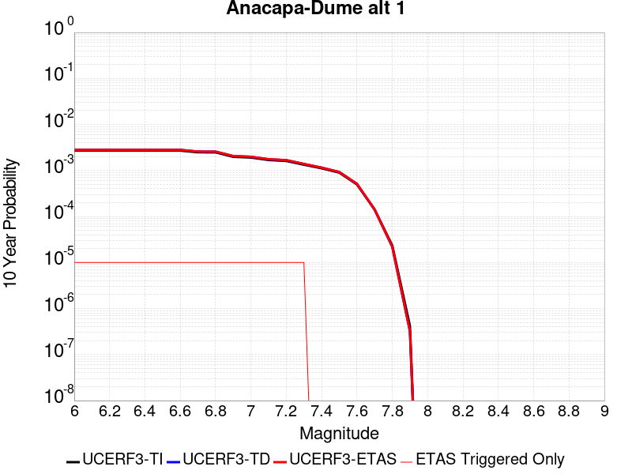 |

| Magnitude | 1 wk TI Prob | 1 wk TD Prob | 1 wk ETAS Prob | 1 wk ETAS/TD Gain | 1 wk ETAS Triggered Only | 1 mo TI Prob | 1 mo TD Prob | 1 mo ETAS Prob | 1 mo ETAS/TD Gain | 1 mo ETAS Triggered Only | 1 yr TI Prob | 1 yr TD Prob | 1 yr ETAS Prob | 1 yr ETAS/TD Gain | 1 yr ETAS Triggered Only | 10 yr TI Prob | 10 yr TD Prob | 10 yr ETAS Prob | 10 yr ETAS/TD Gain | 10 yr ETAS Triggered Only |
|-----|-----|-----|-----|-----|-----|-----|-----|-----|-----|-----|-----|-----|-----|-----|-----|-----|-----|-----|-----|-----|
| 6.0 | 5.1871802E-6 | 5.3673916E-6 | 1.5367337E-5 | 2.8630924 | 1.0E-5 | 2.2230583E-5 | 2.3002909E-5 | 3.3002678E-5 | 1.4347177 | 1.0E-5 | 2.7062374E-4 | 2.8002527E-4 | 2.9002246E-4 | 1.035701 | 1.0E-5 | 0.002702944 | 0.0027968097 | 0.0028067816 | 1.0035655 | 1.0E-5 |
| 6.1 | 5.1871802E-6 | 5.3673916E-6 | 1.5367337E-5 | 2.8630924 | 1.0E-5 | 2.2230583E-5 | 2.3002909E-5 | 3.3002678E-5 | 1.4347177 | 1.0E-5 | 2.7062374E-4 | 2.8002527E-4 | 2.9002246E-4 | 1.035701 | 1.0E-5 | 0.002702944 | 0.0027968097 | 0.0028067816 | 1.0035655 | 1.0E-5 |
| 6.2 | 5.1871802E-6 | 5.3673916E-6 | 1.5367337E-5 | 2.8630924 | 1.0E-5 | 2.2230583E-5 | 2.3002909E-5 | 3.3002678E-5 | 1.4347177 | 1.0E-5 | 2.7062374E-4 | 2.8002527E-4 | 2.9002246E-4 | 1.035701 | 1.0E-5 | 0.002702944 | 0.0027968097 | 0.0028067816 | 1.0035655 | 1.0E-5 |
| 6.3 | 5.1871802E-6 | 5.3673916E-6 | 1.5367337E-5 | 2.8630924 | 1.0E-5 | 2.2230583E-5 | 2.3002909E-5 | 3.3002678E-5 | 1.4347177 | 1.0E-5 | 2.7062374E-4 | 2.8002527E-4 | 2.9002246E-4 | 1.035701 | 1.0E-5 | 0.002702944 | 0.0027968097 | 0.0028067816 | 1.0035655 | 1.0E-5 |
| 6.4 | 5.1871802E-6 | 5.3673916E-6 | 1.5367337E-5 | 2.8630924 | 1.0E-5 | 2.2230583E-5 | 2.3002909E-5 | 3.3002678E-5 | 1.4347177 | 1.0E-5 | 2.7062374E-4 | 2.8002527E-4 | 2.9002246E-4 | 1.035701 | 1.0E-5 | 0.002702944 | 0.0027968097 | 0.0028067816 | 1.0035655 | 1.0E-5 |
| 6.5 | 5.1871802E-6 | 5.3673916E-6 | 1.5367337E-5 | 2.8630924 | 1.0E-5 | 2.2230583E-5 | 2.3002909E-5 | 3.3002678E-5 | 1.4347177 | 1.0E-5 | 2.7062374E-4 | 2.8002527E-4 | 2.9002246E-4 | 1.035701 | 1.0E-5 | 0.002702944 | 0.0027968097 | 0.0028067816 | 1.0035655 | 1.0E-5 |
| 6.6 | 5.1871802E-6 | 5.3673916E-6 | 1.5367337E-5 | 2.8630924 | 1.0E-5 | 2.2230583E-5 | 2.3002909E-5 | 3.3002678E-5 | 1.4347177 | 1.0E-5 | 2.7062374E-4 | 2.8002527E-4 | 2.9002246E-4 | 1.035701 | 1.0E-5 | 0.002702944 | 0.0027968097 | 0.0028067816 | 1.0035655 | 1.0E-5 |
| 6.7 | 4.7693475E-6 | 4.9366927E-6 | 1.4936643E-5 | 3.0256376 | 1.0E-5 | 2.04399E-5 | 2.1157086E-5 | 3.1156873E-5 | 1.4726449 | 1.0E-5 | 2.4882736E-4 | 2.5755784E-4 | 2.6755527E-4 | 1.0388162 | 1.0E-5 | 0.0024854892 | 0.0025726694 | 0.0025826436 | 1.003877 | 1.0E-5 |
| 6.8 | 4.753408E-6 | 4.920241E-6 | 1.49201915E-5 | 3.0324109 | 1.0E-5 | 2.037159E-5 | 2.108658E-5 | 3.108637E-5 | 1.4742253 | 1.0E-5 | 2.4799586E-4 | 2.5669963E-4 | 2.6669705E-4 | 1.038946 | 1.0E-5 | 0.002477193 | 0.002564107 | 0.0025740813 | 1.00389 | 1.0E-5 |
| 6.9 | 3.800069E-6 | 3.937127E-6 | 1.3937088E-5 | 3.5399132 | 1.0E-5 | 1.6285909E-5 | 1.6873293E-5 | 2.6873124E-5 | 1.5926425 | 1.0E-5 | 1.9826289E-4 | 2.054132E-4 | 2.1541116E-4 | 1.0486723 | 1.0E-5 | 0.001980861 | 0.0020522573 | 0.0020622367 | 1.0048627 | 1.0E-5 |
| 7.0 | 3.6671938E-6 | 3.799919E-6 | 1.3799881E-5 | 3.631625 | 1.0E-5 | 1.571645E-5 | 1.6285267E-5 | 2.6285104E-5 | 1.6140419 | 1.0E-5 | 1.9133097E-4 | 1.9825532E-4 | 2.0825333E-4 | 1.05043 | 1.0E-5 | 0.0019116632 | 0.0019808079 | 0.001990788 | 1.0050385 | 1.0E-5 |
| 7.1 | 3.2394885E-6 | 3.3587942E-6 | 1.335876E-5 | 3.9772491 | 1.0E-5 | 1.3883448E-5 | 1.4394753E-5 | 2.4394609E-5 | 1.6946876 | 1.0E-5 | 1.6901788E-4 | 1.7524212E-4 | 1.8524038E-4 | 1.0570539 | 1.0E-5 | 0.0016888938 | 0.0017510506 | 0.0017610331 | 1.0057008 | 1.0E-5 |
| 7.2 | 3.0935948E-6 | 3.2079267E-6 | 1.3207895E-5 | 4.117268 | 1.0E-5 | 1.3258196E-5 | 1.3748186E-5 | 2.3748049E-5 | 1.7273587 | 1.0E-5 | 1.6140658E-4 | 1.6737141E-4 | 1.7736973E-4 | 1.0597373 | 1.0E-5 | 0.001612894 | 0.0016724645 | 0.0016824479 | 1.0059692 | 1.0E-5 |
| 7.3 | 2.5604163E-6 | 2.6470739E-6 | 1.2647048E-5 | 4.777746 | 1.0E-5 | 1.0973167E-5 | 1.1344553E-5 | 2.134444E-5 | 1.8814703 | 1.0E-5 | 1.3359012E-4 | 1.3811122E-4 | 1.4810984E-4 | 1.0723954 | 1.0E-5 | 0.0013350984 | 0.0013802585 | 0.0013902447 | 1.007235 | 1.0E-5 |
| 7.4 | 2.1429005E-6 | 2.2106035E-6 | 2.2106035E-6 | 1.0 | 0.0 | 9.1838265E-6 | 9.473981E-6 | 9.473981E-6 | 1.0 | 0.0 | 1.11807356E-4 | 1.1533964E-4 | 1.1533964E-4 | 1.0 | 0.0 | 0.0011175112 | 0.0011528004 | 0.0011528004 | 1.0 | 0.0 |
| 7.5 | 1.7237151E-6 | 1.7761457E-6 | 1.7761457E-6 | 1.0 | 0.0 | 7.3873293E-6 | 7.6120314E-6 | 7.6120314E-6 | 1.0 | 0.0 | 8.993702E-5 | 9.267256E-5 | 9.267256E-5 | 1.0 | 0.0 | 8.990063E-4 | 9.263415E-4 | 9.263415E-4 | 1.0 | 0.0 |
| 7.6 | 9.541696E-7 | 9.823211E-7 | 9.823211E-7 | 1.0 | 0.0 | 4.089292E-6 | 4.2099414E-6 | 4.2099414E-6 | 1.0 | 0.0 | 4.9785995E-5 | 5.125484E-5 | 5.125484E-5 | 1.0 | 0.0 | 4.9774844E-4 | 5.124315E-4 | 5.124315E-4 | 1.0 | 0.0 |
| 7.7 | 2.7226676E-7 | 2.7172473E-7 | 2.7172473E-7 | 1.0 | 0.0 | 1.166857E-6 | 1.1645341E-6 | 1.1645341E-6 | 1.0 | 0.0 | 1.4206392E-5 | 1.4178111E-5 | 1.4178111E-5 | 1.0 | 0.0 | 1.4205484E-4 | 1.4177214E-4 | 1.4177214E-4 | 1.0 | 0.0 |
| 7.8 | 4.5017995E-8 | 4.215797E-8 | 4.215797E-8 | 1.0 | 0.0 | 1.9293425E-7 | 1.80677E-7 | 1.80677E-7 | 1.0 | 0.0 | 2.348972E-6 | 2.1997405E-6 | 2.1997405E-6 | 1.0 | 0.0 | 2.348947E-5 | 2.1997208E-5 | 2.1997208E-5 | 1.0 | 0.0 |
| 7.9 | 8.007447E-10 | 6.161581E-10 | 6.161581E-10 | 1.0 | 0.0 | 3.4317629E-9 | 2.640678E-9 | 2.640678E-9 | 1.0 | 0.0 | 4.1781714E-8 | 3.2150254E-8 | 3.2150254E-8 | 1.0 | 0.0 | 4.1781706E-7 | 3.2150248E-7 | 3.2150248E-7 | 1.0 | 0.0 |

## Surprise Valley 2011 CFM
*[(top)](#table-of-contents)*

| 1 Week | 1 Month | 1 Year | 10 Year |
|-----|-----|-----|-----|
|  |  |  |  |

| Magnitude | 1 wk TI Prob | 1 wk TD Prob | 1 wk ETAS Prob | 1 wk ETAS/TD Gain | 1 wk ETAS Triggered Only | 1 mo TI Prob | 1 mo TD Prob | 1 mo ETAS Prob | 1 mo ETAS/TD Gain | 1 mo ETAS Triggered Only | 1 yr TI Prob | 1 yr TD Prob | 1 yr ETAS Prob | 1 yr ETAS/TD Gain | 1 yr ETAS Triggered Only | 10 yr TI Prob | 10 yr TD Prob | 10 yr ETAS Prob | 10 yr ETAS/TD Gain | 10 yr ETAS Triggered Only |
|-----|-----|-----|-----|-----|-----|-----|-----|-----|-----|-----|-----|-----|-----|-----|-----|-----|-----|-----|-----|-----|
| 6.0 | 4.0396248E-5 | 4.485131E-5 | 5.485086E-5 | 1.2229489 | 1.0E-5 | 1.7311527E-4 | 1.9220692E-4 | 2.02205E-4 | 1.0520172 | 1.0E-5 | 0.002105641 | 0.0023378176 | 0.0023477941 | 1.0042675 | 1.0E-5 | 0.020858008 | 0.023153966 | 0.023163736 | 1.0004219 | 1.0E-5 |
| 6.1 | 4.0396248E-5 | 4.485131E-5 | 5.485086E-5 | 1.2229489 | 1.0E-5 | 1.7311527E-4 | 1.9220692E-4 | 2.02205E-4 | 1.0520172 | 1.0E-5 | 0.002105641 | 0.0023378176 | 0.0023477941 | 1.0042675 | 1.0E-5 | 0.020858008 | 0.023153966 | 0.023163736 | 1.0004219 | 1.0E-5 |
| 6.2 | 2.2295266E-5 | 2.440125E-5 | 2.440125E-5 | 1.0 | 0.0 | 9.554764E-5 | 1.0457276E-4 | 1.0457276E-4 | 1.0 | 0.0 | 0.0011626717 | 0.0012724606 | 0.0012724606 | 1.0 | 0.0 | 0.011566074 | 0.012654981 | 0.012654981 | 1.0 | 0.0 |
| 6.3 | 1.572643E-5 | 1.7096807E-5 | 1.7096807E-5 | 1.0 | 0.0 | 6.7397246E-5 | 7.327003E-5 | 7.327003E-5 | 1.0 | 0.0 | 8.202525E-4 | 8.91708E-4 | 8.91708E-4 | 1.0 | 0.0 | 0.008172315 | 0.008882407 | 0.008882407 | 1.0 | 0.0 |
| 6.4 | 1.5714395E-5 | 1.7084629E-5 | 1.7084629E-5 | 1.0 | 0.0 | 6.734567E-5 | 7.3217845E-5 | 7.3217845E-5 | 1.0 | 0.0 | 8.1962504E-4 | 8.9107314E-4 | 8.9107314E-4 | 1.0 | 0.0 | 0.008166086 | 0.008876109 | 0.008876109 | 1.0 | 0.0 |
| 6.5 | 1.2733495E-5 | 1.38016E-5 | 1.38016E-5 | 1.0 | 0.0 | 5.457098E-5 | 5.9148413E-5 | 5.9148413E-5 | 1.0 | 0.0 | 6.641992E-4 | 7.1990065E-4 | 7.1990065E-4 | 1.0 | 0.0 | 0.0066221743 | 0.0071763797 | 0.0071763797 | 1.0 | 0.0 |
| 6.6 | 1.0983784E-5 | 1.1886554E-5 | 1.1886554E-5 | 1.0 | 0.0 | 4.7072506E-5 | 5.094141E-5 | 5.094141E-5 | 1.0 | 0.0 | 5.7295704E-4 | 6.200405E-4 | 6.200405E-4 | 1.0 | 0.0 | 0.0057148207 | 0.0061836545 | 0.0061836545 | 1.0 | 0.0 |
| 6.7 | 9.104806E-6 | 9.839491E-6 | 9.839491E-6 | 1.0 | 0.0 | 3.902001E-5 | 4.2168587E-5 | 4.2168587E-5 | 1.0 | 0.0 | 4.7496508E-4 | 5.132855E-4 | 5.132855E-4 | 1.0 | 0.0 | 0.004739512 | 0.005121397 | 0.005121397 | 1.0 | 0.0 |
| 6.8 | 6.2162403E-6 | 6.7041337E-6 | 6.7041337E-6 | 1.0 | 0.0 | 2.6640759E-5 | 2.8731698E-5 | 2.8731698E-5 | 1.0 | 0.0 | 3.2430296E-4 | 3.497545E-4 | 3.497545E-4 | 1.0 | 0.0 | 0.003238301 | 0.0034922638 | 0.0034922638 | 1.0 | 0.0 |
| 6.9 | 4.1792696E-6 | 4.50323E-6 | 4.50323E-6 | 1.0 | 0.0 | 1.7911032E-5 | 1.9299423E-5 | 1.9299423E-5 | 1.0 | 0.0 | 2.1804498E-4 | 2.3494668E-4 | 2.3494668E-4 | 1.0 | 0.0 | 0.0021783116 | 0.0023471361 | 0.0023471361 | 1.0 | 0.0 |
| 7.0 | 2.7478413E-6 | 2.9622424E-6 | 2.9622424E-6 | 1.0 | 0.0 | 1.177641E-5 | 1.269527E-5 | 1.269527E-5 | 1.0 | 0.0 | 1.4336836E-4 | 1.545552E-4 | 1.545552E-4 | 1.0 | 0.0 | 0.001432759 | 0.0015445995 | 0.0015445995 | 1.0 | 0.0 |
| 7.1 | 8.128648E-7 | 8.724922E-7 | 8.724922E-7 | 1.0 | 0.0 | 3.4837017E-6 | 3.7392501E-6 | 3.7392501E-6 | 1.0 | 0.0 | 4.2413245E-5 | 4.552502E-5 | 4.552502E-5 | 1.0 | 0.0 | 4.2405148E-4 | 4.5521575E-4 | 4.5521575E-4 | 1.0 | 0.0 |
| 7.2 | 4.8641045E-8 | 4.9402068E-8 | 4.9402068E-8 | 1.0 | 0.0 | 2.084616E-7 | 2.1172312E-7 | 2.1172312E-7 | 1.0 | 0.0 | 2.538017E-6 | 2.577726E-6 | 2.577726E-6 | 1.0 | 0.0 | 2.537988E-5 | 2.5776973E-5 | 2.5776973E-5 | 1.0 | 0.0 |
| 7.3 | 5.3911844E-9 | 5.4758145E-9 | 5.4758145E-9 | 1.0 | 0.0 | 2.3105075E-8 | 2.3467775E-8 | 2.3467775E-8 | 1.0 | 0.0 | 2.8130427E-7 | 2.8572015E-7 | 2.8572015E-7 | 1.0 | 0.0 | 2.8130391E-6 | 2.8571992E-6 | 2.8571992E-6 | 1.0 | 0.0 |

## Calaveras (Central) 2011 CFM
*[(top)](#table-of-contents)*

| 1 Week | 1 Month | 1 Year | 10 Year |
|-----|-----|-----|-----|
|  |  |  |  |

| Magnitude | 1 wk TI Prob | 1 wk TD Prob | 1 wk ETAS Prob | 1 wk ETAS/TD Gain | 1 wk ETAS Triggered Only | 1 mo TI Prob | 1 mo TD Prob | 1 mo ETAS Prob | 1 mo ETAS/TD Gain | 1 mo ETAS Triggered Only | 1 yr TI Prob | 1 yr TD Prob | 1 yr ETAS Prob | 1 yr ETAS/TD Gain | 1 yr ETAS Triggered Only | 10 yr TI Prob | 10 yr TD Prob | 10 yr ETAS Prob | 10 yr ETAS/TD Gain | 10 yr ETAS Triggered Only |
|-----|-----|-----|-----|-----|-----|-----|-----|-----|-----|-----|-----|-----|-----|-----|-----|-----|-----|-----|-----|-----|
| 6.0 | 1.5010907E-4 | 2.4804124E-4 | 2.4804124E-4 | 1.0 | 0.0 | 6.4316596E-4 | 0.001062498 | 0.001062498 | 1.0 | 0.0 | 0.0078024664 | 0.012850443 | 0.012850443 | 1.0 | 0.0 | 0.07534136 | 0.120411225 | 0.12042002 | 1.0000731 | 1.0E-5 |
| 6.1 | 1.4521465E-4 | 2.3965565E-4 | 2.3965565E-4 | 1.0 | 0.0 | 6.222001E-4 | 0.0010265942 | 0.0010265942 | 1.0 | 0.0 | 0.0075490056 | 0.012419763 | 0.012419763 | 1.0 | 0.0 | 0.07297657 | 0.11668273 | 0.11669156 | 1.0000757 | 1.0E-5 |
| 6.2 | 1.429998E-4 | 2.3896809E-4 | 2.3896809E-4 | 1.0 | 0.0 | 6.127123E-4 | 0.0010236499 | 0.0010236499 | 1.0 | 0.0 | 0.007434286 | 0.012384372 | 0.012384372 | 1.0 | 0.0 | 0.07190444 | 0.11633677 | 0.11634561 | 1.0000759 | 1.0E-5 |
| 6.3 | 1.3536277E-4 | 2.3227946E-4 | 2.3227946E-4 | 1.0 | 0.0 | 5.799972E-4 | 9.950127E-4 | 9.950127E-4 | 1.0 | 0.0 | 0.0070386264 | 0.012040534 | 0.012040534 | 1.0 | 0.0 | 0.0681982 | 0.113249525 | 0.11325839 | 1.0000783 | 1.0E-5 |
| 6.4 | 1.2993296E-4 | 2.2651516E-4 | 2.2651516E-4 | 1.0 | 0.0 | 5.5673666E-4 | 9.703276E-4 | 9.703276E-4 | 1.0 | 0.0 | 0.006757223 | 0.011743338 | 0.011743338 | 1.0 | 0.0 | 0.06555412 | 0.11052752 | 0.11053642 | 1.0000805 | 1.0E-5 |
| 6.5 | 1.0498927E-4 | 1.7981966E-4 | 1.7981966E-4 | 1.0 | 0.0 | 4.498764E-4 | 7.7042676E-4 | 7.7042676E-4 | 1.0 | 0.0 | 0.005463498 | 0.00933952 | 0.00933952 | 1.0 | 0.0 | 0.053311124 | 0.08920739 | 0.08921649 | 1.000102 | 1.0E-5 |
| 6.6 | 1.0157505E-4 | 1.7469494E-4 | 1.7469494E-4 | 1.0 | 0.0 | 4.35249E-4 | 7.4847665E-4 | 7.4847665E-4 | 1.0 | 0.0 | 0.0052862884 | 0.009074567 | 0.009074567 | 1.0 | 0.0 | 0.05162293 | 0.08678487 | 0.086794004 | 1.0001053 | 1.0E-5 |
| 6.7 | 9.660386E-5 | 1.6728783E-4 | 1.6728783E-4 | 1.0 | 0.0 | 4.1395082E-4 | 7.167497E-4 | 7.167497E-4 | 1.0 | 0.0 | 0.0050282106 | 0.008691474 | 0.008691474 | 1.0 | 0.0 | 0.049159497 | 0.08327401 | 0.08328317 | 1.00011 | 1.0E-5 |
| 6.8 | 9.089927E-5 | 1.5643238E-4 | 1.5643238E-4 | 1.0 | 0.0 | 3.8951015E-4 | 6.702511E-4 | 6.702511E-4 | 1.0 | 0.0 | 0.0047319788 | 0.008129742 | 0.008129742 | 1.0 | 0.0 | 0.046324775 | 0.078163 | 0.07817222 | 1.0001179 | 1.0E-5 |
| 6.9 | 7.353187E-5 | 1.2295779E-4 | 1.2295779E-4 | 1.0 | 0.0 | 3.150985E-4 | 5.2685605E-4 | 5.2685605E-4 | 1.0 | 0.0 | 0.0038295772 | 0.006395728 | 0.006395728 | 1.0 | 0.0 | 0.037642512 | 0.06218928 | 0.062198658 | 1.0001508 | 1.0E-5 |
| 7.0 | 5.746064E-5 | 9.3890936E-5 | 9.3890936E-5 | 1.0 | 0.0 | 2.4623662E-4 | 4.0232803E-4 | 4.0232803E-4 | 1.0 | 0.0 | 0.0029938098 | 0.0048874132 | 0.0048874132 | 1.0 | 0.0 | 0.02953797 | 0.04798713 | 0.047996648 | 1.0001984 | 1.0E-5 |
| 7.1 | 4.9557195E-5 | 8.052768E-5 | 8.052768E-5 | 1.0 | 0.0 | 2.123707E-4 | 3.4507332E-4 | 3.4507332E-4 | 1.0 | 0.0 | 0.0025825473 | 0.004193237 | 0.004193237 | 1.0 | 0.0 | 0.0255274 | 0.041373473 | 0.041383058 | 1.0002317 | 1.0E-5 |
| 7.2 | 3.687595E-5 | 5.952694E-5 | 5.952694E-5 | 1.0 | 0.0 | 1.5803022E-4 | 2.5509068E-4 | 2.5509068E-4 | 1.0 | 0.0 | 0.0019223199 | 0.003101335 | 0.003101335 | 1.0 | 0.0 | 0.01905776 | 0.030883823 | 0.030893514 | 1.0003138 | 1.0E-5 |
| 7.3 | 2.5846984E-5 | 4.2473923E-5 | 4.2473923E-5 | 1.0 | 0.0 | 1.1076809E-4 | 1.820185E-4 | 1.820185E-4 | 1.0 | 0.0 | 0.0013477671 | 0.0022138404 | 0.0022138404 | 1.0 | 0.0 | 0.013396223 | 0.022175217 | 0.022184996 | 1.000441 | 1.0E-5 |
| 7.4 | 1.7747854E-5 | 2.993759E-5 | 2.993759E-5 | 1.0 | 0.0 | 7.6060016E-5 | 1.2829766E-4 | 1.2829766E-4 | 1.0 | 0.0 | 9.2563726E-4 | 0.0015609078 | 0.0015609078 | 1.0 | 0.0 | 0.009217911 | 0.015708687 | 0.015718529 | 1.0006266 | 1.0E-5 |
| 7.5 | 1.4883479E-5 | 2.6244672E-5 | 2.6244672E-5 | 1.0 | 0.0 | 6.378478E-5 | 1.12472335E-4 | 1.12472335E-4 | 1.0 | 0.0 | 7.76303E-4 | 0.0013684932 | 0.0013684932 | 1.0 | 0.0 | 0.0077359667 | 0.013801667 | 0.013811529 | 1.0007145 | 1.0E-5 |
| 7.6 | 8.166975E-6 | 1.4964299E-5 | 1.4964299E-5 | 1.0 | 0.0 | 3.5000852E-5 | 6.413114E-5 | 6.413114E-5 | 1.0 | 0.0 | 4.2605202E-4 | 7.805183E-4 | 7.805183E-4 | 1.0 | 0.0 | 0.004252361 | 0.007939203 | 0.007949124 | 1.0012496 | 1.0E-5 |
| 7.7 | 3.3858064E-6 | 6.254251E-6 | 6.254251E-6 | 1.0 | 0.0 | 1.4510518E-5 | 2.6803657E-5 | 2.6803657E-5 | 1.0 | 0.0 | 1.7665124E-4 | 3.2628572E-4 | 3.2628572E-4 | 1.0 | 0.0 | 0.0017651088 | 0.003388363 | 0.003398329 | 1.0029413 | 1.0E-5 |
| 7.8 | 2.7721615E-6 | 5.366695E-6 | 5.366695E-6 | 1.0 | 0.0 | 1.1880637E-5 | 2.2999919E-5 | 2.2999919E-5 | 1.0 | 0.0 | 1.4463716E-4 | 2.7998807E-4 | 2.7998807E-4 | 1.0 | 0.0 | 0.0014454306 | 0.002907615 | 0.0029175857 | 1.0034293 | 1.0E-5 |
| 7.9 | 1.9736292E-6 | 4.128705E-6 | 4.128705E-6 | 1.0 | 0.0 | 8.4583835E-6 | 1.769433E-5 | 1.769433E-5 | 1.0 | 0.0 | 1.0297595E-4 | 2.1540721E-4 | 2.1540721E-4 | 1.0 | 0.0 | 0.0010292825 | 0.0022237299 | 0.0022337078 | 1.0044869 | 1.0E-5 |
| 8.0 | 1.1767289E-6 | 2.5546633E-6 | 2.5546633E-6 | 1.0 | 0.0 | 5.0431145E-6 | 1.0948511E-5 | 1.0948511E-5 | 1.0 | 0.0 | 6.139818E-5 | 1.3329E-4 | 1.3329E-4 | 1.0 | 0.0 | 6.1381224E-4 | 0.001366126 | 0.0013761123 | 1.0073099 | 1.0E-5 |
| 8.1 | 7.5112825E-7 | 1.541076E-6 | 1.541076E-6 | 1.0 | 0.0 | 3.2191172E-6 | 6.604595E-6 | 6.604595E-6 | 1.0 | 0.0 | 3.9192048E-5 | 8.0408E-5 | 8.0408E-5 | 1.0 | 0.0 | 3.9185135E-4 | 8.2356273E-4 | 8.335545E-4 | 1.0121324 | 1.0E-5 |

## Honey Lake 2011 CFM
*[(top)](#table-of-contents)*

| 1 Week | 1 Month | 1 Year | 10 Year |
|-----|-----|-----|-----|
|  |  |  |  |

| Magnitude | 1 wk TI Prob | 1 wk TD Prob | 1 wk ETAS Prob | 1 wk ETAS/TD Gain | 1 wk ETAS Triggered Only | 1 mo TI Prob | 1 mo TD Prob | 1 mo ETAS Prob | 1 mo ETAS/TD Gain | 1 mo ETAS Triggered Only | 1 yr TI Prob | 1 yr TD Prob | 1 yr ETAS Prob | 1 yr ETAS/TD Gain | 1 yr ETAS Triggered Only | 10 yr TI Prob | 10 yr TD Prob | 10 yr ETAS Prob | 10 yr ETAS/TD Gain | 10 yr ETAS Triggered Only |
|-----|-----|-----|-----|-----|-----|-----|-----|-----|-----|-----|-----|-----|-----|-----|-----|-----|-----|-----|-----|-----|
| 6.0 | 6.155506E-5 | 7.954708E-5 | 7.954708E-5 | 1.0 | 0.0 | 2.6378073E-4 | 3.4087323E-4 | 3.4087323E-4 | 1.0 | 0.0 | 0.0032068014 | 0.0041426765 | 0.0041426765 | 1.0 | 0.0 | 0.03160919 | 0.040703055 | 0.040712647 | 1.0002357 | 1.0E-5 |
| 6.1 | 6.155506E-5 | 7.954708E-5 | 7.954708E-5 | 1.0 | 0.0 | 2.6378073E-4 | 3.4087323E-4 | 3.4087323E-4 | 1.0 | 0.0 | 0.0032068014 | 0.0041426765 | 0.0041426765 | 1.0 | 0.0 | 0.03160919 | 0.040703055 | 0.040712647 | 1.0002357 | 1.0E-5 |
| 6.2 | 4.1335024E-5 | 5.257652E-5 | 5.257652E-5 | 1.0 | 0.0 | 1.7713808E-4 | 2.2530954E-4 | 2.2530954E-4 | 1.0 | 0.0 | 0.0021545228 | 0.0027398444 | 0.0027398444 | 1.0 | 0.0 | 0.021337535 | 0.027076809 | 0.027076809 | 1.0 | 0.0 |
| 6.3 | 4.1335024E-5 | 5.257652E-5 | 5.257652E-5 | 1.0 | 0.0 | 1.7713808E-4 | 2.2530954E-4 | 2.2530954E-4 | 1.0 | 0.0 | 0.0021545228 | 0.0027398444 | 0.0027398444 | 1.0 | 0.0 | 0.021337535 | 0.027076809 | 0.027076809 | 1.0 | 0.0 |
| 6.4 | 3.2393702E-5 | 4.0887273E-5 | 4.0887273E-5 | 1.0 | 0.0 | 1.3882275E-4 | 1.7522006E-4 | 1.7522006E-4 | 1.0 | 0.0 | 0.0016888566 | 0.0021313233 | 0.0021313233 | 1.0 | 0.0 | 0.016760793 | 0.021119867 | 0.021119867 | 1.0 | 0.0 |
| 6.5 | 2.7205504E-5 | 3.4211767E-5 | 3.4211767E-5 | 1.0 | 0.0 | 1.1658981E-4 | 1.4661417E-4 | 1.4661417E-4 | 1.0 | 0.0 | 0.0014185566 | 0.0017836596 | 0.0017836596 | 1.0 | 0.0 | 0.014095354 | 0.017702963 | 0.017702963 | 1.0 | 0.0 |
| 6.6 | 2.069265E-5 | 2.5955416E-5 | 2.5955416E-5 | 1.0 | 0.0 | 8.867977E-5 | 1.1123324E-4 | 1.1123324E-4 | 1.0 | 0.0 | 0.0010791414 | 0.0013535074 | 0.0013535074 | 1.0 | 0.0 | 0.010739161 | 0.0134610105 | 0.0134610105 | 1.0 | 0.0 |
| 6.7 | 1.8060919E-5 | 2.265683E-5 | 2.265683E-5 | 1.0 | 0.0 | 7.7401644E-5 | 9.7097545E-5 | 9.7097545E-5 | 1.0 | 0.0 | 9.419576E-4 | 0.0011816025 | 0.0011816025 | 1.0 | 0.0 | 0.009379748 | 0.0117612425 | 0.0117612425 | 1.0 | 0.0 |
| 6.8 | 1.4474663E-5 | 1.8181274E-5 | 1.8181274E-5 | 1.0 | 0.0 | 6.203279E-5 | 7.791785E-5 | 7.791785E-5 | 1.0 | 0.0 | 7.5498753E-4 | 9.4831345E-4 | 9.4831345E-4 | 1.0 | 0.0 | 0.007524277 | 0.009450195 | 0.009450195 | 1.0 | 0.0 |
| 6.9 | 8.564552E-6 | 1.0802311E-5 | 1.0802311E-5 | 1.0 | 0.0 | 3.6704707E-5 | 4.6295176E-5 | 4.6295176E-5 | 1.0 | 0.0 | 4.4678818E-4 | 5.635644E-4 | 5.635644E-4 | 1.0 | 0.0 | 0.0044589094 | 0.0056278505 | 0.0056278505 | 1.0 | 0.0 |

## North Frontal  (West)
*[(top)](#table-of-contents)*

| 1 Week | 1 Month | 1 Year | 10 Year |
|-----|-----|-----|-----|
|  | 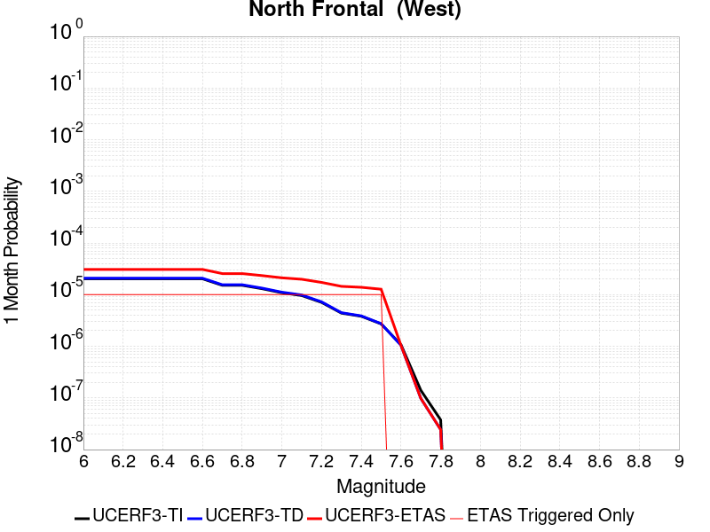 |  |  |

| Magnitude | 1 wk TI Prob | 1 wk TD Prob | 1 wk ETAS Prob | 1 wk ETAS/TD Gain | 1 wk ETAS Triggered Only | 1 mo TI Prob | 1 mo TD Prob | 1 mo ETAS Prob | 1 mo ETAS/TD Gain | 1 mo ETAS Triggered Only | 1 yr TI Prob | 1 yr TD Prob | 1 yr ETAS Prob | 1 yr ETAS/TD Gain | 1 yr ETAS Triggered Only | 10 yr TI Prob | 10 yr TD Prob | 10 yr ETAS Prob | 10 yr ETAS/TD Gain | 10 yr ETAS Triggered Only |
|-----|-----|-----|-----|-----|-----|-----|-----|-----|-----|-----|-----|-----|-----|-----|-----|-----|-----|-----|-----|-----|
| 6.0 | 4.7316266E-6 | 4.852674E-6 | 1.4852625E-5 | 3.0607095 | 1.0E-5 | 2.0278241E-5 | 2.0797017E-5 | 3.0796808E-5 | 1.4808282 | 1.0E-5 | 2.4685962E-4 | 2.5317573E-4 | 2.631732E-4 | 1.0394883 | 1.0E-5 | 0.0024658558 | 0.002529019 | 0.0025389937 | 1.0039442 | 1.0E-5 |
| 6.1 | 4.7316266E-6 | 4.852674E-6 | 1.4852625E-5 | 3.0607095 | 1.0E-5 | 2.0278241E-5 | 2.0797017E-5 | 3.0796808E-5 | 1.4808282 | 1.0E-5 | 2.4685962E-4 | 2.5317573E-4 | 2.631732E-4 | 1.0394883 | 1.0E-5 | 0.0024658558 | 0.002529019 | 0.0025389937 | 1.0039442 | 1.0E-5 |
| 6.2 | 4.7316266E-6 | 4.852674E-6 | 1.4852625E-5 | 3.0607095 | 1.0E-5 | 2.0278241E-5 | 2.0797017E-5 | 3.0796808E-5 | 1.4808282 | 1.0E-5 | 2.4685962E-4 | 2.5317573E-4 | 2.631732E-4 | 1.0394883 | 1.0E-5 | 0.0024658558 | 0.002529019 | 0.0025389937 | 1.0039442 | 1.0E-5 |
| 6.3 | 4.7316266E-6 | 4.852674E-6 | 1.4852625E-5 | 3.0607095 | 1.0E-5 | 2.0278241E-5 | 2.0797017E-5 | 3.0796808E-5 | 1.4808282 | 1.0E-5 | 2.4685962E-4 | 2.5317573E-4 | 2.631732E-4 | 1.0394883 | 1.0E-5 | 0.0024658558 | 0.002529019 | 0.0025389937 | 1.0039442 | 1.0E-5 |
| 6.4 | 4.7316266E-6 | 4.852674E-6 | 1.4852625E-5 | 3.0607095 | 1.0E-5 | 2.0278241E-5 | 2.0797017E-5 | 3.0796808E-5 | 1.4808282 | 1.0E-5 | 2.4685962E-4 | 2.5317573E-4 | 2.631732E-4 | 1.0394883 | 1.0E-5 | 0.0024658558 | 0.002529019 | 0.0025389937 | 1.0039442 | 1.0E-5 |
| 6.5 | 4.7316266E-6 | 4.852674E-6 | 1.4852625E-5 | 3.0607095 | 1.0E-5 | 2.0278241E-5 | 2.0797017E-5 | 3.0796808E-5 | 1.4808282 | 1.0E-5 | 2.4685962E-4 | 2.5317573E-4 | 2.631732E-4 | 1.0394883 | 1.0E-5 | 0.0024658558 | 0.002529019 | 0.0025389937 | 1.0039442 | 1.0E-5 |
| 6.6 | 4.7316266E-6 | 4.852674E-6 | 1.4852625E-5 | 3.0607095 | 1.0E-5 | 2.0278241E-5 | 2.0797017E-5 | 3.0796808E-5 | 1.4808282 | 1.0E-5 | 2.4685962E-4 | 2.5317573E-4 | 2.631732E-4 | 1.0394883 | 1.0E-5 | 0.0024658558 | 0.002529019 | 0.0025389937 | 1.0039442 | 1.0E-5 |
| 6.7 | 3.5382777E-6 | 3.6308872E-6 | 1.3630851E-5 | 3.7541378 | 1.0E-5 | 1.516396E-5 | 1.5560858E-5 | 2.5560701E-5 | 1.6426281 | 1.0E-5 | 1.8460557E-4 | 1.8943775E-4 | 1.9943585E-4 | 1.0527778 | 1.0E-5 | 0.0018445229 | 0.0018928396 | 0.0019028207 | 1.0052731 | 1.0E-5 |
| 6.8 | 3.5382777E-6 | 3.6308872E-6 | 1.3630851E-5 | 3.7541378 | 1.0E-5 | 1.516396E-5 | 1.5560858E-5 | 2.5560701E-5 | 1.6426281 | 1.0E-5 | 1.8460557E-4 | 1.8943775E-4 | 1.9943585E-4 | 1.0527778 | 1.0E-5 | 0.0018445229 | 0.0018928396 | 0.0019028207 | 1.0052731 | 1.0E-5 |
| 6.9 | 3.0428037E-6 | 3.1227619E-6 | 1.3122731E-5 | 4.2022834 | 1.0E-5 | 1.30405215E-5 | 1.3383201E-5 | 2.3383067E-5 | 1.7471954 | 1.0E-5 | 1.5875678E-4 | 1.6292896E-4 | 1.7292734E-4 | 1.0613664 | 1.0E-5 | 0.0015864341 | 0.0016281622 | 0.001638146 | 1.0061319 | 1.0E-5 |
| 7.0 | 2.538778E-6 | 2.6060916E-6 | 1.2606066E-5 | 4.8371534 | 1.0E-5 | 1.0880432E-5 | 1.116892E-5 | 2.1168808E-5 | 1.8953317 | 1.0E-5 | 1.324612E-4 | 1.3597358E-4 | 1.4597223E-4 | 1.0735337 | 1.0E-5 | 0.0013238228 | 0.0013589506 | 0.001368937 | 1.0073487 | 1.0E-5 |
| 7.1 | 2.2418935E-6 | 2.3012087E-6 | 1.2301186E-5 | 5.3455324 | 1.0E-5 | 9.60808E-6 | 9.862288E-6 | 1.986219E-5 | 2.0139534 | 1.0E-5 | 1.1697209E-4 | 1.2006718E-4 | 1.3006598E-4 | 1.0832767 | 1.0E-5 | 0.0011691054 | 0.0012000671 | 0.0012100551 | 1.0083228 | 1.0E-5 |
| 7.2 | 1.6526745E-6 | 1.6924864E-6 | 1.1692469E-5 | 6.908457 | 1.0E-5 | 7.082872E-6 | 7.2534945E-6 | 1.7253422E-5 | 2.378636 | 1.0E-5 | 8.623055E-5 | 8.830797E-5 | 9.830709E-5 | 1.1132301 | 1.0E-5 | 8.61971E-4 | 8.8275387E-4 | 8.9274504E-4 | 1.0113182 | 1.0E-5 |
| 7.3 | 1.0246019E-6 | 1.0442274E-6 | 1.1044217E-5 | 10.576448 | 1.0E-5 | 4.391144E-6 | 4.4752533E-6 | 1.4475208E-5 | 3.2345004 | 1.0E-5 | 5.3460866E-5 | 5.4484964E-5 | 6.448442E-5 | 1.1835269 | 1.0E-5 | 5.344801E-4 | 5.4472755E-4 | 5.547221E-4 | 1.0183479 | 1.0E-5 |
| 7.4 | 8.9045164E-7 | 9.056572E-7 | 1.0905648E-5 | 12.041696 | 1.0E-5 | 3.8162157E-6 | 3.881383E-6 | 1.3881344E-5 | 3.5763915 | 1.0E-5 | 4.646144E-5 | 4.725492E-5 | 5.725445E-5 | 1.2116082 | 1.0E-5 | 4.6451724E-4 | 4.7245962E-4 | 4.824549E-4 | 1.0211558 | 1.0E-5 |
| 7.5 | 6.3357E-7 | 6.4027137E-7 | 1.0640265E-5 | 16.618368 | 1.0E-5 | 2.7152971E-6 | 2.7440176E-6 | 1.274399E-5 | 4.6442814 | 1.0E-5 | 3.305824E-5 | 3.340797E-5 | 4.3407636E-5 | 1.2993197 | 1.0E-5 | 3.3053322E-4 | 3.3403604E-4 | 3.440327E-4 | 1.0299269 | 1.0E-5 |
| 7.6 | 2.5087024E-7 | 2.436123E-7 | 2.436123E-7 | 1.0 | 0.0 | 1.0751578E-6 | 1.0440525E-6 | 1.0440525E-6 | 1.0 | 0.0 | 1.3089967E-5 | 1.2711286E-5 | 1.2711286E-5 | 1.0 | 0.0 | 1.3089196E-4 | 1.2710765E-4 | 1.2710765E-4 | 1.0 | 0.0 |
| 7.7 | 3.282987E-8 | 2.2875435E-8 | 2.2875435E-8 | 1.0 | 0.0 | 1.4069944E-7 | 9.8037575E-8 | 9.8037575E-8 | 1.0 | 0.0 | 1.7130144E-6 | 1.193607E-6 | 1.193607E-6 | 1.0 | 0.0 | 1.7130013E-5 | 1.1936014E-5 | 1.1936014E-5 | 1.0 | 0.0 |
| 7.8 | 8.77499E-9 | 5.6817466E-9 | 5.6817466E-9 | 1.0 | 0.0 | 3.7607098E-8 | 2.4350342E-8 | 2.4350342E-8 | 1.0 | 0.0 | 4.578663E-7 | 2.964654E-7 | 2.964654E-7 | 1.0 | 0.0 | 4.5786537E-6 | 2.9646512E-6 | 2.9646512E-6 | 1.0 | 0.0 |

## Earthquake Valley (So Extension)
*[(top)](#table-of-contents)*

| 1 Week | 1 Month | 1 Year | 10 Year |
|-----|-----|-----|-----|
|  |  |  |  |

| Magnitude | 1 wk TI Prob | 1 wk TD Prob | 1 wk ETAS Prob | 1 wk ETAS/TD Gain | 1 wk ETAS Triggered Only | 1 mo TI Prob | 1 mo TD Prob | 1 mo ETAS Prob | 1 mo ETAS/TD Gain | 1 mo ETAS Triggered Only | 1 yr TI Prob | 1 yr TD Prob | 1 yr ETAS Prob | 1 yr ETAS/TD Gain | 1 yr ETAS Triggered Only | 10 yr TI Prob | 10 yr TD Prob | 10 yr ETAS Prob | 10 yr ETAS/TD Gain | 10 yr ETAS Triggered Only |
|-----|-----|-----|-----|-----|-----|-----|-----|-----|-----|-----|-----|-----|-----|-----|-----|-----|-----|-----|-----|-----|
| 6.0 | 3.0194888E-5 | 3.707208E-5 | 3.707208E-5 | 1.0 | 0.0 | 1.2940024E-4 | 1.5887374E-4 | 1.6887215E-4 | 1.0629331 | 1.0E-5 | 0.0015743093 | 0.0019330877 | 0.0019430685 | 1.0051631 | 1.0E-5 | 0.01563203 | 0.0192131 | 0.01922291 | 1.0005105 | 1.0E-5 |
| 6.1 | 3.0194888E-5 | 3.707208E-5 | 3.707208E-5 | 1.0 | 0.0 | 1.2940024E-4 | 1.5887374E-4 | 1.6887215E-4 | 1.0629331 | 1.0E-5 | 0.0015743093 | 0.0019330877 | 0.0019430685 | 1.0051631 | 1.0E-5 | 0.01563203 | 0.0192131 | 0.01922291 | 1.0005105 | 1.0E-5 |
| 6.2 | 3.0194888E-5 | 3.707208E-5 | 3.707208E-5 | 1.0 | 0.0 | 1.2940024E-4 | 1.5887374E-4 | 1.6887215E-4 | 1.0629331 | 1.0E-5 | 0.0015743093 | 0.0019330877 | 0.0019430685 | 1.0051631 | 1.0E-5 | 0.01563203 | 0.0192131 | 0.01922291 | 1.0005105 | 1.0E-5 |
| 6.3 | 1.5795305E-5 | 1.8446612E-5 | 1.8446612E-5 | 1.0 | 0.0 | 6.769241E-5 | 7.905514E-5 | 7.905514E-5 | 1.0 | 0.0 | 8.238434E-4 | 9.621823E-4 | 9.621823E-4 | 1.0 | 0.0 | 0.008207959 | 0.0095910635 | 0.0095910635 | 1.0 | 0.0 |
| 6.4 | 1.5795305E-5 | 1.8446612E-5 | 1.8446612E-5 | 1.0 | 0.0 | 6.769241E-5 | 7.905514E-5 | 7.905514E-5 | 1.0 | 0.0 | 8.238434E-4 | 9.621823E-4 | 9.621823E-4 | 1.0 | 0.0 | 0.008207959 | 0.0095910635 | 0.0095910635 | 1.0 | 0.0 |
| 6.5 | 1.5795305E-5 | 1.8446612E-5 | 1.8446612E-5 | 1.0 | 0.0 | 6.769241E-5 | 7.905514E-5 | 7.905514E-5 | 1.0 | 0.0 | 8.238434E-4 | 9.621823E-4 | 9.621823E-4 | 1.0 | 0.0 | 0.008207959 | 0.0095910635 | 0.0095910635 | 1.0 | 0.0 |
| 6.6 | 1.5795305E-5 | 1.8446612E-5 | 1.8446612E-5 | 1.0 | 0.0 | 6.769241E-5 | 7.905514E-5 | 7.905514E-5 | 1.0 | 0.0 | 8.238434E-4 | 9.621823E-4 | 9.621823E-4 | 1.0 | 0.0 | 0.008207959 | 0.0095910635 | 0.0095910635 | 1.0 | 0.0 |
| 6.7 | 1.1363076E-5 | 1.3138288E-5 | 1.3138288E-5 | 1.0 | 0.0 | 4.8697988E-5 | 5.6306162E-5 | 5.6306162E-5 | 1.0 | 0.0 | 5.927367E-4 | 6.8538805E-4 | 6.8538805E-4 | 1.0 | 0.0 | 0.0059115817 | 0.006840215 | 0.006840215 | 1.0 | 0.0 |
| 6.8 | 1.0049611E-5 | 1.1594328E-5 | 1.1594328E-5 | 1.0 | 0.0 | 4.306905E-5 | 4.968944E-5 | 4.968944E-5 | 1.0 | 0.0 | 5.242395E-4 | 6.0487416E-4 | 6.0487416E-4 | 1.0 | 0.0 | 0.0052300454 | 0.0060394546 | 0.0060394546 | 1.0 | 0.0 |
| 6.9 | 1.0049611E-5 | 1.1594328E-5 | 1.1594328E-5 | 1.0 | 0.0 | 4.306905E-5 | 4.968944E-5 | 4.968944E-5 | 1.0 | 0.0 | 5.242395E-4 | 6.0487416E-4 | 6.0487416E-4 | 1.0 | 0.0 | 0.0052300454 | 0.0060394546 | 0.0060394546 | 1.0 | 0.0 |
| 7.0 | 1.0049611E-5 | 1.1594328E-5 | 1.1594328E-5 | 1.0 | 0.0 | 4.306905E-5 | 4.968944E-5 | 4.968944E-5 | 1.0 | 0.0 | 5.242395E-4 | 6.0487416E-4 | 6.0487416E-4 | 1.0 | 0.0 | 0.0052300454 | 0.0060394546 | 0.0060394546 | 1.0 | 0.0 |
| 7.1 | 8.140254E-6 | 9.3834515E-6 | 9.3834515E-6 | 1.0 | 0.0 | 3.4886336E-5 | 4.021455E-5 | 4.021455E-5 | 1.0 | 0.0 | 4.2465836E-4 | 4.895692E-4 | 4.895692E-4 | 1.0 | 0.0 | 0.0042384774 | 0.004891483 | 0.004891483 | 1.0 | 0.0 |
| 7.2 | 1.673835E-7 | 1.4153493E-7 | 1.4153493E-7 | 1.0 | 0.0 | 7.173577E-7 | 6.065781E-7 | 6.065781E-7 | 1.0 | 0.0 | 8.733795E-6 | 7.3850674E-6 | 7.3850674E-6 | 1.0 | 0.0 | 8.733451E-5 | 7.3848576E-5 | 7.3848576E-5 | 1.0 | 0.0 |
| 7.3 | 1.6632116E-7 | 1.4051723E-7 | 1.4051723E-7 | 1.0 | 0.0 | 7.1280476E-7 | 6.022166E-7 | 6.022166E-7 | 1.0 | 0.0 | 8.678364E-6 | 7.331966E-6 | 7.331966E-6 | 1.0 | 0.0 | 8.6780245E-5 | 7.33176E-5 | 7.33176E-5 | 1.0 | 0.0 |
| 7.4 | 1.6569169E-7 | 1.3996352E-7 | 1.3996352E-7 | 1.0 | 0.0 | 7.1010703E-7 | 5.9984353E-7 | 5.9984353E-7 | 1.0 | 0.0 | 8.645519E-6 | 7.303074E-6 | 7.303074E-6 | 1.0 | 0.0 | 8.645182E-5 | 7.30287E-5 | 7.30287E-5 | 1.0 | 0.0 |
| 7.5 | 1.1764555E-7 | 1.0095245E-7 | 1.0095245E-7 | 1.0 | 0.0 | 5.041951E-7 | 4.3265328E-7 | 4.3265328E-7 | 1.0 | 0.0 | 6.138558E-6 | 5.267543E-6 | 5.267543E-6 | 1.0 | 0.0 | 6.1383886E-5 | 5.2674397E-5 | 5.2674397E-5 | 1.0 | 0.0 |
| 7.6 | 1.07927605E-7 | 9.2600665E-8 | 9.2600665E-8 | 1.0 | 0.0 | 4.6254678E-7 | 3.9685995E-7 | 3.9685995E-7 | 1.0 | 0.0 | 5.6314925E-6 | 4.8317615E-6 | 4.8317615E-6 | 1.0 | 0.0 | 5.63135E-5 | 4.831677E-5 | 4.831677E-5 | 1.0 | 0.0 |
| 7.7 | 2.1826905E-8 | 1.1179958E-8 | 1.1179958E-8 | 1.0 | 0.0 | 9.3543875E-8 | 4.791411E-8 | 4.791411E-8 | 1.0 | 0.0 | 1.1388961E-6 | 5.8335416E-7 | 5.8335416E-7 | 1.0 | 0.0 | 1.1388902E-5 | 5.8335318E-6 | 5.8335318E-6 | 1.0 | 0.0 |
| 7.8 | 2.6169649E-9 | 1.1968753E-9 | 1.1968753E-9 | 1.0 | 0.0 | 1.1215564E-8 | 5.1294657E-9 | 5.1294657E-9 | 1.0 | 0.0 | 1.3654947E-7 | 6.245124E-8 | 6.245124E-8 | 1.0 | 0.0 | 1.365494E-6 | 6.2451244E-7 | 6.2451244E-7 | 1.0 | 0.0 |

## Shoreline
*[(top)](#table-of-contents)*

| 1 Week | 1 Month | 1 Year | 10 Year |
|-----|-----|-----|-----|
|  |  |  |  |

| Magnitude | 1 wk TI Prob | 1 wk TD Prob | 1 wk ETAS Prob | 1 wk ETAS/TD Gain | 1 wk ETAS Triggered Only | 1 mo TI Prob | 1 mo TD Prob | 1 mo ETAS Prob | 1 mo ETAS/TD Gain | 1 mo ETAS Triggered Only | 1 yr TI Prob | 1 yr TD Prob | 1 yr ETAS Prob | 1 yr ETAS/TD Gain | 1 yr ETAS Triggered Only | 10 yr TI Prob | 10 yr TD Prob | 10 yr ETAS Prob | 10 yr ETAS/TD Gain | 10 yr ETAS Triggered Only |
|-----|-----|-----|-----|-----|-----|-----|-----|-----|-----|-----|-----|-----|-----|-----|-----|-----|-----|-----|-----|-----|
| 6.0 | 3.9888673E-6 | 4.0479285E-6 | 4.0479285E-6 | 1.0 | 0.0 | 1.7095033E-5 | 1.7348182E-5 | 2.7348007E-5 | 1.5764194 | 1.0E-5 | 2.0811215E-4 | 2.1119922E-4 | 2.2119712E-4 | 1.0473386 | 1.0E-5 | 0.0020791737 | 0.0021105339 | 0.0021205128 | 1.0047281 | 1.0E-5 |
| 6.1 | 3.9888673E-6 | 4.0479285E-6 | 4.0479285E-6 | 1.0 | 0.0 | 1.7095033E-5 | 1.7348182E-5 | 2.7348007E-5 | 1.5764194 | 1.0E-5 | 2.0811215E-4 | 2.1119922E-4 | 2.2119712E-4 | 1.0473386 | 1.0E-5 | 0.0020791737 | 0.0021105339 | 0.0021205128 | 1.0047281 | 1.0E-5 |
| 6.2 | 1.4039653E-6 | 1.4100885E-6 | 1.4100885E-6 | 1.0 | 0.0 | 6.0169805E-6 | 6.043223E-6 | 6.043223E-6 | 1.0 | 0.0 | 7.325427E-5 | 7.357382E-5 | 7.357382E-5 | 1.0 | 0.0 | 7.3230127E-4 | 7.355006E-4 | 7.355006E-4 | 1.0 | 0.0 |
| 6.3 | 1.4039653E-6 | 1.4100885E-6 | 1.4100885E-6 | 1.0 | 0.0 | 6.0169805E-6 | 6.043223E-6 | 6.043223E-6 | 1.0 | 0.0 | 7.325427E-5 | 7.357382E-5 | 7.357382E-5 | 1.0 | 0.0 | 7.3230127E-4 | 7.355006E-4 | 7.355006E-4 | 1.0 | 0.0 |
| 6.4 | 1.3314152E-6 | 1.33616E-6 | 1.33616E-6 | 1.0 | 0.0 | 5.7060524E-6 | 5.726388E-6 | 5.726388E-6 | 1.0 | 0.0 | 6.946897E-5 | 6.9716596E-5 | 6.9716596E-5 | 1.0 | 0.0 | 6.9447263E-4 | 6.9695263E-4 | 6.9695263E-4 | 1.0 | 0.0 |
| 6.5 | 1.1187026E-6 | 1.1203634E-6 | 1.1203634E-6 | 1.0 | 0.0 | 4.794431E-6 | 4.801549E-6 | 4.801549E-6 | 1.0 | 0.0 | 5.8370628E-5 | 5.8457317E-5 | 5.8457317E-5 | 1.0 | 0.0 | 5.83553E-4 | 5.844219E-4 | 5.844219E-4 | 1.0 | 0.0 |
| 6.6 | 9.793089E-7 | 9.784915E-7 | 9.784915E-7 | 1.0 | 0.0 | 4.1970316E-6 | 4.193528E-6 | 4.193528E-6 | 1.0 | 0.0 | 5.1097657E-5 | 5.1055024E-5 | 5.1055024E-5 | 1.0 | 0.0 | 5.108591E-4 | 5.104342E-4 | 5.104342E-4 | 1.0 | 0.0 |
| 6.7 | 8.995986E-7 | 8.972795E-7 | 8.972795E-7 | 1.0 | 0.0 | 3.8554167E-6 | 3.8454777E-6 | 3.8454777E-6 | 1.0 | 0.0 | 4.693869E-5 | 4.68177E-5 | 4.68177E-5 | 1.0 | 0.0 | 4.6928777E-4 | 4.680793E-4 | 4.680793E-4 | 1.0 | 0.0 |
| 6.8 | 7.931612E-7 | 7.8803976E-7 | 7.8803976E-7 | 1.0 | 0.0 | 3.3992578E-6 | 3.377309E-6 | 3.377309E-6 | 1.0 | 0.0 | 4.1385178E-5 | 4.1117964E-5 | 4.1117964E-5 | 1.0 | 0.0 | 4.1377472E-4 | 4.1110412E-4 | 4.1110412E-4 | 1.0 | 0.0 |
| 6.9 | 7.1465956E-7 | 7.078001E-7 | 7.078001E-7 | 1.0 | 0.0 | 3.062823E-6 | 3.0334254E-6 | 3.0334254E-6 | 1.0 | 0.0 | 3.7289232E-5 | 3.693133E-5 | 3.693133E-5 | 1.0 | 0.0 | 3.7282976E-4 | 3.6925232E-4 | 3.6925232E-4 | 1.0 | 0.0 |
| 7.0 | 6.389046E-7 | 6.299453E-7 | 6.299453E-7 | 1.0 | 0.0 | 2.7381598E-6 | 2.699763E-6 | 2.699763E-6 | 1.0 | 0.0 | 3.3336586E-5 | 3.286912E-5 | 3.286912E-5 | 1.0 | 0.0 | 3.3331584E-4 | 3.286428E-4 | 3.286428E-4 | 1.0 | 0.0 |
| 7.1 | 5.4300875E-7 | 5.311126E-7 | 5.311126E-7 | 1.0 | 0.0 | 2.3271782E-6 | 2.276195E-6 | 2.276195E-6 | 1.0 | 0.0 | 2.8333026E-5 | 2.7712322E-5 | 2.7712322E-5 | 1.0 | 0.0 | 2.8329415E-4 | 2.7708875E-4 | 2.7708875E-4 | 1.0 | 0.0 |
| 7.2 | 4.6768855E-7 | 4.5348904E-7 | 4.5348904E-7 | 1.0 | 0.0 | 2.0043778E-6 | 1.9435229E-6 | 1.9435229E-6 | 1.0 | 0.0 | 2.4403027E-5 | 2.3662134E-5 | 2.3662134E-5 | 1.0 | 0.0 | 2.4400349E-4 | 2.3659621E-4 | 2.3659621E-4 | 1.0 | 0.0 |
| 7.3 | 4.0966103E-7 | 3.9385614E-7 | 3.9385614E-7 | 1.0 | 0.0 | 1.7556889E-6 | 1.6879537E-6 | 1.6879537E-6 | 1.0 | 0.0 | 2.1375303E-5 | 2.0550642E-5 | 2.0550642E-5 | 1.0 | 0.0 | 2.1373246E-4 | 2.0548746E-4 | 2.0548746E-4 | 1.0 | 0.0 |
| 7.4 | 3.5105785E-7 | 3.3363924E-7 | 3.3363924E-7 | 1.0 | 0.0 | 1.5045327E-6 | 1.4298816E-6 | 1.4298816E-6 | 1.0 | 0.0 | 1.8317533E-5 | 1.7408669E-5 | 1.7408669E-5 | 1.0 | 0.0 | 1.8316023E-4 | 1.740731E-4 | 1.740731E-4 | 1.0 | 0.0 |
| 7.5 | 2.8737534E-7 | 2.681999E-7 | 2.681999E-7 | 1.0 | 0.0 | 1.2316079E-6 | 1.1494276E-6 | 1.1494276E-6 | 1.0 | 0.0 | 1.4994724E-5 | 1.399419E-5 | 1.399419E-5 | 1.0 | 0.0 | 1.4993713E-4 | 1.3993312E-4 | 1.3993312E-4 | 1.0 | 0.0 |
| 7.6 | 2.0924051E-7 | 1.8778938E-7 | 1.8778938E-7 | 1.0 | 0.0 | 8.967448E-7 | 8.0481135E-7 | 8.0481135E-7 | 1.0 | 0.0 | 1.0917813E-5 | 9.798534E-6 | 9.798534E-6 | 1.0 | 0.0 | 1.0917276E-4 | 9.798103E-5 | 9.798103E-5 | 1.0 | 0.0 |
| 7.7 | 1.392265E-7 | 1.1543341E-7 | 1.1543341E-7 | 1.0 | 0.0 | 5.9668486E-7 | 4.9471447E-7 | 4.9471447E-7 | 1.0 | 0.0 | 7.2646135E-6 | 6.0231323E-6 | 6.0231323E-6 | 1.0 | 0.0 | 7.2643765E-5 | 6.0229693E-5 | 6.0229693E-5 | 1.0 | 0.0 |
| 7.8 | 8.1080074E-8 | 5.5866355E-8 | 5.5866355E-8 | 1.0 | 0.0 | 3.4748598E-7 | 2.394272E-7 | 2.394272E-7 | 1.0 | 0.0 | 4.2306337E-6 | 2.9150222E-6 | 2.9150222E-6 | 1.0 | 0.0 | 4.230553E-5 | 2.9149842E-5 | 2.9149842E-5 | 1.0 | 0.0 |
| 7.9 | 5.0859036E-8 | 2.7243395E-8 | 2.7243395E-8 | 1.0 | 0.0 | 2.1796728E-7 | 1.16757406E-7 | 1.16757406E-7 | 1.0 | 0.0 | 2.6537484E-6 | 1.4215204E-6 | 1.4215204E-6 | 1.0 | 0.0 | 2.6537167E-5 | 1.4215115E-5 | 1.4215115E-5 | 1.0 | 0.0 |
| 8.0 | 3.1760536E-8 | 1.3575991E-8 | 1.3575991E-8 | 1.0 | 0.0 | 1.3611657E-7 | 5.8182817E-8 | 5.8182817E-8 | 1.0 | 0.0 | 1.6572179E-6 | 7.083755E-7 | 7.083755E-7 | 1.0 | 0.0 | 1.6572056E-5 | 7.083733E-6 | 7.083733E-6 | 1.0 | 0.0 |
| 8.1 | 1.2947896E-8 | 5.6625185E-9 | 5.6625185E-9 | 1.0 | 0.0 | 5.5490982E-8 | 2.4267937E-8 | 2.4267937E-8 | 1.0 | 0.0 | 6.756025E-7 | 2.954621E-7 | 2.954621E-7 | 1.0 | 0.0 | 6.7560045E-6 | 2.9546172E-6 | 2.9546172E-6 | 1.0 | 0.0 |

## Puente Hills
*[(top)](#table-of-contents)*

| 1 Week | 1 Month | 1 Year | 10 Year |
|-----|-----|-----|-----|
|  |  |  |  |

| Magnitude | 1 wk TI Prob | 1 wk TD Prob | 1 wk ETAS Prob | 1 wk ETAS/TD Gain | 1 wk ETAS Triggered Only | 1 mo TI Prob | 1 mo TD Prob | 1 mo ETAS Prob | 1 mo ETAS/TD Gain | 1 mo ETAS Triggered Only | 1 yr TI Prob | 1 yr TD Prob | 1 yr ETAS Prob | 1 yr ETAS/TD Gain | 1 yr ETAS Triggered Only | 10 yr TI Prob | 10 yr TD Prob | 10 yr ETAS Prob | 10 yr ETAS/TD Gain | 10 yr ETAS Triggered Only |
|-----|-----|-----|-----|-----|-----|-----|-----|-----|-----|-----|-----|-----|-----|-----|-----|-----|-----|-----|-----|-----|
| 6.0 | 1.2101656E-5 | 8.098448E-6 | 8.098448E-6 | 1.0 | 0.0 | 5.1863204E-5 | 3.4707205E-5 | 3.4707205E-5 | 1.0 | 0.0 | 6.312516E-4 | 4.2248392E-4 | 4.324797E-4 | 1.0236596 | 1.0E-5 | 0.0062946146 | 0.0042173676 | 0.0042273253 | 1.0023612 | 1.0E-5 |
| 6.1 | 1.2101656E-5 | 8.098448E-6 | 8.098448E-6 | 1.0 | 0.0 | 5.1863204E-5 | 3.4707205E-5 | 3.4707205E-5 | 1.0 | 0.0 | 6.312516E-4 | 4.2248392E-4 | 4.324797E-4 | 1.0236596 | 1.0E-5 | 0.0062946146 | 0.0042173676 | 0.0042273253 | 1.0023612 | 1.0E-5 |
| 6.2 | 1.2101656E-5 | 8.098448E-6 | 8.098448E-6 | 1.0 | 0.0 | 5.1863204E-5 | 3.4707205E-5 | 3.4707205E-5 | 1.0 | 0.0 | 6.312516E-4 | 4.2248392E-4 | 4.324797E-4 | 1.0236596 | 1.0E-5 | 0.0062946146 | 0.0042173676 | 0.0042273253 | 1.0023612 | 1.0E-5 |
| 6.3 | 1.2101656E-5 | 8.098448E-6 | 8.098448E-6 | 1.0 | 0.0 | 5.1863204E-5 | 3.4707205E-5 | 3.4707205E-5 | 1.0 | 0.0 | 6.312516E-4 | 4.2248392E-4 | 4.324797E-4 | 1.0236596 | 1.0E-5 | 0.0062946146 | 0.0042173676 | 0.0042273253 | 1.0023612 | 1.0E-5 |
| 6.4 | 1.2101656E-5 | 8.098448E-6 | 8.098448E-6 | 1.0 | 0.0 | 5.1863204E-5 | 3.4707205E-5 | 3.4707205E-5 | 1.0 | 0.0 | 6.312516E-4 | 4.2248392E-4 | 4.324797E-4 | 1.0236596 | 1.0E-5 | 0.0062946146 | 0.0042173676 | 0.0042273253 | 1.0023612 | 1.0E-5 |
| 6.5 | 1.2101656E-5 | 8.098448E-6 | 8.098448E-6 | 1.0 | 0.0 | 5.1863204E-5 | 3.4707205E-5 | 3.4707205E-5 | 1.0 | 0.0 | 6.312516E-4 | 4.2248392E-4 | 4.324797E-4 | 1.0236596 | 1.0E-5 | 0.0062946146 | 0.0042173676 | 0.0042273253 | 1.0023612 | 1.0E-5 |
| 6.6 | 1.0222488E-5 | 6.399079E-6 | 6.399079E-6 | 1.0 | 0.0 | 4.3809923E-5 | 2.742435E-5 | 2.742435E-5 | 1.0 | 0.0 | 5.332553E-4 | 3.3384276E-4 | 3.3384276E-4 | 1.0 | 0.0 | 0.0053197746 | 0.0033336577 | 0.0033336577 | 1.0 | 0.0 |
| 6.7 | 1.0222488E-5 | 6.399079E-6 | 6.399079E-6 | 1.0 | 0.0 | 4.3809923E-5 | 2.742435E-5 | 2.742435E-5 | 1.0 | 0.0 | 5.332553E-4 | 3.3384276E-4 | 3.3384276E-4 | 1.0 | 0.0 | 0.0053197746 | 0.0033336577 | 0.0033336577 | 1.0 | 0.0 |
| 6.8 | 8.6367845E-6 | 5.028129E-6 | 5.028129E-6 | 1.0 | 0.0 | 3.7014266E-5 | 2.1548949E-5 | 2.1548949E-5 | 1.0 | 0.0 | 4.505555E-4 | 2.6232743E-4 | 2.6232743E-4 | 1.0 | 0.0 | 0.004496431 | 0.002620234 | 0.002620234 | 1.0 | 0.0 |
| 6.9 | 8.066481E-6 | 4.8360116E-6 | 4.8360116E-6 | 1.0 | 0.0 | 3.4570177E-5 | 2.0725602E-5 | 2.0725602E-5 | 1.0 | 0.0 | 4.2081063E-4 | 2.523055E-4 | 2.523055E-4 | 1.0 | 0.0 | 0.0042001465 | 0.0025202443 | 0.0025202443 | 1.0 | 0.0 |
| 7.0 | 7.393828E-6 | 4.4172275E-6 | 4.4172275E-6 | 1.0 | 0.0 | 3.168745E-5 | 1.8930841E-5 | 1.8930841E-5 | 1.0 | 0.0 | 3.857264E-4 | 2.3045906E-4 | 2.3045906E-4 | 1.0 | 0.0 | 0.0038505755 | 0.0023022462 | 0.0023022462 | 1.0 | 0.0 |
| 7.1 | 6.4660953E-6 | 3.8043859E-6 | 3.8043859E-6 | 1.0 | 0.0 | 2.7711543E-5 | 1.630441E-5 | 1.630441E-5 | 1.0 | 0.0 | 3.373358E-4 | 1.9848847E-4 | 1.9848847E-4 | 1.0 | 0.0 | 0.0033682417 | 0.0019831478 | 0.0019831478 | 1.0 | 0.0 |
| 7.2 | 5.143232E-6 | 2.7864896E-6 | 2.7864896E-6 | 1.0 | 0.0 | 2.2042237E-5 | 1.1942045E-5 | 1.1942045E-5 | 1.0 | 0.0 | 2.6833118E-4 | 1.453848E-4 | 1.453848E-4 | 1.0 | 0.0 | 0.002680074 | 0.0014529065 | 0.0014529065 | 1.0 | 0.0 |
| 7.3 | 3.928255E-6 | 2.091338E-6 | 2.091338E-6 | 1.0 | 0.0 | 1.683527E-5 | 8.962847E-6 | 8.962847E-6 | 1.0 | 0.0 | 2.0495013E-4 | 1.0911726E-4 | 1.0911726E-4 | 1.0 | 0.0 | 0.002047612 | 0.0010906435 | 0.0010906435 | 1.0 | 0.0 |
| 7.4 | 2.7894434E-6 | 1.3546429E-6 | 1.3546429E-6 | 1.0 | 0.0 | 1.1954703E-5 | 5.8056E-6 | 5.8056E-6 | 1.0 | 0.0 | 1.4553878E-4 | 7.068093E-5 | 7.068093E-5 | 1.0 | 0.0 | 0.001454435 | 7.0658885E-4 | 7.0658885E-4 | 1.0 | 0.0 |
| 7.5 | 2.041735E-6 | 8.786996E-7 | 8.786996E-7 | 1.0 | 0.0 | 8.750263E-6 | 3.7658504E-6 | 3.7658504E-6 | 1.0 | 0.0 | 1.06529245E-4 | 4.5848297E-5 | 4.5848297E-5 | 1.0 | 0.0 | 0.0010647819 | 4.5839173E-4 | 4.5839173E-4 | 1.0 | 0.0 |
| 7.6 | 1.6959062E-6 | 6.698339E-7 | 6.698339E-7 | 1.0 | 0.0 | 7.268149E-6 | 2.8707138E-6 | 2.8707138E-6 | 1.0 | 0.0 | 8.848612E-5 | 3.4950408E-5 | 3.4950408E-5 | 1.0 | 0.0 | 8.84509E-4 | 3.4945202E-4 | 3.4945202E-4 | 1.0 | 0.0 |
| 7.7 | 1.4767965E-6 | 5.407146E-7 | 5.407146E-7 | 1.0 | 0.0 | 6.3291122E-6 | 2.3173466E-6 | 2.3173466E-6 | 1.0 | 0.0 | 7.705422E-5 | 2.8213353E-5 | 2.8213353E-5 | 1.0 | 0.0 | 7.702751E-4 | 2.8210029E-4 | 2.8210029E-4 | 1.0 | 0.0 |
| 7.8 | 1.8432911E-7 | 7.2811105E-8 | 7.2811105E-8 | 1.0 | 0.0 | 7.8998164E-7 | 3.1204758E-7 | 3.1204758E-7 | 1.0 | 0.0 | 9.617985E-6 | 3.799176E-6 | 3.799176E-6 | 1.0 | 0.0 | 9.617568E-5 | 3.7991435E-5 | 3.7991435E-5 | 1.0 | 0.0 |

## Great Valley 03a Dunnigan Hills
*[(top)](#table-of-contents)*

| 1 Week | 1 Month | 1 Year | 10 Year |
|-----|-----|-----|-----|
|  |  |  |  |

| Magnitude | 1 wk TI Prob | 1 wk TD Prob | 1 wk ETAS Prob | 1 wk ETAS/TD Gain | 1 wk ETAS Triggered Only | 1 mo TI Prob | 1 mo TD Prob | 1 mo ETAS Prob | 1 mo ETAS/TD Gain | 1 mo ETAS Triggered Only | 1 yr TI Prob | 1 yr TD Prob | 1 yr ETAS Prob | 1 yr ETAS/TD Gain | 1 yr ETAS Triggered Only | 10 yr TI Prob | 10 yr TD Prob | 10 yr ETAS Prob | 10 yr ETAS/TD Gain | 10 yr ETAS Triggered Only |
|-----|-----|-----|-----|-----|-----|-----|-----|-----|-----|-----|-----|-----|-----|-----|-----|-----|-----|-----|-----|-----|
| 6.0 | 1.6591328E-5 | 1.8107954E-5 | 1.8107954E-5 | 1.0 | 0.0 | 7.110376E-5 | 7.7603596E-5 | 8.760282E-5 | 1.12885 | 1.0E-5 | 8.6534437E-4 | 9.444834E-4 | 9.54474E-4 | 1.0105778 | 1.0E-5 | 0.008619824 | 0.009411525 | 0.0094214305 | 1.0010525 | 1.0E-5 |
| 6.1 | 8.041125E-6 | 8.769726E-6 | 8.769726E-6 | 1.0 | 0.0 | 3.4461507E-5 | 3.7584115E-5 | 3.7584115E-5 | 1.0 | 0.0 | 4.194881E-4 | 4.5751085E-4 | 4.5751085E-4 | 1.0 | 0.0 | 0.004186971 | 0.004567687 | 0.004567687 | 1.0 | 0.0 |
| 6.2 | 3.2807004E-6 | 3.5795688E-6 | 3.5795688E-6 | 1.0 | 0.0 | 1.4060069E-5 | 1.5340942E-5 | 1.5340942E-5 | 1.0 | 0.0 | 1.7116789E-4 | 1.8676413E-4 | 1.8676413E-4 | 1.0 | 0.0 | 0.0017103611 | 0.0018664796 | 0.0018664796 | 1.0 | 0.0 |
| 6.3 | 1.9339366E-6 | 2.1103806E-6 | 2.1103806E-6 | 1.0 | 0.0 | 8.288273E-6 | 9.044474E-6 | 9.044474E-6 | 1.0 | 0.0 | 1.00905054E-4 | 1.1011375E-4 | 1.1011375E-4 | 1.0 | 0.0 | 0.0010085925 | 0.0011008718 | 0.0011008718 | 1.0 | 0.0 |
| 6.4 | 1.3142635E-6 | 1.4339867E-6 | 1.4339867E-6 | 1.0 | 0.0 | 5.6325457E-6 | 6.145657E-6 | 6.145657E-6 | 1.0 | 0.0 | 6.857408E-5 | 7.482337E-5 | 7.482337E-5 | 1.0 | 0.0 | 6.8552926E-4 | 7.4823375E-4 | 7.4823375E-4 | 1.0 | 0.0 |

## Great Valley 03 Mysterious Ridge
*[(top)](#table-of-contents)*

| 1 Week | 1 Month | 1 Year | 10 Year |
|-----|-----|-----|-----|
|  |  |  |  |

| Magnitude | 1 wk TI Prob | 1 wk TD Prob | 1 wk ETAS Prob | 1 wk ETAS/TD Gain | 1 wk ETAS Triggered Only | 1 mo TI Prob | 1 mo TD Prob | 1 mo ETAS Prob | 1 mo ETAS/TD Gain | 1 mo ETAS Triggered Only | 1 yr TI Prob | 1 yr TD Prob | 1 yr ETAS Prob | 1 yr ETAS/TD Gain | 1 yr ETAS Triggered Only | 10 yr TI Prob | 10 yr TD Prob | 10 yr ETAS Prob | 10 yr ETAS/TD Gain | 10 yr ETAS Triggered Only |
|-----|-----|-----|-----|-----|-----|-----|-----|-----|-----|-----|-----|-----|-----|-----|-----|-----|-----|-----|-----|-----|
| 6.0 | 3.1182444E-5 | 3.6034133E-5 | 4.6033772E-5 | 1.2775047 | 1.0E-5 | 1.336322E-4 | 1.5442389E-4 | 1.6442235E-4 | 1.0647469 | 1.0E-5 | 0.0016257578 | 0.0018786751 | 0.0018886563 | 1.0053129 | 1.0E-5 | 0.016139153 | 0.018646672 | 0.018656485 | 1.0005263 | 1.0E-5 |
| 6.1 | 3.1182444E-5 | 3.6034133E-5 | 4.6033772E-5 | 1.2775047 | 1.0E-5 | 1.336322E-4 | 1.5442389E-4 | 1.6442235E-4 | 1.0647469 | 1.0E-5 | 0.0016257578 | 0.0018786751 | 0.0018886563 | 1.0053129 | 1.0E-5 | 0.016139153 | 0.018646672 | 0.018656485 | 1.0005263 | 1.0E-5 |
| 6.2 | 3.1182444E-5 | 3.6034133E-5 | 4.6033772E-5 | 1.2775047 | 1.0E-5 | 1.336322E-4 | 1.5442389E-4 | 1.6442235E-4 | 1.0647469 | 1.0E-5 | 0.0016257578 | 0.0018786751 | 0.0018886563 | 1.0053129 | 1.0E-5 | 0.016139153 | 0.018646672 | 0.018656485 | 1.0005263 | 1.0E-5 |
| 6.3 | 2.106934E-5 | 2.3850303E-5 | 3.3850065E-5 | 1.4192718 | 1.0E-5 | 9.0294045E-5 | 1.0221176E-4 | 1.12210735E-4 | 1.0978261 | 1.0E-5 | 0.0010987755 | 0.0012437488 | 0.0012537364 | 1.0080302 | 1.0E-5 | 0.010933585 | 0.0123711275 | 0.012381004 | 1.0007983 | 1.0E-5 |
| 6.4 | 2.106934E-5 | 2.3850303E-5 | 3.3850065E-5 | 1.4192718 | 1.0E-5 | 9.0294045E-5 | 1.0221176E-4 | 1.12210735E-4 | 1.0978261 | 1.0E-5 | 0.0010987755 | 0.0012437488 | 0.0012537364 | 1.0080302 | 1.0E-5 | 0.010933585 | 0.0123711275 | 0.012381004 | 1.0007983 | 1.0E-5 |
| 6.5 | 1.9389783E-5 | 2.1884982E-5 | 3.1884763E-5 | 1.4569243 | 1.0E-5 | 8.309642E-5 | 9.378956E-5 | 1.03788625E-4 | 1.1066117 | 1.0E-5 | 0.0010112294 | 0.0011413175 | 0.0011513061 | 1.0087517 | 1.0E-5 | 0.010066401 | 0.011357434 | 0.011367321 | 1.0008705 | 1.0E-5 |
| 6.6 | 1.9370193E-5 | 2.1864902E-5 | 3.1864685E-5 | 1.4573439 | 1.0E-5 | 8.301247E-5 | 9.3703515E-5 | 1.0370258E-4 | 1.1067096 | 1.0E-5 | 0.0010102082 | 0.001140271 | 0.0011502596 | 1.0087599 | 1.0E-5 | 0.010056281 | 0.011347076 | 0.011356963 | 1.0008713 | 1.0E-5 |
| 6.7 | 1.6723505E-5 | 1.8799281E-5 | 1.8799281E-5 | 1.0 | 0.0 | 7.16702E-5 | 8.056597E-5 | 8.056597E-5 | 1.0 | 0.0 | 8.722353E-4 | 9.804688E-4 | 9.804688E-4 | 1.0 | 0.0 | 0.008688197 | 0.009763439 | 0.009763439 | 1.0 | 0.0 |
| 6.8 | 1.426937E-5 | 1.599721E-5 | 1.599721E-5 | 1.0 | 0.0 | 6.115301E-5 | 6.855775E-5 | 6.855775E-5 | 1.0 | 0.0 | 7.4428355E-4 | 8.343854E-4 | 8.343854E-4 | 1.0 | 0.0 | 0.007417957 | 0.008314005 | 0.008314005 | 1.0 | 0.0 |
| 6.9 | 1.2469891E-5 | 1.3956928E-5 | 1.3956928E-5 | 1.0 | 0.0 | 5.3441294E-5 | 5.9814105E-5 | 5.9814105E-5 | 1.0 | 0.0 | 6.504535E-4 | 7.280055E-4 | 7.280055E-4 | 1.0 | 0.0 | 0.006485529 | 0.00725743 | 0.00725743 | 1.0 | 0.0 |
| 7.0 | 8.7746275E-6 | 9.791734E-6 | 9.791734E-6 | 1.0 | 0.0 | 3.7605005E-5 | 4.196394E-5 | 4.196394E-5 | 1.0 | 0.0 | 4.5774475E-4 | 5.1079853E-4 | 5.1079853E-4 | 1.0 | 0.0 | 0.00456803 | 0.005096977 | 0.005096977 | 1.0 | 0.0 |
| 7.1 | 6.1067153E-6 | 6.813725E-6 | 6.813725E-6 | 1.0 | 0.0 | 2.6171374E-5 | 2.9201385E-5 | 2.9201385E-5 | 1.0 | 0.0 | 3.1858988E-4 | 3.5547445E-4 | 3.5547445E-4 | 1.0 | 0.0 | 0.0031813353 | 0.003549609 | 0.003549609 | 1.0 | 0.0 |
| 7.2 | 2.939283E-6 | 3.2741057E-6 | 3.2741057E-6 | 1.0 | 0.0 | 1.2596866E-5 | 1.4031816E-5 | 1.4031816E-5 | 1.0 | 0.0 | 1.5335606E-4 | 1.7082572E-4 | 1.7082572E-4 | 1.0 | 0.0 | 0.0015325027 | 0.001707116 | 0.001707116 | 1.0 | 0.0 |
| 7.3 | 7.2387763E-7 | 8.008505E-7 | 8.008505E-7 | 1.0 | 0.0 | 3.102329E-6 | 3.4322145E-6 | 3.4322145E-6 | 1.0 | 0.0 | 3.77702E-5 | 4.178687E-5 | 4.178687E-5 | 1.0 | 0.0 | 3.7763783E-4 | 4.1783508E-4 | 4.1783508E-4 | 1.0 | 0.0 |
| 7.4 | 3.112171E-8 | 3.2068368E-8 | 3.2068368E-8 | 1.0 | 0.0 | 1.3337875E-7 | 1.3743585E-7 | 1.3743585E-7 | 1.0 | 0.0 | 1.6238852E-6 | 1.6732803E-6 | 1.6732803E-6 | 1.0 | 0.0 | 1.6238733E-5 | 1.6732685E-5 | 1.6732685E-5 | 1.0 | 0.0 |

## Breckenridge 2011
*[(top)](#table-of-contents)*

| 1 Week | 1 Month | 1 Year | 10 Year |
|-----|-----|-----|-----|
|  |  |  |  |

| Magnitude | 1 wk TI Prob | 1 wk TD Prob | 1 wk ETAS Prob | 1 wk ETAS/TD Gain | 1 wk ETAS Triggered Only | 1 mo TI Prob | 1 mo TD Prob | 1 mo ETAS Prob | 1 mo ETAS/TD Gain | 1 mo ETAS Triggered Only | 1 yr TI Prob | 1 yr TD Prob | 1 yr ETAS Prob | 1 yr ETAS/TD Gain | 1 yr ETAS Triggered Only | 10 yr TI Prob | 10 yr TD Prob | 10 yr ETAS Prob | 10 yr ETAS/TD Gain | 10 yr ETAS Triggered Only |
|-----|-----|-----|-----|-----|-----|-----|-----|-----|-----|-----|-----|-----|-----|-----|-----|-----|-----|-----|-----|-----|
| 6.0 | 1.1490393E-6 | 6.738007E-7 | 6.738007E-7 | 1.0 | 0.0 | 4.924445E-6 | 2.8877141E-6 | 2.8877141E-6 | 1.0 | 0.0 | 5.995347E-5 | 3.5157373E-5 | 4.5157023E-5 | 1.2844254 | 1.0E-5 | 5.9937296E-4 | 3.5152017E-4 | 3.6151666E-4 | 1.0284379 | 1.0E-5 |
| 6.1 | 1.1490393E-6 | 6.738007E-7 | 6.738007E-7 | 1.0 | 0.0 | 4.924445E-6 | 2.8877141E-6 | 2.8877141E-6 | 1.0 | 0.0 | 5.995347E-5 | 3.5157373E-5 | 4.5157023E-5 | 1.2844254 | 1.0E-5 | 5.9937296E-4 | 3.5152017E-4 | 3.6151666E-4 | 1.0284379 | 1.0E-5 |
| 6.2 | 1.1490393E-6 | 6.738007E-7 | 6.738007E-7 | 1.0 | 0.0 | 4.924445E-6 | 2.8877141E-6 | 2.8877141E-6 | 1.0 | 0.0 | 5.995347E-5 | 3.5157373E-5 | 4.5157023E-5 | 1.2844254 | 1.0E-5 | 5.9937296E-4 | 3.5152017E-4 | 3.6151666E-4 | 1.0284379 | 1.0E-5 |
| 6.3 | 1.064617E-6 | 5.886405E-7 | 5.886405E-7 | 1.0 | 0.0 | 4.5626366E-6 | 2.5227425E-6 | 2.5227425E-6 | 1.0 | 0.0 | 5.5548684E-5 | 3.071397E-5 | 4.071366E-5 | 1.3255748 | 1.0E-5 | 5.55348E-4 | 3.070984E-4 | 3.1709534E-4 | 1.0325528 | 1.0E-5 |
| 6.4 | 1.064617E-6 | 5.886405E-7 | 5.886405E-7 | 1.0 | 0.0 | 4.5626366E-6 | 2.5227425E-6 | 2.5227425E-6 | 1.0 | 0.0 | 5.5548684E-5 | 3.071397E-5 | 4.071366E-5 | 1.3255748 | 1.0E-5 | 5.55348E-4 | 3.070984E-4 | 3.1709534E-4 | 1.0325528 | 1.0E-5 |
| 6.5 | 1.064617E-6 | 5.886405E-7 | 5.886405E-7 | 1.0 | 0.0 | 4.5626366E-6 | 2.5227425E-6 | 2.5227425E-6 | 1.0 | 0.0 | 5.5548684E-5 | 3.071397E-5 | 4.071366E-5 | 1.3255748 | 1.0E-5 | 5.55348E-4 | 3.070984E-4 | 3.1709534E-4 | 1.0325528 | 1.0E-5 |
| 6.6 | 1.064617E-6 | 5.886405E-7 | 5.886405E-7 | 1.0 | 0.0 | 4.5626366E-6 | 2.5227425E-6 | 2.5227425E-6 | 1.0 | 0.0 | 5.5548684E-5 | 3.071397E-5 | 4.071366E-5 | 1.3255748 | 1.0E-5 | 5.55348E-4 | 3.070984E-4 | 3.1709534E-4 | 1.0325528 | 1.0E-5 |
| 6.7 | 9.4219524E-7 | 4.954012E-7 | 4.954012E-7 | 1.0 | 0.0 | 4.037973E-6 | 2.1231463E-6 | 2.1231463E-6 | 1.0 | 0.0 | 4.916122E-5 | 2.5849005E-5 | 3.584875E-5 | 1.386852 | 1.0E-5 | 4.9150345E-4 | 2.5846064E-4 | 2.6845807E-4 | 1.0386806 | 1.0E-5 |
| 6.8 | 8.556422E-7 | 4.311915E-7 | 4.311915E-7 | 1.0 | 0.0 | 3.667033E-6 | 1.8479623E-6 | 1.8479623E-6 | 1.0 | 0.0 | 4.464521E-5 | 2.2498712E-5 | 3.2498487E-5 | 1.4444599 | 1.0E-5 | 4.4636242E-4 | 2.2496474E-4 | 2.3496248E-4 | 1.0444415 | 1.0E-5 |
| 6.9 | 7.7357794E-7 | 3.841983E-7 | 3.841983E-7 | 1.0 | 0.0 | 3.3153299E-6 | 1.6465632E-6 | 1.6465632E-6 | 1.0 | 0.0 | 4.0363393E-5 | 2.0046726E-5 | 3.0046525E-5 | 1.4988246 | 1.0E-5 | 4.035606E-4 | 2.0044947E-4 | 2.1044747E-4 | 1.0498779 | 1.0E-5 |
| 7.0 | 6.8172454E-7 | 3.3470985E-7 | 3.3470985E-7 | 1.0 | 0.0 | 2.9216735E-6 | 1.43447E-6 | 1.43447E-6 | 1.0 | 0.0 | 3.5570793E-5 | 1.7464534E-5 | 2.746436E-5 | 1.572579 | 1.0E-5 | 3.55651E-4 | 1.7463184E-4 | 1.846301E-4 | 1.0572534 | 1.0E-5 |
| 7.1 | 5.5936397E-7 | 2.8909366E-7 | 2.8909366E-7 | 1.0 | 0.0 | 2.397272E-6 | 1.2389722E-6 | 1.2389722E-6 | 1.0 | 0.0 | 2.9186394E-5 | 1.5084385E-5 | 2.5084235E-5 | 1.6629272 | 1.0E-5 | 2.9182562E-4 | 1.5083379E-4 | 1.6083228E-4 | 1.0662881 | 1.0E-5 |
| 7.2 | 3.8420822E-7 | 2.0468183E-7 | 2.0468183E-7 | 1.0 | 0.0 | 1.6466057E-6 | 8.772076E-7 | 8.772076E-7 | 1.0 | 0.0 | 2.004724E-5 | 1.0679951E-5 | 2.0679843E-5 | 1.9363239 | 1.0E-5 | 2.004543E-4 | 1.06794454E-4 | 1.1679339E-4 | 1.0936278 | 1.0E-5 |
| 7.3 | 2.6405158E-7 | 1.6473078E-7 | 1.6473078E-7 | 1.0 | 0.0 | 1.1316491E-6 | 7.0598884E-7 | 7.0598884E-7 | 1.0 | 0.0 | 1.37777415E-5 | 8.595381E-6 | 1.8595296E-5 | 2.1634057 | 1.0E-5 | 1.3776887E-4 | 8.595055E-5 | 9.594969E-5 | 1.116336 | 1.0E-5 |
| 7.4 | 1.792114E-7 | 1.2725252E-7 | 1.2725252E-7 | 1.0 | 0.0 | 7.6804866E-7 | 5.453678E-7 | 5.453678E-7 | 1.0 | 0.0 | 9.3509525E-6 | 6.639834E-6 | 1.6639768E-5 | 2.5060518 | 1.0E-5 | 9.350559E-5 | 6.63964E-5 | 7.6395736E-5 | 1.1506006 | 1.0E-5 |
| 7.5 | 1.3548703E-7 | 9.385346E-8 | 9.385346E-8 | 1.0 | 0.0 | 5.8065854E-7 | 4.0222903E-7 | 4.0222903E-7 | 1.0 | 0.0 | 7.0694946E-6 | 4.897128E-6 | 4.897128E-6 | 1.0 | 0.0 | 7.0692695E-5 | 4.8970236E-5 | 4.8970236E-5 | 1.0 | 0.0 |
| 7.6 | 2.572245E-8 | 1.735264E-8 | 1.735264E-8 | 1.0 | 0.0 | 1.10239064E-7 | 7.436845E-8 | 7.436845E-8 | 1.0 | 0.0 | 1.3421597E-6 | 9.0543557E-7 | 9.0543557E-7 | 1.0 | 0.0 | 1.3421517E-5 | 9.054324E-6 | 9.054324E-6 | 1.0 | 0.0 |

## Bartlett Springs 2011 CFM
*[(top)](#table-of-contents)*

| 1 Week | 1 Month | 1 Year | 10 Year |
|-----|-----|-----|-----|
|  |  |  | 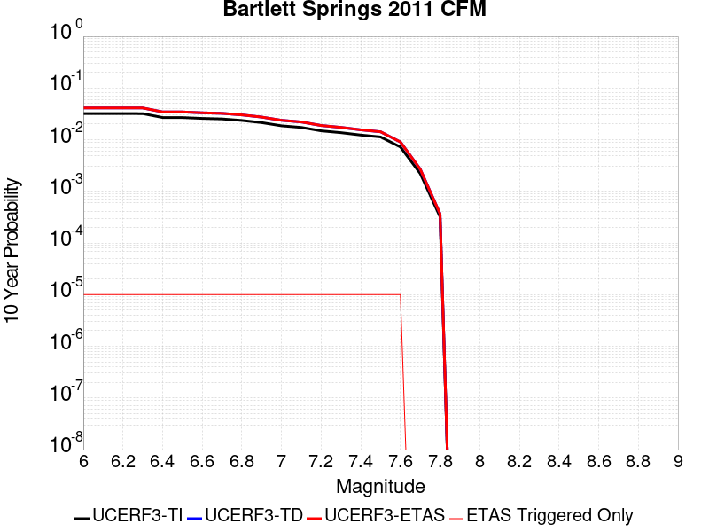 |

| Magnitude | 1 wk TI Prob | 1 wk TD Prob | 1 wk ETAS Prob | 1 wk ETAS/TD Gain | 1 wk ETAS Triggered Only | 1 mo TI Prob | 1 mo TD Prob | 1 mo ETAS Prob | 1 mo ETAS/TD Gain | 1 mo ETAS Triggered Only | 1 yr TI Prob | 1 yr TD Prob | 1 yr ETAS Prob | 1 yr ETAS/TD Gain | 1 yr ETAS Triggered Only | 10 yr TI Prob | 10 yr TD Prob | 10 yr ETAS Prob | 10 yr ETAS/TD Gain | 10 yr ETAS Triggered Only |
|-----|-----|-----|-----|-----|-----|-----|-----|-----|-----|-----|-----|-----|-----|-----|-----|-----|-----|-----|-----|-----|
| 6.0 | 6.2326144E-5 | 8.060668E-5 | 8.060668E-5 | 1.0 | 0.0 | 2.6708472E-4 | 3.4541206E-4 | 3.4541206E-4 | 1.0 | 0.0 | 0.003246908 | 0.0041973754 | 0.0042073335 | 1.0023724 | 1.0E-5 | 0.031998757 | 0.041198105 | 0.041207694 | 1.0002327 | 1.0E-5 |
| 6.1 | 6.227657E-5 | 8.054418E-5 | 8.054418E-5 | 1.0 | 0.0 | 2.668723E-4 | 3.4514428E-4 | 3.4514428E-4 | 1.0 | 0.0 | 0.0032443295 | 0.004194128 | 0.004204086 | 1.0023743 | 1.0E-5 | 0.031973712 | 0.041166842 | 0.04117643 | 1.0002329 | 1.0E-5 |
| 6.2 | 6.22452E-5 | 8.050479E-5 | 8.050479E-5 | 1.0 | 0.0 | 2.6673786E-4 | 3.449755E-4 | 3.449755E-4 | 1.0 | 0.0 | 0.0032426978 | 0.004192081 | 0.004202039 | 1.0023755 | 1.0E-5 | 0.03195787 | 0.04114713 | 0.04115672 | 1.000233 | 1.0E-5 |
| 6.3 | 6.219006E-5 | 8.043463E-5 | 8.043463E-5 | 1.0 | 0.0 | 2.6650162E-4 | 3.4467486E-4 | 3.4467486E-4 | 1.0 | 0.0 | 0.00323983 | 0.0041884347 | 0.004198393 | 1.0023775 | 1.0E-5 | 0.031930014 | 0.04111203 | 0.04112162 | 1.0002333 | 1.0E-5 |
| 6.4 | 5.2175856E-5 | 6.7254E-5 | 6.7254E-5 | 1.0 | 0.0 | 2.2359163E-4 | 2.8819984E-4 | 2.8819984E-4 | 1.0 | 0.0 | 0.0027188298 | 0.0035032362 | 0.0035132011 | 1.0028445 | 1.0E-5 | 0.026858058 | 0.03448956 | 0.034499217 | 1.0002799 | 1.0E-5 |
| 6.5 | 5.205166E-5 | 6.709666E-5 | 6.709666E-5 | 1.0 | 0.0 | 2.2305945E-4 | 2.875257E-4 | 2.875257E-4 | 1.0 | 0.0 | 0.0027123666 | 0.0034950553 | 0.0035050202 | 1.0028511 | 1.0E-5 | 0.026794989 | 0.034410305 | 0.03441996 | 1.0002806 | 1.0E-5 |
| 6.6 | 5.0085426E-5 | 6.449303E-5 | 6.449303E-5 | 1.0 | 0.0 | 2.1463417E-4 | 2.7636968E-4 | 2.7636968E-4 | 1.0 | 0.0 | 0.0026100394 | 0.0033596596 | 0.003369626 | 1.0029665 | 1.0E-5 | 0.025795965 | 0.03309789 | 0.03310756 | 1.0002922 | 1.0E-5 |
| 6.7 | 4.8930866E-5 | 6.30177E-5 | 6.30177E-5 | 1.0 | 0.0 | 2.0968684E-4 | 2.700482E-4 | 2.700482E-4 | 1.0 | 0.0 | 0.0025499484 | 0.0032829295 | 0.0032928968 | 1.003036 | 1.0E-5 | 0.025208864 | 0.032353252 | 0.032362927 | 1.0002991 | 1.0E-5 |
| 6.8 | 4.5679535E-5 | 5.874213E-5 | 5.874213E-5 | 1.0 | 0.0 | 1.9575475E-4 | 2.517279E-4 | 2.517279E-4 | 1.0 | 0.0 | 0.002380709 | 0.0030605178 | 0.0030704872 | 1.0032574 | 1.0E-5 | 0.023553653 | 0.030190729 | 0.030200427 | 1.0003213 | 1.0E-5 |
| 6.9 | 4.1439176E-5 | 5.3220345E-5 | 5.3220345E-5 | 1.0 | 0.0 | 1.7758438E-4 | 2.2806737E-4 | 2.2806737E-4 | 1.0 | 0.0 | 0.002159946 | 0.00277321 | 0.0027831823 | 1.003596 | 1.0E-5 | 0.021390721 | 0.02739108 | 0.027400805 | 1.0003551 | 1.0E-5 |
| 7.0 | 3.5920104E-5 | 4.6008958E-5 | 4.6008958E-5 | 1.0 | 0.0 | 1.5393422E-4 | 1.9716643E-4 | 1.9716643E-4 | 1.0 | 0.0 | 0.001872538 | 0.0023978746 | 0.0024078505 | 1.0041604 | 1.0E-5 | 0.018568378 | 0.023723308 | 0.02373307 | 1.0004115 | 1.0E-5 |
| 7.1 | 3.338812E-5 | 4.2689815E-5 | 4.2689815E-5 | 1.0 | 0.0 | 1.430841E-4 | 1.829436E-4 | 1.829436E-4 | 1.0 | 0.0 | 0.0017406568 | 0.0022250775 | 0.0022350552 | 1.0044842 | 1.0E-5 | 0.017270854 | 0.02203084 | 0.02204062 | 1.0004439 | 1.0E-5 |
| 7.2 | 2.8619615E-5 | 3.640186E-5 | 3.640186E-5 | 1.0 | 0.0 | 1.2264973E-4 | 1.559987E-4 | 1.559987E-4 | 1.0 | 0.0 | 0.0014922376 | 0.0018976394 | 0.0019076205 | 1.0052598 | 1.0E-5 | 0.014822568 | 0.018816413 | 0.018826224 | 1.0005214 | 1.0E-5 |
| 7.3 | 2.6376783E-5 | 3.3422963E-5 | 3.3422963E-5 | 1.0 | 0.0 | 1.13038455E-4 | 1.4323345E-4 | 1.4323345E-4 | 1.0 | 0.0 | 0.0013753743 | 0.0017424817 | 0.0017524643 | 1.005729 | 1.0E-5 | 0.01366893 | 0.017289983 | 0.01729981 | 1.0005684 | 1.0E-5 |
| 7.4 | 2.3738676E-5 | 2.9979174E-5 | 2.9979174E-5 | 1.0 | 0.0 | 1.0173322E-4 | 1.2847589E-4 | 1.2847589E-4 | 1.0 | 0.0 | 0.0012378981 | 0.0015630797 | 0.001573064 | 1.0063876 | 1.0E-5 | 0.012310251 | 0.01552236 | 0.015532204 | 1.0006342 | 1.0E-5 |
| 7.5 | 2.1789481E-5 | 2.7439555E-5 | 2.7439555E-5 | 1.0 | 0.0 | 9.338015E-5 | 1.1759284E-4 | 1.1759284E-4 | 1.0 | 0.0 | 0.0011363103 | 0.0014307604 | 0.0014407461 | 1.0069793 | 1.0E-5 | 0.011305175 | 0.014216874 | 0.014226732 | 1.0006934 | 1.0E-5 |
| 7.6 | 1.3895281E-5 | 1.7368566E-5 | 1.7368566E-5 | 1.0 | 0.0 | 5.9549846E-5 | 7.44346E-5 | 7.44346E-5 | 1.0 | 0.0 | 7.2477816E-4 | 9.058674E-4 | 9.158583E-4 | 1.0110291 | 1.0E-5 | 0.0072241887 | 0.009022309 | 0.009032219 | 1.0010984 | 1.0E-5 |
| 7.7 | 4.245981E-6 | 5.1625234E-6 | 5.1625234E-6 | 1.0 | 0.0 | 1.8196934E-5 | 2.2124914E-5 | 2.2124914E-5 | 1.0 | 0.0 | 2.2152514E-4 | 2.693377E-4 | 2.693377E-4 | 1.0 | 0.0 | 0.0022130446 | 0.00269016 | 0.00269016 | 1.0 | 0.0 |
| 7.8 | 6.145192E-7 | 7.0470315E-7 | 7.0470315E-7 | 1.0 | 0.0 | 2.633651E-6 | 3.020153E-6 | 3.020153E-6 | 1.0 | 0.0 | 3.206423E-5 | 3.6769754E-5 | 3.6769754E-5 | 1.0 | 0.0 | 3.2059604E-4 | 3.6763048E-4 | 3.6763048E-4 | 1.0 | 0.0 |

## San Diego Trough south
*[(top)](#table-of-contents)*

| 1 Week | 1 Month | 1 Year | 10 Year |
|-----|-----|-----|-----|
|  |  |  |  |

| Magnitude | 1 wk TI Prob | 1 wk TD Prob | 1 wk ETAS Prob | 1 wk ETAS/TD Gain | 1 wk ETAS Triggered Only | 1 mo TI Prob | 1 mo TD Prob | 1 mo ETAS Prob | 1 mo ETAS/TD Gain | 1 mo ETAS Triggered Only | 1 yr TI Prob | 1 yr TD Prob | 1 yr ETAS Prob | 1 yr ETAS/TD Gain | 1 yr ETAS Triggered Only | 10 yr TI Prob | 10 yr TD Prob | 10 yr ETAS Prob | 10 yr ETAS/TD Gain | 10 yr ETAS Triggered Only |
|-----|-----|-----|-----|-----|-----|-----|-----|-----|-----|-----|-----|-----|-----|-----|-----|-----|-----|-----|-----|-----|
| 6.0 | 8.279495E-5 | 1.0425541E-4 | 1.1425436E-4 | 1.0959083 | 1.0E-5 | 3.5478722E-4 | 4.4673498E-4 | 4.5673051E-4 | 1.0223746 | 1.0E-5 | 0.004310982 | 0.0054259133 | 0.0054358593 | 1.001833 | 1.0E-5 | 0.042283054 | 0.05299303 | 0.0530025 | 1.0001787 | 1.0E-5 |
| 6.1 | 4.6961468E-5 | 5.773024E-5 | 5.773024E-5 | 1.0 | 0.0 | 2.0124791E-4 | 2.473905E-4 | 2.473905E-4 | 1.0 | 0.0 | 0.00244744 | 0.003007886 | 0.003007886 | 1.0 | 0.0 | 0.024206603 | 0.029679636 | 0.029679636 | 1.0 | 0.0 |
| 6.2 | 3.5079658E-5 | 4.214258E-5 | 4.214258E-5 | 1.0 | 0.0 | 1.5033272E-4 | 1.8059829E-4 | 1.8059829E-4 | 1.0 | 0.0 | 0.0018287642 | 0.002196587 | 0.002196587 | 1.0 | 0.0 | 0.018137876 | 0.021751188 | 0.021751188 | 1.0 | 0.0 |
| 6.3 | 3.5079658E-5 | 4.214258E-5 | 4.214258E-5 | 1.0 | 0.0 | 1.5033272E-4 | 1.8059829E-4 | 1.8059829E-4 | 1.0 | 0.0 | 0.0018287642 | 0.002196587 | 0.002196587 | 1.0 | 0.0 | 0.018137876 | 0.021751188 | 0.021751188 | 1.0 | 0.0 |
| 6.4 | 2.7196904E-5 | 3.208715E-5 | 3.208715E-5 | 1.0 | 0.0 | 1.16552954E-4 | 1.3750911E-4 | 1.3750911E-4 | 1.0 | 0.0 | 0.0014181085 | 0.0016728995 | 0.0016728995 | 1.0 | 0.0 | 0.014090929 | 0.016604666 | 0.016604666 | 1.0 | 0.0 |
| 6.5 | 2.5584688E-5 | 3.0101632E-5 | 3.0101632E-5 | 1.0 | 0.0 | 1.0964406E-4 | 1.2900059E-4 | 1.2900059E-4 | 1.0 | 0.0 | 0.0013340989 | 0.0015694627 | 0.0015694627 | 1.0 | 0.0 | 0.013261181 | 0.015585332 | 0.015585332 | 1.0 | 0.0 |
| 6.6 | 2.2034688E-5 | 2.574271E-5 | 2.574271E-5 | 1.0 | 0.0 | 9.443096E-5 | 1.1032127E-4 | 1.1032127E-4 | 1.0 | 0.0 | 0.0011490905 | 0.0013423412 | 0.0013423412 | 1.0 | 0.0 | 0.011431668 | 0.013343325 | 0.013343325 | 1.0 | 0.0 |
| 6.7 | 1.9394853E-5 | 2.254176E-5 | 2.254176E-5 | 1.0 | 0.0 | 8.311815E-5 | 9.6604E-5 | 9.6604E-5 | 1.0 | 0.0 | 0.0010114936 | 0.0011755243 | 0.0011755243 | 1.0 | 0.0 | 0.01006902 | 0.011693766 | 0.011693766 | 1.0 | 0.0 |
| 6.8 | 1.7615313E-5 | 2.0403182E-5 | 2.0403182E-5 | 1.0 | 0.0 | 7.549201E-5 | 8.743931E-5 | 8.743931E-5 | 1.0 | 0.0 | 9.1872766E-4 | 0.0010640579 | 0.0010640579 | 1.0 | 0.0 | 0.009149387 | 0.010590198 | 0.010590198 | 1.0 | 0.0 |
| 6.9 | 1.5621423E-5 | 1.8026114E-5 | 1.8026114E-5 | 1.0 | 0.0 | 6.6947236E-5 | 7.725251E-5 | 7.725251E-5 | 1.0 | 0.0 | 8.147778E-4 | 9.40147E-4 | 9.40147E-4 | 1.0 | 0.0 | 0.008117969 | 0.009362142 | 0.009362142 | 1.0 | 0.0 |
| 7.0 | 1.3444376E-5 | 1.544809E-5 | 1.544809E-5 | 1.0 | 0.0 | 5.7617483E-5 | 6.620443E-5 | 6.620443E-5 | 1.0 | 0.0 | 7.0126704E-4 | 8.057436E-4 | 8.057436E-4 | 1.0 | 0.0 | 0.006990582 | 0.008028555 | 0.008028555 | 1.0 | 0.0 |
| 7.1 | 1.2268361E-5 | 1.407303E-5 | 1.407303E-5 | 1.0 | 0.0 | 5.2577634E-5 | 6.0311606E-5 | 6.0311606E-5 | 1.0 | 0.0 | 6.399447E-4 | 7.3404907E-4 | 7.3404907E-4 | 1.0 | 0.0 | 0.0063810493 | 0.0073165493 | 0.0073165493 | 1.0 | 0.0 |
| 7.2 | 1.0922655E-5 | 1.2513563E-5 | 1.2513563E-5 | 1.0 | 0.0 | 4.681054E-5 | 5.3628468E-5 | 5.3628468E-5 | 1.0 | 0.0 | 5.697693E-4 | 6.5273355E-4 | 6.5273355E-4 | 1.0 | 0.0 | 0.0056831064 | 0.0065084435 | 0.0065084435 | 1.0 | 0.0 |
| 7.3 | 6.1106753E-6 | 6.928925E-6 | 6.928925E-6 | 1.0 | 0.0 | 2.6188345E-5 | 2.9695057E-5 | 2.9695057E-5 | 1.0 | 0.0 | 3.1879646E-4 | 3.6147775E-4 | 3.6147775E-4 | 1.0 | 0.0 | 0.0031833951 | 0.003608943 | 0.003608943 | 1.0 | 0.0 |
| 7.4 | 4.933187E-6 | 5.5895525E-6 | 5.5895525E-6 | 1.0 | 0.0 | 2.114206E-5 | 2.3955008E-5 | 2.3955008E-5 | 1.0 | 0.0 | 2.5737417E-4 | 2.9161357E-4 | 2.9161357E-4 | 1.0 | 0.0 | 0.002570763 | 0.0029123505 | 0.0029123505 | 1.0 | 0.0 |
| 7.5 | 1.7489613E-6 | 1.969678E-6 | 1.969678E-6 | 1.0 | 0.0 | 7.495527E-6 | 8.4414505E-6 | 8.4414505E-6 | 1.0 | 0.0 | 9.125422E-5 | 1.02770035E-4 | 1.02770035E-4 | 1.0 | 0.0 | 9.1216754E-4 | 0.0010272472 | 0.0010272472 | 1.0 | 0.0 |
| 7.6 | 1.6988751E-7 | 1.7533823E-7 | 1.7533823E-7 | 1.0 | 0.0 | 7.2808916E-7 | 7.5144936E-7 | 7.5144936E-7 | 1.0 | 0.0 | 8.864449E-6 | 9.14886E-6 | 9.14886E-6 | 1.0 | 0.0 | 8.8640954E-5 | 9.1485024E-5 | 9.1485024E-5 | 1.0 | 0.0 |

## Ortigalita (North)
*[(top)](#table-of-contents)*

| 1 Week | 1 Month | 1 Year | 10 Year |
|-----|-----|-----|-----|
|  |  |  |  |

| Magnitude | 1 wk TI Prob | 1 wk TD Prob | 1 wk ETAS Prob | 1 wk ETAS/TD Gain | 1 wk ETAS Triggered Only | 1 mo TI Prob | 1 mo TD Prob | 1 mo ETAS Prob | 1 mo ETAS/TD Gain | 1 mo ETAS Triggered Only | 1 yr TI Prob | 1 yr TD Prob | 1 yr ETAS Prob | 1 yr ETAS/TD Gain | 1 yr ETAS Triggered Only | 10 yr TI Prob | 10 yr TD Prob | 10 yr ETAS Prob | 10 yr ETAS/TD Gain | 10 yr ETAS Triggered Only |
|-----|-----|-----|-----|-----|-----|-----|-----|-----|-----|-----|-----|-----|-----|-----|-----|-----|-----|-----|-----|-----|
| 6.0 | 7.711876E-5 | 1.0505308E-4 | 1.15052026E-4 | 1.09518 | 1.0E-5 | 3.3046713E-4 | 4.501601E-4 | 4.601556E-4 | 1.0222043 | 1.0E-5 | 0.004016016 | 0.0054680547 | 0.0054780003 | 1.0018188 | 1.0E-5 | 0.039442103 | 0.053455614 | 0.05346508 | 1.000177 | 1.0E-5 |
| 6.1 | 4.607858E-5 | 6.0239887E-5 | 7.0239286E-5 | 1.165993 | 1.0E-5 | 1.9746469E-4 | 2.5814763E-4 | 2.6814506E-4 | 1.0387275 | 1.0E-5 | 0.0024014818 | 0.0031387366 | 0.0031487052 | 1.003176 | 1.0E-5 | 0.023756953 | 0.030975312 | 0.030985001 | 1.0003128 | 1.0E-5 |
| 6.2 | 4.607858E-5 | 6.0239887E-5 | 7.0239286E-5 | 1.165993 | 1.0E-5 | 1.9746469E-4 | 2.5814763E-4 | 2.6814506E-4 | 1.0387275 | 1.0E-5 | 0.0024014818 | 0.0031387366 | 0.0031487052 | 1.003176 | 1.0E-5 | 0.023756953 | 0.030975312 | 0.030985001 | 1.0003128 | 1.0E-5 |
| 6.3 | 3.327423E-5 | 4.2476124E-5 | 4.2476124E-5 | 1.0 | 0.0 | 1.4259605E-4 | 1.8202956E-4 | 1.8202956E-4 | 1.0 | 0.0 | 0.0017347244 | 0.002214206 | 0.002214206 | 1.0 | 0.0 | 0.017212452 | 0.02194574 | 0.02194574 | 1.0 | 0.0 |
| 6.4 | 2.7732503E-5 | 3.4999008E-5 | 3.4999008E-5 | 1.0 | 0.0 | 1.1884817E-4 | 1.499886E-4 | 1.499886E-4 | 1.0 | 0.0 | 0.001446016 | 0.0018248158 | 0.0018248158 | 1.0 | 0.0 | 0.014366428 | 0.018121297 | 0.018121297 | 1.0 | 0.0 |
| 6.5 | 2.7689714E-5 | 3.4948822E-5 | 3.4948822E-5 | 1.0 | 0.0 | 1.186648E-4 | 1.4977354E-4 | 1.4977354E-4 | 1.0 | 0.0 | 0.0014437864 | 0.0018222018 | 0.0018222018 | 1.0 | 0.0 | 0.014344421 | 0.018095585 | 0.018095585 | 1.0 | 0.0 |
| 6.6 | 2.2976905E-5 | 2.871829E-5 | 2.871829E-5 | 1.0 | 0.0 | 9.846873E-5 | 1.23074E-4 | 1.23074E-4 | 1.0 | 0.0 | 0.0011981975 | 0.0014976348 | 0.0014976348 | 1.0 | 0.0 | 0.011917574 | 0.014898733 | 0.014898733 | 1.0 | 0.0 |
| 6.7 | 1.9871539E-5 | 2.4904637E-5 | 2.4904637E-5 | 1.0 | 0.0 | 8.516096E-5 | 1.067312E-4 | 1.067312E-4 | 1.0 | 0.0 | 0.0010363415 | 0.0012989199 | 0.0012989199 | 1.0 | 0.0 | 0.010315218 | 0.012936938 | 0.012936938 | 1.0 | 0.0 |
| 6.8 | 6.5640475E-6 | 7.6054926E-6 | 7.6054926E-6 | 1.0 | 0.0 | 2.813133E-5 | 3.2594577E-5 | 3.2594577E-5 | 1.0 | 0.0 | 3.424451E-4 | 3.9676955E-4 | 3.9676955E-4 | 1.0 | 0.0 | 0.0034191788 | 0.003960899 | 0.003960899 | 1.0 | 0.0 |
| 6.9 | 5.6219683E-6 | 6.5018376E-6 | 6.5018376E-6 | 1.0 | 0.0 | 2.4093928E-5 | 2.7864735E-5 | 2.7864735E-5 | 1.0 | 0.0 | 2.933041E-4 | 3.3920293E-4 | 3.3920293E-4 | 1.0 | 0.0 | 0.0029291727 | 0.003387109 | 0.003387109 | 1.0 | 0.0 |
| 7.0 | 3.875591E-6 | 4.4847548E-6 | 4.4847548E-6 | 1.0 | 0.0 | 1.6609569E-5 | 1.9220248E-5 | 1.9220248E-5 | 1.0 | 0.0 | 2.0220275E-4 | 2.339835E-4 | 2.339835E-4 | 1.0 | 0.0 | 0.0020201886 | 0.0023375798 | 0.0023375798 | 1.0 | 0.0 |
| 7.1 | 1.6017933E-6 | 1.8570418E-6 | 1.8570418E-6 | 1.0 | 0.0 | 6.8648105E-6 | 7.958732E-6 | 7.958732E-6 | 1.0 | 0.0 | 8.357586E-5 | 9.689432E-5 | 9.689432E-5 | 1.0 | 0.0 | 8.3544437E-4 | 9.686254E-4 | 9.686254E-4 | 1.0 | 0.0 |

## Homestead Valley 2011
*[(top)](#table-of-contents)*

| 1 Week | 1 Month | 1 Year | 10 Year |
|-----|-----|-----|-----|
|  |  |  |  |

| Magnitude | 1 wk TI Prob | 1 wk TD Prob | 1 wk ETAS Prob | 1 wk ETAS/TD Gain | 1 wk ETAS Triggered Only | 1 mo TI Prob | 1 mo TD Prob | 1 mo ETAS Prob | 1 mo ETAS/TD Gain | 1 mo ETAS Triggered Only | 1 yr TI Prob | 1 yr TD Prob | 1 yr ETAS Prob | 1 yr ETAS/TD Gain | 1 yr ETAS Triggered Only | 10 yr TI Prob | 10 yr TD Prob | 10 yr ETAS Prob | 10 yr ETAS/TD Gain | 10 yr ETAS Triggered Only |
|-----|-----|-----|-----|-----|-----|-----|-----|-----|-----|-----|-----|-----|-----|-----|-----|-----|-----|-----|-----|-----|
| 6.0 | 1.539795E-5 | 6.286469E-6 | 1.6286407E-5 | 2.590708 | 1.0E-5 | 6.5989545E-5 | 2.6941849E-5 | 3.694158E-5 | 1.3711598 | 1.0E-5 | 8.0312655E-4 | 3.2798824E-4 | 3.3798497E-4 | 1.030479 | 1.0E-5 | 0.008002302 | 0.0032770627 | 0.00328703 | 1.0030415 | 1.0E-5 |
| 6.1 | 1.539795E-5 | 6.286469E-6 | 1.6286407E-5 | 2.590708 | 1.0E-5 | 6.5989545E-5 | 2.6941849E-5 | 3.694158E-5 | 1.3711598 | 1.0E-5 | 8.0312655E-4 | 3.2798824E-4 | 3.3798497E-4 | 1.030479 | 1.0E-5 | 0.008002302 | 0.0032770627 | 0.00328703 | 1.0030415 | 1.0E-5 |
| 6.2 | 1.539795E-5 | 6.286469E-6 | 1.6286407E-5 | 2.590708 | 1.0E-5 | 6.5989545E-5 | 2.6941849E-5 | 3.694158E-5 | 1.3711598 | 1.0E-5 | 8.0312655E-4 | 3.2798824E-4 | 3.3798497E-4 | 1.030479 | 1.0E-5 | 0.008002302 | 0.0032770627 | 0.00328703 | 1.0030415 | 1.0E-5 |
| 6.3 | 1.539795E-5 | 6.286469E-6 | 1.6286407E-5 | 2.590708 | 1.0E-5 | 6.5989545E-5 | 2.6941849E-5 | 3.694158E-5 | 1.3711598 | 1.0E-5 | 8.0312655E-4 | 3.2798824E-4 | 3.3798497E-4 | 1.030479 | 1.0E-5 | 0.008002302 | 0.0032770627 | 0.00328703 | 1.0030415 | 1.0E-5 |
| 6.4 | 1.539795E-5 | 6.286469E-6 | 1.6286407E-5 | 2.590708 | 1.0E-5 | 6.5989545E-5 | 2.6941849E-5 | 3.694158E-5 | 1.3711598 | 1.0E-5 | 8.0312655E-4 | 3.2798824E-4 | 3.3798497E-4 | 1.030479 | 1.0E-5 | 0.008002302 | 0.0032770627 | 0.00328703 | 1.0030415 | 1.0E-5 |
| 6.5 | 1.0265258E-5 | 2.8786876E-6 | 2.8786876E-6 | 1.0 | 0.0 | 4.3993223E-5 | 1.2337214E-5 | 1.2337214E-5 | 1.0 | 0.0 | 5.3548586E-4 | 1.5020218E-4 | 1.5020218E-4 | 1.0 | 0.0 | 0.005341973 | 0.0015016886 | 0.0015016886 | 1.0 | 0.0 |
| 6.6 | 6.664671E-6 | 5.343859E-7 | 5.343859E-7 | 1.0 | 0.0 | 2.8562565E-5 | 2.2902238E-6 | 2.2902238E-6 | 1.0 | 0.0 | 3.476937E-4 | 2.7883236E-5 | 2.7883236E-5 | 1.0 | 0.0 | 0.003471502 | 2.78809E-4 | 2.78809E-4 | 1.0 | 0.0 |
| 6.7 | 6.5954046E-6 | 5.343859E-7 | 5.343859E-7 | 1.0 | 0.0 | 2.8265715E-5 | 2.2902238E-6 | 2.2902238E-6 | 1.0 | 0.0 | 3.4408073E-4 | 2.7883236E-5 | 2.7883236E-5 | 1.0 | 0.0 | 0.0034354846 | 2.78809E-4 | 2.78809E-4 | 1.0 | 0.0 |
| 6.8 | 4.648189E-6 | 2.3257238E-7 | 2.3257238E-7 | 1.0 | 0.0 | 1.9920659E-5 | 9.967384E-7 | 9.967384E-7 | 1.0 | 0.0 | 2.4250703E-4 | 1.2135227E-5 | 1.2135227E-5 | 1.0 | 0.0 | 0.0024224254 | 1.2134612E-4 | 1.2134612E-4 | 1.0 | 0.0 |
| 6.9 | 4.1428534E-6 | 1.9342777E-7 | 1.9342777E-7 | 1.0 | 0.0 | 1.7754966E-5 | 8.289759E-7 | 8.289759E-7 | 1.0 | 0.0 | 2.1614527E-4 | 1.0092737E-5 | 1.0092737E-5 | 1.0 | 0.0 | 0.0021593515 | 1.0092309E-4 | 1.0092309E-4 | 1.0 | 0.0 |
| 7.0 | 3.0673707E-6 | 1.5364343E-7 | 1.5364343E-7 | 1.0 | 0.0 | 1.3145808E-5 | 6.5847166E-7 | 6.5847166E-7 | 1.0 | 0.0 | 1.6003846E-4 | 8.016864E-6 | 8.016864E-6 | 1.0 | 0.0 | 0.0015992324 | 8.016585E-5 | 8.016585E-5 | 1.0 | 0.0 |
| 7.1 | 2.340854E-6 | 1.4684727E-7 | 1.4684727E-7 | 1.0 | 0.0 | 1.0032193E-5 | 6.293453E-7 | 6.293453E-7 | 1.0 | 0.0 | 1.221351E-4 | 7.662254E-6 | 7.662254E-6 | 1.0 | 0.0 | 0.00122068 | 7.661999E-5 | 7.661999E-5 | 1.0 | 0.0 |
| 7.2 | 1.3754182E-6 | 1.3920152E-7 | 1.3920152E-7 | 1.0 | 0.0 | 5.8946357E-6 | 5.965778E-7 | 5.965778E-7 | 1.0 | 0.0 | 7.176483E-5 | 7.2633115E-6 | 7.2633115E-6 | 1.0 | 0.0 | 7.174166E-4 | 7.2630835E-5 | 7.2630835E-5 | 1.0 | 0.0 |
| 7.3 | 1.2573237E-6 | 1.3824703E-7 | 1.3824703E-7 | 1.0 | 0.0 | 5.388519E-6 | 5.9248714E-7 | 5.9248714E-7 | 1.0 | 0.0 | 6.560324E-5 | 7.213508E-6 | 7.213508E-6 | 1.0 | 0.0 | 6.558388E-4 | 7.213283E-5 | 7.213283E-5 | 1.0 | 0.0 |
| 7.4 | 1.0994207E-6 | 1.3103899E-7 | 1.3103899E-7 | 1.0 | 0.0 | 4.7117946E-6 | 5.615955E-7 | 5.615955E-7 | 1.0 | 0.0 | 5.736459E-5 | 6.837405E-6 | 6.837405E-6 | 1.0 | 0.0 | 5.734978E-4 | 6.837204E-5 | 6.837204E-5 | 1.0 | 0.0 |
| 7.5 | 5.5569126E-7 | 6.7717565E-8 | 6.7717565E-8 | 1.0 | 0.0 | 2.3815317E-6 | 2.902181E-7 | 2.902181E-7 | 1.0 | 0.0 | 2.8994764E-5 | 3.5334003E-6 | 3.5334003E-6 | 1.0 | 0.0 | 2.899098E-4 | 3.5333505E-5 | 3.5333505E-5 | 1.0 | 0.0 |

## San Gabriel (Extension)
*[(top)](#table-of-contents)*

| 1 Week | 1 Month | 1 Year | 10 Year |
|-----|-----|-----|-----|
|  |  |  |  |

| Magnitude | 1 wk TI Prob | 1 wk TD Prob | 1 wk ETAS Prob | 1 wk ETAS/TD Gain | 1 wk ETAS Triggered Only | 1 mo TI Prob | 1 mo TD Prob | 1 mo ETAS Prob | 1 mo ETAS/TD Gain | 1 mo ETAS Triggered Only | 1 yr TI Prob | 1 yr TD Prob | 1 yr ETAS Prob | 1 yr ETAS/TD Gain | 1 yr ETAS Triggered Only | 10 yr TI Prob | 10 yr TD Prob | 10 yr ETAS Prob | 10 yr ETAS/TD Gain | 10 yr ETAS Triggered Only |
|-----|-----|-----|-----|-----|-----|-----|-----|-----|-----|-----|-----|-----|-----|-----|-----|-----|-----|-----|-----|-----|
| 6.0 | 5.6486106E-6 | 5.7168368E-6 | 1.571678E-5 | 2.7492092 | 1.0E-5 | 2.4208108E-5 | 2.4500505E-5 | 3.450026E-5 | 1.4081448 | 1.0E-5 | 2.9469383E-4 | 2.9825408E-4 | 3.082511E-4 | 1.0335184 | 1.0E-5 | 0.0029430336 | 0.0029786646 | 0.0029886349 | 1.0033472 | 1.0E-5 |
| 6.1 | 5.6486106E-6 | 5.7168368E-6 | 1.571678E-5 | 2.7492092 | 1.0E-5 | 2.4208108E-5 | 2.4500505E-5 | 3.450026E-5 | 1.4081448 | 1.0E-5 | 2.9469383E-4 | 2.9825408E-4 | 3.082511E-4 | 1.0335184 | 1.0E-5 | 0.0029430336 | 0.0029786646 | 0.0029886349 | 1.0033472 | 1.0E-5 |
| 6.2 | 5.6486106E-6 | 5.7168368E-6 | 1.571678E-5 | 2.7492092 | 1.0E-5 | 2.4208108E-5 | 2.4500505E-5 | 3.450026E-5 | 1.4081448 | 1.0E-5 | 2.9469383E-4 | 2.9825408E-4 | 3.082511E-4 | 1.0335184 | 1.0E-5 | 0.0029430336 | 0.0029786646 | 0.0029886349 | 1.0033472 | 1.0E-5 |
| 6.3 | 5.6486106E-6 | 5.7168368E-6 | 1.571678E-5 | 2.7492092 | 1.0E-5 | 2.4208108E-5 | 2.4500505E-5 | 3.450026E-5 | 1.4081448 | 1.0E-5 | 2.9469383E-4 | 2.9825408E-4 | 3.082511E-4 | 1.0335184 | 1.0E-5 | 0.0029430336 | 0.0029786646 | 0.0029886349 | 1.0033472 | 1.0E-5 |
| 6.4 | 5.6486106E-6 | 5.7168368E-6 | 1.571678E-5 | 2.7492092 | 1.0E-5 | 2.4208108E-5 | 2.4500505E-5 | 3.450026E-5 | 1.4081448 | 1.0E-5 | 2.9469383E-4 | 2.9825408E-4 | 3.082511E-4 | 1.0335184 | 1.0E-5 | 0.0029430336 | 0.0029786646 | 0.0029886349 | 1.0033472 | 1.0E-5 |
| 6.5 | 4.7134554E-6 | 4.7542608E-6 | 4.7542608E-6 | 1.0 | 0.0 | 2.0200367E-5 | 2.0375248E-5 | 2.0375248E-5 | 1.0 | 0.0 | 2.459117E-4 | 2.4804127E-4 | 2.4804127E-4 | 1.0 | 0.0 | 0.0024563975 | 0.0024777285 | 0.0024777285 | 1.0 | 0.0 |
| 6.6 | 4.7134554E-6 | 4.7542608E-6 | 4.7542608E-6 | 1.0 | 0.0 | 2.0200367E-5 | 2.0375248E-5 | 2.0375248E-5 | 1.0 | 0.0 | 2.459117E-4 | 2.4804127E-4 | 2.4804127E-4 | 1.0 | 0.0 | 0.0024563975 | 0.0024777285 | 0.0024777285 | 1.0 | 0.0 |
| 6.7 | 4.2468837E-6 | 4.274078E-6 | 4.274078E-6 | 1.0 | 0.0 | 1.8200803E-5 | 1.8317352E-5 | 1.8317352E-5 | 1.0 | 0.0 | 2.2157225E-4 | 2.2299167E-4 | 2.2299167E-4 | 1.0 | 0.0 | 0.0022135144 | 0.0022277513 | 0.0022277513 | 1.0 | 0.0 |
| 6.8 | 4.1180615E-6 | 4.1414673E-6 | 4.1414673E-6 | 1.0 | 0.0 | 1.7648716E-5 | 1.774903E-5 | 1.774903E-5 | 1.0 | 0.0 | 2.1485193E-4 | 2.1607373E-4 | 2.1607373E-4 | 1.0 | 0.0 | 0.0021464431 | 0.0021587077 | 0.0021587077 | 1.0 | 0.0 |
| 6.9 | 3.863861E-6 | 3.879783E-6 | 3.879783E-6 | 1.0 | 0.0 | 1.65593E-5 | 1.6627539E-5 | 1.6627539E-5 | 1.0 | 0.0 | 2.0159081E-4 | 2.0242216E-4 | 2.0242216E-4 | 1.0 | 0.0 | 0.0020140803 | 0.0020224454 | 0.0020224454 | 1.0 | 0.0 |
| 7.0 | 3.6947372E-6 | 3.705682E-6 | 3.705682E-6 | 1.0 | 0.0 | 1.5834492E-5 | 1.5881402E-5 | 1.5881402E-5 | 1.0 | 0.0 | 1.9276788E-4 | 1.9333958E-4 | 1.9333958E-4 | 1.0 | 0.0 | 0.0019260074 | 0.0019317803 | 0.0019317803 | 1.0 | 0.0 |
| 7.1 | 3.5686835E-6 | 3.5729024E-6 | 3.5729024E-6 | 1.0 | 0.0 | 1.5294268E-5 | 1.5312353E-5 | 1.5312353E-5 | 1.0 | 0.0 | 1.861918E-4 | 1.8641262E-4 | 1.8641262E-4 | 1.0 | 0.0 | 0.0018603588 | 0.0018626284 | 0.0018626284 | 1.0 | 0.0 |
| 7.2 | 2.8023446E-6 | 2.776794E-6 | 2.776794E-6 | 1.0 | 0.0 | 1.2009994E-5 | 1.1900492E-5 | 1.1900492E-5 | 1.0 | 0.0 | 1.4621185E-4 | 1.4487897E-4 | 1.4487897E-4 | 1.0 | 0.0 | 0.001461157 | 0.001447856 | 0.001447856 | 1.0 | 0.0 |
| 7.3 | 2.5843012E-6 | 2.5459692E-6 | 2.5459692E-6 | 1.0 | 0.0 | 1.1075529E-5 | 1.0911252E-5 | 1.0911252E-5 | 1.0 | 0.0 | 1.3483623E-4 | 1.3283649E-4 | 1.3283649E-4 | 1.0 | 0.0 | 0.0013475444 | 0.0013275805 | 0.0013275805 | 1.0 | 0.0 |
| 7.4 | 2.4464468E-6 | 2.396669E-6 | 2.396669E-6 | 1.0 | 0.0 | 1.04847295E-5 | 1.0271398E-5 | 1.0271398E-5 | 1.0 | 0.0 | 1.276441E-4 | 1.250472E-4 | 1.250472E-4 | 1.0 | 0.0 | 0.0012757082 | 0.001249778 | 0.001249778 | 1.0 | 0.0 |
| 7.5 | 2.0420266E-6 | 1.8910376E-6 | 1.8910376E-6 | 1.0 | 0.0 | 8.751514E-6 | 8.104422E-6 | 8.104422E-6 | 1.0 | 0.0 | 1.0654447E-4 | 9.866691E-5 | 9.866691E-5 | 1.0 | 0.0 | 0.001064934 | 9.862344E-4 | 9.862344E-4 | 1.0 | 0.0 |
| 7.6 | 1.8326596E-6 | 1.6398233E-6 | 1.6398233E-6 | 1.0 | 0.0 | 7.854232E-6 | 7.027795E-6 | 7.027795E-6 | 1.0 | 0.0 | 9.562107E-5 | 8.556007E-5 | 8.556007E-5 | 1.0 | 0.0 | 9.5579936E-4 | 8.552735E-4 | 8.552735E-4 | 1.0 | 0.0 |
| 7.7 | 1.4786998E-6 | 1.2523672E-6 | 1.2523672E-6 | 1.0 | 0.0 | 6.3372695E-6 | 5.3672766E-6 | 5.3672766E-6 | 1.0 | 0.0 | 7.715353E-5 | 6.534465E-5 | 6.534465E-5 | 1.0 | 0.0 | 7.7126746E-4 | 6.5325975E-4 | 6.5325975E-4 | 1.0 | 0.0 |
| 7.8 | 7.6975533E-7 | 6.069207E-7 | 6.069207E-7 | 1.0 | 0.0 | 3.2989474E-6 | 2.6010862E-6 | 2.6010862E-6 | 1.0 | 0.0 | 4.0163945E-5 | 3.1667765E-5 | 3.1667765E-5 | 1.0 | 0.0 | 4.0156685E-4 | 3.166365E-4 | 3.166365E-4 | 1.0 | 0.0 |
| 7.9 | 1.7645915E-7 | 9.211899E-8 | 9.211899E-8 | 1.0 | 0.0 | 7.562533E-7 | 3.947956E-7 | 3.947956E-7 | 1.0 | 0.0 | 9.207345E-6 | 4.806626E-6 | 4.806626E-6 | 1.0 | 0.0 | 9.206964E-5 | 4.8069025E-5 | 4.8069025E-5 | 1.0 | 0.0 |
| 8.0 | 1.0463461E-7 | 2.4937416E-8 | 2.4937416E-8 | 1.0 | 0.0 | 4.4843398E-7 | 1.0687464E-7 | 1.0687464E-7 | 1.0 | 0.0 | 5.45967E-6 | 1.3011979E-6 | 1.3011979E-6 | 1.0 | 0.0 | 5.459536E-5 | 1.3015701E-5 | 1.3015701E-5 | 1.0 | 0.0 |
| 8.1 | 7.875717E-8 | 1.3857542E-8 | 1.3857542E-8 | 1.0 | 0.0 | 3.3753068E-7 | 5.9389468E-8 | 5.9389468E-8 | 1.0 | 0.0 | 4.109428E-6 | 7.2306653E-7 | 7.2306653E-7 | 1.0 | 0.0 | 4.109352E-5 | 7.234439E-6 | 7.234439E-6 | 1.0 | 0.0 |
| 8.2 | 1.33163E-8 | 1.7720816E-9 | 1.7720816E-9 | 1.0 | 0.0 | 5.7069855E-8 | 7.594638E-9 | 7.594638E-9 | 1.0 | 0.0 | 6.9482525E-7 | 9.246471E-8 | 9.246471E-8 | 1.0 | 0.0 | 6.9482307E-6 | 9.2664203E-7 | 9.2664203E-7 | 1.0 | 0.0 |

## Elmore Ranch
*[(top)](#table-of-contents)*

| 1 Week | 1 Month | 1 Year | 10 Year |
|-----|-----|-----|-----|
|  |  |  |  |

| Magnitude | 1 wk TI Prob | 1 wk TD Prob | 1 wk ETAS Prob | 1 wk ETAS/TD Gain | 1 wk ETAS Triggered Only | 1 mo TI Prob | 1 mo TD Prob | 1 mo ETAS Prob | 1 mo ETAS/TD Gain | 1 mo ETAS Triggered Only | 1 yr TI Prob | 1 yr TD Prob | 1 yr ETAS Prob | 1 yr ETAS/TD Gain | 1 yr ETAS Triggered Only | 10 yr TI Prob | 10 yr TD Prob | 10 yr ETAS Prob | 10 yr ETAS/TD Gain | 10 yr ETAS Triggered Only |
|-----|-----|-----|-----|-----|-----|-----|-----|-----|-----|-----|-----|-----|-----|-----|-----|-----|-----|-----|-----|-----|
| 6.0 | 9.102099E-5 | 8.953848E-5 | 9.953759E-5 | 1.1116738 | 1.0E-5 | 3.9003167E-4 | 3.836898E-4 | 3.9368597E-4 | 1.0260527 | 1.0E-5 | 0.0047383 | 0.004662132 | 0.0046720854 | 1.0021349 | 1.0E-5 | 0.046385348 | 0.04583787 | 0.045847416 | 1.0002081 | 1.0E-5 |
| 6.1 | 3.8306698E-5 | 4.14921E-5 | 4.14921E-5 | 1.0 | 0.0 | 1.6416123E-4 | 1.7781362E-4 | 1.7781362E-4 | 1.0 | 0.0 | 0.0019968306 | 0.0021632186 | 0.0021632186 | 1.0 | 0.0 | 0.019789828 | 0.021595007 | 0.021595007 | 1.0 | 0.0 |
| 6.2 | 3.8306698E-5 | 4.14921E-5 | 4.14921E-5 | 1.0 | 0.0 | 1.6416123E-4 | 1.7781362E-4 | 1.7781362E-4 | 1.0 | 0.0 | 0.0019968306 | 0.0021632186 | 0.0021632186 | 1.0 | 0.0 | 0.019789828 | 0.021595007 | 0.021595007 | 1.0 | 0.0 |
| 6.3 | 3.3197924E-5 | 3.6550366E-5 | 3.6550366E-5 | 1.0 | 0.0 | 1.4226905E-4 | 1.56639E-4 | 1.56639E-4 | 1.0 | 0.0 | 0.0017307495 | 0.0019059771 | 0.0019059771 | 1.0 | 0.0 | 0.017173318 | 0.019057386 | 0.019057386 | 1.0 | 0.0 |
| 6.4 | 2.5148964E-5 | 2.7420736E-5 | 2.7420736E-5 | 1.0 | 0.0 | 1.0777682E-4 | 1.17515796E-4 | 1.17515796E-4 | 1.0 | 0.0 | 0.0013113929 | 0.0014304637 | 0.0014304637 | 1.0 | 0.0 | 0.01303681 | 0.014365338 | 0.014365338 | 1.0 | 0.0 |
| 6.5 | 2.5148964E-5 | 2.7420736E-5 | 2.7420736E-5 | 1.0 | 0.0 | 1.0777682E-4 | 1.17515796E-4 | 1.17515796E-4 | 1.0 | 0.0 | 0.0013113929 | 0.0014304637 | 0.0014304637 | 1.0 | 0.0 | 0.01303681 | 0.014365338 | 0.014365338 | 1.0 | 0.0 |

## Big Pine (East)
*[(top)](#table-of-contents)*

| 1 Week | 1 Month | 1 Year | 10 Year |
|-----|-----|-----|-----|
|  |  |  |  |

| Magnitude | 1 wk TI Prob | 1 wk TD Prob | 1 wk ETAS Prob | 1 wk ETAS/TD Gain | 1 wk ETAS Triggered Only | 1 mo TI Prob | 1 mo TD Prob | 1 mo ETAS Prob | 1 mo ETAS/TD Gain | 1 mo ETAS Triggered Only | 1 yr TI Prob | 1 yr TD Prob | 1 yr ETAS Prob | 1 yr ETAS/TD Gain | 1 yr ETAS Triggered Only | 10 yr TI Prob | 10 yr TD Prob | 10 yr ETAS Prob | 10 yr ETAS/TD Gain | 10 yr ETAS Triggered Only |
|-----|-----|-----|-----|-----|-----|-----|-----|-----|-----|-----|-----|-----|-----|-----|-----|-----|-----|-----|-----|-----|
| 6.0 | 9.916913E-6 | 1.28172705E-5 | 2.2817143E-5 | 1.7801872 | 1.0E-5 | 4.250036E-5 | 5.493013E-5 | 6.4929576E-5 | 1.1820395 | 1.0E-5 | 5.173191E-4 | 6.685912E-4 | 6.785845E-4 | 1.0149468 | 1.0E-5 | 0.0051611643 | 0.006670449 | 0.006680382 | 1.0014892 | 1.0E-5 |
| 6.1 | 9.916913E-6 | 1.28172705E-5 | 2.2817143E-5 | 1.7801872 | 1.0E-5 | 4.250036E-5 | 5.493013E-5 | 6.4929576E-5 | 1.1820395 | 1.0E-5 | 5.173191E-4 | 6.685912E-4 | 6.785845E-4 | 1.0149468 | 1.0E-5 | 0.0051611643 | 0.006670449 | 0.006680382 | 1.0014892 | 1.0E-5 |
| 6.2 | 9.916913E-6 | 1.28172705E-5 | 2.2817143E-5 | 1.7801872 | 1.0E-5 | 4.250036E-5 | 5.493013E-5 | 6.4929576E-5 | 1.1820395 | 1.0E-5 | 5.173191E-4 | 6.685912E-4 | 6.785845E-4 | 1.0149468 | 1.0E-5 | 0.0051611643 | 0.006670449 | 0.006680382 | 1.0014892 | 1.0E-5 |
| 6.3 | 5.479711E-6 | 8.1132375E-6 | 1.8113156E-5 | 2.2325435 | 1.0E-5 | 2.3484265E-5 | 3.4770575E-5 | 4.4770226E-5 | 1.2875896 | 1.0E-5 | 2.858834E-4 | 4.232527E-4 | 4.3324847E-4 | 1.0236166 | 1.0E-5 | 0.0028551589 | 0.0042272513 | 0.004237209 | 1.0023556 | 1.0E-5 |
| 6.4 | 5.465009E-6 | 8.0975315E-6 | 1.8097451E-5 | 2.2349343 | 1.0E-5 | 2.3421257E-5 | 3.4703262E-5 | 4.4702916E-5 | 1.2881473 | 1.0E-5 | 2.851165E-4 | 4.2243348E-4 | 4.3242925E-4 | 1.0236623 | 1.0E-5 | 0.0028475097 | 0.00421909 | 0.0042290483 | 1.0023602 | 1.0E-5 |
| 6.5 | 4.826767E-6 | 7.4225877E-6 | 1.7422513E-5 | 2.347229 | 1.0E-5 | 2.068598E-5 | 3.1810716E-5 | 4.18104E-5 | 1.3143494 | 1.0E-5 | 2.518227E-4 | 3.8722943E-4 | 3.9722555E-4 | 1.0258145 | 1.0E-5 | 0.0025153751 | 0.0038682907 | 0.0038782519 | 1.0025752 | 1.0E-5 |
| 6.6 | 4.3146847E-6 | 6.8825234E-6 | 1.6882455E-5 | 2.4529455 | 1.0E-5 | 1.8491375E-5 | 2.949621E-5 | 3.9495913E-5 | 1.3390166 | 1.0E-5 | 2.2510924E-4 | 3.5905963E-4 | 3.6905604E-4 | 1.0278405 | 1.0E-5 | 0.0022488134 | 0.0035875062 | 0.0035974702 | 1.0027775 | 1.0E-5 |
| 6.7 | 3.6968106E-6 | 5.9957474E-6 | 5.9957474E-6 | 1.0 | 0.0 | 1.5843378E-5 | 2.5695816E-5 | 2.5695816E-5 | 1.0 | 0.0 | 1.9287605E-4 | 3.128032E-4 | 3.128032E-4 | 1.0 | 0.0 | 0.0019270873 | 0.0031262499 | 0.0031262499 | 1.0 | 0.0 |
| 6.8 | 3.4671132E-6 | 5.7024477E-6 | 5.7024477E-6 | 1.0 | 0.0 | 1.4858972E-5 | 2.4438841E-5 | 2.4438841E-5 | 1.0 | 0.0 | 1.8089297E-4 | 2.9750372E-4 | 2.9750372E-4 | 1.0 | 0.0 | 0.0018074579 | 0.0029736666 | 0.0029736666 | 1.0 | 0.0 |
| 6.9 | 2.7686972E-6 | 4.8254797E-6 | 4.8254797E-6 | 1.0 | 0.0 | 1.1865792E-5 | 2.0680467E-5 | 2.0680467E-5 | 1.0 | 0.0 | 1.4445644E-4 | 2.5175634E-4 | 2.5175634E-4 | 1.0 | 0.0 | 0.0014436257 | 0.002517256 | 0.002517256 | 1.0 | 0.0 |
| 7.0 | 2.1472624E-6 | 3.985277E-6 | 3.985277E-6 | 1.0 | 0.0 | 9.20252E-6 | 1.707965E-5 | 1.707965E-5 | 1.0 | 0.0 | 1.12034926E-4 | 2.0792543E-4 | 2.0792543E-4 | 1.0 | 0.0 | 0.0011197845 | 0.0020798238 | 0.0020798238 | 1.0 | 0.0 |
| 7.1 | 1.7018335E-6 | 3.3450835E-6 | 3.3450835E-6 | 1.0 | 0.0 | 7.293552E-6 | 1.4335996E-5 | 1.4335996E-5 | 1.0 | 0.0 | 8.879537E-5 | 1.7452713E-4 | 1.7452713E-4 | 1.0 | 0.0 | 8.87599E-4 | 0.0017463792 | 0.0017463792 | 1.0 | 0.0 |
| 7.2 | 1.25603E-6 | 2.794679E-6 | 2.794679E-6 | 1.0 | 0.0 | 5.3829745E-6 | 1.1977142E-5 | 1.1977142E-5 | 1.0 | 0.0 | 6.553574E-5 | 1.4581217E-4 | 1.4581217E-4 | 1.0 | 0.0 | 6.551642E-4 | 0.0014596173 | 0.0014596173 | 1.0 | 0.0 |
| 7.3 | 1.112297E-6 | 2.610519E-6 | 2.610519E-6 | 1.0 | 0.0 | 4.7669787E-6 | 1.1187892E-5 | 1.1187892E-5 | 1.0 | 0.0 | 5.803642E-5 | 1.3620428E-4 | 1.3620428E-4 | 1.0 | 0.0 | 5.802127E-4 | 0.001363502 | 0.001363502 | 1.0 | 0.0 |
| 7.4 | 1.0137181E-6 | 2.4836752E-6 | 2.4836752E-6 | 1.0 | 0.0 | 4.3444993E-6 | 1.064428E-5 | 1.064428E-5 | 1.0 | 0.0 | 5.2892992E-5 | 1.2958662E-4 | 1.2958662E-4 | 1.0 | 0.0 | 5.288041E-4 | 0.0012971918 | 0.0012971918 | 1.0 | 0.0 |
| 7.5 | 9.598608E-7 | 2.407328E-6 | 2.407328E-6 | 1.0 | 0.0 | 4.1136827E-6 | 1.03170805E-5 | 1.03170805E-5 | 1.0 | 0.0 | 5.0082934E-5 | 1.2560343E-4 | 1.2560343E-4 | 1.0 | 0.0 | 5.007165E-4 | 0.0012572132 | 0.0012572132 | 1.0 | 0.0 |
| 7.6 | 7.929459E-7 | 2.0450152E-6 | 2.0450152E-6 | 1.0 | 0.0 | 3.3983351E-6 | 8.764322E-6 | 8.764322E-6 | 1.0 | 0.0 | 4.1373947E-5 | 1.0670057E-4 | 1.0670057E-4 | 1.0 | 0.0 | 4.1366243E-4 | 0.0010685825 | 0.0010685825 | 1.0 | 0.0 |
| 7.7 | 4.155788E-7 | 1.1606729E-6 | 1.1606729E-6 | 1.0 | 0.0 | 1.7810507E-6 | 4.974303E-6 | 4.974303E-6 | 1.0 | 0.0 | 2.1684076E-5 | 6.05605E-5 | 6.05605E-5 | 1.0 | 0.0 | 2.1681961E-4 | 6.085995E-4 | 6.085995E-4 | 1.0 | 0.0 |
| 7.8 | 1.14666925E-7 | 2.592197E-7 | 2.592197E-7 | 1.0 | 0.0 | 4.914296E-7 | 1.1109411E-6 | 1.1109411E-6 | 1.0 | 0.0 | 5.9831386E-6 | 1.3525627E-5 | 1.3525627E-5 | 1.0 | 0.0 | 5.9829777E-5 | 1.3636416E-4 | 1.3636416E-4 | 1.0 | 0.0 |
| 7.9 | 2.9231824E-8 | 4.1462318E-8 | 4.1462318E-8 | 1.0 | 0.0 | 1.2527924E-7 | 1.7769564E-7 | 1.7769564E-7 | 1.0 | 0.0 | 1.5252737E-6 | 2.1634426E-6 | 2.1634426E-6 | 1.0 | 0.0 | 1.5252632E-5 | 2.197062E-5 | 2.197062E-5 | 1.0 | 0.0 |

## Robinson Creek
*[(top)](#table-of-contents)*

| 1 Week | 1 Month | 1 Year | 10 Year |
|-----|-----|-----|-----|
|  |  |  |  |

| Magnitude | 1 wk TI Prob | 1 wk TD Prob | 1 wk ETAS Prob | 1 wk ETAS/TD Gain | 1 wk ETAS Triggered Only | 1 mo TI Prob | 1 mo TD Prob | 1 mo ETAS Prob | 1 mo ETAS/TD Gain | 1 mo ETAS Triggered Only | 1 yr TI Prob | 1 yr TD Prob | 1 yr ETAS Prob | 1 yr ETAS/TD Gain | 1 yr ETAS Triggered Only | 10 yr TI Prob | 10 yr TD Prob | 10 yr ETAS Prob | 10 yr ETAS/TD Gain | 10 yr ETAS Triggered Only |
|-----|-----|-----|-----|-----|-----|-----|-----|-----|-----|-----|-----|-----|-----|-----|-----|-----|-----|-----|-----|-----|
| 6.0 | 1.3705327E-5 | 1.5285013E-5 | 2.528486E-5 | 1.6542256 | 1.0E-5 | 5.8735794E-5 | 6.55072E-5 | 7.550655E-5 | 1.152645 | 1.0E-5 | 7.1487366E-4 | 7.9755014E-4 | 8.075422E-4 | 1.0125284 | 1.0E-5 | 0.0071257832 | 0.007975501 | 0.007985421 | 1.0012438 | 1.0E-5 |
| 6.1 | 1.3705327E-5 | 1.5285013E-5 | 2.528486E-5 | 1.6542256 | 1.0E-5 | 5.8735794E-5 | 6.55072E-5 | 7.550655E-5 | 1.152645 | 1.0E-5 | 7.1487366E-4 | 7.9755014E-4 | 8.075422E-4 | 1.0125284 | 1.0E-5 | 0.0071257832 | 0.007975501 | 0.007985421 | 1.0012438 | 1.0E-5 |
| 6.2 | 1.3705327E-5 | 1.5285013E-5 | 2.528486E-5 | 1.6542256 | 1.0E-5 | 5.8735794E-5 | 6.55072E-5 | 7.550655E-5 | 1.152645 | 1.0E-5 | 7.1487366E-4 | 7.9755014E-4 | 8.075422E-4 | 1.0125284 | 1.0E-5 | 0.0071257832 | 0.007975501 | 0.007985421 | 1.0012438 | 1.0E-5 |
| 6.3 | 1.3705327E-5 | 1.5285013E-5 | 2.528486E-5 | 1.6542256 | 1.0E-5 | 5.8735794E-5 | 6.55072E-5 | 7.550655E-5 | 1.152645 | 1.0E-5 | 7.1487366E-4 | 7.9755014E-4 | 8.075422E-4 | 1.0125284 | 1.0E-5 | 0.0071257832 | 0.007975501 | 0.007985421 | 1.0012438 | 1.0E-5 |
| 6.4 | 1.3705327E-5 | 1.5285013E-5 | 2.528486E-5 | 1.6542256 | 1.0E-5 | 5.8735794E-5 | 6.55072E-5 | 7.550655E-5 | 1.152645 | 1.0E-5 | 7.1487366E-4 | 7.9755014E-4 | 8.075422E-4 | 1.0125284 | 1.0E-5 | 0.0071257832 | 0.007975501 | 0.007985421 | 1.0012438 | 1.0E-5 |

