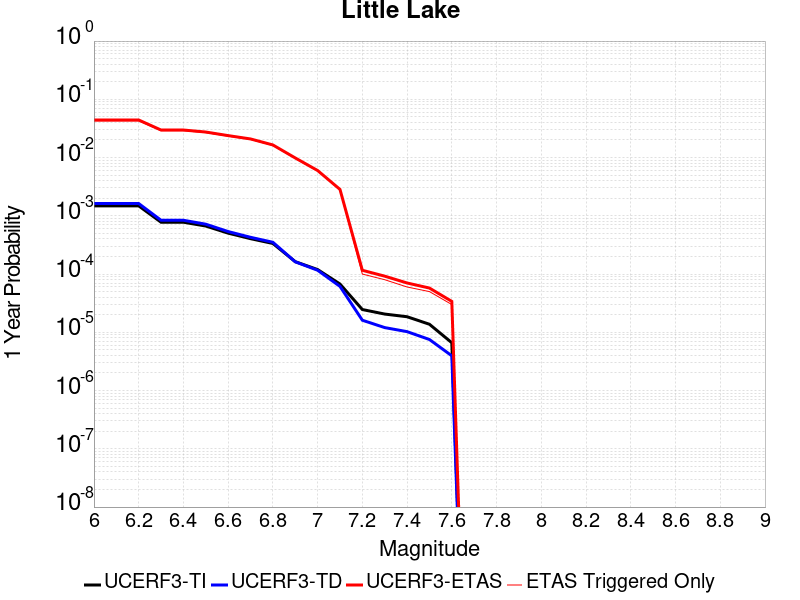
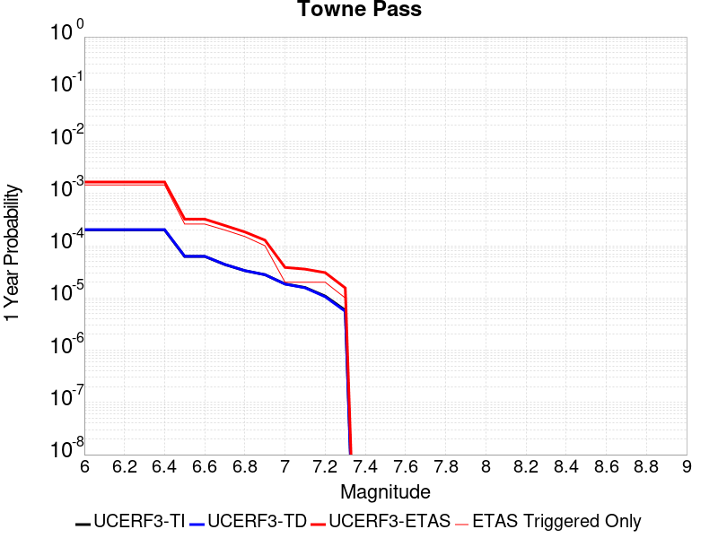
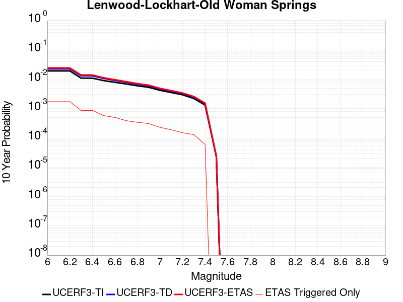
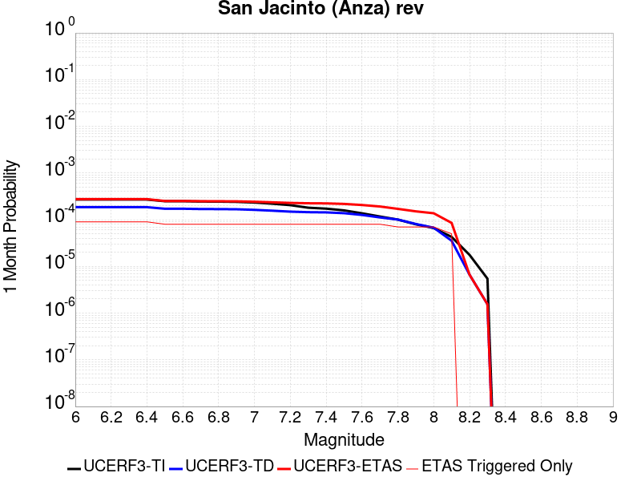
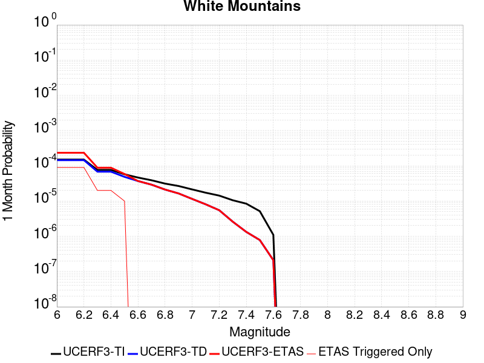
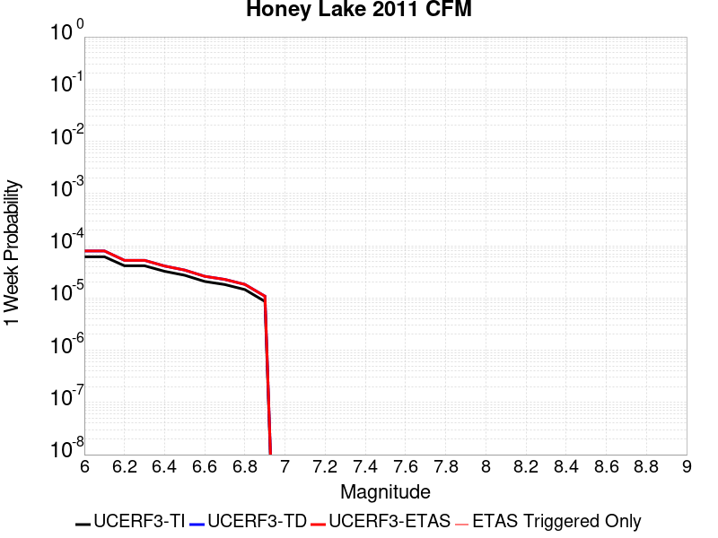
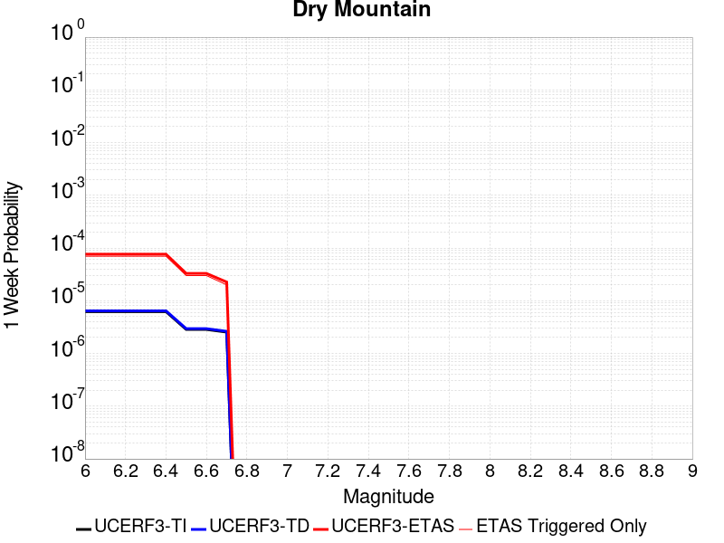
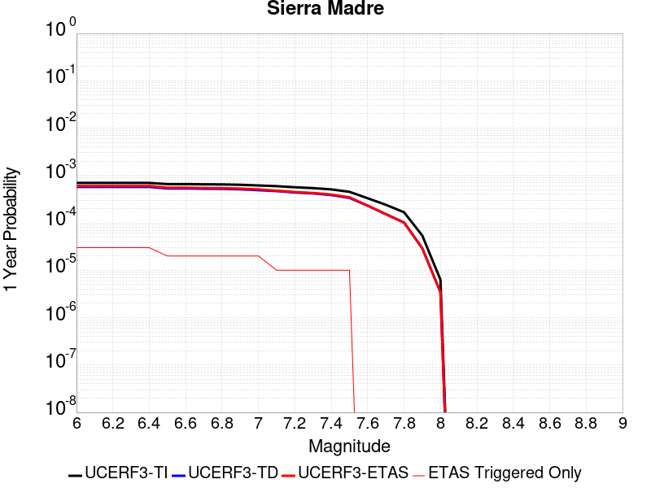
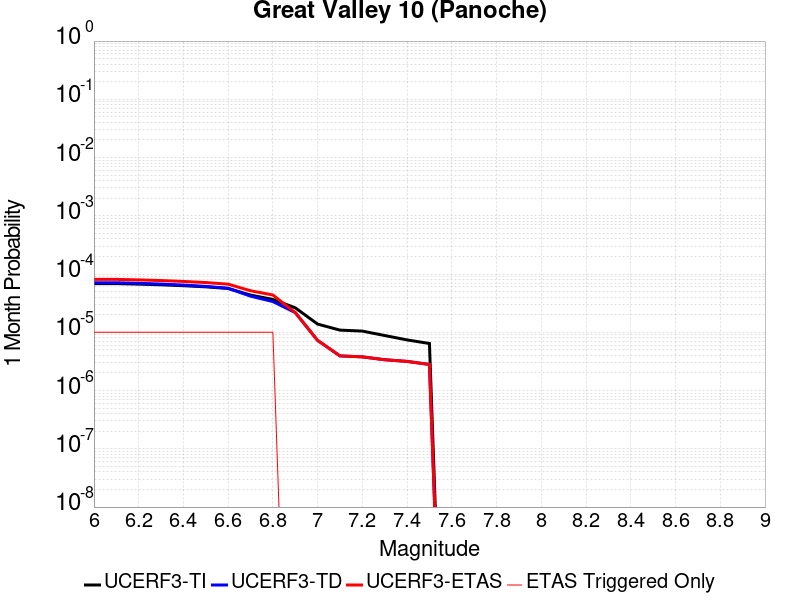

# Parent Section Magnitude-Probability Distributions

Only fault sections with at least one triggered aftershock are plotted. Sections are sorted by total supraseismogenic trigger rate (decreasing)

## Table Of Contents

* [Garlock (Central)](#garlock-central)
* [Tank Canyon](#tank-canyon)
* [Little Lake](#little-lake)
* [Airport Lake](#airport-lake)
* [Owl Lake](#owl-lake)
* [Panamint Valley](#panamint-valley)
* [Garlock (East)](#garlock-east)
* [Hunter Mountain-Saline Valley](#hunter-mountain-saline-valley)
* [Ash Hill](#ash-hill)
* [Blackwater](#blackwater)
* [Garlock (West)](#garlock-west)
* [Goldstone Lake](#goldstone-lake)
* [Gravel Hills-Harper Lk](#gravel-hills-harper-lk)
* [McLean Lake](#mclean-lake)
* [Coyote Canyon](#coyote-canyon)
* [San Andreas (Mojave N)](#san-andreas-mojave-n)
* [So Sierra Nevada](#so-sierra-nevada)
* [San Andreas (Mojave S)](#san-andreas-mojave-s)
* [Death Valley (So)](#death-valley-so)
* [Nelson Lake](#nelson-lake)
* [San Andreas (San Bernardino N)](#san-andreas-san-bernardino-n)
* [Towne Pass](#towne-pass)
* [Bicycle Lake](#bicycle-lake)
* [Paradise](#paradise)
* [Lenwood-Lockhart-Old Woman Springs](#lenwood-lockhart-old-woman-springs)
* [San Andreas (San Bernardino S)](#san-andreas-san-bernardino-s)
* [Death Valley (Black Mtns Frontal)](#death-valley-black-mtns-frontal)
* [Garlic Springs](#garlic-springs)
* [Helendale-So Lockhart](#helendale-so-lockhart)
* [Death Valley (No)](#death-valley-no)
* [Coyote Lake](#coyote-lake)
* [San Jacinto (San Bernardino)](#san-jacinto-san-bernardino)
* [Red Pass](#red-pass)
* [San Andreas (Big Bend)](#san-andreas-big-bend)
* [San Jacinto (Stepovers Combined)](#san-jacinto-stepovers-combined)
* [San Jacinto (San Jacinto Valley) rev](#san-jacinto-san-jacinto-valley-rev)
* [Calico-Hidalgo](#calico-hidalgo)
* [Death Valley (Fish Lake Valley)](#death-valley-fish-lake-valley)
* [San Jacinto (Anza) rev](#san-jacinto-anza-rev)
* [Manix-Afton Hills](#manix-afton-hills)
* [Ludlow](#ludlow)
* [Sierra Nevada  (No Extension)](#sierra-nevada--no-extension)
* [San Jacinto (Coyote Creek)](#san-jacinto-coyote-creek)
* [Cady](#cady)
* [San Jacinto (Borrego)](#san-jacinto-borrego)
* [San Jacinto (Lytle Creek connector)](#san-jacinto-lytle-creek-connector)
* [Santa Ynez (East)](#santa-ynez-east)
* [Pisgah-Bullion Mtn-Mesquite Lk](#pisgah-bullion-mtn-mesquite-lk)
* [Elsinore (Glen Ivy) rev](#elsinore-glen-ivy-rev)
* [San Andreas (San Gorgonio Pass-Garnet HIll)](#san-andreas-san-gorgonio-pass-garnet-hill)
* [White Wolf (Extension)](#white-wolf-extension)
* [Baker](#baker)
* [San Andreas (Parkfield)](#san-andreas-parkfield)
* [Brawley (Seismic Zone) alt 1](#brawley-seismic-zone-alt-1)
* [Independence rev 2011](#independence-rev-2011)
* [Imperial](#imperial)
* [White Mountains](#white-mountains)
* [Owens Valley](#owens-valley)
* [Great Valley 09 (Laguna Seca)](#great-valley-09-laguna-seca)
* [Honey Lake 2011 CFM](#honey-lake-2011-cfm)
* [Santa Susana East (connector)](#santa-susana-east-connector)
* [Newport-Inglewood (Offshore)](#newport-inglewood-offshore)
* [Mission Ridge-Arroyo Parida-Santa Ana](#mission-ridge-arroyo-parida-santa-ana)
* [Camp Rock 2011](#camp-rock-2011)
* [San Andreas (Creeping Section) 2011 CFM](#san-andreas-creeping-section-2011-cfm)
* [White Wolf](#white-wolf)
* [Red Mountain](#red-mountain)
* [Dry Mountain](#dry-mountain)
* [Great Valley 11](#great-valley-11)
* [San Andreas (Cholame) rev](#san-andreas-cholame-rev)
* [San Clemente](#san-clemente)
* [Scodie Lineament](#scodie-lineament)
* [Kern Canyon (Lake Isabella) 2011](#kern-canyon-lake-isabella-2011)
* [Great Valley 05 Pittsburg - Kirby Hills alt1](#great-valley-05-pittsburg---kirby-hills-alt1)
* [San Andreas (Coachella) rev](#san-andreas-coachella-rev)
* [Sierra Madre](#sierra-madre)
* [Pinto Mtn](#pinto-mtn)
* [Great Valley 10 (Panoche)](#great-valley-10-panoche)
* [Big Pine (West)](#big-pine-west)
* [San Pedro Basin](#san-pedro-basin)
* [Deep Springs](#deep-springs)
* [Hunting Creek - Berryessa 2011 CFM](#hunting-creek---berryessa-2011-cfm)
* [Pleito](#pleito)
* [Elsinore (Stepovers Combined)](#elsinore-stepovers-combined)
* [Tin Mountain](#tin-mountain)
* [San Andreas (Carrizo) rev](#san-andreas-carrizo-rev)
* [Kern Canyon (South Kern) 2011](#kern-canyon-south-kern-2011)
* [Raymond](#raymond)
* [San Andreas (North Branch Mill Creek)](#san-andreas-north-branch-mill-creek)
* [Pine Mtn](#pine-mtn)
* [San Gabriel (Extension)](#san-gabriel-extension)
* [Mission Creek](#mission-creek)
* [Whittier alt 1](#whittier-alt-1)
* [Anacapa-Dume alt 1](#anacapa-dume-alt-1)
* [Elsinore (Temecula) rev](#elsinore-temecula-rev)
* [Blue Cut](#blue-cut)
* [Clamshell-Sawpit](#clamshell-sawpit)
* [Big Pine (Central)](#big-pine-central)
* [Fitzhugh Creek](#fitzhugh-creek)
* [Puente Hills](#puente-hills)

## Garlock (Central)
*[(top)](#table-of-contents)*

| 1 Week | 1 Month | 1 Year | 10 Year |
|-----|-----|-----|-----|
|  |  |  |  |

| Magnitude | 1 wk TI Prob | 1 wk TD Prob | 1 wk ETAS Prob | 1 wk ETAS/TD Gain | 1 wk ETAS Triggered Only | 1 mo TI Prob | 1 mo TD Prob | 1 mo ETAS Prob | 1 mo ETAS/TD Gain | 1 mo ETAS Triggered Only | 1 yr TI Prob | 1 yr TD Prob | 1 yr ETAS Prob | 1 yr ETAS/TD Gain | 1 yr ETAS Triggered Only | 10 yr TI Prob | 10 yr TD Prob | 10 yr ETAS Prob | 10 yr ETAS/TD Gain | 10 yr ETAS Triggered Only |
|-----|-----|-----|-----|-----|-----|-----|-----|-----|-----|-----|-----|-----|-----|-----|-----|-----|-----|-----|-----|-----|
| 6.0 | 5.5131142E-5 | 7.024681E-5 | 0.070398636 | 1002.1614 | 0.07033333 | 2.3625491E-4 | 3.010234E-4 | 0.078777395 | 261.69858 | 0.0785 | 0.0028726095 | 0.0036588663 | 0.09227788 | 25.220346 | 0.08894444 | 0.028357591 | 0.036079824 | 0.12792 | 3.5454717 | 0.09527778 |
| 6.1 | 5.5131142E-5 | 7.024681E-5 | 0.070398636 | 1002.1614 | 0.07033333 | 2.3625491E-4 | 3.010234E-4 | 0.078777395 | 261.69858 | 0.0785 | 0.0028726095 | 0.0036588663 | 0.09227788 | 25.220346 | 0.08894444 | 0.028357591 | 0.036079824 | 0.12792 | 3.5454717 | 0.09527778 |
| 6.2 | 4.216245E-5 | 5.1661493E-5 | 0.04154952 | 804.2648 | 0.0415 | 1.806837E-4 | 2.2138779E-4 | 0.04615566 | 208.48332 | 0.045944445 | 0.0021976046 | 0.0026920962 | 0.055771038 | 20.716583 | 0.05322222 | 0.021759989 | 0.026689773 | 0.082709186 | 3.0989091 | 0.057555556 |
| 6.3 | 4.216245E-5 | 5.1661493E-5 | 0.04154952 | 804.2648 | 0.0415 | 1.806837E-4 | 2.2138779E-4 | 0.04615566 | 208.48332 | 0.045944445 | 0.0021976046 | 0.0026920962 | 0.055771038 | 20.716583 | 0.05322222 | 0.021759989 | 0.026689773 | 0.082709186 | 3.0989091 | 0.057555556 |
| 6.4 | 3.6858168E-5 | 4.411054E-5 | 0.033764847 | 765.4598 | 0.03372222 | 1.5795401E-4 | 1.8903162E-4 | 0.037570853 | 198.75433 | 0.037388887 | 0.0019213937 | 0.002299056 | 0.04508934 | 19.612112 | 0.042888887 | 0.019048655 | 0.02284894 | 0.06812361 | 2.9814777 | 0.04633333 |
| 6.5 | 3.39199E-5 | 4.0018083E-5 | 0.030761011 | 768.67773 | 0.030722221 | 1.453629E-4 | 1.7149492E-4 | 0.034110118 | 198.89871 | 0.033944443 | 0.0017683565 | 0.002085973 | 0.0408383 | 19.57758 | 0.038833335 | 0.017543508 | 0.020759864 | 0.062051155 | 2.9889963 | 0.042166665 |
| 6.6 | 3.3571985E-5 | 3.9472274E-5 | 0.030760482 | 779.2934 | 0.030722221 | 1.4387199E-4 | 1.6915603E-4 | 0.03410786 | 201.63548 | 0.033944443 | 0.0017502342 | 0.0020575512 | 0.040810984 | 19.834736 | 0.038833335 | 0.017365133 | 0.020481179 | 0.061784223 | 3.0166342 | 0.042166665 |
| 6.7 | 3.2580007E-5 | 3.8088703E-5 | 0.02931475 | 769.6443 | 0.029277777 | 1.3962112E-4 | 1.632272E-4 | 0.032602377 | 199.73618 | 0.032444444 | 0.0016985617 | 0.0019855013 | 0.039133817 | 19.709793 | 0.03722222 | 0.016856372 | 0.019773813 | 0.059255145 | 2.9966474 | 0.04027778 |
| 6.8 | 3.2185937E-5 | 3.7515918E-5 | 0.029036429 | 773.9762 | 0.029 | 1.3793244E-4 | 1.6077272E-4 | 0.03232227 | 201.04323 | 0.032166667 | 0.0016780337 | 0.001955672 | 0.03877242 | 19.825624 | 0.03688889 | 0.016654192 | 0.019480614 | 0.058592442 | 3.0077307 | 0.03988889 |
| 6.9 | 3.165394E-5 | 3.6720503E-5 | 0.028535673 | 777.1046 | 0.0285 | 1.3565269E-4 | 1.5736422E-4 | 0.031707954 | 201.49405 | 0.031555556 | 0.0016503202 | 0.001914247 | 0.037845336 | 19.77035 | 0.036 | 0.01638118 | 0.019073246 | 0.0572204 | 3.0000346 | 0.03888889 |
| 7.0 | 3.0903822E-5 | 3.5625766E-5 | 0.027256878 | 765.0889 | 0.027222222 | 1.3243823E-4 | 1.5267303E-4 | 0.030314734 | 198.55984 | 0.030166667 | 0.0016112428 | 0.0018572307 | 0.036404062 | 19.60126 | 0.03461111 | 0.015996104 | 0.018512413 | 0.0553182 | 2.9881678 | 0.0375 |
| 7.1 | 3.0069863E-5 | 3.4392073E-5 | 0.02636682 | 766.65405 | 0.026333334 | 1.2886449E-4 | 1.4738638E-4 | 0.029309755 | 198.86339 | 0.029166667 | 0.0015677959 | 0.0017929734 | 0.035177454 | 19.619617 | 0.033444446 | 0.01556781 | 0.017880075 | 0.0535092 | 2.9926722 | 0.03627778 |
| 7.2 | 2.7957109E-5 | 3.128145E-5 | 0.021752825 | 695.39044 | 0.021722222 | 1.1981068E-4 | 1.340566E-4 | 0.024241935 | 180.83359 | 0.02411111 | 0.0014577188 | 0.0016309366 | 0.029086085 | 17.833977 | 0.0275 | 0.014481937 | 0.016283695 | 0.045685884 | 2.8056214 | 0.029888889 |
| 7.3 | 2.4519275E-5 | 2.6714795E-5 | 0.015970733 | 597.82355 | 0.015944444 | 1.0507837E-4 | 1.1448703E-4 | 0.01777913 | 155.29384 | 0.017666666 | 0.0012785783 | 0.001393003 | 0.0214761 | 15.417123 | 0.020111112 | 0.012712469 | 0.013928054 | 0.03540251 | 2.5418131 | 0.021777777 |
| 7.4 | 2.3225532E-5 | 2.51994E-5 | 0.014969267 | 594.0327 | 0.014944444 | 9.95342E-5 | 1.0799304E-4 | 0.016550662 | 153.25674 | 0.016444445 | 0.0012111551 | 0.0013140367 | 0.019900693 | 15.144701 | 0.01861111 | 0.012045753 | 0.013145725 | 0.032937635 | 2.5055776 | 0.020055555 |
| 7.5 | 2.097765E-5 | 2.2483688E-5 | 0.011577779 | 514.9413 | 0.011555555 | 8.9901114E-5 | 9.635517E-5 | 0.012872902 | 133.59845 | 0.012777777 | 0.0010939965 | 0.0011725046 | 0.015655503 | 13.352188 | 0.0145 | 0.010886264 | 0.011740365 | 0.027223099 | 2.3187609 | 0.015666667 |
| 7.6 | 1.511254E-5 | 1.5991332E-5 | 0.0059603406 | 372.7232 | 0.0059444443 | 6.476642E-5 | 6.853253E-5 | 0.0067347423 | 98.270744 | 0.006666667 | 7.882459E-4 | 8.3407195E-4 | 0.008549853 | 10.250738 | 0.0077222222 | 0.007854558 | 0.008383559 | 0.01659194 | 1.9791045 | 0.008277778 |
| 7.7 | 9.934069E-6 | 1.0678794E-5 | 0.0016773277 | 157.07089 | 0.0016666667 | 4.2573887E-5 | 4.5765457E-5 | 0.0018790149 | 41.05749 | 0.0018333333 | 5.182138E-4 | 5.570524E-4 | 0.002611463 | 4.6880026 | 0.0020555556 | 0.00517007 | 0.005627684 | 0.007947885 | 1.4122837 | 0.0023333333 |
| 7.8 | 6.7562896E-6 | 8.428449E-6 | 0.0011195302 | 132.82755 | 0.0011111111 | 2.8955206E-5 | 3.6121426E-5 | 0.0013138531 | 36.373234 | 0.0012777778 | 3.5247262E-4 | 4.3968976E-4 | 0.0018834991 | 4.2837 | 0.0014444444 | 0.0035191406 | 0.004446654 | 0.0059952927 | 1.3482705 | 0.0015555555 |
| 7.9 | 3.975453E-6 | 5.37103E-6 | 4.498131E-4 | 83.74801 | 4.4444445E-4 | 1.7037546E-5 | 2.3018498E-5 | 5.23007E-4 | 22.72116 | 5.0E-4 | 2.0741238E-4 | 2.8021427E-4 | 8.3561416E-4 | 2.9820542 | 5.5555557E-4 | 0.002072189 | 0.0028336283 | 0.003498406 | 1.2346029 | 6.6666666E-4 |
| 8.0 | 1.6729537E-6 | 2.0775144E-6 | 2.2429928E-4 | 107.96521 | 2.2222222E-4 | 7.169782E-6 | 8.903603E-6 | 2.866789E-4 | 32.19808 | 2.7777778E-4 | 8.7288594E-5 | 1.0839601E-4 | 3.8614369E-4 | 3.5623422 | 2.7777778E-4 | 8.7254314E-4 | 0.0010969337 | 0.0014853961 | 1.3541347 | 3.8888888E-4 |
| 8.1 | 3.6733252E-7 | 3.1489964E-7 | 1.1142597E-4 | 353.84598 | 1.1111111E-4 | 1.5742813E-6 | 1.3495693E-6 | 1.68016E-4 | 124.496025 | 1.6666666E-4 | 1.9166706E-5 | 1.6430899E-5 | 1.8309483E-4 | 11.143324 | 1.6666666E-4 | 1.9165053E-4 | 1.6638759E-4 | 3.8857284E-4 | 2.3353474 | 2.2222222E-4 |

## Tank Canyon
*[(top)](#table-of-contents)*

| 1 Week | 1 Month | 1 Year | 10 Year |
|-----|-----|-----|-----|
|  |  |  |  |

| Magnitude | 1 wk TI Prob | 1 wk TD Prob | 1 wk ETAS Prob | 1 wk ETAS/TD Gain | 1 wk ETAS Triggered Only | 1 mo TI Prob | 1 mo TD Prob | 1 mo ETAS Prob | 1 mo ETAS/TD Gain | 1 mo ETAS Triggered Only | 1 yr TI Prob | 1 yr TD Prob | 1 yr ETAS Prob | 1 yr ETAS/TD Gain | 1 yr ETAS Triggered Only | 10 yr TI Prob | 10 yr TD Prob | 10 yr ETAS Prob | 10 yr ETAS/TD Gain | 10 yr ETAS Triggered Only |
|-----|-----|-----|-----|-----|-----|-----|-----|-----|-----|-----|-----|-----|-----|-----|-----|-----|-----|-----|-----|-----|
| 6.0 | 4.8284557E-5 | 5.7964822E-5 | 0.04088893 | 705.4094 | 0.04083333 | 2.0691741E-4 | 2.4840087E-4 | 0.047292266 | 190.38689 | 0.047055557 | 0.0025163088 | 0.0030207601 | 0.058186945 | 19.262352 | 0.055333335 | 0.02488006 | 0.029863637 | 0.08791013 | 2.9437182 | 0.059833333 |
| 6.1 | 1.7796336E-5 | 2.0873314E-5 | 0.014965006 | 716.9444 | 0.014944444 | 7.626778E-5 | 8.945422E-5 | 0.017532337 | 195.99231 | 0.017444445 | 9.281647E-4 | 0.0010885983 | 0.021677272 | 19.913015 | 0.020611111 | 0.009242975 | 0.010836744 | 0.0328731 | 3.0334852 | 0.022277778 |
| 6.2 | 1.7796336E-5 | 2.0873314E-5 | 0.014965006 | 716.9444 | 0.014944444 | 7.626778E-5 | 8.945422E-5 | 0.017532337 | 195.99231 | 0.017444445 | 9.281647E-4 | 0.0010885983 | 0.021677272 | 19.913015 | 0.020611111 | 0.009242975 | 0.010836744 | 0.0328731 | 3.0334852 | 0.022277778 |
| 6.3 | 1.3515912E-5 | 1.5759564E-5 | 0.011015587 | 698.97784 | 0.011 | 5.792405E-5 | 6.753938E-5 | 0.01301111 | 192.64479 | 0.012944444 | 7.049971E-4 | 8.2200574E-4 | 0.016198246 | 19.705755 | 0.015388889 | 0.007027647 | 0.0081922645 | 0.024667293 | 3.011047 | 0.01661111 |
| 6.4 | 1.0870146E-5 | 1.2618021E-5 | 0.008456956 | 670.2284 | 0.008444444 | 4.658551E-5 | 5.4076212E-5 | 0.010109088 | 186.9415 | 0.010055556 | 5.67031E-4 | 6.581969E-4 | 0.012261665 | 18.629175 | 0.011611111 | 0.005655863 | 0.0065644905 | 0.019148007 | 2.9169068 | 0.012666667 |
| 6.5 | 7.964826E-6 | 9.196094E-6 | 0.0057313656 | 623.23914 | 0.0057222224 | 3.4134522E-5 | 3.9411298E-5 | 0.0067058154 | 170.14957 | 0.006666667 | 4.1550855E-4 | 4.7973756E-4 | 0.008087197 | 16.857544 | 0.0076111113 | 0.0041473247 | 0.004788321 | 0.012860593 | 2.6858253 | 0.008111111 |
| 6.6 | 6.6317E-6 | 7.6122988E-6 | 0.0044520227 | 584.84607 | 0.0044444446 | 2.8421264E-5 | 3.2623782E-5 | 0.005199122 | 159.36601 | 0.0051666666 | 3.4597394E-4 | 3.9713128E-4 | 0.0062836814 | 15.822681 | 0.005888889 | 0.0034543579 | 0.003965368 | 0.010162917 | 2.562919 | 0.006222222 |
| 6.7 | 4.793663E-6 | 5.4307857E-6 | 0.0021165304 | 389.7282 | 0.002111111 | 2.0544108E-5 | 2.3274613E-5 | 0.0023565537 | 101.24996 | 0.0023333333 | 2.500958E-4 | 2.8333595E-4 | 0.0031714062 | 11.193096 | 0.0028888888 | 0.0024981452 | 0.0028304397 | 0.0058219484 | 2.056906 | 0.003 |
| 6.8 | 4.382823E-6 | 4.9692567E-6 | 0.0018938488 | 381.11307 | 0.0018888889 | 1.8783392E-5 | 2.1296666E-5 | 0.002132363 | 100.1266 | 0.002111111 | 2.286638E-4 | 2.5926033E-4 | 0.0029252355 | 11.283006 | 0.0026666666 | 0.0022842865 | 0.002590253 | 0.0053608357 | 2.0696185 | 0.0027777778 |
| 6.9 | 2.729601E-6 | 3.0735416E-6 | 8.919597E-4 | 290.2058 | 8.888889E-4 | 1.1698237E-5 | 1.3172262E-5 | 0.001013159 | 76.91611 | 0.001 | 1.4241673E-4 | 1.6036171E-4 | 0.0013268413 | 8.274053 | 0.0011666666 | 0.001423255 | 0.0016026258 | 0.0027674227 | 1.7268053 | 0.0011666666 |
| 7.0 | 1.8987357E-6 | 2.126939E-6 | 3.3545957E-4 | 157.7194 | 3.3333333E-4 | 8.137413E-6 | 9.115425E-6 | 3.424457E-4 | 37.56772 | 3.3333333E-4 | 9.90685E-5 | 1.1097535E-4 | 5.5537047E-4 | 5.004449 | 4.4444445E-4 | 9.902435E-4 | 0.0011092679 | 0.0015532194 | 1.4002202 | 4.4444445E-4 |
| 7.1 | 1.4928986E-6 | 1.6641272E-6 | 3.349969E-4 | 201.30487 | 3.3333333E-4 | 6.398121E-6 | 7.1319573E-6 | 3.4046292E-4 | 47.73765 | 3.3333333E-4 | 7.789434E-5 | 8.682871E-5 | 4.7568383E-4 | 5.4784164 | 3.8888888E-4 | 7.786704E-4 | 8.6800574E-4 | 0.0012565571 | 1.4476368 | 3.8888888E-4 |
| 7.2 | 1.069082E-6 | 1.1828573E-6 | 5.6738347E-5 | 47.967197 | 5.5555556E-5 | 4.581772E-6 | 5.0693816E-6 | 6.0624654E-5 | 11.958984 | 5.5555556E-5 | 5.5781646E-5 | 6.171851E-5 | 1.1727063E-4 | 1.9000887 | 5.5555556E-5 | 5.576765E-4 | 6.170659E-4 | 6.725872E-4 | 1.0899762 | 5.5555556E-5 |
| 7.3 | 8.776551E-7 | 9.770005E-7 | 9.770005E-7 | 1.0 | 0.0 | 3.7613736E-6 | 4.1871413E-6 | 4.1871413E-6 | 1.0 | 0.0 | 4.579376E-5 | 5.097777E-5 | 5.097777E-5 | 1.0 | 0.0 | 4.5784327E-4 | 5.097118E-4 | 5.097118E-4 | 1.0 | 0.0 |
| 7.4 | 7.55721E-7 | 8.510244E-7 | 8.510244E-7 | 1.0 | 0.0 | 3.2388E-6 | 3.6472454E-6 | 3.6472454E-6 | 1.0 | 0.0 | 3.9431678E-5 | 4.4404827E-5 | 4.4404827E-5 | 1.0 | 0.0 | 3.942468E-4 | 4.440104E-4 | 4.440104E-4 | 1.0 | 0.0 |
| 7.5 | 5.587665E-7 | 6.305619E-7 | 6.305619E-7 | 1.0 | 0.0 | 2.3947114E-6 | 2.702408E-6 | 2.702408E-6 | 1.0 | 0.0 | 2.915522E-5 | 3.290182E-5 | 3.290182E-5 | 1.0 | 0.0 | 2.9151395E-4 | 3.290182E-4 | 3.290182E-4 | 1.0 | 0.0 |

## Little Lake
*[(top)](#table-of-contents)*

| 1 Week | 1 Month | 1 Year | 10 Year |
|-----|-----|-----|-----|
|  |  |  |  |

| Magnitude | 1 wk TI Prob | 1 wk TD Prob | 1 wk ETAS Prob | 1 wk ETAS/TD Gain | 1 wk ETAS Triggered Only | 1 mo TI Prob | 1 mo TD Prob | 1 mo ETAS Prob | 1 mo ETAS/TD Gain | 1 mo ETAS Triggered Only | 1 yr TI Prob | 1 yr TD Prob | 1 yr ETAS Prob | 1 yr ETAS/TD Gain | 1 yr ETAS Triggered Only | 10 yr TI Prob | 10 yr TD Prob | 10 yr ETAS Prob | 10 yr ETAS/TD Gain | 10 yr ETAS Triggered Only |
|-----|-----|-----|-----|-----|-----|-----|-----|-----|-----|-----|-----|-----|-----|-----|-----|-----|-----|-----|-----|-----|
| 6.0 | 2.8424427E-5 | 3.120572E-5 | 0.035474543 | 1136.7961 | 0.035444446 | 1.2181328E-4 | 1.337327E-4 | 0.039295163 | 293.83362 | 0.039166667 | 0.0014820677 | 0.0016271127 | 0.04500087 | 27.656883 | 0.043444443 | 0.014722223 | 0.016165402 | 0.061421793 | 3.7995837 | 0.046 |
| 6.1 | 2.8424427E-5 | 3.120572E-5 | 0.035474543 | 1136.7961 | 0.035444446 | 1.2181328E-4 | 1.337327E-4 | 0.039295163 | 293.83362 | 0.039166667 | 0.0014820677 | 0.0016271127 | 0.04500087 | 27.656883 | 0.043444443 | 0.014722223 | 0.016165402 | 0.061421793 | 3.7995837 | 0.046 |
| 6.2 | 2.8424427E-5 | 3.120572E-5 | 0.035474543 | 1136.7961 | 0.035444446 | 1.2181328E-4 | 1.337327E-4 | 0.039295163 | 293.83362 | 0.039166667 | 0.0014820677 | 0.0016271127 | 0.04500087 | 27.656883 | 0.043444443 | 0.014722223 | 0.016165402 | 0.061421793 | 3.7995837 | 0.046 |
| 6.3 | 1.48860645E-5 | 1.6081389E-5 | 0.02468235 | 1534.8395 | 0.024666667 | 6.379586E-5 | 6.8918576E-5 | 0.027067058 | 392.73962 | 0.027 | 7.7643775E-4 | 8.3878887E-4 | 0.030924642 | 36.86821 | 0.030111112 | 0.007737305 | 0.008359048 | 0.040201742 | 4.8093686 | 0.032111112 |
| 6.4 | 1.48860645E-5 | 1.6081389E-5 | 0.02468235 | 1534.8395 | 0.024666667 | 6.379586E-5 | 6.8918576E-5 | 0.027067058 | 392.73962 | 0.027 | 7.7643775E-4 | 8.3878887E-4 | 0.030924642 | 36.86821 | 0.030111112 | 0.007737305 | 0.008359048 | 0.040201742 | 4.8093686 | 0.032111112 |
| 6.5 | 1.2797581E-5 | 1.3765565E-5 | 0.023180114 | 1683.9203 | 0.023166666 | 5.4845623E-5 | 5.899409E-5 | 0.02533528 | 429.45456 | 0.025277779 | 6.675408E-4 | 7.18042E-4 | 0.02903103 | 40.430824 | 0.028333334 | 0.006655392 | 0.00715977 | 0.03705529 | 5.1754866 | 0.030111112 |
| 6.6 | 9.661896E-6 | 1.0289038E-5 | 0.020787854 | 2020.3884 | 0.020777779 | 4.1407468E-5 | 4.409522E-5 | 0.022765316 | 516.27625 | 0.022722222 | 5.040193E-4 | 5.367433E-4 | 0.026023056 | 48.483242 | 0.0255 | 0.005028777 | 0.0053560743 | 0.03193517 | 5.962421 | 0.026722223 |
| 6.7 | 7.767871E-6 | 8.199687E-6 | 0.018174717 | 2216.5137 | 0.018166667 | 3.329045E-5 | 3.5141118E-5 | 0.019923331 | 566.9521 | 0.019888889 | 4.0523586E-4 | 4.2777284E-4 | 0.022640489 | 52.92643 | 0.022222223 | 0.004044977 | 0.004270846 | 0.027449207 | 6.4271126 | 0.023277778 |
| 6.8 | 6.4235196E-6 | 6.7357446E-6 | 0.014617749 | 2170.1755 | 0.014611111 | 2.752908E-5 | 2.8867229E-5 | 0.015917297 | 551.3968 | 0.015888888 | 3.35115E-4 | 3.5141467E-4 | 0.01834509 | 52.203537 | 0.018 | 0.003346101 | 0.00350985 | 0.02216636 | 6.315472 | 0.018722223 |
| 6.9 | 3.1283696E-6 | 3.1121804E-6 | 0.009391972 | 3017.8108 | 0.009388889 | 1.3407229E-5 | 1.3337856E-5 | 0.0102909785 | 771.56165 | 0.010277778 | 1.6322079E-4 | 1.6237781E-4 | 0.0117716035 | 72.49515 | 0.011611111 | 0.0016310095 | 0.00162274 | 0.013603267 | 8.3829 | 0.012 |
| 7.0 | 2.290603E-6 | 2.2286815E-6 | 0.005446661 | 2443.8938 | 0.0054444443 | 9.816834E-6 | 9.551463E-6 | 0.005953939 | 623.35364 | 0.0059444443 | 1.19513395E-4 | 1.162839E-4 | 0.0068377242 | 58.801987 | 0.006722222 | 0.0011944914 | 0.0011623327 | 0.008098706 | 6.967631 | 0.0069444445 |
| 7.1 | 1.293693E-6 | 1.1776827E-6 | 0.0028345077 | 2406.8516 | 0.0028333333 | 5.5443866E-6 | 5.0472063E-6 | 0.0030605874 | 606.3924 | 0.0030555555 | 6.750081E-5 | 6.14487E-5 | 0.003339025 | 54.338417 | 0.0032777777 | 6.7480316E-4 | 6.143856E-4 | 0.0038901495 | 6.3317723 | 0.0032777777 |
| 7.2 | 4.715842E-7 | 3.0917857E-7 | 5.5864715E-5 | 180.68755 | 5.5555556E-5 | 2.0210737E-6 | 1.3250503E-6 | 5.6880534E-5 | 42.92707 | 5.5555556E-5 | 2.4606294E-5 | 1.6132375E-5 | 7.1687035E-5 | 4.4436755 | 5.5555556E-5 | 2.460357E-4 | 1.6131258E-4 | 2.1685917E-4 | 1.3443414 | 5.5555556E-5 |
| 7.3 | 3.9430947E-7 | 2.3097488E-7 | 5.5786517E-5 | 241.52635 | 5.5555556E-5 | 1.6898966E-6 | 9.89892E-7 | 5.6545392E-5 | 57.12279 | 5.5555556E-5 | 2.0574296E-5 | 1.2051869E-5 | 6.760676E-5 | 5.609649 | 5.5555556E-5 | 2.0572392E-4 | 1.20512224E-4 | 1.7606109E-4 | 1.4609396 | 5.5555556E-5 |
| 7.4 | 3.547123E-7 | 1.9679135E-7 | 5.5752334E-5 | 283.30682 | 5.5555556E-5 | 1.5201948E-6 | 8.4339126E-7 | 5.63989E-5 | 66.871574 | 5.5555556E-5 | 1.8508214E-5 | 1.0268241E-5 | 6.5823224E-5 | 6.4103703 | 5.5555556E-5 | 1.8506673E-4 | 1.02677724E-4 | 1.5822757E-4 | 1.5410117 | 5.5555556E-5 |
| 7.5 | 2.6354266E-7 | 1.4423138E-7 | 5.569978E-5 | 386.18347 | 5.5555556E-5 | 1.129468E-6 | 6.181344E-7 | 5.6173656E-5 | 90.87613 | 5.5555556E-5 | 1.3751187E-5 | 7.5257603E-6 | 6.30809E-5 | 8.381996 | 5.5555556E-5 | 1.3750336E-4 | 7.5255106E-5 | 1.3080648E-4 | 1.7381742 | 5.5555556E-5 |
| 7.6 | 1.269913E-7 | 7.572556E-8 | 5.5631277E-5 | 734.6433 | 5.5555556E-5 | 5.4424834E-7 | 3.245381E-7 | 5.5880075E-5 | 172.18341 | 5.5555556E-5 | 6.6262032E-6 | 3.9512443E-6 | 5.950658E-5 | 15.060213 | 5.5555556E-5 | 6.626006E-5 | 3.9511775E-5 | 9.506514E-5 | 2.405995 | 5.5555556E-5 |

## Airport Lake
*[(top)](#table-of-contents)*

| 1 Week | 1 Month | 1 Year | 10 Year |
|-----|-----|-----|-----|
|  |  |  |  |

| Magnitude | 1 wk TI Prob | 1 wk TD Prob | 1 wk ETAS Prob | 1 wk ETAS/TD Gain | 1 wk ETAS Triggered Only | 1 mo TI Prob | 1 mo TD Prob | 1 mo ETAS Prob | 1 mo ETAS/TD Gain | 1 mo ETAS Triggered Only | 1 yr TI Prob | 1 yr TD Prob | 1 yr ETAS Prob | 1 yr ETAS/TD Gain | 1 yr ETAS Triggered Only | 10 yr TI Prob | 10 yr TD Prob | 10 yr ETAS Prob | 10 yr ETAS/TD Gain | 10 yr ETAS Triggered Only |
|-----|-----|-----|-----|-----|-----|-----|-----|-----|-----|-----|-----|-----|-----|-----|-----|-----|-----|-----|-----|-----|
| 6.0 | 1.2387061E-5 | 1.3103157E-5 | 0.033401556 | 2549.1228 | 0.03338889 | 5.3086325E-5 | 5.615534E-5 | 0.036109686 | 643.0321 | 0.036055554 | 6.461343E-4 | 6.8350515E-4 | 0.04054513 | 59.31942 | 0.03988889 | 0.0064425888 | 0.0068168393 | 0.048254646 | 7.078742 | 0.041722223 |
| 6.1 | 1.2387061E-5 | 1.3103157E-5 | 0.033401556 | 2549.1228 | 0.03338889 | 5.3086325E-5 | 5.615534E-5 | 0.036109686 | 643.0321 | 0.036055554 | 6.461343E-4 | 6.8350515E-4 | 0.04054513 | 59.31942 | 0.03988889 | 0.0064425888 | 0.0068168393 | 0.048254646 | 7.078742 | 0.041722223 |
| 6.2 | 1.2387061E-5 | 1.3103157E-5 | 0.033401556 | 2549.1228 | 0.03338889 | 5.3086325E-5 | 5.615534E-5 | 0.036109686 | 643.0321 | 0.036055554 | 6.461343E-4 | 6.8350515E-4 | 0.04054513 | 59.31942 | 0.03988889 | 0.0064425888 | 0.0068168393 | 0.048254646 | 7.078742 | 0.041722223 |
| 6.3 | 1.2387061E-5 | 1.3103157E-5 | 0.033401556 | 2549.1228 | 0.03338889 | 5.3086325E-5 | 5.615534E-5 | 0.036109686 | 643.0321 | 0.036055554 | 6.461343E-4 | 6.8350515E-4 | 0.04054513 | 59.31942 | 0.03988889 | 0.0064425888 | 0.0068168393 | 0.048254646 | 7.078742 | 0.041722223 |
| 6.4 | 1.2387061E-5 | 1.3103157E-5 | 0.033401556 | 2549.1228 | 0.03338889 | 5.3086325E-5 | 5.615534E-5 | 0.036109686 | 643.0321 | 0.036055554 | 6.461343E-4 | 6.8350515E-4 | 0.04054513 | 59.31942 | 0.03988889 | 0.0064425888 | 0.0068168393 | 0.048254646 | 7.078742 | 0.041722223 |
| 6.5 | 6.9922594E-6 | 7.384925E-6 | 0.025784973 | 3491.5686 | 0.025777778 | 2.996648E-5 | 3.1649324E-5 | 0.028252978 | 892.6882 | 0.028222222 | 3.6478083E-4 | 3.8526783E-4 | 0.03148439 | 81.720795 | 0.031111112 | 0.003641826 | 0.0038465366 | 0.036276866 | 9.4310465 | 0.032555554 |
| 6.6 | 6.9922594E-6 | 7.384925E-6 | 0.025784973 | 3491.5686 | 0.025777778 | 2.996648E-5 | 3.1649324E-5 | 0.028252978 | 892.6882 | 0.028222222 | 3.6478083E-4 | 3.8526783E-4 | 0.03148439 | 81.720795 | 0.031111112 | 0.003641826 | 0.0038465366 | 0.036276866 | 9.4310465 | 0.032555554 |
| 6.7 | 5.477277E-6 | 5.7860684E-6 | 0.02139455 | 3697.5974 | 0.021388888 | 2.3473833E-5 | 2.4797222E-5 | 0.023357552 | 941.94226 | 0.023333333 | 2.8575645E-4 | 3.0186825E-4 | 0.026182942 | 86.73632 | 0.025888888 | 0.0028538927 | 0.003014966 | 0.02998895 | 9.946696 | 0.027055556 |
| 6.8 | 3.9950432E-6 | 4.2190873E-6 | 0.017170813 | 4069.7935 | 0.017166667 | 1.7121502E-5 | 1.8081691E-5 | 0.018628856 | 1030.2606 | 0.01861111 | 2.0843433E-4 | 2.2012512E-4 | 0.021104416 | 95.87464 | 0.02088889 | 0.0020823893 | 0.0021993418 | 0.023929223 | 10.880175 | 0.021777777 |
| 6.9 | 2.95695E-6 | 3.1230243E-6 | 0.0126697505 | 4056.8848 | 0.012666667 | 1.2672582E-5 | 1.3384334E-5 | 0.013957642 | 1042.8342 | 0.013944444 | 1.5427776E-4 | 1.6294434E-4 | 0.015827058 | 97.13168 | 0.015666667 | 0.001541707 | 0.0016284712 | 0.017990671 | 11.047584 | 0.01638889 |
| 7.0 | 1.456072E-6 | 1.540812E-6 | 0.0053904215 | 3498.429 | 0.005388889 | 6.2402937E-6 | 6.603469E-6 | 0.0058954535 | 892.78125 | 0.005888889 | 7.597293E-5 | 8.039528E-5 | 0.006746526 | 83.91695 | 0.006666667 | 7.594696E-4 | 8.0376083E-4 | 0.0076316018 | 9.494866 | 0.0068333335 |
| 7.1 | 6.995192E-7 | 7.4089746E-7 | 0.0027785166 | 3750.204 | 0.0027777778 | 2.997936E-6 | 3.1752747E-6 | 0.0030031658 | 945.7971 | 0.003 | 3.649926E-5 | 3.865897E-5 | 0.0032607566 | 84.3467 | 0.0032222222 | 3.6493264E-4 | 3.865897E-4 | 0.0036075662 | 9.33177 | 0.0032222222 |

## Owl Lake
*[(top)](#table-of-contents)*

| 1 Week | 1 Month | 1 Year | 10 Year |
|-----|-----|-----|-----|
|  |  |  |  |

| Magnitude | 1 wk TI Prob | 1 wk TD Prob | 1 wk ETAS Prob | 1 wk ETAS/TD Gain | 1 wk ETAS Triggered Only | 1 mo TI Prob | 1 mo TD Prob | 1 mo ETAS Prob | 1 mo ETAS/TD Gain | 1 mo ETAS Triggered Only | 1 yr TI Prob | 1 yr TD Prob | 1 yr ETAS Prob | 1 yr ETAS/TD Gain | 1 yr ETAS Triggered Only | 10 yr TI Prob | 10 yr TD Prob | 10 yr ETAS Prob | 10 yr ETAS/TD Gain | 10 yr ETAS Triggered Only |
|-----|-----|-----|-----|-----|-----|-----|-----|-----|-----|-----|-----|-----|-----|-----|-----|-----|-----|-----|-----|-----|
| 6.0 | 5.0320643E-5 | 6.635816E-5 | 0.018176267 | 273.9116 | 0.018111112 | 2.1564208E-4 | 2.843674E-4 | 0.021445015 | 75.41306 | 0.021166667 | 0.0026222812 | 0.0034577388 | 0.028315932 | 8.189147 | 0.024944445 | 0.02591553 | 0.034140717 | 0.06059453 | 1.7748464 | 0.02738889 |
| 6.1 | 5.0320643E-5 | 6.635816E-5 | 0.018176267 | 273.9116 | 0.018111112 | 2.1564208E-4 | 2.843674E-4 | 0.021445015 | 75.41306 | 0.021166667 | 0.0026222812 | 0.0034577388 | 0.028315932 | 8.189147 | 0.024944445 | 0.02591553 | 0.034140717 | 0.06059453 | 1.7748464 | 0.02738889 |
| 6.2 | 2.4125871E-5 | 3.0981035E-5 | 0.01464164 | 472.60007 | 0.014611111 | 1.0339249E-4 | 1.3277028E-4 | 0.016741676 | 126.095055 | 0.01661111 | 0.0012580766 | 0.001615439 | 0.020751143 | 12.845513 | 0.019166667 | 0.012509781 | 0.016070465 | 0.03662366 | 2.278942 | 0.02088889 |
| 6.3 | 1.7433485E-5 | 2.2355514E-5 | 0.012688739 | 567.5888 | 0.012666667 | 7.471279E-5 | 9.580672E-5 | 0.014427767 | 150.59244 | 0.014333333 | 9.0924866E-4 | 0.0011659743 | 0.017591245 | 15.087164 | 0.016444445 | 0.009055373 | 0.011628896 | 0.02909012 | 2.5015376 | 0.017666666 |
| 6.4 | 1.7433485E-5 | 2.2355514E-5 | 0.012688739 | 567.5888 | 0.012666667 | 7.471279E-5 | 9.580672E-5 | 0.014427767 | 150.59244 | 0.014333333 | 9.0924866E-4 | 0.0011659743 | 0.017591245 | 15.087164 | 0.016444445 | 0.009055373 | 0.011628896 | 0.02909012 | 2.5015376 | 0.017666666 |
| 6.5 | 1.5182742E-5 | 1.9429144E-5 | 0.012519186 | 644.3509 | 0.0125 | 6.506727E-5 | 8.326596E-5 | 0.014193202 | 170.45624 | 0.014111111 | 7.919061E-4 | 0.0010134429 | 0.017219225 | 16.99082 | 0.016222222 | 0.0078909 | 0.010118429 | 0.027276376 | 2.6957126 | 0.017333332 |
| 6.6 | 6.7271576E-6 | 8.547361E-6 | 0.010008462 | 1170.9418 | 0.01 | 2.8830356E-5 | 3.6631063E-5 | 0.011425103 | 311.89655 | 0.011388889 | 3.5095305E-4 | 4.458976E-4 | 0.013329039 | 29.892601 | 0.012888889 | 0.0035039932 | 0.004467813 | 0.018128727 | 4.057629 | 0.013722222 |
| 6.7 | 6.682835E-6 | 8.479807E-6 | 0.009952839 | 1173.7107 | 0.0099444445 | 2.8640408E-5 | 3.6341557E-5 | 0.011369263 | 312.8447 | 0.011333333 | 3.4864116E-4 | 4.4237426E-4 | 0.013270031 | 29.997293 | 0.012833334 | 0.003480947 | 0.0044327388 | 0.018038824 | 4.0694532 | 0.013666667 |
| 6.8 | 6.5774975E-6 | 8.32628E-6 | 0.009952688 | 1195.3342 | 0.0099444445 | 2.8188972E-5 | 3.5683603E-5 | 0.011368613 | 318.59485 | 0.011333333 | 3.4314668E-4 | 4.343669E-4 | 0.013262126 | 30.532082 | 0.012833334 | 0.0034261728 | 0.004352885 | 0.017960062 | 4.1260138 | 0.013666667 |
| 6.9 | 6.363419E-6 | 7.999454E-6 | 0.0099523645 | 1244.1304 | 0.0099444445 | 2.727151E-5 | 3.428296E-5 | 0.0113116745 | 329.95035 | 0.011277778 | 3.3198006E-4 | 4.1732067E-4 | 0.013189766 | 31.605831 | 0.012777777 | 0.0033148455 | 0.0041828766 | 0.017737053 | 4.240396 | 0.013611111 |
| 7.0 | 6.1342453E-6 | 7.6316555E-6 | 0.009729779 | 1274.9238 | 0.009722223 | 2.6289357E-5 | 3.2706717E-5 | 0.011032347 | 337.31137 | 0.011 | 3.2002592E-4 | 3.9813702E-4 | 0.01289316 | 32.383728 | 0.0125 | 0.0031956544 | 0.003991571 | 0.017271683 | 4.3270392 | 0.013333334 |
| 7.1 | 5.842926E-6 | 7.142211E-6 | 0.009229299 | 1292.2186 | 0.0092222225 | 2.504087E-5 | 3.0609146E-5 | 0.010530287 | 344.0242 | 0.0105 | 3.0482994E-4 | 3.7260808E-4 | 0.012312602 | 33.04438 | 0.011944445 | 0.0030441214 | 0.0037370329 | 0.016411712 | 4.391642 | 0.012722222 |
| 7.2 | 4.77173E-6 | 5.358483E-6 | 0.0056719948 | 1058.5076 | 0.0056666667 | 2.045011E-5 | 2.2964748E-5 | 0.0065228157 | 284.036 | 0.0065 | 2.4895166E-4 | 2.79564E-4 | 0.007499767 | 26.826656 | 0.007222222 | 0.0024867293 | 0.002808645 | 0.010453778 | 3.7220006 | 0.0076666665 |
| 7.3 | 3.0494948E-6 | 2.710463E-6 | 0.0013360402 | 492.91956 | 0.0013333333 | 1.3069198E-5 | 1.1616219E-5 | 0.0016782635 | 144.47589 | 0.0016666667 | 1.5910587E-4 | 1.4141845E-4 | 0.0018633971 | 13.176478 | 0.0017222222 | 0.0015899199 | 0.0014232415 | 0.003198489 | 2.247327 | 0.0017777778 |
| 7.4 | 2.7263884E-6 | 2.3056762E-6 | 0.0010578588 | 458.8063 | 0.0010555555 | 1.1684469E-5 | 9.881433E-6 | 0.0012320916 | 124.687546 | 0.0012222222 | 1.4224913E-4 | 1.20299905E-4 | 0.0013423751 | 11.158571 | 0.0012222222 | 0.0014215811 | 0.0012112238 | 0.0024874539 | 2.05367 | 0.0012777778 |
| 7.5 | 2.6090431E-6 | 2.1656133E-6 | 8.910526E-4 | 411.45508 | 8.888889E-4 | 1.1181565E-5 | 9.281167E-6 | 0.0010092718 | 108.74407 | 0.001 | 1.3612706E-4 | 1.1299244E-4 | 0.0011128795 | 9.849149 | 0.001 | 0.001360437 | 0.0011379806 | 0.0021368426 | 1.8777496 | 0.001 |
| 7.6 | 2.3008756E-6 | 1.8727933E-6 | 6.685382E-4 | 356.97382 | 6.6666666E-4 | 9.860858E-6 | 8.0262325E-6 | 7.857978E-4 | 97.90369 | 7.7777775E-4 | 1.20049335E-4 | 9.7715085E-5 | 8.7541685E-4 | 8.958871 | 7.7777775E-4 | 0.001199845 | 9.849932E-4 | 0.0017620048 | 1.7888498 | 7.7777775E-4 |
| 7.7 | 1.7184348E-6 | 1.3419171E-6 | 3.346748E-4 | 249.40051 | 3.3333333E-4 | 7.3646997E-6 | 5.7510606E-6 | 3.3908247E-4 | 58.959988 | 3.3333333E-4 | 8.966153E-5 | 7.0016955E-5 | 4.0332697E-4 | 5.7604184 | 3.3333333E-4 | 8.962536E-4 | 7.078345E-4 | 0.0010409319 | 1.4705865 | 3.3333333E-4 |
| 7.8 | 8.4612907E-7 | 8.4058576E-7 | 1.6750711E-4 | 199.27426 | 1.6666666E-4 | 3.6262625E-6 | 3.6025056E-6 | 1.7026857E-4 | 47.26393 | 1.6666666E-4 | 4.4148852E-5 | 4.3859643E-5 | 2.10519E-4 | 4.799834 | 1.6666666E-4 | 4.414008E-4 | 4.4398365E-4 | 6.105763E-4 | 1.3752226 | 1.6666666E-4 |
| 7.9 | 2.716738E-7 | 3.768106E-7 | 5.5932345E-5 | 148.43623 | 5.5555556E-5 | 1.1643157E-6 | 1.6149015E-6 | 5.7170368E-5 | 35.401768 | 5.5555556E-5 | 1.4175452E-5 | 1.966126E-5 | 7.521572E-5 | 3.8255801 | 5.5555556E-5 | 1.4174548E-4 | 1.9836679E-4 | 2.5391133E-4 | 1.2800093 | 5.5555556E-5 |
| 8.0 | 2.1995428E-8 | 3.384878E-8 | 3.384878E-8 | 1.0 | 0.0 | 9.426611E-8 | 1.4506621E-7 | 1.4506621E-7 | 1.0 | 0.0 | 1.1476893E-6 | 1.7661803E-6 | 1.7661803E-6 | 1.0 | 0.0 | 1.14768345E-5 | 1.7963059E-5 | 1.7963059E-5 | 1.0 | 0.0 |

## Panamint Valley
*[(top)](#table-of-contents)*

| 1 Week | 1 Month | 1 Year | 10 Year |
|-----|-----|-----|-----|
|  |  |  |  |

| Magnitude | 1 wk TI Prob | 1 wk TD Prob | 1 wk ETAS Prob | 1 wk ETAS/TD Gain | 1 wk ETAS Triggered Only | 1 mo TI Prob | 1 mo TD Prob | 1 mo ETAS Prob | 1 mo ETAS/TD Gain | 1 mo ETAS Triggered Only | 1 yr TI Prob | 1 yr TD Prob | 1 yr ETAS Prob | 1 yr ETAS/TD Gain | 1 yr ETAS Triggered Only | 10 yr TI Prob | 10 yr TD Prob | 10 yr ETAS Prob | 10 yr ETAS/TD Gain | 10 yr ETAS Triggered Only |
|-----|-----|-----|-----|-----|-----|-----|-----|-----|-----|-----|-----|-----|-----|-----|-----|-----|-----|-----|-----|-----|
| 6.0 | 3.0211835E-5 | 3.3984514E-5 | 0.015477904 | 455.43994 | 0.0154444445 | 1.2947287E-4 | 1.4563995E-4 | 0.017531997 | 120.379036 | 0.01738889 | 0.0015751923 | 0.0017717537 | 0.021847233 | 12.3308525 | 0.020111112 | 0.015640736 | 0.017583137 | 0.038868837 | 2.2105746 | 0.021666666 |
| 6.1 | 3.0211835E-5 | 3.3984514E-5 | 0.015477904 | 455.43994 | 0.0154444445 | 1.2947287E-4 | 1.4563995E-4 | 0.017531997 | 120.379036 | 0.01738889 | 0.0015751923 | 0.0017717537 | 0.021847233 | 12.3308525 | 0.020111112 | 0.015640736 | 0.017583137 | 0.038868837 | 2.2105746 | 0.021666666 |
| 6.2 | 3.0211835E-5 | 3.3984514E-5 | 0.015477904 | 455.43994 | 0.0154444445 | 1.2947287E-4 | 1.4563995E-4 | 0.017531997 | 120.379036 | 0.01738889 | 0.0015751923 | 0.0017717537 | 0.021847233 | 12.3308525 | 0.020111112 | 0.015640736 | 0.017583137 | 0.038868837 | 2.2105746 | 0.021666666 |
| 6.3 | 2.8573924E-5 | 3.210268E-5 | 0.014753852 | 459.5832 | 0.014722222 | 1.2245393E-4 | 1.3757581E-4 | 0.016635306 | 120.91737 | 0.0165 | 0.001489857 | 0.0016737265 | 0.020808313 | 12.432326 | 0.019166667 | 0.01479908 | 0.016617801 | 0.0368864 | 2.219692 | 0.020611111 |
| 6.4 | 2.8573924E-5 | 3.210268E-5 | 0.014753852 | 459.5832 | 0.014722222 | 1.2245393E-4 | 1.3757581E-4 | 0.016635306 | 120.91737 | 0.0165 | 0.001489857 | 0.0016737265 | 0.020808313 | 12.432326 | 0.019166667 | 0.01479908 | 0.016617801 | 0.0368864 | 2.219692 | 0.020611111 |
| 6.5 | 2.7468774E-5 | 3.0828433E-5 | 0.014641489 | 474.93457 | 0.014611111 | 1.1771801E-4 | 1.3211532E-4 | 0.01646329 | 124.61303 | 0.016333334 | 0.0014322745 | 0.0016073446 | 0.020465873 | 12.732722 | 0.018888889 | 0.014230782 | 0.015963677 | 0.035917748 | 2.249967 | 0.020277778 |
| 6.6 | 2.6135967E-5 | 2.925248E-5 | 0.014306612 | 489.0735 | 0.014277778 | 1.1200648E-4 | 1.253619E-4 | 0.016012259 | 127.72827 | 0.015888888 | 0.0013628257 | 0.0015252391 | 0.019830609 | 13.00164 | 0.018333333 | 0.013544982 | 0.015154043 | 0.034577396 | 2.2817273 | 0.019722221 |
| 6.7 | 2.4498746E-5 | 2.7341335E-5 | 0.013804742 | 504.90375 | 0.013777778 | 1.04990395E-4 | 1.1717203E-4 | 0.015393159 | 131.37231 | 0.015277778 | 0.0012775084 | 0.0014256609 | 0.01906714 | 13.374247 | 0.017666666 | 0.012701893 | 0.014171274 | 0.03290202 | 2.3217404 | 0.019 |
| 6.8 | 2.2244329E-5 | 2.4935423E-5 | 0.013080166 | 524.5616 | 0.0130555555 | 9.532935E-5 | 1.0686185E-4 | 0.014549763 | 136.15489 | 0.014444444 | 0.0011600169 | 0.0013002884 | 0.0178898 | 13.758333 | 0.01661111 | 0.011539802 | 0.0129325185 | 0.030480385 | 2.3568792 | 0.017777778 |
| 6.9 | 1.9902658E-5 | 2.2290267E-5 | 0.012077577 | 541.8319 | 0.012055555 | 8.529431E-5 | 9.552632E-5 | 0.013372036 | 139.98274 | 0.0132777775 | 0.0010379635 | 0.0011624309 | 0.016144995 | 13.888992 | 0.015 | 0.010331288 | 0.011568608 | 0.027438423 | 2.3718 | 0.016055556 |
| 7.0 | 1.8353881E-5 | 2.0566185E-5 | 0.011242557 | 546.6525 | 0.011222222 | 7.865712E-5 | 8.813792E-5 | 0.012364834 | 140.2896 | 0.012277778 | 9.5722964E-4 | 0.0010725686 | 0.015057553 | 14.038778 | 0.014 | 0.009531168 | 0.010678849 | 0.025573628 | 2.3947926 | 0.015055556 |
| 7.1 | 1.7667631E-5 | 1.9772613E-5 | 0.010964001 | 554.5044 | 0.010944445 | 7.571623E-5 | 8.473711E-5 | 0.01202817 | 141.94688 | 0.011944445 | 9.2145515E-4 | 0.0010312037 | 0.014628279 | 14.185636 | 0.013611111 | 0.009176437 | 0.010269073 | 0.024785126 | 2.4135702 | 0.014666666 |
| 7.2 | 1.6381597E-5 | 1.8158249E-5 | 0.009740204 | 536.40656 | 0.009722223 | 7.020495E-5 | 7.781885E-5 | 0.010799207 | 138.77367 | 0.010722222 | 8.544101E-4 | 9.4704994E-4 | 0.0132132005 | 13.951957 | 0.012277778 | 0.008511325 | 0.009434792 | 0.022532266 | 2.38821 | 0.013222222 |
| 7.3 | 1.4520491E-5 | 1.5966476E-5 | 0.008293612 | 519.43915 | 0.008277778 | 6.222919E-5 | 6.842605E-5 | 0.009178914 | 134.14355 | 0.009111111 | 7.57377E-4 | 8.327849E-4 | 0.011157513 | 13.397832 | 0.010333333 | 0.0075480095 | 0.00829975 | 0.019263549 | 2.320979 | 0.011055555 |
| 7.4 | 1.2852287E-5 | 1.4145411E-5 | 0.008125142 | 574.40125 | 0.008111111 | 5.5080065E-5 | 6.062187E-5 | 0.009004524 | 148.5359 | 0.008944444 | 6.7039346E-4 | 7.378371E-4 | 0.010841488 | 14.693605 | 0.010111111 | 0.0066837464 | 0.0073567946 | 0.018055283 | 2.4542322 | 0.010777778 |
| 7.5 | 1.1637851E-5 | 1.2836797E-5 | 0.008012734 | 624.2004 | 0.008 | 4.987555E-5 | 5.5013777E-5 | 0.008887861 | 161.557 | 0.008833333 | 6.070656E-4 | 6.6960254E-4 | 0.010662907 | 15.9242325 | 0.01 | 0.006054099 | 0.0066787465 | 0.017274173 | 2.5864394 | 0.010666667 |
| 7.6 | 3.0068115E-6 | 3.3330316E-6 | 0.0032255445 | 967.751 | 0.0032222222 | 1.2886271E-5 | 1.4284384E-5 | 0.0035697892 | 249.90851 | 0.0035555556 | 1.5687906E-4 | 1.7390578E-4 | 0.0043398477 | 24.955168 | 0.004166667 | 0.0015676835 | 0.0017391363 | 0.006120392 | 3.5192137 | 0.004388889 |

## Garlock (East)
*[(top)](#table-of-contents)*

| 1 Week | 1 Month | 1 Year | 10 Year |
|-----|-----|-----|-----|
|  |  |  |  |

| Magnitude | 1 wk TI Prob | 1 wk TD Prob | 1 wk ETAS Prob | 1 wk ETAS/TD Gain | 1 wk ETAS Triggered Only | 1 mo TI Prob | 1 mo TD Prob | 1 mo ETAS Prob | 1 mo ETAS/TD Gain | 1 mo ETAS Triggered Only | 1 yr TI Prob | 1 yr TD Prob | 1 yr ETAS Prob | 1 yr ETAS/TD Gain | 1 yr ETAS Triggered Only | 10 yr TI Prob | 10 yr TD Prob | 10 yr ETAS Prob | 10 yr ETAS/TD Gain | 10 yr ETAS Triggered Only |
|-----|-----|-----|-----|-----|-----|-----|-----|-----|-----|-----|-----|-----|-----|-----|-----|-----|-----|-----|-----|-----|
| 6.0 | 4.5092507E-5 | 6.290325E-5 | 0.011284419 | 179.39326 | 0.011222222 | 1.9323928E-4 | 2.6956003E-4 | 0.0128772715 | 47.771446 | 0.012611111 | 0.0023501497 | 0.0032774 | 0.01839436 | 5.6124854 | 0.015166666 | 0.023254504 | 0.032351844 | 0.048694346 | 1.505149 | 0.016888889 |
| 6.1 | 4.5092507E-5 | 6.290325E-5 | 0.011284419 | 179.39326 | 0.011222222 | 1.9323928E-4 | 2.6956003E-4 | 0.0128772715 | 47.771446 | 0.012611111 | 0.0023501497 | 0.0032774 | 0.01839436 | 5.6124854 | 0.015166666 | 0.023254504 | 0.032351844 | 0.048694346 | 1.505149 | 0.016888889 |
| 6.2 | 2.6674514E-5 | 3.4509674E-5 | 0.008700877 | 252.12863 | 0.008666666 | 1.1431433E-4 | 1.4789042E-4 | 0.00975758 | 65.97845 | 0.009611111 | 0.0013908884 | 0.0017991117 | 0.013001144 | 7.2264237 | 0.011222222 | 0.01382215 | 0.017890299 | 0.030112108 | 1.6831529 | 0.012444444 |
| 6.3 | 2.6674514E-5 | 3.4509674E-5 | 0.008700877 | 252.12863 | 0.008666666 | 1.1431433E-4 | 1.4789042E-4 | 0.00975758 | 65.97845 | 0.009611111 | 0.0013908884 | 0.0017991117 | 0.013001144 | 7.2264237 | 0.011222222 | 0.01382215 | 0.017890299 | 0.030112108 | 1.6831529 | 0.012444444 |
| 6.4 | 2.5312667E-5 | 3.233893E-5 | 0.008698725 | 268.98618 | 0.008666666 | 1.0847834E-4 | 1.3858822E-4 | 0.00969282 | 69.939705 | 0.009555556 | 0.0013199237 | 0.0016860351 | 0.012778413 | 7.578972 | 0.011111111 | 0.013121112 | 0.016778335 | 0.028850112 | 1.719486 | 0.012277778 |
| 6.5 | 2.5312667E-5 | 3.233893E-5 | 0.008698725 | 268.98618 | 0.008666666 | 1.0847834E-4 | 1.3858822E-4 | 0.00969282 | 69.939705 | 0.009555556 | 0.0013199237 | 0.0016860351 | 0.012778413 | 7.578972 | 0.011111111 | 0.013121112 | 0.016778335 | 0.028850112 | 1.719486 | 0.012277778 |
| 6.6 | 2.246556E-5 | 2.8133776E-5 | 0.0083612325 | 297.19553 | 0.008333334 | 9.627742E-5 | 1.20567885E-4 | 0.009175031 | 76.098465 | 0.009055556 | 0.0011715472 | 0.0014669491 | 0.012062495 | 8.222844 | 0.010611111 | 0.011653901 | 0.01461866 | 0.026224263 | 1.7938896 | 0.011777778 |
| 6.7 | 2.2241198E-5 | 2.7803519E-5 | 0.008360906 | 300.71393 | 0.008333334 | 9.531594E-5 | 1.1915263E-4 | 0.009173629 | 76.99057 | 0.009055556 | 0.0011598538 | 0.0014497414 | 0.012045469 | 8.3087015 | 0.010611111 | 0.011538187 | 0.014448853 | 0.026056455 | 1.8033581 | 0.011777778 |
| 6.8 | 1.9528685E-5 | 2.389819E-5 | 0.007968153 | 333.42075 | 0.007944444 | 8.369167E-5 | 1.0241691E-4 | 0.008768196 | 85.61278 | 0.008666666 | 0.0010184698 | 0.0012462323 | 0.011289257 | 9.05871 | 0.010055556 | 0.010138147 | 0.012436427 | 0.023464222 | 1.8867332 | 0.011166667 |
| 6.9 | 1.3318621E-5 | 1.5198884E-5 | 0.0072373115 | 476.17386 | 0.007222222 | 5.7078556E-5 | 6.513648E-5 | 0.007953512 | 122.10532 | 0.007888889 | 6.9470983E-4 | 7.927538E-4 | 0.00984113 | 12.413854 | 0.009055556 | 0.0069254204 | 0.007939888 | 0.017915603 | 2.256405 | 0.010055556 |
| 7.0 | 1.1760853E-5 | 1.31077895E-5 | 0.0069019063 | 526.55 | 0.006888889 | 5.0402683E-5 | 5.6175057E-5 | 0.0076113064 | 135.49263 | 0.0075555556 | 6.134799E-4 | 6.8372174E-4 | 0.00939998 | 13.748255 | 0.008722222 | 0.0061178906 | 0.00685652 | 0.016512081 | 2.4082305 | 0.009722223 |
| 7.1 | 1.0064758E-5 | 1.0902931E-5 | 0.006733052 | 617.54517 | 0.006722222 | 4.3133965E-5 | 4.672603E-5 | 0.0073797167 | 157.93588 | 0.007333333 | 5.2502943E-4 | 5.687444E-4 | 0.009008386 | 15.839077 | 0.008444444 | 0.005237907 | 0.0057129986 | 0.015103487 | 2.6437056 | 0.009444444 |
| 7.2 | 9.768808E-6 | 1.0498807E-5 | 0.0066215405 | 630.6946 | 0.006611111 | 4.186565E-5 | 4.499413E-5 | 0.007266891 | 161.50754 | 0.007222222 | 5.095951E-4 | 5.4766936E-4 | 0.008820914 | 16.106276 | 0.008277778 | 0.0050842804 | 0.0055032647 | 0.014729984 | 2.6765902 | 0.009277778 |
| 7.3 | 9.344516E-6 | 9.944468E-6 | 0.0062321047 | 626.6907 | 0.006222222 | 4.004731E-5 | 4.261847E-5 | 0.0067645544 | 158.72354 | 0.006722222 | 4.8746695E-4 | 5.1875977E-4 | 0.008292503 | 15.985246 | 0.007777778 | 0.0048639905 | 0.0052149445 | 0.0138364155 | 2.6532238 | 0.008666666 |
| 7.4 | 9.023491E-6 | 9.490661E-6 | 0.0056205485 | 592.2189 | 0.005611111 | 3.867153E-5 | 4.0673647E-5 | 0.006095983 | 149.87549 | 0.006055556 | 4.7072413E-4 | 4.950925E-4 | 0.007491627 | 15.131773 | 0.007 | 0.004697283 | 0.0049783974 | 0.012662175 | 2.543424 | 0.0077222222 |
| 7.5 | 7.081253E-6 | 7.087672E-6 | 0.0023959596 | 338.04605 | 0.002388889 | 3.0347876E-5 | 3.0375388E-5 | 0.002641407 | 86.95879 | 0.0026111112 | 3.6942272E-4 | 3.6975832E-4 | 0.0034797192 | 9.410793 | 0.003111111 | 0.003688092 | 0.0037243143 | 0.0072666276 | 1.9511317 | 0.0035555556 |
| 7.6 | 6.116396E-6 | 5.959245E-6 | 0.0014503951 | 243.38573 | 0.0014444444 | 2.6212863E-5 | 2.5539372E-5 | 0.0015810552 | 61.90658 | 0.0015555555 | 3.1909486E-4 | 3.1089774E-4 | 0.002143661 | 6.895068 | 0.0018333333 | 0.0031863707 | 0.0031357552 | 0.0052956278 | 1.6887887 | 0.0021666666 |
| 7.7 | 4.797145E-6 | 4.757281E-6 | 8.9364196E-4 | 187.8472 | 8.888889E-4 | 2.055903E-5 | 2.0388188E-5 | 9.648134E-4 | 47.322174 | 9.4444444E-4 | 2.5027743E-4 | 2.4819805E-4 | 0.0013034916 | 5.2518206 | 0.0010555555 | 0.0024999576 | 0.0025093474 | 0.003839335 | 1.5300133 | 0.0013333333 |
| 7.8 | 3.4028885E-6 | 3.978462E-6 | 5.039765E-4 | 126.676216 | 5.0E-4 | 1.4583726E-5 | 1.7050439E-5 | 5.725965E-4 | 33.582508 | 5.5555557E-4 | 1.775424E-4 | 2.0756939E-4 | 8.185537E-4 | 3.943518 | 6.111111E-4 | 0.0017740062 | 0.0021012232 | 0.002821928 | 1.3429929 | 7.222222E-4 |
| 7.9 | 2.5928412E-6 | 3.3724489E-6 | 3.3670466E-4 | 99.83981 | 3.3333333E-4 | 1.1112129E-5 | 1.4453272E-5 | 4.0333654E-4 | 27.906242 | 3.8888888E-4 | 1.3528178E-4 | 1.7595445E-4 | 6.203207E-4 | 3.525462 | 4.4444445E-4 | 0.0013519945 | 0.0017812408 | 0.0023358068 | 1.3113369 | 5.5555557E-4 |
| 8.0 | 1.3743648E-6 | 1.6734747E-6 | 2.2389533E-4 | 133.79068 | 2.2222222E-4 | 5.8901214E-6 | 7.1720146E-6 | 2.849478E-4 | 39.73051 | 2.7777778E-4 | 7.1709874E-5 | 8.731581E-5 | 3.6506934E-4 | 4.181022 | 2.7777778E-4 | 7.1686733E-4 | 8.837234E-4 | 0.0012722686 | 1.4396684 | 3.8888888E-4 |
| 8.1 | 3.6733252E-7 | 3.1489964E-7 | 1.1142597E-4 | 353.84598 | 1.1111111E-4 | 1.5742813E-6 | 1.3495693E-6 | 1.68016E-4 | 124.496025 | 1.6666666E-4 | 1.9166706E-5 | 1.6430899E-5 | 1.8309483E-4 | 11.143324 | 1.6666666E-4 | 1.9165053E-4 | 1.6638759E-4 | 3.8857284E-4 | 2.3353474 | 2.2222222E-4 |

## Hunter Mountain-Saline Valley
*[(top)](#table-of-contents)*

| 1 Week | 1 Month | 1 Year | 10 Year |
|-----|-----|-----|-----|
|  |  |  |  |

| Magnitude | 1 wk TI Prob | 1 wk TD Prob | 1 wk ETAS Prob | 1 wk ETAS/TD Gain | 1 wk ETAS Triggered Only | 1 mo TI Prob | 1 mo TD Prob | 1 mo ETAS Prob | 1 mo ETAS/TD Gain | 1 mo ETAS Triggered Only | 1 yr TI Prob | 1 yr TD Prob | 1 yr ETAS Prob | 1 yr ETAS/TD Gain | 1 yr ETAS Triggered Only | 10 yr TI Prob | 10 yr TD Prob | 10 yr ETAS Prob | 10 yr ETAS/TD Gain | 10 yr ETAS Triggered Only |
|-----|-----|-----|-----|-----|-----|-----|-----|-----|-----|-----|-----|-----|-----|-----|-----|-----|-----|-----|-----|-----|
| 6.0 | 4.5103672E-5 | 5.4570177E-5 | 0.008554107 | 156.75424 | 0.0085 | 1.9328714E-4 | 2.3385242E-4 | 0.009676089 | 41.3769 | 0.009444444 | 0.002350731 | 0.0028435152 | 0.013479851 | 4.7405586 | 0.010666667 | 0.023260195 | 0.028091887 | 0.039106846 | 1.3921046 | 0.011333333 |
| 6.1 | 4.5103672E-5 | 5.4570177E-5 | 0.008554107 | 156.75424 | 0.0085 | 1.9328714E-4 | 2.3385242E-4 | 0.009676089 | 41.3769 | 0.009444444 | 0.002350731 | 0.0028435152 | 0.013479851 | 4.7405586 | 0.010666667 | 0.023260195 | 0.028091887 | 0.039106846 | 1.3921046 | 0.011333333 |
| 6.2 | 3.9363465E-5 | 4.706337E-5 | 0.00849111 | 180.41867 | 0.008444444 | 1.6868966E-4 | 2.0168544E-4 | 0.009588681 | 47.54275 | 0.009388889 | 0.002051862 | 0.0024528175 | 0.013037901 | 5.3154798 | 0.010611111 | 0.020330196 | 0.024273481 | 0.03527751 | 1.4533353 | 0.011277778 |
| 6.3 | 3.9363465E-5 | 4.706337E-5 | 0.00849111 | 180.41867 | 0.008444444 | 1.6868966E-4 | 2.0168544E-4 | 0.009588681 | 47.54275 | 0.009388889 | 0.002051862 | 0.0024528175 | 0.013037901 | 5.3154798 | 0.010611111 | 0.020330196 | 0.024273481 | 0.03527751 | 1.4533353 | 0.011277778 |
| 6.4 | 3.2311684E-5 | 3.795099E-5 | 0.008259861 | 217.64548 | 0.008222222 | 1.384713E-4 | 1.6263737E-4 | 0.009327813 | 57.353443 | 0.009166666 | 0.0016845843 | 0.0019783843 | 0.012291274 | 6.212784 | 0.010333333 | 0.016718714 | 0.019616475 | 0.030400693 | 1.5497532 | 0.011 |
| 6.5 | 3.2311684E-5 | 3.795099E-5 | 0.008259861 | 217.64548 | 0.008222222 | 1.384713E-4 | 1.6263737E-4 | 0.009327813 | 57.353443 | 0.009166666 | 0.0016845843 | 0.0019783843 | 0.012291274 | 6.212784 | 0.010333333 | 0.016718714 | 0.019616475 | 0.030400693 | 1.5497532 | 0.011 |
| 6.6 | 2.9305844E-5 | 3.418183E-5 | 0.008256123 | 241.53542 | 0.008222222 | 1.2559042E-4 | 1.4648569E-4 | 0.009256262 | 63.188847 | 0.009111111 | 0.0015279909 | 0.001782067 | 0.012041529 | 6.757057 | 0.010277778 | 0.015175272 | 0.01768569 | 0.028436575 | 1.607886 | 0.010944445 |
| 6.7 | 2.7826512E-5 | 3.2344276E-5 | 0.008254301 | 255.20128 | 0.008222222 | 1.19251024E-4 | 1.386113E-4 | 0.00924846 | 66.72226 | 0.009111111 | 0.0014509142 | 0.0016863465 | 0.011946793 | 7.0844235 | 0.010277778 | 0.014414776 | 0.016743187 | 0.027504386 | 1.6427212 | 0.010944445 |
| 6.8 | 2.3389874E-5 | 2.6866714E-5 | 0.00813776 | 302.89377 | 0.008111111 | 1.0023846E-4 | 1.15138246E-4 | 0.009114102 | 79.157906 | 0.009 | 0.00121972 | 0.001400954 | 0.011553378 | 8.246793 | 0.0101666665 | 0.01213047 | 0.013927434 | 0.024609886 | 1.767008 | 0.010833333 |
| 6.9 | 2.069209E-5 | 2.3570032E-5 | 0.00813449 | 345.12003 | 0.008111111 | 8.867737E-5 | 1.01010715E-4 | 0.009100102 | 90.09046 | 0.009 | 0.0010791123 | 0.0012291478 | 0.011383318 | 9.261147 | 0.0101666665 | 0.010738871 | 0.012228523 | 0.022929382 | 1.8750736 | 0.010833333 |
| 7.0 | 1.7462342E-5 | 1.9633546E-5 | 0.0080750305 | 411.28745 | 0.008055556 | 7.483646E-5 | 8.414118E-5 | 0.009027833 | 107.29387 | 0.008944444 | 9.1075303E-4 | 0.0010239601 | 0.011124718 | 10.864406 | 0.010111111 | 0.009070295 | 0.0101960525 | 0.02086394 | 2.046276 | 0.010777778 |
| 7.1 | 1.4807709E-5 | 1.6441749E-5 | 0.008071865 | 490.9371 | 0.008055556 | 6.3460066E-5 | 7.046283E-5 | 0.008958725 | 127.14115 | 0.008888889 | 7.723524E-4 | 8.575638E-4 | 0.010904497 | 12.715668 | 0.010055556 | 0.007696735 | 0.008545532 | 0.019176127 | 2.2439945 | 0.010722222 |
| 7.2 | 1.4180048E-5 | 1.5698337E-5 | 0.008071127 | 514.13904 | 0.008055556 | 6.077022E-5 | 6.727694E-5 | 0.008955568 | 133.11497 | 0.008888889 | 7.396263E-4 | 8.188051E-4 | 0.010866127 | 13.270712 | 0.010055556 | 0.0073716943 | 0.008160833 | 0.018795554 | 2.3031414 | 0.010722222 |
| 7.3 | 1.3730402E-5 | 1.5172075E-5 | 0.008070606 | 531.9381 | 0.008055556 | 5.8843252E-5 | 6.502165E-5 | 0.008953333 | 137.69771 | 0.008888889 | 7.161811E-4 | 7.9136714E-4 | 0.010838965 | 13.6965065 | 0.010055556 | 0.007138774 | 0.007888422 | 0.018526064 | 2.3485131 | 0.010722222 |
| 7.4 | 1.2810095E-5 | 1.4109277E-5 | 0.008013996 | 567.9948 | 0.008 | 5.489925E-5 | 6.0467017E-5 | 0.008893266 | 147.07631 | 0.008833333 | 6.681934E-4 | 7.359531E-4 | 0.010728594 | 14.577823 | 0.01 | 0.006661878 | 0.007338053 | 0.017926447 | 2.4429433 | 0.010666667 |
| 7.5 | 1.1595659E-5 | 1.2800664E-5 | 0.007901588 | 617.2796 | 0.007888889 | 4.9694736E-5 | 5.4858923E-5 | 0.008776602 | 159.98495 | 0.008722222 | 6.0486543E-4 | 6.6771836E-4 | 0.010550004 | 15.80008 | 0.009888889 | 0.006032217 | 0.0066599925 | 0.017145248 | 2.5743644 | 0.010555555 |
| 7.6 | 2.997694E-6 | 3.3251579E-6 | 0.0032255366 | 970.04016 | 0.0032222222 | 1.28471975E-5 | 1.425064E-5 | 0.0035697555 | 250.49791 | 0.0035555556 | 1.564034E-4 | 1.73495E-4 | 0.004339439 | 25.011894 | 0.004166667 | 0.0015629337 | 0.001735031 | 0.006116305 | 3.5251849 | 0.004388889 |

## Ash Hill
*[(top)](#table-of-contents)*

| 1 Week | 1 Month | 1 Year | 10 Year |
|-----|-----|-----|-----|
|  |  |  |  |

| Magnitude | 1 wk TI Prob | 1 wk TD Prob | 1 wk ETAS Prob | 1 wk ETAS/TD Gain | 1 wk ETAS Triggered Only | 1 mo TI Prob | 1 mo TD Prob | 1 mo ETAS Prob | 1 mo ETAS/TD Gain | 1 mo ETAS Triggered Only | 1 yr TI Prob | 1 yr TD Prob | 1 yr ETAS Prob | 1 yr ETAS/TD Gain | 1 yr ETAS Triggered Only | 10 yr TI Prob | 10 yr TD Prob | 10 yr ETAS Prob | 10 yr ETAS/TD Gain | 10 yr ETAS Triggered Only |
|-----|-----|-----|-----|-----|-----|-----|-----|-----|-----|-----|-----|-----|-----|-----|-----|-----|-----|-----|-----|-----|
| 6.0 | 2.1545662E-5 | 2.3194447E-5 | 0.0045786444 | 197.40262 | 0.0045555555 | 9.2335285E-5 | 9.940143E-5 | 0.0053766547 | 54.090313 | 0.0052777776 | 0.0011236023 | 0.0012096206 | 0.0079792 | 6.5964484 | 0.006777778 | 0.011179381 | 0.012038348 | 0.019667609 | 1.6337464 | 0.0077222222 |
| 6.1 | 2.1545662E-5 | 2.3194447E-5 | 0.0045786444 | 197.40262 | 0.0045555555 | 9.2335285E-5 | 9.940143E-5 | 0.0053766547 | 54.090313 | 0.0052777776 | 0.0011236023 | 0.0012096206 | 0.0079792 | 6.5964484 | 0.006777778 | 0.011179381 | 0.012038348 | 0.019667609 | 1.6337464 | 0.0077222222 |
| 6.2 | 2.1545662E-5 | 2.3194447E-5 | 0.0045786444 | 197.40262 | 0.0045555555 | 9.2335285E-5 | 9.940143E-5 | 0.0053766547 | 54.090313 | 0.0052777776 | 0.0011236023 | 0.0012096206 | 0.0079792 | 6.5964484 | 0.006777778 | 0.011179381 | 0.012038348 | 0.019667609 | 1.6337464 | 0.0077222222 |
| 6.3 | 1.0025529E-5 | 1.0746934E-5 | 0.0015662857 | 145.74257 | 0.0015555555 | 4.2965847E-5 | 4.605755E-5 | 0.0019904124 | 43.215767 | 0.0019444445 | 5.229836E-4 | 5.6061964E-4 | 0.00333684 | 5.9520574 | 0.0027777778 | 0.005217545 | 0.0055933665 | 0.008852811 | 1.5827339 | 0.0032777777 |
| 6.4 | 1.0025529E-5 | 1.0746934E-5 | 0.0015662857 | 145.74257 | 0.0015555555 | 4.2965847E-5 | 4.605755E-5 | 0.0019904124 | 43.215767 | 0.0019444445 | 5.229836E-4 | 5.6061964E-4 | 0.00333684 | 5.9520574 | 0.0027777778 | 0.005217545 | 0.0055933665 | 0.008852811 | 1.5827339 | 0.0032777777 |
| 6.5 | 6.9617327E-6 | 7.456634E-6 | 0.0011185595 | 150.00864 | 0.0011111111 | 2.9835655E-5 | 3.195666E-5 | 0.0013652474 | 42.72184 | 0.0013333333 | 3.6318856E-4 | 3.8901155E-4 | 0.0022216316 | 5.710966 | 0.0018333333 | 0.0036259557 | 0.0038841602 | 0.0059870714 | 1.5414069 | 0.002111111 |
| 6.6 | 4.9919777E-6 | 5.3466883E-6 | 7.831203E-4 | 146.46829 | 7.7777775E-4 | 2.1394015E-5 | 2.2914215E-5 | 9.117827E-4 | 39.79114 | 8.888889E-4 | 2.60441E-4 | 2.7895154E-4 | 0.0015563729 | 5.579366 | 0.0012777778 | 0.0026013597 | 0.0027866727 | 0.0043378933 | 1.556657 | 0.0015555555 |
| 6.7 | 3.6630722E-6 | 3.924624E-6 | 5.0392264E-4 | 128.40025 | 5.0E-4 | 1.5698786E-5 | 1.681974E-5 | 6.2792056E-4 | 37.33236 | 6.111111E-4 | 1.9111596E-4 | 2.0476682E-4 | 0.0010934738 | 5.340092 | 8.888889E-4 | 0.0019095168 | 0.0020463446 | 0.0032106237 | 1.5689557 | 0.0011666666 |
| 6.8 | 2.5599613E-6 | 2.744925E-6 | 2.2496654E-4 | 81.95726 | 2.2222222E-4 | 1.0971216E-5 | 1.1763939E-5 | 3.4509334E-4 | 29.334846 | 3.3333333E-4 | 1.3356637E-4 | 1.4322149E-4 | 6.9869746E-4 | 4.87844 | 5.5555557E-4 | 0.0013348613 | 0.0014317769 | 0.0021529652 | 1.5037014 | 7.222222E-4 |
| 6.9 | 1.7684905E-6 | 1.8968707E-6 | 1.6856322E-4 | 88.863846 | 1.6666666E-4 | 7.579223E-6 | 8.129446E-6 | 1.7479475E-4 | 21.501436 | 1.6666666E-4 | 9.2273134E-5 | 9.8976E-5 | 4.8782642E-4 | 4.928734 | 3.8888888E-4 | 9.223483E-4 | 9.8976E-4 | 0.0014892651 | 1.504673 | 5.0E-4 |

## Blackwater
*[(top)](#table-of-contents)*

| 1 Week | 1 Month | 1 Year | 10 Year |
|-----|-----|-----|-----|
|  |  |  |  |

| Magnitude | 1 wk TI Prob | 1 wk TD Prob | 1 wk ETAS Prob | 1 wk ETAS/TD Gain | 1 wk ETAS Triggered Only | 1 mo TI Prob | 1 mo TD Prob | 1 mo ETAS Prob | 1 mo ETAS/TD Gain | 1 mo ETAS Triggered Only | 1 yr TI Prob | 1 yr TD Prob | 1 yr ETAS Prob | 1 yr ETAS/TD Gain | 1 yr ETAS Triggered Only | 10 yr TI Prob | 10 yr TD Prob | 10 yr ETAS Prob | 10 yr ETAS/TD Gain | 10 yr ETAS Triggered Only |
|-----|-----|-----|-----|-----|-----|-----|-----|-----|-----|-----|-----|-----|-----|-----|-----|-----|-----|-----|-----|-----|
| 6.0 | 3.0708583E-5 | 3.3095846E-5 | 0.0042551784 | 128.57137 | 0.004222222 | 1.3160157E-4 | 1.4183241E-4 | 0.0056966 | 40.164303 | 0.0055555557 | 0.0016010714 | 0.0017255784 | 0.008214362 | 4.7603526 | 0.0065 | 0.015895851 | 0.017135633 | 0.0242887 | 1.4174383 | 0.007277778 |
| 6.1 | 3.0708583E-5 | 3.3095846E-5 | 0.0042551784 | 128.57137 | 0.004222222 | 1.3160157E-4 | 1.4183241E-4 | 0.0056966 | 40.164303 | 0.0055555557 | 0.0016010714 | 0.0017255784 | 0.008214362 | 4.7603526 | 0.0065 | 0.015895851 | 0.017135633 | 0.0242887 | 1.4174383 | 0.007277778 |
| 6.2 | 1.1707779E-5 | 1.2545122E-5 | 0.001234752 | 98.424866 | 0.0012222222 | 5.017523E-5 | 5.3763757E-5 | 0.0015536831 | 28.898336 | 0.0015 | 6.107122E-4 | 6.5438676E-4 | 0.0025975588 | 3.969455 | 0.0019444445 | 0.006090366 | 0.0065255696 | 0.008788483 | 1.3467765 | 0.0022777778 |
| 6.3 | 1.1707779E-5 | 1.2545122E-5 | 0.001234752 | 98.424866 | 0.0012222222 | 5.017523E-5 | 5.3763757E-5 | 0.0015536831 | 28.898336 | 0.0015 | 6.107122E-4 | 6.5438676E-4 | 0.0025975588 | 3.969455 | 0.0019444445 | 0.006090366 | 0.0065255696 | 0.008788483 | 1.3467765 | 0.0022777778 |
| 6.4 | 7.929244E-6 | 8.480098E-6 | 9.529165E-4 | 112.37093 | 9.4444444E-4 | 3.3982033E-5 | 3.6342793E-5 | 0.00109186 | 30.04337 | 0.0010555555 | 4.136527E-4 | 4.423877E-4 | 0.0017751312 | 4.0126143 | 0.0013333333 | 0.0041288356 | 0.0044154758 | 0.006019473 | 1.3632672 | 0.0016111111 |
| 6.5 | 5.8832115E-6 | 6.285991E-6 | 7.840589E-4 | 124.73115 | 7.7777775E-4 | 2.521352E-5 | 2.6939697E-5 | 9.1580465E-4 | 33.994614 | 8.888889E-4 | 3.0693135E-4 | 3.27944E-4 | 0.0014386907 | 4.3870015 | 0.0011111111 | 0.0030650778 | 0.0032748538 | 0.004603821 | 1.4058095 | 0.0013333333 |
| 6.6 | 5.8832115E-6 | 6.285991E-6 | 7.840589E-4 | 124.73115 | 7.7777775E-4 | 2.521352E-5 | 2.6939697E-5 | 9.1580465E-4 | 33.994614 | 8.888889E-4 | 3.0693135E-4 | 3.27944E-4 | 0.0014386907 | 4.3870015 | 0.0011111111 | 0.0030650778 | 0.0032748538 | 0.004603821 | 1.4058095 | 0.0013333333 |
| 6.7 | 3.0715053E-6 | 3.2814662E-6 | 2.8105834E-4 | 85.65023 | 2.7777778E-4 | 1.3163528E-5 | 1.4063357E-5 | 3.47392E-4 | 24.701925 | 3.3333333E-4 | 1.6025416E-4 | 1.7120909E-4 | 6.711235E-4 | 3.9199057 | 5.0E-4 | 0.0016013865 | 0.0017108864 | 0.0022654915 | 1.3241624 | 5.5555557E-4 |
| 6.8 | 2.2722281E-6 | 2.4287538E-6 | 2.8020586E-4 | 115.370224 | 2.7777778E-4 | 9.738084E-6 | 1.0408908E-5 | 2.881838E-4 | 27.686266 | 2.7777778E-4 | 1.1855473E-4 | 1.26722E-4 | 4.600131E-4 | 3.6300964 | 3.3333333E-4 | 0.001184915 | 0.0012665876 | 0.001654984 | 1.3066478 | 3.8888888E-4 |
| 6.9 | 9.952399E-7 | 1.0653489E-6 | 1.6773184E-4 | 157.44312 | 1.6666666E-4 | 4.265307E-6 | 4.5657757E-6 | 1.7123169E-4 | 37.503304 | 1.6666666E-4 | 5.1928873E-5 | 5.5587418E-5 | 2.7779728E-4 | 4.997485 | 2.2222222E-4 | 5.191674E-4 | 5.557858E-4 | 7.7788444E-4 | 1.3996121 | 2.2222222E-4 |
| 7.0 | 4.7385504E-7 | 5.0755597E-7 | 5.0755597E-7 | 1.0 | 0.0 | 2.0308057E-6 | 2.1752398E-6 | 2.1752398E-6 | 1.0 | 0.0 | 2.4724779E-5 | 2.6483543E-5 | 2.6483543E-5 | 1.0 | 0.0 | 2.4722028E-4 | 2.6483546E-4 | 2.6483546E-4 | 1.0 | 0.0 |

## Garlock (West)
*[(top)](#table-of-contents)*

| 1 Week | 1 Month | 1 Year | 10 Year |
|-----|-----|-----|-----|
|  |  |  |  |

| Magnitude | 1 wk TI Prob | 1 wk TD Prob | 1 wk ETAS Prob | 1 wk ETAS/TD Gain | 1 wk ETAS Triggered Only | 1 mo TI Prob | 1 mo TD Prob | 1 mo ETAS Prob | 1 mo ETAS/TD Gain | 1 mo ETAS Triggered Only | 1 yr TI Prob | 1 yr TD Prob | 1 yr ETAS Prob | 1 yr ETAS/TD Gain | 1 yr ETAS Triggered Only | 10 yr TI Prob | 10 yr TD Prob | 10 yr ETAS Prob | 10 yr ETAS/TD Gain | 10 yr ETAS Triggered Only |
|-----|-----|-----|-----|-----|-----|-----|-----|-----|-----|-----|-----|-----|-----|-----|-----|-----|-----|-----|-----|-----|
| 6.0 | 2.5181727E-5 | 2.51973E-5 | 0.0046917466 | 186.20036 | 0.0046666665 | 1.0791722E-4 | 1.0798398E-4 | 0.0053296424 | 49.35586 | 0.0052222223 | 0.0013131002 | 0.0013139155 | 0.007306032 | 5.560504 | 0.006 | 0.013053683 | 0.013141977 | 0.019666204 | 1.496442 | 0.006611111 |
| 6.1 | 2.5077732E-5 | 2.5098372E-5 | 0.004691648 | 186.93037 | 0.0046666665 | 1.0747157E-4 | 1.0756004E-4 | 0.0053292206 | 49.546474 | 0.0052222223 | 0.001307681 | 0.0013087603 | 0.0073009077 | 5.5784917 | 0.006 | 0.013000126 | 0.013091032 | 0.019615598 | 1.4983996 | 0.006611111 |
| 6.2 | 2.494612E-5 | 2.498005E-5 | 0.00469153 | 187.81108 | 0.0046666665 | 1.0690756E-4 | 1.0705298E-4 | 0.0053287162 | 49.776436 | 0.0052222223 | 0.0013008224 | 0.0013025942 | 0.0072947787 | 5.6001925 | 0.006 | 0.012932341 | 0.013030097 | 0.019555064 | 1.5007613 | 0.006611111 |
| 6.3 | 2.4733758E-5 | 2.479942E-5 | 0.0046913503 | 189.17178 | 0.0046666665 | 1.0599751E-4 | 1.06278916E-4 | 0.005327946 | 50.131733 | 0.0052222223 | 0.0012897556 | 0.0012931811 | 0.007285422 | 5.6337214 | 0.006 | 0.012822957 | 0.012937066 | 0.019462649 | 1.5044098 | 0.006611111 |
| 6.4 | 2.3237335E-5 | 2.317873E-5 | 0.004634183 | 199.93256 | 0.0046111112 | 9.958477E-5 | 9.933365E-5 | 0.005265487 | 53.00809 | 0.0051666666 | 0.0012117702 | 0.001208719 | 0.0071459785 | 5.912026 | 0.0059444443 | 0.012051838 | 0.012101916 | 0.018578136 | 1.5351402 | 0.0065555554 |
| 6.5 | 2.2732203E-5 | 2.2993298E-5 | 0.0046339985 | 201.53691 | 0.0046111112 | 9.742009E-5 | 9.8539E-5 | 0.0052646967 | 53.427544 | 0.0051666666 | 0.0011854442 | 0.0011990548 | 0.0071363715 | 5.951664 | 0.0059444443 | 0.011791403 | 0.012006322 | 0.01848317 | 1.539453 | 0.0065555554 |
| 6.6 | 2.1319436E-5 | 2.17735E-5 | 0.004632784 | 212.7717 | 0.0046111112 | 9.136581E-5 | 9.331167E-5 | 0.005259496 | 56.364826 | 0.0051666666 | 0.001111811 | 0.0011354799 | 0.0070731747 | 6.2292385 | 0.0059444443 | 0.011062649 | 0.011377227 | 0.017858198 | 1.5696442 | 0.0065555554 |
| 6.7 | 1.970802E-5 | 2.0393396E-5 | 0.0046314104 | 227.10344 | 0.0046111112 | 8.446021E-5 | 8.739735E-5 | 0.0052536125 | 60.111805 | 0.0051666666 | 0.001027818 | 0.001063545 | 0.0070016673 | 6.583329 | 0.0059444443 | 0.010230771 | 0.010664964 | 0.017150605 | 1.6081259 | 0.0065555554 |
| 6.8 | 1.8744462E-5 | 1.9901045E-5 | 0.0046309205 | 232.69736 | 0.0046111112 | 8.033094E-5 | 8.5287415E-5 | 0.0052515133 | 61.574306 | 0.0051666666 | 9.775903E-4 | 0.0010378812 | 0.006976156 | 6.7215357 | 0.0059444443 | 0.009733009 | 0.01041075 | 0.016898058 | 1.6231354 | 0.0065555554 |
| 6.9 | 1.7559682E-5 | 1.8953415E-5 | 0.004629977 | 244.28195 | 0.0046111112 | 7.5253614E-5 | 8.12264E-5 | 0.0052474733 | 64.60305 | 0.0051666666 | 9.158276E-4 | 9.884841E-4 | 0.0069270525 | 7.0077524 | 0.0059444443 | 0.0091206245 | 0.009921231 | 0.016411748 | 1.6542047 | 0.0065555554 |
| 7.0 | 1.6794445E-5 | 1.8216237E-5 | 0.004573689 | 251.07759 | 0.0045555555 | 7.197421E-5 | 7.8067256E-5 | 0.0051887794 | 66.4655 | 0.0051111113 | 8.759337E-4 | 9.5005584E-4 | 0.00683335 | 7.1925774 | 0.005888889 | 0.008724891 | 0.009540141 | 0.01597813 | 1.6748316 | 0.0065 |
| 7.1 | 1.6337795E-5 | 1.7717046E-5 | 0.004573192 | 258.12384 | 0.0045555555 | 7.0017246E-5 | 7.5927994E-5 | 0.005186651 | 68.31013 | 0.0051111113 | 8.521265E-4 | 9.240326E-4 | 0.00680748 | 7.3671427 | 0.005888889 | 0.008488664 | 0.009281996 | 0.015721664 | 1.6937804 | 0.0065 |
| 7.2 | 1.5780008E-5 | 1.7165687E-5 | 0.004572643 | 266.38278 | 0.0045555555 | 6.762685E-5 | 7.356516E-5 | 0.0051843002 | 70.47222 | 0.0051111113 | 8.2304585E-4 | 8.9528906E-4 | 0.0067789056 | 7.5717506 | 0.005888889 | 0.008200042 | 0.008996838 | 0.015438358 | 1.715976 | 0.0065 |
| 7.3 | 1.5058865E-5 | 1.6618762E-5 | 0.0045720986 | 275.11667 | 0.0045555555 | 6.45364E-5 | 7.122133E-5 | 0.005181968 | 72.75866 | 0.0051111113 | 7.854473E-4 | 8.667759E-4 | 0.0067505604 | 7.7881265 | 0.005888889 | 0.00782677 | 0.008713539 | 0.0151569005 | 1.7394656 | 0.0065 |
| 7.4 | 1.4887923E-5 | 1.6454731E-5 | 0.004516381 | 274.47305 | 0.0045 | 6.380382E-5 | 7.051838E-5 | 0.0051257173 | 72.686264 | 0.0050555556 | 7.7653467E-4 | 8.582243E-4 | 0.0066865515 | 7.7911468 | 0.0058333334 | 0.0077382675 | 0.008628399 | 0.015017238 | 1.7404432 | 0.0064444444 |
| 7.5 | 1.4509299E-5 | 1.6046748E-5 | 0.0040715374 | 253.72974 | 0.0040555554 | 6.218123E-5 | 6.876997E-5 | 0.0046240124 | 67.23882 | 0.0045555555 | 7.567935E-4 | 8.36954E-4 | 0.0061103143 | 7.3006577 | 0.0052777776 | 0.0075422134 | 0.008416704 | 0.01420094 | 1.6872329 | 0.0058333334 |
| 7.6 | 1.2756717E-5 | 1.4050848E-5 | 0.0027362348 | 194.73805 | 0.0027222221 | 5.4670498E-5 | 6.0216535E-5 | 0.0031711403 | 52.662285 | 0.003111111 | 6.6541E-4 | 7.328904E-4 | 0.0042858403 | 5.84786 | 0.0035555556 | 0.006634211 | 0.0073816874 | 0.01124187 | 1.5229404 | 0.003888889 |
| 7.7 | 1.0328985E-5 | 1.1460557E-5 | 0.0016781081 | 146.42465 | 0.0016666667 | 4.4266326E-5 | 4.911575E-5 | 0.001882359 | 38.32496 | 0.0018333333 | 5.388092E-4 | 5.978206E-4 | 0.0026521473 | 4.43636 | 0.0020555556 | 0.0053750467 | 0.006038511 | 0.008357755 | 1.3840754 | 0.0023333333 |
| 7.8 | 7.0306583E-6 | 8.899601E-6 | 0.0011200008 | 125.84843 | 0.0011111111 | 3.0131043E-5 | 3.814059E-5 | 0.0013158696 | 34.500504 | 0.0012777778 | 3.667837E-4 | 4.642629E-4 | 0.0019080368 | 4.1098194 | 0.0014444444 | 0.003661789 | 0.0046952725 | 0.006243524 | 1.329747 | 0.0015555555 |
| 7.9 | 4.060633E-6 | 5.4653938E-6 | 4.499074E-4 | 82.3193 | 4.4444445E-4 | 1.7402595E-5 | 2.3422906E-5 | 5.234112E-4 | 22.346125 | 5.0E-4 | 2.11856E-4 | 2.851367E-4 | 8.405338E-4 | 2.9478278 | 5.5555557E-4 | 0.0021165414 | 0.002884201 | 0.0035489448 | 1.2304777 | 6.6666666E-4 |
| 8.0 | 1.6729537E-6 | 2.0775144E-6 | 2.2429928E-4 | 107.96521 | 2.2222222E-4 | 7.169782E-6 | 8.903603E-6 | 2.866789E-4 | 32.19808 | 2.7777778E-4 | 8.7288594E-5 | 1.0839601E-4 | 3.8614369E-4 | 3.5623422 | 2.7777778E-4 | 8.7254314E-4 | 0.0010969337 | 0.0014853961 | 1.3541347 | 3.8888888E-4 |
| 8.1 | 3.6733252E-7 | 3.1489964E-7 | 1.1142597E-4 | 353.84598 | 1.1111111E-4 | 1.5742813E-6 | 1.3495693E-6 | 1.68016E-4 | 124.496025 | 1.6666666E-4 | 1.9166706E-5 | 1.6430899E-5 | 1.8309483E-4 | 11.143324 | 1.6666666E-4 | 1.9165053E-4 | 1.6638759E-4 | 3.8857284E-4 | 2.3353474 | 2.2222222E-4 |

## Goldstone Lake
*[(top)](#table-of-contents)*

| 1 Week | 1 Month | 1 Year | 10 Year |
|-----|-----|-----|-----|
|  |  |  |  |

| Magnitude | 1 wk TI Prob | 1 wk TD Prob | 1 wk ETAS Prob | 1 wk ETAS/TD Gain | 1 wk ETAS Triggered Only | 1 mo TI Prob | 1 mo TD Prob | 1 mo ETAS Prob | 1 mo ETAS/TD Gain | 1 mo ETAS Triggered Only | 1 yr TI Prob | 1 yr TD Prob | 1 yr ETAS Prob | 1 yr ETAS/TD Gain | 1 yr ETAS Triggered Only | 10 yr TI Prob | 10 yr TD Prob | 10 yr ETAS Prob | 10 yr ETAS/TD Gain | 10 yr ETAS Triggered Only |
|-----|-----|-----|-----|-----|-----|-----|-----|-----|-----|-----|-----|-----|-----|-----|-----|-----|-----|-----|-----|-----|
| 6.0 | 2.671352E-5 | 3.037609E-5 | 0.0026414078 | 86.95681 | 0.0026111112 | 1.1448149E-4 | 1.3017785E-4 | 0.0031853355 | 24.469107 | 0.0030555555 | 0.001392921 | 0.0015839594 | 0.005522156 | 3.4862988 | 0.0039444445 | 0.013842222 | 0.015746197 | 0.0202847 | 1.2882286 | 0.0046111112 |
| 6.1 | 2.671352E-5 | 3.037609E-5 | 0.0026414078 | 86.95681 | 0.0026111112 | 1.1448149E-4 | 1.3017785E-4 | 0.0031853355 | 24.469107 | 0.0030555555 | 0.001392921 | 0.0015839594 | 0.005522156 | 3.4862988 | 0.0039444445 | 0.013842222 | 0.015746197 | 0.0202847 | 1.2882286 | 0.0046111112 |
| 6.2 | 1.4197047E-5 | 1.6096245E-5 | 0.0014605174 | 90.736534 | 0.0014444444 | 6.0843064E-5 | 6.8982634E-5 | 0.0018466378 | 26.769602 | 0.0017777778 | 7.4051257E-4 | 8.3963864E-4 | 0.0032820306 | 3.908861 | 0.0024444445 | 0.007380498 | 0.0083743585 | 0.011073784 | 1.3223441 | 0.0027222221 |
| 6.3 | 1.4197047E-5 | 1.6096245E-5 | 0.0014605174 | 90.736534 | 0.0014444444 | 6.0843064E-5 | 6.8982634E-5 | 0.0018466378 | 26.769602 | 0.0017777778 | 7.4051257E-4 | 8.3963864E-4 | 0.0032820306 | 3.908861 | 0.0024444445 | 0.007380498 | 0.0083743585 | 0.011073784 | 1.3223441 | 0.0027222221 |
| 6.4 | 1.3238931E-5 | 1.500846E-5 | 0.001292767 | 86.135895 | 0.0012777778 | 5.6737044E-5 | 6.4320935E-5 | 0.0016753285 | 26.046394 | 0.0016111111 | 6.9055456E-4 | 7.82924E-4 | 0.0030034063 | 3.8361404 | 0.0022222223 | 0.006884126 | 0.0078112837 | 0.010236634 | 1.3104932 | 0.0024444445 |
| 6.5 | 1.3238931E-5 | 1.500846E-5 | 0.001292767 | 86.135895 | 0.0012777778 | 5.6737044E-5 | 6.4320935E-5 | 0.0016753285 | 26.046394 | 0.0016111111 | 6.9055456E-4 | 7.82924E-4 | 0.0030034063 | 3.8361404 | 0.0022222223 | 0.006884126 | 0.0078112837 | 0.010236634 | 1.3104932 | 0.0024444445 |
| 6.6 | 1.1328278E-5 | 1.2855166E-5 | 0.001123952 | 87.43194 | 0.0011111111 | 4.8548856E-5 | 5.5092944E-5 | 0.0014994578 | 27.216877 | 0.0014444444 | 5.90922E-4 | 6.7064585E-4 | 0.0026693046 | 3.9802 | 0.002 | 0.0058935313 | 0.0066956086 | 0.008902951 | 1.3296703 | 0.0022222223 |
| 6.7 | 8.651175E-6 | 9.824565E-6 | 7.875947E-4 | 80.16586 | 7.7777775E-4 | 3.707594E-5 | 4.2105108E-5 | 0.0011531694 | 27.387877 | 0.0011111111 | 4.5130608E-4 | 5.1259965E-4 | 0.0020673578 | 4.033085 | 0.0015555555 | 0.0045039062 | 0.005123051 | 0.0068917214 | 1.3452376 | 0.0017777778 |
| 6.8 | 1.0215377E-6 | 1.1754702E-6 | 1.1754702E-6 | 1.0 | 0.0 | 4.378012E-6 | 5.0377203E-6 | 5.0377203E-6 | 1.0 | 0.0 | 5.3300988E-5 | 6.1332634E-5 | 6.1332634E-5 | 1.0 | 0.0 | 5.3288206E-4 | 6.1316835E-4 | 6.1316835E-4 | 1.0 | 0.0 |
| 6.9 | 7.9360774E-7 | 9.2833966E-7 | 9.2833966E-7 | 1.0 | 0.0 | 3.4011714E-6 | 3.9785928E-6 | 3.9785928E-6 | 1.0 | 0.0 | 4.1408475E-5 | 4.843836E-5 | 4.843836E-5 | 1.0 | 0.0 | 4.140076E-4 | 4.8428503E-4 | 4.8428503E-4 | 1.0 | 0.0 |
| 7.0 | 7.4382757E-7 | 8.7473285E-7 | 8.7473285E-7 | 1.0 | 0.0 | 3.1878285E-6 | 3.74885E-6 | 3.74885E-6 | 1.0 | 0.0 | 3.8811122E-5 | 4.564136E-5 | 4.564136E-5 | 1.0 | 0.0 | 3.8804344E-4 | 4.5632652E-4 | 4.5632652E-4 | 1.0 | 0.0 |
| 7.1 | 6.4709513E-7 | 7.7113E-7 | 7.7113E-7 | 1.0 | 0.0 | 2.773262E-6 | 3.3048389E-6 | 3.3048389E-6 | 1.0 | 0.0 | 3.376394E-5 | 4.0235733E-5 | 4.0235733E-5 | 1.0 | 0.0 | 3.375881E-4 | 4.0229043E-4 | 4.0229043E-4 | 1.0 | 0.0 |
| 7.2 | 6.356704E-7 | 7.5883594E-7 | 7.5883594E-7 | 1.0 | 0.0 | 2.7242988E-6 | 3.2521505E-6 | 3.2521505E-6 | 1.0 | 0.0 | 3.3167835E-5 | 3.959427E-5 | 3.959427E-5 | 1.0 | 0.0 | 3.3162883E-4 | 3.958781E-4 | 3.958781E-4 | 1.0 | 0.0 |
| 7.3 | 5.7695723E-7 | 6.8965653E-7 | 6.8965653E-7 | 1.0 | 0.0 | 2.4726714E-6 | 2.9556677E-6 | 2.9556677E-6 | 1.0 | 0.0 | 3.0104358E-5 | 3.5984718E-5 | 3.5984718E-5 | 1.0 | 0.0 | 3.0100282E-4 | 3.5979465E-4 | 3.5979465E-4 | 1.0 | 0.0 |
| 7.4 | 5.209647E-7 | 6.193514E-7 | 6.193514E-7 | 1.0 | 0.0 | 2.232704E-6 | 2.6543607E-6 | 2.6543607E-6 | 1.0 | 0.0 | 2.718283E-5 | 3.2316417E-5 | 3.2316417E-5 | 1.0 | 0.0 | 2.7179506E-4 | 3.2312275E-4 | 3.2312275E-4 | 1.0 | 0.0 |
| 7.5 | 4.512955E-7 | 5.348885E-7 | 5.348885E-7 | 1.0 | 0.0 | 1.934122E-6 | 2.2923775E-6 | 2.2923775E-6 | 1.0 | 0.0 | 2.3547682E-5 | 2.7909393E-5 | 2.7909393E-5 | 1.0 | 0.0 | 2.3545188E-4 | 2.7906417E-4 | 2.7906417E-4 | 1.0 | 0.0 |
| 7.6 | 2.21172E-7 | 2.603961E-7 | 2.603961E-7 | 1.0 | 0.0 | 9.478797E-7 | 1.1159829E-6 | 1.1159829E-6 | 1.0 | 0.0 | 1.1540374E-5 | 1.3587036E-5 | 1.3587036E-5 | 1.0 | 0.0 | 1.1539775E-4 | 1.3586486E-4 | 1.3586486E-4 | 1.0 | 0.0 |

## Gravel Hills-Harper Lk
*[(top)](#table-of-contents)*

| 1 Week | 1 Month | 1 Year | 10 Year |
|-----|-----|-----|-----|
|  |  |  |  |

| Magnitude | 1 wk TI Prob | 1 wk TD Prob | 1 wk ETAS Prob | 1 wk ETAS/TD Gain | 1 wk ETAS Triggered Only | 1 mo TI Prob | 1 mo TD Prob | 1 mo ETAS Prob | 1 mo ETAS/TD Gain | 1 mo ETAS Triggered Only | 1 yr TI Prob | 1 yr TD Prob | 1 yr ETAS Prob | 1 yr ETAS/TD Gain | 1 yr ETAS Triggered Only | 10 yr TI Prob | 10 yr TD Prob | 10 yr ETAS Prob | 10 yr ETAS/TD Gain | 10 yr ETAS Triggered Only |
|-----|-----|-----|-----|-----|-----|-----|-----|-----|-----|-----|-----|-----|-----|-----|-----|-----|-----|-----|-----|-----|
| 6.0 | 3.0679566E-5 | 3.1464646E-5 | 0.0025869398 | 82.21735 | 0.0025555557 | 1.3147724E-4 | 1.3484273E-4 | 0.0033566304 | 24.892927 | 0.0032222222 | 0.0015995599 | 0.0016406906 | 0.0057450566 | 3.5016088 | 0.004111111 | 0.015880952 | 0.01630734 | 0.020788604 | 1.2748007 | 0.0045555555 |
| 6.1 | 3.0679566E-5 | 3.1464646E-5 | 0.0025869398 | 82.21735 | 0.0025555557 | 1.3147724E-4 | 1.3484273E-4 | 0.0033566304 | 24.892927 | 0.0032222222 | 0.0015995599 | 0.0016406906 | 0.0057450566 | 3.5016088 | 0.004111111 | 0.015880952 | 0.01630734 | 0.020788604 | 1.2748007 | 0.0045555555 |
| 6.2 | 1.514536E-5 | 1.3635206E-5 | 4.0251878E-4 | 29.52055 | 3.8888888E-4 | 6.490707E-5 | 5.843536E-5 | 6.6951074E-4 | 11.457289 | 6.111111E-4 | 7.8995706E-4 | 7.1123015E-4 | 0.0014329387 | 2.0147328 | 7.222222E-4 | 0.007871548 | 0.0070907404 | 0.007918165 | 1.1166909 | 8.3333335E-4 |
| 6.3 | 1.514536E-5 | 1.3635206E-5 | 4.0251878E-4 | 29.52055 | 3.8888888E-4 | 6.490707E-5 | 5.843536E-5 | 6.6951074E-4 | 11.457289 | 6.111111E-4 | 7.8995706E-4 | 7.1123015E-4 | 0.0014329387 | 2.0147328 | 7.222222E-4 | 0.007871548 | 0.0070907404 | 0.007918165 | 1.1166909 | 8.3333335E-4 |
| 6.4 | 1.2532521E-5 | 1.06896905E-5 | 3.4401947E-4 | 32.182358 | 3.3333333E-4 | 5.37097E-5 | 4.581219E-5 | 3.7913024E-4 | 8.275751 | 3.3333333E-4 | 6.537194E-4 | 5.576265E-4 | 0.0010018231 | 1.7965845 | 4.4444445E-4 | 0.0065179965 | 0.005562863 | 0.006115328 | 1.0993131 | 5.5555557E-4 |
| 6.5 | 1.1094058E-5 | 9.083664E-6 | 2.3130387E-4 | 25.46372 | 2.2222222E-4 | 4.7545094E-5 | 3.892943E-5 | 2.61143E-4 | 6.708113 | 2.2222222E-4 | 5.787078E-4 | 4.7386673E-4 | 7.515129E-4 | 1.585916 | 2.7777778E-4 | 0.0057720304 | 0.0047289706 | 0.0050607277 | 1.0701542 | 3.3333333E-4 |
| 6.6 | 9.688328E-6 | 7.5316952E-6 | 1.741971E-4 | 23.12854 | 1.6666666E-4 | 4.1520743E-5 | 3.227831E-5 | 1.989396E-4 | 6.1632595 | 1.6666666E-4 | 5.053978E-4 | 3.9292008E-4 | 6.15055E-4 | 1.5653437 | 2.2222222E-4 | 0.0050424994 | 0.0039225104 | 0.004199199 | 1.0705385 | 2.7777778E-4 |
| 6.7 | 8.974824E-6 | 6.749413E-6 | 1.7341496E-4 | 25.693338 | 1.6666666E-4 | 3.8462964E-5 | 2.8925748E-5 | 1.9558759E-4 | 6.7617126 | 1.6666666E-4 | 4.6818596E-4 | 3.5211627E-4 | 5.1872426E-4 | 1.4731618 | 1.6666666E-4 | 0.004672008 | 0.0035158044 | 0.0037372455 | 1.0629845 | 2.2222222E-4 |
| 6.8 | 7.4780046E-6 | 5.1161933E-6 | 6.0671464E-5 | 11.858712 | 5.5555556E-5 | 3.20482E-5 | 2.1926366E-5 | 7.7480705E-5 | 3.5336773 | 5.5555556E-5 | 3.9011694E-4 | 2.669222E-4 | 3.2246293E-4 | 1.2080784 | 5.5555556E-5 | 0.0038943281 | 0.0026661542 | 0.0027215616 | 1.0207818 | 5.5555556E-5 |
| 6.9 | 6.3409307E-6 | 3.9074966E-6 | 5.9462836E-5 | 15.2176285 | 5.5555556E-5 | 2.7175134E-5 | 1.6746313E-5 | 7.2300936E-5 | 4.3174243 | 5.5555556E-5 | 3.3080703E-4 | 2.0386827E-4 | 2.594125E-4 | 1.2724515 | 5.5555556E-5 | 0.0033031502 | 0.0020369107 | 0.002092353 | 1.0272188 | 5.5555556E-5 |
| 7.0 | 5.1239335E-6 | 2.6058565E-6 | 5.8161266E-5 | 22.319445 | 5.5555556E-5 | 2.195953E-5 | 1.116791E-5 | 6.6722845E-5 | 5.974515 | 5.5555556E-5 | 2.6732447E-4 | 1.3596108E-4 | 1.9150907E-4 | 1.4085581 | 5.5555556E-5 | 0.0026700313 | 0.0013588042 | 0.0014142842 | 1.04083 | 5.5555556E-5 |
| 7.1 | 4.438899E-6 | 2.0984728E-6 | 2.0984728E-6 | 1.0 | 0.0 | 1.9023713E-5 | 8.993425E-6 | 8.993425E-6 | 1.0 | 0.0 | 2.315891E-4 | 1.0948967E-4 | 1.0948967E-4 | 1.0 | 0.0 | 0.002313479 | 0.0010943791 | 0.0010943791 | 1.0 | 0.0 |
| 7.2 | 3.50367E-6 | 1.2615716E-6 | 1.2615716E-6 | 1.0 | 0.0 | 1.5015643E-5 | 5.4067245E-6 | 5.4067245E-6 | 1.0 | 0.0 | 1.8280011E-4 | 6.582497E-5 | 6.582497E-5 | 1.0 | 0.0 | 0.0018264982 | 6.580629E-4 | 6.580629E-4 | 1.0 | 0.0 |
| 7.3 | 2.561638E-6 | 7.1191585E-7 | 7.1191585E-7 | 1.0 | 0.0 | 1.0978401E-5 | 3.0510646E-6 | 3.0510646E-6 | 1.0 | 0.0 | 1.3365384E-4 | 3.71461E-5 | 3.71461E-5 | 1.0 | 0.0 | 0.0013357349 | 3.7140088E-4 | 3.7140088E-4 | 1.0 | 0.0 |
| 7.4 | 2.0368864E-6 | 5.304837E-7 | 5.304837E-7 | 1.0 | 0.0 | 8.729483E-6 | 2.2734996E-6 | 2.2734996E-6 | 1.0 | 0.0 | 1.06276275E-4 | 2.7679513E-5 | 2.7679513E-5 | 1.0 | 0.0 | 0.0010622547 | 2.767612E-4 | 2.767612E-4 | 1.0 | 0.0 |
| 7.5 | 1.1681728E-6 | 3.6030585E-7 | 3.6030585E-7 | 1.0 | 0.0 | 5.0064455E-6 | 1.544167E-6 | 1.544167E-6 | 1.0 | 0.0 | 6.0951766E-5 | 1.8800076E-5 | 1.8800076E-5 | 1.0 | 0.0 | 6.093505E-4 | 1.8798532E-4 | 1.8798532E-4 | 1.0 | 0.0 |
| 7.6 | 1.3154387E-7 | 7.1197384E-8 | 7.1197384E-8 | 1.0 | 0.0 | 5.6375933E-7 | 3.051316E-7 | 3.051316E-7 | 1.0 | 0.0 | 6.863748E-6 | 3.7149728E-6 | 3.7149728E-6 | 1.0 | 0.0 | 6.863536E-5 | 3.7149264E-5 | 3.7149264E-5 | 1.0 | 0.0 |

## McLean Lake
*[(top)](#table-of-contents)*

| 1 Week | 1 Month | 1 Year | 10 Year |
|-----|-----|-----|-----|
|  |  |  |  |

| Magnitude | 1 wk TI Prob | 1 wk TD Prob | 1 wk ETAS Prob | 1 wk ETAS/TD Gain | 1 wk ETAS Triggered Only | 1 mo TI Prob | 1 mo TD Prob | 1 mo ETAS Prob | 1 mo ETAS/TD Gain | 1 mo ETAS Triggered Only | 1 yr TI Prob | 1 yr TD Prob | 1 yr ETAS Prob | 1 yr ETAS/TD Gain | 1 yr ETAS Triggered Only | 10 yr TI Prob | 10 yr TD Prob | 10 yr ETAS Prob | 10 yr ETAS/TD Gain | 10 yr ETAS Triggered Only |
|-----|-----|-----|-----|-----|-----|-----|-----|-----|-----|-----|-----|-----|-----|-----|-----|-----|-----|-----|-----|-----|
| 6.0 | 1.7360222E-5 | 1.8501627E-5 | 0.0024073464 | 130.11539 | 0.002388889 | 7.439883E-5 | 7.9290556E-5 | 0.002856848 | 36.03012 | 0.0027777778 | 9.0542925E-4 | 9.6498354E-4 | 0.004683614 | 4.8535686 | 0.0037222223 | 0.009017491 | 0.0096127745 | 0.013904452 | 1.4464557 | 0.004333333 |
| 6.1 | 9.062689E-6 | 9.592193E-6 | 0.0013429128 | 140.0006 | 0.0013333333 | 3.8839516E-5 | 4.1108804E-5 | 0.0014299406 | 34.78429 | 0.0013888889 | 4.727685E-4 | 5.003936E-4 | 0.0024993927 | 4.9948535 | 0.002 | 0.0047176396 | 0.004993552 | 0.007149399 | 1.4317262 | 0.0021666666 |
| 6.2 | 9.062689E-6 | 9.592193E-6 | 0.0013429128 | 140.0006 | 0.0013333333 | 3.8839516E-5 | 4.1108804E-5 | 0.0014299406 | 34.78429 | 0.0013888889 | 4.727685E-4 | 5.003936E-4 | 0.0024993927 | 4.9948535 | 0.002 | 0.0047176396 | 0.004993552 | 0.007149399 | 1.4317262 | 0.0021666666 |
| 6.3 | 7.2575485E-6 | 7.66771E-6 | 8.965498E-4 | 116.92538 | 8.888889E-4 | 3.110341E-5 | 3.2861237E-5 | 9.772746E-4 | 29.739435 | 9.4444444E-4 | 3.786182E-4 | 4.0001926E-4 | 0.0017328192 | 4.3318396 | 0.0013333333 | 0.0037797375 | 0.0039936965 | 0.0054323724 | 1.3602366 | 0.0014444444 |
| 6.4 | 7.2575485E-6 | 7.66771E-6 | 8.965498E-4 | 116.92538 | 8.888889E-4 | 3.110341E-5 | 3.2861237E-5 | 9.772746E-4 | 29.739435 | 9.4444444E-4 | 3.786182E-4 | 4.0001926E-4 | 0.0017328192 | 4.3318396 | 0.0013333333 | 0.0037797375 | 0.0039936965 | 0.0054323724 | 1.3602366 | 0.0014444444 |
| 6.5 | 6.06582E-6 | 6.4038773E-6 | 8.397319E-4 | 131.12866 | 8.3333335E-4 | 2.5996113E-5 | 2.7444936E-5 | 9.163094E-4 | 33.387196 | 8.888889E-4 | 3.164567E-4 | 3.3409733E-4 | 0.0016114482 | 4.8232894 | 0.0012777778 | 0.0031600643 | 0.0033365893 | 0.004720844 | 1.4148712 | 0.0013888889 |
| 6.6 | 5.598744E-6 | 5.910262E-6 | 8.392387E-4 | 141.99686 | 8.3333335E-4 | 2.3994397E-5 | 2.5329486E-5 | 9.1419584E-4 | 36.09216 | 8.888889E-4 | 2.9209262E-4 | 3.0834923E-4 | 0.0015301945 | 4.9625373 | 0.0012222222 | 0.0029170897 | 0.003079843 | 0.00440907 | 1.4315891 | 0.0013333333 |
| 6.7 | 5.246996E-6 | 5.539162E-6 | 7.8331266E-4 | 141.41356 | 7.7777775E-4 | 2.2486933E-5 | 2.3739085E-5 | 8.570526E-4 | 36.10302 | 8.3333335E-4 | 2.73744E-4 | 2.8899137E-4 | 0.0014553209 | 5.0358624 | 0.0011666666 | 0.0027340704 | 0.0028867796 | 0.004160869 | 1.4413531 | 0.0012777778 |
| 6.8 | 4.02324E-6 | 4.2469046E-6 | 6.7091075E-4 | 157.97641 | 6.6666666E-4 | 1.7242342E-5 | 1.8200926E-5 | 7.4041E-4 | 40.6798 | 7.222222E-4 | 2.099053E-4 | 2.2157968E-4 | 0.0011658148 | 5.2613797 | 9.4444444E-4 | 0.0020970714 | 0.002214172 | 0.0032673904 | 1.4756714 | 0.0010555555 |
| 6.9 | 6.835972E-7 | 7.1399285E-7 | 1.6738054E-4 | 234.42888 | 1.6666666E-4 | 2.9296991E-6 | 3.0599674E-6 | 1.6972612E-4 | 55.466644 | 1.6666666E-4 | 3.56685E-5 | 3.7254784E-5 | 2.5946874E-4 | 6.964709 | 2.2222222E-4 | 3.5662777E-4 | 3.7251666E-4 | 6.50191E-4 | 1.745401 | 2.7777778E-4 |

## Coyote Canyon
*[(top)](#table-of-contents)*

| 1 Week | 1 Month | 1 Year | 10 Year |
|-----|-----|-----|-----|
|  |  |  |  |

| Magnitude | 1 wk TI Prob | 1 wk TD Prob | 1 wk ETAS Prob | 1 wk ETAS/TD Gain | 1 wk ETAS Triggered Only | 1 mo TI Prob | 1 mo TD Prob | 1 mo ETAS Prob | 1 mo ETAS/TD Gain | 1 mo ETAS Triggered Only | 1 yr TI Prob | 1 yr TD Prob | 1 yr ETAS Prob | 1 yr ETAS/TD Gain | 1 yr ETAS Triggered Only | 10 yr TI Prob | 10 yr TD Prob | 10 yr ETAS Prob | 10 yr ETAS/TD Gain | 10 yr ETAS Triggered Only |
|-----|-----|-----|-----|-----|-----|-----|-----|-----|-----|-----|-----|-----|-----|-----|-----|-----|-----|-----|-----|-----|
| 6.0 | 3.5090034E-5 | 4.0364324E-5 | 0.0016514104 | 40.912624 | 0.0016111111 | 1.503772E-4 | 1.7297994E-4 | 0.0018949043 | 10.9544735 | 0.0017222222 | 0.0018293047 | 0.0021042528 | 0.0043217987 | 2.0538402 | 0.0022222223 | 0.018143194 | 0.020869201 | 0.023480218 | 1.1251134 | 0.0026666666 |
| 6.1 | 3.5090034E-5 | 4.0364324E-5 | 0.0016514104 | 40.912624 | 0.0016111111 | 1.503772E-4 | 1.7297994E-4 | 0.0018949043 | 10.9544735 | 0.0017222222 | 0.0018293047 | 0.0021042528 | 0.0043217987 | 2.0538402 | 0.0022222223 | 0.018143194 | 0.020869201 | 0.023480218 | 1.1251134 | 0.0026666666 |
| 6.2 | 1.841879E-5 | 2.1059794E-5 | 0.0010210387 | 48.482845 | 0.001 | 7.8935285E-5 | 9.0253714E-5 | 0.0010901635 | 12.0788765 | 0.001 | 9.606133E-4 | 0.001098387 | 0.0023747613 | 2.1620443 | 0.0012777778 | 0.0095647145 | 0.010939667 | 0.012533153 | 1.1456614 | 0.0016111111 |
| 6.3 | 1.841879E-5 | 2.1059794E-5 | 0.0010210387 | 48.482845 | 0.001 | 7.8935285E-5 | 9.0253714E-5 | 0.0010901635 | 12.0788765 | 0.001 | 9.606133E-4 | 0.001098387 | 0.0023747613 | 2.1620443 | 0.0012777778 | 0.0095647145 | 0.010939667 | 0.012533153 | 1.1456614 | 0.0016111111 |
| 6.4 | 1.712201E-5 | 1.9565212E-5 | 0.0010195456 | 52.110126 | 0.001 | 7.337798E-5 | 8.3848776E-5 | 0.001083765 | 12.925232 | 0.001 | 8.930107E-4 | 0.0010204813 | 0.002296955 | 2.2508547 | 0.0012777778 | 0.008894307 | 0.010167871 | 0.0117626 | 1.1568401 | 0.0016111111 |
| 6.5 | 1.4744935E-5 | 1.6836972E-5 | 9.057109E-4 | 53.79298 | 8.888889E-4 | 6.3191044E-5 | 7.215698E-5 | 9.609817E-4 | 13.317931 | 8.888889E-4 | 7.6907943E-4 | 8.7825063E-4 | 0.001988386 | 2.2640302 | 0.0011111111 | 0.007664232 | 0.008756994 | 0.01018879 | 1.163503 | 0.0014444444 |
| 6.6 | 1.2017839E-5 | 1.37240895E-5 | 8.47046E-4 | 61.71965 | 8.3333335E-4 | 5.150401E-5 | 5.88167E-5 | 8.9210103E-4 | 15.167479 | 8.3333335E-4 | 6.268809E-4 | 7.159466E-4 | 0.0017707464 | 2.473294 | 0.0010555555 | 0.0062511545 | 0.0071450938 | 0.008413741 | 1.1775551 | 0.0012777778 |
| 6.7 | 1.00956095E-5 | 1.1533517E-5 | 8.4485725E-4 | 73.25236 | 8.3333335E-4 | 4.326618E-5 | 4.942891E-5 | 8.8272104E-4 | 17.858397 | 8.3333335E-4 | 5.266384E-4 | 6.017178E-4 | 0.0016566382 | 2.7531815 | 0.0010555555 | 0.005253921 | 0.0060094125 | 0.0072795115 | 1.2113516 | 0.0012777778 |

## San Andreas (Mojave N)
*[(top)](#table-of-contents)*

| 1 Week | 1 Month | 1 Year | 10 Year |
|-----|-----|-----|-----|
|  |  |  |  |

| Magnitude | 1 wk TI Prob | 1 wk TD Prob | 1 wk ETAS Prob | 1 wk ETAS/TD Gain | 1 wk ETAS Triggered Only | 1 mo TI Prob | 1 mo TD Prob | 1 mo ETAS Prob | 1 mo ETAS/TD Gain | 1 mo ETAS Triggered Only | 1 yr TI Prob | 1 yr TD Prob | 1 yr ETAS Prob | 1 yr ETAS/TD Gain | 1 yr ETAS Triggered Only | 10 yr TI Prob | 10 yr TD Prob | 10 yr ETAS Prob | 10 yr ETAS/TD Gain | 10 yr ETAS Triggered Only |
|-----|-----|-----|-----|-----|-----|-----|-----|-----|-----|-----|-----|-----|-----|-----|-----|-----|-----|-----|-----|-----|
| 6.0 | 9.877682E-5 | 1.9400702E-4 | 0.0022491638 | 11.593208 | 0.0020555556 | 4.2326056E-4 | 8.311939E-4 | 0.0032180971 | 3.8716564 | 0.002388889 | 0.0051410277 | 0.010072956 | 0.012712762 | 1.2620686 | 0.0026666666 | 0.05023708 | 0.09831428 | 0.10096924 | 1.0270048 | 0.0029444445 |
| 6.1 | 9.877682E-5 | 1.9400702E-4 | 0.0022491638 | 11.593208 | 0.0020555556 | 4.2326056E-4 | 8.311939E-4 | 0.0032180971 | 3.8716564 | 0.002388889 | 0.0051410277 | 0.010072956 | 0.012712762 | 1.2620686 | 0.0026666666 | 0.05023708 | 0.09831428 | 0.10096924 | 1.0270048 | 0.0029444445 |
| 6.2 | 9.877682E-5 | 1.9400702E-4 | 0.0022491638 | 11.593208 | 0.0020555556 | 4.2326056E-4 | 8.311939E-4 | 0.0032180971 | 3.8716564 | 0.002388889 | 0.0051410277 | 0.010072956 | 0.012712762 | 1.2620686 | 0.0026666666 | 0.05023708 | 0.09831428 | 0.10096924 | 1.0270048 | 0.0029444445 |
| 6.3 | 9.877682E-5 | 1.9400702E-4 | 0.0022491638 | 11.593208 | 0.0020555556 | 4.2326056E-4 | 8.311939E-4 | 0.0032180971 | 3.8716564 | 0.002388889 | 0.0051410277 | 0.010072956 | 0.012712762 | 1.2620686 | 0.0026666666 | 0.05023708 | 0.09831428 | 0.10096924 | 1.0270048 | 0.0029444445 |
| 6.4 | 9.877682E-5 | 1.9400702E-4 | 0.0022491638 | 11.593208 | 0.0020555556 | 4.2326056E-4 | 8.311939E-4 | 0.0032180971 | 3.8716564 | 0.002388889 | 0.0051410277 | 0.010072956 | 0.012712762 | 1.2620686 | 0.0026666666 | 0.05023708 | 0.09831428 | 0.10096924 | 1.0270048 | 0.0029444445 |
| 6.5 | 9.861474E-5 | 1.9374468E-4 | 0.0022489019 | 11.607554 | 0.0020555556 | 4.2256617E-4 | 8.300703E-4 | 0.0032169763 | 3.8755467 | 0.002388889 | 0.0051326132 | 0.010059402 | 0.012699245 | 1.2624253 | 0.0026666666 | 0.050156746 | 0.098192066 | 0.10084739 | 1.0270422 | 0.0029444445 |
| 6.6 | 9.861474E-5 | 1.9374468E-4 | 0.0022489019 | 11.607554 | 0.0020555556 | 4.2256617E-4 | 8.300703E-4 | 0.0032169763 | 3.8755467 | 0.002388889 | 0.0051326132 | 0.010059402 | 0.012699245 | 1.2624253 | 0.0026666666 | 0.050156746 | 0.098192066 | 0.10084739 | 1.0270422 | 0.0029444445 |
| 6.7 | 9.8552715E-5 | 1.9364421E-4 | 0.0022488018 | 11.613059 | 0.0020555556 | 4.223004E-4 | 8.2964E-4 | 0.003216547 | 3.8770394 | 0.002388889 | 0.0051293927 | 0.010054212 | 0.012694067 | 1.2625622 | 0.0026666666 | 0.050125998 | 0.098145254 | 0.100800715 | 1.0270565 | 0.0029444445 |
| 6.8 | 9.8464974E-5 | 1.9349584E-4 | 0.0022486537 | 11.621199 | 0.0020555556 | 4.219245E-4 | 8.290045E-4 | 0.003215913 | 3.8792467 | 0.002388889 | 0.0051248376 | 0.010046546 | 0.012686423 | 1.2627645 | 0.0026666666 | 0.05008251 | 0.09807528 | 0.10073095 | 1.0270778 | 0.0029444445 |
| 6.9 | 9.825824E-5 | 1.9317595E-4 | 0.0022483345 | 11.638791 | 0.0020555556 | 4.2103877E-4 | 8.276344E-4 | 0.0032145462 | 3.884017 | 0.002388889 | 0.0051141046 | 0.010030019 | 0.012669939 | 1.2632018 | 0.0026666666 | 0.049980022 | 0.09792438 | 0.10058049 | 1.0271242 | 0.0029444445 |
| 7.0 | 9.781462E-5 | 1.924896E-4 | 0.0022476495 | 11.676732 | 0.0020555556 | 4.1913814E-4 | 8.246948E-4 | 0.0032116135 | 3.8943057 | 0.002388889 | 0.005091073 | 0.009994558 | 0.012634573 | 1.2641451 | 0.0026666666 | 0.04976007 | 0.09760077 | 0.10025784 | 1.0272238 | 0.0029444445 |
| 7.1 | 9.7121134E-5 | 1.9150671E-4 | 0.0022466686 | 11.73154 | 0.0020555556 | 4.1616702E-4 | 8.204851E-4 | 0.003207414 | 3.9091678 | 0.002388889 | 0.005055068 | 0.009943774 | 0.012583924 | 1.2655078 | 0.0026666666 | 0.04941613 | 0.09713728 | 0.099795714 | 1.0273677 | 0.0029444445 |
| 7.2 | 9.663819E-5 | 1.9081456E-4 | 0.002245978 | 11.7704735 | 0.0020555556 | 4.1409794E-4 | 8.175206E-4 | 0.0032044565 | 3.9197257 | 0.002388889 | 0.0050299936 | 0.00990801 | 0.012548256 | 1.2664758 | 0.0026666666 | 0.049176537 | 0.09681055 | 0.09946994 | 1.0274701 | 0.0029444445 |
| 7.3 | 9.6277574E-5 | 1.9033969E-4 | 0.002245504 | 11.79735 | 0.0020555556 | 4.125529E-4 | 8.154867E-4 | 0.0032024274 | 3.9270136 | 0.002388889 | 0.0050112694 | 0.009883473 | 0.012523783 | 1.2671441 | 0.0026666666 | 0.04899759 | 0.09658401 | 0.099244066 | 1.0275414 | 0.0029444445 |
| 7.4 | 9.593308E-5 | 1.897375E-4 | 0.002244903 | 11.831625 | 0.0020555556 | 4.1107697E-4 | 8.129075E-4 | 0.0031998544 | 3.9363081 | 0.002388889 | 0.0049933824 | 0.009852355 | 0.012492749 | 1.2679962 | 0.0026666666 | 0.04882661 | 0.09630218 | 0.098963074 | 1.0276306 | 0.0029444445 |
| 7.5 | 9.561707E-5 | 1.8919831E-4 | 0.002244365 | 11.8625 | 0.0020555556 | 4.0972308E-4 | 8.1059814E-4 | 0.0031975505 | 3.9446805 | 0.002388889 | 0.0049769743 | 0.009824493 | 0.012464961 | 1.2687638 | 0.0026666666 | 0.048669744 | 0.09604836 | 0.09871 | 1.0277114 | 0.0029444445 |
| 7.6 | 9.418194E-5 | 1.8572104E-4 | 0.0022408948 | 12.065918 | 0.0020555556 | 4.0357444E-4 | 7.957047E-4 | 0.0031826927 | 3.9998415 | 0.002388889 | 0.004902454 | 0.009644784 | 0.012285732 | 1.2738212 | 0.0026666666 | 0.047957025 | 0.094430685 | 0.097097084 | 1.0282366 | 0.0029444445 |
| 7.7 | 8.202141E-5 | 1.6021315E-4 | 0.0018821595 | 11.747846 | 0.0017222222 | 3.51473E-4 | 6.8644714E-4 | 0.002629557 | 3.8306763 | 0.0019444445 | 0.00427079 | 0.008325525 | 0.010474153 | 1.2580771 | 0.0021666666 | 0.04189639 | 0.08223219 | 0.08447563 | 1.0272816 | 0.0024444445 |
| 7.8 | 7.2859846E-5 | 1.4516473E-4 | 0.001311662 | 9.035681 | 0.0011666666 | 3.1221908E-4 | 6.219862E-4 | 0.002010011 | 3.231601 | 0.0013888889 | 0.003794643 | 0.0075464295 | 0.009090247 | 1.2045758 | 0.0015555555 | 0.037304975 | 0.07472468 | 0.07626681 | 1.0206374 | 0.0016666667 |
| 7.9 | 5.3874453E-5 | 1.0045676E-4 | 6.0040655E-4 | 5.9767656 | 5.0E-4 | 2.3087008E-4 | 4.3045796E-4 | 0.0010413061 | 2.4190655 | 6.111111E-4 | 0.0028072202 | 0.0052282433 | 0.005891424 | 1.1268458 | 6.6666666E-4 | 0.02772022 | 0.05242443 | 0.05316143 | 1.0140584 | 7.7777775E-4 |
| 8.0 | 3.468538E-5 | 5.4260272E-5 | 2.7647044E-4 | 5.0952644 | 2.2222222E-4 | 1.4864317E-4 | 2.325233E-4 | 5.102365E-4 | 2.1943457 | 2.7777778E-4 | 0.0018082283 | 0.002827298 | 0.0031042902 | 1.0979707 | 2.7777778E-4 | 0.017935853 | 0.028947512 | 0.029325143 | 1.0130454 | 3.8888888E-4 |
| 8.1 | 1.9152367E-5 | 1.940263E-5 | 1.3051159E-4 | 6.7264895 | 1.1111111E-4 | 8.207899E-5 | 8.3151484E-5 | 2.498043E-4 | 3.0042074 | 1.6666666E-4 | 9.988535E-4 | 0.0010118998 | 0.0011783978 | 1.16454 | 1.6666666E-4 | 0.009943757 | 0.01085625 | 0.01107606 | 1.0202473 | 2.2222222E-4 |
| 8.2 | 8.643924E-6 | 5.4748625E-6 | 5.4748625E-6 | 1.0 | 0.0 | 3.704486E-5 | 2.3463486E-5 | 2.3463486E-5 | 1.0 | 0.0 | 4.5092785E-4 | 2.8563058E-4 | 2.8563058E-4 | 1.0 | 0.0 | 0.0045001395 | 0.0032487072 | 0.0032487072 | 1.0 | 0.0 |
| 8.3 | 1.983087E-6 | 7.6599065E-7 | 7.6599065E-7 | 1.0 | 0.0 | 8.498917E-6 | 3.282813E-6 | 3.282813E-6 | 1.0 | 0.0 | 1.034694E-4 | 3.9967534E-5 | 3.9967534E-5 | 1.0 | 0.0 | 0.0010342124 | 4.719687E-4 | 4.719687E-4 | 1.0 | 0.0 |

## So Sierra Nevada
*[(top)](#table-of-contents)*

| 1 Week | 1 Month | 1 Year | 10 Year |
|-----|-----|-----|-----|
|  |  |  |  |

| Magnitude | 1 wk TI Prob | 1 wk TD Prob | 1 wk ETAS Prob | 1 wk ETAS/TD Gain | 1 wk ETAS Triggered Only | 1 mo TI Prob | 1 mo TD Prob | 1 mo ETAS Prob | 1 mo ETAS/TD Gain | 1 mo ETAS Triggered Only | 1 yr TI Prob | 1 yr TD Prob | 1 yr ETAS Prob | 1 yr ETAS/TD Gain | 1 yr ETAS Triggered Only | 10 yr TI Prob | 10 yr TD Prob | 10 yr ETAS Prob | 10 yr ETAS/TD Gain | 10 yr ETAS Triggered Only |
|-----|-----|-----|-----|-----|-----|-----|-----|-----|-----|-----|-----|-----|-----|-----|-----|-----|-----|-----|-----|-----|
| 6.0 | 1.15488665E-5 | 1.1079643E-5 | 0.0016221729 | 146.41022 | 0.0016111111 | 4.9494203E-5 | 4.748339E-5 | 0.0021029413 | 44.287937 | 0.0020555556 | 6.024253E-4 | 5.7796965E-4 | 0.0030210014 | 5.22692 | 0.0024444445 | 0.006007948 | 0.005765934 | 0.008527695 | 1.478979 | 0.0027777778 |
| 6.1 | 1.15488665E-5 | 1.1079643E-5 | 0.0016221729 | 146.41022 | 0.0016111111 | 4.9494203E-5 | 4.748339E-5 | 0.0021029413 | 44.287937 | 0.0020555556 | 6.024253E-4 | 5.7796965E-4 | 0.0030210014 | 5.22692 | 0.0024444445 | 0.006007948 | 0.005765934 | 0.008527695 | 1.478979 | 0.0027777778 |
| 6.2 | 1.15488665E-5 | 1.1079643E-5 | 0.0016221729 | 146.41022 | 0.0016111111 | 4.9494203E-5 | 4.748339E-5 | 0.0021029413 | 44.287937 | 0.0020555556 | 6.024253E-4 | 5.7796965E-4 | 0.0030210014 | 5.22692 | 0.0024444445 | 0.006007948 | 0.005765934 | 0.008527695 | 1.478979 | 0.0027777778 |
| 6.3 | 1.15488665E-5 | 1.1079643E-5 | 0.0016221729 | 146.41022 | 0.0016111111 | 4.9494203E-5 | 4.748339E-5 | 0.0021029413 | 44.287937 | 0.0020555556 | 6.024253E-4 | 5.7796965E-4 | 0.0030210014 | 5.22692 | 0.0024444445 | 0.006007948 | 0.005765934 | 0.008527695 | 1.478979 | 0.0027777778 |
| 6.4 | 1.15488665E-5 | 1.1079643E-5 | 0.0016221729 | 146.41022 | 0.0016111111 | 4.9494203E-5 | 4.748339E-5 | 0.0021029413 | 44.287937 | 0.0020555556 | 6.024253E-4 | 5.7796965E-4 | 0.0030210014 | 5.22692 | 0.0024444445 | 0.006007948 | 0.005765934 | 0.008527695 | 1.478979 | 0.0027777778 |
| 6.5 | 1.15488665E-5 | 1.1079643E-5 | 0.0016221729 | 146.41022 | 0.0016111111 | 4.9494203E-5 | 4.748339E-5 | 0.0021029413 | 44.287937 | 0.0020555556 | 6.024253E-4 | 5.7796965E-4 | 0.0030210014 | 5.22692 | 0.0024444445 | 0.006007948 | 0.005765934 | 0.008527695 | 1.478979 | 0.0027777778 |
| 6.6 | 7.587044E-6 | 6.935635E-6 | 9.5137354E-4 | 137.1718 | 9.4444444E-4 | 3.2515498E-5 | 2.9723828E-5 | 0.0013630175 | 45.856056 | 0.0013333333 | 3.9580427E-4 | 3.6183043E-4 | 0.0019723587 | 5.451058 | 0.0016111111 | 0.003951 | 0.0036127048 | 0.005328705 | 1.4749905 | 0.0017222222 |
| 6.7 | 7.587044E-6 | 6.935635E-6 | 9.5137354E-4 | 137.1718 | 9.4444444E-4 | 3.2515498E-5 | 2.9723828E-5 | 0.0013630175 | 45.856056 | 0.0013333333 | 3.9580427E-4 | 3.6183043E-4 | 0.0019723587 | 5.451058 | 0.0016111111 | 0.003951 | 0.0036127048 | 0.005328705 | 1.4749905 | 0.0017222222 |
| 6.8 | 5.9026956E-6 | 5.1793927E-6 | 5.607321E-4 | 108.26212 | 5.5555557E-4 | 2.5297022E-5 | 2.2197215E-5 | 6.888491E-4 | 31.03313 | 6.6666666E-4 | 3.0794772E-4 | 2.7021873E-4 | 0.0011588674 | 4.288627 | 8.888889E-4 | 0.0030752132 | 0.002699018 | 0.0036409134 | 1.3489771 | 9.4444444E-4 |
| 6.9 | 5.0118915E-6 | 4.2524252E-6 | 4.4869498E-4 | 105.515076 | 4.4444445E-4 | 2.1479358E-5 | 1.8224557E-5 | 5.7376997E-4 | 31.483343 | 5.5555557E-4 | 2.614798E-4 | 2.2186211E-4 | 9.439241E-4 | 4.254553 | 7.222222E-4 | 0.0026117235 | 0.0022164788 | 0.0029925327 | 1.3501291 | 7.7777775E-4 |
| 7.0 | 4.4924795E-6 | 3.7139177E-6 | 3.3704602E-4 | 90.75215 | 3.3333333E-4 | 1.925334E-5 | 1.5916696E-5 | 4.6035406E-4 | 28.922714 | 4.4444445E-4 | 2.3438422E-4 | 1.9376918E-4 | 8.047619E-4 | 4.1531987 | 6.111111E-4 | 0.0023413717 | 0.0019360651 | 0.0026014412 | 1.3436743 | 6.6666666E-4 |
| 7.1 | 3.9118436E-6 | 3.1119775E-6 | 1.6977813E-4 | 54.556347 | 1.6666666E-4 | 1.6764936E-5 | 1.3336982E-5 | 2.9111106E-4 | 21.827356 | 2.7777778E-4 | 2.0409399E-4 | 1.6236622E-4 | 6.067385E-4 | 3.7368517 | 4.4444445E-4 | 0.0020390663 | 0.001622532 | 0.0020662553 | 1.2734759 | 4.4444445E-4 |
| 7.2 | 3.4200818E-6 | 2.6054543E-6 | 1.6927169E-4 | 64.9682 | 1.6666666E-4 | 1.4657411E-5 | 1.11661875E-5 | 2.8894085E-4 | 25.876411 | 2.7777778E-4 | 1.7843937E-4 | 1.3594035E-4 | 5.247764E-4 | 3.8603427 | 3.8888888E-4 | 0.0017829615 | 0.0013586218 | 0.0017469823 | 1.2858489 | 3.8888888E-4 |
| 7.3 | 2.6593618E-6 | 1.8284203E-6 | 1.1293933E-4 | 61.768803 | 1.1111111E-4 | 1.13972155E-5 | 7.836065E-6 | 1.7450143E-4 | 22.269012 | 1.6666666E-4 | 1.3875226E-4 | 9.540021E-5 | 3.7315147E-4 | 3.9114325 | 2.7777778E-4 | 0.0013866565 | 9.5362146E-4 | 0.0012311344 | 1.2910094 | 2.7777778E-4 |
| 7.4 | 2.2577992E-6 | 1.436438E-6 | 1.1254739E-4 | 78.35172 | 1.1111111E-4 | 9.676246E-6 | 6.15615E-6 | 1.7282179E-4 | 28.073032 | 1.6666666E-4 | 1.1780193E-4 | 7.49488E-5 | 2.9715436E-4 | 3.9647648 | 2.2222222E-4 | 0.001177395 | 7.492603E-4 | 9.71316E-4 | 1.2963666 | 2.2222222E-4 |
| 7.5 | 1.489319E-6 | 7.353936E-7 | 5.6290908E-5 | 76.54528 | 5.5555556E-5 | 6.3827797E-6 | 3.1516831E-6 | 1.14262446E-4 | 36.25442 | 1.1111111E-4 | 7.770758E-5 | 3.8371072E-5 | 1.4947791E-4 | 3.8955889 | 1.1111111E-4 | 7.7680405E-4 | 3.836449E-4 | 4.947134E-4 | 1.2895086 | 1.1111111E-4 |
| 7.6 | 1.0680322E-6 | 4.6596554E-7 | 5.6021494E-5 | 120.22669 | 5.5555556E-5 | 4.577273E-6 | 1.9969937E-6 | 1.1310788E-4 | 56.63908 | 1.1111111E-4 | 5.5726876E-5 | 2.4313129E-5 | 1.3542153E-4 | 5.5698934 | 1.1111111E-4 | 5.5712904E-4 | 2.4310495E-4 | 3.5418905E-4 | 1.4569389 | 1.1111111E-4 |
| 7.7 | 5.509146E-7 | 1.5580486E-7 | 1.5580486E-7 | 1.0 | 0.0 | 2.3610605E-6 | 6.677349E-7 | 5.6223253E-5 | 84.19996 | 5.5555556E-5 | 2.8745531E-5 | 8.129644E-6 | 6.368475E-5 | 7.8336453 | 5.5555556E-5 | 2.8741814E-4 | 8.1293576E-5 | 1.3684462E-4 | 1.6833386 | 5.5555556E-5 |

## San Andreas (Mojave S)
*[(top)](#table-of-contents)*

| 1 Week | 1 Month | 1 Year | 10 Year |
|-----|-----|-----|-----|
|  |  |  |  |

| Magnitude | 1 wk TI Prob | 1 wk TD Prob | 1 wk ETAS Prob | 1 wk ETAS/TD Gain | 1 wk ETAS Triggered Only | 1 mo TI Prob | 1 mo TD Prob | 1 mo ETAS Prob | 1 mo ETAS/TD Gain | 1 mo ETAS Triggered Only | 1 yr TI Prob | 1 yr TD Prob | 1 yr ETAS Prob | 1 yr ETAS/TD Gain | 1 yr ETAS Triggered Only | 10 yr TI Prob | 10 yr TD Prob | 10 yr ETAS Prob | 10 yr ETAS/TD Gain | 10 yr ETAS Triggered Only |
|-----|-----|-----|-----|-----|-----|-----|-----|-----|-----|-----|-----|-----|-----|-----|-----|-----|-----|-----|-----|-----|
| 6.0 | 3.1064058E-4 | 6.7460834E-4 | 0.0024511868 | 3.6334963 | 0.0017777778 | 0.0013306376 | 0.0028881032 | 0.0049377223 | 1.7096765 | 0.0020555556 | 0.016080605 | 0.03462235 | 0.036874898 | 1.0650605 | 0.0023333333 | 0.1496549 | 0.28660452 | 0.288388 | 1.0062228 | 0.0025 |
| 6.1 | 3.1064058E-4 | 6.7460834E-4 | 0.0024511868 | 3.6334963 | 0.0017777778 | 0.0013306376 | 0.0028881032 | 0.0049377223 | 1.7096765 | 0.0020555556 | 0.016080605 | 0.03462235 | 0.036874898 | 1.0650605 | 0.0023333333 | 0.1496549 | 0.28660452 | 0.288388 | 1.0062228 | 0.0025 |
| 6.2 | 3.1064058E-4 | 6.7460834E-4 | 0.0024511868 | 3.6334963 | 0.0017777778 | 0.0013306376 | 0.0028881032 | 0.0049377223 | 1.7096765 | 0.0020555556 | 0.016080605 | 0.03462235 | 0.036874898 | 1.0650605 | 0.0023333333 | 0.1496549 | 0.28660452 | 0.288388 | 1.0062228 | 0.0025 |
| 6.3 | 3.1064058E-4 | 6.7460834E-4 | 0.0024511868 | 3.6334963 | 0.0017777778 | 0.0013306376 | 0.0028881032 | 0.0049377223 | 1.7096765 | 0.0020555556 | 0.016080605 | 0.03462235 | 0.036874898 | 1.0650605 | 0.0023333333 | 0.1496549 | 0.28660452 | 0.288388 | 1.0062228 | 0.0025 |
| 6.4 | 1.9872203E-4 | 4.3179357E-4 | 0.002153272 | 4.9868093 | 0.0017222222 | 8.5138786E-4 | 0.0018492596 | 0.0037901083 | 2.0495274 | 0.0019444445 | 0.010316478 | 0.02228844 | 0.024352496 | 1.0926067 | 0.002111111 | 0.098504856 | 0.19699748 | 0.19882654 | 1.0092847 | 0.0022777778 |
| 6.5 | 1.291105E-4 | 2.875267E-4 | 0.0017870954 | 6.215407 | 0.0015 | 5.5321335E-4 | 0.0012316781 | 0.0029517792 | 2.396551 | 0.0017222222 | 0.006714592 | 0.0148934 | 0.016754156 | 1.1249384 | 0.0018888889 | 0.065152965 | 0.13803436 | 0.13980618 | 1.0128361 | 0.0020555556 |
| 6.6 | 1.291105E-4 | 2.875267E-4 | 0.0017870954 | 6.215407 | 0.0015 | 5.5321335E-4 | 0.0012316781 | 0.0029517792 | 2.396551 | 0.0017222222 | 0.006714592 | 0.0148934 | 0.016754156 | 1.1249384 | 0.0018888889 | 0.065152965 | 0.13803436 | 0.13980618 | 1.0128361 | 0.0020555556 |
| 6.7 | 1.08001186E-4 | 2.4333889E-4 | 0.0017429739 | 7.162743 | 0.0015 | 4.6278012E-4 | 0.0010424647 | 0.0027628916 | 2.6503456 | 0.0017222222 | 0.0056198016 | 0.012618446 | 0.0144835 | 1.1478038 | 0.0018888889 | 0.054797906 | 0.119176775 | 0.120987356 | 1.0151924 | 0.0020555556 |
| 6.8 | 1.0624356E-4 | 2.3851555E-4 | 0.0017381578 | 7.2873983 | 0.0015 | 4.5525006E-4 | 0.0010218095 | 0.002742272 | 2.6837409 | 0.0017222222 | 0.0055285925 | 0.012369843 | 0.014235367 | 1.1508123 | 0.0018888889 | 0.053930566 | 0.11712591 | 0.11894071 | 1.0154945 | 0.0020555556 |
| 6.9 | 1.0393785E-4 | 2.3221898E-4 | 0.0017318707 | 7.45792 | 0.0015 | 4.4537184E-4 | 9.948451E-4 | 0.002715354 | 2.729424 | 0.0017222222 | 0.0054089287 | 0.012045221 | 0.013911358 | 1.1549276 | 0.0018888889 | 0.05279156 | 0.11442335 | 0.116243705 | 1.015909 | 0.0020555556 |
| 7.0 | 1.0155622E-4 | 2.2591476E-4 | 0.0017255759 | 7.6381726 | 0.0015 | 4.3516833E-4 | 9.6784724E-4 | 0.0026884025 | 2.7777138 | 0.0017222222 | 0.005285311 | 0.0117200995 | 0.013586851 | 1.1592777 | 0.0018888889 | 0.05161361 | 0.111683756 | 0.11350974 | 1.0163496 | 0.0020555556 |
| 7.1 | 9.885595E-5 | 2.1879886E-4 | 0.0017184707 | 7.8541117 | 0.0015 | 4.2359953E-4 | 9.3737274E-4 | 0.0026579807 | 2.8355641 | 0.0017222222 | 0.0051451353 | 0.011352993 | 0.013220437 | 1.1644892 | 0.0018888889 | 0.05027629 | 0.1085682 | 0.11040059 | 1.0168778 | 0.0020555556 |
| 7.2 | 9.6411415E-5 | 2.124288E-4 | 0.0017121101 | 8.0596895 | 0.0015 | 4.1312634E-4 | 9.1009185E-4 | 0.0026307467 | 2.8906388 | 0.0017222222 | 0.005018219 | 0.011024255 | 0.012892321 | 1.1694505 | 0.0018888889 | 0.049064007 | 0.105758004 | 0.10759617 | 1.0173808 | 0.0020555556 |
| 7.3 | 9.1180635E-5 | 1.9471257E-4 | 0.0016388758 | 8.416898 | 0.0014444444 | 3.907156E-4 | 8.342157E-4 | 0.002499492 | 2.996218 | 0.0016666667 | 0.004746591 | 0.01010939 | 0.0119241895 | 1.1795162 | 0.0018333333 | 0.046464786 | 0.09795115 | 0.09975525 | 1.0184183 | 0.002 |
| 7.4 | 8.887388E-5 | 1.8719878E-4 | 0.0015758277 | 8.417937 | 0.0013888889 | 3.8083247E-4 | 8.020339E-4 | 0.0024118528 | 3.0071707 | 0.0016111111 | 0.0046267817 | 0.00972114 | 0.011481636 | 1.1810998 | 0.0017777778 | 0.045316286 | 0.09458615 | 0.09634668 | 1.018613 | 0.0019444445 |
| 7.5 | 8.6750515E-5 | 1.8051457E-4 | 0.0015691527 | 8.692665 | 0.0013888889 | 3.7173493E-4 | 7.7340455E-4 | 0.0023832696 | 3.0815303 | 0.0016111111 | 0.004516484 | 0.009375632 | 0.011136742 | 1.187839 | 0.0017777778 | 0.04425787 | 0.091549896 | 0.093316324 | 1.0192947 | 0.0019444445 |
| 7.6 | 8.453092E-5 | 1.7439072E-4 | 0.0015630374 | 8.962848 | 0.0013888889 | 3.6222505E-4 | 7.471748E-4 | 0.0023570822 | 3.1546595 | 0.0016111111 | 0.0044011753 | 0.009058985 | 0.010820657 | 1.194467 | 0.0017777778 | 0.04315024 | 0.08870898 | 0.09048094 | 1.019975 | 0.0019444445 |
| 7.7 | 8.259102E-5 | 1.6961215E-4 | 0.0015582654 | 9.187228 | 0.0013888889 | 3.539135E-4 | 7.2670676E-4 | 0.0023366471 | 3.2153919 | 0.0016111111 | 0.004300386 | 0.008811831 | 0.010573942 | 1.1999712 | 0.0017777778 | 0.042181134 | 0.08645982 | 0.08823615 | 1.0205451 | 0.0019444445 |
| 7.8 | 7.444844E-5 | 1.5283503E-4 | 0.0013193234 | 8.632337 | 0.0011666666 | 3.1902574E-4 | 6.548429E-4 | 0.0020428223 | 3.119561 | 0.0013888889 | 0.0038772223 | 0.007943616 | 0.009486815 | 1.1942691 | 0.0015555555 | 0.03810269 | 0.078290746 | 0.07982693 | 1.0196215 | 0.0016666667 |
| 7.9 | 5.2586525E-5 | 1.00064186E-4 | 6.000142E-4 | 5.9962926 | 5.0E-4 | 2.2535135E-4 | 4.2877605E-4 | 0.0010396251 | 2.4246345 | 6.111111E-4 | 0.0027402006 | 0.005207864 | 0.0058710584 | 1.1273448 | 6.6666666E-4 | 0.027066574 | 0.052200034 | 0.052937213 | 1.0141221 | 7.7777775E-4 |
| 8.0 | 3.379877E-5 | 5.4074168E-5 | 2.7628438E-4 | 5.1093597 | 2.2222222E-4 | 1.4484383E-4 | 2.3172585E-4 | 5.0943927E-4 | 2.1984568 | 2.7777778E-4 | 0.0017620471 | 0.002817614 | 0.0030946091 | 1.0983084 | 2.7777778E-4 | 0.017481409 | 0.028834904 | 0.029212577 | 1.0130979 | 3.8888888E-4 |
| 8.1 | 1.8668277E-5 | 1.9309397E-5 | 1.3041837E-4 | 6.7541394 | 1.1111111E-4 | 8.000444E-5 | 8.275194E-5 | 2.494048E-4 | 3.0138848 | 1.6666666E-4 | 9.736188E-4 | 0.0010070398 | 0.0011735386 | 1.1653349 | 1.6666666E-4 | 0.009693642 | 0.010798888 | 0.01101871 | 1.020356 | 2.2222222E-4 |
| 8.2 | 8.541571E-6 | 5.460819E-6 | 5.460819E-6 | 1.0 | 0.0 | 3.660622E-5 | 2.3403301E-5 | 2.3403301E-5 | 1.0 | 0.0 | 4.455896E-4 | 2.84898E-4 | 2.84898E-4 | 1.0 | 0.0 | 0.0044469717 | 0.0032408056 | 0.0032408056 | 1.0 | 0.0 |
| 8.3 | 1.983087E-6 | 7.6599065E-7 | 7.6599065E-7 | 1.0 | 0.0 | 8.498917E-6 | 3.282813E-6 | 3.282813E-6 | 1.0 | 0.0 | 1.034694E-4 | 3.9967534E-5 | 3.9967534E-5 | 1.0 | 0.0 | 0.0010342124 | 4.719687E-4 | 4.719687E-4 | 1.0 | 0.0 |

## Death Valley (So)
*[(top)](#table-of-contents)*

| 1 Week | 1 Month | 1 Year | 10 Year |
|-----|-----|-----|-----|
|  |  |  |  |

| Magnitude | 1 wk TI Prob | 1 wk TD Prob | 1 wk ETAS Prob | 1 wk ETAS/TD Gain | 1 wk ETAS Triggered Only | 1 mo TI Prob | 1 mo TD Prob | 1 mo ETAS Prob | 1 mo ETAS/TD Gain | 1 mo ETAS Triggered Only | 1 yr TI Prob | 1 yr TD Prob | 1 yr ETAS Prob | 1 yr ETAS/TD Gain | 1 yr ETAS Triggered Only | 10 yr TI Prob | 10 yr TD Prob | 10 yr ETAS Prob | 10 yr ETAS/TD Gain | 10 yr ETAS Triggered Only |
|-----|-----|-----|-----|-----|-----|-----|-----|-----|-----|-----|-----|-----|-----|-----|-----|-----|-----|-----|-----|-----|
| 6.0 | 2.0684236E-5 | 2.5617775E-5 | 0.0016366877 | 63.88875 | 0.0016111111 | 8.864371E-5 | 1.0978594E-4 | 0.0018318191 | 16.68537 | 0.0017222222 | 0.0010787029 | 0.0013358411 | 0.0034441322 | 2.5782497 | 0.002111111 | 0.010734817 | 0.013281397 | 0.015583741 | 1.173351 | 0.0023333333 |
| 6.1 | 2.0684236E-5 | 2.5617775E-5 | 0.0016366877 | 63.88875 | 0.0016111111 | 8.864371E-5 | 1.0978594E-4 | 0.0018318191 | 16.68537 | 0.0017222222 | 0.0010787029 | 0.0013358411 | 0.0034441322 | 2.5782497 | 0.002111111 | 0.010734817 | 0.013281397 | 0.015583741 | 1.173351 | 0.0023333333 |
| 6.2 | 2.0684236E-5 | 2.5617775E-5 | 0.0016366877 | 63.88875 | 0.0016111111 | 8.864371E-5 | 1.0978594E-4 | 0.0018318191 | 16.68537 | 0.0017222222 | 0.0010787029 | 0.0013358411 | 0.0034441322 | 2.5782497 | 0.002111111 | 0.010734817 | 0.013281397 | 0.015583741 | 1.173351 | 0.0023333333 |
| 6.3 | 2.0240292E-5 | 2.511786E-5 | 0.0015806344 | 62.928703 | 0.0015555555 | 8.6741224E-5 | 1.07643624E-4 | 0.0017741309 | 16.481524 | 0.0016666667 | 0.0010555626 | 0.00130979 | 0.003362653 | 2.5673225 | 0.0020555556 | 0.010505628 | 0.013023956 | 0.015217236 | 1.1684035 | 0.0022222223 |
| 6.4 | 2.0240292E-5 | 2.511786E-5 | 0.0015806344 | 62.928703 | 0.0015555555 | 8.6741224E-5 | 1.07643624E-4 | 0.0017741309 | 16.481524 | 0.0016666667 | 0.0010555626 | 0.00130979 | 0.003362653 | 2.5673225 | 0.0020555556 | 0.010505628 | 0.013023956 | 0.015217236 | 1.1684035 | 0.0022222223 |
| 6.5 | 1.9962767E-5 | 2.4807114E-5 | 0.0015247699 | 61.465027 | 0.0015 | 8.55519E-5 | 1.0631196E-4 | 0.0017172518 | 16.15295 | 0.0016111111 | 0.0010410968 | 0.0012935963 | 0.0032910092 | 2.5440774 | 0.002 | 0.010362327 | 0.012863902 | 0.015002698 | 1.1662633 | 0.0021666666 |
| 6.6 | 1.8937297E-5 | 2.3310964E-5 | 0.0013566132 | 58.196358 | 0.0013333333 | 8.115732E-5 | 9.990039E-5 | 0.0015442006 | 15.457402 | 0.0014444444 | 9.876423E-4 | 0.0012156231 | 0.0029912398 | 2.4606638 | 0.0017777778 | 0.009832645 | 0.012092789 | 0.013958836 | 1.1543107 | 0.0018888889 |
| 6.7 | 1.8621096E-5 | 2.2911607E-5 | 0.0013006601 | 56.768612 | 0.0012777778 | 7.980225E-5 | 9.818898E-5 | 0.0014869415 | 15.143669 | 0.0013888889 | 9.711593E-4 | 0.0011948098 | 0.0029149742 | 2.4396973 | 0.0017222222 | 0.009669261 | 0.011886904 | 0.013698445 | 1.152398 | 0.0018333333 |
| 6.8 | 1.7830353E-5 | 2.1805688E-5 | 0.0011884469 | 54.501694 | 0.0011666666 | 7.641356E-5 | 9.344968E-5 | 0.001371108 | 14.672153 | 0.0012777778 | 9.29938E-4 | 0.00113717 | 0.002746449 | 2.4151614 | 0.0016111111 | 0.009260561 | 0.011316354 | 0.013019088 | 1.1504666 | 0.0017222222 |
| 6.9 | 1.3135183E-5 | 1.5303925E-5 | 7.375151E-4 | 48.19124 | 7.222222E-4 | 5.6292425E-5 | 6.558664E-5 | 8.9886534E-4 | 13.705007 | 8.3333335E-4 | 6.8514474E-4 | 7.982312E-4 | 0.001797433 | 2.2517698 | 0.001 | 0.006830362 | 0.007954649 | 0.0089466935 | 1.1247127 | 0.001 |
| 7.0 | 1.1507512E-5 | 1.3154199E-5 | 4.02038E-4 | 30.563469 | 3.8888888E-4 | 4.9316975E-5 | 5.6373956E-5 | 5.563458E-4 | 9.868844 | 5.0E-4 | 6.002687E-4 | 6.8614254E-4 | 0.0013523517 | 1.9709487 | 6.6666666E-4 | 0.0059864987 | 0.0068409415 | 0.0075030476 | 1.0967858 | 6.6666666E-4 |
| 7.1 | 9.715903E-6 | 1.0865278E-5 | 2.8864003E-4 | 26.565361 | 2.7777778E-4 | 4.1638916E-5 | 4.656467E-5 | 3.798825E-4 | 8.15817 | 3.3333333E-4 | 5.068359E-4 | 5.667817E-4 | 0.0010109742 | 1.7837101 | 4.4444445E-4 | 0.0050568148 | 0.0056538144 | 0.006095746 | 1.0781652 | 4.4444445E-4 |
| 7.2 | 9.233269E-6 | 1.02863105E-5 | 2.3250625E-4 | 22.603464 | 2.2222222E-4 | 3.9570554E-5 | 4.4083466E-5 | 3.21849E-4 | 7.3009005 | 2.7777778E-4 | 4.81665E-4 | 5.3658825E-4 | 9.2526845E-4 | 1.7243547 | 3.8888888E-4 | 0.0048062233 | 0.0053533576 | 0.005740165 | 1.072255 | 3.8888888E-4 |
| 7.3 | 8.8041315E-6 | 9.808164E-6 | 2.3202821E-4 | 23.656641 | 2.2222222E-4 | 3.7731446E-5 | 4.2034335E-5 | 3.1980043E-4 | 7.6080766 | 2.7777778E-4 | 4.592835E-4 | 5.1165203E-4 | 9.0034195E-4 | 1.7596762 | 3.8888888E-4 | 0.0045833546 | 0.005105167 | 0.0054920707 | 1.0757867 | 3.8888888E-4 |
| 7.4 | 8.708749E-6 | 9.707175E-6 | 2.3192725E-4 | 23.892351 | 2.2222222E-4 | 3.7322676E-5 | 4.160154E-5 | 3.1936777E-4 | 7.6768255 | 2.7777778E-4 | 4.5430884E-4 | 5.0638523E-4 | 8.950772E-4 | 1.7675816 | 3.8888888E-4 | 0.004533812 | 0.0050527398 | 0.005439664 | 1.0765771 | 3.8888888E-4 |
| 7.5 | 8.612678E-6 | 9.604817E-6 | 2.318249E-4 | 24.136316 | 2.2222222E-4 | 3.6910955E-5 | 4.1162875E-5 | 3.1892923E-4 | 7.747982 | 2.7777778E-4 | 4.492982E-4 | 5.01047E-4 | 8.89741E-4 | 1.7757636 | 3.8888888E-4 | 0.004483909 | 0.0049995985 | 0.0053865435 | 1.0773951 | 3.8888888E-4 |
| 7.6 | 8.319024E-6 | 9.283916E-6 | 2.3150408E-4 | 24.936037 | 2.2222222E-4 | 3.5652476E-5 | 3.978763E-5 | 3.1755437E-4 | 7.981233 | 2.7777778E-4 | 4.3398244E-4 | 4.8431093E-4 | 8.174828E-4 | 1.6879297 | 3.3333333E-4 | 0.0043313587 | 0.0048329784 | 0.0051647006 | 1.0686373 | 3.3333333E-4 |
| 7.7 | 7.4718328E-6 | 8.34517E-6 | 1.7501044E-4 | 20.971466 | 1.6666666E-4 | 3.2021748E-5 | 3.5764548E-5 | 2.5797883E-4 | 7.213256 | 2.2222222E-4 | 3.8979502E-4 | 4.353504E-4 | 7.1300723E-4 | 1.6377779 | 2.7777778E-4 | 0.00389112 | 0.0043453807 | 0.0046219514 | 1.063647 | 2.7777778E-4 |
| 7.8 | 3.4586725E-7 | 3.6482615E-7 | 3.6482615E-7 | 1.0 | 0.0 | 1.4822873E-6 | 1.5635396E-6 | 1.5635396E-6 | 1.0 | 0.0 | 1.80467E-5 | 1.9035933E-5 | 1.9035933E-5 | 1.0 | 0.0 | 1.8045233E-4 | 1.9034347E-4 | 1.9034347E-4 | 1.0 | 0.0 |
| 7.9 | 2.5591178E-9 | 2.6696718E-9 | 2.6696718E-9 | 1.0 | 0.0 | 1.0967647E-8 | 1.14414505E-8 | 1.14414505E-8 | 1.0 | 0.0 | 1.335311E-7 | 1.3929966E-7 | 1.3929966E-7 | 1.0 | 0.0 | 1.3353102E-6 | 1.3929966E-6 | 1.3929966E-6 | 1.0 | 0.0 |

## Nelson Lake
*[(top)](#table-of-contents)*

| 1 Week | 1 Month | 1 Year | 10 Year |
|-----|-----|-----|-----|
|  |  |  |  |

| Magnitude | 1 wk TI Prob | 1 wk TD Prob | 1 wk ETAS Prob | 1 wk ETAS/TD Gain | 1 wk ETAS Triggered Only | 1 mo TI Prob | 1 mo TD Prob | 1 mo ETAS Prob | 1 mo ETAS/TD Gain | 1 mo ETAS Triggered Only | 1 yr TI Prob | 1 yr TD Prob | 1 yr ETAS Prob | 1 yr ETAS/TD Gain | 1 yr ETAS Triggered Only | 10 yr TI Prob | 10 yr TD Prob | 10 yr ETAS Prob | 10 yr ETAS/TD Gain | 10 yr ETAS Triggered Only |
|-----|-----|-----|-----|-----|-----|-----|-----|-----|-----|-----|-----|-----|-----|-----|-----|-----|-----|-----|-----|-----|
| 6.0 | 9.913453E-6 | 1.0192255E-5 | 0.0010101821 | 99.11271 | 0.001 | 4.2485535E-5 | 4.3680422E-5 | 0.0013214024 | 30.251595 | 0.0012777778 | 5.1713863E-4 | 5.316897E-4 | 0.0022529962 | 4.2374268 | 0.0017222222 | 0.0051593683 | 0.005305204 | 0.007128811 | 1.3437393 | 0.0018333333 |
| 6.1 | 9.913453E-6 | 1.0192255E-5 | 0.0010101821 | 99.11271 | 0.001 | 4.2485535E-5 | 4.3680422E-5 | 0.0013214024 | 30.251595 | 0.0012777778 | 5.1713863E-4 | 5.316897E-4 | 0.0022529962 | 4.2374268 | 0.0017222222 | 0.0051593683 | 0.005305204 | 0.007128811 | 1.3437393 | 0.0018333333 |
| 6.2 | 4.5596407E-6 | 4.696313E-6 | 3.3802807E-4 | 71.97733 | 3.3333333E-4 | 1.954117E-5 | 2.0126909E-5 | 5.201168E-4 | 25.841866 | 5.0E-4 | 2.3788778E-4 | 2.4501883E-4 | 9.1152213E-4 | 3.7202127 | 6.6666666E-4 | 0.0023763329 | 0.0024476128 | 0.0031680674 | 1.2943499 | 7.222222E-4 |
| 6.3 | 4.5596407E-6 | 4.696313E-6 | 3.3802807E-4 | 71.97733 | 3.3333333E-4 | 1.954117E-5 | 2.0126909E-5 | 5.201168E-4 | 25.841866 | 5.0E-4 | 2.3788778E-4 | 2.4501883E-4 | 9.1152213E-4 | 3.7202127 | 6.6666666E-4 | 0.0023763329 | 0.0024476128 | 0.0031680674 | 1.2943499 | 7.222222E-4 |
| 6.4 | 3.4025713E-6 | 3.5098972E-6 | 2.2573135E-4 | 64.312805 | 2.2222222E-4 | 1.4582367E-5 | 1.5042335E-5 | 3.4837067E-4 | 23.159348 | 3.3333333E-4 | 1.7752586E-4 | 1.8312587E-4 | 6.2748895E-4 | 3.4265444 | 4.4444445E-4 | 0.001773841 | 0.0018298327 | 0.0023289178 | 1.2727491 | 5.0E-4 |
| 6.5 | 2.8352947E-6 | 2.927856E-6 | 2.2514943E-4 | 76.89908 | 2.2222222E-4 | 1.2151207E-5 | 1.2547898E-5 | 3.4587705E-4 | 27.564539 | 3.3333333E-4 | 1.479309E-4 | 1.5276071E-4 | 5.9713726E-4 | 3.9089715 | 4.4444445E-4 | 0.0014783246 | 0.0015266308 | 0.0020258676 | 1.3270186 | 5.0E-4 |
| 6.6 | 2.251518E-6 | 2.3290677E-6 | 1.6899535E-4 | 72.55923 | 1.6666666E-4 | 9.649328E-6 | 9.981683E-6 | 2.877567E-4 | 28.828472 | 2.7777778E-4 | 1.1747423E-4 | 1.2152085E-4 | 5.103625E-4 | 4.199794 | 3.8888888E-4 | 0.0011741214 | 0.0012146058 | 0.0016585103 | 1.3654722 | 4.4444445E-4 |
| 6.7 | 1.8911853E-6 | 1.9591396E-6 | 1.6862548E-4 | 86.07119 | 1.6666666E-4 | 8.105055E-6 | 8.39629E-6 | 2.3061664E-4 | 27.466496 | 2.2222222E-4 | 9.867457E-5 | 1.0222061E-4 | 4.3551988E-4 | 4.2605877 | 3.3333333E-4 | 9.863076E-4 | 0.0010217935 | 0.0014102849 | 1.3802055 | 3.8888888E-4 |
| 6.8 | 1.4874814E-6 | 1.5438305E-6 | 1.6821024E-4 | 108.95642 | 1.6666666E-4 | 6.374905E-6 | 6.6164025E-6 | 2.2883716E-4 | 34.58634 | 2.2222222E-4 | 7.76117E-5 | 8.055224E-5 | 4.1385874E-4 | 5.137768 | 3.3333333E-4 | 7.75846E-4 | 8.0528157E-4 | 0.0011938573 | 1.482534 | 3.8888888E-4 |
| 6.9 | 6.835972E-7 | 7.1399285E-7 | 1.6738054E-4 | 234.42888 | 1.6666666E-4 | 2.9296991E-6 | 3.0599674E-6 | 1.6972612E-4 | 55.466644 | 1.6666666E-4 | 3.56685E-5 | 3.7254784E-5 | 2.5946874E-4 | 6.964709 | 2.2222222E-4 | 3.5662777E-4 | 3.7251666E-4 | 6.50191E-4 | 1.745401 | 2.7777778E-4 |

## San Andreas (San Bernardino N)
*[(top)](#table-of-contents)*

| 1 Week | 1 Month | 1 Year | 10 Year |
|-----|-----|-----|-----|
|  |  |  |  |

| Magnitude | 1 wk TI Prob | 1 wk TD Prob | 1 wk ETAS Prob | 1 wk ETAS/TD Gain | 1 wk ETAS Triggered Only | 1 mo TI Prob | 1 mo TD Prob | 1 mo ETAS Prob | 1 mo ETAS/TD Gain | 1 mo ETAS Triggered Only | 1 yr TI Prob | 1 yr TD Prob | 1 yr ETAS Prob | 1 yr ETAS/TD Gain | 1 yr ETAS Triggered Only | 10 yr TI Prob | 10 yr TD Prob | 10 yr ETAS Prob | 10 yr ETAS/TD Gain | 10 yr ETAS Triggered Only |
|-----|-----|-----|-----|-----|-----|-----|-----|-----|-----|-----|-----|-----|-----|-----|-----|-----|-----|-----|-----|-----|
| 6.0 | 1.4273766E-4 | 3.1606483E-4 | 0.0013157488 | 4.1629076 | 0.001 | 6.115894E-4 | 0.0013538664 | 0.0025744338 | 1.9015421 | 0.0012222222 | 0.0074207084 | 0.016360244 | 0.017781056 | 1.0868455 | 0.0014444444 | 0.07177748 | 0.15026689 | 0.1515887 | 1.0087965 | 0.0015555555 |
| 6.1 | 1.4273766E-4 | 3.1606483E-4 | 0.0013157488 | 4.1629076 | 0.001 | 6.115894E-4 | 0.0013538664 | 0.0025744338 | 1.9015421 | 0.0012222222 | 0.0074207084 | 0.016360244 | 0.017781056 | 1.0868455 | 0.0014444444 | 0.07177748 | 0.15026689 | 0.1515887 | 1.0087965 | 0.0015555555 |
| 6.2 | 1.4273766E-4 | 3.1606483E-4 | 0.0013157488 | 4.1629076 | 0.001 | 6.115894E-4 | 0.0013538664 | 0.0025744338 | 1.9015421 | 0.0012222222 | 0.0074207084 | 0.016360244 | 0.017781056 | 1.0868455 | 0.0014444444 | 0.07177748 | 0.15026689 | 0.1515887 | 1.0087965 | 0.0015555555 |
| 6.3 | 1.3730655E-4 | 3.0511338E-4 | 0.0013048083 | 4.27647 | 0.001 | 5.883239E-4 | 0.0013069791 | 0.0025276039 | 1.9339283 | 0.0012222222 | 0.0071393442 | 0.015797773 | 0.017219398 | 1.089989 | 0.0014444444 | 0.06914291 | 0.14556676 | 0.14689589 | 1.0091306 | 0.0015555555 |
| 6.4 | 1.3730655E-4 | 3.0511338E-4 | 0.0013048083 | 4.27647 | 0.001 | 5.883239E-4 | 0.0013069791 | 0.0025276039 | 1.9339283 | 0.0012222222 | 0.0071393442 | 0.015797773 | 0.017219398 | 1.089989 | 0.0014444444 | 0.06914291 | 0.14556676 | 0.14689589 | 1.0091306 | 0.0015555555 |
| 6.5 | 1.2942807E-4 | 2.8925808E-4 | 0.0012889688 | 4.4561205 | 0.001 | 5.545738E-4 | 0.0012390936 | 0.0024598015 | 1.9851618 | 0.0012222222 | 0.0067310524 | 0.01498286 | 0.016405663 | 1.094962 | 0.0014444444 | 0.06530788 | 0.13870941 | 0.1400492 | 1.0096589 | 0.0015555555 |
| 6.6 | 1.1125901E-4 | 2.536472E-4 | 0.0012533936 | 4.941484 | 0.001 | 4.767372E-4 | 0.0010866089 | 0.002307503 | 2.123582 | 0.0012222222 | 0.005788839 | 0.013149847 | 0.014520472 | 1.1042312 | 0.0013888889 | 0.056403454 | 0.122999296 | 0.12431479 | 1.0106952 | 0.0015 |
| 6.7 | 1.02209575E-4 | 2.3499702E-4 | 0.001234762 | 5.254373 | 0.001 | 4.3796748E-4 | 0.0010067427 | 0.0022277345 | 2.212814 | 0.0012222222 | 0.0053192247 | 0.012188629 | 0.013560589 | 1.1125606 | 0.0013888889 | 0.051936906 | 0.114790924 | 0.11611874 | 1.0115672 | 0.0015 |
| 6.8 | 9.610582E-5 | 2.2025521E-4 | 0.0012200349 | 5.539188 | 0.001 | 4.1181705E-4 | 9.436101E-4 | 0.002164679 | 2.2940397 | 0.0012222222 | 0.0050023515 | 0.011428202 | 0.012801218 | 1.1201428 | 0.0013888889 | 0.048912346 | 0.1081929 | 0.10953061 | 1.0123641 | 0.0015 |
| 6.9 | 9.3877505E-5 | 2.1481077E-4 | 0.001214596 | 5.65426 | 0.001 | 4.0227012E-4 | 9.2029345E-4 | 0.002141391 | 2.3268566 | 0.0012222222 | 0.0048866454 | 0.011147255 | 0.0125206625 | 1.1232058 | 0.0013888889 | 0.04780577 | 0.10578323 | 0.10712455 | 1.0126799 | 0.0015 |
| 7.0 | 9.1019785E-5 | 2.0808022E-4 | 0.0012078722 | 5.8048387 | 0.001 | 3.900265E-4 | 8.914682E-4 | 0.002112601 | 2.3697994 | 0.0012222222 | 0.0047382377 | 0.010799837 | 0.012173726 | 1.1272138 | 0.0013888889 | 0.046384744 | 0.102753714 | 0.10409959 | 1.013098 | 0.0015 |
| 7.1 | 8.771155E-5 | 1.9982594E-4 | 0.0011996261 | 6.003355 | 0.001 | 3.758525E-4 | 8.5611636E-4 | 0.0020772922 | 2.4264133 | 0.0012222222 | 0.0045664064 | 0.0103736 | 0.01174808 | 1.132498 | 0.0013888889 | 0.044737056 | 0.09906527 | 0.10041667 | 1.0136415 | 0.0015 |
| 7.2 | 8.0830236E-5 | 1.8388197E-4 | 0.0011836981 | 6.4372706 | 0.001 | 3.4636928E-4 | 7.8782777E-4 | 0.002009087 | 2.5501604 | 0.0012222222 | 0.0042088944 | 0.009549725 | 0.01092535 | 1.1440487 | 0.0013888889 | 0.041300658 | 0.09179615 | 0.09315845 | 1.0148406 | 0.0015 |
| 7.3 | 7.7668235E-5 | 1.7331762E-4 | 0.0011731443 | 6.768754 | 0.001 | 3.328214E-4 | 7.425784E-4 | 0.001963893 | 2.6446943 | 0.0012222222 | 0.0040445733 | 0.009003494 | 0.010379878 | 1.1528722 | 0.0013888889 | 0.03971748 | 0.08706327 | 0.08843267 | 1.0157288 | 0.0015 |
| 7.4 | 7.520177E-5 | 1.6551897E-4 | 0.001109807 | 6.705014 | 9.4444444E-4 | 3.2225347E-4 | 7.0917426E-4 | 0.0018750136 | 2.643939 | 0.0011666666 | 0.0039163795 | 0.008600081 | 0.009921948 | 1.1537039 | 0.0013333333 | 0.038480744 | 0.08351955 | 0.08484335 | 1.0158502 | 0.0014444444 |
| 7.5 | 7.274697E-5 | 1.5839566E-4 | 0.0011026905 | 6.961621 | 9.4444444E-4 | 3.1173544E-4 | 6.78662E-4 | 0.0018445369 | 2.7179022 | 0.0011666666 | 0.003788775 | 0.008231463 | 0.009553821 | 1.1606468 | 0.0013333333 | 0.03724827 | 0.08023631 | 0.08156486 | 1.0165579 | 0.0014444444 |
| 7.6 | 7.1185845E-5 | 1.540943E-4 | 0.0010983932 | 7.1280584 | 9.4444444E-4 | 3.0504653E-4 | 6.6023704E-4 | 0.0018261335 | 2.7658753 | 0.0011666666 | 0.0037076178 | 0.008008812 | 0.009331467 | 1.1651499 | 0.0013333333 | 0.036463667 | 0.07822598 | 0.079557426 | 1.0170206 | 0.0014444444 |
| 7.7 | 6.709961E-5 | 1.4318313E-4 | 0.0010874923 | 7.5951147 | 9.4444444E-4 | 2.8753807E-4 | 6.1349774E-4 | 0.0017794486 | 2.9004977 | 0.0011666666 | 0.003495157 | 0.0074437927 | 0.008767201 | 1.1777868 | 0.0013333333 | 0.034406938 | 0.07305469 | 0.074393615 | 1.0183276 | 0.0014444444 |
| 7.8 | 6.300812E-5 | 1.3202413E-4 | 0.0010763439 | 8.15263 | 9.4444444E-4 | 2.7000686E-4 | 5.65695E-4 | 0.0017317017 | 3.0611932 | 0.0011666666 | 0.0032823787 | 0.006865616 | 0.008189795 | 1.1928711 | 0.0013333333 | 0.032343175 | 0.06771354 | 0.06906018 | 1.0198872 | 0.0014444444 |
| 7.9 | 4.983037E-5 | 9.723488E-5 | 5.9718627E-4 | 6.141688 | 5.0E-4 | 2.1354125E-4 | 4.1665437E-4 | 0.0010275109 | 2.4660988 | 6.111111E-4 | 0.0025967648 | 0.0050609782 | 0.005724271 | 1.1310601 | 6.6666666E-4 | 0.025666296 | 0.05064886 | 0.051387243 | 1.0145785 | 7.7777775E-4 |
| 8.0 | 3.2211527E-5 | 5.3304586E-5 | 2.7551496E-4 | 5.1686916 | 2.2222222E-4 | 1.380421E-4 | 2.2842824E-4 | 5.0614256E-4 | 2.215762 | 2.7777778E-4 | 0.0016793669 | 0.0027775685 | 0.0030545748 | 1.0997298 | 2.7777778E-4 | 0.016667323 | 0.028361378 | 0.028739238 | 1.0133231 | 3.8888888E-4 |
| 8.1 | 1.743376E-5 | 1.8824427E-5 | 1.2993344E-4 | 6.9023857 | 1.1111111E-4 | 7.471398E-5 | 8.067362E-5 | 2.4732685E-4 | 3.0657709 | 1.6666666E-4 | 9.0926304E-4 | 9.817594E-4 | 0.0011482624 | 1.1695966 | 1.6666666E-4 | 0.009055517 | 0.010484105 | 0.010703998 | 1.0209739 | 2.2222222E-4 |
| 8.2 | 7.831616E-6 | 5.1551065E-6 | 5.1551065E-6 | 1.0 | 0.0 | 3.3563636E-5 | 2.2093127E-5 | 2.2093127E-5 | 1.0 | 0.0 | 4.0856065E-4 | 2.6895068E-4 | 2.6895068E-4 | 1.0 | 0.0 | 0.004078103 | 0.0030418145 | 0.0030418145 | 1.0 | 0.0 |
| 8.3 | 1.983087E-6 | 7.6599065E-7 | 7.6599065E-7 | 1.0 | 0.0 | 8.498917E-6 | 3.282813E-6 | 3.282813E-6 | 1.0 | 0.0 | 1.034694E-4 | 3.9967534E-5 | 3.9967534E-5 | 1.0 | 0.0 | 0.0010342124 | 4.719687E-4 | 4.719687E-4 | 1.0 | 0.0 |

## Towne Pass
*[(top)](#table-of-contents)*

| 1 Week | 1 Month | 1 Year | 10 Year |
|-----|-----|-----|-----|
|  |  |  |  |

| Magnitude | 1 wk TI Prob | 1 wk TD Prob | 1 wk ETAS Prob | 1 wk ETAS/TD Gain | 1 wk ETAS Triggered Only | 1 mo TI Prob | 1 mo TD Prob | 1 mo ETAS Prob | 1 mo ETAS/TD Gain | 1 mo ETAS Triggered Only | 1 yr TI Prob | 1 yr TD Prob | 1 yr ETAS Prob | 1 yr ETAS/TD Gain | 1 yr ETAS Triggered Only | 10 yr TI Prob | 10 yr TD Prob | 10 yr ETAS Prob | 10 yr ETAS/TD Gain | 10 yr ETAS Triggered Only |
|-----|-----|-----|-----|-----|-----|-----|-----|-----|-----|-----|-----|-----|-----|-----|-----|-----|-----|-----|-----|-----|
| 6.0 | 3.849728E-6 | 3.8945414E-6 | 8.9277996E-4 | 229.2388 | 8.888889E-4 | 1.649873E-5 | 1.669081E-5 | 0.0011277833 | 67.56912 | 0.0011111111 | 2.0085352E-4 | 2.0319603E-4 | 0.0017028912 | 8.380534 | 0.0015 | 0.0020067208 | 0.0020305314 | 0.0038046995 | 1.8737456 | 0.0017777778 |
| 6.1 | 3.849728E-6 | 3.8945414E-6 | 8.9277996E-4 | 229.2388 | 8.888889E-4 | 1.649873E-5 | 1.669081E-5 | 0.0011277833 | 67.56912 | 0.0011111111 | 2.0085352E-4 | 2.0319603E-4 | 0.0017028912 | 8.380534 | 0.0015 | 0.0020067208 | 0.0020305314 | 0.0038046995 | 1.8737456 | 0.0017777778 |
| 6.2 | 3.849728E-6 | 3.8945414E-6 | 8.9277996E-4 | 229.2388 | 8.888889E-4 | 1.649873E-5 | 1.669081E-5 | 0.0011277833 | 67.56912 | 0.0011111111 | 2.0085352E-4 | 2.0319603E-4 | 0.0017028912 | 8.380534 | 0.0015 | 0.0020067208 | 0.0020305314 | 0.0038046995 | 1.8737456 | 0.0017777778 |
| 6.3 | 3.849728E-6 | 3.8945414E-6 | 8.9277996E-4 | 229.2388 | 8.888889E-4 | 1.649873E-5 | 1.669081E-5 | 0.0011277833 | 67.56912 | 0.0011111111 | 2.0085352E-4 | 2.0319603E-4 | 0.0017028912 | 8.380534 | 0.0015 | 0.0020067208 | 0.0020305314 | 0.0038046995 | 1.8737456 | 0.0017777778 |
| 6.4 | 3.849728E-6 | 3.8945414E-6 | 8.9277996E-4 | 229.2388 | 8.888889E-4 | 1.649873E-5 | 1.669081E-5 | 0.0011277833 | 67.56912 | 0.0011111111 | 2.0085352E-4 | 2.0319603E-4 | 0.0017028912 | 8.380534 | 0.0015 | 0.0020067208 | 0.0020305314 | 0.0038046995 | 1.8737456 | 0.0017777778 |
| 6.5 | 1.1953545E-6 | 1.203052E-6 | 2.789805E-4 | 231.89395 | 2.7777778E-4 | 5.1229376E-6 | 5.1559277E-6 | 2.8293228E-4 | 54.875145 | 2.7777778E-4 | 6.236998E-5 | 6.277173E-5 | 3.4053207E-4 | 5.424927 | 2.7777778E-4 | 6.235248E-4 | 6.275517E-4 | 9.606759E-4 | 1.5308313 | 3.3333333E-4 |
| 6.6 | 1.1953545E-6 | 1.203052E-6 | 2.789805E-4 | 231.89395 | 2.7777778E-4 | 5.1229376E-6 | 5.1559277E-6 | 2.8293228E-4 | 54.875145 | 2.7777778E-4 | 6.236998E-5 | 6.277173E-5 | 3.4053207E-4 | 5.424927 | 2.7777778E-4 | 6.235248E-4 | 6.275517E-4 | 9.606759E-4 | 1.5308313 | 3.3333333E-4 |
| 6.7 | 8.375951E-7 | 8.4106705E-7 | 1.1195208E-4 | 133.10721 | 1.1111111E-4 | 3.5896885E-6 | 3.6045683E-6 | 1.1471528E-4 | 31.82497 | 1.1111111E-4 | 4.370358E-5 | 4.3884793E-5 | 1.5499102E-4 | 3.5317707 | 1.1111111E-4 | 4.3694986E-4 | 4.38767E-4 | 5.4982933E-4 | 1.2531238 | 1.1111111E-4 |
| 6.8 | 6.38041E-7 | 6.392156E-7 | 1.11750254E-4 | 174.82404 | 1.1111111E-4 | 2.7344586E-6 | 2.7394929E-6 | 1.138503E-4 | 41.558895 | 1.1111111E-4 | 3.3291526E-5 | 3.3352855E-5 | 1.4446025E-4 | 4.331271 | 1.1111111E-4 | 3.3286537E-4 | 3.334823E-4 | 4.4455635E-4 | 1.3330734 | 1.1111111E-4 |
| 6.9 | 5.3460053E-7 | 5.345333E-7 | 5.609006E-5 | 104.93277 | 5.5555556E-5 | 2.2911431E-6 | 2.2908553E-6 | 5.7846282E-5 | 25.250956 | 5.5555556E-5 | 2.789431E-5 | 2.789084E-5 | 8.3444844E-5 | 2.991837 | 5.5555556E-5 | 2.789081E-4 | 2.7887672E-4 | 3.3441678E-4 | 1.1991563 | 5.5555556E-5 |
| 7.0 | 3.557783E-7 | 3.5324226E-7 | 3.5324226E-7 | 1.0 | 0.0 | 1.5247632E-6 | 1.5138945E-6 | 1.5138945E-6 | 1.0 | 0.0 | 1.8563835E-5 | 1.843152E-5 | 1.843152E-5 | 1.0 | 0.0 | 1.8562283E-4 | 1.8430075E-4 | 1.8430075E-4 | 1.0 | 0.0 |
| 7.1 | 3.037942E-7 | 3.0002218E-7 | 3.0002218E-7 | 1.0 | 0.0 | 1.3019744E-6 | 1.2858087E-6 | 1.2858087E-6 | 1.0 | 0.0 | 1.5851423E-5 | 1.5654618E-5 | 1.5654618E-5 | 1.0 | 0.0 | 1.5850292E-4 | 1.5653588E-4 | 1.5653588E-4 | 1.0 | 0.0 |
| 7.2 | 2.0808248E-7 | 2.0217689E-7 | 2.0217689E-7 | 1.0 | 0.0 | 8.917818E-7 | 8.6647213E-7 | 8.6647213E-7 | 1.0 | 0.0 | 1.0857389E-5 | 1.0549252E-5 | 1.0549252E-5 | 1.0 | 0.0 | 1.0856859E-4 | 1.0548797E-4 | 1.0548797E-4 | 1.0 | 0.0 |
| 7.3 | 1.1162073E-7 | 1.0636894E-7 | 1.0636894E-7 | 1.0 | 0.0 | 4.7837443E-7 | 4.558668E-7 | 4.558668E-7 | 1.0 | 0.0 | 5.8241935E-6 | 5.550166E-6 | 5.550166E-6 | 1.0 | 0.0 | 5.8240406E-5 | 5.5500474E-5 | 5.5500474E-5 | 1.0 | 0.0 |

## Bicycle Lake
*[(top)](#table-of-contents)*

| 1 Week | 1 Month | 1 Year | 10 Year |
|-----|-----|-----|-----|
|  |  |  |  |

| Magnitude | 1 wk TI Prob | 1 wk TD Prob | 1 wk ETAS Prob | 1 wk ETAS/TD Gain | 1 wk ETAS Triggered Only | 1 mo TI Prob | 1 mo TD Prob | 1 mo ETAS Prob | 1 mo ETAS/TD Gain | 1 mo ETAS Triggered Only | 1 yr TI Prob | 1 yr TD Prob | 1 yr ETAS Prob | 1 yr ETAS/TD Gain | 1 yr ETAS Triggered Only | 10 yr TI Prob | 10 yr TD Prob | 10 yr ETAS Prob | 10 yr ETAS/TD Gain | 10 yr ETAS Triggered Only |
|-----|-----|-----|-----|-----|-----|-----|-----|-----|-----|-----|-----|-----|-----|-----|-----|-----|-----|-----|-----|-----|
| 6.0 | 1.9621975E-5 | 2.2097078E-5 | 0.001022075 | 46.253853 | 0.001 | 8.4091465E-5 | 9.4699084E-5 | 0.0010946044 | 11.558764 | 0.001 | 0.0010233327 | 0.0011524865 | 0.0024842832 | 2.1555855 | 0.0013333333 | 0.01018633 | 0.011478408 | 0.013016108 | 1.1339645 | 0.0015555555 |
| 6.1 | 1.9621975E-5 | 2.2097078E-5 | 0.001022075 | 46.253853 | 0.001 | 8.4091465E-5 | 9.4699084E-5 | 0.0010946044 | 11.558764 | 0.001 | 0.0010233327 | 0.0011524865 | 0.0024842832 | 2.1555855 | 0.0013333333 | 0.01018633 | 0.011478408 | 0.013016108 | 1.1339645 | 0.0015555555 |
| 6.2 | 9.9971285E-6 | 1.1255639E-5 | 3.4458522E-4 | 30.61445 | 3.3333333E-4 | 4.2844134E-5 | 4.8237856E-5 | 3.8155512E-4 | 7.9098687 | 3.3333333E-4 | 5.2150246E-4 | 5.871896E-4 | 0.001142419 | 1.9455707 | 5.5555557E-4 | 0.0052028033 | 0.005861487 | 0.0065794755 | 1.1224927 | 7.222222E-4 |
| 6.3 | 9.589428E-6 | 1.0798346E-5 | 3.441281E-4 | 31.868591 | 3.3333333E-4 | 4.10969E-5 | 4.62781E-5 | 3.79596E-4 | 8.202498 | 3.3333333E-4 | 5.002399E-4 | 5.6334207E-4 | 0.0011185847 | 1.9856225 | 5.5555557E-4 | 0.0049911533 | 0.0056242296 | 0.00634239 | 1.1276904 | 7.222222E-4 |
| 6.4 | 9.589428E-6 | 1.0798346E-5 | 3.441281E-4 | 31.868591 | 3.3333333E-4 | 4.10969E-5 | 4.62781E-5 | 3.79596E-4 | 8.202498 | 3.3333333E-4 | 5.002399E-4 | 5.6334207E-4 | 0.0011185847 | 1.9856225 | 5.5555557E-4 | 0.0049911533 | 0.0056242296 | 0.00634239 | 1.1276904 | 7.222222E-4 |
| 6.5 | 5.557707E-6 | 6.2856016E-6 | 2.2850643E-4 | 36.353947 | 2.2222222E-4 | 2.3818526E-5 | 2.6938165E-5 | 2.491544E-4 | 9.249123 | 2.2222222E-4 | 2.8995197E-4 | 3.2794967E-4 | 7.1671105E-4 | 2.1854298 | 3.8888888E-4 | 0.0028957394 | 0.0032772934 | 0.0037756548 | 1.1520649 | 5.0E-4 |
| 6.6 | 4.8742945E-6 | 5.5132896E-6 | 2.2773429E-4 | 41.306423 | 2.2222222E-4 | 2.0889667E-5 | 2.3628318E-5 | 2.458453E-4 | 10.404689 | 2.2222222E-4 | 2.54302E-4 | 2.87663E-4 | 6.7644E-4 | 2.3515017 | 3.8888888E-4 | 0.002540112 | 0.0028754752 | 0.0033186416 | 1.1541194 | 4.4444445E-4 |
| 6.7 | 3.991108E-6 | 4.5159104E-6 | 2.2673713E-4 | 50.20851 | 2.2222222E-4 | 1.7104636E-5 | 1.9353902E-5 | 2.4157182E-4 | 12.481815 | 2.2222222E-4 | 2.0822904E-4 | 2.3563375E-4 | 6.24431E-4 | 2.6500068 | 3.8888888E-4 | 0.0020803404 | 0.0023563374 | 0.0027997347 | 1.1881722 | 4.4444445E-4 |

## Paradise
*[(top)](#table-of-contents)*

| 1 Week | 1 Month | 1 Year | 10 Year |
|-----|-----|-----|-----|
|  |  |  |  |

| Magnitude | 1 wk TI Prob | 1 wk TD Prob | 1 wk ETAS Prob | 1 wk ETAS/TD Gain | 1 wk ETAS Triggered Only | 1 mo TI Prob | 1 mo TD Prob | 1 mo ETAS Prob | 1 mo ETAS/TD Gain | 1 mo ETAS Triggered Only | 1 yr TI Prob | 1 yr TD Prob | 1 yr ETAS Prob | 1 yr ETAS/TD Gain | 1 yr ETAS Triggered Only | 10 yr TI Prob | 10 yr TD Prob | 10 yr ETAS Prob | 10 yr ETAS/TD Gain | 10 yr ETAS Triggered Only |
|-----|-----|-----|-----|-----|-----|-----|-----|-----|-----|-----|-----|-----|-----|-----|-----|-----|-----|-----|-----|-----|
| 6.0 | 1.4851273E-5 | 1.6694692E-5 | 0.0010166779 | 60.89828 | 0.001 | 6.364676E-5 | 7.154685E-5 | 0.00123813 | 17.305166 | 0.0011666666 | 7.7462377E-4 | 8.707584E-4 | 0.0022029306 | 2.529899 | 0.0013333333 | 0.0077192914 | 0.008675844 | 0.010328052 | 1.1904376 | 0.0016666667 |
| 6.1 | 1.4851273E-5 | 1.6694692E-5 | 0.0010166779 | 60.89828 | 0.001 | 6.364676E-5 | 7.154685E-5 | 0.00123813 | 17.305166 | 0.0011666666 | 7.7462377E-4 | 8.707584E-4 | 0.0022029306 | 2.529899 | 0.0013333333 | 0.0077192914 | 0.008675844 | 0.010328052 | 1.1904376 | 0.0016666667 |
| 6.2 | 1.4851273E-5 | 1.6694692E-5 | 0.0010166779 | 60.89828 | 0.001 | 6.364676E-5 | 7.154685E-5 | 0.00123813 | 17.305166 | 0.0011666666 | 7.7462377E-4 | 8.707584E-4 | 0.0022029306 | 2.529899 | 0.0013333333 | 0.0077192914 | 0.008675844 | 0.010328052 | 1.1904376 | 0.0016666667 |
| 6.3 | 1.0426831E-5 | 1.188862E-5 | 6.2299246E-4 | 52.40242 | 6.111111E-4 | 4.4685654E-5 | 5.0950268E-5 | 7.731357E-4 | 15.17432 | 7.222222E-4 | 5.43912E-4 | 6.201489E-4 | 0.0013974443 | 2.2534013 | 7.7777775E-4 | 0.0054258266 | 0.0061847917 | 0.007068183 | 1.1428329 | 8.888889E-4 |
| 6.4 | 1.0426831E-5 | 1.188862E-5 | 6.2299246E-4 | 52.40242 | 6.111111E-4 | 4.4685654E-5 | 5.0950268E-5 | 7.731357E-4 | 15.17432 | 7.222222E-4 | 5.43912E-4 | 6.201489E-4 | 0.0013974443 | 2.2534013 | 7.7777775E-4 | 0.0054258266 | 0.0061847917 | 0.007068183 | 1.1428329 | 8.888889E-4 |
| 6.5 | 9.25027E-6 | 1.06199595E-5 | 5.661696E-4 | 53.31184 | 5.5555557E-4 | 3.964341E-5 | 4.551335E-5 | 6.565966E-4 | 14.426464 | 6.111111E-4 | 4.8255164E-4 | 5.53989E-4 | 0.0012202864 | 2.2027266 | 6.6666666E-4 | 0.0048150513 | 0.0055265795 | 0.0062448103 | 1.1299593 | 7.222222E-4 |
| 6.6 | 7.904275E-6 | 9.159525E-6 | 4.535999E-4 | 49.52221 | 4.4444445E-4 | 3.3875025E-5 | 3.9254537E-5 | 5.392349E-4 | 13.73688 | 5.0E-4 | 4.1235037E-4 | 4.7782314E-4 | 0.0010331132 | 2.1621249 | 5.5555557E-4 | 0.0041158604 | 0.0047683544 | 0.005321261 | 1.1159533 | 5.5555557E-4 |
| 6.7 | 7.2061953E-6 | 8.407248E-6 | 2.306276E-4 | 27.431995 | 2.2222222E-4 | 3.088333E-5 | 3.6030586E-5 | 3.1379834E-4 | 8.709221 | 2.7777778E-4 | 3.7593965E-4 | 4.3858777E-4 | 7.1624375E-4 | 1.6330681 | 2.7777778E-4 | 0.003753043 | 0.004377591 | 0.004654153 | 1.0631768 | 2.7777778E-4 |
| 6.8 | 6.6948724E-6 | 7.842166E-6 | 1.18952405E-4 | 15.16831 | 1.1111111E-4 | 2.8691995E-5 | 3.360887E-5 | 1.4471625E-4 | 4.3058944 | 1.1111111E-4 | 3.4926904E-4 | 4.0911473E-4 | 5.201804E-4 | 1.271478 | 1.1111111E-4 | 0.003487206 | 0.0040839734 | 0.0041946303 | 1.0270956 | 1.1111111E-4 |
| 6.9 | 6.0421025E-6 | 7.130621E-6 | 1.1824094E-4 | 16.582138 | 1.1111111E-4 | 2.5894467E-5 | 3.0559466E-5 | 1.4166719E-4 | 4.6357875 | 1.1111111E-4 | 3.1521954E-4 | 3.7200135E-4 | 4.8307114E-4 | 1.2985736 | 1.1111111E-4 | 0.0031477278 | 0.0037141247 | 0.003824823 | 1.0298047 | 1.1111111E-4 |
| 7.0 | 4.134091E-6 | 5.0803087E-6 | 1.1619086E-4 | 22.870825 | 1.1111111E-4 | 1.7717413E-5 | 2.177258E-5 | 1.3288127E-4 | 6.103148 | 1.1111111E-4 | 2.1568815E-4 | 2.6505045E-4 | 3.761321E-4 | 1.4190962 | 1.1111111E-4 | 0.0021547892 | 0.0026474963 | 0.0027583134 | 1.0418572 | 1.1111111E-4 |
| 7.1 | 3.7674888E-6 | 4.6318696E-6 | 6.018717E-5 | 12.994142 | 5.5555556E-5 | 1.6146281E-5 | 1.9850726E-5 | 7.540518E-5 | 3.7986104 | 5.5555556E-5 | 1.9656324E-4 | 2.4165731E-4 | 2.9719944E-4 | 1.2298384 | 5.5555556E-5 | 0.0019638946 | 0.002414096 | 0.0024695173 | 1.0229574 | 5.5555556E-5 |
| 7.2 | 3.4065345E-6 | 4.156723E-6 | 5.971205E-5 | 14.365173 | 5.5555556E-5 | 1.4599351E-5 | 1.7814415E-5 | 7.336898E-5 | 4.118518 | 5.5555556E-5 | 1.777326E-4 | 2.1687041E-4 | 2.7241392E-4 | 1.2561138 | 5.5555556E-5 | 0.0017759053 | 0.002166736 | 0.002222171 | 1.0255847 | 5.5555556E-5 |
| 7.3 | 2.9934936E-6 | 3.6293168E-6 | 3.6293168E-6 | 1.0 | 0.0 | 1.2829195E-5 | 1.555413E-5 | 1.555413E-5 | 1.0 | 0.0 | 1.5618425E-4 | 1.8935655E-4 | 1.8935655E-4 | 1.0 | 0.0 | 0.0015607453 | 0.0018920974 | 0.0018920974 | 1.0 | 0.0 |
| 7.4 | 2.4049796E-6 | 2.8889842E-6 | 2.8889842E-6 | 1.0 | 0.0 | 1.0307015E-5 | 1.238131E-5 | 1.238131E-5 | 1.0 | 0.0 | 1.2548068E-4 | 1.5073347E-4 | 1.5073347E-4 | 1.0 | 0.0 | 0.0012540985 | 0.0015064536 | 0.0015064536 | 1.0 | 0.0 |
| 7.5 | 1.2710091E-6 | 1.5134682E-6 | 1.5134682E-6 | 1.0 | 0.0 | 5.44717E-6 | 6.4862834E-6 | 6.4862834E-6 | 1.0 | 0.0 | 6.631728E-5 | 7.8968886E-5 | 7.8968886E-5 | 1.0 | 0.0 | 6.6297496E-4 | 7.8953087E-4 | 7.8953087E-4 | 1.0 | 0.0 |
| 7.6 | 2.21172E-7 | 2.603961E-7 | 2.603961E-7 | 1.0 | 0.0 | 9.478797E-7 | 1.1159829E-6 | 1.1159829E-6 | 1.0 | 0.0 | 1.1540374E-5 | 1.3587036E-5 | 1.3587036E-5 | 1.0 | 0.0 | 1.1539775E-4 | 1.3586486E-4 | 1.3586486E-4 | 1.0 | 0.0 |

## Lenwood-Lockhart-Old Woman Springs
*[(top)](#table-of-contents)*

| 1 Week | 1 Month | 1 Year | 10 Year |
|-----|-----|-----|-----|
|  |  |  |  |

| Magnitude | 1 wk TI Prob | 1 wk TD Prob | 1 wk ETAS Prob | 1 wk ETAS/TD Gain | 1 wk ETAS Triggered Only | 1 mo TI Prob | 1 mo TD Prob | 1 mo ETAS Prob | 1 mo ETAS/TD Gain | 1 mo ETAS Triggered Only | 1 yr TI Prob | 1 yr TD Prob | 1 yr ETAS Prob | 1 yr ETAS/TD Gain | 1 yr ETAS Triggered Only | 10 yr TI Prob | 10 yr TD Prob | 10 yr ETAS Prob | 10 yr ETAS/TD Gain | 10 yr ETAS Triggered Only |
|-----|-----|-----|-----|-----|-----|-----|-----|-----|-----|-----|-----|-----|-----|-----|-----|-----|-----|-----|-----|-----|
| 6.0 | 3.744542E-5 | 4.396252E-5 | 7.66153E-4 | 17.427414 | 7.222222E-4 | 1.604705E-4 | 1.8839816E-4 | 0.0010215745 | 5.422423 | 8.3333335E-4 | 0.0019519776 | 0.0022915069 | 0.0035663566 | 1.5563369 | 0.0012777778 | 0.019349206 | 0.022696787 | 0.024054153 | 1.0598043 | 0.0013888889 |
| 6.1 | 3.744542E-5 | 4.396252E-5 | 7.66153E-4 | 17.427414 | 7.222222E-4 | 1.604705E-4 | 1.8839816E-4 | 0.0010215745 | 5.422423 | 8.3333335E-4 | 0.0019519776 | 0.0022915069 | 0.0035663566 | 1.5563369 | 0.0012777778 | 0.019349206 | 0.022696787 | 0.024054153 | 1.0598043 | 0.0013888889 |
| 6.2 | 3.744542E-5 | 4.396252E-5 | 7.66153E-4 | 17.427414 | 7.222222E-4 | 1.604705E-4 | 1.8839816E-4 | 0.0010215745 | 5.422423 | 8.3333335E-4 | 0.0019519776 | 0.0022915069 | 0.0035663566 | 1.5563369 | 0.0012777778 | 0.019349206 | 0.022696787 | 0.024054153 | 1.0598043 | 0.0013888889 |
| 6.3 | 2.1079984E-5 | 2.5353434E-5 | 1.9201587E-4 | 7.573565 | 1.6666666E-4 | 9.0339665E-5 | 1.0865316E-4 | 3.3085124E-4 | 3.0450218 | 2.2222222E-4 | 0.0010993304 | 0.0013220694 | 0.0018214084 | 1.377695 | 5.0E-4 | 0.010939079 | 0.0131442575 | 0.01369251 | 1.0417105 | 5.5555557E-4 |
| 6.4 | 2.1079984E-5 | 2.5353434E-5 | 1.9201587E-4 | 7.573565 | 1.6666666E-4 | 9.0339665E-5 | 1.0865316E-4 | 3.3085124E-4 | 3.0450218 | 2.2222222E-4 | 0.0010993304 | 0.0013220694 | 0.0018214084 | 1.377695 | 5.0E-4 | 0.010939079 | 0.0131442575 | 0.01369251 | 1.0417105 | 5.5555557E-4 |
| 6.5 | 1.7397282E-5 | 2.066241E-5 | 1.3177123E-4 | 6.377341 | 1.1111111E-4 | 7.455765E-5 | 8.8550245E-5 | 1.9965152E-4 | 2.2546692 | 1.1111111E-4 | 9.073613E-4 | 0.0010775778 | 0.0013550562 | 1.257502 | 2.7777778E-4 | 0.009036654 | 0.010724821 | 0.01099962 | 1.0256227 | 2.7777778E-4 |
| 6.6 | 1.52050325E-5 | 1.7679693E-5 | 1.2878884E-4 | 7.2845626 | 1.1111111E-4 | 6.51628E-5 | 7.576796E-5 | 1.8687065E-4 | 2.4663546 | 1.1111111E-4 | 7.9306826E-4 | 9.220924E-4 | 0.001199614 | 1.3009695 | 2.7777778E-4 | 0.007902439 | 0.009183526 | 0.009458753 | 1.0299696 | 2.7777778E-4 |
| 6.7 | 1.332523E-5 | 1.5264002E-5 | 1.2637342E-4 | 8.27918 | 1.1111111E-4 | 5.7106878E-5 | 6.5415545E-5 | 1.7651939E-4 | 2.6984317 | 1.1111111E-4 | 6.950544E-4 | 7.961491E-4 | 0.0010181944 | 1.2788992 | 2.2222222E-4 | 0.006928845 | 0.007933599 | 0.008154058 | 1.027788 | 2.2222222E-4 |
| 6.8 | 1.1525329E-5 | 1.3030979E-5 | 1.2414064E-4 | 9.526578 | 1.1111111E-4 | 4.9393333E-5 | 5.584588E-5 | 1.6695079E-4 | 2.9894915 | 1.1111111E-4 | 6.011979E-4 | 6.797157E-4 | 9.017869E-4 | 1.3267118 | 2.2222222E-4 | 0.00599574 | 0.006776819 | 0.0069975355 | 1.0325693 | 2.2222222E-4 |
| 6.9 | 1.0253909E-5 | 1.15144385E-5 | 1.2262427E-4 | 10.649609 | 1.1111111E-4 | 4.3944583E-5 | 4.9346683E-5 | 1.6045231E-4 | 3.2515318 | 1.1111111E-4 | 5.3489394E-4 | 6.0063385E-4 | 8.227226E-4 | 1.3697573 | 2.2222222E-4 | 0.0053360825 | 0.0059904843 | 0.0062113754 | 1.0368737 | 2.2222222E-4 |
| 7.0 | 8.104563E-6 | 8.991279E-6 | 6.454634E-5 | 7.1787715 | 5.5555556E-5 | 3.4733377E-5 | 3.8533497E-5 | 9.4086914E-5 | 2.4416914 | 5.5555556E-5 | 4.2279682E-4 | 4.6904673E-4 | 6.356352E-4 | 1.3551639 | 1.6666666E-4 | 0.0042199334 | 0.0046808156 | 0.0048467023 | 1.0354396 | 1.6666666E-4 |
| 7.1 | 6.7986157E-6 | 7.515816E-6 | 6.3070955E-5 | 8.391764 | 5.5555556E-5 | 2.91366E-5 | 3.2210253E-5 | 8.776402E-5 | 2.724723 | 5.5555556E-5 | 3.5468035E-4 | 3.920914E-4 | 5.586927E-4 | 1.4249042 | 1.6666666E-4 | 0.003541148 | 0.003914213 | 0.004080227 | 1.0424132 | 1.6666666E-4 |
| 7.2 | 5.6893327E-6 | 6.2800136E-6 | 6.2800136E-6 | 1.0 | 0.0 | 2.4382627E-5 | 2.6914078E-5 | 2.6914078E-5 | 1.0 | 0.0 | 2.9681803E-4 | 3.2763163E-4 | 4.3870634E-4 | 1.3390231 | 1.1111111E-4 | 0.002964219 | 0.0032716845 | 0.0033824323 | 1.0338503 | 1.1111111E-4 |
| 7.3 | 4.253348E-6 | 4.7069107E-6 | 4.7069107E-6 | 1.0 | 0.0 | 1.8228506E-5 | 2.0172329E-5 | 2.0172329E-5 | 1.0 | 0.0 | 2.2190946E-4 | 2.4557224E-4 | 3.5665606E-4 | 1.4523468 | 1.1111111E-4 | 0.00221688 | 0.0024531898 | 0.0025640284 | 1.0451814 | 1.1111111E-4 |
| 7.4 | 2.5448119E-6 | 2.852045E-6 | 2.852045E-6 | 1.0 | 0.0 | 1.0906291E-5 | 1.2223002E-5 | 1.2223002E-5 | 1.0 | 0.0 | 1.3277601E-4 | 1.4880655E-4 | 2.599011E-4 | 1.7465706 | 1.1111111E-4 | 0.001326967 | 0.0014872311 | 0.001598177 | 1.0745989 | 1.1111111E-4 |
| 7.5 | 4.3706837E-8 | 4.562909E-8 | 4.562909E-8 | 1.0 | 0.0 | 1.8731501E-7 | 1.9555324E-7 | 1.9555324E-7 | 1.0 | 0.0 | 2.2805577E-6 | 2.3808586E-6 | 2.3808586E-6 | 1.0 | 0.0 | 2.2805343E-5 | 2.3808387E-5 | 2.3808387E-5 | 1.0 | 0.0 |

## San Andreas (San Bernardino S)
*[(top)](#table-of-contents)*

| 1 Week | 1 Month | 1 Year | 10 Year |
|-----|-----|-----|-----|
|  |  |  |  |

| Magnitude | 1 wk TI Prob | 1 wk TD Prob | 1 wk ETAS Prob | 1 wk ETAS/TD Gain | 1 wk ETAS Triggered Only | 1 mo TI Prob | 1 mo TD Prob | 1 mo ETAS Prob | 1 mo ETAS/TD Gain | 1 mo ETAS Triggered Only | 1 yr TI Prob | 1 yr TD Prob | 1 yr ETAS Prob | 1 yr ETAS/TD Gain | 1 yr ETAS Triggered Only | 10 yr TI Prob | 10 yr TD Prob | 10 yr ETAS Prob | 10 yr ETAS/TD Gain | 10 yr ETAS Triggered Only |
|-----|-----|-----|-----|-----|-----|-----|-----|-----|-----|-----|-----|-----|-----|-----|-----|-----|-----|-----|-----|-----|
| 6.0 | 1.2336002E-4 | 3.0004102E-4 | 7.99891E-4 | 2.6659389 | 5.0E-4 | 5.2857865E-4 | 0.0012852824 | 0.001840124 | 1.4316884 | 5.5555557E-4 | 0.006416472 | 0.015540994 | 0.0161973 | 1.0422306 | 6.6666666E-4 | 0.06234337 | 0.14283717 | 0.14345624 | 1.0043341 | 7.222222E-4 |
| 6.1 | 1.2336002E-4 | 3.0004102E-4 | 7.99891E-4 | 2.6659389 | 5.0E-4 | 5.2857865E-4 | 0.0012852824 | 0.001840124 | 1.4316884 | 5.5555557E-4 | 0.006416472 | 0.015540994 | 0.0161973 | 1.0422306 | 6.6666666E-4 | 0.06234337 | 0.14283717 | 0.14345624 | 1.0043341 | 7.222222E-4 |
| 6.2 | 1.2336002E-4 | 3.0004102E-4 | 7.99891E-4 | 2.6659389 | 5.0E-4 | 5.2857865E-4 | 0.0012852824 | 0.001840124 | 1.4316884 | 5.5555557E-4 | 0.006416472 | 0.015540994 | 0.0161973 | 1.0422306 | 6.6666666E-4 | 0.06234337 | 0.14283717 | 0.14345624 | 1.0043341 | 7.222222E-4 |
| 6.3 | 1.1712257E-4 | 2.8792414E-4 | 7.8778015E-4 | 2.7360685 | 5.0E-4 | 5.018573E-4 | 0.0012334028 | 0.0017882731 | 1.4498695 | 5.5555557E-4 | 0.006093008 | 0.014918125 | 0.015574846 | 1.0440217 | 6.6666666E-4 | 0.059286322 | 0.13754563 | 0.13816851 | 1.0045285 | 7.222222E-4 |
| 6.4 | 1.1712257E-4 | 2.8792414E-4 | 7.8778015E-4 | 2.7360685 | 5.0E-4 | 5.018573E-4 | 0.0012334028 | 0.0017882731 | 1.4498695 | 5.5555557E-4 | 0.006093008 | 0.014918125 | 0.015574846 | 1.0440217 | 6.6666666E-4 | 0.059286322 | 0.13754563 | 0.13816851 | 1.0045285 | 7.222222E-4 |
| 6.5 | 1.0689076E-4 | 2.680528E-4 | 7.6791877E-4 | 2.8648043 | 5.0E-4 | 4.5802278E-4 | 0.0011483167 | 0.0017032343 | 1.4832444 | 5.5555557E-4 | 0.0055621783 | 0.01389575 | 0.014553153 | 1.0473096 | 6.6666666E-4 | 0.05425003 | 0.12879294 | 0.12942216 | 1.0048854 | 7.222222E-4 |
| 6.6 | 9.7648895E-5 | 2.50501E-4 | 6.948341E-4 | 2.7737777 | 4.4444445E-4 | 4.1842813E-4 | 0.0010731576 | 0.001572621 | 1.4654148 | 5.0E-4 | 0.005082469 | 0.012991785 | 0.013540124 | 1.0422065 | 5.5555557E-4 | 0.049677886 | 0.12095292 | 0.12149011 | 1.0044414 | 6.111111E-4 |
| 6.7 | 8.757013E-5 | 2.3120902E-4 | 6.755507E-4 | 2.921818 | 4.4444445E-4 | 3.7524657E-4 | 9.905418E-4 | 0.0014900465 | 1.5042742 | 5.0E-4 | 0.00455906 | 0.011997245 | 0.012546136 | 1.0457513 | 5.5555557E-4 | 0.04466656 | 0.11226123 | 0.112803735 | 1.0048325 | 6.111111E-4 |
| 6.8 | 8.562978E-5 | 2.2680782E-4 | 6.7115144E-4 | 2.9591196 | 4.4444445E-4 | 3.6693315E-4 | 9.7169366E-4 | 0.0014712078 | 1.5140655 | 5.0E-4 | 0.004458263 | 0.011770263 | 0.01231928 | 1.0466443 | 5.5555557E-4 | 0.043698758 | 0.11027153 | 0.11081526 | 1.0049307 | 6.111111E-4 |
| 6.9 | 6.124075E-5 | 1.7065753E-4 | 5.5948005E-4 | 3.278379 | 3.8888888E-4 | 2.6243398E-4 | 7.311852E-4 | 0.0011753046 | 1.6073967 | 4.4444445E-4 | 0.0031904527 | 0.008866051 | 0.009306555 | 1.0496844 | 4.4444445E-4 | 0.031450346 | 0.08418263 | 0.08464054 | 1.0054395 | 5.0E-4 |
| 7.0 | 5.8598747E-5 | 1.649477E-4 | 5.5377244E-4 | 3.3572607 | 3.8888888E-4 | 2.5111332E-4 | 7.06728E-4 | 0.0011508584 | 1.6284318 | 4.4444445E-4 | 0.0030530186 | 0.008570663 | 0.009011298 | 1.051412 | 4.4444445E-4 | 0.03011414 | 0.081500374 | 0.08195962 | 1.0056349 | 5.0E-4 |
| 7.1 | 5.613814E-5 | 1.5913323E-4 | 5.479602E-4 | 3.4434054 | 3.8888888E-4 | 2.4056983E-4 | 6.818221E-4 | 0.0011259635 | 1.6514037 | 4.4444445E-4 | 0.0029250039 | 0.008269769 | 0.008710538 | 1.0532988 | 4.4444445E-4 | 0.028868021 | 0.07879931 | 0.07925991 | 1.0058452 | 5.0E-4 |
| 7.2 | 4.991222E-5 | 1.4519796E-4 | 5.340304E-4 | 3.677947 | 3.8888888E-4 | 2.1389198E-4 | 6.2212895E-4 | 0.0010662968 | 1.7139484 | 4.4444445E-4 | 0.002601025 | 0.007548217 | 0.007989307 | 1.0584363 | 4.4444445E-4 | 0.025707912 | 0.07225321 | 0.072717085 | 1.0064201 | 5.0E-4 |
| 7.3 | 4.7410045E-5 | 1.3714004E-4 | 5.259756E-4 | 3.8353176 | 3.8888888E-4 | 2.0317009E-4 | 5.8761094E-4 | 0.0010317942 | 1.7559139 | 4.4444445E-4 | 0.0024707897 | 0.0071307817 | 0.0075720567 | 1.0618831 | 4.4444445E-4 | 0.024434982 | 0.06853558 | 0.06900131 | 1.0067955 | 5.0E-4 |
| 7.4 | 4.5556746E-5 | 1.3121912E-4 | 4.6450872E-4 | 3.5399468 | 3.3333333E-4 | 1.952286E-4 | 5.622468E-4 | 9.50917E-4 | 1.6912805 | 3.8888888E-4 | 0.002374317 | 0.0068239477 | 0.007210183 | 1.0566 | 3.8888888E-4 | 0.023491086 | 0.065788016 | 0.06620322 | 1.0063113 | 4.4444445E-4 |
| 7.5 | 4.3084514E-5 | 1.2357246E-4 | 4.5686463E-4 | 3.697139 | 3.3333333E-4 | 1.8463485E-4 | 5.2948913E-4 | 9.1817207E-4 | 1.7340717 | 3.8888888E-4 | 0.0022456115 | 0.0064275465 | 0.006813936 | 1.0601146 | 3.8888888E-4 | 0.022230545 | 0.062188786 | 0.06260559 | 1.0067023 | 4.4444445E-4 |
| 7.6 | 3.408608E-5 | 9.83552E-5 | 4.3165576E-4 | 4.3887434 | 3.3333333E-4 | 1.4607502E-4 | 4.214543E-4 | 8.101793E-4 | 1.9223421 | 3.8888888E-4 | 0.0017770125 | 0.0051191594 | 0.0055060573 | 1.0755785 | 3.8888888E-4 | 0.017628696 | 0.050020292 | 0.050442506 | 1.0084409 | 4.4444445E-4 |
| 7.7 | 2.8315713E-5 | 8.248679E-5 | 4.1579263E-4 | 5.0407176 | 3.3333333E-4 | 1.2134742E-4 | 3.5346695E-4 | 7.422184E-4 | 2.099824 | 3.8888888E-4 | 0.0014764034 | 0.0042949775 | 0.0046821963 | 1.0901562 | 3.8888888E-4 | 0.01466633 | 0.0422714 | 0.04269706 | 1.0100696 | 4.4444445E-4 |
| 7.8 | 2.6222975E-5 | 7.463088E-5 | 4.0793934E-4 | 5.466093 | 3.3333333E-4 | 1.1237934E-4 | 3.1980744E-4 | 7.08572E-4 | 2.2156205 | 3.8888888E-4 | 0.0013673597 | 0.0038867102 | 0.0042740875 | 1.0996672 | 3.8888888E-4 | 0.013589768 | 0.03843674 | 0.038864102 | 1.0111185 | 4.4444445E-4 |
| 7.9 | 2.1469694E-5 | 5.787864E-5 | 2.80088E-4 | 4.839229 | 2.2222222E-4 | 9.200973E-5 | 2.4802773E-4 | 5.257366E-4 | 2.1196687 | 2.7777778E-4 | 0.0011196428 | 0.0030155594 | 0.0032924996 | 1.091837 | 2.7777778E-4 | 0.011140184 | 0.030152109 | 0.030475391 | 1.0107217 | 3.3333333E-4 |
| 8.0 | 1.2420249E-5 | 3.131896E-5 | 8.687277E-5 | 2.7738078 | 5.5555556E-5 | 5.322855E-5 | 1.342172E-4 | 1.8976531E-4 | 1.4138672 | 5.5555556E-5 | 6.478649E-4 | 0.0016328706 | 0.0016883356 | 1.0339677 | 5.5555556E-5 | 0.0064597935 | 0.016522504 | 0.016631778 | 1.0066137 | 1.1111111E-4 |
| 8.1 | 4.9197724E-6 | 7.822348E-6 | 7.822348E-6 | 1.0 | 0.0 | 2.1084568E-5 | 3.352392E-5 | 3.352392E-5 | 1.0 | 0.0 | 2.566744E-4 | 4.0807744E-4 | 4.0807744E-4 | 1.0 | 0.0 | 0.002563781 | 0.0043843705 | 0.0043843705 | 1.0 | 0.0 |
| 8.2 | 2.5634774E-6 | 2.9067196E-6 | 2.9067196E-6 | 1.0 | 0.0 | 1.0986286E-5 | 1.2457311E-5 | 1.2457311E-5 | 1.0 | 0.0 | 1.3374983E-4 | 1.5165724E-4 | 1.5165724E-4 | 1.0 | 0.0 | 0.0013366934 | 0.0017049741 | 0.0017049741 | 1.0 | 0.0 |
| 8.3 | 5.2850464E-7 | 3.2088764E-7 | 3.2088764E-7 | 1.0 | 0.0 | 2.2650179E-6 | 1.375232E-6 | 1.375232E-6 | 1.0 | 0.0 | 2.7576245E-5 | 1.6743334E-5 | 1.6743334E-5 | 1.0 | 0.0 | 2.7572823E-4 | 1.9870348E-4 | 1.9870348E-4 | 1.0 | 0.0 |

## Death Valley (Black Mtns Frontal)
*[(top)](#table-of-contents)*

| 1 Week | 1 Month | 1 Year | 10 Year |
|-----|-----|-----|-----|
|  |  |  |  |

| Magnitude | 1 wk TI Prob | 1 wk TD Prob | 1 wk ETAS Prob | 1 wk ETAS/TD Gain | 1 wk ETAS Triggered Only | 1 mo TI Prob | 1 mo TD Prob | 1 mo ETAS Prob | 1 mo ETAS/TD Gain | 1 mo ETAS Triggered Only | 1 yr TI Prob | 1 yr TD Prob | 1 yr ETAS Prob | 1 yr ETAS/TD Gain | 1 yr ETAS Triggered Only | 10 yr TI Prob | 10 yr TD Prob | 10 yr ETAS Prob | 10 yr ETAS/TD Gain | 10 yr ETAS Triggered Only |
|-----|-----|-----|-----|-----|-----|-----|-----|-----|-----|-----|-----|-----|-----|-----|-----|-----|-----|-----|-----|-----|
| 6.0 | 1.6707214E-5 | 1.867027E-5 | 2.9644286E-4 | 15.877804 | 2.7777778E-4 | 7.160038E-5 | 8.001302E-5 | 4.688708E-4 | 5.859931 | 3.8888888E-4 | 8.71386E-4 | 9.737309E-4 | 0.0015287454 | 1.5699877 | 5.5555557E-4 | 0.00867977 | 0.009695496 | 0.0103557 | 1.0680938 | 6.6666666E-4 |
| 6.1 | 1.6707214E-5 | 1.867027E-5 | 2.9644286E-4 | 15.877804 | 2.7777778E-4 | 7.160038E-5 | 8.001302E-5 | 4.688708E-4 | 5.859931 | 3.8888888E-4 | 8.71386E-4 | 9.737309E-4 | 0.0015287454 | 1.5699877 | 5.5555557E-4 | 0.00867977 | 0.009695496 | 0.0103557 | 1.0680938 | 6.6666666E-4 |
| 6.2 | 1.6707214E-5 | 1.867027E-5 | 2.9644286E-4 | 15.877804 | 2.7777778E-4 | 7.160038E-5 | 8.001302E-5 | 4.688708E-4 | 5.859931 | 3.8888888E-4 | 8.71386E-4 | 9.737309E-4 | 0.0015287454 | 1.5699877 | 5.5555557E-4 | 0.00867977 | 0.009695496 | 0.0103557 | 1.0680938 | 6.6666666E-4 |
| 6.3 | 1.6707214E-5 | 1.867027E-5 | 2.9644286E-4 | 15.877804 | 2.7777778E-4 | 7.160038E-5 | 8.001302E-5 | 4.688708E-4 | 5.859931 | 3.8888888E-4 | 8.71386E-4 | 9.737309E-4 | 0.0015287454 | 1.5699877 | 5.5555557E-4 | 0.00867977 | 0.009695496 | 0.0103557 | 1.0680938 | 6.6666666E-4 |
| 6.4 | 1.5515609E-5 | 1.7338214E-5 | 2.9511118E-4 | 17.020853 | 2.7777778E-4 | 6.649377E-5 | 7.4304546E-5 | 4.6316453E-4 | 6.233327 | 3.8888888E-4 | 8.0926094E-4 | 9.042885E-4 | 0.0014038363 | 1.5524209 | 5.0E-4 | 0.008063202 | 0.009006773 | 0.00961238 | 1.067239 | 6.111111E-4 |
| 6.5 | 1.5515609E-5 | 1.7338214E-5 | 2.9511118E-4 | 17.020853 | 2.7777778E-4 | 6.649377E-5 | 7.4304546E-5 | 4.6316453E-4 | 6.233327 | 3.8888888E-4 | 8.0926094E-4 | 9.042885E-4 | 0.0014038363 | 1.5524209 | 5.0E-4 | 0.008063202 | 0.009006773 | 0.00961238 | 1.067239 | 6.111111E-4 |
| 6.6 | 1.5041828E-5 | 1.6809145E-5 | 2.9458225E-4 | 17.525118 | 2.7777778E-4 | 6.4463384E-5 | 7.203723E-5 | 4.0534657E-4 | 5.626903 | 3.3333333E-4 | 7.8455906E-4 | 8.767063E-4 | 0.0013207612 | 1.5065035 | 4.4444445E-4 | 0.00781795 | 0.008733132 | 0.009283836 | 1.0630591 | 5.5555557E-4 |
| 6.7 | 1.4634985E-5 | 1.6356016E-5 | 2.9412925E-4 | 17.982939 | 2.7777778E-4 | 6.271985E-5 | 7.009536E-5 | 4.0340534E-4 | 5.755093 | 3.3333333E-4 | 7.6334673E-4 | 8.5308263E-4 | 0.001297148 | 1.5205419 | 4.4444445E-4 | 0.007607299 | 0.008498715 | 0.00904955 | 1.0648139 | 5.5555557E-4 |
| 6.8 | 1.4209158E-5 | 1.5882048E-5 | 2.936554E-4 | 18.48977 | 2.7777778E-4 | 6.089497E-5 | 6.8064175E-5 | 4.0137483E-4 | 5.8970056 | 3.3333333E-4 | 7.4114406E-4 | 8.2837185E-4 | 0.0012724481 | 1.5360832 | 4.4444445E-4 | 0.007386771 | 0.008253456 | 0.0087493295 | 1.0600806 | 5.0E-4 |
| 6.9 | 1.3780098E-5 | 1.5404594E-5 | 2.3762339E-4 | 15.425489 | 2.2222222E-4 | 5.9056227E-5 | 6.6018045E-5 | 3.4377747E-4 | 5.207326 | 2.7777778E-4 | 7.1877235E-4 | 8.0347876E-4 | 0.0011920552 | 1.4836175 | 3.8888888E-4 | 0.0071645193 | 0.008006332 | 0.008447219 | 1.0550672 | 4.4444445E-4 |
| 7.0 | 1.3585064E-5 | 1.5188155E-5 | 2.37407E-4 | 15.6310625 | 2.2222222E-4 | 5.8220405E-5 | 6.50905E-5 | 3.428502E-4 | 5.267285 | 2.7777778E-4 | 7.086029E-4 | 7.9219416E-4 | 0.001180775 | 1.4905121 | 3.8888888E-4 | 0.007063476 | 0.007894293 | 0.008280112 | 1.0488732 | 3.8888888E-4 |
| 7.1 | 1.3398601E-5 | 1.49813395E-5 | 2.3720023E-4 | 15.833046 | 2.2222222E-4 | 5.742131E-5 | 6.420419E-5 | 3.4196413E-4 | 5.3261967 | 2.7777778E-4 | 6.9888023E-4 | 7.8141113E-4 | 0.0011699961 | 1.4972862 | 3.8888888E-4 | 0.0069668638 | 0.007787224 | 0.008173085 | 1.0495504 | 3.8888888E-4 |
| 7.2 | 1.3126312E-5 | 1.4679561E-5 | 2.3689852E-4 | 16.137985 | 2.2222222E-4 | 5.6254412E-5 | 6.291092E-5 | 3.4067122E-4 | 5.415137 | 2.7777778E-4 | 6.846822E-4 | 7.6567667E-4 | 0.0011542678 | 1.5075133 | 3.8888888E-4 | 0.006825765 | 0.00763097 | 0.008016892 | 1.050573 | 3.8888888E-4 |
| 7.3 | 1.2922429E-5 | 1.4453788E-5 | 2.366728E-4 | 16.374449 | 2.2222222E-4 | 5.5380664E-5 | 6.194336E-5 | 3.3970393E-4 | 5.484105 | 2.7777778E-4 | 6.74051E-4 | 7.53905E-4 | 0.0011425007 | 1.5154439 | 3.8888888E-4 | 0.006720101 | 0.007514055 | 0.007900022 | 1.051366 | 3.8888888E-4 |
| 7.4 | 1.2768878E-5 | 1.4283772E-5 | 2.3650282E-4 | 16.55745 | 2.2222222E-4 | 5.4722615E-5 | 6.1214756E-5 | 3.3897554E-4 | 5.537481 | 2.7777778E-4 | 6.660441E-4 | 7.4504025E-4 | 0.0011336394 | 1.5215814 | 3.8888888E-4 | 0.0066405144 | 0.0074260035 | 0.0078120045 | 1.0519797 | 3.8888888E-4 |
| 7.5 | 1.2521929E-5 | 1.40120155E-5 | 2.3623112E-4 | 16.859182 | 2.2222222E-4 | 5.366431E-5 | 6.005014E-5 | 3.3781125E-4 | 5.6254864 | 2.7777778E-4 | 6.531671E-4 | 7.3087064E-4 | 0.0011194753 | 1.531701 | 3.8888888E-4 | 0.006512506 | 0.0072852457 | 0.0076713013 | 1.0529915 | 3.8888888E-4 |
| 7.6 | 1.1301089E-5 | 1.2648149E-5 | 2.3486756E-4 | 18.569323 | 2.2222222E-4 | 4.8432343E-5 | 5.4205255E-5 | 3.3196798E-4 | 6.1242766 | 2.7777778E-4 | 5.895042E-4 | 6.5975444E-4 | 9.928679E-4 | 1.5049051 | 3.3333333E-4 | 0.0058794282 | 0.00657851 | 0.0069096508 | 1.0503367 | 3.3333333E-4 |
| 7.7 | 9.189108E-6 | 1.0283358E-5 | 1.769483E-4 | 17.207249 | 1.6666666E-4 | 3.93813E-5 | 4.407082E-5 | 2.6628326E-4 | 6.0421667 | 2.2222222E-4 | 4.7936183E-4 | 5.3643517E-4 | 8.1406394E-4 | 1.5175439 | 2.7777778E-4 | 0.004783291 | 0.005351914 | 0.005628205 | 1.0516248 | 2.7777778E-4 |
| 7.8 | 3.4586725E-7 | 3.6482615E-7 | 3.6482615E-7 | 1.0 | 0.0 | 1.4822873E-6 | 1.5635396E-6 | 1.5635396E-6 | 1.0 | 0.0 | 1.80467E-5 | 1.9035933E-5 | 1.9035933E-5 | 1.0 | 0.0 | 1.8045233E-4 | 1.9034347E-4 | 1.9034347E-4 | 1.0 | 0.0 |
| 7.9 | 2.5591178E-9 | 2.6696718E-9 | 2.6696718E-9 | 1.0 | 0.0 | 1.0967647E-8 | 1.14414505E-8 | 1.14414505E-8 | 1.0 | 0.0 | 1.335311E-7 | 1.3929966E-7 | 1.3929966E-7 | 1.0 | 0.0 | 1.3353102E-6 | 1.3929966E-6 | 1.3929966E-6 | 1.0 | 0.0 |

## Garlic Springs
*[(top)](#table-of-contents)*

| 1 Week | 1 Month | 1 Year | 10 Year |
|-----|-----|-----|-----|
|  |  |  |  |

| Magnitude | 1 wk TI Prob | 1 wk TD Prob | 1 wk ETAS Prob | 1 wk ETAS/TD Gain | 1 wk ETAS Triggered Only | 1 mo TI Prob | 1 mo TD Prob | 1 mo ETAS Prob | 1 mo ETAS/TD Gain | 1 mo ETAS Triggered Only | 1 yr TI Prob | 1 yr TD Prob | 1 yr ETAS Prob | 1 yr ETAS/TD Gain | 1 yr ETAS Triggered Only | 10 yr TI Prob | 10 yr TD Prob | 10 yr ETAS Prob | 10 yr ETAS/TD Gain | 10 yr ETAS Triggered Only |
|-----|-----|-----|-----|-----|-----|-----|-----|-----|-----|-----|-----|-----|-----|-----|-----|-----|-----|-----|-----|-----|
| 6.0 | 1.6760017E-5 | 1.8776833E-5 | 4.6321293E-4 | 24.669386 | 4.4444445E-4 | 7.182667E-5 | 8.0470316E-5 | 5.804301E-4 | 7.212971 | 5.0E-4 | 8.7413884E-4 | 9.794032E-4 | 0.0015344146 | 1.5666833 | 5.5555557E-4 | 0.008707083 | 0.009762413 | 0.010422572 | 1.0676224 | 6.6666666E-4 |
| 6.1 | 9.852767E-6 | 1.09735865E-5 | 3.998582E-4 | 36.43824 | 3.8888888E-4 | 4.222546E-5 | 4.702921E-5 | 4.358998E-4 | 9.268703 | 3.8888888E-4 | 5.139737E-4 | 5.7250116E-4 | 0.0010166912 | 1.7758762 | 4.4444445E-4 | 0.005127866 | 0.005717221 | 0.0062143626 | 1.0869551 | 5.0E-4 |
| 6.2 | 9.852767E-6 | 1.09735865E-5 | 3.998582E-4 | 36.43824 | 3.8888888E-4 | 4.222546E-5 | 4.702921E-5 | 4.358998E-4 | 9.268703 | 3.8888888E-4 | 5.139737E-4 | 5.7250116E-4 | 0.0010166912 | 1.7758762 | 4.4444445E-4 | 0.005127866 | 0.005717221 | 0.0062143626 | 1.0869551 | 5.0E-4 |
| 6.3 | 4.3167724E-6 | 4.7780286E-6 | 1.714439E-4 | 35.88172 | 1.6666666E-4 | 1.8500323E-5 | 2.0477235E-5 | 1.8714048E-4 | 9.138953 | 1.6666666E-4 | 2.2521814E-4 | 2.4930484E-4 | 4.1592994E-4 | 1.6683589 | 1.6666666E-4 | 0.0022499003 | 0.00249251 | 0.0027141783 | 1.0889338 | 2.2222222E-4 |
| 6.4 | 4.3167724E-6 | 4.7780286E-6 | 1.714439E-4 | 35.88172 | 1.6666666E-4 | 1.8500323E-5 | 2.0477235E-5 | 1.8714048E-4 | 9.138953 | 1.6666666E-4 | 2.2521814E-4 | 2.4930484E-4 | 4.1592994E-4 | 1.6683589 | 1.6666666E-4 | 0.0022499003 | 0.00249251 | 0.0027141783 | 1.0889338 | 2.2222222E-4 |
| 6.5 | 4.3167724E-6 | 4.7780286E-6 | 1.714439E-4 | 35.88172 | 1.6666666E-4 | 1.8500323E-5 | 2.0477235E-5 | 1.8714048E-4 | 9.138953 | 1.6666666E-4 | 2.2521814E-4 | 2.4930484E-4 | 4.1592994E-4 | 1.6683589 | 1.6666666E-4 | 0.0022499003 | 0.00249251 | 0.0027141783 | 1.0889338 | 2.2222222E-4 |
| 6.6 | 4.301311E-6 | 4.760897E-6 | 1.7142677E-4 | 36.00724 | 1.6666666E-4 | 1.8434059E-5 | 2.0403815E-5 | 1.8706708E-4 | 9.168241 | 1.6666666E-4 | 2.2441156E-4 | 2.4841115E-4 | 4.1503643E-4 | 1.670764 | 1.6666666E-4 | 0.0022418506 | 0.002483593 | 0.0027052634 | 1.0892539 | 2.2222222E-4 |
| 6.7 | 3.8599724E-6 | 4.27106E-6 | 1.7093701E-4 | 40.022156 | 1.6666666E-4 | 1.6542634E-5 | 1.8304541E-5 | 1.8496816E-4 | 10.1050415 | 1.6666666E-4 | 2.0138794E-4 | 2.228578E-4 | 3.8948734E-4 | 1.7476944 | 1.6666666E-4 | 0.0020120554 | 0.002228578 | 0.002450305 | 1.0994925 | 2.2222222E-4 |

## Helendale-So Lockhart
*[(top)](#table-of-contents)*

| 1 Week | 1 Month | 1 Year | 10 Year |
|-----|-----|-----|-----|
|  |  |  |  |

| Magnitude | 1 wk TI Prob | 1 wk TD Prob | 1 wk ETAS Prob | 1 wk ETAS/TD Gain | 1 wk ETAS Triggered Only | 1 mo TI Prob | 1 mo TD Prob | 1 mo ETAS Prob | 1 mo ETAS/TD Gain | 1 mo ETAS Triggered Only | 1 yr TI Prob | 1 yr TD Prob | 1 yr ETAS Prob | 1 yr ETAS/TD Gain | 1 yr ETAS Triggered Only | 10 yr TI Prob | 10 yr TD Prob | 10 yr ETAS Prob | 10 yr ETAS/TD Gain | 10 yr ETAS Triggered Only |
|-----|-----|-----|-----|-----|-----|-----|-----|-----|-----|-----|-----|-----|-----|-----|-----|-----|-----|-----|-----|-----|
| 6.0 | 1.7296055E-5 | 1.8103729E-5 | 7.365828E-5 | 4.06868 | 5.5555556E-5 | 7.412385E-5 | 7.7585224E-5 | 1.8868771E-4 | 2.432006 | 1.1111111E-4 | 9.0208417E-4 | 9.4421144E-4 | 0.0012217269 | 1.2939124 | 2.7777778E-4 | 0.008984311 | 0.009404116 | 0.009899414 | 1.0526682 | 5.0E-4 |
| 6.1 | 1.7296055E-5 | 1.8103729E-5 | 7.365828E-5 | 4.06868 | 5.5555556E-5 | 7.412385E-5 | 7.7585224E-5 | 1.8868771E-4 | 2.432006 | 1.1111111E-4 | 9.0208417E-4 | 9.4421144E-4 | 0.0012217269 | 1.2939124 | 2.7777778E-4 | 0.008984311 | 0.009404116 | 0.009899414 | 1.0526682 | 5.0E-4 |
| 6.2 | 1.7296055E-5 | 1.8103729E-5 | 7.365828E-5 | 4.06868 | 5.5555556E-5 | 7.412385E-5 | 7.7585224E-5 | 1.8868771E-4 | 2.432006 | 1.1111111E-4 | 9.0208417E-4 | 9.4421144E-4 | 0.0012217269 | 1.2939124 | 2.7777778E-4 | 0.008984311 | 0.009404116 | 0.009899414 | 1.0526682 | 5.0E-4 |
| 6.3 | 1.0669118E-5 | 1.1135425E-5 | 6.669036E-5 | 5.9890275 | 5.5555556E-5 | 4.5723988E-5 | 4.772239E-5 | 1.588282E-4 | 3.3281693 | 1.1111111E-4 | 5.5654737E-4 | 5.80868E-4 | 8.029611E-4 | 1.382347 | 2.2222222E-4 | 0.0055515557 | 0.0057937936 | 0.006069962 | 1.0476662 | 2.7777778E-4 |
| 6.4 | 1.0669118E-5 | 1.1135425E-5 | 6.669036E-5 | 5.9890275 | 5.5555556E-5 | 4.5723988E-5 | 4.772239E-5 | 1.588282E-4 | 3.3281693 | 1.1111111E-4 | 5.5654737E-4 | 5.80868E-4 | 8.029611E-4 | 1.382347 | 2.2222222E-4 | 0.0055515557 | 0.0057937936 | 0.006069962 | 1.0476662 | 2.7777778E-4 |
| 6.5 | 8.790038E-6 | 9.170197E-6 | 6.4725245E-5 | 7.0582175 | 5.5555556E-5 | 3.767105E-5 | 3.930026E-5 | 9.485363E-5 | 2.4135625 | 5.5555556E-5 | 4.585485E-4 | 4.7837716E-4 | 6.449641E-4 | 1.3482335 | 1.6666666E-4 | 0.0045760344 | 0.004773638 | 0.0049948 | 1.0463297 | 2.2222222E-4 |
| 6.6 | 7.396949E-6 | 7.715537E-6 | 6.3270665E-5 | 8.200422 | 5.5555556E-5 | 3.1700827E-5 | 3.3066175E-5 | 8.861989E-5 | 2.680077 | 5.5555556E-5 | 3.858892E-4 | 4.025073E-4 | 5.691069E-4 | 1.4139045 | 1.6666666E-4 | 0.003852198 | 0.00401789 | 0.0041838866 | 1.0413145 | 1.6666666E-4 |
| 6.7 | 6.4600285E-6 | 6.738031E-6 | 6.229321E-5 | 9.245017 | 5.5555556E-5 | 2.7685543E-5 | 2.887696E-5 | 8.443091E-5 | 2.9238157 | 5.5555556E-5 | 3.3701936E-4 | 3.5152107E-4 | 4.625931E-4 | 1.3159755 | 1.1111111E-4 | 0.0033650869 | 0.003509732 | 0.0036204532 | 1.031547 | 1.1111111E-4 |
| 6.8 | 5.600104E-6 | 5.836009E-6 | 6.139124E-5 | 10.519387 | 5.5555556E-5 | 2.4000226E-5 | 2.5011232E-5 | 8.05654E-5 | 3.2211688 | 5.5555556E-5 | 2.9216358E-4 | 3.044698E-4 | 4.1554708E-4 | 1.364822 | 1.1111111E-4 | 0.0029177975 | 0.003040588 | 0.0031513614 | 1.0364316 | 1.1111111E-4 |
| 6.9 | 4.839122E-6 | 5.0395092E-6 | 6.0594786E-5 | 12.023946 | 5.5555556E-5 | 2.0738931E-5 | 2.159772E-5 | 7.715208E-5 | 3.5722322 | 5.5555556E-5 | 2.5246723E-4 | 2.6292098E-4 | 3.7400288E-4 | 1.4224916 | 1.1111111E-4 | 0.002521806 | 0.002626147 | 0.0027369661 | 1.0421984 | 1.1111111E-4 |
| 7.0 | 3.6937633E-6 | 3.845208E-6 | 5.940055E-5 | 15.447942 | 5.5555556E-5 | 1.5830317E-5 | 1.647936E-5 | 7.2034E-5 | 4.371165 | 5.5555556E-5 | 1.9271708E-4 | 2.0061806E-4 | 3.1170688E-4 | 1.5537329 | 1.1111111E-4 | 0.0019255003 | 0.002004401 | 0.0021152894 | 1.0553224 | 1.1111111E-4 |
| 7.1 | 2.7858857E-6 | 2.8978538E-6 | 2.8978538E-6 | 1.0 | 0.0 | 1.1939455E-5 | 1.2419316E-5 | 1.2419316E-5 | 1.0 | 0.0 | 1.4535317E-4 | 1.511949E-4 | 2.0674204E-4 | 1.3673878 | 5.5555556E-5 | 0.0014525814 | 0.0015109418 | 0.0015664133 | 1.0367132 | 5.5555556E-5 |
| 7.2 | 2.1672065E-6 | 2.2540128E-6 | 2.2540128E-6 | 1.0 | 0.0 | 9.2879945E-6 | 9.66002E-6 | 9.66002E-6 | 1.0 | 0.0 | 1.1307546E-4 | 1.1760458E-4 | 1.731536E-4 | 1.4723372 | 5.5555556E-5 | 0.0011301794 | 0.0011754417 | 0.0012309318 | 1.047208 | 5.5555556E-5 |
| 7.3 | 1.4823496E-6 | 1.5422102E-6 | 1.5422102E-6 | 1.0 | 0.0 | 6.3529114E-6 | 6.6094562E-6 | 6.6094562E-6 | 1.0 | 0.0 | 7.734395E-5 | 8.046731E-5 | 1.360184E-4 | 1.6903559 | 5.5555556E-5 | 7.731704E-4 | 8.0439687E-4 | 8.5990777E-4 | 1.0690093 | 5.5555556E-5 |
| 7.4 | 4.2321457E-7 | 4.4108765E-7 | 4.4108765E-7 | 1.0 | 0.0 | 1.8137755E-6 | 1.8903745E-6 | 1.8903745E-6 | 1.0 | 0.0 | 2.2082493E-5 | 2.3015113E-5 | 7.856939E-5 | 3.4138172 | 5.5555556E-5 | 2.2080299E-4 | 2.3013182E-4 | 2.8567459E-4 | 1.241352 | 5.5555556E-5 |
| 7.5 | 5.6942316E-8 | 5.9415648E-8 | 5.9415648E-8 | 1.0 | 0.0 | 2.440385E-7 | 2.5463845E-7 | 2.5463845E-7 | 1.0 | 0.0 | 2.9711643E-6 | 3.1002196E-6 | 3.1002196E-6 | 1.0 | 0.0 | 2.9711247E-5 | 3.1001844E-5 | 3.1001844E-5 | 1.0 | 0.0 |

## Death Valley (No)
*[(top)](#table-of-contents)*

| 1 Week | 1 Month | 1 Year | 10 Year |
|-----|-----|-----|-----|
|  |  |  |  |

| Magnitude | 1 wk TI Prob | 1 wk TD Prob | 1 wk ETAS Prob | 1 wk ETAS/TD Gain | 1 wk ETAS Triggered Only | 1 mo TI Prob | 1 mo TD Prob | 1 mo ETAS Prob | 1 mo ETAS/TD Gain | 1 mo ETAS Triggered Only | 1 yr TI Prob | 1 yr TD Prob | 1 yr ETAS Prob | 1 yr ETAS/TD Gain | 1 yr ETAS Triggered Only | 10 yr TI Prob | 10 yr TD Prob | 10 yr ETAS Prob | 10 yr ETAS/TD Gain | 10 yr ETAS Triggered Only |
|-----|-----|-----|-----|-----|-----|-----|-----|-----|-----|-----|-----|-----|-----|-----|-----|-----|-----|-----|-----|-----|
| 6.0 | 2.0074807E-5 | 2.2500084E-5 | 3.558259E-4 | 15.814426 | 3.3333333E-4 | 8.603206E-5 | 9.642541E-5 | 4.852768E-4 | 5.0326653 | 3.8888888E-4 | 0.001046937 | 0.0011733545 | 0.0016727678 | 1.4256287 | 5.0E-4 | 0.010420183 | 0.011672506 | 0.0121666705 | 1.0423357 | 5.0E-4 |
| 6.1 | 2.0074807E-5 | 2.2500084E-5 | 3.558259E-4 | 15.814426 | 3.3333333E-4 | 8.603206E-5 | 9.642541E-5 | 4.852768E-4 | 5.0326653 | 3.8888888E-4 | 0.001046937 | 0.0011733545 | 0.0016727678 | 1.4256287 | 5.0E-4 | 0.010420183 | 0.011672506 | 0.0121666705 | 1.0423357 | 5.0E-4 |
| 6.2 | 2.0074807E-5 | 2.2500084E-5 | 3.558259E-4 | 15.814426 | 3.3333333E-4 | 8.603206E-5 | 9.642541E-5 | 4.852768E-4 | 5.0326653 | 3.8888888E-4 | 0.001046937 | 0.0011733545 | 0.0016727678 | 1.4256287 | 5.0E-4 | 0.010420183 | 0.011672506 | 0.0121666705 | 1.0423357 | 5.0E-4 |
| 6.3 | 1.9050609E-5 | 2.1336948E-5 | 2.991088E-4 | 14.018351 | 2.7777778E-4 | 8.164292E-5 | 9.1440896E-5 | 4.2474375E-4 | 4.6450086 | 3.3333333E-4 | 9.935491E-4 | 0.001112731 | 0.0015566809 | 1.3989732 | 4.4444445E-4 | 0.009891188 | 0.011072419 | 0.011511942 | 1.0396954 | 4.4444445E-4 |
| 6.4 | 1.9050609E-5 | 2.1336948E-5 | 2.991088E-4 | 14.018351 | 2.7777778E-4 | 8.164292E-5 | 9.1440896E-5 | 4.2474375E-4 | 4.6450086 | 3.3333333E-4 | 9.935491E-4 | 0.001112731 | 0.0015566809 | 1.3989732 | 4.4444445E-4 | 0.009891188 | 0.011072419 | 0.011511942 | 1.0396954 | 4.4444445E-4 |
| 6.5 | 1.8367004E-5 | 2.0561009E-5 | 2.9833306E-4 | 14.509652 | 2.7777778E-4 | 7.8713354E-5 | 8.811567E-5 | 4.2141962E-4 | 4.782573 | 3.3333333E-4 | 9.5791375E-4 | 0.0010722869 | 0.0015162547 | 1.4140383 | 4.4444445E-4 | 0.009537951 | 0.0106719155 | 0.011111617 | 1.0412017 | 4.4444445E-4 |
| 6.6 | 1.779439E-5 | 1.9910927E-5 | 2.4212872E-4 | 12.160595 | 2.2222222E-4 | 7.625944E-5 | 8.53298E-5 | 3.6308388E-4 | 4.2550654 | 2.7777778E-4 | 9.280632E-4 | 0.0010384015 | 0.0014268865 | 1.3741183 | 3.8888888E-4 | 0.009241969 | 0.010336253 | 0.010721122 | 1.0372349 | 3.8888888E-4 |
| 6.7 | 1.7025437E-5 | 1.9043426E-5 | 2.4126141E-4 | 12.669014 | 2.2222222E-4 | 7.296412E-5 | 8.161216E-5 | 3.5936726E-4 | 4.403354 | 2.7777778E-4 | 8.87976E-4 | 9.931813E-4 | 0.001381684 | 1.3911699 | 3.8888888E-4 | 0.008844362 | 0.009888145 | 0.010273188 | 1.03894 | 3.8888888E-4 |
| 6.8 | 1.6545107E-5 | 1.8512545E-5 | 2.4073066E-4 | 13.00365 | 2.2222222E-4 | 7.090568E-5 | 7.93371E-5 | 3.5709285E-4 | 4.5009565 | 2.7777778E-4 | 8.629347E-4 | 9.655073E-4 | 0.0013540207 | 1.402393 | 3.8888888E-4 | 0.008595915 | 0.009613829 | 0.009998979 | 1.0400621 | 3.8888888E-4 |
| 6.9 | 1.615478E-5 | 1.8087594E-5 | 2.403058E-4 | 13.285669 | 2.2222222E-4 | 6.9232934E-5 | 7.751599E-5 | 3.5527223E-4 | 4.5832124 | 2.7777778E-4 | 8.4258494E-4 | 9.433546E-4 | 0.0013318767 | 1.4118515 | 3.8888888E-4 | 0.008393973 | 0.009394196 | 0.009779431 | 1.0410079 | 3.8888888E-4 |
| 7.0 | 1.5894311E-5 | 1.780555E-5 | 2.4002382E-4 | 13.480281 | 2.2222222E-4 | 6.81167E-5 | 7.6307304E-5 | 3.5406387E-4 | 4.6399736 | 2.7777778E-4 | 8.2900526E-4 | 9.286515E-4 | 0.0013171793 | 1.4183785 | 3.8888888E-4 | 0.008259195 | 0.009248397 | 0.00963369 | 1.0416604 | 3.8888888E-4 |
| 7.1 | 1.5602263E-5 | 1.7483504E-5 | 2.3970184E-4 | 13.710173 | 2.2222222E-4 | 6.6865134E-5 | 7.492718E-5 | 3.5268415E-4 | 4.7070255 | 2.7777778E-4 | 8.137789E-4 | 9.118627E-4 | 0.001300397 | 1.4260886 | 3.8888888E-4 | 0.008108052 | 0.009081894 | 0.009467251 | 1.0424314 | 3.8888888E-4 |
| 7.2 | 1.5323829E-5 | 1.717063E-5 | 2.3938903E-4 | 13.941773 | 2.2222222E-4 | 6.56719E-5 | 7.358637E-5 | 3.513437E-4 | 4.7745757 | 2.7777778E-4 | 7.99262E-4 | 8.9555193E-4 | 0.0012840925 | 1.433856 | 3.8888888E-4 | 0.007963934 | 0.008920107 | 0.0093055265 | 1.043208 | 3.8888888E-4 |
| 7.3 | 1.4556212E-5 | 1.6302456E-5 | 2.3852105E-4 | 14.63099 | 2.2222222E-4 | 6.238227E-5 | 6.9865826E-5 | 3.4762418E-4 | 4.975597 | 2.7777778E-4 | 7.592395E-4 | 8.5029035E-4 | 0.0012388485 | 1.4569712 | 3.8888888E-4 | 0.0075665074 | 0.008471014 | 0.0088566085 | 1.0455194 | 3.8888888E-4 |
| 7.4 | 1.411725E-5 | 1.580796E-5 | 2.3802667E-4 | 15.057393 | 2.2222222E-4 | 6.0501097E-5 | 6.7746674E-5 | 3.4550563E-4 | 5.0999646 | 2.7777778E-4 | 7.363519E-4 | 8.245094E-4 | 0.0012130777 | 1.471272 | 3.8888888E-4 | 0.0073391674 | 0.008215138 | 0.008600832 | 1.0469491 | 3.8888888E-4 |
| 7.5 | 1.3503312E-5 | 1.5126289E-5 | 2.3734516E-4 | 15.690904 | 2.2222222E-4 | 5.7870053E-5 | 6.482538E-5 | 3.4258515E-4 | 5.2847385 | 2.7777778E-4 | 7.043401E-4 | 7.8896893E-4 | 0.001177551 | 1.4925188 | 3.8888888E-4 | 0.007021119 | 0.007862304 | 0.008248135 | 1.0490736 | 3.8888888E-4 |
| 7.6 | 1.1279839E-5 | 1.2626327E-5 | 2.3484575E-4 | 18.599688 | 2.2222222E-4 | 4.834127E-5 | 5.4111737E-5 | 3.3187447E-4 | 6.133133 | 2.7777778E-4 | 5.88396E-4 | 6.5861654E-4 | 9.917304E-4 | 1.5057781 | 3.3333333E-4 | 0.005868405 | 0.006567199 | 0.0068983426 | 1.050424 | 3.3333333E-4 |
| 7.7 | 9.189108E-6 | 1.0283358E-5 | 1.769483E-4 | 17.207249 | 1.6666666E-4 | 3.93813E-5 | 4.407082E-5 | 2.6628326E-4 | 6.0421667 | 2.2222222E-4 | 4.7936183E-4 | 5.3643517E-4 | 8.1406394E-4 | 1.5175439 | 2.7777778E-4 | 0.004783291 | 0.005351914 | 0.005628205 | 1.0516248 | 2.7777778E-4 |
| 7.8 | 3.4586725E-7 | 3.6482615E-7 | 3.6482615E-7 | 1.0 | 0.0 | 1.4822873E-6 | 1.5635396E-6 | 1.5635396E-6 | 1.0 | 0.0 | 1.80467E-5 | 1.9035933E-5 | 1.9035933E-5 | 1.0 | 0.0 | 1.8045233E-4 | 1.9034347E-4 | 1.9034347E-4 | 1.0 | 0.0 |
| 7.9 | 2.5591178E-9 | 2.6696718E-9 | 2.6696718E-9 | 1.0 | 0.0 | 1.0967647E-8 | 1.14414505E-8 | 1.14414505E-8 | 1.0 | 0.0 | 1.335311E-7 | 1.3929966E-7 | 1.3929966E-7 | 1.0 | 0.0 | 1.3353102E-6 | 1.3929966E-6 | 1.3929966E-6 | 1.0 | 0.0 |

## Coyote Lake
*[(top)](#table-of-contents)*

| 1 Week | 1 Month | 1 Year | 10 Year |
|-----|-----|-----|-----|
|  |  |  |  |

| Magnitude | 1 wk TI Prob | 1 wk TD Prob | 1 wk ETAS Prob | 1 wk ETAS/TD Gain | 1 wk ETAS Triggered Only | 1 mo TI Prob | 1 mo TD Prob | 1 mo ETAS Prob | 1 mo ETAS/TD Gain | 1 mo ETAS Triggered Only | 1 yr TI Prob | 1 yr TD Prob | 1 yr ETAS Prob | 1 yr ETAS/TD Gain | 1 yr ETAS Triggered Only | 10 yr TI Prob | 10 yr TD Prob | 10 yr ETAS Prob | 10 yr ETAS/TD Gain | 10 yr ETAS Triggered Only |
|-----|-----|-----|-----|-----|-----|-----|-----|-----|-----|-----|-----|-----|-----|-----|-----|-----|-----|-----|-----|-----|
| 6.0 | 1.980352E-5 | 2.1706745E-5 | 4.1058718E-4 | 18.91519 | 3.8888888E-4 | 8.486947E-5 | 9.302599E-5 | 4.818787E-4 | 5.1800437 | 3.8888888E-4 | 0.0010327959 | 0.0011320751 | 0.0015205237 | 1.3431298 | 3.8888888E-4 | 0.010280091 | 0.011270258 | 0.011709694 | 1.0389907 | 4.4444445E-4 |
| 6.1 | 1.980352E-5 | 2.1706745E-5 | 4.1058718E-4 | 18.91519 | 3.8888888E-4 | 8.486947E-5 | 9.302599E-5 | 4.818787E-4 | 5.1800437 | 3.8888888E-4 | 0.0010327959 | 0.0011320751 | 0.0015205237 | 1.3431298 | 3.8888888E-4 | 0.010280091 | 0.011270258 | 0.011709694 | 1.0389907 | 4.4444445E-4 |
| 6.2 | 1.980352E-5 | 2.1706745E-5 | 4.1058718E-4 | 18.91519 | 3.8888888E-4 | 8.486947E-5 | 9.302599E-5 | 4.818787E-4 | 5.1800437 | 3.8888888E-4 | 0.0010327959 | 0.0011320751 | 0.0015205237 | 1.3431298 | 3.8888888E-4 | 0.010280091 | 0.011270258 | 0.011709694 | 1.0389907 | 4.4444445E-4 |
| 6.3 | 1.5344787E-5 | 1.682067E-5 | 3.501484E-4 | 20.816555 | 3.3333333E-4 | 6.576172E-5 | 7.2086936E-5 | 4.0539625E-4 | 5.623713 | 3.3333333E-4 | 8.003548E-4 | 8.773662E-4 | 0.0012104071 | 1.3795916 | 3.3333333E-4 | 0.007974784 | 0.00874507 | 0.009130557 | 1.0440806 | 3.8888888E-4 |
| 6.4 | 1.5344787E-5 | 1.682067E-5 | 3.501484E-4 | 20.816555 | 3.3333333E-4 | 6.576172E-5 | 7.2086936E-5 | 4.0539625E-4 | 5.623713 | 3.3333333E-4 | 8.003548E-4 | 8.773662E-4 | 0.0012104071 | 1.3795916 | 3.3333333E-4 | 0.007974784 | 0.00874507 | 0.009130557 | 1.0440806 | 3.8888888E-4 |
| 6.5 | 1.4189697E-5 | 1.5557987E-5 | 3.4888613E-4 | 22.424889 | 3.3333333E-4 | 6.081157E-5 | 6.6675726E-5 | 3.9998683E-4 | 5.9989877 | 3.3333333E-4 | 7.401293E-4 | 8.115349E-4 | 0.0011445977 | 1.410411 | 3.3333333E-4 | 0.0073766913 | 0.008091656 | 0.008477398 | 1.0476716 | 3.8888888E-4 |
| 6.6 | 1.3469301E-5 | 1.4771577E-5 | 3.4809997E-4 | 23.565525 | 3.3333333E-4 | 5.7724297E-5 | 6.330556E-5 | 3.966178E-4 | 6.2651334 | 3.3333333E-4 | 7.025667E-4 | 7.7053264E-4 | 0.0011036091 | 1.4322679 | 3.3333333E-4 | 0.0070034964 | 0.0076845144 | 0.008070415 | 1.050218 | 3.8888888E-4 |
| 6.7 | 1.3027966E-5 | 1.4281745E-5 | 3.4761033E-4 | 24.339485 | 3.3333333E-4 | 5.5832945E-5 | 6.120638E-5 | 3.945193E-4 | 6.445722 | 3.3333333E-4 | 6.7955407E-4 | 7.4499263E-4 | 0.0010780776 | 1.4470984 | 3.3333333E-4 | 0.006774798 | 0.0074308286 | 0.007816828 | 1.0519457 | 3.8888888E-4 |
| 6.8 | 5.695434E-6 | 6.2244176E-6 | 1.7289005E-4 | 27.7761 | 1.6666666E-4 | 2.4408775E-5 | 2.6675973E-5 | 1.9333819E-4 | 7.247653 | 1.6666666E-4 | 2.971363E-4 | 3.2476155E-4 | 4.913741E-4 | 1.5130304 | 1.6666666E-4 | 0.0029673933 | 0.0032458105 | 0.003411936 | 1.0511816 | 1.6666666E-4 |
| 6.9 | 4.385688E-6 | 4.7930553E-6 | 1.7145892E-4 | 35.772366 | 1.6666666E-4 | 1.879567E-5 | 2.0541665E-5 | 1.872049E-4 | 9.113424 | 1.6666666E-4 | 2.2881327E-4 | 2.5009477E-4 | 4.1671976E-4 | 1.6662474 | 1.6666666E-4 | 0.002285778 | 0.0025009478 | 0.0026671977 | 1.0664747 | 1.6666666E-4 |

## San Jacinto (San Bernardino)
*[(top)](#table-of-contents)*

| 1 Week | 1 Month | 1 Year | 10 Year |
|-----|-----|-----|-----|
|  |  |  |  |

| Magnitude | 1 wk TI Prob | 1 wk TD Prob | 1 wk ETAS Prob | 1 wk ETAS/TD Gain | 1 wk ETAS Triggered Only | 1 mo TI Prob | 1 mo TD Prob | 1 mo ETAS Prob | 1 mo ETAS/TD Gain | 1 mo ETAS Triggered Only | 1 yr TI Prob | 1 yr TD Prob | 1 yr ETAS Prob | 1 yr ETAS/TD Gain | 1 yr ETAS Triggered Only | 10 yr TI Prob | 10 yr TD Prob | 10 yr ETAS Prob | 10 yr ETAS/TD Gain | 10 yr ETAS Triggered Only |
|-----|-----|-----|-----|-----|-----|-----|-----|-----|-----|-----|-----|-----|-----|-----|-----|-----|-----|-----|-----|-----|
| 6.0 | 3.409352E-5 | 3.5986508E-5 | 2.0264718E-4 | 5.6311984 | 1.6666666E-4 | 1.461069E-4 | 1.542188E-4 | 4.3195373E-4 | 2.800915 | 2.7777778E-4 | 0.0017774 | 0.0018759987 | 0.0022087067 | 1.1773498 | 3.3333333E-4 | 0.01763251 | 0.019349935 | 0.019731298 | 1.0197088 | 3.8888888E-4 |
| 6.1 | 3.409352E-5 | 3.5986508E-5 | 2.0264718E-4 | 5.6311984 | 1.6666666E-4 | 1.461069E-4 | 1.542188E-4 | 4.3195373E-4 | 2.800915 | 2.7777778E-4 | 0.0017774 | 0.0018759987 | 0.0022087067 | 1.1773498 | 3.3333333E-4 | 0.01763251 | 0.019349935 | 0.019731298 | 1.0197088 | 3.8888888E-4 |
| 6.2 | 3.409352E-5 | 3.5986508E-5 | 2.0264718E-4 | 5.6311984 | 1.6666666E-4 | 1.461069E-4 | 1.542188E-4 | 4.3195373E-4 | 2.800915 | 2.7777778E-4 | 0.0017774 | 0.0018759987 | 0.0022087067 | 1.1773498 | 3.3333333E-4 | 0.01763251 | 0.019349935 | 0.019731298 | 1.0197088 | 3.8888888E-4 |
| 6.3 | 3.409352E-5 | 3.5986508E-5 | 2.0264718E-4 | 5.6311984 | 1.6666666E-4 | 1.461069E-4 | 1.542188E-4 | 4.3195373E-4 | 2.800915 | 2.7777778E-4 | 0.0017774 | 0.0018759987 | 0.0022087067 | 1.1773498 | 3.3333333E-4 | 0.01763251 | 0.019349935 | 0.019731298 | 1.0197088 | 3.8888888E-4 |
| 6.4 | 3.400795E-5 | 3.5879173E-5 | 2.0253986E-4 | 5.645054 | 1.6666666E-4 | 1.4574021E-4 | 1.5375883E-4 | 4.3149389E-4 | 2.8063033 | 2.7777778E-4 | 0.0017729428 | 0.0018704084 | 0.0022031183 | 1.1778809 | 3.3333333E-4 | 0.017588645 | 0.019295016 | 0.019676402 | 1.019766 | 3.8888888E-4 |
| 6.5 | 3.341482E-5 | 3.5139812E-5 | 2.0180062E-4 | 5.742792 | 1.6666666E-4 | 1.4319851E-4 | 1.5059051E-4 | 4.2832646E-4 | 2.8443124 | 2.7777778E-4 | 0.0017420477 | 0.0018318989 | 0.0021646216 | 1.1816272 | 3.3333333E-4 | 0.017284546 | 0.018916558 | 0.019298092 | 1.0201693 | 3.8888888E-4 |
| 6.6 | 3.3364955E-5 | 3.5077028E-5 | 2.0173784E-4 | 5.751281 | 1.6666666E-4 | 1.4298483E-4 | 1.5032147E-4 | 4.280575E-4 | 2.8476138 | 2.7777778E-4 | 0.0017394501 | 0.001828629 | 0.002161353 | 1.1819526 | 3.3333333E-4 | 0.017258976 | 0.018884424 | 0.019265968 | 1.0202042 | 3.8888888E-4 |
| 6.7 | 3.335922E-5 | 3.5066805E-5 | 2.0172763E-4 | 5.7526665 | 1.6666666E-4 | 1.4296026E-4 | 1.5027766E-4 | 4.2801368E-4 | 2.8481526 | 2.7777778E-4 | 0.0017391514 | 0.0018280965 | 0.0021608204 | 1.1820056 | 3.3333333E-4 | 0.017256035 | 0.018879214 | 0.019260762 | 1.0202099 | 3.8888888E-4 |
| 6.8 | 3.327683E-5 | 3.496087E-5 | 2.016217E-4 | 5.767068 | 1.6666666E-4 | 1.4260718E-4 | 1.498237E-4 | 4.2755986E-4 | 2.853753 | 2.7777778E-4 | 0.0017348597 | 0.0018225788 | 0.0021553047 | 1.1825577 | 3.3333333E-4 | 0.017213784 | 0.018824987 | 0.019206554 | 1.0202693 | 3.8888888E-4 |
| 6.9 | 3.3235785E-5 | 3.4901823E-5 | 2.0156267E-4 | 5.775133 | 1.6666666E-4 | 1.4243131E-4 | 1.4957068E-4 | 4.2730692E-4 | 2.8568895 | 2.7777778E-4 | 0.0017327217 | 0.0018195034 | 0.0021522301 | 1.1828668 | 3.3333333E-4 | 0.017192734 | 0.018794855 | 0.019176435 | 1.0203023 | 3.8888888E-4 |
| 7.0 | 3.3197095E-5 | 3.4841752E-5 | 2.0150261E-4 | 5.7833657 | 1.6666666E-4 | 1.422655E-4 | 1.4931326E-4 | 4.2704956E-4 | 2.8600912 | 2.7777778E-4 | 0.0017307063 | 0.0018163746 | 0.0021491025 | 1.1831824 | 3.3333333E-4 | 0.017172894 | 0.018764233 | 0.019145824 | 1.0203362 | 3.8888888E-4 |
| 7.1 | 3.3129716E-5 | 3.4721965E-5 | 2.0138285E-4 | 5.799869 | 1.6666666E-4 | 1.4197677E-4 | 1.4879994E-4 | 4.265364E-4 | 2.8665092 | 2.7777778E-4 | 0.0017271966 | 0.0018101353 | 0.0021428652 | 1.183815 | 3.3333333E-4 | 0.017138338 | 0.018703312 | 0.019084929 | 1.0204036 | 3.8888888E-4 |
| 7.2 | 3.3034008E-5 | 3.458941E-5 | 2.0125031E-4 | 5.8182635 | 1.6666666E-4 | 1.4156665E-4 | 1.4823192E-4 | 4.2596852E-4 | 2.8736625 | 2.7777778E-4 | 0.0017222111 | 0.0018032312 | 0.0021359634 | 1.18452 | 3.3333333E-4 | 0.017089253 | 0.018635705 | 0.019017346 | 1.0204791 | 3.8888888E-4 |
| 7.3 | 3.2956614E-5 | 3.445717E-5 | 2.0111809E-4 | 5.836756 | 1.6666666E-4 | 1.4123498E-4 | 1.4766524E-4 | 4.25402E-4 | 2.8808541 | 2.7777778E-4 | 0.0017181796 | 0.0017963431 | 0.0021290777 | 1.1852288 | 3.3333333E-4 | 0.017049557 | 0.018568452 | 0.018950121 | 1.0205547 | 3.8888888E-4 |
| 7.4 | 3.2915937E-5 | 3.4378863E-5 | 2.010398E-4 | 5.847773 | 1.6666666E-4 | 1.4106068E-4 | 1.4732967E-4 | 4.2506654E-4 | 2.8851385 | 2.7777778E-4 | 0.0017160608 | 0.0017922645 | 0.0021250003 | 1.1856511 | 3.3333333E-4 | 0.017028693 | 0.018528719 | 0.018910402 | 1.0205996 | 3.8888888E-4 |
| 7.5 | 3.281791E-5 | 3.4243778E-5 | 2.0090475E-4 | 5.8668976 | 1.6666666E-4 | 1.406406E-4 | 1.4675081E-4 | 4.244878E-4 | 2.8925757 | 2.7777778E-4 | 0.0017109542 | 0.0017852283 | 0.0021179665 | 1.1863842 | 3.3333333E-4 | 0.016978411 | 0.018459605 | 0.018841315 | 1.0206782 | 3.8888888E-4 |
| 7.6 | 3.2521442E-5 | 3.396873E-5 | 2.0062973E-4 | 5.9063067 | 1.6666666E-4 | 1.3937015E-4 | 1.4557215E-4 | 4.233095E-4 | 2.9079015 | 2.7777778E-4 | 0.0016955109 | 0.0017709016 | 0.0021036447 | 1.1878947 | 3.3333333E-4 | 0.016826328 | 0.018317232 | 0.018698998 | 1.0208418 | 3.8888888E-4 |
| 7.7 | 3.0287873E-5 | 3.245276E-5 | 1.9911402E-4 | 6.135503 | 1.6666666E-4 | 1.297987E-4 | 1.3907586E-4 | 4.1681502E-4 | 2.9970334 | 2.7777778E-4 | 0.0015791537 | 0.0016919347 | 0.002024704 | 1.1966798 | 3.3333333E-4 | 0.01567979 | 0.01752809 | 0.017910162 | 1.0217978 | 3.8888888E-4 |
| 7.8 | 2.6316151E-5 | 2.9663592E-5 | 1.9632532E-4 | 6.6183934 | 1.6666666E-4 | 1.1277862E-4 | 1.2712348E-4 | 4.0486595E-4 | 3.1848242 | 2.7777778E-4 | 0.0013722149 | 0.0015466306 | 0.0018794484 | 1.215189 | 3.3333333E-4 | 0.013637724 | 0.016069634 | 0.016452273 | 1.0238113 | 3.8888888E-4 |
| 7.9 | 2.0761147E-5 | 2.34181E-5 | 1.9008087E-4 | 8.116835 | 1.6666666E-4 | 8.897331E-5 | 1.0035944E-4 | 3.2255935E-4 | 3.2140412 | 2.2222222E-4 | 0.0010827117 | 0.0012211921 | 0.0014431429 | 1.1817493 | 2.2222222E-4 | 0.010774517 | 0.012793174 | 0.013067398 | 1.0214351 | 2.7777778E-4 |
| 8.0 | 1.5738568E-5 | 1.6033575E-5 | 1.8269756E-4 | 11.394687 | 1.6666666E-4 | 6.744926E-5 | 6.871352E-5 | 2.9092046E-4 | 4.233817 | 2.2222222E-4 | 8.2088535E-4 | 8.3626667E-4 | 0.001058303 | 1.2655091 | 2.2222222E-4 | 0.008178596 | 0.008865921 | 0.009141236 | 1.0310532 | 2.7777778E-4 |
| 8.1 | 1.0105832E-5 | 8.3304985E-6 | 1.1944069E-4 | 14.33776 | 1.1111111E-4 | 4.3309992E-5 | 3.570165E-5 | 2.0236237E-4 | 5.668152 | 1.6666666E-4 | 5.2717153E-4 | 4.345814E-4 | 6.0117565E-4 | 1.3833442 | 1.6666666E-4 | 0.005259227 | 0.004677232 | 0.004898415 | 1.0472893 | 2.2222222E-4 |
| 8.2 | 4.189207E-6 | 1.5784357E-6 | 1.5784357E-6 | 1.0 | 0.0 | 1.7953622E-5 | 6.7647065E-6 | 6.7647065E-6 | 1.0 | 0.0 | 2.1856341E-4 | 8.235722E-5 | 8.235722E-5 | 1.0 | 0.0 | 0.0021834858 | 9.565867E-4 | 9.565867E-4 | 1.0 | 0.0 |
| 8.3 | 1.2758221E-6 | 3.6149942E-7 | 3.6149942E-7 | 1.0 | 0.0 | 5.4677976E-6 | 1.5492824E-6 | 1.5492824E-6 | 1.0 | 0.0 | 6.65684E-5 | 1.8862354E-5 | 1.8862354E-5 | 1.0 | 0.0 | 6.6548464E-4 | 2.2751294E-4 | 2.2751294E-4 | 1.0 | 0.0 |

## Red Pass
*[(top)](#table-of-contents)*

| 1 Week | 1 Month | 1 Year | 10 Year |
|-----|-----|-----|-----|
|  |  |  |  |

| Magnitude | 1 wk TI Prob | 1 wk TD Prob | 1 wk ETAS Prob | 1 wk ETAS/TD Gain | 1 wk ETAS Triggered Only | 1 mo TI Prob | 1 mo TD Prob | 1 mo ETAS Prob | 1 mo ETAS/TD Gain | 1 mo ETAS Triggered Only | 1 yr TI Prob | 1 yr TD Prob | 1 yr ETAS Prob | 1 yr ETAS/TD Gain | 1 yr ETAS Triggered Only | 10 yr TI Prob | 10 yr TD Prob | 10 yr ETAS Prob | 10 yr ETAS/TD Gain | 10 yr ETAS Triggered Only |
|-----|-----|-----|-----|-----|-----|-----|-----|-----|-----|-----|-----|-----|-----|-----|-----|-----|-----|-----|-----|-----|
| 6.0 | 8.258278E-6 | 8.551265E-6 | 6.4106345E-5 | 7.496709 | 5.5555556E-5 | 3.539214E-5 | 3.6647863E-5 | 1.4775491E-4 | 4.031747 | 1.1111111E-4 | 4.308141E-4 | 4.4611428E-4 | 6.6823734E-4 | 1.4979062 | 2.2222222E-4 | 0.0042997985 | 0.004453945 | 0.0047857934 | 1.0745066 | 3.3333333E-4 |
| 6.1 | 3.649988E-6 | 3.7753161E-6 | 3.7753161E-6 | 1.0 | 0.0 | 1.5642712E-5 | 1.6179853E-5 | 7.173451E-5 | 4.43357 | 5.5555556E-5 | 1.9043336E-4 | 1.9697666E-4 | 3.0806588E-4 | 1.5639715 | 1.1111111E-4 | 0.0019027026 | 0.001968488 | 0.0020793804 | 1.0563338 | 1.1111111E-4 |
| 6.2 | 3.649988E-6 | 3.7753161E-6 | 3.7753161E-6 | 1.0 | 0.0 | 1.5642712E-5 | 1.6179853E-5 | 7.173451E-5 | 4.43357 | 5.5555556E-5 | 1.9043336E-4 | 1.9697666E-4 | 3.0806588E-4 | 1.5639715 | 1.1111111E-4 | 0.0019027026 | 0.001968488 | 0.0020793804 | 1.0563338 | 1.1111111E-4 |
| 6.3 | 1.3924937E-6 | 1.4411166E-6 | 1.4411166E-6 | 1.0 | 0.0 | 5.9678164E-6 | 6.1762075E-6 | 6.1762075E-6 | 1.0 | 0.0 | 7.265574E-5 | 7.519415E-5 | 7.519415E-5 | 1.0 | 0.0 | 7.263199E-4 | 7.518258E-4 | 7.518258E-4 | 1.0 | 0.0 |
| 6.4 | 1.3924937E-6 | 1.4411166E-6 | 1.4411166E-6 | 1.0 | 0.0 | 5.9678164E-6 | 6.1762075E-6 | 6.1762075E-6 | 1.0 | 0.0 | 7.265574E-5 | 7.519415E-5 | 7.519415E-5 | 1.0 | 0.0 | 7.263199E-4 | 7.518258E-4 | 7.518258E-4 | 1.0 | 0.0 |
| 6.5 | 9.876812E-7 | 1.0221912E-6 | 1.0221912E-6 | 1.0 | 0.0 | 4.2329125E-6 | 4.3808195E-6 | 4.3808195E-6 | 1.0 | 0.0 | 5.153449E-5 | 5.3336476E-5 | 5.3336476E-5 | 1.0 | 0.0 | 5.1522546E-4 | 5.333648E-4 | 5.333648E-4 | 1.0 | 0.0 |

## San Andreas (Big Bend)
*[(top)](#table-of-contents)*

| 1 Week | 1 Month | 1 Year | 10 Year |
|-----|-----|-----|-----|
|  |  |  |  |

| Magnitude | 1 wk TI Prob | 1 wk TD Prob | 1 wk ETAS Prob | 1 wk ETAS/TD Gain | 1 wk ETAS Triggered Only | 1 mo TI Prob | 1 mo TD Prob | 1 mo ETAS Prob | 1 mo ETAS/TD Gain | 1 mo ETAS Triggered Only | 1 yr TI Prob | 1 yr TD Prob | 1 yr ETAS Prob | 1 yr ETAS/TD Gain | 1 yr ETAS Triggered Only | 10 yr TI Prob | 10 yr TD Prob | 10 yr ETAS Prob | 10 yr ETAS/TD Gain | 10 yr ETAS Triggered Only |
|-----|-----|-----|-----|-----|-----|-----|-----|-----|-----|-----|-----|-----|-----|-----|-----|-----|-----|-----|-----|-----|
| 6.0 | 1.0179969E-4 | 2.0072258E-4 | 3.118114E-4 | 1.5534445 | 1.1111111E-4 | 4.362114E-4 | 8.599571E-4 | 0.0010819882 | 1.2581886 | 2.2222222E-4 | 0.0052979486 | 0.010419999 | 0.010694882 | 1.0263804 | 2.7777778E-4 | 0.051734097 | 0.10144902 | 0.10174854 | 1.0029523 | 3.3333333E-4 |
| 6.1 | 1.0179969E-4 | 2.0072258E-4 | 3.118114E-4 | 1.5534445 | 1.1111111E-4 | 4.362114E-4 | 8.599571E-4 | 0.0010819882 | 1.2581886 | 2.2222222E-4 | 0.0052979486 | 0.010419999 | 0.010694882 | 1.0263804 | 2.7777778E-4 | 0.051734097 | 0.10144902 | 0.10174854 | 1.0029523 | 3.3333333E-4 |
| 6.2 | 1.0179969E-4 | 2.0072258E-4 | 3.118114E-4 | 1.5534445 | 1.1111111E-4 | 4.362114E-4 | 8.599571E-4 | 0.0010819882 | 1.2581886 | 2.2222222E-4 | 0.0052979486 | 0.010419999 | 0.010694882 | 1.0263804 | 2.7777778E-4 | 0.051734097 | 0.10144902 | 0.10174854 | 1.0029523 | 3.3333333E-4 |
| 6.3 | 1.0179969E-4 | 2.0072258E-4 | 3.118114E-4 | 1.5534445 | 1.1111111E-4 | 4.362114E-4 | 8.599571E-4 | 0.0010819882 | 1.2581886 | 2.2222222E-4 | 0.0052979486 | 0.010419999 | 0.010694882 | 1.0263804 | 2.7777778E-4 | 0.051734097 | 0.10144902 | 0.10174854 | 1.0029523 | 3.3333333E-4 |
| 6.4 | 9.1639464E-5 | 1.8429532E-4 | 2.9538595E-4 | 1.602786 | 1.1111111E-4 | 3.9268145E-4 | 7.895982E-4 | 9.561333E-4 | 1.2109112 | 1.6666666E-4 | 0.0047704205 | 0.009571102 | 0.009791197 | 1.0229958 | 2.2222222E-4 | 0.046693064 | 0.09377527 | 0.093976654 | 1.0021476 | 2.2222222E-4 |
| 6.5 | 9.1639464E-5 | 1.8429532E-4 | 2.9538595E-4 | 1.602786 | 1.1111111E-4 | 3.9268145E-4 | 7.895982E-4 | 9.561333E-4 | 1.2109112 | 1.6666666E-4 | 0.0047704205 | 0.009571102 | 0.009791197 | 1.0229958 | 2.2222222E-4 | 0.046693064 | 0.09377527 | 0.093976654 | 1.0021476 | 2.2222222E-4 |
| 6.6 | 9.042622E-5 | 1.823659E-4 | 2.9345675E-4 | 1.6091646 | 1.1111111E-4 | 3.8748336E-4 | 7.8133424E-4 | 9.478707E-4 | 1.2131437 | 1.6666666E-4 | 0.0047074095 | 0.009471365 | 0.009691482 | 1.0232403 | 2.2222222E-4 | 0.046089325 | 0.092869274 | 0.09307086 | 1.0021707 | 2.2222222E-4 |
| 6.7 | 8.9836685E-5 | 1.8150927E-4 | 2.9260022E-4 | 1.61204 | 1.1111111E-4 | 3.8495753E-4 | 7.776651E-4 | 9.442022E-4 | 1.2141501 | 1.6666666E-4 | 0.00467679 | 0.00942708 | 0.009647207 | 1.0233505 | 2.2222222E-4 | 0.045795817 | 0.09246355 | 0.092665225 | 1.0021812 | 2.2222222E-4 |
| 6.8 | 8.9471854E-5 | 1.8097709E-4 | 2.9206809E-4 | 1.6138401 | 1.1111111E-4 | 3.8339442E-4 | 7.7538576E-4 | 9.419232E-4 | 1.2147801 | 1.6666666E-4 | 0.004657841 | 0.009399569 | 0.009619702 | 1.0234195 | 2.2222222E-4 | 0.04561414 | 0.092210755 | 0.09241249 | 1.0021877 | 2.2222222E-4 |
| 6.9 | 8.858234E-5 | 1.7979681E-4 | 2.9088795E-4 | 1.6178705 | 1.1111111E-4 | 3.7958333E-4 | 7.703304E-4 | 9.368687E-4 | 1.2161907 | 1.6666666E-4 | 0.004611638 | 0.009338548 | 0.009558695 | 1.023574 | 2.2222222E-4 | 0.04517103 | 0.09165087 | 0.09185273 | 1.0022024 | 2.2222222E-4 |
| 7.0 | 8.7433385E-5 | 1.7818481E-4 | 2.3373048E-4 | 1.3117306 | 5.5555556E-5 | 3.746607E-4 | 7.634259E-4 | 8.744522E-4 | 1.1454316 | 1.1111111E-4 | 0.004551957 | 0.009255203 | 0.009420327 | 1.0178412 | 1.6666666E-4 | 0.044598386 | 0.09088532 | 0.091036834 | 1.0016671 | 1.6666666E-4 |
| 7.1 | 8.684964E-5 | 1.7730435E-4 | 2.3285006E-4 | 1.3132789 | 5.5555556E-5 | 3.7215967E-4 | 7.596547E-4 | 8.7068137E-4 | 1.1461542 | 1.1111111E-4 | 0.0045216335 | 0.009209678 | 0.0093197655 | 1.0119535 | 1.1111111E-4 | 0.04430731 | 0.09046686 | 0.09056792 | 1.0011171 | 1.1111111E-4 |
| 7.2 | 8.606521E-5 | 1.762105E-4 | 2.3175626E-4 | 1.3152239 | 5.5555556E-5 | 3.6879873E-4 | 7.549695E-4 | 8.659967E-4 | 1.1470618 | 1.1111111E-4 | 0.0044808835 | 0.0091531165 | 0.00926321 | 1.0120281 | 1.1111111E-4 | 0.043916024 | 0.089947365 | 0.090048485 | 1.0011241 | 1.1111111E-4 |
| 7.3 | 8.568266E-5 | 1.7563057E-4 | 2.3117637E-4 | 1.316265 | 5.5555556E-5 | 3.6715972E-4 | 7.524855E-4 | 8.63513E-4 | 1.1475477 | 1.1111111E-4 | 0.0044610105 | 0.009123127 | 0.009233224 | 1.0120679 | 1.1111111E-4 | 0.043725148 | 0.08966853 | 0.08976968 | 1.0011281 | 1.1111111E-4 |
| 7.4 | 8.5432206E-5 | 1.7525644E-4 | 2.3080227E-4 | 1.3169402 | 5.5555556E-5 | 3.6608664E-4 | 7.50883E-4 | 8.619107E-4 | 1.1478628 | 1.1111111E-4 | 0.004447999 | 0.009103781 | 0.00921388 | 1.0120938 | 1.1111111E-4 | 0.043600157 | 0.08948871 | 0.08958988 | 1.0011305 | 1.1111111E-4 |
| 7.5 | 8.4791965E-5 | 1.7394972E-4 | 2.2949562E-4 | 1.3193215 | 5.5555556E-5 | 3.633435E-4 | 7.4528606E-4 | 8.563143E-4 | 1.1489741 | 1.1111111E-4 | 0.0044147377 | 0.009036204 | 0.009146311 | 1.0121851 | 1.1111111E-4 | 0.043280575 | 0.088866346 | 0.088967584 | 1.0011392 | 1.1111111E-4 |
| 7.6 | 8.241105E-5 | 1.6840403E-4 | 2.2395024E-4 | 1.3298389 | 5.5555556E-5 | 3.531424E-4 | 7.215321E-4 | 8.3256303E-4 | 1.1538821 | 1.1111111E-4 | 0.0042910352 | 0.008749358 | 0.0088594975 | 1.0125883 | 1.1111111E-4 | 0.042091176 | 0.086243294 | 0.08634482 | 1.0011772 | 1.1111111E-4 |
| 7.7 | 7.00432E-5 | 1.42045E-4 | 1.9759267E-4 | 1.3910568 | 5.5555556E-5 | 3.001506E-4 | 6.0862233E-4 | 7.196658E-4 | 1.1824505 | 1.1111111E-4 | 0.0036482112 | 0.0073848404 | 0.007495131 | 1.0149348 | 1.1111111E-4 | 0.035888977 | 0.07351733 | 0.073620275 | 1.0014002 | 1.1111111E-4 |
| 7.8 | 6.415362E-5 | 1.2968935E-4 | 1.8523769E-4 | 1.4283185 | 5.5555556E-5 | 2.749151E-4 | 5.556931E-4 | 6.6674245E-4 | 1.1998394 | 1.1111111E-4 | 0.0033419547 | 0.0067446055 | 0.006854967 | 1.0163629 | 1.1111111E-4 | 0.03292141 | 0.06725231 | 0.067355946 | 1.001541 | 1.1111111E-4 |
| 7.9 | 4.939911E-5 | 9.3411545E-5 | 1.489619E-4 | 1.5946841 | 5.5555556E-5 | 2.116933E-4 | 4.0027377E-4 | 5.113404E-4 | 1.2774767 | 1.1111111E-4 | 0.0025743195 | 0.004862453 | 0.0049730237 | 1.0227398 | 1.1111111E-4 | 0.025447013 | 0.048914436 | 0.049020115 | 1.0021604 | 1.1111111E-4 |
| 8.0 | 3.344983E-5 | 5.222685E-5 | 5.222685E-5 | 1.0 | 0.0 | 1.4334853E-4 | 2.2381016E-4 | 2.2381016E-4 | 1.0 | 0.0 | 0.0017438711 | 0.0027214854 | 0.0027214854 | 1.0 | 0.0 | 0.017302496 | 0.027922187 | 0.027922187 | 1.0 | 0.0 |
| 8.1 | 1.9104898E-5 | 1.9173063E-5 | 1.9173063E-5 | 1.0 | 0.0 | 8.1875565E-5 | 8.216769E-5 | 8.216769E-5 | 1.0 | 0.0 | 9.963791E-4 | 9.999331E-4 | 9.999331E-4 | 1.0 | 0.0 | 0.009919235 | 0.010749801 | 0.010749801 | 1.0 | 0.0 |
| 8.2 | 8.643924E-6 | 5.4748625E-6 | 5.4748625E-6 | 1.0 | 0.0 | 3.704486E-5 | 2.3463486E-5 | 2.3463486E-5 | 1.0 | 0.0 | 4.5092785E-4 | 2.8563058E-4 | 2.8563058E-4 | 1.0 | 0.0 | 0.0045001395 | 0.0032487072 | 0.0032487072 | 1.0 | 0.0 |
| 8.3 | 1.983087E-6 | 7.6599065E-7 | 7.6599065E-7 | 1.0 | 0.0 | 8.498917E-6 | 3.282813E-6 | 3.282813E-6 | 1.0 | 0.0 | 1.034694E-4 | 3.9967534E-5 | 3.9967534E-5 | 1.0 | 0.0 | 0.0010342124 | 4.719687E-4 | 4.719687E-4 | 1.0 | 0.0 |

## San Jacinto (Stepovers Combined)
*[(top)](#table-of-contents)*

| 1 Week | 1 Month | 1 Year | 10 Year |
|-----|-----|-----|-----|
|  |  |  |  |

| Magnitude | 1 wk TI Prob | 1 wk TD Prob | 1 wk ETAS Prob | 1 wk ETAS/TD Gain | 1 wk ETAS Triggered Only | 1 mo TI Prob | 1 mo TD Prob | 1 mo ETAS Prob | 1 mo ETAS/TD Gain | 1 mo ETAS Triggered Only | 1 yr TI Prob | 1 yr TD Prob | 1 yr ETAS Prob | 1 yr ETAS/TD Gain | 1 yr ETAS Triggered Only | 10 yr TI Prob | 10 yr TD Prob | 10 yr ETAS Prob | 10 yr ETAS/TD Gain | 10 yr ETAS Triggered Only |
|-----|-----|-----|-----|-----|-----|-----|-----|-----|-----|-----|-----|-----|-----|-----|-----|-----|-----|-----|-----|-----|
| 6.0 | 4.0667746E-5 | 3.5272755E-5 | 2.0193354E-4 | 5.7249155 | 1.6666666E-4 | 1.742787E-4 | 1.5116022E-4 | 3.7334886E-4 | 2.4698884 | 2.2222222E-4 | 0.0021197782 | 0.0018388226 | 0.0020606362 | 1.120628 | 2.2222222E-4 | 0.020996714 | 0.018986892 | 0.019259395 | 1.0143522 | 2.7777778E-4 |
| 6.1 | 4.0667746E-5 | 3.5272755E-5 | 2.0193354E-4 | 5.7249155 | 1.6666666E-4 | 1.742787E-4 | 1.5116022E-4 | 3.7334886E-4 | 2.4698884 | 2.2222222E-4 | 0.0021197782 | 0.0018388226 | 0.0020606362 | 1.120628 | 2.2222222E-4 | 0.020996714 | 0.018986892 | 0.019259395 | 1.0143522 | 2.7777778E-4 |
| 6.2 | 4.0667746E-5 | 3.5272755E-5 | 2.0193354E-4 | 5.7249155 | 1.6666666E-4 | 1.742787E-4 | 1.5116022E-4 | 3.7334886E-4 | 2.4698884 | 2.2222222E-4 | 0.0021197782 | 0.0018388226 | 0.0020606362 | 1.120628 | 2.2222222E-4 | 0.020996714 | 0.018986892 | 0.019259395 | 1.0143522 | 2.7777778E-4 |
| 6.3 | 4.0667746E-5 | 3.5272755E-5 | 2.0193354E-4 | 5.7249155 | 1.6666666E-4 | 1.742787E-4 | 1.5116022E-4 | 3.7334886E-4 | 2.4698884 | 2.2222222E-4 | 0.0021197782 | 0.0018388226 | 0.0020606362 | 1.120628 | 2.2222222E-4 | 0.020996714 | 0.018986892 | 0.019259395 | 1.0143522 | 2.7777778E-4 |
| 6.4 | 4.0577226E-5 | 3.5144654E-5 | 2.0180547E-4 | 5.742138 | 1.6666666E-4 | 1.738908E-4 | 1.5061127E-4 | 3.7280002E-4 | 2.4752464 | 2.2222222E-4 | 0.0021150648 | 0.0018321523 | 0.0020539674 | 1.121068 | 2.2222222E-4 | 0.020950472 | 0.018921461 | 0.019193983 | 1.0144027 | 2.7777778E-4 |
| 6.5 | 4.0577226E-5 | 3.5144654E-5 | 2.0180547E-4 | 5.742138 | 1.6666666E-4 | 1.738908E-4 | 1.5061127E-4 | 3.7280002E-4 | 2.4752464 | 2.2222222E-4 | 0.0021150648 | 0.0018321523 | 0.0020539674 | 1.121068 | 2.2222222E-4 | 0.020950472 | 0.018921461 | 0.019193983 | 1.0144027 | 2.7777778E-4 |
| 6.6 | 4.053861E-5 | 3.509E-5 | 2.0175082E-4 | 5.7495246 | 1.6666666E-4 | 1.7372532E-4 | 1.5037706E-4 | 3.7256588E-4 | 2.4775445 | 2.2222222E-4 | 0.0021130538 | 0.0018293057 | 0.0020511213 | 1.1212568 | 2.2222222E-4 | 0.020930743 | 0.018893538 | 0.019166067 | 1.0144244 | 2.7777778E-4 |
| 6.7 | 4.0516545E-5 | 3.5059067E-5 | 2.0171989E-4 | 5.753715 | 1.6666666E-4 | 1.7363077E-4 | 1.5024451E-4 | 3.7243334E-4 | 2.4788482 | 2.2222222E-4 | 0.002111905 | 0.001827695 | 0.002049511 | 1.1213639 | 2.2222222E-4 | 0.020919468 | 0.018877735 | 0.019150268 | 1.0144368 | 2.7777778E-4 |
| 6.8 | 4.049434E-5 | 3.5030633E-5 | 2.0169147E-4 | 5.757574 | 1.6666666E-4 | 1.7353562E-4 | 1.5012265E-4 | 3.723115E-4 | 2.480049 | 2.2222222E-4 | 0.0021107488 | 0.0018262138 | 0.0020480303 | 1.1214625 | 2.2222222E-4 | 0.020908125 | 0.018863149 | 0.019135686 | 1.0144482 | 2.7777778E-4 |
| 6.9 | 4.046386E-5 | 3.499319E-5 | 2.0165402E-4 | 5.762665 | 1.6666666E-4 | 1.73405E-4 | 1.4996222E-4 | 3.7215112E-4 | 2.4816325 | 2.2222222E-4 | 0.0021091616 | 0.0018242638 | 0.0020460805 | 1.1215925 | 2.2222222E-4 | 0.020892553 | 0.01884392 | 0.019116465 | 1.0144632 | 2.7777778E-4 |
| 7.0 | 4.036382E-5 | 3.487376E-5 | 2.0153461E-4 | 5.778976 | 1.6666666E-4 | 1.7297632E-4 | 1.4945042E-4 | 3.7163944E-4 | 2.4867072 | 2.2222222E-4 | 0.0021039525 | 0.0018180435 | 0.0020398619 | 1.1220093 | 2.2222222E-4 | 0.02084144 | 0.018782536 | 0.019055096 | 1.0145113 | 2.7777778E-4 |
| 7.1 | 4.0343282E-5 | 3.4852223E-5 | 2.0151307E-4 | 5.7819295 | 1.6666666E-4 | 1.7288832E-4 | 1.4935812E-4 | 3.7154715E-4 | 2.487626 | 2.2222222E-4 | 0.002102883 | 0.0018169218 | 0.0020387403 | 1.1220847 | 2.2222222E-4 | 0.020830948 | 0.018771412 | 0.019043976 | 1.0145202 | 2.7777778E-4 |
| 7.2 | 4.0257353E-5 | 3.4756722E-5 | 2.014176E-4 | 5.7950687 | 1.6666666E-4 | 1.725201E-4 | 1.489489E-4 | 3.71138E-4 | 2.4917138 | 2.2222222E-4 | 0.0020984085 | 0.0018119477 | 0.0020337673 | 1.1224205 | 2.2222222E-4 | 0.020787042 | 0.018722152 | 0.01899473 | 1.014559 | 2.7777778E-4 |
| 7.3 | 3.9940667E-5 | 3.4584376E-5 | 2.0124528E-4 | 5.818965 | 1.6666666E-4 | 1.7116306E-4 | 1.4821035E-4 | 3.7039965E-4 | 2.4991481 | 2.2222222E-4 | 0.0020819185 | 0.0018029709 | 0.0020247924 | 1.1230311 | 2.2222222E-4 | 0.020625217 | 0.018630784 | 0.018903386 | 1.0146319 | 2.7777778E-4 |
| 7.4 | 3.9721202E-5 | 3.4469766E-5 | 2.011307E-4 | 5.8349886 | 1.6666666E-4 | 1.7022261E-4 | 1.4771923E-4 | 3.699086E-4 | 2.5041332 | 2.2222222E-4 | 0.0020704903 | 0.0017970012 | 0.0020188242 | 1.1234406 | 2.2222222E-4 | 0.020513052 | 0.018569905 | 0.018842526 | 1.0146807 | 2.7777778E-4 |
| 7.5 | 3.7036873E-5 | 3.3537188E-5 | 2.0019826E-4 | 5.9694414 | 1.6666666E-4 | 1.5871979E-4 | 1.437229E-4 | 3.6591318E-4 | 2.545963 | 2.2222222E-4 | 0.0019307006 | 0.0017484248 | 0.0019702585 | 1.1268764 | 2.2222222E-4 | 0.019140124 | 0.018071463 | 0.018344222 | 1.0150933 | 2.7777778E-4 |
| 7.6 | 3.2940967E-5 | 3.1317984E-5 | 1.9797943E-4 | 6.321589 | 1.6666666E-4 | 1.4116794E-4 | 1.3421304E-4 | 3.5640545E-4 | 2.6555202 | 2.2222222E-4 | 0.0017173645 | 0.0016328214 | 0.0018546807 | 1.1358749 | 2.2222222E-4 | 0.01704153 | 0.016904354 | 0.017177437 | 1.0161545 | 2.7777778E-4 |
| 7.7 | 2.8236149E-5 | 2.7883889E-5 | 1.9454591E-4 | 6.977 | 1.6666666E-4 | 1.2100645E-4 | 1.19496915E-4 | 3.416926E-4 | 2.859426 | 2.2222222E-4 | 0.0014722579 | 0.001453905 | 0.0016758041 | 1.1526228 | 2.2222222E-4 | 0.014625421 | 0.015115095 | 0.015388674 | 1.0180998 | 2.7777778E-4 |
| 7.8 | 2.4329287E-5 | 2.5207537E-5 | 1.9187E-4 | 7.6116123 | 1.6666666E-4 | 1.042642E-4 | 1.0802783E-4 | 3.3022606E-4 | 3.056861 | 2.2222222E-4 | 0.0012686774 | 0.0013144462 | 0.0015363763 | 1.1688392 | 2.2222222E-4 | 0.012614589 | 0.013712396 | 0.013986365 | 1.0199796 | 2.7777778E-4 |
| 7.9 | 1.9370926E-5 | 2.0421452E-5 | 1.8708472E-4 | 9.161186 | 1.6666666E-4 | 8.301561E-5 | 8.7517576E-5 | 3.0972034E-4 | 3.5389502 | 2.2222222E-4 | 0.0010102465 | 0.0010650064 | 0.001286992 | 1.2084359 | 2.2222222E-4 | 0.0100566605 | 0.011199483 | 0.011474149 | 1.0245249 | 2.7777778E-4 |
| 8.0 | 1.5583017E-5 | 1.588647E-5 | 1.8255049E-4 | 11.490942 | 1.6666666E-4 | 6.6782646E-5 | 6.808309E-5 | 2.902902E-4 | 4.2637634 | 2.2222222E-4 | 8.127754E-4 | 8.285971E-4 | 0.0010506352 | 1.2679687 | 2.2222222E-4 | 0.008098091 | 0.008781809 | 0.009057148 | 1.0313532 | 2.7777778E-4 |
| 8.1 | 1.0024873E-5 | 8.292404E-6 | 1.194026E-4 | 14.399033 | 1.1111111E-4 | 4.2963035E-5 | 3.5538393E-5 | 2.0219914E-4 | 5.689597 | 1.6666666E-4 | 5.229494E-4 | 4.3259456E-4 | 5.9918914E-4 | 1.3851056 | 1.6666666E-4 | 0.0052172043 | 0.0046534105 | 0.0048745987 | 1.0475324 | 2.2222222E-4 |
| 8.2 | 4.142796E-6 | 1.5610041E-6 | 1.5610041E-6 | 1.0 | 0.0 | 1.775472E-5 | 6.69E-6 | 6.69E-6 | 1.0 | 0.0 | 2.1614227E-4 | 8.144774E-5 | 8.144774E-5 | 1.0 | 0.0 | 0.0021593217 | 9.454649E-4 | 9.454649E-4 | 1.0 | 0.0 |
| 8.3 | 1.2750878E-6 | 3.612133E-7 | 3.612133E-7 | 1.0 | 0.0 | 5.4646503E-6 | 1.548056E-6 | 1.548056E-6 | 1.0 | 0.0 | 6.653009E-5 | 1.8847424E-5 | 1.8847424E-5 | 1.0 | 0.0 | 6.6510175E-4 | 2.2734253E-4 | 2.2734253E-4 | 1.0 | 0.0 |

## San Jacinto (San Jacinto Valley) rev
*[(top)](#table-of-contents)*

| 1 Week | 1 Month | 1 Year | 10 Year |
|-----|-----|-----|-----|
|  |  |  |  |

| Magnitude | 1 wk TI Prob | 1 wk TD Prob | 1 wk ETAS Prob | 1 wk ETAS/TD Gain | 1 wk ETAS Triggered Only | 1 mo TI Prob | 1 mo TD Prob | 1 mo ETAS Prob | 1 mo ETAS/TD Gain | 1 mo ETAS Triggered Only | 1 yr TI Prob | 1 yr TD Prob | 1 yr ETAS Prob | 1 yr ETAS/TD Gain | 1 yr ETAS Triggered Only | 10 yr TI Prob | 10 yr TD Prob | 10 yr ETAS Prob | 10 yr ETAS/TD Gain | 10 yr ETAS Triggered Only |
|-----|-----|-----|-----|-----|-----|-----|-----|-----|-----|-----|-----|-----|-----|-----|-----|-----|-----|-----|-----|-----|
| 6.0 | 3.652694E-5 | 3.4402394E-5 | 2.0106332E-4 | 5.8444576 | 1.6666666E-4 | 1.5653463E-4 | 1.474305E-4 | 3.6961996E-4 | 2.5070794 | 2.2222222E-4 | 0.0019041431 | 0.00179349 | 0.0020153136 | 1.1236827 | 2.2222222E-4 | 0.018879099 | 0.018526595 | 0.018799227 | 1.0147157 | 2.7777778E-4 |
| 6.1 | 3.652694E-5 | 3.4402394E-5 | 2.0106332E-4 | 5.8444576 | 1.6666666E-4 | 1.5653463E-4 | 1.474305E-4 | 3.6961996E-4 | 2.5070794 | 2.2222222E-4 | 0.0019041431 | 0.00179349 | 0.0020153136 | 1.1236827 | 2.2222222E-4 | 0.018879099 | 0.018526595 | 0.018799227 | 1.0147157 | 2.7777778E-4 |
| 6.2 | 3.652694E-5 | 3.4402394E-5 | 2.0106332E-4 | 5.8444576 | 1.6666666E-4 | 1.5653463E-4 | 1.474305E-4 | 3.6961996E-4 | 2.5070794 | 2.2222222E-4 | 0.0019041431 | 0.00179349 | 0.0020153136 | 1.1236827 | 2.2222222E-4 | 0.018879099 | 0.018526595 | 0.018799227 | 1.0147157 | 2.7777778E-4 |
| 6.3 | 3.652694E-5 | 3.4402394E-5 | 2.0106332E-4 | 5.8444576 | 1.6666666E-4 | 1.5653463E-4 | 1.474305E-4 | 3.6961996E-4 | 2.5070794 | 2.2222222E-4 | 0.0019041431 | 0.00179349 | 0.0020153136 | 1.1236827 | 2.2222222E-4 | 0.018879099 | 0.018526595 | 0.018799227 | 1.0147157 | 2.7777778E-4 |
| 6.4 | 3.646941E-5 | 3.432397E-5 | 2.0098491E-4 | 5.8555264 | 1.6666666E-4 | 1.5628811E-4 | 1.4709444E-4 | 3.6928398E-4 | 2.510523 | 2.2222222E-4 | 0.0019011468 | 0.0017894056 | 0.0020112302 | 1.1239655 | 2.2222222E-4 | 0.018849645 | 0.018486476 | 0.018759118 | 1.0147482 | 2.7777778E-4 |
| 6.5 | 3.646941E-5 | 3.432397E-5 | 2.0098491E-4 | 5.8555264 | 1.6666666E-4 | 1.5628811E-4 | 1.4709444E-4 | 3.6928398E-4 | 2.510523 | 2.2222222E-4 | 0.0019011468 | 0.0017894056 | 0.0020112302 | 1.1239655 | 2.2222222E-4 | 0.018849645 | 0.018486476 | 0.018759118 | 1.0147482 | 2.7777778E-4 |
| 6.6 | 3.6442503E-5 | 3.4287354E-5 | 2.009483E-4 | 5.860712 | 1.6666666E-4 | 1.561728E-4 | 1.4693754E-4 | 3.691271E-4 | 2.5121362 | 2.2222222E-4 | 0.0018997455 | 0.0017874985 | 0.0020093236 | 1.1240981 | 2.2222222E-4 | 0.018835869 | 0.018467745 | 0.018740393 | 1.0147635 | 2.7777778E-4 |
| 6.7 | 3.6432113E-5 | 3.4272925E-5 | 2.0093388E-4 | 5.862758 | 1.6666666E-4 | 1.5612828E-4 | 1.4687571E-4 | 3.690653E-4 | 2.5127728 | 2.2222222E-4 | 0.0018992044 | 0.0017867472 | 0.0020085725 | 1.1241503 | 2.2222222E-4 | 0.018830549 | 0.018460369 | 0.018733019 | 1.0147694 | 2.7777778E-4 |
| 6.8 | 3.6409598E-5 | 3.424198E-5 | 2.0090294E-4 | 5.8671527 | 1.6666666E-4 | 1.560318E-4 | 1.4674311E-4 | 3.6893273E-4 | 2.51414 | 2.2222222E-4 | 0.0018980318 | 0.0017851355 | 0.002006961 | 1.1242626 | 2.2222222E-4 | 0.018819023 | 0.018444523 | 0.018717177 | 1.0147824 | 2.7777778E-4 |
| 6.9 | 3.638078E-5 | 3.4202407E-5 | 2.0086337E-4 | 5.872785 | 1.6666666E-4 | 1.5590832E-4 | 1.4657351E-4 | 3.6876317E-4 | 2.5158923 | 2.2222222E-4 | 0.0018965311 | 0.001783074 | 0.0020049 | 1.1244065 | 2.2222222E-4 | 0.018804269 | 0.018424258 | 0.018696917 | 1.014799 | 2.7777778E-4 |
| 7.0 | 3.6294874E-5 | 3.408442E-5 | 2.007454E-4 | 5.889653 | 1.6666666E-4 | 1.5554018E-4 | 1.4606792E-4 | 3.682577E-4 | 2.52114 | 2.2222222E-4 | 0.0018920569 | 0.001776929 | 0.0019987563 | 1.1248375 | 2.2222222E-4 | 0.018760284 | 0.018363839 | 0.018636515 | 1.0148486 | 2.7777778E-4 |
| 7.1 | 3.6260717E-5 | 3.4040702E-5 | 2.0070169E-4 | 5.8959327 | 1.6666666E-4 | 1.5539382E-4 | 1.4588058E-4 | 3.6807038E-4 | 2.5230937 | 2.2222222E-4 | 0.001890278 | 0.0017746518 | 0.0019964797 | 1.124998 | 2.2222222E-4 | 0.018742796 | 0.018341439 | 0.018614123 | 1.0148671 | 2.7777778E-4 |
| 7.2 | 3.6210204E-5 | 3.397492E-5 | 2.0063593E-4 | 5.9054127 | 1.6666666E-4 | 1.5517735E-4 | 1.455987E-4 | 3.6778857E-4 | 2.526043 | 2.2222222E-4 | 0.001887647 | 0.0017712255 | 0.001993054 | 1.1252402 | 2.2222222E-4 | 0.01871693 | 0.01830772 | 0.01858041 | 1.014895 | 2.7777778E-4 |
| 7.3 | 3.6119454E-5 | 3.386321E-5 | 2.0052423E-4 | 5.921596 | 1.6666666E-4 | 1.5478847E-4 | 1.4511998E-4 | 3.6730996E-4 | 2.5310779 | 2.2222222E-4 | 0.0018829206 | 0.0017654065 | 0.0019872363 | 1.1256537 | 2.2222222E-4 | 0.018670462 | 0.018250274 | 0.018522982 | 1.0149426 | 2.7777778E-4 |
| 7.4 | 3.607848E-5 | 3.381071E-5 | 2.0047174E-4 | 5.9292383 | 1.6666666E-4 | 1.5461289E-4 | 1.44895E-4 | 3.67085E-4 | 2.5334554 | 2.2222222E-4 | 0.0018807866 | 0.0017626719 | 0.0019845024 | 1.125849 | 2.2222222E-4 | 0.018649481 | 0.018223269 | 0.018495984 | 1.0149653 | 2.7777778E-4 |
| 7.5 | 3.5856774E-5 | 3.3620483E-5 | 2.0028155E-4 | 5.957129 | 1.6666666E-4 | 1.5366284E-4 | 1.4407984E-4 | 3.6627005E-4 | 2.5421326 | 2.2222222E-4 | 0.0018692396 | 0.0017527633 | 0.001974596 | 1.1265618 | 2.2222222E-4 | 0.018535944 | 0.018124366 | 0.01839711 | 1.0150484 | 2.7777778E-4 |
| 7.6 | 3.286655E-5 | 3.2143445E-5 | 1.9880476E-4 | 6.1849236 | 1.6666666E-4 | 1.4084904E-4 | 1.3775036E-4 | 3.5994197E-4 | 2.613002 | 2.2222222E-4 | 0.001713488 | 0.0016758227 | 0.0018976724 | 1.1323826 | 2.2222222E-4 | 0.017003361 | 0.017344031 | 0.017616991 | 1.015738 | 2.7777778E-4 |
| 7.7 | 2.8882527E-5 | 2.9236293E-5 | 1.9589809E-4 | 6.7005105 | 1.6666666E-4 | 1.237764E-4 | 1.2529238E-4 | 3.4748676E-4 | 2.7734067 | 2.2222222E-4 | 0.0015059357 | 0.0015243685 | 0.001746252 | 1.1455576 | 2.2222222E-4 | 0.014957713 | 0.015830461 | 0.016103841 | 1.0172693 | 2.7777778E-4 |
| 7.8 | 2.4950225E-5 | 2.6527203E-5 | 1.9318945E-4 | 7.282692 | 1.6666666E-4 | 1.0692515E-4 | 1.1368306E-4 | 3.3588003E-4 | 2.95453 | 2.2222222E-4 | 0.0013010362 | 0.0013832134 | 0.0016051283 | 1.1604342 | 2.2222222E-4 | 0.012934455 | 0.014411755 | 0.014685529 | 1.0189966 | 2.7777778E-4 |
| 7.9 | 1.9881603E-5 | 2.1507445E-5 | 1.8817052E-4 | 8.749087 | 1.6666666E-4 | 8.520408E-5 | 9.217151E-5 | 3.1437326E-4 | 3.410742 | 2.2222222E-4 | 0.001036866 | 0.0011216112 | 0.0013435843 | 1.1979054 | 2.2222222E-4 | 0.010320415 | 0.011777027 | 0.012051533 | 1.0233086 | 2.7777778E-4 |
| 8.0 | 1.563292E-5 | 1.5937347E-5 | 1.8260136E-4 | 11.457451 | 1.6666666E-4 | 6.6996516E-5 | 6.8301124E-5 | 2.9050818E-4 | 4.2533436 | 2.2222222E-4 | 8.153773E-4 | 8.3124964E-4 | 0.0010532872 | 1.2671129 | 2.2222222E-4 | 0.00812392 | 0.008810506 | 0.009085837 | 1.0312502 | 2.7777778E-4 |
| 8.1 | 1.0045313E-5 | 8.301802E-6 | 1.1941199E-4 | 14.383863 | 1.1111111E-4 | 4.305063E-5 | 3.5578672E-5 | 2.022394E-4 | 5.684288 | 1.6666666E-4 | 5.2401534E-4 | 4.3308473E-4 | 5.9967925E-4 | 1.3846695 | 1.6666666E-4 | 0.0052278144 | 0.0046591135 | 0.0048803007 | 1.047474 | 2.2222222E-4 |
| 8.2 | 4.1554413E-6 | 1.5655598E-6 | 1.5655598E-6 | 1.0 | 0.0 | 1.7808914E-5 | 6.709525E-6 | 6.709525E-6 | 1.0 | 0.0 | 2.1680194E-4 | 8.168544E-5 | 8.168544E-5 | 1.0 | 0.0 | 0.0021659054 | 9.482903E-4 | 9.482903E-4 | 1.0 | 0.0 |
| 8.3 | 1.2758221E-6 | 3.6149942E-7 | 3.6149942E-7 | 1.0 | 0.0 | 5.4677976E-6 | 1.5492824E-6 | 1.5492824E-6 | 1.0 | 0.0 | 6.65684E-5 | 1.8862354E-5 | 1.8862354E-5 | 1.0 | 0.0 | 6.6548464E-4 | 2.2751294E-4 | 2.2751294E-4 | 1.0 | 0.0 |

## Calico-Hidalgo
*[(top)](#table-of-contents)*

| 1 Week | 1 Month | 1 Year | 10 Year |
|-----|-----|-----|-----|
|  |  |  |  |

| Magnitude | 1 wk TI Prob | 1 wk TD Prob | 1 wk ETAS Prob | 1 wk ETAS/TD Gain | 1 wk ETAS Triggered Only | 1 mo TI Prob | 1 mo TD Prob | 1 mo ETAS Prob | 1 mo ETAS/TD Gain | 1 mo ETAS Triggered Only | 1 yr TI Prob | 1 yr TD Prob | 1 yr ETAS Prob | 1 yr ETAS/TD Gain | 1 yr ETAS Triggered Only | 10 yr TI Prob | 10 yr TD Prob | 10 yr ETAS Prob | 10 yr ETAS/TD Gain | 10 yr ETAS Triggered Only |
|-----|-----|-----|-----|-----|-----|-----|-----|-----|-----|-----|-----|-----|-----|-----|-----|-----|-----|-----|-----|-----|
| 6.0 | 4.0906612E-5 | 5.0703686E-5 | 1.6180916E-4 | 3.19127 | 1.1111111E-4 | 1.7530227E-4 | 2.172857E-4 | 3.8391617E-4 | 1.7668726 | 1.6666666E-4 | 0.0021322158 | 0.002642648 | 0.002864283 | 1.0838685 | 2.2222222E-4 | 0.02111873 | 0.026152607 | 0.026369018 | 1.0082749 | 2.2222222E-4 |
| 6.1 | 4.0906612E-5 | 5.0703686E-5 | 1.6180916E-4 | 3.19127 | 1.1111111E-4 | 1.7530227E-4 | 2.172857E-4 | 3.8391617E-4 | 1.7668726 | 1.6666666E-4 | 0.0021322158 | 0.002642648 | 0.002864283 | 1.0838685 | 2.2222222E-4 | 0.02111873 | 0.026152607 | 0.026369018 | 1.0082749 | 2.2222222E-4 |
| 6.2 | 4.0906612E-5 | 5.0703686E-5 | 1.6180916E-4 | 3.19127 | 1.1111111E-4 | 1.7530227E-4 | 2.172857E-4 | 3.8391617E-4 | 1.7668726 | 1.6666666E-4 | 0.0021322158 | 0.002642648 | 0.002864283 | 1.0838685 | 2.2222222E-4 | 0.02111873 | 0.026152607 | 0.026369018 | 1.0082749 | 2.2222222E-4 |
| 6.3 | 2.4242801E-5 | 3.0090669E-5 | 1.4119844E-4 | 4.692433 | 1.1111111E-4 | 1.0389358E-4 | 1.2895382E-4 | 2.95599E-4 | 2.2922857 | 1.6666666E-4 | 0.0012641704 | 0.0015689151 | 0.0017907887 | 1.1414185 | 2.2222222E-4 | 0.01257003 | 0.01558206 | 0.01580082 | 1.0140392 | 2.2222222E-4 |
| 6.4 | 2.4242801E-5 | 3.0090669E-5 | 1.4119844E-4 | 4.692433 | 1.1111111E-4 | 1.0389358E-4 | 1.2895382E-4 | 2.95599E-4 | 2.2922857 | 1.6666666E-4 | 0.0012641704 | 0.0015689151 | 0.0017907887 | 1.1414185 | 2.2222222E-4 | 0.01257003 | 0.01558206 | 0.01580082 | 1.0140392 | 2.2222222E-4 |
| 6.5 | 2.0286952E-5 | 2.5315738E-5 | 1.3642403E-4 | 5.388902 | 1.1111111E-4 | 8.694118E-5 | 1.0849161E-4 | 2.751402E-4 | 2.5360506 | 1.6666666E-4 | 0.0010579949 | 0.001320102 | 0.0014865487 | 1.1260862 | 1.6666666E-4 | 0.010529719 | 0.013124538 | 0.013289017 | 1.0125322 | 1.6666666E-4 |
| 6.6 | 2.0269223E-5 | 2.5296687E-5 | 1.3640498E-4 | 5.3922076 | 1.1111111E-4 | 8.6865206E-5 | 1.08409964E-4 | 2.7505856E-4 | 2.5372074 | 1.6666666E-4 | 0.0010570707 | 0.0013191093 | 0.0014855561 | 1.1261812 | 1.6666666E-4 | 0.010520565 | 0.013114728 | 0.013279209 | 1.0125417 | 1.6666666E-4 |
| 6.7 | 1.799852E-5 | 2.25406E-5 | 1.3364921E-4 | 5.9292655 | 1.1111111E-4 | 7.713423E-5 | 9.659908E-5 | 2.6324965E-4 | 2.7251775 | 1.6666666E-4 | 9.3870464E-4 | 0.0011754738 | 0.0013419446 | 1.1416202 | 1.6666666E-4 | 0.009347493 | 0.011694173 | 0.011858891 | 1.0140854 | 1.6666666E-4 |
| 6.8 | 1.7458793E-5 | 2.184212E-5 | 1.3295081E-4 | 6.0869 | 1.1111111E-4 | 7.4821255E-5 | 9.3605806E-5 | 2.6025687E-4 | 2.7803497 | 1.6666666E-4 | 9.10568E-4 | 0.0011390693 | 0.0013055461 | 1.1461517 | 1.6666666E-4 | 0.009068459 | 0.011333893 | 0.011498671 | 1.0145385 | 1.6666666E-4 |
| 6.9 | 1.542884E-5 | 1.9025927E-5 | 1.3013493E-4 | 6.839873 | 1.1111111E-4 | 6.612192E-5 | 8.153721E-5 | 2.4819028E-4 | 3.0438898 | 1.6666666E-4 | 8.04737E-4 | 9.922766E-4 | 0.0011587779 | 1.1677972 | 1.6666666E-4 | 0.008018291 | 0.009879857 | 0.010044877 | 1.0167027 | 1.6666666E-4 |
| 7.0 | 1.468253E-5 | 1.8030598E-5 | 1.291397E-4 | 7.162253 | 1.1111111E-4 | 6.292361E-5 | 7.7271776E-5 | 2.4392556E-4 | 3.1567225 | 1.6666666E-4 | 7.658257E-4 | 9.4039086E-4 | 0.0011069007 | 1.1770647 | 1.6666666E-4 | 0.0076319184 | 0.009365481 | 0.009530587 | 1.0176291 | 1.6666666E-4 |
| 7.1 | 1.3139281E-5 | 1.6200942E-5 | 7.1755596E-5 | 4.4291 | 5.5555556E-5 | 5.6309986E-5 | 6.943083E-5 | 1.8053423E-4 | 2.6002026 | 1.1111111E-4 | 6.853584E-4 | 8.4500515E-4 | 9.5602236E-4 | 1.1313806 | 1.1111111E-4 | 0.0068324856 | 0.0084192185 | 0.008529394 | 1.0130862 | 1.1111111E-4 |
| 7.2 | 1.1127404E-5 | 1.3866597E-5 | 6.942138E-5 | 5.006375 | 5.5555556E-5 | 4.7688E-5 | 5.942698E-5 | 1.1497924E-4 | 1.9347985 | 5.5555556E-5 | 5.8044674E-4 | 7.232942E-4 | 7.788096E-4 | 1.0767535 | 5.5555556E-5 | 0.0057893298 | 0.0072105085 | 0.0072656637 | 1.0076493 | 5.5555556E-5 |
| 7.3 | 9.808154E-6 | 1.2176215E-5 | 1.2176215E-5 | 1.0 | 0.0 | 4.2034266E-5 | 5.2182797E-5 | 5.2182797E-5 | 1.0 | 0.0 | 5.11647E-4 | 6.3515105E-4 | 6.3515105E-4 | 1.0 | 0.0 | 0.0051047057 | 0.006334433 | 0.006334433 | 1.0 | 0.0 |
| 7.4 | 7.942452E-6 | 9.792144E-6 | 9.792144E-6 | 1.0 | 0.0 | 3.4038632E-5 | 4.1965708E-5 | 4.1965708E-5 | 1.0 | 0.0 | 4.1434157E-4 | 5.1082217E-4 | 5.1082217E-4 | 1.0 | 0.0 | 0.0041356985 | 0.005097421 | 0.005097421 | 1.0 | 0.0 |
| 7.5 | 4.7121216E-6 | 5.772836E-6 | 5.772836E-6 | 1.0 | 0.0 | 2.019465E-5 | 2.4740535E-5 | 2.4740535E-5 | 1.0 | 0.0 | 2.4584212E-4 | 3.0118204E-4 | 3.0118204E-4 | 1.0 | 0.0 | 0.0024557032 | 0.0030084911 | 0.0030084911 | 1.0 | 0.0 |
| 7.6 | 2.21172E-7 | 2.603961E-7 | 2.603961E-7 | 1.0 | 0.0 | 9.478797E-7 | 1.1159829E-6 | 1.1159829E-6 | 1.0 | 0.0 | 1.1540374E-5 | 1.3587036E-5 | 1.3587036E-5 | 1.0 | 0.0 | 1.1539775E-4 | 1.3586486E-4 | 1.3586486E-4 | 1.0 | 0.0 |

## Death Valley (Fish Lake Valley)
*[(top)](#table-of-contents)*

| 1 Week | 1 Month | 1 Year | 10 Year |
|-----|-----|-----|-----|
|  |  |  |  |

| Magnitude | 1 wk TI Prob | 1 wk TD Prob | 1 wk ETAS Prob | 1 wk ETAS/TD Gain | 1 wk ETAS Triggered Only | 1 mo TI Prob | 1 mo TD Prob | 1 mo ETAS Prob | 1 mo ETAS/TD Gain | 1 mo ETAS Triggered Only | 1 yr TI Prob | 1 yr TD Prob | 1 yr ETAS Prob | 1 yr ETAS/TD Gain | 1 yr ETAS Triggered Only | 10 yr TI Prob | 10 yr TD Prob | 10 yr ETAS Prob | 10 yr ETAS/TD Gain | 10 yr ETAS Triggered Only |
|-----|-----|-----|-----|-----|-----|-----|-----|-----|-----|-----|-----|-----|-----|-----|-----|-----|-----|-----|-----|-----|
| 6.0 | 3.872328E-5 | 4.7267473E-5 | 1.5837332E-4 | 3.3505776 | 1.1111111E-4 | 1.6594635E-4 | 2.0256084E-4 | 4.2473804E-4 | 2.0968418 | 2.2222222E-4 | 0.0020185246 | 0.002463534 | 0.0027406274 | 1.112478 | 2.7777778E-4 | 0.02000288 | 0.024388181 | 0.024659185 | 1.0111121 | 2.7777778E-4 |
| 6.1 | 3.872328E-5 | 4.7267473E-5 | 1.5837332E-4 | 3.3505776 | 1.1111111E-4 | 1.6594635E-4 | 2.0256084E-4 | 4.2473804E-4 | 2.0968418 | 2.2222222E-4 | 0.0020185246 | 0.002463534 | 0.0027406274 | 1.112478 | 2.7777778E-4 | 0.02000288 | 0.024388181 | 0.024659185 | 1.0111121 | 2.7777778E-4 |
| 6.2 | 3.872328E-5 | 4.7267473E-5 | 1.5837332E-4 | 3.3505776 | 1.1111111E-4 | 1.6594635E-4 | 2.0256084E-4 | 4.2473804E-4 | 2.0968418 | 2.2222222E-4 | 0.0020185246 | 0.002463534 | 0.0027406274 | 1.112478 | 2.7777778E-4 | 0.02000288 | 0.024388181 | 0.024659185 | 1.0111121 | 2.7777778E-4 |
| 6.3 | 2.8356371E-5 | 3.3609853E-5 | 1.4471723E-4 | 4.305798 | 1.1111111E-4 | 1.2152165E-4 | 1.4403471E-4 | 3.6622494E-4 | 2.5426157 | 2.2222222E-4 | 0.0014785219 | 0.0017522911 | 0.0020295822 | 1.1582448 | 2.7777778E-4 | 0.014687235 | 0.017391782 | 0.017664729 | 1.015694 | 2.7777778E-4 |
| 6.4 | 2.8356371E-5 | 3.3609853E-5 | 1.4471723E-4 | 4.305798 | 1.1111111E-4 | 1.2152165E-4 | 1.4403471E-4 | 3.6622494E-4 | 2.5426157 | 2.2222222E-4 | 0.0014785219 | 0.0017522911 | 0.0020295822 | 1.1582448 | 2.7777778E-4 | 0.014687235 | 0.017391782 | 0.017664729 | 1.015694 | 2.7777778E-4 |
| 6.5 | 2.4448687E-5 | 2.8607552E-5 | 1.3971548E-4 | 4.8838673 | 1.1111111E-4 | 1.0477588E-4 | 1.2259831E-4 | 3.447933E-4 | 2.812382 | 2.2222222E-4 | 0.0012748998 | 0.0014916632 | 0.0017690265 | 1.1859424 | 2.7777778E-4 | 0.012676105 | 0.014821377 | 0.015095037 | 1.018464 | 2.7777778E-4 |
| 6.6 | 2.1298161E-5 | 2.4660083E-5 | 1.3576845E-4 | 5.5055957 | 1.1111111E-4 | 9.127464E-5 | 1.0568198E-4 | 2.7233103E-4 | 2.576892 | 1.6666666E-4 | 0.0011107022 | 0.0012859525 | 0.001507889 | 1.1725852 | 2.2222222E-4 | 0.011051672 | 0.012788526 | 0.013007905 | 1.0171545 | 2.2222222E-4 |
| 6.7 | 1.8959729E-5 | 2.1781025E-5 | 1.3288972E-4 | 6.101169 | 1.1111111E-4 | 8.125345E-5 | 9.334405E-5 | 2.5999517E-4 | 2.7853425 | 1.6666666E-4 | 9.888117E-4 | 0.001135897 | 0.0013578668 | 1.1954137 | 2.2222222E-4 | 0.009844234 | 0.01130357 | 0.01152328 | 1.0194372 | 2.2222222E-4 |
| 6.8 | 1.6691629E-5 | 1.9018353E-5 | 1.3012734E-4 | 6.842199 | 1.1111111E-4 | 7.153359E-5 | 8.150477E-5 | 2.4815786E-4 | 3.0447035 | 1.6666666E-4 | 8.7057345E-4 | 9.918857E-4 | 0.0012138875 | 1.223818 | 2.2222222E-4 | 0.008671708 | 0.009876343 | 0.010096371 | 1.0222782 | 2.2222222E-4 |
| 6.9 | 1.450505E-5 | 1.638954E-5 | 1.2749883E-4 | 7.7792807 | 1.1111111E-4 | 6.216302E-5 | 7.0239046E-5 | 2.36894E-4 | 3.3726826 | 1.6666666E-4 | 7.5657194E-4 | 8.5483363E-4 | 0.0010768659 | 1.2597374 | 2.2222222E-4 | 0.007540013 | 0.008516385 | 0.008736716 | 1.0258713 | 2.2222222E-4 |
| 7.0 | 1.2940855E-5 | 1.4537972E-5 | 1.2564746E-4 | 8.64271 | 1.1111111E-4 | 5.545963E-5 | 6.230414E-5 | 2.2896042E-4 | 3.6748831 | 1.6666666E-4 | 6.750118E-4 | 7.5829466E-4 | 9.803484E-4 | 1.292833 | 2.2222222E-4 | 0.006729651 | 0.0075576897 | 0.0077782325 | 1.0291812 | 2.2222222E-4 |
| 7.1 | 1.2544658E-5 | 1.4078208E-5 | 1.2518775E-4 | 8.892307 | 1.1111111E-4 | 5.3761712E-5 | 6.0333812E-5 | 2.2699042E-4 | 3.7622423 | 1.6666666E-4 | 6.5435225E-4 | 7.343222E-4 | 9.563812E-4 | 1.3024 | 2.2222222E-4 | 0.006524288 | 0.007319551 | 0.0075401464 | 1.0301379 | 2.2222222E-4 |
| 7.2 | 1.2489416E-5 | 1.4015674E-5 | 1.2512523E-4 | 8.927521 | 1.1111111E-4 | 5.3524967E-5 | 6.0065824E-5 | 2.2672248E-4 | 3.7745671 | 1.6666666E-4 | 6.514716E-4 | 7.310616E-4 | 9.531214E-4 | 1.3037497 | 2.2222222E-4 | 0.006495651 | 0.0072871596 | 0.0075077624 | 1.0302728 | 2.2222222E-4 |
| 7.3 | 1.2368307E-5 | 1.3879812E-5 | 1.2498938E-4 | 9.00512 | 1.1111111E-4 | 5.3005948E-5 | 5.9483587E-5 | 2.2614034E-4 | 3.8017268 | 1.6666666E-4 | 6.451563E-4 | 7.2397763E-4 | 9.460389E-4 | 1.3067241 | 2.2222222E-4 | 0.0064328653 | 0.007216782 | 0.0074374005 | 1.0305701 | 2.2222222E-4 |
| 7.4 | 1.2161707E-5 | 1.36478675E-5 | 1.2475747E-4 | 9.141169 | 1.1111111E-4 | 5.212056E-5 | 5.8489582E-5 | 2.251465E-4 | 3.8493435 | 1.6666666E-4 | 6.3438306E-4 | 7.118836E-4 | 9.339476E-4 | 1.3119386 | 2.2222222E-4 | 0.006325751 | 0.0070966207 | 0.007317266 | 1.0310916 | 2.2222222E-4 |
| 7.5 | 1.1707948E-5 | 1.3145515E-5 | 1.2425517E-4 | 9.452286 | 1.1111111E-4 | 5.0175953E-5 | 5.6336736E-5 | 2.2299401E-4 | 3.9582345 | 1.6666666E-4 | 6.10721E-4 | 6.856895E-4 | 9.0775936E-4 | 1.3238636 | 2.2222222E-4 | 0.0060904534 | 0.006836321 | 0.007057024 | 1.0322839 | 2.2222222E-4 |
| 7.6 | 1.0319538E-5 | 1.1579622E-5 | 1.2268945E-4 | 10.595289 | 1.1111111E-4 | 4.4225842E-5 | 4.9626036E-5 | 2.1628443E-4 | 4.3582854 | 1.6666666E-4 | 5.383166E-4 | 6.040347E-4 | 8.261227E-4 | 1.3676742 | 2.2222222E-4 | 0.0053701443 | 0.0060244603 | 0.006245344 | 1.0366645 | 2.2222222E-4 |
| 7.7 | 8.937764E-6 | 1.0022779E-5 | 1.21132776E-4 | 12.085748 | 1.1111111E-4 | 3.830414E-5 | 4.295409E-5 | 2.096136E-4 | 4.8799453 | 1.6666666E-4 | 4.6625308E-4 | 5.228456E-4 | 7.449516E-4 | 1.4248023 | 2.2222222E-4 | 0.0046527605 | 0.005216664 | 0.005437727 | 1.0423763 | 2.2222222E-4 |
| 7.8 | 3.108007E-7 | 3.284654E-7 | 3.284654E-7 | 1.0 | 0.0 | 1.3320023E-6 | 1.407708E-6 | 1.407708E-6 | 1.0 | 0.0 | 1.6217007E-5 | 1.7138715E-5 | 1.7138715E-5 | 1.0 | 0.0 | 1.6215823E-4 | 1.7137431E-4 | 1.7137431E-4 | 1.0 | 0.0 |
| 7.9 | 2.5591178E-9 | 2.6696718E-9 | 2.6696718E-9 | 1.0 | 0.0 | 1.0967647E-8 | 1.14414505E-8 | 1.14414505E-8 | 1.0 | 0.0 | 1.335311E-7 | 1.3929966E-7 | 1.3929966E-7 | 1.0 | 0.0 | 1.3353102E-6 | 1.3929966E-6 | 1.3929966E-6 | 1.0 | 0.0 |

## San Jacinto (Anza) rev
*[(top)](#table-of-contents)*

| 1 Week | 1 Month | 1 Year | 10 Year |
|-----|-----|-----|-----|
|  |  |  |  |

| Magnitude | 1 wk TI Prob | 1 wk TD Prob | 1 wk ETAS Prob | 1 wk ETAS/TD Gain | 1 wk ETAS Triggered Only | 1 mo TI Prob | 1 mo TD Prob | 1 mo ETAS Prob | 1 mo ETAS/TD Gain | 1 mo ETAS Triggered Only | 1 yr TI Prob | 1 yr TD Prob | 1 yr ETAS Prob | 1 yr ETAS/TD Gain | 1 yr ETAS Triggered Only | 10 yr TI Prob | 10 yr TD Prob | 10 yr ETAS Prob | 10 yr ETAS/TD Gain | 10 yr ETAS Triggered Only |
|-----|-----|-----|-----|-----|-----|-----|-----|-----|-----|-----|-----|-----|-----|-----|-----|-----|-----|-----|-----|-----|
| 6.0 | 6.3015636E-5 | 4.3302647E-5 | 2.0996209E-4 | 4.848713 | 1.6666666E-4 | 2.7003905E-4 | 1.8556965E-4 | 4.0775063E-4 | 2.1972916 | 2.2222222E-4 | 0.0032827691 | 0.0022569813 | 0.002478702 | 1.0982378 | 2.2222222E-4 | 0.032346968 | 0.023296192 | 0.0235675 | 1.0116459 | 2.7777778E-4 |
| 6.1 | 6.3015636E-5 | 4.3302647E-5 | 2.0996209E-4 | 4.848713 | 1.6666666E-4 | 2.7003905E-4 | 1.8556965E-4 | 4.0775063E-4 | 2.1972916 | 2.2222222E-4 | 0.0032827691 | 0.0022569813 | 0.002478702 | 1.0982378 | 2.2222222E-4 | 0.032346968 | 0.023296192 | 0.0235675 | 1.0116459 | 2.7777778E-4 |
| 6.2 | 6.3015636E-5 | 4.3302647E-5 | 2.0996209E-4 | 4.848713 | 1.6666666E-4 | 2.7003905E-4 | 1.8556965E-4 | 4.0775063E-4 | 2.1972916 | 2.2222222E-4 | 0.0032827691 | 0.0022569813 | 0.002478702 | 1.0982378 | 2.2222222E-4 | 0.032346968 | 0.023296192 | 0.0235675 | 1.0116459 | 2.7777778E-4 |
| 6.3 | 6.3015636E-5 | 4.3302647E-5 | 2.0996209E-4 | 4.848713 | 1.6666666E-4 | 2.7003905E-4 | 1.8556965E-4 | 4.0775063E-4 | 2.1972916 | 2.2222222E-4 | 0.0032827691 | 0.0022569813 | 0.002478702 | 1.0982378 | 2.2222222E-4 | 0.032346968 | 0.023296192 | 0.0235675 | 1.0116459 | 2.7777778E-4 |
| 6.4 | 6.3015636E-5 | 4.3302647E-5 | 2.0996209E-4 | 4.848713 | 1.6666666E-4 | 2.7003905E-4 | 1.8556965E-4 | 4.0775063E-4 | 2.1972916 | 2.2222222E-4 | 0.0032827691 | 0.0022569813 | 0.002478702 | 1.0982378 | 2.2222222E-4 | 0.032346968 | 0.023296192 | 0.0235675 | 1.0116459 | 2.7777778E-4 |
| 6.5 | 5.811017E-5 | 4.0082516E-5 | 2.067425E-4 | 5.1579223 | 1.6666666E-4 | 2.4901982E-4 | 1.7177092E-4 | 3.9395498E-4 | 2.2934904 | 2.2222222E-4 | 0.0030276014 | 0.002089311 | 0.0023110688 | 1.1061393 | 2.2222222E-4 | 0.02986684 | 0.021593736 | 0.021865517 | 1.012586 | 2.7777778E-4 |
| 6.6 | 5.811017E-5 | 4.0082516E-5 | 2.067425E-4 | 5.1579223 | 1.6666666E-4 | 2.4901982E-4 | 1.7177092E-4 | 3.9395498E-4 | 2.2934904 | 2.2222222E-4 | 0.0030276014 | 0.002089311 | 0.0023110688 | 1.1061393 | 2.2222222E-4 | 0.02986684 | 0.021593736 | 0.021865517 | 1.012586 | 2.7777778E-4 |
| 6.7 | 5.712442E-5 | 3.9505223E-5 | 2.061653E-4 | 5.2186847 | 1.6666666E-4 | 2.4479596E-4 | 1.6929714E-4 | 3.9148174E-4 | 2.3123944 | 2.2222222E-4 | 0.0029763177 | 0.0020592497 | 0.0022810143 | 1.107692 | 2.2222222E-4 | 0.029367693 | 0.021285562 | 0.021557428 | 1.0127723 | 2.7777778E-4 |
| 6.8 | 5.6967532E-5 | 3.9361643E-5 | 2.0602175E-4 | 5.2340736 | 1.6666666E-4 | 2.4412372E-4 | 1.6868189E-4 | 3.9086663E-4 | 2.317182 | 2.2222222E-4 | 0.0029681553 | 0.002051773 | 0.0022735393 | 1.1080852 | 2.2222222E-4 | 0.029288229 | 0.021210281 | 0.021482168 | 1.0128186 | 2.7777778E-4 |
| 6.9 | 5.6211324E-5 | 3.9066435E-5 | 2.057266E-4 | 5.26607 | 1.6666666E-4 | 2.4088343E-4 | 1.6741687E-4 | 3.896019E-4 | 2.3271363 | 2.2222222E-4 | 0.0029288116 | 0.0020364004 | 0.00225817 | 1.1089028 | 2.2222222E-4 | 0.028905109 | 0.021049714 | 0.021321645 | 1.0129185 | 2.7777778E-4 |
| 7.0 | 5.4383527E-5 | 3.792697E-5 | 2.0458731E-4 | 5.3942437 | 1.6666666E-4 | 2.3305144E-4 | 1.6253405E-4 | 3.8472016E-4 | 2.3670127 | 2.2222222E-4 | 0.0028337094 | 0.001977061 | 0.0021988438 | 1.1121781 | 2.2222222E-4 | 0.027978465 | 0.020440677 | 0.020712776 | 1.0133116 | 2.7777778E-4 |
| 7.1 | 5.1393665E-5 | 3.6389913E-5 | 2.0305051E-4 | 5.5798573 | 1.6666666E-4 | 2.2023996E-4 | 1.5594746E-4 | 3.7813504E-4 | 2.4247591 | 2.2222222E-4 | 0.0026781242 | 0.0018970112 | 0.002118812 | 1.1169211 | 2.2222222E-4 | 0.026460782 | 0.019614287 | 0.019886617 | 1.0138842 | 2.7777778E-4 |
| 7.2 | 4.785222E-5 | 3.4741795E-5 | 2.0140267E-4 | 5.797129 | 1.6666666E-4 | 2.0506482E-4 | 1.4888494E-4 | 3.7107407E-4 | 2.4923546 | 2.2222222E-4 | 0.0024938055 | 0.0018111705 | 0.0020329903 | 1.1224731 | 2.2222222E-4 | 0.024660049 | 0.018728992 | 0.019001568 | 1.0145537 | 2.7777778E-4 |
| 7.3 | 4.2143256E-5 | 3.383628E-5 | 2.004973E-4 | 5.925513 | 1.6666666E-4 | 1.8060145E-4 | 1.4500458E-4 | 3.671946E-4 | 2.5322964 | 2.2222222E-4 | 0.002196605 | 0.0017640047 | 0.001985835 | 1.1257538 | 2.2222222E-4 | 0.02175019 | 0.01823724 | 0.018509952 | 1.0149536 | 2.7777778E-4 |
| 7.4 | 4.0264713E-5 | 3.347446E-5 | 2.0013555E-4 | 5.978753 | 1.6666666E-4 | 1.7255165E-4 | 1.4345412E-4 | 3.6564446E-4 | 2.54886 | 2.2222222E-4 | 0.002098792 | 0.0017451581 | 0.0019669924 | 1.1271142 | 2.2222222E-4 | 0.020790804 | 0.018041821 | 0.018314587 | 1.0151186 | 2.7777778E-4 |
| 7.5 | 3.694492E-5 | 3.218847E-5 | 1.9884977E-4 | 6.1776714 | 1.6666666E-4 | 1.5832575E-4 | 1.379433E-4 | 3.6013487E-4 | 2.6107457 | 2.2222222E-4 | 0.0019259118 | 0.001678169 | 0.0019000183 | 1.1321973 | 2.2222222E-4 | 0.01909306 | 0.01735827 | 0.017631227 | 1.0157249 | 2.7777778E-4 |
| 7.6 | 3.200565E-5 | 2.9504106E-5 | 1.9616586E-4 | 6.6487646 | 1.6666666E-4 | 1.3715986E-4 | 1.2644005E-4 | 3.4863417E-4 | 2.757308 | 2.2222222E-4 | 0.001668642 | 0.0015383229 | 0.0017602033 | 1.1442353 | 2.2222222E-4 | 0.01656168 | 0.0159463 | 0.01621965 | 1.0171418 | 2.7777778E-4 |
| 7.7 | 2.731642E-5 | 2.6092788E-5 | 1.927551E-4 | 7.3872943 | 1.6666666E-4 | 1.1706512E-4 | 1.1182144E-4 | 3.340188E-4 | 2.987073 | 2.2222222E-4 | 0.001424336 | 0.0013605768 | 0.0015824967 | 1.1631072 | 2.2222222E-4 | 0.014152412 | 0.014167004 | 0.014440848 | 1.0193295 | 2.7777778E-4 |
| 7.8 | 2.3466424E-5 | 2.3504817E-5 | 1.9016757E-4 | 8.090578 | 1.6666666E-4 | 1.0056651E-4 | 1.0073105E-4 | 3.229309E-4 | 3.2058723 | 2.2222222E-4 | 0.0012237094 | 0.0012257113 | 0.0014476612 | 1.1810784 | 2.2222222E-4 | 0.012169928 | 0.012808893 | 0.013083112 | 1.0214086 | 2.7777778E-4 |
| 7.9 | 1.8611925E-5 | 1.8908117E-5 | 1.8557163E-4 | 9.81439 | 1.6666666E-4 | 7.9762955E-5 | 8.1032274E-5 | 3.0323648E-4 | 3.7421694 | 2.2222222E-4 | 9.7068126E-4 | 9.861222E-4 | 0.0012081253 | 1.2251273 | 2.2222222E-4 | 0.0096645225 | 0.010393824 | 0.010668715 | 1.0264475 | 2.7777778E-4 |
| 8.0 | 1.5460775E-5 | 1.5740965E-5 | 1.8240501E-4 | 11.587918 | 1.6666666E-4 | 6.6258784E-5 | 6.7459536E-5 | 2.8966676E-4 | 4.2939334 | 2.2222222E-4 | 8.0640207E-4 | 8.21011E-4 | 0.0010430508 | 1.2704468 | 2.2222222E-4 | 0.008034821 | 0.0087028835 | 0.008978244 | 1.0316402 | 2.7777778E-4 |
| 8.1 | 9.983884E-6 | 8.269952E-6 | 1.1938014E-4 | 14.43541 | 1.1111111E-4 | 4.2787375E-5 | 3.544217E-5 | 2.0210294E-4 | 5.702329 | 1.6666666E-4 | 5.2081177E-4 | 4.314235E-4 | 5.980183E-4 | 1.3861513 | 1.6666666E-4 | 0.0051959283 | 0.004640022 | 0.0048612133 | 1.0476702 | 2.2222222E-4 |
| 8.2 | 4.1226E-6 | 1.5529788E-6 | 1.5529788E-6 | 1.0 | 0.0 | 1.7668166E-5 | 6.6556063E-6 | 6.6556063E-6 | 1.0 | 0.0 | 2.1508869E-4 | 8.102902E-5 | 8.102902E-5 | 1.0 | 0.0 | 0.0021488064 | 9.4050163E-4 | 9.4050163E-4 | 1.0 | 0.0 |
| 8.3 | 1.2750878E-6 | 3.612133E-7 | 3.612133E-7 | 1.0 | 0.0 | 5.4646503E-6 | 1.548056E-6 | 1.548056E-6 | 1.0 | 0.0 | 6.653009E-5 | 1.8847424E-5 | 1.8847424E-5 | 1.0 | 0.0 | 6.6510175E-4 | 2.2734253E-4 | 2.2734253E-4 | 1.0 | 0.0 |

## Manix-Afton Hills
*[(top)](#table-of-contents)*

| 1 Week | 1 Month | 1 Year | 10 Year |
|-----|-----|-----|-----|
|  |  |  |  |

| Magnitude | 1 wk TI Prob | 1 wk TD Prob | 1 wk ETAS Prob | 1 wk ETAS/TD Gain | 1 wk ETAS Triggered Only | 1 mo TI Prob | 1 mo TD Prob | 1 mo ETAS Prob | 1 mo ETAS/TD Gain | 1 mo ETAS Triggered Only | 1 yr TI Prob | 1 yr TD Prob | 1 yr ETAS Prob | 1 yr ETAS/TD Gain | 1 yr ETAS Triggered Only | 10 yr TI Prob | 10 yr TD Prob | 10 yr ETAS Prob | 10 yr ETAS/TD Gain | 10 yr ETAS Triggered Only |
|-----|-----|-----|-----|-----|-----|-----|-----|-----|-----|-----|-----|-----|-----|-----|-----|-----|-----|-----|-----|-----|
| 6.0 | 1.3783202E-5 | 1.47110895E-5 | 1.2582056E-4 | 8.55277 | 1.1111111E-4 | 5.906953E-5 | 6.30461E-5 | 2.2970226E-4 | 3.6434014 | 1.6666666E-4 | 7.189342E-4 | 7.6733343E-4 | 9.893852E-4 | 1.289381 | 2.2222222E-4 | 0.0071661277 | 0.007648596 | 0.007924249 | 1.0360397 | 2.7777778E-4 |
| 6.1 | 1.3783202E-5 | 1.47110895E-5 | 1.2582056E-4 | 8.55277 | 1.1111111E-4 | 5.906953E-5 | 6.30461E-5 | 2.2970226E-4 | 3.6434014 | 1.6666666E-4 | 7.189342E-4 | 7.6733343E-4 | 9.893852E-4 | 1.289381 | 2.2222222E-4 | 0.0071661277 | 0.007648596 | 0.007924249 | 1.0360397 | 2.7777778E-4 |
| 6.2 | 1.3783202E-5 | 1.47110895E-5 | 1.2582056E-4 | 8.55277 | 1.1111111E-4 | 5.906953E-5 | 6.30461E-5 | 2.2970226E-4 | 3.6434014 | 1.6666666E-4 | 7.189342E-4 | 7.6733343E-4 | 9.893852E-4 | 1.289381 | 2.2222222E-4 | 0.0071661277 | 0.007648596 | 0.007924249 | 1.0360397 | 2.7777778E-4 |
| 6.3 | 1.10494875E-5 | 1.1793136E-5 | 6.734804E-5 | 5.710783 | 5.5555556E-5 | 4.7354086E-5 | 5.054109E-5 | 1.6164659E-4 | 3.1983202 | 1.1111111E-4 | 5.763835E-4 | 6.151744E-4 | 7.262172E-4 | 1.1805061 | 1.1111111E-4 | 0.005748908 | 0.0061357557 | 0.0063013993 | 1.0269965 | 1.6666666E-4 |
| 6.4 | 1.10494875E-5 | 1.1793136E-5 | 6.734804E-5 | 5.710783 | 5.5555556E-5 | 4.7354086E-5 | 5.054109E-5 | 1.6164659E-4 | 3.1983202 | 1.1111111E-4 | 5.763835E-4 | 6.151744E-4 | 7.262172E-4 | 1.1805061 | 1.1111111E-4 | 0.005748908 | 0.0061357557 | 0.0063013993 | 1.0269965 | 1.6666666E-4 |
| 6.5 | 9.788949E-6 | 1.045432E-5 | 6.600929E-5 | 6.314069 | 5.5555556E-5 | 4.1951964E-5 | 4.480351E-5 | 1.5590964E-4 | 3.4798534 | 1.1111111E-4 | 5.1064545E-4 | 5.453555E-4 | 6.56406E-4 | 1.2036296 | 1.1111111E-4 | 0.0050947363 | 0.0054410985 | 0.005551605 | 1.0203096 | 1.1111111E-4 |
| 6.6 | 8.810006E-6 | 9.4136285E-6 | 6.496866E-5 | 6.9015536 | 5.5555556E-5 | 3.775662E-5 | 4.0343548E-5 | 1.5145018E-4 | 3.7540123 | 1.1111111E-4 | 4.5958988E-4 | 4.9108086E-4 | 6.021374E-4 | 1.2261472 | 1.1111111E-4 | 0.0045864056 | 0.004900839 | 0.005011406 | 1.0225607 | 1.1111111E-4 |
| 6.7 | 8.80128E-6 | 9.404108E-6 | 6.495914E-5 | 6.9075284 | 5.5555556E-5 | 3.7719226E-5 | 4.0302748E-5 | 1.5140937E-4 | 3.7568004 | 1.1111111E-4 | 4.591348E-4 | 4.9058435E-4 | 6.0164096E-4 | 1.2263762 | 1.1111111E-4 | 0.004581874 | 0.0048958957 | 0.005006463 | 1.0225836 | 1.1111111E-4 |
| 6.8 | 6.8994877E-6 | 7.380076E-6 | 6.293522E-5 | 8.52772 | 5.5555556E-5 | 2.9568899E-5 | 3.162856E-5 | 1.4273616E-4 | 4.5128884 | 1.1111111E-4 | 3.5994186E-4 | 3.8501783E-4 | 4.9608614E-4 | 1.2884758 | 1.1111111E-4 | 0.003593594 | 0.0038443129 | 0.003954997 | 1.0287917 | 1.1111111E-4 |
| 6.9 | 4.9328037E-6 | 5.2709615E-6 | 5.2709615E-6 | 1.0 | 0.0 | 2.1140417E-5 | 2.2589675E-5 | 7.8143974E-5 | 3.4592786 | 5.5555556E-5 | 2.5735417E-4 | 2.7500073E-4 | 3.30541E-4 | 1.2019641 | 5.5555556E-5 | 0.0025705635 | 0.0027472095 | 0.0028026125 | 1.020167 | 5.5555556E-5 |
| 7.0 | 3.347973E-6 | 3.59003E-6 | 3.59003E-6 | 1.0 | 0.0 | 1.4348378E-5 | 1.5385775E-5 | 7.094048E-5 | 4.6107836 | 5.5555556E-5 | 1.746775E-4 | 1.8730981E-4 | 2.4285496E-4 | 1.2965416 | 5.5555556E-5 | 0.0017454025 | 0.0018719219 | 0.0019273736 | 1.0296228 | 5.5555556E-5 |
| 7.1 | 1.2073567E-6 | 1.293482E-6 | 1.293482E-6 | 1.0 | 0.0 | 5.1743755E-6 | 5.543492E-6 | 6.109874E-5 | 11.021707 | 5.5555556E-5 | 6.29962E-5 | 6.749156E-5 | 1.2304337E-4 | 1.8230927 | 5.5555556E-5 | 6.297835E-4 | 6.7487074E-4 | 7.303888E-4 | 1.0822648 | 5.5555556E-5 |

## Ludlow
*[(top)](#table-of-contents)*

| 1 Week | 1 Month | 1 Year | 10 Year |
|-----|-----|-----|-----|
|  |  |  |  |

| Magnitude | 1 wk TI Prob | 1 wk TD Prob | 1 wk ETAS Prob | 1 wk ETAS/TD Gain | 1 wk ETAS Triggered Only | 1 mo TI Prob | 1 mo TD Prob | 1 mo ETAS Prob | 1 mo ETAS/TD Gain | 1 mo ETAS Triggered Only | 1 yr TI Prob | 1 yr TD Prob | 1 yr ETAS Prob | 1 yr ETAS/TD Gain | 1 yr ETAS Triggered Only | 10 yr TI Prob | 10 yr TD Prob | 10 yr ETAS Prob | 10 yr ETAS/TD Gain | 10 yr ETAS Triggered Only |
|-----|-----|-----|-----|-----|-----|-----|-----|-----|-----|-----|-----|-----|-----|-----|-----|-----|-----|-----|-----|-----|
| 6.0 | 2.2407607E-5 | 2.3657254E-5 | 1.9031997E-4 | 8.0448885 | 1.6666666E-4 | 9.602906E-5 | 1.0138454E-4 | 2.6803432E-4 | 2.6437395 | 1.6666666E-4 | 0.0011685267 | 0.001233702 | 0.00145565 | 1.1799041 | 2.2222222E-4 | 0.011624013 | 0.012273042 | 0.012492537 | 1.0178843 | 2.2222222E-4 |
| 6.1 | 2.2407607E-5 | 2.3657254E-5 | 1.9031997E-4 | 8.0448885 | 1.6666666E-4 | 9.602906E-5 | 1.0138454E-4 | 2.6803432E-4 | 2.6437395 | 1.6666666E-4 | 0.0011685267 | 0.001233702 | 0.00145565 | 1.1799041 | 2.2222222E-4 | 0.011624013 | 0.012273042 | 0.012492537 | 1.0178843 | 2.2222222E-4 |
| 6.2 | 1.0781252E-5 | 1.1365663E-5 | 6.692059E-5 | 5.8879614 | 5.5555556E-5 | 4.620455E-5 | 4.8709102E-5 | 1.0426195E-4 | 2.1405025 | 5.5555556E-5 | 5.623952E-4 | 5.9287593E-4 | 7.039212E-4 | 1.1872993 | 1.1111111E-4 | 0.00560974 | 0.0059133614 | 0.0060238154 | 1.0186788 | 1.1111111E-4 |
| 6.3 | 1.0781252E-5 | 1.1365663E-5 | 6.692059E-5 | 5.8879614 | 5.5555556E-5 | 4.620455E-5 | 4.8709102E-5 | 1.0426195E-4 | 2.1405025 | 5.5555556E-5 | 5.623952E-4 | 5.9287593E-4 | 7.039212E-4 | 1.1872993 | 1.1111111E-4 | 0.00560974 | 0.0059133614 | 0.0060238154 | 1.0186788 | 1.1111111E-4 |
| 6.4 | 7.814439E-6 | 8.237729E-6 | 6.3792824E-5 | 7.7439823 | 5.5555556E-5 | 3.3490025E-5 | 3.530408E-5 | 9.085768E-5 | 2.5735743 | 5.5555556E-5 | 4.0766477E-4 | 4.2974384E-4 | 5.408072E-4 | 1.2584409 | 1.1111111E-4 | 0.0040691774 | 0.0042892746 | 0.004399909 | 1.0257933 | 1.1111111E-4 |
| 6.5 | 6.4986366E-6 | 6.85092E-6 | 6.240609E-5 | 9.109156 | 5.5555556E-5 | 2.7851002E-5 | 2.9360759E-5 | 8.491468E-5 | 2.8921146 | 5.5555556E-5 | 3.390332E-4 | 3.5740953E-4 | 4.6848092E-4 | 1.3107679 | 1.1111111E-4 | 0.003385164 | 0.0035684432 | 0.003679158 | 1.031026 | 1.1111111E-4 |
| 6.6 | 5.582177E-6 | 5.8860055E-6 | 6.1441235E-5 | 10.438528 | 5.5555556E-5 | 2.3923398E-5 | 2.5225498E-5 | 8.077965E-5 | 3.2023015 | 5.5555556E-5 | 2.9122844E-4 | 3.0707786E-4 | 4.1815487E-4 | 1.3617226 | 1.1111111E-4 | 0.0029084706 | 0.003066609 | 0.0031773793 | 1.0361215 | 1.1111111E-4 |
| 6.7 | 4.6858763E-6 | 4.940427E-6 | 6.049571E-5 | 12.245036 | 5.5555556E-5 | 2.0082172E-5 | 2.1173091E-5 | 7.672747E-5 | 3.62382 | 5.5555556E-5 | 2.4447302E-4 | 2.5775246E-4 | 3.688349E-4 | 1.4309658 | 1.1111111E-4 | 0.0024420423 | 0.0025745912 | 0.0026854163 | 1.0430456 | 1.1111111E-4 |
| 6.8 | 3.5584908E-6 | 3.7520183E-6 | 5.9307364E-5 | 15.806789 | 5.5555556E-5 | 1.5250586E-5 | 1.6079981E-5 | 7.163465E-5 | 4.454896 | 5.5555556E-5 | 1.8566006E-4 | 1.957566E-4 | 3.0684596E-4 | 1.5674871 | 1.1111111E-4 | 0.0018550502 | 0.0019558826 | 0.0020667764 | 1.0566976 | 1.1111111E-4 |
| 6.9 | 2.532834E-6 | 2.6710034E-6 | 5.822641E-5 | 21.799452 | 5.5555556E-5 | 1.0854958E-5 | 1.1447109E-5 | 6.700203E-5 | 5.8531833 | 5.5555556E-5 | 1.3215111E-4 | 1.3935992E-4 | 1.9490773E-4 | 1.3985925 | 5.5555556E-5 | 0.0013207254 | 0.0013927529 | 0.001448231 | 1.0398334 | 5.5555556E-5 |
| 7.0 | 1.7083285E-6 | 1.8019439E-6 | 1.8019439E-6 | 1.0 | 0.0 | 7.3213873E-6 | 7.722595E-6 | 7.722595E-6 | 1.0 | 0.0 | 8.913424E-5 | 9.40187E-5 | 9.40187E-5 | 1.0 | 0.0 | 8.9098496E-4 | 9.3980576E-4 | 9.3980576E-4 | 1.0 | 0.0 |
| 7.1 | 1.0905424E-6 | 1.1497619E-6 | 1.1497619E-6 | 1.0 | 0.0 | 4.6737446E-6 | 4.9275427E-6 | 4.9275427E-6 | 1.0 | 0.0 | 5.6901354E-5 | 5.999128E-5 | 5.999128E-5 | 1.0 | 0.0 | 5.6886784E-4 | 5.997606E-4 | 5.997606E-4 | 1.0 | 0.0 |
| 7.2 | 6.06668E-7 | 6.387277E-7 | 6.387277E-7 | 1.0 | 0.0 | 2.600003E-6 | 2.7374022E-6 | 2.7374022E-6 | 1.0 | 0.0 | 3.1654577E-5 | 3.3327433E-5 | 3.3327433E-5 | 1.0 | 0.0 | 3.1650066E-4 | 3.3323118E-4 | 3.3323118E-4 | 1.0 | 0.0 |

## Sierra Nevada  (No Extension)
*[(top)](#table-of-contents)*

| 1 Week | 1 Month | 1 Year | 10 Year |
|-----|-----|-----|-----|
|  |  |  |  |

| Magnitude | 1 wk TI Prob | 1 wk TD Prob | 1 wk ETAS Prob | 1 wk ETAS/TD Gain | 1 wk ETAS Triggered Only | 1 mo TI Prob | 1 mo TD Prob | 1 mo ETAS Prob | 1 mo ETAS/TD Gain | 1 mo ETAS Triggered Only | 1 yr TI Prob | 1 yr TD Prob | 1 yr ETAS Prob | 1 yr ETAS/TD Gain | 1 yr ETAS Triggered Only | 10 yr TI Prob | 10 yr TD Prob | 10 yr ETAS Prob | 10 yr ETAS/TD Gain | 10 yr ETAS Triggered Only |
|-----|-----|-----|-----|-----|-----|-----|-----|-----|-----|-----|-----|-----|-----|-----|-----|-----|-----|-----|-----|-----|
| 6.0 | 7.7690465E-6 | 6.976322E-6 | 1.1808666E-4 | 16.926779 | 1.1111111E-4 | 3.329549E-5 | 2.9898381E-5 | 1.9656007E-4 | 6.574271 | 1.6666666E-4 | 4.0529718E-4 | 3.6398784E-4 | 5.861292E-4 | 1.6102988 | 2.2222222E-4 | 0.004045588 | 0.0036374326 | 0.0038588466 | 1.0608709 | 2.2222222E-4 |
| 6.1 | 7.7690465E-6 | 6.976322E-6 | 1.1808666E-4 | 16.926779 | 1.1111111E-4 | 3.329549E-5 | 2.9898381E-5 | 1.9656007E-4 | 6.574271 | 1.6666666E-4 | 4.0529718E-4 | 3.6398784E-4 | 5.861292E-4 | 1.6102988 | 2.2222222E-4 | 0.004045588 | 0.0036374326 | 0.0038588466 | 1.0608709 | 2.2222222E-4 |
| 6.2 | 7.7690465E-6 | 6.976322E-6 | 1.1808666E-4 | 16.926779 | 1.1111111E-4 | 3.329549E-5 | 2.9898381E-5 | 1.9656007E-4 | 6.574271 | 1.6666666E-4 | 4.0529718E-4 | 3.6398784E-4 | 5.861292E-4 | 1.6102988 | 2.2222222E-4 | 0.004045588 | 0.0036374326 | 0.0038588466 | 1.0608709 | 2.2222222E-4 |
| 6.3 | 7.7690465E-6 | 6.976322E-6 | 1.1808666E-4 | 16.926779 | 1.1111111E-4 | 3.329549E-5 | 2.9898381E-5 | 1.9656007E-4 | 6.574271 | 1.6666666E-4 | 4.0529718E-4 | 3.6398784E-4 | 5.861292E-4 | 1.6102988 | 2.2222222E-4 | 0.004045588 | 0.0036374326 | 0.0038588466 | 1.0608709 | 2.2222222E-4 |
| 6.4 | 7.7690465E-6 | 6.976322E-6 | 1.1808666E-4 | 16.926779 | 1.1111111E-4 | 3.329549E-5 | 2.9898381E-5 | 1.9656007E-4 | 6.574271 | 1.6666666E-4 | 4.0529718E-4 | 3.6398784E-4 | 5.861292E-4 | 1.6102988 | 2.2222222E-4 | 0.004045588 | 0.0036374326 | 0.0038588466 | 1.0608709 | 2.2222222E-4 |
| 6.5 | 7.7690465E-6 | 6.976322E-6 | 1.1808666E-4 | 16.926779 | 1.1111111E-4 | 3.329549E-5 | 2.9898381E-5 | 1.9656007E-4 | 6.574271 | 1.6666666E-4 | 4.0529718E-4 | 3.6398784E-4 | 5.861292E-4 | 1.6102988 | 2.2222222E-4 | 0.004045588 | 0.0036374326 | 0.0038588466 | 1.0608709 | 2.2222222E-4 |
| 6.6 | 2.653E-6 | 1.614854E-6 | 5.717032E-5 | 35.40278 | 5.5555556E-5 | 1.136995E-5 | 6.9207845E-6 | 1.1803113E-4 | 17.054588 | 1.1111111E-4 | 1.3842035E-4 | 8.425733E-5 | 2.5090994E-4 | 2.9779007 | 1.6666666E-4 | 0.0013833415 | 8.422573E-4 | 0.0010087836 | 1.1977143 | 1.6666666E-4 |
| 6.7 | 2.5902466E-6 | 1.5501876E-6 | 5.7105655E-5 | 36.837902 | 5.5555556E-5 | 1.11010095E-5 | 6.643644E-6 | 1.1775402E-4 | 17.724312 | 1.1111111E-4 | 1.351464E-4 | 8.0883394E-5 | 2.4753658E-4 | 3.060413 | 1.6666666E-4 | 0.0013506424 | 8.0854254E-4 | 9.750744E-4 | 1.2059655 | 1.6666666E-4 |
| 6.8 | 2.5853892E-6 | 1.5469877E-6 | 5.7102458E-5 | 36.91203 | 5.5555556E-5 | 1.1080193E-5 | 6.629931E-6 | 1.177403E-4 | 17.758904 | 1.1111111E-4 | 1.34893E-4 | 8.071645E-5 | 2.4736967E-4 | 3.0646749 | 1.6666666E-4 | 0.0013481114 | 8.068743E-4 | 9.734065E-4 | 1.2063917 | 1.6666666E-4 |
| 6.9 | 2.458257E-6 | 1.4220619E-6 | 5.697754E-5 | 40.066845 | 5.5555556E-5 | 1.0535345E-5 | 6.094537E-6 | 1.17204974E-4 | 19.231152 | 1.1111111E-4 | 1.2826028E-4 | 7.4198484E-5 | 2.4085278E-4 | 3.2460608 | 1.6666666E-4 | 0.0012818627 | 7.4173906E-4 | 9.082821E-4 | 1.2245305 | 1.6666666E-4 |
| 7.0 | 2.4341468E-6 | 1.3990258E-6 | 5.6954505E-5 | 40.710117 | 5.5555556E-5 | 1.0432016E-5 | 5.9958115E-6 | 1.17106254E-4 | 19.531345 | 1.1111111E-4 | 1.270024E-4 | 7.2996576E-5 | 2.3965108E-4 | 3.2830455 | 1.6666666E-4 | 0.0012692984 | 7.297279E-4 | 8.9627295E-4 | 1.2282289 | 1.6666666E-4 |
| 7.1 | 2.3652476E-6 | 1.3339754E-6 | 5.6889457E-5 | 42.646557 | 5.5555556E-5 | 1.0136736E-5 | 5.717025E-6 | 1.168275E-4 | 20.435017 | 1.1111111E-4 | 1.2340778E-4 | 6.9602575E-5 | 2.3625763E-4 | 3.3943808 | 1.6666666E-4 | 0.0012333926 | 6.9580943E-4 | 8.623602E-4 | 1.2393625 | 1.6666666E-4 |
| 7.2 | 2.272158E-6 | 1.2502821E-6 | 5.680577E-5 | 45.43436 | 5.5555556E-5 | 9.737784E-6 | 5.3583412E-6 | 1.1646886E-4 | 21.735992 | 1.1111111E-4 | 1.1855107E-4 | 6.5235865E-5 | 2.3189165E-4 | 3.5546653 | 1.6666666E-4 | 0.0011848784 | 6.5216864E-4 | 8.187266E-4 | 1.255391 | 1.6666666E-4 |
| 7.3 | 2.1382127E-6 | 1.1419703E-6 | 5.6697463E-5 | 49.648808 | 5.5555556E-5 | 9.163737E-6 | 4.8941492E-6 | 1.1600472E-4 | 23.702734 | 1.1111111E-4 | 1.1156279E-4 | 5.958465E-5 | 2.2624139E-4 | 3.7969744 | 1.6666666E-4 | 0.001115068 | 5.956879E-4 | 7.622553E-4 | 1.279622 | 1.6666666E-4 |
| 7.4 | 1.9048055E-6 | 9.575242E-7 | 5.6513025E-5 | 59.019943 | 5.5555556E-5 | 8.163426E-6 | 4.1036687E-6 | 1.1521432E-4 | 28.075932 | 1.1111111E-4 | 9.9385186E-5 | 4.996103E-5 | 2.1661937E-4 | 4.335767 | 1.6666666E-4 | 9.934074E-4 | 4.994987E-4 | 6.660821E-4 | 1.3335012 | 1.6666666E-4 |
| 7.5 | 1.5373403E-6 | 7.560042E-7 | 5.6311517E-5 | 74.48572 | 5.5555556E-5 | 6.5885843E-6 | 3.2400142E-6 | 1.1435077E-4 | 35.293293 | 1.1111111E-4 | 8.021306E-5 | 3.9446462E-5 | 1.505532E-4 | 3.816646 | 1.1111111E-4 | 8.0184115E-4 | 3.943951E-4 | 5.0546235E-4 | 1.2816143 | 1.1111111E-4 |
| 7.6 | 1.0680322E-6 | 4.6596554E-7 | 5.6021494E-5 | 120.22669 | 5.5555556E-5 | 4.577273E-6 | 1.9969937E-6 | 1.1310788E-4 | 56.63908 | 1.1111111E-4 | 5.5726876E-5 | 2.4313129E-5 | 1.3542153E-4 | 5.5698934 | 1.1111111E-4 | 5.5712904E-4 | 2.4310495E-4 | 3.5418905E-4 | 1.4569389 | 1.1111111E-4 |
| 7.7 | 5.509146E-7 | 1.5580486E-7 | 1.5580486E-7 | 1.0 | 0.0 | 2.3610605E-6 | 6.677349E-7 | 5.6223253E-5 | 84.19996 | 5.5555556E-5 | 2.8745531E-5 | 8.129644E-6 | 6.368475E-5 | 7.8336453 | 5.5555556E-5 | 2.8741814E-4 | 8.1293576E-5 | 1.3684462E-4 | 1.6833386 | 5.5555556E-5 |

## San Jacinto (Coyote Creek)
*[(top)](#table-of-contents)*

| 1 Week | 1 Month | 1 Year | 10 Year |
|-----|-----|-----|-----|
|  |  |  |  |

| Magnitude | 1 wk TI Prob | 1 wk TD Prob | 1 wk ETAS Prob | 1 wk ETAS/TD Gain | 1 wk ETAS Triggered Only | 1 mo TI Prob | 1 mo TD Prob | 1 mo ETAS Prob | 1 mo ETAS/TD Gain | 1 mo ETAS Triggered Only | 1 yr TI Prob | 1 yr TD Prob | 1 yr ETAS Prob | 1 yr ETAS/TD Gain | 1 yr ETAS Triggered Only | 10 yr TI Prob | 10 yr TD Prob | 10 yr ETAS Prob | 10 yr ETAS/TD Gain | 10 yr ETAS Triggered Only |
|-----|-----|-----|-----|-----|-----|-----|-----|-----|-----|-----|-----|-----|-----|-----|-----|-----|-----|-----|-----|-----|
| 6.0 | 2.7374346E-5 | 2.4145214E-5 | 1.3525365E-4 | 5.601675 | 1.1111111E-4 | 1.1731335E-4 | 1.034754E-4 | 2.7012482E-4 | 2.610522 | 1.6666666E-4 | 0.0014273542 | 0.0012590875 | 0.0014255443 | 1.1322043 | 1.6666666E-4 | 0.01418221 | 0.012928318 | 0.013147667 | 1.0169666 | 2.2222222E-4 |
| 6.1 | 2.7374346E-5 | 2.4145214E-5 | 1.3525365E-4 | 5.601675 | 1.1111111E-4 | 1.1731335E-4 | 1.034754E-4 | 2.7012482E-4 | 2.610522 | 1.6666666E-4 | 0.0014273542 | 0.0012590875 | 0.0014255443 | 1.1322043 | 1.6666666E-4 | 0.01418221 | 0.012928318 | 0.013147667 | 1.0169666 | 2.2222222E-4 |
| 6.2 | 2.7374346E-5 | 2.4145214E-5 | 1.3525365E-4 | 5.601675 | 1.1111111E-4 | 1.1731335E-4 | 1.034754E-4 | 2.7012482E-4 | 2.610522 | 1.6666666E-4 | 0.0014273542 | 0.0012590875 | 0.0014255443 | 1.1322043 | 1.6666666E-4 | 0.01418221 | 0.012928318 | 0.013147667 | 1.0169666 | 2.2222222E-4 |
| 6.3 | 2.7374346E-5 | 2.4145214E-5 | 1.3525365E-4 | 5.601675 | 1.1111111E-4 | 1.1731335E-4 | 1.034754E-4 | 2.7012482E-4 | 2.610522 | 1.6666666E-4 | 0.0014273542 | 0.0012590875 | 0.0014255443 | 1.1322043 | 1.6666666E-4 | 0.01418221 | 0.012928318 | 0.013147667 | 1.0169666 | 2.2222222E-4 |
| 6.4 | 2.7374346E-5 | 2.4145214E-5 | 1.3525365E-4 | 5.601675 | 1.1111111E-4 | 1.1731335E-4 | 1.034754E-4 | 2.7012482E-4 | 2.610522 | 1.6666666E-4 | 0.0014273542 | 0.0012590875 | 0.0014255443 | 1.1322043 | 1.6666666E-4 | 0.01418221 | 0.012928318 | 0.013147667 | 1.0169666 | 2.2222222E-4 |
| 6.5 | 2.7282445E-5 | 2.4031293E-5 | 1.3513974E-4 | 5.62349 | 1.1111111E-4 | 1.16919524E-4 | 1.029872E-4 | 2.6963672E-4 | 2.6181574 | 1.6666666E-4 | 0.0014225657 | 0.0012531505 | 0.0014196084 | 1.1328315 | 1.6666666E-4 | 0.014134934 | 0.012869646 | 0.013089008 | 1.0170449 | 2.2222222E-4 |
| 6.6 | 2.7282445E-5 | 2.4031293E-5 | 1.3513974E-4 | 5.62349 | 1.1111111E-4 | 1.16919524E-4 | 1.029872E-4 | 2.6963672E-4 | 2.6181574 | 1.6666666E-4 | 0.0014225657 | 0.0012531505 | 0.0014196084 | 1.1328315 | 1.6666666E-4 | 0.014134934 | 0.012869646 | 0.013089008 | 1.0170449 | 2.2222222E-4 |
| 6.7 | 2.7216198E-5 | 2.3956412E-5 | 1.3506487E-4 | 5.637942 | 1.1111111E-4 | 1.1663563E-4 | 1.02666316E-4 | 2.6931587E-4 | 2.6232154 | 1.6666666E-4 | 0.0014191137 | 0.0012492483 | 0.0014157068 | 1.1332469 | 1.6666666E-4 | 0.014100855 | 0.0128310565 | 0.013050428 | 1.0170969 | 2.2222222E-4 |
| 6.8 | 2.7078617E-5 | 2.387363E-5 | 1.349821E-4 | 5.6540246 | 1.1111111E-4 | 1.1604605E-4 | 1.0231156E-4 | 2.689612E-4 | 2.6288445 | 1.6666666E-4 | 0.001411945 | 0.0012449342 | 0.0014113933 | 1.1337092 | 1.6666666E-4 | 0.014030075 | 0.012788199 | 0.013007579 | 1.0171549 | 2.2222222E-4 |
| 6.9 | 2.6982952E-5 | 2.3793142E-5 | 1.3490161E-4 | 5.669769 | 1.1111111E-4 | 1.15636096E-4 | 1.0196664E-4 | 2.686163E-4 | 2.6343548 | 1.6666666E-4 | 0.0014069602 | 0.0012407395 | 0.0014071993 | 1.1341618 | 1.6666666E-4 | 0.013980856 | 0.012746515 | 0.012965905 | 1.0172118 | 2.2222222E-4 |
| 7.0 | 2.6449972E-5 | 2.3370165E-5 | 1.3447867E-4 | 5.754289 | 1.1111111E-4 | 1.1335209E-4 | 1.00154015E-4 | 2.6680398E-4 | 2.663937 | 1.6666666E-4 | 0.001379188 | 0.0012186957 | 0.0013851592 | 1.1365916 | 1.6666666E-4 | 0.0137065975 | 0.0125278765 | 0.012747315 | 1.017516 | 2.2222222E-4 |
| 7.1 | 2.6257849E-5 | 2.3196202E-5 | 1.3430473E-4 | 5.789945 | 1.1111111E-4 | 1.1252879E-4 | 9.940852E-5 | 2.660586E-4 | 2.6764166 | 1.6666666E-4 | 0.0013691769 | 0.0012096294 | 0.0013760944 | 1.1376166 | 1.6666666E-4 | 0.013607717 | 0.012437741 | 0.0126572 | 1.0176445 | 2.2222222E-4 |
| 7.2 | 2.5270041E-5 | 2.2390966E-5 | 1.3349959E-4 | 5.962208 | 1.1111111E-4 | 1.0829568E-4 | 9.595777E-5 | 2.6260843E-4 | 2.7367086 | 1.6666666E-4 | 0.0013177024 | 0.0011676621 | 0.0013341341 | 1.1425687 | 1.6666666E-4 | 0.013099162 | 0.012018777 | 0.012238329 | 1.0182674 | 2.2222222E-4 |
| 7.3 | 2.339701E-5 | 2.1122814E-5 | 1.3223158E-4 | 6.260131 | 1.1111111E-4 | 1.0026905E-4 | 9.0523215E-5 | 2.571748E-4 | 2.8409817 | 1.6666666E-4 | 0.001220092 | 0.0011015651 | 0.0012680481 | 1.1511332 | 1.6666666E-4 | 0.012134149 | 0.011357696 | 0.011577394 | 1.0193436 | 2.2222222E-4 |
| 7.4 | 2.296333E-5 | 2.0853171E-5 | 1.3196196E-4 | 6.328149 | 1.1111111E-4 | 9.841056E-5 | 8.936768E-5 | 2.5601944E-4 | 2.864788 | 1.6666666E-4 | 0.0011974899 | 0.0010875105 | 0.0012539959 | 1.1530886 | 1.6666666E-4 | 0.011910575 | 0.01121681 | 0.011436539 | 1.0195893 | 2.2222222E-4 |
| 7.5 | 2.2188895E-5 | 2.0376096E-5 | 1.3148494E-4 | 6.452902 | 1.1111111E-4 | 9.50918E-5 | 8.732321E-5 | 2.5397533E-4 | 2.9084516 | 1.6666666E-4 | 0.0011571277 | 0.0010626436 | 0.0012291331 | 1.1566749 | 1.6666666E-4 | 0.011511209 | 0.010966429 | 0.011186213 | 1.0200416 | 2.2222222E-4 |
| 7.6 | 2.0013189E-5 | 1.8962366E-5 | 1.3007136E-4 | 6.8594484 | 1.1111111E-4 | 8.5767984E-5 | 8.1264756E-5 | 2.479179E-4 | 3.0507429 | 1.6666666E-4 | 0.001043725 | 9.889511E-4 | 0.0011554529 | 1.168362 | 1.6666666E-4 | 0.010388365 | 0.010224434 | 0.010444384 | 1.0215122 | 2.2222222E-4 |
| 7.7 | 1.7230794E-5 | 1.674371E-5 | 1.2785297E-4 | 7.63588 | 1.1111111E-4 | 7.384417E-5 | 7.175679E-5 | 2.3841149E-4 | 3.322494 | 1.6666666E-4 | 8.986819E-4 | 8.7328954E-4 | 0.0010398107 | 1.1906826 | 1.6666666E-4 | 0.008950562 | 0.009062956 | 0.0092831645 | 1.0242976 | 2.2222222E-4 |
| 7.8 | 1.4478809E-5 | 1.4990978E-5 | 1.2610042E-4 | 8.411755 | 1.1111111E-4 | 6.205057E-5 | 6.424547E-5 | 2.3090142E-4 | 3.59405 | 1.6666666E-4 | 7.552038E-4 | 7.819085E-4 | 9.484449E-4 | 1.212987 | 1.6666666E-4 | 0.0075264242 | 0.008141387 | 0.008361801 | 1.0270731 | 2.2222222E-4 |
| 7.9 | 1.1114467E-5 | 1.1645102E-5 | 1.2275492E-4 | 10.541335 | 1.1111111E-4 | 4.7632562E-5 | 4.990663E-5 | 2.1656498E-4 | 4.339403 | 1.6666666E-4 | 5.797721E-4 | 6.074444E-4 | 7.740098E-4 | 1.2742069 | 1.6666666E-4 | 0.0057826187 | 0.0063803247 | 0.006601129 | 1.034607 | 2.2222222E-4 |
| 8.0 | 9.327402E-6 | 9.899186E-6 | 1.21009194E-4 | 12.224156 | 1.1111111E-4 | 3.9973966E-5 | 4.2424395E-5 | 2.09084E-4 | 4.9283905 | 1.6666666E-4 | 4.8657437E-4 | 5.1639514E-4 | 6.8297575E-4 | 1.3225836 | 1.6666666E-4 | 0.0048551033 | 0.0054499684 | 0.0056709796 | 1.0405527 | 2.2222222E-4 |
| 8.1 | 7.0235833E-6 | 6.827495E-6 | 1.17937845E-4 | 17.273956 | 1.1111111E-4 | 3.0100724E-5 | 2.9260367E-5 | 1.9592216E-4 | 6.6958203 | 1.6666666E-4 | 3.664147E-4 | 3.5618723E-4 | 5.2279455E-4 | 1.467752 | 1.6666666E-4 | 0.003658111 | 0.0037876023 | 0.004008983 | 1.0584487 | 2.2222222E-4 |
| 8.2 | 2.0358202E-6 | 8.994527E-7 | 8.994527E-7 | 1.0 | 0.0 | 8.724915E-6 | 3.854792E-6 | 3.854792E-6 | 1.0 | 0.0 | 1.06220665E-4 | 4.69311E-5 | 4.69311E-5 | 1.0 | 0.0 | 0.001061699 | 5.3254166E-4 | 5.3254166E-4 | 1.0 | 0.0 |
| 8.3 | 2.0051264E-7 | 6.617272E-8 | 6.617272E-8 | 1.0 | 0.0 | 8.5933965E-7 | 2.8359733E-7 | 2.8359733E-7 | 1.0 | 0.0 | 1.046241E-5 | 3.4527925E-6 | 3.4527925E-6 | 1.0 | 0.0 | 1.0461917E-4 | 4.01389E-5 | 4.01389E-5 | 1.0 | 0.0 |

## Cady
*[(top)](#table-of-contents)*

| 1 Week | 1 Month | 1 Year | 10 Year |
|-----|-----|-----|-----|
|  |  |  |  |

| Magnitude | 1 wk TI Prob | 1 wk TD Prob | 1 wk ETAS Prob | 1 wk ETAS/TD Gain | 1 wk ETAS Triggered Only | 1 mo TI Prob | 1 mo TD Prob | 1 mo ETAS Prob | 1 mo ETAS/TD Gain | 1 mo ETAS Triggered Only | 1 yr TI Prob | 1 yr TD Prob | 1 yr ETAS Prob | 1 yr ETAS/TD Gain | 1 yr ETAS Triggered Only | 10 yr TI Prob | 10 yr TD Prob | 10 yr ETAS Prob | 10 yr ETAS/TD Gain | 10 yr ETAS Triggered Only |
|-----|-----|-----|-----|-----|-----|-----|-----|-----|-----|-----|-----|-----|-----|-----|-----|-----|-----|-----|-----|-----|
| 6.0 | 1.9892565E-5 | 2.1858728E-5 | 7.741307E-5 | 3.5415175 | 5.5555556E-5 | 8.525106E-5 | 9.3677416E-5 | 1.4922777E-4 | 1.5929962 | 5.5555556E-5 | 0.0010374374 | 0.0011400167 | 0.0012510011 | 1.0973533 | 1.1111111E-4 | 0.010326075 | 0.011350701 | 0.011515475 | 1.0145167 | 1.6666666E-4 |
| 6.1 | 1.9892565E-5 | 2.1858728E-5 | 7.741307E-5 | 3.5415175 | 5.5555556E-5 | 8.525106E-5 | 9.3677416E-5 | 1.4922777E-4 | 1.5929962 | 5.5555556E-5 | 0.0010374374 | 0.0011400167 | 0.0012510011 | 1.0973533 | 1.1111111E-4 | 0.010326075 | 0.011350701 | 0.011515475 | 1.0145167 | 1.6666666E-4 |
| 6.2 | 1.9892565E-5 | 2.1858728E-5 | 7.741307E-5 | 3.5415175 | 5.5555556E-5 | 8.525106E-5 | 9.3677416E-5 | 1.4922777E-4 | 1.5929962 | 5.5555556E-5 | 0.0010374374 | 0.0011400167 | 0.0012510011 | 1.0973533 | 1.1111111E-4 | 0.010326075 | 0.011350701 | 0.011515475 | 1.0145167 | 1.6666666E-4 |
| 6.3 | 1.1117327E-5 | 1.2176583E-5 | 1.2176583E-5 | 1.0 | 0.0 | 4.764482E-5 | 5.2184492E-5 | 5.2184492E-5 | 1.0 | 0.0 | 5.7992124E-4 | 6.351925E-4 | 6.9071277E-4 | 1.087407 | 5.5555556E-5 | 0.0057841022 | 0.0063368753 | 0.0064472826 | 1.0174229 | 1.1111111E-4 |
| 6.4 | 1.1117327E-5 | 1.2176583E-5 | 1.2176583E-5 | 1.0 | 0.0 | 4.764482E-5 | 5.2184492E-5 | 5.2184492E-5 | 1.0 | 0.0 | 5.7992124E-4 | 6.351925E-4 | 6.9071277E-4 | 1.087407 | 5.5555556E-5 | 0.0057841022 | 0.0063368753 | 0.0064472826 | 1.0174229 | 1.1111111E-4 |
| 6.5 | 6.103093E-6 | 6.672021E-6 | 6.672021E-6 | 1.0 | 0.0 | 2.615585E-5 | 2.8594131E-5 | 2.8594131E-5 | 1.0 | 0.0 | 3.1840094E-4 | 3.480905E-4 | 3.480905E-4 | 1.0 | 0.0 | 0.0031794512 | 0.0034766865 | 0.003532049 | 1.0159239 | 5.5555556E-5 |
| 6.6 | 5.817237E-6 | 6.3656585E-6 | 6.3656585E-6 | 1.0 | 0.0 | 2.4930776E-5 | 2.728118E-5 | 2.728118E-5 | 1.0 | 0.0 | 3.034899E-4 | 3.3211018E-4 | 3.3211018E-4 | 1.0 | 0.0 | 0.0030307577 | 0.0033173605 | 0.0033727319 | 1.0166913 | 5.5555556E-5 |
| 6.7 | 4.8846314E-6 | 5.3405684E-6 | 5.3405684E-6 | 1.0 | 0.0 | 2.0933967E-5 | 2.2888014E-5 | 2.2888014E-5 | 1.0 | 0.0 | 2.5484123E-4 | 2.7863772E-4 | 2.7863772E-4 | 1.0 | 0.0 | 0.0025454918 | 0.0027840391 | 0.00283944 | 1.0198995 | 5.5555556E-5 |
| 6.8 | 1.7788773E-6 | 1.9399079E-6 | 1.9399079E-6 | 1.0 | 0.0 | 7.6237375E-6 | 8.313874E-6 | 8.313874E-6 | 1.0 | 0.0 | 9.281505E-5 | 1.01218284E-4 | 1.01218284E-4 | 1.0 | 0.0 | 9.2776294E-4 | 0.0010118765 | 0.0010118765 | 1.0 | 0.0 |
| 6.9 | 7.5455404E-7 | 8.297092E-7 | 8.297092E-7 | 1.0 | 0.0 | 3.233799E-6 | 3.5558937E-6 | 3.5558937E-6 | 1.0 | 0.0 | 3.937079E-5 | 4.3292483E-5 | 4.3292483E-5 | 1.0 | 0.0 | 3.9363815E-4 | 4.3287344E-4 | 4.3287344E-4 | 1.0 | 0.0 |
| 7.0 | 6.8578805E-7 | 7.541816E-7 | 7.541816E-7 | 1.0 | 0.0 | 2.9390883E-6 | 3.2322048E-6 | 3.2322048E-6 | 1.0 | 0.0 | 3.578281E-5 | 3.9351715E-5 | 3.9351715E-5 | 1.0 | 0.0 | 3.577705E-4 | 3.9347992E-4 | 3.9347992E-4 | 1.0 | 0.0 |

## San Jacinto (Borrego)
*[(top)](#table-of-contents)*

| 1 Week | 1 Month | 1 Year | 10 Year |
|-----|-----|-----|-----|
|  |  |  |  |

| Magnitude | 1 wk TI Prob | 1 wk TD Prob | 1 wk ETAS Prob | 1 wk ETAS/TD Gain | 1 wk ETAS Triggered Only | 1 mo TI Prob | 1 mo TD Prob | 1 mo ETAS Prob | 1 mo ETAS/TD Gain | 1 mo ETAS Triggered Only | 1 yr TI Prob | 1 yr TD Prob | 1 yr ETAS Prob | 1 yr ETAS/TD Gain | 1 yr ETAS Triggered Only | 10 yr TI Prob | 10 yr TD Prob | 10 yr ETAS Prob | 10 yr ETAS/TD Gain | 10 yr ETAS Triggered Only |
|-----|-----|-----|-----|-----|-----|-----|-----|-----|-----|-----|-----|-----|-----|-----|-----|-----|-----|-----|-----|-----|
| 6.0 | 3.543992E-5 | 2.7926513E-5 | 8.348052E-5 | 2.9892926 | 5.5555556E-5 | 1.5187653E-4 | 1.1967963E-4 | 2.3077744E-4 | 1.9282935 | 1.1111111E-4 | 0.0018475284 | 0.0014561379 | 0.0015670871 | 1.0761943 | 1.1111111E-4 | 0.018322436 | 0.014869647 | 0.015033836 | 1.0110419 | 1.6666666E-4 |
| 6.1 | 3.542281E-5 | 2.7926513E-5 | 8.348052E-5 | 2.9892926 | 5.5555556E-5 | 1.5180321E-4 | 1.1967963E-4 | 2.3077744E-4 | 1.9282935 | 1.1111111E-4 | 0.0018466372 | 0.0014561379 | 0.0015670871 | 1.0761943 | 1.1111111E-4 | 0.018313672 | 0.014869647 | 0.015033836 | 1.0110419 | 1.6666666E-4 |
| 6.2 | 3.4688688E-5 | 2.7926511E-5 | 8.348052E-5 | 2.9892926 | 5.5555556E-5 | 1.4865733E-4 | 1.1967963E-4 | 2.3077744E-4 | 1.9282935 | 1.1111111E-4 | 0.0018084005 | 0.0014561379 | 0.0015670871 | 1.0761943 | 1.1111111E-4 | 0.017937548 | 0.014869647 | 0.015033836 | 1.0110419 | 1.6666666E-4 |
| 6.3 | 3.2087122E-5 | 2.7771865E-5 | 8.3325875E-5 | 3.0003703 | 5.5555556E-5 | 1.3750899E-4 | 1.1901691E-4 | 2.301148E-4 | 1.933463 | 1.1111111E-4 | 0.0016728862 | 0.00144808 | 0.0015590301 | 1.0766188 | 1.1111111E-4 | 0.016603488 | 0.014790683 | 0.014954885 | 1.0111017 | 1.6666666E-4 |
| 6.4 | 3.1828724E-5 | 2.7738852E-5 | 8.329286E-5 | 3.002751 | 5.5555556E-5 | 1.364017E-4 | 1.1887544E-4 | 2.2997335E-4 | 1.934574 | 1.1111111E-4 | 0.0016594254 | 0.0014463598 | 0.0015573102 | 1.0767101 | 1.1111111E-4 | 0.016470885 | 0.014773762 | 0.014937966 | 1.0111146 | 1.6666666E-4 |
| 6.5 | 3.1563577E-5 | 2.747857E-5 | 8.30326E-5 | 3.021722 | 5.5555556E-5 | 1.3526545E-4 | 1.1776006E-4 | 2.2885809E-4 | 1.9434271 | 1.1111111E-4 | 0.0016456128 | 0.0014327979 | 0.0015437498 | 1.0774373 | 1.1111111E-4 | 0.0163348 | 0.014640348 | 0.014804575 | 1.0112174 | 1.6666666E-4 |
| 6.6 | 3.1467625E-5 | 2.7322796E-5 | 8.287683E-5 | 3.0332487 | 5.5555556E-5 | 1.3485427E-4 | 1.1709251E-4 | 2.281906E-4 | 1.9488063 | 1.1111111E-4 | 0.0016406142 | 0.0014246812 | 0.001535634 | 1.0778791 | 1.1111111E-4 | 0.016285548 | 0.014560594 | 0.014724835 | 1.0112797 | 1.6666666E-4 |
| 6.7 | 3.1223695E-5 | 2.6940816E-5 | 8.249487E-5 | 3.062078 | 5.5555556E-5 | 1.3380898E-4 | 1.15455594E-4 | 2.2655388E-4 | 1.9622599 | 1.1111111E-4 | 0.0016279068 | 0.0014047775 | 0.0015157326 | 1.078984 | 1.1111111E-4 | 0.01616033 | 0.014364966 | 0.014529238 | 1.0114356 | 1.6666666E-4 |
| 6.8 | 3.1015585E-5 | 2.6761822E-5 | 8.231589E-5 | 3.0758703 | 5.5555556E-5 | 1.3291716E-4 | 1.1468855E-4 | 2.2578692E-4 | 1.9686962 | 1.1111111E-4 | 0.001617065 | 0.0013954508 | 0.0015064068 | 1.0795127 | 1.1111111E-4 | 0.016053487 | 0.014272246 | 0.014436534 | 1.011511 | 1.6666666E-4 |
| 6.9 | 2.6641965E-5 | 2.2184247E-5 | 7.773857E-5 | 3.504224 | 5.5555556E-5 | 1.1417485E-4 | 9.50719E-5 | 2.0617245E-4 | 2.168595 | 1.1111111E-4 | 0.0013891924 | 0.0011568897 | 0.0012678723 | 1.0959319 | 1.1111111E-4 | 0.0138054015 | 0.011882438 | 0.012047125 | 1.0138596 | 1.6666666E-4 |
| 7.0 | 2.3854353E-5 | 2.0479023E-5 | 7.6033444E-5 | 3.7127473 | 5.5555556E-5 | 1.02228936E-4 | 8.77643E-5 | 1.9886566E-4 | 2.265906 | 1.1111111E-4 | 0.0012439266 | 0.0010680092 | 0.0011790016 | 1.1039246 | 1.1111111E-4 | 0.012369866 | 0.0109828 | 0.011147637 | 1.0150086 | 1.6666666E-4 |
| 7.1 | 2.3672901E-5 | 2.031551E-5 | 7.586994E-5 | 3.734582 | 5.5555556E-5 | 1.0145135E-4 | 8.7063585E-5 | 1.9816503E-4 | 2.2760954 | 1.1111111E-4 | 0.0012344702 | 0.0010594862 | 0.0011704796 | 1.1047615 | 1.1111111E-4 | 0.0122763505 | 0.010897976 | 0.011062827 | 1.0151267 | 1.6666666E-4 |
| 7.2 | 2.2717244E-5 | 1.9542893E-5 | 7.509736E-5 | 3.8426943 | 5.5555556E-5 | 9.735599E-5 | 8.375258E-5 | 1.9485438E-4 | 2.3265479 | 1.1111111E-4 | 0.0011846646 | 0.001019213 | 0.0011302108 | 1.1089054 | 1.1111111E-4 | 0.01178369 | 0.010495341 | 0.010660259 | 1.0157135 | 1.6666666E-4 |
| 7.3 | 2.1016205E-5 | 1.8384526E-5 | 7.393906E-5 | 4.0218096 | 5.5555556E-5 | 9.006634E-5 | 7.878846E-5 | 1.8989081E-4 | 2.410135 | 1.1111111E-4 | 0.001096006 | 9.5882936E-4 | 0.0010698339 | 1.1157709 | 1.1111111E-4 | 0.010906163 | 0.009890967 | 0.010055985 | 1.0166837 | 1.6666666E-4 |
| 7.4 | 2.0683625E-5 | 1.8187047E-5 | 7.374159E-5 | 4.0546217 | 5.5555556E-5 | 8.86411E-5 | 7.794217E-5 | 1.8904461E-4 | 2.4254472 | 1.1111111E-4 | 0.001078671 | 9.485349E-4 | 0.0010595405 | 1.1170286 | 1.1111111E-4 | 0.010734501 | 0.009787692 | 0.009952728 | 1.0168616 | 1.6666666E-4 |
| 7.5 | 1.9993966E-5 | 1.7782075E-5 | 7.333664E-5 | 4.1241894 | 5.5555556E-5 | 8.568561E-5 | 7.620667E-5 | 1.8730931E-4 | 2.4579122 | 1.1111111E-4 | 0.001042723 | 9.2742336E-4 | 0.0010384314 | 1.1196952 | 1.1111111E-4 | 0.010378438 | 0.009574614 | 0.009739686 | 1.0172405 | 1.6666666E-4 |
| 7.6 | 1.788966E-5 | 1.6435291E-5 | 7.198993E-5 | 4.3802047 | 5.5555556E-5 | 7.666772E-5 | 7.043507E-5 | 1.8153836E-4 | 2.577386 | 1.1111111E-4 | 9.3302975E-4 | 8.572113E-4 | 9.6822716E-4 | 1.1295081 | 1.1111111E-4 | 0.00929122 | 0.008866487 | 0.009031676 | 1.0186307 | 1.6666666E-4 |
| 7.7 | 1.5125781E-5 | 1.4237377E-5 | 6.979214E-5 | 4.902036 | 5.5555556E-5 | 6.4823165E-5 | 6.1015908E-5 | 1.7212024E-4 | 2.8209076 | 1.1111111E-4 | 7.889362E-4 | 7.426163E-4 | 8.536449E-4 | 1.14951 | 1.1111111E-4 | 0.007861412 | 0.0077142045 | 0.007879585 | 1.0214385 | 1.6666666E-4 |
| 7.8 | 1.250089E-5 | 1.26304985E-5 | 6.818535E-5 | 5.398469 | 5.5555556E-5 | 5.3574146E-5 | 5.412959E-5 | 1.6523468E-4 | 3.052576 | 1.1111111E-4 | 6.5207E-4 | 6.588291E-4 | 7.69867E-4 | 1.1685382 | 1.1111111E-4 | 0.006501599 | 0.0068677636 | 0.0070332857 | 1.0241013 | 1.6666666E-4 |
| 7.9 | 9.561E-6 | 9.754616E-6 | 6.530963E-5 | 6.6952534 | 5.5555556E-5 | 4.0975072E-5 | 4.1804833E-5 | 1.5291129E-4 | 3.6577423 | 1.1111111E-4 | 4.987573E-4 | 5.088555E-4 | 6.199101E-4 | 1.2182438 | 1.1111111E-4 | 0.0049763937 | 0.0053523467 | 0.005518121 | 1.0309724 | 1.6666666E-4 |
| 8.0 | 8.01699E-6 | 8.293488E-6 | 6.384858E-5 | 7.698641 | 5.5555556E-5 | 3.4358076E-5 | 3.554304E-5 | 1.466502E-4 | 4.1259894 | 1.1111111E-4 | 4.1822926E-4 | 4.3265108E-4 | 5.437141E-4 | 1.2567035 | 1.1111111E-4 | 0.0041744304 | 0.004573375 | 0.0047392794 | 1.0362761 | 1.6666666E-4 |
| 8.1 | 6.541947E-6 | 6.4622354E-6 | 6.201743E-5 | 9.596901 | 5.5555556E-5 | 2.8036617E-5 | 2.7695003E-5 | 1.3880304E-4 | 5.011844 | 1.1111111E-4 | 3.4129233E-4 | 3.37135E-4 | 4.4820865E-4 | 1.3294635 | 1.1111111E-4 | 0.0034076865 | 0.0035806994 | 0.0037467694 | 1.0463792 | 1.6666666E-4 |
| 8.2 | 1.7968189E-6 | 7.9713476E-7 | 7.9713476E-7 | 1.0 | 0.0 | 7.70063E-6 | 3.4162877E-6 | 3.4162877E-6 | 1.0 | 0.0 | 9.3751136E-5 | 4.159253E-5 | 4.159253E-5 | 1.0 | 0.0 | 9.371159E-4 | 4.712058E-4 | 4.712058E-4 | 1.0 | 0.0 |
| 8.3 | 1.5167889E-7 | 4.897714E-8 | 4.897714E-8 | 1.0 | 0.0 | 6.500522E-7 | 2.09902E-7 | 2.09902E-7 | 1.0 | 0.0 | 7.9143565E-6 | 2.5555544E-6 | 2.5555544E-6 | 1.0 | 0.0 | 7.914075E-5 | 2.969505E-5 | 2.969505E-5 | 1.0 | 0.0 |

## San Jacinto (Lytle Creek connector)
*[(top)](#table-of-contents)*

| 1 Week | 1 Month | 1 Year | 10 Year |
|-----|-----|-----|-----|
|  |  |  |  |

| Magnitude | 1 wk TI Prob | 1 wk TD Prob | 1 wk ETAS Prob | 1 wk ETAS/TD Gain | 1 wk ETAS Triggered Only | 1 mo TI Prob | 1 mo TD Prob | 1 mo ETAS Prob | 1 mo ETAS/TD Gain | 1 mo ETAS Triggered Only | 1 yr TI Prob | 1 yr TD Prob | 1 yr ETAS Prob | 1 yr ETAS/TD Gain | 1 yr ETAS Triggered Only | 10 yr TI Prob | 10 yr TD Prob | 10 yr ETAS Prob | 10 yr ETAS/TD Gain | 10 yr ETAS Triggered Only |
|-----|-----|-----|-----|-----|-----|-----|-----|-----|-----|-----|-----|-----|-----|-----|-----|-----|-----|-----|-----|-----|
| 6.0 | 6.693995E-6 | 6.660216E-6 | 6.2215404E-5 | 9.341349 | 5.5555556E-5 | 2.8688235E-5 | 2.854347E-5 | 1.3965141E-4 | 4.8925867 | 1.1111111E-4 | 3.492233E-4 | 3.4746144E-4 | 4.5853393E-4 | 1.3196685 | 1.1111111E-4 | 0.00348675 | 0.0035493854 | 0.0037154604 | 1.0467898 | 1.6666666E-4 |
| 6.1 | 6.693995E-6 | 6.660216E-6 | 6.2215404E-5 | 9.341349 | 5.5555556E-5 | 2.8688235E-5 | 2.854347E-5 | 1.3965141E-4 | 4.8925867 | 1.1111111E-4 | 3.492233E-4 | 3.4746144E-4 | 4.5853393E-4 | 1.3196685 | 1.1111111E-4 | 0.00348675 | 0.0035493854 | 0.0037154604 | 1.0467898 | 1.6666666E-4 |
| 6.2 | 6.693995E-6 | 6.660216E-6 | 6.2215404E-5 | 9.341349 | 5.5555556E-5 | 2.8688235E-5 | 2.854347E-5 | 1.3965141E-4 | 4.8925867 | 1.1111111E-4 | 3.492233E-4 | 3.4746144E-4 | 4.5853393E-4 | 1.3196685 | 1.1111111E-4 | 0.00348675 | 0.0035493854 | 0.0037154604 | 1.0467898 | 1.6666666E-4 |
| 6.3 | 6.693995E-6 | 6.660216E-6 | 6.2215404E-5 | 9.341349 | 5.5555556E-5 | 2.8688235E-5 | 2.854347E-5 | 1.3965141E-4 | 4.8925867 | 1.1111111E-4 | 3.492233E-4 | 3.4746144E-4 | 4.5853393E-4 | 1.3196685 | 1.1111111E-4 | 0.00348675 | 0.0035493854 | 0.0037154604 | 1.0467898 | 1.6666666E-4 |
| 6.4 | 6.693995E-6 | 6.660216E-6 | 6.2215404E-5 | 9.341349 | 5.5555556E-5 | 2.8688235E-5 | 2.854347E-5 | 1.3965141E-4 | 4.8925867 | 1.1111111E-4 | 3.492233E-4 | 3.4746144E-4 | 4.5853393E-4 | 1.3196685 | 1.1111111E-4 | 0.00348675 | 0.0035493854 | 0.0037154604 | 1.0467898 | 1.6666666E-4 |
| 6.5 | 6.6561875E-6 | 6.6204343E-6 | 6.217562E-5 | 9.391472 | 5.5555556E-5 | 2.8526205E-5 | 2.837298E-5 | 1.3948094E-4 | 4.9159775 | 1.1111111E-4 | 3.472512E-4 | 3.4538636E-4 | 4.564591E-4 | 1.3215898 | 1.1111111E-4 | 0.0034670907 | 0.003528701 | 0.0036947795 | 1.047065 | 1.6666666E-4 |
| 6.6 | 6.6561875E-6 | 6.6204343E-6 | 6.217562E-5 | 9.391472 | 5.5555556E-5 | 2.8526205E-5 | 2.837298E-5 | 1.3948094E-4 | 4.9159775 | 1.1111111E-4 | 3.472512E-4 | 3.4538636E-4 | 4.564591E-4 | 1.3215898 | 1.1111111E-4 | 0.0034670907 | 0.003528701 | 0.0036947795 | 1.047065 | 1.6666666E-4 |
| 6.7 | 6.5802237E-6 | 6.539611E-6 | 6.2094805E-5 | 9.495183 | 5.5555556E-5 | 2.8200653E-5 | 2.8026603E-5 | 1.391346E-4 | 4.964376 | 1.1111111E-4 | 3.4328885E-4 | 3.4117055E-4 | 4.5224375E-4 | 1.3255651 | 1.1111111E-4 | 0.0034275902 | 0.0034866752 | 0.0036527608 | 1.0476344 | 1.6666666E-4 |
| 6.8 | 6.575632E-6 | 6.5341005E-6 | 6.208929E-5 | 9.502347 | 5.5555556E-5 | 2.8180975E-5 | 2.8002989E-5 | 1.3911098E-4 | 4.9677196 | 1.1111111E-4 | 3.4304935E-4 | 3.4088313E-4 | 4.5195635E-4 | 1.3258396 | 1.1111111E-4 | 0.0034252026 | 0.00348381 | 0.003649896 | 1.0476737 | 1.6666666E-4 |
| 6.9 | 6.570433E-6 | 6.525495E-6 | 6.208069E-5 | 9.51356 | 5.5555556E-5 | 2.8158694E-5 | 2.7966107E-5 | 1.3907411E-4 | 4.9729524 | 1.1111111E-4 | 3.4277816E-4 | 3.4043423E-4 | 4.515075E-4 | 1.3262694 | 1.1111111E-4 | 0.0034224992 | 0.0034793352 | 0.003645422 | 1.0477352 | 1.6666666E-4 |
| 7.0 | 6.5643826E-6 | 6.515616E-6 | 6.207081E-5 | 9.526468 | 5.5555556E-5 | 2.8132765E-5 | 2.792377E-5 | 1.3903178E-4 | 4.978976 | 1.1111111E-4 | 3.424626E-4 | 3.3991894E-4 | 4.509923E-4 | 1.3267642 | 1.1111111E-4 | 0.0034193532 | 0.0034741985 | 0.0036402862 | 1.047806 | 1.6666666E-4 |
| 7.1 | 6.557402E-6 | 6.5043278E-6 | 6.2059524E-5 | 9.541266 | 5.5555556E-5 | 2.8102848E-5 | 2.7875392E-5 | 1.389834E-4 | 4.9858813 | 1.1111111E-4 | 3.4209844E-4 | 3.3933012E-4 | 4.5040355E-4 | 1.3273314 | 1.1111111E-4 | 0.0034157229 | 0.0034683298 | 0.0036344184 | 1.0478872 | 1.6666666E-4 |
| 7.2 | 6.546394E-6 | 6.4862943E-6 | 6.204149E-5 | 9.565013 | 5.5555556E-5 | 2.8055672E-5 | 2.7798109E-5 | 1.3890614E-4 | 4.9969635 | 1.1111111E-4 | 3.4152428E-4 | 3.3838948E-4 | 4.49463E-4 | 1.3282416 | 1.1111111E-4 | 0.0034099987 | 0.0034589572 | 0.0036250474 | 1.0480174 | 1.6666666E-4 |
| 7.3 | 6.5364216E-6 | 6.4670803E-6 | 6.202228E-5 | 9.59046 | 5.5555556E-5 | 2.8012933E-5 | 2.7715765E-5 | 1.388238E-4 | 5.0088387 | 1.1111111E-4 | 3.4100408E-4 | 3.3738726E-4 | 4.484609E-4 | 1.329217 | 1.1111111E-4 | 0.003404813 | 0.0034489788 | 0.0036150706 | 1.0481569 | 1.6666666E-4 |
| 7.4 | 6.5269523E-6 | 6.4481674E-6 | 6.200337E-5 | 9.615657 | 5.5555556E-5 | 2.7972354E-5 | 2.7634711E-5 | 1.3874275E-4 | 5.020597 | 1.1111111E-4 | 3.4051016E-4 | 3.3640073E-4 | 4.4747448E-4 | 1.3301828 | 1.1111111E-4 | 0.0033998888 | 0.003439161 | 0.0036052545 | 1.0482948 | 1.6666666E-4 |
| 7.5 | 6.5111835E-6 | 6.424442E-6 | 6.197964E-5 | 9.647474 | 5.5555556E-5 | 2.7904773E-5 | 2.7533031E-5 | 1.3864109E-4 | 5.0354457 | 1.1111111E-4 | 3.3968766E-4 | 3.3516317E-4 | 4.4623704E-4 | 1.3314024 | 1.1111111E-4 | 0.0033916887 | 0.003426834 | 0.0035929296 | 1.0484691 | 1.6666666E-4 |
| 7.6 | 6.4768806E-6 | 6.383551E-6 | 6.193875E-5 | 9.7028675 | 5.5555556E-5 | 2.7757764E-5 | 2.735779E-5 | 1.3846587E-4 | 5.0612955 | 1.1111111E-4 | 3.3789838E-4 | 3.3303024E-4 | 4.4410437E-4 | 1.3335255 | 1.1111111E-4 | 0.0033738504 | 0.0034055663 | 0.0035716654 | 1.0487728 | 1.6666666E-4 |
| 7.7 | 6.1655364E-6 | 6.1760365E-6 | 6.173125E-5 | 9.995286 | 5.5555556E-5 | 2.642346E-5 | 2.646846E-5 | 1.3757663E-4 | 5.1977572 | 1.1111111E-4 | 3.2165812E-4 | 3.2220592E-4 | 4.332812E-4 | 1.344734 | 1.1111111E-4 | 0.0032119295 | 0.0032971818 | 0.0034632988 | 1.0503815 | 1.6666666E-4 |
| 7.8 | 5.5043524E-6 | 5.737097E-6 | 6.129233E-5 | 10.68351 | 5.5555556E-5 | 2.3589868E-5 | 2.4587327E-5 | 1.3569571E-4 | 5.518929 | 1.1111111E-4 | 2.871688E-4 | 2.9930964E-4 | 4.103875E-4 | 1.3711135 | 1.1111111E-4 | 0.0028679797 | 0.0030672832 | 0.0032334388 | 1.0541703 | 1.6666666E-4 |
| 7.9 | 3.889249E-6 | 4.076761E-6 | 5.963209E-5 | 14.62732 | 5.5555556E-5 | 1.6668104E-5 | 1.7471715E-5 | 1.2858088E-4 | 7.3593736 | 1.1111111E-4 | 2.0291525E-4 | 2.1269741E-4 | 3.237849E-4 | 1.5222794 | 1.1111111E-4 | 0.0020273007 | 0.0021943315 | 0.0023606324 | 1.0757866 | 1.6666666E-4 |
| 8.0 | 2.668535E-6 | 2.5315155E-6 | 5.808693E-5 | 22.945517 | 5.5555556E-5 | 1.1436528E-5 | 1.0849307E-5 | 1.21959216E-4 | 11.241199 | 1.1111111E-4 | 1.3923083E-4 | 1.3208234E-4 | 2.4317877E-4 | 1.841115 | 1.1111111E-4 | 0.0013914363 | 0.0013757964 | 0.0015422337 | 1.1209753 | 1.6666666E-4 |
| 8.1 | 1.5911459E-6 | 1.218661E-6 | 5.6774148E-5 | 46.58732 | 5.5555556E-5 | 6.8191785E-6 | 5.2228224E-6 | 1.1633335E-4 | 22.274038 | 1.1111111E-4 | 8.3020335E-5 | 6.3586034E-5 | 1.7469008E-4 | 2.7473028 | 1.1111111E-4 | 8.298933E-4 | 6.6932244E-4 | 8.3587755E-4 | 1.2488414 | 1.6666666E-4 |
| 8.2 | 6.1294963E-7 | 2.1812275E-7 | 2.1812275E-7 | 1.0 | 0.0 | 2.6269242E-6 | 9.3481145E-7 | 9.3481145E-7 | 1.0 | 0.0 | 3.1982334E-5 | 1.138127E-5 | 1.138127E-5 | 1.0 | 0.0 | 3.1977732E-4 | 1.2784546E-4 | 1.2784546E-4 | 1.0 | 0.0 |
| 8.3 | 1.762871E-7 | 4.7546838E-8 | 4.7546838E-8 | 1.0 | 0.0 | 7.5551594E-7 | 2.0377215E-7 | 2.0377215E-7 | 1.0 | 0.0 | 9.1983675E-6 | 2.480923E-6 | 2.480923E-6 | 1.0 | 0.0 | 9.197987E-5 | 2.868753E-5 | 2.868753E-5 | 1.0 | 0.0 |

## Santa Ynez (East)
*[(top)](#table-of-contents)*

| 1 Week | 1 Month | 1 Year | 10 Year |
|-----|-----|-----|-----|
|  |  |  |  |

| Magnitude | 1 wk TI Prob | 1 wk TD Prob | 1 wk ETAS Prob | 1 wk ETAS/TD Gain | 1 wk ETAS Triggered Only | 1 mo TI Prob | 1 mo TD Prob | 1 mo ETAS Prob | 1 mo ETAS/TD Gain | 1 mo ETAS Triggered Only | 1 yr TI Prob | 1 yr TD Prob | 1 yr ETAS Prob | 1 yr ETAS/TD Gain | 1 yr ETAS Triggered Only | 10 yr TI Prob | 10 yr TD Prob | 10 yr ETAS Prob | 10 yr ETAS/TD Gain | 10 yr ETAS Triggered Only |
|-----|-----|-----|-----|-----|-----|-----|-----|-----|-----|-----|-----|-----|-----|-----|-----|-----|-----|-----|-----|-----|
| 6.0 | 3.2269712E-5 | 3.67505E-5 | 1.4785753E-4 | 4.023279 | 1.1111111E-4 | 1.3829143E-4 | 1.5749598E-4 | 2.685896E-4 | 1.7053744 | 1.1111111E-4 | 0.0016823979 | 0.0019164166 | 0.0020273149 | 1.0578675 | 1.1111111E-4 | 0.016697178 | 0.019056441 | 0.019165436 | 1.0057195 | 1.1111111E-4 |
| 6.1 | 3.2269712E-5 | 3.67505E-5 | 1.4785753E-4 | 4.023279 | 1.1111111E-4 | 1.3829143E-4 | 1.5749598E-4 | 2.685896E-4 | 1.7053744 | 1.1111111E-4 | 0.0016823979 | 0.0019164166 | 0.0020273149 | 1.0578675 | 1.1111111E-4 | 0.016697178 | 0.019056441 | 0.019165436 | 1.0057195 | 1.1111111E-4 |
| 6.2 | 3.2269712E-5 | 3.67505E-5 | 1.4785753E-4 | 4.023279 | 1.1111111E-4 | 1.3829143E-4 | 1.5749598E-4 | 2.685896E-4 | 1.7053744 | 1.1111111E-4 | 0.0016823979 | 0.0019164166 | 0.0020273149 | 1.0578675 | 1.1111111E-4 | 0.016697178 | 0.019056441 | 0.019165436 | 1.0057195 | 1.1111111E-4 |
| 6.3 | 3.2269712E-5 | 3.67505E-5 | 1.4785753E-4 | 4.023279 | 1.1111111E-4 | 1.3829143E-4 | 1.5749598E-4 | 2.685896E-4 | 1.7053744 | 1.1111111E-4 | 0.0016823979 | 0.0019164166 | 0.0020273149 | 1.0578675 | 1.1111111E-4 | 0.016697178 | 0.019056441 | 0.019165436 | 1.0057195 | 1.1111111E-4 |
| 6.4 | 1.4404779E-5 | 1.4849382E-5 | 1.4849382E-5 | 1.0 | 0.0 | 6.1733306E-5 | 6.363868E-5 | 6.363868E-5 | 1.0 | 0.0 | 7.513438E-4 | 7.745306E-4 | 7.745306E-4 | 1.0 | 0.0 | 0.0074880854 | 0.007718862 | 0.007718862 | 1.0 | 0.0 |
| 6.5 | 1.4404779E-5 | 1.4849382E-5 | 1.4849382E-5 | 1.0 | 0.0 | 6.1733306E-5 | 6.363868E-5 | 6.363868E-5 | 1.0 | 0.0 | 7.513438E-4 | 7.745306E-4 | 7.745306E-4 | 1.0 | 0.0 | 0.0074880854 | 0.007718862 | 0.007718862 | 1.0 | 0.0 |
| 6.6 | 1.280208E-5 | 1.3011947E-5 | 1.3011947E-5 | 1.0 | 0.0 | 5.4864904E-5 | 5.5764307E-5 | 5.5764307E-5 | 1.0 | 0.0 | 6.6777546E-4 | 6.787207E-4 | 6.787207E-4 | 1.0 | 0.0 | 0.006657724 | 0.0067666885 | 0.0067666885 | 1.0 | 0.0 |
| 6.7 | 1.2457027E-5 | 1.2628468E-5 | 1.2628468E-5 | 1.0 | 0.0 | 5.3386164E-5 | 5.412089E-5 | 5.412089E-5 | 1.0 | 0.0 | 6.497827E-4 | 6.587243E-4 | 6.587243E-4 | 1.0 | 0.0 | 0.00647886 | 0.006567915 | 0.006567915 | 1.0 | 0.0 |
| 6.8 | 1.2095134E-5 | 1.2230915E-5 | 1.2230915E-5 | 1.0 | 0.0 | 5.1835254E-5 | 5.241716E-5 | 5.241716E-5 | 1.0 | 0.0 | 6.309115E-4 | 6.379937E-4 | 6.379937E-4 | 1.0 | 0.0 | 0.0062912325 | 0.006361809 | 0.006361809 | 1.0 | 0.0 |
| 6.9 | 1.1104036E-5 | 1.1157347E-5 | 1.1157347E-5 | 1.0 | 0.0 | 4.758786E-5 | 4.781633E-5 | 4.781633E-5 | 1.0 | 0.0 | 5.7922816E-4 | 5.820096E-4 | 5.820096E-4 | 1.0 | 0.0 | 0.005777207 | 0.0058049993 | 0.0058049993 | 1.0 | 0.0 |
| 7.0 | 1.0577444E-5 | 1.058168E-5 | 1.058168E-5 | 1.0 | 0.0 | 4.5331115E-5 | 4.5349276E-5 | 4.5349276E-5 | 1.0 | 0.0 | 5.5176654E-4 | 5.519888E-4 | 5.519888E-4 | 1.0 | 0.0 | 0.0055039856 | 0.0055063153 | 0.0055063153 | 1.0 | 0.0 |
| 7.1 | 1.0021775E-5 | 9.980988E-6 | 9.980988E-6 | 1.0 | 0.0 | 4.294976E-5 | 4.2774966E-5 | 4.2774966E-5 | 1.0 | 0.0 | 5.2278786E-4 | 5.2066194E-4 | 5.2066194E-4 | 1.0 | 0.0 | 0.0052155964 | 0.0051945536 | 0.0051945536 | 1.0 | 0.0 |
| 7.2 | 8.874109E-6 | 8.748793E-6 | 8.748793E-6 | 1.0 | 0.0 | 3.8031343E-5 | 3.7494297E-5 | 3.7494297E-5 | 1.0 | 0.0 | 4.629332E-4 | 4.5639853E-4 | 4.5639853E-4 | 1.0 | 0.0 | 0.0046197 | 0.0045547304 | 0.0045547304 | 1.0 | 0.0 |
| 7.3 | 7.5504267E-6 | 7.5051175E-6 | 7.5051175E-6 | 1.0 | 0.0 | 3.235857E-5 | 3.21644E-5 | 3.21644E-5 | 1.0 | 0.0 | 3.9389438E-4 | 3.915322E-4 | 3.915322E-4 | 1.0 | 0.0 | 0.0039319694 | 0.003908531 | 0.003908531 | 1.0 | 0.0 |
| 7.4 | 6.309394E-6 | 6.1831556E-6 | 6.1831556E-6 | 1.0 | 0.0 | 2.703998E-5 | 2.6498974E-5 | 2.6498974E-5 | 1.0 | 0.0 | 3.2916202E-4 | 3.225782E-4 | 3.225782E-4 | 1.0 | 0.0 | 0.003286749 | 0.003221197 | 0.003221197 | 1.0 | 0.0 |
| 7.5 | 4.6103073E-6 | 4.4408903E-6 | 4.4408903E-6 | 1.0 | 0.0 | 1.975831E-5 | 1.9032252E-5 | 1.9032252E-5 | 1.0 | 0.0 | 2.4053088E-4 | 2.3169373E-4 | 2.3169373E-4 | 1.0 | 0.0 | 0.002402707 | 0.002314591 | 0.002314591 | 1.0 | 0.0 |
| 7.6 | 1.2858658E-6 | 1.3008173E-6 | 1.3008173E-6 | 1.0 | 0.0 | 5.5108417E-6 | 5.5749197E-6 | 5.5749197E-6 | 1.0 | 0.0 | 6.7092435E-5 | 6.78726E-5 | 6.78726E-5 | 1.0 | 0.0 | 6.707218E-4 | 6.785256E-4 | 6.785256E-4 | 1.0 | 0.0 |
| 7.7 | 5.3302307E-7 | 5.612138E-7 | 5.612138E-7 | 1.0 | 0.0 | 2.2843826E-6 | 2.4052001E-6 | 2.4052001E-6 | 1.0 | 0.0 | 2.7812002E-5 | 2.9282954E-5 | 2.9282954E-5 | 1.0 | 0.0 | 2.7808524E-4 | 2.9279452E-4 | 2.9279452E-4 | 1.0 | 0.0 |
| 7.8 | 4.613933E-8 | 4.80301E-8 | 4.80301E-8 | 1.0 | 0.0 | 1.9773998E-7 | 2.0584326E-7 | 2.0584326E-7 | 1.0 | 0.0 | 2.4074816E-6 | 2.5061388E-6 | 2.5061388E-6 | 1.0 | 0.0 | 2.4074554E-5 | 2.5061116E-5 | 2.5061116E-5 | 1.0 | 0.0 |

## Pisgah-Bullion Mtn-Mesquite Lk
*[(top)](#table-of-contents)*

| 1 Week | 1 Month | 1 Year | 10 Year |
|-----|-----|-----|-----|
|  |  |  |  |

| Magnitude | 1 wk TI Prob | 1 wk TD Prob | 1 wk ETAS Prob | 1 wk ETAS/TD Gain | 1 wk ETAS Triggered Only | 1 mo TI Prob | 1 mo TD Prob | 1 mo ETAS Prob | 1 mo ETAS/TD Gain | 1 mo ETAS Triggered Only | 1 yr TI Prob | 1 yr TD Prob | 1 yr ETAS Prob | 1 yr ETAS/TD Gain | 1 yr ETAS Triggered Only | 10 yr TI Prob | 10 yr TD Prob | 10 yr ETAS Prob | 10 yr ETAS/TD Gain | 10 yr ETAS Triggered Only |
|-----|-----|-----|-----|-----|-----|-----|-----|-----|-----|-----|-----|-----|-----|-----|-----|-----|-----|-----|-----|-----|
| 6.0 | 3.0240792E-5 | 2.4091114E-5 | 2.4091114E-5 | 1.0 | 0.0 | 1.2959696E-4 | 1.03244114E-4 | 1.03244114E-4 | 1.0 | 0.0 | 0.0015767008 | 0.0012563728 | 0.0013118585 | 1.0441635 | 5.5555556E-5 | 0.015655609 | 0.012502721 | 0.0126124425 | 1.0087758 | 1.1111111E-4 |
| 6.1 | 3.0240792E-5 | 2.4091114E-5 | 2.4091114E-5 | 1.0 | 0.0 | 1.2959696E-4 | 1.03244114E-4 | 1.03244114E-4 | 1.0 | 0.0 | 0.0015767008 | 0.0012563728 | 0.0013118585 | 1.0441635 | 5.5555556E-5 | 0.015655609 | 0.012502721 | 0.0126124425 | 1.0087758 | 1.1111111E-4 |
| 6.2 | 3.0240792E-5 | 2.4091114E-5 | 2.4091114E-5 | 1.0 | 0.0 | 1.2959696E-4 | 1.03244114E-4 | 1.03244114E-4 | 1.0 | 0.0 | 0.0015767008 | 0.0012563728 | 0.0013118585 | 1.0441635 | 5.5555556E-5 | 0.015655609 | 0.012502721 | 0.0126124425 | 1.0087758 | 1.1111111E-4 |
| 6.3 | 2.0498217E-5 | 1.36380695E-5 | 1.36380695E-5 | 1.0 | 0.0 | 8.784654E-5 | 5.844765E-5 | 5.844765E-5 | 1.0 | 0.0 | 0.0010690069 | 7.1138405E-4 | 7.1138405E-4 | 1.0 | 0.0 | 0.01063879 | 0.0070926943 | 0.007147856 | 1.0077772 | 5.5555556E-5 |
| 6.4 | 2.0498217E-5 | 1.36380695E-5 | 1.36380695E-5 | 1.0 | 0.0 | 8.784654E-5 | 5.844765E-5 | 5.844765E-5 | 1.0 | 0.0 | 0.0010690069 | 7.1138405E-4 | 7.1138405E-4 | 1.0 | 0.0 | 0.01063879 | 0.0070926943 | 0.007147856 | 1.0077772 | 5.5555556E-5 |
| 6.5 | 1.7316182E-5 | 1.0477042E-5 | 1.0477042E-5 | 1.0 | 0.0 | 7.42101E-5 | 4.4900895E-5 | 4.4900895E-5 | 1.0 | 0.0 | 9.0313336E-4 | 5.465413E-4 | 5.465413E-4 | 1.0 | 0.0 | 0.008994718 | 0.0054529672 | 0.0054529672 | 1.0 | 0.0 |
| 6.6 | 1.5251077E-5 | 8.414273E-6 | 8.414273E-6 | 1.0 | 0.0 | 6.536012E-5 | 3.6060712E-5 | 3.6060712E-5 | 1.0 | 0.0 | 7.9546886E-4 | 4.3895794E-4 | 4.3895794E-4 | 1.0 | 0.0 | 0.007926274 | 0.0043816264 | 0.0043816264 | 1.0 | 0.0 |
| 6.7 | 1.2997425E-5 | 6.4114965E-6 | 6.4114965E-6 | 1.0 | 0.0 | 5.570206E-5 | 2.7477578E-5 | 2.7477578E-5 | 1.0 | 0.0 | 6.7796157E-4 | 3.3449283E-4 | 3.3449283E-4 | 1.0 | 0.0 | 0.0067589693 | 0.0033403537 | 0.0033403537 | 1.0 | 0.0 |
| 6.8 | 1.035386E-5 | 4.3332193E-6 | 4.3332193E-6 | 1.0 | 0.0 | 4.437293E-5 | 1.8570812E-5 | 1.8570812E-5 | 1.0 | 0.0 | 5.401065E-4 | 2.2607706E-4 | 2.2607706E-4 | 1.0 | 0.0 | 0.0053879567 | 0.0022585576 | 0.0022585576 | 1.0 | 0.0 |
| 6.9 | 8.816252E-6 | 3.580638E-6 | 3.580638E-6 | 1.0 | 0.0 | 3.778339E-5 | 1.5345504E-5 | 1.5345504E-5 | 1.0 | 0.0 | 4.5991567E-4 | 1.8681608E-4 | 1.8681608E-4 | 1.0 | 0.0 | 0.00458965 | 0.0018666488 | 0.0018666488 | 1.0 | 0.0 |
| 7.0 | 6.8232207E-6 | 2.5675843E-6 | 2.5675843E-6 | 1.0 | 0.0 | 2.9242048E-5 | 1.1003888E-5 | 1.1003888E-5 | 1.0 | 0.0 | 3.5596377E-4 | 1.3396442E-4 | 1.3396442E-4 | 1.0 | 0.0 | 0.0035539411 | 0.0013388677 | 0.0013388677 | 1.0 | 0.0 |
| 7.1 | 5.837013E-6 | 2.22738E-6 | 2.22738E-6 | 1.0 | 0.0 | 2.501553E-5 | 9.545881E-6 | 9.545881E-6 | 1.0 | 0.0 | 3.045215E-4 | 1.16215204E-4 | 1.16215204E-4 | 1.0 | 0.0 | 0.0030410455 | 0.0011615733 | 0.0011615733 | 1.0 | 0.0 |
| 7.2 | 4.278052E-6 | 1.6275711E-6 | 1.6275711E-6 | 1.0 | 0.0 | 1.833438E-5 | 6.9752873E-6 | 6.9752873E-6 | 1.0 | 0.0 | 2.231982E-4 | 8.492105E-5 | 8.492105E-5 | 1.0 | 0.0 | 0.0022297418 | 8.489092E-4 | 8.489092E-4 | 1.0 | 0.0 |
| 7.3 | 1.8803692E-6 | 8.344926E-7 | 8.344926E-7 | 1.0 | 0.0 | 8.0587E-6 | 3.5763926E-6 | 3.5763926E-6 | 1.0 | 0.0 | 9.811026E-5 | 4.354186E-5 | 4.354186E-5 | 1.0 | 0.0 | 9.806695E-4 | 4.3534773E-4 | 4.3534773E-4 | 1.0 | 0.0 |

## Elsinore (Glen Ivy) rev
*[(top)](#table-of-contents)*

| 1 Week | 1 Month | 1 Year | 10 Year |
|-----|-----|-----|-----|
|  |  |  |  |

| Magnitude | 1 wk TI Prob | 1 wk TD Prob | 1 wk ETAS Prob | 1 wk ETAS/TD Gain | 1 wk ETAS Triggered Only | 1 mo TI Prob | 1 mo TD Prob | 1 mo ETAS Prob | 1 mo ETAS/TD Gain | 1 mo ETAS Triggered Only | 1 yr TI Prob | 1 yr TD Prob | 1 yr ETAS Prob | 1 yr ETAS/TD Gain | 1 yr ETAS Triggered Only | 10 yr TI Prob | 10 yr TD Prob | 10 yr ETAS Prob | 10 yr ETAS/TD Gain | 10 yr ETAS Triggered Only |
|-----|-----|-----|-----|-----|-----|-----|-----|-----|-----|-----|-----|-----|-----|-----|-----|-----|-----|-----|-----|-----|
| 6.0 | 1.6204086E-4 | 2.9360707E-4 | 3.491463E-4 | 1.1891618 | 5.5555556E-5 | 6.94276E-4 | 0.0012578638 | 0.0013133496 | 1.044111 | 5.5555556E-5 | 0.008420097 | 0.015234485 | 0.015343904 | 1.0071822 | 1.1111111E-4 | 0.081081145 | 0.13969168 | 0.13978727 | 1.0006843 | 1.1111111E-4 |
| 6.1 | 1.6204086E-4 | 2.9360707E-4 | 3.491463E-4 | 1.1891618 | 5.5555556E-5 | 6.94276E-4 | 0.0012578638 | 0.0013133496 | 1.044111 | 5.5555556E-5 | 0.008420097 | 0.015234485 | 0.015343904 | 1.0071822 | 1.1111111E-4 | 0.081081145 | 0.13969168 | 0.13978727 | 1.0006843 | 1.1111111E-4 |
| 6.2 | 1.6204086E-4 | 2.9360707E-4 | 3.491463E-4 | 1.1891618 | 5.5555556E-5 | 6.94276E-4 | 0.0012578638 | 0.0013133496 | 1.044111 | 5.5555556E-5 | 0.008420097 | 0.015234485 | 0.015343904 | 1.0071822 | 1.1111111E-4 | 0.081081145 | 0.13969168 | 0.13978727 | 1.0006843 | 1.1111111E-4 |
| 6.3 | 1.0111737E-4 | 1.7703383E-4 | 2.3257954E-4 | 1.3137577 | 5.5555556E-5 | 4.332882E-4 | 7.5861247E-4 | 8.141259E-4 | 1.0731776 | 5.5555556E-5 | 0.005262531 | 0.009217682 | 0.009327769 | 1.011943 | 1.1111111E-4 | 0.0513964 | 0.0870191 | 0.08712054 | 1.0011657 | 1.1111111E-4 |
| 6.4 | 1.0111737E-4 | 1.7703383E-4 | 2.3257954E-4 | 1.3137577 | 5.5555556E-5 | 4.332882E-4 | 7.5861247E-4 | 8.141259E-4 | 1.0731776 | 5.5555556E-5 | 0.005262531 | 0.009217682 | 0.009327769 | 1.011943 | 1.1111111E-4 | 0.0513964 | 0.0870191 | 0.08712054 | 1.0011657 | 1.1111111E-4 |
| 6.5 | 3.6624708E-5 | 4.6391084E-5 | 4.6391084E-5 | 1.0 | 0.0 | 1.569536E-4 | 1.9880582E-4 | 1.9880582E-4 | 1.0 | 0.0 | 0.001909235 | 0.0024181372 | 0.0024735583 | 1.0229189 | 5.5555556E-5 | 0.01892915 | 0.023739954 | 0.023794191 | 1.0022846 | 5.5555556E-5 |
| 6.6 | 2.5051324E-5 | 2.614772E-5 | 2.614772E-5 | 1.0 | 0.0 | 1.073584E-4 | 1.12057096E-4 | 1.12057096E-4 | 1.0 | 0.0 | 0.0013063047 | 0.0013634858 | 0.0014189656 | 1.0406897 | 5.5555556E-5 | 0.012986525 | 0.013564618 | 0.01361942 | 1.0040401 | 5.5555556E-5 |
| 6.7 | 2.2189772E-5 | 2.2072849E-5 | 2.2072849E-5 | 1.0 | 0.0 | 9.509556E-5 | 9.4594696E-5 | 9.4594696E-5 | 1.0 | 0.0 | 0.0011571734 | 0.0011511183 | 0.00120661 | 1.0482067 | 5.5555556E-5 | 0.011511663 | 0.011465415 | 0.0115203345 | 1.00479 | 5.5555556E-5 |
| 6.8 | 1.6654378E-5 | 1.4437705E-5 | 1.4437705E-5 | 1.0 | 0.0 | 7.137396E-5 | 6.187444E-5 | 6.187444E-5 | 1.0 | 0.0 | 8.686314E-4 | 7.530661E-4 | 8.085798E-4 | 1.0737169 | 5.5555556E-5 | 0.008652439 | 0.00751048 | 0.0075656185 | 1.0073415 | 5.5555556E-5 |
| 6.9 | 1.5042909E-5 | 1.2332022E-5 | 1.2332022E-5 | 1.0 | 0.0 | 6.446802E-5 | 5.285047E-5 | 5.285047E-5 | 1.0 | 0.0 | 7.8461546E-4 | 6.4326765E-4 | 6.9878745E-4 | 1.0863091 | 5.5555556E-5 | 0.007818509 | 0.00641828 | 0.006473479 | 1.0086002 | 5.5555556E-5 |
| 7.0 | 1.4361385E-5 | 1.1451324E-5 | 1.1451324E-5 | 1.0 | 0.0 | 6.154734E-5 | 4.9076196E-5 | 4.9076196E-5 | 1.0 | 0.0 | 7.490812E-4 | 5.973418E-4 | 6.5286417E-4 | 1.092949 | 5.5555556E-5 | 0.007465612 | 0.0059613534 | 0.0060165776 | 1.0092638 | 5.5555556E-5 |
| 7.1 | 1.3265571E-5 | 1.0244926E-5 | 1.0244926E-5 | 1.0 | 0.0 | 5.6851208E-5 | 4.39061E-5 | 4.39061E-5 | 1.0 | 0.0 | 6.919436E-4 | 5.344282E-4 | 5.899541E-4 | 1.1038977 | 5.5555556E-5 | 0.006897931 | 0.0053347866 | 0.0053900457 | 1.0103582 | 5.5555556E-5 |
| 7.2 | 1.1596403E-5 | 8.505067E-6 | 8.505067E-6 | 1.0 | 0.0 | 4.9697923E-5 | 3.6449786E-5 | 3.6449786E-5 | 1.0 | 0.0 | 6.049042E-4 | 4.436875E-4 | 4.436875E-4 | 1.0 | 0.0 | 0.006032603 | 0.0044294316 | 0.0044294316 | 1.0 | 0.0 |
| 7.3 | 1.0150827E-5 | 7.2387597E-6 | 7.2387597E-6 | 1.0 | 0.0 | 4.3502816E-5 | 3.1022897E-5 | 3.1022897E-5 | 1.0 | 0.0 | 5.2951806E-4 | 3.7763975E-4 | 3.7763975E-4 | 1.0 | 0.0 | 0.005282581 | 0.0037703665 | 0.0037703665 | 1.0 | 0.0 |
| 7.4 | 9.080705E-6 | 6.352519E-6 | 6.352519E-6 | 1.0 | 0.0 | 3.8916725E-5 | 2.7224805E-5 | 2.7224805E-5 | 1.0 | 0.0 | 4.7370812E-4 | 3.3141294E-4 | 3.3141294E-4 | 1.0 | 0.0 | 0.004726996 | 0.0033093381 | 0.0033093381 | 1.0 | 0.0 |
| 7.5 | 7.671649E-6 | 5.2256332E-6 | 5.2256332E-6 | 1.0 | 0.0 | 3.287808E-5 | 2.2395385E-5 | 2.2395385E-5 | 1.0 | 0.0 | 4.0021708E-4 | 2.7263095E-4 | 2.7263095E-4 | 1.0 | 0.0 | 0.0039949706 | 0.00272309 | 0.00272309 | 1.0 | 0.0 |
| 7.6 | 6.990086E-6 | 4.687545E-6 | 4.687545E-6 | 1.0 | 0.0 | 2.9957167E-5 | 2.008933E-5 | 2.008933E-5 | 1.0 | 0.0 | 3.6466747E-4 | 2.445613E-4 | 2.445613E-4 | 1.0 | 0.0 | 0.0036406964 | 0.002443038 | 0.002443038 | 1.0 | 0.0 |
| 7.7 | 4.163505E-6 | 2.3295343E-6 | 2.3295343E-6 | 1.0 | 0.0 | 1.7843471E-5 | 9.983683E-6 | 9.983683E-6 | 1.0 | 0.0 | 2.172226E-4 | 1.21545316E-4 | 1.21545316E-4 | 1.0 | 0.0 | 0.0021701038 | 0.0012148614 | 0.0012148614 | 1.0 | 0.0 |
| 7.8 | 2.2692414E-7 | 9.3854695E-8 | 9.3854695E-8 | 1.0 | 0.0 | 9.725317E-7 | 4.0223435E-7 | 4.0223435E-7 | 1.0 | 0.0 | 1.1840509E-5 | 4.8971956E-6 | 4.8971956E-6 | 1.0 | 0.0 | 1.1839878E-4 | 4.8971204E-5 | 4.8971204E-5 | 1.0 | 0.0 |
| 7.9 | 6.676829E-9 | 3.439853E-9 | 3.439853E-9 | 1.0 | 0.0 | 2.861498E-8 | 1.4742227E-8 | 1.4742227E-8 | 1.0 | 0.0 | 3.4838732E-7 | 1.7948659E-7 | 1.7948659E-7 | 1.0 | 0.0 | 3.4838679E-6 | 1.7948646E-6 | 1.7948646E-6 | 1.0 | 0.0 |

## San Andreas (San Gorgonio Pass-Garnet HIll)
*[(top)](#table-of-contents)*

| 1 Week | 1 Month | 1 Year | 10 Year |
|-----|-----|-----|-----|
|  |  |  |  |

| Magnitude | 1 wk TI Prob | 1 wk TD Prob | 1 wk ETAS Prob | 1 wk ETAS/TD Gain | 1 wk ETAS Triggered Only | 1 mo TI Prob | 1 mo TD Prob | 1 mo ETAS Prob | 1 mo ETAS/TD Gain | 1 mo ETAS Triggered Only | 1 yr TI Prob | 1 yr TD Prob | 1 yr ETAS Prob | 1 yr ETAS/TD Gain | 1 yr ETAS Triggered Only | 10 yr TI Prob | 10 yr TD Prob | 10 yr ETAS Prob | 10 yr ETAS/TD Gain | 10 yr ETAS Triggered Only |
|-----|-----|-----|-----|-----|-----|-----|-----|-----|-----|-----|-----|-----|-----|-----|-----|-----|-----|-----|-----|-----|
| 6.0 | 8.31567E-5 | 2.3382473E-4 | 2.3382473E-4 | 1.0 | 0.0 | 3.5633717E-4 | 0.0010017233 | 0.0010572233 | 1.0554044 | 5.5555556E-5 | 0.004329778 | 0.012127888 | 0.01218277 | 1.0045253 | 5.5555556E-5 | 0.042463828 | 0.11257892 | 0.11267752 | 1.0008758 | 1.1111111E-4 |
| 6.1 | 8.31567E-5 | 2.3382473E-4 | 2.3382473E-4 | 1.0 | 0.0 | 3.5633717E-4 | 0.0010017233 | 0.0010572233 | 1.0554044 | 5.5555556E-5 | 0.004329778 | 0.012127888 | 0.01218277 | 1.0045253 | 5.5555556E-5 | 0.042463828 | 0.11257892 | 0.11267752 | 1.0008758 | 1.1111111E-4 |
| 6.2 | 8.31567E-5 | 2.3382473E-4 | 2.3382473E-4 | 1.0 | 0.0 | 3.5633717E-4 | 0.0010017233 | 0.0010572233 | 1.0554044 | 5.5555556E-5 | 0.004329778 | 0.012127888 | 0.01218277 | 1.0045253 | 5.5555556E-5 | 0.042463828 | 0.11257892 | 0.11267752 | 1.0008758 | 1.1111111E-4 |
| 6.3 | 8.31567E-5 | 2.3382473E-4 | 2.3382473E-4 | 1.0 | 0.0 | 3.5633717E-4 | 0.0010017233 | 0.0010572233 | 1.0554044 | 5.5555556E-5 | 0.004329778 | 0.012127888 | 0.01218277 | 1.0045253 | 5.5555556E-5 | 0.042463828 | 0.11257892 | 0.11267752 | 1.0008758 | 1.1111111E-4 |
| 6.4 | 8.059055E-5 | 2.2940808E-4 | 2.2940808E-4 | 1.0 | 0.0 | 3.4534236E-4 | 9.828096E-4 | 0.0010383105 | 1.0564717 | 5.5555556E-5 | 0.0041964394 | 0.011900152 | 0.011955046 | 1.0046129 | 5.5555556E-5 | 0.041180745 | 0.11056015 | 0.11065897 | 1.0008938 | 1.1111111E-4 |
| 6.5 | 8.059055E-5 | 2.2940808E-4 | 2.2940808E-4 | 1.0 | 0.0 | 3.4534236E-4 | 9.828096E-4 | 0.0010383105 | 1.0564717 | 5.5555556E-5 | 0.0041964394 | 0.011900152 | 0.011955046 | 1.0046129 | 5.5555556E-5 | 0.041180745 | 0.11056015 | 0.11065897 | 1.0008938 | 1.1111111E-4 |
| 6.6 | 7.619237E-5 | 2.218517E-4 | 2.218517E-4 | 1.0 | 0.0 | 3.2649786E-4 | 9.5044886E-4 | 0.0010059517 | 1.0583963 | 5.5555556E-5 | 0.0039678677 | 0.01151087 | 0.011565786 | 1.0047708 | 5.5555556E-5 | 0.03897764 | 0.10709683 | 0.10719604 | 1.0009264 | 1.1111111E-4 |
| 6.7 | 7.440636E-5 | 2.1860997E-4 | 2.1860997E-4 | 1.0 | 0.0 | 3.188454E-4 | 9.3656575E-4 | 9.920693E-4 | 1.0592629 | 5.5555556E-5 | 0.0038750346 | 0.011343609 | 0.011398533 | 1.0048419 | 5.5555556E-5 | 0.038081564 | 0.105605274 | 0.10570465 | 1.000941 | 1.1111111E-4 |
| 6.8 | 7.3735864E-5 | 2.1708169E-4 | 2.1708169E-4 | 1.0 | 0.0 | 3.1597257E-4 | 9.3002064E-4 | 9.855245E-4 | 1.0596802 | 5.5555556E-5 | 0.0038401815 | 0.011264749 | 0.011319678 | 1.0048763 | 5.5555556E-5 | 0.03774495 | 0.10490683 | 0.105006285 | 1.0009481 | 1.1111111E-4 |
| 6.9 | 7.27575E-5 | 2.1477141E-4 | 2.1477141E-4 | 1.0 | 0.0 | 3.117806E-4 | 9.201265E-4 | 9.7563094E-4 | 1.0603226 | 5.5555556E-5 | 0.003789323 | 0.011145527 | 0.0112004625 | 1.004929 | 5.5555556E-5 | 0.037253562 | 0.103854746 | 0.103954315 | 1.0009588 | 1.1111111E-4 |
| 7.0 | 7.102591E-5 | 2.1061185E-4 | 2.1061185E-4 | 1.0 | 0.0 | 3.0436125E-4 | 9.023122E-4 | 9.578176E-4 | 1.0615146 | 5.5555556E-5 | 0.003699303 | 0.010930831 | 0.01098578 | 1.0050269 | 5.5555556E-5 | 0.03638325 | 0.10195695 | 0.10205673 | 1.0009787 | 1.1111111E-4 |
| 7.1 | 7.028513E-5 | 2.0896831E-4 | 2.0896831E-4 | 1.0 | 0.0 | 3.0118722E-4 | 8.9527335E-4 | 9.507791E-4 | 1.0619987 | 5.5555556E-5 | 0.0036607897 | 0.010845989 | 0.010900943 | 1.0050666 | 5.5555556E-5 | 0.036010686 | 0.101199985 | 0.10129985 | 1.0009868 | 1.1111111E-4 |
| 7.2 | 6.8498244E-5 | 2.0504706E-4 | 2.0504706E-4 | 1.0 | 0.0 | 2.9353087E-4 | 8.784794E-4 | 9.3398616E-4 | 1.063185 | 5.5555556E-5 | 0.003567883 | 0.010643536 | 0.0106985 | 1.0051641 | 5.5555556E-5 | 0.035111405 | 0.09939202 | 0.09949209 | 1.0010068 | 1.1111111E-4 |
| 7.3 | 6.622592E-5 | 1.9732013E-4 | 1.9732013E-4 | 1.0 | 0.0 | 2.8379448E-4 | 8.453858E-4 | 9.0089435E-4 | 1.0656607 | 5.5555556E-5 | 0.0034497243 | 0.0102444785 | 0.010299466 | 1.0053674 | 5.5555556E-5 | 0.033966612 | 0.095888525 | 0.09598898 | 1.0010476 | 1.1111111E-4 |
| 7.4 | 5.1050705E-5 | 1.4689034E-4 | 1.4689034E-4 | 1.0 | 0.0 | 2.1877038E-4 | 6.29379E-4 | 6.8489957E-4 | 1.0882149 | 5.5555556E-5 | 0.002660276 | 0.0076359594 | 0.007691091 | 1.0072199 | 5.5555556E-5 | 0.02628654 | 0.07286301 | 0.07296603 | 1.0014138 | 1.1111111E-4 |
| 7.5 | 3.9302922E-5 | 1.1129847E-4 | 1.1129847E-4 | 1.0 | 0.0 | 1.6843023E-4 | 4.7690657E-4 | 5.324356E-4 | 1.1164359 | 5.5555556E-5 | 0.0020487092 | 0.005790949 | 0.0058461824 | 1.0095379 | 5.5555556E-5 | 0.020299247 | 0.05600951 | 0.056114398 | 1.0018727 | 1.1111111E-4 |
| 7.6 | 2.9851626E-5 | 8.4949745E-5 | 8.4949745E-5 | 1.0 | 0.0 | 1.2792926E-4 | 3.6401965E-4 | 4.1955497E-4 | 1.1525613 | 5.5555556E-5 | 0.0015564259 | 0.0044229585 | 0.0044782683 | 1.0125052 | 5.5555556E-5 | 0.0154556995 | 0.04319374 | 0.04330005 | 1.0024613 | 1.1111111E-4 |
| 7.7 | 2.1135214E-5 | 6.3529005E-5 | 6.3529005E-5 | 1.0 | 0.0 | 9.0576345E-5 | 2.7223877E-4 | 3.2777918E-4 | 1.2040137 | 5.5555556E-5 | 0.0011022091 | 0.0033094748 | 0.0033648466 | 1.0167313 | 5.5555556E-5 | 0.010967582 | 0.032582592 | 0.032690085 | 1.003299 | 1.1111111E-4 |
| 7.8 | 1.883379E-5 | 5.564028E-5 | 5.564028E-5 | 1.0 | 0.0 | 8.0713755E-5 | 2.3843657E-4 | 2.9397887E-4 | 1.2329438 | 5.5555556E-5 | 9.822468E-4 | 0.0028991038 | 0.0029544984 | 1.0191075 | 5.5555556E-5 | 0.0097791655 | 0.028695205 | 0.028803129 | 1.003761 | 1.1111111E-4 |
| 7.9 | 1.5156185E-5 | 4.1658426E-5 | 4.1658426E-5 | 1.0 | 0.0 | 6.495346E-5 | 1.785239E-4 | 2.3406954E-4 | 1.3111384 | 5.5555556E-5 | 7.9052144E-4 | 0.0021713632 | 0.002226798 | 1.02553 | 5.5555556E-5 | 0.007877152 | 0.021759422 | 0.021868117 | 1.0049952 | 1.1111111E-4 |
| 8.0 | 1.1405907E-5 | 2.9974231E-5 | 2.9974231E-5 | 1.0 | 0.0 | 4.8881542E-5 | 1.2845467E-4 | 1.2845467E-4 | 1.0 | 0.0 | 5.9497025E-4 | 0.0015628147 | 0.0015628147 | 1.0 | 0.0 | 0.005933798 | 0.015772851 | 0.01582753 | 1.0034667 | 5.5555556E-5 |
| 8.1 | 4.3511436E-6 | 7.369219E-6 | 7.369219E-6 | 1.0 | 0.0 | 1.8647626E-5 | 3.1581985E-5 | 3.1581985E-5 | 1.0 | 0.0 | 2.2701119E-4 | 3.8444297E-4 | 3.8444297E-4 | 1.0 | 0.0 | 0.0022677942 | 0.0041163345 | 0.0041163345 | 1.0 | 0.0 |
| 8.2 | 2.3042528E-6 | 2.7329415E-6 | 2.7329415E-6 | 1.0 | 0.0 | 9.875332E-6 | 1.1712554E-5 | 1.1712554E-5 | 1.0 | 0.0 | 1.2022553E-4 | 1.4259106E-4 | 1.4259106E-4 | 1.0 | 0.0 | 0.0012016051 | 0.0015979785 | 0.0015979785 | 1.0 | 0.0 |
| 8.3 | 5.202968E-7 | 3.1598344E-7 | 3.1598344E-7 | 1.0 | 0.0 | 2.2298414E-6 | 1.3542141E-6 | 1.3542141E-6 | 1.0 | 0.0 | 2.714798E-5 | 1.6487444E-5 | 1.6487444E-5 | 1.0 | 0.0 | 2.7144665E-4 | 1.9563142E-4 | 1.9563142E-4 | 1.0 | 0.0 |

## White Wolf (Extension)
*[(top)](#table-of-contents)*

| 1 Week | 1 Month | 1 Year | 10 Year |
|-----|-----|-----|-----|
|  |  |  |  |

| Magnitude | 1 wk TI Prob | 1 wk TD Prob | 1 wk ETAS Prob | 1 wk ETAS/TD Gain | 1 wk ETAS Triggered Only | 1 mo TI Prob | 1 mo TD Prob | 1 mo ETAS Prob | 1 mo ETAS/TD Gain | 1 mo ETAS Triggered Only | 1 yr TI Prob | 1 yr TD Prob | 1 yr ETAS Prob | 1 yr ETAS/TD Gain | 1 yr ETAS Triggered Only | 10 yr TI Prob | 10 yr TD Prob | 10 yr ETAS Prob | 10 yr ETAS/TD Gain | 10 yr ETAS Triggered Only |
|-----|-----|-----|-----|-----|-----|-----|-----|-----|-----|-----|-----|-----|-----|-----|-----|-----|-----|-----|-----|-----|
| 6.0 | 8.222555E-6 | 6.0666657E-6 | 1.171771E-4 | 19.31491 | 1.1111111E-4 | 3.5239045E-5 | 2.5999774E-5 | 1.37108E-4 | 5.2734303 | 1.1111111E-4 | 4.289509E-4 | 3.1650788E-4 | 4.2758384E-4 | 1.3509421 | 1.1111111E-4 | 0.0042812387 | 0.003161223 | 0.0032719828 | 1.035037 | 1.1111111E-4 |
| 6.1 | 8.222555E-6 | 6.0666657E-6 | 1.171771E-4 | 19.31491 | 1.1111111E-4 | 3.5239045E-5 | 2.5999774E-5 | 1.37108E-4 | 5.2734303 | 1.1111111E-4 | 4.289509E-4 | 3.1650788E-4 | 4.2758384E-4 | 1.3509421 | 1.1111111E-4 | 0.0042812387 | 0.003161223 | 0.0032719828 | 1.035037 | 1.1111111E-4 |
| 6.2 | 8.222555E-6 | 6.0666657E-6 | 1.171771E-4 | 19.31491 | 1.1111111E-4 | 3.5239045E-5 | 2.5999774E-5 | 1.37108E-4 | 5.2734303 | 1.1111111E-4 | 4.289509E-4 | 3.1650788E-4 | 4.2758384E-4 | 1.3509421 | 1.1111111E-4 | 0.0042812387 | 0.003161223 | 0.0032719828 | 1.035037 | 1.1111111E-4 |
| 6.3 | 8.222555E-6 | 6.0666657E-6 | 1.171771E-4 | 19.31491 | 1.1111111E-4 | 3.5239045E-5 | 2.5999774E-5 | 1.37108E-4 | 5.2734303 | 1.1111111E-4 | 4.289509E-4 | 3.1650788E-4 | 4.2758384E-4 | 1.3509421 | 1.1111111E-4 | 0.0042812387 | 0.003161223 | 0.0032719828 | 1.035037 | 1.1111111E-4 |
| 6.4 | 5.821773E-6 | 3.5571766E-6 | 5.9112535E-5 | 16.617825 | 5.5555556E-5 | 2.4950215E-5 | 1.5244959E-5 | 7.0799666E-5 | 4.6441364 | 5.5555556E-5 | 3.0372653E-4 | 1.8559267E-4 | 2.4113791E-4 | 1.2992858 | 5.5555556E-5 | 0.0030331176 | 0.001854485 | 0.0019099376 | 1.0299019 | 5.5555556E-5 |
| 6.5 | 5.766023E-6 | 3.4991106E-6 | 5.9054473E-5 | 16.876995 | 5.5555556E-5 | 2.4711293E-5 | 1.4996108E-5 | 7.055083E-5 | 4.7046094 | 5.5555556E-5 | 3.0081844E-4 | 1.8256342E-4 | 2.3810883E-4 | 1.3042527 | 5.5555556E-5 | 0.0030041158 | 0.0018242426 | 0.0018796969 | 1.0303985 | 5.5555556E-5 |
| 6.6 | 4.643576E-6 | 2.332624E-6 | 5.788805E-5 | 24.816708 | 5.5555556E-5 | 1.9900888E-5 | 9.996925E-6 | 6.5551925E-5 | 6.557209 | 5.5555556E-5 | 2.4226638E-4 | 1.2170619E-4 | 1.7725499E-4 | 1.4564172 | 5.5555556E-5 | 0.0024200242 | 0.0012164378 | 0.0012719258 | 1.0456152 | 5.5555556E-5 |
| 6.7 | 3.9529173E-6 | 1.6483477E-6 | 5.720381E-5 | 34.703728 | 5.5555556E-5 | 1.6940963E-5 | 7.0643296E-6 | 6.2619496E-5 | 8.864181 | 5.5555556E-5 | 2.0623671E-4 | 8.6005006E-5 | 1.4155578E-4 | 1.6459017 | 5.5555556E-5 | 0.002060454 | 8.597357E-4 | 9.152435E-4 | 1.0645638 | 5.5555556E-5 |
| 6.8 | 3.4377522E-6 | 1.2245237E-6 | 5.6780013E-5 | 46.36906 | 5.5555556E-5 | 1.473314E-5 | 5.2479486E-6 | 6.0803213E-5 | 11.586091 | 5.5555556E-5 | 1.7936122E-4 | 6.3891996E-5 | 1.19444E-4 | 1.8694674 | 5.5555556E-5 | 0.0017921652 | 6.387454E-4 | 6.942654E-4 | 1.0869205 | 5.5555556E-5 |
| 6.9 | 3.1367306E-6 | 1.0033783E-6 | 5.6558878E-5 | 56.368446 | 5.5555556E-5 | 1.3443062E-5 | 4.3001864E-6 | 5.98555E-5 | 13.919281 | 5.5555556E-5 | 1.63657E-4 | 5.235359E-5 | 1.07906235E-4 | 2.0611048 | 5.5555556E-5 | 0.0016353652 | 5.2342017E-4 | 5.7894667E-4 | 1.106084 | 5.5555556E-5 |
| 7.0 | 2.8298145E-6 | 7.4286646E-7 | 7.4286646E-7 | 1.0 | 0.0 | 1.2127721E-5 | 3.1837099E-6 | 3.1837099E-6 | 1.0 | 0.0 | 1.47645E-4 | 3.8761027E-5 | 3.8761027E-5 | 1.0 | 0.0 | 0.0014754693 | 3.8754768E-4 | 3.8754768E-4 | 1.0 | 0.0 |
| 7.1 | 2.4091064E-6 | 5.4227525E-7 | 5.4227525E-7 | 1.0 | 0.0 | 1.03247E-5 | 2.3240348E-6 | 2.3240348E-6 | 1.0 | 0.0 | 1.2569598E-4 | 2.8294799E-5 | 2.8294799E-5 | 1.0 | 0.0 | 0.001256249 | 2.8291598E-4 | 2.8291598E-4 | 1.0 | 0.0 |
| 7.2 | 1.3875518E-6 | 1.0743063E-7 | 1.0743063E-7 | 1.0 | 0.0 | 5.9466374E-6 | 4.6041689E-7 | 4.6041689E-7 | 1.0 | 0.0 | 7.23979E-5 | 5.6055624E-6 | 5.6055624E-6 | 1.0 | 0.0 | 7.2374323E-4 | 5.6054323E-5 | 5.6054323E-5 | 1.0 | 0.0 |
| 7.3 | 7.056077E-7 | 5.002034E-8 | 5.002034E-8 | 1.0 | 0.0 | 3.0240296E-6 | 2.1437286E-7 | 2.1437286E-7 | 1.0 | 0.0 | 3.681694E-5 | 2.609987E-6 | 2.609987E-6 | 1.0 | 0.0 | 3.681084E-4 | 2.609961E-5 | 2.609961E-5 | 1.0 | 0.0 |
| 7.4 | 5.9334678E-8 | 4.8683537E-9 | 4.8683537E-9 | 1.0 | 0.0 | 2.5429145E-7 | 2.0864372E-8 | 2.0864372E-8 | 1.0 | 0.0 | 3.095994E-6 | 2.5402372E-7 | 2.5402372E-7 | 1.0 | 0.0 | 3.095951E-5 | 2.5402353E-6 | 2.5402353E-6 | 1.0 | 0.0 |

## Baker
*[(top)](#table-of-contents)*

| 1 Week | 1 Month | 1 Year | 10 Year |
|-----|-----|-----|-----|
|  |  |  |  |

| Magnitude | 1 wk TI Prob | 1 wk TD Prob | 1 wk ETAS Prob | 1 wk ETAS/TD Gain | 1 wk ETAS Triggered Only | 1 mo TI Prob | 1 mo TD Prob | 1 mo ETAS Prob | 1 mo ETAS/TD Gain | 1 mo ETAS Triggered Only | 1 yr TI Prob | 1 yr TD Prob | 1 yr ETAS Prob | 1 yr ETAS/TD Gain | 1 yr ETAS Triggered Only | 10 yr TI Prob | 10 yr TD Prob | 10 yr ETAS Prob | 10 yr ETAS/TD Gain | 10 yr ETAS Triggered Only |
|-----|-----|-----|-----|-----|-----|-----|-----|-----|-----|-----|-----|-----|-----|-----|-----|-----|-----|-----|-----|-----|
| 6.0 | 5.695525E-6 | 5.8348373E-6 | 1.169453E-4 | 20.042599 | 1.1111111E-4 | 2.4409164E-5 | 2.5006228E-5 | 1.3611456E-4 | 5.4432263 | 1.1111111E-4 | 2.9714106E-4 | 3.044123E-4 | 4.1548957E-4 | 1.3648909 | 1.1111111E-4 | 0.0029674405 | 0.0030403486 | 0.003151122 | 1.0364344 | 1.1111111E-4 |
| 6.1 | 5.695525E-6 | 5.8348373E-6 | 1.169453E-4 | 20.042599 | 1.1111111E-4 | 2.4409164E-5 | 2.5006228E-5 | 1.3611456E-4 | 5.4432263 | 1.1111111E-4 | 2.9714106E-4 | 3.044123E-4 | 4.1548957E-4 | 1.3648909 | 1.1111111E-4 | 0.0029674405 | 0.0030403486 | 0.003151122 | 1.0364344 | 1.1111111E-4 |
| 6.2 | 5.695525E-6 | 5.8348373E-6 | 1.169453E-4 | 20.042599 | 1.1111111E-4 | 2.4409164E-5 | 2.5006228E-5 | 1.3611456E-4 | 5.4432263 | 1.1111111E-4 | 2.9714106E-4 | 3.044123E-4 | 4.1548957E-4 | 1.3648909 | 1.1111111E-4 | 0.0029674405 | 0.0030403486 | 0.003151122 | 1.0364344 | 1.1111111E-4 |
| 6.3 | 3.2995713E-6 | 3.383667E-6 | 1.144944E-4 | 33.83737 | 1.1111111E-4 | 1.4140943E-5 | 1.4501353E-5 | 1.2561085E-4 | 8.662009 | 1.1111111E-4 | 1.7215237E-4 | 1.7654014E-4 | 2.8763164E-4 | 1.6292704 | 1.1111111E-4 | 0.0017201907 | 0.001764046 | 0.0018749611 | 1.0628754 | 1.1111111E-4 |
| 6.4 | 3.2995713E-6 | 3.383667E-6 | 1.144944E-4 | 33.83737 | 1.1111111E-4 | 1.4140943E-5 | 1.4501353E-5 | 1.2561085E-4 | 8.662009 | 1.1111111E-4 | 1.7215237E-4 | 1.7654014E-4 | 2.8763164E-4 | 1.6292704 | 1.1111111E-4 | 0.0017201907 | 0.001764046 | 0.0018749611 | 1.0628754 | 1.1111111E-4 |
| 6.5 | 2.782202E-6 | 2.8558404E-6 | 1.13966635E-4 | 39.906513 | 1.1111111E-4 | 1.1923668E-5 | 1.223926E-5 | 1.2334902E-4 | 10.078142 | 1.1111111E-4 | 1.4516099E-4 | 1.4900314E-4 | 2.600977E-4 | 1.7455853 | 1.1111111E-4 | 0.001450662 | 0.0014890651 | 0.0016000108 | 1.0745069 | 1.1111111E-4 |
| 6.6 | 2.3163404E-6 | 2.38092E-6 | 1.1349177E-4 | 47.66719 | 1.1111111E-4 | 9.927136E-6 | 1.0203904E-5 | 1.2131388E-4 | 11.8889675 | 1.1111111E-4 | 1.20856166E-4 | 1.2422565E-4 | 2.3532296E-4 | 1.8943186 | 1.1111111E-4 | 0.0012079047 | 0.0012415823 | 0.0013525555 | 1.0893804 | 1.1111111E-4 |
| 6.7 | 2.037056E-6 | 2.0965003E-6 | 1.1320738E-4 | 53.99826 | 1.1111111E-4 | 8.7302105E-6 | 8.984972E-6 | 1.2009509E-4 | 13.366217 | 1.1111111E-4 | 1.0628513E-4 | 1.093867E-4 | 2.2048566E-4 | 2.0156531 | 1.1111111E-4 | 0.0010623431 | 0.0010933448 | 0.0012043343 | 1.1015139 | 1.1111111E-4 |
| 6.8 | 1.8356744E-6 | 1.8915287E-6 | 1.1300243E-4 | 59.741325 | 1.1111111E-4 | 7.867153E-6 | 8.106527E-6 | 1.1921674E-4 | 14.706265 | 1.1111111E-4 | 9.577837E-5 | 9.869264E-5 | 2.0979278E-4 | 2.1257186 | 1.1111111E-4 | 9.57371E-4 | 9.86502E-4 | 0.0010975036 | 1.1125203 | 1.1111111E-4 |
| 6.9 | 1.6310546E-6 | 1.6832072E-6 | 1.1279413E-4 | 67.01144 | 1.1111111E-4 | 6.9902153E-6 | 7.213726E-6 | 1.1832404E-4 | 16.402624 | 1.1111111E-4 | 8.510255E-5 | 8.782368E-5 | 1.9892504E-4 | 2.26505 | 1.1111111E-4 | 8.5069967E-4 | 8.7790104E-4 | 9.889146E-4 | 1.1264534 | 1.1111111E-4 |
| 7.0 | 1.2058036E-6 | 1.2508665E-6 | 5.680635E-5 | 45.4136 | 5.5555556E-5 | 5.1677193E-6 | 5.3608455E-6 | 6.0916103E-5 | 11.363152 | 5.5555556E-5 | 6.291517E-5 | 6.5266366E-5 | 1.20818295E-4 | 1.8511571 | 5.5555556E-5 | 6.289736E-4 | 6.524743E-4 | 7.079936E-4 | 1.0850904 | 5.5555556E-5 |
| 7.1 | 1.052382E-6 | 1.0951609E-6 | 5.6650657E-5 | 51.72816 | 5.5555556E-5 | 4.5102006E-6 | 4.693538E-6 | 6.0248833E-5 | 12.836549 | 5.5555556E-5 | 5.491031E-5 | 5.7142337E-5 | 1.1269472E-4 | 1.9721755 | 5.5555556E-5 | 5.4896745E-4 | 5.7127734E-4 | 6.2680116E-4 | 1.0971924 | 5.5555556E-5 |
| 7.2 | 1.0067454E-6 | 1.0487711E-6 | 5.660427E-5 | 53.971996 | 5.5555556E-5 | 4.3146156E-6 | 4.4947255E-6 | 6.005003E-5 | 13.360111 | 5.5555556E-5 | 5.252918E-5 | 5.4721917E-5 | 1.1027443E-4 | 2.0151784 | 5.5555556E-5 | 5.251676E-4 | 5.470853E-4 | 6.0261047E-4 | 1.1014926 | 5.5555556E-5 |
| 7.3 | 9.3596316E-7 | 9.767723E-7 | 5.6532273E-5 | 57.876614 | 5.5555556E-5 | 4.0112645E-6 | 4.1861604E-6 | 5.9741484E-5 | 14.271188 | 5.5555556E-5 | 4.8836053E-5 | 5.096532E-5 | 1.0651804E-4 | 2.0900104 | 5.5555556E-5 | 4.8825322E-4 | 5.095371E-4 | 5.650644E-4 | 1.1089759 | 5.5555556E-5 |
| 7.4 | 8.8117395E-7 | 9.2076635E-7 | 5.647627E-5 | 61.33616 | 5.5555556E-5 | 3.7764542E-6 | 3.9461356E-6 | 5.950147E-5 | 15.078416 | 5.5555556E-5 | 4.5977362E-5 | 4.8043148E-5 | 1.0359604E-4 | 2.1563125 | 5.5555556E-5 | 4.596785E-4 | 4.8032837E-4 | 5.358572E-4 | 1.1156061 | 5.5555556E-5 |
| 7.5 | 8.292386E-7 | 8.6745956E-7 | 5.6422967E-5 | 65.043915 | 5.5555556E-5 | 3.5538749E-6 | 3.7176785E-6 | 5.927303E-5 | 15.943559 | 5.5555556E-5 | 4.326757E-5 | 4.5261804E-5 | 1.0081485E-4 | 2.2273712 | 5.5555556E-5 | 4.3259145E-4 | 4.5252658E-4 | 5.08057E-4 | 1.1227119 | 5.5555556E-5 |
| 7.6 | 7.553842E-7 | 7.9144706E-7 | 5.634696E-5 | 71.194855 | 5.5555556E-5 | 3.2373566E-6 | 3.3919116E-6 | 5.894728E-5 | 17.378778 | 5.5555556E-5 | 3.9414106E-5 | 4.129575E-5 | 9.6849006E-5 | 2.3452537 | 5.5555556E-5 | 3.9407116E-4 | 4.1288146E-4 | 4.6841407E-4 | 1.1345001 | 5.5555556E-5 |
| 7.7 | 6.5285366E-7 | 6.852797E-7 | 5.62408E-5 | 82.06985 | 5.5555556E-5 | 2.797941E-6 | 2.9369096E-6 | 5.8492304E-5 | 19.916275 | 5.5555556E-5 | 3.40644E-5 | 3.5756293E-5 | 9.130986E-5 | 2.5536723 | 5.5555556E-5 | 3.405918E-4 | 3.5750607E-4 | 4.1304177E-4 | 1.155342 | 5.5555556E-5 |
| 7.8 | 3.4586725E-7 | 3.6482615E-7 | 3.6482615E-7 | 1.0 | 0.0 | 1.4822873E-6 | 1.5635396E-6 | 1.5635396E-6 | 1.0 | 0.0 | 1.80467E-5 | 1.9035933E-5 | 1.9035933E-5 | 1.0 | 0.0 | 1.8045233E-4 | 1.9034347E-4 | 1.9034347E-4 | 1.0 | 0.0 |
| 7.9 | 2.5591178E-9 | 2.6696718E-9 | 2.6696718E-9 | 1.0 | 0.0 | 1.0967647E-8 | 1.14414505E-8 | 1.14414505E-8 | 1.0 | 0.0 | 1.335311E-7 | 1.3929966E-7 | 1.3929966E-7 | 1.0 | 0.0 | 1.3353102E-6 | 1.3929966E-6 | 1.3929966E-6 | 1.0 | 0.0 |

## San Andreas (Parkfield)
*[(top)](#table-of-contents)*

| 1 Week | 1 Month | 1 Year | 10 Year |
|-----|-----|-----|-----|
|  |  |  |  |

| Magnitude | 1 wk TI Prob | 1 wk TD Prob | 1 wk ETAS Prob | 1 wk ETAS/TD Gain | 1 wk ETAS Triggered Only | 1 mo TI Prob | 1 mo TD Prob | 1 mo ETAS Prob | 1 mo ETAS/TD Gain | 1 mo ETAS Triggered Only | 1 yr TI Prob | 1 yr TD Prob | 1 yr ETAS Prob | 1 yr ETAS/TD Gain | 1 yr ETAS Triggered Only | 10 yr TI Prob | 10 yr TD Prob | 10 yr ETAS Prob | 10 yr ETAS/TD Gain | 10 yr ETAS Triggered Only |
|-----|-----|-----|-----|-----|-----|-----|-----|-----|-----|-----|-----|-----|-----|-----|-----|-----|-----|-----|-----|-----|
| 6.0 | 5.556969E-4 | 7.7782426E-4 | 8.888489E-4 | 1.1427375 | 1.1111111E-4 | 0.0023793848 | 0.0033298214 | 0.0034405626 | 1.0332574 | 1.1111111E-4 | 0.028586963 | 0.040191233 | 0.040297877 | 1.0026535 | 1.1111111E-4 | 0.25176284 | 0.33716413 | 0.3372378 | 1.0002184 | 1.1111111E-4 |
| 6.1 | 1.925858E-4 | 3.0276453E-4 | 3.5830325E-4 | 1.1834387 | 5.5555556E-5 | 8.2510663E-4 | 0.0012970108 | 0.0013524942 | 1.042778 | 5.5555556E-5 | 0.0099994885 | 0.015778083 | 0.015832763 | 1.0034655 | 5.5555556E-5 | 0.095613256 | 0.1497237 | 0.14977093 | 1.0003155 | 5.5555556E-5 |
| 6.2 | 9.4306815E-5 | 1.8242796E-4 | 2.3797338E-4 | 1.3044786 | 5.5555556E-5 | 4.0410945E-4 | 7.816011E-4 | 8.3711324E-4 | 1.0710236 | 5.5555556E-5 | 0.0049089384 | 0.009474681 | 0.00952971 | 1.005808 | 5.5555556E-5 | 0.048019063 | 0.09185409 | 0.09190454 | 1.0005493 | 5.5555556E-5 |
| 6.3 | 9.283051E-5 | 1.7939322E-4 | 2.349388E-4 | 1.3096304 | 5.5555556E-5 | 3.9778434E-4 | 7.686027E-4 | 8.241156E-4 | 1.0722257 | 5.5555556E-5 | 0.0048322747 | 0.009317789 | 0.009372827 | 1.0059067 | 5.5555556E-5 | 0.047285385 | 0.09050704 | 0.09055756 | 1.0005583 | 5.5555556E-5 |
| 6.4 | 9.138826E-5 | 1.770153E-4 | 2.3256103E-4 | 1.3137904 | 5.5555556E-5 | 3.916052E-4 | 7.5841765E-4 | 8.1393105E-4 | 1.0731964 | 5.5555556E-5 | 0.0047573745 | 0.00919484 | 0.009249885 | 1.0059865 | 5.5555556E-5 | 0.046568092 | 0.08940927 | 0.08945986 | 1.0005658 | 5.5555556E-5 |
| 6.5 | 9.000255E-5 | 1.7459576E-4 | 2.3014161E-4 | 1.3181398 | 5.5555556E-5 | 3.8566816E-4 | 7.480541E-4 | 8.035681E-4 | 1.0742112 | 5.5555556E-5 | 0.0046854047 | 0.009069731 | 0.009124784 | 1.0060698 | 5.5555556E-5 | 0.045878403 | 0.088295065 | 0.088345714 | 1.0005736 | 5.5555556E-5 |
| 6.6 | 8.8109264E-5 | 1.7140752E-4 | 2.2695355E-4 | 1.3240583 | 5.5555556E-5 | 3.7755648E-4 | 7.3439797E-4 | 7.8991277E-4 | 1.0755922 | 5.5555556E-5 | 0.0045870654 | 0.008904854 | 0.008959915 | 1.0061833 | 5.5555556E-5 | 0.04493529 | 0.0868267 | 0.08687743 | 1.0005842 | 5.5555556E-5 |
| 6.7 | 8.738073E-5 | 1.7007832E-4 | 2.2562443E-4 | 1.3265914 | 5.5555556E-5 | 3.7443507E-4 | 7.287046E-4 | 7.842197E-4 | 1.0761832 | 5.5555556E-5 | 0.0045492216 | 0.008836143 | 0.008891208 | 1.0062318 | 5.5555556E-5 | 0.04457213 | 0.08622707 | 0.08627783 | 1.0005888 | 5.5555556E-5 |
| 6.8 | 8.710195E-5 | 1.6953335E-4 | 2.2507948E-4 | 1.3276414 | 5.5555556E-5 | 3.7324068E-4 | 7.263703E-4 | 7.818855E-4 | 1.0764283 | 5.5555556E-5 | 0.0045347405 | 0.008807961 | 0.008863027 | 1.0062518 | 5.5555556E-5 | 0.04443313 | 0.08597467 | 0.08602545 | 1.0005907 | 5.5555556E-5 |
| 6.9 | 8.6801556E-5 | 1.689429E-4 | 2.2448906E-4 | 1.3287866 | 5.5555556E-5 | 3.7195362E-4 | 7.2384125E-4 | 7.793566E-4 | 1.0766954 | 5.5555556E-5 | 0.0045191357 | 0.008777418 | 0.008832486 | 1.0062739 | 5.5555556E-5 | 0.044283327 | 0.085700735 | 0.085751526 | 1.0005927 | 5.5555556E-5 |
| 7.0 | 8.5571606E-5 | 1.6647128E-4 | 2.2201758E-4 | 1.3336691 | 5.5555556E-5 | 3.6668387E-4 | 7.132544E-4 | 7.6877035E-4 | 1.0778347 | 5.5555556E-5 | 0.004455241 | 0.008649553 | 0.008704629 | 1.0063673 | 5.5555556E-5 | 0.043669727 | 0.08454914 | 0.084599994 | 1.0006015 | 5.5555556E-5 |
| 7.1 | 7.82589E-5 | 1.5128135E-4 | 2.068285E-4 | 1.3671777 | 5.5555556E-5 | 3.3535215E-4 | 6.481883E-4 | 7.037078E-4 | 1.0856534 | 5.5555556E-5 | 0.0040752706 | 0.007863307 | 0.007918426 | 1.0070096 | 5.5555556E-5 | 0.040013418 | 0.07746111 | 0.07751236 | 1.0006616 | 5.5555556E-5 |
| 7.2 | 7.690929E-5 | 1.4865391E-4 | 2.042012E-4 | 1.3736686 | 5.5555556E-5 | 3.2956956E-4 | 6.369334E-4 | 6.924535E-4 | 1.087168 | 5.5555556E-5 | 0.004005129 | 0.007727258 | 0.007782384 | 1.007134 | 5.5555556E-5 | 0.0393371 | 0.07623427 | 0.07628559 | 1.0006732 | 5.5555556E-5 |
| 7.3 | 7.5543794E-5 | 1.4561978E-4 | 2.0116725E-4 | 1.3814555 | 5.5555556E-5 | 3.2371894E-4 | 6.2393624E-4 | 6.794571E-4 | 1.0889848 | 5.5555556E-5 | 0.003934157 | 0.007570127 | 0.0076252623 | 1.0072832 | 5.5555556E-5 | 0.038652334 | 0.074797355 | 0.07484875 | 1.0006872 | 5.5555556E-5 |
| 7.4 | 7.4214564E-5 | 1.4262961E-4 | 1.9817725E-4 | 1.3894536 | 5.5555556E-5 | 3.1802364E-4 | 6.111273E-4 | 6.666489E-4 | 1.0908512 | 5.5555556E-5 | 0.003865065 | 0.00741525 | 0.0074703936 | 1.0074365 | 5.5555556E-5 | 0.03798529 | 0.07337123 | 0.073422715 | 1.0007017 | 5.5555556E-5 |
| 7.5 | 6.149578E-5 | 1.11907226E-4 | 1.6745657E-4 | 1.4963874 | 5.5555556E-5 | 2.6352672E-4 | 4.7951436E-4 | 5.3504325E-4 | 1.1158024 | 5.5555556E-5 | 0.0032037178 | 0.0058224914 | 0.0058777235 | 1.009486 | 5.5555556E-5 | 0.03157923 | 0.058557566 | 0.058609866 | 1.0008932 | 5.5555556E-5 |
| 7.6 | 6.0643448E-5 | 1.10193796E-4 | 1.6574323E-4 | 1.5041068 | 5.5555556E-5 | 2.598746E-4 | 4.7217376E-4 | 5.277031E-4 | 1.1176035 | 5.5555556E-5 | 0.0031593828 | 0.0057335934 | 0.0057888306 | 1.0096339 | 5.5555556E-5 | 0.031148417 | 0.057718582 | 0.05777093 | 1.000907 | 5.5555556E-5 |
| 7.7 | 5.1652263E-5 | 9.174698E-5 | 1.4729744E-4 | 1.6054745 | 5.5555556E-5 | 2.2134806E-4 | 3.931421E-4 | 4.4867583E-4 | 1.1412561 | 5.5555556E-5 | 0.002691582 | 0.0047760103 | 0.0048313006 | 1.0115767 | 5.5555556E-5 | 0.026592141 | 0.04853623 | 0.048589088 | 1.0010891 | 5.5555556E-5 |
| 7.8 | 4.8090482E-5 | 8.559635E-5 | 1.4114716E-4 | 1.6489856 | 5.5555556E-5 | 2.060858E-4 | 3.6678996E-4 | 4.2232513E-4 | 1.1514087 | 5.5555556E-5 | 0.0025062072 | 0.0044565317 | 0.0045118397 | 1.0124105 | 5.5555556E-5 | 0.024781305 | 0.04530245 | 0.045355488 | 1.0011708 | 5.5555556E-5 |
| 7.9 | 3.970278E-5 | 6.750426E-5 | 1.2305606E-4 | 1.8229377 | 5.5555556E-5 | 1.7014367E-4 | 2.892719E-4 | 3.448114E-4 | 1.1919975 | 5.5555556E-5 | 0.002069531 | 0.0035162016 | 0.0035715618 | 1.0157443 | 5.5555556E-5 | 0.020503636 | 0.035881363 | 0.035934925 | 1.0014927 | 5.5555556E-5 |
| 8.0 | 2.8982335E-5 | 4.069796E-5 | 4.069796E-5 | 1.0 | 0.0 | 1.2420409E-4 | 1.7440817E-4 | 1.7440817E-4 | 1.0 | 0.0 | 0.0015111357 | 0.0021213528 | 0.0021213528 | 1.0 | 0.0 | 0.015009012 | 0.022010697 | 0.022010697 | 1.0 | 0.0 |
| 8.1 | 1.8836186E-5 | 1.8681134E-5 | 1.8681134E-5 | 1.0 | 0.0 | 8.0724014E-5 | 8.005955E-5 | 8.005955E-5 | 1.0 | 0.0 | 9.823717E-4 | 9.742898E-4 | 9.742898E-4 | 1.0 | 0.0 | 0.009780403 | 0.010488115 | 0.010488115 | 1.0 | 0.0 |
| 8.2 | 8.643924E-6 | 5.4748625E-6 | 5.4748625E-6 | 1.0 | 0.0 | 3.704486E-5 | 2.3463486E-5 | 2.3463486E-5 | 1.0 | 0.0 | 4.5092785E-4 | 2.8563058E-4 | 2.8563058E-4 | 1.0 | 0.0 | 0.0045001395 | 0.0032487072 | 0.0032487072 | 1.0 | 0.0 |
| 8.3 | 1.983087E-6 | 7.6599065E-7 | 7.6599065E-7 | 1.0 | 0.0 | 8.498917E-6 | 3.282813E-6 | 3.282813E-6 | 1.0 | 0.0 | 1.034694E-4 | 3.9967534E-5 | 3.9967534E-5 | 1.0 | 0.0 | 0.0010342124 | 4.719687E-4 | 4.719687E-4 | 1.0 | 0.0 |

## Brawley (Seismic Zone) alt 1
*[(top)](#table-of-contents)*

| 1 Week | 1 Month | 1 Year | 10 Year |
|-----|-----|-----|-----|
|  |  |  |  |

| Magnitude | 1 wk TI Prob | 1 wk TD Prob | 1 wk ETAS Prob | 1 wk ETAS/TD Gain | 1 wk ETAS Triggered Only | 1 mo TI Prob | 1 mo TD Prob | 1 mo ETAS Prob | 1 mo ETAS/TD Gain | 1 mo ETAS Triggered Only | 1 yr TI Prob | 1 yr TD Prob | 1 yr ETAS Prob | 1 yr ETAS/TD Gain | 1 yr ETAS Triggered Only | 10 yr TI Prob | 10 yr TD Prob | 10 yr ETAS Prob | 10 yr ETAS/TD Gain | 10 yr ETAS Triggered Only |
|-----|-----|-----|-----|-----|-----|-----|-----|-----|-----|-----|-----|-----|-----|-----|-----|-----|-----|-----|-----|-----|
| 6.0 | 2.2521618E-4 | 4.7632487E-4 | 5.3185393E-4 | 1.1165782 | 5.5555556E-5 | 9.6485513E-4 | 0.0020398323 | 0.0021507167 | 1.0543596 | 1.1111111E-4 | 0.011683988 | 0.024546238 | 0.024654621 | 1.0044155 | 1.1111111E-4 | 0.11088423 | 0.21350002 | 0.2135874 | 1.0004094 | 1.1111111E-4 |
| 6.1 | 2.2521618E-4 | 4.7632487E-4 | 5.3185393E-4 | 1.1165782 | 5.5555556E-5 | 9.6485513E-4 | 0.0020398323 | 0.0021507167 | 1.0543596 | 1.1111111E-4 | 0.011683988 | 0.024546238 | 0.024654621 | 1.0044155 | 1.1111111E-4 | 0.11088423 | 0.21350002 | 0.2135874 | 1.0004094 | 1.1111111E-4 |
| 6.2 | 2.198148E-4 | 4.6717093E-4 | 5.2270055E-4 | 1.1188636 | 5.5555556E-5 | 9.417233E-4 | 0.0020006616 | 0.0021115504 | 1.0554261 | 1.1111111E-4 | 0.011405343 | 0.024080504 | 0.024188938 | 1.004503 | 1.1111111E-4 | 0.10837428 | 0.20993657 | 0.21002436 | 1.0004182 | 1.1111111E-4 |
| 6.3 | 2.1704129E-4 | 4.615278E-4 | 5.1705766E-4 | 1.1203176 | 5.5555556E-5 | 9.298453E-4 | 0.0019765133 | 0.002087405 | 1.0561047 | 1.1111111E-4 | 0.011262234 | 0.02379366 | 0.023902128 | 1.0045587 | 1.1111111E-4 | 0.107082725 | 0.20782755 | 0.20791556 | 1.0004236 | 1.1111111E-4 |
| 6.4 | 1.876142E-4 | 4.00449E-4 | 4.00449E-4 | 1.0 | 0.0 | 8.038131E-4 | 0.0017150956 | 0.0017705559 | 1.0323366 | 5.5555556E-5 | 0.00974259 | 0.020680401 | 0.020734807 | 1.0026308 | 5.5555556E-5 | 0.093263686 | 0.18457815 | 0.18462345 | 1.0002455 | 5.5555556E-5 |
| 6.5 | 1.7390939E-4 | 3.7477075E-4 | 3.7477075E-4 | 1.0 | 0.0 | 7.45113E-4 | 0.0016051838 | 0.0016606502 | 1.0345545 | 5.5555556E-5 | 0.009034078 | 0.019368723 | 0.019423204 | 1.0028127 | 5.5555556E-5 | 0.086755216 | 0.17440031 | 0.17444618 | 1.000263 | 5.5555556E-5 |
| 6.6 | 1.591791E-4 | 3.4891962E-4 | 3.4891962E-4 | 1.0 | 0.0 | 6.8201777E-4 | 0.0014945229 | 0.0015499954 | 1.0371172 | 5.5555556E-5 | 0.008271996 | 0.018045569 | 0.018100122 | 1.003023 | 5.5555556E-5 | 0.07970774 | 0.16380852 | 0.16385499 | 1.0002836 | 5.5555556E-5 |
| 6.7 | 1.4268003E-4 | 3.20582E-4 | 3.20582E-4 | 1.0 | 0.0 | 6.1134255E-4 | 0.0013732077 | 0.0014286869 | 1.0404012 | 5.5555556E-5 | 0.007417723 | 0.016592601 | 0.016647236 | 1.0032927 | 5.5555556E-5 | 0.07174956 | 0.15193306 | 0.15198018 | 1.0003101 | 5.5555556E-5 |
| 6.8 | 1.239713E-4 | 2.9053655E-4 | 2.9053655E-4 | 1.0 | 0.0 | 5.3119735E-4 | 0.0012445687 | 0.0013000551 | 1.0445828 | 5.5555556E-5 | 0.0064481674 | 0.015048777 | 0.015103497 | 1.0036361 | 5.5555556E-5 | 0.06264243 | 0.13837762 | 0.1384255 | 1.000346 | 5.5555556E-5 |
| 6.9 | 1.0180238E-4 | 2.625439E-4 | 2.625439E-4 | 1.0 | 0.0 | 4.3622297E-4 | 0.0011247073 | 0.0011802003 | 1.04934 | 5.5555556E-5 | 0.005298089 | 0.013608336 | 0.0136631355 | 1.0040269 | 5.5555556E-5 | 0.05173543 | 0.124961674 | 0.12501028 | 1.000389 | 5.5555556E-5 |
| 7.0 | 7.6619996E-5 | 2.23993E-4 | 2.23993E-4 | 1.0 | 0.0 | 3.283301E-4 | 9.5962E-4 | 0.0010151223 | 1.0578377 | 5.5555556E-5 | 0.0039900932 | 0.011621496 | 0.011676406 | 1.0047249 | 5.5555556E-5 | 0.039192066 | 0.107266866 | 0.107316464 | 1.0004624 | 5.5555556E-5 |
| 7.1 | 7.5127435E-5 | 2.2082464E-4 | 2.2082464E-4 | 1.0 | 0.0 | 3.2193496E-4 | 9.4605127E-4 | 0.0010015542 | 1.058668 | 5.5555556E-5 | 0.0039125155 | 0.011458045 | 0.011512964 | 1.004793 | 5.5555556E-5 | 0.038443442 | 0.10583085 | 0.10588053 | 1.0004694 | 5.5555556E-5 |
| 7.2 | 6.788582E-5 | 2.0210193E-4 | 2.0210193E-4 | 1.0 | 0.0 | 2.9090676E-4 | 8.6586666E-4 | 9.213741E-4 | 1.0641062 | 5.5555556E-5 | 0.0035360386 | 0.0104916105 | 0.010546584 | 1.0052397 | 5.5555556E-5 | 0.034803 | 0.09750131 | 0.09755145 | 1.0005143 | 5.5555556E-5 |
| 7.3 | 6.399602E-5 | 1.8841137E-4 | 1.8841137E-4 | 1.0 | 0.0 | 2.7423984E-4 | 8.072303E-4 | 8.62741E-4 | 1.0687668 | 5.5555556E-5 | 0.0033337586 | 0.009784332 | 0.009839343 | 1.0056225 | 5.5555556E-5 | 0.03284188 | 0.09139617 | 0.091446646 | 1.0005523 | 5.5555556E-5 |
| 7.4 | 4.506759E-5 | 1.2529209E-4 | 1.2529209E-4 | 1.0 | 0.0 | 1.9313251E-4 | 5.368565E-4 | 5.923822E-4 | 1.1034275 | 5.5555556E-5 | 0.0023488526 | 0.0065168133 | 0.0065720067 | 1.0084693 | 5.5555556E-5 | 0.023241805 | 0.062363707 | 0.062415797 | 1.0008353 | 5.5555556E-5 |
| 7.5 | 3.43289E-5 | 9.33541E-5 | 9.33541E-5 | 1.0 | 0.0 | 1.4711556E-4 | 4.00028E-4 | 4.555613E-4 | 1.1388236 | 5.5555556E-5 | 0.0017896603 | 0.0048595266 | 0.0049148123 | 1.0113767 | 5.5555556E-5 | 0.01775316 | 0.04705519 | 0.047108132 | 1.0011251 | 5.5555556E-5 |
| 7.6 | 2.5980507E-5 | 7.053101E-5 | 7.053101E-5 | 1.0 | 0.0 | 1.1134028E-4 | 3.0224086E-4 | 3.5777965E-4 | 1.1837566 | 5.5555556E-5 | 0.001354725 | 0.003673598 | 0.0037289492 | 1.0150673 | 5.5555556E-5 | 0.013464959 | 0.035840835 | 0.035894398 | 1.0014945 | 5.5555556E-5 |
| 7.7 | 1.7292105E-5 | 4.9407296E-5 | 4.9407296E-5 | 1.0 | 0.0 | 7.4106916E-5 | 2.117284E-4 | 2.672722E-4 | 1.2623351 | 5.5555556E-5 | 9.018782E-4 | 0.0025747516 | 0.0026301641 | 1.0215214 | 5.5555556E-5 | 0.008982267 | 0.025290398 | 0.025344549 | 1.0021411 | 5.5555556E-5 |
| 7.8 | 1.2927471E-5 | 3.9693266E-5 | 3.9693266E-5 | 1.0 | 0.0 | 5.5402274E-5 | 1.7010293E-4 | 2.2564904E-4 | 1.326544 | 5.5555556E-5 | 6.743139E-4 | 0.0020690386 | 0.0021244793 | 1.0267954 | 5.5555556E-5 | 0.0067227143 | 0.020431727 | 0.020486148 | 1.0026635 | 5.5555556E-5 |
| 7.9 | 1.0200774E-5 | 2.874569E-5 | 2.874569E-5 | 1.0 | 0.0 | 4.371687E-5 | 1.2319001E-4 | 1.7873872E-4 | 1.450919 | 5.5555556E-5 | 5.321229E-4 | 0.0014988075 | 0.0015542798 | 1.0370109 | 5.5555556E-5 | 0.005308505 | 0.014991644 | 0.0150463665 | 1.0036502 | 5.5555556E-5 |
| 8.0 | 8.650396E-6 | 2.3277367E-5 | 2.3277367E-5 | 1.0 | 0.0 | 3.70726E-5 | 9.975634E-5 | 9.975634E-5 | 1.0 | 0.0 | 4.5126543E-4 | 0.0012138576 | 0.0012138576 | 1.0 | 0.0 | 0.0045035016 | 0.012211097 | 0.012211097 | 1.0 | 0.0 |
| 8.1 | 3.9368224E-6 | 7.3279825E-6 | 7.3279825E-6 | 1.0 | 0.0 | 1.6871985E-5 | 3.140526E-5 | 3.140526E-5 | 1.0 | 0.0 | 2.0539707E-4 | 3.8229208E-4 | 3.8229208E-4 | 1.0 | 0.0 | 0.0020520731 | 0.004001185 | 0.004001185 | 1.0 | 0.0 |
| 8.2 | 1.7101195E-6 | 2.217876E-6 | 2.217876E-6 | 1.0 | 0.0 | 7.329063E-6 | 9.505149E-6 | 9.505149E-6 | 1.0 | 0.0 | 8.922769E-5 | 1.1571907E-4 | 1.1571907E-4 | 1.0 | 0.0 | 8.9191867E-4 | 0.0012666774 | 0.0012666774 | 1.0 | 0.0 |
| 8.3 | 3.0346666E-8 | 1.721586E-8 | 1.721586E-8 | 1.0 | 0.0 | 1.3005713E-7 | 7.378226E-8 | 7.378226E-8 | 1.0 | 0.0 | 1.5834444E-6 | 8.9829894E-7 | 8.9829894E-7 | 1.0 | 0.0 | 1.5834332E-5 | 9.367729E-6 | 9.367729E-6 | 1.0 | 0.0 |

## Independence rev 2011
*[(top)](#table-of-contents)*

| 1 Week | 1 Month | 1 Year | 10 Year |
|-----|-----|-----|-----|
|  |  |  |  |

| Magnitude | 1 wk TI Prob | 1 wk TD Prob | 1 wk ETAS Prob | 1 wk ETAS/TD Gain | 1 wk ETAS Triggered Only | 1 mo TI Prob | 1 mo TD Prob | 1 mo ETAS Prob | 1 mo ETAS/TD Gain | 1 mo ETAS Triggered Only | 1 yr TI Prob | 1 yr TD Prob | 1 yr ETAS Prob | 1 yr ETAS/TD Gain | 1 yr ETAS Triggered Only | 10 yr TI Prob | 10 yr TD Prob | 10 yr ETAS Prob | 10 yr ETAS/TD Gain | 10 yr ETAS Triggered Only |
|-----|-----|-----|-----|-----|-----|-----|-----|-----|-----|-----|-----|-----|-----|-----|-----|-----|-----|-----|-----|-----|
| 6.0 | 4.422171E-6 | 4.326227E-6 | 4.326227E-6 | 1.0 | 0.0 | 1.8952025E-5 | 1.8540857E-5 | 7.4095384E-5 | 3.9963298 | 5.5555556E-5 | 2.3071647E-4 | 2.2571455E-4 | 3.368006E-4 | 1.4921527 | 1.1111111E-4 | 0.0023047708 | 0.0022551466 | 0.002366007 | 1.0491589 | 1.1111111E-4 |
| 6.1 | 4.422171E-6 | 4.326227E-6 | 4.326227E-6 | 1.0 | 0.0 | 1.8952025E-5 | 1.8540857E-5 | 7.4095384E-5 | 3.9963298 | 5.5555556E-5 | 2.3071647E-4 | 2.2571455E-4 | 3.368006E-4 | 1.4921527 | 1.1111111E-4 | 0.0023047708 | 0.0022551466 | 0.002366007 | 1.0491589 | 1.1111111E-4 |
| 6.2 | 4.422171E-6 | 4.326227E-6 | 4.326227E-6 | 1.0 | 0.0 | 1.8952025E-5 | 1.8540857E-5 | 7.4095384E-5 | 3.9963298 | 5.5555556E-5 | 2.3071647E-4 | 2.2571455E-4 | 3.368006E-4 | 1.4921527 | 1.1111111E-4 | 0.0023047708 | 0.0022551466 | 0.002366007 | 1.0491589 | 1.1111111E-4 |
| 6.3 | 4.422171E-6 | 4.326227E-6 | 4.326227E-6 | 1.0 | 0.0 | 1.8952025E-5 | 1.8540857E-5 | 7.4095384E-5 | 3.9963298 | 5.5555556E-5 | 2.3071647E-4 | 2.2571455E-4 | 3.368006E-4 | 1.4921527 | 1.1111111E-4 | 0.0023047708 | 0.0022551466 | 0.002366007 | 1.0491589 | 1.1111111E-4 |
| 6.4 | 4.422171E-6 | 4.326227E-6 | 4.326227E-6 | 1.0 | 0.0 | 1.8952025E-5 | 1.8540857E-5 | 7.4095384E-5 | 3.9963298 | 5.5555556E-5 | 2.3071647E-4 | 2.2571455E-4 | 3.368006E-4 | 1.4921527 | 1.1111111E-4 | 0.0023047708 | 0.0022551466 | 0.002366007 | 1.0491589 | 1.1111111E-4 |
| 6.5 | 4.422171E-6 | 4.326227E-6 | 4.326227E-6 | 1.0 | 0.0 | 1.8952025E-5 | 1.8540857E-5 | 7.4095384E-5 | 3.9963298 | 5.5555556E-5 | 2.3071647E-4 | 2.2571455E-4 | 3.368006E-4 | 1.4921527 | 1.1111111E-4 | 0.0023047708 | 0.0022551466 | 0.002366007 | 1.0491589 | 1.1111111E-4 |
| 6.6 | 2.663744E-6 | 2.5319862E-6 | 2.5319862E-6 | 1.0 | 0.0 | 1.1415996E-5 | 1.0851327E-5 | 6.640628E-5 | 6.119646 | 5.5555556E-5 | 1.3898089E-4 | 1.3210738E-4 | 2.4320382E-4 | 1.8409555 | 1.1111111E-4 | 0.0013889399 | 0.0013203367 | 0.0014313011 | 1.0840425 | 1.1111111E-4 |
| 6.7 | 2.663744E-6 | 2.5319862E-6 | 2.5319862E-6 | 1.0 | 0.0 | 1.1415996E-5 | 1.0851327E-5 | 6.640628E-5 | 6.119646 | 5.5555556E-5 | 1.3898089E-4 | 1.3210738E-4 | 2.4320382E-4 | 1.8409555 | 1.1111111E-4 | 0.0013889399 | 0.0013203367 | 0.0014313011 | 1.0840425 | 1.1111111E-4 |
| 6.8 | 1.9716529E-6 | 1.8322585E-6 | 1.8322585E-6 | 1.0 | 0.0 | 8.449913E-6 | 7.852514E-6 | 6.3407635E-5 | 8.0748205 | 5.5555556E-5 | 1.0287284E-4 | 9.5600284E-5 | 2.0670077E-4 | 2.1621356 | 1.1111111E-4 | 0.0010282523 | 9.556045E-4 | 0.0010666094 | 1.1161621 | 1.1111111E-4 |
| 6.9 | 1.8788617E-6 | 1.7429993E-6 | 1.7429993E-6 | 1.0 | 0.0 | 8.0522395E-6 | 7.4699765E-6 | 6.3025116E-5 | 8.437124 | 5.5555556E-5 | 9.80316E-5 | 9.0943286E-5 | 2.0204429E-4 | 2.2216516 | 1.1111111E-4 | 9.798837E-4 | 9.0907275E-4 | 0.0010200829 | 1.1221136 | 1.1111111E-4 |
| 7.0 | 1.5045488E-6 | 1.3849503E-6 | 1.3849503E-6 | 1.0 | 0.0 | 6.44805E-6 | 5.9354884E-6 | 6.149071E-5 | 10.35984 | 5.5555556E-5 | 7.8502184E-5 | 7.226223E-5 | 1.8336531E-4 | 2.5374987 | 1.1111111E-4 | 7.8474457E-4 | 7.2239246E-4 | 8.334233E-4 | 1.1536988 | 1.1111111E-4 |
| 7.1 | 1.272341E-6 | 1.1625096E-6 | 1.1625096E-6 | 1.0 | 0.0 | 5.4528787E-6 | 4.982175E-6 | 6.0537455E-5 | 12.150808 | 5.5555556E-5 | 6.6386776E-5 | 6.0656326E-5 | 1.717607E-4 | 2.831703 | 1.1111111E-4 | 6.636695E-4 | 6.064009E-4 | 7.1744464E-4 | 1.1831193 | 1.1111111E-4 |
| 7.2 | 1.0416892E-6 | 9.4098806E-7 | 9.4098806E-7 | 1.0 | 0.0 | 4.464375E-6 | 4.0328E-6 | 5.9588132E-5 | 14.775871 | 5.5555556E-5 | 5.4352407E-5 | 4.909825E-5 | 1.6020391E-4 | 3.262925 | 1.1111111E-4 | 5.4339116E-4 | 4.9087586E-4 | 6.0193246E-4 | 1.2262417 | 1.1111111E-4 |
| 7.3 | 7.9450155E-7 | 7.235002E-7 | 7.235002E-7 | 1.0 | 0.0 | 3.4050022E-6 | 3.1007114E-6 | 5.8656096E-5 | 18.916979 | 5.5555556E-5 | 4.1455114E-5 | 3.775052E-5 | 1.4885743E-4 | 3.9431891 | 1.1111111E-4 | 4.144738E-4 | 3.7744216E-4 | 4.8851134E-4 | 1.294268 | 1.1111111E-4 |
| 7.4 | 5.3893444E-7 | 5.019512E-7 | 5.019512E-7 | 1.0 | 0.0 | 2.309717E-6 | 2.1512178E-6 | 5.7706653E-5 | 26.82511 | 5.5555556E-5 | 2.8120441E-5 | 2.6190766E-5 | 1.3729896E-4 | 5.242266 | 1.1111111E-4 | 2.8116882E-4 | 2.6187726E-4 | 3.7295927E-4 | 1.4241759 | 1.1111111E-4 |
| 7.5 | 3.8852085E-7 | 3.682554E-7 | 3.682554E-7 | 1.0 | 0.0 | 1.6650882E-6 | 1.5782365E-6 | 5.7133704E-5 | 36.200977 | 5.5555556E-5 | 2.027226E-5 | 1.9214862E-5 | 7.476935E-5 | 3.891225 | 5.5555556E-5 | 2.0270412E-4 | 1.9213221E-4 | 2.476771E-4 | 1.2890972 | 5.5555556E-5 |
| 7.6 | 2.414929E-7 | 2.345755E-7 | 2.345755E-7 | 1.0 | 0.0 | 1.0349692E-6 | 1.0053232E-6 | 5.6560824E-5 | 56.261333 | 5.5555556E-5 | 1.2600677E-5 | 1.2239742E-5 | 6.7794615E-5 | 5.5388927 | 5.5555556E-5 | 1.2599962E-4 | 1.223908E-4 | 1.7793957E-4 | 1.4538637 | 5.5555556E-5 |
| 7.7 | 6.8298014E-8 | 6.85897E-8 | 6.85897E-8 | 1.0 | 0.0 | 2.9270575E-7 | 2.9395582E-7 | 5.5849494E-5 | 189.99283 | 5.5555556E-5 | 3.5636867E-6 | 3.5789067E-6 | 5.9134265E-5 | 16.522997 | 5.5555556E-5 | 3.5636294E-5 | 3.5788536E-5 | 9.13421E-5 | 2.5522726 | 5.5555556E-5 |

## Imperial
*[(top)](#table-of-contents)*

| 1 Week | 1 Month | 1 Year | 10 Year |
|-----|-----|-----|-----|
|  |  |  |  |

| Magnitude | 1 wk TI Prob | 1 wk TD Prob | 1 wk ETAS Prob | 1 wk ETAS/TD Gain | 1 wk ETAS Triggered Only | 1 mo TI Prob | 1 mo TD Prob | 1 mo ETAS Prob | 1 mo ETAS/TD Gain | 1 mo ETAS Triggered Only | 1 yr TI Prob | 1 yr TD Prob | 1 yr ETAS Prob | 1 yr ETAS/TD Gain | 1 yr ETAS Triggered Only | 10 yr TI Prob | 10 yr TD Prob | 10 yr ETAS Prob | 10 yr ETAS/TD Gain | 10 yr ETAS Triggered Only |
|-----|-----|-----|-----|-----|-----|-----|-----|-----|-----|-----|-----|-----|-----|-----|-----|-----|-----|-----|-----|-----|
| 6.0 | 2.7496446E-4 | 5.0552754E-4 | 5.61055E-4 | 1.1098406 | 5.5555556E-5 | 0.0011778869 | 0.002164787 | 0.0022756576 | 1.0512154 | 1.1111111E-4 | 0.0142467655 | 0.026038699 | 0.026146917 | 1.004156 | 1.1111111E-4 | 0.13367249 | 0.2280438 | 0.22812957 | 1.0003761 | 1.1111111E-4 |
| 6.1 | 2.5356023E-4 | 4.8656776E-4 | 5.4209627E-4 | 1.1141229 | 5.5555556E-5 | 0.001086234 | 0.0020836622 | 0.002194542 | 1.0532138 | 1.1111111E-4 | 0.013144928 | 0.025071215 | 0.02517954 | 1.0043207 | 1.1111111E-4 | 0.123940155 | 0.21947981 | 0.21956654 | 1.0003952 | 1.1111111E-4 |
| 6.2 | 2.4820742E-4 | 4.7752203E-4 | 5.3305103E-4 | 1.1162858 | 5.5555556E-5 | 0.0010633124 | 0.0020449557 | 0.0021558397 | 1.0542232 | 1.1111111E-4 | 0.01286919 | 0.024611235 | 0.02471961 | 1.0044036 | 1.1111111E-4 | 0.12148927 | 0.21598552 | 0.21607263 | 1.0004033 | 1.1111111E-4 |
| 6.3 | 2.3205351E-4 | 4.5890483E-4 | 5.144349E-4 | 1.1210057 | 5.5555556E-5 | 9.94136E-4 | 0.0019652895 | 0.002076182 | 1.0564257 | 1.1111111E-4 | 0.012036599 | 0.02366133 | 0.023769813 | 1.0045848 | 1.1111111E-4 | 0.11405133 | 0.20793462 | 0.20802262 | 1.0004232 | 1.1111111E-4 |
| 6.4 | 2.0304754E-4 | 3.987652E-4 | 3.987652E-4 | 1.0 | 0.0 | 8.6991355E-4 | 0.0017078889 | 0.0017633496 | 1.0324732 | 5.5555556E-5 | 0.010539869 | 0.020595672 | 0.020650083 | 1.0026419 | 5.5555556E-5 | 0.100537635 | 0.1850669 | 0.18511216 | 1.0002446 | 5.5555556E-5 |
| 6.5 | 1.854992E-4 | 3.6988858E-4 | 3.6988858E-4 | 1.0 | 0.0 | 7.9475436E-4 | 0.0015842861 | 0.0016397536 | 1.035011 | 5.5555556E-5 | 0.009633281 | 0.01911948 | 0.019173974 | 1.0028502 | 5.5555556E-5 | 0.0922623 | 0.173298 | 0.17334393 | 1.000265 | 5.5555556E-5 |
| 6.6 | 1.6586106E-4 | 3.403506E-4 | 3.403506E-4 | 1.0 | 0.0 | 7.106394E-4 | 0.0014578402 | 0.0015133148 | 1.0380526 | 5.5555556E-5 | 0.008617763 | 0.01760642 | 0.017660998 | 1.0030999 | 5.5555556E-5 | 0.08291132 | 0.16077545 | 0.16082206 | 1.00029 | 5.5555556E-5 |
| 6.7 | 1.4224656E-4 | 3.076692E-4 | 3.076692E-4 | 1.0 | 0.0 | 6.094856E-4 | 0.001317924 | 0.0013734064 | 1.0420983 | 5.5555556E-5 | 0.0073952693 | 0.015929576 | 0.015984247 | 1.003432 | 5.5555556E-5 | 0.07153955 | 0.14648417 | 0.14653158 | 1.0003237 | 5.5555556E-5 |
| 6.8 | 1.2317259E-4 | 2.779122E-4 | 2.779122E-4 | 1.0 | 0.0 | 5.2777573E-4 | 0.0011905148 | 0.0012460041 | 1.0466096 | 5.5555556E-5 | 0.0064067547 | 0.0143995695 | 0.014454326 | 1.0038025 | 5.5555556E-5 | 0.06225166 | 0.13293684 | 0.132985 | 1.0003624 | 5.5555556E-5 |
| 6.9 | 9.859898E-5 | 2.5014306E-4 | 2.5014306E-4 | 1.0 | 0.0 | 4.2249862E-4 | 0.0010716055 | 0.0011271015 | 1.0517877 | 5.5555556E-5 | 0.0051317946 | 0.012969712 | 0.013024547 | 1.0042279 | 5.5555556E-5 | 0.05014893 | 0.11940631 | 0.11945523 | 1.0004097 | 5.5555556E-5 |
| 7.0 | 7.3191884E-5 | 2.1266776E-4 | 2.1266776E-4 | 1.0 | 0.0 | 3.136418E-4 | 9.1111806E-4 | 9.66623E-4 | 1.0609196 | 5.5555556E-5 | 0.003811904 | 0.011037128 | 0.0110920705 | 1.004978 | 5.5555556E-5 | 0.037471764 | 0.10206493 | 0.10211481 | 1.0004888 | 5.5555556E-5 |
| 7.1 | 7.1760296E-5 | 2.0968143E-4 | 2.0968143E-4 | 1.0 | 0.0 | 3.0750787E-4 | 8.983284E-4 | 9.53834E-4 | 1.0617877 | 5.5555556E-5 | 0.003737482 | 0.010882978 | 0.010937929 | 1.0050492 | 5.5555556E-5 | 0.03675245 | 0.10070146 | 0.100751415 | 1.0004961 | 5.5555556E-5 |
| 7.2 | 6.46614E-5 | 1.9136685E-4 | 1.9136685E-4 | 1.0 | 0.0 | 2.7709085E-4 | 8.1988896E-4 | 8.753989E-4 | 1.0677043 | 5.5555556E-5 | 0.0033683628 | 0.0099370815 | 0.009992085 | 1.0055351 | 5.5555556E-5 | 0.033177625 | 0.09250898 | 0.0925594 | 1.000545 | 5.5555556E-5 |
| 7.3 | 6.088115E-5 | 1.78084E-4 | 1.78084E-4 | 1.0 | 0.0 | 2.6089314E-4 | 7.6299673E-4 | 8.185099E-4 | 1.0727568 | 5.5555556E-5 | 0.0031717476 | 0.009250494 | 0.009305535 | 1.0059501 | 5.5555556E-5 | 0.031268585 | 0.08655989 | 0.08661064 | 1.0005863 | 5.5555556E-5 |
| 7.4 | 4.199346E-5 | 1.1510366E-4 | 1.1510366E-4 | 1.0 | 0.0 | 1.7995955E-4 | 4.9320905E-4 | 5.487372E-4 | 1.1125854 | 5.5555556E-5 | 0.0021888057 | 0.0059884563 | 0.006043679 | 1.0092216 | 5.5555556E-5 | 0.02167372 | 0.057439793 | 0.05749216 | 1.0009116 | 5.5555556E-5 |
| 7.5 | 3.130448E-5 | 8.33328E-5 | 8.33328E-5 | 1.0 | 0.0 | 1.3415517E-4 | 3.57092E-4 | 4.1262773E-4 | 1.1555221 | 5.5555556E-5 | 0.0016321153 | 0.004338988 | 0.0043943026 | 1.0127482 | 5.5555556E-5 | 0.016201803 | 0.04213201 | 0.042185225 | 1.001263 | 5.5555556E-5 |
| 7.6 | 2.3074248E-5 | 6.0844646E-5 | 6.0844646E-5 | 1.0 | 0.0 | 9.888588E-5 | 2.6073685E-4 | 3.162779E-4 | 1.2130158 | 5.5555556E-5 | 0.0012032706 | 0.0031698733 | 0.0032252527 | 1.0174706 | 5.5555556E-5 | 0.011967761 | 0.031026395 | 0.031080227 | 1.0017351 | 5.5555556E-5 |
| 7.7 | 1.45864815E-5 | 4.0124698E-5 | 4.0124698E-5 | 1.0 | 0.0 | 6.2511994E-5 | 1.7195169E-4 | 2.274977E-4 | 1.3230326 | 5.5555556E-5 | 7.608177E-4 | 0.0020915072 | 0.0021469465 | 1.0265069 | 5.5555556E-5 | 0.007582182 | 0.020627763 | 0.020682173 | 1.0026377 | 5.5555556E-5 |
| 7.8 | 1.0352979E-5 | 3.0960902E-5 | 3.0960902E-5 | 1.0 | 0.0 | 4.4369157E-5 | 1.3268284E-4 | 1.8823102E-4 | 1.4186538 | 5.5555556E-5 | 5.400606E-4 | 0.0016142189 | 0.0016696848 | 1.0343608 | 5.5555556E-5 | 0.0053875 | 0.016016833 | 0.016071498 | 1.003413 | 5.5555556E-5 |
| 7.9 | 8.137906E-6 | 2.2149103E-5 | 2.2149103E-5 | 1.0 | 0.0 | 3.4876273E-5 | 9.492128E-5 | 1.5047156E-4 | 1.5852247 | 5.5555556E-5 | 4.2453592E-4 | 0.0011550548 | 0.0012105462 | 1.0480422 | 5.5555556E-5 | 0.004237258 | 0.011617903 | 0.0116728125 | 1.0047263 | 5.5555556E-5 |
| 8.0 | 6.93792E-6 | 1.8008766E-5 | 1.8008766E-5 | 1.0 | 0.0 | 2.9733603E-5 | 7.717814E-5 | 7.717814E-5 | 1.0 | 0.0 | 3.6194647E-4 | 9.3923963E-4 | 9.3923963E-4 | 1.0 | 0.0 | 0.0036135751 | 0.00950155 | 0.00950155 | 1.0 | 0.0 |
| 8.1 | 3.4286315E-6 | 6.379872E-6 | 6.379872E-6 | 1.0 | 0.0 | 1.4694053E-5 | 2.7342023E-5 | 2.7342023E-5 | 1.0 | 0.0 | 1.7888541E-4 | 3.328384E-4 | 3.328384E-4 | 1.0 | 0.0 | 0.0017874148 | 0.003486031 | 0.003486031 | 1.0 | 0.0 |
| 8.2 | 1.4906886E-6 | 1.9366646E-6 | 1.9366646E-6 | 1.0 | 0.0 | 6.3886496E-6 | 8.299965E-6 | 8.299965E-6 | 1.0 | 0.0 | 7.7779034E-5 | 1.0104742E-4 | 1.0104742E-4 | 1.0 | 0.0 | 7.775182E-4 | 0.0011075331 | 0.0011075331 | 1.0 | 0.0 |
| 8.3 | 2.5758007E-8 | 1.4500102E-8 | 1.4500102E-8 | 1.0 | 0.0 | 1.10391454E-7 | 6.214329E-8 | 6.214329E-8 | 1.0 | 0.0 | 1.3440151E-6 | 7.565946E-7 | 7.565946E-7 | 1.0 | 0.0 | 1.344007E-5 | 7.887763E-6 | 7.887763E-6 | 1.0 | 0.0 |

## White Mountains
*[(top)](#table-of-contents)*

| 1 Week | 1 Month | 1 Year | 10 Year |
|-----|-----|-----|-----|
|  |  |  |  |

| Magnitude | 1 wk TI Prob | 1 wk TD Prob | 1 wk ETAS Prob | 1 wk ETAS/TD Gain | 1 wk ETAS Triggered Only | 1 mo TI Prob | 1 mo TD Prob | 1 mo ETAS Prob | 1 mo ETAS/TD Gain | 1 mo ETAS Triggered Only | 1 yr TI Prob | 1 yr TD Prob | 1 yr ETAS Prob | 1 yr ETAS/TD Gain | 1 yr ETAS Triggered Only | 10 yr TI Prob | 10 yr TD Prob | 10 yr ETAS Prob | 10 yr ETAS/TD Gain | 10 yr ETAS Triggered Only |
|-----|-----|-----|-----|-----|-----|-----|-----|-----|-----|-----|-----|-----|-----|-----|-----|-----|-----|-----|-----|-----|
| 6.0 | 3.503579E-5 | 3.378405E-5 | 8.933773E-5 | 2.6443758 | 5.5555556E-5 | 1.5014476E-4 | 1.4478143E-4 | 2.5587645E-4 | 1.7673292 | 1.1111111E-4 | 0.0018264796 | 0.0017614096 | 0.001872325 | 1.0629697 | 1.1111111E-4 | 0.018115403 | 0.017486818 | 0.017595986 | 1.0062429 | 1.1111111E-4 |
| 6.1 | 3.503579E-5 | 3.378405E-5 | 8.933773E-5 | 2.6443758 | 5.5555556E-5 | 1.5014476E-4 | 1.4478143E-4 | 2.5587645E-4 | 1.7673292 | 1.1111111E-4 | 0.0018264796 | 0.0017614096 | 0.001872325 | 1.0629697 | 1.1111111E-4 | 0.018115403 | 0.017486818 | 0.017595986 | 1.0062429 | 1.1111111E-4 |
| 6.2 | 3.503579E-5 | 3.378405E-5 | 8.933773E-5 | 2.6443758 | 5.5555556E-5 | 1.5014476E-4 | 1.4478143E-4 | 2.5587645E-4 | 1.7673292 | 1.1111111E-4 | 0.0018264796 | 0.0017614096 | 0.001872325 | 1.0629697 | 1.1111111E-4 | 0.018115403 | 0.017486818 | 0.017595986 | 1.0062429 | 1.1111111E-4 |
| 6.3 | 1.7818425E-5 | 1.5916074E-5 | 1.5916074E-5 | 1.0 | 0.0 | 7.636245E-5 | 6.821004E-5 | 6.821004E-5 | 1.0 | 0.0 | 9.293162E-4 | 8.301551E-4 | 8.301551E-4 | 1.0 | 0.0 | 0.009254395 | 0.008271999 | 0.008271999 | 1.0 | 0.0 |
| 6.4 | 1.7818425E-5 | 1.5916074E-5 | 1.5916074E-5 | 1.0 | 0.0 | 7.636245E-5 | 6.821004E-5 | 6.821004E-5 | 1.0 | 0.0 | 9.293162E-4 | 8.301551E-4 | 8.301551E-4 | 1.0 | 0.0 | 0.009254395 | 0.008271999 | 0.008271999 | 1.0 | 0.0 |
| 6.5 | 1.3397557E-5 | 1.13362685E-5 | 1.13362685E-5 | 1.0 | 0.0 | 5.741684E-5 | 4.858314E-5 | 4.858314E-5 | 1.0 | 0.0 | 6.988258E-4 | 5.913462E-4 | 5.913462E-4 | 1.0 | 0.0 | 0.006966323 | 0.005898432 | 0.005898432 | 1.0 | 0.0 |
| 6.6 | 1.0818695E-5 | 8.625366E-6 | 8.625366E-6 | 1.0 | 0.0 | 4.6365014E-5 | 3.6965357E-5 | 3.6965357E-5 | 1.0 | 0.0 | 5.6434784E-4 | 4.4996463E-4 | 4.4996463E-4 | 1.0 | 0.0 | 0.005629168 | 0.004490972 | 0.004490972 | 1.0 | 0.0 |
| 6.7 | 9.067908E-6 | 6.802442E-6 | 6.802442E-6 | 1.0 | 0.0 | 3.8861883E-5 | 2.9153016E-5 | 2.9153016E-5 | 1.0 | 0.0 | 4.7304068E-4 | 3.5488335E-4 | 3.5488335E-4 | 1.0 | 0.0 | 0.00472035 | 0.0035434833 | 0.0035434833 | 1.0 | 0.0 |
| 6.8 | 7.295947E-6 | 4.936391E-6 | 4.936391E-6 | 1.0 | 0.0 | 3.126797E-5 | 2.1155796E-5 | 2.1155796E-5 | 1.0 | 0.0 | 3.8062103E-4 | 2.575425E-4 | 2.575425E-4 | 1.0 | 0.0 | 0.0037996976 | 0.0025725532 | 0.0025725532 | 1.0 | 0.0 |
| 6.9 | 6.2243444E-6 | 3.832213E-6 | 3.832213E-6 | 1.0 | 0.0 | 2.6675489E-5 | 1.642367E-5 | 1.642367E-5 | 1.0 | 0.0 | 3.2472567E-4 | 1.9994036E-4 | 1.9994036E-4 | 1.0 | 0.0 | 0.0032425157 | 0.0019976576 | 0.0019976576 | 1.0 | 0.0 |
| 7.0 | 4.9878413E-6 | 2.6795342E-6 | 2.6795342E-6 | 1.0 | 0.0 | 2.1376287E-5 | 1.14836685E-5 | 1.14836685E-5 | 1.0 | 0.0 | 2.602252E-4 | 1.3980496E-4 | 1.3980496E-4 | 1.0 | 0.0 | 0.002599207 | 0.0013971963 | 0.0013971963 | 1.0 | 0.0 |
| 7.1 | 4.0252844E-6 | 1.8857575E-6 | 1.8857575E-6 | 1.0 | 0.0 | 1.7251105E-5 | 8.081794E-6 | 8.081794E-6 | 1.0 | 0.0 | 2.1001195E-4 | 9.8391516E-5 | 9.8391516E-5 | 1.0 | 0.0 | 0.0020981359 | 9.834924E-4 | 9.834924E-4 | 1.0 | 0.0 |
| 7.2 | 3.3284066E-6 | 1.281964E-6 | 1.281964E-6 | 1.0 | 0.0 | 1.4264522E-5 | 5.494121E-6 | 5.494121E-6 | 1.0 | 0.0 | 1.736567E-4 | 6.688897E-5 | 6.688897E-5 | 1.0 | 0.0 | 0.0017352107 | 6.6869846E-4 | 6.6869846E-4 | 1.0 | 0.0 |
| 7.3 | 2.458226E-6 | 6.05722E-7 | 6.05722E-7 | 1.0 | 0.0 | 1.0535211E-5 | 2.5959491E-6 | 2.5959491E-6 | 1.0 | 0.0 | 1.2825865E-4 | 3.1605257E-5 | 3.1605257E-5 | 1.0 | 0.0 | 0.0012818464 | 3.160114E-4 | 3.160114E-4 | 1.0 | 0.0 |
| 7.4 | 1.965953E-6 | 3.1089303E-7 | 3.1089303E-7 | 1.0 | 0.0 | 8.425486E-6 | 1.332398E-6 | 1.332398E-6 | 1.0 | 0.0 | 1.0257547E-4 | 1.6221828E-5 | 1.6221828E-5 | 1.0 | 0.0 | 0.0010252813 | 1.6220656E-4 | 1.6220656E-4 | 1.0 | 0.0 |
| 7.5 | 1.2014192E-6 | 1.8244253E-7 | 1.8244253E-7 | 1.0 | 0.0 | 5.148929E-6 | 7.8189635E-7 | 7.8189635E-7 | 1.0 | 0.0 | 6.2686406E-5 | 9.519547E-6 | 9.519547E-6 | 1.0 | 0.0 | 6.266873E-4 | 9.519148E-5 | 9.519148E-5 | 1.0 | 0.0 |
| 7.6 | 2.5612175E-7 | 4.8946475E-8 | 4.8946475E-8 | 1.0 | 0.0 | 1.0976642E-6 | 2.0977059E-7 | 2.0977059E-7 | 1.0 | 0.0 | 1.3363979E-5 | 2.5539543E-6 | 2.5539543E-6 | 1.0 | 0.0 | 1.3363175E-4 | 2.5539286E-5 | 2.5539286E-5 | 1.0 | 0.0 |

## Owens Valley
*[(top)](#table-of-contents)*

| 1 Week | 1 Month | 1 Year | 10 Year |
|-----|-----|-----|-----|
|  |  |  |  |

| Magnitude | 1 wk TI Prob | 1 wk TD Prob | 1 wk ETAS Prob | 1 wk ETAS/TD Gain | 1 wk ETAS Triggered Only | 1 mo TI Prob | 1 mo TD Prob | 1 mo ETAS Prob | 1 mo ETAS/TD Gain | 1 mo ETAS Triggered Only | 1 yr TI Prob | 1 yr TD Prob | 1 yr ETAS Prob | 1 yr ETAS/TD Gain | 1 yr ETAS Triggered Only | 10 yr TI Prob | 10 yr TD Prob | 10 yr ETAS Prob | 10 yr ETAS/TD Gain | 10 yr ETAS Triggered Only |
|-----|-----|-----|-----|-----|-----|-----|-----|-----|-----|-----|-----|-----|-----|-----|-----|-----|-----|-----|-----|-----|
| 6.0 | 4.83821E-5 | 3.626567E-6 | 5.9181923E-5 | 16.318993 | 5.5555556E-5 | 2.0733538E-4 | 1.5542342E-5 | 7.1097034E-5 | 4.574409 | 5.5555556E-5 | 0.002521386 | 1.8921259E-4 | 3.0030266E-4 | 1.5871179 | 1.1111111E-4 | 0.024929691 | 0.001925011 | 0.0020359082 | 1.0576086 | 1.1111111E-4 |
| 6.1 | 4.83821E-5 | 3.626567E-6 | 5.9181923E-5 | 16.318993 | 5.5555556E-5 | 2.0733538E-4 | 1.5542342E-5 | 7.1097034E-5 | 4.574409 | 5.5555556E-5 | 0.002521386 | 1.8921259E-4 | 3.0030266E-4 | 1.5871179 | 1.1111111E-4 | 0.024929691 | 0.001925011 | 0.0020359082 | 1.0576086 | 1.1111111E-4 |
| 6.2 | 4.83821E-5 | 3.626567E-6 | 5.9181923E-5 | 16.318993 | 5.5555556E-5 | 2.0733538E-4 | 1.5542342E-5 | 7.1097034E-5 | 4.574409 | 5.5555556E-5 | 0.002521386 | 1.8921259E-4 | 3.0030266E-4 | 1.5871179 | 1.1111111E-4 | 0.024929691 | 0.001925011 | 0.0020359082 | 1.0576086 | 1.1111111E-4 |
| 6.3 | 3.953008E-5 | 3.1553948E-6 | 5.8710775E-5 | 18.606476 | 5.5555556E-5 | 1.6940363E-4 | 1.3523055E-5 | 6.907786E-5 | 5.108155 | 5.5555556E-5 | 0.002060538 | 1.6463149E-4 | 2.201779E-4 | 1.3373984 | 5.5555556E-5 | 0.020415364 | 0.0016592 | 0.0017146632 | 1.0334278 | 5.5555556E-5 |
| 6.4 | 3.953008E-5 | 3.1553948E-6 | 5.8710775E-5 | 18.606476 | 5.5555556E-5 | 1.6940363E-4 | 1.3523055E-5 | 6.907786E-5 | 5.108155 | 5.5555556E-5 | 0.002060538 | 1.6463149E-4 | 2.201779E-4 | 1.3373984 | 5.5555556E-5 | 0.020415364 | 0.0016592 | 0.0017146632 | 1.0334278 | 5.5555556E-5 |
| 6.5 | 3.457342E-5 | 2.9715961E-6 | 5.8526988E-5 | 19.69547 | 5.5555556E-5 | 1.4816338E-4 | 1.2735354E-5 | 6.82902E-5 | 5.362254 | 5.5555556E-5 | 0.0018023965 | 1.550426E-4 | 2.1058954E-4 | 1.3582689 | 5.5555556E-5 | 0.017878477 | 0.001555719 | 0.001611188 | 1.035655 | 5.5555556E-5 |
| 6.6 | 3.1127765E-5 | 2.8744932E-6 | 5.842989E-5 | 20.327023 | 5.5555556E-5 | 1.3339789E-4 | 1.2319203E-5 | 6.7874076E-5 | 5.509616 | 5.5555556E-5 | 0.0016229092 | 1.4997667E-4 | 2.0552389E-4 | 1.3703724 | 5.5555556E-5 | 0.016111081 | 0.0015012559 | 0.001556728 | 1.0369505 | 5.5555556E-5 |
| 6.7 | 2.806885E-5 | 2.8104134E-6 | 5.836581E-5 | 20.767696 | 5.5555556E-5 | 1.2028952E-4 | 1.20445775E-5 | 6.759947E-5 | 5.6124396 | 5.5555556E-5 | 0.001463541 | 1.4663354E-4 | 2.0218095E-4 | 1.3788179 | 5.5555556E-5 | 0.014539397 | 0.0014657511 | 0.0015212252 | 1.0378469 | 5.5555556E-5 |
| 6.8 | 2.524524E-5 | 2.2353688E-6 | 5.77908E-5 | 25.852917 | 5.5555556E-5 | 1.0818939E-4 | 9.580118E-6 | 6.5135144E-5 | 6.798991 | 5.5555556E-5 | 0.0013164099 | 1.16632E-4 | 1.7218107E-4 | 1.4762765 | 5.5555556E-5 | 0.01308639 | 0.0011659812 | 0.0012214719 | 1.0475914 | 5.5555556E-5 |
| 6.9 | 2.2704568E-5 | 1.6081682E-6 | 5.7163634E-5 | 35.545803 | 5.5555556E-5 | 9.730166E-5 | 6.8921313E-6 | 6.24473E-5 | 9.060666 | 5.5555556E-5 | 0.0011840039 | 8.390849E-5 | 1.3945939E-4 | 1.6620414 | 5.5555556E-5 | 0.011777153 | 8.3897985E-4 | 8.9448877E-4 | 1.0661625 | 5.5555556E-5 |
| 7.0 | 2.0871712E-5 | 1.5395453E-6 | 5.7095014E-5 | 37.085636 | 5.5555556E-5 | 8.944713E-5 | 6.598035E-6 | 6.215322E-5 | 9.41996 | 5.5555556E-5 | 0.0010884746 | 8.032813E-5 | 1.3587922E-4 | 1.6915522 | 5.5555556E-5 | 0.010831586 | 8.0316263E-4 | 8.5867353E-4 | 1.0691154 | 5.5555556E-5 |
| 7.1 | 1.944928E-5 | 1.3864178E-6 | 5.6941895E-5 | 41.07124 | 5.5555556E-5 | 8.335139E-5 | 5.941777E-6 | 6.1497005E-5 | 10.349935 | 5.5555556E-5 | 0.0010143308 | 7.233874E-5 | 1.2789028E-4 | 1.7679361 | 5.5555556E-5 | 0.010097133 | 7.2330976E-4 | 7.7882514E-4 | 1.0767518 | 5.5555556E-5 |
| 7.2 | 1.7876306E-5 | 1.2489141E-6 | 5.68044E-5 | 45.483032 | 5.5555556E-5 | 7.6610486E-5 | 5.352478E-6 | 6.0907736E-5 | 11.379353 | 5.5555556E-5 | 9.3233347E-4 | 6.516448E-5 | 1.2071642E-4 | 1.8524879 | 5.5555556E-5 | 0.009284316 | 6.5159105E-4 | 7.071104E-4 | 1.0852058 | 5.5555556E-5 |
| 7.3 | 1.2618672E-5 | 1.1115209E-6 | 5.6667013E-5 | 50.98151 | 5.5555556E-5 | 5.40789E-5 | 4.763652E-6 | 6.0318944E-5 | 12.662332 | 5.5555556E-5 | 6.582117E-4 | 5.799593E-5 | 1.1354826E-4 | 1.9578661 | 5.5555556E-5 | 0.0065626553 | 5.7994033E-4 | 6.354637E-4 | 1.0957397 | 5.5555556E-5 |
| 7.4 | 7.4874442E-6 | 8.5486437E-7 | 5.6410372E-5 | 65.98751 | 5.5555556E-5 | 3.208865E-5 | 3.6636993E-6 | 5.921905E-5 | 16.16373 | 5.5555556E-5 | 3.906093E-4 | 4.4604632E-5 | 1.0015771E-4 | 2.2454553 | 5.5555556E-5 | 0.003899234 | 4.4604883E-4 | 5.015796E-4 | 1.1244948 | 5.5555556E-5 |
| 7.5 | 2.4734156E-6 | 6.068616E-7 | 5.6162382E-5 | 92.54562 | 5.5555556E-5 | 1.060031E-5 | 2.6008327E-6 | 5.8156245E-5 | 22.360624 | 5.5555556E-5 | 1.2905113E-4 | 3.166468E-5 | 8.7218476E-5 | 2.7544403 | 5.5555556E-5 | 0.0012897621 | 3.1660203E-4 | 3.7214E-4 | 1.1754189 | 5.5555556E-5 |
| 7.6 | 1.1328841E-6 | 3.196531E-7 | 5.5875193E-5 | 174.79947 | 5.5555556E-5 | 4.8552088E-6 | 1.3699412E-6 | 5.692542E-5 | 41.55319 | 5.5555556E-5 | 5.9110564E-5 | 1.6678909E-5 | 7.223354E-5 | 4.3308315 | 5.5555556E-5 | 5.9094845E-4 | 1.6677675E-4 | 2.2232304E-4 | 1.3330578 | 5.5555556E-5 |
| 7.7 | 4.8613185E-7 | 8.964689E-8 | 8.964689E-8 | 1.0 | 0.0 | 2.0834207E-6 | 3.8420092E-7 | 3.8420092E-7 | 1.0 | 0.0 | 2.536535E-5 | 4.6776368E-6 | 4.6776368E-6 | 1.0 | 0.0 | 2.5362454E-4 | 4.677545E-5 | 4.677545E-5 | 1.0 | 0.0 |

## Great Valley 09 (Laguna Seca)
*[(top)](#table-of-contents)*

| 1 Week | 1 Month | 1 Year | 10 Year |
|-----|-----|-----|-----|
|  |  |  |  |

| Magnitude | 1 wk TI Prob | 1 wk TD Prob | 1 wk ETAS Prob | 1 wk ETAS/TD Gain | 1 wk ETAS Triggered Only | 1 mo TI Prob | 1 mo TD Prob | 1 mo ETAS Prob | 1 mo ETAS/TD Gain | 1 mo ETAS Triggered Only | 1 yr TI Prob | 1 yr TD Prob | 1 yr ETAS Prob | 1 yr ETAS/TD Gain | 1 yr ETAS Triggered Only | 10 yr TI Prob | 10 yr TD Prob | 10 yr ETAS Prob | 10 yr ETAS/TD Gain | 10 yr ETAS Triggered Only |
|-----|-----|-----|-----|-----|-----|-----|-----|-----|-----|-----|-----|-----|-----|-----|-----|-----|-----|-----|-----|-----|
| 6.0 | 5.4353277E-5 | 7.05022E-5 | 1.8160547E-4 | 2.5758839 | 1.1111111E-4 | 2.3292181E-4 | 3.0211566E-4 | 4.1319322E-4 | 1.3676656 | 1.1111111E-4 | 0.0028321352 | 0.0036721937 | 0.003782897 | 1.0301464 | 1.1111111E-4 | 0.02796312 | 0.03611547 | 0.03622257 | 1.0029655 | 1.1111111E-4 |
| 6.1 | 4.5578287E-5 | 5.822118E-5 | 1.6932582E-4 | 2.90832 | 1.1111111E-4 | 1.953209E-4 | 2.4949326E-4 | 3.6057664E-4 | 1.4452361 | 1.1111111E-4 | 0.0023754383 | 0.003033432 | 0.003144206 | 1.0365177 | 1.1111111E-4 | 0.023502063 | 0.029919548 | 0.030027334 | 1.0036025 | 1.1111111E-4 |
| 6.2 | 2.8536782E-5 | 3.4737273E-5 | 1.4584452E-4 | 4.198502 | 1.1111111E-4 | 1.2229476E-4 | 1.4886224E-4 | 2.599568E-4 | 1.7462912 | 1.1111111E-4 | 0.0014879217 | 0.001810813 | 0.0019217229 | 1.0612487 | 1.1111111E-4 | 0.014779986 | 0.017958116 | 0.018067233 | 1.0060761 | 1.1111111E-4 |
| 6.3 | 2.3698774E-5 | 2.8213295E-5 | 1.3932127E-4 | 4.9381423 | 1.1111111E-4 | 1.01562226E-4 | 1.20905075E-4 | 2.3200276E-4 | 1.9188834 | 1.1111111E-4 | 0.0012358186 | 0.0014710218 | 0.0015819694 | 1.0754222 | 1.1111111E-4 | 0.012289686 | 0.014611342 | 0.014720829 | 1.0074934 | 1.1111111E-4 |
| 6.4 | 1.9191197E-5 | 2.2123184E-5 | 7.767751E-5 | 3.5111363 | 5.5555556E-5 | 8.2245395E-5 | 9.4806666E-5 | 1.5035695E-4 | 1.5859323 | 5.5555556E-5 | 0.0010008777 | 0.0011536429 | 0.0012091344 | 1.0481011 | 5.5555556E-5 | 0.009963818 | 0.011476948 | 0.011531866 | 1.0047851 | 5.5555556E-5 |
| 6.5 | 1.5203241E-5 | 1.6802203E-5 | 7.235682E-5 | 4.306389 | 5.5555556E-5 | 6.5155116E-5 | 7.200386E-5 | 1.2755541E-4 | 1.771508 | 5.5555556E-5 | 7.9297484E-4 | 8.7626575E-4 | 9.3177264E-4 | 1.0633448 | 5.5555556E-5 | 0.007901512 | 0.0087295165 | 0.0087845875 | 1.0063086 | 5.5555556E-5 |
| 6.6 | 1.0984925E-5 | 1.1242595E-5 | 6.6797526E-5 | 5.9414687 | 5.5555556E-5 | 4.70774E-5 | 4.8181686E-5 | 1.03734565E-4 | 2.1529875 | 5.5555556E-5 | 5.730166E-4 | 5.8645656E-4 | 6.419795E-4 | 1.0946753 | 5.5555556E-5 | 0.005715413 | 0.0058494853 | 0.005904716 | 1.009442 | 5.5555556E-5 |
| 6.7 | 9.134616E-6 | 9.019894E-6 | 6.4574946E-5 | 7.159169 | 5.5555556E-5 | 3.9147766E-5 | 3.865613E-5 | 9.4209536E-5 | 2.4371178 | 5.5555556E-5 | 4.7651984E-4 | 4.7053912E-4 | 5.2606856E-4 | 1.1180123 | 5.5555556E-5 | 0.004754993 | 0.0046956735 | 0.004750968 | 1.0117756 | 5.5555556E-5 |
| 6.8 | 7.785589E-6 | 7.4519444E-6 | 6.3007086E-5 | 8.45512 | 5.5555556E-5 | 3.3366385E-5 | 3.1936524E-5 | 8.7490305E-5 | 2.7395062 | 5.5555556E-5 | 4.0616E-4 | 3.8875983E-4 | 4.4429378E-4 | 1.142849 | 5.5555556E-5 | 0.0040541845 | 0.0038810016 | 0.0039363415 | 1.0142592 | 5.5555556E-5 |
| 6.9 | 5.579095E-6 | 4.898492E-6 | 4.898492E-6 | 1.0 | 0.0 | 2.3910188E-5 | 2.0993377E-5 | 2.0993377E-5 | 1.0 | 0.0 | 2.9106764E-4 | 2.5556577E-4 | 2.5556577E-4 | 1.0 | 0.0 | 0.002906867 | 0.002552856 | 0.002552856 | 1.0 | 0.0 |
| 7.0 | 2.6816688E-6 | 1.5216126E-6 | 1.5216126E-6 | 1.0 | 0.0 | 1.1492816E-5 | 6.521181E-6 | 6.521181E-6 | 1.0 | 0.0 | 1.3991605E-4 | 7.939258E-5 | 7.939258E-5 | 1.0 | 0.0 | 0.0013982799 | 7.9365086E-4 | 7.9365086E-4 | 1.0 | 0.0 |
| 7.1 | 1.9951021E-6 | 7.453827E-7 | 7.453827E-7 | 1.0 | 0.0 | 8.55041E-6 | 3.1944935E-6 | 3.1944935E-6 | 1.0 | 0.0 | 1.0409627E-4 | 3.8892307E-5 | 3.8892307E-5 | 1.0 | 0.0 | 0.0010404752 | 3.8885913E-4 | 3.8885913E-4 | 1.0 | 0.0 |
| 7.2 | 1.9951021E-6 | 7.453827E-7 | 7.453827E-7 | 1.0 | 0.0 | 8.55041E-6 | 3.1944935E-6 | 3.1944935E-6 | 1.0 | 0.0 | 1.0409627E-4 | 3.8892307E-5 | 3.8892307E-5 | 1.0 | 0.0 | 0.0010404752 | 3.8885913E-4 | 3.8885913E-4 | 1.0 | 0.0 |
| 7.3 | 1.7087556E-6 | 6.578881E-7 | 6.578881E-7 | 1.0 | 0.0 | 7.3232177E-6 | 2.8195177E-6 | 2.8195177E-6 | 1.0 | 0.0 | 8.915652E-5 | 3.4327128E-5 | 3.4327128E-5 | 1.0 | 0.0 | 8.9120766E-4 | 3.432223E-4 | 3.432223E-4 | 1.0 | 0.0 |
| 7.4 | 1.3804846E-6 | 6.073852E-7 | 6.073852E-7 | 1.0 | 0.0 | 5.916349E-6 | 2.6030768E-6 | 2.6030768E-6 | 1.0 | 0.0 | 7.2029165E-5 | 3.169204E-5 | 3.169204E-5 | 1.0 | 0.0 | 7.200583E-4 | 3.1687922E-4 | 3.1687922E-4 | 1.0 | 0.0 |
| 7.5 | 1.3804846E-6 | 6.073852E-7 | 6.073852E-7 | 1.0 | 0.0 | 5.916349E-6 | 2.6030768E-6 | 2.6030768E-6 | 1.0 | 0.0 | 7.2029165E-5 | 3.169204E-5 | 3.169204E-5 | 1.0 | 0.0 | 7.200583E-4 | 3.1687922E-4 | 3.1687922E-4 | 1.0 | 0.0 |

## Honey Lake 2011 CFM
*[(top)](#table-of-contents)*

| 1 Week | 1 Month | 1 Year | 10 Year |
|-----|-----|-----|-----|
|  |  |  |  |

| Magnitude | 1 wk TI Prob | 1 wk TD Prob | 1 wk ETAS Prob | 1 wk ETAS/TD Gain | 1 wk ETAS Triggered Only | 1 mo TI Prob | 1 mo TD Prob | 1 mo ETAS Prob | 1 mo ETAS/TD Gain | 1 mo ETAS Triggered Only | 1 yr TI Prob | 1 yr TD Prob | 1 yr ETAS Prob | 1 yr ETAS/TD Gain | 1 yr ETAS Triggered Only | 10 yr TI Prob | 10 yr TD Prob | 10 yr ETAS Prob | 10 yr ETAS/TD Gain | 10 yr ETAS Triggered Only |
|-----|-----|-----|-----|-----|-----|-----|-----|-----|-----|-----|-----|-----|-----|-----|-----|-----|-----|-----|-----|-----|
| 6.0 | 6.155506E-5 | 7.954667E-5 | 7.954667E-5 | 1.0 | 0.0 | 2.6378073E-4 | 3.40873E-4 | 3.40873E-4 | 1.0 | 0.0 | 0.0032068014 | 0.0041427943 | 0.0041427943 | 1.0 | 0.0 | 0.03160919 | 0.040702924 | 0.040756218 | 1.0013094 | 5.5555556E-5 |
| 6.1 | 6.155506E-5 | 7.954667E-5 | 7.954667E-5 | 1.0 | 0.0 | 2.6378073E-4 | 3.40873E-4 | 3.40873E-4 | 1.0 | 0.0 | 0.0032068014 | 0.0041427943 | 0.0041427943 | 1.0 | 0.0 | 0.03160919 | 0.040702924 | 0.040756218 | 1.0013094 | 5.5555556E-5 |
| 6.2 | 4.1335024E-5 | 5.257629E-5 | 5.257629E-5 | 1.0 | 0.0 | 1.7713808E-4 | 2.253086E-4 | 2.253086E-4 | 1.0 | 0.0 | 0.0021545228 | 0.0027398595 | 0.0027398595 | 1.0 | 0.0 | 0.021337535 | 0.027076708 | 0.027076708 | 1.0 | 0.0 |
| 6.3 | 4.1335024E-5 | 5.257629E-5 | 5.257629E-5 | 1.0 | 0.0 | 1.7713808E-4 | 2.253086E-4 | 2.253086E-4 | 1.0 | 0.0 | 0.0021545228 | 0.0027398595 | 0.0027398595 | 1.0 | 0.0 | 0.021337535 | 0.027076708 | 0.027076708 | 1.0 | 0.0 |
| 6.4 | 3.2393702E-5 | 4.0887444E-5 | 4.0887444E-5 | 1.0 | 0.0 | 1.3882275E-4 | 1.7522085E-4 | 1.7522085E-4 | 1.0 | 0.0 | 0.0016888566 | 0.002131335 | 0.002131335 | 1.0 | 0.0 | 0.016760793 | 0.02111982 | 0.02111982 | 1.0 | 0.0 |
| 6.5 | 2.7205504E-5 | 3.4211684E-5 | 3.4211684E-5 | 1.0 | 0.0 | 1.1658981E-4 | 1.4661385E-4 | 1.4661385E-4 | 1.0 | 0.0 | 0.0014185566 | 0.0017836588 | 0.0017836588 | 1.0 | 0.0 | 0.014095354 | 0.017702932 | 0.017702932 | 1.0 | 0.0 |
| 6.6 | 2.069265E-5 | 2.5955307E-5 | 2.5955307E-5 | 1.0 | 0.0 | 8.867977E-5 | 1.1123277E-4 | 1.1123277E-4 | 1.0 | 0.0 | 0.0010791414 | 0.0013535038 | 0.0013535038 | 1.0 | 0.0 | 0.010739161 | 0.013461002 | 0.013461002 | 1.0 | 0.0 |
| 6.7 | 1.8060919E-5 | 2.2656828E-5 | 2.2656828E-5 | 1.0 | 0.0 | 7.7401644E-5 | 9.709754E-5 | 9.709754E-5 | 1.0 | 0.0 | 9.419576E-4 | 0.0011816026 | 0.0011816026 | 1.0 | 0.0 | 0.009379748 | 0.011761238 | 0.011761238 | 1.0 | 0.0 |
| 6.8 | 1.4474663E-5 | 1.818127E-5 | 1.818127E-5 | 1.0 | 0.0 | 6.203279E-5 | 7.791784E-5 | 7.791784E-5 | 1.0 | 0.0 | 7.5498753E-4 | 9.483136E-4 | 9.483136E-4 | 1.0 | 0.0 | 0.007524277 | 0.009450192 | 0.009450192 | 1.0 | 0.0 |
| 6.9 | 8.564552E-6 | 1.0802308E-5 | 1.0802308E-5 | 1.0 | 0.0 | 3.6704707E-5 | 4.6295158E-5 | 4.6295158E-5 | 1.0 | 0.0 | 4.4678818E-4 | 5.635644E-4 | 5.635644E-4 | 1.0 | 0.0 | 0.0044589094 | 0.0056278477 | 0.0056278477 | 1.0 | 0.0 |

## Santa Susana East (connector)
*[(top)](#table-of-contents)*

| 1 Week | 1 Month | 1 Year | 10 Year |
|-----|-----|-----|-----|
|  |  |  |  |

| Magnitude | 1 wk TI Prob | 1 wk TD Prob | 1 wk ETAS Prob | 1 wk ETAS/TD Gain | 1 wk ETAS Triggered Only | 1 mo TI Prob | 1 mo TD Prob | 1 mo ETAS Prob | 1 mo ETAS/TD Gain | 1 mo ETAS Triggered Only | 1 yr TI Prob | 1 yr TD Prob | 1 yr ETAS Prob | 1 yr ETAS/TD Gain | 1 yr ETAS Triggered Only | 10 yr TI Prob | 10 yr TD Prob | 10 yr ETAS Prob | 10 yr ETAS/TD Gain | 10 yr ETAS Triggered Only |
|-----|-----|-----|-----|-----|-----|-----|-----|-----|-----|-----|-----|-----|-----|-----|-----|-----|-----|-----|-----|-----|
| 6.0 | 2.858397E-5 | 3.202091E-5 | 8.7574685E-5 | 2.7349217 | 5.5555556E-5 | 1.2249697E-4 | 1.3722685E-4 | 1.9277478E-4 | 1.4047891 | 5.5555556E-5 | 0.0014903803 | 0.0016697381 | 0.0017252009 | 1.0332165 | 5.5555556E-5 | 0.014804244 | 0.016599052 | 0.016653685 | 1.0032914 | 5.5555556E-5 |
| 6.1 | 2.858397E-5 | 3.202091E-5 | 8.7574685E-5 | 2.7349217 | 5.5555556E-5 | 1.2249697E-4 | 1.3722685E-4 | 1.9277478E-4 | 1.4047891 | 5.5555556E-5 | 0.0014903803 | 0.0016697381 | 0.0017252009 | 1.0332165 | 5.5555556E-5 | 0.014804244 | 0.016599052 | 0.016653685 | 1.0032914 | 5.5555556E-5 |
| 6.2 | 2.858397E-5 | 3.202091E-5 | 8.7574685E-5 | 2.7349217 | 5.5555556E-5 | 1.2249697E-4 | 1.3722685E-4 | 1.9277478E-4 | 1.4047891 | 5.5555556E-5 | 0.0014903803 | 0.0016697381 | 0.0017252009 | 1.0332165 | 5.5555556E-5 | 0.014804244 | 0.016599052 | 0.016653685 | 1.0032914 | 5.5555556E-5 |
| 6.3 | 1.943582E-5 | 2.036718E-5 | 2.036718E-5 | 1.0 | 0.0 | 8.329371E-5 | 8.7285625E-5 | 8.7285625E-5 | 1.0 | 0.0 | 0.001013629 | 0.0010622967 | 0.0010622967 | 1.0 | 0.0 | 0.010090181 | 0.010583619 | 0.010583619 | 1.0 | 0.0 |
| 6.4 | 1.943582E-5 | 2.036718E-5 | 2.036718E-5 | 1.0 | 0.0 | 8.329371E-5 | 8.7285625E-5 | 8.7285625E-5 | 1.0 | 0.0 | 0.001013629 | 0.0010622967 | 0.0010622967 | 1.0 | 0.0 | 0.010090181 | 0.010583619 | 0.010583619 | 1.0 | 0.0 |
| 6.5 | 1.943582E-5 | 2.036718E-5 | 2.036718E-5 | 1.0 | 0.0 | 8.329371E-5 | 8.7285625E-5 | 8.7285625E-5 | 1.0 | 0.0 | 0.001013629 | 0.0010622967 | 0.0010622967 | 1.0 | 0.0 | 0.010090181 | 0.010583619 | 0.010583619 | 1.0 | 0.0 |
| 6.6 | 1.943582E-5 | 2.036718E-5 | 2.036718E-5 | 1.0 | 0.0 | 8.329371E-5 | 8.7285625E-5 | 8.7285625E-5 | 1.0 | 0.0 | 0.001013629 | 0.0010622967 | 0.0010622967 | 1.0 | 0.0 | 0.010090181 | 0.010583619 | 0.010583619 | 1.0 | 0.0 |
| 6.7 | 1.9404439E-5 | 2.03546E-5 | 2.03546E-5 | 1.0 | 0.0 | 8.3159226E-5 | 8.723172E-5 | 8.723172E-5 | 1.0 | 0.0 | 0.0010119933 | 0.0010616409 | 0.0010616409 | 1.0 | 0.0 | 0.010073971 | 0.010577125 | 0.010577125 | 1.0 | 0.0 |
| 6.8 | 1.2217526E-5 | 1.1592998E-5 | 1.1592998E-5 | 1.0 | 0.0 | 5.2359774E-5 | 4.9683425E-5 | 4.9683425E-5 | 1.0 | 0.0 | 6.372938E-4 | 6.0474465E-4 | 6.0474465E-4 | 1.0 | 0.0 | 0.0063546924 | 0.006033037 | 0.006033037 | 1.0 | 0.0 |
| 6.9 | 1.2217526E-5 | 1.1592998E-5 | 1.1592998E-5 | 1.0 | 0.0 | 5.2359774E-5 | 4.9683425E-5 | 4.9683425E-5 | 1.0 | 0.0 | 6.372938E-4 | 6.0474465E-4 | 6.0474465E-4 | 1.0 | 0.0 | 0.0063546924 | 0.006033037 | 0.006033037 | 1.0 | 0.0 |
| 7.0 | 9.276017E-6 | 8.059113E-6 | 8.059113E-6 | 1.0 | 0.0 | 3.9753755E-5 | 3.4538618E-5 | 3.4538618E-5 | 1.0 | 0.0 | 4.8389446E-4 | 4.2042998E-4 | 4.2042998E-4 | 1.0 | 0.0 | 0.0048284214 | 0.0041970722 | 0.0041970722 | 1.0 | 0.0 |
| 7.1 | 9.130355E-6 | 7.942286E-6 | 7.942286E-6 | 1.0 | 0.0 | 3.9129503E-5 | 3.4037945E-5 | 3.4037945E-5 | 1.0 | 0.0 | 4.7629757E-4 | 4.1433662E-4 | 4.1433662E-4 | 1.0 | 0.0 | 0.00475278 | 0.004136367 | 0.004136367 | 1.0 | 0.0 |
| 7.2 | 8.851015E-6 | 7.741445E-6 | 7.741445E-6 | 1.0 | 0.0 | 3.7932372E-5 | 3.317722E-5 | 3.317722E-5 | 1.0 | 0.0 | 4.6172875E-4 | 4.038612E-4 | 4.038612E-4 | 1.0 | 0.0 | 0.0046077054 | 0.0040319953 | 0.0040319953 | 1.0 | 0.0 |
| 7.3 | 8.573006E-6 | 7.550166E-6 | 7.550166E-6 | 1.0 | 0.0 | 3.6740938E-5 | 3.2357475E-5 | 3.2357475E-5 | 1.0 | 0.0 | 4.472291E-4 | 3.9388443E-4 | 3.9388443E-4 | 1.0 | 0.0 | 0.004463301 | 0.0039325804 | 0.0039325804 | 1.0 | 0.0 |
| 7.4 | 7.852282E-6 | 6.817687E-6 | 6.817687E-6 | 1.0 | 0.0 | 3.36522E-5 | 2.9218349E-5 | 2.9218349E-5 | 1.0 | 0.0 | 4.096385E-4 | 3.5567835E-4 | 3.5567835E-4 | 1.0 | 0.0 | 0.0040888423 | 0.0035517553 | 0.0035517553 | 1.0 | 0.0 |
| 7.5 | 4.8869324E-6 | 4.279055E-6 | 4.279055E-6 | 1.0 | 0.0 | 2.0943828E-5 | 1.8338687E-5 | 1.8338687E-5 | 1.0 | 0.0 | 2.5496128E-4 | 2.232523E-4 | 2.232523E-4 | 1.0 | 0.0 | 0.0025466895 | 0.0022304445 | 0.0022304445 | 1.0 | 0.0 |
| 7.6 | 1.3894544E-6 | 1.1568179E-6 | 1.1568179E-6 | 1.0 | 0.0 | 5.954791E-6 | 4.957783E-6 | 4.957783E-6 | 1.0 | 0.0 | 7.249717E-5 | 6.0359558E-5 | 6.0359558E-5 | 1.0 | 0.0 | 7.247352E-4 | 6.0345343E-4 | 6.0345343E-4 | 1.0 | 0.0 |
| 7.7 | 2.9924632E-7 | 2.371928E-7 | 2.371928E-7 | 1.0 | 0.0 | 1.2824837E-6 | 1.0165402E-6 | 1.0165402E-6 | 1.0 | 0.0 | 1.5614127E-5 | 1.2376314E-5 | 1.2376314E-5 | 1.0 | 0.0 | 1.5613029E-4 | 1.2375697E-4 | 1.2375697E-4 | 1.0 | 0.0 |
| 7.8 | 4.8188564E-8 | 2.6323061E-8 | 2.6323061E-8 | 1.0 | 0.0 | 2.065224E-7 | 1.1281311E-7 | 1.1281311E-7 | 1.0 | 0.0 | 2.5144072E-6 | 1.3734989E-6 | 1.3734989E-6 | 1.0 | 0.0 | 2.5143789E-5 | 1.3734912E-5 | 1.3734912E-5 | 1.0 | 0.0 |
| 7.9 | 2.6127251E-9 | 2.7681102E-9 | 2.7681102E-9 | 1.0 | 0.0 | 1.1197393E-8 | 1.186333E-8 | 1.186333E-8 | 1.0 | 0.0 | 1.3632825E-7 | 1.4443603E-7 | 1.4443603E-7 | 1.0 | 0.0 | 1.3632817E-6 | 1.4443604E-6 | 1.4443604E-6 | 1.0 | 0.0 |

## Newport-Inglewood (Offshore)
*[(top)](#table-of-contents)*

| 1 Week | 1 Month | 1 Year | 10 Year |
|-----|-----|-----|-----|
|  |  |  |  |

| Magnitude | 1 wk TI Prob | 1 wk TD Prob | 1 wk ETAS Prob | 1 wk ETAS/TD Gain | 1 wk ETAS Triggered Only | 1 mo TI Prob | 1 mo TD Prob | 1 mo ETAS Prob | 1 mo ETAS/TD Gain | 1 mo ETAS Triggered Only | 1 yr TI Prob | 1 yr TD Prob | 1 yr ETAS Prob | 1 yr ETAS/TD Gain | 1 yr ETAS Triggered Only | 10 yr TI Prob | 10 yr TD Prob | 10 yr ETAS Prob | 10 yr ETAS/TD Gain | 10 yr ETAS Triggered Only |
|-----|-----|-----|-----|-----|-----|-----|-----|-----|-----|-----|-----|-----|-----|-----|-----|-----|-----|-----|-----|-----|
| 6.0 | 1.9626508E-5 | 1.8965357E-5 | 7.4519856E-5 | 3.9292622 | 5.5555556E-5 | 8.411089E-5 | 8.1277634E-5 | 1.3682868E-4 | 1.6834726 | 5.5555556E-5 | 0.001023569 | 9.891186E-4 | 0.0010446191 | 1.0561112 | 5.5555556E-5 | 0.010188672 | 0.009848503 | 0.009903512 | 1.0055854 | 5.5555556E-5 |
| 6.1 | 1.331886E-5 | 1.2218092E-5 | 6.777297E-5 | 5.5469356 | 5.5555556E-5 | 5.707958E-5 | 5.2362207E-5 | 1.0791486E-4 | 2.0609303 | 5.5555556E-5 | 6.947222E-4 | 6.3732493E-4 | 6.928451E-4 | 1.0871143 | 5.5555556E-5 | 0.006925544 | 0.006355149 | 0.0064103515 | 1.0086863 | 5.5555556E-5 |
| 6.2 | 1.2250852E-5 | 1.1076029E-5 | 1.1076029E-5 | 1.0 | 0.0 | 5.2502597E-5 | 4.7467838E-5 | 4.7467838E-5 | 1.0 | 0.0 | 6.3903164E-4 | 5.777687E-4 | 5.777687E-4 | 1.0 | 0.0 | 0.006371971 | 0.0057627866 | 0.0057627866 | 1.0 | 0.0 |
| 6.3 | 1.2106258E-5 | 1.0918891E-5 | 1.0918891E-5 | 1.0 | 0.0 | 5.1882926E-5 | 4.6794412E-5 | 4.6794412E-5 | 1.0 | 0.0 | 6.3149154E-4 | 5.69574E-4 | 5.69574E-4 | 1.0 | 0.0 | 0.0062970007 | 0.005681259 | 0.005681259 | 1.0 | 0.0 |
| 6.4 | 1.1348758E-5 | 1.0109362E-5 | 1.0109362E-5 | 1.0 | 0.0 | 4.8636626E-5 | 4.3325123E-5 | 4.3325123E-5 | 1.0 | 0.0 | 5.919901E-4 | 5.273565E-4 | 5.273565E-4 | 1.0 | 0.0 | 0.005904155 | 0.0052611465 | 0.0052611465 | 1.0 | 0.0 |
| 6.5 | 1.100837E-5 | 9.7433895E-6 | 9.7433895E-6 | 1.0 | 0.0 | 4.7177873E-5 | 4.1756717E-5 | 4.1756717E-5 | 1.0 | 0.0 | 5.7423924E-4 | 5.082702E-4 | 5.082702E-4 | 1.0 | 0.0 | 0.005727576 | 0.0050711688 | 0.0050711688 | 1.0 | 0.0 |
| 6.6 | 1.0634696E-5 | 9.345544E-6 | 9.345544E-6 | 1.0 | 0.0 | 4.557647E-5 | 4.0051716E-5 | 4.0051716E-5 | 1.0 | 0.0 | 5.5475225E-4 | 4.8752132E-4 | 4.8752132E-4 | 1.0 | 0.0 | 0.0055336943 | 0.0048646047 | 0.0048646047 | 1.0 | 0.0 |
| 6.7 | 9.9780855E-6 | 8.667911E-6 | 8.667911E-6 | 1.0 | 0.0 | 4.276252E-5 | 3.7147664E-5 | 3.7147664E-5 | 1.0 | 0.0 | 5.205093E-4 | 4.5217964E-4 | 4.5217964E-4 | 1.0 | 0.0 | 0.0051929182 | 0.004512675 | 0.004512675 | 1.0 | 0.0 |
| 6.8 | 9.59546E-6 | 8.27295E-6 | 8.27295E-6 | 1.0 | 0.0 | 4.1122752E-5 | 3.5455025E-5 | 3.5455025E-5 | 1.0 | 0.0 | 5.0055445E-4 | 4.315801E-4 | 4.315801E-4 | 1.0 | 0.0 | 0.004994285 | 0.004307495 | 0.004307495 | 1.0 | 0.0 |
| 6.9 | 9.000614E-6 | 7.70684E-6 | 7.70684E-6 | 1.0 | 0.0 | 3.857349E-5 | 3.30289E-5 | 3.30289E-5 | 1.0 | 0.0 | 4.6953102E-4 | 4.0205332E-4 | 4.0205332E-4 | 1.0 | 0.0 | 0.004685402 | 0.0040133307 | 0.0040133307 | 1.0 | 0.0 |
| 7.0 | 7.4070194E-6 | 6.148904E-6 | 6.148904E-6 | 1.0 | 0.0 | 3.1743984E-5 | 2.635218E-5 | 2.635218E-5 | 1.0 | 0.0 | 3.8641447E-4 | 3.207907E-4 | 3.207907E-4 | 1.0 | 0.0 | 0.0038574322 | 0.0032032963 | 0.0032032963 | 1.0 | 0.0 |
| 7.1 | 6.299615E-6 | 5.0565927E-6 | 5.0565927E-6 | 1.0 | 0.0 | 2.699807E-5 | 2.1670932E-5 | 2.1670932E-5 | 1.0 | 0.0 | 3.2865192E-4 | 2.638118E-4 | 2.638118E-4 | 1.0 | 0.0 | 0.003281663 | 0.002635001 | 0.002635001 | 1.0 | 0.0 |
| 7.2 | 5.096653E-6 | 3.892769E-6 | 3.892769E-6 | 1.0 | 0.0 | 2.1842614E-5 | 1.668319E-5 | 1.668319E-5 | 1.0 | 0.0 | 2.6590136E-4 | 2.0309901E-4 | 2.0309901E-4 | 1.0 | 0.0 | 0.0026558342 | 0.0020291451 | 0.0020291451 | 1.0 | 0.0 |
| 7.3 | 3.9753018E-6 | 2.9099103E-6 | 2.9099103E-6 | 1.0 | 0.0 | 1.7036897E-5 | 1.2470985E-5 | 1.2470985E-5 | 1.0 | 0.0 | 2.0740448E-4 | 1.5182374E-4 | 1.5182374E-4 | 1.0 | 0.0 | 0.00207211 | 0.0015172083 | 0.0015172083 | 1.0 | 0.0 |
| 7.4 | 3.0568392E-6 | 2.1449955E-6 | 2.1449955E-6 | 1.0 | 0.0 | 1.3100675E-5 | 9.192806E-6 | 9.192806E-6 | 1.0 | 0.0 | 1.5948903E-4 | 1.1191672E-4 | 1.1191672E-4 | 1.0 | 0.0 | 0.0015937461 | 0.0011186098 | 0.0011186098 | 1.0 | 0.0 |
| 7.5 | 1.7279019E-6 | 1.1469883E-6 | 1.1469883E-6 | 1.0 | 0.0 | 7.405273E-6 | 4.915655E-6 | 4.915655E-6 | 1.0 | 0.0 | 9.015547E-5 | 5.9846494E-5 | 5.9846494E-5 | 1.0 | 0.0 | 9.01189E-4 | 5.9830764E-4 | 5.9830764E-4 | 1.0 | 0.0 |
| 7.6 | 1.1156416E-6 | 7.223012E-7 | 7.223012E-7 | 1.0 | 0.0 | 4.7813123E-6 | 3.095573E-6 | 3.095573E-6 | 1.0 | 0.0 | 5.821092E-5 | 3.7687976E-5 | 3.7687976E-5 | 1.0 | 0.0 | 5.8195676E-4 | 3.7681818E-4 | 3.7681818E-4 | 1.0 | 0.0 |
| 7.7 | 9.117973E-8 | 6.734145E-8 | 6.734145E-8 | 1.0 | 0.0 | 3.907702E-7 | 2.886062E-7 | 2.886062E-7 | 1.0 | 0.0 | 4.757617E-6 | 3.513775E-6 | 3.513775E-6 | 1.0 | 0.0 | 4.7575148E-5 | 3.5137225E-5 | 3.5137225E-5 | 1.0 | 0.0 |

## Mission Ridge-Arroyo Parida-Santa Ana
*[(top)](#table-of-contents)*

| 1 Week | 1 Month | 1 Year | 10 Year |
|-----|-----|-----|-----|
|  |  |  |  |

| Magnitude | 1 wk TI Prob | 1 wk TD Prob | 1 wk ETAS Prob | 1 wk ETAS/TD Gain | 1 wk ETAS Triggered Only | 1 mo TI Prob | 1 mo TD Prob | 1 mo ETAS Prob | 1 mo ETAS/TD Gain | 1 mo ETAS Triggered Only | 1 yr TI Prob | 1 yr TD Prob | 1 yr ETAS Prob | 1 yr ETAS/TD Gain | 1 yr ETAS Triggered Only | 10 yr TI Prob | 10 yr TD Prob | 10 yr ETAS Prob | 10 yr ETAS/TD Gain | 10 yr ETAS Triggered Only |
|-----|-----|-----|-----|-----|-----|-----|-----|-----|-----|-----|-----|-----|-----|-----|-----|-----|-----|-----|-----|-----|
| 6.0 | 4.169034E-5 | 4.7138263E-5 | 4.7138263E-5 | 1.0 | 0.0 | 1.7866064E-4 | 2.0201034E-4 | 2.0201034E-4 | 1.0 | 0.0 | 0.0021730233 | 0.00245745 | 0.00245745 | 1.0 | 0.0 | 0.021518968 | 0.024384614 | 0.024438815 | 1.0022228 | 5.5555556E-5 |
| 6.1 | 1.73813E-5 | 1.6854226E-5 | 1.6854226E-5 | 1.0 | 0.0 | 7.4489166E-5 | 7.223046E-5 | 7.223046E-5 | 1.0 | 0.0 | 9.065282E-4 | 8.790618E-4 | 8.790618E-4 | 1.0 | 0.0 | 0.009028391 | 0.008756988 | 0.008756988 | 1.0 | 0.0 |
| 6.2 | 1.4622182E-5 | 1.367329E-5 | 1.367329E-5 | 1.0 | 0.0 | 6.2664985E-5 | 5.8598518E-5 | 5.8598518E-5 | 1.0 | 0.0 | 7.6267915E-4 | 7.132073E-4 | 7.132073E-4 | 1.0 | 0.0 | 0.007600669 | 0.007109627 | 0.007109627 | 1.0 | 0.0 |
| 6.3 | 1.3552434E-5 | 1.2482201E-5 | 1.2482201E-5 | 1.0 | 0.0 | 5.8080568E-5 | 5.3494066E-5 | 5.3494066E-5 | 1.0 | 0.0 | 7.069015E-4 | 6.510988E-4 | 6.510988E-4 | 1.0 | 0.0 | 0.00704657 | 0.006492275 | 0.006492275 | 1.0 | 0.0 |
| 6.4 | 1.30977305E-5 | 1.1979156E-5 | 1.1979156E-5 | 1.0 | 0.0 | 5.613192E-5 | 5.1338247E-5 | 5.1338247E-5 | 1.0 | 0.0 | 6.831918E-4 | 6.248669E-4 | 6.248669E-4 | 1.0 | 0.0 | 0.006810953 | 0.0062314444 | 0.0062314444 | 1.0 | 0.0 |
| 6.5 | 1.225205E-5 | 1.1048803E-5 | 1.1048803E-5 | 1.0 | 0.0 | 5.2507727E-5 | 4.7351168E-5 | 4.7351168E-5 | 1.0 | 0.0 | 6.3909404E-4 | 5.7635066E-4 | 5.7635066E-4 | 1.0 | 0.0 | 0.006372592 | 0.005748869 | 0.005748869 | 1.0 | 0.0 |
| 6.6 | 1.1352241E-5 | 1.0063535E-5 | 1.0063535E-5 | 1.0 | 0.0 | 4.8651553E-5 | 4.3128734E-5 | 4.3128734E-5 | 1.0 | 0.0 | 5.921717E-4 | 5.2496797E-4 | 5.2496797E-4 | 1.0 | 0.0 | 0.0059059616 | 0.0052375244 | 0.0052375244 | 1.0 | 0.0 |
| 6.7 | 1.0864116E-5 | 9.517027E-6 | 9.517027E-6 | 1.0 | 0.0 | 4.6559664E-5 | 4.0786632E-5 | 4.0786632E-5 | 1.0 | 0.0 | 5.667165E-4 | 4.964661E-4 | 4.964661E-4 | 1.0 | 0.0 | 0.005652734 | 0.004953804 | 0.004953804 | 1.0 | 0.0 |
| 6.8 | 1.0666365E-5 | 9.299779E-6 | 9.299779E-6 | 1.0 | 0.0 | 4.571219E-5 | 3.9855597E-5 | 3.9855597E-5 | 1.0 | 0.0 | 5.564038E-4 | 4.8513585E-4 | 4.8513585E-4 | 1.0 | 0.0 | 0.005550127 | 0.0048410003 | 0.0048410003 | 1.0 | 0.0 |
| 6.9 | 1.0038665E-5 | 8.592046E-6 | 8.592046E-6 | 1.0 | 0.0 | 4.302214E-5 | 3.682254E-5 | 3.682254E-5 | 1.0 | 0.0 | 5.236687E-4 | 4.4822405E-4 | 4.4822405E-4 | 1.0 | 0.0 | 0.005224364 | 0.004473411 | 0.004473411 | 1.0 | 0.0 |
| 7.0 | 9.5379955E-6 | 8.025073E-6 | 8.025073E-6 | 1.0 | 0.0 | 4.0876483E-5 | 3.4392728E-5 | 3.4392728E-5 | 1.0 | 0.0 | 4.975576E-4 | 4.1865272E-4 | 4.1865272E-4 | 1.0 | 0.0 | 0.00496445 | 0.0041788397 | 0.0041788397 | 1.0 | 0.0 |
| 7.1 | 9.207389E-6 | 7.652375E-6 | 7.652375E-6 | 1.0 | 0.0 | 3.945964E-5 | 3.279549E-5 | 3.279549E-5 | 1.0 | 0.0 | 4.803152E-4 | 3.9921363E-4 | 3.9921363E-4 | 1.0 | 0.0 | 0.004792784 | 0.003985161 | 0.003985161 | 1.0 | 0.0 |
| 7.2 | 7.638091E-6 | 5.9311183E-6 | 5.9311183E-6 | 1.0 | 0.0 | 3.2734264E-5 | 2.541883E-5 | 2.541883E-5 | 1.0 | 0.0 | 3.984668E-4 | 3.0943064E-4 | 3.0943064E-4 | 1.0 | 0.0 | 0.0039775306 | 0.0030900547 | 0.0030900547 | 1.0 | 0.0 |
| 7.3 | 7.2500147E-6 | 5.5961527E-6 | 5.5961527E-6 | 1.0 | 0.0 | 3.1071122E-5 | 2.3983293E-5 | 2.3983293E-5 | 1.0 | 0.0 | 3.7822526E-4 | 2.9195778E-4 | 2.9195778E-4 | 1.0 | 0.0 | 0.0037758215 | 0.0029157975 | 0.0029157975 | 1.0 | 0.0 |
| 7.4 | 6.3899715E-6 | 4.9184964E-6 | 4.9184964E-6 | 1.0 | 0.0 | 2.7385306E-5 | 2.10791E-5 | 2.10791E-5 | 1.0 | 0.0 | 3.3336508E-4 | 2.5660804E-4 | 2.5660804E-4 | 1.0 | 0.0 | 0.0033286542 | 0.0025631618 | 0.0025631618 | 1.0 | 0.0 |
| 7.5 | 5.379025E-6 | 4.0838527E-6 | 4.0838527E-6 | 1.0 | 0.0 | 2.305276E-5 | 1.7502109E-5 | 1.7502109E-5 | 1.0 | 0.0 | 2.806312E-4 | 2.1306744E-4 | 2.1306744E-4 | 1.0 | 0.0 | 0.0028027708 | 0.002128643 | 0.002128643 | 1.0 | 0.0 |
| 7.6 | 4.1270696E-6 | 3.0883439E-6 | 3.0883439E-6 | 1.0 | 0.0 | 1.768732E-5 | 1.3235693E-5 | 1.3235693E-5 | 1.0 | 0.0 | 2.1532185E-4 | 1.6113273E-4 | 1.6113273E-4 | 1.0 | 0.0 | 0.0021511333 | 0.001610167 | 0.001610167 | 1.0 | 0.0 |
| 7.7 | 2.5406805E-6 | 1.8282013E-6 | 1.8282013E-6 | 1.0 | 0.0 | 1.0888585E-5 | 7.835125E-6 | 7.835125E-6 | 1.0 | 0.0 | 1.3256045E-4 | 9.538854E-5 | 9.538854E-5 | 1.0 | 0.0 | 0.0013248142 | 9.534821E-4 | 9.534821E-4 | 1.0 | 0.0 |
| 7.8 | 4.8608285E-7 | 3.5098864E-7 | 3.5098864E-7 | 1.0 | 0.0 | 2.0832106E-6 | 1.5042363E-6 | 1.5042363E-6 | 1.0 | 0.0 | 2.5362791E-5 | 1.8313924E-5 | 1.8313924E-5 | 1.0 | 0.0 | 2.5359896E-4 | 1.8312426E-4 | 1.8312426E-4 | 1.0 | 0.0 |
| 7.9 | 2.0472514E-8 | 1.2688783E-8 | 1.2688783E-8 | 1.0 | 0.0 | 8.7739345E-8 | 5.43805E-8 | 5.43805E-8 | 1.0 | 0.0 | 1.068226E-6 | 6.6208236E-7 | 6.6208236E-7 | 1.0 | 0.0 | 1.0682209E-5 | 6.620805E-6 | 6.620805E-6 | 1.0 | 0.0 |
| 8.0 | 4.443582E-9 | 2.0321211E-9 | 2.0321211E-9 | 1.0 | 0.0 | 1.9043922E-8 | 8.70909E-9 | 8.70909E-9 | 1.0 | 0.0 | 2.3185973E-7 | 1.0603316E-7 | 1.0603316E-7 | 1.0 | 0.0 | 2.3185949E-6 | 1.0603312E-6 | 1.0603312E-6 | 1.0 | 0.0 |

## Camp Rock 2011
*[(top)](#table-of-contents)*

| 1 Week | 1 Month | 1 Year | 10 Year |
|-----|-----|-----|-----|
|  |  |  |  |

| Magnitude | 1 wk TI Prob | 1 wk TD Prob | 1 wk ETAS Prob | 1 wk ETAS/TD Gain | 1 wk ETAS Triggered Only | 1 mo TI Prob | 1 mo TD Prob | 1 mo ETAS Prob | 1 mo ETAS/TD Gain | 1 mo ETAS Triggered Only | 1 yr TI Prob | 1 yr TD Prob | 1 yr ETAS Prob | 1 yr ETAS/TD Gain | 1 yr ETAS Triggered Only | 10 yr TI Prob | 10 yr TD Prob | 10 yr ETAS Prob | 10 yr ETAS/TD Gain | 10 yr ETAS Triggered Only |
|-----|-----|-----|-----|-----|-----|-----|-----|-----|-----|-----|-----|-----|-----|-----|-----|-----|-----|-----|-----|-----|
| 6.0 | 1.6710783E-5 | 4.25026E-6 | 5.980558E-5 | 14.071039 | 5.5555556E-5 | 7.161568E-5 | 1.8215276E-5 | 7.376982E-5 | 4.049887 | 5.5555556E-5 | 8.7157206E-4 | 2.2174895E-4 | 2.772922E-4 | 1.250478 | 5.5555556E-5 | 0.008681616 | 0.0022153298 | 0.002270762 | 1.0250223 | 5.5555556E-5 |
| 6.1 | 1.6710783E-5 | 4.25026E-6 | 5.980558E-5 | 14.071039 | 5.5555556E-5 | 7.161568E-5 | 1.8215276E-5 | 7.376982E-5 | 4.049887 | 5.5555556E-5 | 8.7157206E-4 | 2.2174895E-4 | 2.772922E-4 | 1.250478 | 5.5555556E-5 | 0.008681616 | 0.0022153298 | 0.002270762 | 1.0250223 | 5.5555556E-5 |
| 6.2 | 1.6710783E-5 | 4.25026E-6 | 5.980558E-5 | 14.071039 | 5.5555556E-5 | 7.161568E-5 | 1.8215276E-5 | 7.376982E-5 | 4.049887 | 5.5555556E-5 | 8.7157206E-4 | 2.2174895E-4 | 2.772922E-4 | 1.250478 | 5.5555556E-5 | 0.008681616 | 0.0022153298 | 0.002270762 | 1.0250223 | 5.5555556E-5 |
| 6.3 | 1.6710783E-5 | 4.25026E-6 | 5.980558E-5 | 14.071039 | 5.5555556E-5 | 7.161568E-5 | 1.8215276E-5 | 7.376982E-5 | 4.049887 | 5.5555556E-5 | 8.7157206E-4 | 2.2174895E-4 | 2.772922E-4 | 1.250478 | 5.5555556E-5 | 0.008681616 | 0.0022153298 | 0.002270762 | 1.0250223 | 5.5555556E-5 |
| 6.4 | 7.982846E-6 | 3.6820884E-6 | 5.9237438E-5 | 16.088 | 5.5555556E-5 | 3.421175E-5 | 1.5780286E-5 | 7.1334965E-5 | 4.5205116 | 5.5555556E-5 | 4.1644843E-4 | 1.9210839E-4 | 2.4765328E-4 | 1.2891331 | 5.5555556E-5 | 0.0041566887 | 0.001919458 | 0.001974907 | 1.0288877 | 5.5555556E-5 |
| 6.5 | 7.982846E-6 | 3.6820884E-6 | 5.9237438E-5 | 16.088 | 5.5555556E-5 | 3.421175E-5 | 1.5780286E-5 | 7.1334965E-5 | 4.5205116 | 5.5555556E-5 | 4.1644843E-4 | 1.9210839E-4 | 2.4765328E-4 | 1.2891331 | 5.5555556E-5 | 0.0041566887 | 0.001919458 | 0.001974907 | 1.0288877 | 5.5555556E-5 |
| 6.6 | 7.048869E-6 | 3.4243571E-6 | 5.8979724E-5 | 17.223589 | 5.5555556E-5 | 3.0209088E-5 | 1.4675736E-5 | 7.0230475E-5 | 4.7854824 | 5.5555556E-5 | 3.677336E-4 | 1.7866275E-4 | 2.3420838E-4 | 1.3108965 | 5.5555556E-5 | 0.0036712566 | 0.0017852228 | 0.0018406791 | 1.0310642 | 5.5555556E-5 |
| 6.7 | 6.987307E-6 | 3.3623348E-6 | 5.8917703E-5 | 17.522856 | 5.5555556E-5 | 2.9945259E-5 | 1.4409929E-5 | 6.9964684E-5 | 4.855311 | 5.5555556E-5 | 3.6452254E-4 | 1.7542706E-4 | 2.3097287E-4 | 1.3166319 | 5.5555556E-5 | 0.0036392517 | 0.001752917 | 0.0018083751 | 1.0316377 | 5.5555556E-5 |
| 6.8 | 6.3737602E-6 | 3.1179077E-6 | 5.867329E-5 | 18.818161 | 5.5555556E-5 | 2.731583E-5 | 1.3362394E-5 | 6.891721E-5 | 5.1575494 | 5.5555556E-5 | 3.3251947E-4 | 1.626753E-4 | 2.1822182E-4 | 1.3414564 | 5.5555556E-5 | 0.0033202237 | 0.0016255907 | 0.001681056 | 1.0341201 | 5.5555556E-5 |
| 6.9 | 6.112211E-6 | 2.9331156E-6 | 5.848851E-5 | 19.940744 | 5.5555556E-5 | 2.6194928E-5 | 1.2570436E-5 | 6.812529E-5 | 5.419485 | 5.5555556E-5 | 3.1887658E-4 | 1.5303459E-4 | 2.0858165E-4 | 1.3629706 | 5.5555556E-5 | 0.003184194 | 0.0015293199 | 0.0015847904 | 1.0362715 | 5.5555556E-5 |
| 7.0 | 5.5140117E-6 | 2.641923E-6 | 5.8197333E-5 | 22.028399 | 5.5555556E-5 | 2.3631264E-5 | 1.132248E-5 | 6.687741E-5 | 5.9066043 | 5.5555556E-5 | 2.8767265E-4 | 1.3784273E-4 | 1.9339062E-4 | 1.4029803 | 5.5555556E-5 | 0.0028730053 | 0.0013775975 | 0.0014330765 | 1.0402724 | 5.5555556E-5 |
| 7.1 | 4.8151105E-6 | 2.1342705E-6 | 2.1342705E-6 | 1.0 | 0.0 | 2.0636026E-5 | 9.146843E-6 | 9.146843E-6 | 1.0 | 0.0 | 2.5121463E-4 | 1.1135734E-4 | 1.1135734E-4 | 1.0 | 0.0 | 0.0025093083 | 0.0011130372 | 0.0011130372 | 1.0 | 0.0 |
| 7.2 | 3.818335E-6 | 1.2937425E-6 | 1.2937425E-6 | 1.0 | 0.0 | 1.6364189E-5 | 5.5445994E-6 | 5.5445994E-6 | 1.0 | 0.0 | 1.9921579E-4 | 6.750349E-5 | 6.750349E-5 | 1.0 | 0.0 | 0.0019903728 | 6.748381E-4 | 6.748381E-4 | 1.0 | 0.0 |
| 7.3 | 2.7166698E-6 | 7.3835776E-7 | 7.3835776E-7 | 1.0 | 0.0 | 1.1642818E-5 | 3.1643867E-6 | 3.1643867E-6 | 1.0 | 0.0 | 1.4174209E-4 | 3.8525748E-5 | 3.8525748E-5 | 1.0 | 0.0 | 0.0014165172 | 3.851927E-4 | 3.851927E-4 | 1.0 | 0.0 |
| 7.4 | 2.0893426E-6 | 5.4618386E-7 | 5.4618386E-7 | 1.0 | 0.0 | 8.954295E-6 | 2.3407858E-6 | 2.3407858E-6 | 1.0 | 0.0 | 1.0901308E-4 | 2.84987E-5 | 2.84987E-5 | 1.0 | 0.0 | 0.0010895962 | 2.84951E-4 | 2.84951E-4 | 1.0 | 0.0 |
| 7.5 | 1.1681728E-6 | 3.6030585E-7 | 3.6030585E-7 | 1.0 | 0.0 | 5.0064455E-6 | 1.544167E-6 | 1.544167E-6 | 1.0 | 0.0 | 6.0951766E-5 | 1.8800076E-5 | 1.8800076E-5 | 1.0 | 0.0 | 6.093505E-4 | 1.8798532E-4 | 1.8798532E-4 | 1.0 | 0.0 |
| 7.6 | 1.3154387E-7 | 7.1197384E-8 | 7.1197384E-8 | 1.0 | 0.0 | 5.6375933E-7 | 3.051316E-7 | 3.051316E-7 | 1.0 | 0.0 | 6.863748E-6 | 3.7149728E-6 | 3.7149728E-6 | 1.0 | 0.0 | 6.863536E-5 | 3.7149264E-5 | 3.7149264E-5 | 1.0 | 0.0 |

## San Andreas (Creeping Section) 2011 CFM
*[(top)](#table-of-contents)*

| 1 Week | 1 Month | 1 Year | 10 Year |
|-----|-----|-----|-----|
|  |  |  |  |

| Magnitude | 1 wk TI Prob | 1 wk TD Prob | 1 wk ETAS Prob | 1 wk ETAS/TD Gain | 1 wk ETAS Triggered Only | 1 mo TI Prob | 1 mo TD Prob | 1 mo ETAS Prob | 1 mo ETAS/TD Gain | 1 mo ETAS Triggered Only | 1 yr TI Prob | 1 yr TD Prob | 1 yr ETAS Prob | 1 yr ETAS/TD Gain | 1 yr ETAS Triggered Only | 10 yr TI Prob | 10 yr TD Prob | 10 yr ETAS Prob | 10 yr ETAS/TD Gain | 10 yr ETAS Triggered Only |
|-----|-----|-----|-----|-----|-----|-----|-----|-----|-----|-----|-----|-----|-----|-----|-----|-----|-----|-----|-----|-----|
| 6.0 | 5.986481E-4 | 0.001228691 | 0.0012841782 | 1.0451597 | 5.5555556E-5 | 0.0025631124 | 0.005246795 | 0.005302059 | 1.010533 | 5.5555556E-5 | 0.030762846 | 0.061203245 | 0.061255403 | 1.0008521 | 5.5555556E-5 | 0.26835477 | 0.425928 | 0.4259599 | 1.0000749 | 5.5555556E-5 |
| 6.1 | 5.015945E-4 | 0.0010230356 | 0.0010785343 | 1.054249 | 5.5555556E-5 | 0.00214792 | 0.004369436 | 0.0044247485 | 1.0126591 | 5.5555556E-5 | 0.025839351 | 0.051246606 | 0.051299315 | 1.0010285 | 5.5555556E-5 | 0.23032776 | 0.37284943 | 0.3728843 | 1.0000935 | 5.5555556E-5 |
| 6.2 | 4.073338E-4 | 8.1157376E-4 | 8.670842E-4 | 1.0683986 | 5.5555556E-5 | 0.0017445484 | 0.0034683137 | 0.0035236764 | 1.0159625 | 5.5555556E-5 | 0.021034058 | 0.04093177 | 0.04098505 | 1.0013018 | 5.5555556E-5 | 0.19150782 | 0.31302592 | 0.31306407 | 1.000122 | 5.5555556E-5 |
| 6.3 | 3.464099E-4 | 6.7455834E-4 | 7.300764E-4 | 1.0823028 | 5.5555556E-5 | 0.0014837692 | 0.0028832308 | 0.0029386263 | 1.019213 | 5.5555556E-5 | 0.017915873 | 0.034187846 | 0.0342415 | 1.0015695 | 5.5555556E-5 | 0.16538359 | 0.27130842 | 0.2713489 | 1.0001493 | 5.5555556E-5 |
| 6.4 | 2.935057E-4 | 5.5516965E-4 | 5.5516965E-4 | 1.0 | 0.0 | 0.0012572751 | 0.0023727308 | 0.0023727308 | 1.0 | 0.0 | 0.015200248 | 0.02826279 | 0.02826279 | 1.0 | 0.0 | 0.14201577 | 0.23297668 | 0.23297668 | 1.0 | 0.0 |
| 6.5 | 2.3409708E-4 | 4.2132285E-4 | 4.2132285E-4 | 1.0 | 0.0 | 0.0010028875 | 0.0018017791 | 0.0018017791 | 1.0 | 0.0 | 0.012141965 | 0.021586355 | 0.021586355 | 1.0 | 0.0 | 0.11499573 | 0.1868149 | 0.1868149 | 1.0 | 0.0 |
| 6.6 | 1.5842178E-4 | 2.5068692E-4 | 2.5068692E-4 | 1.0 | 0.0 | 6.7877385E-4 | 0.0010739256 | 0.0010739256 | 1.0 | 0.0 | 0.0082328 | 0.012995283 | 0.012995283 | 1.0 | 0.0 | 0.07934396 | 0.12313759 | 0.12313759 | 1.0 | 0.0 |
| 6.7 | 1.5616413E-4 | 2.4605254E-4 | 2.4605254E-4 | 1.0 | 0.0 | 6.691031E-4 | 0.0010540807 | 0.0010540807 | 1.0 | 0.0 | 0.0081159435 | 0.012757154 | 0.012757154 | 1.0 | 0.0 | 0.0782586 | 0.12116472 | 0.12116472 | 1.0 | 0.0 |
| 6.8 | 1.5538467E-4 | 2.442914E-4 | 2.442914E-4 | 1.0 | 0.0 | 6.6576427E-4 | 0.001046539 | 0.001046539 | 1.0 | 0.0 | 0.008075596 | 0.012666538 | 0.012666538 | 1.0 | 0.0 | 0.07788358 | 0.12039561 | 0.12039561 | 1.0 | 0.0 |
| 6.9 | 1.5153569E-4 | 2.3538464E-4 | 2.3538464E-4 | 1.0 | 0.0 | 6.49277E-4 | 0.0010084033 | 0.0010084033 | 1.0 | 0.0 | 0.007876333 | 0.012208726 | 0.012208726 | 1.0 | 0.0 | 0.07602952 | 0.11646574 | 0.11646574 | 1.0 | 0.0 |
| 7.0 | 1.4588932E-4 | 2.2395732E-4 | 2.2395732E-4 | 1.0 | 0.0 | 6.250901E-4 | 9.59466E-4 | 9.59466E-4 | 1.0 | 0.0 | 0.0075839474 | 0.011619428 | 0.011619428 | 1.0 | 0.0 | 0.073302895 | 0.11131206 | 0.11131206 | 1.0 | 0.0 |
| 7.1 | 1.1565079E-4 | 1.6281323E-4 | 1.6281323E-4 | 1.0 | 0.0 | 4.955521E-4 | 6.9758523E-4 | 6.9758523E-4 | 1.0 | 0.0 | 0.006016669 | 0.008460228 | 0.008460228 | 1.0 | 0.0 | 0.058563538 | 0.08366478 | 0.08366478 | 1.0 | 0.0 |
| 7.2 | 1.0393792E-4 | 1.4615392E-4 | 1.4615392E-4 | 1.0 | 0.0 | 4.4537216E-4 | 6.262243E-4 | 6.262243E-4 | 1.0 | 0.0 | 0.005408933 | 0.0075977976 | 0.0075977976 | 1.0 | 0.0 | 0.052791595 | 0.07561503 | 0.07561503 | 1.0 | 0.0 |
| 7.3 | 9.332884E-5 | 1.2780601E-4 | 1.2780601E-4 | 1.0 | 0.0 | 3.999194E-4 | 5.4762565E-4 | 5.4762565E-4 | 1.0 | 0.0 | 0.0048581534 | 0.0066470946 | 0.0066470946 | 1.0 | 0.0 | 0.047533102 | 0.06647954 | 0.06647954 | 1.0 | 0.0 |
| 7.4 | 8.670252E-5 | 1.1702972E-4 | 1.1702972E-4 | 1.0 | 0.0 | 3.715293E-4 | 5.014601E-4 | 5.014601E-4 | 1.0 | 0.0 | 0.004513991 | 0.0060883067 | 0.0060883067 | 1.0 | 0.0 | 0.044233937 | 0.061148684 | 0.061148684 | 1.0 | 0.0 |
| 7.5 | 7.3036405E-5 | 9.005699E-5 | 9.005699E-5 | 1.0 | 0.0 | 3.129756E-4 | 3.859015E-4 | 3.859015E-4 | 1.0 | 0.0 | 0.0038038217 | 0.0046882504 | 0.0046882504 | 1.0 | 0.0 | 0.03739367 | 0.047875606 | 0.047875606 | 1.0 | 0.0 |
| 7.6 | 6.3935775E-5 | 8.280209E-5 | 8.280209E-5 | 1.0 | 0.0 | 2.7398168E-4 | 3.5481792E-4 | 3.5481792E-4 | 1.0 | 0.0 | 0.0033306254 | 0.00431137 | 0.00431137 | 1.0 | 0.0 | 0.032811474 | 0.043990135 | 0.043990135 | 1.0 | 0.0 |
| 7.7 | 5.5050095E-5 | 6.661729E-5 | 6.661729E-5 | 1.0 | 0.0 | 2.3590765E-4 | 2.8547147E-4 | 2.8547147E-4 | 1.0 | 0.0 | 0.0028683927 | 0.0034700802 | 0.0034700802 | 1.0 | 0.0 | 0.0283165 | 0.03579509 | 0.03579509 | 1.0 | 0.0 |
| 7.8 | 5.027131E-5 | 6.1627725E-5 | 6.1627725E-5 | 1.0 | 0.0 | 2.1543067E-4 | 2.640921E-4 | 2.640921E-4 | 1.0 | 0.0 | 0.0026197135 | 0.003210584 | 0.003210584 | 1.0 | 0.0 | 0.025890453 | 0.03312572 | 0.03312572 | 1.0 | 0.0 |
| 7.9 | 3.7271806E-5 | 5.0224386E-5 | 5.0224386E-5 | 1.0 | 0.0 | 1.5972654E-4 | 2.1522962E-4 | 2.1522962E-4 | 1.0 | 0.0 | 0.0019429359 | 0.0026172737 | 0.0026172737 | 1.0 | 0.0 | 0.019260362 | 0.027066687 | 0.027066687 | 1.0 | 0.0 |
| 8.0 | 2.7310243E-5 | 3.1428404E-5 | 3.1428404E-5 | 1.0 | 0.0 | 1.17038646E-4 | 1.3468621E-4 | 1.3468621E-4 | 1.0 | 0.0 | 0.0014240141 | 0.0016385721 | 0.0016385721 | 1.0 | 0.0 | 0.014149235 | 0.01721387 | 0.01721387 | 1.0 | 0.0 |
| 8.1 | 1.7940547E-5 | 1.7400796E-5 | 1.7400796E-5 | 1.0 | 0.0 | 7.688579E-5 | 7.457271E-5 | 7.457271E-5 | 1.0 | 0.0 | 9.3568244E-4 | 9.075451E-4 | 9.075451E-4 | 1.0 | 0.0 | 0.009317525 | 0.009799073 | 0.009799073 | 1.0 | 0.0 |
| 8.2 | 8.643924E-6 | 5.4748625E-6 | 5.4748625E-6 | 1.0 | 0.0 | 3.704486E-5 | 2.3463486E-5 | 2.3463486E-5 | 1.0 | 0.0 | 4.5092785E-4 | 2.8563058E-4 | 2.8563058E-4 | 1.0 | 0.0 | 0.0045001395 | 0.0032487072 | 0.0032487072 | 1.0 | 0.0 |
| 8.3 | 1.983087E-6 | 7.6599065E-7 | 7.6599065E-7 | 1.0 | 0.0 | 8.498917E-6 | 3.282813E-6 | 3.282813E-6 | 1.0 | 0.0 | 1.034694E-4 | 3.9967534E-5 | 3.9967534E-5 | 1.0 | 0.0 | 0.0010342124 | 4.719687E-4 | 4.719687E-4 | 1.0 | 0.0 |

## White Wolf
*[(top)](#table-of-contents)*

| 1 Week | 1 Month | 1 Year | 10 Year |
|-----|-----|-----|-----|
|  |  |  |  |

| Magnitude | 1 wk TI Prob | 1 wk TD Prob | 1 wk ETAS Prob | 1 wk ETAS/TD Gain | 1 wk ETAS Triggered Only | 1 mo TI Prob | 1 mo TD Prob | 1 mo ETAS Prob | 1 mo ETAS/TD Gain | 1 mo ETAS Triggered Only | 1 yr TI Prob | 1 yr TD Prob | 1 yr ETAS Prob | 1 yr ETAS/TD Gain | 1 yr ETAS Triggered Only | 10 yr TI Prob | 10 yr TD Prob | 10 yr ETAS Prob | 10 yr ETAS/TD Gain | 10 yr ETAS Triggered Only |
|-----|-----|-----|-----|-----|-----|-----|-----|-----|-----|-----|-----|-----|-----|-----|-----|-----|-----|-----|-----|-----|
| 6.0 | 2.0037822E-5 | 1.0469162E-6 | 5.6602414E-5 | 54.065853 | 5.5555556E-5 | 8.587355E-5 | 4.486776E-6 | 6.0042083E-5 | 13.3820095 | 5.5555556E-5 | 0.001045009 | 5.4625183E-5 | 1.101777E-4 | 2.0169764 | 5.5555556E-5 | 0.010401085 | 5.461226E-4 | 6.0164783E-4 | 1.1016717 | 5.5555556E-5 |
| 6.1 | 2.0037822E-5 | 1.0469162E-6 | 5.6602414E-5 | 54.065853 | 5.5555556E-5 | 8.587355E-5 | 4.486776E-6 | 6.0042083E-5 | 13.3820095 | 5.5555556E-5 | 0.001045009 | 5.4625183E-5 | 1.101777E-4 | 2.0169764 | 5.5555556E-5 | 0.010401085 | 5.461226E-4 | 6.0164783E-4 | 1.1016717 | 5.5555556E-5 |
| 6.2 | 2.0037822E-5 | 1.0469162E-6 | 5.6602414E-5 | 54.065853 | 5.5555556E-5 | 8.587355E-5 | 4.486776E-6 | 6.0042083E-5 | 13.3820095 | 5.5555556E-5 | 0.001045009 | 5.4625183E-5 | 1.101777E-4 | 2.0169764 | 5.5555556E-5 | 0.010401085 | 5.461226E-4 | 6.0164783E-4 | 1.1016717 | 5.5555556E-5 |
| 6.3 | 2.0037822E-5 | 1.0469162E-6 | 5.6602414E-5 | 54.065853 | 5.5555556E-5 | 8.587355E-5 | 4.486776E-6 | 6.0042083E-5 | 13.3820095 | 5.5555556E-5 | 0.001045009 | 5.4625183E-5 | 1.101777E-4 | 2.0169764 | 5.5555556E-5 | 0.010401085 | 5.461226E-4 | 6.0164783E-4 | 1.1016717 | 5.5555556E-5 |
| 6.4 | 1.132487E-5 | 1.0469162E-6 | 5.6602414E-5 | 54.065853 | 5.5555556E-5 | 4.8534253E-5 | 4.486776E-6 | 6.0042083E-5 | 13.3820095 | 5.5555556E-5 | 5.907443E-4 | 5.4625183E-5 | 1.101777E-4 | 2.0169764 | 5.5555556E-5 | 0.005891764 | 5.461226E-4 | 6.0164783E-4 | 1.1016717 | 5.5555556E-5 |
| 6.5 | 1.132487E-5 | 1.0469162E-6 | 5.6602414E-5 | 54.065853 | 5.5555556E-5 | 4.8534253E-5 | 4.486776E-6 | 6.0042083E-5 | 13.3820095 | 5.5555556E-5 | 5.907443E-4 | 5.4625183E-5 | 1.101777E-4 | 2.0169764 | 5.5555556E-5 | 0.005891764 | 5.461226E-4 | 6.0164783E-4 | 1.1016717 | 5.5555556E-5 |
| 6.6 | 9.347473E-6 | 1.0469162E-6 | 5.6602414E-5 | 54.065853 | 5.5555556E-5 | 4.0059982E-5 | 4.486776E-6 | 6.0042083E-5 | 13.3820095 | 5.5555556E-5 | 4.8762115E-4 | 5.4625183E-5 | 1.101777E-4 | 2.0169764 | 5.5555556E-5 | 0.0048655253 | 5.461226E-4 | 6.0164783E-4 | 1.1016717 | 5.5555556E-5 |
| 6.7 | 7.842647E-6 | 1.0048342E-6 | 5.6560333E-5 | 56.288227 | 5.5555556E-5 | 3.361091E-5 | 4.3064256E-6 | 5.986174E-5 | 13.900564 | 5.5555556E-5 | 4.0913603E-4 | 5.2429517E-5 | 1.0798216E-4 | 2.0595682 | 5.5555556E-5 | 0.004083836 | 5.2417646E-4 | 5.797029E-4 | 1.1059308 | 5.5555556E-5 |
| 6.8 | 6.26597E-6 | 9.734822E-7 | 5.6528985E-5 | 58.068844 | 5.5555556E-5 | 2.685388E-5 | 4.17206E-6 | 5.9727383E-5 | 14.316041 | 5.5555556E-5 | 3.2689696E-4 | 5.0793697E-5 | 1.0634643E-4 | 2.0936935 | 5.5555556E-5 | 0.003264165 | 5.078258E-4 | 5.633531E-4 | 1.1093433 | 5.5555556E-5 |
| 6.9 | 5.258436E-6 | 9.183254E-7 | 5.647383E-5 | 61.496536 | 5.5555556E-5 | 2.2535958E-5 | 3.9356746E-6 | 5.9491013E-5 | 15.115836 | 5.5555556E-5 | 2.7434074E-4 | 4.7915833E-5 | 1.0346872E-4 | 2.159385 | 5.5555556E-5 | 0.0027400232 | 4.790598E-4 | 5.3458876E-4 | 1.1159123 | 5.5555556E-5 |
| 7.0 | 4.675028E-6 | 8.6611794E-7 | 8.6611794E-7 | 1.0 | 0.0 | 2.003568E-5 | 3.7119291E-6 | 3.7119291E-6 | 1.0 | 0.0 | 2.4390711E-4 | 4.5191846E-5 | 4.5191846E-5 | 1.0 | 0.0 | 0.0024363957 | 4.518313E-4 | 4.518313E-4 | 1.0 | 0.0 |
| 7.1 | 2.8270078E-6 | 6.8741696E-7 | 6.8741696E-7 | 1.0 | 0.0 | 1.2115692E-5 | 2.9460696E-6 | 2.9460696E-6 | 1.0 | 0.0 | 1.4749856E-4 | 3.5867848E-5 | 3.5867848E-5 | 1.0 | 0.0 | 0.001474007 | 3.586247E-4 | 3.586247E-4 | 1.0 | 0.0 |
| 7.2 | 1.6881406E-6 | 2.2706382E-7 | 2.2706382E-7 | 1.0 | 0.0 | 7.2348685E-6 | 9.731303E-7 | 9.731303E-7 | 1.0 | 0.0 | 8.808096E-5 | 1.1847799E-5 | 1.1847799E-5 | 1.0 | 0.0 | 8.8046055E-4 | 1.1847183E-4 | 1.1847183E-4 | 1.0 | 0.0 |
| 7.3 | 9.086107E-7 | 1.5266386E-7 | 1.5266386E-7 | 1.0 | 0.0 | 3.8940398E-6 | 6.5427355E-7 | 6.5427355E-7 | 1.0 | 0.0 | 4.7408903E-5 | 7.965752E-6 | 7.965752E-6 | 1.0 | 0.0 | 4.739879E-4 | 7.965475E-5 | 7.965475E-5 | 1.0 | 0.0 |
| 7.4 | 1.9717383E-7 | 9.003913E-8 | 9.003913E-8 | 1.0 | 0.0 | 8.450304E-7 | 3.8588192E-7 | 3.8588192E-7 | 1.0 | 0.0 | 1.0288197E-5 | 4.6981027E-6 | 4.6981027E-6 | 1.0 | 0.0 | 1.028772E-4 | 4.6980065E-5 | 4.6980065E-5 | 1.0 | 0.0 |
| 7.5 | 1.086975E-7 | 6.6597195E-8 | 6.6597195E-8 | 1.0 | 0.0 | 4.6584634E-7 | 2.8541652E-7 | 2.8541652E-7 | 1.0 | 0.0 | 5.6716644E-6 | 3.474941E-6 | 3.474941E-6 | 1.0 | 0.0 | 5.6715195E-5 | 3.474889E-5 | 3.474889E-5 | 1.0 | 0.0 |
| 7.6 | 2.4217808E-8 | 1.5820765E-8 | 1.5820765E-8 | 1.0 | 0.0 | 1.03790605E-7 | 6.780328E-8 | 6.780328E-8 | 1.0 | 0.0 | 1.2636499E-6 | 8.255046E-7 | 8.255046E-7 | 1.0 | 0.0 | 1.2636427E-5 | 8.2550205E-6 | 8.2550205E-6 | 1.0 | 0.0 |

## Red Mountain
*[(top)](#table-of-contents)*

| 1 Week | 1 Month | 1 Year | 10 Year |
|-----|-----|-----|-----|
|  |  |  |  |

| Magnitude | 1 wk TI Prob | 1 wk TD Prob | 1 wk ETAS Prob | 1 wk ETAS/TD Gain | 1 wk ETAS Triggered Only | 1 mo TI Prob | 1 mo TD Prob | 1 mo ETAS Prob | 1 mo ETAS/TD Gain | 1 mo ETAS Triggered Only | 1 yr TI Prob | 1 yr TD Prob | 1 yr ETAS Prob | 1 yr ETAS/TD Gain | 1 yr ETAS Triggered Only | 10 yr TI Prob | 10 yr TD Prob | 10 yr ETAS Prob | 10 yr ETAS/TD Gain | 10 yr ETAS Triggered Only |
|-----|-----|-----|-----|-----|-----|-----|-----|-----|-----|-----|-----|-----|-----|-----|-----|-----|-----|-----|-----|-----|
| 6.0 | 4.1810763E-5 | 4.7589947E-5 | 4.7589947E-5 | 1.0 | 0.0 | 1.7917668E-4 | 2.039419E-4 | 2.039419E-4 | 1.0 | 0.0 | 0.0021792934 | 0.0024803306 | 0.0024803306 | 1.0 | 0.0 | 0.021580452 | 0.024544092 | 0.024598284 | 1.002208 | 5.5555556E-5 |
| 6.1 | 4.1810763E-5 | 4.7589947E-5 | 4.7589947E-5 | 1.0 | 0.0 | 1.7917668E-4 | 2.039419E-4 | 2.039419E-4 | 1.0 | 0.0 | 0.0021792934 | 0.0024803306 | 0.0024803306 | 1.0 | 0.0 | 0.021580452 | 0.024544092 | 0.024598284 | 1.002208 | 5.5555556E-5 |
| 6.2 | 4.1810763E-5 | 4.7589947E-5 | 4.7589947E-5 | 1.0 | 0.0 | 1.7917668E-4 | 2.039419E-4 | 2.039419E-4 | 1.0 | 0.0 | 0.0021792934 | 0.0024803306 | 0.0024803306 | 1.0 | 0.0 | 0.021580452 | 0.024544092 | 0.024598284 | 1.002208 | 5.5555556E-5 |
| 6.3 | 4.1810763E-5 | 4.7589947E-5 | 4.7589947E-5 | 1.0 | 0.0 | 1.7917668E-4 | 2.039419E-4 | 2.039419E-4 | 1.0 | 0.0 | 0.0021792934 | 0.0024803306 | 0.0024803306 | 1.0 | 0.0 | 0.021580452 | 0.024544092 | 0.024598284 | 1.002208 | 5.5555556E-5 |
| 6.4 | 4.1810763E-5 | 4.7589947E-5 | 4.7589947E-5 | 1.0 | 0.0 | 1.7917668E-4 | 2.039419E-4 | 2.039419E-4 | 1.0 | 0.0 | 0.0021792934 | 0.0024803306 | 0.0024803306 | 1.0 | 0.0 | 0.021580452 | 0.024544092 | 0.024598284 | 1.002208 | 5.5555556E-5 |
| 6.5 | 3.154503E-5 | 3.5359728E-5 | 3.5359728E-5 | 1.0 | 0.0 | 1.3518598E-4 | 1.5153342E-4 | 1.5153342E-4 | 1.0 | 0.0 | 0.0016446467 | 0.0018434501 | 0.0018434501 | 1.0 | 0.0 | 0.01632528 | 0.018291233 | 0.018345773 | 1.0029817 | 5.5555556E-5 |
| 6.6 | 3.1535834E-5 | 3.534911E-5 | 3.534911E-5 | 1.0 | 0.0 | 1.3514658E-4 | 1.5148791E-4 | 1.5148791E-4 | 1.0 | 0.0 | 0.0016441676 | 0.001842897 | 0.001842897 | 1.0 | 0.0 | 0.01632056 | 0.018285794 | 0.018340334 | 1.0029826 | 5.5555556E-5 |
| 6.7 | 2.8267326E-5 | 3.146934E-5 | 3.146934E-5 | 1.0 | 0.0 | 1.2114006E-4 | 1.348621E-4 | 1.348621E-4 | 1.0 | 0.0 | 0.0014738824 | 0.0016407946 | 0.0016407946 | 1.0 | 0.0 | 0.014641452 | 0.016295563 | 0.016350213 | 1.0033537 | 5.5555556E-5 |
| 6.8 | 2.8212884E-5 | 3.1407224E-5 | 3.1407224E-5 | 1.0 | 0.0 | 1.20906756E-4 | 1.3459593E-4 | 1.3459593E-4 | 1.0 | 0.0 | 0.0014710457 | 0.0016375587 | 0.0016375587 | 1.0 | 0.0 | 0.014613459 | 0.01626368 | 0.016318332 | 1.0033604 | 5.5555556E-5 |
| 6.9 | 2.4227871E-5 | 2.6706979E-5 | 2.6706979E-5 | 1.0 | 0.0 | 1.03829596E-4 | 1.14453884E-4 | 1.14453884E-4 | 1.0 | 0.0 | 0.0012633923 | 0.0013926612 | 0.0013926612 | 1.0 | 0.0 | 0.012562336 | 0.013847026 | 0.013901812 | 1.0039566 | 5.5555556E-5 |
| 7.0 | 2.348524E-5 | 2.5835763E-5 | 2.5835763E-5 | 1.0 | 0.0 | 1.0064714E-4 | 1.1072042E-4 | 1.1072042E-4 | 1.0 | 0.0 | 0.0012246901 | 0.0013472632 | 0.0013472632 | 1.0 | 0.0 | 0.012179627 | 0.01339859 | 0.013453401 | 1.0040908 | 5.5555556E-5 |
| 7.1 | 2.2311642E-5 | 2.4462828E-5 | 2.4462828E-5 | 1.0 | 0.0 | 9.561782E-5 | 1.048369E-4 | 1.048369E-4 | 1.0 | 0.0 | 0.0011635252 | 0.0012757168 | 0.0012757168 | 1.0 | 0.0 | 0.01157452 | 0.012691451 | 0.0127463015 | 1.0043218 | 5.5555556E-5 |
| 7.2 | 1.6533986E-5 | 1.7670347E-5 | 1.7670347E-5 | 1.0 | 0.0 | 7.085802E-5 | 7.572822E-5 | 7.572822E-5 | 1.0 | 0.0 | 8.623549E-4 | 9.216645E-4 | 9.216645E-4 | 1.0 | 0.0 | 0.008590161 | 0.009184699 | 0.009184699 | 1.0 | 0.0 |
| 7.3 | 1.4703092E-5 | 1.555952E-5 | 1.555952E-5 | 1.0 | 0.0 | 6.301173E-5 | 6.66823E-5 | 6.66823E-5 | 1.0 | 0.0 | 7.668978E-4 | 8.1161625E-4 | 8.1161625E-4 | 1.0 | 0.0 | 0.0076425658 | 0.008092596 | 0.008092596 | 1.0 | 0.0 |
| 7.4 | 6.1331984E-6 | 5.528872E-6 | 5.528872E-6 | 1.0 | 0.0 | 2.6284872E-5 | 2.3694953E-5 | 2.3694953E-5 | 1.0 | 0.0 | 3.199713E-4 | 2.8844838E-4 | 2.8844838E-4 | 1.0 | 0.0 | 0.0031951098 | 0.0028807942 | 0.0028807942 | 1.0 | 0.0 |
| 7.5 | 5.954766E-6 | 5.3385015E-6 | 5.3385015E-6 | 1.0 | 0.0 | 2.5520176E-5 | 2.2879094E-5 | 2.2879094E-5 | 1.0 | 0.0 | 3.1066386E-4 | 2.785179E-4 | 2.785179E-4 | 1.0 | 0.0 | 0.003102299 | 0.0027817423 | 0.0027817423 | 1.0 | 0.0 |
| 7.6 | 4.9726646E-6 | 4.315295E-6 | 4.315295E-6 | 1.0 | 0.0 | 2.1311245E-5 | 1.8493993E-5 | 1.8493993E-5 | 1.0 | 0.0 | 2.5943352E-4 | 2.2514143E-4 | 2.2514143E-4 | 1.0 | 0.0 | 0.0025913084 | 0.002249168 | 0.002249168 | 1.0 | 0.0 |
| 7.7 | 3.3613894E-6 | 2.8526642E-6 | 2.8526642E-6 | 1.0 | 0.0 | 1.4405875E-5 | 1.2225649E-5 | 1.2225649E-5 | 1.0 | 0.0 | 1.7537741E-4 | 1.4883737E-4 | 1.4883737E-4 | 1.0 | 0.0 | 0.0017523908 | 0.0014874031 | 0.0014874031 | 1.0 | 0.0 |
| 7.8 | 1.1828961E-6 | 1.0122756E-6 | 1.0122756E-6 | 1.0 | 0.0 | 5.069545E-6 | 4.338317E-6 | 4.338317E-6 | 1.0 | 0.0 | 6.171996E-5 | 5.281776E-5 | 5.281776E-5 | 1.0 | 0.0 | 6.170282E-4 | 5.2805495E-4 | 5.2805495E-4 | 1.0 | 0.0 |
| 7.9 | 2.2967266E-7 | 1.8618952E-7 | 1.8618952E-7 | 1.0 | 0.0 | 9.843111E-7 | 7.9795484E-7 | 7.9795484E-7 | 1.0 | 0.0 | 1.19839215E-5 | 9.7150605E-6 | 9.7150605E-6 | 1.0 | 0.0 | 1.1983275E-4 | 9.714664E-5 | 9.714664E-5 | 1.0 | 0.0 |

## Dry Mountain
*[(top)](#table-of-contents)*

| 1 Week | 1 Month | 1 Year | 10 Year |
|-----|-----|-----|-----|
|  |  |  |  |

| Magnitude | 1 wk TI Prob | 1 wk TD Prob | 1 wk ETAS Prob | 1 wk ETAS/TD Gain | 1 wk ETAS Triggered Only | 1 mo TI Prob | 1 mo TD Prob | 1 mo ETAS Prob | 1 mo ETAS/TD Gain | 1 mo ETAS Triggered Only | 1 yr TI Prob | 1 yr TD Prob | 1 yr ETAS Prob | 1 yr ETAS/TD Gain | 1 yr ETAS Triggered Only | 10 yr TI Prob | 10 yr TD Prob | 10 yr ETAS Prob | 10 yr ETAS/TD Gain | 10 yr ETAS Triggered Only |
|-----|-----|-----|-----|-----|-----|-----|-----|-----|-----|-----|-----|-----|-----|-----|-----|-----|-----|-----|-----|-----|
| 6.0 | 6.222801E-6 | 6.439381E-6 | 6.199458E-5 | 9.627413 | 5.5555556E-5 | 2.6668875E-5 | 2.7597147E-5 | 8.315117E-5 | 3.013035 | 5.5555556E-5 | 3.2464517E-4 | 3.3595937E-4 | 3.9149626E-4 | 1.1653084 | 5.5555556E-5 | 0.0032417132 | 0.0033560768 | 0.003411446 | 1.0164982 | 5.5555556E-5 |
| 6.1 | 6.222801E-6 | 6.439381E-6 | 6.199458E-5 | 9.627413 | 5.5555556E-5 | 2.6668875E-5 | 2.7597147E-5 | 8.315117E-5 | 3.013035 | 5.5555556E-5 | 3.2464517E-4 | 3.3595937E-4 | 3.9149626E-4 | 1.1653084 | 5.5555556E-5 | 0.0032417132 | 0.0033560768 | 0.003411446 | 1.0164982 | 5.5555556E-5 |
| 6.2 | 6.222801E-6 | 6.439381E-6 | 6.199458E-5 | 9.627413 | 5.5555556E-5 | 2.6668875E-5 | 2.7597147E-5 | 8.315117E-5 | 3.013035 | 5.5555556E-5 | 3.2464517E-4 | 3.3595937E-4 | 3.9149626E-4 | 1.1653084 | 5.5555556E-5 | 0.0032417132 | 0.0033560768 | 0.003411446 | 1.0164982 | 5.5555556E-5 |
| 6.3 | 6.222801E-6 | 6.439381E-6 | 6.199458E-5 | 9.627413 | 5.5555556E-5 | 2.6668875E-5 | 2.7597147E-5 | 8.315117E-5 | 3.013035 | 5.5555556E-5 | 3.2464517E-4 | 3.3595937E-4 | 3.9149626E-4 | 1.1653084 | 5.5555556E-5 | 0.0032417132 | 0.0033560768 | 0.003411446 | 1.0164982 | 5.5555556E-5 |
| 6.4 | 6.222801E-6 | 6.439381E-6 | 6.199458E-5 | 9.627413 | 5.5555556E-5 | 2.6668875E-5 | 2.7597147E-5 | 8.315117E-5 | 3.013035 | 5.5555556E-5 | 3.2464517E-4 | 3.3595937E-4 | 3.9149626E-4 | 1.1653084 | 5.5555556E-5 | 0.0032417132 | 0.0033560768 | 0.003411446 | 1.0164982 | 5.5555556E-5 |
| 6.5 | 2.8528623E-6 | 2.9521684E-6 | 2.9521684E-6 | 1.0 | 0.0 | 1.22264955E-5 | 1.2652138E-5 | 1.2652138E-5 | 1.0 | 0.0 | 1.4884741E-4 | 1.540376E-4 | 1.540376E-4 | 1.0 | 0.0 | 0.0014874774 | 0.0015401616 | 0.0015401616 | 1.0 | 0.0 |
| 6.6 | 2.8528623E-6 | 2.9521684E-6 | 2.9521684E-6 | 1.0 | 0.0 | 1.22264955E-5 | 1.2652138E-5 | 1.2652138E-5 | 1.0 | 0.0 | 1.4884741E-4 | 1.540376E-4 | 1.540376E-4 | 1.0 | 0.0 | 0.0014874774 | 0.0015401616 | 0.0015401616 | 1.0 | 0.0 |
| 6.7 | 2.541E-6 | 2.6293578E-6 | 2.6293578E-6 | 1.0 | 0.0 | 1.0889954E-5 | 1.1268677E-5 | 1.1268677E-5 | 1.0 | 0.0 | 1.3257713E-4 | 1.3719614E-4 | 1.3719614E-4 | 1.0 | 0.0 | 0.0013249806 | 0.0013719613 | 0.0013719613 | 1.0 | 0.0 |

## Great Valley 11
*[(top)](#table-of-contents)*

| 1 Week | 1 Month | 1 Year | 10 Year |
|-----|-----|-----|-----|
|  |  |  |  |

| Magnitude | 1 wk TI Prob | 1 wk TD Prob | 1 wk ETAS Prob | 1 wk ETAS/TD Gain | 1 wk ETAS Triggered Only | 1 mo TI Prob | 1 mo TD Prob | 1 mo ETAS Prob | 1 mo ETAS/TD Gain | 1 mo ETAS Triggered Only | 1 yr TI Prob | 1 yr TD Prob | 1 yr ETAS Prob | 1 yr ETAS/TD Gain | 1 yr ETAS Triggered Only | 10 yr TI Prob | 10 yr TD Prob | 10 yr ETAS Prob | 10 yr ETAS/TD Gain | 10 yr ETAS Triggered Only |
|-----|-----|-----|-----|-----|-----|-----|-----|-----|-----|-----|-----|-----|-----|-----|-----|-----|-----|-----|-----|-----|
| 6.0 | 2.8099583E-5 | 2.9832152E-5 | 8.538605E-5 | 2.8622155 | 5.5555556E-5 | 1.20421224E-4 | 1.278462E-4 | 1.8339466E-4 | 1.4344944 | 5.5555556E-5 | 0.0014651422 | 0.0015554909 | 0.00161096 | 1.0356603 | 5.5555556E-5 | 0.0145552 | 0.01545356 | 0.015508258 | 1.0035394 | 5.5555556E-5 |
| 6.1 | 2.483194E-5 | 2.590715E-5 | 8.1461265E-5 | 3.1443546 | 5.5555556E-5 | 1.0641825E-4 | 1.11026246E-4 | 1.6657563E-4 | 1.5003266 | 5.5555556E-5 | 0.0012948721 | 0.0013509706 | 0.0014064511 | 1.0410671 | 5.5555556E-5 | 0.012873529 | 0.013433994 | 0.013488803 | 1.0040799 | 5.5555556E-5 |
| 6.2 | 2.483194E-5 | 2.590715E-5 | 8.1461265E-5 | 3.1443546 | 5.5555556E-5 | 1.0641825E-4 | 1.11026246E-4 | 1.6657563E-4 | 1.5003266 | 5.5555556E-5 | 0.0012948721 | 0.0013509706 | 0.0014064511 | 1.0410671 | 5.5555556E-5 | 0.012873529 | 0.013433994 | 0.013488803 | 1.0040799 | 5.5555556E-5 |
| 6.3 | 2.0257901E-5 | 2.0398922E-5 | 7.595334E-5 | 3.7233999 | 5.5555556E-5 | 8.681669E-5 | 8.742122E-5 | 1.4297193E-4 | 1.6354373 | 5.5555556E-5 | 0.0010564806 | 0.0010638756 | 0.001119372 | 1.0521644 | 5.5555556E-5 | 0.01051472 | 0.010592012 | 0.010646978 | 1.0051895 | 5.5555556E-5 |
| 6.4 | 1.8054898E-5 | 1.7780874E-5 | 7.333544E-5 | 4.1244 | 5.5555556E-5 | 7.737584E-5 | 7.62017E-5 | 1.3175303E-4 | 1.7290037 | 5.5555556E-5 | 9.416436E-4 | 9.2739856E-4 | 9.829026E-4 | 1.0598491 | 5.5555556E-5 | 0.009376635 | 0.009239036 | 0.009294078 | 1.0059576 | 5.5555556E-5 |
| 6.5 | 1.34804895E-5 | 1.2321055E-5 | 6.7875924E-5 | 5.508938 | 5.5555556E-5 | 5.777225E-5 | 5.2803476E-5 | 1.083561E-4 | 2.0520637 | 5.5555556E-5 | 7.031501E-4 | 6.4269686E-4 | 6.9821667E-4 | 1.0863857 | 5.5555556E-5 | 0.007009294 | 0.0064088185 | 0.006464018 | 1.0086131 | 5.5555556E-5 |
| 6.6 | 1.294883E-5 | 1.1732312E-5 | 6.728721E-5 | 5.735205 | 5.5555556E-5 | 5.5493805E-5 | 5.028039E-5 | 1.0583315E-4 | 2.1048594 | 5.5555556E-5 | 6.754276E-4 | 6.1199587E-4 | 6.675174E-4 | 1.0907221 | 5.5555556E-5 | 0.006733784 | 0.0061035305 | 0.0061587472 | 1.0090467 | 5.5555556E-5 |
| 6.7 | 1.1272237E-5 | 9.811886E-6 | 6.53669E-5 | 6.6620116 | 5.5555556E-5 | 4.8308695E-5 | 4.2050277E-5 | 9.760349E-5 | 2.3211143 | 5.5555556E-5 | 5.879996E-4 | 5.118446E-4 | 5.673717E-4 | 1.1084844 | 5.5555556E-5 | 0.005864462 | 0.0051069413 | 0.005162213 | 1.0108229 | 5.5555556E-5 |
| 6.8 | 9.8337505E-6 | 8.19377E-6 | 6.374887E-5 | 7.780164 | 5.5555556E-5 | 4.2143965E-5 | 3.5115696E-5 | 9.06693E-5 | 2.5820165 | 5.5555556E-5 | 5.1298196E-4 | 4.2745177E-4 | 4.8298357E-4 | 1.1299136 | 5.5555556E-5 | 0.005117994 | 0.0042665056 | 0.0043218243 | 1.0129658 | 5.5555556E-5 |
| 6.9 | 7.4224813E-6 | 5.4131347E-6 | 5.4131347E-6 | 1.0 | 0.0 | 3.1810247E-5 | 2.319895E-5 | 2.319895E-5 | 1.0 | 0.0 | 3.872209E-4 | 2.8241202E-4 | 2.8241202E-4 | 1.0 | 0.0 | 0.0038654688 | 0.0028206722 | 0.0028206722 | 1.0 | 0.0 |
| 7.0 | 4.4628923E-6 | 2.0110795E-6 | 2.0110795E-6 | 1.0 | 0.0 | 1.912654E-5 | 8.618884E-6 | 8.618884E-6 | 1.0 | 0.0 | 2.3284076E-4 | 1.04929975E-4 | 1.04929975E-4 | 1.0 | 0.0 | 0.0023259693 | 0.0010488159 | 0.0010488159 | 1.0 | 0.0 |
| 7.1 | 3.5546527E-6 | 1.1855836E-6 | 1.1855836E-6 | 1.0 | 0.0 | 1.5234136E-5 | 5.081063E-6 | 5.081063E-6 | 1.0 | 0.0 | 1.8545982E-4 | 6.186026E-5 | 6.186026E-5 | 1.0 | 0.0 | 0.0018530512 | 6.1843713E-4 | 6.1843713E-4 | 1.0 | 0.0 |
| 7.2 | 3.2039936E-6 | 1.1254128E-6 | 1.1254128E-6 | 1.0 | 0.0 | 1.3731329E-5 | 4.823189E-6 | 4.823189E-6 | 1.0 | 0.0 | 1.671661E-4 | 5.8720816E-5 | 5.8720816E-5 | 1.0 | 0.0 | 0.0016704041 | 5.870597E-4 | 5.870597E-4 | 1.0 | 0.0 |
| 7.3 | 2.8120473E-6 | 1.0305612E-6 | 1.0305612E-6 | 1.0 | 0.0 | 1.2051575E-5 | 4.4166836E-6 | 4.4166836E-6 | 1.0 | 0.0 | 1.4671806E-4 | 5.3771862E-5 | 5.3771862E-5 | 1.0 | 0.0 | 0.0014662122 | 5.3759513E-4 | 5.3759513E-4 | 1.0 | 0.0 |
| 7.4 | 2.4837766E-6 | 9.800582E-7 | 9.800582E-7 | 1.0 | 0.0 | 1.0644713E-5 | 4.200243E-6 | 4.200243E-6 | 1.0 | 0.0 | 1.2959167E-4 | 5.1136827E-5 | 5.1136827E-5 | 1.0 | 0.0 | 0.0012951613 | 5.112572E-4 | 5.112572E-4 | 1.0 | 0.0 |
| 7.5 | 1.5002679E-6 | 6.546144E-7 | 6.546144E-7 | 1.0 | 0.0 | 6.4297037E-6 | 2.8054874E-6 | 2.8054874E-6 | 1.0 | 0.0 | 7.827883E-5 | 3.4156317E-5 | 3.4156317E-5 | 1.0 | 0.0 | 7.825126E-4 | 3.4151482E-4 | 3.4151482E-4 | 1.0 | 0.0 |

## San Andreas (Cholame) rev
*[(top)](#table-of-contents)*

| 1 Week | 1 Month | 1 Year | 10 Year |
|-----|-----|-----|-----|
|  |  |  |  |

| Magnitude | 1 wk TI Prob | 1 wk TD Prob | 1 wk ETAS Prob | 1 wk ETAS/TD Gain | 1 wk ETAS Triggered Only | 1 mo TI Prob | 1 mo TD Prob | 1 mo ETAS Prob | 1 mo ETAS/TD Gain | 1 mo ETAS Triggered Only | 1 yr TI Prob | 1 yr TD Prob | 1 yr ETAS Prob | 1 yr ETAS/TD Gain | 1 yr ETAS Triggered Only | 10 yr TI Prob | 10 yr TD Prob | 10 yr ETAS Prob | 10 yr ETAS/TD Gain | 10 yr ETAS Triggered Only |
|-----|-----|-----|-----|-----|-----|-----|-----|-----|-----|-----|-----|-----|-----|-----|-----|-----|-----|-----|-----|-----|
| 6.0 | 1.2302514E-4 | 2.5204287E-4 | 3.075844E-4 | 1.2203655 | 5.5555556E-5 | 5.27144E-4 | 0.0010797381 | 0.0011352338 | 1.0513972 | 5.5555556E-5 | 0.0063991086 | 0.0130670825 | 0.013121912 | 1.004196 | 5.5555556E-5 | 0.06217949 | 0.12439073 | 0.12443937 | 1.000391 | 5.5555556E-5 |
| 6.1 | 1.2302514E-4 | 2.5204287E-4 | 3.075844E-4 | 1.2203655 | 5.5555556E-5 | 5.27144E-4 | 0.0010797381 | 0.0011352338 | 1.0513972 | 5.5555556E-5 | 0.0063991086 | 0.0130670825 | 0.013121912 | 1.004196 | 5.5555556E-5 | 0.06217949 | 0.12439073 | 0.12443937 | 1.000391 | 5.5555556E-5 |
| 6.2 | 1.2203569E-4 | 2.5021084E-4 | 3.057525E-4 | 1.2219794 | 5.5555556E-5 | 5.2290526E-4 | 0.0010718931 | 0.0011273891 | 1.0517738 | 5.5555556E-5 | 0.006347804 | 0.01297271 | 0.013027544 | 1.0042269 | 5.5555556E-5 | 0.061695136 | 0.12357691 | 0.1236256 | 1.000394 | 5.5555556E-5 |
| 6.3 | 1.2142645E-4 | 2.4907055E-4 | 3.0461227E-4 | 1.2229959 | 5.5555556E-5 | 5.202953E-4 | 0.0010670102 | 0.0011225065 | 1.052011 | 5.5555556E-5 | 0.006316212 | 0.012913967 | 0.012968805 | 1.0042465 | 5.5555556E-5 | 0.06139677 | 0.12307103 | 0.12311975 | 1.0003959 | 5.5555556E-5 |
| 6.4 | 1.1865206E-4 | 2.44126E-4 | 2.99668E-4 | 1.2275137 | 5.5555556E-5 | 5.0840975E-4 | 0.0010458364 | 0.0011013339 | 1.0530652 | 5.5555556E-5 | 0.006172335 | 0.012659196 | 0.012714049 | 1.004333 | 5.5555556E-5 | 0.060036868 | 0.1208638 | 0.12091265 | 1.0004041 | 5.5555556E-5 |
| 6.5 | 1.17443946E-4 | 2.4205919E-4 | 2.976013E-4 | 1.2294567 | 5.5555556E-5 | 5.032341E-4 | 0.0010369857 | 0.0010924836 | 1.0535185 | 5.5555556E-5 | 0.006109677 | 0.012552682 | 0.012607541 | 1.0043702 | 5.5555556E-5 | 0.059444077 | 0.11993805 | 0.119986944 | 1.0004077 | 5.5555556E-5 |
| 6.6 | 1.13579066E-4 | 2.3514954E-4 | 2.9069203E-4 | 1.2362007 | 5.5555556E-5 | 4.866766E-4 | 0.001007396 | 0.0010628956 | 1.0550921 | 5.5555556E-5 | 0.0059092017 | 0.012196515 | 0.012251393 | 1.0044994 | 5.5555556E-5 | 0.057545185 | 0.11685214 | 0.11690121 | 1.0004199 | 5.5555556E-5 |
| 6.7 | 1.1271412E-4 | 2.3359268E-4 | 2.8913526E-4 | 1.2377753 | 5.5555556E-5 | 4.829711E-4 | 0.0010007289 | 0.0010562289 | 1.0554595 | 5.5555556E-5 | 0.005864331 | 0.012116249 | 0.012171131 | 1.0045297 | 5.5555556E-5 | 0.057119697 | 0.116155714 | 0.11620481 | 1.0004227 | 5.5555556E-5 |
| 6.8 | 1.1217975E-4 | 2.3247694E-4 | 2.880196E-4 | 1.2389168 | 5.5555556E-5 | 4.8068175E-4 | 9.959509E-4 | 0.0010514511 | 1.0557258 | 5.5555556E-5 | 0.005836608 | 0.012058721 | 0.012113607 | 1.0045515 | 5.5555556E-5 | 0.056856725 | 0.11565396 | 0.1157031 | 1.0004249 | 5.5555556E-5 |
| 6.9 | 1.1146753E-4 | 2.3096445E-4 | 2.865072E-4 | 1.2404817 | 5.5555556E-5 | 4.7763053E-4 | 9.894737E-4 | 0.0010449742 | 1.0560911 | 5.5555556E-5 | 0.0057996577 | 0.011980731 | 0.012035621 | 1.0045816 | 5.5555556E-5 | 0.056506127 | 0.11497439 | 0.11502356 | 1.0004276 | 5.5555556E-5 |
| 7.0 | 1.0965793E-4 | 2.2719789E-4 | 2.8274083E-4 | 1.2444694 | 5.5555556E-5 | 4.698779E-4 | 9.733434E-4 | 0.0010288449 | 1.0570215 | 5.5555556E-5 | 0.005705768 | 0.011786487 | 0.0118413875 | 1.004658 | 5.5555556E-5 | 0.055614736 | 0.11327597 | 0.11332523 | 1.0004349 | 5.5555556E-5 |
| 7.1 | 9.927982E-5 | 2.0538924E-4 | 2.609334E-4 | 1.2704335 | 5.5555556E-5 | 4.2541555E-4 | 8.7994366E-4 | 9.354503E-4 | 1.0630798 | 5.5555556E-5 | 0.0051671406 | 0.010660981 | 0.010715945 | 1.0051556 | 5.5555556E-5 | 0.05048634 | 0.1033706 | 0.103420414 | 1.0004818 | 5.5555556E-5 |
| 7.2 | 9.696786E-5 | 2.0043184E-4 | 2.5597625E-4 | 1.2771237 | 5.5555556E-5 | 4.1551032E-4 | 8.5871184E-4 | 9.1421965E-4 | 1.0646409 | 5.5555556E-5 | 0.00504711 | 0.010404981 | 0.010459959 | 1.0052837 | 5.5555556E-5 | 0.04934009 | 0.1011086 | 0.10115854 | 1.0004939 | 5.5555556E-5 |
| 7.3 | 9.4727984E-5 | 1.9472468E-4 | 2.5026943E-4 | 1.2852476 | 5.5555556E-5 | 4.0591392E-4 | 8.3426846E-4 | 8.897777E-4 | 1.0665364 | 5.5555556E-5 | 0.0049308087 | 0.010110183 | 0.010165176 | 1.0054394 | 5.5555556E-5 | 0.048228268 | 0.09847952 | 0.0985296 | 1.0005085 | 5.5555556E-5 |
| 7.4 | 9.220358E-5 | 1.8843076E-4 | 2.4397584E-4 | 1.2947772 | 5.5555556E-5 | 3.9509835E-4 | 8.073114E-4 | 8.6282205E-4 | 1.0687599 | 5.5555556E-5 | 0.004799717 | 0.009784967 | 0.009839978 | 1.005622 | 5.5555556E-5 | 0.046973653 | 0.095557496 | 0.09560774 | 1.0005258 | 5.5555556E-5 |
| 7.5 | 7.71631E-5 | 1.5177966E-4 | 2.0732678E-4 | 1.3659722 | 5.5555556E-5 | 3.306571E-4 | 6.503223E-4 | 7.058417E-4 | 1.0853722 | 5.5555556E-5 | 0.0040183207 | 0.007889002 | 0.007944118 | 1.0069866 | 5.5555556E-5 | 0.03946433 | 0.07828531 | 0.078336515 | 1.0006541 | 5.5555556E-5 |
| 7.6 | 7.5634416E-5 | 1.483744E-4 | 2.039217E-4 | 1.3743726 | 5.5555556E-5 | 3.241072E-4 | 6.3573546E-4 | 6.9125573E-4 | 1.0873322 | 5.5555556E-5 | 0.0039388672 | 0.0077126776 | 0.007767805 | 1.0071476 | 5.5555556E-5 | 0.038697794 | 0.07664872 | 0.07670002 | 1.0006692 | 5.5555556E-5 |
| 7.7 | 6.3783E-5 | 1.235872E-4 | 1.791359E-4 | 1.4494696 | 5.5555556E-5 | 2.7332708E-4 | 5.29552E-4 | 5.850781E-4 | 1.104855 | 5.5555556E-5 | 0.0033226798 | 0.0064282627 | 0.0064834612 | 1.0085869 | 5.5555556E-5 | 0.032734364 | 0.06454029 | 0.064592265 | 1.0008053 | 5.5555556E-5 |
| 7.8 | 5.863422E-5 | 1.1416107E-4 | 1.6971029E-4 | 1.4865863 | 5.5555556E-5 | 2.512653E-4 | 4.8917E-4 | 5.4469844E-4 | 1.1135155 | 5.5555556E-5 | 0.003054864 | 0.0059394026 | 0.005994628 | 1.0092982 | 5.5555556E-5 | 0.030132094 | 0.059659187 | 0.059711426 | 1.0008757 | 5.5555556E-5 |
| 7.9 | 4.595283E-5 | 8.426331E-5 | 1.3981419E-4 | 1.6592534 | 5.5555556E-5 | 1.9692584E-4 | 3.610785E-4 | 4.16614E-4 | 1.1538045 | 5.5555556E-5 | 0.0023949358 | 0.0043872762 | 0.004442588 | 1.0126073 | 5.5555556E-5 | 0.023692891 | 0.044362005 | 0.044415098 | 1.0011967 | 5.5555556E-5 |
| 8.0 | 3.2950178E-5 | 5.0772942E-5 | 5.0772942E-5 | 1.0 | 0.0 | 1.412074E-4 | 2.1758018E-4 | 2.1758018E-4 | 1.0 | 0.0 | 0.0017178444 | 0.0026458222 | 0.0026458222 | 1.0 | 0.0 | 0.017046256 | 0.027180137 | 0.027180137 | 1.0 | 0.0 |
| 8.1 | 1.9177472E-5 | 1.9185145E-5 | 1.9185145E-5 | 1.0 | 0.0 | 8.218658E-5 | 8.221946E-5 | 8.221946E-5 | 1.0 | 0.0 | 0.0010001622 | 0.0010005629 | 0.0010005629 | 1.0 | 0.0 | 0.009956728 | 0.010758142 | 0.010758142 | 1.0 | 0.0 |
| 8.2 | 8.643924E-6 | 5.4748625E-6 | 5.4748625E-6 | 1.0 | 0.0 | 3.704486E-5 | 2.3463486E-5 | 2.3463486E-5 | 1.0 | 0.0 | 4.5092785E-4 | 2.8563058E-4 | 2.8563058E-4 | 1.0 | 0.0 | 0.0045001395 | 0.0032487072 | 0.0032487072 | 1.0 | 0.0 |
| 8.3 | 1.983087E-6 | 7.6599065E-7 | 7.6599065E-7 | 1.0 | 0.0 | 8.498917E-6 | 3.282813E-6 | 3.282813E-6 | 1.0 | 0.0 | 1.034694E-4 | 3.9967534E-5 | 3.9967534E-5 | 1.0 | 0.0 | 0.0010342124 | 4.719687E-4 | 4.719687E-4 | 1.0 | 0.0 |

## San Clemente
*[(top)](#table-of-contents)*

| 1 Week | 1 Month | 1 Year | 10 Year |
|-----|-----|-----|-----|
|  |  |  |  |

| Magnitude | 1 wk TI Prob | 1 wk TD Prob | 1 wk ETAS Prob | 1 wk ETAS/TD Gain | 1 wk ETAS Triggered Only | 1 mo TI Prob | 1 mo TD Prob | 1 mo ETAS Prob | 1 mo ETAS/TD Gain | 1 mo ETAS Triggered Only | 1 yr TI Prob | 1 yr TD Prob | 1 yr ETAS Prob | 1 yr ETAS/TD Gain | 1 yr ETAS Triggered Only | 10 yr TI Prob | 10 yr TD Prob | 10 yr ETAS Prob | 10 yr ETAS/TD Gain | 10 yr ETAS Triggered Only |
|-----|-----|-----|-----|-----|-----|-----|-----|-----|-----|-----|-----|-----|-----|-----|-----|-----|-----|-----|-----|-----|
| 6.0 | 6.681379E-5 | 8.163422E-5 | 1.3718524E-4 | 1.6804869 | 5.5555556E-5 | 2.8631336E-4 | 3.498173E-4 | 4.0535344E-4 | 1.1587574 | 5.5555556E-5 | 0.003480294 | 0.0042512873 | 0.004306607 | 1.0130124 | 5.5555556E-5 | 0.03426291 | 0.041755714 | 0.041808948 | 1.001275 | 5.5555556E-5 |
| 6.1 | 6.681379E-5 | 8.163422E-5 | 1.3718524E-4 | 1.6804869 | 5.5555556E-5 | 2.8631336E-4 | 3.498173E-4 | 4.0535344E-4 | 1.1587574 | 5.5555556E-5 | 0.003480294 | 0.0042512873 | 0.004306607 | 1.0130124 | 5.5555556E-5 | 0.03426291 | 0.041755714 | 0.041808948 | 1.001275 | 5.5555556E-5 |
| 6.2 | 3.9400576E-5 | 4.6451984E-5 | 1.0200496E-4 | 2.1959226 | 5.5555556E-5 | 1.6884868E-4 | 1.9906509E-4 | 2.546096E-4 | 1.2790267 | 5.5555556E-5 | 0.0020537945 | 0.002420985 | 0.0024764058 | 1.022892 | 5.5555556E-5 | 0.020349167 | 0.02395286 | 0.024007086 | 1.0022638 | 5.5555556E-5 |
| 6.3 | 3.2590255E-5 | 3.7929087E-5 | 9.348254E-5 | 2.4646661 | 5.5555556E-5 | 1.3966505E-4 | 1.6254328E-4 | 2.180898E-4 | 1.3417338 | 5.5555556E-5 | 0.0016990956 | 0.0019771985 | 0.002032644 | 1.0280426 | 5.5555556E-5 | 0.01686163 | 0.019599866 | 0.019654332 | 1.0027789 | 5.5555556E-5 |
| 6.4 | 2.9454652E-5 | 3.4097775E-5 | 8.965144E-5 | 2.6292458 | 5.5555556E-5 | 1.2622811E-4 | 1.4612528E-4 | 2.0167272E-4 | 1.3801357 | 5.5555556E-5 | 0.0015357438 | 0.0017776482 | 0.001833105 | 1.0311967 | 5.5555556E-5 | 0.015251739 | 0.017637458 | 0.017692033 | 1.0030943 | 5.5555556E-5 |
| 6.5 | 2.790836E-5 | 3.2247463E-5 | 8.780123E-5 | 2.722733 | 5.5555556E-5 | 1.1960178E-4 | 1.3819622E-4 | 1.937441E-4 | 1.4019493 | 5.5555556E-5 | 0.001455179 | 0.0016812651 | 0.0017367272 | 1.0329883 | 5.5555556E-5 | 0.014456868 | 0.016688475 | 0.016743103 | 1.0032734 | 5.5555556E-5 |
| 6.6 | 2.2492153E-5 | 2.5762707E-5 | 8.131683E-5 | 3.1563776 | 5.5555556E-5 | 9.639138E-5 | 1.1040701E-4 | 1.6595643E-4 | 1.503133 | 5.5555556E-5 | 0.0011729331 | 0.0013433908 | 0.0013988718 | 1.0412992 | 5.5555556E-5 | 0.011667615 | 0.013354415 | 0.013409229 | 1.0041045 | 5.5555556E-5 |
| 6.7 | 1.9862755E-5 | 2.2666423E-5 | 2.2666423E-5 | 1.0 | 0.0 | 8.512331E-5 | 9.713826E-5 | 9.713826E-5 | 1.0 | 0.0 | 0.0010358836 | 0.0011820279 | 0.0011820279 | 1.0 | 0.0 | 0.010310682 | 0.011758701 | 0.011758701 | 1.0 | 0.0 |
| 6.8 | 1.6697575E-5 | 1.897771E-5 | 1.897771E-5 | 1.0 | 0.0 | 7.155907E-5 | 8.133056E-5 | 8.133056E-5 | 1.0 | 0.0 | 8.7088346E-4 | 9.897591E-4 | 9.897591E-4 | 1.0 | 0.0 | 0.008674784 | 0.0098545365 | 0.0098545365 | 1.0 | 0.0 |
| 6.9 | 1.5218415E-5 | 1.72694E-5 | 1.72694E-5 | 1.0 | 0.0 | 6.522015E-5 | 7.4009666E-5 | 7.4009666E-5 | 1.0 | 0.0 | 7.93766E-4 | 9.00704E-4 | 9.00704E-4 | 1.0 | 0.0 | 0.007909367 | 0.008971481 | 0.008971481 | 1.0 | 0.0 |
| 7.0 | 1.2392958E-5 | 1.4033016E-5 | 1.4033016E-5 | 1.0 | 0.0 | 5.3111595E-5 | 6.014015E-5 | 6.014015E-5 | 1.0 | 0.0 | 6.4644177E-4 | 7.319679E-4 | 7.319679E-4 | 1.0 | 0.0 | 0.0064456454 | 0.0072963564 | 0.0072963564 | 1.0 | 0.0 |
| 7.1 | 1.0934128E-5 | 1.2375138E-5 | 1.2375138E-5 | 1.0 | 0.0 | 4.6859706E-5 | 5.303527E-5 | 5.303527E-5 | 1.0 | 0.0 | 5.7036756E-4 | 6.455204E-4 | 6.455204E-4 | 1.0 | 0.0 | 0.0056890585 | 0.0064371997 | 0.0064371997 | 1.0 | 0.0 |
| 7.2 | 9.5798805E-6 | 1.0844935E-5 | 1.0844935E-5 | 1.0 | 0.0 | 4.1055984E-5 | 4.6477508E-5 | 4.6477508E-5 | 1.0 | 0.0 | 4.9974193E-4 | 5.657239E-4 | 5.657239E-4 | 1.0 | 0.0 | 0.0049861963 | 0.0056435615 | 0.0056435615 | 1.0 | 0.0 |
| 7.3 | 8.0167365E-6 | 9.083918E-6 | 9.083918E-6 | 1.0 | 0.0 | 3.4356988E-5 | 3.8930535E-5 | 3.8930535E-5 | 1.0 | 0.0 | 4.1821605E-4 | 4.7388324E-4 | 4.7388324E-4 | 1.0 | 0.0 | 0.0041742986 | 0.0047294297 | 0.0047294297 | 1.0 | 0.0 |
| 7.4 | 2.9581017E-6 | 3.3623792E-6 | 3.3623792E-6 | 1.0 | 0.0 | 1.2677518E-5 | 1.4410146E-5 | 1.4410146E-5 | 1.0 | 0.0 | 1.5433785E-4 | 1.7543444E-4 | 1.7543444E-4 | 1.0 | 0.0 | 0.001542307 | 0.0017534546 | 0.0017534546 | 1.0 | 0.0 |

## Scodie Lineament
*[(top)](#table-of-contents)*

| 1 Week | 1 Month | 1 Year | 10 Year |
|-----|-----|-----|-----|
|  |  |  |  |

| Magnitude | 1 wk TI Prob | 1 wk TD Prob | 1 wk ETAS Prob | 1 wk ETAS/TD Gain | 1 wk ETAS Triggered Only | 1 mo TI Prob | 1 mo TD Prob | 1 mo ETAS Prob | 1 mo ETAS/TD Gain | 1 mo ETAS Triggered Only | 1 yr TI Prob | 1 yr TD Prob | 1 yr ETAS Prob | 1 yr ETAS/TD Gain | 1 yr ETAS Triggered Only | 10 yr TI Prob | 10 yr TD Prob | 10 yr ETAS Prob | 10 yr ETAS/TD Gain | 10 yr ETAS Triggered Only |
|-----|-----|-----|-----|-----|-----|-----|-----|-----|-----|-----|-----|-----|-----|-----|-----|-----|-----|-----|-----|-----|
| 6.0 | 3.2919327E-6 | 3.0133422E-6 | 5.856873E-5 | 19.436468 | 5.5555556E-5 | 1.4108206E-5 | 1.2914278E-5 | 6.846912E-5 | 5.3018155 | 5.5555556E-5 | 1.7175387E-4 | 1.5722317E-4 | 2.1276998E-4 | 1.3532993 | 5.5555556E-5 | 0.0017162118 | 0.0015714309 | 0.0016268991 | 1.0352979 | 5.5555556E-5 |
| 6.1 | 1.8663811E-6 | 1.5490499E-6 | 1.5490499E-6 | 1.0 | 0.0 | 7.998751E-6 | 6.6387715E-6 | 6.6387715E-6 | 1.0 | 0.0 | 9.738045E-5 | 8.082454E-5 | 8.082454E-5 | 1.0 | 0.0 | 9.7337784E-4 | 8.080003E-4 | 8.080003E-4 | 1.0 | 0.0 |
| 6.2 | 1.8663811E-6 | 1.5490499E-6 | 1.5490499E-6 | 1.0 | 0.0 | 7.998751E-6 | 6.6387715E-6 | 6.6387715E-6 | 1.0 | 0.0 | 9.738045E-5 | 8.082454E-5 | 8.082454E-5 | 1.0 | 0.0 | 9.7337784E-4 | 8.080003E-4 | 8.080003E-4 | 1.0 | 0.0 |
| 6.3 | 1.8663811E-6 | 1.5490499E-6 | 1.5490499E-6 | 1.0 | 0.0 | 7.998751E-6 | 6.6387715E-6 | 6.6387715E-6 | 1.0 | 0.0 | 9.738045E-5 | 8.082454E-5 | 8.082454E-5 | 1.0 | 0.0 | 9.7337784E-4 | 8.080003E-4 | 8.080003E-4 | 1.0 | 0.0 |
| 6.4 | 1.8663811E-6 | 1.5490499E-6 | 1.5490499E-6 | 1.0 | 0.0 | 7.998751E-6 | 6.6387715E-6 | 6.6387715E-6 | 1.0 | 0.0 | 9.738045E-5 | 8.082454E-5 | 8.082454E-5 | 1.0 | 0.0 | 9.7337784E-4 | 8.080003E-4 | 8.080003E-4 | 1.0 | 0.0 |
| 6.5 | 1.8106311E-6 | 1.4909839E-6 | 1.4909839E-6 | 1.0 | 0.0 | 7.759824E-6 | 6.3899183E-6 | 6.3899183E-6 | 1.0 | 0.0 | 9.447177E-5 | 7.7794975E-5 | 7.7794975E-5 | 1.0 | 0.0 | 9.4431615E-4 | 7.7772606E-4 | 7.7772606E-4 | 1.0 | 0.0 |
| 6.6 | 1.2414679E-6 | 8.997558E-7 | 8.997558E-7 | 1.0 | 0.0 | 5.320566E-6 | 3.856091E-6 | 3.856091E-6 | 1.0 | 0.0 | 6.477596E-5 | 4.6946985E-5 | 4.6946985E-5 | 1.0 | 0.0 | 6.475708E-4 | 4.693793E-4 | 4.693793E-4 | 1.0 | 0.0 |
| 6.7 | 1.1062215E-6 | 7.594311E-7 | 7.594311E-7 | 1.0 | 0.0 | 4.7409408E-6 | 3.2547011E-6 | 3.2547011E-6 | 1.0 | 0.0 | 5.7719422E-5 | 3.9625334E-5 | 3.9625334E-5 | 1.0 | 0.0 | 5.770443E-4 | 3.961897E-4 | 3.961897E-4 | 1.0 | 0.0 |
| 6.8 | 1.0006736E-6 | 6.500397E-7 | 6.500397E-7 | 1.0 | 0.0 | 4.288594E-6 | 2.7858816E-6 | 2.7858816E-6 | 1.0 | 0.0 | 5.221238E-5 | 3.3917644E-5 | 3.3917644E-5 | 1.0 | 0.0 | 5.220012E-4 | 3.3913075E-4 | 3.3913075E-4 | 1.0 | 0.0 |
| 6.9 | 9.167364E-7 | 5.631625E-7 | 5.631625E-7 | 1.0 | 0.0 | 3.9288643E-6 | 2.4135516E-6 | 2.4135516E-6 | 1.0 | 0.0 | 4.7832873E-5 | 2.9384651E-5 | 2.9384651E-5 | 1.0 | 0.0 | 4.782258E-4 | 2.9381333E-4 | 2.9381333E-4 | 1.0 | 0.0 |
| 7.0 | 7.6987664E-7 | 4.113383E-7 | 4.113383E-7 | 1.0 | 0.0 | 3.2994672E-6 | 1.7628774E-6 | 1.7628774E-6 | 1.0 | 0.0 | 4.0170275E-5 | 2.1462862E-5 | 2.1462862E-5 | 1.0 | 0.0 | 4.0163012E-4 | 2.1461173E-4 | 2.1461173E-4 | 1.0 | 0.0 |
| 7.1 | 7.1038727E-7 | 3.5211494E-7 | 3.5211494E-7 | 1.0 | 0.0 | 3.0445133E-6 | 1.5090633E-6 | 1.5090633E-6 | 1.0 | 0.0 | 3.706632E-5 | 1.8372726E-5 | 1.8372726E-5 | 1.0 | 0.0 | 3.7060137E-4 | 1.8371557E-4 | 1.8371557E-4 | 1.0 | 0.0 |
| 7.2 | 2.0799602E-7 | 3.1186854E-8 | 3.1186854E-8 | 1.0 | 0.0 | 8.914113E-7 | 1.3365793E-7 | 1.3365793E-7 | 1.0 | 0.0 | 1.0852878E-5 | 1.6272843E-6 | 1.6272843E-6 | 1.0 | 0.0 | 1.08523476E-4 | 1.627273E-5 | 1.627273E-5 | 1.0 | 0.0 |
| 7.3 | 1.5048182E-7 | 1.5945696E-8 | 1.5945696E-8 | 1.0 | 0.0 | 6.449219E-7 | 6.83387E-8 | 6.83387E-8 | 1.0 | 0.0 | 7.851896E-6 | 8.320234E-7 | 8.320234E-7 | 1.0 | 0.0 | 7.851618E-5 | 8.320206E-6 | 8.320206E-6 | 1.0 | 0.0 |
| 7.4 | 5.9334678E-8 | 4.8683537E-9 | 4.8683537E-9 | 1.0 | 0.0 | 2.5429145E-7 | 2.0864372E-8 | 2.0864372E-8 | 1.0 | 0.0 | 3.095994E-6 | 2.5402372E-7 | 2.5402372E-7 | 1.0 | 0.0 | 3.095951E-5 | 2.5402353E-6 | 2.5402353E-6 | 1.0 | 0.0 |

## Kern Canyon (Lake Isabella) 2011
*[(top)](#table-of-contents)*

| 1 Week | 1 Month | 1 Year | 10 Year |
|-----|-----|-----|-----|
|  |  |  |  |

| Magnitude | 1 wk TI Prob | 1 wk TD Prob | 1 wk ETAS Prob | 1 wk ETAS/TD Gain | 1 wk ETAS Triggered Only | 1 mo TI Prob | 1 mo TD Prob | 1 mo ETAS Prob | 1 mo ETAS/TD Gain | 1 mo ETAS Triggered Only | 1 yr TI Prob | 1 yr TD Prob | 1 yr ETAS Prob | 1 yr ETAS/TD Gain | 1 yr ETAS Triggered Only | 10 yr TI Prob | 10 yr TD Prob | 10 yr ETAS Prob | 10 yr ETAS/TD Gain | 10 yr ETAS Triggered Only |
|-----|-----|-----|-----|-----|-----|-----|-----|-----|-----|-----|-----|-----|-----|-----|-----|-----|-----|-----|-----|-----|
| 6.0 | 4.2387383E-6 | 4.001639E-6 | 4.001639E-6 | 1.0 | 0.0 | 1.8165894E-5 | 1.7149778E-5 | 1.7149778E-5 | 1.0 | 0.0 | 2.2114732E-4 | 2.087804E-4 | 2.6432436E-4 | 1.2660401 | 5.5555556E-5 | 0.0022092736 | 0.0020860266 | 0.0021414661 | 1.0265766 | 5.5555556E-5 |
| 6.1 | 4.2387383E-6 | 4.001639E-6 | 4.001639E-6 | 1.0 | 0.0 | 1.8165894E-5 | 1.7149778E-5 | 1.7149778E-5 | 1.0 | 0.0 | 2.2114732E-4 | 2.087804E-4 | 2.6432436E-4 | 1.2660401 | 5.5555556E-5 | 0.0022092736 | 0.0020860266 | 0.0021414661 | 1.0265766 | 5.5555556E-5 |
| 6.2 | 4.2387383E-6 | 4.001639E-6 | 4.001639E-6 | 1.0 | 0.0 | 1.8165894E-5 | 1.7149778E-5 | 1.7149778E-5 | 1.0 | 0.0 | 2.2114732E-4 | 2.087804E-4 | 2.6432436E-4 | 1.2660401 | 5.5555556E-5 | 0.0022092736 | 0.0020860266 | 0.0021414661 | 1.0265766 | 5.5555556E-5 |
| 6.3 | 4.2387383E-6 | 4.001639E-6 | 4.001639E-6 | 1.0 | 0.0 | 1.8165894E-5 | 1.7149778E-5 | 1.7149778E-5 | 1.0 | 0.0 | 2.2114732E-4 | 2.087804E-4 | 2.6432436E-4 | 1.2660401 | 5.5555556E-5 | 0.0022092736 | 0.0020860266 | 0.0021414661 | 1.0265766 | 5.5555556E-5 |
| 6.4 | 4.2387383E-6 | 4.001639E-6 | 4.001639E-6 | 1.0 | 0.0 | 1.8165894E-5 | 1.7149778E-5 | 1.7149778E-5 | 1.0 | 0.0 | 2.2114732E-4 | 2.087804E-4 | 2.6432436E-4 | 1.2660401 | 5.5555556E-5 | 0.0022092736 | 0.0020860266 | 0.0021414661 | 1.0265766 | 5.5555556E-5 |
| 6.5 | 2.7857532E-6 | 2.517867E-6 | 2.517867E-6 | 1.0 | 0.0 | 1.1938888E-5 | 1.0790815E-5 | 1.0790815E-5 | 1.0 | 0.0 | 1.4534626E-4 | 1.3137059E-4 | 1.8691884E-4 | 1.4228363 | 5.5555556E-5 | 0.0014525123 | 0.001312962 | 0.0013684446 | 1.0422575 | 5.5555556E-5 |
| 6.6 | 2.2233348E-6 | 1.9441236E-6 | 1.9441236E-6 | 1.0 | 0.0 | 9.528543E-6 | 8.331932E-6 | 8.331932E-6 | 1.0 | 0.0 | 1.1600384E-4 | 1.01436635E-4 | 1.01436635E-4 | 1.0 | 0.0 | 0.001159433 | 0.001013912 | 0.001013912 | 1.0 | 0.0 |
| 6.7 | 2.1635126E-6 | 1.8835036E-6 | 1.8835036E-6 | 1.0 | 0.0 | 9.272164E-6 | 8.072134E-6 | 8.072134E-6 | 1.0 | 0.0 | 1.1288274E-4 | 9.827388E-5 | 9.827388E-5 | 1.0 | 0.0 | 0.0011282542 | 9.823124E-4 | 9.823124E-4 | 1.0 | 0.0 |
| 6.8 | 1.8685711E-6 | 1.5831425E-6 | 1.5831425E-6 | 1.0 | 0.0 | 8.008137E-6 | 6.784879E-6 | 6.784879E-6 | 1.0 | 0.0 | 9.74947E-5 | 8.260282E-5 | 8.260282E-5 | 1.0 | 0.0 | 9.745194E-4 | 8.2572614E-4 | 8.2572614E-4 | 1.0 | 0.0 |
| 6.9 | 1.5815071E-6 | 1.3064928E-6 | 1.3064928E-6 | 1.0 | 0.0 | 6.77787E-6 | 5.599243E-6 | 5.599243E-6 | 1.0 | 0.0 | 8.251744E-5 | 6.816868E-5 | 6.816868E-5 | 1.0 | 0.0 | 8.248681E-4 | 6.8148033E-4 | 6.8148033E-4 | 1.0 | 0.0 |
| 7.0 | 1.3772564E-6 | 1.1210718E-6 | 1.1210718E-6 | 1.0 | 0.0 | 5.9025137E-6 | 4.8045845E-6 | 4.8045845E-6 | 1.0 | 0.0 | 7.186073E-5 | 5.8494268E-5 | 5.8494268E-5 | 1.0 | 0.0 | 7.18375E-4 | 5.847908E-4 | 5.847908E-4 | 1.0 | 0.0 |
| 7.1 | 1.0916998E-6 | 8.763777E-7 | 8.763777E-7 | 1.0 | 0.0 | 4.678705E-6 | 3.7558991E-6 | 3.7558991E-6 | 1.0 | 0.0 | 5.6961744E-5 | 4.5727127E-5 | 4.5727127E-5 | 1.0 | 0.0 | 5.6947145E-4 | 4.571785E-4 | 4.571785E-4 | 1.0 | 0.0 |
| 7.2 | 7.6277024E-7 | 5.901454E-7 | 5.901454E-7 | 1.0 | 0.0 | 3.2690114E-6 | 2.5291922E-6 | 2.5291922E-6 | 1.0 | 0.0 | 3.9799485E-5 | 3.0792486E-5 | 3.0792486E-5 | 1.0 | 0.0 | 3.9792358E-4 | 3.0788282E-4 | 3.0788282E-4 | 1.0 | 0.0 |
| 7.3 | 5.3265916E-7 | 4.3824414E-7 | 4.3824414E-7 | 1.0 | 0.0 | 2.282823E-6 | 1.878188E-6 | 1.878188E-6 | 1.0 | 0.0 | 2.7793016E-5 | 2.2866701E-5 | 2.2866701E-5 | 1.0 | 0.0 | 2.778954E-4 | 2.2864387E-4 | 2.2864387E-4 | 1.0 | 0.0 |
| 7.4 | 3.4946007E-7 | 3.006571E-7 | 3.006571E-7 | 1.0 | 0.0 | 1.497685E-6 | 1.2885298E-6 | 1.2885298E-6 | 1.0 | 0.0 | 1.8234163E-5 | 1.568774E-5 | 1.568774E-5 | 1.0 | 0.0 | 1.8232666E-4 | 1.5686655E-4 | 1.5686655E-4 | 1.0 | 0.0 |
| 7.5 | 1.8317026E-7 | 1.4244812E-7 | 1.4244812E-7 | 1.0 | 0.0 | 7.850152E-7 | 6.104918E-7 | 6.104918E-7 | 1.0 | 0.0 | 9.557518E-6 | 7.432713E-6 | 7.432713E-6 | 1.0 | 0.0 | 9.5571064E-5 | 7.432472E-5 | 7.432472E-5 | 1.0 | 0.0 |
| 7.6 | 2.572245E-8 | 1.7352555E-8 | 1.7352555E-8 | 1.0 | 0.0 | 1.10239064E-7 | 7.436809E-8 | 7.436809E-8 | 1.0 | 0.0 | 1.3421597E-6 | 9.054312E-7 | 9.054312E-7 | 1.0 | 0.0 | 1.3421517E-5 | 9.05428E-6 | 9.05428E-6 | 1.0 | 0.0 |

## Great Valley 05 Pittsburg - Kirby Hills alt1
*[(top)](#table-of-contents)*

| 1 Week | 1 Month | 1 Year | 10 Year |
|-----|-----|-----|-----|
|  |  |  |  |

| Magnitude | 1 wk TI Prob | 1 wk TD Prob | 1 wk ETAS Prob | 1 wk ETAS/TD Gain | 1 wk ETAS Triggered Only | 1 mo TI Prob | 1 mo TD Prob | 1 mo ETAS Prob | 1 mo ETAS/TD Gain | 1 mo ETAS Triggered Only | 1 yr TI Prob | 1 yr TD Prob | 1 yr ETAS Prob | 1 yr ETAS/TD Gain | 1 yr ETAS Triggered Only | 10 yr TI Prob | 10 yr TD Prob | 10 yr ETAS Prob | 10 yr ETAS/TD Gain | 10 yr ETAS Triggered Only |
|-----|-----|-----|-----|-----|-----|-----|-----|-----|-----|-----|-----|-----|-----|-----|-----|-----|-----|-----|-----|-----|
| 6.0 | 4.187212E-5 | 5.3442072E-5 | 5.3442072E-5 | 1.0 | 0.0 | 1.794396E-4 | 2.290231E-4 | 2.290231E-4 | 1.0 | 0.0 | 0.002182488 | 0.0027857882 | 0.0028411888 | 1.019887 | 5.5555556E-5 | 0.021611776 | 0.02760304 | 0.027657062 | 1.001957 | 5.5555556E-5 |
| 6.1 | 4.187212E-5 | 5.3442072E-5 | 5.3442072E-5 | 1.0 | 0.0 | 1.794396E-4 | 2.290231E-4 | 2.290231E-4 | 1.0 | 0.0 | 0.002182488 | 0.0027857882 | 0.0028411888 | 1.019887 | 5.5555556E-5 | 0.021611776 | 0.02760304 | 0.027657062 | 1.001957 | 5.5555556E-5 |
| 6.2 | 1.7353306E-5 | 2.2154374E-5 | 2.2154374E-5 | 1.0 | 0.0 | 7.436919E-5 | 9.494618E-5 | 9.494618E-5 | 1.0 | 0.0 | 9.050688E-4 | 0.0011557543 | 0.0011557543 | 1.0 | 0.0 | 0.009013915 | 0.011535114 | 0.011535114 | 1.0 | 0.0 |
| 6.3 | 1.7353306E-5 | 2.2154374E-5 | 2.2154374E-5 | 1.0 | 0.0 | 7.436919E-5 | 9.494618E-5 | 9.494618E-5 | 1.0 | 0.0 | 9.050688E-4 | 0.0011557543 | 0.0011557543 | 1.0 | 0.0 | 0.009013915 | 0.011535114 | 0.011535114 | 1.0 | 0.0 |
| 6.4 | 1.4028824E-5 | 1.7900597E-5 | 1.7900597E-5 | 1.0 | 0.0 | 6.0122147E-5 | 7.671684E-5 | 7.671684E-5 | 1.0 | 0.0 | 7.3174125E-4 | 9.340275E-4 | 9.340275E-4 | 1.0 | 0.0 | 0.0072933645 | 0.009338138 | 0.009338138 | 1.0 | 0.0 |

## San Andreas (Coachella) rev
*[(top)](#table-of-contents)*

| 1 Week | 1 Month | 1 Year | 10 Year |
|-----|-----|-----|-----|
|  |  |  |  |

| Magnitude | 1 wk TI Prob | 1 wk TD Prob | 1 wk ETAS Prob | 1 wk ETAS/TD Gain | 1 wk ETAS Triggered Only | 1 mo TI Prob | 1 mo TD Prob | 1 mo ETAS Prob | 1 mo ETAS/TD Gain | 1 mo ETAS Triggered Only | 1 yr TI Prob | 1 yr TD Prob | 1 yr ETAS Prob | 1 yr ETAS/TD Gain | 1 yr ETAS Triggered Only | 10 yr TI Prob | 10 yr TD Prob | 10 yr ETAS Prob | 10 yr ETAS/TD Gain | 10 yr ETAS Triggered Only |
|-----|-----|-----|-----|-----|-----|-----|-----|-----|-----|-----|-----|-----|-----|-----|-----|-----|-----|-----|-----|-----|
| 6.0 | 1.1925945E-4 | 3.2729402E-4 | 3.2729402E-4 | 1.0 | 0.0 | 5.110118E-4 | 0.0014019393 | 0.0014574169 | 1.0395721 | 5.5555556E-5 | 0.0062038354 | 0.016936364 | 0.016990978 | 1.0032247 | 5.5555556E-5 | 0.060334753 | 0.15265316 | 0.15270023 | 1.0003084 | 5.5555556E-5 |
| 6.1 | 1.1925945E-4 | 3.2729402E-4 | 3.2729402E-4 | 1.0 | 0.0 | 5.110118E-4 | 0.0014019393 | 0.0014574169 | 1.0395721 | 5.5555556E-5 | 0.0062038354 | 0.016936364 | 0.016990978 | 1.0032247 | 5.5555556E-5 | 0.060334753 | 0.15265316 | 0.15270023 | 1.0003084 | 5.5555556E-5 |
| 6.2 | 1.07432395E-4 | 3.0230157E-4 | 3.0230157E-4 | 1.0 | 0.0 | 4.603433E-4 | 0.0012949388 | 0.0013504225 | 1.0428466 | 5.5555556E-5 | 0.005590286 | 0.015653009 | 0.015707694 | 1.0034937 | 5.5555556E-5 | 0.05451731 | 0.14182423 | 0.14187191 | 1.0003362 | 5.5555556E-5 |
| 6.3 | 1.0718766E-4 | 3.0175463E-4 | 3.0175463E-4 | 1.0 | 0.0 | 4.592948E-4 | 0.0012925972 | 0.0013480809 | 1.0429243 | 5.5555556E-5 | 0.005577586 | 0.015624908 | 0.015679594 | 1.0035 | 5.5555556E-5 | 0.054396555 | 0.14159249 | 0.14164019 | 1.0003368 | 5.5555556E-5 |
| 6.4 | 1.0355944E-4 | 2.9383553E-4 | 2.9383553E-4 | 1.0 | 0.0 | 4.4375064E-4 | 0.0012586913 | 0.001314177 | 1.044082 | 5.5555556E-5 | 0.0053892885 | 0.015217941 | 0.015272652 | 1.0035951 | 5.5555556E-5 | 0.052604496 | 0.13815255 | 0.13820043 | 1.0003465 | 5.5555556E-5 |
| 6.5 | 1.0227914E-4 | 2.9102986E-4 | 2.9102986E-4 | 1.0 | 0.0 | 4.382655E-4 | 0.0012466786 | 0.0013021649 | 1.0445073 | 5.5555556E-5 | 0.0053228354 | 0.01507372 | 0.015128438 | 1.00363 | 5.5555556E-5 | 0.051971316 | 0.13693172 | 0.13697967 | 1.0003501 | 5.5555556E-5 |
| 6.6 | 1.0116757E-4 | 2.8868738E-4 | 2.8868738E-4 | 1.0 | 0.0 | 4.3350324E-4 | 0.0012366489 | 0.0012921358 | 1.0448687 | 5.5555556E-5 | 0.0052651367 | 0.01495329 | 0.015008016 | 1.0036597 | 5.5555556E-5 | 0.051421247 | 0.1359099 | 0.1359579 | 1.0003532 | 5.5555556E-5 |
| 6.7 | 1.0050676E-4 | 2.8727303E-4 | 2.8727303E-4 | 1.0 | 0.0 | 4.3067214E-4 | 0.0012305931 | 0.0012860802 | 1.0450898 | 5.5555556E-5 | 0.005230834 | 0.014880571 | 0.014935299 | 1.0036778 | 5.5555556E-5 | 0.051094085 | 0.13529462 | 0.13534266 | 1.0003551 | 5.5555556E-5 |
| 6.8 | 9.976819E-5 | 2.853096E-4 | 2.853096E-4 | 1.0 | 0.0 | 4.2750788E-4 | 0.0012221863 | 0.001277674 | 1.0454004 | 5.5555556E-5 | 0.0051924936 | 0.0147796115 | 0.014834346 | 1.0037034 | 5.5555556E-5 | 0.050728295 | 0.13444631 | 0.1344944 | 1.0003576 | 5.5555556E-5 |
| 6.9 | 9.77719E-5 | 2.8027873E-4 | 2.8027873E-4 | 1.0 | 0.0 | 4.1895514E-4 | 0.0012006456 | 0.0012561344 | 1.0462159 | 5.5555556E-5 | 0.0050888555 | 0.014520878 | 0.014575627 | 1.0037704 | 5.5555556E-5 | 0.049738888 | 0.1322748 | 0.13232301 | 1.0003644 | 5.5555556E-5 |
| 7.0 | 8.500761E-5 | 2.4762485E-4 | 2.4762485E-4 | 1.0 | 0.0 | 3.6426744E-4 | 0.001060821 | 0.0011163176 | 1.0523148 | 5.5555556E-5 | 0.0044259406 | 0.012839786 | 0.012894628 | 1.0042713 | 5.5555556E-5 | 0.04338823 | 0.11813272 | 0.11818171 | 1.0004147 | 5.5555556E-5 |
| 7.1 | 8.319876E-5 | 2.4365232E-4 | 2.4365232E-4 | 1.0 | 0.0 | 3.5651738E-4 | 0.0010438096 | 0.0010993071 | 1.0531683 | 5.5555556E-5 | 0.004331963 | 0.012635092 | 0.012689946 | 1.0043414 | 5.5555556E-5 | 0.042484846 | 0.116353 | 0.11640209 | 1.0004219 | 5.5555556E-5 |
| 7.2 | 7.563917E-5 | 2.2413683E-4 | 2.2413683E-4 | 1.0 | 0.0 | 3.2412758E-4 | 9.602359E-4 | 0.0010157381 | 1.0578007 | 5.5555556E-5 | 0.0039391145 | 0.011628893 | 0.011683803 | 1.0047218 | 5.5555556E-5 | 0.03870018 | 0.10775925 | 0.10780882 | 1.00046 | 5.5555556E-5 |
| 7.3 | 7.082985E-5 | 2.0729867E-4 | 2.0729867E-4 | 1.0 | 0.0 | 3.0352117E-4 | 8.881233E-4 | 9.436295E-4 | 1.0624983 | 5.5555556E-5 | 0.0036891096 | 0.010759917 | 0.010814874 | 1.0051076 | 5.5555556E-5 | 0.03628465 | 0.100282 | 0.100331984 | 1.0004984 | 5.5555556E-5 |
| 7.4 | 5.146215E-5 | 1.4273795E-4 | 1.4273795E-4 | 1.0 | 0.0 | 2.2053342E-4 | 6.115915E-4 | 6.6711305E-4 | 1.0907822 | 5.5555556E-5 | 0.0026816884 | 0.0074208933 | 0.0074760364 | 1.0074308 | 5.5555556E-5 | 0.02649557 | 0.070849575 | 0.07090119 | 1.0007286 | 5.5555556E-5 |
| 7.5 | 4.0285166E-5 | 1.09416E-4 | 1.09416E-4 | 1.0 | 0.0 | 1.7263928E-4 | 4.6884175E-4 | 5.243713E-4 | 1.1184398 | 5.5555556E-5 | 0.002099857 | 0.0056932783 | 0.0057485173 | 1.0097026 | 5.5555556E-5 | 0.020801254 | 0.055011146 | 0.055063646 | 1.0009544 | 5.5555556E-5 |
| 7.6 | 3.1168736E-5 | 8.4389096E-5 | 8.4389096E-5 | 1.0 | 0.0 | 1.3357346E-4 | 3.6161754E-4 | 4.17153E-4 | 1.1535752 | 5.5555556E-5 | 0.0016250437 | 0.0043938323 | 0.004449144 | 1.0125884 | 5.5555556E-5 | 0.016132116 | 0.04281005 | 0.042863227 | 1.0012422 | 5.5555556E-5 |
| 7.7 | 2.2100989E-5 | 6.238755E-5 | 6.238755E-5 | 1.0 | 0.0 | 9.4715084E-5 | 2.6734784E-4 | 3.2288855E-4 | 1.207747 | 5.5555556E-5 | 0.001152546 | 0.0032501083 | 0.0033054834 | 1.0170379 | 5.5555556E-5 | 0.011465867 | 0.0319002 | 0.031953983 | 1.001686 | 5.5555556E-5 |
| 7.8 | 1.7484861E-5 | 5.179572E-5 | 5.179572E-5 | 1.0 | 0.0 | 7.493296E-5 | 2.2196278E-4 | 2.77506E-4 | 1.2502366 | 5.5555556E-5 | 9.1192697E-4 | 0.0026990508 | 0.0027544564 | 1.0205278 | 5.5555556E-5 | 0.009081938 | 0.026640115 | 0.026694192 | 1.0020299 | 5.5555556E-5 |
| 7.9 | 1.3967285E-5 | 3.822255E-5 | 3.822255E-5 | 1.0 | 0.0 | 5.985842E-5 | 1.6380067E-4 | 2.1934712E-4 | 1.3391101 | 5.5555556E-5 | 7.2853256E-4 | 0.00199245 | 0.002047895 | 1.0278275 | 5.5555556E-5 | 0.0072614877 | 0.019909438 | 0.019963887 | 1.0027349 | 5.5555556E-5 |
| 8.0 | 1.1887396E-5 | 3.106521E-5 | 3.106521E-5 | 1.0 | 0.0 | 5.094499E-5 | 1.3312983E-4 | 1.3312983E-4 | 1.0 | 0.0 | 6.200787E-4 | 0.0016196516 | 0.0016196516 | 1.0 | 0.0 | 0.006183513 | 0.016279267 | 0.016279267 | 1.0 | 0.0 |
| 8.1 | 5.100864E-6 | 8.973418E-6 | 8.973418E-6 | 1.0 | 0.0 | 2.1860664E-5 | 3.8456936E-5 | 3.8456936E-5 | 1.0 | 0.0 | 2.6612106E-4 | 4.6811273E-4 | 4.6811273E-4 | 1.0 | 0.0 | 0.002658026 | 0.004917731 | 0.004917731 | 1.0 | 0.0 |
| 8.2 | 2.3004484E-6 | 2.7864487E-6 | 2.7864487E-6 | 1.0 | 0.0 | 9.859027E-6 | 1.1941868E-5 | 1.1941868E-5 | 1.0 | 0.0 | 1.2002704E-4 | 1.4538258E-4 | 1.4538258E-4 | 1.0 | 0.0 | 0.0011996223 | 0.0015973912 | 0.0015973912 | 1.0 | 0.0 |
| 8.3 | 1.0424446E-7 | 5.8161504E-8 | 5.8161504E-8 | 1.0 | 0.0 | 4.4676187E-7 | 2.4926356E-7 | 2.4926356E-7 | 1.0 | 0.0 | 5.439312E-6 | 3.03478E-6 | 3.03478E-6 | 1.0 | 0.0 | 5.4391792E-5 | 3.190716E-5 | 3.190716E-5 | 1.0 | 0.0 |

## Sierra Madre
*[(top)](#table-of-contents)*

| 1 Week | 1 Month | 1 Year | 10 Year |
|-----|-----|-----|-----|
|  |  |  |  |

| Magnitude | 1 wk TI Prob | 1 wk TD Prob | 1 wk ETAS Prob | 1 wk ETAS/TD Gain | 1 wk ETAS Triggered Only | 1 mo TI Prob | 1 mo TD Prob | 1 mo ETAS Prob | 1 mo ETAS/TD Gain | 1 mo ETAS Triggered Only | 1 yr TI Prob | 1 yr TD Prob | 1 yr ETAS Prob | 1 yr ETAS/TD Gain | 1 yr ETAS Triggered Only | 10 yr TI Prob | 10 yr TD Prob | 10 yr ETAS Prob | 10 yr ETAS/TD Gain | 10 yr ETAS Triggered Only |
|-----|-----|-----|-----|-----|-----|-----|-----|-----|-----|-----|-----|-----|-----|-----|-----|-----|-----|-----|-----|-----|
| 6.0 | 1.3379373E-5 | 1.10007395E-5 | 1.10007395E-5 | 1.0 | 0.0 | 5.7338908E-5 | 4.7145186E-5 | 4.7145186E-5 | 1.0 | 0.0 | 6.978776E-4 | 5.738429E-4 | 5.738429E-4 | 1.0 | 0.0 | 0.0069569005 | 0.0057239756 | 0.0057792133 | 1.0096502 | 5.5555556E-5 |
| 6.1 | 1.3379373E-5 | 1.10007395E-5 | 1.10007395E-5 | 1.0 | 0.0 | 5.7338908E-5 | 4.7145186E-5 | 4.7145186E-5 | 1.0 | 0.0 | 6.978776E-4 | 5.738429E-4 | 5.738429E-4 | 1.0 | 0.0 | 0.0069569005 | 0.0057239756 | 0.0057792133 | 1.0096502 | 5.5555556E-5 |
| 6.2 | 1.3379373E-5 | 1.10007395E-5 | 1.10007395E-5 | 1.0 | 0.0 | 5.7338908E-5 | 4.7145186E-5 | 4.7145186E-5 | 1.0 | 0.0 | 6.978776E-4 | 5.738429E-4 | 5.738429E-4 | 1.0 | 0.0 | 0.0069569005 | 0.0057239756 | 0.0057792133 | 1.0096502 | 5.5555556E-5 |
| 6.3 | 1.3379373E-5 | 1.10007395E-5 | 1.10007395E-5 | 1.0 | 0.0 | 5.7338908E-5 | 4.7145186E-5 | 4.7145186E-5 | 1.0 | 0.0 | 6.978776E-4 | 5.738429E-4 | 5.738429E-4 | 1.0 | 0.0 | 0.0069569005 | 0.0057239756 | 0.0057792133 | 1.0096502 | 5.5555556E-5 |
| 6.4 | 1.3379373E-5 | 1.10007395E-5 | 1.10007395E-5 | 1.0 | 0.0 | 5.7338908E-5 | 4.7145186E-5 | 4.7145186E-5 | 1.0 | 0.0 | 6.978776E-4 | 5.738429E-4 | 5.738429E-4 | 1.0 | 0.0 | 0.0069569005 | 0.0057239756 | 0.0057792133 | 1.0096502 | 5.5555556E-5 |
| 6.5 | 1.26563245E-5 | 1.0230196E-5 | 1.0230196E-5 | 1.0 | 0.0 | 5.4240263E-5 | 4.3842967E-5 | 4.3842967E-5 | 1.0 | 0.0 | 6.601751E-4 | 5.336584E-4 | 5.336584E-4 | 1.0 | 0.0 | 0.006582173 | 0.0053240913 | 0.005379351 | 1.0103792 | 5.5555556E-5 |
| 6.6 | 1.26563245E-5 | 1.0230196E-5 | 1.0230196E-5 | 1.0 | 0.0 | 5.4240263E-5 | 4.3842967E-5 | 4.3842967E-5 | 1.0 | 0.0 | 6.601751E-4 | 5.336584E-4 | 5.336584E-4 | 1.0 | 0.0 | 0.006582173 | 0.0053240913 | 0.005379351 | 1.0103792 | 5.5555556E-5 |
| 6.7 | 1.2502474E-5 | 1.006634E-5 | 1.006634E-5 | 1.0 | 0.0 | 5.3580934E-5 | 4.314075E-5 | 4.314075E-5 | 1.0 | 0.0 | 6.521526E-4 | 5.251131E-4 | 5.251131E-4 | 1.0 | 0.0 | 0.0065024206 | 0.0052390425 | 0.0052943067 | 1.0105486 | 5.5555556E-5 |
| 6.8 | 1.2454966E-5 | 1.0018625E-5 | 1.0018625E-5 | 1.0 | 0.0 | 5.3377335E-5 | 4.2936266E-5 | 4.2936266E-5 | 1.0 | 0.0 | 6.4967526E-4 | 5.226247E-4 | 5.226247E-4 | 1.0 | 0.0 | 0.006477792 | 0.0052142753 | 0.005269541 | 1.0105989 | 5.5555556E-5 |
| 6.9 | 1.2225574E-5 | 9.792602E-6 | 9.792602E-6 | 1.0 | 0.0 | 5.2394265E-5 | 4.1967625E-5 | 4.1967625E-5 | 1.0 | 0.0 | 6.3771347E-4 | 5.108371E-4 | 5.108371E-4 | 1.0 | 0.0 | 0.006358865 | 0.0050969445 | 0.0050969445 | 1.0 | 0.0 |
| 7.0 | 1.182946E-5 | 9.399144E-6 | 9.399144E-6 | 1.0 | 0.0 | 5.06967E-5 | 4.0281426E-5 | 4.0281426E-5 | 1.0 | 0.0 | 6.1705755E-4 | 4.9031706E-4 | 4.9031706E-4 | 1.0 | 0.0 | 0.006153469 | 0.004892664 | 0.004892664 | 1.0 | 0.0 |
| 7.1 | 1.14369095E-5 | 8.986159E-6 | 8.986159E-6 | 1.0 | 0.0 | 4.9014405E-5 | 3.8511545E-5 | 3.8511545E-5 | 1.0 | 0.0 | 5.9658696E-4 | 4.687782E-4 | 4.687782E-4 | 1.0 | 0.0 | 0.005949879 | 0.004678199 | 0.004678199 | 1.0 | 0.0 |
| 7.2 | 1.0836419E-5 | 8.3995565E-6 | 8.3995565E-6 | 1.0 | 0.0 | 4.644097E-5 | 3.5997607E-5 | 3.5997607E-5 | 1.0 | 0.0 | 5.652721E-4 | 4.3818366E-4 | 4.3818366E-4 | 1.0 | 0.0 | 0.0056383642 | 0.004373494 | 0.004373494 | 1.0 | 0.0 |
| 7.3 | 1.0403439E-5 | 8.02082E-6 | 8.02082E-6 | 1.0 | 0.0 | 4.4585406E-5 | 3.4374494E-5 | 3.4374494E-5 | 1.0 | 0.0 | 5.426921E-4 | 4.1843E-4 | 4.1843E-4 | 1.0 | 0.0 | 0.005413687 | 0.004176717 | 0.004176717 | 1.0 | 0.0 |
| 7.4 | 9.768864E-6 | 7.414448E-6 | 7.414448E-6 | 1.0 | 0.0 | 4.186589E-5 | 3.1775824E-5 | 3.1775824E-5 | 1.0 | 0.0 | 5.09598E-4 | 3.868029E-4 | 3.868029E-4 | 1.0 | 0.0 | 0.0050843097 | 0.0038615882 | 0.0038615882 | 1.0 | 0.0 |
| 7.5 | 8.687089E-6 | 6.4501564E-6 | 6.4501564E-6 | 1.0 | 0.0 | 3.722985E-5 | 2.764324E-5 | 2.764324E-5 | 1.0 | 0.0 | 4.5317915E-4 | 3.3650533E-4 | 3.3650533E-4 | 1.0 | 0.0 | 0.004522561 | 0.0033602451 | 0.0033602451 | 1.0 | 0.0 |
| 7.6 | 6.3506063E-6 | 4.4303215E-6 | 4.4303215E-6 | 1.0 | 0.0 | 2.72166E-5 | 1.8986955E-5 | 1.8986955E-5 | 1.0 | 0.0 | 3.3131172E-4 | 2.3114192E-4 | 2.3114192E-4 | 1.0 | 0.0 | 0.003308182 | 0.0023092402 | 0.0023092402 | 1.0 | 0.0 |
| 7.7 | 4.62223E-6 | 2.932967E-6 | 2.932967E-6 | 1.0 | 0.0 | 1.9809406E-5 | 1.2569798E-5 | 1.2569798E-5 | 1.0 | 0.0 | 2.4115283E-4 | 1.5302657E-4 | 1.5302657E-4 | 1.0 | 0.0 | 0.0024089129 | 0.001529413 | 0.001529413 | 1.0 | 0.0 |
| 7.8 | 3.2145008E-6 | 1.9494332E-6 | 1.9494332E-6 | 1.0 | 0.0 | 1.3776359E-5 | 8.3546865E-6 | 8.3546865E-6 | 1.0 | 0.0 | 1.6771426E-4 | 1.0171358E-4 | 1.0171358E-4 | 1.0 | 0.0 | 0.0016758774 | 0.0010168145 | 0.0010168145 | 1.0 | 0.0 |
| 7.9 | 1.0391769E-6 | 5.6026335E-7 | 5.6026335E-7 | 1.0 | 0.0 | 4.4536077E-6 | 2.4011265E-6 | 2.4011265E-6 | 1.0 | 0.0 | 5.4221324E-5 | 2.9233326E-5 | 2.9233326E-5 | 1.0 | 0.0 | 5.4208096E-4 | 2.9229524E-4 | 2.9229524E-4 | 1.0 | 0.0 |
| 8.0 | 1.210983E-7 | 6.613821E-8 | 6.613821E-8 | 1.0 | 0.0 | 5.1899264E-7 | 2.8344945E-7 | 2.8344945E-7 | 1.0 | 0.0 | 6.3187167E-6 | 3.4509917E-6 | 3.4509917E-6 | 1.0 | 0.0 | 6.318537E-5 | 3.45094E-5 | 3.45094E-5 | 1.0 | 0.0 |

## Pinto Mtn
*[(top)](#table-of-contents)*

| 1 Week | 1 Month | 1 Year | 10 Year |
|-----|-----|-----|-----|
|  |  |  |  |

| Magnitude | 1 wk TI Prob | 1 wk TD Prob | 1 wk ETAS Prob | 1 wk ETAS/TD Gain | 1 wk ETAS Triggered Only | 1 mo TI Prob | 1 mo TD Prob | 1 mo ETAS Prob | 1 mo ETAS/TD Gain | 1 mo ETAS Triggered Only | 1 yr TI Prob | 1 yr TD Prob | 1 yr ETAS Prob | 1 yr ETAS/TD Gain | 1 yr ETAS Triggered Only | 10 yr TI Prob | 10 yr TD Prob | 10 yr ETAS Prob | 10 yr ETAS/TD Gain | 10 yr ETAS Triggered Only |
|-----|-----|-----|-----|-----|-----|-----|-----|-----|-----|-----|-----|-----|-----|-----|-----|-----|-----|-----|-----|-----|
| 6.0 | 4.4194956E-5 | 4.785362E-5 | 1.0340651E-4 | 2.1608922 | 5.5555556E-5 | 1.893932E-4 | 2.0507174E-4 | 2.606159E-4 | 1.2708523 | 5.5555556E-5 | 0.0023034236 | 0.0024940541 | 0.002549471 | 1.0222197 | 5.5555556E-5 | 0.022796938 | 0.024678145 | 0.024732329 | 1.0021956 | 5.5555556E-5 |
| 6.1 | 4.4194956E-5 | 4.785362E-5 | 1.0340651E-4 | 2.1608922 | 5.5555556E-5 | 1.893932E-4 | 2.0507174E-4 | 2.606159E-4 | 1.2708523 | 5.5555556E-5 | 0.0023034236 | 0.0024940541 | 0.002549471 | 1.0222197 | 5.5555556E-5 | 0.022796938 | 0.024678145 | 0.024732329 | 1.0021956 | 5.5555556E-5 |
| 6.2 | 4.4194956E-5 | 4.785362E-5 | 1.0340651E-4 | 2.1608922 | 5.5555556E-5 | 1.893932E-4 | 2.0507174E-4 | 2.606159E-4 | 1.2708523 | 5.5555556E-5 | 0.0023034236 | 0.0024940541 | 0.002549471 | 1.0222197 | 5.5555556E-5 | 0.022796938 | 0.024678145 | 0.024732329 | 1.0021956 | 5.5555556E-5 |
| 6.3 | 4.4194956E-5 | 4.785362E-5 | 1.0340651E-4 | 2.1608922 | 5.5555556E-5 | 1.893932E-4 | 2.0507174E-4 | 2.606159E-4 | 1.2708523 | 5.5555556E-5 | 0.0023034236 | 0.0024940541 | 0.002549471 | 1.0222197 | 5.5555556E-5 | 0.022796938 | 0.024678145 | 0.024732329 | 1.0021956 | 5.5555556E-5 |
| 6.4 | 3.729929E-5 | 3.9603186E-5 | 3.9603186E-5 | 1.0 | 0.0 | 1.5984432E-4 | 1.6971743E-4 | 1.6971743E-4 | 1.0 | 0.0 | 0.0019443673 | 0.002064445 | 0.002064445 | 1.0 | 0.0 | 0.019274427 | 0.02046269 | 0.02046269 | 1.0 | 0.0 |
| 6.5 | 3.729929E-5 | 3.9603186E-5 | 3.9603186E-5 | 1.0 | 0.0 | 1.5984432E-4 | 1.6971743E-4 | 1.6971743E-4 | 1.0 | 0.0 | 0.0019443673 | 0.002064445 | 0.002064445 | 1.0 | 0.0 | 0.019274427 | 0.02046269 | 0.02046269 | 1.0 | 0.0 |
| 6.6 | 3.0204548E-5 | 3.1205298E-5 | 3.1205298E-5 | 1.0 | 0.0 | 1.2944164E-4 | 1.3373033E-4 | 1.3373033E-4 | 1.0 | 0.0 | 0.0015748127 | 0.0016269855 | 0.0016269855 | 1.0 | 0.0 | 0.015636992 | 0.01615461 | 0.01615461 | 1.0 | 0.0 |
| 6.7 | 2.9857754E-5 | 3.081468E-5 | 3.081468E-5 | 1.0 | 0.0 | 1.2795553E-4 | 1.3205643E-4 | 1.3205643E-4 | 1.0 | 0.0 | 0.0015567453 | 0.001606636 | 0.001606636 | 1.0 | 0.0 | 0.015458848 | 0.01595405 | 0.01595405 | 1.0 | 0.0 |
| 6.8 | 2.4819734E-5 | 2.5009364E-5 | 2.5009364E-5 | 1.0 | 0.0 | 1.0636595E-4 | 1.07178705E-4 | 1.07178705E-4 | 1.0 | 0.0 | 0.0012942362 | 0.0013041412 | 0.0013041412 | 1.0 | 0.0 | 0.012867244 | 0.0129672475 | 0.0129672475 | 1.0 | 0.0 |
| 6.9 | 2.331124E-5 | 2.3337643E-5 | 2.3337643E-5 | 1.0 | 0.0 | 9.990149E-5 | 1.00014746E-4 | 1.00014746E-4 | 1.0 | 0.0 | 0.001215622 | 0.0012170197 | 0.0012170197 | 1.0 | 0.0 | 0.012089936 | 0.012105742 | 0.012105742 | 1.0 | 0.0 |
| 7.0 | 2.1818534E-5 | 2.1760772E-5 | 2.1760772E-5 | 1.0 | 0.0 | 9.3504656E-5 | 9.325723E-5 | 9.325723E-5 | 1.0 | 0.0 | 0.0011378246 | 0.0011348352 | 0.0011348352 | 1.0 | 0.0 | 0.011320163 | 0.011292503 | 0.011292503 | 1.0 | 0.0 |
| 7.1 | 2.066081E-5 | 2.0540418E-5 | 2.0540418E-5 | 1.0 | 0.0 | 8.854332E-5 | 8.8027504E-5 | 8.8027504E-5 | 1.0 | 0.0 | 0.0010774818 | 0.0010712275 | 0.0010712275 | 1.0 | 0.0 | 0.010722724 | 0.010662688 | 0.010662688 | 1.0 | 0.0 |
| 7.2 | 1.8990233E-5 | 1.9053701E-5 | 1.9053701E-5 | 1.0 | 0.0 | 8.138417E-5 | 8.1656275E-5 | 8.1656275E-5 | 1.0 | 0.0 | 9.904018E-4 | 9.937311E-4 | 9.937311E-4 | 1.0 | 0.0 | 0.009859995 | 0.009894874 | 0.009894874 | 1.0 | 0.0 |
| 7.3 | 1.3335872E-5 | 1.4906372E-5 | 1.4906372E-5 | 1.0 | 0.0 | 5.7152483E-5 | 6.388296E-5 | 6.388296E-5 | 1.0 | 0.0 | 6.956093E-4 | 7.775102E-4 | 7.775102E-4 | 1.0 | 0.0 | 0.006934359 | 0.0077491994 | 0.0077491994 | 1.0 | 0.0 |
| 7.4 | 9.414066E-6 | 1.186061E-5 | 1.186061E-5 | 1.0 | 0.0 | 4.0345374E-5 | 5.0830247E-5 | 5.0830247E-5 | 1.0 | 0.0 | 4.910942E-4 | 6.1869196E-4 | 6.1869196E-4 | 1.0 | 0.0 | 0.0049001034 | 0.006170644 | 0.006170644 | 1.0 | 0.0 |
| 7.5 | 7.2101157E-6 | 9.157893E-6 | 9.157893E-6 | 1.0 | 0.0 | 3.090013E-5 | 3.924757E-5 | 3.924757E-5 | 1.0 | 0.0 | 3.7614413E-4 | 4.7774217E-4 | 4.7774217E-4 | 1.0 | 0.0 | 0.0037550807 | 0.004767927 | 0.004767927 | 1.0 | 0.0 |
| 7.6 | 3.296375E-6 | 4.5453176E-6 | 4.5453176E-6 | 1.0 | 0.0 | 1.4127245E-5 | 1.9479796E-5 | 1.9479796E-5 | 1.0 | 0.0 | 1.7198564E-4 | 2.3714209E-4 | 2.3714209E-4 | 1.0 | 0.0 | 0.0017185259 | 0.0023690276 | 0.0023690276 | 1.0 | 0.0 |
| 7.7 | 2.5741092E-6 | 3.584251E-6 | 3.584251E-6 | 1.0 | 0.0 | 1.103185E-5 | 1.5360993E-5 | 1.5360993E-5 | 1.0 | 0.0 | 1.3430449E-4 | 1.8700535E-4 | 1.8700535E-4 | 1.0 | 0.0 | 0.0013422335 | 0.0018686098 | 0.0018686098 | 1.0 | 0.0 |

## Great Valley 10 (Panoche)
*[(top)](#table-of-contents)*

| 1 Week | 1 Month | 1 Year | 10 Year |
|-----|-----|-----|-----|
|  |  |  |  |

| Magnitude | 1 wk TI Prob | 1 wk TD Prob | 1 wk ETAS Prob | 1 wk ETAS/TD Gain | 1 wk ETAS Triggered Only | 1 mo TI Prob | 1 mo TD Prob | 1 mo ETAS Prob | 1 mo ETAS/TD Gain | 1 mo ETAS Triggered Only | 1 yr TI Prob | 1 yr TD Prob | 1 yr ETAS Prob | 1 yr ETAS/TD Gain | 1 yr ETAS Triggered Only | 10 yr TI Prob | 10 yr TD Prob | 10 yr ETAS Prob | 10 yr ETAS/TD Gain | 10 yr ETAS Triggered Only |
|-----|-----|-----|-----|-----|-----|-----|-----|-----|-----|-----|-----|-----|-----|-----|-----|-----|-----|-----|-----|-----|
| 6.0 | 1.6014626E-5 | 1.6575399E-5 | 7.213003E-5 | 4.3516316 | 5.5555556E-5 | 6.863231E-5 | 7.103552E-5 | 1.2658713E-4 | 1.7820258 | 5.5555556E-5 | 8.35278E-4 | 8.645185E-4 | 9.2002604E-4 | 1.0642062 | 5.5555556E-5 | 0.008321454 | 0.008612172 | 0.008667249 | 1.0063952 | 5.5555556E-5 |
| 6.1 | 1.6014626E-5 | 1.6575399E-5 | 7.213003E-5 | 4.3516316 | 5.5555556E-5 | 6.863231E-5 | 7.103552E-5 | 1.2658713E-4 | 1.7820258 | 5.5555556E-5 | 8.35278E-4 | 8.645185E-4 | 9.2002604E-4 | 1.0642062 | 5.5555556E-5 | 0.008321454 | 0.008612172 | 0.008667249 | 1.0063952 | 5.5555556E-5 |
| 6.2 | 1.56782E-5 | 1.6198446E-5 | 7.17531E-5 | 4.429629 | 5.5555556E-5 | 6.719056E-5 | 6.94201E-5 | 1.2497179E-4 | 1.800225 | 5.5555556E-5 | 8.17738E-4 | 8.4486604E-4 | 9.0037467E-4 | 1.0657011 | 5.5555556E-5 | 0.008147354 | 0.008417147 | 0.008472235 | 1.0065447 | 5.5555556E-5 |
| 6.3 | 1.5263338E-5 | 1.5723514E-5 | 7.12782E-5 | 4.533223 | 5.5555556E-5 | 6.541267E-5 | 6.738478E-5 | 1.2293659E-4 | 1.824397 | 5.5555556E-5 | 7.961082E-4 | 8.201049E-4 | 8.7561493E-4 | 1.0676864 | 5.5555556E-5 | 0.007932622 | 0.008171377 | 0.0082264785 | 1.0067432 | 5.5555556E-5 |
| 6.4 | 1.4720723E-5 | 1.5099376E-5 | 7.0654096E-5 | 4.679272 | 5.5555556E-5 | 6.308728E-5 | 6.471004E-5 | 1.20262E-4 | 1.8584752 | 5.5555556E-5 | 7.67817E-4 | 7.8756385E-4 | 8.430756E-4 | 1.0704855 | 5.5555556E-5 | 0.007651695 | 0.007848303 | 0.007903422 | 1.0070231 | 5.5555556E-5 |
| 6.5 | 1.408264E-5 | 1.4355969E-5 | 6.9910726E-5 | 4.869802 | 5.5555556E-5 | 6.0352773E-5 | 6.1524166E-5 | 1.170763E-4 | 1.902932 | 5.5555556E-5 | 7.3454727E-4 | 7.488031E-4 | 8.0431707E-4 | 1.074137 | 5.5555556E-5 | 0.0073212404 | 0.0074633555 | 0.007518497 | 1.0073882 | 5.5555556E-5 |
| 6.6 | 1.3197086E-5 | 1.3321889E-5 | 6.88767E-5 | 5.1701903 | 5.5555556E-5 | 5.6557717E-5 | 5.709259E-5 | 1.1264498E-4 | 1.9730226 | 5.5555556E-5 | 6.8837265E-4 | 6.9488434E-4 | 7.504013E-4 | 1.0798938 | 5.5555556E-5 | 0.006862442 | 0.0069276537 | 0.0069828243 | 1.0079638 | 5.5555556E-5 |
| 6.7 | 1.017583E-5 | 9.745382E-6 | 6.5300395E-5 | 6.70065 | 5.5555556E-5 | 4.360997E-5 | 4.176527E-5 | 9.73185E-5 | 2.3301299 | 5.5555556E-5 | 5.30822E-4 | 5.0837593E-4 | 5.6390325E-4 | 1.1092249 | 5.5555556E-5 | 0.0052955584 | 0.005072382 | 0.005127656 | 1.010897 | 5.5555556E-5 |
| 6.8 | 8.557912E-6 | 7.872707E-6 | 6.3427826E-5 | 8.056672 | 5.5555556E-5 | 3.667625E-5 | 3.373975E-5 | 8.929343E-5 | 2.6465352 | 5.5555556E-5 | 4.4644187E-4 | 4.1070607E-4 | 4.662388E-4 | 1.1352129 | 5.5555556E-5 | 0.0044554602 | 0.004099677 | 0.004155005 | 1.0134957 | 5.5555556E-5 |
| 6.9 | 6.14664E-6 | 5.092071E-6 | 5.092071E-6 | 1.0 | 0.0 | 2.6342475E-5 | 2.1822989E-5 | 2.1822989E-5 | 1.0 | 0.0 | 3.2067244E-4 | 2.6566387E-4 | 2.6566387E-4 | 1.0 | 0.0 | 0.003202101 | 0.002653601 | 0.002653601 | 1.0 | 0.0 |
| 7.0 | 3.2310581E-6 | 1.6951219E-6 | 1.6951219E-6 | 1.0 | 0.0 | 1.3847319E-5 | 7.264788E-6 | 7.264788E-6 | 1.0 | 0.0 | 1.6857806E-4 | 8.8445304E-5 | 8.8445304E-5 | 1.0 | 0.0 | 0.0016845023 | 8.841104E-4 | 8.841104E-4 | 1.0 | 0.0 |
| 7.1 | 2.544492E-6 | 9.1889206E-7 | 9.1889206E-7 | 1.0 | 0.0 | 1.090492E-5 | 3.938103E-6 | 3.938103E-6 | 1.0 | 0.0 | 1.327593E-4 | 4.79454E-5 | 4.79454E-5 | 1.0 | 0.0 | 0.0013268003 | 4.793553E-4 | 4.793553E-4 | 1.0 | 0.0 |
| 7.2 | 2.4479045E-6 | 8.841304E-7 | 8.841304E-7 | 1.0 | 0.0 | 1.0490977E-5 | 3.789125E-6 | 3.789125E-6 | 1.0 | 0.0 | 1.2772017E-4 | 4.6131667E-5 | 4.6131667E-5 | 1.0 | 0.0 | 0.0012764678 | 4.6122566E-4 | 4.6122566E-4 | 1.0 | 0.0 |
| 7.3 | 2.0559578E-6 | 7.892787E-7 | 7.892787E-7 | 1.0 | 0.0 | 8.811218E-6 | 3.3826188E-6 | 3.3826188E-6 | 1.0 | 0.0 | 1.072713E-4 | 4.1182655E-5 | 4.1182655E-5 | 1.0 | 0.0 | 0.0010721954 | 4.1175485E-4 | 4.1175485E-4 | 1.0 | 0.0 |
| 7.4 | 1.727687E-6 | 7.387757E-7 | 7.387757E-7 | 1.0 | 0.0 | 7.404352E-6 | 3.1661782E-6 | 3.1661782E-6 | 1.0 | 0.0 | 9.0144255E-5 | 3.8547583E-5 | 3.8547583E-5 | 1.0 | 0.0 | 9.0107694E-4 | 3.854136E-4 | 3.854136E-4 | 1.0 | 0.0 |
| 7.5 | 1.5002679E-6 | 6.546144E-7 | 6.546144E-7 | 1.0 | 0.0 | 6.4297037E-6 | 2.8054874E-6 | 2.8054874E-6 | 1.0 | 0.0 | 7.827883E-5 | 3.4156317E-5 | 3.4156317E-5 | 1.0 | 0.0 | 7.825126E-4 | 3.4151482E-4 | 3.4151482E-4 | 1.0 | 0.0 |

## Big Pine (West)
*[(top)](#table-of-contents)*

| 1 Week | 1 Month | 1 Year | 10 Year |
|-----|-----|-----|-----|
|  |  |  |  |

| Magnitude | 1 wk TI Prob | 1 wk TD Prob | 1 wk ETAS Prob | 1 wk ETAS/TD Gain | 1 wk ETAS Triggered Only | 1 mo TI Prob | 1 mo TD Prob | 1 mo ETAS Prob | 1 mo ETAS/TD Gain | 1 mo ETAS Triggered Only | 1 yr TI Prob | 1 yr TD Prob | 1 yr ETAS Prob | 1 yr ETAS/TD Gain | 1 yr ETAS Triggered Only | 10 yr TI Prob | 10 yr TD Prob | 10 yr ETAS Prob | 10 yr ETAS/TD Gain | 10 yr ETAS Triggered Only |
|-----|-----|-----|-----|-----|-----|-----|-----|-----|-----|-----|-----|-----|-----|-----|-----|-----|-----|-----|-----|-----|
| 6.0 | 6.8306974E-7 | 6.8818304E-7 | 5.62437E-5 | 81.72782 | 5.5555556E-5 | 2.9274386E-6 | 2.949353E-6 | 5.8504746E-5 | 19.836468 | 5.5555556E-5 | 3.564098E-5 | 3.5907877E-5 | 9.1461436E-5 | 2.5471134 | 5.5555556E-5 | 3.5635266E-4 | 3.5903015E-4 | 4.1456576E-4 | 1.1546823 | 5.5555556E-5 |
| 6.1 | 6.8306974E-7 | 6.8818304E-7 | 5.62437E-5 | 81.72782 | 5.5555556E-5 | 2.9274386E-6 | 2.949353E-6 | 5.8504746E-5 | 19.836468 | 5.5555556E-5 | 3.564098E-5 | 3.5907877E-5 | 9.1461436E-5 | 2.5471134 | 5.5555556E-5 | 3.5635266E-4 | 3.5903015E-4 | 4.1456576E-4 | 1.1546823 | 5.5555556E-5 |
| 6.2 | 6.8306974E-7 | 6.8818304E-7 | 5.62437E-5 | 81.72782 | 5.5555556E-5 | 2.9274386E-6 | 2.949353E-6 | 5.8504746E-5 | 19.836468 | 5.5555556E-5 | 3.564098E-5 | 3.5907877E-5 | 9.1461436E-5 | 2.5471134 | 5.5555556E-5 | 3.5635266E-4 | 3.5903015E-4 | 4.1456576E-4 | 1.1546823 | 5.5555556E-5 |
| 6.3 | 4.227652E-7 | 4.2665604E-7 | 5.598219E-5 | 131.21152 | 5.5555556E-5 | 1.8118495E-6 | 1.8285248E-6 | 5.738398E-5 | 31.382666 | 5.5555556E-5 | 2.2059045E-5 | 2.226208E-5 | 7.7816396E-5 | 3.4954686 | 5.5555556E-5 | 2.2056856E-4 | 2.2260031E-4 | 2.781435E-4 | 1.2495198 | 5.5555556E-5 |
| 6.4 | 4.227652E-7 | 4.2665604E-7 | 5.598219E-5 | 131.21152 | 5.5555556E-5 | 1.8118495E-6 | 1.8285248E-6 | 5.738398E-5 | 31.382666 | 5.5555556E-5 | 2.2059045E-5 | 2.226208E-5 | 7.7816396E-5 | 3.4954686 | 5.5555556E-5 | 2.2056856E-4 | 2.2260031E-4 | 2.781435E-4 | 1.2495198 | 5.5555556E-5 |
| 6.5 | 3.1538403E-7 | 3.1884528E-7 | 5.587438E-5 | 175.2398 | 5.5555556E-5 | 1.3516451E-6 | 1.3664791E-6 | 5.692196E-5 | 41.655933 | 5.5555556E-5 | 1.6456155E-5 | 1.6636759E-5 | 7.219139E-5 | 4.33927 | 5.5555556E-5 | 1.6454936E-4 | 1.6635554E-4 | 2.2190185E-4 | 1.3339012 | 5.5555556E-5 |
| 6.6 | 3.1538403E-7 | 3.1884528E-7 | 5.587438E-5 | 175.2398 | 5.5555556E-5 | 1.3516451E-6 | 1.3664791E-6 | 5.692196E-5 | 41.655933 | 5.5555556E-5 | 1.6456155E-5 | 1.6636759E-5 | 7.219139E-5 | 4.33927 | 5.5555556E-5 | 1.6454936E-4 | 1.6635554E-4 | 2.2190185E-4 | 1.3339012 | 5.5555556E-5 |
| 6.7 | 3.1538403E-7 | 3.1884528E-7 | 5.587438E-5 | 175.2398 | 5.5555556E-5 | 1.3516451E-6 | 1.3664791E-6 | 5.692196E-5 | 41.655933 | 5.5555556E-5 | 1.6456155E-5 | 1.6636759E-5 | 7.219139E-5 | 4.33927 | 5.5555556E-5 | 1.6454936E-4 | 1.6635554E-4 | 2.2190185E-4 | 1.3339012 | 5.5555556E-5 |
| 6.8 | 3.1538403E-7 | 3.1884528E-7 | 5.587438E-5 | 175.2398 | 5.5555556E-5 | 1.3516451E-6 | 1.3664791E-6 | 5.692196E-5 | 41.655933 | 5.5555556E-5 | 1.6456155E-5 | 1.6636759E-5 | 7.219139E-5 | 4.33927 | 5.5555556E-5 | 1.6454936E-4 | 1.6635554E-4 | 2.2190185E-4 | 1.3339012 | 5.5555556E-5 |
| 6.9 | 3.0402092E-7 | 3.0739798E-7 | 5.5862936E-5 | 181.72838 | 5.5555556E-5 | 1.3029462E-6 | 1.3174192E-6 | 5.68729E-5 | 43.169933 | 5.5555556E-5 | 1.5863254E-5 | 1.6039465E-5 | 7.159413E-5 | 4.463623 | 5.5555556E-5 | 1.5862122E-4 | 1.6038347E-4 | 2.1593011E-4 | 1.3463365 | 5.5555556E-5 |
| 7.0 | 2.3673063E-7 | 2.3944315E-7 | 5.5794986E-5 | 233.01976 | 5.5555556E-5 | 1.0145594E-6 | 1.0261845E-6 | 5.6581684E-5 | 55.137924 | 5.5555556E-5 | 1.235219E-5 | 1.2493728E-5 | 6.804859E-5 | 5.44662 | 5.5555556E-5 | 1.2351504E-4 | 1.2493054E-4 | 1.8047914E-4 | 1.444636 | 5.5555556E-5 |
| 7.1 | 1.632138E-7 | 1.6514511E-7 | 5.572069E-5 | 337.40442 | 5.5555556E-5 | 6.9948754E-7 | 7.0776457E-7 | 5.626328E-5 | 79.49434 | 5.5555556E-5 | 8.516227E-6 | 8.617002E-6 | 6.4172076E-5 | 7.447147 | 5.5555556E-5 | 8.5159016E-5 | 8.616685E-5 | 1.4171762E-4 | 1.6446884 | 5.5555556E-5 |
| 7.2 | 1.1523723E-7 | 1.1657165E-7 | 5.567212E-5 | 477.57858 | 5.5555556E-5 | 4.9387376E-7 | 4.9959266E-7 | 5.605512E-5 | 112.201645 | 5.5555556E-5 | 6.0128964E-6 | 6.082525E-6 | 6.1637744E-5 | 10.133578 | 5.5555556E-5 | 6.0127335E-5 | 6.0823695E-5 | 1.1637587E-4 | 1.9133312 | 5.5555556E-5 |
| 7.3 | 7.777805E-8 | 7.862446E-8 | 5.5634177E-5 | 707.59375 | 5.5555556E-5 | 3.3333444E-7 | 3.3696193E-7 | 5.58925E-5 | 165.87186 | 5.5555556E-5 | 4.0583395E-6 | 4.102504E-6 | 5.9657832E-5 | 14.541808 | 5.5555556E-5 | 4.0582654E-5 | 4.102434E-5 | 9.657762E-5 | 2.354154 | 5.5555556E-5 |
| 7.4 | 4.609946E-8 | 4.6522135E-8 | 4.6522135E-8 | 1.0 | 0.0 | 1.975691E-7 | 1.9938055E-7 | 1.9938055E-7 | 1.0 | 0.0 | 2.4054011E-6 | 2.4274557E-6 | 2.4274557E-6 | 1.0 | 0.0 | 2.405375E-5 | 2.427431E-5 | 2.427431E-5 | 1.0 | 0.0 |
| 7.5 | 2.3439137E-8 | 2.3608283E-8 | 2.3608283E-8 | 1.0 | 0.0 | 1.00453434E-7 | 1.0117836E-7 | 1.0117836E-7 | 1.0 | 0.0 | 1.2230199E-6 | 1.2318458E-6 | 1.2318458E-6 | 1.0 | 0.0 | 1.2230132E-5 | 1.2318393E-5 | 1.2318393E-5 | 1.0 | 0.0 |
| 7.6 | 1.6699769E-8 | 1.6817072E-8 | 1.6817072E-8 | 1.0 | 0.0 | 7.157044E-8 | 7.207316E-8 | 7.207316E-8 | 1.0 | 0.0 | 8.713697E-7 | 8.7749044E-7 | 8.7749044E-7 | 1.0 | 0.0 | 8.713663E-6 | 8.774871E-6 | 8.774871E-6 | 1.0 | 0.0 |
| 7.7 | 7.4061512E-9 | 7.4541635E-9 | 7.4541635E-9 | 1.0 | 0.0 | 3.1740647E-8 | 3.1946417E-8 | 3.1946417E-8 | 1.0 | 0.0 | 3.864423E-7 | 3.8894754E-7 | 3.8894754E-7 | 1.0 | 0.0 | 3.8644166E-6 | 3.8894696E-6 | 3.8894696E-6 | 1.0 | 0.0 |
| 7.8 | 1.2189427E-9 | 1.2270763E-9 | 1.2270763E-9 | 1.0 | 0.0 | 5.2240403E-9 | 5.258898E-9 | 5.258898E-9 | 1.0 | 0.0 | 6.3602684E-8 | 6.4027084E-8 | 6.4027084E-8 | 1.0 | 0.0 | 6.360267E-7 | 6.4027074E-7 | 6.4027074E-7 | 1.0 | 0.0 |

## San Pedro Basin
*[(top)](#table-of-contents)*

| 1 Week | 1 Month | 1 Year | 10 Year |
|-----|-----|-----|-----|
|  |  |  |  |

| Magnitude | 1 wk TI Prob | 1 wk TD Prob | 1 wk ETAS Prob | 1 wk ETAS/TD Gain | 1 wk ETAS Triggered Only | 1 mo TI Prob | 1 mo TD Prob | 1 mo ETAS Prob | 1 mo ETAS/TD Gain | 1 mo ETAS Triggered Only | 1 yr TI Prob | 1 yr TD Prob | 1 yr ETAS Prob | 1 yr ETAS/TD Gain | 1 yr ETAS Triggered Only | 10 yr TI Prob | 10 yr TD Prob | 10 yr ETAS Prob | 10 yr ETAS/TD Gain | 10 yr ETAS Triggered Only |
|-----|-----|-----|-----|-----|-----|-----|-----|-----|-----|-----|-----|-----|-----|-----|-----|-----|-----|-----|-----|-----|
| 6.0 | 5.3449043E-5 | 6.336954E-5 | 1.1892157E-4 | 1.8766363 | 5.5555556E-5 | 2.2904722E-4 | 2.715589E-4 | 3.2709938E-4 | 1.2045245 | 5.5555556E-5 | 0.0027850836 | 0.0033018254 | 0.0033571974 | 1.0167701 | 5.5555556E-5 | 0.027504366 | 0.03258945 | 0.032643195 | 1.0016491 | 5.5555556E-5 |
| 6.1 | 5.3449043E-5 | 6.336954E-5 | 1.1892157E-4 | 1.8766363 | 5.5555556E-5 | 2.2904722E-4 | 2.715589E-4 | 3.2709938E-4 | 1.2045245 | 5.5555556E-5 | 0.0027850836 | 0.0033018254 | 0.0033571974 | 1.0167701 | 5.5555556E-5 | 0.027504366 | 0.03258945 | 0.032643195 | 1.0016491 | 5.5555556E-5 |
| 6.2 | 2.3189454E-5 | 2.6642796E-5 | 8.219687E-5 | 3.0851443 | 5.5555556E-5 | 9.9379584E-5 | 1.14178685E-4 | 1.697279E-4 | 1.4865112 | 5.5555556E-5 | 0.0012092749 | 0.0013892864 | 0.0014447648 | 1.039933 | 5.5555556E-5 | 0.012027155 | 0.013810883 | 0.013865672 | 1.003967 | 5.5555556E-5 |
| 6.3 | 2.3189454E-5 | 2.6642796E-5 | 8.219687E-5 | 3.0851443 | 5.5555556E-5 | 9.9379584E-5 | 1.14178685E-4 | 1.697279E-4 | 1.4865112 | 5.5555556E-5 | 0.0012092749 | 0.0013892864 | 0.0014447648 | 1.039933 | 5.5555556E-5 | 0.012027155 | 0.013810883 | 0.013865672 | 1.003967 | 5.5555556E-5 |
| 6.4 | 1.966056E-5 | 2.2463413E-5 | 7.801772E-5 | 3.4731019 | 5.5555556E-5 | 8.425682E-5 | 9.626844E-5 | 1.5181865E-4 | 1.5770345 | 5.5555556E-5 | 0.001025344 | 0.0011714783 | 0.0012269688 | 1.0473679 | 5.5555556E-5 | 0.010206259 | 0.011657117 | 0.011712024 | 1.0047102 | 5.5555556E-5 |
| 6.5 | 1.7342953E-5 | 1.9745148E-5 | 7.5299606E-5 | 3.813575 | 5.5555556E-5 | 7.4324824E-5 | 8.4619525E-5 | 1.4017038E-4 | 1.6564779 | 5.5555556E-5 | 9.04529E-4 | 0.0010297928 | 0.0010852912 | 1.0538927 | 5.5555556E-5 | 0.009008561 | 0.010253931 | 0.010308917 | 1.0053624 | 5.5555556E-5 |
| 6.6 | 1.439804E-5 | 1.6322716E-5 | 7.1877366E-5 | 4.4035177 | 5.5555556E-5 | 6.170443E-5 | 6.99528E-5 | 1.2550448E-4 | 1.7941307 | 5.5555556E-5 | 7.509924E-4 | 8.513747E-4 | 9.068829E-4 | 1.0651984 | 5.5555556E-5 | 0.0074845953 | 0.008484332 | 0.008539417 | 1.0064925 | 5.5555556E-5 |
| 6.7 | 1.2634884E-5 | 1.4285297E-5 | 6.984006E-5 | 4.888947 | 5.5555556E-5 | 5.414838E-5 | 6.1221435E-5 | 1.1677359E-4 | 1.9073972 | 5.5555556E-5 | 6.590571E-4 | 7.4514654E-4 | 8.006607E-4 | 1.074501 | 5.5555556E-5 | 0.006571059 | 0.007429501 | 0.007484644 | 1.0074221 | 5.5555556E-5 |
| 6.8 | 1.146091E-5 | 1.2933192E-5 | 6.848803E-5 | 5.295524 | 5.5555556E-5 | 4.911726E-5 | 5.5426954E-5 | 1.1097943E-4 | 2.0022647 | 5.5555556E-5 | 5.9783855E-4 | 6.7464396E-4 | 7.301621E-4 | 1.0822924 | 5.5555556E-5 | 0.0059623276 | 0.006728899 | 0.006784081 | 1.0082008 | 5.5555556E-5 |
| 6.9 | 9.109035E-6 | 1.0235011E-5 | 6.579E-5 | 6.427936 | 5.5555556E-5 | 3.9038136E-5 | 4.3863754E-5 | 9.941687E-5 | 2.2664926 | 5.5555556E-5 | 4.7518566E-4 | 5.3393835E-4 | 5.8946427E-4 | 1.103993 | 5.5555556E-5 | 0.0047417083 | 0.005329309 | 0.0053845686 | 1.010369 | 5.5555556E-5 |
| 7.0 | 5.9351028E-6 | 6.583964E-6 | 6.213915E-5 | 9.437955 | 5.5555556E-5 | 2.5435906E-5 | 2.8216817E-5 | 8.377081E-5 | 2.9688256 | 5.5555556E-5 | 3.0963816E-4 | 3.435092E-4 | 3.9904568E-4 | 1.1616739 | 5.5555556E-5 | 0.0030920706 | 0.0034320992 | 0.003487464 | 1.0161315 | 5.5555556E-5 |
| 7.1 | 2.1557585E-6 | 2.209648E-6 | 5.7765083E-5 | 26.142208 | 5.5555556E-5 | 9.238933E-6 | 9.469887E-6 | 6.502491E-5 | 6.866493 | 5.5555556E-5 | 1.1247819E-4 | 1.1528993E-4 | 1.7083908E-4 | 1.4818214 | 5.5555556E-5 | 0.0011242128 | 0.0011523166 | 0.001207808 | 1.0481565 | 5.5555556E-5 |
| 7.2 | 2.1251979E-6 | 2.1779945E-6 | 5.773343E-5 | 26.507612 | 5.5555556E-5 | 9.107958E-6 | 9.334229E-6 | 6.488927E-5 | 6.951754 | 5.5555556E-5 | 1.1088375E-4 | 1.1363847E-4 | 1.6918771E-4 | 1.4888242 | 5.5555556E-5 | 0.0011082845 | 0.0011358189 | 0.0011913114 | 1.0488567 | 5.5555556E-5 |
| 7.3 | 1.7145798E-6 | 1.7442874E-6 | 5.7299745E-5 | 32.849945 | 5.5555556E-5 | 7.3481783E-6 | 7.4754967E-6 | 6.303064E-5 | 8.431632 | 5.5555556E-5 | 8.94604E-5 | 9.1010465E-5 | 1.4656097E-4 | 1.6103749 | 5.5555556E-5 | 8.9424395E-4 | 9.0974104E-4 | 9.6524606E-4 | 1.0610119 | 5.5555556E-5 |
| 7.4 | 1.4467993E-6 | 1.4641868E-6 | 1.4641868E-6 | 1.0 | 0.0 | 6.200554E-6 | 6.2750714E-6 | 6.2750714E-6 | 1.0 | 0.0 | 7.548913E-5 | 7.639639E-5 | 7.639639E-5 | 1.0 | 0.0 | 7.546349E-4 | 7.6370855E-4 | 7.6370855E-4 | 1.0 | 0.0 |
| 7.5 | 1.2803735E-6 | 1.2931497E-6 | 1.2931497E-6 | 1.0 | 0.0 | 5.487303E-6 | 5.5420587E-6 | 5.5420587E-6 | 1.0 | 0.0 | 6.680587E-5 | 6.7472545E-5 | 6.7472545E-5 | 1.0 | 0.0 | 6.678579E-4 | 6.7452766E-4 | 6.7452766E-4 | 1.0 | 0.0 |
| 7.6 | 6.755009E-7 | 6.769465E-7 | 6.769465E-7 | 1.0 | 0.0 | 2.8950008E-6 | 2.9011965E-6 | 2.9011965E-6 | 1.0 | 0.0 | 3.5246063E-5 | 3.5321555E-5 | 3.5321555E-5 | 1.0 | 0.0 | 3.5240475E-4 | 3.5316512E-4 | 3.5316512E-4 | 1.0 | 0.0 |
| 7.7 | 6.211885E-8 | 4.569953E-8 | 4.569953E-8 | 1.0 | 0.0 | 2.6622362E-7 | 1.9585512E-7 | 1.9585512E-7 | 1.0 | 0.0 | 3.2412677E-6 | 2.3845337E-6 | 2.3845337E-6 | 1.0 | 0.0 | 3.2412205E-5 | 2.3845101E-5 | 2.3845101E-5 | 1.0 | 0.0 |
| 7.8 | 2.6580573E-9 | 1.5138163E-9 | 1.5138163E-9 | 1.0 | 0.0 | 1.1391674E-8 | 6.487784E-9 | 6.487784E-9 | 1.0 | 0.0 | 1.3869362E-7 | 7.898877E-8 | 7.898877E-8 | 1.0 | 0.0 | 1.3869354E-6 | 7.898877E-7 | 7.898877E-7 | 1.0 | 0.0 |

## Deep Springs
*[(top)](#table-of-contents)*

| 1 Week | 1 Month | 1 Year | 10 Year |
|-----|-----|-----|-----|
|  |  |  |  |

| Magnitude | 1 wk TI Prob | 1 wk TD Prob | 1 wk ETAS Prob | 1 wk ETAS/TD Gain | 1 wk ETAS Triggered Only | 1 mo TI Prob | 1 mo TD Prob | 1 mo ETAS Prob | 1 mo ETAS/TD Gain | 1 mo ETAS Triggered Only | 1 yr TI Prob | 1 yr TD Prob | 1 yr ETAS Prob | 1 yr ETAS/TD Gain | 1 yr ETAS Triggered Only | 10 yr TI Prob | 10 yr TD Prob | 10 yr ETAS Prob | 10 yr ETAS/TD Gain | 10 yr ETAS Triggered Only |
|-----|-----|-----|-----|-----|-----|-----|-----|-----|-----|-----|-----|-----|-----|-----|-----|-----|-----|-----|-----|-----|
| 6.0 | 1.9810619E-5 | 2.311252E-5 | 2.311252E-5 | 1.0 | 0.0 | 8.489989E-5 | 9.905276E-5 | 9.905276E-5 | 1.0 | 0.0 | 0.001033166 | 0.0012058079 | 0.0012612964 | 1.0460178 | 5.5555556E-5 | 0.010283757 | 0.012042425 | 0.012097311 | 1.0045577 | 5.5555556E-5 |
| 6.1 | 1.9810619E-5 | 2.311252E-5 | 2.311252E-5 | 1.0 | 0.0 | 8.489989E-5 | 9.905276E-5 | 9.905276E-5 | 1.0 | 0.0 | 0.001033166 | 0.0012058079 | 0.0012612964 | 1.0460178 | 5.5555556E-5 | 0.010283757 | 0.012042425 | 0.012097311 | 1.0045577 | 5.5555556E-5 |
| 6.2 | 1.9810619E-5 | 2.311252E-5 | 2.311252E-5 | 1.0 | 0.0 | 8.489989E-5 | 9.905276E-5 | 9.905276E-5 | 1.0 | 0.0 | 0.001033166 | 0.0012058079 | 0.0012612964 | 1.0460178 | 5.5555556E-5 | 0.010283757 | 0.012042425 | 0.012097311 | 1.0045577 | 5.5555556E-5 |
| 6.3 | 1.9810619E-5 | 2.311252E-5 | 2.311252E-5 | 1.0 | 0.0 | 8.489989E-5 | 9.905276E-5 | 9.905276E-5 | 1.0 | 0.0 | 0.001033166 | 0.0012058079 | 0.0012612964 | 1.0460178 | 5.5555556E-5 | 0.010283757 | 0.012042425 | 0.012097311 | 1.0045577 | 5.5555556E-5 |
| 6.4 | 1.9810619E-5 | 2.311252E-5 | 2.311252E-5 | 1.0 | 0.0 | 8.489989E-5 | 9.905276E-5 | 9.905276E-5 | 1.0 | 0.0 | 0.001033166 | 0.0012058079 | 0.0012612964 | 1.0460178 | 5.5555556E-5 | 0.010283757 | 0.012042425 | 0.012097311 | 1.0045577 | 5.5555556E-5 |
| 6.5 | 1.7190405E-5 | 2.0050555E-5 | 2.0050555E-5 | 1.0 | 0.0 | 7.367108E-5 | 8.593095E-5 | 8.593095E-5 | 1.0 | 0.0 | 8.9657627E-4 | 0.0010462094 | 0.0011017068 | 1.0530462 | 5.5555556E-5 | 0.008929676 | 0.010462056 | 0.010517031 | 1.0052546 | 5.5555556E-5 |
| 6.6 | 1.7190405E-5 | 2.0050555E-5 | 2.0050555E-5 | 1.0 | 0.0 | 7.367108E-5 | 8.593095E-5 | 8.593095E-5 | 1.0 | 0.0 | 8.9657627E-4 | 0.0010462094 | 0.0011017068 | 1.0530462 | 5.5555556E-5 | 0.008929676 | 0.010462056 | 0.010517031 | 1.0052546 | 5.5555556E-5 |

## Hunting Creek - Berryessa 2011 CFM
*[(top)](#table-of-contents)*

| 1 Week | 1 Month | 1 Year | 10 Year |
|-----|-----|-----|-----|
|  |  |  |  |

| Magnitude | 1 wk TI Prob | 1 wk TD Prob | 1 wk ETAS Prob | 1 wk ETAS/TD Gain | 1 wk ETAS Triggered Only | 1 mo TI Prob | 1 mo TD Prob | 1 mo ETAS Prob | 1 mo ETAS/TD Gain | 1 mo ETAS Triggered Only | 1 yr TI Prob | 1 yr TD Prob | 1 yr ETAS Prob | 1 yr ETAS/TD Gain | 1 yr ETAS Triggered Only | 10 yr TI Prob | 10 yr TD Prob | 10 yr ETAS Prob | 10 yr ETAS/TD Gain | 10 yr ETAS Triggered Only |
|-----|-----|-----|-----|-----|-----|-----|-----|-----|-----|-----|-----|-----|-----|-----|-----|-----|-----|-----|-----|-----|
| 6.0 | 1.1270982E-4 | 2.0012174E-4 | 2.0012174E-4 | 1.0 | 0.0 | 4.8295266E-4 | 8.5739547E-4 | 9.129034E-4 | 1.0647402 | 5.5555556E-5 | 0.0058641075 | 0.010386313 | 0.010441291 | 1.0052934 | 5.5555556E-5 | 0.057117578 | 0.09803703 | 0.09808713 | 1.0005112 | 5.5555556E-5 |
| 6.1 | 1.1239393E-4 | 1.9960315E-4 | 1.9960315E-4 | 1.0 | 0.0 | 4.8159933E-4 | 8.551744E-4 | 8.551744E-4 | 1.0 | 0.0 | 0.0058477195 | 0.010359551 | 0.010359551 | 1.0 | 0.0 | 0.056962132 | 0.09779551 | 0.09779551 | 1.0 | 0.0 |
| 6.2 | 7.596265E-5 | 1.2940196E-4 | 1.2940196E-4 | 1.0 | 0.0 | 3.2551357E-4 | 5.5444165E-4 | 5.5444165E-4 | 1.0 | 0.0 | 0.0039559277 | 0.0067210156 | 0.0067210156 | 1.0 | 0.0 | 0.038862433 | 0.0645915 | 0.0645915 | 1.0 | 0.0 |
| 6.3 | 6.78794E-5 | 1.145119E-4 | 1.145119E-4 | 1.0 | 0.0 | 2.9087928E-4 | 4.906513E-4 | 4.906513E-4 | 1.0 | 0.0 | 0.003535705 | 0.005952679 | 0.005952679 | 1.0 | 0.0 | 0.034799766 | 0.057465393 | 0.057465393 | 1.0 | 0.0 |
| 6.4 | 6.2165134E-5 | 1.0436625E-4 | 1.0436625E-4 | 1.0 | 0.0 | 2.6639478E-4 | 4.4721062E-4 | 4.4721062E-4 | 1.0 | 0.0 | 0.0032385332 | 0.005427573 | 0.005427573 | 1.0 | 0.0 | 0.03191742 | 0.052550517 | 0.052550517 | 1.0 | 0.0 |
| 6.5 | 5.4368087E-5 | 9.071415E-5 | 9.071415E-5 | 1.0 | 0.0 | 2.3298527E-4 | 3.8872007E-4 | 3.8872007E-4 | 1.0 | 0.0 | 0.0028329059 | 0.0047198683 | 0.0047198683 | 1.0 | 0.0 | 0.027970633 | 0.045880128 | 0.045880128 | 1.0 | 0.0 |
| 6.6 | 4.729947E-5 | 7.847572E-5 | 7.847572E-5 | 1.0 | 0.0 | 2.0269625E-4 | 3.362842E-4 | 3.362842E-4 | 1.0 | 0.0 | 0.002465034 | 0.0040849647 | 0.0040849647 | 1.0 | 0.0 | 0.02437869 | 0.03985155 | 0.03985155 | 1.0 | 0.0 |
| 6.7 | 3.6875328E-5 | 6.0451803E-5 | 6.0451803E-5 | 1.0 | 0.0 | 1.5802756E-4 | 2.59056E-4 | 2.59056E-4 | 1.0 | 0.0 | 0.0019222875 | 0.0031482063 | 0.0031482063 | 1.0 | 0.0 | 0.019057442 | 0.03089237 | 0.03089237 | 1.0 | 0.0 |
| 6.8 | 2.0292036E-5 | 2.8976308E-5 | 2.8976308E-5 | 1.0 | 0.0 | 8.6962966E-5 | 1.2417832E-4 | 1.2417832E-4 | 1.0 | 0.0 | 0.0010582599 | 0.0015108072 | 0.0015108072 | 1.0 | 0.0 | 0.010532344 | 0.014978523 | 0.014978523 | 1.0 | 0.0 |
| 6.9 | 1.7871042E-5 | 2.4472254E-5 | 2.4472254E-5 | 1.0 | 0.0 | 7.658793E-5 | 1.048769E-4 | 1.048769E-4 | 1.0 | 0.0 | 9.320591E-4 | 0.0012761299 | 0.0012761299 | 1.0 | 0.0 | 0.009281595 | 0.012679775 | 0.012679775 | 1.0 | 0.0 |
| 7.0 | 1.6415532E-5 | 2.1906277E-5 | 2.1906277E-5 | 1.0 | 0.0 | 7.035038E-5 | 9.3880684E-5 | 9.3880684E-5 | 1.0 | 0.0 | 8.561793E-4 | 0.0011424015 | 0.0011424015 | 1.0 | 0.0 | 0.008528882 | 0.01136452 | 0.01136452 | 1.0 | 0.0 |
| 7.1 | 1.5409885E-5 | 2.0346342E-5 | 2.0346342E-5 | 1.0 | 0.0 | 6.6040695E-5 | 8.7195716E-5 | 8.7195716E-5 | 1.0 | 0.0 | 8.0374884E-4 | 0.0010610938 | 0.0010610938 | 1.0 | 0.0 | 0.00800848 | 0.010560595 | 0.010560595 | 1.0 | 0.0 |
| 7.2 | 1.4497423E-5 | 1.9054964E-5 | 1.9054964E-5 | 1.0 | 0.0 | 6.213033E-5 | 8.166159E-5 | 8.166159E-5 | 1.0 | 0.0 | 7.5617427E-4 | 9.937795E-4 | 9.937795E-4 | 1.0 | 0.0 | 0.0075360634 | 0.009893929 | 0.009893929 | 1.0 | 0.0 |
| 7.3 | 1.3615175E-5 | 1.7826127E-5 | 1.7826127E-5 | 1.0 | 0.0 | 5.8349444E-5 | 7.639547E-5 | 7.639547E-5 | 1.0 | 0.0 | 7.101729E-4 | 9.297209E-4 | 9.297209E-4 | 1.0 | 0.0 | 0.0070790765 | 0.009258823 | 0.009258823 | 1.0 | 0.0 |
| 7.4 | 1.2252825E-5 | 1.602625E-5 | 1.602625E-5 | 1.0 | 0.0 | 5.251105E-5 | 6.868213E-5 | 6.868213E-5 | 1.0 | 0.0 | 6.391345E-4 | 8.35887E-4 | 8.35887E-4 | 1.0 | 0.0 | 0.0063729943 | 0.008327872 | 0.008327872 | 1.0 | 0.0 |
| 7.5 | 1.0913301E-5 | 1.4241117E-5 | 1.4241117E-5 | 1.0 | 0.0 | 4.6770452E-5 | 6.1031948E-5 | 6.1031948E-5 | 1.0 | 0.0 | 5.6928146E-4 | 7.4281334E-4 | 7.4281334E-4 | 1.0 | 0.0 | 0.0056782532 | 0.0074036797 | 0.0074036797 | 1.0 | 0.0 |
| 7.6 | 8.623192E-6 | 1.12346415E-5 | 1.12346415E-5 | 1.0 | 0.0 | 3.6956015E-5 | 4.814759E-5 | 4.814759E-5 | 1.0 | 0.0 | 4.4984656E-4 | 5.8604183E-4 | 5.8604183E-4 | 1.0 | 0.0 | 0.00448937 | 0.0058452785 | 0.0058452785 | 1.0 | 0.0 |
| 7.7 | 2.0993634E-6 | 2.662584E-6 | 2.662584E-6 | 1.0 | 0.0 | 8.997241E-6 | 1.1411025E-5 | 1.1411025E-5 | 1.0 | 0.0 | 1.09535904E-4 | 1.3892044E-4 | 1.3892044E-4 | 1.0 | 0.0 | 0.0010948193 | 0.0013883426 | 0.0013883426 | 1.0 | 0.0 |
| 7.8 | 1.8428308E-7 | 2.167437E-7 | 2.167437E-7 | 1.0 | 0.0 | 7.897844E-7 | 9.289013E-7 | 9.289013E-7 | 1.0 | 0.0 | 9.615583E-6 | 1.1309318E-5 | 1.1309318E-5 | 1.0 | 0.0 | 9.615166E-5 | 1.13086026E-4 | 1.13086026E-4 | 1.0 | 0.0 |

## Pleito
*[(top)](#table-of-contents)*

| 1 Week | 1 Month | 1 Year | 10 Year |
|-----|-----|-----|-----|
|  |  |  |  |

| Magnitude | 1 wk TI Prob | 1 wk TD Prob | 1 wk ETAS Prob | 1 wk ETAS/TD Gain | 1 wk ETAS Triggered Only | 1 mo TI Prob | 1 mo TD Prob | 1 mo ETAS Prob | 1 mo ETAS/TD Gain | 1 mo ETAS Triggered Only | 1 yr TI Prob | 1 yr TD Prob | 1 yr ETAS Prob | 1 yr ETAS/TD Gain | 1 yr ETAS Triggered Only | 10 yr TI Prob | 10 yr TD Prob | 10 yr ETAS Prob | 10 yr ETAS/TD Gain | 10 yr ETAS Triggered Only |
|-----|-----|-----|-----|-----|-----|-----|-----|-----|-----|-----|-----|-----|-----|-----|-----|-----|-----|-----|-----|-----|
| 6.0 | 1.6763008E-5 | 2.4763838E-5 | 8.0318016E-5 | 3.2433589 | 5.5555556E-5 | 7.183948E-5 | 1.0612683E-4 | 1.616765E-4 | 1.5234271 | 5.5555556E-5 | 8.742947E-4 | 0.0012914003 | 0.0013468841 | 1.0429641 | 5.5555556E-5 | 0.00870863 | 0.0129538905 | 0.013008726 | 1.0042331 | 5.5555556E-5 |
| 6.1 | 1.6763008E-5 | 2.4763838E-5 | 8.0318016E-5 | 3.2433589 | 5.5555556E-5 | 7.183948E-5 | 1.0612683E-4 | 1.616765E-4 | 1.5234271 | 5.5555556E-5 | 8.742947E-4 | 0.0012914003 | 0.0013468841 | 1.0429641 | 5.5555556E-5 | 0.00870863 | 0.0129538905 | 0.013008726 | 1.0042331 | 5.5555556E-5 |
| 6.2 | 1.6763008E-5 | 2.4763838E-5 | 8.0318016E-5 | 3.2433589 | 5.5555556E-5 | 7.183948E-5 | 1.0612683E-4 | 1.616765E-4 | 1.5234271 | 5.5555556E-5 | 8.742947E-4 | 0.0012914003 | 0.0013468841 | 1.0429641 | 5.5555556E-5 | 0.00870863 | 0.0129538905 | 0.013008726 | 1.0042331 | 5.5555556E-5 |
| 6.3 | 1.6763008E-5 | 2.4763838E-5 | 8.0318016E-5 | 3.2433589 | 5.5555556E-5 | 7.183948E-5 | 1.0612683E-4 | 1.616765E-4 | 1.5234271 | 5.5555556E-5 | 8.742947E-4 | 0.0012914003 | 0.0013468841 | 1.0429641 | 5.5555556E-5 | 0.00870863 | 0.0129538905 | 0.013008726 | 1.0042331 | 5.5555556E-5 |
| 6.4 | 1.6763008E-5 | 2.4763838E-5 | 8.0318016E-5 | 3.2433589 | 5.5555556E-5 | 7.183948E-5 | 1.0612683E-4 | 1.616765E-4 | 1.5234271 | 5.5555556E-5 | 8.742947E-4 | 0.0012914003 | 0.0013468841 | 1.0429641 | 5.5555556E-5 | 0.00870863 | 0.0129538905 | 0.013008726 | 1.0042331 | 5.5555556E-5 |
| 6.5 | 1.6763008E-5 | 2.4763838E-5 | 8.0318016E-5 | 3.2433589 | 5.5555556E-5 | 7.183948E-5 | 1.0612683E-4 | 1.616765E-4 | 1.5234271 | 5.5555556E-5 | 8.742947E-4 | 0.0012914003 | 0.0013468841 | 1.0429641 | 5.5555556E-5 | 0.00870863 | 0.0129538905 | 0.013008726 | 1.0042331 | 5.5555556E-5 |
| 6.6 | 9.910213E-6 | 1.7214623E-5 | 7.2769224E-5 | 4.2271748 | 5.5555556E-5 | 4.247165E-5 | 7.377489E-5 | 1.2932635E-4 | 1.752986 | 5.5555556E-5 | 5.169696E-4 | 8.978429E-4 | 9.533486E-4 | 1.0618211 | 5.5555556E-5 | 0.0051576863 | 0.009050702 | 0.009105755 | 1.0060827 | 5.5555556E-5 |
| 6.7 | 9.910213E-6 | 1.7214623E-5 | 7.2769224E-5 | 4.2271748 | 5.5555556E-5 | 4.247165E-5 | 7.377489E-5 | 1.2932635E-4 | 1.752986 | 5.5555556E-5 | 5.169696E-4 | 8.978429E-4 | 9.533486E-4 | 1.0618211 | 5.5555556E-5 | 0.0051576863 | 0.009050702 | 0.009105755 | 1.0060827 | 5.5555556E-5 |
| 6.8 | 8.300162E-6 | 1.5474232E-5 | 7.102893E-5 | 4.5901423 | 5.5555556E-5 | 3.557164E-5 | 6.631646E-5 | 1.2186833E-4 | 1.8376784 | 5.5555556E-5 | 4.3299864E-4 | 8.071053E-4 | 8.62616E-4 | 1.0687776 | 5.5555556E-5 | 0.004321559 | 0.008150139 | 0.0082052415 | 1.006761 | 5.5555556E-5 |
| 6.9 | 8.183114E-6 | 1.5345448E-5 | 7.090015E-5 | 4.6202726 | 5.5555556E-5 | 3.5070017E-5 | 6.576455E-5 | 1.2131646E-4 | 1.8447089 | 5.5555556E-5 | 4.2689382E-4 | 8.003907E-4 | 8.559018E-4 | 1.069355 | 5.5555556E-5 | 0.0042607468 | 0.008083483 | 0.0081385905 | 1.0068172 | 5.5555556E-5 |
| 7.0 | 7.1748823E-6 | 1.413244E-5 | 1.413244E-5 | 1.0 | 0.0 | 3.0749135E-5 | 6.0566195E-5 | 6.0566195E-5 | 1.0 | 0.0 | 3.743064E-4 | 7.371445E-4 | 7.371445E-4 | 1.0 | 0.0 | 0.0037367654 | 0.007454939 | 0.007454939 | 1.0 | 0.0 |
| 7.1 | 7.1671807E-6 | 1.412281E-5 | 1.412281E-5 | 1.0 | 0.0 | 3.0716128E-5 | 6.052493E-5 | 6.052493E-5 | 1.0 | 0.0 | 3.7390468E-4 | 7.366424E-4 | 7.366424E-4 | 1.0 | 0.0 | 0.0037327618 | 0.0074499524 | 0.0074499524 | 1.0 | 0.0 |
| 7.2 | 7.0649667E-6 | 1.39701015E-5 | 1.39701015E-5 | 1.0 | 0.0 | 3.0278077E-5 | 5.9870494E-5 | 5.9870494E-5 | 1.0 | 0.0 | 3.6857324E-4 | 7.2868E-4 | 7.2868E-4 | 1.0 | 0.0 | 0.0036796255 | 0.0073707094 | 0.0073707094 | 1.0 | 0.0 |
| 7.3 | 7.02082E-6 | 1.3913556E-5 | 1.3913556E-5 | 1.0 | 0.0 | 3.008888E-5 | 5.9628168E-5 | 5.9628168E-5 | 1.0 | 0.0 | 3.6627054E-4 | 7.2573166E-4 | 7.2573166E-4 | 1.0 | 0.0 | 0.0036566744 | 0.007341209 | 0.007341209 | 1.0 | 0.0 |
| 7.4 | 6.987146E-6 | 1.3873118E-5 | 1.3873118E-5 | 1.0 | 0.0 | 2.9944567E-5 | 5.945487E-5 | 5.945487E-5 | 1.0 | 0.0 | 3.6451413E-4 | 7.2362315E-4 | 7.2362315E-4 | 1.0 | 0.0 | 0.0036391679 | 0.007320144 | 0.007320144 | 1.0 | 0.0 |
| 7.5 | 6.9494554E-6 | 1.3830024E-5 | 1.3830024E-5 | 1.0 | 0.0 | 2.9783041E-5 | 5.9270187E-5 | 5.9270187E-5 | 1.0 | 0.0 | 3.625482E-4 | 7.2137616E-4 | 7.2137616E-4 | 1.0 | 0.0 | 0.0036195726 | 0.0072977724 | 0.0072977724 | 1.0 | 0.0 |
| 7.6 | 6.92694E-6 | 1.3789138E-5 | 1.3789138E-5 | 1.0 | 0.0 | 2.9686547E-5 | 5.909497E-5 | 5.909497E-5 | 1.0 | 0.0 | 3.6137376E-4 | 7.1924424E-4 | 7.1924424E-4 | 1.0 | 0.0 | 0.0036078666 | 0.0072765257 | 0.0072765257 | 1.0 | 0.0 |
| 7.7 | 6.395867E-6 | 1.2668219E-5 | 1.2668219E-5 | 1.0 | 0.0 | 2.741057E-5 | 5.429124E-5 | 5.429124E-5 | 1.0 | 0.0 | 3.336726E-4 | 6.6079566E-4 | 6.6079566E-4 | 1.0 | 0.0 | 0.0033317201 | 0.0066951844 | 0.0066951844 | 1.0 | 0.0 |
| 7.8 | 5.8664327E-6 | 1.153586E-5 | 1.153586E-5 | 1.0 | 0.0 | 2.5141611E-5 | 4.9438466E-5 | 4.9438466E-5 | 1.0 | 0.0 | 3.060561E-4 | 6.017473E-4 | 6.017473E-4 | 1.0 | 0.0 | 0.0030563495 | 0.0061006667 | 0.0061006667 | 1.0 | 0.0 |
| 7.9 | 3.7167474E-6 | 7.1140853E-6 | 7.1140853E-6 | 1.0 | 0.0 | 1.592882E-5 | 3.0488582E-5 | 3.0488582E-5 | 1.0 | 0.0 | 1.9391612E-4 | 3.7113542E-4 | 3.7113542E-4 | 1.0 | 0.0 | 0.0019374699 | 0.0037674906 | 0.0037674906 | 1.0 | 0.0 |
| 8.0 | 1.0903841E-6 | 1.2879392E-6 | 1.2879392E-6 | 1.0 | 0.0 | 4.6730665E-6 | 5.5197274E-6 | 5.5197274E-6 | 1.0 | 0.0 | 5.68931E-5 | 6.720063E-5 | 6.720063E-5 | 1.0 | 0.0 | 5.6878536E-4 | 6.941948E-4 | 6.941948E-4 | 1.0 | 0.0 |
| 8.1 | 2.6894583E-7 | 1.1060341E-7 | 1.1060341E-7 | 1.0 | 0.0 | 1.1526245E-6 | 4.740145E-7 | 4.740145E-7 | 1.0 | 0.0 | 1.4033113E-5 | 5.7711113E-6 | 5.7711113E-6 | 1.0 | 0.0 | 1.4032227E-4 | 6.456908E-5 | 6.456908E-5 | 1.0 | 0.0 |
| 8.2 | 5.2967013E-9 | 2.4578228E-9 | 2.4578228E-9 | 1.0 | 0.0 | 2.2700148E-8 | 1.0533527E-8 | 1.0533527E-8 | 1.0 | 0.0 | 2.7637427E-7 | 1.2824569E-7 | 1.2824569E-7 | 1.0 | 0.0 | 2.7637393E-6 | 1.4592787E-6 | 1.4592787E-6 | 1.0 | 0.0 |

## Elsinore (Stepovers Combined)
*[(top)](#table-of-contents)*

| 1 Week | 1 Month | 1 Year | 10 Year |
|-----|-----|-----|-----|
|  |  |  |  |

| Magnitude | 1 wk TI Prob | 1 wk TD Prob | 1 wk ETAS Prob | 1 wk ETAS/TD Gain | 1 wk ETAS Triggered Only | 1 mo TI Prob | 1 mo TD Prob | 1 mo ETAS Prob | 1 mo ETAS/TD Gain | 1 mo ETAS Triggered Only | 1 yr TI Prob | 1 yr TD Prob | 1 yr ETAS Prob | 1 yr ETAS/TD Gain | 1 yr ETAS Triggered Only | 10 yr TI Prob | 10 yr TD Prob | 10 yr ETAS Prob | 10 yr ETAS/TD Gain | 10 yr ETAS Triggered Only |
|-----|-----|-----|-----|-----|-----|-----|-----|-----|-----|-----|-----|-----|-----|-----|-----|-----|-----|-----|-----|-----|
| 6.0 | 2.144392E-5 | 1.9760193E-5 | 1.9760193E-5 | 1.0 | 0.0 | 9.189928E-5 | 8.468392E-5 | 8.468392E-5 | 1.0 | 0.0 | 0.0011182994 | 0.0010305607 | 0.001086059 | 1.0538526 | 5.5555556E-5 | 0.011126885 | 0.010264917 | 0.010319903 | 1.0053567 | 5.5555556E-5 |
| 6.1 | 2.144392E-5 | 1.9760193E-5 | 1.9760193E-5 | 1.0 | 0.0 | 9.189928E-5 | 8.468392E-5 | 8.468392E-5 | 1.0 | 0.0 | 0.0011182994 | 0.0010305607 | 0.001086059 | 1.0538526 | 5.5555556E-5 | 0.011126885 | 0.010264917 | 0.010319903 | 1.0053567 | 5.5555556E-5 |
| 6.2 | 2.144392E-5 | 1.9760193E-5 | 1.9760193E-5 | 1.0 | 0.0 | 9.189928E-5 | 8.468392E-5 | 8.468392E-5 | 1.0 | 0.0 | 0.0011182994 | 0.0010305607 | 0.001086059 | 1.0538526 | 5.5555556E-5 | 0.011126885 | 0.010264917 | 0.010319903 | 1.0053567 | 5.5555556E-5 |
| 6.3 | 1.9751555E-5 | 1.7741453E-5 | 1.7741453E-5 | 1.0 | 0.0 | 8.4646774E-5 | 7.603267E-5 | 7.603267E-5 | 1.0 | 0.0 | 0.0010300872 | 9.253213E-4 | 9.808254E-4 | 1.0599836 | 5.5555556E-5 | 0.010253254 | 0.009221276 | 0.009276319 | 1.0059692 | 5.5555556E-5 |
| 6.4 | 1.9751555E-5 | 1.7741453E-5 | 1.7741453E-5 | 1.0 | 0.0 | 8.4646774E-5 | 7.603267E-5 | 7.603267E-5 | 1.0 | 0.0 | 0.0010300872 | 9.253213E-4 | 9.808254E-4 | 1.0599836 | 5.5555556E-5 | 0.010253254 | 0.009221276 | 0.009276319 | 1.0059692 | 5.5555556E-5 |
| 6.5 | 1.9751555E-5 | 1.7741453E-5 | 1.7741453E-5 | 1.0 | 0.0 | 8.4646774E-5 | 7.603267E-5 | 7.603267E-5 | 1.0 | 0.0 | 0.0010300872 | 9.253213E-4 | 9.808254E-4 | 1.0599836 | 5.5555556E-5 | 0.010253254 | 0.009221276 | 0.009276319 | 1.0059692 | 5.5555556E-5 |
| 6.6 | 1.9188685E-5 | 1.7003393E-5 | 1.7003393E-5 | 1.0 | 0.0 | 8.2234634E-5 | 7.286974E-5 | 7.286974E-5 | 1.0 | 0.0 | 0.0010007467 | 8.868442E-4 | 9.423504E-4 | 1.0625886 | 5.5555556E-5 | 0.00996252 | 0.0088398475 | 0.008894912 | 1.0062292 | 5.5555556E-5 |
| 6.7 | 1.7608272E-5 | 1.4732616E-5 | 1.4732616E-5 | 1.0 | 0.0 | 7.546184E-5 | 6.3138315E-5 | 6.3138315E-5 | 1.0 | 0.0 | 9.183606E-4 | 7.684476E-4 | 8.2396046E-4 | 1.0722402 | 5.5555556E-5 | 0.009145746 | 0.00766491 | 0.0077200397 | 1.0071925 | 5.5555556E-5 |
| 6.8 | 1.697165E-5 | 1.3783365E-5 | 1.3783365E-5 | 1.0 | 0.0 | 7.273361E-5 | 5.9070277E-5 | 5.9070277E-5 | 1.0 | 0.0 | 8.8517193E-4 | 7.18952E-4 | 7.744676E-4 | 1.0772175 | 5.5555556E-5 | 0.008816543 | 0.007172675 | 0.007227832 | 1.0076898 | 5.5555556E-5 |
| 6.9 | 1.600365E-5 | 1.2846671E-5 | 1.2846671E-5 | 1.0 | 0.0 | 6.858527E-5 | 5.5056043E-5 | 5.5056043E-5 | 1.0 | 0.0 | 8.347058E-4 | 6.7010894E-4 | 7.256273E-4 | 1.0828497 | 5.5555556E-5 | 0.008315775 | 0.0066867657 | 0.00674195 | 1.0082527 | 5.5555556E-5 |
| 7.0 | 1.3314581E-5 | 1.0447548E-5 | 1.0447548E-5 | 1.0 | 0.0 | 5.7061243E-5 | 4.4774453E-5 | 4.4774453E-5 | 1.0 | 0.0 | 6.944992E-4 | 5.449953E-4 | 6.005206E-4 | 1.1018821 | 5.5555556E-5 | 0.006923327 | 0.0054405155 | 0.0054957685 | 1.0101559 | 5.5555556E-5 |
| 7.1 | 1.2865345E-5 | 9.937536E-6 | 9.937536E-6 | 1.0 | 0.0 | 5.5136024E-5 | 4.258876E-5 | 4.258876E-5 | 1.0 | 0.0 | 6.710743E-4 | 5.183973E-4 | 5.739241E-4 | 1.1071124 | 5.5555556E-5 | 0.0066905143 | 0.0051752133 | 0.0052304813 | 1.0106794 | 5.5555556E-5 |
| 7.2 | 1.1650051E-5 | 8.633809E-6 | 8.633809E-6 | 1.0 | 0.0 | 4.9927836E-5 | 3.7001522E-5 | 3.7001522E-5 | 1.0 | 0.0 | 6.0770183E-4 | 4.504022E-4 | 4.504022E-4 | 1.0 | 0.0 | 0.0060604266 | 0.0044963174 | 0.0044963174 | 1.0 | 0.0 |
| 7.3 | 1.0008533E-5 | 7.2010425E-6 | 7.2010425E-6 | 1.0 | 0.0 | 4.2893007E-5 | 3.0861254E-5 | 3.0861254E-5 | 1.0 | 0.0 | 5.220972E-4 | 3.7567242E-4 | 3.7567242E-4 | 1.0 | 0.0 | 0.005208723 | 0.003750761 | 0.003750761 | 1.0 | 0.0 |
| 7.4 | 9.116759E-6 | 6.410068E-6 | 6.410068E-6 | 1.0 | 0.0 | 3.907124E-5 | 2.747144E-5 | 2.747144E-5 | 1.0 | 0.0 | 4.7558855E-4 | 3.3441483E-4 | 3.3441483E-4 | 1.0 | 0.0 | 0.00474572 | 0.0033392678 | 0.0033392678 | 1.0 | 0.0 |
| 7.5 | 7.870524E-6 | 5.3825365E-6 | 5.3825365E-6 | 1.0 | 0.0 | 3.3730383E-5 | 2.3067816E-5 | 2.3067816E-5 | 1.0 | 0.0 | 4.1059E-4 | 2.8081573E-4 | 2.8081573E-4 | 1.0 | 0.0 | 0.0040983222 | 0.0028047354 | 0.0028047354 | 1.0 | 0.0 |
| 7.6 | 6.9774537E-6 | 4.6776067E-6 | 4.6776067E-6 | 1.0 | 0.0 | 2.990303E-5 | 2.0046738E-5 | 2.0046738E-5 | 1.0 | 0.0 | 3.640086E-4 | 2.4404288E-4 | 2.4404288E-4 | 1.0 | 0.0 | 0.003634129 | 0.0024378651 | 0.0024378651 | 1.0 | 0.0 |
| 7.7 | 4.1616954E-6 | 2.32834E-6 | 2.32834E-6 | 1.0 | 0.0 | 1.7835715E-5 | 9.978567E-6 | 9.978567E-6 | 1.0 | 0.0 | 2.171282E-4 | 1.2148302E-4 | 1.2148302E-4 | 1.0 | 0.0 | 0.0021691616 | 0.0012142392 | 0.0012142392 | 1.0 | 0.0 |
| 7.8 | 2.2692414E-7 | 9.3854695E-8 | 9.3854695E-8 | 1.0 | 0.0 | 9.725317E-7 | 4.0223435E-7 | 4.0223435E-7 | 1.0 | 0.0 | 1.1840509E-5 | 4.8971956E-6 | 4.8971956E-6 | 1.0 | 0.0 | 1.1839878E-4 | 4.8971204E-5 | 4.8971204E-5 | 1.0 | 0.0 |
| 7.9 | 6.676829E-9 | 3.439853E-9 | 3.439853E-9 | 1.0 | 0.0 | 2.861498E-8 | 1.4742227E-8 | 1.4742227E-8 | 1.0 | 0.0 | 3.4838732E-7 | 1.7948659E-7 | 1.7948659E-7 | 1.0 | 0.0 | 3.4838679E-6 | 1.7948646E-6 | 1.7948646E-6 | 1.0 | 0.0 |

## Tin Mountain
*[(top)](#table-of-contents)*

| 1 Week | 1 Month | 1 Year | 10 Year |
|-----|-----|-----|-----|
|  |  |  |  |

| Magnitude | 1 wk TI Prob | 1 wk TD Prob | 1 wk ETAS Prob | 1 wk ETAS/TD Gain | 1 wk ETAS Triggered Only | 1 mo TI Prob | 1 mo TD Prob | 1 mo ETAS Prob | 1 mo ETAS/TD Gain | 1 mo ETAS Triggered Only | 1 yr TI Prob | 1 yr TD Prob | 1 yr ETAS Prob | 1 yr ETAS/TD Gain | 1 yr ETAS Triggered Only | 10 yr TI Prob | 10 yr TD Prob | 10 yr ETAS Prob | 10 yr ETAS/TD Gain | 10 yr ETAS Triggered Only |
|-----|-----|-----|-----|-----|-----|-----|-----|-----|-----|-----|-----|-----|-----|-----|-----|-----|-----|-----|-----|-----|
| 6.0 | 4.083776E-6 | 4.1815365E-6 | 5.973686E-5 | 14.285863 | 5.5555556E-5 | 1.750178E-5 | 1.792077E-5 | 7.347533E-5 | 4.10001 | 5.5555556E-5 | 2.1306332E-4 | 2.1816725E-4 | 2.7371067E-4 | 1.2545911 | 5.5555556E-5 | 0.0021285915 | 0.0021798965 | 0.0022353309 | 1.0254298 | 5.5555556E-5 |
| 6.1 | 4.083776E-6 | 4.1815365E-6 | 5.973686E-5 | 14.285863 | 5.5555556E-5 | 1.750178E-5 | 1.792077E-5 | 7.347533E-5 | 4.10001 | 5.5555556E-5 | 2.1306332E-4 | 2.1816725E-4 | 2.7371067E-4 | 1.2545911 | 5.5555556E-5 | 0.0021285915 | 0.0021798965 | 0.0022353309 | 1.0254298 | 5.5555556E-5 |
| 6.2 | 4.083776E-6 | 4.1815365E-6 | 5.973686E-5 | 14.285863 | 5.5555556E-5 | 1.750178E-5 | 1.792077E-5 | 7.347533E-5 | 4.10001 | 5.5555556E-5 | 2.1306332E-4 | 2.1816725E-4 | 2.7371067E-4 | 1.2545911 | 5.5555556E-5 | 0.0021285915 | 0.0021798965 | 0.0022353309 | 1.0254298 | 5.5555556E-5 |
| 6.3 | 4.083776E-6 | 4.1815365E-6 | 5.973686E-5 | 14.285863 | 5.5555556E-5 | 1.750178E-5 | 1.792077E-5 | 7.347533E-5 | 4.10001 | 5.5555556E-5 | 2.1306332E-4 | 2.1816725E-4 | 2.7371067E-4 | 1.2545911 | 5.5555556E-5 | 0.0021285915 | 0.0021798965 | 0.0022353309 | 1.0254298 | 5.5555556E-5 |
| 6.4 | 4.083776E-6 | 4.1815365E-6 | 5.973686E-5 | 14.285863 | 5.5555556E-5 | 1.750178E-5 | 1.792077E-5 | 7.347533E-5 | 4.10001 | 5.5555556E-5 | 2.1306332E-4 | 2.1816725E-4 | 2.7371067E-4 | 1.2545911 | 5.5555556E-5 | 0.0021285915 | 0.0021798965 | 0.0022353309 | 1.0254298 | 5.5555556E-5 |
| 6.5 | 2.3143427E-6 | 2.3731573E-6 | 5.792858E-5 | 24.409922 | 5.5555556E-5 | 9.9185745E-6 | 1.0170638E-5 | 6.572563E-5 | 6.4622912 | 5.5555556E-5 | 1.2075195E-4 | 1.2382126E-4 | 1.7936993E-4 | 1.4486198 | 5.5555556E-5 | 0.0012068636 | 0.0012375986 | 0.0012930854 | 1.0448343 | 5.5555556E-5 |
| 6.6 | 2.3143427E-6 | 2.3731573E-6 | 5.792858E-5 | 24.409922 | 5.5555556E-5 | 9.9185745E-6 | 1.0170638E-5 | 6.572563E-5 | 6.4622912 | 5.5555556E-5 | 1.2075195E-4 | 1.2382126E-4 | 1.7936993E-4 | 1.4486198 | 5.5555556E-5 | 0.0012068636 | 0.0012375986 | 0.0012930854 | 1.0448343 | 5.5555556E-5 |
| 6.7 | 1.7029532E-6 | 1.7497915E-6 | 5.730525E-5 | 32.74976 | 5.5555556E-5 | 7.2983503E-6 | 7.499088E-6 | 6.305423E-5 | 8.408253 | 5.5555556E-5 | 8.885379E-5 | 9.1298105E-5 | 1.4684859E-4 | 1.6084516 | 5.5555556E-5 | 8.881827E-4 | 9.1265864E-4 | 9.681635E-4 | 1.0608166 | 5.5555556E-5 |
| 6.8 | 1.2914646E-6 | 1.3299378E-6 | 1.3299378E-6 | 1.0 | 0.0 | 5.534837E-6 | 5.6997237E-6 | 5.6997237E-6 | 1.0 | 0.0 | 6.738455E-5 | 6.939237E-5 | 6.939237E-5 | 1.0 | 0.0 | 6.736412E-4 | 6.9375033E-4 | 6.9375033E-4 | 1.0 | 0.0 |
| 6.9 | 5.8708974E-7 | 6.1169936E-7 | 6.1169936E-7 | 1.0 | 0.0 | 2.5160964E-6 | 2.6215664E-6 | 2.6215664E-6 | 1.0 | 0.0 | 3.0633044E-5 | 3.1917145E-5 | 3.1917145E-5 | 1.0 | 0.0 | 3.0628822E-4 | 3.191297E-4 | 3.191297E-4 | 1.0 | 0.0 |
| 7.0 | 4.6248786E-7 | 4.832015E-7 | 4.832015E-7 | 1.0 | 0.0 | 1.9820893E-6 | 2.0708624E-6 | 2.0708624E-6 | 1.0 | 0.0 | 2.413167E-5 | 2.5212494E-5 | 2.5212494E-5 | 1.0 | 0.0 | 2.412905E-4 | 2.5210003E-4 | 2.5210003E-4 | 1.0 | 0.0 |
| 7.1 | 3.804606E-7 | 3.987147E-7 | 3.987147E-7 | 1.0 | 0.0 | 1.6305444E-6 | 1.7087764E-6 | 1.7087764E-6 | 1.0 | 0.0 | 1.9851697E-5 | 2.0804187E-5 | 2.0804187E-5 | 1.0 | 0.0 | 1.9849923E-4 | 2.0802575E-4 | 2.0802575E-4 | 1.0 | 0.0 |
| 7.2 | 3.5864858E-7 | 3.7616863E-7 | 3.7616863E-7 | 1.0 | 0.0 | 1.5370645E-6 | 1.6121504E-6 | 1.6121504E-6 | 1.0 | 0.0 | 1.87136E-5 | 1.9627789E-5 | 1.9627789E-5 | 1.0 | 0.0 | 1.8712023E-4 | 1.9626386E-4 | 1.9626386E-4 | 1.0 | 0.0 |
| 7.3 | 3.342063E-7 | 3.506347E-7 | 3.506347E-7 | 1.0 | 0.0 | 1.4323119E-6 | 1.5027196E-6 | 1.5027196E-6 | 1.0 | 0.0 | 1.7438259E-5 | 1.829549E-5 | 1.829549E-5 | 1.0 | 0.0 | 1.743689E-4 | 1.8294314E-4 | 1.8294314E-4 | 1.0 | 0.0 |
| 7.4 | 2.971242E-7 | 3.1165817E-7 | 3.1165817E-7 | 1.0 | 0.0 | 1.2733886E-6 | 1.3356774E-6 | 1.3356774E-6 | 1.0 | 0.0 | 1.5503398E-5 | 1.6261785E-5 | 1.6261785E-5 | 1.0 | 0.0 | 1.5502315E-4 | 1.6260923E-4 | 1.6260923E-4 | 1.0 | 0.0 |
| 7.5 | 1.4326713E-7 | 1.5012525E-7 | 1.5012525E-7 | 1.0 | 0.0 | 6.140018E-7 | 6.433939E-7 | 6.433939E-7 | 1.0 | 0.0 | 7.4754466E-6 | 7.8333205E-6 | 7.8333205E-6 | 1.0 | 0.0 | 7.475195E-5 | 7.833321E-5 | 7.833321E-5 | 1.0 | 0.0 |

## San Andreas (Carrizo) rev
*[(top)](#table-of-contents)*

| 1 Week | 1 Month | 1 Year | 10 Year |
|-----|-----|-----|-----|
|  |  |  |  |

| Magnitude | 1 wk TI Prob | 1 wk TD Prob | 1 wk ETAS Prob | 1 wk ETAS/TD Gain | 1 wk ETAS Triggered Only | 1 mo TI Prob | 1 mo TD Prob | 1 mo ETAS Prob | 1 mo ETAS/TD Gain | 1 mo ETAS Triggered Only | 1 yr TI Prob | 1 yr TD Prob | 1 yr ETAS Prob | 1 yr ETAS/TD Gain | 1 yr ETAS Triggered Only | 10 yr TI Prob | 10 yr TD Prob | 10 yr ETAS Prob | 10 yr ETAS/TD Gain | 10 yr ETAS Triggered Only |
|-----|-----|-----|-----|-----|-----|-----|-----|-----|-----|-----|-----|-----|-----|-----|-----|-----|-----|-----|-----|-----|
| 6.0 | 1.1674632E-4 | 2.432302E-4 | 2.9877224E-4 | 1.2283517 | 5.5555556E-5 | 5.002454E-4 | 0.0010420004 | 0.001097498 | 1.0532607 | 5.5555556E-5 | 0.006073493 | 0.012613042 | 0.012667897 | 1.0043491 | 5.5555556E-5 | 0.0591016 | 0.12061418 | 0.12066303 | 1.0004051 | 5.5555556E-5 |
| 6.1 | 1.1674632E-4 | 2.432302E-4 | 2.9877224E-4 | 1.2283517 | 5.5555556E-5 | 5.002454E-4 | 0.0010420004 | 0.001097498 | 1.0532607 | 5.5555556E-5 | 0.006073493 | 0.012613042 | 0.012667897 | 1.0043491 | 5.5555556E-5 | 0.0591016 | 0.12061418 | 0.12066303 | 1.0004051 | 5.5555556E-5 |
| 6.2 | 1.1674632E-4 | 2.432302E-4 | 2.9877224E-4 | 1.2283517 | 5.5555556E-5 | 5.002454E-4 | 0.0010420004 | 0.001097498 | 1.0532607 | 5.5555556E-5 | 0.006073493 | 0.012613042 | 0.012667897 | 1.0043491 | 5.5555556E-5 | 0.0591016 | 0.12061418 | 0.12066303 | 1.0004051 | 5.5555556E-5 |
| 6.3 | 1.1674632E-4 | 2.432302E-4 | 2.9877224E-4 | 1.2283517 | 5.5555556E-5 | 5.002454E-4 | 0.0010420004 | 0.001097498 | 1.0532607 | 5.5555556E-5 | 0.006073493 | 0.012613042 | 0.012667897 | 1.0043491 | 5.5555556E-5 | 0.0591016 | 0.12061418 | 0.12066303 | 1.0004051 | 5.5555556E-5 |
| 6.4 | 1.1674632E-4 | 2.432302E-4 | 2.9877224E-4 | 1.2283517 | 5.5555556E-5 | 5.002454E-4 | 0.0010420004 | 0.001097498 | 1.0532607 | 5.5555556E-5 | 0.006073493 | 0.012613042 | 0.012667897 | 1.0043491 | 5.5555556E-5 | 0.0591016 | 0.12061418 | 0.12066303 | 1.0004051 | 5.5555556E-5 |
| 6.5 | 1.13136164E-4 | 2.3643032E-4 | 2.9197274E-4 | 1.2349209 | 5.5555556E-5 | 4.847792E-4 | 0.0010128808 | 0.0010683801 | 1.0547935 | 5.5555556E-5 | 0.0058862255 | 0.012262545 | 0.012317418 | 1.004475 | 5.5555556E-5 | 0.057327334 | 0.117585555 | 0.11763457 | 1.0004169 | 5.5555556E-5 |
| 6.6 | 1.13136164E-4 | 2.3643032E-4 | 2.9197274E-4 | 1.2349209 | 5.5555556E-5 | 4.847792E-4 | 0.0010128808 | 0.0010683801 | 1.0547935 | 5.5555556E-5 | 0.0058862255 | 0.012262545 | 0.012317418 | 1.004475 | 5.5555556E-5 | 0.057327334 | 0.117585555 | 0.11763457 | 1.0004169 | 5.5555556E-5 |
| 6.7 | 1.1149675E-4 | 2.3334254E-4 | 2.8888514E-4 | 1.2380303 | 5.5555556E-5 | 4.777557E-4 | 9.996577E-4 | 0.0010551577 | 1.055519 | 5.5555556E-5 | 0.0058011734 | 0.012103349 | 0.012158232 | 1.0045345 | 5.5555556E-5 | 0.05652051 | 0.1162071 | 0.1162562 | 1.0004225 | 5.5555556E-5 |
| 6.8 | 1.1103589E-4 | 2.3236412E-4 | 2.8790676E-4 | 1.2390327 | 5.5555556E-5 | 4.7578133E-4 | 9.954676E-4 | 0.001050968 | 1.055753 | 5.5555556E-5 | 0.005777263 | 0.012052901 | 0.012107788 | 1.0045538 | 5.5555556E-5 | 0.056293584 | 0.1157674 | 0.11581652 | 1.0004244 | 5.5555556E-5 |
| 6.9 | 1.1053259E-4 | 2.3128795E-4 | 2.8683065E-4 | 1.2401452 | 5.5555556E-5 | 4.7362508E-4 | 9.90859E-4 | 0.0010463595 | 1.0560125 | 5.5555556E-5 | 0.0057511497 | 0.01199741 | 0.012052299 | 1.004575 | 5.5555556E-5 | 0.05604569 | 0.11528359 | 0.115332745 | 1.0004263 | 5.5555556E-5 |
| 7.0 | 1.1005377E-4 | 2.3029637E-4 | 2.8583914E-4 | 1.2411795 | 5.5555556E-5 | 4.7157376E-4 | 9.866126E-4 | 0.0010421134 | 1.0562538 | 5.5555556E-5 | 0.0057263062 | 0.011946279 | 0.012001171 | 1.0045949 | 5.5555556E-5 | 0.055809796 | 0.11483591 | 0.114885084 | 1.0004282 | 5.5555556E-5 |
| 7.1 | 1.0308142E-4 | 2.1539345E-4 | 2.7093705E-4 | 1.2578704 | 5.5555556E-5 | 4.417027E-4 | 9.227892E-4 | 9.782935E-4 | 1.0601484 | 5.5555556E-5 | 0.0053644776 | 0.011177397 | 0.011232332 | 1.0049148 | 5.5555556E-5 | 0.052368138 | 0.108092256 | 0.10814181 | 1.0004584 | 5.5555556E-5 |
| 7.2 | 1.0027479E-4 | 2.094724E-4 | 2.6501634E-4 | 1.265161 | 5.5555556E-5 | 4.296783E-4 | 8.9743105E-4 | 9.529367E-4 | 1.0618496 | 5.5555556E-5 | 0.0052187922 | 0.010871782 | 0.010926734 | 1.0050545 | 5.5555556E-5 | 0.050979212 | 0.10539625 | 0.10544595 | 1.0004716 | 5.5555556E-5 |
| 7.3 | 9.816942E-5 | 2.0422463E-4 | 2.5976886E-4 | 1.271976 | 5.5555556E-5 | 4.2065824E-4 | 8.7495585E-4 | 9.304628E-4 | 1.0634397 | 5.5555556E-5 | 0.005109493 | 0.010600842 | 0.010655808 | 1.0051851 | 5.5555556E-5 | 0.049935985 | 0.102979995 | 0.10302983 | 1.0004839 | 5.5555556E-5 |
| 7.4 | 9.5634205E-5 | 1.9791997E-4 | 2.5346453E-4 | 1.2806416 | 5.5555556E-5 | 4.0979648E-4 | 8.479536E-4 | 9.0346206E-4 | 1.0654616 | 5.5555556E-5 | 0.0049778637 | 0.010275229 | 0.010330213 | 1.0053512 | 5.5555556E-5 | 0.048678253 | 0.10006632 | 0.10011631 | 1.0004996 | 5.5555556E-5 |
| 7.5 | 8.052417E-5 | 1.611261E-4 | 2.166727E-4 | 1.3447399 | 5.5555556E-5 | 3.4505792E-4 | 6.903579E-4 | 7.4587506E-4 | 1.080418 | 5.5555556E-5 | 0.0041929903 | 0.008372796 | 0.008427886 | 1.0065796 | 5.5555556E-5 | 0.04114753 | 0.08281049 | 0.082861446 | 1.0006154 | 5.5555556E-5 |
| 7.6 | 7.897024E-5 | 1.5765853E-4 | 2.1320533E-4 | 1.3523234 | 5.5555556E-5 | 3.384E-4 | 6.755046E-4 | 7.310227E-4 | 1.0821875 | 5.5555556E-5 | 0.0041122385 | 0.008193332 | 0.008248433 | 1.0067251 | 5.5555556E-5 | 0.040369697 | 0.08115171 | 0.08120275 | 1.0006291 | 5.5555556E-5 |
| 7.7 | 6.707427E-5 | 1.3276102E-4 | 1.883092E-4 | 1.4184073 | 5.5555556E-5 | 2.8742946E-4 | 5.688518E-4 | 6.2437577E-4 | 1.097607 | 5.5555556E-5 | 0.003493839 | 0.00690381 | 0.006958982 | 1.0079916 | 5.5555556E-5 | 0.034394164 | 0.069048055 | 0.06909978 | 1.000749 | 5.5555556E-5 |
| 7.8 | 6.147705E-5 | 1.2197486E-4 | 1.7752365E-4 | 1.4554117 | 5.5555556E-5 | 2.6344648E-4 | 5.226447E-4 | 5.781712E-4 | 1.1062415 | 5.5555556E-5 | 0.0032027436 | 0.006344659 | 0.006399862 | 1.0087007 | 5.5555556E-5 | 0.031569764 | 0.06351457 | 0.06356659 | 1.0008191 | 5.5555556E-5 |
| 7.9 | 4.7636717E-5 | 8.87977E-5 | 1.4434832E-4 | 1.6255863 | 5.5555556E-5 | 2.0414138E-4 | 3.8050607E-4 | 4.360405E-4 | 1.1459489 | 5.5555556E-5 | 0.0024825884 | 0.0046228287 | 0.0046781274 | 1.011962 | 5.5555556E-5 | 0.024550365 | 0.046628095 | 0.046681058 | 1.001136 | 5.5555556E-5 |
| 8.0 | 3.3554235E-5 | 5.2136907E-5 | 5.2136907E-5 | 1.0 | 0.0 | 1.4379594E-4 | 2.2342477E-4 | 2.2342477E-4 | 1.0 | 0.0 | 0.0017493097 | 0.002716805 | 0.002716805 | 1.0 | 0.0 | 0.017356034 | 0.027880952 | 0.027880952 | 1.0 | 0.0 |
| 8.1 | 1.9175432E-5 | 1.9184976E-5 | 1.9184976E-5 | 1.0 | 0.0 | 8.217783E-5 | 8.2218736E-5 | 8.2218736E-5 | 1.0 | 0.0 | 0.0010000558 | 0.0010005541 | 0.0010005541 | 1.0 | 0.0 | 0.009955673 | 0.0107580265 | 0.0107580265 | 1.0 | 0.0 |
| 8.2 | 8.643924E-6 | 5.4748625E-6 | 5.4748625E-6 | 1.0 | 0.0 | 3.704486E-5 | 2.3463486E-5 | 2.3463486E-5 | 1.0 | 0.0 | 4.5092785E-4 | 2.8563058E-4 | 2.8563058E-4 | 1.0 | 0.0 | 0.0045001395 | 0.0032487072 | 0.0032487072 | 1.0 | 0.0 |
| 8.3 | 1.983087E-6 | 7.6599065E-7 | 7.6599065E-7 | 1.0 | 0.0 | 8.498917E-6 | 3.282813E-6 | 3.282813E-6 | 1.0 | 0.0 | 1.034694E-4 | 3.9967534E-5 | 3.9967534E-5 | 1.0 | 0.0 | 0.0010342124 | 4.719687E-4 | 4.719687E-4 | 1.0 | 0.0 |

## Kern Canyon (South Kern) 2011
*[(top)](#table-of-contents)*

| 1 Week | 1 Month | 1 Year | 10 Year |
|-----|-----|-----|-----|
|  |  |  |  |

| Magnitude | 1 wk TI Prob | 1 wk TD Prob | 1 wk ETAS Prob | 1 wk ETAS/TD Gain | 1 wk ETAS Triggered Only | 1 mo TI Prob | 1 mo TD Prob | 1 mo ETAS Prob | 1 mo ETAS/TD Gain | 1 mo ETAS Triggered Only | 1 yr TI Prob | 1 yr TD Prob | 1 yr ETAS Prob | 1 yr ETAS/TD Gain | 1 yr ETAS Triggered Only | 10 yr TI Prob | 10 yr TD Prob | 10 yr ETAS Prob | 10 yr ETAS/TD Gain | 10 yr ETAS Triggered Only |
|-----|-----|-----|-----|-----|-----|-----|-----|-----|-----|-----|-----|-----|-----|-----|-----|-----|-----|-----|-----|-----|
| 6.0 | 4.105075E-6 | 4.1137264E-6 | 5.9669055E-5 | 14.504867 | 5.5555556E-5 | 1.7593058E-5 | 1.763014E-5 | 7.318472E-5 | 4.1511135 | 5.5555556E-5 | 2.1417443E-4 | 2.1462646E-4 | 2.701701E-4 | 1.258792 | 5.5555556E-5 | 0.0021396813 | 0.0021442557 | 0.0021996922 | 1.0258535 | 5.5555556E-5 |
| 6.1 | 4.105075E-6 | 4.1137264E-6 | 5.9669055E-5 | 14.504867 | 5.5555556E-5 | 1.7593058E-5 | 1.763014E-5 | 7.318472E-5 | 4.1511135 | 5.5555556E-5 | 2.1417443E-4 | 2.1462646E-4 | 2.701701E-4 | 1.258792 | 5.5555556E-5 | 0.0021396813 | 0.0021442557 | 0.0021996922 | 1.0258535 | 5.5555556E-5 |
| 6.2 | 4.105075E-6 | 4.1137264E-6 | 5.9669055E-5 | 14.504867 | 5.5555556E-5 | 1.7593058E-5 | 1.763014E-5 | 7.318472E-5 | 4.1511135 | 5.5555556E-5 | 2.1417443E-4 | 2.1462646E-4 | 2.701701E-4 | 1.258792 | 5.5555556E-5 | 0.0021396813 | 0.0021442557 | 0.0021996922 | 1.0258535 | 5.5555556E-5 |
| 6.3 | 4.105075E-6 | 4.1137264E-6 | 5.9669055E-5 | 14.504867 | 5.5555556E-5 | 1.7593058E-5 | 1.763014E-5 | 7.318472E-5 | 4.1511135 | 5.5555556E-5 | 2.1417443E-4 | 2.1462646E-4 | 2.701701E-4 | 1.258792 | 5.5555556E-5 | 0.0021396813 | 0.0021442557 | 0.0021996922 | 1.0258535 | 5.5555556E-5 |
| 6.4 | 4.105075E-6 | 4.1137264E-6 | 5.9669055E-5 | 14.504867 | 5.5555556E-5 | 1.7593058E-5 | 1.763014E-5 | 7.318472E-5 | 4.1511135 | 5.5555556E-5 | 2.1417443E-4 | 2.1462646E-4 | 2.701701E-4 | 1.258792 | 5.5555556E-5 | 0.0021396813 | 0.0021442557 | 0.0021996922 | 1.0258535 | 5.5555556E-5 |
| 6.5 | 2.9849807E-6 | 2.9731548E-6 | 5.8528545E-5 | 19.68567 | 5.5555556E-5 | 1.2792712E-5 | 1.274203E-5 | 6.8296875E-5 | 5.359968 | 5.5555556E-5 | 1.5574014E-4 | 1.5512333E-4 | 2.1067026E-4 | 1.3580824 | 5.5555556E-5 | 0.0015563103 | 0.0015501656 | 0.001605635 | 1.0357829 | 5.5555556E-5 |
| 6.6 | 2.9849807E-6 | 2.9731548E-6 | 5.8528545E-5 | 19.68567 | 5.5555556E-5 | 1.2792712E-5 | 1.274203E-5 | 6.8296875E-5 | 5.359968 | 5.5555556E-5 | 1.5574014E-4 | 1.5512333E-4 | 2.1067026E-4 | 1.3580824 | 5.5555556E-5 | 0.0015563103 | 0.0015501656 | 0.001605635 | 1.0357829 | 5.5555556E-5 |
| 6.7 | 2.6756725E-6 | 2.6582206E-6 | 5.8213627E-5 | 21.899471 | 5.5555556E-5 | 1.1467117E-5 | 1.1392325E-5 | 6.694725E-5 | 5.8765216 | 5.5555556E-5 | 1.396032E-4 | 1.3869285E-4 | 1.942407E-4 | 1.4005098 | 5.5555556E-5 | 0.0013951553 | 0.0013860738 | 0.0014415523 | 1.0400257 | 5.5555556E-5 |
| 6.8 | 2.3283721E-6 | 2.3047787E-6 | 5.7860205E-5 | 25.10445 | 5.5555556E-5 | 9.9787E-6 | 9.877586E-6 | 6.543259E-5 | 6.6243505 | 5.5555556E-5 | 1.214839E-4 | 1.20253055E-4 | 1.7580192E-4 | 1.4619331 | 5.5555556E-5 | 0.001214175 | 0.0012018873 | 0.001257376 | 1.0461681 | 5.5555556E-5 |
| 6.9 | 2.0972677E-6 | 2.0696411E-6 | 5.7625082E-5 | 27.84303 | 5.5555556E-5 | 8.988259E-6 | 8.869861E-6 | 6.442492E-5 | 7.2633524 | 5.5555556E-5 | 1.0942656E-4 | 1.0798526E-4 | 1.6353482E-4 | 1.514418 | 5.5555556E-5 | 0.0010937268 | 0.0010793337 | 0.0011348294 | 1.0514165 | 5.5555556E-5 |
| 7.0 | 1.7132242E-6 | 1.6787036E-6 | 1.6787036E-6 | 1.0 | 0.0 | 7.3423685E-6 | 7.194424E-6 | 7.194424E-6 | 1.0 | 0.0 | 8.938967E-5 | 8.758863E-5 | 8.758863E-5 | 1.0 | 0.0 | 8.935372E-4 | 8.7554497E-4 | 8.7554497E-4 | 1.0 | 0.0 |
| 7.1 | 1.4215541E-6 | 1.3815752E-6 | 1.3815752E-6 | 1.0 | 0.0 | 6.0923603E-6 | 5.9210233E-6 | 5.9210233E-6 | 1.0 | 0.0 | 7.417196E-5 | 7.20861E-5 | 7.20861E-5 | 1.0 | 0.0 | 7.414721E-4 | 7.206299E-4 | 7.206299E-4 | 1.0 | 0.0 |
| 7.2 | 9.097853E-7 | 8.6037755E-7 | 8.6037755E-7 | 1.0 | 0.0 | 3.899074E-6 | 3.6873273E-6 | 3.6873273E-6 | 1.0 | 0.0 | 4.7470192E-5 | 4.4892295E-5 | 4.4892295E-5 | 1.0 | 0.0 | 4.7460053E-4 | 4.4883334E-4 | 4.4883334E-4 | 1.0 | 0.0 |
| 7.3 | 6.144169E-7 | 5.628206E-7 | 5.628206E-7 | 1.0 | 0.0 | 2.6332125E-6 | 2.4120861E-6 | 2.4120861E-6 | 1.0 | 0.0 | 3.205889E-5 | 2.9366758E-5 | 2.9366758E-5 | 1.0 | 0.0 | 3.2054266E-4 | 2.936293E-4 | 2.936293E-4 | 1.0 | 0.0 |
| 7.4 | 4.049844E-7 | 3.5728314E-7 | 3.5728314E-7 | 1.0 | 0.0 | 1.7356463E-6 | 1.5312125E-6 | 1.5312125E-6 | 1.0 | 0.0 | 2.1131287E-5 | 1.8642357E-5 | 1.8642357E-5 | 1.0 | 0.0 | 2.1129279E-4 | 1.8640817E-4 | 1.8640817E-4 | 1.0 | 0.0 |
| 7.5 | 1.9871162E-7 | 1.583044E-7 | 1.583044E-7 | 1.0 | 0.0 | 8.5162094E-7 | 6.7844724E-7 | 6.7844724E-7 | 1.0 | 0.0 | 1.0368436E-5 | 8.260065E-6 | 8.260065E-6 | 1.0 | 0.0 | 1.0367952E-4 | 8.259767E-5 | 8.259767E-5 | 1.0 | 0.0 |
| 7.6 | 2.572245E-8 | 1.7352555E-8 | 1.7352555E-8 | 1.0 | 0.0 | 1.10239064E-7 | 7.436809E-8 | 7.436809E-8 | 1.0 | 0.0 | 1.3421597E-6 | 9.054312E-7 | 9.054312E-7 | 1.0 | 0.0 | 1.3421517E-5 | 9.05428E-6 | 9.05428E-6 | 1.0 | 0.0 |

## Raymond
*[(top)](#table-of-contents)*

| 1 Week | 1 Month | 1 Year | 10 Year |
|-----|-----|-----|-----|
|  |  |  |  |

| Magnitude | 1 wk TI Prob | 1 wk TD Prob | 1 wk ETAS Prob | 1 wk ETAS/TD Gain | 1 wk ETAS Triggered Only | 1 mo TI Prob | 1 mo TD Prob | 1 mo ETAS Prob | 1 mo ETAS/TD Gain | 1 mo ETAS Triggered Only | 1 yr TI Prob | 1 yr TD Prob | 1 yr ETAS Prob | 1 yr ETAS/TD Gain | 1 yr ETAS Triggered Only | 10 yr TI Prob | 10 yr TD Prob | 10 yr ETAS Prob | 10 yr ETAS/TD Gain | 10 yr ETAS Triggered Only |
|-----|-----|-----|-----|-----|-----|-----|-----|-----|-----|-----|-----|-----|-----|-----|-----|-----|-----|-----|-----|-----|
| 6.0 | 1.5157413E-5 | 1.5810128E-5 | 7.1364804E-5 | 4.5138664 | 5.5555556E-5 | 6.4958724E-5 | 6.7756075E-5 | 1.2330787E-4 | 1.8198792 | 5.5555556E-5 | 7.905855E-4 | 8.2464307E-4 | 8.801528E-4 | 1.0673137 | 5.5555556E-5 | 0.007877788 | 0.008218348 | 0.008273447 | 1.0067043 | 5.5555556E-5 |
| 6.1 | 1.5157413E-5 | 1.5810128E-5 | 7.1364804E-5 | 4.5138664 | 5.5555556E-5 | 6.4958724E-5 | 6.7756075E-5 | 1.2330787E-4 | 1.8198792 | 5.5555556E-5 | 7.905855E-4 | 8.2464307E-4 | 8.801528E-4 | 1.0673137 | 5.5555556E-5 | 0.007877788 | 0.008218348 | 0.008273447 | 1.0067043 | 5.5555556E-5 |
| 6.2 | 1.5157413E-5 | 1.5810128E-5 | 7.1364804E-5 | 4.5138664 | 5.5555556E-5 | 6.4958724E-5 | 6.7756075E-5 | 1.2330787E-4 | 1.8198792 | 5.5555556E-5 | 7.905855E-4 | 8.2464307E-4 | 8.801528E-4 | 1.0673137 | 5.5555556E-5 | 0.007877788 | 0.008218348 | 0.008273447 | 1.0067043 | 5.5555556E-5 |
| 6.3 | 1.5157413E-5 | 1.5810128E-5 | 7.1364804E-5 | 4.5138664 | 5.5555556E-5 | 6.4958724E-5 | 6.7756075E-5 | 1.2330787E-4 | 1.8198792 | 5.5555556E-5 | 7.905855E-4 | 8.2464307E-4 | 8.801528E-4 | 1.0673137 | 5.5555556E-5 | 0.007877788 | 0.008218348 | 0.008273447 | 1.0067043 | 5.5555556E-5 |
| 6.4 | 1.3941944E-5 | 1.445469E-5 | 1.445469E-5 | 1.0 | 0.0 | 5.9749822E-5 | 6.1947336E-5 | 6.1947336E-5 | 1.0 | 0.0 | 7.2721124E-4 | 7.5397117E-4 | 7.5397117E-4 | 1.0 | 0.0 | 0.007248361 | 0.0075164647 | 0.0075164647 | 1.0 | 0.0 |
| 6.5 | 1.3941944E-5 | 1.445469E-5 | 1.445469E-5 | 1.0 | 0.0 | 5.9749822E-5 | 6.1947336E-5 | 6.1947336E-5 | 1.0 | 0.0 | 7.2721124E-4 | 7.5397117E-4 | 7.5397117E-4 | 1.0 | 0.0 | 0.007248361 | 0.0075164647 | 0.0075164647 | 1.0 | 0.0 |
| 6.6 | 1.0542609E-5 | 1.0671113E-5 | 1.0671113E-5 | 1.0 | 0.0 | 4.5181827E-5 | 4.573257E-5 | 4.573257E-5 | 1.0 | 0.0 | 5.499499E-4 | 5.5665727E-4 | 5.5665727E-4 | 1.0 | 0.0 | 0.005485909 | 0.00555319 | 0.00555319 | 1.0 | 0.0 |
| 6.7 | 1.0542609E-5 | 1.0671113E-5 | 1.0671113E-5 | 1.0 | 0.0 | 4.5181827E-5 | 4.573257E-5 | 4.573257E-5 | 1.0 | 0.0 | 5.499499E-4 | 5.5665727E-4 | 5.5665727E-4 | 1.0 | 0.0 | 0.005485909 | 0.00555319 | 0.00555319 | 1.0 | 0.0 |
| 6.8 | 1.0079132E-5 | 1.0176646E-5 | 1.0176646E-5 | 1.0 | 0.0 | 4.3195567E-5 | 4.3613498E-5 | 4.3613498E-5 | 1.0 | 0.0 | 5.257791E-4 | 5.3087034E-4 | 5.3087034E-4 | 1.0 | 0.0 | 0.0052453685 | 0.005296571 | 0.005296571 | 1.0 | 0.0 |
| 6.9 | 7.721598E-6 | 7.5489047E-6 | 7.5489047E-6 | 1.0 | 0.0 | 3.3092143E-5 | 3.2352054E-5 | 3.2352054E-5 | 1.0 | 0.0 | 4.0282236E-4 | 3.9381627E-4 | 3.9381627E-4 | 1.0 | 0.0 | 0.0040209293 | 0.0039313175 | 0.0039313175 | 1.0 | 0.0 |
| 7.0 | 7.137566E-6 | 6.9113057E-6 | 6.9113057E-6 | 1.0 | 0.0 | 3.058921E-5 | 2.961955E-5 | 2.961955E-5 | 1.0 | 0.0 | 3.7236E-4 | 3.6055944E-4 | 3.6055944E-4 | 1.0 | 0.0 | 0.0037173668 | 0.0035998628 | 0.0035998628 | 1.0 | 0.0 |
| 7.1 | 5.654976E-6 | 5.29954E-6 | 5.29954E-6 | 1.0 | 0.0 | 2.4235387E-5 | 2.2712118E-5 | 2.2712118E-5 | 1.0 | 0.0 | 2.9502588E-4 | 2.7648517E-4 | 2.7648517E-4 | 1.0 | 0.0 | 0.0029463451 | 0.002761443 | 0.002761443 | 1.0 | 0.0 |
| 7.2 | 4.9358455E-6 | 4.5266574E-6 | 4.5266574E-6 | 1.0 | 0.0 | 2.1153453E-5 | 1.9399817E-5 | 1.9399817E-5 | 1.0 | 0.0 | 2.5751285E-4 | 2.3616731E-4 | 2.3616731E-4 | 1.0 | 0.0 | 0.0025721465 | 0.0023591854 | 0.0023591854 | 1.0 | 0.0 |
| 7.3 | 4.2368597E-6 | 3.8056164E-6 | 3.8056164E-6 | 1.0 | 0.0 | 1.8157843E-5 | 1.6309683E-5 | 1.6309683E-5 | 1.0 | 0.0 | 2.2104931E-4 | 1.9855241E-4 | 1.9855241E-4 | 1.0 | 0.0 | 0.0022082955 | 0.0019837688 | 0.0019837688 | 1.0 | 0.0 |
| 7.4 | 3.4999923E-6 | 3.043744E-6 | 3.043744E-6 | 1.0 | 0.0 | 1.49998805E-5 | 1.3044552E-5 | 1.3044552E-5 | 1.0 | 0.0 | 1.8260824E-4 | 1.5880594E-4 | 1.5880594E-4 | 1.0 | 0.0 | 0.0018245826 | 0.0015869403 | 0.0015869403 | 1.0 | 0.0 |
| 7.5 | 2.738017E-6 | 2.3020468E-6 | 2.3020468E-6 | 1.0 | 0.0 | 1.1734306E-5 | 9.865878E-6 | 9.865878E-6 | 1.0 | 0.0 | 1.428558E-4 | 1.2011051E-4 | 1.2011051E-4 | 1.0 | 0.0 | 0.0014276401 | 0.0012004703 | 0.0012004703 | 1.0 | 0.0 |
| 7.6 | 1.8186392E-6 | 1.442312E-6 | 1.442312E-6 | 1.0 | 0.0 | 7.794145E-6 | 6.181323E-6 | 6.181323E-6 | 1.0 | 0.0 | 9.488958E-5 | 7.5255055E-5 | 7.5255055E-5 | 1.0 | 0.0 | 9.4849075E-4 | 7.523072E-4 | 7.523072E-4 | 1.0 | 0.0 |
| 7.7 | 1.0660348E-6 | 7.6438056E-7 | 7.6438056E-7 | 1.0 | 0.0 | 4.5687125E-6 | 3.2759126E-6 | 3.2759126E-6 | 1.0 | 0.0 | 5.5622655E-5 | 3.9883522E-5 | 3.9883522E-5 | 1.0 | 0.0 | 5.5608735E-4 | 3.9877277E-4 | 3.9877277E-4 | 1.0 | 0.0 |
| 7.8 | 6.913602E-7 | 4.3204133E-7 | 4.3204133E-7 | 1.0 | 0.0 | 2.962969E-6 | 1.8516045E-6 | 1.8516045E-6 | 1.0 | 0.0 | 3.607355E-5 | 2.2543056E-5 | 2.2543056E-5 | 1.0 | 0.0 | 3.6067693E-4 | 2.2541556E-4 | 2.2541556E-4 | 1.0 | 0.0 |
| 7.9 | 7.425201E-8 | 5.3222113E-8 | 5.3222113E-8 | 1.0 | 0.0 | 3.1822285E-7 | 2.2809476E-7 | 2.2809476E-7 | 1.0 | 0.0 | 3.874356E-6 | 2.7770516E-6 | 2.7770516E-6 | 1.0 | 0.0 | 3.8742884E-5 | 2.7770298E-5 | 2.7770298E-5 | 1.0 | 0.0 |

## San Andreas (North Branch Mill Creek)
*[(top)](#table-of-contents)*

| 1 Week | 1 Month | 1 Year | 10 Year |
|-----|-----|-----|-----|
|  |  |  |  |

| Magnitude | 1 wk TI Prob | 1 wk TD Prob | 1 wk ETAS Prob | 1 wk ETAS/TD Gain | 1 wk ETAS Triggered Only | 1 mo TI Prob | 1 mo TD Prob | 1 mo ETAS Prob | 1 mo ETAS/TD Gain | 1 mo ETAS Triggered Only | 1 yr TI Prob | 1 yr TD Prob | 1 yr ETAS Prob | 1 yr ETAS/TD Gain | 1 yr ETAS Triggered Only | 10 yr TI Prob | 10 yr TD Prob | 10 yr ETAS Prob | 10 yr ETAS/TD Gain | 10 yr ETAS Triggered Only |
|-----|-----|-----|-----|-----|-----|-----|-----|-----|-----|-----|-----|-----|-----|-----|-----|-----|-----|-----|-----|-----|
| 6.0 | 1.3461156E-5 | 2.3499893E-5 | 7.9054145E-5 | 3.3640213 | 5.5555556E-5 | 5.7689394E-5 | 1.00709956E-4 | 1.5625992E-4 | 1.5515836 | 5.5555556E-5 | 7.02142E-4 | 0.0012254574 | 0.0012809448 | 1.045279 | 5.5555556E-5 | 0.0069992766 | 0.01222957 | 0.012284446 | 1.0044872 | 5.5555556E-5 |
| 6.1 | 1.3461156E-5 | 2.3499893E-5 | 7.9054145E-5 | 3.3640213 | 5.5555556E-5 | 5.7689394E-5 | 1.00709956E-4 | 1.5625992E-4 | 1.5515836 | 5.5555556E-5 | 7.02142E-4 | 0.0012254574 | 0.0012809448 | 1.045279 | 5.5555556E-5 | 0.0069992766 | 0.01222957 | 0.012284446 | 1.0044872 | 5.5555556E-5 |
| 6.2 | 1.3461156E-5 | 2.3499893E-5 | 7.9054145E-5 | 3.3640213 | 5.5555556E-5 | 5.7689394E-5 | 1.00709956E-4 | 1.5625992E-4 | 1.5515836 | 5.5555556E-5 | 7.02142E-4 | 0.0012254574 | 0.0012809448 | 1.045279 | 5.5555556E-5 | 0.0069992766 | 0.01222957 | 0.012284446 | 1.0044872 | 5.5555556E-5 |
| 6.3 | 1.3461156E-5 | 2.3499893E-5 | 7.9054145E-5 | 3.3640213 | 5.5555556E-5 | 5.7689394E-5 | 1.00709956E-4 | 1.5625992E-4 | 1.5515836 | 5.5555556E-5 | 7.02142E-4 | 0.0012254574 | 0.0012809448 | 1.045279 | 5.5555556E-5 | 0.0069992766 | 0.01222957 | 0.012284446 | 1.0044872 | 5.5555556E-5 |
| 6.4 | 1.3461156E-5 | 2.3499893E-5 | 7.9054145E-5 | 3.3640213 | 5.5555556E-5 | 5.7689394E-5 | 1.00709956E-4 | 1.5625992E-4 | 1.5515836 | 5.5555556E-5 | 7.02142E-4 | 0.0012254574 | 0.0012809448 | 1.045279 | 5.5555556E-5 | 0.0069992766 | 0.01222957 | 0.012284446 | 1.0044872 | 5.5555556E-5 |
| 6.5 | 1.3450706E-5 | 2.3488852E-5 | 7.90431E-5 | 3.3651326 | 5.5555556E-5 | 5.764461E-5 | 1.0066265E-4 | 1.5621261E-4 | 1.5518428 | 5.5555556E-5 | 7.0159714E-4 | 0.001224882 | 0.0012803695 | 1.0453002 | 5.5555556E-5 | 0.006993862 | 0.01222388 | 0.012278756 | 1.0044893 | 5.5555556E-5 |
| 6.6 | 1.3074523E-5 | 2.3103135E-5 | 7.865741E-5 | 3.4046204 | 5.5555556E-5 | 5.6032466E-5 | 9.9009696E-5 | 1.5455975E-4 | 1.5610567 | 5.5555556E-5 | 6.8198174E-4 | 0.0012047797 | 0.0012602684 | 1.0460571 | 5.5555556E-5 | 0.006798926 | 0.012025044 | 0.012079932 | 1.0045644 | 5.5555556E-5 |
| 6.7 | 1.3050216E-5 | 2.3078432E-5 | 7.863271E-5 | 3.4071944 | 5.5555556E-5 | 5.59283E-5 | 9.890384E-5 | 1.544539E-4 | 1.5616573 | 5.5555556E-5 | 6.8071426E-4 | 0.0012034923 | 0.001258981 | 1.0461065 | 5.5555556E-5 | 0.0067863287 | 0.012012309 | 0.012067198 | 1.0045693 | 5.5555556E-5 |
| 6.8 | 1.29049395E-5 | 2.292684E-5 | 7.848112E-5 | 3.423111 | 5.5555556E-5 | 5.530571E-5 | 9.825421E-5 | 1.538043E-4 | 1.5653712 | 5.5555556E-5 | 6.73139E-4 | 0.0011955918 | 0.0012510809 | 1.0464114 | 5.5555556E-5 | 0.0067110364 | 0.011934154 | 0.011989047 | 1.0045996 | 5.5555556E-5 |
| 6.9 | 1.2867369E-5 | 2.2886245E-5 | 7.844053E-5 | 3.4274094 | 5.5555556E-5 | 5.51447E-5 | 9.8080236E-5 | 1.5363035E-4 | 1.5663741 | 5.5555556E-5 | 6.711799E-4 | 0.0011934759 | 0.0012489652 | 1.0464938 | 5.5555556E-5 | 0.006691564 | 0.011913223 | 0.011968117 | 1.0046078 | 5.5555556E-5 |
| 7.0 | 1.2495996E-5 | 2.2286325E-5 | 7.784064E-5 | 3.4927535 | 5.5555556E-5 | 5.3553173E-5 | 9.550934E-5 | 1.5105959E-4 | 1.581621 | 5.5555556E-5 | 6.518148E-4 | 0.0011622087 | 0.0012176997 | 1.0477462 | 5.5555556E-5 | 0.0064990623 | 0.0116038285 | 0.011658739 | 1.0047321 | 5.5555556E-5 |
| 7.1 | 1.2452067E-5 | 2.2231397E-5 | 7.778572E-5 | 3.4989126 | 5.5555556E-5 | 5.3364907E-5 | 9.527396E-5 | 1.5082421E-4 | 1.5830582 | 5.5555556E-5 | 6.4952404E-4 | 0.0011593461 | 0.0012148372 | 1.0478642 | 5.5555556E-5 | 0.0064762887 | 0.0115755 | 0.011630412 | 1.0047438 | 5.5555556E-5 |
| 7.2 | 1.2002777E-5 | 2.1609963E-5 | 7.716432E-5 | 3.570775 | 5.5555556E-5 | 5.143946E-5 | 9.2610855E-5 | 1.4816127E-4 | 1.5998261 | 5.5555556E-5 | 6.2609545E-4 | 0.0011269567 | 0.0011824495 | 1.0492414 | 5.5555556E-5 | 0.006243344 | 0.011254923 | 0.011309853 | 1.0048805 | 5.5555556E-5 |
| 7.3 | 1.1923425E-5 | 2.1479793E-5 | 7.703416E-5 | 3.5863547 | 5.5555556E-5 | 5.109939E-5 | 9.205302E-5 | 1.4760347E-4 | 1.6034614 | 5.5555556E-5 | 6.219575E-4 | 0.001120172 | 0.0011756653 | 1.04954 | 5.5555556E-5 | 0.0062021962 | 0.011187789 | 0.011242723 | 1.0049102 | 5.5555556E-5 |
| 7.4 | 1.16105175E-5 | 2.0853771E-5 | 7.640817E-5 | 3.6639974 | 5.5555556E-5 | 4.975841E-5 | 8.937026E-5 | 1.4492085E-4 | 1.621578 | 5.5555556E-5 | 6.0564023E-4 | 0.0010875424 | 0.0011430375 | 1.051028 | 5.5555556E-5 | 0.006039923 | 0.010865397 | 0.010920349 | 1.0050576 | 5.5555556E-5 |
| 7.5 | 1.1037265E-5 | 1.9553907E-5 | 7.510838E-5 | 3.841093 | 5.5555556E-5 | 4.7301706E-5 | 8.379978E-5 | 1.3935068E-4 | 1.6629003 | 5.5555556E-5 | 5.757461E-4 | 0.0010197869 | 0.0010752858 | 1.054422 | 5.5555556E-5 | 0.005742567 | 0.010194898 | 0.010249887 | 1.0053937 | 5.5555556E-5 |
| 7.6 | 1.0720915E-5 | 1.899582E-5 | 7.455032E-5 | 3.9245646 | 5.5555556E-5 | 4.5945973E-5 | 8.140812E-5 | 1.3695916E-4 | 1.682377 | 5.5555556E-5 | 5.592486E-4 | 9.906954E-4 | 0.001046196 | 1.0560218 | 5.5555556E-5 | 0.005578433 | 0.009906623 | 0.009961627 | 1.0055524 | 5.5555556E-5 |
| 7.7 | 9.276279E-6 | 1.6441649E-5 | 7.199629E-5 | 4.378897 | 5.5555556E-5 | 3.9754876E-5 | 7.0462316E-5 | 1.2601395E-4 | 1.788388 | 5.5555556E-5 | 4.839081E-4 | 8.575427E-4 | 9.130506E-4 | 1.0647291 | 5.5555556E-5 | 0.0048285574 | 0.008586041 | 0.00864112 | 1.0064149 | 5.5555556E-5 |
| 7.8 | 5.8346777E-6 | 1.1155013E-5 | 6.670995E-5 | 5.980266 | 5.5555556E-5 | 2.5005522E-5 | 4.7806327E-5 | 1.0335923E-4 | 2.1620407 | 5.5555556E-5 | 3.043997E-4 | 5.818867E-4 | 6.374099E-4 | 1.0954193 | 5.5555556E-5 | 0.0030398308 | 0.0058469265 | 0.005902157 | 1.0094461 | 5.5555556E-5 |
| 7.9 | 4.690204E-6 | 8.509093E-6 | 6.4064174E-5 | 7.5289073 | 5.5555556E-5 | 2.0100719E-5 | 3.6467034E-5 | 9.2020564E-5 | 2.5233903 | 5.5555556E-5 | 2.4469878E-4 | 4.4389578E-4 | 4.994267E-4 | 1.125099 | 5.5555556E-5 | 0.002444295 | 0.0044707474 | 0.0045260545 | 1.012371 | 5.5555556E-5 |
| 8.0 | 2.9570454E-6 | 4.846947E-6 | 4.846947E-6 | 1.0 | 0.0 | 1.267299E-5 | 2.0772464E-5 | 2.0772464E-5 | 1.0 | 0.0 | 1.5428272E-4 | 2.5287544E-4 | 2.5287544E-4 | 1.0 | 0.0 | 0.0015417566 | 0.002549644 | 0.002549644 | 1.0 | 0.0 |
| 8.1 | 1.6376824E-6 | 2.1968929E-6 | 2.1968929E-6 | 1.0 | 0.0 | 7.01862E-6 | 9.41522E-6 | 9.41522E-6 | 1.0 | 0.0 | 8.544835E-5 | 1.14624294E-4 | 1.14624294E-4 | 1.0 | 0.0 | 8.54155E-4 | 0.0011606582 | 0.0011606582 | 1.0 | 0.0 |
| 8.2 | 6.9631557E-7 | 4.5360213E-7 | 4.5360213E-7 | 1.0 | 0.0 | 2.984206E-6 | 1.9440076E-6 | 1.9440076E-6 | 1.0 | 0.0 | 3.63321E-5 | 2.3668037E-5 | 2.3668037E-5 | 1.0 | 0.0 | 3.6326164E-4 | 2.451564E-4 | 2.451564E-4 | 1.0 | 0.0 |
| 8.3 | 1.7876137E-7 | 8.360375E-8 | 8.360375E-8 | 1.0 | 0.0 | 7.661199E-7 | 3.5830175E-7 | 3.5830175E-7 | 1.0 | 0.0 | 9.32747E-6 | 4.3623154E-6 | 4.3623154E-6 | 1.0 | 0.0 | 9.3270784E-5 | 4.5817014E-5 | 4.5817014E-5 | 1.0 | 0.0 |

## Pine Mtn
*[(top)](#table-of-contents)*

| 1 Week | 1 Month | 1 Year | 10 Year |
|-----|-----|-----|-----|
|  |  |  |  |

| Magnitude | 1 wk TI Prob | 1 wk TD Prob | 1 wk ETAS Prob | 1 wk ETAS/TD Gain | 1 wk ETAS Triggered Only | 1 mo TI Prob | 1 mo TD Prob | 1 mo ETAS Prob | 1 mo ETAS/TD Gain | 1 mo ETAS Triggered Only | 1 yr TI Prob | 1 yr TD Prob | 1 yr ETAS Prob | 1 yr ETAS/TD Gain | 1 yr ETAS Triggered Only | 10 yr TI Prob | 10 yr TD Prob | 10 yr ETAS Prob | 10 yr ETAS/TD Gain | 10 yr ETAS Triggered Only |
|-----|-----|-----|-----|-----|-----|-----|-----|-----|-----|-----|-----|-----|-----|-----|-----|-----|-----|-----|-----|-----|
| 6.0 | 6.894797E-6 | 7.225461E-6 | 6.2780615E-5 | 8.688804 | 5.5555556E-5 | 2.9548795E-5 | 3.096591E-5 | 8.651975E-5 | 2.7940319 | 5.5555556E-5 | 3.596972E-4 | 3.7694772E-4 | 4.3248234E-4 | 1.1473271 | 5.5555556E-5 | 0.0035911554 | 0.003763381 | 0.0038187276 | 1.0147066 | 5.5555556E-5 |
| 6.1 | 6.894797E-6 | 7.225461E-6 | 6.2780615E-5 | 8.688804 | 5.5555556E-5 | 2.9548795E-5 | 3.096591E-5 | 8.651975E-5 | 2.7940319 | 5.5555556E-5 | 3.596972E-4 | 3.7694772E-4 | 4.3248234E-4 | 1.1473271 | 5.5555556E-5 | 0.0035911554 | 0.003763381 | 0.0038187276 | 1.0147066 | 5.5555556E-5 |
| 6.2 | 6.894797E-6 | 7.225461E-6 | 6.2780615E-5 | 8.688804 | 5.5555556E-5 | 2.9548795E-5 | 3.096591E-5 | 8.651975E-5 | 2.7940319 | 5.5555556E-5 | 3.596972E-4 | 3.7694772E-4 | 4.3248234E-4 | 1.1473271 | 5.5555556E-5 | 0.0035911554 | 0.003763381 | 0.0038187276 | 1.0147066 | 5.5555556E-5 |
| 6.3 | 6.894797E-6 | 7.225461E-6 | 6.2780615E-5 | 8.688804 | 5.5555556E-5 | 2.9548795E-5 | 3.096591E-5 | 8.651975E-5 | 2.7940319 | 5.5555556E-5 | 3.596972E-4 | 3.7694772E-4 | 4.3248234E-4 | 1.1473271 | 5.5555556E-5 | 0.0035911554 | 0.003763381 | 0.0038187276 | 1.0147066 | 5.5555556E-5 |
| 6.4 | 6.894797E-6 | 7.225461E-6 | 6.2780615E-5 | 8.688804 | 5.5555556E-5 | 2.9548795E-5 | 3.096591E-5 | 8.651975E-5 | 2.7940319 | 5.5555556E-5 | 3.596972E-4 | 3.7694772E-4 | 4.3248234E-4 | 1.1473271 | 5.5555556E-5 | 0.0035911554 | 0.003763381 | 0.0038187276 | 1.0147066 | 5.5555556E-5 |
| 6.5 | 6.894797E-6 | 7.225461E-6 | 6.2780615E-5 | 8.688804 | 5.5555556E-5 | 2.9548795E-5 | 3.096591E-5 | 8.651975E-5 | 2.7940319 | 5.5555556E-5 | 3.596972E-4 | 3.7694772E-4 | 4.3248234E-4 | 1.1473271 | 5.5555556E-5 | 0.0035911554 | 0.003763381 | 0.0038187276 | 1.0147066 | 5.5555556E-5 |
| 6.6 | 6.894797E-6 | 7.225461E-6 | 6.2780615E-5 | 8.688804 | 5.5555556E-5 | 2.9548795E-5 | 3.096591E-5 | 8.651975E-5 | 2.7940319 | 5.5555556E-5 | 3.596972E-4 | 3.7694772E-4 | 4.3248234E-4 | 1.1473271 | 5.5555556E-5 | 0.0035911554 | 0.003763381 | 0.0038187276 | 1.0147066 | 5.5555556E-5 |
| 6.7 | 6.0867933E-6 | 6.3971133E-6 | 6.195231E-5 | 9.684417 | 5.5555556E-5 | 2.6085996E-5 | 2.7415923E-5 | 8.296996E-5 | 3.026342 | 5.5555556E-5 | 3.1755073E-4 | 3.3373994E-4 | 3.8927695E-4 | 1.1664081 | 5.5555556E-5 | 0.0031709734 | 0.0033326065 | 0.003387977 | 1.0166148 | 5.5555556E-5 |
| 6.8 | 5.6530425E-6 | 5.9505956E-6 | 6.150582E-5 | 10.336078 | 5.5555556E-5 | 2.42271E-5 | 2.5502315E-5 | 8.105645E-5 | 3.178396 | 5.5555556E-5 | 2.94925E-4 | 3.104485E-4 | 3.659868E-4 | 1.178897 | 5.5555556E-5 | 0.002945339 | 0.0031003528 | 0.0031557363 | 1.0178635 | 5.5555556E-5 |
| 6.9 | 4.6015225E-6 | 4.863834E-6 | 6.041912E-5 | 12.422118 | 5.5555556E-5 | 1.9720663E-5 | 2.0844845E-5 | 7.639924E-5 | 3.6651385 | 5.5555556E-5 | 2.4007261E-4 | 2.5375787E-4 | 3.0929933E-4 | 1.2188758 | 5.5555556E-5 | 0.0023981342 | 0.0025348254 | 0.0025902402 | 1.0218613 | 5.5555556E-5 |
| 7.0 | 4.4875965E-6 | 4.747473E-6 | 6.0302766E-5 | 12.702076 | 5.5555556E-5 | 1.9232413E-5 | 2.0346162E-5 | 7.5900585E-5 | 3.730462 | 5.5555556E-5 | 2.3412947E-4 | 2.4768783E-4 | 3.032296E-4 | 1.2242411 | 5.5555556E-5 | 0.0023388295 | 0.0024742614 | 0.0025296796 | 1.0223979 | 5.5555556E-5 |
| 7.1 | 3.203907E-6 | 3.4294096E-6 | 5.8984773E-5 | 17.199688 | 5.5555556E-5 | 1.3730958E-5 | 1.4697391E-5 | 7.025213E-5 | 4.779905 | 5.5555556E-5 | 1.6716159E-4 | 1.789267E-4 | 2.3447232E-4 | 1.3104378 | 5.5555556E-5 | 0.0016703589 | 0.0017878925 | 0.0018433487 | 1.0310177 | 5.5555556E-5 |
| 7.2 | 2.2060601E-6 | 2.3784817E-6 | 5.7933907E-5 | 24.357517 | 5.5555556E-5 | 9.4545085E-6 | 1.0193455E-5 | 6.574844E-5 | 6.4500647 | 5.5555556E-5 | 1.15102564E-4 | 1.240987E-4 | 1.7964737E-4 | 1.4476168 | 5.5555556E-5 | 0.0011504296 | 0.0012403389 | 0.0012958255 | 1.0447351 | 5.5555556E-5 |
| 7.3 | 1.3765207E-6 | 1.5216481E-6 | 5.707712E-5 | 37.510067 | 5.5555556E-5 | 5.899361E-6 | 6.521333E-6 | 6.207653E-5 | 9.518993 | 5.5555556E-5 | 7.182235E-5 | 7.939443E-5 | 1.3494557E-4 | 1.6996857 | 5.5555556E-5 | 7.1799144E-4 | 7.936697E-4 | 8.491812E-4 | 1.0699428 | 5.5555556E-5 |
| 7.4 | 1.1245983E-6 | 1.2587075E-6 | 1.2587075E-6 | 1.0 | 0.0 | 4.819698E-6 | 5.39445E-6 | 5.39445E-6 | 1.0 | 0.0 | 5.8678244E-5 | 6.567554E-5 | 6.567554E-5 | 1.0 | 0.0 | 5.866275E-4 | 6.5656955E-4 | 6.5656955E-4 | 1.0 | 0.0 |
| 7.5 | 8.031682E-7 | 9.276951E-7 | 9.276951E-7 | 1.0 | 0.0 | 3.4421448E-6 | 3.9758306E-6 | 3.9758306E-6 | 1.0 | 0.0 | 4.1907308E-5 | 4.840473E-5 | 4.840473E-5 | 1.0 | 0.0 | 4.1899405E-4 | 4.8394862E-4 | 4.8394862E-4 | 1.0 | 0.0 |
| 7.6 | 4.8953444E-7 | 6.003009E-7 | 6.003009E-7 | 1.0 | 0.0 | 2.098003E-6 | 2.5727159E-6 | 2.5727159E-6 | 1.0 | 0.0 | 2.5542888E-5 | 3.1322415E-5 | 3.1322415E-5 | 1.0 | 0.0 | 2.5539953E-4 | 3.1318486E-4 | 3.1318486E-4 | 1.0 | 0.0 |
| 7.7 | 6.634529E-8 | 6.788826E-8 | 6.788826E-8 | 1.0 | 0.0 | 2.843369E-7 | 2.9094966E-7 | 2.9094966E-7 | 1.0 | 0.0 | 3.4617963E-6 | 3.5423066E-6 | 3.5423066E-6 | 1.0 | 0.0 | 3.4617424E-5 | 3.542255E-5 | 3.542255E-5 | 1.0 | 0.0 |
| 7.8 | 9.235578E-9 | 9.488566E-9 | 9.488566E-9 | 1.0 | 0.0 | 3.9581046E-8 | 4.0665284E-8 | 4.0665284E-8 | 1.0 | 0.0 | 4.818991E-7 | 4.950997E-7 | 4.950997E-7 | 1.0 | 0.0 | 4.8189804E-6 | 4.950988E-6 | 4.950988E-6 | 1.0 | 0.0 |

## San Gabriel (Extension)
*[(top)](#table-of-contents)*

| 1 Week | 1 Month | 1 Year | 10 Year |
|-----|-----|-----|-----|
|  |  |  |  |

| Magnitude | 1 wk TI Prob | 1 wk TD Prob | 1 wk ETAS Prob | 1 wk ETAS/TD Gain | 1 wk ETAS Triggered Only | 1 mo TI Prob | 1 mo TD Prob | 1 mo ETAS Prob | 1 mo ETAS/TD Gain | 1 mo ETAS Triggered Only | 1 yr TI Prob | 1 yr TD Prob | 1 yr ETAS Prob | 1 yr ETAS/TD Gain | 1 yr ETAS Triggered Only | 10 yr TI Prob | 10 yr TD Prob | 10 yr ETAS Prob | 10 yr ETAS/TD Gain | 10 yr ETAS Triggered Only |
|-----|-----|-----|-----|-----|-----|-----|-----|-----|-----|-----|-----|-----|-----|-----|-----|-----|-----|-----|-----|-----|
| 6.0 | 5.6486106E-6 | 5.7168304E-6 | 6.127207E-5 | 10.717839 | 5.5555556E-5 | 2.4208108E-5 | 2.450048E-5 | 8.005468E-5 | 3.267474 | 5.5555556E-5 | 2.9469383E-4 | 2.9825376E-4 | 3.5379274E-4 | 1.1862139 | 5.5555556E-5 | 0.0029430336 | 0.0029786653 | 0.0030340552 | 1.0185956 | 5.5555556E-5 |
| 6.1 | 5.6486106E-6 | 5.7168304E-6 | 6.127207E-5 | 10.717839 | 5.5555556E-5 | 2.4208108E-5 | 2.450048E-5 | 8.005468E-5 | 3.267474 | 5.5555556E-5 | 2.9469383E-4 | 2.9825376E-4 | 3.5379274E-4 | 1.1862139 | 5.5555556E-5 | 0.0029430336 | 0.0029786653 | 0.0030340552 | 1.0185956 | 5.5555556E-5 |
| 6.2 | 5.6486106E-6 | 5.7168304E-6 | 6.127207E-5 | 10.717839 | 5.5555556E-5 | 2.4208108E-5 | 2.450048E-5 | 8.005468E-5 | 3.267474 | 5.5555556E-5 | 2.9469383E-4 | 2.9825376E-4 | 3.5379274E-4 | 1.1862139 | 5.5555556E-5 | 0.0029430336 | 0.0029786653 | 0.0030340552 | 1.0185956 | 5.5555556E-5 |
| 6.3 | 5.6486106E-6 | 5.7168304E-6 | 6.127207E-5 | 10.717839 | 5.5555556E-5 | 2.4208108E-5 | 2.450048E-5 | 8.005468E-5 | 3.267474 | 5.5555556E-5 | 2.9469383E-4 | 2.9825376E-4 | 3.5379274E-4 | 1.1862139 | 5.5555556E-5 | 0.0029430336 | 0.0029786653 | 0.0030340552 | 1.0185956 | 5.5555556E-5 |
| 6.4 | 5.6486106E-6 | 5.7168304E-6 | 6.127207E-5 | 10.717839 | 5.5555556E-5 | 2.4208108E-5 | 2.450048E-5 | 8.005468E-5 | 3.267474 | 5.5555556E-5 | 2.9469383E-4 | 2.9825376E-4 | 3.5379274E-4 | 1.1862139 | 5.5555556E-5 | 0.0029430336 | 0.0029786653 | 0.0030340552 | 1.0185956 | 5.5555556E-5 |
| 6.5 | 4.7134554E-6 | 4.7542544E-6 | 4.7542544E-6 | 1.0 | 0.0 | 2.0200367E-5 | 2.0375222E-5 | 2.0375222E-5 | 1.0 | 0.0 | 2.459117E-4 | 2.4804095E-4 | 2.4804095E-4 | 1.0 | 0.0 | 0.0024563975 | 0.002477729 | 0.002477729 | 1.0 | 0.0 |
| 6.6 | 4.7134554E-6 | 4.7542544E-6 | 4.7542544E-6 | 1.0 | 0.0 | 2.0200367E-5 | 2.0375222E-5 | 2.0375222E-5 | 1.0 | 0.0 | 2.459117E-4 | 2.4804095E-4 | 2.4804095E-4 | 1.0 | 0.0 | 0.0024563975 | 0.002477729 | 0.002477729 | 1.0 | 0.0 |
| 6.7 | 4.2468837E-6 | 4.2740717E-6 | 4.2740717E-6 | 1.0 | 0.0 | 1.8200803E-5 | 1.8317325E-5 | 1.8317325E-5 | 1.0 | 0.0 | 2.2157225E-4 | 2.2299135E-4 | 2.2299135E-4 | 1.0 | 0.0 | 0.0022135144 | 0.0022277518 | 0.0022277518 | 1.0 | 0.0 |
| 6.8 | 4.1180615E-6 | 4.1414614E-6 | 4.1414614E-6 | 1.0 | 0.0 | 1.7648716E-5 | 1.7749004E-5 | 1.7749004E-5 | 1.0 | 0.0 | 2.1485193E-4 | 2.160734E-4 | 2.160734E-4 | 1.0 | 0.0 | 0.0021464431 | 0.0021587082 | 0.0021587082 | 1.0 | 0.0 |
| 6.9 | 3.863861E-6 | 3.8797766E-6 | 3.8797766E-6 | 1.0 | 0.0 | 1.65593E-5 | 1.6627511E-5 | 1.6627511E-5 | 1.0 | 0.0 | 2.0159081E-4 | 2.0242184E-4 | 2.0242184E-4 | 1.0 | 0.0 | 0.0020140803 | 0.002022446 | 0.002022446 | 1.0 | 0.0 |
| 7.0 | 3.6947372E-6 | 3.705676E-6 | 3.705676E-6 | 1.0 | 0.0 | 1.5834492E-5 | 1.5881375E-5 | 1.5881375E-5 | 1.0 | 0.0 | 1.9276788E-4 | 1.9333926E-4 | 1.9333926E-4 | 1.0 | 0.0 | 0.0019260074 | 0.0019317807 | 0.0019317807 | 1.0 | 0.0 |
| 7.1 | 3.5686835E-6 | 3.5728963E-6 | 3.5728963E-6 | 1.0 | 0.0 | 1.5294268E-5 | 1.5312327E-5 | 1.5312327E-5 | 1.0 | 0.0 | 1.861918E-4 | 1.8641229E-4 | 1.8641229E-4 | 1.0 | 0.0 | 0.0018603588 | 0.0018626289 | 0.0018626289 | 1.0 | 0.0 |
| 7.2 | 2.8023446E-6 | 2.7767885E-6 | 2.7767885E-6 | 1.0 | 0.0 | 1.2009994E-5 | 1.1900468E-5 | 1.1900468E-5 | 1.0 | 0.0 | 1.4621185E-4 | 1.4487868E-4 | 1.4487868E-4 | 1.0 | 0.0 | 0.001461157 | 0.0014478569 | 0.0014478569 | 1.0 | 0.0 |
| 7.3 | 2.5843012E-6 | 2.5459642E-6 | 2.5459642E-6 | 1.0 | 0.0 | 1.1075529E-5 | 1.0911231E-5 | 1.0911231E-5 | 1.0 | 0.0 | 1.3483623E-4 | 1.3283623E-4 | 1.3283623E-4 | 1.0 | 0.0 | 0.0013475444 | 0.0013275818 | 0.0013275818 | 1.0 | 0.0 |
| 7.4 | 2.4464468E-6 | 2.396665E-6 | 2.396665E-6 | 1.0 | 0.0 | 1.04847295E-5 | 1.0271382E-5 | 1.0271382E-5 | 1.0 | 0.0 | 1.276441E-4 | 1.25047E-4 | 1.25047E-4 | 1.0 | 0.0 | 0.0012757082 | 0.0012497796 | 0.0012497796 | 1.0 | 0.0 |
| 7.5 | 2.0420266E-6 | 1.8910426E-6 | 1.8910426E-6 | 1.0 | 0.0 | 8.751514E-6 | 8.104444E-6 | 8.104444E-6 | 1.0 | 0.0 | 1.0654447E-4 | 9.8667166E-5 | 9.8667166E-5 | 1.0 | 0.0 | 0.001064934 | 9.862408E-4 | 9.862408E-4 | 1.0 | 0.0 |
| 7.6 | 1.8326596E-6 | 1.6398341E-6 | 1.6398341E-6 | 1.0 | 0.0 | 7.854232E-6 | 7.0278415E-6 | 7.0278415E-6 | 1.0 | 0.0 | 9.562107E-5 | 8.5560634E-5 | 8.5560634E-5 | 1.0 | 0.0 | 9.5579936E-4 | 8.5528276E-4 | 8.5528276E-4 | 1.0 | 0.0 |
| 7.7 | 1.4786998E-6 | 1.2523838E-6 | 1.2523838E-6 | 1.0 | 0.0 | 6.3372695E-6 | 5.367348E-6 | 5.367348E-6 | 1.0 | 0.0 | 7.715353E-5 | 6.534551E-5 | 6.534551E-5 | 1.0 | 0.0 | 7.7126746E-4 | 6.532707E-4 | 6.532707E-4 | 1.0 | 0.0 |
| 7.8 | 7.6975533E-7 | 6.0693884E-7 | 6.0693884E-7 | 1.0 | 0.0 | 3.2989474E-6 | 2.601164E-6 | 2.601164E-6 | 1.0 | 0.0 | 4.0163945E-5 | 3.166871E-5 | 3.166871E-5 | 1.0 | 0.0 | 4.0156685E-4 | 3.1664805E-4 | 3.1664805E-4 | 1.0 | 0.0 |
| 7.9 | 1.7645915E-7 | 9.213256E-8 | 9.213256E-8 | 1.0 | 0.0 | 7.562533E-7 | 3.9485377E-7 | 3.9485377E-7 | 1.0 | 0.0 | 9.207345E-6 | 4.807334E-6 | 4.807334E-6 | 1.0 | 0.0 | 9.206964E-5 | 4.807699E-5 | 4.807699E-5 | 1.0 | 0.0 |
| 8.0 | 1.0463461E-7 | 2.4949307E-8 | 2.4949307E-8 | 1.0 | 0.0 | 4.4843398E-7 | 1.0692559E-7 | 1.0692559E-7 | 1.0 | 0.0 | 5.45967E-6 | 1.3018183E-6 | 1.3018183E-6 | 1.0 | 0.0 | 5.459536E-5 | 1.3022789E-5 | 1.3022789E-5 | 1.0 | 0.0 |
| 8.1 | 7.875717E-8 | 1.3866874E-8 | 1.3866874E-8 | 1.0 | 0.0 | 3.3753068E-7 | 5.942946E-8 | 5.942946E-8 | 1.0 | 0.0 | 4.109428E-6 | 7.235534E-7 | 7.235534E-7 | 1.0 | 0.0 | 4.109352E-5 | 7.2401926E-6 | 7.2401926E-6 | 1.0 | 0.0 |
| 8.2 | 1.33163E-8 | 1.7733891E-9 | 1.7733891E-9 | 1.0 | 0.0 | 5.7069855E-8 | 7.600239E-9 | 7.600239E-9 | 1.0 | 0.0 | 6.9482525E-7 | 9.25329E-8 | 9.25329E-8 | 1.0 | 0.0 | 6.9482307E-6 | 9.272953E-7 | 9.272953E-7 | 1.0 | 0.0 |

## Mission Creek
*[(top)](#table-of-contents)*

| 1 Week | 1 Month | 1 Year | 10 Year |
|-----|-----|-----|-----|
|  |  |  |  |

| Magnitude | 1 wk TI Prob | 1 wk TD Prob | 1 wk ETAS Prob | 1 wk ETAS/TD Gain | 1 wk ETAS Triggered Only | 1 mo TI Prob | 1 mo TD Prob | 1 mo ETAS Prob | 1 mo ETAS/TD Gain | 1 mo ETAS Triggered Only | 1 yr TI Prob | 1 yr TD Prob | 1 yr ETAS Prob | 1 yr ETAS/TD Gain | 1 yr ETAS Triggered Only | 10 yr TI Prob | 10 yr TD Prob | 10 yr ETAS Prob | 10 yr ETAS/TD Gain | 10 yr ETAS Triggered Only |
|-----|-----|-----|-----|-----|-----|-----|-----|-----|-----|-----|-----|-----|-----|-----|-----|-----|-----|-----|-----|-----|
| 6.0 | 1.1549387E-5 | 1.632237E-5 | 7.187702E-5 | 4.4035897 | 5.5555556E-5 | 4.9496433E-5 | 6.9951224E-5 | 1.2550289E-4 | 1.7941487 | 5.5555556E-5 | 6.0245243E-4 | 8.513384E-4 | 9.0684666E-4 | 1.0652012 | 5.5555556E-5 | 0.006008218 | 0.008509998 | 0.00856508 | 1.0064727 | 5.5555556E-5 |
| 6.1 | 1.1549387E-5 | 1.632237E-5 | 7.187702E-5 | 4.4035897 | 5.5555556E-5 | 4.9496433E-5 | 6.9951224E-5 | 1.2550289E-4 | 1.7941487 | 5.5555556E-5 | 6.0245243E-4 | 8.513384E-4 | 9.0684666E-4 | 1.0652012 | 5.5555556E-5 | 0.006008218 | 0.008509998 | 0.00856508 | 1.0064727 | 5.5555556E-5 |
| 6.2 | 1.1549387E-5 | 1.632237E-5 | 7.187702E-5 | 4.4035897 | 5.5555556E-5 | 4.9496433E-5 | 6.9951224E-5 | 1.2550289E-4 | 1.7941487 | 5.5555556E-5 | 6.0245243E-4 | 8.513384E-4 | 9.0684666E-4 | 1.0652012 | 5.5555556E-5 | 0.006008218 | 0.008509998 | 0.00856508 | 1.0064727 | 5.5555556E-5 |
| 6.3 | 1.1549387E-5 | 1.632237E-5 | 7.187702E-5 | 4.4035897 | 5.5555556E-5 | 4.9496433E-5 | 6.9951224E-5 | 1.2550289E-4 | 1.7941487 | 5.5555556E-5 | 6.0245243E-4 | 8.513384E-4 | 9.0684666E-4 | 1.0652012 | 5.5555556E-5 | 0.006008218 | 0.008509998 | 0.00856508 | 1.0064727 | 5.5555556E-5 |
| 6.4 | 1.1549387E-5 | 1.632237E-5 | 7.187702E-5 | 4.4035897 | 5.5555556E-5 | 4.9496433E-5 | 6.9951224E-5 | 1.2550289E-4 | 1.7941487 | 5.5555556E-5 | 6.0245243E-4 | 8.513384E-4 | 9.0684666E-4 | 1.0652012 | 5.5555556E-5 | 0.006008218 | 0.008509998 | 0.00856508 | 1.0064727 | 5.5555556E-5 |
| 6.5 | 1.1549387E-5 | 1.632237E-5 | 7.187702E-5 | 4.4035897 | 5.5555556E-5 | 4.9496433E-5 | 6.9951224E-5 | 1.2550289E-4 | 1.7941487 | 5.5555556E-5 | 6.0245243E-4 | 8.513384E-4 | 9.0684666E-4 | 1.0652012 | 5.5555556E-5 | 0.006008218 | 0.008509998 | 0.00856508 | 1.0064727 | 5.5555556E-5 |
| 6.6 | 9.202681E-6 | 1.3845646E-5 | 6.9400434E-5 | 5.0124373 | 5.5555556E-5 | 3.9439463E-5 | 5.9337188E-5 | 1.14889444E-4 | 1.9362133 | 5.5555556E-5 | 4.800697E-4 | 7.221998E-4 | 7.7771524E-4 | 1.07687 | 5.5555556E-5 | 0.004790339 | 0.0072271815 | 0.0072823353 | 1.0076314 | 5.5555556E-5 |
| 6.7 | 9.019164E-6 | 1.3651316E-5 | 6.9206115E-5 | 5.069556 | 5.5555556E-5 | 3.8652986E-5 | 5.8504378E-5 | 1.1405668E-4 | 1.949541 | 5.5555556E-5 | 4.7049852E-4 | 7.12067E-4 | 7.67583E-4 | 1.0779645 | 5.5555556E-5 | 0.004695036 | 0.007126506 | 0.0071816654 | 1.00774 | 5.5555556E-5 |
| 6.8 | 8.673558E-6 | 1.3273427E-5 | 6.8828245E-5 | 5.185416 | 5.5555556E-5 | 3.717186E-5 | 5.6884925E-5 | 1.1243732E-4 | 1.976575 | 5.5555556E-5 | 4.524734E-4 | 6.923627E-4 | 7.478798E-4 | 1.0801849 | 5.5555556E-5 | 0.0045155324 | 0.006930694 | 0.0069858646 | 1.0079603 | 5.5555556E-5 |
| 6.9 | 7.002255E-6 | 1.1477657E-5 | 6.7032575E-5 | 5.8402667 | 5.5555556E-5 | 3.000932E-5 | 4.9189068E-5 | 1.0474189E-4 | 2.1293733 | 5.5555556E-5 | 3.653022E-4 | 5.9871917E-4 | 6.542415E-4 | 1.0927352 | 5.5555556E-5 | 0.0036470229 | 0.005999517 | 0.0060547395 | 1.0092045 | 5.5555556E-5 |
| 7.0 | 5.84644E-6 | 9.67498E-6 | 6.523E-5 | 6.7421327 | 5.5555556E-5 | 2.5055931E-5 | 4.1463565E-5 | 9.701682E-5 | 2.3398087 | 5.5555556E-5 | 3.0501327E-4 | 5.047066E-4 | 5.6023407E-4 | 1.1100194 | 5.5555556E-5 | 0.0030459496 | 0.0050638523 | 0.0051191263 | 1.0109154 | 5.5555556E-5 |
| 7.1 | 5.54703E-6 | 9.329456E-6 | 6.4884494E-5 | 6.954799 | 5.5555556E-5 | 2.377277E-5 | 3.9982795E-5 | 9.553613E-5 | 2.389431 | 5.5555556E-5 | 2.8939504E-4 | 4.8668624E-4 | 5.422148E-4 | 1.1140951 | 5.5555556E-5 | 0.0028901845 | 0.004884446 | 0.0049397303 | 1.0113184 | 5.5555556E-5 |
| 7.2 | 4.384709E-6 | 7.68157E-6 | 6.32367E-5 | 8.232262 | 5.5555556E-5 | 1.8791474E-5 | 3.2920623E-5 | 8.847435E-5 | 2.6875052 | 5.5555556E-5 | 2.2876218E-4 | 4.0073853E-4 | 4.562718E-4 | 1.1385773 | 5.5555556E-5 | 0.0022852682 | 0.004028366 | 0.0040836977 | 1.0137355 | 5.5555556E-5 |
| 7.3 | 3.7888456E-6 | 6.915452E-6 | 6.247062E-5 | 9.0334835 | 5.5555556E-5 | 1.623781E-5 | 2.9637333E-5 | 8.519124E-5 | 2.8744571 | 5.5555556E-5 | 1.9767738E-4 | 3.6077813E-4 | 4.1631365E-4 | 1.1539326 | 5.5555556E-5 | 0.0019750162 | 0.0036301152 | 0.003685469 | 1.0152485 | 5.5555556E-5 |
| 7.4 | 2.1982462E-6 | 5.0237763E-6 | 6.0579052E-5 | 12.058469 | 5.5555556E-5 | 9.421021E-6 | 2.1530293E-5 | 7.708465E-5 | 3.580288 | 5.5555556E-5 | 1.1469489E-4 | 2.621E-4 | 3.1764098E-4 | 1.2119076 | 5.5555556E-5 | 0.0011463572 | 0.0026458844 | 0.002701293 | 1.0209414 | 5.5555556E-5 |
| 7.5 | 2.051923E-6 | 4.615016E-6 | 6.0170314E-5 | 13.037943 | 5.5555556E-5 | 8.793926E-6 | 1.9778492E-5 | 7.533295E-5 | 3.808832 | 5.5555556E-5 | 1.0706078E-4 | 2.4077666E-4 | 2.9631885E-4 | 1.2306793 | 5.5555556E-5 | 0.0010700922 | 0.0024335422 | 0.0024889624 | 1.0227735 | 5.5555556E-5 |
| 7.6 | 1.8733427E-6 | 4.1233748E-6 | 5.9678703E-5 | 14.473266 | 5.5555556E-5 | 8.028587E-6 | 1.7671488E-5 | 7.322606E-5 | 4.1437407 | 5.5555556E-5 | 9.774366E-5 | 2.151292E-4 | 2.706728E-4 | 1.2581872 | 5.5555556E-5 | 9.770069E-4 | 0.0021780801 | 0.0022335148 | 1.0254511 | 5.5555556E-5 |
| 7.7 | 1.8411953E-6 | 4.0430496E-6 | 5.959838E-5 | 14.740947 | 5.5555556E-5 | 7.890813E-6 | 1.732724E-5 | 7.2881834E-5 | 4.2061996 | 5.5555556E-5 | 9.606641E-5 | 2.1093882E-4 | 2.6648265E-4 | 1.2633172 | 5.5555556E-5 | 9.6024893E-4 | 0.0021363653 | 0.0021918023 | 1.0259491 | 5.5555556E-5 |
| 7.8 | 1.7194251E-6 | 3.7104276E-6 | 5.9265778E-5 | 15.972762 | 5.5555556E-5 | 7.368944E-6 | 1.5901736E-5 | 7.145641E-5 | 4.4936233 | 5.5555556E-5 | 8.97132E-5 | 1.9358651E-4 | 2.4913132E-4 | 1.286925 | 5.5555556E-5 | 8.967699E-4 | 0.0019623525 | 0.002017799 | 1.0282551 | 5.5555556E-5 |
| 7.9 | 1.4035052E-6 | 2.9500632E-6 | 5.8505455E-5 | 19.831934 | 5.5555556E-5 | 6.0150082E-6 | 1.2643067E-5 | 6.819792E-5 | 5.3940964 | 5.5555556E-5 | 7.3230265E-5 | 1.5391852E-4 | 2.0946554E-4 | 1.3608857 | 5.5555556E-5 | 7.3206134E-4 | 0.0015631086 | 0.0016185774 | 1.0354861 | 5.5555556E-5 |
| 8.0 | 3.9318823E-7 | 5.528522E-7 | 5.6108376E-5 | 101.48892 | 5.5555556E-5 | 1.6850913E-6 | 2.3693647E-6 | 5.792479E-5 | 24.447393 | 5.5555556E-5 | 2.0515794E-5 | 2.8846638E-5 | 8.440059E-5 | 2.925838 | 5.5555556E-5 | 2.0513899E-4 | 2.9899E-4 | 3.5452895E-4 | 1.1857553 | 5.5555556E-5 |
| 8.1 | 1.596793E-7 | 1.1380002E-7 | 1.1380002E-7 | 1.0 | 0.0 | 6.8433974E-7 | 4.877143E-7 | 4.877143E-7 | 1.0 | 0.0 | 8.331805E-6 | 5.937906E-6 | 5.937906E-6 | 1.0 | 0.0 | 8.331492E-5 | 6.549966E-5 | 6.549966E-5 | 1.0 | 0.0 |
| 8.2 | 4.9003038E-8 | 2.5444924E-8 | 2.5444924E-8 | 1.0 | 0.0 | 2.10013E-7 | 1.0904967E-7 | 1.0904967E-7 | 1.0 | 0.0 | 2.5569052E-6 | 1.327679E-6 | 1.327679E-6 | 1.0 | 0.0 | 2.556876E-5 | 1.495635E-5 | 1.495635E-5 | 1.0 | 0.0 |

## Whittier alt 1
*[(top)](#table-of-contents)*

| 1 Week | 1 Month | 1 Year | 10 Year |
|-----|-----|-----|-----|
|  |  |  |  |

| Magnitude | 1 wk TI Prob | 1 wk TD Prob | 1 wk ETAS Prob | 1 wk ETAS/TD Gain | 1 wk ETAS Triggered Only | 1 mo TI Prob | 1 mo TD Prob | 1 mo ETAS Prob | 1 mo ETAS/TD Gain | 1 mo ETAS Triggered Only | 1 yr TI Prob | 1 yr TD Prob | 1 yr ETAS Prob | 1 yr ETAS/TD Gain | 1 yr ETAS Triggered Only | 10 yr TI Prob | 10 yr TD Prob | 10 yr ETAS Prob | 10 yr ETAS/TD Gain | 10 yr ETAS Triggered Only |
|-----|-----|-----|-----|-----|-----|-----|-----|-----|-----|-----|-----|-----|-----|-----|-----|-----|-----|-----|-----|-----|
| 6.0 | 4.2554693E-5 | 4.725218E-5 | 1.0280511E-4 | 2.1756692 | 5.5555556E-5 | 1.8236451E-4 | 2.0249544E-4 | 2.5803974E-4 | 1.274299 | 5.5555556E-5 | 0.002218027 | 0.0024629154 | 0.002518334 | 1.0225012 | 5.5555556E-5 | 0.02196019 | 0.024390234 | 0.024444435 | 1.0022222 | 5.5555556E-5 |
| 6.1 | 4.2554693E-5 | 4.725218E-5 | 1.0280511E-4 | 2.1756692 | 5.5555556E-5 | 1.8236451E-4 | 2.0249544E-4 | 2.5803974E-4 | 1.274299 | 5.5555556E-5 | 0.002218027 | 0.0024629154 | 0.002518334 | 1.0225012 | 5.5555556E-5 | 0.02196019 | 0.024390234 | 0.024444435 | 1.0022222 | 5.5555556E-5 |
| 6.2 | 4.2554693E-5 | 4.725218E-5 | 1.0280511E-4 | 2.1756692 | 5.5555556E-5 | 1.8236451E-4 | 2.0249544E-4 | 2.5803974E-4 | 1.274299 | 5.5555556E-5 | 0.002218027 | 0.0024629154 | 0.002518334 | 1.0225012 | 5.5555556E-5 | 0.02196019 | 0.024390234 | 0.024444435 | 1.0022222 | 5.5555556E-5 |
| 6.3 | 1.9617712E-5 | 1.8268593E-5 | 7.382313E-5 | 4.0409865 | 5.5555556E-5 | 8.40732E-5 | 7.829172E-5 | 1.3384293E-4 | 1.7095412 | 5.5555556E-5 | 0.0010231105 | 9.52804E-4 | 0.0010083066 | 1.0582519 | 5.5555556E-5 | 0.01018413 | 0.009490474 | 0.009545503 | 1.0057982 | 5.5555556E-5 |
| 6.4 | 1.5611336E-5 | 1.3604271E-5 | 1.3604271E-5 | 1.0 | 0.0 | 6.690401E-5 | 5.8302747E-5 | 5.8302747E-5 | 1.0 | 0.0 | 8.142519E-4 | 7.0961076E-4 | 7.0961076E-4 | 1.0 | 0.0 | 0.008112748 | 0.0070754145 | 0.0070754145 | 1.0 | 0.0 |
| 6.5 | 1.5150166E-5 | 1.3100925E-5 | 1.3100925E-5 | 1.0 | 0.0 | 6.492767E-5 | 5.6145647E-5 | 5.6145647E-5 | 1.0 | 0.0 | 7.9020765E-4 | 6.8336475E-4 | 6.8336475E-4 | 1.0 | 0.0 | 0.007874036 | 0.0068145846 | 0.0068145846 | 1.0 | 0.0 |
| 6.6 | 1.295588E-5 | 1.0380725E-5 | 1.0380725E-5 | 1.0 | 0.0 | 5.552402E-5 | 4.4488075E-5 | 4.4488075E-5 | 1.0 | 0.0 | 6.7579525E-4 | 5.4150965E-4 | 5.4150965E-4 | 1.0 | 0.0 | 0.006737438 | 0.0054033357 | 0.0054033357 | 1.0 | 0.0 |
| 6.7 | 1.2542085E-5 | 9.899369E-6 | 9.899369E-6 | 1.0 | 0.0 | 5.3750682E-5 | 4.242519E-5 | 4.242519E-5 | 1.0 | 0.0 | 6.542181E-4 | 5.164061E-4 | 5.164061E-4 | 1.0 | 0.0 | 0.006522954 | 0.0051534795 | 0.0051534795 | 1.0 | 0.0 |
| 6.8 | 1.2195878E-5 | 9.495415E-6 | 9.495415E-6 | 1.0 | 0.0 | 5.2267E-5 | 4.069401E-5 | 4.069401E-5 | 1.0 | 0.0 | 6.36165E-4 | 4.9533875E-4 | 4.9533875E-4 | 1.0 | 0.0 | 0.0063434686 | 0.004943688 | 0.004943688 | 1.0 | 0.0 |
| 6.9 | 1.1580298E-5 | 8.772933E-6 | 8.772933E-6 | 1.0 | 0.0 | 4.9628903E-5 | 3.7597754E-5 | 3.7597754E-5 | 1.0 | 0.0 | 6.040644E-4 | 4.5765814E-4 | 4.5765814E-4 | 1.0 | 0.0 | 0.00602425 | 0.0045684157 | 0.0045684157 | 1.0 | 0.0 |
| 7.0 | 1.0964795E-5 | 8.083994E-6 | 8.083994E-6 | 1.0 | 0.0 | 4.6991136E-5 | 3.4645236E-5 | 3.4645236E-5 | 1.0 | 0.0 | 5.7196687E-4 | 4.2172565E-4 | 4.2172565E-4 | 1.0 | 0.0 | 0.0057049696 | 0.004210462 | 0.004210462 | 1.0 | 0.0 |
| 7.1 | 1.0230601E-5 | 7.3266697E-6 | 7.3266697E-6 | 1.0 | 0.0 | 4.3844695E-5 | 3.1399642E-5 | 3.1399642E-5 | 1.0 | 0.0 | 5.336784E-4 | 3.8222488E-4 | 3.8222488E-4 | 1.0 | 0.0 | 0.005323986 | 0.0038168381 | 0.0038168381 | 1.0 | 0.0 |
| 7.2 | 9.40865E-6 | 6.543289E-6 | 6.543289E-6 | 1.0 | 0.0 | 4.032216E-5 | 2.8042374E-5 | 2.8042374E-5 | 1.0 | 0.0 | 4.908117E-4 | 3.4136363E-4 | 3.4136363E-4 | 1.0 | 0.0 | 0.0048972913 | 0.003409485 | 0.003409485 | 1.0 | 0.0 |
| 7.3 | 8.237384E-6 | 5.5977525E-6 | 5.5977525E-6 | 1.0 | 0.0 | 3.5302593E-5 | 2.3990153E-5 | 2.3990153E-5 | 1.0 | 0.0 | 4.2972428E-4 | 2.92042E-4 | 2.92042E-4 | 1.0 | 0.0 | 0.0042889426 | 0.002916903 | 0.002916903 | 1.0 | 0.0 |
| 7.4 | 7.5316966E-6 | 5.027819E-6 | 5.027819E-6 | 1.0 | 0.0 | 3.2278298E-5 | 2.1547625E-5 | 2.1547625E-5 | 1.0 | 0.0 | 3.9291743E-4 | 2.6231175E-4 | 2.6231175E-4 | 1.0 | 0.0 | 0.0039222343 | 0.0026201333 | 0.0026201333 | 1.0 | 0.0 |
| 7.5 | 6.149649E-6 | 3.933841E-6 | 3.933841E-6 | 1.0 | 0.0 | 2.6355372E-5 | 1.6859214E-5 | 1.6859214E-5 | 1.0 | 0.0 | 3.208294E-4 | 2.052425E-4 | 2.052425E-4 | 1.0 | 0.0 | 0.003203666 | 0.0020506186 | 0.0020506186 | 1.0 | 0.0 |
| 7.6 | 5.457711E-6 | 3.3953788E-6 | 3.3953788E-6 | 1.0 | 0.0 | 2.338998E-5 | 1.4551547E-5 | 1.4551547E-5 | 1.0 | 0.0 | 2.8473578E-4 | 1.771515E-4 | 1.771515E-4 | 1.0 | 0.0 | 0.0028437122 | 0.0017701836 | 0.0017701836 | 1.0 | 0.0 |
| 7.7 | 4.1676276E-6 | 2.3331952E-6 | 2.3331952E-6 | 1.0 | 0.0 | 1.7861139E-5 | 9.999374E-6 | 9.999374E-6 | 1.0 | 0.0 | 2.1743766E-4 | 1.2173632E-4 | 1.2173632E-4 | 1.0 | 0.0 | 0.0021722503 | 0.0012167693 | 0.0012167693 | 1.0 | 0.0 |
| 7.8 | 2.2692414E-7 | 9.3854695E-8 | 9.3854695E-8 | 1.0 | 0.0 | 9.725317E-7 | 4.0223435E-7 | 4.0223435E-7 | 1.0 | 0.0 | 1.1840509E-5 | 4.8971956E-6 | 4.8971956E-6 | 1.0 | 0.0 | 1.1839878E-4 | 4.8971204E-5 | 4.8971204E-5 | 1.0 | 0.0 |
| 7.9 | 6.676829E-9 | 3.439853E-9 | 3.439853E-9 | 1.0 | 0.0 | 2.861498E-8 | 1.4742227E-8 | 1.4742227E-8 | 1.0 | 0.0 | 3.4838732E-7 | 1.7948659E-7 | 1.7948659E-7 | 1.0 | 0.0 | 3.4838679E-6 | 1.7948646E-6 | 1.7948646E-6 | 1.0 | 0.0 |

## Anacapa-Dume alt 1
*[(top)](#table-of-contents)*

| 1 Week | 1 Month | 1 Year | 10 Year |
|-----|-----|-----|-----|
|  |  |  |  |

| Magnitude | 1 wk TI Prob | 1 wk TD Prob | 1 wk ETAS Prob | 1 wk ETAS/TD Gain | 1 wk ETAS Triggered Only | 1 mo TI Prob | 1 mo TD Prob | 1 mo ETAS Prob | 1 mo ETAS/TD Gain | 1 mo ETAS Triggered Only | 1 yr TI Prob | 1 yr TD Prob | 1 yr ETAS Prob | 1 yr ETAS/TD Gain | 1 yr ETAS Triggered Only | 10 yr TI Prob | 10 yr TD Prob | 10 yr ETAS Prob | 10 yr ETAS/TD Gain | 10 yr ETAS Triggered Only |
|-----|-----|-----|-----|-----|-----|-----|-----|-----|-----|-----|-----|-----|-----|-----|-----|-----|-----|-----|-----|-----|
| 6.0 | 5.1871802E-6 | 5.3673907E-6 | 6.0922648E-5 | 11.350514 | 5.5555556E-5 | 2.2230583E-5 | 2.3002905E-5 | 7.855718E-5 | 3.4150982 | 5.5555556E-5 | 2.7062374E-4 | 2.8002524E-4 | 3.3556522E-4 | 1.1983392 | 5.5555556E-5 | 0.002702944 | 0.0027968092 | 0.0028522094 | 1.0198083 | 5.5555556E-5 |
| 6.1 | 5.1871802E-6 | 5.3673907E-6 | 6.0922648E-5 | 11.350514 | 5.5555556E-5 | 2.2230583E-5 | 2.3002905E-5 | 7.855718E-5 | 3.4150982 | 5.5555556E-5 | 2.7062374E-4 | 2.8002524E-4 | 3.3556522E-4 | 1.1983392 | 5.5555556E-5 | 0.002702944 | 0.0027968092 | 0.0028522094 | 1.0198083 | 5.5555556E-5 |
| 6.2 | 5.1871802E-6 | 5.3673907E-6 | 6.0922648E-5 | 11.350514 | 5.5555556E-5 | 2.2230583E-5 | 2.3002905E-5 | 7.855718E-5 | 3.4150982 | 5.5555556E-5 | 2.7062374E-4 | 2.8002524E-4 | 3.3556522E-4 | 1.1983392 | 5.5555556E-5 | 0.002702944 | 0.0027968092 | 0.0028522094 | 1.0198083 | 5.5555556E-5 |
| 6.3 | 5.1871802E-6 | 5.3673907E-6 | 6.0922648E-5 | 11.350514 | 5.5555556E-5 | 2.2230583E-5 | 2.3002905E-5 | 7.855718E-5 | 3.4150982 | 5.5555556E-5 | 2.7062374E-4 | 2.8002524E-4 | 3.3556522E-4 | 1.1983392 | 5.5555556E-5 | 0.002702944 | 0.0027968092 | 0.0028522094 | 1.0198083 | 5.5555556E-5 |
| 6.4 | 5.1871802E-6 | 5.3673907E-6 | 6.0922648E-5 | 11.350514 | 5.5555556E-5 | 2.2230583E-5 | 2.3002905E-5 | 7.855718E-5 | 3.4150982 | 5.5555556E-5 | 2.7062374E-4 | 2.8002524E-4 | 3.3556522E-4 | 1.1983392 | 5.5555556E-5 | 0.002702944 | 0.0027968092 | 0.0028522094 | 1.0198083 | 5.5555556E-5 |
| 6.5 | 5.1871802E-6 | 5.3673907E-6 | 6.0922648E-5 | 11.350514 | 5.5555556E-5 | 2.2230583E-5 | 2.3002905E-5 | 7.855718E-5 | 3.4150982 | 5.5555556E-5 | 2.7062374E-4 | 2.8002524E-4 | 3.3556522E-4 | 1.1983392 | 5.5555556E-5 | 0.002702944 | 0.0027968092 | 0.0028522094 | 1.0198083 | 5.5555556E-5 |
| 6.6 | 5.1871802E-6 | 5.3673907E-6 | 6.0922648E-5 | 11.350514 | 5.5555556E-5 | 2.2230583E-5 | 2.3002905E-5 | 7.855718E-5 | 3.4150982 | 5.5555556E-5 | 2.7062374E-4 | 2.8002524E-4 | 3.3556522E-4 | 1.1983392 | 5.5555556E-5 | 0.002702944 | 0.0027968092 | 0.0028522094 | 1.0198083 | 5.5555556E-5 |
| 6.7 | 4.7693475E-6 | 4.9366918E-6 | 6.0491973E-5 | 12.253545 | 5.5555556E-5 | 2.04399E-5 | 2.1157082E-5 | 7.671146E-5 | 3.6258054 | 5.5555556E-5 | 2.4882736E-4 | 2.5755778E-4 | 3.1309904E-4 | 1.2156458 | 5.5555556E-5 | 0.0024854892 | 0.002572669 | 0.0026280815 | 1.021539 | 5.5555556E-5 |
| 6.8 | 4.753408E-6 | 4.92024E-6 | 6.0475522E-5 | 12.291173 | 5.5555556E-5 | 2.037159E-5 | 2.1086576E-5 | 7.664096E-5 | 3.6345854 | 5.5555556E-5 | 2.4799586E-4 | 2.5669957E-4 | 3.1224088E-4 | 1.2163669 | 5.5555556E-5 | 0.002477193 | 0.0025641066 | 0.0026195196 | 1.0216111 | 5.5555556E-5 |
| 6.9 | 3.800069E-6 | 3.937126E-6 | 5.9492464E-5 | 15.110632 | 5.5555556E-5 | 1.6285909E-5 | 1.687329E-5 | 7.242791E-5 | 4.2924595 | 5.5555556E-5 | 1.9826289E-4 | 2.0541316E-4 | 2.609573E-4 | 1.2704021 | 5.5555556E-5 | 0.001980861 | 0.0020522568 | 0.0021076982 | 1.027015 | 5.5555556E-5 |
| 7.0 | 3.6671938E-6 | 3.7999182E-6 | 5.935526E-5 | 15.620142 | 5.5555556E-5 | 1.571645E-5 | 1.6285263E-5 | 7.183992E-5 | 4.411345 | 5.5555556E-5 | 1.9133097E-4 | 1.9825528E-4 | 2.537998E-4 | 1.2801667 | 5.5555556E-5 | 0.0019116632 | 0.0019808074 | 0.0020362528 | 1.0279914 | 5.5555556E-5 |
| 7.1 | 3.2394885E-6 | 3.3587933E-6 | 5.8914164E-5 | 17.540277 | 5.5555556E-5 | 1.3883448E-5 | 1.4394749E-5 | 6.994951E-5 | 4.8593764 | 5.5555556E-5 | 1.6901788E-4 | 1.7524208E-4 | 2.307879E-4 | 1.3169662 | 5.5555556E-5 | 0.0016888938 | 0.0017510501 | 0.0018065084 | 1.0316714 | 5.5555556E-5 |
| 7.2 | 3.0935948E-6 | 3.2079258E-6 | 5.8763304E-5 | 18.318161 | 5.5555556E-5 | 1.3258196E-5 | 1.3748182E-5 | 6.930297E-5 | 5.0408826 | 5.5555556E-5 | 1.6140658E-4 | 1.6737137E-4 | 2.2291762E-4 | 1.3318744 | 5.5555556E-5 | 0.001612894 | 0.0016724641 | 0.0017279268 | 1.0331622 | 5.5555556E-5 |
| 7.3 | 2.5604163E-6 | 2.647073E-6 | 5.820248E-5 | 21.987486 | 5.5555556E-5 | 1.0973167E-5 | 1.1344549E-5 | 6.6899476E-5 | 5.897059 | 5.5555556E-5 | 1.3359012E-4 | 1.3811118E-4 | 1.9365906E-4 | 1.4021969 | 5.5555556E-5 | 0.0013350984 | 0.0013802581 | 0.0014357369 | 1.0401945 | 5.5555556E-5 |
| 7.4 | 2.1429005E-6 | 2.2106028E-6 | 2.2106028E-6 | 1.0 | 0.0 | 9.1838265E-6 | 9.473977E-6 | 9.473977E-6 | 1.0 | 0.0 | 1.11807356E-4 | 1.1533959E-4 | 1.1533959E-4 | 1.0 | 0.0 | 0.0011175112 | 0.0011527999 | 0.0011527999 | 1.0 | 0.0 |
| 7.5 | 1.7237151E-6 | 1.7761449E-6 | 1.7761449E-6 | 1.0 | 0.0 | 7.3873293E-6 | 7.6120277E-6 | 7.6120277E-6 | 1.0 | 0.0 | 8.993702E-5 | 9.267252E-5 | 9.267252E-5 | 1.0 | 0.0 | 8.990063E-4 | 9.2634105E-4 | 9.2634105E-4 | 1.0 | 0.0 |
| 7.6 | 9.541696E-7 | 9.823206E-7 | 9.823206E-7 | 1.0 | 0.0 | 4.089292E-6 | 4.2099387E-6 | 4.2099387E-6 | 1.0 | 0.0 | 4.9785995E-5 | 5.1254807E-5 | 5.1254807E-5 | 1.0 | 0.0 | 4.9774844E-4 | 5.1243114E-4 | 5.1243114E-4 | 1.0 | 0.0 |
| 7.7 | 2.7226676E-7 | 2.7172416E-7 | 2.7172416E-7 | 1.0 | 0.0 | 1.166857E-6 | 1.1645316E-6 | 1.1645316E-6 | 1.0 | 0.0 | 1.4206392E-5 | 1.4178081E-5 | 1.4178081E-5 | 1.0 | 0.0 | 1.4205484E-4 | 1.4177183E-4 | 1.4177183E-4 | 1.0 | 0.0 |
| 7.8 | 4.5017995E-8 | 4.2157676E-8 | 4.2157676E-8 | 1.0 | 0.0 | 1.9293425E-7 | 1.8067574E-7 | 1.8067574E-7 | 1.0 | 0.0 | 2.348972E-6 | 2.1997253E-6 | 2.1997253E-6 | 1.0 | 0.0 | 2.348947E-5 | 2.1997055E-5 | 2.1997055E-5 | 1.0 | 0.0 |
| 7.9 | 8.007447E-10 | 6.1608785E-10 | 6.1608785E-10 | 1.0 | 0.0 | 3.4317629E-9 | 2.6403764E-9 | 2.6403764E-9 | 1.0 | 0.0 | 4.1781714E-8 | 3.2146584E-8 | 3.2146584E-8 | 1.0 | 0.0 | 4.1781706E-7 | 3.214658E-7 | 3.214658E-7 | 1.0 | 0.0 |

## Elsinore (Temecula) rev
*[(top)](#table-of-contents)*

| 1 Week | 1 Month | 1 Year | 10 Year |
|-----|-----|-----|-----|
|  |  |  |  |

| Magnitude | 1 wk TI Prob | 1 wk TD Prob | 1 wk ETAS Prob | 1 wk ETAS/TD Gain | 1 wk ETAS Triggered Only | 1 mo TI Prob | 1 mo TD Prob | 1 mo ETAS Prob | 1 mo ETAS/TD Gain | 1 mo ETAS Triggered Only | 1 yr TI Prob | 1 yr TD Prob | 1 yr ETAS Prob | 1 yr ETAS/TD Gain | 1 yr ETAS Triggered Only | 10 yr TI Prob | 10 yr TD Prob | 10 yr ETAS Prob | 10 yr ETAS/TD Gain | 10 yr ETAS Triggered Only |
|-----|-----|-----|-----|-----|-----|-----|-----|-----|-----|-----|-----|-----|-----|-----|-----|-----|-----|-----|-----|-----|
| 6.0 | 2.9514995E-5 | 2.2517117E-5 | 2.2517117E-5 | 1.0 | 0.0 | 1.264867E-4 | 9.649849E-5 | 9.649849E-5 | 1.0 | 0.0 | 0.0015388876 | 0.0011742581 | 0.0012297484 | 1.0472556 | 5.5555556E-5 | 0.015282745 | 0.011696897 | 0.011751804 | 1.004694 | 5.5555556E-5 |
| 6.1 | 2.9514995E-5 | 2.2517117E-5 | 2.2517117E-5 | 1.0 | 0.0 | 1.264867E-4 | 9.649849E-5 | 9.649849E-5 | 1.0 | 0.0 | 0.0015388876 | 0.0011742581 | 0.0012297484 | 1.0472556 | 5.5555556E-5 | 0.015282745 | 0.011696897 | 0.011751804 | 1.004694 | 5.5555556E-5 |
| 6.2 | 2.9514995E-5 | 2.2517117E-5 | 2.2517117E-5 | 1.0 | 0.0 | 1.264867E-4 | 9.649849E-5 | 9.649849E-5 | 1.0 | 0.0 | 0.0015388876 | 0.0011742581 | 0.0012297484 | 1.0472556 | 5.5555556E-5 | 0.015282745 | 0.011696897 | 0.011751804 | 1.004694 | 5.5555556E-5 |
| 6.3 | 2.3223649E-5 | 1.8406454E-5 | 1.8406454E-5 | 1.0 | 0.0 | 9.952613E-5 | 7.888251E-5 | 7.888251E-5 | 1.0 | 0.0 | 0.001211057 | 9.599888E-4 | 0.001015491 | 1.0578154 | 5.5555556E-5 | 0.012044783 | 0.009569948 | 0.009624971 | 1.0057497 | 5.5555556E-5 |
| 6.4 | 2.3223649E-5 | 1.8406454E-5 | 1.8406454E-5 | 1.0 | 0.0 | 9.952613E-5 | 7.888251E-5 | 7.888251E-5 | 1.0 | 0.0 | 0.001211057 | 9.599888E-4 | 0.001015491 | 1.0578154 | 5.5555556E-5 | 0.012044783 | 0.009569948 | 0.009624971 | 1.0057497 | 5.5555556E-5 |
| 6.5 | 1.8338875E-5 | 1.4750118E-5 | 1.4750118E-5 | 1.0 | 0.0 | 7.8592806E-5 | 6.321331E-5 | 6.321331E-5 | 1.0 | 0.0 | 9.5644733E-4 | 7.69359E-4 | 8.248718E-4 | 1.0721546 | 5.5555556E-5 | 0.009523412 | 0.0076739118 | 0.007729041 | 1.007184 | 5.5555556E-5 |
| 6.6 | 1.8223333E-5 | 1.4612673E-5 | 1.4612673E-5 | 1.0 | 0.0 | 7.809766E-5 | 6.262429E-5 | 6.262429E-5 | 1.0 | 0.0 | 9.504242E-4 | 7.6219277E-4 | 8.17706E-4 | 1.0728335 | 5.5555556E-5 | 0.009463696 | 0.0076027405 | 0.007657874 | 1.0072517 | 5.5555556E-5 |
| 6.7 | 1.7512752E-5 | 1.402721E-5 | 1.402721E-5 | 1.0 | 0.0 | 7.505249E-5 | 6.011528E-5 | 6.011528E-5 | 1.0 | 0.0 | 9.13381E-4 | 7.3166634E-4 | 7.871812E-4 | 1.0758746 | 5.5555556E-5 | 0.00909636 | 0.00729892 | 0.00735407 | 1.007556 | 5.5555556E-5 |
| 6.8 | 1.7417142E-5 | 1.3951195E-5 | 1.3951195E-5 | 1.0 | 0.0 | 7.4642754E-5 | 5.9789512E-5 | 5.9789512E-5 | 1.0 | 0.0 | 9.083966E-4 | 7.277028E-4 | 7.832179E-4 | 1.0762882 | 5.5555556E-5 | 0.009046922 | 0.0072594886 | 0.0073146406 | 1.0075972 | 5.5555556E-5 |
| 6.9 | 1.6402591E-5 | 1.2988613E-5 | 1.2988613E-5 | 1.0 | 0.0 | 7.0294926E-5 | 5.5664343E-5 | 5.5664343E-5 | 1.0 | 0.0 | 8.5550465E-4 | 6.775103E-4 | 7.330282E-4 | 1.081944 | 5.5555556E-5 | 0.008522186 | 0.006760169 | 0.0068153488 | 1.0081625 | 5.5555556E-5 |
| 7.0 | 1.3912486E-5 | 1.0878233E-5 | 1.0878233E-5 | 1.0 | 0.0 | 5.9623577E-5 | 4.6620182E-5 | 4.6620182E-5 | 1.0 | 0.0 | 7.2567526E-4 | 5.674556E-4 | 6.2297966E-4 | 1.0978473 | 5.5555556E-5 | 0.0072331014 | 0.005663986 | 0.005719227 | 1.009753 | 5.5555556E-5 |
| 7.1 | 1.3405147E-5 | 1.03274215E-5 | 1.03274215E-5 | 1.0 | 0.0 | 5.7449364E-5 | 4.425964E-5 | 4.425964E-5 | 1.0 | 0.0 | 6.9922156E-4 | 5.3873047E-4 | 5.942561E-4 | 1.1030675 | 5.5555556E-5 | 0.0069702556 | 0.005377577 | 0.005432834 | 1.0102754 | 5.5555556E-5 |
| 7.2 | 1.21402E-5 | 8.996737E-6 | 8.996737E-6 | 1.0 | 0.0 | 5.202839E-5 | 3.8556886E-5 | 3.8556886E-5 | 1.0 | 0.0 | 6.332616E-4 | 4.6933076E-4 | 4.6933076E-4 | 1.0 | 0.0 | 0.0063146 | 0.004684821 | 0.004684821 | 1.0 | 0.0 |
| 7.3 | 1.05047775E-5 | 7.571771E-6 | 7.571771E-6 | 1.0 | 0.0 | 4.5019697E-5 | 3.245005E-5 | 3.245005E-5 | 1.0 | 0.0 | 5.4797693E-4 | 3.950092E-4 | 3.950092E-4 | 1.0 | 0.0 | 0.005466277 | 0.00394346 | 0.00394346 | 1.0 | 0.0 |
| 7.4 | 9.624483E-6 | 6.7868696E-6 | 6.7868696E-6 | 1.0 | 0.0 | 4.124713E-5 | 2.9086266E-5 | 2.9086266E-5 | 1.0 | 0.0 | 5.0206814E-4 | 3.5406914E-4 | 3.5406914E-4 | 1.0 | 0.0 | 0.005009353 | 0.003535204 | 0.003535204 | 1.0 | 0.0 |
| 7.5 | 8.215151E-6 | 5.635538E-6 | 5.635538E-6 | 1.0 | 0.0 | 3.5207315E-5 | 2.4152088E-5 | 2.4152088E-5 | 1.0 | 0.0 | 4.2856473E-4 | 2.9401327E-4 | 2.9401327E-4 | 1.0 | 0.0 | 0.004277392 | 0.002936371 | 0.002936371 | 1.0 | 0.0 |
| 7.6 | 6.975058E-6 | 4.676045E-6 | 4.676045E-6 | 1.0 | 0.0 | 2.9892764E-5 | 2.0040046E-5 | 2.0040046E-5 | 1.0 | 0.0 | 3.6388362E-4 | 2.439614E-4 | 2.439614E-4 | 1.0 | 0.0 | 0.0036328835 | 0.002437052 | 0.002437052 | 1.0 | 0.0 |
| 7.7 | 4.159604E-6 | 2.3269924E-6 | 2.3269924E-6 | 1.0 | 0.0 | 1.7826753E-5 | 9.97279E-6 | 9.97279E-6 | 1.0 | 0.0 | 2.1701909E-4 | 1.21412704E-4 | 1.21412704E-4 | 1.0 | 0.0 | 0.0021680726 | 0.0012135367 | 0.0012135367 | 1.0 | 0.0 |
| 7.8 | 2.2692414E-7 | 9.3854695E-8 | 9.3854695E-8 | 1.0 | 0.0 | 9.725317E-7 | 4.0223435E-7 | 4.0223435E-7 | 1.0 | 0.0 | 1.1840509E-5 | 4.8971956E-6 | 4.8971956E-6 | 1.0 | 0.0 | 1.1839878E-4 | 4.8971204E-5 | 4.8971204E-5 | 1.0 | 0.0 |
| 7.9 | 6.676829E-9 | 3.439853E-9 | 3.439853E-9 | 1.0 | 0.0 | 2.861498E-8 | 1.4742227E-8 | 1.4742227E-8 | 1.0 | 0.0 | 3.4838732E-7 | 1.7948659E-7 | 1.7948659E-7 | 1.0 | 0.0 | 3.4838679E-6 | 1.7948646E-6 | 1.7948646E-6 | 1.0 | 0.0 |

## Blue Cut
*[(top)](#table-of-contents)*

| 1 Week | 1 Month | 1 Year | 10 Year |
|-----|-----|-----|-----|
|  |  |  |  |

| Magnitude | 1 wk TI Prob | 1 wk TD Prob | 1 wk ETAS Prob | 1 wk ETAS/TD Gain | 1 wk ETAS Triggered Only | 1 mo TI Prob | 1 mo TD Prob | 1 mo ETAS Prob | 1 mo ETAS/TD Gain | 1 mo ETAS Triggered Only | 1 yr TI Prob | 1 yr TD Prob | 1 yr ETAS Prob | 1 yr ETAS/TD Gain | 1 yr ETAS Triggered Only | 10 yr TI Prob | 10 yr TD Prob | 10 yr ETAS Prob | 10 yr ETAS/TD Gain | 10 yr ETAS Triggered Only |
|-----|-----|-----|-----|-----|-----|-----|-----|-----|-----|-----|-----|-----|-----|-----|-----|-----|-----|-----|-----|-----|
| 6.0 | 2.1227985E-5 | 2.2719574E-5 | 2.2719574E-5 | 1.0 | 0.0 | 9.097391E-5 | 9.73663E-5 | 1.5291644E-4 | 1.5705274 | 5.5555556E-5 | 0.0011070445 | 0.0011848481 | 0.0012403378 | 1.0468328 | 5.5555556E-5 | 0.011015458 | 0.011791152 | 0.0118460525 | 1.0046561 | 5.5555556E-5 |
| 6.1 | 2.1227985E-5 | 2.2719574E-5 | 2.2719574E-5 | 1.0 | 0.0 | 9.097391E-5 | 9.73663E-5 | 1.5291644E-4 | 1.5705274 | 5.5555556E-5 | 0.0011070445 | 0.0011848481 | 0.0012403378 | 1.0468328 | 5.5555556E-5 | 0.011015458 | 0.011791152 | 0.0118460525 | 1.0046561 | 5.5555556E-5 |
| 6.2 | 2.1227985E-5 | 2.2719574E-5 | 2.2719574E-5 | 1.0 | 0.0 | 9.097391E-5 | 9.73663E-5 | 1.5291644E-4 | 1.5705274 | 5.5555556E-5 | 0.0011070445 | 0.0011848481 | 0.0012403378 | 1.0468328 | 5.5555556E-5 | 0.011015458 | 0.011791152 | 0.0118460525 | 1.0046561 | 5.5555556E-5 |
| 6.3 | 1.1613981E-5 | 1.2353542E-5 | 1.2353542E-5 | 1.0 | 0.0 | 4.9773254E-5 | 5.2942745E-5 | 5.2942745E-5 | 1.0 | 0.0 | 6.0582085E-4 | 6.443998E-4 | 6.443998E-4 | 1.0 | 0.0 | 0.0060417196 | 0.0064265593 | 0.0064265593 | 1.0 | 0.0 |
| 6.4 | 1.1613981E-5 | 1.2353542E-5 | 1.2353542E-5 | 1.0 | 0.0 | 4.9773254E-5 | 5.2942745E-5 | 5.2942745E-5 | 1.0 | 0.0 | 6.0582085E-4 | 6.443998E-4 | 6.443998E-4 | 1.0 | 0.0 | 0.0060417196 | 0.0064265593 | 0.0064265593 | 1.0 | 0.0 |
| 6.5 | 8.931326E-6 | 9.4816E-6 | 9.4816E-6 | 1.0 | 0.0 | 3.8276554E-5 | 4.0634844E-5 | 4.0634844E-5 | 1.0 | 0.0 | 4.6591737E-4 | 4.946261E-4 | 4.946261E-4 | 1.0 | 0.0 | 0.0046494175 | 0.004936161 | 0.004936161 | 1.0 | 0.0 |
| 6.6 | 7.345353E-6 | 7.79028E-6 | 7.79028E-6 | 1.0 | 0.0 | 3.1479703E-5 | 3.338653E-5 | 3.338653E-5 | 1.0 | 0.0 | 3.83198E-4 | 4.064132E-4 | 4.064132E-4 | 1.0 | 0.0 | 0.0038253788 | 0.0040574907 | 0.0040574907 | 1.0 | 0.0 |
| 6.7 | 6.2775666E-6 | 6.655149E-6 | 6.655149E-6 | 1.0 | 0.0 | 2.690358E-5 | 2.8521798E-5 | 2.8521798E-5 | 1.0 | 0.0 | 3.2750185E-4 | 3.472051E-4 | 3.472051E-4 | 1.0 | 0.0 | 0.0032701963 | 0.003467367 | 0.003467367 | 1.0 | 0.0 |
| 6.8 | 5.5234095E-6 | 5.8551113E-6 | 5.8551113E-6 | 1.0 | 0.0 | 2.367154E-5 | 2.5093133E-5 | 2.5093133E-5 | 1.0 | 0.0 | 2.8816288E-4 | 3.0547334E-4 | 3.0547334E-4 | 1.0 | 0.0 | 0.002877895 | 0.0030512505 | 0.0030512505 | 1.0 | 0.0 |
| 6.9 | 4.7780054E-6 | 5.0654203E-6 | 5.0654203E-6 | 1.0 | 0.0 | 2.0477004E-5 | 2.1708804E-5 | 2.1708804E-5 | 1.0 | 0.0 | 2.4927902E-4 | 2.642797E-4 | 2.642797E-4 | 1.0 | 0.0 | 0.0024899957 | 0.002640346 | 0.002640346 | 1.0 | 0.0 |
| 7.0 | 3.883171E-6 | 4.118487E-6 | 4.118487E-6 | 1.0 | 0.0 | 1.6642054E-5 | 1.7650578E-5 | 1.7650578E-5 | 1.0 | 0.0 | 2.0259817E-4 | 2.1488148E-4 | 2.1488148E-4 | 1.0 | 0.0 | 0.0020241356 | 0.0021474129 | 0.0021474129 | 1.0 | 0.0 |
| 7.1 | 2.8358215E-6 | 3.0097158E-6 | 3.0097158E-6 | 1.0 | 0.0 | 1.2153464E-5 | 1.2898756E-5 | 1.2898756E-5 | 1.0 | 0.0 | 1.4795837E-4 | 1.5703762E-4 | 1.5703762E-4 | 1.0 | 0.0 | 0.001478599 | 0.0015699116 | 0.0015699116 | 1.0 | 0.0 |

## Clamshell-Sawpit
*[(top)](#table-of-contents)*

| 1 Week | 1 Month | 1 Year | 10 Year |
|-----|-----|-----|-----|
|  |  |  |  |

| Magnitude | 1 wk TI Prob | 1 wk TD Prob | 1 wk ETAS Prob | 1 wk ETAS/TD Gain | 1 wk ETAS Triggered Only | 1 mo TI Prob | 1 mo TD Prob | 1 mo ETAS Prob | 1 mo ETAS/TD Gain | 1 mo ETAS Triggered Only | 1 yr TI Prob | 1 yr TD Prob | 1 yr ETAS Prob | 1 yr ETAS/TD Gain | 1 yr ETAS Triggered Only | 10 yr TI Prob | 10 yr TD Prob | 10 yr ETAS Prob | 10 yr ETAS/TD Gain | 10 yr ETAS Triggered Only |
|-----|-----|-----|-----|-----|-----|-----|-----|-----|-----|-----|-----|-----|-----|-----|-----|-----|-----|-----|-----|-----|
| 6.0 | 3.202998E-6 | 3.0127644E-6 | 3.0127644E-6 | 1.0 | 0.0 | 1.3727062E-5 | 1.2911788E-5 | 1.2911788E-5 | 1.0 | 0.0 | 1.6711417E-4 | 1.5719049E-4 | 1.5719049E-4 | 1.0 | 0.0 | 0.0016698855 | 0.0015708724 | 0.0016263406 | 1.0353105 | 5.5555556E-5 |
| 6.1 | 3.202998E-6 | 3.0127644E-6 | 3.0127644E-6 | 1.0 | 0.0 | 1.3727062E-5 | 1.2911788E-5 | 1.2911788E-5 | 1.0 | 0.0 | 1.6711417E-4 | 1.5719049E-4 | 1.5719049E-4 | 1.0 | 0.0 | 0.0016698855 | 0.0015708724 | 0.0016263406 | 1.0353105 | 5.5555556E-5 |
| 6.2 | 3.202998E-6 | 3.0127644E-6 | 3.0127644E-6 | 1.0 | 0.0 | 1.3727062E-5 | 1.2911788E-5 | 1.2911788E-5 | 1.0 | 0.0 | 1.6711417E-4 | 1.5719049E-4 | 1.5719049E-4 | 1.0 | 0.0 | 0.0016698855 | 0.0015708724 | 0.0016263406 | 1.0353105 | 5.5555556E-5 |
| 6.3 | 3.202998E-6 | 3.0127644E-6 | 3.0127644E-6 | 1.0 | 0.0 | 1.3727062E-5 | 1.2911788E-5 | 1.2911788E-5 | 1.0 | 0.0 | 1.6711417E-4 | 1.5719049E-4 | 1.5719049E-4 | 1.0 | 0.0 | 0.0016698855 | 0.0015708724 | 0.0016263406 | 1.0353105 | 5.5555556E-5 |
| 6.4 | 3.202998E-6 | 3.0127644E-6 | 3.0127644E-6 | 1.0 | 0.0 | 1.3727062E-5 | 1.2911788E-5 | 1.2911788E-5 | 1.0 | 0.0 | 1.6711417E-4 | 1.5719049E-4 | 1.5719049E-4 | 1.0 | 0.0 | 0.0016698855 | 0.0015708724 | 0.0016263406 | 1.0353105 | 5.5555556E-5 |
| 6.5 | 2.5862723E-6 | 2.380775E-6 | 2.380775E-6 | 1.0 | 0.0 | 1.1083977E-5 | 1.0203283E-5 | 1.0203283E-5 | 1.0 | 0.0 | 1.3493907E-4 | 1.2421819E-4 | 1.2421819E-4 | 1.0 | 0.0 | 0.0013485716 | 0.0012415178 | 0.0012970045 | 1.0446925 | 5.5555556E-5 |
| 6.6 | 2.5862723E-6 | 2.380775E-6 | 2.380775E-6 | 1.0 | 0.0 | 1.1083977E-5 | 1.0203283E-5 | 1.0203283E-5 | 1.0 | 0.0 | 1.3493907E-4 | 1.2421819E-4 | 1.2421819E-4 | 1.0 | 0.0 | 0.0013485716 | 0.0012415178 | 0.0012970045 | 1.0446925 | 5.5555556E-5 |
| 6.7 | 2.5862723E-6 | 2.380775E-6 | 2.380775E-6 | 1.0 | 0.0 | 1.1083977E-5 | 1.0203283E-5 | 1.0203283E-5 | 1.0 | 0.0 | 1.3493907E-4 | 1.2421819E-4 | 1.2421819E-4 | 1.0 | 0.0 | 0.0013485716 | 0.0012415178 | 0.0012970045 | 1.0446925 | 5.5555556E-5 |
| 6.8 | 2.4098806E-6 | 2.1977307E-6 | 2.1977307E-6 | 1.0 | 0.0 | 1.0328019E-5 | 9.4188135E-6 | 9.4188135E-6 | 1.0 | 0.0 | 1.2573638E-4 | 1.1466829E-4 | 1.1466829E-4 | 1.0 | 0.0 | 0.0012566525 | 0.0011461178 | 0.0012016097 | 1.0484172 | 5.5555556E-5 |
| 6.9 | 2.0073985E-6 | 1.7784248E-6 | 1.7784248E-6 | 1.0 | 0.0 | 8.603109E-6 | 7.621799E-6 | 7.621799E-6 | 1.0 | 0.0 | 1.0473781E-4 | 9.279157E-5 | 9.279157E-5 | 1.0 | 0.0 | 0.0010468846 | 9.275401E-4 | 9.275401E-4 | 1.0 | 0.0 |
| 7.0 | 1.8166766E-6 | 1.5807095E-6 | 1.5807095E-6 | 1.0 | 0.0 | 7.785734E-6 | 6.7744522E-6 | 6.7744522E-6 | 1.0 | 0.0 | 9.478718E-5 | 8.247593E-5 | 8.247593E-5 | 1.0 | 0.0 | 9.4746763E-4 | 8.244633E-4 | 8.244633E-4 | 1.0 | 0.0 |
| 7.1 | 1.5471421E-6 | 1.3052961E-6 | 1.3052961E-6 | 1.0 | 0.0 | 6.6305925E-6 | 5.5941146E-6 | 5.5941146E-6 | 1.0 | 0.0 | 8.072447E-5 | 6.8106274E-5 | 6.8106274E-5 | 1.0 | 0.0 | 8.0695155E-4 | 6.808595E-4 | 6.808595E-4 | 1.0 | 0.0 |
| 7.2 | 1.3608037E-6 | 1.1153443E-6 | 1.1153443E-6 | 1.0 | 0.0 | 5.8320024E-6 | 4.7800386E-6 | 4.7800386E-6 | 1.0 | 0.0 | 7.1002316E-5 | 5.8195463E-5 | 5.8195463E-5 | 1.0 | 0.0 | 7.097964E-4 | 5.818069E-4 | 5.818069E-4 | 1.0 | 0.0 |
| 7.3 | 1.0749634E-6 | 8.384254E-7 | 8.384254E-7 | 1.0 | 0.0 | 4.6069777E-6 | 3.593247E-6 | 3.593247E-6 | 1.0 | 0.0 | 5.608851E-5 | 4.374693E-5 | 4.374693E-5 | 1.0 | 0.0 | 5.6074356E-4 | 4.37386E-4 | 4.37386E-4 | 1.0 | 0.0 |
| 7.4 | 8.416856E-7 | 6.200048E-7 | 6.200048E-7 | 1.0 | 0.0 | 3.607219E-6 | 2.6571608E-6 | 2.6571608E-6 | 1.0 | 0.0 | 4.3917007E-5 | 3.2350472E-5 | 3.2350472E-5 | 1.0 | 0.0 | 4.390833E-4 | 3.2345962E-4 | 3.2345962E-4 | 1.0 | 0.0 |
| 7.5 | 6.2779594E-7 | 4.496886E-7 | 4.496886E-7 | 1.0 | 0.0 | 2.6905511E-6 | 1.9272356E-6 | 1.9272356E-6 | 1.0 | 0.0 | 3.275697E-5 | 2.346386E-5 | 2.346386E-5 | 1.0 | 0.0 | 3.275214E-4 | 2.346157E-4 | 2.346157E-4 | 1.0 | 0.0 |
| 7.6 | 4.3822078E-7 | 3.0595405E-7 | 3.0595405E-7 | 1.0 | 0.0 | 1.8780877E-6 | 1.311231E-6 | 1.311231E-6 | 1.0 | 0.0 | 2.2865479E-5 | 1.5964137E-5 | 1.5964137E-5 | 1.0 | 0.0 | 2.2863125E-4 | 1.5963144E-4 | 1.5963144E-4 | 1.0 | 0.0 |
| 7.7 | 1.8704569E-7 | 1.12379205E-7 | 1.12379205E-7 | 1.0 | 0.0 | 8.0162414E-7 | 4.816251E-7 | 4.816251E-7 | 1.0 | 0.0 | 9.75973E-6 | 5.86377E-6 | 5.86377E-6 | 1.0 | 0.0 | 9.7593016E-5 | 5.863622E-5 | 5.863622E-5 | 1.0 | 0.0 |
| 7.8 | 3.5378733E-8 | 2.1838144E-8 | 2.1838144E-8 | 1.0 | 0.0 | 1.5162313E-7 | 9.359204E-8 | 9.359204E-8 | 1.0 | 0.0 | 1.84601E-6 | 1.1394826E-6 | 1.1394826E-6 | 1.0 | 0.0 | 1.8459947E-5 | 1.139477E-5 | 1.139477E-5 | 1.0 | 0.0 |
| 7.9 | 7.504945E-9 | 5.1920326E-9 | 5.1920326E-9 | 1.0 | 0.0 | 3.2164053E-8 | 2.225157E-8 | 2.225157E-8 | 1.0 | 0.0 | 3.9159727E-7 | 2.7091284E-7 | 2.7091284E-7 | 1.0 | 0.0 | 3.915966E-6 | 2.7091257E-6 | 2.7091257E-6 | 1.0 | 0.0 |
| 8.0 | 1.6554036E-10 | 1.4180768E-10 | 1.4180768E-10 | 1.0 | 0.0 | 7.0945894E-10 | 6.077475E-10 | 6.077475E-10 | 1.0 | 0.0 | 8.637662E-9 | 7.3993256E-9 | 7.3993256E-9 | 1.0 | 0.0 | 8.6376616E-8 | 7.3993256E-8 | 7.3993256E-8 | 1.0 | 0.0 |

## Big Pine (Central)
*[(top)](#table-of-contents)*

| 1 Week | 1 Month | 1 Year | 10 Year |
|-----|-----|-----|-----|
|  |  |  |  |

| Magnitude | 1 wk TI Prob | 1 wk TD Prob | 1 wk ETAS Prob | 1 wk ETAS/TD Gain | 1 wk ETAS Triggered Only | 1 mo TI Prob | 1 mo TD Prob | 1 mo ETAS Prob | 1 mo ETAS/TD Gain | 1 mo ETAS Triggered Only | 1 yr TI Prob | 1 yr TD Prob | 1 yr ETAS Prob | 1 yr ETAS/TD Gain | 1 yr ETAS Triggered Only | 10 yr TI Prob | 10 yr TD Prob | 10 yr ETAS Prob | 10 yr ETAS/TD Gain | 10 yr ETAS Triggered Only |
|-----|-----|-----|-----|-----|-----|-----|-----|-----|-----|-----|-----|-----|-----|-----|-----|-----|-----|-----|-----|-----|
| 6.0 | 1.2706755E-5 | 1.4250529E-5 | 1.4250529E-5 | 1.0 | 0.0 | 5.4456385E-5 | 6.107247E-5 | 6.107247E-5 | 1.0 | 0.0 | 6.628048E-4 | 7.433402E-4 | 7.9885445E-4 | 1.0746821 | 5.5555556E-5 | 0.006608314 | 0.0074135666 | 0.0074687107 | 1.0074382 | 5.5555556E-5 |
| 6.1 | 8.342579E-6 | 9.510762E-6 | 9.510762E-6 | 1.0 | 0.0 | 3.5753423E-5 | 4.0759893E-5 | 4.0759893E-5 | 1.0 | 0.0 | 4.3521097E-4 | 4.961604E-4 | 5.516884E-4 | 1.1119153 | 5.5555556E-5 | 0.0043435963 | 0.0049540824 | 0.0050093625 | 1.0111586 | 5.5555556E-5 |
| 6.2 | 6.923899E-6 | 7.967147E-6 | 7.967147E-6 | 1.0 | 0.0 | 2.9673516E-5 | 3.4144578E-5 | 3.4144578E-5 | 1.0 | 0.0 | 3.6121515E-4 | 4.156502E-4 | 4.7118266E-4 | 1.1336038 | 5.5555556E-5 | 0.003606286 | 0.0041520367 | 0.0042073615 | 1.0133247 | 5.5555556E-5 |
| 6.3 | 2.728396E-6 | 3.4242908E-6 | 3.4242908E-6 | 1.0 | 0.0 | 1.1693074E-5 | 1.4675454E-5 | 1.4675454E-5 | 1.0 | 0.0 | 1.4235388E-4 | 1.7865987E-4 | 1.7865987E-4 | 1.0 | 0.0 | 0.0014226272 | 0.0017866704 | 0.0017866704 | 1.0 | 0.0 |
| 6.4 | 2.7136944E-6 | 3.408584E-6 | 3.408584E-6 | 1.0 | 0.0 | 1.1630066E-5 | 1.4608141E-5 | 1.4608141E-5 | 1.0 | 0.0 | 1.4158686E-4 | 1.7784047E-4 | 1.7784047E-4 | 1.0 | 0.0 | 0.0014149669 | 0.0017784894 | 0.0017784894 | 1.0 | 0.0 |
| 6.5 | 2.6971882E-6 | 3.3909291E-6 | 3.3909291E-6 | 1.0 | 0.0 | 1.1559327E-5 | 1.45324775E-5 | 1.45324775E-5 | 1.0 | 0.0 | 1.4072572E-4 | 1.7691942E-4 | 1.7691942E-4 | 1.0 | 0.0 | 0.0014063664 | 0.0017692937 | 0.0017692937 | 1.0 | 0.0 |
| 6.6 | 2.669092E-6 | 3.3609497E-6 | 3.3609497E-6 | 1.0 | 0.0 | 1.1438916E-5 | 1.4403995E-5 | 1.4403995E-5 | 1.0 | 0.0 | 1.3925991E-4 | 1.753554E-4 | 1.753554E-4 | 1.0 | 0.0 | 0.0013917267 | 0.0017536782 | 0.0017536782 | 1.0 | 0.0 |
| 6.7 | 2.6408059E-6 | 3.3309752E-6 | 3.3309752E-6 | 1.0 | 0.0 | 1.1317691E-5 | 1.4275535E-5 | 1.4275535E-5 | 1.0 | 0.0 | 1.3778417E-4 | 1.7379165E-4 | 1.7379165E-4 | 1.0 | 0.0 | 0.0013769877 | 0.0017380653 | 0.0017380653 | 1.0 | 0.0 |
| 6.8 | 2.1786943E-6 | 2.8544325E-6 | 2.8544325E-6 | 1.0 | 0.0 | 9.337228E-6 | 1.2233229E-5 | 1.2233229E-5 | 1.0 | 0.0 | 1.1367482E-4 | 1.4893012E-4 | 1.4893012E-4 | 1.0 | 0.0 | 0.0011361669 | 0.0014897975 | 0.0014897975 | 1.0 | 0.0 |
| 6.9 | 1.4411696E-6 | 2.068499E-6 | 2.068499E-6 | 1.0 | 0.0 | 6.1764263E-6 | 8.864968E-6 | 8.864968E-6 | 1.0 | 0.0 | 7.51954E-5 | 1.079259E-4 | 1.079259E-4 | 1.0 | 0.0 | 7.5169955E-4 | 0.0010801847 | 0.0010801847 | 1.0 | 0.0 |
| 7.0 | 1.0073411E-6 | 1.554261E-6 | 1.554261E-6 | 1.0 | 0.0 | 4.317169E-6 | 6.6611024E-6 | 6.6611024E-6 | 1.0 | 0.0 | 5.2560266E-5 | 8.1096056E-5 | 8.1096056E-5 | 1.0 | 0.0 | 5.2547833E-4 | 8.1210316E-4 | 8.1210316E-4 | 1.0 | 0.0 |
| 7.1 | 8.947104E-7 | 1.4302494E-6 | 1.4302494E-6 | 1.0 | 0.0 | 3.834468E-6 | 6.129627E-6 | 6.129627E-6 | 1.0 | 0.0 | 4.6683643E-5 | 7.46258E-5 | 7.46258E-5 | 1.0 | 0.0 | 4.6673836E-4 | 7.474457E-4 | 7.474457E-4 | 1.0 | 0.0 |
| 7.2 | 5.215166E-7 | 1.0111678E-6 | 1.0111678E-6 | 1.0 | 0.0 | 2.2350691E-6 | 4.3335694E-6 | 4.3335694E-6 | 1.0 | 0.0 | 2.7211627E-5 | 5.2759973E-5 | 5.2759973E-5 | 1.0 | 0.0 | 2.7208295E-4 | 5.2890263E-4 | 5.2890263E-4 | 1.0 | 0.0 |
| 7.3 | 4.4024807E-7 | 9.219589E-7 | 9.219589E-7 | 1.0 | 0.0 | 1.8867761E-6 | 3.9512465E-6 | 3.9512465E-6 | 1.0 | 0.0 | 2.2971257E-5 | 4.810541E-5 | 4.810541E-5 | 1.0 | 0.0 | 2.2968883E-4 | 4.8237795E-4 | 4.8237795E-4 | 1.0 | 0.0 |
| 7.4 | 3.6130905E-7 | 8.358523E-7 | 8.358523E-7 | 1.0 | 0.0 | 1.5484665E-6 | 3.5822195E-6 | 3.5822195E-6 | 1.0 | 0.0 | 1.8852415E-5 | 4.3612687E-5 | 4.3612687E-5 | 1.0 | 0.0 | 1.8850817E-4 | 4.374597E-4 | 4.374597E-4 | 1.0 | 0.0 |
| 7.5 | 3.408184E-7 | 8.108147E-7 | 8.108147E-7 | 1.0 | 0.0 | 1.4606494E-6 | 3.4749157E-6 | 3.4749157E-6 | 1.0 | 0.0 | 1.7783263E-5 | 4.2306317E-5 | 4.2306317E-5 | 1.0 | 0.0 | 1.778184E-4 | 4.2437963E-4 | 4.2437963E-4 | 1.0 | 0.0 |
| 7.6 | 3.1428627E-7 | 7.7316E-7 | 7.7316E-7 | 1.0 | 0.0 | 1.3469405E-6 | 3.3135389E-6 | 3.3135389E-6 | 1.0 | 0.0 | 1.6398877E-5 | 4.0341627E-5 | 4.0341627E-5 | 1.0 | 0.0 | 1.6397667E-4 | 4.0471106E-4 | 4.0471106E-4 | 1.0 | 0.0 |
| 7.7 | 1.7972785E-7 | 5.077752E-7 | 5.077752E-7 | 1.0 | 0.0 | 7.70262E-7 | 2.1761778E-6 | 2.1761778E-6 | 1.0 | 0.0 | 9.377899E-6 | 2.6494654E-5 | 2.6494654E-5 | 1.0 | 0.0 | 9.377503E-5 | 2.662899E-4 | 2.662899E-4 | 1.0 | 0.0 |
| 7.8 | 4.9230927E-8 | 1.198079E-7 | 1.198079E-7 | 1.0 | 0.0 | 2.1098968E-7 | 5.134623E-7 | 5.134623E-7 | 1.0 | 0.0 | 2.5687964E-6 | 6.2513873E-6 | 6.2513873E-6 | 1.0 | 0.0 | 2.5687666E-5 | 6.295415E-5 | 6.295415E-5 | 1.0 | 0.0 |
| 7.9 | 3.6805972E-9 | 4.105293E-9 | 4.105293E-9 | 1.0 | 0.0 | 1.5773987E-8 | 1.7594115E-8 | 1.7594115E-8 | 1.0 | 0.0 | 1.9204828E-7 | 2.1420831E-7 | 2.1420831E-7 | 1.0 | 0.0 | 1.920481E-6 | 2.1900614E-6 | 2.1900614E-6 | 1.0 | 0.0 |

## Fitzhugh Creek
*[(top)](#table-of-contents)*

| 1 Week | 1 Month | 1 Year | 10 Year |
|-----|-----|-----|-----|
|  |  |  |  |

| Magnitude | 1 wk TI Prob | 1 wk TD Prob | 1 wk ETAS Prob | 1 wk ETAS/TD Gain | 1 wk ETAS Triggered Only | 1 mo TI Prob | 1 mo TD Prob | 1 mo ETAS Prob | 1 mo ETAS/TD Gain | 1 mo ETAS Triggered Only | 1 yr TI Prob | 1 yr TD Prob | 1 yr ETAS Prob | 1 yr ETAS/TD Gain | 1 yr ETAS Triggered Only | 10 yr TI Prob | 10 yr TD Prob | 10 yr ETAS Prob | 10 yr ETAS/TD Gain | 10 yr ETAS Triggered Only |
|-----|-----|-----|-----|-----|-----|-----|-----|-----|-----|-----|-----|-----|-----|-----|-----|-----|-----|-----|-----|-----|
| 6.0 | 6.1090436E-6 | 6.2101562E-6 | 6.1765364E-5 | 9.945864 | 5.5555556E-5 | 2.6181353E-5 | 2.6614709E-5 | 8.2168786E-5 | 3.087345 | 5.5555556E-5 | 3.1871133E-4 | 3.239904E-4 | 3.7952795E-4 | 1.1714172 | 5.5555556E-5 | 0.0031825465 | 0.0032356246 | 0.0032910004 | 1.0171144 | 5.5555556E-5 |
| 6.1 | 2.9741811E-6 | 3.021581E-6 | 5.857697E-5 | 19.386198 | 5.5555556E-5 | 1.2746428E-5 | 1.2949574E-5 | 6.850441E-5 | 5.29009 | 5.5555556E-5 | 1.5517672E-4 | 1.576506E-4 | 2.1319739E-4 | 1.3523412 | 5.5555556E-5 | 0.001550684 | 0.0015754806 | 0.0016309486 | 1.035207 | 5.5555556E-5 |
| 6.2 | 2.9741811E-6 | 3.021581E-6 | 5.857697E-5 | 19.386198 | 5.5555556E-5 | 1.2746428E-5 | 1.2949574E-5 | 6.850441E-5 | 5.29009 | 5.5555556E-5 | 1.5517672E-4 | 1.576506E-4 | 2.1319739E-4 | 1.3523412 | 5.5555556E-5 | 0.001550684 | 0.0015754806 | 0.0016309486 | 1.035207 | 5.5555556E-5 |
| 6.3 | 1.4781198E-6 | 1.5012708E-6 | 5.7056743E-5 | 38.00563 | 5.5555556E-5 | 6.3347834E-6 | 6.4340034E-6 | 6.19892E-5 | 9.634624 | 5.5555556E-5 | 7.712326E-5 | 7.833137E-5 | 1.3388258E-4 | 1.709182 | 5.5555556E-5 | 7.70965E-4 | 7.830576E-4 | 8.3856966E-4 | 1.0708914 | 5.5555556E-5 |
| 6.4 | 1.4781198E-6 | 1.5012708E-6 | 5.7056743E-5 | 38.00563 | 5.5555556E-5 | 6.3347834E-6 | 6.4340034E-6 | 6.19892E-5 | 9.634624 | 5.5555556E-5 | 7.712326E-5 | 7.833137E-5 | 1.3388258E-4 | 1.709182 | 5.5555556E-5 | 7.70965E-4 | 7.830576E-4 | 8.3856966E-4 | 1.0708914 | 5.5555556E-5 |
| 6.5 | 9.5176676E-7 | 9.66606E-7 | 5.652211E-5 | 58.47482 | 5.5555556E-5 | 4.078994E-6 | 4.142591E-6 | 5.9697915E-5 | 14.410768 | 5.5555556E-5 | 4.9660623E-5 | 5.0434985E-5 | 1.0598774E-4 | 2.1014726 | 5.5555556E-5 | 4.964952E-4 | 5.042458E-4 | 5.5977335E-4 | 1.1101199 | 5.5555556E-5 |
| 6.6 | 6.21145E-7 | 6.3085855E-7 | 5.6186378E-5 | 89.063354 | 5.5555556E-5 | 2.662047E-6 | 2.7036772E-6 | 5.8259084E-5 | 21.548092 | 5.5555556E-5 | 3.2409942E-5 | 3.291684E-5 | 8.8470566E-5 | 2.6876993 | 5.5555556E-5 | 3.2405215E-4 | 3.2912623E-4 | 3.846635E-4 | 1.1687416 | 5.5555556E-5 |
| 6.7 | 2.2377962E-7 | 2.2734636E-7 | 2.2734636E-7 | 1.0 | 0.0 | 9.590551E-7 | 9.743413E-7 | 9.743413E-7 | 1.0 | 0.0 | 1.1676434E-5 | 1.1862574E-5 | 1.1862574E-5 | 1.0 | 0.0 | 1.1675821E-4 | 1.1862254E-4 | 1.1862254E-4 | 1.0 | 0.0 |
| 6.8 | 1.4785022E-7 | 1.5021492E-7 | 1.5021492E-7 | 1.0 | 0.0 | 6.3364365E-7 | 6.4377826E-7 | 6.4377826E-7 | 1.0 | 0.0 | 7.714584E-6 | 7.838E-6 | 7.838E-6 | 1.0 | 0.0 | 7.714316E-5 | 7.838E-5 | 7.838E-5 | 1.0 | 0.0 |

## Puente Hills
*[(top)](#table-of-contents)*

| 1 Week | 1 Month | 1 Year | 10 Year |
|-----|-----|-----|-----|
|  |  |  |  |

| Magnitude | 1 wk TI Prob | 1 wk TD Prob | 1 wk ETAS Prob | 1 wk ETAS/TD Gain | 1 wk ETAS Triggered Only | 1 mo TI Prob | 1 mo TD Prob | 1 mo ETAS Prob | 1 mo ETAS/TD Gain | 1 mo ETAS Triggered Only | 1 yr TI Prob | 1 yr TD Prob | 1 yr ETAS Prob | 1 yr ETAS/TD Gain | 1 yr ETAS Triggered Only | 10 yr TI Prob | 10 yr TD Prob | 10 yr ETAS Prob | 10 yr ETAS/TD Gain | 10 yr ETAS Triggered Only |
|-----|-----|-----|-----|-----|-----|-----|-----|-----|-----|-----|-----|-----|-----|-----|-----|-----|-----|-----|-----|-----|
| 6.0 | 1.2101656E-5 | 8.098625E-6 | 8.098625E-6 | 1.0 | 0.0 | 5.1863204E-5 | 3.4707962E-5 | 3.4707962E-5 | 1.0 | 0.0 | 6.312516E-4 | 4.2249315E-4 | 4.7802523E-4 | 1.131439 | 5.5555556E-5 | 0.0062946146 | 0.0042174594 | 0.004272781 | 1.0131172 | 5.5555556E-5 |
| 6.1 | 1.2101656E-5 | 8.098625E-6 | 8.098625E-6 | 1.0 | 0.0 | 5.1863204E-5 | 3.4707962E-5 | 3.4707962E-5 | 1.0 | 0.0 | 6.312516E-4 | 4.2249315E-4 | 4.7802523E-4 | 1.131439 | 5.5555556E-5 | 0.0062946146 | 0.0042174594 | 0.004272781 | 1.0131172 | 5.5555556E-5 |
| 6.2 | 1.2101656E-5 | 8.098625E-6 | 8.098625E-6 | 1.0 | 0.0 | 5.1863204E-5 | 3.4707962E-5 | 3.4707962E-5 | 1.0 | 0.0 | 6.312516E-4 | 4.2249315E-4 | 4.7802523E-4 | 1.131439 | 5.5555556E-5 | 0.0062946146 | 0.0042174594 | 0.004272781 | 1.0131172 | 5.5555556E-5 |
| 6.3 | 1.2101656E-5 | 8.098625E-6 | 8.098625E-6 | 1.0 | 0.0 | 5.1863204E-5 | 3.4707962E-5 | 3.4707962E-5 | 1.0 | 0.0 | 6.312516E-4 | 4.2249315E-4 | 4.7802523E-4 | 1.131439 | 5.5555556E-5 | 0.0062946146 | 0.0042174594 | 0.004272781 | 1.0131172 | 5.5555556E-5 |
| 6.4 | 1.2101656E-5 | 8.098625E-6 | 8.098625E-6 | 1.0 | 0.0 | 5.1863204E-5 | 3.4707962E-5 | 3.4707962E-5 | 1.0 | 0.0 | 6.312516E-4 | 4.2249315E-4 | 4.7802523E-4 | 1.131439 | 5.5555556E-5 | 0.0062946146 | 0.0042174594 | 0.004272781 | 1.0131172 | 5.5555556E-5 |
| 6.5 | 1.2101656E-5 | 8.098625E-6 | 8.098625E-6 | 1.0 | 0.0 | 5.1863204E-5 | 3.4707962E-5 | 3.4707962E-5 | 1.0 | 0.0 | 6.312516E-4 | 4.2249315E-4 | 4.7802523E-4 | 1.131439 | 5.5555556E-5 | 0.0062946146 | 0.0042174594 | 0.004272781 | 1.0131172 | 5.5555556E-5 |
| 6.6 | 1.0222488E-5 | 6.3991847E-6 | 6.3991847E-6 | 1.0 | 0.0 | 4.3809923E-5 | 2.7424803E-5 | 2.7424803E-5 | 1.0 | 0.0 | 5.332553E-4 | 3.3384826E-4 | 3.3384826E-4 | 1.0 | 0.0 | 0.0053197746 | 0.0033337125 | 0.0033337125 | 1.0 | 0.0 |
| 6.7 | 1.0222488E-5 | 6.3991847E-6 | 6.3991847E-6 | 1.0 | 0.0 | 4.3809923E-5 | 2.7424803E-5 | 2.7424803E-5 | 1.0 | 0.0 | 5.332553E-4 | 3.3384826E-4 | 3.3384826E-4 | 1.0 | 0.0 | 0.0053197746 | 0.0033337125 | 0.0033337125 | 1.0 | 0.0 |
| 6.8 | 8.6367845E-6 | 5.0282533E-6 | 5.0282533E-6 | 1.0 | 0.0 | 3.7014266E-5 | 2.1549482E-5 | 2.1549482E-5 | 1.0 | 0.0 | 4.505555E-4 | 2.623339E-4 | 2.623339E-4 | 1.0 | 0.0 | 0.004496431 | 0.0026202986 | 0.0026202986 | 1.0 | 0.0 |
| 6.9 | 8.066481E-6 | 4.836117E-6 | 4.836117E-6 | 1.0 | 0.0 | 3.4570177E-5 | 2.0726053E-5 | 2.0726053E-5 | 1.0 | 0.0 | 4.2081063E-4 | 2.52311E-4 | 2.52311E-4 | 1.0 | 0.0 | 0.0042001465 | 0.0025202993 | 0.0025202993 | 1.0 | 0.0 |
| 7.0 | 7.393828E-6 | 4.417296E-6 | 4.417296E-6 | 1.0 | 0.0 | 3.168745E-5 | 1.8931134E-5 | 1.8931134E-5 | 1.0 | 0.0 | 3.857264E-4 | 2.3046264E-4 | 2.3046264E-4 | 1.0 | 0.0 | 0.0038505755 | 0.0023022818 | 0.0023022818 | 1.0 | 0.0 |
| 7.1 | 6.4660953E-6 | 3.8044495E-6 | 3.8044495E-6 | 1.0 | 0.0 | 2.7711543E-5 | 1.6304684E-5 | 1.6304684E-5 | 1.0 | 0.0 | 3.373358E-4 | 1.984918E-4 | 1.984918E-4 | 1.0 | 0.0 | 0.0033682417 | 0.001983181 | 0.001983181 | 1.0 | 0.0 |
| 7.2 | 5.143232E-6 | 2.7865456E-6 | 2.7865456E-6 | 1.0 | 0.0 | 2.2042237E-5 | 1.1942284E-5 | 1.1942284E-5 | 1.0 | 0.0 | 2.6833118E-4 | 1.453877E-4 | 1.453877E-4 | 1.0 | 0.0 | 0.002680074 | 0.0014529356 | 0.0014529356 | 1.0 | 0.0 |
| 7.3 | 3.928255E-6 | 2.0913774E-6 | 2.0913774E-6 | 1.0 | 0.0 | 1.683527E-5 | 8.963015E-6 | 8.963015E-6 | 1.0 | 0.0 | 2.0495013E-4 | 1.0911931E-4 | 1.0911931E-4 | 1.0 | 0.0 | 0.002047612 | 0.001090664 | 0.001090664 | 1.0 | 0.0 |
| 7.4 | 2.7894434E-6 | 1.3546753E-6 | 1.3546753E-6 | 1.0 | 0.0 | 1.1954703E-5 | 5.8057385E-6 | 5.8057385E-6 | 1.0 | 0.0 | 1.4553878E-4 | 7.068262E-5 | 7.068262E-5 | 1.0 | 0.0 | 0.001454435 | 7.066058E-4 | 7.066058E-4 | 1.0 | 0.0 |
| 7.5 | 2.041735E-6 | 8.787305E-7 | 8.787305E-7 | 1.0 | 0.0 | 8.750263E-6 | 3.7659825E-6 | 3.7659825E-6 | 1.0 | 0.0 | 1.06529245E-4 | 4.5849905E-5 | 4.5849905E-5 | 1.0 | 0.0 | 0.0010647819 | 4.5840783E-4 | 4.5840783E-4 | 1.0 | 0.0 |
| 7.6 | 1.6959062E-6 | 6.6986263E-7 | 6.6986263E-7 | 1.0 | 0.0 | 7.268149E-6 | 2.8708366E-6 | 2.8708366E-6 | 1.0 | 0.0 | 8.848612E-5 | 3.4951907E-5 | 3.4951907E-5 | 1.0 | 0.0 | 8.84509E-4 | 3.4946698E-4 | 3.4946698E-4 | 1.0 | 0.0 |
| 7.7 | 1.4767965E-6 | 5.407607E-7 | 5.407607E-7 | 1.0 | 0.0 | 6.3291122E-6 | 2.317544E-6 | 2.317544E-6 | 1.0 | 0.0 | 7.705422E-5 | 2.8215758E-5 | 2.8215758E-5 | 1.0 | 0.0 | 7.702751E-4 | 2.8212433E-4 | 2.8212433E-4 | 1.0 | 0.0 |
| 7.8 | 1.8432911E-7 | 7.28201E-8 | 7.28201E-8 | 1.0 | 0.0 | 7.8998164E-7 | 3.1208612E-7 | 3.1208612E-7 | 1.0 | 0.0 | 9.617985E-6 | 3.7996451E-6 | 3.7996451E-6 | 1.0 | 0.0 | 9.617568E-5 | 3.7996128E-5 | 3.7996128E-5 | 1.0 | 0.0 |

