# Parent Section Magnitude-Probability Distributions

Only fault sections with at least one triggered aftershock are plotted. Sections are sorted by total supraseismogenic trigger rate (decreasing)

## Table Of Contents

* [Garlock (Central)](#garlock-central)
* [Tank Canyon](#tank-canyon)
* [Little Lake](#little-lake)
* [Airport Lake](#airport-lake)
* [Owl Lake](#owl-lake)
* [Panamint Valley](#panamint-valley)
* [Garlock (East)](#garlock-east)
* [Hunter Mountain-Saline Valley](#hunter-mountain-saline-valley)
* [Blackwater](#blackwater)
* [Ash Hill](#ash-hill)
* [Garlock (West)](#garlock-west)
* [Gravel Hills-Harper Lk](#gravel-hills-harper-lk)
* [McLean Lake](#mclean-lake)
* [Goldstone Lake](#goldstone-lake)
* [So Sierra Nevada](#so-sierra-nevada)
* [San Andreas (Mojave N)](#san-andreas-mojave-n)
* [San Andreas (Mojave S)](#san-andreas-mojave-s)
* [Coyote Canyon](#coyote-canyon)
* [Death Valley (So)](#death-valley-so)
* [Towne Pass](#towne-pass)
* [Nelson Lake](#nelson-lake)
* [Lenwood-Lockhart-Old Woman Springs](#lenwood-lockhart-old-woman-springs)
* [San Andreas (San Bernardino N)](#san-andreas-san-bernardino-n)
* [Paradise](#paradise)
* [Bicycle Lake](#bicycle-lake)
* [Garlic Springs](#garlic-springs)
* [San Andreas (San Bernardino S)](#san-andreas-san-bernardino-s)
* [Death Valley (Black Mtns Frontal)](#death-valley-black-mtns-frontal)
* [San Andreas (Big Bend)](#san-andreas-big-bend)
* [Coyote Lake](#coyote-lake)
* [Helendale-So Lockhart](#helendale-so-lockhart)
* [Death Valley (No)](#death-valley-no)
* [San Andreas (Parkfield)](#san-andreas-parkfield)
* [San Jacinto (San Bernardino)](#san-jacinto-san-bernardino)
* [Ludlow](#ludlow)
* [San Andreas (Carrizo) rev](#san-andreas-carrizo-rev)
* [Sierra Nevada  (No Extension)](#sierra-nevada--no-extension)
* [San Andreas (Cholame) rev](#san-andreas-cholame-rev)
* [San Andreas (San Gorgonio Pass-Garnet HIll)](#san-andreas-san-gorgonio-pass-garnet-hill)
* [Manix-Afton Hills](#manix-afton-hills)
* [Elsinore (Glen Ivy) rev](#elsinore-glen-ivy-rev)
* [Red Pass](#red-pass)
* [San Jacinto (San Jacinto Valley) rev](#san-jacinto-san-jacinto-valley-rev)
* [Calico-Hidalgo](#calico-hidalgo)
* [Death Valley (Fish Lake Valley)](#death-valley-fish-lake-valley)
* [San Andreas (Creeping Section) 2011 CFM](#san-andreas-creeping-section-2011-cfm)
* [Cady](#cady)
* [San Jacinto (Stepovers Combined)](#san-jacinto-stepovers-combined)
* [San Andreas (Coachella) rev](#san-andreas-coachella-rev)
* [Brawley (Seismic Zone) alt 1](#brawley-seismic-zone-alt-1)
* [Santa Ynez (East)](#santa-ynez-east)
* [San Andreas (North Branch Mill Creek)](#san-andreas-north-branch-mill-creek)
* [Imperial](#imperial)
* [White Mountains](#white-mountains)
* [Baker](#baker)
* [San Jacinto (Anza) rev](#san-jacinto-anza-rev)
* [Lake Isabella (Seismicity)](#lake-isabella-seismicity)
* [Scodie Lineament](#scodie-lineament)
* [White Wolf (Extension)](#white-wolf-extension)
* [San Jacinto (Lytle Creek connector)](#san-jacinto-lytle-creek-connector)
* [Independence rev 2011](#independence-rev-2011)
* [Mission Creek](#mission-creek)
* [Chino alt 1](#chino-alt-1)
* [Dry Mountain](#dry-mountain)
* [San Jacinto (Coyote Creek)](#san-jacinto-coyote-creek)
* [Hunting Creek - Berryessa 2011 CFM](#hunting-creek---berryessa-2011-cfm)
* [Coronado Bank alt1](#coronado-bank-alt1)
* [Tin Mountain](#tin-mountain)
* [Santa Ynez (West)](#santa-ynez-west)
* [Santa Rosa Island](#santa-rosa-island)
* [Owens Valley](#owens-valley)
* [Mission Ridge-Arroyo Parida-Santa Ana](#mission-ridge-arroyo-parida-santa-ana)
* [Camp Rock 2011](#camp-rock-2011)
* [Palos Verdes](#palos-verdes)
* [Rose Canyon](#rose-canyon)
* [Deep Springs](#deep-springs)
* [Oceanic - West Huasna](#oceanic---west-huasna)
* [Kern Canyon (North Kern) 2011](#kern-canyon-north-kern-2011)
* [Kern Canyon (South Kern) 2011](#kern-canyon-south-kern-2011)
* [Great Valley 09 (Laguna Seca)](#great-valley-09-laguna-seca)
* [Lost Hills](#lost-hills)
* [Ventura-Pitas Point](#ventura-pitas-point)
* [Pisgah-Bullion Mtn-Mesquite Lk](#pisgah-bullion-mtn-mesquite-lk)
* [San Clemente](#san-clemente)
* [Kern Canyon (Lake Isabella) 2011](#kern-canyon-lake-isabella-2011)
* [Oak Ridge (Onshore)](#oak-ridge-onshore)
* [San Jacinto (Borrego)](#san-jacinto-borrego)
* [Simi-Santa Rosa](#simi-santa-rosa)
* [San Pedro Basin](#san-pedro-basin)
* [Pleito](#pleito)
* [Whittier alt 1](#whittier-alt-1)
* [Big Pine (Central)](#big-pine-central)
* [San Andreas (Santa Cruz Mts) 2011 CFM](#san-andreas-santa-cruz-mts-2011-cfm)
* [Santa Susana alt 1](#santa-susana-alt-1)
* [White Wolf](#white-wolf)
* [Cleghorn](#cleghorn)
* [Green Valley 2011 CFM](#green-valley-2011-cfm)
* [Sierra Madre](#sierra-madre)
* [Pinto Mtn](#pinto-mtn)
* [Elsinore (Stepovers Combined)](#elsinore-stepovers-combined)
* [Cleghorn Lake](#cleghorn-lake)
* [Raymond](#raymond)
* [Santa Cruz Catalina Ridge alt1](#santa-cruz-catalina-ridge-alt1)
* [Cleghorn Pass](#cleghorn-pass)
* [Calaveras (So) 2011 CFM](#calaveras-so-2011-cfm)
* [San Gabriel](#san-gabriel)
* [Santa Susana East (connector)](#santa-susana-east-connector)
* [Cucamonga](#cucamonga)
* [Newport-Inglewood (Offshore)](#newport-inglewood-offshore)
* [San Cayetano](#san-cayetano)
* [Hayward (So) 2011 CFM](#hayward-so-2011-cfm)
* [Red Mountain](#red-mountain)
* [Great Valley 11](#great-valley-11)
* [Pittville 2011 CFM](#pittville-2011-cfm)
* [Bullion Mountains](#bullion-mountains)
* [Great Valley 05 Pittsburg - Kirby Hills alt1](#great-valley-05-pittsburg---kirby-hills-alt1)
* [Channel Islands Thrust](#channel-islands-thrust)
* [Santa Ynez River](#santa-ynez-river)
* [Monterey Bay-Tularcitos](#monterey-bay-tularcitos)
* [Hunting Creek - Bartlett Springs connector 2011](#hunting-creek---bartlett-springs-connector-2011)
* [San Jacinto (Clark) rev](#san-jacinto-clark-rev)
* [Calaveras (So) - Paicines extension 2011 CFM](#calaveras-so---paicines-extension-2011-cfm)
* [Concord 2011 CFM](#concord-2011-cfm)
* [Johnson Valley (No) 2011 rev](#johnson-valley-no-2011-rev)
* [Northridge](#northridge)
* [San Diego Trough north alt1](#san-diego-trough-north-alt1)
* [Elsinore (Temecula) rev](#elsinore-temecula-rev)
* [Blue Cut](#blue-cut)
* [Clamshell-Sawpit](#clamshell-sawpit)
* [Honey Lake 2011 CFM](#honey-lake-2011-cfm)
* [San Luis Range 2011 CFM](#san-luis-range-2011-cfm)
* [San Gregorio (South) 2011 CFM](#san-gregorio-south-2011-cfm)
* [Robinson Creek](#robinson-creek)
* [Santa Monica Bay](#santa-monica-bay)
* [San Diego Trough south](#san-diego-trough-south)
* [San Juan](#san-juan)
* [Almanor 2011 CFM](#almanor-2011-cfm)
* [Round Valley](#round-valley)
* [Santa Cruz Island](#santa-cruz-island)
* [Los Alamos 2011 CFM](#los-alamos-2011-cfm)
* [Bartlett Springs 2011 CFM](#bartlett-springs-2011-cfm)
* [Malibu Coast alt 1](#malibu-coast-alt-1)
* [Great Valley 03 Mysterious Ridge](#great-valley-03-mysterious-ridge)
* [Verdugo](#verdugo)
* [Jess Valley](#jess-valley)
* [Calaveras (Central) 2011 CFM](#calaveras-central-2011-cfm)
* [Channel Islands Western Deep Ramp](#channel-islands-western-deep-ramp)
* [Great Valley 03a Dunnigan Hills](#great-valley-03a-dunnigan-hills)
* [Great Valley 10 (Panoche)](#great-valley-10-panoche)
* [Big Pine (West)](#big-pine-west)
* [Mono Lake 2011 CFM](#mono-lake-2011-cfm)
* [Eaton Roughs 2011 CFM](#eaton-roughs-2011-cfm)
* [San Luis Range - Oceano 2011 CFM](#san-luis-range---oceano-2011-cfm)
* [Elysian Park (Upper)](#elysian-park-upper)
* [North Frontal  (West)](#north-frontal--west)
* [Breckenridge 2011](#breckenridge-2011)
* [Sierra Madre (San Fernando)](#sierra-madre-san-fernando)
* [Ortigalita (North)](#ortigalita-north)
* [West Tahoe](#west-tahoe)
* [Elmore Ranch](#elmore-ranch)
* [Rinconada 2011 CFM](#rinconada-2011-cfm)
* [Los Alamos extension](#los-alamos-extension)
* [Antelope Valley 2011](#antelope-valley-2011)
* [Pine Mtn](#pine-mtn)
* [San Gabriel (Extension)](#san-gabriel-extension)
* [Surprise Valley 2011 CFM](#surprise-valley-2011-cfm)
* [Davis Creek](#davis-creek)
* [Anacapa-Dume alt 1](#anacapa-dume-alt-1)
* [Sheephole](#sheephole)
* [Little Salmon (Onshore)](#little-salmon-onshore)
* [Anaheim](#anaheim)
* [Fitzhugh Creek](#fitzhugh-creek)
* [Puente Hills](#puente-hills)
* [Shoreline](#shoreline)

## Garlock (Central)
*[(top)](#table-of-contents)*

| 1 Week | 1 Month | 1 Year | 10 Year |
|-----|-----|-----|-----|
|  |  |  |  |

| Magnitude | 1 wk TI Prob | 1 wk TD Prob | 1 wk ETAS Prob | 1 wk ETAS/TD Gain | 1 wk ETAS Triggered Only | 1 mo TI Prob | 1 mo TD Prob | 1 mo ETAS Prob | 1 mo ETAS/TD Gain | 1 mo ETAS Triggered Only | 1 yr TI Prob | 1 yr TD Prob | 1 yr ETAS Prob | 1 yr ETAS/TD Gain | 1 yr ETAS Triggered Only | 10 yr TI Prob | 10 yr TD Prob | 10 yr ETAS Prob | 10 yr ETAS/TD Gain | 10 yr ETAS Triggered Only |
|-----|-----|-----|-----|-----|-----|-----|-----|-----|-----|-----|-----|-----|-----|-----|-----|-----|-----|-----|-----|-----|
| 6.0 | 5.5131142E-5 | 7.024681E-5 | 0.07155802 | 1018.6657 | 0.07149279 | 2.3625491E-4 | 3.010234E-4 | 0.080275 | 266.6736 | 0.07999805 | 0.0028726095 | 0.0036588663 | 0.09367846 | 25.603138 | 0.09035017 | 0.028357591 | 0.036079824 | 0.12883878 | 3.570937 | 0.096230954 |
| 6.1 | 5.5131142E-5 | 7.024681E-5 | 0.07155802 | 1018.6657 | 0.07149279 | 2.3625491E-4 | 3.010234E-4 | 0.080275 | 266.6736 | 0.07999805 | 0.0028726095 | 0.0036588663 | 0.09367846 | 25.603138 | 0.09035017 | 0.028357591 | 0.036079824 | 0.12883878 | 3.570937 | 0.096230954 |
| 6.2 | 4.216245E-5 | 5.1661493E-5 | 0.042879514 | 830.00916 | 0.042830065 | 1.806837E-4 | 2.2138779E-4 | 0.048520576 | 219.16554 | 0.048309885 | 0.0021976046 | 0.0026920962 | 0.057718404 | 21.439947 | 0.055174842 | 0.021759989 | 0.026689773 | 0.08398715 | 3.146791 | 0.058868557 |
| 6.3 | 4.216245E-5 | 5.1661493E-5 | 0.042879514 | 830.00916 | 0.042830065 | 1.806837E-4 | 2.2138779E-4 | 0.048520576 | 219.16554 | 0.048309885 | 0.0021976046 | 0.0026920962 | 0.057718404 | 21.439947 | 0.055174842 | 0.021759989 | 0.026689773 | 0.08398715 | 3.146791 | 0.058868557 |
| 6.4 | 3.6858168E-5 | 4.411054E-5 | 0.03361411 | 762.04254 | 0.03357148 | 1.5795401E-4 | 1.8903162E-4 | 0.038127474 | 201.69891 | 0.037945613 | 0.0019213937 | 0.002299056 | 0.045539796 | 19.80804 | 0.04334038 | 0.019048655 | 0.02284894 | 0.06796539 | 2.9745533 | 0.04617142 |
| 6.5 | 3.39199E-5 | 4.0018083E-5 | 0.030317536 | 757.5959 | 0.03027873 | 1.453629E-4 | 1.7149492E-4 | 0.034344632 | 200.26617 | 0.034179 | 0.0017683565 | 0.002085973 | 0.041104313 | 19.705103 | 0.039099902 | 0.017543508 | 0.020759864 | 0.061594255 | 2.9669874 | 0.04170008 |
| 6.6 | 3.3571985E-5 | 3.9472274E-5 | 0.030304857 | 767.7505 | 0.03026658 | 1.4387199E-4 | 1.6915603E-4 | 0.03431808 | 202.87823 | 0.0341547 | 0.0017502342 | 0.0020575512 | 0.0410285 | 19.940453 | 0.039051298 | 0.017365133 | 0.020481179 | 0.061267685 | 2.991414 | 0.041639328 |
| 6.7 | 3.2580007E-5 | 3.8088703E-5 | 0.029161423 | 765.6187 | 0.029124444 | 1.3962112E-4 | 1.632272E-4 | 0.032976028 | 202.02533 | 0.032818157 | 0.0016985617 | 0.0019855013 | 0.039479863 | 19.884077 | 0.037568953 | 0.016856372 | 0.019773813 | 0.058981907 | 2.982829 | 0.039999027 |
| 6.8 | 3.2185937E-5 | 3.7515918E-5 | 0.028553372 | 761.10016 | 0.028516926 | 1.3793244E-4 | 1.6077272E-4 | 0.032281194 | 200.78775 | 0.032125585 | 0.0016780337 | 0.001955672 | 0.038723554 | 19.80064 | 0.036839932 | 0.016654192 | 0.019480614 | 0.057926048 | 2.9735227 | 0.039209254 |
| 6.9 | 3.165394E-5 | 3.6720503E-5 | 0.027653504 | 753.08075 | 0.027617797 | 1.3565269E-4 | 1.5736422E-4 | 0.031257425 | 198.63107 | 0.031104956 | 0.0016503202 | 0.001914247 | 0.03754371 | 19.612782 | 0.035697795 | 0.01638118 | 0.019073246 | 0.05633087 | 2.953397 | 0.037982065 |
| 7.0 | 3.0903822E-5 | 3.5625766E-5 | 0.026643995 | 747.88556 | 0.026609316 | 1.3243823E-4 | 1.5267303E-4 | 0.030147364 | 197.46358 | 0.029999271 | 0.0016112428 | 0.0018572307 | 0.036336586 | 19.564928 | 0.03454351 | 0.015996104 | 0.018512413 | 0.05461072 | 2.9499514 | 0.03677918 |
| 7.1 | 3.0069863E-5 | 3.4392073E-5 | 0.025427798 | 739.3506 | 0.02539428 | 1.2886449E-4 | 1.4738638E-4 | 0.028733 | 194.95016 | 0.028589828 | 0.0015677959 | 0.0017929734 | 0.0346008 | 19.298002 | 0.032866757 | 0.01556781 | 0.017880075 | 0.05228327 | 2.924108 | 0.035029527 |
| 7.2 | 2.7957109E-5 | 3.128145E-5 | 0.02109937 | 674.5009 | 0.021068746 | 1.1981068E-4 | 1.340566E-4 | 0.023933446 | 178.53241 | 0.02380258 | 0.0014577188 | 0.0016309366 | 0.02894895 | 17.749893 | 0.027362641 | 0.014481937 | 0.016283695 | 0.044993646 | 2.7631106 | 0.029185196 |
| 7.3 | 2.4519275E-5 | 2.6714795E-5 | 0.015007724 | 561.77576 | 0.01498141 | 1.0507837E-4 | 1.1448703E-4 | 0.017062318 | 149.03275 | 0.016949771 | 0.0012785783 | 0.001393003 | 0.020879319 | 14.98871 | 0.019513499 | 0.012712469 | 0.013928054 | 0.034511656 | 2.477852 | 0.02087434 |
| 7.4 | 2.3225532E-5 | 2.51994E-5 | 0.013888425 | 551.1411 | 0.013863576 | 9.95342E-5 | 1.0799304E-4 | 0.015768133 | 146.01064 | 0.01566183 | 0.0012111551 | 0.0013140367 | 0.01924869 | 14.648519 | 0.017958252 | 0.012045753 | 0.013145725 | 0.032030996 | 2.4366093 | 0.019136837 |
| 7.5 | 2.097765E-5 | 2.2483688E-5 | 0.010811772 | 480.87183 | 0.010789531 | 8.9901114E-5 | 9.635517E-5 | 0.012318453 | 127.84423 | 0.012223275 | 0.0010939965 | 0.0011725046 | 0.015141186 | 12.913541 | 0.01398508 | 0.010886264 | 0.011740365 | 0.026545888 | 2.2610786 | 0.01498141 |
| 7.6 | 1.511254E-5 | 1.5991332E-5 | 0.0057144254 | 357.34515 | 0.005698525 | 6.476642E-5 | 6.853253E-5 | 0.0065928358 | 96.200096 | 0.0065247505 | 7.882459E-4 | 8.3407195E-4 | 0.008324599 | 9.980673 | 0.0074967803 | 0.007854558 | 0.008383559 | 0.016263284 | 1.9399022 | 0.007946344 |
| 7.7 | 9.934069E-6 | 1.0678794E-5 | 0.0015902104 | 148.91293 | 0.0015795485 | 4.2573887E-5 | 4.5765457E-5 | 0.001868238 | 40.82201 | 0.0018225559 | 5.182138E-4 | 5.570524E-4 | 0.0026457524 | 4.7495575 | 0.002089864 | 0.00517007 | 0.005627684 | 0.007838689 | 1.3928801 | 0.0022235182 |
| 7.8 | 6.7562896E-6 | 8.428449E-6 | 0.0010412014 | 123.53417 | 0.0010327817 | 2.8955206E-5 | 3.6121426E-5 | 0.0012875646 | 35.645454 | 0.0012514885 | 3.5247262E-4 | 4.3968976E-4 | 0.0018728034 | 4.2593746 | 0.001433744 | 0.0035191406 | 0.004446654 | 0.0059224083 | 1.3318796 | 0.0014823455 |
| 7.9 | 3.975453E-6 | 5.37103E-6 | 5.764355E-4 | 107.323074 | 5.710675E-4 | 1.7037546E-5 | 2.3018498E-5 | 7.0342375E-4 | 30.559063 | 6.804209E-4 | 2.0741238E-4 | 2.8021427E-4 | 0.0010697672 | 3.8176756 | 7.8977423E-4 | 0.002072189 | 0.0028336283 | 0.0036575124 | 1.2907524 | 8.262254E-4 |
| 8.0 | 1.6729537E-6 | 2.0775144E-6 | 1.9648307E-4 | 94.576035 | 1.9440596E-4 | 7.169782E-6 | 8.903603E-6 | 2.519089E-4 | 28.292917 | 2.4300747E-4 | 8.7288594E-5 | 1.0839601E-4 | 3.878243E-4 | 3.5778468 | 2.794586E-4 | 8.7254314E-4 | 0.0010969337 | 0.0014003599 | 1.276613 | 3.0375933E-4 |
| 8.1 | 3.6733252E-7 | 3.1489964E-7 | 4.8916376E-5 | 155.33957 | 4.860149E-5 | 1.5742813E-6 | 1.3495693E-6 | 6.210135E-5 | 46.015682 | 6.0751867E-5 | 1.9166706E-5 | 1.6430899E-5 | 7.7181765E-5 | 4.6973553 | 6.0751867E-5 | 1.9165053E-4 | 1.6638759E-4 | 2.392777E-4 | 1.4380742 | 7.2902236E-5 |

## Tank Canyon
*[(top)](#table-of-contents)*

| 1 Week | 1 Month | 1 Year | 10 Year |
|-----|-----|-----|-----|
|  |  |  |  |

| Magnitude | 1 wk TI Prob | 1 wk TD Prob | 1 wk ETAS Prob | 1 wk ETAS/TD Gain | 1 wk ETAS Triggered Only | 1 mo TI Prob | 1 mo TD Prob | 1 mo ETAS Prob | 1 mo ETAS/TD Gain | 1 mo ETAS Triggered Only | 1 yr TI Prob | 1 yr TD Prob | 1 yr ETAS Prob | 1 yr ETAS/TD Gain | 1 yr ETAS Triggered Only | 10 yr TI Prob | 10 yr TD Prob | 10 yr ETAS Prob | 10 yr ETAS/TD Gain | 10 yr ETAS Triggered Only |
|-----|-----|-----|-----|-----|-----|-----|-----|-----|-----|-----|-----|-----|-----|-----|-----|-----|-----|-----|-----|-----|
| 6.0 | 4.8284557E-5 | 5.7964822E-5 | 0.041937873 | 723.50555 | 0.041882336 | 2.0691741E-4 | 2.4840087E-4 | 0.048764937 | 196.31549 | 0.04852859 | 0.0025163088 | 0.0030207601 | 0.06025785 | 19.947908 | 0.057410512 | 0.02488006 | 0.029863637 | 0.09069902 | 3.0371058 | 0.06270807 |
| 6.1 | 1.7796336E-5 | 2.0873314E-5 | 0.015354324 | 735.5958 | 0.015333771 | 7.626778E-5 | 8.945422E-5 | 0.018118994 | 202.55048 | 0.018031154 | 9.281647E-4 | 0.0010885983 | 0.022231506 | 20.422142 | 0.02116595 | 0.009242975 | 0.010836744 | 0.033624206 | 3.1027958 | 0.023037108 |
| 6.2 | 1.7796336E-5 | 2.0873314E-5 | 0.015354324 | 735.5958 | 0.015333771 | 7.626778E-5 | 8.945422E-5 | 0.018118994 | 202.55048 | 0.018031154 | 9.281647E-4 | 0.0010885983 | 0.022231506 | 20.422142 | 0.02116595 | 0.009242975 | 0.010836744 | 0.033624206 | 3.1027958 | 0.023037108 |
| 6.3 | 1.3515912E-5 | 1.5759564E-5 | 0.011315429 | 718.00385 | 0.011299847 | 5.792405E-5 | 6.753938E-5 | 0.013322701 | 197.25827 | 0.013256057 | 7.049971E-4 | 8.2200574E-4 | 0.016458822 | 20.022758 | 0.01564968 | 0.007027647 | 0.0081922645 | 0.02515984 | 3.07117 | 0.017107725 |
| 6.4 | 1.0870146E-5 | 1.2618021E-5 | 0.008469171 | 671.1965 | 0.0084566595 | 4.658551E-5 | 5.4076212E-5 | 0.0099682445 | 184.33696 | 0.009914705 | 5.67031E-4 | 6.581969E-4 | 0.012436301 | 18.894499 | 0.011785862 | 0.005655863 | 0.0065644905 | 0.01937141 | 2.9509387 | 0.012891546 |
| 6.5 | 7.964826E-6 | 9.196094E-6 | 0.00530671 | 577.0613 | 0.0052975626 | 3.4134522E-5 | 3.9411298E-5 | 0.006187258 | 156.99199 | 0.0061480887 | 4.1550855E-4 | 4.7973756E-4 | 0.007887909 | 16.442135 | 0.0074117277 | 0.0041473247 | 0.004788321 | 0.01282963 | 2.6793587 | 0.008079998 |
| 6.6 | 6.6317E-6 | 7.6122988E-6 | 0.0040415055 | 530.91785 | 0.0040339236 | 2.8421264E-5 | 3.2623782E-5 | 0.0046982146 | 144.01196 | 0.004665743 | 3.4597394E-4 | 3.9713128E-4 | 0.005935501 | 14.945942 | 0.0055405702 | 0.0034543579 | 0.003965368 | 0.00999226 | 2.5198822 | 0.0060508857 |
| 6.7 | 4.793663E-6 | 5.4307857E-6 | 0.002107434 | 388.05322 | 0.0021020146 | 2.0544108E-5 | 2.3274613E-5 | 0.0024289924 | 104.36231 | 0.0024057738 | 2.500958E-4 | 2.8333595E-4 | 0.0031621584 | 11.160457 | 0.0028796385 | 0.0024981452 | 0.0028304397 | 0.005944247 | 2.1001143 | 0.003122646 |
| 6.8 | 4.382823E-6 | 4.9692567E-6 | 0.0019733198 | 397.10562 | 0.0019683605 | 1.8783392E-5 | 2.1296666E-5 | 0.0022447675 | 105.40465 | 0.0022235182 | 2.286638E-4 | 2.5926033E-4 | 0.0029316493 | 11.307744 | 0.002673082 | 0.0022842865 | 0.002590253 | 0.0054624323 | 2.1088414 | 0.0028796385 |
| 6.9 | 2.729601E-6 | 3.0735416E-6 | 8.049957E-4 | 261.91144 | 8.019246E-4 | 1.1698237E-5 | 1.3172262E-5 | 9.730391E-4 | 73.87031 | 9.598795E-4 | 1.4241673E-4 | 1.6036171E-4 | 0.0013387589 | 8.34837 | 0.0011785862 | 0.001423255 | 0.0016026258 | 0.0028521086 | 1.7796472 | 0.0012514885 |
| 7.0 | 1.8987357E-6 | 2.126939E-6 | 3.54487E-4 | 166.66533 | 3.523608E-4 | 8.137413E-6 | 9.115425E-6 | 4.1007408E-4 | 44.98683 | 4.009623E-4 | 9.90685E-5 | 1.1097535E-4 | 6.2123436E-4 | 5.5979495 | 5.1031564E-4 | 9.902435E-4 | 0.0011092679 | 0.0016554282 | 1.492361 | 5.467668E-4 |
| 7.1 | 1.4928986E-6 | 1.6641272E-6 | 2.2037048E-4 | 132.42406 | 2.1870671E-4 | 6.398121E-6 | 7.1319573E-6 | 2.7443827E-4 | 38.480076 | 2.673082E-4 | 7.789434E-5 | 8.682871E-5 | 4.148603E-4 | 4.777916 | 3.2806006E-4 | 7.786704E-4 | 8.6800574E-4 | 0.0012079208 | 1.3916047 | 3.4021045E-4 |
| 7.2 | 1.069082E-6 | 1.1828573E-6 | 7.408501E-5 | 62.632248 | 7.2902236E-5 | 4.581772E-6 | 5.0693816E-6 | 1.0227187E-4 | 20.174429 | 9.720298E-5 | 5.5781646E-5 | 6.171851E-5 | 1.7106511E-4 | 2.771699 | 1.0935336E-4 | 5.576765E-4 | 6.170659E-4 | 7.2635175E-4 | 1.1771057 | 1.0935336E-4 |
| 7.3 | 8.776551E-7 | 9.770005E-7 | 3.7428083E-5 | 38.309177 | 3.6451118E-5 | 3.7613736E-6 | 4.1871413E-6 | 6.493875E-5 | 15.50909 | 6.0751867E-5 | 4.579376E-5 | 5.097777E-5 | 1.2387629E-4 | 2.430006 | 7.2902236E-5 | 4.5784327E-4 | 5.097118E-4 | 5.8257685E-4 | 1.1429535 | 7.2902236E-5 |
| 7.4 | 7.55721E-7 | 8.510244E-7 | 3.7302114E-5 | 43.832012 | 3.6451118E-5 | 3.2388E-6 | 3.6472454E-6 | 5.224856E-5 | 14.325485 | 4.860149E-5 | 3.9431678E-5 | 4.4404827E-5 | 1.05153995E-4 | 2.3680758 | 6.0751867E-5 | 3.942468E-4 | 4.440104E-4 | 5.047353E-4 | 1.1367645 | 6.0751867E-5 |
| 7.5 | 5.587665E-7 | 6.305619E-7 | 3.708166E-5 | 58.807323 | 3.6451118E-5 | 2.3947114E-6 | 2.702408E-6 | 5.130377E-5 | 18.984465 | 4.860149E-5 | 2.915522E-5 | 3.290182E-5 | 8.150171E-5 | 2.4771187 | 4.860149E-5 | 2.9151395E-4 | 3.290182E-4 | 3.776037E-4 | 1.1476681 | 4.860149E-5 |

## Little Lake
*[(top)](#table-of-contents)*

| 1 Week | 1 Month | 1 Year | 10 Year |
|-----|-----|-----|-----|
|  |  |  |  |

| Magnitude | 1 wk TI Prob | 1 wk TD Prob | 1 wk ETAS Prob | 1 wk ETAS/TD Gain | 1 wk ETAS Triggered Only | 1 mo TI Prob | 1 mo TD Prob | 1 mo ETAS Prob | 1 mo ETAS/TD Gain | 1 mo ETAS Triggered Only | 1 yr TI Prob | 1 yr TD Prob | 1 yr ETAS Prob | 1 yr ETAS/TD Gain | 1 yr ETAS Triggered Only | 10 yr TI Prob | 10 yr TD Prob | 10 yr ETAS Prob | 10 yr ETAS/TD Gain | 10 yr ETAS Triggered Only |
|-----|-----|-----|-----|-----|-----|-----|-----|-----|-----|-----|-----|-----|-----|-----|-----|-----|-----|-----|-----|-----|
| 6.0 | 2.8424427E-5 | 3.120572E-5 | 0.034597937 | 1108.705 | 0.03456781 | 1.2181328E-4 | 1.337327E-4 | 0.038681712 | 289.24646 | 0.038553134 | 0.0014820677 | 0.0016271127 | 0.044569448 | 27.391739 | 0.04301232 | 0.014722223 | 0.016165402 | 0.06129159 | 3.7915292 | 0.04586766 |
| 6.1 | 2.8424427E-5 | 3.120572E-5 | 0.034597937 | 1108.705 | 0.03456781 | 1.2181328E-4 | 1.337327E-4 | 0.038681712 | 289.24646 | 0.038553134 | 0.0014820677 | 0.0016271127 | 0.044569448 | 27.391739 | 0.04301232 | 0.014722223 | 0.016165402 | 0.06129159 | 3.7915292 | 0.04586766 |
| 6.2 | 2.8424427E-5 | 3.120572E-5 | 0.034597937 | 1108.705 | 0.03456781 | 1.2181328E-4 | 1.337327E-4 | 0.038681712 | 289.24646 | 0.038553134 | 0.0014820677 | 0.0016271127 | 0.044569448 | 27.391739 | 0.04301232 | 0.014722223 | 0.016165402 | 0.06129159 | 3.7915292 | 0.04586766 |
| 6.3 | 1.48860645E-5 | 1.6081389E-5 | 0.023745378 | 1476.5751 | 0.023729678 | 6.379586E-5 | 6.8918576E-5 | 0.02645771 | 383.89807 | 0.02639061 | 7.7643775E-4 | 8.3878887E-4 | 0.030181607 | 35.982365 | 0.029367452 | 0.007737305 | 0.008359048 | 0.03943292 | 4.717394 | 0.031335812 |
| 6.4 | 1.48860645E-5 | 1.6081389E-5 | 0.023745378 | 1476.5751 | 0.023729678 | 6.379586E-5 | 6.8918576E-5 | 0.02645771 | 383.89807 | 0.02639061 | 7.7643775E-4 | 8.3878887E-4 | 0.030181607 | 35.982365 | 0.029367452 | 0.007737305 | 0.008359048 | 0.03943292 | 4.717394 | 0.031335812 |
| 6.5 | 1.2797581E-5 | 1.3765565E-5 | 0.022029938 | 1600.3657 | 0.022016475 | 5.4845623E-5 | 5.899409E-5 | 0.024516253 | 415.57132 | 0.0244587 | 6.675408E-4 | 7.18042E-4 | 0.02787891 | 38.826294 | 0.027180385 | 0.006655392 | 0.00715977 | 0.035918865 | 5.0167627 | 0.02896649 |
| 6.6 | 9.661896E-6 | 1.0289038E-5 | 0.019353485 | 1880.981 | 0.019343393 | 4.1407468E-5 | 4.409522E-5 | 0.021464258 | 486.7706 | 0.021421108 | 5.040193E-4 | 5.367433E-4 | 0.024302261 | 45.27725 | 0.02377828 | 0.005028777 | 0.0053560743 | 0.030505573 | 5.6955094 | 0.025284925 |
| 6.7 | 7.767871E-6 | 8.199687E-6 | 0.017115785 | 2087.3706 | 0.017107725 | 3.329045E-5 | 3.5141118E-5 | 0.018952606 | 539.3285 | 0.01891813 | 4.0523586E-4 | 4.2777284E-4 | 0.021329619 | 49.862022 | 0.020910792 | 0.004044977 | 0.004270846 | 0.026398968 | 6.1812034 | 0.022223033 |
| 6.8 | 6.4235196E-6 | 6.7357446E-6 | 0.013505709 | 2005.0803 | 0.013499064 | 2.752908E-5 | 2.8867229E-5 | 0.014803294 | 512.8062 | 0.014774853 | 3.35115E-4 | 3.5141467E-4 | 0.016724361 | 47.59153 | 0.016378703 | 0.003346101 | 0.00350985 | 0.020848116 | 5.9398875 | 0.017399333 |
| 6.9 | 3.1283696E-6 | 3.1121804E-6 | 0.0080587845 | 2589.4336 | 0.008055697 | 1.3407229E-5 | 1.3337856E-5 | 0.008822241 | 661.44366 | 0.008809021 | 1.6322079E-4 | 1.6237781E-4 | 0.009929691 | 61.151775 | 0.0097688995 | 0.0016310095 | 0.00162274 | 0.012006582 | 7.398956 | 0.010400719 |
| 7.0 | 2.290603E-6 | 2.2286815E-6 | 0.004874517 | 2187.1753 | 0.0048722997 | 9.816834E-6 | 9.551463E-6 | 0.005282763 | 553.08417 | 0.005273262 | 1.19513395E-4 | 1.162839E-4 | 0.0060085296 | 51.671207 | 0.005892931 | 0.0011944914 | 0.0011623327 | 0.0074489103 | 6.408587 | 0.0062938933 |
| 7.1 | 1.293693E-6 | 1.1776827E-6 | 0.0024312495 | 2064.4348 | 0.0024300746 | 5.5443866E-6 | 5.0472063E-6 | 0.0026173643 | 518.57684 | 0.0026123303 | 6.750081E-5 | 6.14487E-5 | 0.002880162 | 46.871002 | 0.0028188864 | 6.7480316E-4 | 6.143856E-4 | 0.0035772552 | 5.822492 | 0.002964691 |
| 7.2 | 4.715842E-7 | 3.0917857E-7 | 6.106102E-5 | 197.49437 | 6.0751867E-5 | 2.0210737E-6 | 1.3250503E-6 | 9.8527904E-5 | 74.35786 | 9.720298E-5 | 2.4606294E-5 | 1.6132375E-5 | 1.13333794E-4 | 7.0252395 | 9.720298E-5 | 2.460357E-4 | 1.6131258E-4 | 2.827967E-4 | 1.7530977 | 1.21503734E-4 |
| 7.3 | 3.9430947E-7 | 2.3097488E-7 | 6.0982828E-5 | 264.02365 | 6.0751867E-5 | 1.6898966E-6 | 9.89892E-7 | 7.389206E-5 | 74.64659 | 7.2902236E-5 | 2.0574296E-5 | 1.2051869E-5 | 8.495323E-5 | 7.0489674 | 7.2902236E-5 | 2.0572392E-4 | 1.20512224E-4 | 2.1770349E-4 | 1.8064847 | 9.720298E-5 |
| 7.4 | 3.547123E-7 | 1.9679135E-7 | 3.6647903E-5 | 186.2272 | 3.6451118E-5 | 1.5201948E-6 | 8.4339126E-7 | 4.9444843E-5 | 58.62622 | 4.860149E-5 | 1.8508214E-5 | 1.0268241E-5 | 5.8869235E-5 | 5.733137 | 4.860149E-5 | 1.8506673E-4 | 1.02677724E-4 | 1.7557248E-4 | 1.7099373 | 7.2902236E-5 |
| 7.5 | 2.6354266E-7 | 1.4423138E-7 | 3.6595346E-5 | 253.72664 | 3.6451118E-5 | 1.129468E-6 | 6.181344E-7 | 3.7069232E-5 | 59.969536 | 3.6451118E-5 | 1.3751187E-5 | 7.5257603E-6 | 4.3976605E-5 | 5.843477 | 3.6451118E-5 | 1.3750336E-4 | 7.5255106E-5 | 1.360024E-4 | 1.8072182 | 6.0751867E-5 |
| 7.6 | 1.269913E-7 | 7.572556E-8 | 1.2226098E-5 | 161.45271 | 1.2150373E-5 | 5.4424834E-7 | 3.245381E-7 | 1.2474907E-5 | 38.43896 | 1.2150373E-5 | 6.6262032E-6 | 3.9512443E-6 | 1.6101569E-5 | 4.0750628 | 1.2150373E-5 | 6.626006E-5 | 3.9511775E-5 | 5.166167E-5 | 1.3075006 | 1.2150373E-5 |

## Airport Lake
*[(top)](#table-of-contents)*

| 1 Week | 1 Month | 1 Year | 10 Year |
|-----|-----|-----|-----|
|  |  |  |  |

| Magnitude | 1 wk TI Prob | 1 wk TD Prob | 1 wk ETAS Prob | 1 wk ETAS/TD Gain | 1 wk ETAS Triggered Only | 1 mo TI Prob | 1 mo TD Prob | 1 mo ETAS Prob | 1 mo ETAS/TD Gain | 1 mo ETAS Triggered Only | 1 yr TI Prob | 1 yr TD Prob | 1 yr ETAS Prob | 1 yr ETAS/TD Gain | 1 yr ETAS Triggered Only | 10 yr TI Prob | 10 yr TD Prob | 10 yr ETAS Prob | 10 yr ETAS/TD Gain | 10 yr ETAS Triggered Only |
|-----|-----|-----|-----|-----|-----|-----|-----|-----|-----|-----|-----|-----|-----|-----|-----|-----|-----|-----|-----|-----|
| 6.0 | 1.2387061E-5 | 1.3103157E-5 | 0.03162796 | 2413.7664 | 0.031615272 | 5.3086325E-5 | 5.615534E-5 | 0.034658473 | 617.18933 | 0.034604263 | 6.461343E-4 | 6.8350515E-4 | 0.0385789 | 56.442734 | 0.037921313 | 0.0064425888 | 0.0068168393 | 0.04655527 | 6.8294506 | 0.04001118 |
| 6.1 | 1.2387061E-5 | 1.3103157E-5 | 0.03162796 | 2413.7664 | 0.031615272 | 5.3086325E-5 | 5.615534E-5 | 0.034658473 | 617.18933 | 0.034604263 | 6.461343E-4 | 6.8350515E-4 | 0.0385789 | 56.442734 | 0.037921313 | 0.0064425888 | 0.0068168393 | 0.04655527 | 6.8294506 | 0.04001118 |
| 6.2 | 1.2387061E-5 | 1.3103157E-5 | 0.03162796 | 2413.7664 | 0.031615272 | 5.3086325E-5 | 5.615534E-5 | 0.034658473 | 617.18933 | 0.034604263 | 6.461343E-4 | 6.8350515E-4 | 0.0385789 | 56.442734 | 0.037921313 | 0.0064425888 | 0.0068168393 | 0.04655527 | 6.8294506 | 0.04001118 |
| 6.3 | 1.2387061E-5 | 1.3103157E-5 | 0.03162796 | 2413.7664 | 0.031615272 | 5.3086325E-5 | 5.615534E-5 | 0.034658473 | 617.18933 | 0.034604263 | 6.461343E-4 | 6.8350515E-4 | 0.0385789 | 56.442734 | 0.037921313 | 0.0064425888 | 0.0068168393 | 0.04655527 | 6.8294506 | 0.04001118 |
| 6.4 | 1.2387061E-5 | 1.3103157E-5 | 0.03162796 | 2413.7664 | 0.031615272 | 5.3086325E-5 | 5.615534E-5 | 0.034658473 | 617.18933 | 0.034604263 | 6.461343E-4 | 6.8350515E-4 | 0.0385789 | 56.442734 | 0.037921313 | 0.0064425888 | 0.0068168393 | 0.04655527 | 6.8294506 | 0.04001118 |
| 6.5 | 6.9922594E-6 | 7.384925E-6 | 0.024125697 | 3266.8845 | 0.02411849 | 2.996648E-5 | 3.1649324E-5 | 0.026530774 | 838.27295 | 0.026499964 | 3.6478083E-4 | 3.8526783E-4 | 0.029462054 | 76.47162 | 0.029087992 | 0.003641826 | 0.0038465366 | 0.03451715 | 8.973566 | 0.030789046 |
| 6.6 | 6.9922594E-6 | 7.384925E-6 | 0.024125697 | 3266.8845 | 0.02411849 | 2.996648E-5 | 3.1649324E-5 | 0.026530774 | 838.27295 | 0.026499964 | 3.6478083E-4 | 3.8526783E-4 | 0.029462054 | 76.47162 | 0.029087992 | 0.003641826 | 0.0038465366 | 0.03451715 | 8.973566 | 0.030789046 |
| 6.7 | 5.477277E-6 | 5.7860684E-6 | 0.020430446 | 3530.972 | 0.020424778 | 2.3473833E-5 | 2.4797222E-5 | 0.02249028 | 906.9677 | 0.02246604 | 2.8575645E-4 | 3.0186825E-4 | 0.024983972 | 82.764496 | 0.024689559 | 0.0028538927 | 0.003014966 | 0.029083734 | 9.646456 | 0.026147602 |
| 6.8 | 3.9950432E-6 | 4.2190873E-6 | 0.015459429 | 3664.1643 | 0.015455275 | 1.7121502E-5 | 1.8081691E-5 | 0.016931094 | 936.36676 | 0.016913319 | 2.0843433E-4 | 2.2012512E-4 | 0.01892758 | 85.98556 | 0.018711574 | 0.0020823893 | 0.0021993418 | 0.02192452 | 9.968674 | 0.019768657 |
| 6.9 | 2.95695E-6 | 3.1230243E-6 | 0.01078047 | 3451.9329 | 0.010777381 | 1.2672582E-5 | 1.3384334E-5 | 0.01188414 | 887.9142 | 0.011870914 | 1.5427776E-4 | 1.6294434E-4 | 0.013331803 | 81.81814 | 0.013171004 | 0.001541707 | 0.0016284712 | 0.015615038 | 9.588771 | 0.01400938 |
| 7.0 | 1.456072E-6 | 1.540812E-6 | 0.004679427 | 3036.9878 | 0.0046778936 | 6.2402937E-6 | 6.603469E-6 | 0.005036825 | 762.75433 | 0.0050302544 | 7.597293E-5 | 8.039528E-5 | 0.0057177152 | 71.12004 | 0.005637773 | 7.594696E-4 | 8.0376083E-4 | 0.00678908 | 8.446642 | 0.005990134 |
| 7.1 | 6.995192E-7 | 7.4089746E-7 | 0.0023336108 | 3149.7083 | 0.0023328715 | 2.997936E-6 | 3.1752747E-6 | 0.0024818436 | 781.61536 | 0.0024786761 | 3.649926E-5 | 3.865897E-5 | 0.0027237877 | 70.45681 | 0.0026852323 | 3.6493264E-4 | 3.865897E-4 | 0.0031922408 | 8.257439 | 0.0028067362 |

## Owl Lake
*[(top)](#table-of-contents)*

| 1 Week | 1 Month | 1 Year | 10 Year |
|-----|-----|-----|-----|
|  |  |  |  |

| Magnitude | 1 wk TI Prob | 1 wk TD Prob | 1 wk ETAS Prob | 1 wk ETAS/TD Gain | 1 wk ETAS Triggered Only | 1 mo TI Prob | 1 mo TD Prob | 1 mo ETAS Prob | 1 mo ETAS/TD Gain | 1 mo ETAS Triggered Only | 1 yr TI Prob | 1 yr TD Prob | 1 yr ETAS Prob | 1 yr ETAS/TD Gain | 1 yr ETAS Triggered Only | 10 yr TI Prob | 10 yr TD Prob | 10 yr ETAS Prob | 10 yr ETAS/TD Gain | 10 yr ETAS Triggered Only |
|-----|-----|-----|-----|-----|-----|-----|-----|-----|-----|-----|-----|-----|-----|-----|-----|-----|-----|-----|-----|-----|
| 6.0 | 5.0320643E-5 | 6.635816E-5 | 0.017221546 | 259.52417 | 0.017156327 | 2.1564208E-4 | 2.843674E-4 | 0.020290341 | 71.35256 | 0.020011663 | 0.0026222812 | 0.0034577388 | 0.027105367 | 7.839044 | 0.023729678 | 0.02591553 | 0.034140717 | 0.05897314 | 1.7273551 | 0.02571019 |
| 6.1 | 5.0320643E-5 | 6.635816E-5 | 0.017221546 | 259.52417 | 0.017156327 | 2.1564208E-4 | 2.843674E-4 | 0.020290341 | 71.35256 | 0.020011663 | 0.0026222812 | 0.0034577388 | 0.027105367 | 7.839044 | 0.023729678 | 0.02591553 | 0.034140717 | 0.05897314 | 1.7273551 | 0.02571019 |
| 6.2 | 2.4125871E-5 | 3.0981035E-5 | 0.013687577 | 441.80502 | 0.0136570195 | 1.0339249E-4 | 1.3277028E-4 | 0.015756076 | 118.67171 | 0.01562538 | 0.0012580766 | 0.001615439 | 0.019908601 | 12.323958 | 0.018322762 | 0.012509781 | 0.016070465 | 0.03535406 | 2.19994 | 0.019598551 |
| 6.3 | 1.7433485E-5 | 2.2355514E-5 | 0.011990205 | 536.3422 | 0.011968117 | 7.471279E-5 | 9.580672E-5 | 0.01371507 | 143.15353 | 0.013620568 | 9.0924866E-4 | 0.0011659743 | 0.01707654 | 14.645726 | 0.015929138 | 0.009055373 | 0.011628896 | 0.028357541 | 2.4385412 | 0.016925469 |
| 6.4 | 1.7433485E-5 | 2.2355514E-5 | 0.011990205 | 536.3422 | 0.011968117 | 7.471279E-5 | 9.580672E-5 | 0.01371507 | 143.15353 | 0.013620568 | 9.0924866E-4 | 0.0011659743 | 0.01707654 | 14.645726 | 0.015929138 | 0.009055373 | 0.011628896 | 0.028357541 | 2.4385412 | 0.016925469 |
| 6.5 | 1.5182742E-5 | 1.9429144E-5 | 0.01159851 | 596.9645 | 0.011579306 | 6.506727E-5 | 8.326596E-5 | 0.013216726 | 158.72903 | 0.013134553 | 7.919061E-4 | 0.0010134429 | 0.016404502 | 16.186903 | 0.015406673 | 0.0078909 | 0.010118429 | 0.026295323 | 2.5987556 | 0.016342252 |
| 6.6 | 6.7271576E-6 | 8.547361E-6 | 0.00960726 | 1124.003 | 0.009598794 | 2.8830356E-5 | 3.6631063E-5 | 0.010886516 | 297.19357 | 0.010850283 | 3.5095305E-4 | 4.458976E-4 | 0.012845897 | 28.809072 | 0.012405531 | 0.0035039932 | 0.004467813 | 0.017422723 | 3.8996089 | 0.01301305 |
| 6.7 | 6.682835E-6 | 8.479807E-6 | 0.009595043 | 1131.5166 | 0.009586644 | 2.8640408E-5 | 3.6341557E-5 | 0.0108740805 | 299.2189 | 0.010838132 | 3.4864116E-4 | 4.4237426E-4 | 0.012830272 | 29.003206 | 0.0123933805 | 0.003480947 | 0.0044327388 | 0.01737601 | 3.919926 | 0.013000899 |
| 6.8 | 6.5774975E-6 | 8.32628E-6 | 0.00958274 | 1150.903 | 0.009574494 | 2.8188972E-5 | 3.5683603E-5 | 0.010849129 | 304.03683 | 0.010813832 | 3.4314668E-4 | 4.343669E-4 | 0.012798074 | 29.463741 | 0.0123690795 | 0.0034261728 | 0.004352885 | 0.017272998 | 3.9681726 | 0.012976598 |
| 6.9 | 6.363419E-6 | 7.999454E-6 | 0.009545966 | 1193.3271 | 0.009538042 | 2.727151E-5 | 3.428296E-5 | 0.010799144 | 315.00037 | 0.01076523 | 3.3198006E-4 | 4.1732067E-4 | 0.012720512 | 30.481386 | 0.0123083275 | 0.0033148455 | 0.0041828766 | 0.017044697 | 4.0748744 | 0.012915847 |
| 7.0 | 6.1342453E-6 | 7.6316555E-6 | 0.009424099 | 1234.8695 | 0.009416539 | 2.6289357E-5 | 3.2706717E-5 | 0.010639636 | 325.3043 | 0.010607275 | 3.2002592E-4 | 3.9813702E-4 | 0.012543673 | 31.505919 | 0.012150373 | 0.0031956544 | 0.003991571 | 0.016698537 | 4.1834507 | 0.012757892 |
| 7.1 | 5.842926E-6 | 7.142211E-6 | 0.008852551 | 1239.4691 | 0.008845472 | 2.504087E-5 | 3.0609146E-5 | 0.01003006 | 327.6818 | 0.009999757 | 3.0482994E-4 | 3.7260808E-4 | 0.011801849 | 31.673628 | 0.011433501 | 0.0030441214 | 0.0037370329 | 0.01569674 | 4.2003217 | 0.012004568 |
| 7.2 | 4.77173E-6 | 5.358483E-6 | 0.0054972977 | 1025.9055 | 0.0054919687 | 2.045011E-5 | 2.2964748E-5 | 0.0063045635 | 274.53223 | 0.006281743 | 2.4895166E-4 | 2.79564E-4 | 0.007458427 | 26.678782 | 0.0071808705 | 0.0024867293 | 0.002808645 | 0.010320718 | 3.6746254 | 0.0075332313 |
| 7.3 | 3.0494948E-6 | 2.710463E-6 | 0.0014121499 | 520.9995 | 0.0014094432 | 1.3069198E-5 | 1.1616219E-5 | 0.0015911463 | 136.97627 | 0.0015795485 | 1.5910587E-4 | 1.4141845E-4 | 0.0018908248 | 13.370424 | 0.0017496537 | 0.0015899199 | 0.0014232415 | 0.0032432035 | 2.2787445 | 0.0018225559 |
| 7.4 | 2.7263884E-6 | 2.3056762E-6 | 0.0010107843 | 438.38953 | 0.0010084809 | 1.1684469E-5 | 9.881433E-6 | 0.0011155545 | 112.894 | 0.001105684 | 1.4224913E-4 | 1.20299905E-4 | 0.0013351911 | 11.098854 | 0.0012150373 | 0.0014215811 | 0.0012112238 | 0.0024854676 | 2.05203 | 0.0012757891 |
| 7.5 | 2.6090431E-6 | 2.1656133E-6 | 8.648402E-4 | 399.3512 | 8.626765E-4 | 1.1181565E-5 | 9.281167E-6 | 9.448512E-4 | 101.80306 | 9.355787E-4 | 1.3612706E-4 | 1.1299244E-4 | 0.0011335084 | 10.031719 | 0.0010206313 | 0.001360437 | 0.0011379806 | 0.0022059968 | 1.9385186 | 0.0010692328 |
| 7.6 | 2.3008756E-6 | 1.8727933E-6 | 7.187435E-4 | 383.78152 | 7.16872E-4 | 9.860858E-6 | 8.0262325E-6 | 7.6134334E-4 | 94.856865 | 7.5332314E-4 | 1.20049335E-4 | 9.7715085E-5 | 9.1171055E-4 | 9.330295 | 8.14075E-4 | 0.001199845 | 9.849932E-4 | 0.0018225431 | 1.8503104 | 8.3837577E-4 |
| 7.7 | 1.7184348E-6 | 1.3419171E-6 | 3.2940155E-4 | 245.47087 | 3.2806006E-4 | 7.3646997E-6 | 5.7510606E-6 | 3.3380924E-4 | 58.04307 | 3.2806006E-4 | 8.966153E-5 | 7.0016955E-5 | 4.4665215E-4 | 6.3791995 | 3.7666157E-4 | 8.962536E-4 | 7.078345E-4 | 0.0010842294 | 1.5317556 | 3.7666157E-4 |
| 7.8 | 8.4612907E-7 | 8.4058576E-7 | 1.3449458E-4 | 160.00102 | 1.336541E-4 | 3.6262625E-6 | 3.6025056E-6 | 1.3725612E-4 | 38.100185 | 1.336541E-4 | 4.4148852E-5 | 4.3859643E-5 | 2.0180756E-4 | 4.601213 | 1.5795486E-4 | 4.414008E-4 | 4.4398365E-4 | 6.018684E-4 | 1.3556093 | 1.5795486E-4 |
| 7.9 | 2.716738E-7 | 3.768106E-7 | 4.8978283E-5 | 129.98119 | 4.860149E-5 | 1.1643157E-6 | 1.6149015E-6 | 5.0216317E-5 | 31.095589 | 4.860149E-5 | 1.4175452E-5 | 1.966126E-5 | 8.041193E-5 | 4.0898666 | 6.0751867E-5 | 1.4174548E-4 | 1.9836679E-4 | 2.591066E-4 | 1.3061996 | 6.0751867E-5 |
| 8.0 | 2.1995428E-8 | 3.384878E-8 | 3.384878E-8 | 1.0 | 0.0 | 9.426611E-8 | 1.4506621E-7 | 1.4506621E-7 | 1.0 | 0.0 | 1.1476893E-6 | 1.7661803E-6 | 1.3916532E-5 | 7.8794513 | 1.2150373E-5 | 1.14768345E-5 | 1.7963059E-5 | 3.0113213E-5 | 1.6763967 | 1.2150373E-5 |

## Panamint Valley
*[(top)](#table-of-contents)*

| 1 Week | 1 Month | 1 Year | 10 Year |
|-----|-----|-----|-----|
|  |  |  |  |

| Magnitude | 1 wk TI Prob | 1 wk TD Prob | 1 wk ETAS Prob | 1 wk ETAS/TD Gain | 1 wk ETAS Triggered Only | 1 mo TI Prob | 1 mo TD Prob | 1 mo ETAS Prob | 1 mo ETAS/TD Gain | 1 mo ETAS Triggered Only | 1 yr TI Prob | 1 yr TD Prob | 1 yr ETAS Prob | 1 yr ETAS/TD Gain | 1 yr ETAS Triggered Only | 10 yr TI Prob | 10 yr TD Prob | 10 yr ETAS Prob | 10 yr ETAS/TD Gain | 10 yr ETAS Triggered Only |
|-----|-----|-----|-----|-----|-----|-----|-----|-----|-----|-----|-----|-----|-----|-----|-----|-----|-----|-----|-----|-----|
| 6.0 | 3.0211835E-5 | 3.3984514E-5 | 0.014334488 | 421.7947 | 0.014300989 | 1.2947287E-4 | 1.4563995E-4 | 0.016546255 | 113.61069 | 0.016403003 | 0.0015751923 | 0.0017717537 | 0.021117263 | 11.918848 | 0.019379845 | 0.015640736 | 0.017583137 | 0.03828143 | 2.1771672 | 0.021068746 |
| 6.1 | 3.0211835E-5 | 3.3984514E-5 | 0.014334488 | 421.7947 | 0.014300989 | 1.2947287E-4 | 1.4563995E-4 | 0.016546255 | 113.61069 | 0.016403003 | 0.0015751923 | 0.0017717537 | 0.021117263 | 11.918848 | 0.019379845 | 0.015640736 | 0.017583137 | 0.03828143 | 2.1771672 | 0.021068746 |
| 6.2 | 3.0211835E-5 | 3.3984514E-5 | 0.014334488 | 421.7947 | 0.014300989 | 1.2947287E-4 | 1.4563995E-4 | 0.016546255 | 113.61069 | 0.016403003 | 0.0015751923 | 0.0017717537 | 0.021117263 | 11.918848 | 0.019379845 | 0.015640736 | 0.017583137 | 0.03828143 | 2.1771672 | 0.021068746 |
| 6.3 | 2.8573924E-5 | 3.210268E-5 | 0.013810183 | 430.18787 | 0.013778523 | 1.2245393E-4 | 1.3757581E-4 | 0.015870145 | 115.35563 | 0.015734732 | 0.001489857 | 0.0016737265 | 0.020196293 | 12.066663 | 0.01855362 | 0.01479908 | 0.016617801 | 0.036428347 | 2.1921282 | 0.020145318 |
| 6.4 | 2.8573924E-5 | 3.210268E-5 | 0.013810183 | 430.18787 | 0.013778523 | 1.2245393E-4 | 1.3757581E-4 | 0.015870145 | 115.35563 | 0.015734732 | 0.001489857 | 0.0016737265 | 0.020196293 | 12.066663 | 0.01855362 | 0.01479908 | 0.016617801 | 0.036428347 | 2.1921282 | 0.020145318 |
| 6.5 | 2.7468774E-5 | 3.0828433E-5 | 0.013638827 | 442.41064 | 0.0136084175 | 1.1771801E-4 | 1.3211532E-4 | 0.015609645 | 118.151665 | 0.015479575 | 0.0014322745 | 0.0016073446 | 0.019767217 | 12.298058 | 0.018189108 | 0.014230782 | 0.015963677 | 0.035368927 | 2.2155879 | 0.019720055 |
| 6.6 | 2.6135967E-5 | 2.925248E-5 | 0.013187721 | 450.82404 | 0.013158854 | 1.1200648E-4 | 1.253619E-4 | 0.015080596 | 120.296486 | 0.0149571095 | 0.0013628257 | 0.0015252391 | 0.018982958 | 12.44589 | 0.017484387 | 0.013544982 | 0.015154043 | 0.03384532 | 2.2334185 | 0.018978883 |
| 6.7 | 2.4498746E-5 | 2.7341335E-5 | 0.012675534 | 463.60333 | 0.012648539 | 1.04990395E-4 | 1.1717203E-4 | 0.01447723 | 123.55534 | 0.014361741 | 0.0012775084 | 0.0014256609 | 0.01816927 | 12.744454 | 0.016767515 | 0.012701893 | 0.014171274 | 0.032102622 | 2.2653306 | 0.018189108 |
| 6.8 | 2.2244329E-5 | 2.4935423E-5 | 0.012089955 | 484.8506 | 0.01206532 | 9.532935E-5 | 1.0686185E-4 | 0.013750273 | 128.67336 | 0.0136448685 | 0.0011600169 | 0.0013002884 | 0.017135907 | 13.178545 | 0.015856236 | 0.011539802 | 0.0129325185 | 0.029866971 | 2.3094473 | 0.017156327 |
| 6.9 | 1.9902658E-5 | 2.2290267E-5 | 0.010823731 | 485.58105 | 0.010801681 | 8.529431E-5 | 9.552632E-5 | 0.012341932 | 129.19928 | 0.012247576 | 0.0010379635 | 0.0011624309 | 0.015349706 | 13.204833 | 0.014203786 | 0.010331288 | 0.011568608 | 0.026761018 | 2.3132443 | 0.015370222 |
| 7.0 | 1.8353881E-5 | 2.0566185E-5 | 0.01021452 | 496.6657 | 0.010194163 | 7.865712E-5 | 8.813792E-5 | 0.011581378 | 131.40062 | 0.011494253 | 9.5722964E-4 | 0.0010725686 | 0.014411506 | 13.436442 | 0.01335326 | 0.009531168 | 0.010678849 | 0.025007429 | 2.3417718 | 0.014483245 |
| 7.1 | 1.7667631E-5 | 1.9772613E-5 | 0.009934281 | 502.42633 | 0.009914705 | 7.571623E-5 | 8.473711E-5 | 0.011237835 | 132.61998 | 0.011154043 | 9.2145515E-4 | 0.0010312037 | 0.013958007 | 13.5356455 | 0.012940147 | 0.009176437 | 0.010269073 | 0.02415864 | 2.3525631 | 0.014033681 |
| 7.2 | 1.6381597E-5 | 1.8158249E-5 | 0.008851319 | 487.4544 | 0.008833321 | 7.020495E-5 | 7.781885E-5 | 0.010003901 | 128.55371 | 0.009926855 | 8.544101E-4 | 9.4704994E-4 | 0.012454695 | 13.151044 | 0.011518554 | 0.008511325 | 0.009434792 | 0.021795494 | 2.3101192 | 0.012478434 |
| 7.3 | 1.4520491E-5 | 1.5966476E-5 | 0.0072817737 | 456.06644 | 0.007265923 | 6.222919E-5 | 6.842605E-5 | 0.008281516 | 121.0287 | 0.008213652 | 7.57377E-4 | 8.327849E-4 | 0.010362885 | 12.44365 | 0.009538042 | 0.0075480095 | 0.00829975 | 0.018577999 | 2.2383802 | 0.010364268 |
| 7.4 | 1.2852287E-5 | 1.4145411E-5 | 0.0071220133 | 503.48578 | 0.0071079684 | 5.5080065E-5 | 6.062187E-5 | 0.008067233 | 133.07462 | 0.008007096 | 6.7039346E-4 | 7.378371E-4 | 0.010013873 | 13.571929 | 0.009282885 | 0.0066837464 | 0.0073567946 | 0.01735535 | 2.3590915 | 0.010072659 |
| 7.5 | 1.1637851E-5 | 1.2836797E-5 | 0.0070599625 | 549.9785 | 0.0070472164 | 4.987555E-5 | 5.5013777E-5 | 0.007976621 | 144.99316 | 0.007922043 | 6.070656E-4 | 6.6960254E-4 | 0.009849134 | 14.708925 | 0.009185682 | 0.006054099 | 0.0066787465 | 0.01657551 | 2.4818294 | 0.009963306 |
| 7.6 | 3.0068115E-6 | 3.3330316E-6 | 0.0030287658 | 908.71204 | 0.0030254428 | 1.2886271E-5 | 1.4284384E-5 | 0.0034163403 | 239.16609 | 0.0034021044 | 1.5687906E-4 | 1.7390578E-4 | 0.004109942 | 23.633154 | 0.003936721 | 0.0015676835 | 0.0017391363 | 0.0059237247 | 3.4061303 | 0.0041918787 |

## Garlock (East)
*[(top)](#table-of-contents)*

| 1 Week | 1 Month | 1 Year | 10 Year |
|-----|-----|-----|-----|
|  |  |  |  |

| Magnitude | 1 wk TI Prob | 1 wk TD Prob | 1 wk ETAS Prob | 1 wk ETAS/TD Gain | 1 wk ETAS Triggered Only | 1 mo TI Prob | 1 mo TD Prob | 1 mo ETAS Prob | 1 mo ETAS/TD Gain | 1 mo ETAS Triggered Only | 1 yr TI Prob | 1 yr TD Prob | 1 yr ETAS Prob | 1 yr ETAS/TD Gain | 1 yr ETAS Triggered Only | 10 yr TI Prob | 10 yr TD Prob | 10 yr ETAS Prob | 10 yr ETAS/TD Gain | 10 yr ETAS Triggered Only |
|-----|-----|-----|-----|-----|-----|-----|-----|-----|-----|-----|-----|-----|-----|-----|-----|-----|-----|-----|-----|-----|
| 6.0 | 4.5092507E-5 | 6.290325E-5 | 0.010803157 | 171.74243 | 0.010740929 | 1.9323928E-4 | 2.6956003E-4 | 0.012768923 | 47.369503 | 0.012502734 | 0.0023501497 | 0.0032774 | 0.018246042 | 5.5672307 | 0.0150178615 | 0.023254504 | 0.032351844 | 0.04814188 | 1.4880722 | 0.01631795 |
| 6.1 | 4.5092507E-5 | 6.290325E-5 | 0.010803157 | 171.74243 | 0.010740929 | 1.9323928E-4 | 2.6956003E-4 | 0.012768923 | 47.369503 | 0.012502734 | 0.0023501497 | 0.0032774 | 0.018246042 | 5.5672307 | 0.0150178615 | 0.023254504 | 0.032351844 | 0.04814188 | 1.4880722 | 0.01631795 |
| 6.2 | 2.6674514E-5 | 3.4509674E-5 | 0.008417978 | 243.93094 | 0.008383757 | 1.1431433E-4 | 1.4789042E-4 | 0.009696671 | 65.5666 | 0.009550193 | 0.0013908884 | 0.0017991117 | 0.012933087 | 7.188596 | 0.011154043 | 0.01382215 | 0.017890299 | 0.029680101 | 1.6590054 | 0.012004568 |
| 6.3 | 2.6674514E-5 | 3.4509674E-5 | 0.008417978 | 243.93094 | 0.008383757 | 1.1431433E-4 | 1.4789042E-4 | 0.009696671 | 65.5666 | 0.009550193 | 0.0013908884 | 0.0017991117 | 0.012933087 | 7.188596 | 0.011154043 | 0.01382215 | 0.017890299 | 0.029680101 | 1.6590054 | 0.012004568 |
| 6.4 | 2.5312667E-5 | 3.233893E-5 | 0.0083672255 | 258.73538 | 0.008335155 | 1.0847834E-4 | 1.3858822E-4 | 0.009602417 | 69.2874 | 0.00946514 | 0.0013199237 | 0.0016860351 | 0.012724232 | 7.5468373 | 0.0110568395 | 0.013121112 | 0.016778335 | 0.028462023 | 1.6963556 | 0.011883065 |
| 6.5 | 2.5312667E-5 | 3.233893E-5 | 0.0083672255 | 258.73538 | 0.008335155 | 1.0847834E-4 | 1.3858822E-4 | 0.009602417 | 69.2874 | 0.00946514 | 0.0013199237 | 0.0016860351 | 0.012724232 | 7.5468373 | 0.0110568395 | 0.013121112 | 0.016778335 | 0.028462023 | 1.6963556 | 0.011883065 |
| 6.6 | 2.246556E-5 | 2.8133776E-5 | 0.007974254 | 283.44058 | 0.007946344 | 9.627742E-5 | 1.20567885E-4 | 0.009098611 | 75.46463 | 0.008979126 | 0.0011715472 | 0.0014669491 | 0.011973737 | 8.162339 | 0.010522223 | 0.011653901 | 0.01461866 | 0.025765292 | 1.7624934 | 0.011311998 |
| 6.7 | 2.2241198E-5 | 2.7803519E-5 | 0.007973926 | 286.7956 | 0.007946344 | 9.531594E-5 | 1.1915263E-4 | 0.009097208 | 76.349205 | 0.008979126 | 0.0011598538 | 0.0014497414 | 0.01195671 | 8.247478 | 0.010522223 | 0.011538187 | 0.014448853 | 0.025597405 | 1.7715873 | 0.011311998 |
| 6.8 | 1.9528685E-5 | 2.389819E-5 | 0.00760555 | 318.24792 | 0.007581833 | 8.369167E-5 | 1.0241691E-4 | 0.008655404 | 84.51147 | 0.008553863 | 0.0010184698 | 0.0012462323 | 0.011209257 | 8.994516 | 0.009975457 | 0.010138147 | 0.012436427 | 0.02301978 | 1.8509963 | 0.010716629 |
| 6.9 | 1.3318621E-5 | 1.5198884E-5 | 0.0070015574 | 460.66257 | 0.0069864644 | 5.7078556E-5 | 6.513648E-5 | 0.007974514 | 122.427765 | 0.007909893 | 6.9470983E-4 | 7.927538E-4 | 0.00991045 | 12.501295 | 0.00912493 | 0.0069254204 | 0.007939888 | 0.017655332 | 2.2236247 | 0.0097932005 |
| 7.0 | 1.1760853E-5 | 1.31077895E-5 | 0.0068172277 | 520.0898 | 0.0068042087 | 5.0402683E-5 | 5.6175057E-5 | 0.007759079 | 138.1232 | 0.0077033364 | 6.134799E-4 | 6.8372174E-4 | 0.009595998 | 14.034946 | 0.008918374 | 0.0061178906 | 0.00685652 | 0.0163533 | 2.3850727 | 0.009562343 |
| 7.1 | 1.0064758E-5 | 1.0902931E-5 | 0.006584183 | 603.8911 | 0.006573352 | 4.3133965E-5 | 4.672603E-5 | 0.007458107 | 159.61356 | 0.0074117277 | 5.2502943E-4 | 5.687444E-4 | 0.009142029 | 16.074055 | 0.008578164 | 0.005237907 | 0.0057129986 | 0.014858284 | 2.6007855 | 0.009197832 |
| 7.2 | 9.768808E-6 | 1.0498807E-5 | 0.00649873 | 618.997 | 0.006488299 | 4.186565E-5 | 4.499413E-5 | 0.00733489 | 163.01881 | 0.0072902236 | 5.095951E-4 | 5.4766936E-4 | 0.008963266 | 16.366201 | 0.0084202085 | 0.0050842804 | 0.0055032647 | 0.01448131 | 2.6314034 | 0.009027727 |
| 7.3 | 9.344516E-6 | 9.944468E-6 | 0.0060000187 | 603.3525 | 0.005990134 | 4.004731E-5 | 4.261847E-5 | 0.006773638 | 158.93669 | 0.0067313067 | 4.8746695E-4 | 5.1875977E-4 | 0.008315253 | 16.0291 | 0.0078005395 | 0.0048639905 | 0.0052149445 | 0.01351872 | 2.5923038 | 0.008347306 |
| 7.4 | 9.023491E-6 | 9.490661E-6 | 0.0054771067 | 577.10486 | 0.0054676677 | 3.867153E-5 | 4.0673647E-5 | 0.0061885123 | 152.15042 | 0.0061480887 | 4.7072413E-4 | 4.950925E-4 | 0.0075631086 | 15.276154 | 0.007071517 | 0.004697283 | 0.0049783974 | 0.012425765 | 2.4959369 | 0.0074846298 |
| 7.5 | 7.081253E-6 | 7.087672E-6 | 0.0025464976 | 359.2855 | 0.002539428 | 3.0347876E-5 | 3.0375388E-5 | 0.0029099262 | 95.79882 | 0.0028796385 | 3.6942272E-4 | 3.6975832E-4 | 0.003661292 | 9.901851 | 0.003292751 | 0.003688092 | 0.0037243143 | 0.007234799 | 1.9425857 | 0.0035236082 |
| 7.6 | 6.116396E-6 | 5.959245E-6 | 0.001451845 | 243.62903 | 0.0014458944 | 2.6212863E-5 | 2.5539372E-5 | 0.001690098 | 66.17618 | 0.0016646011 | 3.1909486E-4 | 3.1089774E-4 | 0.0022664997 | 7.2901773 | 0.00195621 | 0.0031863707 | 0.0031357552 | 0.0052311784 | 1.6682355 | 0.0021020146 |
| 7.7 | 4.797145E-6 | 4.757281E-6 | 8.3097874E-4 | 174.67514 | 8.262254E-4 | 2.055903E-5 | 2.0388188E-5 | 9.316476E-4 | 45.695457 | 9.1127795E-4 | 2.5027743E-4 | 2.4819805E-4 | 0.0013171654 | 5.3069134 | 0.0010692328 | 0.0024999576 | 0.0025093474 | 0.0036849761 | 1.4684998 | 0.0011785862 |
| 7.8 | 3.4028885E-6 | 3.978462E-6 | 5.142921E-4 | 129.26909 | 5.1031564E-4 | 1.4583726E-5 | 1.7050439E-5 | 5.8810826E-4 | 34.492264 | 5.710675E-4 | 1.775424E-4 | 2.0756939E-4 | 8.999969E-4 | 4.3358846 | 6.925713E-4 | 0.0017740062 | 0.0021012232 | 0.0028165889 | 1.3404521 | 7.16872E-4 |
| 7.9 | 2.5928412E-6 | 3.3724489E-6 | 4.043334E-4 | 119.89312 | 4.009623E-4 | 1.1112129E-5 | 1.4453272E-5 | 4.6401058E-4 | 32.104187 | 4.495638E-4 | 1.3528178E-4 | 1.7595445E-4 | 7.104768E-4 | 4.037845 | 5.346164E-4 | 0.0013519945 | 0.0017812408 | 0.0023391624 | 1.3132207 | 5.589172E-4 |
| 8.0 | 1.3743648E-6 | 1.6734747E-6 | 1.9607911E-4 | 117.16886 | 1.9440596E-4 | 5.8901214E-6 | 7.1720146E-6 | 2.2587716E-4 | 31.494242 | 2.1870671E-4 | 7.1709874E-5 | 8.731581E-5 | 3.3030205E-4 | 3.7828436 | 2.4300747E-4 | 7.1686733E-4 | 8.837234E-4 | 0.0011507954 | 1.3022122 | 2.673082E-4 |
| 8.1 | 3.6733252E-7 | 3.1489964E-7 | 4.8916376E-5 | 155.33957 | 4.860149E-5 | 1.5742813E-6 | 1.3495693E-6 | 6.210135E-5 | 46.015682 | 6.0751867E-5 | 1.9166706E-5 | 1.6430899E-5 | 7.7181765E-5 | 4.6973553 | 6.0751867E-5 | 1.9165053E-4 | 1.6638759E-4 | 2.392777E-4 | 1.4380742 | 7.2902236E-5 |

## Hunter Mountain-Saline Valley
*[(top)](#table-of-contents)*

| 1 Week | 1 Month | 1 Year | 10 Year |
|-----|-----|-----|-----|
|  |  |  |  |

| Magnitude | 1 wk TI Prob | 1 wk TD Prob | 1 wk ETAS Prob | 1 wk ETAS/TD Gain | 1 wk ETAS Triggered Only | 1 mo TI Prob | 1 mo TD Prob | 1 mo ETAS Prob | 1 mo ETAS/TD Gain | 1 mo ETAS Triggered Only | 1 yr TI Prob | 1 yr TD Prob | 1 yr ETAS Prob | 1 yr ETAS/TD Gain | 1 yr ETAS Triggered Only | 10 yr TI Prob | 10 yr TD Prob | 10 yr ETAS Prob | 10 yr ETAS/TD Gain | 10 yr ETAS Triggered Only |
|-----|-----|-----|-----|-----|-----|-----|-----|-----|-----|-----|-----|-----|-----|-----|-----|-----|-----|-----|-----|-----|
| 6.0 | 4.5103672E-5 | 5.4570177E-5 | 0.0074051446 | 135.69948 | 0.0073509756 | 1.9328714E-4 | 2.3385242E-4 | 0.008530617 | 36.47863 | 0.008298704 | 0.002350731 | 0.0028435152 | 0.012463479 | 4.3831234 | 0.009647396 | 0.023260195 | 0.028091887 | 0.038247667 | 1.36152 | 0.010449321 |
| 6.1 | 4.5103672E-5 | 5.4570177E-5 | 0.0074051446 | 135.69948 | 0.0073509756 | 1.9328714E-4 | 2.3385242E-4 | 0.008530617 | 36.47863 | 0.008298704 | 0.002350731 | 0.0028435152 | 0.012463479 | 4.3831234 | 0.009647396 | 0.023260195 | 0.028091887 | 0.038247667 | 1.36152 | 0.010449321 |
| 6.2 | 3.9363465E-5 | 4.706337E-5 | 0.0073733935 | 156.66948 | 0.007326675 | 1.6868966E-4 | 2.0168544E-4 | 0.008474421 | 42.01801 | 0.008274404 | 0.002051862 | 0.0024528175 | 0.012028068 | 4.903776 | 0.009598794 | 0.020330196 | 0.024273481 | 0.03442174 | 1.41808 | 0.010400719 |
| 6.3 | 3.9363465E-5 | 4.706337E-5 | 0.0073733935 | 156.66948 | 0.007326675 | 1.6868966E-4 | 2.0168544E-4 | 0.008474421 | 42.01801 | 0.008274404 | 0.002051862 | 0.0024528175 | 0.012028068 | 4.903776 | 0.009598794 | 0.020330196 | 0.024273481 | 0.03442174 | 1.41808 | 0.010400719 |
| 6.4 | 3.2311684E-5 | 3.795099E-5 | 0.0073157484 | 192.76831 | 0.0072780736 | 1.384713E-4 | 1.6263737E-4 | 0.008387102 | 51.569344 | 0.008225802 | 0.0016845843 | 0.0019783843 | 0.011497557 | 5.8115892 | 0.009538042 | 0.016718714 | 0.019616475 | 0.029753609 | 1.5167663 | 0.010339967 |
| 6.5 | 3.2311684E-5 | 3.795099E-5 | 0.0073157484 | 192.76831 | 0.0072780736 | 1.384713E-4 | 1.6263737E-4 | 0.008387102 | 51.569344 | 0.008225802 | 0.0016845843 | 0.0019783843 | 0.011497557 | 5.8115892 | 0.009538042 | 0.016718714 | 0.019616475 | 0.029753609 | 1.5167663 | 0.010339967 |
| 6.6 | 2.9305844E-5 | 3.418183E-5 | 0.0072877067 | 213.2041 | 0.0072537726 | 1.2559042E-4 | 1.4648569E-4 | 0.008334638 | 56.89728 | 0.008189351 | 0.0015279909 | 0.001782067 | 0.011254597 | 6.3154736 | 0.009489441 | 0.015175272 | 0.01768569 | 0.027795047 | 1.5716121 | 0.010291366 |
| 6.7 | 2.7826512E-5 | 3.2344276E-5 | 0.0072858823 | 225.26033 | 0.0072537726 | 1.19251024E-4 | 1.386113E-4 | 0.008326828 | 60.073223 | 0.008189351 | 0.0014509142 | 0.0016863465 | 0.011159785 | 6.61773 | 0.009489441 | 0.014414776 | 0.016743187 | 0.026862241 | 1.6043686 | 0.010291366 |
| 6.8 | 2.3389874E-5 | 2.6866714E-5 | 0.007219694 | 268.72263 | 0.007193021 | 1.0023846E-4 | 1.15138246E-4 | 0.008242802 | 71.59048 | 0.008128599 | 0.00121972 | 0.001400954 | 0.010804301 | 7.712103 | 0.009416539 | 0.01213047 | 0.013927434 | 0.02400358 | 1.7234747 | 0.010218464 |
| 6.9 | 2.069209E-5 | 2.3570032E-5 | 0.0072164214 | 306.16934 | 0.007193021 | 8.867737E-5 | 1.01010715E-4 | 0.00821664 | 81.344246 | 0.008116449 | 0.0010791123 | 0.0012291478 | 0.010621977 | 8.641742 | 0.009404388 | 0.010738871 | 0.012228523 | 0.022298027 | 1.8234439 | 0.010194163 |
| 7.0 | 1.7462342E-5 | 1.9633546E-5 | 0.007200363 | 366.7378 | 0.0071808705 | 7.483646E-5 | 8.414118E-5 | 0.008187758 | 97.30976 | 0.008104299 | 9.1075303E-4 | 0.0010239601 | 0.010394443 | 10.151219 | 0.009380088 | 0.009070295 | 0.0101960525 | 0.020262223 | 1.9872614 | 0.010169862 |
| 7.1 | 1.4807709E-5 | 1.6441749E-5 | 0.0071485937 | 434.78302 | 0.007132269 | 6.3460066E-5 | 7.046283E-5 | 0.008113443 | 115.145004 | 0.008043547 | 7.723524E-4 | 8.575638E-4 | 0.010168908 | 11.857903 | 0.009319336 | 0.007696735 | 0.008545532 | 0.018568255 | 2.172861 | 0.010109111 |
| 7.2 | 1.4180048E-5 | 1.5698337E-5 | 0.007135705 | 454.55167 | 0.0071201185 | 6.077022E-5 | 6.727694E-5 | 0.008098133 | 120.37012 | 0.008031396 | 7.396263E-4 | 8.188051E-4 | 0.01011837 | 12.357482 | 0.009307186 | 0.0073716943 | 0.008160833 | 0.018175393 | 2.2271492 | 0.01009696 |
| 7.3 | 1.3730402E-5 | 1.5172075E-5 | 0.0071351826 | 470.28387 | 0.0071201185 | 5.8843252E-5 | 6.502165E-5 | 0.008095896 | 124.51077 | 0.008031396 | 7.161811E-4 | 7.9136714E-4 | 0.010091187 | 12.751588 | 0.009307186 | 0.007138774 | 0.007888422 | 0.017905734 | 2.269875 | 0.01009696 |
| 7.4 | 1.2810095E-5 | 1.4109277E-5 | 0.007097677 | 503.05035 | 0.0070836674 | 5.489925E-5 | 6.0467017E-5 | 0.00804278 | 133.01102 | 0.007982795 | 6.681934E-4 | 7.359531E-4 | 0.009987723 | 13.571141 | 0.009258584 | 0.006661878 | 0.007338053 | 0.017312676 | 2.359301 | 0.010048359 |
| 7.5 | 1.1595659E-5 | 1.2800664E-5 | 0.0070356266 | 549.6298 | 0.0070229154 | 4.9694736E-5 | 5.4858923E-5 | 0.007952169 | 144.9567 | 0.007897742 | 6.0486543E-4 | 6.6771836E-4 | 0.009822982 | 14.711266 | 0.009161381 | 0.006032217 | 0.0066599925 | 0.016532803 | 2.482406 | 0.009939005 |
| 7.6 | 2.997694E-6 | 3.3251579E-6 | 0.0030287579 | 910.8614 | 0.0030254428 | 1.28471975E-5 | 1.425064E-5 | 0.0034163066 | 239.73004 | 0.0034021044 | 1.564034E-4 | 1.73495E-4 | 0.004109533 | 23.68675 | 0.003936721 | 0.0015629337 | 0.001735031 | 0.0059196367 | 3.4118333 | 0.0041918787 |

## Blackwater
*[(top)](#table-of-contents)*

| 1 Week | 1 Month | 1 Year | 10 Year |
|-----|-----|-----|-----|
|  |  |  |  |

| Magnitude | 1 wk TI Prob | 1 wk TD Prob | 1 wk ETAS Prob | 1 wk ETAS/TD Gain | 1 wk ETAS Triggered Only | 1 mo TI Prob | 1 mo TD Prob | 1 mo ETAS Prob | 1 mo ETAS/TD Gain | 1 mo ETAS Triggered Only | 1 yr TI Prob | 1 yr TD Prob | 1 yr ETAS Prob | 1 yr ETAS/TD Gain | 1 yr ETAS Triggered Only | 10 yr TI Prob | 10 yr TD Prob | 10 yr ETAS Prob | 10 yr ETAS/TD Gain | 10 yr ETAS Triggered Only |
|-----|-----|-----|-----|-----|-----|-----|-----|-----|-----|-----|-----|-----|-----|-----|-----|-----|-----|-----|-----|-----|
| 6.0 | 3.0708583E-5 | 3.3095846E-5 | 0.0043827854 | 132.42705 | 0.0043498334 | 1.3160157E-4 | 1.4183241E-4 | 0.0054750894 | 38.602528 | 0.0053340136 | 0.0016010714 | 0.0017255784 | 0.008263329 | 4.7887297 | 0.006549051 | 0.015895851 | 0.017135633 | 0.02416957 | 1.410486 | 0.0071565695 |
| 6.1 | 3.0708583E-5 | 3.3095846E-5 | 0.0043827854 | 132.42705 | 0.0043498334 | 1.3160157E-4 | 1.4183241E-4 | 0.0054750894 | 38.602528 | 0.0053340136 | 0.0016010714 | 0.0017255784 | 0.008263329 | 4.7887297 | 0.006549051 | 0.015895851 | 0.017135633 | 0.02416957 | 1.410486 | 0.0071565695 |
| 6.2 | 1.1707779E-5 | 1.2545122E-5 | 0.001494872 | 119.15962 | 0.0014823455 | 5.017523E-5 | 5.3763757E-5 | 0.0018276229 | 33.993587 | 0.0017739545 | 6.107122E-4 | 6.5438676E-4 | 0.0028035955 | 4.2843094 | 0.002150616 | 0.006090366 | 0.0065255696 | 0.0088794315 | 1.3607136 | 0.0023693228 |
| 6.3 | 1.1707779E-5 | 1.2545122E-5 | 0.001494872 | 119.15962 | 0.0014823455 | 5.017523E-5 | 5.3763757E-5 | 0.0018276229 | 33.993587 | 0.0017739545 | 6.107122E-4 | 6.5438676E-4 | 0.0028035955 | 4.2843094 | 0.002150616 | 0.006090366 | 0.0065255696 | 0.0088794315 | 1.3607136 | 0.0023693228 |
| 6.4 | 7.929244E-6 | 8.480098E-6 | 9.805016E-4 | 115.62386 | 9.7202987E-4 | 3.3982033E-5 | 3.6342793E-5 | 0.0011419866 | 31.422642 | 0.001105684 | 4.136527E-4 | 4.423877E-4 | 0.0018390624 | 4.1571283 | 0.001397293 | 0.0041288356 | 0.0044154758 | 0.0059638564 | 1.3506713 | 0.0015552477 |
| 6.5 | 5.8832115E-6 | 6.285991E-6 | 5.773499E-4 | 91.847084 | 5.710675E-4 | 2.521352E-5 | 2.6939697E-5 | 6.708921E-4 | 24.903477 | 6.4396975E-4 | 3.0693135E-4 | 3.27944E-4 | 0.001202484 | 3.6667356 | 8.7482686E-4 | 0.0030650778 | 0.0032748538 | 0.0042679217 | 1.3032403 | 9.963306E-4 |
| 6.6 | 5.8832115E-6 | 6.285991E-6 | 5.773499E-4 | 91.847084 | 5.710675E-4 | 2.521352E-5 | 2.6939697E-5 | 6.708921E-4 | 24.903477 | 6.4396975E-4 | 3.0693135E-4 | 3.27944E-4 | 0.001202484 | 3.6667356 | 8.7482686E-4 | 0.0030650778 | 0.0032748538 | 0.0042679217 | 1.3032403 | 9.963306E-4 |
| 6.7 | 3.0715053E-6 | 3.2814662E-6 | 1.8553647E-4 | 56.54072 | 1.822556E-4 | 1.3163528E-5 | 1.4063357E-5 | 2.206168E-4 | 15.687349 | 2.0655635E-4 | 1.6025416E-4 | 1.7120909E-4 | 4.870647E-4 | 2.8448532 | 3.159097E-4 | 0.0016013865 | 0.0017108864 | 0.0021111628 | 1.2339585 | 4.009623E-4 |
| 6.8 | 2.2722281E-6 | 2.4287538E-6 | 1.3608253E-4 | 56.02978 | 1.336541E-4 | 9.738084E-6 | 1.0408908E-5 | 1.5621187E-4 | 15.007518 | 1.4580447E-4 | 1.1855473E-4 | 1.26722E-4 | 3.5754984E-4 | 2.8215292 | 2.3085708E-4 | 0.001184915 | 0.0012665876 | 0.0015456922 | 1.2203596 | 2.794586E-4 |
| 6.9 | 9.952399E-7 | 1.0653489E-6 | 3.751643E-5 | 35.21516 | 3.6451118E-5 | 4.265307E-6 | 4.5657757E-6 | 5.3167045E-5 | 11.6446905 | 4.860149E-5 | 5.1928873E-5 | 5.5587418E-5 | 1.406353E-4 | 2.5299845 | 8.505261E-5 | 5.191674E-4 | 5.557858E-4 | 6.529347E-4 | 1.1747957 | 9.720298E-5 |
| 7.0 | 4.7385504E-7 | 5.0755597E-7 | 5.0755597E-7 | 1.0 | 0.0 | 2.0308057E-6 | 2.1752398E-6 | 1.4325587E-5 | 6.5857506 | 1.2150373E-5 | 2.4724779E-5 | 2.6483543E-5 | 6.29337E-5 | 2.376332 | 3.6451118E-5 | 2.4722028E-4 | 2.6483546E-4 | 3.1342407E-4 | 1.1834673 | 4.860149E-5 |

## Ash Hill
*[(top)](#table-of-contents)*

| 1 Week | 1 Month | 1 Year | 10 Year |
|-----|-----|-----|-----|
|  |  |  |  |

| Magnitude | 1 wk TI Prob | 1 wk TD Prob | 1 wk ETAS Prob | 1 wk ETAS/TD Gain | 1 wk ETAS Triggered Only | 1 mo TI Prob | 1 mo TD Prob | 1 mo ETAS Prob | 1 mo ETAS/TD Gain | 1 mo ETAS Triggered Only | 1 yr TI Prob | 1 yr TD Prob | 1 yr ETAS Prob | 1 yr ETAS/TD Gain | 1 yr ETAS Triggered Only | 10 yr TI Prob | 10 yr TD Prob | 10 yr ETAS Prob | 10 yr ETAS/TD Gain | 10 yr ETAS Triggered Only |
|-----|-----|-----|-----|-----|-----|-----|-----|-----|-----|-----|-----|-----|-----|-----|-----|-----|-----|-----|-----|-----|
| 6.0 | 2.1545662E-5 | 2.3194447E-5 | 0.0041663754 | 179.62814 | 0.004143277 | 9.2335285E-5 | 9.940143E-5 | 0.004995515 | 50.255966 | 0.0048966003 | 0.0011236023 | 0.0012096206 | 0.0071561015 | 5.915989 | 0.0059536826 | 0.011179381 | 0.012038348 | 0.018724633 | 1.5554155 | 0.0067677577 |
| 6.1 | 2.1545662E-5 | 2.3194447E-5 | 0.0041663754 | 179.62814 | 0.004143277 | 9.2335285E-5 | 9.940143E-5 | 0.004995515 | 50.255966 | 0.0048966003 | 0.0011236023 | 0.0012096206 | 0.0071561015 | 5.915989 | 0.0059536826 | 0.011179381 | 0.012038348 | 0.018724633 | 1.5554155 | 0.0067677577 |
| 6.2 | 2.1545662E-5 | 2.3194447E-5 | 0.0041663754 | 179.62814 | 0.004143277 | 9.2335285E-5 | 9.940143E-5 | 0.004995515 | 50.255966 | 0.0048966003 | 0.0011236023 | 0.0012096206 | 0.0071561015 | 5.915989 | 0.0059536826 | 0.011179381 | 0.012038348 | 0.018724633 | 1.5554155 | 0.0067677577 |
| 6.3 | 1.0025529E-5 | 1.0746934E-5 | 0.0017725321 | 164.93375 | 0.0017618041 | 4.2965847E-5 | 4.605755E-5 | 0.0021601252 | 46.900562 | 0.0021141649 | 5.229836E-4 | 5.6061964E-4 | 0.003183629 | 5.678768 | 0.0026244805 | 0.005217545 | 0.0055933665 | 0.008565639 | 1.5313926 | 0.0029889918 |
| 6.4 | 1.0025529E-5 | 1.0746934E-5 | 0.0017725321 | 164.93375 | 0.0017618041 | 4.2965847E-5 | 4.605755E-5 | 0.0021601252 | 46.900562 | 0.0021141649 | 5.229836E-4 | 5.6061964E-4 | 0.003183629 | 5.678768 | 0.0026244805 | 0.005217545 | 0.0055933665 | 0.008565639 | 1.5313926 | 0.0029889918 |
| 6.5 | 6.9617327E-6 | 7.456634E-6 | 0.0012224849 | 163.94594 | 0.0012150373 | 2.9835655E-5 | 3.195666E-5 | 0.0014413549 | 45.103428 | 0.0014094432 | 3.6318856E-4 | 3.8901155E-4 | 0.0021136934 | 5.4334974 | 0.001725353 | 0.0036259557 | 0.0038841602 | 0.0058448752 | 1.5047977 | 0.0019683605 |
| 6.6 | 4.9919777E-6 | 5.3466883E-6 | 9.166198E-4 | 171.43692 | 9.1127795E-4 | 2.1394015E-5 | 2.2914215E-5 | 0.0010799725 | 47.13111 | 0.0010570824 | 2.60441E-4 | 2.7895154E-4 | 0.0015179439 | 5.441604 | 0.0012393381 | 0.0026013597 | 0.0027866727 | 0.004180072 | 1.5000225 | 0.001397293 |
| 6.7 | 3.6630722E-6 | 3.924624E-6 | 7.450945E-4 | 189.85118 | 7.4117276E-4 | 1.5698786E-5 | 1.681974E-5 | 8.673315E-4 | 51.566288 | 8.505261E-4 | 1.9111596E-4 | 2.0476682E-4 | 0.0011765977 | 5.7460365 | 9.7202987E-4 | 0.0019095168 | 0.0020463446 | 0.0031497658 | 1.5392158 | 0.001105684 |
| 6.8 | 2.5599613E-6 | 2.744925E-6 | 5.3735985E-4 | 195.76486 | 5.346164E-4 | 1.0971216E-5 | 1.1763939E-5 | 5.8282475E-4 | 49.54333 | 5.710675E-4 | 1.3356637E-4 | 1.4322149E-4 | 8.235449E-4 | 5.750149 | 6.804209E-4 | 0.0013348613 | 0.0014317769 | 0.0022204204 | 1.5508145 | 7.8977423E-4 |
| 6.9 | 1.7684905E-6 | 1.8968707E-6 | 3.6640736E-4 | 193.16412 | 3.645112E-4 | 7.579223E-6 | 8.129446E-6 | 3.7263767E-4 | 45.838017 | 3.645112E-4 | 9.2273134E-5 | 9.8976E-5 | 5.2419695E-4 | 5.2962027 | 4.2526305E-4 | 9.223483E-4 | 9.8976E-4 | 0.0014631556 | 1.4782932 | 4.7386455E-4 |

## Garlock (West)
*[(top)](#table-of-contents)*

| 1 Week | 1 Month | 1 Year | 10 Year |
|-----|-----|-----|-----|
|  |  |  |  |

| Magnitude | 1 wk TI Prob | 1 wk TD Prob | 1 wk ETAS Prob | 1 wk ETAS/TD Gain | 1 wk ETAS Triggered Only | 1 mo TI Prob | 1 mo TD Prob | 1 mo ETAS Prob | 1 mo ETAS/TD Gain | 1 mo ETAS Triggered Only | 1 yr TI Prob | 1 yr TD Prob | 1 yr ETAS Prob | 1 yr ETAS/TD Gain | 1 yr ETAS Triggered Only | 10 yr TI Prob | 10 yr TD Prob | 10 yr ETAS Prob | 10 yr ETAS/TD Gain | 10 yr ETAS Triggered Only |
|-----|-----|-----|-----|-----|-----|-----|-----|-----|-----|-----|-----|-----|-----|-----|-----|-----|-----|-----|-----|-----|
| 6.0 | 2.5181727E-5 | 2.51973E-5 | 0.0047272732 | 187.6103 | 0.004702194 | 1.0791722E-4 | 1.0798398E-4 | 0.005477869 | 50.728535 | 0.0053704646 | 0.0013131002 | 0.0013139155 | 0.0073811198 | 5.617652 | 0.0060751867 | 0.013053683 | 0.013141977 | 0.019485053 | 1.4826578 | 0.0064275474 |
| 6.1 | 2.5077732E-5 | 2.5098372E-5 | 0.0047271745 | 188.34587 | 0.004702194 | 1.0747157E-4 | 1.0756004E-4 | 0.005477447 | 50.924557 | 0.0053704646 | 0.001307681 | 0.0013087603 | 0.0073759956 | 5.6358647 | 0.0060751867 | 0.013000126 | 0.013091032 | 0.019434437 | 1.4845611 | 0.0064275474 |
| 6.2 | 2.494612E-5 | 2.498005E-5 | 0.0047270567 | 189.23329 | 0.004702194 | 1.0690756E-4 | 1.0705298E-4 | 0.0054769428 | 51.16105 | 0.0053704646 | 0.0013008224 | 0.0013025942 | 0.007369867 | 5.6578383 | 0.0060751867 | 0.012932341 | 0.013030097 | 0.019373892 | 1.4868572 | 0.0064275474 |
| 6.3 | 2.4733758E-5 | 2.479942E-5 | 0.004726877 | 190.60435 | 0.004702194 | 1.0599751E-4 | 1.06278916E-4 | 0.005476173 | 51.52643 | 0.0053704646 | 0.0012897556 | 0.0012931811 | 0.0073605115 | 5.691787 | 0.0060751867 | 0.012822957 | 0.012937066 | 0.01928146 | 1.4904044 | 0.0064275474 |
| 6.4 | 2.3237335E-5 | 2.317873E-5 | 0.004700964 | 202.81369 | 0.0046778936 | 9.958477E-5 | 9.933365E-5 | 0.0054449667 | 54.814926 | 0.005346164 | 0.0012117702 | 0.001208719 | 0.0072401552 | 5.9899406 | 0.0060387356 | 0.012051838 | 0.012101916 | 0.018415667 | 1.521715 | 0.0063910964 |
| 6.5 | 2.2732203E-5 | 2.2993298E-5 | 0.0047007794 | 204.44128 | 0.0046778936 | 9.742009E-5 | 9.8539E-5 | 0.0054441765 | 55.24895 | 0.005346164 | 0.0011854442 | 0.0011990548 | 0.0072184135 | 6.0200863 | 0.006026585 | 0.011791403 | 0.012006322 | 0.01830868 | 1.52492 | 0.006378946 |
| 6.6 | 2.1319436E-5 | 2.17735E-5 | 0.0046995655 | 215.83878 | 0.0046778936 | 9.136581E-5 | 9.331167E-5 | 0.005438977 | 58.28828 | 0.005346164 | 0.001111811 | 0.0011354799 | 0.0071430854 | 6.2908077 | 0.0060144346 | 0.011062649 | 0.011377227 | 0.017671585 | 1.553242 | 0.0063667954 |
| 6.7 | 1.970802E-5 | 2.0393396E-5 | 0.0046860413 | 229.7823 | 0.004665743 | 8.446021E-5 | 8.739735E-5 | 0.005420945 | 62.02642 | 0.0053340136 | 0.001027818 | 0.001063545 | 0.0070594456 | 6.6376557 | 0.006002284 | 0.010230771 | 0.010664964 | 0.016951837 | 1.5894884 | 0.006354645 |
| 6.8 | 1.8744462E-5 | 1.9901045E-5 | 0.0046855514 | 235.44249 | 0.004665743 | 8.033094E-5 | 8.5287415E-5 | 0.0054188464 | 63.536297 | 0.0053340136 | 9.775903E-4 | 0.0010378812 | 0.0070339357 | 6.7772064 | 0.006002284 | 0.009733009 | 0.01041075 | 0.01669924 | 1.604038 | 0.006354645 |
| 6.9 | 1.7559682E-5 | 1.8953415E-5 | 0.0046846084 | 247.16434 | 0.004665743 | 7.5253614E-5 | 8.12264E-5 | 0.0054026577 | 66.513565 | 0.0053218636 | 9.158276E-4 | 9.884841E-4 | 0.006972697 | 7.053929 | 0.005990134 | 0.0091206245 | 0.009921231 | 0.016200801 | 1.6329426 | 0.006342495 |
| 7.0 | 1.6794445E-5 | 1.8216237E-5 | 0.0046717245 | 256.45935 | 0.004653593 | 7.197421E-5 | 7.8067256E-5 | 0.005387366 | 69.009285 | 0.005309713 | 8.759337E-4 | 9.5005584E-4 | 0.00692236 | 7.2862663 | 0.0059779836 | 0.008724891 | 0.009540141 | 0.015810093 | 1.657218 | 0.0063303444 |
| 7.1 | 1.6337795E-5 | 1.7717046E-5 | 0.0046712277 | 263.65726 | 0.004653593 | 7.0017246E-5 | 7.5927994E-5 | 0.0053852377 | 70.92559 | 0.005309713 | 8.521265E-4 | 9.240326E-4 | 0.006896492 | 7.463473 | 0.0059779836 | 0.008488664 | 0.009281996 | 0.015553582 | 1.6756722 | 0.0063303444 |
| 7.2 | 1.5780008E-5 | 1.7165687E-5 | 0.0046585286 | 271.38608 | 0.0046414426 | 6.762685E-5 | 7.356516E-5 | 0.005370738 | 73.006546 | 0.0052975626 | 8.2304585E-4 | 8.9528906E-4 | 0.006855781 | 7.657617 | 0.005965833 | 0.008200042 | 0.008996838 | 0.015258188 | 1.69595 | 0.006318194 |
| 7.3 | 1.5058865E-5 | 1.6618762E-5 | 0.0046336837 | 278.82245 | 0.0046171416 | 6.45364E-5 | 7.122133E-5 | 0.0053441077 | 75.03522 | 0.005273262 | 7.854473E-4 | 8.667759E-4 | 0.006803158 | 7.848809 | 0.0059415326 | 0.00782677 | 0.008713539 | 0.01495259 | 1.7160181 | 0.0062938933 |
| 7.4 | 1.4887923E-5 | 1.6454731E-5 | 0.0045606196 | 277.1616 | 0.0045442395 | 6.380382E-5 | 7.051838E-5 | 0.0052462122 | 74.394966 | 0.005176059 | 7.7653467E-4 | 8.582243E-4 | 0.006697538 | 7.8039484 | 0.0058443295 | 0.0077382675 | 0.008628399 | 0.014759576 | 1.7105811 | 0.0061845398 |
| 7.5 | 1.4509299E-5 | 1.6046748E-5 | 0.004134957 | 257.68195 | 0.0041189766 | 6.218123E-5 | 6.876997E-5 | 0.00479494 | 69.72433 | 0.004726495 | 7.567935E-4 | 8.36954E-4 | 0.006190784 | 7.3968034 | 0.0053583146 | 0.0075422134 | 0.008416704 | 0.014055219 | 1.6699195 | 0.0056863744 |
| 7.6 | 1.2756717E-5 | 1.4050848E-5 | 0.0026870954 | 191.24078 | 0.002673082 | 5.4670498E-5 | 6.0216535E-5 | 0.0031826743 | 52.85383 | 0.003122646 | 6.6541E-4 | 7.328904E-4 | 0.0042903405 | 5.8540006 | 0.0035600592 | 0.006634211 | 0.0073816874 | 0.0111084385 | 1.5048643 | 0.0037544654 |
| 7.7 | 1.0328985E-5 | 1.1460557E-5 | 0.0015909909 | 138.82318 | 0.0015795485 | 4.4266326E-5 | 4.911575E-5 | 0.0018715822 | 38.10554 | 0.0018225559 | 5.388092E-4 | 5.978206E-4 | 0.0026864354 | 4.4937153 | 0.002089864 | 0.0053750467 | 0.006038511 | 0.008248603 | 1.3659995 | 0.0022235182 |
| 7.8 | 7.0306583E-6 | 8.899601E-6 | 0.0010416721 | 117.04706 | 0.0010327817 | 3.0131043E-5 | 3.814059E-5 | 0.0012895813 | 33.811256 | 0.0012514885 | 3.667837E-4 | 4.642629E-4 | 0.0018973413 | 4.086782 | 0.001433744 | 0.003661789 | 0.0046952725 | 0.006170658 | 1.3142278 | 0.0014823455 |
| 7.9 | 4.060633E-6 | 5.4653938E-6 | 5.765298E-4 | 105.48733 | 5.710675E-4 | 1.7402595E-5 | 2.3422906E-5 | 7.038279E-4 | 30.048698 | 6.804209E-4 | 2.11856E-4 | 2.851367E-4 | 0.0010746857 | 3.7690196 | 7.8977423E-4 | 0.0021165414 | 0.002884201 | 0.0037080434 | 1.2856398 | 8.262254E-4 |
| 8.0 | 1.6729537E-6 | 2.0775144E-6 | 1.9648307E-4 | 94.576035 | 1.9440596E-4 | 7.169782E-6 | 8.903603E-6 | 2.519089E-4 | 28.292917 | 2.4300747E-4 | 8.7288594E-5 | 1.0839601E-4 | 3.878243E-4 | 3.5778468 | 2.794586E-4 | 8.7254314E-4 | 0.0010969337 | 0.0014003599 | 1.276613 | 3.0375933E-4 |
| 8.1 | 3.6733252E-7 | 3.1489964E-7 | 4.8916376E-5 | 155.33957 | 4.860149E-5 | 1.5742813E-6 | 1.3495693E-6 | 6.210135E-5 | 46.015682 | 6.0751867E-5 | 1.9166706E-5 | 1.6430899E-5 | 7.7181765E-5 | 4.6973553 | 6.0751867E-5 | 1.9165053E-4 | 1.6638759E-4 | 2.392777E-4 | 1.4380742 | 7.2902236E-5 |

## Gravel Hills-Harper Lk
*[(top)](#table-of-contents)*

| 1 Week | 1 Month | 1 Year | 10 Year |
|-----|-----|-----|-----|
|  |  |  |  |

| Magnitude | 1 wk TI Prob | 1 wk TD Prob | 1 wk ETAS Prob | 1 wk ETAS/TD Gain | 1 wk ETAS Triggered Only | 1 mo TI Prob | 1 mo TD Prob | 1 mo ETAS Prob | 1 mo ETAS/TD Gain | 1 mo ETAS Triggered Only | 1 yr TI Prob | 1 yr TD Prob | 1 yr ETAS Prob | 1 yr ETAS/TD Gain | 1 yr ETAS Triggered Only | 10 yr TI Prob | 10 yr TD Prob | 10 yr ETAS Prob | 10 yr ETAS/TD Gain | 10 yr ETAS Triggered Only |
|-----|-----|-----|-----|-----|-----|-----|-----|-----|-----|-----|-----|-----|-----|-----|-----|-----|-----|-----|-----|-----|
| 6.0 | 3.0679566E-5 | 3.1464646E-5 | 0.0026558626 | 84.40784 | 0.0026244805 | 1.3147724E-4 | 1.3484273E-4 | 0.0032570676 | 24.154564 | 0.003122646 | 0.0015995599 | 0.0016406906 | 0.0054011266 | 3.2919834 | 0.0037666156 | 0.015880952 | 0.01630734 | 0.020454763 | 1.2543287 | 0.0042161793 |
| 6.1 | 3.0679566E-5 | 3.1464646E-5 | 0.0026558626 | 84.40784 | 0.0026244805 | 1.3147724E-4 | 1.3484273E-4 | 0.0032570676 | 24.154564 | 0.003122646 | 0.0015995599 | 0.0016406906 | 0.0054011266 | 3.2919834 | 0.0037666156 | 0.015880952 | 0.01630734 | 0.020454763 | 1.2543287 | 0.0042161793 |
| 6.2 | 1.514536E-5 | 1.3635206E-5 | 7.0619705E-4 | 51.792175 | 6.925713E-4 | 6.490707E-5 | 5.843536E-5 | 9.2106144E-4 | 15.762056 | 8.626765E-4 | 7.8995706E-4 | 7.1123015E-4 | 0.0017675607 | 2.4852164 | 0.0010570824 | 0.007871548 | 0.0070907404 | 0.008285098 | 1.168439 | 0.0012028869 |
| 6.3 | 1.514536E-5 | 1.3635206E-5 | 7.0619705E-4 | 51.792175 | 6.925713E-4 | 6.490707E-5 | 5.843536E-5 | 9.2106144E-4 | 15.762056 | 8.626765E-4 | 7.8995706E-4 | 7.1123015E-4 | 0.0017675607 | 2.4852164 | 0.0010570824 | 0.007871548 | 0.0070907404 | 0.008285098 | 1.168439 | 0.0012028869 |
| 6.4 | 1.2532521E-5 | 1.06896905E-5 | 4.8454918E-4 | 45.328644 | 4.7386455E-4 | 5.37097E-5 | 4.581219E-5 | 6.0470373E-4 | 13.199626 | 5.589172E-4 | 6.537194E-4 | 5.576265E-4 | 0.0012619551 | 2.2630832 | 7.047216E-4 | 0.0065179965 | 0.005562863 | 0.006384492 | 1.147699 | 8.262254E-4 |
| 6.5 | 1.1094058E-5 | 9.083664E-6 | 3.4929102E-4 | 38.45266 | 3.4021045E-4 | 4.7545094E-5 | 3.892943E-5 | 4.3987614E-4 | 11.299322 | 4.009623E-4 | 5.787078E-4 | 4.7386673E-4 | 9.839406E-4 | 2.0764077 | 5.1031564E-4 | 0.0057720304 | 0.0047289706 | 0.005321523 | 1.1253027 | 5.9536827E-4 |
| 6.6 | 9.688328E-6 | 7.5316952E-6 | 2.3838705E-4 | 31.65118 | 2.3085708E-4 | 4.1520743E-5 | 3.227831E-5 | 3.2387784E-4 | 10.033916 | 2.9160894E-4 | 5.053978E-4 | 3.9292008E-4 | 7.3299685E-4 | 1.8655113 | 3.4021045E-4 | 0.0050424994 | 0.0039225104 | 0.0043340027 | 1.1049054 | 4.131127E-4 |
| 6.7 | 8.974824E-6 | 6.749413E-6 | 1.8900378E-4 | 28.002995 | 1.822556E-4 | 3.8462964E-5 | 2.8925748E-5 | 2.3547611E-4 | 8.14071 | 2.0655635E-4 | 4.6818596E-4 | 3.5211627E-4 | 5.8289204E-4 | 1.6553966 | 2.3085708E-4 | 0.004672008 | 0.0035158044 | 0.0038063882 | 1.0826507 | 2.9160894E-4 |
| 6.8 | 7.4780046E-6 | 5.1161933E-6 | 1.0231868E-4 | 19.998987 | 9.720298E-5 | 3.20482E-5 | 2.1926366E-5 | 1.3127732E-4 | 5.9871902 | 1.0935336E-4 | 3.9011694E-4 | 2.669222E-4 | 3.883935E-4 | 1.4550813 | 1.21503734E-4 | 0.0038943281 | 0.0026661542 | 0.0028236879 | 1.0590864 | 1.5795486E-4 |
| 6.9 | 6.3409307E-6 | 3.9074966E-6 | 7.680945E-5 | 19.656944 | 7.2902236E-5 | 2.7175134E-5 | 1.6746313E-5 | 1.017975E-4 | 6.0788007 | 8.505261E-5 | 3.3080703E-4 | 2.0386827E-4 | 3.0105145E-4 | 1.4766959 | 9.720298E-5 | 0.0033031502 | 0.0020369107 | 0.0021581668 | 1.0595294 | 1.21503734E-4 |
| 7.0 | 5.1239335E-6 | 2.6058565E-6 | 2.6906539E-5 | 10.325411 | 2.4300745E-5 | 2.195953E-5 | 1.116791E-5 | 4.761862E-5 | 4.2638793 | 3.6451118E-5 | 2.6732447E-4 | 1.3596108E-4 | 1.7240724E-4 | 1.2680632 | 3.6451118E-5 | 0.0026700313 | 0.0013588042 | 0.0014194734 | 1.044649 | 6.0751867E-5 |
| 7.1 | 4.438899E-6 | 2.0984728E-6 | 1.4248821E-5 | 6.7900906 | 1.2150373E-5 | 1.9023713E-5 | 8.993425E-6 | 3.3293953E-5 | 3.7020326 | 2.4300745E-5 | 2.315891E-4 | 1.0948967E-4 | 1.3378775E-4 | 1.2219212 | 2.4300745E-5 | 0.002313479 | 0.0010943791 | 0.0011307903 | 1.0332711 | 3.6451118E-5 |
| 7.2 | 3.50367E-6 | 1.2615716E-6 | 1.2615716E-6 | 1.0 | 0.0 | 1.5015643E-5 | 5.4067245E-6 | 1.7557031E-5 | 3.2472584 | 1.2150373E-5 | 1.8280011E-4 | 6.582497E-5 | 7.797454E-5 | 1.1845739 | 1.2150373E-5 | 0.0018264982 | 6.580629E-4 | 6.702053E-4 | 1.0184517 | 1.2150373E-5 |
| 7.3 | 2.561638E-6 | 7.1191585E-7 | 7.1191585E-7 | 1.0 | 0.0 | 1.0978401E-5 | 3.0510646E-6 | 1.5201401E-5 | 4.982327 | 1.2150373E-5 | 1.3365384E-4 | 3.71461E-5 | 4.929602E-5 | 1.3270848 | 1.2150373E-5 | 0.0013357349 | 3.7140088E-4 | 3.8354675E-4 | 1.0327028 | 1.2150373E-5 |
| 7.4 | 2.0368864E-6 | 5.304837E-7 | 5.304837E-7 | 1.0 | 0.0 | 8.729483E-6 | 2.2734996E-6 | 2.2734996E-6 | 1.0 | 0.0 | 1.06276275E-4 | 2.7679513E-5 | 2.7679513E-5 | 1.0 | 0.0 | 0.0010622547 | 2.767612E-4 | 2.767612E-4 | 1.0 | 0.0 |
| 7.5 | 1.1681728E-6 | 3.6030585E-7 | 3.6030585E-7 | 1.0 | 0.0 | 5.0064455E-6 | 1.544167E-6 | 1.544167E-6 | 1.0 | 0.0 | 6.0951766E-5 | 1.8800076E-5 | 1.8800076E-5 | 1.0 | 0.0 | 6.093505E-4 | 1.8798532E-4 | 1.8798532E-4 | 1.0 | 0.0 |
| 7.6 | 1.3154387E-7 | 7.1197384E-8 | 7.1197384E-8 | 1.0 | 0.0 | 5.6375933E-7 | 3.051316E-7 | 3.051316E-7 | 1.0 | 0.0 | 6.863748E-6 | 3.7149728E-6 | 3.7149728E-6 | 1.0 | 0.0 | 6.863536E-5 | 3.7149264E-5 | 3.7149264E-5 | 1.0 | 0.0 |

## McLean Lake
*[(top)](#table-of-contents)*

| 1 Week | 1 Month | 1 Year | 10 Year |
|-----|-----|-----|-----|
| 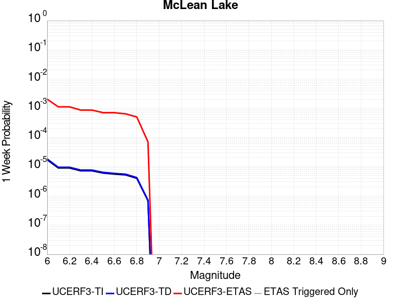 |  |  |  |

| Magnitude | 1 wk TI Prob | 1 wk TD Prob | 1 wk ETAS Prob | 1 wk ETAS/TD Gain | 1 wk ETAS Triggered Only | 1 mo TI Prob | 1 mo TD Prob | 1 mo ETAS Prob | 1 mo ETAS/TD Gain | 1 mo ETAS Triggered Only | 1 yr TI Prob | 1 yr TD Prob | 1 yr ETAS Prob | 1 yr ETAS/TD Gain | 1 yr ETAS Triggered Only | 10 yr TI Prob | 10 yr TD Prob | 10 yr ETAS Prob | 10 yr ETAS/TD Gain | 10 yr ETAS Triggered Only |
|-----|-----|-----|-----|-----|-----|-----|-----|-----|-----|-----|-----|-----|-----|-----|-----|-----|-----|-----|-----|-----|
| 6.0 | 1.7360222E-5 | 1.8501627E-5 | 0.002096177 | 113.2969 | 0.0020777138 | 7.439883E-5 | 7.9290556E-5 | 0.0027157124 | 34.250137 | 0.002636631 | 9.0542925E-4 | 9.6498354E-4 | 0.0042788344 | 4.434101 | 0.0033170518 | 0.009017491 | 0.0096127745 | 0.013295048 | 1.3830605 | 0.003718014 |
| 6.1 | 9.062689E-6 | 9.592193E-6 | 0.0011395661 | 118.80141 | 0.0011299847 | 3.8839516E-5 | 4.1108804E-5 | 0.0014383442 | 34.988716 | 0.001397293 | 4.727685E-4 | 5.003936E-4 | 0.002334182 | 4.6646914 | 0.0018347063 | 0.0047176396 | 0.004993552 | 0.006988352 | 1.3994752 | 0.0020048115 |
| 6.2 | 9.062689E-6 | 9.592193E-6 | 0.0011395661 | 118.80141 | 0.0011299847 | 3.8839516E-5 | 4.1108804E-5 | 0.0014383442 | 34.988716 | 0.001397293 | 4.727685E-4 | 5.003936E-4 | 0.002334182 | 4.6646914 | 0.0018347063 | 0.0047176396 | 0.004993552 | 0.006988352 | 1.3994752 | 0.0020048115 |
| 6.3 | 7.2575485E-6 | 7.66771E-6 | 8.946381E-4 | 116.67606 | 8.8697724E-4 | 3.110341E-5 | 3.2861237E-5 | 0.001114209 | 33.90648 | 0.0010813832 | 3.786182E-4 | 4.0001926E-4 | 0.0018331897 | 4.5827537 | 0.001433744 | 0.0037797375 | 0.0039936965 | 0.005579039 | 1.3969611 | 0.0015916988 |
| 6.4 | 7.2575485E-6 | 7.66771E-6 | 8.946381E-4 | 116.67606 | 8.8697724E-4 | 3.110341E-5 | 3.2861237E-5 | 0.001114209 | 33.90648 | 0.0010813832 | 3.786182E-4 | 4.0001926E-4 | 0.0018331897 | 4.5827537 | 0.001433744 | 0.0037797375 | 0.0039936965 | 0.005579039 | 1.3969611 | 0.0015916988 |
| 6.5 | 6.06582E-6 | 6.4038773E-6 | 7.475719E-4 | 116.73739 | 7.4117276E-4 | 2.5996113E-5 | 2.7444936E-5 | 9.2654786E-4 | 33.76025 | 8.991276E-4 | 3.164567E-4 | 3.3409733E-4 | 0.0015730213 | 4.7082725 | 0.0012393381 | 0.0031600643 | 0.0033365893 | 0.00471711 | 1.4137521 | 0.0013851426 |
| 6.6 | 5.598744E-6 | 5.910262E-6 | 7.470786E-4 | 126.40363 | 7.4117276E-4 | 2.3994397E-5 | 2.5329486E-5 | 9.1228425E-4 | 36.01669 | 8.8697724E-4 | 2.9209262E-4 | 3.0834923E-4 | 0.0015230118 | 4.9392433 | 0.0012150373 | 0.0029170897 | 0.003079843 | 0.004400155 | 1.4286945 | 0.0013243906 |
| 6.7 | 5.246996E-6 | 5.539162E-6 | 6.859563E-4 | 123.837555 | 6.804209E-4 | 2.2486933E-5 | 2.3739085E-5 | 8.3779474E-4 | 35.291786 | 8.14075E-4 | 2.73744E-4 | 2.8899137E-4 | 0.0014065027 | 4.866936 | 0.0011178344 | 0.0027340704 | 0.0028867796 | 0.004110425 | 1.4238789 | 0.0012271877 |
| 6.8 | 4.02324E-6 | 4.2469046E-6 | 5.3886103E-4 | 126.883255 | 5.346164E-4 | 1.7242342E-5 | 1.8200926E-5 | 6.7430915E-4 | 37.04807 | 6.5612013E-4 | 2.099053E-4 | 2.2157968E-4 | 0.0010962127 | 4.947262 | 8.7482686E-4 | 0.0020970714 | 0.002214172 | 0.0031719261 | 1.4325564 | 9.598795E-4 |
| 6.9 | 6.835972E-7 | 7.1399285E-7 | 7.361618E-5 | 103.10493 | 7.2902236E-5 | 2.9296991E-6 | 3.0599674E-6 | 8.811232E-5 | 28.795181 | 8.505261E-5 | 3.56685E-5 | 3.7254784E-5 | 1.5875399E-4 | 4.2613044 | 1.21503734E-4 | 3.5662777E-4 | 3.7251666E-4 | 5.0612097E-4 | 1.3586533 | 1.336541E-4 |

## Goldstone Lake
*[(top)](#table-of-contents)*

| 1 Week | 1 Month | 1 Year | 10 Year |
|-----|-----|-----|-----|
|  |  |  |  |

| Magnitude | 1 wk TI Prob | 1 wk TD Prob | 1 wk ETAS Prob | 1 wk ETAS/TD Gain | 1 wk ETAS Triggered Only | 1 mo TI Prob | 1 mo TD Prob | 1 mo ETAS Prob | 1 mo ETAS/TD Gain | 1 mo ETAS Triggered Only | 1 yr TI Prob | 1 yr TD Prob | 1 yr ETAS Prob | 1 yr ETAS/TD Gain | 1 yr ETAS Triggered Only | 10 yr TI Prob | 10 yr TD Prob | 10 yr ETAS Prob | 10 yr ETAS/TD Gain | 10 yr ETAS Triggered Only |
|-----|-----|-----|-----|-----|-----|-----|-----|-----|-----|-----|-----|-----|-----|-----|-----|-----|-----|-----|-----|-----|
| 6.0 | 2.671352E-5 | 3.037609E-5 | 0.0018650267 | 61.397854 | 0.0018347063 | 1.1448149E-4 | 1.3017785E-4 | 0.0024627459 | 18.918316 | 0.0023328715 | 0.001392921 | 0.0015839594 | 0.004483299 | 2.830438 | 0.0029039392 | 0.013842222 | 0.015746197 | 0.019058853 | 1.2103783 | 0.0033656533 |
| 6.1 | 2.671352E-5 | 3.037609E-5 | 0.0018650267 | 61.397854 | 0.0018347063 | 1.1448149E-4 | 1.3017785E-4 | 0.0024627459 | 18.918316 | 0.0023328715 | 0.001392921 | 0.0015839594 | 0.004483299 | 2.830438 | 0.0029039392 | 0.013842222 | 0.015746197 | 0.019058853 | 1.2103783 | 0.0033656533 |
| 6.2 | 1.4197047E-5 | 1.6096245E-5 | 0.0010367112 | 64.40702 | 0.0010206313 | 6.0843064E-5 | 6.8982634E-5 | 0.0013689828 | 19.845325 | 0.0013000899 | 7.4051257E-4 | 8.3963864E-4 | 0.002430001 | 2.8941035 | 0.0015916988 | 0.007380498 | 0.0083743585 | 0.010181652 | 1.2158127 | 0.0018225559 |
| 6.3 | 1.4197047E-5 | 1.6096245E-5 | 0.0010367112 | 64.40702 | 0.0010206313 | 6.0843064E-5 | 6.8982634E-5 | 0.0013689828 | 19.845325 | 0.0013000899 | 7.4051257E-4 | 8.3963864E-4 | 0.002430001 | 2.8941035 | 0.0015916988 | 0.007380498 | 0.0083743585 | 0.010181652 | 1.2158127 | 0.0018225559 |
| 6.4 | 1.3238931E-5 | 1.500846E-5 | 9.38423E-4 | 62.526268 | 9.2342834E-4 | 5.6737044E-5 | 6.4320935E-5 | 0.0012428313 | 19.322346 | 0.0011785862 | 6.9055456E-4 | 7.82924E-4 | 0.0022276863 | 2.8453417 | 0.0014458944 | 0.006884126 | 0.0078112837 | 0.009462882 | 1.2114375 | 0.0016646011 |
| 6.5 | 1.3238931E-5 | 1.500846E-5 | 9.38423E-4 | 62.526268 | 9.2342834E-4 | 5.6737044E-5 | 6.4320935E-5 | 0.0012428313 | 19.322346 | 0.0011785862 | 6.9055456E-4 | 7.82924E-4 | 0.0022276863 | 2.8453417 | 0.0014458944 | 0.006884126 | 0.0078112837 | 0.009462882 | 1.2114375 | 0.0016646011 |
| 6.6 | 1.1328278E-5 | 1.2855166E-5 | 8.390699E-4 | 65.271034 | 8.262254E-4 | 4.8548856E-5 | 5.5092944E-5 | 0.0010878177 | 19.745138 | 0.0010327817 | 5.90922E-4 | 6.7064585E-4 | 0.0019091527 | 2.8467376 | 0.0012393381 | 0.0058935313 | 0.0066956086 | 0.008107684 | 1.2108958 | 0.0014215936 |
| 6.7 | 8.651175E-6 | 9.824565E-6 | 6.1733724E-4 | 62.836094 | 6.0751865E-4 | 3.707594E-5 | 4.2105108E-5 | 8.318461E-4 | 19.756418 | 7.8977423E-4 | 4.5130608E-4 | 5.1259965E-4 | 0.0014719871 | 2.8716116 | 9.598795E-4 | 0.0045039062 | 0.005123051 | 0.0062472466 | 1.2194387 | 0.0011299847 |
| 6.8 | 1.0215377E-6 | 1.1754702E-6 | 3.7626545E-5 | 32.00978 | 3.6451118E-5 | 4.378012E-6 | 5.0377203E-6 | 5.3638967E-5 | 10.647468 | 4.860149E-5 | 5.3300988E-5 | 6.1332634E-5 | 1.2208078E-4 | 1.99047 | 6.0751867E-5 | 5.3288206E-4 | 6.1316835E-4 | 6.7388295E-4 | 1.0990179 | 6.0751867E-5 |
| 6.9 | 7.9360774E-7 | 9.2833966E-7 | 2.5229063E-5 | 27.176544 | 2.4300745E-5 | 3.4011714E-6 | 3.9785928E-6 | 2.8279243E-5 | 7.1078506 | 2.4300745E-5 | 4.1408475E-5 | 4.843836E-5 | 8.488772E-5 | 1.7524894 | 3.6451118E-5 | 4.140076E-4 | 4.8428503E-4 | 5.207185E-4 | 1.0752314 | 3.6451118E-5 |
| 7.0 | 7.4382757E-7 | 8.7473285E-7 | 1.30250955E-5 | 14.890369 | 1.2150373E-5 | 3.1878285E-6 | 3.74885E-6 | 1.5899177E-5 | 4.241081 | 1.2150373E-5 | 3.8811122E-5 | 4.564136E-5 | 5.7791178E-5 | 1.266202 | 1.2150373E-5 | 3.8804344E-4 | 4.5632652E-4 | 4.6847135E-4 | 1.0266143 | 1.2150373E-5 |
| 7.1 | 6.4709513E-7 | 7.7113E-7 | 1.2921493E-5 | 16.75657 | 1.2150373E-5 | 2.773262E-6 | 3.3048389E-6 | 1.5455173E-5 | 4.676528 | 1.2150373E-5 | 3.376394E-5 | 4.0235733E-5 | 5.2385614E-5 | 1.3019675 | 1.2150373E-5 | 3.375881E-4 | 4.0229043E-4 | 4.144359E-4 | 1.0301908 | 1.2150373E-5 |
| 7.2 | 6.356704E-7 | 7.5883594E-7 | 1.29091995E-5 | 17.011845 | 1.2150373E-5 | 2.7242988E-6 | 3.2521505E-6 | 1.5402484E-5 | 4.736092 | 1.2150373E-5 | 3.3167835E-5 | 3.959427E-5 | 5.1744162E-5 | 1.3068599 | 1.2150373E-5 | 3.3162883E-4 | 3.958781E-4 | 4.0802368E-4 | 1.0306801 | 1.2150373E-5 |
| 7.3 | 5.7695723E-7 | 6.8965653E-7 | 6.8965653E-7 | 1.0 | 0.0 | 2.4726714E-6 | 2.9556677E-6 | 2.9556677E-6 | 1.0 | 0.0 | 3.0104358E-5 | 3.5984718E-5 | 3.5984718E-5 | 1.0 | 0.0 | 3.0100282E-4 | 3.5979465E-4 | 3.5979465E-4 | 1.0 | 0.0 |
| 7.4 | 5.209647E-7 | 6.193514E-7 | 6.193514E-7 | 1.0 | 0.0 | 2.232704E-6 | 2.6543607E-6 | 2.6543607E-6 | 1.0 | 0.0 | 2.718283E-5 | 3.2316417E-5 | 3.2316417E-5 | 1.0 | 0.0 | 2.7179506E-4 | 3.2312275E-4 | 3.2312275E-4 | 1.0 | 0.0 |
| 7.5 | 4.512955E-7 | 5.348885E-7 | 5.348885E-7 | 1.0 | 0.0 | 1.934122E-6 | 2.2923775E-6 | 2.2923775E-6 | 1.0 | 0.0 | 2.3547682E-5 | 2.7909393E-5 | 2.7909393E-5 | 1.0 | 0.0 | 2.3545188E-4 | 2.7906417E-4 | 2.7906417E-4 | 1.0 | 0.0 |
| 7.6 | 2.21172E-7 | 2.603961E-7 | 2.603961E-7 | 1.0 | 0.0 | 9.478797E-7 | 1.1159829E-6 | 1.1159829E-6 | 1.0 | 0.0 | 1.1540374E-5 | 1.3587036E-5 | 1.3587036E-5 | 1.0 | 0.0 | 1.1539775E-4 | 1.3586486E-4 | 1.3586486E-4 | 1.0 | 0.0 |

## So Sierra Nevada
*[(top)](#table-of-contents)*

| 1 Week | 1 Month | 1 Year | 10 Year |
|-----|-----|-----|-----|
|  |  |  |  |

| Magnitude | 1 wk TI Prob | 1 wk TD Prob | 1 wk ETAS Prob | 1 wk ETAS/TD Gain | 1 wk ETAS Triggered Only | 1 mo TI Prob | 1 mo TD Prob | 1 mo ETAS Prob | 1 mo ETAS/TD Gain | 1 mo ETAS Triggered Only | 1 yr TI Prob | 1 yr TD Prob | 1 yr ETAS Prob | 1 yr ETAS/TD Gain | 1 yr ETAS Triggered Only | 10 yr TI Prob | 10 yr TD Prob | 10 yr ETAS Prob | 10 yr ETAS/TD Gain | 10 yr ETAS Triggered Only |
|-----|-----|-----|-----|-----|-----|-----|-----|-----|-----|-----|-----|-----|-----|-----|-----|-----|-----|-----|-----|-----|
| 6.0 | 1.15488665E-5 | 1.1079643E-5 | 0.0018336154 | 165.4941 | 0.0018225559 | 4.9494203E-5 | 4.748339E-5 | 0.0023073454 | 48.592686 | 0.0022599695 | 6.024253E-4 | 5.7796965E-4 | 0.0032495067 | 5.622279 | 0.002673082 | 0.006007948 | 0.005765934 | 0.008713531 | 1.5112089 | 0.002964691 |
| 6.1 | 1.15488665E-5 | 1.1079643E-5 | 0.0018336154 | 165.4941 | 0.0018225559 | 4.9494203E-5 | 4.748339E-5 | 0.0023073454 | 48.592686 | 0.0022599695 | 6.024253E-4 | 5.7796965E-4 | 0.0032495067 | 5.622279 | 0.002673082 | 0.006007948 | 0.005765934 | 0.008713531 | 1.5112089 | 0.002964691 |
| 6.2 | 1.15488665E-5 | 1.1079643E-5 | 0.0018336154 | 165.4941 | 0.0018225559 | 4.9494203E-5 | 4.748339E-5 | 0.0023073454 | 48.592686 | 0.0022599695 | 6.024253E-4 | 5.7796965E-4 | 0.0032495067 | 5.622279 | 0.002673082 | 0.006007948 | 0.005765934 | 0.008713531 | 1.5112089 | 0.002964691 |
| 6.3 | 1.15488665E-5 | 1.1079643E-5 | 0.0018336154 | 165.4941 | 0.0018225559 | 4.9494203E-5 | 4.748339E-5 | 0.0023073454 | 48.592686 | 0.0022599695 | 6.024253E-4 | 5.7796965E-4 | 0.0032495067 | 5.622279 | 0.002673082 | 0.006007948 | 0.005765934 | 0.008713531 | 1.5112089 | 0.002964691 |
| 6.4 | 1.15488665E-5 | 1.1079643E-5 | 0.0018336154 | 165.4941 | 0.0018225559 | 4.9494203E-5 | 4.748339E-5 | 0.0023073454 | 48.592686 | 0.0022599695 | 6.024253E-4 | 5.7796965E-4 | 0.0032495067 | 5.622279 | 0.002673082 | 0.006007948 | 0.005765934 | 0.008713531 | 1.5112089 | 0.002964691 |
| 6.5 | 1.15488665E-5 | 1.1079643E-5 | 0.0018336154 | 165.4941 | 0.0018225559 | 4.9494203E-5 | 4.748339E-5 | 0.0023073454 | 48.592686 | 0.0022599695 | 6.024253E-4 | 5.7796965E-4 | 0.0032495067 | 5.622279 | 0.002673082 | 0.006007948 | 0.005765934 | 0.008713531 | 1.5112089 | 0.002964691 |
| 6.6 | 7.587044E-6 | 6.935635E-6 | 0.0010032593 | 144.65283 | 9.963306E-4 | 3.2515498E-5 | 2.9723828E-5 | 0.0012811751 | 43.102627 | 0.0012514885 | 3.9580427E-4 | 3.6183043E-4 | 0.0018314936 | 5.0617456 | 0.0014701951 | 0.003951 | 0.0036127048 | 0.0052470793 | 1.4523964 | 0.0016403004 |
| 6.7 | 7.587044E-6 | 6.935635E-6 | 0.0010032593 | 144.65283 | 9.963306E-4 | 3.2515498E-5 | 2.9723828E-5 | 0.0012811751 | 43.102627 | 0.0012514885 | 3.9580427E-4 | 3.6183043E-4 | 0.0018314936 | 5.0617456 | 0.0014701951 | 0.003951 | 0.0036127048 | 0.0052470793 | 1.4523964 | 0.0016403004 |
| 6.8 | 5.9026956E-6 | 5.1793927E-6 | 7.9494953E-4 | 153.48315 | 7.8977423E-4 | 2.5297022E-5 | 2.2197215E-5 | 9.699053E-4 | 43.69491 | 9.477291E-4 | 3.0794772E-4 | 2.7021873E-4 | 0.0013634568 | 5.045752 | 0.0010935336 | 0.0030752132 | 0.002699018 | 0.0038744232 | 1.4354936 | 0.0011785862 |
| 6.9 | 5.0118915E-6 | 4.2524252E-6 | 6.3606916E-4 | 149.57797 | 6.318194E-4 | 2.1479358E-5 | 1.8224557E-5 | 7.836841E-4 | 43.001545 | 7.654735E-4 | 2.614798E-4 | 2.2186211E-4 | 0.0011207903 | 5.0517426 | 8.991276E-4 | 0.0026117235 | 0.0022164788 | 0.0031984777 | 1.4430445 | 9.841803E-4 |
| 7.0 | 4.4924795E-6 | 3.7139177E-6 | 5.0187734E-4 | 135.13422 | 4.981653E-4 | 1.925334E-5 | 1.5916696E-5 | 6.234257E-4 | 39.168034 | 6.0751865E-4 | 2.3438422E-4 | 1.9376918E-4 | 9.226503E-4 | 4.761595 | 7.290224E-4 | 0.0023413717 | 0.0019360651 | 0.0027485641 | 1.4196651 | 8.14075E-4 |
| 7.1 | 3.9118436E-6 | 3.1119775E-6 | 3.554717E-4 | 114.226944 | 3.523608E-4 | 1.6764936E-5 | 1.3336982E-5 | 4.628948E-4 | 34.70761 | 4.495638E-4 | 2.0409399E-4 | 1.6236622E-4 | 7.211926E-4 | 4.4417653 | 5.589172E-4 | 0.0020390663 | 0.001622532 | 0.0022411956 | 1.3812952 | 6.1966904E-4 |
| 7.2 | 3.4200818E-6 | 2.6054543E-6 | 2.6991297E-4 | 103.59535 | 2.673082E-4 | 1.4657411E-5 | 1.11661875E-5 | 3.6352308E-4 | 32.555702 | 3.523608E-4 | 1.7843937E-4 | 1.3594035E-4 | 5.611456E-4 | 4.127881 | 4.2526305E-4 | 0.0017829615 | 0.0013586218 | 0.0018439763 | 1.3572404 | 4.8601493E-4 |
| 7.3 | 2.6593618E-6 | 1.8284203E-6 | 1.8408368E-4 | 100.679085 | 1.822556E-4 | 1.13972155E-5 | 7.836065E-6 | 2.2654106E-4 | 28.910055 | 2.1870671E-4 | 1.3875226E-4 | 9.540021E-5 | 3.626829E-4 | 3.8016994 | 2.673082E-4 | 0.0013866565 | 9.5362146E-4 | 0.0012570911 | 1.3182286 | 3.0375933E-4 |
| 7.4 | 2.2577992E-6 | 1.436438E-6 | 1.2294E-4 | 85.5867 | 1.21503734E-4 | 9.676246E-6 | 6.15615E-6 | 1.6411002E-4 | 26.6579 | 1.5795486E-4 | 1.1780193E-4 | 7.49488E-5 | 2.693402E-4 | 3.5936558 | 1.9440596E-4 | 0.001177395 | 7.492603E-4 | 9.678031E-4 | 1.2916782 | 2.1870671E-4 |
| 7.5 | 1.489319E-6 | 7.353936E-7 | 4.933685E-5 | 67.089035 | 4.860149E-5 | 6.3827797E-6 | 3.1516831E-6 | 6.390335E-5 | 20.275946 | 6.0751867E-5 | 7.770758E-5 | 3.8371072E-5 | 1.11270514E-4 | 2.8998542 | 7.2902236E-5 | 7.7680405E-4 | 3.836449E-4 | 4.808106E-4 | 1.2532699 | 9.720298E-5 |
| 7.6 | 1.0680322E-6 | 4.6596554E-7 | 1.2616333E-5 | 27.075678 | 1.2150373E-5 | 4.577273E-6 | 1.9969937E-6 | 2.6297692E-5 | 13.16864 | 2.4300745E-5 | 5.5726876E-5 | 2.4313129E-5 | 6.0763363E-5 | 2.4991996 | 3.6451118E-5 | 5.5712904E-4 | 2.4310495E-4 | 2.795472E-4 | 1.1499034 | 3.6451118E-5 |
| 7.7 | 5.509146E-7 | 1.5580486E-7 | 1.5580486E-7 | 1.0 | 0.0 | 2.3610605E-6 | 6.677349E-7 | 1.28181E-5 | 19.196388 | 1.2150373E-5 | 2.8745531E-5 | 8.129644E-6 | 3.243019E-5 | 3.9891284 | 2.4300745E-5 | 2.8741814E-4 | 8.1293576E-5 | 1.0559235E-4 | 1.2989014 | 2.4300745E-5 |

## San Andreas (Mojave N)
*[(top)](#table-of-contents)*

| 1 Week | 1 Month | 1 Year | 10 Year |
|-----|-----|-----|-----|
|  |  |  |  |

| Magnitude | 1 wk TI Prob | 1 wk TD Prob | 1 wk ETAS Prob | 1 wk ETAS/TD Gain | 1 wk ETAS Triggered Only | 1 mo TI Prob | 1 mo TD Prob | 1 mo ETAS Prob | 1 mo ETAS/TD Gain | 1 mo ETAS Triggered Only | 1 yr TI Prob | 1 yr TD Prob | 1 yr ETAS Prob | 1 yr ETAS/TD Gain | 1 yr ETAS Triggered Only | 10 yr TI Prob | 10 yr TD Prob | 10 yr ETAS Prob | 10 yr ETAS/TD Gain | 10 yr ETAS Triggered Only |
|-----|-----|-----|-----|-----|-----|-----|-----|-----|-----|-----|-----|-----|-----|-----|-----|-----|-----|-----|-----|-----|
| 6.0 | 9.877682E-5 | 1.9400702E-4 | 0.0020769495 | 10.705538 | 0.0018833078 | 4.2326056E-4 | 8.311939E-4 | 0.0030285835 | 3.6436546 | 0.0021992174 | 0.0051410277 | 0.010072956 | 0.012586804 | 1.2495642 | 0.002539428 | 0.05023708 | 0.09831428 | 0.10076838 | 1.0249618 | 0.0027216836 |
| 6.1 | 9.877682E-5 | 1.9400702E-4 | 0.0020769495 | 10.705538 | 0.0018833078 | 4.2326056E-4 | 8.311939E-4 | 0.0030285835 | 3.6436546 | 0.0021992174 | 0.0051410277 | 0.010072956 | 0.012586804 | 1.2495642 | 0.002539428 | 0.05023708 | 0.09831428 | 0.10076838 | 1.0249618 | 0.0027216836 |
| 6.2 | 9.877682E-5 | 1.9400702E-4 | 0.0020769495 | 10.705538 | 0.0018833078 | 4.2326056E-4 | 8.311939E-4 | 0.0030285835 | 3.6436546 | 0.0021992174 | 0.0051410277 | 0.010072956 | 0.012586804 | 1.2495642 | 0.002539428 | 0.05023708 | 0.09831428 | 0.10076838 | 1.0249618 | 0.0027216836 |
| 6.3 | 9.877682E-5 | 1.9400702E-4 | 0.0020769495 | 10.705538 | 0.0018833078 | 4.2326056E-4 | 8.311939E-4 | 0.0030285835 | 3.6436546 | 0.0021992174 | 0.0051410277 | 0.010072956 | 0.012586804 | 1.2495642 | 0.002539428 | 0.05023708 | 0.09831428 | 0.10076838 | 1.0249618 | 0.0027216836 |
| 6.4 | 9.877682E-5 | 1.9400702E-4 | 0.0020769495 | 10.705538 | 0.0018833078 | 4.2326056E-4 | 8.311939E-4 | 0.0030285835 | 3.6436546 | 0.0021992174 | 0.0051410277 | 0.010072956 | 0.012586804 | 1.2495642 | 0.002539428 | 0.05023708 | 0.09831428 | 0.10076838 | 1.0249618 | 0.0027216836 |
| 6.5 | 9.861474E-5 | 1.9374468E-4 | 0.0020766875 | 10.718682 | 0.0018833078 | 4.2256617E-4 | 8.300703E-4 | 0.0030274624 | 3.647236 | 0.0021992174 | 0.0051326132 | 0.010059402 | 0.012573286 | 1.2499038 | 0.002539428 | 0.050156746 | 0.098192066 | 0.1006465 | 1.0249963 | 0.0027216836 |
| 6.6 | 9.861474E-5 | 1.9374468E-4 | 0.0020766875 | 10.718682 | 0.0018833078 | 4.2256617E-4 | 8.300703E-4 | 0.0030274624 | 3.647236 | 0.0021992174 | 0.0051326132 | 0.010059402 | 0.012573286 | 1.2499038 | 0.002539428 | 0.050156746 | 0.098192066 | 0.1006465 | 1.0249963 | 0.0027216836 |
| 6.7 | 9.8552715E-5 | 1.9364421E-4 | 0.0020765874 | 10.723725 | 0.0018833078 | 4.223004E-4 | 8.2964E-4 | 0.003027033 | 3.64861 | 0.0021992174 | 0.0051293927 | 0.010054212 | 0.012568108 | 1.2500341 | 0.002539428 | 0.050125998 | 0.098145254 | 0.10059982 | 1.0250095 | 0.0027216836 |
| 6.8 | 9.8464974E-5 | 1.9349584E-4 | 0.0020764393 | 10.731183 | 0.0018833078 | 4.219245E-4 | 8.290045E-4 | 0.0030263988 | 3.6506422 | 0.0021992174 | 0.0051248376 | 0.010046546 | 0.012560463 | 1.2502269 | 0.002539428 | 0.05008251 | 0.09807528 | 0.100530036 | 1.0250293 | 0.0027216836 |
| 6.9 | 9.825824E-5 | 1.9317595E-4 | 0.0020761199 | 10.747301 | 0.0018833078 | 4.2103877E-4 | 8.276344E-4 | 0.0030250319 | 3.6550338 | 0.0021992174 | 0.0051141046 | 0.010030019 | 0.012543976 | 1.2506434 | 0.002539428 | 0.049980022 | 0.09792438 | 0.10037954 | 1.0250721 | 0.0027216836 |
| 7.0 | 9.781462E-5 | 1.924896E-4 | 0.002075435 | 10.782063 | 0.0018833078 | 4.1913814E-4 | 8.246948E-4 | 0.0030220987 | 3.6645055 | 0.0021992174 | 0.005091073 | 0.009994558 | 0.012508606 | 1.2515416 | 0.002539428 | 0.04976007 | 0.09760077 | 0.10005682 | 1.0251642 | 0.0027216836 |
| 7.1 | 9.7121134E-5 | 1.9150671E-4 | 0.002074454 | 10.832277 | 0.0018833078 | 4.1616702E-4 | 8.204851E-4 | 0.0030178982 | 3.6781876 | 0.0021992174 | 0.005055068 | 0.009943774 | 0.012457951 | 1.2528392 | 0.002539428 | 0.04941613 | 0.09713728 | 0.09959459 | 1.0252973 | 0.0027216836 |
| 7.2 | 9.663819E-5 | 1.9081456E-4 | 0.002073763 | 10.8679495 | 0.0018833078 | 4.1409794E-4 | 8.175206E-4 | 0.0030149403 | 3.6879072 | 0.0021992174 | 0.0050299936 | 0.00990801 | 0.012422278 | 1.253761 | 0.002539428 | 0.049176537 | 0.09681055 | 0.09926874 | 1.0253918 | 0.0027216836 |
| 7.3 | 9.6277574E-5 | 1.9033969E-4 | 0.0020732891 | 10.892573 | 0.0018833078 | 4.125529E-4 | 8.154867E-4 | 0.0030129107 | 3.6946166 | 0.0021992174 | 0.0050112694 | 0.009883473 | 0.012397802 | 1.2543974 | 0.002539428 | 0.04899759 | 0.09658401 | 0.09904282 | 1.0254577 | 0.0027216836 |
| 7.4 | 9.593308E-5 | 1.897375E-4 | 0.002072688 | 10.923976 | 0.0018833078 | 4.1107697E-4 | 8.129075E-4 | 0.0030103372 | 3.7031732 | 0.0021992174 | 0.0049933824 | 0.009852355 | 0.012366764 | 1.2552088 | 0.002539428 | 0.04882661 | 0.09630218 | 0.09876177 | 1.0255402 | 0.0027216836 |
| 7.5 | 9.561707E-5 | 1.8919831E-4 | 0.0020600017 | 10.888056 | 0.0018711574 | 4.0972308E-4 | 8.1059814E-4 | 0.0029958924 | 3.6959035 | 0.0021870672 | 0.0049769743 | 0.009824493 | 0.012326941 | 1.2547153 | 0.0025272777 | 0.048669744 | 0.09604836 | 0.09849765 | 1.0255005 | 0.002709533 |
| 7.6 | 9.418194E-5 | 1.8572104E-4 | 0.002056531 | 11.073225 | 0.0018711574 | 4.0357444E-4 | 7.957047E-4 | 0.0029810315 | 3.7464044 | 0.0021870672 | 0.004902454 | 0.009644784 | 0.012147686 | 1.2595084 | 0.0025272777 | 0.047957025 | 0.094430685 | 0.096884355 | 1.0259838 | 0.002709533 |
| 7.7 | 8.202141E-5 | 1.6021315E-4 | 0.0018002507 | 11.236597 | 0.0016403004 | 3.51473E-4 | 6.8644714E-4 | 0.0025927462 | 3.7770514 | 0.0019076086 | 0.00427079 | 0.008325525 | 0.0105064325 | 1.2619544 | 0.0021992174 | 0.04189639 | 0.08223219 | 0.08440668 | 1.0264432 | 0.0023693228 |
| 7.8 | 7.2859846E-5 | 1.4516473E-4 | 0.0012506881 | 8.615648 | 0.001105684 | 3.1221908E-4 | 6.219862E-4 | 0.0019698387 | 3.1670136 | 0.0013486914 | 0.003794643 | 0.0075464295 | 0.009089941 | 1.2045352 | 0.0015552477 | 0.037304975 | 0.07472468 | 0.07623117 | 1.0201606 | 0.00162815 |
| 7.9 | 5.3874453E-5 | 1.0045676E-4 | 7.0791435E-4 | 7.046956 | 6.0751865E-4 | 2.3087008E-4 | 4.3045796E-4 | 0.0011713117 | 2.7210827 | 7.4117276E-4 | 0.0028072202 | 0.0052282433 | 0.0060984963 | 1.1664523 | 8.7482686E-4 | 0.02772022 | 0.05242443 | 0.05331096 | 1.0169107 | 9.355787E-4 |
| 8.0 | 3.468538E-5 | 5.4260272E-5 | 2.4865568E-4 | 4.5826473 | 1.9440596E-4 | 1.4864317E-4 | 2.325233E-4 | 4.8762182E-4 | 2.0970879 | 2.5515782E-4 | 0.0018082283 | 0.002827298 | 0.0031301985 | 1.1071342 | 3.0375933E-4 | 0.017935853 | 0.028947512 | 0.029289672 | 1.0118201 | 3.523608E-4 |
| 8.1 | 1.9152367E-5 | 1.940263E-5 | 6.800318E-5 | 3.5048432 | 4.860149E-5 | 8.207899E-5 | 8.3151484E-5 | 1.438983E-4 | 1.730556 | 6.0751867E-5 | 9.988535E-4 | 0.0010118998 | 0.0010847283 | 1.071972 | 7.2902236E-5 | 0.009943757 | 0.01085625 | 0.010952398 | 1.0088564 | 9.720298E-5 |
| 8.2 | 8.643924E-6 | 5.4748625E-6 | 5.4748625E-6 | 1.0 | 0.0 | 3.704486E-5 | 2.3463486E-5 | 2.3463486E-5 | 1.0 | 0.0 | 4.5092785E-4 | 2.8563058E-4 | 2.8563058E-4 | 1.0 | 0.0 | 0.0045001395 | 0.0032487072 | 0.0032487072 | 1.0 | 0.0 |
| 8.3 | 1.983087E-6 | 7.6599065E-7 | 7.6599065E-7 | 1.0 | 0.0 | 8.498917E-6 | 3.282813E-6 | 3.282813E-6 | 1.0 | 0.0 | 1.034694E-4 | 3.9967534E-5 | 3.9967534E-5 | 1.0 | 0.0 | 0.0010342124 | 4.719687E-4 | 4.719687E-4 | 1.0 | 0.0 |

## San Andreas (Mojave S)
*[(top)](#table-of-contents)*

| 1 Week | 1 Month | 1 Year | 10 Year |
|-----|-----|-----|-----|
|  |  |  |  |

| Magnitude | 1 wk TI Prob | 1 wk TD Prob | 1 wk ETAS Prob | 1 wk ETAS/TD Gain | 1 wk ETAS Triggered Only | 1 mo TI Prob | 1 mo TD Prob | 1 mo ETAS Prob | 1 mo ETAS/TD Gain | 1 mo ETAS Triggered Only | 1 yr TI Prob | 1 yr TD Prob | 1 yr ETAS Prob | 1 yr ETAS/TD Gain | 1 yr ETAS Triggered Only | 10 yr TI Prob | 10 yr TD Prob | 10 yr ETAS Prob | 10 yr ETAS/TD Gain | 10 yr ETAS Triggered Only |
|-----|-----|-----|-----|-----|-----|-----|-----|-----|-----|-----|-----|-----|-----|-----|-----|-----|-----|-----|-----|-----|
| 6.0 | 3.1064058E-4 | 6.7460834E-4 | 0.002447366 | 3.6278327 | 0.0017739545 | 0.0013306376 | 0.0028881032 | 0.0049719317 | 1.7215214 | 0.002089864 | 0.016080605 | 0.03462235 | 0.03695656 | 1.0674192 | 0.002417924 | 0.1496549 | 0.28660452 | 0.2884508 | 1.006442 | 0.0025880295 |
| 6.1 | 3.1064058E-4 | 6.7460834E-4 | 0.002447366 | 3.6278327 | 0.0017739545 | 0.0013306376 | 0.0028881032 | 0.0049719317 | 1.7215214 | 0.002089864 | 0.016080605 | 0.03462235 | 0.03695656 | 1.0674192 | 0.002417924 | 0.1496549 | 0.28660452 | 0.2884508 | 1.006442 | 0.0025880295 |
| 6.2 | 3.1064058E-4 | 6.7460834E-4 | 0.002447366 | 3.6278327 | 0.0017739545 | 0.0013306376 | 0.0028881032 | 0.0049719317 | 1.7215214 | 0.002089864 | 0.016080605 | 0.03462235 | 0.03695656 | 1.0674192 | 0.002417924 | 0.1496549 | 0.28660452 | 0.2884508 | 1.006442 | 0.0025880295 |
| 6.3 | 3.1064058E-4 | 6.7460834E-4 | 0.002447366 | 3.6278327 | 0.0017739545 | 0.0013306376 | 0.0028881032 | 0.0049719317 | 1.7215214 | 0.002089864 | 0.016080605 | 0.03462235 | 0.03695656 | 1.0674192 | 0.002417924 | 0.1496549 | 0.28660452 | 0.2884508 | 1.006442 | 0.0025880295 |
| 6.4 | 1.9872203E-4 | 4.3179357E-4 | 0.0020470954 | 4.7409124 | 0.0016159996 | 8.5138786E-4 | 0.0018492596 | 0.0037412127 | 2.0230868 | 0.0018954582 | 0.010316478 | 0.02228844 | 0.024391122 | 1.0943396 | 0.002150616 | 0.098504856 | 0.19699748 | 0.19882199 | 1.0092616 | 0.0022721197 |
| 6.5 | 1.291105E-4 | 2.875267E-4 | 0.0016965647 | 5.900547 | 0.0014094432 | 5.5321335E-4 | 0.0012316781 | 0.0029063644 | 2.3596785 | 0.0016767515 | 0.006714592 | 0.0148934 | 0.016796537 | 1.1277839 | 0.0019319094 | 0.065152965 | 0.13803436 | 0.13980433 | 1.0128227 | 0.002053413 |
| 6.6 | 1.291105E-4 | 2.875267E-4 | 0.0016965647 | 5.900547 | 0.0014094432 | 5.5321335E-4 | 0.0012316781 | 0.0029063644 | 2.3596785 | 0.0016767515 | 0.006714592 | 0.0148934 | 0.016796537 | 1.1277839 | 0.0019319094 | 0.065152965 | 0.13803436 | 0.13980433 | 1.0128227 | 0.002053413 |
| 6.7 | 1.08001186E-4 | 2.4333889E-4 | 0.0016159969 | 6.6409316 | 0.0013729922 | 4.6278012E-4 | 0.0010424647 | 0.002681055 | 2.5718427 | 0.0016403004 | 0.0056198016 | 0.012618446 | 0.014489986 | 1.1483178 | 0.0018954582 | 0.054797906 | 0.119176775 | 0.12095336 | 1.0149071 | 0.0020169618 |
| 6.8 | 1.0624356E-4 | 2.3851555E-4 | 0.0016111803 | 6.755032 | 0.0013729922 | 4.5525006E-4 | 0.0010218095 | 0.0026604338 | 2.6036494 | 0.0016403004 | 0.0055285925 | 0.012369843 | 0.014241855 | 1.1513368 | 0.0018954582 | 0.053930566 | 0.11712591 | 0.11890664 | 1.0152035 | 0.0020169618 |
| 6.9 | 1.0393785E-4 | 2.3221898E-4 | 0.0015927447 | 6.858805 | 0.0013608418 | 4.4537184E-4 | 9.948451E-4 | 0.0026213753 | 2.6349583 | 0.00162815 | 0.0054089287 | 0.012045221 | 0.013905845 | 1.1544698 | 0.0018833078 | 0.05279156 | 0.11442335 | 0.11619877 | 1.0155162 | 0.0020048115 |
| 7.0 | 1.0155622E-4 | 2.2591476E-4 | 0.0015864491 | 7.022335 | 0.0013608418 | 4.3516833E-4 | 9.6784724E-4 | 0.0025944214 | 2.6806104 | 0.00162815 | 0.005285311 | 0.0117200995 | 0.013581335 | 1.1588072 | 0.0018833078 | 0.05161361 | 0.111683756 | 0.11346466 | 1.015946 | 0.0020048115 |
| 7.1 | 9.885595E-5 | 2.1879886E-4 | 0.0015793429 | 7.218241 | 0.0013608418 | 4.2359953E-4 | 9.3737274E-4 | 0.0025639965 | 2.735301 | 0.00162815 | 0.0051451353 | 0.011352993 | 0.01321492 | 1.1640031 | 0.0018833078 | 0.05027629 | 0.1085682 | 0.110355355 | 1.0164611 | 0.0020048115 |
| 7.2 | 9.6411415E-5 | 2.124288E-4 | 0.0015729815 | 7.4047465 | 0.0013608418 | 4.1312634E-4 | 9.1009185E-4 | 0.00253676 | 2.787367 | 0.00162815 | 0.005018219 | 0.011024255 | 0.012886802 | 1.1689498 | 0.0018833078 | 0.049064007 | 0.105758004 | 0.10755079 | 1.0169518 | 0.0020048115 |
| 7.3 | 9.1180635E-5 | 1.9471257E-4 | 0.0015066974 | 7.7380586 | 0.0013122403 | 3.907156E-4 | 8.342157E-4 | 0.002388166 | 2.862768 | 0.0015552477 | 0.004746591 | 0.01010939 | 0.011901493 | 1.1772711 | 0.0018104056 | 0.046464786 | 0.09795115 | 0.09969383 | 1.0177913 | 0.0019319094 |
| 7.4 | 8.887388E-5 | 1.8719878E-4 | 0.0014870453 | 7.94367 | 0.0013000899 | 3.8083247E-4 | 8.020339E-4 | 0.0023438937 | 2.9224372 | 0.0015430974 | 0.0046267817 | 0.00972114 | 0.011501914 | 1.1831857 | 0.0017982553 | 0.045316286 | 0.09458615 | 0.096324325 | 1.0183766 | 0.001919759 |
| 7.5 | 8.6750515E-5 | 1.8051457E-4 | 0.0014803698 | 8.200832 | 0.0013000899 | 3.7173493E-4 | 7.7340455E-4 | 0.0023153084 | 2.9936576 | 0.0015430974 | 0.004516484 | 0.009375632 | 0.011157027 | 1.1900027 | 0.0017982553 | 0.04425787 | 0.091549896 | 0.0932939 | 1.0190498 | 0.001919759 |
| 7.6 | 8.453092E-5 | 1.7439072E-4 | 0.001474254 | 8.45374 | 0.0013000899 | 3.6222505E-4 | 7.471748E-4 | 0.0022891192 | 3.0636997 | 0.0015430974 | 0.0044011753 | 0.009058985 | 0.01084095 | 1.1967069 | 0.0017982553 | 0.04315024 | 0.08870898 | 0.09045844 | 1.0197214 | 0.001919759 |
| 7.7 | 8.259102E-5 | 1.6961215E-4 | 0.0014694815 | 8.663775 | 0.0013000899 | 3.539135E-4 | 7.2670676E-4 | 0.0022686827 | 3.1218681 | 0.0015430974 | 0.004300386 | 0.008811831 | 0.010594239 | 1.2022746 | 0.0017982553 | 0.042181134 | 0.08645982 | 0.0882025 | 1.0201559 | 0.0019076086 |
| 7.8 | 7.444844E-5 | 1.5283503E-4 | 0.00125835 | 8.233387 | 0.001105684 | 3.1902574E-4 | 6.548429E-4 | 0.002002651 | 3.0582163 | 0.0013486914 | 0.0038772223 | 0.007943616 | 0.0094865095 | 1.1942307 | 0.0015552477 | 0.03810269 | 0.078290746 | 0.07979143 | 1.019168 | 0.00162815 |
| 7.9 | 5.2586525E-5 | 1.00064186E-4 | 7.0752203E-4 | 7.070682 | 6.0751865E-4 | 2.2535135E-4 | 4.2877605E-4 | 0.001169631 | 2.7278366 | 7.4117276E-4 | 0.0027402006 | 0.005207864 | 0.0060781348 | 1.1671071 | 8.7482686E-4 | 0.027066574 | 0.052200034 | 0.053086776 | 1.0169873 | 9.355787E-4 |
| 8.0 | 3.379877E-5 | 5.4074168E-5 | 2.4846962E-4 | 4.5949783 | 1.9440596E-4 | 1.4484383E-4 | 2.3172585E-4 | 4.8682455E-4 | 2.1008642 | 2.5515782E-4 | 0.0017620471 | 0.002817614 | 0.0031205176 | 1.1075035 | 3.0375933E-4 | 0.017481409 | 0.028834904 | 0.029177103 | 1.0118675 | 3.523608E-4 |
| 8.1 | 1.8668277E-5 | 1.9309397E-5 | 6.7909954E-5 | 3.516938 | 4.860149E-5 | 8.000444E-5 | 8.275194E-5 | 1.4349878E-4 | 1.7340835 | 6.0751867E-5 | 9.736188E-4 | 0.0010070398 | 0.0010798686 | 1.0723197 | 7.2902236E-5 | 0.009693642 | 0.010798888 | 0.010895042 | 1.008904 | 9.720298E-5 |
| 8.2 | 8.541571E-6 | 5.460819E-6 | 5.460819E-6 | 1.0 | 0.0 | 3.660622E-5 | 2.3403301E-5 | 2.3403301E-5 | 1.0 | 0.0 | 4.455896E-4 | 2.84898E-4 | 2.84898E-4 | 1.0 | 0.0 | 0.0044469717 | 0.0032408056 | 0.0032408056 | 1.0 | 0.0 |
| 8.3 | 1.983087E-6 | 7.6599065E-7 | 7.6599065E-7 | 1.0 | 0.0 | 8.498917E-6 | 3.282813E-6 | 3.282813E-6 | 1.0 | 0.0 | 1.034694E-4 | 3.9967534E-5 | 3.9967534E-5 | 1.0 | 0.0 | 0.0010342124 | 4.719687E-4 | 4.719687E-4 | 1.0 | 0.0 |

## Coyote Canyon
*[(top)](#table-of-contents)*

| 1 Week | 1 Month | 1 Year | 10 Year |
|-----|-----|-----|-----|
|  |  |  |  |

| Magnitude | 1 wk TI Prob | 1 wk TD Prob | 1 wk ETAS Prob | 1 wk ETAS/TD Gain | 1 wk ETAS Triggered Only | 1 mo TI Prob | 1 mo TD Prob | 1 mo ETAS Prob | 1 mo ETAS/TD Gain | 1 mo ETAS Triggered Only | 1 yr TI Prob | 1 yr TD Prob | 1 yr ETAS Prob | 1 yr ETAS/TD Gain | 1 yr ETAS Triggered Only | 10 yr TI Prob | 10 yr TD Prob | 10 yr ETAS Prob | 10 yr ETAS/TD Gain | 10 yr ETAS Triggered Only |
|-----|-----|-----|-----|-----|-----|-----|-----|-----|-----|-----|-----|-----|-----|-----|-----|-----|-----|-----|-----|-----|
| 6.0 | 3.5090034E-5 | 4.0364324E-5 | 0.0013647015 | 33.809597 | 0.0013243906 | 1.503772E-4 | 1.7297994E-4 | 0.0017522553 | 10.129817 | 0.0015795485 | 0.0018293047 | 0.0021042528 | 0.0039957226 | 1.8988795 | 0.0018954582 | 0.018143194 | 0.020869201 | 0.023022523 | 1.1031818 | 0.0021992174 |
| 6.1 | 3.5090034E-5 | 4.0364324E-5 | 0.0013647015 | 33.809597 | 0.0013243906 | 1.503772E-4 | 1.7297994E-4 | 0.0017522553 | 10.129817 | 0.0015795485 | 0.0018293047 | 0.0021042528 | 0.0039957226 | 1.8988795 | 0.0018954582 | 0.018143194 | 0.020869201 | 0.023022523 | 1.1031818 | 0.0021992174 |
| 6.2 | 1.841879E-5 | 2.1059794E-5 | 8.3511765E-4 | 39.6546 | 8.14075E-4 | 7.8935285E-5 | 9.0253714E-5 | 9.650016E-4 | 10.692099 | 8.7482686E-4 | 9.606133E-4 | 0.001098387 | 0.0021785824 | 1.9834379 | 0.0010813832 | 0.0095647145 | 0.010939667 | 0.012213517 | 1.1164432 | 0.0012879395 |
| 6.3 | 1.841879E-5 | 2.1059794E-5 | 8.3511765E-4 | 39.6546 | 8.14075E-4 | 7.8935285E-5 | 9.0253714E-5 | 9.650016E-4 | 10.692099 | 8.7482686E-4 | 9.606133E-4 | 0.001098387 | 0.0021785824 | 1.9834379 | 0.0010813832 | 0.0095647145 | 0.010939667 | 0.012213517 | 1.1164432 | 0.0012879395 |
| 6.4 | 1.712201E-5 | 1.9565212E-5 | 7.8502373E-4 | 40.123447 | 7.654735E-4 | 7.337798E-5 | 8.3848776E-5 | 9.221542E-4 | 10.997826 | 8.3837577E-4 | 8.930107E-4 | 0.0010204813 | 0.002052209 | 2.0110207 | 0.0010327817 | 0.008894307 | 0.010167871 | 0.011382581 | 1.1194655 | 0.0012271877 |
| 6.5 | 1.4744935E-5 | 1.6836972E-5 | 6.972464E-4 | 41.41163 | 6.804209E-4 | 6.3191044E-5 | 7.215698E-5 | 8.254257E-4 | 11.439305 | 7.5332314E-4 | 7.6907943E-4 | 8.7825063E-4 | 0.0017765886 | 2.022872 | 8.991276E-4 | 0.007664232 | 0.008756994 | 0.009792776 | 1.1182805 | 0.001044932 |
| 6.6 | 1.2017839E-5 | 1.37240895E-5 | 5.726336E-4 | 41.724705 | 5.589172E-4 | 5.150401E-5 | 5.88167E-5 | 6.784493E-4 | 11.534977 | 6.1966904E-4 | 6.268809E-4 | 7.159466E-4 | 0.0014565887 | 2.0344934 | 7.4117276E-4 | 0.0062511545 | 0.0071450938 | 0.008001606 | 1.1198742 | 8.626765E-4 |
| 6.7 | 1.00956095E-5 | 1.1533517E-5 | 4.9754285E-4 | 43.138866 | 4.8601493E-4 | 4.326618E-5 | 4.942891E-5 | 5.840189E-4 | 11.8153305 | 5.346164E-4 | 5.266384E-4 | 6.017178E-4 | 0.0012574431 | 2.0897555 | 6.5612013E-4 | 0.005253921 | 0.0060094125 | 0.006782363 | 1.1286234 | 7.7762385E-4 |

## Death Valley (So)
*[(top)](#table-of-contents)*

| 1 Week | 1 Month | 1 Year | 10 Year |
|-----|-----|-----|-----|
|  |  |  |  |

| Magnitude | 1 wk TI Prob | 1 wk TD Prob | 1 wk ETAS Prob | 1 wk ETAS/TD Gain | 1 wk ETAS Triggered Only | 1 mo TI Prob | 1 mo TD Prob | 1 mo ETAS Prob | 1 mo ETAS/TD Gain | 1 mo ETAS Triggered Only | 1 yr TI Prob | 1 yr TD Prob | 1 yr ETAS Prob | 1 yr ETAS/TD Gain | 1 yr ETAS Triggered Only | 10 yr TI Prob | 10 yr TD Prob | 10 yr ETAS Prob | 10 yr ETAS/TD Gain | 10 yr ETAS Triggered Only |
|-----|-----|-----|-----|-----|-----|-----|-----|-----|-----|-----|-----|-----|-----|-----|-----|-----|-----|-----|-----|-----|
| 6.0 | 2.0684236E-5 | 2.5617775E-5 | 0.0011798736 | 46.05683 | 0.0011542854 | 8.864371E-5 | 1.0978594E-4 | 0.0015190744 | 13.836694 | 0.0014094432 | 0.0010787029 | 0.0013358411 | 0.0030831576 | 2.308027 | 0.0017496537 | 0.010734817 | 0.013281397 | 0.015223615 | 1.146236 | 0.0019683605 |
| 6.1 | 2.0684236E-5 | 2.5617775E-5 | 0.0011798736 | 46.05683 | 0.0011542854 | 8.864371E-5 | 1.0978594E-4 | 0.0015190744 | 13.836694 | 0.0014094432 | 0.0010787029 | 0.0013358411 | 0.0030831576 | 2.308027 | 0.0017496537 | 0.010734817 | 0.013281397 | 0.015223615 | 1.146236 | 0.0019683605 |
| 6.2 | 2.0684236E-5 | 2.5617775E-5 | 0.0011798736 | 46.05683 | 0.0011542854 | 8.864371E-5 | 1.0978594E-4 | 0.0015190744 | 13.836694 | 0.0014094432 | 0.0010787029 | 0.0013358411 | 0.0030831576 | 2.308027 | 0.0017496537 | 0.010734817 | 0.013281397 | 0.015223615 | 1.146236 | 0.0019683605 |
| 6.3 | 2.0240292E-5 | 2.511786E-5 | 0.0011429241 | 45.502445 | 0.0011178344 | 8.6741224E-5 | 1.07643624E-4 | 0.0014683389 | 13.640742 | 0.0013608418 | 0.0010555626 | 0.00130979 | 0.0029722108 | 2.269227 | 0.0016646011 | 0.010505628 | 0.013023956 | 0.014870744 | 1.1417993 | 0.0018711574 |
| 6.4 | 2.0240292E-5 | 2.511786E-5 | 0.0011429241 | 45.502445 | 0.0011178344 | 8.6741224E-5 | 1.07643624E-4 | 0.0014683389 | 13.640742 | 0.0013608418 | 0.0010555626 | 0.00130979 | 0.0029722108 | 2.269227 | 0.0016646011 | 0.010505628 | 0.013023956 | 0.014870744 | 1.1417993 | 0.0018711574 |
| 6.5 | 1.9962767E-5 | 2.4807114E-5 | 0.0011061635 | 44.590576 | 0.0010813832 | 8.55519E-5 | 1.0631196E-4 | 0.0014184128 | 13.341986 | 0.0013122403 | 0.0010410968 | 0.0012935963 | 0.0029075055 | 2.2476141 | 0.0016159996 | 0.010362327 | 0.012863902 | 0.014675007 | 1.1407897 | 0.0018347063 |
| 6.6 | 1.8937297E-5 | 2.3310964E-5 | 0.0010439185 | 44.782295 | 0.0010206313 | 8.115732E-5 | 9.990039E-5 | 0.0013391146 | 13.404498 | 0.0012393381 | 9.876423E-4 | 0.0012156231 | 0.0027325735 | 2.2478788 | 0.0015187967 | 0.009832645 | 0.012092789 | 0.013797278 | 1.1409508 | 0.001725353 |
| 6.7 | 1.8621096E-5 | 2.2911607E-5 | 9.827691E-4 | 42.89394 | 9.598795E-4 | 7.980225E-5 | 9.818898E-5 | 0.0012645102 | 12.878331 | 0.0011664358 | 9.711593E-4 | 0.0011948098 | 0.0026389766 | 2.2087002 | 0.0014458944 | 0.009669261 | 0.011886904 | 0.0134957 | 1.1353419 | 0.00162815 |
| 6.8 | 1.7830353E-5 | 2.1805688E-5 | 9.209137E-4 | 42.232727 | 8.991276E-4 | 7.641356E-5 | 9.344968E-5 | 0.0011868811 | 12.70075 | 0.0010935336 | 9.29938E-4 | 0.00113717 | 0.0024964644 | 2.1953306 | 0.0013608418 | 0.009260561 | 0.011316354 | 0.012817964 | 1.1326938 | 0.0015187967 |
| 6.9 | 1.3135183E-5 | 1.5303925E-5 | 6.228133E-4 | 40.696312 | 6.0751865E-4 | 5.6292425E-5 | 6.558664E-5 | 8.3100994E-4 | 12.670415 | 7.654735E-4 | 6.8514474E-4 | 7.982312E-4 | 0.0016845005 | 2.1102912 | 8.8697724E-4 | 0.006830362 | 0.007954649 | 0.008918947 | 1.1212244 | 9.7202987E-4 |
| 7.0 | 1.1507512E-5 | 1.3154199E-5 | 4.0196104E-4 | 30.55762 | 3.8881192E-4 | 4.9316975E-5 | 5.6373956E-5 | 5.909602E-4 | 10.48286 | 5.346164E-4 | 6.002687E-4 | 6.8614254E-4 | 0.0013418124 | 1.9555886 | 6.5612013E-4 | 0.0059864987 | 0.0068409415 | 0.0075529097 | 1.1040746 | 7.16872E-4 |
| 7.1 | 9.715903E-6 | 1.0865278E-5 | 1.6881841E-4 | 15.537422 | 1.5795486E-4 | 4.1638916E-5 | 4.656467E-5 | 3.0171062E-4 | 6.479389 | 2.5515782E-4 | 5.068359E-4 | 5.667817E-4 | 8.9465576E-4 | 1.578484 | 3.2806006E-4 | 0.0050568148 | 0.0056538144 | 0.006004183 | 1.0619704 | 3.523608E-4 |
| 7.2 | 9.233269E-6 | 1.02863105E-5 | 1.317888E-4 | 12.812057 | 1.21503734E-4 | 3.9570554E-5 | 4.4083466E-5 | 2.1418119E-4 | 4.8585377 | 1.7010522E-4 | 4.81665E-4 | 5.3658825E-4 | 7.6732144E-4 | 1.4300005 | 2.3085708E-4 | 0.0048062233 | 0.0053533576 | 0.0056071496 | 1.047408 | 2.5515782E-4 |
| 7.3 | 8.8041315E-6 | 9.808164E-6 | 1.19160446E-4 | 12.149109 | 1.0935336E-4 | 3.7731446E-5 | 4.2034335E-5 | 1.8783269E-4 | 4.4685535 | 1.4580447E-4 | 4.592835E-4 | 5.1165203E-4 | 7.059586E-4 | 1.379763 | 1.9440596E-4 | 0.0045833546 | 0.005105167 | 0.005322757 | 1.0426216 | 2.1870671E-4 |
| 7.4 | 8.708749E-6 | 9.707175E-6 | 1.0690922E-4 | 11.013422 | 9.720298E-5 | 3.7322676E-5 | 4.160154E-5 | 1.7525008E-4 | 4.2125864 | 1.336541E-4 | 4.5430884E-4 | 5.0638523E-4 | 6.8854855E-4 | 1.3597326 | 1.822556E-4 | 0.004533812 | 0.0050527398 | 0.0052582524 | 1.0406735 | 2.0655635E-4 |
| 7.5 | 8.612678E-6 | 9.604817E-6 | 1.0680687E-4 | 11.120135 | 9.720298E-5 | 3.6910955E-5 | 4.1162875E-5 | 1.7481147E-4 | 4.246824 | 1.336541E-4 | 4.492982E-4 | 5.01047E-4 | 6.8321126E-4 | 1.3635672 | 1.822556E-4 | 0.004483909 | 0.0049995985 | 0.0052051223 | 1.041108 | 2.0655635E-4 |
| 7.6 | 8.319024E-6 | 9.283916E-6 | 1.06486E-4 | 11.469944 | 9.720298E-5 | 3.5652476E-5 | 3.978763E-5 | 1.7343642E-4 | 4.3590536 | 1.336541E-4 | 4.3398244E-4 | 4.8431093E-4 | 6.5433374E-4 | 1.3510613 | 1.7010522E-4 | 0.0043313587 | 0.0048329784 | 0.005026445 | 1.0400305 | 1.9440596E-4 |
| 7.7 | 7.4718328E-6 | 8.34517E-6 | 9.339707E-5 | 11.191752 | 8.505261E-5 | 3.2021748E-5 | 3.5764548E-5 | 1.45114E-4 | 4.057482 | 1.0935336E-4 | 3.8979502E-4 | 4.353504E-4 | 5.810914E-4 | 1.3347671 | 1.4580447E-4 | 0.00389112 | 0.0043453807 | 0.004502649 | 1.036192 | 1.5795486E-4 |
| 7.8 | 3.4586725E-7 | 3.6482615E-7 | 3.6482615E-7 | 1.0 | 0.0 | 1.4822873E-6 | 1.5635396E-6 | 1.5635396E-6 | 1.0 | 0.0 | 1.80467E-5 | 1.9035933E-5 | 1.9035933E-5 | 1.0 | 0.0 | 1.8045233E-4 | 1.9034347E-4 | 1.9034347E-4 | 1.0 | 0.0 |
| 7.9 | 2.5591178E-9 | 2.6696718E-9 | 2.6696718E-9 | 1.0 | 0.0 | 1.0967647E-8 | 1.14414505E-8 | 1.14414505E-8 | 1.0 | 0.0 | 1.335311E-7 | 1.3929966E-7 | 1.3929966E-7 | 1.0 | 0.0 | 1.3353102E-6 | 1.3929966E-6 | 1.3929966E-6 | 1.0 | 0.0 |

## Towne Pass
*[(top)](#table-of-contents)*

| 1 Week | 1 Month | 1 Year | 10 Year |
|-----|-----|-----|-----|
|  |  |  |  |

| Magnitude | 1 wk TI Prob | 1 wk TD Prob | 1 wk ETAS Prob | 1 wk ETAS/TD Gain | 1 wk ETAS Triggered Only | 1 mo TI Prob | 1 mo TD Prob | 1 mo ETAS Prob | 1 mo ETAS/TD Gain | 1 mo ETAS Triggered Only | 1 yr TI Prob | 1 yr TD Prob | 1 yr ETAS Prob | 1 yr ETAS/TD Gain | 1 yr ETAS Triggered Only | 10 yr TI Prob | 10 yr TD Prob | 10 yr ETAS Prob | 10 yr ETAS/TD Gain | 10 yr ETAS Triggered Only |
|-----|-----|-----|-----|-----|-----|-----|-----|-----|-----|-----|-----|-----|-----|-----|-----|-----|-----|-----|-----|-----|
| 6.0 | 3.849728E-6 | 3.8945414E-6 | 9.5161994E-4 | 244.3471 | 9.477291E-4 | 1.649873E-5 | 1.669081E-5 | 0.0012195577 | 73.06762 | 0.0012028869 | 2.0085352E-4 | 2.0319603E-4 | 0.001733832 | 8.5328045 | 0.001530947 | 0.0020067208 | 0.0020305314 | 0.0037766325 | 1.8599231 | 0.0017496537 |
| 6.1 | 3.849728E-6 | 3.8945414E-6 | 9.5161994E-4 | 244.3471 | 9.477291E-4 | 1.649873E-5 | 1.669081E-5 | 0.0012195577 | 73.06762 | 0.0012028869 | 2.0085352E-4 | 2.0319603E-4 | 0.001733832 | 8.5328045 | 0.001530947 | 0.0020067208 | 0.0020305314 | 0.0037766325 | 1.8599231 | 0.0017496537 |
| 6.2 | 3.849728E-6 | 3.8945414E-6 | 9.5161994E-4 | 244.3471 | 9.477291E-4 | 1.649873E-5 | 1.669081E-5 | 0.0012195577 | 73.06762 | 0.0012028869 | 2.0085352E-4 | 2.0319603E-4 | 0.001733832 | 8.5328045 | 0.001530947 | 0.0020067208 | 0.0020305314 | 0.0037766325 | 1.8599231 | 0.0017496537 |
| 6.3 | 3.849728E-6 | 3.8945414E-6 | 9.5161994E-4 | 244.3471 | 9.477291E-4 | 1.649873E-5 | 1.669081E-5 | 0.0012195577 | 73.06762 | 0.0012028869 | 2.0085352E-4 | 2.0319603E-4 | 0.001733832 | 8.5328045 | 0.001530947 | 0.0020067208 | 0.0020305314 | 0.0037766325 | 1.8599231 | 0.0017496537 |
| 6.4 | 3.849728E-6 | 3.8945414E-6 | 9.5161994E-4 | 244.3471 | 9.477291E-4 | 1.649873E-5 | 1.669081E-5 | 0.0012195577 | 73.06762 | 0.0012028869 | 2.0085352E-4 | 2.0319603E-4 | 0.001733832 | 8.5328045 | 0.001530947 | 0.0020067208 | 0.0020305314 | 0.0037766325 | 1.8599231 | 0.0017496537 |
| 6.5 | 1.1953545E-6 | 1.203052E-6 | 1.5915772E-4 | 132.29495 | 1.5795486E-4 | 5.1229376E-6 | 5.1559277E-6 | 2.3601182E-4 | 45.774853 | 2.3085708E-4 | 6.236998E-5 | 6.277173E-5 | 3.4221276E-4 | 5.451702 | 2.794586E-4 | 6.235248E-4 | 6.275517E-4 | 9.5540594E-4 | 1.5224338 | 3.2806006E-4 |
| 6.6 | 1.1953545E-6 | 1.203052E-6 | 1.5915772E-4 | 132.29495 | 1.5795486E-4 | 5.1229376E-6 | 5.1559277E-6 | 2.3601182E-4 | 45.774853 | 2.3085708E-4 | 6.236998E-5 | 6.277173E-5 | 3.4221276E-4 | 5.451702 | 2.794586E-4 | 6.235248E-4 | 6.275517E-4 | 9.5540594E-4 | 1.5224338 | 3.2806006E-4 |
| 6.7 | 8.375951E-7 | 8.4106705E-7 | 1.10194334E-4 | 131.0173 | 1.0935336E-4 | 3.5896885E-6 | 3.6045683E-6 | 1.6155886E-4 | 44.82058 | 1.5795486E-4 | 4.370358E-5 | 4.3884793E-5 | 2.5043206E-4 | 5.7065797 | 2.0655635E-4 | 4.3694986E-4 | 4.38767E-4 | 6.695228E-4 | 1.5259187 | 2.3085708E-4 |
| 6.8 | 6.38041E-7 | 6.392156E-7 | 7.354141E-5 | 115.049446 | 7.2902236E-5 | 2.7344586E-6 | 2.7394929E-6 | 1.1209255E-4 | 40.917263 | 1.0935336E-4 | 3.3291526E-5 | 3.3352855E-5 | 1.9130243E-4 | 5.735714 | 1.5795486E-4 | 3.3286537E-4 | 3.334823E-4 | 5.156771E-4 | 1.5463402 | 1.822556E-4 |
| 6.9 | 5.3460053E-7 | 5.345333E-7 | 3.698563E-5 | 69.19238 | 3.6451118E-5 | 2.2911431E-6 | 2.2908553E-6 | 6.304258E-5 | 27.519234 | 6.0751867E-5 | 2.789431E-5 | 2.789084E-5 | 1.2509112E-4 | 4.485025 | 9.720298E-5 | 2.789081E-4 | 2.7887672E-4 | 4.0034656E-4 | 1.4355683 | 1.21503734E-4 |
| 7.0 | 3.557783E-7 | 3.5324226E-7 | 1.2503611E-5 | 35.3967 | 1.2150373E-5 | 1.5247632E-6 | 1.5138945E-6 | 2.5814605E-5 | 17.051785 | 2.4300745E-5 | 1.8563835E-5 | 1.843152E-5 | 4.2731815E-5 | 2.31841 | 2.4300745E-5 | 1.8562283E-4 | 1.8430075E-4 | 2.2074515E-4 | 1.1977441 | 3.6451118E-5 |
| 7.1 | 3.037942E-7 | 3.0002218E-7 | 1.2450391E-5 | 41.498238 | 1.2150373E-5 | 1.3019744E-6 | 1.2858087E-6 | 2.5586523E-5 | 19.899168 | 2.4300745E-5 | 1.5851423E-5 | 1.5654618E-5 | 3.9954983E-5 | 2.5522811 | 2.4300745E-5 | 1.5850292E-4 | 1.5653588E-4 | 1.8083282E-4 | 1.1552165 | 2.4300745E-5 |
| 7.2 | 2.0808248E-7 | 2.0217689E-7 | 1.2352548E-5 | 61.09772 | 1.2150373E-5 | 8.917818E-7 | 8.6647213E-7 | 2.5167197E-5 | 29.045593 | 2.4300745E-5 | 1.0857389E-5 | 1.0549252E-5 | 3.484974E-5 | 3.3035274 | 2.4300745E-5 | 1.0856859E-4 | 1.0548797E-4 | 1.2978616E-4 | 1.2303408 | 2.4300745E-5 |
| 7.3 | 1.1162073E-7 | 1.0636894E-7 | 1.0636894E-7 | 1.0 | 0.0 | 4.7837443E-7 | 4.558668E-7 | 1.2606234E-5 | 27.653328 | 1.2150373E-5 | 5.8241935E-6 | 5.550166E-6 | 1.7700471E-5 | 3.1891787 | 1.2150373E-5 | 5.8240406E-5 | 5.5500474E-5 | 6.765017E-5 | 1.2189116 | 1.2150373E-5 |

## Nelson Lake
*[(top)](#table-of-contents)*

| 1 Week | 1 Month | 1 Year | 10 Year |
|-----|-----|-----|-----|
|  |  |  |  |

| Magnitude | 1 wk TI Prob | 1 wk TD Prob | 1 wk ETAS Prob | 1 wk ETAS/TD Gain | 1 wk ETAS Triggered Only | 1 mo TI Prob | 1 mo TD Prob | 1 mo ETAS Prob | 1 mo ETAS/TD Gain | 1 mo ETAS Triggered Only | 1 yr TI Prob | 1 yr TD Prob | 1 yr ETAS Prob | 1 yr ETAS/TD Gain | 1 yr ETAS Triggered Only | 10 yr TI Prob | 10 yr TD Prob | 10 yr ETAS Prob | 10 yr ETAS/TD Gain | 10 yr ETAS Triggered Only |
|-----|-----|-----|-----|-----|-----|-----|-----|-----|-----|-----|-----|-----|-----|-----|-----|-----|-----|-----|-----|-----|
| 6.0 | 9.913453E-6 | 1.0192255E-5 | 9.579117E-4 | 93.98427 | 9.477291E-4 | 4.2485535E-5 | 4.3680422E-5 | 0.0012586646 | 28.815304 | 0.0012150373 | 5.1713863E-4 | 5.316897E-4 | 0.0019889593 | 3.740827 | 0.0014580447 | 0.0051593683 | 0.005305204 | 0.0068884585 | 1.2984343 | 0.0015916988 |
| 6.1 | 9.913453E-6 | 1.0192255E-5 | 9.579117E-4 | 93.98427 | 9.477291E-4 | 4.2485535E-5 | 4.3680422E-5 | 0.0012586646 | 28.815304 | 0.0012150373 | 5.1713863E-4 | 5.316897E-4 | 0.0019889593 | 3.740827 | 0.0014580447 | 0.0051593683 | 0.005305204 | 0.0068884585 | 1.2984343 | 0.0015916988 |
| 6.2 | 4.5596407E-6 | 4.696313E-6 | 3.9350643E-4 | 83.790504 | 3.8881192E-4 | 1.954117E-5 | 2.0126909E-5 | 5.182822E-4 | 25.75071 | 4.981653E-4 | 2.3788778E-4 | 2.4501883E-4 | 8.766834E-4 | 3.5780249 | 6.318194E-4 | 0.0023763329 | 0.0024476128 | 0.0031142477 | 1.2723613 | 6.682705E-4 |
| 6.3 | 4.5596407E-6 | 4.696313E-6 | 3.9350643E-4 | 83.790504 | 3.8881192E-4 | 1.954117E-5 | 2.0126909E-5 | 5.182822E-4 | 25.75071 | 4.981653E-4 | 2.3788778E-4 | 2.4501883E-4 | 8.766834E-4 | 3.5780249 | 6.318194E-4 | 0.0023763329 | 0.0024476128 | 0.0031142477 | 1.2723613 | 6.682705E-4 |
| 6.4 | 3.4025713E-6 | 3.5098972E-6 | 2.829675E-4 | 80.61988 | 2.794586E-4 | 1.4582367E-5 | 1.5042335E-5 | 3.7954803E-4 | 25.23199 | 3.645112E-4 | 1.7752586E-4 | 1.8312587E-4 | 6.690518E-4 | 3.6535077 | 4.8601493E-4 | 0.001773841 | 0.0018298327 | 0.0023513427 | 1.2850043 | 5.22466E-4 |
| 6.5 | 2.8352947E-6 | 2.927856E-6 | 2.5808494E-4 | 88.148094 | 2.5515782E-4 | 1.2151207E-5 | 1.2547898E-5 | 3.2845364E-4 | 26.175987 | 3.159097E-4 | 1.479309E-4 | 1.5276071E-4 | 5.901073E-4 | 3.8629522 | 4.3741343E-4 | 0.0014783246 | 0.0015266308 | 0.00198764 | 1.3019782 | 4.6171417E-4 |
| 6.6 | 2.251518E-6 | 2.3290677E-6 | 1.9673459E-4 | 84.469246 | 1.9440596E-4 | 9.649328E-6 | 9.981683E-6 | 2.529867E-4 | 25.345095 | 2.4300747E-4 | 1.1747423E-4 | 1.2152085E-4 | 4.8598775E-4 | 3.999213 | 3.645112E-4 | 0.0011741214 | 0.0012146058 | 0.0015908098 | 1.3097335 | 3.7666157E-4 |
| 6.7 | 1.8911853E-6 | 1.9591396E-6 | 1.8421438E-4 | 94.0282 | 1.822556E-4 | 8.105055E-6 | 8.39629E-6 | 2.2710116E-4 | 27.047802 | 2.1870671E-4 | 9.867457E-5 | 1.0222061E-4 | 4.3024714E-4 | 4.209006 | 3.2806006E-4 | 9.863076E-4 | 0.0010217935 | 0.0013616562 | 1.3326141 | 3.4021045E-4 |
| 6.8 | 1.4874814E-6 | 1.5438305E-6 | 1.5949844E-4 | 103.31344 | 1.5795486E-4 | 6.374905E-6 | 6.6164025E-6 | 1.8887079E-4 | 28.545843 | 1.822556E-4 | 7.76117E-5 | 8.055224E-5 | 3.478389E-4 | 4.3181777 | 2.673082E-4 | 7.75846E-4 | 8.0528157E-4 | 0.0010845151 | 1.3467526 | 2.794586E-4 |
| 6.9 | 6.835972E-7 | 7.1399285E-7 | 7.361618E-5 | 103.10493 | 7.2902236E-5 | 2.9296991E-6 | 3.0599674E-6 | 8.811232E-5 | 28.795181 | 8.505261E-5 | 3.56685E-5 | 3.7254784E-5 | 1.5875399E-4 | 4.2613044 | 1.21503734E-4 | 3.5662777E-4 | 3.7251666E-4 | 5.0612097E-4 | 1.3586533 | 1.336541E-4 |

## Lenwood-Lockhart-Old Woman Springs
*[(top)](#table-of-contents)*

| 1 Week | 1 Month | 1 Year | 10 Year |
|-----|-----|-----|-----|
|  |  |  |  |

| Magnitude | 1 wk TI Prob | 1 wk TD Prob | 1 wk ETAS Prob | 1 wk ETAS/TD Gain | 1 wk ETAS Triggered Only | 1 mo TI Prob | 1 mo TD Prob | 1 mo ETAS Prob | 1 mo ETAS/TD Gain | 1 mo ETAS Triggered Only | 1 yr TI Prob | 1 yr TD Prob | 1 yr ETAS Prob | 1 yr ETAS/TD Gain | 1 yr ETAS Triggered Only | 10 yr TI Prob | 10 yr TD Prob | 10 yr ETAS Prob | 10 yr ETAS/TD Gain | 10 yr ETAS Triggered Only |
|-----|-----|-----|-----|-----|-----|-----|-----|-----|-----|-----|-----|-----|-----|-----|-----|-----|-----|-----|-----|-----|
| 6.0 | 3.744542E-5 | 4.396252E-5 | 0.0010766988 | 24.49129 | 0.0010327817 | 1.604705E-4 | 1.8839816E-4 | 0.0014396508 | 7.641533 | 0.0012514885 | 0.0019519776 | 0.0022915069 | 0.0038431906 | 1.6771457 | 0.0015552477 | 0.019349206 | 0.022696787 | 0.024323607 | 1.0716763 | 0.0016646011 |
| 6.1 | 3.744542E-5 | 4.396252E-5 | 0.0010766988 | 24.49129 | 0.0010327817 | 1.604705E-4 | 1.8839816E-4 | 0.0014396508 | 7.641533 | 0.0012514885 | 0.0019519776 | 0.0022915069 | 0.0038431906 | 1.6771457 | 0.0015552477 | 0.019349206 | 0.022696787 | 0.024323607 | 1.0716763 | 0.0016646011 |
| 6.2 | 3.744542E-5 | 4.396252E-5 | 0.0010766988 | 24.49129 | 0.0010327817 | 1.604705E-4 | 1.8839816E-4 | 0.0014396508 | 7.641533 | 0.0012514885 | 0.0019519776 | 0.0022915069 | 0.0038431906 | 1.6771457 | 0.0015552477 | 0.019349206 | 0.022696787 | 0.024323607 | 1.0716763 | 0.0016646011 |
| 6.3 | 2.1079984E-5 | 2.5353434E-5 | 4.7490583E-4 | 18.73142 | 4.495638E-4 | 9.0339665E-5 | 1.0865316E-4 | 6.7965867E-4 | 6.255305 | 5.710675E-4 | 0.0010993304 | 0.0013220694 | 0.0020743967 | 1.5690527 | 7.5332314E-4 | 0.010939079 | 0.0131442575 | 0.013935641 | 1.0602076 | 8.019246E-4 |
| 6.4 | 2.1079984E-5 | 2.5353434E-5 | 4.7490583E-4 | 18.73142 | 4.495638E-4 | 9.0339665E-5 | 1.0865316E-4 | 6.7965867E-4 | 6.255305 | 5.710675E-4 | 0.0010993304 | 0.0013220694 | 0.0020743967 | 1.5690527 | 7.5332314E-4 | 0.010939079 | 0.0131442575 | 0.013935641 | 1.0602076 | 8.019246E-4 |
| 6.5 | 1.7397282E-5 | 2.066241E-5 | 3.2441545E-4 | 15.700756 | 3.0375933E-4 | 7.455765E-5 | 8.8550245E-5 | 4.5302915E-4 | 5.116069 | 3.645112E-4 | 9.073613E-4 | 0.0010775778 | 0.0015752063 | 1.4618028 | 4.981653E-4 | 0.009036654 | 0.010724821 | 0.011241684 | 1.0481931 | 5.22466E-4 |
| 6.6 | 1.52050325E-5 | 1.7679693E-5 | 2.6068286E-4 | 14.7447605 | 2.4300747E-4 | 6.51628E-5 | 7.576796E-5 | 3.7950426E-4 | 5.00877 | 3.0375933E-4 | 7.9306826E-4 | 9.220924E-4 | 0.0013591025 | 1.4739331 | 4.3741343E-4 | 0.007902439 | 0.009183526 | 0.009641 | 1.0498146 | 4.6171417E-4 |
| 6.7 | 1.332523E-5 | 1.5264002E-5 | 2.2181719E-4 | 14.532046 | 2.0655635E-4 | 5.7106878E-5 | 6.5415545E-5 | 3.0840712E-4 | 4.7145844 | 2.4300747E-4 | 6.950544E-4 | 7.961491E-4 | 0.0011482293 | 1.442229 | 3.523608E-4 | 0.006928845 | 0.007933599 | 0.008307273 | 1.0471001 | 3.7666157E-4 |
| 6.8 | 1.1525329E-5 | 1.3030979E-5 | 1.8313399E-4 | 14.05374 | 1.7010522E-4 | 4.9393333E-5 | 5.584588E-5 | 2.50241E-4 | 4.4809213 | 1.9440596E-4 | 6.011979E-4 | 6.797157E-4 | 9.711265E-4 | 1.4287244 | 2.9160894E-4 | 0.00599574 | 0.006776819 | 0.007090588 | 1.0463003 | 3.159097E-4 |
| 6.9 | 1.0253909E-5 | 1.15144385E-5 | 1.816177E-4 | 15.77304 | 1.7010522E-4 | 4.3944583E-5 | 4.9346683E-5 | 2.3159328E-4 | 4.6931887 | 1.822556E-4 | 5.3489394E-4 | 6.0063385E-4 | 8.7992457E-4 | 1.4649934 | 2.794586E-4 | 0.0053360825 | 0.0059904843 | 0.006292424 | 1.0504032 | 3.0375933E-4 |
| 7.0 | 8.104563E-6 | 8.991279E-6 | 1.3049392E-4 | 14.513388 | 1.21503734E-4 | 3.4733377E-5 | 3.8533497E-5 | 1.7218245E-4 | 4.468384 | 1.336541E-4 | 4.2279682E-4 | 4.6904673E-4 | 6.8765087E-4 | 1.4660604 | 2.1870671E-4 | 0.0042199334 | 0.0046808156 | 0.0048984988 | 1.0465053 | 2.1870671E-4 |
| 7.1 | 6.7986157E-6 | 7.515816E-6 | 9.256779E-5 | 12.3164 | 8.505261E-5 | 2.91366E-5 | 3.2210253E-5 | 1.2941011E-4 | 4.0176682 | 9.720298E-5 | 3.5468035E-4 | 3.920914E-4 | 5.7427556E-4 | 1.464647 | 1.822556E-4 | 0.003541148 | 0.003914213 | 0.004095755 | 1.0463803 | 1.822556E-4 |
| 7.2 | 5.6893327E-6 | 6.2800136E-6 | 6.70315E-5 | 10.673782 | 6.0751867E-5 | 2.4382627E-5 | 2.6914078E-5 | 9.981435E-5 | 3.7086298 | 7.2902236E-5 | 2.9681803E-4 | 3.2763163E-4 | 4.7338833E-4 | 1.4448799 | 1.4580447E-4 | 0.002964219 | 0.0032716845 | 0.003417012 | 1.0444198 | 1.4580447E-4 |
| 7.3 | 4.253348E-6 | 4.7069107E-6 | 6.545849E-5 | 13.906891 | 6.0751867E-5 | 1.8228506E-5 | 2.0172329E-5 | 8.092297E-5 | 4.011583 | 6.0751867E-5 | 2.2190946E-4 | 2.4557224E-4 | 3.6704613E-4 | 1.4946564 | 1.21503734E-4 | 0.00221688 | 0.0024531898 | 0.0025743954 | 1.0494074 | 1.21503734E-4 |
| 7.4 | 2.5448119E-6 | 2.852045E-6 | 2.7152722E-5 | 9.520439 | 2.4300745E-5 | 1.0906291E-5 | 1.2223002E-5 | 3.6523452E-5 | 2.9880917 | 2.4300745E-5 | 1.3277601E-4 | 1.4880655E-4 | 2.0954937E-4 | 1.4082 | 6.0751867E-5 | 0.001326967 | 0.0014872311 | 0.0015478927 | 1.0407882 | 6.0751867E-5 |
| 7.5 | 4.3706837E-8 | 4.562909E-8 | 4.562909E-8 | 1.0 | 0.0 | 1.8731501E-7 | 1.9555324E-7 | 1.9555324E-7 | 1.0 | 0.0 | 2.2805577E-6 | 2.3808586E-6 | 2.3808586E-6 | 1.0 | 0.0 | 2.2805343E-5 | 2.3808387E-5 | 2.3808387E-5 | 1.0 | 0.0 |

## San Andreas (San Bernardino N)
*[(top)](#table-of-contents)*

| 1 Week | 1 Month | 1 Year | 10 Year |
|-----|-----|-----|-----|
|  |  |  |  |

| Magnitude | 1 wk TI Prob | 1 wk TD Prob | 1 wk ETAS Prob | 1 wk ETAS/TD Gain | 1 wk ETAS Triggered Only | 1 mo TI Prob | 1 mo TD Prob | 1 mo ETAS Prob | 1 mo ETAS/TD Gain | 1 mo ETAS Triggered Only | 1 yr TI Prob | 1 yr TD Prob | 1 yr ETAS Prob | 1 yr ETAS/TD Gain | 1 yr ETAS Triggered Only | 10 yr TI Prob | 10 yr TD Prob | 10 yr ETAS Prob | 10 yr ETAS/TD Gain | 10 yr ETAS Triggered Only |
|-----|-----|-----|-----|-----|-----|-----|-----|-----|-----|-----|-----|-----|-----|-----|-----|-----|-----|-----|-----|-----|
| 6.0 | 1.4273766E-4 | 3.1606483E-4 | 0.0012634944 | 3.9975796 | 9.477291E-4 | 6.115894E-4 | 0.0013538664 | 0.002518723 | 1.8603926 | 0.0011664358 | 0.0074207084 | 0.016360244 | 0.017674917 | 1.0803579 | 0.001336541 | 0.07177748 | 0.15026689 | 0.15147486 | 1.0080389 | 0.0014215936 |
| 6.1 | 1.4273766E-4 | 3.1606483E-4 | 0.0012634944 | 3.9975796 | 9.477291E-4 | 6.115894E-4 | 0.0013538664 | 0.002518723 | 1.8603926 | 0.0011664358 | 0.0074207084 | 0.016360244 | 0.017674917 | 1.0803579 | 0.001336541 | 0.07177748 | 0.15026689 | 0.15147486 | 1.0080389 | 0.0014215936 |
| 6.2 | 1.4273766E-4 | 3.1606483E-4 | 0.0012634944 | 3.9975796 | 9.477291E-4 | 6.115894E-4 | 0.0013538664 | 0.002518723 | 1.8603926 | 0.0011664358 | 0.0074207084 | 0.016360244 | 0.017674917 | 1.0803579 | 0.001336541 | 0.07177748 | 0.15026689 | 0.15147486 | 1.0080389 | 0.0014215936 |
| 6.3 | 1.3730655E-4 | 3.0511338E-4 | 0.0012525533 | 4.105206 | 9.477291E-4 | 5.883239E-4 | 0.0013069791 | 0.0024718905 | 1.8913006 | 0.0011664358 | 0.0071393442 | 0.015797773 | 0.0171132 | 1.0832666 | 0.001336541 | 0.06914291 | 0.14556676 | 0.14678143 | 1.0083443 | 0.0014215936 |
| 6.4 | 1.3730655E-4 | 3.0511338E-4 | 0.0012525533 | 4.105206 | 9.477291E-4 | 5.883239E-4 | 0.0013069791 | 0.0024718905 | 1.8913006 | 0.0011664358 | 0.0071393442 | 0.015797773 | 0.0171132 | 1.0832666 | 0.001336541 | 0.06914291 | 0.14556676 | 0.14678143 | 1.0083443 | 0.0014215936 |
| 6.5 | 1.2942807E-4 | 2.8925808E-4 | 0.0012245661 | 4.233473 | 9.355787E-4 | 5.545738E-4 | 0.0012390936 | 0.0023919488 | 1.9304019 | 0.0011542854 | 0.0067310524 | 0.01498286 | 0.016287407 | 1.0870693 | 0.0013243906 | 0.06530788 | 0.13870941 | 0.13992336 | 1.0087516 | 0.0014094432 |
| 6.6 | 1.1125901E-4 | 2.536472E-4 | 0.0011525467 | 4.543897 | 8.991276E-4 | 4.767372E-4 | 0.0010866089 | 0.0022032284 | 2.027619 | 0.0011178344 | 0.005788839 | 0.013149847 | 0.014408859 | 1.0957435 | 0.0012757891 | 0.056403454 | 0.122999296 | 0.12419275 | 1.0097029 | 0.0013608418 |
| 6.7 | 1.02209575E-4 | 2.3499702E-4 | 0.0011217658 | 4.7735324 | 8.8697724E-4 | 4.3796748E-4 | 0.0010067427 | 0.0021113136 | 2.097173 | 0.001105684 | 0.0053192247 | 0.012188629 | 0.013436866 | 1.10241 | 0.0012636388 | 0.051936906 | 0.114790924 | 0.1159848 | 1.0104004 | 0.0013486914 |
| 6.8 | 9.610582E-5 | 2.2025521E-4 | 0.0011070371 | 5.0261564 | 8.8697724E-4 | 4.1181705E-4 | 9.436101E-4 | 0.0020482508 | 2.1706536 | 0.001105684 | 0.0050023515 | 0.011428202 | 0.012677399 | 1.1093084 | 0.0012636388 | 0.048912346 | 0.1081929 | 0.109395675 | 1.011117 | 0.0013486914 |
| 6.9 | 9.3877505E-5 | 2.1481077E-4 | 0.0011015974 | 5.1282225 | 8.8697724E-4 | 4.0227012E-4 | 9.2029345E-4 | 0.0020249598 | 2.2003415 | 0.001105684 | 0.0048866454 | 0.011147255 | 0.012396808 | 1.1120951 | 0.0012636388 | 0.04780577 | 0.10578323 | 0.10698925 | 1.0114009 | 0.0013486914 |
| 7.0 | 9.1019785E-5 | 2.0808022E-4 | 0.001094873 | 5.2617826 | 8.8697724E-4 | 3.900265E-4 | 8.914682E-4 | 0.0019961665 | 2.2391896 | 0.001105684 | 0.0047382377 | 0.010799837 | 0.012049829 | 1.1157417 | 0.0012636388 | 0.046384744 | 0.102753714 | 0.10396382 | 1.0117768 | 0.0013486914 |
| 7.1 | 8.771155E-5 | 1.9982594E-4 | 0.001086626 | 5.437862 | 8.8697724E-4 | 3.758525E-4 | 8.5611636E-4 | 0.0019608538 | 2.2904055 | 0.001105684 | 0.0045664064 | 0.0103736 | 0.0116241295 | 1.1205493 | 0.0012636388 | 0.044737056 | 0.09906527 | 0.100280344 | 1.0122654 | 0.0013486914 |
| 7.2 | 8.0830236E-5 | 1.8388197E-4 | 0.001058548 | 5.7566705 | 8.7482686E-4 | 3.4636928E-4 | 7.8782777E-4 | 0.0018804998 | 2.3869429 | 0.0010935336 | 0.0042088944 | 0.009549725 | 0.010789261 | 1.1297982 | 0.0012514885 | 0.041300658 | 0.09179615 | 0.09301 | 1.0132233 | 0.001336541 |
| 7.3 | 7.7668235E-5 | 1.7331762E-4 | 0.0010358446 | 5.976568 | 8.626765E-4 | 3.328214E-4 | 7.425784E-4 | 0.0018231586 | 2.455173 | 0.0010813832 | 0.0040445733 | 0.009003494 | 0.010231674 | 1.1364114 | 0.0012393381 | 0.03971748 | 0.08706327 | 0.08827235 | 1.0138874 | 0.0013243906 |
| 7.4 | 7.520177E-5 | 1.6551897E-4 | 0.0010159044 | 6.137691 | 8.505261E-4 | 3.2225347E-4 | 7.0917426E-4 | 0.0017776488 | 2.506646 | 0.0010692328 | 0.0039163795 | 0.008600081 | 0.0098167155 | 1.1414677 | 0.0012271877 | 0.038480744 | 0.08351955 | 0.08472219 | 1.0143995 | 0.0013122403 |
| 7.5 | 7.274697E-5 | 1.5839566E-4 | 0.0010087871 | 6.3687797 | 8.505261E-4 | 3.1173544E-4 | 6.78662E-4 | 0.0017471692 | 2.5744321 | 0.0010692328 | 0.003788775 | 0.008231463 | 0.009448549 | 1.1478578 | 0.0012271877 | 0.03724827 | 0.08023631 | 0.08144326 | 1.0150424 | 0.0013122403 |
| 7.6 | 7.1185845E-5 | 1.540943E-4 | 0.0010044894 | 6.5186663 | 8.505261E-4 | 3.0504653E-4 | 6.6023704E-4 | 0.0017287639 | 2.618399 | 0.0010692328 | 0.0037076178 | 0.008008812 | 0.00922617 | 1.1520025 | 0.0012271877 | 0.036463667 | 0.07822598 | 0.079435565 | 1.0154628 | 0.0013122403 |
| 7.7 | 6.709961E-5 | 1.4318313E-4 | 9.935874E-4 | 6.939277 | 8.505261E-4 | 2.8753807E-4 | 6.1349774E-4 | 0.0016820746 | 2.7417781 | 0.0010692328 | 0.003495157 | 0.0074437927 | 0.008661845 | 1.1636333 | 0.0012271877 | 0.034406938 | 0.07305469 | 0.07425981 | 1.0164961 | 0.0013000899 |
| 7.8 | 6.300812E-5 | 1.3202413E-4 | 9.82438E-4 | 7.4413514 | 8.505261E-4 | 2.7000686E-4 | 5.65695E-4 | 0.001634323 | 2.889053 | 0.0010692328 | 0.0032823787 | 0.006865616 | 0.008084378 | 1.1775168 | 0.0012271877 | 0.032343175 | 0.06771354 | 0.0689256 | 1.0178998 | 0.0013000899 |
| 7.9 | 4.983037E-5 | 9.723488E-5 | 7.046945E-4 | 7.247342 | 6.0751865E-4 | 2.1354125E-4 | 4.1665437E-4 | 0.0011575184 | 2.778126 | 7.4117276E-4 | 0.0025967648 | 0.0050609782 | 0.0059313774 | 1.1719824 | 8.7482686E-4 | 0.025666296 | 0.05064886 | 0.05153705 | 1.0175363 | 9.355787E-4 |
| 8.0 | 3.2211527E-5 | 5.3304586E-5 | 2.477002E-4 | 4.6468835 | 1.9440596E-4 | 1.380421E-4 | 2.2842824E-4 | 4.8352778E-4 | 2.1167603 | 2.5515782E-4 | 0.0016793669 | 0.0027775685 | 0.0030804842 | 1.1090578 | 3.0375933E-4 | 0.016667323 | 0.028361378 | 0.028703745 | 1.0120716 | 3.523608E-4 |
| 8.1 | 1.743376E-5 | 1.8824427E-5 | 6.7425004E-5 | 3.5817826 | 4.860149E-5 | 7.471398E-5 | 8.067362E-5 | 1.4142059E-4 | 1.7529967 | 6.0751867E-5 | 9.0926304E-4 | 9.817594E-4 | 0.0010545901 | 1.0741838 | 7.2902236E-5 | 0.009055517 | 0.010484105 | 0.010580289 | 1.0091742 | 9.720298E-5 |
| 8.2 | 7.831616E-6 | 5.1551065E-6 | 5.1551065E-6 | 1.0 | 0.0 | 3.3563636E-5 | 2.2093127E-5 | 2.2093127E-5 | 1.0 | 0.0 | 4.0856065E-4 | 2.6895068E-4 | 2.6895068E-4 | 1.0 | 0.0 | 0.004078103 | 0.0030418145 | 0.0030418145 | 1.0 | 0.0 |
| 8.3 | 1.983087E-6 | 7.6599065E-7 | 7.6599065E-7 | 1.0 | 0.0 | 8.498917E-6 | 3.282813E-6 | 3.282813E-6 | 1.0 | 0.0 | 1.034694E-4 | 3.9967534E-5 | 3.9967534E-5 | 1.0 | 0.0 | 0.0010342124 | 4.719687E-4 | 4.719687E-4 | 1.0 | 0.0 |

## Paradise
*[(top)](#table-of-contents)*

| 1 Week | 1 Month | 1 Year | 10 Year |
|-----|-----|-----|-----|
|  |  |  |  |

| Magnitude | 1 wk TI Prob | 1 wk TD Prob | 1 wk ETAS Prob | 1 wk ETAS/TD Gain | 1 wk ETAS Triggered Only | 1 mo TI Prob | 1 mo TD Prob | 1 mo ETAS Prob | 1 mo ETAS/TD Gain | 1 mo ETAS Triggered Only | 1 yr TI Prob | 1 yr TD Prob | 1 yr ETAS Prob | 1 yr ETAS/TD Gain | 1 yr ETAS Triggered Only | 10 yr TI Prob | 10 yr TD Prob | 10 yr ETAS Prob | 10 yr ETAS/TD Gain | 10 yr ETAS Triggered Only |
|-----|-----|-----|-----|-----|-----|-----|-----|-----|-----|-----|-----|-----|-----|-----|-----|-----|-----|-----|-----|-----|
| 6.0 | 1.4851273E-5 | 1.6694692E-5 | 6.728039E-4 | 40.30047 | 6.5612013E-4 | 6.364676E-5 | 7.154685E-5 | 8.734141E-4 | 12.207583 | 8.019246E-4 | 7.7462377E-4 | 8.707584E-4 | 0.0018419418 | 2.1153307 | 9.7202987E-4 | 0.0077192914 | 0.008675844 | 0.00980807 | 1.1305033 | 0.001142135 |
| 6.1 | 1.4851273E-5 | 1.6694692E-5 | 6.728039E-4 | 40.30047 | 6.5612013E-4 | 6.364676E-5 | 7.154685E-5 | 8.734141E-4 | 12.207583 | 8.019246E-4 | 7.7462377E-4 | 8.707584E-4 | 0.0018419418 | 2.1153307 | 9.7202987E-4 | 0.0077192914 | 0.008675844 | 0.00980807 | 1.1305033 | 0.001142135 |
| 6.2 | 1.4851273E-5 | 1.6694692E-5 | 6.728039E-4 | 40.30047 | 6.5612013E-4 | 6.364676E-5 | 7.154685E-5 | 8.734141E-4 | 12.207583 | 8.019246E-4 | 7.7462377E-4 | 8.707584E-4 | 0.0018419418 | 2.1153307 | 9.7202987E-4 | 0.0077192914 | 0.008675844 | 0.00980807 | 1.1305033 | 0.001142135 |
| 6.3 | 1.0426831E-5 | 1.188862E-5 | 3.034941E-4 | 25.528118 | 2.9160894E-4 | 4.4685654E-5 | 5.0950268E-5 | 4.5189215E-4 | 8.869279 | 4.009623E-4 | 5.43912E-4 | 6.201489E-4 | 0.0011180053 | 1.8028014 | 4.981653E-4 | 0.0054258266 | 0.0061847917 | 0.0067644026 | 1.0937155 | 5.832179E-4 |
| 6.4 | 1.0426831E-5 | 1.188862E-5 | 3.034941E-4 | 25.528118 | 2.9160894E-4 | 4.4685654E-5 | 5.0950268E-5 | 4.5189215E-4 | 8.869279 | 4.009623E-4 | 5.43912E-4 | 6.201489E-4 | 0.0011180053 | 1.8028014 | 4.981653E-4 | 0.0054258266 | 0.0061847917 | 0.0067644026 | 1.0937155 | 5.832179E-4 |
| 6.5 | 9.25027E-6 | 1.06199595E-5 | 2.2932435E-4 | 21.593712 | 2.1870671E-4 | 3.964341E-5 | 4.551335E-5 | 3.4925886E-4 | 7.6737676 | 3.0375933E-4 | 4.8255164E-4 | 5.53989E-4 | 9.547292E-4 | 1.7233721 | 4.009623E-4 | 0.0048150513 | 0.0055265795 | 0.005997825 | 1.085269 | 4.7386455E-4 |
| 6.6 | 7.904275E-6 | 9.159525E-6 | 1.792632E-4 | 19.571232 | 1.7010522E-4 | 3.3875025E-5 | 3.9254537E-5 | 2.7010255E-4 | 6.8807983 | 2.3085708E-4 | 4.1235037E-4 | 4.7782314E-4 | 7.571482E-4 | 1.5845783 | 2.794586E-4 | 0.0041158604 | 0.0047683544 | 0.0050706654 | 1.0633994 | 3.0375933E-4 |
| 6.7 | 7.2061953E-6 | 8.407248E-6 | 1.0560942E-4 | 12.56171 | 9.720298E-5 | 3.088333E-5 | 3.6030586E-5 | 1.9397975E-4 | 5.383752 | 1.5795486E-4 | 3.7593965E-4 | 4.3858777E-4 | 6.329085E-4 | 1.44306 | 1.9440596E-4 | 0.003753043 | 0.004377591 | 0.0045832433 | 1.0469784 | 2.0655635E-4 |
| 6.8 | 6.6948724E-6 | 7.842166E-6 | 8.0743834E-5 | 10.296114 | 7.2902236E-5 | 2.8691995E-5 | 3.360887E-5 | 1.5510852E-4 | 4.6151066 | 1.21503734E-4 | 3.4926904E-4 | 4.0911473E-4 | 5.6700496E-4 | 1.3859314 | 1.5795486E-4 | 0.003487206 | 0.0040839734 | 0.0042533837 | 1.0414817 | 1.7010522E-4 |
| 6.9 | 6.0421025E-6 | 7.130621E-6 | 6.788205E-5 | 9.519795 | 6.0751867E-5 | 2.5894467E-5 | 3.0559466E-5 | 1.03459475E-4 | 3.3855133 | 7.2902236E-5 | 3.1521954E-4 | 3.7200135E-4 | 4.8131403E-4 | 1.2938502 | 1.0935336E-4 | 0.0031477278 | 0.0037141247 | 0.003835177 | 1.0325924 | 1.21503734E-4 |
| 7.0 | 4.134091E-6 | 5.0803087E-6 | 4.1531242E-5 | 8.174944 | 3.6451118E-5 | 1.7717413E-5 | 2.177258E-5 | 5.8222904E-5 | 2.674139 | 3.6451118E-5 | 2.1568815E-4 | 2.6505045E-4 | 3.257862E-4 | 1.2291479 | 6.0751867E-5 | 0.0021547892 | 0.0026474963 | 0.0027080874 | 1.0228862 | 6.0751867E-5 |
| 7.1 | 3.7674888E-6 | 4.6318696E-6 | 2.8932503E-5 | 6.2463984 | 2.4300745E-5 | 1.6146281E-5 | 1.9850726E-5 | 4.415099E-5 | 2.22415 | 2.4300745E-5 | 1.9656324E-4 | 2.4165731E-4 | 2.7809961E-4 | 1.1508017 | 3.6451118E-5 | 0.0019638946 | 0.002414096 | 0.002450459 | 1.0150628 | 3.6451118E-5 |
| 7.2 | 3.4065345E-6 | 4.156723E-6 | 2.8457369E-5 | 6.846106 | 2.4300745E-5 | 1.4599351E-5 | 1.7814415E-5 | 4.2114727E-5 | 2.3640814 | 2.4300745E-5 | 1.777326E-4 | 2.1687041E-4 | 2.411659E-4 | 1.1120276 | 2.4300745E-5 | 0.0017759053 | 0.002166736 | 0.002190984 | 1.011191 | 2.4300745E-5 |
| 7.3 | 2.9934936E-6 | 3.6293168E-6 | 3.6293168E-6 | 1.0 | 0.0 | 1.2829195E-5 | 1.555413E-5 | 1.555413E-5 | 1.0 | 0.0 | 1.5618425E-4 | 1.8935655E-4 | 1.8935655E-4 | 1.0 | 0.0 | 0.0015607453 | 0.0018920974 | 0.0018920974 | 1.0 | 0.0 |
| 7.4 | 2.4049796E-6 | 2.8889842E-6 | 2.8889842E-6 | 1.0 | 0.0 | 1.0307015E-5 | 1.238131E-5 | 1.238131E-5 | 1.0 | 0.0 | 1.2548068E-4 | 1.5073347E-4 | 1.5073347E-4 | 1.0 | 0.0 | 0.0012540985 | 0.0015064536 | 0.0015064536 | 1.0 | 0.0 |
| 7.5 | 1.2710091E-6 | 1.5134682E-6 | 1.5134682E-6 | 1.0 | 0.0 | 5.44717E-6 | 6.4862834E-6 | 6.4862834E-6 | 1.0 | 0.0 | 6.631728E-5 | 7.8968886E-5 | 7.8968886E-5 | 1.0 | 0.0 | 6.6297496E-4 | 7.8953087E-4 | 7.8953087E-4 | 1.0 | 0.0 |
| 7.6 | 2.21172E-7 | 2.603961E-7 | 2.603961E-7 | 1.0 | 0.0 | 9.478797E-7 | 1.1159829E-6 | 1.1159829E-6 | 1.0 | 0.0 | 1.1540374E-5 | 1.3587036E-5 | 1.3587036E-5 | 1.0 | 0.0 | 1.1539775E-4 | 1.3586486E-4 | 1.3586486E-4 | 1.0 | 0.0 |

## Bicycle Lake
*[(top)](#table-of-contents)*

| 1 Week | 1 Month | 1 Year | 10 Year |
|-----|-----|-----|-----|
|  |  |  |  |

| Magnitude | 1 wk TI Prob | 1 wk TD Prob | 1 wk ETAS Prob | 1 wk ETAS/TD Gain | 1 wk ETAS Triggered Only | 1 mo TI Prob | 1 mo TD Prob | 1 mo ETAS Prob | 1 mo ETAS/TD Gain | 1 mo ETAS Triggered Only | 1 yr TI Prob | 1 yr TD Prob | 1 yr ETAS Prob | 1 yr ETAS/TD Gain | 1 yr ETAS Triggered Only | 10 yr TI Prob | 10 yr TD Prob | 10 yr ETAS Prob | 10 yr ETAS/TD Gain | 10 yr ETAS Triggered Only |
|-----|-----|-----|-----|-----|-----|-----|-----|-----|-----|-----|-----|-----|-----|-----|-----|-----|-----|-----|-----|-----|
| 6.0 | 1.9621975E-5 | 2.2097078E-5 | 7.1465306E-4 | 32.34152 | 6.925713E-4 | 8.4091465E-5 | 9.4699084E-5 | 8.601001E-4 | 9.082454 | 7.654735E-4 | 0.0010233327 | 0.0011524865 | 0.0020748507 | 1.8003253 | 9.2342834E-4 | 0.01018633 | 0.011478408 | 0.012535368 | 1.0920824 | 0.0010692328 |
| 6.1 | 1.9621975E-5 | 2.2097078E-5 | 7.1465306E-4 | 32.34152 | 6.925713E-4 | 8.4091465E-5 | 9.4699084E-5 | 8.601001E-4 | 9.082454 | 7.654735E-4 | 0.0010233327 | 0.0011524865 | 0.0020748507 | 1.8003253 | 9.2342834E-4 | 0.01018633 | 0.011478408 | 0.012535368 | 1.0920824 | 0.0010692328 |
| 6.2 | 9.9971285E-6 | 1.1255639E-5 | 3.8791297E-4 | 34.463875 | 3.7666157E-4 | 4.2844134E-5 | 4.8237856E-5 | 4.613306E-4 | 9.5636635 | 4.131127E-4 | 5.2150246E-4 | 5.871896E-4 | 0.001109349 | 1.8892515 | 5.22466E-4 | 0.0052028033 | 0.005861487 | 0.0064896024 | 1.1071599 | 6.318194E-4 |
| 6.3 | 9.589428E-6 | 1.0798346E-5 | 3.753056E-4 | 34.75584 | 3.645112E-4 | 4.10969E-5 | 4.62781E-5 | 4.3507203E-4 | 9.401252 | 3.8881192E-4 | 5.002399E-4 | 5.6334207E-4 | 0.0010369397 | 1.8406928 | 4.7386455E-4 | 0.0049911533 | 0.0056242296 | 0.0062041674 | 1.1031141 | 5.832179E-4 |
| 6.4 | 9.589428E-6 | 1.0798346E-5 | 3.753056E-4 | 34.75584 | 3.645112E-4 | 4.10969E-5 | 4.62781E-5 | 4.3507203E-4 | 9.401252 | 3.8881192E-4 | 5.002399E-4 | 5.6334207E-4 | 0.0010369397 | 1.8406928 | 4.7386455E-4 | 0.0049911533 | 0.0056242296 | 0.0062041674 | 1.1031141 | 5.832179E-4 |
| 6.5 | 5.557707E-6 | 6.2856016E-6 | 2.4929154E-4 | 39.66073 | 2.4300747E-4 | 2.3818526E-5 | 2.6938165E-5 | 2.8208914E-4 | 10.471727 | 2.5515782E-4 | 2.8995197E-4 | 3.2794967E-4 | 6.316094E-4 | 1.9259338 | 3.0375933E-4 | 0.0028957394 | 0.0032772934 | 0.00364061 | 1.1108587 | 3.645112E-4 |
| 6.6 | 4.8742945E-6 | 5.5132896E-6 | 1.9991818E-4 | 36.261143 | 1.9440596E-4 | 2.0889667E-5 | 2.3628318E-5 | 2.1802969E-4 | 9.227474 | 1.9440596E-4 | 2.54302E-4 | 2.87663E-4 | 5.1845366E-4 | 1.8022953 | 2.3085708E-4 | 0.002540112 | 0.0028754752 | 0.0031541302 | 1.0969075 | 2.794586E-4 |
| 6.7 | 3.991108E-6 | 4.5159104E-6 | 1.5031973E-4 | 33.286694 | 1.4580447E-4 | 1.7104636E-5 | 1.9353902E-5 | 1.6515555E-4 | 8.53345 | 1.4580447E-4 | 2.0822904E-4 | 2.3563375E-4 | 4.178464E-4 | 1.7732875 | 1.822556E-4 | 0.0020803404 | 0.0023563374 | 0.0025866507 | 1.097742 | 2.3085708E-4 |

## Garlic Springs
*[(top)](#table-of-contents)*

| 1 Week | 1 Month | 1 Year | 10 Year |
|-----|-----|-----|-----|
|  |  |  |  |

| Magnitude | 1 wk TI Prob | 1 wk TD Prob | 1 wk ETAS Prob | 1 wk ETAS/TD Gain | 1 wk ETAS Triggered Only | 1 mo TI Prob | 1 mo TD Prob | 1 mo ETAS Prob | 1 mo ETAS/TD Gain | 1 mo ETAS Triggered Only | 1 yr TI Prob | 1 yr TD Prob | 1 yr ETAS Prob | 1 yr ETAS/TD Gain | 1 yr ETAS Triggered Only | 10 yr TI Prob | 10 yr TD Prob | 10 yr ETAS Prob | 10 yr ETAS/TD Gain | 10 yr ETAS Triggered Only |
|-----|-----|-----|-----|-----|-----|-----|-----|-----|-----|-----|-----|-----|-----|-----|-----|-----|-----|-----|-----|-----|
| 6.0 | 1.6760017E-5 | 1.8776833E-5 | 4.683322E-4 | 24.942024 | 4.495638E-4 | 7.182667E-5 | 8.0470316E-5 | 5.907449E-4 | 7.341153 | 5.1031564E-4 | 8.7413884E-4 | 9.794032E-4 | 0.0015741884 | 1.6072935 | 5.9536827E-4 | 0.008707083 | 0.009762413 | 0.010448223 | 1.07025 | 6.925713E-4 |
| 6.1 | 9.852767E-6 | 1.09735865E-5 | 2.6612863E-4 | 24.251743 | 2.5515782E-4 | 4.222546E-5 | 4.702921E-5 | 3.1432483E-4 | 6.683609 | 2.673082E-4 | 5.139737E-4 | 5.7250116E-4 | 8.8823E-4 | 1.5514903 | 3.159097E-4 | 0.005127866 | 0.005717221 | 0.0061038104 | 1.0676184 | 3.8881192E-4 |
| 6.2 | 9.852767E-6 | 1.09735865E-5 | 2.6612863E-4 | 24.251743 | 2.5515782E-4 | 4.222546E-5 | 4.702921E-5 | 3.1432483E-4 | 6.683609 | 2.673082E-4 | 5.139737E-4 | 5.7250116E-4 | 8.8823E-4 | 1.5514903 | 3.159097E-4 | 0.005127866 | 0.005717221 | 0.0061038104 | 1.0676184 | 3.8881192E-4 |
| 6.3 | 4.3167724E-6 | 4.7780286E-6 | 1.384315E-4 | 28.972513 | 1.336541E-4 | 1.8500323E-5 | 2.0477235E-5 | 1.6627873E-4 | 8.120174 | 1.4580447E-4 | 2.2521814E-4 | 2.4930484E-4 | 4.072203E-4 | 1.6334232 | 1.5795486E-4 | 0.0022499003 | 0.00249251 | 0.0026743112 | 1.072939 | 1.822556E-4 |
| 6.4 | 4.3167724E-6 | 4.7780286E-6 | 1.384315E-4 | 28.972513 | 1.336541E-4 | 1.8500323E-5 | 2.0477235E-5 | 1.6627873E-4 | 8.120174 | 1.4580447E-4 | 2.2521814E-4 | 2.4930484E-4 | 4.072203E-4 | 1.6334232 | 1.5795486E-4 | 0.0022499003 | 0.00249251 | 0.0026743112 | 1.072939 | 1.822556E-4 |
| 6.5 | 4.3167724E-6 | 4.7780286E-6 | 1.384315E-4 | 28.972513 | 1.336541E-4 | 1.8500323E-5 | 2.0477235E-5 | 1.6627873E-4 | 8.120174 | 1.4580447E-4 | 2.2521814E-4 | 2.4930484E-4 | 4.072203E-4 | 1.6334232 | 1.5795486E-4 | 0.0022499003 | 0.00249251 | 0.0026743112 | 1.072939 | 1.822556E-4 |
| 6.6 | 4.301311E-6 | 4.760897E-6 | 1.3841437E-4 | 29.07317 | 1.336541E-4 | 1.8434059E-5 | 2.0403815E-5 | 1.6620531E-4 | 8.145796 | 1.4580447E-4 | 2.2441156E-4 | 2.4841115E-4 | 4.0632676E-4 | 1.6357026 | 1.5795486E-4 | 0.0022418506 | 0.002483593 | 0.002665396 | 1.0732015 | 1.822556E-4 |
| 6.7 | 3.8599724E-6 | 4.27106E-6 | 1.2577427E-4 | 29.448023 | 1.21503734E-4 | 1.6542634E-5 | 1.8304541E-5 | 1.3980604E-4 | 7.637779 | 1.21503734E-4 | 2.0138794E-4 | 2.228578E-4 | 3.4433446E-4 | 1.5450859 | 1.21503734E-4 | 0.0020120554 | 0.002228578 | 0.0023740577 | 1.0652791 | 1.4580447E-4 |

## San Andreas (San Bernardino S)
*[(top)](#table-of-contents)*

| 1 Week | 1 Month | 1 Year | 10 Year |
|-----|-----|-----|-----|
|  |  |  |  |

| Magnitude | 1 wk TI Prob | 1 wk TD Prob | 1 wk ETAS Prob | 1 wk ETAS/TD Gain | 1 wk ETAS Triggered Only | 1 mo TI Prob | 1 mo TD Prob | 1 mo ETAS Prob | 1 mo ETAS/TD Gain | 1 mo ETAS Triggered Only | 1 yr TI Prob | 1 yr TD Prob | 1 yr ETAS Prob | 1 yr ETAS/TD Gain | 1 yr ETAS Triggered Only | 10 yr TI Prob | 10 yr TD Prob | 10 yr ETAS Prob | 10 yr ETAS/TD Gain | 10 yr ETAS Triggered Only |
|-----|-----|-----|-----|-----|-----|-----|-----|-----|-----|-----|-----|-----|-----|-----|-----|-----|-----|-----|-----|-----|
| 6.0 | 1.2336002E-4 | 3.0004102E-4 | 7.251765E-4 | 2.4169245 | 4.2526305E-4 | 5.2857865E-4 | 0.0012852824 | 0.001807077 | 1.4059765 | 5.22466E-4 | 0.006416472 | 0.015540994 | 0.016151033 | 1.0392535 | 6.1966904E-4 | 0.06234337 | 0.14283717 | 0.14338915 | 1.0038644 | 6.4396975E-4 |
| 6.1 | 1.2336002E-4 | 3.0004102E-4 | 7.251765E-4 | 2.4169245 | 4.2526305E-4 | 5.2857865E-4 | 0.0012852824 | 0.001807077 | 1.4059765 | 5.22466E-4 | 0.006416472 | 0.015540994 | 0.016151033 | 1.0392535 | 6.1966904E-4 | 0.06234337 | 0.14283717 | 0.14338915 | 1.0038644 | 6.4396975E-4 |
| 6.2 | 1.2336002E-4 | 3.0004102E-4 | 7.251765E-4 | 2.4169245 | 4.2526305E-4 | 5.2857865E-4 | 0.0012852824 | 0.001807077 | 1.4059765 | 5.22466E-4 | 0.006416472 | 0.015540994 | 0.016151033 | 1.0392535 | 6.1966904E-4 | 0.06234337 | 0.14283717 | 0.14338915 | 1.0038644 | 6.4396975E-4 |
| 6.3 | 1.1712257E-4 | 2.8792414E-4 | 7.1306474E-4 | 2.4765716 | 4.2526305E-4 | 5.018573E-4 | 0.0012334028 | 0.0017552243 | 1.4230748 | 5.22466E-4 | 0.006093008 | 0.014918125 | 0.015528549 | 1.0409184 | 6.1966904E-4 | 0.059286322 | 0.13754563 | 0.13810103 | 1.0040379 | 6.4396975E-4 |
| 6.4 | 1.1712257E-4 | 2.8792414E-4 | 7.1306474E-4 | 2.4765716 | 4.2526305E-4 | 5.018573E-4 | 0.0012334028 | 0.0017552243 | 1.4230748 | 5.22466E-4 | 0.006093008 | 0.014918125 | 0.015528549 | 1.0409184 | 6.1966904E-4 | 0.059286322 | 0.13754563 | 0.13810103 | 1.0040379 | 6.4396975E-4 |
| 6.5 | 1.0689076E-4 | 2.680528E-4 | 6.810547E-4 | 2.5407486 | 4.131127E-4 | 4.5802278E-4 | 0.0011483167 | 0.0016580464 | 1.443893 | 5.1031564E-4 | 0.0055621783 | 0.01389575 | 0.014494827 | 1.0431123 | 6.0751865E-4 | 0.05425003 | 0.12879294 | 0.12934339 | 1.0042739 | 6.318194E-4 |
| 6.6 | 9.7648895E-5 | 2.50501E-4 | 6.513629E-4 | 2.6002405 | 4.009623E-4 | 4.1842813E-4 | 0.0010731576 | 0.0015707883 | 1.463707 | 4.981653E-4 | 0.005082469 | 0.012991785 | 0.013567426 | 1.0443081 | 5.832179E-4 | 0.049677886 | 0.12095292 | 0.121486954 | 1.0044153 | 6.0751865E-4 |
| 6.7 | 8.757013E-5 | 2.3120902E-4 | 6.320786E-4 | 2.7337973 | 4.009623E-4 | 3.7524657E-4 | 9.905418E-4 | 0.0014882137 | 1.5024239 | 4.981653E-4 | 0.00455906 | 0.011997245 | 0.012573466 | 1.0480294 | 5.832179E-4 | 0.04466656 | 0.11226123 | 0.112800546 | 1.0048041 | 6.0751865E-4 |
| 6.8 | 8.562978E-5 | 2.2680782E-4 | 6.2767917E-4 | 2.7674494 | 4.009623E-4 | 3.6693315E-4 | 9.7169366E-4 | 0.0014693749 | 1.5121791 | 4.981653E-4 | 0.004458263 | 0.011770263 | 0.012346617 | 1.0489669 | 5.832179E-4 | 0.043698758 | 0.11027153 | 0.11081206 | 1.0049018 | 6.0751865E-4 |
| 6.9 | 6.124075E-5 | 1.7065753E-4 | 5.108099E-4 | 2.9931872 | 3.4021045E-4 | 2.6243398E-4 | 7.311852E-4 | 0.0011561373 | 1.5811826 | 4.2526305E-4 | 0.0031904527 | 0.008866051 | 0.009359799 | 1.0556898 | 4.981653E-4 | 0.031450346 | 0.08418263 | 0.08467224 | 1.0058161 | 5.346164E-4 |
| 7.0 | 5.8598747E-5 | 1.649477E-4 | 5.0510204E-4 | 3.0621948 | 3.4021045E-4 | 2.5111332E-4 | 7.06728E-4 | 0.0011316906 | 1.6013098 | 4.2526305E-4 | 0.0030530186 | 0.008570663 | 0.009064559 | 1.0576264 | 4.981653E-4 | 0.03011414 | 0.081500374 | 0.08199142 | 1.0060251 | 5.346164E-4 |
| 7.1 | 5.613814E-5 | 1.5913323E-4 | 4.9928954E-4 | 3.1375568 | 3.4021045E-4 | 2.4056983E-4 | 6.818221E-4 | 0.0011067952 | 1.6232903 | 4.2526305E-4 | 0.0029250039 | 0.008269769 | 0.008763814 | 1.0597411 | 4.981653E-4 | 0.028868021 | 0.07879931 | 0.0792918 | 1.0062499 | 5.346164E-4 |
| 7.2 | 4.991222E-5 | 1.4519796E-4 | 4.7321038E-4 | 3.2590706 | 3.2806006E-4 | 2.1389198E-4 | 6.2212895E-4 | 0.0010349846 | 1.6636175 | 4.131127E-4 | 0.002601025 | 0.007548217 | 0.008030564 | 1.063902 | 4.8601493E-4 | 0.025707912 | 0.07225321 | 0.072737925 | 1.0067086 | 5.22466E-4 |
| 7.3 | 4.7410045E-5 | 1.3714004E-4 | 4.651551E-4 | 3.391826 | 3.2806006E-4 | 2.0317009E-4 | 5.8761094E-4 | 0.0010004808 | 1.7026247 | 4.131127E-4 | 0.0024707897 | 0.0071307817 | 0.0076133306 | 1.0676713 | 4.8601493E-4 | 0.024434982 | 0.06853558 | 0.06902224 | 1.0071008 | 5.22466E-4 |
| 7.4 | 4.5556746E-5 | 1.3121912E-4 | 4.4708737E-4 | 3.4071815 | 3.159097E-4 | 1.952286E-4 | 5.622468E-4 | 9.6298364E-4 | 1.712742 | 4.009623E-4 | 0.002374317 | 0.0068239477 | 0.0072945785 | 1.0689676 | 4.7386455E-4 | 0.023491086 | 0.065788016 | 0.066264756 | 1.0072466 | 5.1031564E-4 |
| 7.5 | 4.3084514E-5 | 1.2357246E-4 | 4.3944313E-4 | 3.556157 | 3.159097E-4 | 1.8463485E-4 | 5.2948913E-4 | 9.302391E-4 | 1.7568617 | 4.009623E-4 | 0.0022456115 | 0.0064275465 | 0.0068983654 | 1.0732502 | 4.7386455E-4 | 0.022230545 | 0.062188786 | 0.06266736 | 1.0076956 | 5.1031564E-4 |
| 7.6 | 3.408608E-5 | 9.83552E-5 | 4.1423383E-4 | 4.211611 | 3.159097E-4 | 1.4607502E-4 | 4.214543E-4 | 8.222476E-4 | 1.950977 | 4.009623E-4 | 0.0017770125 | 0.0051191594 | 0.005590598 | 1.092093 | 4.7386455E-4 | 0.017628696 | 0.050020292 | 0.050505083 | 1.0096918 | 5.1031564E-4 |
| 7.7 | 2.8315713E-5 | 8.248679E-5 | 3.7407168E-4 | 4.5349283 | 2.9160894E-4 | 1.2134742E-4 | 3.5346695E-4 | 7.299954E-4 | 2.0652437 | 3.7666157E-4 | 0.0014764034 | 0.0042949775 | 0.0047426103 | 1.1042224 | 4.495638E-4 | 0.01466633 | 0.0422714 | 0.042736873 | 1.0110115 | 4.8601493E-4 |
| 7.8 | 2.6222975E-5 | 7.463088E-5 | 3.6621807E-4 | 4.9070582 | 2.9160894E-4 | 1.1237934E-4 | 3.1980744E-4 | 6.9634855E-4 | 2.1773994 | 3.7666157E-4 | 0.0013673597 | 0.0038867102 | 0.0043345266 | 1.1152173 | 4.495638E-4 | 0.013589768 | 0.03843674 | 0.038904075 | 1.0121585 | 4.8601493E-4 |
| 7.9 | 2.1469694E-5 | 5.787864E-5 | 3.0087202E-4 | 5.198326 | 2.4300747E-4 | 9.200973E-5 | 2.4802773E-4 | 5.6385907E-4 | 2.273371 | 3.159097E-4 | 0.0011196428 | 0.0030155594 | 0.003403199 | 1.1285465 | 3.8881192E-4 | 0.011140184 | 0.030152109 | 0.03056455 | 1.0136787 | 4.2526305E-4 |
| 8.0 | 1.2420249E-5 | 3.131896E-5 | 9.206892E-5 | 2.9397185 | 6.0751867E-5 | 5.322855E-5 | 1.342172E-4 | 2.3140715E-4 | 1.7241243 | 9.720298E-5 | 6.478649E-4 | 0.0016328706 | 0.001754176 | 1.0742896 | 1.21503734E-4 | 0.0064597935 | 0.016522504 | 0.016665898 | 1.0086788 | 1.4580447E-4 |
| 8.1 | 4.9197724E-6 | 7.822348E-6 | 7.822348E-6 | 1.0 | 0.0 | 2.1084568E-5 | 3.352392E-5 | 3.352392E-5 | 1.0 | 0.0 | 2.566744E-4 | 4.0807744E-4 | 4.2022284E-4 | 1.0297625 | 1.2150373E-5 | 0.002563781 | 0.0043843705 | 0.0043964675 | 1.0027591 | 1.2150373E-5 |
| 8.2 | 2.5634774E-6 | 2.9067196E-6 | 2.9067196E-6 | 1.0 | 0.0 | 1.0986286E-5 | 1.2457311E-5 | 1.2457311E-5 | 1.0 | 0.0 | 1.3374983E-4 | 1.5165724E-4 | 1.5165724E-4 | 1.0 | 0.0 | 0.0013366934 | 0.0017049741 | 0.0017049741 | 1.0 | 0.0 |
| 8.3 | 5.2850464E-7 | 3.2088764E-7 | 3.2088764E-7 | 1.0 | 0.0 | 2.2650179E-6 | 1.375232E-6 | 1.375232E-6 | 1.0 | 0.0 | 2.7576245E-5 | 1.6743334E-5 | 1.6743334E-5 | 1.0 | 0.0 | 2.7572823E-4 | 1.9870348E-4 | 1.9870348E-4 | 1.0 | 0.0 |

## Death Valley (Black Mtns Frontal)
*[(top)](#table-of-contents)*

| 1 Week | 1 Month | 1 Year | 10 Year |
|-----|-----|-----|-----|
|  |  |  |  |

| Magnitude | 1 wk TI Prob | 1 wk TD Prob | 1 wk ETAS Prob | 1 wk ETAS/TD Gain | 1 wk ETAS Triggered Only | 1 mo TI Prob | 1 mo TD Prob | 1 mo ETAS Prob | 1 mo ETAS/TD Gain | 1 mo ETAS Triggered Only | 1 yr TI Prob | 1 yr TD Prob | 1 yr ETAS Prob | 1 yr ETAS/TD Gain | 1 yr ETAS Triggered Only | 10 yr TI Prob | 10 yr TD Prob | 10 yr ETAS Prob | 10 yr ETAS/TD Gain | 10 yr ETAS Triggered Only |
|-----|-----|-----|-----|-----|-----|-----|-----|-----|-----|-----|-----|-----|-----|-----|-----|-----|-----|-----|-----|-----|
| 6.0 | 1.6707214E-5 | 1.867027E-5 | 3.467242E-4 | 18.570929 | 3.2806006E-4 | 7.160038E-5 | 8.001302E-5 | 4.9309264E-4 | 6.162655 | 4.131127E-4 | 8.71386E-4 | 9.737309E-4 | 0.0014956881 | 1.5360386 | 5.22466E-4 | 0.00867977 | 0.009695496 | 0.010321191 | 1.0645344 | 6.318194E-4 |
| 6.1 | 1.6707214E-5 | 1.867027E-5 | 3.467242E-4 | 18.570929 | 3.2806006E-4 | 7.160038E-5 | 8.001302E-5 | 4.9309264E-4 | 6.162655 | 4.131127E-4 | 8.71386E-4 | 9.737309E-4 | 0.0014956881 | 1.5360386 | 5.22466E-4 | 0.00867977 | 0.009695496 | 0.010321191 | 1.0645344 | 6.318194E-4 |
| 6.2 | 1.6707214E-5 | 1.867027E-5 | 3.467242E-4 | 18.570929 | 3.2806006E-4 | 7.160038E-5 | 8.001302E-5 | 4.9309264E-4 | 6.162655 | 4.131127E-4 | 8.71386E-4 | 9.737309E-4 | 0.0014956881 | 1.5360386 | 5.22466E-4 | 0.00867977 | 0.009695496 | 0.010321191 | 1.0645344 | 6.318194E-4 |
| 6.3 | 1.6707214E-5 | 1.867027E-5 | 3.467242E-4 | 18.570929 | 3.2806006E-4 | 7.160038E-5 | 8.001302E-5 | 4.9309264E-4 | 6.162655 | 4.131127E-4 | 8.71386E-4 | 9.737309E-4 | 0.0014956881 | 1.5360386 | 5.22466E-4 | 0.00867977 | 0.009695496 | 0.010321191 | 1.0645344 | 6.318194E-4 |
| 6.4 | 1.5515609E-5 | 1.7338214E-5 | 2.6034145E-4 | 15.015472 | 2.4300747E-4 | 6.649377E-5 | 7.4304546E-5 | 4.0234023E-4 | 5.414746 | 3.2806006E-4 | 8.0926094E-4 | 9.042885E-4 | 0.0013170276 | 1.4564241 | 4.131127E-4 | 0.008063202 | 0.009006773 | 0.009512492 | 1.0561488 | 5.1031564E-4 |
| 6.5 | 1.5515609E-5 | 1.7338214E-5 | 2.6034145E-4 | 15.015472 | 2.4300747E-4 | 6.649377E-5 | 7.4304546E-5 | 4.0234023E-4 | 5.414746 | 3.2806006E-4 | 8.0926094E-4 | 9.042885E-4 | 0.0013170276 | 1.4564241 | 4.131127E-4 | 0.008063202 | 0.009006773 | 0.009512492 | 1.0561488 | 5.1031564E-4 |
| 6.6 | 1.5041828E-5 | 1.6809145E-5 | 2.4766236E-4 | 14.733787 | 2.3085708E-4 | 6.4463384E-5 | 7.203723E-5 | 3.6362518E-4 | 5.047739 | 2.9160894E-4 | 7.8455906E-4 | 8.767063E-4 | 0.0012530377 | 1.4292558 | 3.7666157E-4 | 0.00781795 | 0.008733132 | 0.009202858 | 1.0537866 | 4.7386455E-4 |
| 6.7 | 1.4634985E-5 | 1.6356016E-5 | 2.3505915E-4 | 14.371418 | 2.1870671E-4 | 6.271985E-5 | 7.009536E-5 | 3.252353E-4 | 4.639898 | 2.5515782E-4 | 7.6334673E-4 | 8.5308263E-4 | 0.0011930029 | 1.3984611 | 3.4021045E-4 | 0.007607299 | 0.008498715 | 0.00889627 | 1.0467782 | 4.009623E-4 |
| 6.8 | 1.4209158E-5 | 1.5882048E-5 | 2.224351E-4 | 14.005443 | 2.0655635E-4 | 6.089497E-5 | 6.8064175E-5 | 3.110551E-4 | 4.570027 | 2.4300747E-4 | 7.4114406E-4 | 8.2837185E-4 | 0.0011561601 | 1.3957019 | 3.2806006E-4 | 0.007386771 | 0.008253456 | 0.008627009 | 1.0452602 | 3.7666157E-4 |
| 6.9 | 1.3780098E-5 | 1.5404594E-5 | 2.0980756E-4 | 13.619806 | 1.9440596E-4 | 5.9056227E-5 | 6.6018045E-5 | 2.968599E-4 | 4.496648 | 2.3085708E-4 | 7.1877235E-4 | 8.0347876E-4 | 0.001106994 | 1.3777515 | 3.0375933E-4 | 0.0071645193 | 0.008006332 | 0.0083438195 | 1.0421524 | 3.4021045E-4 |
| 7.0 | 1.3585064E-5 | 1.5188155E-5 | 1.9744098E-4 | 12.999668 | 1.822556E-4 | 5.8220405E-5 | 6.50905E-5 | 2.8378298E-4 | 4.359822 | 2.1870671E-4 | 7.086029E-4 | 7.9219416E-4 | 0.0010835722 | 1.3678113 | 2.9160894E-4 | 0.007063476 | 0.007894293 | 0.0082077095 | 1.0397016 | 3.159097E-4 |
| 7.1 | 1.3398601E-5 | 1.49813395E-5 | 1.972342E-4 | 13.165325 | 1.822556E-4 | 5.742131E-5 | 6.420419E-5 | 2.8289686E-4 | 4.4062057 | 2.1870671E-4 | 6.9888023E-4 | 7.8141113E-4 | 0.0010606514 | 1.3573538 | 2.794586E-4 | 0.0069668638 | 0.007787224 | 0.008088618 | 1.0387037 | 3.0375933E-4 |
| 7.2 | 1.3126312E-5 | 1.4679561E-5 | 1.7263209E-4 | 11.760031 | 1.5795486E-4 | 5.6254412E-5 | 6.291092E-5 | 2.5730467E-4 | 4.0899844 | 1.9440596E-4 | 6.846822E-4 | 7.6567667E-4 | 0.0010206392 | 1.3329897 | 2.5515782E-4 | 0.006825765 | 0.00763097 | 0.007908296 | 1.0363421 | 2.794586E-4 |
| 7.3 | 1.2922429E-5 | 1.4453788E-5 | 1.7240635E-4 | 11.928108 | 1.5795486E-4 | 5.5380664E-5 | 6.194336E-5 | 2.5633728E-4 | 4.1382527 | 1.9440596E-4 | 6.74051E-4 | 7.53905E-4 | 9.967292E-4 | 1.3220887 | 2.4300747E-4 | 0.006720101 | 0.007514055 | 0.007779354 | 1.0353072 | 2.673082E-4 |
| 7.4 | 1.2768878E-5 | 1.4283772E-5 | 1.6008616E-4 | 11.207556 | 1.4580447E-4 | 5.4722615E-5 | 6.1214756E-5 | 2.434592E-4 | 3.9771323 | 1.822556E-4 | 6.660441E-4 | 7.4504025E-4 | 9.7572536E-4 | 1.3096277 | 2.3085708E-4 | 0.0066405144 | 0.0074260035 | 0.0076792664 | 1.034105 | 2.5515782E-4 |
| 7.5 | 1.2521929E-5 | 1.40120155E-5 | 1.5981444E-4 | 11.405529 | 1.4580447E-4 | 5.366431E-5 | 6.005014E-5 | 2.4229479E-4 | 4.0348744 | 1.822556E-4 | 6.531671E-4 | 7.3087064E-4 | 9.61559E-4 | 1.315635 | 2.3085708E-4 | 0.006512506 | 0.0072852457 | 0.0075385445 | 1.0347687 | 2.5515782E-4 |
| 7.6 | 1.1301089E-5 | 1.2648149E-5 | 1.2200012E-4 | 9.64569 | 1.0935336E-4 | 4.8432343E-5 | 5.4205255E-5 | 2.0000183E-4 | 3.6897128 | 1.4580447E-4 | 5.895042E-4 | 6.5975444E-4 | 8.418898E-4 | 1.2760653 | 1.822556E-4 | 0.0058794282 | 0.00657851 | 0.006783708 | 1.0311921 | 2.0655635E-4 |
| 7.7 | 9.189108E-6 | 1.0283358E-5 | 9.53351E-5 | 9.270813 | 8.505261E-5 | 3.93813E-5 | 4.407082E-5 | 1.5341936E-4 | 3.4812005 | 1.0935336E-4 | 4.7936183E-4 | 5.3643517E-4 | 6.821614E-4 | 1.2716568 | 1.4580447E-4 | 0.004783291 | 0.005351914 | 0.0055090236 | 1.0293558 | 1.5795486E-4 |
| 7.8 | 3.4586725E-7 | 3.6482615E-7 | 3.6482615E-7 | 1.0 | 0.0 | 1.4822873E-6 | 1.5635396E-6 | 1.5635396E-6 | 1.0 | 0.0 | 1.80467E-5 | 1.9035933E-5 | 1.9035933E-5 | 1.0 | 0.0 | 1.8045233E-4 | 1.9034347E-4 | 1.9034347E-4 | 1.0 | 0.0 |
| 7.9 | 2.5591178E-9 | 2.6696718E-9 | 2.6696718E-9 | 1.0 | 0.0 | 1.0967647E-8 | 1.14414505E-8 | 1.14414505E-8 | 1.0 | 0.0 | 1.335311E-7 | 1.3929966E-7 | 1.3929966E-7 | 1.0 | 0.0 | 1.3353102E-6 | 1.3929966E-6 | 1.3929966E-6 | 1.0 | 0.0 |

## San Andreas (Big Bend)
*[(top)](#table-of-contents)*

| 1 Week | 1 Month | 1 Year | 10 Year |
|-----|-----|-----|-----|
|  |  |  |  |

| Magnitude | 1 wk TI Prob | 1 wk TD Prob | 1 wk ETAS Prob | 1 wk ETAS/TD Gain | 1 wk ETAS Triggered Only | 1 mo TI Prob | 1 mo TD Prob | 1 mo ETAS Prob | 1 mo ETAS/TD Gain | 1 mo ETAS Triggered Only | 1 yr TI Prob | 1 yr TD Prob | 1 yr ETAS Prob | 1 yr ETAS/TD Gain | 1 yr ETAS Triggered Only | 10 yr TI Prob | 10 yr TD Prob | 10 yr ETAS Prob | 10 yr ETAS/TD Gain | 10 yr ETAS Triggered Only |
|-----|-----|-----|-----|-----|-----|-----|-----|-----|-----|-----|-----|-----|-----|-----|-----|-----|-----|-----|-----|-----|
| 6.0 | 1.0179969E-4 | 2.0072258E-4 | 4.0723747E-4 | 2.0288572 | 2.0655635E-4 | 4.362114E-4 | 8.599571E-4 | 0.0011391754 | 1.3246886 | 2.794586E-4 | 0.0052979486 | 0.010419999 | 0.010804759 | 1.0369252 | 3.8881192E-4 | 0.051734097 | 0.10144902 | 0.1018639 | 1.0040895 | 4.6171417E-4 |
| 6.1 | 1.0179969E-4 | 2.0072258E-4 | 4.0723747E-4 | 2.0288572 | 2.0655635E-4 | 4.362114E-4 | 8.599571E-4 | 0.0011391754 | 1.3246886 | 2.794586E-4 | 0.0052979486 | 0.010419999 | 0.010804759 | 1.0369252 | 3.8881192E-4 | 0.051734097 | 0.10144902 | 0.1018639 | 1.0040895 | 4.6171417E-4 |
| 6.2 | 1.0179969E-4 | 2.0072258E-4 | 4.0723747E-4 | 2.0288572 | 2.0655635E-4 | 4.362114E-4 | 8.599571E-4 | 0.0011391754 | 1.3246886 | 2.794586E-4 | 0.0052979486 | 0.010419999 | 0.010804759 | 1.0369252 | 3.8881192E-4 | 0.051734097 | 0.10144902 | 0.1018639 | 1.0040895 | 4.6171417E-4 |
| 6.3 | 1.0179969E-4 | 2.0072258E-4 | 4.0723747E-4 | 2.0288572 | 2.0655635E-4 | 4.362114E-4 | 8.599571E-4 | 0.0011391754 | 1.3246886 | 2.794586E-4 | 0.0052979486 | 0.010419999 | 0.010804759 | 1.0369252 | 3.8881192E-4 | 0.051734097 | 0.10144902 | 0.1018639 | 1.0040895 | 4.6171417E-4 |
| 6.4 | 9.1639464E-5 | 1.8429532E-4 | 3.179248E-4 | 1.7250834 | 1.336541E-4 | 3.9268145E-4 | 7.895982E-4 | 9.4742834E-4 | 1.1998867 | 1.5795486E-4 | 0.0047704205 | 0.009571102 | 0.009811784 | 1.0251467 | 2.4300747E-4 | 0.046693064 | 0.09377527 | 0.09403954 | 1.0028181 | 2.9160894E-4 |
| 6.5 | 9.1639464E-5 | 1.8429532E-4 | 3.179248E-4 | 1.7250834 | 1.336541E-4 | 3.9268145E-4 | 7.895982E-4 | 9.4742834E-4 | 1.1998867 | 1.5795486E-4 | 0.0047704205 | 0.009571102 | 0.009811784 | 1.0251467 | 2.4300747E-4 | 0.046693064 | 0.09377527 | 0.09403954 | 1.0028181 | 2.9160894E-4 |
| 6.6 | 9.042622E-5 | 1.823659E-4 | 3.1599562E-4 | 1.7327561 | 1.336541E-4 | 3.8748336E-4 | 7.8133424E-4 | 9.391657E-4 | 1.2020024 | 1.5795486E-4 | 0.0047074095 | 0.009471365 | 0.009700036 | 1.0241433 | 2.3085708E-4 | 0.046089325 | 0.092869274 | 0.09312278 | 1.0027297 | 2.794586E-4 |
| 6.7 | 8.9836685E-5 | 1.8150927E-4 | 3.151391E-4 | 1.736215 | 1.336541E-4 | 3.8495753E-4 | 7.776651E-4 | 9.3549717E-4 | 1.2029563 | 1.5795486E-4 | 0.00467679 | 0.00942708 | 0.009655761 | 1.0242579 | 2.3085708E-4 | 0.045795817 | 0.09246355 | 0.09271717 | 1.0027429 | 2.794586E-4 |
| 6.8 | 8.9471854E-5 | 1.8097709E-4 | 3.14607E-4 | 1.7383803 | 1.336541E-4 | 3.8339442E-4 | 7.7538576E-4 | 9.332181E-4 | 1.2035533 | 1.5795486E-4 | 0.004657841 | 0.009399569 | 0.009628256 | 1.0243295 | 2.3085708E-4 | 0.04561414 | 0.092210755 | 0.09246445 | 1.0027512 | 2.794586E-4 |
| 6.9 | 8.858234E-5 | 1.7979681E-4 | 3.134269E-4 | 1.7432282 | 1.336541E-4 | 3.7958333E-4 | 7.703304E-4 | 9.281636E-4 | 1.2048903 | 1.5795486E-4 | 0.004611638 | 0.009338548 | 0.00956725 | 1.02449 | 2.3085708E-4 | 0.04517103 | 0.09165087 | 0.09190472 | 1.0027697 | 2.794586E-4 |
| 7.0 | 8.7433385E-5 | 1.7818481E-4 | 2.996669E-4 | 1.6817757 | 1.21503734E-4 | 3.746607E-4 | 7.634259E-4 | 9.091191E-4 | 1.1908413 | 1.4580447E-4 | 0.004551957 | 0.009255203 | 0.009471886 | 1.023412 | 2.1870671E-4 | 0.044598386 | 0.09088532 | 0.09112833 | 1.0026739 | 2.673082E-4 |
| 7.1 | 8.684964E-5 | 1.7730435E-4 | 2.9878653E-4 | 1.685162 | 1.21503734E-4 | 3.7215967E-4 | 7.596547E-4 | 9.053484E-4 | 1.1917894 | 1.4580447E-4 | 0.0045216335 | 0.009209678 | 0.009414332 | 1.0222217 | 2.0655635E-4 | 0.04430731 | 0.09046686 | 0.090698935 | 1.0025653 | 2.5515782E-4 |
| 7.2 | 8.606521E-5 | 1.762105E-4 | 2.976928E-4 | 1.6894159 | 1.21503734E-4 | 3.6879873E-4 | 7.549695E-4 | 9.006639E-4 | 1.1929805 | 1.4580447E-4 | 0.0044808835 | 0.0091531165 | 0.009357782 | 1.0223602 | 2.0655635E-4 | 0.043916024 | 0.089947365 | 0.09017958 | 1.0025816 | 2.5515782E-4 |
| 7.3 | 8.568266E-5 | 1.7563057E-4 | 2.9711294E-4 | 1.6916927 | 1.21503734E-4 | 3.6715972E-4 | 7.524855E-4 | 8.9818024E-4 | 1.193618 | 1.4580447E-4 | 0.0044610105 | 0.009123127 | 0.009327799 | 1.0224344 | 2.0655635E-4 | 0.043725148 | 0.08966853 | 0.08990081 | 1.0025904 | 2.5515782E-4 |
| 7.4 | 8.5432206E-5 | 1.7525644E-4 | 2.9673887E-4 | 1.6931696 | 1.21503734E-4 | 3.6608664E-4 | 7.50883E-4 | 8.96578E-4 | 1.1940316 | 1.4580447E-4 | 0.004447999 | 0.009103781 | 0.009308456 | 1.0224825 | 2.0655635E-4 | 0.043600157 | 0.08948871 | 0.08972103 | 1.0025961 | 2.5515782E-4 |
| 7.5 | 8.4791965E-5 | 1.7394972E-4 | 2.711358E-4 | 1.5587021 | 9.720298E-5 | 3.633435E-4 | 7.4528606E-4 | 8.666992E-4 | 1.1629082 | 1.21503734E-4 | 0.0044147377 | 0.009036204 | 0.009216813 | 1.0199872 | 1.822556E-4 | 0.043280575 | 0.088866346 | 0.08907668 | 1.0023669 | 2.3085708E-4 |
| 7.6 | 8.241105E-5 | 1.6840403E-4 | 2.6559064E-4 | 1.5771039 | 9.720298E-5 | 3.531424E-4 | 7.215321E-4 | 8.4294815E-4 | 1.1682754 | 1.21503734E-4 | 0.0042910352 | 0.008749358 | 0.008930019 | 1.0206485 | 1.822556E-4 | 0.042091176 | 0.086243294 | 0.08645424 | 1.0024459 | 2.3085708E-4 |
| 7.7 | 7.00432E-5 | 1.42045E-4 | 2.1493688E-4 | 1.5131605 | 7.2902236E-5 | 3.001506E-4 | 6.0862233E-4 | 7.0576614E-4 | 1.1596127 | 9.720298E-5 | 0.0036482112 | 0.0073848404 | 0.0075054467 | 1.0163317 | 1.21503734E-4 | 0.035888977 | 0.07351733 | 0.073663674 | 1.0019906 | 1.5795486E-4 |
| 7.8 | 6.415362E-5 | 1.2968935E-4 | 2.0258213E-4 | 1.5620569 | 7.2902236E-5 | 2.749151E-4 | 5.556931E-4 | 6.5284205E-4 | 1.1748248 | 9.720298E-5 | 0.0033419547 | 0.0067446055 | 0.00686529 | 1.0178934 | 1.21503734E-4 | 0.03292141 | 0.06725231 | 0.0673883 | 1.0020223 | 1.4580447E-4 |
| 7.9 | 4.939911E-5 | 9.3411545E-5 | 1.2985925E-4 | 1.3901843 | 3.6451118E-5 | 2.116933E-4 | 4.0027377E-4 | 4.6100133E-4 | 1.151715 | 6.0751867E-5 | 0.0025743195 | 0.004862453 | 0.004947092 | 1.0174067 | 8.505261E-5 | 0.025447013 | 0.048914436 | 0.049018443 | 1.0021262 | 1.0935336E-4 |
| 8.0 | 3.344983E-5 | 5.222685E-5 | 5.222685E-5 | 1.0 | 0.0 | 1.4334853E-4 | 2.2381016E-4 | 2.3595782E-4 | 1.0542766 | 1.2150373E-5 | 0.0017438711 | 0.0027214854 | 0.00274572 | 1.0089049 | 2.4300745E-5 | 0.017302496 | 0.027922187 | 0.027969431 | 1.001692 | 4.860149E-5 |
| 8.1 | 1.9104898E-5 | 1.9173063E-5 | 1.9173063E-5 | 1.0 | 0.0 | 8.1875565E-5 | 8.216769E-5 | 8.216769E-5 | 1.0 | 0.0 | 9.963791E-4 | 9.999331E-4 | 0.0010120714 | 1.0121391 | 1.2150373E-5 | 0.009919235 | 0.010749801 | 0.01077384 | 1.0022362 | 2.4300745E-5 |
| 8.2 | 8.643924E-6 | 5.4748625E-6 | 5.4748625E-6 | 1.0 | 0.0 | 3.704486E-5 | 2.3463486E-5 | 2.3463486E-5 | 1.0 | 0.0 | 4.5092785E-4 | 2.8563058E-4 | 2.8563058E-4 | 1.0 | 0.0 | 0.0045001395 | 0.0032487072 | 0.0032487072 | 1.0 | 0.0 |
| 8.3 | 1.983087E-6 | 7.6599065E-7 | 7.6599065E-7 | 1.0 | 0.0 | 8.498917E-6 | 3.282813E-6 | 3.282813E-6 | 1.0 | 0.0 | 1.034694E-4 | 3.9967534E-5 | 3.9967534E-5 | 1.0 | 0.0 | 0.0010342124 | 4.719687E-4 | 4.719687E-4 | 1.0 | 0.0 |

## Coyote Lake
*[(top)](#table-of-contents)*

| 1 Week | 1 Month | 1 Year | 10 Year |
|-----|-----|-----|-----|
|  |  |  |  |

| Magnitude | 1 wk TI Prob | 1 wk TD Prob | 1 wk ETAS Prob | 1 wk ETAS/TD Gain | 1 wk ETAS Triggered Only | 1 mo TI Prob | 1 mo TD Prob | 1 mo ETAS Prob | 1 mo ETAS/TD Gain | 1 mo ETAS Triggered Only | 1 yr TI Prob | 1 yr TD Prob | 1 yr ETAS Prob | 1 yr ETAS/TD Gain | 1 yr ETAS Triggered Only | 10 yr TI Prob | 10 yr TD Prob | 10 yr ETAS Prob | 10 yr ETAS/TD Gain | 10 yr ETAS Triggered Only |
|-----|-----|-----|-----|-----|-----|-----|-----|-----|-----|-----|-----|-----|-----|-----|-----|-----|-----|-----|-----|-----|
| 6.0 | 1.980352E-5 | 2.1706745E-5 | 3.1330937E-4 | 14.433733 | 2.9160894E-4 | 8.486947E-5 | 9.302599E-5 | 4.0890631E-4 | 4.395613 | 3.159097E-4 | 0.0010327959 | 0.0011320751 | 0.0015083102 | 1.3323412 | 3.7666157E-4 | 0.010280091 | 0.011270258 | 0.0117027415 | 1.038374 | 4.3741343E-4 |
| 6.1 | 1.980352E-5 | 2.1706745E-5 | 3.1330937E-4 | 14.433733 | 2.9160894E-4 | 8.486947E-5 | 9.302599E-5 | 4.0890631E-4 | 4.395613 | 3.159097E-4 | 0.0010327959 | 0.0011320751 | 0.0015083102 | 1.3323412 | 3.7666157E-4 | 0.010280091 | 0.011270258 | 0.0117027415 | 1.038374 | 4.3741343E-4 |
| 6.2 | 1.980352E-5 | 2.1706745E-5 | 3.1330937E-4 | 14.433733 | 2.9160894E-4 | 8.486947E-5 | 9.302599E-5 | 4.0890631E-4 | 4.395613 | 3.159097E-4 | 0.0010327959 | 0.0011320751 | 0.0015083102 | 1.3323412 | 3.7666157E-4 | 0.010280091 | 0.011270258 | 0.0117027415 | 1.038374 | 4.3741343E-4 |
| 6.3 | 1.5344787E-5 | 1.682067E-5 | 2.4767386E-4 | 14.724377 | 2.3085708E-4 | 6.576172E-5 | 7.2086936E-5 | 3.272264E-4 | 4.53933 | 2.5515782E-4 | 8.003548E-4 | 8.773662E-4 | 0.0011929987 | 1.35975 | 3.159097E-4 | 0.007974784 | 0.00874507 | 0.009106393 | 1.0413173 | 3.645112E-4 |
| 6.4 | 1.5344787E-5 | 1.682067E-5 | 2.4767386E-4 | 14.724377 | 2.3085708E-4 | 6.576172E-5 | 7.2086936E-5 | 3.272264E-4 | 4.53933 | 2.5515782E-4 | 8.003548E-4 | 8.773662E-4 | 0.0011929987 | 1.35975 | 3.159097E-4 | 0.007974784 | 0.00874507 | 0.009106393 | 1.0413173 | 3.645112E-4 |
| 6.5 | 1.4189697E-5 | 1.5557987E-5 | 2.342613E-4 | 15.0573015 | 2.1870671E-4 | 6.081157E-5 | 6.6675726E-5 | 3.0966697E-4 | 4.644374 | 2.4300747E-4 | 7.401293E-4 | 8.115349E-4 | 0.0010786261 | 1.3291186 | 2.673082E-4 | 0.0073766913 | 0.008091656 | 0.008392957 | 1.0372361 | 3.0375933E-4 |
| 6.6 | 1.3469301E-5 | 1.4771577E-5 | 2.3347506E-4 | 15.8056965 | 2.1870671E-4 | 5.7724297E-5 | 6.330556E-5 | 3.0629765E-4 | 4.8384 | 2.4300747E-4 | 7.025667E-4 | 7.7053264E-4 | 0.0010376349 | 1.3466462 | 2.673082E-4 | 0.0070034964 | 0.0076845144 | 0.007985939 | 1.039225 | 3.0375933E-4 |
| 6.7 | 1.3027966E-5 | 1.4281745E-5 | 2.2083514E-4 | 15.462756 | 2.0655635E-4 | 5.5832945E-5 | 6.120638E-5 | 2.7989972E-4 | 4.573048 | 2.1870671E-4 | 6.7955407E-4 | 7.4499263E-4 | 9.7567774E-4 | 1.3096474 | 2.3085708E-4 | 0.006774798 | 0.0074308286 | 0.007696151 | 1.0357056 | 2.673082E-4 |
| 6.8 | 5.695434E-6 | 6.2244176E-6 | 7.91262E-5 | 12.712226 | 7.2902236E-5 | 2.4408775E-5 | 2.6675973E-5 | 1.1172632E-4 | 4.1882753 | 8.505261E-5 | 2.971363E-4 | 3.2476155E-4 | 4.0978653E-4 | 1.2618074 | 8.505261E-5 | 0.0029673933 | 0.0032458105 | 0.0033426979 | 1.02985 | 9.720298E-5 |
| 6.9 | 4.385688E-6 | 4.7930553E-6 | 7.7694946E-5 | 16.2099 | 7.2902236E-5 | 1.879567E-5 | 2.0541665E-5 | 1.0559253E-4 | 5.140407 | 8.505261E-5 | 2.2881327E-4 | 2.5009477E-4 | 3.3512613E-4 | 1.3399965 | 8.505261E-5 | 0.002285778 | 0.0025009478 | 0.0025979078 | 1.0387692 | 9.720298E-5 |

## Helendale-So Lockhart
*[(top)](#table-of-contents)*

| 1 Week | 1 Month | 1 Year | 10 Year |
|-----|-----|-----|-----|
|  |  |  |  |

| Magnitude | 1 wk TI Prob | 1 wk TD Prob | 1 wk ETAS Prob | 1 wk ETAS/TD Gain | 1 wk ETAS Triggered Only | 1 mo TI Prob | 1 mo TD Prob | 1 mo ETAS Prob | 1 mo ETAS/TD Gain | 1 mo ETAS Triggered Only | 1 yr TI Prob | 1 yr TD Prob | 1 yr ETAS Prob | 1 yr ETAS/TD Gain | 1 yr ETAS Triggered Only | 10 yr TI Prob | 10 yr TD Prob | 10 yr ETAS Prob | 10 yr ETAS/TD Gain | 10 yr ETAS Triggered Only |
|-----|-----|-----|-----|-----|-----|-----|-----|-----|-----|-----|-----|-----|-----|-----|-----|-----|-----|-----|-----|-----|
| 6.0 | 1.7296055E-5 | 1.8103729E-5 | 2.0035602E-4 | 11.067113 | 1.822556E-4 | 7.412385E-5 | 7.7585224E-5 | 3.084244E-4 | 3.9752984 | 2.3085708E-4 | 9.0208417E-4 | 9.4421144E-4 | 0.0012719617 | 1.3471154 | 3.2806006E-4 | 0.008984311 | 0.009404116 | 0.0098253805 | 1.0447956 | 4.2526305E-4 |
| 6.1 | 1.7296055E-5 | 1.8103729E-5 | 2.0035602E-4 | 11.067113 | 1.822556E-4 | 7.412385E-5 | 7.7585224E-5 | 3.084244E-4 | 3.9752984 | 2.3085708E-4 | 9.0208417E-4 | 9.4421144E-4 | 0.0012719617 | 1.3471154 | 3.2806006E-4 | 0.008984311 | 0.009404116 | 0.0098253805 | 1.0447956 | 4.2526305E-4 |
| 6.2 | 1.7296055E-5 | 1.8103729E-5 | 2.0035602E-4 | 11.067113 | 1.822556E-4 | 7.412385E-5 | 7.7585224E-5 | 3.084244E-4 | 3.9752984 | 2.3085708E-4 | 9.0208417E-4 | 9.4421144E-4 | 0.0012719617 | 1.3471154 | 3.2806006E-4 | 0.008984311 | 0.009404116 | 0.0098253805 | 1.0447956 | 4.2526305E-4 |
| 6.3 | 1.0669118E-5 | 1.1135425E-5 | 1.5693827E-4 | 14.093605 | 1.4580447E-4 | 4.5723988E-5 | 4.772239E-5 | 2.2996929E-4 | 4.8188972 | 1.822556E-4 | 5.5654737E-4 | 5.80868E-4 | 8.4802095E-4 | 1.4599202 | 2.673082E-4 | 0.0055515557 | 0.0057937936 | 0.006095793 | 1.0521246 | 3.0375933E-4 |
| 6.4 | 1.0669118E-5 | 1.1135425E-5 | 1.5693827E-4 | 14.093605 | 1.4580447E-4 | 4.5723988E-5 | 4.772239E-5 | 2.2996929E-4 | 4.8188972 | 1.822556E-4 | 5.5654737E-4 | 5.80868E-4 | 8.4802095E-4 | 1.4599202 | 2.673082E-4 | 0.0055515557 | 0.0057937936 | 0.006095793 | 1.0521246 | 3.0375933E-4 |
| 6.5 | 8.790038E-6 | 9.170197E-6 | 1.3067281E-4 | 14.249728 | 1.21503734E-4 | 3.767105E-5 | 3.930026E-5 | 1.729491E-4 | 4.4007115 | 1.336541E-4 | 4.585485E-4 | 4.7837716E-4 | 6.8483467E-4 | 1.431579 | 2.0655635E-4 | 0.0045760344 | 0.004773638 | 0.0050033936 | 1.0481299 | 2.3085708E-4 |
| 6.6 | 7.396949E-6 | 7.715537E-6 | 1.1706805E-4 | 15.173027 | 1.0935336E-4 | 3.1700827E-5 | 3.3066175E-5 | 1.5456589E-4 | 4.6744413 | 1.21503734E-4 | 3.858892E-4 | 4.025073E-4 | 5.9683505E-4 | 1.482793 | 1.9440596E-4 | 0.003852198 | 0.00401789 | 0.0042236163 | 1.0512027 | 2.0655635E-4 |
| 6.7 | 6.4600285E-6 | 6.738031E-6 | 1.16090654E-4 | 17.229166 | 1.0935336E-4 | 2.7685543E-5 | 2.887696E-5 | 1.5037718E-4 | 5.2075143 | 1.21503734E-4 | 3.3701936E-4 | 3.5152107E-4 | 5.215665E-4 | 1.4837418 | 1.7010522E-4 | 0.0033650869 | 0.003509732 | 0.0036792401 | 1.0482966 | 1.7010522E-4 |
| 6.8 | 5.600104E-6 | 5.836009E-6 | 7.873782E-5 | 13.491723 | 7.2902236E-5 | 2.4000226E-5 | 2.5011232E-5 | 9.7911645E-5 | 3.914707 | 7.2902236E-5 | 2.9216358E-4 | 3.044698E-4 | 4.2593654E-4 | 1.3989451 | 1.21503734E-4 | 0.0029177975 | 0.003040588 | 0.0031617223 | 1.0398391 | 1.21503734E-4 |
| 6.9 | 4.839122E-6 | 5.0395092E-6 | 7.794138E-5 | 15.466065 | 7.2902236E-5 | 2.0738931E-5 | 2.159772E-5 | 9.4498384E-5 | 4.3753867 | 7.2902236E-5 | 2.5246723E-4 | 2.6292098E-4 | 3.8439277E-4 | 1.4620087 | 1.21503734E-4 | 0.002521806 | 0.002626147 | 0.0027473315 | 1.0461454 | 1.21503734E-4 |
| 7.0 | 3.6937633E-6 | 3.845208E-6 | 5.2446514E-5 | 13.639447 | 4.860149E-5 | 1.5830317E-5 | 1.647936E-5 | 6.508005E-5 | 3.9491856 | 4.860149E-5 | 1.9271708E-4 | 2.0061806E-4 | 2.9780154E-4 | 1.4844204 | 9.720298E-5 | 0.0019255003 | 0.002004401 | 0.002101409 | 1.0483975 | 9.720298E-5 |
| 7.1 | 2.7858857E-6 | 2.8978538E-6 | 3.9348866E-5 | 13.578624 | 3.6451118E-5 | 1.1939455E-5 | 1.2419316E-5 | 4.886998E-5 | 3.934998 | 3.6451118E-5 | 1.4535317E-4 | 1.511949E-4 | 2.3623464E-4 | 1.5624512 | 8.505261E-5 | 0.0014525814 | 0.0015109418 | 0.0015958658 | 1.0562061 | 8.505261E-5 |
| 7.2 | 2.1672065E-6 | 2.2540128E-6 | 3.870505E-5 | 17.17162 | 3.6451118E-5 | 9.2879945E-6 | 9.66002E-6 | 4.611079E-5 | 4.7733636 | 3.6451118E-5 | 1.1307546E-4 | 1.1760458E-4 | 1.9049825E-4 | 1.61982 | 7.2902236E-5 | 0.0011301794 | 0.0011754417 | 0.0012482582 | 1.0619483 | 7.2902236E-5 |
| 7.3 | 1.4823496E-6 | 1.5422102E-6 | 3.799327E-5 | 24.6356 | 3.6451118E-5 | 6.3529114E-6 | 6.6094562E-6 | 4.3060336E-5 | 6.5149584 | 3.6451118E-5 | 7.734395E-5 | 8.046731E-5 | 1.5336368E-4 | 1.9059129 | 7.2902236E-5 | 7.731704E-4 | 8.0439687E-4 | 8.772405E-4 | 1.0905567 | 7.2902236E-5 |
| 7.4 | 4.2321457E-7 | 4.4108765E-7 | 1.2591456E-5 | 28.54638 | 1.2150373E-5 | 1.8137755E-6 | 1.8903745E-6 | 1.4040725E-5 | 7.427483 | 1.2150373E-5 | 2.2082493E-5 | 2.3015113E-5 | 4.73153E-5 | 2.055836 | 2.4300745E-5 | 2.2080299E-4 | 2.3013182E-4 | 2.5442697E-4 | 1.1055706 | 2.4300745E-5 |
| 7.5 | 5.6942316E-8 | 5.9415648E-8 | 5.9415648E-8 | 1.0 | 0.0 | 2.440385E-7 | 2.5463845E-7 | 2.5463845E-7 | 1.0 | 0.0 | 2.9711643E-6 | 3.1002196E-6 | 3.1002196E-6 | 1.0 | 0.0 | 2.9711247E-5 | 3.1001844E-5 | 3.1001844E-5 | 1.0 | 0.0 |

## Death Valley (No)
*[(top)](#table-of-contents)*

| 1 Week | 1 Month | 1 Year | 10 Year |
|-----|-----|-----|-----|
|  |  |  |  |

| Magnitude | 1 wk TI Prob | 1 wk TD Prob | 1 wk ETAS Prob | 1 wk ETAS/TD Gain | 1 wk ETAS Triggered Only | 1 mo TI Prob | 1 mo TD Prob | 1 mo ETAS Prob | 1 mo ETAS/TD Gain | 1 mo ETAS Triggered Only | 1 yr TI Prob | 1 yr TD Prob | 1 yr ETAS Prob | 1 yr ETAS/TD Gain | 1 yr ETAS Triggered Only | 10 yr TI Prob | 10 yr TD Prob | 10 yr ETAS Prob | 10 yr ETAS/TD Gain | 10 yr ETAS Triggered Only |
|-----|-----|-----|-----|-----|-----|-----|-----|-----|-----|-----|-----|-----|-----|-----|-----|-----|-----|-----|-----|-----|
| 6.0 | 2.0074807E-5 | 2.2500084E-5 | 2.1690168E-4 | 9.6400385 | 1.9440596E-4 | 8.603206E-5 | 9.642541E-5 | 3.3940942E-4 | 3.519917 | 2.4300747E-4 | 0.001046937 | 0.0011733545 | 0.0014767573 | 1.2585773 | 3.0375933E-4 | 0.010420183 | 0.011672506 | 0.012008746 | 1.0288061 | 3.4021045E-4 |
| 6.1 | 2.0074807E-5 | 2.2500084E-5 | 2.1690168E-4 | 9.6400385 | 1.9440596E-4 | 8.603206E-5 | 9.642541E-5 | 3.3940942E-4 | 3.519917 | 2.4300747E-4 | 0.001046937 | 0.0011733545 | 0.0014767573 | 1.2585773 | 3.0375933E-4 | 0.010420183 | 0.011672506 | 0.012008746 | 1.0288061 | 3.4021045E-4 |
| 6.2 | 2.0074807E-5 | 2.2500084E-5 | 2.1690168E-4 | 9.6400385 | 1.9440596E-4 | 8.603206E-5 | 9.642541E-5 | 3.3940942E-4 | 3.519917 | 2.4300747E-4 | 0.001046937 | 0.0011733545 | 0.0014767573 | 1.2585773 | 3.0375933E-4 | 0.010420183 | 0.011672506 | 0.012008746 | 1.0288061 | 3.4021045E-4 |
| 6.3 | 1.9050609E-5 | 2.1336948E-5 | 2.0358866E-4 | 9.541602 | 1.822556E-4 | 8.164292E-5 | 9.1440896E-5 | 3.2227687E-4 | 3.5244284 | 2.3085708E-4 | 9.935491E-4 | 0.001112731 | 0.0014040155 | 1.2617744 | 2.9160894E-4 | 0.009891188 | 0.011072419 | 0.011396847 | 1.0293006 | 3.2806006E-4 |
| 6.4 | 1.9050609E-5 | 2.1336948E-5 | 2.0358866E-4 | 9.541602 | 1.822556E-4 | 8.164292E-5 | 9.1440896E-5 | 3.2227687E-4 | 3.5244284 | 2.3085708E-4 | 9.935491E-4 | 0.001112731 | 0.0014040155 | 1.2617744 | 2.9160894E-4 | 0.009891188 | 0.011072419 | 0.011396847 | 1.0293006 | 3.2806006E-4 |
| 6.5 | 1.8367004E-5 | 2.0561009E-5 | 2.0281285E-4 | 9.863955 | 1.822556E-4 | 7.8713354E-5 | 8.811567E-5 | 3.189524E-4 | 3.6197014 | 2.3085708E-4 | 9.5791375E-4 | 0.0010722869 | 0.001363583 | 1.2716589 | 2.9160894E-4 | 0.009537951 | 0.0106719155 | 0.010996475 | 1.0304124 | 3.2806006E-4 |
| 6.6 | 1.779439E-5 | 1.9910927E-5 | 1.9001277E-4 | 9.543139 | 1.7010522E-4 | 7.625944E-5 | 8.53298E-5 | 3.0401786E-4 | 3.562857 | 2.1870671E-4 | 9.280632E-4 | 0.0010384015 | 0.0013175699 | 1.2688444 | 2.794586E-4 | 0.009241969 | 0.010336253 | 0.010648897 | 1.0302473 | 3.159097E-4 |
| 6.7 | 1.7025437E-5 | 1.9043426E-5 | 1.891454E-4 | 9.932321 | 1.7010522E-4 | 7.296412E-5 | 8.161216E-5 | 3.0030104E-4 | 3.6796112 | 2.1870671E-4 | 8.87976E-4 | 9.931813E-4 | 0.0012723623 | 1.2810978 | 2.794586E-4 | 0.008844362 | 0.009888145 | 0.010200931 | 1.0316324 | 3.159097E-4 |
| 6.8 | 1.6545107E-5 | 1.8512545E-5 | 1.8861462E-4 | 10.188476 | 1.7010522E-4 | 7.090568E-5 | 7.93371E-5 | 2.9802645E-4 | 3.7564576 | 2.1870671E-4 | 8.629347E-4 | 9.655073E-4 | 0.0012446961 | 1.2891628 | 2.794586E-4 | 0.008595915 | 0.009613829 | 0.009926701 | 1.032544 | 3.159097E-4 |
| 6.9 | 1.615478E-5 | 1.8087594E-5 | 1.7603958E-4 | 9.7326145 | 1.5795486E-4 | 6.9232934E-5 | 7.751599E-5 | 2.8405632E-4 | 3.6644866 | 2.0655635E-4 | 8.4258494E-4 | 9.433546E-4 | 0.0011982718 | 1.2702241 | 2.5515782E-4 | 0.008393973 | 0.009394196 | 0.009683065 | 1.0307498 | 2.9160894E-4 |
| 7.0 | 1.5894311E-5 | 1.780555E-5 | 1.7575758E-4 | 9.870944 | 1.5795486E-4 | 6.81167E-5 | 7.6307304E-5 | 2.8284788E-4 | 3.7066948 | 2.0655635E-4 | 8.2900526E-4 | 9.286515E-4 | 0.0011835723 | 1.2745064 | 2.5515782E-4 | 0.008259195 | 0.009248397 | 0.009537309 | 1.0312392 | 2.9160894E-4 |
| 7.1 | 1.5602263E-5 | 1.7483504E-5 | 1.7543559E-4 | 10.03435 | 1.5795486E-4 | 6.6865134E-5 | 7.492718E-5 | 2.8146803E-4 | 3.7565546 | 2.0655635E-4 | 8.137789E-4 | 9.118627E-4 | 0.0011667879 | 1.2795653 | 2.5515782E-4 | 0.008108052 | 0.009081894 | 0.009370854 | 1.0318172 | 2.9160894E-4 |
| 7.2 | 1.5323829E-5 | 1.717063E-5 | 1.7512277E-4 | 10.198972 | 1.5795486E-4 | 6.56719E-5 | 7.358637E-5 | 2.6797803E-4 | 3.6416802 | 1.9440596E-4 | 7.99262E-4 | 8.9555193E-4 | 0.0011383417 | 1.2711064 | 2.4300747E-4 | 0.007963934 | 0.008920107 | 0.009197072 | 1.0310496 | 2.794586E-4 |
| 7.3 | 1.4556212E-5 | 1.6302456E-5 | 1.6210455E-4 | 9.943567 | 1.4580447E-4 | 6.238227E-5 | 6.9865826E-5 | 2.521087E-4 | 3.6084692 | 1.822556E-4 | 7.592395E-4 | 8.5029035E-4 | 0.0010809512 | 1.271273 | 2.3085708E-4 | 0.0075665074 | 0.008471014 | 0.008736058 | 1.0312883 | 2.673082E-4 |
| 7.4 | 1.411725E-5 | 1.580796E-5 | 1.6161014E-4 | 10.223339 | 1.4580447E-4 | 6.0501097E-5 | 6.7746674E-5 | 2.499899E-4 | 3.6900694 | 1.822556E-4 | 7.363519E-4 | 8.245094E-4 | 0.0010551761 | 1.2797624 | 2.3085708E-4 | 0.0073391674 | 0.008215138 | 0.008480251 | 1.0322711 | 2.673082E-4 |
| 7.5 | 1.3503312E-5 | 1.5126289E-5 | 1.6092855E-4 | 10.638998 | 1.4580447E-4 | 5.7870053E-5 | 6.482538E-5 | 2.4706917E-4 | 3.8113031 | 1.822556E-4 | 7.043401E-4 | 7.8896893E-4 | 0.0010196439 | 1.2923752 | 2.3085708E-4 | 0.007021119 | 0.007862304 | 0.008127511 | 1.0337315 | 2.673082E-4 |
| 7.6 | 1.1279839E-5 | 1.2626327E-5 | 1.219783E-4 | 9.660632 | 1.0935336E-4 | 4.834127E-5 | 5.4111737E-5 | 1.9990832E-4 | 3.6943617 | 1.4580447E-4 | 5.88396E-4 | 6.5861654E-4 | 8.407521E-4 | 1.2765427 | 1.822556E-4 | 0.005868405 | 0.006567199 | 0.0067723985 | 1.0312462 | 2.0655635E-4 |
| 7.7 | 9.189108E-6 | 1.0283358E-5 | 9.53351E-5 | 9.270813 | 8.505261E-5 | 3.93813E-5 | 4.407082E-5 | 1.5341936E-4 | 3.4812005 | 1.0935336E-4 | 4.7936183E-4 | 5.3643517E-4 | 6.821614E-4 | 1.2716568 | 1.4580447E-4 | 0.004783291 | 0.005351914 | 0.0055090236 | 1.0293558 | 1.5795486E-4 |
| 7.8 | 3.4586725E-7 | 3.6482615E-7 | 3.6482615E-7 | 1.0 | 0.0 | 1.4822873E-6 | 1.5635396E-6 | 1.5635396E-6 | 1.0 | 0.0 | 1.80467E-5 | 1.9035933E-5 | 1.9035933E-5 | 1.0 | 0.0 | 1.8045233E-4 | 1.9034347E-4 | 1.9034347E-4 | 1.0 | 0.0 |
| 7.9 | 2.5591178E-9 | 2.6696718E-9 | 2.6696718E-9 | 1.0 | 0.0 | 1.0967647E-8 | 1.14414505E-8 | 1.14414505E-8 | 1.0 | 0.0 | 1.335311E-7 | 1.3929966E-7 | 1.3929966E-7 | 1.0 | 0.0 | 1.3353102E-6 | 1.3929966E-6 | 1.3929966E-6 | 1.0 | 0.0 |

## San Andreas (Parkfield)
*[(top)](#table-of-contents)*

| 1 Week | 1 Month | 1 Year | 10 Year |
|-----|-----|-----|-----|
|  |  |  |  |

| Magnitude | 1 wk TI Prob | 1 wk TD Prob | 1 wk ETAS Prob | 1 wk ETAS/TD Gain | 1 wk ETAS Triggered Only | 1 mo TI Prob | 1 mo TD Prob | 1 mo ETAS Prob | 1 mo ETAS/TD Gain | 1 mo ETAS Triggered Only | 1 yr TI Prob | 1 yr TD Prob | 1 yr ETAS Prob | 1 yr ETAS/TD Gain | 1 yr ETAS Triggered Only | 10 yr TI Prob | 10 yr TD Prob | 10 yr ETAS Prob | 10 yr ETAS/TD Gain | 10 yr ETAS Triggered Only |
|-----|-----|-----|-----|-----|-----|-----|-----|-----|-----|-----|-----|-----|-----|-----|-----|-----|-----|-----|-----|-----|
| 6.0 | 5.556969E-4 | 7.7782426E-4 | 9.4779715E-4 | 1.2185235 | 1.7010522E-4 | 0.0023793848 | 0.0033298214 | 0.00351147 | 1.0545521 | 1.822556E-4 | 0.028586963 | 0.040191233 | 0.040459458 | 1.0066738 | 2.794586E-4 | 0.25176284 | 0.33716413 | 0.33737355 | 1.0006211 | 3.159097E-4 |
| 6.1 | 1.925858E-4 | 3.0276453E-4 | 3.877914E-4 | 1.2808349 | 8.505261E-5 | 8.2510663E-4 | 0.0012970108 | 0.001381953 | 1.0654908 | 8.505261E-5 | 0.0099994885 | 0.015778083 | 0.015921587 | 1.0090952 | 1.4580447E-4 | 0.095613256 | 0.1497237 | 0.14987865 | 1.001035 | 1.822556E-4 |
| 6.2 | 9.4306815E-5 | 1.8242796E-4 | 2.6746505E-4 | 1.4661406 | 8.505261E-5 | 4.0410945E-4 | 7.816011E-4 | 8.665872E-4 | 1.1087334 | 8.505261E-5 | 0.0049089384 | 0.009474681 | 0.009619104 | 1.015243 | 1.4580447E-4 | 0.048019063 | 0.09185409 | 0.0920196 | 1.001802 | 1.822556E-4 |
| 6.3 | 9.283051E-5 | 1.7939322E-4 | 2.6443056E-4 | 1.4740278 | 8.505261E-5 | 3.9778434E-4 | 7.686027E-4 | 8.5358997E-4 | 1.1105736 | 8.505261E-5 | 0.0048322747 | 0.009317789 | 0.009462235 | 1.0155022 | 1.4580447E-4 | 0.047285385 | 0.09050704 | 0.0906728 | 1.0018314 | 1.822556E-4 |
| 6.4 | 9.138826E-5 | 1.770153E-4 | 2.6205287E-4 | 1.4803966 | 8.505261E-5 | 3.916052E-4 | 7.5841765E-4 | 8.434058E-4 | 1.1120597 | 8.505261E-5 | 0.0047573745 | 0.00919484 | 0.009339304 | 1.0157114 | 1.4580447E-4 | 0.046568092 | 0.08940927 | 0.08957523 | 1.0018562 | 1.822556E-4 |
| 6.5 | 9.000255E-5 | 1.7459576E-4 | 2.5963353E-4 | 1.4870552 | 8.505261E-5 | 3.8566816E-4 | 7.480541E-4 | 8.3304313E-4 | 1.1136134 | 8.505261E-5 | 0.0046854047 | 0.009069731 | 0.009214214 | 1.0159302 | 1.4580447E-4 | 0.045878403 | 0.088295065 | 0.08846123 | 1.001882 | 1.822556E-4 |
| 6.6 | 8.8109264E-5 | 1.7140752E-4 | 2.5644555E-4 | 1.4961162 | 8.505261E-5 | 3.7755648E-4 | 7.3439797E-4 | 8.1938814E-4 | 1.1157277 | 8.505261E-5 | 0.0045870654 | 0.008904854 | 0.00904936 | 1.0162278 | 1.4580447E-4 | 0.04493529 | 0.0868267 | 0.08699313 | 1.0019168 | 1.822556E-4 |
| 6.7 | 8.738073E-5 | 1.7007832E-4 | 2.4296816E-4 | 1.4285663 | 7.2902236E-5 | 3.7443507E-4 | 7.287046E-4 | 8.015537E-4 | 1.0999707 | 7.2902236E-5 | 0.0045492216 | 0.008836143 | 0.008968616 | 1.0149922 | 1.336541E-4 | 0.04457213 | 0.08622707 | 0.0863825 | 1.0018027 | 1.7010522E-4 |
| 6.8 | 8.710195E-5 | 1.6953335E-4 | 2.4242322E-4 | 1.4299442 | 7.2902236E-5 | 3.7324068E-4 | 7.263703E-4 | 7.992196E-4 | 1.1002922 | 7.2902236E-5 | 0.0045347405 | 0.008807961 | 0.008940438 | 1.0150406 | 1.336541E-4 | 0.04443313 | 0.08597467 | 0.08613015 | 1.0018084 | 1.7010522E-4 |
| 6.9 | 8.6801556E-5 | 1.689429E-4 | 2.4183282E-4 | 1.431447 | 7.2902236E-5 | 3.7195362E-4 | 7.2384125E-4 | 7.966907E-4 | 1.1006429 | 7.2902236E-5 | 0.0045191357 | 0.008777418 | 0.008909899 | 1.0150934 | 1.336541E-4 | 0.044283327 | 0.085700735 | 0.08585626 | 1.0018147 | 1.7010522E-4 |
| 7.0 | 8.5571606E-5 | 1.6647128E-4 | 2.3936138E-4 | 1.4378539 | 7.2902236E-5 | 3.6668387E-4 | 7.132544E-4 | 7.8610465E-4 | 1.1021378 | 7.2902236E-5 | 0.004455241 | 0.008649553 | 0.0087820515 | 1.0153185 | 1.336541E-4 | 0.043669727 | 0.08454914 | 0.08470486 | 1.0018418 | 1.7010522E-4 |
| 7.1 | 7.82589E-5 | 1.5128135E-4 | 2.2417256E-4 | 1.4818255 | 7.2902236E-5 | 3.3535215E-4 | 6.481883E-4 | 7.2104327E-4 | 1.1123979 | 7.2902236E-5 | 0.0040752706 | 0.007863307 | 0.00799591 | 1.0168636 | 1.336541E-4 | 0.040013418 | 0.07746111 | 0.07761804 | 1.002026 | 1.7010522E-4 |
| 7.2 | 7.690929E-5 | 1.4865391E-4 | 2.2154531E-4 | 1.490343 | 7.2902236E-5 | 3.2956956E-4 | 6.369334E-4 | 7.0978916E-4 | 1.1143852 | 7.2902236E-5 | 0.004005129 | 0.007727258 | 0.007859879 | 1.0171628 | 1.336541E-4 | 0.0393371 | 0.07623427 | 0.07639141 | 1.0020612 | 1.7010522E-4 |
| 7.3 | 7.5543794E-5 | 1.4561978E-4 | 2.185114E-4 | 1.5005612 | 7.2902236E-5 | 3.2371894E-4 | 6.2393624E-4 | 6.9679297E-4 | 1.1167696 | 7.2902236E-5 | 0.003934157 | 0.007570127 | 0.007690711 | 1.0159289 | 1.21503734E-4 | 0.038652334 | 0.074797355 | 0.07494349 | 1.0019538 | 1.5795486E-4 |
| 7.4 | 7.4214564E-5 | 1.4262961E-4 | 2.1552146E-4 | 1.5110569 | 7.2902236E-5 | 3.1802364E-4 | 6.111273E-4 | 6.8398495E-4 | 1.1192185 | 7.2902236E-5 | 0.003865065 | 0.00741525 | 0.0075358525 | 1.0162642 | 1.21503734E-4 | 0.03798529 | 0.07337123 | 0.0735176 | 1.0019948 | 1.5795486E-4 |
| 7.5 | 6.149578E-5 | 1.11907226E-4 | 1.848013E-4 | 1.6513796 | 7.2902236E-5 | 2.6352672E-4 | 4.7951436E-4 | 5.523816E-4 | 1.1519606 | 7.2902236E-5 | 0.0032037178 | 0.0058224914 | 0.0059432876 | 1.0207465 | 1.21503734E-4 | 0.03157923 | 0.058557566 | 0.05870627 | 1.0025395 | 1.5795486E-4 |
| 7.6 | 6.0643448E-5 | 1.10193796E-4 | 1.83088E-4 | 1.6615092 | 7.2902236E-5 | 2.598746E-4 | 4.7217376E-4 | 5.450416E-4 | 1.1543242 | 7.2902236E-5 | 0.0031593828 | 0.0057335934 | 0.005854401 | 1.02107 | 1.21503734E-4 | 0.031148417 | 0.057718582 | 0.05786742 | 1.0025787 | 1.5795486E-4 |
| 7.7 | 5.1652263E-5 | 9.174698E-5 | 1.5249327E-4 | 1.6621068 | 6.0751867E-5 | 2.2134806E-4 | 3.931421E-4 | 4.538701E-4 | 1.1544683 | 6.0751867E-5 | 0.002691582 | 0.0047760103 | 0.0048485645 | 1.0151913 | 7.2902236E-5 | 0.026592141 | 0.04853623 | 0.048640274 | 1.0021436 | 1.0935336E-4 |
| 7.8 | 4.8090482E-5 | 8.559635E-5 | 1.4634302E-4 | 1.7096875 | 6.0751867E-5 | 2.060858E-4 | 3.6678996E-4 | 4.2751955E-4 | 1.1655705 | 6.0751867E-5 | 0.0025062072 | 0.0044565317 | 0.004529109 | 1.0162857 | 7.2902236E-5 | 0.024781305 | 0.04530245 | 0.045395248 | 1.0020485 | 9.720298E-5 |
| 7.9 | 3.970278E-5 | 6.750426E-5 | 9.180336E-5 | 1.359964 | 2.4300745E-5 | 1.7014367E-4 | 2.892719E-4 | 3.1356563E-4 | 1.0839823 | 2.4300745E-5 | 0.002069531 | 0.0035162016 | 0.0035525246 | 1.0103302 | 3.6451118E-5 | 0.020503636 | 0.035881363 | 0.035939936 | 1.0016323 | 6.0751867E-5 |
| 8.0 | 2.8982335E-5 | 4.069796E-5 | 4.069796E-5 | 1.0 | 0.0 | 1.2420409E-4 | 1.7440817E-4 | 1.7440817E-4 | 1.0 | 0.0 | 0.0015111357 | 0.0021213528 | 0.0021334772 | 1.0057155 | 1.2150373E-5 | 0.015009012 | 0.022010697 | 0.022046344 | 1.0016196 | 3.6451118E-5 |
| 8.1 | 1.8836186E-5 | 1.8681134E-5 | 1.8681134E-5 | 1.0 | 0.0 | 8.0724014E-5 | 8.005955E-5 | 8.005955E-5 | 1.0 | 0.0 | 9.823717E-4 | 9.742898E-4 | 9.864283E-4 | 1.0124588 | 1.2150373E-5 | 0.009780403 | 0.010488115 | 0.010512161 | 1.0022926 | 2.4300745E-5 |
| 8.2 | 8.643924E-6 | 5.4748625E-6 | 5.4748625E-6 | 1.0 | 0.0 | 3.704486E-5 | 2.3463486E-5 | 2.3463486E-5 | 1.0 | 0.0 | 4.5092785E-4 | 2.8563058E-4 | 2.8563058E-4 | 1.0 | 0.0 | 0.0045001395 | 0.0032487072 | 0.0032487072 | 1.0 | 0.0 |
| 8.3 | 1.983087E-6 | 7.6599065E-7 | 7.6599065E-7 | 1.0 | 0.0 | 8.498917E-6 | 3.282813E-6 | 3.282813E-6 | 1.0 | 0.0 | 1.034694E-4 | 3.9967534E-5 | 3.9967534E-5 | 1.0 | 0.0 | 0.0010342124 | 4.719687E-4 | 4.719687E-4 | 1.0 | 0.0 |

## San Jacinto (San Bernardino)
*[(top)](#table-of-contents)*

| 1 Week | 1 Month | 1 Year | 10 Year |
|-----|-----|-----|-----|
|  |  |  |  |

| Magnitude | 1 wk TI Prob | 1 wk TD Prob | 1 wk ETAS Prob | 1 wk ETAS/TD Gain | 1 wk ETAS Triggered Only | 1 mo TI Prob | 1 mo TD Prob | 1 mo ETAS Prob | 1 mo ETAS/TD Gain | 1 mo ETAS Triggered Only | 1 yr TI Prob | 1 yr TD Prob | 1 yr ETAS Prob | 1 yr ETAS/TD Gain | 1 yr ETAS Triggered Only | 10 yr TI Prob | 10 yr TD Prob | 10 yr ETAS Prob | 10 yr ETAS/TD Gain | 10 yr ETAS Triggered Only |
|-----|-----|-----|-----|-----|-----|-----|-----|-----|-----|-----|-----|-----|-----|-----|-----|-----|-----|-----|-----|-----|
| 6.0 | 3.409352E-5 | 3.5986508E-5 | 2.4253542E-4 | 6.7396207 | 2.0655635E-4 | 1.461069E-4 | 1.542188E-4 | 3.9718876E-4 | 2.5754888 | 2.4300747E-4 | 0.0017774 | 0.0018759987 | 0.0021428054 | 1.1422212 | 2.673082E-4 | 0.01763251 | 0.019349935 | 0.019623986 | 1.0141629 | 2.794586E-4 |
| 6.1 | 3.409352E-5 | 3.5986508E-5 | 2.4253542E-4 | 6.7396207 | 2.0655635E-4 | 1.461069E-4 | 1.542188E-4 | 3.9718876E-4 | 2.5754888 | 2.4300747E-4 | 0.0017774 | 0.0018759987 | 0.0021428054 | 1.1422212 | 2.673082E-4 | 0.01763251 | 0.019349935 | 0.019623986 | 1.0141629 | 2.794586E-4 |
| 6.2 | 3.409352E-5 | 3.5986508E-5 | 2.4253542E-4 | 6.7396207 | 2.0655635E-4 | 1.461069E-4 | 1.542188E-4 | 3.9718876E-4 | 2.5754888 | 2.4300747E-4 | 0.0017774 | 0.0018759987 | 0.0021428054 | 1.1422212 | 2.673082E-4 | 0.01763251 | 0.019349935 | 0.019623986 | 1.0141629 | 2.794586E-4 |
| 6.3 | 3.409352E-5 | 3.5986508E-5 | 2.4253542E-4 | 6.7396207 | 2.0655635E-4 | 1.461069E-4 | 1.542188E-4 | 3.9718876E-4 | 2.5754888 | 2.4300747E-4 | 0.0017774 | 0.0018759987 | 0.0021428054 | 1.1422212 | 2.673082E-4 | 0.01763251 | 0.019349935 | 0.019623986 | 1.0141629 | 2.794586E-4 |
| 6.4 | 3.400795E-5 | 3.5879173E-5 | 2.424281E-4 | 6.756792 | 2.0655635E-4 | 1.4574021E-4 | 1.5375883E-4 | 3.9672892E-4 | 2.5802026 | 2.4300747E-4 | 0.0017729428 | 0.0018704084 | 0.0021372167 | 1.142647 | 2.673082E-4 | 0.017588645 | 0.019295016 | 0.019569084 | 1.014204 | 2.794586E-4 |
| 6.5 | 3.341482E-5 | 3.5139812E-5 | 2.4168889E-4 | 6.8779225 | 2.0655635E-4 | 1.4319851E-4 | 1.5059051E-4 | 3.9356138E-4 | 2.613454 | 2.4300747E-4 | 0.0017420477 | 0.0018318989 | 0.0020987175 | 1.1456513 | 2.673082E-4 | 0.017284546 | 0.018916558 | 0.01919073 | 1.0144938 | 2.794586E-4 |
| 6.6 | 3.3364955E-5 | 3.5077028E-5 | 2.2947618E-4 | 6.542064 | 1.9440596E-4 | 1.4298483E-4 | 1.5032147E-4 | 3.8114385E-4 | 2.535525 | 2.3085708E-4 | 0.0017394501 | 0.001828629 | 0.0020833202 | 1.1392798 | 2.5515782E-4 | 0.017258976 | 0.018884424 | 0.019146685 | 1.0138876 | 2.673082E-4 |
| 6.7 | 3.335922E-5 | 3.5066805E-5 | 2.2946595E-4 | 6.54368 | 1.9440596E-4 | 1.4296026E-4 | 1.5027766E-4 | 3.8110005E-4 | 2.5359728 | 2.3085708E-4 | 0.0017391514 | 0.0018280965 | 0.0020827877 | 1.1393205 | 2.5515782E-4 | 0.017256035 | 0.018879214 | 0.019141477 | 1.0138916 | 2.673082E-4 |
| 6.8 | 3.327683E-5 | 3.496087E-5 | 2.2936004E-4 | 6.5604787 | 1.9440596E-4 | 1.4260718E-4 | 1.498237E-4 | 3.806462E-4 | 2.5406275 | 2.3085708E-4 | 0.0017348597 | 0.0018225788 | 0.0020772717 | 1.1397431 | 2.5515782E-4 | 0.017213784 | 0.018824987 | 0.019087262 | 1.0139323 | 2.673082E-4 |
| 6.9 | 3.3235785E-5 | 3.4901823E-5 | 2.29301E-4 | 6.569886 | 1.9440596E-4 | 1.4243131E-4 | 1.4957068E-4 | 3.8039323E-4 | 2.543234 | 2.3085708E-4 | 0.0017327217 | 0.0018195034 | 0.002074197 | 1.1399797 | 2.5515782E-4 | 0.017192734 | 0.018794855 | 0.01905714 | 1.0139551 | 2.673082E-4 |
| 7.0 | 3.3197095E-5 | 3.4841752E-5 | 2.2924095E-4 | 6.579489 | 1.9440596E-4 | 1.422655E-4 | 1.4931326E-4 | 3.8013587E-4 | 2.5458949 | 2.3085708E-4 | 0.0017307063 | 0.0018163746 | 0.002071069 | 1.1402212 | 2.5515782E-4 | 0.017172894 | 0.018764233 | 0.019026525 | 1.0139784 | 2.673082E-4 |
| 7.1 | 3.3129716E-5 | 3.4721965E-5 | 2.2912119E-4 | 6.598739 | 1.9440596E-4 | 1.4197677E-4 | 1.4879994E-4 | 3.7962268E-4 | 2.5512288 | 2.3085708E-4 | 0.0017271966 | 0.0018101353 | 0.0020648313 | 1.1407055 | 2.5515782E-4 | 0.017138338 | 0.018703312 | 0.01896562 | 1.0140247 | 2.673082E-4 |
| 7.2 | 3.3034008E-5 | 3.458941E-5 | 2.2898866E-4 | 6.620195 | 1.9440596E-4 | 1.4156665E-4 | 1.4823192E-4 | 3.7905478E-4 | 2.5571737 | 2.3085708E-4 | 0.0017222111 | 0.0018032312 | 0.0020579288 | 1.1412452 | 2.5515782E-4 | 0.017089253 | 0.018635705 | 0.018898033 | 1.0140766 | 2.673082E-4 |
| 7.3 | 3.2956614E-5 | 3.445717E-5 | 2.2885644E-4 | 6.6417656 | 1.9440596E-4 | 1.4123498E-4 | 1.4766524E-4 | 3.7848824E-4 | 2.5631506 | 2.3085708E-4 | 0.0017181796 | 0.0017963431 | 0.0020510426 | 1.1417878 | 2.5515782E-4 | 0.017049557 | 0.018568452 | 0.018830797 | 1.0141286 | 2.673082E-4 |
| 7.4 | 3.2915937E-5 | 3.4378863E-5 | 2.2877815E-4 | 6.6546164 | 1.9440596E-4 | 1.4106068E-4 | 1.4732967E-4 | 3.7815276E-4 | 2.5667114 | 2.3085708E-4 | 0.0017160608 | 0.0017922645 | 0.002046965 | 1.1421111 | 2.5515782E-4 | 0.017028693 | 0.018528719 | 0.018791074 | 1.0141594 | 2.673082E-4 |
| 7.5 | 3.281791E-5 | 3.4243778E-5 | 2.286431E-4 | 6.6769233 | 1.9440596E-4 | 1.406406E-4 | 1.4675081E-4 | 3.77574E-4 | 2.5728922 | 2.3085708E-4 | 0.0017109542 | 0.0017852283 | 0.0020399306 | 1.1426722 | 2.5515782E-4 | 0.016978411 | 0.018459605 | 0.01872198 | 1.0142134 | 2.673082E-4 |
| 7.6 | 3.2521442E-5 | 3.396873E-5 | 2.283681E-4 | 6.722892 | 1.9440596E-4 | 1.3937015E-4 | 1.4557215E-4 | 3.7639565E-4 | 2.5856295 | 2.3085708E-4 | 0.0016955109 | 0.0017709016 | 0.0020256075 | 1.1438284 | 2.5515782E-4 | 0.016826328 | 0.018317232 | 0.018579645 | 1.014326 | 2.673082E-4 |
| 7.7 | 3.0287873E-5 | 3.245276E-5 | 2.2685243E-4 | 6.9902344 | 1.9440596E-4 | 1.297987E-4 | 1.3907586E-4 | 3.6990084E-4 | 2.6597056 | 2.3085708E-4 | 0.0015791537 | 0.0016919347 | 0.0019466608 | 1.1505532 | 2.5515782E-4 | 0.01567979 | 0.01752809 | 0.017790712 | 1.0149829 | 2.673082E-4 |
| 7.8 | 2.6316151E-5 | 2.9663592E-5 | 2.240638E-4 | 7.5534954 | 1.9440596E-4 | 1.1277862E-4 | 1.2712348E-4 | 3.579512E-4 | 2.8157756 | 2.3085708E-4 | 0.0013722149 | 0.0015466306 | 0.0018013938 | 1.1647214 | 2.5515782E-4 | 0.013637724 | 0.016069634 | 0.016332647 | 1.0163671 | 2.673082E-4 |
| 7.9 | 2.0761147E-5 | 2.34181E-5 | 2.0566944E-4 | 8.782498 | 1.822556E-4 | 8.897331E-5 | 1.0035944E-4 | 3.0689506E-4 | 3.057959 | 2.0655635E-4 | 0.0010827117 | 0.0012211921 | 0.0014396317 | 1.1788741 | 2.1870671E-4 | 0.010774517 | 0.012793174 | 0.013021078 | 1.0178145 | 2.3085708E-4 |
| 8.0 | 1.5738568E-5 | 1.6033575E-5 | 1.13235E-4 | 7.0623674 | 9.720298E-5 | 6.744926E-5 | 6.871352E-5 | 1.7805936E-4 | 2.5913293 | 1.0935336E-4 | 8.2088535E-4 | 8.3626667E-4 | 9.5766876E-4 | 1.1451715 | 1.21503734E-4 | 0.008178596 | 0.008865921 | 0.008998389 | 1.0149413 | 1.336541E-4 |
| 8.1 | 1.0105832E-5 | 8.3304985E-6 | 5.6931585E-5 | 6.8341155 | 4.860149E-5 | 4.3309992E-5 | 3.570165E-5 | 9.6451346E-5 | 2.7015936 | 6.0751867E-5 | 5.2717153E-4 | 4.345814E-4 | 4.9530686E-4 | 1.1397332 | 6.0751867E-5 | 0.005259227 | 0.004677232 | 0.004749793 | 1.0155137 | 7.2902236E-5 |
| 8.2 | 4.189207E-6 | 1.5784357E-6 | 1.5784357E-6 | 1.0 | 0.0 | 1.7953622E-5 | 6.7647065E-6 | 6.7647065E-6 | 1.0 | 0.0 | 2.1856341E-4 | 8.235722E-5 | 8.235722E-5 | 1.0 | 0.0 | 0.0021834858 | 9.565867E-4 | 9.565867E-4 | 1.0 | 0.0 |
| 8.3 | 1.2758221E-6 | 3.6149942E-7 | 3.6149942E-7 | 1.0 | 0.0 | 5.4677976E-6 | 1.5492824E-6 | 1.5492824E-6 | 1.0 | 0.0 | 6.65684E-5 | 1.8862354E-5 | 1.8862354E-5 | 1.0 | 0.0 | 6.6548464E-4 | 2.2751294E-4 | 2.2751294E-4 | 1.0 | 0.0 |

## Ludlow
*[(top)](#table-of-contents)*

| 1 Week | 1 Month | 1 Year | 10 Year |
|-----|-----|-----|-----|
|  |  |  |  |

| Magnitude | 1 wk TI Prob | 1 wk TD Prob | 1 wk ETAS Prob | 1 wk ETAS/TD Gain | 1 wk ETAS Triggered Only | 1 mo TI Prob | 1 mo TD Prob | 1 mo ETAS Prob | 1 mo ETAS/TD Gain | 1 mo ETAS Triggered Only | 1 yr TI Prob | 1 yr TD Prob | 1 yr ETAS Prob | 1 yr ETAS/TD Gain | 1 yr ETAS Triggered Only | 10 yr TI Prob | 10 yr TD Prob | 10 yr ETAS Prob | 10 yr ETAS/TD Gain | 10 yr ETAS Triggered Only |
|-----|-----|-----|-----|-----|-----|-----|-----|-----|-----|-----|-----|-----|-----|-----|-----|-----|-----|-----|-----|-----|
| 6.0 | 2.2407607E-5 | 2.3657254E-5 | 1.6945828E-4 | 7.163058 | 1.4580447E-4 | 9.602906E-5 | 1.0138454E-4 | 2.5932337E-4 | 2.5578198 | 1.5795486E-4 | 0.0011685267 | 0.001233702 | 0.0014400034 | 1.1672215 | 2.0655635E-4 | 0.011624013 | 0.012273042 | 0.012513067 | 1.0195571 | 2.4300747E-4 |
| 6.1 | 2.2407607E-5 | 2.3657254E-5 | 1.6945828E-4 | 7.163058 | 1.4580447E-4 | 9.602906E-5 | 1.0138454E-4 | 2.5932337E-4 | 2.5578198 | 1.5795486E-4 | 0.0011685267 | 0.001233702 | 0.0014400034 | 1.1672215 | 2.0655635E-4 | 0.011624013 | 0.012273042 | 0.012513067 | 1.0195571 | 2.4300747E-4 |
| 6.2 | 1.0781252E-5 | 1.1365663E-5 | 8.426707E-5 | 7.41418 | 7.2902236E-5 | 4.620455E-5 | 4.8709102E-5 | 1.2160779E-4 | 2.4966133 | 7.2902236E-5 | 5.623952E-4 | 5.9287593E-4 | 7.021645E-4 | 1.1843362 | 1.0935336E-4 | 0.00560974 | 0.0059133614 | 0.006046225 | 1.0224684 | 1.336541E-4 |
| 6.3 | 1.0781252E-5 | 1.1365663E-5 | 8.426707E-5 | 7.41418 | 7.2902236E-5 | 4.620455E-5 | 4.8709102E-5 | 1.2160779E-4 | 2.4966133 | 7.2902236E-5 | 5.623952E-4 | 5.9287593E-4 | 7.021645E-4 | 1.1843362 | 1.0935336E-4 | 0.00560974 | 0.0059133614 | 0.006046225 | 1.0224684 | 1.336541E-4 |
| 6.4 | 7.814439E-6 | 8.237729E-6 | 6.8989095E-5 | 8.374771 | 6.0751867E-5 | 3.3490025E-5 | 3.530408E-5 | 9.60538E-5 | 2.7207563 | 6.0751867E-5 | 4.0766477E-4 | 4.2974384E-4 | 5.2690506E-4 | 1.226091 | 9.720298E-5 | 0.0040691774 | 0.0042892746 | 0.0043981588 | 1.0253853 | 1.0935336E-4 |
| 6.5 | 6.4986366E-6 | 6.85092E-6 | 5.5452078E-5 | 8.094108 | 4.860149E-5 | 2.7851002E-5 | 2.9360759E-5 | 7.796082E-5 | 2.6552727 | 4.860149E-5 | 3.390332E-4 | 3.5740953E-4 | 4.4243174E-4 | 1.2378845 | 8.505261E-5 | 0.003385164 | 0.0035684432 | 0.0036531924 | 1.0237496 | 8.505261E-5 |
| 6.6 | 5.582177E-6 | 5.8860055E-6 | 5.4487213E-5 | 9.257078 | 4.860149E-5 | 2.3923398E-5 | 2.5225498E-5 | 7.3825766E-5 | 2.9266326 | 4.860149E-5 | 2.9122844E-4 | 3.0707786E-4 | 3.9210435E-4 | 1.2768891 | 8.505261E-5 | 0.0029084706 | 0.003066609 | 0.0031514007 | 1.02765 | 8.505261E-5 |
| 6.7 | 4.6858763E-6 | 4.940427E-6 | 5.354168E-5 | 10.83746 | 4.860149E-5 | 2.0082172E-5 | 2.1173091E-5 | 6.977355E-5 | 3.2953882 | 4.860149E-5 | 2.4447302E-4 | 2.5775246E-4 | 3.306359E-4 | 1.2827653 | 7.2902236E-5 | 0.0024420423 | 0.0025745912 | 0.0026473058 | 1.0282432 | 7.2902236E-5 |
| 6.8 | 3.5584908E-6 | 3.7520183E-6 | 2.8052673E-5 | 7.476689 | 2.4300745E-5 | 1.5250586E-5 | 1.6079981E-5 | 4.038034E-5 | 2.5112178 | 2.4300745E-5 | 1.8566006E-4 | 1.957566E-4 | 2.3220059E-4 | 1.1861699 | 3.6451118E-5 | 0.0018550502 | 0.0019558826 | 0.0019922624 | 1.0186002 | 3.6451118E-5 |
| 6.9 | 2.532834E-6 | 2.6710034E-6 | 1.4821344E-5 | 5.5489798 | 1.2150373E-5 | 1.0854958E-5 | 1.1447109E-5 | 2.3597342E-5 | 2.0614238 | 1.2150373E-5 | 1.3215111E-4 | 1.3935992E-4 | 1.5150859E-4 | 1.0871749 | 1.2150373E-5 | 0.0013207254 | 0.0013927529 | 0.0014048863 | 1.0087118 | 1.2150373E-5 |
| 7.0 | 1.7083285E-6 | 1.8019439E-6 | 1.8019439E-6 | 1.0 | 0.0 | 7.3213873E-6 | 7.722595E-6 | 7.722595E-6 | 1.0 | 0.0 | 8.913424E-5 | 9.40187E-5 | 9.40187E-5 | 1.0 | 0.0 | 8.9098496E-4 | 9.3980576E-4 | 9.3980576E-4 | 1.0 | 0.0 |
| 7.1 | 1.0905424E-6 | 1.1497619E-6 | 1.1497619E-6 | 1.0 | 0.0 | 4.6737446E-6 | 4.9275427E-6 | 4.9275427E-6 | 1.0 | 0.0 | 5.6901354E-5 | 5.999128E-5 | 5.999128E-5 | 1.0 | 0.0 | 5.6886784E-4 | 5.997606E-4 | 5.997606E-4 | 1.0 | 0.0 |
| 7.2 | 6.06668E-7 | 6.387277E-7 | 6.387277E-7 | 1.0 | 0.0 | 2.600003E-6 | 2.7374022E-6 | 2.7374022E-6 | 1.0 | 0.0 | 3.1654577E-5 | 3.3327433E-5 | 3.3327433E-5 | 1.0 | 0.0 | 3.1650066E-4 | 3.3323118E-4 | 3.3323118E-4 | 1.0 | 0.0 |

## San Andreas (Carrizo) rev
*[(top)](#table-of-contents)*

| 1 Week | 1 Month | 1 Year | 10 Year |
|-----|-----|-----|-----|
|  |  |  |  |

| Magnitude | 1 wk TI Prob | 1 wk TD Prob | 1 wk ETAS Prob | 1 wk ETAS/TD Gain | 1 wk ETAS Triggered Only | 1 mo TI Prob | 1 mo TD Prob | 1 mo ETAS Prob | 1 mo ETAS/TD Gain | 1 mo ETAS Triggered Only | 1 yr TI Prob | 1 yr TD Prob | 1 yr ETAS Prob | 1 yr ETAS/TD Gain | 1 yr ETAS Triggered Only | 10 yr TI Prob | 10 yr TD Prob | 10 yr ETAS Prob | 10 yr ETAS/TD Gain | 10 yr ETAS Triggered Only |
|-----|-----|-----|-----|-----|-----|-----|-----|-----|-----|-----|-----|-----|-----|-----|-----|-----|-----|-----|-----|-----|
| 6.0 | 1.1674632E-4 | 2.432302E-4 | 3.6470438E-4 | 1.4994206 | 1.21503734E-4 | 5.002454E-4 | 0.0010420004 | 0.0011755152 | 1.1281332 | 1.336541E-4 | 0.006073493 | 0.012613042 | 0.0128169935 | 1.0161699 | 2.0655635E-4 | 0.0591016 | 0.12061418 | 0.120827876 | 1.0017717 | 2.4300747E-4 |
| 6.1 | 1.1674632E-4 | 2.432302E-4 | 3.6470438E-4 | 1.4994206 | 1.21503734E-4 | 5.002454E-4 | 0.0010420004 | 0.0011755152 | 1.1281332 | 1.336541E-4 | 0.006073493 | 0.012613042 | 0.0128169935 | 1.0161699 | 2.0655635E-4 | 0.0591016 | 0.12061418 | 0.120827876 | 1.0017717 | 2.4300747E-4 |
| 6.2 | 1.1674632E-4 | 2.432302E-4 | 3.6470438E-4 | 1.4994206 | 1.21503734E-4 | 5.002454E-4 | 0.0010420004 | 0.0011755152 | 1.1281332 | 1.336541E-4 | 0.006073493 | 0.012613042 | 0.0128169935 | 1.0161699 | 2.0655635E-4 | 0.0591016 | 0.12061418 | 0.120827876 | 1.0017717 | 2.4300747E-4 |
| 6.3 | 1.1674632E-4 | 2.432302E-4 | 3.6470438E-4 | 1.4994206 | 1.21503734E-4 | 5.002454E-4 | 0.0010420004 | 0.0011755152 | 1.1281332 | 1.336541E-4 | 0.006073493 | 0.012613042 | 0.0128169935 | 1.0161699 | 2.0655635E-4 | 0.0591016 | 0.12061418 | 0.120827876 | 1.0017717 | 2.4300747E-4 |
| 6.4 | 1.1674632E-4 | 2.432302E-4 | 3.6470438E-4 | 1.4994206 | 1.21503734E-4 | 5.002454E-4 | 0.0010420004 | 0.0011755152 | 1.1281332 | 1.336541E-4 | 0.006073493 | 0.012613042 | 0.0128169935 | 1.0161699 | 2.0655635E-4 | 0.0591016 | 0.12061418 | 0.120827876 | 1.0017717 | 2.4300747E-4 |
| 6.5 | 1.13136164E-4 | 2.3643032E-4 | 3.5790532E-4 | 1.5137877 | 1.21503734E-4 | 4.847792E-4 | 0.0010128808 | 0.0011463995 | 1.1318208 | 1.336541E-4 | 0.0058862255 | 0.012262545 | 0.012466568 | 1.0166379 | 2.0655635E-4 | 0.057327334 | 0.117585555 | 0.11779998 | 1.0018237 | 2.4300747E-4 |
| 6.6 | 1.13136164E-4 | 2.3643032E-4 | 3.5790532E-4 | 1.5137877 | 1.21503734E-4 | 4.847792E-4 | 0.0010128808 | 0.0011463995 | 1.1318208 | 1.336541E-4 | 0.0058862255 | 0.012262545 | 0.012466568 | 1.0166379 | 2.0655635E-4 | 0.057327334 | 0.117585555 | 0.11779998 | 1.0018237 | 2.4300747E-4 |
| 6.7 | 1.1149675E-4 | 2.3334254E-4 | 3.5481792E-4 | 1.5205883 | 1.21503734E-4 | 4.777557E-4 | 9.996577E-4 | 0.0011331781 | 1.1335663 | 1.336541E-4 | 0.0058011734 | 0.012103349 | 0.0123074055 | 1.0168595 | 2.0655635E-4 | 0.05652051 | 0.1162071 | 0.11642187 | 1.0018481 | 2.4300747E-4 |
| 6.8 | 1.1103589E-4 | 2.3236412E-4 | 3.5383963E-4 | 1.5227808 | 1.21503734E-4 | 4.7578133E-4 | 9.954676E-4 | 0.0011289887 | 1.1341289 | 1.336541E-4 | 0.005777263 | 0.012052901 | 0.012256968 | 1.0169309 | 2.0655635E-4 | 0.056293584 | 0.1157674 | 0.11598227 | 1.0018561 | 2.4300747E-4 |
| 6.9 | 1.1053259E-4 | 2.3128795E-4 | 3.5276357E-4 | 1.5252138 | 1.21503734E-4 | 4.7362508E-4 | 9.90859E-4 | 0.0011243807 | 1.1347535 | 1.336541E-4 | 0.0057511497 | 0.01199741 | 0.012201489 | 1.0170102 | 2.0655635E-4 | 0.05604569 | 0.11528359 | 0.11549859 | 1.0018649 | 2.4300747E-4 |
| 7.0 | 1.1005377E-4 | 2.3029637E-4 | 3.5177212E-4 | 1.5274757 | 1.21503734E-4 | 4.7157376E-4 | 9.866126E-4 | 0.0011201348 | 1.135334 | 1.336541E-4 | 0.0057263062 | 0.011946279 | 0.012150368 | 1.0170839 | 2.0655635E-4 | 0.055809796 | 0.11483591 | 0.11505101 | 1.0018731 | 2.4300747E-4 |
| 7.1 | 1.0308142E-4 | 2.1539345E-4 | 3.36871E-4 | 1.5639799 | 1.21503734E-4 | 4.417027E-4 | 9.227892E-4 | 0.00105632 | 1.1447034 | 1.336541E-4 | 0.0053644776 | 0.011177397 | 0.011381646 | 1.0182732 | 2.0655635E-4 | 0.052368138 | 0.108092256 | 0.108309 | 1.0020051 | 2.4300747E-4 |
| 7.2 | 1.0027479E-4 | 2.094724E-4 | 3.309507E-4 | 1.579925 | 1.21503734E-4 | 4.296783E-4 | 8.9743105E-4 | 0.0010309652 | 1.148796 | 1.336541E-4 | 0.0052187922 | 0.010871782 | 0.011076093 | 1.0187927 | 2.0655635E-4 | 0.050979212 | 0.10539625 | 0.10561364 | 1.0020627 | 2.4300747E-4 |
| 7.3 | 9.816942E-5 | 2.0422463E-4 | 3.2570356E-4 | 1.5948299 | 1.21503734E-4 | 4.2065824E-4 | 8.7495585E-4 | 0.001008493 | 1.1526216 | 1.336541E-4 | 0.005109493 | 0.010600842 | 0.010793187 | 1.0181444 | 1.9440596E-4 | 0.049935985 | 0.102979995 | 0.103187084 | 1.002011 | 2.3085708E-4 |
| 7.4 | 9.5634205E-5 | 1.9791997E-4 | 3.1939964E-4 | 1.6137818 | 1.21503734E-4 | 4.0979648E-4 | 8.479536E-4 | 9.814944E-4 | 1.157486 | 1.336541E-4 | 0.0049778637 | 0.010275229 | 0.010467637 | 1.0187255 | 1.9440596E-4 | 0.048678253 | 0.10006632 | 0.10027408 | 1.0020761 | 2.3085708E-4 |
| 7.5 | 8.052417E-5 | 1.611261E-4 | 2.5831343E-4 | 1.6031755 | 9.720298E-5 | 3.4505792E-4 | 6.903579E-4 | 7.996357E-4 | 1.1582916 | 1.0935336E-4 | 0.0041929903 | 0.008372796 | 0.008541477 | 1.0201464 | 1.7010522E-4 | 0.04114753 | 0.08281049 | 0.082999945 | 1.0022877 | 2.0655635E-4 |
| 7.6 | 7.897024E-5 | 1.5765853E-4 | 2.548462E-4 | 1.616444 | 9.720298E-5 | 3.384E-4 | 6.755046E-4 | 7.8478415E-4 | 1.1617746 | 1.0935336E-4 | 0.0041122385 | 0.008193332 | 0.008362044 | 1.0205913 | 1.7010522E-4 | 0.040369697 | 0.08115171 | 0.0813415 | 1.0023388 | 2.0655635E-4 |
| 7.7 | 6.707427E-5 | 1.3276102E-4 | 2.0565359E-4 | 1.5490509 | 7.2902236E-5 | 2.8742946E-4 | 5.688518E-4 | 6.53856E-4 | 1.1494312 | 8.505261E-5 | 0.003493839 | 0.00690381 | 0.007012408 | 1.0157303 | 1.0935336E-4 | 0.034394164 | 0.069048055 | 0.0691838 | 1.0019659 | 1.4580447E-4 |
| 7.8 | 6.147705E-5 | 1.2197486E-4 | 1.948682E-4 | 1.5976095 | 7.2902236E-5 | 2.6344648E-4 | 5.226447E-4 | 6.076529E-4 | 1.16265 | 8.505261E-5 | 0.0032027436 | 0.006344659 | 0.0064533185 | 1.0171262 | 1.0935336E-4 | 0.031569764 | 0.06351457 | 0.06363973 | 1.0019706 | 1.336541E-4 |
| 7.9 | 4.7636717E-5 | 8.87977E-5 | 1.2524558E-4 | 1.4104598 | 3.6451118E-5 | 2.0414138E-4 | 3.8050607E-4 | 4.290891E-4 | 1.12768 | 4.860149E-5 | 0.0024825884 | 0.0046228287 | 0.004695394 | 1.0156971 | 7.2902236E-5 | 0.024550365 | 0.046628095 | 0.046720766 | 1.0019875 | 9.720298E-5 |
| 8.0 | 3.3554235E-5 | 5.2136907E-5 | 5.2136907E-5 | 1.0 | 0.0 | 1.4379594E-4 | 2.2342477E-4 | 2.3557243E-4 | 1.0543703 | 1.2150373E-5 | 0.0017493097 | 0.002716805 | 0.0027410397 | 1.0089203 | 2.4300745E-5 | 0.017356034 | 0.027880952 | 0.0279282 | 1.0016946 | 4.860149E-5 |
| 8.1 | 1.9175432E-5 | 1.9184976E-5 | 1.9184976E-5 | 1.0 | 0.0 | 8.217783E-5 | 8.2218736E-5 | 8.2218736E-5 | 1.0 | 0.0 | 0.0010000558 | 0.0010005541 | 0.0010126922 | 1.0121315 | 1.2150373E-5 | 0.009955673 | 0.0107580265 | 0.010782066 | 1.0022346 | 2.4300745E-5 |
| 8.2 | 8.643924E-6 | 5.4748625E-6 | 5.4748625E-6 | 1.0 | 0.0 | 3.704486E-5 | 2.3463486E-5 | 2.3463486E-5 | 1.0 | 0.0 | 4.5092785E-4 | 2.8563058E-4 | 2.8563058E-4 | 1.0 | 0.0 | 0.0045001395 | 0.0032487072 | 0.0032487072 | 1.0 | 0.0 |
| 8.3 | 1.983087E-6 | 7.6599065E-7 | 7.6599065E-7 | 1.0 | 0.0 | 8.498917E-6 | 3.282813E-6 | 3.282813E-6 | 1.0 | 0.0 | 1.034694E-4 | 3.9967534E-5 | 3.9967534E-5 | 1.0 | 0.0 | 0.0010342124 | 4.719687E-4 | 4.719687E-4 | 1.0 | 0.0 |

## Sierra Nevada  (No Extension)
*[(top)](#table-of-contents)*

| 1 Week | 1 Month | 1 Year | 10 Year |
|-----|-----|-----|-----|
|  |  |  |  |

| Magnitude | 1 wk TI Prob | 1 wk TD Prob | 1 wk ETAS Prob | 1 wk ETAS/TD Gain | 1 wk ETAS Triggered Only | 1 mo TI Prob | 1 mo TD Prob | 1 mo ETAS Prob | 1 mo ETAS/TD Gain | 1 mo ETAS Triggered Only | 1 yr TI Prob | 1 yr TD Prob | 1 yr ETAS Prob | 1 yr ETAS/TD Gain | 1 yr ETAS Triggered Only | 10 yr TI Prob | 10 yr TD Prob | 10 yr ETAS Prob | 10 yr ETAS/TD Gain | 10 yr ETAS Triggered Only |
|-----|-----|-----|-----|-----|-----|-----|-----|-----|-----|-----|-----|-----|-----|-----|-----|-----|-----|-----|-----|-----|
| 6.0 | 7.7690465E-6 | 6.976322E-6 | 1.2847921E-4 | 18.416468 | 1.21503734E-4 | 3.329549E-5 | 2.9898381E-5 | 1.9999851E-4 | 6.6892757 | 1.7010522E-4 | 4.0529718E-4 | 3.6398784E-4 | 5.5832305E-4 | 1.5339057 | 1.9440596E-4 | 0.004045588 | 0.0036374326 | 0.003855344 | 1.0599079 | 2.1870671E-4 |
| 6.1 | 7.7690465E-6 | 6.976322E-6 | 1.2847921E-4 | 18.416468 | 1.21503734E-4 | 3.329549E-5 | 2.9898381E-5 | 1.9999851E-4 | 6.6892757 | 1.7010522E-4 | 4.0529718E-4 | 3.6398784E-4 | 5.5832305E-4 | 1.5339057 | 1.9440596E-4 | 0.004045588 | 0.0036374326 | 0.003855344 | 1.0599079 | 2.1870671E-4 |
| 6.2 | 7.7690465E-6 | 6.976322E-6 | 1.2847921E-4 | 18.416468 | 1.21503734E-4 | 3.329549E-5 | 2.9898381E-5 | 1.9999851E-4 | 6.6892757 | 1.7010522E-4 | 4.0529718E-4 | 3.6398784E-4 | 5.5832305E-4 | 1.5339057 | 1.9440596E-4 | 0.004045588 | 0.0036374326 | 0.003855344 | 1.0599079 | 2.1870671E-4 |
| 6.3 | 7.7690465E-6 | 6.976322E-6 | 1.2847921E-4 | 18.416468 | 1.21503734E-4 | 3.329549E-5 | 2.9898381E-5 | 1.9999851E-4 | 6.6892757 | 1.7010522E-4 | 4.0529718E-4 | 3.6398784E-4 | 5.5832305E-4 | 1.5339057 | 1.9440596E-4 | 0.004045588 | 0.0036374326 | 0.003855344 | 1.0599079 | 2.1870671E-4 |
| 6.4 | 7.7690465E-6 | 6.976322E-6 | 1.2847921E-4 | 18.416468 | 1.21503734E-4 | 3.329549E-5 | 2.9898381E-5 | 1.9999851E-4 | 6.6892757 | 1.7010522E-4 | 4.0529718E-4 | 3.6398784E-4 | 5.5832305E-4 | 1.5339057 | 1.9440596E-4 | 0.004045588 | 0.0036374326 | 0.003855344 | 1.0599079 | 2.1870671E-4 |
| 6.5 | 7.7690465E-6 | 6.976322E-6 | 1.2847921E-4 | 18.416468 | 1.21503734E-4 | 3.329549E-5 | 2.9898381E-5 | 1.9999851E-4 | 6.6892757 | 1.7010522E-4 | 4.0529718E-4 | 3.6398784E-4 | 5.5832305E-4 | 1.5339057 | 1.9440596E-4 | 0.004045588 | 0.0036374326 | 0.003855344 | 1.0599079 | 2.1870671E-4 |
| 6.6 | 2.653E-6 | 1.614854E-6 | 7.4516975E-5 | 46.144714 | 7.2902236E-5 | 1.136995E-5 | 6.9207845E-6 | 1.0412309E-4 | 15.044984 | 9.720298E-5 | 1.3842035E-4 | 8.425733E-5 | 2.0575082E-4 | 2.4419339 | 1.21503734E-4 | 0.0013833415 | 8.422573E-4 | 9.87939E-4 | 1.1729658 | 1.4580447E-4 |
| 6.7 | 2.5902466E-6 | 1.5501876E-6 | 7.445231E-5 | 48.02794 | 7.2902236E-5 | 1.11010095E-5 | 6.643644E-6 | 1.0384598E-4 | 15.630877 | 9.720298E-5 | 1.351464E-4 | 8.0883394E-5 | 2.023773E-4 | 2.502087 | 1.21503734E-4 | 0.0013506424 | 8.0854254E-4 | 9.542291E-4 | 1.1801842 | 1.4580447E-4 |
| 6.8 | 2.5853892E-6 | 1.5469877E-6 | 7.444911E-5 | 48.12521 | 7.2902236E-5 | 1.1080193E-5 | 6.629931E-6 | 1.0383227E-4 | 15.6611395 | 9.720298E-5 | 1.34893E-4 | 8.071645E-5 | 2.0221037E-4 | 2.5051942 | 1.21503734E-4 | 0.0013481114 | 8.068743E-4 | 9.525611E-4 | 1.180557 | 1.4580447E-4 |
| 6.9 | 2.458257E-6 | 1.4220619E-6 | 7.43242E-5 | 52.26509 | 7.2902236E-5 | 1.0535345E-5 | 6.094537E-6 | 1.0329693E-4 | 16.9491 | 9.720298E-5 | 1.2826028E-4 | 7.4198484E-5 | 1.956932E-4 | 2.6374285 | 1.21503734E-4 | 0.0012818627 | 7.4173906E-4 | 8.874354E-4 | 1.1964253 | 1.4580447E-4 |
| 7.0 | 2.4341468E-6 | 1.3990258E-6 | 7.430116E-5 | 53.109215 | 7.2902236E-5 | 1.0432016E-5 | 5.9958115E-6 | 1.0319821E-4 | 17.211718 | 9.720298E-5 | 1.270024E-4 | 7.2996576E-5 | 1.9449144E-4 | 2.6643913 | 1.21503734E-4 | 0.0012692984 | 7.297279E-4 | 8.75426E-4 | 1.1996608 | 1.4580447E-4 |
| 7.1 | 2.3652476E-6 | 1.3339754E-6 | 7.4236115E-5 | 55.650288 | 7.2902236E-5 | 1.0136736E-5 | 5.717025E-6 | 1.02919454E-4 | 18.002274 | 9.720298E-5 | 1.2340778E-4 | 6.9602575E-5 | 1.9109785E-4 | 2.745557 | 1.21503734E-4 | 0.0012333926 | 6.9580943E-4 | 8.4151246E-4 | 1.2094008 | 1.4580447E-4 |
| 7.2 | 2.272158E-6 | 1.2502821E-6 | 7.415243E-5 | 59.308556 | 7.2902236E-5 | 9.737784E-6 | 5.3583412E-6 | 1.0256081E-4 | 19.140402 | 9.720298E-5 | 1.1855107E-4 | 6.5235865E-5 | 1.8673168E-4 | 2.8624082 | 1.21503734E-4 | 0.0011848784 | 6.5216864E-4 | 7.97878E-4 | 1.2234229 | 1.4580447E-4 |
| 7.3 | 2.1382127E-6 | 1.1419703E-6 | 7.4044125E-5 | 64.83893 | 7.2902236E-5 | 9.163737E-6 | 4.8941492E-6 | 1.0209666E-4 | 20.860962 | 9.720298E-5 | 1.1156279E-4 | 5.958465E-5 | 1.8108114E-4 | 3.039057 | 1.21503734E-4 | 0.001115068 | 5.956879E-4 | 7.414055E-4 | 1.2446208 | 1.4580447E-4 |
| 7.4 | 1.9048055E-6 | 9.575242E-7 | 4.955897E-5 | 51.757404 | 4.860149E-5 | 8.163426E-6 | 4.1036687E-6 | 7.700561E-5 | 18.765064 | 7.2902236E-5 | 9.9385186E-5 | 4.996103E-5 | 1.4715915E-4 | 2.945479 | 9.720298E-5 | 9.934074E-4 | 4.994987E-4 | 6.209417E-4 | 1.2431298 | 1.21503734E-4 |
| 7.5 | 1.5373403E-6 | 7.560042E-7 | 4.935746E-5 | 65.28728 | 4.860149E-5 | 6.5885843E-6 | 3.2400142E-6 | 6.399168E-5 | 19.750433 | 6.0751867E-5 | 8.021306E-5 | 3.9446462E-5 | 1.1234583E-4 | 2.8480582 | 7.2902236E-5 | 8.0184115E-4 | 3.943951E-4 | 4.9155974E-4 | 1.2463638 | 9.720298E-5 |
| 7.6 | 1.0680322E-6 | 4.6596554E-7 | 1.2616333E-5 | 27.075678 | 1.2150373E-5 | 4.577273E-6 | 1.9969937E-6 | 2.6297692E-5 | 13.16864 | 2.4300745E-5 | 5.5726876E-5 | 2.4313129E-5 | 6.0763363E-5 | 2.4991996 | 3.6451118E-5 | 5.5712904E-4 | 2.4310495E-4 | 2.795472E-4 | 1.1499034 | 3.6451118E-5 |
| 7.7 | 5.509146E-7 | 1.5580486E-7 | 1.5580486E-7 | 1.0 | 0.0 | 2.3610605E-6 | 6.677349E-7 | 1.28181E-5 | 19.196388 | 1.2150373E-5 | 2.8745531E-5 | 8.129644E-6 | 3.243019E-5 | 3.9891284 | 2.4300745E-5 | 2.8741814E-4 | 8.1293576E-5 | 1.0559235E-4 | 1.2989014 | 2.4300745E-5 |

## San Andreas (Cholame) rev
*[(top)](#table-of-contents)*

| 1 Week | 1 Month | 1 Year | 10 Year |
|-----|-----|-----|-----|
|  |  |  |  |

| Magnitude | 1 wk TI Prob | 1 wk TD Prob | 1 wk ETAS Prob | 1 wk ETAS/TD Gain | 1 wk ETAS Triggered Only | 1 mo TI Prob | 1 mo TD Prob | 1 mo ETAS Prob | 1 mo ETAS/TD Gain | 1 mo ETAS Triggered Only | 1 yr TI Prob | 1 yr TD Prob | 1 yr ETAS Prob | 1 yr ETAS/TD Gain | 1 yr ETAS Triggered Only | 10 yr TI Prob | 10 yr TD Prob | 10 yr ETAS Prob | 10 yr ETAS/TD Gain | 10 yr ETAS Triggered Only |
|-----|-----|-----|-----|-----|-----|-----|-----|-----|-----|-----|-----|-----|-----|-----|-----|-----|-----|-----|-----|-----|
| 6.0 | 1.2302514E-4 | 2.5204287E-4 | 3.4922134E-4 | 1.3855634 | 9.720298E-5 | 5.27144E-4 | 0.0010797381 | 0.0011889734 | 1.1011683 | 1.0935336E-4 | 0.0063991086 | 0.0130670825 | 0.013246956 | 1.0137655 | 1.822556E-4 | 0.06217949 | 0.12439073 | 0.12458223 | 1.0015395 | 2.1870671E-4 |
| 6.1 | 1.2302514E-4 | 2.5204287E-4 | 3.4922134E-4 | 1.3855634 | 9.720298E-5 | 5.27144E-4 | 0.0010797381 | 0.0011889734 | 1.1011683 | 1.0935336E-4 | 0.0063991086 | 0.0130670825 | 0.013246956 | 1.0137655 | 1.822556E-4 | 0.06217949 | 0.12439073 | 0.12458223 | 1.0015395 | 2.1870671E-4 |
| 6.2 | 1.2203569E-4 | 2.5021084E-4 | 3.473895E-4 | 1.3883871 | 9.720298E-5 | 5.2290526E-4 | 0.0010718931 | 0.0011811292 | 1.1019095 | 1.0935336E-4 | 0.006347804 | 0.01297271 | 0.013152601 | 1.0138669 | 1.822556E-4 | 0.061695136 | 0.12357691 | 0.12376858 | 1.0015512 | 2.1870671E-4 |
| 6.3 | 1.2142645E-4 | 2.4907055E-4 | 3.4624935E-4 | 1.3901657 | 9.720298E-5 | 5.202953E-4 | 0.0010670102 | 0.0011762469 | 1.1023765 | 1.0935336E-4 | 0.006316212 | 0.012913967 | 0.013093869 | 1.0139308 | 1.822556E-4 | 0.06139677 | 0.12307103 | 0.12326282 | 1.0015584 | 2.1870671E-4 |
| 6.4 | 1.1865206E-4 | 2.44126E-4 | 3.4130525E-4 | 1.3980701 | 9.720298E-5 | 5.0840975E-4 | 0.0010458364 | 0.0011550754 | 1.1044513 | 1.0935336E-4 | 0.006172335 | 0.012659196 | 0.012839145 | 1.0142149 | 1.822556E-4 | 0.060036868 | 0.1208638 | 0.12105608 | 1.0015908 | 2.1870671E-4 |
| 6.5 | 1.17443946E-4 | 2.4205919E-4 | 3.3923864E-4 | 1.4014698 | 9.720298E-5 | 5.032341E-4 | 0.0010369857 | 0.0011462256 | 1.1053437 | 1.0935336E-4 | 0.006109677 | 0.012552682 | 0.01273265 | 1.014337 | 1.822556E-4 | 0.059444077 | 0.11993805 | 0.12013053 | 1.0016048 | 2.1870671E-4 |
| 6.6 | 1.13579066E-4 | 2.3514954E-4 | 3.3232966E-4 | 1.4132695 | 9.720298E-5 | 4.866766E-4 | 0.001007396 | 0.0011166392 | 1.1084411 | 1.0935336E-4 | 0.0059092017 | 0.012196515 | 0.012376547 | 1.014761 | 1.822556E-4 | 0.057545185 | 0.11685214 | 0.1170453 | 1.001653 | 2.1870671E-4 |
| 6.7 | 1.1271412E-4 | 2.3359268E-4 | 3.3077298E-4 | 1.4160244 | 9.720298E-5 | 4.829711E-4 | 0.0010007289 | 0.0011099728 | 1.1091644 | 1.0935336E-4 | 0.005864331 | 0.012116249 | 0.012296296 | 1.01486 | 1.822556E-4 | 0.057119697 | 0.116155714 | 0.11634901 | 1.0016642 | 2.1870671E-4 |
| 6.8 | 1.1217975E-4 | 2.3247694E-4 | 3.2965734E-4 | 1.4180216 | 9.720298E-5 | 4.8068175E-4 | 9.959509E-4 | 0.0011051953 | 1.1096886 | 1.0935336E-4 | 0.005836608 | 0.012058721 | 0.012238779 | 1.0149318 | 1.822556E-4 | 0.056856725 | 0.11565396 | 0.11584738 | 1.0016724 | 2.1870671E-4 |
| 6.9 | 1.1146753E-4 | 2.3096445E-4 | 3.28145E-4 | 1.4207597 | 9.720298E-5 | 4.7763053E-4 | 9.894737E-4 | 0.0010987188 | 1.1104074 | 1.0935336E-4 | 0.0057996577 | 0.011980731 | 0.012160803 | 1.0150301 | 1.822556E-4 | 0.056506127 | 0.11497439 | 0.11516795 | 1.0016835 | 2.1870671E-4 |
| 7.0 | 1.0965793E-4 | 2.2719789E-4 | 3.2437878E-4 | 1.4277368 | 9.720298E-5 | 4.698779E-4 | 9.733434E-4 | 0.0010825903 | 1.1122389 | 1.0935336E-4 | 0.005705768 | 0.011786487 | 0.0119665945 | 1.0152808 | 1.822556E-4 | 0.055614736 | 0.11327597 | 0.1134699 | 1.0017121 | 2.1870671E-4 |
| 7.1 | 9.927982E-5 | 2.0538924E-4 | 3.0257224E-4 | 1.4731652 | 9.720298E-5 | 4.2541555E-4 | 8.7994366E-4 | 9.892008E-4 | 1.1241637 | 1.0935336E-4 | 0.0051671406 | 0.010660981 | 0.010841293 | 1.0169133 | 1.822556E-4 | 0.05048634 | 0.1033706 | 0.1035667 | 1.0018971 | 2.1870671E-4 |
| 7.2 | 9.696786E-5 | 2.0043184E-4 | 2.9761533E-4 | 1.4848706 | 9.720298E-5 | 4.1551032E-4 | 8.5871184E-4 | 9.679713E-4 | 1.1272365 | 1.0935336E-4 | 0.00504711 | 0.010404981 | 0.01058534 | 1.017334 | 1.822556E-4 | 0.04934009 | 0.1011086 | 0.101305194 | 1.0019444 | 2.1870671E-4 |
| 7.3 | 9.4727984E-5 | 1.9472468E-4 | 2.9190874E-4 | 1.4990845 | 9.720298E-5 | 4.0591392E-4 | 8.3426846E-4 | 9.435306E-4 | 1.1309676 | 1.0935336E-4 | 0.0049308087 | 0.010110183 | 0.010278568 | 1.0166551 | 1.7010522E-4 | 0.048228268 | 0.09847952 | 0.09866573 | 1.0018909 | 2.0655635E-4 |
| 7.4 | 9.220358E-5 | 1.8843076E-4 | 2.8561542E-4 | 1.515758 | 9.720298E-5 | 3.9509835E-4 | 8.073114E-4 | 9.165764E-4 | 1.1353444 | 1.0935336E-4 | 0.004799717 | 0.009784967 | 0.009953408 | 1.0172143 | 1.7010522E-4 | 0.046973653 | 0.095557496 | 0.09574432 | 1.001955 | 2.0655635E-4 |
| 7.5 | 7.71631E-5 | 1.5177966E-4 | 2.3681937E-4 | 1.5602839 | 8.505261E-5 | 3.306571E-4 | 6.503223E-4 | 7.4746204E-4 | 1.1493717 | 9.720298E-5 | 0.0040183207 | 0.007889002 | 0.00804571 | 1.0198642 | 1.5795486E-4 | 0.03946433 | 0.07828531 | 0.07846449 | 1.0022889 | 1.9440596E-4 |
| 7.6 | 7.5634416E-5 | 1.483744E-4 | 2.334144E-4 | 1.5731447 | 8.505261E-5 | 3.241072E-4 | 6.3573546E-4 | 7.3287665E-4 | 1.1528013 | 9.720298E-5 | 0.0039388672 | 0.0077126776 | 0.007869414 | 1.020322 | 1.5795486E-4 | 0.038697794 | 0.07664872 | 0.07682823 | 1.0023419 | 1.9440596E-4 |
| 7.7 | 6.3783E-5 | 1.235872E-4 | 1.8433157E-4 | 1.49151 | 6.0751867E-5 | 2.7332708E-4 | 5.29552E-4 | 6.024156E-4 | 1.1375948 | 7.2902236E-5 | 0.0033226798 | 0.0064282627 | 0.006524841 | 1.015024 | 9.720298E-5 | 0.032734364 | 0.06454029 | 0.06466532 | 1.0019372 | 1.336541E-4 |
| 7.8 | 5.863422E-5 | 1.1416107E-4 | 1.74906E-4 | 1.5320984 | 6.0751867E-5 | 2.512653E-4 | 4.8917E-4 | 5.6203664E-4 | 1.1489596 | 7.2902236E-5 | 0.003054864 | 0.0059394026 | 0.0060360283 | 1.0162686 | 9.720298E-5 | 0.030132094 | 0.059659187 | 0.05977344 | 1.0019151 | 1.21503734E-4 |
| 7.9 | 4.595283E-5 | 8.426331E-5 | 1.0856201E-4 | 1.2883663 | 2.4300745E-5 | 1.9692584E-4 | 3.610785E-4 | 3.9751647E-4 | 1.1009142 | 3.6451118E-5 | 0.0023949358 | 0.0043872762 | 0.0044477615 | 1.0137866 | 6.0751867E-5 | 0.023692891 | 0.044362005 | 0.044443287 | 1.0018322 | 8.505261E-5 |
| 8.0 | 3.2950178E-5 | 5.0772942E-5 | 5.0772942E-5 | 1.0 | 0.0 | 1.412074E-4 | 2.1758018E-4 | 2.2972791E-4 | 1.0558311 | 1.2150373E-5 | 0.0017178444 | 0.0026458222 | 0.0026700587 | 1.0091603 | 2.4300745E-5 | 0.017046256 | 0.027180137 | 0.027227418 | 1.0017395 | 4.860149E-5 |
| 8.1 | 1.9177472E-5 | 1.9185145E-5 | 1.9185145E-5 | 1.0 | 0.0 | 8.218658E-5 | 8.221946E-5 | 8.221946E-5 | 1.0 | 0.0 | 0.0010001622 | 0.0010005629 | 0.0010127011 | 1.0121313 | 1.2150373E-5 | 0.009956728 | 0.010758142 | 0.010782181 | 1.0022346 | 2.4300745E-5 |
| 8.2 | 8.643924E-6 | 5.4748625E-6 | 5.4748625E-6 | 1.0 | 0.0 | 3.704486E-5 | 2.3463486E-5 | 2.3463486E-5 | 1.0 | 0.0 | 4.5092785E-4 | 2.8563058E-4 | 2.8563058E-4 | 1.0 | 0.0 | 0.0045001395 | 0.0032487072 | 0.0032487072 | 1.0 | 0.0 |
| 8.3 | 1.983087E-6 | 7.6599065E-7 | 7.6599065E-7 | 1.0 | 0.0 | 8.498917E-6 | 3.282813E-6 | 3.282813E-6 | 1.0 | 0.0 | 1.034694E-4 | 3.9967534E-5 | 3.9967534E-5 | 1.0 | 0.0 | 0.0010342124 | 4.719687E-4 | 4.719687E-4 | 1.0 | 0.0 |

## San Andreas (San Gorgonio Pass-Garnet HIll)
*[(top)](#table-of-contents)*

| 1 Week | 1 Month | 1 Year | 10 Year |
|-----|-----|-----|-----|
|  |  |  |  |

| Magnitude | 1 wk TI Prob | 1 wk TD Prob | 1 wk ETAS Prob | 1 wk ETAS/TD Gain | 1 wk ETAS Triggered Only | 1 mo TI Prob | 1 mo TD Prob | 1 mo ETAS Prob | 1 mo ETAS/TD Gain | 1 mo ETAS Triggered Only | 1 yr TI Prob | 1 yr TD Prob | 1 yr ETAS Prob | 1 yr ETAS/TD Gain | 1 yr ETAS Triggered Only | 10 yr TI Prob | 10 yr TD Prob | 10 yr ETAS Prob | 10 yr ETAS/TD Gain | 10 yr ETAS Triggered Only |
|-----|-----|-----|-----|-----|-----|-----|-----|-----|-----|-----|-----|-----|-----|-----|-----|-----|-----|-----|-----|-----|
| 6.0 | 8.31567E-5 | 2.3382473E-4 | 3.31005E-4 | 1.4156115 | 9.720298E-5 | 3.5633717E-4 | 0.0010017233 | 0.00115952 | 1.1575252 | 1.5795486E-4 | 0.004329778 | 0.012127888 | 0.01233194 | 1.016825 | 2.0655635E-4 | 0.042463828 | 0.11257892 | 0.11278378 | 1.0018197 | 2.3085708E-4 |
| 6.1 | 8.31567E-5 | 2.3382473E-4 | 3.31005E-4 | 1.4156115 | 9.720298E-5 | 3.5633717E-4 | 0.0010017233 | 0.00115952 | 1.1575252 | 1.5795486E-4 | 0.004329778 | 0.012127888 | 0.01233194 | 1.016825 | 2.0655635E-4 | 0.042463828 | 0.11257892 | 0.11278378 | 1.0018197 | 2.3085708E-4 |
| 6.2 | 8.31567E-5 | 2.3382473E-4 | 3.31005E-4 | 1.4156115 | 9.720298E-5 | 3.5633717E-4 | 0.0010017233 | 0.00115952 | 1.1575252 | 1.5795486E-4 | 0.004329778 | 0.012127888 | 0.01233194 | 1.016825 | 2.0655635E-4 | 0.042463828 | 0.11257892 | 0.11278378 | 1.0018197 | 2.3085708E-4 |
| 6.3 | 8.31567E-5 | 2.3382473E-4 | 3.31005E-4 | 1.4156115 | 9.720298E-5 | 3.5633717E-4 | 0.0010017233 | 0.00115952 | 1.1575252 | 1.5795486E-4 | 0.004329778 | 0.012127888 | 0.01233194 | 1.016825 | 2.0655635E-4 | 0.042463828 | 0.11257892 | 0.11278378 | 1.0018197 | 2.3085708E-4 |
| 6.4 | 8.059055E-5 | 2.2940808E-4 | 3.2658878E-4 | 1.4236149 | 9.720298E-5 | 3.4534236E-4 | 9.828096E-4 | 0.0011406092 | 1.1605597 | 1.5795486E-4 | 0.0041964394 | 0.011900152 | 0.0121042505 | 1.0171509 | 2.0655635E-4 | 0.041180745 | 0.11056015 | 0.11076548 | 1.0018572 | 2.3085708E-4 |
| 6.5 | 8.059055E-5 | 2.2940808E-4 | 3.2658878E-4 | 1.4236149 | 9.720298E-5 | 3.4534236E-4 | 9.828096E-4 | 0.0011406092 | 1.1605597 | 1.5795486E-4 | 0.0041964394 | 0.011900152 | 0.0121042505 | 1.0171509 | 2.0655635E-4 | 0.041180745 | 0.11056015 | 0.11076548 | 1.0018572 | 2.3085708E-4 |
| 6.6 | 7.619237E-5 | 2.218517E-4 | 3.1903313E-4 | 1.4380468 | 9.720298E-5 | 3.2649786E-4 | 9.5044886E-4 | 0.0011082536 | 1.1660318 | 1.5795486E-4 | 0.0039678677 | 0.01151087 | 0.011715049 | 1.0177379 | 2.0655635E-4 | 0.03897764 | 0.10709683 | 0.107302964 | 1.0019248 | 2.3085708E-4 |
| 6.7 | 7.440636E-5 | 2.1860997E-4 | 3.157917E-4 | 1.444544 | 9.720298E-5 | 3.188454E-4 | 9.3656575E-4 | 0.0010943726 | 1.1684953 | 1.5795486E-4 | 0.0038750346 | 0.011343609 | 0.011547822 | 1.0180025 | 2.0655635E-4 | 0.038081564 | 0.105605274 | 0.10581175 | 1.0019552 | 2.3085708E-4 |
| 6.8 | 7.3735864E-5 | 2.1708169E-4 | 3.1426357E-4 | 1.4476743 | 9.720298E-5 | 3.1597257E-4 | 9.3002064E-4 | 0.0010878285 | 1.1696821 | 1.5795486E-4 | 0.0038401815 | 0.011264749 | 0.011468979 | 1.01813 | 2.0655635E-4 | 0.03774495 | 0.10490683 | 0.10511346 | 1.0019697 | 2.3085708E-4 |
| 6.9 | 7.27575E-5 | 2.1477141E-4 | 3.119535E-4 | 1.4524909 | 9.720298E-5 | 3.117806E-4 | 9.201265E-4 | 0.001077936 | 1.1715086 | 1.5795486E-4 | 0.003789323 | 0.011145527 | 0.0113497805 | 1.0183262 | 2.0655635E-4 | 0.037253562 | 0.103854746 | 0.104061626 | 1.001992 | 2.3085708E-4 |
| 7.0 | 7.102591E-5 | 2.1061185E-4 | 3.0779437E-4 | 1.4614295 | 9.720298E-5 | 3.0436125E-4 | 9.023122E-4 | 0.0010601245 | 1.1748977 | 1.5795486E-4 | 0.003699303 | 0.010930831 | 0.011135129 | 1.0186901 | 2.0655635E-4 | 0.03638325 | 0.10195695 | 0.10216427 | 1.0020334 | 2.3085708E-4 |
| 7.1 | 7.028513E-5 | 2.0896831E-4 | 3.06151E-4 | 1.4650594 | 9.720298E-5 | 3.0118722E-4 | 8.9527335E-4 | 0.0010530867 | 1.1762741 | 1.5795486E-4 | 0.0036607897 | 0.010845989 | 0.011050305 | 1.0188379 | 2.0655635E-4 | 0.036010686 | 0.101199985 | 0.10140748 | 1.0020503 | 2.3085708E-4 |
| 7.2 | 6.8498244E-5 | 2.0504706E-4 | 3.0223012E-4 | 1.4739549 | 9.720298E-5 | 2.9353087E-4 | 8.784794E-4 | 0.0010362954 | 1.1796468 | 1.5795486E-4 | 0.003567883 | 0.010643536 | 0.010847894 | 1.0192002 | 2.0655635E-4 | 0.035111405 | 0.09939202 | 0.099599935 | 1.0020919 | 2.3085708E-4 |
| 7.3 | 6.622592E-5 | 1.9732013E-4 | 2.7020797E-4 | 1.3693888 | 7.2902236E-5 | 2.8379448E-4 | 8.453858E-4 | 9.789269E-4 | 1.1579647 | 1.336541E-4 | 0.0034497243 | 0.0102444785 | 0.010424867 | 1.0176084 | 1.822556E-4 | 0.033966612 | 0.095888525 | 0.096075274 | 1.0019475 | 2.0655635E-4 |
| 7.4 | 5.1050705E-5 | 1.4689034E-4 | 2.1978185E-4 | 1.496231 | 7.2902236E-5 | 2.1877038E-4 | 6.29379E-4 | 7.62949E-4 | 1.2122251 | 1.336541E-4 | 0.002660276 | 0.0076359594 | 0.007816823 | 1.0236858 | 1.822556E-4 | 0.02628654 | 0.07286301 | 0.07305452 | 1.0026283 | 2.0655635E-4 |
| 7.5 | 3.9302922E-5 | 1.1129847E-4 | 1.841926E-4 | 1.6549428 | 7.2902236E-5 | 1.6843023E-4 | 4.7690657E-4 | 6.104969E-4 | 1.2801186 | 1.336541E-4 | 0.0020487092 | 0.005790949 | 0.005972149 | 1.0312903 | 1.822556E-4 | 0.020299247 | 0.05600951 | 0.056204498 | 1.0034813 | 2.0655635E-4 |
| 7.6 | 2.9851626E-5 | 8.4949745E-5 | 1.5784579E-4 | 1.8581079 | 7.2902236E-5 | 1.2792926E-4 | 3.6401965E-4 | 4.976251E-4 | 1.3670281 | 1.336541E-4 | 0.0015564259 | 0.0044229585 | 0.004604408 | 1.0410244 | 1.822556E-4 | 0.0154556995 | 0.04319374 | 0.043391373 | 1.0045755 | 2.0655635E-4 |
| 7.7 | 2.1135214E-5 | 6.3529005E-5 | 1.121274E-4 | 1.7649798 | 4.860149E-5 | 9.0576345E-5 | 2.7223877E-4 | 3.8156236E-4 | 1.4015725 | 1.0935336E-4 | 0.0011022091 | 0.0033094748 | 0.003466907 | 1.0475701 | 1.5795486E-4 | 0.010967582 | 0.032582592 | 0.03275891 | 1.0054114 | 1.822556E-4 |
| 7.8 | 1.883379E-5 | 5.564028E-5 | 1.04239065E-4 | 1.8734461 | 4.860149E-5 | 8.0713755E-5 | 2.3843657E-4 | 3.4776385E-4 | 1.4585173 | 1.0935336E-4 | 9.822468E-4 | 0.0028991038 | 0.0030566007 | 1.054326 | 1.5795486E-4 | 0.0097791655 | 0.028695205 | 0.028872231 | 1.0061692 | 1.822556E-4 |
| 7.9 | 1.5156185E-5 | 4.1658426E-5 | 9.025789E-5 | 2.1666179 | 4.860149E-5 | 6.495346E-5 | 1.785239E-4 | 2.8785772E-4 | 1.6124325 | 1.0935336E-4 | 7.9052144E-4 | 0.0021713632 | 0.0023289751 | 1.0725867 | 1.5795486E-4 | 0.007877152 | 0.021759422 | 0.021937713 | 1.0081937 | 1.822556E-4 |
| 8.0 | 1.1405907E-5 | 2.9974231E-5 | 5.427425E-5 | 1.810697 | 2.4300745E-5 | 4.8881542E-5 | 1.2845467E-4 | 1.7704992E-4 | 1.3783066 | 4.860149E-5 | 5.9497025E-4 | 0.0015628147 | 0.0016356029 | 1.0465752 | 7.2902236E-5 | 0.005933798 | 0.015772851 | 0.015856562 | 1.0053073 | 8.505261E-5 |
| 8.1 | 4.3511436E-6 | 7.369219E-6 | 7.369219E-6 | 1.0 | 0.0 | 1.8647626E-5 | 3.1581985E-5 | 3.1581985E-5 | 1.0 | 0.0 | 2.2701119E-4 | 3.8444297E-4 | 3.9658867E-4 | 1.031593 | 1.2150373E-5 | 0.0022677942 | 0.0041163345 | 0.004128435 | 1.0029396 | 1.2150373E-5 |
| 8.2 | 2.3042528E-6 | 2.7329415E-6 | 2.7329415E-6 | 1.0 | 0.0 | 9.875332E-6 | 1.1712554E-5 | 1.1712554E-5 | 1.0 | 0.0 | 1.2022553E-4 | 1.4259106E-4 | 1.4259106E-4 | 1.0 | 0.0 | 0.0012016051 | 0.0015979785 | 0.0015979785 | 1.0 | 0.0 |
| 8.3 | 5.202968E-7 | 3.1598344E-7 | 3.1598344E-7 | 1.0 | 0.0 | 2.2298414E-6 | 1.3542141E-6 | 1.3542141E-6 | 1.0 | 0.0 | 2.714798E-5 | 1.6487444E-5 | 1.6487444E-5 | 1.0 | 0.0 | 2.7144665E-4 | 1.9563142E-4 | 1.9563142E-4 | 1.0 | 0.0 |

## Manix-Afton Hills
*[(top)](#table-of-contents)*

| 1 Week | 1 Month | 1 Year | 10 Year |
|-----|-----|-----|-----|
|  |  |  |  |

| Magnitude | 1 wk TI Prob | 1 wk TD Prob | 1 wk ETAS Prob | 1 wk ETAS/TD Gain | 1 wk ETAS Triggered Only | 1 mo TI Prob | 1 mo TD Prob | 1 mo ETAS Prob | 1 mo ETAS/TD Gain | 1 mo ETAS Triggered Only | 1 yr TI Prob | 1 yr TD Prob | 1 yr ETAS Prob | 1 yr ETAS/TD Gain | 1 yr ETAS Triggered Only | 10 yr TI Prob | 10 yr TD Prob | 10 yr ETAS Prob | 10 yr ETAS/TD Gain | 10 yr ETAS Triggered Only |
|-----|-----|-----|-----|-----|-----|-----|-----|-----|-----|-----|-----|-----|-----|-----|-----|-----|-----|-----|-----|-----|
| 6.0 | 1.3783202E-5 | 1.47110895E-5 | 1.6051342E-4 | 10.911049 | 1.4580447E-4 | 5.906953E-5 | 6.30461E-5 | 2.331406E-4 | 3.6979382 | 1.7010522E-4 | 7.189342E-4 | 7.6733343E-4 | 9.6159027E-4 | 1.2531582 | 1.9440596E-4 | 0.0071661277 | 0.007648596 | 0.007877687 | 1.029952 | 2.3085708E-4 |
| 6.1 | 1.3783202E-5 | 1.47110895E-5 | 1.6051342E-4 | 10.911049 | 1.4580447E-4 | 5.906953E-5 | 6.30461E-5 | 2.331406E-4 | 3.6979382 | 1.7010522E-4 | 7.189342E-4 | 7.6733343E-4 | 9.6159027E-4 | 1.2531582 | 1.9440596E-4 | 0.0071661277 | 0.007648596 | 0.007877687 | 1.029952 | 2.3085708E-4 |
| 6.2 | 1.3783202E-5 | 1.47110895E-5 | 1.6051342E-4 | 10.911049 | 1.4580447E-4 | 5.906953E-5 | 6.30461E-5 | 2.331406E-4 | 3.6979382 | 1.7010522E-4 | 7.189342E-4 | 7.6733343E-4 | 9.6159027E-4 | 1.2531582 | 1.9440596E-4 | 0.0071661277 | 0.007648596 | 0.007877687 | 1.029952 | 2.3085708E-4 |
| 6.3 | 1.10494875E-5 | 1.1793136E-5 | 8.469451E-5 | 7.181679 | 7.2902236E-5 | 4.7354086E-5 | 5.054109E-5 | 1.4773916E-4 | 2.9231496 | 9.720298E-5 | 5.763835E-4 | 6.151744E-4 | 7.123176E-4 | 1.1579117 | 9.720298E-5 | 0.005748908 | 0.0061357557 | 0.006244438 | 1.017713 | 1.0935336E-4 |
| 6.4 | 1.10494875E-5 | 1.1793136E-5 | 8.469451E-5 | 7.181679 | 7.2902236E-5 | 4.7354086E-5 | 5.054109E-5 | 1.4773916E-4 | 2.9231496 | 9.720298E-5 | 5.763835E-4 | 6.151744E-4 | 7.123176E-4 | 1.1579117 | 9.720298E-5 | 0.005748908 | 0.0061357557 | 0.006244438 | 1.017713 | 1.0935336E-4 |
| 6.5 | 9.788949E-6 | 1.045432E-5 | 8.335579E-5 | 7.9733353 | 7.2902236E-5 | 4.1951964E-5 | 4.480351E-5 | 1.4200214E-4 | 3.1694422 | 9.720298E-5 | 5.1064545E-4 | 5.453555E-4 | 6.425055E-4 | 1.1781406 | 9.720298E-5 | 0.0050947363 | 0.0054410985 | 0.0055377726 | 1.0177674 | 9.720298E-5 |
| 6.6 | 8.810006E-6 | 9.4136285E-6 | 7.016492E-5 | 7.453547 | 6.0751867E-5 | 3.775662E-5 | 4.0343548E-5 | 1.2539273E-4 | 3.1081235 | 8.505261E-5 | 4.5958988E-4 | 4.9108086E-4 | 5.760917E-4 | 1.1731097 | 8.505261E-5 | 0.0045864056 | 0.004900839 | 0.004985475 | 1.0172696 | 8.505261E-5 |
| 6.7 | 8.80128E-6 | 9.404108E-6 | 7.01554E-5 | 7.4600806 | 6.0751867E-5 | 3.7719226E-5 | 4.0302748E-5 | 1.2535193E-4 | 3.1102576 | 8.505261E-5 | 4.591348E-4 | 4.9058435E-4 | 5.7559524E-4 | 1.173285 | 8.505261E-5 | 0.004581874 | 0.0048958957 | 0.004980532 | 1.0172871 | 8.505261E-5 |
| 6.8 | 6.8994877E-6 | 7.380076E-6 | 4.3830925E-5 | 5.939089 | 3.6451118E-5 | 2.9568899E-5 | 3.162856E-5 | 9.2378505E-5 | 2.9207306 | 6.0751867E-5 | 3.5994186E-4 | 3.8501783E-4 | 4.4574632E-4 | 1.157729 | 6.0751867E-5 | 0.003593594 | 0.0038443129 | 0.0039048311 | 1.0157423 | 6.0751867E-5 |
| 6.9 | 4.9328037E-6 | 5.2709615E-6 | 1.7421271E-5 | 3.305141 | 1.2150373E-5 | 2.1140417E-5 | 2.2589675E-5 | 5.903997E-5 | 2.6135821 | 3.6451118E-5 | 2.5735417E-4 | 2.7500073E-4 | 3.1144184E-4 | 1.1325127 | 3.6451118E-5 | 0.0025705635 | 0.0027472095 | 0.0027835604 | 1.013232 | 3.6451118E-5 |
| 7.0 | 3.347973E-6 | 3.59003E-6 | 1.574036E-5 | 4.3844647 | 1.2150373E-5 | 1.4348378E-5 | 1.5385775E-5 | 3.9686147E-5 | 2.579405 | 2.4300745E-5 | 1.746775E-4 | 1.8730981E-4 | 2.11606E-4 | 1.1297113 | 2.4300745E-5 | 0.0017454025 | 0.0018719219 | 0.0018961772 | 1.0129575 | 2.4300745E-5 |
| 7.1 | 1.2073567E-6 | 1.293482E-6 | 1.293482E-6 | 1.0 | 0.0 | 5.1743755E-6 | 5.543492E-6 | 1.7693797E-5 | 3.1918144 | 1.2150373E-5 | 6.29962E-5 | 6.749156E-5 | 7.964111E-5 | 1.1800159 | 1.2150373E-5 | 6.297835E-4 | 6.7487074E-4 | 6.870129E-4 | 1.0179919 | 1.2150373E-5 |

## Elsinore (Glen Ivy) rev
*[(top)](#table-of-contents)*

| 1 Week | 1 Month | 1 Year | 10 Year |
|-----|-----|-----|-----|
|  |  |  |  |

| Magnitude | 1 wk TI Prob | 1 wk TD Prob | 1 wk ETAS Prob | 1 wk ETAS/TD Gain | 1 wk ETAS Triggered Only | 1 mo TI Prob | 1 mo TD Prob | 1 mo ETAS Prob | 1 mo ETAS/TD Gain | 1 mo ETAS Triggered Only | 1 yr TI Prob | 1 yr TD Prob | 1 yr ETAS Prob | 1 yr ETAS/TD Gain | 1 yr ETAS Triggered Only | 10 yr TI Prob | 10 yr TD Prob | 10 yr ETAS Prob | 10 yr ETAS/TD Gain | 10 yr ETAS Triggered Only |
|-----|-----|-----|-----|-----|-----|-----|-----|-----|-----|-----|-----|-----|-----|-----|-----|-----|-----|-----|-----|-----|
| 6.0 | 1.6204086E-4 | 2.9360707E-4 | 4.150751E-4 | 1.4137096 | 1.21503734E-4 | 6.94276E-4 | 0.0012578638 | 0.001403485 | 1.1157686 | 1.4580447E-4 | 0.008420097 | 0.015234485 | 0.015413964 | 1.0117811 | 1.822556E-4 | 0.081081145 | 0.13969168 | 0.13985892 | 1.0011972 | 1.9440596E-4 |
| 6.1 | 1.6204086E-4 | 2.9360707E-4 | 4.150751E-4 | 1.4137096 | 1.21503734E-4 | 6.94276E-4 | 0.0012578638 | 0.001403485 | 1.1157686 | 1.4580447E-4 | 0.008420097 | 0.015234485 | 0.015413964 | 1.0117811 | 1.822556E-4 | 0.081081145 | 0.13969168 | 0.13985892 | 1.0011972 | 1.9440596E-4 |
| 6.2 | 1.6204086E-4 | 2.9360707E-4 | 4.150751E-4 | 1.4137096 | 1.21503734E-4 | 6.94276E-4 | 0.0012578638 | 0.001403485 | 1.1157686 | 1.4580447E-4 | 0.008420097 | 0.015234485 | 0.015413964 | 1.0117811 | 1.822556E-4 | 0.081081145 | 0.13969168 | 0.13985892 | 1.0011972 | 1.9440596E-4 |
| 6.3 | 1.0111737E-4 | 1.7703383E-4 | 2.256267E-4 | 1.2744837 | 4.860149E-5 | 4.332882E-4 | 7.5861247E-4 | 8.4360054E-4 | 1.112031 | 8.505261E-5 | 0.005262531 | 0.009217682 | 0.009338066 | 1.0130601 | 1.21503734E-4 | 0.0513964 | 0.0870191 | 0.08714112 | 1.0014023 | 1.336541E-4 |
| 6.4 | 1.0111737E-4 | 1.7703383E-4 | 2.256267E-4 | 1.2744837 | 4.860149E-5 | 4.332882E-4 | 7.5861247E-4 | 8.4360054E-4 | 1.112031 | 8.505261E-5 | 0.005262531 | 0.009217682 | 0.009338066 | 1.0130601 | 1.21503734E-4 | 0.0513964 | 0.0870191 | 0.08714112 | 1.0014023 | 1.336541E-4 |
| 6.5 | 3.6624708E-5 | 4.6391084E-5 | 5.8540892E-5 | 1.2618997 | 1.2150373E-5 | 1.569536E-4 | 1.9880582E-4 | 2.352497E-4 | 1.1833138 | 3.6451118E-5 | 0.001909235 | 0.0024181372 | 0.002478742 | 1.0250627 | 6.0751867E-5 | 0.01892915 | 0.023739954 | 0.023811126 | 1.002998 | 7.2902236E-5 |
| 6.6 | 2.5051324E-5 | 2.614772E-5 | 2.614772E-5 | 1.0 | 0.0 | 1.073584E-4 | 1.12057096E-4 | 1.2420611E-4 | 1.1084181 | 1.2150373E-5 | 0.0013063047 | 0.0013634858 | 0.0013877534 | 1.0177982 | 2.4300745E-5 | 0.012986525 | 0.013564618 | 0.013600575 | 1.0026507 | 3.6451118E-5 |
| 6.7 | 2.2189772E-5 | 2.2072849E-5 | 2.2072849E-5 | 1.0 | 0.0 | 9.509556E-5 | 9.4594696E-5 | 9.4594696E-5 | 1.0 | 0.0 | 0.0011571734 | 0.0011511183 | 0.0011632547 | 1.0105431 | 1.2150373E-5 | 0.011511663 | 0.011465415 | 0.011477427 | 1.0010476 | 1.2150373E-5 |
| 6.8 | 1.6654378E-5 | 1.4437705E-5 | 1.4437705E-5 | 1.0 | 0.0 | 7.137396E-5 | 6.187444E-5 | 6.187444E-5 | 1.0 | 0.0 | 8.686314E-4 | 7.530661E-4 | 7.6520734E-4 | 1.0161223 | 1.2150373E-5 | 0.008652439 | 0.00751048 | 0.0075225392 | 1.0016056 | 1.2150373E-5 |
| 6.9 | 1.5042909E-5 | 1.2332022E-5 | 1.2332022E-5 | 1.0 | 0.0 | 6.446802E-5 | 5.285047E-5 | 5.285047E-5 | 1.0 | 0.0 | 7.8461546E-4 | 6.4326765E-4 | 6.5541023E-4 | 1.0188763 | 1.2150373E-5 | 0.007818509 | 0.00641828 | 0.0064303526 | 1.0018809 | 1.2150373E-5 |
| 7.0 | 1.4361385E-5 | 1.1451324E-5 | 1.1451324E-5 | 1.0 | 0.0 | 6.154734E-5 | 4.9076196E-5 | 4.9076196E-5 | 1.0 | 0.0 | 7.490812E-4 | 5.973418E-4 | 6.094849E-4 | 1.0203286 | 1.2150373E-5 | 0.007465612 | 0.0059613534 | 0.0059734313 | 1.0020261 | 1.2150373E-5 |
| 7.1 | 1.3265571E-5 | 1.0244926E-5 | 1.0244926E-5 | 1.0 | 0.0 | 5.6851208E-5 | 4.39061E-5 | 4.39061E-5 | 1.0 | 0.0 | 6.919436E-4 | 5.344282E-4 | 5.465721E-4 | 1.0227231 | 1.2150373E-5 | 0.006897931 | 0.0053347866 | 0.0053468724 | 1.0022655 | 1.2150373E-5 |
| 7.2 | 1.1596403E-5 | 8.505067E-6 | 8.505067E-6 | 1.0 | 0.0 | 4.9697923E-5 | 3.6449786E-5 | 3.6449786E-5 | 1.0 | 0.0 | 6.049042E-4 | 4.436875E-4 | 4.436875E-4 | 1.0 | 0.0 | 0.006032603 | 0.0044294316 | 0.0044294316 | 1.0 | 0.0 |
| 7.3 | 1.0150827E-5 | 7.2387597E-6 | 7.2387597E-6 | 1.0 | 0.0 | 4.3502816E-5 | 3.1022897E-5 | 3.1022897E-5 | 1.0 | 0.0 | 5.2951806E-4 | 3.7763975E-4 | 3.7763975E-4 | 1.0 | 0.0 | 0.005282581 | 0.0037703665 | 0.0037703665 | 1.0 | 0.0 |
| 7.4 | 9.080705E-6 | 6.352519E-6 | 6.352519E-6 | 1.0 | 0.0 | 3.8916725E-5 | 2.7224805E-5 | 2.7224805E-5 | 1.0 | 0.0 | 4.7370812E-4 | 3.3141294E-4 | 3.3141294E-4 | 1.0 | 0.0 | 0.004726996 | 0.0033093381 | 0.0033093381 | 1.0 | 0.0 |
| 7.5 | 7.671649E-6 | 5.2256332E-6 | 5.2256332E-6 | 1.0 | 0.0 | 3.287808E-5 | 2.2395385E-5 | 2.2395385E-5 | 1.0 | 0.0 | 4.0021708E-4 | 2.7263095E-4 | 2.7263095E-4 | 1.0 | 0.0 | 0.0039949706 | 0.00272309 | 0.00272309 | 1.0 | 0.0 |
| 7.6 | 6.990086E-6 | 4.687545E-6 | 4.687545E-6 | 1.0 | 0.0 | 2.9957167E-5 | 2.008933E-5 | 2.008933E-5 | 1.0 | 0.0 | 3.6466747E-4 | 2.445613E-4 | 2.445613E-4 | 1.0 | 0.0 | 0.0036406964 | 0.002443038 | 0.002443038 | 1.0 | 0.0 |
| 7.7 | 4.163505E-6 | 2.3295343E-6 | 2.3295343E-6 | 1.0 | 0.0 | 1.7843471E-5 | 9.983683E-6 | 9.983683E-6 | 1.0 | 0.0 | 2.172226E-4 | 1.21545316E-4 | 1.21545316E-4 | 1.0 | 0.0 | 0.0021701038 | 0.0012148614 | 0.0012148614 | 1.0 | 0.0 |
| 7.8 | 2.2692414E-7 | 9.3854695E-8 | 9.3854695E-8 | 1.0 | 0.0 | 9.725317E-7 | 4.0223435E-7 | 4.0223435E-7 | 1.0 | 0.0 | 1.1840509E-5 | 4.8971956E-6 | 4.8971956E-6 | 1.0 | 0.0 | 1.1839878E-4 | 4.8971204E-5 | 4.8971204E-5 | 1.0 | 0.0 |
| 7.9 | 6.676829E-9 | 3.439853E-9 | 3.439853E-9 | 1.0 | 0.0 | 2.861498E-8 | 1.4742227E-8 | 1.4742227E-8 | 1.0 | 0.0 | 3.4838732E-7 | 1.7948659E-7 | 1.7948659E-7 | 1.0 | 0.0 | 3.4838679E-6 | 1.7948646E-6 | 1.7948646E-6 | 1.0 | 0.0 |

## Red Pass
*[(top)](#table-of-contents)*

| 1 Week | 1 Month | 1 Year | 10 Year |
|-----|-----|-----|-----|
|  |  |  |  |

| Magnitude | 1 wk TI Prob | 1 wk TD Prob | 1 wk ETAS Prob | 1 wk ETAS/TD Gain | 1 wk ETAS Triggered Only | 1 mo TI Prob | 1 mo TD Prob | 1 mo ETAS Prob | 1 mo ETAS/TD Gain | 1 mo ETAS Triggered Only | 1 yr TI Prob | 1 yr TD Prob | 1 yr ETAS Prob | 1 yr ETAS/TD Gain | 1 yr ETAS Triggered Only | 10 yr TI Prob | 10 yr TD Prob | 10 yr ETAS Prob | 10 yr ETAS/TD Gain | 10 yr ETAS Triggered Only |
|-----|-----|-----|-----|-----|-----|-----|-----|-----|-----|-----|-----|-----|-----|-----|-----|-----|-----|-----|-----|-----|
| 6.0 | 8.258278E-6 | 8.551265E-6 | 9.360315E-5 | 10.946117 | 8.505261E-5 | 3.539214E-5 | 3.6647863E-5 | 1.5814714E-4 | 4.3153167 | 1.21503734E-4 | 4.308141E-4 | 4.4611428E-4 | 6.1614363E-4 | 1.381134 | 1.7010522E-4 | 0.0042997985 | 0.004453945 | 0.004659581 | 1.0461695 | 2.0655635E-4 |
| 6.1 | 3.649988E-6 | 3.7753161E-6 | 4.0226296E-5 | 10.655081 | 3.6451118E-5 | 1.5642712E-5 | 1.6179853E-5 | 7.693074E-5 | 4.754724 | 6.0751867E-5 | 1.9043336E-4 | 1.9697666E-4 | 2.6986454E-4 | 1.370033 | 7.2902236E-5 | 0.0019027026 | 0.001968488 | 0.0020412467 | 1.0369618 | 7.2902236E-5 |
| 6.2 | 3.649988E-6 | 3.7753161E-6 | 4.0226296E-5 | 10.655081 | 3.6451118E-5 | 1.5642712E-5 | 1.6179853E-5 | 7.693074E-5 | 4.754724 | 6.0751867E-5 | 1.9043336E-4 | 1.9697666E-4 | 2.6986454E-4 | 1.370033 | 7.2902236E-5 | 0.0019027026 | 0.001968488 | 0.0020412467 | 1.0369618 | 7.2902236E-5 |
| 6.3 | 1.3924937E-6 | 1.4411166E-6 | 1.4411166E-6 | 1.0 | 0.0 | 5.9678164E-6 | 6.1762075E-6 | 6.1762075E-6 | 1.0 | 0.0 | 7.265574E-5 | 7.519415E-5 | 7.519415E-5 | 1.0 | 0.0 | 7.263199E-4 | 7.518258E-4 | 7.518258E-4 | 1.0 | 0.0 |
| 6.4 | 1.3924937E-6 | 1.4411166E-6 | 1.4411166E-6 | 1.0 | 0.0 | 5.9678164E-6 | 6.1762075E-6 | 6.1762075E-6 | 1.0 | 0.0 | 7.265574E-5 | 7.519415E-5 | 7.519415E-5 | 1.0 | 0.0 | 7.263199E-4 | 7.518258E-4 | 7.518258E-4 | 1.0 | 0.0 |
| 6.5 | 9.876812E-7 | 1.0221912E-6 | 1.0221912E-6 | 1.0 | 0.0 | 4.2329125E-6 | 4.3808195E-6 | 4.3808195E-6 | 1.0 | 0.0 | 5.153449E-5 | 5.3336476E-5 | 5.3336476E-5 | 1.0 | 0.0 | 5.1522546E-4 | 5.333648E-4 | 5.333648E-4 | 1.0 | 0.0 |

## San Jacinto (San Jacinto Valley) rev
*[(top)](#table-of-contents)*

| 1 Week | 1 Month | 1 Year | 10 Year |
|-----|-----|-----|-----|
|  |  |  |  |

| Magnitude | 1 wk TI Prob | 1 wk TD Prob | 1 wk ETAS Prob | 1 wk ETAS/TD Gain | 1 wk ETAS Triggered Only | 1 mo TI Prob | 1 mo TD Prob | 1 mo ETAS Prob | 1 mo ETAS/TD Gain | 1 mo ETAS Triggered Only | 1 yr TI Prob | 1 yr TD Prob | 1 yr ETAS Prob | 1 yr ETAS/TD Gain | 1 yr ETAS Triggered Only | 10 yr TI Prob | 10 yr TD Prob | 10 yr ETAS Prob | 10 yr ETAS/TD Gain | 10 yr ETAS Triggered Only |
|-----|-----|-----|-----|-----|-----|-----|-----|-----|-----|-----|-----|-----|-----|-----|-----|-----|-----|-----|-----|-----|
| 6.0 | 3.652694E-5 | 3.4402394E-5 | 1.8020185E-4 | 5.238062 | 1.4580447E-4 | 1.5653463E-4 | 1.474305E-4 | 3.1751065E-4 | 2.1536293 | 1.7010522E-4 | 0.0019041431 | 0.00179349 | 0.0019754188 | 1.1014384 | 1.822556E-4 | 0.018879099 | 0.018526595 | 0.018717399 | 1.010299 | 1.9440596E-4 |
| 6.1 | 3.652694E-5 | 3.4402394E-5 | 1.8020185E-4 | 5.238062 | 1.4580447E-4 | 1.5653463E-4 | 1.474305E-4 | 3.1751065E-4 | 2.1536293 | 1.7010522E-4 | 0.0019041431 | 0.00179349 | 0.0019754188 | 1.1014384 | 1.822556E-4 | 0.018879099 | 0.018526595 | 0.018717399 | 1.010299 | 1.9440596E-4 |
| 6.2 | 3.652694E-5 | 3.4402394E-5 | 1.8020185E-4 | 5.238062 | 1.4580447E-4 | 1.5653463E-4 | 1.474305E-4 | 3.1751065E-4 | 2.1536293 | 1.7010522E-4 | 0.0019041431 | 0.00179349 | 0.0019754188 | 1.1014384 | 1.822556E-4 | 0.018879099 | 0.018526595 | 0.018717399 | 1.010299 | 1.9440596E-4 |
| 6.3 | 3.652694E-5 | 3.4402394E-5 | 1.8020185E-4 | 5.238062 | 1.4580447E-4 | 1.5653463E-4 | 1.474305E-4 | 3.1751065E-4 | 2.1536293 | 1.7010522E-4 | 0.0019041431 | 0.00179349 | 0.0019754188 | 1.1014384 | 1.822556E-4 | 0.018879099 | 0.018526595 | 0.018717399 | 1.010299 | 1.9440596E-4 |
| 6.4 | 3.646941E-5 | 3.432397E-5 | 1.8012345E-4 | 5.247745 | 1.4580447E-4 | 1.5628811E-4 | 1.4709444E-4 | 3.1717465E-4 | 2.1562653 | 1.7010522E-4 | 0.0019011468 | 0.0017894056 | 0.0019713352 | 1.1016704 | 1.822556E-4 | 0.018849645 | 0.018486476 | 0.018677289 | 1.0103217 | 1.9440596E-4 |
| 6.5 | 3.646941E-5 | 3.432397E-5 | 1.8012345E-4 | 5.247745 | 1.4580447E-4 | 1.5628811E-4 | 1.4709444E-4 | 3.1717465E-4 | 2.1562653 | 1.7010522E-4 | 0.0019011468 | 0.0017894056 | 0.0019713352 | 1.1016704 | 1.822556E-4 | 0.018849645 | 0.018486476 | 0.018677289 | 1.0103217 | 1.9440596E-4 |
| 6.6 | 3.6442503E-5 | 3.4287354E-5 | 1.8008683E-4 | 5.252281 | 1.4580447E-4 | 1.561728E-4 | 1.4693754E-4 | 3.1701778E-4 | 2.1575003 | 1.7010522E-4 | 0.0018997455 | 0.0017874985 | 0.0019694283 | 1.101779 | 1.822556E-4 | 0.018835869 | 0.018467745 | 0.018658562 | 1.0103323 | 1.9440596E-4 |
| 6.7 | 3.6432113E-5 | 3.4272925E-5 | 1.800724E-4 | 5.2540717 | 1.4580447E-4 | 1.5612828E-4 | 1.4687571E-4 | 3.1695596E-4 | 2.1579876 | 1.7010522E-4 | 0.0018992044 | 0.0017867472 | 0.0019686772 | 1.1018219 | 1.822556E-4 | 0.018830549 | 0.018460369 | 0.018651186 | 1.0103366 | 1.9440596E-4 |
| 6.8 | 3.6409598E-5 | 3.424198E-5 | 1.8004146E-4 | 5.257916 | 1.4580447E-4 | 1.560318E-4 | 1.4674311E-4 | 3.1682337E-4 | 2.159034 | 1.7010522E-4 | 0.0018980318 | 0.0017851355 | 0.0019670657 | 1.1019139 | 1.822556E-4 | 0.018819023 | 0.018444523 | 0.018635344 | 1.0103456 | 1.9440596E-4 |
| 6.9 | 3.638078E-5 | 3.4202407E-5 | 1.800019E-4 | 5.262843 | 1.4580447E-4 | 1.5590832E-4 | 1.4657351E-4 | 3.166538E-4 | 2.1603754 | 1.7010522E-4 | 0.0018965311 | 0.001783074 | 0.0019650047 | 1.102032 | 1.822556E-4 | 0.018804269 | 0.018424258 | 0.018615082 | 1.0103573 | 1.9440596E-4 |
| 7.0 | 3.6294874E-5 | 3.408442E-5 | 1.7988392E-4 | 5.2776 | 1.4580447E-4 | 1.5554018E-4 | 1.4606792E-4 | 3.161483E-4 | 2.1643925 | 1.7010522E-4 | 0.0018920569 | 0.001776929 | 0.0019588608 | 1.1023855 | 1.822556E-4 | 0.018760284 | 0.018363839 | 0.018554674 | 1.010392 | 1.9440596E-4 |
| 7.1 | 3.6260717E-5 | 3.4040702E-5 | 1.7984021E-4 | 5.2830935 | 1.4580447E-4 | 1.5539382E-4 | 1.4588058E-4 | 3.15961E-4 | 2.1658878 | 1.7010522E-4 | 0.001890278 | 0.0017746518 | 0.001956584 | 1.1025171 | 1.822556E-4 | 0.018742796 | 0.018341439 | 0.01853228 | 1.0104048 | 1.9440596E-4 |
| 7.2 | 3.6210204E-5 | 3.397492E-5 | 1.7977445E-4 | 5.2913866 | 1.4580447E-4 | 1.5517735E-4 | 1.455987E-4 | 3.1567915E-4 | 2.1681454 | 1.7010522E-4 | 0.001887647 | 0.0017712255 | 0.0019531583 | 1.1027157 | 1.822556E-4 | 0.01871693 | 0.01830772 | 0.018498566 | 1.0104244 | 1.9440596E-4 |
| 7.3 | 3.6119454E-5 | 3.386321E-5 | 1.7966275E-4 | 5.3055444 | 1.4580447E-4 | 1.5478847E-4 | 1.4511998E-4 | 3.152005E-4 | 2.1719995 | 1.7010522E-4 | 0.0018829206 | 0.0017654065 | 0.0019473403 | 1.1030549 | 1.822556E-4 | 0.018670462 | 0.018250274 | 0.018441131 | 1.0104579 | 1.9440596E-4 |
| 7.4 | 3.607848E-5 | 3.381071E-5 | 1.7961026E-4 | 5.3122296 | 1.4580447E-4 | 1.5461289E-4 | 1.44895E-4 | 3.1497556E-4 | 2.1738195 | 1.7010522E-4 | 0.0018807866 | 0.0017626719 | 0.0019446062 | 1.1032151 | 1.822556E-4 | 0.018649481 | 0.018223269 | 0.018414132 | 1.0104736 | 1.9440596E-4 |
| 7.5 | 3.5856774E-5 | 3.3620483E-5 | 1.7942005E-4 | 5.3366294 | 1.4580447E-4 | 1.5366284E-4 | 1.4407984E-4 | 3.1416054E-4 | 2.1804616 | 1.7010522E-4 | 0.0018692396 | 0.0017527633 | 0.0019346994 | 1.1037996 | 1.822556E-4 | 0.018535944 | 0.018124366 | 0.01831525 | 1.0105318 | 1.9440596E-4 |
| 7.6 | 3.286655E-5 | 3.2143445E-5 | 1.7794324E-4 | 5.53591 | 1.4580447E-4 | 1.4084904E-4 | 1.3775036E-4 | 3.0783215E-4 | 2.2347102 | 1.7010522E-4 | 0.001713488 | 0.0016758227 | 0.0018577728 | 1.1085737 | 1.822556E-4 | 0.017003361 | 0.017344031 | 0.017535064 | 1.0110145 | 1.9440596E-4 |
| 7.7 | 2.8882527E-5 | 2.9236293E-5 | 1.750365E-4 | 5.9869595 | 1.4580447E-4 | 1.237764E-4 | 1.2529238E-4 | 2.953763E-4 | 2.357496 | 1.7010522E-4 | 0.0015059357 | 0.0015243685 | 0.0017063463 | 1.1193792 | 1.822556E-4 | 0.014957713 | 0.015830461 | 0.016021788 | 1.0120862 | 1.9440596E-4 |
| 7.8 | 2.4950225E-5 | 2.6527203E-5 | 1.7232781E-4 | 6.496268 | 1.4580447E-4 | 1.0692515E-4 | 1.1368306E-4 | 2.8376895E-4 | 2.496141 | 1.7010522E-4 | 0.0013010362 | 0.0013832134 | 0.0015652169 | 1.1315802 | 1.822556E-4 | 0.012934455 | 0.014411755 | 0.014603359 | 1.013295 | 1.9440596E-4 |
| 7.9 | 1.9881603E-5 | 2.1507445E-5 | 1.6730878E-4 | 7.77911 | 1.4580447E-4 | 8.520408E-5 | 9.217151E-5 | 2.6226105E-4 | 2.845359 | 1.7010522E-4 | 0.001036866 | 0.0011216112 | 0.0013036624 | 1.1623122 | 1.822556E-4 | 0.010320415 | 0.011777027 | 0.0119691435 | 1.0163128 | 1.9440596E-4 |
| 8.0 | 1.563292E-5 | 1.5937347E-5 | 1.1313878E-4 | 7.0989723 | 9.720298E-5 | 6.6996516E-5 | 6.8301124E-5 | 1.7764702E-4 | 2.6009383 | 1.0935336E-4 | 8.153773E-4 | 8.3124964E-4 | 9.5265236E-4 | 1.1460484 | 1.21503734E-4 | 0.00812392 | 0.008810506 | 0.008942983 | 1.0150362 | 1.336541E-4 |
| 8.1 | 1.0045313E-5 | 8.301802E-6 | 5.6902893E-5 | 6.8542814 | 4.860149E-5 | 4.305063E-5 | 3.5578672E-5 | 9.6328375E-5 | 2.7074754 | 6.0751867E-5 | 5.2401534E-4 | 4.3308473E-4 | 4.938103E-4 | 1.1402164 | 6.0751867E-5 | 0.0052278144 | 0.0046591135 | 0.004731676 | 1.0155743 | 7.2902236E-5 |
| 8.2 | 4.1554413E-6 | 1.5655598E-6 | 1.5655598E-6 | 1.0 | 0.0 | 1.7808914E-5 | 6.709525E-6 | 6.709525E-6 | 1.0 | 0.0 | 2.1680194E-4 | 8.168544E-5 | 8.168544E-5 | 1.0 | 0.0 | 0.0021659054 | 9.482903E-4 | 9.482903E-4 | 1.0 | 0.0 |
| 8.3 | 1.2758221E-6 | 3.6149942E-7 | 3.6149942E-7 | 1.0 | 0.0 | 5.4677976E-6 | 1.5492824E-6 | 1.5492824E-6 | 1.0 | 0.0 | 6.65684E-5 | 1.8862354E-5 | 1.8862354E-5 | 1.0 | 0.0 | 6.6548464E-4 | 2.2751294E-4 | 2.2751294E-4 | 1.0 | 0.0 |

## Calico-Hidalgo
*[(top)](#table-of-contents)*

| 1 Week | 1 Month | 1 Year | 10 Year |
|-----|-----|-----|-----|
|  |  | 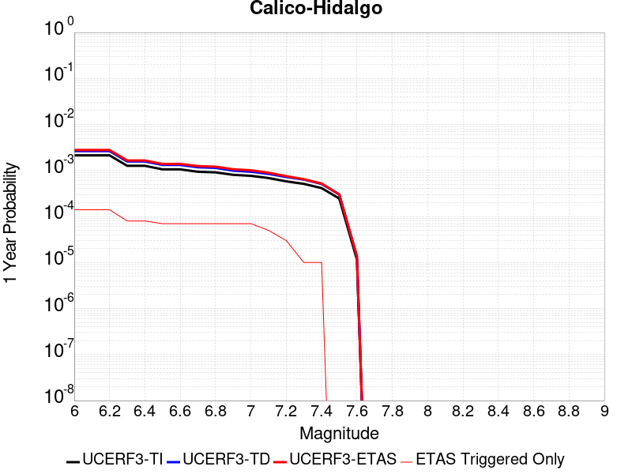 |  |

| Magnitude | 1 wk TI Prob | 1 wk TD Prob | 1 wk ETAS Prob | 1 wk ETAS/TD Gain | 1 wk ETAS Triggered Only | 1 mo TI Prob | 1 mo TD Prob | 1 mo ETAS Prob | 1 mo ETAS/TD Gain | 1 mo ETAS Triggered Only | 1 yr TI Prob | 1 yr TD Prob | 1 yr ETAS Prob | 1 yr ETAS/TD Gain | 1 yr ETAS Triggered Only | 10 yr TI Prob | 10 yr TD Prob | 10 yr ETAS Prob | 10 yr ETAS/TD Gain | 10 yr ETAS Triggered Only |
|-----|-----|-----|-----|-----|-----|-----|-----|-----|-----|-----|-----|-----|-----|-----|-----|-----|-----|-----|-----|-----|
| 6.0 | 4.0906612E-5 | 5.0703686E-5 | 1.600515E-4 | 3.1566048 | 1.0935336E-4 | 1.7530227E-4 | 2.172857E-4 | 3.3876303E-4 | 1.5590672 | 1.21503734E-4 | 0.0021322158 | 0.002642648 | 0.0028123038 | 1.0641991 | 1.7010522E-4 | 0.02111873 | 0.026152607 | 0.026330097 | 1.0067867 | 1.822556E-4 |
| 6.1 | 4.0906612E-5 | 5.0703686E-5 | 1.600515E-4 | 3.1566048 | 1.0935336E-4 | 1.7530227E-4 | 2.172857E-4 | 3.3876303E-4 | 1.5590672 | 1.21503734E-4 | 0.0021322158 | 0.002642648 | 0.0028123038 | 1.0641991 | 1.7010522E-4 | 0.02111873 | 0.026152607 | 0.026330097 | 1.0067867 | 1.822556E-4 |
| 6.2 | 4.0906612E-5 | 5.0703686E-5 | 1.600515E-4 | 3.1566048 | 1.0935336E-4 | 1.7530227E-4 | 2.172857E-4 | 3.3876303E-4 | 1.5590672 | 1.21503734E-4 | 0.0021322158 | 0.002642648 | 0.0028123038 | 1.0641991 | 1.7010522E-4 | 0.02111873 | 0.026152607 | 0.026330097 | 1.0067867 | 1.822556E-4 |
| 6.3 | 2.4242801E-5 | 3.0090669E-5 | 6.654069E-5 | 2.2113397 | 3.6451118E-5 | 1.0389358E-4 | 1.2895382E-4 | 1.7754905E-4 | 1.376842 | 4.860149E-5 | 0.0012641704 | 0.0015689151 | 0.0016659655 | 1.0618583 | 9.720298E-5 | 0.01257003 | 0.01558206 | 0.01568971 | 1.0069085 | 1.0935336E-4 |
| 6.4 | 2.4242801E-5 | 3.0090669E-5 | 6.654069E-5 | 2.2113397 | 3.6451118E-5 | 1.0389358E-4 | 1.2895382E-4 | 1.7754905E-4 | 1.376842 | 4.860149E-5 | 0.0012641704 | 0.0015689151 | 0.0016659655 | 1.0618583 | 9.720298E-5 | 0.01257003 | 0.01558206 | 0.01568971 | 1.0069085 | 1.0935336E-4 |
| 6.5 | 2.0286952E-5 | 2.5315738E-5 | 6.176593E-5 | 2.4398236 | 3.6451118E-5 | 8.694118E-5 | 1.0849161E-4 | 1.5708782E-4 | 1.447926 | 4.860149E-5 | 0.0010579949 | 0.001320102 | 0.0014050424 | 1.0643438 | 8.505261E-5 | 0.010529719 | 0.013124538 | 0.013220465 | 1.007309 | 9.720298E-5 |
| 6.6 | 2.0269223E-5 | 2.5296687E-5 | 6.174688E-5 | 2.440908 | 3.6451118E-5 | 8.6865206E-5 | 1.08409964E-4 | 1.5700619E-4 | 1.4482634 | 4.860149E-5 | 0.0010570707 | 0.0013191093 | 0.0014040497 | 1.0643922 | 8.505261E-5 | 0.010520565 | 0.013114728 | 0.013210656 | 1.0073146 | 9.720298E-5 |
| 6.7 | 1.799852E-5 | 2.25406E-5 | 5.8990896E-5 | 2.6170952 | 3.6451118E-5 | 7.713423E-5 | 9.659908E-5 | 1.4519588E-4 | 1.5030773 | 4.860149E-5 | 9.3870464E-4 | 0.0011754738 | 0.0012604265 | 1.072271 | 8.505261E-5 | 0.009347493 | 0.011694173 | 0.01179024 | 1.0082148 | 9.720298E-5 |
| 6.8 | 1.7458793E-5 | 2.184212E-5 | 5.8292444E-5 | 2.668809 | 3.6451118E-5 | 7.4821255E-5 | 9.3605806E-5 | 1.4220276E-4 | 1.5191659 | 4.860149E-5 | 9.10568E-4 | 0.0011390693 | 0.0012240252 | 1.0745834 | 8.505261E-5 | 0.009068459 | 0.011333893 | 0.011429994 | 1.0084791 | 9.720298E-5 |
| 6.9 | 1.542884E-5 | 1.9025927E-5 | 5.5476354E-5 | 2.9158292 | 3.6451118E-5 | 6.612192E-5 | 8.153721E-5 | 1.3013474E-4 | 1.5960165 | 4.860149E-5 | 8.04737E-4 | 9.922766E-4 | 0.0010772449 | 1.0856296 | 8.505261E-5 | 0.008018291 | 0.009879857 | 0.00996407 | 1.0085236 | 8.505261E-5 |
| 7.0 | 1.468253E-5 | 1.8030598E-5 | 5.448106E-5 | 3.021589 | 3.6451118E-5 | 6.292361E-5 | 7.7271776E-5 | 1.2586951E-4 | 1.6289196 | 4.860149E-5 | 7.658257E-4 | 9.4039086E-4 | 0.0010253635 | 1.0903589 | 8.505261E-5 | 0.0076319184 | 0.009365481 | 0.009449737 | 1.0089965 | 8.505261E-5 |
| 7.1 | 1.3139281E-5 | 1.6200942E-5 | 4.0501294E-5 | 2.4999344 | 2.4300745E-5 | 5.6309986E-5 | 6.943083E-5 | 1.0587942E-4 | 1.5249625 | 3.6451118E-5 | 6.853584E-4 | 8.4500515E-4 | 9.057057E-4 | 1.0718346 | 6.0751867E-5 | 0.0068324856 | 0.0084192185 | 0.008479459 | 1.0071551 | 6.0751867E-5 |
| 7.2 | 1.1127404E-5 | 1.3866597E-5 | 3.8167007E-5 | 2.7524421 | 2.4300745E-5 | 4.7688E-5 | 5.942698E-5 | 8.3726285E-5 | 1.4088935 | 2.4300745E-5 | 5.8044674E-4 | 7.232942E-4 | 7.59719E-4 | 1.0503595 | 3.6451118E-5 | 0.0057893298 | 0.0072105085 | 0.007246697 | 1.0050188 | 3.6451118E-5 |
| 7.3 | 9.808154E-6 | 1.2176215E-5 | 1.2176215E-5 | 1.0 | 0.0 | 4.2034266E-5 | 5.2182797E-5 | 5.2182797E-5 | 1.0 | 0.0 | 5.11647E-4 | 6.3515105E-4 | 6.472937E-4 | 1.0191177 | 1.2150373E-5 | 0.0051047057 | 0.006334433 | 0.0063465065 | 1.001906 | 1.2150373E-5 |
| 7.4 | 7.942452E-6 | 9.792144E-6 | 9.792144E-6 | 1.0 | 0.0 | 3.4038632E-5 | 4.1965708E-5 | 4.1965708E-5 | 1.0 | 0.0 | 4.1434157E-4 | 5.1082217E-4 | 5.229663E-4 | 1.0237738 | 1.2150373E-5 | 0.0041356985 | 0.005097421 | 0.0051095095 | 1.0023714 | 1.2150373E-5 |
| 7.5 | 4.7121216E-6 | 5.772836E-6 | 5.772836E-6 | 1.0 | 0.0 | 2.019465E-5 | 2.4740535E-5 | 2.4740535E-5 | 1.0 | 0.0 | 2.4584212E-4 | 3.0118204E-4 | 3.0118204E-4 | 1.0 | 0.0 | 0.0024557032 | 0.0030084911 | 0.0030084911 | 1.0 | 0.0 |
| 7.6 | 2.21172E-7 | 2.603961E-7 | 2.603961E-7 | 1.0 | 0.0 | 9.478797E-7 | 1.1159829E-6 | 1.1159829E-6 | 1.0 | 0.0 | 1.1540374E-5 | 1.3587036E-5 | 1.3587036E-5 | 1.0 | 0.0 | 1.1539775E-4 | 1.3586486E-4 | 1.3586486E-4 | 1.0 | 0.0 |

## Death Valley (Fish Lake Valley)
*[(top)](#table-of-contents)*

| 1 Week | 1 Month | 1 Year | 10 Year |
|-----|-----|-----|-----|
|  |  |  |  |

| Magnitude | 1 wk TI Prob | 1 wk TD Prob | 1 wk ETAS Prob | 1 wk ETAS/TD Gain | 1 wk ETAS Triggered Only | 1 mo TI Prob | 1 mo TD Prob | 1 mo ETAS Prob | 1 mo ETAS/TD Gain | 1 mo ETAS Triggered Only | 1 yr TI Prob | 1 yr TD Prob | 1 yr ETAS Prob | 1 yr ETAS/TD Gain | 1 yr ETAS Triggered Only | 10 yr TI Prob | 10 yr TD Prob | 10 yr ETAS Prob | 10 yr ETAS/TD Gain | 10 yr ETAS Triggered Only |
|-----|-----|-----|-----|-----|-----|-----|-----|-----|-----|-----|-----|-----|-----|-----|-----|-----|-----|-----|-----|-----|
| 6.0 | 3.872328E-5 | 4.7267473E-5 | 1.3231607E-4 | 2.7993047 | 8.505261E-5 | 1.6594635E-4 | 2.0256084E-4 | 3.2403995E-4 | 1.5997167 | 1.21503734E-4 | 0.0020185246 | 0.002463534 | 0.0026210998 | 1.0639592 | 1.5795486E-4 | 0.02000288 | 0.024388181 | 0.024565991 | 1.0072908 | 1.822556E-4 |
| 6.1 | 3.872328E-5 | 4.7267473E-5 | 1.3231607E-4 | 2.7993047 | 8.505261E-5 | 1.6594635E-4 | 2.0256084E-4 | 3.2403995E-4 | 1.5997167 | 1.21503734E-4 | 0.0020185246 | 0.002463534 | 0.0026210998 | 1.0639592 | 1.5795486E-4 | 0.02000288 | 0.024388181 | 0.024565991 | 1.0072908 | 1.822556E-4 |
| 6.2 | 3.872328E-5 | 4.7267473E-5 | 1.3231607E-4 | 2.7993047 | 8.505261E-5 | 1.6594635E-4 | 2.0256084E-4 | 3.2403995E-4 | 1.5997167 | 1.21503734E-4 | 0.0020185246 | 0.002463534 | 0.0026210998 | 1.0639592 | 1.5795486E-4 | 0.02000288 | 0.024388181 | 0.024565991 | 1.0072908 | 1.822556E-4 |
| 6.3 | 2.8356371E-5 | 3.3609853E-5 | 1.18659606E-4 | 3.5305007 | 8.505261E-5 | 1.2152165E-4 | 1.4403471E-4 | 2.6552094E-4 | 1.843451 | 1.21503734E-4 | 0.0014785219 | 0.0017522911 | 0.0019099691 | 1.0899839 | 1.5795486E-4 | 0.014687235 | 0.017391782 | 0.017570868 | 1.0102972 | 1.822556E-4 |
| 6.4 | 2.8356371E-5 | 3.3609853E-5 | 1.18659606E-4 | 3.5305007 | 8.505261E-5 | 1.2152165E-4 | 1.4403471E-4 | 2.6552094E-4 | 1.843451 | 1.21503734E-4 | 0.0014785219 | 0.0017522911 | 0.0019099691 | 1.0899839 | 1.5795486E-4 | 0.014687235 | 0.017391782 | 0.017570868 | 1.0102972 | 1.822556E-4 |
| 6.5 | 2.4448687E-5 | 2.8607552E-5 | 1.13657734E-4 | 3.9729974 | 8.505261E-5 | 1.0477588E-4 | 1.2259831E-4 | 2.4408716E-4 | 1.9909502 | 1.21503734E-4 | 0.0012748998 | 0.0014916632 | 0.0016493823 | 1.1057339 | 1.5795486E-4 | 0.012676105 | 0.014821377 | 0.015000931 | 1.0121145 | 1.822556E-4 |
| 6.6 | 2.1298161E-5 | 2.4660083E-5 | 1.097106E-4 | 4.448914 | 8.505261E-5 | 9.127464E-5 | 1.0568198E-4 | 2.1502379E-4 | 2.0346305 | 1.0935336E-4 | 0.0011107022 | 0.0012859525 | 0.0014315696 | 1.1132367 | 1.4580447E-4 | 0.011051672 | 0.012788526 | 0.012956455 | 1.0131313 | 1.7010522E-4 |
| 6.7 | 1.8959729E-5 | 2.1781025E-5 | 1.0683179E-4 | 4.9048095 | 8.505261E-5 | 8.125345E-5 | 9.334405E-5 | 2.0268721E-4 | 2.171399 | 1.0935336E-4 | 9.888117E-4 | 0.001135897 | 0.0012815358 | 1.1282148 | 1.4580447E-4 | 0.009844234 | 0.01130357 | 0.011471752 | 1.0148787 | 1.7010522E-4 |
| 6.8 | 1.6691629E-5 | 1.9018353E-5 | 1.04069346E-4 | 5.4720488 | 8.505261E-5 | 7.153359E-5 | 8.150477E-5 | 1.9084921E-4 | 2.341571 | 1.0935336E-4 | 8.7057345E-4 | 9.918857E-4 | 0.0011375456 | 1.1468514 | 1.4580447E-4 | 0.008671708 | 0.009876343 | 0.010044768 | 1.0170534 | 1.7010522E-4 |
| 6.9 | 1.450505E-5 | 1.638954E-5 | 1.0144075E-4 | 6.1893597 | 8.505261E-5 | 6.216302E-5 | 7.0239046E-5 | 1.7958472E-4 | 2.5567648 | 1.0935336E-4 | 7.5657194E-4 | 8.5483363E-4 | 0.0010005134 | 1.170419 | 1.4580447E-4 | 0.007540013 | 0.008516385 | 0.008685042 | 1.0198038 | 1.7010522E-4 |
| 7.0 | 1.2940855E-5 | 1.4537972E-5 | 9.958935E-5 | 6.8502917 | 8.505261E-5 | 5.545963E-5 | 6.230414E-5 | 1.7165068E-4 | 2.7550447 | 1.0935336E-4 | 6.750118E-4 | 7.5829466E-4 | 9.039886E-4 | 1.1921337 | 1.4580447E-4 | 0.006729651 | 0.0075576897 | 0.0077265096 | 1.0223374 | 1.7010522E-4 |
| 7.1 | 1.2544658E-5 | 1.4078208E-5 | 9.912962E-5 | 7.0413523 | 8.505261E-5 | 5.3761712E-5 | 6.0333812E-5 | 1.6968057E-4 | 2.812363 | 1.0935336E-4 | 6.5435225E-4 | 7.343222E-4 | 8.800196E-4 | 1.1984107 | 1.4580447E-4 | 0.006524288 | 0.007319551 | 0.007488411 | 1.0230697 | 1.7010522E-4 |
| 7.2 | 1.2489416E-5 | 1.4015674E-5 | 9.9067096E-5 | 7.0683074 | 8.505261E-5 | 5.3524967E-5 | 6.0065824E-5 | 1.6941261E-4 | 2.8204494 | 1.0935336E-4 | 6.514716E-4 | 7.310616E-4 | 8.767595E-4 | 1.1992964 | 1.4580447E-4 | 0.006495651 | 0.0072871596 | 0.007456025 | 1.0231731 | 1.7010522E-4 |
| 7.3 | 1.2368307E-5 | 1.3879812E-5 | 9.893125E-5 | 7.1277075 | 8.505261E-5 | 5.3005948E-5 | 5.9483587E-5 | 1.6883043E-4 | 2.8382692 | 1.0935336E-4 | 6.451563E-4 | 7.2397763E-4 | 8.696765E-4 | 1.2012478 | 1.4580447E-4 | 0.0064328653 | 0.007216782 | 0.0073856595 | 1.0234007 | 1.7010522E-4 |
| 7.4 | 1.2161707E-5 | 1.36478675E-5 | 9.869932E-5 | 7.2318487 | 8.505261E-5 | 5.212056E-5 | 5.8489582E-5 | 1.6783654E-4 | 2.8695118 | 1.0935336E-4 | 6.3438306E-4 | 7.118836E-4 | 8.575843E-4 | 1.2046692 | 1.4580447E-4 | 0.006325751 | 0.0070966207 | 0.0072655184 | 1.0237998 | 1.7010522E-4 |
| 7.5 | 1.1707948E-5 | 1.3145515E-5 | 9.819701E-5 | 7.4700007 | 8.505261E-5 | 5.0175953E-5 | 5.6336736E-5 | 1.6568393E-4 | 2.9409573 | 1.0935336E-4 | 6.10721E-4 | 6.856895E-4 | 8.31394E-4 | 1.2124934 | 1.4580447E-4 | 0.0060904534 | 0.006836321 | 0.0070052636 | 1.0247124 | 1.7010522E-4 |
| 7.6 | 1.0319538E-5 | 1.1579622E-5 | 9.663125E-5 | 8.344939 | 8.505261E-5 | 4.4225842E-5 | 4.9626036E-5 | 1.5897397E-4 | 3.2034388 | 1.0935336E-4 | 5.383166E-4 | 6.040347E-4 | 7.497511E-4 | 1.2412385 | 1.4580447E-4 | 0.0053701443 | 0.0060244603 | 0.0061814636 | 1.0260609 | 1.5795486E-4 |
| 7.7 | 8.937764E-6 | 1.0022779E-5 | 8.2924285E-5 | 8.273582 | 7.2902236E-5 | 3.830414E-5 | 4.295409E-5 | 1.401529E-4 | 3.2628534 | 9.720298E-5 | 4.6625308E-4 | 5.228456E-4 | 6.564298E-4 | 1.2554946 | 1.336541E-4 | 0.0046527605 | 0.005216664 | 0.0053617083 | 1.0278039 | 1.4580447E-4 |
| 7.8 | 3.108007E-7 | 3.284654E-7 | 3.284654E-7 | 1.0 | 0.0 | 1.3320023E-6 | 1.407708E-6 | 1.407708E-6 | 1.0 | 0.0 | 1.6217007E-5 | 1.7138715E-5 | 1.7138715E-5 | 1.0 | 0.0 | 1.6215823E-4 | 1.7137431E-4 | 1.7137431E-4 | 1.0 | 0.0 |
| 7.9 | 2.5591178E-9 | 2.6696718E-9 | 2.6696718E-9 | 1.0 | 0.0 | 1.0967647E-8 | 1.14414505E-8 | 1.14414505E-8 | 1.0 | 0.0 | 1.335311E-7 | 1.3929966E-7 | 1.3929966E-7 | 1.0 | 0.0 | 1.3353102E-6 | 1.3929966E-6 | 1.3929966E-6 | 1.0 | 0.0 |

## San Andreas (Creeping Section) 2011 CFM
*[(top)](#table-of-contents)*

| 1 Week | 1 Month | 1 Year | 10 Year |
|-----|-----|-----|-----|
|  |  |  |  |

| Magnitude | 1 wk TI Prob | 1 wk TD Prob | 1 wk ETAS Prob | 1 wk ETAS/TD Gain | 1 wk ETAS Triggered Only | 1 mo TI Prob | 1 mo TD Prob | 1 mo ETAS Prob | 1 mo ETAS/TD Gain | 1 mo ETAS Triggered Only | 1 yr TI Prob | 1 yr TD Prob | 1 yr ETAS Prob | 1 yr ETAS/TD Gain | 1 yr ETAS Triggered Only | 10 yr TI Prob | 10 yr TD Prob | 10 yr ETAS Prob | 10 yr ETAS/TD Gain | 10 yr ETAS Triggered Only |
|-----|-----|-----|-----|-----|-----|-----|-----|-----|-----|-----|-----|-----|-----|-----|-----|-----|-----|-----|-----|-----|
| 6.0 | 5.986481E-4 | 0.001228691 | 0.0013015036 | 1.0592604 | 7.2902236E-5 | 0.0025631124 | 0.005246795 | 0.0053193145 | 1.0138217 | 7.2902236E-5 | 0.030762846 | 0.061203245 | 0.061317313 | 1.0018637 | 1.21503734E-4 | 0.26835477 | 0.425928 | 0.4260117 | 1.0001966 | 1.4580447E-4 |
| 6.1 | 5.015945E-4 | 0.0010230356 | 0.0010958633 | 1.0711879 | 7.2902236E-5 | 0.00214792 | 0.004369436 | 0.0044420194 | 1.0166117 | 7.2902236E-5 | 0.025839351 | 0.051246606 | 0.051350355 | 1.0020245 | 1.0935336E-4 | 0.23032776 | 0.37284943 | 0.37293327 | 1.0002248 | 1.336541E-4 |
| 6.2 | 4.073338E-4 | 8.1157376E-4 | 8.722763E-4 | 1.0747961 | 6.0751867E-5 | 0.0017445484 | 0.0034683137 | 0.0035288548 | 1.0174555 | 6.0751867E-5 | 0.021034058 | 0.04093177 | 0.041024994 | 1.0022776 | 9.720298E-5 | 0.19150782 | 0.31302592 | 0.31310102 | 1.00024 | 1.0935336E-4 |
| 6.3 | 3.464099E-4 | 6.7455834E-4 | 7.2312704E-4 | 1.0720007 | 4.860149E-5 | 0.0014837692 | 0.0028832308 | 0.0029316922 | 1.016808 | 4.860149E-5 | 0.017915873 | 0.034187846 | 0.034269992 | 1.0024028 | 8.505261E-5 | 0.16538359 | 0.27130842 | 0.27137923 | 1.0002611 | 9.720298E-5 |
| 6.4 | 2.935057E-4 | 5.5516965E-4 | 5.9160055E-4 | 1.0656211 | 3.6451118E-5 | 0.0012572751 | 0.0023727308 | 0.0024090954 | 1.015326 | 3.6451118E-5 | 0.015200248 | 0.02826279 | 0.028333632 | 1.0025065 | 7.2902236E-5 | 0.14201577 | 0.23297668 | 0.23304191 | 1.00028 | 8.505261E-5 |
| 6.5 | 2.3409708E-4 | 4.2132285E-4 | 4.577586E-4 | 1.0864794 | 3.6451118E-5 | 0.0010028875 | 0.0018017791 | 0.0018381646 | 1.0201942 | 3.6451118E-5 | 0.012141965 | 0.021586355 | 0.021657683 | 1.0033044 | 7.2902236E-5 | 0.11499573 | 0.1868149 | 0.18688408 | 1.0003703 | 8.505261E-5 |
| 6.6 | 1.5842178E-4 | 2.5068692E-4 | 2.871289E-4 | 1.1453685 | 3.6451118E-5 | 6.7877385E-4 | 0.0010739256 | 0.0011103376 | 1.0339055 | 3.6451118E-5 | 0.0082328 | 0.012995283 | 0.013067238 | 1.005537 | 7.2902236E-5 | 0.07934396 | 0.12313759 | 0.12321217 | 1.0006057 | 8.505261E-5 |
| 6.7 | 1.5616413E-4 | 2.4605254E-4 | 2.824947E-4 | 1.1481072 | 3.6451118E-5 | 6.691031E-4 | 0.0010540807 | 0.0010904934 | 1.0345445 | 3.6451118E-5 | 0.0081159435 | 0.012757154 | 0.012829126 | 1.0056417 | 7.2902236E-5 | 0.0782586 | 0.12116472 | 0.12123946 | 1.0006169 | 8.505261E-5 |
| 6.8 | 1.5538467E-4 | 2.442914E-4 | 2.8073363E-4 | 1.1491752 | 3.6451118E-5 | 6.6576427E-4 | 0.001046539 | 0.001082952 | 1.0347937 | 3.6451118E-5 | 0.008075596 | 0.012666538 | 0.012738517 | 1.0056826 | 7.2902236E-5 | 0.07788358 | 0.12039561 | 0.12047042 | 1.0006214 | 8.505261E-5 |
| 6.9 | 1.5153569E-4 | 2.3538464E-4 | 2.7182716E-4 | 1.1548213 | 3.6451118E-5 | 6.49277E-4 | 0.0010084033 | 0.0010448176 | 1.0361109 | 3.6451118E-5 | 0.007876333 | 0.012208726 | 0.012280739 | 1.0058985 | 7.2902236E-5 | 0.07602952 | 0.11646574 | 0.11654089 | 1.0006453 | 8.505261E-5 |
| 7.0 | 1.4588932E-4 | 2.2395732E-4 | 2.6040027E-4 | 1.1627228 | 3.6451118E-5 | 6.250901E-4 | 9.59466E-4 | 9.958822E-4 | 1.0379546 | 3.6451118E-5 | 0.0075839474 | 0.011619428 | 0.011691483 | 1.0062013 | 7.2902236E-5 | 0.073302895 | 0.11131206 | 0.11138765 | 1.000679 | 8.505261E-5 |
| 7.1 | 1.1565079E-4 | 1.6281323E-4 | 1.9925841E-4 | 1.2238466 | 3.6451118E-5 | 4.955521E-4 | 6.9758523E-4 | 7.340109E-4 | 1.0522169 | 3.6451118E-5 | 0.006016669 | 0.008460228 | 0.008532514 | 1.0085442 | 7.2902236E-5 | 0.058563538 | 0.08366478 | 0.08374272 | 1.0009315 | 8.505261E-5 |
| 7.2 | 1.0393792E-4 | 1.4615392E-4 | 1.8259972E-4 | 1.2493658 | 3.6451118E-5 | 4.4537216E-4 | 6.262243E-4 | 6.626526E-4 | 1.0581713 | 3.6451118E-5 | 0.005408933 | 0.0075977976 | 0.007670146 | 1.0095223 | 7.2902236E-5 | 0.052791595 | 0.07561503 | 0.07569366 | 1.0010397 | 8.505261E-5 |
| 7.3 | 9.332884E-5 | 1.2780601E-4 | 1.6425246E-4 | 1.2851702 | 3.6451118E-5 | 3.999194E-4 | 5.4762565E-4 | 5.8405683E-4 | 1.0665257 | 3.6451118E-5 | 0.0048581534 | 0.0066470946 | 0.0067074425 | 1.0090789 | 6.0751867E-5 | 0.047533102 | 0.06647954 | 0.066547595 | 1.0010237 | 7.2902236E-5 |
| 7.4 | 8.670252E-5 | 1.1702972E-4 | 1.5347656E-4 | 1.3114325 | 3.6451118E-5 | 3.715293E-4 | 5.014601E-4 | 5.378929E-4 | 1.0726535 | 3.6451118E-5 | 0.004513991 | 0.0060883067 | 0.0061486885 | 1.0099177 | 6.0751867E-5 | 0.044233937 | 0.061148684 | 0.06121713 | 1.0011193 | 7.2902236E-5 |
| 7.5 | 7.3036405E-5 | 9.005699E-5 | 1.2650482E-4 | 1.4047197 | 3.6451118E-5 | 3.129756E-4 | 3.859015E-4 | 4.2233855E-4 | 1.0944206 | 3.6451118E-5 | 0.0038038217 | 0.0046882504 | 0.0047487174 | 1.0128976 | 6.0751867E-5 | 0.03739367 | 0.047875606 | 0.04794502 | 1.0014498 | 7.2902236E-5 |
| 7.6 | 6.3935775E-5 | 8.280209E-5 | 1.1925019E-4 | 1.4401834 | 3.6451118E-5 | 2.7398168E-4 | 3.5481792E-4 | 3.912561E-4 | 1.1026955 | 3.6451118E-5 | 0.0033306254 | 0.00431137 | 0.00437186 | 1.0140303 | 6.0751867E-5 | 0.032811474 | 0.043990135 | 0.04405983 | 1.0015843 | 7.2902236E-5 |
| 7.7 | 5.5050095E-5 | 6.661729E-5 | 9.091642E-5 | 1.3647571 | 2.4300745E-5 | 2.3590765E-4 | 2.8547147E-4 | 3.0976528E-4 | 1.0851007 | 2.4300745E-5 | 0.0028683927 | 0.0034700802 | 0.0035064048 | 1.010468 | 3.6451118E-5 | 0.0283165 | 0.03579509 | 0.03584195 | 1.0013092 | 4.860149E-5 |
| 7.8 | 5.027131E-5 | 6.1627725E-5 | 8.592697E-5 | 1.3942909 | 2.4300745E-5 | 2.1543067E-4 | 2.640921E-4 | 2.8838642E-4 | 1.0919919 | 2.4300745E-5 | 0.0026197135 | 0.003210584 | 0.003246918 | 1.011317 | 3.6451118E-5 | 0.025890453 | 0.03312572 | 0.03317271 | 1.0014186 | 4.860149E-5 |
| 7.9 | 3.7271806E-5 | 5.0224386E-5 | 5.0224386E-5 | 1.0 | 0.0 | 1.5972654E-4 | 2.1522962E-4 | 2.1522962E-4 | 1.0 | 0.0 | 0.0019429359 | 0.0026172737 | 0.0026293923 | 1.0046302 | 1.2150373E-5 | 0.019260362 | 0.027066687 | 0.02709033 | 1.0008736 | 2.4300745E-5 |
| 8.0 | 2.7310243E-5 | 3.1428404E-5 | 3.1428404E-5 | 1.0 | 0.0 | 1.17038646E-4 | 1.3468621E-4 | 1.3468621E-4 | 1.0 | 0.0 | 0.0014240141 | 0.0016385721 | 0.0016507026 | 1.007403 | 1.2150373E-5 | 0.014149235 | 0.01721387 | 0.01723775 | 1.0013874 | 2.4300745E-5 |
| 8.1 | 1.7940547E-5 | 1.7400796E-5 | 1.7400796E-5 | 1.0 | 0.0 | 7.688579E-5 | 7.457271E-5 | 7.457271E-5 | 1.0 | 0.0 | 9.3568244E-4 | 9.075451E-4 | 9.196845E-4 | 1.013376 | 1.2150373E-5 | 0.009317525 | 0.009799073 | 0.009823136 | 1.0024556 | 2.4300745E-5 |
| 8.2 | 8.643924E-6 | 5.4748625E-6 | 5.4748625E-6 | 1.0 | 0.0 | 3.704486E-5 | 2.3463486E-5 | 2.3463486E-5 | 1.0 | 0.0 | 4.5092785E-4 | 2.8563058E-4 | 2.8563058E-4 | 1.0 | 0.0 | 0.0045001395 | 0.0032487072 | 0.0032487072 | 1.0 | 0.0 |
| 8.3 | 1.983087E-6 | 7.6599065E-7 | 7.6599065E-7 | 1.0 | 0.0 | 8.498917E-6 | 3.282813E-6 | 3.282813E-6 | 1.0 | 0.0 | 1.034694E-4 | 3.9967534E-5 | 3.9967534E-5 | 1.0 | 0.0 | 0.0010342124 | 4.719687E-4 | 4.719687E-4 | 1.0 | 0.0 |

## Cady
*[(top)](#table-of-contents)*

| 1 Week | 1 Month | 1 Year | 10 Year |
|-----|-----|-----|-----|
|  |  |  |  |

| Magnitude | 1 wk TI Prob | 1 wk TD Prob | 1 wk ETAS Prob | 1 wk ETAS/TD Gain | 1 wk ETAS Triggered Only | 1 mo TI Prob | 1 mo TD Prob | 1 mo ETAS Prob | 1 mo ETAS/TD Gain | 1 mo ETAS Triggered Only | 1 yr TI Prob | 1 yr TD Prob | 1 yr ETAS Prob | 1 yr ETAS/TD Gain | 1 yr ETAS Triggered Only | 10 yr TI Prob | 10 yr TD Prob | 10 yr ETAS Prob | 10 yr ETAS/TD Gain | 10 yr ETAS Triggered Only |
|-----|-----|-----|-----|-----|-----|-----|-----|-----|-----|-----|-----|-----|-----|-----|-----|-----|-----|-----|-----|-----|
| 6.0 | 1.9892565E-5 | 2.1858728E-5 | 9.475937E-5 | 4.3350816 | 7.2902236E-5 | 8.525106E-5 | 9.3677416E-5 | 2.0302054E-4 | 2.1672301 | 1.0935336E-4 | 0.0010374374 | 0.0011400167 | 0.0012613819 | 1.1064591 | 1.21503734E-4 | 0.010326075 | 0.011350701 | 0.011506862 | 1.013758 | 1.5795486E-4 |
| 6.1 | 1.9892565E-5 | 2.1858728E-5 | 9.475937E-5 | 4.3350816 | 7.2902236E-5 | 8.525106E-5 | 9.3677416E-5 | 2.0302054E-4 | 2.1672301 | 1.0935336E-4 | 0.0010374374 | 0.0011400167 | 0.0012613819 | 1.1064591 | 1.21503734E-4 | 0.010326075 | 0.011350701 | 0.011506862 | 1.013758 | 1.5795486E-4 |
| 6.2 | 1.9892565E-5 | 2.1858728E-5 | 9.475937E-5 | 4.3350816 | 7.2902236E-5 | 8.525106E-5 | 9.3677416E-5 | 2.0302054E-4 | 2.1672301 | 1.0935336E-4 | 0.0010374374 | 0.0011400167 | 0.0012613819 | 1.1064591 | 1.21503734E-4 | 0.010326075 | 0.011350701 | 0.011506862 | 1.013758 | 1.5795486E-4 |
| 6.3 | 1.1117327E-5 | 1.2176583E-5 | 3.6477035E-5 | 2.9956706 | 2.4300745E-5 | 4.764482E-5 | 5.2184492E-5 | 1.1293319E-4 | 2.164114 | 6.0751867E-5 | 5.7992124E-4 | 6.351925E-4 | 7.080484E-4 | 1.114699 | 7.2902236E-5 | 0.0057841022 | 0.0063368753 | 0.0064334623 | 1.0152421 | 9.720298E-5 |
| 6.4 | 1.1117327E-5 | 1.2176583E-5 | 3.6477035E-5 | 2.9956706 | 2.4300745E-5 | 4.764482E-5 | 5.2184492E-5 | 1.1293319E-4 | 2.164114 | 6.0751867E-5 | 5.7992124E-4 | 6.351925E-4 | 7.080484E-4 | 1.114699 | 7.2902236E-5 | 0.0057841022 | 0.0063368753 | 0.0064334623 | 1.0152421 | 9.720298E-5 |
| 6.5 | 6.103093E-6 | 6.672021E-6 | 6.672021E-6 | 1.0 | 0.0 | 2.615585E-5 | 2.8594131E-5 | 4.074416E-5 | 1.4249133 | 1.2150373E-5 | 3.1840094E-4 | 3.480905E-4 | 3.6023665E-4 | 1.0348936 | 1.2150373E-5 | 0.0031794512 | 0.0034766865 | 0.003500903 | 1.0069653 | 2.4300745E-5 |
| 6.6 | 5.817237E-6 | 6.3656585E-6 | 6.3656585E-6 | 1.0 | 0.0 | 2.4930776E-5 | 2.728118E-5 | 3.943122E-5 | 1.4453635 | 1.2150373E-5 | 3.034899E-4 | 3.3211018E-4 | 3.4425652E-4 | 1.0365732 | 1.2150373E-5 | 0.0030307577 | 0.0033173605 | 0.0033415807 | 1.007301 | 2.4300745E-5 |
| 6.7 | 4.8846314E-6 | 5.3405684E-6 | 5.3405684E-6 | 1.0 | 0.0 | 2.0933967E-5 | 2.2888014E-5 | 2.2888014E-5 | 1.0 | 0.0 | 2.5484123E-4 | 2.7863772E-4 | 2.7863772E-4 | 1.0 | 0.0 | 0.0025454918 | 0.0027840391 | 0.0027961556 | 1.0043521 | 1.2150373E-5 |
| 6.8 | 1.7788773E-6 | 1.9399079E-6 | 1.9399079E-6 | 1.0 | 0.0 | 7.6237375E-6 | 8.313874E-6 | 8.313874E-6 | 1.0 | 0.0 | 9.281505E-5 | 1.01218284E-4 | 1.01218284E-4 | 1.0 | 0.0 | 9.2776294E-4 | 0.0010118765 | 0.0010118765 | 1.0 | 0.0 |
| 6.9 | 7.5455404E-7 | 8.297092E-7 | 8.297092E-7 | 1.0 | 0.0 | 3.233799E-6 | 3.5558937E-6 | 3.5558937E-6 | 1.0 | 0.0 | 3.937079E-5 | 4.3292483E-5 | 4.3292483E-5 | 1.0 | 0.0 | 3.9363815E-4 | 4.3287344E-4 | 4.3287344E-4 | 1.0 | 0.0 |
| 7.0 | 6.8578805E-7 | 7.541816E-7 | 7.541816E-7 | 1.0 | 0.0 | 2.9390883E-6 | 3.2322048E-6 | 3.2322048E-6 | 1.0 | 0.0 | 3.578281E-5 | 3.9351715E-5 | 3.9351715E-5 | 1.0 | 0.0 | 3.577705E-4 | 3.9347992E-4 | 3.9347992E-4 | 1.0 | 0.0 |

## San Jacinto (Stepovers Combined)
*[(top)](#table-of-contents)*

| 1 Week | 1 Month | 1 Year | 10 Year |
|-----|-----|-----|-----|
|  |  |  |  |

| Magnitude | 1 wk TI Prob | 1 wk TD Prob | 1 wk ETAS Prob | 1 wk ETAS/TD Gain | 1 wk ETAS Triggered Only | 1 mo TI Prob | 1 mo TD Prob | 1 mo ETAS Prob | 1 mo ETAS/TD Gain | 1 mo ETAS Triggered Only | 1 yr TI Prob | 1 yr TD Prob | 1 yr ETAS Prob | 1 yr ETAS/TD Gain | 1 yr ETAS Triggered Only | 10 yr TI Prob | 10 yr TD Prob | 10 yr ETAS Prob | 10 yr ETAS/TD Gain | 10 yr ETAS Triggered Only |
|-----|-----|-----|-----|-----|-----|-----|-----|-----|-----|-----|-----|-----|-----|-----|-----|-----|-----|-----|-----|-----|
| 6.0 | 4.0667746E-5 | 3.5272755E-5 | 1.567722E-4 | 4.444569 | 1.21503734E-4 | 1.742787E-4 | 1.5116022E-4 | 2.847941E-4 | 1.8840548 | 1.336541E-4 | 0.0021197782 | 0.0018388226 | 0.001984359 | 1.0791465 | 1.4580447E-4 | 0.020996714 | 0.018986892 | 0.019141847 | 1.0081612 | 1.5795486E-4 |
| 6.1 | 4.0667746E-5 | 3.5272755E-5 | 1.567722E-4 | 4.444569 | 1.21503734E-4 | 1.742787E-4 | 1.5116022E-4 | 2.847941E-4 | 1.8840548 | 1.336541E-4 | 0.0021197782 | 0.0018388226 | 0.001984359 | 1.0791465 | 1.4580447E-4 | 0.020996714 | 0.018986892 | 0.019141847 | 1.0081612 | 1.5795486E-4 |
| 6.2 | 4.0667746E-5 | 3.5272755E-5 | 1.567722E-4 | 4.444569 | 1.21503734E-4 | 1.742787E-4 | 1.5116022E-4 | 2.847941E-4 | 1.8840548 | 1.336541E-4 | 0.0021197782 | 0.0018388226 | 0.001984359 | 1.0791465 | 1.4580447E-4 | 0.020996714 | 0.018986892 | 0.019141847 | 1.0081612 | 1.5795486E-4 |
| 6.3 | 4.0667746E-5 | 3.5272755E-5 | 1.567722E-4 | 4.444569 | 1.21503734E-4 | 1.742787E-4 | 1.5116022E-4 | 2.847941E-4 | 1.8840548 | 1.336541E-4 | 0.0021197782 | 0.0018388226 | 0.001984359 | 1.0791465 | 1.4580447E-4 | 0.020996714 | 0.018986892 | 0.019141847 | 1.0081612 | 1.5795486E-4 |
| 6.4 | 4.0577226E-5 | 3.5144654E-5 | 1.5664412E-4 | 4.4571247 | 1.21503734E-4 | 1.738908E-4 | 1.5061127E-4 | 2.8424524E-4 | 1.8872774 | 1.336541E-4 | 0.0021150648 | 0.0018321523 | 0.0019776896 | 1.0794352 | 1.4580447E-4 | 0.020950472 | 0.018921461 | 0.019076426 | 1.0081899 | 1.5795486E-4 |
| 6.5 | 4.0577226E-5 | 3.5144654E-5 | 1.5664412E-4 | 4.4571247 | 1.21503734E-4 | 1.738908E-4 | 1.5061127E-4 | 2.8424524E-4 | 1.8872774 | 1.336541E-4 | 0.0021150648 | 0.0018321523 | 0.0019776896 | 1.0794352 | 1.4580447E-4 | 0.020950472 | 0.018921461 | 0.019076426 | 1.0081899 | 1.5795486E-4 |
| 6.6 | 4.053861E-5 | 3.509E-5 | 1.5658946E-4 | 4.4625096 | 1.21503734E-4 | 1.7372532E-4 | 1.5037706E-4 | 2.8401107E-4 | 1.8886595 | 1.336541E-4 | 0.0021130538 | 0.0018293057 | 0.0019748434 | 1.079559 | 1.4580447E-4 | 0.020930743 | 0.018893538 | 0.019048508 | 1.0082023 | 1.5795486E-4 |
| 6.7 | 4.0516545E-5 | 3.5059067E-5 | 1.5655854E-4 | 4.4655647 | 1.21503734E-4 | 1.7363077E-4 | 1.5024451E-4 | 2.8387853E-4 | 1.8894436 | 1.336541E-4 | 0.002111905 | 0.001827695 | 0.001973233 | 1.0796293 | 1.4580447E-4 | 0.020919468 | 0.018877735 | 0.019032707 | 1.0082093 | 1.5795486E-4 |
| 6.8 | 4.049434E-5 | 3.5030633E-5 | 1.565301E-4 | 4.468378 | 1.21503734E-4 | 1.7353562E-4 | 1.5012265E-4 | 2.837567E-4 | 1.8901657 | 1.336541E-4 | 0.0021107488 | 0.0018262138 | 0.001971752 | 1.0796939 | 1.4580447E-4 | 0.020908125 | 0.018863149 | 0.019018123 | 1.0082158 | 1.5795486E-4 |
| 6.9 | 4.046386E-5 | 3.499319E-5 | 1.5649266E-4 | 4.4720893 | 1.21503734E-4 | 1.73405E-4 | 1.4996222E-4 | 2.8359628E-4 | 1.8911182 | 1.336541E-4 | 0.0021091616 | 0.0018242638 | 0.0019698022 | 1.0797793 | 1.4580447E-4 | 0.020892553 | 0.01884392 | 0.018998899 | 1.0082244 | 1.5795486E-4 |
| 7.0 | 4.036382E-5 | 3.487376E-5 | 1.5637325E-4 | 4.4839807 | 1.21503734E-4 | 1.7297632E-4 | 1.4945042E-4 | 2.8308455E-4 | 1.8941703 | 1.336541E-4 | 0.0021039525 | 0.0018180435 | 0.001963583 | 1.0800527 | 1.4580447E-4 | 0.02084144 | 0.018782536 | 0.018937524 | 1.0082517 | 1.5795486E-4 |
| 7.1 | 4.0343282E-5 | 3.4852223E-5 | 1.5635171E-4 | 4.4861336 | 1.21503734E-4 | 1.7288832E-4 | 1.4935812E-4 | 2.8299226E-4 | 1.8947229 | 1.336541E-4 | 0.002102883 | 0.0018169218 | 0.0019624613 | 1.0801023 | 1.4580447E-4 | 0.020830948 | 0.018771412 | 0.018926403 | 1.0082567 | 1.5795486E-4 |
| 7.2 | 4.0257353E-5 | 3.4756722E-5 | 1.5625622E-4 | 4.4957123 | 1.21503734E-4 | 1.725201E-4 | 1.489489E-4 | 2.825831E-4 | 1.8971815 | 1.336541E-4 | 0.0020984085 | 0.0018119477 | 0.001957488 | 1.0803226 | 1.4580447E-4 | 0.020787042 | 0.018722152 | 0.01887715 | 1.0082788 | 1.5795486E-4 |
| 7.3 | 3.9940667E-5 | 3.4584376E-5 | 1.560839E-4 | 4.5131335 | 1.21503734E-4 | 1.7116306E-4 | 1.4821035E-4 | 2.8184467E-4 | 1.9016528 | 1.336541E-4 | 0.0020819185 | 0.0018029709 | 0.0019485125 | 1.0807232 | 1.4580447E-4 | 0.020625217 | 0.018630784 | 0.018785795 | 1.0083202 | 1.5795486E-4 |
| 7.4 | 3.9721202E-5 | 3.4469766E-5 | 1.559693E-4 | 4.5248146 | 1.21503734E-4 | 1.7022261E-4 | 1.4771923E-4 | 2.813536E-4 | 1.9046512 | 1.336541E-4 | 0.0020704903 | 0.0017970012 | 0.0019425437 | 1.0809919 | 1.4580447E-4 | 0.020513052 | 0.018569905 | 0.018724928 | 1.008348 | 1.5795486E-4 |
| 7.5 | 3.7036873E-5 | 3.3537188E-5 | 1.5503685E-4 | 4.6228337 | 1.21503734E-4 | 1.5871979E-4 | 1.437229E-4 | 2.773578E-4 | 1.9298093 | 1.336541E-4 | 0.0019307006 | 0.0017484248 | 0.0018939744 | 1.0832461 | 1.4580447E-4 | 0.019140124 | 0.018071463 | 0.018226564 | 1.0085826 | 1.5795486E-4 |
| 7.6 | 3.2940967E-5 | 3.1317984E-5 | 1.5281791E-4 | 4.8795576 | 1.21503734E-4 | 1.4116794E-4 | 1.3421304E-4 | 2.6784922E-4 | 1.9957018 | 1.336541E-4 | 0.0017173645 | 0.0016328214 | 0.0017783877 | 1.0891502 | 1.4580447E-4 | 0.01704153 | 0.016904354 | 0.01705964 | 1.009186 | 1.5795486E-4 |
| 7.7 | 2.8236149E-5 | 2.7883889E-5 | 1.4938423E-4 | 5.357367 | 1.21503734E-4 | 1.2100645E-4 | 1.19496915E-4 | 2.5313505E-4 | 2.1183395 | 1.336541E-4 | 0.0014722579 | 0.001453905 | 0.0015994975 | 1.1001389 | 1.4580447E-4 | 0.014625421 | 0.015115095 | 0.0152706625 | 1.0102922 | 1.5795486E-4 |
| 7.8 | 2.4329287E-5 | 2.5207537E-5 | 1.467082E-4 | 5.8200135 | 1.21503734E-4 | 1.042642E-4 | 1.0802783E-4 | 2.416675E-4 | 2.2370856 | 1.336541E-4 | 0.0012686774 | 0.0013144462 | 0.001460059 | 1.1107788 | 1.4580447E-4 | 0.012614589 | 0.013712396 | 0.013868185 | 1.0113611 | 1.5795486E-4 |
| 7.9 | 1.9370926E-5 | 2.0421452E-5 | 1.419227E-4 | 6.949687 | 1.21503734E-4 | 8.301561E-5 | 8.7517576E-5 | 2.2115998E-4 | 2.527035 | 1.336541E-4 | 0.0010102465 | 0.0010650064 | 0.0012106556 | 1.136759 | 1.4580447E-4 | 0.0100566605 | 0.011199483 | 0.011355668 | 1.0139458 | 1.5795486E-4 |
| 8.0 | 1.5583017E-5 | 1.588647E-5 | 1.1308791E-4 | 7.118505 | 9.720298E-5 | 6.6782646E-5 | 6.808309E-5 | 1.77429E-4 | 2.6060655 | 1.0935336E-4 | 8.127754E-4 | 8.285971E-4 | 9.5000013E-4 | 1.1465164 | 1.21503734E-4 | 0.008098091 | 0.008781809 | 0.00891429 | 1.0150858 | 1.336541E-4 |
| 8.1 | 1.0024873E-5 | 8.292404E-6 | 5.6893492E-5 | 6.8609166 | 4.860149E-5 | 4.2963035E-5 | 3.5538393E-5 | 9.62881E-5 | 2.7094107 | 6.0751867E-5 | 5.229494E-4 | 4.3259456E-4 | 4.933201E-4 | 1.1403753 | 6.0751867E-5 | 0.0052172043 | 0.0046534105 | 0.0047259736 | 1.0155935 | 7.2902236E-5 |
| 8.2 | 4.142796E-6 | 1.5610041E-6 | 1.5610041E-6 | 1.0 | 0.0 | 1.775472E-5 | 6.69E-6 | 6.69E-6 | 1.0 | 0.0 | 2.1614227E-4 | 8.144774E-5 | 8.144774E-5 | 1.0 | 0.0 | 0.0021593217 | 9.454649E-4 | 9.454649E-4 | 1.0 | 0.0 |
| 8.3 | 1.2750878E-6 | 3.612133E-7 | 3.612133E-7 | 1.0 | 0.0 | 5.4646503E-6 | 1.548056E-6 | 1.548056E-6 | 1.0 | 0.0 | 6.653009E-5 | 1.8847424E-5 | 1.8847424E-5 | 1.0 | 0.0 | 6.6510175E-4 | 2.2734253E-4 | 2.2734253E-4 | 1.0 | 0.0 |

## San Andreas (Coachella) rev
*[(top)](#table-of-contents)*

| 1 Week | 1 Month | 1 Year | 10 Year |
|-----|-----|-----|-----|
|  |  |  |  |

| Magnitude | 1 wk TI Prob | 1 wk TD Prob | 1 wk ETAS Prob | 1 wk ETAS/TD Gain | 1 wk ETAS Triggered Only | 1 mo TI Prob | 1 mo TD Prob | 1 mo ETAS Prob | 1 mo ETAS/TD Gain | 1 mo ETAS Triggered Only | 1 yr TI Prob | 1 yr TD Prob | 1 yr ETAS Prob | 1 yr ETAS/TD Gain | 1 yr ETAS Triggered Only | 10 yr TI Prob | 10 yr TD Prob | 10 yr ETAS Prob | 10 yr ETAS/TD Gain | 10 yr ETAS Triggered Only |
|-----|-----|-----|-----|-----|-----|-----|-----|-----|-----|-----|-----|-----|-----|-----|-----|-----|-----|-----|-----|-----|
| 6.0 | 1.1925945E-4 | 3.2729402E-4 | 4.001724E-4 | 1.2226695 | 7.2902236E-5 | 5.110118E-4 | 0.0014019393 | 0.0015232727 | 1.0865468 | 1.21503734E-4 | 0.0062038354 | 0.016936364 | 0.017067755 | 1.0077579 | 1.336541E-4 | 0.060334753 | 0.15265316 | 0.1527767 | 1.0008093 | 1.4580447E-4 |
| 6.1 | 1.1925945E-4 | 3.2729402E-4 | 4.001724E-4 | 1.2226695 | 7.2902236E-5 | 5.110118E-4 | 0.0014019393 | 0.0015232727 | 1.0865468 | 1.21503734E-4 | 0.0062038354 | 0.016936364 | 0.017067755 | 1.0077579 | 1.336541E-4 | 0.060334753 | 0.15265316 | 0.1527767 | 1.0008093 | 1.4580447E-4 |
| 6.2 | 1.07432395E-4 | 3.0230157E-4 | 3.7518176E-4 | 1.2410845 | 7.2902236E-5 | 4.603433E-4 | 0.0012949388 | 0.0014162853 | 1.0937082 | 1.21503734E-4 | 0.005590286 | 0.015653009 | 0.015784571 | 1.0084049 | 1.336541E-4 | 0.05451731 | 0.14182423 | 0.14194936 | 1.0008823 | 1.4580447E-4 |
| 6.3 | 1.0718766E-4 | 3.0175463E-4 | 3.7463487E-4 | 1.2415216 | 7.2902236E-5 | 4.592948E-4 | 0.0012925972 | 0.0014139438 | 1.0938781 | 1.21503734E-4 | 0.005577586 | 0.015624908 | 0.015756473 | 1.0084202 | 1.336541E-4 | 0.054396555 | 0.14159249 | 0.14171766 | 1.0008839 | 1.4580447E-4 |
| 6.4 | 1.0355944E-4 | 2.9383553E-4 | 3.6671635E-4 | 1.2480327 | 7.2902236E-5 | 4.4375064E-4 | 0.0012586913 | 0.001380042 | 1.0964103 | 1.21503734E-4 | 0.0053892885 | 0.015217941 | 0.015349561 | 1.008649 | 1.336541E-4 | 0.052604496 | 0.13815255 | 0.13827822 | 1.0009096 | 1.4580447E-4 |
| 6.5 | 1.0227914E-4 | 2.9102986E-4 | 3.639109E-4 | 1.2504245 | 7.2902236E-5 | 4.382655E-4 | 0.0012466786 | 0.0013680309 | 1.0973405 | 1.21503734E-4 | 0.0053228354 | 0.01507372 | 0.01520536 | 1.008733 | 1.336541E-4 | 0.051971316 | 0.13693172 | 0.13705756 | 1.000919 | 1.4580447E-4 |
| 6.6 | 1.0116757E-4 | 2.8868738E-4 | 3.615686E-4 | 1.2524571 | 7.2902236E-5 | 4.3350324E-4 | 0.0012366489 | 0.0013580024 | 1.098131 | 1.21503734E-4 | 0.0052651367 | 0.01495329 | 0.015084946 | 1.0088044 | 1.336541E-4 | 0.051421247 | 0.1359099 | 0.13603589 | 1.000927 | 1.4580447E-4 |
| 6.7 | 1.0050676E-4 | 2.8727303E-4 | 3.601543E-4 | 1.2537005 | 7.2902236E-5 | 4.3067214E-4 | 0.0012305931 | 0.0013519473 | 1.0986145 | 1.21503734E-4 | 0.005230834 | 0.014880571 | 0.015012235 | 1.0088482 | 1.336541E-4 | 0.051094085 | 0.13529462 | 0.1354207 | 1.0009319 | 1.4580447E-4 |
| 6.8 | 9.976819E-5 | 2.853096E-4 | 3.5819103E-4 | 1.2554469 | 7.2902236E-5 | 4.2750788E-4 | 0.0012221863 | 0.0013435415 | 1.0992936 | 1.21503734E-4 | 0.0051924936 | 0.0147796115 | 0.01491129 | 1.0089095 | 1.336541E-4 | 0.050728295 | 0.13444631 | 0.1345725 | 1.0009387 | 1.4580447E-4 |
| 6.9 | 9.77719E-5 | 2.8027873E-4 | 3.5316055E-4 | 1.2600332 | 7.2902236E-5 | 4.1895514E-4 | 0.0012006456 | 0.0013220034 | 1.1010772 | 1.21503734E-4 | 0.0050888555 | 0.014520878 | 0.014652591 | 1.0090706 | 1.336541E-4 | 0.049738888 | 0.1322748 | 0.13240133 | 1.0009565 | 1.4580447E-4 |
| 7.0 | 8.500761E-5 | 2.4762485E-4 | 3.2050905E-4 | 1.2943331 | 7.2902236E-5 | 3.6426744E-4 | 0.001060821 | 0.0011821958 | 1.114416 | 1.21503734E-4 | 0.0044259406 | 0.012839786 | 0.012971723 | 1.0102757 | 1.336541E-4 | 0.04338823 | 0.11813272 | 0.1182613 | 1.0010884 | 1.4580447E-4 |
| 7.1 | 8.319876E-5 | 2.4365232E-4 | 3.165368E-4 | 1.2991331 | 7.2902236E-5 | 3.5651738E-4 | 0.0010438096 | 0.0011651865 | 1.1162826 | 1.21503734E-4 | 0.004331963 | 0.012635092 | 0.012767058 | 1.0104444 | 1.336541E-4 | 0.042484846 | 0.116353 | 0.11648184 | 1.0011073 | 1.4580447E-4 |
| 7.2 | 7.563917E-5 | 2.2413683E-4 | 2.9702272E-4 | 1.3251848 | 7.2902236E-5 | 3.2412758E-4 | 9.602359E-4 | 0.0010816229 | 1.1264138 | 1.21503734E-4 | 0.0039391145 | 0.011628893 | 0.011760993 | 1.0113596 | 1.336541E-4 | 0.03870018 | 0.10775925 | 0.10788934 | 1.0012072 | 1.4580447E-4 |
| 7.3 | 7.082985E-5 | 2.0729867E-4 | 2.5589007E-4 | 1.2344029 | 4.860149E-5 | 3.0352117E-4 | 8.881233E-4 | 9.8524E-4 | 1.1093504 | 9.720298E-5 | 0.0036891096 | 0.010759917 | 0.010868094 | 1.0100536 | 1.0935336E-4 | 0.03628465 | 0.100282 | 0.10039132 | 1.0010902 | 1.21503734E-4 |
| 7.4 | 5.146215E-5 | 1.4273795E-4 | 1.913325E-4 | 1.340446 | 4.860149E-5 | 2.2053342E-4 | 6.115915E-4 | 7.08735E-4 | 1.1588373 | 9.720298E-5 | 0.0026816884 | 0.0074208933 | 0.007529435 | 1.0146265 | 1.0935336E-4 | 0.02649557 | 0.070849575 | 0.070962474 | 1.0015935 | 1.21503734E-4 |
| 7.5 | 4.0285166E-5 | 1.09416E-4 | 1.5801218E-4 | 1.4441414 | 4.860149E-5 | 1.7263928E-4 | 4.6884175E-4 | 5.659992E-4 | 1.2072285 | 9.720298E-5 | 0.002099857 | 0.0056932783 | 0.005802009 | 1.019098 | 1.0935336E-4 | 0.020801254 | 0.055011146 | 0.055125967 | 1.0020872 | 1.21503734E-4 |
| 7.6 | 3.1168736E-5 | 8.4389096E-5 | 1.3298649E-4 | 1.5758729 | 4.860149E-5 | 1.3357346E-4 | 3.6161754E-4 | 4.587854E-4 | 1.2687033 | 9.720298E-5 | 0.0016250437 | 0.0043938323 | 0.0045027053 | 1.0247786 | 1.0935336E-4 | 0.016132116 | 0.04281005 | 0.042926352 | 1.0027167 | 1.21503734E-4 |
| 7.7 | 2.2100989E-5 | 6.238755E-5 | 8.6686785E-5 | 1.3894885 | 2.4300745E-5 | 9.4715084E-5 | 2.6734784E-4 | 3.4023062E-4 | 1.2726139 | 7.2902236E-5 | 0.001152546 | 0.0032501083 | 0.0033348845 | 1.0260841 | 8.505261E-5 | 0.011465867 | 0.0319002 | 0.0319943 | 1.0029498 | 9.720298E-5 |
| 7.8 | 1.7484861E-5 | 5.179572E-5 | 7.60952E-5 | 1.4691409 | 2.4300745E-5 | 7.493296E-5 | 2.2196278E-4 | 2.9484884E-4 | 1.3283706 | 7.2902236E-5 | 9.1192697E-4 | 0.0026990508 | 0.0027838738 | 1.031427 | 8.505261E-5 | 0.009081938 | 0.026640115 | 0.02673473 | 1.0035515 | 9.720298E-5 |
| 7.9 | 1.3967285E-5 | 3.822255E-5 | 6.252237E-5 | 1.6357455 | 2.4300745E-5 | 5.985842E-5 | 1.6380067E-4 | 2.3669096E-4 | 1.444994 | 7.2902236E-5 | 7.2853256E-4 | 0.00199245 | 0.0020773334 | 1.0426024 | 8.505261E-5 | 0.0072614877 | 0.019909438 | 0.020004705 | 1.0047851 | 9.720298E-5 |
| 8.0 | 1.1887396E-5 | 3.106521E-5 | 4.3215205E-5 | 1.3911126 | 1.2150373E-5 | 5.094499E-5 | 1.3312983E-4 | 1.8172486E-4 | 1.3650198 | 4.860149E-5 | 6.200787E-4 | 0.0016196516 | 0.001680305 | 1.0374485 | 6.0751867E-5 | 0.006183513 | 0.016279267 | 0.016350983 | 1.0044054 | 7.2902236E-5 |
| 8.1 | 5.100864E-6 | 8.973418E-6 | 8.973418E-6 | 1.0 | 0.0 | 2.1860664E-5 | 3.8456936E-5 | 3.8456936E-5 | 1.0 | 0.0 | 2.6612106E-4 | 4.6811273E-4 | 4.8025744E-4 | 1.0259439 | 1.2150373E-5 | 0.002658026 | 0.004917731 | 0.004941912 | 1.0049171 | 2.4300745E-5 |
| 8.2 | 2.3004484E-6 | 2.7864487E-6 | 2.7864487E-6 | 1.0 | 0.0 | 9.859027E-6 | 1.1941868E-5 | 1.1941868E-5 | 1.0 | 0.0 | 1.2002704E-4 | 1.4538258E-4 | 1.4538258E-4 | 1.0 | 0.0 | 0.0011996223 | 0.0015973912 | 0.0015973912 | 1.0 | 0.0 |
| 8.3 | 1.0424446E-7 | 5.8161504E-8 | 5.8161504E-8 | 1.0 | 0.0 | 4.4676187E-7 | 2.4926356E-7 | 2.4926356E-7 | 1.0 | 0.0 | 5.439312E-6 | 3.03478E-6 | 3.03478E-6 | 1.0 | 0.0 | 5.4391792E-5 | 3.190716E-5 | 3.190716E-5 | 1.0 | 0.0 |

## Brawley (Seismic Zone) alt 1
*[(top)](#table-of-contents)*

| 1 Week | 1 Month | 1 Year | 10 Year |
|-----|-----|-----|-----|
|  |  |  |  |

| Magnitude | 1 wk TI Prob | 1 wk TD Prob | 1 wk ETAS Prob | 1 wk ETAS/TD Gain | 1 wk ETAS Triggered Only | 1 mo TI Prob | 1 mo TD Prob | 1 mo ETAS Prob | 1 mo ETAS/TD Gain | 1 mo ETAS Triggered Only | 1 yr TI Prob | 1 yr TD Prob | 1 yr ETAS Prob | 1 yr ETAS/TD Gain | 1 yr ETAS Triggered Only | 10 yr TI Prob | 10 yr TD Prob | 10 yr ETAS Prob | 10 yr ETAS/TD Gain | 10 yr ETAS Triggered Only |
|-----|-----|-----|-----|-----|-----|-----|-----|-----|-----|-----|-----|-----|-----|-----|-----|-----|-----|-----|-----|-----|
| 6.0 | 2.2521618E-4 | 4.7632487E-4 | 5.61337E-4 | 1.178475 | 8.505261E-5 | 9.6485513E-4 | 0.0020398323 | 0.0021610882 | 1.0594441 | 1.21503734E-4 | 0.011683988 | 0.024546238 | 0.02467661 | 1.0053114 | 1.336541E-4 | 0.11088423 | 0.21350002 | 0.2136147 | 1.0005372 | 1.4580447E-4 |
| 6.1 | 2.2521618E-4 | 4.7632487E-4 | 5.61337E-4 | 1.178475 | 8.505261E-5 | 9.6485513E-4 | 0.0020398323 | 0.0021610882 | 1.0594441 | 1.21503734E-4 | 0.011683988 | 0.024546238 | 0.02467661 | 1.0053114 | 1.336541E-4 | 0.11088423 | 0.21350002 | 0.2136147 | 1.0005372 | 1.4580447E-4 |
| 6.2 | 2.198148E-4 | 4.6717093E-4 | 5.5218383E-4 | 1.1819738 | 8.505261E-5 | 9.417233E-4 | 0.0020006616 | 0.002121922 | 1.0606103 | 1.21503734E-4 | 0.011405343 | 0.024080504 | 0.02421094 | 1.0054166 | 1.336541E-4 | 0.10837428 | 0.20993657 | 0.21005176 | 1.0005487 | 1.4580447E-4 |
| 6.3 | 2.1704129E-4 | 4.615278E-4 | 5.465411E-4 | 1.1841999 | 8.505261E-5 | 9.298453E-4 | 0.0019765133 | 0.0020977769 | 1.0613523 | 1.21503734E-4 | 0.011262234 | 0.02379366 | 0.023924135 | 1.0054835 | 1.336541E-4 | 0.107082725 | 0.20782755 | 0.20794305 | 1.0005558 | 1.4580447E-4 |
| 6.4 | 1.876142E-4 | 4.00449E-4 | 4.6117656E-4 | 1.1516486 | 6.0751867E-5 | 8.038131E-4 | 0.0017150956 | 0.0018121318 | 1.0565778 | 9.720298E-5 | 0.00974259 | 0.020680401 | 0.020787492 | 1.0051785 | 1.0935336E-4 | 0.093263686 | 0.18457815 | 0.18467723 | 1.0005368 | 1.21503734E-4 |
| 6.5 | 1.7390939E-4 | 3.7477075E-4 | 4.3549985E-4 | 1.1620433 | 6.0751867E-5 | 7.45113E-4 | 0.0016051838 | 0.0017022308 | 1.0604584 | 9.720298E-5 | 0.009034078 | 0.019368723 | 0.01947596 | 1.0055366 | 1.0935336E-4 | 0.086755216 | 0.17440031 | 0.17450063 | 1.0005752 | 1.21503734E-4 |
| 6.6 | 1.591791E-4 | 3.4891962E-4 | 4.096503E-4 | 1.1740534 | 6.0751867E-5 | 6.8201777E-4 | 0.0014945229 | 0.0015794483 | 1.0568244 | 8.505261E-5 | 0.008271996 | 0.018045569 | 0.018141018 | 1.0052893 | 9.720298E-5 | 0.07970774 | 0.16380852 | 0.16389997 | 1.0005583 | 1.0935336E-4 |
| 6.7 | 1.4268003E-4 | 3.20582E-4 | 3.813144E-4 | 1.1894442 | 6.0751867E-5 | 6.1134255E-4 | 0.0013732077 | 0.0014581435 | 1.0618521 | 8.505261E-5 | 0.007417723 | 0.016592601 | 0.016688192 | 1.005761 | 9.720298E-5 | 0.07174956 | 0.15193306 | 0.1520258 | 1.0006104 | 1.0935336E-4 |
| 6.8 | 1.239713E-4 | 2.9053655E-4 | 3.5127078E-4 | 1.2090416 | 6.0751867E-5 | 5.3119735E-4 | 0.0012445687 | 0.0013295155 | 1.068254 | 8.505261E-5 | 0.0064481674 | 0.015048777 | 0.015144518 | 1.006362 | 9.720298E-5 | 0.06264243 | 0.13837762 | 0.13847184 | 1.0006809 | 1.0935336E-4 |
| 6.9 | 1.0180238E-4 | 2.625439E-4 | 3.1113264E-4 | 1.185069 | 4.860149E-5 | 4.3622297E-4 | 0.0011247073 | 0.0011975275 | 1.0647459 | 7.2902236E-5 | 0.005298089 | 0.013608336 | 0.013692231 | 1.006165 | 8.505261E-5 | 0.05173543 | 0.124961674 | 0.12504673 | 1.0006807 | 9.720298E-5 |
| 7.0 | 7.6619996E-5 | 2.23993E-4 | 2.725836E-4 | 1.2169291 | 4.860149E-5 | 3.283301E-4 | 9.5962E-4 | 0.0010324523 | 1.075897 | 7.2902236E-5 | 0.0039900932 | 0.011621496 | 0.01170556 | 1.0072335 | 8.505261E-5 | 0.039192066 | 0.107266866 | 0.10735364 | 1.000809 | 9.720298E-5 |
| 7.1 | 7.5127435E-5 | 2.2082464E-4 | 2.694154E-4 | 1.2200423 | 4.860149E-5 | 3.2193496E-4 | 9.4605127E-4 | 0.0010188845 | 1.0769866 | 7.2902236E-5 | 0.0039125155 | 0.011458045 | 0.011542123 | 1.0073379 | 8.505261E-5 | 0.038443442 | 0.10583085 | 0.10591777 | 1.0008212 | 9.720298E-5 |
| 7.2 | 6.788582E-5 | 2.0210193E-4 | 2.506936E-4 | 1.2404315 | 4.860149E-5 | 2.9090676E-4 | 8.6586666E-4 | 9.387058E-4 | 1.0841228 | 7.2902236E-5 | 0.0035360386 | 0.0104916105 | 0.01057577 | 1.0080217 | 8.505261E-5 | 0.034803 | 0.09750131 | 0.09758904 | 1.0008998 | 9.720298E-5 |
| 7.3 | 6.399602E-5 | 1.8841137E-4 | 2.2485563E-4 | 1.1934291 | 3.6451118E-5 | 2.7423984E-4 | 8.072303E-4 | 8.6793315E-4 | 1.0751989 | 6.0751867E-5 | 0.0033337586 | 0.009784332 | 0.00985652 | 1.007378 | 7.2902236E-5 | 0.03284188 | 0.09139617 | 0.091473445 | 1.0008456 | 8.505261E-5 |
| 7.4 | 4.506759E-5 | 1.2529209E-4 | 1.6173864E-4 | 1.2908927 | 3.6451118E-5 | 1.9313251E-4 | 5.368565E-4 | 5.9757574E-4 | 1.1131015 | 6.0751867E-5 | 0.0023488526 | 0.0065168133 | 0.0065892404 | 1.0111139 | 7.2902236E-5 | 0.023241805 | 0.062363707 | 0.062443454 | 1.0012788 | 8.505261E-5 |
| 7.5 | 3.43289E-5 | 9.33541E-5 | 1.2980182E-4 | 1.3904244 | 3.6451118E-5 | 1.4711556E-4 | 4.00028E-4 | 4.6075555E-4 | 1.1518083 | 6.0751867E-5 | 0.0017896603 | 0.0048595266 | 0.0049320743 | 1.014929 | 7.2902236E-5 | 0.01775316 | 0.04705519 | 0.04713624 | 1.0017225 | 8.505261E-5 |
| 7.6 | 2.5980507E-5 | 7.053101E-5 | 1.0697956E-4 | 1.5167733 | 3.6451118E-5 | 1.1134028E-4 | 3.0224086E-4 | 3.6297436E-4 | 1.2009441 | 6.0751867E-5 | 0.001354725 | 0.003673598 | 0.0037462323 | 1.019772 | 7.2902236E-5 | 0.013464959 | 0.035840835 | 0.03592284 | 1.002288 | 8.505261E-5 |
| 7.7 | 1.7292105E-5 | 4.9407296E-5 | 6.155707E-5 | 1.2459105 | 1.2150373E-5 | 7.4106916E-5 | 2.117284E-4 | 2.481718E-4 | 1.1721233 | 3.6451118E-5 | 9.018782E-4 | 0.0025747516 | 0.0026232281 | 1.0188276 | 4.860149E-5 | 0.008982267 | 0.025290398 | 0.025349613 | 1.0023414 | 6.0751867E-5 |
| 7.8 | 1.2927471E-5 | 3.9693266E-5 | 5.184316E-5 | 1.3060945 | 1.2150373E-5 | 5.5402274E-5 | 1.7010293E-4 | 2.0654785E-4 | 1.2142521 | 3.6451118E-5 | 6.743139E-4 | 0.0020690386 | 0.0021175395 | 1.0234413 | 4.860149E-5 | 0.0067227143 | 0.020431727 | 0.020491239 | 1.0029126 | 6.0751867E-5 |
| 7.9 | 1.0200774E-5 | 2.874569E-5 | 4.0895713E-5 | 1.4226729 | 1.2150373E-5 | 4.371687E-5 | 1.2319001E-4 | 1.5963663E-4 | 1.2958571 | 3.6451118E-5 | 5.321229E-4 | 0.0014988075 | 0.0015473361 | 1.0323782 | 4.860149E-5 | 0.005308505 | 0.014991644 | 0.015051485 | 1.0039916 | 6.0751867E-5 |
| 8.0 | 8.650396E-6 | 2.3277367E-5 | 2.3277367E-5 | 1.0 | 0.0 | 3.70726E-5 | 9.975634E-5 | 1.119055E-4 | 1.1217884 | 1.2150373E-5 | 4.5126543E-4 | 0.0012138576 | 0.0012381289 | 1.0199951 | 2.4300745E-5 | 0.0045035016 | 0.012211097 | 0.012247103 | 1.0029486 | 3.6451118E-5 |
| 8.1 | 3.9368224E-6 | 7.3279825E-6 | 7.3279825E-6 | 1.0 | 0.0 | 1.6871985E-5 | 3.140526E-5 | 3.140526E-5 | 1.0 | 0.0 | 2.0539707E-4 | 3.8229208E-4 | 3.9443784E-4 | 1.0317708 | 1.2150373E-5 | 0.0020520731 | 0.004001185 | 0.004025388 | 1.006049 | 2.4300745E-5 |
| 8.2 | 1.7101195E-6 | 2.217876E-6 | 2.217876E-6 | 1.0 | 0.0 | 7.329063E-6 | 9.505149E-6 | 9.505149E-6 | 1.0 | 0.0 | 8.922769E-5 | 1.1571907E-4 | 1.1571907E-4 | 1.0 | 0.0 | 8.9191867E-4 | 0.0012666774 | 0.0012666774 | 1.0 | 0.0 |
| 8.3 | 3.0346666E-8 | 1.721586E-8 | 1.721586E-8 | 1.0 | 0.0 | 1.3005713E-7 | 7.378226E-8 | 7.378226E-8 | 1.0 | 0.0 | 1.5834444E-6 | 8.9829894E-7 | 8.9829894E-7 | 1.0 | 0.0 | 1.5834332E-5 | 9.367729E-6 | 9.367729E-6 | 1.0 | 0.0 |

## Santa Ynez (East)
*[(top)](#table-of-contents)*

| 1 Week | 1 Month | 1 Year | 10 Year |
|-----|-----|-----|-----|
|  |  |  |  |

| Magnitude | 1 wk TI Prob | 1 wk TD Prob | 1 wk ETAS Prob | 1 wk ETAS/TD Gain | 1 wk ETAS Triggered Only | 1 mo TI Prob | 1 mo TD Prob | 1 mo ETAS Prob | 1 mo ETAS/TD Gain | 1 mo ETAS Triggered Only | 1 yr TI Prob | 1 yr TD Prob | 1 yr ETAS Prob | 1 yr ETAS/TD Gain | 1 yr ETAS Triggered Only | 10 yr TI Prob | 10 yr TD Prob | 10 yr ETAS Prob | 10 yr ETAS/TD Gain | 10 yr ETAS Triggered Only |
|-----|-----|-----|-----|-----|-----|-----|-----|-----|-----|-----|-----|-----|-----|-----|-----|-----|-----|-----|-----|-----|
| 6.0 | 3.2269712E-5 | 3.67505E-5 | 9.750014E-5 | 2.6530285 | 6.0751867E-5 | 1.3829143E-4 | 1.5749598E-4 | 2.3038672E-4 | 1.4628103 | 7.2902236E-5 | 0.0016823979 | 0.0019164166 | 0.0020134333 | 1.050624 | 9.720298E-5 | 0.016697178 | 0.019056441 | 0.019163711 | 1.0056291 | 1.0935336E-4 |
| 6.1 | 3.2269712E-5 | 3.67505E-5 | 9.750014E-5 | 2.6530285 | 6.0751867E-5 | 1.3829143E-4 | 1.5749598E-4 | 2.3038672E-4 | 1.4628103 | 7.2902236E-5 | 0.0016823979 | 0.0019164166 | 0.0020134333 | 1.050624 | 9.720298E-5 | 0.016697178 | 0.019056441 | 0.019163711 | 1.0056291 | 1.0935336E-4 |
| 6.2 | 3.2269712E-5 | 3.67505E-5 | 9.750014E-5 | 2.6530285 | 6.0751867E-5 | 1.3829143E-4 | 1.5749598E-4 | 2.3038672E-4 | 1.4628103 | 7.2902236E-5 | 0.0016823979 | 0.0019164166 | 0.0020134333 | 1.050624 | 9.720298E-5 | 0.016697178 | 0.019056441 | 0.019163711 | 1.0056291 | 1.0935336E-4 |
| 6.3 | 3.2269712E-5 | 3.67505E-5 | 9.750014E-5 | 2.6530285 | 6.0751867E-5 | 1.3829143E-4 | 1.5749598E-4 | 2.3038672E-4 | 1.4628103 | 7.2902236E-5 | 0.0016823979 | 0.0019164166 | 0.0020134333 | 1.050624 | 9.720298E-5 | 0.016697178 | 0.019056441 | 0.019163711 | 1.0056291 | 1.0935336E-4 |
| 6.4 | 1.4404779E-5 | 1.4849382E-5 | 5.129996E-5 | 3.4546864 | 3.6451118E-5 | 6.1733306E-5 | 6.363868E-5 | 1.0008748E-4 | 1.5727459 | 3.6451118E-5 | 7.513438E-4 | 7.745306E-4 | 8.2309445E-4 | 1.062701 | 4.860149E-5 | 0.0074880854 | 0.007718862 | 0.0077670882 | 1.0062479 | 4.860149E-5 |
| 6.5 | 1.4404779E-5 | 1.4849382E-5 | 5.129996E-5 | 3.4546864 | 3.6451118E-5 | 6.1733306E-5 | 6.363868E-5 | 1.0008748E-4 | 1.5727459 | 3.6451118E-5 | 7.513438E-4 | 7.745306E-4 | 8.2309445E-4 | 1.062701 | 4.860149E-5 | 0.0074880854 | 0.007718862 | 0.0077670882 | 1.0062479 | 4.860149E-5 |
| 6.6 | 1.280208E-5 | 1.3011947E-5 | 3.7312377E-5 | 2.8675475 | 2.4300745E-5 | 5.4864904E-5 | 5.5764307E-5 | 8.00637E-5 | 1.4357517 | 2.4300745E-5 | 6.6777546E-4 | 6.787207E-4 | 7.1514706E-4 | 1.0536692 | 3.6451118E-5 | 0.006657724 | 0.0067666885 | 0.006802893 | 1.0053504 | 3.6451118E-5 |
| 6.7 | 1.2457027E-5 | 1.2628468E-5 | 3.692891E-5 | 2.9242587 | 2.4300745E-5 | 5.3386164E-5 | 5.412089E-5 | 7.842032E-5 | 1.4489843 | 2.4300745E-5 | 6.497827E-4 | 6.587243E-4 | 6.951514E-4 | 1.0552995 | 3.6451118E-5 | 0.00647886 | 0.006567915 | 0.0066041267 | 1.0055134 | 3.6451118E-5 |
| 6.8 | 1.2095134E-5 | 1.2230915E-5 | 3.6531364E-5 | 2.9868057 | 2.4300745E-5 | 5.1835254E-5 | 5.241716E-5 | 7.6716635E-5 | 1.4635786 | 2.4300745E-5 | 6.309115E-4 | 6.379937E-4 | 6.7442155E-4 | 1.0570976 | 3.6451118E-5 | 0.0062912325 | 0.006361809 | 0.006398028 | 1.0056932 | 3.6451118E-5 |
| 6.9 | 1.1104036E-5 | 1.1157347E-5 | 3.5457822E-5 | 3.1779797 | 2.4300745E-5 | 4.758786E-5 | 4.781633E-5 | 7.2115916E-5 | 1.5081859 | 2.4300745E-5 | 5.7922816E-4 | 5.820096E-4 | 6.184395E-4 | 1.0625933 | 3.6451118E-5 | 0.005777207 | 0.0058049993 | 0.0058412384 | 1.0062429 | 3.6451118E-5 |
| 7.0 | 1.0577444E-5 | 1.058168E-5 | 3.488217E-5 | 3.296468 | 2.4300745E-5 | 4.5331115E-5 | 4.5349276E-5 | 6.964892E-5 | 1.5358331 | 2.4300745E-5 | 5.5176654E-4 | 5.519888E-4 | 5.884198E-4 | 1.0659995 | 3.6451118E-5 | 0.0055039856 | 0.0055063153 | 0.005542566 | 1.0065835 | 3.6451118E-5 |
| 7.1 | 1.0021775E-5 | 9.980988E-6 | 2.2131238E-5 | 2.2173398 | 1.2150373E-5 | 4.294976E-5 | 4.2774966E-5 | 5.4924818E-5 | 1.2840412 | 1.2150373E-5 | 5.2278786E-4 | 5.2066194E-4 | 5.4495E-4 | 1.0466485 | 2.4300745E-5 | 0.0052155964 | 0.0051945536 | 0.005218728 | 1.0046538 | 2.4300745E-5 |
| 7.2 | 8.874109E-6 | 8.748793E-6 | 2.089906E-5 | 2.3887935 | 1.2150373E-5 | 3.8031343E-5 | 3.7494297E-5 | 4.9644215E-5 | 1.3240471 | 1.2150373E-5 | 4.629332E-4 | 4.5639853E-4 | 4.8068818E-4 | 1.0532203 | 2.4300745E-5 | 0.0046197 | 0.0045547304 | 0.00457892 | 1.005311 | 2.4300745E-5 |
| 7.3 | 7.5504267E-6 | 7.5051175E-6 | 1.96554E-5 | 2.618933 | 1.2150373E-5 | 3.235857E-5 | 3.21644E-5 | 4.431438E-5 | 1.3777463 | 1.2150373E-5 | 3.9389438E-4 | 3.915322E-4 | 4.1582345E-4 | 1.0620415 | 2.4300745E-5 | 0.0039319694 | 0.003908531 | 0.003932737 | 1.006193 | 2.4300745E-5 |
| 7.4 | 6.309394E-6 | 6.1831556E-6 | 1.8333454E-5 | 2.9650643 | 1.2150373E-5 | 2.703998E-5 | 2.6498974E-5 | 3.8649025E-5 | 1.4585103 | 1.2150373E-5 | 3.2916202E-4 | 3.225782E-4 | 3.4687112E-4 | 1.0753086 | 2.4300745E-5 | 0.003286749 | 0.003221197 | 0.0032454196 | 1.0075197 | 2.4300745E-5 |
| 7.5 | 4.6103073E-6 | 4.4408903E-6 | 1.659121E-5 | 3.7360096 | 1.2150373E-5 | 1.975831E-5 | 1.9032252E-5 | 3.1182393E-5 | 1.6383975 | 1.2150373E-5 | 2.4053088E-4 | 2.3169373E-4 | 2.5598885E-4 | 1.1048588 | 2.4300745E-5 | 0.002402707 | 0.002314591 | 0.0023388357 | 1.0104747 | 2.4300745E-5 |
| 7.6 | 1.2858658E-6 | 1.3008173E-6 | 1.3008173E-6 | 1.0 | 0.0 | 5.5108417E-6 | 5.5749197E-6 | 5.5749197E-6 | 1.0 | 0.0 | 6.7092435E-5 | 6.78726E-5 | 6.78726E-5 | 1.0 | 0.0 | 6.707218E-4 | 6.785256E-4 | 6.785256E-4 | 1.0 | 0.0 |
| 7.7 | 5.3302307E-7 | 5.612138E-7 | 5.612138E-7 | 1.0 | 0.0 | 2.2843826E-6 | 2.4052001E-6 | 2.4052001E-6 | 1.0 | 0.0 | 2.7812002E-5 | 2.9282954E-5 | 2.9282954E-5 | 1.0 | 0.0 | 2.7808524E-4 | 2.9279452E-4 | 2.9279452E-4 | 1.0 | 0.0 |
| 7.8 | 4.613933E-8 | 4.80301E-8 | 4.80301E-8 | 1.0 | 0.0 | 1.9773998E-7 | 2.0584326E-7 | 2.0584326E-7 | 1.0 | 0.0 | 2.4074816E-6 | 2.5061388E-6 | 2.5061388E-6 | 1.0 | 0.0 | 2.4074554E-5 | 2.5061116E-5 | 2.5061116E-5 | 1.0 | 0.0 |

## San Andreas (North Branch Mill Creek)
*[(top)](#table-of-contents)*

| 1 Week | 1 Month | 1 Year | 10 Year |
|-----|-----|-----|-----|
|  |  |  |  |

| Magnitude | 1 wk TI Prob | 1 wk TD Prob | 1 wk ETAS Prob | 1 wk ETAS/TD Gain | 1 wk ETAS Triggered Only | 1 mo TI Prob | 1 mo TD Prob | 1 mo ETAS Prob | 1 mo ETAS/TD Gain | 1 mo ETAS Triggered Only | 1 yr TI Prob | 1 yr TD Prob | 1 yr ETAS Prob | 1 yr ETAS/TD Gain | 1 yr ETAS Triggered Only | 10 yr TI Prob | 10 yr TD Prob | 10 yr ETAS Prob | 10 yr ETAS/TD Gain | 10 yr ETAS Triggered Only |
|-----|-----|-----|-----|-----|-----|-----|-----|-----|-----|-----|-----|-----|-----|-----|-----|-----|-----|-----|-----|-----|
| 6.0 | 1.3461156E-5 | 2.3499893E-5 | 1.2070059E-4 | 5.136219 | 9.720298E-5 | 5.7689394E-5 | 1.00709956E-4 | 2.100523E-4 | 2.0857153 | 1.0935336E-4 | 7.02142E-4 | 0.0012254574 | 0.0013468122 | 1.0990282 | 1.21503734E-4 | 0.0069992766 | 0.01222957 | 0.01236159 | 1.0107951 | 1.336541E-4 |
| 6.1 | 1.3461156E-5 | 2.3499893E-5 | 1.2070059E-4 | 5.136219 | 9.720298E-5 | 5.7689394E-5 | 1.00709956E-4 | 2.100523E-4 | 2.0857153 | 1.0935336E-4 | 7.02142E-4 | 0.0012254574 | 0.0013468122 | 1.0990282 | 1.21503734E-4 | 0.0069992766 | 0.01222957 | 0.01236159 | 1.0107951 | 1.336541E-4 |
| 6.2 | 1.3461156E-5 | 2.3499893E-5 | 1.2070059E-4 | 5.136219 | 9.720298E-5 | 5.7689394E-5 | 1.00709956E-4 | 2.100523E-4 | 2.0857153 | 1.0935336E-4 | 7.02142E-4 | 0.0012254574 | 0.0013468122 | 1.0990282 | 1.21503734E-4 | 0.0069992766 | 0.01222957 | 0.01236159 | 1.0107951 | 1.336541E-4 |
| 6.3 | 1.3461156E-5 | 2.3499893E-5 | 1.2070059E-4 | 5.136219 | 9.720298E-5 | 5.7689394E-5 | 1.00709956E-4 | 2.100523E-4 | 2.0857153 | 1.0935336E-4 | 7.02142E-4 | 0.0012254574 | 0.0013468122 | 1.0990282 | 1.21503734E-4 | 0.0069992766 | 0.01222957 | 0.01236159 | 1.0107951 | 1.336541E-4 |
| 6.4 | 1.3461156E-5 | 2.3499893E-5 | 1.2070059E-4 | 5.136219 | 9.720298E-5 | 5.7689394E-5 | 1.00709956E-4 | 2.100523E-4 | 2.0857153 | 1.0935336E-4 | 7.02142E-4 | 0.0012254574 | 0.0013468122 | 1.0990282 | 1.21503734E-4 | 0.0069992766 | 0.01222957 | 0.01236159 | 1.0107951 | 1.336541E-4 |
| 6.5 | 1.3450706E-5 | 2.3488852E-5 | 1.20689554E-4 | 5.138163 | 9.720298E-5 | 5.764461E-5 | 1.0066265E-4 | 2.1000499E-4 | 2.0862257 | 1.0935336E-4 | 7.0159714E-4 | 0.001224882 | 0.0013462369 | 1.0990747 | 1.21503734E-4 | 0.006993862 | 0.01222388 | 0.012355899 | 1.0108002 | 1.336541E-4 |
| 6.6 | 1.3074523E-5 | 2.3103135E-5 | 1.2030388E-4 | 5.207253 | 9.720298E-5 | 5.6032466E-5 | 9.9009696E-5 | 2.0835223E-4 | 2.1043618 | 1.0935336E-4 | 6.8198174E-4 | 0.0012047797 | 0.0013261371 | 1.10073 | 1.21503734E-4 | 0.006798926 | 0.012025044 | 0.012157092 | 1.010981 | 1.336541E-4 |
| 6.7 | 1.3050216E-5 | 2.3078432E-5 | 1.20279175E-4 | 5.2117567 | 9.720298E-5 | 5.59283E-5 | 9.890384E-5 | 2.0824638E-4 | 2.105544 | 1.0935336E-4 | 6.8071426E-4 | 0.0012034923 | 0.0013248498 | 1.1008378 | 1.21503734E-4 | 0.0067863287 | 0.012012309 | 0.012144358 | 1.0109928 | 1.336541E-4 |
| 6.8 | 1.29049395E-5 | 2.292684E-5 | 1.20127595E-4 | 5.2396054 | 9.720298E-5 | 5.530571E-5 | 9.825421E-5 | 2.0759682E-4 | 2.1128542 | 1.0935336E-4 | 6.73139E-4 | 0.0011955918 | 0.0013169502 | 1.1015049 | 1.21503734E-4 | 0.0067110364 | 0.011934154 | 0.012066213 | 1.0110656 | 1.336541E-4 |
| 6.9 | 1.2867369E-5 | 2.2886245E-5 | 1.20087E-4 | 5.2471256 | 9.720298E-5 | 5.51447E-5 | 9.8080236E-5 | 2.0742287E-4 | 2.1148283 | 1.0935336E-4 | 6.711799E-4 | 0.0011934759 | 0.0013148347 | 1.101685 | 1.21503734E-4 | 0.006691564 | 0.011913223 | 0.012045286 | 1.0110853 | 1.336541E-4 |
| 7.0 | 1.2495996E-5 | 2.2286325E-5 | 1.19487144E-4 | 5.3614554 | 9.720298E-5 | 5.3553173E-5 | 9.550934E-5 | 2.0485226E-4 | 2.14484 | 1.0935336E-4 | 6.518148E-4 | 0.0011622087 | 0.0012835714 | 1.104424 | 1.21503734E-4 | 0.0064990623 | 0.0116038285 | 0.011735932 | 1.0113845 | 1.336541E-4 |
| 7.1 | 1.2452067E-5 | 2.2231397E-5 | 1.19432225E-4 | 5.3722315 | 9.720298E-5 | 5.3364907E-5 | 9.527396E-5 | 2.046169E-4 | 2.1476686 | 1.0935336E-4 | 6.4952404E-4 | 0.0011593461 | 0.0012807089 | 1.1046822 | 1.21503734E-4 | 0.0064762887 | 0.0115755 | 0.011707607 | 1.0114126 | 1.336541E-4 |
| 7.2 | 1.2002777E-5 | 2.1609963E-5 | 1.1881084E-4 | 5.4979663 | 9.720298E-5 | 5.143946E-5 | 9.2610855E-5 | 2.0195408E-4 | 2.180674 | 1.0935336E-4 | 6.2609545E-4 | 0.0011269567 | 0.0012483234 | 1.1076943 | 1.21503734E-4 | 0.006243344 | 0.011254923 | 0.0113870725 | 1.0117415 | 1.336541E-4 |
| 7.3 | 1.1923425E-5 | 2.1479793E-5 | 1.1868069E-4 | 5.525225 | 9.720298E-5 | 5.109939E-5 | 9.205302E-5 | 2.0139631E-4 | 2.1878295 | 1.0935336E-4 | 6.219575E-4 | 0.001120172 | 0.0012415396 | 1.1083473 | 1.21503734E-4 | 0.0062021962 | 0.011187789 | 0.011319947 | 1.0118128 | 1.336541E-4 |
| 7.4 | 1.16105175E-5 | 2.0853771E-5 | 1.18054726E-4 | 5.661073 | 9.720298E-5 | 4.975841E-5 | 8.937026E-5 | 1.9871385E-4 | 2.2234895 | 1.0935336E-4 | 6.0564023E-4 | 0.0010875424 | 0.001208914 | 1.1116017 | 1.21503734E-4 | 0.006039923 | 0.010865397 | 0.010997598 | 1.0121672 | 1.336541E-4 |
| 7.5 | 1.1037265E-5 | 1.9553907E-5 | 1.1675499E-4 | 5.970929 | 9.720298E-5 | 4.7301706E-5 | 8.379978E-5 | 1.9314398E-4 | 2.3048267 | 1.0935336E-4 | 5.757461E-4 | 0.0010197869 | 0.0011411668 | 1.1190246 | 1.21503734E-4 | 0.005742567 | 0.010194898 | 0.010327189 | 1.0129763 | 1.336541E-4 |
| 7.6 | 1.0720915E-5 | 1.899582E-5 | 1.16196956E-4 | 6.1169753 | 9.720298E-5 | 4.5945973E-5 | 8.140812E-5 | 1.9075257E-4 | 2.343164 | 1.0935336E-4 | 5.592486E-4 | 9.906954E-4 | 0.0011120788 | 1.1225234 | 1.21503734E-4 | 0.005578433 | 0.009906623 | 0.010038952 | 1.0133578 | 1.336541E-4 |
| 7.7 | 9.276279E-6 | 1.6441649E-5 | 1.1364304E-4 | 6.9119 | 9.720298E-5 | 3.9754876E-5 | 7.0462316E-5 | 1.7980796E-4 | 2.5518317 | 1.0935336E-4 | 4.839081E-4 | 8.575427E-4 | 9.789423E-4 | 1.1415668 | 1.21503734E-4 | 0.0048285574 | 0.008586041 | 0.008718547 | 1.0154328 | 1.336541E-4 |
| 7.8 | 5.8346777E-6 | 1.1155013E-5 | 1.08356915E-4 | 9.713741 | 9.720298E-5 | 2.5005522E-5 | 4.7806327E-5 | 1.5715446E-4 | 3.2873151 | 1.0935336E-4 | 3.043997E-4 | 5.818867E-4 | 7.0331973E-4 | 1.2086885 | 1.21503734E-4 | 0.0030398308 | 0.0058469265 | 0.005979799 | 1.0227252 | 1.336541E-4 |
| 7.9 | 4.690204E-6 | 8.509093E-6 | 1.0571125E-4 | 12.4233265 | 9.720298E-5 | 2.0100719E-5 | 3.6467034E-5 | 1.458164E-4 | 3.9985814 | 1.0935336E-4 | 2.4469878E-4 | 4.4389578E-4 | 5.653456E-4 | 1.2735997 | 1.21503734E-4 | 0.002444295 | 0.0044707474 | 0.0046038036 | 1.0297616 | 1.336541E-4 |
| 8.0 | 2.9570454E-6 | 4.846947E-6 | 4.1297888E-5 | 8.520392 | 3.6451118E-5 | 1.267299E-5 | 2.0772464E-5 | 6.9372945E-5 | 3.339659 | 4.860149E-5 | 1.5428272E-4 | 2.5287544E-4 | 3.1361193E-4 | 1.2401835 | 6.0751867E-5 | 0.0015417566 | 0.002549644 | 0.0026223606 | 1.0285202 | 7.2902236E-5 |
| 8.1 | 1.6376824E-6 | 2.1968929E-6 | 2.1968929E-6 | 1.0 | 0.0 | 7.01862E-6 | 9.41522E-6 | 9.41522E-6 | 1.0 | 0.0 | 8.544835E-5 | 1.14624294E-4 | 1.14624294E-4 | 1.0 | 0.0 | 8.54155E-4 | 0.0011606582 | 0.0011727945 | 1.0104563 | 1.2150373E-5 |
| 8.2 | 6.9631557E-7 | 4.5360213E-7 | 4.5360213E-7 | 1.0 | 0.0 | 2.984206E-6 | 1.9440076E-6 | 1.9440076E-6 | 1.0 | 0.0 | 3.63321E-5 | 2.3668037E-5 | 2.3668037E-5 | 1.0 | 0.0 | 3.6326164E-4 | 2.451564E-4 | 2.451564E-4 | 1.0 | 0.0 |
| 8.3 | 1.7876137E-7 | 8.360375E-8 | 8.360375E-8 | 1.0 | 0.0 | 7.661199E-7 | 3.5830175E-7 | 3.5830175E-7 | 1.0 | 0.0 | 9.32747E-6 | 4.3623154E-6 | 4.3623154E-6 | 1.0 | 0.0 | 9.3270784E-5 | 4.5817014E-5 | 4.5817014E-5 | 1.0 | 0.0 |

## Imperial
*[(top)](#table-of-contents)*

| 1 Week | 1 Month | 1 Year | 10 Year |
|-----|-----|-----|-----|
|  |  |  |  |

| Magnitude | 1 wk TI Prob | 1 wk TD Prob | 1 wk ETAS Prob | 1 wk ETAS/TD Gain | 1 wk ETAS Triggered Only | 1 mo TI Prob | 1 mo TD Prob | 1 mo ETAS Prob | 1 mo ETAS/TD Gain | 1 mo ETAS Triggered Only | 1 yr TI Prob | 1 yr TD Prob | 1 yr ETAS Prob | 1 yr ETAS/TD Gain | 1 yr ETAS Triggered Only | 10 yr TI Prob | 10 yr TD Prob | 10 yr ETAS Prob | 10 yr ETAS/TD Gain | 10 yr ETAS Triggered Only |
|-----|-----|-----|-----|-----|-----|-----|-----|-----|-----|-----|-----|-----|-----|-----|-----|-----|-----|-----|-----|-----|
| 6.0 | 2.7496446E-4 | 5.0552754E-4 | 5.9053715E-4 | 1.1681602 | 8.505261E-5 | 0.0011778869 | 0.002164787 | 0.0022860277 | 1.0560058 | 1.21503734E-4 | 0.0142467655 | 0.026038699 | 0.026168872 | 1.0049993 | 1.336541E-4 | 0.13367249 | 0.2280438 | 0.22814697 | 1.0004524 | 1.336541E-4 |
| 6.1 | 2.5356023E-4 | 4.8656776E-4 | 5.71579E-4 | 1.1747161 | 8.505261E-5 | 0.001086234 | 0.0020836622 | 0.0022049127 | 1.0581911 | 1.21503734E-4 | 0.013144928 | 0.025071215 | 0.025201518 | 1.0051973 | 1.336541E-4 | 0.123940155 | 0.21947981 | 0.21958414 | 1.0004753 | 1.336541E-4 |
| 6.2 | 2.4820742E-4 | 4.7752203E-4 | 5.62534E-4 | 1.1780274 | 8.505261E-5 | 0.0010633124 | 0.0020449557 | 0.002166211 | 1.0592948 | 1.21503734E-4 | 0.01286919 | 0.024611235 | 0.0247416 | 1.005297 | 1.336541E-4 | 0.12148927 | 0.21598552 | 0.2160903 | 1.0004852 | 1.336541E-4 |
| 6.3 | 2.3205351E-4 | 4.5890483E-4 | 5.439184E-4 | 1.1852531 | 8.505261E-5 | 9.94136E-4 | 0.0019652895 | 0.0020865544 | 1.0617033 | 1.21503734E-4 | 0.012036599 | 0.02366133 | 0.023791822 | 1.005515 | 1.336541E-4 | 0.11405133 | 0.20793462 | 0.20804048 | 1.0005091 | 1.336541E-4 |
| 6.4 | 2.0304754E-4 | 3.987652E-4 | 4.5949282E-4 | 1.1522893 | 6.0751867E-5 | 8.6991355E-4 | 0.0017078889 | 0.001804926 | 1.0568169 | 9.720298E-5 | 0.010539869 | 0.020595672 | 0.020702772 | 1.0052001 | 1.0935336E-4 | 0.100537635 | 0.1850669 | 0.185156 | 1.0004815 | 1.0935336E-4 |
| 6.5 | 1.854992E-4 | 3.6988858E-4 | 4.3061798E-4 | 1.1641829 | 6.0751867E-5 | 7.9475436E-4 | 0.0015842861 | 0.001681335 | 1.0612572 | 9.720298E-5 | 0.009633281 | 0.01911948 | 0.019226745 | 1.0056101 | 1.0935336E-4 | 0.0922623 | 0.173298 | 0.1733884 | 1.0005217 | 1.0935336E-4 |
| 6.6 | 1.6586106E-4 | 3.403506E-4 | 4.010818E-4 | 1.1784371 | 6.0751867E-5 | 7.106394E-4 | 0.0014578402 | 0.0015427689 | 1.0582565 | 8.505261E-5 | 0.008617763 | 0.01760642 | 0.01770191 | 1.0054237 | 9.720298E-5 | 0.08291132 | 0.16077545 | 0.16085702 | 1.0005074 | 9.720298E-5 |
| 6.7 | 1.4224656E-4 | 3.076692E-4 | 3.6840234E-4 | 1.1973977 | 6.0751867E-5 | 6.094856E-4 | 0.001317924 | 0.0014028646 | 1.0644503 | 8.505261E-5 | 0.0073952693 | 0.015929576 | 0.016025232 | 1.0060048 | 9.720298E-5 | 0.07153955 | 0.14648417 | 0.14656712 | 1.0005664 | 9.720298E-5 |
| 6.8 | 1.2317259E-4 | 2.779122E-4 | 3.3864717E-4 | 1.2185402 | 6.0751867E-5 | 5.2777573E-4 | 0.0011905148 | 0.001275466 | 1.0713568 | 8.505261E-5 | 0.0064067547 | 0.0143995695 | 0.014495373 | 1.0066532 | 9.720298E-5 | 0.06225166 | 0.13293684 | 0.13302112 | 1.000634 | 9.720298E-5 |
| 6.9 | 9.859898E-5 | 2.5014306E-4 | 2.987324E-4 | 1.1942462 | 4.860149E-5 | 4.2249862E-4 | 0.0010716055 | 0.0011444296 | 1.067958 | 7.2902236E-5 | 0.0051317946 | 0.012969712 | 0.013053661 | 1.0064727 | 8.505261E-5 | 0.05014893 | 0.11940631 | 0.11948121 | 1.0006273 | 8.505261E-5 |
| 7.0 | 7.3191884E-5 | 2.1266776E-4 | 2.6125892E-4 | 1.2284839 | 4.860149E-5 | 3.136418E-4 | 9.1111806E-4 | 9.839539E-4 | 1.0799412 | 7.2902236E-5 | 0.003811904 | 0.011037128 | 0.011121241 | 1.007621 | 8.505261E-5 | 0.037471764 | 0.10206493 | 0.1021413 | 1.0007483 | 8.505261E-5 |
| 7.1 | 7.1760296E-5 | 2.0968143E-4 | 2.5827272E-4 | 1.2317387 | 4.860149E-5 | 3.0750787E-4 | 8.983284E-4 | 9.711651E-4 | 1.0810803 | 7.2902236E-5 | 0.003737482 | 0.010882978 | 0.010967106 | 1.0077301 | 8.505261E-5 | 0.03675245 | 0.10070146 | 0.10077795 | 1.0007596 | 8.505261E-5 |
| 7.2 | 6.46614E-5 | 1.9136685E-4 | 2.3995904E-4 | 1.2539216 | 4.860149E-5 | 2.7709085E-4 | 8.1988896E-4 | 8.927314E-4 | 1.0888443 | 7.2902236E-5 | 0.0033683628 | 0.0099370815 | 0.010021289 | 1.0084741 | 8.505261E-5 | 0.033177625 | 0.09250898 | 0.09258616 | 1.0008343 | 8.505261E-5 |
| 7.3 | 6.088115E-5 | 1.78084E-4 | 2.1452861E-4 | 1.2046485 | 3.6451118E-5 | 2.6089314E-4 | 7.6299673E-4 | 8.2370226E-4 | 1.079562 | 6.0751867E-5 | 0.0031717476 | 0.009250494 | 0.0093227215 | 1.007808 | 7.2902236E-5 | 0.031268585 | 0.08655989 | 0.086626485 | 1.0007693 | 7.2902236E-5 |
| 7.4 | 4.199346E-5 | 1.1510366E-4 | 1.5155059E-4 | 1.3166443 | 3.6451118E-5 | 1.7995955E-4 | 4.9320905E-4 | 5.5393093E-4 | 1.1231159 | 6.0751867E-5 | 0.0021888057 | 0.0059884563 | 0.006060922 | 1.0121009 | 7.2902236E-5 | 0.02167372 | 0.057439793 | 0.05750851 | 1.0011963 | 7.2902236E-5 |
| 7.5 | 3.130448E-5 | 8.33328E-5 | 1.1978088E-4 | 1.4373797 | 3.6451118E-5 | 1.3415517E-4 | 3.57092E-4 | 4.178222E-4 | 1.1700687 | 6.0751867E-5 | 0.0016321153 | 0.004338988 | 0.004411574 | 1.0167288 | 7.2902236E-5 | 0.016201803 | 0.04213201 | 0.04220184 | 1.0016575 | 7.2902236E-5 |
| 7.6 | 2.3074248E-5 | 6.0844646E-5 | 9.729355E-5 | 1.5990486 | 3.6451118E-5 | 9.888588E-5 | 2.6073685E-4 | 3.2147288E-4 | 1.23294 | 6.0751867E-5 | 0.0012032706 | 0.0031698733 | 0.0032425446 | 1.0229256 | 7.2902236E-5 | 0.011967761 | 0.031026395 | 0.031097036 | 1.0022768 | 7.2902236E-5 |
| 7.7 | 1.45864815E-5 | 4.0124698E-5 | 5.2274583E-5 | 1.3028032 | 1.2150373E-5 | 6.2511994E-5 | 1.7195169E-4 | 2.0839654E-4 | 1.2119482 | 3.6451118E-5 | 7.608177E-4 | 0.0020915072 | 0.002140007 | 1.023189 | 4.860149E-5 | 0.007582182 | 0.020627763 | 0.020675363 | 1.0023075 | 4.860149E-5 |
| 7.8 | 1.0352979E-5 | 3.0960902E-5 | 4.3110897E-5 | 1.3924303 | 1.2150373E-5 | 4.4369157E-5 | 1.3268284E-4 | 1.6912913E-4 | 1.2746873 | 3.6451118E-5 | 5.400606E-4 | 0.0016142189 | 0.001662742 | 1.0300598 | 4.860149E-5 | 0.0053875 | 0.016016833 | 0.016064655 | 1.0029858 | 4.860149E-5 |
| 7.9 | 8.137906E-6 | 2.2149103E-5 | 3.4299206E-5 | 1.5485597 | 1.2150373E-5 | 3.4876273E-5 | 9.492128E-5 | 1.3136893E-4 | 1.3839778 | 3.6451118E-5 | 4.2453592E-4 | 0.0011550548 | 0.0012036002 | 1.0420287 | 4.860149E-5 | 0.004237258 | 0.011617903 | 0.011665939 | 1.0041348 | 4.860149E-5 |
| 8.0 | 6.93792E-6 | 1.8008766E-5 | 1.8008766E-5 | 1.0 | 0.0 | 2.9733603E-5 | 7.717814E-5 | 8.932758E-5 | 1.1574206 | 1.2150373E-5 | 3.6194647E-4 | 9.3923963E-4 | 9.635175E-4 | 1.0258485 | 2.4300745E-5 | 0.0036135751 | 0.00950155 | 0.00952562 | 1.0025332 | 2.4300745E-5 |
| 8.1 | 3.4286315E-6 | 6.379872E-6 | 6.379872E-6 | 1.0 | 0.0 | 1.4694053E-5 | 2.7342023E-5 | 2.7342023E-5 | 1.0 | 0.0 | 1.7888541E-4 | 3.328384E-4 | 3.4498473E-4 | 1.0364932 | 1.2150373E-5 | 0.0017874148 | 0.003486031 | 0.0034981389 | 1.0034733 | 1.2150373E-5 |
| 8.2 | 1.4906886E-6 | 1.9366646E-6 | 1.9366646E-6 | 1.0 | 0.0 | 6.3886496E-6 | 8.299965E-6 | 8.299965E-6 | 1.0 | 0.0 | 7.7779034E-5 | 1.0104742E-4 | 1.0104742E-4 | 1.0 | 0.0 | 7.775182E-4 | 0.0011075331 | 0.0011075331 | 1.0 | 0.0 |
| 8.3 | 2.5758007E-8 | 1.4500102E-8 | 1.4500102E-8 | 1.0 | 0.0 | 1.10391454E-7 | 6.214329E-8 | 6.214329E-8 | 1.0 | 0.0 | 1.3440151E-6 | 7.565946E-7 | 7.565946E-7 | 1.0 | 0.0 | 1.344007E-5 | 7.887763E-6 | 7.887763E-6 | 1.0 | 0.0 |

## White Mountains
*[(top)](#table-of-contents)*

| 1 Week | 1 Month | 1 Year | 10 Year |
|-----|-----|-----|-----|
|  |  |  |  |

| Magnitude | 1 wk TI Prob | 1 wk TD Prob | 1 wk ETAS Prob | 1 wk ETAS/TD Gain | 1 wk ETAS Triggered Only | 1 mo TI Prob | 1 mo TD Prob | 1 mo ETAS Prob | 1 mo ETAS/TD Gain | 1 mo ETAS Triggered Only | 1 yr TI Prob | 1 yr TD Prob | 1 yr ETAS Prob | 1 yr ETAS/TD Gain | 1 yr ETAS Triggered Only | 10 yr TI Prob | 10 yr TD Prob | 10 yr ETAS Prob | 10 yr ETAS/TD Gain | 10 yr ETAS Triggered Only |
|-----|-----|-----|-----|-----|-----|-----|-----|-----|-----|-----|-----|-----|-----|-----|-----|-----|-----|-----|-----|-----|
| 6.0 | 3.503579E-5 | 3.378405E-5 | 1.0668382E-4 | 3.1578162 | 7.2902236E-5 | 1.5014476E-4 | 1.4478143E-4 | 2.4197035E-4 | 1.6712801 | 9.720298E-5 | 0.0018264796 | 0.0017614096 | 0.0018584413 | 1.0550876 | 9.720298E-5 | 0.018115403 | 0.017486818 | 0.017618135 | 1.0075095 | 1.336541E-4 |
| 6.1 | 3.503579E-5 | 3.378405E-5 | 1.0668382E-4 | 3.1578162 | 7.2902236E-5 | 1.5014476E-4 | 1.4478143E-4 | 2.4197035E-4 | 1.6712801 | 9.720298E-5 | 0.0018264796 | 0.0017614096 | 0.0018584413 | 1.0550876 | 9.720298E-5 | 0.018115403 | 0.017486818 | 0.017618135 | 1.0075095 | 1.336541E-4 |
| 6.2 | 3.503579E-5 | 3.378405E-5 | 1.0668382E-4 | 3.1578162 | 7.2902236E-5 | 1.5014476E-4 | 1.4478143E-4 | 2.4197035E-4 | 1.6712801 | 9.720298E-5 | 0.0018264796 | 0.0017614096 | 0.0018584413 | 1.0550876 | 9.720298E-5 | 0.018115403 | 0.017486818 | 0.017618135 | 1.0075095 | 1.336541E-4 |
| 6.3 | 1.7818425E-5 | 1.5916074E-5 | 2.8066253E-5 | 1.7633905 | 1.2150373E-5 | 7.636245E-5 | 6.821004E-5 | 8.035959E-5 | 1.1781195 | 1.2150373E-5 | 9.293162E-4 | 8.301551E-4 | 8.422954E-4 | 1.0146241 | 1.2150373E-5 | 0.009254395 | 0.008271999 | 0.008296099 | 1.0029134 | 2.4300745E-5 |
| 6.4 | 1.7818425E-5 | 1.5916074E-5 | 2.8066253E-5 | 1.7633905 | 1.2150373E-5 | 7.636245E-5 | 6.821004E-5 | 8.035959E-5 | 1.1781195 | 1.2150373E-5 | 9.293162E-4 | 8.301551E-4 | 8.422954E-4 | 1.0146241 | 1.2150373E-5 | 0.009254395 | 0.008271999 | 0.008296099 | 1.0029134 | 2.4300745E-5 |
| 6.5 | 1.3397557E-5 | 1.13362685E-5 | 2.3486504E-5 | 2.071802 | 1.2150373E-5 | 5.741684E-5 | 4.858314E-5 | 6.0732924E-5 | 1.2500823 | 1.2150373E-5 | 6.988258E-4 | 5.913462E-4 | 6.034894E-4 | 1.0205349 | 1.2150373E-5 | 0.006966323 | 0.005898432 | 0.0059105107 | 1.0020478 | 1.2150373E-5 |
| 6.6 | 1.0818695E-5 | 8.625366E-6 | 8.625366E-6 | 1.0 | 0.0 | 4.6365014E-5 | 3.6965357E-5 | 3.6965357E-5 | 1.0 | 0.0 | 5.6434784E-4 | 4.4996463E-4 | 4.4996463E-4 | 1.0 | 0.0 | 0.005629168 | 0.004490972 | 0.004490972 | 1.0 | 0.0 |
| 6.7 | 9.067908E-6 | 6.802442E-6 | 6.802442E-6 | 1.0 | 0.0 | 3.8861883E-5 | 2.9153016E-5 | 2.9153016E-5 | 1.0 | 0.0 | 4.7304068E-4 | 3.5488335E-4 | 3.5488335E-4 | 1.0 | 0.0 | 0.00472035 | 0.0035434833 | 0.0035434833 | 1.0 | 0.0 |
| 6.8 | 7.295947E-6 | 4.936391E-6 | 4.936391E-6 | 1.0 | 0.0 | 3.126797E-5 | 2.1155796E-5 | 2.1155796E-5 | 1.0 | 0.0 | 3.8062103E-4 | 2.575425E-4 | 2.575425E-4 | 1.0 | 0.0 | 0.0037996976 | 0.0025725532 | 0.0025725532 | 1.0 | 0.0 |
| 6.9 | 6.2243444E-6 | 3.832213E-6 | 3.832213E-6 | 1.0 | 0.0 | 2.6675489E-5 | 1.642367E-5 | 1.642367E-5 | 1.0 | 0.0 | 3.2472567E-4 | 1.9994036E-4 | 1.9994036E-4 | 1.0 | 0.0 | 0.0032425157 | 0.0019976576 | 0.0019976576 | 1.0 | 0.0 |
| 7.0 | 4.9878413E-6 | 2.6795342E-6 | 2.6795342E-6 | 1.0 | 0.0 | 2.1376287E-5 | 1.14836685E-5 | 1.14836685E-5 | 1.0 | 0.0 | 2.602252E-4 | 1.3980496E-4 | 1.3980496E-4 | 1.0 | 0.0 | 0.002599207 | 0.0013971963 | 0.0013971963 | 1.0 | 0.0 |
| 7.1 | 4.0252844E-6 | 1.8857575E-6 | 1.8857575E-6 | 1.0 | 0.0 | 1.7251105E-5 | 8.081794E-6 | 8.081794E-6 | 1.0 | 0.0 | 2.1001195E-4 | 9.8391516E-5 | 9.8391516E-5 | 1.0 | 0.0 | 0.0020981359 | 9.834924E-4 | 9.834924E-4 | 1.0 | 0.0 |
| 7.2 | 3.3284066E-6 | 1.281964E-6 | 1.281964E-6 | 1.0 | 0.0 | 1.4264522E-5 | 5.494121E-6 | 5.494121E-6 | 1.0 | 0.0 | 1.736567E-4 | 6.688897E-5 | 6.688897E-5 | 1.0 | 0.0 | 0.0017352107 | 6.6869846E-4 | 6.6869846E-4 | 1.0 | 0.0 |
| 7.3 | 2.458226E-6 | 6.05722E-7 | 6.05722E-7 | 1.0 | 0.0 | 1.0535211E-5 | 2.5959491E-6 | 2.5959491E-6 | 1.0 | 0.0 | 1.2825865E-4 | 3.1605257E-5 | 3.1605257E-5 | 1.0 | 0.0 | 0.0012818464 | 3.160114E-4 | 3.160114E-4 | 1.0 | 0.0 |
| 7.4 | 1.965953E-6 | 3.1089303E-7 | 3.1089303E-7 | 1.0 | 0.0 | 8.425486E-6 | 1.332398E-6 | 1.332398E-6 | 1.0 | 0.0 | 1.0257547E-4 | 1.6221828E-5 | 1.6221828E-5 | 1.0 | 0.0 | 0.0010252813 | 1.6220656E-4 | 1.6220656E-4 | 1.0 | 0.0 |
| 7.5 | 1.2014192E-6 | 1.8244253E-7 | 1.8244253E-7 | 1.0 | 0.0 | 5.148929E-6 | 7.8189635E-7 | 7.8189635E-7 | 1.0 | 0.0 | 6.2686406E-5 | 9.519547E-6 | 9.519547E-6 | 1.0 | 0.0 | 6.266873E-4 | 9.519148E-5 | 9.519148E-5 | 1.0 | 0.0 |
| 7.6 | 2.5612175E-7 | 4.8946475E-8 | 4.8946475E-8 | 1.0 | 0.0 | 1.0976642E-6 | 2.0977059E-7 | 2.0977059E-7 | 1.0 | 0.0 | 1.3363979E-5 | 2.5539543E-6 | 2.5539543E-6 | 1.0 | 0.0 | 1.3363175E-4 | 2.5539286E-5 | 2.5539286E-5 | 1.0 | 0.0 |

## Baker
*[(top)](#table-of-contents)*

| 1 Week | 1 Month | 1 Year | 10 Year |
|-----|-----|-----|-----|
|  |  |  |  |

| Magnitude | 1 wk TI Prob | 1 wk TD Prob | 1 wk ETAS Prob | 1 wk ETAS/TD Gain | 1 wk ETAS Triggered Only | 1 mo TI Prob | 1 mo TD Prob | 1 mo ETAS Prob | 1 mo ETAS/TD Gain | 1 mo ETAS Triggered Only | 1 yr TI Prob | 1 yr TD Prob | 1 yr ETAS Prob | 1 yr ETAS/TD Gain | 1 yr ETAS Triggered Only | 10 yr TI Prob | 10 yr TD Prob | 10 yr ETAS Prob | 10 yr ETAS/TD Gain | 10 yr ETAS Triggered Only |
|-----|-----|-----|-----|-----|-----|-----|-----|-----|-----|-----|-----|-----|-----|-----|-----|-----|-----|-----|-----|-----|
| 6.0 | 5.695525E-6 | 5.8348373E-6 | 7.873665E-5 | 13.494233 | 7.2902236E-5 | 2.4409164E-5 | 2.5006228E-5 | 1.3435684E-4 | 5.372936 | 1.0935336E-4 | 2.9714106E-4 | 3.044123E-4 | 4.1373237E-4 | 1.3591185 | 1.0935336E-4 | 0.0029674405 | 0.0030403486 | 0.0031493695 | 1.035858 | 1.0935336E-4 |
| 6.1 | 5.695525E-6 | 5.8348373E-6 | 7.873665E-5 | 13.494233 | 7.2902236E-5 | 2.4409164E-5 | 2.5006228E-5 | 1.3435684E-4 | 5.372936 | 1.0935336E-4 | 2.9714106E-4 | 3.044123E-4 | 4.1373237E-4 | 1.3591185 | 1.0935336E-4 | 0.0029674405 | 0.0030403486 | 0.0031493695 | 1.035858 | 1.0935336E-4 |
| 6.2 | 5.695525E-6 | 5.8348373E-6 | 7.873665E-5 | 13.494233 | 7.2902236E-5 | 2.4409164E-5 | 2.5006228E-5 | 1.3435684E-4 | 5.372936 | 1.0935336E-4 | 2.9714106E-4 | 3.044123E-4 | 4.1373237E-4 | 1.3591185 | 1.0935336E-4 | 0.0029674405 | 0.0030403486 | 0.0031493695 | 1.035858 | 1.0935336E-4 |
| 6.3 | 3.2995713E-6 | 3.383667E-6 | 6.4135325E-5 | 18.954384 | 6.0751867E-5 | 1.4140943E-5 | 1.4501353E-5 | 1.11702924E-4 | 7.702932 | 9.720298E-5 | 1.7215237E-4 | 1.7654014E-4 | 2.7372595E-4 | 1.5505027 | 9.720298E-5 | 0.0017201907 | 0.001764046 | 0.0018610775 | 1.0550051 | 9.720298E-5 |
| 6.4 | 3.2995713E-6 | 3.383667E-6 | 6.4135325E-5 | 18.954384 | 6.0751867E-5 | 1.4140943E-5 | 1.4501353E-5 | 1.11702924E-4 | 7.702932 | 9.720298E-5 | 1.7215237E-4 | 1.7654014E-4 | 2.7372595E-4 | 1.5505027 | 9.720298E-5 | 0.0017201907 | 0.001764046 | 0.0018610775 | 1.0550051 | 9.720298E-5 |
| 6.5 | 2.782202E-6 | 2.8558404E-6 | 5.1457195E-5 | 18.018232 | 4.860149E-5 | 1.1923668E-5 | 1.223926E-5 | 9.729083E-5 | 7.9490776 | 8.505261E-5 | 1.4516099E-4 | 1.4900314E-4 | 2.3404308E-4 | 1.5707258 | 8.505261E-5 | 0.001450662 | 0.0014890651 | 0.001573991 | 1.0570331 | 8.505261E-5 |
| 6.6 | 2.3163404E-6 | 2.38092E-6 | 2.6681608E-5 | 11.206428 | 2.4300745E-5 | 9.927136E-6 | 1.0203904E-5 | 7.0955146E-5 | 6.953726 | 6.0751867E-5 | 1.20856166E-4 | 1.2422565E-4 | 1.8496998E-4 | 1.4889838 | 6.0751867E-5 | 0.0012079047 | 0.0012415823 | 0.0013022588 | 1.0488702 | 6.0751867E-5 |
| 6.7 | 2.037056E-6 | 2.0965003E-6 | 2.6397196E-5 | 12.591076 | 2.4300745E-5 | 8.7302105E-6 | 8.984972E-6 | 6.973629E-5 | 7.761437 | 6.0751867E-5 | 1.0628513E-4 | 1.093867E-4 | 1.7013193E-4 | 1.5553254 | 6.0751867E-5 | 0.0010623431 | 0.0010933448 | 0.0011540302 | 1.0555044 | 6.0751867E-5 |
| 6.8 | 1.8356744E-6 | 1.8915287E-6 | 2.6192229E-5 | 13.847122 | 2.4300745E-5 | 7.867153E-6 | 8.106527E-6 | 6.88579E-5 | 8.494131 | 6.0751867E-5 | 9.577837E-5 | 9.869264E-5 | 1.5943851E-4 | 1.6155056 | 6.0751867E-5 | 9.57371E-4 | 9.86502E-4 | 0.001047194 | 1.0615224 | 6.0751867E-5 |
| 6.9 | 1.6310546E-6 | 1.6832072E-6 | 2.5983913E-5 | 15.437144 | 2.4300745E-5 | 6.9902153E-6 | 7.213726E-6 | 6.796515E-5 | 9.421643 | 6.0751867E-5 | 8.510255E-5 | 8.782368E-5 | 1.4857021E-4 | 1.6916873 | 6.0751867E-5 | 8.5069967E-4 | 8.7790104E-4 | 9.385996E-4 | 1.0691406 | 6.0751867E-5 |
| 7.0 | 1.2058036E-6 | 1.2508665E-6 | 1.3401224E-5 | 10.713552 | 1.2150373E-5 | 5.1677193E-6 | 5.3608455E-6 | 5.3962078E-5 | 10.065964 | 4.860149E-5 | 6.291517E-5 | 6.5266366E-5 | 1.13864684E-4 | 1.7446151 | 4.860149E-5 | 6.289736E-4 | 6.524743E-4 | 7.0104405E-4 | 1.0744394 | 4.860149E-5 |
| 7.1 | 1.052382E-6 | 1.0951609E-6 | 1.3245521E-5 | 12.094589 | 1.2150373E-5 | 4.5102006E-6 | 4.693538E-6 | 5.3294803E-5 | 11.354931 | 4.860149E-5 | 5.491031E-5 | 5.7142337E-5 | 1.0574105E-4 | 1.8504852 | 4.860149E-5 | 5.4896745E-4 | 5.7127734E-4 | 6.1985105E-4 | 1.0850265 | 4.860149E-5 |
| 7.2 | 1.0067454E-6 | 1.0487711E-6 | 1.3199131E-5 | 12.585331 | 1.2150373E-5 | 4.3146156E-6 | 4.4947255E-6 | 2.8795363E-5 | 6.4064784 | 2.4300745E-5 | 5.252918E-5 | 5.4721917E-5 | 7.902133E-5 | 1.4440527 | 2.4300745E-5 | 5.251676E-4 | 5.470853E-4 | 5.7137274E-4 | 1.0443943 | 2.4300745E-5 |
| 7.3 | 9.3596316E-7 | 9.767723E-7 | 1.3127134E-5 | 13.439297 | 1.2150373E-5 | 4.0112645E-6 | 4.1861604E-6 | 2.8486806E-5 | 6.804996 | 2.4300745E-5 | 4.8836053E-5 | 5.096532E-5 | 7.526483E-5 | 1.4767852 | 2.4300745E-5 | 4.8825322E-4 | 5.095371E-4 | 5.338255E-4 | 1.0476675 | 2.4300745E-5 |
| 7.4 | 8.8117395E-7 | 9.2076635E-7 | 1.3071128E-5 | 14.195923 | 1.2150373E-5 | 3.7764542E-6 | 3.9461356E-6 | 2.8246786E-5 | 7.158088 | 2.4300745E-5 | 4.5977362E-5 | 4.8043148E-5 | 7.234273E-5 | 1.5057865 | 2.4300745E-5 | 4.596785E-4 | 4.8032837E-4 | 5.0461746E-4 | 1.0505676 | 2.4300745E-5 |
| 7.5 | 8.292386E-7 | 8.6745956E-7 | 1.3017822E-5 | 15.006834 | 1.2150373E-5 | 3.5538749E-6 | 3.7176785E-6 | 2.8018334E-5 | 7.5365133 | 2.4300745E-5 | 4.326757E-5 | 4.5261804E-5 | 6.956145E-5 | 1.5368687 | 2.4300745E-5 | 4.3259145E-4 | 4.5252658E-4 | 4.7681635E-4 | 1.0536759 | 2.4300745E-5 |
| 7.6 | 7.553842E-7 | 7.9144706E-7 | 1.294181E-5 | 16.352087 | 1.2150373E-5 | 3.2373566E-6 | 3.3919116E-6 | 2.7692575E-5 | 8.164297 | 2.4300745E-5 | 3.9414106E-5 | 4.129575E-5 | 6.5595494E-5 | 1.5884321 | 2.4300745E-5 | 3.9407116E-4 | 4.1288146E-4 | 4.3717216E-4 | 1.0588322 | 2.4300745E-5 |
| 7.7 | 6.5285366E-7 | 6.852797E-7 | 1.2835644E-5 | 18.73052 | 1.2150373E-5 | 2.797941E-6 | 2.9369096E-6 | 1.50872465E-5 | 5.1371164 | 1.2150373E-5 | 3.40644E-5 | 3.5756293E-5 | 4.7906233E-5 | 1.3397986 | 1.2150373E-5 | 3.405918E-4 | 3.5750607E-4 | 3.6965212E-4 | 1.0339743 | 1.2150373E-5 |
| 7.8 | 3.4586725E-7 | 3.6482615E-7 | 3.6482615E-7 | 1.0 | 0.0 | 1.4822873E-6 | 1.5635396E-6 | 1.5635396E-6 | 1.0 | 0.0 | 1.80467E-5 | 1.9035933E-5 | 1.9035933E-5 | 1.0 | 0.0 | 1.8045233E-4 | 1.9034347E-4 | 1.9034347E-4 | 1.0 | 0.0 |
| 7.9 | 2.5591178E-9 | 2.6696718E-9 | 2.6696718E-9 | 1.0 | 0.0 | 1.0967647E-8 | 1.14414505E-8 | 1.14414505E-8 | 1.0 | 0.0 | 1.335311E-7 | 1.3929966E-7 | 1.3929966E-7 | 1.0 | 0.0 | 1.3353102E-6 | 1.3929966E-6 | 1.3929966E-6 | 1.0 | 0.0 |

## San Jacinto (Anza) rev
*[(top)](#table-of-contents)*

| 1 Week | 1 Month | 1 Year | 10 Year |
|-----|-----|-----|-----|
|  |  | 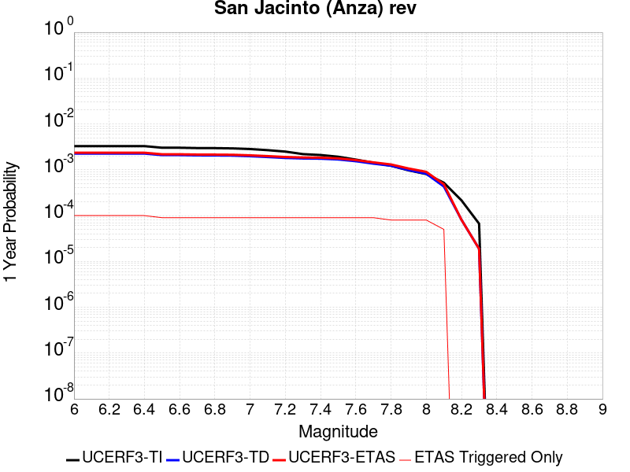 |  |

| Magnitude | 1 wk TI Prob | 1 wk TD Prob | 1 wk ETAS Prob | 1 wk ETAS/TD Gain | 1 wk ETAS Triggered Only | 1 mo TI Prob | 1 mo TD Prob | 1 mo ETAS Prob | 1 mo ETAS/TD Gain | 1 mo ETAS Triggered Only | 1 yr TI Prob | 1 yr TD Prob | 1 yr ETAS Prob | 1 yr ETAS/TD Gain | 1 yr ETAS Triggered Only | 10 yr TI Prob | 10 yr TD Prob | 10 yr ETAS Prob | 10 yr ETAS/TD Gain | 10 yr ETAS Triggered Only |
|-----|-----|-----|-----|-----|-----|-----|-----|-----|-----|-----|-----|-----|-----|-----|-----|-----|-----|-----|-----|-----|
| 6.0 | 6.3015636E-5 | 4.3302647E-5 | 1.1620173E-4 | 2.6834786 | 7.2902236E-5 | 2.7003905E-4 | 1.8556965E-4 | 2.7060646E-4 | 1.4582475 | 8.505261E-5 | 0.0032827691 | 0.0022569813 | 0.0023539648 | 1.0429705 | 9.720298E-5 | 0.032346968 | 0.023296192 | 0.023402998 | 1.0045847 | 1.0935336E-4 |
| 6.1 | 6.3015636E-5 | 4.3302647E-5 | 1.1620173E-4 | 2.6834786 | 7.2902236E-5 | 2.7003905E-4 | 1.8556965E-4 | 2.7060646E-4 | 1.4582475 | 8.505261E-5 | 0.0032827691 | 0.0022569813 | 0.0023539648 | 1.0429705 | 9.720298E-5 | 0.032346968 | 0.023296192 | 0.023402998 | 1.0045847 | 1.0935336E-4 |
| 6.2 | 6.3015636E-5 | 4.3302647E-5 | 1.1620173E-4 | 2.6834786 | 7.2902236E-5 | 2.7003905E-4 | 1.8556965E-4 | 2.7060646E-4 | 1.4582475 | 8.505261E-5 | 0.0032827691 | 0.0022569813 | 0.0023539648 | 1.0429705 | 9.720298E-5 | 0.032346968 | 0.023296192 | 0.023402998 | 1.0045847 | 1.0935336E-4 |
| 6.3 | 6.3015636E-5 | 4.3302647E-5 | 1.1620173E-4 | 2.6834786 | 7.2902236E-5 | 2.7003905E-4 | 1.8556965E-4 | 2.7060646E-4 | 1.4582475 | 8.505261E-5 | 0.0032827691 | 0.0022569813 | 0.0023539648 | 1.0429705 | 9.720298E-5 | 0.032346968 | 0.023296192 | 0.023402998 | 1.0045847 | 1.0935336E-4 |
| 6.4 | 6.3015636E-5 | 4.3302647E-5 | 1.1620173E-4 | 2.6834786 | 7.2902236E-5 | 2.7003905E-4 | 1.8556965E-4 | 2.7060646E-4 | 1.4582475 | 8.505261E-5 | 0.0032827691 | 0.0022569813 | 0.0023539648 | 1.0429705 | 9.720298E-5 | 0.032346968 | 0.023296192 | 0.023402998 | 1.0045847 | 1.0935336E-4 |
| 6.5 | 5.811017E-5 | 4.0082516E-5 | 1.12981834E-4 | 2.818731 | 7.2902236E-5 | 2.4901982E-4 | 1.7177092E-4 | 2.5680894E-4 | 1.4950663 | 8.505261E-5 | 0.0030276014 | 0.002089311 | 0.0021863107 | 1.0464268 | 9.720298E-5 | 0.02986684 | 0.021593736 | 0.021700729 | 1.0049548 | 1.0935336E-4 |
| 6.6 | 5.811017E-5 | 4.0082516E-5 | 1.12981834E-4 | 2.818731 | 7.2902236E-5 | 2.4901982E-4 | 1.7177092E-4 | 2.5680894E-4 | 1.4950663 | 8.505261E-5 | 0.0030276014 | 0.002089311 | 0.0021863107 | 1.0464268 | 9.720298E-5 | 0.02986684 | 0.021593736 | 0.021700729 | 1.0049548 | 1.0935336E-4 |
| 6.7 | 5.712442E-5 | 3.9505223E-5 | 1.1240458E-4 | 2.8453093 | 7.2902236E-5 | 2.4479596E-4 | 1.6929714E-4 | 2.5433535E-4 | 1.5023016 | 8.505261E-5 | 0.0029763177 | 0.0020592497 | 0.0021562525 | 1.0471059 | 9.720298E-5 | 0.029367693 | 0.021285562 | 0.021392588 | 1.0050281 | 1.0935336E-4 |
| 6.8 | 5.6967532E-5 | 3.9361643E-5 | 1.1226101E-4 | 2.8520408 | 7.2902236E-5 | 2.4412372E-4 | 1.6868189E-4 | 2.5372015E-4 | 1.5041339 | 8.505261E-5 | 0.0029681553 | 0.002051773 | 0.0021487765 | 1.0472779 | 9.720298E-5 | 0.029288229 | 0.021210281 | 0.021317314 | 1.0050464 | 1.0935336E-4 |
| 6.9 | 5.6211324E-5 | 3.9066435E-5 | 1.1196583E-4 | 2.8660364 | 7.2902236E-5 | 2.4088343E-4 | 1.6741687E-4 | 2.5245524E-4 | 1.5079439 | 8.505261E-5 | 0.0029288116 | 0.0020364004 | 0.0021334053 | 1.0476356 | 9.720298E-5 | 0.028905109 | 0.021049714 | 0.021156766 | 1.0050857 | 1.0935336E-4 |
| 7.0 | 5.4383527E-5 | 3.792697E-5 | 1.1082644E-4 | 2.9221013 | 7.2902236E-5 | 2.3305144E-4 | 1.6253405E-4 | 2.4757284E-4 | 1.523206 | 8.505261E-5 | 0.0028337094 | 0.001977061 | 0.0020740717 | 1.0490682 | 9.720298E-5 | 0.027978465 | 0.020440677 | 0.020547794 | 1.0052404 | 1.0935336E-4 |
| 7.1 | 5.1393665E-5 | 3.6389913E-5 | 1.09289496E-4 | 3.0032911 | 7.2902236E-5 | 2.2023996E-4 | 1.5594746E-4 | 2.4098682E-4 | 1.5453076 | 8.505261E-5 | 0.0026781242 | 0.0018970112 | 0.0019940299 | 1.0511428 | 9.720298E-5 | 0.026460782 | 0.019614287 | 0.019721495 | 1.0054659 | 1.0935336E-4 |
| 7.2 | 4.785222E-5 | 3.4741795E-5 | 1.076415E-4 | 3.0983286 | 7.2902236E-5 | 2.0506482E-4 | 1.4888494E-4 | 2.3392489E-4 | 1.571179 | 8.505261E-5 | 0.0024938055 | 0.0018111705 | 0.0019081974 | 1.0535713 | 9.720298E-5 | 0.024660049 | 0.018728992 | 0.018836297 | 1.0057293 | 1.0935336E-4 |
| 7.3 | 4.2143256E-5 | 3.383628E-5 | 1.0673605E-4 | 3.1544855 | 7.2902236E-5 | 1.8060145E-4 | 1.4500458E-4 | 2.3004485E-4 | 1.5864662 | 8.505261E-5 | 0.002196605 | 0.0017640047 | 0.0018610362 | 1.0550064 | 9.720298E-5 | 0.02175019 | 0.01823724 | 0.0183446 | 1.0058868 | 1.0935336E-4 |
| 7.4 | 4.0264713E-5 | 3.347446E-5 | 1.0637426E-4 | 3.1777735 | 7.2902236E-5 | 1.7255165E-4 | 1.4345412E-4 | 2.2849452E-4 | 1.5928056 | 8.505261E-5 | 0.002098792 | 0.0017451581 | 0.0018421914 | 1.0556015 | 9.720298E-5 | 0.020790804 | 0.018041821 | 0.0181492 | 1.0059518 | 1.0935336E-4 |
| 7.5 | 3.694492E-5 | 3.218847E-5 | 1.0508836E-4 | 3.264783 | 7.2902236E-5 | 1.5832575E-4 | 1.379433E-4 | 2.2298418E-4 | 1.6164916 | 8.505261E-5 | 0.0019259118 | 0.001678169 | 0.0017752089 | 1.0578249 | 9.720298E-5 | 0.01909306 | 0.01735827 | 0.017465726 | 1.0061904 | 1.0935336E-4 |
| 7.6 | 3.200565E-5 | 2.9504106E-5 | 1.0240419E-4 | 3.4708455 | 7.2902236E-5 | 1.3715986E-4 | 1.2644005E-4 | 2.114819E-4 | 1.6725863 | 8.505261E-5 | 0.001668642 | 0.0015383229 | 0.0016353764 | 1.0630904 | 9.720298E-5 | 0.01656168 | 0.0159463 | 0.01605391 | 1.0067482 | 1.0935336E-4 |
| 7.7 | 2.731642E-5 | 2.6092788E-5 | 9.899312E-5 | 3.7938883 | 7.2902236E-5 | 1.1706512E-4 | 1.1182144E-4 | 1.9686455E-4 | 1.7605258 | 8.505261E-5 | 0.001424336 | 0.0013605768 | 0.0014576475 | 1.0713453 | 9.720298E-5 | 0.014152412 | 0.014167004 | 0.014274809 | 1.0076095 | 1.0935336E-4 |
| 7.8 | 2.3466424E-5 | 2.3504817E-5 | 9.640534E-5 | 4.1015143 | 7.2902236E-5 | 1.0056651E-4 | 1.0073105E-4 | 1.8577509E-4 | 1.8442684 | 8.505261E-5 | 0.0012237094 | 0.0012257113 | 0.0013227952 | 1.0792061 | 9.720298E-5 | 0.012169928 | 0.012808893 | 0.012916845 | 1.008428 | 1.0935336E-4 |
| 7.9 | 1.8611925E-5 | 1.8908117E-5 | 9.180898E-5 | 4.8555326 | 7.2902236E-5 | 7.9762955E-5 | 8.1032274E-5 | 1.66078E-4 | 2.049529 | 8.505261E-5 | 9.7068126E-4 | 9.861222E-4 | 0.0010832292 | 1.0984738 | 9.720298E-5 | 0.0096645225 | 0.010393824 | 0.010502041 | 1.0104116 | 1.0935336E-4 |
| 8.0 | 1.5460775E-5 | 1.5740965E-5 | 8.864205E-5 | 5.6312976 | 7.2902236E-5 | 6.6258784E-5 | 6.7459536E-5 | 1.5250641E-4 | 2.2607095 | 8.505261E-5 | 8.0640207E-4 | 8.21011E-4 | 9.1813423E-4 | 1.1182971 | 9.720298E-5 | 0.008034821 | 0.0087028835 | 0.008811285 | 1.0124558 | 1.0935336E-4 |
| 8.1 | 9.983884E-6 | 8.269952E-6 | 5.6871042E-5 | 6.8768287 | 4.860149E-5 | 4.2787375E-5 | 3.544217E-5 | 9.6191885E-5 | 2.7140517 | 6.0751867E-5 | 5.2081177E-4 | 4.314235E-4 | 4.9214915E-4 | 1.1407565 | 6.0751867E-5 | 0.0051959283 | 0.004640022 | 0.004712586 | 1.0156387 | 7.2902236E-5 |
| 8.2 | 4.1226E-6 | 1.5529788E-6 | 1.5529788E-6 | 1.0 | 0.0 | 1.7668166E-5 | 6.6556063E-6 | 6.6556063E-6 | 1.0 | 0.0 | 2.1508869E-4 | 8.102902E-5 | 8.102902E-5 | 1.0 | 0.0 | 0.0021488064 | 9.4050163E-4 | 9.4050163E-4 | 1.0 | 0.0 |
| 8.3 | 1.2750878E-6 | 3.612133E-7 | 3.612133E-7 | 1.0 | 0.0 | 5.4646503E-6 | 1.548056E-6 | 1.548056E-6 | 1.0 | 0.0 | 6.653009E-5 | 1.8847424E-5 | 1.8847424E-5 | 1.0 | 0.0 | 6.6510175E-4 | 2.2734253E-4 | 2.2734253E-4 | 1.0 | 0.0 |

## Lake Isabella (Seismicity)
*[(top)](#table-of-contents)*

| 1 Week | 1 Month | 1 Year | 10 Year |
|-----|-----|-----|-----|
|  |  |  |  |

| Magnitude | 1 wk TI Prob | 1 wk TD Prob | 1 wk ETAS Prob | 1 wk ETAS/TD Gain | 1 wk ETAS Triggered Only | 1 mo TI Prob | 1 mo TD Prob | 1 mo ETAS Prob | 1 mo ETAS/TD Gain | 1 mo ETAS Triggered Only | 1 yr TI Prob | 1 yr TD Prob | 1 yr ETAS Prob | 1 yr ETAS/TD Gain | 1 yr ETAS Triggered Only | 10 yr TI Prob | 10 yr TD Prob | 10 yr ETAS Prob | 10 yr ETAS/TD Gain | 10 yr ETAS Triggered Only |
|-----|-----|-----|-----|-----|-----|-----|-----|-----|-----|-----|-----|-----|-----|-----|-----|-----|-----|-----|-----|-----|
| 6.0 | 9.431637E-6 | 9.741651E-6 | 9.479343E-5 | 9.730736 | 8.505261E-5 | 4.0420677E-5 | 4.1749343E-5 | 1.267984E-4 | 3.0371354 | 8.505261E-5 | 4.920106E-4 | 5.0819275E-4 | 6.1749056E-4 | 1.2150716 | 1.0935336E-4 | 0.004909227 | 0.005071599 | 0.0051803975 | 1.0214525 | 1.0935336E-4 |
| 6.1 | 9.431637E-6 | 9.741651E-6 | 9.479343E-5 | 9.730736 | 8.505261E-5 | 4.0420677E-5 | 4.1749343E-5 | 1.267984E-4 | 3.0371354 | 8.505261E-5 | 4.920106E-4 | 5.0819275E-4 | 6.1749056E-4 | 1.2150716 | 1.0935336E-4 | 0.004909227 | 0.005071599 | 0.0051803975 | 1.0214525 | 1.0935336E-4 |
| 6.2 | 9.431637E-6 | 9.741651E-6 | 9.479343E-5 | 9.730736 | 8.505261E-5 | 4.0420677E-5 | 4.1749343E-5 | 1.267984E-4 | 3.0371354 | 8.505261E-5 | 4.920106E-4 | 5.0819275E-4 | 6.1749056E-4 | 1.2150716 | 1.0935336E-4 | 0.004909227 | 0.005071599 | 0.0051803975 | 1.0214525 | 1.0935336E-4 |
| 6.3 | 9.431637E-6 | 9.741651E-6 | 9.479343E-5 | 9.730736 | 8.505261E-5 | 4.0420677E-5 | 4.1749343E-5 | 1.267984E-4 | 3.0371354 | 8.505261E-5 | 4.920106E-4 | 5.0819275E-4 | 6.1749056E-4 | 1.2150716 | 1.0935336E-4 | 0.004909227 | 0.005071599 | 0.0051803975 | 1.0214525 | 1.0935336E-4 |
| 6.4 | 5.144063E-6 | 5.3000763E-6 | 6.6051616E-5 | 12.462391 | 6.0751867E-5 | 2.2045799E-5 | 2.2714434E-5 | 8.346492E-5 | 3.6745322 | 6.0751867E-5 | 2.6837454E-4 | 2.765166E-4 | 3.6154568E-4 | 1.3075008 | 8.505261E-5 | 0.0026805066 | 0.0027620657 | 0.0028468834 | 1.0307081 | 8.505261E-5 |
| 6.5 | 5.144063E-6 | 5.3000763E-6 | 6.6051616E-5 | 12.462391 | 6.0751867E-5 | 2.2045799E-5 | 2.2714434E-5 | 8.346492E-5 | 3.6745322 | 6.0751867E-5 | 2.6837454E-4 | 2.765166E-4 | 3.6154568E-4 | 1.3075008 | 8.505261E-5 | 0.0026805066 | 0.0027620657 | 0.0028468834 | 1.0307081 | 8.505261E-5 |
| 6.6 | 3.4009804E-6 | 3.498786E-6 | 3.9949777E-5 | 11.418182 | 3.6451118E-5 | 1.4575549E-5 | 1.4994721E-5 | 5.144529E-5 | 3.4308937 | 3.6451118E-5 | 1.7744285E-4 | 1.8254704E-4 | 2.4328781E-4 | 1.3327404 | 6.0751867E-5 | 0.0017730123 | 0.0018241286 | 0.0018847696 | 1.0332439 | 6.0751867E-5 |
| 6.7 | 3.3880428E-6 | 3.4856528E-6 | 3.9936644E-5 | 11.457437 | 3.6451118E-5 | 1.4520103E-5 | 1.4938435E-5 | 5.1389008E-5 | 3.440053 | 3.6451118E-5 | 1.767679E-4 | 1.8186188E-4 | 2.4260269E-4 | 1.3339943 | 6.0751867E-5 | 0.0017662736 | 0.0018172882 | 0.0018779297 | 1.0333692 | 6.0751867E-5 |
| 6.8 | 2.6582E-6 | 2.7337003E-6 | 2.7034379E-5 | 9.889299 | 2.4300745E-5 | 1.1392236E-5 | 1.1715813E-5 | 3.6016274E-5 | 3.0741591 | 2.4300745E-5 | 1.3869164E-4 | 1.4263204E-4 | 1.9122659E-4 | 1.3406988 | 4.860149E-5 | 0.0013860512 | 0.0014255369 | 0.0014740691 | 1.0340449 | 4.860149E-5 |
| 6.9 | 2.406011E-6 | 2.4743288E-6 | 2.6775015E-5 | 10.821122 | 2.4300745E-5 | 1.0311434E-5 | 1.0604231E-5 | 3.490472E-5 | 3.2915843 | 2.4300745E-5 | 1.2553448E-4 | 1.2910018E-4 | 1.776954E-4 | 1.3764148 | 4.860149E-5 | 0.0012546359 | 0.0012903814 | 0.0013389202 | 1.0376159 | 4.860149E-5 |
| 7.0 | 1.6953097E-6 | 1.7429371E-6 | 2.604364E-5 | 14.942387 | 2.4300745E-5 | 7.265593E-6 | 7.469715E-6 | 3.177028E-5 | 4.2532115 | 2.4300745E-5 | 8.8455E-5 | 9.094104E-5 | 1.3953811E-4 | 1.5343801 | 4.860149E-5 | 8.84198E-4 | 9.09141E-4 | 9.5769827E-4 | 1.05341 | 4.860149E-5 |
| 7.1 | 3.5013824E-7 | 3.5714822E-7 | 3.5714822E-7 | 1.0 | 0.0 | 1.5005916E-6 | 1.5306344E-6 | 1.5306344E-6 | 1.0 | 0.0 | 1.826955E-5 | 1.8635317E-5 | 3.0785464E-5 | 1.6519957 | 1.2150373E-5 | 1.8268047E-4 | 1.863378E-4 | 1.984859E-4 | 1.065194 | 1.2150373E-5 |
| 7.2 | 2.2321095E-7 | 2.2750574E-7 | 2.2750574E-7 | 1.0 | 0.0 | 9.56618E-7 | 9.750242E-7 | 9.750242E-7 | 1.0 | 0.0 | 1.1646762E-5 | 1.1870856E-5 | 2.4021085E-5 | 2.0235343 | 1.2150373E-5 | 1.1646151E-4 | 1.1870232E-4 | 1.3085126E-4 | 1.1023479 | 1.2150373E-5 |
| 7.3 | 1.5760406E-7 | 1.6060922E-7 | 1.6060922E-7 | 1.0 | 0.0 | 6.7544585E-7 | 6.8832503E-7 | 6.8832503E-7 | 1.0 | 0.0 | 8.223522E-6 | 8.380326E-6 | 2.0530597E-5 | 2.4498565 | 1.2150373E-5 | 8.2232174E-5 | 8.3800165E-5 | 9.5949516E-5 | 1.1449801 | 1.2150373E-5 |
| 7.4 | 1.1216497E-7 | 1.1431706E-7 | 1.1431706E-7 | 1.0 | 0.0 | 4.8070694E-7 | 4.899302E-7 | 4.899302E-7 | 1.0 | 0.0 | 5.852591E-6 | 5.964884E-6 | 1.8115185E-5 | 3.0369718 | 1.2150373E-5 | 5.8524372E-5 | 5.9647282E-5 | 7.179693E-5 | 1.2036916 | 1.2150373E-5 |
| 7.5 | 4.885185E-8 | 4.9787737E-8 | 4.9787737E-8 | 1.0 | 0.0 | 2.0936506E-7 | 2.13376E-7 | 2.13376E-7 | 1.0 | 0.0 | 2.5490165E-6 | 2.59785E-6 | 2.59785E-6 | 1.0 | 0.0 | 2.5489873E-5 | 2.5978214E-5 | 2.5978214E-5 | 1.0 | 0.0 |
| 7.6 | 1.504641E-9 | 1.5317903E-9 | 1.5317903E-9 | 1.0 | 0.0 | 6.4484613E-9 | 6.5648154E-9 | 6.5648154E-9 | 1.0 | 0.0 | 7.851001E-8 | 7.992663E-8 | 7.992663E-8 | 1.0 | 0.0 | 7.8509987E-7 | 7.992663E-7 | 7.992663E-7 | 1.0 | 0.0 |

## Scodie Lineament
*[(top)](#table-of-contents)*

| 1 Week | 1 Month | 1 Year | 10 Year |
|-----|-----|-----|-----|
|  |  |  |  |

| Magnitude | 1 wk TI Prob | 1 wk TD Prob | 1 wk ETAS Prob | 1 wk ETAS/TD Gain | 1 wk ETAS Triggered Only | 1 mo TI Prob | 1 mo TD Prob | 1 mo ETAS Prob | 1 mo ETAS/TD Gain | 1 mo ETAS Triggered Only | 1 yr TI Prob | 1 yr TD Prob | 1 yr ETAS Prob | 1 yr ETAS/TD Gain | 1 yr ETAS Triggered Only | 10 yr TI Prob | 10 yr TD Prob | 10 yr ETAS Prob | 10 yr ETAS/TD Gain | 10 yr ETAS Triggered Only |
|-----|-----|-----|-----|-----|-----|-----|-----|-----|-----|-----|-----|-----|-----|-----|-----|-----|-----|-----|-----|-----|
| 6.0 | 3.2919327E-6 | 3.0133422E-6 | 6.376502E-5 | 21.160896 | 6.0751867E-5 | 1.4108206E-5 | 1.2914278E-5 | 9.796579E-5 | 7.585851 | 8.505261E-5 | 1.7175387E-4 | 1.5722317E-4 | 2.5441087E-4 | 1.6181513 | 9.720298E-5 | 0.0017162118 | 0.0015714309 | 0.0016684812 | 1.0617591 | 9.720298E-5 |
| 6.1 | 1.8663811E-6 | 1.5490499E-6 | 1.3699404E-5 | 8.843746 | 1.2150373E-5 | 7.998751E-6 | 6.6387715E-6 | 3.0939354E-5 | 4.6604037 | 2.4300745E-5 | 9.738045E-5 | 8.082454E-5 | 1.0512332E-4 | 1.3006362 | 2.4300745E-5 | 9.7337784E-4 | 8.080003E-4 | 8.3228137E-4 | 1.0300509 | 2.4300745E-5 |
| 6.2 | 1.8663811E-6 | 1.5490499E-6 | 1.3699404E-5 | 8.843746 | 1.2150373E-5 | 7.998751E-6 | 6.6387715E-6 | 3.0939354E-5 | 4.6604037 | 2.4300745E-5 | 9.738045E-5 | 8.082454E-5 | 1.0512332E-4 | 1.3006362 | 2.4300745E-5 | 9.7337784E-4 | 8.080003E-4 | 8.3228137E-4 | 1.0300509 | 2.4300745E-5 |
| 6.3 | 1.8663811E-6 | 1.5490499E-6 | 1.3699404E-5 | 8.843746 | 1.2150373E-5 | 7.998751E-6 | 6.6387715E-6 | 3.0939354E-5 | 4.6604037 | 2.4300745E-5 | 9.738045E-5 | 8.082454E-5 | 1.0512332E-4 | 1.3006362 | 2.4300745E-5 | 9.7337784E-4 | 8.080003E-4 | 8.3228137E-4 | 1.0300509 | 2.4300745E-5 |
| 6.4 | 1.8663811E-6 | 1.5490499E-6 | 1.3699404E-5 | 8.843746 | 1.2150373E-5 | 7.998751E-6 | 6.6387715E-6 | 3.0939354E-5 | 4.6604037 | 2.4300745E-5 | 9.738045E-5 | 8.082454E-5 | 1.0512332E-4 | 1.3006362 | 2.4300745E-5 | 9.7337784E-4 | 8.080003E-4 | 8.3228137E-4 | 1.0300509 | 2.4300745E-5 |
| 6.5 | 1.8106311E-6 | 1.4909839E-6 | 1.3641339E-5 | 9.1492195 | 1.2150373E-5 | 7.759824E-6 | 6.3899183E-6 | 3.069051E-5 | 4.802958 | 2.4300745E-5 | 9.447177E-5 | 7.7794975E-5 | 1.0209383E-4 | 1.3123448 | 2.4300745E-5 | 9.4431615E-4 | 7.7772606E-4 | 8.020079E-4 | 1.0312216 | 2.4300745E-5 |
| 6.6 | 1.2414679E-6 | 8.997558E-7 | 1.3050118E-5 | 14.504066 | 1.2150373E-5 | 5.320566E-6 | 3.856091E-6 | 2.8156743E-5 | 7.301888 | 2.4300745E-5 | 6.477596E-5 | 4.6946985E-5 | 7.124659E-5 | 1.5175967 | 2.4300745E-5 | 6.475708E-4 | 4.693793E-4 | 4.9366866E-4 | 1.0517478 | 2.4300745E-5 |
| 6.7 | 1.1062215E-6 | 7.594311E-7 | 1.2909795E-5 | 16.999296 | 1.2150373E-5 | 4.7409408E-6 | 3.2547011E-6 | 2.7555368E-5 | 8.466329 | 2.4300745E-5 | 5.7719422E-5 | 3.9625334E-5 | 6.3925116E-5 | 1.6132386 | 2.4300745E-5 | 5.770443E-4 | 3.961897E-4 | 4.2048082E-4 | 1.0613118 | 2.4300745E-5 |
| 6.8 | 1.0006736E-6 | 6.500397E-7 | 1.2800405E-5 | 19.691729 | 1.2150373E-5 | 4.288594E-6 | 2.7858816E-6 | 2.708656E-5 | 9.722796 | 2.4300745E-5 | 5.221238E-5 | 3.3917644E-5 | 5.8217563E-5 | 1.716439 | 2.4300745E-5 | 5.220012E-4 | 3.3913075E-4 | 3.6342326E-4 | 1.0716317 | 2.4300745E-5 |
| 6.9 | 9.167364E-7 | 5.631625E-7 | 1.2713529E-5 | 22.575241 | 1.2150373E-5 | 3.9288643E-6 | 2.4135516E-6 | 2.6714239E-5 | 11.068436 | 2.4300745E-5 | 4.7832873E-5 | 2.9384651E-5 | 5.3684682E-5 | 1.8269634 | 2.4300745E-5 | 4.782258E-4 | 2.9381333E-4 | 3.1810693E-4 | 1.0826838 | 2.4300745E-5 |
| 7.0 | 7.6987664E-7 | 4.113383E-7 | 1.2561706E-5 | 30.538626 | 1.2150373E-5 | 3.2994672E-6 | 1.7628774E-6 | 2.606358E-5 | 14.784681 | 2.4300745E-5 | 4.0170275E-5 | 2.1462862E-5 | 4.5763085E-5 | 2.1321988 | 2.4300745E-5 | 4.0163012E-4 | 2.1461173E-4 | 2.3890726E-4 | 1.1132069 | 2.4300745E-5 |
| 7.1 | 7.1038727E-7 | 3.5211494E-7 | 1.25024835E-5 | 35.50683 | 1.2150373E-5 | 3.0445133E-6 | 1.5090633E-6 | 2.5809773E-5 | 17.103174 | 2.4300745E-5 | 3.706632E-5 | 1.8372726E-5 | 4.2673026E-5 | 2.322629 | 2.4300745E-5 | 3.7060137E-4 | 1.8371557E-4 | 2.0801184E-4 | 1.1322495 | 2.4300745E-5 |
| 7.2 | 2.0799602E-7 | 3.1186854E-8 | 1.2181559E-5 | 390.59918 | 1.2150373E-5 | 8.914113E-7 | 1.3365793E-7 | 2.4434401E-5 | 182.81294 | 2.4300745E-5 | 1.0852878E-5 | 1.6272843E-6 | 2.5927991E-5 | 15.93329 | 2.4300745E-5 | 1.08523476E-4 | 1.627273E-5 | 4.0573083E-5 | 2.4933174 | 2.4300745E-5 |
| 7.3 | 1.5048182E-7 | 1.5945696E-8 | 1.2166319E-5 | 762.98444 | 1.2150373E-5 | 6.449219E-7 | 6.83387E-8 | 2.4369083E-5 | 356.59274 | 2.4300745E-5 | 7.851896E-6 | 8.320234E-7 | 2.513275E-5 | 30.206783 | 2.4300745E-5 | 7.851618E-5 | 8.320206E-6 | 3.262075E-5 | 3.9206665 | 2.4300745E-5 |
| 7.4 | 5.9334678E-8 | 4.8683537E-9 | 4.8683537E-9 | 1.0 | 0.0 | 2.5429145E-7 | 2.0864372E-8 | 2.0864372E-8 | 1.0 | 0.0 | 3.095994E-6 | 2.5402372E-7 | 2.5402372E-7 | 1.0 | 0.0 | 3.095951E-5 | 2.5402353E-6 | 2.5402353E-6 | 1.0 | 0.0 |

## White Wolf (Extension)
*[(top)](#table-of-contents)*

| 1 Week | 1 Month | 1 Year | 10 Year |
|-----|-----|-----|-----|
|  |  |  |  |

| Magnitude | 1 wk TI Prob | 1 wk TD Prob | 1 wk ETAS Prob | 1 wk ETAS/TD Gain | 1 wk ETAS Triggered Only | 1 mo TI Prob | 1 mo TD Prob | 1 mo ETAS Prob | 1 mo ETAS/TD Gain | 1 mo ETAS Triggered Only | 1 yr TI Prob | 1 yr TD Prob | 1 yr ETAS Prob | 1 yr ETAS/TD Gain | 1 yr ETAS Triggered Only | 10 yr TI Prob | 10 yr TD Prob | 10 yr ETAS Prob | 10 yr ETAS/TD Gain | 10 yr ETAS Triggered Only |
|-----|-----|-----|-----|-----|-----|-----|-----|-----|-----|-----|-----|-----|-----|-----|-----|-----|-----|-----|-----|-----|
| 6.0 | 8.222555E-6 | 6.0666657E-6 | 7.8968464E-5 | 13.016782 | 7.2902236E-5 | 3.5239045E-5 | 2.5999774E-5 | 1.2320023E-4 | 4.7385116 | 9.720298E-5 | 4.289509E-4 | 3.1650788E-4 | 4.136801E-4 | 1.3070136 | 9.720298E-5 | 0.0042812387 | 0.003161223 | 0.0032581186 | 1.0306513 | 9.720298E-5 |
| 6.1 | 8.222555E-6 | 6.0666657E-6 | 7.8968464E-5 | 13.016782 | 7.2902236E-5 | 3.5239045E-5 | 2.5999774E-5 | 1.2320023E-4 | 4.7385116 | 9.720298E-5 | 4.289509E-4 | 3.1650788E-4 | 4.136801E-4 | 1.3070136 | 9.720298E-5 | 0.0042812387 | 0.003161223 | 0.0032581186 | 1.0306513 | 9.720298E-5 |
| 6.2 | 8.222555E-6 | 6.0666657E-6 | 7.8968464E-5 | 13.016782 | 7.2902236E-5 | 3.5239045E-5 | 2.5999774E-5 | 1.2320023E-4 | 4.7385116 | 9.720298E-5 | 4.289509E-4 | 3.1650788E-4 | 4.136801E-4 | 1.3070136 | 9.720298E-5 | 0.0042812387 | 0.003161223 | 0.0032581186 | 1.0306513 | 9.720298E-5 |
| 6.3 | 8.222555E-6 | 6.0666657E-6 | 7.8968464E-5 | 13.016782 | 7.2902236E-5 | 3.5239045E-5 | 2.5999774E-5 | 1.2320023E-4 | 4.7385116 | 9.720298E-5 | 4.289509E-4 | 3.1650788E-4 | 4.136801E-4 | 1.3070136 | 9.720298E-5 | 0.0042812387 | 0.003161223 | 0.0032581186 | 1.0306513 | 9.720298E-5 |
| 6.4 | 5.821773E-6 | 3.5571766E-6 | 4.0008166E-5 | 11.2471695 | 3.6451118E-5 | 2.4950215E-5 | 1.5244959E-5 | 6.384571E-5 | 4.1879883 | 4.860149E-5 | 3.0372653E-4 | 1.8559267E-4 | 2.3418514E-4 | 1.2618232 | 4.860149E-5 | 0.0030331176 | 0.001854485 | 0.0019029964 | 1.0261589 | 4.860149E-5 |
| 6.5 | 5.766023E-6 | 3.4991106E-6 | 3.99501E-5 | 11.417216 | 3.6451118E-5 | 2.4711293E-5 | 1.4996108E-5 | 6.359687E-5 | 4.240892 | 4.860149E-5 | 3.0081844E-4 | 1.8256342E-4 | 2.3115604E-4 | 1.2661685 | 4.860149E-5 | 0.0030041158 | 0.0018242426 | 0.0018727555 | 1.0265934 | 4.860149E-5 |
| 6.6 | 4.643576E-6 | 2.332624E-6 | 3.878366E-5 | 16.626621 | 3.6451118E-5 | 1.9900888E-5 | 9.996925E-6 | 5.8597932E-5 | 5.8615956 | 4.860149E-5 | 2.4226638E-4 | 1.2170619E-4 | 1.7030176E-4 | 1.399286 | 4.860149E-5 | 0.0024200242 | 0.0012164378 | 0.0012649802 | 1.0399053 | 4.860149E-5 |
| 6.7 | 3.9529173E-6 | 1.6483477E-6 | 3.8099406E-5 | 23.113695 | 3.6451118E-5 | 1.6940963E-5 | 7.0643296E-6 | 5.5665478E-5 | 7.8797965 | 4.860149E-5 | 2.0623671E-4 | 8.6005006E-5 | 1.3460232E-4 | 1.5650522 | 4.860149E-5 | 0.002060454 | 8.597357E-4 | 9.0829545E-4 | 1.0564821 | 4.860149E-5 |
| 6.8 | 3.4377522E-6 | 1.2245237E-6 | 2.552524E-5 | 20.845036 | 2.4300745E-5 | 1.473314E-5 | 5.2479486E-6 | 4.1698877E-5 | 7.945748 | 3.6451118E-5 | 1.7936122E-4 | 6.3891996E-5 | 1.0034078E-4 | 1.5704751 | 3.6451118E-5 | 0.0017921652 | 6.387454E-4 | 6.751732E-4 | 1.0570303 | 3.6451118E-5 |
| 6.9 | 3.1367306E-6 | 1.0033783E-6 | 2.53041E-5 | 25.218903 | 2.4300745E-5 | 1.3443062E-5 | 4.3001864E-6 | 4.0751147E-5 | 9.476601 | 3.6451118E-5 | 1.63657E-4 | 5.235359E-5 | 8.88028E-5 | 1.6962123 | 3.6451118E-5 | 0.0016353652 | 5.2342017E-4 | 5.598522E-4 | 1.0696038 | 3.6451118E-5 |
| 7.0 | 2.8298145E-6 | 7.4286646E-7 | 1.2893231E-5 | 17.356054 | 1.2150373E-5 | 1.2127721E-5 | 3.1837099E-6 | 2.7484379E-5 | 8.632815 | 2.4300745E-5 | 1.47645E-4 | 3.8761027E-5 | 6.3060834E-5 | 1.6269133 | 2.4300745E-5 | 0.0014754693 | 3.8754768E-4 | 4.11839E-4 | 1.0626795 | 2.4300745E-5 |
| 7.1 | 2.4091064E-6 | 5.4227525E-7 | 1.2692642E-5 | 23.406273 | 1.2150373E-5 | 1.03247E-5 | 2.3240348E-6 | 2.6624724E-5 | 11.45625 | 2.4300745E-5 | 1.2569598E-4 | 2.8294799E-5 | 5.2594856E-5 | 1.8588172 | 2.4300745E-5 | 0.001256249 | 2.8291598E-4 | 3.0720988E-4 | 1.0858696 | 2.4300745E-5 |
| 7.2 | 1.3875518E-6 | 1.0743063E-7 | 1.2257802E-5 | 114.0997 | 1.2150373E-5 | 5.9466374E-6 | 4.6041689E-7 | 2.4761152E-5 | 53.77985 | 2.4300745E-5 | 7.23979E-5 | 5.6055624E-6 | 2.9906172E-5 | 5.3350887 | 2.4300745E-5 | 7.2374323E-4 | 5.6054323E-5 | 8.035371E-5 | 1.4334971 | 2.4300745E-5 |
| 7.3 | 7.056077E-7 | 5.002034E-8 | 1.2200393E-5 | 243.90865 | 1.2150373E-5 | 3.0240296E-6 | 2.1437286E-7 | 2.4515113E-5 | 114.35735 | 2.4300745E-5 | 3.681694E-5 | 2.609987E-6 | 2.691067E-5 | 10.310653 | 2.4300745E-5 | 3.681084E-4 | 2.609961E-5 | 5.039972E-5 | 1.9310527 | 2.4300745E-5 |
| 7.4 | 5.9334678E-8 | 4.8683537E-9 | 4.8683537E-9 | 1.0 | 0.0 | 2.5429145E-7 | 2.0864372E-8 | 2.0864372E-8 | 1.0 | 0.0 | 3.095994E-6 | 2.5402372E-7 | 2.5402372E-7 | 1.0 | 0.0 | 3.095951E-5 | 2.5402353E-6 | 2.5402353E-6 | 1.0 | 0.0 |

## San Jacinto (Lytle Creek connector)
*[(top)](#table-of-contents)*

| 1 Week | 1 Month | 1 Year | 10 Year |
|-----|-----|-----|-----|
|  |  |  |  |

| Magnitude | 1 wk TI Prob | 1 wk TD Prob | 1 wk ETAS Prob | 1 wk ETAS/TD Gain | 1 wk ETAS Triggered Only | 1 mo TI Prob | 1 mo TD Prob | 1 mo ETAS Prob | 1 mo ETAS/TD Gain | 1 mo ETAS Triggered Only | 1 yr TI Prob | 1 yr TD Prob | 1 yr ETAS Prob | 1 yr ETAS/TD Gain | 1 yr ETAS Triggered Only | 10 yr TI Prob | 10 yr TD Prob | 10 yr ETAS Prob | 10 yr ETAS/TD Gain | 10 yr ETAS Triggered Only |
|-----|-----|-----|-----|-----|-----|-----|-----|-----|-----|-----|-----|-----|-----|-----|-----|-----|-----|-----|-----|-----|
| 6.0 | 6.693995E-6 | 6.660216E-6 | 5.5261386E-5 | 8.2972355 | 4.860149E-5 | 2.8688235E-5 | 2.854347E-5 | 1.0144363E-4 | 3.5540047 | 7.2902236E-5 | 3.492233E-4 | 3.4746144E-4 | 4.2033833E-4 | 1.209741 | 7.2902236E-5 | 0.00348675 | 0.0035493854 | 0.003634136 | 1.0238776 | 8.505261E-5 |
| 6.1 | 6.693995E-6 | 6.660216E-6 | 5.5261386E-5 | 8.2972355 | 4.860149E-5 | 2.8688235E-5 | 2.854347E-5 | 1.0144363E-4 | 3.5540047 | 7.2902236E-5 | 3.492233E-4 | 3.4746144E-4 | 4.2033833E-4 | 1.209741 | 7.2902236E-5 | 0.00348675 | 0.0035493854 | 0.003634136 | 1.0238776 | 8.505261E-5 |
| 6.2 | 6.693995E-6 | 6.660216E-6 | 5.5261386E-5 | 8.2972355 | 4.860149E-5 | 2.8688235E-5 | 2.854347E-5 | 1.0144363E-4 | 3.5540047 | 7.2902236E-5 | 3.492233E-4 | 3.4746144E-4 | 4.2033833E-4 | 1.209741 | 7.2902236E-5 | 0.00348675 | 0.0035493854 | 0.003634136 | 1.0238776 | 8.505261E-5 |
| 6.3 | 6.693995E-6 | 6.660216E-6 | 5.5261386E-5 | 8.2972355 | 4.860149E-5 | 2.8688235E-5 | 2.854347E-5 | 1.0144363E-4 | 3.5540047 | 7.2902236E-5 | 3.492233E-4 | 3.4746144E-4 | 4.2033833E-4 | 1.209741 | 7.2902236E-5 | 0.00348675 | 0.0035493854 | 0.003634136 | 1.0238776 | 8.505261E-5 |
| 6.4 | 6.693995E-6 | 6.660216E-6 | 5.5261386E-5 | 8.2972355 | 4.860149E-5 | 2.8688235E-5 | 2.854347E-5 | 1.0144363E-4 | 3.5540047 | 7.2902236E-5 | 3.492233E-4 | 3.4746144E-4 | 4.2033833E-4 | 1.209741 | 7.2902236E-5 | 0.00348675 | 0.0035493854 | 0.003634136 | 1.0238776 | 8.505261E-5 |
| 6.5 | 6.6561875E-6 | 6.6204343E-6 | 5.5221604E-5 | 8.341085 | 4.860149E-5 | 2.8526205E-5 | 2.837298E-5 | 1.0127315E-4 | 3.5693517 | 7.2902236E-5 | 3.472512E-4 | 3.4538636E-4 | 4.1826343E-4 | 1.2110015 | 7.2902236E-5 | 0.0034670907 | 0.003528701 | 0.0036134534 | 1.024018 | 8.505261E-5 |
| 6.6 | 6.6561875E-6 | 6.6204343E-6 | 5.5221604E-5 | 8.341085 | 4.860149E-5 | 2.8526205E-5 | 2.837298E-5 | 1.0127315E-4 | 3.5693517 | 7.2902236E-5 | 3.472512E-4 | 3.4538636E-4 | 4.1826343E-4 | 1.2110015 | 7.2902236E-5 | 0.0034670907 | 0.003528701 | 0.0036134534 | 1.024018 | 8.505261E-5 |
| 6.7 | 6.5802237E-6 | 6.539611E-6 | 5.5140787E-5 | 8.431814 | 4.860149E-5 | 2.8200653E-5 | 2.8026603E-5 | 1.009268E-4 | 3.6011071 | 7.2902236E-5 | 3.4328885E-4 | 3.4117055E-4 | 4.140479E-4 | 1.2136098 | 7.2902236E-5 | 0.0034275902 | 0.0034866752 | 0.0035714314 | 1.0243086 | 8.505261E-5 |
| 6.8 | 6.575632E-6 | 6.5341005E-6 | 5.5135275E-5 | 8.438082 | 4.860149E-5 | 2.8180975E-5 | 2.8002989E-5 | 1.00903184E-4 | 3.6033006 | 7.2902236E-5 | 3.4304935E-4 | 3.4088313E-4 | 4.137605E-4 | 1.2137899 | 7.2902236E-5 | 0.0034252026 | 0.00348381 | 0.0035685664 | 1.0243286 | 8.505261E-5 |
| 6.9 | 6.570433E-6 | 6.525495E-6 | 5.512667E-5 | 8.447891 | 4.860149E-5 | 2.8158694E-5 | 2.7966107E-5 | 1.0086631E-4 | 3.606734 | 7.2902236E-5 | 3.4277816E-4 | 3.4043423E-4 | 4.1331165E-4 | 1.214072 | 7.2902236E-5 | 0.0034224992 | 0.0034793352 | 0.0035640919 | 1.0243601 | 8.505261E-5 |
| 7.0 | 6.5643826E-6 | 6.515616E-6 | 5.511679E-5 | 8.459184 | 4.860149E-5 | 2.8132765E-5 | 2.792377E-5 | 1.0082397E-4 | 3.6106863 | 7.2902236E-5 | 3.424626E-4 | 3.3991894E-4 | 4.127964E-4 | 1.2143966 | 7.2902236E-5 | 0.0034193532 | 0.0034741985 | 0.0035589556 | 1.0243962 | 8.505261E-5 |
| 7.1 | 6.557402E-6 | 6.5043278E-6 | 5.5105505E-5 | 8.472129 | 4.860149E-5 | 2.8102848E-5 | 2.7875392E-5 | 1.007756E-4 | 3.6152172 | 7.2902236E-5 | 3.4209844E-4 | 3.3933012E-4 | 4.1220762E-4 | 1.2147688 | 7.2902236E-5 | 0.0034157229 | 0.0034683298 | 0.0035530874 | 1.0244375 | 8.505261E-5 |
| 7.2 | 6.546394E-6 | 6.4862943E-6 | 5.5087472E-5 | 8.492904 | 4.860149E-5 | 2.8055672E-5 | 2.7798109E-5 | 1.0069832E-4 | 3.6224883 | 7.2902236E-5 | 3.4152428E-4 | 3.3838948E-4 | 4.1126707E-4 | 1.2153659 | 7.2902236E-5 | 0.0034099987 | 0.0034589572 | 0.0035437155 | 1.0245041 | 8.505261E-5 |
| 7.3 | 6.5364216E-6 | 6.4670803E-6 | 5.506826E-5 | 8.515165 | 4.860149E-5 | 2.8012933E-5 | 2.7715765E-5 | 1.0061598E-4 | 3.6302798 | 7.2902236E-5 | 3.4100408E-4 | 3.3738726E-4 | 4.102649E-4 | 1.2160059 | 7.2902236E-5 | 0.003404813 | 0.0034489788 | 0.003533738 | 1.0245752 | 8.505261E-5 |
| 7.4 | 6.5269523E-6 | 6.4481674E-6 | 5.5049346E-5 | 8.537208 | 4.860149E-5 | 2.7972354E-5 | 2.7634711E-5 | 1.0053493E-4 | 3.6379948 | 7.2902236E-5 | 3.4051016E-4 | 3.3640073E-4 | 4.0927847E-4 | 1.2166395 | 7.2902236E-5 | 0.0033998888 | 0.003439161 | 0.003523921 | 1.0246456 | 8.505261E-5 |
| 7.5 | 6.5111835E-6 | 6.424442E-6 | 5.5025623E-5 | 8.565043 | 4.860149E-5 | 2.7904773E-5 | 2.7533031E-5 | 1.00433266E-4 | 3.647737 | 7.2902236E-5 | 3.3968766E-4 | 3.3516317E-4 | 4.0804097E-4 | 1.2174398 | 7.2902236E-5 | 0.0033916887 | 0.003426834 | 0.0035115953 | 1.0247345 | 8.505261E-5 |
| 7.6 | 6.4768806E-6 | 6.383551E-6 | 5.4984732E-5 | 8.6135025 | 4.860149E-5 | 2.7757764E-5 | 2.735779E-5 | 1.0025803E-4 | 3.664698 | 7.2902236E-5 | 3.3789838E-4 | 3.3303024E-4 | 4.059082E-4 | 1.2188329 | 7.2902236E-5 | 0.0033738504 | 0.0034055663 | 0.0034903293 | 1.0248896 | 8.505261E-5 |
| 7.7 | 6.1655364E-6 | 6.1760365E-6 | 5.477723E-5 | 8.869317 | 4.860149E-5 | 2.642346E-5 | 2.646846E-5 | 9.9368764E-5 | 3.7542331 | 7.2902236E-5 | 3.2165812E-4 | 3.2220592E-4 | 3.9508464E-4 | 1.2261869 | 7.2902236E-5 | 0.0032119295 | 0.0032971818 | 0.0033819538 | 1.0257105 | 8.505261E-5 |
| 7.8 | 5.5043524E-6 | 5.737097E-6 | 5.433831E-5 | 9.471395 | 4.860149E-5 | 2.3589868E-5 | 2.4587327E-5 | 9.748777E-5 | 3.9649603 | 7.2902236E-5 | 2.871688E-4 | 2.9930964E-4 | 3.7219006E-4 | 1.2434951 | 7.2902236E-5 | 0.0028679797 | 0.0030672832 | 0.003152075 | 1.0276439 | 8.505261E-5 |
| 7.9 | 3.889249E-6 | 4.076761E-6 | 5.2678053E-5 | 12.921546 | 4.860149E-5 | 1.6668104E-5 | 1.7471715E-5 | 9.037268E-5 | 5.172513 | 7.2902236E-5 | 2.0291525E-4 | 2.1269741E-4 | 2.8558416E-4 | 1.3426781 | 7.2902236E-5 | 0.0020273007 | 0.0021943315 | 0.0022791973 | 1.0386751 | 8.505261E-5 |
| 8.0 | 2.668535E-6 | 2.5315155E-6 | 3.8982544E-5 | 15.398896 | 3.6451118E-5 | 1.1436528E-5 | 1.0849307E-5 | 5.945027E-5 | 5.4796376 | 4.860149E-5 | 1.3923083E-4 | 1.3208234E-4 | 1.8067741E-4 | 1.367915 | 4.860149E-5 | 0.0013914363 | 0.0013757964 | 0.0014364646 | 1.0440968 | 6.0751867E-5 |
| 8.1 | 1.5911459E-6 | 1.218661E-6 | 2.5519377E-5 | 20.940506 | 2.4300745E-5 | 6.8191785E-6 | 5.2228224E-6 | 4.1673753E-5 | 7.9791627 | 3.6451118E-5 | 8.3020335E-5 | 6.3586034E-5 | 1.00034835E-4 | 1.5732203 | 3.6451118E-5 | 8.298933E-4 | 6.6932244E-4 | 7.178914E-4 | 1.0725644 | 4.860149E-5 |
| 8.2 | 6.1294963E-7 | 2.1812275E-7 | 2.1812275E-7 | 1.0 | 0.0 | 2.6269242E-6 | 9.3481145E-7 | 9.3481145E-7 | 1.0 | 0.0 | 3.1982334E-5 | 1.138127E-5 | 1.138127E-5 | 1.0 | 0.0 | 3.1977732E-4 | 1.2784546E-4 | 1.2784546E-4 | 1.0 | 0.0 |
| 8.3 | 1.762871E-7 | 4.7546838E-8 | 4.7546838E-8 | 1.0 | 0.0 | 7.5551594E-7 | 2.0377215E-7 | 2.0377215E-7 | 1.0 | 0.0 | 9.1983675E-6 | 2.480923E-6 | 2.480923E-6 | 1.0 | 0.0 | 9.197987E-5 | 2.868753E-5 | 2.868753E-5 | 1.0 | 0.0 |

## Independence rev 2011
*[(top)](#table-of-contents)*

| 1 Week | 1 Month | 1 Year | 10 Year |
|-----|-----|-----|-----|
|  |  |  |  |

| Magnitude | 1 wk TI Prob | 1 wk TD Prob | 1 wk ETAS Prob | 1 wk ETAS/TD Gain | 1 wk ETAS Triggered Only | 1 mo TI Prob | 1 mo TD Prob | 1 mo ETAS Prob | 1 mo ETAS/TD Gain | 1 mo ETAS Triggered Only | 1 yr TI Prob | 1 yr TD Prob | 1 yr ETAS Prob | 1 yr ETAS/TD Gain | 1 yr ETAS Triggered Only | 10 yr TI Prob | 10 yr TD Prob | 10 yr ETAS Prob | 10 yr ETAS/TD Gain | 10 yr ETAS Triggered Only |
|-----|-----|-----|-----|-----|-----|-----|-----|-----|-----|-----|-----|-----|-----|-----|-----|-----|-----|-----|-----|-----|
| 6.0 | 4.422171E-6 | 4.326227E-6 | 2.8626868E-5 | 6.6170516 | 2.4300745E-5 | 1.8952025E-5 | 1.8540857E-5 | 5.4991302E-5 | 2.9659524 | 3.6451118E-5 | 2.3071647E-4 | 2.2571455E-4 | 2.864527E-4 | 1.2690928 | 6.0751867E-5 | 0.0023047708 | 0.0022551466 | 0.0023400073 | 1.0376298 | 8.505261E-5 |
| 6.1 | 4.422171E-6 | 4.326227E-6 | 2.8626868E-5 | 6.6170516 | 2.4300745E-5 | 1.8952025E-5 | 1.8540857E-5 | 5.4991302E-5 | 2.9659524 | 3.6451118E-5 | 2.3071647E-4 | 2.2571455E-4 | 2.864527E-4 | 1.2690928 | 6.0751867E-5 | 0.0023047708 | 0.0022551466 | 0.0023400073 | 1.0376298 | 8.505261E-5 |
| 6.2 | 4.422171E-6 | 4.326227E-6 | 2.8626868E-5 | 6.6170516 | 2.4300745E-5 | 1.8952025E-5 | 1.8540857E-5 | 5.4991302E-5 | 2.9659524 | 3.6451118E-5 | 2.3071647E-4 | 2.2571455E-4 | 2.864527E-4 | 1.2690928 | 6.0751867E-5 | 0.0023047708 | 0.0022551466 | 0.0023400073 | 1.0376298 | 8.505261E-5 |
| 6.3 | 4.422171E-6 | 4.326227E-6 | 2.8626868E-5 | 6.6170516 | 2.4300745E-5 | 1.8952025E-5 | 1.8540857E-5 | 5.4991302E-5 | 2.9659524 | 3.6451118E-5 | 2.3071647E-4 | 2.2571455E-4 | 2.864527E-4 | 1.2690928 | 6.0751867E-5 | 0.0023047708 | 0.0022551466 | 0.0023400073 | 1.0376298 | 8.505261E-5 |
| 6.4 | 4.422171E-6 | 4.326227E-6 | 2.8626868E-5 | 6.6170516 | 2.4300745E-5 | 1.8952025E-5 | 1.8540857E-5 | 5.4991302E-5 | 2.9659524 | 3.6451118E-5 | 2.3071647E-4 | 2.2571455E-4 | 2.864527E-4 | 1.2690928 | 6.0751867E-5 | 0.0023047708 | 0.0022551466 | 0.0023400073 | 1.0376298 | 8.505261E-5 |
| 6.5 | 4.422171E-6 | 4.326227E-6 | 2.8626868E-5 | 6.6170516 | 2.4300745E-5 | 1.8952025E-5 | 1.8540857E-5 | 5.4991302E-5 | 2.9659524 | 3.6451118E-5 | 2.3071647E-4 | 2.2571455E-4 | 2.864527E-4 | 1.2690928 | 6.0751867E-5 | 0.0023047708 | 0.0022551466 | 0.0023400073 | 1.0376298 | 8.505261E-5 |
| 6.6 | 2.663744E-6 | 2.5319862E-6 | 2.6832671E-5 | 10.597479 | 2.4300745E-5 | 1.1415996E-5 | 1.0851327E-5 | 4.7302052E-5 | 4.3591027 | 3.6451118E-5 | 1.3898089E-4 | 1.3210738E-4 | 1.9285122E-4 | 1.4598066 | 6.0751867E-5 | 0.0013889399 | 0.0013203367 | 0.001405277 | 1.0643324 | 8.505261E-5 |
| 6.7 | 2.663744E-6 | 2.5319862E-6 | 2.6832671E-5 | 10.597479 | 2.4300745E-5 | 1.1415996E-5 | 1.0851327E-5 | 4.7302052E-5 | 4.3591027 | 3.6451118E-5 | 1.3898089E-4 | 1.3210738E-4 | 1.9285122E-4 | 1.4598066 | 6.0751867E-5 | 0.0013889399 | 0.0013203367 | 0.001405277 | 1.0643324 | 8.505261E-5 |
| 6.8 | 1.9716529E-6 | 1.8322585E-6 | 2.613296E-5 | 14.262704 | 2.4300745E-5 | 8.449913E-6 | 7.852514E-6 | 4.4303346E-5 | 5.641932 | 3.6451118E-5 | 1.0287284E-4 | 9.5600284E-5 | 1.5634634E-4 | 1.6354171 | 6.0751867E-5 | 0.0010282523 | 9.556045E-4 | 0.0010405758 | 1.0889189 | 8.505261E-5 |
| 6.9 | 1.8788617E-6 | 1.7429993E-6 | 2.6043703E-5 | 14.94189 | 2.4300745E-5 | 8.0522395E-6 | 7.4699765E-6 | 4.3920823E-5 | 5.879647 | 3.6451118E-5 | 9.80316E-5 | 9.0943286E-5 | 1.5168963E-4 | 1.6679585 | 6.0751867E-5 | 9.798837E-4 | 9.0907275E-4 | 9.940481E-4 | 1.0934747 | 8.505261E-5 |
| 7.0 | 1.5045488E-6 | 1.3849503E-6 | 1.3535307E-5 | 9.773134 | 1.2150373E-5 | 6.44805E-6 | 5.9354884E-6 | 3.023609E-5 | 5.09412 | 2.4300745E-5 | 7.8502184E-5 | 7.226223E-5 | 1.20860204E-4 | 1.6725225 | 4.860149E-5 | 7.8474457E-4 | 7.2239246E-4 | 7.95242E-4 | 1.1008449 | 7.2902236E-5 |
| 7.1 | 1.272341E-6 | 1.1625096E-6 | 1.3312869E-5 | 11.451835 | 1.2150373E-5 | 5.4528787E-6 | 4.982175E-6 | 2.92828E-5 | 5.8775134 | 2.4300745E-5 | 6.6386776E-5 | 6.0656326E-5 | 1.0925487E-4 | 1.8012115 | 4.860149E-5 | 6.636695E-4 | 6.064009E-4 | 6.792589E-4 | 1.1201483 | 7.2902236E-5 |
| 7.2 | 1.0416892E-6 | 9.4098806E-7 | 1.30913495E-5 | 13.912344 | 1.2150373E-5 | 4.464375E-6 | 4.0328E-6 | 2.8333448E-5 | 7.025751 | 2.4300745E-5 | 5.4352407E-5 | 4.909825E-5 | 9.769735E-5 | 1.9898337 | 4.860149E-5 | 5.4339116E-4 | 4.9087586E-4 | 5.6374236E-4 | 1.1484417 | 7.2902236E-5 |
| 7.3 | 7.9450155E-7 | 7.235002E-7 | 1.2873865E-5 | 17.793865 | 1.2150373E-5 | 3.4050022E-6 | 3.1007114E-6 | 2.7401382E-5 | 8.837128 | 2.4300745E-5 | 4.1455114E-5 | 3.775052E-5 | 8.635018E-5 | 2.2873905 | 4.860149E-5 | 4.144738E-4 | 3.7744216E-4 | 4.3817112E-4 | 1.160896 | 6.0751867E-5 |
| 7.4 | 5.3893444E-7 | 5.019512E-7 | 1.2652318E-5 | 25.20627 | 1.2150373E-5 | 2.309717E-6 | 2.1512178E-6 | 2.6451911E-5 | 12.29625 | 2.4300745E-5 | 2.8120441E-5 | 2.6190766E-5 | 7.479099E-5 | 2.8556242 | 4.860149E-5 | 2.8116882E-4 | 2.6187726E-4 | 3.226132E-4 | 1.2319252 | 6.0751867E-5 |
| 7.5 | 3.8852085E-7 | 3.682554E-7 | 1.2518624E-5 | 33.994408 | 1.2150373E-5 | 1.6650882E-6 | 1.5782365E-6 | 2.5878944E-5 | 16.39738 | 2.4300745E-5 | 2.027226E-5 | 1.9214862E-5 | 5.566528E-5 | 2.896991 | 3.6451118E-5 | 2.0270412E-4 | 1.9213221E-4 | 2.4072437E-4 | 1.25291 | 4.860149E-5 |
| 7.6 | 2.414929E-7 | 2.345755E-7 | 2.345755E-7 | 1.0 | 0.0 | 1.0349692E-6 | 1.0053232E-6 | 1.3155684E-5 | 13.086024 | 1.2150373E-5 | 1.2600677E-5 | 1.2239742E-5 | 3.654019E-5 | 2.9853725 | 2.4300745E-5 | 1.2599962E-4 | 1.223908E-4 | 1.4668857E-4 | 1.1985261 | 2.4300745E-5 |
| 7.7 | 6.8298014E-8 | 6.85897E-8 | 6.85897E-8 | 1.0 | 0.0 | 2.9270575E-7 | 2.9395582E-7 | 1.2444325E-5 | 42.334 | 1.2150373E-5 | 3.5636867E-6 | 3.5789067E-6 | 2.7879565E-5 | 7.7899675 | 2.4300745E-5 | 3.5636294E-5 | 3.5788536E-5 | 6.0088412E-5 | 1.6789849 | 2.4300745E-5 |

## Mission Creek
*[(top)](#table-of-contents)*

| 1 Week | 1 Month | 1 Year | 10 Year |
|-----|-----|-----|-----|
|  |  |  |  |

| Magnitude | 1 wk TI Prob | 1 wk TD Prob | 1 wk ETAS Prob | 1 wk ETAS/TD Gain | 1 wk ETAS Triggered Only | 1 mo TI Prob | 1 mo TD Prob | 1 mo ETAS Prob | 1 mo ETAS/TD Gain | 1 mo ETAS Triggered Only | 1 yr TI Prob | 1 yr TD Prob | 1 yr ETAS Prob | 1 yr ETAS/TD Gain | 1 yr ETAS Triggered Only | 10 yr TI Prob | 10 yr TD Prob | 10 yr ETAS Prob | 10 yr ETAS/TD Gain | 10 yr ETAS Triggered Only |
|-----|-----|-----|-----|-----|-----|-----|-----|-----|-----|-----|-----|-----|-----|-----|-----|-----|-----|-----|-----|-----|
| 6.0 | 1.1549387E-5 | 1.632237E-5 | 7.7073244E-5 | 4.7219396 | 6.0751867E-5 | 4.9496433E-5 | 6.9951224E-5 | 1.4284837E-4 | 2.0421138 | 7.2902236E-5 | 6.0245243E-4 | 8.513384E-4 | 9.241786E-4 | 1.0855596 | 7.2902236E-5 | 0.006008218 | 0.008509998 | 0.008594327 | 1.0099094 | 8.505261E-5 |
| 6.1 | 1.1549387E-5 | 1.632237E-5 | 7.7073244E-5 | 4.7219396 | 6.0751867E-5 | 4.9496433E-5 | 6.9951224E-5 | 1.4284837E-4 | 2.0421138 | 7.2902236E-5 | 6.0245243E-4 | 8.513384E-4 | 9.241786E-4 | 1.0855596 | 7.2902236E-5 | 0.006008218 | 0.008509998 | 0.008594327 | 1.0099094 | 8.505261E-5 |
| 6.2 | 1.1549387E-5 | 1.632237E-5 | 7.7073244E-5 | 4.7219396 | 6.0751867E-5 | 4.9496433E-5 | 6.9951224E-5 | 1.4284837E-4 | 2.0421138 | 7.2902236E-5 | 6.0245243E-4 | 8.513384E-4 | 9.241786E-4 | 1.0855596 | 7.2902236E-5 | 0.006008218 | 0.008509998 | 0.008594327 | 1.0099094 | 8.505261E-5 |
| 6.3 | 1.1549387E-5 | 1.632237E-5 | 7.7073244E-5 | 4.7219396 | 6.0751867E-5 | 4.9496433E-5 | 6.9951224E-5 | 1.4284837E-4 | 2.0421138 | 7.2902236E-5 | 6.0245243E-4 | 8.513384E-4 | 9.241786E-4 | 1.0855596 | 7.2902236E-5 | 0.006008218 | 0.008509998 | 0.008594327 | 1.0099094 | 8.505261E-5 |
| 6.4 | 1.1549387E-5 | 1.632237E-5 | 7.7073244E-5 | 4.7219396 | 6.0751867E-5 | 4.9496433E-5 | 6.9951224E-5 | 1.4284837E-4 | 2.0421138 | 7.2902236E-5 | 6.0245243E-4 | 8.513384E-4 | 9.241786E-4 | 1.0855596 | 7.2902236E-5 | 0.006008218 | 0.008509998 | 0.008594327 | 1.0099094 | 8.505261E-5 |
| 6.5 | 1.1549387E-5 | 1.632237E-5 | 7.7073244E-5 | 4.7219396 | 6.0751867E-5 | 4.9496433E-5 | 6.9951224E-5 | 1.4284837E-4 | 2.0421138 | 7.2902236E-5 | 6.0245243E-4 | 8.513384E-4 | 9.241786E-4 | 1.0855596 | 7.2902236E-5 | 0.006008218 | 0.008509998 | 0.008594327 | 1.0099094 | 8.505261E-5 |
| 6.6 | 9.202681E-6 | 1.3845646E-5 | 7.459667E-5 | 5.387735 | 6.0751867E-5 | 3.9439463E-5 | 5.9337188E-5 | 1.322351E-4 | 2.2285366 | 7.2902236E-5 | 4.800697E-4 | 7.221998E-4 | 7.950494E-4 | 1.1008718 | 7.2902236E-5 | 0.004790339 | 0.0072271815 | 0.0073116194 | 1.0116833 | 8.505261E-5 |
| 6.7 | 9.019164E-6 | 1.3651316E-5 | 7.440235E-5 | 5.4501963 | 6.0751867E-5 | 3.8652986E-5 | 5.8504378E-5 | 1.3140235E-4 | 2.246026 | 7.2902236E-5 | 4.7049852E-4 | 7.12067E-4 | 7.849174E-4 | 1.1023083 | 7.2902236E-5 | 0.004695036 | 0.007126506 | 0.007210952 | 1.0118496 | 8.505261E-5 |
| 6.8 | 8.673558E-6 | 1.3273427E-5 | 7.402449E-5 | 5.5768933 | 6.0751867E-5 | 3.717186E-5 | 5.6884925E-5 | 1.2978302E-4 | 2.281501 | 7.2902236E-5 | 4.524734E-4 | 6.923627E-4 | 7.652145E-4 | 1.105222 | 7.2902236E-5 | 0.0045155324 | 0.006930694 | 0.0070151575 | 1.0121868 | 8.505261E-5 |
| 6.9 | 7.002255E-6 | 1.1477657E-5 | 7.2228824E-5 | 6.292994 | 6.0751867E-5 | 3.000932E-5 | 4.9189068E-5 | 1.2208772E-4 | 2.4820092 | 7.2902236E-5 | 3.653022E-4 | 5.9871917E-4 | 6.7157776E-4 | 1.1216908 | 7.2902236E-5 | 0.0036470229 | 0.005999517 | 0.00608406 | 1.0140915 | 8.505261E-5 |
| 7.0 | 5.84644E-6 | 9.67498E-6 | 7.042626E-5 | 7.279215 | 6.0751867E-5 | 2.5055931E-5 | 4.1463565E-5 | 1.1436278E-4 | 2.758151 | 7.2902236E-5 | 3.0501327E-4 | 5.047066E-4 | 5.77572E-4 | 1.1443719 | 7.2902236E-5 | 0.0030459496 | 0.0050638523 | 0.005148474 | 1.016711 | 8.505261E-5 |
| 7.1 | 5.54703E-6 | 9.329456E-6 | 7.008076E-5 | 7.5117726 | 6.0751867E-5 | 2.377277E-5 | 3.9982795E-5 | 1.1288212E-4 | 2.8232672 | 7.2902236E-5 | 2.8939504E-4 | 4.8668624E-4 | 5.5955304E-4 | 1.1497202 | 7.2902236E-5 | 0.0028901845 | 0.004884446 | 0.0049690832 | 1.0173279 | 8.505261E-5 |
| 7.2 | 4.384709E-6 | 7.68157E-6 | 6.843297E-5 | 8.908721 | 6.0751867E-5 | 1.8791474E-5 | 3.2920623E-5 | 1.0582046E-4 | 3.2144125 | 7.2902236E-5 | 2.2876218E-4 | 4.0073853E-4 | 4.7361155E-4 | 1.1818469 | 7.2902236E-5 | 0.0022852682 | 0.004028366 | 0.004113076 | 1.0210284 | 8.505261E-5 |
| 7.3 | 3.7888456E-6 | 6.915452E-6 | 6.766689E-5 | 9.784884 | 6.0751867E-5 | 1.623781E-5 | 2.9637333E-5 | 1.0253741E-4 | 3.459738 | 7.2902236E-5 | 1.9767738E-4 | 3.6077813E-4 | 4.336541E-4 | 1.2019966 | 7.2902236E-5 | 0.0019750162 | 0.0036301152 | 0.003714859 | 1.0233446 | 8.505261E-5 |
| 7.4 | 2.1982462E-6 | 5.0237763E-6 | 5.3625023E-5 | 10.674246 | 4.860149E-5 | 9.421021E-6 | 2.1530293E-5 | 8.228085E-5 | 3.8216314 | 6.0751867E-5 | 1.1469489E-4 | 2.621E-4 | 3.2283593E-4 | 1.2317282 | 6.0751867E-5 | 0.0011463572 | 0.0026458844 | 0.002718594 | 1.0274801 | 7.2902236E-5 |
| 7.5 | 2.051923E-6 | 4.615016E-6 | 5.3216285E-5 | 11.531116 | 4.860149E-5 | 8.793926E-6 | 1.9778492E-5 | 8.052916E-5 | 4.071552 | 6.0751867E-5 | 1.0706078E-4 | 2.4077666E-4 | 3.015139E-4 | 1.2522556 | 6.0751867E-5 | 0.0010700922 | 0.0024335422 | 0.0025062668 | 1.0298843 | 7.2902236E-5 |
| 7.6 | 1.8733427E-6 | 4.1233748E-6 | 5.2724667E-5 | 12.786775 | 4.860149E-5 | 8.028587E-6 | 1.7671488E-5 | 7.842228E-5 | 4.437786 | 6.0751867E-5 | 9.774366E-5 | 2.151292E-4 | 2.75868E-4 | 1.2823364 | 6.0751867E-5 | 9.770069E-4 | 0.0021780801 | 0.0022508237 | 1.0333979 | 7.2902236E-5 |
| 7.7 | 1.8411953E-6 | 4.0430496E-6 | 5.2644344E-5 | 13.020949 | 4.860149E-5 | 7.890813E-6 | 1.732724E-5 | 7.8078054E-5 | 4.506087 | 6.0751867E-5 | 9.606641E-5 | 2.1093882E-4 | 2.7167788E-4 | 1.2879463 | 6.0751867E-5 | 9.6024893E-4 | 0.0021363653 | 0.0022091118 | 1.0340515 | 7.2902236E-5 |
| 7.8 | 1.7194251E-6 | 3.7104276E-6 | 5.2311738E-5 | 14.098575 | 4.860149E-5 | 7.368944E-6 | 1.5901736E-5 | 7.6652635E-5 | 4.820394 | 6.0751867E-5 | 8.97132E-5 | 1.9358651E-4 | 2.5432662E-4 | 1.3137621 | 6.0751867E-5 | 8.967699E-4 | 0.0019623525 | 0.0020351117 | 1.0370775 | 7.2902236E-5 |
| 7.9 | 1.4035052E-6 | 2.9500632E-6 | 5.155141E-5 | 17.474682 | 4.860149E-5 | 6.0150082E-6 | 1.2643067E-5 | 7.339416E-5 | 5.805092 | 6.0751867E-5 | 7.3230265E-5 | 1.5391852E-4 | 2.1466103E-4 | 1.3946407 | 6.0751867E-5 | 7.3206134E-4 | 0.0015631086 | 0.001635897 | 1.0465664 | 7.2902236E-5 |
| 8.0 | 3.9318823E-7 | 5.528522E-7 | 3.7003952E-5 | 66.93281 | 3.6451118E-5 | 1.6850913E-6 | 2.3693647E-6 | 5.0970742E-5 | 21.51241 | 4.860149E-5 | 2.0515794E-5 | 2.8846638E-5 | 7.7446726E-5 | 2.6847749 | 4.860149E-5 | 2.0513899E-4 | 2.9899E-4 | 3.597237E-4 | 1.2031295 | 6.0751867E-5 |
| 8.1 | 1.596793E-7 | 1.1380002E-7 | 1.1380002E-7 | 1.0 | 0.0 | 6.8433974E-7 | 4.877143E-7 | 4.877143E-7 | 1.0 | 0.0 | 8.331805E-6 | 5.937906E-6 | 5.937906E-6 | 1.0 | 0.0 | 8.331492E-5 | 6.549966E-5 | 6.549966E-5 | 1.0 | 0.0 |
| 8.2 | 4.9003038E-8 | 2.5444924E-8 | 2.5444924E-8 | 1.0 | 0.0 | 2.10013E-7 | 1.0904967E-7 | 1.0904967E-7 | 1.0 | 0.0 | 2.5569052E-6 | 1.327679E-6 | 1.327679E-6 | 1.0 | 0.0 | 2.556876E-5 | 1.495635E-5 | 1.495635E-5 | 1.0 | 0.0 |

## Chino alt 1
*[(top)](#table-of-contents)*

| 1 Week | 1 Month | 1 Year | 10 Year |
|-----|-----|-----|-----|
|  |  |  |  |

| Magnitude | 1 wk TI Prob | 1 wk TD Prob | 1 wk ETAS Prob | 1 wk ETAS/TD Gain | 1 wk ETAS Triggered Only | 1 mo TI Prob | 1 mo TD Prob | 1 mo ETAS Prob | 1 mo ETAS/TD Gain | 1 mo ETAS Triggered Only | 1 yr TI Prob | 1 yr TD Prob | 1 yr ETAS Prob | 1 yr ETAS/TD Gain | 1 yr ETAS Triggered Only | 10 yr TI Prob | 10 yr TD Prob | 10 yr ETAS Prob | 10 yr ETAS/TD Gain | 10 yr ETAS Triggered Only |
|-----|-----|-----|-----|-----|-----|-----|-----|-----|-----|-----|-----|-----|-----|-----|-----|-----|-----|-----|-----|-----|
| 6.0 | 3.939946E-5 | 4.8948554E-5 | 1.21847224E-4 | 2.4892917 | 7.2902236E-5 | 1.6884391E-4 | 2.097656E-4 | 2.9480035E-4 | 1.40538 | 8.505261E-5 | 0.0020537362 | 0.0025513945 | 0.0026362303 | 1.0332507 | 8.505261E-5 | 0.020348595 | 0.025277847 | 0.02536075 | 1.0032797 | 8.505261E-5 |
| 6.1 | 2.1505624E-5 | 2.6879026E-5 | 5.117912E-5 | 1.904054 | 2.4300745E-5 | 9.2163704E-5 | 1.1519137E-4 | 1.3948932E-4 | 1.2109355 | 2.4300745E-5 | 0.0011215154 | 0.001401664 | 0.0014259306 | 1.0173128 | 2.4300745E-5 | 0.011158722 | 0.013945141 | 0.013969103 | 1.0017183 | 2.4300745E-5 |
| 6.2 | 2.1505624E-5 | 2.6879026E-5 | 5.117912E-5 | 1.904054 | 2.4300745E-5 | 9.2163704E-5 | 1.1519137E-4 | 1.3948932E-4 | 1.2109355 | 2.4300745E-5 | 0.0011215154 | 0.001401664 | 0.0014259306 | 1.0173128 | 2.4300745E-5 | 0.011158722 | 0.013945141 | 0.013969103 | 1.0017183 | 2.4300745E-5 |
| 6.3 | 1.4290785E-5 | 1.8165128E-5 | 1.8165128E-5 | 1.0 | 0.0 | 6.1244784E-5 | 7.784848E-5 | 7.784848E-5 | 1.0 | 0.0 | 7.454001E-4 | 9.4743853E-4 | 9.4743853E-4 | 1.0 | 0.0 | 0.007429048 | 0.0094444575 | 0.0094444575 | 1.0 | 0.0 |
| 6.4 | 1.4290785E-5 | 1.8165128E-5 | 1.8165128E-5 | 1.0 | 0.0 | 6.1244784E-5 | 7.784848E-5 | 7.784848E-5 | 1.0 | 0.0 | 7.454001E-4 | 9.4743853E-4 | 9.4743853E-4 | 1.0 | 0.0 | 0.007429048 | 0.0094444575 | 0.0094444575 | 1.0 | 0.0 |
| 6.5 | 1.3017944E-5 | 1.6652088E-5 | 1.6652088E-5 | 1.0 | 0.0 | 5.5789995E-5 | 7.136439E-5 | 7.136439E-5 | 1.0 | 0.0 | 6.790315E-4 | 8.685589E-4 | 8.685589E-4 | 1.0 | 0.0 | 0.0067696036 | 0.008661949 | 0.008661949 | 1.0 | 0.0 |
| 6.6 | 9.470016E-6 | 1.2039424E-5 | 1.2039424E-5 | 1.0 | 0.0 | 4.058515E-5 | 5.1596704E-5 | 5.1596704E-5 | 1.0 | 0.0 | 4.940122E-4 | 6.280428E-4 | 6.280428E-4 | 1.0 | 0.0 | 0.004929154 | 0.0062718987 | 0.0062718987 | 1.0 | 0.0 |
| 6.7 | 8.314155E-6 | 1.0407736E-5 | 1.0407736E-5 | 1.0 | 0.0 | 3.5631605E-5 | 4.4604003E-5 | 4.4604003E-5 | 1.0 | 0.0 | 4.3372845E-4 | 5.429507E-4 | 5.429507E-4 | 1.0 | 0.0 | 0.004328829 | 0.005425775 | 0.005425775 | 1.0 | 0.0 |
| 6.8 | 3.4856364E-6 | 3.8133708E-6 | 3.8133708E-6 | 1.0 | 0.0 | 1.4938357E-5 | 1.6342927E-5 | 1.6342927E-5 | 1.0 | 0.0 | 1.8185932E-4 | 1.9895904E-4 | 1.9895904E-4 | 1.0 | 0.0 | 0.0018171056 | 0.0019894864 | 0.0019894864 | 1.0 | 0.0 |
| 6.9 | 2.2645952E-6 | 2.1529022E-6 | 2.1529022E-6 | 1.0 | 0.0 | 9.705372E-6 | 9.226692E-6 | 9.226692E-6 | 1.0 | 0.0 | 1.18156495E-4 | 1.123294E-4 | 1.123294E-4 | 1.0 | 0.0 | 0.0011809369 | 0.0011233423 | 0.0011233423 | 1.0 | 0.0 |
| 7.0 | 1.7864003E-6 | 1.5430785E-6 | 1.5430785E-6 | 1.0 | 0.0 | 7.655979E-6 | 6.613177E-6 | 6.613177E-6 | 1.0 | 0.0 | 9.3207556E-5 | 8.051251E-5 | 8.051251E-5 | 1.0 | 0.0 | 9.316847E-4 | 8.0528046E-4 | 8.0528046E-4 | 1.0 | 0.0 |
| 7.1 | 1.7315456E-6 | 1.4733511E-6 | 1.4733511E-6 | 1.0 | 0.0 | 7.420889E-6 | 6.3143466E-6 | 6.3143466E-6 | 1.0 | 0.0 | 9.034557E-5 | 7.6874516E-5 | 7.6874516E-5 | 1.0 | 0.0 | 9.0308854E-4 | 7.6891703E-4 | 7.6891703E-4 | 1.0 | 0.0 |
| 7.2 | 1.6008337E-6 | 1.3574215E-6 | 1.3574215E-6 | 1.0 | 0.0 | 6.860698E-6 | 5.817508E-6 | 5.817508E-6 | 1.0 | 0.0 | 8.352579E-5 | 7.082591E-5 | 7.082591E-5 | 1.0 | 0.0 | 8.34944E-4 | 7.0845755E-4 | 7.0845755E-4 | 1.0 | 0.0 |
| 7.3 | 1.3320939E-6 | 1.121782E-6 | 1.121782E-6 | 1.0 | 0.0 | 5.7089615E-6 | 4.807629E-6 | 4.807629E-6 | 1.0 | 0.0 | 6.9504385E-5 | 5.8531357E-5 | 5.8531357E-5 | 1.0 | 0.0 | 6.9482654E-4 | 5.8530393E-4 | 5.8530393E-4 | 1.0 | 0.0 |
| 7.4 | 1.114294E-6 | 9.237111E-7 | 9.237111E-7 | 1.0 | 0.0 | 4.775537E-6 | 3.958756E-6 | 3.958756E-6 | 1.0 | 0.0 | 5.8140613E-5 | 4.8196827E-5 | 4.8196827E-5 | 1.0 | 0.0 | 5.81254E-4 | 4.8188053E-4 | 4.8188053E-4 | 1.0 | 0.0 |
| 7.5 | 9.354081E-7 | 7.6234323E-7 | 7.6234323E-7 | 1.0 | 0.0 | 4.0088858E-6 | 3.2671815E-6 | 3.2671815E-6 | 1.0 | 0.0 | 4.8807087E-5 | 3.9777242E-5 | 3.9777242E-5 | 1.0 | 0.0 | 4.879637E-4 | 3.977046E-4 | 3.977046E-4 | 1.0 | 0.0 |
| 7.6 | 8.521771E-7 | 6.88071E-7 | 6.88071E-7 | 1.0 | 0.0 | 3.6521824E-6 | 2.9488726E-6 | 2.9488726E-6 | 1.0 | 0.0 | 4.4464414E-5 | 3.5901965E-5 | 3.5901965E-5 | 1.0 | 0.0 | 4.4455516E-4 | 3.589648E-4 | 3.589648E-4 | 1.0 | 0.0 |
| 7.7 | 2.1803626E-7 | 1.418649E-7 | 1.418649E-7 | 1.0 | 0.0 | 9.344408E-7 | 6.079923E-7 | 6.079923E-7 | 1.0 | 0.0 | 1.1376757E-5 | 7.4022914E-6 | 7.4022914E-6 | 1.0 | 0.0 | 1.13761744E-4 | 7.402141E-5 | 7.402141E-5 | 1.0 | 0.0 |

## Dry Mountain
*[(top)](#table-of-contents)*

| 1 Week | 1 Month | 1 Year | 10 Year |
|-----|-----|-----|-----|
|  |  |  |  |

| Magnitude | 1 wk TI Prob | 1 wk TD Prob | 1 wk ETAS Prob | 1 wk ETAS/TD Gain | 1 wk ETAS Triggered Only | 1 mo TI Prob | 1 mo TD Prob | 1 mo ETAS Prob | 1 mo ETAS/TD Gain | 1 mo ETAS Triggered Only | 1 yr TI Prob | 1 yr TD Prob | 1 yr ETAS Prob | 1 yr ETAS/TD Gain | 1 yr ETAS Triggered Only | 10 yr TI Prob | 10 yr TD Prob | 10 yr ETAS Prob | 10 yr ETAS/TD Gain | 10 yr ETAS Triggered Only |
|-----|-----|-----|-----|-----|-----|-----|-----|-----|-----|-----|-----|-----|-----|-----|-----|-----|-----|-----|-----|-----|
| 6.0 | 6.222801E-6 | 6.439381E-6 | 5.504056E-5 | 8.547492 | 4.860149E-5 | 2.6668875E-5 | 2.7597147E-5 | 8.834733E-5 | 3.2013214 | 6.0751867E-5 | 3.2464517E-4 | 3.3595937E-4 | 4.088371E-4 | 1.2169243 | 7.2902236E-5 | 0.0032417132 | 0.0033560768 | 0.0034287344 | 1.0216496 | 7.2902236E-5 |
| 6.1 | 6.222801E-6 | 6.439381E-6 | 5.504056E-5 | 8.547492 | 4.860149E-5 | 2.6668875E-5 | 2.7597147E-5 | 8.834733E-5 | 3.2013214 | 6.0751867E-5 | 3.2464517E-4 | 3.3595937E-4 | 4.088371E-4 | 1.2169243 | 7.2902236E-5 | 0.0032417132 | 0.0033560768 | 0.0034287344 | 1.0216496 | 7.2902236E-5 |
| 6.2 | 6.222801E-6 | 6.439381E-6 | 5.504056E-5 | 8.547492 | 4.860149E-5 | 2.6668875E-5 | 2.7597147E-5 | 8.834733E-5 | 3.2013214 | 6.0751867E-5 | 3.2464517E-4 | 3.3595937E-4 | 4.088371E-4 | 1.2169243 | 7.2902236E-5 | 0.0032417132 | 0.0033560768 | 0.0034287344 | 1.0216496 | 7.2902236E-5 |
| 6.3 | 6.222801E-6 | 6.439381E-6 | 5.504056E-5 | 8.547492 | 4.860149E-5 | 2.6668875E-5 | 2.7597147E-5 | 8.834733E-5 | 3.2013214 | 6.0751867E-5 | 3.2464517E-4 | 3.3595937E-4 | 4.088371E-4 | 1.2169243 | 7.2902236E-5 | 0.0032417132 | 0.0033560768 | 0.0034287344 | 1.0216496 | 7.2902236E-5 |
| 6.4 | 6.222801E-6 | 6.439381E-6 | 5.504056E-5 | 8.547492 | 4.860149E-5 | 2.6668875E-5 | 2.7597147E-5 | 8.834733E-5 | 3.2013214 | 6.0751867E-5 | 3.2464517E-4 | 3.3595937E-4 | 4.088371E-4 | 1.2169243 | 7.2902236E-5 | 0.0032417132 | 0.0033560768 | 0.0034287344 | 1.0216496 | 7.2902236E-5 |
| 6.5 | 2.8528623E-6 | 2.9521684E-6 | 3.940318E-5 | 13.347199 | 3.6451118E-5 | 1.22264955E-5 | 1.2652138E-5 | 4.9102797E-5 | 3.8809881 | 3.6451118E-5 | 1.4884741E-4 | 1.540376E-4 | 2.0263159E-4 | 1.3154684 | 4.860149E-5 | 0.0014874774 | 0.0015401616 | 0.0015886882 | 1.0315075 | 4.860149E-5 |
| 6.6 | 2.8528623E-6 | 2.9521684E-6 | 3.940318E-5 | 13.347199 | 3.6451118E-5 | 1.22264955E-5 | 1.2652138E-5 | 4.9102797E-5 | 3.8809881 | 3.6451118E-5 | 1.4884741E-4 | 1.540376E-4 | 2.0263159E-4 | 1.3154684 | 4.860149E-5 | 0.0014874774 | 0.0015401616 | 0.0015886882 | 1.0315075 | 4.860149E-5 |
| 6.7 | 2.541E-6 | 2.6293578E-6 | 2.693004E-5 | 10.24206 | 2.4300745E-5 | 1.0889954E-5 | 1.1268677E-5 | 3.5569148E-5 | 3.156462 | 2.4300745E-5 | 1.3257713E-4 | 1.3719614E-4 | 1.7364226E-4 | 1.2656498 | 3.6451118E-5 | 0.0013249806 | 0.0013719613 | 0.0014083625 | 1.0265322 | 3.6451118E-5 |

## San Jacinto (Coyote Creek)
*[(top)](#table-of-contents)*

| 1 Week | 1 Month | 1 Year | 10 Year |
|-----|-----|-----|-----|
|  |  |  |  |

| Magnitude | 1 wk TI Prob | 1 wk TD Prob | 1 wk ETAS Prob | 1 wk ETAS/TD Gain | 1 wk ETAS Triggered Only | 1 mo TI Prob | 1 mo TD Prob | 1 mo ETAS Prob | 1 mo ETAS/TD Gain | 1 mo ETAS Triggered Only | 1 yr TI Prob | 1 yr TD Prob | 1 yr ETAS Prob | 1 yr ETAS/TD Gain | 1 yr ETAS Triggered Only | 10 yr TI Prob | 10 yr TD Prob | 10 yr ETAS Prob | 10 yr ETAS/TD Gain | 10 yr ETAS Triggered Only |
|-----|-----|-----|-----|-----|-----|-----|-----|-----|-----|-----|-----|-----|-----|-----|-----|-----|-----|-----|-----|-----|
| 6.0 | 2.7374346E-5 | 2.4145214E-5 | 7.274553E-5 | 3.0128345 | 4.860149E-5 | 1.1731335E-4 | 1.034754E-4 | 1.6422098E-4 | 1.5870533 | 6.0751867E-5 | 0.0014273542 | 0.0012590875 | 0.0013197628 | 1.04819 | 6.0751867E-5 | 0.01418221 | 0.012928318 | 0.013000278 | 1.005566 | 7.2902236E-5 |
| 6.1 | 2.7374346E-5 | 2.4145214E-5 | 7.274553E-5 | 3.0128345 | 4.860149E-5 | 1.1731335E-4 | 1.034754E-4 | 1.6422098E-4 | 1.5870533 | 6.0751867E-5 | 0.0014273542 | 0.0012590875 | 0.0013197628 | 1.04819 | 6.0751867E-5 | 0.01418221 | 0.012928318 | 0.013000278 | 1.005566 | 7.2902236E-5 |
| 6.2 | 2.7374346E-5 | 2.4145214E-5 | 7.274553E-5 | 3.0128345 | 4.860149E-5 | 1.1731335E-4 | 1.034754E-4 | 1.6422098E-4 | 1.5870533 | 6.0751867E-5 | 0.0014273542 | 0.0012590875 | 0.0013197628 | 1.04819 | 6.0751867E-5 | 0.01418221 | 0.012928318 | 0.013000278 | 1.005566 | 7.2902236E-5 |
| 6.3 | 2.7374346E-5 | 2.4145214E-5 | 7.274553E-5 | 3.0128345 | 4.860149E-5 | 1.1731335E-4 | 1.034754E-4 | 1.6422098E-4 | 1.5870533 | 6.0751867E-5 | 0.0014273542 | 0.0012590875 | 0.0013197628 | 1.04819 | 6.0751867E-5 | 0.01418221 | 0.012928318 | 0.013000278 | 1.005566 | 7.2902236E-5 |
| 6.4 | 2.7374346E-5 | 2.4145214E-5 | 7.274553E-5 | 3.0128345 | 4.860149E-5 | 1.1731335E-4 | 1.034754E-4 | 1.6422098E-4 | 1.5870533 | 6.0751867E-5 | 0.0014273542 | 0.0012590875 | 0.0013197628 | 1.04819 | 6.0751867E-5 | 0.01418221 | 0.012928318 | 0.013000278 | 1.005566 | 7.2902236E-5 |
| 6.5 | 2.7282445E-5 | 2.4031293E-5 | 7.2631614E-5 | 3.0223765 | 4.860149E-5 | 1.16919524E-4 | 1.029872E-4 | 1.6373281E-4 | 1.5898365 | 6.0751867E-5 | 0.0014225657 | 0.0012531505 | 0.0013138263 | 1.0484185 | 6.0751867E-5 | 0.014134934 | 0.012869646 | 0.01294161 | 1.0055918 | 7.2902236E-5 |
| 6.6 | 2.7282445E-5 | 2.4031293E-5 | 7.2631614E-5 | 3.0223765 | 4.860149E-5 | 1.16919524E-4 | 1.029872E-4 | 1.6373281E-4 | 1.5898365 | 6.0751867E-5 | 0.0014225657 | 0.0012531505 | 0.0013138263 | 1.0484185 | 6.0751867E-5 | 0.014134934 | 0.012869646 | 0.01294161 | 1.0055918 | 7.2902236E-5 |
| 6.7 | 2.7216198E-5 | 2.3956412E-5 | 7.2556744E-5 | 3.028698 | 4.860149E-5 | 1.1663563E-4 | 1.02666316E-4 | 1.6341194E-4 | 1.5916802 | 6.0751867E-5 | 0.0014191137 | 0.0012492483 | 0.0013099243 | 1.04857 | 6.0751867E-5 | 0.014100855 | 0.0128310565 | 0.0129030235 | 1.0056088 | 7.2902236E-5 |
| 6.8 | 2.7078617E-5 | 2.387363E-5 | 7.247396E-5 | 3.0357327 | 4.860149E-5 | 1.1604605E-4 | 1.0231156E-4 | 1.6305721E-4 | 1.593732 | 6.0751867E-5 | 0.001411945 | 0.0012449342 | 0.0013056103 | 1.0487385 | 6.0751867E-5 | 0.014030075 | 0.012788199 | 0.012860169 | 1.0056279 | 7.2902236E-5 |
| 6.9 | 2.6982952E-5 | 2.3793142E-5 | 7.239348E-5 | 3.0426195 | 4.860149E-5 | 1.15636096E-4 | 1.0196664E-4 | 1.6271231E-4 | 1.5957407 | 6.0751867E-5 | 0.0014069602 | 0.0012407395 | 0.001301416 | 1.0489035 | 6.0751867E-5 | 0.013980856 | 0.012746515 | 0.012818487 | 1.0056465 | 7.2902236E-5 |
| 7.0 | 2.6449972E-5 | 2.3370165E-5 | 7.197052E-5 | 3.0795898 | 4.860149E-5 | 1.1335209E-4 | 1.00154015E-4 | 1.608998E-4 | 1.6065236 | 6.0751867E-5 | 0.001379188 | 0.0012186957 | 0.0012793734 | 1.0497892 | 6.0751867E-5 | 0.0137065975 | 0.0125278765 | 0.012599866 | 1.0057462 | 7.2902236E-5 |
| 7.1 | 2.6257849E-5 | 2.3196202E-5 | 7.179657E-5 | 3.0951865 | 4.860149E-5 | 1.1252879E-4 | 9.940852E-5 | 1.6015435E-4 | 1.6110727 | 6.0751867E-5 | 0.0013691769 | 0.0012096294 | 0.0012703077 | 1.0501628 | 6.0751867E-5 | 0.013607717 | 0.012437741 | 0.012509737 | 1.0057884 | 7.2902236E-5 |
| 7.2 | 2.5270041E-5 | 2.2390966E-5 | 7.099137E-5 | 3.1705363 | 4.860149E-5 | 1.0829568E-4 | 9.595777E-5 | 1.567038E-4 | 1.6330497 | 6.0751867E-5 | 0.0013177024 | 0.0011676621 | 0.001228343 | 1.0519679 | 6.0751867E-5 | 0.013099162 | 0.012018777 | 0.012090803 | 1.0059928 | 7.2902236E-5 |
| 7.3 | 2.339701E-5 | 2.1122814E-5 | 6.972328E-5 | 3.3008518 | 4.860149E-5 | 1.0026905E-4 | 9.0523215E-5 | 1.5126959E-4 | 1.6710584 | 6.0751867E-5 | 0.001220092 | 0.0011015651 | 0.00116225 | 1.0550897 | 6.0751867E-5 | 0.012134149 | 0.011357696 | 0.01142977 | 1.0063459 | 7.2902236E-5 |
| 7.4 | 2.296333E-5 | 2.0853171E-5 | 6.945365E-5 | 3.3306038 | 4.860149E-5 | 9.841056E-5 | 8.936768E-5 | 1.5011411E-4 | 1.679736 | 6.0751867E-5 | 0.0011974899 | 0.0010875105 | 0.0011481963 | 1.0558025 | 6.0751867E-5 | 0.011910575 | 0.01121681 | 0.011288894 | 1.0064265 | 7.2902236E-5 |
| 7.5 | 2.2188895E-5 | 2.0376096E-5 | 6.8976595E-5 | 3.3851724 | 4.860149E-5 | 9.50918E-5 | 8.732321E-5 | 1.4806977E-4 | 1.6956519 | 6.0751867E-5 | 0.0011571277 | 0.0010626436 | 0.0011233309 | 1.0571097 | 6.0751867E-5 | 0.011511209 | 0.010966429 | 0.011038532 | 1.0065749 | 7.2902236E-5 |
| 7.6 | 2.0013189E-5 | 1.8962366E-5 | 6.7562934E-5 | 3.5630014 | 4.860149E-5 | 8.5767984E-5 | 8.1264756E-5 | 1.4201169E-4 | 1.7475187 | 6.0751867E-5 | 0.001043725 | 9.889511E-4 | 0.0010496429 | 1.0613699 | 6.0751867E-5 | 0.010388365 | 0.010224434 | 0.010296591 | 1.0070573 | 7.2902236E-5 |
| 7.7 | 1.7230794E-5 | 1.674371E-5 | 6.5344386E-5 | 3.902623 | 4.860149E-5 | 7.384417E-5 | 7.175679E-5 | 1.325043E-4 | 1.846575 | 6.0751867E-5 | 8.986819E-4 | 8.7328954E-4 | 9.3398837E-4 | 1.0695059 | 6.0751867E-5 | 0.008950562 | 0.009062956 | 0.009135198 | 1.007971 | 7.2902236E-5 |
| 7.8 | 1.4478809E-5 | 1.4990978E-5 | 6.359174E-5 | 4.2420006 | 4.860149E-5 | 6.205057E-5 | 6.424547E-5 | 1.2499343E-4 | 1.9455602 | 6.0751867E-5 | 7.552038E-4 | 7.819085E-4 | 8.426129E-4 | 1.0776361 | 6.0751867E-5 | 0.0075264242 | 0.008141387 | 0.008213696 | 1.0088816 | 7.2902236E-5 |
| 7.9 | 1.1114467E-5 | 1.1645102E-5 | 6.0246028E-5 | 5.173508 | 4.860149E-5 | 4.7632562E-5 | 4.990663E-5 | 1.1065546E-4 | 2.2172499 | 6.0751867E-5 | 5.797721E-4 | 6.074444E-4 | 6.6815934E-4 | 1.0999515 | 6.0751867E-5 | 0.0057826187 | 0.0063803247 | 0.006452762 | 1.0113533 | 7.2902236E-5 |
| 8.0 | 9.327402E-6 | 9.899186E-6 | 5.8500198E-5 | 5.9095964 | 4.860149E-5 | 3.9973966E-5 | 4.2424395E-5 | 1.0317368E-4 | 2.4319422 | 6.0751867E-5 | 4.8657437E-4 | 5.1639514E-4 | 5.771156E-4 | 1.1175853 | 6.0751867E-5 | 0.0048551033 | 0.0054499684 | 0.0055224732 | 1.0133038 | 7.2902236E-5 |
| 8.1 | 7.0235833E-6 | 6.827495E-6 | 4.3278364E-5 | 6.3388352 | 3.6451118E-5 | 3.0100724E-5 | 2.9260367E-5 | 7.786044E-5 | 2.660952 | 4.860149E-5 | 3.664147E-4 | 3.5618723E-4 | 4.0477142E-4 | 1.1364007 | 4.860149E-5 | 0.003658111 | 0.0037876023 | 0.003848124 | 1.0159789 | 6.0751867E-5 |
| 8.2 | 2.0358202E-6 | 8.994527E-7 | 8.994527E-7 | 1.0 | 0.0 | 8.724915E-6 | 3.854792E-6 | 3.854792E-6 | 1.0 | 0.0 | 1.06220665E-4 | 4.69311E-5 | 4.69311E-5 | 1.0 | 0.0 | 0.001061699 | 5.3254166E-4 | 5.3254166E-4 | 1.0 | 0.0 |
| 8.3 | 2.0051264E-7 | 6.617272E-8 | 6.617272E-8 | 1.0 | 0.0 | 8.5933965E-7 | 2.8359733E-7 | 2.8359733E-7 | 1.0 | 0.0 | 1.046241E-5 | 3.4527925E-6 | 3.4527925E-6 | 1.0 | 0.0 | 1.0461917E-4 | 4.01389E-5 | 4.01389E-5 | 1.0 | 0.0 |

## Hunting Creek - Berryessa 2011 CFM
*[(top)](#table-of-contents)*

| 1 Week | 1 Month | 1 Year | 10 Year |
|-----|-----|-----|-----|
| 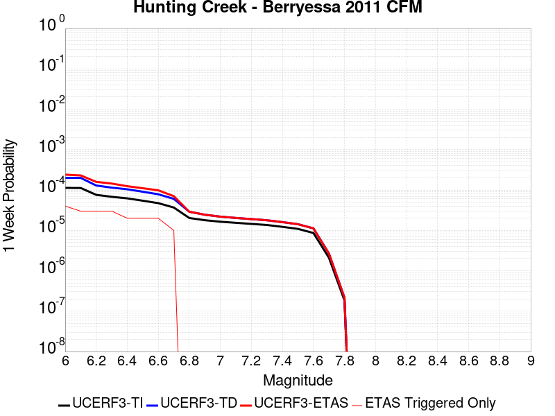 |  |  | 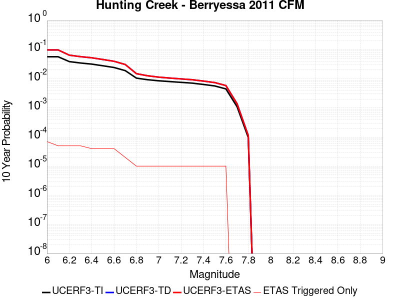 |

| Magnitude | 1 wk TI Prob | 1 wk TD Prob | 1 wk ETAS Prob | 1 wk ETAS/TD Gain | 1 wk ETAS Triggered Only | 1 mo TI Prob | 1 mo TD Prob | 1 mo ETAS Prob | 1 mo ETAS/TD Gain | 1 mo ETAS Triggered Only | 1 yr TI Prob | 1 yr TD Prob | 1 yr ETAS Prob | 1 yr ETAS/TD Gain | 1 yr ETAS Triggered Only | 10 yr TI Prob | 10 yr TD Prob | 10 yr ETAS Prob | 10 yr ETAS/TD Gain | 10 yr ETAS Triggered Only |
|-----|-----|-----|-----|-----|-----|-----|-----|-----|-----|-----|-----|-----|-----|-----|-----|-----|-----|-----|-----|-----|
| 6.0 | 1.1270982E-4 | 2.0012174E-4 | 2.3656557E-4 | 1.1821083 | 3.6451118E-5 | 4.8295266E-4 | 8.5739547E-4 | 9.059553E-4 | 1.0566365 | 4.860149E-5 | 0.0058641075 | 0.010386313 | 0.010446434 | 1.0057884 | 6.0751867E-5 | 0.057117578 | 0.09803703 | 0.09809182 | 1.000559 | 6.0751867E-5 |
| 6.1 | 1.1239393E-4 | 1.9960315E-4 | 2.2389904E-4 | 1.121721 | 2.4300745E-5 | 4.8159933E-4 | 8.551744E-4 | 8.7945437E-4 | 1.0283918 | 2.4300745E-5 | 0.0058477195 | 0.010359551 | 0.010395625 | 1.0034821 | 3.6451118E-5 | 0.056962132 | 0.09779551 | 0.097828396 | 1.0003363 | 3.6451118E-5 |
| 6.2 | 7.596265E-5 | 1.2940196E-4 | 1.5369957E-4 | 1.1877685 | 2.4300745E-5 | 3.2551357E-4 | 5.5444165E-4 | 5.787289E-4 | 1.0438049 | 2.4300745E-5 | 0.0039559277 | 0.0067210156 | 0.006757222 | 1.005387 | 3.6451118E-5 | 0.038862433 | 0.0645915 | 0.06462559 | 1.0005279 | 3.6451118E-5 |
| 6.3 | 6.78794E-5 | 1.145119E-4 | 1.3880986E-4 | 1.2121873 | 2.4300745E-5 | 2.9087928E-4 | 4.906513E-4 | 5.1494007E-4 | 1.0495032 | 2.4300745E-5 | 0.003535705 | 0.005952679 | 0.005988913 | 1.0060871 | 3.6451118E-5 | 0.034799766 | 0.057465393 | 0.057499748 | 1.0005978 | 3.6451118E-5 |
| 6.4 | 6.2165134E-5 | 1.0436625E-4 | 1.2866445E-4 | 1.2328167 | 2.4300745E-5 | 2.6639478E-4 | 4.4721062E-4 | 4.715005E-4 | 1.0543141 | 2.4300745E-5 | 0.0032385332 | 0.005427573 | 0.005463826 | 1.0066794 | 3.6451118E-5 | 0.03191742 | 0.052550517 | 0.052585054 | 1.0006572 | 3.6451118E-5 |
| 6.5 | 5.4368087E-5 | 9.071415E-5 | 1.1501269E-4 | 1.2678584 | 2.4300745E-5 | 2.3298527E-4 | 3.8872007E-4 | 4.1301138E-4 | 1.0624905 | 2.4300745E-5 | 0.0028329059 | 0.0047198683 | 0.0047561475 | 1.0076865 | 3.6451118E-5 | 0.027970633 | 0.045880128 | 0.045914907 | 1.000758 | 3.6451118E-5 |
| 6.6 | 4.729947E-5 | 7.847572E-5 | 1.0277456E-4 | 1.3096352 | 2.4300745E-5 | 2.0269625E-4 | 3.362842E-4 | 3.6057679E-4 | 1.0722382 | 2.4300745E-5 | 0.002465034 | 0.0040849647 | 0.0041212672 | 1.0088868 | 3.6451118E-5 | 0.02437869 | 0.03985155 | 0.03988655 | 1.0008782 | 3.6451118E-5 |
| 6.7 | 3.6875328E-5 | 6.0451803E-5 | 7.260144E-5 | 1.2009805 | 1.2150373E-5 | 1.5802756E-4 | 2.59056E-4 | 2.712032E-4 | 1.0468904 | 1.2150373E-5 | 0.0019222875 | 0.0031482063 | 0.0031724307 | 1.0076946 | 2.4300745E-5 | 0.019057442 | 0.03089237 | 0.030915922 | 1.0007623 | 2.4300745E-5 |
| 6.8 | 2.0292036E-5 | 2.8976308E-5 | 2.8976308E-5 | 1.0 | 0.0 | 8.6962966E-5 | 1.2417832E-4 | 1.2417832E-4 | 1.0 | 0.0 | 0.0010582599 | 0.0015108072 | 0.0015229393 | 1.0080302 | 1.2150373E-5 | 0.010532344 | 0.014978523 | 0.014990492 | 1.0007991 | 1.2150373E-5 |
| 6.9 | 1.7871042E-5 | 2.4472254E-5 | 2.4472254E-5 | 1.0 | 0.0 | 7.658793E-5 | 1.048769E-4 | 1.048769E-4 | 1.0 | 0.0 | 9.320591E-4 | 0.0012761299 | 0.0012882648 | 1.0095091 | 1.2150373E-5 | 0.009281595 | 0.012679775 | 0.012691772 | 1.000946 | 1.2150373E-5 |
| 7.0 | 1.6415532E-5 | 2.1906277E-5 | 2.1906277E-5 | 1.0 | 0.0 | 7.035038E-5 | 9.3880684E-5 | 9.3880684E-5 | 1.0 | 0.0 | 8.561793E-4 | 0.0011424015 | 0.001154538 | 1.0106237 | 1.2150373E-5 | 0.008528882 | 0.01136452 | 0.011376532 | 1.001057 | 1.2150373E-5 |
| 7.1 | 1.5409885E-5 | 2.0346342E-5 | 2.0346342E-5 | 1.0 | 0.0 | 6.6040695E-5 | 8.7195716E-5 | 8.7195716E-5 | 1.0 | 0.0 | 8.0374884E-4 | 0.0010610938 | 0.0010732312 | 1.0114386 | 1.2150373E-5 | 0.00800848 | 0.010560595 | 0.010572617 | 1.0011383 | 1.2150373E-5 |
| 7.2 | 1.4497423E-5 | 1.9054964E-5 | 1.9054964E-5 | 1.0 | 0.0 | 6.213033E-5 | 8.166159E-5 | 8.166159E-5 | 1.0 | 0.0 | 7.5617427E-4 | 9.937795E-4 | 0.0010059178 | 1.0122143 | 1.2150373E-5 | 0.0075360634 | 0.009893929 | 0.009905959 | 1.0012159 | 1.2150373E-5 |
| 7.3 | 1.3615175E-5 | 1.7826127E-5 | 1.7826127E-5 | 1.0 | 0.0 | 5.8349444E-5 | 7.639547E-5 | 7.639547E-5 | 1.0 | 0.0 | 7.101729E-4 | 9.297209E-4 | 9.418599E-4 | 1.0130566 | 1.2150373E-5 | 0.0070790765 | 0.009258823 | 0.00927086 | 1.0013001 | 1.2150373E-5 |
| 7.4 | 1.2252825E-5 | 1.602625E-5 | 1.602625E-5 | 1.0 | 0.0 | 5.251105E-5 | 6.868213E-5 | 6.868213E-5 | 1.0 | 0.0 | 6.391345E-4 | 8.35887E-4 | 8.480272E-4 | 1.0145237 | 1.2150373E-5 | 0.0063729943 | 0.008327872 | 0.00833992 | 1.0014468 | 1.2150373E-5 |
| 7.5 | 1.0913301E-5 | 1.4241117E-5 | 1.4241117E-5 | 1.0 | 0.0 | 4.6770452E-5 | 6.1031948E-5 | 6.1031948E-5 | 1.0 | 0.0 | 5.6928146E-4 | 7.4281334E-4 | 7.549547E-4 | 1.0163451 | 1.2150373E-5 | 0.0056782532 | 0.0074036797 | 0.00741574 | 1.001629 | 1.2150373E-5 |
| 7.6 | 8.623192E-6 | 1.12346415E-5 | 1.12346415E-5 | 1.0 | 0.0 | 3.6956015E-5 | 4.814759E-5 | 4.814759E-5 | 1.0 | 0.0 | 4.4984656E-4 | 5.8604183E-4 | 5.9818506E-4 | 1.0207208 | 1.2150373E-5 | 0.00448937 | 0.0058452785 | 0.0058573578 | 1.0020665 | 1.2150373E-5 |
| 7.7 | 2.0993634E-6 | 2.662584E-6 | 2.662584E-6 | 1.0 | 0.0 | 8.997241E-6 | 1.1411025E-5 | 1.1411025E-5 | 1.0 | 0.0 | 1.09535904E-4 | 1.3892044E-4 | 1.3892044E-4 | 1.0 | 0.0 | 0.0010948193 | 0.0013883426 | 0.0013883426 | 1.0 | 0.0 |
| 7.8 | 1.8428308E-7 | 2.167437E-7 | 2.167437E-7 | 1.0 | 0.0 | 7.897844E-7 | 9.289013E-7 | 9.289013E-7 | 1.0 | 0.0 | 9.615583E-6 | 1.1309318E-5 | 1.1309318E-5 | 1.0 | 0.0 | 9.615166E-5 | 1.13086026E-4 | 1.13086026E-4 | 1.0 | 0.0 |

## Coronado Bank alt1
*[(top)](#table-of-contents)*

| 1 Week | 1 Month | 1 Year | 10 Year |
|-----|-----|-----|-----|
|  |  |  |  |

| Magnitude | 1 wk TI Prob | 1 wk TD Prob | 1 wk ETAS Prob | 1 wk ETAS/TD Gain | 1 wk ETAS Triggered Only | 1 mo TI Prob | 1 mo TD Prob | 1 mo ETAS Prob | 1 mo ETAS/TD Gain | 1 mo ETAS Triggered Only | 1 yr TI Prob | 1 yr TD Prob | 1 yr ETAS Prob | 1 yr ETAS/TD Gain | 1 yr ETAS Triggered Only | 10 yr TI Prob | 10 yr TD Prob | 10 yr ETAS Prob | 10 yr ETAS/TD Gain | 10 yr ETAS Triggered Only |
|-----|-----|-----|-----|-----|-----|-----|-----|-----|-----|-----|-----|-----|-----|-----|-----|-----|-----|-----|-----|-----|
| 6.0 | 7.533492E-5 | 9.394913E-5 | 1.4254605E-4 | 1.5172685 | 4.860149E-5 | 3.22824E-4 | 4.0258127E-4 | 4.5116319E-4 | 1.120676 | 4.860149E-5 | 0.0039233007 | 0.0048909658 | 0.0049514202 | 1.0123605 | 6.0751867E-5 | 0.03854755 | 0.04790356 | 0.04797297 | 1.001449 | 7.2902236E-5 |
| 6.1 | 4.1807285E-5 | 5.049283E-5 | 6.264259E-5 | 1.2406235 | 1.2150373E-5 | 1.7916178E-4 | 2.1638049E-4 | 2.2852822E-4 | 1.0561407 | 1.2150373E-5 | 0.0021791123 | 0.0026313474 | 0.0026555841 | 1.0092108 | 2.4300745E-5 | 0.021578677 | 0.026011046 | 0.026034715 | 1.0009099 | 2.4300745E-5 |
| 6.2 | 4.1807285E-5 | 5.049283E-5 | 6.264259E-5 | 1.2406235 | 1.2150373E-5 | 1.7916178E-4 | 2.1638049E-4 | 2.2852822E-4 | 1.0561407 | 1.2150373E-5 | 0.0021791123 | 0.0026313474 | 0.0026555841 | 1.0092108 | 2.4300745E-5 | 0.021578677 | 0.026011046 | 0.026034715 | 1.0009099 | 2.4300745E-5 |
| 6.3 | 3.1793104E-5 | 3.7711117E-5 | 4.986103E-5 | 1.322184 | 1.2150373E-5 | 1.3624904E-4 | 1.6160926E-4 | 1.7375768E-4 | 1.0751715 | 1.2150373E-5 | 0.0016575698 | 0.001965848 | 0.0019779745 | 1.0061686 | 1.2150373E-5 | 0.016452603 | 0.019488465 | 0.019500379 | 1.0006113 | 1.2150373E-5 |
| 6.4 | 2.9878007E-5 | 3.5335794E-5 | 4.7485737E-5 | 1.3438424 | 1.2150373E-5 | 1.2804232E-4 | 1.5143053E-4 | 1.6357907E-4 | 1.0802251 | 1.2150373E-5 | 0.0015578003 | 0.0018421387 | 0.0018542667 | 1.0065837 | 1.2150373E-5 | 0.015469253 | 0.01827244 | 0.01828437 | 1.0006528 | 1.2150373E-5 |
| 6.5 | 2.4512565E-5 | 2.8764043E-5 | 4.0914067E-5 | 1.4224032 | 1.2150373E-5 | 1.0504962E-4 | 1.2326881E-4 | 1.3541768E-4 | 1.0985559 | 1.2150373E-5 | 0.0012782287 | 0.0014997921 | 0.0015119243 | 1.0080892 | 1.2150373E-5 | 0.012709012 | 0.014899683 | 0.014911653 | 1.0008034 | 1.2150373E-5 |
| 6.6 | 2.1317413E-5 | 2.490667E-5 | 3.705674E-5 | 1.487824 | 1.2150373E-5 | 9.135714E-5 | 1.0673863E-4 | 1.1888771E-4 | 1.1138208 | 1.2150373E-5 | 0.0011117056 | 0.0012987906 | 0.0013109251 | 1.009343 | 1.2150373E-5 | 0.011061605 | 0.012914404 | 0.012926398 | 1.0009286 | 1.2150373E-5 |
| 6.7 | 1.8585655E-5 | 2.163488E-5 | 3.378499E-5 | 1.5615982 | 1.2150373E-5 | 7.9650374E-5 | 9.271773E-5 | 1.0486698E-4 | 1.1310347 | 1.2150373E-5 | 9.6931186E-4 | 0.0011282742 | 0.001140411 | 1.0107569 | 1.2150373E-5 | 0.0096509475 | 0.011227623 | 0.011239636 | 1.00107 | 1.2150373E-5 |
| 6.8 | 1.5862879E-5 | 1.8419474E-5 | 3.0569623E-5 | 1.659636 | 1.2150373E-5 | 6.798199E-5 | 7.893833E-5 | 9.108774E-5 | 1.1539102 | 1.2150373E-5 | 8.273665E-4 | 9.6066965E-4 | 9.7280834E-4 | 1.0126357 | 1.2150373E-5 | 0.008242928 | 0.00956715 | 0.009579184 | 1.0012579 | 1.2150373E-5 |
| 6.9 | 1.3021509E-5 | 1.5095265E-5 | 2.7245454E-5 | 1.8049008 | 1.2150373E-5 | 5.5805274E-5 | 6.469249E-5 | 7.684207E-5 | 1.1878052 | 1.2150373E-5 | 6.792174E-4 | 7.8736455E-4 | 7.9950533E-4 | 1.0154196 | 1.2150373E-5 | 0.006771452 | 0.007847573 | 0.007859628 | 1.0015361 | 1.2150373E-5 |
| 7.0 | 1.0974371E-5 | 1.2720104E-5 | 2.4870322E-5 | 1.955198 | 1.2150373E-5 | 4.7032172E-5 | 5.451369E-5 | 6.66634E-5 | 1.2228745 | 1.2150373E-5 | 5.7246623E-4 | 6.6351966E-4 | 6.7566196E-4 | 1.0182998 | 1.2150373E-5 | 0.0057099373 | 0.006617135 | 0.006629205 | 1.001824 | 1.2150373E-5 |
| 7.1 | 8.766221E-6 | 1.01638325E-5 | 2.2314081E-5 | 2.1954398 | 1.2150373E-5 | 3.7568978E-5 | 4.355865E-5 | 5.5708493E-5 | 1.2789307 | 1.2150373E-5 | 4.573063E-4 | 5.3021475E-4 | 5.4235867E-4 | 1.0229038 | 1.2150373E-5 | 0.0045636636 | 0.0052911965 | 0.0053032828 | 1.0022842 | 1.2150373E-5 |
| 7.2 | 8.026024E-7 | 8.331765E-7 | 8.331765E-7 | 1.0 | 0.0 | 3.43972E-6 | 3.5707515E-6 | 3.5707515E-6 | 1.0 | 0.0 | 4.1877785E-5 | 4.3473043E-5 | 4.3473043E-5 | 1.0 | 0.0 | 4.1869894E-4 | 4.3464647E-4 | 4.3464647E-4 | 1.0 | 0.0 |
| 7.3 | 3.7293114E-7 | 3.7000953E-7 | 3.7000953E-7 | 1.0 | 0.0 | 1.5982754E-6 | 1.5857541E-6 | 1.5857541E-6 | 1.0 | 0.0 | 1.9458828E-5 | 1.9306386E-5 | 1.9306386E-5 | 1.0 | 0.0 | 1.9457124E-4 | 1.9304715E-4 | 1.9304715E-4 | 1.0 | 0.0 |
| 7.4 | 2.0557036E-7 | 1.9674363E-7 | 1.9674363E-7 | 1.0 | 0.0 | 8.810155E-7 | 8.431867E-7 | 8.431867E-7 | 1.0 | 0.0 | 1.0726311E-5 | 1.026575E-5 | 1.026575E-5 | 1.0 | 0.0 | 1.0725793E-4 | 1.0265279E-4 | 1.0265279E-4 | 1.0 | 0.0 |
| 7.5 | 6.845446E-8 | 6.279369E-8 | 6.279369E-8 | 1.0 | 0.0 | 2.9337625E-7 | 2.691158E-7 | 2.691158E-7 | 1.0 | 0.0 | 3.5718497E-6 | 3.2764797E-6 | 3.2764797E-6 | 1.0 | 0.0 | 3.5717923E-5 | 3.2764325E-5 | 3.2764325E-5 | 1.0 | 0.0 |
| 7.6 | 6.0975145E-9 | 5.53185E-9 | 5.53185E-9 | 1.0 | 0.0 | 2.6132206E-8 | 2.370793E-8 | 2.370793E-8 | 1.0 | 0.0 | 3.1815955E-7 | 2.88644E-7 | 2.88644E-7 | 1.0 | 0.0 | 3.181591E-6 | 2.8864374E-6 | 2.8864374E-6 | 1.0 | 0.0 |

## Tin Mountain
*[(top)](#table-of-contents)*

| 1 Week | 1 Month | 1 Year | 10 Year |
|-----|-----|-----|-----|
|  |  |  |  |

| Magnitude | 1 wk TI Prob | 1 wk TD Prob | 1 wk ETAS Prob | 1 wk ETAS/TD Gain | 1 wk ETAS Triggered Only | 1 mo TI Prob | 1 mo TD Prob | 1 mo ETAS Prob | 1 mo ETAS/TD Gain | 1 mo ETAS Triggered Only | 1 yr TI Prob | 1 yr TD Prob | 1 yr ETAS Prob | 1 yr ETAS/TD Gain | 1 yr ETAS Triggered Only | 10 yr TI Prob | 10 yr TD Prob | 10 yr ETAS Prob | 10 yr ETAS/TD Gain | 10 yr ETAS Triggered Only |
|-----|-----|-----|-----|-----|-----|-----|-----|-----|-----|-----|-----|-----|-----|-----|-----|-----|-----|-----|-----|-----|
| 6.0 | 4.083776E-6 | 4.1815365E-6 | 6.493315E-5 | 15.528537 | 6.0751867E-5 | 1.750178E-5 | 1.792077E-5 | 7.8671546E-5 | 4.3899646 | 6.0751867E-5 | 2.1306332E-4 | 2.1816725E-4 | 2.7890585E-4 | 1.2784039 | 6.0751867E-5 | 0.0021285915 | 0.0021798965 | 0.0022526397 | 1.0333701 | 7.2902236E-5 |
| 6.1 | 4.083776E-6 | 4.1815365E-6 | 6.493315E-5 | 15.528537 | 6.0751867E-5 | 1.750178E-5 | 1.792077E-5 | 7.8671546E-5 | 4.3899646 | 6.0751867E-5 | 2.1306332E-4 | 2.1816725E-4 | 2.7890585E-4 | 1.2784039 | 6.0751867E-5 | 0.0021285915 | 0.0021798965 | 0.0022526397 | 1.0333701 | 7.2902236E-5 |
| 6.2 | 4.083776E-6 | 4.1815365E-6 | 6.493315E-5 | 15.528537 | 6.0751867E-5 | 1.750178E-5 | 1.792077E-5 | 7.8671546E-5 | 4.3899646 | 6.0751867E-5 | 2.1306332E-4 | 2.1816725E-4 | 2.7890585E-4 | 1.2784039 | 6.0751867E-5 | 0.0021285915 | 0.0021798965 | 0.0022526397 | 1.0333701 | 7.2902236E-5 |
| 6.3 | 4.083776E-6 | 4.1815365E-6 | 6.493315E-5 | 15.528537 | 6.0751867E-5 | 1.750178E-5 | 1.792077E-5 | 7.8671546E-5 | 4.3899646 | 6.0751867E-5 | 2.1306332E-4 | 2.1816725E-4 | 2.7890585E-4 | 1.2784039 | 6.0751867E-5 | 0.0021285915 | 0.0021798965 | 0.0022526397 | 1.0333701 | 7.2902236E-5 |
| 6.4 | 4.083776E-6 | 4.1815365E-6 | 6.493315E-5 | 15.528537 | 6.0751867E-5 | 1.750178E-5 | 1.792077E-5 | 7.8671546E-5 | 4.3899646 | 6.0751867E-5 | 2.1306332E-4 | 2.1816725E-4 | 2.7890585E-4 | 1.2784039 | 6.0751867E-5 | 0.0021285915 | 0.0021798965 | 0.0022526397 | 1.0333701 | 7.2902236E-5 |
| 6.5 | 2.3143427E-6 | 2.3731573E-6 | 3.882419E-5 | 16.359722 | 3.6451118E-5 | 9.9185745E-6 | 1.0170638E-5 | 4.6621386E-5 | 4.5839195 | 3.6451118E-5 | 1.2075195E-4 | 1.2382126E-4 | 1.6026787E-4 | 1.2943485 | 3.6451118E-5 | 0.0012068636 | 0.0012375986 | 0.0012740046 | 1.0294167 | 3.6451118E-5 |
| 6.6 | 2.3143427E-6 | 2.3731573E-6 | 3.882419E-5 | 16.359722 | 3.6451118E-5 | 9.9185745E-6 | 1.0170638E-5 | 4.6621386E-5 | 4.5839195 | 3.6451118E-5 | 1.2075195E-4 | 1.2382126E-4 | 1.6026787E-4 | 1.2943485 | 3.6451118E-5 | 0.0012068636 | 0.0012375986 | 0.0012740046 | 1.0294167 | 3.6451118E-5 |
| 6.7 | 1.7029532E-6 | 1.7497915E-6 | 3.8200847E-5 | 21.831656 | 3.6451118E-5 | 7.2983503E-6 | 7.499088E-6 | 4.3949934E-5 | 5.860704 | 3.6451118E-5 | 8.885379E-5 | 9.1298105E-5 | 1.277459E-4 | 1.3992174 | 3.6451118E-5 | 8.881827E-4 | 9.1265864E-4 | 9.490765E-4 | 1.039903 | 3.6451118E-5 |
| 6.8 | 1.2914646E-6 | 1.3299378E-6 | 2.5630652E-5 | 19.272066 | 2.4300745E-5 | 5.534837E-6 | 5.6997237E-6 | 3.0000332E-5 | 5.263471 | 2.4300745E-5 | 6.738455E-5 | 6.939237E-5 | 9.369143E-5 | 1.3501691 | 2.4300745E-5 | 6.736412E-4 | 6.9375033E-4 | 7.180342E-4 | 1.0350038 | 2.4300745E-5 |
| 6.9 | 5.8708974E-7 | 6.1169936E-7 | 6.1169936E-7 | 1.0 | 0.0 | 2.5160964E-6 | 2.6215664E-6 | 2.6215664E-6 | 1.0 | 0.0 | 3.0633044E-5 | 3.1917145E-5 | 3.1917145E-5 | 1.0 | 0.0 | 3.0628822E-4 | 3.191297E-4 | 3.191297E-4 | 1.0 | 0.0 |
| 7.0 | 4.6248786E-7 | 4.832015E-7 | 4.832015E-7 | 1.0 | 0.0 | 1.9820893E-6 | 2.0708624E-6 | 2.0708624E-6 | 1.0 | 0.0 | 2.413167E-5 | 2.5212494E-5 | 2.5212494E-5 | 1.0 | 0.0 | 2.412905E-4 | 2.5210003E-4 | 2.5210003E-4 | 1.0 | 0.0 |
| 7.1 | 3.804606E-7 | 3.987147E-7 | 3.987147E-7 | 1.0 | 0.0 | 1.6305444E-6 | 1.7087764E-6 | 1.7087764E-6 | 1.0 | 0.0 | 1.9851697E-5 | 2.0804187E-5 | 2.0804187E-5 | 1.0 | 0.0 | 1.9849923E-4 | 2.0802575E-4 | 2.0802575E-4 | 1.0 | 0.0 |
| 7.2 | 3.5864858E-7 | 3.7616863E-7 | 3.7616863E-7 | 1.0 | 0.0 | 1.5370645E-6 | 1.6121504E-6 | 1.6121504E-6 | 1.0 | 0.0 | 1.87136E-5 | 1.9627789E-5 | 1.9627789E-5 | 1.0 | 0.0 | 1.8712023E-4 | 1.9626386E-4 | 1.9626386E-4 | 1.0 | 0.0 |
| 7.3 | 3.342063E-7 | 3.506347E-7 | 3.506347E-7 | 1.0 | 0.0 | 1.4323119E-6 | 1.5027196E-6 | 1.5027196E-6 | 1.0 | 0.0 | 1.7438259E-5 | 1.829549E-5 | 1.829549E-5 | 1.0 | 0.0 | 1.743689E-4 | 1.8294314E-4 | 1.8294314E-4 | 1.0 | 0.0 |
| 7.4 | 2.971242E-7 | 3.1165817E-7 | 3.1165817E-7 | 1.0 | 0.0 | 1.2733886E-6 | 1.3356774E-6 | 1.3356774E-6 | 1.0 | 0.0 | 1.5503398E-5 | 1.6261785E-5 | 1.6261785E-5 | 1.0 | 0.0 | 1.5502315E-4 | 1.6260923E-4 | 1.6260923E-4 | 1.0 | 0.0 |
| 7.5 | 1.4326713E-7 | 1.5012525E-7 | 1.5012525E-7 | 1.0 | 0.0 | 6.140018E-7 | 6.433939E-7 | 6.433939E-7 | 1.0 | 0.0 | 7.4754466E-6 | 7.8333205E-6 | 7.8333205E-6 | 1.0 | 0.0 | 7.475195E-5 | 7.833321E-5 | 7.833321E-5 | 1.0 | 0.0 |

## Santa Ynez (West)
*[(top)](#table-of-contents)*

| 1 Week | 1 Month | 1 Year | 10 Year |
|-----|-----|-----|-----|
|  |  |  |  |

| Magnitude | 1 wk TI Prob | 1 wk TD Prob | 1 wk ETAS Prob | 1 wk ETAS/TD Gain | 1 wk ETAS Triggered Only | 1 mo TI Prob | 1 mo TD Prob | 1 mo ETAS Prob | 1 mo ETAS/TD Gain | 1 mo ETAS Triggered Only | 1 yr TI Prob | 1 yr TD Prob | 1 yr ETAS Prob | 1 yr ETAS/TD Gain | 1 yr ETAS Triggered Only | 10 yr TI Prob | 10 yr TD Prob | 10 yr ETAS Prob | 10 yr ETAS/TD Gain | 10 yr ETAS Triggered Only |
|-----|-----|-----|-----|-----|-----|-----|-----|-----|-----|-----|-----|-----|-----|-----|-----|-----|-----|-----|-----|-----|
| 6.0 | 4.7352758E-5 | 5.4972126E-5 | 1.0357094E-4 | 1.884063 | 4.860149E-5 | 2.0292461E-4 | 2.3557522E-4 | 2.8416526E-4 | 1.2062613 | 4.860149E-5 | 0.0024678076 | 0.0028645284 | 0.002925106 | 1.0211476 | 6.0751867E-5 | 0.024405818 | 0.028304417 | 0.028375257 | 1.0025028 | 7.2902236E-5 |
| 6.1 | 4.7352758E-5 | 5.4972126E-5 | 1.0357094E-4 | 1.884063 | 4.860149E-5 | 2.0292461E-4 | 2.3557522E-4 | 2.8416526E-4 | 1.2062613 | 4.860149E-5 | 0.0024678076 | 0.0028645284 | 0.002925106 | 1.0211476 | 6.0751867E-5 | 0.024405818 | 0.028304417 | 0.028375257 | 1.0025028 | 7.2902236E-5 |
| 6.2 | 3.0415853E-5 | 3.392511E-5 | 7.037499E-5 | 2.074422 | 3.6451118E-5 | 1.3034715E-4 | 1.4538545E-4 | 1.8183126E-4 | 1.2506841 | 3.6451118E-5 | 0.0015858212 | 0.0017686661 | 0.0018171816 | 1.0274305 | 4.860149E-5 | 0.015745522 | 0.017549807 | 0.017609492 | 1.0034009 | 6.0751867E-5 |
| 6.3 | 3.0415853E-5 | 3.392511E-5 | 7.037499E-5 | 2.074422 | 3.6451118E-5 | 1.3034715E-4 | 1.4538545E-4 | 1.8183126E-4 | 1.2506841 | 3.6451118E-5 | 0.0015858212 | 0.0017686661 | 0.0018171816 | 1.0274305 | 4.860149E-5 | 0.015745522 | 0.017549807 | 0.017609492 | 1.0034009 | 6.0751867E-5 |
| 6.4 | 2.5452082E-5 | 2.7912422E-5 | 6.4362524E-5 | 2.3058739 | 3.6451118E-5 | 1.09075794E-4 | 1.196193E-4 | 1.5606606E-4 | 1.3046896 | 3.6451118E-5 | 0.0013271887 | 0.0014554089 | 0.0015039396 | 1.0333451 | 4.860149E-5 | 0.013192902 | 0.014460951 | 0.014520825 | 1.0041404 | 6.0751867E-5 |
| 6.5 | 2.3143784E-5 | 2.5128256E-5 | 4.9428392E-5 | 1.9670442 | 2.4300745E-5 | 9.9183875E-5 | 1.0768817E-4 | 1.319863E-4 | 1.2256341 | 2.4300745E-5 | 0.0012068948 | 0.0013103267 | 0.0013467302 | 1.0277818 | 3.6451118E-5 | 0.012003611 | 0.01302768 | 0.013075649 | 1.003682 | 4.860149E-5 |
| 6.6 | 1.9118515E-5 | 2.035434E-5 | 4.4654593E-5 | 2.193861 | 2.4300745E-5 | 8.193392E-5 | 8.7230015E-5 | 1.1152864E-4 | 1.2785581 | 2.4300745E-5 | 9.97089E-4 | 0.001061516 | 0.0010979284 | 1.0343022 | 3.6451118E-5 | 0.00992627 | 0.010565365 | 0.010601431 | 1.0034136 | 3.6451118E-5 |
| 6.7 | 1.722807E-5 | 1.8146347E-5 | 4.2446653E-5 | 2.3391292 | 2.4300745E-5 | 7.3832496E-5 | 7.776777E-5 | 1.0206663E-4 | 1.3124541 | 2.4300745E-5 | 8.985399E-4 | 9.464169E-4 | 9.828336E-4 | 1.0384784 | 3.6451118E-5 | 0.008949154 | 0.0094245095 | 0.009460618 | 1.0038313 | 3.6451118E-5 |
| 6.8 | 1.5317364E-5 | 1.5926486E-5 | 4.0226845E-5 | 2.5257828 | 2.4300745E-5 | 6.56442E-5 | 6.82546E-5 | 9.255369E-5 | 1.3560066 | 2.4300745E-5 | 7.98925E-4 | 8.306873E-4 | 8.671081E-4 | 1.0438442 | 3.6451118E-5 | 0.007960589 | 0.00827631 | 0.008312459 | 1.0043678 | 3.6451118E-5 |
| 6.9 | 1.3071226E-5 | 1.3329624E-5 | 3.7630045E-5 | 2.8230388 | 2.4300745E-5 | 5.6018336E-5 | 5.7125722E-5 | 8.142508E-5 | 1.4253663 | 2.4300745E-5 | 6.8180985E-4 | 6.9528597E-4 | 7.3171174E-4 | 1.0523896 | 3.6451118E-5 | 0.0067972173 | 0.006931367 | 0.0069675655 | 1.0052224 | 3.6451118E-5 |
| 7.0 | 1.1836986E-5 | 1.19327815E-5 | 3.623324E-5 | 3.0364451 | 2.4300745E-5 | 5.0728955E-5 | 5.11395E-5 | 7.5439006E-5 | 1.4751612 | 2.4300745E-5 | 6.1745E-4 | 6.2244723E-4 | 6.588756E-4 | 1.0585245 | 3.6451118E-5 | 0.006157372 | 0.006207231 | 0.006243456 | 1.0058359 | 3.6451118E-5 |
| 7.1 | 1.0597169E-5 | 1.0542201E-5 | 2.2692446E-5 | 2.152534 | 1.2150373E-5 | 4.541565E-5 | 4.5180084E-5 | 5.732991E-5 | 1.26892 | 1.2150373E-5 | 5.5279525E-4 | 5.4992986E-4 | 5.7421724E-4 | 1.0441645 | 2.4300745E-5 | 0.0055142213 | 0.005485821 | 0.0055099884 | 1.0044054 | 2.4300745E-5 |
| 7.2 | 9.59113E-6 | 9.459144E-6 | 2.1609401E-5 | 2.2844987 | 1.2150373E-5 | 4.11042E-5 | 4.0538565E-5 | 5.2688443E-5 | 1.2997117 | 1.2150373E-5 | 5.0032866E-4 | 4.934463E-4 | 5.177351E-4 | 1.0492227 | 2.4300745E-5 | 0.004992037 | 0.0049236254 | 0.0049478062 | 1.0049112 | 2.4300745E-5 |
| 7.3 | 8.586084E-6 | 8.379583E-6 | 2.0529855E-5 | 2.449985 | 1.2150373E-5 | 3.679698E-5 | 3.5912013E-5 | 4.806195E-5 | 1.3383251 | 1.2150373E-5 | 4.4791115E-4 | 4.3714207E-4 | 4.6143218E-4 | 1.0555657 | 2.4300745E-5 | 0.004470094 | 0.004362933 | 0.0043871277 | 1.0055455 | 2.4300745E-5 |
| 7.4 | 7.2622997E-6 | 6.9515427E-6 | 1.9101832E-5 | 2.747855 | 1.2150373E-5 | 3.112377E-5 | 2.979199E-5 | 4.1942003E-5 | 1.4078281 | 1.2150373E-5 | 3.78866E-4 | 3.626581E-4 | 3.8695004E-4 | 1.066983 | 2.4300745E-5 | 0.0037822074 | 0.0036207628 | 0.0036449756 | 1.0066872 | 2.4300745E-5 |
| 7.5 | 5.627296E-6 | 5.251588E-6 | 1.7401897E-5 | 3.313645 | 1.2150373E-5 | 2.411676E-5 | 2.2506614E-5 | 3.4656714E-5 | 1.5398457 | 1.2150373E-5 | 2.9358198E-4 | 2.739843E-4 | 2.9827838E-4 | 1.0886697 | 2.4300745E-5 | 0.0029319443 | 0.002736537 | 0.0027607712 | 1.0088558 | 2.4300745E-5 |
| 7.6 | 2.265244E-6 | 2.0608625E-6 | 2.0608625E-6 | 1.0 | 0.0 | 9.708152E-6 | 8.832238E-6 | 8.832238E-6 | 1.0 | 0.0 | 1.18190335E-4 | 1.0752728E-4 | 1.0752728E-4 | 1.0 | 0.0 | 0.001181275 | 0.0010747612 | 0.0010747612 | 1.0 | 0.0 |
| 7.7 | 1.3099874E-6 | 1.1016252E-6 | 1.1016252E-6 | 1.0 | 0.0 | 5.61422E-6 | 4.7212425E-6 | 4.7212425E-6 | 1.0 | 0.0 | 6.8350986E-5 | 5.7479636E-5 | 5.7479636E-5 | 1.0 | 0.0 | 6.832996E-4 | 5.7465007E-4 | 5.7465007E-4 | 1.0 | 0.0 |
| 7.8 | 7.903951E-7 | 6.0711415E-7 | 6.0711415E-7 | 1.0 | 0.0 | 3.3874032E-6 | 2.6019152E-6 | 2.6019152E-6 | 1.0 | 0.0 | 4.1240855E-5 | 3.167787E-5 | 3.167787E-5 | 1.0 | 0.0 | 4.12332E-4 | 3.167349E-4 | 3.167349E-4 | 1.0 | 0.0 |
| 7.9 | 7.0753297E-9 | 5.0899476E-9 | 5.0899476E-9 | 1.0 | 0.0 | 3.032284E-8 | 2.181406E-8 | 2.181406E-8 | 1.0 | 0.0 | 3.6918053E-7 | 2.6558615E-7 | 2.6558615E-7 | 1.0 | 0.0 | 3.691799E-6 | 2.6558594E-6 | 2.6558594E-6 | 1.0 | 0.0 |

## Santa Rosa Island
*[(top)](#table-of-contents)*

| 1 Week | 1 Month | 1 Year | 10 Year |
|-----|-----|-----|-----|
|  |  |  |  |

| Magnitude | 1 wk TI Prob | 1 wk TD Prob | 1 wk ETAS Prob | 1 wk ETAS/TD Gain | 1 wk ETAS Triggered Only | 1 mo TI Prob | 1 mo TD Prob | 1 mo ETAS Prob | 1 mo ETAS/TD Gain | 1 mo ETAS Triggered Only | 1 yr TI Prob | 1 yr TD Prob | 1 yr ETAS Prob | 1 yr ETAS/TD Gain | 1 yr ETAS Triggered Only | 10 yr TI Prob | 10 yr TD Prob | 10 yr ETAS Prob | 10 yr ETAS/TD Gain | 10 yr ETAS Triggered Only |
|-----|-----|-----|-----|-----|-----|-----|-----|-----|-----|-----|-----|-----|-----|-----|-----|-----|-----|-----|-----|-----|
| 6.0 | 4.1143165E-5 | 4.7091133E-5 | 9.569034E-5 | 2.0320244 | 4.860149E-5 | 1.7631594E-4 | 2.0180465E-4 | 2.5039632E-4 | 1.2407857 | 4.860149E-5 | 0.002144533 | 0.0024544 | 0.0025271233 | 1.0296298 | 7.2902236E-5 | 0.021239553 | 0.024293551 | 0.024364682 | 1.002928 | 7.2902236E-5 |
| 6.1 | 2.1061249E-5 | 2.3864959E-5 | 4.8165126E-5 | 2.0182362 | 2.4300745E-5 | 9.0259375E-5 | 1.0227455E-4 | 1.265728E-4 | 1.2375787 | 2.4300745E-5 | 0.0010983539 | 0.0012445104 | 0.0012687809 | 1.019502 | 2.4300745E-5 | 0.01092941 | 0.012378449 | 0.012402448 | 1.0019388 | 2.4300745E-5 |
| 6.2 | 2.1061249E-5 | 2.3864959E-5 | 4.8165126E-5 | 2.0182362 | 2.4300745E-5 | 9.0259375E-5 | 1.0227455E-4 | 1.265728E-4 | 1.2375787 | 2.4300745E-5 | 0.0010983539 | 0.0012445104 | 0.0012687809 | 1.019502 | 2.4300745E-5 | 0.01092941 | 0.012378449 | 0.012402448 | 1.0019388 | 2.4300745E-5 |
| 6.3 | 1.5158236E-5 | 1.7074419E-5 | 4.137475E-5 | 2.423201 | 2.4300745E-5 | 6.496225E-5 | 7.3174095E-5 | 9.7473065E-5 | 1.3320706 | 2.4300745E-5 | 7.906284E-4 | 8.905424E-4 | 9.148215E-4 | 1.0272633 | 2.4300745E-5 | 0.007878214 | 0.008870989 | 0.008895075 | 1.002715 | 2.4300745E-5 |
| 6.4 | 1.2341918E-5 | 1.3852917E-5 | 2.6003121E-5 | 1.8770864 | 1.2150373E-5 | 5.2892858E-5 | 5.9368336E-5 | 7.1517985E-5 | 1.2046487 | 1.2150373E-5 | 6.437803E-4 | 7.225779E-4 | 7.347195E-4 | 1.0168031 | 1.2150373E-5 | 0.006419184 | 0.007203121 | 0.007215184 | 1.0016747 | 1.2150373E-5 |
| 6.5 | 9.061158E-6 | 1.0117031E-5 | 2.226728E-5 | 2.20097 | 1.2150373E-5 | 3.883296E-5 | 4.3358013E-5 | 5.550786E-5 | 1.2802215 | 1.2150373E-5 | 4.726887E-4 | 5.277613E-4 | 5.399053E-4 | 1.0230104 | 1.2150373E-5 | 0.004716845 | 0.0052656173 | 0.005277704 | 1.0022954 | 1.2150373E-5 |
| 6.6 | 7.5461685E-6 | 8.400733E-6 | 2.0551004E-5 | 2.4463346 | 1.2150373E-5 | 3.2340322E-5 | 3.600267E-5 | 4.8152608E-5 | 1.3374732 | 1.2150373E-5 | 3.936723E-4 | 4.3824865E-4 | 4.503937E-4 | 1.0277127 | 1.2150373E-5 | 0.003929756 | 0.0043742736 | 0.004386371 | 1.0027655 | 1.2150373E-5 |
| 6.7 | 5.5023775E-6 | 6.087381E-6 | 6.087381E-6 | 1.0 | 0.0 | 2.3581404E-5 | 2.6088532E-5 | 2.6088532E-5 | 1.0 | 0.0 | 2.8706578E-4 | 3.1758484E-4 | 3.1758484E-4 | 1.0 | 0.0 | 0.0028669522 | 0.0031716314 | 0.0031716314 | 1.0 | 0.0 |
| 6.8 | 3.7351679E-6 | 4.0831405E-6 | 4.0831405E-6 | 1.0 | 0.0 | 1.6007763E-5 | 1.749907E-5 | 1.749907E-5 | 1.0 | 0.0 | 1.948771E-4 | 2.1303284E-4 | 2.1303284E-4 | 1.0 | 0.0 | 0.0019470629 | 0.0021285315 | 0.0021285315 | 1.0 | 0.0 |
| 6.9 | 2.456366E-6 | 2.6292705E-6 | 2.6292705E-6 | 1.0 | 0.0 | 1.0527241E-5 | 1.1268254E-5 | 1.1268254E-5 | 1.0 | 0.0 | 1.2816161E-4 | 1.3718237E-4 | 1.3718237E-4 | 1.0 | 0.0 | 0.0012808773 | 0.0013709799 | 0.0013709799 | 1.0 | 0.0 |
| 7.0 | 2.3245157E-6 | 2.4827782E-6 | 2.4827782E-6 | 1.0 | 0.0 | 9.962172E-6 | 1.0640435E-5 | 1.0640435E-5 | 1.0 | 0.0 | 1.2128269E-4 | 1.2953962E-4 | 1.2953962E-4 | 1.0 | 0.0 | 0.0012121652 | 0.0012946434 | 0.0012946434 | 1.0 | 0.0 |
| 7.1 | 2.2248344E-6 | 2.37325E-6 | 2.37325E-6 | 1.0 | 0.0 | 9.53497E-6 | 1.0171032E-5 | 1.0171032E-5 | 1.0 | 0.0 | 1.1608207E-4 | 1.2382529E-4 | 1.2382529E-4 | 1.0 | 0.0 | 0.0011602144 | 0.001237565 | 0.001237565 | 1.0 | 0.0 |
| 7.2 | 2.1350402E-6 | 2.276154E-6 | 2.276154E-6 | 1.0 | 0.0 | 9.150141E-6 | 9.754909E-6 | 9.754909E-6 | 1.0 | 0.0 | 1.1139726E-4 | 1.1875956E-4 | 1.1875956E-4 | 1.0 | 0.0 | 0.0011134144 | 0.0011869629 | 0.0011869629 | 1.0 | 0.0 |
| 7.3 | 1.9793572E-6 | 2.108719E-6 | 2.108719E-6 | 1.0 | 0.0 | 8.482932E-6 | 9.037336E-6 | 9.037336E-6 | 1.0 | 0.0 | 1.032748E-4 | 1.10024026E-4 | 1.10024026E-4 | 1.0 | 0.0 | 0.0010322682 | 0.0010996973 | 0.0010996973 | 1.0 | 0.0 |
| 7.4 | 1.6951194E-6 | 1.8045733E-6 | 1.8045733E-6 | 1.0 | 0.0 | 7.264777E-6 | 7.733863E-6 | 7.733863E-6 | 1.0 | 0.0 | 8.844508E-5 | 9.415573E-5 | 9.415573E-5 | 1.0 | 0.0 | 8.840988E-4 | 9.4116E-4 | 9.4116E-4 | 1.0 | 0.0 |
| 7.5 | 8.987207E-7 | 9.5122147E-7 | 9.5122147E-7 | 1.0 | 0.0 | 3.8516546E-6 | 4.076657E-6 | 4.076657E-6 | 1.0 | 0.0 | 4.6892885E-5 | 4.963218E-5 | 4.963218E-5 | 1.0 | 0.0 | 4.688299E-4 | 4.9621216E-4 | 4.9621216E-4 | 1.0 | 0.0 |
| 7.6 | 3.8783037E-7 | 4.052932E-7 | 4.052932E-7 | 1.0 | 0.0 | 1.6621291E-6 | 1.7369698E-6 | 1.7369698E-6 | 1.0 | 0.0 | 2.0236233E-5 | 2.1147409E-5 | 2.1147409E-5 | 1.0 | 0.0 | 2.023439E-4 | 2.1145462E-4 | 2.1145462E-4 | 1.0 | 0.0 |
| 7.7 | 6.181804E-8 | 6.339035E-8 | 6.339035E-8 | 1.0 | 0.0 | 2.6493444E-7 | 2.7167292E-7 | 2.7167292E-7 | 1.0 | 0.0 | 3.225572E-6 | 3.3076128E-6 | 3.3076128E-6 | 1.0 | 0.0 | 3.225525E-5 | 3.307564E-5 | 3.307564E-5 | 1.0 | 0.0 |
| 7.8 | 1.3704449E-9 | 1.3964153E-9 | 1.3964153E-9 | 1.0 | 0.0 | 5.873335E-9 | 5.984637E-9 | 5.984637E-9 | 1.0 | 0.0 | 7.1507856E-8 | 7.286295E-8 | 7.286295E-8 | 1.0 | 0.0 | 7.1507833E-7 | 7.286294E-7 | 7.286294E-7 | 1.0 | 0.0 |

## Owens Valley
*[(top)](#table-of-contents)*

| 1 Week | 1 Month | 1 Year | 10 Year |
|-----|-----|-----|-----|
|  |  |  |  |

| Magnitude | 1 wk TI Prob | 1 wk TD Prob | 1 wk ETAS Prob | 1 wk ETAS/TD Gain | 1 wk ETAS Triggered Only | 1 mo TI Prob | 1 mo TD Prob | 1 mo ETAS Prob | 1 mo ETAS/TD Gain | 1 mo ETAS Triggered Only | 1 yr TI Prob | 1 yr TD Prob | 1 yr ETAS Prob | 1 yr ETAS/TD Gain | 1 yr ETAS Triggered Only | 10 yr TI Prob | 10 yr TD Prob | 10 yr ETAS Prob | 10 yr ETAS/TD Gain | 10 yr ETAS Triggered Only |
|-----|-----|-----|-----|-----|-----|-----|-----|-----|-----|-----|-----|-----|-----|-----|-----|-----|-----|-----|-----|-----|
| 6.0 | 4.83821E-5 | 3.626567E-6 | 4.0077553E-5 | 11.0511 | 3.6451118E-5 | 2.0733538E-4 | 1.5542342E-5 | 6.414308E-5 | 4.1269894 | 4.860149E-5 | 0.002521386 | 1.8921259E-4 | 2.4995295E-4 | 1.3210166 | 6.0751867E-5 | 0.024929691 | 0.001925011 | 0.0019977728 | 1.0377982 | 7.2902236E-5 |
| 6.1 | 4.83821E-5 | 3.626567E-6 | 4.0077553E-5 | 11.0511 | 3.6451118E-5 | 2.0733538E-4 | 1.5542342E-5 | 6.414308E-5 | 4.1269894 | 4.860149E-5 | 0.002521386 | 1.8921259E-4 | 2.4995295E-4 | 1.3210166 | 6.0751867E-5 | 0.024929691 | 0.001925011 | 0.0019977728 | 1.0377982 | 7.2902236E-5 |
| 6.2 | 4.83821E-5 | 3.626567E-6 | 4.0077553E-5 | 11.0511 | 3.6451118E-5 | 2.0733538E-4 | 1.5542342E-5 | 6.414308E-5 | 4.1269894 | 4.860149E-5 | 0.002521386 | 1.8921259E-4 | 2.4995295E-4 | 1.3210166 | 6.0751867E-5 | 0.024929691 | 0.001925011 | 0.0019977728 | 1.0377982 | 7.2902236E-5 |
| 6.3 | 3.953008E-5 | 3.1553948E-6 | 3.96064E-5 | 12.551963 | 3.6451118E-5 | 1.6940363E-4 | 1.3523055E-5 | 6.212389E-5 | 4.5939245 | 4.860149E-5 | 0.002060538 | 1.6463149E-4 | 2.1322498E-4 | 1.2951652 | 4.860149E-5 | 0.020415364 | 0.0016592 | 0.0017198509 | 1.0365545 | 6.0751867E-5 |
| 6.4 | 3.953008E-5 | 3.1553948E-6 | 3.96064E-5 | 12.551963 | 3.6451118E-5 | 1.6940363E-4 | 1.3523055E-5 | 6.212389E-5 | 4.5939245 | 4.860149E-5 | 0.002060538 | 1.6463149E-4 | 2.1322498E-4 | 1.2951652 | 4.860149E-5 | 0.020415364 | 0.0016592 | 0.0017198509 | 1.0365545 | 6.0751867E-5 |
| 6.5 | 3.457342E-5 | 2.9715961E-6 | 3.9422608E-5 | 13.266475 | 3.6451118E-5 | 1.4816338E-4 | 1.2735354E-5 | 6.133623E-5 | 4.816217 | 4.860149E-5 | 0.0018023965 | 1.550426E-4 | 2.0363656E-4 | 1.3134233 | 4.860149E-5 | 0.017878477 | 0.001555719 | 0.0016163763 | 1.0389899 | 6.0751867E-5 |
| 6.6 | 3.1127765E-5 | 2.8744932E-6 | 3.9325507E-5 | 13.680848 | 3.6451118E-5 | 1.3339789E-4 | 1.2319203E-5 | 6.0920094E-5 | 4.945133 | 4.860149E-5 | 0.0016229092 | 1.4997667E-4 | 1.9857087E-4 | 1.3240118 | 4.860149E-5 | 0.016111081 | 0.0015012559 | 0.0015619165 | 1.0404066 | 6.0751867E-5 |
| 6.7 | 2.806885E-5 | 2.8104134E-6 | 3.926143E-5 | 13.969984 | 3.6451118E-5 | 1.2028952E-4 | 1.20445775E-5 | 6.0645485E-5 | 5.035086 | 4.860149E-5 | 0.001463541 | 1.4663354E-4 | 1.9522791E-4 | 1.3314 | 4.860149E-5 | 0.014539397 | 0.0014657511 | 0.0015264138 | 1.0413868 | 6.0751867E-5 |
| 6.8 | 2.524524E-5 | 2.2353688E-6 | 3.8686405E-5 | 17.3065 | 3.6451118E-5 | 1.0818939E-4 | 9.580118E-6 | 5.8181144E-5 | 6.0731134 | 4.860149E-5 | 0.0013164099 | 1.16632E-4 | 1.6522783E-4 | 1.4166595 | 4.860149E-5 | 0.01308639 | 0.0011659812 | 0.0012266622 | 1.0520428 | 6.0751867E-5 |
| 6.9 | 2.2704568E-5 | 1.6081682E-6 | 3.805923E-5 | 23.666199 | 3.6451118E-5 | 9.730166E-5 | 6.8921313E-6 | 5.549329E-5 | 8.051687 | 4.860149E-5 | 0.0011840039 | 8.390849E-5 | 1.325059E-4 | 1.5791717 | 4.860149E-5 | 0.011777153 | 8.3897985E-4 | 8.996807E-4 | 1.0723509 | 6.0751867E-5 |
| 7.0 | 2.0871712E-5 | 1.5395453E-6 | 3.799061E-5 | 24.676512 | 3.6451118E-5 | 8.944713E-5 | 6.598035E-6 | 5.5199205E-5 | 8.366007 | 4.860149E-5 | 0.0010884746 | 8.032813E-5 | 1.2892572E-4 | 1.6049885 | 4.860149E-5 | 0.010831586 | 8.0316263E-4 | 8.6386566E-4 | 1.07558 | 6.0751867E-5 |
| 7.1 | 1.944928E-5 | 1.3864178E-6 | 3.7837486E-5 | 27.291548 | 3.6451118E-5 | 8.335139E-5 | 5.941777E-6 | 5.454298E-5 | 9.179574 | 4.860149E-5 | 0.0010143308 | 7.233874E-5 | 1.2093672E-4 | 1.6718112 | 4.860149E-5 | 0.010097133 | 7.2330976E-4 | 7.8401767E-4 | 1.0839307 | 6.0751867E-5 |
| 7.2 | 1.7876306E-5 | 1.2489141E-6 | 3.769999E-5 | 30.186213 | 3.6451118E-5 | 7.6610486E-5 | 5.352478E-6 | 5.395371E-5 | 10.080136 | 4.860149E-5 | 9.3233347E-4 | 6.516448E-5 | 1.13762806E-4 | 1.7457794 | 4.860149E-5 | 0.009284316 | 6.5159105E-4 | 7.123033E-4 | 1.0931754 | 6.0751867E-5 |
| 7.3 | 1.2618672E-5 | 1.1115209E-6 | 3.75626E-5 | 33.793877 | 3.6451118E-5 | 5.40789E-5 | 4.763652E-6 | 5.3364914E-5 | 11.20252 | 4.860149E-5 | 6.582117E-4 | 5.799593E-5 | 1.06594605E-4 | 1.8379669 | 4.860149E-5 | 0.0065626553 | 5.7994033E-4 | 6.40657E-4 | 1.1046946 | 6.0751867E-5 |
| 7.4 | 7.4874442E-6 | 8.5486437E-7 | 3.7305952E-5 | 43.639614 | 3.6451118E-5 | 3.208865E-5 | 3.6636993E-6 | 5.226501E-5 | 14.265639 | 4.860149E-5 | 3.906093E-4 | 4.4604632E-5 | 9.3203955E-5 | 2.089558 | 4.860149E-5 | 0.003899234 | 4.4604883E-4 | 5.067736E-4 | 1.1361393 | 6.0751867E-5 |
| 7.5 | 2.4734156E-6 | 6.068616E-7 | 3.705796E-5 | 61.06493 | 3.6451118E-5 | 1.060031E-5 | 2.6008327E-6 | 3.9051858E-5 | 15.015136 | 3.6451118E-5 | 1.2905113E-4 | 3.166468E-5 | 6.811465E-5 | 2.1511238 | 3.6451118E-5 | 0.0012897621 | 3.1660203E-4 | 3.6518814E-4 | 1.1534611 | 4.860149E-5 |
| 7.6 | 1.1328841E-6 | 3.196531E-7 | 1.2470022E-5 | 39.01111 | 1.2150373E-5 | 4.8552088E-6 | 1.3699412E-6 | 1.3520297E-5 | 9.869254 | 1.2150373E-5 | 5.9110564E-5 | 1.6678909E-5 | 2.8829078E-5 | 1.7284752 | 1.2150373E-5 | 5.9094845E-4 | 1.6677675E-4 | 1.789251E-4 | 1.072842 | 1.2150373E-5 |
| 7.7 | 4.8613185E-7 | 8.964689E-8 | 8.964689E-8 | 1.0 | 0.0 | 2.0834207E-6 | 3.8420092E-7 | 3.8420092E-7 | 1.0 | 0.0 | 2.536535E-5 | 4.6776368E-6 | 4.6776368E-6 | 1.0 | 0.0 | 2.5362454E-4 | 4.677545E-5 | 4.677545E-5 | 1.0 | 0.0 |

## Mission Ridge-Arroyo Parida-Santa Ana
*[(top)](#table-of-contents)*

| 1 Week | 1 Month | 1 Year | 10 Year |
|-----|-----|-----|-----|
|  |  |  |  |

| Magnitude | 1 wk TI Prob | 1 wk TD Prob | 1 wk ETAS Prob | 1 wk ETAS/TD Gain | 1 wk ETAS Triggered Only | 1 mo TI Prob | 1 mo TD Prob | 1 mo ETAS Prob | 1 mo ETAS/TD Gain | 1 mo ETAS Triggered Only | 1 yr TI Prob | 1 yr TD Prob | 1 yr ETAS Prob | 1 yr ETAS/TD Gain | 1 yr ETAS Triggered Only | 10 yr TI Prob | 10 yr TD Prob | 10 yr ETAS Prob | 10 yr ETAS/TD Gain | 10 yr ETAS Triggered Only |
|-----|-----|-----|-----|-----|-----|-----|-----|-----|-----|-----|-----|-----|-----|-----|-----|-----|-----|-----|-----|-----|
| 6.0 | 4.169034E-5 | 4.7138263E-5 | 8.358766E-5 | 1.7732445 | 3.6451118E-5 | 1.7866064E-4 | 2.0201034E-4 | 2.384541E-4 | 1.1804054 | 3.6451118E-5 | 0.0021730233 | 0.00245745 | 0.0024938115 | 1.0147965 | 3.6451118E-5 | 0.021518968 | 0.024384614 | 0.024443885 | 1.0024307 | 6.0751867E-5 |
| 6.1 | 1.73813E-5 | 1.6854226E-5 | 1.6854226E-5 | 1.0 | 0.0 | 7.4489166E-5 | 7.223046E-5 | 7.223046E-5 | 1.0 | 0.0 | 9.065282E-4 | 8.790618E-4 | 8.790618E-4 | 1.0 | 0.0 | 0.009028391 | 0.008756988 | 0.008756988 | 1.0 | 0.0 |
| 6.2 | 1.4622182E-5 | 1.367329E-5 | 1.367329E-5 | 1.0 | 0.0 | 6.2664985E-5 | 5.8598518E-5 | 5.8598518E-5 | 1.0 | 0.0 | 7.6267915E-4 | 7.132073E-4 | 7.132073E-4 | 1.0 | 0.0 | 0.007600669 | 0.007109627 | 0.007109627 | 1.0 | 0.0 |
| 6.3 | 1.3552434E-5 | 1.2482201E-5 | 1.2482201E-5 | 1.0 | 0.0 | 5.8080568E-5 | 5.3494066E-5 | 5.3494066E-5 | 1.0 | 0.0 | 7.069015E-4 | 6.510988E-4 | 6.510988E-4 | 1.0 | 0.0 | 0.00704657 | 0.006492275 | 0.006492275 | 1.0 | 0.0 |
| 6.4 | 1.30977305E-5 | 1.1979156E-5 | 1.1979156E-5 | 1.0 | 0.0 | 5.613192E-5 | 5.1338247E-5 | 5.1338247E-5 | 1.0 | 0.0 | 6.831918E-4 | 6.248669E-4 | 6.248669E-4 | 1.0 | 0.0 | 0.006810953 | 0.0062314444 | 0.0062314444 | 1.0 | 0.0 |
| 6.5 | 1.225205E-5 | 1.1048803E-5 | 1.1048803E-5 | 1.0 | 0.0 | 5.2507727E-5 | 4.7351168E-5 | 4.7351168E-5 | 1.0 | 0.0 | 6.3909404E-4 | 5.7635066E-4 | 5.7635066E-4 | 1.0 | 0.0 | 0.006372592 | 0.005748869 | 0.005748869 | 1.0 | 0.0 |
| 6.6 | 1.1352241E-5 | 1.0063535E-5 | 1.0063535E-5 | 1.0 | 0.0 | 4.8651553E-5 | 4.3128734E-5 | 4.3128734E-5 | 1.0 | 0.0 | 5.921717E-4 | 5.2496797E-4 | 5.2496797E-4 | 1.0 | 0.0 | 0.0059059616 | 0.0052375244 | 0.0052375244 | 1.0 | 0.0 |
| 6.7 | 1.0864116E-5 | 9.517027E-6 | 9.517027E-6 | 1.0 | 0.0 | 4.6559664E-5 | 4.0786632E-5 | 4.0786632E-5 | 1.0 | 0.0 | 5.667165E-4 | 4.964661E-4 | 4.964661E-4 | 1.0 | 0.0 | 0.005652734 | 0.004953804 | 0.004953804 | 1.0 | 0.0 |
| 6.8 | 1.0666365E-5 | 9.299779E-6 | 9.299779E-6 | 1.0 | 0.0 | 4.571219E-5 | 3.9855597E-5 | 3.9855597E-5 | 1.0 | 0.0 | 5.564038E-4 | 4.8513585E-4 | 4.8513585E-4 | 1.0 | 0.0 | 0.005550127 | 0.0048410003 | 0.0048410003 | 1.0 | 0.0 |
| 6.9 | 1.0038665E-5 | 8.592046E-6 | 8.592046E-6 | 1.0 | 0.0 | 4.302214E-5 | 3.682254E-5 | 3.682254E-5 | 1.0 | 0.0 | 5.236687E-4 | 4.4822405E-4 | 4.4822405E-4 | 1.0 | 0.0 | 0.005224364 | 0.004473411 | 0.004473411 | 1.0 | 0.0 |
| 7.0 | 9.5379955E-6 | 8.025073E-6 | 8.025073E-6 | 1.0 | 0.0 | 4.0876483E-5 | 3.4392728E-5 | 3.4392728E-5 | 1.0 | 0.0 | 4.975576E-4 | 4.1865272E-4 | 4.1865272E-4 | 1.0 | 0.0 | 0.00496445 | 0.0041788397 | 0.0041788397 | 1.0 | 0.0 |
| 7.1 | 9.207389E-6 | 7.652375E-6 | 7.652375E-6 | 1.0 | 0.0 | 3.945964E-5 | 3.279549E-5 | 3.279549E-5 | 1.0 | 0.0 | 4.803152E-4 | 3.9921363E-4 | 3.9921363E-4 | 1.0 | 0.0 | 0.004792784 | 0.003985161 | 0.003985161 | 1.0 | 0.0 |
| 7.2 | 7.638091E-6 | 5.9311183E-6 | 5.9311183E-6 | 1.0 | 0.0 | 3.2734264E-5 | 2.541883E-5 | 2.541883E-5 | 1.0 | 0.0 | 3.984668E-4 | 3.0943064E-4 | 3.0943064E-4 | 1.0 | 0.0 | 0.0039775306 | 0.0030900547 | 0.0030900547 | 1.0 | 0.0 |
| 7.3 | 7.2500147E-6 | 5.5961527E-6 | 5.5961527E-6 | 1.0 | 0.0 | 3.1071122E-5 | 2.3983293E-5 | 2.3983293E-5 | 1.0 | 0.0 | 3.7822526E-4 | 2.9195778E-4 | 2.9195778E-4 | 1.0 | 0.0 | 0.0037758215 | 0.0029157975 | 0.0029157975 | 1.0 | 0.0 |
| 7.4 | 6.3899715E-6 | 4.9184964E-6 | 4.9184964E-6 | 1.0 | 0.0 | 2.7385306E-5 | 2.10791E-5 | 2.10791E-5 | 1.0 | 0.0 | 3.3336508E-4 | 2.5660804E-4 | 2.5660804E-4 | 1.0 | 0.0 | 0.0033286542 | 0.0025631618 | 0.0025631618 | 1.0 | 0.0 |
| 7.5 | 5.379025E-6 | 4.0838527E-6 | 4.0838527E-6 | 1.0 | 0.0 | 2.305276E-5 | 1.7502109E-5 | 1.7502109E-5 | 1.0 | 0.0 | 2.806312E-4 | 2.1306744E-4 | 2.1306744E-4 | 1.0 | 0.0 | 0.0028027708 | 0.002128643 | 0.002128643 | 1.0 | 0.0 |
| 7.6 | 4.1270696E-6 | 3.0883439E-6 | 3.0883439E-6 | 1.0 | 0.0 | 1.768732E-5 | 1.3235693E-5 | 1.3235693E-5 | 1.0 | 0.0 | 2.1532185E-4 | 1.6113273E-4 | 1.6113273E-4 | 1.0 | 0.0 | 0.0021511333 | 0.001610167 | 0.001610167 | 1.0 | 0.0 |
| 7.7 | 2.5406805E-6 | 1.8282013E-6 | 1.8282013E-6 | 1.0 | 0.0 | 1.0888585E-5 | 7.835125E-6 | 7.835125E-6 | 1.0 | 0.0 | 1.3256045E-4 | 9.538854E-5 | 9.538854E-5 | 1.0 | 0.0 | 0.0013248142 | 9.534821E-4 | 9.534821E-4 | 1.0 | 0.0 |
| 7.8 | 4.8608285E-7 | 3.5098864E-7 | 3.5098864E-7 | 1.0 | 0.0 | 2.0832106E-6 | 1.5042363E-6 | 1.5042363E-6 | 1.0 | 0.0 | 2.5362791E-5 | 1.8313924E-5 | 1.8313924E-5 | 1.0 | 0.0 | 2.5359896E-4 | 1.8312426E-4 | 1.8312426E-4 | 1.0 | 0.0 |
| 7.9 | 2.0472514E-8 | 1.2688783E-8 | 1.2688783E-8 | 1.0 | 0.0 | 8.7739345E-8 | 5.43805E-8 | 5.43805E-8 | 1.0 | 0.0 | 1.068226E-6 | 6.6208236E-7 | 6.6208236E-7 | 1.0 | 0.0 | 1.0682209E-5 | 6.620805E-6 | 6.620805E-6 | 1.0 | 0.0 |
| 8.0 | 4.443582E-9 | 2.0321211E-9 | 2.0321211E-9 | 1.0 | 0.0 | 1.9043922E-8 | 8.70909E-9 | 8.70909E-9 | 1.0 | 0.0 | 2.3185973E-7 | 1.0603316E-7 | 1.0603316E-7 | 1.0 | 0.0 | 2.3185949E-6 | 1.0603312E-6 | 1.0603312E-6 | 1.0 | 0.0 |

## Camp Rock 2011
*[(top)](#table-of-contents)*

| 1 Week | 1 Month | 1 Year | 10 Year |
|-----|-----|-----|-----|
|  | 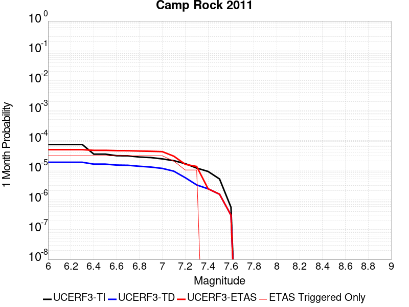 |  |  |

| Magnitude | 1 wk TI Prob | 1 wk TD Prob | 1 wk ETAS Prob | 1 wk ETAS/TD Gain | 1 wk ETAS Triggered Only | 1 mo TI Prob | 1 mo TD Prob | 1 mo ETAS Prob | 1 mo ETAS/TD Gain | 1 mo ETAS Triggered Only | 1 yr TI Prob | 1 yr TD Prob | 1 yr ETAS Prob | 1 yr ETAS/TD Gain | 1 yr ETAS Triggered Only | 10 yr TI Prob | 10 yr TD Prob | 10 yr ETAS Prob | 10 yr ETAS/TD Gain | 10 yr ETAS Triggered Only |
|-----|-----|-----|-----|-----|-----|-----|-----|-----|-----|-----|-----|-----|-----|-----|-----|-----|-----|-----|-----|-----|
| 6.0 | 1.6710783E-5 | 4.25026E-6 | 2.8550903E-5 | 6.717448 | 2.4300745E-5 | 7.161568E-5 | 1.8215276E-5 | 5.4665732E-5 | 3.0010927 | 3.6451118E-5 | 8.7157206E-4 | 2.2174895E-4 | 2.5819198E-4 | 1.1643437 | 3.6451118E-5 | 0.008681616 | 0.0022153298 | 0.002275947 | 1.0273627 | 6.0751867E-5 |
| 6.1 | 1.6710783E-5 | 4.25026E-6 | 2.8550903E-5 | 6.717448 | 2.4300745E-5 | 7.161568E-5 | 1.8215276E-5 | 5.4665732E-5 | 3.0010927 | 3.6451118E-5 | 8.7157206E-4 | 2.2174895E-4 | 2.5819198E-4 | 1.1643437 | 3.6451118E-5 | 0.008681616 | 0.0022153298 | 0.002275947 | 1.0273627 | 6.0751867E-5 |
| 6.2 | 1.6710783E-5 | 4.25026E-6 | 2.8550903E-5 | 6.717448 | 2.4300745E-5 | 7.161568E-5 | 1.8215276E-5 | 5.4665732E-5 | 3.0010927 | 3.6451118E-5 | 8.7157206E-4 | 2.2174895E-4 | 2.5819198E-4 | 1.1643437 | 3.6451118E-5 | 0.008681616 | 0.0022153298 | 0.002275947 | 1.0273627 | 6.0751867E-5 |
| 6.3 | 1.6710783E-5 | 4.25026E-6 | 2.8550903E-5 | 6.717448 | 2.4300745E-5 | 7.161568E-5 | 1.8215276E-5 | 5.4665732E-5 | 3.0010927 | 3.6451118E-5 | 8.7157206E-4 | 2.2174895E-4 | 2.5819198E-4 | 1.1643437 | 3.6451118E-5 | 0.008681616 | 0.0022153298 | 0.002275947 | 1.0273627 | 6.0751867E-5 |
| 6.4 | 7.982846E-6 | 3.6820884E-6 | 2.7982745E-5 | 7.599694 | 2.4300745E-5 | 3.421175E-5 | 1.5780286E-5 | 5.223083E-5 | 3.3098786 | 3.6451118E-5 | 4.1644843E-4 | 1.9210839E-4 | 2.2855251E-4 | 1.189706 | 3.6451118E-5 | 0.0041566887 | 0.001919458 | 0.0019800933 | 1.0315897 | 6.0751867E-5 |
| 6.5 | 7.982846E-6 | 3.6820884E-6 | 2.7982745E-5 | 7.599694 | 2.4300745E-5 | 3.421175E-5 | 1.5780286E-5 | 5.223083E-5 | 3.3098786 | 3.6451118E-5 | 4.1644843E-4 | 1.9210839E-4 | 2.2855251E-4 | 1.189706 | 3.6451118E-5 | 0.0041566887 | 0.001919458 | 0.0019800933 | 1.0315897 | 6.0751867E-5 |
| 6.6 | 7.048869E-6 | 3.4243571E-6 | 2.772502E-5 | 8.0964155 | 2.4300745E-5 | 3.0209088E-5 | 1.4675736E-5 | 5.112632E-5 | 3.4837313 | 3.6451118E-5 | 3.677336E-4 | 1.7866275E-4 | 2.1510736E-4 | 1.2039855 | 3.6451118E-5 | 0.0036712566 | 0.0017852228 | 0.0018458662 | 1.0339696 | 6.0751867E-5 |
| 6.7 | 6.987307E-6 | 3.3623348E-6 | 2.7663E-5 | 8.227319 | 2.4300745E-5 | 2.9945259E-5 | 1.4409929E-5 | 5.0860523E-5 | 3.5295472 | 3.6451118E-5 | 3.6452254E-4 | 1.7542706E-4 | 2.1187178E-4 | 1.2077485 | 3.6451118E-5 | 0.0036392517 | 0.001752917 | 0.0018135624 | 1.0345968 | 6.0751867E-5 |
| 6.8 | 6.3737602E-6 | 3.1179077E-6 | 2.7418579E-5 | 8.793903 | 2.4300745E-5 | 2.731583E-5 | 1.3362394E-5 | 4.9813025E-5 | 3.7278519 | 3.6451118E-5 | 3.3251947E-4 | 1.626753E-4 | 1.9912048E-4 | 1.2240365 | 3.6451118E-5 | 0.0033202237 | 0.0016255907 | 0.0016862438 | 1.0373114 | 6.0751867E-5 |
| 6.9 | 6.112211E-6 | 2.9331156E-6 | 2.7233791E-5 | 9.284936 | 2.4300745E-5 | 2.6194928E-5 | 1.2570436E-5 | 4.90211E-5 | 3.8997133 | 3.6451118E-5 | 3.1887658E-4 | 1.5303459E-4 | 1.8948014E-4 | 1.2381523 | 3.6451118E-5 | 0.003184194 | 0.0015293199 | 0.0015899788 | 1.039664 | 6.0751867E-5 |
| 7.0 | 5.5140117E-6 | 2.641923E-6 | 2.6942605E-5 | 10.198104 | 2.4300745E-5 | 2.3631264E-5 | 1.132248E-5 | 4.7773185E-5 | 4.219322 | 3.6451118E-5 | 2.8767265E-4 | 1.3784273E-4 | 1.7428881E-4 | 1.2644035 | 3.6451118E-5 | 0.0028730053 | 0.0013775975 | 0.0014382657 | 1.0440391 | 6.0751867E-5 |
| 7.1 | 4.8151105E-6 | 2.1342705E-6 | 1.42846175E-5 | 6.6929746 | 1.2150373E-5 | 2.0636026E-5 | 9.146843E-6 | 3.3447366E-5 | 3.6567118 | 2.4300745E-5 | 2.5121463E-4 | 1.1135734E-4 | 1.3565537E-4 | 1.2181988 | 2.4300745E-5 | 0.0025093083 | 0.0011130372 | 0.0011494478 | 1.0327128 | 3.6451118E-5 |
| 7.2 | 3.818335E-6 | 1.2937425E-6 | 1.2937425E-6 | 1.0 | 0.0 | 1.6364189E-5 | 5.5445994E-6 | 1.7694905E-5 | 3.1913767 | 1.2150373E-5 | 1.9921579E-4 | 6.750349E-5 | 7.9653044E-5 | 1.1799841 | 1.2150373E-5 | 0.0019903728 | 6.748381E-4 | 6.8698026E-4 | 1.0179927 | 1.2150373E-5 |
| 7.3 | 2.7166698E-6 | 7.3835776E-7 | 7.3835776E-7 | 1.0 | 0.0 | 1.1642818E-5 | 3.1643867E-6 | 1.5314721E-5 | 4.839712 | 1.2150373E-5 | 1.4174209E-4 | 3.8525748E-5 | 5.067565E-5 | 1.315371 | 1.2150373E-5 | 0.0014165172 | 3.851927E-4 | 3.973384E-4 | 1.0315315 | 1.2150373E-5 |
| 7.4 | 2.0893426E-6 | 5.4618386E-7 | 5.4618386E-7 | 1.0 | 0.0 | 8.954295E-6 | 2.3407858E-6 | 2.3407858E-6 | 1.0 | 0.0 | 1.0901308E-4 | 2.84987E-5 | 2.84987E-5 | 1.0 | 0.0 | 0.0010895962 | 2.84951E-4 | 2.84951E-4 | 1.0 | 0.0 |
| 7.5 | 1.1681728E-6 | 3.6030585E-7 | 3.6030585E-7 | 1.0 | 0.0 | 5.0064455E-6 | 1.544167E-6 | 1.544167E-6 | 1.0 | 0.0 | 6.0951766E-5 | 1.8800076E-5 | 1.8800076E-5 | 1.0 | 0.0 | 6.093505E-4 | 1.8798532E-4 | 1.8798532E-4 | 1.0 | 0.0 |
| 7.6 | 1.3154387E-7 | 7.1197384E-8 | 7.1197384E-8 | 1.0 | 0.0 | 5.6375933E-7 | 3.051316E-7 | 3.051316E-7 | 1.0 | 0.0 | 6.863748E-6 | 3.7149728E-6 | 3.7149728E-6 | 1.0 | 0.0 | 6.863536E-5 | 3.7149264E-5 | 3.7149264E-5 | 1.0 | 0.0 |

## Palos Verdes
*[(top)](#table-of-contents)*

| 1 Week | 1 Month | 1 Year | 10 Year |
|-----|-----|-----|-----|
|  |  |  |  |

| Magnitude | 1 wk TI Prob | 1 wk TD Prob | 1 wk ETAS Prob | 1 wk ETAS/TD Gain | 1 wk ETAS Triggered Only | 1 mo TI Prob | 1 mo TD Prob | 1 mo ETAS Prob | 1 mo ETAS/TD Gain | 1 mo ETAS Triggered Only | 1 yr TI Prob | 1 yr TD Prob | 1 yr ETAS Prob | 1 yr ETAS/TD Gain | 1 yr ETAS Triggered Only | 10 yr TI Prob | 10 yr TD Prob | 10 yr ETAS Prob | 10 yr ETAS/TD Gain | 10 yr ETAS Triggered Only |
|-----|-----|-----|-----|-----|-----|-----|-----|-----|-----|-----|-----|-----|-----|-----|-----|-----|-----|-----|-----|-----|
| 6.0 | 6.126063E-5 | 7.622612E-5 | 1.00525016E-4 | 1.3187739 | 2.4300745E-5 | 2.6251914E-4 | 3.2664582E-4 | 3.5093862E-4 | 1.0743705 | 2.4300745E-5 | 0.0031914865 | 0.003970174 | 0.004006481 | 1.0091448 | 3.6451118E-5 | 0.031460393 | 0.039048895 | 0.0390956 | 1.001196 | 4.860149E-5 |
| 6.1 | 6.126063E-5 | 7.622612E-5 | 1.00525016E-4 | 1.3187739 | 2.4300745E-5 | 2.6251914E-4 | 3.2664582E-4 | 3.5093862E-4 | 1.0743705 | 2.4300745E-5 | 0.0031914865 | 0.003970174 | 0.004006481 | 1.0091448 | 3.6451118E-5 | 0.031460393 | 0.039048895 | 0.0390956 | 1.001196 | 4.860149E-5 |
| 6.2 | 6.126063E-5 | 7.622612E-5 | 1.00525016E-4 | 1.3187739 | 2.4300745E-5 | 2.6251914E-4 | 3.2664582E-4 | 3.5093862E-4 | 1.0743705 | 2.4300745E-5 | 0.0031914865 | 0.003970174 | 0.004006481 | 1.0091448 | 3.6451118E-5 | 0.031460393 | 0.039048895 | 0.0390956 | 1.001196 | 4.860149E-5 |
| 6.3 | 4.0838047E-5 | 4.9749437E-5 | 7.404897E-5 | 1.4884385 | 2.4300745E-5 | 1.7500846E-4 | 2.1319572E-4 | 2.3749127E-4 | 1.113959 | 2.4300745E-5 | 0.0021286458 | 0.0025927818 | 0.0026170195 | 1.0093482 | 2.4300745E-5 | 0.021083709 | 0.025646681 | 0.025682198 | 1.0013849 | 3.6451118E-5 |
| 6.4 | 4.0838047E-5 | 4.9749437E-5 | 7.404897E-5 | 1.4884385 | 2.4300745E-5 | 1.7500846E-4 | 2.1319572E-4 | 2.3749127E-4 | 1.113959 | 2.4300745E-5 | 0.0021286458 | 0.0025927818 | 0.0026170195 | 1.0093482 | 2.4300745E-5 | 0.021083709 | 0.025646681 | 0.025682198 | 1.0013849 | 3.6451118E-5 |
| 6.5 | 3.0512005E-5 | 3.656162E-5 | 4.871155E-5 | 1.3323138 | 1.2150373E-5 | 1.3075917E-4 | 1.5668393E-4 | 1.688324E-4 | 1.0775349 | 1.2150373E-5 | 0.0015908304 | 0.0019060767 | 0.0019182038 | 1.0063624 | 1.2150373E-5 | 0.015794903 | 0.018909154 | 0.018932994 | 1.0012609 | 2.4300745E-5 |
| 6.6 | 2.9255087E-5 | 3.515442E-5 | 4.7304366E-5 | 1.3456165 | 1.2150373E-5 | 1.2537291E-4 | 1.5065377E-4 | 1.628023E-4 | 1.0806389 | 1.2150373E-5 | 0.0015253464 | 0.0018327828 | 0.0018449109 | 1.0066173 | 1.2150373E-5 | 0.015149189 | 0.018188225 | 0.018212084 | 1.0013118 | 2.4300745E-5 |
| 6.7 | 2.287198E-5 | 2.7248278E-5 | 3.939832E-5 | 1.4459013 | 1.2150373E-5 | 9.801909E-5 | 1.16773626E-4 | 1.2892258E-4 | 1.1040385 | 1.2150373E-5 | 0.001192729 | 0.0014208833 | 0.0014330165 | 1.0085391 | 1.2150373E-5 | 0.011863477 | 0.014127217 | 0.014139196 | 1.0008479 | 1.2150373E-5 |
| 6.8 | 2.1325764E-5 | 2.5431877E-5 | 3.758194E-5 | 1.4777493 | 1.2150373E-5 | 9.139293E-5 | 1.0898971E-4 | 1.21138764E-4 | 1.1114696 | 1.2150373E-5 | 0.001112141 | 0.0013262323 | 0.0013383665 | 1.0091494 | 1.2150373E-5 | 0.011065915 | 0.013192211 | 0.013204201 | 1.0009089 | 1.2150373E-5 |
| 6.9 | 1.9009392E-5 | 2.2613547E-5 | 3.4763645E-5 | 1.5372928 | 1.2150373E-5 | 8.1466285E-5 | 9.6912096E-5 | 1.0906129E-4 | 1.125363 | 1.2150373E-5 | 9.914007E-4 | 0.0011793535 | 0.0011914895 | 1.0102904 | 1.2150373E-5 | 0.009869894 | 0.011739632 | 0.011751641 | 1.0010228 | 1.2150373E-5 |
| 7.0 | 1.7098473E-5 | 2.0319356E-5 | 3.246948E-5 | 1.5979582 | 1.2150373E-5 | 7.3277115E-5 | 8.708052E-5 | 9.922984E-5 | 1.1395181 | 1.2150373E-5 | 8.917837E-4 | 0.001059775 | 0.0010719125 | 1.0114529 | 1.2150373E-5 | 0.008882134 | 0.010555646 | 0.010567669 | 1.0011389 | 1.2150373E-5 |
| 7.1 | 1.5982785E-5 | 1.899476E-5 | 3.1144904E-5 | 1.6396576 | 1.2150373E-5 | 6.849585E-5 | 8.1404054E-5 | 9.355343E-5 | 1.1492479 | 1.2150373E-5 | 8.336179E-4 | 9.907284E-4 | 0.0010028668 | 1.012252 | 1.2150373E-5 | 0.008304977 | 0.009871479 | 0.00988351 | 1.0012187 | 1.2150373E-5 |
| 7.2 | 1.4468002E-5 | 1.7197237E-5 | 2.93474E-5 | 1.7065184 | 1.2150373E-5 | 6.200425E-5 | 7.370083E-5 | 8.585031E-5 | 1.1648486 | 1.2150373E-5 | 7.546402E-4 | 8.970222E-4 | 9.091617E-4 | 1.0135331 | 1.2150373E-5 | 0.007520827 | 0.008942284 | 0.008954326 | 1.0013466 | 1.2150373E-5 |
| 7.3 | 5.288233E-6 | 6.2036747E-6 | 1.8353972E-5 | 2.9585645 | 1.2150373E-5 | 2.2663658E-5 | 2.6587102E-5 | 3.8737155E-5 | 1.4569904 | 1.2150373E-5 | 2.7589512E-4 | 3.236848E-4 | 3.3583125E-4 | 1.0375255 | 1.2150373E-5 | 0.0027555283 | 0.0032355562 | 0.003247667 | 1.0037432 | 1.2150373E-5 |
| 7.4 | 8.279556E-7 | 8.408347E-7 | 1.2991198E-5 | 15.450359 | 1.2150373E-5 | 3.5483763E-6 | 3.6035726E-6 | 1.5753902E-5 | 4.3717456 | 1.2150373E-5 | 4.3200624E-5 | 4.3872686E-5 | 5.6022527E-5 | 1.276934 | 1.2150373E-5 | 4.3192226E-4 | 4.3864746E-4 | 4.5079252E-4 | 1.0276874 | 1.2150373E-5 |
| 7.5 | 6.559831E-7 | 6.667229E-7 | 6.667229E-7 | 1.0 | 0.0 | 2.8113532E-6 | 2.857381E-6 | 2.857381E-6 | 1.0 | 0.0 | 3.4227687E-5 | 3.4788125E-5 | 3.4788125E-5 | 1.0 | 0.0 | 3.4222414E-4 | 3.4783344E-4 | 3.4783344E-4 | 1.0 | 0.0 |
| 7.6 | 3.5018968E-7 | 3.5620027E-7 | 3.5620027E-7 | 1.0 | 0.0 | 1.500812E-6 | 1.526572E-6 | 1.526572E-6 | 1.0 | 0.0 | 1.8272232E-5 | 1.8585903E-5 | 1.8585903E-5 | 1.0 | 0.0 | 1.8270731E-4 | 1.8584808E-4 | 1.8584808E-4 | 1.0 | 0.0 |
| 7.7 | 1.1986104E-7 | 1.2198376E-7 | 1.2198376E-7 | 1.0 | 0.0 | 5.1369005E-7 | 5.2278745E-7 | 5.2278745E-7 | 1.0 | 0.0 | 6.2541585E-6 | 6.364919E-6 | 6.364919E-6 | 1.0 | 0.0 | 6.2539824E-5 | 6.364741E-5 | 6.364741E-5 | 1.0 | 0.0 |
| 7.8 | 3.0445005E-8 | 3.1027582E-8 | 3.1027582E-8 | 1.0 | 0.0 | 1.3047858E-7 | 1.3297536E-7 | 1.3297536E-7 | 1.0 | 0.0 | 1.5885756E-6 | 1.6189739E-6 | 1.6189739E-6 | 1.0 | 0.0 | 1.5885644E-5 | 1.6189642E-5 | 1.6189642E-5 | 1.0 | 0.0 |

## Rose Canyon
*[(top)](#table-of-contents)*

| 1 Week | 1 Month | 1 Year | 10 Year |
|-----|-----|-----|-----|
|  |  |  |  |

| Magnitude | 1 wk TI Prob | 1 wk TD Prob | 1 wk ETAS Prob | 1 wk ETAS/TD Gain | 1 wk ETAS Triggered Only | 1 mo TI Prob | 1 mo TD Prob | 1 mo ETAS Prob | 1 mo ETAS/TD Gain | 1 mo ETAS Triggered Only | 1 yr TI Prob | 1 yr TD Prob | 1 yr ETAS Prob | 1 yr ETAS/TD Gain | 1 yr ETAS Triggered Only | 10 yr TI Prob | 10 yr TD Prob | 10 yr ETAS Prob | 10 yr ETAS/TD Gain | 10 yr ETAS Triggered Only |
|-----|-----|-----|-----|-----|-----|-----|-----|-----|-----|-----|-----|-----|-----|-----|-----|-----|-----|-----|-----|-----|
| 6.0 | 4.5923203E-5 | 4.9714225E-5 | 8.6163534E-5 | 1.7331766 | 3.6451118E-5 | 1.9679888E-4 | 2.1304491E-4 | 2.6163604E-4 | 1.2280793 | 4.860149E-5 | 0.0023933933 | 0.0025909345 | 0.002651529 | 1.0233871 | 6.0751867E-5 | 0.023677798 | 0.02563999 | 0.025699185 | 1.0023086 | 6.0751867E-5 |
| 6.1 | 4.5923203E-5 | 4.9714225E-5 | 7.401376E-5 | 1.4887844 | 2.4300745E-5 | 1.9679888E-4 | 2.1304491E-4 | 2.3734049E-4 | 1.1140397 | 2.4300745E-5 | 0.0023933933 | 0.0025909345 | 0.002627291 | 1.0140322 | 3.6451118E-5 | 0.023677798 | 0.02563999 | 0.025675507 | 1.0013852 | 3.6451118E-5 |
| 6.2 | 2.8844734E-5 | 2.9668723E-5 | 4.1818734E-5 | 1.4095227 | 1.2150373E-5 | 1.2361443E-4 | 1.2714567E-4 | 1.392945E-4 | 1.0955504 | 1.2150373E-5 | 0.0015039665 | 0.0015468939 | 0.001571157 | 1.0156851 | 2.4300745E-5 | 0.0149382865 | 0.015374276 | 0.015398203 | 1.0015563 | 2.4300745E-5 |
| 6.3 | 2.3171577E-5 | 2.3161238E-5 | 2.3161238E-5 | 1.0 | 0.0 | 9.9302975E-5 | 9.9258745E-5 | 9.9258745E-5 | 1.0 | 0.0 | 0.0012083431 | 0.0012078186 | 0.0012199543 | 1.0100477 | 1.2150373E-5 | 0.012017938 | 0.012022437 | 0.01203444 | 1.0009985 | 1.2150373E-5 |
| 6.4 | 2.0066604E-5 | 1.9667024E-5 | 1.9667024E-5 | 1.0 | 0.0 | 8.599689E-5 | 8.4284584E-5 | 8.4284584E-5 | 1.0 | 0.0 | 0.0010465092 | 0.0010256917 | 0.0010378297 | 1.0118339 | 1.2150373E-5 | 0.010415946 | 0.010217559 | 0.010229585 | 1.0011771 | 1.2150373E-5 |
| 6.5 | 1.776989E-5 | 1.7113807E-5 | 1.7113807E-5 | 1.0 | 0.0 | 7.615444E-5 | 7.334287E-5 | 7.334287E-5 | 1.0 | 0.0 | 9.267859E-4 | 8.925905E-4 | 9.0473006E-4 | 1.0136003 | 1.2150373E-5 | 0.009229303 | 0.008896211 | 0.008908253 | 1.0013536 | 1.2150373E-5 |
| 6.6 | 1.5227364E-5 | 1.433926E-5 | 1.433926E-5 | 1.0 | 0.0 | 6.52585E-5 | 6.1452556E-5 | 6.1452556E-5 | 1.0 | 0.0 | 7.942326E-4 | 7.479332E-4 | 7.600745E-4 | 1.0162331 | 1.2150373E-5 | 0.007914 | 0.007458359 | 0.0074704187 | 1.001617 | 1.2150373E-5 |
| 6.7 | 1.2703898E-5 | 1.1673274E-5 | 1.1673274E-5 | 1.0 | 0.0 | 5.4444143E-5 | 5.0027378E-5 | 5.0027378E-5 | 1.0 | 0.0 | 6.626558E-4 | 6.089174E-4 | 6.210603E-4 | 1.0199419 | 1.2150373E-5 | 0.006606833 | 0.0060750856 | 0.006087162 | 1.0019879 | 1.2150373E-5 |
| 6.8 | 1.1554917E-5 | 1.0609337E-5 | 1.0609337E-5 | 1.0 | 0.0 | 4.9520135E-5 | 4.546782E-5 | 4.546782E-5 | 1.0 | 0.0 | 6.0274085E-4 | 5.5343413E-4 | 5.6557776E-4 | 1.0219424 | 1.2150373E-5 | 0.0060110865 | 0.0055225673 | 0.0055346508 | 1.002188 | 1.2150373E-5 |
| 6.9 | 8.732078E-6 | 7.881357E-6 | 7.881357E-6 | 1.0 | 0.0 | 3.7422655E-5 | 3.3776825E-5 | 3.3776825E-5 | 1.0 | 0.0 | 4.5552556E-4 | 4.111582E-4 | 4.2330357E-4 | 1.0295395 | 1.2150373E-5 | 0.0045459294 | 0.0041048084 | 0.0041169086 | 1.0029479 | 1.2150373E-5 |
| 7.0 | 5.9337494E-6 | 5.1074853E-6 | 5.1074853E-6 | 1.0 | 0.0 | 2.5430107E-5 | 2.188904E-5 | 2.188904E-5 | 1.0 | 0.0 | 3.0956755E-4 | 2.664666E-4 | 2.7861373E-4 | 1.045586 | 1.2150373E-5 | 0.0030913667 | 0.0026614866 | 0.0026736048 | 1.0045531 | 1.2150373E-5 |
| 7.1 | 5.013409E-6 | 4.1773833E-6 | 4.1773833E-6 | 1.0 | 0.0 | 2.1485863E-5 | 1.7902948E-5 | 1.7902948E-5 | 1.0 | 0.0 | 2.6155898E-4 | 2.179467E-4 | 2.179467E-4 | 1.0 | 0.0 | 0.0026125133 | 0.0021773411 | 0.0021773411 | 1.0 | 0.0 |
| 7.2 | 4.120763E-6 | 3.2821383E-6 | 3.2821383E-6 | 1.0 | 0.0 | 1.7660293E-5 | 1.4066231E-5 | 1.4066231E-5 | 1.0 | 0.0 | 2.1499286E-4 | 1.7124301E-4 | 1.7124301E-4 | 1.0 | 0.0 | 0.0021478499 | 0.00171112 | 0.00171112 | 1.0 | 0.0 |
| 7.3 | 3.2081239E-6 | 2.4405372E-6 | 2.4405372E-6 | 1.0 | 0.0 | 1.374903E-5 | 1.0459404E-5 | 1.0459404E-5 | 1.0 | 0.0 | 1.6738157E-4 | 1.2733586E-4 | 1.2733586E-4 | 1.0 | 0.0 | 0.0016725556 | 0.001272636 | 0.001272636 | 1.0 | 0.0 |
| 7.4 | 2.4194755E-6 | 1.7680634E-6 | 1.7680634E-6 | 1.0 | 0.0 | 1.0369139E-5 | 7.577393E-6 | 7.577393E-6 | 1.0 | 0.0 | 1.2623696E-4 | 9.2250906E-5 | 9.2250906E-5 | 1.0 | 0.0 | 0.0012616527 | 9.2213147E-4 | 9.2213147E-4 | 1.0 | 0.0 |
| 7.5 | 1.3842889E-6 | 9.3786275E-7 | 9.3786275E-7 | 1.0 | 0.0 | 5.9326535E-6 | 4.019406E-6 | 4.019406E-6 | 1.0 | 0.0 | 7.222766E-5 | 4.8935202E-5 | 4.8935202E-5 | 1.0 | 0.0 | 7.220419E-4 | 4.892478E-4 | 4.892478E-4 | 1.0 | 0.0 |
| 7.6 | 1.0021575E-6 | 6.411463E-7 | 6.411463E-7 | 1.0 | 0.0 | 4.2949537E-6 | 2.7477672E-6 | 2.7477672E-6 | 1.0 | 0.0 | 5.2289808E-5 | 3.3453573E-5 | 3.3453573E-5 | 1.0 | 0.0 | 5.2277505E-4 | 3.344875E-4 | 3.344875E-4 | 1.0 | 0.0 |
| 7.7 | 8.7620116E-8 | 6.4492404E-8 | 6.4492404E-8 | 1.0 | 0.0 | 3.7551473E-7 | 2.76396E-7 | 2.76396E-7 | 1.0 | 0.0 | 4.5718825E-6 | 3.3651165E-6 | 3.3651165E-6 | 1.0 | 0.0 | 4.5717883E-5 | 3.3650686E-5 | 3.3650686E-5 | 1.0 | 0.0 |

## Deep Springs
*[(top)](#table-of-contents)*

| 1 Week | 1 Month | 1 Year | 10 Year |
|-----|-----|-----|-----|
|  |  |  |  |

| Magnitude | 1 wk TI Prob | 1 wk TD Prob | 1 wk ETAS Prob | 1 wk ETAS/TD Gain | 1 wk ETAS Triggered Only | 1 mo TI Prob | 1 mo TD Prob | 1 mo ETAS Prob | 1 mo ETAS/TD Gain | 1 mo ETAS Triggered Only | 1 yr TI Prob | 1 yr TD Prob | 1 yr ETAS Prob | 1 yr ETAS/TD Gain | 1 yr ETAS Triggered Only | 10 yr TI Prob | 10 yr TD Prob | 10 yr ETAS Prob | 10 yr ETAS/TD Gain | 10 yr ETAS Triggered Only |
|-----|-----|-----|-----|-----|-----|-----|-----|-----|-----|-----|-----|-----|-----|-----|-----|-----|-----|-----|-----|-----|
| 6.0 | 1.9810619E-5 | 2.311252E-5 | 7.1712886E-5 | 3.1027725 | 4.860149E-5 | 8.489989E-5 | 9.905276E-5 | 1.4764944E-4 | 1.490614 | 4.860149E-5 | 0.001033166 | 0.0012058079 | 0.0012664866 | 1.0503219 | 6.0751867E-5 | 0.010283757 | 0.012042425 | 0.012102445 | 1.004984 | 6.0751867E-5 |
| 6.1 | 1.9810619E-5 | 2.311252E-5 | 7.1712886E-5 | 3.1027725 | 4.860149E-5 | 8.489989E-5 | 9.905276E-5 | 1.4764944E-4 | 1.490614 | 4.860149E-5 | 0.001033166 | 0.0012058079 | 0.0012664866 | 1.0503219 | 6.0751867E-5 | 0.010283757 | 0.012042425 | 0.012102445 | 1.004984 | 6.0751867E-5 |
| 6.2 | 1.9810619E-5 | 2.311252E-5 | 7.1712886E-5 | 3.1027725 | 4.860149E-5 | 8.489989E-5 | 9.905276E-5 | 1.4764944E-4 | 1.490614 | 4.860149E-5 | 0.001033166 | 0.0012058079 | 0.0012664866 | 1.0503219 | 6.0751867E-5 | 0.010283757 | 0.012042425 | 0.012102445 | 1.004984 | 6.0751867E-5 |
| 6.3 | 1.9810619E-5 | 2.311252E-5 | 7.1712886E-5 | 3.1027725 | 4.860149E-5 | 8.489989E-5 | 9.905276E-5 | 1.4764944E-4 | 1.490614 | 4.860149E-5 | 0.001033166 | 0.0012058079 | 0.0012664866 | 1.0503219 | 6.0751867E-5 | 0.010283757 | 0.012042425 | 0.012102445 | 1.004984 | 6.0751867E-5 |
| 6.4 | 1.9810619E-5 | 2.311252E-5 | 7.1712886E-5 | 3.1027725 | 4.860149E-5 | 8.489989E-5 | 9.905276E-5 | 1.4764944E-4 | 1.490614 | 4.860149E-5 | 0.001033166 | 0.0012058079 | 0.0012664866 | 1.0503219 | 6.0751867E-5 | 0.010283757 | 0.012042425 | 0.012102445 | 1.004984 | 6.0751867E-5 |
| 6.5 | 1.7190405E-5 | 2.0050555E-5 | 6.8651076E-5 | 3.4238987 | 4.860149E-5 | 7.367108E-5 | 8.593095E-5 | 1.3452827E-4 | 1.5655391 | 4.860149E-5 | 8.9657627E-4 | 0.0010462094 | 0.0011068976 | 1.0580078 | 6.0751867E-5 | 0.008929676 | 0.010462056 | 0.010522173 | 1.0057461 | 6.0751867E-5 |
| 6.6 | 1.7190405E-5 | 2.0050555E-5 | 6.8651076E-5 | 3.4238987 | 4.860149E-5 | 7.367108E-5 | 8.593095E-5 | 1.3452827E-4 | 1.5655391 | 4.860149E-5 | 8.9657627E-4 | 0.0010462094 | 0.0011068976 | 1.0580078 | 6.0751867E-5 | 0.008929676 | 0.010462056 | 0.010522173 | 1.0057461 | 6.0751867E-5 |

## Oceanic - West Huasna
*[(top)](#table-of-contents)*

| 1 Week | 1 Month | 1 Year | 10 Year |
|-----|-----|-----|-----|
|  |  |  |  |

| Magnitude | 1 wk TI Prob | 1 wk TD Prob | 1 wk ETAS Prob | 1 wk ETAS/TD Gain | 1 wk ETAS Triggered Only | 1 mo TI Prob | 1 mo TD Prob | 1 mo ETAS Prob | 1 mo ETAS/TD Gain | 1 mo ETAS Triggered Only | 1 yr TI Prob | 1 yr TD Prob | 1 yr ETAS Prob | 1 yr ETAS/TD Gain | 1 yr ETAS Triggered Only | 10 yr TI Prob | 10 yr TD Prob | 10 yr ETAS Prob | 10 yr ETAS/TD Gain | 10 yr ETAS Triggered Only |
|-----|-----|-----|-----|-----|-----|-----|-----|-----|-----|-----|-----|-----|-----|-----|-----|-----|-----|-----|-----|-----|
| 6.0 | 3.195567E-5 | 2.7926868E-5 | 8.8677036E-5 | 3.1753304 | 6.0751867E-5 | 1.3694567E-4 | 1.1968133E-4 | 1.8042592E-4 | 1.5075527 | 6.0751867E-5 | 0.0016660384 | 0.0014561893 | 0.0015168528 | 1.041659 | 6.0751867E-5 | 0.016536033 | 0.014471028 | 0.0145309 | 1.0041374 | 6.0751867E-5 |
| 6.1 | 2.1156782E-5 | 1.7573486E-5 | 4.1873805E-5 | 2.3827832 | 2.4300745E-5 | 9.066878E-5 | 7.531282E-5 | 9.961173E-5 | 1.3226398 | 2.4300745E-5 | 0.0011033333 | 9.165572E-4 | 9.408357E-4 | 1.0264888 | 2.4300745E-5 | 0.010978713 | 0.009128777 | 0.009152857 | 1.0026377 | 2.4300745E-5 |
| 6.2 | 1.6195117E-5 | 1.3327152E-5 | 3.7627575E-5 | 2.823377 | 2.4300745E-5 | 6.9405796E-5 | 5.7115132E-5 | 8.141449E-5 | 1.4254452 | 2.4300745E-5 | 8.44688E-4 | 6.9515745E-4 | 7.1944133E-4 | 1.0349329 | 2.4300745E-5 | 0.008414844 | 0.006930123 | 0.0069542555 | 1.0034822 | 2.4300745E-5 |
| 6.3 | 1.3559345E-5 | 1.1179142E-5 | 2.332938E-5 | 2.0868666 | 1.2150373E-5 | 5.811018E-5 | 4.7909736E-5 | 6.0059527E-5 | 1.2535975 | 1.2150373E-5 | 7.072618E-4 | 5.831459E-4 | 5.9528917E-4 | 1.0208237 | 1.2150373E-5 | 0.0070501505 | 0.0058162753 | 0.005828355 | 1.0020769 | 1.2150373E-5 |
| 6.4 | 1.2120619E-5 | 1.0000977E-5 | 2.215123E-5 | 2.2149065 | 1.2150373E-5 | 5.1944477E-5 | 4.2860633E-5 | 5.5010485E-5 | 1.2834735 | 1.2150373E-5 | 6.322405E-4 | 5.2170374E-4 | 5.338478E-4 | 1.0232776 | 1.2150373E-5 | 0.006304447 | 0.0052048573 | 0.0052169445 | 1.0023223 | 1.2150373E-5 |
| 6.5 | 1.13511915E-5 | 9.3674735E-6 | 2.1517733E-5 | 2.297069 | 1.2150373E-5 | 4.8647056E-5 | 4.01457E-5 | 5.2295585E-5 | 1.3026447 | 1.2150373E-5 | 5.9211696E-4 | 4.886647E-4 | 5.0080917E-4 | 1.0248523 | 1.2150373E-5 | 0.0059054173 | 0.0048759608 | 0.004888052 | 1.0024798 | 1.2150373E-5 |
| 6.6 | 9.850605E-6 | 8.135418E-6 | 8.135418E-6 | 1.0 | 0.0 | 4.2216197E-5 | 3.4865614E-5 | 3.4865614E-5 | 1.0 | 0.0 | 5.1386096E-4 | 4.2440637E-4 | 4.2440637E-4 | 1.0 | 0.0 | 0.0051267436 | 0.004235991 | 0.004235991 | 1.0 | 0.0 |
| 6.7 | 8.8558645E-6 | 7.318433E-6 | 7.318433E-6 | 1.0 | 0.0 | 3.7953152E-5 | 3.1364336E-5 | 3.1364336E-5 | 1.0 | 0.0 | 4.6198163E-4 | 3.8179406E-4 | 3.8179406E-4 | 1.0 | 0.0 | 0.004610224 | 0.0038114067 | 0.0038114067 | 1.0 | 0.0 |
| 6.8 | 7.67136E-6 | 6.391756E-6 | 6.391756E-6 | 1.0 | 0.0 | 3.2876844E-5 | 2.7392953E-5 | 2.7392953E-5 | 1.0 | 0.0 | 4.0020206E-4 | 3.3345833E-4 | 3.3345833E-4 | 1.0 | 0.0 | 0.003994821 | 0.0033296007 | 0.0033296007 | 1.0 | 0.0 |
| 6.9 | 6.534529E-6 | 5.4583297E-6 | 5.4583297E-6 | 1.0 | 0.0 | 2.8004823E-5 | 2.3392633E-5 | 2.3392633E-5 | 1.0 | 0.0 | 3.4090536E-4 | 2.847682E-4 | 2.847682E-4 | 1.0 | 0.0 | 0.0034038287 | 0.0028440498 | 0.0028440498 | 1.0 | 0.0 |
| 7.0 | 5.460525E-6 | 4.5699517E-6 | 4.5699517E-6 | 1.0 | 0.0 | 2.3402039E-5 | 1.958536E-5 | 1.958536E-5 | 1.0 | 0.0 | 2.8488258E-4 | 2.3842578E-4 | 2.3842578E-4 | 1.0 | 0.0 | 0.0028451765 | 0.0023817138 | 0.0023817138 | 1.0 | 0.0 |
| 7.1 | 4.4825083E-6 | 3.7524428E-6 | 3.7524428E-6 | 1.0 | 0.0 | 1.9210609E-5 | 1.60818E-5 | 1.60818E-5 | 1.0 | 0.0 | 2.3386406E-4 | 1.9577841E-4 | 1.9577841E-4 | 1.0 | 0.0 | 0.002336181 | 0.0019560715 | 0.0019560715 | 1.0 | 0.0 |
| 7.2 | 2.821708E-6 | 2.4249334E-6 | 2.4249334E-6 | 1.0 | 0.0 | 1.2092979E-5 | 1.039253E-5 | 1.039253E-5 | 1.0 | 0.0 | 1.4722206E-4 | 1.2652173E-4 | 1.2652173E-4 | 1.0 | 0.0 | 0.0014712457 | 0.0012644994 | 0.0012644994 | 1.0 | 0.0 |
| 7.3 | 2.0644757E-6 | 1.7687412E-6 | 1.7687412E-6 | 1.0 | 0.0 | 8.847723E-6 | 7.5802973E-6 | 7.5802973E-6 | 1.0 | 0.0 | 1.0771569E-4 | 9.228622E-5 | 9.228622E-5 | 1.0 | 0.0 | 0.001076635 | 9.2248066E-4 | 9.2248066E-4 | 1.0 | 0.0 |
| 7.4 | 1.6980367E-6 | 1.4379892E-6 | 1.4379892E-6 | 1.0 | 0.0 | 7.27728E-6 | 6.162796E-6 | 6.162796E-6 | 1.0 | 0.0 | 8.8597284E-5 | 7.5029464E-5 | 7.5029464E-5 | 1.0 | 0.0 | 8.8561967E-4 | 7.500429E-4 | 7.500429E-4 | 1.0 | 0.0 |
| 7.5 | 1.3637683E-6 | 1.1302635E-6 | 1.1302635E-6 | 1.0 | 0.0 | 5.844708E-6 | 4.8439774E-6 | 4.8439774E-6 | 1.0 | 0.0 | 7.1156996E-5 | 5.897383E-5 | 5.897383E-5 | 1.0 | 0.0 | 7.1134215E-4 | 5.895833E-4 | 5.895833E-4 | 1.0 | 0.0 |
| 7.6 | 9.802994E-7 | 7.677247E-7 | 7.677247E-7 | 1.0 | 0.0 | 4.2012766E-6 | 3.2902446E-6 | 3.2902446E-6 | 1.0 | 0.0 | 5.1149345E-5 | 4.0057992E-5 | 4.0057992E-5 | 1.0 | 0.0 | 5.113757E-4 | 4.0050913E-4 | 4.0050913E-4 | 1.0 | 0.0 |
| 7.7 | 5.986191E-7 | 4.0050548E-7 | 4.0050548E-7 | 1.0 | 0.0 | 2.5655079E-6 | 1.7164509E-6 | 1.7164509E-6 | 1.0 | 0.0 | 3.1234613E-5 | 2.089759E-5 | 2.089759E-5 | 1.0 | 0.0 | 3.123022E-4 | 2.089576E-4 | 2.089576E-4 | 1.0 | 0.0 |
| 7.8 | 2.9189815E-7 | 1.5285792E-7 | 1.5285792E-7 | 1.0 | 0.0 | 1.2509914E-6 | 6.5510517E-7 | 6.5510517E-7 | 1.0 | 0.0 | 1.5230714E-5 | 7.9758765E-6 | 7.9758765E-6 | 1.0 | 0.0 | 1.522967E-4 | 7.9757214E-5 | 7.9757214E-5 | 1.0 | 0.0 |
| 7.9 | 1.2057845E-7 | 4.621248E-8 | 4.621248E-8 | 1.0 | 0.0 | 5.1676466E-7 | 1.9805347E-7 | 1.9805347E-7 | 1.0 | 0.0 | 6.2915915E-6 | 2.4112983E-6 | 2.4112983E-6 | 1.0 | 0.0 | 6.2914136E-5 | 2.4114026E-5 | 2.4114026E-5 | 1.0 | 0.0 |
| 8.0 | 3.3806387E-9 | 9.011393E-10 | 9.011393E-10 | 1.0 | 0.0 | 1.4488451E-8 | 3.8620254E-9 | 3.8620254E-9 | 1.0 | 0.0 | 1.7639688E-7 | 4.702016E-8 | 4.702016E-8 | 1.0 | 0.0 | 1.7639674E-6 | 4.7129527E-7 | 4.7129527E-7 | 1.0 | 0.0 |

## Kern Canyon (North Kern) 2011
*[(top)](#table-of-contents)*

| 1 Week | 1 Month | 1 Year | 10 Year |
|-----|-----|-----|-----|
|  |  |  |  |

| Magnitude | 1 wk TI Prob | 1 wk TD Prob | 1 wk ETAS Prob | 1 wk ETAS/TD Gain | 1 wk ETAS Triggered Only | 1 mo TI Prob | 1 mo TD Prob | 1 mo ETAS Prob | 1 mo ETAS/TD Gain | 1 mo ETAS Triggered Only | 1 yr TI Prob | 1 yr TD Prob | 1 yr ETAS Prob | 1 yr ETAS/TD Gain | 1 yr ETAS Triggered Only | 10 yr TI Prob | 10 yr TD Prob | 10 yr ETAS Prob | 10 yr ETAS/TD Gain | 10 yr ETAS Triggered Only |
|-----|-----|-----|-----|-----|-----|-----|-----|-----|-----|-----|-----|-----|-----|-----|-----|-----|-----|-----|-----|-----|
| 6.0 | 6.6264497E-6 | 6.75733E-6 | 1.8907622E-5 | 2.7980905 | 1.2150373E-5 | 2.8398761E-5 | 2.895971E-5 | 6.5409775E-5 | 2.2586474 | 3.6451118E-5 | 3.4570007E-4 | 3.5253543E-4 | 4.1326587E-4 | 1.1722677 | 6.0751867E-5 | 0.0034516277 | 0.0035205502 | 0.0035810883 | 1.0171956 | 6.0751867E-5 |
| 6.1 | 6.6264497E-6 | 6.75733E-6 | 1.8907622E-5 | 2.7980905 | 1.2150373E-5 | 2.8398761E-5 | 2.895971E-5 | 6.5409775E-5 | 2.2586474 | 3.6451118E-5 | 3.4570007E-4 | 3.5253543E-4 | 4.1326587E-4 | 1.1722677 | 6.0751867E-5 | 0.0034516277 | 0.0035205502 | 0.0035810883 | 1.0171956 | 6.0751867E-5 |
| 6.2 | 6.6264497E-6 | 6.75733E-6 | 1.8907622E-5 | 2.7980905 | 1.2150373E-5 | 2.8398761E-5 | 2.895971E-5 | 6.5409775E-5 | 2.2586474 | 3.6451118E-5 | 3.4570007E-4 | 3.5253543E-4 | 4.1326587E-4 | 1.1722677 | 6.0751867E-5 | 0.0034516277 | 0.0035205502 | 0.0035810883 | 1.0171956 | 6.0751867E-5 |
| 6.3 | 6.6264497E-6 | 6.75733E-6 | 1.8907622E-5 | 2.7980905 | 1.2150373E-5 | 2.8398761E-5 | 2.895971E-5 | 6.5409775E-5 | 2.2586474 | 3.6451118E-5 | 3.4570007E-4 | 3.5253543E-4 | 4.1326587E-4 | 1.1722677 | 6.0751867E-5 | 0.0034516277 | 0.0035205502 | 0.0035810883 | 1.0171956 | 6.0751867E-5 |
| 6.4 | 6.6264497E-6 | 6.75733E-6 | 1.8907622E-5 | 2.7980905 | 1.2150373E-5 | 2.8398761E-5 | 2.895971E-5 | 6.5409775E-5 | 2.2586474 | 3.6451118E-5 | 3.4570007E-4 | 3.5253543E-4 | 4.1326587E-4 | 1.1722677 | 6.0751867E-5 | 0.0034516277 | 0.0035205502 | 0.0035810883 | 1.0171956 | 6.0751867E-5 |
| 6.5 | 3.2162225E-6 | 3.2570915E-6 | 3.2570915E-6 | 1.0 | 0.0 | 1.3783738E-5 | 1.3958893E-5 | 2.6109097E-5 | 1.8704274 | 1.2150373E-5 | 1.6780409E-4 | 1.6993708E-4 | 2.06382E-4 | 1.2144613 | 3.6451118E-5 | 0.0016767744 | 0.001698151 | 0.0017345402 | 1.0214287 | 3.6451118E-5 |
| 6.6 | 3.2162225E-6 | 3.2570915E-6 | 3.2570915E-6 | 1.0 | 0.0 | 1.3783738E-5 | 1.3958893E-5 | 2.6109097E-5 | 1.8704274 | 1.2150373E-5 | 1.6780409E-4 | 1.6993708E-4 | 2.06382E-4 | 1.2144613 | 3.6451118E-5 | 0.0016767744 | 0.001698151 | 0.0017345402 | 1.0214287 | 3.6451118E-5 |
| 6.7 | 2.1908265E-6 | 2.2071222E-6 | 2.2071222E-6 | 1.0 | 0.0 | 9.389223E-6 | 9.459061E-6 | 2.160932E-5 | 2.28451 | 1.2150373E-5 | 1.1430779E-4 | 1.1515819E-4 | 1.5160511E-4 | 1.3164943 | 3.6451118E-5 | 0.0011424901 | 0.0011510046 | 0.0011874137 | 1.0316325 | 3.6451118E-5 |
| 6.8 | 1.7303895E-6 | 1.7365529E-6 | 1.7365529E-6 | 1.0 | 0.0 | 7.415934E-6 | 7.4423488E-6 | 1.9592631E-5 | 2.6325872 | 1.2150373E-5 | 9.028525E-5 | 9.0606925E-5 | 1.2705475E-4 | 1.402263 | 3.6451118E-5 | 9.024858E-4 | 9.057096E-4 | 9.4212766E-4 | 1.0402095 | 3.6451118E-5 |
| 6.9 | 1.3700314E-6 | 1.3688622E-6 | 1.3688622E-6 | 1.0 | 0.0 | 5.87155E-6 | 5.8665396E-6 | 1.801684E-5 | 3.071119 | 1.2150373E-5 | 7.148377E-5 | 7.142282E-5 | 1.0787134E-4 | 1.5103203 | 3.6451118E-5 | 7.146078E-4 | 7.140032E-4 | 7.5042836E-4 | 1.0510153 | 3.6451118E-5 |
| 7.0 | 1.1467797E-6 | 1.1413804E-6 | 1.1413804E-6 | 1.0 | 0.0 | 4.9147607E-6 | 4.8916213E-6 | 1.7041935E-5 | 3.4839032 | 1.2150373E-5 | 5.983557E-5 | 5.9553895E-5 | 9.600284E-5 | 1.612033 | 3.6451118E-5 | 5.981946E-4 | 5.953825E-4 | 6.318119E-4 | 1.0611866 | 3.6451118E-5 |
| 7.1 | 9.3952065E-7 | 9.3026904E-7 | 9.3026904E-7 | 1.0 | 0.0 | 4.026511E-6 | 3.9868614E-6 | 1.6137186E-5 | 4.0475917 | 1.2150373E-5 | 4.9021666E-5 | 4.8538972E-5 | 7.283854E-5 | 1.5006196 | 2.4300745E-5 | 4.901085E-4 | 4.8528548E-4 | 5.095744E-4 | 1.0500509 | 2.4300745E-5 |
| 7.2 | 6.858055E-7 | 6.7193E-7 | 6.7193E-7 | 1.0 | 0.0 | 2.939163E-6 | 2.879697E-6 | 2.879697E-6 | 1.0 | 0.0 | 3.5783723E-5 | 3.5059755E-5 | 4.72097E-5 | 1.3465496 | 1.2150373E-5 | 3.5777962E-4 | 3.5054312E-4 | 3.6268926E-4 | 1.0346494 | 1.2150373E-5 |
| 7.3 | 5.1101983E-7 | 4.9393E-7 | 4.9393E-7 | 1.0 | 0.0 | 2.1900833E-6 | 2.116841E-6 | 2.116841E-6 | 1.0 | 0.0 | 2.6663936E-5 | 2.5772239E-5 | 3.79223E-5 | 1.4714398 | 1.2150373E-5 | 2.6660739E-4 | 2.57693E-4 | 2.6984024E-4 | 1.0471385 | 1.2150373E-5 |
| 7.4 | 3.4999414E-7 | 3.2995905E-7 | 3.2995905E-7 | 1.0 | 0.0 | 1.499974E-6 | 1.4141094E-6 | 1.4141094E-6 | 1.0 | 0.0 | 1.8262032E-5 | 1.721665E-5 | 2.9366813E-5 | 1.7057217 | 1.2150373E-5 | 1.826053E-4 | 1.7215339E-4 | 1.8430168E-4 | 1.0705667 | 1.2150373E-5 |
| 7.5 | 1.7021522E-7 | 1.4750044E-7 | 1.4750044E-7 | 1.0 | 0.0 | 7.2949354E-7 | 6.321446E-7 | 6.321446E-7 | 1.0 | 0.0 | 8.881548E-6 | 7.696334E-6 | 7.696334E-6 | 1.0 | 0.0 | 8.8811925E-5 | 7.696076E-5 | 7.696076E-5 | 1.0 | 0.0 |
| 7.6 | 2.572245E-8 | 1.7352555E-8 | 1.7352555E-8 | 1.0 | 0.0 | 1.10239064E-7 | 7.436809E-8 | 7.436809E-8 | 1.0 | 0.0 | 1.3421597E-6 | 9.054312E-7 | 9.054312E-7 | 1.0 | 0.0 | 1.3421517E-5 | 9.05428E-6 | 9.05428E-6 | 1.0 | 0.0 |

## Kern Canyon (South Kern) 2011
*[(top)](#table-of-contents)*

| 1 Week | 1 Month | 1 Year | 10 Year |
|-----|-----|-----|-----|
|  |  |  |  |

| Magnitude | 1 wk TI Prob | 1 wk TD Prob | 1 wk ETAS Prob | 1 wk ETAS/TD Gain | 1 wk ETAS Triggered Only | 1 mo TI Prob | 1 mo TD Prob | 1 mo ETAS Prob | 1 mo ETAS/TD Gain | 1 mo ETAS Triggered Only | 1 yr TI Prob | 1 yr TD Prob | 1 yr ETAS Prob | 1 yr ETAS/TD Gain | 1 yr ETAS Triggered Only | 10 yr TI Prob | 10 yr TD Prob | 10 yr ETAS Prob | 10 yr ETAS/TD Gain | 10 yr ETAS Triggered Only |
|-----|-----|-----|-----|-----|-----|-----|-----|-----|-----|-----|-----|-----|-----|-----|-----|-----|-----|-----|-----|-----|
| 6.0 | 4.105075E-6 | 4.1137264E-6 | 2.8414372E-5 | 6.90721 | 2.4300745E-5 | 1.7593058E-5 | 1.763014E-5 | 5.4080618E-5 | 3.0675092 | 3.6451118E-5 | 2.1417443E-4 | 2.1462646E-4 | 2.7536528E-4 | 1.2829978 | 6.0751867E-5 | 0.0021396813 | 0.0021442557 | 0.0022048773 | 1.0282717 | 6.0751867E-5 |
| 6.1 | 4.105075E-6 | 4.1137264E-6 | 2.8414372E-5 | 6.90721 | 2.4300745E-5 | 1.7593058E-5 | 1.763014E-5 | 5.4080618E-5 | 3.0675092 | 3.6451118E-5 | 2.1417443E-4 | 2.1462646E-4 | 2.7536528E-4 | 1.2829978 | 6.0751867E-5 | 0.0021396813 | 0.0021442557 | 0.0022048773 | 1.0282717 | 6.0751867E-5 |
| 6.2 | 4.105075E-6 | 4.1137264E-6 | 2.8414372E-5 | 6.90721 | 2.4300745E-5 | 1.7593058E-5 | 1.763014E-5 | 5.4080618E-5 | 3.0675092 | 3.6451118E-5 | 2.1417443E-4 | 2.1462646E-4 | 2.7536528E-4 | 1.2829978 | 6.0751867E-5 | 0.0021396813 | 0.0021442557 | 0.0022048773 | 1.0282717 | 6.0751867E-5 |
| 6.3 | 4.105075E-6 | 4.1137264E-6 | 2.8414372E-5 | 6.90721 | 2.4300745E-5 | 1.7593058E-5 | 1.763014E-5 | 5.4080618E-5 | 3.0675092 | 3.6451118E-5 | 2.1417443E-4 | 2.1462646E-4 | 2.7536528E-4 | 1.2829978 | 6.0751867E-5 | 0.0021396813 | 0.0021442557 | 0.0022048773 | 1.0282717 | 6.0751867E-5 |
| 6.4 | 4.105075E-6 | 4.1137264E-6 | 2.8414372E-5 | 6.90721 | 2.4300745E-5 | 1.7593058E-5 | 1.763014E-5 | 5.4080618E-5 | 3.0675092 | 3.6451118E-5 | 2.1417443E-4 | 2.1462646E-4 | 2.7536528E-4 | 1.2829978 | 6.0751867E-5 | 0.0021396813 | 0.0021442557 | 0.0022048773 | 1.0282717 | 6.0751867E-5 |
| 6.5 | 2.9849807E-6 | 2.9731548E-6 | 2.7273829E-5 | 9.173364 | 2.4300745E-5 | 1.2792712E-5 | 1.274203E-5 | 4.9192684E-5 | 3.860663 | 3.6451118E-5 | 1.5574014E-4 | 1.5512333E-4 | 2.1586576E-4 | 1.3915752 | 6.0751867E-5 | 0.0015563103 | 0.0015501656 | 0.0016108233 | 1.0391299 | 6.0751867E-5 |
| 6.6 | 2.9849807E-6 | 2.9731548E-6 | 2.7273829E-5 | 9.173364 | 2.4300745E-5 | 1.2792712E-5 | 1.274203E-5 | 4.9192684E-5 | 3.860663 | 3.6451118E-5 | 1.5574014E-4 | 1.5512333E-4 | 2.1586576E-4 | 1.3915752 | 6.0751867E-5 | 0.0015563103 | 0.0015501656 | 0.0016108233 | 1.0391299 | 6.0751867E-5 |
| 6.7 | 2.6756725E-6 | 2.6582206E-6 | 1.4808562E-5 | 5.5708547 | 1.2150373E-5 | 1.1467117E-5 | 1.1392325E-5 | 3.5692796E-5 | 3.1330562 | 2.4300745E-5 | 1.396032E-4 | 1.3869285E-4 | 1.8728759E-4 | 1.3503767 | 4.860149E-5 | 0.0013951553 | 0.0013860738 | 0.0014346079 | 1.0350156 | 4.860149E-5 |
| 6.8 | 2.3283721E-6 | 2.3047787E-6 | 1.4455124E-5 | 6.2718053 | 1.2150373E-5 | 9.9787E-6 | 9.877586E-6 | 3.4178094E-5 | 3.4601665 | 2.4300745E-5 | 1.214839E-4 | 1.20253055E-4 | 1.688487E-4 | 1.4041115 | 4.860149E-5 | 0.001214175 | 0.0012018873 | 0.0012504304 | 1.0403891 | 4.860149E-5 |
| 6.9 | 2.0972677E-6 | 2.0696411E-6 | 1.4219989E-5 | 6.870751 | 1.2150373E-5 | 8.988259E-6 | 8.869861E-6 | 3.3170392E-5 | 3.7396743 | 2.4300745E-5 | 1.0942656E-4 | 1.0798526E-4 | 1.565815E-4 | 1.4500266 | 4.860149E-5 | 0.0010937268 | 0.0010793337 | 0.0011278827 | 1.0449805 | 4.860149E-5 |
| 7.0 | 1.7132242E-6 | 1.6787036E-6 | 1.6787036E-6 | 1.0 | 0.0 | 7.3423685E-6 | 7.194424E-6 | 1.934471E-5 | 2.6888475 | 1.2150373E-5 | 8.938967E-5 | 8.758863E-5 | 1.2403655E-4 | 1.4161263 | 3.6451118E-5 | 8.935372E-4 | 8.7554497E-4 | 9.1196416E-4 | 1.041596 | 3.6451118E-5 |
| 7.1 | 1.4215541E-6 | 1.3815752E-6 | 1.3815752E-6 | 1.0 | 0.0 | 6.0923603E-6 | 5.9210233E-6 | 1.8071325E-5 | 3.052061 | 1.2150373E-5 | 7.417196E-5 | 7.20861E-5 | 9.63851E-5 | 1.337083 | 2.4300745E-5 | 7.414721E-4 | 7.206299E-4 | 7.449131E-4 | 1.0336972 | 2.4300745E-5 |
| 7.2 | 9.097853E-7 | 8.6037755E-7 | 8.6037755E-7 | 1.0 | 0.0 | 3.899074E-6 | 3.6873273E-6 | 3.6873273E-6 | 1.0 | 0.0 | 4.7470192E-5 | 4.4892295E-5 | 5.704212E-5 | 1.270644 | 1.2150373E-5 | 4.7460053E-4 | 4.4883334E-4 | 4.6097828E-4 | 1.0270588 | 1.2150373E-5 |
| 7.3 | 6.144169E-7 | 5.628206E-7 | 5.628206E-7 | 1.0 | 0.0 | 2.6332125E-6 | 2.4120861E-6 | 2.4120861E-6 | 1.0 | 0.0 | 3.205889E-5 | 2.9366758E-5 | 4.1516774E-5 | 1.4137336 | 1.2150373E-5 | 3.2054266E-4 | 2.936293E-4 | 3.057761E-4 | 1.0413678 | 1.2150373E-5 |
| 7.4 | 4.049844E-7 | 3.5728314E-7 | 3.5728314E-7 | 1.0 | 0.0 | 1.7356463E-6 | 1.5312125E-6 | 1.5312125E-6 | 1.0 | 0.0 | 2.1131287E-5 | 1.8642357E-5 | 3.0792504E-5 | 1.6517495 | 1.2150373E-5 | 2.1129279E-4 | 1.8640817E-4 | 1.9855627E-4 | 1.0651695 | 1.2150373E-5 |
| 7.5 | 1.9871162E-7 | 1.583044E-7 | 1.583044E-7 | 1.0 | 0.0 | 8.5162094E-7 | 6.7844724E-7 | 6.7844724E-7 | 1.0 | 0.0 | 1.0368436E-5 | 8.260065E-6 | 8.260065E-6 | 1.0 | 0.0 | 1.0367952E-4 | 8.259767E-5 | 8.259767E-5 | 1.0 | 0.0 |
| 7.6 | 2.572245E-8 | 1.7352555E-8 | 1.7352555E-8 | 1.0 | 0.0 | 1.10239064E-7 | 7.436809E-8 | 7.436809E-8 | 1.0 | 0.0 | 1.3421597E-6 | 9.054312E-7 | 9.054312E-7 | 1.0 | 0.0 | 1.3421517E-5 | 9.05428E-6 | 9.05428E-6 | 1.0 | 0.0 |

## Great Valley 09 (Laguna Seca)
*[(top)](#table-of-contents)*

| 1 Week | 1 Month | 1 Year | 10 Year |
|-----|-----|-----|-----|
|  |  | 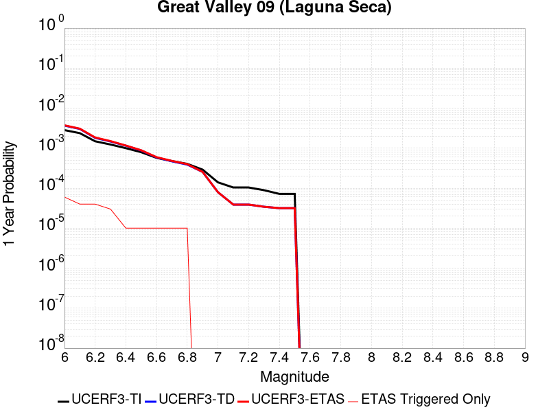 |  |

| Magnitude | 1 wk TI Prob | 1 wk TD Prob | 1 wk ETAS Prob | 1 wk ETAS/TD Gain | 1 wk ETAS Triggered Only | 1 mo TI Prob | 1 mo TD Prob | 1 mo ETAS Prob | 1 mo ETAS/TD Gain | 1 mo ETAS Triggered Only | 1 yr TI Prob | 1 yr TD Prob | 1 yr ETAS Prob | 1 yr ETAS/TD Gain | 1 yr ETAS Triggered Only | 10 yr TI Prob | 10 yr TD Prob | 10 yr ETAS Prob | 10 yr ETAS/TD Gain | 10 yr ETAS Triggered Only |
|-----|-----|-----|-----|-----|-----|-----|-----|-----|-----|-----|-----|-----|-----|-----|-----|-----|-----|-----|-----|-----|
| 6.0 | 5.4353277E-5 | 7.05022E-5 | 1.1910027E-4 | 1.6893127 | 4.860149E-5 | 2.3292181E-4 | 3.0211566E-4 | 3.5070247E-4 | 1.1608219 | 4.860149E-5 | 0.0028321352 | 0.0036721937 | 0.0037327227 | 1.016483 | 6.0751867E-5 | 0.02796312 | 0.03611547 | 0.03617403 | 1.0016214 | 6.0751867E-5 |
| 6.1 | 4.5578287E-5 | 5.822118E-5 | 9.467018E-5 | 1.6260436 | 3.6451118E-5 | 1.953209E-4 | 2.4949326E-4 | 2.8593527E-4 | 1.1460642 | 3.6451118E-5 | 0.0023754383 | 0.003033432 | 0.003081886 | 1.0159733 | 4.860149E-5 | 0.023502063 | 0.029919548 | 0.029966695 | 1.0015758 | 4.860149E-5 |
| 6.2 | 2.8536782E-5 | 3.4737273E-5 | 7.1187125E-5 | 2.049301 | 3.6451118E-5 | 1.2229476E-4 | 1.4886224E-4 | 1.8530793E-4 | 1.2448283 | 3.6451118E-5 | 0.0014879217 | 0.001810813 | 0.0018593265 | 1.026791 | 4.860149E-5 | 0.014779986 | 0.017958116 | 0.018005846 | 1.0026578 | 4.860149E-5 |
| 6.3 | 2.3698774E-5 | 2.8213295E-5 | 6.4663385E-5 | 2.2919474 | 3.6451118E-5 | 1.01562226E-4 | 1.20905075E-4 | 1.573518E-4 | 1.301449 | 3.6451118E-5 | 0.0012358186 | 0.0014710218 | 0.0015074193 | 1.024743 | 3.6451118E-5 | 0.012289686 | 0.014611342 | 0.01464726 | 1.0024582 | 3.6451118E-5 |
| 6.4 | 1.9191197E-5 | 2.2123184E-5 | 3.427329E-5 | 1.5492023 | 1.2150373E-5 | 8.2245395E-5 | 9.4806666E-5 | 1.06955886E-4 | 1.1281474 | 1.2150373E-5 | 0.0010008777 | 0.0011536429 | 0.0011657792 | 1.01052 | 1.2150373E-5 | 0.009963818 | 0.011476948 | 0.011488959 | 1.0010465 | 1.2150373E-5 |
| 6.5 | 1.5203241E-5 | 1.6802203E-5 | 2.8952372E-5 | 1.7231295 | 1.2150373E-5 | 6.5155116E-5 | 7.200386E-5 | 8.4153355E-5 | 1.168734 | 1.2150373E-5 | 7.9297484E-4 | 8.7626575E-4 | 8.884055E-4 | 1.0138539 | 1.2150373E-5 | 0.007901512 | 0.0087295165 | 0.008741561 | 1.0013797 | 1.2150373E-5 |
| 6.6 | 1.0984925E-5 | 1.1242595E-5 | 2.3392831E-5 | 2.0807323 | 1.2150373E-5 | 4.70774E-5 | 4.8181686E-5 | 6.0331473E-5 | 1.2521662 | 1.2150373E-5 | 5.730166E-4 | 5.8645656E-4 | 5.985998E-4 | 1.0207062 | 1.2150373E-5 | 0.005715413 | 0.0058494853 | 0.0058615645 | 1.0020651 | 1.2150373E-5 |
| 6.7 | 9.134616E-6 | 9.019894E-6 | 2.1170157E-5 | 2.3470516 | 1.2150373E-5 | 3.9147766E-5 | 3.865613E-5 | 5.0806033E-5 | 1.3143073 | 1.2150373E-5 | 4.7651984E-4 | 4.7053912E-4 | 4.8268377E-4 | 1.0258101 | 1.2150373E-5 | 0.004754993 | 0.0046956735 | 0.0047077667 | 1.0025754 | 1.2150373E-5 |
| 6.8 | 7.785589E-6 | 7.4519444E-6 | 1.9602227E-5 | 2.6304848 | 1.2150373E-5 | 3.3366385E-5 | 3.1936524E-5 | 4.4086508E-5 | 1.3804417 | 1.2150373E-5 | 4.0616E-4 | 3.8875983E-4 | 4.0090547E-4 | 1.031242 | 1.2150373E-5 | 0.0040541845 | 0.0038810016 | 0.0038931046 | 1.0031186 | 1.2150373E-5 |
| 6.9 | 5.579095E-6 | 4.898492E-6 | 4.898492E-6 | 1.0 | 0.0 | 2.3910188E-5 | 2.0993377E-5 | 2.0993377E-5 | 1.0 | 0.0 | 2.9106764E-4 | 2.5556577E-4 | 2.5556577E-4 | 1.0 | 0.0 | 0.002906867 | 0.002552856 | 0.002552856 | 1.0 | 0.0 |
| 7.0 | 2.6816688E-6 | 1.5216126E-6 | 1.5216126E-6 | 1.0 | 0.0 | 1.1492816E-5 | 6.521181E-6 | 6.521181E-6 | 1.0 | 0.0 | 1.3991605E-4 | 7.939258E-5 | 7.939258E-5 | 1.0 | 0.0 | 0.0013982799 | 7.9365086E-4 | 7.9365086E-4 | 1.0 | 0.0 |
| 7.1 | 1.9951021E-6 | 7.453827E-7 | 7.453827E-7 | 1.0 | 0.0 | 8.55041E-6 | 3.1944935E-6 | 3.1944935E-6 | 1.0 | 0.0 | 1.0409627E-4 | 3.8892307E-5 | 3.8892307E-5 | 1.0 | 0.0 | 0.0010404752 | 3.8885913E-4 | 3.8885913E-4 | 1.0 | 0.0 |
| 7.2 | 1.9951021E-6 | 7.453827E-7 | 7.453827E-7 | 1.0 | 0.0 | 8.55041E-6 | 3.1944935E-6 | 3.1944935E-6 | 1.0 | 0.0 | 1.0409627E-4 | 3.8892307E-5 | 3.8892307E-5 | 1.0 | 0.0 | 0.0010404752 | 3.8885913E-4 | 3.8885913E-4 | 1.0 | 0.0 |
| 7.3 | 1.7087556E-6 | 6.578881E-7 | 6.578881E-7 | 1.0 | 0.0 | 7.3232177E-6 | 2.8195177E-6 | 2.8195177E-6 | 1.0 | 0.0 | 8.915652E-5 | 3.4327128E-5 | 3.4327128E-5 | 1.0 | 0.0 | 8.9120766E-4 | 3.432223E-4 | 3.432223E-4 | 1.0 | 0.0 |
| 7.4 | 1.3804846E-6 | 6.073852E-7 | 6.073852E-7 | 1.0 | 0.0 | 5.916349E-6 | 2.6030768E-6 | 2.6030768E-6 | 1.0 | 0.0 | 7.2029165E-5 | 3.169204E-5 | 3.169204E-5 | 1.0 | 0.0 | 7.200583E-4 | 3.1687922E-4 | 3.1687922E-4 | 1.0 | 0.0 |
| 7.5 | 1.3804846E-6 | 6.073852E-7 | 6.073852E-7 | 1.0 | 0.0 | 5.916349E-6 | 2.6030768E-6 | 2.6030768E-6 | 1.0 | 0.0 | 7.2029165E-5 | 3.169204E-5 | 3.169204E-5 | 1.0 | 0.0 | 7.200583E-4 | 3.1687922E-4 | 3.1687922E-4 | 1.0 | 0.0 |

## Lost Hills
*[(top)](#table-of-contents)*

| 1 Week | 1 Month | 1 Year | 10 Year |
|-----|-----|-----|-----|
|  |  |  |  |

| Magnitude | 1 wk TI Prob | 1 wk TD Prob | 1 wk ETAS Prob | 1 wk ETAS/TD Gain | 1 wk ETAS Triggered Only | 1 mo TI Prob | 1 mo TD Prob | 1 mo ETAS Prob | 1 mo ETAS/TD Gain | 1 mo ETAS Triggered Only | 1 yr TI Prob | 1 yr TD Prob | 1 yr ETAS Prob | 1 yr ETAS/TD Gain | 1 yr ETAS Triggered Only | 10 yr TI Prob | 10 yr TD Prob | 10 yr ETAS Prob | 10 yr ETAS/TD Gain | 10 yr ETAS Triggered Only |
|-----|-----|-----|-----|-----|-----|-----|-----|-----|-----|-----|-----|-----|-----|-----|-----|-----|-----|-----|-----|-----|
| 6.0 | 2.233523E-5 | 2.5106583E-5 | 4.9406717E-5 | 1.967879 | 2.4300745E-5 | 9.571891E-5 | 1.0759615E-4 | 1.5619241E-4 | 1.4516543 | 4.860149E-5 | 0.0011647546 | 0.001309364 | 0.0013579018 | 1.0370698 | 4.860149E-5 | 0.011586686 | 0.013033091 | 0.013081059 | 1.0036805 | 4.860149E-5 |
| 6.1 | 2.233523E-5 | 2.5106583E-5 | 4.9406717E-5 | 1.967879 | 2.4300745E-5 | 9.571891E-5 | 1.0759615E-4 | 1.5619241E-4 | 1.4516543 | 4.860149E-5 | 0.0011647546 | 0.001309364 | 0.0013579018 | 1.0370698 | 4.860149E-5 | 0.011586686 | 0.013033091 | 0.013081059 | 1.0036805 | 4.860149E-5 |
| 6.2 | 2.233523E-5 | 2.5106583E-5 | 4.9406717E-5 | 1.967879 | 2.4300745E-5 | 9.571891E-5 | 1.0759615E-4 | 1.5619241E-4 | 1.4516543 | 4.860149E-5 | 0.0011647546 | 0.001309364 | 0.0013579018 | 1.0370698 | 4.860149E-5 | 0.011586686 | 0.013033091 | 0.013081059 | 1.0036805 | 4.860149E-5 |
| 6.3 | 2.233523E-5 | 2.5106583E-5 | 4.9406717E-5 | 1.967879 | 2.4300745E-5 | 9.571891E-5 | 1.0759615E-4 | 1.5619241E-4 | 1.4516543 | 4.860149E-5 | 0.0011647546 | 0.001309364 | 0.0013579018 | 1.0370698 | 4.860149E-5 | 0.011586686 | 0.013033091 | 0.013081059 | 1.0036805 | 4.860149E-5 |
| 6.4 | 1.2288092E-5 | 1.3781108E-5 | 1.3781108E-5 | 1.0 | 0.0 | 5.2662188E-5 | 5.906108E-5 | 5.906108E-5 | 1.0 | 0.0 | 6.409735E-4 | 7.189252E-4 | 7.189252E-4 | 1.0 | 0.0 | 0.006391279 | 0.0071752006 | 0.0071752006 | 1.0 | 0.0 |
| 6.5 | 1.2288092E-5 | 1.3781108E-5 | 1.3781108E-5 | 1.0 | 0.0 | 5.2662188E-5 | 5.906108E-5 | 5.906108E-5 | 1.0 | 0.0 | 6.409735E-4 | 7.189252E-4 | 7.189252E-4 | 1.0 | 0.0 | 0.006391279 | 0.0071752006 | 0.0071752006 | 1.0 | 0.0 |
| 6.6 | 8.58281E-6 | 9.63377E-6 | 9.63377E-6 | 1.0 | 0.0 | 3.6782953E-5 | 4.12874E-5 | 4.12874E-5 | 1.0 | 0.0 | 4.4774043E-4 | 5.026414E-4 | 5.026414E-4 | 1.0 | 0.0 | 0.0044683935 | 0.005023205 | 0.005023205 | 1.0 | 0.0 |
| 6.7 | 7.205685E-6 | 8.088302E-6 | 8.088302E-6 | 1.0 | 0.0 | 3.088114E-5 | 3.466415E-5 | 3.466415E-5 | 1.0 | 0.0 | 3.7591302E-4 | 4.2203604E-4 | 4.2203604E-4 | 1.0 | 0.0 | 0.0037527776 | 0.0042203604 | 0.0042203604 | 1.0 | 0.0 |

## Ventura-Pitas Point
*[(top)](#table-of-contents)*

| 1 Week | 1 Month | 1 Year | 10 Year |
|-----|-----|-----|-----|
|  |  |  |  |

| Magnitude | 1 wk TI Prob | 1 wk TD Prob | 1 wk ETAS Prob | 1 wk ETAS/TD Gain | 1 wk ETAS Triggered Only | 1 mo TI Prob | 1 mo TD Prob | 1 mo ETAS Prob | 1 mo ETAS/TD Gain | 1 mo ETAS Triggered Only | 1 yr TI Prob | 1 yr TD Prob | 1 yr ETAS Prob | 1 yr ETAS/TD Gain | 1 yr ETAS Triggered Only | 10 yr TI Prob | 10 yr TD Prob | 10 yr ETAS Prob | 10 yr ETAS/TD Gain | 10 yr ETAS Triggered Only |
|-----|-----|-----|-----|-----|-----|-----|-----|-----|-----|-----|-----|-----|-----|-----|-----|-----|-----|-----|-----|-----|
| 6.0 | 3.3179622E-5 | 3.3735185E-5 | 5.803511E-5 | 1.720314 | 2.4300745E-5 | 1.4219063E-4 | 1.445728E-4 | 1.6887003E-4 | 1.1680623 | 2.4300745E-5 | 0.0017297962 | 0.0017590096 | 0.0018075256 | 1.0275815 | 4.860149E-5 | 0.017163932 | 0.0174764 | 0.017524153 | 1.0027324 | 4.860149E-5 |
| 6.1 | 3.3179622E-5 | 3.3735185E-5 | 5.803511E-5 | 1.720314 | 2.4300745E-5 | 1.4219063E-4 | 1.445728E-4 | 1.6887003E-4 | 1.1680623 | 2.4300745E-5 | 0.0017297962 | 0.0017590096 | 0.0018075256 | 1.0275815 | 4.860149E-5 | 0.017163932 | 0.0174764 | 0.017524153 | 1.0027324 | 4.860149E-5 |
| 6.2 | 3.3179622E-5 | 3.3735185E-5 | 5.803511E-5 | 1.720314 | 2.4300745E-5 | 1.4219063E-4 | 1.445728E-4 | 1.6887003E-4 | 1.1680623 | 2.4300745E-5 | 0.0017297962 | 0.0017590096 | 0.0018075256 | 1.0275815 | 4.860149E-5 | 0.017163932 | 0.0174764 | 0.017524153 | 1.0027324 | 4.860149E-5 |
| 6.3 | 3.3179622E-5 | 3.3735185E-5 | 5.803511E-5 | 1.720314 | 2.4300745E-5 | 1.4219063E-4 | 1.445728E-4 | 1.6887003E-4 | 1.1680623 | 2.4300745E-5 | 0.0017297962 | 0.0017590096 | 0.0018075256 | 1.0275815 | 4.860149E-5 | 0.017163932 | 0.0174764 | 0.017524153 | 1.0027324 | 4.860149E-5 |
| 6.4 | 1.8754668E-5 | 1.701961E-5 | 2.9169776E-5 | 1.7138921 | 1.2150373E-5 | 8.037467E-5 | 7.293928E-5 | 8.5088766E-5 | 1.1665698 | 1.2150373E-5 | 9.781223E-4 | 8.8769704E-4 | 9.2411577E-4 | 1.0410261 | 3.6451118E-5 | 0.009738282 | 0.008843848 | 0.008879976 | 1.0040852 | 3.6451118E-5 |
| 6.5 | 1.8754668E-5 | 1.701961E-5 | 2.9169776E-5 | 1.7138921 | 1.2150373E-5 | 8.037467E-5 | 7.293928E-5 | 8.5088766E-5 | 1.1665698 | 1.2150373E-5 | 9.781223E-4 | 8.8769704E-4 | 9.2411577E-4 | 1.0410261 | 3.6451118E-5 | 0.009738282 | 0.008843848 | 0.008879976 | 1.0040852 | 3.6451118E-5 |
| 6.6 | 1.4361558E-5 | 1.2122275E-5 | 2.42725E-5 | 2.0023057 | 1.2150373E-5 | 6.154808E-5 | 5.1951585E-5 | 6.4101325E-5 | 1.2338666 | 1.2150373E-5 | 7.490902E-4 | 6.3232926E-4 | 6.6875736E-4 | 1.0576093 | 3.6451118E-5 | 0.0074657016 | 0.0063055577 | 0.0063417787 | 1.0057443 | 3.6451118E-5 |
| 6.7 | 1.4361558E-5 | 1.2122275E-5 | 2.42725E-5 | 2.0023057 | 1.2150373E-5 | 6.154808E-5 | 5.1951585E-5 | 6.4101325E-5 | 1.2338666 | 1.2150373E-5 | 7.490902E-4 | 6.3232926E-4 | 6.6875736E-4 | 1.0576093 | 3.6451118E-5 | 0.0074657016 | 0.0063055577 | 0.0063417787 | 1.0057443 | 3.6451118E-5 |
| 6.8 | 1.3663846E-5 | 1.13444175E-5 | 1.13444175E-5 | 1.0 | 0.0 | 5.8558027E-5 | 4.861804E-5 | 4.861804E-5 | 1.0 | 0.0 | 7.127108E-4 | 5.917658E-4 | 6.160522E-4 | 1.0410405 | 2.4300745E-5 | 0.007104293 | 0.005902116 | 0.0059262733 | 1.004093 | 2.4300745E-5 |
| 6.9 | 1.3644157E-5 | 1.1322519E-5 | 1.1322519E-5 | 1.0 | 0.0 | 5.8473648E-5 | 4.8524187E-5 | 4.8524187E-5 | 1.0 | 0.0 | 7.116841E-4 | 5.9062376E-4 | 6.1491015E-4 | 1.0411199 | 2.4300745E-5 | 0.007094092 | 0.0058907564 | 0.005914914 | 1.0041009 | 2.4300745E-5 |
| 7.0 | 1.3568845E-5 | 1.1242086E-5 | 1.1242086E-5 | 1.0 | 0.0 | 5.8150898E-5 | 4.817949E-5 | 4.817949E-5 | 1.0 | 0.0 | 7.077572E-4 | 5.864293E-4 | 6.107158E-4 | 1.0414141 | 2.4300745E-5 | 0.007055073 | 0.0058490336 | 0.005873192 | 1.0041304 | 2.4300745E-5 |
| 7.1 | 1.306572E-5 | 1.072054E-5 | 1.072054E-5 | 1.0 | 0.0 | 5.599474E-5 | 4.5944373E-5 | 4.5944373E-5 | 1.0 | 0.0 | 6.815227E-4 | 5.5923103E-4 | 5.835182E-4 | 1.0434296 | 2.4300745E-5 | 0.0067943637 | 0.0055784425 | 0.0056026075 | 1.004332 | 2.4300745E-5 |
| 7.2 | 1.232604E-5 | 9.995143E-6 | 9.995143E-6 | 1.0 | 0.0 | 5.2824813E-5 | 4.2835632E-5 | 4.2835632E-5 | 1.0 | 0.0 | 6.429523E-4 | 5.214008E-4 | 5.3354487E-4 | 1.0232912 | 1.2150373E-5 | 0.0064109527 | 0.005201967 | 0.005214054 | 1.0023236 | 1.2150373E-5 |
| 7.3 | 1.0917261E-5 | 8.84384E-6 | 8.84384E-6 | 1.0 | 0.0 | 4.678742E-5 | 3.790163E-5 | 3.790163E-5 | 1.0 | 0.0 | 5.69488E-4 | 4.6135622E-4 | 4.73501E-4 | 1.026324 | 1.2150373E-5 | 0.0056803077 | 0.00460415 | 0.0046162447 | 1.0026269 | 1.2150373E-5 |
| 7.4 | 1.039959E-5 | 8.423562E-6 | 8.423562E-6 | 1.0 | 0.0 | 4.456891E-5 | 3.610049E-5 | 3.610049E-5 | 1.0 | 0.0 | 5.424914E-4 | 4.3943635E-4 | 4.5158138E-4 | 1.0276377 | 1.2150373E-5 | 0.0054116896 | 0.004385836 | 0.004397933 | 1.0027583 | 1.2150373E-5 |
| 7.5 | 9.015877E-6 | 7.2975445E-6 | 7.2975445E-6 | 1.0 | 0.0 | 3.86389E-5 | 3.1274823E-5 | 3.1274823E-5 | 1.0 | 0.0 | 4.7032707E-4 | 3.8070587E-4 | 3.9285162E-4 | 1.0319033 | 1.2150373E-5 | 0.004693329 | 0.0038006818 | 0.003812786 | 1.0031848 | 1.2150373E-5 |
| 7.6 | 4.900162E-6 | 3.8741155E-6 | 3.8741155E-6 | 1.0 | 0.0 | 2.1000526E-5 | 1.6603248E-5 | 1.6603248E-5 | 1.0 | 0.0 | 2.556514E-4 | 2.0212591E-4 | 2.0212591E-4 | 1.0 | 0.0 | 0.0025535747 | 0.0020194345 | 0.0020194345 | 1.0 | 0.0 |
| 7.7 | 3.8850626E-6 | 3.1267302E-6 | 3.1267302E-6 | 1.0 | 0.0 | 1.6650163E-5 | 1.3400205E-5 | 1.3400205E-5 | 1.0 | 0.0 | 2.0269687E-4 | 1.6313537E-4 | 1.6313537E-4 | 1.0 | 0.0 | 0.002025121 | 0.0016301654 | 0.0016301654 | 1.0 | 0.0 |
| 7.8 | 2.4654719E-6 | 2.029875E-6 | 2.029875E-6 | 1.0 | 0.0 | 1.0566265E-5 | 8.699436E-6 | 8.699436E-6 | 1.0 | 0.0 | 1.2863669E-4 | 1.0591053E-4 | 1.0591053E-4 | 1.0 | 0.0 | 0.0012856225 | 0.0010586053 | 0.0010586053 | 1.0 | 0.0 |
| 7.9 | 4.095894E-7 | 3.2764765E-7 | 3.2764765E-7 | 1.0 | 0.0 | 1.7553821E-6 | 1.4042034E-6 | 1.4042034E-6 | 1.0 | 0.0 | 2.1371567E-5 | 1.7096047E-5 | 1.7096047E-5 | 1.0 | 0.0 | 2.1369511E-4 | 1.7094762E-4 | 1.7094762E-4 | 1.0 | 0.0 |
| 8.0 | 7.791402E-9 | 5.683497E-9 | 5.683497E-9 | 1.0 | 0.0 | 3.3391725E-8 | 2.4357844E-8 | 2.4357844E-8 | 1.0 | 0.0 | 4.0654416E-7 | 2.9655675E-7 | 2.9655675E-7 | 1.0 | 0.0 | 4.065434E-6 | 2.9655655E-6 | 2.9655655E-6 | 1.0 | 0.0 |

## Pisgah-Bullion Mtn-Mesquite Lk
*[(top)](#table-of-contents)*

| 1 Week | 1 Month | 1 Year | 10 Year |
|-----|-----|-----|-----|
|  |  |  |  |

| Magnitude | 1 wk TI Prob | 1 wk TD Prob | 1 wk ETAS Prob | 1 wk ETAS/TD Gain | 1 wk ETAS Triggered Only | 1 mo TI Prob | 1 mo TD Prob | 1 mo ETAS Prob | 1 mo ETAS/TD Gain | 1 mo ETAS Triggered Only | 1 yr TI Prob | 1 yr TD Prob | 1 yr ETAS Prob | 1 yr ETAS/TD Gain | 1 yr ETAS Triggered Only | 10 yr TI Prob | 10 yr TD Prob | 10 yr ETAS Prob | 10 yr ETAS/TD Gain | 10 yr ETAS Triggered Only |
|-----|-----|-----|-----|-----|-----|-----|-----|-----|-----|-----|-----|-----|-----|-----|-----|-----|-----|-----|-----|-----|
| 6.0 | 3.0240792E-5 | 2.4091114E-5 | 3.6241196E-5 | 1.5043386 | 1.2150373E-5 | 1.2959696E-4 | 1.03244114E-4 | 1.1539323E-4 | 1.1176738 | 1.2150373E-5 | 0.0015767008 | 0.0012563728 | 0.0012927781 | 1.0289766 | 3.6451118E-5 | 0.015655609 | 0.012502721 | 0.012550714 | 1.0038387 | 4.860149E-5 |
| 6.1 | 3.0240792E-5 | 2.4091114E-5 | 3.6241196E-5 | 1.5043386 | 1.2150373E-5 | 1.2959696E-4 | 1.03244114E-4 | 1.1539323E-4 | 1.1176738 | 1.2150373E-5 | 0.0015767008 | 0.0012563728 | 0.0012927781 | 1.0289766 | 3.6451118E-5 | 0.015655609 | 0.012502721 | 0.012550714 | 1.0038387 | 4.860149E-5 |
| 6.2 | 3.0240792E-5 | 2.4091114E-5 | 3.6241196E-5 | 1.5043386 | 1.2150373E-5 | 1.2959696E-4 | 1.03244114E-4 | 1.1539323E-4 | 1.1176738 | 1.2150373E-5 | 0.0015767008 | 0.0012563728 | 0.0012927781 | 1.0289766 | 3.6451118E-5 | 0.015655609 | 0.012502721 | 0.012550714 | 1.0038387 | 4.860149E-5 |
| 6.3 | 2.0498217E-5 | 1.36380695E-5 | 2.5788277E-5 | 1.8909037 | 1.2150373E-5 | 8.784654E-5 | 5.844765E-5 | 7.0597314E-5 | 1.2078725 | 1.2150373E-5 | 0.0010690069 | 7.1138405E-4 | 7.356675E-4 | 1.0341355 | 2.4300745E-5 | 0.01063879 | 0.0070926943 | 0.007128887 | 1.0051028 | 3.6451118E-5 |
| 6.4 | 2.0498217E-5 | 1.36380695E-5 | 2.5788277E-5 | 1.8909037 | 1.2150373E-5 | 8.784654E-5 | 5.844765E-5 | 7.0597314E-5 | 1.2078725 | 1.2150373E-5 | 0.0010690069 | 7.1138405E-4 | 7.356675E-4 | 1.0341355 | 2.4300745E-5 | 0.01063879 | 0.0070926943 | 0.007128887 | 1.0051028 | 3.6451118E-5 |
| 6.5 | 1.7316182E-5 | 1.0477042E-5 | 2.2627288E-5 | 2.1597018 | 1.2150373E-5 | 7.42101E-5 | 4.4900895E-5 | 5.705072E-5 | 1.2705921 | 1.2150373E-5 | 9.0313336E-4 | 5.465413E-4 | 5.58685E-4 | 1.0222193 | 1.2150373E-5 | 0.008994718 | 0.0054529672 | 0.005465051 | 1.0022161 | 1.2150373E-5 |
| 6.6 | 1.5251077E-5 | 8.414273E-6 | 2.0564543E-5 | 2.4440072 | 1.2150373E-5 | 6.536012E-5 | 3.6060712E-5 | 4.8210648E-5 | 1.33693 | 1.2150373E-5 | 7.9546886E-4 | 4.3895794E-4 | 4.51103E-4 | 1.0276679 | 1.2150373E-5 | 0.007926274 | 0.0043816264 | 0.0043937233 | 1.0027609 | 1.2150373E-5 |
| 6.7 | 1.2997425E-5 | 6.4114965E-6 | 1.8561792E-5 | 2.8950794 | 1.2150373E-5 | 5.570206E-5 | 2.7477578E-5 | 3.962762E-5 | 1.4421802 | 1.2150373E-5 | 6.7796157E-4 | 3.3449283E-4 | 3.4663914E-4 | 1.0363126 | 1.2150373E-5 | 0.0067589693 | 0.0033403537 | 0.0033524635 | 1.0036253 | 1.2150373E-5 |
| 6.8 | 1.035386E-5 | 4.3332193E-6 | 1.648354E-5 | 3.8039937 | 1.2150373E-5 | 4.437293E-5 | 1.8570812E-5 | 3.072096E-5 | 1.6542604 | 1.2150373E-5 | 5.401065E-4 | 2.2607706E-4 | 2.3822469E-4 | 1.0537323 | 1.2150373E-5 | 0.0053879567 | 0.0022585576 | 0.0022706804 | 1.0053675 | 1.2150373E-5 |
| 6.9 | 8.816252E-6 | 3.580638E-6 | 1.5730968E-5 | 4.3933425 | 1.2150373E-5 | 3.778339E-5 | 1.5345504E-5 | 2.749569E-5 | 1.791775 | 1.2150373E-5 | 4.5991567E-4 | 1.8681608E-4 | 1.9896418E-4 | 1.0650271 | 1.2150373E-5 | 0.00458965 | 0.0018666488 | 0.0018787765 | 1.006497 | 1.2150373E-5 |
| 7.0 | 6.8232207E-6 | 2.5675843E-6 | 1.4717926E-5 | 5.7322073 | 1.2150373E-5 | 2.9242048E-5 | 1.1003888E-5 | 2.3154127E-5 | 2.104177 | 1.2150373E-5 | 3.5596377E-4 | 1.3396442E-4 | 1.4611316E-4 | 1.0906863 | 1.2150373E-5 | 0.0035539411 | 0.0013388677 | 0.0013510018 | 1.009063 | 1.2150373E-5 |
| 7.1 | 5.837013E-6 | 2.22738E-6 | 1.4377726E-5 | 6.4549947 | 1.2150373E-5 | 2.501553E-5 | 9.545881E-6 | 2.1696138E-5 | 2.2728271 | 1.2150373E-5 | 3.045215E-4 | 1.16215204E-4 | 1.2836416E-4 | 1.1045384 | 1.2150373E-5 | 0.0030410455 | 0.0011615733 | 0.0011737095 | 1.0104481 | 1.2150373E-5 |
| 7.2 | 4.278052E-6 | 1.6275711E-6 | 1.6275711E-6 | 1.0 | 0.0 | 1.833438E-5 | 6.9752873E-6 | 6.9752873E-6 | 1.0 | 0.0 | 2.231982E-4 | 8.492105E-5 | 8.492105E-5 | 1.0 | 0.0 | 0.0022297418 | 8.489092E-4 | 8.489092E-4 | 1.0 | 0.0 |
| 7.3 | 1.8803692E-6 | 8.344926E-7 | 8.344926E-7 | 1.0 | 0.0 | 8.0587E-6 | 3.5763926E-6 | 3.5763926E-6 | 1.0 | 0.0 | 9.811026E-5 | 4.354186E-5 | 4.354186E-5 | 1.0 | 0.0 | 9.806695E-4 | 4.3534773E-4 | 4.3534773E-4 | 1.0 | 0.0 |

## San Clemente
*[(top)](#table-of-contents)*

| 1 Week | 1 Month | 1 Year | 10 Year |
|-----|-----|-----|-----|
|  |  |  |  |

| Magnitude | 1 wk TI Prob | 1 wk TD Prob | 1 wk ETAS Prob | 1 wk ETAS/TD Gain | 1 wk ETAS Triggered Only | 1 mo TI Prob | 1 mo TD Prob | 1 mo ETAS Prob | 1 mo ETAS/TD Gain | 1 mo ETAS Triggered Only | 1 yr TI Prob | 1 yr TD Prob | 1 yr ETAS Prob | 1 yr ETAS/TD Gain | 1 yr ETAS Triggered Only | 10 yr TI Prob | 10 yr TD Prob | 10 yr ETAS Prob | 10 yr ETAS/TD Gain | 10 yr ETAS Triggered Only |
|-----|-----|-----|-----|-----|-----|-----|-----|-----|-----|-----|-----|-----|-----|-----|-----|-----|-----|-----|-----|-----|
| 6.0 | 6.681379E-5 | 8.163422E-5 | 1.0593299E-4 | 1.2976542 | 2.4300745E-5 | 2.8631336E-4 | 3.498173E-4 | 3.7410954E-4 | 1.0694426 | 2.4300745E-5 | 0.003480294 | 0.0042512873 | 0.004275485 | 1.0056918 | 2.4300745E-5 | 0.03426291 | 0.041755714 | 0.041802287 | 1.0011153 | 4.860149E-5 |
| 6.1 | 6.681379E-5 | 8.163422E-5 | 9.37836E-5 | 1.1488271 | 1.2150373E-5 | 2.8631336E-4 | 3.498173E-4 | 3.6196344E-4 | 1.0347214 | 1.2150373E-5 | 0.003480294 | 0.0042512873 | 0.004263386 | 1.0028459 | 1.2150373E-5 | 0.03426291 | 0.041755714 | 0.041779 | 1.0005577 | 2.4300745E-5 |
| 6.2 | 3.9400576E-5 | 4.6451984E-5 | 5.8601792E-5 | 1.2615563 | 1.2150373E-5 | 1.6884868E-4 | 1.9906509E-4 | 2.1121305E-4 | 1.061025 | 1.2150373E-5 | 0.0020537945 | 0.002420985 | 0.0024331058 | 1.0050067 | 1.2150373E-5 | 0.020349167 | 0.02395286 | 0.02396472 | 1.0004951 | 1.2150373E-5 |
| 6.3 | 3.2590255E-5 | 3.7929087E-5 | 5.0079E-5 | 1.3203323 | 1.2150373E-5 | 1.3966505E-4 | 1.6254328E-4 | 1.7469168E-4 | 1.0747395 | 1.2150373E-5 | 0.0016990956 | 0.0019771985 | 0.0019893248 | 1.0061331 | 1.2150373E-5 | 0.01686163 | 0.019599866 | 0.019611778 | 1.0006077 | 1.2150373E-5 |
| 6.4 | 2.9454652E-5 | 3.4097775E-5 | 4.6247736E-5 | 1.356327 | 1.2150373E-5 | 1.2622811E-4 | 1.4612528E-4 | 1.5827389E-4 | 1.0831382 | 1.2150373E-5 | 0.0015357438 | 0.0017776482 | 0.001789777 | 1.006823 | 1.2150373E-5 | 0.015251739 | 0.017637458 | 0.017649394 | 1.0006768 | 1.2150373E-5 |
| 6.5 | 2.790836E-5 | 3.2247463E-5 | 4.4397442E-5 | 1.3767732 | 1.2150373E-5 | 1.1960178E-4 | 1.3819622E-4 | 1.5034492E-4 | 1.087909 | 1.2150373E-5 | 0.001455179 | 0.0016812651 | 0.001693395 | 1.0072148 | 1.2150373E-5 | 0.014456868 | 0.016688475 | 0.016700422 | 1.000716 | 1.2150373E-5 |
| 6.6 | 2.2492153E-5 | 2.5762707E-5 | 3.7912767E-5 | 1.4716142 | 1.2150373E-5 | 9.639138E-5 | 1.1040701E-4 | 1.2255604E-4 | 1.1100386 | 1.2150373E-5 | 0.0011729331 | 0.0013433908 | 0.0013555249 | 1.0090324 | 1.2150373E-5 | 0.011667615 | 0.013354415 | 0.013366403 | 1.0008976 | 1.2150373E-5 |
| 6.7 | 1.9862755E-5 | 2.2666423E-5 | 2.2666423E-5 | 1.0 | 0.0 | 8.512331E-5 | 9.713826E-5 | 9.713826E-5 | 1.0 | 0.0 | 0.0010358836 | 0.0011820279 | 0.0011820279 | 1.0 | 0.0 | 0.010310682 | 0.011758701 | 0.011758701 | 1.0 | 0.0 |
| 6.8 | 1.6697575E-5 | 1.897771E-5 | 1.897771E-5 | 1.0 | 0.0 | 7.155907E-5 | 8.133056E-5 | 8.133056E-5 | 1.0 | 0.0 | 8.7088346E-4 | 9.897591E-4 | 9.897591E-4 | 1.0 | 0.0 | 0.008674784 | 0.0098545365 | 0.0098545365 | 1.0 | 0.0 |
| 6.9 | 1.5218415E-5 | 1.72694E-5 | 1.72694E-5 | 1.0 | 0.0 | 6.522015E-5 | 7.4009666E-5 | 7.4009666E-5 | 1.0 | 0.0 | 7.93766E-4 | 9.00704E-4 | 9.00704E-4 | 1.0 | 0.0 | 0.007909367 | 0.008971481 | 0.008971481 | 1.0 | 0.0 |
| 7.0 | 1.2392958E-5 | 1.4033016E-5 | 1.4033016E-5 | 1.0 | 0.0 | 5.3111595E-5 | 6.014015E-5 | 6.014015E-5 | 1.0 | 0.0 | 6.4644177E-4 | 7.319679E-4 | 7.319679E-4 | 1.0 | 0.0 | 0.0064456454 | 0.0072963564 | 0.0072963564 | 1.0 | 0.0 |
| 7.1 | 1.0934128E-5 | 1.2375138E-5 | 1.2375138E-5 | 1.0 | 0.0 | 4.6859706E-5 | 5.303527E-5 | 5.303527E-5 | 1.0 | 0.0 | 5.7036756E-4 | 6.455204E-4 | 6.455204E-4 | 1.0 | 0.0 | 0.0056890585 | 0.0064371997 | 0.0064371997 | 1.0 | 0.0 |
| 7.2 | 9.5798805E-6 | 1.0844935E-5 | 1.0844935E-5 | 1.0 | 0.0 | 4.1055984E-5 | 4.6477508E-5 | 4.6477508E-5 | 1.0 | 0.0 | 4.9974193E-4 | 5.657239E-4 | 5.657239E-4 | 1.0 | 0.0 | 0.0049861963 | 0.0056435615 | 0.0056435615 | 1.0 | 0.0 |
| 7.3 | 8.0167365E-6 | 9.083918E-6 | 9.083918E-6 | 1.0 | 0.0 | 3.4356988E-5 | 3.8930535E-5 | 3.8930535E-5 | 1.0 | 0.0 | 4.1821605E-4 | 4.7388324E-4 | 4.7388324E-4 | 1.0 | 0.0 | 0.0041742986 | 0.0047294297 | 0.0047294297 | 1.0 | 0.0 |
| 7.4 | 2.9581017E-6 | 3.3623792E-6 | 3.3623792E-6 | 1.0 | 0.0 | 1.2677518E-5 | 1.4410146E-5 | 1.4410146E-5 | 1.0 | 0.0 | 1.5433785E-4 | 1.7543444E-4 | 1.7543444E-4 | 1.0 | 0.0 | 0.001542307 | 0.0017534546 | 0.0017534546 | 1.0 | 0.0 |

## Kern Canyon (Lake Isabella) 2011
*[(top)](#table-of-contents)*

| 1 Week | 1 Month | 1 Year | 10 Year |
|-----|-----|-----|-----|
|  |  |  |  |

| Magnitude | 1 wk TI Prob | 1 wk TD Prob | 1 wk ETAS Prob | 1 wk ETAS/TD Gain | 1 wk ETAS Triggered Only | 1 mo TI Prob | 1 mo TD Prob | 1 mo ETAS Prob | 1 mo ETAS/TD Gain | 1 mo ETAS Triggered Only | 1 yr TI Prob | 1 yr TD Prob | 1 yr ETAS Prob | 1 yr ETAS/TD Gain | 1 yr ETAS Triggered Only | 10 yr TI Prob | 10 yr TD Prob | 10 yr ETAS Prob | 10 yr ETAS/TD Gain | 10 yr ETAS Triggered Only |
|-----|-----|-----|-----|-----|-----|-----|-----|-----|-----|-----|-----|-----|-----|-----|-----|-----|-----|-----|-----|-----|
| 6.0 | 4.2387383E-6 | 4.001639E-6 | 4.045261E-5 | 10.109012 | 3.6451118E-5 | 1.8165894E-5 | 1.7149778E-5 | 5.3600274E-5 | 3.1254208 | 3.6451118E-5 | 2.2114732E-4 | 2.087804E-4 | 2.5737175E-4 | 1.232739 | 4.860149E-5 | 0.0022092736 | 0.0020860266 | 0.0021345266 | 1.02325 | 4.860149E-5 |
| 6.1 | 4.2387383E-6 | 4.001639E-6 | 4.045261E-5 | 10.109012 | 3.6451118E-5 | 1.8165894E-5 | 1.7149778E-5 | 5.3600274E-5 | 3.1254208 | 3.6451118E-5 | 2.2114732E-4 | 2.087804E-4 | 2.5737175E-4 | 1.232739 | 4.860149E-5 | 0.0022092736 | 0.0020860266 | 0.0021345266 | 1.02325 | 4.860149E-5 |
| 6.2 | 4.2387383E-6 | 4.001639E-6 | 4.045261E-5 | 10.109012 | 3.6451118E-5 | 1.8165894E-5 | 1.7149778E-5 | 5.3600274E-5 | 3.1254208 | 3.6451118E-5 | 2.2114732E-4 | 2.087804E-4 | 2.5737175E-4 | 1.232739 | 4.860149E-5 | 0.0022092736 | 0.0020860266 | 0.0021345266 | 1.02325 | 4.860149E-5 |
| 6.3 | 4.2387383E-6 | 4.001639E-6 | 4.045261E-5 | 10.109012 | 3.6451118E-5 | 1.8165894E-5 | 1.7149778E-5 | 5.3600274E-5 | 3.1254208 | 3.6451118E-5 | 2.2114732E-4 | 2.087804E-4 | 2.5737175E-4 | 1.232739 | 4.860149E-5 | 0.0022092736 | 0.0020860266 | 0.0021345266 | 1.02325 | 4.860149E-5 |
| 6.4 | 4.2387383E-6 | 4.001639E-6 | 4.045261E-5 | 10.109012 | 3.6451118E-5 | 1.8165894E-5 | 1.7149778E-5 | 5.3600274E-5 | 3.1254208 | 3.6451118E-5 | 2.2114732E-4 | 2.087804E-4 | 2.5737175E-4 | 1.232739 | 4.860149E-5 | 0.0022092736 | 0.0020860266 | 0.0021345266 | 1.02325 | 4.860149E-5 |
| 6.5 | 2.7857532E-6 | 2.517867E-6 | 1.466821E-5 | 5.8256493 | 1.2150373E-5 | 1.1938888E-5 | 1.0790815E-5 | 2.2941058E-5 | 2.12598 | 1.2150373E-5 | 1.4534626E-4 | 1.3137059E-4 | 1.5566814E-4 | 1.1849543 | 2.4300745E-5 | 0.0014525123 | 0.001312962 | 0.0013372309 | 1.018484 | 2.4300745E-5 |
| 6.6 | 2.2233348E-6 | 1.9441236E-6 | 1.4094473E-5 | 7.2497826 | 1.2150373E-5 | 9.528543E-6 | 8.331932E-6 | 2.0482204E-5 | 2.458278 | 1.2150373E-5 | 1.1600384E-4 | 1.01436635E-4 | 1.13585775E-4 | 1.1197708 | 1.2150373E-5 | 0.001159433 | 0.001013912 | 0.0010260501 | 1.0119715 | 1.2150373E-5 |
| 6.7 | 2.1635126E-6 | 1.8835036E-6 | 1.4033853E-5 | 7.45093 | 1.2150373E-5 | 9.272164E-6 | 8.072134E-6 | 2.022241E-5 | 2.5052123 | 1.2150373E-5 | 1.1288274E-4 | 9.827388E-5 | 1.10423054E-4 | 1.1236258 | 1.2150373E-5 | 0.0011282542 | 9.823124E-4 | 9.944508E-4 | 1.012357 | 1.2150373E-5 |
| 6.8 | 1.8685711E-6 | 1.5831425E-6 | 1.3733496E-5 | 8.674832 | 1.2150373E-5 | 8.008137E-6 | 6.784879E-6 | 1.893517E-5 | 2.7907896 | 1.2150373E-5 | 9.74947E-5 | 8.260282E-5 | 9.475219E-5 | 1.1470817 | 1.2150373E-5 | 9.745194E-4 | 8.2572614E-4 | 8.3786645E-4 | 1.0147027 | 1.2150373E-5 |
| 6.9 | 1.5815071E-6 | 1.3064928E-6 | 1.3064928E-6 | 1.0 | 0.0 | 6.77787E-6 | 5.599243E-6 | 5.599243E-6 | 1.0 | 0.0 | 8.251744E-5 | 6.816868E-5 | 6.816868E-5 | 1.0 | 0.0 | 8.248681E-4 | 6.8148033E-4 | 6.8148033E-4 | 1.0 | 0.0 |
| 7.0 | 1.3772564E-6 | 1.1210718E-6 | 1.1210718E-6 | 1.0 | 0.0 | 5.9025137E-6 | 4.8045845E-6 | 4.8045845E-6 | 1.0 | 0.0 | 7.186073E-5 | 5.8494268E-5 | 5.8494268E-5 | 1.0 | 0.0 | 7.18375E-4 | 5.847908E-4 | 5.847908E-4 | 1.0 | 0.0 |
| 7.1 | 1.0916998E-6 | 8.763777E-7 | 8.763777E-7 | 1.0 | 0.0 | 4.678705E-6 | 3.7558991E-6 | 3.7558991E-6 | 1.0 | 0.0 | 5.6961744E-5 | 4.5727127E-5 | 4.5727127E-5 | 1.0 | 0.0 | 5.6947145E-4 | 4.571785E-4 | 4.571785E-4 | 1.0 | 0.0 |
| 7.2 | 7.6277024E-7 | 5.901454E-7 | 5.901454E-7 | 1.0 | 0.0 | 3.2690114E-6 | 2.5291922E-6 | 2.5291922E-6 | 1.0 | 0.0 | 3.9799485E-5 | 3.0792486E-5 | 3.0792486E-5 | 1.0 | 0.0 | 3.9792358E-4 | 3.0788282E-4 | 3.0788282E-4 | 1.0 | 0.0 |
| 7.3 | 5.3265916E-7 | 4.3824414E-7 | 4.3824414E-7 | 1.0 | 0.0 | 2.282823E-6 | 1.878188E-6 | 1.878188E-6 | 1.0 | 0.0 | 2.7793016E-5 | 2.2866701E-5 | 2.2866701E-5 | 1.0 | 0.0 | 2.778954E-4 | 2.2864387E-4 | 2.2864387E-4 | 1.0 | 0.0 |
| 7.4 | 3.4946007E-7 | 3.006571E-7 | 3.006571E-7 | 1.0 | 0.0 | 1.497685E-6 | 1.2885298E-6 | 1.2885298E-6 | 1.0 | 0.0 | 1.8234163E-5 | 1.568774E-5 | 1.568774E-5 | 1.0 | 0.0 | 1.8232666E-4 | 1.5686655E-4 | 1.5686655E-4 | 1.0 | 0.0 |
| 7.5 | 1.8317026E-7 | 1.4244812E-7 | 1.4244812E-7 | 1.0 | 0.0 | 7.850152E-7 | 6.104918E-7 | 6.104918E-7 | 1.0 | 0.0 | 9.557518E-6 | 7.432713E-6 | 7.432713E-6 | 1.0 | 0.0 | 9.5571064E-5 | 7.432472E-5 | 7.432472E-5 | 1.0 | 0.0 |
| 7.6 | 2.572245E-8 | 1.7352555E-8 | 1.7352555E-8 | 1.0 | 0.0 | 1.10239064E-7 | 7.436809E-8 | 7.436809E-8 | 1.0 | 0.0 | 1.3421597E-6 | 9.054312E-7 | 9.054312E-7 | 1.0 | 0.0 | 1.3421517E-5 | 9.05428E-6 | 9.05428E-6 | 1.0 | 0.0 |

## Oak Ridge (Onshore)
*[(top)](#table-of-contents)*

| 1 Week | 1 Month | 1 Year | 10 Year |
|-----|-----|-----|-----|
|  |  |  |  |

| Magnitude | 1 wk TI Prob | 1 wk TD Prob | 1 wk ETAS Prob | 1 wk ETAS/TD Gain | 1 wk ETAS Triggered Only | 1 mo TI Prob | 1 mo TD Prob | 1 mo ETAS Prob | 1 mo ETAS/TD Gain | 1 mo ETAS Triggered Only | 1 yr TI Prob | 1 yr TD Prob | 1 yr ETAS Prob | 1 yr ETAS/TD Gain | 1 yr ETAS Triggered Only | 10 yr TI Prob | 10 yr TD Prob | 10 yr ETAS Prob | 10 yr ETAS/TD Gain | 10 yr ETAS Triggered Only |
|-----|-----|-----|-----|-----|-----|-----|-----|-----|-----|-----|-----|-----|-----|-----|-----|-----|-----|-----|-----|-----|
| 6.0 | 3.155064E-5 | 2.9525974E-5 | 4.1675987E-5 | 1.4115026 | 1.2150373E-5 | 1.3521002E-4 | 1.2653397E-4 | 1.5083163E-4 | 1.192025 | 2.4300745E-5 | 0.001644939 | 0.0015395004 | 0.0015880271 | 1.0315211 | 4.860149E-5 | 0.01632816 | 0.015292859 | 0.0153407175 | 1.0031295 | 4.860149E-5 |
| 6.1 | 3.155064E-5 | 2.9525974E-5 | 4.1675987E-5 | 1.4115026 | 1.2150373E-5 | 1.3521002E-4 | 1.2653397E-4 | 1.5083163E-4 | 1.192025 | 2.4300745E-5 | 0.001644939 | 0.0015395004 | 0.0015880271 | 1.0315211 | 4.860149E-5 | 0.01632816 | 0.015292859 | 0.0153407175 | 1.0031295 | 4.860149E-5 |
| 6.2 | 3.155064E-5 | 2.9525974E-5 | 4.1675987E-5 | 1.4115026 | 1.2150373E-5 | 1.3521002E-4 | 1.2653397E-4 | 1.5083163E-4 | 1.192025 | 2.4300745E-5 | 0.001644939 | 0.0015395004 | 0.0015880271 | 1.0315211 | 4.860149E-5 | 0.01632816 | 0.015292859 | 0.0153407175 | 1.0031295 | 4.860149E-5 |
| 6.3 | 3.155064E-5 | 2.9525974E-5 | 4.1675987E-5 | 1.4115026 | 1.2150373E-5 | 1.3521002E-4 | 1.2653397E-4 | 1.5083163E-4 | 1.192025 | 2.4300745E-5 | 0.001644939 | 0.0015395004 | 0.0015880271 | 1.0315211 | 4.860149E-5 | 0.01632816 | 0.015292859 | 0.0153407175 | 1.0031295 | 4.860149E-5 |
| 6.4 | 3.155064E-5 | 2.9525974E-5 | 4.1675987E-5 | 1.4115026 | 1.2150373E-5 | 1.3521002E-4 | 1.2653397E-4 | 1.5083163E-4 | 1.192025 | 2.4300745E-5 | 0.001644939 | 0.0015395004 | 0.0015880271 | 1.0315211 | 4.860149E-5 | 0.01632816 | 0.015292859 | 0.0153407175 | 1.0031295 | 4.860149E-5 |
| 6.5 | 3.155064E-5 | 2.9525974E-5 | 4.1675987E-5 | 1.4115026 | 1.2150373E-5 | 1.3521002E-4 | 1.2653397E-4 | 1.5083163E-4 | 1.192025 | 2.4300745E-5 | 0.001644939 | 0.0015395004 | 0.0015880271 | 1.0315211 | 4.860149E-5 | 0.01632816 | 0.015292859 | 0.0153407175 | 1.0031295 | 4.860149E-5 |
| 6.6 | 3.155064E-5 | 2.9525974E-5 | 4.1675987E-5 | 1.4115026 | 1.2150373E-5 | 1.3521002E-4 | 1.2653397E-4 | 1.5083163E-4 | 1.192025 | 2.4300745E-5 | 0.001644939 | 0.0015395004 | 0.0015880271 | 1.0315211 | 4.860149E-5 | 0.01632816 | 0.015292859 | 0.0153407175 | 1.0031295 | 4.860149E-5 |
| 6.7 | 3.098897E-5 | 2.8864175E-5 | 4.10142E-5 | 1.4209378 | 1.2150373E-5 | 1.328031E-4 | 1.2369796E-4 | 1.479957E-4 | 1.196428 | 2.4300745E-5 | 0.0016156785 | 0.0015050198 | 0.0015535482 | 1.0322443 | 4.860149E-5 | 0.016039822 | 0.014952714 | 0.015000588 | 1.0032017 | 4.860149E-5 |
| 6.8 | 3.0449872E-5 | 2.8239372E-5 | 4.03894E-5 | 1.4302514 | 1.2150373E-5 | 1.3049292E-4 | 1.2102048E-4 | 1.4531828E-4 | 1.2007743 | 2.4300745E-5 | 0.0015875935 | 0.0014724657 | 0.0015209955 | 1.0329583 | 4.860149E-5 | 0.015762992 | 0.014631462 | 0.014679352 | 1.0032731 | 4.860149E-5 |
| 6.9 | 2.697928E-5 | 2.4219773E-5 | 3.6369853E-5 | 1.5016595 | 1.2150373E-5 | 1.15620365E-4 | 1.0379502E-4 | 1.2809325E-4 | 1.2340982 | 2.4300745E-5 | 0.0014067689 | 0.0012629933 | 0.0013115334 | 1.0384326 | 4.860149E-5 | 0.0139789665 | 0.01256087 | 0.012608861 | 1.0038207 | 4.860149E-5 |
| 7.0 | 2.4893961E-5 | 2.1862043E-5 | 3.4012148E-5 | 1.5557626 | 1.2150373E-5 | 1.0668404E-4 | 9.3691204E-5 | 1.1798967E-4 | 1.2593464 | 2.4300745E-5 | 0.0012981043 | 0.0011401111 | 0.0011886572 | 1.0425801 | 4.860149E-5 | 0.012905477 | 0.011344905 | 0.011392956 | 1.0042354 | 4.860149E-5 |
| 7.1 | 2.0945363E-5 | 1.7354487E-5 | 2.950465E-5 | 1.7001165 | 1.2150373E-5 | 8.976275E-5 | 7.437428E-5 | 9.867322E-5 | 1.3267115 | 2.4300745E-5 | 0.0010923136 | 9.051354E-4 | 9.5369294E-4 | 1.0536467 | 4.860149E-5 | 0.0108696 | 0.009015423 | 0.009063587 | 1.0053424 | 4.860149E-5 |
| 7.2 | 2.0439404E-5 | 1.6809423E-5 | 2.8959592E-5 | 1.7228189 | 1.2150373E-5 | 8.7594504E-5 | 7.203843E-5 | 9.633742E-5 | 1.337306 | 2.4300745E-5 | 0.0010659413 | 8.767196E-4 | 9.1313873E-4 | 1.0415403 | 3.6451118E-5 | 0.010608427 | 0.008733526 | 0.008769659 | 1.0041373 | 3.6451118E-5 |
| 7.3 | 1.8463334E-5 | 1.5381811E-5 | 2.7531996E-5 | 1.7899061 | 1.2150373E-5 | 7.912617E-5 | 6.59204E-5 | 9.0219546E-5 | 1.3686134 | 2.4300745E-5 | 9.6293533E-4 | 8.0228975E-4 | 8.387116E-4 | 1.0453974 | 3.6451118E-5 | 0.009587734 | 0.007994797 | 0.008030957 | 1.0045229 | 3.6451118E-5 |
| 7.4 | 1.763139E-5 | 1.451684E-5 | 2.6667036E-5 | 1.8369726 | 1.2150373E-5 | 7.556091E-5 | 6.221356E-5 | 8.65128E-5 | 1.3905778 | 2.4300745E-5 | 9.1956573E-4 | 7.571909E-4 | 7.936144E-4 | 1.0481035 | 3.6451118E-5 | 0.009157699 | 0.007546914 | 0.0075830896 | 1.0047935 | 3.6451118E-5 |
| 7.5 | 1.3594944E-5 | 1.1163356E-5 | 1.1163356E-5 | 1.0 | 0.0 | 5.8262744E-5 | 4.784209E-5 | 4.784209E-5 | 1.0 | 0.0 | 7.0911803E-4 | 5.8232434E-4 | 5.944676E-4 | 1.0208532 | 1.2150373E-5 | 0.007068595 | 0.0058082556 | 0.0058203354 | 1.0020797 | 1.2150373E-5 |
| 7.6 | 6.9889534E-6 | 5.6367144E-6 | 5.6367144E-6 | 1.0 | 0.0 | 2.9952313E-5 | 2.4157125E-5 | 2.4157125E-5 | 1.0 | 0.0 | 3.646084E-4 | 2.9407372E-4 | 2.9407372E-4 | 1.0 | 0.0 | 0.0036401073 | 0.0029368899 | 0.0029368899 | 1.0 | 0.0 |
| 7.7 | 4.0824193E-6 | 3.2832586E-6 | 3.2832586E-6 | 1.0 | 0.0 | 1.7495966E-5 | 1.4071033E-5 | 1.4071033E-5 | 1.0 | 0.0 | 2.1299256E-4 | 1.713015E-4 | 1.713015E-4 | 1.0 | 0.0 | 0.0021278851 | 0.0017117079 | 0.0017117079 | 1.0 | 0.0 |
| 7.8 | 1.7023609E-6 | 1.4370495E-6 | 1.4370495E-6 | 1.0 | 0.0 | 7.295812E-6 | 6.1587693E-6 | 6.1587693E-6 | 1.0 | 0.0 | 8.882289E-5 | 7.498047E-5 | 7.498047E-5 | 1.0 | 0.0 | 8.8787393E-4 | 7.495545E-4 | 7.495545E-4 | 1.0 | 0.0 |
| 7.9 | 2.721225E-7 | 2.2616497E-7 | 2.2616497E-7 | 1.0 | 0.0 | 1.1662388E-6 | 9.692781E-7 | 9.692781E-7 | 1.0 | 0.0 | 1.4198865E-5 | 1.1800899E-5 | 1.1800899E-5 | 1.0 | 0.0 | 1.4197957E-4 | 1.1800301E-4 | 1.1800301E-4 | 1.0 | 0.0 |
| 8.0 | 9.364255E-9 | 5.1206666E-9 | 5.1206666E-9 | 1.0 | 0.0 | 4.0132523E-8 | 2.1945715E-8 | 2.1945715E-8 | 1.0 | 0.0 | 4.8861335E-7 | 2.6718905E-7 | 2.6718905E-7 | 1.0 | 0.0 | 4.8861225E-6 | 2.6718876E-6 | 2.6718876E-6 | 1.0 | 0.0 |

## San Jacinto (Borrego)
*[(top)](#table-of-contents)*

| 1 Week | 1 Month | 1 Year | 10 Year |
|-----|-----|-----|-----|
|  |  |  |  |

| Magnitude | 1 wk TI Prob | 1 wk TD Prob | 1 wk ETAS Prob | 1 wk ETAS/TD Gain | 1 wk ETAS Triggered Only | 1 mo TI Prob | 1 mo TD Prob | 1 mo ETAS Prob | 1 mo ETAS/TD Gain | 1 mo ETAS Triggered Only | 1 yr TI Prob | 1 yr TD Prob | 1 yr ETAS Prob | 1 yr ETAS/TD Gain | 1 yr ETAS Triggered Only | 10 yr TI Prob | 10 yr TD Prob | 10 yr ETAS Prob | 10 yr ETAS/TD Gain | 10 yr ETAS Triggered Only |
|-----|-----|-----|-----|-----|-----|-----|-----|-----|-----|-----|-----|-----|-----|-----|-----|-----|-----|-----|-----|-----|
| 6.0 | 3.543992E-5 | 2.7926513E-5 | 5.222658E-5 | 1.8701433 | 2.4300745E-5 | 1.5187653E-4 | 1.1967963E-4 | 1.5612639E-4 | 1.304536 | 3.6451118E-5 | 0.0018475284 | 0.0014561379 | 0.0014925359 | 1.0249963 | 3.6451118E-5 | 0.018322436 | 0.014869647 | 0.014917526 | 1.0032198 | 4.860149E-5 |
| 6.1 | 3.542281E-5 | 2.7926513E-5 | 5.222658E-5 | 1.8701433 | 2.4300745E-5 | 1.5180321E-4 | 1.1967963E-4 | 1.5612639E-4 | 1.304536 | 3.6451118E-5 | 0.0018466372 | 0.0014561379 | 0.0014925359 | 1.0249963 | 3.6451118E-5 | 0.018313672 | 0.014869647 | 0.014917526 | 1.0032198 | 4.860149E-5 |
| 6.2 | 3.4688688E-5 | 2.7926511E-5 | 5.222658E-5 | 1.8701433 | 2.4300745E-5 | 1.4865733E-4 | 1.1967963E-4 | 1.5612639E-4 | 1.304536 | 3.6451118E-5 | 0.0018084005 | 0.0014561379 | 0.0014925358 | 1.0249963 | 3.6451118E-5 | 0.017937548 | 0.014869647 | 0.014917525 | 1.0032198 | 4.860149E-5 |
| 6.3 | 3.2087122E-5 | 2.7771865E-5 | 5.2071937E-5 | 1.8749888 | 2.4300745E-5 | 1.3750899E-4 | 1.1901691E-4 | 1.554637E-4 | 1.306232 | 3.6451118E-5 | 0.0016728862 | 0.00144808 | 0.0014844784 | 1.0251356 | 3.6451118E-5 | 0.016603488 | 0.014790683 | 0.014838566 | 1.0032374 | 4.860149E-5 |
| 6.4 | 3.1828724E-5 | 2.7738852E-5 | 5.2038922E-5 | 1.8760302 | 2.4300745E-5 | 1.364017E-4 | 1.1887544E-4 | 1.5532222E-4 | 1.3065964 | 3.6451118E-5 | 0.0016594254 | 0.0014463598 | 0.0014827582 | 1.0251656 | 3.6451118E-5 | 0.016470885 | 0.014773762 | 0.014821645 | 1.0032411 | 4.860149E-5 |
| 6.5 | 3.1563577E-5 | 2.747857E-5 | 5.177865E-5 | 1.8843284 | 2.4300745E-5 | 1.3526545E-4 | 1.1776006E-4 | 1.5420688E-4 | 1.3095008 | 3.6451118E-5 | 0.0016456128 | 0.0014327979 | 0.0014691968 | 1.0254041 | 3.6451118E-5 | 0.0163348 | 0.014640348 | 0.014688238 | 1.0032711 | 4.860149E-5 |
| 6.6 | 3.1467625E-5 | 2.7322796E-5 | 5.162288E-5 | 1.8893703 | 2.4300745E-5 | 1.3485427E-4 | 1.1709251E-4 | 1.5353935E-4 | 1.3112655 | 3.6451118E-5 | 0.0016406142 | 0.0014246812 | 0.0014610804 | 1.025549 | 3.6451118E-5 | 0.016285548 | 0.014560594 | 0.014608488 | 1.0032892 | 4.860149E-5 |
| 6.7 | 3.1223695E-5 | 2.6940816E-5 | 5.1240906E-5 | 1.9019805 | 2.4300745E-5 | 1.3380898E-4 | 1.15455594E-4 | 1.5190251E-4 | 1.3156791 | 3.6451118E-5 | 0.0016279068 | 0.0014047775 | 0.0014411774 | 1.0259116 | 3.6451118E-5 | 0.01616033 | 0.014364966 | 0.01441287 | 1.0033348 | 4.860149E-5 |
| 6.8 | 3.1015585E-5 | 2.6761822E-5 | 5.1061917E-5 | 1.9080135 | 2.4300745E-5 | 1.3291716E-4 | 1.1468855E-4 | 1.511355E-4 | 1.3177905 | 3.6451118E-5 | 0.001617065 | 0.0013954508 | 0.0014318511 | 1.0260849 | 3.6451118E-5 | 0.016053487 | 0.014272246 | 0.014320154 | 1.0033567 | 4.860149E-5 |
| 6.9 | 2.6641965E-5 | 2.2184247E-5 | 4.6484452E-5 | 2.0953813 | 2.4300745E-5 | 1.1417485E-4 | 9.50719E-5 | 1.3151955E-4 | 1.3833693 | 3.6451118E-5 | 0.0013891924 | 0.0011568897 | 0.0011932986 | 1.0314714 | 3.6451118E-5 | 0.0138054015 | 0.011882438 | 0.011930463 | 1.0040416 | 4.860149E-5 |
| 7.0 | 2.3854353E-5 | 2.0479023E-5 | 4.4779274E-5 | 2.186592 | 2.4300745E-5 | 1.02228936E-4 | 8.77643E-5 | 1.2421222E-4 | 1.4152932 | 3.6451118E-5 | 0.0012439266 | 0.0010680092 | 0.0011044213 | 1.0340935 | 3.6451118E-5 | 0.012369866 | 0.0109828 | 0.011030869 | 1.0043766 | 4.860149E-5 |
| 7.1 | 2.3672901E-5 | 2.031551E-5 | 4.4615765E-5 | 2.196143 | 2.4300745E-5 | 1.0145135E-4 | 8.7063585E-5 | 1.2351153E-4 | 1.418636 | 3.6451118E-5 | 0.0012344702 | 0.0010594862 | 0.0010958987 | 1.034368 | 3.6451118E-5 | 0.0122763505 | 0.010897976 | 0.010946048 | 1.0044111 | 4.860149E-5 |
| 7.2 | 2.2717244E-5 | 1.9542893E-5 | 4.3843163E-5 | 2.2434328 | 2.4300745E-5 | 9.735599E-5 | 8.375258E-5 | 1.20200646E-4 | 1.4351873 | 3.6451118E-5 | 0.0011846646 | 0.001019213 | 0.0010556269 | 1.0357275 | 3.6451118E-5 | 0.01178369 | 0.010495341 | 0.010543433 | 1.0045822 | 4.860149E-5 |
| 7.3 | 2.1016205E-5 | 1.8384526E-5 | 4.2684824E-5 | 2.32178 | 2.4300745E-5 | 9.006634E-5 | 7.878846E-5 | 1.15236704E-4 | 1.4626089 | 3.6451118E-5 | 0.001096006 | 9.5882936E-4 | 9.952455E-4 | 1.0379798 | 3.6451118E-5 | 0.010906163 | 0.009890967 | 0.009939088 | 1.0048652 | 4.860149E-5 |
| 7.4 | 2.0683625E-5 | 1.8187047E-5 | 4.248735E-5 | 2.3361325 | 2.4300745E-5 | 8.86411E-5 | 7.794217E-5 | 1.14390445E-4 | 1.4676323 | 3.6451118E-5 | 0.001078671 | 9.485349E-4 | 9.849514E-4 | 1.0383924 | 3.6451118E-5 | 0.010734501 | 0.009787692 | 0.009835818 | 1.004917 | 4.860149E-5 |
| 7.5 | 1.9993966E-5 | 1.7782075E-5 | 4.208239E-5 | 2.3665624 | 2.4300745E-5 | 8.568561E-5 | 7.620667E-5 | 1.1265501E-4 | 1.4782828 | 3.6451118E-5 | 0.001042723 | 9.2742336E-4 | 9.6384063E-4 | 1.0392672 | 3.6451118E-5 | 0.010378438 | 0.009574614 | 0.009622751 | 1.0050275 | 4.860149E-5 |
| 7.6 | 1.788966E-5 | 1.6435291E-5 | 4.073564E-5 | 2.4785469 | 2.4300745E-5 | 7.666772E-5 | 7.043507E-5 | 1.0688362E-4 | 1.5174774 | 3.6451118E-5 | 9.3302975E-4 | 8.572113E-4 | 8.936312E-4 | 1.0424864 | 3.6451118E-5 | 0.00929122 | 0.008866487 | 0.008914657 | 1.0054328 | 4.860149E-5 |
| 7.7 | 1.5125781E-5 | 1.4237377E-5 | 3.853778E-5 | 2.706803 | 2.4300745E-5 | 6.4823165E-5 | 6.1015908E-5 | 9.746481E-5 | 1.597367 | 3.6451118E-5 | 7.889362E-4 | 7.426163E-4 | 7.7904033E-4 | 1.0490483 | 3.6451118E-5 | 0.007861412 | 0.0077142045 | 0.0077624307 | 1.0062517 | 4.860149E-5 |
| 7.8 | 1.250089E-5 | 1.26304985E-5 | 3.693094E-5 | 2.9239492 | 2.4300745E-5 | 5.3574146E-5 | 5.412959E-5 | 9.057873E-5 | 1.6733682 | 3.6451118E-5 | 6.5207E-4 | 6.588291E-4 | 6.9525617E-4 | 1.0552907 | 3.6451118E-5 | 0.006501599 | 0.0068677636 | 0.0069160312 | 1.0070281 | 4.860149E-5 |
| 7.9 | 9.561E-6 | 9.754616E-6 | 3.4055127E-5 | 3.4911804 | 2.4300745E-5 | 4.0975072E-5 | 4.1804833E-5 | 7.825443E-5 | 1.8718991 | 3.6451118E-5 | 4.987573E-4 | 5.088555E-4 | 5.452881E-4 | 1.0715971 | 3.6451118E-5 | 0.0049763937 | 0.0053523467 | 0.005400688 | 1.0090318 | 4.860149E-5 |
| 8.0 | 8.01699E-6 | 8.293488E-6 | 3.259403E-5 | 3.9300754 | 2.4300745E-5 | 3.4358076E-5 | 3.554304E-5 | 7.199286E-5 | 2.0255125 | 3.6451118E-5 | 4.1822926E-4 | 4.3265108E-4 | 4.6908643E-4 | 1.0842142 | 3.6451118E-5 | 0.0041744304 | 0.004573375 | 0.0046217544 | 1.0105784 | 4.860149E-5 |
| 8.1 | 6.541947E-6 | 6.4622354E-6 | 3.0762825E-5 | 4.7604 | 2.4300745E-5 | 2.8036617E-5 | 2.7695003E-5 | 6.414511E-5 | 2.3161259 | 3.6451118E-5 | 3.4129233E-4 | 3.37135E-4 | 3.7357383E-4 | 1.1080838 | 3.6451118E-5 | 0.0034076865 | 0.0035806994 | 0.0036291268 | 1.0135245 | 4.860149E-5 |
| 8.2 | 1.7968189E-6 | 7.9713476E-7 | 7.9713476E-7 | 1.0 | 0.0 | 7.70063E-6 | 3.4162877E-6 | 3.4162877E-6 | 1.0 | 0.0 | 9.3751136E-5 | 4.159253E-5 | 4.159253E-5 | 1.0 | 0.0 | 9.371159E-4 | 4.712058E-4 | 4.712058E-4 | 1.0 | 0.0 |
| 8.3 | 1.5167889E-7 | 4.897714E-8 | 4.897714E-8 | 1.0 | 0.0 | 6.500522E-7 | 2.09902E-7 | 2.09902E-7 | 1.0 | 0.0 | 7.9143565E-6 | 2.5555544E-6 | 2.5555544E-6 | 1.0 | 0.0 | 7.914075E-5 | 2.969505E-5 | 2.969505E-5 | 1.0 | 0.0 |

## Simi-Santa Rosa
*[(top)](#table-of-contents)*

| 1 Week | 1 Month | 1 Year | 10 Year |
|-----|-----|-----|-----|
|  |  |  |  |

| Magnitude | 1 wk TI Prob | 1 wk TD Prob | 1 wk ETAS Prob | 1 wk ETAS/TD Gain | 1 wk ETAS Triggered Only | 1 mo TI Prob | 1 mo TD Prob | 1 mo ETAS Prob | 1 mo ETAS/TD Gain | 1 mo ETAS Triggered Only | 1 yr TI Prob | 1 yr TD Prob | 1 yr ETAS Prob | 1 yr ETAS/TD Gain | 1 yr ETAS Triggered Only | 10 yr TI Prob | 10 yr TD Prob | 10 yr ETAS Prob | 10 yr ETAS/TD Gain | 10 yr ETAS Triggered Only |
|-----|-----|-----|-----|-----|-----|-----|-----|-----|-----|-----|-----|-----|-----|-----|-----|-----|-----|-----|-----|-----|
| 6.0 | 2.198912E-5 | 2.2275442E-5 | 4.6575646E-5 | 2.0908966 | 2.4300745E-5 | 9.4235686E-5 | 9.5462936E-5 | 1.3191058E-4 | 1.3817989 | 3.6451118E-5 | 0.0011467156 | 0.0011616853 | 0.0012102304 | 1.0417885 | 4.860149E-5 | 0.011408163 | 0.011560575 | 0.011608615 | 1.0041555 | 4.860149E-5 |
| 6.1 | 2.198912E-5 | 2.2275442E-5 | 4.6575646E-5 | 2.0908966 | 2.4300745E-5 | 9.4235686E-5 | 9.5462936E-5 | 1.3191058E-4 | 1.3817989 | 3.6451118E-5 | 0.0011467156 | 0.0011616853 | 0.0012102304 | 1.0417885 | 4.860149E-5 | 0.011408163 | 0.011560575 | 0.011608615 | 1.0041555 | 4.860149E-5 |
| 6.2 | 1.69983E-5 | 1.6668559E-5 | 1.6668559E-5 | 1.0 | 0.0 | 7.284782E-5 | 7.143489E-5 | 7.143489E-5 | 1.0 | 0.0 | 8.865613E-4 | 8.6940196E-4 | 8.6940196E-4 | 1.0 | 0.0 | 0.008830327 | 0.008662928 | 0.008662928 | 1.0 | 0.0 |
| 6.3 | 1.69983E-5 | 1.6668559E-5 | 1.6668559E-5 | 1.0 | 0.0 | 7.284782E-5 | 7.143489E-5 | 7.143489E-5 | 1.0 | 0.0 | 8.865613E-4 | 8.6940196E-4 | 8.6940196E-4 | 1.0 | 0.0 | 0.008830327 | 0.008662928 | 0.008662928 | 1.0 | 0.0 |
| 6.4 | 1.4666188E-5 | 1.4052543E-5 | 1.4052543E-5 | 1.0 | 0.0 | 6.285358E-5 | 6.0223934E-5 | 6.0223934E-5 | 1.0 | 0.0 | 7.6497364E-4 | 7.3300465E-4 | 7.3300465E-4 | 1.0 | 0.0 | 0.0076234564 | 0.007308344 | 0.007308344 | 1.0 | 0.0 |
| 6.5 | 1.4666188E-5 | 1.4052543E-5 | 1.4052543E-5 | 1.0 | 0.0 | 6.285358E-5 | 6.0223934E-5 | 6.0223934E-5 | 1.0 | 0.0 | 7.6497364E-4 | 7.3300465E-4 | 7.3300465E-4 | 1.0 | 0.0 | 0.0076234564 | 0.007308344 | 0.007308344 | 1.0 | 0.0 |
| 6.6 | 1.4377586E-5 | 1.3729583E-5 | 1.3729583E-5 | 1.0 | 0.0 | 6.1616774E-5 | 5.883988E-5 | 5.883988E-5 | 1.0 | 0.0 | 7.4992597E-4 | 7.1616494E-4 | 7.1616494E-4 | 1.0 | 0.0 | 0.007474003 | 0.0071410383 | 0.0071410383 | 1.0 | 0.0 |
| 6.7 | 1.3881404E-5 | 1.320755E-5 | 1.320755E-5 | 1.0 | 0.0 | 5.9490372E-5 | 5.66027E-5 | 5.66027E-5 | 1.0 | 0.0 | 7.240546E-4 | 6.8894465E-4 | 6.8894465E-4 | 1.0 | 0.0 | 0.007217 | 0.006870538 | 0.006870538 | 1.0 | 0.0 |
| 6.8 | 1.0176516E-5 | 9.154151E-6 | 9.154151E-6 | 1.0 | 0.0 | 4.3612912E-5 | 3.9231574E-5 | 3.9231574E-5 | 1.0 | 0.0 | 5.308578E-4 | 4.7755634E-4 | 4.7755634E-4 | 1.0 | 0.0 | 0.0052959146 | 0.004766934 | 0.004766934 | 1.0 | 0.0 |
| 6.9 | 9.699797E-6 | 8.774719E-6 | 8.774719E-6 | 1.0 | 0.0 | 4.15699E-5 | 3.7605492E-5 | 3.7605492E-5 | 1.0 | 0.0 | 5.05996E-4 | 4.577671E-4 | 4.577671E-4 | 1.0 | 0.0 | 0.005048454 | 0.0045698597 | 0.0045698597 | 1.0 | 0.0 |
| 7.0 | 7.4049476E-6 | 6.559333E-6 | 6.559333E-6 | 1.0 | 0.0 | 3.1735104E-5 | 2.8111197E-5 | 2.8111197E-5 | 1.0 | 0.0 | 3.8630638E-4 | 3.422127E-4 | 3.422127E-4 | 1.0 | 0.0 | 0.0038563553 | 0.0034180996 | 0.0034180996 | 1.0 | 0.0 |
| 7.1 | 3.873439E-6 | 2.7595095E-6 | 2.7595095E-6 | 1.0 | 0.0 | 1.6600346E-5 | 1.1826417E-5 | 1.1826417E-5 | 1.0 | 0.0 | 2.0209046E-4 | 1.4397735E-4 | 1.4397735E-4 | 1.0 | 0.0 | 0.0020190678 | 0.0014388643 | 0.0014388643 | 1.0 | 0.0 |
| 7.2 | 3.417706E-6 | 2.3676484E-6 | 2.3676484E-6 | 1.0 | 0.0 | 1.4647229E-5 | 1.0147027E-5 | 1.0147027E-5 | 1.0 | 0.0 | 1.7831543E-4 | 1.2353327E-4 | 1.2353327E-4 | 1.0 | 0.0 | 0.0017817242 | 0.0012346683 | 0.0012346683 | 1.0 | 0.0 |
| 7.3 | 1.90225E-6 | 1.4073753E-6 | 1.4073753E-6 | 1.0 | 0.0 | 8.152474E-6 | 6.0315947E-6 | 6.0315947E-6 | 1.0 | 0.0 | 9.9251854E-5 | 7.343221E-5 | 7.343221E-5 | 1.0 | 0.0 | 9.920754E-4 | 7.340817E-4 | 7.340817E-4 | 1.0 | 0.0 |
| 7.4 | 1.5170556E-6 | 1.1024773E-6 | 1.1024773E-6 | 1.0 | 0.0 | 6.5016507E-6 | 4.724894E-6 | 4.724894E-6 | 1.0 | 0.0 | 7.915472E-5 | 5.7524077E-5 | 5.7524077E-5 | 1.0 | 0.0 | 7.9126534E-4 | 5.7509297E-4 | 5.7509297E-4 | 1.0 | 0.0 |
| 7.5 | 1.178732E-6 | 8.535102E-7 | 8.535102E-7 | 1.0 | 0.0 | 5.0516987E-6 | 3.6578958E-6 | 3.6578958E-6 | 1.0 | 0.0 | 6.1502695E-5 | 4.453398E-5 | 4.453398E-5 | 1.0 | 0.0 | 6.148568E-4 | 4.452515E-4 | 4.452515E-4 | 1.0 | 0.0 |
| 7.6 | 6.8722386E-7 | 4.793198E-7 | 4.793198E-7 | 1.0 | 0.0 | 2.9452417E-6 | 2.054226E-6 | 2.054226E-6 | 1.0 | 0.0 | 3.5857727E-5 | 2.5009915E-5 | 2.5009915E-5 | 1.0 | 0.0 | 3.5851944E-4 | 2.5007114E-4 | 2.5007114E-4 | 1.0 | 0.0 |
| 7.7 | 5.5126515E-7 | 3.6731157E-7 | 3.6731157E-7 | 1.0 | 0.0 | 2.3625628E-6 | 1.5741915E-6 | 1.5741915E-6 | 1.0 | 0.0 | 2.8763823E-5 | 1.9165615E-5 | 1.9165615E-5 | 1.0 | 0.0 | 2.87601E-4 | 1.9163972E-4 | 1.9163972E-4 | 1.0 | 0.0 |
| 7.8 | 3.3860243E-7 | 2.0075942E-7 | 2.0075942E-7 | 1.0 | 0.0 | 1.4511525E-6 | 8.6039717E-7 | 8.6039717E-7 | 1.0 | 0.0 | 1.7667637E-5 | 1.0475286E-5 | 1.0475286E-5 | 1.0 | 0.0 | 1.7666233E-4 | 1.04747975E-4 | 1.04747975E-4 | 1.0 | 0.0 |
| 7.9 | 2.7955386E-7 | 1.4649108E-7 | 1.4649108E-7 | 1.0 | 0.0 | 1.1980875E-6 | 6.278188E-7 | 6.278188E-7 | 1.0 | 0.0 | 1.4586617E-5 | 7.643667E-6 | 7.643667E-6 | 1.0 | 0.0 | 1.458566E-4 | 7.643409E-5 | 7.643409E-5 | 1.0 | 0.0 |
| 8.0 | 5.6259015E-8 | 3.3355324E-8 | 3.3355324E-8 | 1.0 | 0.0 | 2.4111003E-7 | 1.4295138E-7 | 1.4295138E-7 | 1.0 | 0.0 | 2.9355108E-6 | 1.7404317E-6 | 1.7404317E-6 | 1.0 | 0.0 | 2.935472E-5 | 1.7404194E-5 | 1.7404194E-5 | 1.0 | 0.0 |

## San Pedro Basin
*[(top)](#table-of-contents)*

| 1 Week | 1 Month | 1 Year | 10 Year |
|-----|-----|-----|-----|
|  |  |  |  |

| Magnitude | 1 wk TI Prob | 1 wk TD Prob | 1 wk ETAS Prob | 1 wk ETAS/TD Gain | 1 wk ETAS Triggered Only | 1 mo TI Prob | 1 mo TD Prob | 1 mo ETAS Prob | 1 mo ETAS/TD Gain | 1 mo ETAS Triggered Only | 1 yr TI Prob | 1 yr TD Prob | 1 yr ETAS Prob | 1 yr ETAS/TD Gain | 1 yr ETAS Triggered Only | 10 yr TI Prob | 10 yr TD Prob | 10 yr ETAS Prob | 10 yr ETAS/TD Gain | 10 yr ETAS Triggered Only |
|-----|-----|-----|-----|-----|-----|-----|-----|-----|-----|-----|-----|-----|-----|-----|-----|-----|-----|-----|-----|-----|
| 6.0 | 5.3449043E-5 | 6.336954E-5 | 8.766874E-5 | 1.3834525 | 2.4300745E-5 | 2.2904722E-4 | 2.715589E-4 | 2.9585307E-4 | 1.0894618 | 2.4300745E-5 | 0.0027850836 | 0.0033018254 | 0.003338156 | 1.0110033 | 3.6451118E-5 | 0.027504366 | 0.03258945 | 0.032636467 | 1.0014427 | 4.860149E-5 |
| 6.1 | 5.3449043E-5 | 6.336954E-5 | 8.766874E-5 | 1.3834525 | 2.4300745E-5 | 2.2904722E-4 | 2.715589E-4 | 2.9585307E-4 | 1.0894618 | 2.4300745E-5 | 0.0027850836 | 0.0033018254 | 0.003338156 | 1.0110033 | 3.6451118E-5 | 0.027504366 | 0.03258945 | 0.032636467 | 1.0014427 | 4.860149E-5 |
| 6.2 | 2.3189454E-5 | 2.6642796E-5 | 3.8792845E-5 | 1.456035 | 1.2150373E-5 | 9.9379584E-5 | 1.14178685E-4 | 1.2632766E-4 | 1.1064032 | 1.2150373E-5 | 0.0012092749 | 0.0013892864 | 0.0014135534 | 1.0174673 | 2.4300745E-5 | 0.012027155 | 0.013810883 | 0.013834849 | 1.0017352 | 2.4300745E-5 |
| 6.3 | 2.3189454E-5 | 2.6642796E-5 | 3.8792845E-5 | 1.456035 | 1.2150373E-5 | 9.9379584E-5 | 1.14178685E-4 | 1.2632766E-4 | 1.1064032 | 1.2150373E-5 | 0.0012092749 | 0.0013892864 | 0.0014135534 | 1.0174673 | 2.4300745E-5 | 0.012027155 | 0.013810883 | 0.013834849 | 1.0017352 | 2.4300745E-5 |
| 6.4 | 1.966056E-5 | 2.2463413E-5 | 3.4613513E-5 | 1.540884 | 1.2150373E-5 | 8.425682E-5 | 9.626844E-5 | 1.0841765E-4 | 1.1262013 | 1.2150373E-5 | 0.001025344 | 0.0011714783 | 0.0011957505 | 1.0207194 | 2.4300745E-5 | 0.010206259 | 0.011657117 | 0.011681134 | 1.0020603 | 2.4300745E-5 |
| 6.5 | 1.7342953E-5 | 1.9745148E-5 | 3.189528E-5 | 1.6153477 | 1.2150373E-5 | 7.4324824E-5 | 8.4619525E-5 | 9.6768876E-5 | 1.1435761 | 1.2150373E-5 | 9.04529E-4 | 0.0010297928 | 0.0010419306 | 1.0117867 | 1.2150373E-5 | 0.009008561 | 0.010253931 | 0.010265957 | 1.0011728 | 1.2150373E-5 |
| 6.6 | 1.439804E-5 | 1.6322716E-5 | 2.847289E-5 | 1.7443721 | 1.2150373E-5 | 6.170443E-5 | 6.99528E-5 | 8.210233E-5 | 1.1736817 | 1.2150373E-5 | 7.509924E-4 | 8.513747E-4 | 8.635147E-4 | 1.0142593 | 1.2150373E-5 | 0.0074845953 | 0.008484332 | 0.0084963795 | 1.0014199 | 1.2150373E-5 |
| 6.7 | 1.2634884E-5 | 1.4285297E-5 | 2.6435497E-5 | 1.8505388 | 1.2150373E-5 | 5.414838E-5 | 6.1221435E-5 | 7.337106E-5 | 1.1984538 | 1.2150373E-5 | 6.590571E-4 | 7.4514654E-4 | 7.5728784E-4 | 1.0162939 | 1.2150373E-5 | 0.006571059 | 0.007429501 | 0.007441561 | 1.0016233 | 1.2150373E-5 |
| 6.8 | 1.146091E-5 | 1.2933192E-5 | 2.5083407E-5 | 1.9394599 | 1.2150373E-5 | 4.911726E-5 | 5.5426954E-5 | 6.757666E-5 | 1.219202 | 1.2150373E-5 | 5.9783855E-4 | 6.7464396E-4 | 6.8678614E-4 | 1.0179979 | 1.2150373E-5 | 0.0059623276 | 0.006728899 | 0.0067409677 | 1.0017935 | 1.2150373E-5 |
| 6.9 | 9.109035E-6 | 1.0235011E-5 | 2.238526E-5 | 2.187126 | 1.2150373E-5 | 3.9038136E-5 | 4.3863754E-5 | 5.6013596E-5 | 1.2769904 | 1.2150373E-5 | 4.7518566E-4 | 5.3393835E-4 | 5.460823E-4 | 1.0227439 | 1.2150373E-5 | 0.0047417083 | 0.005329309 | 0.0053413943 | 1.0022677 | 1.2150373E-5 |
| 7.0 | 5.9351028E-6 | 6.583964E-6 | 1.8734258E-5 | 2.8454373 | 1.2150373E-5 | 2.5435906E-5 | 2.8216817E-5 | 4.0366845E-5 | 1.4305954 | 1.2150373E-5 | 3.0963816E-4 | 3.435092E-4 | 3.556554E-4 | 1.0353591 | 1.2150373E-5 | 0.0030920706 | 0.0034320992 | 0.0034442078 | 1.0035281 | 1.2150373E-5 |
| 7.1 | 2.1557585E-6 | 2.209648E-6 | 1.4359995E-5 | 6.4987698 | 1.2150373E-5 | 9.238933E-6 | 9.469887E-6 | 2.1620144E-5 | 2.2830415 | 1.2150373E-5 | 1.1247819E-4 | 1.1528993E-4 | 1.274389E-4 | 1.1053776 | 1.2150373E-5 | 0.0011242128 | 0.0011523166 | 0.0011644529 | 1.0105321 | 1.2150373E-5 |
| 7.2 | 2.1251979E-6 | 2.1779945E-6 | 1.43283405E-5 | 6.5786858 | 1.2150373E-5 | 9.107958E-6 | 9.334229E-6 | 2.148449E-5 | 2.3016887 | 1.2150373E-5 | 1.1088375E-4 | 1.1363847E-4 | 1.2578745E-4 | 1.1069092 | 1.2150373E-5 | 0.0011082845 | 0.0011358189 | 0.0011479554 | 1.0106853 | 1.2150373E-5 |
| 7.3 | 1.7145798E-6 | 1.7442874E-6 | 1.3894639E-5 | 7.965797 | 1.2150373E-5 | 7.3481783E-6 | 7.4754967E-6 | 1.9625779E-5 | 2.6253479 | 1.2150373E-5 | 8.94604E-5 | 9.1010465E-5 | 1.0315973E-4 | 1.1334931 | 1.2150373E-5 | 8.9424395E-4 | 9.0974104E-4 | 9.2188036E-4 | 1.0133437 | 1.2150373E-5 |
| 7.4 | 1.4467993E-6 | 1.4641868E-6 | 1.4641868E-6 | 1.0 | 0.0 | 6.200554E-6 | 6.2750714E-6 | 6.2750714E-6 | 1.0 | 0.0 | 7.548913E-5 | 7.639639E-5 | 7.639639E-5 | 1.0 | 0.0 | 7.546349E-4 | 7.6370855E-4 | 7.6370855E-4 | 1.0 | 0.0 |
| 7.5 | 1.2803735E-6 | 1.2931497E-6 | 1.2931497E-6 | 1.0 | 0.0 | 5.487303E-6 | 5.5420587E-6 | 5.5420587E-6 | 1.0 | 0.0 | 6.680587E-5 | 6.7472545E-5 | 6.7472545E-5 | 1.0 | 0.0 | 6.678579E-4 | 6.7452766E-4 | 6.7452766E-4 | 1.0 | 0.0 |
| 7.6 | 6.755009E-7 | 6.769465E-7 | 6.769465E-7 | 1.0 | 0.0 | 2.8950008E-6 | 2.9011965E-6 | 2.9011965E-6 | 1.0 | 0.0 | 3.5246063E-5 | 3.5321555E-5 | 3.5321555E-5 | 1.0 | 0.0 | 3.5240475E-4 | 3.5316512E-4 | 3.5316512E-4 | 1.0 | 0.0 |
| 7.7 | 6.211885E-8 | 4.569953E-8 | 4.569953E-8 | 1.0 | 0.0 | 2.6622362E-7 | 1.9585512E-7 | 1.9585512E-7 | 1.0 | 0.0 | 3.2412677E-6 | 2.3845337E-6 | 2.3845337E-6 | 1.0 | 0.0 | 3.2412205E-5 | 2.3845101E-5 | 2.3845101E-5 | 1.0 | 0.0 |
| 7.8 | 2.6580573E-9 | 1.5138163E-9 | 1.5138163E-9 | 1.0 | 0.0 | 1.1391674E-8 | 6.487784E-9 | 6.487784E-9 | 1.0 | 0.0 | 1.3869362E-7 | 7.898877E-8 | 7.898877E-8 | 1.0 | 0.0 | 1.3869354E-6 | 7.898877E-7 | 7.898877E-7 | 1.0 | 0.0 |

## Pleito
*[(top)](#table-of-contents)*

| 1 Week | 1 Month | 1 Year | 10 Year |
|-----|-----|-----|-----|
|  |  |  |  |

| Magnitude | 1 wk TI Prob | 1 wk TD Prob | 1 wk ETAS Prob | 1 wk ETAS/TD Gain | 1 wk ETAS Triggered Only | 1 mo TI Prob | 1 mo TD Prob | 1 mo ETAS Prob | 1 mo ETAS/TD Gain | 1 mo ETAS Triggered Only | 1 yr TI Prob | 1 yr TD Prob | 1 yr ETAS Prob | 1 yr ETAS/TD Gain | 1 yr ETAS Triggered Only | 10 yr TI Prob | 10 yr TD Prob | 10 yr ETAS Prob | 10 yr ETAS/TD Gain | 10 yr ETAS Triggered Only |
|-----|-----|-----|-----|-----|-----|-----|-----|-----|-----|-----|-----|-----|-----|-----|-----|-----|-----|-----|-----|-----|
| 6.0 | 1.6763008E-5 | 2.4763838E-5 | 4.9063983E-5 | 1.9812753 | 2.4300745E-5 | 7.183948E-5 | 1.0612683E-4 | 1.3042499E-4 | 1.2289541 | 2.4300745E-5 | 8.742947E-4 | 0.0012914003 | 0.0013278043 | 1.0281895 | 3.6451118E-5 | 0.00870863 | 0.0129538905 | 0.013001862 | 1.0037032 | 4.860149E-5 |
| 6.1 | 1.6763008E-5 | 2.4763838E-5 | 4.9063983E-5 | 1.9812753 | 2.4300745E-5 | 7.183948E-5 | 1.0612683E-4 | 1.3042499E-4 | 1.2289541 | 2.4300745E-5 | 8.742947E-4 | 0.0012914003 | 0.0013278043 | 1.0281895 | 3.6451118E-5 | 0.00870863 | 0.0129538905 | 0.013001862 | 1.0037032 | 4.860149E-5 |
| 6.2 | 1.6763008E-5 | 2.4763838E-5 | 4.9063983E-5 | 1.9812753 | 2.4300745E-5 | 7.183948E-5 | 1.0612683E-4 | 1.3042499E-4 | 1.2289541 | 2.4300745E-5 | 8.742947E-4 | 0.0012914003 | 0.0013278043 | 1.0281895 | 3.6451118E-5 | 0.00870863 | 0.0129538905 | 0.013001862 | 1.0037032 | 4.860149E-5 |
| 6.3 | 1.6763008E-5 | 2.4763838E-5 | 4.9063983E-5 | 1.9812753 | 2.4300745E-5 | 7.183948E-5 | 1.0612683E-4 | 1.3042499E-4 | 1.2289541 | 2.4300745E-5 | 8.742947E-4 | 0.0012914003 | 0.0013278043 | 1.0281895 | 3.6451118E-5 | 0.00870863 | 0.0129538905 | 0.013001862 | 1.0037032 | 4.860149E-5 |
| 6.4 | 1.6763008E-5 | 2.4763838E-5 | 4.9063983E-5 | 1.9812753 | 2.4300745E-5 | 7.183948E-5 | 1.0612683E-4 | 1.3042499E-4 | 1.2289541 | 2.4300745E-5 | 8.742947E-4 | 0.0012914003 | 0.0013278043 | 1.0281895 | 3.6451118E-5 | 0.00870863 | 0.0129538905 | 0.013001862 | 1.0037032 | 4.860149E-5 |
| 6.5 | 1.6763008E-5 | 2.4763838E-5 | 4.9063983E-5 | 1.9812753 | 2.4300745E-5 | 7.183948E-5 | 1.0612683E-4 | 1.3042499E-4 | 1.2289541 | 2.4300745E-5 | 8.742947E-4 | 0.0012914003 | 0.0013278043 | 1.0281895 | 3.6451118E-5 | 0.00870863 | 0.0129538905 | 0.013001862 | 1.0037032 | 4.860149E-5 |
| 6.6 | 9.910213E-6 | 1.7214623E-5 | 2.9364788E-5 | 1.7058048 | 1.2150373E-5 | 4.247165E-5 | 7.377489E-5 | 8.592437E-5 | 1.1646831 | 1.2150373E-5 | 5.169696E-4 | 8.978429E-4 | 9.221218E-4 | 1.0270414 | 2.4300745E-5 | 0.0051576863 | 0.009050702 | 0.009086823 | 1.003991 | 3.6451118E-5 |
| 6.7 | 9.910213E-6 | 1.7214623E-5 | 2.9364788E-5 | 1.7058048 | 1.2150373E-5 | 4.247165E-5 | 7.377489E-5 | 8.592437E-5 | 1.1646831 | 1.2150373E-5 | 5.169696E-4 | 8.978429E-4 | 9.221218E-4 | 1.0270414 | 2.4300745E-5 | 0.0051576863 | 0.009050702 | 0.009086823 | 1.003991 | 3.6451118E-5 |
| 6.8 | 8.300162E-6 | 1.5474232E-5 | 2.7624417E-5 | 1.7851882 | 1.2150373E-5 | 3.557164E-5 | 6.631646E-5 | 7.846603E-5 | 1.183206 | 1.2150373E-5 | 4.3299864E-4 | 8.071053E-4 | 8.3138637E-4 | 1.0300843 | 2.4300745E-5 | 0.004321559 | 0.008150139 | 0.008186293 | 1.004436 | 3.6451118E-5 |
| 6.9 | 8.183114E-6 | 1.5345448E-5 | 2.7495635E-5 | 1.791778 | 1.2150373E-5 | 3.5070017E-5 | 6.576455E-5 | 7.791413E-5 | 1.1847435 | 1.2150373E-5 | 4.2689382E-4 | 8.003907E-4 | 8.2467205E-4 | 1.0303369 | 2.4300745E-5 | 0.0042607468 | 0.008083483 | 0.00811964 | 1.0044729 | 3.6451118E-5 |
| 7.0 | 7.1748823E-6 | 1.413244E-5 | 1.413244E-5 | 1.0 | 0.0 | 3.0749135E-5 | 6.0566195E-5 | 6.0566195E-5 | 1.0 | 0.0 | 3.743064E-4 | 7.371445E-4 | 7.492859E-4 | 1.0164709 | 1.2150373E-5 | 0.0037367654 | 0.007454939 | 0.007479059 | 1.0032353 | 2.4300745E-5 |
| 7.1 | 7.1671807E-6 | 1.412281E-5 | 1.412281E-5 | 1.0 | 0.0 | 3.0716128E-5 | 6.052493E-5 | 6.052493E-5 | 1.0 | 0.0 | 3.7390468E-4 | 7.366424E-4 | 7.487838E-4 | 1.0164821 | 1.2150373E-5 | 0.0037327618 | 0.0074499524 | 0.007474072 | 1.0032376 | 2.4300745E-5 |
| 7.2 | 7.0649667E-6 | 1.39701015E-5 | 1.39701015E-5 | 1.0 | 0.0 | 3.0278077E-5 | 5.9870494E-5 | 5.9870494E-5 | 1.0 | 0.0 | 3.6857324E-4 | 7.2868E-4 | 7.4082153E-4 | 1.0166624 | 1.2150373E-5 | 0.0036796255 | 0.0073707094 | 0.007394831 | 1.0032727 | 2.4300745E-5 |
| 7.3 | 7.02082E-6 | 1.3913556E-5 | 1.3913556E-5 | 1.0 | 0.0 | 3.008888E-5 | 5.9628168E-5 | 5.9628168E-5 | 1.0 | 0.0 | 3.6627054E-4 | 7.2573166E-4 | 7.378732E-4 | 1.0167301 | 1.2150373E-5 | 0.0036566744 | 0.007341209 | 0.007365331 | 1.0032859 | 2.4300745E-5 |
| 7.4 | 6.987146E-6 | 1.3873118E-5 | 1.3873118E-5 | 1.0 | 0.0 | 2.9944567E-5 | 5.945487E-5 | 5.945487E-5 | 1.0 | 0.0 | 3.6451413E-4 | 7.2362315E-4 | 7.3576474E-4 | 1.0167788 | 1.2150373E-5 | 0.0036391679 | 0.007320144 | 0.0073442673 | 1.0032954 | 2.4300745E-5 |
| 7.5 | 6.9494554E-6 | 1.3830024E-5 | 1.3830024E-5 | 1.0 | 0.0 | 2.9783041E-5 | 5.9270187E-5 | 5.9270187E-5 | 1.0 | 0.0 | 3.625482E-4 | 7.2137616E-4 | 7.3351775E-4 | 1.0168312 | 1.2150373E-5 | 0.0036195726 | 0.0072977724 | 0.007321896 | 1.0033056 | 2.4300745E-5 |
| 7.6 | 6.92694E-6 | 1.3789138E-5 | 1.3789138E-5 | 1.0 | 0.0 | 2.9686547E-5 | 5.909497E-5 | 5.909497E-5 | 1.0 | 0.0 | 3.6137376E-4 | 7.1924424E-4 | 7.313859E-4 | 1.0168811 | 1.2150373E-5 | 0.0036078666 | 0.0072765257 | 0.00730065 | 1.0033153 | 2.4300745E-5 |
| 7.7 | 6.395867E-6 | 1.2668219E-5 | 1.2668219E-5 | 1.0 | 0.0 | 2.741057E-5 | 5.429124E-5 | 5.429124E-5 | 1.0 | 0.0 | 3.336726E-4 | 6.6079566E-4 | 6.72938E-4 | 1.0183754 | 1.2150373E-5 | 0.0033317201 | 0.0066951844 | 0.0067193224 | 1.0036052 | 2.4300745E-5 |
| 7.8 | 5.8664327E-6 | 1.153586E-5 | 1.153586E-5 | 1.0 | 0.0 | 2.5141611E-5 | 4.9438466E-5 | 4.9438466E-5 | 1.0 | 0.0 | 3.060561E-4 | 6.017473E-4 | 6.1389036E-4 | 1.0201796 | 1.2150373E-5 | 0.0030563495 | 0.0061006667 | 0.006124819 | 1.003959 | 2.4300745E-5 |
| 7.9 | 3.7167474E-6 | 7.1140853E-6 | 7.1140853E-6 | 1.0 | 0.0 | 1.592882E-5 | 3.0488582E-5 | 3.0488582E-5 | 1.0 | 0.0 | 1.9391612E-4 | 3.7113542E-4 | 3.8328127E-4 | 1.0327263 | 1.2150373E-5 | 0.0019374699 | 0.0037674906 | 0.0037916997 | 1.0064259 | 2.4300745E-5 |
| 8.0 | 1.0903841E-6 | 1.2879392E-6 | 1.2879392E-6 | 1.0 | 0.0 | 4.6730665E-6 | 5.5197274E-6 | 5.5197274E-6 | 1.0 | 0.0 | 5.68931E-5 | 6.720063E-5 | 6.720063E-5 | 1.0 | 0.0 | 5.6878536E-4 | 6.941948E-4 | 7.0633675E-4 | 1.0174906 | 1.2150373E-5 |
| 8.1 | 2.6894583E-7 | 1.1060341E-7 | 1.1060341E-7 | 1.0 | 0.0 | 1.1526245E-6 | 4.740145E-7 | 4.740145E-7 | 1.0 | 0.0 | 1.4033113E-5 | 5.7711113E-6 | 5.7711113E-6 | 1.0 | 0.0 | 1.4032227E-4 | 6.456908E-5 | 6.456908E-5 | 1.0 | 0.0 |
| 8.2 | 5.2967013E-9 | 2.4578228E-9 | 2.4578228E-9 | 1.0 | 0.0 | 2.2700148E-8 | 1.0533527E-8 | 1.0533527E-8 | 1.0 | 0.0 | 2.7637427E-7 | 1.2824569E-7 | 1.2824569E-7 | 1.0 | 0.0 | 2.7637393E-6 | 1.4592787E-6 | 1.4592787E-6 | 1.0 | 0.0 |

## Whittier alt 1
*[(top)](#table-of-contents)*

| 1 Week | 1 Month | 1 Year | 10 Year |
|-----|-----|-----|-----|
|  |  |  |  |

| Magnitude | 1 wk TI Prob | 1 wk TD Prob | 1 wk ETAS Prob | 1 wk ETAS/TD Gain | 1 wk ETAS Triggered Only | 1 mo TI Prob | 1 mo TD Prob | 1 mo ETAS Prob | 1 mo ETAS/TD Gain | 1 mo ETAS Triggered Only | 1 yr TI Prob | 1 yr TD Prob | 1 yr ETAS Prob | 1 yr ETAS/TD Gain | 1 yr ETAS Triggered Only | 10 yr TI Prob | 10 yr TD Prob | 10 yr ETAS Prob | 10 yr ETAS/TD Gain | 10 yr ETAS Triggered Only |
|-----|-----|-----|-----|-----|-----|-----|-----|-----|-----|-----|-----|-----|-----|-----|-----|-----|-----|-----|-----|-----|
| 6.0 | 4.2554693E-5 | 4.725218E-5 | 7.1551774E-5 | 1.5142535 | 2.4300745E-5 | 1.8236451E-4 | 2.0249544E-4 | 2.3893917E-4 | 1.1799731 | 3.6451118E-5 | 0.002218027 | 0.0024629154 | 0.002511397 | 1.0196847 | 4.860149E-5 | 0.02196019 | 0.024390234 | 0.024437651 | 1.0019441 | 4.860149E-5 |
| 6.1 | 4.2554693E-5 | 4.725218E-5 | 7.1551774E-5 | 1.5142535 | 2.4300745E-5 | 1.8236451E-4 | 2.0249544E-4 | 2.3893917E-4 | 1.1799731 | 3.6451118E-5 | 0.002218027 | 0.0024629154 | 0.002511397 | 1.0196847 | 4.860149E-5 | 0.02196019 | 0.024390234 | 0.024437651 | 1.0019441 | 4.860149E-5 |
| 6.2 | 4.2554693E-5 | 4.725218E-5 | 7.1551774E-5 | 1.5142535 | 2.4300745E-5 | 1.8236451E-4 | 2.0249544E-4 | 2.3893917E-4 | 1.1799731 | 3.6451118E-5 | 0.002218027 | 0.0024629154 | 0.002511397 | 1.0196847 | 4.860149E-5 | 0.02196019 | 0.024390234 | 0.024437651 | 1.0019441 | 4.860149E-5 |
| 6.3 | 1.9617712E-5 | 1.8268593E-5 | 3.0418743E-5 | 1.6650841 | 1.2150373E-5 | 8.40732E-5 | 7.829172E-5 | 9.044114E-5 | 1.1551814 | 1.2150373E-5 | 0.0010231105 | 9.52804E-4 | 9.770816E-4 | 1.0254802 | 2.4300745E-5 | 0.01018413 | 0.009490474 | 0.009514545 | 1.0025363 | 2.4300745E-5 |
| 6.4 | 1.5611336E-5 | 1.3604271E-5 | 1.3604271E-5 | 1.0 | 0.0 | 6.690401E-5 | 5.8302747E-5 | 5.8302747E-5 | 1.0 | 0.0 | 8.142519E-4 | 7.0961076E-4 | 7.217525E-4 | 1.0171105 | 1.2150373E-5 | 0.008112748 | 0.0070754145 | 0.007087479 | 1.0017052 | 1.2150373E-5 |
| 6.5 | 1.5150166E-5 | 1.3100925E-5 | 1.3100925E-5 | 1.0 | 0.0 | 6.492767E-5 | 5.6145647E-5 | 5.6145647E-5 | 1.0 | 0.0 | 7.9020765E-4 | 6.8336475E-4 | 6.955068E-4 | 1.017768 | 1.2150373E-5 | 0.007874036 | 0.0068145846 | 0.006826652 | 1.0017709 | 1.2150373E-5 |
| 6.6 | 1.295588E-5 | 1.0380725E-5 | 1.0380725E-5 | 1.0 | 0.0 | 5.552402E-5 | 4.4488075E-5 | 4.4488075E-5 | 1.0 | 0.0 | 6.7579525E-4 | 5.4150965E-4 | 5.4150965E-4 | 1.0 | 0.0 | 0.006737438 | 0.0054033357 | 0.0054033357 | 1.0 | 0.0 |
| 6.7 | 1.2542085E-5 | 9.899369E-6 | 9.899369E-6 | 1.0 | 0.0 | 5.3750682E-5 | 4.242519E-5 | 4.242519E-5 | 1.0 | 0.0 | 6.542181E-4 | 5.164061E-4 | 5.164061E-4 | 1.0 | 0.0 | 0.006522954 | 0.0051534795 | 0.0051534795 | 1.0 | 0.0 |
| 6.8 | 1.2195878E-5 | 9.495415E-6 | 9.495415E-6 | 1.0 | 0.0 | 5.2267E-5 | 4.069401E-5 | 4.069401E-5 | 1.0 | 0.0 | 6.36165E-4 | 4.9533875E-4 | 4.9533875E-4 | 1.0 | 0.0 | 0.0063434686 | 0.004943688 | 0.004943688 | 1.0 | 0.0 |
| 6.9 | 1.1580298E-5 | 8.772933E-6 | 8.772933E-6 | 1.0 | 0.0 | 4.9628903E-5 | 3.7597754E-5 | 3.7597754E-5 | 1.0 | 0.0 | 6.040644E-4 | 4.5765814E-4 | 4.5765814E-4 | 1.0 | 0.0 | 0.00602425 | 0.0045684157 | 0.0045684157 | 1.0 | 0.0 |
| 7.0 | 1.0964795E-5 | 8.083994E-6 | 8.083994E-6 | 1.0 | 0.0 | 4.6991136E-5 | 3.4645236E-5 | 3.4645236E-5 | 1.0 | 0.0 | 5.7196687E-4 | 4.2172565E-4 | 4.2172565E-4 | 1.0 | 0.0 | 0.0057049696 | 0.004210462 | 0.004210462 | 1.0 | 0.0 |
| 7.1 | 1.0230601E-5 | 7.3266697E-6 | 7.3266697E-6 | 1.0 | 0.0 | 4.3844695E-5 | 3.1399642E-5 | 3.1399642E-5 | 1.0 | 0.0 | 5.336784E-4 | 3.8222488E-4 | 3.8222488E-4 | 1.0 | 0.0 | 0.005323986 | 0.0038168381 | 0.0038168381 | 1.0 | 0.0 |
| 7.2 | 9.40865E-6 | 6.543289E-6 | 6.543289E-6 | 1.0 | 0.0 | 4.032216E-5 | 2.8042374E-5 | 2.8042374E-5 | 1.0 | 0.0 | 4.908117E-4 | 3.4136363E-4 | 3.4136363E-4 | 1.0 | 0.0 | 0.0048972913 | 0.003409485 | 0.003409485 | 1.0 | 0.0 |
| 7.3 | 8.237384E-6 | 5.5977525E-6 | 5.5977525E-6 | 1.0 | 0.0 | 3.5302593E-5 | 2.3990153E-5 | 2.3990153E-5 | 1.0 | 0.0 | 4.2972428E-4 | 2.92042E-4 | 2.92042E-4 | 1.0 | 0.0 | 0.0042889426 | 0.002916903 | 0.002916903 | 1.0 | 0.0 |
| 7.4 | 7.5316966E-6 | 5.027819E-6 | 5.027819E-6 | 1.0 | 0.0 | 3.2278298E-5 | 2.1547625E-5 | 2.1547625E-5 | 1.0 | 0.0 | 3.9291743E-4 | 2.6231175E-4 | 2.6231175E-4 | 1.0 | 0.0 | 0.0039222343 | 0.0026201333 | 0.0026201333 | 1.0 | 0.0 |
| 7.5 | 6.149649E-6 | 3.933841E-6 | 3.933841E-6 | 1.0 | 0.0 | 2.6355372E-5 | 1.6859214E-5 | 1.6859214E-5 | 1.0 | 0.0 | 3.208294E-4 | 2.052425E-4 | 2.052425E-4 | 1.0 | 0.0 | 0.003203666 | 0.0020506186 | 0.0020506186 | 1.0 | 0.0 |
| 7.6 | 5.457711E-6 | 3.3953788E-6 | 3.3953788E-6 | 1.0 | 0.0 | 2.338998E-5 | 1.4551547E-5 | 1.4551547E-5 | 1.0 | 0.0 | 2.8473578E-4 | 1.771515E-4 | 1.771515E-4 | 1.0 | 0.0 | 0.0028437122 | 0.0017701836 | 0.0017701836 | 1.0 | 0.0 |
| 7.7 | 4.1676276E-6 | 2.3331952E-6 | 2.3331952E-6 | 1.0 | 0.0 | 1.7861139E-5 | 9.999374E-6 | 9.999374E-6 | 1.0 | 0.0 | 2.1743766E-4 | 1.2173632E-4 | 1.2173632E-4 | 1.0 | 0.0 | 0.0021722503 | 0.0012167693 | 0.0012167693 | 1.0 | 0.0 |
| 7.8 | 2.2692414E-7 | 9.3854695E-8 | 9.3854695E-8 | 1.0 | 0.0 | 9.725317E-7 | 4.0223435E-7 | 4.0223435E-7 | 1.0 | 0.0 | 1.1840509E-5 | 4.8971956E-6 | 4.8971956E-6 | 1.0 | 0.0 | 1.1839878E-4 | 4.8971204E-5 | 4.8971204E-5 | 1.0 | 0.0 |
| 7.9 | 6.676829E-9 | 3.439853E-9 | 3.439853E-9 | 1.0 | 0.0 | 2.861498E-8 | 1.4742227E-8 | 1.4742227E-8 | 1.0 | 0.0 | 3.4838732E-7 | 1.7948659E-7 | 1.7948659E-7 | 1.0 | 0.0 | 3.4838679E-6 | 1.7948646E-6 | 1.7948646E-6 | 1.0 | 0.0 |

## Big Pine (Central)
*[(top)](#table-of-contents)*

| 1 Week | 1 Month | 1 Year | 10 Year |
|-----|-----|-----|-----|
|  |  |  |  |

| Magnitude | 1 wk TI Prob | 1 wk TD Prob | 1 wk ETAS Prob | 1 wk ETAS/TD Gain | 1 wk ETAS Triggered Only | 1 mo TI Prob | 1 mo TD Prob | 1 mo ETAS Prob | 1 mo ETAS/TD Gain | 1 mo ETAS Triggered Only | 1 yr TI Prob | 1 yr TD Prob | 1 yr ETAS Prob | 1 yr ETAS/TD Gain | 1 yr ETAS Triggered Only | 10 yr TI Prob | 10 yr TD Prob | 10 yr ETAS Prob | 10 yr ETAS/TD Gain | 10 yr ETAS Triggered Only |
|-----|-----|-----|-----|-----|-----|-----|-----|-----|-----|-----|-----|-----|-----|-----|-----|-----|-----|-----|-----|-----|
| 6.0 | 1.2706755E-5 | 1.4250529E-5 | 3.8550927E-5 | 2.705228 | 2.4300745E-5 | 5.4456385E-5 | 6.107247E-5 | 8.537173E-5 | 1.3978759 | 2.4300745E-5 | 6.628048E-4 | 7.433402E-4 | 7.9190556E-4 | 1.065334 | 4.860149E-5 | 0.006608314 | 0.0074135666 | 0.007461808 | 1.0065072 | 4.860149E-5 |
| 6.1 | 8.342579E-6 | 9.510762E-6 | 2.1661019E-5 | 2.2775273 | 1.2150373E-5 | 3.5753423E-5 | 4.0759893E-5 | 5.290977E-5 | 1.2980841 | 1.2150373E-5 | 4.3521097E-4 | 4.961604E-4 | 5.3259346E-4 | 1.07343 | 3.6451118E-5 | 0.0043435963 | 0.0049540824 | 0.004990353 | 1.0073214 | 3.6451118E-5 |
| 6.2 | 6.923899E-6 | 7.967147E-6 | 2.0117424E-5 | 2.5250473 | 1.2150373E-5 | 2.9673516E-5 | 3.4144578E-5 | 4.6294535E-5 | 1.3558385 | 1.2150373E-5 | 3.6121515E-4 | 4.156502E-4 | 4.3994084E-4 | 1.0584401 | 2.4300745E-5 | 0.003606286 | 0.0041520367 | 0.0041762367 | 1.0058284 | 2.4300745E-5 |
| 6.3 | 2.728396E-6 | 3.4242908E-6 | 3.4242908E-6 | 1.0 | 0.0 | 1.1693074E-5 | 1.4675454E-5 | 1.4675454E-5 | 1.0 | 0.0 | 1.4235388E-4 | 1.7865987E-4 | 1.7865987E-4 | 1.0 | 0.0 | 0.0014226272 | 0.0017866704 | 0.0017866704 | 1.0 | 0.0 |
| 6.4 | 2.7136944E-6 | 3.408584E-6 | 3.408584E-6 | 1.0 | 0.0 | 1.1630066E-5 | 1.4608141E-5 | 1.4608141E-5 | 1.0 | 0.0 | 1.4158686E-4 | 1.7784047E-4 | 1.7784047E-4 | 1.0 | 0.0 | 0.0014149669 | 0.0017784894 | 0.0017784894 | 1.0 | 0.0 |
| 6.5 | 2.6971882E-6 | 3.3909291E-6 | 3.3909291E-6 | 1.0 | 0.0 | 1.1559327E-5 | 1.45324775E-5 | 1.45324775E-5 | 1.0 | 0.0 | 1.4072572E-4 | 1.7691942E-4 | 1.7691942E-4 | 1.0 | 0.0 | 0.0014063664 | 0.0017692937 | 0.0017692937 | 1.0 | 0.0 |
| 6.6 | 2.669092E-6 | 3.3609497E-6 | 3.3609497E-6 | 1.0 | 0.0 | 1.1438916E-5 | 1.4403995E-5 | 1.4403995E-5 | 1.0 | 0.0 | 1.3925991E-4 | 1.753554E-4 | 1.753554E-4 | 1.0 | 0.0 | 0.0013917267 | 0.0017536782 | 0.0017536782 | 1.0 | 0.0 |
| 6.7 | 2.6408059E-6 | 3.3309752E-6 | 3.3309752E-6 | 1.0 | 0.0 | 1.1317691E-5 | 1.4275535E-5 | 1.4275535E-5 | 1.0 | 0.0 | 1.3778417E-4 | 1.7379165E-4 | 1.7379165E-4 | 1.0 | 0.0 | 0.0013769877 | 0.0017380653 | 0.0017380653 | 1.0 | 0.0 |
| 6.8 | 2.1786943E-6 | 2.8544325E-6 | 2.8544325E-6 | 1.0 | 0.0 | 9.337228E-6 | 1.2233229E-5 | 1.2233229E-5 | 1.0 | 0.0 | 1.1367482E-4 | 1.4893012E-4 | 1.4893012E-4 | 1.0 | 0.0 | 0.0011361669 | 0.0014897975 | 0.0014897975 | 1.0 | 0.0 |
| 6.9 | 1.4411696E-6 | 2.068499E-6 | 2.068499E-6 | 1.0 | 0.0 | 6.1764263E-6 | 8.864968E-6 | 8.864968E-6 | 1.0 | 0.0 | 7.51954E-5 | 1.079259E-4 | 1.079259E-4 | 1.0 | 0.0 | 7.5169955E-4 | 0.0010801847 | 0.0010801847 | 1.0 | 0.0 |
| 7.0 | 1.0073411E-6 | 1.554261E-6 | 1.554261E-6 | 1.0 | 0.0 | 4.317169E-6 | 6.6611024E-6 | 6.6611024E-6 | 1.0 | 0.0 | 5.2560266E-5 | 8.1096056E-5 | 8.1096056E-5 | 1.0 | 0.0 | 5.2547833E-4 | 8.1210316E-4 | 8.1210316E-4 | 1.0 | 0.0 |
| 7.1 | 8.947104E-7 | 1.4302494E-6 | 1.4302494E-6 | 1.0 | 0.0 | 3.834468E-6 | 6.129627E-6 | 6.129627E-6 | 1.0 | 0.0 | 4.6683643E-5 | 7.46258E-5 | 7.46258E-5 | 1.0 | 0.0 | 4.6673836E-4 | 7.474457E-4 | 7.474457E-4 | 1.0 | 0.0 |
| 7.2 | 5.215166E-7 | 1.0111678E-6 | 1.0111678E-6 | 1.0 | 0.0 | 2.2350691E-6 | 4.3335694E-6 | 4.3335694E-6 | 1.0 | 0.0 | 2.7211627E-5 | 5.2759973E-5 | 5.2759973E-5 | 1.0 | 0.0 | 2.7208295E-4 | 5.2890263E-4 | 5.2890263E-4 | 1.0 | 0.0 |
| 7.3 | 4.4024807E-7 | 9.219589E-7 | 9.219589E-7 | 1.0 | 0.0 | 1.8867761E-6 | 3.9512465E-6 | 3.9512465E-6 | 1.0 | 0.0 | 2.2971257E-5 | 4.810541E-5 | 4.810541E-5 | 1.0 | 0.0 | 2.2968883E-4 | 4.8237795E-4 | 4.8237795E-4 | 1.0 | 0.0 |
| 7.4 | 3.6130905E-7 | 8.358523E-7 | 8.358523E-7 | 1.0 | 0.0 | 1.5484665E-6 | 3.5822195E-6 | 3.5822195E-6 | 1.0 | 0.0 | 1.8852415E-5 | 4.3612687E-5 | 4.3612687E-5 | 1.0 | 0.0 | 1.8850817E-4 | 4.374597E-4 | 4.374597E-4 | 1.0 | 0.0 |
| 7.5 | 3.408184E-7 | 8.108147E-7 | 8.108147E-7 | 1.0 | 0.0 | 1.4606494E-6 | 3.4749157E-6 | 3.4749157E-6 | 1.0 | 0.0 | 1.7783263E-5 | 4.2306317E-5 | 4.2306317E-5 | 1.0 | 0.0 | 1.778184E-4 | 4.2437963E-4 | 4.2437963E-4 | 1.0 | 0.0 |
| 7.6 | 3.1428627E-7 | 7.7316E-7 | 7.7316E-7 | 1.0 | 0.0 | 1.3469405E-6 | 3.3135389E-6 | 3.3135389E-6 | 1.0 | 0.0 | 1.6398877E-5 | 4.0341627E-5 | 4.0341627E-5 | 1.0 | 0.0 | 1.6397667E-4 | 4.0471106E-4 | 4.0471106E-4 | 1.0 | 0.0 |
| 7.7 | 1.7972785E-7 | 5.077752E-7 | 5.077752E-7 | 1.0 | 0.0 | 7.70262E-7 | 2.1761778E-6 | 2.1761778E-6 | 1.0 | 0.0 | 9.377899E-6 | 2.6494654E-5 | 2.6494654E-5 | 1.0 | 0.0 | 9.377503E-5 | 2.662899E-4 | 2.662899E-4 | 1.0 | 0.0 |
| 7.8 | 4.9230927E-8 | 1.198079E-7 | 1.198079E-7 | 1.0 | 0.0 | 2.1098968E-7 | 5.134623E-7 | 5.134623E-7 | 1.0 | 0.0 | 2.5687964E-6 | 6.2513873E-6 | 6.2513873E-6 | 1.0 | 0.0 | 2.5687666E-5 | 6.295415E-5 | 6.295415E-5 | 1.0 | 0.0 |
| 7.9 | 3.6805972E-9 | 4.105293E-9 | 4.105293E-9 | 1.0 | 0.0 | 1.5773987E-8 | 1.7594115E-8 | 1.7594115E-8 | 1.0 | 0.0 | 1.9204828E-7 | 2.1420831E-7 | 2.1420831E-7 | 1.0 | 0.0 | 1.920481E-6 | 2.1900614E-6 | 2.1900614E-6 | 1.0 | 0.0 |

## San Andreas (Santa Cruz Mts) 2011 CFM
*[(top)](#table-of-contents)*

| 1 Week | 1 Month | 1 Year | 10 Year |
|-----|-----|-----|-----|
|  |  |  |  |

| Magnitude | 1 wk TI Prob | 1 wk TD Prob | 1 wk ETAS Prob | 1 wk ETAS/TD Gain | 1 wk ETAS Triggered Only | 1 mo TI Prob | 1 mo TD Prob | 1 mo ETAS Prob | 1 mo ETAS/TD Gain | 1 mo ETAS Triggered Only | 1 yr TI Prob | 1 yr TD Prob | 1 yr ETAS Prob | 1 yr ETAS/TD Gain | 1 yr ETAS Triggered Only | 10 yr TI Prob | 10 yr TD Prob | 10 yr ETAS Prob | 10 yr ETAS/TD Gain | 10 yr ETAS Triggered Only |
|-----|-----|-----|-----|-----|-----|-----|-----|-----|-----|-----|-----|-----|-----|-----|-----|-----|-----|-----|-----|-----|
| 6.0 | 1.7221631E-4 | 1.3793171E-4 | 1.500804E-4 | 1.0880777 | 1.2150373E-5 | 7.378611E-4 | 5.9100403E-4 | 6.031472E-4 | 1.0205467 | 1.2150373E-5 | 0.008946515 | 0.007172124 | 0.007208314 | 1.0050459 | 3.6451118E-5 | 0.08594794 | 0.0705551 | 0.070588976 | 1.0004802 | 3.6451118E-5 |
| 6.1 | 1.7221631E-4 | 1.3793171E-4 | 1.500804E-4 | 1.0880777 | 1.2150373E-5 | 7.378611E-4 | 5.9100403E-4 | 6.031472E-4 | 1.0205467 | 1.2150373E-5 | 0.008946515 | 0.007172124 | 0.007208314 | 1.0050459 | 3.6451118E-5 | 0.08594794 | 0.0705551 | 0.070588976 | 1.0004802 | 3.6451118E-5 |
| 6.2 | 1.7221631E-4 | 1.3793171E-4 | 1.500804E-4 | 1.0880777 | 1.2150373E-5 | 7.378611E-4 | 5.9100403E-4 | 6.031472E-4 | 1.0205467 | 1.2150373E-5 | 0.008946515 | 0.007172124 | 0.007208314 | 1.0050459 | 3.6451118E-5 | 0.08594794 | 0.0705551 | 0.070588976 | 1.0004802 | 3.6451118E-5 |
| 6.3 | 1.716926E-4 | 1.3712609E-4 | 1.4927478E-4 | 1.0885952 | 1.2150373E-5 | 7.3561794E-4 | 5.875529E-4 | 5.996961E-4 | 1.0206674 | 1.2150373E-5 | 0.008919428 | 0.0071303817 | 0.007166573 | 1.0050757 | 3.6451118E-5 | 0.08569809 | 0.070167266 | 0.07020116 | 1.000483 | 3.6451118E-5 |
| 6.4 | 1.6392978E-4 | 1.3588481E-4 | 1.4803353E-4 | 1.0894046 | 1.2150373E-5 | 7.02367E-4 | 5.822355E-4 | 5.943788E-4 | 1.0208564 | 1.2150373E-5 | 0.008517839 | 0.007066063 | 0.0071022566 | 1.0051222 | 3.6451118E-5 | 0.08198654 | 0.06940135 | 0.069435276 | 1.0004888 | 3.6451118E-5 |
| 6.5 | 1.5742714E-4 | 1.2648388E-4 | 1.386327E-4 | 1.0960505 | 1.2150373E-5 | 6.745133E-4 | 5.4196286E-4 | 5.5410666E-4 | 1.022407 | 1.2150373E-5 | 0.00818132 | 0.0065787593 | 0.0066149705 | 1.0055043 | 3.6451118E-5 | 0.078865945 | 0.06486309 | 0.06489718 | 1.0005255 | 3.6451118E-5 |
| 6.6 | 1.3038084E-4 | 1.1588213E-4 | 1.280311E-4 | 1.104839 | 1.2150373E-5 | 5.5865536E-4 | 4.9654447E-4 | 5.086888E-4 | 1.0244577 | 1.2150373E-5 | 0.006780438 | 0.0060289134 | 0.0060651447 | 1.0060096 | 3.6451118E-5 | 0.0657725 | 0.05932738 | 0.059361666 | 1.0005779 | 3.6451118E-5 |
| 6.7 | 1.2867592E-4 | 1.1314701E-4 | 1.25296E-4 | 1.1073736 | 1.2150373E-5 | 5.5135164E-4 | 4.8482692E-4 | 4.969714E-4 | 1.0250491 | 1.2150373E-5 | 0.0066920654 | 0.00588703 | 0.005923267 | 1.0061554 | 3.6451118E-5 | 0.06494093 | 0.058038417 | 0.058072753 | 1.0005916 | 3.6451118E-5 |
| 6.8 | 1.2801298E-4 | 1.1252261E-4 | 1.2467161E-4 | 1.1079694 | 1.2150373E-5 | 5.485117E-4 | 4.8215193E-4 | 4.9429643E-4 | 1.0251882 | 1.2150373E-5 | 0.0066577005 | 0.0058546383 | 0.005890876 | 1.0061896 | 3.6451118E-5 | 0.06461738 | 0.057752274 | 0.057786617 | 1.0005947 | 3.6451118E-5 |
| 6.9 | 1.269149E-4 | 1.1094465E-4 | 1.2309368E-4 | 1.1095053 | 1.2150373E-5 | 5.4380763E-4 | 4.7539172E-4 | 4.875363E-4 | 1.0255466 | 1.2150373E-5 | 0.006600777 | 0.005772772 | 0.0058090123 | 1.0062779 | 3.6451118E-5 | 0.06408122 | 0.0570241 | 0.05705847 | 1.0006027 | 3.6451118E-5 |
| 7.0 | 1.2030331E-4 | 1.0824504E-4 | 1.2039409E-4 | 1.1122366 | 1.2150373E-5 | 5.154837E-4 | 4.638261E-4 | 4.7597082E-4 | 1.0261838 | 1.2150373E-5 | 0.006257969 | 0.0056326967 | 0.0056689424 | 1.0064349 | 3.6451118E-5 | 0.06084648 | 0.055696685 | 0.055731107 | 1.000618 | 3.6451118E-5 |
| 7.1 | 8.049617E-5 | 5.3926604E-5 | 6.607632E-5 | 1.225301 | 1.2150373E-5 | 3.4493793E-4 | 2.3109373E-4 | 2.432413E-4 | 1.0525656 | 1.2150373E-5 | 0.0041915346 | 0.0028099709 | 0.0028463195 | 1.0129356 | 3.6451118E-5 | 0.041133516 | 0.029618956 | 0.029654328 | 1.0011942 | 3.6451118E-5 |
| 7.2 | 7.093979E-5 | 4.2937932E-5 | 5.508778E-5 | 1.2829632 | 1.2150373E-5 | 3.0399222E-4 | 1.8400686E-4 | 1.9615499E-4 | 1.06602 | 1.2150373E-5 | 0.0036948253 | 0.0022380045 | 0.002274374 | 1.0162508 | 3.6451118E-5 | 0.03633994 | 0.023941692 | 0.02397727 | 1.0014861 | 3.6451118E-5 |
| 7.3 | 6.193693E-5 | 2.8894141E-5 | 4.1044164E-5 | 1.4205012 | 1.2150373E-5 | 2.6541698E-4 | 1.2382616E-4 | 1.3597503E-4 | 1.0981123 | 1.2150373E-5 | 0.0032266637 | 0.0015065427 | 0.0015308069 | 1.0161059 | 2.4300745E-5 | 0.031802133 | 0.016499156 | 0.016523056 | 1.0014485 | 2.4300745E-5 |
| 7.4 | 5.906492E-5 | 2.702346E-5 | 3.9173505E-5 | 1.449611 | 1.2150373E-5 | 2.5311083E-4 | 1.1580969E-4 | 1.2795866E-4 | 1.1049045 | 1.2150373E-5 | 0.0030772698 | 0.0014090725 | 0.001433339 | 1.0172216 | 2.4300745E-5 | 0.030350044 | 0.015471023 | 0.015494947 | 1.0015464 | 2.4300745E-5 |
| 7.5 | 5.424296E-5 | 2.4678277E-5 | 3.682835E-5 | 1.4923388 | 1.2150373E-5 | 2.324491E-4 | 1.05759755E-4 | 1.1790884E-4 | 1.1148744 | 1.2150373E-5 | 0.002826395 | 0.0012868657 | 0.0013111351 | 1.0188594 | 2.4300745E-5 | 0.027907165 | 0.014163188 | 0.014187144 | 1.0016915 | 2.4300745E-5 |
| 7.6 | 4.43084E-5 | 1.990431E-5 | 3.2054442E-5 | 1.6104271 | 1.2150373E-5 | 1.8987931E-4 | 8.53014E-5 | 9.7450735E-5 | 1.1424284 | 1.2150373E-5 | 0.0023093296 | 0.0010380499 | 0.0010623254 | 1.0233856 | 2.4300745E-5 | 0.022854783 | 0.011412679 | 0.011436703 | 1.002105 | 2.4300745E-5 |
| 7.7 | 4.118098E-5 | 1.8936442E-5 | 3.1086583E-5 | 1.6416276 | 1.2150373E-5 | 1.7647797E-4 | 8.115366E-5 | 9.3303046E-5 | 1.1497084 | 1.2150373E-5 | 0.002146502 | 9.875982E-4 | 0.0010118749 | 1.0245816 | 2.4300745E-5 | 0.021258866 | 0.010870468 | 0.010894504 | 1.0022112 | 2.4300745E-5 |
| 7.8 | 3.5408906E-5 | 1.856446E-5 | 3.0714607E-5 | 1.6544843 | 1.2150373E-5 | 1.5174363E-4 | 7.955955E-5 | 9.170896E-5 | 1.1527083 | 1.2150373E-5 | 0.0018459131 | 9.682073E-4 | 9.924845E-4 | 1.0250744 | 2.4300745E-5 | 0.018306552 | 0.010652021 | 0.010676062 | 1.002257 | 2.4300745E-5 |
| 7.9 | 2.5860836E-5 | 1.7315993E-5 | 1.7315993E-5 | 1.0 | 0.0 | 1.10827445E-4 | 7.420929E-5 | 7.420929E-5 | 1.0 | 0.0 | 0.001348489 | 9.031238E-4 | 9.1526326E-4 | 1.0134416 | 1.2150373E-5 | 0.013403354 | 0.009907599 | 0.0099196285 | 1.0012143 | 1.2150373E-5 |
| 8.0 | 1.9777332E-5 | 1.4839596E-5 | 1.4839596E-5 | 1.0 | 0.0 | 8.4757245E-5 | 6.3596715E-5 | 6.3596715E-5 | 1.0 | 0.0 | 0.0010314309 | 7.740152E-4 | 7.8615616E-4 | 1.0156857 | 1.2150373E-5 | 0.010266567 | 0.008508967 | 0.008521015 | 1.0014158 | 1.2150373E-5 |
| 8.1 | 1.468494E-5 | 1.2107374E-5 | 1.2107374E-5 | 1.0 | 0.0 | 6.293394E-5 | 5.1887713E-5 | 5.1887713E-5 | 1.0 | 0.0 | 7.6595135E-4 | 6.3155E-4 | 6.436927E-4 | 1.0192268 | 1.2150373E-5 | 0.0076331664 | 0.006969149 | 0.006981215 | 1.0017313 | 1.2150373E-5 |
| 8.2 | 8.63836E-6 | 5.469061E-6 | 5.469061E-6 | 1.0 | 0.0 | 3.7021015E-5 | 2.3438623E-5 | 2.3438623E-5 | 1.0 | 0.0 | 4.5063766E-4 | 2.8532793E-4 | 2.8532793E-4 | 1.0 | 0.0 | 0.004497249 | 0.00324569 | 0.00324569 | 1.0 | 0.0 |
| 8.3 | 1.983087E-6 | 7.6599065E-7 | 7.6599065E-7 | 1.0 | 0.0 | 8.498917E-6 | 3.282813E-6 | 3.282813E-6 | 1.0 | 0.0 | 1.034694E-4 | 3.9967534E-5 | 3.9967534E-5 | 1.0 | 0.0 | 0.0010342124 | 4.719687E-4 | 4.719687E-4 | 1.0 | 0.0 |

## Santa Susana alt 1
*[(top)](#table-of-contents)*

| 1 Week | 1 Month | 1 Year | 10 Year |
|-----|-----|-----|-----|
|  |  |  |  |

| Magnitude | 1 wk TI Prob | 1 wk TD Prob | 1 wk ETAS Prob | 1 wk ETAS/TD Gain | 1 wk ETAS Triggered Only | 1 mo TI Prob | 1 mo TD Prob | 1 mo ETAS Prob | 1 mo ETAS/TD Gain | 1 mo ETAS Triggered Only | 1 yr TI Prob | 1 yr TD Prob | 1 yr ETAS Prob | 1 yr ETAS/TD Gain | 1 yr ETAS Triggered Only | 10 yr TI Prob | 10 yr TD Prob | 10 yr ETAS Prob | 10 yr ETAS/TD Gain | 10 yr ETAS Triggered Only |
|-----|-----|-----|-----|-----|-----|-----|-----|-----|-----|-----|-----|-----|-----|-----|-----|-----|-----|-----|-----|-----|
| 6.0 | 2.674877E-5 | 2.7198023E-5 | 3.9348066E-5 | 1.4467252 | 1.2150373E-5 | 1.1463255E-4 | 1.1655839E-4 | 1.408563E-4 | 1.2084613 | 2.4300745E-5 | 0.0013947578 | 0.0014182882 | 0.0014546876 | 1.0256643 | 3.6451118E-5 | 0.013860362 | 0.014104128 | 0.014140065 | 1.002548 | 3.6451118E-5 |
| 6.1 | 2.674877E-5 | 2.7198023E-5 | 3.9348066E-5 | 1.4467252 | 1.2150373E-5 | 1.1463255E-4 | 1.1655839E-4 | 1.408563E-4 | 1.2084613 | 2.4300745E-5 | 0.0013947578 | 0.0014182882 | 0.0014546876 | 1.0256643 | 3.6451118E-5 | 0.013860362 | 0.014104128 | 0.014140065 | 1.002548 | 3.6451118E-5 |
| 6.2 | 2.674877E-5 | 2.7198023E-5 | 3.9348066E-5 | 1.4467252 | 1.2150373E-5 | 1.1463255E-4 | 1.1655839E-4 | 1.408563E-4 | 1.2084613 | 2.4300745E-5 | 0.0013947578 | 0.0014182882 | 0.0014546876 | 1.0256643 | 3.6451118E-5 | 0.013860362 | 0.014104128 | 0.014140065 | 1.002548 | 3.6451118E-5 |
| 6.3 | 2.674877E-5 | 2.7198023E-5 | 3.9348066E-5 | 1.4467252 | 1.2150373E-5 | 1.1463255E-4 | 1.1655839E-4 | 1.408563E-4 | 1.2084613 | 2.4300745E-5 | 0.0013947578 | 0.0014182882 | 0.0014546876 | 1.0256643 | 3.6451118E-5 | 0.013860362 | 0.014104128 | 0.014140065 | 1.002548 | 3.6451118E-5 |
| 6.4 | 2.674877E-5 | 2.7198023E-5 | 3.9348066E-5 | 1.4467252 | 1.2150373E-5 | 1.1463255E-4 | 1.1655839E-4 | 1.408563E-4 | 1.2084613 | 2.4300745E-5 | 0.0013947578 | 0.0014182882 | 0.0014546876 | 1.0256643 | 3.6451118E-5 | 0.013860362 | 0.014104128 | 0.014140065 | 1.002548 | 3.6451118E-5 |
| 6.5 | 2.674877E-5 | 2.7198023E-5 | 3.9348066E-5 | 1.4467252 | 1.2150373E-5 | 1.1463255E-4 | 1.1655839E-4 | 1.408563E-4 | 1.2084613 | 2.4300745E-5 | 0.0013947578 | 0.0014182882 | 0.0014546876 | 1.0256643 | 3.6451118E-5 | 0.013860362 | 0.014104128 | 0.014140065 | 1.002548 | 3.6451118E-5 |
| 6.6 | 2.6647976E-5 | 2.7074359E-5 | 3.9224404E-5 | 1.4487658 | 1.2150373E-5 | 1.14200615E-4 | 1.1602845E-4 | 1.4032637E-4 | 1.2094135 | 2.4300745E-5 | 0.0013895056 | 0.0014118447 | 0.0014482444 | 1.0257816 | 3.6451118E-5 | 0.013808494 | 0.014040513 | 0.014076453 | 1.0025597 | 3.6451118E-5 |
| 6.7 | 2.6647976E-5 | 2.7074359E-5 | 3.9224404E-5 | 1.4487658 | 1.2150373E-5 | 1.14200615E-4 | 1.1602845E-4 | 1.4032637E-4 | 1.2094135 | 2.4300745E-5 | 0.0013895056 | 0.0014118447 | 0.0014482444 | 1.0257816 | 3.6451118E-5 | 0.013808494 | 0.014040513 | 0.014076453 | 1.0025597 | 3.6451118E-5 |
| 6.8 | 1.9073179E-5 | 1.7637283E-5 | 2.9787443E-5 | 1.6888906 | 1.2150373E-5 | 8.1739636E-5 | 7.558627E-5 | 9.988518E-5 | 1.3214725 | 2.4300745E-5 | 9.947256E-4 | 9.198925E-4 | 9.563101E-4 | 1.0395889 | 3.6451118E-5 | 0.009902848 | 0.009163101 | 0.009199218 | 1.0039415 | 3.6451118E-5 |
| 6.9 | 1.9041876E-5 | 1.7619415E-5 | 2.9769573E-5 | 1.6895893 | 1.2150373E-5 | 8.160549E-5 | 7.55097E-5 | 9.980861E-5 | 1.3217986 | 2.4300745E-5 | 9.930939E-4 | 9.1896096E-4 | 9.553786E-4 | 1.0396291 | 3.6451118E-5 | 0.0098866755 | 0.0091538625 | 0.00918998 | 1.0039456 | 3.6451118E-5 |
| 7.0 | 1.5917482E-5 | 1.3863864E-5 | 2.601407E-5 | 1.8763938 | 1.2150373E-5 | 6.8215995E-5 | 5.9415237E-5 | 8.371454E-5 | 1.4089743 | 2.4300745E-5 | 8.302132E-4 | 7.231451E-4 | 7.595698E-4 | 1.05037 | 3.6451118E-5 | 0.008271185 | 0.0072088144 | 0.007245003 | 1.00502 | 3.6451118E-5 |
| 7.1 | 1.577788E-5 | 1.3743872E-5 | 2.5894078E-5 | 1.8840454 | 1.2150373E-5 | 6.761774E-5 | 5.8901005E-5 | 8.320032E-5 | 1.412545 | 2.4300745E-5 | 8.2293496E-4 | 7.1688846E-4 | 7.533134E-4 | 1.0508099 | 3.6451118E-5 | 0.008198941 | 0.007146652 | 0.0071828426 | 1.005064 | 3.6451118E-5 |
| 7.2 | 1.5416446E-5 | 1.3469944E-5 | 2.5620153E-5 | 1.9020237 | 1.2150373E-5 | 6.606882E-5 | 5.772708E-5 | 8.2026425E-5 | 1.4209349 | 2.4300745E-5 | 8.0409093E-4 | 7.026052E-4 | 7.390307E-4 | 1.0518435 | 3.6451118E-5 | 0.008011877 | 0.0070047234 | 0.0070409193 | 1.0051674 | 3.6451118E-5 |
| 7.3 | 1.4534083E-5 | 1.2717879E-5 | 2.4868097E-5 | 1.9553652 | 1.2150373E-5 | 6.228744E-5 | 5.4504082E-5 | 7.88035E-5 | 1.4458276 | 2.4300745E-5 | 7.580857E-4 | 6.633896E-4 | 6.9981656E-4 | 1.0549103 | 3.6451118E-5 | 0.007555048 | 0.0066149444 | 0.0066511543 | 1.005474 | 3.6451118E-5 |
| 7.4 | 1.2858995E-5 | 1.1229652E-5 | 2.337989E-5 | 2.081978 | 1.2150373E-5 | 5.5108816E-5 | 4.8126214E-5 | 7.242579E-5 | 1.5049136 | 2.4300745E-5 | 6.7074323E-4 | 5.857831E-4 | 6.222128E-4 | 1.0621898 | 3.6451118E-5 | 0.0066872234 | 0.005843165 | 0.005879403 | 1.0062017 | 3.6451118E-5 |
| 7.5 | 8.827668E-6 | 7.805457E-6 | 7.805457E-6 | 1.0 | 0.0 | 3.7832317E-5 | 3.3451546E-5 | 3.3451546E-5 | 1.0 | 0.0 | 4.605111E-4 | 4.071989E-4 | 4.1934432E-4 | 1.0298268 | 1.2150373E-5 | 0.0045955796 | 0.0040647765 | 0.0040768776 | 1.002977 | 1.2150373E-5 |
| 7.6 | 3.2533426E-6 | 2.871988E-6 | 2.871988E-6 | 1.0 | 0.0 | 1.3942822E-5 | 1.2308465E-5 | 1.2308465E-5 | 1.0 | 0.0 | 1.6974064E-4 | 1.4984563E-4 | 1.4984563E-4 | 1.0 | 0.0 | 0.0016961104 | 0.0014974826 | 0.0014974826 | 1.0 | 0.0 |
| 7.7 | 1.2751709E-6 | 1.1491089E-6 | 1.1491089E-6 | 1.0 | 0.0 | 5.4650063E-6 | 4.9247437E-6 | 4.9247437E-6 | 1.0 | 0.0 | 6.653442E-5 | 5.9957198E-5 | 5.9957198E-5 | 1.0 | 0.0 | 6.6514505E-4 | 5.994191E-4 | 5.994191E-4 | 1.0 | 0.0 |
| 7.8 | 3.067544E-7 | 3.2400436E-7 | 3.2400436E-7 | 1.0 | 0.0 | 1.3146611E-6 | 1.3885895E-6 | 1.3885895E-6 | 1.0 | 0.0 | 1.600588E-5 | 1.6905957E-5 | 1.6905957E-5 | 1.0 | 0.0 | 1.6004729E-4 | 1.6904772E-4 | 1.6904772E-4 | 1.0 | 0.0 |
| 7.9 | 7.622999E-8 | 8.087964E-8 | 8.087964E-8 | 1.0 | 0.0 | 3.2669993E-7 | 3.4662696E-7 | 3.4662696E-7 | 1.0 | 0.0 | 3.977564E-6 | 4.2201773E-6 | 4.2201773E-6 | 1.0 | 0.0 | 3.977493E-5 | 4.220118E-5 | 4.220118E-5 | 1.0 | 0.0 |

## White Wolf
*[(top)](#table-of-contents)*

| 1 Week | 1 Month | 1 Year | 10 Year |
|-----|-----|-----|-----|
|  |  |  |  |

| Magnitude | 1 wk TI Prob | 1 wk TD Prob | 1 wk ETAS Prob | 1 wk ETAS/TD Gain | 1 wk ETAS Triggered Only | 1 mo TI Prob | 1 mo TD Prob | 1 mo ETAS Prob | 1 mo ETAS/TD Gain | 1 mo ETAS Triggered Only | 1 yr TI Prob | 1 yr TD Prob | 1 yr ETAS Prob | 1 yr ETAS/TD Gain | 1 yr ETAS Triggered Only | 10 yr TI Prob | 10 yr TD Prob | 10 yr ETAS Prob | 10 yr ETAS/TD Gain | 10 yr ETAS Triggered Only |
|-----|-----|-----|-----|-----|-----|-----|-----|-----|-----|-----|-----|-----|-----|-----|-----|-----|-----|-----|-----|-----|
| 6.0 | 2.0037822E-5 | 1.0469162E-6 | 2.5347637E-5 | 24.211716 | 2.4300745E-5 | 8.587355E-5 | 4.486776E-6 | 4.093773E-5 | 9.124086 | 3.6451118E-5 | 0.001045009 | 5.4625183E-5 | 9.107431E-5 | 1.6672587 | 3.6451118E-5 | 0.010401085 | 5.461226E-4 | 5.825538E-4 | 1.0667088 | 3.6451118E-5 |
| 6.1 | 2.0037822E-5 | 1.0469162E-6 | 2.5347637E-5 | 24.211716 | 2.4300745E-5 | 8.587355E-5 | 4.486776E-6 | 4.093773E-5 | 9.124086 | 3.6451118E-5 | 0.001045009 | 5.4625183E-5 | 9.107431E-5 | 1.6672587 | 3.6451118E-5 | 0.010401085 | 5.461226E-4 | 5.825538E-4 | 1.0667088 | 3.6451118E-5 |
| 6.2 | 2.0037822E-5 | 1.0469162E-6 | 2.5347637E-5 | 24.211716 | 2.4300745E-5 | 8.587355E-5 | 4.486776E-6 | 4.093773E-5 | 9.124086 | 3.6451118E-5 | 0.001045009 | 5.4625183E-5 | 9.107431E-5 | 1.6672587 | 3.6451118E-5 | 0.010401085 | 5.461226E-4 | 5.825538E-4 | 1.0667088 | 3.6451118E-5 |
| 6.3 | 2.0037822E-5 | 1.0469162E-6 | 2.5347637E-5 | 24.211716 | 2.4300745E-5 | 8.587355E-5 | 4.486776E-6 | 4.093773E-5 | 9.124086 | 3.6451118E-5 | 0.001045009 | 5.4625183E-5 | 9.107431E-5 | 1.6672587 | 3.6451118E-5 | 0.010401085 | 5.461226E-4 | 5.825538E-4 | 1.0667088 | 3.6451118E-5 |
| 6.4 | 1.132487E-5 | 1.0469162E-6 | 2.5347637E-5 | 24.211716 | 2.4300745E-5 | 4.8534253E-5 | 4.486776E-6 | 4.093773E-5 | 9.124086 | 3.6451118E-5 | 5.907443E-4 | 5.4625183E-5 | 9.107431E-5 | 1.6672587 | 3.6451118E-5 | 0.005891764 | 5.461226E-4 | 5.825538E-4 | 1.0667088 | 3.6451118E-5 |
| 6.5 | 1.132487E-5 | 1.0469162E-6 | 2.5347637E-5 | 24.211716 | 2.4300745E-5 | 4.8534253E-5 | 4.486776E-6 | 4.093773E-5 | 9.124086 | 3.6451118E-5 | 5.907443E-4 | 5.4625183E-5 | 9.107431E-5 | 1.6672587 | 3.6451118E-5 | 0.005891764 | 5.461226E-4 | 5.825538E-4 | 1.0667088 | 3.6451118E-5 |
| 6.6 | 9.347473E-6 | 1.0469162E-6 | 2.5347637E-5 | 24.211716 | 2.4300745E-5 | 4.0059982E-5 | 4.486776E-6 | 4.093773E-5 | 9.124086 | 3.6451118E-5 | 4.8762115E-4 | 5.4625183E-5 | 9.107431E-5 | 1.6672587 | 3.6451118E-5 | 0.0048655253 | 5.461226E-4 | 5.825538E-4 | 1.0667088 | 3.6451118E-5 |
| 6.7 | 7.842647E-6 | 1.0048342E-6 | 2.5305555E-5 | 25.183813 | 2.4300745E-5 | 3.361091E-5 | 4.3064256E-6 | 4.0757386E-5 | 9.46432 | 3.6451118E-5 | 4.0913603E-4 | 5.2429517E-5 | 8.8878725E-5 | 1.6952039 | 3.6451118E-5 | 0.004083836 | 5.2417646E-4 | 5.6060846E-4 | 1.0695033 | 3.6451118E-5 |
| 6.8 | 6.26597E-6 | 9.734822E-7 | 2.5274205E-5 | 25.962677 | 2.4300745E-5 | 2.685388E-5 | 4.17206E-6 | 4.062303E-5 | 9.736922 | 3.6451118E-5 | 3.2689696E-4 | 5.0793697E-5 | 8.724297E-5 | 1.7175943 | 3.6451118E-5 | 0.003264165 | 5.078258E-4 | 5.442584E-4 | 1.0717423 | 3.6451118E-5 |
| 6.9 | 5.258436E-6 | 9.183254E-7 | 2.521905E-5 | 27.461998 | 2.4300745E-5 | 2.2535958E-5 | 3.9356746E-6 | 4.038665E-5 | 10.261684 | 3.6451118E-5 | 2.7434074E-4 | 4.7915833E-5 | 8.43652E-5 | 1.7606958 | 3.6451118E-5 | 0.0027400232 | 4.790598E-4 | 5.1549345E-4 | 1.0760524 | 3.6451118E-5 |
| 7.0 | 4.675028E-6 | 8.6611794E-7 | 1.3016481E-5 | 15.028531 | 1.2150373E-5 | 2.003568E-5 | 3.7119291E-6 | 2.8012584E-5 | 7.546638 | 2.4300745E-5 | 2.4390711E-4 | 4.5191846E-5 | 6.949149E-5 | 1.5376998 | 2.4300745E-5 | 0.0024363957 | 4.518313E-4 | 4.7612106E-4 | 1.0537585 | 2.4300745E-5 |
| 7.1 | 2.8270078E-6 | 6.8741696E-7 | 1.28377815E-5 | 18.675392 | 1.2150373E-5 | 1.2115692E-5 | 2.9460696E-6 | 2.7246744E-5 | 9.248507 | 2.4300745E-5 | 1.4749856E-4 | 3.5867848E-5 | 6.0167724E-5 | 1.6774834 | 2.4300745E-5 | 0.001474007 | 3.586247E-4 | 3.829167E-4 | 1.0677366 | 2.4300745E-5 |
| 7.2 | 1.6881406E-6 | 2.2706382E-7 | 1.2377434E-5 | 54.510815 | 1.2150373E-5 | 7.2348685E-6 | 9.731303E-7 | 2.5273852E-5 | 25.971704 | 2.4300745E-5 | 8.808096E-5 | 1.1847799E-5 | 3.6148256E-5 | 3.0510526 | 2.4300745E-5 | 8.8046055E-4 | 1.1847183E-4 | 1.427697E-4 | 1.2050941 | 2.4300745E-5 |
| 7.3 | 9.086107E-7 | 1.5266386E-7 | 1.2303035E-5 | 80.58904 | 1.2150373E-5 | 3.8940398E-6 | 6.5427355E-7 | 2.4955003E-5 | 38.141544 | 2.4300745E-5 | 4.7408903E-5 | 7.965752E-6 | 3.2266304E-5 | 4.0506287 | 2.4300745E-5 | 4.739879E-4 | 7.965475E-5 | 1.0395356E-4 | 1.3050517 | 2.4300745E-5 |
| 7.4 | 1.9717383E-7 | 9.003913E-8 | 9.003913E-8 | 1.0 | 0.0 | 8.450304E-7 | 3.8588192E-7 | 3.8588192E-7 | 1.0 | 0.0 | 1.0288197E-5 | 4.6981027E-6 | 4.6981027E-6 | 1.0 | 0.0 | 1.028772E-4 | 4.6980065E-5 | 4.6980065E-5 | 1.0 | 0.0 |
| 7.5 | 1.086975E-7 | 6.6597195E-8 | 6.6597195E-8 | 1.0 | 0.0 | 4.6584634E-7 | 2.8541652E-7 | 2.8541652E-7 | 1.0 | 0.0 | 5.6716644E-6 | 3.474941E-6 | 3.474941E-6 | 1.0 | 0.0 | 5.6715195E-5 | 3.474889E-5 | 3.474889E-5 | 1.0 | 0.0 |
| 7.6 | 2.4217808E-8 | 1.5820765E-8 | 1.5820765E-8 | 1.0 | 0.0 | 1.03790605E-7 | 6.780328E-8 | 6.780328E-8 | 1.0 | 0.0 | 1.2636499E-6 | 8.255046E-7 | 8.255046E-7 | 1.0 | 0.0 | 1.2636427E-5 | 8.2550205E-6 | 8.2550205E-6 | 1.0 | 0.0 |

## Cleghorn
*[(top)](#table-of-contents)*

| 1 Week | 1 Month | 1 Year | 10 Year |
|-----|-----|-----|-----|
|  |  |  |  |

| Magnitude | 1 wk TI Prob | 1 wk TD Prob | 1 wk ETAS Prob | 1 wk ETAS/TD Gain | 1 wk ETAS Triggered Only | 1 mo TI Prob | 1 mo TD Prob | 1 mo ETAS Prob | 1 mo ETAS/TD Gain | 1 mo ETAS Triggered Only | 1 yr TI Prob | 1 yr TD Prob | 1 yr ETAS Prob | 1 yr ETAS/TD Gain | 1 yr ETAS Triggered Only | 10 yr TI Prob | 10 yr TD Prob | 10 yr ETAS Prob | 10 yr ETAS/TD Gain | 10 yr ETAS Triggered Only |
|-----|-----|-----|-----|-----|-----|-----|-----|-----|-----|-----|-----|-----|-----|-----|-----|-----|-----|-----|-----|-----|
| 6.0 | 7.9267165E-6 | 9.831582E-6 | 2.1981836E-5 | 2.2358391 | 1.2150373E-5 | 3.39712E-5 | 4.2134732E-5 | 6.6434455E-5 | 1.5767148 | 2.4300745E-5 | 4.1352084E-4 | 5.128803E-4 | 5.493127E-4 | 1.0710349 | 3.6451118E-5 | 0.004127522 | 0.0051320773 | 0.005168341 | 1.0070661 | 3.6451118E-5 |
| 6.1 | 7.9267165E-6 | 9.831582E-6 | 2.1981836E-5 | 2.2358391 | 1.2150373E-5 | 3.39712E-5 | 4.2134732E-5 | 6.6434455E-5 | 1.5767148 | 2.4300745E-5 | 4.1352084E-4 | 5.128803E-4 | 5.493127E-4 | 1.0710349 | 3.6451118E-5 | 0.004127522 | 0.0051320773 | 0.005168341 | 1.0070661 | 3.6451118E-5 |
| 6.2 | 7.9267165E-6 | 9.831582E-6 | 2.1981836E-5 | 2.2358391 | 1.2150373E-5 | 3.39712E-5 | 4.2134732E-5 | 6.6434455E-5 | 1.5767148 | 2.4300745E-5 | 4.1352084E-4 | 5.128803E-4 | 5.493127E-4 | 1.0710349 | 3.6451118E-5 | 0.004127522 | 0.0051320773 | 0.005168341 | 1.0070661 | 3.6451118E-5 |
| 6.3 | 7.9267165E-6 | 9.831582E-6 | 2.1981836E-5 | 2.2358391 | 1.2150373E-5 | 3.39712E-5 | 4.2134732E-5 | 6.6434455E-5 | 1.5767148 | 2.4300745E-5 | 4.1352084E-4 | 5.128803E-4 | 5.493127E-4 | 1.0710349 | 3.6451118E-5 | 0.004127522 | 0.0051320773 | 0.005168341 | 1.0070661 | 3.6451118E-5 |
| 6.4 | 4.3445207E-6 | 6.0914435E-6 | 1.8241743E-5 | 2.9946501 | 1.2150373E-5 | 1.8619241E-5 | 2.610593E-5 | 5.040604E-5 | 1.9308273 | 2.4300745E-5 | 2.2666567E-4 | 3.1779436E-4 | 3.542339E-4 | 1.1146638 | 3.6451118E-5 | 0.0022643462 | 0.0031875873 | 0.003223922 | 1.0113989 | 3.6451118E-5 |
| 6.5 | 4.3445207E-6 | 6.0914435E-6 | 1.8241743E-5 | 2.9946501 | 1.2150373E-5 | 1.8619241E-5 | 2.610593E-5 | 5.040604E-5 | 1.9308273 | 2.4300745E-5 | 2.2666567E-4 | 3.1779436E-4 | 3.542339E-4 | 1.1146638 | 3.6451118E-5 | 0.0022643462 | 0.0031875873 | 0.003223922 | 1.0113989 | 3.6451118E-5 |
| 6.6 | 4.040109E-6 | 5.773851E-6 | 1.7924154E-5 | 3.1043673 | 1.2150373E-5 | 1.7314638E-5 | 2.4744846E-5 | 3.689492E-5 | 1.4910142 | 1.2150373E-5 | 2.1078532E-4 | 3.012278E-4 | 3.2552122E-4 | 1.0806481 | 2.4300745E-5 | 0.002105855 | 0.003022377 | 0.0030466043 | 1.008016 | 2.4300745E-5 |
| 6.7 | 3.3632055E-6 | 5.067348E-6 | 1.7217659E-5 | 3.3977654 | 1.2150373E-5 | 1.4413658E-5 | 2.1717027E-5 | 3.3867134E-5 | 1.5594739 | 1.2150373E-5 | 1.7547216E-4 | 2.6437303E-4 | 2.765202E-4 | 1.0459471 | 1.2150373E-5 | 0.0017533366 | 0.0026547113 | 0.0026668294 | 1.0045648 | 1.2150373E-5 |
| 6.8 | 3.2902772E-6 | 4.9892556E-6 | 1.7139568E-5 | 3.4352956 | 1.2150373E-5 | 1.4101111E-5 | 2.1382351E-5 | 3.3532466E-5 | 1.568231 | 1.2150373E-5 | 1.716675E-4 | 2.6029933E-4 | 2.7244654E-4 | 1.0466663 | 1.2150373E-5 | 0.0017153495 | 0.0026140702 | 0.0026261888 | 1.0046359 | 1.2150373E-5 |
| 6.9 | 3.031547E-6 | 4.6910186E-6 | 1.6841335E-5 | 3.5901232 | 1.2150373E-5 | 1.299228E-5 | 2.0104211E-5 | 3.225434E-5 | 1.6043574 | 1.2150373E-5 | 1.5816953E-4 | 2.4474156E-4 | 2.5688895E-4 | 1.0496336 | 1.2150373E-5 | 0.00158057 | 0.0024588439 | 0.0024709643 | 1.0049293 | 1.2150373E-5 |
| 7.0 | 2.8259715E-6 | 4.3705895E-6 | 1.652091E-5 | 3.7800186 | 1.2150373E-5 | 1.211125E-5 | 1.8730963E-5 | 3.088111E-5 | 1.6486663 | 1.2150373E-5 | 1.4744449E-4 | 2.2802586E-4 | 2.4017347E-4 | 1.053273 | 1.2150373E-5 | 0.001473467 | 0.0022920412 | 0.0023041635 | 1.005289 | 1.2150373E-5 |
| 7.1 | 2.5962665E-6 | 4.0658106E-6 | 1.6216134E-5 | 3.9884136 | 1.2150373E-5 | 1.1126809E-5 | 1.7424789E-5 | 2.9574949E-5 | 1.6972917 | 1.2150373E-5 | 1.3546048E-4 | 2.1212637E-4 | 2.2427416E-4 | 1.0572668 | 1.2150373E-5 | 0.0013537793 | 0.002133366 | 0.0021454904 | 1.0056833 | 1.2150373E-5 |
| 7.2 | 2.3247253E-6 | 3.6763672E-6 | 1.5826696E-5 | 4.304982 | 1.2150373E-5 | 9.96307E-6 | 1.5755764E-5 | 2.7905946E-5 | 1.7711579 | 1.2150373E-5 | 1.21293626E-4 | 1.9180974E-4 | 2.0395778E-4 | 1.0633339 | 1.2150373E-5 | 0.0012122744 | 0.0019305905 | 0.0019427174 | 1.0062815 | 1.2150373E-5 |
| 7.3 | 2.056928E-6 | 3.2350938E-6 | 1.5385427E-5 | 4.75579 | 1.2150373E-5 | 8.815376E-6 | 1.3864615E-5 | 2.6014819E-5 | 1.8763463 | 1.2150373E-5 | 1.0732192E-4 | 1.6878877E-4 | 1.8093709E-4 | 1.0719736 | 1.2150373E-5 | 0.001072701 | 0.0017008206 | 0.0017129503 | 1.0071317 | 1.2150373E-5 |
| 7.4 | 1.8055999E-6 | 2.8255042E-6 | 1.49758425E-5 | 5.300237 | 1.2150373E-5 | 7.738263E-6 | 1.2109249E-5 | 2.4259474E-5 | 2.0033839 | 1.2150373E-5 | 9.4209274E-5 | 1.4742027E-4 | 1.5956885E-4 | 1.0824078 | 1.2150373E-5 | 9.4169343E-4 | 0.0014875771 | 0.0014997094 | 1.0081557 | 1.2150373E-5 |
| 7.5 | 1.4683443E-6 | 2.4247483E-6 | 1.4575092E-5 | 6.0109706 | 1.2150373E-5 | 6.292889E-6 | 1.0391738E-5 | 2.2541984E-5 | 2.1692219 | 1.2150373E-5 | 7.661323E-5 | 1.2651215E-4 | 1.38661E-4 | 1.096029 | 1.2150373E-5 | 7.658682E-4 | 0.0012787961 | 0.001290931 | 1.0094893 | 1.2150373E-5 |
| 7.6 | 9.804088E-7 | 1.900266E-6 | 1.900266E-6 | 1.0 | 0.0 | 4.201745E-6 | 8.143972E-6 | 8.143972E-6 | 1.0 | 0.0 | 5.1155046E-5 | 9.91484E-5 | 9.91484E-5 | 1.0 | 0.0 | 5.114327E-4 | 0.001005471 | 0.001005471 | 1.0 | 0.0 |
| 7.7 | 7.3434086E-7 | 1.6284146E-6 | 1.6284146E-6 | 1.0 | 0.0 | 3.1471714E-6 | 6.978901E-6 | 6.978901E-6 | 1.0 | 0.0 | 3.831614E-5 | 8.4964835E-5 | 8.4964835E-5 | 1.0 | 0.0 | 3.8309532E-4 | 8.6378685E-4 | 8.6378685E-4 | 1.0 | 0.0 |
| 7.8 | 6.434184E-7 | 1.5220047E-6 | 1.5220047E-6 | 1.0 | 0.0 | 2.7575045E-6 | 6.5228614E-6 | 6.5228614E-6 | 1.0 | 0.0 | 3.35721E-5 | 7.941297E-5 | 7.941297E-5 | 1.0 | 0.0 | 3.3567028E-4 | 8.079678E-4 | 8.079678E-4 | 1.0 | 0.0 |
| 7.9 | 3.4943926E-7 | 7.574459E-7 | 7.574459E-7 | 1.0 | 0.0 | 1.497596E-6 | 3.2461926E-6 | 3.2461926E-6 | 1.0 | 0.0 | 1.8233079E-5 | 3.952169E-5 | 3.952169E-5 | 1.0 | 0.0 | 1.8231584E-4 | 4.040099E-4 | 4.040099E-4 | 1.0 | 0.0 |
| 8.0 | 6.717524E-8 | 5.838828E-8 | 5.838828E-8 | 1.0 | 0.0 | 2.8789387E-7 | 2.5023547E-7 | 2.5023547E-7 | 1.0 | 0.0 | 3.505102E-6 | 3.0466126E-6 | 3.0466126E-6 | 1.0 | 0.0 | 3.5050467E-5 | 3.273506E-5 | 3.273506E-5 | 1.0 | 0.0 |
| 8.1 | 3.1984914E-8 | 1.2956093E-8 | 1.2956093E-8 | 1.0 | 0.0 | 1.370782E-7 | 5.552611E-8 | 5.552611E-8 | 1.0 | 0.0 | 1.6689258E-6 | 6.760302E-7 | 6.760302E-7 | 1.0 | 0.0 | 1.6689133E-5 | 7.74454E-6 | 7.74454E-6 | 1.0 | 0.0 |
| 8.2 | 1.21887656E-8 | 3.6495305E-9 | 3.6495305E-9 | 1.0 | 0.0 | 5.2237567E-8 | 1.5640845E-8 | 1.5640845E-8 | 1.0 | 0.0 | 6.359922E-7 | 1.9042727E-7 | 1.9042727E-7 | 1.0 | 0.0 | 6.3599036E-6 | 2.2470974E-6 | 2.2470974E-6 | 1.0 | 0.0 |

## Green Valley 2011 CFM
*[(top)](#table-of-contents)*

| 1 Week | 1 Month | 1 Year | 10 Year |
|-----|-----|-----|-----|
|  |  |  | 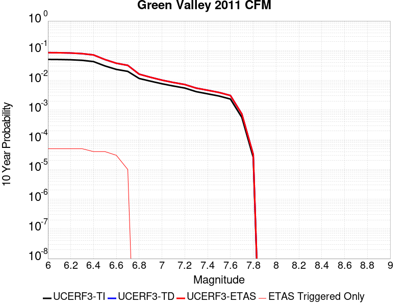 |

| Magnitude | 1 wk TI Prob | 1 wk TD Prob | 1 wk ETAS Prob | 1 wk ETAS/TD Gain | 1 wk ETAS Triggered Only | 1 mo TI Prob | 1 mo TD Prob | 1 mo ETAS Prob | 1 mo ETAS/TD Gain | 1 mo ETAS Triggered Only | 1 yr TI Prob | 1 yr TD Prob | 1 yr ETAS Prob | 1 yr ETAS/TD Gain | 1 yr ETAS Triggered Only | 10 yr TI Prob | 10 yr TD Prob | 10 yr ETAS Prob | 10 yr ETAS/TD Gain | 10 yr ETAS Triggered Only |
|-----|-----|-----|-----|-----|-----|-----|-----|-----|-----|-----|-----|-----|-----|-----|-----|-----|-----|-----|-----|-----|
| 6.0 | 9.9629346E-5 | 1.7305532E-4 | 1.9735187E-4 | 1.1403975 | 2.4300745E-5 | 4.2691303E-4 | 7.4143766E-4 | 7.7786174E-4 | 1.0491263 | 3.6451118E-5 | 0.0051852856 | 0.008986705 | 0.009022828 | 1.0040196 | 3.6451118E-5 | 0.050659515 | 0.085522056 | 0.08555539 | 1.0003898 | 3.6451118E-5 |
| 6.1 | 9.88615E-5 | 1.7152846E-4 | 1.9582504E-4 | 1.1416475 | 2.4300745E-5 | 4.2362334E-4 | 7.348976E-4 | 7.71322E-4 | 1.0495638 | 3.6451118E-5 | 0.0051454236 | 0.0089077335 | 0.0089438595 | 1.0040556 | 3.6451118E-5 | 0.050279044 | 0.084809676 | 0.08484304 | 1.0003934 | 3.6451118E-5 |
| 6.2 | 9.696895E-5 | 1.6791887E-4 | 1.9221554E-4 | 1.1446929 | 2.4300745E-5 | 4.15515E-4 | 7.194366E-4 | 7.558615E-4 | 1.0506297 | 3.6451118E-5 | 0.0050471667 | 0.008721114 | 0.008757248 | 1.0041432 | 3.6451118E-5 | 0.04934063 | 0.0831186 | 0.083152026 | 1.0004021 | 3.6451118E-5 |
| 6.3 | 9.275224E-5 | 1.5971228E-4 | 1.8400914E-4 | 1.1521289 | 2.4300745E-5 | 3.9744904E-4 | 6.842841E-4 | 7.2071026E-4 | 1.0532326 | 3.6451118E-5 | 0.0048282105 | 0.008296439 | 0.008332588 | 1.0043571 | 3.6451118E-5 | 0.047246475 | 0.07925707 | 0.07929063 | 1.0004234 | 3.6451118E-5 |
| 6.4 | 8.391499E-5 | 1.4367796E-4 | 1.6797522E-4 | 1.1691091 | 2.4300745E-5 | 3.595861E-4 | 6.156248E-4 | 6.520535E-4 | 1.0591735 | 3.6451118E-5 | 0.004369175 | 0.0074670846 | 0.007503263 | 1.0048451 | 3.6451118E-5 | 0.04284265 | 0.071630865 | 0.071664706 | 1.0004724 | 3.6451118E-5 |
| 6.5 | 5.9519385E-5 | 9.9340905E-5 | 1.2363924E-4 | 1.2445954 | 2.4300745E-5 | 2.5505814E-4 | 4.2568138E-4 | 4.62117E-4 | 1.0855936 | 3.6451118E-5 | 0.0031009112 | 0.005168295 | 0.005204558 | 1.0070164 | 3.6451118E-5 | 0.030579966 | 0.050145864 | 0.050180487 | 1.0006905 | 3.6451118E-5 |
| 6.6 | 4.5361558E-5 | 7.402609E-5 | 9.8325036E-5 | 1.3282484 | 2.4300745E-5 | 1.9439218E-4 | 3.1721895E-4 | 3.41512E-4 | 1.0765812 | 2.4300745E-5 | 0.0023641558 | 0.0038539418 | 0.0038781487 | 1.0062811 | 2.4300745E-5 | 0.023391623 | 0.037665963 | 0.037689347 | 1.0006208 | 2.4300745E-5 |
| 6.7 | 3.8808106E-5 | 6.2651976E-5 | 7.480159E-5 | 1.1939223 | 1.2150373E-5 | 1.6630985E-4 | 2.6848342E-4 | 2.8063054E-4 | 1.0452434 | 1.2150373E-5 | 0.0020229418 | 0.0032626586 | 0.0032747693 | 1.0037119 | 1.2150373E-5 | 0.020046256 | 0.032005914 | 0.032017674 | 1.0003675 | 1.2150373E-5 |
| 6.8 | 2.2284667E-5 | 3.1285235E-5 | 3.1285235E-5 | 1.0 | 0.0 | 9.550222E-5 | 1.3407279E-4 | 1.3407279E-4 | 1.0 | 0.0 | 0.0011621192 | 0.0016311078 | 0.0016311078 | 1.0 | 0.0 | 0.011560607 | 0.016165998 | 0.016165998 | 1.0 | 0.0 |
| 6.9 | 1.8050168E-5 | 2.4448054E-5 | 2.4448054E-5 | 1.0 | 0.0 | 7.735557E-5 | 1.047732E-4 | 1.047732E-4 | 1.0 | 0.0 | 9.4139716E-4 | 0.0012748708 | 0.0012748708 | 1.0 | 0.0 | 0.009374191 | 0.012667833 | 0.012667833 | 1.0 | 0.0 |
| 7.0 | 1.4763166E-5 | 1.9582854E-5 | 1.9582854E-5 | 1.0 | 0.0 | 6.326917E-5 | 8.3923835E-5 | 8.3923835E-5 | 1.0 | 0.0 | 7.7002996E-4 | 0.0010212966 | 0.0010212966 | 1.0 | 0.0 | 0.007673672 | 0.010165343 | 0.010165343 | 1.0 | 0.0 |
| 7.1 | 1.2399713E-5 | 1.6303715E-5 | 1.6303715E-5 | 1.0 | 0.0 | 5.3140546E-5 | 6.98712E-5 | 6.98712E-5 | 1.0 | 0.0 | 6.467941E-4 | 8.503518E-4 | 8.503518E-4 | 1.0 | 0.0 | 0.006449148 | 0.008471259 | 0.008471259 | 1.0 | 0.0 |
| 7.2 | 1.0584195E-5 | 1.3921742E-5 | 1.3921742E-5 | 1.0 | 0.0 | 4.5360044E-5 | 5.9663253E-5 | 5.9663253E-5 | 1.0 | 0.0 | 5.521186E-4 | 7.261596E-4 | 7.261596E-4 | 1.0 | 0.0 | 0.0055074887 | 0.007238285 | 0.007238285 | 1.0 | 0.0 |
| 7.3 | 7.998173E-6 | 1.054402E-5 | 1.054402E-5 | 1.0 | 0.0 | 3.4277433E-5 | 4.518788E-5 | 4.518788E-5 | 1.0 | 0.0 | 4.1724785E-4 | 5.500247E-4 | 5.500247E-4 | 1.0 | 0.0 | 0.004164653 | 0.0054868995 | 0.0054868995 | 1.0 | 0.0 |
| 7.4 | 6.7571127E-6 | 8.932697E-6 | 8.932697E-6 | 1.0 | 0.0 | 2.8958733E-5 | 3.828243E-5 | 3.828243E-5 | 1.0 | 0.0 | 3.5251552E-4 | 4.6598984E-4 | 4.6598984E-4 | 1.0 | 0.0 | 0.0035195686 | 0.0046503306 | 0.0046503306 | 1.0 | 0.0 |
| 7.5 | 5.69878E-6 | 7.516314E-6 | 7.516314E-6 | 1.0 | 0.0 | 2.4423114E-5 | 3.221238E-5 | 3.221238E-5 | 1.0 | 0.0 | 2.9731085E-4 | 3.9211605E-4 | 3.9211605E-4 | 1.0 | 0.0 | 0.002969134 | 0.0039143935 | 0.0039143935 | 1.0 | 0.0 |
| 7.6 | 4.503664E-6 | 5.9356807E-6 | 5.9356807E-6 | 1.0 | 0.0 | 1.9301275E-5 | 2.5438389E-5 | 2.5438389E-5 | 1.0 | 0.0 | 2.3496768E-4 | 3.096692E-4 | 3.096692E-4 | 1.0 | 0.0 | 0.002347194 | 0.003092502 | 0.003092502 | 1.0 | 0.0 |
| 7.7 | 1.0873546E-6 | 1.4106979E-6 | 1.4106979E-6 | 1.0 | 0.0 | 4.6600826E-6 | 6.045834E-6 | 6.045834E-6 | 1.0 | 0.0 | 5.6735033E-5 | 7.360557E-5 | 7.360557E-5 | 1.0 | 0.0 | 5.672055E-4 | 7.35814E-4 | 7.35814E-4 | 1.0 | 0.0 |
| 7.8 | 4.9373917E-8 | 6.1777136E-8 | 6.1777136E-8 | 1.0 | 0.0 | 2.1160248E-7 | 2.6475914E-7 | 2.6475914E-7 | 1.0 | 0.0 | 2.5762572E-6 | 3.223439E-6 | 3.223439E-6 | 1.0 | 0.0 | 2.5762274E-5 | 3.2232296E-5 | 3.2232296E-5 | 1.0 | 0.0 |

## Sierra Madre
*[(top)](#table-of-contents)*

| 1 Week | 1 Month | 1 Year | 10 Year |
|-----|-----|-----|-----|
|  |  |  |  |

| Magnitude | 1 wk TI Prob | 1 wk TD Prob | 1 wk ETAS Prob | 1 wk ETAS/TD Gain | 1 wk ETAS Triggered Only | 1 mo TI Prob | 1 mo TD Prob | 1 mo ETAS Prob | 1 mo ETAS/TD Gain | 1 mo ETAS Triggered Only | 1 yr TI Prob | 1 yr TD Prob | 1 yr ETAS Prob | 1 yr ETAS/TD Gain | 1 yr ETAS Triggered Only | 10 yr TI Prob | 10 yr TD Prob | 10 yr ETAS Prob | 10 yr ETAS/TD Gain | 10 yr ETAS Triggered Only |
|-----|-----|-----|-----|-----|-----|-----|-----|-----|-----|-----|-----|-----|-----|-----|-----|-----|-----|-----|-----|-----|
| 6.0 | 1.3379373E-5 | 1.10007395E-5 | 3.530122E-5 | 3.2089858 | 2.4300745E-5 | 5.7338908E-5 | 4.7145186E-5 | 7.144478E-5 | 1.5154207 | 2.4300745E-5 | 6.978776E-4 | 5.738429E-4 | 5.981297E-4 | 1.0423231 | 2.4300745E-5 | 0.0069569005 | 0.0057239756 | 0.005760218 | 1.0063317 | 3.6451118E-5 |
| 6.1 | 1.3379373E-5 | 1.10007395E-5 | 3.530122E-5 | 3.2089858 | 2.4300745E-5 | 5.7338908E-5 | 4.7145186E-5 | 7.144478E-5 | 1.5154207 | 2.4300745E-5 | 6.978776E-4 | 5.738429E-4 | 5.981297E-4 | 1.0423231 | 2.4300745E-5 | 0.0069569005 | 0.0057239756 | 0.005760218 | 1.0063317 | 3.6451118E-5 |
| 6.2 | 1.3379373E-5 | 1.10007395E-5 | 3.530122E-5 | 3.2089858 | 2.4300745E-5 | 5.7338908E-5 | 4.7145186E-5 | 7.144478E-5 | 1.5154207 | 2.4300745E-5 | 6.978776E-4 | 5.738429E-4 | 5.981297E-4 | 1.0423231 | 2.4300745E-5 | 0.0069569005 | 0.0057239756 | 0.005760218 | 1.0063317 | 3.6451118E-5 |
| 6.3 | 1.3379373E-5 | 1.10007395E-5 | 3.530122E-5 | 3.2089858 | 2.4300745E-5 | 5.7338908E-5 | 4.7145186E-5 | 7.144478E-5 | 1.5154207 | 2.4300745E-5 | 6.978776E-4 | 5.738429E-4 | 5.981297E-4 | 1.0423231 | 2.4300745E-5 | 0.0069569005 | 0.0057239756 | 0.005760218 | 1.0063317 | 3.6451118E-5 |
| 6.4 | 1.3379373E-5 | 1.10007395E-5 | 3.530122E-5 | 3.2089858 | 2.4300745E-5 | 5.7338908E-5 | 4.7145186E-5 | 7.144478E-5 | 1.5154207 | 2.4300745E-5 | 6.978776E-4 | 5.738429E-4 | 5.981297E-4 | 1.0423231 | 2.4300745E-5 | 0.0069569005 | 0.0057239756 | 0.005760218 | 1.0063317 | 3.6451118E-5 |
| 6.5 | 1.26563245E-5 | 1.0230196E-5 | 2.2380444E-5 | 2.1876848 | 1.2150373E-5 | 5.4240263E-5 | 4.3842967E-5 | 5.5992805E-5 | 1.2771218 | 1.2150373E-5 | 6.601751E-4 | 5.336584E-4 | 5.4580235E-4 | 1.0227559 | 1.2150373E-5 | 0.006582173 | 0.0053240913 | 0.0053482624 | 1.00454 | 2.4300745E-5 |
| 6.6 | 1.26563245E-5 | 1.0230196E-5 | 2.2380444E-5 | 2.1876848 | 1.2150373E-5 | 5.4240263E-5 | 4.3842967E-5 | 5.5992805E-5 | 1.2771218 | 1.2150373E-5 | 6.601751E-4 | 5.336584E-4 | 5.4580235E-4 | 1.0227559 | 1.2150373E-5 | 0.006582173 | 0.0053240913 | 0.0053482624 | 1.00454 | 2.4300745E-5 |
| 6.7 | 1.2502474E-5 | 1.006634E-5 | 2.221659E-5 | 2.2070177 | 1.2150373E-5 | 5.3580934E-5 | 4.314075E-5 | 5.52906E-5 | 1.2816328 | 1.2150373E-5 | 6.521526E-4 | 5.251131E-4 | 5.372571E-4 | 1.0231265 | 1.2150373E-5 | 0.0065024206 | 0.0052390425 | 0.005263216 | 1.0046141 | 2.4300745E-5 |
| 6.8 | 1.2454966E-5 | 1.0018625E-5 | 2.2168877E-5 | 2.2127662 | 1.2150373E-5 | 5.3377335E-5 | 4.2936266E-5 | 5.508612E-5 | 1.2829741 | 1.2150373E-5 | 6.4967526E-4 | 5.226247E-4 | 5.3476874E-4 | 1.0232366 | 1.2150373E-5 | 0.006477792 | 0.0052142753 | 0.005238449 | 1.0046362 | 2.4300745E-5 |
| 6.9 | 1.2225574E-5 | 9.792602E-6 | 2.1942857E-5 | 2.2407584 | 1.2150373E-5 | 5.2394265E-5 | 4.1967625E-5 | 5.411749E-5 | 1.2895056 | 1.2150373E-5 | 6.3771347E-4 | 5.108371E-4 | 5.229813E-4 | 1.0237731 | 1.2150373E-5 | 0.006358865 | 0.0050969445 | 0.005109033 | 1.0023717 | 1.2150373E-5 |
| 7.0 | 1.182946E-5 | 9.399144E-6 | 2.1549402E-5 | 2.2926986 | 1.2150373E-5 | 5.06967E-5 | 4.0281426E-5 | 5.243131E-5 | 1.3016249 | 1.2150373E-5 | 6.1705755E-4 | 4.9031706E-4 | 5.0246145E-4 | 1.0247685 | 1.2150373E-5 | 0.006153469 | 0.004892664 | 0.004904755 | 1.0024712 | 1.2150373E-5 |
| 7.1 | 1.14369095E-5 | 8.986159E-6 | 2.1136422E-5 | 2.3521087 | 1.2150373E-5 | 4.9014405E-5 | 3.8511545E-5 | 5.0661452E-5 | 1.3154874 | 1.2150373E-5 | 5.9658696E-4 | 4.687782E-4 | 4.8092287E-4 | 1.025907 | 1.2150373E-5 | 0.005949879 | 0.004678199 | 0.0046902928 | 1.002585 | 1.2150373E-5 |
| 7.2 | 1.0836419E-5 | 8.3995565E-6 | 2.0549827E-5 | 2.4465373 | 1.2150373E-5 | 4.644097E-5 | 3.5997607E-5 | 4.8147544E-5 | 1.3375206 | 1.2150373E-5 | 5.652721E-4 | 4.3818366E-4 | 4.5032872E-4 | 1.0277168 | 1.2150373E-5 | 0.0056383642 | 0.004373494 | 0.0043855915 | 1.002766 | 1.2150373E-5 |
| 7.3 | 1.0403439E-5 | 8.02082E-6 | 2.0171095E-5 | 2.514842 | 1.2150373E-5 | 4.4585406E-5 | 3.4374494E-5 | 4.652445E-5 | 1.3534584 | 1.2150373E-5 | 5.426921E-4 | 4.1843E-4 | 4.3057528E-4 | 1.0290259 | 1.2150373E-5 | 0.005413687 | 0.004176717 | 0.0041888165 | 1.0028969 | 1.2150373E-5 |
| 7.4 | 9.768864E-6 | 7.414448E-6 | 1.9564732E-5 | 2.6387305 | 1.2150373E-5 | 4.186589E-5 | 3.1775824E-5 | 4.392581E-5 | 1.3823657 | 1.2150373E-5 | 5.09598E-4 | 3.868029E-4 | 3.9894856E-4 | 1.0314002 | 1.2150373E-5 | 0.0050843097 | 0.0038615882 | 0.0038736917 | 1.0031344 | 1.2150373E-5 |
| 7.5 | 8.687089E-6 | 6.4501564E-6 | 1.860045E-5 | 2.8837209 | 1.2150373E-5 | 3.722985E-5 | 2.764324E-5 | 3.9793278E-5 | 1.4395301 | 1.2150373E-5 | 4.5317915E-4 | 3.3650533E-4 | 3.486516E-4 | 1.0360954 | 1.2150373E-5 | 0.004522561 | 0.0033602451 | 0.0033723547 | 1.0036038 | 1.2150373E-5 |
| 7.6 | 6.3506063E-6 | 4.4303215E-6 | 4.4303215E-6 | 1.0 | 0.0 | 2.72166E-5 | 1.8986955E-5 | 1.8986955E-5 | 1.0 | 0.0 | 3.3131172E-4 | 2.3114192E-4 | 2.3114192E-4 | 1.0 | 0.0 | 0.003308182 | 0.0023092402 | 0.0023092402 | 1.0 | 0.0 |
| 7.7 | 4.62223E-6 | 2.932967E-6 | 2.932967E-6 | 1.0 | 0.0 | 1.9809406E-5 | 1.2569798E-5 | 1.2569798E-5 | 1.0 | 0.0 | 2.4115283E-4 | 1.5302657E-4 | 1.5302657E-4 | 1.0 | 0.0 | 0.0024089129 | 0.001529413 | 0.001529413 | 1.0 | 0.0 |
| 7.8 | 3.2145008E-6 | 1.9494332E-6 | 1.9494332E-6 | 1.0 | 0.0 | 1.3776359E-5 | 8.3546865E-6 | 8.3546865E-6 | 1.0 | 0.0 | 1.6771426E-4 | 1.0171358E-4 | 1.0171358E-4 | 1.0 | 0.0 | 0.0016758774 | 0.0010168145 | 0.0010168145 | 1.0 | 0.0 |
| 7.9 | 1.0391769E-6 | 5.6026335E-7 | 5.6026335E-7 | 1.0 | 0.0 | 4.4536077E-6 | 2.4011265E-6 | 2.4011265E-6 | 1.0 | 0.0 | 5.4221324E-5 | 2.9233326E-5 | 2.9233326E-5 | 1.0 | 0.0 | 5.4208096E-4 | 2.9229524E-4 | 2.9229524E-4 | 1.0 | 0.0 |
| 8.0 | 1.210983E-7 | 6.613821E-8 | 6.613821E-8 | 1.0 | 0.0 | 5.1899264E-7 | 2.8344945E-7 | 2.8344945E-7 | 1.0 | 0.0 | 6.3187167E-6 | 3.4509917E-6 | 3.4509917E-6 | 1.0 | 0.0 | 6.318537E-5 | 3.45094E-5 | 3.45094E-5 | 1.0 | 0.0 |

## Pinto Mtn
*[(top)](#table-of-contents)*

| 1 Week | 1 Month | 1 Year | 10 Year |
|-----|-----|-----|-----|
|  |  |  |  |

| Magnitude | 1 wk TI Prob | 1 wk TD Prob | 1 wk ETAS Prob | 1 wk ETAS/TD Gain | 1 wk ETAS Triggered Only | 1 mo TI Prob | 1 mo TD Prob | 1 mo ETAS Prob | 1 mo ETAS/TD Gain | 1 mo ETAS Triggered Only | 1 yr TI Prob | 1 yr TD Prob | 1 yr ETAS Prob | 1 yr ETAS/TD Gain | 1 yr ETAS Triggered Only | 10 yr TI Prob | 10 yr TD Prob | 10 yr ETAS Prob | 10 yr ETAS/TD Gain | 10 yr ETAS Triggered Only |
|-----|-----|-----|-----|-----|-----|-----|-----|-----|-----|-----|-----|-----|-----|-----|-----|-----|-----|-----|-----|-----|
| 6.0 | 4.4194956E-5 | 4.785362E-5 | 7.2153205E-5 | 1.5077899 | 2.4300745E-5 | 1.893932E-4 | 2.0507174E-4 | 2.293675E-4 | 1.1184745 | 2.4300745E-5 | 0.0023034236 | 0.0024940541 | 0.0025304144 | 1.0145787 | 3.6451118E-5 | 0.022796938 | 0.024678145 | 0.024713697 | 1.0014406 | 3.6451118E-5 |
| 6.1 | 4.4194956E-5 | 4.785362E-5 | 7.2153205E-5 | 1.5077899 | 2.4300745E-5 | 1.893932E-4 | 2.0507174E-4 | 2.293675E-4 | 1.1184745 | 2.4300745E-5 | 0.0023034236 | 0.0024940541 | 0.0025304144 | 1.0145787 | 3.6451118E-5 | 0.022796938 | 0.024678145 | 0.024713697 | 1.0014406 | 3.6451118E-5 |
| 6.2 | 4.4194956E-5 | 4.785362E-5 | 7.2153205E-5 | 1.5077899 | 2.4300745E-5 | 1.893932E-4 | 2.0507174E-4 | 2.293675E-4 | 1.1184745 | 2.4300745E-5 | 0.0023034236 | 0.0024940541 | 0.0025304144 | 1.0145787 | 3.6451118E-5 | 0.022796938 | 0.024678145 | 0.024713697 | 1.0014406 | 3.6451118E-5 |
| 6.3 | 4.4194956E-5 | 4.785362E-5 | 7.2153205E-5 | 1.5077899 | 2.4300745E-5 | 1.893932E-4 | 2.0507174E-4 | 2.293675E-4 | 1.1184745 | 2.4300745E-5 | 0.0023034236 | 0.0024940541 | 0.0025304144 | 1.0145787 | 3.6451118E-5 | 0.022796938 | 0.024678145 | 0.024713697 | 1.0014406 | 3.6451118E-5 |
| 6.4 | 3.729929E-5 | 3.9603186E-5 | 5.175308E-5 | 1.3067908 | 1.2150373E-5 | 1.5984432E-4 | 1.6971743E-4 | 1.8186573E-4 | 1.0715796 | 1.2150373E-5 | 0.0019443673 | 0.002064445 | 0.0020886955 | 1.0117468 | 2.4300745E-5 | 0.019274427 | 0.02046269 | 0.020486495 | 1.0011632 | 2.4300745E-5 |
| 6.5 | 3.729929E-5 | 3.9603186E-5 | 5.175308E-5 | 1.3067908 | 1.2150373E-5 | 1.5984432E-4 | 1.6971743E-4 | 1.8186573E-4 | 1.0715796 | 1.2150373E-5 | 0.0019443673 | 0.002064445 | 0.0020886955 | 1.0117468 | 2.4300745E-5 | 0.019274427 | 0.02046269 | 0.020486495 | 1.0011632 | 2.4300745E-5 |
| 6.6 | 3.0204548E-5 | 3.1205298E-5 | 4.3355292E-5 | 1.3893567 | 1.2150373E-5 | 1.2944164E-4 | 1.3373033E-4 | 1.4587908E-4 | 1.0908451 | 1.2150373E-5 | 0.0015748127 | 0.0016269855 | 0.0016512467 | 1.0149118 | 2.4300745E-5 | 0.015636992 | 0.01615461 | 0.016178517 | 1.00148 | 2.4300745E-5 |
| 6.7 | 2.9857754E-5 | 3.081468E-5 | 4.2964683E-5 | 1.3942925 | 1.2150373E-5 | 1.2795553E-4 | 1.3205643E-4 | 1.442052E-4 | 1.0919968 | 1.2150373E-5 | 0.0015567453 | 0.001606636 | 0.0016308976 | 1.015101 | 2.4300745E-5 | 0.015458848 | 0.01595405 | 0.015977962 | 1.0014988 | 2.4300745E-5 |
| 6.8 | 2.4819734E-5 | 2.5009364E-5 | 3.7159432E-5 | 1.4858208 | 1.2150373E-5 | 1.0636595E-4 | 1.07178705E-4 | 1.1932777E-4 | 1.1133534 | 1.2150373E-5 | 0.0012942362 | 0.0013041412 | 0.0013284103 | 1.0186092 | 2.4300745E-5 | 0.012867244 | 0.0129672475 | 0.012991233 | 1.0018497 | 2.4300745E-5 |
| 6.9 | 2.331124E-5 | 2.3337643E-5 | 3.548773E-5 | 1.520622 | 1.2150373E-5 | 9.990149E-5 | 1.00014746E-4 | 1.1216391E-4 | 1.1214737 | 1.2150373E-5 | 0.001215622 | 0.0012170197 | 0.0012412908 | 1.0199431 | 2.4300745E-5 | 0.012089936 | 0.012105742 | 0.012129747 | 1.001983 | 2.4300745E-5 |
| 7.0 | 2.1818534E-5 | 2.1760772E-5 | 3.391088E-5 | 1.5583491 | 1.2150373E-5 | 9.3504656E-5 | 9.325723E-5 | 1.0540647E-4 | 1.1302767 | 1.2150373E-5 | 0.0011378246 | 0.0011348352 | 0.0011591084 | 1.0213891 | 2.4300745E-5 | 0.011320163 | 0.011292503 | 0.01131653 | 1.0021276 | 2.4300745E-5 |
| 7.1 | 2.066081E-5 | 2.0540418E-5 | 3.269054E-5 | 1.5915227 | 1.2150373E-5 | 8.854332E-5 | 8.8027504E-5 | 1.001768E-4 | 1.1380172 | 1.2150373E-5 | 0.0010774818 | 0.0010712275 | 0.0010955022 | 1.0226606 | 2.4300745E-5 | 0.010722724 | 0.010662688 | 0.01068673 | 1.0022547 | 2.4300745E-5 |
| 7.2 | 1.8990233E-5 | 1.9053701E-5 | 3.1203843E-5 | 1.6376787 | 1.2150373E-5 | 8.138417E-5 | 8.1656275E-5 | 9.3805655E-5 | 1.1487869 | 1.2150373E-5 | 9.904018E-4 | 9.937311E-4 | 0.0010180076 | 1.0244298 | 2.4300745E-5 | 0.009859995 | 0.009894874 | 0.009918934 | 1.0024316 | 2.4300745E-5 |
| 7.3 | 1.3335872E-5 | 1.4906372E-5 | 2.7056563E-5 | 1.8151006 | 1.2150373E-5 | 5.7152483E-5 | 6.388296E-5 | 7.603256E-5 | 1.1901853 | 1.2150373E-5 | 6.956093E-4 | 7.775102E-4 | 8.017921E-4 | 1.0312302 | 2.4300745E-5 | 0.006934359 | 0.0077491994 | 0.007773312 | 1.0031116 | 2.4300745E-5 |
| 7.4 | 9.414066E-6 | 1.186061E-5 | 1.186061E-5 | 1.0 | 0.0 | 4.0345374E-5 | 5.0830247E-5 | 5.0830247E-5 | 1.0 | 0.0 | 4.910942E-4 | 6.1869196E-4 | 6.3083484E-4 | 1.0196266 | 1.2150373E-5 | 0.0049001034 | 0.006170644 | 0.0061827195 | 1.0019569 | 1.2150373E-5 |
| 7.5 | 7.2101157E-6 | 9.157893E-6 | 9.157893E-6 | 1.0 | 0.0 | 3.090013E-5 | 3.924757E-5 | 3.924757E-5 | 1.0 | 0.0 | 3.7614413E-4 | 4.7774217E-4 | 4.7774217E-4 | 1.0 | 0.0 | 0.0037550807 | 0.004767927 | 0.004767927 | 1.0 | 0.0 |
| 7.6 | 3.296375E-6 | 4.5453176E-6 | 4.5453176E-6 | 1.0 | 0.0 | 1.4127245E-5 | 1.9479796E-5 | 1.9479796E-5 | 1.0 | 0.0 | 1.7198564E-4 | 2.3714209E-4 | 2.3714209E-4 | 1.0 | 0.0 | 0.0017185259 | 0.0023690276 | 0.0023690276 | 1.0 | 0.0 |
| 7.7 | 2.5741092E-6 | 3.584251E-6 | 3.584251E-6 | 1.0 | 0.0 | 1.103185E-5 | 1.5360993E-5 | 1.5360993E-5 | 1.0 | 0.0 | 1.3430449E-4 | 1.8700535E-4 | 1.8700535E-4 | 1.0 | 0.0 | 0.0013422335 | 0.0018686098 | 0.0018686098 | 1.0 | 0.0 |

## Elsinore (Stepovers Combined)
*[(top)](#table-of-contents)*

| 1 Week | 1 Month | 1 Year | 10 Year |
|-----|-----|-----|-----|
|  |  |  |  |

| Magnitude | 1 wk TI Prob | 1 wk TD Prob | 1 wk ETAS Prob | 1 wk ETAS/TD Gain | 1 wk ETAS Triggered Only | 1 mo TI Prob | 1 mo TD Prob | 1 mo ETAS Prob | 1 mo ETAS/TD Gain | 1 mo ETAS Triggered Only | 1 yr TI Prob | 1 yr TD Prob | 1 yr ETAS Prob | 1 yr ETAS/TD Gain | 1 yr ETAS Triggered Only | 10 yr TI Prob | 10 yr TD Prob | 10 yr ETAS Prob | 10 yr ETAS/TD Gain | 10 yr ETAS Triggered Only |
|-----|-----|-----|-----|-----|-----|-----|-----|-----|-----|-----|-----|-----|-----|-----|-----|-----|-----|-----|-----|-----|
| 6.0 | 2.144392E-5 | 1.9760193E-5 | 1.9760193E-5 | 1.0 | 0.0 | 9.189928E-5 | 8.468392E-5 | 9.683326E-5 | 1.143467 | 1.2150373E-5 | 0.0011182994 | 0.0010305607 | 0.0010548364 | 1.0235559 | 2.4300745E-5 | 0.011126885 | 0.010264917 | 0.010300995 | 1.0035145 | 3.6451118E-5 |
| 6.1 | 2.144392E-5 | 1.9760193E-5 | 1.9760193E-5 | 1.0 | 0.0 | 9.189928E-5 | 8.468392E-5 | 9.683326E-5 | 1.143467 | 1.2150373E-5 | 0.0011182994 | 0.0010305607 | 0.0010548364 | 1.0235559 | 2.4300745E-5 | 0.011126885 | 0.010264917 | 0.010300995 | 1.0035145 | 3.6451118E-5 |
| 6.2 | 2.144392E-5 | 1.9760193E-5 | 1.9760193E-5 | 1.0 | 0.0 | 9.189928E-5 | 8.468392E-5 | 9.683326E-5 | 1.143467 | 1.2150373E-5 | 0.0011182994 | 0.0010305607 | 0.0010548364 | 1.0235559 | 2.4300745E-5 | 0.011126885 | 0.010264917 | 0.010300995 | 1.0035145 | 3.6451118E-5 |
| 6.3 | 1.9751555E-5 | 1.7741453E-5 | 1.7741453E-5 | 1.0 | 0.0 | 8.4646774E-5 | 7.603267E-5 | 8.8182125E-5 | 1.1597924 | 1.2150373E-5 | 0.0010300872 | 9.253213E-4 | 9.4959955E-4 | 1.0262376 | 2.4300745E-5 | 0.010253254 | 0.009221276 | 0.009257391 | 1.0039165 | 3.6451118E-5 |
| 6.4 | 1.9751555E-5 | 1.7741453E-5 | 1.7741453E-5 | 1.0 | 0.0 | 8.4646774E-5 | 7.603267E-5 | 8.8182125E-5 | 1.1597924 | 1.2150373E-5 | 0.0010300872 | 9.253213E-4 | 9.4959955E-4 | 1.0262376 | 2.4300745E-5 | 0.010253254 | 0.009221276 | 0.009257391 | 1.0039165 | 3.6451118E-5 |
| 6.5 | 1.9751555E-5 | 1.7741453E-5 | 1.7741453E-5 | 1.0 | 0.0 | 8.4646774E-5 | 7.603267E-5 | 8.8182125E-5 | 1.1597924 | 1.2150373E-5 | 0.0010300872 | 9.253213E-4 | 9.4959955E-4 | 1.0262376 | 2.4300745E-5 | 0.010253254 | 0.009221276 | 0.009257391 | 1.0039165 | 3.6451118E-5 |
| 6.6 | 1.9188685E-5 | 1.7003393E-5 | 1.7003393E-5 | 1.0 | 0.0 | 8.2234634E-5 | 7.286974E-5 | 8.501923E-5 | 1.1667289 | 1.2150373E-5 | 0.0010007467 | 8.868442E-4 | 9.1112335E-4 | 1.0273771 | 2.4300745E-5 | 0.00996252 | 0.0088398475 | 0.008875976 | 1.0040871 | 3.6451118E-5 |
| 6.7 | 1.7608272E-5 | 1.4732616E-5 | 1.4732616E-5 | 1.0 | 0.0 | 7.546184E-5 | 6.3138315E-5 | 6.3138315E-5 | 1.0 | 0.0 | 9.183606E-4 | 7.684476E-4 | 7.8058866E-4 | 1.0157994 | 1.2150373E-5 | 0.009145746 | 0.00766491 | 0.0076769674 | 1.0015731 | 1.2150373E-5 |
| 6.8 | 1.697165E-5 | 1.3783365E-5 | 1.3783365E-5 | 1.0 | 0.0 | 7.273361E-5 | 5.9070277E-5 | 5.9070277E-5 | 1.0 | 0.0 | 8.8517193E-4 | 7.18952E-4 | 7.3109363E-4 | 1.016888 | 1.2150373E-5 | 0.008816543 | 0.007172675 | 0.0071847383 | 1.0016818 | 1.2150373E-5 |
| 6.9 | 1.600365E-5 | 1.2846671E-5 | 1.2846671E-5 | 1.0 | 0.0 | 6.858527E-5 | 5.5056043E-5 | 5.5056043E-5 | 1.0 | 0.0 | 8.347058E-4 | 6.7010894E-4 | 6.822512E-4 | 1.0181198 | 1.2150373E-5 | 0.008315775 | 0.0066867657 | 0.006698835 | 1.001805 | 1.2150373E-5 |
| 7.0 | 1.3314581E-5 | 1.0447548E-5 | 1.0447548E-5 | 1.0 | 0.0 | 5.7061243E-5 | 4.4774453E-5 | 4.4774453E-5 | 1.0 | 0.0 | 6.944992E-4 | 5.449953E-4 | 5.5713905E-4 | 1.0222824 | 1.2150373E-5 | 0.006923327 | 0.0054405155 | 0.0054525994 | 1.0022211 | 1.2150373E-5 |
| 7.1 | 1.2865345E-5 | 9.937536E-6 | 9.937536E-6 | 1.0 | 0.0 | 5.5136024E-5 | 4.258876E-5 | 4.258876E-5 | 1.0 | 0.0 | 6.710743E-4 | 5.183973E-4 | 5.305414E-4 | 1.0234262 | 1.2150373E-5 | 0.0066905143 | 0.0051752133 | 0.005187301 | 1.0023357 | 1.2150373E-5 |
| 7.2 | 1.1650051E-5 | 8.633809E-6 | 8.633809E-6 | 1.0 | 0.0 | 4.9927836E-5 | 3.7001522E-5 | 3.7001522E-5 | 1.0 | 0.0 | 6.0770183E-4 | 4.504022E-4 | 4.504022E-4 | 1.0 | 0.0 | 0.0060604266 | 0.0044963174 | 0.0044963174 | 1.0 | 0.0 |
| 7.3 | 1.0008533E-5 | 7.2010425E-6 | 7.2010425E-6 | 1.0 | 0.0 | 4.2893007E-5 | 3.0861254E-5 | 3.0861254E-5 | 1.0 | 0.0 | 5.220972E-4 | 3.7567242E-4 | 3.7567242E-4 | 1.0 | 0.0 | 0.005208723 | 0.003750761 | 0.003750761 | 1.0 | 0.0 |
| 7.4 | 9.116759E-6 | 6.410068E-6 | 6.410068E-6 | 1.0 | 0.0 | 3.907124E-5 | 2.747144E-5 | 2.747144E-5 | 1.0 | 0.0 | 4.7558855E-4 | 3.3441483E-4 | 3.3441483E-4 | 1.0 | 0.0 | 0.00474572 | 0.0033392678 | 0.0033392678 | 1.0 | 0.0 |
| 7.5 | 7.870524E-6 | 5.3825365E-6 | 5.3825365E-6 | 1.0 | 0.0 | 3.3730383E-5 | 2.3067816E-5 | 2.3067816E-5 | 1.0 | 0.0 | 4.1059E-4 | 2.8081573E-4 | 2.8081573E-4 | 1.0 | 0.0 | 0.0040983222 | 0.0028047354 | 0.0028047354 | 1.0 | 0.0 |
| 7.6 | 6.9774537E-6 | 4.6776067E-6 | 4.6776067E-6 | 1.0 | 0.0 | 2.990303E-5 | 2.0046738E-5 | 2.0046738E-5 | 1.0 | 0.0 | 3.640086E-4 | 2.4404288E-4 | 2.4404288E-4 | 1.0 | 0.0 | 0.003634129 | 0.0024378651 | 0.0024378651 | 1.0 | 0.0 |
| 7.7 | 4.1616954E-6 | 2.32834E-6 | 2.32834E-6 | 1.0 | 0.0 | 1.7835715E-5 | 9.978567E-6 | 9.978567E-6 | 1.0 | 0.0 | 2.171282E-4 | 1.2148302E-4 | 1.2148302E-4 | 1.0 | 0.0 | 0.0021691616 | 0.0012142392 | 0.0012142392 | 1.0 | 0.0 |
| 7.8 | 2.2692414E-7 | 9.3854695E-8 | 9.3854695E-8 | 1.0 | 0.0 | 9.725317E-7 | 4.0223435E-7 | 4.0223435E-7 | 1.0 | 0.0 | 1.1840509E-5 | 4.8971956E-6 | 4.8971956E-6 | 1.0 | 0.0 | 1.1839878E-4 | 4.8971204E-5 | 4.8971204E-5 | 1.0 | 0.0 |
| 7.9 | 6.676829E-9 | 3.439853E-9 | 3.439853E-9 | 1.0 | 0.0 | 2.861498E-8 | 1.4742227E-8 | 1.4742227E-8 | 1.0 | 0.0 | 3.4838732E-7 | 1.7948659E-7 | 1.7948659E-7 | 1.0 | 0.0 | 3.4838679E-6 | 1.7948646E-6 | 1.7948646E-6 | 1.0 | 0.0 |

## Cleghorn Lake
*[(top)](#table-of-contents)*

| 1 Week | 1 Month | 1 Year | 10 Year |
|-----|-----|-----|-----|
|  |  |  |  |

| Magnitude | 1 wk TI Prob | 1 wk TD Prob | 1 wk ETAS Prob | 1 wk ETAS/TD Gain | 1 wk ETAS Triggered Only | 1 mo TI Prob | 1 mo TD Prob | 1 mo ETAS Prob | 1 mo ETAS/TD Gain | 1 mo ETAS Triggered Only | 1 yr TI Prob | 1 yr TD Prob | 1 yr ETAS Prob | 1 yr ETAS/TD Gain | 1 yr ETAS Triggered Only | 10 yr TI Prob | 10 yr TD Prob | 10 yr ETAS Prob | 10 yr ETAS/TD Gain | 10 yr ETAS Triggered Only |
|-----|-----|-----|-----|-----|-----|-----|-----|-----|-----|-----|-----|-----|-----|-----|-----|-----|-----|-----|-----|-----|
| 6.0 | 1.5467183E-5 | 1.6794203E-5 | 2.8944372E-5 | 1.7234739 | 1.2150373E-5 | 6.6286244E-5 | 7.197348E-5 | 1.0842198E-4 | 1.5064156 | 3.6451118E-5 | 8.067362E-4 | 8.759797E-4 | 9.123989E-4 | 1.0415754 | 3.6451118E-5 | 0.008038137 | 0.008730696 | 0.008766828 | 1.0041386 | 3.6451118E-5 |
| 6.1 | 1.5467183E-5 | 1.6794203E-5 | 2.8944372E-5 | 1.7234739 | 1.2150373E-5 | 6.6286244E-5 | 7.197348E-5 | 1.0842198E-4 | 1.5064156 | 3.6451118E-5 | 8.067362E-4 | 8.759797E-4 | 9.123989E-4 | 1.0415754 | 3.6451118E-5 | 0.008038137 | 0.008730696 | 0.008766828 | 1.0041386 | 3.6451118E-5 |
| 6.2 | 1.2624631E-5 | 1.3681544E-5 | 2.583175E-5 | 1.8880727 | 1.2150373E-5 | 5.410444E-5 | 5.863415E-5 | 9.508313E-5 | 1.621634 | 3.6451118E-5 | 6.585225E-4 | 7.1368564E-4 | 7.501107E-4 | 1.051038 | 3.6451118E-5 | 0.0065657445 | 0.0071187317 | 0.0071549234 | 1.005084 | 3.6451118E-5 |
| 6.3 | 1.2624631E-5 | 1.3681544E-5 | 2.583175E-5 | 1.8880727 | 1.2150373E-5 | 5.410444E-5 | 5.863415E-5 | 9.508313E-5 | 1.621634 | 3.6451118E-5 | 6.585225E-4 | 7.1368564E-4 | 7.501107E-4 | 1.051038 | 3.6451118E-5 | 0.0065657445 | 0.0071187317 | 0.0071549234 | 1.005084 | 3.6451118E-5 |
| 6.4 | 9.417684E-6 | 1.0170118E-5 | 2.2320368E-5 | 2.194701 | 1.2150373E-5 | 4.036088E-5 | 4.3585722E-5 | 6.788541E-5 | 1.5575148 | 2.4300745E-5 | 4.912829E-4 | 5.3056807E-4 | 5.548559E-4 | 1.0457771 | 2.4300745E-5 | 0.004901982 | 0.005297049 | 0.005321221 | 1.0045633 | 2.4300745E-5 |
| 6.5 | 9.368219E-6 | 1.0117545E-5 | 2.2267794E-5 | 2.200909 | 1.2150373E-5 | 4.014889E-5 | 4.3360415E-5 | 6.7660105E-5 | 1.5604119 | 2.4300745E-5 | 4.8870314E-4 | 5.2782625E-4 | 5.5211416E-4 | 1.046015 | 2.4300745E-5 | 0.004876298 | 0.0052697617 | 0.005293934 | 1.004587 | 2.4300745E-5 |
| 6.6 | 7.803798E-6 | 8.441831E-6 | 2.0592102E-5 | 2.4392931 | 1.2150373E-5 | 3.3444423E-5 | 3.6179E-5 | 6.0478866E-5 | 1.6716567 | 2.4300745E-5 | 4.0710976E-4 | 4.4043022E-4 | 4.6472024E-4 | 1.0551507 | 2.4300745E-5 | 0.0040636472 | 0.0043994905 | 0.0044236844 | 1.0054992 | 2.4300745E-5 |
| 6.7 | 2.3108669E-6 | 2.4438336E-6 | 2.4438336E-6 | 1.0 | 0.0 | 9.903678E-6 | 1.0473532E-5 | 1.0473532E-5 | 1.0 | 0.0 | 1.205706E-4 | 1.2750797E-4 | 1.2750797E-4 | 1.0 | 0.0 | 0.001205052 | 0.0012743667 | 0.0012743667 | 1.0 | 0.0 |
| 6.8 | 2.0882828E-6 | 2.2062823E-6 | 2.2062823E-6 | 1.0 | 0.0 | 8.949753E-6 | 9.455462E-6 | 9.455462E-6 | 1.0 | 0.0 | 1.08957785E-4 | 1.1511434E-4 | 1.1511434E-4 | 1.0 | 0.0 | 0.0010890438 | 0.0011505639 | 0.0011505639 | 1.0 | 0.0 |
| 6.9 | 1.876935E-6 | 1.981051E-6 | 1.981051E-6 | 1.0 | 0.0 | 8.043982E-6 | 8.490192E-6 | 8.490192E-6 | 1.0 | 0.0 | 9.7931086E-5 | 1.03363345E-4 | 1.03363345E-4 | 1.0 | 0.0 | 9.788794E-4 | 0.0010331686 | 0.0010331686 | 1.0 | 0.0 |
| 7.0 | 1.5357559E-6 | 1.6202807E-6 | 1.6202807E-6 | 1.0 | 0.0 | 6.5817944E-6 | 6.9440425E-6 | 6.9440425E-6 | 1.0 | 0.0 | 8.01304E-5 | 8.454057E-5 | 8.454057E-5 | 1.0 | 0.0 | 8.010151E-4 | 8.450965E-4 | 8.450965E-4 | 1.0 | 0.0 |
| 7.1 | 1.0905424E-6 | 1.1497619E-6 | 1.1497619E-6 | 1.0 | 0.0 | 4.6737446E-6 | 4.9275427E-6 | 4.9275427E-6 | 1.0 | 0.0 | 5.6901354E-5 | 5.999128E-5 | 5.999128E-5 | 1.0 | 0.0 | 5.6886784E-4 | 5.997606E-4 | 5.997606E-4 | 1.0 | 0.0 |
| 7.2 | 6.06668E-7 | 6.387277E-7 | 6.387277E-7 | 1.0 | 0.0 | 2.600003E-6 | 2.7374022E-6 | 2.7374022E-6 | 1.0 | 0.0 | 3.1654577E-5 | 3.3327433E-5 | 3.3327433E-5 | 1.0 | 0.0 | 3.1650066E-4 | 3.3323118E-4 | 3.3323118E-4 | 1.0 | 0.0 |

## Raymond
*[(top)](#table-of-contents)*

| 1 Week | 1 Month | 1 Year | 10 Year |
|-----|-----|-----|-----|
|  |  |  | 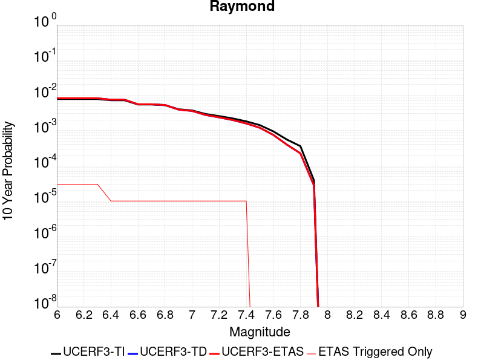 |

| Magnitude | 1 wk TI Prob | 1 wk TD Prob | 1 wk ETAS Prob | 1 wk ETAS/TD Gain | 1 wk ETAS Triggered Only | 1 mo TI Prob | 1 mo TD Prob | 1 mo ETAS Prob | 1 mo ETAS/TD Gain | 1 mo ETAS Triggered Only | 1 yr TI Prob | 1 yr TD Prob | 1 yr ETAS Prob | 1 yr ETAS/TD Gain | 1 yr ETAS Triggered Only | 10 yr TI Prob | 10 yr TD Prob | 10 yr ETAS Prob | 10 yr ETAS/TD Gain | 10 yr ETAS Triggered Only |
|-----|-----|-----|-----|-----|-----|-----|-----|-----|-----|-----|-----|-----|-----|-----|-----|-----|-----|-----|-----|-----|
| 6.0 | 1.5157413E-5 | 1.5810128E-5 | 2.7960308E-5 | 1.7685062 | 1.2150373E-5 | 6.4958724E-5 | 6.7756075E-5 | 9.2055176E-5 | 1.3586261 | 2.4300745E-5 | 7.905855E-4 | 8.2464307E-4 | 8.610641E-4 | 1.0441658 | 3.6451118E-5 | 0.007877788 | 0.008218348 | 0.0082545 | 1.004399 | 3.6451118E-5 |
| 6.1 | 1.5157413E-5 | 1.5810128E-5 | 2.7960308E-5 | 1.7685062 | 1.2150373E-5 | 6.4958724E-5 | 6.7756075E-5 | 9.2055176E-5 | 1.3586261 | 2.4300745E-5 | 7.905855E-4 | 8.2464307E-4 | 8.610641E-4 | 1.0441658 | 3.6451118E-5 | 0.007877788 | 0.008218348 | 0.0082545 | 1.004399 | 3.6451118E-5 |
| 6.2 | 1.5157413E-5 | 1.5810128E-5 | 2.7960308E-5 | 1.7685062 | 1.2150373E-5 | 6.4958724E-5 | 6.7756075E-5 | 9.2055176E-5 | 1.3586261 | 2.4300745E-5 | 7.905855E-4 | 8.2464307E-4 | 8.610641E-4 | 1.0441658 | 3.6451118E-5 | 0.007877788 | 0.008218348 | 0.0082545 | 1.004399 | 3.6451118E-5 |
| 6.3 | 1.5157413E-5 | 1.5810128E-5 | 2.7960308E-5 | 1.7685062 | 1.2150373E-5 | 6.4958724E-5 | 6.7756075E-5 | 9.2055176E-5 | 1.3586261 | 2.4300745E-5 | 7.905855E-4 | 8.2464307E-4 | 8.610641E-4 | 1.0441658 | 3.6451118E-5 | 0.007877788 | 0.008218348 | 0.0082545 | 1.004399 | 3.6451118E-5 |
| 6.4 | 1.3941944E-5 | 1.445469E-5 | 1.445469E-5 | 1.0 | 0.0 | 5.9749822E-5 | 6.1947336E-5 | 7.4096955E-5 | 1.1961282 | 1.2150373E-5 | 7.2721124E-4 | 7.5397117E-4 | 7.6611235E-4 | 1.016103 | 1.2150373E-5 | 0.007248361 | 0.0075164647 | 0.007528524 | 1.0016043 | 1.2150373E-5 |
| 6.5 | 1.3941944E-5 | 1.445469E-5 | 1.445469E-5 | 1.0 | 0.0 | 5.9749822E-5 | 6.1947336E-5 | 7.4096955E-5 | 1.1961282 | 1.2150373E-5 | 7.2721124E-4 | 7.5397117E-4 | 7.6611235E-4 | 1.016103 | 1.2150373E-5 | 0.007248361 | 0.0075164647 | 0.007528524 | 1.0016043 | 1.2150373E-5 |
| 6.6 | 1.0542609E-5 | 1.0671113E-5 | 1.0671113E-5 | 1.0 | 0.0 | 4.5181827E-5 | 4.573257E-5 | 5.7882386E-5 | 1.265671 | 1.2150373E-5 | 5.499499E-4 | 5.5665727E-4 | 5.6880084E-4 | 1.0218152 | 1.2150373E-5 | 0.005485909 | 0.00555319 | 0.005565273 | 1.0021758 | 1.2150373E-5 |
| 6.7 | 1.0542609E-5 | 1.0671113E-5 | 1.0671113E-5 | 1.0 | 0.0 | 4.5181827E-5 | 4.573257E-5 | 5.7882386E-5 | 1.265671 | 1.2150373E-5 | 5.499499E-4 | 5.5665727E-4 | 5.6880084E-4 | 1.0218152 | 1.2150373E-5 | 0.005485909 | 0.00555319 | 0.005565273 | 1.0021758 | 1.2150373E-5 |
| 6.8 | 1.0079132E-5 | 1.0176646E-5 | 1.0176646E-5 | 1.0 | 0.0 | 4.3195567E-5 | 4.3613498E-5 | 5.5763343E-5 | 1.2785798 | 1.2150373E-5 | 5.257791E-4 | 5.3087034E-4 | 5.4301426E-4 | 1.0228755 | 1.2150373E-5 | 0.0052453685 | 0.005296571 | 0.0053086574 | 1.0022819 | 1.2150373E-5 |
| 6.9 | 7.721598E-6 | 7.5489047E-6 | 7.5489047E-6 | 1.0 | 0.0 | 3.3092143E-5 | 3.2352054E-5 | 4.4502034E-5 | 1.3755552 | 1.2150373E-5 | 4.0282236E-4 | 3.9381627E-4 | 4.0596188E-4 | 1.0308408 | 1.2150373E-5 | 0.0040209293 | 0.0039313175 | 0.00394342 | 1.0030785 | 1.2150373E-5 |
| 7.0 | 7.137566E-6 | 6.9113057E-6 | 6.9113057E-6 | 1.0 | 0.0 | 3.058921E-5 | 2.961955E-5 | 4.1769563E-5 | 1.4102025 | 1.2150373E-5 | 3.7236E-4 | 3.6055944E-4 | 3.7270543E-4 | 1.0336865 | 1.2150373E-5 | 0.0037173668 | 0.0035998628 | 0.0036119693 | 1.0033631 | 1.2150373E-5 |
| 7.1 | 5.654976E-6 | 5.29954E-6 | 5.29954E-6 | 1.0 | 0.0 | 2.4235387E-5 | 2.2712118E-5 | 3.4862216E-5 | 1.534961 | 1.2150373E-5 | 2.9502588E-4 | 2.7648517E-4 | 2.8863217E-4 | 1.0439336 | 1.2150373E-5 | 0.0029463451 | 0.002761443 | 0.0027735597 | 1.0043879 | 1.2150373E-5 |
| 7.2 | 4.9358455E-6 | 4.5266574E-6 | 4.5266574E-6 | 1.0 | 0.0 | 2.1153453E-5 | 1.9399817E-5 | 3.1549956E-5 | 1.6263016 | 1.2150373E-5 | 2.5751285E-4 | 2.3616731E-4 | 2.483148E-4 | 1.0514361 | 1.2150373E-5 | 0.0025721465 | 0.0023591854 | 0.0023713072 | 1.005138 | 1.2150373E-5 |
| 7.3 | 4.2368597E-6 | 3.8056164E-6 | 3.8056164E-6 | 1.0 | 0.0 | 1.8157843E-5 | 1.6309683E-5 | 2.845986E-5 | 1.7449669 | 1.2150373E-5 | 2.2104931E-4 | 1.9855241E-4 | 2.1070037E-4 | 1.0611826 | 1.2150373E-5 | 0.0022082955 | 0.0019837688 | 0.001995895 | 1.0061127 | 1.2150373E-5 |
| 7.4 | 3.4999923E-6 | 3.043744E-6 | 3.043744E-6 | 1.0 | 0.0 | 1.49998805E-5 | 1.3044552E-5 | 2.5194768E-5 | 1.9314398 | 1.2150373E-5 | 1.8260824E-4 | 1.5880594E-4 | 1.7095437E-4 | 1.0764986 | 1.2150373E-5 | 0.0018245826 | 0.0015869403 | 0.0015990713 | 1.0076443 | 1.2150373E-5 |
| 7.5 | 2.738017E-6 | 2.3020468E-6 | 2.3020468E-6 | 1.0 | 0.0 | 1.1734306E-5 | 9.865878E-6 | 9.865878E-6 | 1.0 | 0.0 | 1.428558E-4 | 1.2011051E-4 | 1.2011051E-4 | 1.0 | 0.0 | 0.0014276401 | 0.0012004703 | 0.0012004703 | 1.0 | 0.0 |
| 7.6 | 1.8186392E-6 | 1.442312E-6 | 1.442312E-6 | 1.0 | 0.0 | 7.794145E-6 | 6.181323E-6 | 6.181323E-6 | 1.0 | 0.0 | 9.488958E-5 | 7.5255055E-5 | 7.5255055E-5 | 1.0 | 0.0 | 9.4849075E-4 | 7.523072E-4 | 7.523072E-4 | 1.0 | 0.0 |
| 7.7 | 1.0660348E-6 | 7.6438056E-7 | 7.6438056E-7 | 1.0 | 0.0 | 4.5687125E-6 | 3.2759126E-6 | 3.2759126E-6 | 1.0 | 0.0 | 5.5622655E-5 | 3.9883522E-5 | 3.9883522E-5 | 1.0 | 0.0 | 5.5608735E-4 | 3.9877277E-4 | 3.9877277E-4 | 1.0 | 0.0 |
| 7.8 | 6.913602E-7 | 4.3204133E-7 | 4.3204133E-7 | 1.0 | 0.0 | 2.962969E-6 | 1.8516045E-6 | 1.8516045E-6 | 1.0 | 0.0 | 3.607355E-5 | 2.2543056E-5 | 2.2543056E-5 | 1.0 | 0.0 | 3.6067693E-4 | 2.2541556E-4 | 2.2541556E-4 | 1.0 | 0.0 |
| 7.9 | 7.425201E-8 | 5.3222113E-8 | 5.3222113E-8 | 1.0 | 0.0 | 3.1822285E-7 | 2.2809476E-7 | 2.2809476E-7 | 1.0 | 0.0 | 3.874356E-6 | 2.7770516E-6 | 2.7770516E-6 | 1.0 | 0.0 | 3.8742884E-5 | 2.7770298E-5 | 2.7770298E-5 | 1.0 | 0.0 |

## Santa Cruz Catalina Ridge alt1
*[(top)](#table-of-contents)*

| 1 Week | 1 Month | 1 Year | 10 Year |
|-----|-----|-----|-----|
|  |  |  |  |

| Magnitude | 1 wk TI Prob | 1 wk TD Prob | 1 wk ETAS Prob | 1 wk ETAS/TD Gain | 1 wk ETAS Triggered Only | 1 mo TI Prob | 1 mo TD Prob | 1 mo ETAS Prob | 1 mo ETAS/TD Gain | 1 mo ETAS Triggered Only | 1 yr TI Prob | 1 yr TD Prob | 1 yr ETAS Prob | 1 yr ETAS/TD Gain | 1 yr ETAS Triggered Only | 10 yr TI Prob | 10 yr TD Prob | 10 yr ETAS Prob | 10 yr ETAS/TD Gain | 10 yr ETAS Triggered Only |
|-----|-----|-----|-----|-----|-----|-----|-----|-----|-----|-----|-----|-----|-----|-----|-----|-----|-----|-----|-----|-----|
| 6.0 | 3.2833184E-5 | 3.65584E-5 | 7.300819E-5 | 1.9970291 | 3.6451118E-5 | 1.4070606E-4 | 1.5667039E-4 | 1.9311579E-4 | 1.2326248 | 3.6451118E-5 | 0.00171175 | 0.0019059596 | 0.0019423412 | 1.0190884 | 3.6451118E-5 | 0.016986247 | 0.018913029 | 0.018948792 | 1.0018909 | 3.6451118E-5 |
| 6.1 | 1.9835548E-5 | 2.1659505E-5 | 5.8109836E-5 | 2.6828792 | 3.6451118E-5 | 8.500672E-5 | 9.282326E-5 | 1.29271E-4 | 1.3926574 | 3.6451118E-5 | 0.0010344655 | 0.0011295575 | 0.0011659674 | 1.0322338 | 3.6451118E-5 | 0.010296632 | 0.011240295 | 0.011276337 | 1.0032065 | 3.6451118E-5 |
| 6.2 | 1.9835548E-5 | 2.1659505E-5 | 5.8109836E-5 | 2.6828792 | 3.6451118E-5 | 8.500672E-5 | 9.282326E-5 | 1.29271E-4 | 1.3926574 | 3.6451118E-5 | 0.0010344655 | 0.0011295575 | 0.0011659674 | 1.0322338 | 3.6451118E-5 | 0.010296632 | 0.011240295 | 0.011276337 | 1.0032065 | 3.6451118E-5 |
| 6.3 | 1.5728183E-5 | 1.703395E-5 | 4.1334282E-5 | 2.4265823 | 2.4300745E-5 | 6.7404755E-5 | 7.300063E-5 | 9.7299606E-5 | 1.3328598 | 2.4300745E-5 | 8.2034385E-4 | 8.884264E-4 | 9.1270555E-4 | 1.0273283 | 2.4300745E-5 | 0.008173222 | 0.008849427 | 0.008873513 | 1.0027217 | 2.4300745E-5 |
| 6.4 | 1.5728183E-5 | 1.703395E-5 | 4.1334282E-5 | 2.4265823 | 2.4300745E-5 | 6.7404755E-5 | 7.300063E-5 | 9.7299606E-5 | 1.3328598 | 2.4300745E-5 | 8.2034385E-4 | 8.884264E-4 | 9.1270555E-4 | 1.0273283 | 2.4300745E-5 | 0.008173222 | 0.008849427 | 0.008873513 | 1.0027217 | 2.4300745E-5 |
| 6.5 | 1.3707734E-5 | 1.4794522E-5 | 3.909491E-5 | 2.642526 | 2.4300745E-5 | 5.8746107E-5 | 6.3403575E-5 | 8.770278E-5 | 1.3832467 | 2.4300745E-5 | 7.1499916E-4 | 7.716686E-4 | 7.959506E-4 | 1.0314668 | 2.4300745E-5 | 0.0071270303 | 0.0076902895 | 0.0077144033 | 1.0031357 | 2.4300745E-5 |
| 6.6 | 1.2539813E-5 | 1.3510219E-5 | 3.7810638E-5 | 2.7986693 | 2.4300745E-5 | 5.3740947E-5 | 5.789967E-5 | 8.219901E-5 | 1.4196801 | 2.4300745E-5 | 6.540996E-4 | 7.0470315E-4 | 7.289868E-4 | 1.0344594 | 2.4300745E-5 | 0.0065217763 | 0.0070249885 | 0.0070491186 | 1.0034349 | 2.4300745E-5 |
| 6.7 | 1.1504083E-5 | 1.2377375E-5 | 3.667782E-5 | 2.9632955 | 2.4300745E-5 | 4.930228E-5 | 5.3044827E-5 | 7.734428E-5 | 1.4580929 | 2.4300745E-5 | 6.0008996E-4 | 6.456314E-4 | 6.6991645E-4 | 1.0376145 | 2.4300745E-5 | 0.005984721 | 0.006437786 | 0.0064619305 | 1.0037504 | 2.4300745E-5 |
| 6.8 | 1.012739E-5 | 1.0877071E-5 | 2.3027313E-5 | 2.1170506 | 1.2150373E-5 | 4.340238E-5 | 4.6615194E-5 | 5.8765003E-5 | 1.2606405 | 1.2150373E-5 | 5.282958E-4 | 5.673937E-4 | 5.795372E-4 | 1.0214022 | 1.2150373E-5 | 0.0052704164 | 0.0056596193 | 0.0056717014 | 1.0021347 | 1.2150373E-5 |
| 6.9 | 8.9607865E-6 | 9.609117E-6 | 2.1759373E-5 | 2.2644508 | 1.2150373E-5 | 3.8402806E-5 | 4.1181287E-5 | 5.333116E-5 | 1.2950338 | 1.2150373E-5 | 4.6745385E-4 | 5.012679E-4 | 5.134122E-4 | 1.0242271 | 1.2150373E-5 | 0.0046647177 | 0.005001492 | 0.0050135814 | 1.0024172 | 1.2150373E-5 |
| 7.0 | 8.046829E-6 | 8.619746E-6 | 2.0770014E-5 | 2.4095855 | 1.2150373E-5 | 3.4485955E-5 | 3.694125E-5 | 4.9091173E-5 | 1.3288985 | 1.2150373E-5 | 4.1978562E-4 | 4.496677E-4 | 4.6181263E-4 | 1.0270087 | 1.2150373E-5 | 0.004189935 | 0.0044876686 | 0.0044997646 | 1.0026953 | 1.2150373E-5 |
| 7.1 | 7.136131E-6 | 7.637656E-6 | 7.637656E-6 | 1.0 | 0.0 | 3.0583058E-5 | 3.2732405E-5 | 3.2732405E-5 | 1.0 | 0.0 | 3.7228514E-4 | 3.9844486E-4 | 3.9844486E-4 | 1.0 | 0.0 | 0.0037166206 | 0.003977381 | 0.003977381 | 1.0 | 0.0 |
| 7.2 | 6.362014E-6 | 6.8049585E-6 | 6.8049585E-6 | 1.0 | 0.0 | 2.726549E-5 | 2.9163786E-5 | 2.9163786E-5 | 1.0 | 0.0 | 3.3190678E-4 | 3.550119E-4 | 3.550119E-4 | 1.0 | 0.0 | 0.0033141149 | 0.003544516 | 0.003544516 | 1.0 | 0.0 |
| 7.3 | 5.004101E-6 | 5.351715E-6 | 5.351715E-6 | 1.0 | 0.0 | 2.1445969E-5 | 2.2935723E-5 | 2.2935723E-5 | 1.0 | 0.0 | 2.6107338E-4 | 2.792072E-4 | 2.792072E-4 | 1.0 | 0.0 | 0.002607669 | 0.0027886187 | 0.0027886187 | 1.0 | 0.0 |
| 7.4 | 3.4901443E-6 | 3.7320526E-6 | 3.7320526E-6 | 1.0 | 0.0 | 1.4957676E-5 | 1.5994416E-5 | 1.5994416E-5 | 1.0 | 0.0 | 1.8209449E-4 | 1.9471499E-4 | 1.9471499E-4 | 1.0 | 0.0 | 0.0018194534 | 0.0019454823 | 0.0019454823 | 1.0 | 0.0 |
| 7.5 | 1.1215045E-6 | 1.189387E-6 | 1.189387E-6 | 1.0 | 0.0 | 4.806439E-6 | 5.097363E-6 | 5.097363E-6 | 1.0 | 0.0 | 5.851682E-5 | 6.205866E-5 | 6.205866E-5 | 1.0 | 0.0 | 5.850142E-4 | 6.2041637E-4 | 6.2041637E-4 | 1.0 | 0.0 |
| 7.6 | 2.8599047E-7 | 2.9951994E-7 | 2.9951994E-7 | 1.0 | 0.0 | 1.2256729E-6 | 1.2836562E-6 | 1.2836562E-6 | 1.0 | 0.0 | 1.4922465E-5 | 1.5628404E-5 | 1.5628404E-5 | 1.0 | 0.0 | 1.4921463E-4 | 1.5627318E-4 | 1.5627318E-4 | 1.0 | 0.0 |
| 7.7 | 2.0781519E-7 | 2.1744323E-7 | 2.1744323E-7 | 1.0 | 0.0 | 8.906362E-7 | 9.3189925E-7 | 9.3189925E-7 | 1.0 | 0.0 | 1.08434415E-5 | 1.13458145E-5 | 1.13458145E-5 | 1.0 | 0.0 | 1.0842913E-4 | 1.1345245E-4 | 1.1345245E-4 | 1.0 | 0.0 |
| 7.8 | 3.614776E-8 | 3.764102E-8 | 3.764102E-8 | 1.0 | 0.0 | 1.5491896E-7 | 1.6131864E-7 | 1.6131864E-7 | 1.0 | 0.0 | 1.8861368E-6 | 1.9640527E-6 | 1.9640527E-6 | 1.0 | 0.0 | 1.8861208E-5 | 1.9640367E-5 | 1.9640367E-5 | 1.0 | 0.0 |

## Cleghorn Pass
*[(top)](#table-of-contents)*

| 1 Week | 1 Month | 1 Year | 10 Year |
|-----|-----|-----|-----|
| 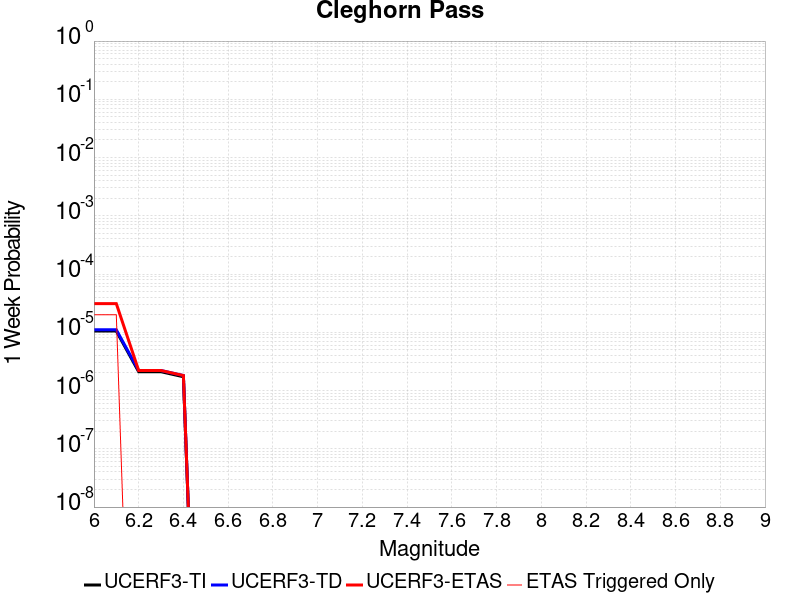 |  |  |  |

| Magnitude | 1 wk TI Prob | 1 wk TD Prob | 1 wk ETAS Prob | 1 wk ETAS/TD Gain | 1 wk ETAS Triggered Only | 1 mo TI Prob | 1 mo TD Prob | 1 mo ETAS Prob | 1 mo ETAS/TD Gain | 1 mo ETAS Triggered Only | 1 yr TI Prob | 1 yr TD Prob | 1 yr ETAS Prob | 1 yr ETAS/TD Gain | 1 yr ETAS Triggered Only | 10 yr TI Prob | 10 yr TD Prob | 10 yr ETAS Prob | 10 yr ETAS/TD Gain | 10 yr ETAS Triggered Only |
|-----|-----|-----|-----|-----|-----|-----|-----|-----|-----|-----|-----|-----|-----|-----|-----|-----|-----|-----|-----|-----|
| 6.0 | 1.0522846E-5 | 1.1040642E-5 | 1.1040642E-5 | 1.0 | 0.0 | 4.509713E-5 | 4.7316473E-5 | 4.7316473E-5 | 1.0 | 0.0 | 5.4891926E-4 | 5.759784E-4 | 6.002652E-4 | 1.0421661 | 2.4300745E-5 | 0.0054756533 | 0.005750022 | 0.0057862634 | 1.0063028 | 3.6451118E-5 |
| 6.1 | 1.0522846E-5 | 1.1040642E-5 | 1.1040642E-5 | 1.0 | 0.0 | 4.509713E-5 | 4.7316473E-5 | 4.7316473E-5 | 1.0 | 0.0 | 5.4891926E-4 | 5.759784E-4 | 6.002652E-4 | 1.0421661 | 2.4300745E-5 | 0.0054756533 | 0.005750022 | 0.0057862634 | 1.0063028 | 3.6451118E-5 |
| 6.2 | 2.1045846E-6 | 2.2082024E-6 | 2.2082024E-6 | 1.0 | 0.0 | 9.019617E-6 | 9.463714E-6 | 9.463714E-6 | 1.0 | 0.0 | 1.098083E-4 | 1.1521882E-4 | 1.1521882E-4 | 1.0 | 0.0 | 0.0010975406 | 0.0011520023 | 0.0011520023 | 1.0 | 0.0 |
| 6.3 | 2.1045846E-6 | 2.2082024E-6 | 2.2082024E-6 | 1.0 | 0.0 | 9.019617E-6 | 9.463714E-6 | 9.463714E-6 | 1.0 | 0.0 | 1.098083E-4 | 1.1521882E-4 | 1.1521882E-4 | 1.0 | 0.0 | 0.0010975406 | 0.0011520023 | 0.0011520023 | 1.0 | 0.0 |
| 6.4 | 1.7259927E-6 | 1.810877E-6 | 1.810877E-6 | 1.0 | 0.0 | 7.3970905E-6 | 7.760902E-6 | 7.760902E-6 | 1.0 | 0.0 | 9.005586E-5 | 9.4488976E-5 | 9.4488976E-5 | 1.0 | 0.0 | 9.001937E-4 | 9.448898E-4 | 9.448898E-4 | 1.0 | 0.0 |

## Calaveras (So) 2011 CFM
*[(top)](#table-of-contents)*

| 1 Week | 1 Month | 1 Year | 10 Year |
|-----|-----|-----|-----|
|  |  |  |  |

| Magnitude | 1 wk TI Prob | 1 wk TD Prob | 1 wk ETAS Prob | 1 wk ETAS/TD Gain | 1 wk ETAS Triggered Only | 1 mo TI Prob | 1 mo TD Prob | 1 mo ETAS Prob | 1 mo ETAS/TD Gain | 1 mo ETAS Triggered Only | 1 yr TI Prob | 1 yr TD Prob | 1 yr ETAS Prob | 1 yr ETAS/TD Gain | 1 yr ETAS Triggered Only | 10 yr TI Prob | 10 yr TD Prob | 10 yr ETAS Prob | 10 yr ETAS/TD Gain | 10 yr ETAS Triggered Only |
|-----|-----|-----|-----|-----|-----|-----|-----|-----|-----|-----|-----|-----|-----|-----|-----|-----|-----|-----|-----|-----|
| 6.0 | 1.5950744E-4 | 3.071188E-4 | 3.071188E-4 | 1.0 | 0.0 | 6.834242E-4 | 0.0013155643 | 0.0013155643 | 1.0 | 0.0 | 0.00828899 | 0.01585904 | 0.015882956 | 1.001508 | 2.4300745E-5 | 0.079865426 | 0.14440064 | 0.14443183 | 1.000216 | 3.6451118E-5 |
| 6.1 | 1.3584697E-4 | 2.6036944E-4 | 2.6036944E-4 | 1.0 | 0.0 | 5.8207137E-4 | 0.0011153965 | 0.0011153965 | 1.0 | 0.0 | 0.007063716 | 0.013462106 | 0.01348608 | 1.0017809 | 2.4300745E-5 | 0.06843361 | 0.12402854 | 0.124060474 | 1.0002575 | 3.6451118E-5 |
| 6.2 | 1.14676266E-4 | 2.1726108E-4 | 2.1726108E-4 | 1.0 | 0.0 | 4.9137714E-4 | 9.307893E-4 | 9.307893E-4 | 1.0 | 0.0 | 0.0059661185 | 0.011245592 | 0.011269619 | 1.0021366 | 2.4300745E-5 | 0.058084648 | 0.105019294 | 0.10505191 | 1.0003107 | 3.6451118E-5 |
| 6.3 | 8.691518E-5 | 1.5987165E-4 | 1.5987165E-4 | 1.0 | 0.0 | 3.7244044E-4 | 6.8496726E-4 | 6.8496726E-4 | 1.0 | 0.0 | 0.004525038 | 0.008300893 | 0.008312942 | 1.0014516 | 1.2150373E-5 | 0.044339992 | 0.0793347 | 0.07935707 | 1.000282 | 2.4300745E-5 |
| 6.4 | 8.50982E-5 | 1.5693568E-4 | 1.5693568E-4 | 1.0 | 0.0 | 3.646556E-4 | 6.7239115E-4 | 6.7239115E-4 | 1.0 | 0.0 | 0.0044306475 | 0.008148931 | 0.008160982 | 1.0014789 | 1.2150373E-5 | 0.04343345 | 0.077940844 | 0.077963255 | 1.0002875 | 2.4300745E-5 |
| 6.5 | 8.4062965E-5 | 1.5518135E-4 | 1.5518135E-4 | 1.0 | 0.0 | 3.602201E-4 | 6.648764E-4 | 6.648764E-4 | 1.0 | 0.0 | 0.004376863 | 0.008058134 | 0.008070186 | 1.0014957 | 1.2150373E-5 | 0.042916555 | 0.077112116 | 0.07713454 | 1.0002909 | 2.4300745E-5 |
| 6.6 | 8.194716E-5 | 1.5154095E-4 | 1.5154095E-4 | 1.0 | 0.0 | 3.5115483E-4 | 6.492825E-4 | 6.492825E-4 | 1.0 | 0.0 | 0.0042669317 | 0.007869979 | 0.007882034 | 1.0015317 | 1.2150373E-5 | 0.04185927 | 0.07539739 | 0.07541986 | 1.000298 | 2.4300745E-5 |
| 6.7 | 8.012326E-5 | 1.4821833E-4 | 1.4821833E-4 | 1.0 | 0.0 | 3.433402E-4 | 6.350497E-4 | 6.350497E-4 | 1.0 | 0.0 | 0.004172157 | 0.007698474 | 0.007710531 | 1.0015662 | 1.2150373E-5 | 0.040946912 | 0.073839515 | 0.07386202 | 1.0003048 | 2.4300745E-5 |
| 6.8 | 7.119773E-5 | 1.2880519E-4 | 1.2880519E-4 | 1.0 | 0.0 | 3.0509746E-4 | 5.519001E-4 | 5.519001E-4 | 1.0 | 0.0 | 0.0037082357 | 0.0066958875 | 0.0067079565 | 1.0018024 | 1.2150373E-5 | 0.036469642 | 0.06468402 | 0.06470674 | 1.0003514 | 2.4300745E-5 |
| 6.9 | 5.7343088E-5 | 9.9189E-5 | 9.9189E-5 | 1.0 | 0.0 | 2.4573295E-4 | 4.2502693E-4 | 4.2502693E-4 | 1.0 | 0.0 | 0.0029876942 | 0.0051625078 | 0.0051625078 | 1.0 | 0.0 | 0.02947844 | 0.050509132 | 0.05052067 | 1.0002284 | 1.2150373E-5 |
| 7.0 | 4.8746577E-5 | 8.284751E-5 | 8.284751E-5 | 1.0 | 0.0 | 2.0889717E-4 | 3.550128E-4 | 3.550128E-4 | 1.0 | 0.0 | 0.0025403565 | 0.004313781 | 0.004313781 | 1.0 | 0.0 | 0.025115121 | 0.04248505 | 0.042496685 | 1.0002738 | 1.2150373E-5 |
| 7.1 | 4.2998014E-5 | 7.264914E-5 | 7.264914E-5 | 1.0 | 0.0 | 1.8426418E-4 | 3.1131663E-4 | 3.1131663E-4 | 1.0 | 0.0 | 0.002241108 | 0.0037837527 | 0.0037837527 | 1.0 | 0.0 | 0.022186412 | 0.037423246 | 0.03743494 | 1.0003126 | 1.2150373E-5 |
| 7.2 | 3.221292E-5 | 5.390566E-5 | 5.390566E-5 | 1.0 | 0.0 | 1.3804805E-4 | 2.3100396E-4 | 2.3100396E-4 | 1.0 | 0.0 | 0.0016794393 | 0.0028088738 | 0.0028088738 | 1.0 | 0.0 | 0.016668037 | 0.028035998 | 0.028047808 | 1.0004213 | 1.2150373E-5 |
| 7.3 | 2.3756531E-5 | 3.9471706E-5 | 3.9471706E-5 | 1.0 | 0.0 | 1.0180973E-4 | 1.6915359E-4 | 1.6915359E-4 | 1.0 | 0.0 | 0.0012388286 | 0.0020575167 | 0.0020575167 | 1.0 | 0.0 | 0.012319452 | 0.02064345 | 0.02065535 | 1.0005764 | 1.2150373E-5 |
| 7.4 | 1.5997684E-5 | 2.734085E-5 | 2.734085E-5 | 1.0 | 0.0 | 6.8559704E-5 | 1.1716982E-4 | 1.1716982E-4 | 1.0 | 0.0 | 8.343947E-4 | 0.0014256114 | 0.0014256114 | 1.0 | 0.0 | 0.008312687 | 0.014376549 | 0.014388525 | 1.000833 | 1.2150373E-5 |
| 7.5 | 1.3814293E-5 | 2.4782603E-5 | 2.4782603E-5 | 1.0 | 0.0 | 5.9202768E-5 | 1.0620684E-4 | 1.0620684E-4 | 1.0 | 0.0 | 7.205553E-4 | 0.0012923037 | 0.0012923037 | 1.0 | 0.0 | 0.007182234 | 0.013055766 | 0.013067758 | 1.0009185 | 1.2150373E-5 |
| 7.6 | 8.817309E-6 | 1.6429829E-5 | 1.6429829E-5 | 1.0 | 0.0 | 3.7787922E-5 | 7.041166E-5 | 7.041166E-5 | 1.0 | 0.0 | 4.5997082E-4 | 8.5692614E-4 | 8.5692614E-4 | 1.0 | 0.0 | 0.004590199 | 0.008719863 | 0.008731908 | 1.0013813 | 1.2150373E-5 |
| 7.7 | 4.0352206E-6 | 7.706877E-6 | 7.706877E-6 | 1.0 | 0.0 | 1.7293689E-5 | 3.3029053E-5 | 3.3029053E-5 | 1.0 | 0.0 | 2.1053031E-4 | 4.020546E-4 | 4.020546E-4 | 1.0 | 0.0 | 0.0021033096 | 0.0041649863 | 0.004177086 | 1.0029051 | 1.2150373E-5 |
| 7.8 | 3.413169E-6 | 6.7868646E-6 | 6.7868646E-6 | 1.0 | 0.0 | 1.4627784E-5 | 2.9086239E-5 | 2.9086239E-5 | 1.0 | 0.0 | 1.7807873E-4 | 3.5406748E-4 | 3.5406748E-4 | 1.0 | 0.0 | 0.0017793609 | 0.0036663096 | 0.0036784154 | 1.0033019 | 1.2150373E-5 |
| 7.9 | 2.4740732E-6 | 5.278809E-6 | 5.278809E-6 | 1.0 | 0.0 | 1.06031275E-5 | 2.2623271E-5 | 2.2623271E-5 | 1.0 | 0.0 | 1.2908543E-4 | 2.7540355E-4 | 2.7540355E-4 | 1.0 | 0.0 | 0.0012901047 | 0.002834638 | 0.002846754 | 1.0042742 | 1.2150373E-5 |
| 8.0 | 1.5231818E-6 | 3.2887135E-6 | 3.2887135E-6 | 1.0 | 0.0 | 6.527906E-6 | 1.409441E-5 | 1.409441E-5 | 1.0 | 0.0 | 7.9474354E-5 | 1.7158597E-4 | 1.7158597E-4 | 1.0 | 0.0 | 7.944594E-4 | 0.001756374 | 0.001768503 | 1.0069057 | 1.2150373E-5 |
| 8.1 | 1.0104524E-6 | 2.0456548E-6 | 2.0456548E-6 | 1.0 | 0.0 | 4.330503E-6 | 8.767062E-6 | 8.767062E-6 | 1.0 | 0.0 | 5.2722597E-5 | 1.06733794E-4 | 1.06733794E-4 | 1.0 | 0.0 | 5.271009E-4 | 0.0010929212 | 0.0011050584 | 1.0111052 | 1.2150373E-5 |

## San Gabriel
*[(top)](#table-of-contents)*

| 1 Week | 1 Month | 1 Year | 10 Year |
|-----|-----|-----|-----|
|  |  |  |  |

| Magnitude | 1 wk TI Prob | 1 wk TD Prob | 1 wk ETAS Prob | 1 wk ETAS/TD Gain | 1 wk ETAS Triggered Only | 1 mo TI Prob | 1 mo TD Prob | 1 mo ETAS Prob | 1 mo ETAS/TD Gain | 1 mo ETAS Triggered Only | 1 yr TI Prob | 1 yr TD Prob | 1 yr ETAS Prob | 1 yr ETAS/TD Gain | 1 yr ETAS Triggered Only | 10 yr TI Prob | 10 yr TD Prob | 10 yr ETAS Prob | 10 yr ETAS/TD Gain | 10 yr ETAS Triggered Only |
|-----|-----|-----|-----|-----|-----|-----|-----|-----|-----|-----|-----|-----|-----|-----|-----|-----|-----|-----|-----|-----|
| 6.0 | 1.083775E-5 | 1.19851875E-5 | 2.4135416E-5 | 2.0137703 | 1.2150373E-5 | 4.6446676E-5 | 5.1364143E-5 | 6.351389E-5 | 1.2365415 | 1.2150373E-5 | 5.653415E-4 | 6.251903E-4 | 6.4947584E-4 | 1.0388451 | 2.4300745E-5 | 0.0056390543 | 0.006246409 | 0.006270558 | 1.0038661 | 2.4300745E-5 |
| 6.1 | 1.083775E-5 | 1.19851875E-5 | 2.4135416E-5 | 2.0137703 | 1.2150373E-5 | 4.6446676E-5 | 5.1364143E-5 | 6.351389E-5 | 1.2365415 | 1.2150373E-5 | 5.653415E-4 | 6.251903E-4 | 6.4947584E-4 | 1.0388451 | 2.4300745E-5 | 0.0056390543 | 0.006246409 | 0.006270558 | 1.0038661 | 2.4300745E-5 |
| 6.2 | 1.083775E-5 | 1.19851875E-5 | 2.4135416E-5 | 2.0137703 | 1.2150373E-5 | 4.6446676E-5 | 5.1364143E-5 | 6.351389E-5 | 1.2365415 | 1.2150373E-5 | 5.653415E-4 | 6.251903E-4 | 6.4947584E-4 | 1.0388451 | 2.4300745E-5 | 0.0056390543 | 0.006246409 | 0.006270558 | 1.0038661 | 2.4300745E-5 |
| 6.3 | 1.083775E-5 | 1.19851875E-5 | 2.4135416E-5 | 2.0137703 | 1.2150373E-5 | 4.6446676E-5 | 5.1364143E-5 | 6.351389E-5 | 1.2365415 | 1.2150373E-5 | 5.653415E-4 | 6.251903E-4 | 6.4947584E-4 | 1.0388451 | 2.4300745E-5 | 0.0056390543 | 0.006246409 | 0.006270558 | 1.0038661 | 2.4300745E-5 |
| 6.4 | 1.083775E-5 | 1.19851875E-5 | 2.4135416E-5 | 2.0137703 | 1.2150373E-5 | 4.6446676E-5 | 5.1364143E-5 | 6.351389E-5 | 1.2365415 | 1.2150373E-5 | 5.653415E-4 | 6.251903E-4 | 6.4947584E-4 | 1.0388451 | 2.4300745E-5 | 0.0056390543 | 0.006246409 | 0.006270558 | 1.0038661 | 2.4300745E-5 |
| 6.5 | 6.7317824E-6 | 7.716944E-6 | 1.9867224E-5 | 2.5744934 | 1.2150373E-5 | 2.8850178E-5 | 3.3072207E-5 | 4.522218E-5 | 1.367377 | 1.2150373E-5 | 3.511943E-4 | 4.0258077E-4 | 4.2687173E-4 | 1.0603381 | 2.4300745E-5 | 0.003506398 | 0.0040296097 | 0.0040538125 | 1.0060062 | 2.4300745E-5 |
| 6.6 | 6.7317824E-6 | 7.716944E-6 | 1.9867224E-5 | 2.5744934 | 1.2150373E-5 | 2.8850178E-5 | 3.3072207E-5 | 4.522218E-5 | 1.367377 | 1.2150373E-5 | 3.511943E-4 | 4.0258077E-4 | 4.2687173E-4 | 1.0603381 | 2.4300745E-5 | 0.003506398 | 0.0040296097 | 0.0040538125 | 1.0060062 | 2.4300745E-5 |
| 6.7 | 6.274881E-6 | 7.2458647E-6 | 1.939615E-5 | 2.6768577 | 1.2150373E-5 | 2.6892068E-5 | 3.1053343E-5 | 4.3203338E-5 | 1.391262 | 1.2150373E-5 | 3.2736175E-4 | 3.780098E-4 | 4.0230138E-4 | 1.0642617 | 2.4300745E-5 | 0.0032687993 | 0.0037847564 | 0.0038089652 | 1.0063964 | 2.4300745E-5 |
| 6.8 | 5.996209E-6 | 6.958585E-6 | 1.9108873E-5 | 2.7460861 | 1.2150373E-5 | 2.5697784E-5 | 2.9822171E-5 | 4.1972184E-5 | 1.4074154 | 1.2150373E-5 | 3.128256E-4 | 3.6302538E-4 | 3.873173E-4 | 1.0669153 | 2.4300745E-5 | 0.003123856 | 0.0036354093 | 0.0036596216 | 1.0066601 | 2.4300745E-5 |
| 6.9 | 5.686331E-6 | 6.6236316E-6 | 1.8773924E-5 | 2.8343854 | 1.2150373E-5 | 2.4369761E-5 | 2.8386688E-5 | 4.0536717E-5 | 1.4280185 | 1.2150373E-5 | 2.9666146E-4 | 3.4555403E-4 | 3.6984638E-4 | 1.0702997 | 2.4300745E-5 | 0.0029626573 | 0.0034612515 | 0.003485468 | 1.0069965 | 2.4300745E-5 |
| 7.0 | 5.2329838E-6 | 6.147514E-6 | 1.8297813E-5 | 2.976457 | 1.2150373E-5 | 2.242688E-5 | 2.6346226E-5 | 3.849628E-5 | 1.4611686 | 1.2150373E-5 | 2.7301308E-4 | 3.2071886E-4 | 3.4501182E-4 | 1.0757453 | 2.4300745E-5 | 0.002726779 | 0.0032136322 | 0.0032378547 | 1.0075375 | 2.4300745E-5 |
| 7.1 | 5.135671E-6 | 6.03764E-6 | 1.818794E-5 | 3.0124254 | 1.2150373E-5 | 2.2009834E-5 | 2.5875348E-5 | 3.8025406E-5 | 1.4695612 | 1.2150373E-5 | 2.6793676E-4 | 3.1498758E-4 | 3.3928067E-4 | 1.077124 | 2.4300745E-5 | 0.0026761394 | 0.0031564834 | 0.0031807073 | 1.0076743 | 2.4300745E-5 |
| 7.2 | 4.989062E-6 | 5.87102E-6 | 1.8021323E-5 | 3.0695384 | 1.2150373E-5 | 2.1381518E-5 | 2.5161276E-5 | 3.7311343E-5 | 1.4828875 | 1.2150373E-5 | 2.6028889E-4 | 3.0629625E-4 | 3.3058954E-4 | 1.079313 | 2.4300745E-5 | 0.0025998424 | 0.003069813 | 0.003094039 | 1.0078918 | 2.4300745E-5 |
| 7.3 | 4.8219395E-6 | 5.702574E-6 | 1.7852877E-5 | 3.13067 | 1.2150373E-5 | 2.0665291E-5 | 2.443938E-5 | 3.6589456E-5 | 1.4971516 | 1.2150373E-5 | 2.5157086E-4 | 2.9750957E-4 | 3.218031E-4 | 1.0816562 | 2.4300745E-5 | 0.0025128627 | 0.0029821852 | 0.0030064136 | 1.0081244 | 2.4300745E-5 |
| 7.4 | 4.7118383E-6 | 5.5911332E-6 | 1.7741439E-5 | 3.1731381 | 1.2150373E-5 | 2.0193436E-5 | 2.3961782E-5 | 3.6111865E-5 | 1.5070609 | 1.2150373E-5 | 2.4582737E-4 | 2.916964E-4 | 3.1599007E-4 | 1.083284 | 2.4300745E-5 | 0.002455556 | 0.0029242067 | 0.0029484364 | 1.0082859 | 2.4300745E-5 |
| 7.5 | 4.5506545E-6 | 5.4365014E-6 | 5.4365014E-6 | 1.0 | 0.0 | 1.9502659E-5 | 2.3299088E-5 | 2.3299088E-5 | 1.0 | 0.0 | 2.37419E-4 | 2.8363022E-4 | 2.9577714E-4 | 1.0428267 | 1.2150373E-5 | 0.002371655 | 0.002843753 | 0.0028558688 | 1.0042605 | 1.2150373E-5 |
| 7.6 | 4.343636E-6 | 5.2293817E-6 | 5.2293817E-6 | 1.0 | 0.0 | 1.861545E-5 | 2.2411448E-5 | 2.2411448E-5 | 1.0 | 0.0 | 2.2661954E-4 | 2.7282597E-4 | 2.84973E-4 | 1.0445231 | 1.2150373E-5 | 0.0022638857 | 0.0027359722 | 0.0027480894 | 1.0044289 | 1.2150373E-5 |
| 7.7 | 2.936235E-6 | 2.7440458E-6 | 2.7440458E-6 | 1.0 | 0.0 | 1.2583803E-5 | 1.1760143E-5 | 1.1760143E-5 | 1.0 | 0.0 | 1.5319703E-4 | 1.4317037E-4 | 1.4317037E-4 | 1.0 | 0.0 | 0.0015309147 | 0.0014380751 | 0.0014380751 | 1.0 | 0.0 |
| 7.8 | 1.4541639E-6 | 9.1237047E-7 | 9.1237047E-7 | 1.0 | 0.0 | 6.232116E-6 | 3.9101533E-6 | 3.9101533E-6 | 1.0 | 0.0 | 7.587337E-5 | 4.7605077E-5 | 4.7605077E-5 | 1.0 | 0.0 | 7.584747E-4 | 4.8085177E-4 | 4.8085177E-4 | 1.0 | 0.0 |
| 7.9 | 8.098958E-7 | 2.41753E-7 | 2.41753E-7 | 1.0 | 0.0 | 3.4709774E-6 | 1.0360839E-6 | 1.0360839E-6 | 1.0 | 0.0 | 4.225833E-5 | 1.2614248E-5 | 1.2614248E-5 | 1.0 | 0.0 | 4.2250296E-4 | 1.2921814E-4 | 1.2921814E-4 | 1.0 | 0.0 |
| 8.0 | 5.2473234E-7 | 7.6792055E-8 | 7.6792055E-8 | 1.0 | 0.0 | 2.248851E-6 | 3.2910876E-7 | 3.2910876E-7 | 1.0 | 0.0 | 2.7379416E-5 | 4.0068917E-6 | 4.0068917E-6 | 1.0 | 0.0 | 2.7376044E-4 | 4.21918E-5 | 4.21918E-5 | 1.0 | 0.0 |
| 8.1 | 3.3162388E-7 | 4.1496126E-8 | 4.1496126E-8 | 1.0 | 0.0 | 1.4212444E-6 | 1.7784053E-7 | 1.7784053E-7 | 1.0 | 0.0 | 1.7303513E-5 | 2.1652063E-6 | 2.1652063E-6 | 1.0 | 0.0 | 1.7302166E-4 | 2.2965523E-5 | 2.2965523E-5 | 1.0 | 0.0 |
| 8.2 | 1.0235345E-7 | 1.4043474E-8 | 1.4043474E-8 | 1.0 | 0.0 | 4.3865757E-7 | 6.0186316E-8 | 6.0186316E-8 | 1.0 | 0.0 | 5.340643E-6 | 7.327681E-7 | 7.327681E-7 | 1.0 | 0.0 | 5.3405143E-5 | 7.9273705E-6 | 7.9273705E-6 | 1.0 | 0.0 |

## Santa Susana East (connector)
*[(top)](#table-of-contents)*

| 1 Week | 1 Month | 1 Year | 10 Year |
|-----|-----|-----|-----|
|  |  |  |  |

| Magnitude | 1 wk TI Prob | 1 wk TD Prob | 1 wk ETAS Prob | 1 wk ETAS/TD Gain | 1 wk ETAS Triggered Only | 1 mo TI Prob | 1 mo TD Prob | 1 mo ETAS Prob | 1 mo ETAS/TD Gain | 1 mo ETAS Triggered Only | 1 yr TI Prob | 1 yr TD Prob | 1 yr ETAS Prob | 1 yr ETAS/TD Gain | 1 yr ETAS Triggered Only | 10 yr TI Prob | 10 yr TD Prob | 10 yr ETAS Prob | 10 yr ETAS/TD Gain | 10 yr ETAS Triggered Only |
|-----|-----|-----|-----|-----|-----|-----|-----|-----|-----|-----|-----|-----|-----|-----|-----|-----|-----|-----|-----|-----|
| 6.0 | 2.858397E-5 | 3.202091E-5 | 5.6320878E-5 | 1.7588781 | 2.4300745E-5 | 1.2249697E-4 | 1.3722685E-4 | 1.6152427E-4 | 1.1770602 | 2.4300745E-5 | 0.0014903803 | 0.0016697381 | 0.0016939982 | 1.0145293 | 2.4300745E-5 | 0.014804244 | 0.016599052 | 0.01662295 | 1.0014397 | 2.4300745E-5 |
| 6.1 | 2.858397E-5 | 3.202091E-5 | 5.6320878E-5 | 1.7588781 | 2.4300745E-5 | 1.2249697E-4 | 1.3722685E-4 | 1.6152427E-4 | 1.1770602 | 2.4300745E-5 | 0.0014903803 | 0.0016697381 | 0.0016939982 | 1.0145293 | 2.4300745E-5 | 0.014804244 | 0.016599052 | 0.01662295 | 1.0014397 | 2.4300745E-5 |
| 6.2 | 2.858397E-5 | 3.202091E-5 | 5.6320878E-5 | 1.7588781 | 2.4300745E-5 | 1.2249697E-4 | 1.3722685E-4 | 1.6152427E-4 | 1.1770602 | 2.4300745E-5 | 0.0014903803 | 0.0016697381 | 0.0016939982 | 1.0145293 | 2.4300745E-5 | 0.014804244 | 0.016599052 | 0.01662295 | 1.0014397 | 2.4300745E-5 |
| 6.3 | 1.943582E-5 | 2.036718E-5 | 3.2517306E-5 | 1.5965542 | 1.2150373E-5 | 8.329371E-5 | 8.7285625E-5 | 9.943494E-5 | 1.1391903 | 1.2150373E-5 | 0.001013629 | 0.0010622967 | 0.0010744341 | 1.0114257 | 1.2150373E-5 | 0.010090181 | 0.010583619 | 0.01059564 | 1.0011358 | 1.2150373E-5 |
| 6.4 | 1.943582E-5 | 2.036718E-5 | 3.2517306E-5 | 1.5965542 | 1.2150373E-5 | 8.329371E-5 | 8.7285625E-5 | 9.943494E-5 | 1.1391903 | 1.2150373E-5 | 0.001013629 | 0.0010622967 | 0.0010744341 | 1.0114257 | 1.2150373E-5 | 0.010090181 | 0.010583619 | 0.01059564 | 1.0011358 | 1.2150373E-5 |
| 6.5 | 1.943582E-5 | 2.036718E-5 | 3.2517306E-5 | 1.5965542 | 1.2150373E-5 | 8.329371E-5 | 8.7285625E-5 | 9.943494E-5 | 1.1391903 | 1.2150373E-5 | 0.001013629 | 0.0010622967 | 0.0010744341 | 1.0114257 | 1.2150373E-5 | 0.010090181 | 0.010583619 | 0.01059564 | 1.0011358 | 1.2150373E-5 |
| 6.6 | 1.943582E-5 | 2.036718E-5 | 3.2517306E-5 | 1.5965542 | 1.2150373E-5 | 8.329371E-5 | 8.7285625E-5 | 9.943494E-5 | 1.1391903 | 1.2150373E-5 | 0.001013629 | 0.0010622967 | 0.0010744341 | 1.0114257 | 1.2150373E-5 | 0.010090181 | 0.010583619 | 0.01059564 | 1.0011358 | 1.2150373E-5 |
| 6.7 | 1.9404439E-5 | 2.03546E-5 | 3.2504726E-5 | 1.5969229 | 1.2150373E-5 | 8.3159226E-5 | 8.723172E-5 | 9.938103E-5 | 1.1392763 | 1.2150373E-5 | 0.0010119933 | 0.0010616409 | 0.0010737785 | 1.0114328 | 1.2150373E-5 | 0.010073971 | 0.010577125 | 0.010589146 | 1.0011365 | 1.2150373E-5 |
| 6.8 | 1.2217526E-5 | 1.1592998E-5 | 2.374323E-5 | 2.0480664 | 1.2150373E-5 | 5.2359774E-5 | 4.9683425E-5 | 6.183319E-5 | 1.2445437 | 1.2150373E-5 | 6.372938E-4 | 6.0474465E-4 | 6.1688764E-4 | 1.0200796 | 1.2150373E-5 | 0.0063546924 | 0.006033037 | 0.006045114 | 1.0020019 | 1.2150373E-5 |
| 6.9 | 1.2217526E-5 | 1.1592998E-5 | 2.374323E-5 | 2.0480664 | 1.2150373E-5 | 5.2359774E-5 | 4.9683425E-5 | 6.183319E-5 | 1.2445437 | 1.2150373E-5 | 6.372938E-4 | 6.0474465E-4 | 6.1688764E-4 | 1.0200796 | 1.2150373E-5 | 0.0063546924 | 0.006033037 | 0.006045114 | 1.0020019 | 1.2150373E-5 |
| 7.0 | 9.276017E-6 | 8.059113E-6 | 2.0209389E-5 | 2.5076442 | 1.2150373E-5 | 3.9753755E-5 | 3.4538618E-5 | 4.6688572E-5 | 1.3517787 | 1.2150373E-5 | 4.8389446E-4 | 4.2042998E-4 | 4.3257524E-4 | 1.0288877 | 1.2150373E-5 | 0.0048284214 | 0.0041970722 | 0.0042091715 | 1.0028828 | 1.2150373E-5 |
| 7.1 | 9.130355E-6 | 7.942286E-6 | 2.0092562E-5 | 2.529821 | 1.2150373E-5 | 3.9129503E-5 | 3.4037945E-5 | 4.6187903E-5 | 1.3569534 | 1.2150373E-5 | 4.7629757E-4 | 4.1433662E-4 | 4.2648197E-4 | 1.0293127 | 1.2150373E-5 | 0.00475278 | 0.004136367 | 0.004148467 | 1.0029253 | 1.2150373E-5 |
| 7.2 | 8.851015E-6 | 7.741445E-6 | 1.9891724E-5 | 2.5695105 | 1.2150373E-5 | 3.7932372E-5 | 3.317722E-5 | 4.532719E-5 | 1.3662143 | 1.2150373E-5 | 4.6172875E-4 | 4.038612E-4 | 4.1600666E-4 | 1.0300734 | 1.2150373E-5 | 0.0046077054 | 0.0040319953 | 0.004044097 | 1.0030013 | 1.2150373E-5 |
| 7.3 | 8.573006E-6 | 7.550166E-6 | 1.9700448E-5 | 2.6092734 | 1.2150373E-5 | 3.6740938E-5 | 3.2357475E-5 | 4.4507455E-5 | 1.3754922 | 1.2150373E-5 | 4.472291E-4 | 3.9388443E-4 | 4.0603004E-4 | 1.0308354 | 1.2150373E-5 | 0.004463301 | 0.0039325804 | 0.0039446834 | 1.0030775 | 1.2150373E-5 |
| 7.4 | 7.852282E-6 | 6.817687E-6 | 1.8967978E-5 | 2.782172 | 1.2150373E-5 | 3.36522E-5 | 2.9218349E-5 | 4.1368367E-5 | 1.4158353 | 1.2150373E-5 | 4.096385E-4 | 3.5567835E-4 | 3.678244E-4 | 1.0341489 | 1.2150373E-5 | 0.0040888423 | 0.0035517553 | 0.0035638625 | 1.0034088 | 1.2150373E-5 |
| 7.5 | 4.8869324E-6 | 4.279055E-6 | 4.279055E-6 | 1.0 | 0.0 | 2.0943828E-5 | 1.8338687E-5 | 1.8338687E-5 | 1.0 | 0.0 | 2.5496128E-4 | 2.232523E-4 | 2.232523E-4 | 1.0 | 0.0 | 0.0025466895 | 0.0022304445 | 0.0022304445 | 1.0 | 0.0 |
| 7.6 | 1.3894544E-6 | 1.1568179E-6 | 1.1568179E-6 | 1.0 | 0.0 | 5.954791E-6 | 4.957783E-6 | 4.957783E-6 | 1.0 | 0.0 | 7.249717E-5 | 6.0359558E-5 | 6.0359558E-5 | 1.0 | 0.0 | 7.247352E-4 | 6.0345343E-4 | 6.0345343E-4 | 1.0 | 0.0 |
| 7.7 | 2.9924632E-7 | 2.371928E-7 | 2.371928E-7 | 1.0 | 0.0 | 1.2824837E-6 | 1.0165402E-6 | 1.0165402E-6 | 1.0 | 0.0 | 1.5614127E-5 | 1.2376314E-5 | 1.2376314E-5 | 1.0 | 0.0 | 1.5613029E-4 | 1.2375697E-4 | 1.2375697E-4 | 1.0 | 0.0 |
| 7.8 | 4.8188564E-8 | 2.6323061E-8 | 2.6323061E-8 | 1.0 | 0.0 | 2.065224E-7 | 1.1281311E-7 | 1.1281311E-7 | 1.0 | 0.0 | 2.5144072E-6 | 1.3734989E-6 | 1.3734989E-6 | 1.0 | 0.0 | 2.5143789E-5 | 1.3734912E-5 | 1.3734912E-5 | 1.0 | 0.0 |
| 7.9 | 2.6127251E-9 | 2.7681102E-9 | 2.7681102E-9 | 1.0 | 0.0 | 1.1197393E-8 | 1.186333E-8 | 1.186333E-8 | 1.0 | 0.0 | 1.3632825E-7 | 1.4443603E-7 | 1.4443603E-7 | 1.0 | 0.0 | 1.3632817E-6 | 1.4443604E-6 | 1.4443604E-6 | 1.0 | 0.0 |

## Cucamonga
*[(top)](#table-of-contents)*

| 1 Week | 1 Month | 1 Year | 10 Year |
|-----|-----|-----|-----|
|  |  |  |  |

| Magnitude | 1 wk TI Prob | 1 wk TD Prob | 1 wk ETAS Prob | 1 wk ETAS/TD Gain | 1 wk ETAS Triggered Only | 1 mo TI Prob | 1 mo TD Prob | 1 mo ETAS Prob | 1 mo ETAS/TD Gain | 1 mo ETAS Triggered Only | 1 yr TI Prob | 1 yr TD Prob | 1 yr ETAS Prob | 1 yr ETAS/TD Gain | 1 yr ETAS Triggered Only | 10 yr TI Prob | 10 yr TD Prob | 10 yr ETAS Prob | 10 yr ETAS/TD Gain | 10 yr ETAS Triggered Only |
|-----|-----|-----|-----|-----|-----|-----|-----|-----|-----|-----|-----|-----|-----|-----|-----|-----|-----|-----|-----|-----|
| 6.0 | 1.1848348E-5 | 1.1737008E-5 | 2.3887238E-5 | 2.0352068 | 1.2150373E-5 | 5.0777642E-5 | 5.030051E-5 | 6.245027E-5 | 1.2415435 | 1.2150373E-5 | 6.180424E-4 | 6.1223935E-4 | 6.243823E-4 | 1.0198337 | 1.2150373E-5 | 0.0061632637 | 0.0061067017 | 0.006130854 | 1.003955 | 2.4300745E-5 |
| 6.1 | 1.1848348E-5 | 1.1737008E-5 | 2.3887238E-5 | 2.0352068 | 1.2150373E-5 | 5.0777642E-5 | 5.030051E-5 | 6.245027E-5 | 1.2415435 | 1.2150373E-5 | 6.180424E-4 | 6.1223935E-4 | 6.243823E-4 | 1.0198337 | 1.2150373E-5 | 0.0061632637 | 0.0061067017 | 0.006130854 | 1.003955 | 2.4300745E-5 |
| 6.2 | 1.1848348E-5 | 1.1737008E-5 | 2.3887238E-5 | 2.0352068 | 1.2150373E-5 | 5.0777642E-5 | 5.030051E-5 | 6.245027E-5 | 1.2415435 | 1.2150373E-5 | 6.180424E-4 | 6.1223935E-4 | 6.243823E-4 | 1.0198337 | 1.2150373E-5 | 0.0061632637 | 0.0061067017 | 0.006130854 | 1.003955 | 2.4300745E-5 |
| 6.3 | 1.1848348E-5 | 1.1737008E-5 | 2.3887238E-5 | 2.0352068 | 1.2150373E-5 | 5.0777642E-5 | 5.030051E-5 | 6.245027E-5 | 1.2415435 | 1.2150373E-5 | 6.180424E-4 | 6.1223935E-4 | 6.243823E-4 | 1.0198337 | 1.2150373E-5 | 0.0061632637 | 0.0061067017 | 0.006130854 | 1.003955 | 2.4300745E-5 |
| 6.4 | 1.1848348E-5 | 1.1737008E-5 | 2.3887238E-5 | 2.0352068 | 1.2150373E-5 | 5.0777642E-5 | 5.030051E-5 | 6.245027E-5 | 1.2415435 | 1.2150373E-5 | 6.180424E-4 | 6.1223935E-4 | 6.243823E-4 | 1.0198337 | 1.2150373E-5 | 0.0061632637 | 0.0061067017 | 0.006130854 | 1.003955 | 2.4300745E-5 |
| 6.5 | 1.16988695E-5 | 1.15760395E-5 | 2.3726272E-5 | 2.0496018 | 1.2150373E-5 | 5.013705E-5 | 4.9610666E-5 | 6.176044E-5 | 1.2449024 | 1.2150373E-5 | 6.102476E-4 | 6.0384517E-4 | 6.159882E-4 | 1.0201095 | 1.2150373E-5 | 0.006085745 | 0.006023216 | 0.0060473704 | 1.0040102 | 2.4300745E-5 |
| 6.6 | 1.16988695E-5 | 1.15760395E-5 | 2.3726272E-5 | 2.0496018 | 1.2150373E-5 | 5.013705E-5 | 4.9610666E-5 | 6.176044E-5 | 1.2449024 | 1.2150373E-5 | 6.102476E-4 | 6.0384517E-4 | 6.159882E-4 | 1.0201095 | 1.2150373E-5 | 0.006085745 | 0.006023216 | 0.0060473704 | 1.0040102 | 2.4300745E-5 |
| 6.7 | 1.1397107E-5 | 1.11149475E-5 | 2.3265186E-5 | 2.093144 | 1.2150373E-5 | 4.884383E-5 | 4.7634636E-5 | 5.978443E-5 | 1.2550622 | 1.2150373E-5 | 5.9451134E-4 | 5.797998E-4 | 5.9194316E-4 | 1.020944 | 1.2150373E-5 | 0.005929234 | 0.0057840226 | 0.005796103 | 1.0020885 | 1.2150373E-5 |
| 6.8 | 1.058387E-5 | 9.784992E-6 | 2.1935246E-5 | 2.2417235 | 1.2150373E-5 | 4.5358654E-5 | 4.193501E-5 | 5.4084874E-5 | 1.2897308 | 1.2150373E-5 | 5.521017E-4 | 5.1044027E-4 | 5.225844E-4 | 1.0237916 | 1.2150373E-5 | 0.00550732 | 0.0050936877 | 0.0051057762 | 1.0023732 | 1.2150373E-5 |
| 6.9 | 9.690046E-6 | 8.57948E-6 | 2.0729749E-5 | 2.416201 | 1.2150373E-5 | 4.1528107E-5 | 3.6768684E-5 | 4.891861E-5 | 1.3304422 | 1.2150373E-5 | 5.054874E-4 | 4.475672E-4 | 4.5971212E-4 | 1.0271355 | 1.2150373E-5 | 0.005043391 | 0.004467594 | 0.00447969 | 1.0027075 | 1.2150373E-5 |
| 7.0 | 9.381461E-6 | 8.187101E-6 | 2.0337375E-5 | 2.484075 | 1.2150373E-5 | 4.020564E-5 | 3.5087105E-5 | 4.7237052E-5 | 1.3462795 | 1.2150373E-5 | 4.893937E-4 | 4.2710215E-4 | 4.3924732E-4 | 1.0284363 | 1.2150373E-5 | 0.0048831734 | 0.0042637475 | 0.004275846 | 1.0028375 | 1.2150373E-5 |
| 7.1 | 8.946492E-6 | 7.781886E-6 | 1.9932164E-5 | 2.561354 | 1.2150373E-5 | 3.8341543E-5 | 3.3350516E-5 | 4.550048E-5 | 1.3643112 | 1.2150373E-5 | 4.667083E-4 | 4.0596718E-4 | 4.181126E-4 | 1.0299172 | 1.2150373E-5 | 0.0046572937 | 0.004053192 | 0.0040652934 | 1.0029856 | 1.2150373E-5 |
| 7.2 | 8.251016E-6 | 6.9752796E-6 | 1.9125568E-5 | 2.741907 | 1.2150373E-5 | 3.5361016E-5 | 2.9893714E-5 | 4.2043725E-5 | 1.4064403 | 1.2150373E-5 | 4.3043532E-4 | 3.6389544E-4 | 3.7604137E-4 | 1.0333775 | 1.2150373E-5 | 0.0042960253 | 0.0036339292 | 0.0036460352 | 1.0033314 | 1.2150373E-5 |
| 7.3 | 7.717881E-6 | 6.4863502E-6 | 1.8636645E-5 | 2.8732097 | 1.2150373E-5 | 3.3076216E-5 | 2.7798349E-5 | 3.9948383E-5 | 1.4370775 | 1.2150373E-5 | 4.026285E-4 | 3.3839257E-4 | 3.5053882E-4 | 1.035894 | 1.2150373E-5 | 0.004018998 | 0.00337971 | 0.0033918193 | 1.003583 | 1.2150373E-5 |
| 7.4 | 7.275623E-6 | 6.031997E-6 | 1.8182296E-5 | 3.014308 | 1.2150373E-5 | 3.118087E-5 | 2.585116E-5 | 3.800122E-5 | 1.4700005 | 1.2150373E-5 | 3.7956095E-4 | 3.1469265E-4 | 3.268392E-4 | 1.0385982 | 1.2150373E-5 | 0.0037891332 | 0.0031434062 | 0.0031555186 | 1.0038532 | 1.2150373E-5 |
| 7.5 | 6.5109502E-6 | 5.1006014E-6 | 1.7250912E-5 | 3.382133 | 1.2150373E-5 | 2.7903774E-5 | 2.1859538E-5 | 3.4009645E-5 | 1.5558264 | 1.2150373E-5 | 3.3967546E-4 | 2.661075E-4 | 2.7825465E-4 | 1.0456475 | 1.2150373E-5 | 0.0033915674 | 0.002658813 | 0.0026709312 | 1.0045577 | 1.2150373E-5 |
| 7.6 | 5.4495326E-6 | 3.90857E-6 | 3.90857E-6 | 1.0 | 0.0 | 2.335493E-5 | 1.6750908E-5 | 1.6750908E-5 | 1.0 | 0.0 | 2.8430918E-4 | 2.0392328E-4 | 2.0392328E-4 | 1.0 | 0.0 | 0.0028394572 | 0.002038282 | 0.002038282 | 1.0 | 0.0 |
| 7.7 | 4.7997164E-6 | 3.2002547E-6 | 3.2002547E-6 | 1.0 | 0.0 | 2.057005E-5 | 1.3715306E-5 | 1.3715306E-5 | 1.0 | 0.0 | 2.504116E-4 | 1.6697108E-4 | 1.6697108E-4 | 1.0 | 0.0 | 0.002501296 | 0.0016693877 | 0.0016693877 | 1.0 | 0.0 |
| 7.8 | 3.3941733E-6 | 2.0641899E-6 | 2.0641899E-6 | 1.0 | 0.0 | 1.4546376E-5 | 8.846498E-6 | 8.846498E-6 | 1.0 | 0.0 | 1.7708774E-4 | 1.07700806E-4 | 1.07700806E-4 | 1.0 | 0.0 | 0.0017694668 | 0.001076723 | 0.001076723 | 1.0 | 0.0 |
| 7.9 | 9.750552E-7 | 5.155946E-7 | 5.155946E-7 | 1.0 | 0.0 | 4.178801E-6 | 2.2096892E-6 | 2.2096892E-6 | 1.0 | 0.0 | 5.0875715E-5 | 2.690264E-5 | 2.690264E-5 | 1.0 | 0.0 | 5.086407E-4 | 2.6899425E-4 | 2.6899425E-4 | 1.0 | 0.0 |
| 8.0 | 1.133857E-7 | 6.053707E-8 | 6.053707E-8 | 1.0 | 0.0 | 4.8593864E-7 | 2.5944456E-7 | 2.5944456E-7 | 1.0 | 0.0 | 5.9162867E-6 | 3.158733E-6 | 3.158733E-6 | 1.0 | 0.0 | 5.916129E-5 | 3.1586897E-5 | 3.1586897E-5 | 1.0 | 0.0 |

## Newport-Inglewood (Offshore)
*[(top)](#table-of-contents)*

| 1 Week | 1 Month | 1 Year | 10 Year |
|-----|-----|-----|-----|
|  |  |  |  |

| Magnitude | 1 wk TI Prob | 1 wk TD Prob | 1 wk ETAS Prob | 1 wk ETAS/TD Gain | 1 wk ETAS Triggered Only | 1 mo TI Prob | 1 mo TD Prob | 1 mo ETAS Prob | 1 mo ETAS/TD Gain | 1 mo ETAS Triggered Only | 1 yr TI Prob | 1 yr TD Prob | 1 yr ETAS Prob | 1 yr ETAS/TD Gain | 1 yr ETAS Triggered Only | 10 yr TI Prob | 10 yr TD Prob | 10 yr ETAS Prob | 10 yr ETAS/TD Gain | 10 yr ETAS Triggered Only |
|-----|-----|-----|-----|-----|-----|-----|-----|-----|-----|-----|-----|-----|-----|-----|-----|-----|-----|-----|-----|-----|
| 6.0 | 1.9626508E-5 | 1.8965357E-5 | 3.1115498E-5 | 1.6406493 | 1.2150373E-5 | 8.411089E-5 | 8.1277634E-5 | 9.342702E-5 | 1.1494801 | 1.2150373E-5 | 0.001023569 | 9.891186E-4 | 0.0010133953 | 1.0245438 | 2.4300745E-5 | 0.010188672 | 0.009848503 | 0.009872565 | 1.0024432 | 2.4300745E-5 |
| 6.1 | 1.331886E-5 | 1.2218092E-5 | 2.4368317E-5 | 1.9944453 | 1.2150373E-5 | 5.707958E-5 | 5.2362207E-5 | 6.451194E-5 | 1.2320325 | 1.2150373E-5 | 6.947222E-4 | 6.3732493E-4 | 6.6161016E-4 | 1.038105 | 2.4300745E-5 | 0.006925544 | 0.006355149 | 0.006379295 | 1.0037994 | 2.4300745E-5 |
| 6.2 | 1.2250852E-5 | 1.1076029E-5 | 1.1076029E-5 | 1.0 | 0.0 | 5.2502597E-5 | 4.7467838E-5 | 4.7467838E-5 | 1.0 | 0.0 | 6.3903164E-4 | 5.777687E-4 | 5.8991206E-4 | 1.0210177 | 1.2150373E-5 | 0.006371971 | 0.0057627866 | 0.0057748673 | 1.0020963 | 1.2150373E-5 |
| 6.3 | 1.2106258E-5 | 1.0918891E-5 | 1.0918891E-5 | 1.0 | 0.0 | 5.1882926E-5 | 4.6794412E-5 | 4.6794412E-5 | 1.0 | 0.0 | 6.3149154E-4 | 5.69574E-4 | 5.8171747E-4 | 1.0213202 | 1.2150373E-5 | 0.0062970007 | 0.005681259 | 0.0056933407 | 1.0021266 | 1.2150373E-5 |
| 6.4 | 1.1348758E-5 | 1.0109362E-5 | 1.0109362E-5 | 1.0 | 0.0 | 4.8636626E-5 | 4.3325123E-5 | 4.3325123E-5 | 1.0 | 0.0 | 5.919901E-4 | 5.273565E-4 | 5.3950044E-4 | 1.023028 | 1.2150373E-5 | 0.005904155 | 0.0052611465 | 0.0052732327 | 1.0022973 | 1.2150373E-5 |
| 6.5 | 1.100837E-5 | 9.7433895E-6 | 9.7433895E-6 | 1.0 | 0.0 | 4.7177873E-5 | 4.1756717E-5 | 4.1756717E-5 | 1.0 | 0.0 | 5.7423924E-4 | 5.082702E-4 | 5.2041444E-4 | 1.0238932 | 1.2150373E-5 | 0.005727576 | 0.0050711688 | 0.0050832573 | 1.0023838 | 1.2150373E-5 |
| 6.6 | 1.0634696E-5 | 9.345544E-6 | 9.345544E-6 | 1.0 | 0.0 | 4.557647E-5 | 4.0051716E-5 | 4.0051716E-5 | 1.0 | 0.0 | 5.5475225E-4 | 4.8752132E-4 | 4.9966574E-4 | 1.0249106 | 1.2150373E-5 | 0.0055336943 | 0.0048646047 | 0.004876696 | 1.0024855 | 1.2150373E-5 |
| 6.7 | 9.9780855E-6 | 8.667911E-6 | 8.667911E-6 | 1.0 | 0.0 | 4.276252E-5 | 3.7147664E-5 | 3.7147664E-5 | 1.0 | 0.0 | 5.205093E-4 | 4.5217964E-4 | 4.6432452E-4 | 1.0268586 | 1.2150373E-5 | 0.0051929182 | 0.004512675 | 0.0045247707 | 1.0026803 | 1.2150373E-5 |
| 6.8 | 9.59546E-6 | 8.27295E-6 | 8.27295E-6 | 1.0 | 0.0 | 4.1122752E-5 | 3.5455025E-5 | 3.5455025E-5 | 1.0 | 0.0 | 5.0055445E-4 | 4.315801E-4 | 4.4372524E-4 | 1.028141 | 1.2150373E-5 | 0.004994285 | 0.004307495 | 0.0043195933 | 1.0028086 | 1.2150373E-5 |
| 6.9 | 9.000614E-6 | 7.70684E-6 | 7.70684E-6 | 1.0 | 0.0 | 3.857349E-5 | 3.30289E-5 | 3.30289E-5 | 1.0 | 0.0 | 4.6953102E-4 | 4.0205332E-4 | 4.141988E-4 | 1.0302087 | 1.2150373E-5 | 0.004685402 | 0.0040133307 | 0.0040254323 | 1.0030154 | 1.2150373E-5 |
| 7.0 | 7.4070194E-6 | 6.148904E-6 | 6.148904E-6 | 1.0 | 0.0 | 3.1743984E-5 | 2.635218E-5 | 2.635218E-5 | 1.0 | 0.0 | 3.8641447E-4 | 3.207907E-4 | 3.329372E-4 | 1.0378642 | 1.2150373E-5 | 0.0038574322 | 0.0032032963 | 0.0032154077 | 1.003781 | 1.2150373E-5 |
| 7.1 | 6.299615E-6 | 5.0565927E-6 | 5.0565927E-6 | 1.0 | 0.0 | 2.699807E-5 | 2.1670932E-5 | 2.1670932E-5 | 1.0 | 0.0 | 3.2865192E-4 | 2.638118E-4 | 2.638118E-4 | 1.0 | 0.0 | 0.003281663 | 0.002635001 | 0.002635001 | 1.0 | 0.0 |
| 7.2 | 5.096653E-6 | 3.892769E-6 | 3.892769E-6 | 1.0 | 0.0 | 2.1842614E-5 | 1.668319E-5 | 1.668319E-5 | 1.0 | 0.0 | 2.6590136E-4 | 2.0309901E-4 | 2.0309901E-4 | 1.0 | 0.0 | 0.0026558342 | 0.0020291451 | 0.0020291451 | 1.0 | 0.0 |
| 7.3 | 3.9753018E-6 | 2.9099103E-6 | 2.9099103E-6 | 1.0 | 0.0 | 1.7036897E-5 | 1.2470985E-5 | 1.2470985E-5 | 1.0 | 0.0 | 2.0740448E-4 | 1.5182374E-4 | 1.5182374E-4 | 1.0 | 0.0 | 0.00207211 | 0.0015172083 | 0.0015172083 | 1.0 | 0.0 |
| 7.4 | 3.0568392E-6 | 2.1449955E-6 | 2.1449955E-6 | 1.0 | 0.0 | 1.3100675E-5 | 9.192806E-6 | 9.192806E-6 | 1.0 | 0.0 | 1.5948903E-4 | 1.1191672E-4 | 1.1191672E-4 | 1.0 | 0.0 | 0.0015937461 | 0.0011186098 | 0.0011186098 | 1.0 | 0.0 |
| 7.5 | 1.7279019E-6 | 1.1469883E-6 | 1.1469883E-6 | 1.0 | 0.0 | 7.405273E-6 | 4.915655E-6 | 4.915655E-6 | 1.0 | 0.0 | 9.015547E-5 | 5.9846494E-5 | 5.9846494E-5 | 1.0 | 0.0 | 9.01189E-4 | 5.9830764E-4 | 5.9830764E-4 | 1.0 | 0.0 |
| 7.6 | 1.1156416E-6 | 7.223012E-7 | 7.223012E-7 | 1.0 | 0.0 | 4.7813123E-6 | 3.095573E-6 | 3.095573E-6 | 1.0 | 0.0 | 5.821092E-5 | 3.7687976E-5 | 3.7687976E-5 | 1.0 | 0.0 | 5.8195676E-4 | 3.7681818E-4 | 3.7681818E-4 | 1.0 | 0.0 |
| 7.7 | 9.117973E-8 | 6.734145E-8 | 6.734145E-8 | 1.0 | 0.0 | 3.907702E-7 | 2.886062E-7 | 2.886062E-7 | 1.0 | 0.0 | 4.757617E-6 | 3.513775E-6 | 3.513775E-6 | 1.0 | 0.0 | 4.7575148E-5 | 3.5137225E-5 | 3.5137225E-5 | 1.0 | 0.0 |

## San Cayetano
*[(top)](#table-of-contents)*

| 1 Week | 1 Month | 1 Year | 10 Year |
|-----|-----|-----|-----|
|  |  |  |  |

| Magnitude | 1 wk TI Prob | 1 wk TD Prob | 1 wk ETAS Prob | 1 wk ETAS/TD Gain | 1 wk ETAS Triggered Only | 1 mo TI Prob | 1 mo TD Prob | 1 mo ETAS Prob | 1 mo ETAS/TD Gain | 1 mo ETAS Triggered Only | 1 yr TI Prob | 1 yr TD Prob | 1 yr ETAS Prob | 1 yr ETAS/TD Gain | 1 yr ETAS Triggered Only | 10 yr TI Prob | 10 yr TD Prob | 10 yr ETAS Prob | 10 yr ETAS/TD Gain | 10 yr ETAS Triggered Only |
|-----|-----|-----|-----|-----|-----|-----|-----|-----|-----|-----|-----|-----|-----|-----|-----|-----|-----|-----|-----|-----|
| 6.0 | 2.3476267E-5 | 1.816928E-5 | 3.031943E-5 | 1.6687195 | 1.2150373E-5 | 1.0060869E-4 | 7.786603E-5 | 9.001546E-5 | 1.1560298 | 1.2150373E-5 | 0.0012242225 | 9.476103E-4 | 9.71888E-4 | 1.02562 | 2.4300745E-5 | 0.012175002 | 0.009436584 | 0.009460656 | 1.0025508 | 2.4300745E-5 |
| 6.1 | 2.3476267E-5 | 1.816928E-5 | 3.031943E-5 | 1.6687195 | 1.2150373E-5 | 1.0060869E-4 | 7.786603E-5 | 9.001546E-5 | 1.1560298 | 1.2150373E-5 | 0.0012242225 | 9.476103E-4 | 9.71888E-4 | 1.02562 | 2.4300745E-5 | 0.012175002 | 0.009436584 | 0.009460656 | 1.0025508 | 2.4300745E-5 |
| 6.2 | 2.3476267E-5 | 1.816928E-5 | 3.031943E-5 | 1.6687195 | 1.2150373E-5 | 1.0060869E-4 | 7.786603E-5 | 9.001546E-5 | 1.1560298 | 1.2150373E-5 | 0.0012242225 | 9.476103E-4 | 9.71888E-4 | 1.02562 | 2.4300745E-5 | 0.012175002 | 0.009436584 | 0.009460656 | 1.0025508 | 2.4300745E-5 |
| 6.3 | 2.3476267E-5 | 1.816928E-5 | 3.031943E-5 | 1.6687195 | 1.2150373E-5 | 1.0060869E-4 | 7.786603E-5 | 9.001546E-5 | 1.1560298 | 1.2150373E-5 | 0.0012242225 | 9.476103E-4 | 9.71888E-4 | 1.02562 | 2.4300745E-5 | 0.012175002 | 0.009436584 | 0.009460656 | 1.0025508 | 2.4300745E-5 |
| 6.4 | 2.3476267E-5 | 1.816928E-5 | 3.031943E-5 | 1.6687195 | 1.2150373E-5 | 1.0060869E-4 | 7.786603E-5 | 9.001546E-5 | 1.1560298 | 1.2150373E-5 | 0.0012242225 | 9.476103E-4 | 9.71888E-4 | 1.02562 | 2.4300745E-5 | 0.012175002 | 0.009436584 | 0.009460656 | 1.0025508 | 2.4300745E-5 |
| 6.5 | 2.3476267E-5 | 1.816928E-5 | 3.031943E-5 | 1.6687195 | 1.2150373E-5 | 1.0060869E-4 | 7.786603E-5 | 9.001546E-5 | 1.1560298 | 1.2150373E-5 | 0.0012242225 | 9.476103E-4 | 9.71888E-4 | 1.02562 | 2.4300745E-5 | 0.012175002 | 0.009436584 | 0.009460656 | 1.0025508 | 2.4300745E-5 |
| 6.6 | 2.3476267E-5 | 1.816928E-5 | 3.031943E-5 | 1.6687195 | 1.2150373E-5 | 1.0060869E-4 | 7.786603E-5 | 9.001546E-5 | 1.1560298 | 1.2150373E-5 | 0.0012242225 | 9.476103E-4 | 9.71888E-4 | 1.02562 | 2.4300745E-5 | 0.012175002 | 0.009436584 | 0.009460656 | 1.0025508 | 2.4300745E-5 |
| 6.7 | 2.3476267E-5 | 1.816928E-5 | 3.031943E-5 | 1.6687195 | 1.2150373E-5 | 1.0060869E-4 | 7.786603E-5 | 9.001546E-5 | 1.1560298 | 1.2150373E-5 | 0.0012242225 | 9.476103E-4 | 9.71888E-4 | 1.02562 | 2.4300745E-5 | 0.012175002 | 0.009436584 | 0.009460656 | 1.0025508 | 2.4300745E-5 |
| 6.8 | 2.3241924E-5 | 1.7936987E-5 | 3.0087142E-5 | 1.67738 | 1.2150373E-5 | 9.960445E-5 | 7.687056E-5 | 8.9019995E-5 | 1.1580507 | 1.2150373E-5 | 0.0012120095 | 9.3550084E-4 | 9.5977884E-4 | 1.0259519 | 2.4300745E-5 | 0.012054204 | 0.009316482 | 0.009340556 | 1.0025841 | 2.4300745E-5 |
| 6.9 | 2.2761007E-5 | 1.7432423E-5 | 2.9582585E-5 | 1.6969863 | 1.2150373E-5 | 9.7543525E-5 | 7.470827E-5 | 8.685773E-5 | 1.1626254 | 1.2150373E-5 | 0.0011869454 | 9.09197E-4 | 9.334757E-4 | 1.0267034 | 2.4300745E-5 | 0.011806256 | 0.009055603 | 0.009079684 | 1.0026592 | 2.4300745E-5 |
| 7.0 | 2.240283E-5 | 1.7066168E-5 | 2.9216335E-5 | 1.7119446 | 1.2150373E-5 | 9.600859E-5 | 7.313869E-5 | 8.528818E-5 | 1.1661156 | 1.2150373E-5 | 0.0011682777 | 8.9010317E-4 | 9.1438234E-4 | 1.0272768 | 2.4300745E-5 | 0.011621549 | 0.008866196 | 0.0088902805 | 1.0027165 | 2.4300745E-5 |
| 7.1 | 2.1871154E-5 | 1.6586018E-5 | 2.8736189E-5 | 1.732555 | 1.2150373E-5 | 9.373015E-5 | 7.108101E-5 | 8.323052E-5 | 1.1709248 | 1.2150373E-5 | 0.0011405671 | 8.6507114E-4 | 8.8935083E-4 | 1.0280668 | 2.4300745E-5 | 0.011347309 | 0.008617838 | 0.008641929 | 1.0027956 | 2.4300745E-5 |
| 7.2 | 2.0714133E-5 | 1.5564561E-5 | 2.7714745E-5 | 1.7806313 | 1.2150373E-5 | 8.8771834E-5 | 6.670357E-5 | 7.885313E-5 | 1.1821426 | 1.2150373E-5 | 0.0010802611 | 8.1181666E-4 | 8.360977E-4 | 1.0299095 | 2.4300745E-5 | 0.010750249 | 0.008089285 | 0.00811339 | 1.0029798 | 2.4300745E-5 |
| 7.3 | 1.8408395E-5 | 1.3996864E-5 | 2.6147067E-5 | 1.8680661 | 1.2150373E-5 | 7.8890735E-5 | 5.99852E-5 | 7.213485E-5 | 1.202544 | 1.2150373E-5 | 9.600714E-4 | 7.300781E-4 | 7.543611E-4 | 1.0332608 | 2.4300745E-5 | 0.009559342 | 0.0072775153 | 0.0073016393 | 1.0033149 | 2.4300745E-5 |
| 7.4 | 1.6856795E-5 | 1.28500815E-5 | 2.5000298E-5 | 1.9455363 | 1.2150373E-5 | 7.2241404E-5 | 5.5070628E-5 | 6.722033E-5 | 1.2206204 | 1.2150373E-5 | 8.7918417E-4 | 6.7028153E-4 | 6.9456594E-4 | 1.0362302 | 2.4300745E-5 | 0.00875714 | 0.0066832784 | 0.006707417 | 1.0036118 | 2.4300745E-5 |
| 7.5 | 1.2822778E-5 | 9.577542E-6 | 2.17278E-5 | 2.2686195 | 1.2150373E-5 | 5.495361E-5 | 4.1045972E-5 | 5.3195847E-5 | 1.2960064 | 1.2150373E-5 | 6.688548E-4 | 4.996217E-4 | 5.2391033E-4 | 1.048614 | 2.4300745E-5 | 0.006668452 | 0.0049851555 | 0.005009335 | 1.0048503 | 2.4300745E-5 |
| 7.6 | 5.6272684E-6 | 3.854903E-6 | 3.854903E-6 | 1.0 | 0.0 | 2.4116642E-5 | 1.652091E-5 | 1.652091E-5 | 1.0 | 0.0 | 2.9358055E-4 | 2.0112359E-4 | 2.0112359E-4 | 1.0 | 0.0 | 0.0029319301 | 0.0020094267 | 0.0020094267 | 1.0 | 0.0 |
| 7.7 | 3.5261346E-6 | 2.3407013E-6 | 2.3407013E-6 | 1.0 | 0.0 | 1.5111918E-5 | 1.0031539E-5 | 1.0031539E-5 | 1.0 | 0.0 | 1.8397206E-4 | 1.2212721E-4 | 1.2212721E-4 | 1.0 | 0.0 | 0.0018381984 | 0.0012206084 | 0.0012206084 | 1.0 | 0.0 |
| 7.8 | 1.4826929E-6 | 1.056428E-6 | 1.056428E-6 | 1.0 | 0.0 | 6.354383E-6 | 4.5275406E-6 | 4.5275406E-6 | 1.0 | 0.0 | 7.736187E-5 | 5.5121433E-5 | 5.5121433E-5 | 1.0 | 0.0 | 7.733494E-4 | 5.5107963E-4 | 5.5107963E-4 | 1.0 | 0.0 |
| 7.9 | 2.7568166E-7 | 1.6978244E-7 | 1.6978244E-7 | 1.0 | 0.0 | 1.1814923E-6 | 7.2763885E-7 | 7.2763885E-7 | 1.0 | 0.0 | 1.4384574E-5 | 8.858967E-6 | 8.858967E-6 | 1.0 | 0.0 | 1.4383643E-4 | 8.8586174E-5 | 8.8586174E-5 | 1.0 | 0.0 |
| 8.0 | 5.407832E-8 | 2.6887697E-8 | 2.6887697E-8 | 1.0 | 0.0 | 2.3176422E-7 | 1.15232986E-7 | 1.15232986E-7 | 1.0 | 0.0 | 2.8217257E-6 | 1.4029607E-6 | 1.4029607E-6 | 1.0 | 0.0 | 2.8216898E-5 | 1.4029522E-5 | 1.4029522E-5 | 1.0 | 0.0 |

## Hayward (So) 2011 CFM
*[(top)](#table-of-contents)*

| 1 Week | 1 Month | 1 Year | 10 Year |
|-----|-----|-----|-----|
|  | 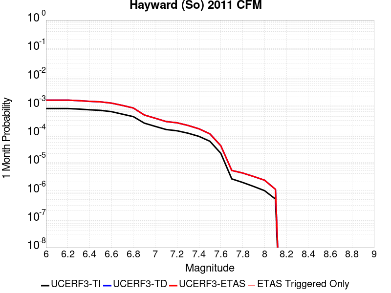 |  |  |

| Magnitude | 1 wk TI Prob | 1 wk TD Prob | 1 wk ETAS Prob | 1 wk ETAS/TD Gain | 1 wk ETAS Triggered Only | 1 mo TI Prob | 1 mo TD Prob | 1 mo ETAS Prob | 1 mo ETAS/TD Gain | 1 mo ETAS Triggered Only | 1 yr TI Prob | 1 yr TD Prob | 1 yr ETAS Prob | 1 yr ETAS/TD Gain | 1 yr ETAS Triggered Only | 10 yr TI Prob | 10 yr TD Prob | 10 yr ETAS Prob | 10 yr ETAS/TD Gain | 10 yr ETAS Triggered Only |
|-----|-----|-----|-----|-----|-----|-----|-----|-----|-----|-----|-----|-----|-----|-----|-----|-----|-----|-----|-----|-----|
| 6.0 | 1.8091932E-4 | 3.570541E-4 | 3.570541E-4 | 1.0 | 0.0 | 7.751381E-4 | 0.0015293444 | 0.0015293444 | 1.0 | 0.0 | 0.00939654 | 0.018463207 | 0.018475134 | 1.0006459 | 1.2150373E-5 | 0.090090066 | 0.16673161 | 0.16675186 | 1.0001215 | 2.4300745E-5 |
| 6.1 | 1.8091932E-4 | 3.570541E-4 | 3.570541E-4 | 1.0 | 0.0 | 7.751381E-4 | 0.0015293444 | 0.0015293444 | 1.0 | 0.0 | 0.00939654 | 0.018463207 | 0.018475134 | 1.0006459 | 1.2150373E-5 | 0.090090066 | 0.16673161 | 0.16675186 | 1.0001215 | 2.4300745E-5 |
| 6.2 | 1.8091932E-4 | 3.570541E-4 | 3.570541E-4 | 1.0 | 0.0 | 7.751381E-4 | 0.0015293444 | 0.0015293444 | 1.0 | 0.0 | 0.00939654 | 0.018463207 | 0.018475134 | 1.0006459 | 1.2150373E-5 | 0.090090066 | 0.16673161 | 0.16675186 | 1.0001215 | 2.4300745E-5 |
| 6.3 | 1.7322872E-4 | 3.426234E-4 | 3.426234E-4 | 1.0 | 0.0 | 7.4219756E-4 | 0.0014675693 | 0.0014675693 | 1.0 | 0.0 | 0.0089988755 | 0.017723544 | 0.01773548 | 1.0006734 | 1.2150373E-5 | 0.08643075 | 0.16066726 | 0.16068766 | 1.000127 | 2.4300745E-5 |
| 6.4 | 1.6334097E-4 | 3.234411E-4 | 3.234411E-4 | 1.0 | 0.0 | 6.998449E-4 | 0.0013854484 | 0.0013854484 | 1.0 | 0.0 | 0.008487372 | 0.016739385 | 0.016751332 | 1.0007137 | 1.2150373E-5 | 0.081704415 | 0.15255594 | 0.15257654 | 1.000135 | 2.4300745E-5 |
| 6.5 | 1.5600289E-4 | 3.1018828E-4 | 3.1018828E-4 | 1.0 | 0.0 | 6.684125E-4 | 0.0013287093 | 0.0013287093 | 1.0 | 0.0 | 0.008107598 | 0.016058935 | 0.01607089 | 1.0007445 | 1.2150373E-5 | 0.078181036 | 0.14683272 | 0.14685345 | 1.0001411 | 2.4300745E-5 |
| 6.6 | 1.4046066E-4 | 2.8032906E-4 | 2.8032906E-4 | 1.0 | 0.0 | 6.018354E-4 | 0.0012008639 | 0.0012008639 | 1.0 | 0.0 | 0.0073027555 | 0.014524006 | 0.01453598 | 1.0008245 | 1.2150373E-5 | 0.07067384 | 0.13391982 | 0.13394088 | 1.0001571 | 2.4300745E-5 |
| 6.7 | 1.14696966E-4 | 2.3271477E-4 | 2.3271477E-4 | 1.0 | 0.0 | 4.914658E-4 | 9.969729E-4 | 9.969729E-4 | 1.0 | 0.0 | 0.0059671924 | 0.012071652 | 0.012083656 | 1.0009943 | 1.2150373E-5 | 0.058094822 | 0.11274672 | 0.112768285 | 1.0001912 | 2.4300745E-5 |
| 6.8 | 9.3874296E-5 | 1.8861453E-4 | 1.8861453E-4 | 1.0 | 0.0 | 4.0225635E-4 | 8.0810126E-4 | 8.0810126E-4 | 1.0 | 0.0 | 0.0048864787 | 0.009794984 | 0.009794984 | 1.0 | 0.0 | 0.047804173 | 0.09259856 | 0.092609584 | 1.0001191 | 1.2150373E-5 |
| 6.9 | 5.551852E-5 | 1.072948E-4 | 1.072948E-4 | 1.0 | 0.0 | 2.3791482E-4 | 4.5975443E-4 | 4.5975443E-4 | 1.0 | 0.0 | 0.0028927654 | 0.0055832625 | 0.0055832625 | 1.0 | 0.0 | 0.028553981 | 0.054245494 | 0.054256983 | 1.0002118 | 1.2150373E-5 |
| 7.0 | 4.2662363E-5 | 8.2464416E-5 | 8.2464416E-5 | 1.0 | 0.0 | 1.8282588E-4 | 3.5337146E-4 | 3.5337146E-4 | 1.0 | 0.0 | 0.0022236328 | 0.0042938837 | 0.0042938837 | 1.0 | 0.0 | 0.022015138 | 0.042064495 | 0.042076133 | 1.0002767 | 1.2150373E-5 |
| 7.1 | 3.305886E-5 | 6.3019055E-5 | 6.3019055E-5 | 1.0 | 0.0 | 1.4167312E-4 | 2.700538E-4 | 2.700538E-4 | 1.0 | 0.0 | 0.0017235056 | 0.0032829668 | 0.0032829668 | 1.0 | 0.0 | 0.017101998 | 0.032452874 | 0.03246463 | 1.0003623 | 1.2150373E-5 |
| 7.2 | 2.9856887E-5 | 5.7013647E-5 | 5.7013647E-5 | 1.0 | 0.0 | 1.2795182E-4 | 2.4432142E-4 | 2.4432142E-4 | 1.0 | 0.0 | 0.0015567001 | 0.0029705726 | 0.0029705726 | 1.0 | 0.0 | 0.015458403 | 0.029453589 | 0.029465381 | 1.0004004 | 1.2150373E-5 |
| 7.3 | 2.4559737E-5 | 4.599088E-5 | 4.599088E-5 | 1.0 | 0.0 | 1.0525176E-4 | 1.9708896E-4 | 1.9708896E-4 | 1.0 | 0.0 | 0.0012806869 | 0.0023969305 | 0.0023969305 | 1.0 | 0.0 | 0.012733313 | 0.023857482 | 0.023869343 | 1.0004971 | 1.2150373E-5 |
| 7.4 | 1.9002231E-5 | 3.5049303E-5 | 3.5049303E-5 | 1.0 | 0.0 | 8.143559E-5 | 1.502027E-4 | 1.502027E-4 | 1.0 | 0.0 | 9.910273E-4 | 0.0018271938 | 0.0018271938 | 1.0 | 0.0 | 0.009866194 | 0.018258283 | 0.018270211 | 1.0006533 | 1.2150373E-5 |
| 7.5 | 1.2783333E-5 | 2.3330069E-5 | 2.3330069E-5 | 1.0 | 0.0 | 5.4784563E-5 | 9.998221E-5 | 9.998221E-5 | 1.0 | 0.0 | 6.667979E-4 | 0.0012166094 | 0.0012166094 | 1.0 | 0.0 | 0.006648007 | 0.012209582 | 0.012221584 | 1.000983 | 1.2150373E-5 |
| 7.6 | 4.8149627E-6 | 8.887544E-6 | 8.887544E-6 | 1.0 | 0.0 | 2.063539E-5 | 3.8088925E-5 | 3.8088925E-5 | 1.0 | 0.0 | 2.5120692E-4 | 4.636352E-4 | 4.636352E-4 | 1.0 | 0.0 | 0.0025092314 | 0.0046812436 | 0.004693337 | 1.0025834 | 1.2150373E-5 |
| 7.7 | 6.0838227E-7 | 1.2056693E-6 | 1.2056693E-6 | 1.0 | 0.0 | 2.6073499E-6 | 5.1671436E-6 | 5.1671436E-6 | 1.0 | 0.0 | 3.174402E-5 | 6.290816E-5 | 6.290816E-5 | 1.0 | 0.0 | 3.1739488E-4 | 6.5293367E-4 | 6.650761E-4 | 1.0185968 | 1.2150373E-5 |
| 7.8 | 4.5542808E-7 | 9.792182E-7 | 9.792182E-7 | 1.0 | 0.0 | 1.9518332E-6 | 4.1966427E-6 | 4.1966427E-6 | 1.0 | 0.0 | 2.376331E-5 | 5.1092928E-5 | 5.1092928E-5 | 1.0 | 0.0 | 2.3760769E-4 | 5.321372E-4 | 5.4428104E-4 | 1.0228211 | 1.2150373E-5 |
| 7.9 | 3.3016747E-7 | 7.386335E-7 | 7.386335E-7 | 1.0 | 0.0 | 1.4150027E-6 | 3.1655684E-6 | 3.1655684E-6 | 1.0 | 0.0 | 1.7227521E-5 | 3.8540114E-5 | 3.8540114E-5 | 1.0 | 0.0 | 1.7226185E-4 | 3.9930744E-4 | 4.1145296E-4 | 1.0304165 | 1.2150373E-5 |
| 8.0 | 2.347038E-7 | 5.4714894E-7 | 5.4714894E-7 | 1.0 | 0.0 | 1.0058731E-6 | 2.344922E-6 | 2.344922E-6 | 1.0 | 0.0 | 1.2246436E-5 | 2.8549053E-5 | 2.8549053E-5 | 1.0 | 0.0 | 1.2245761E-4 | 2.9355253E-4 | 3.0569933E-4 | 1.0413786 | 1.2150373E-5 |
| 8.1 | 1.18822804E-7 | 2.6058973E-7 | 2.6058973E-7 | 1.0 | 0.0 | 5.092405E-7 | 1.1168127E-6 | 1.1168127E-6 | 1.0 | 0.0 | 6.1999854E-6 | 1.359711E-5 | 1.359711E-5 | 1.0 | 0.0 | 6.199812E-5 | 1.3917852E-4 | 1.513272E-4 | 1.0872885 | 1.2150373E-5 |

## Red Mountain
*[(top)](#table-of-contents)*

| 1 Week | 1 Month | 1 Year | 10 Year |
|-----|-----|-----|-----|
|  |  |  |  |

| Magnitude | 1 wk TI Prob | 1 wk TD Prob | 1 wk ETAS Prob | 1 wk ETAS/TD Gain | 1 wk ETAS Triggered Only | 1 mo TI Prob | 1 mo TD Prob | 1 mo ETAS Prob | 1 mo ETAS/TD Gain | 1 mo ETAS Triggered Only | 1 yr TI Prob | 1 yr TD Prob | 1 yr ETAS Prob | 1 yr ETAS/TD Gain | 1 yr ETAS Triggered Only | 10 yr TI Prob | 10 yr TD Prob | 10 yr ETAS Prob | 10 yr ETAS/TD Gain | 10 yr ETAS Triggered Only |
|-----|-----|-----|-----|-----|-----|-----|-----|-----|-----|-----|-----|-----|-----|-----|-----|-----|-----|-----|-----|-----|
| 6.0 | 4.1810763E-5 | 4.7589947E-5 | 5.973974E-5 | 1.2553017 | 1.2150373E-5 | 1.7917668E-4 | 2.039419E-4 | 2.160898E-4 | 1.0595654 | 1.2150373E-5 | 0.0021792934 | 0.0024803306 | 0.0024924509 | 1.0048865 | 1.2150373E-5 | 0.021580452 | 0.024544092 | 0.024567796 | 1.0009658 | 2.4300745E-5 |
| 6.1 | 4.1810763E-5 | 4.7589947E-5 | 5.973974E-5 | 1.2553017 | 1.2150373E-5 | 1.7917668E-4 | 2.039419E-4 | 2.160898E-4 | 1.0595654 | 1.2150373E-5 | 0.0021792934 | 0.0024803306 | 0.0024924509 | 1.0048865 | 1.2150373E-5 | 0.021580452 | 0.024544092 | 0.024567796 | 1.0009658 | 2.4300745E-5 |
| 6.2 | 4.1810763E-5 | 4.7589947E-5 | 5.973974E-5 | 1.2553017 | 1.2150373E-5 | 1.7917668E-4 | 2.039419E-4 | 2.160898E-4 | 1.0595654 | 1.2150373E-5 | 0.0021792934 | 0.0024803306 | 0.0024924509 | 1.0048865 | 1.2150373E-5 | 0.021580452 | 0.024544092 | 0.024567796 | 1.0009658 | 2.4300745E-5 |
| 6.3 | 4.1810763E-5 | 4.7589947E-5 | 5.973974E-5 | 1.2553017 | 1.2150373E-5 | 1.7917668E-4 | 2.039419E-4 | 2.160898E-4 | 1.0595654 | 1.2150373E-5 | 0.0021792934 | 0.0024803306 | 0.0024924509 | 1.0048865 | 1.2150373E-5 | 0.021580452 | 0.024544092 | 0.024567796 | 1.0009658 | 2.4300745E-5 |
| 6.4 | 4.1810763E-5 | 4.7589947E-5 | 5.973974E-5 | 1.2553017 | 1.2150373E-5 | 1.7917668E-4 | 2.039419E-4 | 2.160898E-4 | 1.0595654 | 1.2150373E-5 | 0.0021792934 | 0.0024803306 | 0.0024924509 | 1.0048865 | 1.2150373E-5 | 0.021580452 | 0.024544092 | 0.024567796 | 1.0009658 | 2.4300745E-5 |
| 6.5 | 3.154503E-5 | 3.5359728E-5 | 4.750967E-5 | 1.3436097 | 1.2150373E-5 | 1.3518598E-4 | 1.5153342E-4 | 1.6368194E-4 | 1.0801706 | 1.2150373E-5 | 0.0016446467 | 0.0018434501 | 0.0018555782 | 1.0065789 | 1.2150373E-5 | 0.01632528 | 0.018291233 | 0.01831509 | 1.0013043 | 2.4300745E-5 |
| 6.6 | 3.1535834E-5 | 3.534911E-5 | 4.7499052E-5 | 1.3437128 | 1.2150373E-5 | 1.3514658E-4 | 1.5148791E-4 | 1.6363645E-4 | 1.0801947 | 1.2150373E-5 | 0.0016441676 | 0.001842897 | 0.0018550251 | 1.006581 | 1.2150373E-5 | 0.01632056 | 0.018285794 | 0.018309651 | 1.0013046 | 2.4300745E-5 |
| 6.7 | 2.8267326E-5 | 3.146934E-5 | 4.361933E-5 | 1.3860898 | 1.2150373E-5 | 1.2114006E-4 | 1.348621E-4 | 1.4701084E-4 | 1.0900826 | 1.2150373E-5 | 0.0014738824 | 0.0016407946 | 0.001652925 | 1.007393 | 1.2150373E-5 | 0.014641452 | 0.016295563 | 0.016319469 | 1.001467 | 2.4300745E-5 |
| 6.8 | 2.8212884E-5 | 3.1407224E-5 | 4.3557215E-5 | 1.3868533 | 1.2150373E-5 | 1.20906756E-4 | 1.3459593E-4 | 1.4674467E-4 | 1.0902609 | 1.2150373E-5 | 0.0014710457 | 0.0016375587 | 0.0016496892 | 1.0074077 | 1.2150373E-5 | 0.014613459 | 0.01626368 | 0.016287586 | 1.0014699 | 2.4300745E-5 |
| 6.9 | 2.4227871E-5 | 2.6706979E-5 | 3.8857026E-5 | 1.4549391 | 1.2150373E-5 | 1.03829596E-4 | 1.14453884E-4 | 1.2660287E-4 | 1.1061474 | 1.2150373E-5 | 0.0012633923 | 0.0013926612 | 0.0014047946 | 1.0087124 | 1.2150373E-5 | 0.012562336 | 0.013847026 | 0.01387099 | 1.0017307 | 2.4300745E-5 |
| 7.0 | 2.348524E-5 | 2.5835763E-5 | 3.798582E-5 | 1.4702806 | 1.2150373E-5 | 1.0064714E-4 | 1.1072042E-4 | 1.2286945E-4 | 1.109727 | 1.2150373E-5 | 0.0012246901 | 0.0013472632 | 0.0013593972 | 1.0090064 | 1.2150373E-5 | 0.012179627 | 0.01339859 | 0.013422565 | 1.0017893 | 2.4300745E-5 |
| 7.1 | 2.2311642E-5 | 2.4462828E-5 | 3.6612906E-5 | 1.496675 | 1.2150373E-5 | 9.561782E-5 | 1.048369E-4 | 1.16986004E-4 | 1.1158857 | 1.2150373E-5 | 0.0011635252 | 0.0012757168 | 0.0012878516 | 1.0095122 | 1.2150373E-5 | 0.01157452 | 0.012691451 | 0.012715444 | 1.0018904 | 2.4300745E-5 |
| 7.2 | 1.6533986E-5 | 1.7670347E-5 | 2.9820505E-5 | 1.6876016 | 1.2150373E-5 | 7.085802E-5 | 7.572822E-5 | 8.787767E-5 | 1.160435 | 1.2150373E-5 | 8.623549E-4 | 9.216645E-4 | 9.338037E-4 | 1.013171 | 1.2150373E-5 | 0.008590161 | 0.009184699 | 0.009196738 | 1.0013107 | 1.2150373E-5 |
| 7.3 | 1.4703092E-5 | 1.555952E-5 | 2.7709704E-5 | 1.7808841 | 1.2150373E-5 | 6.301173E-5 | 6.66823E-5 | 7.8831865E-5 | 1.1822007 | 1.2150373E-5 | 7.668978E-4 | 8.1161625E-4 | 8.237568E-4 | 1.0149584 | 1.2150373E-5 | 0.0076425658 | 0.008092596 | 0.0081046475 | 1.0014893 | 1.2150373E-5 |
| 7.4 | 6.1331984E-6 | 5.528872E-6 | 5.528872E-6 | 1.0 | 0.0 | 2.6284872E-5 | 2.3694953E-5 | 2.3694953E-5 | 1.0 | 0.0 | 3.199713E-4 | 2.8844838E-4 | 2.8844838E-4 | 1.0 | 0.0 | 0.0031951098 | 0.0028807942 | 0.0028807942 | 1.0 | 0.0 |
| 7.5 | 5.954766E-6 | 5.3385015E-6 | 5.3385015E-6 | 1.0 | 0.0 | 2.5520176E-5 | 2.2879094E-5 | 2.2879094E-5 | 1.0 | 0.0 | 3.1066386E-4 | 2.785179E-4 | 2.785179E-4 | 1.0 | 0.0 | 0.003102299 | 0.0027817423 | 0.0027817423 | 1.0 | 0.0 |
| 7.6 | 4.9726646E-6 | 4.315295E-6 | 4.315295E-6 | 1.0 | 0.0 | 2.1311245E-5 | 1.8493993E-5 | 1.8493993E-5 | 1.0 | 0.0 | 2.5943352E-4 | 2.2514143E-4 | 2.2514143E-4 | 1.0 | 0.0 | 0.0025913084 | 0.002249168 | 0.002249168 | 1.0 | 0.0 |
| 7.7 | 3.3613894E-6 | 2.8526642E-6 | 2.8526642E-6 | 1.0 | 0.0 | 1.4405875E-5 | 1.2225649E-5 | 1.2225649E-5 | 1.0 | 0.0 | 1.7537741E-4 | 1.4883737E-4 | 1.4883737E-4 | 1.0 | 0.0 | 0.0017523908 | 0.0014874031 | 0.0014874031 | 1.0 | 0.0 |
| 7.8 | 1.1828961E-6 | 1.0122756E-6 | 1.0122756E-6 | 1.0 | 0.0 | 5.069545E-6 | 4.338317E-6 | 4.338317E-6 | 1.0 | 0.0 | 6.171996E-5 | 5.281776E-5 | 5.281776E-5 | 1.0 | 0.0 | 6.170282E-4 | 5.2805495E-4 | 5.2805495E-4 | 1.0 | 0.0 |
| 7.9 | 2.2967266E-7 | 1.8618952E-7 | 1.8618952E-7 | 1.0 | 0.0 | 9.843111E-7 | 7.9795484E-7 | 7.9795484E-7 | 1.0 | 0.0 | 1.19839215E-5 | 9.7150605E-6 | 9.7150605E-6 | 1.0 | 0.0 | 1.1983275E-4 | 9.714664E-5 | 9.714664E-5 | 1.0 | 0.0 |

## Great Valley 11
*[(top)](#table-of-contents)*

| 1 Week | 1 Month | 1 Year | 10 Year |
|-----|-----|-----|-----|
|  |  |  |  |

| Magnitude | 1 wk TI Prob | 1 wk TD Prob | 1 wk ETAS Prob | 1 wk ETAS/TD Gain | 1 wk ETAS Triggered Only | 1 mo TI Prob | 1 mo TD Prob | 1 mo ETAS Prob | 1 mo ETAS/TD Gain | 1 mo ETAS Triggered Only | 1 yr TI Prob | 1 yr TD Prob | 1 yr ETAS Prob | 1 yr ETAS/TD Gain | 1 yr ETAS Triggered Only | 10 yr TI Prob | 10 yr TD Prob | 10 yr ETAS Prob | 10 yr ETAS/TD Gain | 10 yr ETAS Triggered Only |
|-----|-----|-----|-----|-----|-----|-----|-----|-----|-----|-----|-----|-----|-----|-----|-----|-----|-----|-----|-----|-----|
| 6.0 | 2.8099583E-5 | 2.9832152E-5 | 5.413217E-5 | 1.8145581 | 2.4300745E-5 | 1.20421224E-4 | 1.278462E-4 | 1.5214384E-4 | 1.1900537 | 2.4300745E-5 | 0.0014651422 | 0.0015554909 | 0.0015797538 | 1.0155983 | 2.4300745E-5 | 0.0145552 | 0.01545356 | 0.015477486 | 1.0015482 | 2.4300745E-5 |
| 6.1 | 2.483194E-5 | 2.590715E-5 | 5.0207265E-5 | 1.9379696 | 2.4300745E-5 | 1.0641825E-4 | 1.11026246E-4 | 1.353243E-4 | 1.2188495 | 2.4300745E-5 | 0.0012948721 | 0.0013509706 | 0.0013752384 | 1.0179633 | 2.4300745E-5 | 0.012873529 | 0.013433994 | 0.013457968 | 1.0017846 | 2.4300745E-5 |
| 6.2 | 2.483194E-5 | 2.590715E-5 | 5.0207265E-5 | 1.9379696 | 2.4300745E-5 | 1.0641825E-4 | 1.11026246E-4 | 1.353243E-4 | 1.2188495 | 2.4300745E-5 | 0.0012948721 | 0.0013509706 | 0.0013752384 | 1.0179633 | 2.4300745E-5 | 0.012873529 | 0.013433994 | 0.013457968 | 1.0017846 | 2.4300745E-5 |
| 6.3 | 2.0257901E-5 | 2.0398922E-5 | 3.2549047E-5 | 1.5956259 | 1.2150373E-5 | 8.681669E-5 | 8.742122E-5 | 9.9570534E-5 | 1.1389744 | 1.2150373E-5 | 0.0010564806 | 0.0010638756 | 0.001076013 | 1.0114087 | 1.2150373E-5 | 0.01051472 | 0.010592012 | 0.010604033 | 1.001135 | 1.2150373E-5 |
| 6.4 | 1.8054898E-5 | 1.7780874E-5 | 2.9931032E-5 | 1.6833273 | 1.2150373E-5 | 7.737584E-5 | 7.62017E-5 | 8.8351146E-5 | 1.159438 | 1.2150373E-5 | 9.416436E-4 | 9.2739856E-4 | 9.395377E-4 | 1.0130894 | 1.2150373E-5 | 0.009376635 | 0.009239036 | 0.009251074 | 1.001303 | 1.2150373E-5 |
| 6.5 | 1.34804895E-5 | 1.2321055E-5 | 2.4471277E-5 | 1.986135 | 1.2150373E-5 | 5.777225E-5 | 5.2803476E-5 | 6.495321E-5 | 1.2300934 | 1.2150373E-5 | 7.031501E-4 | 6.4269686E-4 | 6.548394E-4 | 1.0188931 | 1.2150373E-5 | 0.007009294 | 0.0064088185 | 0.006420891 | 1.0018837 | 1.2150373E-5 |
| 6.6 | 1.294883E-5 | 1.1732312E-5 | 2.3882541E-5 | 2.0356212 | 1.2150373E-5 | 5.5493805E-5 | 5.028039E-5 | 6.2430154E-5 | 1.2416402 | 1.2150373E-5 | 6.754276E-4 | 6.1199587E-4 | 6.241388E-4 | 1.0198416 | 1.2150373E-5 | 0.006733784 | 0.0061035305 | 0.006115607 | 1.0019785 | 1.2150373E-5 |
| 6.7 | 1.1272237E-5 | 9.811886E-6 | 2.196214E-5 | 2.2383199 | 1.2150373E-5 | 4.8308695E-5 | 4.2050277E-5 | 5.420014E-5 | 1.2889365 | 1.2150373E-5 | 5.879996E-4 | 5.118446E-4 | 5.2398874E-4 | 1.0237262 | 1.2150373E-5 | 0.005864462 | 0.0051069413 | 0.0051190294 | 1.002367 | 1.2150373E-5 |
| 6.8 | 9.8337505E-6 | 8.19377E-6 | 2.0344043E-5 | 2.4828672 | 1.2150373E-5 | 4.2143965E-5 | 3.5115696E-5 | 4.7265643E-5 | 1.3459976 | 1.2150373E-5 | 5.1298196E-4 | 4.2745177E-4 | 4.3959694E-4 | 1.0284129 | 1.2150373E-5 | 0.005117994 | 0.0042665056 | 0.0042786044 | 1.0028358 | 1.2150373E-5 |
| 6.9 | 7.4224813E-6 | 5.4131347E-6 | 5.4131347E-6 | 1.0 | 0.0 | 3.1810247E-5 | 2.319895E-5 | 2.319895E-5 | 1.0 | 0.0 | 3.872209E-4 | 2.8241202E-4 | 2.8241202E-4 | 1.0 | 0.0 | 0.0038654688 | 0.0028206722 | 0.0028206722 | 1.0 | 0.0 |
| 7.0 | 4.4628923E-6 | 2.0110795E-6 | 2.0110795E-6 | 1.0 | 0.0 | 1.912654E-5 | 8.618884E-6 | 8.618884E-6 | 1.0 | 0.0 | 2.3284076E-4 | 1.04929975E-4 | 1.04929975E-4 | 1.0 | 0.0 | 0.0023259693 | 0.0010488159 | 0.0010488159 | 1.0 | 0.0 |
| 7.1 | 3.5546527E-6 | 1.1855836E-6 | 1.1855836E-6 | 1.0 | 0.0 | 1.5234136E-5 | 5.081063E-6 | 5.081063E-6 | 1.0 | 0.0 | 1.8545982E-4 | 6.186026E-5 | 6.186026E-5 | 1.0 | 0.0 | 0.0018530512 | 6.1843713E-4 | 6.1843713E-4 | 1.0 | 0.0 |
| 7.2 | 3.2039936E-6 | 1.1254128E-6 | 1.1254128E-6 | 1.0 | 0.0 | 1.3731329E-5 | 4.823189E-6 | 4.823189E-6 | 1.0 | 0.0 | 1.671661E-4 | 5.8720816E-5 | 5.8720816E-5 | 1.0 | 0.0 | 0.0016704041 | 5.870597E-4 | 5.870597E-4 | 1.0 | 0.0 |
| 7.3 | 2.8120473E-6 | 1.0305612E-6 | 1.0305612E-6 | 1.0 | 0.0 | 1.2051575E-5 | 4.4166836E-6 | 4.4166836E-6 | 1.0 | 0.0 | 1.4671806E-4 | 5.3771862E-5 | 5.3771862E-5 | 1.0 | 0.0 | 0.0014662122 | 5.3759513E-4 | 5.3759513E-4 | 1.0 | 0.0 |
| 7.4 | 2.4837766E-6 | 9.800582E-7 | 9.800582E-7 | 1.0 | 0.0 | 1.0644713E-5 | 4.200243E-6 | 4.200243E-6 | 1.0 | 0.0 | 1.2959167E-4 | 5.1136827E-5 | 5.1136827E-5 | 1.0 | 0.0 | 0.0012951613 | 5.112572E-4 | 5.112572E-4 | 1.0 | 0.0 |
| 7.5 | 1.5002679E-6 | 6.546144E-7 | 6.546144E-7 | 1.0 | 0.0 | 6.4297037E-6 | 2.8054874E-6 | 2.8054874E-6 | 1.0 | 0.0 | 7.827883E-5 | 3.4156317E-5 | 3.4156317E-5 | 1.0 | 0.0 | 7.825126E-4 | 3.4151482E-4 | 3.4151482E-4 | 1.0 | 0.0 |

## Pittville 2011 CFM
*[(top)](#table-of-contents)*

| 1 Week | 1 Month | 1 Year | 10 Year |
|-----|-----|-----|-----|
|  |  |  |  |

| Magnitude | 1 wk TI Prob | 1 wk TD Prob | 1 wk ETAS Prob | 1 wk ETAS/TD Gain | 1 wk ETAS Triggered Only | 1 mo TI Prob | 1 mo TD Prob | 1 mo ETAS Prob | 1 mo ETAS/TD Gain | 1 mo ETAS Triggered Only | 1 yr TI Prob | 1 yr TD Prob | 1 yr ETAS Prob | 1 yr ETAS/TD Gain | 1 yr ETAS Triggered Only | 10 yr TI Prob | 10 yr TD Prob | 10 yr ETAS Prob | 10 yr ETAS/TD Gain | 10 yr ETAS Triggered Only |
|-----|-----|-----|-----|-----|-----|-----|-----|-----|-----|-----|-----|-----|-----|-----|-----|-----|-----|-----|-----|-----|
| 6.0 | 2.5031832E-5 | 2.7056969E-5 | 3.9207014E-5 | 1.4490541 | 1.2150373E-5 | 1.0727487E-4 | 1.1595384E-4 | 1.281028E-4 | 1.1047741 | 1.2150373E-5 | 0.001305289 | 0.0014109211 | 0.0014230544 | 1.0085995 | 1.2150373E-5 | 0.012976485 | 0.014029415 | 0.014041396 | 1.0008539 | 1.2150373E-5 |
| 6.1 | 1.2540113E-5 | 1.3513067E-5 | 2.5663276E-5 | 1.8991452 | 1.2150373E-5 | 5.3742235E-5 | 5.7911984E-5 | 7.006165E-5 | 1.2097955 | 1.2150373E-5 | 6.541153E-4 | 7.048728E-4 | 7.170146E-4 | 1.0172255 | 1.2150373E-5 | 0.0065219323 | 0.0070286044 | 0.007040669 | 1.0017165 | 1.2150373E-5 |
| 6.2 | 6.603218E-6 | 7.107189E-6 | 1.9257475E-5 | 2.7095768 | 1.2150373E-5 | 2.8299199E-5 | 3.0459063E-5 | 4.2609066E-5 | 1.3988961 | 1.2150373E-5 | 3.4448825E-4 | 3.7078248E-4 | 3.8292835E-4 | 1.0327574 | 1.2150373E-5 | 0.0034395473 | 0.0037022792 | 0.0037143845 | 1.0032697 | 1.2150373E-5 |
| 6.3 | 6.603218E-6 | 7.107189E-6 | 1.9257475E-5 | 2.7095768 | 1.2150373E-5 | 2.8299199E-5 | 3.0459063E-5 | 4.2609066E-5 | 1.3988961 | 1.2150373E-5 | 3.4448825E-4 | 3.7078248E-4 | 3.8292835E-4 | 1.0327574 | 1.2150373E-5 | 0.0034395473 | 0.0037022792 | 0.0037143845 | 1.0032697 | 1.2150373E-5 |
| 6.4 | 3.9389015E-6 | 4.239175E-6 | 4.239175E-6 | 1.0 | 0.0 | 1.6880897E-5 | 1.8167784E-5 | 1.8167784E-5 | 1.0 | 0.0 | 2.0550552E-4 | 2.2117342E-4 | 2.2117342E-4 | 1.0 | 0.0 | 0.0020531558 | 0.002209838 | 0.002209838 | 1.0 | 0.0 |
| 6.5 | 2.4533072E-6 | 2.6412686E-6 | 2.6412686E-6 | 1.0 | 0.0 | 1.0514132E-5 | 1.1319685E-5 | 1.1319685E-5 | 1.0 | 0.0 | 1.2800204E-4 | 1.3781038E-4 | 1.3781038E-4 | 1.0 | 0.0 | 0.0012792832 | 0.0013774394 | 0.0013774394 | 1.0 | 0.0 |
| 6.6 | 1.3482367E-6 | 1.452993E-6 | 1.452993E-6 | 1.0 | 0.0 | 5.778144E-6 | 6.2271047E-6 | 6.2271047E-6 | 1.0 | 0.0 | 7.0346636E-5 | 7.58135E-5 | 7.58135E-5 | 1.0 | 0.0 | 7.032437E-4 | 7.5798744E-4 | 7.5798744E-4 | 1.0 | 0.0 |

## Bullion Mountains
*[(top)](#table-of-contents)*

| 1 Week | 1 Month | 1 Year | 10 Year |
|-----|-----|-----|-----|
|  |  |  |  |

| Magnitude | 1 wk TI Prob | 1 wk TD Prob | 1 wk ETAS Prob | 1 wk ETAS/TD Gain | 1 wk ETAS Triggered Only | 1 mo TI Prob | 1 mo TD Prob | 1 mo ETAS Prob | 1 mo ETAS/TD Gain | 1 mo ETAS Triggered Only | 1 yr TI Prob | 1 yr TD Prob | 1 yr ETAS Prob | 1 yr ETAS/TD Gain | 1 yr ETAS Triggered Only | 10 yr TI Prob | 10 yr TD Prob | 10 yr ETAS Prob | 10 yr ETAS/TD Gain | 10 yr ETAS Triggered Only |
|-----|-----|-----|-----|-----|-----|-----|-----|-----|-----|-----|-----|-----|-----|-----|-----|-----|-----|-----|-----|-----|
| 6.0 | 1.6420427E-5 | 1.4692089E-5 | 3.899248E-5 | 2.6539776 | 2.4300745E-5 | 7.037136E-5 | 6.296479E-5 | 8.726401E-5 | 1.3859175 | 2.4300745E-5 | 8.5643446E-4 | 7.663651E-4 | 7.9064723E-4 | 1.0316848 | 2.4300745E-5 | 0.008531413 | 0.007641016 | 0.0076651312 | 1.003156 | 2.4300745E-5 |
| 6.1 | 1.6420427E-5 | 1.4692089E-5 | 3.899248E-5 | 2.6539776 | 2.4300745E-5 | 7.037136E-5 | 6.296479E-5 | 8.726401E-5 | 1.3859175 | 2.4300745E-5 | 8.5643446E-4 | 7.663651E-4 | 7.9064723E-4 | 1.0316848 | 2.4300745E-5 | 0.008531413 | 0.007641016 | 0.0076651312 | 1.003156 | 2.4300745E-5 |
| 6.2 | 1.6420427E-5 | 1.4692089E-5 | 3.899248E-5 | 2.6539776 | 2.4300745E-5 | 7.037136E-5 | 6.296479E-5 | 8.726401E-5 | 1.3859175 | 2.4300745E-5 | 8.5643446E-4 | 7.663651E-4 | 7.9064723E-4 | 1.0316848 | 2.4300745E-5 | 0.008531413 | 0.007641016 | 0.0076651312 | 1.003156 | 2.4300745E-5 |
| 6.3 | 1.2046778E-5 | 9.862335E-6 | 9.862335E-6 | 1.0 | 0.0 | 5.1628023E-5 | 4.2266598E-5 | 4.2266598E-5 | 1.0 | 0.0 | 6.283899E-4 | 5.144975E-4 | 5.144975E-4 | 1.0 | 0.0 | 0.0062661595 | 0.005135345 | 0.005135345 | 1.0 | 0.0 |
| 6.4 | 1.2046778E-5 | 9.862335E-6 | 9.862335E-6 | 1.0 | 0.0 | 5.1628023E-5 | 4.2266598E-5 | 4.2266598E-5 | 1.0 | 0.0 | 6.283899E-4 | 5.144975E-4 | 5.144975E-4 | 1.0 | 0.0 | 0.0062661595 | 0.005135345 | 0.005135345 | 1.0 | 0.0 |
| 6.5 | 1.0244343E-5 | 7.879458E-6 | 7.879458E-6 | 1.0 | 0.0 | 4.390359E-5 | 3.3768785E-5 | 3.3768785E-5 | 1.0 | 0.0 | 5.343951E-4 | 4.110781E-4 | 4.110781E-4 | 1.0 | 0.0 | 0.005331118 | 0.004105208 | 0.004105208 | 1.0 | 0.0 |
| 6.6 | 9.605408E-6 | 7.1774966E-6 | 7.1774966E-6 | 1.0 | 0.0 | 4.1165385E-5 | 3.076045E-5 | 3.076045E-5 | 1.0 | 0.0 | 5.010733E-4 | 3.744645E-4 | 3.744645E-4 | 1.0 | 0.0 | 0.00499945 | 0.003740332 | 0.003740332 | 1.0 | 0.0 |
| 6.7 | 8.60418E-6 | 6.1240044E-6 | 6.1240044E-6 | 1.0 | 0.0 | 3.687454E-5 | 2.624558E-5 | 2.624558E-5 | 1.0 | 0.0 | 4.48855E-4 | 3.1951256E-4 | 3.1951256E-4 | 1.0 | 0.0 | 0.004479495 | 0.0031924439 | 0.0031924439 | 1.0 | 0.0 |
| 6.8 | 5.187994E-6 | 2.5631666E-6 | 2.5631666E-6 | 1.0 | 0.0 | 2.223407E-5 | 1.0984976E-5 | 1.0984976E-5 | 1.0 | 0.0 | 2.7066618E-4 | 1.3373788E-4 | 1.3373788E-4 | 1.0 | 0.0 | 0.0027033675 | 0.0013369655 | 0.0013369655 | 1.0 | 0.0 |
| 6.9 | 4.5302368E-6 | 2.3443165E-6 | 2.3443165E-6 | 1.0 | 0.0 | 1.9415156E-5 | 1.0047055E-5 | 1.0047055E-5 | 1.0 | 0.0 | 2.3635388E-4 | 1.2232E-4 | 1.2232E-4 | 1.0 | 0.0 | 0.0023610266 | 0.0012229157 | 0.0012229157 | 1.0 | 0.0 |
| 7.0 | 3.431668E-6 | 1.6882402E-6 | 1.6882402E-6 | 1.0 | 0.0 | 1.4707065E-5 | 7.235315E-6 | 7.235315E-6 | 1.0 | 0.0 | 1.7904381E-4 | 8.808996E-5 | 8.808996E-5 | 1.0 | 0.0 | 0.0017889962 | 8.808996E-4 | 8.808996E-4 | 1.0 | 0.0 |

## Great Valley 05 Pittsburg - Kirby Hills alt1
*[(top)](#table-of-contents)*

| 1 Week | 1 Month | 1 Year | 10 Year |
|-----|-----|-----|-----|
|  |  |  |  |

| Magnitude | 1 wk TI Prob | 1 wk TD Prob | 1 wk ETAS Prob | 1 wk ETAS/TD Gain | 1 wk ETAS Triggered Only | 1 mo TI Prob | 1 mo TD Prob | 1 mo ETAS Prob | 1 mo ETAS/TD Gain | 1 mo ETAS Triggered Only | 1 yr TI Prob | 1 yr TD Prob | 1 yr ETAS Prob | 1 yr ETAS/TD Gain | 1 yr ETAS Triggered Only | 10 yr TI Prob | 10 yr TD Prob | 10 yr ETAS Prob | 10 yr ETAS/TD Gain | 10 yr ETAS Triggered Only |
|-----|-----|-----|-----|-----|-----|-----|-----|-----|-----|-----|-----|-----|-----|-----|-----|-----|-----|-----|-----|-----|
| 6.0 | 4.187212E-5 | 5.3442072E-5 | 6.55918E-5 | 1.2273438 | 1.2150373E-5 | 1.794396E-4 | 2.290231E-4 | 2.411707E-4 | 1.0530409 | 1.2150373E-5 | 0.002182488 | 0.0027857882 | 0.0028100212 | 1.0086988 | 2.4300745E-5 | 0.021611776 | 0.02760304 | 0.027626669 | 1.000856 | 2.4300745E-5 |
| 6.1 | 4.187212E-5 | 5.3442072E-5 | 6.55918E-5 | 1.2273438 | 1.2150373E-5 | 1.794396E-4 | 2.290231E-4 | 2.411707E-4 | 1.0530409 | 1.2150373E-5 | 0.002182488 | 0.0027857882 | 0.0028100212 | 1.0086988 | 2.4300745E-5 | 0.021611776 | 0.02760304 | 0.027626669 | 1.000856 | 2.4300745E-5 |
| 6.2 | 1.7353306E-5 | 2.2154374E-5 | 2.2154374E-5 | 1.0 | 0.0 | 7.436919E-5 | 9.494618E-5 | 9.494618E-5 | 1.0 | 0.0 | 9.050688E-4 | 0.0011557543 | 0.0011557543 | 1.0 | 0.0 | 0.009013915 | 0.011535114 | 0.011535114 | 1.0 | 0.0 |
| 6.3 | 1.7353306E-5 | 2.2154374E-5 | 2.2154374E-5 | 1.0 | 0.0 | 7.436919E-5 | 9.494618E-5 | 9.494618E-5 | 1.0 | 0.0 | 9.050688E-4 | 0.0011557543 | 0.0011557543 | 1.0 | 0.0 | 0.009013915 | 0.011535114 | 0.011535114 | 1.0 | 0.0 |
| 6.4 | 1.4028824E-5 | 1.7900597E-5 | 1.7900597E-5 | 1.0 | 0.0 | 6.0122147E-5 | 7.671684E-5 | 7.671684E-5 | 1.0 | 0.0 | 7.3174125E-4 | 9.340275E-4 | 9.340275E-4 | 1.0 | 0.0 | 0.0072933645 | 0.009338138 | 0.009338138 | 1.0 | 0.0 |

## Channel Islands Thrust
*[(top)](#table-of-contents)*

| 1 Week | 1 Month | 1 Year | 10 Year |
|-----|-----|-----|-----|
|  |  |  |  |

| Magnitude | 1 wk TI Prob | 1 wk TD Prob | 1 wk ETAS Prob | 1 wk ETAS/TD Gain | 1 wk ETAS Triggered Only | 1 mo TI Prob | 1 mo TD Prob | 1 mo ETAS Prob | 1 mo ETAS/TD Gain | 1 mo ETAS Triggered Only | 1 yr TI Prob | 1 yr TD Prob | 1 yr ETAS Prob | 1 yr ETAS/TD Gain | 1 yr ETAS Triggered Only | 10 yr TI Prob | 10 yr TD Prob | 10 yr ETAS Prob | 10 yr ETAS/TD Gain | 10 yr ETAS Triggered Only |
|-----|-----|-----|-----|-----|-----|-----|-----|-----|-----|-----|-----|-----|-----|-----|-----|-----|-----|-----|-----|-----|
| 6.0 | 2.2156251E-5 | 2.4092022E-5 | 3.62421E-5 | 1.5043197 | 1.2150373E-5 | 9.495191E-5 | 1.03248036E-4 | 1.1539715E-4 | 1.1176692 | 1.2150373E-5 | 0.0011554264 | 0.0012564264 | 0.0012806967 | 1.0193169 | 2.4300745E-5 | 0.011494373 | 0.0125038205 | 0.012527818 | 1.0019192 | 2.4300745E-5 |
| 6.1 | 2.2156251E-5 | 2.4092022E-5 | 3.62421E-5 | 1.5043197 | 1.2150373E-5 | 9.495191E-5 | 1.03248036E-4 | 1.1539715E-4 | 1.1176692 | 1.2150373E-5 | 0.0011554264 | 0.0012564264 | 0.0012806967 | 1.0193169 | 2.4300745E-5 | 0.011494373 | 0.0125038205 | 0.012527818 | 1.0019192 | 2.4300745E-5 |
| 6.2 | 2.2156251E-5 | 2.4092022E-5 | 3.62421E-5 | 1.5043197 | 1.2150373E-5 | 9.495191E-5 | 1.03248036E-4 | 1.1539715E-4 | 1.1176692 | 1.2150373E-5 | 0.0011554264 | 0.0012564264 | 0.0012806967 | 1.0193169 | 2.4300745E-5 | 0.011494373 | 0.0125038205 | 0.012527818 | 1.0019192 | 2.4300745E-5 |
| 6.3 | 2.2156251E-5 | 2.4092022E-5 | 3.62421E-5 | 1.5043197 | 1.2150373E-5 | 9.495191E-5 | 1.03248036E-4 | 1.1539715E-4 | 1.1176692 | 1.2150373E-5 | 0.0011554264 | 0.0012564264 | 0.0012806967 | 1.0193169 | 2.4300745E-5 | 0.011494373 | 0.0125038205 | 0.012527818 | 1.0019192 | 2.4300745E-5 |
| 6.4 | 2.2156251E-5 | 2.4092022E-5 | 3.62421E-5 | 1.5043197 | 1.2150373E-5 | 9.495191E-5 | 1.03248036E-4 | 1.1539715E-4 | 1.1176692 | 1.2150373E-5 | 0.0011554264 | 0.0012564264 | 0.0012806967 | 1.0193169 | 2.4300745E-5 | 0.011494373 | 0.0125038205 | 0.012527818 | 1.0019192 | 2.4300745E-5 |
| 6.5 | 2.2156251E-5 | 2.4092022E-5 | 3.62421E-5 | 1.5043197 | 1.2150373E-5 | 9.495191E-5 | 1.03248036E-4 | 1.1539715E-4 | 1.1176692 | 1.2150373E-5 | 0.0011554264 | 0.0012564264 | 0.0012806967 | 1.0193169 | 2.4300745E-5 | 0.011494373 | 0.0125038205 | 0.012527818 | 1.0019192 | 2.4300745E-5 |
| 6.6 | 2.2156251E-5 | 2.4092022E-5 | 3.62421E-5 | 1.5043197 | 1.2150373E-5 | 9.495191E-5 | 1.03248036E-4 | 1.1539715E-4 | 1.1176692 | 1.2150373E-5 | 0.0011554264 | 0.0012564264 | 0.0012806967 | 1.0193169 | 2.4300745E-5 | 0.011494373 | 0.0125038205 | 0.012527818 | 1.0019192 | 2.4300745E-5 |
| 6.7 | 1.0601296E-5 | 1.1379544E-5 | 1.1379544E-5 | 1.0 | 0.0 | 4.5433335E-5 | 4.876859E-5 | 4.876859E-5 | 1.0 | 0.0 | 5.5301044E-4 | 5.936007E-4 | 5.936007E-4 | 1.0 | 0.0 | 0.005516363 | 0.005920653 | 0.005920653 | 1.0 | 0.0 |
| 6.8 | 1.0246747E-5 | 1.0996669E-5 | 1.0996669E-5 | 1.0 | 0.0 | 4.391389E-5 | 4.7127756E-5 | 4.7127756E-5 | 1.0 | 0.0 | 5.345204E-4 | 5.7363417E-4 | 5.7363417E-4 | 1.0 | 0.0 | 0.0053323656 | 0.005722025 | 0.005722025 | 1.0 | 0.0 |
| 6.9 | 9.049551E-6 | 9.699645E-6 | 9.699645E-6 | 1.0 | 0.0 | 3.878322E-5 | 4.1569267E-5 | 4.1569267E-5 | 1.0 | 0.0 | 4.7208337E-4 | 5.059924E-4 | 5.059924E-4 | 1.0 | 0.0 | 0.0047108172 | 0.0050488203 | 0.0050488203 | 1.0 | 0.0 |
| 7.0 | 8.6542195E-6 | 9.274603E-6 | 9.274603E-6 | 1.0 | 0.0 | 3.7088983E-5 | 3.9747716E-5 | 3.9747716E-5 | 1.0 | 0.0 | 4.5146482E-4 | 4.8382508E-4 | 4.8382508E-4 | 1.0 | 0.0 | 0.004505487 | 0.004828129 | 0.004828129 | 1.0 | 0.0 |
| 7.1 | 8.391028E-6 | 8.992924E-6 | 8.992924E-6 | 1.0 | 0.0 | 3.5961057E-5 | 3.854056E-5 | 3.854056E-5 | 1.0 | 0.0 | 4.3773788E-4 | 4.6913436E-4 | 4.6913436E-4 | 1.0 | 0.0 | 0.004368766 | 0.0046818503 | 0.0046818503 | 1.0 | 0.0 |
| 7.2 | 5.965188E-6 | 6.3716952E-6 | 6.3716952E-6 | 1.0 | 0.0 | 2.556484E-5 | 2.7306982E-5 | 2.7306982E-5 | 1.0 | 0.0 | 3.1120746E-4 | 3.3241234E-4 | 3.3241234E-4 | 1.0 | 0.0 | 0.00310772 | 0.0033192092 | 0.0033192092 | 1.0 | 0.0 |
| 7.3 | 4.877518E-6 | 5.2060063E-6 | 5.2060063E-6 | 1.0 | 0.0 | 2.0903482E-5 | 2.2311267E-5 | 2.2311267E-5 | 1.0 | 0.0 | 2.5447016E-4 | 2.716063E-4 | 2.716063E-4 | 1.0 | 0.0 | 0.0025417898 | 0.0027127895 | 0.0027127895 | 1.0 | 0.0 |
| 7.4 | 3.8829853E-6 | 4.141863E-6 | 4.141863E-6 | 1.0 | 0.0 | 1.664126E-5 | 1.7750723E-5 | 1.7750723E-5 | 1.0 | 0.0 | 2.0258849E-4 | 2.1609402E-4 | 2.1609402E-4 | 1.0 | 0.0 | 0.002024039 | 0.0021588807 | 0.0021588807 | 1.0 | 0.0 |
| 7.5 | 1.3489616E-6 | 1.4277903E-6 | 1.4277903E-6 | 1.0 | 0.0 | 5.7812517E-6 | 6.119087E-6 | 6.119087E-6 | 1.0 | 0.0 | 7.038446E-5 | 7.449738E-5 | 7.449738E-5 | 1.0 | 0.0 | 7.036218E-4 | 7.44728E-4 | 7.44728E-4 | 1.0 | 0.0 |
| 7.6 | 6.058192E-7 | 6.353778E-7 | 6.353778E-7 | 1.0 | 0.0 | 2.5963652E-6 | 2.7230449E-6 | 2.7230449E-6 | 1.0 | 0.0 | 3.161029E-5 | 3.3152584E-5 | 3.3152584E-5 | 1.0 | 0.0 | 3.1605794E-4 | 3.31478E-4 | 3.31478E-4 | 1.0 | 0.0 |
| 7.7 | 2.2170494E-7 | 2.2607902E-7 | 2.2607902E-7 | 1.0 | 0.0 | 9.5016367E-7 | 9.689098E-7 | 9.689098E-7 | 1.0 | 0.0 | 1.1568181E-5 | 1.1796425E-5 | 1.1796425E-5 | 1.0 | 0.0 | 1.1567579E-4 | 1.1795909E-4 | 1.1795909E-4 | 1.0 | 0.0 |
| 7.8 | 2.1613102E-8 | 1.5466682E-8 | 1.5466682E-8 | 1.0 | 0.0 | 9.262757E-8 | 6.628578E-8 | 6.628578E-8 | 1.0 | 0.0 | 1.1277401E-6 | 8.070291E-7 | 8.070291E-7 | 1.0 | 0.0 | 1.1277344E-5 | 8.070269E-6 | 8.070269E-6 | 1.0 | 0.0 |

## Santa Ynez River
*[(top)](#table-of-contents)*

| 1 Week | 1 Month | 1 Year | 10 Year |
|-----|-----|-----|-----|
|  |  |  |  |

| Magnitude | 1 wk TI Prob | 1 wk TD Prob | 1 wk ETAS Prob | 1 wk ETAS/TD Gain | 1 wk ETAS Triggered Only | 1 mo TI Prob | 1 mo TD Prob | 1 mo ETAS Prob | 1 mo ETAS/TD Gain | 1 mo ETAS Triggered Only | 1 yr TI Prob | 1 yr TD Prob | 1 yr ETAS Prob | 1 yr ETAS/TD Gain | 1 yr ETAS Triggered Only | 10 yr TI Prob | 10 yr TD Prob | 10 yr ETAS Prob | 10 yr ETAS/TD Gain | 10 yr ETAS Triggered Only |
|-----|-----|-----|-----|-----|-----|-----|-----|-----|-----|-----|-----|-----|-----|-----|-----|-----|-----|-----|-----|-----|
| 6.0 | 1.6396456E-5 | 1.7209435E-5 | 2.93596E-5 | 1.7060176 | 1.2150373E-5 | 7.026863E-5 | 7.375284E-5 | 8.590231E-5 | 1.1647323 | 1.2150373E-5 | 8.551848E-4 | 8.976064E-4 | 9.097459E-4 | 1.0135243 | 1.2150373E-5 | 0.0085190125 | 0.008943358 | 0.0089674415 | 1.0026929 | 2.4300745E-5 |
| 6.1 | 1.6396456E-5 | 1.7209435E-5 | 2.93596E-5 | 1.7060176 | 1.2150373E-5 | 7.026863E-5 | 7.375284E-5 | 8.590231E-5 | 1.1647323 | 1.2150373E-5 | 8.551848E-4 | 8.976064E-4 | 9.097459E-4 | 1.0135243 | 1.2150373E-5 | 0.0085190125 | 0.008943358 | 0.0089674415 | 1.0026929 | 2.4300745E-5 |
| 6.2 | 1.6396456E-5 | 1.7209435E-5 | 2.93596E-5 | 1.7060176 | 1.2150373E-5 | 7.026863E-5 | 7.375284E-5 | 8.590231E-5 | 1.1647323 | 1.2150373E-5 | 8.551848E-4 | 8.976064E-4 | 9.097459E-4 | 1.0135243 | 1.2150373E-5 | 0.0085190125 | 0.008943358 | 0.0089674415 | 1.0026929 | 2.4300745E-5 |
| 6.3 | 9.736976E-6 | 1.012233E-5 | 2.227258E-5 | 2.2003412 | 1.2150373E-5 | 4.172923E-5 | 4.338072E-5 | 5.5530567E-5 | 1.2800747 | 1.2150373E-5 | 5.0793495E-4 | 5.280373E-4 | 5.4018124E-4 | 1.0229983 | 1.2150373E-5 | 0.005067755 | 0.005268332 | 0.0052925046 | 1.0045884 | 2.4300745E-5 |
| 6.4 | 9.736976E-6 | 1.012233E-5 | 2.227258E-5 | 2.2003412 | 1.2150373E-5 | 4.172923E-5 | 4.338072E-5 | 5.5530567E-5 | 1.2800747 | 1.2150373E-5 | 5.0793495E-4 | 5.280373E-4 | 5.4018124E-4 | 1.0229983 | 1.2150373E-5 | 0.005067755 | 0.005268332 | 0.0052925046 | 1.0045884 | 2.4300745E-5 |
| 6.5 | 7.081964E-6 | 7.3298966E-6 | 7.3298966E-6 | 1.0 | 0.0 | 3.035092E-5 | 3.1413474E-5 | 3.1413474E-5 | 1.0 | 0.0 | 3.694598E-4 | 3.8239348E-4 | 3.8239348E-4 | 1.0 | 0.0 | 0.0036884616 | 0.0038175168 | 0.0038175168 | 1.0 | 0.0 |
| 6.6 | 5.873247E-6 | 6.059743E-6 | 6.059743E-6 | 1.0 | 0.0 | 2.5170815E-5 | 2.5970074E-5 | 2.5970074E-5 | 1.0 | 0.0 | 3.064116E-4 | 3.1614062E-4 | 3.1614062E-4 | 1.0 | 0.0 | 0.0030598943 | 0.0031569963 | 0.0031569963 | 1.0 | 0.0 |
| 6.7 | 4.973277E-6 | 5.115901E-6 | 5.115901E-6 | 1.0 | 0.0 | 2.1313872E-5 | 2.1925109E-5 | 2.1925109E-5 | 1.0 | 0.0 | 2.5946548E-4 | 2.66906E-4 | 2.66906E-4 | 1.0 | 0.0 | 0.0025916274 | 0.0026659032 | 0.0026659032 | 1.0 | 0.0 |
| 6.8 | 4.396492E-6 | 4.5109778E-6 | 4.5109778E-6 | 1.0 | 0.0 | 1.884197E-5 | 1.9332621E-5 | 1.9332621E-5 | 1.0 | 0.0 | 2.2937685E-4 | 2.3534958E-4 | 2.3534958E-4 | 1.0 | 0.0 | 0.0022914023 | 0.0023510386 | 0.0023510386 | 1.0 | 0.0 |
| 6.9 | 3.5255632E-6 | 3.6013332E-6 | 3.6013332E-6 | 1.0 | 0.0 | 1.5109469E-5 | 1.5434196E-5 | 1.5434196E-5 | 1.0 | 0.0 | 1.8394225E-4 | 1.8789528E-4 | 1.8789528E-4 | 1.0 | 0.0 | 0.0018379007 | 0.0018773803 | 0.0018773803 | 1.0 | 0.0 |
| 7.0 | 3.211603E-6 | 3.273654E-6 | 3.273654E-6 | 1.0 | 0.0 | 1.376394E-5 | 1.4029872E-5 | 1.4029872E-5 | 1.0 | 0.0 | 1.6756308E-4 | 1.7080043E-4 | 1.7080043E-4 | 1.0 | 0.0 | 0.0016743679 | 0.0017067058 | 0.0017067058 | 1.0 | 0.0 |
| 7.1 | 2.5094619E-6 | 2.5409204E-6 | 2.5409204E-6 | 1.0 | 0.0 | 1.0754793E-5 | 1.0889614E-5 | 1.0889614E-5 | 1.0 | 0.0 | 1.3093173E-4 | 1.3257304E-4 | 1.3257304E-4 | 1.0 | 0.0 | 0.0013085462 | 0.0013249456 | 0.0013249456 | 1.0 | 0.0 |
| 7.2 | 2.0515774E-6 | 2.0619375E-6 | 2.0619375E-6 | 1.0 | 0.0 | 8.792445E-6 | 8.836846E-6 | 8.836846E-6 | 1.0 | 0.0 | 1.0704277E-4 | 1.0758333E-4 | 1.0758333E-4 | 1.0 | 0.0 | 0.0010699122 | 0.0010753168 | 0.0010753168 | 1.0 | 0.0 |
| 7.3 | 1.6845745E-6 | 1.6773907E-6 | 1.6773907E-6 | 1.0 | 0.0 | 7.219585E-6 | 7.1887976E-6 | 7.1887976E-6 | 1.0 | 0.0 | 8.78949E-5 | 8.752012E-5 | 8.752012E-5 | 1.0 | 0.0 | 8.7860145E-4 | 8.7485946E-4 | 8.7485946E-4 | 1.0 | 0.0 |
| 7.4 | 1.3600285E-6 | 1.3333357E-6 | 1.3333357E-6 | 1.0 | 0.0 | 5.82868E-6 | 5.714284E-6 | 5.714284E-6 | 1.0 | 0.0 | 7.096187E-5 | 6.956921E-5 | 6.956921E-5 | 1.0 | 0.0 | 7.0939213E-4 | 6.954765E-4 | 6.954765E-4 | 1.0 | 0.0 |
| 7.5 | 9.735342E-7 | 9.290103E-7 | 9.290103E-7 | 1.0 | 0.0 | 4.172283E-6 | 3.9814668E-6 | 3.9814668E-6 | 1.0 | 0.0 | 5.079636E-5 | 4.8473295E-5 | 4.8473295E-5 | 1.0 | 0.0 | 5.0784746E-4 | 4.8462892E-4 | 4.8462892E-4 | 1.0 | 0.0 |
| 7.6 | 5.067187E-7 | 4.77857E-7 | 4.77857E-7 | 1.0 | 0.0 | 2.1716498E-6 | 2.047957E-6 | 2.047957E-6 | 1.0 | 0.0 | 2.6439517E-5 | 2.4933597E-5 | 2.4933597E-5 | 1.0 | 0.0 | 2.643637E-4 | 2.4930874E-4 | 2.4930874E-4 | 1.0 | 0.0 |
| 7.7 | 2.769089E-7 | 2.5759124E-7 | 2.5759124E-7 | 1.0 | 0.0 | 1.1867519E-6 | 1.1039621E-6 | 1.1039621E-6 | 1.0 | 0.0 | 1.4448608E-5 | 1.34406555E-5 | 1.34406555E-5 | 1.0 | 0.0 | 1.444767E-4 | 1.3439846E-4 | 1.3439846E-4 | 1.0 | 0.0 |
| 7.8 | 1.7044663E-7 | 1.5449015E-7 | 1.5449015E-7 | 1.0 | 0.0 | 7.3048534E-7 | 6.621005E-7 | 6.621005E-7 | 1.0 | 0.0 | 8.893623E-6 | 8.061043E-6 | 8.061043E-6 | 1.0 | 0.0 | 8.893267E-5 | 8.060753E-5 | 8.060753E-5 | 1.0 | 0.0 |
| 7.9 | 4.8344287E-8 | 4.0910923E-8 | 4.0910923E-8 | 1.0 | 0.0 | 2.0718979E-7 | 1.7533252E-7 | 1.7533252E-7 | 1.0 | 0.0 | 2.5225327E-6 | 2.1346711E-6 | 2.1346711E-6 | 1.0 | 0.0 | 2.5225041E-5 | 2.1346512E-5 | 2.1346512E-5 | 1.0 | 0.0 |

## Monterey Bay-Tularcitos
*[(top)](#table-of-contents)*

| 1 Week | 1 Month | 1 Year | 10 Year |
|-----|-----|-----|-----|
|  |  |  |  |

| Magnitude | 1 wk TI Prob | 1 wk TD Prob | 1 wk ETAS Prob | 1 wk ETAS/TD Gain | 1 wk ETAS Triggered Only | 1 mo TI Prob | 1 mo TD Prob | 1 mo ETAS Prob | 1 mo ETAS/TD Gain | 1 mo ETAS Triggered Only | 1 yr TI Prob | 1 yr TD Prob | 1 yr ETAS Prob | 1 yr ETAS/TD Gain | 1 yr ETAS Triggered Only | 10 yr TI Prob | 10 yr TD Prob | 10 yr ETAS Prob | 10 yr ETAS/TD Gain | 10 yr ETAS Triggered Only |
|-----|-----|-----|-----|-----|-----|-----|-----|-----|-----|-----|-----|-----|-----|-----|-----|-----|-----|-----|-----|-----|
| 6.0 | 3.0131365E-5 | 3.279877E-5 | 4.4948745E-5 | 1.3704399 | 1.2150373E-5 | 1.2912804E-4 | 1.4055918E-4 | 1.5270784E-4 | 1.0864309 | 1.2150373E-5 | 0.001571 | 0.0017100703 | 0.0017343294 | 1.014186 | 2.4300745E-5 | 0.015599402 | 0.016979916 | 0.017003804 | 1.0014068 | 2.4300745E-5 |
| 6.1 | 3.0131365E-5 | 3.279877E-5 | 4.4948745E-5 | 1.3704399 | 1.2150373E-5 | 1.2912804E-4 | 1.4055918E-4 | 1.5270784E-4 | 1.0864309 | 1.2150373E-5 | 0.001571 | 0.0017100703 | 0.0017343294 | 1.014186 | 2.4300745E-5 | 0.015599402 | 0.016979916 | 0.017003804 | 1.0014068 | 2.4300745E-5 |
| 6.2 | 3.0131365E-5 | 3.279877E-5 | 4.4948745E-5 | 1.3704399 | 1.2150373E-5 | 1.2912804E-4 | 1.4055918E-4 | 1.5270784E-4 | 1.0864309 | 1.2150373E-5 | 0.001571 | 0.0017100703 | 0.0017343294 | 1.014186 | 2.4300745E-5 | 0.015599402 | 0.016979916 | 0.017003804 | 1.0014068 | 2.4300745E-5 |
| 6.3 | 1.6998249E-5 | 1.8330798E-5 | 3.0480947E-5 | 1.6628271 | 1.2150373E-5 | 7.28476E-5 | 7.85583E-5 | 9.070772E-5 | 1.1546547 | 1.2150373E-5 | 8.865586E-4 | 9.5604634E-4 | 9.681851E-4 | 1.0126969 | 1.2150373E-5 | 0.0088303005 | 0.009521258 | 0.009533293 | 1.001264 | 1.2150373E-5 |
| 6.4 | 1.6998249E-5 | 1.8330798E-5 | 3.0480947E-5 | 1.6628271 | 1.2150373E-5 | 7.28476E-5 | 7.85583E-5 | 9.070772E-5 | 1.1546547 | 1.2150373E-5 | 8.865586E-4 | 9.5604634E-4 | 9.681851E-4 | 1.0126969 | 1.2150373E-5 | 0.0088303005 | 0.009521258 | 0.009533293 | 1.001264 | 1.2150373E-5 |
| 6.5 | 1.27470785E-5 | 1.3693312E-5 | 2.584352E-5 | 1.8873096 | 1.2150373E-5 | 5.4629192E-5 | 5.8684363E-5 | 7.083402E-5 | 1.207034 | 1.2150373E-5 | 6.649074E-4 | 7.1425823E-4 | 7.2639994E-4 | 1.016999 | 1.2150373E-5 | 0.0066292146 | 0.007120678 | 0.007132742 | 1.0016942 | 1.2150373E-5 |
| 6.6 | 1.2739422E-5 | 1.36854E-5 | 2.5835607E-5 | 1.8878226 | 1.2150373E-5 | 5.4596385E-5 | 5.8650454E-5 | 7.080011E-5 | 1.2071537 | 1.2150373E-5 | 6.645082E-4 | 7.1384566E-4 | 7.2598737E-4 | 1.0170089 | 1.2150373E-5 | 0.0066252467 | 0.007116579 | 0.007128643 | 1.0016952 | 1.2150373E-5 |
| 6.7 | 1.0160109E-5 | 1.0885755E-5 | 2.3035995E-5 | 2.1161597 | 1.2150373E-5 | 4.35426E-5 | 4.665244E-5 | 5.8802245E-5 | 1.2604324 | 1.2150373E-5 | 5.300022E-4 | 5.6785246E-4 | 5.79996E-4 | 1.021385 | 1.2150373E-5 | 0.005287399 | 0.0056647263 | 0.005676808 | 1.0021328 | 1.2150373E-5 |
| 6.8 | 8.349859E-6 | 8.932587E-6 | 2.1082851E-5 | 2.3602178 | 1.2150373E-5 | 3.578462E-5 | 3.8281985E-5 | 5.0431892E-5 | 1.3173792 | 1.2150373E-5 | 4.3559066E-4 | 4.6598914E-4 | 4.7813385E-4 | 1.0260623 | 1.2150373E-5 | 0.004347378 | 0.004650685 | 0.004662779 | 1.0026004 | 1.2150373E-5 |
| 6.9 | 5.193639E-6 | 5.53643E-6 | 1.7686736E-5 | 3.19461 | 1.2150373E-5 | 2.2258262E-5 | 2.372736E-5 | 3.5877445E-5 | 1.5120707 | 1.2150373E-5 | 2.7096065E-4 | 2.8884556E-4 | 3.0099243E-4 | 1.0420531 | 1.2150373E-5 | 0.0027063051 | 0.0028850222 | 0.0028971375 | 1.0041994 | 1.2150373E-5 |
| 7.0 | 4.359381E-6 | 4.643366E-6 | 1.6793683E-5 | 3.6167045 | 1.2150373E-5 | 1.8682927E-5 | 1.9900004E-5 | 3.2050135E-5 | 1.6105592 | 1.2150373E-5 | 2.274409E-4 | 2.422586E-4 | 2.54406E-4 | 1.0501424 | 1.2150373E-5 | 0.0022720827 | 0.002420238 | 0.002432359 | 1.0050082 | 1.2150373E-5 |
| 7.1 | 3.0398533E-6 | 3.2310427E-6 | 1.5381376E-5 | 4.7604995 | 1.2150373E-5 | 1.3027877E-5 | 1.3847267E-5 | 2.5997471E-5 | 1.8774443 | 1.2150373E-5 | 1.5860285E-4 | 1.6858005E-4 | 1.8072838E-4 | 1.0720626 | 1.2150373E-5 | 0.001584897 | 0.0016847793 | 0.0016969092 | 1.0071996 | 1.2150373E-5 |
| 7.2 | 1.642335E-6 | 1.7333153E-6 | 1.3883668E-5 | 8.0098915 | 1.2150373E-5 | 7.0385595E-6 | 7.428485E-6 | 1.9578767E-5 | 2.635634 | 1.2150373E-5 | 8.569109E-5 | 9.044012E-5 | 1.0258939E-4 | 1.134335 | 1.2150373E-5 | 8.5658056E-4 | 9.042358E-4 | 9.163752E-4 | 1.013425 | 1.2150373E-5 |
| 7.3 | 3.356842E-7 | 3.2952389E-7 | 3.2952389E-7 | 1.0 | 0.0 | 1.4386458E-6 | 1.4122444E-6 | 1.4122444E-6 | 1.0 | 0.0 | 1.7515373E-5 | 1.7193941E-5 | 1.7193941E-5 | 1.0 | 0.0 | 1.7513991E-4 | 1.719262E-4 | 1.719262E-4 | 1.0 | 0.0 |
| 7.4 | 2.1973483E-7 | 2.1006413E-7 | 2.1006413E-7 | 1.0 | 0.0 | 9.417204E-7 | 9.0027453E-7 | 9.0027453E-7 | 1.0 | 0.0 | 1.1465385E-5 | 1.0960787E-5 | 1.0960787E-5 | 1.0 | 0.0 | 1.1464794E-4 | 1.096025E-4 | 1.096025E-4 | 1.0 | 0.0 |
| 7.5 | 1.1944135E-7 | 1.0696043E-7 | 1.0696043E-7 | 1.0 | 0.0 | 5.118914E-7 | 4.5840173E-7 | 4.5840173E-7 | 1.0 | 0.0 | 6.23226E-6 | 5.581027E-6 | 5.581027E-6 | 1.0 | 0.0 | 6.2320854E-5 | 5.5808883E-5 | 5.5808883E-5 | 1.0 | 0.0 |
| 7.6 | 4.636058E-8 | 3.336489E-8 | 3.336489E-8 | 1.0 | 0.0 | 1.9868818E-7 | 1.4299238E-7 | 1.4299238E-7 | 1.0 | 0.0 | 2.419026E-6 | 1.7409308E-6 | 1.7409308E-6 | 1.0 | 0.0 | 2.4189996E-5 | 1.7409173E-5 | 1.7409173E-5 | 1.0 | 0.0 |
| 7.7 | 1.8588572E-8 | 8.003744E-9 | 8.003744E-9 | 1.0 | 0.0 | 7.9665305E-8 | 3.430176E-8 | 3.430176E-8 | 1.0 | 0.0 | 9.699246E-7 | 4.1762385E-7 | 4.1762385E-7 | 1.0 | 0.0 | 9.699204E-6 | 4.176231E-6 | 4.176231E-6 | 1.0 | 0.0 |
| 7.8 | 2.7960154E-9 | 7.6099427E-10 | 7.6099427E-10 | 1.0 | 0.0 | 1.1982923E-8 | 3.2614043E-9 | 3.2614043E-9 | 1.0 | 0.0 | 1.4589209E-7 | 3.9707597E-8 | 3.9707597E-8 | 1.0 | 0.0 | 1.4589199E-6 | 3.9707595E-7 | 3.9707595E-7 | 1.0 | 0.0 |

## Hunting Creek - Bartlett Springs connector 2011
*[(top)](#table-of-contents)*

| 1 Week | 1 Month | 1 Year | 10 Year |
|-----|-----|-----|-----|
|  | 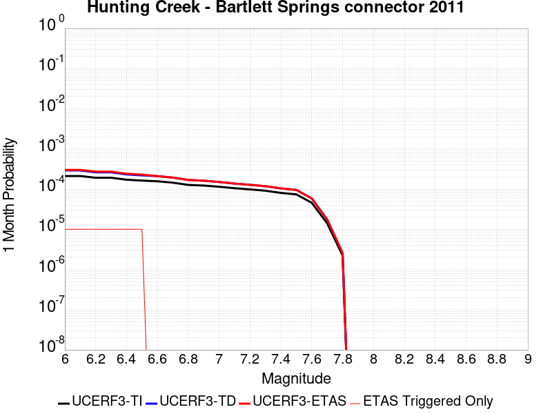 |  |  |

| Magnitude | 1 wk TI Prob | 1 wk TD Prob | 1 wk ETAS Prob | 1 wk ETAS/TD Gain | 1 wk ETAS Triggered Only | 1 mo TI Prob | 1 mo TD Prob | 1 mo ETAS Prob | 1 mo ETAS/TD Gain | 1 mo ETAS Triggered Only | 1 yr TI Prob | 1 yr TD Prob | 1 yr ETAS Prob | 1 yr ETAS/TD Gain | 1 yr ETAS Triggered Only | 10 yr TI Prob | 10 yr TD Prob | 10 yr ETAS Prob | 10 yr ETAS/TD Gain | 10 yr ETAS Triggered Only |
|-----|-----|-----|-----|-----|-----|-----|-----|-----|-----|-----|-----|-----|-----|-----|-----|-----|-----|-----|-----|-----|
| 6.0 | 4.940016E-5 | 6.786822E-5 | 8.0017766E-5 | 1.1790167 | 1.2150373E-5 | 2.1169778E-4 | 2.9083234E-4 | 3.0297917E-4 | 1.0417658 | 1.2150373E-5 | 0.002574374 | 0.003535177 | 0.003559392 | 1.0068496 | 2.4300745E-5 | 0.025447546 | 0.034773834 | 0.034797292 | 1.0006745 | 2.4300745E-5 |
| 6.1 | 4.940016E-5 | 6.786822E-5 | 8.0017766E-5 | 1.1790167 | 1.2150373E-5 | 2.1169778E-4 | 2.9083234E-4 | 3.0297917E-4 | 1.0417658 | 1.2150373E-5 | 0.002574374 | 0.003535177 | 0.003559392 | 1.0068496 | 2.4300745E-5 | 0.025447546 | 0.034773834 | 0.034797292 | 1.0006745 | 2.4300745E-5 |
| 6.2 | 4.472471E-5 | 6.1002804E-5 | 7.3152434E-5 | 1.1991651 | 1.2150373E-5 | 1.9166325E-4 | 2.6141506E-4 | 2.7356227E-4 | 1.0464671 | 1.2150373E-5 | 0.0023310026 | 0.003178107 | 0.0032023306 | 1.007622 | 2.4300745E-5 | 0.02306703 | 0.031316914 | 0.031340454 | 1.0007516 | 2.4300745E-5 |
| 6.3 | 4.472471E-5 | 6.1002804E-5 | 7.3152434E-5 | 1.1991651 | 1.2150373E-5 | 1.9166325E-4 | 2.6141506E-4 | 2.7356227E-4 | 1.0464671 | 1.2150373E-5 | 0.0023310026 | 0.003178107 | 0.0032023306 | 1.007622 | 2.4300745E-5 | 0.02306703 | 0.031316914 | 0.031340454 | 1.0007516 | 2.4300745E-5 |
| 6.4 | 4.0001003E-5 | 5.4103755E-5 | 6.625347E-5 | 1.2245632 | 1.2150373E-5 | 1.714216E-4 | 2.31853E-4 | 2.4400056E-4 | 1.0523933 | 1.2150373E-5 | 0.0020850603 | 0.0028191248 | 0.002843357 | 1.0085957 | 2.4300745E-5 | 0.02065605 | 0.027828315 | 0.027851941 | 1.0008489 | 2.4300745E-5 |
| 6.5 | 3.8033053E-5 | 5.1266547E-5 | 6.341629E-5 | 1.2369918 | 1.2150373E-5 | 1.6298861E-4 | 2.1969559E-4 | 2.3184328E-4 | 1.0552933 | 1.2150373E-5 | 0.0019825802 | 0.0026714746 | 0.0026957104 | 1.0090721 | 2.4300745E-5 | 0.019649856 | 0.026390454 | 0.026414113 | 1.0008966 | 2.4300745E-5 |
| 6.6 | 3.653754E-5 | 4.913017E-5 | 4.913017E-5 | 1.0 | 0.0 | 1.5658008E-4 | 2.1054115E-4 | 2.1054115E-4 | 1.0 | 0.0 | 0.0019046954 | 0.0025602852 | 0.0025724045 | 1.0047336 | 1.2150373E-5 | 0.018884527 | 0.025306415 | 0.025318258 | 1.000468 | 1.2150373E-5 |
| 6.7 | 3.372024E-5 | 4.514011E-5 | 4.514011E-5 | 1.0 | 0.0 | 1.4450731E-4 | 1.9344354E-4 | 1.9344354E-4 | 1.0 | 0.0 | 0.0017579567 | 0.002352639 | 0.002364761 | 1.0051525 | 1.2150373E-5 | 0.017441148 | 0.023278099 | 0.023289965 | 1.0005099 | 1.2150373E-5 |
| 6.8 | 2.9650024E-5 | 3.9411374E-5 | 3.9411374E-5 | 1.0 | 0.0 | 1.2706534E-4 | 1.6889503E-4 | 1.6889503E-4 | 1.0 | 0.0 | 0.0015459227 | 0.0020543463 | 0.0020664716 | 1.0059023 | 1.2150373E-5 | 0.015352124 | 0.020351216 | 0.020363118 | 1.0005848 | 1.2150373E-5 |
| 6.9 | 2.860775E-5 | 3.7812544E-5 | 3.7812544E-5 | 1.0 | 0.0 | 1.2259888E-4 | 1.6204377E-4 | 1.6204377E-4 | 1.0 | 0.0 | 0.0014916194 | 0.001971107 | 0.0019832335 | 1.006152 | 1.2150373E-5 | 0.014816469 | 0.01953584 | 0.019547753 | 1.0006098 | 1.2150373E-5 |
| 7.0 | 2.6696067E-5 | 3.506726E-5 | 3.506726E-5 | 1.0 | 0.0 | 1.144067E-4 | 1.5027967E-4 | 1.5027967E-4 | 1.0 | 0.0 | 0.0013920115 | 0.0018281302 | 0.0018402584 | 1.0066342 | 1.2150373E-5 | 0.013833242 | 0.018131364 | 0.018143294 | 1.000658 | 1.2150373E-5 |
| 7.1 | 2.456087E-5 | 3.2013093E-5 | 3.2013093E-5 | 1.0 | 0.0 | 1.0525662E-4 | 1.371918E-4 | 1.371918E-4 | 1.0 | 0.0 | 0.001280746 | 0.0016690396 | 0.0016811696 | 1.0072677 | 1.2150373E-5 | 0.012733897 | 0.016566366 | 0.016578315 | 1.0007213 | 1.2150373E-5 |
| 7.2 | 2.295761E-5 | 2.9822932E-5 | 2.9822932E-5 | 1.0 | 0.0 | 9.8386045E-5 | 1.2780636E-4 | 1.2780636E-4 | 1.0 | 0.0 | 0.0011971919 | 0.001554941 | 0.0015670725 | 1.0078019 | 1.2150373E-5 | 0.011907627 | 0.015442089 | 0.015454052 | 1.0007747 | 1.2150373E-5 |
| 7.3 | 2.1256936E-5 | 2.7541912E-5 | 2.7541912E-5 | 1.0 | 0.0 | 9.109797E-5 | 1.1803147E-4 | 1.1803147E-4 | 1.0 | 0.0 | 0.0011085535 | 0.0014360948 | 0.0014482277 | 1.0084486 | 1.2150373E-5 | 0.011030397 | 0.014269472 | 0.014281449 | 1.0008394 | 1.2150373E-5 |
| 7.4 | 1.8784336E-5 | 2.4306766E-5 | 2.4306766E-5 | 1.0 | 0.0 | 8.050181E-5 | 1.0416774E-4 | 1.0416774E-4 | 1.0 | 0.0 | 9.796688E-4 | 0.001267512 | 0.001279647 | 1.0095738 | 1.2150373E-5 | 0.009753612 | 0.012603902 | 0.0126159 | 1.0009519 | 1.2150373E-5 |
| 7.5 | 1.7248298E-5 | 2.2268887E-5 | 2.2268887E-5 | 1.0 | 0.0 | 7.391918E-5 | 9.543464E-5 | 9.543464E-5 | 1.0 | 0.0 | 8.9959445E-4 | 0.0011613049 | 0.0011734412 | 1.0104505 | 1.2150373E-5 | 0.008959615 | 0.01155334 | 0.011565349 | 1.0010395 | 1.2150373E-5 |
| 7.6 | 1.0653709E-5 | 1.3722118E-5 | 1.3722118E-5 | 1.0 | 0.0 | 4.5657955E-5 | 5.8807767E-5 | 5.8807767E-5 | 1.0 | 0.0 | 5.557438E-4 | 7.157521E-4 | 7.278937E-4 | 1.0169635 | 1.2150373E-5 | 0.0055435603 | 0.0071348166 | 0.00714688 | 1.0016909 | 1.2150373E-5 |
| 7.7 | 3.286316E-6 | 4.0903437E-6 | 4.0903437E-6 | 1.0 | 0.0 | 1.4084137E-5 | 1.7529928E-5 | 1.7529928E-5 | 1.0 | 0.0 | 1.7146087E-4 | 2.1340612E-4 | 2.1340612E-4 | 1.0 | 0.0 | 0.0017132863 | 0.0021320276 | 0.0021320276 | 1.0 | 0.0 |
| 7.8 | 5.1855085E-7 | 5.9720696E-7 | 5.9720696E-7 | 1.0 | 0.0 | 2.222359E-6 | 2.5594559E-6 | 2.5594559E-6 | 1.0 | 0.0 | 2.7056883E-5 | 3.116094E-5 | 3.116094E-5 | 1.0 | 0.0 | 2.705359E-4 | 3.1156495E-4 | 3.1156495E-4 | 1.0 | 0.0 |

## San Jacinto (Clark) rev
*[(top)](#table-of-contents)*

| 1 Week | 1 Month | 1 Year | 10 Year |
|-----|-----|-----|-----|
|  |  |  |  |

| Magnitude | 1 wk TI Prob | 1 wk TD Prob | 1 wk ETAS Prob | 1 wk ETAS/TD Gain | 1 wk ETAS Triggered Only | 1 mo TI Prob | 1 mo TD Prob | 1 mo ETAS Prob | 1 mo ETAS/TD Gain | 1 mo ETAS Triggered Only | 1 yr TI Prob | 1 yr TD Prob | 1 yr ETAS Prob | 1 yr ETAS/TD Gain | 1 yr ETAS Triggered Only | 10 yr TI Prob | 10 yr TD Prob | 10 yr ETAS Prob | 10 yr ETAS/TD Gain | 10 yr ETAS Triggered Only |
|-----|-----|-----|-----|-----|-----|-----|-----|-----|-----|-----|-----|-----|-----|-----|-----|-----|-----|-----|-----|-----|
| 6.0 | 4.482615E-5 | 2.1154196E-5 | 3.330431E-5 | 1.5743597 | 1.2150373E-5 | 1.9209793E-4 | 9.065773E-5 | 1.0280701E-4 | 1.1340125 | 1.2150373E-5 | 0.0023362834 | 0.0011032083 | 0.0011274822 | 1.022003 | 2.4300745E-5 | 0.02311874 | 0.011503847 | 0.011527868 | 1.0020881 | 2.4300745E-5 |
| 6.1 | 4.482615E-5 | 2.1154196E-5 | 3.330431E-5 | 1.5743597 | 1.2150373E-5 | 1.9209793E-4 | 9.065773E-5 | 1.0280701E-4 | 1.1340125 | 1.2150373E-5 | 0.0023362834 | 0.0011032083 | 0.0011274822 | 1.022003 | 2.4300745E-5 | 0.02311874 | 0.011503847 | 0.011527868 | 1.0020881 | 2.4300745E-5 |
| 6.2 | 4.482615E-5 | 2.1154196E-5 | 3.330431E-5 | 1.5743597 | 1.2150373E-5 | 1.9209793E-4 | 9.065773E-5 | 1.0280701E-4 | 1.1340125 | 1.2150373E-5 | 0.0023362834 | 0.0011032083 | 0.0011274822 | 1.022003 | 2.4300745E-5 | 0.02311874 | 0.011503847 | 0.011527868 | 1.0020881 | 2.4300745E-5 |
| 6.3 | 4.482615E-5 | 2.1154196E-5 | 3.330431E-5 | 1.5743597 | 1.2150373E-5 | 1.9209793E-4 | 9.065773E-5 | 1.0280701E-4 | 1.1340125 | 1.2150373E-5 | 0.0023362834 | 0.0011032083 | 0.0011274822 | 1.022003 | 2.4300745E-5 | 0.02311874 | 0.011503847 | 0.011527868 | 1.0020881 | 2.4300745E-5 |
| 6.4 | 4.482615E-5 | 2.1154196E-5 | 3.330431E-5 | 1.5743597 | 1.2150373E-5 | 1.9209793E-4 | 9.065773E-5 | 1.0280701E-4 | 1.1340125 | 1.2150373E-5 | 0.0023362834 | 0.0011032083 | 0.0011274822 | 1.022003 | 2.4300745E-5 | 0.02311874 | 0.011503847 | 0.011527868 | 1.0020881 | 2.4300745E-5 |
| 6.5 | 3.7294863E-5 | 1.7356087E-5 | 2.950625E-5 | 1.7000519 | 1.2150373E-5 | 1.5982533E-4 | 7.438113E-5 | 8.653061E-5 | 1.1633407 | 1.2150373E-5 | 0.0019441366 | 9.052186E-4 | 9.294973E-4 | 1.0268209 | 2.4300745E-5 | 0.01927216 | 0.0094941035 | 0.0095181735 | 1.0025352 | 2.4300745E-5 |
| 6.6 | 3.7294863E-5 | 1.7356087E-5 | 2.950625E-5 | 1.7000519 | 1.2150373E-5 | 1.5982533E-4 | 7.438113E-5 | 8.653061E-5 | 1.1633407 | 1.2150373E-5 | 0.0019441366 | 9.052186E-4 | 9.294973E-4 | 1.0268209 | 2.4300745E-5 | 0.01927216 | 0.0094941035 | 0.0095181735 | 1.0025352 | 2.4300745E-5 |
| 6.7 | 3.6039248E-5 | 1.6604314E-5 | 2.8754484E-5 | 1.7317479 | 1.2150373E-5 | 1.5444479E-4 | 7.1159426E-5 | 8.330893E-5 | 1.1707364 | 1.2150373E-5 | 0.0018787434 | 8.6602574E-4 | 8.9030544E-4 | 1.0280358 | 2.4300745E-5 | 0.01862939 | 0.009096047 | 0.009120126 | 1.0026473 | 2.4300745E-5 |
| 6.8 | 3.5031844E-5 | 1.6232942E-5 | 2.8383118E-5 | 1.7484889 | 1.2150373E-5 | 1.5012783E-4 | 6.956792E-5 | 8.1717444E-5 | 1.1746427 | 1.2150373E-5 | 0.0018262739 | 8.4666436E-4 | 8.709445E-4 | 1.0286775 | 2.4300745E-5 | 0.01811338 | 0.008895969 | 0.008920054 | 1.0027074 | 2.4300745E-5 |
| 6.9 | 3.435112E-5 | 1.6063195E-5 | 2.8213371E-5 | 1.7563986 | 1.2150373E-5 | 1.4721078E-4 | 6.884047E-5 | 8.099001E-5 | 1.1764883 | 1.2150373E-5 | 0.0017908178 | 8.3781447E-4 | 8.6209486E-4 | 1.0289806 | 2.4300745E-5 | 0.017764548 | 0.008804181 | 0.008828267 | 1.0027359 | 2.4300745E-5 |
| 7.0 | 2.8959772E-5 | 1.4336745E-5 | 2.6486943E-5 | 1.8474866 | 1.2150373E-5 | 1.241074E-4 | 6.144176E-5 | 7.3591385E-5 | 1.1977421 | 1.2150373E-5 | 0.0015099603 | 7.477995E-4 | 7.720821E-4 | 1.032472 | 2.4300745E-5 | 0.014997416 | 0.007868037 | 0.007892146 | 1.0030643 | 2.4300745E-5 |
| 7.1 | 2.6002877E-5 | 1.2829002E-5 | 2.497922E-5 | 1.9470898 | 1.2150373E-5 | 1.11436144E-4 | 5.498029E-5 | 6.712999E-5 | 1.2209829 | 1.2150373E-5 | 0.0013558907 | 6.691816E-4 | 6.9346605E-4 | 1.0362898 | 2.4300745E-5 | 0.013476475 | 0.0070465137 | 0.0070706434 | 1.0034243 | 2.4300745E-5 |
| 7.2 | 2.2544838E-5 | 1.1262543E-5 | 2.341278E-5 | 2.078818 | 1.2150373E-5 | 9.661716E-5 | 4.8267157E-5 | 6.0416944E-5 | 1.2517195 | 1.2150373E-5 | 0.001175679 | 5.874956E-4 | 6.1178213E-4 | 1.0413389 | 2.4300745E-5 | 0.011694785 | 0.0061927503 | 0.0062169004 | 1.0038998 | 2.4300745E-5 |
| 7.3 | 1.75334E-5 | 1.0811715E-5 | 2.2961956E-5 | 2.1238034 | 1.2150373E-5 | 7.514098E-5 | 4.6335106E-5 | 5.8484915E-5 | 1.2622161 | 1.2150373E-5 | 9.144575E-4 | 5.6398526E-4 | 5.882723E-4 | 1.0430633 | 2.4300745E-5 | 0.009107036 | 0.0059337732 | 0.00595793 | 1.004071 | 2.4300745E-5 |
| 7.4 | 1.5924552E-5 | 1.0611516E-5 | 2.276176E-5 | 2.1450055 | 1.2150373E-5 | 6.82463E-5 | 4.547714E-5 | 5.7626963E-5 | 1.2671633 | 1.2150373E-5 | 8.305819E-4 | 5.535449E-4 | 5.778322E-4 | 1.0438759 | 2.4300745E-5 | 0.008274844 | 0.0058210334 | 0.005845193 | 1.0041504 | 2.4300745E-5 |
| 7.5 | 1.3428931E-5 | 9.8519E-6 | 2.2002154E-5 | 2.2332904 | 1.2150373E-5 | 5.7551293E-5 | 4.2221753E-5 | 5.4371612E-5 | 1.287763 | 1.2150373E-5 | 7.004617E-4 | 5.1392964E-4 | 5.382179E-4 | 1.0472599 | 2.4300745E-5 | 0.006982579 | 0.0054066023 | 0.005430772 | 1.0044703 | 2.4300745E-5 |
| 7.6 | 1.0688787E-5 | 8.614839E-6 | 2.0765108E-5 | 2.4103882 | 1.2150373E-5 | 4.5808283E-5 | 3.692022E-5 | 4.9070146E-5 | 1.329086 | 1.2150373E-5 | 5.5757316E-4 | 4.4941145E-4 | 4.7370128E-4 | 1.0540481 | 2.4300745E-5 | 0.005561762 | 0.0047416524 | 0.004765838 | 1.0051006 | 2.4300745E-5 |
| 7.7 | 8.81236E-6 | 7.4680274E-6 | 1.961831E-5 | 2.6269734 | 1.2150373E-5 | 3.776671E-5 | 3.2005442E-5 | 4.4155426E-5 | 1.3796225 | 1.2150373E-5 | 4.597127E-4 | 3.8959677E-4 | 4.1388805E-4 | 1.0623498 | 2.4300745E-5 | 0.0045876284 | 0.0041346536 | 0.004158854 | 1.005853 | 2.4300745E-5 |
| 7.8 | 7.780431E-6 | 6.696579E-6 | 1.8846871E-5 | 2.8144028 | 1.2150373E-5 | 3.3344273E-5 | 2.8699309E-5 | 4.0849332E-5 | 1.4233559 | 1.2150373E-5 | 4.0589093E-4 | 3.4935825E-4 | 3.7365052E-4 | 1.069534 | 2.4300745E-5 | 0.0040515037 | 0.0037227906 | 0.0037470008 | 1.0065032 | 2.4300745E-5 |
| 7.9 | 6.5437994E-6 | 5.780382E-6 | 1.7930684E-5 | 3.1019897 | 1.2150373E-5 | 2.8044553E-5 | 2.477283E-5 | 3.6922902E-5 | 1.4904596 | 1.2150373E-5 | 3.4138895E-4 | 3.0156763E-4 | 3.2586104E-4 | 1.0805571 | 2.4300745E-5 | 0.0034086495 | 0.0032344845 | 0.0032587068 | 1.0074887 | 2.4300745E-5 |
| 8.0 | 5.4488164E-6 | 4.8133406E-6 | 1.6963655E-5 | 3.5242996 | 1.2150373E-5 | 2.3351862E-5 | 2.062844E-5 | 3.2778564E-5 | 1.5889986 | 1.2150373E-5 | 2.8427184E-4 | 2.5112246E-4 | 2.7541711E-4 | 1.0967442 | 2.4300745E-5 | 0.0028390845 | 0.002710839 | 0.002735074 | 1.00894 | 2.4300745E-5 |
| 8.1 | 2.8397242E-6 | 1.3670389E-6 | 1.3517395E-5 | 9.888083 | 1.2150373E-5 | 1.217019E-5 | 5.858725E-6 | 1.8009026E-5 | 3.0738816 | 1.2150373E-5 | 1.4816198E-4 | 7.132765E-5 | 8.347716E-5 | 1.1703337 | 1.2150373E-5 | 0.0014806325 | 8.115382E-4 | 8.236787E-4 | 1.0149599 | 1.2150373E-5 |
| 8.2 | 2.030244E-6 | 6.318974E-7 | 6.318974E-7 | 1.0 | 0.0 | 8.701017E-6 | 2.708129E-6 | 2.708129E-6 | 1.0 | 0.0 | 1.05929736E-4 | 3.2970976E-5 | 3.2970976E-5 | 1.0 | 0.0 | 0.0010587925 | 3.9486602E-4 | 3.9486602E-4 | 1.0 | 0.0 |
| 8.3 | 1.0659804E-6 | 2.9250086E-7 | 2.9250086E-7 | 1.0 | 0.0 | 4.568479E-6 | 1.2535745E-6 | 1.2535745E-6 | 1.0 | 0.0 | 5.5619817E-5 | 1.5262167E-5 | 1.5262167E-5 | 1.0 | 0.0 | 5.5605895E-4 | 1.8566217E-4 | 1.8566217E-4 | 1.0 | 0.0 |

## Calaveras (So) - Paicines extension 2011 CFM
*[(top)](#table-of-contents)*

| 1 Week | 1 Month | 1 Year | 10 Year |
|-----|-----|-----|-----|
|  |  |  |  |

| Magnitude | 1 wk TI Prob | 1 wk TD Prob | 1 wk ETAS Prob | 1 wk ETAS/TD Gain | 1 wk ETAS Triggered Only | 1 mo TI Prob | 1 mo TD Prob | 1 mo ETAS Prob | 1 mo ETAS/TD Gain | 1 mo ETAS Triggered Only | 1 yr TI Prob | 1 yr TD Prob | 1 yr ETAS Prob | 1 yr ETAS/TD Gain | 1 yr ETAS Triggered Only | 10 yr TI Prob | 10 yr TD Prob | 10 yr ETAS Prob | 10 yr ETAS/TD Gain | 10 yr ETAS Triggered Only |
|-----|-----|-----|-----|-----|-----|-----|-----|-----|-----|-----|-----|-----|-----|-----|-----|-----|-----|-----|-----|-----|
| 6.0 | 1.5183659E-4 | 3.0533716E-4 | 3.0533716E-4 | 1.0 | 0.0 | 6.5056595E-4 | 0.0013069661 | 0.0013069661 | 1.0 | 0.0 | 0.007891912 | 0.01569571 | 0.01570767 | 1.000762 | 1.2150373E-5 | 0.076174594 | 0.13848671 | 0.13850765 | 1.0001512 | 2.4300745E-5 |
| 6.1 | 1.5024997E-4 | 3.0227835E-4 | 3.0227835E-4 | 1.0 | 0.0 | 6.437695E-4 | 0.00129387 | 0.00129387 | 1.0 | 0.0 | 0.0078097614 | 0.015539104 | 0.015551066 | 1.0007697 | 1.2150373E-5 | 0.075409345 | 0.13715632 | 0.13717729 | 1.0001528 | 2.4300745E-5 |
| 6.2 | 1.2743923E-4 | 2.5306802E-4 | 2.5306802E-4 | 1.0 | 0.0 | 5.460538E-4 | 0.0010841049 | 0.0010841049 | 1.0 | 0.0 | 0.0066279583 | 0.013046704 | 0.013058696 | 1.0009191 | 1.2150373E-5 | 0.064337276 | 0.11725405 | 0.1172755 | 1.000183 | 2.4300745E-5 |
| 6.3 | 1.1525114E-4 | 2.2595265E-4 | 2.2595265E-4 | 1.0 | 0.0 | 4.9383997E-4 | 9.6799526E-4 | 9.6799526E-4 | 1.0 | 0.0 | 0.0059959386 | 0.011667927 | 0.011679935 | 1.0010293 | 1.2150373E-5 | 0.058367174 | 0.10637007 | 0.10639179 | 1.0002042 | 2.4300745E-5 |
| 6.4 | 1.07200925E-4 | 2.0836305E-4 | 2.0836305E-4 | 1.0 | 0.0 | 4.5935164E-4 | 8.926636E-4 | 8.926636E-4 | 1.0 | 0.0 | 0.0055782744 | 0.010772766 | 0.010784784 | 1.0011157 | 1.2150373E-5 | 0.0544031 | 0.09919256 | 0.09921445 | 1.0002207 | 2.4300745E-5 |
| 6.5 | 9.69631E-5 | 1.8729115E-4 | 1.8729115E-4 | 1.0 | 0.0 | 4.1548995E-4 | 8.024135E-4 | 8.024135E-4 | 1.0 | 0.0 | 0.0050468626 | 0.009694662 | 0.009706695 | 1.0012412 | 1.2150373E-5 | 0.04933773 | 0.090084255 | 0.09010637 | 1.0002455 | 2.4300745E-5 |
| 6.6 | 8.0552316E-5 | 1.5070537E-4 | 1.5070537E-4 | 1.0 | 0.0 | 3.4517853E-4 | 6.456994E-4 | 6.456994E-4 | 1.0 | 0.0 | 0.0041944524 | 0.007826256 | 0.007838312 | 1.0015404 | 1.2150373E-5 | 0.04116161 | 0.074854024 | 0.07487651 | 1.0003003 | 2.4300745E-5 |
| 6.7 | 7.815757E-5 | 1.4610609E-4 | 1.4610609E-4 | 1.0 | 0.0 | 3.34918E-4 | 6.260017E-4 | 6.260017E-4 | 1.0 | 0.0 | 0.004070005 | 0.0075890915 | 0.00760115 | 1.0015888 | 1.2150373E-5 | 0.039962657 | 0.072703585 | 0.072726116 | 1.00031 | 2.4300745E-5 |
| 6.8 | 6.965264E-5 | 1.2721405E-4 | 1.2721405E-4 | 1.0 | 0.0 | 2.9847719E-4 | 5.450839E-4 | 5.450839E-4 | 1.0 | 0.0 | 0.0036279052 | 0.00661342 | 0.00662549 | 1.0018251 | 1.2150373E-5 | 0.03569247 | 0.06379891 | 0.06382166 | 1.0003566 | 2.4300745E-5 |
| 6.9 | 5.8000453E-5 | 1.01435086E-4 | 1.01435086E-4 | 1.0 | 0.0 | 2.4854968E-4 | 4.3464993E-4 | 4.3464993E-4 | 1.0 | 0.0 | 0.0030218933 | 0.0052791284 | 0.0052791284 | 1.0 | 0.0 | 0.029811295 | 0.051501602 | 0.051513128 | 1.0002238 | 1.2150373E-5 |
| 7.0 | 4.9865852E-5 | 8.567692E-5 | 8.567692E-5 | 1.0 | 0.0 | 2.1369329E-4 | 3.671356E-4 | 3.671356E-4 | 1.0 | 0.0 | 0.0025986114 | 0.0044608037 | 0.0044608037 | 1.0 | 0.0 | 0.025684336 | 0.043781694 | 0.043793313 | 1.0002654 | 1.2150373E-5 |
| 7.1 | 4.283875E-5 | 7.112159E-5 | 7.112159E-5 | 1.0 | 0.0 | 1.8358172E-4 | 3.047715E-4 | 3.047715E-4 | 1.0 | 0.0 | 0.0022328163 | 0.003704336 | 0.003704336 | 1.0 | 0.0 | 0.022105146 | 0.03673583 | 0.036747534 | 1.0003186 | 1.2150373E-5 |
| 7.2 | 3.450115E-5 | 5.5776054E-5 | 5.5776054E-5 | 1.0 | 0.0 | 1.478537E-4 | 2.390185E-4 | 2.390185E-4 | 1.0 | 0.0 | 0.0017986323 | 0.0029061958 | 0.0029061958 | 1.0 | 0.0 | 0.017841442 | 0.029079199 | 0.029090995 | 1.0004057 | 1.2150373E-5 |
| 7.3 | 2.5709045E-5 | 4.0588155E-5 | 4.0588155E-5 | 1.0 | 0.0 | 1.1017697E-4 | 1.7393773E-4 | 1.7393773E-4 | 1.0 | 0.0 | 0.0013405791 | 0.002115652 | 0.002115652 | 1.0 | 0.0 | 0.013325208 | 0.021297242 | 0.021309134 | 1.0005584 | 1.2150373E-5 |
| 7.4 | 1.8003093E-5 | 2.8509934E-5 | 2.8509934E-5 | 1.0 | 0.0 | 7.715383E-5 | 1.2217973E-4 | 1.2217973E-4 | 1.0 | 0.0 | 9.3894306E-4 | 0.0014865254 | 0.0014865254 | 1.0 | 0.0 | 0.009349857 | 0.015052196 | 0.015064163 | 1.000795 | 1.2150373E-5 |
| 7.5 | 1.5595824E-5 | 2.5822499E-5 | 2.5822499E-5 | 1.0 | 0.0 | 6.683753E-5 | 1.1066317E-4 | 1.1066317E-4 | 1.0 | 0.0 | 8.134431E-4 | 0.0013464936 | 0.0013464936 | 1.0 | 0.0 | 0.008104719 | 0.01365213 | 0.013664115 | 1.0008779 | 1.2150373E-5 |
| 7.6 | 1.1110309E-5 | 1.9222098E-5 | 1.9222098E-5 | 1.0 | 0.0 | 4.761474E-5 | 8.2377825E-5 | 8.2377825E-5 | 1.0 | 0.0 | 5.795553E-4 | 0.0010024898 | 0.0010024898 | 1.0 | 0.0 | 0.0057804612 | 0.010203943 | 0.010215969 | 1.0011786 | 1.2150373E-5 |
| 7.7 | 6.2140443E-6 | 1.0437076E-5 | 1.0437076E-5 | 1.0 | 0.0 | 2.6631347E-5 | 4.4729557E-5 | 4.4729557E-5 | 1.0 | 0.0 | 3.241884E-4 | 5.444464E-4 | 5.444464E-4 | 1.0 | 0.0 | 0.0032371588 | 0.005619835 | 0.005631917 | 1.0021499 | 1.2150373E-5 |
| 7.8 | 5.305533E-6 | 9.433038E-6 | 9.433038E-6 | 1.0 | 0.0 | 2.27378E-5 | 4.042668E-5 | 4.042668E-5 | 1.0 | 0.0 | 2.7679754E-4 | 4.920837E-4 | 4.920837E-4 | 1.0 | 0.0 | 0.0027645302 | 0.005074324 | 0.005086413 | 1.0023823 | 1.2150373E-5 |
| 7.9 | 3.363505E-6 | 7.3848937E-6 | 7.3848937E-6 | 1.0 | 0.0 | 1.4414942E-5 | 3.164916E-5 | 3.164916E-5 | 1.0 | 0.0 | 1.7548777E-4 | 3.8526047E-4 | 3.8526047E-4 | 1.0 | 0.0 | 0.0017534926 | 0.003948527 | 0.0039606295 | 1.003065 | 1.2150373E-5 |
| 8.0 | 2.0271132E-6 | 4.413104E-6 | 4.413104E-6 | 1.0 | 0.0 | 8.687599E-6 | 1.8913164E-5 | 1.8913164E-5 | 1.0 | 0.0 | 1.05766376E-4 | 2.302435E-4 | 2.302435E-4 | 1.0 | 0.0 | 0.0010571606 | 0.002351099 | 0.0023632208 | 1.0051558 | 1.2150373E-5 |
| 8.1 | 1.2206116E-6 | 2.3751331E-6 | 2.3751331E-6 | 1.0 | 0.0 | 5.2311816E-6 | 1.0179103E-5 | 1.0179103E-5 | 1.0 | 0.0 | 6.3687774E-5 | 1.2392356E-4 | 1.2392356E-4 | 1.0 | 0.0 | 6.366953E-4 | 0.0012705477 | 0.0012826826 | 1.0095509 | 1.2150373E-5 |

## Concord 2011 CFM
*[(top)](#table-of-contents)*

| 1 Week | 1 Month | 1 Year | 10 Year |
|-----|-----|-----|-----|
|  |  |  |  |

| Magnitude | 1 wk TI Prob | 1 wk TD Prob | 1 wk ETAS Prob | 1 wk ETAS/TD Gain | 1 wk ETAS Triggered Only | 1 mo TI Prob | 1 mo TD Prob | 1 mo ETAS Prob | 1 mo ETAS/TD Gain | 1 mo ETAS Triggered Only | 1 yr TI Prob | 1 yr TD Prob | 1 yr ETAS Prob | 1 yr ETAS/TD Gain | 1 yr ETAS Triggered Only | 10 yr TI Prob | 10 yr TD Prob | 10 yr ETAS Prob | 10 yr ETAS/TD Gain | 10 yr ETAS Triggered Only |
|-----|-----|-----|-----|-----|-----|-----|-----|-----|-----|-----|-----|-----|-----|-----|-----|-----|-----|-----|-----|-----|
| 6.0 | 5.7865112E-5 | 9.759152E-5 | 1.097407E-4 | 1.1244901 | 1.2150373E-5 | 2.4796976E-4 | 4.1818706E-4 | 4.4247764E-4 | 1.0580854 | 2.4300745E-5 | 0.0030148525 | 0.005079467 | 0.005103644 | 1.0047598 | 2.4300745E-5 | 0.029742775 | 0.049248982 | 0.049272086 | 1.0004691 | 2.4300745E-5 |
| 6.1 | 5.7865112E-5 | 9.759152E-5 | 1.097407E-4 | 1.1244901 | 1.2150373E-5 | 2.4796976E-4 | 4.1818706E-4 | 4.4247764E-4 | 1.0580854 | 2.4300745E-5 | 0.0030148525 | 0.005079467 | 0.005103644 | 1.0047598 | 2.4300745E-5 | 0.029742775 | 0.049248982 | 0.049272086 | 1.0004691 | 2.4300745E-5 |
| 6.2 | 5.6789337E-5 | 9.5795076E-5 | 1.0794429E-4 | 1.126825 | 1.2150373E-5 | 2.4336016E-4 | 4.104905E-4 | 4.3478125E-4 | 1.059175 | 2.4300745E-5 | 0.0029588845 | 0.0049861916 | 0.005010371 | 1.0048493 | 2.4300745E-5 | 0.029197963 | 0.04836556 | 0.048388682 | 1.0004781 | 2.4300745E-5 |
| 6.3 | 5.203322E-5 | 8.803056E-5 | 1.0017986E-4 | 1.1380123 | 1.2150373E-5 | 2.2298045E-4 | 3.7722368E-4 | 4.0151525E-4 | 1.0643957 | 2.4300745E-5 | 0.0027114071 | 0.0045838105 | 0.0046079997 | 1.0052772 | 2.4300745E-5 | 0.026785625 | 0.04453672 | 0.044559937 | 1.0005213 | 2.4300745E-5 |
| 6.4 | 4.7120942E-5 | 7.897404E-5 | 9.112345E-5 | 1.1538407 | 1.2150373E-5 | 2.0193127E-4 | 3.3842045E-4 | 3.6271298E-4 | 1.0717821 | 2.4300745E-5 | 0.0024557412 | 0.00411323 | 0.0041374303 | 1.0058837 | 2.4300745E-5 | 0.024287801 | 0.040065527 | 0.040088855 | 1.0005822 | 2.4300745E-5 |
| 6.5 | 2.9598437E-5 | 4.667486E-5 | 5.8824666E-5 | 1.2603073 | 1.2150373E-5 | 1.2684427E-4 | 2.0002096E-4 | 2.2431684E-4 | 1.1214668 | 2.4300745E-5 | 0.001543235 | 0.0024327459 | 0.0024569875 | 1.0099647 | 2.4300745E-5 | 0.015325619 | 0.023909973 | 0.023933692 | 1.0009921 | 2.4300745E-5 |
| 6.6 | 2.0443718E-5 | 2.998433E-5 | 4.213434E-5 | 1.4052119 | 1.2150373E-5 | 8.7613E-5 | 1.2849816E-4 | 1.4064697E-4 | 1.0945446 | 1.2150373E-5 | 0.0010661662 | 0.0015633785 | 0.0015755099 | 1.0077597 | 1.2150373E-5 | 0.010610655 | 0.015466996 | 0.015478958 | 1.0007734 | 1.2150373E-5 |
| 6.7 | 1.798539E-5 | 2.5557381E-5 | 2.5557381E-5 | 1.0 | 0.0 | 7.7077966E-5 | 1.0952716E-4 | 1.0952716E-4 | 1.0 | 0.0 | 9.380202E-4 | 0.001332699 | 0.001332699 | 1.0 | 0.0 | 0.009340706 | 0.013217433 | 0.013217433 | 1.0 | 0.0 |
| 6.8 | 1.613555E-5 | 2.1959211E-5 | 2.1959211E-5 | 1.0 | 0.0 | 6.915052E-5 | 9.4107585E-5 | 9.4107585E-5 | 1.0 | 0.0 | 8.4158237E-4 | 0.0011451716 | 0.0011451716 | 1.0 | 0.0 | 0.008384023 | 0.0113782035 | 0.0113782035 | 1.0 | 0.0 |
| 6.9 | 1.2916435E-5 | 1.7081054E-5 | 1.7081054E-5 | 1.0 | 0.0 | 5.5354973E-5 | 7.32025E-5 | 7.32025E-5 | 1.0 | 0.0 | 6.7373837E-4 | 8.908818E-4 | 8.908818E-4 | 1.0 | 0.0 | 0.006716994 | 0.008867139 | 0.008867139 | 1.0 | 0.0 |
| 7.0 | 9.81129E-6 | 1.2630829E-5 | 1.2630829E-5 | 1.0 | 0.0 | 4.2047708E-5 | 5.413101E-5 | 5.413101E-5 | 1.0 | 0.0 | 5.118106E-4 | 6.588474E-4 | 6.588474E-4 | 1.0 | 0.0 | 0.005106334 | 0.006569153 | 0.006569153 | 1.0 | 0.0 |
| 7.1 | 8.0889195E-6 | 1.0418261E-5 | 1.0418261E-5 | 1.0 | 0.0 | 3.4666336E-5 | 4.4648932E-5 | 4.4648932E-5 | 1.0 | 0.0 | 4.219809E-4 | 5.434662E-4 | 5.434662E-4 | 1.0 | 0.0 | 0.004211805 | 0.0054215975 | 0.0054215975 | 1.0 | 0.0 |
| 7.2 | 6.267438E-6 | 8.115699E-6 | 8.115699E-6 | 1.0 | 0.0 | 2.6860173E-5 | 3.4781104E-5 | 3.4781104E-5 | 1.0 | 0.0 | 3.2697353E-4 | 4.233784E-4 | 4.233784E-4 | 1.0 | 0.0 | 0.0032649285 | 0.004225969 | 0.004225969 | 1.0 | 0.0 |
| 7.3 | 3.6761196E-6 | 4.8401653E-6 | 4.8401653E-6 | 1.0 | 0.0 | 1.5754704E-5 | 2.0743402E-5 | 2.0743402E-5 | 1.0 | 0.0 | 1.9179663E-4 | 2.5252186E-4 | 2.5252186E-4 | 1.0 | 0.0 | 0.0019163118 | 0.002522487 | 0.002522487 | 1.0 | 0.0 |
| 7.4 | 2.8044356E-6 | 3.7096036E-6 | 3.7096036E-6 | 1.0 | 0.0 | 1.2018954E-5 | 1.5898204E-5 | 1.5898204E-5 | 1.0 | 0.0 | 1.4632095E-4 | 1.9354356E-4 | 1.9354356E-4 | 1.0 | 0.0 | 0.0014622464 | 0.0019338481 | 0.0019338481 | 1.0 | 0.0 |
| 7.5 | 2.4578699E-6 | 3.2447442E-6 | 3.2447442E-6 | 1.0 | 0.0 | 1.0533685E-5 | 1.3905973E-5 | 1.3905973E-5 | 1.0 | 0.0 | 1.2824008E-4 | 1.6929218E-4 | 1.6929218E-4 | 1.0 | 0.0 | 0.0012816609 | 0.001691713 | 0.001691713 | 1.0 | 0.0 |
| 7.6 | 1.7713267E-6 | 2.3351192E-6 | 2.3351192E-6 | 1.0 | 0.0 | 7.591378E-6 | 1.0007616E-5 | 1.0007616E-5 | 1.0 | 0.0 | 9.2421105E-5 | 1.21836E-4 | 1.21836E-4 | 1.0 | 0.0 | 9.2382677E-4 | 0.0012177454 | 0.0012177454 | 1.0 | 0.0 |
| 7.7 | 5.1912366E-7 | 6.8290143E-7 | 6.8290143E-7 | 1.0 | 0.0 | 2.2248137E-6 | 2.9267171E-6 | 2.9267171E-6 | 1.0 | 0.0 | 2.708677E-5 | 3.5632213E-5 | 3.5632213E-5 | 1.0 | 0.0 | 2.708347E-4 | 3.5627294E-4 | 3.5627294E-4 | 1.0 | 0.0 |

## Johnson Valley (No) 2011 rev
*[(top)](#table-of-contents)*

| 1 Week | 1 Month | 1 Year | 10 Year |
|-----|-----|-----|-----|
|  |  |  |  |

| Magnitude | 1 wk TI Prob | 1 wk TD Prob | 1 wk ETAS Prob | 1 wk ETAS/TD Gain | 1 wk ETAS Triggered Only | 1 mo TI Prob | 1 mo TD Prob | 1 mo ETAS Prob | 1 mo ETAS/TD Gain | 1 mo ETAS Triggered Only | 1 yr TI Prob | 1 yr TD Prob | 1 yr ETAS Prob | 1 yr ETAS/TD Gain | 1 yr ETAS Triggered Only | 10 yr TI Prob | 10 yr TD Prob | 10 yr ETAS Prob | 10 yr ETAS/TD Gain | 10 yr ETAS Triggered Only |
|-----|-----|-----|-----|-----|-----|-----|-----|-----|-----|-----|-----|-----|-----|-----|-----|-----|-----|-----|-----|-----|
| 6.0 | 2.577707E-5 | 1.2900938E-5 | 2.5051155E-5 | 1.9418087 | 1.2150373E-5 | 1.1046848E-4 | 5.5288787E-5 | 6.743849E-5 | 1.2197498 | 1.2150373E-5 | 0.0013441239 | 6.7297276E-4 | 6.972572E-4 | 1.0360852 | 2.4300745E-5 | 0.013360229 | 0.006713257 | 0.0067373947 | 1.0035955 | 2.4300745E-5 |
| 6.1 | 2.577707E-5 | 1.2900938E-5 | 2.5051155E-5 | 1.9418087 | 1.2150373E-5 | 1.1046848E-4 | 5.5288787E-5 | 6.743849E-5 | 1.2197498 | 1.2150373E-5 | 0.0013441239 | 6.7297276E-4 | 6.972572E-4 | 1.0360852 | 2.4300745E-5 | 0.013360229 | 0.006713257 | 0.0067373947 | 1.0035955 | 2.4300745E-5 |
| 6.2 | 2.577707E-5 | 1.2900938E-5 | 2.5051155E-5 | 1.9418087 | 1.2150373E-5 | 1.1046848E-4 | 5.5288787E-5 | 6.743849E-5 | 1.2197498 | 1.2150373E-5 | 0.0013441239 | 6.7297276E-4 | 6.972572E-4 | 1.0360852 | 2.4300745E-5 | 0.013360229 | 0.006713257 | 0.0067373947 | 1.0035955 | 2.4300745E-5 |
| 6.3 | 2.577707E-5 | 1.2900938E-5 | 2.5051155E-5 | 1.9418087 | 1.2150373E-5 | 1.1046848E-4 | 5.5288787E-5 | 6.743849E-5 | 1.2197498 | 1.2150373E-5 | 0.0013441239 | 6.7297276E-4 | 6.972572E-4 | 1.0360852 | 2.4300745E-5 | 0.013360229 | 0.006713257 | 0.0067373947 | 1.0035955 | 2.4300745E-5 |
| 6.4 | 1.5296591E-5 | 7.536742E-6 | 1.9687024E-5 | 2.6121397 | 1.2150373E-5 | 6.555518E-5 | 3.2300028E-5 | 4.445001E-5 | 1.37616 | 1.2150373E-5 | 7.97842E-4 | 3.9320064E-4 | 4.0534625E-4 | 1.030889 | 1.2150373E-5 | 0.007949836 | 0.0039268904 | 0.0039389934 | 1.003082 | 1.2150373E-5 |
| 6.5 | 1.5296591E-5 | 7.536742E-6 | 1.9687024E-5 | 2.6121397 | 1.2150373E-5 | 6.555518E-5 | 3.2300028E-5 | 4.445001E-5 | 1.37616 | 1.2150373E-5 | 7.97842E-4 | 3.9320064E-4 | 4.0534625E-4 | 1.030889 | 1.2150373E-5 | 0.007949836 | 0.0039268904 | 0.0039389934 | 1.003082 | 1.2150373E-5 |
| 6.6 | 1.3289383E-5 | 5.9917306E-6 | 5.9917306E-6 | 1.0 | 0.0 | 5.6953253E-5 | 2.5678688E-5 | 2.5678688E-5 | 1.0 | 0.0 | 6.9318525E-4 | 3.1261015E-4 | 3.1261015E-4 | 1.0 | 0.0 | 0.0069102696 | 0.0031233684 | 0.0031233684 | 1.0 | 0.0 |
| 6.7 | 1.3289383E-5 | 5.9917306E-6 | 5.9917306E-6 | 1.0 | 0.0 | 5.6953253E-5 | 2.5678688E-5 | 2.5678688E-5 | 1.0 | 0.0 | 6.9318525E-4 | 3.1261015E-4 | 3.1261015E-4 | 1.0 | 0.0 | 0.0069102696 | 0.0031233684 | 0.0031233684 | 1.0 | 0.0 |
| 6.8 | 8.330789E-6 | 2.9211888E-6 | 2.9211888E-6 | 1.0 | 0.0 | 3.570289E-5 | 1.2519352E-5 | 1.2519352E-5 | 1.0 | 0.0 | 4.34596E-4 | 1.5241816E-4 | 1.5241816E-4 | 1.0 | 0.0 | 0.0043374705 | 0.0015236961 | 0.0015236961 | 1.0 | 0.0 |
| 6.9 | 7.2359003E-6 | 2.3013247E-6 | 2.3013247E-6 | 1.0 | 0.0 | 3.1010633E-5 | 9.8628125E-6 | 9.8628125E-6 | 1.0 | 0.0 | 3.7748902E-4 | 1.2007845E-4 | 1.2007845E-4 | 1.0 | 0.0 | 0.0037684843 | 0.0012006586 | 0.0012006586 | 1.0 | 0.0 |
| 7.0 | 6.5149957E-6 | 2.088482E-6 | 2.088482E-6 | 1.0 | 0.0 | 2.792111E-5 | 8.950637E-6 | 8.950637E-6 | 1.0 | 0.0 | 3.398865E-4 | 1.0897385E-4 | 1.0897385E-4 | 1.0 | 0.0 | 0.003393671 | 0.0010897239 | 0.0010897239 | 1.0 | 0.0 |
| 7.1 | 1.1662233E-6 | 2.8802024E-8 | 2.8802024E-8 | 1.0 | 0.0 | 4.9980904E-6 | 1.2343725E-7 | 1.2343725E-7 | 1.0 | 0.0 | 6.0850052E-5 | 1.5028476E-6 | 1.5028476E-6 | 1.0 | 0.0 | 6.083339E-4 | 1.50283895E-5 | 1.50283895E-5 | 1.0 | 0.0 |
| 7.2 | 5.413881E-7 | 2.8802024E-8 | 2.8802024E-8 | 1.0 | 0.0 | 2.3202326E-6 | 1.2343725E-7 | 1.2343725E-7 | 1.0 | 0.0 | 2.8248465E-5 | 1.5028476E-6 | 1.5028476E-6 | 1.0 | 0.0 | 2.8244875E-4 | 1.50283895E-5 | 1.50283895E-5 | 1.0 | 0.0 |
| 7.3 | 5.076821E-7 | 2.8802024E-8 | 2.8802024E-8 | 1.0 | 0.0 | 2.1757785E-6 | 1.2343723E-7 | 1.2343723E-7 | 1.0 | 0.0 | 2.648978E-5 | 1.5028475E-6 | 1.5028475E-6 | 1.0 | 0.0 | 2.6486625E-4 | 1.50283895E-5 | 1.50283895E-5 | 1.0 | 0.0 |
| 7.4 | 4.7568687E-7 | 2.8783948E-8 | 2.8783948E-8 | 1.0 | 0.0 | 2.0386565E-6 | 1.2335977E-7 | 1.2335977E-7 | 1.0 | 0.0 | 2.482036E-5 | 1.5019043E-6 | 1.5019043E-6 | 1.0 | 0.0 | 2.4817587E-4 | 1.5018958E-5 | 1.5018958E-5 | 1.0 | 0.0 |
| 7.5 | 3.435626E-7 | 2.5357679E-8 | 2.5357679E-8 | 1.0 | 0.0 | 1.4724103E-6 | 1.0867576E-7 | 1.0867576E-7 | 1.0 | 0.0 | 1.7926448E-5 | 1.3231268E-6 | 1.3231268E-6 | 1.0 | 0.0 | 1.7925001E-4 | 1.3231205E-5 | 1.3231205E-5 | 1.0 | 0.0 |

## Northridge
*[(top)](#table-of-contents)*

| 1 Week | 1 Month | 1 Year | 10 Year |
|-----|-----|-----|-----|
|  |  |  |  |

| Magnitude | 1 wk TI Prob | 1 wk TD Prob | 1 wk ETAS Prob | 1 wk ETAS/TD Gain | 1 wk ETAS Triggered Only | 1 mo TI Prob | 1 mo TD Prob | 1 mo ETAS Prob | 1 mo ETAS/TD Gain | 1 mo ETAS Triggered Only | 1 yr TI Prob | 1 yr TD Prob | 1 yr ETAS Prob | 1 yr ETAS/TD Gain | 1 yr ETAS Triggered Only | 10 yr TI Prob | 10 yr TD Prob | 10 yr ETAS Prob | 10 yr ETAS/TD Gain | 10 yr ETAS Triggered Only |
|-----|-----|-----|-----|-----|-----|-----|-----|-----|-----|-----|-----|-----|-----|-----|-----|-----|-----|-----|-----|-----|
| 6.0 | 1.8340852E-5 | 7.5880193E-6 | 7.5880193E-6 | 1.0 | 0.0 | 7.860128E-5 | 3.251969E-5 | 4.466967E-5 | 1.3736191 | 1.2150373E-5 | 9.565505E-4 | 3.958575E-4 | 4.2014863E-4 | 1.0613633 | 2.4300745E-5 | 0.009524435 | 0.003951746 | 0.0039759506 | 1.0061251 | 2.4300745E-5 |
| 6.1 | 1.8340852E-5 | 7.5880193E-6 | 7.5880193E-6 | 1.0 | 0.0 | 7.860128E-5 | 3.251969E-5 | 4.466967E-5 | 1.3736191 | 1.2150373E-5 | 9.565505E-4 | 3.958575E-4 | 4.2014863E-4 | 1.0613633 | 2.4300745E-5 | 0.009524435 | 0.003951746 | 0.0039759506 | 1.0061251 | 2.4300745E-5 |
| 6.2 | 1.8340852E-5 | 7.5880193E-6 | 7.5880193E-6 | 1.0 | 0.0 | 7.860128E-5 | 3.251969E-5 | 4.466967E-5 | 1.3736191 | 1.2150373E-5 | 9.565505E-4 | 3.958575E-4 | 4.2014863E-4 | 1.0613633 | 2.4300745E-5 | 0.009524435 | 0.003951746 | 0.0039759506 | 1.0061251 | 2.4300745E-5 |
| 6.3 | 1.8340852E-5 | 7.5880193E-6 | 7.5880193E-6 | 1.0 | 0.0 | 7.860128E-5 | 3.251969E-5 | 4.466967E-5 | 1.3736191 | 1.2150373E-5 | 9.565505E-4 | 3.958575E-4 | 4.2014863E-4 | 1.0613633 | 2.4300745E-5 | 0.009524435 | 0.003951746 | 0.0039759506 | 1.0061251 | 2.4300745E-5 |
| 6.4 | 1.7361892E-5 | 7.5880193E-6 | 7.5880193E-6 | 1.0 | 0.0 | 7.440598E-5 | 3.251969E-5 | 4.466967E-5 | 1.3736191 | 1.2150373E-5 | 9.055163E-4 | 3.958575E-4 | 4.2014863E-4 | 1.0613633 | 2.4300745E-5 | 0.009018354 | 0.003951746 | 0.0039759506 | 1.0061251 | 2.4300745E-5 |
| 6.5 | 1.7361892E-5 | 7.5880193E-6 | 7.5880193E-6 | 1.0 | 0.0 | 7.440598E-5 | 3.251969E-5 | 4.466967E-5 | 1.3736191 | 1.2150373E-5 | 9.055163E-4 | 3.958575E-4 | 4.2014863E-4 | 1.0613633 | 2.4300745E-5 | 0.009018354 | 0.003951746 | 0.0039759506 | 1.0061251 | 2.4300745E-5 |
| 6.6 | 1.5458201E-5 | 7.5880193E-6 | 7.5880193E-6 | 1.0 | 0.0 | 6.624775E-5 | 3.251969E-5 | 4.466967E-5 | 1.3736191 | 1.2150373E-5 | 8.0626784E-4 | 3.958575E-4 | 4.2014863E-4 | 1.0613633 | 2.4300745E-5 | 0.008033488 | 0.003951746 | 0.0039759506 | 1.0061251 | 2.4300745E-5 |
| 6.7 | 1.2538368E-5 | 6.381603E-6 | 6.381603E-6 | 1.0 | 0.0 | 5.3734755E-5 | 2.7349442E-5 | 3.9499482E-5 | 1.4442519 | 1.2150373E-5 | 6.5402425E-4 | 3.3292902E-4 | 3.572217E-4 | 1.0729665 | 2.4300745E-5 | 0.0065210275 | 0.0033243506 | 0.0033485705 | 1.0072856 | 2.4300745E-5 |
| 6.8 | 1.1438097E-5 | 6.3502566E-6 | 6.3502566E-6 | 1.0 | 0.0 | 4.9019498E-5 | 2.7215105E-5 | 3.9365146E-5 | 1.4464449 | 1.2150373E-5 | 5.9664896E-4 | 3.3129397E-4 | 3.5558664E-4 | 1.0733267 | 2.4300745E-5 | 0.005950495 | 0.0033080487 | 0.003332269 | 1.0073216 | 2.4300745E-5 |
| 6.9 | 1.1204891E-5 | 6.2867084E-6 | 6.2867084E-6 | 1.0 | 0.0 | 4.8020076E-5 | 2.694276E-5 | 3.9092807E-5 | 1.4509577 | 1.2150373E-5 | 5.8448757E-4 | 3.2797916E-4 | 3.5227195E-4 | 1.0740681 | 2.4300745E-5 | 0.0058295266 | 0.0032749989 | 0.00329922 | 1.0073957 | 2.4300745E-5 |
| 7.0 | 1.061046E-5 | 6.115359E-6 | 6.115359E-6 | 1.0 | 0.0 | 4.5472607E-5 | 2.6208421E-5 | 3.8358474E-5 | 1.4635935 | 1.2150373E-5 | 5.534883E-4 | 3.1904122E-4 | 3.4333422E-4 | 1.0761437 | 2.4300745E-5 | 0.0055211177 | 0.0031858785 | 0.003210102 | 1.0076033 | 2.4300745E-5 |
| 7.1 | 1.0266979E-5 | 6.004274E-6 | 6.004274E-6 | 1.0 | 0.0 | 4.40006E-5 | 2.5732352E-5 | 3.788241E-5 | 1.4721706 | 1.2150373E-5 | 5.355756E-4 | 3.1324677E-4 | 3.375399E-4 | 1.0775527 | 2.4300745E-5 | 0.0053428668 | 0.003128098 | 0.003152323 | 1.0077442 | 2.4300745E-5 |
| 7.2 | 9.91273E-6 | 5.819984E-6 | 5.819984E-6 | 1.0 | 0.0 | 4.248244E-5 | 2.4942554E-5 | 3.7092625E-5 | 1.4871222 | 1.2150373E-5 | 5.171009E-4 | 3.036337E-4 | 3.2792706E-4 | 1.0800087 | 2.4300745E-5 | 0.0051589934 | 0.0030322333 | 0.0030564605 | 1.0079899 | 2.4300745E-5 |
| 7.3 | 8.4959265E-6 | 5.193062E-6 | 5.193062E-6 | 1.0 | 0.0 | 3.6410605E-5 | 2.225579E-5 | 3.4405894E-5 | 1.5459299 | 1.2150373E-5 | 4.4320893E-4 | 2.709308E-4 | 2.9522495E-4 | 1.0896692 | 2.4300745E-5 | 0.00442326 | 0.0027060313 | 0.0027302664 | 1.008956 | 2.4300745E-5 |
| 7.4 | 8.0847185E-6 | 4.9819355E-6 | 4.9819355E-6 | 1.0 | 0.0 | 3.4648332E-5 | 2.135098E-5 | 3.3501092E-5 | 1.5690659 | 1.2150373E-5 | 4.2176177E-4 | 2.599174E-4 | 2.8421183E-4 | 1.0934699 | 2.4300745E-5 | 0.0042096223 | 0.00259616 | 0.0026203976 | 1.009336 | 2.4300745E-5 |
| 7.5 | 6.8220684E-6 | 4.2533075E-6 | 4.2533075E-6 | 1.0 | 0.0 | 2.9237108E-5 | 1.8228335E-5 | 1.8228335E-5 | 1.0 | 0.0 | 3.5590364E-4 | 2.2190758E-4 | 2.3405526E-4 | 1.0547421 | 1.2150373E-5 | 0.0035533418 | 0.002216881 | 0.0022290044 | 1.0054687 | 1.2150373E-5 |
| 7.6 | 4.4224143E-6 | 2.8999582E-6 | 2.8999582E-6 | 1.0 | 0.0 | 1.8953066E-5 | 1.2428334E-5 | 1.2428334E-5 | 1.0 | 0.0 | 2.3072914E-4 | 1.5130457E-4 | 1.5130457E-4 | 1.0 | 0.0 | 0.0023048974 | 0.0015120271 | 0.0015120271 | 1.0 | 0.0 |
| 7.7 | 2.5297056E-6 | 1.6045905E-6 | 1.6045905E-6 | 1.0 | 0.0 | 1.0841551E-5 | 6.8767986E-6 | 6.8767986E-6 | 1.0 | 0.0 | 1.319879E-4 | 8.3721854E-5 | 8.3721854E-5 | 1.0 | 0.0 | 0.0013190953 | 8.369078E-4 | 8.369078E-4 | 1.0 | 0.0 |
| 7.8 | 1.2508156E-6 | 8.780076E-7 | 8.780076E-7 | 1.0 | 0.0 | 5.3606273E-6 | 3.7628845E-6 | 3.7628845E-6 | 1.0 | 0.0 | 6.526368E-5 | 4.581217E-5 | 4.581217E-5 | 1.0 | 0.0 | 6.524452E-4 | 4.5802852E-4 | 4.5802852E-4 | 1.0 | 0.0 |
| 7.9 | 2.262199E-7 | 1.4664671E-7 | 1.4664671E-7 | 1.0 | 0.0 | 9.695135E-7 | 6.284858E-7 | 6.284858E-7 | 1.0 | 0.0 | 1.1803763E-5 | 7.651788E-6 | 7.651788E-6 | 1.0 | 0.0 | 1.1803136E-4 | 7.651533E-5 | 7.651533E-5 | 1.0 | 0.0 |
| 8.0 | 2.865362E-9 | 1.2753101E-9 | 1.2753101E-9 | 1.0 | 0.0 | 1.2280123E-8 | 5.4656146E-9 | 5.4656146E-9 | 1.0 | 0.0 | 1.4951048E-7 | 6.654386E-8 | 6.654386E-8 | 1.0 | 0.0 | 1.4951038E-6 | 6.654386E-7 | 6.654386E-7 | 1.0 | 0.0 |

## San Diego Trough north alt1
*[(top)](#table-of-contents)*

| 1 Week | 1 Month | 1 Year | 10 Year |
|-----|-----|-----|-----|
|  |  |  |  |

| Magnitude | 1 wk TI Prob | 1 wk TD Prob | 1 wk ETAS Prob | 1 wk ETAS/TD Gain | 1 wk ETAS Triggered Only | 1 mo TI Prob | 1 mo TD Prob | 1 mo ETAS Prob | 1 mo ETAS/TD Gain | 1 mo ETAS Triggered Only | 1 yr TI Prob | 1 yr TD Prob | 1 yr ETAS Prob | 1 yr ETAS/TD Gain | 1 yr ETAS Triggered Only | 10 yr TI Prob | 10 yr TD Prob | 10 yr ETAS Prob | 10 yr ETAS/TD Gain | 10 yr ETAS Triggered Only |
|-----|-----|-----|-----|-----|-----|-----|-----|-----|-----|-----|-----|-----|-----|-----|-----|-----|-----|-----|-----|-----|
| 6.0 | 7.329252E-5 | 8.821093E-5 | 1.1250953E-4 | 1.2754602 | 2.4300745E-5 | 3.14073E-4 | 3.7799572E-4 | 4.022873E-4 | 1.064264 | 2.4300745E-5 | 0.0038171355 | 0.004593027 | 0.004617216 | 1.0052665 | 2.4300745E-5 | 0.03752231 | 0.045044992 | 0.045068197 | 1.0005152 | 2.4300745E-5 |
| 6.1 | 3.7940346E-5 | 4.4885E-5 | 5.703483E-5 | 1.2706879 | 1.2150373E-5 | 1.6259136E-4 | 1.9235066E-4 | 2.044987E-4 | 1.0631557 | 1.2150373E-5 | 0.0019777524 | 0.0023394432 | 0.002351565 | 1.0051816 | 1.2150373E-5 | 0.019602431 | 0.023156688 | 0.023168556 | 1.0005126 | 1.2150373E-5 |
| 6.2 | 2.8645263E-5 | 3.329678E-5 | 4.5446748E-5 | 1.3648992 | 1.2150373E-5 | 1.2275964E-4 | 1.4269284E-4 | 1.5484147E-4 | 1.0851384 | 1.2150373E-5 | 0.0014935739 | 0.0017359189 | 0.0017480482 | 1.0069872 | 1.2150373E-5 | 0.0148357535 | 0.017226247 | 0.017238189 | 1.0006932 | 1.2150373E-5 |
| 6.3 | 2.8645263E-5 | 3.329678E-5 | 4.5446748E-5 | 1.3648992 | 1.2150373E-5 | 1.2275964E-4 | 1.4269284E-4 | 1.5484147E-4 | 1.0851384 | 1.2150373E-5 | 0.0014935739 | 0.0017359189 | 0.0017480482 | 1.0069872 | 1.2150373E-5 | 0.0148357535 | 0.017226247 | 0.017238189 | 1.0006932 | 1.2150373E-5 |
| 6.4 | 2.2204576E-5 | 2.5448318E-5 | 3.7598384E-5 | 1.4774407 | 1.2150373E-5 | 9.5159E-5 | 1.0905972E-4 | 1.21208766E-4 | 1.1113981 | 1.2150373E-5 | 0.001157945 | 0.0013270034 | 0.0013391376 | 1.0091441 | 1.2150373E-5 | 0.011519298 | 0.013191955 | 0.013203945 | 1.0009089 | 1.2150373E-5 |
| 6.5 | 2.1004838E-5 | 2.4024694E-5 | 3.6174777E-5 | 1.505733 | 1.2150373E-5 | 9.0017624E-5 | 1.0295896E-4 | 1.1510809E-4 | 1.1179997 | 1.2150373E-5 | 0.0010954136 | 0.0012528138 | 0.001264949 | 1.0096864 | 1.2150373E-5 | 0.010900296 | 0.012458589 | 0.012470588 | 1.0009631 | 1.2150373E-5 |
| 6.6 | 1.820557E-5 | 2.0704787E-5 | 3.2854907E-5 | 1.5868267 | 1.2150373E-5 | 7.802154E-5 | 8.873181E-5 | 1.0088111E-4 | 1.1369215 | 1.2150373E-5 | 9.4949827E-4 | 0.0010797799 | 0.0010919172 | 1.0112405 | 1.2150373E-5 | 0.009454516 | 0.010746004 | 0.010758024 | 1.0011185 | 1.2150373E-5 |
| 6.7 | 1.5884485E-5 | 1.7983646E-5 | 3.01338E-5 | 1.6756225 | 1.2150373E-5 | 6.807459E-5 | 7.707051E-5 | 8.9219946E-5 | 1.1576406 | 1.2150373E-5 | 8.284929E-4 | 9.3793223E-4 | 9.500712E-4 | 1.0129423 | 1.2150373E-5 | 0.008254109 | 0.009340104 | 0.00935214 | 1.0012888 | 1.2150373E-5 |
| 6.8 | 1.4331171E-5 | 1.6201066E-5 | 2.8351242E-5 | 1.7499616 | 1.2150373E-5 | 6.141786E-5 | 6.94313E-5 | 8.158083E-5 | 1.1749864 | 1.2150373E-5 | 7.4750587E-4 | 8.450002E-4 | 8.571403E-4 | 1.014367 | 1.2150373E-5 | 0.0074499645 | 0.008418139 | 0.008430187 | 1.0014312 | 1.2150373E-5 |
| 6.9 | 1.2574203E-5 | 1.4205835E-5 | 1.4205835E-5 | 1.0 | 0.0 | 5.3888325E-5 | 6.0880735E-5 | 6.0880735E-5 | 1.0 | 0.0 | 6.558929E-4 | 7.409723E-4 | 7.409723E-4 | 1.0 | 0.0 | 0.0065396037 | 0.007385203 | 0.007385203 | 1.0 | 0.0 |
| 7.0 | 1.0883844E-5 | 1.2289262E-5 | 1.2289262E-5 | 1.0 | 0.0 | 4.664421E-5 | 5.2667205E-5 | 5.2667205E-5 | 1.0 | 0.0 | 5.677453E-4 | 6.4103556E-4 | 6.4103556E-4 | 1.0 | 0.0 | 0.00566297 | 0.006391993 | 0.006391993 | 1.0 | 0.0 |
| 7.1 | 9.393088E-6 | 1.060702E-5 | 1.060702E-5 | 1.0 | 0.0 | 4.025547E-5 | 4.545787E-5 | 4.545787E-5 | 1.0 | 0.0 | 4.900001E-4 | 5.533098E-4 | 5.533098E-4 | 1.0 | 0.0 | 0.0048892107 | 0.005519418 | 0.005519418 | 1.0 | 0.0 |
| 7.2 | 8.190791E-6 | 9.258625E-6 | 9.258625E-6 | 1.0 | 0.0 | 3.510292E-5 | 3.9679224E-5 | 3.9679224E-5 | 1.0 | 0.0 | 4.2729423E-4 | 4.8298817E-4 | 4.8298817E-4 | 1.0 | 0.0 | 0.0042647356 | 0.004819465 | 0.004819465 | 1.0 | 0.0 |
| 7.3 | 6.268162E-6 | 7.089716E-6 | 7.089716E-6 | 1.0 | 0.0 | 2.6863276E-5 | 3.0384144E-5 | 3.0384144E-5 | 1.0 | 0.0 | 3.2701128E-4 | 3.6986457E-4 | 3.6986457E-4 | 1.0 | 0.0 | 0.003265305 | 0.003692536 | 0.003692536 | 1.0 | 0.0 |
| 7.4 | 4.985186E-6 | 5.6426816E-6 | 5.6426816E-6 | 1.0 | 0.0 | 2.1364907E-5 | 2.4182698E-5 | 2.4182698E-5 | 1.0 | 0.0 | 2.600867E-4 | 2.9438498E-4 | 2.9438498E-4 | 1.0 | 0.0 | 0.002597825 | 0.0029399914 | 0.0029399914 | 1.0 | 0.0 |
| 7.5 | 1.7489613E-6 | 1.969678E-6 | 1.969678E-6 | 1.0 | 0.0 | 7.495527E-6 | 8.4414505E-6 | 8.4414505E-6 | 1.0 | 0.0 | 9.125422E-5 | 1.02770035E-4 | 1.02770035E-4 | 1.0 | 0.0 | 9.1216754E-4 | 0.0010272472 | 0.0010272472 | 1.0 | 0.0 |
| 7.6 | 1.6988751E-7 | 1.7533823E-7 | 1.7533823E-7 | 1.0 | 0.0 | 7.2808916E-7 | 7.5144936E-7 | 7.5144936E-7 | 1.0 | 0.0 | 8.864449E-6 | 9.14886E-6 | 9.14886E-6 | 1.0 | 0.0 | 8.8640954E-5 | 9.1485024E-5 | 9.1485024E-5 | 1.0 | 0.0 |

## Elsinore (Temecula) rev
*[(top)](#table-of-contents)*

| 1 Week | 1 Month | 1 Year | 10 Year |
|-----|-----|-----|-----|
|  |  |  |  |

| Magnitude | 1 wk TI Prob | 1 wk TD Prob | 1 wk ETAS Prob | 1 wk ETAS/TD Gain | 1 wk ETAS Triggered Only | 1 mo TI Prob | 1 mo TD Prob | 1 mo ETAS Prob | 1 mo ETAS/TD Gain | 1 mo ETAS Triggered Only | 1 yr TI Prob | 1 yr TD Prob | 1 yr ETAS Prob | 1 yr ETAS/TD Gain | 1 yr ETAS Triggered Only | 10 yr TI Prob | 10 yr TD Prob | 10 yr ETAS Prob | 10 yr ETAS/TD Gain | 10 yr ETAS Triggered Only |
|-----|-----|-----|-----|-----|-----|-----|-----|-----|-----|-----|-----|-----|-----|-----|-----|-----|-----|-----|-----|-----|
| 6.0 | 2.9514995E-5 | 2.2517117E-5 | 3.4667217E-5 | 1.5395939 | 1.2150373E-5 | 1.264867E-4 | 9.649849E-5 | 1.08647684E-4 | 1.1259004 | 1.2150373E-5 | 0.0015388876 | 0.0011742581 | 0.0011985302 | 1.0206703 | 2.4300745E-5 | 0.015282745 | 0.011696897 | 0.011720914 | 1.0020533 | 2.4300745E-5 |
| 6.1 | 2.9514995E-5 | 2.2517117E-5 | 3.4667217E-5 | 1.5395939 | 1.2150373E-5 | 1.264867E-4 | 9.649849E-5 | 1.08647684E-4 | 1.1259004 | 1.2150373E-5 | 0.0015388876 | 0.0011742581 | 0.0011985302 | 1.0206703 | 2.4300745E-5 | 0.015282745 | 0.011696897 | 0.011720914 | 1.0020533 | 2.4300745E-5 |
| 6.2 | 2.9514995E-5 | 2.2517117E-5 | 3.4667217E-5 | 1.5395939 | 1.2150373E-5 | 1.264867E-4 | 9.649849E-5 | 1.08647684E-4 | 1.1259004 | 1.2150373E-5 | 0.0015388876 | 0.0011742581 | 0.0011985302 | 1.0206703 | 2.4300745E-5 | 0.015282745 | 0.011696897 | 0.011720914 | 1.0020533 | 2.4300745E-5 |
| 6.3 | 2.3223649E-5 | 1.8406454E-5 | 1.8406454E-5 | 1.0 | 0.0 | 9.952613E-5 | 7.888251E-5 | 7.888251E-5 | 1.0 | 0.0 | 0.001211057 | 9.599888E-4 | 9.721275E-4 | 1.0126446 | 1.2150373E-5 | 0.012044783 | 0.009569948 | 0.009581981 | 1.0012575 | 1.2150373E-5 |
| 6.4 | 2.3223649E-5 | 1.8406454E-5 | 1.8406454E-5 | 1.0 | 0.0 | 9.952613E-5 | 7.888251E-5 | 7.888251E-5 | 1.0 | 0.0 | 0.001211057 | 9.599888E-4 | 9.721275E-4 | 1.0126446 | 1.2150373E-5 | 0.012044783 | 0.009569948 | 0.009581981 | 1.0012575 | 1.2150373E-5 |
| 6.5 | 1.8338875E-5 | 1.4750118E-5 | 1.4750118E-5 | 1.0 | 0.0 | 7.8592806E-5 | 6.321331E-5 | 6.321331E-5 | 1.0 | 0.0 | 9.5644733E-4 | 7.69359E-4 | 7.815E-4 | 1.0157807 | 1.2150373E-5 | 0.009523412 | 0.0076739118 | 0.0076859687 | 1.0015712 | 1.2150373E-5 |
| 6.6 | 1.8223333E-5 | 1.4612673E-5 | 1.4612673E-5 | 1.0 | 0.0 | 7.809766E-5 | 6.262429E-5 | 6.262429E-5 | 1.0 | 0.0 | 9.504242E-4 | 7.6219277E-4 | 7.743339E-4 | 1.0159292 | 1.2150373E-5 | 0.009463696 | 0.0076027405 | 0.0076147984 | 1.001586 | 1.2150373E-5 |
| 6.7 | 1.7512752E-5 | 1.402721E-5 | 1.402721E-5 | 1.0 | 0.0 | 7.505249E-5 | 6.011528E-5 | 6.011528E-5 | 1.0 | 0.0 | 9.13381E-4 | 7.3166634E-4 | 7.438078E-4 | 1.0165943 | 1.2150373E-5 | 0.00909636 | 0.00729892 | 0.0073109814 | 1.0016525 | 1.2150373E-5 |
| 6.8 | 1.7417142E-5 | 1.3951195E-5 | 1.3951195E-5 | 1.0 | 0.0 | 7.4642754E-5 | 5.9789512E-5 | 5.9789512E-5 | 1.0 | 0.0 | 9.083966E-4 | 7.277028E-4 | 7.398443E-4 | 1.0166848 | 1.2150373E-5 | 0.009046922 | 0.0072594886 | 0.0072715506 | 1.0016615 | 1.2150373E-5 |
| 6.9 | 1.6402591E-5 | 1.2988613E-5 | 1.2988613E-5 | 1.0 | 0.0 | 7.0294926E-5 | 5.5664343E-5 | 5.5664343E-5 | 1.0 | 0.0 | 8.5550465E-4 | 6.775103E-4 | 6.8965246E-4 | 1.0179217 | 1.2150373E-5 | 0.008522186 | 0.006760169 | 0.006772237 | 1.0017852 | 1.2150373E-5 |
| 7.0 | 1.3912486E-5 | 1.0878233E-5 | 1.0878233E-5 | 1.0 | 0.0 | 5.9623577E-5 | 4.6620182E-5 | 4.6620182E-5 | 1.0 | 0.0 | 7.2567526E-4 | 5.674556E-4 | 5.795991E-4 | 1.0213999 | 1.2150373E-5 | 0.0072331014 | 0.005663986 | 0.0056760674 | 1.002133 | 1.2150373E-5 |
| 7.1 | 1.3405147E-5 | 1.03274215E-5 | 1.03274215E-5 | 1.0 | 0.0 | 5.7449364E-5 | 4.425964E-5 | 4.425964E-5 | 1.0 | 0.0 | 6.9922156E-4 | 5.3873047E-4 | 5.508743E-4 | 1.0225415 | 1.2150373E-5 | 0.0069702556 | 0.005377577 | 0.005389662 | 1.0022473 | 1.2150373E-5 |
| 7.2 | 1.21402E-5 | 8.996737E-6 | 8.996737E-6 | 1.0 | 0.0 | 5.202839E-5 | 3.8556886E-5 | 3.8556886E-5 | 1.0 | 0.0 | 6.332616E-4 | 4.6933076E-4 | 4.6933076E-4 | 1.0 | 0.0 | 0.0063146 | 0.004684821 | 0.004684821 | 1.0 | 0.0 |
| 7.3 | 1.05047775E-5 | 7.571771E-6 | 7.571771E-6 | 1.0 | 0.0 | 4.5019697E-5 | 3.245005E-5 | 3.245005E-5 | 1.0 | 0.0 | 5.4797693E-4 | 3.950092E-4 | 3.950092E-4 | 1.0 | 0.0 | 0.005466277 | 0.00394346 | 0.00394346 | 1.0 | 0.0 |
| 7.4 | 9.624483E-6 | 6.7868696E-6 | 6.7868696E-6 | 1.0 | 0.0 | 4.124713E-5 | 2.9086266E-5 | 2.9086266E-5 | 1.0 | 0.0 | 5.0206814E-4 | 3.5406914E-4 | 3.5406914E-4 | 1.0 | 0.0 | 0.005009353 | 0.003535204 | 0.003535204 | 1.0 | 0.0 |
| 7.5 | 8.215151E-6 | 5.635538E-6 | 5.635538E-6 | 1.0 | 0.0 | 3.5207315E-5 | 2.4152088E-5 | 2.4152088E-5 | 1.0 | 0.0 | 4.2856473E-4 | 2.9401327E-4 | 2.9401327E-4 | 1.0 | 0.0 | 0.004277392 | 0.002936371 | 0.002936371 | 1.0 | 0.0 |
| 7.6 | 6.975058E-6 | 4.676045E-6 | 4.676045E-6 | 1.0 | 0.0 | 2.9892764E-5 | 2.0040046E-5 | 2.0040046E-5 | 1.0 | 0.0 | 3.6388362E-4 | 2.439614E-4 | 2.439614E-4 | 1.0 | 0.0 | 0.0036328835 | 0.002437052 | 0.002437052 | 1.0 | 0.0 |
| 7.7 | 4.159604E-6 | 2.3269924E-6 | 2.3269924E-6 | 1.0 | 0.0 | 1.7826753E-5 | 9.97279E-6 | 9.97279E-6 | 1.0 | 0.0 | 2.1701909E-4 | 1.21412704E-4 | 1.21412704E-4 | 1.0 | 0.0 | 0.0021680726 | 0.0012135367 | 0.0012135367 | 1.0 | 0.0 |
| 7.8 | 2.2692414E-7 | 9.3854695E-8 | 9.3854695E-8 | 1.0 | 0.0 | 9.725317E-7 | 4.0223435E-7 | 4.0223435E-7 | 1.0 | 0.0 | 1.1840509E-5 | 4.8971956E-6 | 4.8971956E-6 | 1.0 | 0.0 | 1.1839878E-4 | 4.8971204E-5 | 4.8971204E-5 | 1.0 | 0.0 |
| 7.9 | 6.676829E-9 | 3.439853E-9 | 3.439853E-9 | 1.0 | 0.0 | 2.861498E-8 | 1.4742227E-8 | 1.4742227E-8 | 1.0 | 0.0 | 3.4838732E-7 | 1.7948659E-7 | 1.7948659E-7 | 1.0 | 0.0 | 3.4838679E-6 | 1.7948646E-6 | 1.7948646E-6 | 1.0 | 0.0 |

## Blue Cut
*[(top)](#table-of-contents)*

| 1 Week | 1 Month | 1 Year | 10 Year |
|-----|-----|-----|-----|
|  |  |  |  |

| Magnitude | 1 wk TI Prob | 1 wk TD Prob | 1 wk ETAS Prob | 1 wk ETAS/TD Gain | 1 wk ETAS Triggered Only | 1 mo TI Prob | 1 mo TD Prob | 1 mo ETAS Prob | 1 mo ETAS/TD Gain | 1 mo ETAS Triggered Only | 1 yr TI Prob | 1 yr TD Prob | 1 yr ETAS Prob | 1 yr ETAS/TD Gain | 1 yr ETAS Triggered Only | 10 yr TI Prob | 10 yr TD Prob | 10 yr ETAS Prob | 10 yr ETAS/TD Gain | 10 yr ETAS Triggered Only |
|-----|-----|-----|-----|-----|-----|-----|-----|-----|-----|-----|-----|-----|-----|-----|-----|-----|-----|-----|-----|-----|
| 6.0 | 2.1227985E-5 | 2.2719574E-5 | 3.486967E-5 | 1.5347854 | 1.2150373E-5 | 9.097391E-5 | 9.73663E-5 | 1.2166468E-4 | 1.2495564 | 2.4300745E-5 | 0.0011070445 | 0.0011848481 | 0.00120912 | 1.0204853 | 2.4300745E-5 | 0.011015458 | 0.011791152 | 0.011815166 | 1.0020366 | 2.4300745E-5 |
| 6.1 | 2.1227985E-5 | 2.2719574E-5 | 3.486967E-5 | 1.5347854 | 1.2150373E-5 | 9.097391E-5 | 9.73663E-5 | 1.2166468E-4 | 1.2495564 | 2.4300745E-5 | 0.0011070445 | 0.0011848481 | 0.00120912 | 1.0204853 | 2.4300745E-5 | 0.011015458 | 0.011791152 | 0.011815166 | 1.0020366 | 2.4300745E-5 |
| 6.2 | 2.1227985E-5 | 2.2719574E-5 | 3.486967E-5 | 1.5347854 | 1.2150373E-5 | 9.097391E-5 | 9.73663E-5 | 1.2166468E-4 | 1.2495564 | 2.4300745E-5 | 0.0011070445 | 0.0011848481 | 0.00120912 | 1.0204853 | 2.4300745E-5 | 0.011015458 | 0.011791152 | 0.011815166 | 1.0020366 | 2.4300745E-5 |
| 6.3 | 1.1613981E-5 | 1.2353542E-5 | 2.4503765E-5 | 1.9835416 | 1.2150373E-5 | 4.9773254E-5 | 5.2942745E-5 | 6.509248E-5 | 1.2294881 | 1.2150373E-5 | 6.0582085E-4 | 6.443998E-4 | 6.565423E-4 | 1.0188432 | 1.2150373E-5 | 0.0060417196 | 0.0064265593 | 0.0064386316 | 1.0018785 | 1.2150373E-5 |
| 6.4 | 1.1613981E-5 | 1.2353542E-5 | 2.4503765E-5 | 1.9835416 | 1.2150373E-5 | 4.9773254E-5 | 5.2942745E-5 | 6.509248E-5 | 1.2294881 | 1.2150373E-5 | 6.0582085E-4 | 6.443998E-4 | 6.565423E-4 | 1.0188432 | 1.2150373E-5 | 0.0060417196 | 0.0064265593 | 0.0064386316 | 1.0018785 | 1.2150373E-5 |
| 6.5 | 8.931326E-6 | 9.4816E-6 | 2.1631857E-5 | 2.2814565 | 1.2150373E-5 | 3.8276554E-5 | 4.0634844E-5 | 5.2784726E-5 | 1.2990015 | 1.2150373E-5 | 4.6591737E-4 | 4.946261E-4 | 5.0677045E-4 | 1.0245526 | 1.2150373E-5 | 0.0046494175 | 0.004936161 | 0.0049482514 | 1.0024494 | 1.2150373E-5 |
| 6.6 | 7.345353E-6 | 7.79028E-6 | 1.9940557E-5 | 2.5596716 | 1.2150373E-5 | 3.1479703E-5 | 3.338653E-5 | 4.5536497E-5 | 1.3639183 | 1.2150373E-5 | 3.83198E-4 | 4.064132E-4 | 4.1855863E-4 | 1.0298845 | 1.2150373E-5 | 0.0038253788 | 0.0040574907 | 0.004069592 | 1.0029824 | 1.2150373E-5 |
| 6.7 | 6.2775666E-6 | 6.655149E-6 | 1.8805442E-5 | 2.825698 | 1.2150373E-5 | 2.690358E-5 | 2.8521798E-5 | 4.0671825E-5 | 1.4259909 | 1.2150373E-5 | 3.2750185E-4 | 3.472051E-4 | 3.5935122E-4 | 1.0349827 | 1.2150373E-5 | 0.0032701963 | 0.003467367 | 0.0034794754 | 1.003492 | 1.2150373E-5 |
| 6.8 | 5.5234095E-6 | 5.8551113E-6 | 1.8005414E-5 | 3.0751617 | 1.2150373E-5 | 2.367154E-5 | 2.5093133E-5 | 3.72432E-5 | 1.4841989 | 1.2150373E-5 | 2.8816288E-4 | 3.0547334E-4 | 3.1762003E-4 | 1.0397635 | 1.2150373E-5 | 0.002877895 | 0.0030512505 | 0.003063364 | 1.0039699 | 1.2150373E-5 |
| 6.9 | 4.7780054E-6 | 5.0654203E-6 | 1.7215732E-5 | 3.3986778 | 1.2150373E-5 | 2.0477004E-5 | 2.1708804E-5 | 3.3858913E-5 | 1.5596858 | 1.2150373E-5 | 2.4927902E-4 | 2.642797E-4 | 2.7642684E-4 | 1.0459633 | 1.2150373E-5 | 0.0024899957 | 0.002640346 | 0.0026524644 | 1.0045897 | 1.2150373E-5 |
| 7.0 | 3.883171E-6 | 4.118487E-6 | 1.626881E-5 | 3.9501908 | 1.2150373E-5 | 1.6642054E-5 | 1.7650578E-5 | 2.9800736E-5 | 1.6883717 | 1.2150373E-5 | 2.0259817E-4 | 2.1488148E-4 | 2.2702925E-4 | 1.0565324 | 1.2150373E-5 | 0.0020241356 | 0.0021474129 | 0.002159537 | 1.005646 | 1.2150373E-5 |
| 7.1 | 2.8358215E-6 | 3.0097158E-6 | 1.51600525E-5 | 5.037038 | 1.2150373E-5 | 1.2153464E-5 | 1.2898756E-5 | 2.5048972E-5 | 1.9419681 | 1.2150373E-5 | 1.4795837E-4 | 1.5703762E-4 | 1.6918608E-4 | 1.0773603 | 1.2150373E-5 | 0.001478599 | 0.0015699116 | 0.0015820429 | 1.0077274 | 1.2150373E-5 |

## Clamshell-Sawpit
*[(top)](#table-of-contents)*

| 1 Week | 1 Month | 1 Year | 10 Year |
|-----|-----|-----|-----|
|  |  |  |  |

| Magnitude | 1 wk TI Prob | 1 wk TD Prob | 1 wk ETAS Prob | 1 wk ETAS/TD Gain | 1 wk ETAS Triggered Only | 1 mo TI Prob | 1 mo TD Prob | 1 mo ETAS Prob | 1 mo ETAS/TD Gain | 1 mo ETAS Triggered Only | 1 yr TI Prob | 1 yr TD Prob | 1 yr ETAS Prob | 1 yr ETAS/TD Gain | 1 yr ETAS Triggered Only | 10 yr TI Prob | 10 yr TD Prob | 10 yr ETAS Prob | 10 yr ETAS/TD Gain | 10 yr ETAS Triggered Only |
|-----|-----|-----|-----|-----|-----|-----|-----|-----|-----|-----|-----|-----|-----|-----|-----|-----|-----|-----|-----|-----|
| 6.0 | 3.202998E-6 | 3.0127644E-6 | 1.5163101E-5 | 5.032953 | 1.2150373E-5 | 1.3727062E-5 | 1.2911788E-5 | 2.5062003E-5 | 1.9410174 | 1.2150373E-5 | 1.6711417E-4 | 1.5719049E-4 | 1.6933895E-4 | 1.0772849 | 1.2150373E-5 | 0.0016698855 | 0.0015708724 | 0.0015951348 | 1.0154452 | 2.4300745E-5 |
| 6.1 | 3.202998E-6 | 3.0127644E-6 | 1.5163101E-5 | 5.032953 | 1.2150373E-5 | 1.3727062E-5 | 1.2911788E-5 | 2.5062003E-5 | 1.9410174 | 1.2150373E-5 | 1.6711417E-4 | 1.5719049E-4 | 1.6933895E-4 | 1.0772849 | 1.2150373E-5 | 0.0016698855 | 0.0015708724 | 0.0015951348 | 1.0154452 | 2.4300745E-5 |
| 6.2 | 3.202998E-6 | 3.0127644E-6 | 1.5163101E-5 | 5.032953 | 1.2150373E-5 | 1.3727062E-5 | 1.2911788E-5 | 2.5062003E-5 | 1.9410174 | 1.2150373E-5 | 1.6711417E-4 | 1.5719049E-4 | 1.6933895E-4 | 1.0772849 | 1.2150373E-5 | 0.0016698855 | 0.0015708724 | 0.0015951348 | 1.0154452 | 2.4300745E-5 |
| 6.3 | 3.202998E-6 | 3.0127644E-6 | 1.5163101E-5 | 5.032953 | 1.2150373E-5 | 1.3727062E-5 | 1.2911788E-5 | 2.5062003E-5 | 1.9410174 | 1.2150373E-5 | 1.6711417E-4 | 1.5719049E-4 | 1.6933895E-4 | 1.0772849 | 1.2150373E-5 | 0.0016698855 | 0.0015708724 | 0.0015951348 | 1.0154452 | 2.4300745E-5 |
| 6.4 | 3.202998E-6 | 3.0127644E-6 | 1.5163101E-5 | 5.032953 | 1.2150373E-5 | 1.3727062E-5 | 1.2911788E-5 | 2.5062003E-5 | 1.9410174 | 1.2150373E-5 | 1.6711417E-4 | 1.5719049E-4 | 1.6933895E-4 | 1.0772849 | 1.2150373E-5 | 0.0016698855 | 0.0015708724 | 0.0015951348 | 1.0154452 | 2.4300745E-5 |
| 6.5 | 2.5862723E-6 | 2.380775E-6 | 2.380775E-6 | 1.0 | 0.0 | 1.1083977E-5 | 1.0203283E-5 | 1.0203283E-5 | 1.0 | 0.0 | 1.3493907E-4 | 1.2421819E-4 | 1.2421819E-4 | 1.0 | 0.0 | 0.0013485716 | 0.0012415178 | 0.0012536532 | 1.0097746 | 1.2150373E-5 |
| 6.6 | 2.5862723E-6 | 2.380775E-6 | 2.380775E-6 | 1.0 | 0.0 | 1.1083977E-5 | 1.0203283E-5 | 1.0203283E-5 | 1.0 | 0.0 | 1.3493907E-4 | 1.2421819E-4 | 1.2421819E-4 | 1.0 | 0.0 | 0.0013485716 | 0.0012415178 | 0.0012536532 | 1.0097746 | 1.2150373E-5 |
| 6.7 | 2.5862723E-6 | 2.380775E-6 | 2.380775E-6 | 1.0 | 0.0 | 1.1083977E-5 | 1.0203283E-5 | 1.0203283E-5 | 1.0 | 0.0 | 1.3493907E-4 | 1.2421819E-4 | 1.2421819E-4 | 1.0 | 0.0 | 0.0013485716 | 0.0012415178 | 0.0012536532 | 1.0097746 | 1.2150373E-5 |
| 6.8 | 2.4098806E-6 | 2.1977307E-6 | 2.1977307E-6 | 1.0 | 0.0 | 1.0328019E-5 | 9.4188135E-6 | 9.4188135E-6 | 1.0 | 0.0 | 1.2573638E-4 | 1.1466829E-4 | 1.1466829E-4 | 1.0 | 0.0 | 0.0012566525 | 0.0011461178 | 0.0011582542 | 1.0105891 | 1.2150373E-5 |
| 6.9 | 2.0073985E-6 | 1.7784248E-6 | 1.7784248E-6 | 1.0 | 0.0 | 8.603109E-6 | 7.621799E-6 | 7.621799E-6 | 1.0 | 0.0 | 1.0473781E-4 | 9.279157E-5 | 9.279157E-5 | 1.0 | 0.0 | 0.0010468846 | 9.275401E-4 | 9.275401E-4 | 1.0 | 0.0 |
| 7.0 | 1.8166766E-6 | 1.5807095E-6 | 1.5807095E-6 | 1.0 | 0.0 | 7.785734E-6 | 6.7744522E-6 | 6.7744522E-6 | 1.0 | 0.0 | 9.478718E-5 | 8.247593E-5 | 8.247593E-5 | 1.0 | 0.0 | 9.4746763E-4 | 8.244633E-4 | 8.244633E-4 | 1.0 | 0.0 |
| 7.1 | 1.5471421E-6 | 1.3052961E-6 | 1.3052961E-6 | 1.0 | 0.0 | 6.6305925E-6 | 5.5941146E-6 | 5.5941146E-6 | 1.0 | 0.0 | 8.072447E-5 | 6.8106274E-5 | 6.8106274E-5 | 1.0 | 0.0 | 8.0695155E-4 | 6.808595E-4 | 6.808595E-4 | 1.0 | 0.0 |
| 7.2 | 1.3608037E-6 | 1.1153443E-6 | 1.1153443E-6 | 1.0 | 0.0 | 5.8320024E-6 | 4.7800386E-6 | 4.7800386E-6 | 1.0 | 0.0 | 7.1002316E-5 | 5.8195463E-5 | 5.8195463E-5 | 1.0 | 0.0 | 7.097964E-4 | 5.818069E-4 | 5.818069E-4 | 1.0 | 0.0 |
| 7.3 | 1.0749634E-6 | 8.384254E-7 | 8.384254E-7 | 1.0 | 0.0 | 4.6069777E-6 | 3.593247E-6 | 3.593247E-6 | 1.0 | 0.0 | 5.608851E-5 | 4.374693E-5 | 4.374693E-5 | 1.0 | 0.0 | 5.6074356E-4 | 4.37386E-4 | 4.37386E-4 | 1.0 | 0.0 |
| 7.4 | 8.416856E-7 | 6.200048E-7 | 6.200048E-7 | 1.0 | 0.0 | 3.607219E-6 | 2.6571608E-6 | 2.6571608E-6 | 1.0 | 0.0 | 4.3917007E-5 | 3.2350472E-5 | 3.2350472E-5 | 1.0 | 0.0 | 4.390833E-4 | 3.2345962E-4 | 3.2345962E-4 | 1.0 | 0.0 |
| 7.5 | 6.2779594E-7 | 4.496886E-7 | 4.496886E-7 | 1.0 | 0.0 | 2.6905511E-6 | 1.9272356E-6 | 1.9272356E-6 | 1.0 | 0.0 | 3.275697E-5 | 2.346386E-5 | 2.346386E-5 | 1.0 | 0.0 | 3.275214E-4 | 2.346157E-4 | 2.346157E-4 | 1.0 | 0.0 |
| 7.6 | 4.3822078E-7 | 3.0595405E-7 | 3.0595405E-7 | 1.0 | 0.0 | 1.8780877E-6 | 1.311231E-6 | 1.311231E-6 | 1.0 | 0.0 | 2.2865479E-5 | 1.5964137E-5 | 1.5964137E-5 | 1.0 | 0.0 | 2.2863125E-4 | 1.5963144E-4 | 1.5963144E-4 | 1.0 | 0.0 |
| 7.7 | 1.8704569E-7 | 1.12379205E-7 | 1.12379205E-7 | 1.0 | 0.0 | 8.0162414E-7 | 4.816251E-7 | 4.816251E-7 | 1.0 | 0.0 | 9.75973E-6 | 5.86377E-6 | 5.86377E-6 | 1.0 | 0.0 | 9.7593016E-5 | 5.863622E-5 | 5.863622E-5 | 1.0 | 0.0 |
| 7.8 | 3.5378733E-8 | 2.1838144E-8 | 2.1838144E-8 | 1.0 | 0.0 | 1.5162313E-7 | 9.359204E-8 | 9.359204E-8 | 1.0 | 0.0 | 1.84601E-6 | 1.1394826E-6 | 1.1394826E-6 | 1.0 | 0.0 | 1.8459947E-5 | 1.139477E-5 | 1.139477E-5 | 1.0 | 0.0 |
| 7.9 | 7.504945E-9 | 5.1920326E-9 | 5.1920326E-9 | 1.0 | 0.0 | 3.2164053E-8 | 2.225157E-8 | 2.225157E-8 | 1.0 | 0.0 | 3.9159727E-7 | 2.7091284E-7 | 2.7091284E-7 | 1.0 | 0.0 | 3.915966E-6 | 2.7091257E-6 | 2.7091257E-6 | 1.0 | 0.0 |
| 8.0 | 1.6554036E-10 | 1.4180768E-10 | 1.4180768E-10 | 1.0 | 0.0 | 7.0945894E-10 | 6.077475E-10 | 6.077475E-10 | 1.0 | 0.0 | 8.637662E-9 | 7.3993256E-9 | 7.3993256E-9 | 1.0 | 0.0 | 8.6376616E-8 | 7.3993256E-8 | 7.3993256E-8 | 1.0 | 0.0 |

## Honey Lake 2011 CFM
*[(top)](#table-of-contents)*

| 1 Week | 1 Month | 1 Year | 10 Year |
|-----|-----|-----|-----|
|  |  |  |  |

| Magnitude | 1 wk TI Prob | 1 wk TD Prob | 1 wk ETAS Prob | 1 wk ETAS/TD Gain | 1 wk ETAS Triggered Only | 1 mo TI Prob | 1 mo TD Prob | 1 mo ETAS Prob | 1 mo ETAS/TD Gain | 1 mo ETAS Triggered Only | 1 yr TI Prob | 1 yr TD Prob | 1 yr ETAS Prob | 1 yr ETAS/TD Gain | 1 yr ETAS Triggered Only | 10 yr TI Prob | 10 yr TD Prob | 10 yr ETAS Prob | 10 yr ETAS/TD Gain | 10 yr ETAS Triggered Only |
|-----|-----|-----|-----|-----|-----|-----|-----|-----|-----|-----|-----|-----|-----|-----|-----|-----|-----|-----|-----|-----|
| 6.0 | 6.155506E-5 | 7.954667E-5 | 7.954667E-5 | 1.0 | 0.0 | 2.6378073E-4 | 3.40873E-4 | 3.40873E-4 | 1.0 | 0.0 | 0.0032068014 | 0.0041427943 | 0.0041427943 | 1.0 | 0.0 | 0.03160919 | 0.040702924 | 0.04071458 | 1.0002863 | 1.2150373E-5 |
| 6.1 | 6.155506E-5 | 7.954667E-5 | 7.954667E-5 | 1.0 | 0.0 | 2.6378073E-4 | 3.40873E-4 | 3.40873E-4 | 1.0 | 0.0 | 0.0032068014 | 0.0041427943 | 0.0041427943 | 1.0 | 0.0 | 0.03160919 | 0.040702924 | 0.04071458 | 1.0002863 | 1.2150373E-5 |
| 6.2 | 4.1335024E-5 | 5.257629E-5 | 5.257629E-5 | 1.0 | 0.0 | 1.7713808E-4 | 2.253086E-4 | 2.253086E-4 | 1.0 | 0.0 | 0.0021545228 | 0.0027398595 | 0.0027398595 | 1.0 | 0.0 | 0.021337535 | 0.027076708 | 0.027076708 | 1.0 | 0.0 |
| 6.3 | 4.1335024E-5 | 5.257629E-5 | 5.257629E-5 | 1.0 | 0.0 | 1.7713808E-4 | 2.253086E-4 | 2.253086E-4 | 1.0 | 0.0 | 0.0021545228 | 0.0027398595 | 0.0027398595 | 1.0 | 0.0 | 0.021337535 | 0.027076708 | 0.027076708 | 1.0 | 0.0 |
| 6.4 | 3.2393702E-5 | 4.0887444E-5 | 4.0887444E-5 | 1.0 | 0.0 | 1.3882275E-4 | 1.7522085E-4 | 1.7522085E-4 | 1.0 | 0.0 | 0.0016888566 | 0.002131335 | 0.002131335 | 1.0 | 0.0 | 0.016760793 | 0.02111982 | 0.02111982 | 1.0 | 0.0 |
| 6.5 | 2.7205504E-5 | 3.4211684E-5 | 3.4211684E-5 | 1.0 | 0.0 | 1.1658981E-4 | 1.4661385E-4 | 1.4661385E-4 | 1.0 | 0.0 | 0.0014185566 | 0.0017836588 | 0.0017836588 | 1.0 | 0.0 | 0.014095354 | 0.017702932 | 0.017702932 | 1.0 | 0.0 |
| 6.6 | 2.069265E-5 | 2.5955307E-5 | 2.5955307E-5 | 1.0 | 0.0 | 8.867977E-5 | 1.1123277E-4 | 1.1123277E-4 | 1.0 | 0.0 | 0.0010791414 | 0.0013535038 | 0.0013535038 | 1.0 | 0.0 | 0.010739161 | 0.013461002 | 0.013461002 | 1.0 | 0.0 |
| 6.7 | 1.8060919E-5 | 2.2656828E-5 | 2.2656828E-5 | 1.0 | 0.0 | 7.7401644E-5 | 9.709754E-5 | 9.709754E-5 | 1.0 | 0.0 | 9.419576E-4 | 0.0011816026 | 0.0011816026 | 1.0 | 0.0 | 0.009379748 | 0.011761238 | 0.011761238 | 1.0 | 0.0 |
| 6.8 | 1.4474663E-5 | 1.818127E-5 | 1.818127E-5 | 1.0 | 0.0 | 6.203279E-5 | 7.791784E-5 | 7.791784E-5 | 1.0 | 0.0 | 7.5498753E-4 | 9.483136E-4 | 9.483136E-4 | 1.0 | 0.0 | 0.007524277 | 0.009450192 | 0.009450192 | 1.0 | 0.0 |
| 6.9 | 8.564552E-6 | 1.0802308E-5 | 1.0802308E-5 | 1.0 | 0.0 | 3.6704707E-5 | 4.6295158E-5 | 4.6295158E-5 | 1.0 | 0.0 | 4.4678818E-4 | 5.635644E-4 | 5.635644E-4 | 1.0 | 0.0 | 0.0044589094 | 0.0056278477 | 0.0056278477 | 1.0 | 0.0 |

## San Luis Range 2011 CFM
*[(top)](#table-of-contents)*

| 1 Week | 1 Month | 1 Year | 10 Year |
|-----|-----|-----|-----|
|  |  |  |  |

| Magnitude | 1 wk TI Prob | 1 wk TD Prob | 1 wk ETAS Prob | 1 wk ETAS/TD Gain | 1 wk ETAS Triggered Only | 1 mo TI Prob | 1 mo TD Prob | 1 mo ETAS Prob | 1 mo ETAS/TD Gain | 1 mo ETAS Triggered Only | 1 yr TI Prob | 1 yr TD Prob | 1 yr ETAS Prob | 1 yr ETAS/TD Gain | 1 yr ETAS Triggered Only | 10 yr TI Prob | 10 yr TD Prob | 10 yr ETAS Prob | 10 yr ETAS/TD Gain | 10 yr ETAS Triggered Only |
|-----|-----|-----|-----|-----|-----|-----|-----|-----|-----|-----|-----|-----|-----|-----|-----|-----|-----|-----|-----|-----|
| 6.0 | 8.8368415E-6 | 8.965454E-6 | 2.1115718E-5 | 2.3552313 | 1.2150373E-5 | 3.787163E-5 | 3.842285E-5 | 5.057276E-5 | 1.3162156 | 1.2150373E-5 | 4.609895E-4 | 4.677057E-4 | 4.798504E-4 | 1.0259665 | 1.2150373E-5 | 0.0046003438 | 0.0046679964 | 0.0046800897 | 1.0025908 | 1.2150373E-5 |
| 6.1 | 8.8368415E-6 | 8.965454E-6 | 2.1115718E-5 | 2.3552313 | 1.2150373E-5 | 3.787163E-5 | 3.842285E-5 | 5.057276E-5 | 1.3162156 | 1.2150373E-5 | 4.609895E-4 | 4.677057E-4 | 4.798504E-4 | 1.0259665 | 1.2150373E-5 | 0.0046003438 | 0.0046679964 | 0.0046800897 | 1.0025908 | 1.2150373E-5 |
| 6.2 | 8.8368415E-6 | 8.965454E-6 | 2.1115718E-5 | 2.3552313 | 1.2150373E-5 | 3.787163E-5 | 3.842285E-5 | 5.057276E-5 | 1.3162156 | 1.2150373E-5 | 4.609895E-4 | 4.677057E-4 | 4.798504E-4 | 1.0259665 | 1.2150373E-5 | 0.0046003438 | 0.0046679964 | 0.0046800897 | 1.0025908 | 1.2150373E-5 |
| 6.3 | 8.8368415E-6 | 8.965454E-6 | 2.1115718E-5 | 2.3552313 | 1.2150373E-5 | 3.787163E-5 | 3.842285E-5 | 5.057276E-5 | 1.3162156 | 1.2150373E-5 | 4.609895E-4 | 4.677057E-4 | 4.798504E-4 | 1.0259665 | 1.2150373E-5 | 0.0046003438 | 0.0046679964 | 0.0046800897 | 1.0025908 | 1.2150373E-5 |
| 6.4 | 3.9094193E-6 | 3.9412025E-6 | 1.6091528E-5 | 4.0828977 | 1.2150373E-5 | 1.6754546E-5 | 1.689076E-5 | 2.9040928E-5 | 1.719338 | 1.2150373E-5 | 2.039675E-4 | 2.056259E-4 | 2.1777376E-4 | 1.0590775 | 1.2150373E-5 | 0.0020378039 | 0.0020543851 | 0.0020665105 | 1.0059022 | 1.2150373E-5 |
| 6.5 | 3.9094193E-6 | 3.9412025E-6 | 1.6091528E-5 | 4.0828977 | 1.2150373E-5 | 1.6754546E-5 | 1.689076E-5 | 2.9040928E-5 | 1.719338 | 1.2150373E-5 | 2.039675E-4 | 2.056259E-4 | 2.1777376E-4 | 1.0590775 | 1.2150373E-5 | 0.0020378039 | 0.0020543851 | 0.0020665105 | 1.0059022 | 1.2150373E-5 |
| 6.6 | 3.0587726E-6 | 3.0753883E-6 | 1.52257235E-5 | 4.95083 | 1.2150373E-5 | 1.3108959E-5 | 1.318017E-5 | 2.5330382E-5 | 1.9218556 | 1.2150373E-5 | 1.595899E-4 | 1.6045687E-4 | 1.7260529E-4 | 1.0757115 | 1.2150373E-5 | 0.0015947534 | 0.0016034221 | 0.0016155529 | 1.0075656 | 1.2150373E-5 |
| 6.7 | 2.6160574E-6 | 2.6251273E-6 | 1.4775468E-5 | 5.628477 | 1.2150373E-5 | 1.1211626E-5 | 1.1250498E-5 | 2.3400733E-5 | 2.0799732 | 1.2150373E-5 | 1.3649299E-4 | 1.3696625E-4 | 1.4911496E-4 | 1.0886985 | 1.2150373E-5 | 0.0013640919 | 0.0013688246 | 0.0013809584 | 1.0088644 | 1.2150373E-5 |
| 6.8 | 2.5110312E-6 | 2.51814E-6 | 1.4668482E-5 | 5.8251257 | 1.2150373E-5 | 1.0761518E-5 | 1.0791985E-5 | 2.2942228E-5 | 2.1258578 | 1.2150373E-5 | 1.310136E-4 | 1.3138456E-4 | 1.4353333E-4 | 1.0924673 | 1.2150373E-5 | 0.0013093639 | 0.0013130746 | 0.001325209 | 1.0092412 | 1.2150373E-5 |
| 6.9 | 1.8564405E-6 | 1.852487E-6 | 1.852487E-6 | 1.0 | 0.0 | 7.95615E-6 | 7.939206E-6 | 7.939206E-6 | 1.0 | 0.0 | 9.686181E-5 | 9.665557E-5 | 9.665557E-5 | 1.0 | 0.0 | 9.68196E-4 | 9.661373E-4 | 9.661373E-4 | 1.0 | 0.0 |
| 7.0 | 1.546127E-6 | 1.5369537E-6 | 1.5369537E-6 | 1.0 | 0.0 | 6.626242E-6 | 6.586928E-6 | 6.586928E-6 | 1.0 | 0.0 | 8.06715E-5 | 8.0192905E-5 | 8.0192905E-5 | 1.0 | 0.0 | 8.0642226E-4 | 8.016404E-4 | 8.016404E-4 | 1.0 | 0.0 |
| 7.1 | 1.3368208E-6 | 1.3235326E-6 | 1.3235326E-6 | 1.0 | 0.0 | 5.7292195E-6 | 5.67227E-6 | 5.67227E-6 | 1.0 | 0.0 | 6.975101E-5 | 6.905771E-5 | 6.905771E-5 | 1.0 | 0.0 | 6.972912E-4 | 6.9036294E-4 | 6.9036294E-4 | 1.0 | 0.0 |
| 7.2 | 1.0623363E-6 | 1.0454368E-6 | 1.0454368E-6 | 1.0 | 0.0 | 4.5528623E-6 | 4.4804356E-6 | 4.4804356E-6 | 1.0 | 0.0 | 5.5429686E-5 | 5.4547938E-5 | 5.4547938E-5 | 1.0 | 0.0 | 5.5415864E-4 | 5.4534577E-4 | 5.4534577E-4 | 1.0 | 0.0 |
| 7.3 | 7.831679E-7 | 7.7273904E-7 | 7.7273904E-7 | 1.0 | 0.0 | 3.3564295E-6 | 3.3117344E-6 | 3.3117344E-6 | 1.0 | 0.0 | 4.086376E-5 | 4.0319625E-5 | 4.0319625E-5 | 1.0 | 0.0 | 4.0856248E-4 | 4.031232E-4 | 4.031232E-4 | 1.0 | 0.0 |
| 7.4 | 5.9558846E-7 | 5.910636E-7 | 5.910636E-7 | 1.0 | 0.0 | 2.5525194E-6 | 2.5331274E-6 | 2.5331274E-6 | 1.0 | 0.0 | 3.107648E-5 | 3.084039E-5 | 3.084039E-5 | 1.0 | 0.0 | 3.1072134E-4 | 3.083612E-4 | 3.083612E-4 | 1.0 | 0.0 |
| 7.5 | 4.1616502E-7 | 4.119631E-7 | 4.119631E-7 | 1.0 | 0.0 | 1.7835631E-6 | 1.7655549E-6 | 1.7655549E-6 | 1.0 | 0.0 | 2.1714664E-5 | 2.149542E-5 | 2.149542E-5 | 1.0 | 0.0 | 2.1712543E-4 | 2.1493346E-4 | 2.1493346E-4 | 1.0 | 0.0 |
| 7.6 | 2.3816014E-7 | 2.3376548E-7 | 2.3376548E-7 | 1.0 | 0.0 | 1.0206859E-6 | 1.0018516E-6 | 1.0018516E-6 | 1.0 | 0.0 | 1.242678E-5 | 1.2197475E-5 | 1.2197475E-5 | 1.0 | 0.0 | 1.2426086E-4 | 1.2196808E-4 | 1.2196808E-4 | 1.0 | 0.0 |
| 7.7 | 9.918777E-8 | 9.3867584E-8 | 9.3867584E-8 | 1.0 | 0.0 | 4.2509038E-7 | 4.0228957E-7 | 4.0228957E-7 | 1.0 | 0.0 | 5.1754632E-6 | 4.8978645E-6 | 4.8978645E-6 | 1.0 | 0.0 | 5.1753424E-5 | 4.897757E-5 | 4.897757E-5 | 1.0 | 0.0 |
| 7.8 | 3.4982556E-8 | 2.968655E-8 | 2.968655E-8 | 1.0 | 0.0 | 1.4992524E-7 | 1.2722806E-7 | 1.2722806E-7 | 1.0 | 0.0 | 1.8253382E-6 | 1.5490006E-6 | 1.5490006E-6 | 1.0 | 0.0 | 1.8253233E-5 | 1.5489897E-5 | 1.5489897E-5 | 1.0 | 0.0 |
| 7.9 | 1.6624908E-8 | 1.1477036E-8 | 1.1477036E-8 | 1.0 | 0.0 | 7.12496E-8 | 4.91873E-8 | 4.91873E-8 | 1.0 | 0.0 | 8.6746354E-7 | 5.988552E-7 | 5.988552E-7 | 1.0 | 0.0 | 8.674601E-6 | 5.988536E-6 | 5.988536E-6 | 1.0 | 0.0 |
| 8.0 | 6.3352315E-9 | 3.0888412E-9 | 3.0888412E-9 | 1.0 | 0.0 | 2.715099E-8 | 1.3237893E-8 | 1.3237893E-8 | 1.0 | 0.0 | 3.3056327E-7 | 1.6117131E-7 | 1.6117131E-7 | 1.0 | 0.0 | 3.3056278E-6 | 1.611712E-6 | 1.611712E-6 | 1.0 | 0.0 |

## San Gregorio (South) 2011 CFM
*[(top)](#table-of-contents)*

| 1 Week | 1 Month | 1 Year | 10 Year |
|-----|-----|-----|-----|
|  |  |  |  |

| Magnitude | 1 wk TI Prob | 1 wk TD Prob | 1 wk ETAS Prob | 1 wk ETAS/TD Gain | 1 wk ETAS Triggered Only | 1 mo TI Prob | 1 mo TD Prob | 1 mo ETAS Prob | 1 mo ETAS/TD Gain | 1 mo ETAS Triggered Only | 1 yr TI Prob | 1 yr TD Prob | 1 yr ETAS Prob | 1 yr ETAS/TD Gain | 1 yr ETAS Triggered Only | 10 yr TI Prob | 10 yr TD Prob | 10 yr ETAS Prob | 10 yr ETAS/TD Gain | 10 yr ETAS Triggered Only |
|-----|-----|-----|-----|-----|-----|-----|-----|-----|-----|-----|-----|-----|-----|-----|-----|-----|-----|-----|-----|-----|
| 6.0 | 1.8770423E-5 | 1.6279751E-5 | 2.8429926E-5 | 1.7463367 | 1.2150373E-5 | 8.044219E-5 | 6.976852E-5 | 8.191804E-5 | 1.1741405 | 1.2150373E-5 | 9.789435E-4 | 8.491044E-4 | 8.612445E-4 | 1.0142975 | 1.2150373E-5 | 0.009746423 | 0.008471312 | 0.008483359 | 1.0014222 | 1.2150373E-5 |
| 6.1 | 1.8770423E-5 | 1.6279751E-5 | 2.8429926E-5 | 1.7463367 | 1.2150373E-5 | 8.044219E-5 | 6.976852E-5 | 8.191804E-5 | 1.1741405 | 1.2150373E-5 | 9.789435E-4 | 8.491044E-4 | 8.612445E-4 | 1.0142975 | 1.2150373E-5 | 0.009746423 | 0.008471312 | 0.008483359 | 1.0014222 | 1.2150373E-5 |
| 6.2 | 1.7508692E-5 | 1.4899257E-5 | 2.704945E-5 | 1.8154898 | 1.2150373E-5 | 7.5035096E-5 | 6.3852414E-5 | 7.600201E-5 | 1.1902763 | 1.2150373E-5 | 9.1316935E-4 | 7.7712885E-4 | 7.892698E-4 | 1.0156229 | 1.2150373E-5 | 0.00909426 | 0.00775674 | 0.007768796 | 1.0015543 | 1.2150373E-5 |
| 6.3 | 1.7508692E-5 | 1.4899257E-5 | 2.704945E-5 | 1.8154898 | 1.2150373E-5 | 7.5035096E-5 | 6.3852414E-5 | 7.600201E-5 | 1.1902763 | 1.2150373E-5 | 9.1316935E-4 | 7.7712885E-4 | 7.892698E-4 | 1.0156229 | 1.2150373E-5 | 0.00909426 | 0.00775674 | 0.007768796 | 1.0015543 | 1.2150373E-5 |
| 6.4 | 1.6004591E-5 | 1.3249094E-5 | 1.3249094E-5 | 1.0 | 0.0 | 6.85893E-5 | 5.6780602E-5 | 5.6780602E-5 | 1.0 | 0.0 | 8.347548E-4 | 6.910856E-4 | 6.910856E-4 | 1.0 | 0.0 | 0.008316261 | 0.006901791 | 0.006901791 | 1.0 | 0.0 |
| 6.5 | 1.6004591E-5 | 1.3249094E-5 | 1.3249094E-5 | 1.0 | 0.0 | 6.85893E-5 | 5.6780602E-5 | 5.6780602E-5 | 1.0 | 0.0 | 8.347548E-4 | 6.910856E-4 | 6.910856E-4 | 1.0 | 0.0 | 0.008316261 | 0.006901791 | 0.006901791 | 1.0 | 0.0 |
| 6.6 | 1.5442201E-5 | 1.2633725E-5 | 1.2633725E-5 | 1.0 | 0.0 | 6.617918E-5 | 5.4143416E-5 | 5.4143416E-5 | 1.0 | 0.0 | 8.0543366E-4 | 6.5899757E-4 | 6.5899757E-4 | 1.0 | 0.0 | 0.008025207 | 0.006582842 | 0.006582842 | 1.0 | 0.0 |
| 6.7 | 1.489921E-5 | 1.2042234E-5 | 1.2042234E-5 | 1.0 | 0.0 | 6.3852196E-5 | 5.1608557E-5 | 5.1608557E-5 | 1.0 | 0.0 | 7.7712315E-4 | 6.2815374E-4 | 6.2815374E-4 | 1.0 | 0.0 | 0.0077441116 | 0.006276176 | 0.006276176 | 1.0 | 0.0 |
| 6.8 | 1.3876024E-5 | 1.0921184E-5 | 1.0921184E-5 | 1.0 | 0.0 | 5.9467322E-5 | 4.6804238E-5 | 4.6804238E-5 | 1.0 | 0.0 | 7.237741E-4 | 5.69693E-4 | 5.69693E-4 | 1.0 | 0.0 | 0.0072142133 | 0.0056946846 | 0.0056946846 | 1.0 | 0.0 |
| 6.9 | 1.33922495E-5 | 1.0392687E-5 | 1.0392687E-5 | 1.0 | 0.0 | 5.7394092E-5 | 4.4539327E-5 | 4.4539327E-5 | 1.0 | 0.0 | 6.9854903E-4 | 5.4213166E-4 | 5.4213166E-4 | 1.0 | 0.0 | 0.0069635725 | 0.005420442 | 0.005420442 | 1.0 | 0.0 |
| 7.0 | 1.2807324E-5 | 9.752649E-6 | 9.752649E-6 | 1.0 | 0.0 | 5.4887376E-5 | 4.1796397E-5 | 4.1796397E-5 | 1.0 | 0.0 | 6.680489E-4 | 5.087525E-4 | 5.087525E-4 | 1.0 | 0.0 | 0.006660442 | 0.0050882204 | 0.0050882204 | 1.0 | 0.0 |
| 7.1 | 1.2191438E-5 | 9.061537E-6 | 9.061537E-6 | 1.0 | 0.0 | 5.224797E-5 | 3.8834576E-5 | 3.8834576E-5 | 1.0 | 0.0 | 6.3593336E-4 | 4.727085E-4 | 4.727085E-4 | 1.0 | 0.0 | 0.0063411663 | 0.0047293645 | 0.0047293645 | 1.0 | 0.0 |
| 7.2 | 1.1769438E-5 | 8.581731E-6 | 8.581731E-6 | 1.0 | 0.0 | 5.0439474E-5 | 3.677833E-5 | 3.677833E-5 | 1.0 | 0.0 | 6.1392755E-4 | 4.4768423E-4 | 4.4768423E-4 | 1.0 | 0.0 | 0.0061223423 | 0.004480157 | 0.004480157 | 1.0 | 0.0 |
| 7.3 | 1.150374E-5 | 8.29716E-6 | 8.29716E-6 | 1.0 | 0.0 | 4.9300812E-5 | 3.5558773E-5 | 3.5558773E-5 | 1.0 | 0.0 | 6.0007203E-4 | 4.3284212E-4 | 4.3284212E-4 | 1.0 | 0.0 | 0.0059845424 | 0.0043323063 | 0.0043323063 | 1.0 | 0.0 |
| 7.4 | 1.12514E-5 | 8.042902E-6 | 8.042902E-6 | 1.0 | 0.0 | 4.8219394E-5 | 3.4469125E-5 | 3.4469125E-5 | 1.0 | 0.0 | 5.8691297E-4 | 4.1958084E-4 | 4.1958084E-4 | 1.0 | 0.0 | 0.005853653 | 0.0042001884 | 0.0042001884 | 1.0 | 0.0 |
| 7.5 | 1.059696E-5 | 7.3931915E-6 | 7.3931915E-6 | 1.0 | 0.0 | 4.5414752E-5 | 3.168472E-5 | 3.168472E-5 | 1.0 | 0.0 | 5.5278436E-4 | 3.8569325E-4 | 3.8569325E-4 | 1.0 | 0.0 | 0.0055141128 | 0.0038624762 | 0.0038624762 | 1.0 | 0.0 |
| 7.6 | 9.018592E-6 | 5.8369624E-6 | 5.8369624E-6 | 1.0 | 0.0 | 3.8650534E-5 | 2.5015313E-5 | 2.5015313E-5 | 1.0 | 0.0 | 4.7046866E-4 | 3.045189E-4 | 3.045189E-4 | 1.0 | 0.0 | 0.004694739 | 0.0030528754 | 0.0030528754 | 1.0 | 0.0 |
| 7.7 | 6.243489E-6 | 3.2395455E-6 | 3.2395455E-6 | 1.0 | 0.0 | 2.6757538E-5 | 1.3883692E-5 | 1.3883692E-5 | 1.0 | 0.0 | 3.257243E-4 | 1.6902086E-4 | 1.6902086E-4 | 1.0 | 0.0 | 0.003252473 | 0.001699108 | 0.001699108 | 1.0 | 0.0 |
| 7.8 | 3.1941963E-6 | 1.3809986E-6 | 1.3809986E-6 | 1.0 | 0.0 | 1.368934E-5 | 5.9185513E-6 | 5.9185513E-6 | 1.0 | 0.0 | 1.6665498E-4 | 7.2055984E-5 | 7.2055984E-5 | 1.0 | 0.0 | 0.0016653005 | 7.263174E-4 | 7.263174E-4 | 1.0 | 0.0 |
| 7.9 | 2.0098398E-6 | 6.9161155E-7 | 6.9161155E-7 | 1.0 | 0.0 | 8.6135715E-6 | 2.964046E-6 | 2.964046E-6 | 1.0 | 0.0 | 1.0486518E-4 | 3.608666E-5 | 3.608666E-5 | 1.0 | 0.0 | 0.0010481571 | 3.657225E-4 | 3.657225E-4 | 1.0 | 0.0 |
| 8.0 | 8.353119E-7 | 3.1623412E-7 | 3.1623412E-7 | 1.0 | 0.0 | 3.579903E-6 | 1.3552883E-6 | 1.3552883E-6 | 1.0 | 0.0 | 4.358445E-5 | 1.6500511E-5 | 1.6500511E-5 | 1.0 | 0.0 | 4.3575902E-4 | 1.6619264E-4 | 1.6619264E-4 | 1.0 | 0.0 |
| 8.1 | 1.5033264E-7 | 6.527624E-8 | 6.527624E-8 | 1.0 | 0.0 | 6.442826E-7 | 2.7975528E-7 | 2.7975528E-7 | 1.0 | 0.0 | 7.844113E-6 | 3.4060151E-6 | 3.4060151E-6 | 1.0 | 0.0 | 7.843835E-5 | 3.407693E-5 | 3.407693E-5 | 1.0 | 0.0 |

## Robinson Creek
*[(top)](#table-of-contents)*

| 1 Week | 1 Month | 1 Year | 10 Year |
|-----|-----|-----|-----|
|  |  |  |  |

| Magnitude | 1 wk TI Prob | 1 wk TD Prob | 1 wk ETAS Prob | 1 wk ETAS/TD Gain | 1 wk ETAS Triggered Only | 1 mo TI Prob | 1 mo TD Prob | 1 mo ETAS Prob | 1 mo ETAS/TD Gain | 1 mo ETAS Triggered Only | 1 yr TI Prob | 1 yr TD Prob | 1 yr ETAS Prob | 1 yr ETAS/TD Gain | 1 yr ETAS Triggered Only | 10 yr TI Prob | 10 yr TD Prob | 10 yr ETAS Prob | 10 yr ETAS/TD Gain | 10 yr ETAS Triggered Only |
|-----|-----|-----|-----|-----|-----|-----|-----|-----|-----|-----|-----|-----|-----|-----|-----|-----|-----|-----|-----|-----|
| 6.0 | 1.3705327E-5 | 1.5285013E-5 | 2.74352E-5 | 1.7949085 | 1.2150373E-5 | 5.8735794E-5 | 6.55072E-5 | 7.7656776E-5 | 1.1854694 | 1.2150373E-5 | 7.1487366E-4 | 7.9755014E-4 | 8.0969086E-4 | 1.0152224 | 1.2150373E-5 | 0.0071257832 | 0.007975501 | 0.007987555 | 1.0015113 | 1.2150373E-5 |
| 6.1 | 1.3705327E-5 | 1.5285013E-5 | 2.74352E-5 | 1.7949085 | 1.2150373E-5 | 5.8735794E-5 | 6.55072E-5 | 7.7656776E-5 | 1.1854694 | 1.2150373E-5 | 7.1487366E-4 | 7.9755014E-4 | 8.0969086E-4 | 1.0152224 | 1.2150373E-5 | 0.0071257832 | 0.007975501 | 0.007987555 | 1.0015113 | 1.2150373E-5 |
| 6.2 | 1.3705327E-5 | 1.5285013E-5 | 2.74352E-5 | 1.7949085 | 1.2150373E-5 | 5.8735794E-5 | 6.55072E-5 | 7.7656776E-5 | 1.1854694 | 1.2150373E-5 | 7.1487366E-4 | 7.9755014E-4 | 8.0969086E-4 | 1.0152224 | 1.2150373E-5 | 0.0071257832 | 0.007975501 | 0.007987555 | 1.0015113 | 1.2150373E-5 |
| 6.3 | 1.3705327E-5 | 1.5285013E-5 | 2.74352E-5 | 1.7949085 | 1.2150373E-5 | 5.8735794E-5 | 6.55072E-5 | 7.7656776E-5 | 1.1854694 | 1.2150373E-5 | 7.1487366E-4 | 7.9755014E-4 | 8.0969086E-4 | 1.0152224 | 1.2150373E-5 | 0.0071257832 | 0.007975501 | 0.007987555 | 1.0015113 | 1.2150373E-5 |
| 6.4 | 1.3705327E-5 | 1.5285013E-5 | 2.74352E-5 | 1.7949085 | 1.2150373E-5 | 5.8735794E-5 | 6.55072E-5 | 7.7656776E-5 | 1.1854694 | 1.2150373E-5 | 7.1487366E-4 | 7.9755014E-4 | 8.0969086E-4 | 1.0152224 | 1.2150373E-5 | 0.0071257832 | 0.007975501 | 0.007987555 | 1.0015113 | 1.2150373E-5 |

## Santa Monica Bay
*[(top)](#table-of-contents)*

| 1 Week | 1 Month | 1 Year | 10 Year |
|-----|-----|-----|-----|
|  |  |  |  |

| Magnitude | 1 wk TI Prob | 1 wk TD Prob | 1 wk ETAS Prob | 1 wk ETAS/TD Gain | 1 wk ETAS Triggered Only | 1 mo TI Prob | 1 mo TD Prob | 1 mo ETAS Prob | 1 mo ETAS/TD Gain | 1 mo ETAS Triggered Only | 1 yr TI Prob | 1 yr TD Prob | 1 yr ETAS Prob | 1 yr ETAS/TD Gain | 1 yr ETAS Triggered Only | 10 yr TI Prob | 10 yr TD Prob | 10 yr ETAS Prob | 10 yr ETAS/TD Gain | 10 yr ETAS Triggered Only |
|-----|-----|-----|-----|-----|-----|-----|-----|-----|-----|-----|-----|-----|-----|-----|-----|-----|-----|-----|-----|-----|
| 6.0 | 6.493459E-7 | 6.570905E-7 | 1.2807455E-5 | 19.49116 | 1.2150373E-5 | 2.782908E-6 | 2.8160991E-6 | 1.4966438E-5 | 5.314599 | 1.2150373E-5 | 3.388138E-5 | 3.4285487E-5 | 4.643544E-5 | 1.3543761 | 1.2150373E-5 | 3.3876215E-4 | 3.4280377E-4 | 3.5494997E-4 | 1.035432 | 1.2150373E-5 |
| 6.1 | 6.493459E-7 | 6.570905E-7 | 1.2807455E-5 | 19.49116 | 1.2150373E-5 | 2.782908E-6 | 2.8160991E-6 | 1.4966438E-5 | 5.314599 | 1.2150373E-5 | 3.388138E-5 | 3.4285487E-5 | 4.643544E-5 | 1.3543761 | 1.2150373E-5 | 3.3876215E-4 | 3.4280377E-4 | 3.5494997E-4 | 1.035432 | 1.2150373E-5 |
| 6.2 | 6.493459E-7 | 6.570905E-7 | 1.2807455E-5 | 19.49116 | 1.2150373E-5 | 2.782908E-6 | 2.8160991E-6 | 1.4966438E-5 | 5.314599 | 1.2150373E-5 | 3.388138E-5 | 3.4285487E-5 | 4.643544E-5 | 1.3543761 | 1.2150373E-5 | 3.3876215E-4 | 3.4280377E-4 | 3.5494997E-4 | 1.035432 | 1.2150373E-5 |
| 6.3 | 6.493459E-7 | 6.570905E-7 | 1.2807455E-5 | 19.49116 | 1.2150373E-5 | 2.782908E-6 | 2.8160991E-6 | 1.4966438E-5 | 5.314599 | 1.2150373E-5 | 3.388138E-5 | 3.4285487E-5 | 4.643544E-5 | 1.3543761 | 1.2150373E-5 | 3.3876215E-4 | 3.4280377E-4 | 3.5494997E-4 | 1.035432 | 1.2150373E-5 |
| 6.4 | 6.493459E-7 | 6.570905E-7 | 1.2807455E-5 | 19.49116 | 1.2150373E-5 | 2.782908E-6 | 2.8160991E-6 | 1.4966438E-5 | 5.314599 | 1.2150373E-5 | 3.388138E-5 | 3.4285487E-5 | 4.643544E-5 | 1.3543761 | 1.2150373E-5 | 3.3876215E-4 | 3.4280377E-4 | 3.5494997E-4 | 1.035432 | 1.2150373E-5 |
| 6.5 | 6.493459E-7 | 6.570905E-7 | 1.2807455E-5 | 19.49116 | 1.2150373E-5 | 2.782908E-6 | 2.8160991E-6 | 1.4966438E-5 | 5.314599 | 1.2150373E-5 | 3.388138E-5 | 3.4285487E-5 | 4.643544E-5 | 1.3543761 | 1.2150373E-5 | 3.3876215E-4 | 3.4280377E-4 | 3.5494997E-4 | 1.035432 | 1.2150373E-5 |
| 6.6 | 6.493459E-7 | 6.570905E-7 | 1.2807455E-5 | 19.49116 | 1.2150373E-5 | 2.782908E-6 | 2.8160991E-6 | 1.4966438E-5 | 5.314599 | 1.2150373E-5 | 3.388138E-5 | 3.4285487E-5 | 4.643544E-5 | 1.3543761 | 1.2150373E-5 | 3.3876215E-4 | 3.4280377E-4 | 3.5494997E-4 | 1.035432 | 1.2150373E-5 |
| 6.7 | 6.493459E-7 | 6.570905E-7 | 1.2807455E-5 | 19.49116 | 1.2150373E-5 | 2.782908E-6 | 2.8160991E-6 | 1.4966438E-5 | 5.314599 | 1.2150373E-5 | 3.388138E-5 | 3.4285487E-5 | 4.643544E-5 | 1.3543761 | 1.2150373E-5 | 3.3876215E-4 | 3.4280377E-4 | 3.5494997E-4 | 1.035432 | 1.2150373E-5 |
| 6.8 | 6.493459E-7 | 6.570905E-7 | 1.2807455E-5 | 19.49116 | 1.2150373E-5 | 2.782908E-6 | 2.8160991E-6 | 1.4966438E-5 | 5.314599 | 1.2150373E-5 | 3.388138E-5 | 3.4285487E-5 | 4.643544E-5 | 1.3543761 | 1.2150373E-5 | 3.3876215E-4 | 3.4280377E-4 | 3.5494997E-4 | 1.035432 | 1.2150373E-5 |
| 6.9 | 6.493459E-7 | 6.570905E-7 | 1.2807455E-5 | 19.49116 | 1.2150373E-5 | 2.782908E-6 | 2.8160991E-6 | 1.4966438E-5 | 5.314599 | 1.2150373E-5 | 3.388138E-5 | 3.4285487E-5 | 4.643544E-5 | 1.3543761 | 1.2150373E-5 | 3.3876215E-4 | 3.4280377E-4 | 3.5494997E-4 | 1.035432 | 1.2150373E-5 |
| 7.0 | 6.3621707E-7 | 6.4389707E-7 | 1.2794262E-5 | 19.870043 | 1.2150373E-5 | 2.726642E-6 | 2.759556E-6 | 1.4909895E-5 | 5.403005 | 1.2150373E-5 | 3.319636E-5 | 3.3597094E-5 | 4.574706E-5 | 1.3616374 | 1.2150373E-5 | 3.31914E-4 | 3.3592194E-4 | 3.4806822E-4 | 1.0361581 | 1.2150373E-5 |
| 7.1 | 5.796316E-7 | 5.8694985E-7 | 1.2737316E-5 | 21.70086 | 1.2150373E-5 | 2.4841331E-6 | 2.515497E-6 | 1.4665839E-5 | 5.830196 | 1.2150373E-5 | 3.0243902E-5 | 3.062576E-5 | 4.2775762E-5 | 1.3967248 | 1.2150373E-5 | 3.0239785E-4 | 3.0621697E-4 | 3.1836363E-4 | 1.0396668 | 1.2150373E-5 |
| 7.2 | 5.2654514E-7 | 5.3347253E-7 | 1.26838395E-5 | 23.775991 | 1.2150373E-5 | 2.25662E-6 | 2.286309E-6 | 1.4436654E-5 | 6.3143935 | 1.2150373E-5 | 2.7474003E-5 | 2.7835471E-5 | 3.9985505E-5 | 1.4364947 | 1.2150373E-5 | 2.7470608E-4 | 2.7832124E-4 | 2.9046825E-4 | 1.0436438 | 1.2150373E-5 |
| 7.3 | 4.582996E-7 | 4.6463197E-7 | 1.2614999E-5 | 27.15052 | 1.2150373E-5 | 1.9641398E-6 | 1.9912784E-6 | 1.4141628E-5 | 7.1017833 | 1.2150373E-5 | 2.3913139E-5 | 2.4243556E-5 | 3.6393634E-5 | 1.5011673 | 1.2150373E-5 | 2.3910566E-4 | 2.4241036E-4 | 2.545578E-4 | 1.050111 | 1.2150373E-5 |
| 7.4 | 3.9690556E-7 | 4.026118E-7 | 1.255298E-5 | 31.17887 | 1.2150373E-5 | 1.7010227E-6 | 1.725478E-6 | 1.387583E-5 | 8.041731 | 1.2150373E-5 | 2.0709755E-5 | 2.1007503E-5 | 3.3157623E-5 | 1.5783703 | 1.2150373E-5 | 2.0707825E-4 | 2.1005633E-4 | 2.2220414E-4 | 1.0578313 | 1.2150373E-5 |
| 7.5 | 2.514765E-7 | 2.5540857E-7 | 2.5540857E-7 | 1.0 | 0.0 | 1.077756E-6 | 1.0946077E-6 | 1.0946077E-6 | 1.0 | 0.0 | 1.31216E-5 | 1.3326773E-5 | 1.3326773E-5 | 1.0 | 0.0 | 1.3120825E-4 | 1.3326031E-4 | 1.3326031E-4 | 1.0 | 0.0 |
| 7.6 | 1.6412821E-7 | 1.6690133E-7 | 1.6690133E-7 | 1.0 | 0.0 | 7.0340644E-7 | 7.152912E-7 | 7.152912E-7 | 1.0 | 0.0 | 8.563939E-6 | 8.708636E-6 | 8.708636E-6 | 1.0 | 0.0 | 8.56361E-5 | 8.7083E-5 | 8.7083E-5 | 1.0 | 0.0 |
| 7.7 | 1.2030355E-7 | 1.224329E-7 | 1.224329E-7 | 1.0 | 0.0 | 5.155865E-7 | 5.247123E-7 | 5.247123E-7 | 1.0 | 0.0 | 6.277248E-6 | 6.388354E-6 | 6.388354E-6 | 1.0 | 0.0 | 6.2770705E-5 | 6.3881744E-5 | 6.3881744E-5 | 1.0 | 0.0 |
| 7.8 | 3.0539674E-8 | 3.1123864E-8 | 3.1123864E-8 | 1.0 | 0.0 | 1.308843E-7 | 1.3338799E-7 | 1.3338799E-7 | 1.0 | 0.0 | 1.5935152E-6 | 1.6239977E-6 | 1.6239977E-6 | 1.0 | 0.0 | 1.5935038E-5 | 1.623988E-5 | 1.623988E-5 | 1.0 | 0.0 |

## San Diego Trough south
*[(top)](#table-of-contents)*

| 1 Week | 1 Month | 1 Year | 10 Year |
|-----|-----|-----|-----|
|  |  |  |  |

| Magnitude | 1 wk TI Prob | 1 wk TD Prob | 1 wk ETAS Prob | 1 wk ETAS/TD Gain | 1 wk ETAS Triggered Only | 1 mo TI Prob | 1 mo TD Prob | 1 mo ETAS Prob | 1 mo ETAS/TD Gain | 1 mo ETAS Triggered Only | 1 yr TI Prob | 1 yr TD Prob | 1 yr ETAS Prob | 1 yr ETAS/TD Gain | 1 yr ETAS Triggered Only | 10 yr TI Prob | 10 yr TD Prob | 10 yr ETAS Prob | 10 yr ETAS/TD Gain | 10 yr ETAS Triggered Only |
|-----|-----|-----|-----|-----|-----|-----|-----|-----|-----|-----|-----|-----|-----|-----|-----|-----|-----|-----|-----|-----|
| 6.0 | 8.279495E-5 | 1.04241306E-4 | 1.16390416E-4 | 1.116548 | 1.2150373E-5 | 3.5478722E-4 | 4.4667677E-4 | 4.5882174E-4 | 1.0271896 | 1.2150373E-5 | 0.004310982 | 0.0054256152 | 0.0054376996 | 1.0022273 | 1.2150373E-5 | 0.042283054 | 0.05299221 | 0.053003717 | 1.0002171 | 1.2150373E-5 |
| 6.1 | 4.6961468E-5 | 5.772944E-5 | 5.772944E-5 | 1.0 | 0.0 | 2.0124791E-4 | 2.473894E-4 | 2.473894E-4 | 1.0 | 0.0 | 0.00244744 | 0.0030079768 | 0.0030079768 | 1.0 | 0.0 | 0.024206603 | 0.029679462 | 0.029679462 | 1.0 | 0.0 |
| 6.2 | 3.5079658E-5 | 4.214154E-5 | 4.214154E-5 | 1.0 | 0.0 | 1.5033272E-4 | 1.8059435E-4 | 1.8059435E-4 | 1.0 | 0.0 | 0.0018287642 | 0.0021965632 | 0.0021965632 | 1.0 | 0.0 | 0.018137876 | 0.021751117 | 0.021751117 | 1.0 | 0.0 |
| 6.3 | 3.5079658E-5 | 4.214154E-5 | 4.214154E-5 | 1.0 | 0.0 | 1.5033272E-4 | 1.8059435E-4 | 1.8059435E-4 | 1.0 | 0.0 | 0.0018287642 | 0.0021965632 | 0.0021965632 | 1.0 | 0.0 | 0.018137876 | 0.021751117 | 0.021751117 | 1.0 | 0.0 |
| 6.4 | 2.7196904E-5 | 3.2087162E-5 | 3.2087162E-5 | 1.0 | 0.0 | 1.16552954E-4 | 1.3750927E-4 | 1.3750927E-4 | 1.0 | 0.0 | 0.0014181085 | 0.0016729041 | 0.0016729041 | 1.0 | 0.0 | 0.014090929 | 0.016604643 | 0.016604643 | 1.0 | 0.0 |
| 6.5 | 2.5584688E-5 | 3.010164E-5 | 3.010164E-5 | 1.0 | 0.0 | 1.0964406E-4 | 1.2900073E-4 | 1.2900073E-4 | 1.0 | 0.0 | 0.0013340989 | 0.0015694655 | 0.0015694655 | 1.0 | 0.0 | 0.013261181 | 0.015585314 | 0.015585314 | 1.0 | 0.0 |
| 6.6 | 2.2034688E-5 | 2.5742738E-5 | 2.5742738E-5 | 1.0 | 0.0 | 9.443096E-5 | 1.1032141E-4 | 1.1032141E-4 | 1.0 | 0.0 | 0.0011490905 | 0.0013423424 | 0.0013423424 | 1.0 | 0.0 | 0.011431668 | 0.013343317 | 0.013343317 | 1.0 | 0.0 |
| 6.7 | 1.9394853E-5 | 2.254176E-5 | 2.254176E-5 | 1.0 | 0.0 | 8.311815E-5 | 9.6603995E-5 | 9.6603995E-5 | 1.0 | 0.0 | 0.0010114936 | 0.0011755243 | 0.0011755243 | 1.0 | 0.0 | 0.01006902 | 0.011693766 | 0.011693766 | 1.0 | 0.0 |
| 6.8 | 1.7615313E-5 | 2.0403182E-5 | 2.0403182E-5 | 1.0 | 0.0 | 7.549201E-5 | 8.74393E-5 | 8.74393E-5 | 1.0 | 0.0 | 9.1872766E-4 | 0.0010640579 | 0.0010640579 | 1.0 | 0.0 | 0.009149387 | 0.010590198 | 0.010590198 | 1.0 | 0.0 |
| 6.9 | 1.5621423E-5 | 1.8026114E-5 | 1.8026114E-5 | 1.0 | 0.0 | 6.6947236E-5 | 7.725251E-5 | 7.725251E-5 | 1.0 | 0.0 | 8.147778E-4 | 9.40147E-4 | 9.40147E-4 | 1.0 | 0.0 | 0.008117969 | 0.009362142 | 0.009362142 | 1.0 | 0.0 |
| 7.0 | 1.3444376E-5 | 1.544809E-5 | 1.544809E-5 | 1.0 | 0.0 | 5.7617483E-5 | 6.620443E-5 | 6.620443E-5 | 1.0 | 0.0 | 7.0126704E-4 | 8.057436E-4 | 8.057436E-4 | 1.0 | 0.0 | 0.006990582 | 0.008028555 | 0.008028555 | 1.0 | 0.0 |
| 7.1 | 1.2268361E-5 | 1.407303E-5 | 1.407303E-5 | 1.0 | 0.0 | 5.2577634E-5 | 6.0311606E-5 | 6.0311606E-5 | 1.0 | 0.0 | 6.399447E-4 | 7.3404907E-4 | 7.3404907E-4 | 1.0 | 0.0 | 0.0063810493 | 0.0073165493 | 0.0073165493 | 1.0 | 0.0 |
| 7.2 | 1.0922655E-5 | 1.2513563E-5 | 1.2513563E-5 | 1.0 | 0.0 | 4.681054E-5 | 5.3628468E-5 | 5.3628468E-5 | 1.0 | 0.0 | 5.697693E-4 | 6.5273355E-4 | 6.5273355E-4 | 1.0 | 0.0 | 0.0056831064 | 0.0065084435 | 0.0065084435 | 1.0 | 0.0 |
| 7.3 | 6.1106753E-6 | 6.928925E-6 | 6.928925E-6 | 1.0 | 0.0 | 2.6188345E-5 | 2.9695057E-5 | 2.9695057E-5 | 1.0 | 0.0 | 3.1879646E-4 | 3.6147775E-4 | 3.6147775E-4 | 1.0 | 0.0 | 0.0031833951 | 0.003608943 | 0.003608943 | 1.0 | 0.0 |
| 7.4 | 4.933187E-6 | 5.5895525E-6 | 5.5895525E-6 | 1.0 | 0.0 | 2.114206E-5 | 2.3955008E-5 | 2.3955008E-5 | 1.0 | 0.0 | 2.5737417E-4 | 2.9161357E-4 | 2.9161357E-4 | 1.0 | 0.0 | 0.002570763 | 0.0029123505 | 0.0029123505 | 1.0 | 0.0 |
| 7.5 | 1.7489613E-6 | 1.969678E-6 | 1.969678E-6 | 1.0 | 0.0 | 7.495527E-6 | 8.4414505E-6 | 8.4414505E-6 | 1.0 | 0.0 | 9.125422E-5 | 1.02770035E-4 | 1.02770035E-4 | 1.0 | 0.0 | 9.1216754E-4 | 0.0010272472 | 0.0010272472 | 1.0 | 0.0 |
| 7.6 | 1.6988751E-7 | 1.7533823E-7 | 1.7533823E-7 | 1.0 | 0.0 | 7.2808916E-7 | 7.5144936E-7 | 7.5144936E-7 | 1.0 | 0.0 | 8.864449E-6 | 9.14886E-6 | 9.14886E-6 | 1.0 | 0.0 | 8.8640954E-5 | 9.1485024E-5 | 9.1485024E-5 | 1.0 | 0.0 |

## San Juan
*[(top)](#table-of-contents)*

| 1 Week | 1 Month | 1 Year | 10 Year |
|-----|-----|-----|-----|
|  |  |  |  |

| Magnitude | 1 wk TI Prob | 1 wk TD Prob | 1 wk ETAS Prob | 1 wk ETAS/TD Gain | 1 wk ETAS Triggered Only | 1 mo TI Prob | 1 mo TD Prob | 1 mo ETAS Prob | 1 mo ETAS/TD Gain | 1 mo ETAS Triggered Only | 1 yr TI Prob | 1 yr TD Prob | 1 yr ETAS Prob | 1 yr ETAS/TD Gain | 1 yr ETAS Triggered Only | 10 yr TI Prob | 10 yr TD Prob | 10 yr ETAS Prob | 10 yr ETAS/TD Gain | 10 yr ETAS Triggered Only |
|-----|-----|-----|-----|-----|-----|-----|-----|-----|-----|-----|-----|-----|-----|-----|-----|-----|-----|-----|-----|-----|
| 6.0 | 8.682808E-6 | 8.7491635E-6 | 2.089943E-5 | 2.3887346 | 1.2150373E-5 | 3.72115E-5 | 3.74959E-5 | 4.964582E-5 | 1.3240331 | 1.2150373E-5 | 4.5295584E-4 | 4.564218E-4 | 4.6856664E-4 | 1.0266088 | 1.2150373E-5 | 0.004520337 | 0.004555385 | 0.00456748 | 1.0026551 | 1.2150373E-5 |
| 6.1 | 8.682808E-6 | 8.7491635E-6 | 2.089943E-5 | 2.3887346 | 1.2150373E-5 | 3.72115E-5 | 3.74959E-5 | 4.964582E-5 | 1.3240331 | 1.2150373E-5 | 4.5295584E-4 | 4.564218E-4 | 4.6856664E-4 | 1.0266088 | 1.2150373E-5 | 0.004520337 | 0.004555385 | 0.00456748 | 1.0026551 | 1.2150373E-5 |
| 6.2 | 8.682808E-6 | 8.7491635E-6 | 2.089943E-5 | 2.3887346 | 1.2150373E-5 | 3.72115E-5 | 3.74959E-5 | 4.964582E-5 | 1.3240331 | 1.2150373E-5 | 4.5295584E-4 | 4.564218E-4 | 4.6856664E-4 | 1.0266088 | 1.2150373E-5 | 0.004520337 | 0.004555385 | 0.00456748 | 1.0026551 | 1.2150373E-5 |
| 6.3 | 6.3054235E-6 | 6.2825848E-6 | 1.8432882E-5 | 2.9339645 | 1.2150373E-5 | 2.7022963E-5 | 2.6925094E-5 | 3.907514E-5 | 1.4512537 | 1.2150373E-5 | 3.2895492E-4 | 3.2776513E-4 | 3.399115E-4 | 1.0370582 | 1.2150373E-5 | 0.003284684 | 0.003273017 | 0.0032851275 | 1.0037001 | 1.2150373E-5 |
| 6.4 | 6.1490473E-6 | 6.1144656E-6 | 1.8264764E-5 | 2.98714 | 1.2150373E-5 | 2.6352795E-5 | 2.6204598E-5 | 3.8354654E-5 | 1.4636612 | 1.2150373E-5 | 3.2079802E-4 | 3.1899565E-4 | 3.3114213E-4 | 1.0380774 | 1.2150373E-5 | 0.0032033534 | 0.0031855737 | 0.0031976853 | 1.0038021 | 1.2150373E-5 |
| 6.5 | 5.204848E-6 | 5.137233E-6 | 1.7287544E-5 | 3.3651466 | 1.2150373E-5 | 2.23063E-5 | 2.2016533E-5 | 3.416664E-5 | 1.5518628 | 1.2150373E-5 | 2.7154534E-4 | 2.6801927E-4 | 2.801664E-4 | 1.0453218 | 1.2150373E-5 | 0.0027121378 | 0.0026771144 | 0.0026892324 | 1.0045265 | 1.2150373E-5 |
| 6.6 | 4.5179986E-6 | 4.4150297E-6 | 1.656535E-5 | 3.7520356 | 1.2150373E-5 | 1.9362706E-5 | 1.8921424E-5 | 3.1071566E-5 | 1.6421368 | 1.2150373E-5 | 2.3571544E-4 | 2.3034477E-4 | 2.4249234E-4 | 1.0527365 | 1.2150373E-5 | 0.0023546559 | 0.0023011973 | 0.0023133196 | 1.0052679 | 1.2150373E-5 |
| 6.7 | 3.9442616E-6 | 3.819828E-6 | 3.819828E-6 | 1.0 | 0.0 | 1.6903869E-5 | 1.6370592E-5 | 1.6370592E-5 | 1.0 | 0.0 | 2.0578515E-4 | 1.992944E-4 | 1.992944E-4 | 1.0 | 0.0 | 0.002055947 | 0.0019912818 | 0.0019912818 | 1.0 | 0.0 |
| 6.8 | 3.4536245E-6 | 3.3163353E-6 | 3.3163353E-6 | 1.0 | 0.0 | 1.4801163E-5 | 1.4212792E-5 | 1.4212792E-5 | 1.0 | 0.0 | 1.8018926E-4 | 1.7302761E-4 | 1.7302761E-4 | 1.0 | 0.0 | 0.0018004322 | 0.0017290477 | 0.0017290477 | 1.0 | 0.0 |
| 6.9 | 3.059865E-6 | 2.9120315E-6 | 2.9120315E-6 | 1.0 | 0.0 | 1.3113641E-5 | 1.2480078E-5 | 1.2480078E-5 | 1.0 | 0.0 | 1.596469E-4 | 1.5193493E-4 | 1.5193493E-4 | 1.0 | 0.0 | 0.0015953224 | 0.0015184252 | 0.0015184252 | 1.0 | 0.0 |
| 7.0 | 2.6504351E-6 | 2.4920002E-6 | 2.4920002E-6 | 1.0 | 0.0 | 1.1358958E-5 | 1.0679961E-5 | 1.0679961E-5 | 1.0 | 0.0 | 1.3828653E-4 | 1.300213E-4 | 1.300213E-4 | 1.0 | 0.0 | 0.0013820052 | 0.0012995641 | 0.0012995641 | 1.0 | 0.0 |
| 7.1 | 2.2039317E-6 | 2.0338296E-6 | 2.0338296E-6 | 1.0 | 0.0 | 9.445387E-6 | 8.716386E-6 | 8.716386E-6 | 1.0 | 0.0 | 1.1499152E-4 | 1.0611736E-4 | 1.0611736E-4 | 1.0 | 0.0 | 0.0011493203 | 0.0010607769 | 0.0010607769 | 1.0 | 0.0 |
| 7.2 | 1.0786707E-6 | 8.7701903E-7 | 8.7701903E-7 | 1.0 | 0.0 | 4.622866E-6 | 3.7586476E-6 | 3.7586476E-6 | 1.0 | 0.0 | 5.628194E-5 | 4.5760586E-5 | 4.5760586E-5 | 1.0 | 0.0 | 5.6267687E-4 | 4.5757066E-4 | 4.5757066E-4 | 1.0 | 0.0 |
| 7.3 | 6.846433E-7 | 4.868805E-7 | 4.868805E-7 | 1.0 | 0.0 | 2.9341822E-6 | 2.086629E-6 | 2.086629E-6 | 1.0 | 0.0 | 3.5723086E-5 | 2.5404412E-5 | 2.5404412E-5 | 1.0 | 0.0 | 3.571734E-4 | 2.540486E-4 | 2.540486E-4 | 1.0 | 0.0 |
| 7.4 | 5.23043E-7 | 3.2628162E-7 | 3.2628162E-7 | 1.0 | 0.0 | 2.2416111E-6 | 1.398349E-6 | 1.398349E-6 | 1.0 | 0.0 | 2.7291273E-5 | 1.7024766E-5 | 1.7024766E-5 | 1.0 | 0.0 | 2.7287923E-4 | 1.7026656E-4 | 1.7026656E-4 | 1.0 | 0.0 |
| 7.5 | 4.648444E-7 | 2.7234944E-7 | 2.7234944E-7 | 1.0 | 0.0 | 1.9921886E-6 | 1.1672114E-6 | 1.1672114E-6 | 1.0 | 0.0 | 2.4254627E-5 | 1.42107065E-5 | 1.42107065E-5 | 1.0 | 0.0 | 2.425198E-4 | 1.421276E-4 | 1.421276E-4 | 1.0 | 0.0 |
| 7.6 | 3.9906567E-7 | 2.2083314E-7 | 2.2083314E-7 | 1.0 | 0.0 | 1.7102802E-6 | 9.464274E-7 | 9.464274E-7 | 1.0 | 0.0 | 2.0822463E-5 | 1.1522693E-5 | 1.1522693E-5 | 1.0 | 0.0 | 2.0820512E-4 | 1.15245566E-4 | 1.15245566E-4 | 1.0 | 0.0 |
| 7.7 | 1.8784601E-7 | 5.3666906E-8 | 5.3666906E-8 | 1.0 | 0.0 | 8.0505407E-7 | 2.30001E-7 | 2.30001E-7 | 1.0 | 0.0 | 9.80149E-6 | 2.8002585E-6 | 2.8002585E-6 | 1.0 | 0.0 | 9.801057E-5 | 2.8011282E-5 | 2.8011282E-5 | 1.0 | 0.0 |
| 7.8 | 1.00154914E-7 | 1.2415832E-8 | 1.2415832E-8 | 1.0 | 0.0 | 4.2923529E-7 | 5.3210716E-8 | 5.3210716E-8 | 1.0 | 0.0 | 5.225927E-6 | 6.4784024E-7 | 6.4784024E-7 | 1.0 | 0.0 | 5.225804E-5 | 6.484273E-6 | 6.484273E-6 | 1.0 | 0.0 |
| 7.9 | 6.171429E-8 | 4.2966155E-9 | 4.2966155E-9 | 1.0 | 0.0 | 2.6448978E-7 | 1.8414067E-8 | 1.8414067E-8 | 1.0 | 0.0 | 3.2201583E-6 | 2.2419121E-7 | 2.2419121E-7 | 1.0 | 0.0 | 3.2201115E-5 | 2.2472002E-6 | 2.2472002E-6 | 1.0 | 0.0 |
| 8.0 | 1.3974572E-8 | 3.3788217E-10 | 3.3788217E-10 | 1.0 | 0.0 | 5.989102E-8 | 1.448067E-9 | 1.448067E-9 | 1.0 | 0.0 | 7.2917294E-7 | 1.763022E-8 | 1.763022E-8 | 1.0 | 0.0 | 7.2917055E-6 | 1.8060365E-7 | 1.8060365E-7 | 1.0 | 0.0 |
| 8.1 | 1.8403477E-9 | 1.1302803E-10 | 1.1302803E-10 | 1.0 | 0.0 | 7.887204E-9 | 4.844063E-10 | 4.844063E-10 | 1.0 | 0.0 | 9.602671E-8 | 5.8976446E-9 | 5.8976446E-9 | 1.0 | 0.0 | 9.602667E-7 | 6.021993E-8 | 6.021993E-8 | 1.0 | 0.0 |

## Almanor 2011 CFM
*[(top)](#table-of-contents)*

| 1 Week | 1 Month | 1 Year | 10 Year |
|-----|-----|-----|-----|
|  |  |  |  |

| Magnitude | 1 wk TI Prob | 1 wk TD Prob | 1 wk ETAS Prob | 1 wk ETAS/TD Gain | 1 wk ETAS Triggered Only | 1 mo TI Prob | 1 mo TD Prob | 1 mo ETAS Prob | 1 mo ETAS/TD Gain | 1 mo ETAS Triggered Only | 1 yr TI Prob | 1 yr TD Prob | 1 yr ETAS Prob | 1 yr ETAS/TD Gain | 1 yr ETAS Triggered Only | 10 yr TI Prob | 10 yr TD Prob | 10 yr ETAS Prob | 10 yr ETAS/TD Gain | 10 yr ETAS Triggered Only |
|-----|-----|-----|-----|-----|-----|-----|-----|-----|-----|-----|-----|-----|-----|-----|-----|-----|-----|-----|-----|-----|
| 6.0 | 6.1479834E-5 | 8.32787E-5 | 9.542806E-5 | 1.145888 | 1.2150373E-5 | 2.6345838E-4 | 3.5686578E-4 | 3.690118E-4 | 1.0340353 | 1.2150373E-5 | 0.0032028882 | 0.0043366123 | 0.00434871 | 1.0027896 | 1.2150373E-5 | 0.031571172 | 0.04258577 | 0.042597402 | 1.0002731 | 1.2150373E-5 |
| 6.1 | 4.4387216E-5 | 5.9770442E-5 | 5.9770442E-5 | 1.0 | 0.0 | 1.9021705E-4 | 2.561381E-4 | 2.561381E-4 | 1.0 | 0.0 | 0.0023134327 | 0.003114426 | 0.003114426 | 1.0 | 0.0 | 0.022894967 | 0.030755036 | 0.030755036 | 1.0 | 0.0 |
| 6.2 | 4.4387216E-5 | 5.9770442E-5 | 5.9770442E-5 | 1.0 | 0.0 | 1.9021705E-4 | 2.561381E-4 | 2.561381E-4 | 1.0 | 0.0 | 0.0023134327 | 0.003114426 | 0.003114426 | 1.0 | 0.0 | 0.022894967 | 0.030755036 | 0.030755036 | 1.0 | 0.0 |
| 6.3 | 2.9523822E-5 | 3.954719E-5 | 3.954719E-5 | 1.0 | 0.0 | 1.2652454E-4 | 1.6947983E-4 | 1.6947983E-4 | 1.0 | 0.0 | 0.0015393476 | 0.0020618725 | 0.0020618725 | 1.0 | 0.0 | 0.015287281 | 0.020460794 | 0.020460794 | 1.0 | 0.0 |
| 6.4 | 2.0512744E-5 | 2.7431617E-5 | 2.7431617E-5 | 1.0 | 0.0 | 8.79088E-5 | 1.175612E-4 | 1.175612E-4 | 1.0 | 0.0 | 0.001069764 | 0.0014307408 | 0.0014307408 | 1.0 | 0.0 | 0.010646289 | 0.014244413 | 0.014244413 | 1.0 | 0.0 |
| 6.5 | 1.6750226E-5 | 2.23913E-5 | 2.23913E-5 | 1.0 | 0.0 | 7.178471E-5 | 9.596152E-5 | 9.596152E-5 | 1.0 | 0.0 | 8.7362836E-4 | 0.0011680633 | 0.0011680633 | 1.0 | 0.0 | 0.008702018 | 0.011649038 | 0.011649038 | 1.0 | 0.0 |
| 6.6 | 1.4745303E-5 | 1.9707952E-5 | 1.9707952E-5 | 1.0 | 0.0 | 6.319262E-5 | 8.446223E-5 | 8.446223E-5 | 1.0 | 0.0 | 7.690986E-4 | 0.0010281964 | 0.0010281964 | 1.0 | 0.0 | 0.0076644225 | 0.010264971 | 0.010264971 | 1.0 | 0.0 |
| 6.7 | 9.951145E-7 | 1.1616347E-6 | 1.1616347E-6 | 1.0 | 0.0 | 4.26477E-6 | 4.9784257E-6 | 4.9784257E-6 | 1.0 | 0.0 | 5.1922336E-5 | 6.0610826E-5 | 6.0610826E-5 | 1.0 | 0.0 | 5.1910203E-4 | 6.059602E-4 | 6.059602E-4 | 1.0 | 0.0 |
| 6.8 | 5.866312E-7 | 6.849384E-7 | 6.849384E-7 | 1.0 | 0.0 | 2.5141312E-6 | 2.9354478E-6 | 2.9354478E-6 | 1.0 | 0.0 | 3.0609117E-5 | 3.5738623E-5 | 3.5738623E-5 | 1.0 | 0.0 | 3.06049E-4 | 3.5734157E-4 | 3.5734157E-4 | 1.0 | 0.0 |

## Round Valley
*[(top)](#table-of-contents)*

| 1 Week | 1 Month | 1 Year | 10 Year |
|-----|-----|-----|-----|
|  |  |  |  |

| Magnitude | 1 wk TI Prob | 1 wk TD Prob | 1 wk ETAS Prob | 1 wk ETAS/TD Gain | 1 wk ETAS Triggered Only | 1 mo TI Prob | 1 mo TD Prob | 1 mo ETAS Prob | 1 mo ETAS/TD Gain | 1 mo ETAS Triggered Only | 1 yr TI Prob | 1 yr TD Prob | 1 yr ETAS Prob | 1 yr ETAS/TD Gain | 1 yr ETAS Triggered Only | 10 yr TI Prob | 10 yr TD Prob | 10 yr ETAS Prob | 10 yr ETAS/TD Gain | 10 yr ETAS Triggered Only |
|-----|-----|-----|-----|-----|-----|-----|-----|-----|-----|-----|-----|-----|-----|-----|-----|-----|-----|-----|-----|-----|
| 6.0 | 1.588152E-5 | 1.3670716E-5 | 2.5820922E-5 | 1.8887762 | 1.2150373E-5 | 6.806188E-5 | 5.8587688E-5 | 7.073735E-5 | 1.2073756 | 1.2150373E-5 | 8.283384E-4 | 7.13111E-4 | 7.252527E-4 | 1.0170264 | 1.2150373E-5 | 0.008252576 | 0.0071121147 | 0.007124179 | 1.0016962 | 1.2150373E-5 |
| 6.1 | 1.588152E-5 | 1.3670716E-5 | 2.5820922E-5 | 1.8887762 | 1.2150373E-5 | 6.806188E-5 | 5.8587688E-5 | 7.073735E-5 | 1.2073756 | 1.2150373E-5 | 8.283384E-4 | 7.13111E-4 | 7.252527E-4 | 1.0170264 | 1.2150373E-5 | 0.008252576 | 0.0071121147 | 0.007124179 | 1.0016962 | 1.2150373E-5 |
| 6.2 | 1.588152E-5 | 1.3670716E-5 | 2.5820922E-5 | 1.8887762 | 1.2150373E-5 | 6.806188E-5 | 5.8587688E-5 | 7.073735E-5 | 1.2073756 | 1.2150373E-5 | 8.283384E-4 | 7.13111E-4 | 7.252527E-4 | 1.0170264 | 1.2150373E-5 | 0.008252576 | 0.0071121147 | 0.007124179 | 1.0016962 | 1.2150373E-5 |
| 6.3 | 1.588152E-5 | 1.3670716E-5 | 2.5820922E-5 | 1.8887762 | 1.2150373E-5 | 6.806188E-5 | 5.8587688E-5 | 7.073735E-5 | 1.2073756 | 1.2150373E-5 | 8.283384E-4 | 7.13111E-4 | 7.252527E-4 | 1.0170264 | 1.2150373E-5 | 0.008252576 | 0.0071121147 | 0.007124179 | 1.0016962 | 1.2150373E-5 |
| 6.4 | 1.588152E-5 | 1.3670716E-5 | 2.5820922E-5 | 1.8887762 | 1.2150373E-5 | 6.806188E-5 | 5.8587688E-5 | 7.073735E-5 | 1.2073756 | 1.2150373E-5 | 8.283384E-4 | 7.13111E-4 | 7.252527E-4 | 1.0170264 | 1.2150373E-5 | 0.008252576 | 0.0071121147 | 0.007124179 | 1.0016962 | 1.2150373E-5 |
| 6.5 | 1.0646776E-5 | 7.953037E-6 | 7.953037E-6 | 1.0 | 0.0 | 4.5628243E-5 | 3.408405E-5 | 3.408405E-5 | 1.0 | 0.0 | 5.553823E-4 | 4.1490266E-4 | 4.1490266E-4 | 1.0 | 0.0 | 0.005539963 | 0.0041421093 | 0.0041421093 | 1.0 | 0.0 |
| 6.6 | 8.632956E-6 | 5.768742E-6 | 5.768742E-6 | 1.0 | 0.0 | 3.6997862E-5 | 2.4722967E-5 | 2.4722967E-5 | 1.0 | 0.0 | 4.5035584E-4 | 3.009644E-4 | 3.009644E-4 | 1.0 | 0.0 | 0.0044944426 | 0.003005946 | 0.003005946 | 1.0 | 0.0 |
| 6.7 | 8.632956E-6 | 5.768742E-6 | 5.768742E-6 | 1.0 | 0.0 | 3.6997862E-5 | 2.4722967E-5 | 2.4722967E-5 | 1.0 | 0.0 | 4.5035584E-4 | 3.009644E-4 | 3.009644E-4 | 1.0 | 0.0 | 0.0044944426 | 0.003005946 | 0.003005946 | 1.0 | 0.0 |
| 6.8 | 7.143895E-6 | 4.2018346E-6 | 4.2018346E-6 | 1.0 | 0.0 | 3.0616335E-5 | 1.8007748E-5 | 1.8007748E-5 | 1.0 | 0.0 | 3.726901E-4 | 2.1922393E-4 | 2.1922393E-4 | 1.0 | 0.0 | 0.0037206567 | 0.0021902416 | 0.0021902416 | 1.0 | 0.0 |
| 6.9 | 6.5120694E-6 | 3.6644687E-6 | 3.6644687E-6 | 1.0 | 0.0 | 2.790857E-5 | 1.570478E-5 | 1.570478E-5 | 1.0 | 0.0 | 3.3973387E-4 | 1.9119044E-4 | 1.9119044E-4 | 1.0 | 0.0 | 0.0033921495 | 0.0019104085 | 0.0019104085 | 1.0 | 0.0 |
| 7.0 | 5.0614435E-6 | 2.6836676E-6 | 2.6836676E-6 | 1.0 | 0.0 | 2.169172E-5 | 1.1501388E-5 | 1.1501388E-5 | 1.0 | 0.0 | 2.6406467E-4 | 1.4002144E-4 | 1.4002144E-4 | 1.0 | 0.0 | 0.0026375111 | 0.0013994334 | 0.0013994334 | 1.0 | 0.0 |
| 7.1 | 4.41728E-6 | 2.3575074E-6 | 2.3575074E-6 | 1.0 | 0.0 | 1.8931061E-5 | 1.0103569E-5 | 1.0103569E-5 | 1.0 | 0.0 | 2.304613E-4 | 1.23005E-4 | 1.23005E-4 | 1.0 | 0.0 | 0.0023022245 | 0.0012294657 | 0.0012294657 | 1.0 | 0.0 |
| 7.2 | 2.535495E-6 | 1.1208391E-6 | 1.1208391E-6 | 1.0 | 0.0 | 1.0866362E-5 | 4.8035904E-6 | 4.8035904E-6 | 1.0 | 0.0 | 1.3228992E-4 | 5.8482667E-5 | 5.8482667E-5 | 1.0 | 0.0 | 0.0013221119 | 5.84724E-4 | 5.84724E-4 | 1.0 | 0.0 |
| 7.3 | 7.900015E-7 | 4.0889498E-7 | 4.0889498E-7 | 1.0 | 0.0 | 3.3857161E-6 | 1.752407E-6 | 1.752407E-6 | 1.0 | 0.0 | 4.1220315E-5 | 2.1335554E-5 | 2.1335554E-5 | 1.0 | 0.0 | 4.121267E-4 | 2.1335555E-4 | 2.1335555E-4 | 1.0 | 0.0 |

## Santa Cruz Island
*[(top)](#table-of-contents)*

| 1 Week | 1 Month | 1 Year | 10 Year |
|-----|-----|-----|-----|
|  |  |  |  |

| Magnitude | 1 wk TI Prob | 1 wk TD Prob | 1 wk ETAS Prob | 1 wk ETAS/TD Gain | 1 wk ETAS Triggered Only | 1 mo TI Prob | 1 mo TD Prob | 1 mo ETAS Prob | 1 mo ETAS/TD Gain | 1 mo ETAS Triggered Only | 1 yr TI Prob | 1 yr TD Prob | 1 yr ETAS Prob | 1 yr ETAS/TD Gain | 1 yr ETAS Triggered Only | 10 yr TI Prob | 10 yr TD Prob | 10 yr ETAS Prob | 10 yr ETAS/TD Gain | 10 yr ETAS Triggered Only |
|-----|-----|-----|-----|-----|-----|-----|-----|-----|-----|-----|-----|-----|-----|-----|-----|-----|-----|-----|-----|-----|
| 6.0 | 2.9164563E-5 | 3.1599742E-5 | 4.3749733E-5 | 1.3844965 | 1.2150373E-5 | 1.2498499E-4 | 1.3542121E-4 | 1.4756994E-4 | 1.0897107 | 1.2150373E-5 | 0.0015206301 | 0.0016476426 | 0.0016597729 | 1.0073622 | 1.2150373E-5 | 0.015102667 | 0.016368 | 0.01637995 | 1.0007302 | 1.2150373E-5 |
| 6.1 | 2.9164563E-5 | 3.1599742E-5 | 4.3749733E-5 | 1.3844965 | 1.2150373E-5 | 1.2498499E-4 | 1.3542121E-4 | 1.4756994E-4 | 1.0897107 | 1.2150373E-5 | 0.0015206301 | 0.0016476426 | 0.0016597729 | 1.0073622 | 1.2150373E-5 | 0.015102667 | 0.016368 | 0.01637995 | 1.0007302 | 1.2150373E-5 |
| 6.2 | 2.9164563E-5 | 3.1599742E-5 | 4.3749733E-5 | 1.3844965 | 1.2150373E-5 | 1.2498499E-4 | 1.3542121E-4 | 1.4756994E-4 | 1.0897107 | 1.2150373E-5 | 0.0015206301 | 0.0016476426 | 0.0016597729 | 1.0073622 | 1.2150373E-5 | 0.015102667 | 0.016368 | 0.01637995 | 1.0007302 | 1.2150373E-5 |
| 6.3 | 1.6635553E-5 | 1.780436E-5 | 2.9954515E-5 | 1.682426 | 1.2150373E-5 | 7.1293274E-5 | 7.630226E-5 | 8.8451714E-5 | 1.1592278 | 1.2150373E-5 | 8.6765E-4 | 9.2860236E-4 | 9.4074145E-4 | 1.0130724 | 1.2150373E-5 | 0.008642701 | 0.009249094 | 0.009261131 | 1.0013015 | 1.2150373E-5 |
| 6.4 | 1.6635553E-5 | 1.780436E-5 | 2.9954515E-5 | 1.682426 | 1.2150373E-5 | 7.1293274E-5 | 7.630226E-5 | 8.8451714E-5 | 1.1592278 | 1.2150373E-5 | 8.6765E-4 | 9.2860236E-4 | 9.4074145E-4 | 1.0130724 | 1.2150373E-5 | 0.008642701 | 0.009249094 | 0.009261131 | 1.0013015 | 1.2150373E-5 |
| 6.5 | 1.2238748E-5 | 1.3042995E-5 | 2.519321E-5 | 1.931551 | 1.2150373E-5 | 5.2450723E-5 | 5.5897377E-5 | 6.804707E-5 | 1.2173572 | 1.2150373E-5 | 6.3840044E-4 | 6.8034173E-4 | 6.9248385E-4 | 1.0178471 | 1.2150373E-5 | 0.0063656955 | 0.0067829876 | 0.0067950557 | 1.0017792 | 1.2150373E-5 |
| 6.6 | 1.0489767E-5 | 1.1156636E-5 | 2.3306873E-5 | 2.0890594 | 1.2150373E-5 | 4.495537E-5 | 4.781329E-5 | 5.996308E-5 | 1.2541091 | 1.2150373E-5 | 5.4719415E-4 | 5.819735E-4 | 5.9411686E-4 | 1.0208657 | 1.2150373E-5 | 0.005458487 | 0.0058047357 | 0.0058168154 | 1.002081 | 1.2150373E-5 |
| 6.7 | 8.699222E-6 | 9.236782E-6 | 2.1387043E-5 | 2.3154213 | 1.2150373E-5 | 3.7281847E-5 | 3.958561E-5 | 5.1735504E-5 | 1.306927 | 1.2150373E-5 | 4.5381195E-4 | 4.8184878E-4 | 4.939933E-4 | 1.0252041 | 1.2150373E-5 | 0.0045288634 | 0.004808108 | 0.0048201997 | 1.002515 | 1.2150373E-5 |
| 6.8 | 8.307732E-6 | 8.8169045E-6 | 2.096717E-5 | 2.3780649 | 1.2150373E-5 | 3.560408E-5 | 3.7786187E-5 | 4.99361E-5 | 1.3215438 | 1.2150373E-5 | 4.3339343E-4 | 4.5995016E-4 | 4.7209492E-4 | 1.0264046 | 1.2150373E-5 | 0.004325492 | 0.0045900354 | 0.00460213 | 1.002635 | 1.2150373E-5 |
| 6.9 | 8.073121E-6 | 8.564939E-6 | 2.0715208E-5 | 2.4186053 | 1.2150373E-5 | 3.459863E-5 | 3.6706366E-5 | 4.8856295E-5 | 1.3310033 | 1.2150373E-5 | 4.2115687E-4 | 4.468088E-4 | 4.5895373E-4 | 1.0271815 | 1.2150373E-5 | 0.004203596 | 0.004459156 | 0.004471252 | 1.0027126 | 1.2150373E-5 |
| 7.0 | 7.617019E-6 | 8.074664E-6 | 2.022494E-5 | 2.5047405 | 1.2150373E-5 | 3.264396E-5 | 3.4605247E-5 | 4.6755198E-5 | 1.3511014 | 1.2150373E-5 | 3.9736772E-4 | 4.212378E-4 | 4.3338307E-4 | 1.0288323 | 1.2150373E-5 | 0.003966579 | 0.0042044413 | 0.0042165406 | 1.0028777 | 1.2150373E-5 |
| 7.1 | 7.1224836E-6 | 7.545788E-6 | 7.545788E-6 | 1.0 | 0.0 | 3.052457E-5 | 3.2338692E-5 | 3.2338692E-5 | 1.0 | 0.0 | 3.715733E-4 | 3.936528E-4 | 3.936528E-4 | 1.0 | 0.0 | 0.003709526 | 0.003929598 | 0.003929598 | 1.0 | 0.0 |
| 7.2 | 6.441115E-6 | 6.8273835E-6 | 6.8273835E-6 | 1.0 | 0.0 | 2.7604487E-5 | 2.9259887E-5 | 2.9259887E-5 | 1.0 | 0.0 | 3.360328E-4 | 3.5618112E-4 | 3.5618112E-4 | 1.0 | 0.0 | 0.0033552512 | 0.003556131 | 0.003556131 | 1.0 | 0.0 |
| 7.3 | 5.494274E-6 | 5.8199944E-6 | 5.8199944E-6 | 1.0 | 0.0 | 2.3546674E-5 | 2.4942596E-5 | 2.4942596E-5 | 1.0 | 0.0 | 2.8664304E-4 | 3.0363398E-4 | 3.0363398E-4 | 1.0 | 0.0 | 0.002862736 | 0.0030322142 | 0.0030322142 | 1.0 | 0.0 |
| 7.4 | 4.0802624E-6 | 4.312256E-6 | 4.312256E-6 | 1.0 | 0.0 | 1.7486722E-5 | 1.8480967E-5 | 1.8480967E-5 | 1.0 | 0.0 | 2.1288003E-4 | 2.2498262E-4 | 2.2498262E-4 | 1.0 | 0.0 | 0.0021267622 | 0.0022475575 | 0.0022475575 | 1.0 | 0.0 |
| 7.5 | 2.3584746E-6 | 2.4753094E-6 | 2.4753094E-6 | 1.0 | 0.0 | 1.0107709E-5 | 1.0608426E-5 | 1.0608426E-5 | 1.0 | 0.0 | 1.2305441E-4 | 1.2915E-4 | 1.2915E-4 | 1.0 | 0.0 | 0.0012298629 | 0.0012907543 | 0.0012907543 | 1.0 | 0.0 |
| 7.6 | 9.4981914E-7 | 9.86093E-7 | 9.86093E-7 | 1.0 | 0.0 | 4.0706473E-6 | 4.2261063E-6 | 4.2261063E-6 | 1.0 | 0.0 | 4.9559E-5 | 5.145164E-5 | 5.145164E-5 | 1.0 | 0.0 | 4.954795E-4 | 5.1439856E-4 | 5.1439856E-4 | 1.0 | 0.0 |
| 7.7 | 2.6013532E-7 | 2.6416603E-7 | 2.6416603E-7 | 1.0 | 0.0 | 1.1148652E-6 | 1.1321397E-6 | 1.1321397E-6 | 1.0 | 0.0 | 1.3573399E-5 | 1.3783714E-5 | 1.3783714E-5 | 1.0 | 0.0 | 1.357257E-4 | 1.3782867E-4 | 1.3782867E-4 | 1.0 | 0.0 |
| 7.8 | 4.1522263E-8 | 3.965679E-8 | 3.965679E-8 | 1.0 | 0.0 | 1.7795254E-7 | 1.6995766E-7 | 1.6995766E-7 | 1.0 | 0.0 | 2.16657E-6 | 2.0692328E-6 | 2.0692328E-6 | 1.0 | 0.0 | 2.1665488E-5 | 2.0692156E-5 | 2.0692156E-5 | 1.0 | 0.0 |
| 7.9 | 7.7242046E-10 | 5.9468175E-10 | 5.9468175E-10 | 1.0 | 0.0 | 3.3103735E-9 | 2.5486364E-9 | 2.5486364E-9 | 1.0 | 0.0 | 4.0303796E-8 | 3.1029646E-8 | 3.1029646E-8 | 1.0 | 0.0 | 4.030379E-7 | 3.1029643E-7 | 3.1029643E-7 | 1.0 | 0.0 |

## Los Alamos 2011 CFM
*[(top)](#table-of-contents)*

| 1 Week | 1 Month | 1 Year | 10 Year |
|-----|-----|-----|-----|
|  |  |  |  |

| Magnitude | 1 wk TI Prob | 1 wk TD Prob | 1 wk ETAS Prob | 1 wk ETAS/TD Gain | 1 wk ETAS Triggered Only | 1 mo TI Prob | 1 mo TD Prob | 1 mo ETAS Prob | 1 mo ETAS/TD Gain | 1 mo ETAS Triggered Only | 1 yr TI Prob | 1 yr TD Prob | 1 yr ETAS Prob | 1 yr ETAS/TD Gain | 1 yr ETAS Triggered Only | 10 yr TI Prob | 10 yr TD Prob | 10 yr ETAS Prob | 10 yr ETAS/TD Gain | 10 yr ETAS Triggered Only |
|-----|-----|-----|-----|-----|-----|-----|-----|-----|-----|-----|-----|-----|-----|-----|-----|-----|-----|-----|-----|-----|
| 6.0 | 4.6284417E-6 | 4.751731E-6 | 1.6902046E-5 | 3.5570292 | 1.2150373E-5 | 1.9836029E-5 | 2.0364414E-5 | 3.2514537E-5 | 1.5966352 | 1.2150373E-5 | 2.4147688E-4 | 2.4791027E-4 | 2.6005766E-4 | 1.0489991 | 1.2150373E-5 | 0.0024121467 | 0.0024765113 | 0.0024886318 | 1.0048941 | 1.2150373E-5 |
| 6.1 | 4.6284417E-6 | 4.751731E-6 | 1.6902046E-5 | 3.5570292 | 1.2150373E-5 | 1.9836029E-5 | 2.0364414E-5 | 3.2514537E-5 | 1.5966352 | 1.2150373E-5 | 2.4147688E-4 | 2.4791027E-4 | 2.6005766E-4 | 1.0489991 | 1.2150373E-5 | 0.0024121467 | 0.0024765113 | 0.0024886318 | 1.0048941 | 1.2150373E-5 |
| 6.2 | 4.6284417E-6 | 4.751731E-6 | 1.6902046E-5 | 3.5570292 | 1.2150373E-5 | 1.9836029E-5 | 2.0364414E-5 | 3.2514537E-5 | 1.5966352 | 1.2150373E-5 | 2.4147688E-4 | 2.4791027E-4 | 2.6005766E-4 | 1.0489991 | 1.2150373E-5 | 0.0024121467 | 0.0024765113 | 0.0024886318 | 1.0048941 | 1.2150373E-5 |
| 6.3 | 4.6284417E-6 | 4.751731E-6 | 1.6902046E-5 | 3.5570292 | 1.2150373E-5 | 1.9836029E-5 | 2.0364414E-5 | 3.2514537E-5 | 1.5966352 | 1.2150373E-5 | 2.4147688E-4 | 2.4791027E-4 | 2.6005766E-4 | 1.0489991 | 1.2150373E-5 | 0.0024121467 | 0.0024765113 | 0.0024886318 | 1.0048941 | 1.2150373E-5 |
| 6.4 | 4.6284417E-6 | 4.751731E-6 | 1.6902046E-5 | 3.5570292 | 1.2150373E-5 | 1.9836029E-5 | 2.0364414E-5 | 3.2514537E-5 | 1.5966352 | 1.2150373E-5 | 2.4147688E-4 | 2.4791027E-4 | 2.6005766E-4 | 1.0489991 | 1.2150373E-5 | 0.0024121467 | 0.0024765113 | 0.0024886318 | 1.0048941 | 1.2150373E-5 |
| 6.5 | 4.6284417E-6 | 4.751731E-6 | 1.6902046E-5 | 3.5570292 | 1.2150373E-5 | 1.9836029E-5 | 2.0364414E-5 | 3.2514537E-5 | 1.5966352 | 1.2150373E-5 | 2.4147688E-4 | 2.4791027E-4 | 2.6005766E-4 | 1.0489991 | 1.2150373E-5 | 0.0024121467 | 0.0024765113 | 0.0024886318 | 1.0048941 | 1.2150373E-5 |
| 6.6 | 4.6284417E-6 | 4.751731E-6 | 1.6902046E-5 | 3.5570292 | 1.2150373E-5 | 1.9836029E-5 | 2.0364414E-5 | 3.2514537E-5 | 1.5966352 | 1.2150373E-5 | 2.4147688E-4 | 2.4791027E-4 | 2.6005766E-4 | 1.0489991 | 1.2150373E-5 | 0.0024121467 | 0.0024765113 | 0.0024886318 | 1.0048941 | 1.2150373E-5 |
| 6.7 | 4.062321E-6 | 4.166349E-6 | 1.6316671E-5 | 3.9162998 | 1.2150373E-5 | 1.7409831E-5 | 1.7855667E-5 | 3.0005824E-5 | 1.680465 | 1.2150373E-5 | 2.1194408E-4 | 2.1737257E-4 | 2.295203E-4 | 1.0558844 | 1.2150373E-5 | 0.0021174205 | 0.0021717492 | 0.0021838732 | 1.0055826 | 1.2150373E-5 |
| 6.8 | 4.062321E-6 | 4.166349E-6 | 1.6316671E-5 | 3.9162998 | 1.2150373E-5 | 1.7409831E-5 | 1.7855667E-5 | 3.0005824E-5 | 1.680465 | 1.2150373E-5 | 2.1194408E-4 | 2.1737257E-4 | 2.295203E-4 | 1.0558844 | 1.2150373E-5 | 0.0021174205 | 0.0021717492 | 0.0021838732 | 1.0055826 | 1.2150373E-5 |
| 6.9 | 3.2936077E-6 | 3.372958E-6 | 1.552329E-5 | 4.602278 | 1.2150373E-5 | 1.4115385E-5 | 1.4455459E-5 | 2.6605656E-5 | 1.8405266 | 1.2150373E-5 | 1.7184127E-4 | 1.7598194E-4 | 1.8813017E-4 | 1.0690311 | 1.2150373E-5 | 0.0017170844 | 0.0017585184 | 0.0017706474 | 1.0068973 | 1.2150373E-5 |
| 7.0 | 3.1687898E-6 | 3.2448156E-6 | 1.539515E-5 | 4.7445374 | 1.2150373E-5 | 1.3580457E-5 | 1.3906283E-5 | 2.6056487E-5 | 1.8737204 | 1.2150373E-5 | 1.6532952E-4 | 1.6929678E-4 | 1.814451E-4 | 1.0717576 | 1.2150373E-5 | 0.0016520657 | 0.0016917696 | 0.0017038995 | 1.0071698 | 1.2150373E-5 |
| 7.1 | 2.9379228E-6 | 3.0073259E-6 | 1.5157662E-5 | 5.040246 | 1.2150373E-5 | 1.25910365E-5 | 1.288848E-5 | 2.5038697E-5 | 1.9427191 | 1.2150373E-5 | 1.5328509E-4 | 1.5690686E-4 | 1.6905532E-4 | 1.0774246 | 1.2150373E-5 | 0.001531794 | 0.0015680499 | 0.0015801812 | 1.0077366 | 1.2150373E-5 |
| 7.2 | 2.0020686E-6 | 2.0416298E-6 | 2.0416298E-6 | 1.0 | 0.0 | 8.580266E-6 | 8.749813E-6 | 8.749813E-6 | 1.0 | 0.0 | 1.0445973E-4 | 1.0652381E-4 | 1.0652381E-4 | 1.0 | 0.0 | 0.0010441064 | 0.001064732 | 0.001064732 | 1.0 | 0.0 |
| 7.3 | 1.7364243E-6 | 1.7678802E-6 | 1.7678802E-6 | 1.0 | 0.0 | 7.441797E-6 | 7.576608E-6 | 7.576608E-6 | 1.0 | 0.0 | 9.0600115E-5 | 9.2241324E-5 | 9.2241324E-5 | 1.0 | 0.0 | 9.0563187E-4 | 9.2203356E-4 | 9.2203356E-4 | 1.0 | 0.0 |
| 7.4 | 1.5718434E-6 | 1.5983177E-6 | 1.5983177E-6 | 1.0 | 0.0 | 6.7364545E-6 | 6.849915E-6 | 6.849915E-6 | 1.0 | 0.0 | 8.201325E-5 | 8.339455E-5 | 8.339455E-5 | 1.0 | 0.0 | 8.198299E-4 | 8.3363557E-4 | 8.3363557E-4 | 1.0 | 0.0 |
| 7.5 | 1.3841119E-6 | 1.4042793E-6 | 1.4042793E-6 | 1.0 | 0.0 | 5.9318945E-6 | 6.0183256E-6 | 6.0183256E-6 | 1.0 | 0.0 | 7.221842E-5 | 7.327068E-5 | 7.327068E-5 | 1.0 | 0.0 | 7.2194956E-4 | 7.324681E-4 | 7.324681E-4 | 1.0 | 0.0 |
| 7.6 | 1.0843726E-6 | 1.093442E-6 | 1.093442E-6 | 1.0 | 0.0 | 4.647303E-6 | 4.6861724E-6 | 4.6861724E-6 | 1.0 | 0.0 | 5.6579443E-5 | 5.705268E-5 | 5.705268E-5 | 1.0 | 0.0 | 5.656504E-4 | 5.703829E-4 | 5.703829E-4 | 1.0 | 0.0 |
| 7.7 | 5.544814E-7 | 5.5018705E-7 | 5.5018705E-7 | 1.0 | 0.0 | 2.3763469E-6 | 2.3579425E-6 | 2.3579425E-6 | 1.0 | 0.0 | 2.8931638E-5 | 2.8707573E-5 | 2.8707573E-5 | 1.0 | 0.0 | 2.8927872E-4 | 2.870388E-4 | 2.870388E-4 | 1.0 | 0.0 |
| 7.8 | 2.0707465E-7 | 1.977846E-7 | 1.977846E-7 | 1.0 | 0.0 | 8.874625E-7 | 8.4764804E-7 | 8.4764804E-7 | 1.0 | 0.0 | 1.08048025E-5 | 1.0320066E-5 | 1.0320066E-5 | 1.0 | 0.0 | 1.0804277E-4 | 1.0319592E-4 | 1.0319592E-4 | 1.0 | 0.0 |
| 7.9 | 3.9821284E-8 | 3.433109E-8 | 3.433109E-8 | 1.0 | 0.0 | 1.7066264E-7 | 1.4713324E-7 | 1.4713324E-7 | 1.0 | 0.0 | 2.0778157E-6 | 1.7913457E-6 | 1.7913457E-6 | 1.0 | 0.0 | 2.0777963E-5 | 1.7913319E-5 | 1.7913319E-5 | 1.0 | 0.0 |
| 8.0 | 7.880441E-11 | 8.2353124E-11 | 8.2353124E-11 | 1.0 | 0.0 | 3.3773329E-10 | 3.52942E-10 | 3.52942E-10 | 1.0 | 0.0 | 4.1119033E-9 | 4.2970694E-9 | 4.2970694E-9 | 1.0 | 0.0 | 4.1119034E-8 | 4.2970694E-8 | 4.2970694E-8 | 1.0 | 0.0 |

## Bartlett Springs 2011 CFM
*[(top)](#table-of-contents)*

| 1 Week | 1 Month | 1 Year | 10 Year |
|-----|-----|-----|-----|
|  |  |  |  |

| Magnitude | 1 wk TI Prob | 1 wk TD Prob | 1 wk ETAS Prob | 1 wk ETAS/TD Gain | 1 wk ETAS Triggered Only | 1 mo TI Prob | 1 mo TD Prob | 1 mo ETAS Prob | 1 mo ETAS/TD Gain | 1 mo ETAS Triggered Only | 1 yr TI Prob | 1 yr TD Prob | 1 yr ETAS Prob | 1 yr ETAS/TD Gain | 1 yr ETAS Triggered Only | 10 yr TI Prob | 10 yr TD Prob | 10 yr ETAS Prob | 10 yr ETAS/TD Gain | 10 yr ETAS Triggered Only |
|-----|-----|-----|-----|-----|-----|-----|-----|-----|-----|-----|-----|-----|-----|-----|-----|-----|-----|-----|-----|-----|
| 6.0 | 6.2326144E-5 | 8.060613E-5 | 8.060613E-5 | 1.0 | 0.0 | 2.6708472E-4 | 3.454099E-4 | 3.454099E-4 | 1.0 | 0.0 | 0.003246908 | 0.0041973945 | 0.004209494 | 1.0028826 | 1.2150373E-5 | 0.031998757 | 0.04119771 | 0.04120936 | 1.0002828 | 1.2150373E-5 |
| 6.1 | 6.227657E-5 | 8.054363E-5 | 8.054363E-5 | 1.0 | 0.0 | 2.668723E-4 | 3.4514212E-4 | 3.4514212E-4 | 1.0 | 0.0 | 0.0032443295 | 0.004194147 | 0.0042062467 | 1.0028849 | 1.2150373E-5 | 0.031973712 | 0.041166443 | 0.041178096 | 1.000283 | 1.2150373E-5 |
| 6.2 | 6.22452E-5 | 8.050423E-5 | 8.050423E-5 | 1.0 | 0.0 | 2.6673786E-4 | 3.4497332E-4 | 3.4497332E-4 | 1.0 | 0.0 | 0.0032426978 | 0.0041921 | 0.0042041996 | 1.0028863 | 1.2150373E-5 | 0.03195787 | 0.041146737 | 0.041158386 | 1.0002831 | 1.2150373E-5 |
| 6.3 | 6.219006E-5 | 8.043407E-5 | 8.043407E-5 | 1.0 | 0.0 | 2.6650162E-4 | 3.4467268E-4 | 3.4467268E-4 | 1.0 | 0.0 | 0.00323983 | 0.0041884542 | 0.0042005535 | 1.0028888 | 1.2150373E-5 | 0.031930014 | 0.041111637 | 0.04112329 | 1.0002834 | 1.2150373E-5 |
| 6.4 | 5.2175856E-5 | 6.725342E-5 | 6.725342E-5 | 1.0 | 0.0 | 2.2359163E-4 | 2.8819745E-4 | 2.8819745E-4 | 1.0 | 0.0 | 0.0027188298 | 0.0035032115 | 0.0035153194 | 1.0034562 | 1.2150373E-5 | 0.026858058 | 0.034489222 | 0.034500953 | 1.0003401 | 1.2150373E-5 |
| 6.5 | 5.205166E-5 | 6.7096094E-5 | 6.7096094E-5 | 1.0 | 0.0 | 2.2305945E-4 | 2.8752335E-4 | 2.8752335E-4 | 1.0 | 0.0 | 0.0027123666 | 0.0034950306 | 0.0035071385 | 1.0034643 | 1.2150373E-5 | 0.026794989 | 0.034409966 | 0.034421697 | 1.0003409 | 1.2150373E-5 |
| 6.6 | 5.0085426E-5 | 6.449277E-5 | 6.449277E-5 | 1.0 | 0.0 | 2.1463417E-4 | 2.763686E-4 | 2.763686E-4 | 1.0 | 0.0 | 0.0026100394 | 0.0033596456 | 0.0033717551 | 1.0036044 | 1.2150373E-5 | 0.025795965 | 0.033097573 | 0.033109322 | 1.000355 | 1.2150373E-5 |
| 6.7 | 4.8930866E-5 | 6.3017396E-5 | 6.3017396E-5 | 1.0 | 0.0 | 2.0968684E-4 | 2.7004688E-4 | 2.7004688E-4 | 1.0 | 0.0 | 0.0025499484 | 0.0032829174 | 0.003295028 | 1.0036889 | 1.2150373E-5 | 0.025208864 | 0.03235294 | 0.032364696 | 1.0003633 | 1.2150373E-5 |
| 6.8 | 4.5679535E-5 | 5.8741858E-5 | 5.8741858E-5 | 1.0 | 0.0 | 1.9575475E-4 | 2.5172674E-4 | 2.5172674E-4 | 1.0 | 0.0 | 0.002380709 | 0.0030605064 | 0.0030726197 | 1.0039579 | 1.2150373E-5 | 0.023553653 | 0.03019042 | 0.030202204 | 1.0003903 | 1.2150373E-5 |
| 6.9 | 4.1439176E-5 | 5.3220094E-5 | 5.3220094E-5 | 1.0 | 0.0 | 1.7758438E-4 | 2.2806633E-4 | 2.2806633E-4 | 1.0 | 0.0 | 0.002159946 | 0.0027731995 | 0.002785316 | 1.0043693 | 1.2150373E-5 | 0.021390721 | 0.027390772 | 0.027402591 | 1.0004314 | 1.2150373E-5 |
| 7.0 | 3.5920104E-5 | 4.600871E-5 | 4.600871E-5 | 1.0 | 0.0 | 1.5393422E-4 | 1.9716538E-4 | 1.9716538E-4 | 1.0 | 0.0 | 0.001872538 | 0.0023978627 | 0.002409984 | 1.0050551 | 1.2150373E-5 | 0.018568378 | 0.023723004 | 0.023734868 | 1.0005001 | 1.2150373E-5 |
| 7.1 | 3.338812E-5 | 4.2689582E-5 | 4.2689582E-5 | 1.0 | 0.0 | 1.430841E-4 | 1.829426E-4 | 1.829426E-4 | 1.0 | 0.0 | 0.0017406568 | 0.0022250658 | 0.002237189 | 1.0054486 | 1.2150373E-5 | 0.017270854 | 0.02203054 | 0.022042423 | 1.0005394 | 1.2150373E-5 |
| 7.2 | 2.8619615E-5 | 3.6401652E-5 | 3.6401652E-5 | 1.0 | 0.0 | 1.2264973E-4 | 1.5599781E-4 | 1.5599781E-4 | 1.0 | 0.0 | 0.0014922376 | 0.0018976285 | 0.0019097558 | 1.0063908 | 1.2150373E-5 | 0.014822568 | 0.01881613 | 0.018828051 | 1.0006336 | 1.2150373E-5 |
| 7.3 | 2.6376783E-5 | 3.342276E-5 | 3.342276E-5 | 1.0 | 0.0 | 1.13038455E-4 | 1.4323258E-4 | 1.4323258E-4 | 1.0 | 0.0 | 0.0013753743 | 0.001742471 | 0.0017546002 | 1.0069609 | 1.2150373E-5 | 0.01366893 | 0.01728972 | 0.01730166 | 1.0006906 | 1.2150373E-5 |
| 7.4 | 2.3738676E-5 | 2.9978975E-5 | 2.9978975E-5 | 1.0 | 0.0 | 1.0173322E-4 | 1.2847505E-4 | 1.2847505E-4 | 1.0 | 0.0 | 0.0012378981 | 0.0015630693 | 0.0015752007 | 1.0077612 | 1.2150373E-5 | 0.012310251 | 0.015522073 | 0.015534035 | 1.0007707 | 1.2150373E-5 |
| 7.5 | 2.1789481E-5 | 2.7439388E-5 | 2.7439388E-5 | 1.0 | 0.0 | 9.338015E-5 | 1.1759212E-4 | 1.1759212E-4 | 1.0 | 0.0 | 0.0011363103 | 0.0014307518 | 0.0014428847 | 1.0084802 | 1.2150373E-5 | 0.011305175 | 0.014216576 | 0.0142285535 | 1.0008426 | 1.2150373E-5 |
| 7.6 | 1.3895281E-5 | 1.7368426E-5 | 1.7368426E-5 | 1.0 | 0.0 | 5.9549846E-5 | 7.4434E-5 | 7.4434E-5 | 1.0 | 0.0 | 7.2477816E-4 | 9.0586004E-4 | 9.179994E-4 | 1.0134009 | 1.2150373E-5 | 0.0072241887 | 0.009022084 | 0.009034125 | 1.0013345 | 1.2150373E-5 |
| 7.7 | 4.245981E-6 | 5.1624675E-6 | 5.1624675E-6 | 1.0 | 0.0 | 1.8196934E-5 | 2.2124674E-5 | 2.2124674E-5 | 1.0 | 0.0 | 2.2152514E-4 | 2.693348E-4 | 2.693348E-4 | 1.0 | 0.0 | 0.0022130446 | 0.0026901034 | 0.0026901034 | 1.0 | 0.0 |
| 7.8 | 6.145192E-7 | 7.047006E-7 | 7.047006E-7 | 1.0 | 0.0 | 2.633651E-6 | 3.020142E-6 | 3.020142E-6 | 1.0 | 0.0 | 3.206423E-5 | 3.676962E-5 | 3.676962E-5 | 1.0 | 0.0 | 3.2059604E-4 | 3.6763478E-4 | 3.6763478E-4 | 1.0 | 0.0 |

## Malibu Coast alt 1
*[(top)](#table-of-contents)*

| 1 Week | 1 Month | 1 Year | 10 Year |
|-----|-----|-----|-----|
|  |  |  |  |

| Magnitude | 1 wk TI Prob | 1 wk TD Prob | 1 wk ETAS Prob | 1 wk ETAS/TD Gain | 1 wk ETAS Triggered Only | 1 mo TI Prob | 1 mo TD Prob | 1 mo ETAS Prob | 1 mo ETAS/TD Gain | 1 mo ETAS Triggered Only | 1 yr TI Prob | 1 yr TD Prob | 1 yr ETAS Prob | 1 yr ETAS/TD Gain | 1 yr ETAS Triggered Only | 10 yr TI Prob | 10 yr TD Prob | 10 yr ETAS Prob | 10 yr ETAS/TD Gain | 10 yr ETAS Triggered Only |
|-----|-----|-----|-----|-----|-----|-----|-----|-----|-----|-----|-----|-----|-----|-----|-----|-----|-----|-----|-----|-----|
| 6.0 | 1.6572556E-5 | 1.7598066E-5 | 2.9748226E-5 | 1.6904259 | 1.2150373E-5 | 7.102331E-5 | 7.541821E-5 | 8.756766E-5 | 1.1610944 | 1.2150373E-5 | 8.6436566E-4 | 9.178488E-4 | 9.29988E-4 | 1.0132257 | 1.2150373E-5 | 0.0086101135 | 0.009142512 | 0.009154552 | 1.0013169 | 1.2150373E-5 |
| 6.1 | 1.6572556E-5 | 1.7598066E-5 | 1.7598066E-5 | 1.0 | 0.0 | 7.102331E-5 | 7.541821E-5 | 7.541821E-5 | 1.0 | 0.0 | 8.6436566E-4 | 9.178488E-4 | 9.178488E-4 | 1.0 | 0.0 | 0.0086101135 | 0.009142512 | 0.009142512 | 1.0 | 0.0 |
| 6.2 | 1.1085717E-5 | 1.1557147E-5 | 1.1557147E-5 | 1.0 | 0.0 | 4.750935E-5 | 4.952971E-5 | 4.952971E-5 | 1.0 | 0.0 | 5.782728E-4 | 6.028609E-4 | 6.028609E-4 | 1.0 | 0.0 | 0.0057677035 | 0.0060126255 | 0.0060126255 | 1.0 | 0.0 |
| 6.3 | 1.0208568E-5 | 1.0592237E-5 | 1.0592237E-5 | 1.0 | 0.0 | 4.375027E-5 | 4.539453E-5 | 4.539453E-5 | 1.0 | 0.0 | 5.325294E-4 | 5.5254117E-4 | 5.5254117E-4 | 1.0 | 0.0 | 0.0053125503 | 0.0055119814 | 0.0055119814 | 1.0 | 0.0 |
| 6.4 | 9.0682315E-6 | 9.342637E-6 | 9.342637E-6 | 1.0 | 0.0 | 3.8863272E-5 | 4.003927E-5 | 4.003927E-5 | 1.0 | 0.0 | 4.730576E-4 | 4.8737114E-4 | 4.8737114E-4 | 1.0 | 0.0 | 0.0047205184 | 0.004863236 | 0.004863236 | 1.0 | 0.0 |
| 6.5 | 7.605796E-6 | 7.748587E-6 | 7.748587E-6 | 1.0 | 0.0 | 3.259586E-5 | 3.3207816E-5 | 3.3207816E-5 | 1.0 | 0.0 | 3.9678233E-4 | 4.0423148E-4 | 4.0423148E-4 | 1.0 | 0.0 | 0.0039607463 | 0.0040351 | 0.0040351 | 1.0 | 0.0 |
| 6.6 | 5.889873E-6 | 5.8795385E-6 | 5.8795385E-6 | 1.0 | 0.0 | 2.5242069E-5 | 2.519778E-5 | 2.519778E-5 | 1.0 | 0.0 | 3.0727885E-4 | 3.0673988E-4 | 3.0673988E-4 | 1.0 | 0.0 | 0.003068543 | 0.0030631777 | 0.0030631777 | 1.0 | 0.0 |
| 6.7 | 5.66586E-6 | 5.641641E-6 | 5.641641E-6 | 1.0 | 0.0 | 2.428203E-5 | 2.417824E-5 | 2.417824E-5 | 1.0 | 0.0 | 2.955936E-4 | 2.9433038E-4 | 2.9433038E-4 | 1.0 | 0.0 | 0.0029520073 | 0.0029394177 | 0.0029394177 | 1.0 | 0.0 |
| 6.8 | 5.521556E-6 | 5.489427E-6 | 5.489427E-6 | 1.0 | 0.0 | 2.3663597E-5 | 2.3525903E-5 | 2.3525903E-5 | 1.0 | 0.0 | 2.880662E-4 | 2.8639034E-4 | 2.8639034E-4 | 1.0 | 0.0 | 0.0028769306 | 0.002860224 | 0.002860224 | 1.0 | 0.0 |
| 6.9 | 5.29752E-6 | 5.2499317E-6 | 5.2499317E-6 | 1.0 | 0.0 | 2.270346E-5 | 2.2499513E-5 | 2.2499513E-5 | 1.0 | 0.0 | 2.7637955E-4 | 2.7389723E-4 | 2.7389723E-4 | 1.0 | 0.0 | 0.0027603607 | 0.0027356069 | 0.0027356069 | 1.0 | 0.0 |
| 7.0 | 5.106743E-6 | 5.0476788E-6 | 5.0476788E-6 | 1.0 | 0.0 | 2.1885859E-5 | 2.163273E-5 | 2.163273E-5 | 1.0 | 0.0 | 2.6642776E-4 | 2.6334674E-4 | 2.6334674E-4 | 1.0 | 0.0 | 0.0026610855 | 0.0026303562 | 0.0026303562 | 1.0 | 0.0 |
| 7.1 | 4.8469647E-6 | 4.770373E-6 | 4.770373E-6 | 1.0 | 0.0 | 2.0772539E-5 | 2.0444295E-5 | 2.0444295E-5 | 1.0 | 0.0 | 2.528763E-4 | 2.4888094E-4 | 2.4888094E-4 | 1.0 | 0.0 | 0.0025258875 | 0.00248603 | 0.00248603 | 1.0 | 0.0 |
| 7.2 | 4.545514E-6 | 4.4481935E-6 | 4.4481935E-6 | 1.0 | 0.0 | 1.9480629E-5 | 1.9063547E-5 | 1.9063547E-5 | 1.0 | 0.0 | 2.3715083E-4 | 2.3207403E-4 | 2.3207403E-4 | 1.0 | 0.0 | 0.0023689792 | 0.0023183243 | 0.0023183243 | 1.0 | 0.0 |
| 7.3 | 3.794097E-6 | 3.6519348E-6 | 3.6519348E-6 | 1.0 | 0.0 | 1.6260314E-5 | 1.5651056E-5 | 1.5651056E-5 | 1.0 | 0.0 | 1.9795135E-4 | 1.9053498E-4 | 1.9053498E-4 | 1.0 | 0.0 | 0.001977751 | 0.0019037209 | 0.0019037209 | 1.0 | 0.0 |
| 7.4 | 2.808217E-6 | 2.719077E-6 | 2.719077E-6 | 1.0 | 0.0 | 1.203516E-5 | 1.1653135E-5 | 1.1653135E-5 | 1.0 | 0.0 | 1.4651821E-4 | 1.418677E-4 | 1.418677E-4 | 1.0 | 0.0 | 0.0014642165 | 0.001417774 | 0.001417774 | 1.0 | 0.0 |
| 7.5 | 1.83809E-6 | 1.8190691E-6 | 1.8190691E-6 | 1.0 | 0.0 | 7.877505E-6 | 7.795988E-6 | 7.795988E-6 | 1.0 | 0.0 | 9.59044E-5 | 9.491203E-5 | 9.491203E-5 | 1.0 | 0.0 | 9.5863023E-4 | 9.48717E-4 | 9.48717E-4 | 1.0 | 0.0 |
| 7.6 | 1.1292672E-6 | 1.1001447E-6 | 1.1001447E-6 | 1.0 | 0.0 | 4.839708E-6 | 4.714897E-6 | 4.714897E-6 | 1.0 | 0.0 | 5.8921847E-5 | 5.7402376E-5 | 5.7402376E-5 | 1.0 | 0.0 | 5.890623E-4 | 5.738771E-4 | 5.738771E-4 | 1.0 | 0.0 |
| 7.7 | 5.065272E-7 | 4.609151E-7 | 4.609151E-7 | 1.0 | 0.0 | 2.170829E-6 | 1.975349E-6 | 1.975349E-6 | 1.0 | 0.0 | 2.6429525E-5 | 2.404962E-5 | 2.404962E-5 | 1.0 | 0.0 | 2.642638E-4 | 2.4047129E-4 | 2.4047129E-4 | 1.0 | 0.0 |
| 7.8 | 8.952991E-8 | 6.707874E-8 | 6.707874E-8 | 1.0 | 0.0 | 3.8369956E-7 | 2.8748025E-7 | 2.8748025E-7 | 1.0 | 0.0 | 4.671532E-6 | 3.5000667E-6 | 3.5000667E-6 | 1.0 | 0.0 | 4.671434E-5 | 3.5000136E-5 | 3.5000136E-5 | 1.0 | 0.0 |
| 7.9 | 8.007447E-10 | 6.1608785E-10 | 6.1608785E-10 | 1.0 | 0.0 | 3.4317629E-9 | 2.6403764E-9 | 2.6403764E-9 | 1.0 | 0.0 | 4.1781714E-8 | 3.2146584E-8 | 3.2146584E-8 | 1.0 | 0.0 | 4.1781706E-7 | 3.214658E-7 | 3.214658E-7 | 1.0 | 0.0 |

## Great Valley 03 Mysterious Ridge
*[(top)](#table-of-contents)*

| 1 Week | 1 Month | 1 Year | 10 Year |
|-----|-----|-----|-----|
|  |  |  |  |

| Magnitude | 1 wk TI Prob | 1 wk TD Prob | 1 wk ETAS Prob | 1 wk ETAS/TD Gain | 1 wk ETAS Triggered Only | 1 mo TI Prob | 1 mo TD Prob | 1 mo ETAS Prob | 1 mo ETAS/TD Gain | 1 mo ETAS Triggered Only | 1 yr TI Prob | 1 yr TD Prob | 1 yr ETAS Prob | 1 yr ETAS/TD Gain | 1 yr ETAS Triggered Only | 10 yr TI Prob | 10 yr TD Prob | 10 yr ETAS Prob | 10 yr ETAS/TD Gain | 10 yr ETAS Triggered Only |
|-----|-----|-----|-----|-----|-----|-----|-----|-----|-----|-----|-----|-----|-----|-----|-----|-----|-----|-----|-----|-----|
| 6.0 | 3.1182444E-5 | 3.603423E-5 | 4.8184163E-5 | 1.3371776 | 1.2150373E-5 | 1.336322E-4 | 1.544242E-4 | 1.665727E-4 | 1.0786697 | 1.2150373E-5 | 0.0016257578 | 0.0018786696 | 0.0018907972 | 1.0064554 | 1.2150373E-5 | 0.016139153 | 0.018646652 | 0.018658575 | 1.0006394 | 1.2150373E-5 |
| 6.1 | 3.1182444E-5 | 3.603423E-5 | 4.8184163E-5 | 1.3371776 | 1.2150373E-5 | 1.336322E-4 | 1.544242E-4 | 1.665727E-4 | 1.0786697 | 1.2150373E-5 | 0.0016257578 | 0.0018786696 | 0.0018907972 | 1.0064554 | 1.2150373E-5 | 0.016139153 | 0.018646652 | 0.018658575 | 1.0006394 | 1.2150373E-5 |
| 6.2 | 3.1182444E-5 | 3.603423E-5 | 4.8184163E-5 | 1.3371776 | 1.2150373E-5 | 1.336322E-4 | 1.544242E-4 | 1.665727E-4 | 1.0786697 | 1.2150373E-5 | 0.0016257578 | 0.0018786696 | 0.0018907972 | 1.0064554 | 1.2150373E-5 | 0.016139153 | 0.018646652 | 0.018658575 | 1.0006394 | 1.2150373E-5 |
| 6.3 | 2.106934E-5 | 2.3850307E-5 | 3.600039E-5 | 1.5094309 | 1.2150373E-5 | 9.0294045E-5 | 1.0221177E-4 | 1.14360904E-4 | 1.1188624 | 1.2150373E-5 | 0.0010987755 | 0.0012437489 | 0.0012558842 | 1.009757 | 1.2150373E-5 | 0.010933585 | 0.012371127 | 0.012383127 | 1.00097 | 1.2150373E-5 |
| 6.4 | 2.106934E-5 | 2.3850307E-5 | 3.600039E-5 | 1.5094309 | 1.2150373E-5 | 9.0294045E-5 | 1.0221177E-4 | 1.14360904E-4 | 1.1188624 | 1.2150373E-5 | 0.0010987755 | 0.0012437489 | 0.0012558842 | 1.009757 | 1.2150373E-5 | 0.010933585 | 0.012371127 | 0.012383127 | 1.00097 | 1.2150373E-5 |
| 6.5 | 1.9389783E-5 | 2.1884984E-5 | 3.4035093E-5 | 1.5551801 | 1.2150373E-5 | 8.309642E-5 | 9.3789575E-5 | 1.0593881E-4 | 1.1295371 | 1.2150373E-5 | 0.0010112294 | 0.0011413174 | 0.001153454 | 1.0106338 | 1.2150373E-5 | 0.010066401 | 0.011357434 | 0.011369446 | 1.0010576 | 1.2150373E-5 |
| 6.6 | 1.9370193E-5 | 2.1864906E-5 | 3.401501E-5 | 1.5556899 | 1.2150373E-5 | 8.301247E-5 | 9.370353E-5 | 1.0585276E-4 | 1.1296561 | 1.2150373E-5 | 0.0010102082 | 0.001140271 | 0.0011524075 | 1.0106435 | 1.2150373E-5 | 0.010056281 | 0.011347076 | 0.011359088 | 1.0010587 | 1.2150373E-5 |
| 6.7 | 1.6723505E-5 | 1.8799281E-5 | 1.8799281E-5 | 1.0 | 0.0 | 7.16702E-5 | 8.056597E-5 | 8.056597E-5 | 1.0 | 0.0 | 8.722353E-4 | 9.804688E-4 | 9.804688E-4 | 1.0 | 0.0 | 0.008688197 | 0.009763439 | 0.009763439 | 1.0 | 0.0 |
| 6.8 | 1.426937E-5 | 1.599721E-5 | 1.599721E-5 | 1.0 | 0.0 | 6.115301E-5 | 6.855775E-5 | 6.855775E-5 | 1.0 | 0.0 | 7.4428355E-4 | 8.343854E-4 | 8.343854E-4 | 1.0 | 0.0 | 0.007417957 | 0.008314005 | 0.008314005 | 1.0 | 0.0 |
| 6.9 | 1.2469891E-5 | 1.3956928E-5 | 1.3956928E-5 | 1.0 | 0.0 | 5.3441294E-5 | 5.9814105E-5 | 5.9814105E-5 | 1.0 | 0.0 | 6.504535E-4 | 7.280055E-4 | 7.280055E-4 | 1.0 | 0.0 | 0.006485529 | 0.00725743 | 0.00725743 | 1.0 | 0.0 |
| 7.0 | 8.7746275E-6 | 9.791734E-6 | 9.791734E-6 | 1.0 | 0.0 | 3.7605005E-5 | 4.196394E-5 | 4.196394E-5 | 1.0 | 0.0 | 4.5774475E-4 | 5.1079853E-4 | 5.1079853E-4 | 1.0 | 0.0 | 0.00456803 | 0.005096977 | 0.005096977 | 1.0 | 0.0 |
| 7.1 | 6.1067153E-6 | 6.813725E-6 | 6.813725E-6 | 1.0 | 0.0 | 2.6171374E-5 | 2.9201385E-5 | 2.9201385E-5 | 1.0 | 0.0 | 3.1858988E-4 | 3.5547445E-4 | 3.5547445E-4 | 1.0 | 0.0 | 0.0031813353 | 0.003549609 | 0.003549609 | 1.0 | 0.0 |
| 7.2 | 2.939283E-6 | 3.2741057E-6 | 3.2741057E-6 | 1.0 | 0.0 | 1.2596866E-5 | 1.4031816E-5 | 1.4031816E-5 | 1.0 | 0.0 | 1.5335606E-4 | 1.7082572E-4 | 1.7082572E-4 | 1.0 | 0.0 | 0.0015325027 | 0.001707116 | 0.001707116 | 1.0 | 0.0 |
| 7.3 | 7.2387763E-7 | 8.008505E-7 | 8.008505E-7 | 1.0 | 0.0 | 3.102329E-6 | 3.4322145E-6 | 3.4322145E-6 | 1.0 | 0.0 | 3.77702E-5 | 4.178687E-5 | 4.178687E-5 | 1.0 | 0.0 | 3.7763783E-4 | 4.1783508E-4 | 4.1783508E-4 | 1.0 | 0.0 |
| 7.4 | 3.112171E-8 | 3.2068368E-8 | 3.2068368E-8 | 1.0 | 0.0 | 1.3337875E-7 | 1.3743585E-7 | 1.3743585E-7 | 1.0 | 0.0 | 1.6238852E-6 | 1.6732803E-6 | 1.6732803E-6 | 1.0 | 0.0 | 1.6238733E-5 | 1.6732685E-5 | 1.6732685E-5 | 1.0 | 0.0 |

## Verdugo
*[(top)](#table-of-contents)*

| 1 Week | 1 Month | 1 Year | 10 Year |
|-----|-----|-----|-----|
|  |  | 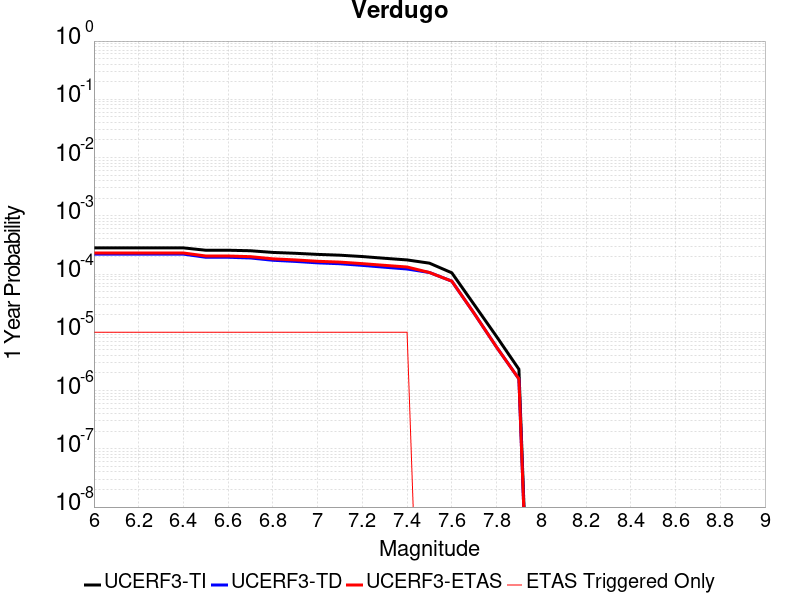 |  |

| Magnitude | 1 wk TI Prob | 1 wk TD Prob | 1 wk ETAS Prob | 1 wk ETAS/TD Gain | 1 wk ETAS Triggered Only | 1 mo TI Prob | 1 mo TD Prob | 1 mo ETAS Prob | 1 mo ETAS/TD Gain | 1 mo ETAS Triggered Only | 1 yr TI Prob | 1 yr TD Prob | 1 yr ETAS Prob | 1 yr ETAS/TD Gain | 1 yr ETAS Triggered Only | 10 yr TI Prob | 10 yr TD Prob | 10 yr ETAS Prob | 10 yr ETAS/TD Gain | 10 yr ETAS Triggered Only |
|-----|-----|-----|-----|-----|-----|-----|-----|-----|-----|-----|-----|-----|-----|-----|-----|-----|-----|-----|-----|-----|
| 6.0 | 5.392987E-6 | 4.216517E-6 | 4.216517E-6 | 1.0 | 0.0 | 2.3112598E-5 | 1.8070665E-5 | 3.022082E-5 | 1.6723689 | 1.2150373E-5 | 2.8135953E-4 | 2.1998861E-4 | 2.3213631E-4 | 1.0552197 | 1.2150373E-5 | 0.0028100356 | 0.0021977562 | 0.00220988 | 1.0055164 | 1.2150373E-5 |
| 6.1 | 5.392987E-6 | 4.216517E-6 | 4.216517E-6 | 1.0 | 0.0 | 2.3112598E-5 | 1.8070665E-5 | 3.022082E-5 | 1.6723689 | 1.2150373E-5 | 2.8135953E-4 | 2.1998861E-4 | 2.3213631E-4 | 1.0552197 | 1.2150373E-5 | 0.0028100356 | 0.0021977562 | 0.00220988 | 1.0055164 | 1.2150373E-5 |
| 6.2 | 5.392987E-6 | 4.216517E-6 | 4.216517E-6 | 1.0 | 0.0 | 2.3112598E-5 | 1.8070665E-5 | 3.022082E-5 | 1.6723689 | 1.2150373E-5 | 2.8135953E-4 | 2.1998861E-4 | 2.3213631E-4 | 1.0552197 | 1.2150373E-5 | 0.0028100356 | 0.0021977562 | 0.00220988 | 1.0055164 | 1.2150373E-5 |
| 6.3 | 5.392987E-6 | 4.216517E-6 | 4.216517E-6 | 1.0 | 0.0 | 2.3112598E-5 | 1.8070665E-5 | 3.022082E-5 | 1.6723689 | 1.2150373E-5 | 2.8135953E-4 | 2.1998861E-4 | 2.3213631E-4 | 1.0552197 | 1.2150373E-5 | 0.0028100356 | 0.0021977562 | 0.00220988 | 1.0055164 | 1.2150373E-5 |
| 6.4 | 5.392987E-6 | 4.216517E-6 | 4.216517E-6 | 1.0 | 0.0 | 2.3112598E-5 | 1.8070665E-5 | 3.022082E-5 | 1.6723689 | 1.2150373E-5 | 2.8135953E-4 | 2.1998861E-4 | 2.3213631E-4 | 1.0552197 | 1.2150373E-5 | 0.0028100356 | 0.0021977562 | 0.00220988 | 1.0055164 | 1.2150373E-5 |
| 6.5 | 4.9154837E-6 | 3.722465E-6 | 3.722465E-6 | 1.0 | 0.0 | 2.1066187E-5 | 1.5953325E-5 | 2.8103505E-5 | 1.761608 | 1.2150373E-5 | 2.5645064E-4 | 1.9421462E-4 | 2.0636265E-4 | 1.0625495 | 1.2150373E-5 | 0.002561549 | 0.0019404698 | 0.0019525966 | 1.0062494 | 1.2150373E-5 |
| 6.6 | 4.9154837E-6 | 3.722465E-6 | 3.722465E-6 | 1.0 | 0.0 | 2.1066187E-5 | 1.5953325E-5 | 2.8103505E-5 | 1.761608 | 1.2150373E-5 | 2.5645064E-4 | 1.9421462E-4 | 2.0636265E-4 | 1.0625495 | 1.2150373E-5 | 0.002561549 | 0.0019404698 | 0.0019525966 | 1.0062494 | 1.2150373E-5 |
| 6.7 | 4.817006E-6 | 3.6206518E-6 | 3.6206518E-6 | 1.0 | 0.0 | 2.0644147E-5 | 1.5516987E-5 | 2.7667173E-5 | 1.7830247 | 1.2150373E-5 | 2.513135E-4 | 1.8890314E-4 | 2.0105121E-4 | 1.0643085 | 1.2150373E-5 | 0.0025102948 | 0.0018874453 | 0.0018995728 | 1.0064253 | 1.2150373E-5 |
| 6.8 | 4.507407E-6 | 3.3071042E-6 | 3.3071042E-6 | 1.0 | 0.0 | 1.9317316E-5 | 1.4173227E-5 | 2.6323427E-5 | 1.8572643 | 1.2150373E-5 | 2.3516294E-4 | 1.7254551E-4 | 1.846938E-4 | 1.0704062 | 1.2150373E-5 | 0.0023491425 | 0.0017241298 | 0.0017362592 | 1.0070351 | 1.2150373E-5 |
| 6.9 | 4.3573054E-6 | 3.161011E-6 | 3.161011E-6 | 1.0 | 0.0 | 1.8674033E-5 | 1.354712E-5 | 2.5697329E-5 | 1.896885 | 1.2150373E-5 | 2.2733262E-4 | 1.6492383E-4 | 1.7707219E-4 | 1.0736605 | 1.2150373E-5 | 0.0022710022 | 0.0016480266 | 0.001660157 | 1.0073606 | 1.2150373E-5 |
| 7.0 | 4.171527E-6 | 2.9836704E-6 | 2.9836704E-6 | 1.0 | 0.0 | 1.787785E-5 | 1.2787096E-5 | 2.4937313E-5 | 1.9501936 | 1.2150373E-5 | 2.1764109E-4 | 1.5567189E-4 | 1.6782037E-4 | 1.078039 | 1.2150373E-5 | 0.0021742806 | 0.0015556397 | 0.0015677712 | 1.0077984 | 1.2150373E-5 |
| 7.1 | 4.0405484E-6 | 2.882261E-6 | 2.882261E-6 | 1.0 | 0.0 | 1.731652E-5 | 1.235249E-5 | 2.4502713E-5 | 1.9836254 | 1.2150373E-5 | 2.1080824E-4 | 1.503813E-4 | 1.6252983E-4 | 1.0807849 | 1.2150373E-5 | 0.0021060838 | 0.0015028063 | 0.0015149384 | 1.008073 | 1.2150373E-5 |
| 7.2 | 3.8306007E-6 | 2.7018452E-6 | 2.7018452E-6 | 1.0 | 0.0 | 1.6416758E-5 | 1.15792855E-5 | 2.3729517E-5 | 2.0493076 | 1.2150373E-5 | 1.9985568E-4 | 1.4096878E-4 | 1.5311745E-4 | 1.0861797 | 1.2150373E-5 | 0.0019967605 | 0.0014088044 | 0.0014209376 | 1.0086124 | 1.2150373E-5 |
| 7.3 | 3.5750938E-6 | 2.5121758E-6 | 2.5121758E-6 | 1.0 | 0.0 | 1.532174E-5 | 1.0766424E-5 | 2.2916665E-5 | 2.128531 | 1.2150373E-5 | 1.8652623E-4 | 1.3107344E-4 | 1.4322222E-4 | 1.0926868 | 1.2150373E-5 | 0.0018636974 | 0.0013099718 | 0.0013221062 | 1.0092632 | 1.2150373E-5 |
| 7.4 | 3.3510041E-6 | 2.3408586E-6 | 2.3408586E-6 | 1.0 | 0.0 | 1.4361368E-5 | 1.0032213E-5 | 2.2182465E-5 | 2.2111237 | 1.2150373E-5 | 1.7483562E-4 | 1.2213545E-4 | 1.3428435E-4 | 1.0994706 | 1.2150373E-5 | 0.0017469813 | 0.0012206937 | 0.0012328292 | 1.0099415 | 1.2150373E-5 |
| 7.5 | 2.948287E-6 | 2.0391124E-6 | 2.0391124E-6 | 1.0 | 0.0 | 1.2635454E-5 | 8.739024E-6 | 8.739024E-6 | 1.0 | 0.0 | 1.538258E-4 | 1.0639253E-4 | 1.0639253E-4 | 1.0 | 0.0 | 0.0015371935 | 0.0010634261 | 0.0010634261 | 1.0 | 0.0 |
| 7.6 | 2.0134323E-6 | 1.4471265E-6 | 1.4471265E-6 | 1.0 | 0.0 | 8.628967E-6 | 6.2019562E-6 | 6.2019562E-6 | 1.0 | 0.0 | 1.05052604E-4 | 7.550629E-5 | 7.550629E-5 | 1.0 | 0.0 | 0.0010500296 | 7.548152E-4 | 7.548152E-4 | 1.0 | 0.0 |
| 7.7 | 5.726436E-7 | 4.045248E-7 | 4.045248E-7 | 1.0 | 0.0 | 2.4541846E-6 | 1.7336766E-6 | 1.7336766E-6 | 1.0 | 0.0 | 2.9879287E-5 | 2.1107335E-5 | 2.1107335E-5 | 1.0 | 0.0 | 2.987527E-4 | 2.1105584E-4 | 2.1105584E-4 | 1.0 | 0.0 |
| 7.8 | 1.6248204E-7 | 1.0687696E-7 | 1.0687696E-7 | 1.0 | 0.0 | 6.963514E-7 | 4.5804404E-7 | 4.5804404E-7 | 1.0 | 0.0 | 8.478045E-6 | 5.5766723E-6 | 5.5766723E-6 | 1.0 | 0.0 | 8.477722E-5 | 5.5765355E-5 | 5.5765355E-5 | 1.0 | 0.0 |
| 7.9 | 4.4475744E-8 | 3.0375546E-8 | 3.0375546E-8 | 1.0 | 0.0 | 1.9061031E-7 | 1.301809E-7 | 1.301809E-7 | 1.0 | 0.0 | 2.320678E-6 | 1.5849514E-6 | 1.5849514E-6 | 1.0 | 0.0 | 2.3206538E-5 | 1.5849415E-5 | 1.5849415E-5 | 1.0 | 0.0 |

## Jess Valley
*[(top)](#table-of-contents)*

| 1 Week | 1 Month | 1 Year | 10 Year |
|-----|-----|-----|-----|
|  |  |  |  |

| Magnitude | 1 wk TI Prob | 1 wk TD Prob | 1 wk ETAS Prob | 1 wk ETAS/TD Gain | 1 wk ETAS Triggered Only | 1 mo TI Prob | 1 mo TD Prob | 1 mo ETAS Prob | 1 mo ETAS/TD Gain | 1 mo ETAS Triggered Only | 1 yr TI Prob | 1 yr TD Prob | 1 yr ETAS Prob | 1 yr ETAS/TD Gain | 1 yr ETAS Triggered Only | 10 yr TI Prob | 10 yr TD Prob | 10 yr ETAS Prob | 10 yr ETAS/TD Gain | 10 yr ETAS Triggered Only |
|-----|-----|-----|-----|-----|-----|-----|-----|-----|-----|-----|-----|-----|-----|-----|-----|-----|-----|-----|-----|-----|
| 6.0 | 3.3861274E-6 | 3.4340592E-6 | 1.558439E-5 | 4.538183 | 1.2150373E-5 | 1.4511894E-5 | 1.471733E-5 | 2.6867523E-5 | 1.8255706 | 1.2150373E-5 | 1.7666799E-4 | 1.7917156E-4 | 1.9131976E-4 | 1.0678021 | 1.2150373E-5 | 0.001765276 | 0.0017905476 | 0.0018026762 | 1.0067737 | 1.2150373E-5 |
| 6.1 | 3.3861274E-6 | 3.4340592E-6 | 1.558439E-5 | 4.538183 | 1.2150373E-5 | 1.4511894E-5 | 1.471733E-5 | 2.6867523E-5 | 1.8255706 | 1.2150373E-5 | 1.7666799E-4 | 1.7917156E-4 | 1.9131976E-4 | 1.0678021 | 1.2150373E-5 | 0.001765276 | 0.0017905476 | 0.0018026762 | 1.0067737 | 1.2150373E-5 |
| 6.2 | 3.3861274E-6 | 3.4340592E-6 | 1.558439E-5 | 4.538183 | 1.2150373E-5 | 1.4511894E-5 | 1.471733E-5 | 2.6867523E-5 | 1.8255706 | 1.2150373E-5 | 1.7666799E-4 | 1.7917156E-4 | 1.9131976E-4 | 1.0678021 | 1.2150373E-5 | 0.001765276 | 0.0017905476 | 0.0018026762 | 1.0067737 | 1.2150373E-5 |
| 6.3 | 3.3861274E-6 | 3.4340592E-6 | 1.558439E-5 | 4.538183 | 1.2150373E-5 | 1.4511894E-5 | 1.471733E-5 | 2.6867523E-5 | 1.8255706 | 1.2150373E-5 | 1.7666799E-4 | 1.7917156E-4 | 1.9131976E-4 | 1.0678021 | 1.2150373E-5 | 0.001765276 | 0.0017905476 | 0.0018026762 | 1.0067737 | 1.2150373E-5 |
| 6.4 | 1.5291708E-6 | 1.5502784E-6 | 1.3700633E-5 | 8.83753 | 1.2150373E-5 | 6.553573E-6 | 6.644038E-6 | 1.879433E-5 | 2.828751 | 1.2150373E-5 | 7.978683E-5 | 8.088895E-5 | 9.303835E-5 | 1.1501983 | 1.2150373E-5 | 7.975819E-4 | 8.086733E-4 | 8.208139E-4 | 1.0150129 | 1.2150373E-5 |
| 6.5 | 1.5291708E-6 | 1.5502784E-6 | 1.3700633E-5 | 8.83753 | 1.2150373E-5 | 6.553573E-6 | 6.644038E-6 | 1.879433E-5 | 2.828751 | 1.2150373E-5 | 7.978683E-5 | 8.088895E-5 | 9.303835E-5 | 1.1501983 | 1.2150373E-5 | 7.975819E-4 | 8.086733E-4 | 8.208139E-4 | 1.0150129 | 1.2150373E-5 |
| 6.6 | 5.396423E-7 | 5.4719953E-7 | 5.4719953E-7 | 1.0 | 0.0 | 2.312751E-6 | 2.3451398E-6 | 2.3451398E-6 | 1.0 | 0.0 | 2.8157378E-5 | 2.855189E-5 | 2.855189E-5 | 1.0 | 0.0 | 2.8153812E-4 | 2.8550063E-4 | 2.8550063E-4 | 1.0 | 0.0 |
| 6.7 | 5.396423E-7 | 5.4719953E-7 | 5.4719953E-7 | 1.0 | 0.0 | 2.312751E-6 | 2.3451398E-6 | 2.3451398E-6 | 1.0 | 0.0 | 2.8157378E-5 | 2.855189E-5 | 2.855189E-5 | 1.0 | 0.0 | 2.8153812E-4 | 2.8550063E-4 | 2.8550063E-4 | 1.0 | 0.0 |
| 6.8 | 3.6058395E-7 | 3.6563068E-7 | 3.6563068E-7 | 1.0 | 0.0 | 1.5453588E-6 | 1.5669885E-6 | 1.5669885E-6 | 1.0 | 0.0 | 1.8814582E-5 | 1.9078087E-5 | 1.9078087E-5 | 1.0 | 0.0 | 1.8812988E-4 | 1.9078086E-4 | 1.9078086E-4 | 1.0 | 0.0 |

## Calaveras (Central) 2011 CFM
*[(top)](#table-of-contents)*

| 1 Week | 1 Month | 1 Year | 10 Year |
|-----|-----|-----|-----|
|  |  |  |  |

| Magnitude | 1 wk TI Prob | 1 wk TD Prob | 1 wk ETAS Prob | 1 wk ETAS/TD Gain | 1 wk ETAS Triggered Only | 1 mo TI Prob | 1 mo TD Prob | 1 mo ETAS Prob | 1 mo ETAS/TD Gain | 1 mo ETAS Triggered Only | 1 yr TI Prob | 1 yr TD Prob | 1 yr ETAS Prob | 1 yr ETAS/TD Gain | 1 yr ETAS Triggered Only | 10 yr TI Prob | 10 yr TD Prob | 10 yr ETAS Prob | 10 yr ETAS/TD Gain | 10 yr ETAS Triggered Only |
|-----|-----|-----|-----|-----|-----|-----|-----|-----|-----|-----|-----|-----|-----|-----|-----|-----|-----|-----|-----|-----|
| 6.0 | 1.5010907E-4 | 2.481574E-4 | 2.481574E-4 | 1.0 | 0.0 | 6.4316596E-4 | 0.0010621005 | 0.0010621005 | 1.0 | 0.0 | 0.0078024664 | 0.012850073 | 0.012850073 | 1.0 | 0.0 | 0.07534136 | 0.120401435 | 0.12041212 | 1.0000888 | 1.2150373E-5 |
| 6.1 | 1.4521465E-4 | 2.397987E-4 | 2.397987E-4 | 1.0 | 0.0 | 6.222001E-4 | 0.0010263061 | 0.0010263061 | 1.0 | 0.0 | 0.0075490056 | 0.012419341 | 0.012419341 | 1.0 | 0.0 | 0.07297657 | 0.11667323 | 0.11668396 | 1.000092 | 1.2150373E-5 |
| 6.2 | 1.429998E-4 | 2.3911126E-4 | 2.3911126E-4 | 1.0 | 0.0 | 6.127123E-4 | 0.0010233623 | 0.0010233623 | 1.0 | 0.0 | 0.007434286 | 0.01238394 | 0.01238394 | 1.0 | 0.0 | 0.07190444 | 0.1163272 | 0.11633793 | 1.0000923 | 1.2150373E-5 |
| 6.3 | 1.3536277E-4 | 2.3242626E-4 | 2.3242626E-4 | 1.0 | 0.0 | 5.799972E-4 | 9.947343E-4 | 9.947343E-4 | 1.0 | 0.0 | 0.0070386264 | 0.012040132 | 0.012040132 | 1.0 | 0.0 | 0.0681982 | 0.11323977 | 0.113250546 | 1.0000951 | 1.2150373E-5 |
| 6.4 | 1.2993296E-4 | 2.2666177E-4 | 2.2666177E-4 | 1.0 | 0.0 | 5.5673666E-4 | 9.700479E-4 | 9.700479E-4 | 1.0 | 0.0 | 0.006757223 | 0.011742937 | 0.011742937 | 1.0 | 0.0 | 0.06555412 | 0.11051771 | 0.11052852 | 1.0000978 | 1.2150373E-5 |
| 6.5 | 1.0498927E-4 | 1.7981697E-4 | 1.7981697E-4 | 1.0 | 0.0 | 4.498764E-4 | 7.704157E-4 | 7.704157E-4 | 1.0 | 0.0 | 0.005463498 | 0.00933924 | 0.00933924 | 1.0 | 0.0 | 0.053311124 | 0.089199215 | 0.08921028 | 1.0001241 | 1.2150373E-5 |
| 6.6 | 1.0157505E-4 | 1.7469203E-4 | 1.7469203E-4 | 1.0 | 0.0 | 4.35249E-4 | 7.484645E-4 | 7.484645E-4 | 1.0 | 0.0 | 0.0052862884 | 0.009074297 | 0.009074297 | 1.0 | 0.0 | 0.05162293 | 0.08677671 | 0.086787805 | 1.0001279 | 1.2150373E-5 |
| 6.7 | 9.660386E-5 | 1.6728524E-4 | 1.6728524E-4 | 1.0 | 0.0 | 4.1395082E-4 | 7.1673887E-4 | 7.1673887E-4 | 1.0 | 0.0 | 0.0050282106 | 0.008691208 | 0.008691208 | 1.0 | 0.0 | 0.049159497 | 0.083266065 | 0.0832772 | 1.0001338 | 1.2150373E-5 |
| 6.8 | 9.089927E-5 | 1.5643016E-4 | 1.5643016E-4 | 1.0 | 0.0 | 3.8951015E-4 | 6.702439E-4 | 6.702439E-4 | 1.0 | 0.0 | 0.0047319788 | 0.008129478 | 0.008129478 | 1.0 | 0.0 | 0.046324775 | 0.078159414 | 0.07817062 | 1.0001433 | 1.2150373E-5 |
| 6.9 | 7.353187E-5 | 1.2295354E-4 | 1.2295354E-4 | 1.0 | 0.0 | 3.150985E-4 | 5.2683795E-4 | 5.2683795E-4 | 1.0 | 0.0 | 0.0038295772 | 0.006395508 | 0.006395508 | 1.0 | 0.0 | 0.037642512 | 0.062187865 | 0.062199257 | 1.0001832 | 1.2150373E-5 |
| 7.0 | 5.746064E-5 | 9.3887444E-5 | 9.3887444E-5 | 1.0 | 0.0 | 2.4623662E-4 | 4.0231308E-4 | 4.0231308E-4 | 1.0 | 0.0 | 0.0029938098 | 0.004887232 | 0.004887232 | 1.0 | 0.0 | 0.02953797 | 0.04798685 | 0.047998417 | 1.000241 | 1.2150373E-5 |
| 7.1 | 4.9557195E-5 | 8.052461E-5 | 8.052461E-5 | 1.0 | 0.0 | 2.123707E-4 | 3.4506017E-4 | 3.4506017E-4 | 1.0 | 0.0 | 0.0025825473 | 0.0041930773 | 0.0041930773 | 1.0 | 0.0 | 0.0255274 | 0.041373078 | 0.041384727 | 1.0002816 | 1.2150373E-5 |
| 7.2 | 3.687595E-5 | 5.9524526E-5 | 5.9524526E-5 | 1.0 | 0.0 | 1.5803022E-4 | 2.5508032E-4 | 2.5508032E-4 | 1.0 | 0.0 | 0.0019223199 | 0.0031012094 | 0.0031012094 | 1.0 | 0.0 | 0.01905776 | 0.030883716 | 0.030895492 | 1.0003812 | 1.2150373E-5 |
| 7.3 | 2.5846984E-5 | 4.247213E-5 | 4.247213E-5 | 1.0 | 0.0 | 1.1076809E-4 | 1.8201082E-4 | 1.8201082E-4 | 1.0 | 0.0 | 0.0013477671 | 0.002213747 | 0.002213747 | 1.0 | 0.0 | 0.013396223 | 0.02217554 | 0.02218742 | 1.0005357 | 1.2150373E-5 |
| 7.4 | 1.7747854E-5 | 2.9936204E-5 | 2.9936204E-5 | 1.0 | 0.0 | 7.6060016E-5 | 1.2829172E-4 | 1.2829172E-4 | 1.0 | 0.0 | 9.2563726E-4 | 0.0015608355 | 0.0015608355 | 1.0 | 0.0 | 0.009217911 | 0.015709236 | 0.015721194 | 1.0007613 | 1.2150373E-5 |
| 7.5 | 1.4883479E-5 | 2.6243379E-5 | 2.6243379E-5 | 1.0 | 0.0 | 6.378478E-5 | 1.1246678E-4 | 1.1246678E-4 | 1.0 | 0.0 | 7.76303E-4 | 0.0013684258 | 0.0013684258 | 1.0 | 0.0 | 0.0077359667 | 0.013802425 | 0.013814407 | 1.0008682 | 1.2150373E-5 |
| 7.6 | 8.166975E-6 | 1.4963478E-5 | 1.4963478E-5 | 1.0 | 0.0 | 3.5000852E-5 | 6.412763E-5 | 6.412763E-5 | 1.0 | 0.0 | 4.2605202E-4 | 7.804755E-4 | 7.804755E-4 | 1.0 | 0.0 | 0.004252361 | 0.00793984 | 0.007951894 | 1.0015181 | 1.2150373E-5 |
| 7.7 | 3.3858064E-6 | 6.253914E-6 | 6.253914E-6 | 1.0 | 0.0 | 1.4510518E-5 | 2.6802214E-5 | 2.6802214E-5 | 1.0 | 0.0 | 1.7665124E-4 | 3.2626814E-4 | 3.2626814E-4 | 1.0 | 0.0 | 0.0017651088 | 0.0033882293 | 0.0034003383 | 1.0035739 | 1.2150373E-5 |
| 7.8 | 2.7721615E-6 | 5.3663807E-6 | 5.3663807E-6 | 1.0 | 0.0 | 1.1880637E-5 | 2.2998573E-5 | 2.2998573E-5 | 1.0 | 0.0 | 1.4463716E-4 | 2.799717E-4 | 2.799717E-4 | 1.0 | 0.0 | 0.0014454306 | 0.0029074624 | 0.0029195775 | 1.0041668 | 1.2150373E-5 |
| 7.9 | 1.9736292E-6 | 4.1284193E-6 | 4.1284193E-6 | 1.0 | 0.0 | 8.4583835E-6 | 1.7693106E-5 | 1.7693106E-5 | 1.0 | 0.0 | 1.0297595E-4 | 2.1539231E-4 | 2.1539231E-4 | 1.0 | 0.0 | 0.0010292825 | 0.0022236116 | 0.0022357348 | 1.0054522 | 1.2150373E-5 |
| 8.0 | 1.1767289E-6 | 2.5544743E-6 | 2.5544743E-6 | 1.0 | 0.0 | 5.0431145E-6 | 1.0947701E-5 | 1.0947701E-5 | 1.0 | 0.0 | 6.139818E-5 | 1.3328013E-4 | 1.3328013E-4 | 1.0 | 0.0 | 6.1381224E-4 | 0.0013660848 | 0.0013782185 | 1.0088822 | 1.2150373E-5 |
| 8.1 | 7.5112825E-7 | 1.5409794E-6 | 1.5409794E-6 | 1.0 | 0.0 | 3.2191172E-6 | 6.6041807E-6 | 6.6041807E-6 | 1.0 | 0.0 | 3.9192048E-5 | 8.0402955E-5 | 8.0402955E-5 | 1.0 | 0.0 | 3.9185135E-4 | 8.235564E-4 | 8.3569676E-4 | 1.0147414 | 1.2150373E-5 |

## Channel Islands Western Deep Ramp
*[(top)](#table-of-contents)*

| 1 Week | 1 Month | 1 Year | 10 Year |
|-----|-----|-----|-----|
|  |  |  |  |

| Magnitude | 1 wk TI Prob | 1 wk TD Prob | 1 wk ETAS Prob | 1 wk ETAS/TD Gain | 1 wk ETAS Triggered Only | 1 mo TI Prob | 1 mo TD Prob | 1 mo ETAS Prob | 1 mo ETAS/TD Gain | 1 mo ETAS Triggered Only | 1 yr TI Prob | 1 yr TD Prob | 1 yr ETAS Prob | 1 yr ETAS/TD Gain | 1 yr ETAS Triggered Only | 10 yr TI Prob | 10 yr TD Prob | 10 yr ETAS Prob | 10 yr ETAS/TD Gain | 10 yr ETAS Triggered Only |
|-----|-----|-----|-----|-----|-----|-----|-----|-----|-----|-----|-----|-----|-----|-----|-----|-----|-----|-----|-----|-----|
| 6.0 | 6.0213506E-6 | 6.2548684E-6 | 1.8405166E-5 | 2.9425344 | 1.2150373E-5 | 2.5805533E-5 | 2.6806329E-5 | 3.8956376E-5 | 1.4532529 | 1.2150373E-5 | 3.1413708E-4 | 3.2632265E-4 | 3.3846905E-4 | 1.037222 | 1.2150373E-5 | 0.0031369338 | 0.0032588763 | 0.003270987 | 1.0037162 | 1.2150373E-5 |
| 6.1 | 6.0213506E-6 | 6.2548684E-6 | 1.8405166E-5 | 2.9425344 | 1.2150373E-5 | 2.5805533E-5 | 2.6806329E-5 | 3.8956376E-5 | 1.4532529 | 1.2150373E-5 | 3.1413708E-4 | 3.2632265E-4 | 3.3846905E-4 | 1.037222 | 1.2150373E-5 | 0.0031369338 | 0.0032588763 | 0.003270987 | 1.0037162 | 1.2150373E-5 |
| 6.2 | 6.0213506E-6 | 6.2548684E-6 | 1.8405166E-5 | 2.9425344 | 1.2150373E-5 | 2.5805533E-5 | 2.6806329E-5 | 3.8956376E-5 | 1.4532529 | 1.2150373E-5 | 3.1413708E-4 | 3.2632265E-4 | 3.3846905E-4 | 1.037222 | 1.2150373E-5 | 0.0031369338 | 0.0032588763 | 0.003270987 | 1.0037162 | 1.2150373E-5 |
| 6.3 | 6.0213506E-6 | 6.2548684E-6 | 1.8405166E-5 | 2.9425344 | 1.2150373E-5 | 2.5805533E-5 | 2.6806329E-5 | 3.8956376E-5 | 1.4532529 | 1.2150373E-5 | 3.1413708E-4 | 3.2632265E-4 | 3.3846905E-4 | 1.037222 | 1.2150373E-5 | 0.0031369338 | 0.0032588763 | 0.003270987 | 1.0037162 | 1.2150373E-5 |
| 6.4 | 6.0213506E-6 | 6.2548684E-6 | 1.8405166E-5 | 2.9425344 | 1.2150373E-5 | 2.5805533E-5 | 2.6806329E-5 | 3.8956376E-5 | 1.4532529 | 1.2150373E-5 | 3.1413708E-4 | 3.2632265E-4 | 3.3846905E-4 | 1.037222 | 1.2150373E-5 | 0.0031369338 | 0.0032588763 | 0.003270987 | 1.0037162 | 1.2150373E-5 |
| 6.5 | 6.0213506E-6 | 6.2548684E-6 | 1.8405166E-5 | 2.9425344 | 1.2150373E-5 | 2.5805533E-5 | 2.6806329E-5 | 3.8956376E-5 | 1.4532529 | 1.2150373E-5 | 3.1413708E-4 | 3.2632265E-4 | 3.3846905E-4 | 1.037222 | 1.2150373E-5 | 0.0031369338 | 0.0032588763 | 0.003270987 | 1.0037162 | 1.2150373E-5 |
| 6.6 | 6.0213506E-6 | 6.2548684E-6 | 1.8405166E-5 | 2.9425344 | 1.2150373E-5 | 2.5805533E-5 | 2.6806329E-5 | 3.8956376E-5 | 1.4532529 | 1.2150373E-5 | 3.1413708E-4 | 3.2632265E-4 | 3.3846905E-4 | 1.037222 | 1.2150373E-5 | 0.0031369338 | 0.0032588763 | 0.003270987 | 1.0037162 | 1.2150373E-5 |
| 6.7 | 5.313309E-6 | 5.5252403E-6 | 1.7675546E-5 | 3.1990547 | 1.2150373E-5 | 2.2771126E-5 | 2.367941E-5 | 3.5829496E-5 | 1.5131077 | 1.2150373E-5 | 2.772032E-4 | 2.8826276E-4 | 3.0040965E-4 | 1.0421382 | 1.2150373E-5 | 0.0027685766 | 0.0028792918 | 0.002891407 | 1.0042077 | 1.2150373E-5 |
| 6.8 | 5.313309E-6 | 5.5252403E-6 | 1.7675546E-5 | 3.1990547 | 1.2150373E-5 | 2.2771126E-5 | 2.367941E-5 | 3.5829496E-5 | 1.5131077 | 1.2150373E-5 | 2.772032E-4 | 2.8826276E-4 | 3.0040965E-4 | 1.0421382 | 1.2150373E-5 | 0.0027685766 | 0.0028792918 | 0.002891407 | 1.0042077 | 1.2150373E-5 |
| 6.9 | 4.744377E-6 | 4.9394303E-6 | 1.7089744E-5 | 3.459861 | 1.2150373E-5 | 2.0332885E-5 | 2.1168837E-5 | 3.3318953E-5 | 1.5739623 | 1.2150373E-5 | 2.4752476E-4 | 2.5770385E-4 | 2.698511E-4 | 1.0471364 | 1.2150373E-5 | 0.0024724922 | 0.0025744175 | 0.0025865366 | 1.0047075 | 1.2150373E-5 |
| 7.0 | 4.722209E-6 | 4.9164732E-6 | 1.7066786E-5 | 3.4713473 | 1.2150373E-5 | 2.0237881E-5 | 2.107045E-5 | 3.3220567E-5 | 1.5766425 | 1.2150373E-5 | 2.4636835E-4 | 2.5650626E-4 | 2.6865353E-4 | 1.0473566 | 1.2150373E-5 | 0.002460954 | 0.0025624693 | 0.0025745886 | 1.0047295 | 1.2150373E-5 |
| 7.1 | 4.611174E-6 | 4.801409E-6 | 4.801409E-6 | 1.0 | 0.0 | 1.9762025E-5 | 2.0577325E-5 | 2.0577325E-5 | 1.0 | 0.0 | 2.4057609E-4 | 2.5050386E-4 | 2.5050386E-4 | 1.0 | 0.0 | 0.002403158 | 0.002502582 | 0.002502582 | 1.0 | 0.0 |
| 7.2 | 4.043994E-6 | 4.2120264E-6 | 4.2120264E-6 | 1.0 | 0.0 | 1.7331287E-5 | 1.8051438E-5 | 1.8051438E-5 | 1.0 | 0.0 | 2.10988E-4 | 2.1975765E-4 | 2.1975765E-4 | 1.0 | 0.0 | 0.002107878 | 0.0021957543 | 0.0021957543 | 1.0 | 0.0 |
| 7.3 | 2.1233036E-6 | 2.2297875E-6 | 2.2297875E-6 | 1.0 | 0.0 | 9.099841E-6 | 9.556197E-6 | 9.556197E-6 | 1.0 | 0.0 | 1.1078493E-4 | 1.1634055E-4 | 1.1634055E-4 | 1.0 | 0.0 | 0.0011072971 | 0.001162802 | 0.001162802 | 1.0 | 0.0 |
| 7.4 | 1.9051884E-6 | 2.0014973E-6 | 2.0014973E-6 | 1.0 | 0.0 | 8.165067E-6 | 8.577817E-6 | 8.577817E-6 | 1.0 | 0.0 | 9.940516E-5 | 1.0442998E-4 | 1.0442998E-4 | 1.0 | 0.0 | 9.93607E-4 | 0.0010438144 | 0.0010438144 | 1.0 | 0.0 |
| 7.5 | 1.2408497E-6 | 1.3038839E-6 | 1.3038839E-6 | 1.0 | 0.0 | 5.317916E-6 | 5.588062E-6 | 5.588062E-6 | 1.0 | 0.0 | 6.4743705E-5 | 6.8032554E-5 | 6.8032554E-5 | 1.0 | 0.0 | 6.4724847E-4 | 6.8011944E-4 | 6.8011944E-4 | 1.0 | 0.0 |
| 7.6 | 6.5440025E-7 | 6.886718E-7 | 6.886718E-7 | 1.0 | 0.0 | 2.8045695E-6 | 2.9514472E-6 | 2.9514472E-6 | 1.0 | 0.0 | 3.4145098E-5 | 3.593329E-5 | 3.593329E-5 | 1.0 | 0.0 | 3.4139853E-4 | 3.5927625E-4 | 3.5927625E-4 | 1.0 | 0.0 |
| 7.7 | 3.985963E-7 | 4.1930787E-7 | 4.1930787E-7 | 1.0 | 0.0 | 1.7082689E-6 | 1.7970326E-6 | 1.7970326E-6 | 1.0 | 0.0 | 2.0797976E-5 | 2.1878664E-5 | 2.1878664E-5 | 1.0 | 0.0 | 2.0796029E-4 | 2.1876628E-4 | 2.1876628E-4 | 1.0 | 0.0 |
| 7.8 | 3.706329E-8 | 3.8591796E-8 | 3.8591796E-8 | 1.0 | 0.0 | 1.5884267E-7 | 1.653934E-7 | 1.653934E-7 | 1.0 | 0.0 | 1.9339077E-6 | 2.0136629E-6 | 2.0136629E-6 | 1.0 | 0.0 | 1.933891E-5 | 2.0136458E-5 | 2.0136458E-5 | 1.0 | 0.0 |

## Great Valley 03a Dunnigan Hills
*[(top)](#table-of-contents)*

| 1 Week | 1 Month | 1 Year | 10 Year |
|-----|-----|-----|-----|
|  |  |  |  |

| Magnitude | 1 wk TI Prob | 1 wk TD Prob | 1 wk ETAS Prob | 1 wk ETAS/TD Gain | 1 wk ETAS Triggered Only | 1 mo TI Prob | 1 mo TD Prob | 1 mo ETAS Prob | 1 mo ETAS/TD Gain | 1 mo ETAS Triggered Only | 1 yr TI Prob | 1 yr TD Prob | 1 yr ETAS Prob | 1 yr ETAS/TD Gain | 1 yr ETAS Triggered Only | 10 yr TI Prob | 10 yr TD Prob | 10 yr ETAS Prob | 10 yr ETAS/TD Gain | 10 yr ETAS Triggered Only |
|-----|-----|-----|-----|-----|-----|-----|-----|-----|-----|-----|-----|-----|-----|-----|-----|-----|-----|-----|-----|-----|
| 6.0 | 1.6591328E-5 | 1.8107954E-5 | 1.8107954E-5 | 1.0 | 0.0 | 7.110376E-5 | 7.7603596E-5 | 8.9753026E-5 | 1.1565576 | 1.2150373E-5 | 8.6534437E-4 | 9.444834E-4 | 9.566223E-4 | 1.0128524 | 1.2150373E-5 | 0.008619824 | 0.009411525 | 0.009423561 | 1.0012789 | 1.2150373E-5 |
| 6.1 | 8.041125E-6 | 8.769726E-6 | 8.769726E-6 | 1.0 | 0.0 | 3.4461507E-5 | 3.7584115E-5 | 3.7584115E-5 | 1.0 | 0.0 | 4.194881E-4 | 4.5751085E-4 | 4.5751085E-4 | 1.0 | 0.0 | 0.004186971 | 0.004567687 | 0.004567687 | 1.0 | 0.0 |
| 6.2 | 3.2807004E-6 | 3.5795688E-6 | 3.5795688E-6 | 1.0 | 0.0 | 1.4060069E-5 | 1.5340942E-5 | 1.5340942E-5 | 1.0 | 0.0 | 1.7116789E-4 | 1.8676413E-4 | 1.8676413E-4 | 1.0 | 0.0 | 0.0017103611 | 0.0018664796 | 0.0018664796 | 1.0 | 0.0 |
| 6.3 | 1.9339366E-6 | 2.1103806E-6 | 2.1103806E-6 | 1.0 | 0.0 | 8.288273E-6 | 9.044474E-6 | 9.044474E-6 | 1.0 | 0.0 | 1.00905054E-4 | 1.1011375E-4 | 1.1011375E-4 | 1.0 | 0.0 | 0.0010085925 | 0.0011008718 | 0.0011008718 | 1.0 | 0.0 |
| 6.4 | 1.3142635E-6 | 1.4339867E-6 | 1.4339867E-6 | 1.0 | 0.0 | 5.6325457E-6 | 6.145657E-6 | 6.145657E-6 | 1.0 | 0.0 | 6.857408E-5 | 7.482337E-5 | 7.482337E-5 | 1.0 | 0.0 | 6.8552926E-4 | 7.4823375E-4 | 7.4823375E-4 | 1.0 | 0.0 |

## Great Valley 10 (Panoche)
*[(top)](#table-of-contents)*

| 1 Week | 1 Month | 1 Year | 10 Year |
|-----|-----|-----|-----|
|  |  |  |  |

| Magnitude | 1 wk TI Prob | 1 wk TD Prob | 1 wk ETAS Prob | 1 wk ETAS/TD Gain | 1 wk ETAS Triggered Only | 1 mo TI Prob | 1 mo TD Prob | 1 mo ETAS Prob | 1 mo ETAS/TD Gain | 1 mo ETAS Triggered Only | 1 yr TI Prob | 1 yr TD Prob | 1 yr ETAS Prob | 1 yr ETAS/TD Gain | 1 yr ETAS Triggered Only | 10 yr TI Prob | 10 yr TD Prob | 10 yr ETAS Prob | 10 yr ETAS/TD Gain | 10 yr ETAS Triggered Only |
|-----|-----|-----|-----|-----|-----|-----|-----|-----|-----|-----|-----|-----|-----|-----|-----|-----|-----|-----|-----|-----|
| 6.0 | 1.6014626E-5 | 1.6575399E-5 | 2.872557E-5 | 1.7330244 | 1.2150373E-5 | 6.863231E-5 | 7.103552E-5 | 8.3185034E-5 | 1.1710343 | 1.2150373E-5 | 8.35278E-4 | 8.645185E-4 | 8.7665836E-4 | 1.0140424 | 1.2150373E-5 | 0.008321454 | 0.008612172 | 0.0086242175 | 1.0013987 | 1.2150373E-5 |
| 6.1 | 1.6014626E-5 | 1.6575399E-5 | 2.872557E-5 | 1.7330244 | 1.2150373E-5 | 6.863231E-5 | 7.103552E-5 | 8.3185034E-5 | 1.1710343 | 1.2150373E-5 | 8.35278E-4 | 8.645185E-4 | 8.7665836E-4 | 1.0140424 | 1.2150373E-5 | 0.008321454 | 0.008612172 | 0.0086242175 | 1.0013987 | 1.2150373E-5 |
| 6.2 | 1.56782E-5 | 1.6198446E-5 | 2.8348622E-5 | 1.7500829 | 1.2150373E-5 | 6.719056E-5 | 6.94201E-5 | 8.1569626E-5 | 1.1750146 | 1.2150373E-5 | 8.17738E-4 | 8.4486604E-4 | 8.570061E-4 | 1.0143692 | 1.2150373E-5 | 0.008147354 | 0.008417147 | 0.008429195 | 1.0014313 | 1.2150373E-5 |
| 6.3 | 1.5263338E-5 | 1.5723514E-5 | 2.7873697E-5 | 1.7727395 | 1.2150373E-5 | 6.541267E-5 | 6.738478E-5 | 7.953434E-5 | 1.1803012 | 1.2150373E-5 | 7.961082E-4 | 8.201049E-4 | 8.3224534E-4 | 1.0148035 | 1.2150373E-5 | 0.007932622 | 0.008171377 | 0.008183428 | 1.0014747 | 1.2150373E-5 |
| 6.4 | 1.4720723E-5 | 1.5099376E-5 | 2.7249565E-5 | 1.8046815 | 1.2150373E-5 | 6.308728E-5 | 6.471004E-5 | 7.685962E-5 | 1.1877543 | 1.2150373E-5 | 7.67817E-4 | 7.8756385E-4 | 7.9970463E-4 | 1.0154157 | 1.2150373E-5 | 0.007651695 | 0.007848303 | 0.007860358 | 1.001536 | 1.2150373E-5 |
| 6.5 | 1.408264E-5 | 1.4355969E-5 | 2.6506168E-5 | 1.8463516 | 1.2150373E-5 | 6.0352773E-5 | 6.1524166E-5 | 7.3673786E-5 | 1.1974773 | 1.2150373E-5 | 7.3454727E-4 | 7.488031E-4 | 7.609444E-4 | 1.0162143 | 1.2150373E-5 | 0.0073212404 | 0.0074633555 | 0.0074754152 | 1.0016159 | 1.2150373E-5 |
| 6.6 | 1.3197086E-5 | 1.3321889E-5 | 2.54721E-5 | 1.9120487 | 1.2150373E-5 | 5.6557717E-5 | 5.709259E-5 | 6.924227E-5 | 1.2128066 | 1.2150373E-5 | 6.8837265E-4 | 6.9488434E-4 | 7.070263E-4 | 1.0174733 | 1.2150373E-5 | 0.006862442 | 0.0069276537 | 0.00693972 | 1.0017418 | 1.2150373E-5 |
| 6.7 | 1.017583E-5 | 9.745382E-6 | 2.1895637E-5 | 2.2467704 | 1.2150373E-5 | 4.360997E-5 | 4.176527E-5 | 5.3915133E-5 | 1.2909083 | 1.2150373E-5 | 5.30822E-4 | 5.0837593E-4 | 5.2052015E-4 | 1.0238882 | 1.2150373E-5 | 0.0052955584 | 0.005072382 | 0.005084471 | 1.0023832 | 1.2150373E-5 |
| 6.8 | 8.557912E-6 | 7.872707E-6 | 2.0022984E-5 | 2.5433416 | 1.2150373E-5 | 3.667625E-5 | 3.373975E-5 | 4.5889712E-5 | 1.3601083 | 1.2150373E-5 | 4.4644187E-4 | 4.1070607E-4 | 4.2285144E-4 | 1.029572 | 1.2150373E-5 | 0.0044554602 | 0.004099677 | 0.0041117775 | 1.0029516 | 1.2150373E-5 |
| 6.9 | 6.14664E-6 | 5.092071E-6 | 5.092071E-6 | 1.0 | 0.0 | 2.6342475E-5 | 2.1822989E-5 | 2.1822989E-5 | 1.0 | 0.0 | 3.2067244E-4 | 2.6566387E-4 | 2.6566387E-4 | 1.0 | 0.0 | 0.003202101 | 0.002653601 | 0.002653601 | 1.0 | 0.0 |
| 7.0 | 3.2310581E-6 | 1.6951219E-6 | 1.6951219E-6 | 1.0 | 0.0 | 1.3847319E-5 | 7.264788E-6 | 7.264788E-6 | 1.0 | 0.0 | 1.6857806E-4 | 8.8445304E-5 | 8.8445304E-5 | 1.0 | 0.0 | 0.0016845023 | 8.841104E-4 | 8.841104E-4 | 1.0 | 0.0 |
| 7.1 | 2.544492E-6 | 9.1889206E-7 | 9.1889206E-7 | 1.0 | 0.0 | 1.090492E-5 | 3.938103E-6 | 3.938103E-6 | 1.0 | 0.0 | 1.327593E-4 | 4.79454E-5 | 4.79454E-5 | 1.0 | 0.0 | 0.0013268003 | 4.793553E-4 | 4.793553E-4 | 1.0 | 0.0 |
| 7.2 | 2.4479045E-6 | 8.841304E-7 | 8.841304E-7 | 1.0 | 0.0 | 1.0490977E-5 | 3.789125E-6 | 3.789125E-6 | 1.0 | 0.0 | 1.2772017E-4 | 4.6131667E-5 | 4.6131667E-5 | 1.0 | 0.0 | 0.0012764678 | 4.6122566E-4 | 4.6122566E-4 | 1.0 | 0.0 |
| 7.3 | 2.0559578E-6 | 7.892787E-7 | 7.892787E-7 | 1.0 | 0.0 | 8.811218E-6 | 3.3826188E-6 | 3.3826188E-6 | 1.0 | 0.0 | 1.072713E-4 | 4.1182655E-5 | 4.1182655E-5 | 1.0 | 0.0 | 0.0010721954 | 4.1175485E-4 | 4.1175485E-4 | 1.0 | 0.0 |
| 7.4 | 1.727687E-6 | 7.387757E-7 | 7.387757E-7 | 1.0 | 0.0 | 7.404352E-6 | 3.1661782E-6 | 3.1661782E-6 | 1.0 | 0.0 | 9.0144255E-5 | 3.8547583E-5 | 3.8547583E-5 | 1.0 | 0.0 | 9.0107694E-4 | 3.854136E-4 | 3.854136E-4 | 1.0 | 0.0 |
| 7.5 | 1.5002679E-6 | 6.546144E-7 | 6.546144E-7 | 1.0 | 0.0 | 6.4297037E-6 | 2.8054874E-6 | 2.8054874E-6 | 1.0 | 0.0 | 7.827883E-5 | 3.4156317E-5 | 3.4156317E-5 | 1.0 | 0.0 | 7.825126E-4 | 3.4151482E-4 | 3.4151482E-4 | 1.0 | 0.0 |

## Big Pine (West)
*[(top)](#table-of-contents)*

| 1 Week | 1 Month | 1 Year | 10 Year |
|-----|-----|-----|-----|
|  |  |  |  |

| Magnitude | 1 wk TI Prob | 1 wk TD Prob | 1 wk ETAS Prob | 1 wk ETAS/TD Gain | 1 wk ETAS Triggered Only | 1 mo TI Prob | 1 mo TD Prob | 1 mo ETAS Prob | 1 mo ETAS/TD Gain | 1 mo ETAS Triggered Only | 1 yr TI Prob | 1 yr TD Prob | 1 yr ETAS Prob | 1 yr ETAS/TD Gain | 1 yr ETAS Triggered Only | 10 yr TI Prob | 10 yr TD Prob | 10 yr ETAS Prob | 10 yr ETAS/TD Gain | 10 yr ETAS Triggered Only |
|-----|-----|-----|-----|-----|-----|-----|-----|-----|-----|-----|-----|-----|-----|-----|-----|-----|-----|-----|-----|-----|
| 6.0 | 6.8306974E-7 | 6.8818304E-7 | 1.2838547E-5 | 18.655718 | 1.2150373E-5 | 2.9274386E-6 | 2.949353E-6 | 1.509969E-5 | 5.119662 | 1.2150373E-5 | 3.564098E-5 | 3.5907877E-5 | 4.8057813E-5 | 1.3383641 | 1.2150373E-5 | 3.5635266E-4 | 3.5903015E-4 | 3.7117614E-4 | 1.03383 | 1.2150373E-5 |
| 6.1 | 6.8306974E-7 | 6.8818304E-7 | 1.2838547E-5 | 18.655718 | 1.2150373E-5 | 2.9274386E-6 | 2.949353E-6 | 1.509969E-5 | 5.119662 | 1.2150373E-5 | 3.564098E-5 | 3.5907877E-5 | 4.8057813E-5 | 1.3383641 | 1.2150373E-5 | 3.5635266E-4 | 3.5903015E-4 | 3.7117614E-4 | 1.03383 | 1.2150373E-5 |
| 6.2 | 6.8306974E-7 | 6.8818304E-7 | 1.2838547E-5 | 18.655718 | 1.2150373E-5 | 2.9274386E-6 | 2.949353E-6 | 1.509969E-5 | 5.119662 | 1.2150373E-5 | 3.564098E-5 | 3.5907877E-5 | 4.8057813E-5 | 1.3383641 | 1.2150373E-5 | 3.5635266E-4 | 3.5903015E-4 | 3.7117614E-4 | 1.03383 | 1.2150373E-5 |
| 6.3 | 4.227652E-7 | 4.2665604E-7 | 1.2577024E-5 | 29.478134 | 1.2150373E-5 | 1.8118495E-6 | 1.8285248E-6 | 1.3978875E-5 | 7.6448927 | 1.2150373E-5 | 2.2059045E-5 | 2.226208E-5 | 3.4412184E-5 | 1.5457758 | 1.2150373E-5 | 2.2056856E-4 | 2.2260031E-4 | 2.3474799E-4 | 1.0545716 | 1.2150373E-5 |
| 6.4 | 4.227652E-7 | 4.2665604E-7 | 1.2577024E-5 | 29.478134 | 1.2150373E-5 | 1.8118495E-6 | 1.8285248E-6 | 1.3978875E-5 | 7.6448927 | 1.2150373E-5 | 2.2059045E-5 | 2.226208E-5 | 3.4412184E-5 | 1.5457758 | 1.2150373E-5 | 2.2056856E-4 | 2.2260031E-4 | 2.3474799E-4 | 1.0545716 | 1.2150373E-5 |
| 6.5 | 3.1538403E-7 | 3.1884528E-7 | 1.2469214E-5 | 39.107414 | 1.2150373E-5 | 1.3516451E-6 | 1.3664791E-6 | 1.3516836E-5 | 9.891726 | 1.2150373E-5 | 1.6456155E-5 | 1.6636759E-5 | 2.878693E-5 | 1.7303208 | 1.2150373E-5 | 1.6454936E-4 | 1.6635554E-4 | 1.7850389E-4 | 1.0730264 | 1.2150373E-5 |
| 6.6 | 3.1538403E-7 | 3.1884528E-7 | 1.2469214E-5 | 39.107414 | 1.2150373E-5 | 1.3516451E-6 | 1.3664791E-6 | 1.3516836E-5 | 9.891726 | 1.2150373E-5 | 1.6456155E-5 | 1.6636759E-5 | 2.878693E-5 | 1.7303208 | 1.2150373E-5 | 1.6454936E-4 | 1.6635554E-4 | 1.7850389E-4 | 1.0730264 | 1.2150373E-5 |
| 6.7 | 3.1538403E-7 | 3.1884528E-7 | 1.2469214E-5 | 39.107414 | 1.2150373E-5 | 1.3516451E-6 | 1.3664791E-6 | 1.3516836E-5 | 9.891726 | 1.2150373E-5 | 1.6456155E-5 | 1.6636759E-5 | 2.878693E-5 | 1.7303208 | 1.2150373E-5 | 1.6454936E-4 | 1.6635554E-4 | 1.7850389E-4 | 1.0730264 | 1.2150373E-5 |
| 6.8 | 3.1538403E-7 | 3.1884528E-7 | 1.2469214E-5 | 39.107414 | 1.2150373E-5 | 1.3516451E-6 | 1.3664791E-6 | 1.3516836E-5 | 9.891726 | 1.2150373E-5 | 1.6456155E-5 | 1.6636759E-5 | 2.878693E-5 | 1.7303208 | 1.2150373E-5 | 1.6454936E-4 | 1.6635554E-4 | 1.7850389E-4 | 1.0730264 | 1.2150373E-5 |
| 6.9 | 3.0402092E-7 | 3.0739798E-7 | 1.2457767E-5 | 40.526512 | 1.2150373E-5 | 1.3029462E-6 | 1.3174192E-6 | 1.3467777E-5 | 10.222848 | 1.2150373E-5 | 1.5863254E-5 | 1.6039465E-5 | 2.8189643E-5 | 1.7575177 | 1.2150373E-5 | 1.5862122E-4 | 1.6038347E-4 | 1.7253189E-4 | 1.075746 | 1.2150373E-5 |
| 7.0 | 2.3673063E-7 | 2.3944315E-7 | 1.23898135E-5 | 51.74428 | 1.2150373E-5 | 1.0145594E-6 | 1.0261845E-6 | 1.31765455E-5 | 12.840327 | 1.2150373E-5 | 1.235219E-5 | 1.2493728E-5 | 2.4643949E-5 | 1.9725057 | 1.2150373E-5 | 1.2351504E-4 | 1.2493054E-4 | 1.3707939E-4 | 1.0972449 | 1.2150373E-5 |
| 7.1 | 1.632138E-7 | 1.6514511E-7 | 1.2315516E-5 | 74.573906 | 1.2150373E-5 | 6.9948754E-7 | 7.0776457E-7 | 1.2858129E-5 | 18.16724 | 1.2150373E-5 | 8.516227E-6 | 8.617002E-6 | 2.076727E-5 | 2.4100344 | 1.2150373E-5 | 8.5159016E-5 | 8.616685E-5 | 9.831617E-5 | 1.1409976 | 1.2150373E-5 |
| 7.2 | 1.1523723E-7 | 1.1657165E-7 | 1.22669435E-5 | 105.230934 | 1.2150373E-5 | 4.9387376E-7 | 4.9959266E-7 | 1.264996E-5 | 25.320547 | 1.2150373E-5 | 6.0128964E-6 | 6.082525E-6 | 1.8232824E-5 | 2.9975748 | 1.2150373E-5 | 6.0127335E-5 | 6.0823695E-5 | 7.297333E-5 | 1.1997516 | 1.2150373E-5 |
| 7.3 | 7.777805E-8 | 7.862446E-8 | 1.2228997E-5 | 155.5368 | 1.2150373E-5 | 3.3333444E-7 | 3.3696193E-7 | 1.248733E-5 | 37.058582 | 1.2150373E-5 | 4.0583395E-6 | 4.102504E-6 | 1.6252827E-5 | 3.9616845 | 1.2150373E-5 | 4.0582654E-5 | 4.102434E-5 | 5.3174215E-5 | 1.2961626 | 1.2150373E-5 |
| 7.4 | 4.609946E-8 | 4.6522135E-8 | 4.6522135E-8 | 1.0 | 0.0 | 1.975691E-7 | 1.9938055E-7 | 1.9938055E-7 | 1.0 | 0.0 | 2.4054011E-6 | 2.4274557E-6 | 2.4274557E-6 | 1.0 | 0.0 | 2.405375E-5 | 2.427431E-5 | 2.427431E-5 | 1.0 | 0.0 |
| 7.5 | 2.3439137E-8 | 2.3608283E-8 | 2.3608283E-8 | 1.0 | 0.0 | 1.00453434E-7 | 1.0117836E-7 | 1.0117836E-7 | 1.0 | 0.0 | 1.2230199E-6 | 1.2318458E-6 | 1.2318458E-6 | 1.0 | 0.0 | 1.2230132E-5 | 1.2318393E-5 | 1.2318393E-5 | 1.0 | 0.0 |
| 7.6 | 1.6699769E-8 | 1.6817072E-8 | 1.6817072E-8 | 1.0 | 0.0 | 7.157044E-8 | 7.207316E-8 | 7.207316E-8 | 1.0 | 0.0 | 8.713697E-7 | 8.7749044E-7 | 8.7749044E-7 | 1.0 | 0.0 | 8.713663E-6 | 8.774871E-6 | 8.774871E-6 | 1.0 | 0.0 |
| 7.7 | 7.4061512E-9 | 7.4541635E-9 | 7.4541635E-9 | 1.0 | 0.0 | 3.1740647E-8 | 3.1946417E-8 | 3.1946417E-8 | 1.0 | 0.0 | 3.864423E-7 | 3.8894754E-7 | 3.8894754E-7 | 1.0 | 0.0 | 3.8644166E-6 | 3.8894696E-6 | 3.8894696E-6 | 1.0 | 0.0 |
| 7.8 | 1.2189427E-9 | 1.2270763E-9 | 1.2270763E-9 | 1.0 | 0.0 | 5.2240403E-9 | 5.258898E-9 | 5.258898E-9 | 1.0 | 0.0 | 6.3602684E-8 | 6.4027084E-8 | 6.4027084E-8 | 1.0 | 0.0 | 6.360267E-7 | 6.4027074E-7 | 6.4027074E-7 | 1.0 | 0.0 |

## Mono Lake 2011 CFM
*[(top)](#table-of-contents)*

| 1 Week | 1 Month | 1 Year | 10 Year |
|-----|-----|-----|-----|
|  |  |  |  |

| Magnitude | 1 wk TI Prob | 1 wk TD Prob | 1 wk ETAS Prob | 1 wk ETAS/TD Gain | 1 wk ETAS Triggered Only | 1 mo TI Prob | 1 mo TD Prob | 1 mo ETAS Prob | 1 mo ETAS/TD Gain | 1 mo ETAS Triggered Only | 1 yr TI Prob | 1 yr TD Prob | 1 yr ETAS Prob | 1 yr ETAS/TD Gain | 1 yr ETAS Triggered Only | 10 yr TI Prob | 10 yr TD Prob | 10 yr ETAS Prob | 10 yr ETAS/TD Gain | 10 yr ETAS Triggered Only |
|-----|-----|-----|-----|-----|-----|-----|-----|-----|-----|-----|-----|-----|-----|-----|-----|-----|-----|-----|-----|-----|
| 6.0 | 2.0341662E-5 | 2.3828166E-5 | 3.597825E-5 | 1.5099043 | 1.2150373E-5 | 8.717564E-5 | 1.0211971E-4 | 1.1426884E-4 | 1.1189696 | 1.2150373E-5 | 0.0010608466 | 0.0012431298 | 0.0012552651 | 1.0097618 | 1.2150373E-5 | 0.010557966 | 0.012413835 | 0.012425834 | 1.0009667 | 1.2150373E-5 |
| 6.1 | 2.0341662E-5 | 2.3828166E-5 | 3.597825E-5 | 1.5099043 | 1.2150373E-5 | 8.717564E-5 | 1.0211971E-4 | 1.1426884E-4 | 1.1189696 | 1.2150373E-5 | 0.0010608466 | 0.0012431298 | 0.0012552651 | 1.0097618 | 1.2150373E-5 | 0.010557966 | 0.012413835 | 0.012425834 | 1.0009667 | 1.2150373E-5 |
| 6.2 | 2.0341662E-5 | 2.3828166E-5 | 3.597825E-5 | 1.5099043 | 1.2150373E-5 | 8.717564E-5 | 1.0211971E-4 | 1.1426884E-4 | 1.1189696 | 1.2150373E-5 | 0.0010608466 | 0.0012431298 | 0.0012552651 | 1.0097618 | 1.2150373E-5 | 0.010557966 | 0.012413835 | 0.012425834 | 1.0009667 | 1.2150373E-5 |
| 6.3 | 2.0341662E-5 | 2.3828166E-5 | 3.597825E-5 | 1.5099043 | 1.2150373E-5 | 8.717564E-5 | 1.0211971E-4 | 1.1426884E-4 | 1.1189696 | 1.2150373E-5 | 0.0010608466 | 0.0012431298 | 0.0012552651 | 1.0097618 | 1.2150373E-5 | 0.010557966 | 0.012413835 | 0.012425834 | 1.0009667 | 1.2150373E-5 |
| 6.4 | 1.749821E-5 | 2.0490985E-5 | 3.264111E-5 | 1.5929497 | 1.2150373E-5 | 7.499018E-5 | 8.781851E-5 | 9.9967816E-5 | 1.1383456 | 1.2150373E-5 | 9.1262296E-4 | 0.0010691903 | 0.0010813277 | 1.011352 | 1.2150373E-5 | 0.009088841 | 0.010691865 | 0.010703885 | 1.0011243 | 1.2150373E-5 |
| 6.5 | 1.749821E-5 | 2.0490985E-5 | 3.264111E-5 | 1.5929497 | 1.2150373E-5 | 7.499018E-5 | 8.781851E-5 | 9.9967816E-5 | 1.1383456 | 1.2150373E-5 | 9.1262296E-4 | 0.0010691903 | 0.0010813277 | 1.011352 | 1.2150373E-5 | 0.009088841 | 0.010691865 | 0.010703885 | 1.0011243 | 1.2150373E-5 |

## Eaton Roughs 2011 CFM
*[(top)](#table-of-contents)*

| 1 Week | 1 Month | 1 Year | 10 Year |
|-----|-----|-----|-----|
|  |  |  |  |

| Magnitude | 1 wk TI Prob | 1 wk TD Prob | 1 wk ETAS Prob | 1 wk ETAS/TD Gain | 1 wk ETAS Triggered Only | 1 mo TI Prob | 1 mo TD Prob | 1 mo ETAS Prob | 1 mo ETAS/TD Gain | 1 mo ETAS Triggered Only | 1 yr TI Prob | 1 yr TD Prob | 1 yr ETAS Prob | 1 yr ETAS/TD Gain | 1 yr ETAS Triggered Only | 10 yr TI Prob | 10 yr TD Prob | 10 yr ETAS Prob | 10 yr ETAS/TD Gain | 10 yr ETAS Triggered Only |
|-----|-----|-----|-----|-----|-----|-----|-----|-----|-----|-----|-----|-----|-----|-----|-----|-----|-----|-----|-----|-----|
| 6.0 | 6.8044945E-5 | 8.843646E-5 | 8.843646E-5 | 1.0 | 0.0 | 2.9158857E-4 | 3.7896493E-4 | 3.7896493E-4 | 1.0 | 0.0 | 0.0035443127 | 0.0046050907 | 0.004617185 | 1.0026263 | 1.2150373E-5 | 0.03488314 | 0.04516335 | 0.04517495 | 1.0002569 | 1.2150373E-5 |
| 6.1 | 6.8044945E-5 | 8.843646E-5 | 8.843646E-5 | 1.0 | 0.0 | 2.9158857E-4 | 3.7896493E-4 | 3.7896493E-4 | 1.0 | 0.0 | 0.0035443127 | 0.0046050907 | 0.004617185 | 1.0026263 | 1.2150373E-5 | 0.03488314 | 0.04516335 | 0.04517495 | 1.0002569 | 1.2150373E-5 |
| 6.2 | 6.8044945E-5 | 8.843646E-5 | 8.843646E-5 | 1.0 | 0.0 | 2.9158857E-4 | 3.7896493E-4 | 3.7896493E-4 | 1.0 | 0.0 | 0.0035443127 | 0.0046050907 | 0.004617185 | 1.0026263 | 1.2150373E-5 | 0.03488314 | 0.04516335 | 0.04517495 | 1.0002569 | 1.2150373E-5 |
| 6.3 | 6.8044945E-5 | 8.843646E-5 | 8.843646E-5 | 1.0 | 0.0 | 2.9158857E-4 | 3.7896493E-4 | 3.7896493E-4 | 1.0 | 0.0 | 0.0035443127 | 0.0046050907 | 0.004617185 | 1.0026263 | 1.2150373E-5 | 0.03488314 | 0.04516335 | 0.04517495 | 1.0002569 | 1.2150373E-5 |
| 6.4 | 4.5830013E-5 | 5.715427E-5 | 5.715427E-5 | 1.0 | 0.0 | 1.9639956E-4 | 2.4492692E-4 | 2.4492692E-4 | 1.0 | 0.0 | 0.0023885423 | 0.0029784471 | 0.0029784471 | 1.0 | 0.0 | 0.023630321 | 0.029421588 | 0.029421588 | 1.0 | 0.0 |
| 6.5 | 4.5830013E-5 | 5.715427E-5 | 5.715427E-5 | 1.0 | 0.0 | 1.9639956E-4 | 2.4492692E-4 | 2.4492692E-4 | 1.0 | 0.0 | 0.0023885423 | 0.0029784471 | 0.0029784471 | 1.0 | 0.0 | 0.023630321 | 0.029421588 | 0.029421588 | 1.0 | 0.0 |
| 6.6 | 3.222194E-5 | 3.8261504E-5 | 3.8261504E-5 | 1.0 | 0.0 | 1.3808672E-4 | 1.639682E-4 | 1.639682E-4 | 1.0 | 0.0 | 0.0016799092 | 0.001994599 | 0.001994599 | 1.0 | 0.0 | 0.016672665 | 0.019776601 | 0.019776601 | 1.0 | 0.0 |
| 6.7 | 2.4155654E-5 | 2.7786238E-5 | 2.7786238E-5 | 1.0 | 0.0 | 1.0352012E-4 | 1.1907848E-4 | 1.1907848E-4 | 1.0 | 0.0 | 0.0012596287 | 0.0014488247 | 0.0014488247 | 1.0 | 0.0 | 0.012525126 | 0.014394943 | 0.014394943 | 1.0 | 0.0 |
| 6.8 | 2.1814667E-5 | 2.4940868E-5 | 2.4940868E-5 | 1.0 | 0.0 | 9.348808E-5 | 1.06885076E-4 | 1.06885076E-4 | 1.0 | 0.0 | 0.001137623 | 0.0013005526 | 0.0013005526 | 1.0 | 0.0 | 0.011318169 | 0.012930038 | 0.012930038 | 1.0 | 0.0 |
| 6.9 | 2.0700467E-5 | 2.3628932E-5 | 2.3628932E-5 | 1.0 | 0.0 | 8.871327E-5 | 1.01262944E-4 | 1.01262944E-4 | 1.0 | 0.0 | 0.0010795488 | 0.0012321823 | 0.0012321823 | 1.0 | 0.0 | 0.010743194 | 0.012254035 | 0.012254035 | 1.0 | 0.0 |
| 7.0 | 2.0104066E-5 | 2.29365E-5 | 2.29365E-5 | 1.0 | 0.0 | 8.615744E-5 | 9.82956E-5 | 9.82956E-5 | 1.0 | 0.0 | 0.0010484619 | 0.0011960949 | 0.0011960949 | 1.0 | 0.0 | 0.010435291 | 0.011897073 | 0.011897073 | 1.0 | 0.0 |
| 7.1 | 1.8225232E-5 | 2.0773046E-5 | 2.0773046E-5 | 1.0 | 0.0 | 7.81058E-5 | 8.902431E-5 | 8.902431E-5 | 1.0 | 0.0 | 9.5052324E-4 | 0.0010833336 | 0.0010833336 | 1.0 | 0.0 | 0.009464677 | 0.010780825 | 0.010780825 | 1.0 | 0.0 |
| 7.2 | 1.7526572E-5 | 1.9993488E-5 | 1.9993488E-5 | 1.0 | 0.0 | 7.511172E-5 | 8.5683576E-5 | 8.5683576E-5 | 1.0 | 0.0 | 9.141015E-4 | 0.0010426997 | 0.0010426997 | 1.0 | 0.0 | 0.009103506 | 0.010378351 | 0.010378351 | 1.0 | 0.0 |
| 7.3 | 1.5727232E-5 | 1.8021507E-5 | 1.8021507E-5 | 1.0 | 0.0 | 6.740067E-5 | 7.723275E-5 | 7.723275E-5 | 1.0 | 0.0 | 8.2029426E-4 | 9.399043E-4 | 9.399043E-4 | 1.0 | 0.0 | 0.008172729 | 0.009359511 | 0.009359511 | 1.0 | 0.0 |
| 7.4 | 1.4457361E-5 | 1.6598358E-5 | 1.6598358E-5 | 1.0 | 0.0 | 6.195865E-5 | 7.113389E-5 | 7.113389E-5 | 1.0 | 0.0 | 7.540854E-4 | 8.657119E-4 | 8.657119E-4 | 1.0 | 0.0 | 0.007515317 | 0.008623555 | 0.008623555 | 1.0 | 0.0 |
| 7.5 | 1.33280955E-5 | 1.5345435E-5 | 1.5345435E-5 | 1.0 | 0.0 | 5.711916E-5 | 6.57645E-5 | 6.57645E-5 | 1.0 | 0.0 | 6.9520384E-4 | 8.0038945E-4 | 8.0038945E-4 | 1.0 | 0.0 | 0.00693033 | 0.007975209 | 0.007975209 | 1.0 | 0.0 |
| 7.6 | 1.0699478E-5 | 1.2387815E-5 | 1.2387815E-5 | 1.0 | 0.0 | 4.5854096E-5 | 5.308956E-5 | 5.308956E-5 | 1.0 | 0.0 | 5.581306E-4 | 6.4617425E-4 | 6.4617425E-4 | 1.0 | 0.0 | 0.005567309 | 0.0064430353 | 0.0064430353 | 1.0 | 0.0 |
| 7.7 | 5.9390236E-6 | 6.852951E-6 | 6.852951E-6 | 1.0 | 0.0 | 2.545271E-5 | 2.9369461E-5 | 2.9369461E-5 | 1.0 | 0.0 | 3.0984267E-4 | 3.5751477E-4 | 3.5751477E-4 | 1.0 | 0.0 | 0.0030941102 | 0.0035694204 | 0.0035694204 | 1.0 | 0.0 |
| 7.8 | 2.1622036E-6 | 2.3296996E-6 | 2.3296996E-6 | 1.0 | 0.0 | 9.266554E-6 | 9.984388E-6 | 9.984388E-6 | 1.0 | 0.0 | 1.1281446E-4 | 1.21553225E-4 | 1.21553225E-4 | 1.0 | 0.0 | 0.001127572 | 0.001214873 | 0.001214873 | 1.0 | 0.0 |
| 7.9 | 4.9586197E-7 | 5.2189216E-7 | 5.2189216E-7 | 1.0 | 0.0 | 2.125121E-6 | 2.2366787E-6 | 2.2366787E-6 | 1.0 | 0.0 | 2.5873042E-5 | 2.7231245E-5 | 2.7231245E-5 | 1.0 | 0.0 | 2.5870028E-4 | 2.7228118E-4 | 2.7228118E-4 | 1.0 | 0.0 |

## San Luis Range - Oceano 2011 CFM
*[(top)](#table-of-contents)*

| 1 Week | 1 Month | 1 Year | 10 Year |
|-----|-----|-----|-----|
|  |  |  |  |

| Magnitude | 1 wk TI Prob | 1 wk TD Prob | 1 wk ETAS Prob | 1 wk ETAS/TD Gain | 1 wk ETAS Triggered Only | 1 mo TI Prob | 1 mo TD Prob | 1 mo ETAS Prob | 1 mo ETAS/TD Gain | 1 mo ETAS Triggered Only | 1 yr TI Prob | 1 yr TD Prob | 1 yr ETAS Prob | 1 yr ETAS/TD Gain | 1 yr ETAS Triggered Only | 10 yr TI Prob | 10 yr TD Prob | 10 yr ETAS Prob | 10 yr ETAS/TD Gain | 10 yr ETAS Triggered Only |
|-----|-----|-----|-----|-----|-----|-----|-----|-----|-----|-----|-----|-----|-----|-----|-----|-----|-----|-----|-----|-----|
| 6.0 | 1.6025788E-6 | 1.620119E-6 | 1.3770472E-5 | 8.499667 | 1.2150373E-5 | 6.8681766E-6 | 6.943351E-6 | 1.9093639E-5 | 2.749917 | 1.2150373E-5 | 8.361684E-5 | 8.453243E-5 | 9.6681775E-5 | 1.1437241 | 1.2150373E-5 | 8.3585386E-4 | 8.4504357E-4 | 8.571837E-4 | 1.0143663 | 1.2150373E-5 |
| 6.1 | 1.6025788E-6 | 1.620119E-6 | 1.3770472E-5 | 8.499667 | 1.2150373E-5 | 6.8681766E-6 | 6.943351E-6 | 1.9093639E-5 | 2.749917 | 1.2150373E-5 | 8.361684E-5 | 8.453243E-5 | 9.6681775E-5 | 1.1437241 | 1.2150373E-5 | 8.3585386E-4 | 8.4504357E-4 | 8.571837E-4 | 1.0143663 | 1.2150373E-5 |
| 6.2 | 1.6025788E-6 | 1.620119E-6 | 1.3770472E-5 | 8.499667 | 1.2150373E-5 | 6.8681766E-6 | 6.943351E-6 | 1.9093639E-5 | 2.749917 | 1.2150373E-5 | 8.361684E-5 | 8.453243E-5 | 9.6681775E-5 | 1.1437241 | 1.2150373E-5 | 8.3585386E-4 | 8.4504357E-4 | 8.571837E-4 | 1.0143663 | 1.2150373E-5 |
| 6.3 | 1.6025788E-6 | 1.620119E-6 | 1.3770472E-5 | 8.499667 | 1.2150373E-5 | 6.8681766E-6 | 6.943351E-6 | 1.9093639E-5 | 2.749917 | 1.2150373E-5 | 8.361684E-5 | 8.453243E-5 | 9.6681775E-5 | 1.1437241 | 1.2150373E-5 | 8.3585386E-4 | 8.4504357E-4 | 8.571837E-4 | 1.0143663 | 1.2150373E-5 |
| 6.4 | 1.1621186E-6 | 1.1749894E-6 | 1.3325348E-5 | 11.340824 | 1.2150373E-5 | 4.980499E-6 | 5.0356607E-6 | 1.7185972E-5 | 3.4128535 | 1.2150373E-5 | 6.0635884E-5 | 6.130771E-5 | 7.345735E-5 | 1.1981745 | 1.2150373E-5 | 6.0619344E-4 | 6.1293464E-4 | 6.250776E-4 | 1.0198112 | 1.2150373E-5 |
| 6.5 | 1.1621186E-6 | 1.1749894E-6 | 1.3325348E-5 | 11.340824 | 1.2150373E-5 | 4.980499E-6 | 5.0356607E-6 | 1.7185972E-5 | 3.4128535 | 1.2150373E-5 | 6.0635884E-5 | 6.130771E-5 | 7.345735E-5 | 1.1981745 | 1.2150373E-5 | 6.0619344E-4 | 6.1293464E-4 | 6.250776E-4 | 1.0198112 | 1.2150373E-5 |
| 6.6 | 7.164729E-7 | 7.2485784E-7 | 1.2875222E-5 | 17.762411 | 1.2150373E-5 | 3.0705946E-6 | 3.10653E-6 | 1.52568655E-5 | 4.9112244 | 1.2150373E-5 | 3.738385E-5 | 3.7821363E-5 | 4.9971277E-5 | 1.3212447 | 1.2150373E-5 | 3.737756E-4 | 3.7815105E-4 | 3.902968E-4 | 1.0321188 | 1.2150373E-5 |
| 6.7 | 7.164729E-7 | 7.2485784E-7 | 1.2875222E-5 | 17.762411 | 1.2150373E-5 | 3.0705946E-6 | 3.10653E-6 | 1.52568655E-5 | 4.9112244 | 1.2150373E-5 | 3.738385E-5 | 3.7821363E-5 | 4.9971277E-5 | 1.3212447 | 1.2150373E-5 | 3.737756E-4 | 3.7815105E-4 | 3.902968E-4 | 1.0321188 | 1.2150373E-5 |
| 6.8 | 6.700177E-7 | 6.7774397E-7 | 1.2828109E-5 | 18.927662 | 1.2150373E-5 | 2.8715012E-6 | 2.904614E-6 | 1.5054951E-5 | 5.1831164 | 1.2150373E-5 | 3.495997E-5 | 3.536312E-5 | 4.7513062E-5 | 1.3435767 | 1.2150373E-5 | 3.495447E-4 | 3.5357653E-4 | 3.657226E-4 | 1.0343521 | 1.2150373E-5 |
| 6.9 | 5.657865E-7 | 5.7217864E-7 | 5.7217864E-7 | 1.0 | 0.0 | 2.424797E-6 | 2.452192E-6 | 2.452192E-6 | 1.0 | 0.0 | 2.9521503E-5 | 2.9855039E-5 | 2.9855039E-5 | 1.0 | 0.0 | 2.9517582E-4 | 2.9851135E-4 | 2.9851135E-4 | 1.0 | 0.0 |
| 7.0 | 4.608413E-7 | 4.660169E-7 | 4.660169E-7 | 1.0 | 0.0 | 1.9750328E-6 | 1.9972138E-6 | 1.9972138E-6 | 1.0 | 0.0 | 2.4045758E-5 | 2.431581E-5 | 2.431581E-5 | 1.0 | 0.0 | 2.4043156E-4 | 2.4313178E-4 | 2.4313178E-4 | 1.0 | 0.0 |
| 7.1 | 3.9177846E-7 | 3.9621602E-7 | 3.9621602E-7 | 1.0 | 0.0 | 1.6790494E-6 | 1.6980675E-6 | 1.6980675E-6 | 1.0 | 0.0 | 2.0442236E-5 | 2.0673779E-5 | 2.0673779E-5 | 1.0 | 0.0 | 2.0440355E-4 | 2.067187E-4 | 2.067187E-4 | 1.0 | 0.0 |
| 7.2 | 3.3974752E-7 | 3.436653E-7 | 3.436653E-7 | 1.0 | 0.0 | 1.45606E-6 | 1.4728505E-6 | 1.4728505E-6 | 1.0 | 0.0 | 1.7727387E-5 | 1.7931809E-5 | 1.7931809E-5 | 1.0 | 0.0 | 1.7725973E-4 | 1.7930372E-4 | 1.7930372E-4 | 1.0 | 0.0 |
| 7.3 | 2.8900928E-7 | 2.923402E-7 | 2.923402E-7 | 1.0 | 0.0 | 1.2386106E-6 | 1.2528859E-6 | 1.2528859E-6 | 1.0 | 0.0 | 1.5079979E-5 | 1.525378E-5 | 1.525378E-5 | 1.0 | 0.0 | 1.5078956E-4 | 1.5252741E-4 | 1.5252741E-4 | 1.0 | 0.0 |
| 7.4 | 2.1881527E-7 | 2.2139594E-7 | 2.2139594E-7 | 1.0 | 0.0 | 9.3777936E-7 | 9.488394E-7 | 9.488394E-7 | 1.0 | 0.0 | 1.14174045E-5 | 1.1552059E-5 | 1.1552059E-5 | 1.0 | 0.0 | 1.1416818E-4 | 1.1551464E-4 | 1.1551464E-4 | 1.0 | 0.0 |
| 7.5 | 1.356398E-7 | 1.3718639E-7 | 1.3718639E-7 | 1.0 | 0.0 | 5.813133E-7 | 5.8794154E-7 | 5.8794154E-7 | 1.0 | 0.0 | 7.0774663E-6 | 7.158165E-6 | 7.158165E-6 | 1.0 | 0.0 | 7.077241E-5 | 7.157937E-5 | 7.157937E-5 | 1.0 | 0.0 |
| 7.6 | 5.9269272E-8 | 6.001364E-8 | 6.001364E-8 | 1.0 | 0.0 | 2.5401116E-7 | 2.572013E-7 | 2.572013E-7 | 1.0 | 0.0 | 3.0925814E-6 | 3.1314214E-6 | 3.1314214E-6 | 1.0 | 0.0 | 3.0925385E-5 | 3.1313786E-5 | 3.1313786E-5 | 1.0 | 0.0 |
| 7.7 | 5.946232E-9 | 6.036928E-9 | 6.036928E-9 | 1.0 | 0.0 | 2.5483851E-8 | 2.5872547E-8 | 2.5872547E-8 | 1.0 | 0.0 | 3.1026585E-7 | 3.1499823E-7 | 3.1499823E-7 | 1.0 | 0.0 | 3.102654E-6 | 3.1499787E-6 | 3.1499787E-6 | 1.0 | 0.0 |

## Elysian Park (Upper)
*[(top)](#table-of-contents)*

| 1 Week | 1 Month | 1 Year | 10 Year |
|-----|-----|-----|-----|
|  |  |  |  |

| Magnitude | 1 wk TI Prob | 1 wk TD Prob | 1 wk ETAS Prob | 1 wk ETAS/TD Gain | 1 wk ETAS Triggered Only | 1 mo TI Prob | 1 mo TD Prob | 1 mo ETAS Prob | 1 mo ETAS/TD Gain | 1 mo ETAS Triggered Only | 1 yr TI Prob | 1 yr TD Prob | 1 yr ETAS Prob | 1 yr ETAS/TD Gain | 1 yr ETAS Triggered Only | 10 yr TI Prob | 10 yr TD Prob | 10 yr ETAS Prob | 10 yr ETAS/TD Gain | 10 yr ETAS Triggered Only |
|-----|-----|-----|-----|-----|-----|-----|-----|-----|-----|-----|-----|-----|-----|-----|-----|-----|-----|-----|-----|-----|
| 6.0 | 3.1876025E-5 | 3.7035516E-5 | 3.7035516E-5 | 1.0 | 0.0 | 1.3660437E-4 | 1.587167E-4 | 1.587167E-4 | 1.0 | 0.0 | 0.0016618895 | 0.0019311075 | 0.0019432344 | 1.0062798 | 1.2150373E-5 | 0.016495159 | 0.019189782 | 0.0192017 | 1.000621 | 1.2150373E-5 |
| 6.1 | 3.1876025E-5 | 3.7035516E-5 | 3.7035516E-5 | 1.0 | 0.0 | 1.3660437E-4 | 1.587167E-4 | 1.587167E-4 | 1.0 | 0.0 | 0.0016618895 | 0.0019311075 | 0.0019432344 | 1.0062798 | 1.2150373E-5 | 0.016495159 | 0.019189782 | 0.0192017 | 1.000621 | 1.2150373E-5 |
| 6.2 | 3.1876025E-5 | 3.7035516E-5 | 3.7035516E-5 | 1.0 | 0.0 | 1.3660437E-4 | 1.587167E-4 | 1.587167E-4 | 1.0 | 0.0 | 0.0016618895 | 0.0019311075 | 0.0019432344 | 1.0062798 | 1.2150373E-5 | 0.016495159 | 0.019189782 | 0.0192017 | 1.000621 | 1.2150373E-5 |
| 6.3 | 3.1876025E-5 | 3.7035516E-5 | 3.7035516E-5 | 1.0 | 0.0 | 1.3660437E-4 | 1.587167E-4 | 1.587167E-4 | 1.0 | 0.0 | 0.0016618895 | 0.0019311075 | 0.0019432344 | 1.0062798 | 1.2150373E-5 | 0.016495159 | 0.019189782 | 0.0192017 | 1.000621 | 1.2150373E-5 |
| 6.4 | 1.9273462E-5 | 2.1202266E-5 | 2.1202266E-5 | 1.0 | 0.0 | 8.259794E-5 | 9.086466E-5 | 9.086466E-5 | 1.0 | 0.0 | 0.001005166 | 0.0011058892 | 0.0011180262 | 1.0109748 | 1.2150373E-5 | 0.010006315 | 0.011020724 | 0.011032741 | 1.0010904 | 1.2150373E-5 |
| 6.5 | 1.9273462E-5 | 2.1202266E-5 | 2.1202266E-5 | 1.0 | 0.0 | 8.259794E-5 | 9.086466E-5 | 9.086466E-5 | 1.0 | 0.0 | 0.001005166 | 0.0011058892 | 0.0011180262 | 1.0109748 | 1.2150373E-5 | 0.010006315 | 0.011020724 | 0.011032741 | 1.0010904 | 1.2150373E-5 |
| 6.6 | 9.813258E-6 | 9.665599E-6 | 9.665599E-6 | 1.0 | 0.0 | 4.205614E-5 | 4.1423376E-5 | 4.1423376E-5 | 1.0 | 0.0 | 5.119132E-4 | 5.0422014E-4 | 5.0422014E-4 | 1.0 | 0.0 | 0.005107356 | 0.0050314846 | 0.0050314846 | 1.0 | 0.0 |
| 6.7 | 9.801478E-6 | 9.653168E-6 | 9.653168E-6 | 1.0 | 0.0 | 4.2005657E-5 | 4.1370105E-5 | 4.1370105E-5 | 1.0 | 0.0 | 5.112989E-4 | 5.035719E-4 | 5.035719E-4 | 1.0 | 0.0 | 0.0051012407 | 0.0050250315 | 0.0050250315 | 1.0 | 0.0 |
| 6.8 | 8.102489E-6 | 7.773004E-6 | 7.773004E-6 | 1.0 | 0.0 | 3.4724493E-5 | 3.3312477E-5 | 3.3312477E-5 | 1.0 | 0.0 | 4.2268867E-4 | 4.055089E-4 | 4.055089E-4 | 1.0 | 0.0 | 0.004218856 | 0.0040481836 | 0.0040481836 | 1.0 | 0.0 |
| 6.9 | 6.08275E-6 | 5.4814514E-6 | 5.4814514E-6 | 1.0 | 0.0 | 2.6068668E-5 | 2.3491726E-5 | 2.3491726E-5 | 1.0 | 0.0 | 3.173398E-4 | 2.85975E-4 | 2.85975E-4 | 1.0 | 0.0 | 0.0031688702 | 0.0028561477 | 0.0028561477 | 1.0 | 0.0 |
| 7.0 | 5.5995934E-6 | 4.98278E-6 | 4.98278E-6 | 1.0 | 0.0 | 2.3998036E-5 | 2.13546E-5 | 2.13546E-5 | 1.0 | 0.0 | 2.9213692E-4 | 2.599619E-4 | 2.599619E-4 | 1.0 | 0.0 | 0.0029175316 | 0.0025966454 | 0.0025966454 | 1.0 | 0.0 |
| 7.1 | 4.709881E-6 | 4.0874015E-6 | 4.0874015E-6 | 1.0 | 0.0 | 2.0185047E-5 | 1.7517319E-5 | 1.7517319E-5 | 1.0 | 0.0 | 2.4572524E-4 | 2.132529E-4 | 2.132529E-4 | 1.0 | 0.0 | 0.002454537 | 0.002130524 | 0.002130524 | 1.0 | 0.0 |
| 7.2 | 3.6063436E-6 | 2.9779544E-6 | 2.9779544E-6 | 1.0 | 0.0 | 1.5455667E-5 | 1.27626E-5 | 1.27626E-5 | 1.0 | 0.0 | 1.881565E-4 | 1.5537368E-4 | 1.5537368E-4 | 1.0 | 0.0 | 0.0018799726 | 0.0015526618 | 0.0015526618 | 1.0 | 0.0 |
| 7.3 | 2.471135E-6 | 2.0954615E-6 | 2.0954615E-6 | 1.0 | 0.0 | 1.0590536E-5 | 8.980519E-6 | 8.980519E-6 | 1.0 | 0.0 | 1.2893214E-4 | 1.093324E-4 | 1.093324E-4 | 1.0 | 0.0 | 0.0012885736 | 0.0010927934 | 0.0010927934 | 1.0 | 0.0 |
| 7.4 | 1.163943E-6 | 1.0275091E-6 | 1.0275091E-6 | 1.0 | 0.0 | 4.988318E-6 | 4.4036033E-6 | 4.4036033E-6 | 1.0 | 0.0 | 6.0731076E-5 | 5.3612584E-5 | 5.3612584E-5 | 1.0 | 0.0 | 6.071448E-4 | 5.359995E-4 | 5.359995E-4 | 1.0 | 0.0 |
| 7.5 | 4.99459E-7 | 4.917604E-7 | 4.917604E-7 | 1.0 | 0.0 | 2.140537E-6 | 2.1075427E-6 | 2.1075427E-6 | 1.0 | 0.0 | 2.6060725E-5 | 2.5659048E-5 | 2.5659048E-5 | 1.0 | 0.0 | 2.605767E-4 | 2.5656243E-4 | 2.5656243E-4 | 1.0 | 0.0 |
| 7.6 | 2.4667852E-7 | 2.4778336E-7 | 2.4778336E-7 | 1.0 | 0.0 | 1.0571932E-6 | 1.0619283E-6 | 1.0619283E-6 | 1.0 | 0.0 | 1.2871251E-5 | 1.2928905E-5 | 1.2928905E-5 | 1.0 | 0.0 | 1.2870505E-4 | 1.2928189E-4 | 1.2928189E-4 | 1.0 | 0.0 |
| 7.7 | 8.2312795E-8 | 7.3864456E-8 | 7.3864456E-8 | 1.0 | 0.0 | 3.527691E-7 | 3.165619E-7 | 3.165619E-7 | 1.0 | 0.0 | 4.294955E-6 | 3.8541357E-6 | 3.8541357E-6 | 1.0 | 0.0 | 4.2948723E-5 | 3.8540802E-5 | 3.8540802E-5 | 1.0 | 0.0 |
| 7.8 | 2.7819295E-8 | 1.7566023E-8 | 1.7566023E-8 | 1.0 | 0.0 | 1.1922555E-7 | 7.5282955E-8 | 7.5282955E-8 | 1.0 | 0.0 | 1.45157E-6 | 9.165697E-7 | 9.165697E-7 | 1.0 | 0.0 | 1.45156055E-5 | 9.165675E-6 | 9.165675E-6 | 1.0 | 0.0 |

## North Frontal  (West)
*[(top)](#table-of-contents)*

| 1 Week | 1 Month | 1 Year | 10 Year |
|-----|-----|-----|-----|
|  |  |  |  |

| Magnitude | 1 wk TI Prob | 1 wk TD Prob | 1 wk ETAS Prob | 1 wk ETAS/TD Gain | 1 wk ETAS Triggered Only | 1 mo TI Prob | 1 mo TD Prob | 1 mo ETAS Prob | 1 mo ETAS/TD Gain | 1 mo ETAS Triggered Only | 1 yr TI Prob | 1 yr TD Prob | 1 yr ETAS Prob | 1 yr ETAS/TD Gain | 1 yr ETAS Triggered Only | 10 yr TI Prob | 10 yr TD Prob | 10 yr ETAS Prob | 10 yr ETAS/TD Gain | 10 yr ETAS Triggered Only |
|-----|-----|-----|-----|-----|-----|-----|-----|-----|-----|-----|-----|-----|-----|-----|-----|-----|-----|-----|-----|-----|
| 6.0 | 4.7316266E-6 | 4.8526726E-6 | 1.7002987E-5 | 3.5038397 | 1.2150373E-5 | 2.0278241E-5 | 2.0797012E-5 | 3.2947133E-5 | 1.5842243 | 1.2150373E-5 | 2.4685962E-4 | 2.5317568E-4 | 2.6532295E-4 | 1.0479797 | 1.2150373E-5 | 0.0024658558 | 0.0025290183 | 0.002541138 | 1.0047922 | 1.2150373E-5 |
| 6.1 | 4.7316266E-6 | 4.8526726E-6 | 1.7002987E-5 | 3.5038397 | 1.2150373E-5 | 2.0278241E-5 | 2.0797012E-5 | 3.2947133E-5 | 1.5842243 | 1.2150373E-5 | 2.4685962E-4 | 2.5317568E-4 | 2.6532295E-4 | 1.0479797 | 1.2150373E-5 | 0.0024658558 | 0.0025290183 | 0.002541138 | 1.0047922 | 1.2150373E-5 |
| 6.2 | 4.7316266E-6 | 4.8526726E-6 | 1.7002987E-5 | 3.5038397 | 1.2150373E-5 | 2.0278241E-5 | 2.0797012E-5 | 3.2947133E-5 | 1.5842243 | 1.2150373E-5 | 2.4685962E-4 | 2.5317568E-4 | 2.6532295E-4 | 1.0479797 | 1.2150373E-5 | 0.0024658558 | 0.0025290183 | 0.002541138 | 1.0047922 | 1.2150373E-5 |
| 6.3 | 4.7316266E-6 | 4.8526726E-6 | 1.7002987E-5 | 3.5038397 | 1.2150373E-5 | 2.0278241E-5 | 2.0797012E-5 | 3.2947133E-5 | 1.5842243 | 1.2150373E-5 | 2.4685962E-4 | 2.5317568E-4 | 2.6532295E-4 | 1.0479797 | 1.2150373E-5 | 0.0024658558 | 0.0025290183 | 0.002541138 | 1.0047922 | 1.2150373E-5 |
| 6.4 | 4.7316266E-6 | 4.8526726E-6 | 1.7002987E-5 | 3.5038397 | 1.2150373E-5 | 2.0278241E-5 | 2.0797012E-5 | 3.2947133E-5 | 1.5842243 | 1.2150373E-5 | 2.4685962E-4 | 2.5317568E-4 | 2.6532295E-4 | 1.0479797 | 1.2150373E-5 | 0.0024658558 | 0.0025290183 | 0.002541138 | 1.0047922 | 1.2150373E-5 |
| 6.5 | 4.7316266E-6 | 4.8526726E-6 | 1.7002987E-5 | 3.5038397 | 1.2150373E-5 | 2.0278241E-5 | 2.0797012E-5 | 3.2947133E-5 | 1.5842243 | 1.2150373E-5 | 2.4685962E-4 | 2.5317568E-4 | 2.6532295E-4 | 1.0479797 | 1.2150373E-5 | 0.0024658558 | 0.0025290183 | 0.002541138 | 1.0047922 | 1.2150373E-5 |
| 6.6 | 4.7316266E-6 | 4.8526726E-6 | 1.7002987E-5 | 3.5038397 | 1.2150373E-5 | 2.0278241E-5 | 2.0797012E-5 | 3.2947133E-5 | 1.5842243 | 1.2150373E-5 | 2.4685962E-4 | 2.5317568E-4 | 2.6532295E-4 | 1.0479797 | 1.2150373E-5 | 0.0024658558 | 0.0025290183 | 0.002541138 | 1.0047922 | 1.2150373E-5 |
| 6.7 | 3.5382777E-6 | 3.6308859E-6 | 1.5781216E-5 | 4.346381 | 1.2150373E-5 | 1.516396E-5 | 1.5560852E-5 | 2.7711036E-5 | 1.7808174 | 1.2150373E-5 | 1.8460557E-4 | 1.8943768E-4 | 2.0158575E-4 | 1.064127 | 1.2150373E-5 | 0.0018445229 | 0.0018928389 | 0.0019049662 | 1.006407 | 1.2150373E-5 |
| 6.8 | 3.5382777E-6 | 3.6308859E-6 | 1.5781216E-5 | 4.346381 | 1.2150373E-5 | 1.516396E-5 | 1.5560852E-5 | 2.7711036E-5 | 1.7808174 | 1.2150373E-5 | 1.8460557E-4 | 1.8943768E-4 | 2.0158575E-4 | 1.064127 | 1.2150373E-5 | 0.0018445229 | 0.0018928389 | 0.0019049662 | 1.006407 | 1.2150373E-5 |
| 6.9 | 3.0428037E-6 | 3.1227605E-6 | 1.5273095E-5 | 4.8908954 | 1.2150373E-5 | 1.30405215E-5 | 1.33831945E-5 | 2.5533405E-5 | 1.9078707 | 1.2150373E-5 | 1.5875678E-4 | 1.6292889E-4 | 1.750773E-4 | 1.0745625 | 1.2150373E-5 | 0.0015864341 | 0.0016281615 | 0.0016402921 | 1.0074505 | 1.2150373E-5 |
| 7.0 | 2.538778E-6 | 2.6060904E-6 | 1.47564315E-5 | 5.662287 | 1.2150373E-5 | 1.0880432E-5 | 1.1168913E-5 | 2.3319151E-5 | 2.087862 | 1.2150373E-5 | 1.324612E-4 | 1.3597352E-4 | 1.4812223E-4 | 1.0893463 | 1.2150373E-5 | 0.0013238228 | 0.0013589499 | 0.0013710838 | 1.0089289 | 1.2150373E-5 |
| 7.1 | 2.2418935E-6 | 2.3012074E-6 | 1.44515525E-5 | 6.2799873 | 1.2150373E-5 | 9.60808E-6 | 9.862282E-6 | 2.2012535E-5 | 2.231992 | 1.2150373E-5 | 1.1697209E-4 | 1.2006712E-4 | 1.3221602E-4 | 1.1011844 | 1.2150373E-5 | 0.0011691054 | 0.0012000664 | 0.0012122021 | 1.0101126 | 1.2150373E-5 |
| 7.2 | 1.6526745E-6 | 1.6924851E-6 | 1.3842838E-5 | 8.179001 | 1.2150373E-5 | 7.082872E-6 | 7.253489E-6 | 1.9403773E-5 | 2.6750953 | 1.2150373E-5 | 8.623055E-5 | 8.8307905E-5 | 1.00457204E-4 | 1.1375788 | 1.2150373E-5 | 8.61971E-4 | 8.827532E-4 | 8.9489284E-4 | 1.013752 | 1.2150373E-5 |
| 7.3 | 1.0246019E-6 | 1.0442261E-6 | 1.3194586E-5 | 12.6357565 | 1.2150373E-5 | 4.391144E-6 | 4.4752474E-6 | 1.6625567E-5 | 3.715005 | 1.2150373E-5 | 5.3460866E-5 | 5.448489E-5 | 6.66346E-5 | 1.2229923 | 1.2150373E-5 | 5.344801E-4 | 5.4472685E-4 | 5.568706E-4 | 1.0222933 | 1.2150373E-5 |
| 7.4 | 8.9045164E-7 | 9.0565584E-7 | 1.3056017E-5 | 14.416092 | 1.2150373E-5 | 3.8162157E-6 | 3.8813773E-6 | 1.6031703E-5 | 4.1304164 | 1.2150373E-5 | 4.646144E-5 | 4.7254853E-5 | 5.940465E-5 | 1.2571121 | 1.2150373E-5 | 4.6451724E-4 | 4.7245892E-4 | 4.8460354E-4 | 1.0257052 | 1.2150373E-5 |
| 7.5 | 6.3357E-7 | 6.4027006E-7 | 1.2790635E-5 | 19.976938 | 1.2150373E-5 | 2.7152971E-6 | 2.744012E-6 | 1.4894352E-5 | 5.427947 | 1.2150373E-5 | 3.305824E-5 | 3.34079E-5 | 4.5557867E-5 | 1.3636855 | 1.2150373E-5 | 3.3053322E-4 | 3.3403534E-4 | 3.4618168E-4 | 1.0363624 | 1.2150373E-5 |
| 7.6 | 2.5087024E-7 | 2.4361097E-7 | 2.4361097E-7 | 1.0 | 0.0 | 1.0751578E-6 | 1.0440467E-6 | 1.0440467E-6 | 1.0 | 0.0 | 1.3089967E-5 | 1.2711216E-5 | 1.2711216E-5 | 1.0 | 0.0 | 1.3089196E-4 | 1.2710695E-4 | 1.2710695E-4 | 1.0 | 0.0 |
| 7.7 | 3.282987E-8 | 2.2874195E-8 | 2.2874195E-8 | 1.0 | 0.0 | 1.4069944E-7 | 9.803227E-8 | 9.803227E-8 | 1.0 | 0.0 | 1.7130144E-6 | 1.1935423E-6 | 1.1935423E-6 | 1.0 | 0.0 | 1.7130013E-5 | 1.1935367E-5 | 1.1935367E-5 | 1.0 | 0.0 |
| 7.8 | 8.77499E-9 | 5.6815956E-9 | 5.6815956E-9 | 1.0 | 0.0 | 3.7607098E-8 | 2.4349696E-8 | 2.4349696E-8 | 1.0 | 0.0 | 4.578663E-7 | 2.9645753E-7 | 2.9645753E-7 | 1.0 | 0.0 | 4.5786537E-6 | 2.9645726E-6 | 2.9645726E-6 | 1.0 | 0.0 |

## Breckenridge 2011
*[(top)](#table-of-contents)*

| 1 Week | 1 Month | 1 Year | 10 Year |
|-----|-----|-----|-----|
|  |  |  |  |

| Magnitude | 1 wk TI Prob | 1 wk TD Prob | 1 wk ETAS Prob | 1 wk ETAS/TD Gain | 1 wk ETAS Triggered Only | 1 mo TI Prob | 1 mo TD Prob | 1 mo ETAS Prob | 1 mo ETAS/TD Gain | 1 mo ETAS Triggered Only | 1 yr TI Prob | 1 yr TD Prob | 1 yr ETAS Prob | 1 yr ETAS/TD Gain | 1 yr ETAS Triggered Only | 10 yr TI Prob | 10 yr TD Prob | 10 yr ETAS Prob | 10 yr ETAS/TD Gain | 10 yr ETAS Triggered Only |
|-----|-----|-----|-----|-----|-----|-----|-----|-----|-----|-----|-----|-----|-----|-----|-----|-----|-----|-----|-----|-----|
| 6.0 | 1.1490393E-6 | 6.7380773E-7 | 6.7380773E-7 | 1.0 | 0.0 | 4.924445E-6 | 2.8877444E-6 | 2.8877444E-6 | 1.0 | 0.0 | 5.995347E-5 | 3.515774E-5 | 4.7307687E-5 | 1.3455838 | 1.2150373E-5 | 5.9937296E-4 | 3.5152383E-4 | 3.6366994E-4 | 1.0345527 | 1.2150373E-5 |
| 6.1 | 1.1490393E-6 | 6.7380773E-7 | 6.7380773E-7 | 1.0 | 0.0 | 4.924445E-6 | 2.8877444E-6 | 2.8877444E-6 | 1.0 | 0.0 | 5.995347E-5 | 3.515774E-5 | 4.7307687E-5 | 1.3455838 | 1.2150373E-5 | 5.9937296E-4 | 3.5152383E-4 | 3.6366994E-4 | 1.0345527 | 1.2150373E-5 |
| 6.2 | 1.1490393E-6 | 6.7380773E-7 | 6.7380773E-7 | 1.0 | 0.0 | 4.924445E-6 | 2.8877444E-6 | 2.8877444E-6 | 1.0 | 0.0 | 5.995347E-5 | 3.515774E-5 | 4.7307687E-5 | 1.3455838 | 1.2150373E-5 | 5.9937296E-4 | 3.5152383E-4 | 3.6366994E-4 | 1.0345527 | 1.2150373E-5 |
| 6.3 | 1.064617E-6 | 5.886475E-7 | 5.886475E-7 | 1.0 | 0.0 | 4.5626366E-6 | 2.5227728E-6 | 2.5227728E-6 | 1.0 | 0.0 | 5.5548684E-5 | 3.0714335E-5 | 4.2864336E-5 | 1.3955808 | 1.2150373E-5 | 5.55348E-4 | 3.0710208E-4 | 3.192487E-4 | 1.0395525 | 1.2150373E-5 |
| 6.4 | 1.064617E-6 | 5.886475E-7 | 5.886475E-7 | 1.0 | 0.0 | 4.5626366E-6 | 2.5227728E-6 | 2.5227728E-6 | 1.0 | 0.0 | 5.5548684E-5 | 3.0714335E-5 | 4.2864336E-5 | 1.3955808 | 1.2150373E-5 | 5.55348E-4 | 3.0710208E-4 | 3.192487E-4 | 1.0395525 | 1.2150373E-5 |
| 6.5 | 1.064617E-6 | 5.886475E-7 | 5.886475E-7 | 1.0 | 0.0 | 4.5626366E-6 | 2.5227728E-6 | 2.5227728E-6 | 1.0 | 0.0 | 5.5548684E-5 | 3.0714335E-5 | 4.2864336E-5 | 1.3955808 | 1.2150373E-5 | 5.55348E-4 | 3.0710208E-4 | 3.192487E-4 | 1.0395525 | 1.2150373E-5 |
| 6.6 | 1.064617E-6 | 5.886475E-7 | 5.886475E-7 | 1.0 | 0.0 | 4.5626366E-6 | 2.5227728E-6 | 2.5227728E-6 | 1.0 | 0.0 | 5.5548684E-5 | 3.0714335E-5 | 4.2864336E-5 | 1.3955808 | 1.2150373E-5 | 5.55348E-4 | 3.0710208E-4 | 3.192487E-4 | 1.0395525 | 1.2150373E-5 |
| 6.7 | 9.4219524E-7 | 4.954078E-7 | 4.954078E-7 | 1.0 | 0.0 | 4.037973E-6 | 2.1231745E-6 | 2.1231745E-6 | 1.0 | 0.0 | 4.916122E-5 | 2.5849351E-5 | 3.799941E-5 | 1.4700334 | 1.2150373E-5 | 4.9150345E-4 | 2.5846408E-4 | 2.7061132E-4 | 1.0469978 | 1.2150373E-5 |
| 6.8 | 8.556422E-7 | 4.311975E-7 | 4.311975E-7 | 1.0 | 0.0 | 3.667033E-6 | 1.847988E-6 | 1.847988E-6 | 1.0 | 0.0 | 4.464521E-5 | 2.2499025E-5 | 3.4649125E-5 | 1.5400279 | 1.2150373E-5 | 4.4636242E-4 | 2.2496787E-4 | 2.3711551E-4 | 1.0539973 | 1.2150373E-5 |
| 6.9 | 7.7357794E-7 | 3.8420345E-7 | 3.8420345E-7 | 1.0 | 0.0 | 3.3153299E-6 | 1.6465851E-6 | 1.6465851E-6 | 1.0 | 0.0 | 4.0363393E-5 | 2.0046993E-5 | 3.2197124E-5 | 1.6060824 | 1.2150373E-5 | 4.035606E-4 | 2.0045215E-4 | 2.1260009E-4 | 1.0606027 | 1.2150373E-5 |
| 7.0 | 6.8172454E-7 | 3.3471417E-7 | 3.3471417E-7 | 1.0 | 0.0 | 2.9216735E-6 | 1.4344886E-6 | 1.4344886E-6 | 1.0 | 0.0 | 3.5570793E-5 | 1.7464761E-5 | 2.9614921E-5 | 1.6956958 | 1.2150373E-5 | 3.55651E-4 | 1.746341E-4 | 1.8678236E-4 | 1.069564 | 1.2150373E-5 |
| 7.1 | 5.5936397E-7 | 2.890966E-7 | 2.890966E-7 | 1.0 | 0.0 | 2.397272E-6 | 1.2389849E-6 | 1.2389849E-6 | 1.0 | 0.0 | 2.9186394E-5 | 1.5084538E-5 | 2.7234728E-5 | 1.8054731 | 1.2150373E-5 | 2.9182562E-4 | 1.5083532E-4 | 1.6298387E-4 | 1.0805417 | 1.2150373E-5 |
| 7.2 | 3.8420822E-7 | 2.0468339E-7 | 2.0468339E-7 | 1.0 | 0.0 | 1.6466057E-6 | 8.7721423E-7 | 8.7721423E-7 | 1.0 | 0.0 | 2.004724E-5 | 1.0680032E-5 | 2.2830274E-5 | 2.1376598 | 1.2150373E-5 | 2.004543E-4 | 1.0679527E-4 | 1.1894435E-4 | 1.1137605 | 1.2150373E-5 |
| 7.3 | 2.6405158E-7 | 1.647323E-7 | 1.647323E-7 | 1.0 | 0.0 | 1.1316491E-6 | 7.059954E-7 | 7.059954E-7 | 1.0 | 0.0 | 1.37777415E-5 | 8.595461E-6 | 2.0745729E-5 | 2.413568 | 1.2150373E-5 | 1.3776887E-4 | 8.5951346E-5 | 9.8100674E-5 | 1.1413512 | 1.2150373E-5 |
| 7.4 | 1.792114E-7 | 1.2725314E-7 | 1.2725314E-7 | 1.0 | 0.0 | 7.6804866E-7 | 5.4537054E-7 | 5.4537054E-7 | 1.0 | 0.0 | 9.3509525E-6 | 6.6398666E-6 | 1.8790159E-5 | 2.8299 | 1.2150373E-5 | 9.350559E-5 | 6.639673E-5 | 7.854629E-5 | 1.1829845 | 1.2150373E-5 |
| 7.5 | 1.3548703E-7 | 9.3854034E-8 | 9.3854034E-8 | 1.0 | 0.0 | 5.8065854E-7 | 4.022315E-7 | 4.022315E-7 | 1.0 | 0.0 | 7.0694946E-6 | 4.897158E-6 | 4.897158E-6 | 1.0 | 0.0 | 7.0692695E-5 | 4.8970534E-5 | 4.8970534E-5 | 1.0 | 0.0 |
| 7.6 | 2.572245E-8 | 1.7352555E-8 | 1.7352555E-8 | 1.0 | 0.0 | 1.10239064E-7 | 7.436809E-8 | 7.436809E-8 | 1.0 | 0.0 | 1.3421597E-6 | 9.054312E-7 | 9.054312E-7 | 1.0 | 0.0 | 1.3421517E-5 | 9.05428E-6 | 9.05428E-6 | 1.0 | 0.0 |

## Sierra Madre (San Fernando)
*[(top)](#table-of-contents)*

| 1 Week | 1 Month | 1 Year | 10 Year |
|-----|-----|-----|-----|
|  |  |  |  |

| Magnitude | 1 wk TI Prob | 1 wk TD Prob | 1 wk ETAS Prob | 1 wk ETAS/TD Gain | 1 wk ETAS Triggered Only | 1 mo TI Prob | 1 mo TD Prob | 1 mo ETAS Prob | 1 mo ETAS/TD Gain | 1 mo ETAS Triggered Only | 1 yr TI Prob | 1 yr TD Prob | 1 yr ETAS Prob | 1 yr ETAS/TD Gain | 1 yr ETAS Triggered Only | 10 yr TI Prob | 10 yr TD Prob | 10 yr ETAS Prob | 10 yr ETAS/TD Gain | 10 yr ETAS Triggered Only |
|-----|-----|-----|-----|-----|-----|-----|-----|-----|-----|-----|-----|-----|-----|-----|-----|-----|-----|-----|-----|-----|
| 6.0 | 1.0346413E-5 | 6.2872605E-6 | 1.8437557E-5 | 2.9325264 | 1.2150373E-5 | 4.4341014E-5 | 2.694513E-5 | 3.9095175E-5 | 1.4509181 | 1.2150373E-5 | 5.3971814E-4 | 3.280087E-4 | 3.401551E-4 | 1.0370307 | 1.2150373E-5 | 0.0053840918 | 0.0032753581 | 0.0032874688 | 1.0036975 | 1.2150373E-5 |
| 6.1 | 1.0346413E-5 | 6.2872605E-6 | 1.8437557E-5 | 2.9325264 | 1.2150373E-5 | 4.4341014E-5 | 2.694513E-5 | 3.9095175E-5 | 1.4509181 | 1.2150373E-5 | 5.3971814E-4 | 3.280087E-4 | 3.401551E-4 | 1.0370307 | 1.2150373E-5 | 0.0053840918 | 0.0032753581 | 0.0032874688 | 1.0036975 | 1.2150373E-5 |
| 6.2 | 1.0346413E-5 | 6.2872605E-6 | 1.8437557E-5 | 2.9325264 | 1.2150373E-5 | 4.4341014E-5 | 2.694513E-5 | 3.9095175E-5 | 1.4509181 | 1.2150373E-5 | 5.3971814E-4 | 3.280087E-4 | 3.401551E-4 | 1.0370307 | 1.2150373E-5 | 0.0053840918 | 0.0032753581 | 0.0032874688 | 1.0036975 | 1.2150373E-5 |
| 6.3 | 1.0346413E-5 | 6.2872605E-6 | 1.8437557E-5 | 2.9325264 | 1.2150373E-5 | 4.4341014E-5 | 2.694513E-5 | 3.9095175E-5 | 1.4509181 | 1.2150373E-5 | 5.3971814E-4 | 3.280087E-4 | 3.401551E-4 | 1.0370307 | 1.2150373E-5 | 0.0053840918 | 0.0032753581 | 0.0032874688 | 1.0036975 | 1.2150373E-5 |
| 6.4 | 1.0249558E-5 | 6.2872605E-6 | 1.8437557E-5 | 2.9325264 | 1.2150373E-5 | 4.392594E-5 | 2.694513E-5 | 3.9095175E-5 | 1.4509181 | 1.2150373E-5 | 5.3466705E-4 | 3.280087E-4 | 3.401551E-4 | 1.0370307 | 1.2150373E-5 | 0.0053338245 | 0.0032753581 | 0.0032874688 | 1.0036975 | 1.2150373E-5 |
| 6.5 | 1.0249558E-5 | 6.2872605E-6 | 1.8437557E-5 | 2.9325264 | 1.2150373E-5 | 4.392594E-5 | 2.694513E-5 | 3.9095175E-5 | 1.4509181 | 1.2150373E-5 | 5.3466705E-4 | 3.280087E-4 | 3.401551E-4 | 1.0370307 | 1.2150373E-5 | 0.0053338245 | 0.0032753581 | 0.0032874688 | 1.0036975 | 1.2150373E-5 |
| 6.6 | 9.9035515E-6 | 6.2872605E-6 | 1.8437557E-5 | 2.9325264 | 1.2150373E-5 | 4.2443102E-5 | 2.694513E-5 | 3.9095175E-5 | 1.4509181 | 1.2150373E-5 | 5.166222E-4 | 3.280087E-4 | 3.401551E-4 | 1.0370307 | 1.2150373E-5 | 0.0051542283 | 0.0032753581 | 0.0032874688 | 1.0036975 | 1.2150373E-5 |
| 6.7 | 9.87217E-6 | 6.2746817E-6 | 1.8424978E-5 | 2.9364007 | 1.2150373E-5 | 4.2308613E-5 | 2.689122E-5 | 3.9041268E-5 | 1.451822 | 1.2150373E-5 | 5.149856E-4 | 3.2735255E-4 | 3.3949895E-4 | 1.037105 | 1.2150373E-5 | 0.005137938 | 0.0032688158 | 0.0032809265 | 1.0037049 | 1.2150373E-5 |
| 6.8 | 9.4359175E-6 | 6.1786586E-6 | 1.8328956E-5 | 2.9664946 | 1.2150373E-5 | 4.043902E-5 | 2.6479704E-5 | 3.8629754E-5 | 1.458844 | 1.2150373E-5 | 4.9223384E-4 | 3.2234378E-4 | 3.3449024E-4 | 1.0376817 | 1.2150373E-5 | 0.0049114493 | 0.0032188739 | 0.0032309853 | 1.0037626 | 1.2150373E-5 |
| 6.9 | 8.700447E-6 | 6.039922E-6 | 1.8190221E-5 | 3.011665 | 1.2150373E-5 | 3.72871E-5 | 2.5885129E-5 | 3.803519E-5 | 1.4693837 | 1.2150373E-5 | 4.5387587E-4 | 3.1510694E-4 | 3.2725348E-4 | 1.0385474 | 1.2150373E-5 | 0.0045295 | 0.003146711 | 0.0031588231 | 1.0038491 | 1.2150373E-5 |
| 7.0 | 8.648878E-6 | 6.0148373E-6 | 1.8165138E-5 | 3.0200546 | 1.2150373E-5 | 3.7066096E-5 | 2.5777625E-5 | 3.7927686E-5 | 1.4713414 | 1.2150373E-5 | 4.5118626E-4 | 3.1379846E-4 | 3.2594503E-4 | 1.0387082 | 1.2150373E-5 | 0.004502713 | 0.003133663 | 0.0031457753 | 1.0038652 | 1.2150373E-5 |
| 7.1 | 8.505786E-6 | 5.9244676E-6 | 1.8074768E-5 | 3.050868 | 1.2150373E-5 | 3.645286E-5 | 2.5390334E-5 | 3.7540398E-5 | 1.4785311 | 1.2150373E-5 | 4.437232E-4 | 3.0908454E-4 | 3.2123117E-4 | 1.0392987 | 1.2150373E-5 | 0.0044283825 | 0.0030866556 | 0.0030987686 | 1.0039243 | 1.2150373E-5 |
| 7.2 | 8.139752E-6 | 5.6987624E-6 | 1.7849066E-5 | 3.132095 | 1.2150373E-5 | 3.4884186E-5 | 2.4423045E-5 | 3.657312E-5 | 1.4974841 | 1.2150373E-5 | 4.246322E-4 | 2.9731105E-4 | 3.0945783E-4 | 1.0408554 | 1.2150373E-5 | 0.004238217 | 0.0029692391 | 0.0029813533 | 1.0040799 | 1.2150373E-5 |
| 7.3 | 7.8816E-6 | 5.552077E-6 | 1.7702383E-5 | 3.1884253 | 1.2150373E-5 | 3.3777847E-5 | 2.3794404E-5 | 3.594449E-5 | 1.5106277 | 1.2150373E-5 | 4.111677E-4 | 2.896594E-4 | 3.0180626E-4 | 1.041935 | 1.2150373E-5 | 0.004104078 | 0.0028929242 | 0.0029050393 | 1.0041878 | 1.2150373E-5 |
| 7.4 | 7.5810603E-6 | 5.3563126E-6 | 1.750662E-5 | 3.268409 | 1.2150373E-5 | 3.2489854E-5 | 2.2955428E-5 | 3.5105524E-5 | 1.5292907 | 1.2150373E-5 | 3.9549218E-4 | 2.7944756E-4 | 2.9159454E-4 | 1.0434679 | 1.2150373E-5 | 0.0039478904 | 0.0027910667 | 0.0028031832 | 1.0043411 | 1.2150373E-5 |
| 7.5 | 6.349153E-6 | 4.407576E-6 | 4.407576E-6 | 1.0 | 0.0 | 2.7210372E-5 | 1.888948E-5 | 1.888948E-5 | 1.0 | 0.0 | 3.312359E-4 | 2.2995596E-4 | 2.2995596E-4 | 1.0 | 0.0 | 0.0033074263 | 0.0022972622 | 0.0022972622 | 1.0 | 0.0 |
| 7.6 | 4.430576E-6 | 2.8905868E-6 | 2.8905868E-6 | 1.0 | 0.0 | 1.8988047E-5 | 1.2388171E-5 | 1.2388171E-5 | 1.0 | 0.0 | 2.3115493E-4 | 1.5081577E-4 | 1.5081577E-4 | 1.0 | 0.0 | 0.0023091463 | 0.0015071568 | 0.0015071568 | 1.0 | 0.0 |
| 7.7 | 3.005066E-6 | 1.7510115E-6 | 1.7510115E-6 | 1.0 | 0.0 | 1.2878791E-5 | 7.504313E-6 | 7.504313E-6 | 1.0 | 0.0 | 1.56788E-4 | 9.1361195E-5 | 9.1361195E-5 | 1.0 | 0.0 | 0.0015667742 | 9.132375E-4 | 9.132375E-4 | 1.0 | 0.0 |
| 7.8 | 1.8459098E-6 | 1.0582091E-6 | 1.0582091E-6 | 1.0 | 0.0 | 7.911018E-6 | 4.535174E-6 | 4.535174E-6 | 1.0 | 0.0 | 9.631238E-5 | 5.5214347E-5 | 5.5214347E-5 | 1.0 | 0.0 | 9.627065E-4 | 5.5200676E-4 | 5.5200676E-4 | 1.0 | 0.0 |
| 7.9 | 9.839262E-7 | 5.23421E-7 | 5.23421E-7 | 1.0 | 0.0 | 4.2168194E-6 | 2.2432312E-6 | 2.2432312E-6 | 1.0 | 0.0 | 5.1338568E-5 | 2.7310998E-5 | 2.7310998E-5 | 1.0 | 0.0 | 5.132671E-4 | 2.730767E-4 | 2.730767E-4 | 1.0 | 0.0 |
| 8.0 | 1.210983E-7 | 6.613821E-8 | 6.613821E-8 | 1.0 | 0.0 | 5.1899264E-7 | 2.8344945E-7 | 2.8344945E-7 | 1.0 | 0.0 | 6.3187167E-6 | 3.4509917E-6 | 3.4509917E-6 | 1.0 | 0.0 | 6.318537E-5 | 3.45094E-5 | 3.45094E-5 | 1.0 | 0.0 |

## Ortigalita (North)
*[(top)](#table-of-contents)*

| 1 Week | 1 Month | 1 Year | 10 Year |
|-----|-----|-----|-----|
|  |  |  |  |

| Magnitude | 1 wk TI Prob | 1 wk TD Prob | 1 wk ETAS Prob | 1 wk ETAS/TD Gain | 1 wk ETAS Triggered Only | 1 mo TI Prob | 1 mo TD Prob | 1 mo ETAS Prob | 1 mo ETAS/TD Gain | 1 mo ETAS Triggered Only | 1 yr TI Prob | 1 yr TD Prob | 1 yr ETAS Prob | 1 yr ETAS/TD Gain | 1 yr ETAS Triggered Only | 10 yr TI Prob | 10 yr TD Prob | 10 yr ETAS Prob | 10 yr ETAS/TD Gain | 10 yr ETAS Triggered Only |
|-----|-----|-----|-----|-----|-----|-----|-----|-----|-----|-----|-----|-----|-----|-----|-----|-----|-----|-----|-----|-----|
| 6.0 | 7.711876E-5 | 1.05064966E-4 | 1.1721406E-4 | 1.1156341 | 1.2150373E-5 | 3.3046713E-4 | 4.502116E-4 | 4.623565E-4 | 1.026976 | 1.2150373E-5 | 0.004016016 | 0.0054681194 | 0.0054802033 | 1.0022099 | 1.2150373E-5 | 0.039442103 | 0.053454787 | 0.05346629 | 1.0002152 | 1.2150373E-5 |
| 6.1 | 4.607858E-5 | 6.0239203E-5 | 7.2388844E-5 | 1.20169 | 1.2150373E-5 | 1.9746469E-4 | 2.5814527E-4 | 2.7029248E-4 | 1.0470558 | 1.2150373E-5 | 0.0024014818 | 0.0031387596 | 0.0031508717 | 1.0038589 | 1.2150373E-5 | 0.023756953 | 0.030975068 | 0.030986842 | 1.0003802 | 1.2150373E-5 |
| 6.2 | 4.607858E-5 | 6.0239203E-5 | 7.2388844E-5 | 1.20169 | 1.2150373E-5 | 1.9746469E-4 | 2.5814527E-4 | 2.7029248E-4 | 1.0470558 | 1.2150373E-5 | 0.0024014818 | 0.0031387596 | 0.0031508717 | 1.0038589 | 1.2150373E-5 | 0.023756953 | 0.030975068 | 0.030986842 | 1.0003802 | 1.2150373E-5 |
| 6.3 | 3.327423E-5 | 4.2475127E-5 | 4.2475127E-5 | 1.0 | 0.0 | 1.4259605E-4 | 1.8202531E-4 | 1.8202531E-4 | 1.0 | 0.0 | 0.0017347244 | 0.002214197 | 0.002214197 | 1.0 | 0.0 | 0.017212452 | 0.021945644 | 0.021945644 | 1.0 | 0.0 |
| 6.4 | 2.7732503E-5 | 3.4998593E-5 | 3.4998593E-5 | 1.0 | 0.0 | 1.1884817E-4 | 1.4998685E-4 | 1.4998685E-4 | 1.0 | 0.0 | 0.001446016 | 0.0018248095 | 0.0018248095 | 1.0 | 0.0 | 0.014366428 | 0.018121224 | 0.018121224 | 1.0 | 0.0 |
| 6.5 | 2.7689714E-5 | 3.4948407E-5 | 3.4948407E-5 | 1.0 | 0.0 | 1.186648E-4 | 1.497718E-4 | 1.497718E-4 | 1.0 | 0.0 | 0.0014437864 | 0.0018221956 | 0.0018221956 | 1.0 | 0.0 | 0.014344421 | 0.01809551 | 0.01809551 | 1.0 | 0.0 |
| 6.6 | 2.2976905E-5 | 2.8718265E-5 | 2.8718265E-5 | 1.0 | 0.0 | 9.846873E-5 | 1.230739E-4 | 1.230739E-4 | 1.0 | 0.0 | 0.0011981975 | 0.0014976363 | 0.0014976363 | 1.0 | 0.0 | 0.011917574 | 0.014898697 | 0.014898697 | 1.0 | 0.0 |
| 6.7 | 1.9871539E-5 | 2.4904411E-5 | 2.4904411E-5 | 1.0 | 0.0 | 8.516096E-5 | 1.0673023E-4 | 1.0673023E-4 | 1.0 | 0.0 | 0.0010363415 | 0.0012989145 | 0.0012989145 | 1.0 | 0.0 | 0.010315218 | 0.012936919 | 0.012936919 | 1.0 | 0.0 |
| 6.8 | 6.5640475E-6 | 7.6054926E-6 | 7.6054926E-6 | 1.0 | 0.0 | 2.813133E-5 | 3.2594577E-5 | 3.2594577E-5 | 1.0 | 0.0 | 3.424451E-4 | 3.9676955E-4 | 3.9676955E-4 | 1.0 | 0.0 | 0.0034191788 | 0.003960899 | 0.003960899 | 1.0 | 0.0 |
| 6.9 | 5.6219683E-6 | 6.5018376E-6 | 6.5018376E-6 | 1.0 | 0.0 | 2.4093928E-5 | 2.7864735E-5 | 2.7864735E-5 | 1.0 | 0.0 | 2.933041E-4 | 3.3920293E-4 | 3.3920293E-4 | 1.0 | 0.0 | 0.0029291727 | 0.003387109 | 0.003387109 | 1.0 | 0.0 |
| 7.0 | 3.875591E-6 | 4.4847548E-6 | 4.4847548E-6 | 1.0 | 0.0 | 1.6609569E-5 | 1.9220248E-5 | 1.9220248E-5 | 1.0 | 0.0 | 2.0220275E-4 | 2.339835E-4 | 2.339835E-4 | 1.0 | 0.0 | 0.0020201886 | 0.0023375798 | 0.0023375798 | 1.0 | 0.0 |
| 7.1 | 1.6017933E-6 | 1.8570418E-6 | 1.8570418E-6 | 1.0 | 0.0 | 6.8648105E-6 | 7.958732E-6 | 7.958732E-6 | 1.0 | 0.0 | 8.357586E-5 | 9.689432E-5 | 9.689432E-5 | 1.0 | 0.0 | 8.3544437E-4 | 9.686254E-4 | 9.686254E-4 | 1.0 | 0.0 |

## West Tahoe
*[(top)](#table-of-contents)*

| 1 Week | 1 Month | 1 Year | 10 Year |
|-----|-----|-----|-----|
|  |  |  |  |

| Magnitude | 1 wk TI Prob | 1 wk TD Prob | 1 wk ETAS Prob | 1 wk ETAS/TD Gain | 1 wk ETAS Triggered Only | 1 mo TI Prob | 1 mo TD Prob | 1 mo ETAS Prob | 1 mo ETAS/TD Gain | 1 mo ETAS Triggered Only | 1 yr TI Prob | 1 yr TD Prob | 1 yr ETAS Prob | 1 yr ETAS/TD Gain | 1 yr ETAS Triggered Only | 10 yr TI Prob | 10 yr TD Prob | 10 yr ETAS Prob | 10 yr ETAS/TD Gain | 10 yr ETAS Triggered Only |
|-----|-----|-----|-----|-----|-----|-----|-----|-----|-----|-----|-----|-----|-----|-----|-----|-----|-----|-----|-----|-----|
| 6.0 | 1.952444E-5 | 2.118317E-5 | 3.3333286E-5 | 1.573574 | 1.2150373E-5 | 8.367348E-5 | 9.078217E-5 | 1.0293144E-4 | 1.1338289 | 1.2150373E-5 | 0.0010182485 | 0.0011047672 | 0.0011169041 | 1.010986 | 1.2150373E-5 | 0.010135954 | 0.010998235 | 0.011010252 | 1.0010926 | 1.2150373E-5 |
| 6.1 | 1.952444E-5 | 2.118317E-5 | 3.3333286E-5 | 1.573574 | 1.2150373E-5 | 8.367348E-5 | 9.078217E-5 | 1.0293144E-4 | 1.1338289 | 1.2150373E-5 | 0.0010182485 | 0.0011047672 | 0.0011169041 | 1.010986 | 1.2150373E-5 | 0.010135954 | 0.010998235 | 0.011010252 | 1.0010926 | 1.2150373E-5 |
| 6.2 | 1.952444E-5 | 2.118317E-5 | 3.3333286E-5 | 1.573574 | 1.2150373E-5 | 8.367348E-5 | 9.078217E-5 | 1.0293144E-4 | 1.1338289 | 1.2150373E-5 | 0.0010182485 | 0.0011047672 | 0.0011169041 | 1.010986 | 1.2150373E-5 | 0.010135954 | 0.010998235 | 0.011010252 | 1.0010926 | 1.2150373E-5 |
| 6.3 | 1.952444E-5 | 2.118317E-5 | 3.3333286E-5 | 1.573574 | 1.2150373E-5 | 8.367348E-5 | 9.078217E-5 | 1.0293144E-4 | 1.1338289 | 1.2150373E-5 | 0.0010182485 | 0.0011047672 | 0.0011169041 | 1.010986 | 1.2150373E-5 | 0.010135954 | 0.010998235 | 0.011010252 | 1.0010926 | 1.2150373E-5 |
| 6.4 | 1.952444E-5 | 2.118317E-5 | 3.3333286E-5 | 1.573574 | 1.2150373E-5 | 8.367348E-5 | 9.078217E-5 | 1.0293144E-4 | 1.1338289 | 1.2150373E-5 | 0.0010182485 | 0.0011047672 | 0.0011169041 | 1.010986 | 1.2150373E-5 | 0.010135954 | 0.010998235 | 0.011010252 | 1.0010926 | 1.2150373E-5 |
| 6.5 | 1.2685271E-5 | 1.3690627E-5 | 1.3690627E-5 | 1.0 | 0.0 | 5.4364315E-5 | 5.8672893E-5 | 5.8672893E-5 | 1.0 | 0.0 | 6.616845E-4 | 7.141248E-4 | 7.141248E-4 | 1.0 | 0.0 | 0.0065971776 | 0.00711995 | 0.00711995 | 1.0 | 0.0 |
| 6.6 | 1.2685271E-5 | 1.3690627E-5 | 1.3690627E-5 | 1.0 | 0.0 | 5.4364315E-5 | 5.8672893E-5 | 5.8672893E-5 | 1.0 | 0.0 | 6.616845E-4 | 7.141248E-4 | 7.141248E-4 | 1.0 | 0.0 | 0.0065971776 | 0.00711995 | 0.00711995 | 1.0 | 0.0 |
| 6.7 | 9.117886E-6 | 9.809846E-6 | 9.809846E-6 | 1.0 | 0.0 | 3.9076072E-5 | 4.2041564E-5 | 4.2041564E-5 | 1.0 | 0.0 | 4.756473E-4 | 5.11743E-4 | 5.11743E-4 | 1.0 | 0.0 | 0.0047463053 | 0.0051063634 | 0.0051063634 | 1.0 | 0.0 |
| 6.8 | 8.786828E-6 | 9.457863E-6 | 9.457863E-6 | 1.0 | 0.0 | 3.7657293E-5 | 4.053311E-5 | 4.053311E-5 | 1.0 | 0.0 | 4.5838108E-4 | 4.933859E-4 | 4.933859E-4 | 1.0 | 0.0 | 0.0045743673 | 0.0049236063 | 0.0049236063 | 1.0 | 0.0 |
| 6.9 | 6.7562123E-6 | 7.2638086E-6 | 7.2638086E-6 | 1.0 | 0.0 | 2.8954875E-5 | 3.1130265E-5 | 3.1130265E-5 | 1.0 | 0.0 | 3.5246857E-4 | 3.789498E-4 | 3.789498E-4 | 1.0 | 0.0 | 0.0035191004 | 0.0037835082 | 0.0037835082 | 1.0 | 0.0 |
| 7.0 | 5.1792854E-6 | 5.567338E-6 | 5.567338E-6 | 1.0 | 0.0 | 2.2196748E-5 | 2.3859824E-5 | 2.3859824E-5 | 1.0 | 0.0 | 2.702119E-4 | 2.9045844E-4 | 2.9045844E-4 | 1.0 | 0.0 | 0.0026988357 | 0.0029011632 | 0.0029011632 | 1.0 | 0.0 |
| 7.1 | 4.090765E-6 | 4.3974223E-6 | 4.3974223E-6 | 1.0 | 0.0 | 1.7531731E-5 | 1.884598E-5 | 1.884598E-5 | 1.0 | 0.0 | 2.134279E-4 | 2.2942905E-4 | 2.2942905E-4 | 1.0 | 0.0 | 0.0021322304 | 0.0022922563 | 0.0022922563 | 1.0 | 0.0 |
| 7.2 | 2.2356758E-6 | 2.4023684E-6 | 2.4023684E-6 | 1.0 | 0.0 | 9.581432E-6 | 1.0295834E-5 | 1.0295834E-5 | 1.0 | 0.0 | 1.1664769E-4 | 1.2534647E-4 | 1.2534647E-4 | 1.0 | 0.0 | 0.0011658648 | 0.0012529434 | 0.0012529434 | 1.0 | 0.0 |

## Elmore Ranch
*[(top)](#table-of-contents)*

| 1 Week | 1 Month | 1 Year | 10 Year |
|-----|-----|-----|-----|
|  |  |  |  |

| Magnitude | 1 wk TI Prob | 1 wk TD Prob | 1 wk ETAS Prob | 1 wk ETAS/TD Gain | 1 wk ETAS Triggered Only | 1 mo TI Prob | 1 mo TD Prob | 1 mo ETAS Prob | 1 mo ETAS/TD Gain | 1 mo ETAS Triggered Only | 1 yr TI Prob | 1 yr TD Prob | 1 yr ETAS Prob | 1 yr ETAS/TD Gain | 1 yr ETAS Triggered Only | 10 yr TI Prob | 10 yr TD Prob | 10 yr ETAS Prob | 10 yr ETAS/TD Gain | 10 yr ETAS Triggered Only |
|-----|-----|-----|-----|-----|-----|-----|-----|-----|-----|-----|-----|-----|-----|-----|-----|-----|-----|-----|-----|-----|
| 6.0 | 9.102099E-5 | 8.952015E-5 | 1.0166944E-4 | 1.1357156 | 1.2150373E-5 | 3.9003167E-4 | 3.8361453E-4 | 3.9576023E-4 | 1.0316613 | 1.2150373E-5 | 0.0047383 | 0.004662009 | 0.0046741026 | 1.0025941 | 1.2150373E-5 | 0.046385348 | 0.045870975 | 0.045882568 | 1.0002527 | 1.2150373E-5 |
| 6.1 | 3.8306698E-5 | 4.1498504E-5 | 4.1498504E-5 | 1.0 | 0.0 | 1.6416123E-4 | 1.7784268E-4 | 1.7784268E-4 | 1.0 | 0.0 | 0.0019968306 | 0.0021631396 | 0.0021631396 | 1.0 | 0.0 | 0.019789828 | 0.021628205 | 0.021628205 | 1.0 | 0.0 |
| 6.2 | 3.8306698E-5 | 4.1498504E-5 | 4.1498504E-5 | 1.0 | 0.0 | 1.6416123E-4 | 1.7784268E-4 | 1.7784268E-4 | 1.0 | 0.0 | 0.0019968306 | 0.0021631396 | 0.0021631396 | 1.0 | 0.0 | 0.019789828 | 0.021628205 | 0.021628205 | 1.0 | 0.0 |
| 6.3 | 3.3197924E-5 | 3.6554302E-5 | 3.6554302E-5 | 1.0 | 0.0 | 1.4226905E-4 | 1.5665586E-4 | 1.5665586E-4 | 1.0 | 0.0 | 0.0017307495 | 0.001905917 | 0.001905917 | 1.0 | 0.0 | 0.017173318 | 0.01908996 | 0.01908996 | 1.0 | 0.0 |
| 6.4 | 2.5148964E-5 | 2.7420487E-5 | 2.7420487E-5 | 1.0 | 0.0 | 1.0777682E-4 | 1.17514726E-4 | 1.17514726E-4 | 1.0 | 0.0 | 0.0013113929 | 0.0014304507 | 0.0014304507 | 1.0 | 0.0 | 0.01303681 | 0.014387194 | 0.014387194 | 1.0 | 0.0 |
| 6.5 | 2.5148964E-5 | 2.7420487E-5 | 2.7420487E-5 | 1.0 | 0.0 | 1.0777682E-4 | 1.17514726E-4 | 1.17514726E-4 | 1.0 | 0.0 | 0.0013113929 | 0.0014304507 | 0.0014304507 | 1.0 | 0.0 | 0.01303681 | 0.014387194 | 0.014387194 | 1.0 | 0.0 |

## Rinconada 2011 CFM
*[(top)](#table-of-contents)*

| 1 Week | 1 Month | 1 Year | 10 Year |
|-----|-----|-----|-----|
|  | 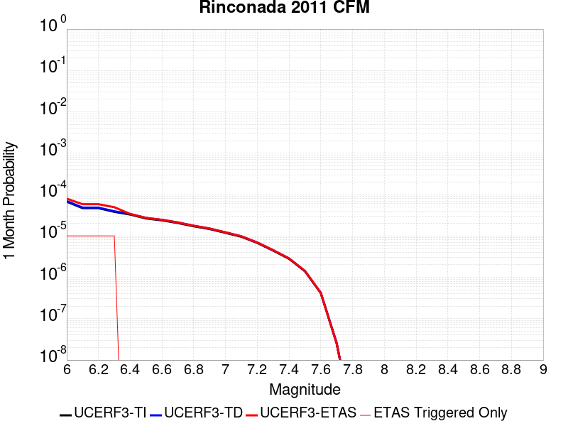 |  |  |

| Magnitude | 1 wk TI Prob | 1 wk TD Prob | 1 wk ETAS Prob | 1 wk ETAS/TD Gain | 1 wk ETAS Triggered Only | 1 mo TI Prob | 1 mo TD Prob | 1 mo ETAS Prob | 1 mo ETAS/TD Gain | 1 mo ETAS Triggered Only | 1 yr TI Prob | 1 yr TD Prob | 1 yr ETAS Prob | 1 yr ETAS/TD Gain | 1 yr ETAS Triggered Only | 10 yr TI Prob | 10 yr TD Prob | 10 yr ETAS Prob | 10 yr ETAS/TD Gain | 10 yr ETAS Triggered Only |
|-----|-----|-----|-----|-----|-----|-----|-----|-----|-----|-----|-----|-----|-----|-----|-----|-----|-----|-----|-----|-----|
| 6.0 | 1.5752368E-5 | 1.6274716E-5 | 2.842489E-5 | 1.7465676 | 1.2150373E-5 | 6.75084E-5 | 6.974694E-5 | 8.189646E-5 | 1.1741945 | 1.2150373E-5 | 8.2160486E-4 | 8.488412E-4 | 8.609813E-4 | 1.0143019 | 1.2150373E-5 | 0.008185739 | 0.00845637 | 0.008468417 | 1.0014247 | 1.2150373E-5 |
| 6.1 | 1.0966133E-5 | 1.1323029E-5 | 2.3473265E-5 | 2.0730553 | 1.2150373E-5 | 4.6996865E-5 | 4.852637E-5 | 6.0676153E-5 | 1.2503749 | 1.2150373E-5 | 5.720366E-4 | 5.906491E-4 | 6.027923E-4 | 1.0205591 | 1.2150373E-5 | 0.0057056635 | 0.0058908886 | 0.0059029674 | 1.0020504 | 1.2150373E-5 |
| 6.2 | 1.0966133E-5 | 1.1323029E-5 | 2.3473265E-5 | 2.0730553 | 1.2150373E-5 | 4.6996865E-5 | 4.852637E-5 | 6.0676153E-5 | 1.2503749 | 1.2150373E-5 | 5.720366E-4 | 5.906491E-4 | 6.027923E-4 | 1.0205591 | 1.2150373E-5 | 0.0057056635 | 0.0058908886 | 0.0059029674 | 1.0020504 | 1.2150373E-5 |
| 6.3 | 8.926149E-6 | 9.212771E-6 | 2.1363032E-5 | 2.3188498 | 1.2150373E-5 | 3.8254362E-5 | 3.948271E-5 | 5.1632604E-5 | 1.307727 | 1.2150373E-5 | 4.6564735E-4 | 4.805963E-4 | 4.9274083E-4 | 1.0252697 | 1.2150373E-5 | 0.0046467283 | 0.0047956146 | 0.0048077065 | 1.0025215 | 1.2150373E-5 |
| 6.4 | 7.676955E-6 | 7.920191E-6 | 7.920191E-6 | 1.0 | 0.0 | 3.290082E-5 | 3.3943234E-5 | 3.3943234E-5 | 1.0 | 0.0 | 4.0049385E-4 | 4.1318068E-4 | 4.1318068E-4 | 1.0 | 0.0 | 0.0039977287 | 0.004124151 | 0.004124151 | 1.0 | 0.0 |
| 6.5 | 6.1671026E-6 | 6.3589546E-6 | 6.3589546E-6 | 1.0 | 0.0 | 2.6430173E-5 | 2.725238E-5 | 2.725238E-5 | 1.0 | 0.0 | 3.2173982E-4 | 3.317473E-4 | 3.317473E-4 | 1.0 | 0.0 | 0.003212744 | 0.0033125326 | 0.0033125326 | 1.0 | 0.0 |
| 6.6 | 5.553456E-6 | 5.7248126E-6 | 5.7248126E-6 | 1.0 | 0.0 | 2.3800309E-5 | 2.453468E-5 | 2.453468E-5 | 1.0 | 0.0 | 2.897302E-4 | 2.9866883E-4 | 2.9866883E-4 | 1.0 | 0.0 | 0.0028935277 | 0.002982683 | 0.002982683 | 1.0 | 0.0 |
| 6.7 | 4.787857E-6 | 4.9333094E-6 | 4.9333094E-6 | 1.0 | 0.0 | 2.0519226E-5 | 2.1142583E-5 | 2.1142583E-5 | 1.0 | 0.0 | 2.4979294E-4 | 2.573806E-4 | 2.573806E-4 | 1.0 | 0.0 | 0.0024951235 | 0.0025708308 | 0.0025708308 | 1.0 | 0.0 |
| 6.8 | 3.9955166E-6 | 4.1134763E-6 | 4.1134763E-6 | 1.0 | 0.0 | 1.7123532E-5 | 1.7629065E-5 | 1.7629065E-5 | 1.0 | 0.0 | 2.0845905E-4 | 2.1461274E-4 | 2.1461274E-4 | 1.0 | 0.0 | 0.002082636 | 0.0021440585 | 0.0021440585 | 1.0 | 0.0 |
| 6.9 | 3.4250072E-6 | 3.5224464E-6 | 3.5224464E-6 | 1.0 | 0.0 | 1.46785205E-5 | 1.5096111E-5 | 1.5096111E-5 | 1.0 | 0.0 | 1.7869633E-4 | 1.8377967E-4 | 1.8377967E-4 | 1.0 | 0.0 | 0.001785527 | 0.0018362794 | 0.0018362794 | 1.0 | 0.0 |
| 7.0 | 2.7712713E-6 | 2.8467E-6 | 2.8467E-6 | 1.0 | 0.0 | 1.1876823E-5 | 1.2200086E-5 | 1.2200086E-5 | 1.0 | 0.0 | 1.4459073E-4 | 1.4852593E-4 | 1.4852593E-4 | 1.0 | 0.0 | 0.0014449668 | 0.0014842682 | 0.0014842682 | 1.0 | 0.0 |
| 7.1 | 2.227358E-6 | 2.2856984E-6 | 2.2856984E-6 | 1.0 | 0.0 | 9.545785E-6 | 9.795814E-6 | 9.795814E-6 | 1.0 | 0.0 | 1.16213734E-4 | 1.19257515E-4 | 1.19257515E-4 | 1.0 | 0.0 | 0.0011615298 | 0.0011919362 | 0.0011919362 | 1.0 | 0.0 |
| 7.2 | 1.581796E-6 | 1.6209011E-6 | 1.6209011E-6 | 1.0 | 0.0 | 6.779108E-6 | 6.9467005E-6 | 6.9467005E-6 | 1.0 | 0.0 | 8.253252E-5 | 8.457281E-5 | 8.457281E-5 | 1.0 | 0.0 | 8.250187E-4 | 8.454067E-4 | 8.454067E-4 | 1.0 | 0.0 |
| 7.3 | 1.0306567E-6 | 1.0546477E-6 | 1.0546477E-6 | 1.0 | 0.0 | 4.4170924E-6 | 4.519911E-6 | 4.519911E-6 | 1.0 | 0.0 | 5.3776774E-5 | 5.5028526E-5 | 5.5028526E-5 | 1.0 | 0.0 | 5.376376E-4 | 5.5014924E-4 | 5.5014924E-4 | 1.0 | 0.0 |
| 7.4 | 6.535541E-7 | 6.682742E-7 | 6.682742E-7 | 1.0 | 0.0 | 2.800943E-6 | 2.864029E-6 | 2.864029E-6 | 1.0 | 0.0 | 3.4100947E-5 | 3.4868997E-5 | 3.4868997E-5 | 1.0 | 0.0 | 3.4095717E-4 | 3.4863537E-4 | 3.4863537E-4 | 1.0 | 0.0 |
| 7.5 | 3.2656962E-7 | 3.3316687E-7 | 3.3316687E-7 | 1.0 | 0.0 | 1.3995833E-6 | 1.4278572E-6 | 1.4278572E-6 | 1.0 | 0.0 | 1.7039794E-5 | 1.7384024E-5 | 1.7384024E-5 | 1.0 | 0.0 | 1.7038487E-4 | 1.7382667E-4 | 1.7382667E-4 | 1.0 | 0.0 |
| 7.6 | 9.754343E-8 | 9.82099E-8 | 9.82099E-8 | 1.0 | 0.0 | 4.180432E-7 | 4.208995E-7 | 4.208995E-7 | 1.0 | 0.0 | 5.089664E-6 | 5.1244397E-6 | 5.1244397E-6 | 1.0 | 0.0 | 5.0895473E-5 | 5.1243223E-5 | 5.1243223E-5 | 1.0 | 0.0 |
| 7.7 | 6.0001453E-9 | 5.8490435E-9 | 5.8490435E-9 | 1.0 | 0.0 | 2.5714908E-8 | 2.506733E-8 | 2.506733E-8 | 1.0 | 0.0 | 3.1307894E-7 | 3.051947E-7 | 3.051947E-7 | 1.0 | 0.0 | 3.1307852E-6 | 3.051943E-6 | 3.051943E-6 | 1.0 | 0.0 |
| 7.8 | 7.400003E-11 | 7.4654505E-11 | 7.4654505E-11 | 1.0 | 0.0 | 3.171432E-10 | 3.1994773E-10 | 3.1994773E-10 | 1.0 | 0.0 | 3.861218E-9 | 3.895363E-9 | 3.895363E-9 | 1.0 | 0.0 | 3.861218E-8 | 3.895363E-8 | 3.895363E-8 | 1.0 | 0.0 |

## Los Alamos extension
*[(top)](#table-of-contents)*

| 1 Week | 1 Month | 1 Year | 10 Year |
|-----|-----|-----|-----|
|  |  |  |  |

| Magnitude | 1 wk TI Prob | 1 wk TD Prob | 1 wk ETAS Prob | 1 wk ETAS/TD Gain | 1 wk ETAS Triggered Only | 1 mo TI Prob | 1 mo TD Prob | 1 mo ETAS Prob | 1 mo ETAS/TD Gain | 1 mo ETAS Triggered Only | 1 yr TI Prob | 1 yr TD Prob | 1 yr ETAS Prob | 1 yr ETAS/TD Gain | 1 yr ETAS Triggered Only | 10 yr TI Prob | 10 yr TD Prob | 10 yr ETAS Prob | 10 yr ETAS/TD Gain | 10 yr ETAS Triggered Only |
|-----|-----|-----|-----|-----|-----|-----|-----|-----|-----|-----|-----|-----|-----|-----|-----|-----|-----|-----|-----|-----|
| 6.0 | 4.0146506E-6 | 4.0861596E-6 | 1.6236483E-5 | 3.9735312 | 1.2150373E-5 | 1.7205533E-5 | 1.7512002E-5 | 2.9662162E-5 | 1.693819 | 1.2150373E-5 | 2.0945723E-4 | 2.1318886E-4 | 2.2533664E-4 | 1.0569813 | 1.2150373E-5 | 0.0020925992 | 0.0021299527 | 0.002142077 | 1.0056924 | 1.2150373E-5 |
| 6.1 | 4.0146506E-6 | 4.0861596E-6 | 1.6236483E-5 | 3.9735312 | 1.2150373E-5 | 1.7205533E-5 | 1.7512002E-5 | 2.9662162E-5 | 1.693819 | 1.2150373E-5 | 2.0945723E-4 | 2.1318886E-4 | 2.2533664E-4 | 1.0569813 | 1.2150373E-5 | 0.0020925992 | 0.0021299527 | 0.002142077 | 1.0056924 | 1.2150373E-5 |
| 6.2 | 4.0146506E-6 | 4.0861596E-6 | 1.6236483E-5 | 3.9735312 | 1.2150373E-5 | 1.7205533E-5 | 1.7512002E-5 | 2.9662162E-5 | 1.693819 | 1.2150373E-5 | 2.0945723E-4 | 2.1318886E-4 | 2.2533664E-4 | 1.0569813 | 1.2150373E-5 | 0.0020925992 | 0.0021299527 | 0.002142077 | 1.0056924 | 1.2150373E-5 |
| 6.3 | 4.0146506E-6 | 4.0861596E-6 | 1.6236483E-5 | 3.9735312 | 1.2150373E-5 | 1.7205533E-5 | 1.7512002E-5 | 2.9662162E-5 | 1.693819 | 1.2150373E-5 | 2.0945723E-4 | 2.1318886E-4 | 2.2533664E-4 | 1.0569813 | 1.2150373E-5 | 0.0020925992 | 0.0021299527 | 0.002142077 | 1.0056924 | 1.2150373E-5 |
| 6.4 | 4.0146506E-6 | 4.0861596E-6 | 1.6236483E-5 | 3.9735312 | 1.2150373E-5 | 1.7205533E-5 | 1.7512002E-5 | 2.9662162E-5 | 1.693819 | 1.2150373E-5 | 2.0945723E-4 | 2.1318886E-4 | 2.2533664E-4 | 1.0569813 | 1.2150373E-5 | 0.0020925992 | 0.0021299527 | 0.002142077 | 1.0056924 | 1.2150373E-5 |
| 6.5 | 4.0146506E-6 | 4.0861596E-6 | 1.6236483E-5 | 3.9735312 | 1.2150373E-5 | 1.7205533E-5 | 1.7512002E-5 | 2.9662162E-5 | 1.693819 | 1.2150373E-5 | 2.0945723E-4 | 2.1318886E-4 | 2.2533664E-4 | 1.0569813 | 1.2150373E-5 | 0.0020925992 | 0.0021299527 | 0.002142077 | 1.0056924 | 1.2150373E-5 |
| 6.6 | 4.0146506E-6 | 4.0861596E-6 | 1.6236483E-5 | 3.9735312 | 1.2150373E-5 | 1.7205533E-5 | 1.7512002E-5 | 2.9662162E-5 | 1.693819 | 1.2150373E-5 | 2.0945723E-4 | 2.1318886E-4 | 2.2533664E-4 | 1.0569813 | 1.2150373E-5 | 0.0020925992 | 0.0021299527 | 0.002142077 | 1.0056924 | 1.2150373E-5 |
| 6.7 | 4.0146506E-6 | 4.0861596E-6 | 1.6236483E-5 | 3.9735312 | 1.2150373E-5 | 1.7205533E-5 | 1.7512002E-5 | 2.9662162E-5 | 1.693819 | 1.2150373E-5 | 2.0945723E-4 | 2.1318886E-4 | 2.2533664E-4 | 1.0569813 | 1.2150373E-5 | 0.0020925992 | 0.0021299527 | 0.002142077 | 1.0056924 | 1.2150373E-5 |
| 6.8 | 3.6584688E-6 | 3.7188588E-6 | 1.5869187E-5 | 4.2672195 | 1.2150373E-5 | 1.5679057E-5 | 1.5937874E-5 | 2.8088054E-5 | 1.7623463 | 1.2150373E-5 | 1.9087581E-4 | 1.9402728E-4 | 2.0617529E-4 | 1.0626098 | 1.2150373E-5 | 0.0019071194 | 0.0019386712 | 0.001950798 | 1.0062553 | 1.2150373E-5 |
| 6.9 | 3.644631E-6 | 3.7045688E-6 | 1.5854897E-5 | 4.2798223 | 1.2150373E-5 | 1.5619753E-5 | 1.5876632E-5 | 2.8026812E-5 | 1.765287 | 1.2150373E-5 | 1.901539E-4 | 1.9328178E-4 | 2.0542981E-4 | 1.0628513 | 1.2150373E-5 | 0.0018999127 | 0.0019312293 | 0.0019433561 | 1.0062793 | 1.2150373E-5 |
| 7.0 | 3.6318522E-6 | 3.6913295E-6 | 1.5841657E-5 | 4.291586 | 1.2150373E-5 | 1.5564989E-5 | 1.5819893E-5 | 2.7970073E-5 | 1.7680318 | 1.2150373E-5 | 1.8948725E-4 | 1.925911E-4 | 2.0473913E-4 | 1.0630769 | 1.2150373E-5 | 0.0018932576 | 0.0019243343 | 0.0019364613 | 1.0063019 | 1.2150373E-5 |
| 7.1 | 3.5001724E-6 | 3.5554E-6 | 1.570573E-5 | 4.41743 | 1.2150373E-5 | 1.5000653E-5 | 1.5237345E-5 | 2.7387532E-5 | 1.7973953 | 1.2150373E-5 | 1.8261763E-4 | 1.854998E-4 | 1.9764793E-4 | 1.0654886 | 1.2150373E-5 | 0.0018246764 | 0.0018535402 | 0.0018656681 | 1.006543 | 1.2150373E-5 |
| 7.2 | 2.5204702E-6 | 2.5436943E-6 | 2.5436943E-6 | 1.0 | 0.0 | 1.080197E-5 | 1.0901502E-5 | 1.0901502E-5 | 1.0 | 0.0 | 1.3150605E-4 | 1.3271775E-4 | 1.3271775E-4 | 1.0 | 0.0 | 0.0013142825 | 0.0013263905 | 0.0013263905 | 1.0 | 0.0 |
| 7.3 | 2.1399692E-6 | 2.1501316E-6 | 2.1501316E-6 | 1.0 | 0.0 | 9.1712645E-6 | 9.2148175E-6 | 9.2148175E-6 | 1.0 | 0.0 | 1.1165442E-4 | 1.1218466E-4 | 1.1218466E-4 | 1.0 | 0.0 | 0.0011159834 | 0.0011212835 | 0.0011212835 | 1.0 | 0.0 |
| 7.4 | 1.9660122E-6 | 1.9702363E-6 | 1.9702363E-6 | 1.0 | 0.0 | 8.42574E-6 | 8.4438425E-6 | 8.4438425E-6 | 1.0 | 0.0 | 1.0257855E-4 | 1.0279897E-4 | 1.0279897E-4 | 1.0 | 0.0 | 0.0010253121 | 0.0010275173 | 0.0010275173 | 1.0 | 0.0 |
| 7.5 | 1.7204633E-6 | 1.7150983E-6 | 1.7150983E-6 | 1.0 | 0.0 | 7.373393E-6 | 7.3504007E-6 | 7.3504007E-6 | 1.0 | 0.0 | 8.976737E-5 | 8.948748E-5 | 8.948748E-5 | 1.0 | 0.0 | 8.9731114E-4 | 8.9451746E-4 | 8.9451746E-4 | 1.0 | 0.0 |
| 7.6 | 1.3717638E-6 | 1.3535827E-6 | 1.3535827E-6 | 1.0 | 0.0 | 5.878974E-6 | 5.8010555E-6 | 5.8010555E-6 | 1.0 | 0.0 | 7.157416E-5 | 7.062559E-5 | 7.062559E-5 | 1.0 | 0.0 | 7.1551115E-4 | 7.060341E-4 | 7.060341E-4 | 1.0 | 0.0 |
| 7.7 | 8.272564E-7 | 7.957636E-7 | 7.957636E-7 | 1.0 | 0.0 | 3.5453797E-6 | 3.410411E-6 | 3.410411E-6 | 1.0 | 0.0 | 4.3164142E-5 | 4.1520965E-5 | 4.1520965E-5 | 1.0 | 0.0 | 4.315576E-4 | 4.1513226E-4 | 4.1513226E-4 | 1.0 | 0.0 |
| 7.8 | 3.9708277E-7 | 3.6719027E-7 | 3.6719027E-7 | 1.0 | 0.0 | 1.7017821E-6 | 1.5736716E-6 | 1.5736716E-6 | 1.0 | 0.0 | 2.0719E-5 | 1.9159284E-5 | 1.9159284E-5 | 1.0 | 0.0 | 2.071707E-4 | 1.9157639E-4 | 1.9157639E-4 | 1.0 | 0.0 |
| 7.9 | 9.292528E-8 | 7.889087E-8 | 7.889087E-8 | 1.0 | 0.0 | 3.9825116E-7 | 3.381037E-7 | 3.381037E-7 | 1.0 | 0.0 | 4.848697E-6 | 4.116405E-6 | 4.116405E-6 | 1.0 | 0.0 | 4.8485912E-5 | 4.1163294E-5 | 4.1163294E-5 | 1.0 | 0.0 |
| 8.0 | 7.880441E-11 | 8.2353124E-11 | 8.2353124E-11 | 1.0 | 0.0 | 3.3773329E-10 | 3.52942E-10 | 3.52942E-10 | 1.0 | 0.0 | 4.1119033E-9 | 4.2970694E-9 | 4.2970694E-9 | 1.0 | 0.0 | 4.1119034E-8 | 4.2970694E-8 | 4.2970694E-8 | 1.0 | 0.0 |

## Antelope Valley 2011
*[(top)](#table-of-contents)*

| 1 Week | 1 Month | 1 Year | 10 Year |
|-----|-----|-----|-----|
|  |  |  |  |

| Magnitude | 1 wk TI Prob | 1 wk TD Prob | 1 wk ETAS Prob | 1 wk ETAS/TD Gain | 1 wk ETAS Triggered Only | 1 mo TI Prob | 1 mo TD Prob | 1 mo ETAS Prob | 1 mo ETAS/TD Gain | 1 mo ETAS Triggered Only | 1 yr TI Prob | 1 yr TD Prob | 1 yr ETAS Prob | 1 yr ETAS/TD Gain | 1 yr ETAS Triggered Only | 10 yr TI Prob | 10 yr TD Prob | 10 yr ETAS Prob | 10 yr ETAS/TD Gain | 10 yr ETAS Triggered Only |
|-----|-----|-----|-----|-----|-----|-----|-----|-----|-----|-----|-----|-----|-----|-----|-----|-----|-----|-----|-----|-----|
| 6.0 | 3.1646934E-5 | 3.6904403E-5 | 3.6904403E-5 | 1.0 | 0.0 | 1.3562266E-4 | 1.5815363E-4 | 1.5815363E-4 | 1.0 | 0.0 | 0.0016499552 | 0.0019240845 | 0.0019362115 | 1.0063027 | 1.2150373E-5 | 0.016377583 | 0.019100651 | 0.019112568 | 1.000624 | 1.2150373E-5 |
| 6.1 | 3.1646934E-5 | 3.6904403E-5 | 3.6904403E-5 | 1.0 | 0.0 | 1.3562266E-4 | 1.5815363E-4 | 1.5815363E-4 | 1.0 | 0.0 | 0.0016499552 | 0.0019240845 | 0.0019362115 | 1.0063027 | 1.2150373E-5 | 0.016377583 | 0.019100651 | 0.019112568 | 1.000624 | 1.2150373E-5 |
| 6.2 | 3.1646934E-5 | 3.6904403E-5 | 3.6904403E-5 | 1.0 | 0.0 | 1.3562266E-4 | 1.5815363E-4 | 1.5815363E-4 | 1.0 | 0.0 | 0.0016499552 | 0.0019240845 | 0.0019362115 | 1.0063027 | 1.2150373E-5 | 0.016377583 | 0.019100651 | 0.019112568 | 1.000624 | 1.2150373E-5 |
| 6.3 | 3.1646934E-5 | 3.6904403E-5 | 3.6904403E-5 | 1.0 | 0.0 | 1.3562266E-4 | 1.5815363E-4 | 1.5815363E-4 | 1.0 | 0.0 | 0.0016499552 | 0.0019240845 | 0.0019362115 | 1.0063027 | 1.2150373E-5 | 0.016377583 | 0.019100651 | 0.019112568 | 1.000624 | 1.2150373E-5 |
| 6.4 | 3.1646934E-5 | 3.6904403E-5 | 3.6904403E-5 | 1.0 | 0.0 | 1.3562266E-4 | 1.5815363E-4 | 1.5815363E-4 | 1.0 | 0.0 | 0.0016499552 | 0.0019240845 | 0.0019362115 | 1.0063027 | 1.2150373E-5 | 0.016377583 | 0.019100651 | 0.019112568 | 1.000624 | 1.2150373E-5 |
| 6.5 | 1.8034107E-5 | 2.0940959E-5 | 2.0940959E-5 | 1.0 | 0.0 | 7.7286735E-5 | 8.974457E-5 | 8.974457E-5 | 1.0 | 0.0 | 9.405598E-4 | 0.0010922146 | 0.0010922146 | 1.0 | 0.0 | 0.009365888 | 0.010880542 | 0.010880542 | 1.0 | 0.0 |
| 6.6 | 1.8034107E-5 | 2.0940959E-5 | 2.0940959E-5 | 1.0 | 0.0 | 7.7286735E-5 | 8.974457E-5 | 8.974457E-5 | 1.0 | 0.0 | 9.405598E-4 | 0.0010922146 | 0.0010922146 | 1.0 | 0.0 | 0.009365888 | 0.010880542 | 0.010880542 | 1.0 | 0.0 |
| 6.7 | 1.3567667E-5 | 1.5749509E-5 | 1.5749509E-5 | 1.0 | 0.0 | 5.814585E-5 | 6.749675E-5 | 6.749675E-5 | 1.0 | 0.0 | 7.076958E-4 | 8.2156935E-4 | 8.2156935E-4 | 1.0 | 0.0 | 0.007054463 | 0.008195754 | 0.008195754 | 1.0 | 0.0 |
| 6.8 | 9.867387E-6 | 1.1467935E-5 | 1.1467935E-5 | 1.0 | 0.0 | 4.2288117E-5 | 4.91479E-5 | 4.91479E-5 | 1.0 | 0.0 | 5.1473617E-4 | 5.9830636E-4 | 5.9830636E-4 | 1.0 | 0.0 | 0.005135455 | 0.005976268 | 0.005976268 | 1.0 | 0.0 |
| 6.9 | 7.273233E-6 | 8.454864E-6 | 8.454864E-6 | 1.0 | 0.0 | 3.1170628E-5 | 3.623513E-5 | 3.623513E-5 | 1.0 | 0.0 | 3.794363E-4 | 4.411627E-4 | 4.411627E-4 | 1.0 | 0.0 | 0.0037878908 | 0.004411627 | 0.004411627 | 1.0 | 0.0 |

## Pine Mtn
*[(top)](#table-of-contents)*

| 1 Week | 1 Month | 1 Year | 10 Year |
|-----|-----|-----|-----|
|  |  |  |  |

| Magnitude | 1 wk TI Prob | 1 wk TD Prob | 1 wk ETAS Prob | 1 wk ETAS/TD Gain | 1 wk ETAS Triggered Only | 1 mo TI Prob | 1 mo TD Prob | 1 mo ETAS Prob | 1 mo ETAS/TD Gain | 1 mo ETAS Triggered Only | 1 yr TI Prob | 1 yr TD Prob | 1 yr ETAS Prob | 1 yr ETAS/TD Gain | 1 yr ETAS Triggered Only | 10 yr TI Prob | 10 yr TD Prob | 10 yr ETAS Prob | 10 yr ETAS/TD Gain | 10 yr ETAS Triggered Only |
|-----|-----|-----|-----|-----|-----|-----|-----|-----|-----|-----|-----|-----|-----|-----|-----|-----|-----|-----|-----|-----|
| 6.0 | 6.894797E-6 | 7.225461E-6 | 1.9375746E-5 | 2.681593 | 1.2150373E-5 | 2.9548795E-5 | 3.096591E-5 | 4.311591E-5 | 1.3923669 | 1.2150373E-5 | 3.596972E-4 | 3.7694772E-4 | 3.8909353E-4 | 1.0322214 | 1.2150373E-5 | 0.0035911554 | 0.003763381 | 0.0037754856 | 1.0032164 | 1.2150373E-5 |
| 6.1 | 6.894797E-6 | 7.225461E-6 | 1.9375746E-5 | 2.681593 | 1.2150373E-5 | 2.9548795E-5 | 3.096591E-5 | 4.311591E-5 | 1.3923669 | 1.2150373E-5 | 3.596972E-4 | 3.7694772E-4 | 3.8909353E-4 | 1.0322214 | 1.2150373E-5 | 0.0035911554 | 0.003763381 | 0.0037754856 | 1.0032164 | 1.2150373E-5 |
| 6.2 | 6.894797E-6 | 7.225461E-6 | 1.9375746E-5 | 2.681593 | 1.2150373E-5 | 2.9548795E-5 | 3.096591E-5 | 4.311591E-5 | 1.3923669 | 1.2150373E-5 | 3.596972E-4 | 3.7694772E-4 | 3.8909353E-4 | 1.0322214 | 1.2150373E-5 | 0.0035911554 | 0.003763381 | 0.0037754856 | 1.0032164 | 1.2150373E-5 |
| 6.3 | 6.894797E-6 | 7.225461E-6 | 1.9375746E-5 | 2.681593 | 1.2150373E-5 | 2.9548795E-5 | 3.096591E-5 | 4.311591E-5 | 1.3923669 | 1.2150373E-5 | 3.596972E-4 | 3.7694772E-4 | 3.8909353E-4 | 1.0322214 | 1.2150373E-5 | 0.0035911554 | 0.003763381 | 0.0037754856 | 1.0032164 | 1.2150373E-5 |
| 6.4 | 6.894797E-6 | 7.225461E-6 | 1.9375746E-5 | 2.681593 | 1.2150373E-5 | 2.9548795E-5 | 3.096591E-5 | 4.311591E-5 | 1.3923669 | 1.2150373E-5 | 3.596972E-4 | 3.7694772E-4 | 3.8909353E-4 | 1.0322214 | 1.2150373E-5 | 0.0035911554 | 0.003763381 | 0.0037754856 | 1.0032164 | 1.2150373E-5 |
| 6.5 | 6.894797E-6 | 7.225461E-6 | 1.9375746E-5 | 2.681593 | 1.2150373E-5 | 2.9548795E-5 | 3.096591E-5 | 4.311591E-5 | 1.3923669 | 1.2150373E-5 | 3.596972E-4 | 3.7694772E-4 | 3.8909353E-4 | 1.0322214 | 1.2150373E-5 | 0.0035911554 | 0.003763381 | 0.0037754856 | 1.0032164 | 1.2150373E-5 |
| 6.6 | 6.894797E-6 | 7.225461E-6 | 1.9375746E-5 | 2.681593 | 1.2150373E-5 | 2.9548795E-5 | 3.096591E-5 | 4.311591E-5 | 1.3923669 | 1.2150373E-5 | 3.596972E-4 | 3.7694772E-4 | 3.8909353E-4 | 1.0322214 | 1.2150373E-5 | 0.0035911554 | 0.003763381 | 0.0037754856 | 1.0032164 | 1.2150373E-5 |
| 6.7 | 6.0867933E-6 | 6.3971133E-6 | 1.854741E-5 | 2.8993404 | 1.2150373E-5 | 2.6085996E-5 | 2.7415923E-5 | 3.9565963E-5 | 1.4431746 | 1.2150373E-5 | 3.1755073E-4 | 3.3373994E-4 | 3.4588625E-4 | 1.0363946 | 1.2150373E-5 | 0.0031709734 | 0.0033326065 | 0.0033447163 | 1.0036337 | 1.2150373E-5 |
| 6.8 | 5.6530425E-6 | 5.9505956E-6 | 1.8100896E-5 | 3.041863 | 1.2150373E-5 | 2.42271E-5 | 2.5502315E-5 | 3.765238E-5 | 1.4764298 | 1.2150373E-5 | 2.94925E-4 | 3.104485E-4 | 3.225951E-4 | 1.0391259 | 1.2150373E-5 | 0.002945339 | 0.0031003528 | 0.0031124656 | 1.0039068 | 1.2150373E-5 |
| 6.9 | 4.6015225E-6 | 4.863834E-6 | 1.7014148E-5 | 3.4980938 | 1.2150373E-5 | 1.9720663E-5 | 2.0844845E-5 | 3.2994965E-5 | 1.5828837 | 1.2150373E-5 | 2.4007261E-4 | 2.5375787E-4 | 2.6590517E-4 | 1.0478696 | 1.2150373E-5 | 0.0023981342 | 0.0025348254 | 0.002546945 | 1.0047812 | 1.2150373E-5 |
| 7.0 | 4.4875965E-6 | 4.747473E-6 | 1.6897788E-5 | 3.5593226 | 1.2150373E-5 | 1.9232413E-5 | 2.0346162E-5 | 3.249629E-5 | 1.5971704 | 1.2150373E-5 | 2.3412947E-4 | 2.4768783E-4 | 2.598352E-4 | 1.049043 | 1.2150373E-5 | 0.0023388295 | 0.0024742614 | 0.0024863817 | 1.0048985 | 1.2150373E-5 |
| 7.1 | 3.203907E-6 | 3.4294096E-6 | 1.557974E-5 | 4.5429807 | 1.2150373E-5 | 1.3730958E-5 | 1.4697391E-5 | 2.6847585E-5 | 1.8266906 | 1.2150373E-5 | 1.6716159E-4 | 1.789267E-4 | 1.910749E-4 | 1.0678948 | 1.2150373E-5 | 0.0016703589 | 0.0017878925 | 0.0018000212 | 1.0067837 | 1.2150373E-5 |
| 7.2 | 2.2060601E-6 | 2.3784817E-6 | 1.4528826E-5 | 6.1084456 | 1.2150373E-5 | 9.4545085E-6 | 1.0193455E-5 | 2.2343704E-5 | 2.1919658 | 1.2150373E-5 | 1.15102564E-4 | 1.240987E-4 | 1.3624757E-4 | 1.0978968 | 1.2150373E-5 | 0.0011504296 | 0.0012403389 | 0.0012524741 | 1.0097839 | 1.2150373E-5 |
| 7.3 | 1.3765207E-6 | 1.5216481E-6 | 1.3672003E-5 | 8.984997 | 1.2150373E-5 | 5.899361E-6 | 6.521333E-6 | 1.8671626E-5 | 2.863161 | 1.2150373E-5 | 7.182235E-5 | 7.939443E-5 | 9.1543836E-5 | 1.153026 | 1.2150373E-5 | 7.1799144E-4 | 7.936697E-4 | 8.058105E-4 | 1.0152969 | 1.2150373E-5 |
| 7.4 | 1.1245983E-6 | 1.2587075E-6 | 1.2587075E-6 | 1.0 | 0.0 | 4.819698E-6 | 5.39445E-6 | 5.39445E-6 | 1.0 | 0.0 | 5.8678244E-5 | 6.567554E-5 | 6.567554E-5 | 1.0 | 0.0 | 5.866275E-4 | 6.5656955E-4 | 6.5656955E-4 | 1.0 | 0.0 |
| 7.5 | 8.031682E-7 | 9.276951E-7 | 9.276951E-7 | 1.0 | 0.0 | 3.4421448E-6 | 3.9758306E-6 | 3.9758306E-6 | 1.0 | 0.0 | 4.1907308E-5 | 4.840473E-5 | 4.840473E-5 | 1.0 | 0.0 | 4.1899405E-4 | 4.8394862E-4 | 4.8394862E-4 | 1.0 | 0.0 |
| 7.6 | 4.8953444E-7 | 6.003009E-7 | 6.003009E-7 | 1.0 | 0.0 | 2.098003E-6 | 2.5727159E-6 | 2.5727159E-6 | 1.0 | 0.0 | 2.5542888E-5 | 3.1322415E-5 | 3.1322415E-5 | 1.0 | 0.0 | 2.5539953E-4 | 3.1318486E-4 | 3.1318486E-4 | 1.0 | 0.0 |
| 7.7 | 6.634529E-8 | 6.788826E-8 | 6.788826E-8 | 1.0 | 0.0 | 2.843369E-7 | 2.9094966E-7 | 2.9094966E-7 | 1.0 | 0.0 | 3.4617963E-6 | 3.5423066E-6 | 3.5423066E-6 | 1.0 | 0.0 | 3.4617424E-5 | 3.542255E-5 | 3.542255E-5 | 1.0 | 0.0 |
| 7.8 | 9.235578E-9 | 9.488566E-9 | 9.488566E-9 | 1.0 | 0.0 | 3.9581046E-8 | 4.0665284E-8 | 4.0665284E-8 | 1.0 | 0.0 | 4.818991E-7 | 4.950997E-7 | 4.950997E-7 | 1.0 | 0.0 | 4.8189804E-6 | 4.950988E-6 | 4.950988E-6 | 1.0 | 0.0 |

## San Gabriel (Extension)
*[(top)](#table-of-contents)*

| 1 Week | 1 Month | 1 Year | 10 Year |
|-----|-----|-----|-----|
|  |  |  |  |

| Magnitude | 1 wk TI Prob | 1 wk TD Prob | 1 wk ETAS Prob | 1 wk ETAS/TD Gain | 1 wk ETAS Triggered Only | 1 mo TI Prob | 1 mo TD Prob | 1 mo ETAS Prob | 1 mo ETAS/TD Gain | 1 mo ETAS Triggered Only | 1 yr TI Prob | 1 yr TD Prob | 1 yr ETAS Prob | 1 yr ETAS/TD Gain | 1 yr ETAS Triggered Only | 10 yr TI Prob | 10 yr TD Prob | 10 yr ETAS Prob | 10 yr ETAS/TD Gain | 10 yr ETAS Triggered Only |
|-----|-----|-----|-----|-----|-----|-----|-----|-----|-----|-----|-----|-----|-----|-----|-----|-----|-----|-----|-----|-----|
| 6.0 | 5.6486106E-6 | 5.7168304E-6 | 1.7867134E-5 | 3.1253567 | 1.2150373E-5 | 2.4208108E-5 | 2.450048E-5 | 3.6650556E-5 | 1.4959117 | 1.2150373E-5 | 2.9469383E-4 | 2.9825376E-4 | 3.104005E-4 | 1.0407262 | 1.2150373E-5 | 0.0029430336 | 0.0029786653 | 0.0029907795 | 1.004067 | 1.2150373E-5 |
| 6.1 | 5.6486106E-6 | 5.7168304E-6 | 1.7867134E-5 | 3.1253567 | 1.2150373E-5 | 2.4208108E-5 | 2.450048E-5 | 3.6650556E-5 | 1.4959117 | 1.2150373E-5 | 2.9469383E-4 | 2.9825376E-4 | 3.104005E-4 | 1.0407262 | 1.2150373E-5 | 0.0029430336 | 0.0029786653 | 0.0029907795 | 1.004067 | 1.2150373E-5 |
| 6.2 | 5.6486106E-6 | 5.7168304E-6 | 1.7867134E-5 | 3.1253567 | 1.2150373E-5 | 2.4208108E-5 | 2.450048E-5 | 3.6650556E-5 | 1.4959117 | 1.2150373E-5 | 2.9469383E-4 | 2.9825376E-4 | 3.104005E-4 | 1.0407262 | 1.2150373E-5 | 0.0029430336 | 0.0029786653 | 0.0029907795 | 1.004067 | 1.2150373E-5 |
| 6.3 | 5.6486106E-6 | 5.7168304E-6 | 1.7867134E-5 | 3.1253567 | 1.2150373E-5 | 2.4208108E-5 | 2.450048E-5 | 3.6650556E-5 | 1.4959117 | 1.2150373E-5 | 2.9469383E-4 | 2.9825376E-4 | 3.104005E-4 | 1.0407262 | 1.2150373E-5 | 0.0029430336 | 0.0029786653 | 0.0029907795 | 1.004067 | 1.2150373E-5 |
| 6.4 | 5.6486106E-6 | 5.7168304E-6 | 1.7867134E-5 | 3.1253567 | 1.2150373E-5 | 2.4208108E-5 | 2.450048E-5 | 3.6650556E-5 | 1.4959117 | 1.2150373E-5 | 2.9469383E-4 | 2.9825376E-4 | 3.104005E-4 | 1.0407262 | 1.2150373E-5 | 0.0029430336 | 0.0029786653 | 0.0029907795 | 1.004067 | 1.2150373E-5 |
| 6.5 | 4.7134554E-6 | 4.7542544E-6 | 4.7542544E-6 | 1.0 | 0.0 | 2.0200367E-5 | 2.0375222E-5 | 2.0375222E-5 | 1.0 | 0.0 | 2.459117E-4 | 2.4804095E-4 | 2.4804095E-4 | 1.0 | 0.0 | 0.0024563975 | 0.002477729 | 0.002477729 | 1.0 | 0.0 |
| 6.6 | 4.7134554E-6 | 4.7542544E-6 | 4.7542544E-6 | 1.0 | 0.0 | 2.0200367E-5 | 2.0375222E-5 | 2.0375222E-5 | 1.0 | 0.0 | 2.459117E-4 | 2.4804095E-4 | 2.4804095E-4 | 1.0 | 0.0 | 0.0024563975 | 0.002477729 | 0.002477729 | 1.0 | 0.0 |
| 6.7 | 4.2468837E-6 | 4.2740717E-6 | 4.2740717E-6 | 1.0 | 0.0 | 1.8200803E-5 | 1.8317325E-5 | 1.8317325E-5 | 1.0 | 0.0 | 2.2157225E-4 | 2.2299135E-4 | 2.2299135E-4 | 1.0 | 0.0 | 0.0022135144 | 0.0022277518 | 0.0022277518 | 1.0 | 0.0 |
| 6.8 | 4.1180615E-6 | 4.1414614E-6 | 4.1414614E-6 | 1.0 | 0.0 | 1.7648716E-5 | 1.7749004E-5 | 1.7749004E-5 | 1.0 | 0.0 | 2.1485193E-4 | 2.160734E-4 | 2.160734E-4 | 1.0 | 0.0 | 0.0021464431 | 0.0021587082 | 0.0021587082 | 1.0 | 0.0 |
| 6.9 | 3.863861E-6 | 3.8797766E-6 | 3.8797766E-6 | 1.0 | 0.0 | 1.65593E-5 | 1.6627511E-5 | 1.6627511E-5 | 1.0 | 0.0 | 2.0159081E-4 | 2.0242184E-4 | 2.0242184E-4 | 1.0 | 0.0 | 0.0020140803 | 0.002022446 | 0.002022446 | 1.0 | 0.0 |
| 7.0 | 3.6947372E-6 | 3.705676E-6 | 3.705676E-6 | 1.0 | 0.0 | 1.5834492E-5 | 1.5881375E-5 | 1.5881375E-5 | 1.0 | 0.0 | 1.9276788E-4 | 1.9333926E-4 | 1.9333926E-4 | 1.0 | 0.0 | 0.0019260074 | 0.0019317807 | 0.0019317807 | 1.0 | 0.0 |
| 7.1 | 3.5686835E-6 | 3.5728963E-6 | 3.5728963E-6 | 1.0 | 0.0 | 1.5294268E-5 | 1.5312327E-5 | 1.5312327E-5 | 1.0 | 0.0 | 1.861918E-4 | 1.8641229E-4 | 1.8641229E-4 | 1.0 | 0.0 | 0.0018603588 | 0.0018626289 | 0.0018626289 | 1.0 | 0.0 |
| 7.2 | 2.8023446E-6 | 2.7767885E-6 | 2.7767885E-6 | 1.0 | 0.0 | 1.2009994E-5 | 1.1900468E-5 | 1.1900468E-5 | 1.0 | 0.0 | 1.4621185E-4 | 1.4487868E-4 | 1.4487868E-4 | 1.0 | 0.0 | 0.001461157 | 0.0014478569 | 0.0014478569 | 1.0 | 0.0 |
| 7.3 | 2.5843012E-6 | 2.5459642E-6 | 2.5459642E-6 | 1.0 | 0.0 | 1.1075529E-5 | 1.0911231E-5 | 1.0911231E-5 | 1.0 | 0.0 | 1.3483623E-4 | 1.3283623E-4 | 1.3283623E-4 | 1.0 | 0.0 | 0.0013475444 | 0.0013275818 | 0.0013275818 | 1.0 | 0.0 |
| 7.4 | 2.4464468E-6 | 2.396665E-6 | 2.396665E-6 | 1.0 | 0.0 | 1.04847295E-5 | 1.0271382E-5 | 1.0271382E-5 | 1.0 | 0.0 | 1.276441E-4 | 1.25047E-4 | 1.25047E-4 | 1.0 | 0.0 | 0.0012757082 | 0.0012497796 | 0.0012497796 | 1.0 | 0.0 |
| 7.5 | 2.0420266E-6 | 1.8910426E-6 | 1.8910426E-6 | 1.0 | 0.0 | 8.751514E-6 | 8.104444E-6 | 8.104444E-6 | 1.0 | 0.0 | 1.0654447E-4 | 9.8667166E-5 | 9.8667166E-5 | 1.0 | 0.0 | 0.001064934 | 9.862408E-4 | 9.862408E-4 | 1.0 | 0.0 |
| 7.6 | 1.8326596E-6 | 1.6398341E-6 | 1.6398341E-6 | 1.0 | 0.0 | 7.854232E-6 | 7.0278415E-6 | 7.0278415E-6 | 1.0 | 0.0 | 9.562107E-5 | 8.5560634E-5 | 8.5560634E-5 | 1.0 | 0.0 | 9.5579936E-4 | 8.5528276E-4 | 8.5528276E-4 | 1.0 | 0.0 |
| 7.7 | 1.4786998E-6 | 1.2523838E-6 | 1.2523838E-6 | 1.0 | 0.0 | 6.3372695E-6 | 5.367348E-6 | 5.367348E-6 | 1.0 | 0.0 | 7.715353E-5 | 6.534551E-5 | 6.534551E-5 | 1.0 | 0.0 | 7.7126746E-4 | 6.532707E-4 | 6.532707E-4 | 1.0 | 0.0 |
| 7.8 | 7.6975533E-7 | 6.0693884E-7 | 6.0693884E-7 | 1.0 | 0.0 | 3.2989474E-6 | 2.601164E-6 | 2.601164E-6 | 1.0 | 0.0 | 4.0163945E-5 | 3.166871E-5 | 3.166871E-5 | 1.0 | 0.0 | 4.0156685E-4 | 3.1664805E-4 | 3.1664805E-4 | 1.0 | 0.0 |
| 7.9 | 1.7645915E-7 | 9.213256E-8 | 9.213256E-8 | 1.0 | 0.0 | 7.562533E-7 | 3.9485377E-7 | 3.9485377E-7 | 1.0 | 0.0 | 9.207345E-6 | 4.807334E-6 | 4.807334E-6 | 1.0 | 0.0 | 9.206964E-5 | 4.807699E-5 | 4.807699E-5 | 1.0 | 0.0 |
| 8.0 | 1.0463461E-7 | 2.4949307E-8 | 2.4949307E-8 | 1.0 | 0.0 | 4.4843398E-7 | 1.0692559E-7 | 1.0692559E-7 | 1.0 | 0.0 | 5.45967E-6 | 1.3018183E-6 | 1.3018183E-6 | 1.0 | 0.0 | 5.459536E-5 | 1.3022789E-5 | 1.3022789E-5 | 1.0 | 0.0 |
| 8.1 | 7.875717E-8 | 1.3866874E-8 | 1.3866874E-8 | 1.0 | 0.0 | 3.3753068E-7 | 5.942946E-8 | 5.942946E-8 | 1.0 | 0.0 | 4.109428E-6 | 7.235534E-7 | 7.235534E-7 | 1.0 | 0.0 | 4.109352E-5 | 7.2401926E-6 | 7.2401926E-6 | 1.0 | 0.0 |
| 8.2 | 1.33163E-8 | 1.7733891E-9 | 1.7733891E-9 | 1.0 | 0.0 | 5.7069855E-8 | 7.600239E-9 | 7.600239E-9 | 1.0 | 0.0 | 6.9482525E-7 | 9.25329E-8 | 9.25329E-8 | 1.0 | 0.0 | 6.9482307E-6 | 9.272953E-7 | 9.272953E-7 | 1.0 | 0.0 |

## Surprise Valley 2011 CFM
*[(top)](#table-of-contents)*

| 1 Week | 1 Month | 1 Year | 10 Year |
|-----|-----|-----|-----|
|  |  |  |  |

| Magnitude | 1 wk TI Prob | 1 wk TD Prob | 1 wk ETAS Prob | 1 wk ETAS/TD Gain | 1 wk ETAS Triggered Only | 1 mo TI Prob | 1 mo TD Prob | 1 mo ETAS Prob | 1 mo ETAS/TD Gain | 1 mo ETAS Triggered Only | 1 yr TI Prob | 1 yr TD Prob | 1 yr ETAS Prob | 1 yr ETAS/TD Gain | 1 yr ETAS Triggered Only | 10 yr TI Prob | 10 yr TD Prob | 10 yr ETAS Prob | 10 yr ETAS/TD Gain | 10 yr ETAS Triggered Only |
|-----|-----|-----|-----|-----|-----|-----|-----|-----|-----|-----|-----|-----|-----|-----|-----|-----|-----|-----|-----|-----|
| 6.0 | 4.0396248E-5 | 4.485131E-5 | 5.7001136E-5 | 1.2708913 | 1.2150373E-5 | 1.7311527E-4 | 1.9220692E-4 | 2.0435496E-4 | 1.0632029 | 1.2150373E-5 | 0.002105641 | 0.0023378176 | 0.0023499397 | 1.0051851 | 1.2150373E-5 | 0.020858008 | 0.023153966 | 0.023165835 | 1.0005126 | 1.2150373E-5 |
| 6.1 | 4.0396248E-5 | 4.485131E-5 | 5.7001136E-5 | 1.2708913 | 1.2150373E-5 | 1.7311527E-4 | 1.9220692E-4 | 2.0435496E-4 | 1.0632029 | 1.2150373E-5 | 0.002105641 | 0.0023378176 | 0.0023499397 | 1.0051851 | 1.2150373E-5 | 0.020858008 | 0.023153966 | 0.023165835 | 1.0005126 | 1.2150373E-5 |
| 6.2 | 2.2295266E-5 | 2.440125E-5 | 2.440125E-5 | 1.0 | 0.0 | 9.554764E-5 | 1.0457276E-4 | 1.0457276E-4 | 1.0 | 0.0 | 0.0011626717 | 0.0012724606 | 0.0012724606 | 1.0 | 0.0 | 0.011566074 | 0.012654981 | 0.012654981 | 1.0 | 0.0 |
| 6.3 | 1.572643E-5 | 1.7096807E-5 | 1.7096807E-5 | 1.0 | 0.0 | 6.7397246E-5 | 7.327003E-5 | 7.327003E-5 | 1.0 | 0.0 | 8.202525E-4 | 8.91708E-4 | 8.91708E-4 | 1.0 | 0.0 | 0.008172315 | 0.008882407 | 0.008882407 | 1.0 | 0.0 |
| 6.4 | 1.5714395E-5 | 1.7084629E-5 | 1.7084629E-5 | 1.0 | 0.0 | 6.734567E-5 | 7.3217845E-5 | 7.3217845E-5 | 1.0 | 0.0 | 8.1962504E-4 | 8.9107314E-4 | 8.9107314E-4 | 1.0 | 0.0 | 0.008166086 | 0.008876109 | 0.008876109 | 1.0 | 0.0 |
| 6.5 | 1.2733495E-5 | 1.38016E-5 | 1.38016E-5 | 1.0 | 0.0 | 5.457098E-5 | 5.9148413E-5 | 5.9148413E-5 | 1.0 | 0.0 | 6.641992E-4 | 7.1990065E-4 | 7.1990065E-4 | 1.0 | 0.0 | 0.0066221743 | 0.0071763797 | 0.0071763797 | 1.0 | 0.0 |
| 6.6 | 1.0983784E-5 | 1.1886554E-5 | 1.1886554E-5 | 1.0 | 0.0 | 4.7072506E-5 | 5.094141E-5 | 5.094141E-5 | 1.0 | 0.0 | 5.7295704E-4 | 6.200405E-4 | 6.200405E-4 | 1.0 | 0.0 | 0.0057148207 | 0.0061836545 | 0.0061836545 | 1.0 | 0.0 |
| 6.7 | 9.104806E-6 | 9.839491E-6 | 9.839491E-6 | 1.0 | 0.0 | 3.902001E-5 | 4.2168587E-5 | 4.2168587E-5 | 1.0 | 0.0 | 4.7496508E-4 | 5.132855E-4 | 5.132855E-4 | 1.0 | 0.0 | 0.004739512 | 0.005121397 | 0.005121397 | 1.0 | 0.0 |
| 6.8 | 6.2162403E-6 | 6.7041337E-6 | 6.7041337E-6 | 1.0 | 0.0 | 2.6640759E-5 | 2.8731698E-5 | 2.8731698E-5 | 1.0 | 0.0 | 3.2430296E-4 | 3.497545E-4 | 3.497545E-4 | 1.0 | 0.0 | 0.003238301 | 0.0034922638 | 0.0034922638 | 1.0 | 0.0 |
| 6.9 | 4.1792696E-6 | 4.50323E-6 | 4.50323E-6 | 1.0 | 0.0 | 1.7911032E-5 | 1.9299423E-5 | 1.9299423E-5 | 1.0 | 0.0 | 2.1804498E-4 | 2.3494668E-4 | 2.3494668E-4 | 1.0 | 0.0 | 0.0021783116 | 0.0023471361 | 0.0023471361 | 1.0 | 0.0 |
| 7.0 | 2.7478413E-6 | 2.9622424E-6 | 2.9622424E-6 | 1.0 | 0.0 | 1.177641E-5 | 1.269527E-5 | 1.269527E-5 | 1.0 | 0.0 | 1.4336836E-4 | 1.545552E-4 | 1.545552E-4 | 1.0 | 0.0 | 0.001432759 | 0.0015445995 | 0.0015445995 | 1.0 | 0.0 |
| 7.1 | 8.128648E-7 | 8.724922E-7 | 8.724922E-7 | 1.0 | 0.0 | 3.4837017E-6 | 3.7392501E-6 | 3.7392501E-6 | 1.0 | 0.0 | 4.2413245E-5 | 4.552502E-5 | 4.552502E-5 | 1.0 | 0.0 | 4.2405148E-4 | 4.5521575E-4 | 4.5521575E-4 | 1.0 | 0.0 |
| 7.2 | 4.8641045E-8 | 4.9402068E-8 | 4.9402068E-8 | 1.0 | 0.0 | 2.084616E-7 | 2.1172312E-7 | 2.1172312E-7 | 1.0 | 0.0 | 2.538017E-6 | 2.577726E-6 | 2.577726E-6 | 1.0 | 0.0 | 2.537988E-5 | 2.5776973E-5 | 2.5776973E-5 | 1.0 | 0.0 |
| 7.3 | 5.3911844E-9 | 5.4758145E-9 | 5.4758145E-9 | 1.0 | 0.0 | 2.3105075E-8 | 2.3467775E-8 | 2.3467775E-8 | 1.0 | 0.0 | 2.8130427E-7 | 2.8572015E-7 | 2.8572015E-7 | 1.0 | 0.0 | 2.8130391E-6 | 2.8571992E-6 | 2.8571992E-6 | 1.0 | 0.0 |

## Davis Creek
*[(top)](#table-of-contents)*

| 1 Week | 1 Month | 1 Year | 10 Year |
|-----|-----|-----|-----|
|  |  |  |  |

| Magnitude | 1 wk TI Prob | 1 wk TD Prob | 1 wk ETAS Prob | 1 wk ETAS/TD Gain | 1 wk ETAS Triggered Only | 1 mo TI Prob | 1 mo TD Prob | 1 mo ETAS Prob | 1 mo ETAS/TD Gain | 1 mo ETAS Triggered Only | 1 yr TI Prob | 1 yr TD Prob | 1 yr ETAS Prob | 1 yr ETAS/TD Gain | 1 yr ETAS Triggered Only | 10 yr TI Prob | 10 yr TD Prob | 10 yr ETAS Prob | 10 yr ETAS/TD Gain | 10 yr ETAS Triggered Only |
|-----|-----|-----|-----|-----|-----|-----|-----|-----|-----|-----|-----|-----|-----|-----|-----|-----|-----|-----|-----|-----|
| 6.0 | 2.331472E-5 | 2.5417214E-5 | 2.5417214E-5 | 1.0 | 0.0 | 9.99164E-5 | 1.0892704E-4 | 1.0892704E-4 | 1.0 | 0.0 | 0.0012158032 | 0.0013254983 | 0.0013376327 | 1.0091544 | 1.2150373E-5 | 0.01209173 | 0.013187704 | 0.013199694 | 1.0009092 | 1.2150373E-5 |
| 6.1 | 1.0407654E-5 | 1.1316986E-5 | 1.1316986E-5 | 1.0 | 0.0 | 4.4603472E-5 | 4.8500624E-5 | 4.8500624E-5 | 1.0 | 0.0 | 5.4291193E-4 | 5.9036224E-4 | 5.9036224E-4 | 1.0 | 0.0 | 0.0054158745 | 0.005890611 | 0.005890611 | 1.0 | 0.0 |
| 6.2 | 1.0407654E-5 | 1.1316986E-5 | 1.1316986E-5 | 1.0 | 0.0 | 4.4603472E-5 | 4.8500624E-5 | 4.8500624E-5 | 1.0 | 0.0 | 5.4291193E-4 | 5.9036224E-4 | 5.9036224E-4 | 1.0 | 0.0 | 0.0054158745 | 0.005890611 | 0.005890611 | 1.0 | 0.0 |
| 6.3 | 5.1323277E-6 | 5.568556E-6 | 5.568556E-6 | 1.0 | 0.0 | 2.1995505E-5 | 2.386507E-5 | 2.386507E-5 | 1.0 | 0.0 | 2.6776237E-4 | 2.905271E-4 | 2.905271E-4 | 1.0 | 0.0 | 0.0026743996 | 0.0029023192 | 0.0029023192 | 1.0 | 0.0 |
| 6.4 | 2.4985154E-6 | 2.704538E-6 | 2.704538E-6 | 1.0 | 0.0 | 1.07078795E-5 | 1.1590847E-5 | 1.1590847E-5 | 1.0 | 0.0 | 1.3036063E-4 | 1.4111304E-4 | 1.4111304E-4 | 1.0 | 0.0 | 0.0013028418 | 0.001410589 | 0.001410589 | 1.0 | 0.0 |
| 6.5 | 2.4846438E-6 | 2.6904722E-6 | 2.6904722E-6 | 1.0 | 0.0 | 1.064843E-5 | 1.1530565E-5 | 1.1530565E-5 | 1.0 | 0.0 | 1.2963692E-4 | 1.403792E-4 | 1.403792E-4 | 1.0 | 0.0 | 0.0012956132 | 0.0014032599 | 0.0014032599 | 1.0 | 0.0 |
| 6.6 | 2.072566E-7 | 2.1018087E-7 | 2.1018087E-7 | 1.0 | 0.0 | 8.882423E-7 | 9.0077486E-7 | 9.0077486E-7 | 1.0 | 0.0 | 1.0814296E-5 | 1.0966881E-5 | 1.0966881E-5 | 1.0 | 0.0 | 1.081377E-4 | 1.09663575E-4 | 1.09663575E-4 | 1.0 | 0.0 |
| 6.7 | 1.7544528E-7 | 1.7790826E-7 | 1.7790826E-7 | 1.0 | 0.0 | 7.5190815E-7 | 7.6246374E-7 | 7.6246374E-7 | 1.0 | 0.0 | 9.154443E-6 | 9.282958E-6 | 9.282958E-6 | 1.0 | 0.0 | 9.1540656E-5 | 9.282586E-5 | 9.282586E-5 | 1.0 | 0.0 |
| 6.8 | 1.2320395E-7 | 1.2481138E-7 | 1.2481138E-7 | 1.0 | 0.0 | 5.280168E-7 | 5.349058E-7 | 5.349058E-7 | 1.0 | 0.0 | 6.428586E-6 | 6.5124595E-6 | 6.5124595E-6 | 1.0 | 0.0 | 6.4284E-5 | 6.5122804E-5 | 6.5122804E-5 | 1.0 | 0.0 |
| 6.9 | 6.399997E-8 | 6.486058E-8 | 6.486058E-8 | 1.0 | 0.0 | 2.7428555E-7 | 2.7797387E-7 | 2.7797387E-7 | 1.0 | 0.0 | 3.3394215E-6 | 3.3843273E-6 | 3.3843273E-6 | 1.0 | 0.0 | 3.3393713E-5 | 3.384282E-5 | 3.384282E-5 | 1.0 | 0.0 |
| 7.0 | 6.4455685E-9 | 6.535264E-9 | 6.535264E-9 | 1.0 | 0.0 | 2.7623864E-8 | 2.8008275E-8 | 2.8008275E-8 | 1.0 | 0.0 | 3.3632048E-7 | 3.4100074E-7 | 3.4100074E-7 | 1.0 | 0.0 | 3.3631998E-6 | 3.4100074E-6 | 3.4100074E-6 | 1.0 | 0.0 |

## Anacapa-Dume alt 1
*[(top)](#table-of-contents)*

| 1 Week | 1 Month | 1 Year | 10 Year |
|-----|-----|-----|-----|
|  |  |  |  |

| Magnitude | 1 wk TI Prob | 1 wk TD Prob | 1 wk ETAS Prob | 1 wk ETAS/TD Gain | 1 wk ETAS Triggered Only | 1 mo TI Prob | 1 mo TD Prob | 1 mo ETAS Prob | 1 mo ETAS/TD Gain | 1 mo ETAS Triggered Only | 1 yr TI Prob | 1 yr TD Prob | 1 yr ETAS Prob | 1 yr ETAS/TD Gain | 1 yr ETAS Triggered Only | 10 yr TI Prob | 10 yr TD Prob | 10 yr ETAS Prob | 10 yr ETAS/TD Gain | 10 yr ETAS Triggered Only |
|-----|-----|-----|-----|-----|-----|-----|-----|-----|-----|-----|-----|-----|-----|-----|-----|-----|-----|-----|-----|-----|
| 6.0 | 5.1871802E-6 | 5.3673907E-6 | 1.75177E-5 | 3.263727 | 1.2150373E-5 | 2.2230583E-5 | 2.3002905E-5 | 3.5153E-5 | 1.5281982 | 1.2150373E-5 | 2.7062374E-4 | 2.8002524E-4 | 2.921722E-4 | 1.0433781 | 1.2150373E-5 | 0.002702944 | 0.0027968092 | 0.0028089255 | 1.0043322 | 1.2150373E-5 |
| 6.1 | 5.1871802E-6 | 5.3673907E-6 | 1.75177E-5 | 3.263727 | 1.2150373E-5 | 2.2230583E-5 | 2.3002905E-5 | 3.5153E-5 | 1.5281982 | 1.2150373E-5 | 2.7062374E-4 | 2.8002524E-4 | 2.921722E-4 | 1.0433781 | 1.2150373E-5 | 0.002702944 | 0.0027968092 | 0.0028089255 | 1.0043322 | 1.2150373E-5 |
| 6.2 | 5.1871802E-6 | 5.3673907E-6 | 1.75177E-5 | 3.263727 | 1.2150373E-5 | 2.2230583E-5 | 2.3002905E-5 | 3.5153E-5 | 1.5281982 | 1.2150373E-5 | 2.7062374E-4 | 2.8002524E-4 | 2.921722E-4 | 1.0433781 | 1.2150373E-5 | 0.002702944 | 0.0027968092 | 0.0028089255 | 1.0043322 | 1.2150373E-5 |
| 6.3 | 5.1871802E-6 | 5.3673907E-6 | 1.75177E-5 | 3.263727 | 1.2150373E-5 | 2.2230583E-5 | 2.3002905E-5 | 3.5153E-5 | 1.5281982 | 1.2150373E-5 | 2.7062374E-4 | 2.8002524E-4 | 2.921722E-4 | 1.0433781 | 1.2150373E-5 | 0.002702944 | 0.0027968092 | 0.0028089255 | 1.0043322 | 1.2150373E-5 |
| 6.4 | 5.1871802E-6 | 5.3673907E-6 | 1.75177E-5 | 3.263727 | 1.2150373E-5 | 2.2230583E-5 | 2.3002905E-5 | 3.5153E-5 | 1.5281982 | 1.2150373E-5 | 2.7062374E-4 | 2.8002524E-4 | 2.921722E-4 | 1.0433781 | 1.2150373E-5 | 0.002702944 | 0.0027968092 | 0.0028089255 | 1.0043322 | 1.2150373E-5 |
| 6.5 | 5.1871802E-6 | 5.3673907E-6 | 1.75177E-5 | 3.263727 | 1.2150373E-5 | 2.2230583E-5 | 2.3002905E-5 | 3.5153E-5 | 1.5281982 | 1.2150373E-5 | 2.7062374E-4 | 2.8002524E-4 | 2.921722E-4 | 1.0433781 | 1.2150373E-5 | 0.002702944 | 0.0027968092 | 0.0028089255 | 1.0043322 | 1.2150373E-5 |
| 6.6 | 5.1871802E-6 | 5.3673907E-6 | 1.75177E-5 | 3.263727 | 1.2150373E-5 | 2.2230583E-5 | 2.3002905E-5 | 3.5153E-5 | 1.5281982 | 1.2150373E-5 | 2.7062374E-4 | 2.8002524E-4 | 2.921722E-4 | 1.0433781 | 1.2150373E-5 | 0.002702944 | 0.0027968092 | 0.0028089255 | 1.0043322 | 1.2150373E-5 |
| 6.7 | 4.7693475E-6 | 4.9366918E-6 | 1.7087004E-5 | 3.4612257 | 1.2150373E-5 | 2.04399E-5 | 2.1157082E-5 | 3.33072E-5 | 1.5742812 | 1.2150373E-5 | 2.4882736E-4 | 2.5755778E-4 | 2.6970502E-4 | 1.0471631 | 1.2150373E-5 | 0.0024854892 | 0.002572669 | 0.002584788 | 1.0047107 | 1.2150373E-5 |
| 6.8 | 4.753408E-6 | 4.92024E-6 | 1.7070553E-5 | 3.4694555 | 1.2150373E-5 | 2.037159E-5 | 2.1086576E-5 | 3.3236694E-5 | 1.5762014 | 1.2150373E-5 | 2.4799586E-4 | 2.5669957E-4 | 2.6884684E-4 | 1.0473208 | 1.2150373E-5 | 0.002477193 | 0.0025641066 | 0.002576226 | 1.0047265 | 1.2150373E-5 |
| 6.9 | 3.800069E-6 | 3.937126E-6 | 1.6087452E-5 | 4.08609 | 1.2150373E-5 | 1.6285909E-5 | 1.687329E-5 | 2.9023458E-5 | 1.720083 | 1.2150373E-5 | 1.9826289E-4 | 2.0541316E-4 | 2.1756104E-4 | 1.0591388 | 1.2150373E-5 | 0.001980861 | 0.0020522568 | 0.0020643822 | 1.0059084 | 1.2150373E-5 |
| 7.0 | 3.6671938E-6 | 3.7999182E-6 | 1.5950245E-5 | 4.197523 | 1.2150373E-5 | 1.571645E-5 | 1.6285263E-5 | 2.843544E-5 | 1.7460841 | 1.2150373E-5 | 1.9133097E-4 | 1.9825528E-4 | 2.1040323E-4 | 1.0612744 | 1.2150373E-5 | 0.0019116632 | 0.0019808074 | 0.0019929337 | 1.0061219 | 1.2150373E-5 |
| 7.1 | 3.2394885E-6 | 3.3587933E-6 | 1.5509126E-5 | 4.61747 | 1.2150373E-5 | 1.3883448E-5 | 1.4394749E-5 | 2.6544947E-5 | 1.8440715 | 1.2150373E-5 | 1.6901788E-4 | 1.7524208E-4 | 1.8739032E-4 | 1.0693226 | 1.2150373E-5 | 0.0016888938 | 0.0017510501 | 0.0017631792 | 1.0069268 | 1.2150373E-5 |
| 7.2 | 3.0935948E-6 | 3.2079258E-6 | 1.535826E-5 | 4.787598 | 1.2150373E-5 | 1.3258196E-5 | 1.3748182E-5 | 2.5898387E-5 | 1.8837682 | 1.2150373E-5 | 1.6140658E-4 | 1.6737137E-4 | 1.795197E-4 | 1.0725832 | 1.2150373E-5 | 0.001612894 | 0.0016724641 | 0.0016845942 | 1.0072528 | 1.2150373E-5 |
| 7.3 | 2.5604163E-6 | 2.647073E-6 | 1.4797414E-5 | 5.590104 | 1.2150373E-5 | 1.0973167E-5 | 1.1344549E-5 | 2.3494784E-5 | 2.0710196 | 1.2150373E-5 | 1.3359012E-4 | 1.3811118E-4 | 1.5025988E-4 | 1.0879631 | 1.2150373E-5 | 0.0013350984 | 0.0013802581 | 0.0013923916 | 1.0087909 | 1.2150373E-5 |
| 7.4 | 2.1429005E-6 | 2.2106028E-6 | 2.2106028E-6 | 1.0 | 0.0 | 9.1838265E-6 | 9.473977E-6 | 9.473977E-6 | 1.0 | 0.0 | 1.11807356E-4 | 1.1533959E-4 | 1.1533959E-4 | 1.0 | 0.0 | 0.0011175112 | 0.0011527999 | 0.0011527999 | 1.0 | 0.0 |
| 7.5 | 1.7237151E-6 | 1.7761449E-6 | 1.7761449E-6 | 1.0 | 0.0 | 7.3873293E-6 | 7.6120277E-6 | 7.6120277E-6 | 1.0 | 0.0 | 8.993702E-5 | 9.267252E-5 | 9.267252E-5 | 1.0 | 0.0 | 8.990063E-4 | 9.2634105E-4 | 9.2634105E-4 | 1.0 | 0.0 |
| 7.6 | 9.541696E-7 | 9.823206E-7 | 9.823206E-7 | 1.0 | 0.0 | 4.089292E-6 | 4.2099387E-6 | 4.2099387E-6 | 1.0 | 0.0 | 4.9785995E-5 | 5.1254807E-5 | 5.1254807E-5 | 1.0 | 0.0 | 4.9774844E-4 | 5.1243114E-4 | 5.1243114E-4 | 1.0 | 0.0 |
| 7.7 | 2.7226676E-7 | 2.7172416E-7 | 2.7172416E-7 | 1.0 | 0.0 | 1.166857E-6 | 1.1645316E-6 | 1.1645316E-6 | 1.0 | 0.0 | 1.4206392E-5 | 1.4178081E-5 | 1.4178081E-5 | 1.0 | 0.0 | 1.4205484E-4 | 1.4177183E-4 | 1.4177183E-4 | 1.0 | 0.0 |
| 7.8 | 4.5017995E-8 | 4.2157676E-8 | 4.2157676E-8 | 1.0 | 0.0 | 1.9293425E-7 | 1.8067574E-7 | 1.8067574E-7 | 1.0 | 0.0 | 2.348972E-6 | 2.1997253E-6 | 2.1997253E-6 | 1.0 | 0.0 | 2.348947E-5 | 2.1997055E-5 | 2.1997055E-5 | 1.0 | 0.0 |
| 7.9 | 8.007447E-10 | 6.1608785E-10 | 6.1608785E-10 | 1.0 | 0.0 | 3.4317629E-9 | 2.6403764E-9 | 2.6403764E-9 | 1.0 | 0.0 | 4.1781714E-8 | 3.2146584E-8 | 3.2146584E-8 | 1.0 | 0.0 | 4.1781706E-7 | 3.214658E-7 | 3.214658E-7 | 1.0 | 0.0 |

## Sheephole
*[(top)](#table-of-contents)*

| 1 Week | 1 Month | 1 Year | 10 Year |
|-----|-----|-----|-----|
|  |  |  |  |

| Magnitude | 1 wk TI Prob | 1 wk TD Prob | 1 wk ETAS Prob | 1 wk ETAS/TD Gain | 1 wk ETAS Triggered Only | 1 mo TI Prob | 1 mo TD Prob | 1 mo ETAS Prob | 1 mo ETAS/TD Gain | 1 mo ETAS Triggered Only | 1 yr TI Prob | 1 yr TD Prob | 1 yr ETAS Prob | 1 yr ETAS/TD Gain | 1 yr ETAS Triggered Only | 10 yr TI Prob | 10 yr TD Prob | 10 yr ETAS Prob | 10 yr ETAS/TD Gain | 10 yr ETAS Triggered Only |
|-----|-----|-----|-----|-----|-----|-----|-----|-----|-----|-----|-----|-----|-----|-----|-----|-----|-----|-----|-----|-----|
| 6.0 | 4.5579695E-6 | 4.7412627E-6 | 1.6891578E-5 | 3.562675 | 1.2150373E-5 | 1.9534009E-5 | 2.031957E-5 | 3.2469696E-5 | 1.5979519 | 1.2150373E-5 | 2.3780059E-4 | 2.473682E-4 | 2.595156E-4 | 1.0491064 | 1.2150373E-5 | 0.0023754628 | 0.002471473 | 0.0024835935 | 1.0049042 | 1.2150373E-5 |
| 6.1 | 4.5579695E-6 | 4.7412627E-6 | 1.6891578E-5 | 3.562675 | 1.2150373E-5 | 1.9534009E-5 | 2.031957E-5 | 3.2469696E-5 | 1.5979519 | 1.2150373E-5 | 2.3780059E-4 | 2.473682E-4 | 2.595156E-4 | 1.0491064 | 1.2150373E-5 | 0.0023754628 | 0.002471473 | 0.0024835935 | 1.0049042 | 1.2150373E-5 |
| 6.2 | 2.6677674E-6 | 2.7873941E-6 | 2.7873941E-6 | 1.0 | 0.0 | 1.1433239E-5 | 1.1945926E-5 | 1.1945926E-5 | 1.0 | 0.0 | 1.3919079E-4 | 1.4543302E-4 | 1.4543302E-4 | 1.0 | 0.0 | 0.0013910364 | 0.0014534844 | 0.0014534844 | 1.0 | 0.0 |
| 6.3 | 2.6677674E-6 | 2.7873941E-6 | 2.7873941E-6 | 1.0 | 0.0 | 1.1433239E-5 | 1.1945926E-5 | 1.1945926E-5 | 1.0 | 0.0 | 1.3919079E-4 | 1.4543302E-4 | 1.4543302E-4 | 1.0 | 0.0 | 0.0013910364 | 0.0014534844 | 0.0014534844 | 1.0 | 0.0 |
| 6.4 | 2.2159759E-6 | 2.3228788E-6 | 2.3228788E-6 | 1.0 | 0.0 | 9.497005E-6 | 9.955161E-6 | 9.955161E-6 | 1.0 | 0.0 | 1.156199E-4 | 1.2119815E-4 | 1.2119815E-4 | 1.0 | 0.0 | 0.0011555976 | 0.0012113999 | 0.0012113999 | 1.0 | 0.0 |
| 6.5 | 2.1986082E-6 | 2.304759E-6 | 2.304759E-6 | 1.0 | 0.0 | 9.4225725E-6 | 9.877506E-6 | 9.877506E-6 | 1.0 | 0.0 | 1.1471378E-4 | 1.2025281E-4 | 1.2025281E-4 | 1.0 | 0.0 | 0.0011465458 | 0.0012019566 | 0.0012019566 | 1.0 | 0.0 |
| 6.6 | 1.5232331E-6 | 1.6018919E-6 | 1.6018919E-6 | 1.0 | 0.0 | 6.5281256E-6 | 6.865234E-6 | 6.865234E-6 | 1.0 | 0.0 | 7.947703E-5 | 8.35812E-5 | 8.35812E-5 | 1.0 | 0.0 | 7.9448614E-4 | 8.3551643E-4 | 8.3551643E-4 | 1.0 | 0.0 |
| 6.7 | 1.3137362E-6 | 1.382819E-6 | 1.382819E-6 | 1.0 | 0.0 | 5.6302856E-6 | 5.926355E-6 | 5.926355E-6 | 1.0 | 0.0 | 6.854657E-5 | 7.215112E-5 | 7.215112E-5 | 1.0 | 0.0 | 6.8525434E-4 | 7.212908E-4 | 7.212908E-4 | 1.0 | 0.0 |
| 6.8 | 1.2275751E-6 | 1.2922847E-6 | 1.2922847E-6 | 1.0 | 0.0 | 5.2610258E-6 | 5.5383516E-6 | 5.5383516E-6 | 1.0 | 0.0 | 6.4051106E-5 | 6.7427485E-5 | 6.7427485E-5 | 1.0 | 0.0 | 6.4032647E-4 | 6.740836E-4 | 6.740836E-4 | 1.0 | 0.0 |
| 6.9 | 1.1837088E-6 | 1.246102E-6 | 1.246102E-6 | 1.0 | 0.0 | 5.0730278E-6 | 5.340427E-6 | 5.340427E-6 | 1.0 | 0.0 | 6.176237E-5 | 6.501789E-5 | 6.501789E-5 | 1.0 | 0.0 | 6.17452E-4 | 6.5000186E-4 | 6.5000186E-4 | 1.0 | 0.0 |
| 7.0 | 9.849371E-7 | 1.0366288E-6 | 1.0366288E-6 | 1.0 | 0.0 | 4.2211523E-6 | 4.442688E-6 | 4.442688E-6 | 1.0 | 0.0 | 5.1391315E-5 | 5.4088487E-5 | 5.4088487E-5 | 1.0 | 0.0 | 5.137943E-4 | 5.407633E-4 | 5.407633E-4 | 1.0 | 0.0 |
| 7.1 | 8.1643645E-7 | 8.591669E-7 | 8.591669E-7 | 1.0 | 0.0 | 3.4990085E-6 | 3.682139E-6 | 3.682139E-6 | 1.0 | 0.0 | 4.2599597E-5 | 4.482921E-5 | 4.482921E-5 | 1.0 | 0.0 | 4.259143E-4 | 4.4821028E-4 | 4.4821028E-4 | 1.0 | 0.0 |
| 7.2 | 5.7295756E-7 | 6.029502E-7 | 6.029502E-7 | 1.0 | 0.0 | 2.45553E-6 | 2.58407E-6 | 2.58407E-6 | 1.0 | 0.0 | 2.9895667E-5 | 3.1460666E-5 | 3.1460666E-5 | 1.0 | 0.0 | 2.9891645E-4 | 3.145688E-4 | 3.145688E-4 | 1.0 | 0.0 |

## Little Salmon (Onshore)
*[(top)](#table-of-contents)*

| 1 Week | 1 Month | 1 Year | 10 Year |
|-----|-----|-----|-----|
|  |  |  |  |

| Magnitude | 1 wk TI Prob | 1 wk TD Prob | 1 wk ETAS Prob | 1 wk ETAS/TD Gain | 1 wk ETAS Triggered Only | 1 mo TI Prob | 1 mo TD Prob | 1 mo ETAS Prob | 1 mo ETAS/TD Gain | 1 mo ETAS Triggered Only | 1 yr TI Prob | 1 yr TD Prob | 1 yr ETAS Prob | 1 yr ETAS/TD Gain | 1 yr ETAS Triggered Only | 10 yr TI Prob | 10 yr TD Prob | 10 yr ETAS Prob | 10 yr ETAS/TD Gain | 10 yr ETAS Triggered Only |
|-----|-----|-----|-----|-----|-----|-----|-----|-----|-----|-----|-----|-----|-----|-----|-----|-----|-----|-----|-----|-----|
| 6.0 | 4.1582247E-5 | 5.1824976E-5 | 6.3974716E-5 | 1.234438 | 1.2150373E-5 | 1.7819746E-4 | 2.220928E-4 | 2.3424048E-4 | 1.0546964 | 1.2150373E-5 | 0.0021673953 | 0.0027014539 | 0.0027135715 | 1.0044856 | 1.2150373E-5 | 0.021463778 | 0.026869582 | 0.026881404 | 1.00044 | 1.2150373E-5 |
| 6.1 | 4.1582247E-5 | 5.1824976E-5 | 6.3974716E-5 | 1.234438 | 1.2150373E-5 | 1.7819746E-4 | 2.220928E-4 | 2.3424048E-4 | 1.0546964 | 1.2150373E-5 | 0.0021673953 | 0.0027014539 | 0.0027135715 | 1.0044856 | 1.2150373E-5 | 0.021463778 | 0.026869582 | 0.026881404 | 1.00044 | 1.2150373E-5 |
| 6.2 | 4.1582247E-5 | 5.1824976E-5 | 6.3974716E-5 | 1.234438 | 1.2150373E-5 | 1.7819746E-4 | 2.220928E-4 | 2.3424048E-4 | 1.0546964 | 1.2150373E-5 | 0.0021673953 | 0.0027014539 | 0.0027135715 | 1.0044856 | 1.2150373E-5 | 0.021463778 | 0.026869582 | 0.026881404 | 1.00044 | 1.2150373E-5 |
| 6.3 | 4.1582247E-5 | 5.1824976E-5 | 6.3974716E-5 | 1.234438 | 1.2150373E-5 | 1.7819746E-4 | 2.220928E-4 | 2.3424048E-4 | 1.0546964 | 1.2150373E-5 | 0.0021673953 | 0.0027014539 | 0.0027135715 | 1.0044856 | 1.2150373E-5 | 0.021463778 | 0.026869582 | 0.026881404 | 1.00044 | 1.2150373E-5 |
| 6.4 | 4.1582247E-5 | 5.1824976E-5 | 6.3974716E-5 | 1.234438 | 1.2150373E-5 | 1.7819746E-4 | 2.220928E-4 | 2.3424048E-4 | 1.0546964 | 1.2150373E-5 | 0.0021673953 | 0.0027014539 | 0.0027135715 | 1.0044856 | 1.2150373E-5 | 0.021463778 | 0.026869582 | 0.026881404 | 1.00044 | 1.2150373E-5 |
| 6.5 | 4.1582247E-5 | 5.1824976E-5 | 6.3974716E-5 | 1.234438 | 1.2150373E-5 | 1.7819746E-4 | 2.220928E-4 | 2.3424048E-4 | 1.0546964 | 1.2150373E-5 | 0.0021673953 | 0.0027014539 | 0.0027135715 | 1.0044856 | 1.2150373E-5 | 0.021463778 | 0.026869582 | 0.026881404 | 1.00044 | 1.2150373E-5 |
| 6.6 | 4.1582247E-5 | 5.1824976E-5 | 6.3974716E-5 | 1.234438 | 1.2150373E-5 | 1.7819746E-4 | 2.220928E-4 | 2.3424048E-4 | 1.0546964 | 1.2150373E-5 | 0.0021673953 | 0.0027014539 | 0.0027135715 | 1.0044856 | 1.2150373E-5 | 0.021463778 | 0.026869582 | 0.026881404 | 1.00044 | 1.2150373E-5 |
| 6.7 | 4.1582247E-5 | 5.1824976E-5 | 6.3974716E-5 | 1.234438 | 1.2150373E-5 | 1.7819746E-4 | 2.220928E-4 | 2.3424048E-4 | 1.0546964 | 1.2150373E-5 | 0.0021673953 | 0.0027014539 | 0.0027135715 | 1.0044856 | 1.2150373E-5 | 0.021463778 | 0.026869582 | 0.026881404 | 1.00044 | 1.2150373E-5 |
| 6.8 | 3.4607925E-5 | 4.0949457E-5 | 4.0949457E-5 | 1.0 | 0.0 | 1.4831126E-4 | 1.7549012E-4 | 1.7549012E-4 | 1.0 | 0.0 | 0.001804194 | 0.0021352505 | 0.0021352505 | 1.0 | 0.0 | 0.01789616 | 0.021304231 | 0.021304231 | 1.0 | 0.0 |
| 6.9 | 3.4607925E-5 | 4.0949457E-5 | 4.0949457E-5 | 1.0 | 0.0 | 1.4831126E-4 | 1.7549012E-4 | 1.7549012E-4 | 1.0 | 0.0 | 0.001804194 | 0.0021352505 | 0.0021352505 | 1.0 | 0.0 | 0.01789616 | 0.021304231 | 0.021304231 | 1.0 | 0.0 |
| 7.0 | 1.8411014E-5 | 1.7285138E-5 | 1.7285138E-5 | 1.0 | 0.0 | 7.8901954E-5 | 7.407736E-5 | 7.407736E-5 | 1.0 | 0.0 | 9.6020795E-4 | 9.015722E-4 | 9.015722E-4 | 1.0 | 0.0 | 0.009560696 | 0.00900614 | 0.00900614 | 1.0 | 0.0 |
| 7.1 | 1.6183103E-5 | 1.4205674E-5 | 1.4205674E-5 | 1.0 | 0.0 | 6.935431E-5 | 6.0880306E-5 | 6.0880306E-5 | 1.0 | 0.0 | 8.440616E-4 | 7.4101315E-4 | 7.4101315E-4 | 1.0 | 0.0 | 0.008408628 | 0.0074118357 | 0.0074118357 | 1.0 | 0.0 |
| 7.2 | 1.4868988E-5 | 1.2585626E-5 | 1.2585626E-5 | 1.0 | 0.0 | 6.372268E-5 | 5.3937536E-5 | 5.3937536E-5 | 1.0 | 0.0 | 7.755474E-4 | 6.565367E-4 | 6.565367E-4 | 1.0 | 0.0 | 0.0077284635 | 0.006571851 | 0.006571851 | 1.0 | 0.0 |
| 7.3 | 9.3599865E-6 | 7.694645E-6 | 7.694645E-6 | 1.0 | 0.0 | 4.011361E-5 | 3.2976837E-5 | 3.2976837E-5 | 1.0 | 0.0 | 4.8827377E-4 | 4.014547E-4 | 4.014547E-4 | 1.0 | 0.0 | 0.004872023 | 0.0040239627 | 0.0040239627 | 1.0 | 0.0 |
| 7.4 | 5.941556E-6 | 4.9509595E-6 | 4.9509595E-6 | 1.0 | 0.0 | 2.5463563E-5 | 2.1218399E-5 | 2.1218399E-5 | 1.0 | 0.0 | 3.0997477E-4 | 2.5833398E-4 | 2.5833398E-4 | 1.0 | 0.0 | 0.0030954275 | 0.002591868 | 0.002591868 | 1.0 | 0.0 |

## Anaheim
*[(top)](#table-of-contents)*

| 1 Week | 1 Month | 1 Year | 10 Year |
|-----|-----|-----|-----|
|  |  |  |  |

| Magnitude | 1 wk TI Prob | 1 wk TD Prob | 1 wk ETAS Prob | 1 wk ETAS/TD Gain | 1 wk ETAS Triggered Only | 1 mo TI Prob | 1 mo TD Prob | 1 mo ETAS Prob | 1 mo ETAS/TD Gain | 1 mo ETAS Triggered Only | 1 yr TI Prob | 1 yr TD Prob | 1 yr ETAS Prob | 1 yr ETAS/TD Gain | 1 yr ETAS Triggered Only | 10 yr TI Prob | 10 yr TD Prob | 10 yr ETAS Prob | 10 yr ETAS/TD Gain | 10 yr ETAS Triggered Only |
|-----|-----|-----|-----|-----|-----|-----|-----|-----|-----|-----|-----|-----|-----|-----|-----|-----|-----|-----|-----|-----|
| 6.0 | 2.9254998E-6 | 2.5122863E-6 | 1.4662629E-5 | 5.8363686 | 1.2150373E-5 | 1.25377965E-5 | 1.0766909E-5 | 2.2917151E-5 | 2.12848 | 1.2150373E-5 | 1.5263697E-4 | 1.3108159E-4 | 1.4323037E-4 | 1.092681 | 1.2150373E-5 | 0.0015253217 | 0.0013102728 | 0.0013224073 | 1.009261 | 1.2150373E-5 |
| 6.1 | 1.6729715E-6 | 1.2337348E-6 | 1.2337348E-6 | 1.0 | 0.0 | 7.1698582E-6 | 5.287426E-6 | 5.287426E-6 | 1.0 | 0.0 | 8.7289525E-5 | 6.437293E-5 | 6.437293E-5 | 1.0 | 0.0 | 8.7255245E-4 | 6.435838E-4 | 6.435838E-4 | 1.0 | 0.0 |
| 6.2 | 1.6729715E-6 | 1.2337348E-6 | 1.2337348E-6 | 1.0 | 0.0 | 7.1698582E-6 | 5.287426E-6 | 5.287426E-6 | 1.0 | 0.0 | 8.7289525E-5 | 6.437293E-5 | 6.437293E-5 | 1.0 | 0.0 | 8.7255245E-4 | 6.435838E-4 | 6.435838E-4 | 1.0 | 0.0 |
| 6.3 | 1.1444064E-6 | 6.9596666E-7 | 6.9596666E-7 | 1.0 | 0.0 | 4.9045893E-6 | 2.9827113E-6 | 2.9827113E-6 | 1.0 | 0.0 | 5.971174E-5 | 3.631396E-5 | 3.631396E-5 | 1.0 | 0.0 | 5.96957E-4 | 3.6308577E-4 | 3.6308577E-4 | 1.0 | 0.0 |
| 6.4 | 1.1444064E-6 | 6.9596666E-7 | 6.9596666E-7 | 1.0 | 0.0 | 4.9045893E-6 | 2.9827113E-6 | 2.9827113E-6 | 1.0 | 0.0 | 5.971174E-5 | 3.631396E-5 | 3.631396E-5 | 1.0 | 0.0 | 5.96957E-4 | 3.6308577E-4 | 3.6308577E-4 | 1.0 | 0.0 |
| 6.5 | 1.1385318E-6 | 6.9003505E-7 | 6.9003505E-7 | 1.0 | 0.0 | 4.879413E-6 | 2.95729E-6 | 2.95729E-6 | 1.0 | 0.0 | 5.9405233E-5 | 3.6004465E-5 | 3.6004465E-5 | 1.0 | 0.0 | 5.938936E-4 | 3.5999183E-4 | 3.5999183E-4 | 1.0 | 0.0 |
| 6.6 | 1.1165511E-6 | 6.678222E-7 | 6.678222E-7 | 1.0 | 0.0 | 4.78521E-6 | 2.862092E-6 | 2.862092E-6 | 1.0 | 0.0 | 5.8258374E-5 | 3.484547E-5 | 3.484547E-5 | 1.0 | 0.0 | 5.8243104E-4 | 3.484055E-4 | 3.484055E-4 | 1.0 | 0.0 |
| 6.7 | 1.1098243E-6 | 6.610416E-7 | 6.610416E-7 | 1.0 | 0.0 | 4.7563813E-6 | 2.8330326E-6 | 2.8330326E-6 | 1.0 | 0.0 | 5.7907404E-5 | 3.449168E-5 | 3.449168E-5 | 1.0 | 0.0 | 5.7892315E-4 | 3.4486872E-4 | 3.4486872E-4 | 1.0 | 0.0 |
| 6.8 | 1.1077587E-6 | 6.589619E-7 | 6.589619E-7 | 1.0 | 0.0 | 4.7475287E-6 | 2.8241195E-6 | 2.8241195E-6 | 1.0 | 0.0 | 5.779963E-5 | 3.438317E-5 | 3.438317E-5 | 1.0 | 0.0 | 5.77846E-4 | 3.4378393E-4 | 3.4378393E-4 | 1.0 | 0.0 |
| 6.9 | 1.1024468E-6 | 6.5361957E-7 | 6.5361957E-7 | 1.0 | 0.0 | 4.7247636E-6 | 2.8012241E-6 | 2.8012241E-6 | 1.0 | 0.0 | 5.752248E-5 | 3.4104425E-5 | 3.4104425E-5 | 1.0 | 0.0 | 5.750759E-4 | 3.4099736E-4 | 3.4099736E-4 | 1.0 | 0.0 |
| 7.0 | 1.0993066E-6 | 6.510303E-7 | 6.510303E-7 | 1.0 | 0.0 | 4.7113053E-6 | 2.7901272E-6 | 2.7901272E-6 | 1.0 | 0.0 | 5.7358633E-5 | 3.3969325E-5 | 3.3969325E-5 | 1.0 | 0.0 | 5.734383E-4 | 3.3964674E-4 | 3.3964674E-4 | 1.0 | 0.0 |
| 7.1 | 8.334877E-7 | 4.4049145E-7 | 4.4049145E-7 | 1.0 | 0.0 | 3.5720855E-6 | 1.8878193E-6 | 1.8878193E-6 | 1.0 | 0.0 | 4.348927E-5 | 2.298398E-5 | 2.298398E-5 | 1.0 | 0.0 | 4.3480762E-4 | 2.2981827E-4 | 2.2981827E-4 | 1.0 | 0.0 |
| 7.2 | 7.794411E-7 | 3.997645E-7 | 3.997645E-7 | 1.0 | 0.0 | 3.3404576E-6 | 1.7132754E-6 | 1.7132754E-6 | 1.0 | 0.0 | 4.0669314E-5 | 2.0858948E-5 | 2.0858948E-5 | 1.0 | 0.0 | 4.066187E-4 | 2.0857195E-4 | 2.0857195E-4 | 1.0 | 0.0 |
| 7.3 | 5.01704E-7 | 2.5573388E-7 | 2.5573388E-7 | 1.0 | 0.0 | 2.150158E-6 | 1.0960019E-6 | 1.0960019E-6 | 1.0 | 0.0 | 2.617786E-5 | 1.3343754E-5 | 1.3343754E-5 | 1.0 | 0.0 | 2.6174777E-4 | 1.3343077E-4 | 1.3343077E-4 | 1.0 | 0.0 |
| 7.4 | 2.4008182E-7 | 1.2367859E-7 | 1.2367859E-7 | 1.0 | 0.0 | 1.0289217E-6 | 5.30051E-7 | 5.30051E-7 | 1.0 | 0.0 | 1.252705E-5 | 6.4533597E-6 | 6.4533597E-6 | 1.0 | 0.0 | 1.2526344E-4 | 6.453248E-5 | 6.453248E-5 | 1.0 | 0.0 |
| 7.5 | 2.0263876E-8 | 1.6120866E-8 | 1.6120866E-8 | 1.0 | 0.0 | 8.684518E-8 | 6.908943E-8 | 6.908943E-8 | 1.0 | 0.0 | 1.0573395E-6 | 8.4116357E-7 | 8.4116357E-7 | 1.0 | 0.0 | 1.0573345E-5 | 8.411613E-6 | 8.411613E-6 | 1.0 | 0.0 |
| 7.6 | 1.4871431E-9 | 1.508418E-9 | 1.508418E-9 | 1.0 | 0.0 | 6.37347E-9 | 6.4646484E-9 | 6.4646484E-9 | 1.0 | 0.0 | 7.7596994E-8 | 7.870709E-8 | 7.870709E-8 | 1.0 | 0.0 | 7.759697E-7 | 7.8707063E-7 | 7.8707063E-7 | 1.0 | 0.0 |
| 7.7 | 1.5093293E-10 | 1.5333512E-10 | 1.5333512E-10 | 1.0 | 0.0 | 6.4685546E-10 | 6.571509E-10 | 6.571509E-10 | 1.0 | 0.0 | 7.875465E-9 | 8.0008125E-9 | 8.0008125E-9 | 1.0 | 0.0 | 7.8754645E-8 | 8.000812E-8 | 8.000812E-8 | 1.0 | 0.0 |

## Fitzhugh Creek
*[(top)](#table-of-contents)*

| 1 Week | 1 Month | 1 Year | 10 Year |
|-----|-----|-----|-----|
|  |  |  |  |

| Magnitude | 1 wk TI Prob | 1 wk TD Prob | 1 wk ETAS Prob | 1 wk ETAS/TD Gain | 1 wk ETAS Triggered Only | 1 mo TI Prob | 1 mo TD Prob | 1 mo ETAS Prob | 1 mo ETAS/TD Gain | 1 mo ETAS Triggered Only | 1 yr TI Prob | 1 yr TD Prob | 1 yr ETAS Prob | 1 yr ETAS/TD Gain | 1 yr ETAS Triggered Only | 10 yr TI Prob | 10 yr TD Prob | 10 yr ETAS Prob | 10 yr ETAS/TD Gain | 10 yr ETAS Triggered Only |
|-----|-----|-----|-----|-----|-----|-----|-----|-----|-----|-----|-----|-----|-----|-----|-----|-----|-----|-----|-----|-----|
| 6.0 | 6.1090436E-6 | 6.2101562E-6 | 1.8360453E-5 | 2.9565206 | 1.2150373E-5 | 2.6181353E-5 | 2.6614709E-5 | 3.876476E-5 | 1.4565164 | 1.2150373E-5 | 3.1871133E-4 | 3.239904E-4 | 3.3613684E-4 | 1.0374901 | 1.2150373E-5 | 0.0031825465 | 0.0032356246 | 0.0032477356 | 1.003743 | 1.2150373E-5 |
| 6.1 | 2.9741811E-6 | 3.021581E-6 | 1.5171917E-5 | 5.021185 | 1.2150373E-5 | 1.2746428E-5 | 1.2949574E-5 | 2.509979E-5 | 1.9382715 | 1.2150373E-5 | 1.5517672E-4 | 1.576506E-4 | 1.6979905E-4 | 1.0770594 | 1.2150373E-5 | 0.001550684 | 0.0015754806 | 0.0015876119 | 1.0077 | 1.2150373E-5 |
| 6.2 | 2.9741811E-6 | 3.021581E-6 | 1.5171917E-5 | 5.021185 | 1.2150373E-5 | 1.2746428E-5 | 1.2949574E-5 | 2.509979E-5 | 1.9382715 | 1.2150373E-5 | 1.5517672E-4 | 1.576506E-4 | 1.6979905E-4 | 1.0770594 | 1.2150373E-5 | 0.001550684 | 0.0015754806 | 0.0015876119 | 1.0077 | 1.2150373E-5 |
| 6.3 | 1.4781198E-6 | 1.5012708E-6 | 1.36516255E-5 | 9.093379 | 1.2150373E-5 | 6.3347834E-6 | 6.4340034E-6 | 1.8584298E-5 | 2.8884501 | 1.2150373E-5 | 7.712326E-5 | 7.833137E-5 | 9.04808E-5 | 1.1551028 | 1.2150373E-5 | 7.70965E-4 | 7.830576E-4 | 7.9519843E-4 | 1.0155045 | 1.2150373E-5 |
| 6.4 | 1.4781198E-6 | 1.5012708E-6 | 1.36516255E-5 | 9.093379 | 1.2150373E-5 | 6.3347834E-6 | 6.4340034E-6 | 1.8584298E-5 | 2.8884501 | 1.2150373E-5 | 7.712326E-5 | 7.833137E-5 | 9.04808E-5 | 1.1551028 | 1.2150373E-5 | 7.70965E-4 | 7.830576E-4 | 7.9519843E-4 | 1.0155045 | 1.2150373E-5 |
| 6.5 | 9.5176676E-7 | 9.66606E-7 | 1.3116967E-5 | 13.570128 | 1.2150373E-5 | 4.078994E-6 | 4.142591E-6 | 1.6292914E-5 | 3.933025 | 1.2150373E-5 | 4.9660623E-5 | 5.0434985E-5 | 6.2584746E-5 | 1.2408994 | 1.2150373E-5 | 4.964952E-4 | 5.042458E-4 | 5.1639E-4 | 1.024084 | 1.2150373E-5 |
| 6.6 | 6.21145E-7 | 6.3085855E-7 | 1.2781224E-5 | 20.260046 | 1.2150373E-5 | 2.662047E-6 | 2.7036772E-6 | 1.48540175E-5 | 5.4940057 | 1.2150373E-5 | 3.2409942E-5 | 3.291684E-5 | 4.5066812E-5 | 1.3691112 | 1.2150373E-5 | 3.2405215E-4 | 3.2912623E-4 | 3.412726E-4 | 1.0369049 | 1.2150373E-5 |
| 6.7 | 2.2377962E-7 | 2.2734636E-7 | 2.2734636E-7 | 1.0 | 0.0 | 9.590551E-7 | 9.743413E-7 | 9.743413E-7 | 1.0 | 0.0 | 1.1676434E-5 | 1.1862574E-5 | 1.1862574E-5 | 1.0 | 0.0 | 1.1675821E-4 | 1.1862254E-4 | 1.1862254E-4 | 1.0 | 0.0 |
| 6.8 | 1.4785022E-7 | 1.5021492E-7 | 1.5021492E-7 | 1.0 | 0.0 | 6.3364365E-7 | 6.4377826E-7 | 6.4377826E-7 | 1.0 | 0.0 | 7.714584E-6 | 7.838E-6 | 7.838E-6 | 1.0 | 0.0 | 7.714316E-5 | 7.838E-5 | 7.838E-5 | 1.0 | 0.0 |

## Puente Hills
*[(top)](#table-of-contents)*

| 1 Week | 1 Month | 1 Year | 10 Year |
|-----|-----|-----|-----|
|  |  |  |  |

| Magnitude | 1 wk TI Prob | 1 wk TD Prob | 1 wk ETAS Prob | 1 wk ETAS/TD Gain | 1 wk ETAS Triggered Only | 1 mo TI Prob | 1 mo TD Prob | 1 mo ETAS Prob | 1 mo ETAS/TD Gain | 1 mo ETAS Triggered Only | 1 yr TI Prob | 1 yr TD Prob | 1 yr ETAS Prob | 1 yr ETAS/TD Gain | 1 yr ETAS Triggered Only | 10 yr TI Prob | 10 yr TD Prob | 10 yr ETAS Prob | 10 yr ETAS/TD Gain | 10 yr ETAS Triggered Only |
|-----|-----|-----|-----|-----|-----|-----|-----|-----|-----|-----|-----|-----|-----|-----|-----|-----|-----|-----|-----|-----|
| 6.0 | 1.2101656E-5 | 8.098625E-6 | 8.098625E-6 | 1.0 | 0.0 | 5.1863204E-5 | 3.4707962E-5 | 3.4707962E-5 | 1.0 | 0.0 | 6.312516E-4 | 4.2249315E-4 | 4.3463838E-4 | 1.0287466 | 1.2150373E-5 | 0.0062946146 | 0.0042174594 | 0.0042295586 | 1.0028688 | 1.2150373E-5 |
| 6.1 | 1.2101656E-5 | 8.098625E-6 | 8.098625E-6 | 1.0 | 0.0 | 5.1863204E-5 | 3.4707962E-5 | 3.4707962E-5 | 1.0 | 0.0 | 6.312516E-4 | 4.2249315E-4 | 4.3463838E-4 | 1.0287466 | 1.2150373E-5 | 0.0062946146 | 0.0042174594 | 0.0042295586 | 1.0028688 | 1.2150373E-5 |
| 6.2 | 1.2101656E-5 | 8.098625E-6 | 8.098625E-6 | 1.0 | 0.0 | 5.1863204E-5 | 3.4707962E-5 | 3.4707962E-5 | 1.0 | 0.0 | 6.312516E-4 | 4.2249315E-4 | 4.3463838E-4 | 1.0287466 | 1.2150373E-5 | 0.0062946146 | 0.0042174594 | 0.0042295586 | 1.0028688 | 1.2150373E-5 |
| 6.3 | 1.2101656E-5 | 8.098625E-6 | 8.098625E-6 | 1.0 | 0.0 | 5.1863204E-5 | 3.4707962E-5 | 3.4707962E-5 | 1.0 | 0.0 | 6.312516E-4 | 4.2249315E-4 | 4.3463838E-4 | 1.0287466 | 1.2150373E-5 | 0.0062946146 | 0.0042174594 | 0.0042295586 | 1.0028688 | 1.2150373E-5 |
| 6.4 | 1.2101656E-5 | 8.098625E-6 | 8.098625E-6 | 1.0 | 0.0 | 5.1863204E-5 | 3.4707962E-5 | 3.4707962E-5 | 1.0 | 0.0 | 6.312516E-4 | 4.2249315E-4 | 4.3463838E-4 | 1.0287466 | 1.2150373E-5 | 0.0062946146 | 0.0042174594 | 0.0042295586 | 1.0028688 | 1.2150373E-5 |
| 6.5 | 1.2101656E-5 | 8.098625E-6 | 8.098625E-6 | 1.0 | 0.0 | 5.1863204E-5 | 3.4707962E-5 | 3.4707962E-5 | 1.0 | 0.0 | 6.312516E-4 | 4.2249315E-4 | 4.3463838E-4 | 1.0287466 | 1.2150373E-5 | 0.0062946146 | 0.0042174594 | 0.0042295586 | 1.0028688 | 1.2150373E-5 |
| 6.6 | 1.0222488E-5 | 6.3991847E-6 | 6.3991847E-6 | 1.0 | 0.0 | 4.3809923E-5 | 2.7424803E-5 | 2.7424803E-5 | 1.0 | 0.0 | 5.332553E-4 | 3.3384826E-4 | 3.3384826E-4 | 1.0 | 0.0 | 0.0053197746 | 0.0033337125 | 0.0033337125 | 1.0 | 0.0 |
| 6.7 | 1.0222488E-5 | 6.3991847E-6 | 6.3991847E-6 | 1.0 | 0.0 | 4.3809923E-5 | 2.7424803E-5 | 2.7424803E-5 | 1.0 | 0.0 | 5.332553E-4 | 3.3384826E-4 | 3.3384826E-4 | 1.0 | 0.0 | 0.0053197746 | 0.0033337125 | 0.0033337125 | 1.0 | 0.0 |
| 6.8 | 8.6367845E-6 | 5.0282533E-6 | 5.0282533E-6 | 1.0 | 0.0 | 3.7014266E-5 | 2.1549482E-5 | 2.1549482E-5 | 1.0 | 0.0 | 4.505555E-4 | 2.623339E-4 | 2.623339E-4 | 1.0 | 0.0 | 0.004496431 | 0.0026202986 | 0.0026202986 | 1.0 | 0.0 |
| 6.9 | 8.066481E-6 | 4.836117E-6 | 4.836117E-6 | 1.0 | 0.0 | 3.4570177E-5 | 2.0726053E-5 | 2.0726053E-5 | 1.0 | 0.0 | 4.2081063E-4 | 2.52311E-4 | 2.52311E-4 | 1.0 | 0.0 | 0.0042001465 | 0.0025202993 | 0.0025202993 | 1.0 | 0.0 |
| 7.0 | 7.393828E-6 | 4.417296E-6 | 4.417296E-6 | 1.0 | 0.0 | 3.168745E-5 | 1.8931134E-5 | 1.8931134E-5 | 1.0 | 0.0 | 3.857264E-4 | 2.3046264E-4 | 2.3046264E-4 | 1.0 | 0.0 | 0.0038505755 | 0.0023022818 | 0.0023022818 | 1.0 | 0.0 |
| 7.1 | 6.4660953E-6 | 3.8044495E-6 | 3.8044495E-6 | 1.0 | 0.0 | 2.7711543E-5 | 1.6304684E-5 | 1.6304684E-5 | 1.0 | 0.0 | 3.373358E-4 | 1.984918E-4 | 1.984918E-4 | 1.0 | 0.0 | 0.0033682417 | 0.001983181 | 0.001983181 | 1.0 | 0.0 |
| 7.2 | 5.143232E-6 | 2.7865456E-6 | 2.7865456E-6 | 1.0 | 0.0 | 2.2042237E-5 | 1.1942284E-5 | 1.1942284E-5 | 1.0 | 0.0 | 2.6833118E-4 | 1.453877E-4 | 1.453877E-4 | 1.0 | 0.0 | 0.002680074 | 0.0014529356 | 0.0014529356 | 1.0 | 0.0 |
| 7.3 | 3.928255E-6 | 2.0913774E-6 | 2.0913774E-6 | 1.0 | 0.0 | 1.683527E-5 | 8.963015E-6 | 8.963015E-6 | 1.0 | 0.0 | 2.0495013E-4 | 1.0911931E-4 | 1.0911931E-4 | 1.0 | 0.0 | 0.002047612 | 0.001090664 | 0.001090664 | 1.0 | 0.0 |
| 7.4 | 2.7894434E-6 | 1.3546753E-6 | 1.3546753E-6 | 1.0 | 0.0 | 1.1954703E-5 | 5.8057385E-6 | 5.8057385E-6 | 1.0 | 0.0 | 1.4553878E-4 | 7.068262E-5 | 7.068262E-5 | 1.0 | 0.0 | 0.001454435 | 7.066058E-4 | 7.066058E-4 | 1.0 | 0.0 |
| 7.5 | 2.041735E-6 | 8.787305E-7 | 8.787305E-7 | 1.0 | 0.0 | 8.750263E-6 | 3.7659825E-6 | 3.7659825E-6 | 1.0 | 0.0 | 1.06529245E-4 | 4.5849905E-5 | 4.5849905E-5 | 1.0 | 0.0 | 0.0010647819 | 4.5840783E-4 | 4.5840783E-4 | 1.0 | 0.0 |
| 7.6 | 1.6959062E-6 | 6.6986263E-7 | 6.6986263E-7 | 1.0 | 0.0 | 7.268149E-6 | 2.8708366E-6 | 2.8708366E-6 | 1.0 | 0.0 | 8.848612E-5 | 3.4951907E-5 | 3.4951907E-5 | 1.0 | 0.0 | 8.84509E-4 | 3.4946698E-4 | 3.4946698E-4 | 1.0 | 0.0 |
| 7.7 | 1.4767965E-6 | 5.407607E-7 | 5.407607E-7 | 1.0 | 0.0 | 6.3291122E-6 | 2.317544E-6 | 2.317544E-6 | 1.0 | 0.0 | 7.705422E-5 | 2.8215758E-5 | 2.8215758E-5 | 1.0 | 0.0 | 7.702751E-4 | 2.8212433E-4 | 2.8212433E-4 | 1.0 | 0.0 |
| 7.8 | 1.8432911E-7 | 7.28201E-8 | 7.28201E-8 | 1.0 | 0.0 | 7.8998164E-7 | 3.1208612E-7 | 3.1208612E-7 | 1.0 | 0.0 | 9.617985E-6 | 3.7996451E-6 | 3.7996451E-6 | 1.0 | 0.0 | 9.617568E-5 | 3.7996128E-5 | 3.7996128E-5 | 1.0 | 0.0 |

## Shoreline
*[(top)](#table-of-contents)*

| 1 Week | 1 Month | 1 Year | 10 Year |
|-----|-----|-----|-----|
|  |  |  |  |

| Magnitude | 1 wk TI Prob | 1 wk TD Prob | 1 wk ETAS Prob | 1 wk ETAS/TD Gain | 1 wk ETAS Triggered Only | 1 mo TI Prob | 1 mo TD Prob | 1 mo ETAS Prob | 1 mo ETAS/TD Gain | 1 mo ETAS Triggered Only | 1 yr TI Prob | 1 yr TD Prob | 1 yr ETAS Prob | 1 yr ETAS/TD Gain | 1 yr ETAS Triggered Only | 10 yr TI Prob | 10 yr TD Prob | 10 yr ETAS Prob | 10 yr ETAS/TD Gain | 10 yr ETAS Triggered Only |
|-----|-----|-----|-----|-----|-----|-----|-----|-----|-----|-----|-----|-----|-----|-----|-----|-----|-----|-----|-----|-----|
| 6.0 | 3.9888673E-6 | 4.047929E-6 | 4.047929E-6 | 1.0 | 0.0 | 1.7095033E-5 | 1.7348184E-5 | 2.9498346E-5 | 1.7003709 | 1.2150373E-5 | 2.0811215E-4 | 2.1119925E-4 | 2.2334706E-4 | 1.0575182 | 1.2150373E-5 | 0.0020791737 | 0.002110534 | 0.0021226588 | 1.0057448 | 1.2150373E-5 |
| 6.1 | 3.9888673E-6 | 4.047929E-6 | 4.047929E-6 | 1.0 | 0.0 | 1.7095033E-5 | 1.7348184E-5 | 2.9498346E-5 | 1.7003709 | 1.2150373E-5 | 2.0811215E-4 | 2.1119925E-4 | 2.2334706E-4 | 1.0575182 | 1.2150373E-5 | 0.0020791737 | 0.002110534 | 0.0021226588 | 1.0057448 | 1.2150373E-5 |
| 6.2 | 1.4039653E-6 | 1.4100891E-6 | 1.4100891E-6 | 1.0 | 0.0 | 6.0169805E-6 | 6.0432253E-6 | 6.0432253E-6 | 1.0 | 0.0 | 7.325427E-5 | 7.357384E-5 | 7.357384E-5 | 1.0 | 0.0 | 7.3230127E-4 | 7.355009E-4 | 7.355009E-4 | 1.0 | 0.0 |
| 6.3 | 1.4039653E-6 | 1.4100891E-6 | 1.4100891E-6 | 1.0 | 0.0 | 6.0169805E-6 | 6.0432253E-6 | 6.0432253E-6 | 1.0 | 0.0 | 7.325427E-5 | 7.357384E-5 | 7.357384E-5 | 1.0 | 0.0 | 7.3230127E-4 | 7.355009E-4 | 7.355009E-4 | 1.0 | 0.0 |
| 6.4 | 1.3314152E-6 | 1.3361605E-6 | 1.3361605E-6 | 1.0 | 0.0 | 5.7060524E-6 | 5.7263896E-6 | 5.7263896E-6 | 1.0 | 0.0 | 6.946897E-5 | 6.971662E-5 | 6.971662E-5 | 1.0 | 0.0 | 6.9447263E-4 | 6.9695286E-4 | 6.9695286E-4 | 1.0 | 0.0 |
| 6.5 | 1.1187026E-6 | 1.120364E-6 | 1.120364E-6 | 1.0 | 0.0 | 4.794431E-6 | 4.8015513E-6 | 4.8015513E-6 | 1.0 | 0.0 | 5.8370628E-5 | 5.8457343E-5 | 5.8457343E-5 | 1.0 | 0.0 | 5.83553E-4 | 5.844222E-4 | 5.844222E-4 | 1.0 | 0.0 |
| 6.6 | 9.793089E-7 | 9.784919E-7 | 9.784919E-7 | 1.0 | 0.0 | 4.1970316E-6 | 4.1935305E-6 | 4.1935305E-6 | 1.0 | 0.0 | 5.1097657E-5 | 5.105505E-5 | 5.105505E-5 | 1.0 | 0.0 | 5.108591E-4 | 5.1043445E-4 | 5.1043445E-4 | 1.0 | 0.0 |
| 6.7 | 8.995986E-7 | 8.9728E-7 | 8.9728E-7 | 1.0 | 0.0 | 3.8554167E-6 | 3.84548E-6 | 3.84548E-6 | 1.0 | 0.0 | 4.693869E-5 | 4.6817724E-5 | 4.6817724E-5 | 1.0 | 0.0 | 4.6928777E-4 | 4.6807955E-4 | 4.6807955E-4 | 1.0 | 0.0 |
| 6.8 | 7.931612E-7 | 7.8804027E-7 | 7.8804027E-7 | 1.0 | 0.0 | 3.3992578E-6 | 3.377311E-6 | 3.377311E-6 | 1.0 | 0.0 | 4.1385178E-5 | 4.1117994E-5 | 4.1117994E-5 | 1.0 | 0.0 | 4.1377472E-4 | 4.1110438E-4 | 4.1110438E-4 | 1.0 | 0.0 |
| 6.9 | 7.1465956E-7 | 7.078006E-7 | 7.078006E-7 | 1.0 | 0.0 | 3.062823E-6 | 3.0334277E-6 | 3.0334277E-6 | 1.0 | 0.0 | 3.7289232E-5 | 3.6931357E-5 | 3.6931357E-5 | 1.0 | 0.0 | 3.7282976E-4 | 3.6925258E-4 | 3.6925258E-4 | 1.0 | 0.0 |
| 7.0 | 6.389046E-7 | 6.299458E-7 | 6.299458E-7 | 1.0 | 0.0 | 2.7381598E-6 | 2.699765E-6 | 2.699765E-6 | 1.0 | 0.0 | 3.3336586E-5 | 3.2869146E-5 | 3.2869146E-5 | 1.0 | 0.0 | 3.3331584E-4 | 3.2864307E-4 | 3.2864307E-4 | 1.0 | 0.0 |
| 7.1 | 5.4300875E-7 | 5.3111313E-7 | 5.3111313E-7 | 1.0 | 0.0 | 2.3271782E-6 | 2.276197E-6 | 2.276197E-6 | 1.0 | 0.0 | 2.8333026E-5 | 2.7712347E-5 | 2.7712347E-5 | 1.0 | 0.0 | 2.8329415E-4 | 2.77089E-4 | 2.77089E-4 | 1.0 | 0.0 |
| 7.2 | 4.6768855E-7 | 4.5348952E-7 | 4.5348952E-7 | 1.0 | 0.0 | 2.0043778E-6 | 1.9435251E-6 | 1.9435251E-6 | 1.0 | 0.0 | 2.4403027E-5 | 2.3662162E-5 | 2.3662162E-5 | 1.0 | 0.0 | 2.4400349E-4 | 2.3659648E-4 | 2.3659648E-4 | 1.0 | 0.0 |
| 7.3 | 4.0966103E-7 | 3.9385662E-7 | 3.9385662E-7 | 1.0 | 0.0 | 1.7556889E-6 | 1.6879559E-6 | 1.6879559E-6 | 1.0 | 0.0 | 2.1375303E-5 | 2.055067E-5 | 2.055067E-5 | 1.0 | 0.0 | 2.1373246E-4 | 2.0548773E-4 | 2.0548773E-4 | 1.0 | 0.0 |
| 7.4 | 3.5105785E-7 | 3.3363975E-7 | 3.3363975E-7 | 1.0 | 0.0 | 1.5045327E-6 | 1.4298838E-6 | 1.4298838E-6 | 1.0 | 0.0 | 1.8317533E-5 | 1.7408696E-5 | 1.7408696E-5 | 1.0 | 0.0 | 1.8316023E-4 | 1.7407336E-4 | 1.7407336E-4 | 1.0 | 0.0 |
| 7.5 | 2.8737534E-7 | 2.6820038E-7 | 2.6820038E-7 | 1.0 | 0.0 | 1.2316079E-6 | 1.1494297E-6 | 1.1494297E-6 | 1.0 | 0.0 | 1.4994724E-5 | 1.3994217E-5 | 1.3994217E-5 | 1.0 | 0.0 | 1.4993713E-4 | 1.3993339E-4 | 1.3993339E-4 | 1.0 | 0.0 |
| 7.6 | 2.0924051E-7 | 1.8778988E-7 | 1.8778988E-7 | 1.0 | 0.0 | 8.967448E-7 | 8.048135E-7 | 8.048135E-7 | 1.0 | 0.0 | 1.0917813E-5 | 9.79856E-6 | 9.79856E-6 | 1.0 | 0.0 | 1.0917276E-4 | 9.798129E-5 | 9.798129E-5 | 1.0 | 0.0 |
| 7.7 | 1.392265E-7 | 1.15433906E-7 | 1.15433906E-7 | 1.0 | 0.0 | 5.9668486E-7 | 4.9471663E-7 | 4.9471663E-7 | 1.0 | 0.0 | 7.2646135E-6 | 6.023158E-6 | 6.023158E-6 | 1.0 | 0.0 | 7.2643765E-5 | 6.0229955E-5 | 6.0229955E-5 | 1.0 | 0.0 |
| 7.8 | 8.1080074E-8 | 5.586722E-8 | 5.586722E-8 | 1.0 | 0.0 | 3.4748598E-7 | 2.394309E-7 | 2.394309E-7 | 1.0 | 0.0 | 4.2306337E-6 | 2.9150672E-6 | 2.9150672E-6 | 1.0 | 0.0 | 4.230553E-5 | 2.9150291E-5 | 2.9150291E-5 | 1.0 | 0.0 |
| 7.9 | 5.0859036E-8 | 2.7244445E-8 | 2.7244445E-8 | 1.0 | 0.0 | 2.1796728E-7 | 1.16761896E-7 | 1.16761896E-7 | 1.0 | 0.0 | 2.6537484E-6 | 1.4215751E-6 | 1.4215751E-6 | 1.0 | 0.0 | 2.6537167E-5 | 1.4215661E-5 | 1.4215661E-5 | 1.0 | 0.0 |
| 8.0 | 3.1760536E-8 | 1.3577206E-8 | 1.3577206E-8 | 1.0 | 0.0 | 1.3611657E-7 | 5.8188025E-8 | 5.8188025E-8 | 1.0 | 0.0 | 1.6572179E-6 | 7.0843896E-7 | 7.0843896E-7 | 1.0 | 0.0 | 1.6572056E-5 | 7.084367E-6 | 7.084367E-6 | 1.0 | 0.0 |
| 8.1 | 1.2947896E-8 | 5.6628693E-9 | 5.6628693E-9 | 1.0 | 0.0 | 5.5490982E-8 | 2.426944E-8 | 2.426944E-8 | 1.0 | 0.0 | 6.756025E-7 | 2.954804E-7 | 2.954804E-7 | 1.0 | 0.0 | 6.7560045E-6 | 2.9548003E-6 | 2.9548003E-6 | 1.0 | 0.0 |

