# Parent Section Magnitude-Probability Distributions

Only fault sections with at least one triggered aftershock are plotted. Sections are sorted by total supraseismogenic trigger rate (decreasing)

## Table Of Contents

* [Garlock (Central)](#garlock-central)
* [Tank Canyon](#tank-canyon)
* [Little Lake](#little-lake)
* [Airport Lake](#airport-lake)
* [Owl Lake](#owl-lake)
* [Panamint Valley](#panamint-valley)
* [Garlock (East)](#garlock-east)
* [Hunter Mountain-Saline Valley](#hunter-mountain-saline-valley)
* [Blackwater](#blackwater)
* [Ash Hill](#ash-hill)
* [Garlock (West)](#garlock-west)
* [Gravel Hills-Harper Lk](#gravel-hills-harper-lk)
* [McLean Lake](#mclean-lake)
* [Goldstone Lake](#goldstone-lake)
* [So Sierra Nevada](#so-sierra-nevada)
* [San Andreas (Mojave N)](#san-andreas-mojave-n)
* [San Andreas (Mojave S)](#san-andreas-mojave-s)
* [Coyote Canyon](#coyote-canyon)
* [Death Valley (So)](#death-valley-so)
* [Lenwood-Lockhart-Old Woman Springs](#lenwood-lockhart-old-woman-springs)
* [Nelson Lake](#nelson-lake)
* [Towne Pass](#towne-pass)
* [San Andreas (San Bernardino N)](#san-andreas-san-bernardino-n)
* [Bicycle Lake](#bicycle-lake)
* [Paradise](#paradise)
* [Garlic Springs](#garlic-springs)
* [Death Valley (Black Mtns Frontal)](#death-valley-black-mtns-frontal)
* [San Andreas (San Bernardino S)](#san-andreas-san-bernardino-s)
* [Helendale-So Lockhart](#helendale-so-lockhart)
* [San Andreas (Big Bend)](#san-andreas-big-bend)
* [Coyote Lake](#coyote-lake)
* [Death Valley (No)](#death-valley-no)
* [San Andreas (Parkfield)](#san-andreas-parkfield)
* [Red Pass](#red-pass)
* [San Jacinto (San Bernardino)](#san-jacinto-san-bernardino)
* [Ludlow](#ludlow)
* [San Andreas (San Gorgonio Pass-Garnet HIll)](#san-andreas-san-gorgonio-pass-garnet-hill)
* [Sierra Nevada  (No Extension)](#sierra-nevada--no-extension)
* [Manix-Afton Hills](#manix-afton-hills)
* [San Andreas (Carrizo) rev](#san-andreas-carrizo-rev)
* [San Andreas (Cholame) rev](#san-andreas-cholame-rev)
* [Elsinore (Glen Ivy) rev](#elsinore-glen-ivy-rev)
* [Death Valley (Fish Lake Valley)](#death-valley-fish-lake-valley)
* [San Jacinto (San Jacinto Valley) rev](#san-jacinto-san-jacinto-valley-rev)
* [Calico-Hidalgo](#calico-hidalgo)
* [San Andreas (Creeping Section) 2011 CFM](#san-andreas-creeping-section-2011-cfm)
* [San Andreas (Coachella) rev](#san-andreas-coachella-rev)
* [Cady](#cady)
* [San Jacinto (Stepovers Combined)](#san-jacinto-stepovers-combined)
* [San Andreas (North Branch Mill Creek)](#san-andreas-north-branch-mill-creek)
* [Brawley (Seismic Zone) alt 1](#brawley-seismic-zone-alt-1)
* [Baker](#baker)
* [Imperial](#imperial)
* [White Wolf (Extension)](#white-wolf-extension)
* [White Mountains](#white-mountains)
* [Santa Ynez (East)](#santa-ynez-east)
* [San Jacinto (Anza) rev](#san-jacinto-anza-rev)
* [Scodie Lineament](#scodie-lineament)
* [Lake Isabella (Seismicity)](#lake-isabella-seismicity)
* [Chino alt 1](#chino-alt-1)
* [Independence rev 2011](#independence-rev-2011)
* [Dry Mountain](#dry-mountain)
* [San Jacinto (Lytle Creek connector)](#san-jacinto-lytle-creek-connector)
* [Mission Creek](#mission-creek)
* [Great Valley 09 (Laguna Seca)](#great-valley-09-laguna-seca)
* [Palos Verdes](#palos-verdes)
* [Coronado Bank alt1](#coronado-bank-alt1)
* [Tin Mountain](#tin-mountain)
* [Owens Valley](#owens-valley)
* [Santa Ynez (West)](#santa-ynez-west)
* [San Jacinto (Coyote Creek)](#san-jacinto-coyote-creek)
* [Hunting Creek - Berryessa 2011 CFM](#hunting-creek---berryessa-2011-cfm)
* [Santa Rosa Island](#santa-rosa-island)
* [Lost Hills](#lost-hills)
* [Pleito](#pleito)
* [Oceanic - West Huasna](#oceanic---west-huasna)
* [Mission Ridge-Arroyo Parida-Santa Ana](#mission-ridge-arroyo-parida-santa-ana)
* [Kern Canyon (North Kern) 2011](#kern-canyon-north-kern-2011)
* [Camp Rock 2011](#camp-rock-2011)
* [Deep Springs](#deep-springs)
* [Kern Canyon (South Kern) 2011](#kern-canyon-south-kern-2011)
* [Rose Canyon](#rose-canyon)
* [Pisgah-Bullion Mtn-Mesquite Lk](#pisgah-bullion-mtn-mesquite-lk)
* [San Clemente](#san-clemente)
* [Cleghorn Pass](#cleghorn-pass)
* [Oak Ridge (Onshore)](#oak-ridge-onshore)
* [Sierra Madre](#sierra-madre)
* [Ventura-Pitas Point](#ventura-pitas-point)
* [Big Pine (Central)](#big-pine-central)
* [San Pedro Basin](#san-pedro-basin)
* [Simi-Santa Rosa](#simi-santa-rosa)
* [Whittier alt 1](#whittier-alt-1)
* [San Jacinto (Borrego)](#san-jacinto-borrego)
* [Kern Canyon (Lake Isabella) 2011](#kern-canyon-lake-isabella-2011)
* [White Wolf](#white-wolf)
* [Pinto Mtn](#pinto-mtn)
* [San Gabriel](#san-gabriel)
* [Calaveras (So) 2011 CFM](#calaveras-so-2011-cfm)
* [San Andreas (Santa Cruz Mts) 2011 CFM](#san-andreas-santa-cruz-mts-2011-cfm)
* [Santa Susana alt 1](#santa-susana-alt-1)
* [Green Valley 2011 CFM](#green-valley-2011-cfm)
* [Cucamonga](#cucamonga)
* [San Jacinto (Clark) rev](#san-jacinto-clark-rev)
* [Santa Cruz Catalina Ridge alt1](#santa-cruz-catalina-ridge-alt1)
* [Cleghorn](#cleghorn)
* [Cleghorn Lake](#cleghorn-lake)
* [Raymond](#raymond)
* [Elsinore (Stepovers Combined)](#elsinore-stepovers-combined)
* [Great Valley 05 Pittsburg - Kirby Hills alt1](#great-valley-05-pittsburg---kirby-hills-alt1)
* [Concord 2011 CFM](#concord-2011-cfm)
* [Channel Islands Thrust](#channel-islands-thrust)
* [Clamshell-Sawpit](#clamshell-sawpit)
* [Monterey Bay-Tularcitos](#monterey-bay-tularcitos)
* [Hunting Creek - Bartlett Springs connector 2011](#hunting-creek---bartlett-springs-connector-2011)
* [Pittville 2011 CFM](#pittville-2011-cfm)
* [Santa Ynez River](#santa-ynez-river)
* [San Juan](#san-juan)
* [Red Mountain](#red-mountain)
* [Great Valley 11](#great-valley-11)
* [Santa Susana East (connector)](#santa-susana-east-connector)
* [Northridge](#northridge)
* [Johnson Valley (No) 2011 rev](#johnson-valley-no-2011-rev)
* [Elsinore (Temecula) rev](#elsinore-temecula-rev)
* [San Diego Trough north alt1](#san-diego-trough-north-alt1)
* [Blue Cut](#blue-cut)
* [Newport-Inglewood (Offshore)](#newport-inglewood-offshore)
* [Calaveras (So) - Paicines extension 2011 CFM](#calaveras-so---paicines-extension-2011-cfm)
* [Bullion Mountains](#bullion-mountains)
* [San Cayetano](#san-cayetano)
* [Hayward (So) 2011 CFM](#hayward-so-2011-cfm)
* [Calaveras (Central) 2011 CFM](#calaveras-central-2011-cfm)
* [Earthquake Valley (So Extension)](#earthquake-valley-so-extension)
* [Great Valley 03a Dunnigan Hills](#great-valley-03a-dunnigan-hills)
* [Elmore Ranch](#elmore-ranch)
* [Round Valley](#round-valley)
* [Rinconada 2011 CFM](#rinconada-2011-cfm)
* [Puente Hills](#puente-hills)
* [Eaton Roughs 2011 CFM](#eaton-roughs-2011-cfm)
* [Davis Creek](#davis-creek)
* [Santa Cruz Island](#santa-cruz-island)
* [Fitzhugh Creek](#fitzhugh-creek)
* [Mono Lake 2011 CFM](#mono-lake-2011-cfm)
* [Shoreline](#shoreline)
* [Breckenridge 2011](#breckenridge-2011)
* [San Luis Range - Oceano 2011 CFM](#san-luis-range---oceano-2011-cfm)
* [Los Alamos 2011 CFM](#los-alamos-2011-cfm)
* [Almanor 2011 CFM](#almanor-2011-cfm)
* [Ortigalita (North)](#ortigalita-north)
* [Yorba Linda](#yorba-linda)
* [Honey Lake 2011 CFM](#honey-lake-2011-cfm)
* [Antelope Valley 2011](#antelope-valley-2011)
* [Little Salmon (Onshore)](#little-salmon-onshore)
* [Great Valley 03 Mysterious Ridge](#great-valley-03-mysterious-ridge)
* [Jess Valley](#jess-valley)
* [West Tahoe](#west-tahoe)
* [Surprise Valley 2011 CFM](#surprise-valley-2011-cfm)
* [San Gabriel (Extension)](#san-gabriel-extension)
* [Cerro Prieto](#cerro-prieto)
* [Elysian Park (Upper)](#elysian-park-upper)
* [Great Valley 10 (Panoche)](#great-valley-10-panoche)
* [Los Alamos extension](#los-alamos-extension)
* [Anaheim](#anaheim)
* [Sierra Madre (San Fernando)](#sierra-madre-san-fernando)
* [Pine Mtn](#pine-mtn)
* [Big Pine (West)](#big-pine-west)
* [San Luis Range 2011 CFM](#san-luis-range-2011-cfm)
* [San Gregorio (South) 2011 CFM](#san-gregorio-south-2011-cfm)
* [Big Pine (East)](#big-pine-east)
* [San Diego Trough south](#san-diego-trough-south)
* [Malibu Coast alt 1](#malibu-coast-alt-1)
* [Verdugo](#verdugo)
* [Robinson Creek](#robinson-creek)
* [Bartlett Springs 2011 CFM](#bartlett-springs-2011-cfm)
* [Channel Islands Western Deep Ramp](#channel-islands-western-deep-ramp)
* [Santa Monica Bay](#santa-monica-bay)
* [Laguna Salada](#laguna-salada)
* [North Frontal  (West)](#north-frontal--west)
* [Anacapa-Dume alt 1](#anacapa-dume-alt-1)
* [Sheephole](#sheephole)

## Garlock (Central)
*[(top)](#table-of-contents)*

| 1 Week | 1 Month | 1 Year | 10 Year |
|-----|-----|-----|-----|
|  |  |  |  |

| Magnitude | 1 wk TI Prob | 1 wk TD Prob | 1 wk ETAS Prob | 1 wk ETAS/TD Gain | 1 wk ETAS Triggered Only | 1 mo TI Prob | 1 mo TD Prob | 1 mo ETAS Prob | 1 mo ETAS/TD Gain | 1 mo ETAS Triggered Only | 1 yr TI Prob | 1 yr TD Prob | 1 yr ETAS Prob | 1 yr ETAS/TD Gain | 1 yr ETAS Triggered Only | 10 yr TI Prob | 10 yr TD Prob | 10 yr ETAS Prob | 10 yr ETAS/TD Gain | 10 yr ETAS Triggered Only |
|-----|-----|-----|-----|-----|-----|-----|-----|-----|-----|-----|-----|-----|-----|-----|-----|-----|-----|-----|-----|-----|
| 6.0 | 5.5131142E-5 | 7.024681E-5 | 0.071971275 | 1024.5487 | 0.07190608 | 2.3625491E-4 | 3.010234E-4 | 0.08047645 | 267.34286 | 0.08019957 | 0.0028726095 | 0.0036588663 | 0.09388848 | 25.660538 | 0.09056096 | 0.028357591 | 0.036079824 | 0.12920558 | 3.5811033 | 0.096611485 |
| 6.1 | 5.5131142E-5 | 7.024681E-5 | 0.071971275 | 1024.5487 | 0.07190608 | 2.3625491E-4 | 3.010234E-4 | 0.08047645 | 267.34286 | 0.08019957 | 0.0028726095 | 0.0036588663 | 0.09388848 | 25.660538 | 0.09056096 | 0.028357591 | 0.036079824 | 0.12920558 | 3.5811033 | 0.096611485 |
| 6.2 | 4.216245E-5 | 5.1661493E-5 | 0.04315807 | 835.4011 | 0.043108635 | 1.806837E-4 | 2.2138779E-4 | 0.04866958 | 219.8386 | 0.048458923 | 0.0021976046 | 0.0026920962 | 0.057807714 | 21.473124 | 0.055264395 | 0.021759989 | 0.026689773 | 0.08414252 | 3.1526127 | 0.059028197 |
| 6.3 | 4.216245E-5 | 5.1661493E-5 | 0.04315807 | 835.4011 | 0.043108635 | 1.806837E-4 | 2.2138779E-4 | 0.04866958 | 219.8386 | 0.048458923 | 0.0021976046 | 0.0026920962 | 0.057807714 | 21.473124 | 0.055264395 | 0.021759989 | 0.026689773 | 0.08414252 | 3.1526127 | 0.059028197 |
| 6.4 | 3.6858168E-5 | 4.411054E-5 | 0.033687055 | 763.6963 | 0.03364443 | 1.5795401E-4 | 1.8903162E-4 | 0.038104333 | 201.5765 | 0.03792247 | 0.0019213937 | 0.002299056 | 0.045472324 | 19.778694 | 0.043272756 | 0.019048655 | 0.02284894 | 0.06797684 | 2.9750545 | 0.046183135 |
| 6.5 | 3.39199E-5 | 4.0018083E-5 | 0.030368028 | 758.8576 | 0.030329224 | 1.453629E-4 | 1.7149492E-4 | 0.03431337 | 200.08388 | 0.03414773 | 0.0017683565 | 0.002085973 | 0.04105394 | 19.680954 | 0.03904942 | 0.017543508 | 0.020759864 | 0.061591446 | 2.9668522 | 0.04169721 |
| 6.6 | 3.3571985E-5 | 3.9472274E-5 | 0.030356558 | 769.0603 | 0.030318283 | 1.4387199E-4 | 1.6915603E-4 | 0.03428923 | 202.7077 | 0.034125846 | 0.0017502342 | 0.0020575512 | 0.04098295 | 19.918316 | 0.039005656 | 0.017365133 | 0.020481179 | 0.061270796 | 2.991566 | 0.041642506 |
| 6.7 | 3.2580007E-5 | 3.8088703E-5 | 0.02927207 | 768.52374 | 0.029235095 | 1.3962112E-4 | 1.632272E-4 | 0.03301452 | 202.26115 | 0.032856658 | 0.0016985617 | 0.0019855013 | 0.03947233 | 19.880285 | 0.03756141 | 0.016856372 | 0.019773813 | 0.059016325 | 2.9845695 | 0.040034138 |
| 6.8 | 3.2185937E-5 | 3.7515918E-5 | 0.028669767 | 764.2027 | 0.028633324 | 1.3793244E-4 | 1.6077272E-4 | 0.0323339 | 201.11557 | 0.032178298 | 0.0016780337 | 0.001955672 | 0.03871199 | 19.794725 | 0.036828343 | 0.016654192 | 0.019480614 | 0.057951707 | 2.97484 | 0.039235424 |
| 6.9 | 3.165394E-5 | 3.6720503E-5 | 0.027815606 | 757.4952 | 0.027779905 | 1.3565269E-4 | 1.5736422E-4 | 0.03136792 | 199.33324 | 0.031215467 | 0.0016503202 | 0.001914247 | 0.037590977 | 19.637474 | 0.035745155 | 0.01638118 | 0.019073246 | 0.05642267 | 2.95821 | 0.03807565 |
| 7.0 | 3.0903822E-5 | 3.5625766E-5 | 0.02679704 | 752.1814 | 0.026762366 | 1.3243823E-4 | 1.5267303E-4 | 0.030214716 | 197.90472 | 0.030066632 | 0.0016112428 | 0.0018572307 | 0.036334693 | 19.56391 | 0.034541614 | 0.015996104 | 0.018512413 | 0.054637495 | 2.951398 | 0.03680646 |
| 7.1 | 3.0069863E-5 | 3.4392073E-5 | 0.025559517 | 743.1805 | 0.025526002 | 1.2886449E-4 | 1.4738638E-4 | 0.028776491 | 195.24525 | 0.028633324 | 0.0015677959 | 0.0017929734 | 0.0345798 | 19.286287 | 0.032845717 | 0.01556781 | 0.017880075 | 0.05227689 | 2.9237514 | 0.03502303 |
| 7.2 | 2.7957109E-5 | 3.128145E-5 | 0.021212934 | 678.13135 | 0.021182315 | 1.1981068E-4 | 1.340566E-4 | 0.023950025 | 178.65608 | 0.023819163 | 0.0014577188 | 0.0016309366 | 0.02887398 | 17.703926 | 0.027287548 | 0.014481937 | 0.016283695 | 0.04492434 | 2.7588542 | 0.029114742 |
| 7.3 | 2.4519275E-5 | 2.6714795E-5 | 0.015103393 | 565.3569 | 0.0150770815 | 1.0507837E-4 | 1.1448703E-4 | 0.017093407 | 149.3043 | 0.016980864 | 0.0012785783 | 0.001393003 | 0.020852275 | 14.9692955 | 0.019486416 | 0.012712469 | 0.013928054 | 0.034470096 | 2.474868 | 0.020832194 |
| 7.4 | 2.3225532E-5 | 2.51994E-5 | 0.013996859 | 555.44415 | 0.013972012 | 9.95342E-5 | 1.0799304E-4 | 0.015817972 | 146.47214 | 0.015711676 | 0.0012111551 | 0.0013140367 | 0.019256009 | 14.654087 | 0.01796558 | 0.012045753 | 0.013145725 | 0.03203046 | 2.4365685 | 0.019136295 |
| 7.5 | 2.097765E-5 | 2.2483688E-5 | 0.010930693 | 486.161 | 0.010908455 | 8.9901114E-5 | 9.635517E-5 | 0.012382227 | 128.50609 | 0.012287055 | 0.0010939965 | 0.0011725046 | 0.015193705 | 12.958333 | 0.01403766 | 0.010886264 | 0.011740365 | 0.02657556 | 2.2636058 | 0.0150114335 |
| 7.6 | 1.511254E-5 | 1.5991332E-5 | 0.005814776 | 363.62048 | 0.005798877 | 6.476642E-5 | 6.853253E-5 | 0.0066547305 | 97.10324 | 0.0065866495 | 7.882459E-4 | 8.3407195E-4 | 0.008366325 | 10.0307 | 0.0075385408 | 0.007854558 | 0.008383559 | 0.016292881 | 1.9434327 | 0.007976192 |
| 7.7 | 9.934069E-6 | 1.0678794E-5 | 0.0016080884 | 150.58708 | 0.0015974266 | 4.2573887E-5 | 4.5765457E-5 | 0.0018838161 | 41.1624 | 0.0018381347 | 5.182138E-4 | 5.570524E-4 | 0.0026566077 | 4.7690444 | 0.0021007254 | 0.00517007 | 0.005627684 | 0.007858023 | 1.3963157 | 0.0022429621 |
| 7.8 | 6.7562896E-6 | 8.428449E-6 | 0.0010806647 | 128.21631 | 0.0010722453 | 2.8955206E-5 | 3.6121426E-5 | 0.0013271456 | 36.74123 | 0.0012910708 | 3.5247262E-4 | 4.3968976E-4 | 0.0019051764 | 4.3330016 | 0.0014661313 | 0.0035191406 | 0.004446654 | 0.0059716217 | 1.3429472 | 0.001531779 |
| 7.9 | 3.975453E-6 | 5.37103E-6 | 6.071381E-4 | 113.03941 | 6.017703E-4 | 1.7037546E-5 | 2.3018498E-5 | 7.451262E-4 | 32.370758 | 7.2212436E-4 | 2.0741238E-4 | 2.8021427E-4 | 0.0011005802 | 3.9276378 | 8.205959E-4 | 0.002072189 | 0.0028336283 | 0.00369554 | 1.3041725 | 8.6436095E-4 |
| 8.0 | 1.6729537E-6 | 2.0775144E-6 | 1.8807886E-4 | 90.530716 | 1.8600172E-4 | 7.169782E-6 | 8.903603E-6 | 2.4960958E-4 | 28.034672 | 2.4070812E-4 | 8.7288594E-5 | 1.0839601E-4 | 3.818983E-4 | 3.523177 | 2.7353194E-4 | 8.7254314E-4 | 0.0010969337 | 0.0013920242 | 1.2690139 | 2.954145E-4 |
| 8.1 | 3.6733252E-7 | 3.1489964E-7 | 4.408E-5 | 139.9811 | 4.3765114E-5 | 1.5742813E-6 | 1.3495693E-6 | 5.6055887E-5 | 41.53613 | 5.470639E-5 | 1.9166706E-5 | 1.6430899E-5 | 7.113639E-5 | 4.3294277 | 5.470639E-5 | 1.9165053E-4 | 1.6638759E-4 | 2.3202434E-4 | 1.3944811 | 6.564767E-5 |

## Tank Canyon
*[(top)](#table-of-contents)*

| 1 Week | 1 Month | 1 Year | 10 Year |
|-----|-----|-----|-----|
|  |  |  |  |

| Magnitude | 1 wk TI Prob | 1 wk TD Prob | 1 wk ETAS Prob | 1 wk ETAS/TD Gain | 1 wk ETAS Triggered Only | 1 mo TI Prob | 1 mo TD Prob | 1 mo ETAS Prob | 1 mo ETAS/TD Gain | 1 mo ETAS Triggered Only | 1 yr TI Prob | 1 yr TD Prob | 1 yr ETAS Prob | 1 yr ETAS/TD Gain | 1 yr ETAS Triggered Only | 10 yr TI Prob | 10 yr TD Prob | 10 yr ETAS Prob | 10 yr ETAS/TD Gain | 10 yr ETAS Triggered Only |
|-----|-----|-----|-----|-----|-----|-----|-----|-----|-----|-----|-----|-----|-----|-----|-----|-----|-----|-----|-----|-----|
| 6.0 | 4.8284557E-5 | 5.7964822E-5 | 0.04163241 | 718.2358 | 0.04157686 | 2.0691741E-4 | 2.4840087E-4 | 0.048443697 | 195.02226 | 0.04820727 | 0.0025163088 | 0.0030207601 | 0.059787173 | 19.792095 | 0.05693841 | 0.02488006 | 0.029863637 | 0.09018602 | 3.0199277 | 0.062179282 |
| 6.1 | 1.7796336E-5 | 2.0873314E-5 | 0.015283638 | 732.2094 | 0.015263083 | 7.626778E-5 | 8.945422E-5 | 0.017954962 | 200.71678 | 0.017867107 | 9.281647E-4 | 0.0010885983 | 0.022040196 | 20.2464 | 0.02097443 | 0.009242975 | 0.010836744 | 0.03342374 | 3.0842974 | 0.022834448 |
| 6.2 | 1.7796336E-5 | 2.0873314E-5 | 0.015283638 | 732.2094 | 0.015263083 | 7.626778E-5 | 8.945422E-5 | 0.017954962 | 200.71678 | 0.017867107 | 9.281647E-4 | 0.0010885983 | 0.022040196 | 20.2464 | 0.02097443 | 0.009242975 | 0.010836744 | 0.03342374 | 3.0842974 | 0.022834448 |
| 6.3 | 1.3515912E-5 | 1.5759564E-5 | 0.011274157 | 715.3851 | 0.011258575 | 5.792405E-5 | 6.753938E-5 | 0.013185246 | 195.22308 | 0.013118592 | 7.049971E-4 | 8.2200574E-4 | 0.016280256 | 19.805525 | 0.015470968 | 0.007027647 | 0.0081922645 | 0.024958055 | 3.0465393 | 0.016904274 |
| 6.4 | 1.0870146E-5 | 1.2618021E-5 | 0.008306002 | 658.2651 | 0.008293489 | 4.658551E-5 | 5.4076212E-5 | 0.009758465 | 180.45763 | 0.009704914 | 5.67031E-4 | 6.581969E-4 | 0.0121827135 | 18.509224 | 0.011532107 | 0.005655863 | 0.0065644905 | 0.01911871 | 2.9124439 | 0.012637177 |
| 6.5 | 7.964826E-6 | 9.196094E-6 | 0.0051515494 | 560.18884 | 0.0051424005 | 3.4134522E-5 | 3.9411298E-5 | 0.0060349954 | 153.12857 | 0.0059958203 | 4.1550855E-4 | 4.7973756E-4 | 0.007686581 | 16.02247 | 0.007210302 | 0.0041473247 | 0.004788321 | 0.012650098 | 2.641865 | 0.007899603 |
| 6.6 | 6.6317E-6 | 7.6122988E-6 | 0.003957384 | 519.86707 | 0.0039498014 | 2.8421264E-5 | 3.2623782E-5 | 0.004605929 | 141.18317 | 0.004573454 | 3.4597394E-4 | 3.9713128E-4 | 0.005810913 | 14.632222 | 0.0054159327 | 0.0034543579 | 0.003965368 | 0.009893822 | 2.4950576 | 0.005952055 |
| 6.7 | 4.793663E-6 | 5.4307857E-6 | 0.0020295563 | 373.7132 | 0.0020241365 | 2.0544108E-5 | 2.3274613E-5 | 0.0023427715 | 100.657814 | 0.002319551 | 2.500958E-4 | 2.8333595E-4 | 0.003061633 | 10.805665 | 0.0027790847 | 0.0024981452 | 0.0028304397 | 0.005863506 | 2.0715883 | 0.0030416753 |
| 6.8 | 4.382823E-6 | 4.9692567E-6 | 0.001897801 | 381.90842 | 0.0018928411 | 1.8783392E-5 | 2.1296666E-5 | 0.0021548006 | 101.18018 | 0.0021335492 | 2.286638E-4 | 2.5926033E-4 | 0.0028188557 | 10.8726845 | 0.002560259 | 0.0022842865 | 0.002590253 | 0.005373052 | 2.0743349 | 0.002790026 |
| 6.9 | 2.729601E-6 | 3.0735416E-6 | 7.689607E-4 | 250.18715 | 7.658895E-4 | 1.1698237E-5 | 1.3172262E-5 | 9.212864E-4 | 69.9414 | 9.0812607E-4 | 1.4241673E-4 | 1.6036171E-4 | 0.0012871326 | 8.026434 | 0.0011269517 | 0.001423255 | 0.0016026258 | 0.002826085 | 1.7634091 | 0.0012254232 |
| 7.0 | 1.8987357E-6 | 2.126939E-6 | 3.4130583E-4 | 160.4681 | 3.3917962E-4 | 8.137413E-6 | 9.115425E-6 | 3.9205668E-4 | 43.010246 | 3.8294474E-4 | 9.90685E-5 | 1.1097535E-4 | 6.142183E-4 | 5.534727 | 5.0329877E-4 | 9.902435E-4 | 0.0011092679 | 0.0016557251 | 1.4926286 | 5.470639E-4 |
| 7.1 | 1.4928986E-6 | 1.6641272E-6 | 1.9860681E-4 | 119.34593 | 1.96943E-4 | 6.398121E-6 | 7.1319573E-6 | 2.4783835E-4 | 34.750397 | 2.4070812E-4 | 7.789434E-5 | 8.682871E-5 | 3.931579E-4 | 4.5279713 | 3.063558E-4 | 7.786704E-4 | 8.6800574E-4 | 0.0011959592 | 1.3778241 | 3.2823835E-4 |
| 7.2 | 1.069082E-6 | 1.1828573E-6 | 6.683045E-5 | 56.499165 | 6.564767E-5 | 4.581772E-6 | 5.0693816E-6 | 9.259916E-5 | 18.266363 | 8.753023E-5 | 5.5781646E-5 | 6.171851E-5 | 1.6018393E-4 | 2.5953956 | 9.84715E-5 | 5.576765E-4 | 6.170659E-4 | 7.1547664E-4 | 1.1594818 | 9.84715E-5 |
| 7.3 | 8.776551E-7 | 9.770005E-7 | 3.3800803E-5 | 34.596504 | 3.2823835E-5 | 3.7613736E-6 | 4.1871413E-6 | 5.8893304E-5 | 14.065278 | 5.470639E-5 | 4.579376E-5 | 5.097777E-5 | 1.1662209E-4 | 2.287705 | 6.564767E-5 | 4.5784327E-4 | 5.097118E-4 | 5.75326E-4 | 1.128728 | 6.564767E-5 |
| 7.4 | 7.55721E-7 | 8.510244E-7 | 3.367483E-5 | 39.56976 | 3.2823835E-5 | 3.2388E-6 | 3.6472454E-6 | 4.74122E-5 | 12.999454 | 4.3765114E-5 | 3.9431678E-5 | 4.4404827E-5 | 9.910879E-5 | 2.2319372 | 5.470639E-5 | 3.942468E-4 | 4.440104E-4 | 4.986925E-4 | 1.123155 | 5.470639E-5 |
| 7.5 | 5.587665E-7 | 6.305619E-7 | 3.3454377E-5 | 53.054863 | 3.2823835E-5 | 2.3947114E-6 | 2.702408E-6 | 4.64674E-5 | 17.194813 | 4.3765114E-5 | 2.915522E-5 | 3.290182E-5 | 7.666549E-5 | 2.3301294 | 4.3765114E-5 | 2.9151395E-4 | 3.290182E-4 | 3.727689E-4 | 1.1329736 | 4.3765114E-5 |

## Little Lake
*[(top)](#table-of-contents)*

| 1 Week | 1 Month | 1 Year | 10 Year |
|-----|-----|-----|-----|
|  |  |  |  |

| Magnitude | 1 wk TI Prob | 1 wk TD Prob | 1 wk ETAS Prob | 1 wk ETAS/TD Gain | 1 wk ETAS Triggered Only | 1 mo TI Prob | 1 mo TD Prob | 1 mo ETAS Prob | 1 mo ETAS/TD Gain | 1 mo ETAS Triggered Only | 1 yr TI Prob | 1 yr TD Prob | 1 yr ETAS Prob | 1 yr ETAS/TD Gain | 1 yr ETAS Triggered Only | 10 yr TI Prob | 10 yr TD Prob | 10 yr ETAS Prob | 10 yr ETAS/TD Gain | 10 yr ETAS Triggered Only |
|-----|-----|-----|-----|-----|-----|-----|-----|-----|-----|-----|-----|-----|-----|-----|-----|-----|-----|-----|-----|-----|
| 6.0 | 2.8424427E-5 | 3.120572E-5 | 0.034331042 | 1100.1522 | 0.03430091 | 1.2181328E-4 | 1.337327E-4 | 0.03823711 | 285.9219 | 0.03810847 | 0.0014820677 | 0.0016271127 | 0.04410851 | 27.108454 | 0.04255063 | 0.014722223 | 0.016165402 | 0.06082693 | 3.7627852 | 0.045395363 |
| 6.1 | 2.8424427E-5 | 3.120572E-5 | 0.034331042 | 1100.1522 | 0.03430091 | 1.2181328E-4 | 1.337327E-4 | 0.03823711 | 285.9219 | 0.03810847 | 0.0014820677 | 0.0016271127 | 0.04410851 | 27.108454 | 0.04255063 | 0.014722223 | 0.016165402 | 0.06082693 | 3.7627852 | 0.045395363 |
| 6.2 | 2.8424427E-5 | 3.120572E-5 | 0.034331042 | 1100.1522 | 0.03430091 | 1.2181328E-4 | 1.337327E-4 | 0.03823711 | 285.9219 | 0.03810847 | 0.0014820677 | 0.0016271127 | 0.04410851 | 27.108454 | 0.04255063 | 0.014722223 | 0.016165402 | 0.06082693 | 3.7627852 | 0.045395363 |
| 6.3 | 1.48860645E-5 | 1.6081389E-5 | 0.023539452 | 1463.7698 | 0.023523748 | 6.379586E-5 | 6.8918576E-5 | 0.026151128 | 379.44962 | 0.026084008 | 7.7643775E-4 | 8.3878887E-4 | 0.029797923 | 35.52494 | 0.028983446 | 0.007737305 | 0.008359048 | 0.03899894 | 4.6654763 | 0.030898169 |
| 6.4 | 1.48860645E-5 | 1.6081389E-5 | 0.023539452 | 1463.7698 | 0.023523748 | 6.379586E-5 | 6.8918576E-5 | 0.026151128 | 379.44962 | 0.026084008 | 7.7643775E-4 | 8.3878887E-4 | 0.029797923 | 35.52494 | 0.028983446 | 0.007737305 | 0.008359048 | 0.03899894 | 4.6654763 | 0.030898169 |
| 6.5 | 1.2797581E-5 | 1.3765565E-5 | 0.021764727 | 1581.0995 | 0.02175126 | 5.4845623E-5 | 5.899409E-5 | 0.024172148 | 409.7385 | 0.024114577 | 6.675408E-4 | 7.18042E-4 | 0.027461192 | 38.244545 | 0.026762366 | 0.006655392 | 0.00715977 | 0.035446867 | 4.950839 | 0.02849109 |
| 6.6 | 9.661896E-6 | 1.0289038E-5 | 0.019146388 | 1860.8531 | 0.019136295 | 4.1407468E-5 | 4.409522E-5 | 0.021170773 | 480.11487 | 0.021127608 | 5.040193E-4 | 5.367433E-4 | 0.023949446 | 44.619923 | 0.023425277 | 0.005028777 | 0.0053560743 | 0.030114163 | 5.6224318 | 0.024891408 |
| 6.7 | 7.767871E-6 | 8.199687E-6 | 0.016945159 | 2066.5618 | 0.0169371 | 3.329045E-5 | 3.5141118E-5 | 0.018700305 | 532.14886 | 0.01866582 | 4.0523586E-4 | 4.2777284E-4 | 0.02101045 | 49.115902 | 0.020591486 | 0.004044977 | 0.004270846 | 0.026059946 | 6.101823 | 0.021882556 |
| 6.8 | 6.4235196E-6 | 6.7357446E-6 | 0.013420653 | 1992.4528 | 0.013414007 | 2.752908E-5 | 2.8867229E-5 | 0.014656934 | 507.73608 | 0.014628489 | 3.35115E-4 | 3.5141467E-4 | 0.016495066 | 46.939037 | 0.016149327 | 0.003346101 | 0.00350985 | 0.020594656 | 5.8676744 | 0.017144984 |
| 6.9 | 3.1283696E-6 | 3.1121804E-6 | 0.007990221 | 2567.4026 | 0.007987133 | 1.3407229E-5 | 1.3337856E-5 | 0.008722479 | 653.9641 | 0.0087092575 | 1.6322079E-4 | 1.6237781E-4 | 0.009756321 | 60.084076 | 0.009595501 | 0.0016310095 | 0.00162274 | 0.011792541 | 7.2670546 | 0.01018633 |
| 7.0 | 2.290603E-6 | 2.2286815E-6 | 0.004882028 | 2190.5452 | 0.00487981 | 9.816834E-6 | 9.551463E-6 | 0.005261315 | 550.8386 | 0.0052518137 | 1.19513395E-4 | 1.162839E-4 | 0.005947307 | 51.144714 | 0.005831701 | 0.0011944914 | 0.0011623327 | 0.0073697553 | 6.340487 | 0.006214646 |
| 7.1 | 1.293693E-6 | 1.1776827E-6 | 0.002408256 | 2044.9106 | 0.0024070812 | 5.5443866E-6 | 5.0472063E-6 | 0.0025762345 | 510.42786 | 0.0025712003 | 6.750081E-5 | 6.14487E-5 | 0.0028184813 | 45.867226 | 0.0027572021 | 6.7480316E-4 | 6.143856E-4 | 0.0035120428 | 5.71635 | 0.0028994386 |
| 7.2 | 4.715842E-7 | 3.0917857E-7 | 6.5956825E-5 | 213.32924 | 6.564767E-5 | 2.0210737E-6 | 1.3250503E-6 | 9.979642E-5 | 75.31519 | 9.84715E-5 | 2.4606294E-5 | 1.6132375E-5 | 1.1460229E-4 | 7.10387 | 9.84715E-5 | 2.460357E-4 | 1.6131258E-4 | 2.8164723E-4 | 1.7459719 | 1.2035406E-4 |
| 7.3 | 3.9430947E-7 | 2.3097488E-7 | 6.587863E-5 | 285.21988 | 6.564767E-5 | 1.6898966E-6 | 9.89892E-7 | 7.757876E-5 | 78.37094 | 7.658895E-5 | 2.0574296E-5 | 1.2051869E-5 | 8.863989E-5 | 7.3548675 | 7.658895E-5 | 2.0572392E-4 | 1.20512224E-4 | 2.1897187E-4 | 1.8170096 | 9.84715E-5 |
| 7.4 | 3.547123E-7 | 1.9679135E-7 | 4.3961896E-5 | 223.39343 | 4.3765114E-5 | 1.5201948E-6 | 8.4339126E-7 | 5.5549735E-5 | 65.86473 | 5.470639E-5 | 1.8508214E-5 | 1.0268241E-5 | 6.497407E-5 | 6.327673 | 5.470639E-5 | 1.8506673E-4 | 1.02677724E-4 | 1.7925882E-4 | 1.7458392 | 7.658895E-5 |
| 7.5 | 2.6354266E-7 | 1.4423138E-7 | 4.390934E-5 | 304.43677 | 4.3765114E-5 | 1.129468E-6 | 6.181344E-7 | 4.438322E-5 | 71.801895 | 4.3765114E-5 | 1.3751187E-5 | 7.5257603E-6 | 5.1290543E-5 | 6.8153305 | 4.3765114E-5 | 1.3750336E-4 | 7.5255106E-5 | 1.4089784E-4 | 1.8722694 | 6.564767E-5 |
| 7.6 | 1.269913E-7 | 7.572556E-8 | 2.195828E-5 | 289.97183 | 2.1882557E-5 | 5.4424834E-7 | 3.245381E-7 | 2.2207087E-5 | 68.42675 | 2.1882557E-5 | 6.6262032E-6 | 3.9512443E-6 | 2.5833715E-5 | 6.538121 | 2.1882557E-5 | 6.626006E-5 | 3.9511775E-5 | 6.139347E-5 | 1.5538018 | 2.1882557E-5 |

## Airport Lake
*[(top)](#table-of-contents)*

| 1 Week | 1 Month | 1 Year | 10 Year |
|-----|-----|-----|-----|
|  |  |  |  |

| Magnitude | 1 wk TI Prob | 1 wk TD Prob | 1 wk ETAS Prob | 1 wk ETAS/TD Gain | 1 wk ETAS Triggered Only | 1 mo TI Prob | 1 mo TD Prob | 1 mo ETAS Prob | 1 mo ETAS/TD Gain | 1 mo ETAS Triggered Only | 1 yr TI Prob | 1 yr TD Prob | 1 yr ETAS Prob | 1 yr ETAS/TD Gain | 1 yr ETAS Triggered Only | 10 yr TI Prob | 10 yr TD Prob | 10 yr ETAS Prob | 10 yr ETAS/TD Gain | 10 yr ETAS Triggered Only |
|-----|-----|-----|-----|-----|-----|-----|-----|-----|-----|-----|-----|-----|-----|-----|-----|-----|-----|-----|-----|-----|
| 6.0 | 1.2387061E-5 | 1.3103157E-5 | 0.0316111 | 2412.4797 | 0.03159841 | 5.3086325E-5 | 5.615534E-5 | 0.034672417 | 617.43756 | 0.034618203 | 6.461343E-4 | 6.8350515E-4 | 0.03862379 | 56.50841 | 0.037966236 | 0.0064425888 | 0.0068168393 | 0.046588935 | 6.8343897 | 0.04004508 |
| 6.1 | 1.2387061E-5 | 1.3103157E-5 | 0.0316111 | 2412.4797 | 0.03159841 | 5.3086325E-5 | 5.615534E-5 | 0.034672417 | 617.43756 | 0.034618203 | 6.461343E-4 | 6.8350515E-4 | 0.03862379 | 56.50841 | 0.037966236 | 0.0064425888 | 0.0068168393 | 0.046588935 | 6.8343897 | 0.04004508 |
| 6.2 | 1.2387061E-5 | 1.3103157E-5 | 0.0316111 | 2412.4797 | 0.03159841 | 5.3086325E-5 | 5.615534E-5 | 0.034672417 | 617.43756 | 0.034618203 | 6.461343E-4 | 6.8350515E-4 | 0.03862379 | 56.50841 | 0.037966236 | 0.0064425888 | 0.0068168393 | 0.046588935 | 6.8343897 | 0.04004508 |
| 6.3 | 1.2387061E-5 | 1.3103157E-5 | 0.0316111 | 2412.4797 | 0.03159841 | 5.3086325E-5 | 5.615534E-5 | 0.034672417 | 617.43756 | 0.034618203 | 6.461343E-4 | 6.8350515E-4 | 0.03862379 | 56.50841 | 0.037966236 | 0.0064425888 | 0.0068168393 | 0.046588935 | 6.8343897 | 0.04004508 |
| 6.4 | 1.2387061E-5 | 1.3103157E-5 | 0.0316111 | 2412.4797 | 0.03159841 | 5.3086325E-5 | 5.615534E-5 | 0.034672417 | 617.43756 | 0.034618203 | 6.461343E-4 | 6.8350515E-4 | 0.03862379 | 56.50841 | 0.037966236 | 0.0064425888 | 0.0068168393 | 0.046588935 | 6.8343897 | 0.04004508 |
| 6.5 | 6.9922594E-6 | 7.384925E-6 | 0.024078019 | 3260.4282 | 0.024070812 | 2.996648E-5 | 3.1649324E-5 | 0.026497763 | 837.2299 | 0.026466953 | 3.6478083E-4 | 3.8526783E-4 | 0.02934661 | 76.17197 | 0.028972505 | 0.003641826 | 0.0038465366 | 0.034342475 | 8.928155 | 0.030613696 |
| 6.6 | 6.9922594E-6 | 7.384925E-6 | 0.024078019 | 3260.4282 | 0.024070812 | 2.996648E-5 | 3.1649324E-5 | 0.026497763 | 837.2299 | 0.026466953 | 3.6478083E-4 | 3.8526783E-4 | 0.02934661 | 76.17197 | 0.028972505 | 0.003641826 | 0.0038465366 | 0.034342475 | 8.928155 | 0.030613696 |
| 6.7 | 5.477277E-6 | 5.7860684E-6 | 0.020422094 | 3529.5283 | 0.020416426 | 2.3473833E-5 | 2.4797222E-5 | 0.02244292 | 905.0578 | 0.02241868 | 2.8575645E-4 | 3.0186825E-4 | 0.024857624 | 82.34593 | 0.02456317 | 0.0028538927 | 0.003014966 | 0.028922155 | 9.592863 | 0.025985535 |
| 6.8 | 3.9950432E-6 | 4.2190873E-6 | 0.015529827 | 3680.85 | 0.0155256735 | 1.7121502E-5 | 1.8081691E-5 | 0.016976757 | 938.892 | 0.016958982 | 2.0843433E-4 | 2.2012512E-4 | 0.018870898 | 85.72806 | 0.01865488 | 0.0020823893 | 0.0021993418 | 0.02183941 | 9.9299755 | 0.01968336 |
| 6.9 | 2.95695E-6 | 3.1230243E-6 | 0.0107583655 | 3444.855 | 0.010755276 | 1.2672582E-5 | 1.3384334E-5 | 0.0118298065 | 883.8547 | 0.011816581 | 1.5427776E-4 | 1.6294434E-4 | 0.013202823 | 81.02658 | 0.013042004 | 0.001541707 | 0.0016284712 | 0.015435725 | 9.478661 | 0.013829775 |
| 7.0 | 1.456072E-6 | 1.540812E-6 | 0.0046844007 | 3040.2156 | 0.004682867 | 6.2402937E-6 | 6.603469E-6 | 0.005017676 | 759.85455 | 0.0050111054 | 7.597293E-5 | 8.039528E-5 | 0.0056599984 | 70.40213 | 0.005580052 | 7.594696E-4 | 8.0376083E-4 | 0.0067182346 | 8.3585 | 0.0059192316 |
| 7.1 | 6.995192E-7 | 7.4089746E-7 | 0.0022984077 | 3102.194 | 0.0022976685 | 2.997936E-6 | 3.1752747E-6 | 0.0024321312 | 765.95935 | 0.0024289638 | 3.649926E-5 | 3.865897E-5 | 0.0026535233 | 68.63927 | 0.0026149654 | 3.6493264E-4 | 3.865897E-4 | 0.0031208517 | 8.072775 | 0.0027353195 |

## Owl Lake
*[(top)](#table-of-contents)*

| 1 Week | 1 Month | 1 Year | 10 Year |
|-----|-----|-----|-----|
|  |  |  |  |

| Magnitude | 1 wk TI Prob | 1 wk TD Prob | 1 wk ETAS Prob | 1 wk ETAS/TD Gain | 1 wk ETAS Triggered Only | 1 mo TI Prob | 1 mo TD Prob | 1 mo ETAS Prob | 1 mo ETAS/TD Gain | 1 mo ETAS Triggered Only | 1 yr TI Prob | 1 yr TD Prob | 1 yr ETAS Prob | 1 yr ETAS/TD Gain | 1 yr ETAS Triggered Only | 10 yr TI Prob | 10 yr TD Prob | 10 yr ETAS Prob | 10 yr ETAS/TD Gain | 10 yr ETAS Triggered Only |
|-----|-----|-----|-----|-----|-----|-----|-----|-----|-----|-----|-----|-----|-----|-----|-----|-----|-----|-----|-----|-----|
| 6.0 | 5.0320643E-5 | 6.635816E-5 | 0.01713362 | 258.19916 | 0.017068394 | 2.1564208E-4 | 2.843674E-4 | 0.020148078 | 70.85229 | 0.019869361 | 0.0026222812 | 0.0034577388 | 0.026954666 | 7.79546 | 0.023578454 | 0.02591553 | 0.034140717 | 0.058826946 | 1.723073 | 0.025558826 |
| 6.1 | 5.0320643E-5 | 6.635816E-5 | 0.01713362 | 258.19916 | 0.017068394 | 2.1564208E-4 | 2.843674E-4 | 0.020148078 | 70.85229 | 0.019869361 | 0.0026222812 | 0.0034577388 | 0.026954666 | 7.79546 | 0.023578454 | 0.02591553 | 0.034140717 | 0.058826946 | 1.723073 | 0.025558826 |
| 6.2 | 2.4125871E-5 | 3.0981035E-5 | 0.013619628 | 439.61176 | 0.013589067 | 1.0339249E-4 | 1.3277028E-4 | 0.015656382 | 117.92084 | 0.0155256735 | 0.0012580766 | 0.001615439 | 0.019825086 | 12.272259 | 0.01823911 | 0.012509781 | 0.016070465 | 0.035319082 | 2.1977637 | 0.019563006 |
| 6.3 | 1.7433485E-5 | 2.2355514E-5 | 0.011959023 | 534.9474 | 0.011936935 | 7.471279E-5 | 9.580672E-5 | 0.013650752 | 142.4822 | 0.013556244 | 9.0924866E-4 | 0.0011659743 | 0.017023258 | 14.600029 | 0.015875794 | 0.009055373 | 0.011628896 | 0.028358221 | 2.4385996 | 0.016926158 |
| 6.4 | 1.7433485E-5 | 2.2355514E-5 | 0.011959023 | 534.9474 | 0.011936935 | 7.471279E-5 | 9.580672E-5 | 0.013650752 | 142.4822 | 0.013556244 | 9.0924866E-4 | 0.0011659743 | 0.017023258 | 14.600029 | 0.015875794 | 0.009055373 | 0.011628896 | 0.028358221 | 2.4385996 | 0.016926158 |
| 6.5 | 1.5182742E-5 | 1.9429144E-5 | 0.011562253 | 595.0984 | 0.011543049 | 6.506727E-5 | 8.326596E-5 | 0.0131570045 | 158.01181 | 0.013074827 | 7.919061E-4 | 0.0010134429 | 0.0163485 | 16.131643 | 0.015350613 | 0.0078909 | 0.010118429 | 0.0262993 | 2.5991485 | 0.01634627 |
| 6.6 | 6.7271576E-6 | 8.547361E-6 | 0.009582084 | 1121.0576 | 0.009573618 | 2.8830356E-5 | 3.6631063E-5 | 0.010824336 | 295.4961 | 0.0107881 | 3.5095305E-4 | 4.458976E-4 | 0.012814965 | 28.739704 | 0.0123745855 | 0.0035039932 | 0.004467813 | 0.017429762 | 3.9011846 | 0.013020121 |
| 6.7 | 6.682835E-6 | 8.479807E-6 | 0.009571075 | 1128.6903 | 0.009562677 | 2.8640408E-5 | 3.6341557E-5 | 0.010813109 | 297.54117 | 0.010777159 | 3.4864116E-4 | 4.4237426E-4 | 0.012800549 | 28.936016 | 0.012363644 | 0.003480947 | 0.0044327388 | 0.017384252 | 3.9217858 | 0.013009179 |
| 6.8 | 6.5774975E-6 | 8.32628E-6 | 0.009559982 | 1148.1697 | 0.009551736 | 2.8188972E-5 | 3.5683603E-5 | 0.010790576 | 302.39594 | 0.010755276 | 3.4314668E-4 | 4.343669E-4 | 0.012770768 | 29.400877 | 0.012341762 | 0.0034261728 | 0.004352885 | 0.01728365 | 3.9706197 | 0.012987297 |
| 6.9 | 6.363419E-6 | 7.999454E-6 | 0.009526836 | 1190.9355 | 0.009518912 | 2.727151E-5 | 3.428296E-5 | 0.010745427 | 313.4335 | 0.010711512 | 3.3198006E-4 | 4.1732067E-4 | 0.012699248 | 30.430433 | 0.012287055 | 0.0033148455 | 0.0041828766 | 0.017061371 | 4.0788608 | 0.012932591 |
| 7.0 | 6.1342453E-6 | 7.6316555E-6 | 0.009417059 | 1233.947 | 0.009409499 | 2.6289357E-5 | 3.2706717E-5 | 0.010601636 | 324.14246 | 0.010569274 | 3.2002592E-4 | 3.9813702E-4 | 0.01253812 | 31.491974 | 0.012144819 | 0.0031956544 | 0.003991571 | 0.016730871 | 4.1915507 | 0.012790354 |
| 7.1 | 5.842926E-6 | 7.142211E-6 | 0.008858573 | 1240.3124 | 0.008851494 | 2.504087E-5 | 3.0609146E-5 | 0.009997808 | 326.6281 | 0.009967504 | 3.0482994E-4 | 3.7260808E-4 | 0.011801983 | 31.673988 | 0.011433636 | 0.0030441214 | 0.0037370329 | 0.015716562 | 4.2056255 | 0.012024465 |
| 7.2 | 4.77173E-6 | 5.358483E-6 | 0.0055197333 | 1030.0924 | 0.0055144043 | 2.045011E-5 | 2.2964748E-5 | 0.006281232 | 273.51627 | 0.0062584113 | 2.4895166E-4 | 2.79564E-4 | 0.0074331593 | 26.5884 | 0.007155596 | 0.0024867293 | 0.002808645 | 0.010293281 | 3.6648564 | 0.0075057168 |
| 7.3 | 3.0494948E-6 | 2.710463E-6 | 0.0014031903 | 517.694 | 0.0014004837 | 1.3069198E-5 | 1.1616219E-5 | 0.001587142 | 136.63155 | 0.001575544 | 1.5910587E-4 | 1.4141845E-4 | 0.0019027151 | 13.454504 | 0.0017615458 | 0.0015899199 | 0.0014232415 | 0.00325876 | 2.2896748 | 0.0018381347 |
| 7.4 | 2.7263884E-6 | 2.3056762E-6 | 0.0010089009 | 437.5727 | 0.0010065975 | 1.1684469E-5 | 9.881433E-6 | 0.0011149396 | 112.83178 | 0.0011050691 | 1.4224913E-4 | 1.20299905E-4 | 0.0013565156 | 11.276115 | 0.0012363645 | 0.0014215811 | 0.0012112238 | 0.0025007308 | 2.0646315 | 0.0012910708 |
| 7.5 | 2.6090431E-6 | 2.1656133E-6 | 8.5558346E-4 | 395.07675 | 8.534197E-4 | 1.1181565E-5 | 9.281167E-6 | 9.392812E-4 | 101.20292 | 9.3000865E-4 | 1.3612706E-4 | 1.1299244E-4 | 0.0011522964 | 10.197995 | 0.0010394214 | 0.001360437 | 0.0011379806 | 0.0022199345 | 1.9507666 | 0.0010831866 |
| 7.6 | 2.3008756E-6 | 1.8727933E-6 | 7.1305456E-4 | 380.74384 | 7.1118306E-4 | 9.860858E-6 | 8.0262325E-6 | 7.629684E-4 | 95.05933 | 7.549482E-4 | 1.20049335E-4 | 9.7715085E-5 | 9.29171E-4 | 9.508982 | 8.315371E-4 | 0.001199845 | 9.849932E-4 | 0.0018375722 | 1.8655685 | 8.534197E-4 |
| 7.7 | 1.7184348E-6 | 1.3419171E-6 | 3.1863854E-4 | 237.45026 | 3.1729706E-4 | 7.3646997E-6 | 5.7510606E-6 | 3.230463E-4 | 56.171604 | 3.1729706E-4 | 8.966153E-5 | 7.0016955E-5 | 4.4199437E-4 | 6.312676 | 3.7200344E-4 | 8.962536E-4 | 7.078345E-4 | 0.0010795746 | 1.5251795 | 3.7200344E-4 |
| 7.8 | 8.4612907E-7 | 8.4058576E-7 | 1.4307708E-4 | 170.21117 | 1.4223662E-4 | 3.6262625E-6 | 3.6025056E-6 | 1.4583861E-4 | 40.482548 | 1.4223662E-4 | 4.4148852E-5 | 4.3859643E-5 | 2.0797162E-4 | 4.7417536 | 1.6411918E-4 | 4.414008E-4 | 4.4398365E-4 | 6.0802995E-4 | 1.3694873 | 1.6411918E-4 |
| 7.9 | 2.716738E-7 | 3.768106E-7 | 5.508318E-5 | 146.18268 | 5.470639E-5 | 1.1643157E-6 | 1.6149015E-6 | 5.6321205E-5 | 34.87594 | 5.470639E-5 | 1.4175452E-5 | 1.966126E-5 | 8.5307634E-5 | 4.3388696 | 6.564767E-5 | 1.4174548E-4 | 1.9836679E-4 | 2.6400143E-4 | 1.3308752 | 6.564767E-5 |
| 8.0 | 2.1995428E-8 | 3.384878E-8 | 3.384878E-8 | 1.0 | 0.0 | 9.426611E-8 | 1.4506621E-7 | 1.4506621E-7 | 1.0 | 0.0 | 1.1476893E-6 | 1.7661803E-6 | 1.2707439E-5 | 7.194871 | 1.0941279E-5 | 1.14768345E-5 | 1.7963059E-5 | 2.890414E-5 | 1.609088 | 1.0941279E-5 |

## Panamint Valley
*[(top)](#table-of-contents)*

| 1 Week | 1 Month | 1 Year | 10 Year |
|-----|-----|-----|-----|
|  |  |  |  |

| Magnitude | 1 wk TI Prob | 1 wk TD Prob | 1 wk ETAS Prob | 1 wk ETAS/TD Gain | 1 wk ETAS Triggered Only | 1 mo TI Prob | 1 mo TD Prob | 1 mo ETAS Prob | 1 mo ETAS/TD Gain | 1 mo ETAS Triggered Only | 1 yr TI Prob | 1 yr TD Prob | 1 yr ETAS Prob | 1 yr ETAS/TD Gain | 1 yr ETAS Triggered Only | 10 yr TI Prob | 10 yr TD Prob | 10 yr ETAS Prob | 10 yr ETAS/TD Gain | 10 yr ETAS Triggered Only |
|-----|-----|-----|-----|-----|-----|-----|-----|-----|-----|-----|-----|-----|-----|-----|-----|-----|-----|-----|-----|-----|
| 6.0 | 3.0211835E-5 | 3.3984514E-5 | 0.014443158 | 424.99237 | 0.014409663 | 1.2947287E-4 | 1.4563995E-4 | 0.016620805 | 114.122574 | 0.016477564 | 0.0015751923 | 0.0017717537 | 0.02108166 | 11.898753 | 0.019344179 | 0.015640736 | 0.017583137 | 0.038231768 | 2.1743426 | 0.021018196 |
| 6.1 | 3.0211835E-5 | 3.3984514E-5 | 0.014443158 | 424.99237 | 0.014409663 | 1.2947287E-4 | 1.4563995E-4 | 0.016620805 | 114.122574 | 0.016477564 | 0.0015751923 | 0.0017717537 | 0.02108166 | 11.898753 | 0.019344179 | 0.015640736 | 0.017583137 | 0.038231768 | 2.1743426 | 0.021018196 |
| 6.2 | 3.0211835E-5 | 3.3984514E-5 | 0.014443158 | 424.99237 | 0.014409663 | 1.2947287E-4 | 1.4563995E-4 | 0.016620805 | 114.122574 | 0.016477564 | 0.0015751923 | 0.0017717537 | 0.02108166 | 11.898753 | 0.019344179 | 0.015640736 | 0.017583137 | 0.038231768 | 2.1743426 | 0.021018196 |
| 6.3 | 2.8573924E-5 | 3.210268E-5 | 0.013916139 | 433.4884 | 0.013884482 | 1.2245393E-4 | 1.3757581E-4 | 0.015945548 | 115.90371 | 0.015810147 | 0.001489857 | 0.0016737265 | 0.020166308 | 12.048747 | 0.018523583 | 0.01479908 | 0.016617801 | 0.036393683 | 2.1900423 | 0.020110069 |
| 6.4 | 2.8573924E-5 | 3.210268E-5 | 0.013916139 | 433.4884 | 0.013884482 | 1.2245393E-4 | 1.3757581E-4 | 0.015945548 | 115.90371 | 0.015810147 | 0.001489857 | 0.0016737265 | 0.020166308 | 12.048747 | 0.018523583 | 0.01479908 | 0.016617801 | 0.036393683 | 2.1900423 | 0.020110069 |
| 6.5 | 2.7468774E-5 | 3.0828433E-5 | 0.013728887 | 445.33194 | 0.01369848 | 1.1771801E-4 | 1.3211532E-4 | 0.015666679 | 118.58335 | 0.015536615 | 0.0014322745 | 0.0016073446 | 0.019729748 | 12.274748 | 0.018151581 | 0.014230782 | 0.015963677 | 0.03532205 | 2.2126513 | 0.019672418 |
| 6.6 | 2.6135967E-5 | 2.925248E-5 | 0.013289694 | 454.30997 | 0.013260829 | 1.1200648E-4 | 1.253619E-4 | 0.015145853 | 120.81704 | 0.015022375 | 0.0013628257 | 0.0015252391 | 0.018960886 | 12.431418 | 0.01746228 | 0.013544982 | 0.015154043 | 0.033817165 | 2.2315605 | 0.018950295 |
| 6.7 | 2.4498746E-5 | 2.7341335E-5 | 0.012784523 | 467.58957 | 0.01275753 | 1.04990395E-4 | 1.1717203E-4 | 0.014557967 | 124.244385 | 0.014442488 | 0.0012775084 | 0.0014256609 | 0.018163802 | 12.740619 | 0.016762039 | 0.012701893 | 0.014171274 | 0.032097984 | 2.2650032 | 0.018184405 |
| 6.8 | 2.2244329E-5 | 2.4935423E-5 | 0.012202274 | 489.35498 | 0.012177642 | 9.532935E-5 | 1.0686185E-4 | 0.013836699 | 129.48212 | 0.013731305 | 0.0011600169 | 0.0013002884 | 0.017144512 | 13.185163 | 0.015864853 | 0.011539802 | 0.0129325185 | 0.029888174 | 2.3110867 | 0.017177807 |
| 6.9 | 1.9902658E-5 | 2.2290267E-5 | 0.010985207 | 492.82526 | 0.010963161 | 8.529431E-5 | 9.552632E-5 | 0.01247987 | 130.64326 | 0.012385527 | 0.0010379635 | 0.0011624309 | 0.015424201 | 13.268919 | 0.014278368 | 0.010331288 | 0.011568608 | 0.026849782 | 2.3209174 | 0.015460026 |
| 7.0 | 1.8353881E-5 | 2.0566185E-5 | 0.0103926845 | 505.32874 | 0.010372331 | 7.865712E-5 | 8.813792E-5 | 0.011717691 | 132.94722 | 0.011630579 | 9.5722964E-4 | 0.0010725686 | 0.0144831175 | 13.503209 | 0.013424948 | 0.009531168 | 0.010678849 | 0.025075352 | 2.3481324 | 0.0145519 |
| 7.1 | 1.7667631E-5 | 1.9772613E-5 | 0.010085549 | 510.07672 | 0.010065976 | 7.571623E-5 | 8.473711E-5 | 0.011342359 | 133.85349 | 0.011258575 | 9.2145515E-4 | 0.0010312037 | 0.013994179 | 13.570723 | 0.012976356 | 0.009176437 | 0.010269073 | 0.024195066 | 2.35611 | 0.014070484 |
| 7.2 | 1.6381597E-5 | 1.8158249E-5 | 0.008978902 | 494.4806 | 0.008960906 | 7.020495E-5 | 7.781885E-5 | 0.01008831 | 129.63838 | 0.01001127 | 8.544101E-4 | 9.4704994E-4 | 0.012457305 | 13.153799 | 0.011521166 | 0.008511325 | 0.009434792 | 0.021801006 | 2.3107035 | 0.012483998 |
| 7.3 | 1.4520491E-5 | 1.5966476E-5 | 0.00739027 | 462.8617 | 0.0073744217 | 6.222919E-5 | 6.842605E-5 | 0.008328526 | 121.71572 | 0.008260665 | 7.57377E-4 | 8.327849E-4 | 0.010354702 | 12.433825 | 0.009529853 | 0.0075480095 | 0.00829975 | 0.018542593 | 2.2341144 | 0.010328567 |
| 7.4 | 1.2852287E-5 | 1.4145411E-5 | 0.0072352868 | 511.4936 | 0.007221244 | 5.5080065E-5 | 6.062187E-5 | 0.008123855 | 134.00865 | 0.008063722 | 6.7039346E-4 | 7.378371E-4 | 0.010020128 | 13.580407 | 0.0092891455 | 0.0066837464 | 0.0073567946 | 0.017337857 | 2.3567135 | 0.010055034 |
| 7.5 | 1.1637851E-5 | 1.2836797E-5 | 0.007179282 | 559.2736 | 0.007166537 | 4.987555E-5 | 5.5013777E-5 | 0.008041708 | 146.17625 | 0.007987133 | 6.070656E-4 | 6.6960254E-4 | 0.009865056 | 14.732704 | 0.009201615 | 0.006054099 | 0.0066787465 | 0.016568812 | 2.4808266 | 0.009956563 |
| 7.6 | 3.0068115E-6 | 3.3330316E-6 | 0.0030997044 | 929.99554 | 0.0030963817 | 1.2886271E-5 | 1.4284384E-5 | 0.0034607379 | 242.27422 | 0.0034465026 | 1.5687906E-4 | 1.7390578E-4 | 0.0041230205 | 23.708359 | 0.0039498014 | 0.0015676835 | 0.0017391363 | 0.005922358 | 3.4053445 | 0.0041905097 |

## Garlock (East)
*[(top)](#table-of-contents)*

| 1 Week | 1 Month | 1 Year | 10 Year |
|-----|-----|-----|-----|
|  |  |  |  |

| Magnitude | 1 wk TI Prob | 1 wk TD Prob | 1 wk ETAS Prob | 1 wk ETAS/TD Gain | 1 wk ETAS Triggered Only | 1 mo TI Prob | 1 mo TD Prob | 1 mo ETAS Prob | 1 mo ETAS/TD Gain | 1 mo ETAS Triggered Only | 1 yr TI Prob | 1 yr TD Prob | 1 yr ETAS Prob | 1 yr ETAS/TD Gain | 1 yr ETAS Triggered Only | 10 yr TI Prob | 10 yr TD Prob | 10 yr ETAS Prob | 10 yr ETAS/TD Gain | 10 yr ETAS Triggered Only |
|-----|-----|-----|-----|-----|-----|-----|-----|-----|-----|-----|-----|-----|-----|-----|-----|-----|-----|-----|-----|-----|
| 6.0 | 4.5092507E-5 | 6.290325E-5 | 0.010883147 | 173.01405 | 0.010820924 | 1.9323928E-4 | 2.6956003E-4 | 0.012783009 | 47.421753 | 0.012516823 | 0.0023501497 | 0.0032774 | 0.018206919 | 5.5552936 | 0.01497861 | 0.023254504 | 0.032351844 | 0.04813752 | 1.4879375 | 0.016313445 |
| 6.1 | 4.5092507E-5 | 6.290325E-5 | 0.010883147 | 173.01405 | 0.010820924 | 1.9323928E-4 | 2.6956003E-4 | 0.012783009 | 47.421753 | 0.012516823 | 0.0023501497 | 0.0032774 | 0.018206919 | 5.5552936 | 0.01497861 | 0.023254504 | 0.032351844 | 0.04813752 | 1.4879375 | 0.016313445 |
| 6.2 | 2.6674514E-5 | 3.4509674E-5 | 0.00841524 | 243.8516 | 0.008381019 | 1.1431433E-4 | 1.4789042E-4 | 0.009665394 | 65.35512 | 0.009518912 | 0.0013908884 | 0.0017991117 | 0.012840843 | 7.137324 | 0.011061632 | 0.01382215 | 0.017890299 | 0.029602932 | 1.6546919 | 0.0119259935 |
| 6.3 | 2.6674514E-5 | 3.4509674E-5 | 0.00841524 | 243.8516 | 0.008381019 | 1.1431433E-4 | 1.4789042E-4 | 0.009665394 | 65.35512 | 0.009518912 | 0.0013908884 | 0.0017991117 | 0.012840843 | 7.137324 | 0.011061632 | 0.01382215 | 0.017890299 | 0.029602932 | 1.6546919 | 0.0119259935 |
| 6.4 | 2.5312667E-5 | 3.233893E-5 | 0.008358383 | 258.46194 | 0.0083263125 | 1.0847834E-4 | 1.3858822E-4 | 0.009568663 | 69.04384 | 0.009431382 | 0.0013199237 | 0.0016860351 | 0.012630711 | 7.4913692 | 0.010963161 | 0.013121112 | 0.016778335 | 0.028385896 | 1.6918184 | 0.011805639 |
| 6.5 | 2.5312667E-5 | 3.233893E-5 | 0.008358383 | 258.46194 | 0.0083263125 | 1.0847834E-4 | 1.3858822E-4 | 0.009568663 | 69.04384 | 0.009431382 | 0.0013199237 | 0.0016860351 | 0.012630711 | 7.4913692 | 0.010963161 | 0.013121112 | 0.016778335 | 0.028385896 | 1.6918184 | 0.011805639 |
| 6.6 | 2.246556E-5 | 2.8133776E-5 | 0.007960337 | 282.94592 | 0.007932426 | 9.627742E-5 | 1.20567885E-4 | 0.009058515 | 75.132065 | 0.008939024 | 0.0011715472 | 0.0014669491 | 0.011867766 | 8.0901 | 0.010416097 | 0.011653901 | 0.01461866 | 0.025680307 | 1.7566799 | 0.011225752 |
| 6.7 | 2.2241198E-5 | 2.7803519E-5 | 0.007960009 | 286.29504 | 0.007932426 | 9.531594E-5 | 1.1915263E-4 | 0.009057112 | 76.01269 | 0.008939024 | 0.0011598538 | 0.0014497414 | 0.011850738 | 8.17438 | 0.010416097 | 0.011538187 | 0.014448853 | 0.025512407 | 1.7657045 | 0.011225752 |
| 6.8 | 1.9528685E-5 | 2.389819E-5 | 0.0075841406 | 317.35208 | 0.007560423 | 8.369167E-5 | 1.0241691E-4 | 0.008613859 | 84.105835 | 0.008512314 | 0.0010184698 | 0.0012462323 | 0.011113893 | 8.917995 | 0.009879974 | 0.010138147 | 0.012436427 | 0.02293909 | 1.8445079 | 0.010634922 |
| 6.9 | 1.3318621E-5 | 1.5198884E-5 | 0.0069409227 | 456.67316 | 0.006925829 | 5.7078556E-5 | 6.513648E-5 | 0.007887641 | 121.094055 | 0.007823014 | 6.9470983E-4 | 7.927538E-4 | 0.009790287 | 12.349719 | 0.009004672 | 0.0069254204 | 0.007939888 | 0.017535182 | 2.2084925 | 0.0096720895 |
| 7.0 | 1.1760853E-5 | 1.31077895E-5 | 0.006763788 | 516.0129 | 0.0067507685 | 5.0402683E-5 | 5.6175057E-5 | 0.0076818177 | 136.74783 | 0.007626071 | 6.134799E-4 | 6.8372174E-4 | 0.009485428 | 13.87323 | 0.008807729 | 0.0061178906 | 0.00685652 | 0.016244968 | 2.369273 | 0.009453264 |
| 7.1 | 1.0064758E-5 | 1.0902931E-5 | 0.006553716 | 601.09674 | 0.0065428843 | 4.3133965E-5 | 4.672603E-5 | 0.0074098622 | 158.58104 | 0.00736348 | 5.2502943E-4 | 5.687444E-4 | 0.0090652825 | 15.939116 | 0.008501373 | 0.005237907 | 0.0057129986 | 0.014785893 | 2.5881143 | 0.009125026 |
| 7.2 | 9.768808E-6 | 1.0498807E-5 | 0.0064767264 | 616.9012 | 0.0064662956 | 4.186565E-5 | 4.499413E-5 | 0.007298735 | 162.21527 | 0.0072540673 | 5.095951E-4 | 5.4766936E-4 | 0.0089022275 | 16.25475 | 0.008359136 | 0.0050842804 | 0.0055032647 | 0.014425739 | 2.6213055 | 0.0089718485 |
| 7.3 | 9.344516E-6 | 9.944468E-6 | 0.0060057053 | 603.92426 | 0.0059958203 | 4.004731E-5 | 4.261847E-5 | 0.0067712176 | 158.87988 | 0.006728886 | 4.8746695E-4 | 5.1875977E-4 | 0.008283038 | 15.967 | 0.0077683073 | 0.0048639905 | 0.0052149445 | 0.013486952 | 2.586212 | 0.008315371 |
| 7.4 | 9.023491E-6 | 9.490661E-6 | 0.005480078 | 577.4179 | 0.005470639 | 3.867153E-5 | 4.0673647E-5 | 0.0061894218 | 152.17278 | 0.006148998 | 4.7072413E-4 | 4.950925E-4 | 0.0075377873 | 15.225008 | 0.007046183 | 0.004697283 | 0.0049783974 | 0.012414088 | 2.493591 | 0.0074728928 |
| 7.5 | 7.081253E-6 | 7.087672E-6 | 0.00257827 | 363.76822 | 0.0025712003 | 3.0347876E-5 | 3.0375388E-5 | 0.0029406669 | 96.810844 | 0.00291038 | 3.6942272E-4 | 3.6975832E-4 | 0.003694677 | 9.99214 | 0.0033261485 | 0.003688092 | 0.0037243143 | 0.007266986 | 1.951228 | 0.0035559153 |
| 7.6 | 6.116396E-6 | 5.959245E-6 | 0.001483023 | 248.8609 | 0.0014770726 | 2.6212863E-5 | 2.5539372E-5 | 0.0017104532 | 66.97319 | 0.0016849568 | 3.1909486E-4 | 3.1089774E-4 | 0.0022797156 | 7.332686 | 0.0019694301 | 0.0031863707 | 0.0031357552 | 0.005251707 | 1.6747823 | 0.002122608 |
| 7.7 | 4.797145E-6 | 4.757281E-6 | 8.472317E-4 | 178.09158 | 8.424784E-4 | 2.055903E-5 | 2.0388188E-5 | 9.503779E-4 | 46.61414 | 9.3000865E-4 | 2.5027743E-4 | 2.4819805E-4 | 0.0013201772 | 5.3190475 | 0.0010722453 | 0.0024999576 | 0.0025093474 | 0.003698954 | 1.4740702 | 0.0011925993 |
| 7.8 | 3.4028885E-6 | 3.978462E-6 | 5.291577E-4 | 133.00562 | 5.2518136E-4 | 1.4583726E-5 | 1.7050439E-5 | 6.078694E-4 | 35.651245 | 5.90829E-4 | 1.775424E-4 | 2.0756939E-4 | 9.076659E-4 | 4.372831 | 7.002418E-4 | 0.0017740062 | 0.0021012232 | 0.0028436668 | 1.3533387 | 7.440069E-4 |
| 7.9 | 2.5928412E-6 | 3.3724489E-6 | 4.3008087E-4 | 127.52776 | 4.2670986E-4 | 1.1112129E-5 | 1.4453272E-5 | 4.9586257E-4 | 34.307976 | 4.8141624E-4 | 1.3528178E-4 | 1.7595445E-4 | 7.3386147E-4 | 4.170747 | 5.580052E-4 | 0.0013519945 | 0.0017812408 | 0.0023710174 | 1.3311044 | 5.90829E-4 |
| 8.0 | 1.3743648E-6 | 1.6734747E-6 | 1.7673364E-4 | 105.60879 | 1.7506046E-4 | 5.8901214E-6 | 7.1720146E-6 | 2.041136E-4 | 28.45973 | 1.96943E-4 | 7.1709874E-5 | 8.731581E-5 | 3.0612227E-4 | 3.5059202 | 2.1882556E-4 | 7.1686733E-4 | 8.837234E-4 | 0.0011242188 | 1.2721388 | 2.4070812E-4 |
| 8.1 | 3.6733252E-7 | 3.1489964E-7 | 4.408E-5 | 139.9811 | 4.3765114E-5 | 1.5742813E-6 | 1.3495693E-6 | 5.6055887E-5 | 41.53613 | 5.470639E-5 | 1.9166706E-5 | 1.6430899E-5 | 7.113639E-5 | 4.3294277 | 5.470639E-5 | 1.9165053E-4 | 1.6638759E-4 | 2.3202434E-4 | 1.3944811 | 6.564767E-5 |

## Hunter Mountain-Saline Valley
*[(top)](#table-of-contents)*

| 1 Week | 1 Month | 1 Year | 10 Year |
|-----|-----|-----|-----|
|  |  |  |  |

| Magnitude | 1 wk TI Prob | 1 wk TD Prob | 1 wk ETAS Prob | 1 wk ETAS/TD Gain | 1 wk ETAS Triggered Only | 1 mo TI Prob | 1 mo TD Prob | 1 mo ETAS Prob | 1 mo ETAS/TD Gain | 1 mo ETAS Triggered Only | 1 yr TI Prob | 1 yr TD Prob | 1 yr ETAS Prob | 1 yr ETAS/TD Gain | 1 yr ETAS Triggered Only | 10 yr TI Prob | 10 yr TD Prob | 10 yr ETAS Prob | 10 yr ETAS/TD Gain | 10 yr ETAS Triggered Only |
|-----|-----|-----|-----|-----|-----|-----|-----|-----|-----|-----|-----|-----|-----|-----|-----|-----|-----|-----|-----|-----|
| 6.0 | 4.5103672E-5 | 5.4570177E-5 | 0.007483293 | 137.13155 | 0.007429128 | 1.9328714E-4 | 2.3385242E-4 | 0.008558218 | 36.59666 | 0.0083263125 | 0.002350731 | 0.0028435152 | 0.012433551 | 4.3725986 | 0.009617384 | 0.023260195 | 0.028091887 | 0.03820474 | 1.359992 | 0.010405156 |
| 6.1 | 4.5103672E-5 | 5.4570177E-5 | 0.007483293 | 137.13155 | 0.007429128 | 1.9328714E-4 | 2.3385242E-4 | 0.008558218 | 36.59666 | 0.0083263125 | 0.002350731 | 0.0028435152 | 0.012433551 | 4.3725986 | 0.009617384 | 0.023260195 | 0.028091887 | 0.03820474 | 1.359992 | 0.010405156 |
| 6.2 | 3.9363465E-5 | 4.706337E-5 | 0.00745396 | 158.38135 | 0.007407245 | 1.6868966E-4 | 2.0168544E-4 | 0.008504441 | 42.166855 | 0.00830443 | 0.002051862 | 0.0024528175 | 0.012002953 | 4.893537 | 0.009573618 | 0.020330196 | 0.024273481 | 0.034383364 | 1.4164991 | 0.01036139 |
| 6.3 | 3.9363465E-5 | 4.706337E-5 | 0.00745396 | 158.38135 | 0.007407245 | 1.6868966E-4 | 2.0168544E-4 | 0.008504441 | 42.166855 | 0.00830443 | 0.002051862 | 0.0024528175 | 0.012002953 | 4.893537 | 0.009573618 | 0.020330196 | 0.024273481 | 0.034383364 | 1.4164991 | 0.01036139 |
| 6.4 | 3.2311684E-5 | 3.795099E-5 | 0.0074011516 | 195.01868 | 0.00736348 | 1.384713E-4 | 1.6263737E-4 | 0.008421958 | 51.783665 | 0.008260665 | 0.0016845843 | 0.0019783843 | 0.011478464 | 5.8019385 | 0.009518912 | 0.016718714 | 0.019616475 | 0.029720977 | 1.5151029 | 0.010306684 |
| 6.5 | 3.2311684E-5 | 3.795099E-5 | 0.0074011516 | 195.01868 | 0.00736348 | 1.384713E-4 | 1.6263737E-4 | 0.008421958 | 51.783665 | 0.008260665 | 0.0016845843 | 0.0019783843 | 0.011478464 | 5.8019385 | 0.009518912 | 0.016718714 | 0.019616475 | 0.029720977 | 1.5151029 | 0.010306684 |
| 6.6 | 2.9305844E-5 | 3.418183E-5 | 0.0073755286 | 215.77336 | 0.0073415977 | 1.2559042E-4 | 1.4648569E-4 | 0.008373122 | 57.159996 | 0.008227841 | 0.0015279909 | 0.001782067 | 0.011240329 | 6.307467 | 0.009475147 | 0.015175272 | 0.01768569 | 0.027767103 | 1.5700321 | 0.010262919 |
| 6.7 | 2.7826512E-5 | 3.2344276E-5 | 0.0073737046 | 227.97557 | 0.0073415977 | 1.19251024E-4 | 1.386113E-4 | 0.008365312 | 60.35087 | 0.008227841 | 0.0014509142 | 0.0016863465 | 0.011145515 | 6.6092677 | 0.009475147 | 0.014414776 | 0.016743187 | 0.026834272 | 1.602698 | 0.010262919 |
| 6.8 | 2.3389874E-5 | 2.6866714E-5 | 0.007313562 | 272.21646 | 0.0072868913 | 1.0023846E-4 | 1.15138246E-4 | 0.008287332 | 71.97723 | 0.008173135 | 0.00121972 | 0.001400954 | 0.010797271 | 7.7070847 | 0.009409499 | 0.01213047 | 0.013927434 | 0.023982683 | 1.7219743 | 0.010197272 |
| 6.9 | 2.069209E-5 | 2.3570032E-5 | 0.0073102894 | 310.1519 | 0.0072868913 | 8.867737E-5 | 1.01010715E-4 | 0.00826238 | 81.797066 | 0.008162194 | 0.0010791123 | 0.0012291478 | 0.0106161535 | 8.637003 | 0.009398558 | 0.010738871 | 0.012228523 | 0.022279482 | 1.8219274 | 0.010175388 |
| 7.0 | 1.7462342E-5 | 1.9633546E-5 | 0.007295441 | 371.58038 | 0.00727595 | 7.483646E-5 | 8.414118E-5 | 0.008223767 | 97.73772 | 0.008140311 | 9.1075303E-4 | 0.0010239601 | 0.010380104 | 10.137216 | 0.009365734 | 0.009070295 | 0.0101960525 | 0.020224374 | 1.9835494 | 0.010131624 |
| 7.1 | 1.4807709E-5 | 1.6441749E-5 | 0.007248508 | 440.8599 | 0.007232185 | 6.3460066E-5 | 7.046283E-5 | 0.008155498 | 115.74184 | 0.008085605 | 7.723524E-4 | 8.575638E-4 | 0.010160606 | 11.848223 | 0.009311028 | 0.007696735 | 0.008545532 | 0.018536337 | 2.169126 | 0.010076917 |
| 7.2 | 1.4180048E-5 | 1.5698337E-5 | 0.0072368286 | 460.99335 | 0.007221244 | 6.077022E-5 | 6.727694E-5 | 0.008141397 | 121.01318 | 0.008074664 | 7.396263E-4 | 8.188051E-4 | 0.010111277 | 12.348819 | 0.009300087 | 0.0073716943 | 0.008160833 | 0.018144662 | 2.2233834 | 0.010065976 |
| 7.3 | 1.3730402E-5 | 1.5172075E-5 | 0.007236306 | 476.949 | 0.007221244 | 5.8843252E-5 | 6.502165E-5 | 0.0081391595 | 125.17615 | 0.008074664 | 7.161811E-4 | 7.9136714E-4 | 0.010084094 | 12.742623 | 0.009300087 | 0.007138774 | 0.007888422 | 0.017874993 | 2.265978 | 0.010065976 |
| 7.4 | 1.2810095E-5 | 1.4109277E-5 | 0.007202428 | 510.4746 | 0.00718842 | 5.489925E-5 | 6.0467017E-5 | 0.00809088 | 133.80649 | 0.008030898 | 6.681934E-4 | 7.359531E-4 | 0.009985462 | 13.5680685 | 0.009256321 | 0.006661878 | 0.007338053 | 0.01728672 | 2.355764 | 0.010022211 |
| 7.5 | 1.1595659E-5 | 1.2800664E-5 | 0.0071464228 | 558.28534 | 0.0071337135 | 4.9694736E-5 | 5.4858923E-5 | 0.0080087315 | 145.98776 | 0.007954309 | 6.0486543E-4 | 6.6771836E-4 | 0.009830387 | 14.722356 | 0.009168791 | 0.006032217 | 0.0066599925 | 0.01651764 | 2.480129 | 0.009923739 |
| 7.6 | 2.997694E-6 | 3.3251579E-6 | 0.0030996965 | 932.1953 | 0.0030963817 | 1.28471975E-5 | 1.425064E-5 | 0.003460704 | 242.84552 | 0.0034465026 | 1.564034E-4 | 1.73495E-4 | 0.004122611 | 23.76213 | 0.0039498014 | 0.0015629337 | 0.001735031 | 0.00591827 | 3.4110456 | 0.0041905097 |

## Blackwater
*[(top)](#table-of-contents)*

| 1 Week | 1 Month | 1 Year | 10 Year |
|-----|-----|-----|-----|
|  |  |  |  |

| Magnitude | 1 wk TI Prob | 1 wk TD Prob | 1 wk ETAS Prob | 1 wk ETAS/TD Gain | 1 wk ETAS Triggered Only | 1 mo TI Prob | 1 mo TD Prob | 1 mo ETAS Prob | 1 mo ETAS/TD Gain | 1 mo ETAS Triggered Only | 1 yr TI Prob | 1 yr TD Prob | 1 yr ETAS Prob | 1 yr ETAS/TD Gain | 1 yr ETAS Triggered Only | 10 yr TI Prob | 10 yr TD Prob | 10 yr ETAS Prob | 10 yr ETAS/TD Gain | 10 yr ETAS Triggered Only |
|-----|-----|-----|-----|-----|-----|-----|-----|-----|-----|-----|-----|-----|-----|-----|-----|-----|-----|-----|-----|-----|
| 6.0 | 3.0708583E-5 | 3.3095846E-5 | 0.004321935 | 130.58844 | 0.004288981 | 1.3160157E-4 | 1.4183241E-4 | 0.0053710216 | 37.86879 | 0.005229931 | 0.0016010714 | 0.0017255784 | 0.008104259 | 4.696546 | 0.0063897064 | 0.015895851 | 0.017135633 | 0.024050321 | 1.4035269 | 0.007035242 |
| 6.1 | 3.0708583E-5 | 3.3095846E-5 | 0.004321935 | 130.58844 | 0.004288981 | 1.3160157E-4 | 1.4183241E-4 | 0.0053710216 | 37.86879 | 0.005229931 | 0.0016010714 | 0.0017255784 | 0.008104259 | 4.696546 | 0.0063897064 | 0.015895851 | 0.017135633 | 0.024050321 | 1.4035269 | 0.007035242 |
| 6.2 | 1.1707779E-5 | 1.2545122E-5 | 0.0014677169 | 116.995026 | 0.00145519 | 5.017523E-5 | 5.3763757E-5 | 0.0017933334 | 33.35581 | 0.0017396632 | 6.107122E-4 | 6.5438676E-4 | 0.0027537374 | 4.2081194 | 0.0021007254 | 0.006090366 | 0.0065255696 | 0.008840854 | 1.3548019 | 0.0023304923 |
| 6.3 | 1.1707779E-5 | 1.2545122E-5 | 0.0014677169 | 116.995026 | 0.00145519 | 5.017523E-5 | 5.3763757E-5 | 0.0017933334 | 33.35581 | 0.0017396632 | 6.107122E-4 | 6.5438676E-4 | 0.0027537374 | 4.2081194 | 0.0021007254 | 0.006090366 | 0.0065255696 | 0.008840854 | 1.3548019 | 0.0023304923 |
| 6.4 | 7.929244E-6 | 8.480098E-6 | 9.6036325E-4 | 113.24907 | 9.518912E-4 | 3.3982033E-5 | 3.6342793E-5 | 0.0011304308 | 31.104677 | 0.0010941278 | 4.136527E-4 | 4.423877E-4 | 0.0018094424 | 4.0901732 | 0.0013676598 | 0.0041288356 | 0.0044154758 | 0.0059295986 | 1.3429127 | 0.0015208377 |
| 6.5 | 5.8832115E-6 | 6.285991E-6 | 5.8617006E-4 | 93.25023 | 5.7988777E-4 | 2.521352E-5 | 2.6939697E-5 | 6.7245774E-4 | 24.961592 | 6.455354E-4 | 3.0693135E-4 | 3.27944E-4 | 0.0011810838 | 3.6014802 | 8.534197E-4 | 0.0030650778 | 0.0032748538 | 0.0042454386 | 1.296375 | 9.737738E-4 |
| 6.6 | 5.8832115E-6 | 6.285991E-6 | 5.8617006E-4 | 93.25023 | 5.7988777E-4 | 2.521352E-5 | 2.6939697E-5 | 6.7245774E-4 | 24.961592 | 6.455354E-4 | 3.0693135E-4 | 3.27944E-4 | 0.0011810838 | 3.6014802 | 8.534197E-4 | 0.0030650778 | 0.0032748538 | 0.0042454386 | 1.296375 | 9.737738E-4 |
| 6.7 | 3.0715053E-6 | 3.2814662E-6 | 1.7834135E-4 | 54.34807 | 1.7506046E-4 | 1.3163528E-5 | 1.4063357E-5 | 2.110036E-4 | 15.003785 | 1.96943E-4 | 1.6025416E-4 | 1.7120909E-4 | 4.6657302E-4 | 2.7251651 | 2.954145E-4 | 0.0016013865 | 0.0017108864 | 0.0020822533 | 1.2170612 | 3.7200344E-4 |
| 6.8 | 2.2722281E-6 | 2.4287538E-6 | 1.3372378E-4 | 55.058598 | 1.3129534E-4 | 9.738084E-6 | 1.0408908E-5 | 1.5264405E-4 | 14.664751 | 1.4223662E-4 | 1.1855473E-4 | 1.26722E-4 | 3.4551983E-4 | 2.726597 | 2.1882556E-4 | 0.001184915 | 0.0012665876 | 0.0015288456 | 1.2070588 | 2.6259068E-4 |
| 6.9 | 9.952399E-7 | 1.0653489E-6 | 4.4830416E-5 | 42.0805 | 4.3765114E-5 | 4.265307E-6 | 4.5657757E-6 | 5.9271915E-5 | 12.981785 | 5.470639E-5 | 5.1928873E-5 | 5.5587418E-5 | 1.4311277E-4 | 2.5745535 | 8.753023E-5 | 5.191674E-4 | 5.557858E-4 | 6.5420254E-4 | 1.1770768 | 9.84715E-5 |
| 7.0 | 4.7385504E-7 | 5.0755597E-7 | 5.0755597E-7 | 1.0 | 0.0 | 2.0308057E-6 | 2.1752398E-6 | 1.3116494E-5 | 6.029907 | 1.0941279E-5 | 2.4724779E-5 | 2.6483543E-5 | 5.930651E-5 | 2.239372 | 3.2823835E-5 | 2.4722028E-4 | 2.6483546E-4 | 3.0858896E-4 | 1.1652102 | 4.3765114E-5 |

## Ash Hill
*[(top)](#table-of-contents)*

| 1 Week | 1 Month | 1 Year | 10 Year |
|-----|-----|-----|-----|
|  |  |  | 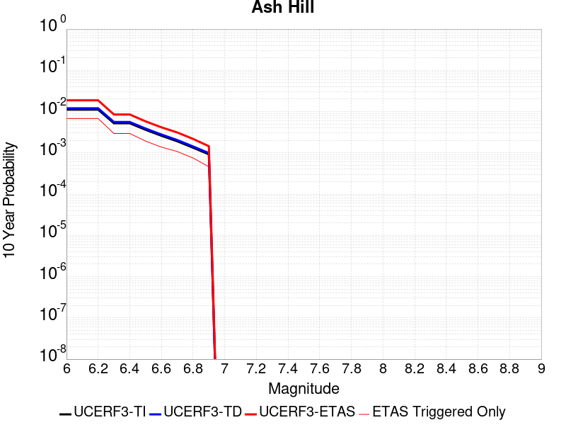 |

| Magnitude | 1 wk TI Prob | 1 wk TD Prob | 1 wk ETAS Prob | 1 wk ETAS/TD Gain | 1 wk ETAS Triggered Only | 1 mo TI Prob | 1 mo TD Prob | 1 mo ETAS Prob | 1 mo ETAS/TD Gain | 1 mo ETAS Triggered Only | 1 yr TI Prob | 1 yr TD Prob | 1 yr ETAS Prob | 1 yr ETAS/TD Gain | 1 yr ETAS Triggered Only | 10 yr TI Prob | 10 yr TD Prob | 10 yr ETAS Prob | 10 yr ETAS/TD Gain | 10 yr ETAS Triggered Only |
|-----|-----|-----|-----|-----|-----|-----|-----|-----|-----|-----|-----|-----|-----|-----|-----|-----|-----|-----|-----|-----|
| 6.0 | 2.1545662E-5 | 2.3194447E-5 | 0.0041698427 | 179.77763 | 0.0041467445 | 9.2335285E-5 | 9.940143E-5 | 0.005011547 | 50.41725 | 0.004912634 | 0.0011236023 | 0.0012096206 | 0.0071544764 | 5.9146447 | 0.005952055 | 0.011179381 | 0.012038348 | 0.01868623 | 1.5522254 | 0.006728886 |
| 6.1 | 2.1545662E-5 | 2.3194447E-5 | 0.0041698427 | 179.77763 | 0.0041467445 | 9.2335285E-5 | 9.940143E-5 | 0.005011547 | 50.41725 | 0.004912634 | 0.0011236023 | 0.0012096206 | 0.0071544764 | 5.9146447 | 0.005952055 | 0.011179381 | 0.012038348 | 0.01868623 | 1.5522254 | 0.006728886 |
| 6.2 | 2.1545662E-5 | 2.3194447E-5 | 0.0041698427 | 179.77763 | 0.0041467445 | 9.2335285E-5 | 9.940143E-5 | 0.005011547 | 50.41725 | 0.004912634 | 0.0011236023 | 0.0012096206 | 0.0071544764 | 5.9146447 | 0.005952055 | 0.011179381 | 0.012038348 | 0.01868623 | 1.5522254 | 0.006728886 |
| 6.3 | 1.0025529E-5 | 1.0746934E-5 | 0.001783215 | 165.92778 | 0.0017724871 | 4.2965847E-5 | 4.605755E-5 | 0.0021904493 | 47.55896 | 0.0021444906 | 5.229836E-4 | 5.6061964E-4 | 0.0032178597 | 5.7398267 | 0.0026587306 | 0.005217545 | 0.0055933665 | 0.008574508 | 1.532978 | 0.0029979101 |
| 6.4 | 1.0025529E-5 | 1.0746934E-5 | 0.001783215 | 165.92778 | 0.0017724871 | 4.2965847E-5 | 4.605755E-5 | 0.0021904493 | 47.55896 | 0.0021444906 | 5.229836E-4 | 5.6061964E-4 | 0.0032178597 | 5.7398267 | 0.0026587306 | 0.005217545 | 0.0055933665 | 0.008574508 | 1.532978 | 0.0029979101 |
| 6.5 | 6.9617327E-6 | 7.456634E-6 | 0.0012109883 | 162.40414 | 0.0012035406 | 2.9835655E-5 | 3.195666E-5 | 0.0014542773 | 45.5078 | 0.0014223661 | 3.6318856E-4 | 3.8901155E-4 | 0.002138935 | 5.4983845 | 0.0017506045 | 0.0036259557 | 0.0038841602 | 0.0058568395 | 1.507878 | 0.0019803713 |
| 6.6 | 4.9919777E-6 | 5.3466883E-6 | 9.134679E-4 | 170.84743 | 9.0812607E-4 | 2.1394015E-5 | 2.2914215E-5 | 0.001106076 | 48.270294 | 0.0010831866 | 2.60441E-4 | 2.7895154E-4 | 0.0015477858 | 5.5485826 | 0.0012691882 | 0.0026013597 | 0.0027866727 | 0.004205075 | 1.508995 | 0.0014223661 |
| 6.7 | 3.6630722E-6 | 3.924624E-6 | 7.369874E-4 | 187.78549 | 7.3306565E-4 | 1.5698786E-5 | 1.681974E-5 | 8.811662E-4 | 52.388813 | 8.6436095E-4 | 1.9111596E-4 | 2.0476682E-4 | 0.0012002193 | 5.861395 | 9.956564E-4 | 0.0019095168 | 0.0020463446 | 0.0031709902 | 1.5495876 | 0.0011269517 |
| 6.8 | 2.5599613E-6 | 2.744925E-6 | 5.060423E-4 | 184.3556 | 5.0329877E-4 | 1.0971216E-5 | 1.1763939E-5 | 5.807037E-4 | 49.36303 | 5.689465E-4 | 1.3356637E-4 | 1.4322149E-4 | 8.324233E-4 | 5.8121395 | 6.8930053E-4 | 0.0013348613 | 0.0014317769 | 0.002218421 | 1.5494181 | 7.87772E-4 |
| 6.9 | 1.7684905E-6 | 1.8968707E-6 | 3.4107585E-4 | 179.80975 | 3.3917962E-4 | 7.579223E-6 | 8.129446E-6 | 3.8012987E-4 | 46.75963 | 3.7200344E-4 | 9.2273134E-5 | 9.8976E-5 | 5.47524E-4 | 5.5318866 | 4.4859241E-4 | 9.223483E-4 | 9.8976E-4 | 0.0014816303 | 1.4969591 | 4.9235753E-4 |

## Garlock (West)
*[(top)](#table-of-contents)*

| 1 Week | 1 Month | 1 Year | 10 Year |
|-----|-----|-----|-----|
|  |  |  |  |

| Magnitude | 1 wk TI Prob | 1 wk TD Prob | 1 wk ETAS Prob | 1 wk ETAS/TD Gain | 1 wk ETAS Triggered Only | 1 mo TI Prob | 1 mo TD Prob | 1 mo ETAS Prob | 1 mo ETAS/TD Gain | 1 mo ETAS Triggered Only | 1 yr TI Prob | 1 yr TD Prob | 1 yr ETAS Prob | 1 yr ETAS/TD Gain | 1 yr ETAS Triggered Only | 10 yr TI Prob | 10 yr TD Prob | 10 yr ETAS Prob | 10 yr ETAS/TD Gain | 10 yr ETAS Triggered Only |
|-----|-----|-----|-----|-----|-----|-----|-----|-----|-----|-----|-----|-----|-----|-----|-----|-----|-----|-----|-----|-----|
| 6.0 | 2.5181727E-5 | 2.51973E-5 | 0.00475171 | 188.58014 | 0.004726632 | 1.0791722E-4 | 1.0798398E-4 | 0.0054905117 | 50.84561 | 0.0053831087 | 0.0013131002 | 0.0013139155 | 0.007411127 | 5.64049 | 0.006105233 | 0.013053683 | 0.013141977 | 0.019501697 | 1.4839242 | 0.0064444127 |
| 6.1 | 2.5077732E-5 | 2.5098372E-5 | 0.004751612 | 189.31952 | 0.004726632 | 1.0747157E-4 | 1.0756004E-4 | 0.0054900898 | 51.0421 | 0.0053831087 | 0.001307681 | 0.0013087603 | 0.0074060033 | 5.658793 | 0.006105233 | 0.013000126 | 0.013091032 | 0.019451082 | 1.4858325 | 0.0064444127 |
| 6.2 | 2.494612E-5 | 2.498005E-5 | 0.004751494 | 190.21155 | 0.004726632 | 1.0690756E-4 | 1.0705298E-4 | 0.0054895855 | 51.279144 | 0.0053831087 | 0.0013008224 | 0.0013025942 | 0.0073998747 | 5.680875 | 0.006105233 | 0.012932341 | 0.013030097 | 0.019390538 | 1.4881346 | 0.0064444127 |
| 6.3 | 2.4733758E-5 | 2.479942E-5 | 0.0047513144 | 191.58974 | 0.004726632 | 1.0599751E-4 | 1.06278916E-4 | 0.0054888157 | 51.645386 | 0.0053831087 | 0.0012897556 | 0.0012931811 | 0.007390519 | 5.7149916 | 0.006105233 | 0.012822957 | 0.012937066 | 0.019298106 | 1.4916911 | 0.0064444127 |
| 6.4 | 2.3237335E-5 | 2.317873E-5 | 0.0047278195 | 203.97232 | 0.0047047497 | 9.958477E-5 | 9.933365E-5 | 0.0054600276 | 54.966545 | 0.0053612264 | 0.0012117702 | 0.001208719 | 0.0072737886 | 6.0177665 | 0.0060724095 | 0.012051838 | 0.012101916 | 0.018435912 | 1.5233879 | 0.006411589 |
| 6.5 | 2.2732203E-5 | 2.2993298E-5 | 0.0047276346 | 205.60925 | 0.0047047497 | 9.742009E-5 | 9.8539E-5 | 0.005459237 | 55.40179 | 0.0053612264 | 0.0011854442 | 0.0011990548 | 0.0072532548 | 6.049144 | 0.0060614683 | 0.011791403 | 0.012006322 | 0.018330121 | 1.5267057 | 0.0064006476 |
| 6.6 | 2.1319436E-5 | 2.17735E-5 | 0.0047264206 | 217.07217 | 0.0047047497 | 9.136581E-5 | 9.331167E-5 | 0.005454038 | 58.449684 | 0.0053612264 | 0.001111811 | 0.0011354799 | 0.0071791364 | 6.3225574 | 0.0060505266 | 0.011062649 | 0.011377227 | 0.017694235 | 1.5552328 | 0.0063897064 |
| 6.7 | 1.970802E-5 | 2.0393396E-5 | 0.004714106 | 231.15846 | 0.0046938085 | 8.446021E-5 | 8.739735E-5 | 0.005437215 | 62.21258 | 0.005350285 | 0.001027818 | 0.001063545 | 0.0070967074 | 6.672691 | 0.0060395855 | 0.010230771 | 0.010664964 | 0.0169757 | 1.591726 | 0.006378765 |
| 6.8 | 1.8744462E-5 | 1.9901045E-5 | 0.004713616 | 236.85269 | 0.0046938085 | 8.033094E-5 | 8.5287415E-5 | 0.005435116 | 63.727062 | 0.005350285 | 9.775903E-4 | 0.0010378812 | 0.0070711984 | 6.8131094 | 0.0060395855 | 0.009733009 | 0.01041075 | 0.016723108 | 1.6063306 | 0.006378765 |
| 6.9 | 1.7559682E-5 | 1.8953415E-5 | 0.004712673 | 248.64505 | 0.0046938085 | 7.5253614E-5 | 8.12264E-5 | 0.0054201363 | 66.72875 | 0.0053393436 | 9.158276E-4 | 9.884841E-4 | 0.007011169 | 7.0928493 | 0.0060286443 | 0.0091206245 | 0.009921231 | 0.016225878 | 1.6354703 | 0.006367824 |
| 7.0 | 1.6794445E-5 | 1.8216237E-5 | 0.004700998 | 258.06635 | 0.004682867 | 7.197421E-5 | 7.8067256E-5 | 0.0054060537 | 69.248665 | 0.0053284024 | 8.759337E-4 | 9.5005584E-4 | 0.006962042 | 7.3280344 | 0.006017703 | 0.008724891 | 0.009540141 | 0.015836377 | 1.6599731 | 0.0063568824 |
| 7.1 | 1.6337795E-5 | 1.7717046E-5 | 0.004700501 | 265.30954 | 0.004682867 | 7.0017246E-5 | 7.5927994E-5 | 0.0054039257 | 71.17172 | 0.0053284024 | 8.521265E-4 | 9.240326E-4 | 0.006936175 | 7.506418 | 0.006017703 | 0.008488664 | 0.009281996 | 0.015579874 | 1.6785047 | 0.0063568824 |
| 7.2 | 1.5780008E-5 | 1.7165687E-5 | 0.0046890113 | 273.1619 | 0.0046719257 | 6.762685E-5 | 7.356516E-5 | 0.005390635 | 73.277016 | 0.005317461 | 8.2304585E-4 | 8.9528906E-4 | 0.0068966732 | 7.703292 | 0.006006762 | 0.008200042 | 0.008996838 | 0.015285686 | 1.6990064 | 0.006345941 |
| 7.3 | 1.5058865E-5 | 1.6618762E-5 | 0.0046665845 | 280.8022 | 0.0046500433 | 6.45364E-5 | 7.122133E-5 | 0.0053664227 | 75.34853 | 0.005295579 | 7.854473E-4 | 8.667759E-4 | 0.0068464675 | 7.8987746 | 0.005984879 | 0.00782677 | 0.008713539 | 0.014982493 | 1.7194499 | 0.006324059 |
| 7.4 | 1.4887923E-5 | 1.6454731E-5 | 0.0045788926 | 278.2721 | 0.004562513 | 6.380382E-5 | 7.051838E-5 | 0.0052563185 | 74.53828 | 0.0051861657 | 7.7653467E-4 | 8.582243E-4 | 0.006728648 | 7.840198 | 0.0058754664 | 0.0077382675 | 0.008628399 | 0.014778576 | 1.7127831 | 0.0062037045 |
| 7.5 | 1.4509299E-5 | 1.6046748E-5 | 0.0041517834 | 258.73053 | 0.0041358033 | 6.218123E-5 | 6.876997E-5 | 0.0048060175 | 69.88541 | 0.0047375737 | 7.567935E-4 | 8.36954E-4 | 0.0062264893 | 7.4394646 | 0.00539405 | 0.0075422134 | 0.008416704 | 0.014079981 | 1.6728616 | 0.0057113473 |
| 7.6 | 1.2756717E-5 | 1.4050848E-5 | 0.0027165087 | 193.33414 | 0.0027024958 | 5.4670498E-5 | 6.0216535E-5 | 0.0032001743 | 53.144444 | 0.0031401468 | 6.6541E-4 | 7.328904E-4 | 0.0043189996 | 5.8931046 | 0.0035887393 | 0.006634211 | 0.0073816874 | 0.011139425 | 1.5090622 | 0.0037856821 |
| 7.7 | 1.0328985E-5 | 1.1460557E-5 | 0.0016088688 | 140.38313 | 0.0015974266 | 4.4266326E-5 | 4.911575E-5 | 0.0018871602 | 38.42271 | 0.0018381347 | 5.388092E-4 | 5.978206E-4 | 0.0026972902 | 4.5118723 | 0.0021007254 | 0.0053750467 | 0.006038511 | 0.008267929 | 1.3691999 | 0.0022429621 |
| 7.8 | 7.0306583E-6 | 8.899601E-6 | 0.0010811354 | 121.48132 | 0.0010722453 | 3.0131043E-5 | 3.814059E-5 | 0.0013291622 | 34.84902 | 0.0012910708 | 3.667837E-4 | 4.642629E-4 | 0.0019297135 | 4.1565104 | 0.0014661313 | 0.003661789 | 0.0046952725 | 0.0062198592 | 1.3247068 | 0.001531779 |
| 7.9 | 4.060633E-6 | 5.4653938E-6 | 6.072324E-4 | 111.104965 | 6.017703E-4 | 1.7402595E-5 | 2.3422906E-5 | 7.4553036E-4 | 31.829113 | 7.2212436E-4 | 2.11856E-4 | 2.851367E-4 | 0.0011054985 | 3.877083 | 8.205959E-4 | 0.0021165414 | 0.002884201 | 0.003746069 | 1.2988238 | 8.6436095E-4 |
| 8.0 | 1.6729537E-6 | 2.0775144E-6 | 1.8807886E-4 | 90.530716 | 1.8600172E-4 | 7.169782E-6 | 8.903603E-6 | 2.4960958E-4 | 28.034672 | 2.4070812E-4 | 8.7288594E-5 | 1.0839601E-4 | 3.818983E-4 | 3.523177 | 2.7353194E-4 | 8.7254314E-4 | 0.0010969337 | 0.0013920242 | 1.2690139 | 2.954145E-4 |
| 8.1 | 3.6733252E-7 | 3.1489964E-7 | 4.408E-5 | 139.9811 | 4.3765114E-5 | 1.5742813E-6 | 1.3495693E-6 | 5.6055887E-5 | 41.53613 | 5.470639E-5 | 1.9166706E-5 | 1.6430899E-5 | 7.113639E-5 | 4.3294277 | 5.470639E-5 | 1.9165053E-4 | 1.6638759E-4 | 2.3202434E-4 | 1.3944811 | 6.564767E-5 |

## Gravel Hills-Harper Lk
*[(top)](#table-of-contents)*

| 1 Week | 1 Month | 1 Year | 10 Year |
|-----|-----|-----|-----|
|  |  |  |  |

| Magnitude | 1 wk TI Prob | 1 wk TD Prob | 1 wk ETAS Prob | 1 wk ETAS/TD Gain | 1 wk ETAS Triggered Only | 1 mo TI Prob | 1 mo TD Prob | 1 mo ETAS Prob | 1 mo ETAS/TD Gain | 1 mo ETAS Triggered Only | 1 yr TI Prob | 1 yr TD Prob | 1 yr ETAS Prob | 1 yr ETAS/TD Gain | 1 yr ETAS Triggered Only | 10 yr TI Prob | 10 yr TD Prob | 10 yr ETAS Prob | 10 yr ETAS/TD Gain | 10 yr ETAS Triggered Only |
|-----|-----|-----|-----|-----|-----|-----|-----|-----|-----|-----|-----|-----|-----|-----|-----|-----|-----|-----|-----|-----|
| 6.0 | 3.0679566E-5 | 3.1464646E-5 | 0.0026463477 | 84.10544 | 0.0026149654 | 1.3147724E-4 | 1.3484273E-4 | 0.003230807 | 23.959814 | 0.0030963817 | 0.0015995599 | 0.0016406906 | 0.0053764684 | 3.2769544 | 0.0037419172 | 0.015880952 | 0.01630734 | 0.020407986 | 1.2514603 | 0.004168627 |
| 6.1 | 3.0679566E-5 | 3.1464646E-5 | 0.0026463477 | 84.10544 | 0.0026149654 | 1.3147724E-4 | 1.3484273E-4 | 0.003230807 | 23.959814 | 0.0030963817 | 0.0015995599 | 0.0016406906 | 0.0053764684 | 3.2769544 | 0.0037419172 | 0.015880952 | 0.01630734 | 0.020407986 | 1.2514603 | 0.004168627 |
| 6.2 | 1.514536E-5 | 1.3635206E-5 | 6.8104407E-4 | 49.947468 | 6.6741795E-4 | 6.490707E-5 | 5.843536E-5 | 8.899239E-4 | 15.229202 | 8.315371E-4 | 7.8995706E-4 | 7.1123015E-4 | 0.0017280453 | 2.429657 | 0.0010175388 | 0.007871548 | 0.0070907404 | 0.008242292 | 1.1624022 | 0.0011597755 |
| 6.3 | 1.514536E-5 | 1.3635206E-5 | 6.8104407E-4 | 49.947468 | 6.6741795E-4 | 6.490707E-5 | 5.843536E-5 | 8.899239E-4 | 15.229202 | 8.315371E-4 | 7.8995706E-4 | 7.1123015E-4 | 0.0017280453 | 2.429657 | 0.0010175388 | 0.007871548 | 0.0070907404 | 0.008242292 | 1.1624022 | 0.0011597755 |
| 6.4 | 1.2532521E-5 | 1.06896905E-5 | 4.7021845E-4 | 43.988033 | 4.5953368E-4 | 5.37097E-5 | 4.581219E-5 | 5.92851E-4 | 12.940902 | 5.470639E-4 | 6.537194E-4 | 5.576265E-4 | 0.0012356074 | 2.2158334 | 6.7835924E-4 | 0.0065179965 | 0.005562863 | 0.0063462527 | 1.1408249 | 7.87772E-4 |
| 6.5 | 1.1094058E-5 | 9.083664E-6 | 3.4826022E-4 | 38.33918 | 3.3917962E-4 | 4.7545094E-5 | 3.892943E-5 | 4.4374095E-4 | 11.3986 | 4.048273E-4 | 5.787078E-4 | 4.7386673E-4 | 9.76927E-4 | 2.0616071 | 5.0329877E-4 | 0.0057720304 | 0.0047289706 | 0.005306116 | 1.1220447 | 5.7988777E-4 |
| 6.6 | 9.688328E-6 | 7.5316952E-6 | 2.372968E-4 | 31.506428 | 2.2976684E-4 | 4.1520743E-5 | 3.227831E-5 | 3.1674237E-4 | 9.812855 | 2.8447324E-4 | 5.053978E-4 | 3.9292008E-4 | 7.210295E-4 | 1.8350537 | 3.2823835E-4 | 0.0050424994 | 0.0039225104 | 0.0043148515 | 1.1000229 | 3.93886E-4 |
| 6.7 | 8.974824E-6 | 6.749413E-6 | 1.9274988E-4 | 28.558022 | 1.8600172E-4 | 3.8462964E-5 | 2.8925748E-5 | 2.3680402E-4 | 8.186617 | 2.0788428E-4 | 4.6818596E-4 | 3.5211627E-4 | 5.818022E-4 | 1.6523014 | 2.2976684E-4 | 0.004672008 | 0.0035158044 | 0.0037992776 | 1.0806283 | 2.8447324E-4 |
| 6.8 | 7.4780046E-6 | 5.1161933E-6 | 1.0358719E-4 | 20.246927 | 9.84715E-5 | 3.20482E-5 | 2.1926366E-5 | 1.3133675E-4 | 5.9899006 | 1.0941278E-4 | 3.9011694E-4 | 2.669222E-4 | 3.8724413E-4 | 1.4507753 | 1.2035406E-4 | 0.0038943281 | 0.0026661542 | 0.0028189237 | 1.0572996 | 1.531779E-4 |
| 6.9 | 6.3409307E-6 | 3.9074966E-6 | 6.955491E-5 | 17.800375 | 6.564767E-5 | 2.7175134E-5 | 1.6746313E-5 | 9.3333976E-5 | 5.573405 | 7.658895E-5 | 3.3080703E-4 | 2.0386827E-4 | 2.9138065E-4 | 1.4292594 | 8.753023E-5 | 0.0033031502 | 0.0020369107 | 0.0021461006 | 1.0536057 | 1.0941278E-4 |
| 7.0 | 5.1239335E-6 | 2.6058565E-6 | 2.4488356E-5 | 9.39743 | 2.1882557E-5 | 2.195953E-5 | 1.116791E-5 | 4.399138E-5 | 3.9390879 | 3.2823835E-5 | 2.6732447E-4 | 1.3596108E-4 | 1.6878045E-4 | 1.241388 | 3.2823835E-5 | 0.0026700313 | 0.0013588042 | 0.0014134363 | 1.040206 | 5.470639E-5 |
| 7.1 | 4.438899E-6 | 2.0984728E-6 | 1.3039728E-5 | 6.2139134 | 1.0941279E-5 | 1.9023713E-5 | 8.993425E-6 | 3.0875784E-5 | 3.4331508 | 2.1882557E-5 | 2.315891E-4 | 1.0948967E-4 | 1.3136983E-4 | 1.1998377 | 2.1882557E-5 | 0.002313479 | 0.0010943791 | 0.001127167 | 1.0299603 | 3.2823835E-5 |
| 7.2 | 3.50367E-6 | 1.2615716E-6 | 1.2615716E-6 | 1.0 | 0.0 | 1.5015643E-5 | 5.4067245E-6 | 1.6347944E-5 | 3.0236316 | 1.0941279E-5 | 1.8280011E-4 | 6.582497E-5 | 7.676553E-5 | 1.1662068 | 1.0941279E-5 | 0.0018264982 | 6.580629E-4 | 6.68997E-4 | 1.0166155 | 1.0941279E-5 |
| 7.3 | 2.561638E-6 | 7.1191585E-7 | 7.1191585E-7 | 1.0 | 0.0 | 1.0978401E-5 | 3.0510646E-6 | 1.39923095E-5 | 4.586042 | 1.0941279E-5 | 1.3365384E-4 | 3.71461E-5 | 4.8086968E-5 | 1.2945362 | 1.0941279E-5 | 0.0013357349 | 3.7140088E-4 | 3.823381E-4 | 1.0294485 | 1.0941279E-5 |
| 7.4 | 2.0368864E-6 | 5.304837E-7 | 5.304837E-7 | 1.0 | 0.0 | 8.729483E-6 | 2.2734996E-6 | 2.2734996E-6 | 1.0 | 0.0 | 1.06276275E-4 | 2.7679513E-5 | 2.7679513E-5 | 1.0 | 0.0 | 0.0010622547 | 2.767612E-4 | 2.767612E-4 | 1.0 | 0.0 |
| 7.5 | 1.1681728E-6 | 3.6030585E-7 | 3.6030585E-7 | 1.0 | 0.0 | 5.0064455E-6 | 1.544167E-6 | 1.544167E-6 | 1.0 | 0.0 | 6.0951766E-5 | 1.8800076E-5 | 1.8800076E-5 | 1.0 | 0.0 | 6.093505E-4 | 1.8798532E-4 | 1.8798532E-4 | 1.0 | 0.0 |
| 7.6 | 1.3154387E-7 | 7.1197384E-8 | 7.1197384E-8 | 1.0 | 0.0 | 5.6375933E-7 | 3.051316E-7 | 3.051316E-7 | 1.0 | 0.0 | 6.863748E-6 | 3.7149728E-6 | 3.7149728E-6 | 1.0 | 0.0 | 6.863536E-5 | 3.7149264E-5 | 3.7149264E-5 | 1.0 | 0.0 |

## McLean Lake
*[(top)](#table-of-contents)*

| 1 Week | 1 Month | 1 Year | 10 Year |
|-----|-----|-----|-----|
|  |  |  |  |

| Magnitude | 1 wk TI Prob | 1 wk TD Prob | 1 wk ETAS Prob | 1 wk ETAS/TD Gain | 1 wk ETAS Triggered Only | 1 mo TI Prob | 1 mo TD Prob | 1 mo ETAS Prob | 1 mo ETAS/TD Gain | 1 mo ETAS Triggered Only | 1 yr TI Prob | 1 yr TD Prob | 1 yr ETAS Prob | 1 yr ETAS/TD Gain | 1 yr ETAS Triggered Only | 10 yr TI Prob | 10 yr TD Prob | 10 yr ETAS Prob | 10 yr ETAS/TD Gain | 10 yr ETAS Triggered Only |
|-----|-----|-----|-----|-----|-----|-----|-----|-----|-----|-----|-----|-----|-----|-----|-----|-----|-----|-----|-----|-----|
| 6.0 | 1.7360222E-5 | 1.8501627E-5 | 0.002086365 | 112.76656 | 0.0020679017 | 7.439883E-5 | 7.9290556E-5 | 0.0026831082 | 33.83894 | 0.0026040243 | 9.0542925E-4 | 9.6498354E-4 | 0.004298853 | 4.454846 | 0.00333709 | 0.009017491 | 0.0096127745 | 0.013318721 | 1.3855231 | 0.0037419172 |
| 6.1 | 9.062689E-6 | 9.592193E-6 | 0.0011255918 | 117.344574 | 0.0011160104 | 3.8839516E-5 | 4.1108804E-5 | 0.0014087124 | 34.2679 | 0.0013676598 | 4.727685E-4 | 5.003936E-4 | 0.0023266727 | 4.649685 | 0.0018271934 | 0.0047176396 | 0.004993552 | 0.0069749206 | 1.3967855 | 0.0019913127 |
| 6.2 | 9.062689E-6 | 9.592193E-6 | 0.0011255918 | 117.344574 | 0.0011160104 | 3.8839516E-5 | 4.1108804E-5 | 0.0014087124 | 34.2679 | 0.0013676598 | 4.727685E-4 | 5.003936E-4 | 0.0023266727 | 4.649685 | 0.0018271934 | 0.0047176396 | 0.004993552 | 0.0069749206 | 1.3967855 | 0.0019913127 |
| 6.3 | 7.2575485E-6 | 7.66771E-6 | 8.8296324E-4 | 115.15346 | 8.7530224E-4 | 3.110341E-5 | 3.2861237E-5 | 0.0010941303 | 33.29547 | 0.001061304 | 3.786182E-4 | 4.0001926E-4 | 0.0018436903 | 4.609004 | 0.0014442487 | 0.0037797375 | 0.0039936965 | 0.005584744 | 1.3983896 | 0.0015974266 |
| 6.4 | 7.2575485E-6 | 7.66771E-6 | 8.8296324E-4 | 115.15346 | 8.7530224E-4 | 3.110341E-5 | 3.2861237E-5 | 0.0010941303 | 33.29547 | 0.001061304 | 3.786182E-4 | 4.0001926E-4 | 0.0018436903 | 4.609004 | 0.0014442487 | 0.0037797375 | 0.0039936965 | 0.005584744 | 1.3983896 | 0.0015974266 |
| 6.5 | 6.06582E-6 | 6.4038773E-6 | 7.394648E-4 | 115.47143 | 7.3306565E-4 | 2.5996113E-5 | 2.7444936E-5 | 9.136641E-4 | 33.29081 | 8.8624354E-4 | 3.164567E-4 | 3.3409733E-4 | 0.0015700487 | 4.699375 | 0.0012363645 | 0.0031600643 | 0.0033365893 | 0.0046996856 | 1.4085299 | 0.0013676598 |
| 6.6 | 5.598744E-6 | 5.910262E-6 | 7.389716E-4 | 125.031944 | 7.3306565E-4 | 2.3994397E-5 | 2.5329486E-5 | 9.006096E-4 | 35.55578 | 8.7530224E-4 | 2.9209262E-4 | 3.0834923E-4 | 0.0015115187 | 4.90197 | 0.0012035406 | 0.0029170897 | 0.003079843 | 0.004377845 | 1.4214507 | 0.0013020121 |
| 6.7 | 5.246996E-6 | 5.539162E-6 | 6.838947E-4 | 123.46536 | 6.7835924E-4 | 2.2486933E-5 | 2.3739085E-5 | 8.3337445E-4 | 35.105583 | 8.096546E-4 | 2.73744E-4 | 2.8899137E-4 | 0.0014046793 | 4.8606267 | 0.0011160104 | 0.0027340704 | 0.0028867796 | 0.0040977555 | 1.4194902 | 0.0012144819 |
| 6.8 | 4.02324E-6 | 4.2469046E-6 | 5.2942603E-4 | 124.66163 | 5.2518136E-4 | 1.7242342E-5 | 1.8200926E-5 | 6.637246E-4 | 36.46653 | 6.455354E-4 | 2.099053E-4 | 2.2157968E-4 | 0.001096688 | 4.9494066 | 8.7530224E-4 | 0.0020970714 | 0.002214172 | 0.0031639554 | 1.4289565 | 9.518912E-4 |
| 6.9 | 6.835972E-7 | 7.1399285E-7 | 7.730289E-5 | 108.26843 | 7.658895E-5 | 2.9296991E-6 | 3.0599674E-6 | 1.0153117E-4 | 33.180473 | 9.84715E-5 | 3.56685E-5 | 3.7254784E-5 | 1.794861E-4 | 4.8178 | 1.4223662E-4 | 3.5662777E-4 | 3.7251666E-4 | 5.256375E-4 | 1.4110442 | 1.531779E-4 |

## Goldstone Lake
*[(top)](#table-of-contents)*

| 1 Week | 1 Month | 1 Year | 10 Year |
|-----|-----|-----|-----|
| 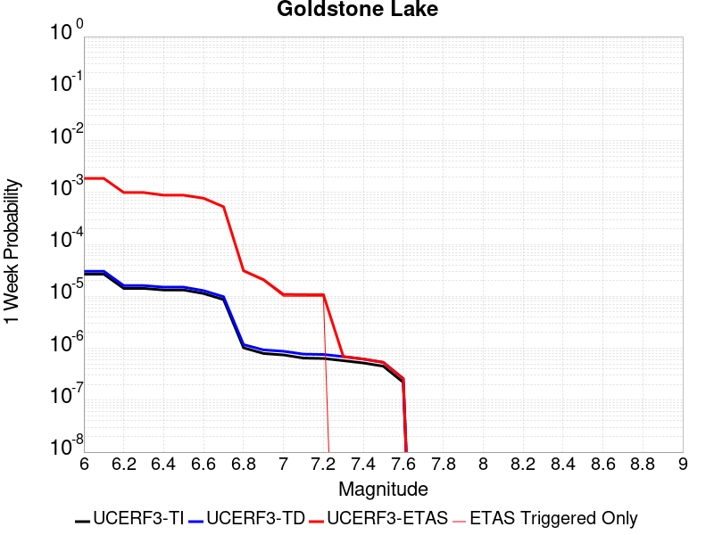 |  |  |  |

| Magnitude | 1 wk TI Prob | 1 wk TD Prob | 1 wk ETAS Prob | 1 wk ETAS/TD Gain | 1 wk ETAS Triggered Only | 1 mo TI Prob | 1 mo TD Prob | 1 mo ETAS Prob | 1 mo ETAS/TD Gain | 1 mo ETAS Triggered Only | 1 yr TI Prob | 1 yr TD Prob | 1 yr ETAS Prob | 1 yr ETAS/TD Gain | 1 yr ETAS Triggered Only | 10 yr TI Prob | 10 yr TD Prob | 10 yr ETAS Prob | 10 yr ETAS/TD Gain | 10 yr ETAS Triggered Only |
|-----|-----|-----|-----|-----|-----|-----|-----|-----|-----|-----|-----|-----|-----|-----|-----|-----|-----|-----|-----|-----|
| 6.0 | 2.671352E-5 | 3.037609E-5 | 0.0018356321 | 60.43017 | 0.001805311 | 1.1448149E-4 | 1.3017785E-4 | 0.0023947277 | 18.395815 | 0.0022648445 | 0.001392921 | 0.0015839594 | 0.00443511 | 2.8000147 | 0.0028556737 | 0.013842222 | 0.015746197 | 0.0190092 | 1.207225 | 0.0033152073 |
| 6.1 | 2.671352E-5 | 3.037609E-5 | 0.0018356321 | 60.43017 | 0.001805311 | 1.1448149E-4 | 1.3017785E-4 | 0.0023947277 | 18.395815 | 0.0022648445 | 0.001392921 | 0.0015839594 | 0.00443511 | 2.8000147 | 0.0028556737 | 0.013842222 | 0.015746197 | 0.0190092 | 1.207225 | 0.0033152073 |
| 6.2 | 1.4197047E-5 | 1.6096245E-5 | 0.0010117366 | 62.85544 | 9.956564E-4 | 6.0843064E-5 | 6.8982634E-5 | 0.0013162023 | 19.080196 | 0.0012473057 | 7.4051257E-4 | 8.3963864E-4 | 0.0024138598 | 2.8748794 | 0.001575544 | 0.007380498 | 0.0083743585 | 0.010164551 | 1.2137707 | 0.001805311 |
| 6.3 | 1.4197047E-5 | 1.6096245E-5 | 0.0010117366 | 62.85544 | 9.956564E-4 | 6.0843064E-5 | 6.8982634E-5 | 0.0013162023 | 19.080196 | 0.0012473057 | 7.4051257E-4 | 8.3963864E-4 | 0.0024138598 | 2.8748794 | 0.001575544 | 0.007380498 | 0.0083743585 | 0.010164551 | 1.2137707 | 0.001805311 |
| 6.4 | 1.3238931E-5 | 1.500846E-5 | 9.012387E-4 | 60.048714 | 8.8624354E-4 | 5.6737044E-5 | 6.4320935E-5 | 0.0011802595 | 18.349539 | 0.0011160104 | 6.9055456E-4 | 7.82924E-4 | 0.0022041765 | 2.8153136 | 0.0014223661 | 0.006884126 | 0.0078112837 | 0.009439656 | 1.208464 | 0.0016411918 |
| 6.5 | 1.3238931E-5 | 1.500846E-5 | 9.012387E-4 | 60.048714 | 8.8624354E-4 | 5.6737044E-5 | 6.4320935E-5 | 0.0011802595 | 18.349539 | 0.0011160104 | 6.9055456E-4 | 7.82924E-4 | 0.0022041765 | 2.8153136 | 0.0014223661 | 0.006884126 | 0.0078112837 | 0.009439656 | 1.208464 | 0.0016411918 |
| 6.6 | 1.1328278E-5 | 1.2855166E-5 | 8.115582E-4 | 63.1309 | 7.987133E-4 | 4.8548856E-5 | 5.5092944E-5 | 0.0010397537 | 18.87272 | 9.847151E-4 | 5.90922E-4 | 6.7064585E-4 | 0.0019061811 | 2.8423066 | 0.0012363645 | 0.0058935313 | 0.0066956086 | 0.008108451 | 1.2110103 | 0.0014223661 |
| 6.7 | 8.651175E-6 | 9.824565E-6 | 5.7876547E-4 | 58.910034 | 5.689465E-4 | 3.707594E-5 | 4.2105108E-5 | 7.751399E-4 | 18.409641 | 7.3306565E-4 | 4.5130608E-4 | 5.1259965E-4 | 0.0014530672 | 2.834702 | 9.4094995E-4 | 0.0045039062 | 0.005123051 | 0.006222459 | 1.2146002 | 0.0011050691 |
| 6.8 | 1.0215377E-6 | 1.1754702E-6 | 3.3999266E-5 | 28.923971 | 3.2823835E-5 | 4.378012E-6 | 5.0377203E-6 | 4.8802613E-5 | 9.68744 | 4.3765114E-5 | 5.3300988E-5 | 6.1332634E-5 | 1.1603567E-4 | 1.8919075 | 5.470639E-5 | 5.3288206E-4 | 6.1316835E-4 | 6.678412E-4 | 1.0891645 | 5.470639E-5 |
| 6.9 | 7.9360774E-7 | 9.2833966E-7 | 2.2810877E-5 | 24.571692 | 2.1882557E-5 | 3.4011714E-6 | 3.9785928E-6 | 2.5861062E-5 | 6.5000525 | 2.1882557E-5 | 4.1408475E-5 | 4.843836E-5 | 8.126061E-5 | 1.6776085 | 3.2823835E-5 | 4.140076E-4 | 4.8428503E-4 | 5.17093E-4 | 1.0677451 | 3.2823835E-5 |
| 7.0 | 7.4382757E-7 | 8.7473285E-7 | 1.18160015E-5 | 13.508126 | 1.0941279E-5 | 3.1878285E-6 | 3.74885E-6 | 1.46900875E-5 | 3.9185581 | 1.0941279E-5 | 3.8811122E-5 | 4.564136E-5 | 5.658214E-5 | 1.2397119 | 1.0941279E-5 | 3.8804344E-4 | 4.5632652E-4 | 4.672628E-4 | 1.023966 | 1.0941279E-5 |
| 7.1 | 6.4709513E-7 | 7.7113E-7 | 1.17124E-5 | 15.18862 | 1.0941279E-5 | 2.773262E-6 | 3.3048389E-6 | 1.4246081E-5 | 4.310673 | 1.0941279E-5 | 3.376394E-5 | 4.0235733E-5 | 5.117657E-5 | 1.2719184 | 1.0941279E-5 | 3.375881E-4 | 4.0229043E-4 | 4.132273E-4 | 1.0271865 | 1.0941279E-5 |
| 7.2 | 6.356704E-7 | 7.5883594E-7 | 1.17001055E-5 | 15.418491 | 1.0941279E-5 | 2.7242988E-6 | 3.2521505E-6 | 1.4193393E-5 | 4.3643103 | 1.0941279E-5 | 3.3167835E-5 | 3.959427E-5 | 5.0535116E-5 | 1.2763239 | 1.0941279E-5 | 3.3162883E-4 | 3.958781E-4 | 4.0681506E-4 | 1.0276271 | 1.0941279E-5 |
| 7.3 | 5.7695723E-7 | 6.8965653E-7 | 6.8965653E-7 | 1.0 | 0.0 | 2.4726714E-6 | 2.9556677E-6 | 2.9556677E-6 | 1.0 | 0.0 | 3.0104358E-5 | 3.5984718E-5 | 3.5984718E-5 | 1.0 | 0.0 | 3.0100282E-4 | 3.5979465E-4 | 3.5979465E-4 | 1.0 | 0.0 |
| 7.4 | 5.209647E-7 | 6.193514E-7 | 6.193514E-7 | 1.0 | 0.0 | 2.232704E-6 | 2.6543607E-6 | 2.6543607E-6 | 1.0 | 0.0 | 2.718283E-5 | 3.2316417E-5 | 3.2316417E-5 | 1.0 | 0.0 | 2.7179506E-4 | 3.2312275E-4 | 3.2312275E-4 | 1.0 | 0.0 |
| 7.5 | 4.512955E-7 | 5.348885E-7 | 5.348885E-7 | 1.0 | 0.0 | 1.934122E-6 | 2.2923775E-6 | 2.2923775E-6 | 1.0 | 0.0 | 2.3547682E-5 | 2.7909393E-5 | 2.7909393E-5 | 1.0 | 0.0 | 2.3545188E-4 | 2.7906417E-4 | 2.7906417E-4 | 1.0 | 0.0 |
| 7.6 | 2.21172E-7 | 2.603961E-7 | 2.603961E-7 | 1.0 | 0.0 | 9.478797E-7 | 1.1159829E-6 | 1.1159829E-6 | 1.0 | 0.0 | 1.1540374E-5 | 1.3587036E-5 | 1.3587036E-5 | 1.0 | 0.0 | 1.1539775E-4 | 1.3586486E-4 | 1.3586486E-4 | 1.0 | 0.0 |

## So Sierra Nevada
*[(top)](#table-of-contents)*

| 1 Week | 1 Month | 1 Year | 10 Year |
|-----|-----|-----|-----|
|  |  |  |  |

| Magnitude | 1 wk TI Prob | 1 wk TD Prob | 1 wk ETAS Prob | 1 wk ETAS/TD Gain | 1 wk ETAS Triggered Only | 1 mo TI Prob | 1 mo TD Prob | 1 mo ETAS Prob | 1 mo ETAS/TD Gain | 1 mo ETAS Triggered Only | 1 yr TI Prob | 1 yr TD Prob | 1 yr ETAS Prob | 1 yr ETAS/TD Gain | 1 yr ETAS Triggered Only | 10 yr TI Prob | 10 yr TD Prob | 10 yr ETAS Prob | 10 yr ETAS/TD Gain | 10 yr ETAS Triggered Only |
|-----|-----|-----|-----|-----|-----|-----|-----|-----|-----|-----|-----|-----|-----|-----|-----|-----|-----|-----|-----|-----|
| 6.0 | 1.15488665E-5 | 1.1079643E-5 | 0.0018054293 | 162.95015 | 0.0017943697 | 4.9494203E-5 | 4.748339E-5 | 0.002246576 | 47.31288 | 0.002199197 | 6.024253E-4 | 5.7796965E-4 | 0.0031914238 | 5.5217843 | 0.0026149654 | 0.006007948 | 0.005765934 | 0.008648654 | 1.4999573 | 0.0028994386 |
| 6.1 | 1.15488665E-5 | 1.1079643E-5 | 0.0018054293 | 162.95015 | 0.0017943697 | 4.9494203E-5 | 4.748339E-5 | 0.002246576 | 47.31288 | 0.002199197 | 6.024253E-4 | 5.7796965E-4 | 0.0031914238 | 5.5217843 | 0.0026149654 | 0.006007948 | 0.005765934 | 0.008648654 | 1.4999573 | 0.0028994386 |
| 6.2 | 1.15488665E-5 | 1.1079643E-5 | 0.0018054293 | 162.95015 | 0.0017943697 | 4.9494203E-5 | 4.748339E-5 | 0.002246576 | 47.31288 | 0.002199197 | 6.024253E-4 | 5.7796965E-4 | 0.0031914238 | 5.5217843 | 0.0026149654 | 0.006007948 | 0.005765934 | 0.008648654 | 1.4999573 | 0.0028994386 |
| 6.3 | 1.15488665E-5 | 1.1079643E-5 | 0.0018054293 | 162.95015 | 0.0017943697 | 4.9494203E-5 | 4.748339E-5 | 0.002246576 | 47.31288 | 0.002199197 | 6.024253E-4 | 5.7796965E-4 | 0.0031914238 | 5.5217843 | 0.0026149654 | 0.006007948 | 0.005765934 | 0.008648654 | 1.4999573 | 0.0028994386 |
| 6.4 | 1.15488665E-5 | 1.1079643E-5 | 0.0018054293 | 162.95015 | 0.0017943697 | 4.9494203E-5 | 4.748339E-5 | 0.002246576 | 47.31288 | 0.002199197 | 6.024253E-4 | 5.7796965E-4 | 0.0031914238 | 5.5217843 | 0.0026149654 | 0.006007948 | 0.005765934 | 0.008648654 | 1.4999573 | 0.0028994386 |
| 6.5 | 1.15488665E-5 | 1.1079643E-5 | 0.0018054293 | 162.95015 | 0.0017943697 | 4.9494203E-5 | 4.748339E-5 | 0.002246576 | 47.31288 | 0.002199197 | 6.024253E-4 | 5.7796965E-4 | 0.0031914238 | 5.5217843 | 0.0026149654 | 0.006007948 | 0.005765934 | 0.008648654 | 1.4999573 | 0.0028994386 |
| 6.6 | 7.587044E-6 | 6.935635E-6 | 9.369378E-4 | 135.09041 | 9.3000865E-4 | 3.2515498E-5 | 2.9723828E-5 | 0.0012004058 | 40.385303 | 0.0011707167 | 3.9580427E-4 | 3.6183043E-4 | 0.0017289954 | 4.7784686 | 0.0013676598 | 0.003951 | 0.0036127048 | 0.0051280484 | 1.4194484 | 0.0015208377 |
| 6.7 | 7.587044E-6 | 6.935635E-6 | 9.369378E-4 | 135.09041 | 9.3000865E-4 | 3.2515498E-5 | 2.9723828E-5 | 0.0012004058 | 40.385303 | 0.0011707167 | 3.9580427E-4 | 3.6183043E-4 | 0.0017289954 | 4.7784686 | 0.0013676598 | 0.003951 | 0.0036127048 | 0.0051280484 | 1.4194484 | 0.0015208377 |
| 6.8 | 5.9026956E-6 | 5.1793927E-6 | 7.491825E-4 | 144.64677 | 7.440069E-4 | 2.5297022E-5 | 2.2197215E-5 | 9.193621E-4 | 41.417904 | 8.9718483E-4 | 3.0794772E-4 | 2.7021873E-4 | 0.001298421 | 4.8050737 | 0.0010284801 | 0.0030752132 | 0.002699018 | 0.0038011044 | 1.4083287 | 0.0011050691 |
| 6.9 | 5.0118915E-6 | 4.2524252E-6 | 6.0602016E-4 | 142.51166 | 6.017703E-4 | 2.1479358E-5 | 1.8224557E-5 | 7.4033573E-4 | 40.62298 | 7.2212436E-4 | 2.614798E-4 | 2.2186211E-4 | 0.0010641536 | 4.796464 | 8.424784E-4 | 0.0026117235 | 0.0022164788 | 0.003133509 | 1.4137329 | 9.1906736E-4 |
| 7.0 | 4.4924795E-6 | 3.7139177E-6 | 4.7418714E-4 | 127.67842 | 4.7047497E-4 | 1.925334E-5 | 1.5916696E-5 | 5.848541E-4 | 36.74469 | 5.689465E-4 | 2.3438422E-4 | 1.9376918E-4 | 8.71997E-4 | 4.500184 | 6.7835924E-4 | 0.0023413717 | 0.0019360651 | 0.0026895518 | 1.3891845 | 7.549482E-4 |
| 7.1 | 3.9118436E-6 | 3.1119775E-6 | 3.4229056E-4 | 109.991325 | 3.3917962E-4 | 1.6764936E-5 | 1.3336982E-5 | 4.4004113E-4 | 32.994057 | 4.2670986E-4 | 2.0409399E-4 | 1.6236622E-4 | 6.874623E-4 | 4.234023 | 5.2518136E-4 | 0.0020390663 | 0.001622532 | 0.002201479 | 1.3568169 | 5.7988777E-4 |
| 7.2 | 3.4200818E-6 | 2.6054543E-6 | 2.542542E-4 | 97.58536 | 2.5164938E-4 | 1.4657411E-5 | 1.11661875E-5 | 3.3940087E-4 | 30.39541 | 3.2823835E-4 | 1.7843937E-4 | 1.3594035E-4 | 5.2977283E-4 | 3.8970973 | 3.93886E-4 | 0.0017829615 | 0.0013586218 | 0.0018066047 | 1.3297334 | 4.4859241E-4 |
| 7.3 | 2.6593618E-6 | 1.8284203E-6 | 1.7688856E-4 | 96.74393 | 1.7506046E-4 | 1.13972155E-5 | 7.836065E-6 | 2.1571873E-4 | 27.52896 | 2.0788428E-4 | 1.3875226E-4 | 9.540021E-5 | 3.470256E-4 | 3.637577 | 2.5164938E-4 | 0.0013866565 | 9.5362146E-4 | 0.0012378234 | 1.2980238 | 2.8447324E-4 |
| 7.4 | 2.2577992E-6 | 1.436438E-6 | 1.2179033E-4 | 84.78634 | 1.2035406E-4 | 9.676246E-6 | 6.15615E-6 | 1.593331E-4 | 25.88194 | 1.531779E-4 | 1.1780193E-4 | 7.49488E-5 | 2.609366E-4 | 3.4815311 | 1.8600172E-4 | 0.001177395 | 7.492603E-4 | 9.5698884E-4 | 1.2772448 | 2.0788428E-4 |
| 7.5 | 1.489319E-6 | 7.353936E-7 | 5.5441746E-5 | 75.39057 | 5.470639E-5 | 6.3827797E-6 | 3.1516831E-6 | 6.879915E-5 | 21.829334 | 6.564767E-5 | 7.770758E-5 | 3.8371072E-5 | 1.1495708E-4 | 2.995931 | 7.658895E-5 | 7.7680405E-4 | 3.836449E-4 | 4.820786E-4 | 1.2565751 | 9.84715E-5 |
| 7.6 | 1.0680322E-6 | 4.6596554E-7 | 2.2348511E-5 | 47.961727 | 2.1882557E-5 | 4.577273E-6 | 1.9969937E-6 | 3.482076E-5 | 17.436592 | 3.2823835E-5 | 5.5726876E-5 | 2.4313129E-5 | 6.807718E-5 | 2.800017 | 4.3765114E-5 | 5.5712904E-4 | 2.4310495E-4 | 2.8685943E-4 | 1.1799818 | 4.3765114E-5 |
| 7.7 | 5.509146E-7 | 1.5580486E-7 | 1.5580486E-7 | 1.0 | 0.0 | 2.3610605E-6 | 6.677349E-7 | 1.1609006E-5 | 17.385649 | 1.0941279E-5 | 2.8745531E-5 | 8.129644E-6 | 3.0012023E-5 | 3.6916773 | 2.1882557E-5 | 2.8741814E-4 | 8.1293576E-5 | 1.0317436E-4 | 1.2691575 | 2.1882557E-5 |

## San Andreas (Mojave N)
*[(top)](#table-of-contents)*

| 1 Week | 1 Month | 1 Year | 10 Year |
|-----|-----|-----|-----|
|  | 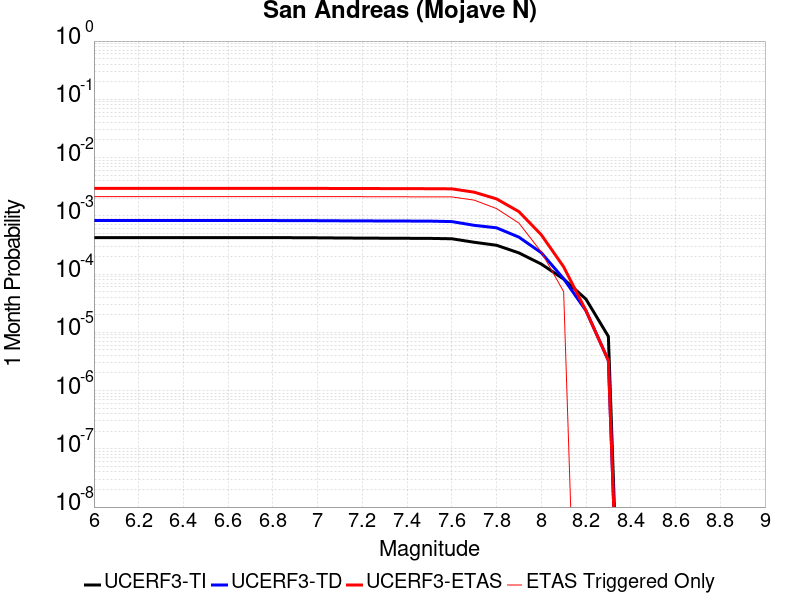 |  |  |

| Magnitude | 1 wk TI Prob | 1 wk TD Prob | 1 wk ETAS Prob | 1 wk ETAS/TD Gain | 1 wk ETAS Triggered Only | 1 mo TI Prob | 1 mo TD Prob | 1 mo ETAS Prob | 1 mo ETAS/TD Gain | 1 mo ETAS Triggered Only | 1 yr TI Prob | 1 yr TD Prob | 1 yr ETAS Prob | 1 yr ETAS/TD Gain | 1 yr ETAS Triggered Only | 10 yr TI Prob | 10 yr TD Prob | 10 yr ETAS Prob | 10 yr ETAS/TD Gain | 10 yr ETAS Triggered Only |
|-----|-----|-----|-----|-----|-----|-----|-----|-----|-----|-----|-----|-----|-----|-----|-----|-----|-----|-----|-----|-----|
| 6.0 | 9.877682E-5 | 1.9400702E-4 | 0.0020974202 | 10.811052 | 0.0019037824 | 4.2326056E-4 | 8.311939E-4 | 0.003039495 | 3.6567822 | 0.0022101381 | 0.0051410277 | 0.010072956 | 0.012585764 | 1.2494608 | 0.0025383765 | 0.05023708 | 0.09831428 | 0.10077081 | 1.0249865 | 0.0027243784 |
| 6.1 | 9.877682E-5 | 1.9400702E-4 | 0.0020974202 | 10.811052 | 0.0019037824 | 4.2326056E-4 | 8.311939E-4 | 0.003039495 | 3.6567822 | 0.0022101381 | 0.0051410277 | 0.010072956 | 0.012585764 | 1.2494608 | 0.0025383765 | 0.05023708 | 0.09831428 | 0.10077081 | 1.0249865 | 0.0027243784 |
| 6.2 | 9.877682E-5 | 1.9400702E-4 | 0.0020974202 | 10.811052 | 0.0019037824 | 4.2326056E-4 | 8.311939E-4 | 0.003039495 | 3.6567822 | 0.0022101381 | 0.0051410277 | 0.010072956 | 0.012585764 | 1.2494608 | 0.0025383765 | 0.05023708 | 0.09831428 | 0.10077081 | 1.0249865 | 0.0027243784 |
| 6.3 | 9.877682E-5 | 1.9400702E-4 | 0.0020974202 | 10.811052 | 0.0019037824 | 4.2326056E-4 | 8.311939E-4 | 0.003039495 | 3.6567822 | 0.0022101381 | 0.0051410277 | 0.010072956 | 0.012585764 | 1.2494608 | 0.0025383765 | 0.05023708 | 0.09831428 | 0.10077081 | 1.0249865 | 0.0027243784 |
| 6.4 | 9.877682E-5 | 1.9400702E-4 | 0.0020974202 | 10.811052 | 0.0019037824 | 4.2326056E-4 | 8.311939E-4 | 0.003039495 | 3.6567822 | 0.0022101381 | 0.0051410277 | 0.010072956 | 0.012585764 | 1.2494608 | 0.0025383765 | 0.05023708 | 0.09831428 | 0.10077081 | 1.0249865 | 0.0027243784 |
| 6.5 | 9.861474E-5 | 1.9374468E-4 | 0.0020971582 | 10.82434 | 0.0019037824 | 4.2256617E-4 | 8.300703E-4 | 0.003038374 | 3.6603813 | 0.0022101381 | 0.0051326132 | 0.010059402 | 0.012572245 | 1.2498003 | 0.0025383765 | 0.050156746 | 0.098192066 | 0.10064893 | 1.0250211 | 0.0027243784 |
| 6.6 | 9.861474E-5 | 1.9374468E-4 | 0.0020971582 | 10.82434 | 0.0019037824 | 4.2256617E-4 | 8.300703E-4 | 0.003038374 | 3.6603813 | 0.0022101381 | 0.0051326132 | 0.010059402 | 0.012572245 | 1.2498003 | 0.0025383765 | 0.050156746 | 0.098192066 | 0.10064893 | 1.0250211 | 0.0027243784 |
| 6.7 | 9.8552715E-5 | 1.9364421E-4 | 0.0020970579 | 10.829438 | 0.0019037824 | 4.223004E-4 | 8.2964E-4 | 0.0030379447 | 3.6617625 | 0.0022101381 | 0.0051293927 | 0.010054212 | 0.0125670675 | 1.2499306 | 0.0025383765 | 0.050125998 | 0.098145254 | 0.10060225 | 1.0250343 | 0.0027243784 |
| 6.8 | 9.8464974E-5 | 1.9349584E-4 | 0.0020969098 | 10.836976 | 0.0019037824 | 4.219245E-4 | 8.290045E-4 | 0.0030373104 | 3.6638045 | 0.0022101381 | 0.0051248376 | 0.010046546 | 0.012559421 | 1.2501233 | 0.0025383765 | 0.05008251 | 0.09807528 | 0.100532465 | 1.0250541 | 0.0027243784 |
| 6.9 | 9.825824E-5 | 1.9317595E-4 | 0.0020965906 | 10.85327 | 0.0019037824 | 4.2103877E-4 | 8.276344E-4 | 0.0030359435 | 3.668218 | 0.0022101381 | 0.0051141046 | 0.010030019 | 0.012542936 | 1.2505395 | 0.0025383765 | 0.049980022 | 0.09792438 | 0.10038198 | 1.0250969 | 0.0027243784 |
| 7.0 | 9.781462E-5 | 1.924896E-4 | 0.0020959056 | 10.88841 | 0.0019037824 | 4.1913814E-4 | 8.246948E-4 | 0.0030330103 | 3.6777368 | 0.0022101381 | 0.005091073 | 0.009994558 | 0.012507565 | 1.2514374 | 0.0025383765 | 0.04976007 | 0.09760077 | 0.10005925 | 1.0251892 | 0.0027243784 |
| 7.1 | 9.7121134E-5 | 1.9150671E-4 | 0.0020949244 | 10.93917 | 0.0019037824 | 4.1616702E-4 | 8.204851E-4 | 0.0030288098 | 3.6914868 | 0.0022101381 | 0.005055068 | 0.009943774 | 0.01245691 | 1.2527345 | 0.0025383765 | 0.04941613 | 0.09713728 | 0.09959702 | 1.0253223 | 0.0027243784 |
| 7.2 | 9.663819E-5 | 1.9081456E-4 | 0.0020942336 | 10.975229 | 0.0019037824 | 4.1409794E-4 | 8.175206E-4 | 0.003025852 | 3.7012546 | 0.0022101381 | 0.0050299936 | 0.00990801 | 0.012421236 | 1.253656 | 0.0025383765 | 0.049176537 | 0.09681055 | 0.09927118 | 1.025417 | 0.0027243784 |
| 7.3 | 9.6277574E-5 | 1.9033969E-4 | 0.0020828205 | 10.942649 | 0.0018928411 | 4.125529E-4 | 8.154867E-4 | 0.0030128902 | 3.6945913 | 0.002199197 | 0.0050112694 | 0.009883473 | 0.012385928 | 1.253196 | 0.0025274353 | 0.04899759 | 0.09658401 | 0.09903537 | 1.0253806 | 0.002713437 |
| 7.4 | 9.593308E-5 | 1.897375E-4 | 0.0020822196 | 10.974212 | 0.0018928411 | 4.1107697E-4 | 8.129075E-4 | 0.0030103168 | 3.703148 | 0.002199197 | 0.0049933824 | 0.009852355 | 0.01235489 | 1.2540036 | 0.0025274353 | 0.04882661 | 0.09630218 | 0.09875431 | 1.0254629 | 0.002713437 |
| 7.5 | 9.561707E-5 | 1.8919831E-4 | 0.0020707422 | 10.944823 | 0.0018818999 | 4.0972308E-4 | 8.1059814E-4 | 0.0029970799 | 3.6973684 | 0.0021882555 | 0.0049769743 | 0.009824493 | 0.012316263 | 1.2536284 | 0.002516494 | 0.048669744 | 0.09604836 | 0.09849129 | 1.0254344 | 0.0027024958 |
| 7.6 | 9.418194E-5 | 1.8572104E-4 | 0.0020672714 | 11.131056 | 0.0018818999 | 4.0357444E-4 | 7.957047E-4 | 0.0029822192 | 3.7478967 | 0.0021882555 | 0.004902454 | 0.009644784 | 0.012137007 | 1.2584012 | 0.002516494 | 0.047957025 | 0.094430685 | 0.096877985 | 1.0259163 | 0.0027024958 |
| 7.7 | 8.202141E-5 | 1.6021315E-4 | 0.0018120814 | 11.310441 | 0.001652133 | 3.51473E-4 | 6.8644714E-4 | 0.0025998566 | 3.7874095 | 0.0019147237 | 0.00427079 | 0.008325525 | 0.010506412 | 1.2619519 | 0.002199197 | 0.04189639 | 0.08223219 | 0.08441121 | 1.0264983 | 0.0023742574 |
| 7.8 | 7.2859846E-5 | 1.4516473E-4 | 0.0012828924 | 8.837495 | 0.001137893 | 3.1221908E-4 | 6.219862E-4 | 0.0019997298 | 3.215071 | 0.0013786011 | 0.003794643 | 0.0075464295 | 0.009110084 | 1.2072045 | 0.001575544 | 0.037304975 | 0.07472468 | 0.07626348 | 1.0205929 | 0.0016630742 |
| 7.9 | 5.3874453E-5 | 1.0045676E-4 | 7.3498714E-4 | 7.3164525 | 6.345941E-4 | 2.3087008E-4 | 4.3045796E-4 | 0.0012069544 | 2.8038843 | 7.7683077E-4 | 0.0028072202 | 0.0052282433 | 0.006120737 | 1.1707063 | 8.9718483E-4 | 0.02772022 | 0.05242443 | 0.053336784 | 1.0174032 | 9.628325E-4 |
| 8.0 | 3.468538E-5 | 5.4260272E-5 | 2.402519E-4 | 4.427768 | 1.8600172E-4 | 1.4864317E-4 | 2.325233E-4 | 4.841142E-4 | 2.0820029 | 2.5164938E-4 | 0.0018082283 | 0.002827298 | 0.003121877 | 1.1041911 | 2.954145E-4 | 0.017935853 | 0.028947512 | 0.029276872 | 1.0113779 | 3.3917962E-4 |
| 8.1 | 1.9152367E-5 | 1.940263E-5 | 6.3166895E-5 | 3.255584 | 4.3765114E-5 | 8.207899E-5 | 8.3151484E-5 | 1.3785332E-4 | 1.6578577 | 5.470639E-5 | 9.988535E-4 | 0.0010118998 | 0.001077481 | 1.06481 | 6.564767E-5 | 0.009943757 | 0.01085625 | 0.01094283 | 1.0079751 | 8.753023E-5 |
| 8.2 | 8.643924E-6 | 5.4748625E-6 | 5.4748625E-6 | 1.0 | 0.0 | 3.704486E-5 | 2.3463486E-5 | 2.3463486E-5 | 1.0 | 0.0 | 4.5092785E-4 | 2.8563058E-4 | 2.8563058E-4 | 1.0 | 0.0 | 0.0045001395 | 0.0032487072 | 0.0032487072 | 1.0 | 0.0 |
| 8.3 | 1.983087E-6 | 7.6599065E-7 | 7.6599065E-7 | 1.0 | 0.0 | 8.498917E-6 | 3.282813E-6 | 3.282813E-6 | 1.0 | 0.0 | 1.034694E-4 | 3.9967534E-5 | 3.9967534E-5 | 1.0 | 0.0 | 0.0010342124 | 4.719687E-4 | 4.719687E-4 | 1.0 | 0.0 |

## San Andreas (Mojave S)
*[(top)](#table-of-contents)*

| 1 Week | 1 Month | 1 Year | 10 Year |
|-----|-----|-----|-----|
|  |  | 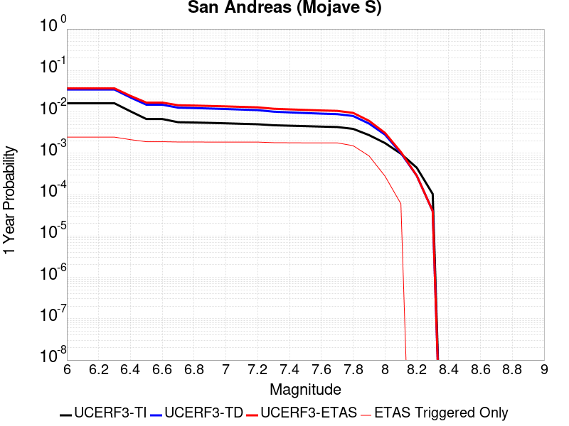 |  |

| Magnitude | 1 wk TI Prob | 1 wk TD Prob | 1 wk ETAS Prob | 1 wk ETAS/TD Gain | 1 wk ETAS Triggered Only | 1 mo TI Prob | 1 mo TD Prob | 1 mo ETAS Prob | 1 mo ETAS/TD Gain | 1 mo ETAS Triggered Only | 1 yr TI Prob | 1 yr TD Prob | 1 yr ETAS Prob | 1 yr ETAS/TD Gain | 1 yr ETAS Triggered Only | 10 yr TI Prob | 10 yr TD Prob | 10 yr ETAS Prob | 10 yr ETAS/TD Gain | 10 yr ETAS Triggered Only |
|-----|-----|-----|-----|-----|-----|-----|-----|-----|-----|-----|-----|-----|-----|-----|-----|-----|-----|-----|-----|-----|
| 6.0 | 3.1064058E-4 | 6.7460834E-4 | 0.0024896353 | 3.69049 | 0.0018162521 | 0.0013306376 | 0.0028881032 | 0.0050264 | 1.7403811 | 0.0021444906 | 0.016080605 | 0.03462235 | 0.0369989 | 1.0686423 | 0.0024617875 | 0.1496549 | 0.28660452 | 0.28848565 | 1.0065634 | 0.002636848 |
| 6.1 | 3.1064058E-4 | 6.7460834E-4 | 0.0024896353 | 3.69049 | 0.0018162521 | 0.0013306376 | 0.0028881032 | 0.0050264 | 1.7403811 | 0.0021444906 | 0.016080605 | 0.03462235 | 0.0369989 | 1.0686423 | 0.0024617875 | 0.1496549 | 0.28660452 | 0.28848565 | 1.0065634 | 0.002636848 |
| 6.2 | 3.1064058E-4 | 6.7460834E-4 | 0.0024896353 | 3.69049 | 0.0018162521 | 0.0013306376 | 0.0028881032 | 0.0050264 | 1.7403811 | 0.0021444906 | 0.016080605 | 0.03462235 | 0.0369989 | 1.0686423 | 0.0024617875 | 0.1496549 | 0.28660452 | 0.28848565 | 1.0065634 | 0.002636848 |
| 6.3 | 3.1064058E-4 | 6.7460834E-4 | 0.0024896353 | 3.69049 | 0.0018162521 | 0.0013306376 | 0.0028881032 | 0.0050264 | 1.7403811 | 0.0021444906 | 0.016080605 | 0.03462235 | 0.0369989 | 1.0686423 | 0.0024617875 | 0.1496549 | 0.28660452 | 0.28848565 | 1.0065634 | 0.002636848 |
| 6.4 | 1.9872203E-4 | 4.3179357E-4 | 0.0020722765 | 4.79923 | 0.0016411918 | 8.5138786E-4 | 0.0018492596 | 0.0037822847 | 2.0452967 | 0.0019366062 | 0.010316478 | 0.02228844 | 0.024427922 | 1.0959907 | 0.0021882555 | 0.098504856 | 0.19699748 | 0.19886008 | 1.009455 | 0.002319551 |
| 6.5 | 1.291105E-4 | 2.875267E-4 | 0.0017204221 | 5.983521 | 0.0014333074 | 5.5321335E-4 | 0.0012316781 | 0.0029364151 | 2.3840768 | 0.0017068394 | 0.006714592 | 0.0148934 | 0.01682272 | 1.129542 | 0.0019584887 | 0.065152965 | 0.13803436 | 0.13983569 | 1.0130498 | 0.002089784 |
| 6.6 | 1.291105E-4 | 2.875267E-4 | 0.0017204221 | 5.983521 | 0.0014333074 | 5.5321335E-4 | 0.0012316781 | 0.0029364151 | 2.3840768 | 0.0017068394 | 0.006714592 | 0.0148934 | 0.01682272 | 1.129542 | 0.0019584887 | 0.065152965 | 0.13803436 | 0.13983569 | 1.0130498 | 0.002089784 |
| 6.7 | 1.08001186E-4 | 2.4333889E-4 | 0.0016434817 | 6.7538805 | 0.0014004837 | 4.6278012E-4 | 0.0010424647 | 0.0027147352 | 2.6041508 | 0.0016740155 | 0.0056198016 | 0.012618446 | 0.014519812 | 1.1506815 | 0.001925665 | 0.054797906 | 0.119176775 | 0.12098859 | 1.0152028 | 0.0020569602 |
| 6.8 | 1.0624356E-4 | 2.3851555E-4 | 0.0016386651 | 6.8702655 | 0.0014004837 | 4.5525006E-4 | 0.0010218095 | 0.0026941146 | 2.6366112 | 0.0016740155 | 0.0055285925 | 0.012369843 | 0.014271688 | 1.1537485 | 0.001925665 | 0.053930566 | 0.11712591 | 0.11894195 | 1.015505 | 0.0020569602 |
| 6.9 | 1.0393785E-4 | 2.3221898E-4 | 0.0016214387 | 6.982369 | 0.0013895424 | 4.4537184E-4 | 9.948451E-4 | 0.002656265 | 2.6700287 | 0.0016630742 | 0.0054089287 | 0.012045221 | 0.013936882 | 1.1570466 | 0.0019147237 | 0.05279156 | 0.11442335 | 0.116235256 | 1.0158352 | 0.002046019 |
| 7.0 | 1.0155622E-4 | 2.2591476E-4 | 0.0016151431 | 7.149348 | 0.0013895424 | 4.3516833E-4 | 9.6784724E-4 | 0.002629312 | 2.71666 | 0.0016630742 | 0.005285311 | 0.0117200995 | 0.013612383 | 1.1614562 | 0.0019147237 | 0.05161361 | 0.111683756 | 0.113501266 | 1.0162737 | 0.002046019 |
| 7.1 | 9.885595E-5 | 2.1879886E-4 | 0.0016080372 | 7.3493857 | 0.0013895424 | 4.2359953E-4 | 9.3737274E-4 | 0.002598888 | 2.7725236 | 0.0016630742 | 0.0051451353 | 0.011352993 | 0.013245978 | 1.166739 | 0.0019147237 | 0.05027629 | 0.1085682 | 0.110392086 | 1.0167994 | 0.002046019 |
| 7.2 | 9.6411415E-5 | 2.124288E-4 | 0.001601676 | 7.539825 | 0.0013895424 | 4.1312634E-4 | 9.1009185E-4 | 0.0025716526 | 2.8257067 | 0.0016630742 | 0.005018219 | 0.011024255 | 0.012917871 | 1.1717681 | 0.0019147237 | 0.049064007 | 0.105758004 | 0.107587636 | 1.0173002 | 0.002046019 |
| 7.3 | 9.1180635E-5 | 1.9471257E-4 | 0.0015402278 | 7.9102635 | 0.0013457772 | 3.907156E-4 | 8.342157E-4 | 0.0024303098 | 2.913287 | 0.0015974266 | 0.004746591 | 0.01010939 | 0.011939772 | 1.1810577 | 0.001849076 | 0.046464786 | 0.09795115 | 0.09973755 | 1.0182376 | 0.0019803713 |
| 7.4 | 8.887388E-5 | 1.8719878E-4 | 0.0015217848 | 8.129246 | 0.0013348359 | 3.8083247E-4 | 8.020339E-4 | 0.0023872468 | 2.9764912 | 0.0015864853 | 0.0046267817 | 0.00972114 | 0.011541406 | 1.1872482 | 0.0018381347 | 0.045316286 | 0.09458615 | 0.0963693 | 1.0188521 | 0.0019694301 |
| 7.5 | 8.6750515E-5 | 1.8051457E-4 | 0.0015151096 | 8.393281 | 0.0013348359 | 3.7173493E-4 | 7.7340455E-4 | 0.00234773 | 3.0355783 | 0.001575544 | 0.004516484 | 0.009375632 | 0.0111856945 | 1.1930603 | 0.0018271934 | 0.04425787 | 0.091549896 | 0.09332909 | 1.0194341 | 0.0019584887 |
| 7.6 | 8.453092E-5 | 1.7439072E-4 | 0.0015089939 | 8.652948 | 0.0013348359 | 3.6222505E-4 | 7.471748E-4 | 0.0023215415 | 3.107093 | 0.001575544 | 0.0044011753 | 0.009058985 | 0.010869625 | 1.1998724 | 0.0018271934 | 0.04315024 | 0.08870898 | 0.09049374 | 1.0201192 | 0.0019584887 |
| 7.7 | 8.259102E-5 | 1.6961215E-4 | 0.0015042217 | 8.868596 | 0.0013348359 | 3.539135E-4 | 7.2670676E-4 | 0.0023011058 | 3.1664848 | 0.001575544 | 0.004300386 | 0.008811831 | 0.010622923 | 1.2055297 | 0.0018271934 | 0.042181134 | 0.08645982 | 0.088238984 | 1.0205779 | 0.0019475475 |
| 7.8 | 7.444844E-5 | 1.5283503E-4 | 0.0012905541 | 8.444098 | 0.001137893 | 3.1902574E-4 | 6.548429E-4 | 0.0020325412 | 3.1038609 | 0.0013786011 | 0.0038772223 | 0.007943616 | 0.009506645 | 1.1967654 | 0.001575544 | 0.03810269 | 0.078290746 | 0.07982362 | 1.0195792 | 0.0016630742 |
| 7.9 | 5.2586525E-5 | 1.00064186E-4 | 7.345948E-4 | 7.341236 | 6.345941E-4 | 2.2535135E-4 | 4.2877605E-4 | 0.0012052737 | 2.8109632 | 7.7683077E-4 | 0.0027402006 | 0.005207864 | 0.006100376 | 1.1713778 | 8.9718483E-4 | 0.027066574 | 0.052200034 | 0.053112607 | 1.0174823 | 9.628325E-4 |
| 8.0 | 3.379877E-5 | 5.4074168E-5 | 2.4006584E-4 | 4.439566 | 1.8600172E-4 | 1.4484383E-4 | 2.3172585E-4 | 4.8331692E-4 | 2.0857272 | 2.5164938E-4 | 0.0017620471 | 0.002817614 | 0.0031121962 | 1.1045502 | 2.954145E-4 | 0.017481409 | 0.028834904 | 0.029164303 | 1.0114236 | 3.3917962E-4 |
| 8.1 | 1.8668277E-5 | 1.9309397E-5 | 6.307366E-5 | 3.2664752 | 4.3765114E-5 | 8.000444E-5 | 8.275194E-5 | 1.374538E-4 | 1.6610342 | 5.470639E-5 | 9.736188E-4 | 0.0010070398 | 0.0010726213 | 1.0651231 | 6.564767E-5 | 0.009693642 | 0.010798888 | 0.010885473 | 1.0080179 | 8.753023E-5 |
| 8.2 | 8.541571E-6 | 5.460819E-6 | 5.460819E-6 | 1.0 | 0.0 | 3.660622E-5 | 2.3403301E-5 | 2.3403301E-5 | 1.0 | 0.0 | 4.455896E-4 | 2.84898E-4 | 2.84898E-4 | 1.0 | 0.0 | 0.0044469717 | 0.0032408056 | 0.0032408056 | 1.0 | 0.0 |
| 8.3 | 1.983087E-6 | 7.6599065E-7 | 7.6599065E-7 | 1.0 | 0.0 | 8.498917E-6 | 3.282813E-6 | 3.282813E-6 | 1.0 | 0.0 | 1.034694E-4 | 3.9967534E-5 | 3.9967534E-5 | 1.0 | 0.0 | 0.0010342124 | 4.719687E-4 | 4.719687E-4 | 1.0 | 0.0 |

## Coyote Canyon
*[(top)](#table-of-contents)*

| 1 Week | 1 Month | 1 Year | 10 Year |
|-----|-----|-----|-----|
|  |  |  |  |

| Magnitude | 1 wk TI Prob | 1 wk TD Prob | 1 wk ETAS Prob | 1 wk ETAS/TD Gain | 1 wk ETAS Triggered Only | 1 mo TI Prob | 1 mo TD Prob | 1 mo ETAS Prob | 1 mo ETAS/TD Gain | 1 mo ETAS Triggered Only | 1 yr TI Prob | 1 yr TD Prob | 1 yr ETAS Prob | 1 yr ETAS/TD Gain | 1 yr ETAS Triggered Only | 10 yr TI Prob | 10 yr TD Prob | 10 yr ETAS Prob | 10 yr ETAS/TD Gain | 10 yr ETAS Triggered Only |
|-----|-----|-----|-----|-----|-----|-----|-----|-----|-----|-----|-----|-----|-----|-----|-----|-----|-----|-----|-----|-----|
| 6.0 | 3.5090034E-5 | 4.0364324E-5 | 0.0013751463 | 34.068363 | 0.0013348359 | 1.503772E-4 | 1.7297994E-4 | 0.0017591908 | 10.169912 | 0.0015864853 | 0.0018293047 | 0.0021042528 | 0.0040367837 | 1.918393 | 0.0019366062 | 0.018143194 | 0.020869201 | 0.023054643 | 1.1047208 | 0.0022320207 |
| 6.1 | 3.5090034E-5 | 4.0364324E-5 | 0.0013751463 | 34.068363 | 0.0013348359 | 1.503772E-4 | 1.7297994E-4 | 0.0017591908 | 10.169912 | 0.0015864853 | 0.0018293047 | 0.0021042528 | 0.0040367837 | 1.918393 | 0.0019366062 | 0.018143194 | 0.020869201 | 0.023054643 | 1.1047208 | 0.0022320207 |
| 6.2 | 1.841879E-5 | 2.1059794E-5 | 7.978742E-4 | 37.886135 | 7.7683077E-4 | 7.8935285E-5 | 9.0253714E-5 | 9.4359636E-4 | 10.454932 | 8.534197E-4 | 9.606133E-4 | 0.001098387 | 0.0021694545 | 1.9751277 | 0.0010722453 | 0.0095647145 | 0.010939667 | 0.012194971 | 1.1147479 | 0.0012691882 |
| 6.3 | 1.841879E-5 | 2.1059794E-5 | 7.978742E-4 | 37.886135 | 7.7683077E-4 | 7.8935285E-5 | 9.0253714E-5 | 9.4359636E-4 | 10.454932 | 8.534197E-4 | 9.606133E-4 | 0.001098387 | 0.0021694545 | 1.9751277 | 0.0010722453 | 0.0095647145 | 0.010939667 | 0.012194971 | 1.1147479 | 0.0012691882 |
| 6.4 | 1.712201E-5 | 1.9565212E-5 | 7.526165E-4 | 38.467075 | 7.3306565E-4 | 7.337798E-5 | 8.3848776E-5 | 9.0437586E-4 | 10.785796 | 8.205959E-4 | 8.930107E-4 | 0.0010204813 | 0.002047912 | 2.0068097 | 0.0010284801 | 0.008894307 | 0.010167871 | 0.011370003 | 1.1182286 | 0.0012144819 |
| 6.5 | 1.4744935E-5 | 1.6836972E-5 | 6.623615E-4 | 39.339706 | 6.455354E-4 | 6.3191044E-5 | 7.215698E-5 | 8.051697E-4 | 11.158584 | 7.3306565E-4 | 7.6907943E-4 | 8.7825063E-4 | 0.0017746475 | 2.0206618 | 8.9718483E-4 | 0.007664232 | 0.008756994 | 0.009787314 | 1.1176567 | 0.0010394214 |
| 6.6 | 1.2017839E-5 | 1.37240895E-5 | 5.388982E-4 | 39.266594 | 5.2518136E-4 | 5.150401E-5 | 5.88167E-5 | 6.4961094E-4 | 11.044669 | 5.90829E-4 | 6.268809E-4 | 7.159466E-4 | 0.0014375539 | 2.0079067 | 7.2212436E-4 | 0.0062511545 | 0.0071450938 | 0.007981553 | 1.1170676 | 8.424784E-4 |
| 6.7 | 1.00956095E-5 | 1.1533517E-5 | 4.710619E-4 | 40.84287 | 4.5953368E-4 | 4.326618E-5 | 4.942891E-5 | 5.636436E-4 | 11.403115 | 5.1424006E-4 | 5.266384E-4 | 6.017178E-4 | 0.0012468648 | 2.0721753 | 6.455354E-4 | 0.005253921 | 0.0060094125 | 0.0067706993 | 1.1266824 | 7.658895E-4 |

## Death Valley (So)
*[(top)](#table-of-contents)*

| 1 Week | 1 Month | 1 Year | 10 Year |
|-----|-----|-----|-----|
|  |  |  |  |

| Magnitude | 1 wk TI Prob | 1 wk TD Prob | 1 wk ETAS Prob | 1 wk ETAS/TD Gain | 1 wk ETAS Triggered Only | 1 mo TI Prob | 1 mo TD Prob | 1 mo ETAS Prob | 1 mo ETAS/TD Gain | 1 mo ETAS Triggered Only | 1 yr TI Prob | 1 yr TD Prob | 1 yr ETAS Prob | 1 yr ETAS/TD Gain | 1 yr ETAS Triggered Only | 10 yr TI Prob | 10 yr TD Prob | 10 yr ETAS Prob | 10 yr ETAS/TD Gain | 10 yr ETAS Triggered Only |
|-----|-----|-----|-----|-----|-----|-----|-----|-----|-----|-----|-----|-----|-----|-----|-----|-----|-----|-----|-----|-----|
| 6.0 | 2.0684236E-5 | 2.5617775E-5 | 0.0011634815 | 45.41696 | 0.001137893 | 8.864371E-5 | 1.0978594E-4 | 0.0015101158 | 13.755093 | 0.0014004837 | 0.0010787029 | 0.0013358411 | 0.0030622538 | 2.2923787 | 0.0017287219 | 0.010734817 | 0.013281397 | 0.015213874 | 1.1455026 | 0.0019584887 |
| 6.1 | 2.0684236E-5 | 2.5617775E-5 | 0.0011634815 | 45.41696 | 0.001137893 | 8.864371E-5 | 1.0978594E-4 | 0.0015101158 | 13.755093 | 0.0014004837 | 0.0010787029 | 0.0013358411 | 0.0030622538 | 2.2923787 | 0.0017287219 | 0.010734817 | 0.013281397 | 0.015213874 | 1.1455026 | 0.0019584887 |
| 6.2 | 2.0684236E-5 | 2.5617775E-5 | 0.0011634815 | 45.41696 | 0.001137893 | 8.864371E-5 | 1.0978594E-4 | 0.0015101158 | 13.755093 | 0.0014004837 | 0.0010787029 | 0.0013358411 | 0.0030622538 | 2.2923787 | 0.0017287219 | 0.010734817 | 0.013281397 | 0.015213874 | 1.1455026 | 0.0019584887 |
| 6.3 | 2.0240292E-5 | 2.511786E-5 | 0.0011301592 | 44.994247 | 0.0011050691 | 8.6741224E-5 | 1.07643624E-4 | 0.001464216 | 13.602441 | 0.0013567185 | 0.0010555626 | 0.00130979 | 0.002948832 | 2.2513778 | 0.0016411918 | 0.010505628 | 0.013023956 | 0.014859749 | 1.1409551 | 0.0018600173 |
| 6.4 | 2.0240292E-5 | 2.511786E-5 | 0.0011301592 | 44.994247 | 0.0011050691 | 8.6741224E-5 | 1.07643624E-4 | 0.001464216 | 13.602441 | 0.0013567185 | 0.0010555626 | 0.00130979 | 0.002948832 | 2.2513778 | 0.0016411918 | 0.010505628 | 0.013023956 | 0.014859749 | 1.1409551 | 0.0018600173 |
| 6.5 | 1.9962767E-5 | 2.4807114E-5 | 0.0010970258 | 44.222225 | 0.0010722453 | 8.55519E-5 | 1.0631196E-4 | 0.0014191257 | 13.348693 | 0.0013129534 | 0.0010410968 | 0.0012935963 | 0.0028889566 | 2.2332752 | 0.0015974266 | 0.010362327 | 0.012863902 | 0.014667591 | 1.1402131 | 0.0018271934 |
| 6.6 | 1.8937297E-5 | 2.3310964E-5 | 0.0010298851 | 44.180286 | 0.0010065975 | 8.115732E-5 | 9.990039E-5 | 0.0013252011 | 13.265224 | 0.0012254232 | 9.876423E-4 | 0.0012156231 | 0.002701828 | 2.2225869 | 0.0014880138 | 0.009832645 | 0.012092789 | 0.013778987 | 1.1394384 | 0.0017068394 |
| 6.7 | 1.8621096E-5 | 2.2911607E-5 | 9.6384E-4 | 42.06776 | 9.4094995E-4 | 7.980225E-5 | 9.818898E-5 | 0.0012469104 | 12.699086 | 0.0011488342 | 9.711593E-4 | 0.0011948098 | 0.0026045484 | 2.1798854 | 0.0014114248 | 0.009669261 | 0.011886904 | 0.013465342 | 1.132788 | 0.0015974266 |
| 6.8 | 1.7830353E-5 | 2.1805688E-5 | 9.080299E-4 | 41.641884 | 8.8624354E-4 | 7.641356E-5 | 9.344968E-5 | 0.001176535 | 12.590037 | 0.0010831866 | 9.29938E-4 | 0.00113717 | 0.002470488 | 2.1724877 | 0.0013348359 | 0.009260561 | 0.011316354 | 0.012798347 | 1.1309602 | 0.0014989551 |
| 6.9 | 1.3135183E-5 | 1.5303925E-5 | 6.17065E-4 | 40.3207 | 6.017703E-4 | 5.6292425E-5 | 6.558664E-5 | 8.204853E-4 | 12.509947 | 7.549482E-4 | 6.8514474E-4 | 7.982312E-4 | 0.0016728347 | 2.095677 | 8.7530224E-4 | 0.006830362 | 0.007954649 | 0.008898968 | 1.1187129 | 9.518912E-4 |
| 7.0 | 1.1507512E-5 | 1.3154199E-5 | 4.0703503E-4 | 30.943352 | 3.93886E-4 | 4.9316975E-5 | 5.6373956E-5 | 5.924664E-4 | 10.509576 | 5.3612265E-4 | 6.002687E-4 | 6.8614254E-4 | 0.0013421688 | 1.9561079 | 6.564767E-4 | 0.0059864987 | 0.0068409415 | 0.0075472593 | 1.1032486 | 7.1118306E-4 |
| 7.1 | 9.715903E-6 | 1.0865278E-5 | 1.8592383E-4 | 17.111742 | 1.7506046E-4 | 4.1638916E-5 | 4.656467E-5 | 3.200839E-4 | 6.8739643 | 2.7353194E-4 | 5.068359E-4 | 5.667817E-4 | 9.167041E-4 | 1.6173849 | 3.501209E-4 | 0.0050568148 | 0.0056538144 | 0.006023715 | 1.0654249 | 3.7200344E-4 |
| 7.2 | 9.233269E-6 | 1.02863105E-5 | 1.5252146E-4 | 14.827617 | 1.4223662E-4 | 3.9570554E-5 | 4.4083466E-5 | 2.4101778E-4 | 5.4673057 | 1.96943E-4 | 4.81665E-4 | 5.3658825E-4 | 7.881026E-4 | 1.4687288 | 2.5164938E-4 | 0.0048062233 | 0.0053533576 | 0.0056254254 | 1.0508219 | 2.7353194E-4 |
| 7.3 | 8.8041315E-6 | 9.808164E-6 | 1.4110221E-4 | 14.386201 | 1.3129534E-4 | 3.7731446E-5 | 4.2034335E-5 | 2.1708742E-4 | 5.1645265 | 1.7506046E-4 | 4.592835E-4 | 5.1165203E-4 | 7.3036563E-4 | 1.4274656 | 2.1882556E-4 | 0.0045833546 | 0.005105167 | 0.0053446465 | 1.0469092 | 2.4070812E-4 |
| 7.4 | 8.708749E-6 | 9.707175E-6 | 1.3006007E-4 | 13.398344 | 1.2035406E-4 | 3.7322676E-5 | 4.160154E-5 | 2.0571388E-4 | 4.9448624 | 1.6411918E-4 | 4.5430884E-4 | 5.0638523E-4 | 7.141642E-4 | 1.4103181 | 2.0788428E-4 | 0.004533812 | 0.0050527398 | 0.0052813455 | 1.045244 | 2.2976684E-4 |
| 7.5 | 8.612678E-6 | 9.604817E-6 | 1.2995773E-4 | 13.530473 | 1.2035406E-4 | 3.6910955E-5 | 4.1162875E-5 | 1.9433447E-4 | 4.72111 | 1.531779E-4 | 4.492982E-4 | 5.01047E-4 | 6.978913E-4 | 1.392866 | 1.96943E-4 | 0.004483909 | 0.0049995985 | 0.00521733 | 1.0435498 | 2.1882556E-4 |
| 7.6 | 8.319024E-6 | 9.283916E-6 | 1.2963686E-4 | 13.963596 | 1.2035406E-4 | 3.5652476E-5 | 3.978763E-5 | 1.9295943E-4 | 4.8497343 | 1.531779E-4 | 4.3398244E-4 | 4.8431093E-4 | 6.7022257E-4 | 1.3838683 | 1.8600172E-4 | 0.0043313587 | 0.0048329784 | 0.0050398577 | 1.0428058 | 2.0788428E-4 |
| 7.7 | 7.4718328E-6 | 8.34517E-6 | 1.1775704E-4 | 14.110802 | 1.0941278E-4 | 3.2021748E-5 | 3.5764548E-5 | 1.6705519E-4 | 4.670972 | 1.3129534E-4 | 3.8979502E-4 | 4.353504E-4 | 5.993981E-4 | 1.3768177 | 1.6411918E-4 | 0.00389112 | 0.0043453807 | 0.0045196805 | 1.0401115 | 1.7506046E-4 |
| 7.8 | 3.4586725E-7 | 3.6482615E-7 | 3.6482615E-7 | 1.0 | 0.0 | 1.4822873E-6 | 1.5635396E-6 | 1.5635396E-6 | 1.0 | 0.0 | 1.80467E-5 | 1.9035933E-5 | 1.9035933E-5 | 1.0 | 0.0 | 1.8045233E-4 | 1.9034347E-4 | 1.9034347E-4 | 1.0 | 0.0 |
| 7.9 | 2.5591178E-9 | 2.6696718E-9 | 2.6696718E-9 | 1.0 | 0.0 | 1.0967647E-8 | 1.14414505E-8 | 1.14414505E-8 | 1.0 | 0.0 | 1.335311E-7 | 1.3929966E-7 | 1.3929966E-7 | 1.0 | 0.0 | 1.3353102E-6 | 1.3929966E-6 | 1.3929966E-6 | 1.0 | 0.0 |

## Lenwood-Lockhart-Old Woman Springs
*[(top)](#table-of-contents)*

| 1 Week | 1 Month | 1 Year | 10 Year |
|-----|-----|-----|-----|
|  |  |  |  |

| Magnitude | 1 wk TI Prob | 1 wk TD Prob | 1 wk ETAS Prob | 1 wk ETAS/TD Gain | 1 wk ETAS Triggered Only | 1 mo TI Prob | 1 mo TD Prob | 1 mo ETAS Prob | 1 mo ETAS/TD Gain | 1 mo ETAS Triggered Only | 1 yr TI Prob | 1 yr TD Prob | 1 yr ETAS Prob | 1 yr ETAS/TD Gain | 1 yr ETAS Triggered Only | 10 yr TI Prob | 10 yr TD Prob | 10 yr ETAS Prob | 10 yr ETAS/TD Gain | 10 yr ETAS Triggered Only |
|-----|-----|-----|-----|-----|-----|-----|-----|-----|-----|-----|-----|-----|-----|-----|-----|-----|-----|-----|-----|-----|
| 6.0 | 3.744542E-5 | 4.396252E-5 | 0.0010395751 | 23.646849 | 9.956564E-4 | 1.604705E-4 | 1.8839816E-4 | 0.0014464081 | 7.6774 | 0.001258247 | 0.0019519776 | 0.0022915069 | 0.0038525243 | 1.6812187 | 0.0015646028 | 0.019349206 | 0.022696787 | 0.024343502 | 1.0725527 | 0.0016849568 |
| 6.1 | 3.744542E-5 | 4.396252E-5 | 0.0010395751 | 23.646849 | 9.956564E-4 | 1.604705E-4 | 1.8839816E-4 | 0.0014464081 | 7.6774 | 0.001258247 | 0.0019519776 | 0.0022915069 | 0.0038525243 | 1.6812187 | 0.0015646028 | 0.019349206 | 0.022696787 | 0.024343502 | 1.0725527 | 0.0016849568 |
| 6.2 | 3.744542E-5 | 4.396252E-5 | 0.0010395751 | 23.646849 | 9.956564E-4 | 1.604705E-4 | 1.8839816E-4 | 0.0014464081 | 7.6774 | 0.001258247 | 0.0019519776 | 0.0022915069 | 0.0038525243 | 1.6812187 | 0.0015646028 | 0.019349206 | 0.022696787 | 0.024343502 | 1.0725527 | 0.0016849568 |
| 6.3 | 2.1079984E-5 | 2.5353434E-5 | 4.5205245E-4 | 17.830029 | 4.2670986E-4 | 9.0339665E-5 | 1.0865316E-4 | 6.884779E-4 | 6.3364735 | 5.7988777E-4 | 0.0010993304 | 0.0013220694 | 0.0020978733 | 1.5868101 | 7.7683077E-4 | 0.010939079 | 0.0131442575 | 0.013975662 | 1.0632523 | 8.424784E-4 |
| 6.4 | 2.1079984E-5 | 2.5353434E-5 | 4.5205245E-4 | 17.830029 | 4.2670986E-4 | 9.0339665E-5 | 1.0865316E-4 | 6.884779E-4 | 6.3364735 | 5.7988777E-4 | 0.0010993304 | 0.0013220694 | 0.0020978733 | 1.5868101 | 7.7683077E-4 | 0.010939079 | 0.0131442575 | 0.013975662 | 1.0632523 | 8.424784E-4 |
| 6.5 | 1.7397282E-5 | 2.066241E-5 | 3.0512977E-4 | 14.7673855 | 2.8447324E-4 | 7.455765E-5 | 8.8550245E-5 | 4.6052077E-4 | 5.2006717 | 3.7200344E-4 | 9.073613E-4 | 0.0010775778 | 0.0016021932 | 1.4868469 | 5.2518136E-4 | 0.009036654 | 0.010724821 | 0.011276842 | 1.0514714 | 5.580052E-4 |
| 6.6 | 1.52050325E-5 | 1.7679693E-5 | 2.4744248E-4 | 13.995857 | 2.2976684E-4 | 6.51628E-5 | 7.576796E-5 | 3.9304097E-4 | 5.18743 | 3.1729706E-4 | 7.9306826E-4 | 9.220924E-4 | 0.0013921335 | 1.5097549 | 4.7047497E-4 | 0.007902439 | 0.009183526 | 0.009682203 | 1.0543013 | 5.0329877E-4 |
| 6.7 | 1.332523E-5 | 1.5264002E-5 | 2.12204E-4 | 13.902251 | 1.96943E-4 | 5.7106878E-5 | 6.5415545E-5 | 3.1704849E-4 | 4.846684 | 2.5164938E-4 | 6.950544E-4 | 7.961491E-4 | 0.0011569238 | 1.4531497 | 3.6106218E-4 | 0.006928845 | 0.007933599 | 0.008313506 | 1.0478858 | 3.8294474E-4 |
| 6.8 | 1.1525329E-5 | 1.3030979E-5 | 1.7714802E-4 | 13.594375 | 1.6411918E-4 | 4.9393333E-5 | 5.584588E-5 | 2.6371857E-4 | 4.722256 | 2.0788428E-4 | 6.011979E-4 | 6.797157E-4 | 9.858633E-4 | 1.4504052 | 3.063558E-4 | 0.00599574 | 0.006776819 | 0.007102833 | 1.0481073 | 3.2823835E-4 |
| 6.9 | 1.0253909E-5 | 1.15144385E-5 | 1.7563172E-4 | 15.253173 | 1.6411918E-4 | 4.3944583E-5 | 4.9346683E-5 | 2.3533923E-4 | 4.769099 | 1.8600172E-4 | 5.3489394E-4 | 6.0063385E-4 | 8.8493625E-4 | 1.4733373 | 2.8447324E-4 | 0.0053360825 | 0.0059904843 | 0.006295005 | 1.0508341 | 3.063558E-4 |
| 7.0 | 8.104563E-6 | 8.991279E-6 | 1.2934426E-4 | 14.385524 | 1.2035406E-4 | 3.4733377E-5 | 3.8533497E-5 | 1.8076463E-4 | 4.691104 | 1.4223662E-4 | 4.2279682E-4 | 4.6904673E-4 | 6.877697E-4 | 1.4663137 | 2.1882556E-4 | 0.0042199334 | 0.0046808156 | 0.004898617 | 1.0465306 | 2.1882556E-4 |
| 7.1 | 6.7986157E-6 | 7.515816E-6 | 9.504538E-5 | 12.64605 | 8.753023E-5 | 2.91366E-5 | 3.2210253E-5 | 1.4161952E-4 | 4.3967214 | 1.0941278E-4 | 3.5468035E-4 | 3.920914E-4 | 5.7802023E-4 | 1.4741976 | 1.8600172E-4 | 0.003541148 | 0.003914213 | 0.0040994864 | 1.0473336 | 1.8600172E-4 |
| 7.2 | 5.6893327E-6 | 6.2800136E-6 | 7.192727E-5 | 11.4533615 | 6.564767E-5 | 2.4382627E-5 | 2.6914078E-5 | 1.1444195E-4 | 4.252122 | 8.753023E-5 | 2.9681803E-4 | 3.2763163E-4 | 4.8075934E-4 | 1.4673777 | 1.531779E-4 | 0.002964219 | 0.0032716845 | 0.0034243613 | 1.0466661 | 1.531779E-4 |
| 7.3 | 4.253348E-6 | 4.7069107E-6 | 7.035427E-5 | 14.947017 | 6.564767E-5 | 1.8228506E-5 | 2.0172329E-5 | 9.675973E-5 | 4.7966566 | 7.658895E-5 | 2.2190946E-4 | 2.4557224E-4 | 3.7683535E-4 | 1.5345193 | 1.3129534E-4 | 0.00221688 | 0.0024531898 | 0.002584163 | 1.053389 | 1.3129534E-4 |
| 7.4 | 2.5448119E-6 | 2.852045E-6 | 3.5675785E-5 | 12.508844 | 3.2823835E-5 | 1.0906291E-5 | 1.2223002E-5 | 4.5046436E-5 | 3.6853824 | 3.2823835E-5 | 1.3277601E-4 | 1.4880655E-4 | 2.1444444E-4 | 1.4410956 | 6.564767E-5 | 0.001326967 | 0.0014872311 | 0.0015527812 | 1.0440753 | 6.564767E-5 |
| 7.5 | 4.3706837E-8 | 4.562909E-8 | 4.562909E-8 | 1.0 | 0.0 | 1.8731501E-7 | 1.9555324E-7 | 1.9555324E-7 | 1.0 | 0.0 | 2.2805577E-6 | 2.3808586E-6 | 2.3808586E-6 | 1.0 | 0.0 | 2.2805343E-5 | 2.3808387E-5 | 2.3808387E-5 | 1.0 | 0.0 |

## Nelson Lake
*[(top)](#table-of-contents)*

| 1 Week | 1 Month | 1 Year | 10 Year |
|-----|-----|-----|-----|
|  |  | 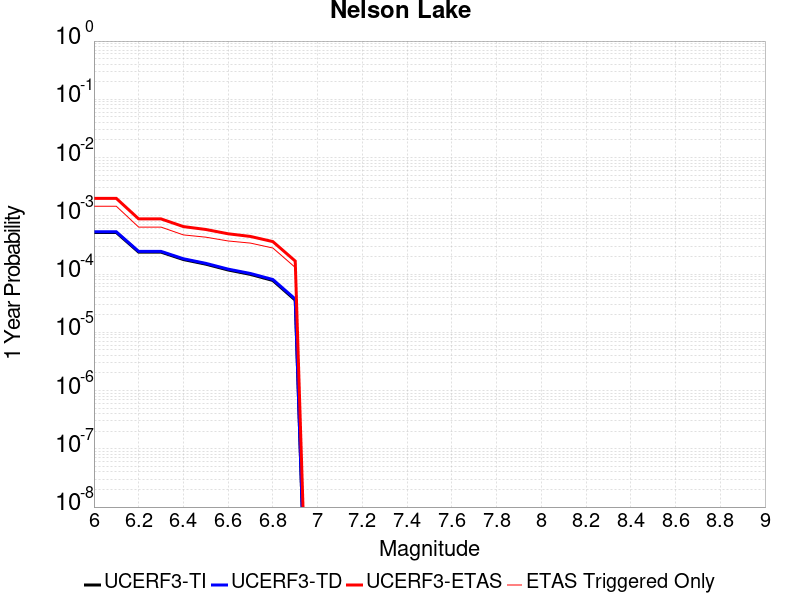 |  |

| Magnitude | 1 wk TI Prob | 1 wk TD Prob | 1 wk ETAS Prob | 1 wk ETAS/TD Gain | 1 wk ETAS Triggered Only | 1 mo TI Prob | 1 mo TD Prob | 1 mo ETAS Prob | 1 mo ETAS/TD Gain | 1 mo ETAS Triggered Only | 1 yr TI Prob | 1 yr TD Prob | 1 yr ETAS Prob | 1 yr ETAS/TD Gain | 1 yr ETAS Triggered Only | 10 yr TI Prob | 10 yr TD Prob | 10 yr ETAS Prob | 10 yr ETAS/TD Gain | 10 yr ETAS Triggered Only |
|-----|-----|-----|-----|-----|-----|-----|-----|-----|-----|-----|-----|-----|-----|-----|-----|-----|-----|-----|-----|-----|
| 6.0 | 9.913453E-6 | 1.0192255E-5 | 9.183091E-4 | 90.09871 | 9.0812607E-4 | 4.2485535E-5 | 4.3680422E-5 | 0.0012471684 | 28.552116 | 0.0012035406 | 5.1713863E-4 | 5.316897E-4 | 0.0019970415 | 3.7560282 | 0.0014661313 | 0.0051593683 | 0.005305204 | 0.006894156 | 1.2995082 | 0.0015974266 |
| 6.1 | 9.913453E-6 | 1.0192255E-5 | 9.183091E-4 | 90.09871 | 9.0812607E-4 | 4.2485535E-5 | 4.3680422E-5 | 0.0012471684 | 28.552116 | 0.0012035406 | 5.1713863E-4 | 5.316897E-4 | 0.0019970415 | 3.7560282 | 0.0014661313 | 0.0051593683 | 0.005305204 | 0.006894156 | 1.2995082 | 0.0015974266 |
| 6.2 | 4.5596407E-6 | 4.696313E-6 | 3.8763924E-4 | 82.54118 | 3.8294474E-4 | 1.954117E-5 | 2.0126909E-5 | 5.2341557E-4 | 26.005762 | 5.0329877E-4 | 2.3788778E-4 | 2.4501883E-4 | 9.1227324E-4 | 3.7232783 | 6.6741795E-4 | 0.0023763329 | 0.0024476128 | 0.0031461406 | 1.2853914 | 7.002418E-4 |
| 6.3 | 4.5596407E-6 | 4.696313E-6 | 3.8763924E-4 | 82.54118 | 3.8294474E-4 | 1.954117E-5 | 2.0126909E-5 | 5.2341557E-4 | 26.005762 | 5.0329877E-4 | 2.3788778E-4 | 2.4501883E-4 | 9.1227324E-4 | 3.7232783 | 6.6741795E-4 | 0.0023763329 | 0.0024476128 | 0.0031461406 | 1.2853914 | 7.002418E-4 |
| 6.4 | 3.4025713E-6 | 3.5098972E-6 | 2.770409E-4 | 78.93134 | 2.7353194E-4 | 1.4582367E-5 | 1.5042335E-5 | 3.7609908E-4 | 25.002707 | 3.6106218E-4 | 1.7752586E-4 | 1.8312587E-4 | 6.753932E-4 | 3.6881366 | 4.9235753E-4 | 0.001773841 | 0.0018298327 | 0.002354053 | 1.2864854 | 5.2518136E-4 |
| 6.5 | 2.8352947E-6 | 2.927856E-6 | 2.5457653E-4 | 86.94981 | 2.5164938E-4 | 1.2151207E-5 | 1.2547898E-5 | 3.29841E-4 | 26.286552 | 3.1729706E-4 | 1.479309E-4 | 1.5276071E-4 | 6.0128456E-4 | 3.9361207 | 4.4859241E-4 | 0.0014783246 | 0.0015266308 | 0.0019963875 | 1.3077081 | 4.7047497E-4 |
| 6.6 | 2.251518E-6 | 2.3290677E-6 | 1.9927161E-4 | 85.55854 | 1.96943E-4 | 9.649328E-6 | 9.981683E-6 | 2.6162856E-4 | 26.210867 | 2.5164938E-4 | 1.1747423E-4 | 1.2152085E-4 | 5.0441903E-4 | 4.150885 | 3.8294474E-4 | 0.0011741214 | 0.0012146058 | 0.0016080133 | 1.3238974 | 3.93886E-4 |
| 6.7 | 1.8911853E-6 | 1.9591396E-6 | 1.879605E-4 | 95.94033 | 1.8600172E-4 | 8.105055E-6 | 8.39629E-6 | 2.381612E-4 | 28.365055 | 2.2976684E-4 | 9.867457E-5 | 1.0222061E-4 | 4.523057E-4 | 4.4247994 | 3.501209E-4 | 9.863076E-4 | 0.0010217935 | 0.0013824867 | 1.3530002 | 3.6106218E-4 |
| 6.8 | 1.4874814E-6 | 1.5438305E-6 | 1.6566274E-4 | 107.306305 | 1.6411918E-4 | 6.374905E-6 | 6.6164025E-6 | 2.0355811E-4 | 30.765676 | 1.96943E-4 | 7.76117E-5 | 8.055224E-5 | 3.7594297E-4 | 4.66707 | 2.954145E-4 | 7.75846E-4 | 8.0528157E-4 | 0.0011113907 | 1.3801268 | 3.063558E-4 |
| 6.9 | 6.835972E-7 | 7.1399285E-7 | 7.730289E-5 | 108.26843 | 7.658895E-5 | 2.9296991E-6 | 3.0599674E-6 | 1.0153117E-4 | 33.180473 | 9.84715E-5 | 3.56685E-5 | 3.7254784E-5 | 1.794861E-4 | 4.8178 | 1.4223662E-4 | 3.5662777E-4 | 3.7251666E-4 | 5.256375E-4 | 1.4110442 | 1.531779E-4 |

## Towne Pass
*[(top)](#table-of-contents)*

| 1 Week | 1 Month | 1 Year | 10 Year |
|-----|-----|-----|-----|
|  |  |  |  |

| Magnitude | 1 wk TI Prob | 1 wk TD Prob | 1 wk ETAS Prob | 1 wk ETAS/TD Gain | 1 wk ETAS Triggered Only | 1 mo TI Prob | 1 mo TD Prob | 1 mo ETAS Prob | 1 mo ETAS/TD Gain | 1 mo ETAS Triggered Only | 1 yr TI Prob | 1 yr TD Prob | 1 yr ETAS Prob | 1 yr ETAS/TD Gain | 1 yr ETAS Triggered Only | 10 yr TI Prob | 10 yr TD Prob | 10 yr ETAS Prob | 10 yr ETAS/TD Gain | 10 yr ETAS Triggered Only |
|-----|-----|-----|-----|-----|-----|-----|-----|-----|-----|-----|-----|-----|-----|-----|-----|-----|-----|-----|-----|-----|
| 6.0 | 3.849728E-6 | 3.8945414E-6 | 9.120171E-4 | 234.1783 | 9.0812607E-4 | 1.649873E-5 | 1.669081E-5 | 0.0011545648 | 69.17368 | 0.001137893 | 2.0085352E-4 | 2.0319603E-4 | 0.0016580904 | 8.160053 | 0.00145519 | 0.0020067208 | 0.0020305314 | 0.0036902288 | 1.8173709 | 0.0016630742 |
| 6.1 | 3.849728E-6 | 3.8945414E-6 | 9.120171E-4 | 234.1783 | 9.0812607E-4 | 1.649873E-5 | 1.669081E-5 | 0.0011545648 | 69.17368 | 0.001137893 | 2.0085352E-4 | 2.0319603E-4 | 0.0016580904 | 8.160053 | 0.00145519 | 0.0020067208 | 0.0020305314 | 0.0036902288 | 1.8173709 | 0.0016630742 |
| 6.2 | 3.849728E-6 | 3.8945414E-6 | 9.120171E-4 | 234.1783 | 9.0812607E-4 | 1.649873E-5 | 1.669081E-5 | 0.0011545648 | 69.17368 | 0.001137893 | 2.0085352E-4 | 2.0319603E-4 | 0.0016580904 | 8.160053 | 0.00145519 | 0.0020067208 | 0.0020305314 | 0.0036902288 | 1.8173709 | 0.0016630742 |
| 6.3 | 3.849728E-6 | 3.8945414E-6 | 9.120171E-4 | 234.1783 | 9.0812607E-4 | 1.649873E-5 | 1.669081E-5 | 0.0011545648 | 69.17368 | 0.001137893 | 2.0085352E-4 | 2.0319603E-4 | 0.0016580904 | 8.160053 | 0.00145519 | 0.0020067208 | 0.0020305314 | 0.0036902288 | 1.8173709 | 0.0016630742 |
| 6.4 | 3.849728E-6 | 3.8945414E-6 | 9.120171E-4 | 234.1783 | 9.0812607E-4 | 1.649873E-5 | 1.669081E-5 | 0.0011545648 | 69.17368 | 0.001137893 | 2.0085352E-4 | 2.0319603E-4 | 0.0016580904 | 8.160053 | 0.00145519 | 0.0020067208 | 0.0020305314 | 0.0036902288 | 1.8173709 | 0.0016630742 |
| 6.5 | 1.1953545E-6 | 1.203052E-6 | 1.5438076E-4 | 128.32426 | 1.531779E-4 | 5.1229376E-6 | 5.1559277E-6 | 2.2398036E-4 | 43.44133 | 2.1882556E-4 | 6.236998E-5 | 6.277173E-5 | 3.2534593E-4 | 5.1830006 | 2.6259068E-4 | 6.235248E-4 | 6.275517E-4 | 9.446497E-4 | 1.5052937 | 3.1729706E-4 |
| 6.6 | 1.1953545E-6 | 1.203052E-6 | 1.5438076E-4 | 128.32426 | 1.531779E-4 | 5.1229376E-6 | 5.1559277E-6 | 2.2398036E-4 | 43.44133 | 2.1882556E-4 | 6.236998E-5 | 6.277173E-5 | 3.2534593E-4 | 5.1830006 | 2.6259068E-4 | 6.235248E-4 | 6.275517E-4 | 9.446497E-4 | 1.5052937 | 3.1729706E-4 |
| 6.7 | 8.375951E-7 | 8.4106705E-7 | 1.1025376E-4 | 131.08795 | 1.0941278E-4 | 3.5896885E-6 | 3.6045683E-6 | 1.5678191E-4 | 43.495335 | 1.531779E-4 | 4.370358E-5 | 4.3884793E-5 | 2.4081916E-4 | 5.4875307 | 1.96943E-4 | 4.3694986E-4 | 4.38767E-4 | 6.6843303E-4 | 1.5234351 | 2.2976684E-4 |
| 6.8 | 6.38041E-7 | 6.392156E-7 | 7.722811E-5 | 120.81699 | 7.658895E-5 | 2.7344586E-6 | 2.7394929E-6 | 1.12151974E-4 | 40.938953 | 1.0941278E-4 | 3.3291526E-5 | 3.3352855E-5 | 1.8652563E-4 | 5.592494 | 1.531779E-4 | 3.3286537E-4 | 3.334823E-4 | 5.19422E-4 | 1.5575699 | 1.8600172E-4 |
| 6.9 | 5.3460053E-7 | 5.345333E-7 | 4.4299624E-5 | 82.87533 | 4.3765114E-5 | 2.2911431E-6 | 2.2908553E-6 | 6.7938374E-5 | 29.656338 | 6.564767E-5 | 2.789431E-5 | 2.789084E-5 | 1.2635959E-4 | 4.530505 | 9.84715E-5 | 2.789081E-4 | 2.7887672E-4 | 4.1013543E-4 | 1.4706694 | 1.3129534E-4 |
| 7.0 | 3.557783E-7 | 3.5324226E-7 | 1.1294516E-5 | 31.973854 | 1.0941279E-5 | 1.5247632E-6 | 1.5138945E-6 | 2.3396418E-5 | 15.454456 | 2.1882557E-5 | 1.8563835E-5 | 1.843152E-5 | 4.0313673E-5 | 2.1872137 | 2.1882557E-5 | 1.8562283E-4 | 1.8430075E-4 | 2.2805779E-4 | 1.237422 | 4.3765114E-5 |
| 7.1 | 3.037942E-7 | 3.0002218E-7 | 1.1241297E-5 | 37.46822 | 1.0941279E-5 | 1.3019744E-6 | 1.2858087E-6 | 2.3168337E-5 | 18.018494 | 2.1882557E-5 | 1.5851423E-5 | 1.5654618E-5 | 3.753683E-5 | 2.3978121 | 2.1882557E-5 | 1.5850292E-4 | 1.5653588E-4 | 1.8935459E-4 | 1.209656 | 3.2823835E-5 |
| 7.2 | 2.0808248E-7 | 2.0217689E-7 | 1.1143453E-5 | 55.117344 | 1.0941279E-5 | 8.917818E-7 | 8.6647213E-7 | 2.2749009E-5 | 26.254751 | 2.1882557E-5 | 1.0857389E-5 | 1.0549252E-5 | 3.2431577E-5 | 3.0743012 | 2.1882557E-5 | 1.0856859E-4 | 1.0548797E-4 | 1.3830834E-4 | 1.3111291 | 3.2823835E-5 |
| 7.3 | 1.1162073E-7 | 1.0636894E-7 | 1.0636894E-7 | 1.0 | 0.0 | 4.7837443E-7 | 4.558668E-7 | 1.139714E-5 | 25.001032 | 1.0941279E-5 | 5.8241935E-6 | 5.550166E-6 | 1.6491384E-5 | 2.9713316 | 1.0941279E-5 | 5.8240406E-5 | 5.5500474E-5 | 6.644115E-5 | 1.1971275 | 1.0941279E-5 |

## San Andreas (San Bernardino N)
*[(top)](#table-of-contents)*

| 1 Week | 1 Month | 1 Year | 10 Year |
|-----|-----|-----|-----|
|  |  |  | 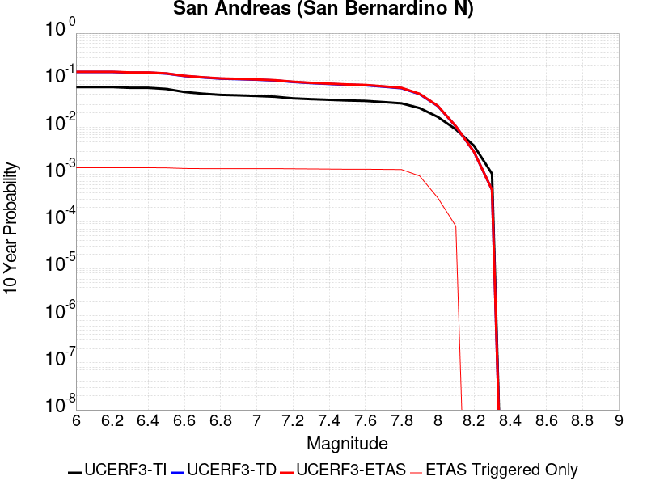 |

| Magnitude | 1 wk TI Prob | 1 wk TD Prob | 1 wk ETAS Prob | 1 wk ETAS/TD Gain | 1 wk ETAS Triggered Only | 1 mo TI Prob | 1 mo TD Prob | 1 mo ETAS Prob | 1 mo ETAS/TD Gain | 1 mo ETAS Triggered Only | 1 yr TI Prob | 1 yr TD Prob | 1 yr ETAS Prob | 1 yr ETAS/TD Gain | 1 yr ETAS Triggered Only | 10 yr TI Prob | 10 yr TD Prob | 10 yr ETAS Prob | 10 yr ETAS/TD Gain | 10 yr ETAS Triggered Only |
|-----|-----|-----|-----|-----|-----|-----|-----|-----|-----|-----|-----|-----|-----|-----|-----|-----|-----|-----|-----|-----|
| 6.0 | 1.4273766E-4 | 3.1606483E-4 | 0.0012895308 | 4.0799565 | 9.737738E-4 | 6.115894E-4 | 0.0013538664 | 0.0025557776 | 1.8877621 | 0.0012035406 | 0.0074207084 | 0.016360244 | 0.017694766 | 1.0815711 | 0.0013567185 | 0.07177748 | 0.15026689 | 0.15149412 | 1.008167 | 0.0014442487 |
| 6.1 | 1.4273766E-4 | 3.1606483E-4 | 0.0012895308 | 4.0799565 | 9.737738E-4 | 6.115894E-4 | 0.0013538664 | 0.0025557776 | 1.8877621 | 0.0012035406 | 0.0074207084 | 0.016360244 | 0.017694766 | 1.0815711 | 0.0013567185 | 0.07177748 | 0.15026689 | 0.15149412 | 1.008167 | 0.0014442487 |
| 6.2 | 1.4273766E-4 | 3.1606483E-4 | 0.0012895308 | 4.0799565 | 9.737738E-4 | 6.115894E-4 | 0.0013538664 | 0.0025557776 | 1.8877621 | 0.0012035406 | 0.0074207084 | 0.016360244 | 0.017694766 | 1.0815711 | 0.0013567185 | 0.07177748 | 0.15026689 | 0.15149412 | 1.008167 | 0.0014442487 |
| 6.3 | 1.3730655E-4 | 3.0511338E-4 | 0.0012785901 | 4.190541 | 9.737738E-4 | 5.883239E-4 | 0.0013069791 | 0.0025089467 | 1.9196532 | 0.0012035406 | 0.0071393442 | 0.015797773 | 0.017133057 | 1.0845237 | 0.0013567185 | 0.06914291 | 0.14556676 | 0.14680079 | 1.0084773 | 0.0014442487 |
| 6.4 | 1.3730655E-4 | 3.0511338E-4 | 0.0012785901 | 4.190541 | 9.737738E-4 | 5.883239E-4 | 0.0013069791 | 0.0025089467 | 1.9196532 | 0.0012035406 | 0.0071393442 | 0.015797773 | 0.017133057 | 1.0845237 | 0.0013567185 | 0.06914291 | 0.14556676 | 0.14680079 | 1.0084773 | 0.0014442487 |
| 6.5 | 1.2942807E-4 | 2.8925808E-4 | 0.0012518121 | 4.327665 | 9.628325E-4 | 5.545738E-4 | 0.0012390936 | 0.0024302152 | 1.9612845 | 0.0011925993 | 0.0067310524 | 0.01498286 | 0.016308473 | 1.0884753 | 0.0013457772 | 0.06530788 | 0.13870941 | 0.13994391 | 1.0088998 | 0.0014333074 |
| 6.6 | 1.1125901E-4 | 2.536472E-4 | 0.00118342 | 4.665614 | 9.3000865E-4 | 4.767372E-4 | 0.0010866089 | 0.0022451242 | 2.066175 | 0.0011597755 | 0.005788839 | 0.013149847 | 0.014434738 | 1.0977114 | 0.0013020121 | 0.056403454 | 0.122999296 | 0.12421792 | 1.0099076 | 0.0013895424 |
| 6.7 | 1.02209575E-4 | 2.3499702E-4 | 0.0011538484 | 4.9100556 | 9.1906736E-4 | 4.3796748E-4 | 0.0010067427 | 0.0021544204 | 2.139991 | 0.0011488342 | 0.0053192247 | 0.012188629 | 0.013463964 | 1.1046331 | 0.0012910708 | 0.051936906 | 0.114790924 | 0.11601127 | 1.0106311 | 0.0013786011 |
| 6.8 | 9.610582E-5 | 2.2025521E-4 | 0.0011391202 | 5.171819 | 9.1906736E-4 | 4.1181705E-4 | 9.436101E-4 | 0.0020913603 | 2.2163393 | 0.0011488342 | 0.0050023515 | 0.011428202 | 0.012704518 | 1.1116813 | 0.0012910708 | 0.048912346 | 0.1081929 | 0.10942235 | 1.0113635 | 0.0013786011 |
| 6.9 | 9.3877505E-5 | 2.1481077E-4 | 0.0011336807 | 5.2775784 | 9.1906736E-4 | 4.0227012E-4 | 9.2029345E-4 | 0.0020680705 | 2.247186 | 0.0011488342 | 0.0048866454 | 0.011147255 | 0.012423934 | 1.1145285 | 0.0012910708 | 0.04780577 | 0.10578323 | 0.107016 | 1.0116537 | 0.0013786011 |
| 7.0 | 9.1019785E-5 | 2.0808022E-4 | 0.0011269563 | 5.4159703 | 9.1906736E-4 | 3.900265E-4 | 8.914682E-4 | 0.0020392784 | 2.2875502 | 0.0011488342 | 0.0047382377 | 0.010799837 | 0.012076965 | 1.1182543 | 0.0012910708 | 0.046384744 | 0.102753714 | 0.10399066 | 1.012038 | 0.0013786011 |
| 7.1 | 8.771155E-5 | 1.9982594E-4 | 0.0011187097 | 5.5984206 | 9.1906736E-4 | 3.758525E-4 | 8.5611636E-4 | 0.002003967 | 2.3407648 | 0.0011488342 | 0.0045664064 | 0.0103736 | 0.011651278 | 1.1231663 | 0.0012910708 | 0.044737056 | 0.09906527 | 0.10030729 | 1.0125375 | 0.0013786011 |
| 7.2 | 8.0830236E-5 | 1.8388197E-4 | 0.001091841 | 5.9377275 | 9.0812607E-4 | 3.4636928E-4 | 7.8782777E-4 | 0.0019248242 | 2.4432044 | 0.001137893 | 0.0042088944 | 0.009549725 | 0.010817629 | 1.1327688 | 0.0012801295 | 0.041300658 | 0.09179615 | 0.09303826 | 1.0135312 | 0.0013676598 |
| 7.3 | 7.7668235E-5 | 1.7331762E-4 | 0.0010703469 | 6.175638 | 8.9718483E-4 | 3.328214E-4 | 7.425784E-4 | 0.0018686933 | 2.5164928 | 0.0011269517 | 0.0040445733 | 0.009003494 | 0.010261255 | 1.139697 | 0.0012691882 | 0.03971748 | 0.08706327 | 0.08830186 | 1.0142264 | 0.0013567185 |
| 7.4 | 7.520177E-5 | 1.6551897E-4 | 0.0010516158 | 6.3534455 | 8.8624354E-4 | 3.2225347E-4 | 7.0917426E-4 | 0.0018243932 | 2.5725598 | 0.0011160104 | 0.0039163795 | 0.008600081 | 0.009847508 | 1.1450481 | 0.001258247 | 0.038480744 | 0.08351955 | 0.084752925 | 1.0147675 | 0.0013457772 |
| 7.5 | 7.274697E-5 | 1.5839566E-4 | 0.0010444988 | 6.5942388 | 8.8624354E-4 | 3.1173544E-4 | 6.78662E-4 | 0.0017829811 | 2.6272006 | 0.0011050691 | 0.003788775 | 0.008231463 | 0.009468501 | 1.1502818 | 0.0012473057 | 0.03724827 | 0.08023631 | 0.081464045 | 1.0153015 | 0.0013348359 |
| 7.6 | 7.1185845E-5 | 1.540943E-4 | 0.0010402013 | 6.75042 | 8.8624354E-4 | 3.0504653E-4 | 6.6023704E-4 | 0.0017645765 | 2.6726408 | 0.0011050691 | 0.0037076178 | 0.008008812 | 0.009246128 | 1.1544944 | 0.0012473057 | 0.036463667 | 0.07822598 | 0.0794564 | 1.015729 | 0.0013348359 |
| 7.7 | 6.709961E-5 | 1.4318313E-4 | 0.0010292998 | 7.1886945 | 8.8624354E-4 | 2.8753807E-4 | 6.1349774E-4 | 0.0017178889 | 2.8001552 | 0.0011050691 | 0.003495157 | 0.0074437927 | 0.008681813 | 1.1663159 | 0.0012473057 | 0.034406938 | 0.07305469 | 0.07428187 | 1.016798 | 0.0013238947 |
| 7.8 | 6.300812E-5 | 1.3202413E-4 | 0.0010072108 | 7.6289907 | 8.7530224E-4 | 2.7000686E-4 | 5.65695E-4 | 0.0016592039 | 2.933036 | 0.0010941278 | 0.0032823787 | 0.006865616 | 0.008093492 | 1.1788442 | 0.0012363645 | 0.032343175 | 0.06771354 | 0.068937585 | 1.0180769 | 0.0013129534 |
| 7.9 | 4.983037E-5 | 9.723488E-5 | 7.3176733E-4 | 7.5257697 | 6.345941E-4 | 2.1354125E-4 | 4.1665437E-4 | 0.0011931615 | 2.863672 | 7.7683077E-4 | 0.0025967648 | 0.0050609782 | 0.0059536225 | 1.1763778 | 8.9718483E-4 | 0.025666296 | 0.05064886 | 0.051562928 | 1.0180471 | 9.628325E-4 |
| 8.0 | 3.2211527E-5 | 5.3304586E-5 | 2.392964E-4 | 4.4892273 | 1.8600172E-4 | 1.380421E-4 | 2.2842824E-4 | 4.8002016E-4 | 2.1014047 | 2.5164938E-4 | 0.0016793669 | 0.0027775685 | 0.0030721626 | 1.1060618 | 2.954145E-4 | 0.016667323 | 0.028361378 | 0.028690938 | 1.01162 | 3.3917962E-4 |
| 8.1 | 1.743376E-5 | 1.8824427E-5 | 6.258871E-5 | 3.324867 | 4.3765114E-5 | 7.471398E-5 | 8.067362E-5 | 1.353756E-4 | 1.6780652 | 5.470639E-5 | 9.0926304E-4 | 9.817594E-4 | 0.0010473427 | 1.0668017 | 6.564767E-5 | 0.009055517 | 0.010484105 | 0.010570718 | 1.0082613 | 8.753023E-5 |
| 8.2 | 7.831616E-6 | 5.1551065E-6 | 5.1551065E-6 | 1.0 | 0.0 | 3.3563636E-5 | 2.2093127E-5 | 2.2093127E-5 | 1.0 | 0.0 | 4.0856065E-4 | 2.6895068E-4 | 2.6895068E-4 | 1.0 | 0.0 | 0.004078103 | 0.0030418145 | 0.0030418145 | 1.0 | 0.0 |
| 8.3 | 1.983087E-6 | 7.6599065E-7 | 7.6599065E-7 | 1.0 | 0.0 | 8.498917E-6 | 3.282813E-6 | 3.282813E-6 | 1.0 | 0.0 | 1.034694E-4 | 3.9967534E-5 | 3.9967534E-5 | 1.0 | 0.0 | 0.0010342124 | 4.719687E-4 | 4.719687E-4 | 1.0 | 0.0 |

## Bicycle Lake
*[(top)](#table-of-contents)*

| 1 Week | 1 Month | 1 Year | 10 Year |
|-----|-----|-----|-----|
|  |  |  |  |

| Magnitude | 1 wk TI Prob | 1 wk TD Prob | 1 wk ETAS Prob | 1 wk ETAS/TD Gain | 1 wk ETAS Triggered Only | 1 mo TI Prob | 1 mo TD Prob | 1 mo ETAS Prob | 1 mo ETAS/TD Gain | 1 mo ETAS Triggered Only | 1 yr TI Prob | 1 yr TD Prob | 1 yr ETAS Prob | 1 yr ETAS/TD Gain | 1 yr ETAS Triggered Only | 10 yr TI Prob | 10 yr TD Prob | 10 yr ETAS Prob | 10 yr ETAS/TD Gain | 10 yr ETAS Triggered Only |
|-----|-----|-----|-----|-----|-----|-----|-----|-----|-----|-----|-----|-----|-----|-----|-----|-----|-----|-----|-----|-----|
| 6.0 | 1.9621975E-5 | 2.2097078E-5 | 7.223234E-4 | 32.68864 | 7.002418E-4 | 8.4091465E-5 | 9.4699084E-5 | 8.8239653E-4 | 9.317899 | 7.87772E-4 | 0.0010233327 | 0.0011524865 | 0.0020923521 | 1.815511 | 9.4094995E-4 | 0.01018633 | 0.011478408 | 0.012559976 | 1.0942264 | 0.0010941278 |
| 6.1 | 1.9621975E-5 | 2.2097078E-5 | 7.223234E-4 | 32.68864 | 7.002418E-4 | 8.4091465E-5 | 9.4699084E-5 | 8.8239653E-4 | 9.317899 | 7.87772E-4 | 0.0010233327 | 0.0011524865 | 0.0020923521 | 1.815511 | 9.4094995E-4 | 0.01018633 | 0.011478408 | 0.012559976 | 1.0942264 | 0.0010941278 |
| 6.2 | 9.9971285E-6 | 1.1255639E-5 | 4.0513722E-4 | 35.994152 | 3.93886E-4 | 4.2844134E-5 | 4.8237856E-5 | 4.968086E-4 | 10.299144 | 4.4859241E-4 | 5.2150246E-4 | 5.871896E-4 | 0.0011339324 | 1.9311177 | 5.470639E-4 | 0.0052028033 | 0.005861487 | 0.0065249926 | 1.1131976 | 6.6741795E-4 |
| 6.3 | 9.589428E-6 | 1.0798346E-5 | 3.9373894E-4 | 36.462894 | 3.8294474E-4 | 4.10969E-5 | 4.62781E-5 | 4.729682E-4 | 10.220131 | 4.2670986E-4 | 5.002399E-4 | 5.6334207E-4 | 0.0010663574 | 1.8929127 | 5.0329877E-4 | 0.0049911533 | 0.0056242296 | 0.006244375 | 1.1102631 | 6.236528E-4 |
| 6.4 | 9.589428E-6 | 1.0798346E-5 | 3.9373894E-4 | 36.462894 | 3.8294474E-4 | 4.10969E-5 | 4.62781E-5 | 4.729682E-4 | 10.220131 | 4.2670986E-4 | 5.002399E-4 | 5.6334207E-4 | 0.0010663574 | 1.8929127 | 5.0329877E-4 | 0.0049911533 | 0.0056242296 | 0.006244375 | 1.1102631 | 6.236528E-4 |
| 6.5 | 5.557707E-6 | 6.2856016E-6 | 2.4699222E-4 | 39.29492 | 2.4070812E-4 | 2.3818526E-5 | 2.6938165E-5 | 2.785808E-4 | 10.341491 | 2.5164938E-4 | 2.8995197E-4 | 3.2794967E-4 | 6.232673E-4 | 1.9004967 | 2.954145E-4 | 0.0028957394 | 0.0032772934 | 0.0036371723 | 1.1098098 | 3.6106218E-4 |
| 6.6 | 4.8742945E-6 | 5.5132896E-6 | 2.0245521E-4 | 36.72131 | 1.96943E-4 | 2.0889667E-5 | 2.3628318E-5 | 2.2056667E-4 | 9.334845 | 1.96943E-4 | 2.54302E-4 | 2.87663E-4 | 5.173637E-4 | 1.7985064 | 2.2976684E-4 | 0.002540112 | 0.0028754752 | 0.0031591305 | 1.0986464 | 2.8447324E-4 |
| 6.7 | 3.991108E-6 | 4.5159104E-6 | 1.5769311E-4 | 34.919453 | 1.531779E-4 | 1.7104636E-5 | 1.9353902E-5 | 1.7252883E-4 | 8.914421 | 1.531779E-4 | 2.0822904E-4 | 2.3563375E-4 | 4.2159166E-4 | 1.789182 | 1.8600172E-4 | 0.0020803404 | 0.0023563374 | 0.0025964784 | 1.1019127 | 2.4070812E-4 |

## Paradise
*[(top)](#table-of-contents)*

| 1 Week | 1 Month | 1 Year | 10 Year |
|-----|-----|-----|-----|
|  |  |  | 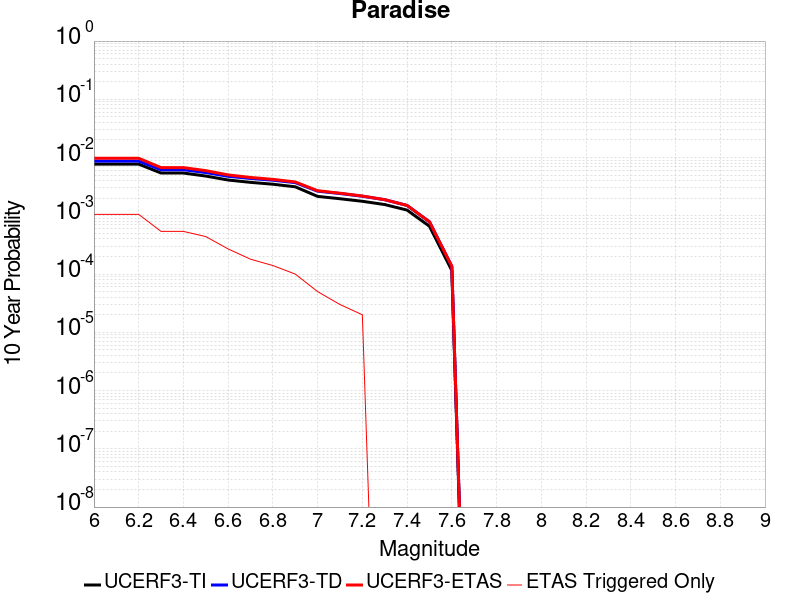 |

| Magnitude | 1 wk TI Prob | 1 wk TD Prob | 1 wk ETAS Prob | 1 wk ETAS/TD Gain | 1 wk ETAS Triggered Only | 1 mo TI Prob | 1 mo TD Prob | 1 mo ETAS Prob | 1 mo ETAS/TD Gain | 1 mo ETAS Triggered Only | 1 yr TI Prob | 1 yr TD Prob | 1 yr ETAS Prob | 1 yr ETAS/TD Gain | 1 yr ETAS Triggered Only | 10 yr TI Prob | 10 yr TD Prob | 10 yr ETAS Prob | 10 yr ETAS/TD Gain | 10 yr ETAS Triggered Only |
|-----|-----|-----|-----|-----|-----|-----|-----|-----|-----|-----|-----|-----|-----|-----|-----|-----|-----|-----|-----|-----|
| 6.0 | 1.4851273E-5 | 1.6694692E-5 | 6.5127824E-4 | 39.011097 | 6.345941E-4 | 6.364676E-5 | 7.154685E-5 | 8.373815E-4 | 11.703961 | 7.658895E-4 | 7.7462377E-4 | 8.707584E-4 | 0.0017999572 | 2.0671144 | 9.3000865E-4 | 0.0077192914 | 0.008675844 | 0.009782173 | 1.1275182 | 0.0011160104 |
| 6.1 | 1.4851273E-5 | 1.6694692E-5 | 6.5127824E-4 | 39.011097 | 6.345941E-4 | 6.364676E-5 | 7.154685E-5 | 8.373815E-4 | 11.703961 | 7.658895E-4 | 7.7462377E-4 | 8.707584E-4 | 0.0017999572 | 2.0671144 | 9.3000865E-4 | 0.0077192914 | 0.008675844 | 0.009782173 | 1.1275182 | 0.0011160104 |
| 6.2 | 1.4851273E-5 | 1.6694692E-5 | 6.5127824E-4 | 39.011097 | 6.345941E-4 | 6.364676E-5 | 7.154685E-5 | 8.373815E-4 | 11.703961 | 7.658895E-4 | 7.7462377E-4 | 8.707584E-4 | 0.0017999572 | 2.0671144 | 9.3000865E-4 | 0.0077192914 | 0.008675844 | 0.009782173 | 1.1275182 | 0.0011160104 |
| 6.3 | 1.0426831E-5 | 1.188862E-5 | 3.072996E-4 | 25.848215 | 2.954145E-4 | 4.4685654E-5 | 5.0950268E-5 | 4.4481622E-4 | 8.7304 | 3.93886E-4 | 5.43912E-4 | 6.201489E-4 | 0.0011122011 | 1.793442 | 4.9235753E-4 | 0.0054258266 | 0.0061847917 | 0.006750219 | 1.0914223 | 5.689465E-4 |
| 6.4 | 1.0426831E-5 | 1.188862E-5 | 3.072996E-4 | 25.848215 | 2.954145E-4 | 4.4685654E-5 | 5.0950268E-5 | 4.4481622E-4 | 8.7304 | 3.93886E-4 | 5.43912E-4 | 6.201489E-4 | 0.0011122011 | 1.793442 | 4.9235753E-4 | 0.0054258266 | 0.0061847917 | 0.006750219 | 1.0914223 | 5.689465E-4 |
| 6.5 | 9.25027E-6 | 1.06199595E-5 | 2.294432E-4 | 21.604902 | 2.1882556E-4 | 3.964341E-5 | 4.551335E-5 | 3.409144E-4 | 7.490427 | 2.954145E-4 | 4.8255164E-4 | 5.53989E-4 | 9.476568E-4 | 1.7106057 | 3.93886E-4 | 0.0048150513 | 0.0055265795 | 0.0059835734 | 1.0826902 | 4.5953368E-4 |
| 6.6 | 7.904275E-6 | 9.159525E-6 | 1.7327719E-4 | 18.917706 | 1.6411918E-4 | 3.3875025E-5 | 3.9254537E-5 | 2.5807152E-4 | 6.5743103 | 2.1882556E-4 | 4.1235037E-4 | 4.7782314E-4 | 7.512244E-4 | 1.5721809 | 2.7353194E-4 | 0.0041158604 | 0.0047683544 | 0.0050623603 | 1.0616577 | 2.954145E-4 |
| 6.7 | 7.2061953E-6 | 8.407248E-6 | 9.593674E-5 | 11.411194 | 8.753023E-5 | 3.088333E-5 | 3.6030586E-5 | 1.7826208E-4 | 4.9475207 | 1.4223662E-4 | 3.7593965E-4 | 4.3858777E-4 | 6.2450796E-4 | 1.4239063 | 1.8600172E-4 | 0.003753043 | 0.004377591 | 0.0045736716 | 1.0447919 | 1.96943E-4 |
| 6.8 | 6.6948724E-6 | 7.842166E-6 | 7.348932E-5 | 9.371049 | 6.564767E-5 | 2.8691995E-5 | 3.360887E-5 | 1.4301797E-4 | 4.255364 | 1.0941278E-4 | 3.4926904E-4 | 4.0911473E-4 | 5.5129314E-4 | 1.347527 | 1.4223662E-4 | 0.003487206 | 0.0040839734 | 0.0042365254 | 1.0373539 | 1.531779E-4 |
| 6.9 | 6.0421025E-6 | 7.130621E-6 | 6.1836625E-5 | 8.671983 | 5.470639E-5 | 2.5894467E-5 | 3.0559466E-5 | 9.620513E-5 | 3.1481287 | 6.564767E-5 | 3.1521954E-4 | 3.7200135E-4 | 4.7043624E-4 | 1.2646089 | 9.84715E-5 | 0.0031477278 | 0.0037141247 | 0.003823131 | 1.0293492 | 1.0941278E-4 |
| 7.0 | 4.134091E-6 | 5.0803087E-6 | 3.7903977E-5 | 7.460959 | 3.2823835E-5 | 1.7717413E-5 | 2.177258E-5 | 5.45957E-5 | 2.5075438 | 3.2823835E-5 | 2.1568815E-4 | 2.6505045E-4 | 3.1974234E-4 | 1.2063452 | 5.470639E-5 | 0.0021547892 | 0.0026474963 | 0.002702058 | 1.0206088 | 5.470639E-5 |
| 7.1 | 3.7674888E-6 | 4.6318696E-6 | 2.6514324E-5 | 5.7243247 | 2.1882557E-5 | 1.6146281E-5 | 1.9850726E-5 | 4.173285E-5 | 2.1023335 | 2.1882557E-5 | 1.9656324E-4 | 2.4165731E-4 | 2.7447322E-4 | 1.1357952 | 3.2823835E-5 | 0.0019638946 | 0.002414096 | 0.0024468405 | 1.0135639 | 3.2823835E-5 |
| 7.2 | 3.4065345E-6 | 4.156723E-6 | 2.6039188E-5 | 6.2643547 | 2.1882557E-5 | 1.4599351E-5 | 1.7814415E-5 | 3.969658E-5 | 2.2283404 | 2.1882557E-5 | 1.777326E-4 | 2.1687041E-4 | 2.3874822E-4 | 1.1008797 | 2.1882557E-5 | 0.0017759053 | 0.002166736 | 0.002188571 | 1.0100775 | 2.1882557E-5 |
| 7.3 | 2.9934936E-6 | 3.6293168E-6 | 3.6293168E-6 | 1.0 | 0.0 | 1.2829195E-5 | 1.555413E-5 | 1.555413E-5 | 1.0 | 0.0 | 1.5618425E-4 | 1.8935655E-4 | 1.8935655E-4 | 1.0 | 0.0 | 0.0015607453 | 0.0018920974 | 0.0018920974 | 1.0 | 0.0 |
| 7.4 | 2.4049796E-6 | 2.8889842E-6 | 2.8889842E-6 | 1.0 | 0.0 | 1.0307015E-5 | 1.238131E-5 | 1.238131E-5 | 1.0 | 0.0 | 1.2548068E-4 | 1.5073347E-4 | 1.5073347E-4 | 1.0 | 0.0 | 0.0012540985 | 0.0015064536 | 0.0015064536 | 1.0 | 0.0 |
| 7.5 | 1.2710091E-6 | 1.5134682E-6 | 1.5134682E-6 | 1.0 | 0.0 | 5.44717E-6 | 6.4862834E-6 | 6.4862834E-6 | 1.0 | 0.0 | 6.631728E-5 | 7.8968886E-5 | 7.8968886E-5 | 1.0 | 0.0 | 6.6297496E-4 | 7.8953087E-4 | 7.8953087E-4 | 1.0 | 0.0 |
| 7.6 | 2.21172E-7 | 2.603961E-7 | 2.603961E-7 | 1.0 | 0.0 | 9.478797E-7 | 1.1159829E-6 | 1.1159829E-6 | 1.0 | 0.0 | 1.1540374E-5 | 1.3587036E-5 | 1.3587036E-5 | 1.0 | 0.0 | 1.1539775E-4 | 1.3586486E-4 | 1.3586486E-4 | 1.0 | 0.0 |

## Garlic Springs
*[(top)](#table-of-contents)*

| 1 Week | 1 Month | 1 Year | 10 Year |
|-----|-----|-----|-----|
|  |  |  |  |

| Magnitude | 1 wk TI Prob | 1 wk TD Prob | 1 wk ETAS Prob | 1 wk ETAS/TD Gain | 1 wk ETAS Triggered Only | 1 mo TI Prob | 1 mo TD Prob | 1 mo ETAS Prob | 1 mo ETAS/TD Gain | 1 mo ETAS Triggered Only | 1 yr TI Prob | 1 yr TD Prob | 1 yr ETAS Prob | 1 yr ETAS/TD Gain | 1 yr ETAS Triggered Only | 10 yr TI Prob | 10 yr TD Prob | 10 yr ETAS Prob | 10 yr ETAS/TD Gain | 10 yr ETAS Triggered Only |
|-----|-----|-----|-----|-----|-----|-----|-----|-----|-----|-----|-----|-----|-----|-----|-----|-----|-----|-----|-----|-----|
| 6.0 | 1.6760017E-5 | 1.8776833E-5 | 4.4547865E-4 | 23.72491 | 4.2670986E-4 | 7.182667E-5 | 8.0470316E-5 | 5.7278824E-4 | 7.118006 | 4.9235753E-4 | 8.7413884E-4 | 9.794032E-4 | 0.0015696535 | 1.6026633 | 5.90829E-4 | 0.008707083 | 0.009762413 | 0.010466653 | 1.072138 | 7.1118306E-4 |
| 6.1 | 9.852767E-6 | 1.09735865E-5 | 2.407379E-4 | 21.93794 | 2.2976684E-4 | 4.222546E-5 | 4.702921E-5 | 2.9866677E-4 | 6.350665 | 2.5164938E-4 | 5.139737E-4 | 5.7250116E-4 | 8.7868155E-4 | 1.5348119 | 3.063558E-4 | 0.005127866 | 0.005717221 | 0.0060979766 | 1.0665979 | 3.8294474E-4 |
| 6.2 | 9.852767E-6 | 1.09735865E-5 | 2.407379E-4 | 21.93794 | 2.2976684E-4 | 4.222546E-5 | 4.702921E-5 | 2.9866677E-4 | 6.350665 | 2.5164938E-4 | 5.139737E-4 | 5.7250116E-4 | 8.7868155E-4 | 1.5348119 | 3.063558E-4 | 0.005127866 | 0.005717221 | 0.0060979766 | 1.0665979 | 3.8294474E-4 |
| 6.3 | 4.3167724E-6 | 4.7780286E-6 | 1.2513151E-4 | 26.188942 | 1.2035406E-4 | 1.8500323E-5 | 2.0477235E-5 | 1.5176988E-4 | 7.4116397 | 1.3129534E-4 | 2.2521814E-4 | 2.4930484E-4 | 4.0244454E-4 | 1.6142669 | 1.531779E-4 | 0.0022499003 | 0.00249251 | 0.002678048 | 1.0744382 | 1.8600172E-4 |
| 6.4 | 4.3167724E-6 | 4.7780286E-6 | 1.2513151E-4 | 26.188942 | 1.2035406E-4 | 1.8500323E-5 | 2.0477235E-5 | 1.5176988E-4 | 7.4116397 | 1.3129534E-4 | 2.2521814E-4 | 2.4930484E-4 | 4.0244454E-4 | 1.6142669 | 1.531779E-4 | 0.0022499003 | 0.00249251 | 0.002678048 | 1.0744382 | 1.8600172E-4 |
| 6.5 | 4.3167724E-6 | 4.7780286E-6 | 1.2513151E-4 | 26.188942 | 1.2035406E-4 | 1.8500323E-5 | 2.0477235E-5 | 1.5176988E-4 | 7.4116397 | 1.3129534E-4 | 2.2521814E-4 | 2.4930484E-4 | 4.0244454E-4 | 1.6142669 | 1.531779E-4 | 0.0022499003 | 0.00249251 | 0.002678048 | 1.0744382 | 1.8600172E-4 |
| 6.6 | 4.301311E-6 | 4.760897E-6 | 1.2511438E-4 | 26.279581 | 1.2035406E-4 | 1.8434059E-5 | 2.0403815E-5 | 1.5169647E-4 | 7.4347115 | 1.3129534E-4 | 2.2441156E-4 | 2.4841115E-4 | 4.01551E-4 | 1.6164774 | 1.531779E-4 | 0.0022418506 | 0.002483593 | 0.0026691328 | 1.0747062 | 1.8600172E-4 |
| 6.7 | 3.8599724E-6 | 4.27106E-6 | 1.13683374E-4 | 26.617134 | 1.0941278E-4 | 1.6542634E-5 | 1.8304541E-5 | 1.2771532E-4 | 6.9772477 | 1.0941278E-4 | 2.0138794E-4 | 2.228578E-4 | 3.4318503E-4 | 1.5399283 | 1.2035406E-4 | 0.0020120554 | 0.002228578 | 0.0023814146 | 1.0685803 | 1.531779E-4 |

## Death Valley (Black Mtns Frontal)
*[(top)](#table-of-contents)*

| 1 Week | 1 Month | 1 Year | 10 Year |
|-----|-----|-----|-----|
|  |  |  |  |

| Magnitude | 1 wk TI Prob | 1 wk TD Prob | 1 wk ETAS Prob | 1 wk ETAS/TD Gain | 1 wk ETAS Triggered Only | 1 mo TI Prob | 1 mo TD Prob | 1 mo ETAS Prob | 1 mo ETAS/TD Gain | 1 mo ETAS Triggered Only | 1 yr TI Prob | 1 yr TD Prob | 1 yr ETAS Prob | 1 yr ETAS/TD Gain | 1 yr ETAS Triggered Only | 10 yr TI Prob | 10 yr TD Prob | 10 yr ETAS Prob | 10 yr ETAS/TD Gain | 10 yr ETAS Triggered Only |
|-----|-----|-----|-----|-----|-----|-----|-----|-----|-----|-----|-----|-----|-----|-----|-----|-----|-----|-----|-----|-----|
| 6.0 | 1.6707214E-5 | 1.867027E-5 | 4.0160786E-4 | 21.510555 | 3.8294474E-4 | 7.160038E-5 | 8.001302E-5 | 5.5045035E-4 | 6.879509 | 4.7047497E-4 | 8.71386E-4 | 9.737309E-4 | 0.001553054 | 1.594952 | 5.7988777E-4 | 0.00867977 | 0.009695496 | 0.010367279 | 1.069288 | 6.7835924E-4 |
| 6.1 | 1.6707214E-5 | 1.867027E-5 | 4.0160786E-4 | 21.510555 | 3.8294474E-4 | 7.160038E-5 | 8.001302E-5 | 5.5045035E-4 | 6.879509 | 4.7047497E-4 | 8.71386E-4 | 9.737309E-4 | 0.001553054 | 1.594952 | 5.7988777E-4 | 0.00867977 | 0.009695496 | 0.010367279 | 1.069288 | 6.7835924E-4 |
| 6.2 | 1.6707214E-5 | 1.867027E-5 | 4.0160786E-4 | 21.510555 | 3.8294474E-4 | 7.160038E-5 | 8.001302E-5 | 5.5045035E-4 | 6.879509 | 4.7047497E-4 | 8.71386E-4 | 9.737309E-4 | 0.001553054 | 1.594952 | 5.7988777E-4 | 0.00867977 | 0.009695496 | 0.010367279 | 1.069288 | 6.7835924E-4 |
| 6.3 | 1.6707214E-5 | 1.867027E-5 | 4.0160786E-4 | 21.510555 | 3.8294474E-4 | 7.160038E-5 | 8.001302E-5 | 5.5045035E-4 | 6.879509 | 4.7047497E-4 | 8.71386E-4 | 9.737309E-4 | 0.001553054 | 1.594952 | 5.7988777E-4 | 0.00867977 | 0.009695496 | 0.010367279 | 1.069288 | 6.7835924E-4 |
| 6.4 | 1.5515609E-5 | 1.7338214E-5 | 3.236887E-4 | 18.669092 | 3.063558E-4 | 6.649377E-5 | 7.4304546E-5 | 4.681613E-4 | 6.300574 | 3.93886E-4 | 8.0926094E-4 | 9.042885E-4 | 0.0013852693 | 1.5318887 | 4.8141624E-4 | 0.008063202 | 0.009006773 | 0.009570595 | 1.0625998 | 5.689465E-4 |
| 6.5 | 1.5515609E-5 | 1.7338214E-5 | 3.236887E-4 | 18.669092 | 3.063558E-4 | 6.649377E-5 | 7.4304546E-5 | 4.681613E-4 | 6.300574 | 3.93886E-4 | 8.0926094E-4 | 9.042885E-4 | 0.0013852693 | 1.5318887 | 4.8141624E-4 | 0.008063202 | 0.009006773 | 0.009570595 | 1.0625998 | 5.689465E-4 |
| 6.6 | 1.5041828E-5 | 1.6809145E-5 | 2.793954E-4 | 16.621632 | 2.6259068E-4 | 6.4463384E-5 | 7.203723E-5 | 4.0025194E-4 | 5.5561814 | 3.2823835E-4 | 7.8455906E-4 | 8.767063E-4 | 0.0012921104 | 1.4738235 | 4.1576856E-4 | 0.00781795 | 0.008733132 | 0.009232036 | 1.0571277 | 5.0329877E-4 |
| 6.7 | 1.4634985E-5 | 1.6356016E-5 | 2.570602E-4 | 15.716553 | 2.4070812E-4 | 6.271985E-5 | 7.009536E-5 | 3.5454865E-4 | 5.05809 | 2.8447324E-4 | 7.6334673E-4 | 8.5308263E-4 | 0.0012247688 | 1.4356977 | 3.7200344E-4 | 0.007607299 | 0.008498715 | 0.008921799 | 1.049782 | 4.2670986E-4 |
| 6.8 | 1.4209158E-5 | 1.5882048E-5 | 2.4564523E-4 | 15.466849 | 2.2976684E-4 | 6.089497E-5 | 6.8064175E-5 | 3.415775E-4 | 5.0184627 | 2.7353194E-4 | 7.4114406E-4 | 8.2837185E-4 | 0.001189135 | 1.4355086 | 3.6106218E-4 | 0.007386771 | 0.008253456 | 0.008654943 | 1.0486445 | 4.048273E-4 |
| 6.9 | 1.3780098E-5 | 1.5404594E-5 | 2.3422678E-4 | 15.204997 | 2.1882556E-4 | 5.9056227E-5 | 6.6018045E-5 | 3.2859138E-4 | 4.9772964 | 2.6259068E-4 | 7.1877235E-4 | 8.0347876E-4 | 0.0011423859 | 1.4217997 | 3.3917962E-4 | 0.0071645193 | 0.008006332 | 0.008375358 | 1.0460917 | 3.7200344E-4 |
| 7.0 | 1.3585064E-5 | 1.5188155E-5 | 2.2306928E-4 | 14.687056 | 2.0788428E-4 | 5.8220405E-5 | 6.50905E-5 | 3.167235E-4 | 4.865895 | 2.5164938E-4 | 7.086029E-4 | 7.9219416E-4 | 0.0011201724 | 1.4140126 | 3.2823835E-4 | 0.007063476 | 0.007894293 | 0.008241651 | 1.044001 | 3.501209E-4 |
| 7.1 | 1.3398601E-5 | 1.49813395E-5 | 2.2286251E-4 | 14.876007 | 2.0788428E-4 | 5.742131E-5 | 6.420419E-5 | 3.1583745E-4 | 4.9192653 | 2.5164938E-4 | 6.9888023E-4 | 7.8141113E-4 | 0.0010984603 | 1.4057392 | 3.1729706E-4 | 0.0069668638 | 0.007787224 | 0.008123762 | 1.0432167 | 3.3917962E-4 |
| 7.2 | 1.3126312E-5 | 1.4679561E-5 | 2.0067857E-4 | 13.67061 | 1.8600172E-4 | 5.6254412E-5 | 6.291092E-5 | 2.9266332E-4 | 4.652027 | 2.2976684E-4 | 6.846822E-4 | 7.6567667E-4 | 0.0010499321 | 1.3712473 | 2.8447324E-4 | 0.006825765 | 0.00763097 | 0.0079349885 | 1.03984 | 3.063558E-4 |
| 7.3 | 1.2922429E-5 | 1.4453788E-5 | 2.0045282E-4 | 13.868532 | 1.8600172E-4 | 5.5380664E-5 | 6.194336E-5 | 2.9169596E-4 | 4.7090755 | 2.2976684E-4 | 6.74051E-4 | 7.53905E-4 | 0.0010272306 | 1.3625467 | 2.7353194E-4 | 0.006720101 | 0.007514055 | 0.0078072497 | 1.0390195 | 2.954145E-4 |
| 7.4 | 1.2768878E-5 | 1.4283772E-5 | 1.8934172E-4 | 13.255723 | 1.7506046E-4 | 5.4722615E-5 | 6.1214756E-5 | 2.8002693E-4 | 4.5745 | 2.1882556E-4 | 6.660441E-4 | 7.4504025E-4 | 0.0010074353 | 1.3521891 | 2.6259068E-4 | 0.0066405144 | 0.0074260035 | 0.007708364 | 1.0380232 | 2.8447324E-4 |
| 7.5 | 1.2521929E-5 | 1.40120155E-5 | 1.8907001E-4 | 13.493421 | 1.7506046E-4 | 5.366431E-5 | 6.005014E-5 | 2.6792195E-4 | 4.461637 | 2.0788428E-4 | 6.531671E-4 | 7.3087064E-4 | 9.823361E-4 | 1.3440629 | 2.5164938E-4 | 0.006512506 | 0.0072852457 | 0.007556785 | 1.0372725 | 2.7353194E-4 |
| 7.6 | 1.1301089E-5 | 1.2648149E-5 | 1.5488296E-4 | 12.245504 | 1.4223662E-4 | 4.8432343E-5 | 5.4205255E-5 | 2.2925621E-4 | 4.229409 | 1.7506046E-4 | 5.895042E-4 | 6.5975444E-4 | 8.675016E-4 | 1.3148855 | 2.0788428E-4 | 0.0058794282 | 0.00657851 | 0.0068067657 | 1.034697 | 2.2976684E-4 |
| 7.7 | 9.189108E-6 | 1.0283358E-5 | 1.3063618E-4 | 12.7036495 | 1.2035406E-4 | 3.93813E-5 | 4.407082E-5 | 1.8630117E-4 | 4.2273135 | 1.4223662E-4 | 4.7936183E-4 | 5.3643517E-4 | 7.114017E-4 | 1.3261653 | 1.7506046E-4 | 0.004783291 | 0.005351914 | 0.00553692 | 1.0345682 | 1.8600172E-4 |
| 7.8 | 3.4586725E-7 | 3.6482615E-7 | 3.6482615E-7 | 1.0 | 0.0 | 1.4822873E-6 | 1.5635396E-6 | 1.5635396E-6 | 1.0 | 0.0 | 1.80467E-5 | 1.9035933E-5 | 1.9035933E-5 | 1.0 | 0.0 | 1.8045233E-4 | 1.9034347E-4 | 1.9034347E-4 | 1.0 | 0.0 |
| 7.9 | 2.5591178E-9 | 2.6696718E-9 | 2.6696718E-9 | 1.0 | 0.0 | 1.0967647E-8 | 1.14414505E-8 | 1.14414505E-8 | 1.0 | 0.0 | 1.335311E-7 | 1.3929966E-7 | 1.3929966E-7 | 1.0 | 0.0 | 1.3353102E-6 | 1.3929966E-6 | 1.3929966E-6 | 1.0 | 0.0 |

## San Andreas (San Bernardino S)
*[(top)](#table-of-contents)*

| 1 Week | 1 Month | 1 Year | 10 Year |
|-----|-----|-----|-----|
| 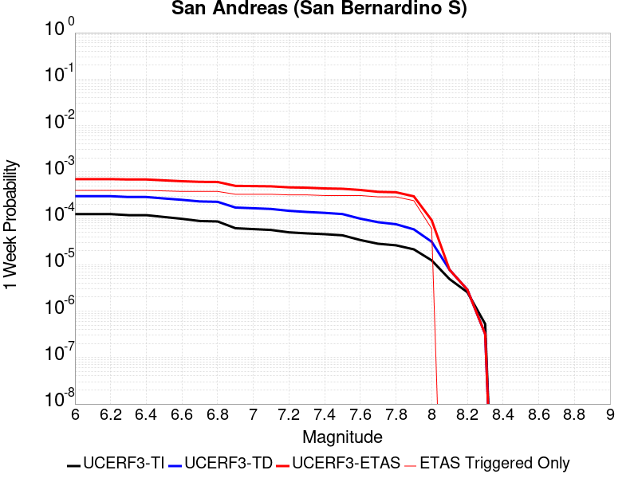 |  |  |  |

| Magnitude | 1 wk TI Prob | 1 wk TD Prob | 1 wk ETAS Prob | 1 wk ETAS/TD Gain | 1 wk ETAS Triggered Only | 1 mo TI Prob | 1 mo TD Prob | 1 mo ETAS Prob | 1 mo ETAS/TD Gain | 1 mo ETAS Triggered Only | 1 yr TI Prob | 1 yr TD Prob | 1 yr ETAS Prob | 1 yr ETAS/TD Gain | 1 yr ETAS Triggered Only | 10 yr TI Prob | 10 yr TD Prob | 10 yr ETAS Prob | 10 yr ETAS/TD Gain | 10 yr ETAS Triggered Only |
|-----|-----|-----|-----|-----|-----|-----|-----|-----|-----|-----|-----|-----|-----|-----|-----|-----|-----|-----|-----|-----|
| 6.0 | 1.2336002E-4 | 3.0004102E-4 | 7.0474687E-4 | 2.348835 | 4.048273E-4 | 5.2857865E-4 | 0.0012852824 | 0.0018097889 | 1.4080864 | 5.2518136E-4 | 0.006416472 | 0.015540994 | 0.016144183 | 1.0388128 | 6.127116E-4 | 0.06234337 | 0.14283717 | 0.1433905 | 1.0038738 | 6.455354E-4 |
| 6.1 | 1.2336002E-4 | 3.0004102E-4 | 7.0474687E-4 | 2.348835 | 4.048273E-4 | 5.2857865E-4 | 0.0012852824 | 0.0018097889 | 1.4080864 | 5.2518136E-4 | 0.006416472 | 0.015540994 | 0.016144183 | 1.0388128 | 6.127116E-4 | 0.06234337 | 0.14283717 | 0.1433905 | 1.0038738 | 6.455354E-4 |
| 6.2 | 1.2336002E-4 | 3.0004102E-4 | 7.0474687E-4 | 2.348835 | 4.048273E-4 | 5.2857865E-4 | 0.0012852824 | 0.0018097889 | 1.4080864 | 5.2518136E-4 | 0.006416472 | 0.015540994 | 0.016144183 | 1.0388128 | 6.127116E-4 | 0.06234337 | 0.14283717 | 0.1433905 | 1.0038738 | 6.455354E-4 |
| 6.3 | 1.1712257E-4 | 2.8792414E-4 | 6.9263484E-4 | 2.4056158 | 4.048273E-4 | 5.018573E-4 | 0.0012334028 | 0.0017579363 | 1.4252735 | 5.2518136E-4 | 0.006093008 | 0.014918125 | 0.015521696 | 1.0404589 | 6.127116E-4 | 0.059286322 | 0.13754563 | 0.13810237 | 1.0040478 | 6.455354E-4 |
| 6.4 | 1.1712257E-4 | 2.8792414E-4 | 6.9263484E-4 | 2.4056158 | 4.048273E-4 | 5.018573E-4 | 0.0012334028 | 0.0017579363 | 1.4252735 | 5.2518136E-4 | 0.006093008 | 0.014918125 | 0.015521696 | 1.0404589 | 6.127116E-4 | 0.059286322 | 0.13754563 | 0.13810237 | 1.0040478 | 6.455354E-4 |
| 6.5 | 1.0689076E-4 | 2.680528E-4 | 6.618332E-4 | 2.4690406 | 3.93886E-4 | 4.5802278E-4 | 0.0011483167 | 0.0016619662 | 1.4473065 | 5.1424006E-4 | 0.0055621783 | 0.01389575 | 0.014489159 | 1.0427043 | 6.017703E-4 | 0.05425003 | 0.12879294 | 0.1293458 | 1.0042926 | 6.345941E-4 |
| 6.6 | 9.7648895E-5 | 2.50501E-4 | 6.333498E-4 | 2.5283325 | 3.8294474E-4 | 4.1842813E-4 | 0.0010731576 | 0.0015759163 | 1.4684854 | 5.0329877E-4 | 0.005082469 | 0.012991785 | 0.01356414 | 1.0440551 | 5.7988777E-4 | 0.049677886 | 0.12095292 | 0.12149152 | 1.004453 | 6.127116E-4 |
| 6.7 | 8.757013E-5 | 2.3120902E-4 | 6.140652E-4 | 2.6558878 | 3.8294474E-4 | 3.7524657E-4 | 9.905418E-4 | 0.0014824116 | 1.4965664 | 4.9235753E-4 | 0.00455906 | 0.011997245 | 0.0125593655 | 1.0468541 | 5.689465E-4 | 0.04466656 | 0.11226123 | 0.11278573 | 1.0046722 | 5.90829E-4 |
| 6.8 | 8.562978E-5 | 2.2680782E-4 | 6.096657E-4 | 2.6880276 | 3.8294474E-4 | 3.6693315E-4 | 9.7169366E-4 | 0.0014635727 | 1.506208 | 4.9235753E-4 | 0.004458263 | 0.011770263 | 0.012332513 | 1.0477687 | 5.689465E-4 | 0.043698758 | 0.11027153 | 0.11079721 | 1.0047671 | 5.90829E-4 |
| 6.9 | 6.124075E-5 | 1.7065753E-4 | 4.988398E-4 | 2.9230464 | 3.2823835E-4 | 2.6243398E-4 | 7.311852E-4 | 0.0011466498 | 1.568207 | 4.1576856E-4 | 0.0031904527 | 0.008866051 | 0.0093431985 | 1.0538174 | 4.8141624E-4 | 0.031450346 | 0.08418263 | 0.08465358 | 1.0055944 | 5.1424006E-4 |
| 7.0 | 5.8598747E-5 | 1.649477E-4 | 4.931319E-4 | 2.9896257 | 3.2823835E-4 | 2.5111332E-4 | 7.06728E-4 | 0.0011222027 | 1.5878849 | 4.1576856E-4 | 0.0030530186 | 0.008570663 | 0.009047953 | 1.0556889 | 4.8141624E-4 | 0.03011414 | 0.081500374 | 0.0819727 | 1.0057955 | 5.1424006E-4 |
| 7.1 | 5.613814E-5 | 1.5913323E-4 | 4.8731934E-4 | 3.0623355 | 3.2823835E-4 | 2.4056983E-4 | 6.818221E-4 | 0.0010973072 | 1.6093746 | 4.1576856E-4 | 0.0029250039 | 0.008269769 | 0.008747204 | 1.0577326 | 4.8141624E-4 | 0.028868021 | 0.07879931 | 0.07927303 | 1.0060117 | 5.1424006E-4 |
| 7.2 | 4.991222E-5 | 1.4519796E-4 | 4.6244895E-4 | 3.184955 | 3.1729706E-4 | 2.1389198E-4 | 6.2212895E-4 | 0.0010267043 | 1.650308 | 4.048273E-4 | 0.002601025 | 0.007548217 | 0.008015141 | 1.0618588 | 4.7047497E-4 | 0.025707912 | 0.07225321 | 0.07272014 | 1.0064625 | 5.0329877E-4 |
| 7.3 | 4.7410045E-5 | 1.3714004E-4 | 4.543936E-4 | 3.3133547 | 3.1729706E-4 | 2.0317009E-4 | 5.8761094E-4 | 9.922003E-4 | 1.6885328 | 4.048273E-4 | 0.0024707897 | 0.0071307817 | 0.0075979014 | 1.0655075 | 4.7047497E-4 | 0.024434982 | 0.06853558 | 0.06900439 | 1.0068403 | 5.0329877E-4 |
| 7.4 | 4.5556746E-5 | 1.3121912E-4 | 4.375347E-4 | 3.3343823 | 3.063558E-4 | 1.952286E-4 | 5.622468E-4 | 9.559113E-4 | 1.7001634 | 3.93886E-4 | 0.002374317 | 0.0068239477 | 0.0072803455 | 1.0668818 | 4.5953368E-4 | 0.023491086 | 0.065788016 | 0.06624798 | 1.0069916 | 4.9235753E-4 |
| 7.5 | 4.3084514E-5 | 1.2357246E-4 | 4.298904E-4 | 3.4788525 | 3.063558E-4 | 1.8463485E-4 | 5.2948913E-4 | 9.231666E-4 | 1.7435044 | 3.93886E-4 | 0.0022456115 | 0.0064275465 | 0.0068841265 | 1.0710349 | 4.5953368E-4 | 0.022230545 | 0.062188786 | 0.062650524 | 1.0074248 | 4.9235753E-4 |
| 7.6 | 3.408608E-5 | 9.83552E-5 | 4.0468085E-4 | 4.114484 | 3.063558E-4 | 1.4607502E-4 | 4.214543E-4 | 8.151743E-4 | 1.9341938 | 3.93886E-4 | 0.0017770125 | 0.0051191594 | 0.0055763405 | 1.0893079 | 4.5953368E-4 | 0.017628696 | 0.050020292 | 0.05048802 | 1.0093508 | 4.9235753E-4 |
| 7.7 | 2.8315713E-5 | 8.248679E-5 | 3.6693655E-4 | 4.448428 | 2.8447324E-4 | 1.2134742E-4 | 3.5346695E-4 | 7.2533893E-4 | 2.05207 | 3.7200344E-4 | 0.0014764034 | 0.0042949775 | 0.004730749 | 1.1014607 | 4.3765112E-4 | 0.01466633 | 0.0422714 | 0.04272199 | 1.0106593 | 4.7047497E-4 |
| 7.8 | 2.6222975E-5 | 7.463088E-5 | 3.590829E-4 | 4.811452 | 2.8447324E-4 | 1.1237934E-4 | 3.1980744E-4 | 6.9169194E-4 | 2.1628387 | 3.7200344E-4 | 0.0013673597 | 0.0038867102 | 0.00432266 | 1.1121643 | 4.3765112E-4 | 0.013589768 | 0.03843674 | 0.038889132 | 1.0117698 | 4.7047497E-4 |
| 7.9 | 2.1469694E-5 | 5.787864E-5 | 2.9857282E-4 | 5.1586013 | 2.4070812E-4 | 9.200973E-5 | 2.4802773E-4 | 5.652461E-4 | 2.2789633 | 3.1729706E-4 | 0.0011196428 | 0.0030155594 | 0.0033973493 | 1.1266067 | 3.8294474E-4 | 0.011140184 | 0.030152109 | 0.030555341 | 1.0133733 | 4.1576856E-4 |
| 8.0 | 1.2420249E-5 | 3.131896E-5 | 8.602364E-5 | 2.7466953 | 5.470639E-5 | 5.322855E-5 | 1.342172E-4 | 2.3267549E-4 | 1.7335743 | 9.84715E-5 | 6.478649E-4 | 0.0016328706 | 0.0017530282 | 1.0735867 | 1.2035406E-4 | 0.0064597935 | 0.016522504 | 0.01666239 | 1.0084665 | 1.4223662E-4 |
| 8.1 | 4.9197724E-6 | 7.822348E-6 | 7.822348E-6 | 1.0 | 0.0 | 2.1084568E-5 | 3.352392E-5 | 3.352392E-5 | 1.0 | 0.0 | 2.566744E-4 | 4.0807744E-4 | 4.1901425E-4 | 1.0268009 | 1.0941279E-5 | 0.002563781 | 0.0043843705 | 0.0043952637 | 1.0024846 | 1.0941279E-5 |
| 8.2 | 2.5634774E-6 | 2.9067196E-6 | 2.9067196E-6 | 1.0 | 0.0 | 1.0986286E-5 | 1.2457311E-5 | 1.2457311E-5 | 1.0 | 0.0 | 1.3374983E-4 | 1.5165724E-4 | 1.5165724E-4 | 1.0 | 0.0 | 0.0013366934 | 0.0017049741 | 0.0017049741 | 1.0 | 0.0 |
| 8.3 | 5.2850464E-7 | 3.2088764E-7 | 3.2088764E-7 | 1.0 | 0.0 | 2.2650179E-6 | 1.375232E-6 | 1.375232E-6 | 1.0 | 0.0 | 2.7576245E-5 | 1.6743334E-5 | 1.6743334E-5 | 1.0 | 0.0 | 2.7572823E-4 | 1.9870348E-4 | 1.9870348E-4 | 1.0 | 0.0 |

## Helendale-So Lockhart
*[(top)](#table-of-contents)*

| 1 Week | 1 Month | 1 Year | 10 Year |
|-----|-----|-----|-----|
|  |  |  |  |

| Magnitude | 1 wk TI Prob | 1 wk TD Prob | 1 wk ETAS Prob | 1 wk ETAS/TD Gain | 1 wk ETAS Triggered Only | 1 mo TI Prob | 1 mo TD Prob | 1 mo ETAS Prob | 1 mo ETAS/TD Gain | 1 mo ETAS Triggered Only | 1 yr TI Prob | 1 yr TD Prob | 1 yr ETAS Prob | 1 yr ETAS/TD Gain | 1 yr ETAS Triggered Only | 10 yr TI Prob | 10 yr TD Prob | 10 yr ETAS Prob | 10 yr ETAS/TD Gain | 10 yr ETAS Triggered Only |
|-----|-----|-----|-----|-----|-----|-----|-----|-----|-----|-----|-----|-----|-----|-----|-----|-----|-----|-----|-----|-----|
| 6.0 | 1.7296055E-5 | 1.8103729E-5 | 2.2598424E-4 | 12.482746 | 2.0788428E-4 | 7.412385E-5 | 7.7585224E-5 | 3.5109595E-4 | 4.5252943 | 2.7353194E-4 | 9.0208417E-4 | 9.4421144E-4 | 0.0013377256 | 1.4167649 | 3.93886E-4 | 0.008984311 | 0.009404116 | 0.009881006 | 1.0507107 | 4.8141624E-4 |
| 6.1 | 1.7296055E-5 | 1.8103729E-5 | 2.2598424E-4 | 12.482746 | 2.0788428E-4 | 7.412385E-5 | 7.7585224E-5 | 3.5109595E-4 | 4.5252943 | 2.7353194E-4 | 9.0208417E-4 | 9.4421144E-4 | 0.0013377256 | 1.4167649 | 3.93886E-4 | 0.008984311 | 0.009404116 | 0.009881006 | 1.0507107 | 4.8141624E-4 |
| 6.2 | 1.7296055E-5 | 1.8103729E-5 | 2.2598424E-4 | 12.482746 | 2.0788428E-4 | 7.412385E-5 | 7.7585224E-5 | 3.5109595E-4 | 4.5252943 | 2.7353194E-4 | 9.0208417E-4 | 9.4421144E-4 | 0.0013377256 | 1.4167649 | 3.93886E-4 | 0.008984311 | 0.009404116 | 0.009881006 | 1.0507107 | 4.8141624E-4 |
| 6.3 | 1.0669118E-5 | 1.1135425E-5 | 1.6431161E-4 | 14.755756 | 1.531779E-4 | 4.5723988E-5 | 4.772239E-5 | 2.5559677E-4 | 5.3559084 | 2.0788428E-4 | 5.5654737E-4 | 5.80868E-4 | 8.870458E-4 | 1.527104 | 3.063558E-4 | 0.0055515557 | 0.0057937936 | 0.0061310083 | 1.0582027 | 3.3917962E-4 |
| 6.4 | 1.0669118E-5 | 1.1135425E-5 | 1.6431161E-4 | 14.755756 | 1.531779E-4 | 4.5723988E-5 | 4.772239E-5 | 2.5559677E-4 | 5.3559084 | 2.0788428E-4 | 5.5654737E-4 | 5.80868E-4 | 8.870458E-4 | 1.527104 | 3.063558E-4 | 0.0055515557 | 0.0057937936 | 0.0061310083 | 1.0582027 | 3.3917962E-4 |
| 6.5 | 8.790038E-6 | 9.170197E-6 | 1.4046433E-4 | 15.317483 | 1.3129534E-4 | 3.767105E-5 | 3.930026E-5 | 2.0341299E-4 | 5.1758685 | 1.6411918E-4 | 4.585485E-4 | 4.7837716E-4 | 7.1897014E-4 | 1.5029358 | 2.4070812E-4 | 0.0045760344 | 0.004773638 | 0.0050349757 | 1.0547459 | 2.6259068E-4 |
| 6.6 | 7.396949E-6 | 7.715537E-6 | 1.1712748E-4 | 15.180729 | 1.0941278E-4 | 3.1700827E-5 | 3.3066175E-5 | 1.7529809E-4 | 5.3014326 | 1.4223662E-4 | 3.858892E-4 | 4.025073E-4 | 6.212448E-4 | 1.5434372 | 2.1882556E-4 | 0.003852198 | 0.00401789 | 0.0042467336 | 1.0569562 | 2.2976684E-4 |
| 6.7 | 6.4600285E-6 | 6.738031E-6 | 1.1615008E-4 | 17.237986 | 1.0941278E-4 | 2.7685543E-5 | 2.887696E-5 | 1.7110947E-4 | 5.9254665 | 1.4223662E-4 | 3.3701936E-4 | 3.5152107E-4 | 5.4839486E-4 | 1.5600625 | 1.96943E-4 | 0.0033650869 | 0.003509732 | 0.0037059837 | 1.0559164 | 1.96943E-4 |
| 6.8 | 5.600104E-6 | 5.836009E-6 | 8.242451E-5 | 14.123437 | 7.658895E-5 | 2.4000226E-5 | 2.5011232E-5 | 1.2348028E-4 | 4.9369926 | 9.84715E-5 | 2.9216358E-4 | 3.044698E-4 | 4.5760107E-4 | 1.502944 | 1.531779E-4 | 0.0029177975 | 0.003040588 | 0.0031933002 | 1.0502245 | 1.531779E-4 |
| 6.9 | 4.839122E-6 | 5.0395092E-6 | 7.0686845E-5 | 14.026534 | 6.564767E-5 | 2.0738931E-5 | 2.159772E-5 | 9.818502E-5 | 4.546082 | 7.658895E-5 | 2.5246723E-4 | 2.6292098E-4 | 3.941818E-4 | 1.4992405 | 1.3129534E-4 | 0.002521806 | 0.002626147 | 0.0027570974 | 1.0498642 | 1.3129534E-4 |
| 7.0 | 3.6937633E-6 | 3.845208E-6 | 4.7610152E-5 | 12.381684 | 4.3765114E-5 | 1.5830317E-5 | 1.647936E-5 | 7.118485E-5 | 4.319637 | 5.470639E-5 | 1.9271708E-4 | 2.0061806E-4 | 2.990698E-4 | 1.4907422 | 9.84715E-5 | 0.0019255003 | 0.002004401 | 0.0021026751 | 1.0490292 | 9.84715E-5 |
| 7.1 | 2.7858857E-6 | 2.8978538E-6 | 3.5721594E-5 | 12.326914 | 3.2823835E-5 | 1.1939455E-5 | 1.2419316E-5 | 5.6183886E-5 | 4.5239115 | 4.3765114E-5 | 1.4535317E-4 | 1.511949E-4 | 2.3871189E-4 | 1.5788356 | 8.753023E-5 | 0.0014525814 | 0.0015109418 | 0.0015983398 | 1.0578433 | 8.753023E-5 |
| 7.2 | 2.1672065E-6 | 2.2540128E-6 | 3.5077774E-5 | 15.5623665 | 3.2823835E-5 | 9.2879945E-6 | 9.66002E-6 | 5.342471E-5 | 5.5304966 | 4.3765114E-5 | 1.1307546E-4 | 1.1760458E-4 | 1.9418453E-4 | 1.6511647 | 7.658895E-5 | 0.0011301794 | 0.0011754417 | 0.0012519406 | 1.065081 | 7.658895E-5 |
| 7.3 | 1.4823496E-6 | 1.5422102E-6 | 3.4365996E-5 | 22.2836 | 3.2823835E-5 | 6.3529114E-6 | 6.6094562E-6 | 5.037428E-5 | 7.6215467 | 4.3765114E-5 | 7.734395E-5 | 8.046731E-5 | 1.570501E-4 | 1.9517254 | 7.658895E-5 | 7.731704E-4 | 8.0439687E-4 | 8.809242E-4 | 1.0951363 | 7.658895E-5 |
| 7.4 | 4.2321457E-7 | 4.4108765E-7 | 1.1382361E-5 | 25.805214 | 1.0941279E-5 | 1.8137755E-6 | 1.8903745E-6 | 1.2831632E-5 | 6.787878 | 1.0941279E-5 | 2.2082493E-5 | 2.3015113E-5 | 4.4897166E-5 | 1.9507688 | 2.1882557E-5 | 2.2080299E-4 | 2.3013182E-4 | 2.5200934E-4 | 1.0950651 | 2.1882557E-5 |
| 7.5 | 5.6942316E-8 | 5.9415648E-8 | 5.9415648E-8 | 1.0 | 0.0 | 2.440385E-7 | 2.5463845E-7 | 2.5463845E-7 | 1.0 | 0.0 | 2.9711643E-6 | 3.1002196E-6 | 3.1002196E-6 | 1.0 | 0.0 | 2.9711247E-5 | 3.1001844E-5 | 3.1001844E-5 | 1.0 | 0.0 |

## San Andreas (Big Bend)
*[(top)](#table-of-contents)*

| 1 Week | 1 Month | 1 Year | 10 Year |
|-----|-----|-----|-----|
|  | 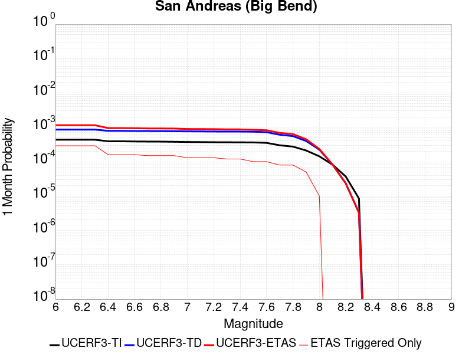 |  |  |

| Magnitude | 1 wk TI Prob | 1 wk TD Prob | 1 wk ETAS Prob | 1 wk ETAS/TD Gain | 1 wk ETAS Triggered Only | 1 mo TI Prob | 1 mo TD Prob | 1 mo ETAS Prob | 1 mo ETAS/TD Gain | 1 mo ETAS Triggered Only | 1 yr TI Prob | 1 yr TD Prob | 1 yr ETAS Prob | 1 yr ETAS/TD Gain | 1 yr ETAS Triggered Only | 10 yr TI Prob | 10 yr TD Prob | 10 yr ETAS Prob | 10 yr ETAS/TD Gain | 10 yr ETAS Triggered Only |
|-----|-----|-----|-----|-----|-----|-----|-----|-----|-----|-----|-----|-----|-----|-----|-----|-----|-----|-----|-----|-----|
| 6.0 | 1.0179969E-4 | 2.0072258E-4 | 4.1950424E-4 | 2.08997 | 2.1882556E-4 | 4.362114E-4 | 8.599571E-4 | 0.0011660494 | 1.355939 | 3.063558E-4 | 0.0052979486 | 0.010419999 | 0.010820608 | 1.0384462 | 4.048273E-4 | 0.051734097 | 0.10144902 | 0.101871766 | 1.0041671 | 4.7047497E-4 |
| 6.1 | 1.0179969E-4 | 2.0072258E-4 | 4.1950424E-4 | 2.08997 | 2.1882556E-4 | 4.362114E-4 | 8.599571E-4 | 0.0011660494 | 1.355939 | 3.063558E-4 | 0.0052979486 | 0.010419999 | 0.010820608 | 1.0384462 | 4.048273E-4 | 0.051734097 | 0.10144902 | 0.101871766 | 1.0041671 | 4.7047497E-4 |
| 6.2 | 1.0179969E-4 | 2.0072258E-4 | 4.1950424E-4 | 2.08997 | 2.1882556E-4 | 4.362114E-4 | 8.599571E-4 | 0.0011660494 | 1.355939 | 3.063558E-4 | 0.0052979486 | 0.010419999 | 0.010820608 | 1.0384462 | 4.048273E-4 | 0.051734097 | 0.10144902 | 0.101871766 | 1.0041671 | 4.7047497E-4 |
| 6.3 | 1.0179969E-4 | 2.0072258E-4 | 4.1950424E-4 | 2.08997 | 2.1882556E-4 | 4.362114E-4 | 8.599571E-4 | 0.0011660494 | 1.355939 | 3.063558E-4 | 0.0052979486 | 0.010419999 | 0.010820608 | 1.0384462 | 4.048273E-4 | 0.051734097 | 0.10144902 | 0.101871766 | 1.0041671 | 4.7047497E-4 |
| 6.4 | 9.1639464E-5 | 1.8429532E-4 | 3.3744497E-4 | 1.8310014 | 1.531779E-4 | 3.9268145E-4 | 7.895982E-4 | 9.6452044E-4 | 1.2215332 | 1.7506046E-4 | 0.0047704205 | 0.009571102 | 0.009820343 | 1.026041 | 2.5164938E-4 | 0.046693064 | 0.09377527 | 0.09404299 | 1.0028548 | 2.954145E-4 |
| 6.5 | 9.1639464E-5 | 1.8429532E-4 | 3.3744497E-4 | 1.8310014 | 1.531779E-4 | 3.9268145E-4 | 7.895982E-4 | 9.6452044E-4 | 1.2215332 | 1.7506046E-4 | 0.0047704205 | 0.009571102 | 0.009820343 | 1.026041 | 2.5164938E-4 | 0.046693064 | 0.09377527 | 0.09404299 | 1.0028548 | 2.954145E-4 |
| 6.6 | 9.042622E-5 | 1.823659E-4 | 3.3551586E-4 | 1.8397949 | 1.531779E-4 | 3.8748336E-4 | 7.8133424E-4 | 9.562579E-4 | 1.2238781 | 1.7506046E-4 | 0.0047074095 | 0.009471365 | 0.009709793 | 1.0251735 | 2.4070812E-4 | 0.046089325 | 0.092869274 | 0.09312733 | 1.0027786 | 2.8447324E-4 |
| 6.7 | 8.9836685E-5 | 1.8150927E-4 | 3.2372007E-4 | 1.7834905 | 1.4223662E-4 | 3.8495753E-4 | 7.776651E-4 | 9.416567E-4 | 1.2108768 | 1.6411918E-4 | 0.00467679 | 0.00942708 | 0.009654681 | 1.0241433 | 2.2976684E-4 | 0.045795817 | 0.09246355 | 0.09271179 | 1.0026847 | 2.7353194E-4 |
| 6.8 | 8.9471854E-5 | 1.8097709E-4 | 3.2318797E-4 | 1.7857949 | 1.4223662E-4 | 3.8339442E-4 | 7.7538576E-4 | 9.3937764E-4 | 1.2114972 | 1.6411918E-4 | 0.004657841 | 0.009399569 | 0.0096271755 | 1.0242146 | 2.2976684E-4 | 0.04561414 | 0.092210755 | 0.09245907 | 1.0026928 | 2.7353194E-4 |
| 6.9 | 8.858234E-5 | 1.7979681E-4 | 3.2200787E-4 | 1.7909541 | 1.4223662E-4 | 3.7958333E-4 | 7.703304E-4 | 9.343232E-4 | 1.2128862 | 1.6411918E-4 | 0.004611638 | 0.009338548 | 0.00956617 | 1.0243744 | 2.2976684E-4 | 0.04517103 | 0.09165087 | 0.091899335 | 1.0027109 | 2.7353194E-4 |
| 7.0 | 8.7433385E-5 | 1.7818481E-4 | 2.9851744E-4 | 1.6753248 | 1.2035406E-4 | 3.746607E-4 | 7.634259E-4 | 9.055539E-4 | 1.1861713 | 1.4223662E-4 | 0.004551957 | 0.009255203 | 0.009461164 | 1.0222535 | 2.0788428E-4 | 0.044598386 | 0.09088532 | 0.0911141 | 1.0025172 | 2.5164938E-4 |
| 7.1 | 8.684964E-5 | 1.7730435E-4 | 2.9763707E-4 | 1.6786789 | 1.2035406E-4 | 3.7215967E-4 | 7.596547E-4 | 9.0178323E-4 | 1.1870962 | 1.4223662E-4 | 0.0045216335 | 0.009209678 | 0.009404807 | 1.0211874 | 1.96943E-4 | 0.04430731 | 0.09046686 | 0.09068579 | 1.0024201 | 2.4070812E-4 |
| 7.2 | 8.606521E-5 | 1.762105E-4 | 2.9654335E-4 | 1.6828927 | 1.2035406E-4 | 3.6879873E-4 | 7.549695E-4 | 8.9709874E-4 | 1.1882583 | 1.4223662E-4 | 0.0044808835 | 0.0091531165 | 0.0093482565 | 1.0213195 | 1.96943E-4 | 0.043916024 | 0.089947365 | 0.09016643 | 1.0024354 | 2.4070812E-4 |
| 7.3 | 8.568266E-5 | 1.7563057E-4 | 2.8502414E-4 | 1.6228617 | 1.0941278E-4 | 3.6715972E-4 | 7.524855E-4 | 8.8368205E-4 | 1.174351 | 1.3129534E-4 | 0.0044610105 | 0.009123127 | 0.009307432 | 1.0202019 | 1.8600172E-4 | 0.043725148 | 0.08966853 | 0.08987769 | 1.0023327 | 2.2976684E-4 |
| 7.4 | 8.5432206E-5 | 1.7525644E-4 | 2.8465004E-4 | 1.6241916 | 1.0941278E-4 | 3.6608664E-4 | 7.50883E-4 | 8.8207977E-4 | 1.1747233 | 1.3129534E-4 | 0.004447999 | 0.009103781 | 0.009288088 | 1.0202453 | 1.8600172E-4 | 0.043600157 | 0.08948871 | 0.08969791 | 1.0023378 | 2.2976684E-4 |
| 7.5 | 8.4791965E-5 | 1.7394972E-4 | 2.6146474E-4 | 1.5031052 | 8.753023E-5 | 3.633435E-4 | 7.4528606E-4 | 8.546173E-4 | 1.146697 | 1.0941278E-4 | 0.0044147377 | 0.009036204 | 0.009198841 | 1.0179983 | 1.6411918E-4 | 0.043280575 | 0.088866346 | 0.089055754 | 1.0021315 | 2.0788428E-4 |
| 7.6 | 8.241105E-5 | 1.6840403E-4 | 2.5591953E-4 | 1.5196757 | 8.753023E-5 | 3.531424E-4 | 7.215321E-4 | 8.3086593E-4 | 1.1515301 | 1.0941278E-4 | 0.0042910352 | 0.008749358 | 0.008912042 | 1.0185938 | 1.6411918E-4 | 0.042091176 | 0.086243294 | 0.08643325 | 1.0022025 | 2.0788428E-4 |
| 7.7 | 7.00432E-5 | 1.42045E-4 | 2.0768335E-4 | 1.4620954 | 6.564767E-5 | 3.001506E-4 | 6.0862233E-4 | 6.9609925E-4 | 1.1437294 | 8.753023E-5 | 0.0036482112 | 0.0073848404 | 0.007493445 | 1.0147065 | 1.0941278E-4 | 0.035888977 | 0.07351733 | 0.07364911 | 1.0017926 | 1.4223662E-4 |
| 7.8 | 6.415362E-5 | 1.2968935E-4 | 1.953285E-4 | 1.506126 | 6.564767E-5 | 2.749151E-4 | 5.556931E-4 | 6.431747E-4 | 1.1574279 | 8.753023E-5 | 0.0033419547 | 0.0067446055 | 0.0068532806 | 1.0161128 | 1.0941278E-4 | 0.03292141 | 0.06725231 | 0.06737477 | 1.001821 | 1.3129534E-4 |
| 7.9 | 4.939911E-5 | 9.3411545E-5 | 1.262323E-4 | 1.3513566 | 3.2823835E-5 | 2.116933E-4 | 4.0027377E-4 | 4.5495827E-4 | 1.1366178 | 5.470639E-5 | 0.0025743195 | 0.004862453 | 0.004938669 | 1.0156745 | 7.658895E-5 | 0.025447013 | 0.048914436 | 0.049008094 | 1.0019146 | 9.84715E-5 |
| 8.0 | 3.344983E-5 | 5.222685E-5 | 5.222685E-5 | 1.0 | 0.0 | 1.4334853E-4 | 2.2381016E-4 | 2.34749E-4 | 1.0488755 | 1.0941279E-5 | 0.0017438711 | 0.0027214854 | 0.0027433084 | 1.0080187 | 2.1882557E-5 | 0.017302496 | 0.027922187 | 0.02796473 | 1.0015236 | 4.3765114E-5 |
| 8.1 | 1.9104898E-5 | 1.9173063E-5 | 1.9173063E-5 | 1.0 | 0.0 | 8.1875565E-5 | 8.216769E-5 | 8.216769E-5 | 1.0 | 0.0 | 9.963791E-4 | 9.999331E-4 | 0.0010108635 | 1.010931 | 1.0941279E-5 | 0.009919235 | 0.010749801 | 0.010771449 | 1.0020137 | 2.1882557E-5 |
| 8.2 | 8.643924E-6 | 5.4748625E-6 | 5.4748625E-6 | 1.0 | 0.0 | 3.704486E-5 | 2.3463486E-5 | 2.3463486E-5 | 1.0 | 0.0 | 4.5092785E-4 | 2.8563058E-4 | 2.8563058E-4 | 1.0 | 0.0 | 0.0045001395 | 0.0032487072 | 0.0032487072 | 1.0 | 0.0 |
| 8.3 | 1.983087E-6 | 7.6599065E-7 | 7.6599065E-7 | 1.0 | 0.0 | 8.498917E-6 | 3.282813E-6 | 3.282813E-6 | 1.0 | 0.0 | 1.034694E-4 | 3.9967534E-5 | 3.9967534E-5 | 1.0 | 0.0 | 0.0010342124 | 4.719687E-4 | 4.719687E-4 | 1.0 | 0.0 |

## Coyote Lake
*[(top)](#table-of-contents)*

| 1 Week | 1 Month | 1 Year | 10 Year |
|-----|-----|-----|-----|
|  |  |  |  |

| Magnitude | 1 wk TI Prob | 1 wk TD Prob | 1 wk ETAS Prob | 1 wk ETAS/TD Gain | 1 wk ETAS Triggered Only | 1 mo TI Prob | 1 mo TD Prob | 1 mo ETAS Prob | 1 mo ETAS/TD Gain | 1 mo ETAS Triggered Only | 1 yr TI Prob | 1 yr TD Prob | 1 yr ETAS Prob | 1 yr ETAS/TD Gain | 1 yr ETAS Triggered Only | 10 yr TI Prob | 10 yr TD Prob | 10 yr ETAS Prob | 10 yr ETAS/TD Gain | 10 yr ETAS Triggered Only |
|-----|-----|-----|-----|-----|-----|-----|-----|-----|-----|-----|-----|-----|-----|-----|-----|-----|-----|-----|-----|-----|
| 6.0 | 1.980352E-5 | 2.1706745E-5 | 2.8429172E-4 | 13.0969305 | 2.6259068E-4 | 8.486947E-5 | 9.302599E-5 | 3.7747275E-4 | 4.0577126 | 2.8447324E-4 | 0.0010327959 | 0.0011320751 | 0.0014817996 | 1.3089235 | 3.501209E-4 | 0.010280091 | 0.011270258 | 0.011681341 | 1.0364751 | 4.1576856E-4 |
| 6.1 | 1.980352E-5 | 2.1706745E-5 | 2.8429172E-4 | 13.0969305 | 2.6259068E-4 | 8.486947E-5 | 9.302599E-5 | 3.7747275E-4 | 4.0577126 | 2.8447324E-4 | 0.0010327959 | 0.0011320751 | 0.0014817996 | 1.3089235 | 3.501209E-4 | 0.010280091 | 0.011270258 | 0.011681341 | 1.0364751 | 4.1576856E-4 |
| 6.2 | 1.980352E-5 | 2.1706745E-5 | 2.8429172E-4 | 13.0969305 | 2.6259068E-4 | 8.486947E-5 | 9.302599E-5 | 3.7747275E-4 | 4.0577126 | 2.8447324E-4 | 0.0010327959 | 0.0011320751 | 0.0014817996 | 1.3089235 | 3.501209E-4 | 0.010280091 | 0.011270258 | 0.011681341 | 1.0364751 | 4.1576856E-4 |
| 6.3 | 1.5344787E-5 | 1.682067E-5 | 2.2470146E-4 | 13.358651 | 2.0788428E-4 | 6.576172E-5 | 7.2086936E-5 | 3.0183722E-4 | 4.187128 | 2.2976684E-4 | 8.003548E-4 | 8.773662E-4 | 0.0011725216 | 1.3364106 | 2.954145E-4 | 0.007974784 | 0.00874507 | 0.009092128 | 1.0396862 | 3.501209E-4 |
| 6.4 | 1.5344787E-5 | 1.682067E-5 | 2.2470146E-4 | 13.358651 | 2.0788428E-4 | 6.576172E-5 | 7.2086936E-5 | 3.0183722E-4 | 4.187128 | 2.2976684E-4 | 8.003548E-4 | 8.773662E-4 | 0.0011725216 | 1.3364106 | 2.954145E-4 | 0.007974784 | 0.00874507 | 0.009092128 | 1.0396862 | 3.501209E-4 |
| 6.5 | 1.4189697E-5 | 1.5557987E-5 | 2.1249794E-4 | 13.658446 | 1.96943E-4 | 6.081157E-5 | 6.6675726E-5 | 2.854867E-4 | 4.2817187 | 2.1882556E-4 | 7.401293E-4 | 8.115349E-4 | 0.00106298 | 1.309839 | 2.5164938E-4 | 0.0073766913 | 0.008091656 | 0.00838468 | 1.0362132 | 2.954145E-4 |
| 6.6 | 1.3469301E-5 | 1.4771577E-5 | 2.1171168E-4 | 14.332368 | 1.96943E-4 | 5.7724297E-5 | 6.330556E-5 | 2.8211728E-4 | 4.4564376 | 2.1882556E-4 | 7.025667E-4 | 7.7053264E-4 | 0.0010219881 | 1.3263398 | 2.5164938E-4 | 0.0070034964 | 0.0076845144 | 0.007977659 | 1.0381474 | 2.954145E-4 |
| 6.7 | 1.3027966E-5 | 1.4281745E-5 | 2.0028082E-4 | 14.023554 | 1.8600172E-4 | 5.5832945E-5 | 6.120638E-5 | 2.5813733E-4 | 4.2174907 | 1.96943E-4 | 6.7955407E-4 | 7.4499263E-4 | 9.636552E-4 | 1.2935097 | 2.1882556E-4 | 0.006774798 | 0.0074308286 | 0.007691468 | 1.0350754 | 2.6259068E-4 |
| 6.8 | 5.695434E-6 | 6.2244176E-6 | 7.187168E-5 | 11.546731 | 6.564767E-5 | 2.4408775E-5 | 2.6675973E-5 | 1.0326288E-4 | 3.871007 | 7.658895E-5 | 2.971363E-4 | 3.2476155E-4 | 4.0132564E-4 | 1.2357547 | 7.658895E-5 | 0.0029673933 | 0.0032458105 | 0.0033330566 | 1.0268797 | 8.753023E-5 |
| 6.9 | 4.385688E-6 | 4.7930553E-6 | 7.044041E-5 | 14.696348 | 6.564767E-5 | 1.879567E-5 | 2.0541665E-5 | 9.712904E-5 | 4.7283916 | 7.658895E-5 | 2.2881327E-4 | 2.5009477E-4 | 3.2666457E-4 | 1.3061631 | 7.658895E-5 | 0.002285778 | 0.0025009478 | 0.002588259 | 1.0349113 | 8.753023E-5 |

## Death Valley (No)
*[(top)](#table-of-contents)*

| 1 Week | 1 Month | 1 Year | 10 Year |
|-----|-----|-----|-----|
|  |  |  |  |

| Magnitude | 1 wk TI Prob | 1 wk TD Prob | 1 wk ETAS Prob | 1 wk ETAS/TD Gain | 1 wk ETAS Triggered Only | 1 mo TI Prob | 1 mo TD Prob | 1 mo ETAS Prob | 1 mo ETAS/TD Gain | 1 mo ETAS Triggered Only | 1 yr TI Prob | 1 yr TD Prob | 1 yr ETAS Prob | 1 yr ETAS/TD Gain | 1 yr ETAS Triggered Only | 10 yr TI Prob | 10 yr TD Prob | 10 yr ETAS Prob | 10 yr ETAS/TD Gain | 10 yr ETAS Triggered Only |
|-----|-----|-----|-----|-----|-----|-----|-----|-----|-----|-----|-----|-----|-----|-----|-----|-----|-----|-----|-----|-----|
| 6.0 | 2.0074807E-5 | 2.2500084E-5 | 2.4132073E-4 | 10.725326 | 2.1882556E-4 | 8.603206E-5 | 9.642541E-5 | 3.5899077E-4 | 3.7229893 | 2.6259068E-4 | 0.001046937 | 0.0011733545 | 0.0014902792 | 1.2701014 | 3.1729706E-4 | 0.010420183 | 0.011672506 | 0.012018541 | 1.0296452 | 3.501209E-4 |
| 6.1 | 2.0074807E-5 | 2.2500084E-5 | 2.4132073E-4 | 10.725326 | 2.1882556E-4 | 8.603206E-5 | 9.642541E-5 | 3.5899077E-4 | 3.7229893 | 2.6259068E-4 | 0.001046937 | 0.0011733545 | 0.0014902792 | 1.2701014 | 3.1729706E-4 | 0.010420183 | 0.011672506 | 0.012018541 | 1.0296452 | 3.501209E-4 |
| 6.2 | 2.0074807E-5 | 2.2500084E-5 | 2.4132073E-4 | 10.725326 | 2.1882556E-4 | 8.603206E-5 | 9.642541E-5 | 3.5899077E-4 | 3.7229893 | 2.6259068E-4 | 0.001046937 | 0.0011733545 | 0.0014902792 | 1.2701014 | 3.1729706E-4 | 0.010420183 | 0.011672506 | 0.012018541 | 1.0296452 | 3.501209E-4 |
| 6.3 | 1.9050609E-5 | 2.1336948E-5 | 2.2921679E-4 | 10.742718 | 2.0788428E-4 | 8.164292E-5 | 9.1440896E-5 | 3.4306728E-4 | 3.7517927 | 2.5164938E-4 | 9.935491E-4 | 0.001112731 | 0.001418746 | 1.2750125 | 3.063558E-4 | 0.009891188 | 0.011072419 | 0.011407843 | 1.0302937 | 3.3917962E-4 |
| 6.4 | 1.9050609E-5 | 2.1336948E-5 | 2.2921679E-4 | 10.742718 | 2.0788428E-4 | 8.164292E-5 | 9.1440896E-5 | 3.4306728E-4 | 3.7517927 | 2.5164938E-4 | 9.935491E-4 | 0.001112731 | 0.001418746 | 1.2750125 | 3.063558E-4 | 0.009891188 | 0.011072419 | 0.011407843 | 1.0302937 | 3.3917962E-4 |
| 6.5 | 1.8367004E-5 | 2.0561009E-5 | 2.2844101E-4 | 11.110399 | 2.0788428E-4 | 7.8713354E-5 | 8.811567E-5 | 3.397429E-4 | 3.8556468 | 2.5164938E-4 | 9.5791375E-4 | 0.0010722869 | 0.0013783141 | 1.2853968 | 3.063558E-4 | 0.009537951 | 0.0106719155 | 0.011007476 | 1.0314432 | 3.3917962E-4 |
| 6.6 | 1.779439E-5 | 1.9910927E-5 | 2.1685E-4 | 10.891005 | 1.96943E-4 | 7.625944E-5 | 8.53298E-5 | 3.2601738E-4 | 3.8206747 | 2.4070812E-4 | 9.280632E-4 | 0.0010384015 | 0.0013335092 | 1.2841942 | 2.954145E-4 | 0.009241969 | 0.010336253 | 0.010661098 | 1.0314277 | 3.2823835E-4 |
| 6.7 | 1.7025437E-5 | 1.9043426E-5 | 2.1598268E-4 | 11.341588 | 1.96943E-4 | 7.296412E-5 | 8.161216E-5 | 3.2230065E-4 | 3.9491742 | 2.4070812E-4 | 8.87976E-4 | 9.931813E-4 | 0.0012883024 | 1.2971473 | 2.954145E-4 | 0.008844362 | 0.009888145 | 0.010213138 | 1.032867 | 3.2823835E-4 |
| 6.8 | 1.6545107E-5 | 1.8512545E-5 | 2.154519E-4 | 11.638157 | 1.96943E-4 | 7.090568E-5 | 7.93371E-5 | 3.2002613E-4 | 4.033751 | 2.4070812E-4 | 8.629347E-4 | 9.655073E-4 | 0.0012606366 | 1.3056728 | 2.954145E-4 | 0.008595915 | 0.009613829 | 0.009938912 | 1.0338141 | 3.2823835E-4 |
| 6.9 | 1.615478E-5 | 1.8087594E-5 | 2.0408595E-4 | 11.283201 | 1.8600172E-4 | 6.9232934E-5 | 7.751599E-5 | 3.0726503E-4 | 3.963892 | 2.2976684E-4 | 8.4258494E-4 | 9.433546E-4 | 0.0012166286 | 1.2896831 | 2.7353194E-4 | 0.008393973 | 0.009394196 | 0.009697673 | 1.0323048 | 3.063558E-4 |
| 7.0 | 1.5894311E-5 | 1.780555E-5 | 2.0380397E-4 | 11.446093 | 1.8600172E-4 | 6.81167E-5 | 7.6307304E-5 | 3.060566E-4 | 4.0108433 | 2.2976684E-4 | 8.2900526E-4 | 9.286515E-4 | 0.0012019294 | 1.294274 | 2.7353194E-4 | 0.008259195 | 0.009248397 | 0.00955192 | 1.0328189 | 3.063558E-4 |
| 7.1 | 1.5602263E-5 | 1.7483504E-5 | 2.0348198E-4 | 11.638513 | 1.8600172E-4 | 6.6865134E-5 | 7.492718E-5 | 3.046768E-4 | 4.0663056 | 2.2976684E-4 | 8.137789E-4 | 9.118627E-4 | 0.0011851452 | 1.299697 | 2.7353194E-4 | 0.008108052 | 0.009081894 | 0.0093854675 | 1.0334263 | 3.063558E-4 |
| 7.2 | 1.5323829E-5 | 1.717063E-5 | 2.0316917E-4 | 11.832365 | 1.8600172E-4 | 6.56719E-5 | 7.358637E-5 | 2.9239582E-4 | 3.9735053 | 2.1882556E-4 | 7.99262E-4 | 8.9555193E-4 | 0.0011579074 | 1.292954 | 2.6259068E-4 | 0.007963934 | 0.008920107 | 0.009212886 | 1.0328224 | 2.954145E-4 |
| 7.3 | 1.4556212E-5 | 1.6302456E-5 | 1.9136006E-4 | 11.738112 | 1.7506046E-4 | 6.238227E-5 | 6.9865826E-5 | 2.7773558E-4 | 3.9752707 | 2.0788428E-4 | 7.592395E-4 | 8.5029035E-4 | 0.0011017257 | 1.2957053 | 2.5164938E-4 | 0.0075665074 | 0.008471014 | 0.008753078 | 1.0332975 | 2.8447324E-4 |
| 7.4 | 1.411725E-5 | 1.580796E-5 | 1.9086564E-4 | 12.074021 | 1.7506046E-4 | 6.0501097E-5 | 6.7746674E-5 | 2.7561688E-4 | 4.0683455 | 2.0788428E-4 | 7.363519E-4 | 8.245094E-4 | 0.0010759514 | 1.3049594 | 2.5164938E-4 | 0.0073391674 | 0.008215138 | 0.0084972745 | 1.0343435 | 2.8447324E-4 |
| 7.5 | 1.3503312E-5 | 1.5126289E-5 | 1.9018409E-4 | 12.573083 | 1.7506046E-4 | 5.7870053E-5 | 6.482538E-5 | 2.726962E-4 | 4.2066274 | 2.0788428E-4 | 7.043401E-4 | 7.8896893E-4 | 0.0010404198 | 1.3187082 | 2.5164938E-4 | 0.007021119 | 0.007862304 | 0.008144541 | 1.0358975 | 2.8447324E-4 |
| 7.6 | 1.1279839E-5 | 1.2626327E-5 | 1.5486115E-4 | 12.26494 | 1.4223662E-4 | 4.834127E-5 | 5.4111737E-5 | 2.2916272E-4 | 4.234991 | 1.7506046E-4 | 5.88396E-4 | 6.5861654E-4 | 8.6636393E-4 | 1.3154299 | 2.0788428E-4 | 0.005868405 | 0.006567199 | 0.0067954566 | 1.0347573 | 2.2976684E-4 |
| 7.7 | 9.189108E-6 | 1.0283358E-5 | 1.3063618E-4 | 12.7036495 | 1.2035406E-4 | 3.93813E-5 | 4.407082E-5 | 1.8630117E-4 | 4.2273135 | 1.4223662E-4 | 4.7936183E-4 | 5.3643517E-4 | 7.114017E-4 | 1.3261653 | 1.7506046E-4 | 0.004783291 | 0.005351914 | 0.00553692 | 1.0345682 | 1.8600172E-4 |
| 7.8 | 3.4586725E-7 | 3.6482615E-7 | 3.6482615E-7 | 1.0 | 0.0 | 1.4822873E-6 | 1.5635396E-6 | 1.5635396E-6 | 1.0 | 0.0 | 1.80467E-5 | 1.9035933E-5 | 1.9035933E-5 | 1.0 | 0.0 | 1.8045233E-4 | 1.9034347E-4 | 1.9034347E-4 | 1.0 | 0.0 |
| 7.9 | 2.5591178E-9 | 2.6696718E-9 | 2.6696718E-9 | 1.0 | 0.0 | 1.0967647E-8 | 1.14414505E-8 | 1.14414505E-8 | 1.0 | 0.0 | 1.335311E-7 | 1.3929966E-7 | 1.3929966E-7 | 1.0 | 0.0 | 1.3353102E-6 | 1.3929966E-6 | 1.3929966E-6 | 1.0 | 0.0 |

## San Andreas (Parkfield)
*[(top)](#table-of-contents)*

| 1 Week | 1 Month | 1 Year | 10 Year |
|-----|-----|-----|-----|
|  |  |  |  |

| Magnitude | 1 wk TI Prob | 1 wk TD Prob | 1 wk ETAS Prob | 1 wk ETAS/TD Gain | 1 wk ETAS Triggered Only | 1 mo TI Prob | 1 mo TD Prob | 1 mo ETAS Prob | 1 mo ETAS/TD Gain | 1 mo ETAS Triggered Only | 1 yr TI Prob | 1 yr TD Prob | 1 yr ETAS Prob | 1 yr ETAS/TD Gain | 1 yr ETAS Triggered Only | 10 yr TI Prob | 10 yr TD Prob | 10 yr ETAS Prob | 10 yr ETAS/TD Gain | 10 yr ETAS Triggered Only |
|-----|-----|-----|-----|-----|-----|-----|-----|-----|-----|-----|-----|-----|-----|-----|-----|-----|-----|-----|-----|-----|
| 6.0 | 5.556969E-4 | 7.7782426E-4 | 9.30883E-4 | 1.196778 | 1.531779E-4 | 0.0023793848 | 0.0033298214 | 0.003493394 | 1.0491235 | 1.6411918E-4 | 0.028586963 | 0.040191233 | 0.040432766 | 1.0060097 | 2.5164938E-4 | 0.25176284 | 0.33716413 | 0.3373527 | 1.0005592 | 2.8447324E-4 |
| 6.1 | 1.925858E-4 | 3.0276453E-4 | 3.7933027E-4 | 1.2528888 | 7.658895E-5 | 8.2510663E-4 | 0.0012970108 | 0.0013735003 | 1.0589738 | 7.658895E-5 | 0.0099994885 | 0.015778083 | 0.015907308 | 1.00819 | 1.3129534E-4 | 0.095613256 | 0.1497237 | 0.14986323 | 1.000932 | 1.6411918E-4 |
| 6.2 | 9.4306815E-5 | 1.8242796E-4 | 2.5900293E-4 | 1.4197546 | 7.658895E-5 | 4.0410945E-4 | 7.816011E-4 | 8.5813017E-4 | 1.0979133 | 7.658895E-5 | 0.0049089384 | 0.009474681 | 0.009604732 | 1.0137262 | 1.3129534E-4 | 0.048019063 | 0.09185409 | 0.09200313 | 1.0016227 | 1.6411918E-4 |
| 6.3 | 9.283051E-5 | 1.7939322E-4 | 2.5596842E-4 | 1.4268568 | 7.658895E-5 | 3.9778434E-4 | 7.686027E-4 | 8.451328E-4 | 1.0995704 | 7.658895E-5 | 0.0048322747 | 0.009317789 | 0.009447861 | 1.0139595 | 1.3129534E-4 | 0.047285385 | 0.09050704 | 0.0906563 | 1.0016493 | 1.6411918E-4 |
| 6.4 | 9.138826E-5 | 1.770153E-4 | 2.535907E-4 | 1.4325919 | 7.658895E-5 | 3.916052E-4 | 7.5841765E-4 | 8.349485E-4 | 1.1009086 | 7.658895E-5 | 0.0047573745 | 0.00919484 | 0.009324928 | 1.014148 | 1.3129534E-4 | 0.046568092 | 0.08940927 | 0.08955872 | 1.0016714 | 1.6411918E-4 |
| 6.5 | 9.000255E-5 | 1.7459576E-4 | 2.5117132E-4 | 1.4385878 | 7.658895E-5 | 3.8566816E-4 | 7.480541E-4 | 8.245858E-4 | 1.1023077 | 7.658895E-5 | 0.0046854047 | 0.009069731 | 0.009199836 | 1.0143449 | 1.3129534E-4 | 0.045878403 | 0.088295065 | 0.088444695 | 1.0016947 | 1.6411918E-4 |
| 6.6 | 8.8109264E-5 | 1.7140752E-4 | 2.4798335E-4 | 1.4467472 | 7.658895E-5 | 3.7755648E-4 | 7.3439797E-4 | 8.109307E-4 | 1.1042114 | 7.658895E-5 | 0.0045870654 | 0.008904854 | 0.00903498 | 1.0146129 | 1.3129534E-4 | 0.04493529 | 0.0868267 | 0.086976565 | 1.001726 | 1.6411918E-4 |
| 6.7 | 8.738073E-5 | 1.7007832E-4 | 2.3571482E-4 | 1.3859193 | 6.564767E-5 | 3.7443507E-4 | 7.287046E-4 | 7.943045E-4 | 1.0900226 | 6.564767E-5 | 0.0045492216 | 0.008836143 | 0.008955434 | 1.0135003 | 1.2035406E-4 | 0.04457213 | 0.08622707 | 0.08636703 | 1.0016233 | 1.531779E-4 |
| 6.8 | 8.710195E-5 | 1.6953335E-4 | 2.3516988E-4 | 1.3871601 | 6.564767E-5 | 3.7324068E-4 | 7.263703E-4 | 7.919703E-4 | 1.090312 | 6.564767E-5 | 0.0045347405 | 0.008807961 | 0.008927255 | 1.0135438 | 1.2035406E-4 | 0.04443313 | 0.08597467 | 0.086114675 | 1.0016285 | 1.531779E-4 |
| 6.9 | 8.6801556E-5 | 1.689429E-4 | 2.3457948E-4 | 1.3885134 | 6.564767E-5 | 3.7195362E-4 | 7.2384125E-4 | 7.894414E-4 | 1.0906278 | 6.564767E-5 | 0.0045191357 | 0.008777418 | 0.008896716 | 1.0135914 | 1.2035406E-4 | 0.044283327 | 0.085700735 | 0.085840784 | 1.0016341 | 1.531779E-4 |
| 7.0 | 8.5571606E-5 | 1.6647128E-4 | 2.3210802E-4 | 1.3942827 | 6.564767E-5 | 3.6668387E-4 | 7.132544E-4 | 7.7885523E-4 | 1.091974 | 6.564767E-5 | 0.004455241 | 0.008649553 | 0.008768867 | 1.0137942 | 1.2035406E-4 | 0.043669727 | 0.08454914 | 0.084689364 | 1.0016586 | 1.531779E-4 |
| 7.1 | 7.82589E-5 | 1.5128135E-4 | 2.1691908E-4 | 1.4338785 | 6.564767E-5 | 3.3535215E-4 | 6.481883E-4 | 7.137934E-4 | 1.1012131 | 6.564767E-5 | 0.0040752706 | 0.007863307 | 0.007982715 | 1.0151855 | 1.2035406E-4 | 0.040013418 | 0.07746111 | 0.077602424 | 1.0018243 | 1.531779E-4 |
| 7.2 | 7.690929E-5 | 1.4865391E-4 | 2.1429182E-4 | 1.4415485 | 6.564767E-5 | 3.2956956E-4 | 6.369334E-4 | 7.025392E-4 | 1.1030027 | 6.564767E-5 | 0.004005129 | 0.007727258 | 0.007846681 | 1.0154549 | 1.2035406E-4 | 0.0393371 | 0.07623427 | 0.076375775 | 1.0018561 | 1.531779E-4 |
| 7.3 | 7.5543794E-5 | 1.4561978E-4 | 2.112579E-4 | 1.45075 | 6.564767E-5 | 3.2371894E-4 | 6.2393624E-4 | 6.895429E-4 | 1.1051497 | 6.564767E-5 | 0.003934157 | 0.007570127 | 0.007678712 | 1.0143439 | 1.0941278E-4 | 0.038652334 | 0.074797355 | 0.07492895 | 1.0017594 | 1.4223662E-4 |
| 7.4 | 7.4214564E-5 | 1.4262961E-4 | 2.0826791E-4 | 1.4602011 | 6.564767E-5 | 3.1802364E-4 | 6.111273E-4 | 6.7673484E-4 | 1.107355 | 6.564767E-5 | 0.003865065 | 0.00741525 | 0.0075238515 | 1.0146457 | 1.0941278E-4 | 0.03798529 | 0.07337123 | 0.07350303 | 1.0017964 | 1.4223662E-4 |
| 7.5 | 6.149578E-5 | 1.11907226E-4 | 1.7754755E-4 | 1.5865601 | 6.564767E-5 | 2.6352672E-4 | 4.7951436E-4 | 5.451305E-4 | 1.1368388 | 6.564767E-5 | 0.0032037178 | 0.0058224914 | 0.005931267 | 1.018682 | 1.0941278E-4 | 0.03157923 | 0.058557566 | 0.05869147 | 1.0022868 | 1.4223662E-4 |
| 7.6 | 6.0643448E-5 | 1.10193796E-4 | 1.7583424E-4 | 1.5956818 | 6.564767E-5 | 2.598746E-4 | 4.7217376E-4 | 5.377904E-4 | 1.1389672 | 6.564767E-5 | 0.0031593828 | 0.0057335934 | 0.005842379 | 1.0189734 | 1.0941278E-4 | 0.031148417 | 0.057718582 | 0.057852607 | 1.0023221 | 1.4223662E-4 |
| 7.7 | 5.1652263E-5 | 9.174698E-5 | 1.4644835E-4 | 1.5962199 | 5.470639E-5 | 2.2134806E-4 | 3.931421E-4 | 4.4782698E-4 | 1.139097 | 5.470639E-5 | 0.002691582 | 0.0047760103 | 0.0048413444 | 1.0136796 | 6.564767E-5 | 0.026592141 | 0.04853623 | 0.04862992 | 1.0019304 | 9.84715E-5 |
| 7.8 | 4.8090482E-5 | 8.559635E-5 | 1.4029806E-4 | 1.6390659 | 5.470639E-5 | 2.060858E-4 | 3.6678996E-4 | 4.214763E-4 | 1.1490943 | 5.470639E-5 | 0.0025062072 | 0.0044565317 | 0.004521887 | 1.014665 | 6.564767E-5 | 0.024781305 | 0.04530245 | 0.045386016 | 1.0018446 | 8.753023E-5 |
| 7.9 | 3.970278E-5 | 6.750426E-5 | 8.9385336E-5 | 1.3241436 | 2.1882557E-5 | 1.7014367E-4 | 2.892719E-4 | 3.1114812E-4 | 1.0756252 | 2.1882557E-5 | 0.002069531 | 0.0035162016 | 0.00354891 | 1.0093023 | 3.2823835E-5 | 0.020503636 | 0.035881363 | 0.035934106 | 1.00147 | 5.470639E-5 |
| 8.0 | 2.8982335E-5 | 4.069796E-5 | 4.069796E-5 | 1.0 | 0.0 | 1.2420409E-4 | 1.7440817E-4 | 1.7440817E-4 | 1.0 | 0.0 | 0.0015111357 | 0.0021213528 | 0.0021322707 | 1.0051467 | 1.0941279E-5 | 0.015009012 | 0.022010697 | 0.022042798 | 1.0014584 | 3.2823835E-5 |
| 8.1 | 1.8836186E-5 | 1.8681134E-5 | 1.8681134E-5 | 1.0 | 0.0 | 8.0724014E-5 | 8.005955E-5 | 8.005955E-5 | 1.0 | 0.0 | 9.823717E-4 | 9.742898E-4 | 9.852204E-4 | 1.011219 | 1.0941279E-5 | 0.009780403 | 0.010488115 | 0.0105097685 | 1.0020646 | 2.1882557E-5 |
| 8.2 | 8.643924E-6 | 5.4748625E-6 | 5.4748625E-6 | 1.0 | 0.0 | 3.704486E-5 | 2.3463486E-5 | 2.3463486E-5 | 1.0 | 0.0 | 4.5092785E-4 | 2.8563058E-4 | 2.8563058E-4 | 1.0 | 0.0 | 0.0045001395 | 0.0032487072 | 0.0032487072 | 1.0 | 0.0 |
| 8.3 | 1.983087E-6 | 7.6599065E-7 | 7.6599065E-7 | 1.0 | 0.0 | 8.498917E-6 | 3.282813E-6 | 3.282813E-6 | 1.0 | 0.0 | 1.034694E-4 | 3.9967534E-5 | 3.9967534E-5 | 1.0 | 0.0 | 0.0010342124 | 4.719687E-4 | 4.719687E-4 | 1.0 | 0.0 |

## Red Pass
*[(top)](#table-of-contents)*

| 1 Week | 1 Month | 1 Year | 10 Year |
|-----|-----|-----|-----|
|  |  |  |  |

| Magnitude | 1 wk TI Prob | 1 wk TD Prob | 1 wk ETAS Prob | 1 wk ETAS/TD Gain | 1 wk ETAS Triggered Only | 1 mo TI Prob | 1 mo TD Prob | 1 mo ETAS Prob | 1 mo ETAS/TD Gain | 1 mo ETAS Triggered Only | 1 yr TI Prob | 1 yr TD Prob | 1 yr ETAS Prob | 1 yr ETAS/TD Gain | 1 yr ETAS Triggered Only | 10 yr TI Prob | 10 yr TD Prob | 10 yr ETAS Prob | 10 yr ETAS/TD Gain | 10 yr ETAS Triggered Only |
|-----|-----|-----|-----|-----|-----|-----|-----|-----|-----|-----|-----|-----|-----|-----|-----|-----|-----|-----|-----|-----|
| 6.0 | 8.258278E-6 | 8.551265E-6 | 1.289043E-4 | 15.074296 | 1.2035406E-4 | 3.539214E-5 | 3.6647863E-5 | 1.8982014E-4 | 5.1795692 | 1.531779E-4 | 4.308141E-4 | 4.4611428E-4 | 6.648422E-4 | 1.4902958 | 2.1882556E-4 | 0.0042997985 | 0.004453945 | 0.004715366 | 1.0586942 | 2.6259068E-4 |
| 6.1 | 3.649988E-6 | 3.7753161E-6 | 8.036397E-5 | 21.286688 | 7.658895E-5 | 1.5642712E-5 | 1.6179853E-5 | 1.1464976E-4 | 7.0859585 | 9.84715E-5 | 1.9043336E-4 | 1.9697666E-4 | 3.063679E-4 | 1.5553513 | 1.0941278E-4 | 0.0019027026 | 0.001968488 | 0.0020886052 | 1.06102 | 1.2035406E-4 |
| 6.2 | 3.649988E-6 | 3.7753161E-6 | 8.036397E-5 | 21.286688 | 7.658895E-5 | 1.5642712E-5 | 1.6179853E-5 | 1.1464976E-4 | 7.0859585 | 9.84715E-5 | 1.9043336E-4 | 1.9697666E-4 | 3.063679E-4 | 1.5553513 | 1.0941278E-4 | 0.0019027026 | 0.001968488 | 0.0020886052 | 1.06102 | 1.2035406E-4 |
| 6.3 | 1.3924937E-6 | 1.4411166E-6 | 1.2382379E-5 | 8.592212 | 1.0941279E-5 | 5.9678164E-6 | 6.1762075E-6 | 1.7117418E-5 | 2.7715096 | 1.0941279E-5 | 7.265574E-5 | 7.519415E-5 | 8.6134605E-5 | 1.1454961 | 1.0941279E-5 | 7.263199E-4 | 7.518258E-4 | 7.6275883E-4 | 1.014542 | 1.0941279E-5 |
| 6.4 | 1.3924937E-6 | 1.4411166E-6 | 1.2382379E-5 | 8.592212 | 1.0941279E-5 | 5.9678164E-6 | 6.1762075E-6 | 1.7117418E-5 | 2.7715096 | 1.0941279E-5 | 7.265574E-5 | 7.519415E-5 | 8.6134605E-5 | 1.1454961 | 1.0941279E-5 | 7.263199E-4 | 7.518258E-4 | 7.6275883E-4 | 1.014542 | 1.0941279E-5 |
| 6.5 | 9.876812E-7 | 1.0221912E-6 | 1.1963458E-5 | 11.703738 | 1.0941279E-5 | 4.2329125E-6 | 4.3808195E-6 | 1.532205E-5 | 3.4975305 | 1.0941279E-5 | 5.153449E-5 | 5.3336476E-5 | 6.427717E-5 | 1.2051259 | 1.0941279E-5 | 5.1522546E-4 | 5.333648E-4 | 5.443002E-4 | 1.0205027 | 1.0941279E-5 |

## San Jacinto (San Bernardino)
*[(top)](#table-of-contents)*

| 1 Week | 1 Month | 1 Year | 10 Year |
|-----|-----|-----|-----|
|  |  |  |  |

| Magnitude | 1 wk TI Prob | 1 wk TD Prob | 1 wk ETAS Prob | 1 wk ETAS/TD Gain | 1 wk ETAS Triggered Only | 1 mo TI Prob | 1 mo TD Prob | 1 mo ETAS Prob | 1 mo ETAS/TD Gain | 1 mo ETAS Triggered Only | 1 yr TI Prob | 1 yr TD Prob | 1 yr ETAS Prob | 1 yr ETAS/TD Gain | 1 yr ETAS Triggered Only | 10 yr TI Prob | 10 yr TD Prob | 10 yr ETAS Prob | 10 yr ETAS/TD Gain | 10 yr ETAS Triggered Only |
|-----|-----|-----|-----|-----|-----|-----|-----|-----|-----|-----|-----|-----|-----|-----|-----|-----|-----|-----|-----|-----|
| 6.0 | 3.409352E-5 | 3.5986508E-5 | 2.3292242E-4 | 6.472493 | 1.96943E-4 | 1.461069E-4 | 1.542188E-4 | 3.839502E-4 | 2.489646 | 2.2976684E-4 | 0.0017774 | 0.0018759987 | 0.002127176 | 1.1338899 | 2.5164938E-4 | 0.01763251 | 0.019349935 | 0.019607445 | 1.013308 | 2.6259068E-4 |
| 6.1 | 3.409352E-5 | 3.5986508E-5 | 2.3292242E-4 | 6.472493 | 1.96943E-4 | 1.461069E-4 | 1.542188E-4 | 3.839502E-4 | 2.489646 | 2.2976684E-4 | 0.0017774 | 0.0018759987 | 0.002127176 | 1.1338899 | 2.5164938E-4 | 0.01763251 | 0.019349935 | 0.019607445 | 1.013308 | 2.6259068E-4 |
| 6.2 | 3.409352E-5 | 3.5986508E-5 | 2.3292242E-4 | 6.472493 | 1.96943E-4 | 1.461069E-4 | 1.542188E-4 | 3.839502E-4 | 2.489646 | 2.2976684E-4 | 0.0017774 | 0.0018759987 | 0.002127176 | 1.1338899 | 2.5164938E-4 | 0.01763251 | 0.019349935 | 0.019607445 | 1.013308 | 2.6259068E-4 |
| 6.3 | 3.409352E-5 | 3.5986508E-5 | 2.3292242E-4 | 6.472493 | 1.96943E-4 | 1.461069E-4 | 1.542188E-4 | 3.839502E-4 | 2.489646 | 2.2976684E-4 | 0.0017774 | 0.0018759987 | 0.002127176 | 1.1338899 | 2.5164938E-4 | 0.01763251 | 0.019349935 | 0.019607445 | 1.013308 | 2.6259068E-4 |
| 6.4 | 3.400795E-5 | 3.5879173E-5 | 2.3281512E-4 | 6.4888654 | 1.96943E-4 | 1.4574021E-4 | 1.5375883E-4 | 3.8349035E-4 | 2.494103 | 2.2976684E-4 | 0.0017729428 | 0.0018704084 | 0.002121587 | 1.1342908 | 2.5164938E-4 | 0.017588645 | 0.019295016 | 0.01955254 | 1.0133467 | 2.6259068E-4 |
| 6.5 | 3.341482E-5 | 3.5139812E-5 | 2.320759E-4 | 6.604358 | 1.96943E-4 | 1.4319851E-4 | 1.5059051E-4 | 3.8032274E-4 | 2.5255427 | 2.2976684E-4 | 0.0017420477 | 0.0018318989 | 0.0020830873 | 1.1371192 | 2.5164938E-4 | 0.017284546 | 0.018916558 | 0.019174183 | 1.013619 | 2.6259068E-4 |
| 6.6 | 3.3364955E-5 | 3.5077028E-5 | 2.2107223E-4 | 6.302479 | 1.8600172E-4 | 1.4298483E-4 | 1.5032147E-4 | 3.6911413E-4 | 2.4554985 | 2.1882556E-4 | 0.0017394501 | 0.001828629 | 0.002068897 | 1.1313924 | 2.4070812E-4 | 0.017258976 | 0.018884424 | 0.019131321 | 1.0130742 | 2.5164938E-4 |
| 6.7 | 3.335922E-5 | 3.5066805E-5 | 2.2106202E-4 | 6.304025 | 1.8600172E-4 | 1.4296026E-4 | 1.5027766E-4 | 3.6907033E-4 | 2.4559228 | 2.1882556E-4 | 0.0017391514 | 0.0018280965 | 0.0020683645 | 1.1314307 | 2.4070812E-4 | 0.017256035 | 0.018879214 | 0.019126114 | 1.0130777 | 2.5164938E-4 |
| 6.8 | 3.327683E-5 | 3.496087E-5 | 2.2095609E-4 | 6.3200974 | 1.8600172E-4 | 1.4260718E-4 | 1.498237E-4 | 3.686165E-4 | 2.4603348 | 2.1882556E-4 | 0.0017348597 | 0.0018225788 | 0.0020628483 | 1.1318294 | 2.4070812E-4 | 0.017213784 | 0.018824987 | 0.0190719 | 1.0131162 | 2.5164938E-4 |
| 6.9 | 3.3235785E-5 | 3.4901823E-5 | 2.2089705E-4 | 6.3290977 | 1.8600172E-4 | 1.4243131E-4 | 1.4957068E-4 | 3.6836352E-4 | 2.4628057 | 2.1882556E-4 | 0.0017327217 | 0.0018195034 | 0.0020597735 | 1.1320525 | 2.4070812E-4 | 0.017192734 | 0.018794855 | 0.019041775 | 1.0131376 | 2.5164938E-4 |
| 7.0 | 3.3197095E-5 | 3.4841752E-5 | 2.20837E-4 | 6.338286 | 1.8600172E-4 | 1.422655E-4 | 1.4931326E-4 | 3.6810615E-4 | 2.465328 | 2.1882556E-4 | 0.0017307063 | 0.0018163746 | 0.0020566455 | 1.1322805 | 2.4070812E-4 | 0.017172894 | 0.018764233 | 0.01901116 | 1.0131595 | 2.5164938E-4 |
| 7.1 | 3.3129716E-5 | 3.4721965E-5 | 2.2071724E-4 | 6.3567033 | 1.8600172E-4 | 1.4197677E-4 | 1.4879994E-4 | 3.6759293E-4 | 2.4703836 | 2.1882556E-4 | 0.0017271966 | 0.0018101353 | 0.0020504077 | 1.1327373 | 2.4070812E-4 | 0.017138338 | 0.018703312 | 0.018950256 | 1.0132031 | 2.5164938E-4 |
| 7.2 | 3.3034008E-5 | 3.458941E-5 | 2.2058471E-4 | 6.377232 | 1.8600172E-4 | 1.4156665E-4 | 1.4823192E-4 | 3.6702506E-4 | 2.476019 | 2.1882556E-4 | 0.0017222111 | 0.0018032312 | 0.0020435052 | 1.1332464 | 2.4070812E-4 | 0.017089253 | 0.018635705 | 0.018882664 | 1.013252 | 2.5164938E-4 |
| 7.3 | 3.2956614E-5 | 3.445717E-5 | 2.204525E-4 | 6.39787 | 1.8600172E-4 | 1.4123498E-4 | 1.4766524E-4 | 3.664585E-4 | 2.4816842 | 2.1882556E-4 | 0.0017181796 | 0.0017963431 | 0.0020366188 | 1.1337583 | 2.4070812E-4 | 0.017049557 | 0.018568452 | 0.01881543 | 1.0133009 | 2.5164938E-4 |
| 7.4 | 3.2915937E-5 | 3.4378863E-5 | 2.203742E-4 | 6.4101653 | 1.8600172E-4 | 1.4106068E-4 | 1.4732967E-4 | 3.6612301E-4 | 2.4850595 | 2.1882556E-4 | 0.0017160608 | 0.0017922645 | 0.0020325412 | 1.1340632 | 2.4070812E-4 | 0.017028693 | 0.018528719 | 0.018775705 | 1.01333 | 2.5164938E-4 |
| 7.5 | 3.281791E-5 | 3.4243778E-5 | 2.2023913E-4 | 6.431508 | 1.8600172E-4 | 1.406406E-4 | 1.4675081E-4 | 3.6554426E-4 | 2.4909182 | 2.1882556E-4 | 0.0017109542 | 0.0017852283 | 0.0020255067 | 1.1345925 | 2.4070812E-4 | 0.016978411 | 0.018459605 | 0.018706609 | 1.0133808 | 2.5164938E-4 |
| 7.6 | 3.2521442E-5 | 3.396873E-5 | 2.1996415E-4 | 6.475489 | 1.8600172E-4 | 1.3937015E-4 | 1.4557215E-4 | 3.6436587E-4 | 2.5029914 | 2.1882556E-4 | 0.0016955109 | 0.0017709016 | 0.0020111834 | 1.1356833 | 2.4070812E-4 | 0.016826328 | 0.018317232 | 0.018564273 | 1.0134867 | 2.5164938E-4 |
| 7.7 | 3.0287873E-5 | 3.245276E-5 | 2.1844846E-4 | 6.7312746 | 1.8600172E-4 | 1.297987E-4 | 1.3907586E-4 | 3.57871E-4 | 2.5732071 | 2.1882556E-4 | 0.0015791537 | 0.0016919347 | 0.0019322356 | 1.1420273 | 2.4070812E-4 | 0.01567979 | 0.01752809 | 0.017775329 | 1.0141053 | 2.5164938E-4 |
| 7.8 | 2.6316151E-5 | 2.9663592E-5 | 2.0471885E-4 | 6.901351 | 1.7506046E-4 | 1.1277862E-4 | 1.2712348E-4 | 3.3498133E-4 | 2.6350863 | 2.0788428E-4 | 0.0013722149 | 0.0015466306 | 0.001776042 | 1.1483299 | 2.2976684E-4 | 0.013637724 | 0.016069634 | 0.016306475 | 1.0147383 | 2.4070812E-4 |
| 7.9 | 2.0761147E-5 | 2.34181E-5 | 1.8753343E-4 | 8.008055 | 1.6411918E-4 | 8.897331E-5 | 1.0035944E-4 | 2.863425E-4 | 2.8531697 | 1.8600172E-4 | 0.0010827117 | 0.0012211921 | 0.0014178946 | 1.1610742 | 1.96943E-4 | 0.010774517 | 0.012793174 | 0.012998399 | 1.0160418 | 2.0788428E-4 |
| 8.0 | 1.5738568E-5 | 1.6033575E-5 | 1.0356239E-4 | 6.4590955 | 8.753023E-5 | 6.744926E-5 | 6.871352E-5 | 1.6717825E-4 | 2.4329748 | 9.84715E-5 | 8.2088535E-4 | 8.3626667E-4 | 9.4558793E-4 | 1.1307254 | 1.0941278E-4 | 0.008178596 | 0.008865921 | 0.008985207 | 1.0134546 | 1.2035406E-4 |
| 8.1 | 1.0105832E-5 | 8.3304985E-6 | 5.2095245E-5 | 6.253557 | 4.3765114E-5 | 4.3309992E-5 | 3.570165E-5 | 9.040609E-5 | 2.5322664 | 5.470639E-5 | 5.2717153E-4 | 4.345814E-4 | 4.89264E-4 | 1.1258283 | 5.470639E-5 | 0.005259227 | 0.004677232 | 0.0047425725 | 1.0139699 | 6.564767E-5 |
| 8.2 | 4.189207E-6 | 1.5784357E-6 | 1.5784357E-6 | 1.0 | 0.0 | 1.7953622E-5 | 6.7647065E-6 | 6.7647065E-6 | 1.0 | 0.0 | 2.1856341E-4 | 8.235722E-5 | 8.235722E-5 | 1.0 | 0.0 | 0.0021834858 | 9.565867E-4 | 9.565867E-4 | 1.0 | 0.0 |
| 8.3 | 1.2758221E-6 | 3.6149942E-7 | 3.6149942E-7 | 1.0 | 0.0 | 5.4677976E-6 | 1.5492824E-6 | 1.5492824E-6 | 1.0 | 0.0 | 6.65684E-5 | 1.8862354E-5 | 1.8862354E-5 | 1.0 | 0.0 | 6.6548464E-4 | 2.2751294E-4 | 2.2751294E-4 | 1.0 | 0.0 |

## Ludlow
*[(top)](#table-of-contents)*

| 1 Week | 1 Month | 1 Year | 10 Year |
|-----|-----|-----|-----|
|  |  |  |  |

| Magnitude | 1 wk TI Prob | 1 wk TD Prob | 1 wk ETAS Prob | 1 wk ETAS/TD Gain | 1 wk ETAS Triggered Only | 1 mo TI Prob | 1 mo TD Prob | 1 mo ETAS Prob | 1 mo ETAS/TD Gain | 1 mo ETAS Triggered Only | 1 yr TI Prob | 1 yr TD Prob | 1 yr ETAS Prob | 1 yr ETAS/TD Gain | 1 yr ETAS Triggered Only | 10 yr TI Prob | 10 yr TD Prob | 10 yr ETAS Prob | 10 yr ETAS/TD Gain | 10 yr ETAS Triggered Only |
|-----|-----|-----|-----|-----|-----|-----|-----|-----|-----|-----|-----|-----|-----|-----|-----|-----|-----|-----|-----|-----|
| 6.0 | 2.2407607E-5 | 2.3657254E-5 | 1.6589051E-4 | 7.012247 | 1.4223662E-4 | 9.602906E-5 | 1.0138454E-4 | 2.545469E-4 | 2.5107074 | 1.531779E-4 | 0.0011685267 | 0.001233702 | 0.0014304019 | 1.1594388 | 1.96943E-4 | 0.011624013 | 0.012273042 | 0.012499989 | 1.0184915 | 2.2976684E-4 |
| 6.1 | 2.2407607E-5 | 2.3657254E-5 | 1.6589051E-4 | 7.012247 | 1.4223662E-4 | 9.602906E-5 | 1.0138454E-4 | 2.545469E-4 | 2.5107074 | 1.531779E-4 | 0.0011685267 | 0.001233702 | 0.0014304019 | 1.1594388 | 1.96943E-4 | 0.011624013 | 0.012273042 | 0.012499989 | 1.0184915 | 2.2976684E-4 |
| 6.2 | 1.0781252E-5 | 1.1365663E-5 | 7.7012584E-5 | 6.775899 | 6.564767E-5 | 4.620455E-5 | 4.8709102E-5 | 1.1435357E-4 | 2.347684 | 6.564767E-5 | 5.623952E-4 | 5.9287593E-4 | 6.912891E-4 | 1.1659927 | 9.84715E-5 | 0.00560974 | 0.0059133614 | 0.006033004 | 1.0202326 | 1.2035406E-4 |
| 6.3 | 1.0781252E-5 | 1.1365663E-5 | 7.7012584E-5 | 6.775899 | 6.564767E-5 | 4.620455E-5 | 4.8709102E-5 | 1.1435357E-4 | 2.347684 | 6.564767E-5 | 5.623952E-4 | 5.9287593E-4 | 6.912891E-4 | 1.1659927 | 9.84715E-5 | 0.00560974 | 0.0059133614 | 0.006033004 | 1.0202326 | 1.2035406E-4 |
| 6.4 | 7.814439E-6 | 8.237729E-6 | 6.294367E-5 | 7.6409006 | 5.470639E-5 | 3.3490025E-5 | 3.530408E-5 | 9.000854E-5 | 2.5495222 | 5.470639E-5 | 4.0766477E-4 | 4.2974384E-4 | 5.172364E-4 | 1.2035924 | 8.753023E-5 | 0.0040691774 | 0.0042892746 | 0.0043873237 | 1.0228591 | 9.84715E-5 |
| 6.5 | 6.4986366E-6 | 6.85092E-6 | 5.0615734E-5 | 7.388166 | 4.3765114E-5 | 2.7851002E-5 | 2.9360759E-5 | 7.312459E-5 | 2.490555 | 4.3765114E-5 | 3.390332E-4 | 3.5740953E-4 | 4.3397112E-4 | 1.2142124 | 7.658895E-5 | 0.003385164 | 0.0035684432 | 0.0036447588 | 1.0213863 | 7.658895E-5 |
| 6.6 | 5.582177E-6 | 5.8860055E-6 | 4.9650862E-5 | 8.435409 | 4.3765114E-5 | 2.3923398E-5 | 2.5225498E-5 | 6.898951E-5 | 2.7349117 | 4.3765114E-5 | 2.9122844E-4 | 3.0707786E-4 | 3.836433E-4 | 1.2493355 | 7.658895E-5 | 0.0029084706 | 0.003066609 | 0.003142963 | 1.0248985 | 7.658895E-5 |
| 6.7 | 4.6858763E-6 | 4.940427E-6 | 4.8705322E-5 | 9.858524 | 4.3765114E-5 | 2.0082172E-5 | 2.1173091E-5 | 6.4937274E-5 | 3.066972 | 4.3765114E-5 | 2.4447302E-4 | 2.5775246E-4 | 3.233832E-4 | 1.2546271 | 6.564767E-5 | 0.0024420423 | 0.0025745912 | 0.00264007 | 1.0254326 | 6.564767E-5 |
| 6.8 | 3.5584908E-6 | 3.7520183E-6 | 2.5634492E-5 | 6.8321877 | 2.1882557E-5 | 1.5250586E-5 | 1.6079981E-5 | 3.7962185E-5 | 2.360835 | 2.1882557E-5 | 1.8566006E-4 | 1.957566E-4 | 2.28574E-4 | 1.1676439 | 3.2823835E-5 | 0.0018550502 | 0.0019558826 | 0.0019886424 | 1.0167493 | 3.2823835E-5 |
| 6.9 | 2.532834E-6 | 2.6710034E-6 | 1.3612253E-5 | 5.0963063 | 1.0941279E-5 | 1.0854958E-5 | 1.1447109E-5 | 2.2388262E-5 | 1.9558005 | 1.0941279E-5 | 1.3215111E-4 | 1.3935992E-4 | 1.5029967E-4 | 1.0785 | 1.0941279E-5 | 0.0013207254 | 0.0013927529 | 0.0014036789 | 1.0078449 | 1.0941279E-5 |
| 7.0 | 1.7083285E-6 | 1.8019439E-6 | 1.8019439E-6 | 1.0 | 0.0 | 7.3213873E-6 | 7.722595E-6 | 7.722595E-6 | 1.0 | 0.0 | 8.913424E-5 | 9.40187E-5 | 9.40187E-5 | 1.0 | 0.0 | 8.9098496E-4 | 9.3980576E-4 | 9.3980576E-4 | 1.0 | 0.0 |
| 7.1 | 1.0905424E-6 | 1.1497619E-6 | 1.1497619E-6 | 1.0 | 0.0 | 4.6737446E-6 | 4.9275427E-6 | 4.9275427E-6 | 1.0 | 0.0 | 5.6901354E-5 | 5.999128E-5 | 5.999128E-5 | 1.0 | 0.0 | 5.6886784E-4 | 5.997606E-4 | 5.997606E-4 | 1.0 | 0.0 |
| 7.2 | 6.06668E-7 | 6.387277E-7 | 6.387277E-7 | 1.0 | 0.0 | 2.600003E-6 | 2.7374022E-6 | 2.7374022E-6 | 1.0 | 0.0 | 3.1654577E-5 | 3.3327433E-5 | 3.3327433E-5 | 1.0 | 0.0 | 3.1650066E-4 | 3.3323118E-4 | 3.3323118E-4 | 1.0 | 0.0 |

## San Andreas (San Gorgonio Pass-Garnet HIll)
*[(top)](#table-of-contents)*

| 1 Week | 1 Month | 1 Year | 10 Year |
|-----|-----|-----|-----|
|  | 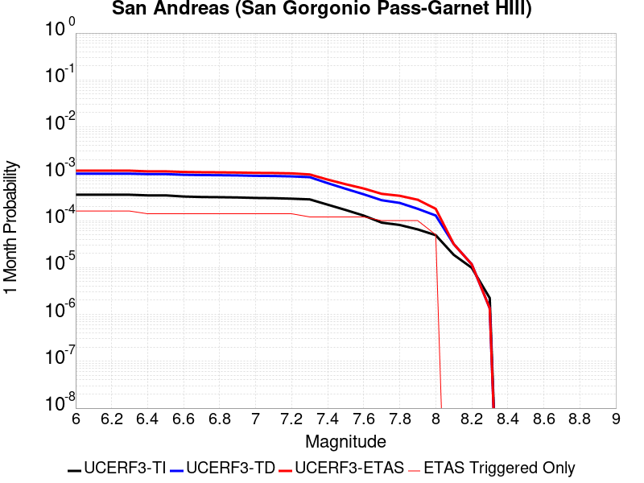 |  | 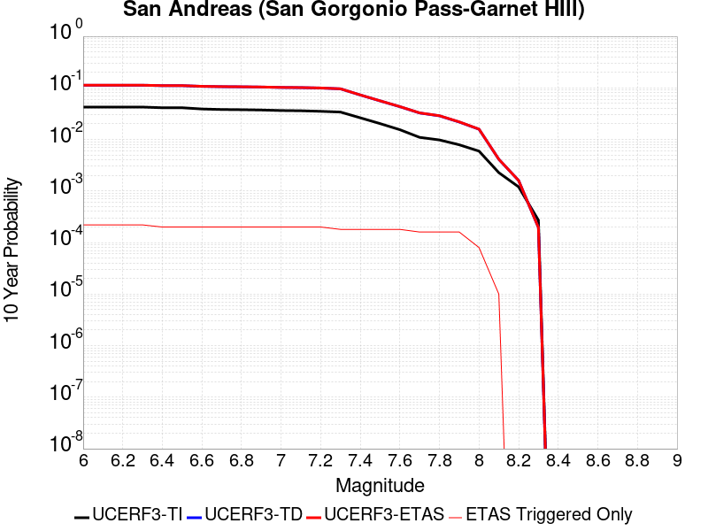 |

| Magnitude | 1 wk TI Prob | 1 wk TD Prob | 1 wk ETAS Prob | 1 wk ETAS/TD Gain | 1 wk ETAS Triggered Only | 1 mo TI Prob | 1 mo TD Prob | 1 mo ETAS Prob | 1 mo ETAS/TD Gain | 1 mo ETAS Triggered Only | 1 yr TI Prob | 1 yr TD Prob | 1 yr ETAS Prob | 1 yr ETAS/TD Gain | 1 yr ETAS Triggered Only | 10 yr TI Prob | 10 yr TD Prob | 10 yr ETAS Prob | 10 yr ETAS/TD Gain | 10 yr ETAS Triggered Only |
|-----|-----|-----|-----|-----|-----|-----|-----|-----|-----|-----|-----|-----|-----|-----|-----|-----|-----|-----|-----|-----|
| 6.0 | 8.31567E-5 | 2.3382473E-4 | 3.3227322E-4 | 1.4210353 | 9.84715E-5 | 3.5633717E-4 | 0.0010017233 | 0.0011766085 | 1.1745843 | 1.7506046E-4 | 0.004329778 | 0.012127888 | 0.0123440605 | 1.0178243 | 2.1882556E-4 | 0.042463828 | 0.11257892 | 0.11279253 | 1.0018975 | 2.4070812E-4 |
| 6.1 | 8.31567E-5 | 2.3382473E-4 | 3.3227322E-4 | 1.4210353 | 9.84715E-5 | 3.5633717E-4 | 0.0010017233 | 0.0011766085 | 1.1745843 | 1.7506046E-4 | 0.004329778 | 0.012127888 | 0.0123440605 | 1.0178243 | 2.1882556E-4 | 0.042463828 | 0.11257892 | 0.11279253 | 1.0018975 | 2.4070812E-4 |
| 6.2 | 8.31567E-5 | 2.3382473E-4 | 3.3227322E-4 | 1.4210353 | 9.84715E-5 | 3.5633717E-4 | 0.0010017233 | 0.0011766085 | 1.1745843 | 1.7506046E-4 | 0.004329778 | 0.012127888 | 0.0123440605 | 1.0178243 | 2.1882556E-4 | 0.042463828 | 0.11257892 | 0.11279253 | 1.0018975 | 2.4070812E-4 |
| 6.3 | 8.31567E-5 | 2.3382473E-4 | 3.3227322E-4 | 1.4210353 | 9.84715E-5 | 3.5633717E-4 | 0.0010017233 | 0.0011766085 | 1.1745843 | 1.7506046E-4 | 0.004329778 | 0.012127888 | 0.0123440605 | 1.0178243 | 2.1882556E-4 | 0.042463828 | 0.11257892 | 0.11279253 | 1.0018975 | 2.4070812E-4 |
| 6.4 | 8.059055E-5 | 2.2940808E-4 | 3.1691822E-4 | 1.3814605 | 8.753023E-5 | 3.4534236E-4 | 9.828096E-4 | 0.0011358369 | 1.155704 | 1.531779E-4 | 0.0041964394 | 0.011900152 | 0.012094751 | 1.0163527 | 1.96943E-4 | 0.041180745 | 0.11056015 | 0.11075478 | 1.0017604 | 2.1882556E-4 |
| 6.5 | 8.059055E-5 | 2.2940808E-4 | 3.1691822E-4 | 1.3814605 | 8.753023E-5 | 3.4534236E-4 | 9.828096E-4 | 0.0011358369 | 1.155704 | 1.531779E-4 | 0.0041964394 | 0.011900152 | 0.012094751 | 1.0163527 | 1.96943E-4 | 0.041180745 | 0.11056015 | 0.11075478 | 1.0017604 | 2.1882556E-4 |
| 6.6 | 7.619237E-5 | 2.218517E-4 | 3.093625E-4 | 1.3944563 | 8.753023E-5 | 3.2649786E-4 | 9.5044886E-4 | 0.0011034812 | 1.1610105 | 1.531779E-4 | 0.0039678677 | 0.01151087 | 0.011705547 | 1.0169123 | 1.96943E-4 | 0.03897764 | 0.10709683 | 0.10729222 | 1.0018244 | 2.1882556E-4 |
| 6.7 | 7.440636E-5 | 2.1860997E-4 | 3.0612104E-4 | 1.4003069 | 8.753023E-5 | 3.188454E-4 | 9.3656575E-4 | 0.0010896001 | 1.1633996 | 1.531779E-4 | 0.0038750346 | 0.011343609 | 0.011538317 | 1.0171646 | 1.96943E-4 | 0.038081564 | 0.105605274 | 0.105800994 | 1.0018532 | 2.1882556E-4 |
| 6.8 | 7.3735864E-5 | 2.1708169E-4 | 3.0459292E-4 | 1.4031258 | 8.753023E-5 | 3.1597257E-4 | 9.3002064E-4 | 0.0010830561 | 1.1645505 | 1.531779E-4 | 0.0038401815 | 0.011264749 | 0.0114594735 | 1.0172862 | 1.96943E-4 | 0.03774495 | 0.10490683 | 0.105102696 | 1.001867 | 2.1882556E-4 |
| 6.9 | 7.27575E-5 | 2.1477141E-4 | 3.0228283E-4 | 1.4074631 | 8.753023E-5 | 3.117806E-4 | 9.201265E-4 | 0.0010731635 | 1.1663216 | 1.531779E-4 | 0.003789323 | 0.011145527 | 0.0113402745 | 1.0174732 | 1.96943E-4 | 0.037253562 | 0.103854746 | 0.104050845 | 1.0018882 | 2.1882556E-4 |
| 7.0 | 7.102591E-5 | 2.1061185E-4 | 2.9812363E-4 | 1.4155122 | 8.753023E-5 | 3.0436125E-4 | 9.023122E-4 | 0.0010553519 | 1.1696084 | 1.531779E-4 | 0.003699303 | 0.010930831 | 0.011125621 | 1.0178202 | 1.96943E-4 | 0.03638325 | 0.10195695 | 0.102153465 | 1.0019274 | 2.1882556E-4 |
| 7.1 | 7.028513E-5 | 2.0896831E-4 | 2.9648026E-4 | 1.4187809 | 8.753023E-5 | 3.0118722E-4 | 8.9527335E-4 | 0.001048314 | 1.170943 | 1.531779E-4 | 0.0036607897 | 0.010845989 | 0.0110407965 | 1.0179611 | 1.96943E-4 | 0.036010686 | 0.101199985 | 0.101396665 | 1.0019435 | 2.1882556E-4 |
| 7.2 | 6.8498244E-5 | 2.0504706E-4 | 2.9255933E-4 | 1.4267912 | 8.753023E-5 | 2.9353087E-4 | 8.784794E-4 | 0.0010315228 | 1.1742139 | 1.531779E-4 | 0.003567883 | 0.010643536 | 0.010838383 | 1.0183066 | 1.96943E-4 | 0.035111405 | 0.09939202 | 0.099589095 | 1.0019828 | 2.1882556E-4 |
| 7.3 | 6.622592E-5 | 1.9732013E-4 | 2.6295485E-4 | 1.3326306 | 6.564767E-5 | 2.8379448E-4 | 8.453858E-4 | 9.765702E-4 | 1.1551769 | 1.3129534E-4 | 0.0034497243 | 0.0102444785 | 0.010417745 | 1.0169132 | 1.7506046E-4 | 0.033966612 | 0.095888525 | 0.09606659 | 1.0018569 | 1.96943E-4 |
| 7.4 | 5.1050705E-5 | 1.4689034E-4 | 2.1252836E-4 | 1.4468505 | 6.564767E-5 | 2.1877038E-4 | 6.29379E-4 | 7.605917E-4 | 1.2084796 | 1.3129534E-4 | 0.002660276 | 0.0076359594 | 0.007809683 | 1.0227507 | 1.7506046E-4 | 0.02628654 | 0.07286301 | 0.07304561 | 1.002506 | 1.96943E-4 |
| 7.5 | 3.9302922E-5 | 1.1129847E-4 | 1.7693883E-4 | 1.5897688 | 6.564767E-5 | 1.6843023E-4 | 4.7690657E-4 | 6.0813926E-4 | 1.275175 | 1.3129534E-4 | 0.0020487092 | 0.005790949 | 0.0059649954 | 1.0300549 | 1.7506046E-4 | 0.020299247 | 0.05600951 | 0.056195423 | 1.0033193 | 1.96943E-4 |
| 7.6 | 2.9851626E-5 | 8.4949745E-5 | 1.5059183E-4 | 1.7727168 | 6.564767E-5 | 1.2792926E-4 | 3.6401965E-4 | 4.952672E-4 | 1.3605508 | 1.3129534E-4 | 0.0015564259 | 0.0044229585 | 0.004597245 | 1.0394049 | 1.7506046E-4 | 0.0154556995 | 0.04319374 | 0.043382175 | 1.0043626 | 1.96943E-4 |
| 7.7 | 2.1135214E-5 | 6.3529005E-5 | 1.0729134E-4 | 1.688856 | 4.3765114E-5 | 9.0576345E-5 | 2.7223877E-4 | 3.8162176E-4 | 1.4017906 | 1.0941278E-4 | 0.0011022091 | 0.0033094748 | 0.0034621458 | 1.0461315 | 1.531779E-4 | 0.010967582 | 0.032582592 | 0.03275195 | 1.0051978 | 1.7506046E-4 |
| 7.8 | 1.883379E-5 | 5.564028E-5 | 9.9402954E-5 | 1.7865287 | 4.3765114E-5 | 8.0713755E-5 | 2.3843657E-4 | 3.4782325E-4 | 1.4587665 | 1.0941278E-4 | 9.822468E-4 | 0.0028991038 | 0.0030518377 | 1.0526831 | 1.531779E-4 | 0.0097791655 | 0.028695205 | 0.028865242 | 1.0059257 | 1.7506046E-4 |
| 7.9 | 1.5156185E-5 | 4.1658426E-5 | 8.5421714E-5 | 2.0505266 | 4.3765114E-5 | 6.495346E-5 | 1.785239E-4 | 2.8791715E-4 | 1.6127653 | 1.0941278E-4 | 7.9052144E-4 | 0.0021713632 | 0.0023242084 | 1.0703914 | 1.531779E-4 | 0.007877152 | 0.021759422 | 0.021930674 | 1.0078702 | 1.7506046E-4 |
| 8.0 | 1.1405907E-5 | 2.9974231E-5 | 5.1856132E-5 | 1.7300237 | 2.1882557E-5 | 4.8881542E-5 | 1.2845467E-4 | 1.8315403E-4 | 1.4258262 | 5.470639E-5 | 5.9497025E-4 | 0.0015628147 | 0.001639284 | 1.0489305 | 7.658895E-5 | 0.005933798 | 0.015772851 | 0.015859 | 1.0054619 | 8.753023E-5 |
| 8.1 | 4.3511436E-6 | 7.369219E-6 | 7.369219E-6 | 1.0 | 0.0 | 1.8647626E-5 | 3.1581985E-5 | 3.1581985E-5 | 1.0 | 0.0 | 2.2701119E-4 | 3.8444297E-4 | 3.9538005E-4 | 1.0284492 | 1.0941279E-5 | 0.0022677942 | 0.0041163345 | 0.004127231 | 1.002647 | 1.0941279E-5 |
| 8.2 | 2.3042528E-6 | 2.7329415E-6 | 2.7329415E-6 | 1.0 | 0.0 | 9.875332E-6 | 1.1712554E-5 | 1.1712554E-5 | 1.0 | 0.0 | 1.2022553E-4 | 1.4259106E-4 | 1.4259106E-4 | 1.0 | 0.0 | 0.0012016051 | 0.0015979785 | 0.0015979785 | 1.0 | 0.0 |
| 8.3 | 5.202968E-7 | 3.1598344E-7 | 3.1598344E-7 | 1.0 | 0.0 | 2.2298414E-6 | 1.3542141E-6 | 1.3542141E-6 | 1.0 | 0.0 | 2.714798E-5 | 1.6487444E-5 | 1.6487444E-5 | 1.0 | 0.0 | 2.7144665E-4 | 1.9563142E-4 | 1.9563142E-4 | 1.0 | 0.0 |

## Sierra Nevada  (No Extension)
*[(top)](#table-of-contents)*

| 1 Week | 1 Month | 1 Year | 10 Year |
|-----|-----|-----|-----|
|  |  |  | 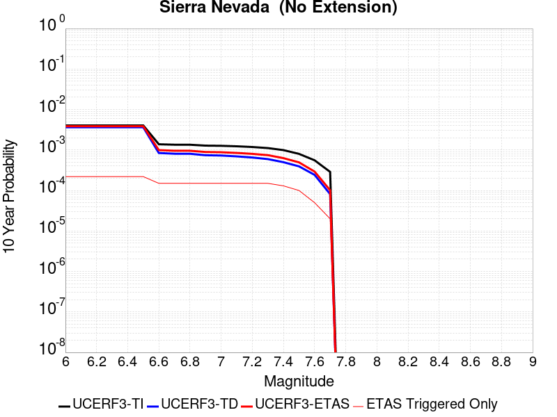 |

| Magnitude | 1 wk TI Prob | 1 wk TD Prob | 1 wk ETAS Prob | 1 wk ETAS/TD Gain | 1 wk ETAS Triggered Only | 1 mo TI Prob | 1 mo TD Prob | 1 mo ETAS Prob | 1 mo ETAS/TD Gain | 1 mo ETAS Triggered Only | 1 yr TI Prob | 1 yr TD Prob | 1 yr ETAS Prob | 1 yr ETAS/TD Gain | 1 yr ETAS Triggered Only | 10 yr TI Prob | 10 yr TD Prob | 10 yr ETAS Prob | 10 yr ETAS/TD Gain | 10 yr ETAS Triggered Only |
|-----|-----|-----|-----|-----|-----|-----|-----|-----|-----|-----|-----|-----|-----|-----|-----|-----|-----|-----|-----|-----|
| 6.0 | 7.7690465E-6 | 6.976322E-6 | 1.2732953E-4 | 18.251673 | 1.2035406E-4 | 3.329549E-5 | 2.9898381E-5 | 1.9401265E-4 | 6.4890685 | 1.6411918E-4 | 4.0529718E-4 | 3.6398784E-4 | 5.6085916E-4 | 1.5408734 | 1.96943E-4 | 0.004045588 | 0.0036374326 | 0.0038554622 | 1.0599406 | 2.1882556E-4 |
| 6.1 | 7.7690465E-6 | 6.976322E-6 | 1.2732953E-4 | 18.251673 | 1.2035406E-4 | 3.329549E-5 | 2.9898381E-5 | 1.9401265E-4 | 6.4890685 | 1.6411918E-4 | 4.0529718E-4 | 3.6398784E-4 | 5.6085916E-4 | 1.5408734 | 1.96943E-4 | 0.004045588 | 0.0036374326 | 0.0038554622 | 1.0599406 | 2.1882556E-4 |
| 6.2 | 7.7690465E-6 | 6.976322E-6 | 1.2732953E-4 | 18.251673 | 1.2035406E-4 | 3.329549E-5 | 2.9898381E-5 | 1.9401265E-4 | 6.4890685 | 1.6411918E-4 | 4.0529718E-4 | 3.6398784E-4 | 5.6085916E-4 | 1.5408734 | 1.96943E-4 | 0.004045588 | 0.0036374326 | 0.0038554622 | 1.0599406 | 2.1882556E-4 |
| 6.3 | 7.7690465E-6 | 6.976322E-6 | 1.2732953E-4 | 18.251673 | 1.2035406E-4 | 3.329549E-5 | 2.9898381E-5 | 1.9401265E-4 | 6.4890685 | 1.6411918E-4 | 4.0529718E-4 | 3.6398784E-4 | 5.6085916E-4 | 1.5408734 | 1.96943E-4 | 0.004045588 | 0.0036374326 | 0.0038554622 | 1.0599406 | 2.1882556E-4 |
| 6.4 | 7.7690465E-6 | 6.976322E-6 | 1.2732953E-4 | 18.251673 | 1.2035406E-4 | 3.329549E-5 | 2.9898381E-5 | 1.9401265E-4 | 6.4890685 | 1.6411918E-4 | 4.0529718E-4 | 3.6398784E-4 | 5.6085916E-4 | 1.5408734 | 1.96943E-4 | 0.004045588 | 0.0036374326 | 0.0038554622 | 1.0599406 | 2.1882556E-4 |
| 6.5 | 7.7690465E-6 | 6.976322E-6 | 1.2732953E-4 | 18.251673 | 1.2035406E-4 | 3.329549E-5 | 2.9898381E-5 | 1.9401265E-4 | 6.4890685 | 1.6411918E-4 | 4.0529718E-4 | 3.6398784E-4 | 5.6085916E-4 | 1.5408734 | 1.96943E-4 | 0.004045588 | 0.0036374326 | 0.0038554622 | 1.0599406 | 2.1882556E-4 |
| 6.6 | 2.653E-6 | 1.614854E-6 | 7.820368E-5 | 48.427708 | 7.658895E-5 | 1.136995E-5 | 6.9207845E-6 | 1.05391606E-4 | 15.228274 | 9.84715E-5 | 1.3842035E-4 | 8.425733E-5 | 2.0460125E-4 | 2.4282901 | 1.2035406E-4 | 0.0013833415 | 8.422573E-4 | 9.843741E-4 | 1.1687332 | 1.4223662E-4 |
| 6.7 | 2.5902466E-6 | 1.5501876E-6 | 7.813902E-5 | 50.40617 | 7.658895E-5 | 1.11010095E-5 | 6.643644E-6 | 1.0511449E-4 | 15.821813 | 9.84715E-5 | 1.351464E-4 | 8.0883394E-5 | 2.0122773E-4 | 2.4878743 | 1.2035406E-4 | 0.0013506424 | 8.0854254E-4 | 9.5066417E-4 | 1.175775 | 1.4223662E-4 |
| 6.8 | 2.5853892E-6 | 1.5469877E-6 | 7.813582E-5 | 50.50836 | 7.658895E-5 | 1.1080193E-5 | 6.629931E-6 | 1.0510078E-4 | 15.85247 | 9.84715E-5 | 1.34893E-4 | 8.071645E-5 | 2.0106079E-4 | 2.490952 | 1.2035406E-4 | 0.0013481114 | 8.068743E-4 | 9.489961E-4 | 1.1761388 | 1.4223662E-4 |
| 6.9 | 2.458257E-6 | 1.4220619E-6 | 7.80109E-5 | 54.857594 | 7.658895E-5 | 1.0535345E-5 | 6.094537E-6 | 1.0456544E-4 | 17.15724 | 9.84715E-5 | 1.2826028E-4 | 7.4198484E-5 | 1.9454361E-4 | 2.6219351 | 1.2035406E-4 | 0.0012818627 | 7.4173906E-4 | 8.838702E-4 | 1.1916188 | 1.4223662E-4 |
| 7.0 | 2.4341468E-6 | 1.3990258E-6 | 7.798787E-5 | 55.744408 | 7.658895E-5 | 1.0432016E-5 | 5.9958115E-6 | 1.0446672E-4 | 17.423285 | 9.84715E-5 | 1.270024E-4 | 7.2996576E-5 | 1.9334185E-4 | 2.6486428 | 1.2035406E-4 | 0.0012692984 | 7.297279E-4 | 8.718607E-4 | 1.1947751 | 1.4223662E-4 |
| 7.1 | 2.3652476E-6 | 1.3339754E-6 | 7.792282E-5 | 58.413986 | 7.658895E-5 | 1.0136736E-5 | 5.717025E-6 | 1.04187966E-4 | 18.224157 | 9.84715E-5 | 1.2340778E-4 | 6.9602575E-5 | 1.8994826E-4 | 2.7290406 | 1.2035406E-4 | 0.0012333926 | 6.9580943E-4 | 8.379471E-4 | 1.2042767 | 1.4223662E-4 |
| 7.2 | 2.272158E-6 | 1.2502821E-6 | 7.783913E-5 | 62.257256 | 7.658895E-5 | 9.737784E-6 | 5.3583412E-6 | 1.0382932E-4 | 19.377138 | 9.84715E-5 | 1.1855107E-4 | 6.5235865E-5 | 1.8558207E-4 | 2.844786 | 1.2035406E-4 | 0.0011848784 | 6.5216864E-4 | 7.943125E-4 | 1.2179557 | 1.4223662E-4 |
| 7.3 | 2.1382127E-6 | 1.1419703E-6 | 7.773083E-5 | 68.0673 | 7.658895E-5 | 9.163737E-6 | 4.8941492E-6 | 1.0336517E-4 | 21.120152 | 9.84715E-5 | 1.1156279E-4 | 5.958465E-5 | 1.7993154E-4 | 3.0197632 | 1.2035406E-4 | 0.001115068 | 5.956879E-4 | 7.378398E-4 | 1.2386348 | 1.4223662E-4 |
| 7.4 | 1.9048055E-6 | 9.575242E-7 | 5.5663862E-5 | 58.13311 | 5.470639E-5 | 8.163426E-6 | 4.1036687E-6 | 8.0692305E-5 | 19.663454 | 7.658895E-5 | 9.9385186E-5 | 4.996103E-5 | 1.4842761E-4 | 2.9708679 | 9.84715E-5 | 9.934074E-4 | 4.994987E-4 | 6.197926E-4 | 1.2408293 | 1.2035406E-4 |
| 7.5 | 1.5373403E-6 | 7.560042E-7 | 5.5462355E-5 | 73.36249 | 5.470639E-5 | 6.5885843E-6 | 3.2400142E-6 | 6.888747E-5 | 21.261473 | 6.564767E-5 | 8.021306E-5 | 3.9446462E-5 | 1.1603239E-4 | 2.9415157 | 7.658895E-5 | 8.0184115E-4 | 3.943951E-4 | 4.9282773E-4 | 1.2495788 | 9.84715E-5 |
| 7.6 | 1.0680322E-6 | 4.6596554E-7 | 2.2348511E-5 | 47.961727 | 2.1882557E-5 | 4.577273E-6 | 1.9969937E-6 | 3.482076E-5 | 17.436592 | 3.2823835E-5 | 5.5726876E-5 | 2.4313129E-5 | 6.807718E-5 | 2.800017 | 4.3765114E-5 | 5.5712904E-4 | 2.4310495E-4 | 2.8685943E-4 | 1.1799818 | 4.3765114E-5 |
| 7.7 | 5.509146E-7 | 1.5580486E-7 | 1.5580486E-7 | 1.0 | 0.0 | 2.3610605E-6 | 6.677349E-7 | 1.1609006E-5 | 17.385649 | 1.0941279E-5 | 2.8745531E-5 | 8.129644E-6 | 3.0012023E-5 | 3.6916773 | 2.1882557E-5 | 2.8741814E-4 | 8.1293576E-5 | 1.0317436E-4 | 1.2691575 | 2.1882557E-5 |

## Manix-Afton Hills
*[(top)](#table-of-contents)*

| 1 Week | 1 Month | 1 Year | 10 Year |
|-----|-----|-----|-----|
|  |  |  |  |

| Magnitude | 1 wk TI Prob | 1 wk TD Prob | 1 wk ETAS Prob | 1 wk ETAS/TD Gain | 1 wk ETAS Triggered Only | 1 mo TI Prob | 1 mo TD Prob | 1 mo ETAS Prob | 1 mo ETAS/TD Gain | 1 mo ETAS Triggered Only | 1 yr TI Prob | 1 yr TD Prob | 1 yr ETAS Prob | 1 yr ETAS/TD Gain | 1 yr ETAS Triggered Only | 10 yr TI Prob | 10 yr TD Prob | 10 yr ETAS Prob | 10 yr ETAS/TD Gain | 10 yr ETAS Triggered Only |
|-----|-----|-----|-----|-----|-----|-----|-----|-----|-----|-----|-----|-----|-----|-----|-----|-----|-----|-----|-----|-----|
| 6.0 | 1.3783202E-5 | 1.47110895E-5 | 1.460045E-4 | 9.924791 | 1.3129534E-4 | 5.906953E-5 | 6.30461E-5 | 2.1621434E-4 | 3.429464 | 1.531779E-4 | 7.189342E-4 | 7.6733343E-4 | 9.4225956E-4 | 1.2279662 | 1.7506046E-4 | 0.0071661277 | 0.007648596 | 0.007865747 | 1.0283911 | 2.1882556E-4 |
| 6.1 | 1.3783202E-5 | 1.47110895E-5 | 1.460045E-4 | 9.924791 | 1.3129534E-4 | 5.906953E-5 | 6.30461E-5 | 2.1621434E-4 | 3.429464 | 1.531779E-4 | 7.189342E-4 | 7.6733343E-4 | 9.4225956E-4 | 1.2279662 | 1.7506046E-4 | 0.0071661277 | 0.007648596 | 0.007865747 | 1.0283911 | 2.1882556E-4 |
| 6.2 | 1.3783202E-5 | 1.47110895E-5 | 1.460045E-4 | 9.924791 | 1.3129534E-4 | 5.906953E-5 | 6.30461E-5 | 2.1621434E-4 | 3.429464 | 1.531779E-4 | 7.189342E-4 | 7.6733343E-4 | 9.4225956E-4 | 1.2279662 | 1.7506046E-4 | 0.0071661277 | 0.007648596 | 0.007865747 | 1.0283911 | 2.1882556E-4 |
| 6.3 | 1.10494875E-5 | 1.1793136E-5 | 7.744003E-5 | 6.5665345 | 6.564767E-5 | 4.7354086E-5 | 5.054109E-5 | 1.3806688E-4 | 2.731775 | 8.753023E-5 | 5.763835E-4 | 6.151744E-4 | 7.026508E-4 | 1.1421977 | 8.753023E-5 | 0.005748908 | 0.0061357557 | 0.006244497 | 1.0177226 | 1.0941278E-4 |
| 6.4 | 1.10494875E-5 | 1.1793136E-5 | 7.744003E-5 | 6.5665345 | 6.564767E-5 | 4.7354086E-5 | 5.054109E-5 | 1.3806688E-4 | 2.731775 | 8.753023E-5 | 5.763835E-4 | 6.151744E-4 | 7.026508E-4 | 1.1421977 | 8.753023E-5 | 0.005748908 | 0.0061357557 | 0.006244497 | 1.0177226 | 1.0941278E-4 |
| 6.5 | 9.788949E-6 | 1.045432E-5 | 7.61013E-5 | 7.2794123 | 6.564767E-5 | 4.1951964E-5 | 4.480351E-5 | 1.3232982E-4 | 2.9535592 | 8.753023E-5 | 5.1064545E-4 | 5.453555E-4 | 6.32838E-4 | 1.1604137 | 8.753023E-5 | 0.0050947363 | 0.0054410985 | 0.0055390345 | 1.0179993 | 9.84715E-5 |
| 6.6 | 8.810006E-6 | 9.4136285E-6 | 6.411951E-5 | 6.811349 | 5.470639E-5 | 3.775662E-5 | 4.0343548E-5 | 1.16929405E-4 | 2.8983421 | 7.658895E-5 | 4.5958988E-4 | 4.9108086E-4 | 5.676322E-4 | 1.1558833 | 7.658895E-5 | 0.0045864056 | 0.004900839 | 0.00498794 | 1.0177727 | 8.753023E-5 |
| 6.7 | 8.80128E-6 | 9.404108E-6 | 6.410998E-5 | 6.8172317 | 5.470639E-5 | 3.7719226E-5 | 4.0302748E-5 | 1.1688861E-4 | 2.900264 | 7.658895E-5 | 4.591348E-4 | 4.9058435E-4 | 5.6713575E-4 | 1.1560411 | 7.658895E-5 | 0.004581874 | 0.0048958957 | 0.0049829977 | 1.0177908 | 8.753023E-5 |
| 6.8 | 6.8994877E-6 | 7.380076E-6 | 4.0203668E-5 | 5.4475956 | 3.2823835E-5 | 2.9568899E-5 | 3.162856E-5 | 8.633322E-5 | 2.7295969 | 5.470639E-5 | 3.5994186E-4 | 3.8501783E-4 | 4.3970317E-4 | 1.1420332 | 5.470639E-5 | 0.003593594 | 0.0038443129 | 0.003898809 | 1.0141758 | 5.470639E-5 |
| 6.9 | 4.9328037E-6 | 5.2709615E-6 | 1.6212181E-5 | 3.0757542 | 1.0941279E-5 | 2.1140417E-5 | 2.2589675E-5 | 5.5412766E-5 | 2.4530132 | 3.2823835E-5 | 2.5735417E-4 | 2.7500073E-4 | 3.0781553E-4 | 1.1193262 | 3.2823835E-5 | 0.0025705635 | 0.0027472095 | 0.0027799432 | 1.0119152 | 3.2823835E-5 |
| 7.0 | 3.347973E-6 | 3.59003E-6 | 1.4531269E-5 | 4.047673 | 1.0941279E-5 | 1.4348378E-5 | 1.5385775E-5 | 3.7267993E-5 | 2.4222372 | 2.1882557E-5 | 1.746775E-4 | 1.8730981E-4 | 2.0918828E-4 | 1.1168035 | 2.1882557E-5 | 0.0017454025 | 0.0018719219 | 0.0018937635 | 1.011668 | 2.1882557E-5 |
| 7.1 | 1.2073567E-6 | 1.293482E-6 | 1.293482E-6 | 1.0 | 0.0 | 5.1743755E-6 | 5.543492E-6 | 1.648471E-5 | 2.973705 | 1.0941279E-5 | 6.29962E-5 | 6.749156E-5 | 7.8432095E-5 | 1.1621023 | 1.0941279E-5 | 6.297835E-4 | 6.7487074E-4 | 6.8580464E-4 | 1.0162015 | 1.0941279E-5 |

## San Andreas (Carrizo) rev
*[(top)](#table-of-contents)*

| 1 Week | 1 Month | 1 Year | 10 Year |
|-----|-----|-----|-----|
|  |  |  |  |

| Magnitude | 1 wk TI Prob | 1 wk TD Prob | 1 wk ETAS Prob | 1 wk ETAS/TD Gain | 1 wk ETAS Triggered Only | 1 mo TI Prob | 1 mo TD Prob | 1 mo ETAS Prob | 1 mo ETAS/TD Gain | 1 mo ETAS Triggered Only | 1 yr TI Prob | 1 yr TD Prob | 1 yr ETAS Prob | 1 yr ETAS/TD Gain | 1 yr ETAS Triggered Only | 10 yr TI Prob | 10 yr TD Prob | 10 yr ETAS Prob | 10 yr ETAS/TD Gain | 10 yr ETAS Triggered Only |
|-----|-----|-----|-----|-----|-----|-----|-----|-----|-----|-----|-----|-----|-----|-----|-----|-----|-----|-----|-----|-----|
| 6.0 | 1.1674632E-4 | 2.432302E-4 | 3.5261636E-4 | 1.4497228 | 1.0941278E-4 | 5.002454E-4 | 0.0010420004 | 0.001162229 | 1.1153826 | 1.2035406E-4 | 0.006073493 | 0.012613042 | 0.012796698 | 1.0145608 | 1.8600172E-4 | 0.0591016 | 0.12061418 | 0.12080661 | 1.0015954 | 2.1882556E-4 |
| 6.1 | 1.1674632E-4 | 2.432302E-4 | 3.5261636E-4 | 1.4497228 | 1.0941278E-4 | 5.002454E-4 | 0.0010420004 | 0.001162229 | 1.1153826 | 1.2035406E-4 | 0.006073493 | 0.012613042 | 0.012796698 | 1.0145608 | 1.8600172E-4 | 0.0591016 | 0.12061418 | 0.12080661 | 1.0015954 | 2.1882556E-4 |
| 6.2 | 1.1674632E-4 | 2.432302E-4 | 3.5261636E-4 | 1.4497228 | 1.0941278E-4 | 5.002454E-4 | 0.0010420004 | 0.001162229 | 1.1153826 | 1.2035406E-4 | 0.006073493 | 0.012613042 | 0.012796698 | 1.0145608 | 1.8600172E-4 | 0.0591016 | 0.12061418 | 0.12080661 | 1.0015954 | 2.1882556E-4 |
| 6.3 | 1.1674632E-4 | 2.432302E-4 | 3.5261636E-4 | 1.4497228 | 1.0941278E-4 | 5.002454E-4 | 0.0010420004 | 0.001162229 | 1.1153826 | 1.2035406E-4 | 0.006073493 | 0.012613042 | 0.012796698 | 1.0145608 | 1.8600172E-4 | 0.0591016 | 0.12061418 | 0.12080661 | 1.0015954 | 2.1882556E-4 |
| 6.4 | 1.1674632E-4 | 2.432302E-4 | 3.5261636E-4 | 1.4497228 | 1.0941278E-4 | 5.002454E-4 | 0.0010420004 | 0.001162229 | 1.1153826 | 1.2035406E-4 | 0.006073493 | 0.012613042 | 0.012796698 | 1.0145608 | 1.8600172E-4 | 0.0591016 | 0.12061418 | 0.12080661 | 1.0015954 | 2.1882556E-4 |
| 6.5 | 1.13136164E-4 | 2.3643032E-4 | 3.4581724E-4 | 1.4626603 | 1.0941278E-4 | 4.847792E-4 | 0.0010128808 | 0.001133113 | 1.1187031 | 1.2035406E-4 | 0.0058862255 | 0.012262545 | 0.012446265 | 1.0149822 | 1.8600172E-4 | 0.057327334 | 0.117585555 | 0.117778644 | 1.0016421 | 2.1882556E-4 |
| 6.6 | 1.13136164E-4 | 2.3643032E-4 | 3.4581724E-4 | 1.4626603 | 1.0941278E-4 | 4.847792E-4 | 0.0010128808 | 0.001133113 | 1.1187031 | 1.2035406E-4 | 0.0058862255 | 0.012262545 | 0.012446265 | 1.0149822 | 1.8600172E-4 | 0.057327334 | 0.117585555 | 0.117778644 | 1.0016421 | 2.1882556E-4 |
| 6.7 | 1.1149675E-4 | 2.3334254E-4 | 3.427298E-4 | 1.468784 | 1.0941278E-4 | 4.777557E-4 | 9.996577E-4 | 0.0011198914 | 1.1202749 | 1.2035406E-4 | 0.0058011734 | 0.012103349 | 0.0122871 | 1.0151818 | 1.8600172E-4 | 0.05652051 | 0.1162071 | 0.116400495 | 1.0016643 | 2.1882556E-4 |
| 6.8 | 1.1103589E-4 | 2.3236412E-4 | 3.417515E-4 | 1.4707583 | 1.0941278E-4 | 4.7578133E-4 | 9.954676E-4 | 0.001115702 | 1.1207817 | 1.2035406E-4 | 0.005777263 | 0.012052901 | 0.012236661 | 1.0152462 | 1.8600172E-4 | 0.056293584 | 0.1157674 | 0.11596089 | 1.0016714 | 2.1882556E-4 |
| 6.9 | 1.1053259E-4 | 2.3128795E-4 | 3.4067544E-4 | 1.4729493 | 1.0941278E-4 | 4.7362508E-4 | 9.90859E-4 | 0.0011110938 | 1.121344 | 1.2035406E-4 | 0.0057511497 | 0.01199741 | 0.0121811805 | 1.0153174 | 1.8600172E-4 | 0.05604569 | 0.11528359 | 0.1154772 | 1.0016793 | 2.1882556E-4 |
| 7.0 | 1.1005377E-4 | 2.3029637E-4 | 3.3968396E-4 | 1.4749861 | 1.0941278E-4 | 4.7157376E-4 | 9.866126E-4 | 0.0011068479 | 1.1218668 | 1.2035406E-4 | 0.0057263062 | 0.011946279 | 0.012130058 | 1.0153838 | 1.8600172E-4 | 0.055809796 | 0.11483591 | 0.1150296 | 1.0016867 | 2.1882556E-4 |
| 7.1 | 1.0308142E-4 | 2.1539345E-4 | 3.2478265E-4 | 1.5078577 | 1.0941278E-4 | 4.417027E-4 | 9.227892E-4 | 0.0010430322 | 1.1303039 | 1.2035406E-4 | 0.0053644776 | 0.011177397 | 0.0113613205 | 1.0164549 | 1.8600172E-4 | 0.052368138 | 0.108092256 | 0.10828743 | 1.0018057 | 2.1882556E-4 |
| 7.2 | 1.0027479E-4 | 2.094724E-4 | 3.1886226E-4 | 1.5222161 | 1.0941278E-4 | 4.296783E-4 | 8.9743105E-4 | 0.0010176771 | 1.1339892 | 1.2035406E-4 | 0.0052187922 | 0.010871782 | 0.011055762 | 1.0169227 | 1.8600172E-4 | 0.050979212 | 0.10539625 | 0.10559201 | 1.0018574 | 2.1882556E-4 |
| 7.3 | 9.816942E-5 | 2.0422463E-4 | 3.1361508E-4 | 1.5356379 | 1.0941278E-4 | 4.2065824E-4 | 8.7495585E-4 | 9.952047E-4 | 1.1374341 | 1.2035406E-4 | 0.005109493 | 0.010600842 | 0.010774046 | 1.0163387 | 1.7506046E-4 | 0.049935985 | 0.102979995 | 0.103166476 | 1.0018108 | 2.0788428E-4 |
| 7.4 | 9.5634205E-5 | 1.9791997E-4 | 3.073111E-4 | 1.5527039 | 1.0941278E-4 | 4.0979648E-4 | 8.479536E-4 | 9.682056E-4 | 1.1418144 | 1.2035406E-4 | 0.0049778637 | 0.010275229 | 0.01044849 | 1.016862 | 1.7506046E-4 | 0.048678253 | 0.10006632 | 0.1002534 | 1.0018696 | 2.0788428E-4 |
| 7.5 | 8.052417E-5 | 1.611261E-4 | 2.4864223E-4 | 1.543153 | 8.753023E-5 | 3.4505792E-4 | 6.903579E-4 | 7.8876136E-4 | 1.1425399 | 9.84715E-5 | 0.0041929903 | 0.008372796 | 0.008524691 | 1.0181415 | 1.531779E-4 | 0.04114753 | 0.08281049 | 0.08298109 | 1.00206 | 1.8600172E-4 |
| 7.6 | 7.897024E-5 | 1.5765853E-4 | 2.4517495E-4 | 1.555101 | 8.753023E-5 | 3.384E-4 | 6.755046E-4 | 7.739096E-4 | 1.1456763 | 9.84715E-5 | 0.0041122385 | 0.008193332 | 0.008345255 | 1.0185423 | 1.531779E-4 | 0.040369697 | 0.08115171 | 0.08132261 | 1.0021061 | 1.8600172E-4 |
| 7.7 | 6.707427E-5 | 1.3276102E-4 | 1.9839998E-4 | 1.4944143 | 6.564767E-5 | 2.8742946E-4 | 5.688518E-4 | 6.453972E-4 | 1.1345612 | 7.658895E-5 | 0.003493839 | 0.00690381 | 0.0070016016 | 1.0141649 | 9.84715E-5 | 0.034394164 | 0.069048055 | 0.06917029 | 1.0017703 | 1.3129534E-4 |
| 7.8 | 6.147705E-5 | 1.2197486E-4 | 1.8761453E-4 | 1.5381409 | 6.564767E-5 | 2.6344648E-4 | 5.226447E-4 | 5.991936E-4 | 1.1464646 | 7.658895E-5 | 0.0032027436 | 0.006344659 | 0.006442506 | 1.0154219 | 9.84715E-5 | 0.031569764 | 0.06351457 | 0.06362727 | 1.0017745 | 1.2035406E-4 |
| 7.9 | 4.7636717E-5 | 8.87977E-5 | 1.2161862E-4 | 1.3696145 | 3.2823835E-5 | 2.0414138E-4 | 3.8050607E-4 | 4.2425454E-4 | 1.1149744 | 4.3765114E-5 | 0.0024825884 | 0.0046228287 | 0.004688173 | 1.0141351 | 6.564767E-5 | 0.024550365 | 0.046628095 | 0.04671154 | 1.0017897 | 8.753023E-5 |
| 8.0 | 3.3554235E-5 | 5.2136907E-5 | 5.2136907E-5 | 1.0 | 0.0 | 1.4379594E-4 | 2.2342477E-4 | 2.343636E-4 | 1.0489599 | 1.0941279E-5 | 0.0017493097 | 0.002716805 | 0.002738628 | 1.0080327 | 2.1882557E-5 | 0.017356034 | 0.027880952 | 0.027923498 | 1.001526 | 4.3765114E-5 |
| 8.1 | 1.9175432E-5 | 1.9184976E-5 | 1.9184976E-5 | 1.0 | 0.0 | 8.217783E-5 | 8.2218736E-5 | 8.2218736E-5 | 1.0 | 0.0 | 0.0010000558 | 0.0010005541 | 0.0010114844 | 1.0109242 | 1.0941279E-5 | 0.009955673 | 0.0107580265 | 0.010779674 | 1.0020121 | 2.1882557E-5 |
| 8.2 | 8.643924E-6 | 5.4748625E-6 | 5.4748625E-6 | 1.0 | 0.0 | 3.704486E-5 | 2.3463486E-5 | 2.3463486E-5 | 1.0 | 0.0 | 4.5092785E-4 | 2.8563058E-4 | 2.8563058E-4 | 1.0 | 0.0 | 0.0045001395 | 0.0032487072 | 0.0032487072 | 1.0 | 0.0 |
| 8.3 | 1.983087E-6 | 7.6599065E-7 | 7.6599065E-7 | 1.0 | 0.0 | 8.498917E-6 | 3.282813E-6 | 3.282813E-6 | 1.0 | 0.0 | 1.034694E-4 | 3.9967534E-5 | 3.9967534E-5 | 1.0 | 0.0 | 0.0010342124 | 4.719687E-4 | 4.719687E-4 | 1.0 | 0.0 |

## San Andreas (Cholame) rev
*[(top)](#table-of-contents)*

| 1 Week | 1 Month | 1 Year | 10 Year |
|-----|-----|-----|-----|
|  |  |  |  |

| Magnitude | 1 wk TI Prob | 1 wk TD Prob | 1 wk ETAS Prob | 1 wk ETAS/TD Gain | 1 wk ETAS Triggered Only | 1 mo TI Prob | 1 mo TD Prob | 1 mo ETAS Prob | 1 mo ETAS/TD Gain | 1 mo ETAS Triggered Only | 1 yr TI Prob | 1 yr TD Prob | 1 yr ETAS Prob | 1 yr ETAS/TD Gain | 1 yr ETAS Triggered Only | 10 yr TI Prob | 10 yr TD Prob | 10 yr ETAS Prob | 10 yr ETAS/TD Gain | 10 yr ETAS Triggered Only |
|-----|-----|-----|-----|-----|-----|-----|-----|-----|-----|-----|-----|-----|-----|-----|-----|-----|-----|-----|-----|-----|
| 6.0 | 1.2302514E-4 | 2.5204287E-4 | 3.3955104E-4 | 1.3471955 | 8.753023E-5 | 5.27144E-4 | 0.0010797381 | 0.0011781034 | 1.0911009 | 9.84715E-5 | 0.0063991086 | 0.0130670825 | 0.013229057 | 1.0123956 | 1.6411918E-4 | 0.06217949 | 0.12439073 | 0.12456317 | 1.0013863 | 1.96943E-4 |
| 6.1 | 1.2302514E-4 | 2.5204287E-4 | 3.3955104E-4 | 1.3471955 | 8.753023E-5 | 5.27144E-4 | 0.0010797381 | 0.0011781034 | 1.0911009 | 9.84715E-5 | 0.0063991086 | 0.0130670825 | 0.013229057 | 1.0123956 | 1.6411918E-4 | 0.06217949 | 0.12439073 | 0.12456317 | 1.0013863 | 1.96943E-4 |
| 6.2 | 1.2203569E-4 | 2.5021084E-4 | 3.3771916E-4 | 1.3497384 | 8.753023E-5 | 5.2290526E-4 | 0.0010718931 | 0.0011702591 | 1.0917684 | 9.84715E-5 | 0.006347804 | 0.01297271 | 0.0131347 | 1.0124869 | 1.6411918E-4 | 0.061695136 | 0.12357691 | 0.12374951 | 1.0013968 | 1.96943E-4 |
| 6.3 | 1.2142645E-4 | 2.4907055E-4 | 3.36579E-4 | 1.3513399 | 8.753023E-5 | 5.202953E-4 | 0.0010670102 | 0.0011653766 | 1.0921888 | 9.84715E-5 | 0.006316212 | 0.012913967 | 0.013075966 | 1.0125445 | 1.6411918E-4 | 0.06139677 | 0.12307103 | 0.123243734 | 1.0014033 | 1.96943E-4 |
| 6.4 | 1.1865206E-4 | 2.44126E-4 | 3.3163486E-4 | 1.3584577 | 8.753023E-5 | 5.0840975E-4 | 0.0010458364 | 0.0011442049 | 1.0940573 | 9.84715E-5 | 0.006172335 | 0.012659196 | 0.012821238 | 1.0128003 | 1.6411918E-4 | 0.060036868 | 0.1208638 | 0.12103695 | 1.0014325 | 1.96943E-4 |
| 6.5 | 1.17443946E-4 | 2.4205919E-4 | 3.2956823E-4 | 1.3615192 | 8.753023E-5 | 5.032341E-4 | 0.0010369857 | 0.0011353551 | 1.0948609 | 9.84715E-5 | 0.006109677 | 0.012552682 | 0.012714742 | 1.0129104 | 1.6411918E-4 | 0.059444077 | 0.11993805 | 0.120111376 | 1.001445 | 1.96943E-4 |
| 6.6 | 1.13579066E-4 | 2.3514954E-4 | 3.2265918E-4 | 1.3721447 | 8.753023E-5 | 4.866766E-4 | 0.001007396 | 0.0011057684 | 1.09765 | 9.84715E-5 | 0.0059092017 | 0.012196515 | 0.012358632 | 1.0132921 | 1.6411918E-4 | 0.057545185 | 0.11685214 | 0.117026076 | 1.0014884 | 1.96943E-4 |
| 6.7 | 1.1271412E-4 | 2.3359268E-4 | 3.2110247E-4 | 1.3746256 | 8.753023E-5 | 4.829711E-4 | 0.0010007289 | 0.0010991018 | 1.0983013 | 9.84715E-5 | 0.005864331 | 0.012116249 | 0.012278379 | 1.0133812 | 1.6411918E-4 | 0.057119697 | 0.116155714 | 0.11632978 | 1.0014986 | 1.96943E-4 |
| 6.8 | 1.1217975E-4 | 2.3247694E-4 | 3.1998684E-4 | 1.3764238 | 8.753023E-5 | 4.8068175E-4 | 9.959509E-4 | 0.0010943243 | 1.0987734 | 9.84715E-5 | 0.005836608 | 0.012058721 | 0.012220861 | 1.0134459 | 1.6411918E-4 | 0.056856725 | 0.11565396 | 0.115828134 | 1.001506 | 1.96943E-4 |
| 6.9 | 1.1146753E-4 | 2.3096445E-4 | 3.1847446E-4 | 1.3788896 | 8.753023E-5 | 4.7763053E-4 | 9.894737E-4 | 0.0010878477 | 1.0994205 | 9.84715E-5 | 0.0057996577 | 0.011980731 | 0.012142885 | 1.0135344 | 1.6411918E-4 | 0.056506127 | 0.11497439 | 0.115148686 | 1.001516 | 1.96943E-4 |
| 7.0 | 1.0965793E-4 | 2.2719789E-4 | 3.1470822E-4 | 1.3851724 | 8.753023E-5 | 4.698779E-4 | 9.733434E-4 | 0.0010717191 | 1.1010698 | 9.84715E-5 | 0.005705768 | 0.011786487 | 0.011948671 | 1.0137602 | 1.6411918E-4 | 0.055614736 | 0.11327597 | 0.1134506 | 1.0015416 | 1.96943E-4 |
| 7.1 | 9.927982E-5 | 2.0538924E-4 | 2.9290147E-4 | 1.42608 | 8.753023E-5 | 4.2541555E-4 | 8.7994366E-4 | 9.783285E-4 | 1.1118082 | 9.84715E-5 | 0.0051671406 | 0.010660981 | 0.01082335 | 1.0152303 | 1.6411918E-4 | 0.05048634 | 0.1033706 | 0.103547186 | 1.0017083 | 1.96943E-4 |
| 7.2 | 9.696786E-5 | 2.0043184E-4 | 2.879445E-4 | 1.4366207 | 8.753023E-5 | 4.1551032E-4 | 8.5871184E-4 | 9.570988E-4 | 1.114575 | 9.84715E-5 | 0.00504711 | 0.010404981 | 0.010567392 | 1.015609 | 1.6411918E-4 | 0.04934009 | 0.1011086 | 0.10128563 | 1.001751 | 1.96943E-4 |
| 7.3 | 9.4727984E-5 | 1.9472468E-4 | 2.8223786E-4 | 1.4494201 | 8.753023E-5 | 4.0591392E-4 | 8.3426846E-4 | 9.326578E-4 | 1.117935 | 9.84715E-5 | 0.0049308087 | 0.010110183 | 0.010261812 | 1.0149977 | 1.531779E-4 | 0.048228268 | 0.09847952 | 0.0986472 | 1.0017028 | 1.8600172E-4 |
| 7.4 | 9.220358E-5 | 1.8843076E-4 | 2.7594448E-4 | 1.4644344 | 8.753023E-5 | 3.9509835E-4 | 8.073114E-4 | 9.057034E-4 | 1.1218761 | 9.84715E-5 | 0.004799717 | 0.009784967 | 0.009936646 | 1.0155013 | 1.531779E-4 | 0.046973653 | 0.095557496 | 0.09572572 | 1.0017605 | 1.8600172E-4 |
| 7.5 | 7.71631E-5 | 1.5177966E-4 | 2.2835699E-4 | 1.5045295 | 7.658895E-5 | 3.306571E-4 | 6.503223E-4 | 7.377956E-4 | 1.1345077 | 8.753023E-5 | 0.0040183207 | 0.007889002 | 0.008030116 | 1.0178875 | 1.4223662E-4 | 0.03946433 | 0.07828531 | 0.078446664 | 1.0020611 | 1.7506046E-4 |
| 7.6 | 7.5634416E-5 | 1.483744E-4 | 2.2495197E-4 | 1.5161105 | 7.658895E-5 | 3.241072E-4 | 6.3573546E-4 | 7.2321005E-4 | 1.1375959 | 8.753023E-5 | 0.0039388672 | 0.0077126776 | 0.007853817 | 1.0182997 | 1.4223662E-4 | 0.038697794 | 0.07664872 | 0.07681036 | 1.0021088 | 1.7506046E-4 |
| 7.7 | 6.3783E-5 | 1.235872E-4 | 1.7828683E-4 | 1.4425994 | 5.470639E-5 | 2.7332708E-4 | 5.29552E-4 | 5.951649E-4 | 1.1239027 | 6.564767E-5 | 0.0033226798 | 0.0064282627 | 0.00651523 | 1.013529 | 8.753023E-5 | 0.032734364 | 0.06454029 | 0.06465288 | 1.0017444 | 1.2035406E-4 |
| 7.8 | 5.863422E-5 | 1.1416107E-4 | 1.6886122E-4 | 1.4791489 | 5.470639E-5 | 2.512653E-4 | 4.8917E-4 | 5.547856E-4 | 1.1341366 | 6.564767E-5 | 0.003054864 | 0.0059394026 | 0.006026413 | 1.0146496 | 8.753023E-5 | 0.030132094 | 0.059659187 | 0.05976207 | 1.0017246 | 1.0941278E-4 |
| 7.9 | 4.595283E-5 | 8.426331E-5 | 1.0614403E-4 | 1.2596707 | 2.1882557E-5 | 1.9692584E-4 | 3.610785E-4 | 3.9389048E-4 | 1.0908722 | 3.2823835E-5 | 0.0023949358 | 0.0043872762 | 0.004441743 | 1.0124146 | 5.470639E-5 | 0.023692891 | 0.044362005 | 0.044435196 | 1.0016499 | 7.658895E-5 |
| 8.0 | 3.2950178E-5 | 5.0772942E-5 | 5.0772942E-5 | 1.0 | 0.0 | 1.412074E-4 | 2.1758018E-4 | 2.2851909E-4 | 1.0502752 | 1.0941279E-5 | 0.0017178444 | 0.0026458222 | 0.002667647 | 1.0082487 | 2.1882557E-5 | 0.017046256 | 0.027180137 | 0.027222713 | 1.0015664 | 4.3765114E-5 |
| 8.1 | 1.9177472E-5 | 1.9185145E-5 | 1.9185145E-5 | 1.0 | 0.0 | 8.218658E-5 | 8.221946E-5 | 8.221946E-5 | 1.0 | 0.0 | 0.0010001622 | 0.0010005629 | 0.0010114933 | 1.0109242 | 1.0941279E-5 | 0.009956728 | 0.010758142 | 0.01077979 | 1.0020121 | 2.1882557E-5 |
| 8.2 | 8.643924E-6 | 5.4748625E-6 | 5.4748625E-6 | 1.0 | 0.0 | 3.704486E-5 | 2.3463486E-5 | 2.3463486E-5 | 1.0 | 0.0 | 4.5092785E-4 | 2.8563058E-4 | 2.8563058E-4 | 1.0 | 0.0 | 0.0045001395 | 0.0032487072 | 0.0032487072 | 1.0 | 0.0 |
| 8.3 | 1.983087E-6 | 7.6599065E-7 | 7.6599065E-7 | 1.0 | 0.0 | 8.498917E-6 | 3.282813E-6 | 3.282813E-6 | 1.0 | 0.0 | 1.034694E-4 | 3.9967534E-5 | 3.9967534E-5 | 1.0 | 0.0 | 0.0010342124 | 4.719687E-4 | 4.719687E-4 | 1.0 | 0.0 |

## Elsinore (Glen Ivy) rev
*[(top)](#table-of-contents)*

| 1 Week | 1 Month | 1 Year | 10 Year |
|-----|-----|-----|-----|
|  |  |  |  |

| Magnitude | 1 wk TI Prob | 1 wk TD Prob | 1 wk ETAS Prob | 1 wk ETAS/TD Gain | 1 wk ETAS Triggered Only | 1 mo TI Prob | 1 mo TD Prob | 1 mo ETAS Prob | 1 mo ETAS/TD Gain | 1 mo ETAS Triggered Only | 1 yr TI Prob | 1 yr TD Prob | 1 yr ETAS Prob | 1 yr ETAS/TD Gain | 1 yr ETAS Triggered Only | 10 yr TI Prob | 10 yr TD Prob | 10 yr ETAS Prob | 10 yr ETAS/TD Gain | 10 yr ETAS Triggered Only |
|-----|-----|-----|-----|-----|-----|-----|-----|-----|-----|-----|-----|-----|-----|-----|-----|-----|-----|-----|-----|-----|
| 6.0 | 1.6204086E-4 | 2.9360707E-4 | 4.139258E-4 | 1.409795 | 1.2035406E-4 | 6.94276E-4 | 0.0012578638 | 0.0013999216 | 1.1129357 | 1.4223662E-4 | 0.008420097 | 0.015234485 | 0.015406879 | 1.0113161 | 1.7506046E-4 | 0.081081145 | 0.13969168 | 0.13985169 | 1.0011455 | 1.8600172E-4 |
| 6.1 | 1.6204086E-4 | 2.9360707E-4 | 4.139258E-4 | 1.409795 | 1.2035406E-4 | 6.94276E-4 | 0.0012578638 | 0.0013999216 | 1.1129357 | 1.4223662E-4 | 0.008420097 | 0.015234485 | 0.015406879 | 1.0113161 | 1.7506046E-4 | 0.081081145 | 0.13969168 | 0.13985169 | 1.0011455 | 1.8600172E-4 |
| 6.2 | 1.6204086E-4 | 2.9360707E-4 | 4.139258E-4 | 1.409795 | 1.2035406E-4 | 6.94276E-4 | 0.0012578638 | 0.0013999216 | 1.1129357 | 1.4223662E-4 | 0.008420097 | 0.015234485 | 0.015406879 | 1.0113161 | 1.7506046E-4 | 0.081081145 | 0.13969168 | 0.13985169 | 1.0011455 | 1.8600172E-4 |
| 6.3 | 1.0111737E-4 | 1.7703383E-4 | 2.2079119E-4 | 1.2471695 | 4.3765114E-5 | 4.332882E-4 | 7.5861247E-4 | 8.351433E-4 | 1.1008826 | 7.658895E-5 | 0.005262531 | 0.009217682 | 0.009326086 | 1.0117605 | 1.0941278E-4 | 0.0513964 | 0.0870191 | 0.08712898 | 1.0012627 | 1.2035406E-4 |
| 6.4 | 1.0111737E-4 | 1.7703383E-4 | 2.2079119E-4 | 1.2471695 | 4.3765114E-5 | 4.332882E-4 | 7.5861247E-4 | 8.351433E-4 | 1.1008826 | 7.658895E-5 | 0.005262531 | 0.009217682 | 0.009326086 | 1.0117605 | 1.0941278E-4 | 0.0513964 | 0.0870191 | 0.08712898 | 1.0012627 | 1.2035406E-4 |
| 6.5 | 3.6624708E-5 | 4.6391084E-5 | 5.7331854E-5 | 1.2358378 | 1.0941279E-5 | 1.569536E-4 | 1.9880582E-4 | 2.3162314E-4 | 1.1650722 | 3.2823835E-5 | 0.001909235 | 0.0024181372 | 0.0024727113 | 1.0225687 | 5.470639E-5 | 0.01892915 | 0.023739954 | 0.023804044 | 1.0026996 | 6.564767E-5 |
| 6.6 | 2.5051324E-5 | 2.614772E-5 | 2.614772E-5 | 1.0 | 0.0 | 1.073584E-4 | 1.12057096E-4 | 1.2299715E-4 | 1.0976293 | 1.0941279E-5 | 0.0013063047 | 0.0013634858 | 0.0013853385 | 1.0160271 | 2.1882557E-5 | 0.012986525 | 0.013564618 | 0.013596997 | 1.002387 | 3.2823835E-5 |
| 6.7 | 2.2189772E-5 | 2.2072849E-5 | 2.2072849E-5 | 1.0 | 0.0 | 9.509556E-5 | 9.4594696E-5 | 9.4594696E-5 | 1.0 | 0.0 | 0.0011571734 | 0.0011511183 | 0.001162047 | 1.009494 | 1.0941279E-5 | 0.011511663 | 0.011465415 | 0.011476232 | 1.0009433 | 1.0941279E-5 |
| 6.8 | 1.6654378E-5 | 1.4437705E-5 | 1.4437705E-5 | 1.0 | 0.0 | 7.137396E-5 | 6.187444E-5 | 6.187444E-5 | 1.0 | 0.0 | 8.686314E-4 | 7.530661E-4 | 7.639991E-4 | 1.014518 | 1.0941279E-5 | 0.008652439 | 0.00751048 | 0.007521339 | 1.0014459 | 1.0941279E-5 |
| 6.9 | 1.5042909E-5 | 1.2332022E-5 | 1.2332022E-5 | 1.0 | 0.0 | 6.446802E-5 | 5.285047E-5 | 5.285047E-5 | 1.0 | 0.0 | 7.8461546E-4 | 6.4326765E-4 | 6.542019E-4 | 1.0169979 | 1.0941279E-5 | 0.007818509 | 0.00641828 | 0.006429151 | 1.0016937 | 1.0941279E-5 |
| 7.0 | 1.4361385E-5 | 1.1451324E-5 | 1.1451324E-5 | 1.0 | 0.0 | 6.154734E-5 | 4.9076196E-5 | 4.9076196E-5 | 1.0 | 0.0 | 7.490812E-4 | 5.973418E-4 | 6.082766E-4 | 1.0183057 | 1.0941279E-5 | 0.007465612 | 0.0059613534 | 0.0059722294 | 1.0018244 | 1.0941279E-5 |
| 7.1 | 1.3265571E-5 | 1.0244926E-5 | 1.0244926E-5 | 1.0 | 0.0 | 5.6851208E-5 | 4.39061E-5 | 4.39061E-5 | 1.0 | 0.0 | 6.919436E-4 | 5.344282E-4 | 5.4536364E-4 | 1.0204619 | 1.0941279E-5 | 0.006897931 | 0.0053347866 | 0.0053456696 | 1.00204 | 1.0941279E-5 |
| 7.2 | 1.1596403E-5 | 8.505067E-6 | 8.505067E-6 | 1.0 | 0.0 | 4.9697923E-5 | 3.6449786E-5 | 3.6449786E-5 | 1.0 | 0.0 | 6.049042E-4 | 4.436875E-4 | 4.436875E-4 | 1.0 | 0.0 | 0.006032603 | 0.0044294316 | 0.0044294316 | 1.0 | 0.0 |
| 7.3 | 1.0150827E-5 | 7.2387597E-6 | 7.2387597E-6 | 1.0 | 0.0 | 4.3502816E-5 | 3.1022897E-5 | 3.1022897E-5 | 1.0 | 0.0 | 5.2951806E-4 | 3.7763975E-4 | 3.7763975E-4 | 1.0 | 0.0 | 0.005282581 | 0.0037703665 | 0.0037703665 | 1.0 | 0.0 |
| 7.4 | 9.080705E-6 | 6.352519E-6 | 6.352519E-6 | 1.0 | 0.0 | 3.8916725E-5 | 2.7224805E-5 | 2.7224805E-5 | 1.0 | 0.0 | 4.7370812E-4 | 3.3141294E-4 | 3.3141294E-4 | 1.0 | 0.0 | 0.004726996 | 0.0033093381 | 0.0033093381 | 1.0 | 0.0 |
| 7.5 | 7.671649E-6 | 5.2256332E-6 | 5.2256332E-6 | 1.0 | 0.0 | 3.287808E-5 | 2.2395385E-5 | 2.2395385E-5 | 1.0 | 0.0 | 4.0021708E-4 | 2.7263095E-4 | 2.7263095E-4 | 1.0 | 0.0 | 0.0039949706 | 0.00272309 | 0.00272309 | 1.0 | 0.0 |
| 7.6 | 6.990086E-6 | 4.687545E-6 | 4.687545E-6 | 1.0 | 0.0 | 2.9957167E-5 | 2.008933E-5 | 2.008933E-5 | 1.0 | 0.0 | 3.6466747E-4 | 2.445613E-4 | 2.445613E-4 | 1.0 | 0.0 | 0.0036406964 | 0.002443038 | 0.002443038 | 1.0 | 0.0 |
| 7.7 | 4.163505E-6 | 2.3295343E-6 | 2.3295343E-6 | 1.0 | 0.0 | 1.7843471E-5 | 9.983683E-6 | 9.983683E-6 | 1.0 | 0.0 | 2.172226E-4 | 1.21545316E-4 | 1.21545316E-4 | 1.0 | 0.0 | 0.0021701038 | 0.0012148614 | 0.0012148614 | 1.0 | 0.0 |
| 7.8 | 2.2692414E-7 | 9.3854695E-8 | 9.3854695E-8 | 1.0 | 0.0 | 9.725317E-7 | 4.0223435E-7 | 4.0223435E-7 | 1.0 | 0.0 | 1.1840509E-5 | 4.8971956E-6 | 4.8971956E-6 | 1.0 | 0.0 | 1.1839878E-4 | 4.8971204E-5 | 4.8971204E-5 | 1.0 | 0.0 |
| 7.9 | 6.676829E-9 | 3.439853E-9 | 3.439853E-9 | 1.0 | 0.0 | 2.861498E-8 | 1.4742227E-8 | 1.4742227E-8 | 1.0 | 0.0 | 3.4838732E-7 | 1.7948659E-7 | 1.7948659E-7 | 1.0 | 0.0 | 3.4838679E-6 | 1.7948646E-6 | 1.7948646E-6 | 1.0 | 0.0 |

## Death Valley (Fish Lake Valley)
*[(top)](#table-of-contents)*

| 1 Week | 1 Month | 1 Year | 10 Year |
|-----|-----|-----|-----|
|  |  |  |  |

| Magnitude | 1 wk TI Prob | 1 wk TD Prob | 1 wk ETAS Prob | 1 wk ETAS/TD Gain | 1 wk ETAS Triggered Only | 1 mo TI Prob | 1 mo TD Prob | 1 mo ETAS Prob | 1 mo ETAS/TD Gain | 1 mo ETAS Triggered Only | 1 yr TI Prob | 1 yr TD Prob | 1 yr ETAS Prob | 1 yr ETAS/TD Gain | 1 yr ETAS Triggered Only | 10 yr TI Prob | 10 yr TD Prob | 10 yr ETAS Prob | 10 yr ETAS/TD Gain | 10 yr ETAS Triggered Only |
|-----|-----|-----|-----|-----|-----|-----|-----|-----|-----|-----|-----|-----|-----|-----|-----|-----|-----|-----|-----|-----|
| 6.0 | 3.872328E-5 | 4.7267473E-5 | 1.4573432E-4 | 3.0831842 | 9.84715E-5 | 1.6594635E-4 | 2.0256084E-4 | 3.3382958E-4 | 1.648046 | 1.3129534E-4 | 0.0020185246 | 0.002463534 | 0.0026272489 | 1.0664552 | 1.6411918E-4 | 0.02000288 | 0.024388181 | 0.024569646 | 1.0074407 | 1.8600172E-4 |
| 6.1 | 3.872328E-5 | 4.7267473E-5 | 1.4573432E-4 | 3.0831842 | 9.84715E-5 | 1.6594635E-4 | 2.0256084E-4 | 3.3382958E-4 | 1.648046 | 1.3129534E-4 | 0.0020185246 | 0.002463534 | 0.0026272489 | 1.0664552 | 1.6411918E-4 | 0.02000288 | 0.024388181 | 0.024569646 | 1.0074407 | 1.8600172E-4 |
| 6.2 | 3.872328E-5 | 4.7267473E-5 | 1.4573432E-4 | 3.0831842 | 9.84715E-5 | 1.6594635E-4 | 2.0256084E-4 | 3.3382958E-4 | 1.648046 | 1.3129534E-4 | 0.0020185246 | 0.002463534 | 0.0026272489 | 1.0664552 | 1.6411918E-4 | 0.02000288 | 0.024388181 | 0.024569646 | 1.0074407 | 1.8600172E-4 |
| 6.3 | 2.8356371E-5 | 3.3609853E-5 | 1.3207804E-4 | 3.929742 | 9.84715E-5 | 1.2152165E-4 | 1.4403471E-4 | 2.7531115E-4 | 1.9114221 | 1.3129534E-4 | 0.0014785219 | 0.0017522911 | 0.0019161227 | 1.0934956 | 1.6411918E-4 | 0.014687235 | 0.017391782 | 0.017574549 | 1.0105088 | 1.8600172E-4 |
| 6.4 | 2.8356371E-5 | 3.3609853E-5 | 1.3207804E-4 | 3.929742 | 9.84715E-5 | 1.2152165E-4 | 1.4403471E-4 | 2.7531115E-4 | 1.9114221 | 1.3129534E-4 | 0.0014785219 | 0.0017522911 | 0.0019161227 | 1.0934956 | 1.6411918E-4 | 0.014687235 | 0.017391782 | 0.017574549 | 1.0105088 | 1.8600172E-4 |
| 6.5 | 2.4448687E-5 | 2.8607552E-5 | 1.2707624E-4 | 4.442052 | 9.84715E-5 | 1.0477588E-4 | 1.2259831E-4 | 2.5387757E-4 | 2.070808 | 1.3129534E-4 | 0.0012748998 | 0.0014916632 | 0.0016555375 | 1.1098602 | 1.6411918E-4 | 0.012676105 | 0.014821377 | 0.015004622 | 1.0123636 | 1.8600172E-4 |
| 6.6 | 2.1298161E-5 | 2.4660083E-5 | 1.2312915E-4 | 4.9930553 | 9.84715E-5 | 9.127464E-5 | 1.0568198E-4 | 2.2602333E-4 | 2.138712 | 1.2035406E-4 | 0.0011107022 | 0.0012859525 | 0.0014389334 | 1.1189631 | 1.531779E-4 | 0.011051672 | 0.012788526 | 0.012961347 | 1.0135138 | 1.7506046E-4 |
| 6.7 | 1.8959729E-5 | 2.1781025E-5 | 1.20250384E-4 | 5.520878 | 9.84715E-5 | 8.125345E-5 | 9.334405E-5 | 2.1368689E-4 | 2.2892394 | 1.2035406E-4 | 9.888117E-4 | 0.001135897 | 0.0012889009 | 1.1346987 | 1.531779E-4 | 0.009844234 | 0.01130357 | 0.011476652 | 1.0153121 | 1.7506046E-4 |
| 6.8 | 1.6691629E-5 | 1.9018353E-5 | 1.1748798E-4 | 6.1776114 | 9.84715E-5 | 7.153359E-5 | 8.150477E-5 | 2.0184902E-4 | 2.47653 | 1.2035406E-4 | 8.7057345E-4 | 9.918857E-4 | 0.0011449116 | 1.1542778 | 1.531779E-4 | 0.008671708 | 0.009876343 | 0.010049675 | 1.0175501 | 1.7506046E-4 |
| 6.9 | 1.450505E-5 | 1.638954E-5 | 1.1485943E-4 | 7.008094 | 9.84715E-5 | 6.216302E-5 | 7.0239046E-5 | 1.9058464E-4 | 2.713372 | 1.2035406E-4 | 7.5657194E-4 | 8.5483363E-4 | 0.0010078805 | 1.1790371 | 1.531779E-4 | 0.007540013 | 0.008516385 | 0.008689955 | 1.0203806 | 1.7506046E-4 |
| 7.0 | 1.2940855E-5 | 1.4537972E-5 | 1.1300804E-4 | 7.773302 | 9.84715E-5 | 5.545963E-5 | 6.230414E-5 | 1.8265069E-4 | 2.9315982 | 1.2035406E-4 | 6.750118E-4 | 7.5829466E-4 | 9.113564E-4 | 1.2018499 | 1.531779E-4 | 0.006729651 | 0.0075576897 | 0.0077314274 | 1.0229882 | 1.7506046E-4 |
| 7.1 | 1.2544658E-5 | 1.4078208E-5 | 1.12548325E-4 | 7.994507 | 9.84715E-5 | 5.3761712E-5 | 6.0333812E-5 | 1.8068061E-4 | 2.9946826 | 1.2035406E-4 | 6.5435225E-4 | 7.343222E-4 | 8.873876E-4 | 1.2084445 | 1.531779E-4 | 0.006524288 | 0.007319551 | 0.00749333 | 1.0237417 | 1.7506046E-4 |
| 7.2 | 1.2489416E-5 | 1.4015674E-5 | 1.12485795E-4 | 8.025714 | 9.84715E-5 | 5.3524967E-5 | 6.0065824E-5 | 1.8041265E-4 | 3.0035825 | 1.2035406E-4 | 6.514716E-4 | 7.310616E-4 | 8.8412757E-4 | 1.2093748 | 1.531779E-4 | 0.006495651 | 0.0072871596 | 0.0074609444 | 1.023848 | 1.7506046E-4 |
| 7.3 | 1.2368307E-5 | 1.3879812E-5 | 1.12349946E-4 | 8.094486 | 9.84715E-5 | 5.3005948E-5 | 5.9483587E-5 | 1.7983049E-4 | 3.023195 | 1.2035406E-4 | 6.451563E-4 | 7.2397763E-4 | 8.7704463E-4 | 1.2114251 | 1.531779E-4 | 0.0064328653 | 0.007216782 | 0.0073905787 | 1.0240823 | 1.7506046E-4 |
| 7.4 | 1.2161707E-5 | 1.36478675E-5 | 1.12118025E-4 | 8.215058 | 9.84715E-5 | 5.212056E-5 | 5.8489582E-5 | 1.788366E-4 | 3.0575805 | 1.2035406E-4 | 6.3438306E-4 | 7.118836E-4 | 8.6495245E-4 | 1.2150195 | 1.531779E-4 | 0.006325751 | 0.0070966207 | 0.0072704386 | 1.0244931 | 1.7506046E-4 |
| 7.5 | 1.1707948E-5 | 1.3145515E-5 | 1.1161572E-4 | 8.490784 | 9.84715E-5 | 5.0175953E-5 | 5.6336736E-5 | 1.7668401E-4 | 3.136213 | 1.2035406E-4 | 6.10721E-4 | 6.856895E-4 | 8.387624E-4 | 1.2232393 | 1.531779E-4 | 0.0060904534 | 0.006836321 | 0.0070101847 | 1.0254323 | 1.7506046E-4 |
| 7.6 | 1.0319538E-5 | 1.1579622E-5 | 1.1004999E-4 | 9.503763 | 9.84715E-5 | 4.4225842E-5 | 4.9626036E-5 | 1.6997413E-4 | 3.4250996 | 1.2035406E-4 | 5.383166E-4 | 6.040347E-4 | 7.571201E-4 | 1.253438 | 1.531779E-4 | 0.0053701443 | 0.0060244603 | 0.006187591 | 1.027078 | 1.6411918E-4 |
| 7.7 | 8.937764E-6 | 1.0022779E-5 | 9.7552125E-5 | 9.733042 | 8.753023E-5 | 3.830414E-5 | 4.295409E-5 | 1.5236218E-4 | 3.5470936 | 1.0941278E-4 | 4.6625308E-4 | 5.228456E-4 | 6.6500786E-4 | 1.271901 | 1.4223662E-4 | 0.0046527605 | 0.005216664 | 0.005369043 | 1.02921 | 1.531779E-4 |
| 7.8 | 3.108007E-7 | 3.284654E-7 | 3.284654E-7 | 1.0 | 0.0 | 1.3320023E-6 | 1.407708E-6 | 1.407708E-6 | 1.0 | 0.0 | 1.6217007E-5 | 1.7138715E-5 | 1.7138715E-5 | 1.0 | 0.0 | 1.6215823E-4 | 1.7137431E-4 | 1.7137431E-4 | 1.0 | 0.0 |
| 7.9 | 2.5591178E-9 | 2.6696718E-9 | 2.6696718E-9 | 1.0 | 0.0 | 1.0967647E-8 | 1.14414505E-8 | 1.14414505E-8 | 1.0 | 0.0 | 1.335311E-7 | 1.3929966E-7 | 1.3929966E-7 | 1.0 | 0.0 | 1.3353102E-6 | 1.3929966E-6 | 1.3929966E-6 | 1.0 | 0.0 |

## San Jacinto (San Jacinto Valley) rev
*[(top)](#table-of-contents)*

| 1 Week | 1 Month | 1 Year | 10 Year |
|-----|-----|-----|-----|
| 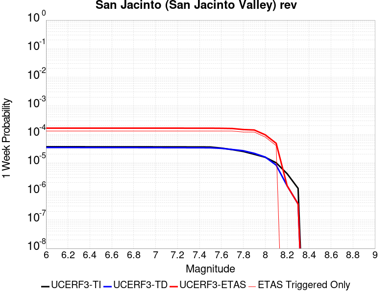 |  |  |  |

| Magnitude | 1 wk TI Prob | 1 wk TD Prob | 1 wk ETAS Prob | 1 wk ETAS/TD Gain | 1 wk ETAS Triggered Only | 1 mo TI Prob | 1 mo TD Prob | 1 mo ETAS Prob | 1 mo ETAS/TD Gain | 1 mo ETAS Triggered Only | 1 yr TI Prob | 1 yr TD Prob | 1 yr ETAS Prob | 1 yr ETAS/TD Gain | 1 yr ETAS Triggered Only | 10 yr TI Prob | 10 yr TD Prob | 10 yr ETAS Prob | 10 yr ETAS/TD Gain | 10 yr ETAS Triggered Only |
|-----|-----|-----|-----|-----|-----|-----|-----|-----|-----|-----|-----|-----|-----|-----|-----|-----|-----|-----|-----|-----|
| 6.0 | 3.652694E-5 | 3.4402394E-5 | 1.7663412E-4 | 5.1343555 | 1.4223662E-4 | 1.5653463E-4 | 1.474305E-4 | 3.1152548E-4 | 2.1130328 | 1.6411918E-4 | 0.0019041431 | 0.00179349 | 0.0019682364 | 1.0974338 | 1.7506046E-4 | 0.018879099 | 0.018526595 | 0.018709151 | 1.0098537 | 1.8600172E-4 |
| 6.1 | 3.652694E-5 | 3.4402394E-5 | 1.7663412E-4 | 5.1343555 | 1.4223662E-4 | 1.5653463E-4 | 1.474305E-4 | 3.1152548E-4 | 2.1130328 | 1.6411918E-4 | 0.0019041431 | 0.00179349 | 0.0019682364 | 1.0974338 | 1.7506046E-4 | 0.018879099 | 0.018526595 | 0.018709151 | 1.0098537 | 1.8600172E-4 |
| 6.2 | 3.652694E-5 | 3.4402394E-5 | 1.7663412E-4 | 5.1343555 | 1.4223662E-4 | 1.5653463E-4 | 1.474305E-4 | 3.1152548E-4 | 2.1130328 | 1.6411918E-4 | 0.0019041431 | 0.00179349 | 0.0019682364 | 1.0974338 | 1.7506046E-4 | 0.018879099 | 0.018526595 | 0.018709151 | 1.0098537 | 1.8600172E-4 |
| 6.3 | 3.652694E-5 | 3.4402394E-5 | 1.7663412E-4 | 5.1343555 | 1.4223662E-4 | 1.5653463E-4 | 1.474305E-4 | 3.1152548E-4 | 2.1130328 | 1.6411918E-4 | 0.0019041431 | 0.00179349 | 0.0019682364 | 1.0974338 | 1.7506046E-4 | 0.018879099 | 0.018526595 | 0.018709151 | 1.0098537 | 1.8600172E-4 |
| 6.4 | 3.646941E-5 | 3.432397E-5 | 1.7655571E-4 | 5.143802 | 1.4223662E-4 | 1.5628811E-4 | 1.4709444E-4 | 3.1118948E-4 | 2.115576 | 1.6411918E-4 | 0.0019011468 | 0.0017894056 | 0.0019641528 | 1.0976566 | 1.7506046E-4 | 0.018849645 | 0.018486476 | 0.018669039 | 1.0098755 | 1.8600172E-4 |
| 6.5 | 3.646941E-5 | 3.432397E-5 | 1.7655571E-4 | 5.143802 | 1.4223662E-4 | 1.5628811E-4 | 1.4709444E-4 | 3.1118948E-4 | 2.115576 | 1.6411918E-4 | 0.0019011468 | 0.0017894056 | 0.0019641528 | 1.0976566 | 1.7506046E-4 | 0.018849645 | 0.018486476 | 0.018669039 | 1.0098755 | 1.8600172E-4 |
| 6.6 | 3.6442503E-5 | 3.4287354E-5 | 1.765191E-4 | 5.148227 | 1.4223662E-4 | 1.561728E-4 | 1.4693754E-4 | 3.110326E-4 | 2.1167674 | 1.6411918E-4 | 0.0018997455 | 0.0017874985 | 0.001962246 | 1.0977609 | 1.7506046E-4 | 0.018835869 | 0.018467745 | 0.018650312 | 1.0098857 | 1.8600172E-4 |
| 6.7 | 3.6432113E-5 | 3.4272925E-5 | 1.7650466E-4 | 5.149974 | 1.4223662E-4 | 1.5612828E-4 | 1.4687571E-4 | 3.109708E-4 | 2.1172376 | 1.6411918E-4 | 0.0018992044 | 0.0017867472 | 0.0019614948 | 1.0978022 | 1.7506046E-4 | 0.018830549 | 0.018460369 | 0.018642936 | 1.0098897 | 1.8600172E-4 |
| 6.8 | 3.6409598E-5 | 3.424198E-5 | 1.7647372E-4 | 5.153724 | 1.4223662E-4 | 1.560318E-4 | 1.4674311E-4 | 3.108382E-4 | 2.1182473 | 1.6411918E-4 | 0.0018980318 | 0.0017851355 | 0.0019598834 | 1.0978906 | 1.7506046E-4 | 0.018819023 | 0.018444523 | 0.018627094 | 1.0098984 | 1.8600172E-4 |
| 6.9 | 3.638078E-5 | 3.4202407E-5 | 1.7643416E-4 | 5.1585307 | 1.4223662E-4 | 1.5590832E-4 | 1.4657351E-4 | 3.1066863E-4 | 2.1195414 | 1.6411918E-4 | 0.0018965311 | 0.001783074 | 0.0019578224 | 1.098004 | 1.7506046E-4 | 0.018804269 | 0.018424258 | 0.018606832 | 1.0099095 | 1.8600172E-4 |
| 7.0 | 3.6294874E-5 | 3.408442E-5 | 1.7631619E-4 | 5.172926 | 1.4223662E-4 | 1.5554018E-4 | 1.4606792E-4 | 3.1016313E-4 | 2.1234171 | 1.6411918E-4 | 0.0018920569 | 0.001776929 | 0.0019516783 | 1.0983435 | 1.7506046E-4 | 0.018760284 | 0.018363839 | 0.018546425 | 1.0099427 | 1.8600172E-4 |
| 7.1 | 3.6260717E-5 | 3.4040702E-5 | 1.7627247E-4 | 5.1782856 | 1.4223662E-4 | 1.5539382E-4 | 1.4588058E-4 | 3.0997582E-4 | 2.12486 | 1.6411918E-4 | 0.001890278 | 0.0017746518 | 0.0019494016 | 1.0984699 | 1.7506046E-4 | 0.018742796 | 0.018341439 | 0.01852403 | 1.009955 | 1.8600172E-4 |
| 7.2 | 3.6210204E-5 | 3.397492E-5 | 1.7620671E-4 | 5.1863756 | 1.4223662E-4 | 1.5517735E-4 | 1.455987E-4 | 3.0969398E-4 | 2.127038 | 1.6411918E-4 | 0.001887647 | 0.0017712255 | 0.0019459758 | 1.0986607 | 1.7506046E-4 | 0.01871693 | 0.01830772 | 0.018490316 | 1.0099738 | 1.8600172E-4 |
| 7.3 | 3.6119454E-5 | 3.386321E-5 | 1.7609501E-4 | 5.2001867 | 1.4223662E-4 | 1.5478847E-4 | 1.4511998E-4 | 3.0921533E-4 | 2.1307566 | 1.6411918E-4 | 0.0018829206 | 0.0017654065 | 0.0019401578 | 1.0989865 | 1.7506046E-4 | 0.018670462 | 0.018250274 | 0.01843288 | 1.0100057 | 1.8600172E-4 |
| 7.4 | 3.607848E-5 | 3.381071E-5 | 1.7604252E-4 | 5.206709 | 1.4223662E-4 | 1.5461289E-4 | 1.44895E-4 | 3.089904E-4 | 2.1325123 | 1.6411918E-4 | 0.0018807866 | 0.0017626719 | 0.0019374238 | 1.0991403 | 1.7506046E-4 | 0.018649481 | 0.018223269 | 0.01840588 | 1.0100209 | 1.8600172E-4 |
| 7.5 | 3.5856774E-5 | 3.3620483E-5 | 1.7585231E-4 | 5.2305117 | 1.4223662E-4 | 1.5366284E-4 | 1.4407984E-4 | 3.0817537E-4 | 2.1389208 | 1.6411918E-4 | 0.0018692396 | 0.0017527633 | 0.0019275169 | 1.0997018 | 1.7506046E-4 | 0.018535944 | 0.018124366 | 0.018306997 | 1.0100765 | 1.8600172E-4 |
| 7.6 | 3.286655E-5 | 3.2143445E-5 | 1.7437548E-4 | 5.424916 | 1.4223662E-4 | 1.4084904E-4 | 1.3775036E-4 | 3.0184694E-4 | 2.1912606 | 1.6411918E-4 | 0.001713488 | 0.0016758227 | 0.0018505896 | 1.1042874 | 1.7506046E-4 | 0.017003361 | 0.017344031 | 0.017526807 | 1.0105382 | 1.8600172E-4 |
| 7.7 | 2.8882527E-5 | 2.9236293E-5 | 1.7146875E-4 | 5.864928 | 1.4223662E-4 | 1.237764E-4 | 1.2529238E-4 | 2.89391E-4 | 2.3097253 | 1.6411918E-4 | 0.0015059357 | 0.0015243685 | 0.0016991622 | 1.1146662 | 1.7506046E-4 | 0.014957713 | 0.015830461 | 0.016013518 | 1.0115637 | 1.8600172E-4 |
| 7.8 | 2.4950225E-5 | 2.6527203E-5 | 1.5781906E-4 | 5.949329 | 1.3129534E-4 | 1.0692515E-4 | 1.1368306E-4 | 2.6684353E-4 | 2.3472586 | 1.531779E-4 | 0.0013010362 | 0.0013832134 | 0.0015471056 | 1.1184865 | 1.6411918E-4 | 0.012934455 | 0.014411755 | 0.014584293 | 1.011972 | 1.7506046E-4 |
| 7.9 | 1.9881603E-5 | 2.1507445E-5 | 1.5279996E-4 | 7.1045146 | 1.3129534E-4 | 8.520408E-5 | 9.217151E-5 | 2.4533528E-4 | 2.6617258 | 1.531779E-4 | 0.001036866 | 0.0011216112 | 0.0012855463 | 1.1461604 | 1.6411918E-4 | 0.010320415 | 0.011777027 | 0.011950025 | 1.0146896 | 1.7506046E-4 |
| 8.0 | 1.563292E-5 | 1.5937347E-5 | 1.0346618E-4 | 6.4920583 | 8.753023E-5 | 6.6996516E-5 | 6.8301124E-5 | 1.6676591E-4 | 2.4416275 | 9.84715E-5 | 8.153773E-4 | 8.3124964E-4 | 9.405715E-4 | 1.131515 | 1.0941278E-4 | 0.00812392 | 0.008810506 | 0.0089298 | 1.0135399 | 1.2035406E-4 |
| 8.1 | 1.0045313E-5 | 8.301802E-6 | 5.2066553E-5 | 6.2717166 | 4.3765114E-5 | 4.305063E-5 | 3.5578672E-5 | 9.0283116E-5 | 2.5375628 | 5.470639E-5 | 5.2401534E-4 | 4.3308473E-4 | 4.8776745E-4 | 1.1262633 | 5.470639E-5 | 0.0052278144 | 0.0046591135 | 0.0047244555 | 1.0140245 | 6.564767E-5 |
| 8.2 | 4.1554413E-6 | 1.5655598E-6 | 1.5655598E-6 | 1.0 | 0.0 | 1.7808914E-5 | 6.709525E-6 | 6.709525E-6 | 1.0 | 0.0 | 2.1680194E-4 | 8.168544E-5 | 8.168544E-5 | 1.0 | 0.0 | 0.0021659054 | 9.482903E-4 | 9.482903E-4 | 1.0 | 0.0 |
| 8.3 | 1.2758221E-6 | 3.6149942E-7 | 3.6149942E-7 | 1.0 | 0.0 | 5.4677976E-6 | 1.5492824E-6 | 1.5492824E-6 | 1.0 | 0.0 | 6.65684E-5 | 1.8862354E-5 | 1.8862354E-5 | 1.0 | 0.0 | 6.6548464E-4 | 2.2751294E-4 | 2.2751294E-4 | 1.0 | 0.0 |

## Calico-Hidalgo
*[(top)](#table-of-contents)*

| 1 Week | 1 Month | 1 Year | 10 Year |
|-----|-----|-----|-----|
|  |  |  |  |

| Magnitude | 1 wk TI Prob | 1 wk TD Prob | 1 wk ETAS Prob | 1 wk ETAS/TD Gain | 1 wk ETAS Triggered Only | 1 mo TI Prob | 1 mo TD Prob | 1 mo ETAS Prob | 1 mo ETAS/TD Gain | 1 mo ETAS Triggered Only | 1 yr TI Prob | 1 yr TD Prob | 1 yr ETAS Prob | 1 yr ETAS/TD Gain | 1 yr ETAS Triggered Only | 10 yr TI Prob | 10 yr TD Prob | 10 yr ETAS Prob | 10 yr ETAS/TD Gain | 10 yr ETAS Triggered Only |
|-----|-----|-----|-----|-----|-----|-----|-----|-----|-----|-----|-----|-----|-----|-----|-----|-----|-----|-----|-----|-----|
| 6.0 | 4.0906612E-5 | 5.0703686E-5 | 1.491702E-4 | 2.941999 | 9.84715E-5 | 1.7530227E-4 | 2.172857E-4 | 3.2667472E-4 | 1.503434 | 1.0941278E-4 | 0.0021322158 | 0.002642648 | 0.002795421 | 1.0578107 | 1.531779E-4 | 0.02111873 | 0.026152607 | 0.026312435 | 1.0061113 | 1.6411918E-4 |
| 6.1 | 4.0906612E-5 | 5.0703686E-5 | 1.491702E-4 | 2.941999 | 9.84715E-5 | 1.7530227E-4 | 2.172857E-4 | 3.2667472E-4 | 1.503434 | 1.0941278E-4 | 0.0021322158 | 0.002642648 | 0.002795421 | 1.0578107 | 1.531779E-4 | 0.02111873 | 0.026152607 | 0.026312435 | 1.0061113 | 1.6411918E-4 |
| 6.2 | 4.0906612E-5 | 5.0703686E-5 | 1.491702E-4 | 2.941999 | 9.84715E-5 | 1.7530227E-4 | 2.172857E-4 | 3.2667472E-4 | 1.503434 | 1.0941278E-4 | 0.0021322158 | 0.002642648 | 0.002795421 | 1.0578107 | 1.531779E-4 | 0.02111873 | 0.026152607 | 0.026312435 | 1.0061113 | 1.6411918E-4 |
| 6.3 | 2.4242801E-5 | 3.0090669E-5 | 6.291352E-5 | 2.0907981 | 3.2823835E-5 | 1.0389358E-4 | 1.2895382E-4 | 1.7271329E-4 | 1.3393421 | 4.3765114E-5 | 0.0012641704 | 0.0015689151 | 0.001656308 | 1.0557028 | 8.753023E-5 | 0.01257003 | 0.01558206 | 0.015678998 | 1.006221 | 9.84715E-5 |
| 6.4 | 2.4242801E-5 | 3.0090669E-5 | 6.291352E-5 | 2.0907981 | 3.2823835E-5 | 1.0389358E-4 | 1.2895382E-4 | 1.7271329E-4 | 1.3393421 | 4.3765114E-5 | 0.0012641704 | 0.0015689151 | 0.001656308 | 1.0557028 | 8.753023E-5 | 0.01257003 | 0.01558206 | 0.015678998 | 1.006221 | 9.84715E-5 |
| 6.5 | 2.0286952E-5 | 2.5315738E-5 | 5.8138743E-5 | 2.2965455 | 3.2823835E-5 | 8.694118E-5 | 1.0849161E-4 | 1.5225197E-4 | 1.4033525 | 4.3765114E-5 | 0.0010579949 | 0.001320102 | 0.0013965899 | 1.0579408 | 7.658895E-5 | 0.010529719 | 0.013124538 | 0.013210919 | 1.0065817 | 8.753023E-5 |
| 6.6 | 2.0269223E-5 | 2.5296687E-5 | 5.811969E-5 | 2.2975218 | 3.2823835E-5 | 8.6865206E-5 | 1.08409964E-4 | 1.5217034E-4 | 1.4036564 | 4.3765114E-5 | 0.0010570707 | 0.0013191093 | 0.0013955972 | 1.0579845 | 7.658895E-5 | 0.010520565 | 0.013114728 | 0.01320111 | 1.0065867 | 8.753023E-5 |
| 6.7 | 1.799852E-5 | 2.25406E-5 | 5.5363696E-5 | 2.4561765 | 3.2823835E-5 | 7.713423E-5 | 9.659908E-5 | 1.4035996E-4 | 1.4530156 | 4.3765114E-5 | 9.3870464E-4 | 0.0011754738 | 0.0012519727 | 1.0650792 | 7.658895E-5 | 0.009347493 | 0.011694173 | 0.01178068 | 1.0073974 | 8.753023E-5 |
| 6.8 | 1.7458793E-5 | 2.184212E-5 | 5.4665237E-5 | 2.5027442 | 3.2823835E-5 | 7.4821255E-5 | 9.3605806E-5 | 1.3736682E-4 | 1.4675032 | 4.3765114E-5 | 9.10568E-4 | 0.0011390693 | 0.0012155711 | 1.0671616 | 7.658895E-5 | 0.009068459 | 0.011333893 | 0.011420432 | 1.0076354 | 8.753023E-5 |
| 6.9 | 1.542884E-5 | 1.9025927E-5 | 5.1849136E-5 | 2.7251832 | 3.2823835E-5 | 6.612192E-5 | 8.153721E-5 | 1.2529876E-4 | 1.5367064 | 4.3765114E-5 | 8.04737E-4 | 9.922766E-4 | 0.0010687895 | 1.0771085 | 7.658895E-5 | 0.008018291 | 0.009879857 | 0.00995569 | 1.0076754 | 7.658895E-5 |
| 7.0 | 1.468253E-5 | 1.8030598E-5 | 5.085384E-5 | 2.8204188 | 3.2823835E-5 | 6.292361E-5 | 7.7271776E-5 | 1.2103351E-4 | 1.5663352 | 4.3765114E-5 | 7.658257E-4 | 9.4039086E-4 | 0.0010169077 | 1.0813671 | 7.658895E-5 | 0.0076319184 | 0.009365481 | 0.009441352 | 1.0081012 | 7.658895E-5 |
| 7.1 | 1.3139281E-5 | 1.6200942E-5 | 3.8083144E-5 | 2.3506746 | 2.1882557E-5 | 5.6309986E-5 | 6.943083E-5 | 1.0225239E-4 | 1.472723 | 3.2823835E-5 | 6.853584E-4 | 8.4500515E-4 | 8.996653E-4 | 1.0646862 | 5.470639E-5 | 0.0068324856 | 0.0084192185 | 0.008473464 | 1.0064431 | 5.470639E-5 |
| 7.2 | 1.1127404E-5 | 1.3866597E-5 | 3.574885E-5 | 2.578055 | 2.1882557E-5 | 4.7688E-5 | 5.942698E-5 | 8.130824E-5 | 1.3682041 | 2.1882557E-5 | 5.8044674E-4 | 7.232942E-4 | 7.560943E-4 | 1.0453482 | 3.2823835E-5 | 0.0057893298 | 0.0072105085 | 0.007243096 | 1.0045193 | 3.2823835E-5 |
| 7.3 | 9.808154E-6 | 1.2176215E-5 | 1.2176215E-5 | 1.0 | 0.0 | 4.2034266E-5 | 5.2182797E-5 | 5.2182797E-5 | 1.0 | 0.0 | 5.11647E-4 | 6.3515105E-4 | 6.4608536E-4 | 1.0172154 | 1.0941279E-5 | 0.0051047057 | 0.006334433 | 0.006345305 | 1.0017164 | 1.0941279E-5 |
| 7.4 | 7.942452E-6 | 9.792144E-6 | 9.792144E-6 | 1.0 | 0.0 | 3.4038632E-5 | 4.1965708E-5 | 4.1965708E-5 | 1.0 | 0.0 | 4.1434157E-4 | 5.1082217E-4 | 5.217579E-4 | 1.021408 | 1.0941279E-5 | 0.0041356985 | 0.005097421 | 0.0051083067 | 1.0021355 | 1.0941279E-5 |
| 7.5 | 4.7121216E-6 | 5.772836E-6 | 5.772836E-6 | 1.0 | 0.0 | 2.019465E-5 | 2.4740535E-5 | 2.4740535E-5 | 1.0 | 0.0 | 2.4584212E-4 | 3.0118204E-4 | 3.0118204E-4 | 1.0 | 0.0 | 0.0024557032 | 0.0030084911 | 0.0030084911 | 1.0 | 0.0 |
| 7.6 | 2.21172E-7 | 2.603961E-7 | 2.603961E-7 | 1.0 | 0.0 | 9.478797E-7 | 1.1159829E-6 | 1.1159829E-6 | 1.0 | 0.0 | 1.1540374E-5 | 1.3587036E-5 | 1.3587036E-5 | 1.0 | 0.0 | 1.1539775E-4 | 1.3586486E-4 | 1.3586486E-4 | 1.0 | 0.0 |

## San Andreas (Creeping Section) 2011 CFM
*[(top)](#table-of-contents)*

| 1 Week | 1 Month | 1 Year | 10 Year |
|-----|-----|-----|-----|
|  |  |  |  |

| Magnitude | 1 wk TI Prob | 1 wk TD Prob | 1 wk ETAS Prob | 1 wk ETAS/TD Gain | 1 wk ETAS Triggered Only | 1 mo TI Prob | 1 mo TD Prob | 1 mo ETAS Prob | 1 mo ETAS/TD Gain | 1 mo ETAS Triggered Only | 1 yr TI Prob | 1 yr TD Prob | 1 yr ETAS Prob | 1 yr ETAS/TD Gain | 1 yr ETAS Triggered Only | 10 yr TI Prob | 10 yr TD Prob | 10 yr ETAS Prob | 10 yr ETAS/TD Gain | 10 yr ETAS Triggered Only |
|-----|-----|-----|-----|-----|-----|-----|-----|-----|-----|-----|-----|-----|-----|-----|-----|-----|-----|-----|-----|-----|
| 6.0 | 5.986481E-4 | 0.001228691 | 0.001294258 | 1.0533633 | 6.564767E-5 | 0.0025631124 | 0.005246795 | 0.005312098 | 1.0124463 | 6.564767E-5 | 0.030762846 | 0.061203245 | 0.061305963 | 1.0016782 | 1.0941278E-4 | 0.26835477 | 0.425928 | 0.42600337 | 1.0001769 | 1.3129534E-4 |
| 6.1 | 5.015945E-4 | 0.0010230356 | 0.0010886161 | 1.0641038 | 6.564767E-5 | 0.00214792 | 0.004369436 | 0.0044347965 | 1.0149586 | 6.564767E-5 | 0.025839351 | 0.051246606 | 0.051340032 | 1.0018231 | 9.84715E-5 | 0.23032776 | 0.37284943 | 0.37292492 | 1.0002024 | 1.2035406E-4 |
| 6.2 | 4.073338E-4 | 8.1157376E-4 | 8.662357E-4 | 1.0673531 | 5.470639E-5 | 0.0017445484 | 0.0034683137 | 0.0035228303 | 1.0157185 | 5.470639E-5 | 0.021034058 | 0.04093177 | 0.041015714 | 1.0020509 | 8.753023E-5 | 0.19150782 | 0.31302592 | 0.31309357 | 1.0002161 | 9.84715E-5 |
| 6.3 | 3.464099E-4 | 6.7455834E-4 | 7.1829394E-4 | 1.0648359 | 4.3765114E-5 | 0.0014837692 | 0.0028832308 | 0.0029268698 | 1.0151354 | 4.3765114E-5 | 0.017915873 | 0.034187846 | 0.034261815 | 1.0021636 | 7.658895E-5 | 0.16538359 | 0.27130842 | 0.2713722 | 1.0002351 | 8.753023E-5 |
| 6.4 | 2.935057E-4 | 5.5516965E-4 | 5.8797526E-4 | 1.0590911 | 3.2823835E-5 | 0.0012572751 | 0.0023727308 | 0.0024054768 | 1.013801 | 3.2823835E-5 | 0.015200248 | 0.02826279 | 0.028326582 | 1.0022571 | 6.564767E-5 | 0.14201577 | 0.23297668 | 0.23303542 | 1.0002521 | 7.658895E-5 |
| 6.5 | 2.3409708E-4 | 4.2132285E-4 | 4.5413285E-4 | 1.0778738 | 3.2823835E-5 | 0.0010028875 | 0.0018017791 | 0.0018345439 | 1.0181847 | 3.2823835E-5 | 0.012141965 | 0.021586355 | 0.021650584 | 1.0029755 | 6.564767E-5 | 0.11499573 | 0.1868149 | 0.18687719 | 1.0003334 | 7.658895E-5 |
| 6.6 | 1.5842178E-4 | 2.5068692E-4 | 2.835025E-4 | 1.1309028 | 3.2823835E-5 | 6.7877385E-4 | 0.0010739256 | 0.0011067142 | 1.0305315 | 3.2823835E-5 | 0.0082328 | 0.012995283 | 0.013060078 | 1.004986 | 6.564767E-5 | 0.07934396 | 0.12313759 | 0.12320475 | 1.0005454 | 7.658895E-5 |
| 6.7 | 1.5616413E-4 | 2.4605254E-4 | 2.788683E-4 | 1.1333688 | 3.2823835E-5 | 6.691031E-4 | 0.0010540807 | 0.0010868699 | 1.031107 | 3.2823835E-5 | 0.0081159435 | 0.012757154 | 0.012821964 | 1.0050803 | 6.564767E-5 | 0.0782586 | 0.12116472 | 0.121232025 | 1.0005555 | 7.658895E-5 |
| 6.8 | 1.5538467E-4 | 2.442914E-4 | 2.7710723E-4 | 1.1343306 | 3.2823835E-5 | 6.6576427E-4 | 0.001046539 | 0.0010793286 | 1.0313313 | 3.2823835E-5 | 0.008075596 | 0.012666538 | 0.012731354 | 1.005117 | 6.564767E-5 | 0.07788358 | 0.12039561 | 0.12046298 | 1.0005596 | 7.658895E-5 |
| 6.9 | 1.5153569E-4 | 2.3538464E-4 | 2.6820073E-4 | 1.1394148 | 3.2823835E-5 | 6.49277E-4 | 0.0010084033 | 0.0010411941 | 1.0325174 | 3.2823835E-5 | 0.007876333 | 0.012208726 | 0.012273572 | 1.0053115 | 6.564767E-5 | 0.07602952 | 0.11646574 | 0.11653341 | 1.000581 | 7.658895E-5 |
| 7.0 | 1.4588932E-4 | 2.2395732E-4 | 2.567738E-4 | 1.14653 | 3.2823835E-5 | 6.250901E-4 | 9.59466E-4 | 9.922583E-4 | 1.0341777 | 3.2823835E-5 | 0.0075839474 | 0.011619428 | 0.0116843125 | 1.0055841 | 6.564767E-5 | 0.073302895 | 0.11131206 | 0.11138013 | 1.0006114 | 7.658895E-5 |
| 7.1 | 1.1565079E-4 | 1.6281323E-4 | 1.9563171E-4 | 1.2015713 | 3.2823835E-5 | 4.955521E-4 | 6.9758523E-4 | 7.303862E-4 | 1.0470207 | 3.2823835E-5 | 0.006016669 | 0.008460228 | 0.00852532 | 1.0076939 | 6.564767E-5 | 0.058563538 | 0.08366478 | 0.08373497 | 1.0008389 | 7.658895E-5 |
| 7.2 | 1.0393792E-4 | 1.4615392E-4 | 1.7897296E-4 | 1.2245512 | 3.2823835E-5 | 4.4537216E-4 | 6.262243E-4 | 6.590276E-4 | 1.0523826 | 3.2823835E-5 | 0.005408933 | 0.0075977976 | 0.0076629464 | 1.0085747 | 6.564767E-5 | 0.052791595 | 0.07561503 | 0.07568584 | 1.0009363 | 7.658895E-5 |
| 7.3 | 9.332884E-5 | 1.2780601E-4 | 1.6062564E-4 | 1.2567927 | 3.2823835E-5 | 3.999194E-4 | 5.4762565E-4 | 5.8043154E-4 | 1.0599056 | 3.2823835E-5 | 0.0048581534 | 0.0066470946 | 0.0067014373 | 1.0081754 | 5.470639E-5 | 0.047533102 | 0.06647954 | 0.06654082 | 1.0009218 | 6.564767E-5 |
| 7.4 | 8.670252E-5 | 1.1702972E-4 | 1.4984971E-4 | 1.2804415 | 3.2823835E-5 | 3.715293E-4 | 5.014601E-4 | 5.3426746E-4 | 1.0654237 | 3.2823835E-5 | 0.004513991 | 0.0060883067 | 0.00614268 | 1.0089308 | 5.470639E-5 | 0.044233937 | 0.061148684 | 0.061210316 | 1.0010079 | 6.564767E-5 |
| 7.5 | 7.3036405E-5 | 9.005699E-5 | 1.2287786E-4 | 1.3644457 | 3.2823835E-5 | 3.129756E-4 | 3.859015E-4 | 4.1871268E-4 | 1.0850247 | 3.2823835E-5 | 0.0038038217 | 0.0046882504 | 0.0047427 | 1.0116141 | 5.470639E-5 | 0.03739367 | 0.047875606 | 0.047938112 | 1.0013056 | 6.564767E-5 |
| 7.6 | 6.3935775E-5 | 8.280209E-5 | 1.1562321E-4 | 1.3963803 | 3.2823835E-5 | 2.7398168E-4 | 3.5481792E-4 | 3.876301E-4 | 1.0924761 | 3.2823835E-5 | 0.0033306254 | 0.00431137 | 0.0043658405 | 1.0126342 | 5.470639E-5 | 0.032811474 | 0.043990135 | 0.044052895 | 1.0014267 | 6.564767E-5 |
| 7.7 | 5.5050095E-5 | 6.661729E-5 | 8.849839E-5 | 1.3284597 | 2.1882557E-5 | 2.3590765E-4 | 2.8547147E-4 | 3.0734777E-4 | 1.0766323 | 2.1882557E-5 | 0.0028683927 | 0.0034700802 | 0.0035027901 | 1.0094262 | 3.2823835E-5 | 0.0283165 | 0.03579509 | 0.035837285 | 1.0011789 | 4.3765114E-5 |
| 7.8 | 5.027131E-5 | 6.1627725E-5 | 8.350893E-5 | 1.3550546 | 2.1882557E-5 | 2.1543067E-4 | 2.640921E-4 | 2.8596885E-4 | 1.0828377 | 2.1882557E-5 | 0.0026197135 | 0.003210584 | 0.0032433025 | 1.0101908 | 3.2823835E-5 | 0.025890453 | 0.03312572 | 0.033168036 | 1.0012774 | 4.3765114E-5 |
| 7.9 | 3.7271806E-5 | 5.0224386E-5 | 5.0224386E-5 | 1.0 | 0.0 | 1.5972654E-4 | 2.1522962E-4 | 2.1522962E-4 | 1.0 | 0.0 | 0.0019429359 | 0.0026172737 | 0.0026281863 | 1.0041695 | 1.0941279E-5 | 0.019260362 | 0.027066687 | 0.027087977 | 1.0007865 | 2.1882557E-5 |
| 8.0 | 2.7310243E-5 | 3.1428404E-5 | 3.1428404E-5 | 1.0 | 0.0 | 1.17038646E-4 | 1.3468621E-4 | 1.3468621E-4 | 1.0 | 0.0 | 0.0014240141 | 0.0016385721 | 0.0016494954 | 1.0066664 | 1.0941279E-5 | 0.014149235 | 0.01721387 | 0.017235374 | 1.0012493 | 2.1882557E-5 |
| 8.1 | 1.7940547E-5 | 1.7400796E-5 | 1.7400796E-5 | 1.0 | 0.0 | 7.688579E-5 | 7.457271E-5 | 7.457271E-5 | 1.0 | 0.0 | 9.3568244E-4 | 9.075451E-4 | 9.184765E-4 | 1.0120449 | 1.0941279E-5 | 0.009317525 | 0.009799073 | 0.009820742 | 1.0022112 | 2.1882557E-5 |
| 8.2 | 8.643924E-6 | 5.4748625E-6 | 5.4748625E-6 | 1.0 | 0.0 | 3.704486E-5 | 2.3463486E-5 | 2.3463486E-5 | 1.0 | 0.0 | 4.5092785E-4 | 2.8563058E-4 | 2.8563058E-4 | 1.0 | 0.0 | 0.0045001395 | 0.0032487072 | 0.0032487072 | 1.0 | 0.0 |
| 8.3 | 1.983087E-6 | 7.6599065E-7 | 7.6599065E-7 | 1.0 | 0.0 | 8.498917E-6 | 3.282813E-6 | 3.282813E-6 | 1.0 | 0.0 | 1.034694E-4 | 3.9967534E-5 | 3.9967534E-5 | 1.0 | 0.0 | 0.0010342124 | 4.719687E-4 | 4.719687E-4 | 1.0 | 0.0 |

## San Andreas (Coachella) rev
*[(top)](#table-of-contents)*

| 1 Week | 1 Month | 1 Year | 10 Year |
|-----|-----|-----|-----|
|  |  |  |  |

| Magnitude | 1 wk TI Prob | 1 wk TD Prob | 1 wk ETAS Prob | 1 wk ETAS/TD Gain | 1 wk ETAS Triggered Only | 1 mo TI Prob | 1 mo TD Prob | 1 mo ETAS Prob | 1 mo ETAS/TD Gain | 1 mo ETAS Triggered Only | 1 yr TI Prob | 1 yr TD Prob | 1 yr ETAS Prob | 1 yr ETAS/TD Gain | 1 yr ETAS Triggered Only | 10 yr TI Prob | 10 yr TD Prob | 10 yr ETAS Prob | 10 yr ETAS/TD Gain | 10 yr ETAS Triggered Only |
|-----|-----|-----|-----|-----|-----|-----|-----|-----|-----|-----|-----|-----|-----|-----|-----|-----|-----|-----|-----|-----|
| 6.0 | 1.1925945E-4 | 3.2729402E-4 | 4.0385788E-4 | 1.23393 | 7.658895E-5 | 5.110118E-4 | 0.0014019393 | 0.0015330506 | 1.0935214 | 1.3129534E-4 | 0.0062038354 | 0.016936364 | 0.017076192 | 1.0082561 | 1.4223662E-4 | 0.060334753 | 0.15265316 | 0.15278295 | 1.0008502 | 1.531779E-4 |
| 6.1 | 1.1925945E-4 | 3.2729402E-4 | 4.0385788E-4 | 1.23393 | 7.658895E-5 | 5.110118E-4 | 0.0014019393 | 0.0015330506 | 1.0935214 | 1.3129534E-4 | 0.0062038354 | 0.016936364 | 0.017076192 | 1.0082561 | 1.4223662E-4 | 0.060334753 | 0.15265316 | 0.15278295 | 1.0008502 | 1.531779E-4 |
| 6.2 | 1.07432395E-4 | 3.0230157E-4 | 3.7886735E-4 | 1.2532762 | 7.658895E-5 | 4.603433E-4 | 0.0012949388 | 0.0014260642 | 1.1012598 | 1.3129534E-4 | 0.005590286 | 0.015653009 | 0.015793018 | 1.0089446 | 1.4223662E-4 | 0.05451731 | 0.14182423 | 0.14195569 | 1.0009269 | 1.531779E-4 |
| 6.3 | 1.0718766E-4 | 3.0175463E-4 | 3.7832046E-4 | 1.2537354 | 7.658895E-5 | 4.592948E-4 | 0.0012925972 | 0.0014237227 | 1.1014435 | 1.3129534E-4 | 0.005577586 | 0.015624908 | 0.015764922 | 1.008961 | 1.4223662E-4 | 0.054396555 | 0.14159249 | 0.14172398 | 1.0009286 | 1.531779E-4 |
| 6.4 | 1.0355944E-4 | 2.9383553E-4 | 3.7040198E-4 | 1.2605759 | 7.658895E-5 | 4.4375064E-4 | 0.0012586913 | 0.0013898214 | 1.1041797 | 1.3129534E-4 | 0.0053892885 | 0.015217941 | 0.015358014 | 1.0092044 | 1.4223662E-4 | 0.052604496 | 0.13815255 | 0.13828456 | 1.0009556 | 1.531779E-4 |
| 6.5 | 1.0227914E-4 | 2.9102986E-4 | 3.6759654E-4 | 1.2630887 | 7.658895E-5 | 4.382655E-4 | 0.0012466786 | 0.0013778103 | 1.1051848 | 1.3129534E-4 | 0.0053228354 | 0.01507372 | 0.015213813 | 1.0092938 | 1.4223662E-4 | 0.051971316 | 0.13693172 | 0.13706392 | 1.0009655 | 1.531779E-4 |
| 6.6 | 1.0116757E-4 | 2.8868738E-4 | 3.652542E-4 | 1.2652241 | 7.658895E-5 | 4.3350324E-4 | 0.0012366489 | 0.0013677819 | 1.1060389 | 1.3129534E-4 | 0.0052651367 | 0.01495329 | 0.0150934 | 1.0093699 | 1.4223662E-4 | 0.051421247 | 0.1359099 | 0.13604225 | 1.0009738 | 1.531779E-4 |
| 6.7 | 1.0050676E-4 | 2.8727303E-4 | 3.6383996E-4 | 1.2665303 | 7.658895E-5 | 4.3067214E-4 | 0.0012305931 | 0.0013617269 | 1.1065614 | 1.3129534E-4 | 0.005230834 | 0.014880571 | 0.01502069 | 1.0094163 | 1.4223662E-4 | 0.051094085 | 0.13529462 | 0.13542707 | 1.000979 | 1.531779E-4 |
| 6.8 | 9.976819E-5 | 2.853096E-4 | 3.6187668E-4 | 1.2683649 | 7.658895E-5 | 4.2750788E-4 | 0.0012221863 | 0.0013533211 | 1.1072953 | 1.3129534E-4 | 0.0051924936 | 0.0147796115 | 0.014919746 | 1.0094815 | 1.4223662E-4 | 0.050728295 | 0.13444631 | 0.1345789 | 1.0009861 | 1.531779E-4 |
| 6.9 | 9.77719E-5 | 2.8027873E-4 | 3.5684623E-4 | 1.2731833 | 7.658895E-5 | 4.1895514E-4 | 0.0012006456 | 0.0013317832 | 1.1092227 | 1.3129534E-4 | 0.0050888555 | 0.014520878 | 0.014661049 | 1.0096531 | 1.4223662E-4 | 0.049738888 | 0.1322748 | 0.13240772 | 1.0010048 | 1.531779E-4 |
| 7.0 | 8.500761E-5 | 2.4762485E-4 | 3.2419484E-4 | 1.3092177 | 7.658895E-5 | 3.6426744E-4 | 0.001060821 | 0.0011919771 | 1.1236364 | 1.3129534E-4 | 0.0044259406 | 0.012839786 | 0.012980196 | 1.0109355 | 1.4223662E-4 | 0.04338823 | 0.11813272 | 0.118267804 | 1.0011435 | 1.531779E-4 |
| 7.1 | 8.319876E-5 | 2.4365232E-4 | 3.202226E-4 | 1.3142605 | 7.658895E-5 | 3.5651738E-4 | 0.0010438096 | 0.0011749679 | 1.1256535 | 1.3129534E-4 | 0.004331963 | 0.012635092 | 0.012775532 | 1.0111151 | 1.4223662E-4 | 0.042484846 | 0.116353 | 0.11648835 | 1.0011634 | 1.531779E-4 |
| 7.2 | 7.563917E-5 | 2.2413683E-4 | 3.007086E-4 | 1.3416296 | 7.658895E-5 | 3.2412758E-4 | 9.602359E-4 | 0.0010914052 | 1.1366011 | 1.3129534E-4 | 0.0039391145 | 0.011628893 | 0.011769476 | 1.0120891 | 1.4223662E-4 | 0.03870018 | 0.10775925 | 0.10789592 | 1.0012683 | 1.531779E-4 |
| 7.3 | 7.082985E-5 | 2.0729867E-4 | 2.6199373E-4 | 1.2638466 | 5.470639E-5 | 3.0352117E-4 | 8.881233E-4 | 9.974389E-4 | 1.1230861 | 1.0941278E-4 | 0.0036891096 | 0.010759917 | 0.010878976 | 1.011065 | 1.2035406E-4 | 0.03628465 | 0.100282 | 0.10040013 | 1.0011779 | 1.3129534E-4 |
| 7.4 | 5.146215E-5 | 1.4273795E-4 | 1.9743653E-4 | 1.3832098 | 5.470639E-5 | 2.2053342E-4 | 6.115915E-4 | 7.209374E-4 | 1.178789 | 1.0941278E-4 | 0.0026816884 | 0.0074208933 | 0.007540354 | 1.0160979 | 1.2035406E-4 | 0.02649557 | 0.070849575 | 0.07097157 | 1.0017219 | 1.3129534E-4 |
| 7.5 | 4.0285166E-5 | 1.09416E-4 | 1.641164E-4 | 1.4999306 | 5.470639E-5 | 1.7263928E-4 | 4.6884175E-4 | 5.7820324E-4 | 1.2332588 | 1.0941278E-4 | 0.002099857 | 0.0056932783 | 0.005812947 | 1.0210193 | 1.2035406E-4 | 0.020801254 | 0.055011146 | 0.05513522 | 1.0022554 | 1.3129534E-4 |
| 7.6 | 3.1168736E-5 | 8.4389096E-5 | 1.3909087E-4 | 1.648209 | 5.470639E-5 | 1.3357346E-4 | 3.6161754E-4 | 4.7099075E-4 | 1.3024555 | 1.0941278E-4 | 0.0016250437 | 0.0043938323 | 0.0045136577 | 1.0272713 | 1.2035406E-4 | 0.016132116 | 0.04281005 | 0.042935725 | 1.0029356 | 1.3129534E-4 |
| 7.7 | 2.2100989E-5 | 6.238755E-5 | 9.520934E-5 | 1.5260952 | 3.2823835E-5 | 9.4715084E-5 | 2.6734784E-4 | 3.5485468E-4 | 1.3273145 | 8.753023E-5 | 0.001152546 | 0.0032501083 | 0.0033482597 | 1.0301994 | 9.84715E-5 | 0.011465867 | 0.0319002 | 0.032006122 | 1.0033205 | 1.0941278E-4 |
| 7.8 | 1.7484861E-5 | 5.179572E-5 | 8.461785E-5 | 1.6336843 | 3.2823835E-5 | 7.493296E-5 | 2.2196278E-4 | 3.0947357E-4 | 1.3942589 | 8.753023E-5 | 9.1192697E-4 | 0.0026990508 | 0.0027972565 | 1.0363853 | 9.84715E-5 | 0.009081938 | 0.026640115 | 0.026746614 | 1.0039977 | 1.0941278E-4 |
| 7.9 | 1.3967285E-5 | 3.822255E-5 | 7.1045135E-5 | 1.8587229 | 3.2823835E-5 | 5.985842E-5 | 1.6380067E-4 | 2.5131655E-4 | 1.5342829 | 8.753023E-5 | 7.2853256E-4 | 0.00199245 | 0.0020907253 | 1.0493238 | 9.84715E-5 | 0.0072614877 | 0.019909438 | 0.020016672 | 1.0053861 | 1.0941278E-4 |
| 8.0 | 1.1887396E-5 | 3.106521E-5 | 5.2947085E-5 | 1.7043853 | 2.1882557E-5 | 5.094499E-5 | 1.3312983E-4 | 1.9876876E-4 | 1.4930445 | 6.564767E-5 | 6.200787E-4 | 0.0016196516 | 0.0016961164 | 1.0472107 | 7.658895E-5 | 0.006183513 | 0.016279267 | 0.016365374 | 1.0052893 | 8.753023E-5 |
| 8.1 | 5.100864E-6 | 8.973418E-6 | 8.973418E-6 | 1.0 | 0.0 | 2.1860664E-5 | 3.8456936E-5 | 3.8456936E-5 | 1.0 | 0.0 | 2.6612106E-4 | 4.6811273E-4 | 4.790489E-4 | 1.0233623 | 1.0941279E-5 | 0.002658026 | 0.004917731 | 0.004939506 | 1.0044278 | 2.1882557E-5 |
| 8.2 | 2.3004484E-6 | 2.7864487E-6 | 2.7864487E-6 | 1.0 | 0.0 | 9.859027E-6 | 1.1941868E-5 | 1.1941868E-5 | 1.0 | 0.0 | 1.2002704E-4 | 1.4538258E-4 | 1.4538258E-4 | 1.0 | 0.0 | 0.0011996223 | 0.0015973912 | 0.0015973912 | 1.0 | 0.0 |
| 8.3 | 1.0424446E-7 | 5.8161504E-8 | 5.8161504E-8 | 1.0 | 0.0 | 4.4676187E-7 | 2.4926356E-7 | 2.4926356E-7 | 1.0 | 0.0 | 5.439312E-6 | 3.03478E-6 | 3.03478E-6 | 1.0 | 0.0 | 5.4391792E-5 | 3.190716E-5 | 3.190716E-5 | 1.0 | 0.0 |

## Cady
*[(top)](#table-of-contents)*

| 1 Week | 1 Month | 1 Year | 10 Year |
|-----|-----|-----|-----|
|  |  |  |  |

| Magnitude | 1 wk TI Prob | 1 wk TD Prob | 1 wk ETAS Prob | 1 wk ETAS/TD Gain | 1 wk ETAS Triggered Only | 1 mo TI Prob | 1 mo TD Prob | 1 mo ETAS Prob | 1 mo ETAS/TD Gain | 1 mo ETAS Triggered Only | 1 yr TI Prob | 1 yr TD Prob | 1 yr ETAS Prob | 1 yr ETAS/TD Gain | 1 yr ETAS Triggered Only | 10 yr TI Prob | 10 yr TD Prob | 10 yr ETAS Prob | 10 yr ETAS/TD Gain | 10 yr ETAS Triggered Only |
|-----|-----|-----|-----|-----|-----|-----|-----|-----|-----|-----|-----|-----|-----|-----|-----|-----|-----|-----|-----|-----|
| 6.0 | 1.9892565E-5 | 2.1858728E-5 | 8.7504966E-5 | 4.0032043 | 6.564767E-5 | 8.525106E-5 | 9.3677416E-5 | 1.9213969E-4 | 2.051078 | 9.84715E-5 | 0.0010374374 | 0.0011400167 | 0.0012493047 | 1.0958652 | 1.0941278E-4 | 0.010326075 | 0.011350701 | 0.011502139 | 1.0133418 | 1.531779E-4 |
| 6.1 | 1.9892565E-5 | 2.1858728E-5 | 8.7504966E-5 | 4.0032043 | 6.564767E-5 | 8.525106E-5 | 9.3677416E-5 | 1.9213969E-4 | 2.051078 | 9.84715E-5 | 0.0010374374 | 0.0011400167 | 0.0012493047 | 1.0958652 | 1.0941278E-4 | 0.010326075 | 0.011350701 | 0.011502139 | 1.0133418 | 1.531779E-4 |
| 6.2 | 1.9892565E-5 | 2.1858728E-5 | 8.7504966E-5 | 4.0032043 | 6.564767E-5 | 8.525106E-5 | 9.3677416E-5 | 1.9213969E-4 | 2.051078 | 9.84715E-5 | 0.0010374374 | 0.0011400167 | 0.0012493047 | 1.0958652 | 1.0941278E-4 | 0.010326075 | 0.011350701 | 0.011502139 | 1.0133418 | 1.531779E-4 |
| 6.3 | 1.1117327E-5 | 1.2176583E-5 | 3.4058874E-5 | 2.7970796 | 2.1882557E-5 | 4.764482E-5 | 5.2184492E-5 | 1.0688803E-4 | 2.048272 | 5.470639E-5 | 5.7992124E-4 | 6.351925E-4 | 7.0079847E-4 | 1.1032852 | 6.564767E-5 | 0.0057841022 | 0.0063368753 | 0.006434723 | 1.015441 | 9.84715E-5 |
| 6.4 | 1.1117327E-5 | 1.2176583E-5 | 3.4058874E-5 | 2.7970796 | 2.1882557E-5 | 4.764482E-5 | 5.2184492E-5 | 1.0688803E-4 | 2.048272 | 5.470639E-5 | 5.7992124E-4 | 6.351925E-4 | 7.0079847E-4 | 1.1032852 | 6.564767E-5 | 0.0057841022 | 0.0063368753 | 0.006434723 | 1.015441 | 9.84715E-5 |
| 6.5 | 6.103093E-6 | 6.672021E-6 | 6.672021E-6 | 1.0 | 0.0 | 2.615585E-5 | 2.8594131E-5 | 3.9535098E-5 | 1.3826298 | 1.0941279E-5 | 3.1840094E-4 | 3.480905E-4 | 3.5902797E-4 | 1.0314213 | 1.0941279E-5 | 0.0031794512 | 0.0034766865 | 0.0034984932 | 1.0062722 | 2.1882557E-5 |
| 6.6 | 5.817237E-6 | 6.3656585E-6 | 6.3656585E-6 | 1.0 | 0.0 | 2.4930776E-5 | 2.728118E-5 | 3.822216E-5 | 1.401045 | 1.0941279E-5 | 3.034899E-4 | 3.3211018E-4 | 3.430478E-4 | 1.0329338 | 1.0941279E-5 | 0.0030307577 | 0.0033173605 | 0.0033391705 | 1.0065745 | 2.1882557E-5 |
| 6.7 | 4.8846314E-6 | 5.3405684E-6 | 5.3405684E-6 | 1.0 | 0.0 | 2.0933967E-5 | 2.2888014E-5 | 2.2888014E-5 | 1.0 | 0.0 | 2.5484123E-4 | 2.7863772E-4 | 2.7863772E-4 | 1.0 | 0.0 | 0.0025454918 | 0.0027840391 | 0.00279495 | 1.003919 | 1.0941279E-5 |
| 6.8 | 1.7788773E-6 | 1.9399079E-6 | 1.9399079E-6 | 1.0 | 0.0 | 7.6237375E-6 | 8.313874E-6 | 8.313874E-6 | 1.0 | 0.0 | 9.281505E-5 | 1.01218284E-4 | 1.01218284E-4 | 1.0 | 0.0 | 9.2776294E-4 | 0.0010118765 | 0.0010118765 | 1.0 | 0.0 |
| 6.9 | 7.5455404E-7 | 8.297092E-7 | 8.297092E-7 | 1.0 | 0.0 | 3.233799E-6 | 3.5558937E-6 | 3.5558937E-6 | 1.0 | 0.0 | 3.937079E-5 | 4.3292483E-5 | 4.3292483E-5 | 1.0 | 0.0 | 3.9363815E-4 | 4.3287344E-4 | 4.3287344E-4 | 1.0 | 0.0 |
| 7.0 | 6.8578805E-7 | 7.541816E-7 | 7.541816E-7 | 1.0 | 0.0 | 2.9390883E-6 | 3.2322048E-6 | 3.2322048E-6 | 1.0 | 0.0 | 3.578281E-5 | 3.9351715E-5 | 3.9351715E-5 | 1.0 | 0.0 | 3.577705E-4 | 3.9347992E-4 | 3.9347992E-4 | 1.0 | 0.0 |

## San Jacinto (Stepovers Combined)
*[(top)](#table-of-contents)*

| 1 Week | 1 Month | 1 Year | 10 Year |
|-----|-----|-----|-----|
| 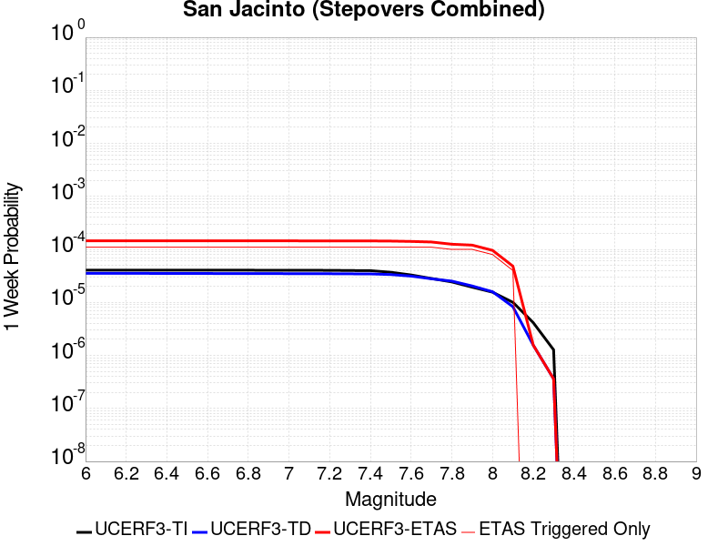 |  |  | 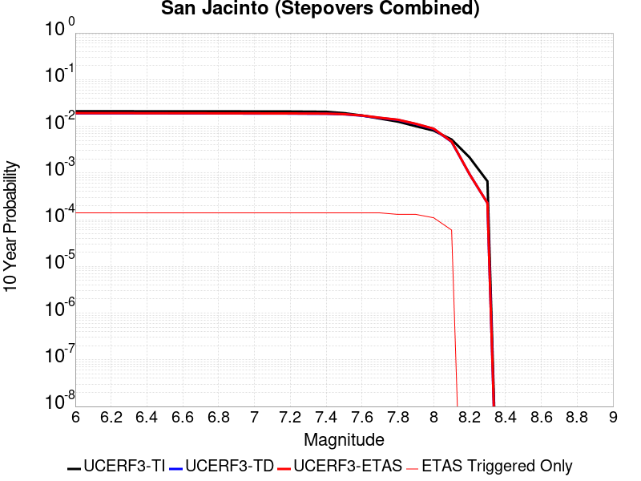 |

| Magnitude | 1 wk TI Prob | 1 wk TD Prob | 1 wk ETAS Prob | 1 wk ETAS/TD Gain | 1 wk ETAS Triggered Only | 1 mo TI Prob | 1 mo TD Prob | 1 mo ETAS Prob | 1 mo ETAS/TD Gain | 1 mo ETAS Triggered Only | 1 yr TI Prob | 1 yr TD Prob | 1 yr ETAS Prob | 1 yr ETAS/TD Gain | 1 yr ETAS Triggered Only | 10 yr TI Prob | 10 yr TD Prob | 10 yr ETAS Prob | 10 yr ETAS/TD Gain | 10 yr ETAS Triggered Only |
|-----|-----|-----|-----|-----|-----|-----|-----|-----|-----|-----|-----|-----|-----|-----|-----|-----|-----|-----|-----|-----|
| 6.0 | 4.0667746E-5 | 3.5272755E-5 | 1.5562258E-4 | 4.4119763 | 1.2035406E-4 | 1.742787E-4 | 1.5116022E-4 | 2.824357E-4 | 1.8684527 | 1.3129534E-4 | 0.0021197782 | 0.0018388226 | 0.0019807976 | 1.0772097 | 1.4223662E-4 | 0.020996714 | 0.018986892 | 0.01913716 | 1.0079144 | 1.531779E-4 |
| 6.1 | 4.0667746E-5 | 3.5272755E-5 | 1.5562258E-4 | 4.4119763 | 1.2035406E-4 | 1.742787E-4 | 1.5116022E-4 | 2.824357E-4 | 1.8684527 | 1.3129534E-4 | 0.0021197782 | 0.0018388226 | 0.0019807976 | 1.0772097 | 1.4223662E-4 | 0.020996714 | 0.018986892 | 0.01913716 | 1.0079144 | 1.531779E-4 |
| 6.2 | 4.0667746E-5 | 3.5272755E-5 | 1.5562258E-4 | 4.4119763 | 1.2035406E-4 | 1.742787E-4 | 1.5116022E-4 | 2.824357E-4 | 1.8684527 | 1.3129534E-4 | 0.0021197782 | 0.0018388226 | 0.0019807976 | 1.0772097 | 1.4223662E-4 | 0.020996714 | 0.018986892 | 0.01913716 | 1.0079144 | 1.531779E-4 |
| 6.3 | 4.0667746E-5 | 3.5272755E-5 | 1.5562258E-4 | 4.4119763 | 1.2035406E-4 | 1.742787E-4 | 1.5116022E-4 | 2.824357E-4 | 1.8684527 | 1.3129534E-4 | 0.0021197782 | 0.0018388226 | 0.0019807976 | 1.0772097 | 1.4223662E-4 | 0.020996714 | 0.018986892 | 0.01913716 | 1.0079144 | 1.531779E-4 |
| 6.4 | 4.0577226E-5 | 3.5144654E-5 | 1.5549449E-4 | 4.424413 | 1.2035406E-4 | 1.738908E-4 | 1.5061127E-4 | 2.8188684E-4 | 1.8716184 | 1.3129534E-4 | 0.0021150648 | 0.0018321523 | 0.0019741282 | 1.0774914 | 1.4223662E-4 | 0.020950472 | 0.018921461 | 0.01907174 | 1.0079423 | 1.531779E-4 |
| 6.5 | 4.0577226E-5 | 3.5144654E-5 | 1.5549449E-4 | 4.424413 | 1.2035406E-4 | 1.738908E-4 | 1.5061127E-4 | 2.8188684E-4 | 1.8716184 | 1.3129534E-4 | 0.0021150648 | 0.0018321523 | 0.0019741282 | 1.0774914 | 1.4223662E-4 | 0.020950472 | 0.018921461 | 0.01907174 | 1.0079423 | 1.531779E-4 |
| 6.6 | 4.053861E-5 | 3.509E-5 | 1.5543983E-4 | 4.429747 | 1.2035406E-4 | 1.7372532E-4 | 1.5037706E-4 | 2.8165267E-4 | 1.8729762 | 1.3129534E-4 | 0.0021130538 | 0.0018293057 | 0.001971282 | 1.0776122 | 1.4223662E-4 | 0.020930743 | 0.018893538 | 0.019043822 | 1.0079542 | 1.531779E-4 |
| 6.7 | 4.0516545E-5 | 3.5059067E-5 | 1.5540891E-4 | 4.4327736 | 1.2035406E-4 | 1.7363077E-4 | 1.5024451E-4 | 2.8152013E-4 | 1.8737464 | 1.3129534E-4 | 0.002111905 | 0.001827695 | 0.0019696716 | 1.0776807 | 1.4223662E-4 | 0.020919468 | 0.018877735 | 0.019028021 | 1.007961 | 1.531779E-4 |
| 6.8 | 4.049434E-5 | 3.5030633E-5 | 1.5538048E-4 | 4.43556 | 1.2035406E-4 | 1.7353562E-4 | 1.5012265E-4 | 2.8139827E-4 | 1.8744558 | 1.3129534E-4 | 0.0021107488 | 0.0018262138 | 0.0019681908 | 1.0777439 | 1.4223662E-4 | 0.020908125 | 0.018863149 | 0.019013437 | 1.0079674 | 1.531779E-4 |
| 6.9 | 4.046386E-5 | 3.499319E-5 | 1.5534303E-4 | 4.439236 | 1.2035406E-4 | 1.73405E-4 | 1.4996222E-4 | 2.8123785E-4 | 1.8753915 | 1.3129534E-4 | 0.0021091616 | 0.0018242638 | 0.001966241 | 1.0778271 | 1.4223662E-4 | 0.020892553 | 0.01884392 | 0.018994212 | 1.0079756 | 1.531779E-4 |
| 7.0 | 4.036382E-5 | 3.487376E-5 | 1.5522362E-4 | 4.451015 | 1.2035406E-4 | 1.7297632E-4 | 1.4945042E-4 | 2.8072615E-4 | 1.8783897 | 1.3129534E-4 | 0.0021039525 | 0.0018180435 | 0.0019600217 | 1.0780939 | 1.4223662E-4 | 0.02084144 | 0.018782536 | 0.018932836 | 1.0080022 | 1.531779E-4 |
| 7.1 | 4.0343282E-5 | 3.4852223E-5 | 1.5520208E-4 | 4.453148 | 1.2035406E-4 | 1.7288832E-4 | 1.4935812E-4 | 2.8063386E-4 | 1.8789326 | 1.3129534E-4 | 0.002102883 | 0.0018169218 | 0.0019589 | 1.0781422 | 1.4223662E-4 | 0.020830948 | 0.018771412 | 0.018921716 | 1.008007 | 1.531779E-4 |
| 7.2 | 4.0257353E-5 | 3.4756722E-5 | 1.551066E-4 | 4.462636 | 1.2035406E-4 | 1.725201E-4 | 1.489489E-4 | 2.802247E-4 | 1.8813478 | 1.3129534E-4 | 0.0020984085 | 0.0018119477 | 0.0019539266 | 1.0783571 | 1.4223662E-4 | 0.020787042 | 0.018722152 | 0.018872462 | 1.0080285 | 1.531779E-4 |
| 7.3 | 3.9940667E-5 | 3.4584376E-5 | 1.5493427E-4 | 4.479892 | 1.2035406E-4 | 1.7116306E-4 | 1.4821035E-4 | 2.7948624E-4 | 1.8857403 | 1.3129534E-4 | 0.0020819185 | 0.0018029709 | 0.0019449511 | 1.0787479 | 1.4223662E-4 | 0.020625217 | 0.018630784 | 0.018781109 | 1.0080686 | 1.531779E-4 |
| 7.4 | 3.9721202E-5 | 3.4469766E-5 | 1.5481967E-4 | 4.4914627 | 1.2035406E-4 | 1.7022261E-4 | 1.4771923E-4 | 2.7899517E-4 | 1.8886856 | 1.3129534E-4 | 0.0020704903 | 0.0017970012 | 0.0019389823 | 1.07901 | 1.4223662E-4 | 0.020513052 | 0.018569905 | 0.01872024 | 1.0080955 | 1.531779E-4 |
| 7.5 | 3.7036873E-5 | 3.3537188E-5 | 1.5388722E-4 | 4.5885544 | 1.2035406E-4 | 1.5871979E-4 | 1.437229E-4 | 2.7499936E-4 | 1.9133998 | 1.3129534E-4 | 0.0019307006 | 0.0017484248 | 0.0018904128 | 1.0812091 | 1.4223662E-4 | 0.019140124 | 0.018071463 | 0.018221874 | 1.0083231 | 1.531779E-4 |
| 7.6 | 3.2940967E-5 | 3.1317984E-5 | 1.5166828E-4 | 4.842849 | 1.2035406E-4 | 1.4116794E-4 | 1.3421304E-4 | 2.6549076E-4 | 1.9781293 | 1.3129534E-4 | 0.0017173645 | 0.0016328214 | 0.0017748257 | 1.0869687 | 1.4223662E-4 | 0.01704153 | 0.016904354 | 0.017054942 | 1.0089083 | 1.531779E-4 |
| 7.7 | 2.8236149E-5 | 2.7883889E-5 | 1.482346E-4 | 5.316138 | 1.2035406E-4 | 1.2100645E-4 | 1.19496915E-4 | 2.5077656E-4 | 2.0986028 | 1.3129534E-4 | 0.0014722579 | 0.001453905 | 0.0015959349 | 1.0976886 | 1.4223662E-4 | 0.014625421 | 0.015115095 | 0.015265957 | 1.0099809 | 1.531779E-4 |
| 7.8 | 2.4329287E-5 | 2.5207537E-5 | 1.3461756E-4 | 5.3403697 | 1.0941278E-4 | 1.042642E-4 | 1.0802783E-4 | 2.283689E-4 | 2.113982 | 1.2035406E-4 | 0.0012686774 | 0.0013144462 | 0.0014455689 | 1.0997552 | 1.3129534E-4 | 0.012614589 | 0.013712396 | 0.013852682 | 1.0102307 | 1.4223662E-4 |
| 7.9 | 1.9370926E-5 | 2.0421452E-5 | 1.29832E-4 | 6.3576283 | 1.0941278E-4 | 8.301561E-5 | 8.7517576E-5 | 2.078611E-4 | 2.3750784 | 1.2035406E-4 | 0.0010102465 | 0.0010650064 | 0.0011961618 | 1.12315 | 1.3129534E-4 | 0.0100566605 | 0.011199483 | 0.011340125 | 1.0125581 | 1.4223662E-4 |
| 8.0 | 1.5583017E-5 | 1.588647E-5 | 1.034153E-4 | 6.509647 | 8.753023E-5 | 6.6782646E-5 | 6.808309E-5 | 1.6654789E-4 | 2.4462445 | 9.84715E-5 | 8.127754E-4 | 8.285971E-4 | 9.3791925E-4 | 1.1319364 | 1.0941278E-4 | 0.008098091 | 0.008781809 | 0.008901107 | 1.0135846 | 1.2035406E-4 |
| 8.1 | 1.0024873E-5 | 8.292404E-6 | 5.2057152E-5 | 6.2776914 | 4.3765114E-5 | 4.2963035E-5 | 3.5538393E-5 | 9.024284E-5 | 2.5393054 | 5.470639E-5 | 5.229494E-4 | 4.3259456E-4 | 4.8727728E-4 | 1.1264064 | 5.470639E-5 | 0.0052172043 | 0.0046534105 | 0.0047187526 | 1.0140418 | 6.564767E-5 |
| 8.2 | 4.142796E-6 | 1.5610041E-6 | 1.5610041E-6 | 1.0 | 0.0 | 1.775472E-5 | 6.69E-6 | 6.69E-6 | 1.0 | 0.0 | 2.1614227E-4 | 8.144774E-5 | 8.144774E-5 | 1.0 | 0.0 | 0.0021593217 | 9.454649E-4 | 9.454649E-4 | 1.0 | 0.0 |
| 8.3 | 1.2750878E-6 | 3.612133E-7 | 3.612133E-7 | 1.0 | 0.0 | 5.4646503E-6 | 1.548056E-6 | 1.548056E-6 | 1.0 | 0.0 | 6.653009E-5 | 1.8847424E-5 | 1.8847424E-5 | 1.0 | 0.0 | 6.6510175E-4 | 2.2734253E-4 | 2.2734253E-4 | 1.0 | 0.0 |

## San Andreas (North Branch Mill Creek)
*[(top)](#table-of-contents)*

| 1 Week | 1 Month | 1 Year | 10 Year |
|-----|-----|-----|-----|
|  |  |  |  |

| Magnitude | 1 wk TI Prob | 1 wk TD Prob | 1 wk ETAS Prob | 1 wk ETAS/TD Gain | 1 wk ETAS Triggered Only | 1 mo TI Prob | 1 mo TD Prob | 1 mo ETAS Prob | 1 mo ETAS/TD Gain | 1 mo ETAS Triggered Only | 1 yr TI Prob | 1 yr TD Prob | 1 yr ETAS Prob | 1 yr ETAS/TD Gain | 1 yr ETAS Triggered Only | 10 yr TI Prob | 10 yr TD Prob | 10 yr ETAS Prob | 10 yr ETAS/TD Gain | 10 yr ETAS Triggered Only |
|-----|-----|-----|-----|-----|-----|-----|-----|-----|-----|-----|-----|-----|-----|-----|-----|-----|-----|-----|-----|-----|
| 6.0 | 1.3461156E-5 | 2.3499893E-5 | 1.329101E-4 | 5.655775 | 1.0941278E-4 | 5.7689394E-5 | 1.00709956E-4 | 2.3199207E-4 | 2.3035665 | 1.3129534E-4 | 7.02142E-4 | 0.0012254574 | 0.0013675197 | 1.1159259 | 1.4223662E-4 | 0.0069992766 | 0.01222957 | 0.012380875 | 1.012372 | 1.531779E-4 |
| 6.1 | 1.3461156E-5 | 2.3499893E-5 | 1.329101E-4 | 5.655775 | 1.0941278E-4 | 5.7689394E-5 | 1.00709956E-4 | 2.3199207E-4 | 2.3035665 | 1.3129534E-4 | 7.02142E-4 | 0.0012254574 | 0.0013675197 | 1.1159259 | 1.4223662E-4 | 0.0069992766 | 0.01222957 | 0.012380875 | 1.012372 | 1.531779E-4 |
| 6.2 | 1.3461156E-5 | 2.3499893E-5 | 1.329101E-4 | 5.655775 | 1.0941278E-4 | 5.7689394E-5 | 1.00709956E-4 | 2.3199207E-4 | 2.3035665 | 1.3129534E-4 | 7.02142E-4 | 0.0012254574 | 0.0013675197 | 1.1159259 | 1.4223662E-4 | 0.0069992766 | 0.01222957 | 0.012380875 | 1.012372 | 1.531779E-4 |
| 6.3 | 1.3461156E-5 | 2.3499893E-5 | 1.329101E-4 | 5.655775 | 1.0941278E-4 | 5.7689394E-5 | 1.00709956E-4 | 2.3199207E-4 | 2.3035665 | 1.3129534E-4 | 7.02142E-4 | 0.0012254574 | 0.0013675197 | 1.1159259 | 1.4223662E-4 | 0.0069992766 | 0.01222957 | 0.012380875 | 1.012372 | 1.531779E-4 |
| 6.4 | 1.3461156E-5 | 2.3499893E-5 | 1.329101E-4 | 5.655775 | 1.0941278E-4 | 5.7689394E-5 | 1.00709956E-4 | 2.3199207E-4 | 2.3035665 | 1.3129534E-4 | 7.02142E-4 | 0.0012254574 | 0.0013675197 | 1.1159259 | 1.4223662E-4 | 0.0069992766 | 0.01222957 | 0.012380875 | 1.012372 | 1.531779E-4 |
| 6.5 | 1.3450706E-5 | 2.3488852E-5 | 1.3289906E-4 | 5.6579633 | 1.0941278E-4 | 5.764461E-5 | 1.0066265E-4 | 2.3194477E-4 | 2.3041792 | 1.3129534E-4 | 7.0159714E-4 | 0.001224882 | 0.0013669444 | 1.1159805 | 1.4223662E-4 | 0.006993862 | 0.01222388 | 0.012375185 | 1.0123779 | 1.531779E-4 |
| 6.6 | 1.3074523E-5 | 2.3103135E-5 | 1.3251339E-4 | 5.7357316 | 1.0941278E-4 | 5.6032466E-5 | 9.9009696E-5 | 2.3029203E-4 | 2.3259544 | 1.3129534E-4 | 6.8198174E-4 | 0.0012047797 | 0.001346845 | 1.117918 | 1.4223662E-4 | 0.006798926 | 0.012025044 | 0.0121763805 | 1.012585 | 1.531779E-4 |
| 6.7 | 1.3050216E-5 | 2.3078432E-5 | 1.3248868E-4 | 5.740801 | 1.0941278E-4 | 5.59283E-5 | 9.890384E-5 | 2.3018618E-4 | 2.3273737 | 1.3129534E-4 | 6.8071426E-4 | 0.0012034923 | 0.0013455576 | 1.1180444 | 1.4223662E-4 | 0.0067863287 | 0.012012309 | 0.012163647 | 1.0125985 | 1.531779E-4 |
| 6.8 | 1.29049395E-5 | 2.292684E-5 | 1.3233711E-4 | 5.7721477 | 1.0941278E-4 | 5.530571E-5 | 9.825421E-5 | 2.2953664E-4 | 2.336151 | 1.3129534E-4 | 6.73139E-4 | 0.0011955918 | 0.0013376583 | 1.1188253 | 1.4223662E-4 | 0.0067110364 | 0.011934154 | 0.012085504 | 1.0126821 | 1.531779E-4 |
| 6.9 | 1.2867369E-5 | 2.2886245E-5 | 1.3229653E-4 | 5.780613 | 1.0941278E-4 | 5.51447E-5 | 9.8080236E-5 | 2.293627E-4 | 2.338521 | 1.3129534E-4 | 6.711799E-4 | 0.0011934759 | 0.0013355428 | 1.1190362 | 1.4223662E-4 | 0.006691564 | 0.011913223 | 0.012064576 | 1.0127046 | 1.531779E-4 |
| 7.0 | 1.2495996E-5 | 2.2286325E-5 | 1.3169667E-4 | 5.9093037 | 1.0941278E-4 | 5.3553173E-5 | 9.550934E-5 | 2.2679214E-4 | 2.3745546 | 1.3129534E-4 | 6.518148E-4 | 0.0011622087 | 0.0013042801 | 1.1222425 | 1.4223662E-4 | 0.0064990623 | 0.0116038285 | 0.011755229 | 1.0130475 | 1.531779E-4 |
| 7.1 | 1.2452067E-5 | 2.2231397E-5 | 1.3164175E-4 | 5.9214334 | 1.0941278E-4 | 5.3364907E-5 | 9.527396E-5 | 2.2655679E-4 | 2.377951 | 1.3129534E-4 | 6.4952404E-4 | 0.0011593461 | 0.0013014177 | 1.1225446 | 1.4223662E-4 | 0.0064762887 | 0.0115755 | 0.011726905 | 1.0130798 | 1.531779E-4 |
| 7.2 | 1.2002777E-5 | 2.1609963E-5 | 1.3102038E-4 | 6.0629616 | 1.0941278E-4 | 5.143946E-5 | 9.2610855E-5 | 2.2389404E-4 | 2.4175787 | 1.3129534E-4 | 6.2609545E-4 | 0.0011269567 | 0.001269033 | 1.1260709 | 1.4223662E-4 | 0.006243344 | 0.011254923 | 0.011406377 | 1.0134567 | 1.531779E-4 |
| 7.3 | 1.1923425E-5 | 2.1479793E-5 | 1.3089023E-4 | 6.0936446 | 1.0941278E-4 | 5.109939E-5 | 9.205302E-5 | 2.2333628E-4 | 2.4261699 | 1.3129534E-4 | 6.219575E-4 | 0.001120172 | 0.0012622493 | 1.1268352 | 1.4223662E-4 | 0.0062021962 | 0.011187789 | 0.011339253 | 1.0135384 | 1.531779E-4 |
| 7.4 | 1.16105175E-5 | 2.0853771E-5 | 1.3026428E-4 | 6.2465568 | 1.0941278E-4 | 4.975841E-5 | 8.937026E-5 | 2.2065386E-4 | 2.4689853 | 1.3129534E-4 | 6.0564023E-4 | 0.0010875424 | 0.0012296243 | 1.1306449 | 1.4223662E-4 | 0.006039923 | 0.010865397 | 0.01101691 | 1.0139446 | 1.531779E-4 |
| 7.5 | 1.1037265E-5 | 1.9553907E-5 | 1.2896454E-4 | 6.595334 | 1.0941278E-4 | 4.7301706E-5 | 8.379978E-5 | 2.0414375E-4 | 2.4360893 | 1.2035406E-4 | 5.757461E-4 | 0.0010197869 | 0.0011509485 | 1.1286166 | 1.3129534E-4 | 0.005742567 | 0.010194898 | 0.010335684 | 1.0138096 | 1.4223662E-4 |
| 7.6 | 1.0720915E-5 | 1.899582E-5 | 1.2840652E-4 | 6.7597256 | 1.0941278E-4 | 4.5945973E-5 | 8.140812E-5 | 2.0175238E-4 | 2.4782832 | 1.2035406E-4 | 5.592486E-4 | 9.906954E-4 | 0.0011218607 | 1.1323972 | 1.3129534E-4 | 0.005578433 | 0.009906623 | 0.01004745 | 1.0142155 | 1.4223662E-4 |
| 7.7 | 9.276279E-6 | 1.6441649E-5 | 1.2585263E-4 | 7.654502 | 1.0941278E-4 | 3.9754876E-5 | 7.0462316E-5 | 1.908079E-4 | 2.7079425 | 1.2035406E-4 | 4.839081E-4 | 8.575427E-4 | 9.887255E-4 | 1.1529752 | 1.3129534E-4 | 0.0048285574 | 0.008586041 | 0.008727056 | 1.0164238 | 1.4223662E-4 |
| 7.8 | 5.8346777E-6 | 1.1155013E-5 | 1.20566576E-4 | 10.808286 | 1.0941278E-4 | 2.5005522E-5 | 4.7806327E-5 | 1.6815463E-4 | 3.5174139 | 1.2035406E-4 | 3.043997E-4 | 5.818867E-4 | 7.131056E-4 | 1.225506 | 1.3129534E-4 | 0.0030398308 | 0.0058469265 | 0.0059883315 | 1.0241845 | 1.4223662E-4 |
| 7.9 | 4.690204E-6 | 8.509093E-6 | 1.1792094E-4 | 13.858227 | 1.0941278E-4 | 2.0100719E-5 | 3.6467034E-5 | 1.568167E-4 | 4.300232 | 1.2035406E-4 | 2.4469878E-4 | 4.4389578E-4 | 5.7513284E-4 | 1.2956483 | 1.3129534E-4 | 0.002444295 | 0.0044707474 | 0.004612348 | 1.0316727 | 1.4223662E-4 |
| 8.0 | 2.9570454E-6 | 4.846947E-6 | 4.8611848E-5 | 10.029375 | 4.3765114E-5 | 1.267299E-5 | 2.0772464E-5 | 7.547772E-5 | 3.6335468 | 5.470639E-5 | 1.5428272E-4 | 2.5287544E-4 | 3.185065E-4 | 1.2595391 | 6.564767E-5 | 0.0015417566 | 0.002549644 | 0.002626038 | 1.0299625 | 7.658895E-5 |
| 8.1 | 1.6376824E-6 | 2.1968929E-6 | 2.1968929E-6 | 1.0 | 0.0 | 7.01862E-6 | 9.41522E-6 | 9.41522E-6 | 1.0 | 0.0 | 8.544835E-5 | 1.14624294E-4 | 1.14624294E-4 | 1.0 | 0.0 | 8.54155E-4 | 0.0011606582 | 0.0011715868 | 1.0094159 | 1.0941279E-5 |
| 8.2 | 6.9631557E-7 | 4.5360213E-7 | 4.5360213E-7 | 1.0 | 0.0 | 2.984206E-6 | 1.9440076E-6 | 1.9440076E-6 | 1.0 | 0.0 | 3.63321E-5 | 2.3668037E-5 | 2.3668037E-5 | 1.0 | 0.0 | 3.6326164E-4 | 2.451564E-4 | 2.451564E-4 | 1.0 | 0.0 |
| 8.3 | 1.7876137E-7 | 8.360375E-8 | 8.360375E-8 | 1.0 | 0.0 | 7.661199E-7 | 3.5830175E-7 | 3.5830175E-7 | 1.0 | 0.0 | 9.32747E-6 | 4.3623154E-6 | 4.3623154E-6 | 1.0 | 0.0 | 9.3270784E-5 | 4.5817014E-5 | 4.5817014E-5 | 1.0 | 0.0 |

## Brawley (Seismic Zone) alt 1
*[(top)](#table-of-contents)*

| 1 Week | 1 Month | 1 Year | 10 Year |
|-----|-----|-----|-----|
|  |  |  |  |

| Magnitude | 1 wk TI Prob | 1 wk TD Prob | 1 wk ETAS Prob | 1 wk ETAS/TD Gain | 1 wk ETAS Triggered Only | 1 mo TI Prob | 1 mo TD Prob | 1 mo ETAS Prob | 1 mo ETAS/TD Gain | 1 mo ETAS Triggered Only | 1 yr TI Prob | 1 yr TD Prob | 1 yr ETAS Prob | 1 yr ETAS/TD Gain | 1 yr ETAS Triggered Only | 10 yr TI Prob | 10 yr TD Prob | 10 yr ETAS Prob | 10 yr ETAS/TD Gain | 10 yr ETAS Triggered Only |
|-----|-----|-----|-----|-----|-----|-----|-----|-----|-----|-----|-----|-----|-----|-----|-----|-----|-----|-----|-----|-----|
| 6.0 | 2.2521618E-4 | 4.7632487E-4 | 5.638134E-4 | 1.1836741 | 8.753023E-5 | 9.6485513E-4 | 0.0020398323 | 0.0021599408 | 1.0588816 | 1.2035406E-4 | 0.011683988 | 0.024546238 | 0.02467431 | 1.0052176 | 1.3129534E-4 | 0.11088423 | 0.21350002 | 0.21361189 | 1.0005239 | 1.4223662E-4 |
| 6.1 | 2.2521618E-4 | 4.7632487E-4 | 5.638134E-4 | 1.1836741 | 8.753023E-5 | 9.6485513E-4 | 0.0020398323 | 0.0021599408 | 1.0588816 | 1.2035406E-4 | 0.011683988 | 0.024546238 | 0.02467431 | 1.0052176 | 1.3129534E-4 | 0.11088423 | 0.21350002 | 0.21361189 | 1.0005239 | 1.4223662E-4 |
| 6.2 | 2.198148E-4 | 4.6717093E-4 | 5.546603E-4 | 1.1872748 | 8.753023E-5 | 9.417233E-4 | 0.0020006616 | 0.0021207747 | 1.0600368 | 1.2035406E-4 | 0.011405343 | 0.024080504 | 0.024208637 | 1.005321 | 1.3129534E-4 | 0.10837428 | 0.20993657 | 0.21004894 | 1.0005352 | 1.4223662E-4 |
| 6.3 | 2.1704129E-4 | 4.615278E-4 | 5.490176E-4 | 1.1895657 | 8.753023E-5 | 9.298453E-4 | 0.0019765133 | 0.0020966295 | 1.0607717 | 1.2035406E-4 | 0.011262234 | 0.02379366 | 0.023921832 | 1.0053868 | 1.3129534E-4 | 0.107082725 | 0.20782755 | 0.20794022 | 1.0005422 | 1.4223662E-4 |
| 6.4 | 1.876142E-4 | 4.00449E-4 | 4.660704E-4 | 1.1638695 | 6.564767E-5 | 8.038131E-4 | 0.0017150956 | 0.0018133982 | 1.0573161 | 9.84715E-5 | 0.00974259 | 0.020680401 | 0.020787552 | 1.0051812 | 1.0941278E-4 | 0.093263686 | 0.18457815 | 0.18467629 | 1.0005317 | 1.2035406E-4 |
| 6.5 | 1.7390939E-4 | 3.7477075E-4 | 4.403938E-4 | 1.1751019 | 6.564767E-5 | 7.45113E-4 | 0.0016051838 | 0.0017034973 | 1.0612475 | 9.84715E-5 | 0.009034078 | 0.019368723 | 0.019476017 | 1.0055395 | 1.0941278E-4 | 0.086755216 | 0.17440031 | 0.17449968 | 1.0005697 | 1.2035406E-4 |
| 6.6 | 1.591791E-4 | 3.4891962E-4 | 4.145444E-4 | 1.1880798 | 6.564767E-5 | 6.8201777E-4 | 0.0014945229 | 0.0015819223 | 1.0584798 | 8.753023E-5 | 0.008271996 | 0.018045569 | 0.018142264 | 1.0053583 | 9.84715E-5 | 0.07970774 | 0.16380852 | 0.16390002 | 1.0005585 | 1.0941278E-4 |
| 6.7 | 1.4268003E-4 | 3.20582E-4 | 3.8620865E-4 | 1.2047108 | 6.564767E-5 | 6.1134255E-4 | 0.0013732077 | 0.0014606176 | 1.063654 | 8.753023E-5 | 0.007417723 | 0.016592601 | 0.01668944 | 1.0058362 | 9.84715E-5 | 0.07174956 | 0.15193306 | 0.15202585 | 1.0006107 | 1.0941278E-4 |
| 6.8 | 1.239713E-4 | 2.9053655E-4 | 3.5616517E-4 | 1.2258875 | 6.564767E-5 | 5.3119735E-4 | 0.0012445687 | 0.00133199 | 1.0702423 | 8.753023E-5 | 0.0064481674 | 0.015048777 | 0.015145767 | 1.006445 | 9.84715E-5 | 0.06264243 | 0.13837762 | 0.1384719 | 1.0006813 | 1.0941278E-4 |
| 6.9 | 1.0180238E-4 | 2.625439E-4 | 3.0629753E-4 | 1.1666526 | 4.3765114E-5 | 4.3622297E-4 | 0.0011247073 | 0.0011902811 | 1.058303 | 6.564767E-5 | 0.005298089 | 0.013608336 | 0.013683883 | 1.0055515 | 7.658895E-5 | 0.05173543 | 0.124961674 | 0.12503827 | 1.000613 | 8.753023E-5 |
| 7.0 | 7.6619996E-5 | 2.23993E-4 | 2.677483E-4 | 1.1953423 | 4.3765114E-5 | 3.283301E-4 | 9.5962E-4 | 0.0010252047 | 1.0683445 | 6.564767E-5 | 0.0039900932 | 0.011621496 | 0.011697195 | 1.0065137 | 7.658895E-5 | 0.039192066 | 0.107266866 | 0.10734501 | 1.0007285 | 8.753023E-5 |
| 7.1 | 7.5127435E-5 | 2.2082464E-4 | 2.645801E-4 | 1.1981456 | 4.3765114E-5 | 3.2193496E-4 | 9.4605127E-4 | 0.0010116368 | 1.0693256 | 6.564767E-5 | 0.0039125155 | 0.011458045 | 0.011533756 | 1.0066077 | 7.658895E-5 | 0.038443442 | 0.10583085 | 0.10590912 | 1.0007396 | 8.753023E-5 |
| 7.2 | 6.788582E-5 | 2.0210193E-4 | 2.4585822E-4 | 1.2165059 | 4.3765114E-5 | 2.9090676E-4 | 8.6586666E-4 | 9.314575E-4 | 1.0757517 | 6.564767E-5 | 0.0035360386 | 0.0104916105 | 0.010567396 | 1.0072235 | 7.658895E-5 | 0.034803 | 0.09750131 | 0.097580306 | 1.0008101 | 8.753023E-5 |
| 7.3 | 6.399602E-5 | 1.8841137E-4 | 2.2122903E-4 | 1.1741809 | 3.2823835E-5 | 2.7423984E-4 | 8.072303E-4 | 8.6189253E-4 | 1.0677158 | 5.470639E-5 | 0.0033337586 | 0.009784332 | 0.009849336 | 1.0066438 | 6.564767E-5 | 0.03284188 | 0.09139617 | 0.09146576 | 1.0007614 | 7.658895E-5 |
| 7.4 | 4.506759E-5 | 1.2529209E-4 | 1.5811181E-4 | 1.2619457 | 3.2823835E-5 | 1.9313251E-4 | 5.368565E-4 | 5.915335E-4 | 1.1018466 | 5.470639E-5 | 0.0023488526 | 0.0065168133 | 0.0065820334 | 1.010008 | 6.564767E-5 | 0.023241805 | 0.062363707 | 0.06243552 | 1.0011516 | 7.658895E-5 |
| 7.5 | 3.43289E-5 | 9.33541E-5 | 1.2617487E-4 | 1.3515729 | 3.2823835E-5 | 1.4711556E-4 | 4.00028E-4 | 4.5471248E-4 | 1.1367017 | 5.470639E-5 | 0.0017896603 | 0.0048595266 | 0.004924855 | 1.0134435 | 6.564767E-5 | 0.01775316 | 0.04705519 | 0.047128174 | 1.001551 | 7.658895E-5 |
| 7.6 | 2.5980507E-5 | 7.053101E-5 | 1.0335253E-4 | 1.4653487 | 3.2823835E-5 | 1.1134028E-4 | 3.0224086E-4 | 3.5693072E-4 | 1.1809479 | 5.470639E-5 | 0.001354725 | 0.003673598 | 0.0037390045 | 1.0178045 | 6.564767E-5 | 0.013464959 | 0.035840835 | 0.035914678 | 1.0020603 | 7.658895E-5 |
| 7.7 | 1.7292105E-5 | 4.9407296E-5 | 6.0348033E-5 | 1.2214397 | 1.0941279E-5 | 7.4106916E-5 | 2.117284E-4 | 2.4454528E-4 | 1.1549952 | 3.2823835E-5 | 9.018782E-4 | 0.0025747516 | 0.002618404 | 1.0169541 | 4.3765114E-5 | 0.008982267 | 0.025290398 | 0.02534372 | 1.0021085 | 5.470639E-5 |
| 7.8 | 1.2927471E-5 | 3.9693266E-5 | 5.0634113E-5 | 1.2756348 | 1.0941279E-5 | 5.5402274E-5 | 1.7010293E-4 | 2.0292118E-4 | 1.1929318 | 3.2823835E-5 | 6.743139E-4 | 0.0020690386 | 0.0021127132 | 1.0211086 | 4.3765114E-5 | 0.0067227143 | 0.020431727 | 0.020485317 | 1.0026228 | 5.470639E-5 |
| 7.9 | 1.0200774E-5 | 2.874569E-5 | 3.9686653E-5 | 1.3806124 | 1.0941279E-5 | 4.371687E-5 | 1.2319001E-4 | 1.5600979E-4 | 1.2664161 | 3.2823835E-5 | 5.321229E-4 | 0.0014988075 | 0.001542507 | 1.0291562 | 4.3765114E-5 | 0.005308505 | 0.014991644 | 0.01504553 | 1.0035944 | 5.470639E-5 |
| 8.0 | 8.650396E-6 | 2.3277367E-5 | 2.3277367E-5 | 1.0 | 0.0 | 3.70726E-5 | 9.975634E-5 | 1.1069653E-4 | 1.1096691 | 1.0941279E-5 | 4.5126543E-4 | 0.0012138576 | 0.0012357136 | 1.0180054 | 2.1882557E-5 | 0.0045035016 | 0.012211097 | 0.01224352 | 1.0026553 | 3.2823835E-5 |
| 8.1 | 3.9368224E-6 | 7.3279825E-6 | 7.3279825E-6 | 1.0 | 0.0 | 1.6871985E-5 | 3.140526E-5 | 3.140526E-5 | 1.0 | 0.0 | 2.0539707E-4 | 3.8229208E-4 | 3.932292E-4 | 1.0286093 | 1.0941279E-5 | 0.0020520731 | 0.004001185 | 0.0040229796 | 1.0054471 | 2.1882557E-5 |
| 8.2 | 1.7101195E-6 | 2.217876E-6 | 2.217876E-6 | 1.0 | 0.0 | 7.329063E-6 | 9.505149E-6 | 9.505149E-6 | 1.0 | 0.0 | 8.922769E-5 | 1.1571907E-4 | 1.1571907E-4 | 1.0 | 0.0 | 8.9191867E-4 | 0.0012666774 | 0.0012666774 | 1.0 | 0.0 |
| 8.3 | 3.0346666E-8 | 1.721586E-8 | 1.721586E-8 | 1.0 | 0.0 | 1.3005713E-7 | 7.378226E-8 | 7.378226E-8 | 1.0 | 0.0 | 1.5834444E-6 | 8.9829894E-7 | 8.9829894E-7 | 1.0 | 0.0 | 1.5834332E-5 | 9.367729E-6 | 9.367729E-6 | 1.0 | 0.0 |

## Baker
*[(top)](#table-of-contents)*

| 1 Week | 1 Month | 1 Year | 10 Year |
|-----|-----|-----|-----|
|  | 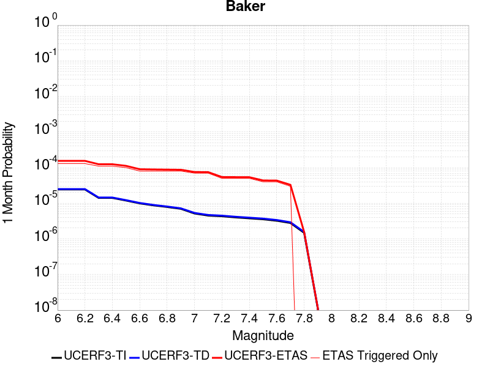 |  |  |

| Magnitude | 1 wk TI Prob | 1 wk TD Prob | 1 wk ETAS Prob | 1 wk ETAS/TD Gain | 1 wk ETAS Triggered Only | 1 mo TI Prob | 1 mo TD Prob | 1 mo ETAS Prob | 1 mo ETAS/TD Gain | 1 mo ETAS Triggered Only | 1 yr TI Prob | 1 yr TD Prob | 1 yr ETAS Prob | 1 yr ETAS/TD Gain | 1 yr ETAS Triggered Only | 10 yr TI Prob | 10 yr TD Prob | 10 yr ETAS Prob | 10 yr ETAS/TD Gain | 10 yr ETAS Triggered Only |
|-----|-----|-----|-----|-----|-----|-----|-----|-----|-----|-----|-----|-----|-----|-----|-----|-----|-----|-----|-----|-----|
| 6.0 | 5.695525E-6 | 5.8348373E-6 | 1.04305764E-4 | 17.87638 | 9.84715E-5 | 2.4409164E-5 | 2.5006228E-5 | 1.6723928E-4 | 6.6879053 | 1.4223662E-4 | 2.9714106E-4 | 3.044123E-4 | 4.466056E-4 | 1.4671077 | 1.4223662E-4 | 0.0029674405 | 0.0030403486 | 0.003182153 | 1.0466408 | 1.4223662E-4 |
| 6.1 | 5.695525E-6 | 5.8348373E-6 | 1.04305764E-4 | 17.87638 | 9.84715E-5 | 2.4409164E-5 | 2.5006228E-5 | 1.6723928E-4 | 6.6879053 | 1.4223662E-4 | 2.9714106E-4 | 3.044123E-4 | 4.466056E-4 | 1.4671077 | 1.4223662E-4 | 0.0029674405 | 0.0030403486 | 0.003182153 | 1.0466408 | 1.4223662E-4 |
| 6.2 | 5.695525E-6 | 5.8348373E-6 | 1.04305764E-4 | 17.87638 | 9.84715E-5 | 2.4409164E-5 | 2.5006228E-5 | 1.6723928E-4 | 6.6879053 | 1.4223662E-4 | 2.9714106E-4 | 3.044123E-4 | 4.466056E-4 | 1.4671077 | 1.4223662E-4 | 0.0029674405 | 0.0030403486 | 0.003182153 | 1.0466408 | 1.4223662E-4 |
| 6.3 | 3.2995713E-6 | 3.383667E-6 | 7.997236E-5 | 23.634817 | 7.658895E-5 | 1.4140943E-5 | 1.4501353E-5 | 1.3485366E-4 | 9.299385 | 1.2035406E-4 | 1.7215237E-4 | 1.7654014E-4 | 2.9687295E-4 | 1.6816173 | 1.2035406E-4 | 0.0017201907 | 0.001764046 | 0.0018841878 | 1.0681058 | 1.2035406E-4 |
| 6.4 | 3.2995713E-6 | 3.383667E-6 | 7.997236E-5 | 23.634817 | 7.658895E-5 | 1.4140943E-5 | 1.4501353E-5 | 1.3485366E-4 | 9.299385 | 1.2035406E-4 | 1.7215237E-4 | 1.7654014E-4 | 2.9687295E-4 | 1.6816173 | 1.2035406E-4 | 0.0017201907 | 0.001764046 | 0.0018841878 | 1.0681058 | 1.2035406E-4 |
| 6.5 | 2.782202E-6 | 2.8558404E-6 | 6.850332E-5 | 23.987097 | 6.564767E-5 | 1.1923668E-5 | 1.223926E-5 | 1.216507E-4 | 9.9393835 | 1.0941278E-4 | 1.4516099E-4 | 1.4900314E-4 | 2.583996E-4 | 1.7341892 | 1.0941278E-4 | 0.001450662 | 0.0014890651 | 0.001598315 | 1.0733681 | 1.0941278E-4 |
| 6.6 | 2.3163404E-6 | 2.38092E-6 | 4.6145928E-5 | 19.381554 | 4.3765114E-5 | 9.927136E-6 | 1.0203904E-5 | 9.773324E-5 | 9.578024 | 8.753023E-5 | 1.20856166E-4 | 1.2422565E-4 | 2.11745E-4 | 1.7045192 | 8.753023E-5 | 0.0012079047 | 0.0012415823 | 0.0013290038 | 1.0704114 | 8.753023E-5 |
| 6.7 | 2.037056E-6 | 2.0965003E-6 | 4.586152E-5 | 21.875275 | 4.3765114E-5 | 8.7302105E-6 | 8.984972E-6 | 9.651441E-5 | 10.74176 | 8.753023E-5 | 1.0628513E-4 | 1.093867E-4 | 1.9690735E-4 | 1.8001032 | 8.753023E-5 | 0.0010623431 | 0.0010933448 | 0.0011807793 | 1.0799698 | 8.753023E-5 |
| 6.8 | 1.8356744E-6 | 1.8915287E-6 | 4.5656558E-5 | 24.137386 | 4.3765114E-5 | 7.867153E-6 | 8.106527E-6 | 9.5636045E-5 | 11.797413 | 8.753023E-5 | 9.577837E-5 | 9.869264E-5 | 1.8621422E-4 | 1.8868097 | 8.753023E-5 | 9.57371E-4 | 9.86502E-4 | 0.0010739459 | 1.0886403 | 8.753023E-5 |
| 6.9 | 1.6310546E-6 | 1.6832072E-6 | 4.5448247E-5 | 27.000982 | 4.3765114E-5 | 6.9902153E-6 | 7.213726E-6 | 9.474332E-5 | 13.133757 | 8.753023E-5 | 8.510255E-5 | 8.782368E-5 | 1.7534623E-4 | 1.996571 | 8.753023E-5 | 8.5069967E-4 | 8.7790104E-4 | 9.6535444E-4 | 1.0996164 | 8.753023E-5 |
| 7.0 | 1.2058036E-6 | 1.2508665E-6 | 3.407466E-5 | 27.240843 | 3.2823835E-5 | 5.1677193E-6 | 5.3608455E-6 | 8.194938E-5 | 15.286652 | 7.658895E-5 | 6.291517E-5 | 6.5266366E-5 | 1.4185031E-4 | 2.1734061 | 7.658895E-5 | 6.289736E-4 | 6.524743E-4 | 7.290133E-4 | 1.1173058 | 7.658895E-5 |
| 7.1 | 1.052382E-6 | 1.0951609E-6 | 3.391896E-5 | 30.971668 | 3.2823835E-5 | 4.5102006E-6 | 4.693538E-6 | 8.128212E-5 | 17.317879 | 7.658895E-5 | 5.491031E-5 | 5.7142337E-5 | 1.337269E-4 | 2.3402421 | 7.658895E-5 | 5.4896745E-4 | 5.7127734E-4 | 6.478225E-4 | 1.1339896 | 7.658895E-5 |
| 7.2 | 1.0067454E-6 | 1.0487711E-6 | 3.387257E-5 | 32.297394 | 3.2823835E-5 | 4.3146156E-6 | 4.4947255E-6 | 5.920087E-5 | 13.171187 | 5.470639E-5 | 5.252918E-5 | 5.4721917E-5 | 1.0942532E-4 | 1.9996616 | 5.470639E-5 | 5.251676E-4 | 5.470853E-4 | 6.0176174E-4 | 1.0999414 | 5.470639E-5 |
| 7.3 | 9.3596316E-7 | 9.767723E-7 | 3.3800574E-5 | 34.604355 | 3.2823835E-5 | 4.0112645E-6 | 4.1861604E-6 | 5.889232E-5 | 14.068338 | 5.470639E-5 | 4.8836053E-5 | 5.096532E-5 | 1.0566892E-4 | 2.0733495 | 5.470639E-5 | 4.8825322E-4 | 5.095371E-4 | 5.642156E-4 | 1.1073102 | 5.470639E-5 |
| 7.4 | 8.8117395E-7 | 9.2076635E-7 | 3.374457E-5 | 36.648354 | 3.2823835E-5 | 3.7764542E-6 | 3.9461356E-6 | 5.865231E-5 | 14.863228 | 5.470639E-5 | 4.5977362E-5 | 4.8043148E-5 | 1.0274691E-4 | 2.1386383 | 5.470639E-5 | 4.596785E-4 | 4.8032837E-4 | 5.350085E-4 | 1.113839 | 5.470639E-5 |
| 7.5 | 8.292386E-7 | 8.6745956E-7 | 3.3691267E-5 | 38.839005 | 3.2823835E-5 | 3.5538749E-6 | 3.7176785E-6 | 4.748263E-5 | 12.772118 | 4.3765114E-5 | 4.326757E-5 | 4.5261804E-5 | 8.9024936E-5 | 1.9668888 | 4.3765114E-5 | 4.3259145E-4 | 4.5252658E-4 | 4.962719E-4 | 1.0966691 | 4.3765114E-5 |
| 7.6 | 7.553842E-7 | 7.9144706E-7 | 3.3615255E-5 | 42.473156 | 3.2823835E-5 | 3.2373566E-6 | 3.3919116E-6 | 4.7156875E-5 | 13.902743 | 4.3765114E-5 | 3.9414106E-5 | 4.129575E-5 | 8.505905E-5 | 2.0597534 | 4.3765114E-5 | 3.9407116E-4 | 4.1288146E-4 | 4.5662848E-4 | 1.1059555 | 4.3765114E-5 |
| 7.7 | 6.5285366E-7 | 6.852797E-7 | 3.350909E-5 | 48.89842 | 3.2823835E-5 | 2.797941E-6 | 2.9369096E-6 | 3.5760648E-5 | 12.176285 | 3.2823835E-5 | 3.40644E-5 | 3.5756293E-5 | 6.857896E-5 | 1.9179548 | 3.2823835E-5 | 3.405918E-4 | 3.5750607E-4 | 3.9031816E-4 | 1.0917805 | 3.2823835E-5 |
| 7.8 | 3.4586725E-7 | 3.6482615E-7 | 3.6482615E-7 | 1.0 | 0.0 | 1.4822873E-6 | 1.5635396E-6 | 1.5635396E-6 | 1.0 | 0.0 | 1.80467E-5 | 1.9035933E-5 | 1.9035933E-5 | 1.0 | 0.0 | 1.8045233E-4 | 1.9034347E-4 | 1.9034347E-4 | 1.0 | 0.0 |
| 7.9 | 2.5591178E-9 | 2.6696718E-9 | 2.6696718E-9 | 1.0 | 0.0 | 1.0967647E-8 | 1.14414505E-8 | 1.14414505E-8 | 1.0 | 0.0 | 1.335311E-7 | 1.3929966E-7 | 1.3929966E-7 | 1.0 | 0.0 | 1.3353102E-6 | 1.3929966E-6 | 1.3929966E-6 | 1.0 | 0.0 |

## Imperial
*[(top)](#table-of-contents)*

| 1 Week | 1 Month | 1 Year | 10 Year |
|-----|-----|-----|-----|
| 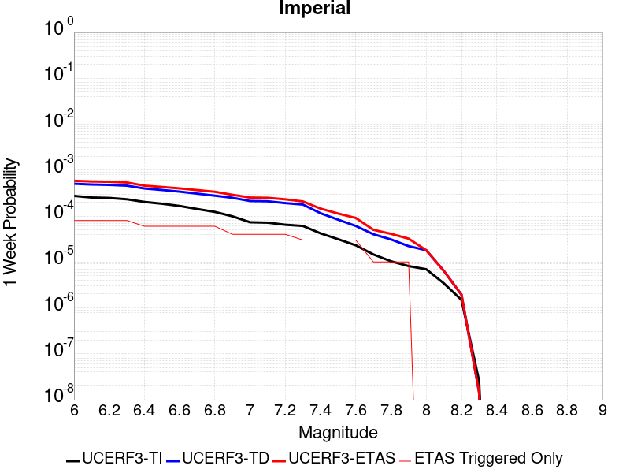 |  |  |  |

| Magnitude | 1 wk TI Prob | 1 wk TD Prob | 1 wk ETAS Prob | 1 wk ETAS/TD Gain | 1 wk ETAS Triggered Only | 1 mo TI Prob | 1 mo TD Prob | 1 mo ETAS Prob | 1 mo ETAS/TD Gain | 1 mo ETAS Triggered Only | 1 yr TI Prob | 1 yr TD Prob | 1 yr ETAS Prob | 1 yr ETAS/TD Gain | 1 yr ETAS Triggered Only | 10 yr TI Prob | 10 yr TD Prob | 10 yr ETAS Prob | 10 yr ETAS/TD Gain | 10 yr ETAS Triggered Only |
|-----|-----|-----|-----|-----|-----|-----|-----|-----|-----|-----|-----|-----|-----|-----|-----|-----|-----|-----|-----|-----|
| 6.0 | 2.7496446E-4 | 5.0552754E-4 | 5.930135E-4 | 1.1730587 | 8.753023E-5 | 0.0011778869 | 0.002164787 | 0.0022848805 | 1.055476 | 1.2035406E-4 | 0.0142467655 | 0.026038699 | 0.026166575 | 1.0049111 | 1.3129534E-4 | 0.13367249 | 0.2280438 | 0.22814514 | 1.0004444 | 1.3129534E-4 |
| 6.1 | 2.5356023E-4 | 4.8656776E-4 | 5.740554E-4 | 1.1798056 | 8.753023E-5 | 0.001086234 | 0.0020836622 | 0.0022037656 | 1.0576404 | 1.2035406E-4 | 0.013144928 | 0.025071215 | 0.025199218 | 1.0051056 | 1.3129534E-4 | 0.123940155 | 0.21947981 | 0.21958229 | 1.000467 | 1.3129534E-4 |
| 6.2 | 2.4820742E-4 | 4.7752203E-4 | 5.650105E-4 | 1.1832134 | 8.753023E-5 | 0.0010633124 | 0.0020449557 | 0.0021650637 | 1.0587337 | 1.2035406E-4 | 0.01286919 | 0.024611235 | 0.024739299 | 1.0052035 | 1.3129534E-4 | 0.12148927 | 0.21598552 | 0.21608846 | 1.0004766 | 1.3129534E-4 |
| 6.3 | 2.3205351E-4 | 4.5890483E-4 | 5.463949E-4 | 1.1906496 | 8.753023E-5 | 9.94136E-4 | 0.0019652895 | 0.002085407 | 1.0611196 | 1.2035406E-4 | 0.012036599 | 0.02366133 | 0.02378952 | 1.0054177 | 1.3129534E-4 | 0.11405133 | 0.20793462 | 0.20803861 | 1.0005001 | 1.3129534E-4 |
| 6.4 | 2.0304754E-4 | 3.987652E-4 | 4.6438669E-4 | 1.1645617 | 6.564767E-5 | 8.6991355E-4 | 0.0017078889 | 0.0018061923 | 1.0575584 | 9.84715E-5 | 0.010539869 | 0.020595672 | 0.02070283 | 1.005203 | 1.0941278E-4 | 0.100537635 | 0.1850669 | 0.18515606 | 1.0004818 | 1.0941278E-4 |
| 6.5 | 1.854992E-4 | 3.6988858E-4 | 4.35512E-4 | 1.177414 | 6.564767E-5 | 7.9475436E-4 | 0.0015842861 | 0.0016826015 | 1.0620567 | 9.84715E-5 | 0.009633281 | 0.01911948 | 0.019226803 | 1.0056132 | 1.0941278E-4 | 0.0922623 | 0.173298 | 0.17338845 | 1.0005219 | 1.0941278E-4 |
| 6.6 | 1.6586106E-4 | 3.403506E-4 | 4.0597594E-4 | 1.1928169 | 6.564767E-5 | 7.106394E-4 | 0.0014578402 | 0.0015452428 | 1.0599535 | 8.753023E-5 | 0.008617763 | 0.01760642 | 0.017703157 | 1.0054945 | 9.84715E-5 | 0.08291132 | 0.16077545 | 0.16085808 | 1.000514 | 9.84715E-5 |
| 6.7 | 1.4224656E-4 | 3.076692E-4 | 3.7329664E-4 | 1.2133054 | 6.564767E-5 | 6.094856E-4 | 0.001317924 | 0.0014053389 | 1.0663277 | 8.753023E-5 | 0.0073952693 | 0.015929576 | 0.01602648 | 1.0060833 | 9.84715E-5 | 0.07153955 | 0.14648417 | 0.14656821 | 1.0005738 | 9.84715E-5 |
| 6.8 | 1.2317259E-4 | 2.779122E-4 | 3.4354161E-4 | 1.2361517 | 6.564767E-5 | 5.2777573E-4 | 0.0011905148 | 0.0012779407 | 1.0734354 | 8.753023E-5 | 0.0064067547 | 0.0143995695 | 0.014496624 | 1.00674 | 9.84715E-5 | 0.06225166 | 0.13293684 | 0.1330222 | 1.0006423 | 9.84715E-5 |
| 6.9 | 9.859898E-5 | 2.5014306E-4 | 2.938972E-4 | 1.1749166 | 4.3765114E-5 | 4.2249862E-4 | 0.0010716055 | 0.0011371828 | 1.0611954 | 6.564767E-5 | 0.0051317946 | 0.012969712 | 0.013045307 | 1.0058286 | 7.658895E-5 | 0.05014893 | 0.11940631 | 0.119473755 | 1.0005648 | 7.658895E-5 |
| 7.0 | 7.3191884E-5 | 2.1266776E-4 | 2.5642358E-4 | 1.2057472 | 4.3765114E-5 | 3.136418E-4 | 9.1111806E-4 | 9.767059E-4 | 1.0719861 | 6.564767E-5 | 0.003811904 | 0.011037128 | 0.011112872 | 1.0068626 | 7.658895E-5 | 0.037471764 | 0.10206493 | 0.1021337 | 1.0006738 | 7.658895E-5 |
| 7.1 | 7.1760296E-5 | 2.0968143E-4 | 2.5343735E-4 | 1.2086781 | 4.3765114E-5 | 3.0750787E-4 | 8.983284E-4 | 9.6391706E-4 | 1.073012 | 6.564767E-5 | 0.003737482 | 0.010882978 | 0.010958734 | 1.0069609 | 7.658895E-5 | 0.03675245 | 0.10070146 | 0.10077033 | 1.000684 | 7.658895E-5 |
| 7.2 | 6.46614E-5 | 1.9136685E-4 | 2.351236E-4 | 1.2286537 | 4.3765114E-5 | 2.7709085E-4 | 8.1988896E-4 | 8.8548276E-4 | 1.0800034 | 6.564767E-5 | 0.0033683628 | 0.0099370815 | 0.01001291 | 1.0076308 | 7.658895E-5 | 0.033177625 | 0.09250898 | 0.092578486 | 1.0007514 | 7.658895E-5 |
| 7.3 | 6.088115E-5 | 1.78084E-4 | 2.1090198E-4 | 1.1842837 | 3.2823835E-5 | 2.6089314E-4 | 7.6299673E-4 | 8.176614E-4 | 1.0716447 | 5.470639E-5 | 0.0031717476 | 0.009250494 | 0.009315534 | 1.007031 | 6.564767E-5 | 0.031268585 | 0.08655989 | 0.08661986 | 1.0006927 | 6.564767E-5 |
| 7.4 | 4.199346E-5 | 1.1510366E-4 | 1.4792373E-4 | 1.2851348 | 3.2823835E-5 | 1.7995955E-4 | 4.9320905E-4 | 5.4788846E-4 | 1.1108645 | 5.470639E-5 | 0.0021888057 | 0.0059884563 | 0.006053711 | 1.0108967 | 6.564767E-5 | 0.02167372 | 0.057439793 | 0.05750167 | 1.0010773 | 6.564767E-5 |
| 7.5 | 3.130448E-5 | 8.33328E-5 | 1.161539E-4 | 1.3938557 | 3.2823835E-5 | 1.3415517E-4 | 3.57092E-4 | 4.1177886E-4 | 1.153145 | 5.470639E-5 | 0.0016321153 | 0.004338988 | 0.004404351 | 1.0150641 | 6.564767E-5 | 0.016201803 | 0.04213201 | 0.042194888 | 1.0014925 | 6.564767E-5 |
| 7.6 | 2.3074248E-5 | 6.0844646E-5 | 9.366649E-5 | 1.5394367 | 3.2823835E-5 | 9.888588E-5 | 2.6073685E-4 | 3.1542897E-4 | 1.2097598 | 5.470639E-5 | 0.0012032706 | 0.0031698733 | 0.0032353129 | 1.0206442 | 6.564767E-5 | 0.011967761 | 0.031026395 | 0.031090006 | 1.0020502 | 6.564767E-5 |
| 7.7 | 1.45864815E-5 | 4.0124698E-5 | 5.1065537E-5 | 1.272671 | 1.0941279E-5 | 6.2511994E-5 | 1.7195169E-4 | 2.0476988E-4 | 1.190857 | 3.2823835E-5 | 7.608177E-4 | 0.0020915072 | 0.0021351806 | 1.0208814 | 4.3765114E-5 | 0.007582182 | 0.020627763 | 0.020670626 | 1.0020779 | 4.3765114E-5 |
| 7.8 | 1.0352979E-5 | 3.0960902E-5 | 4.190184E-5 | 1.3533792 | 1.0941279E-5 | 4.4369157E-5 | 1.3268284E-4 | 1.6550232E-4 | 1.2473528 | 3.2823835E-5 | 5.400606E-4 | 0.0016142189 | 0.0016579134 | 1.0270685 | 4.3765114E-5 | 0.0053875 | 0.016016833 | 0.016059898 | 1.0026886 | 4.3765114E-5 |
| 7.9 | 8.137906E-6 | 2.2149103E-5 | 3.309014E-5 | 1.493972 | 1.0941279E-5 | 3.4876273E-5 | 9.492128E-5 | 1.27742E-4 | 1.3457677 | 3.2823835E-5 | 4.2453592E-4 | 0.0011550548 | 0.0011987693 | 1.0378463 | 4.3765114E-5 | 0.004237258 | 0.011617903 | 0.011661159 | 1.0037233 | 4.3765114E-5 |
| 8.0 | 6.93792E-6 | 1.8008766E-5 | 1.8008766E-5 | 1.0 | 0.0 | 2.9733603E-5 | 7.717814E-5 | 8.811858E-5 | 1.1417556 | 1.0941279E-5 | 3.6194647E-4 | 9.3923963E-4 | 9.611016E-4 | 1.0232763 | 2.1882557E-5 | 0.0036135751 | 0.00950155 | 0.009523225 | 1.0022812 | 2.1882557E-5 |
| 8.1 | 3.4286315E-6 | 6.379872E-6 | 6.379872E-6 | 1.0 | 0.0 | 1.4694053E-5 | 2.7342023E-5 | 2.7342023E-5 | 1.0 | 0.0 | 1.7888541E-4 | 3.328384E-4 | 3.4377605E-4 | 1.0328617 | 1.0941279E-5 | 0.0017874148 | 0.003486031 | 0.003496934 | 1.0031277 | 1.0941279E-5 |
| 8.2 | 1.4906886E-6 | 1.9366646E-6 | 1.9366646E-6 | 1.0 | 0.0 | 6.3886496E-6 | 8.299965E-6 | 8.299965E-6 | 1.0 | 0.0 | 7.7779034E-5 | 1.0104742E-4 | 1.0104742E-4 | 1.0 | 0.0 | 7.775182E-4 | 0.0011075331 | 0.0011075331 | 1.0 | 0.0 |
| 8.3 | 2.5758007E-8 | 1.4500102E-8 | 1.4500102E-8 | 1.0 | 0.0 | 1.10391454E-7 | 6.214329E-8 | 6.214329E-8 | 1.0 | 0.0 | 1.3440151E-6 | 7.565946E-7 | 7.565946E-7 | 1.0 | 0.0 | 1.344007E-5 | 7.887763E-6 | 7.887763E-6 | 1.0 | 0.0 |

## White Wolf (Extension)
*[(top)](#table-of-contents)*

| 1 Week | 1 Month | 1 Year | 10 Year |
|-----|-----|-----|-----|
|  | 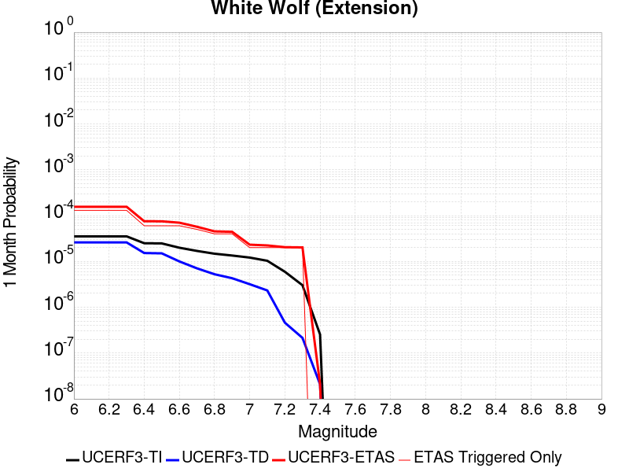 |  |  |

| Magnitude | 1 wk TI Prob | 1 wk TD Prob | 1 wk ETAS Prob | 1 wk ETAS/TD Gain | 1 wk ETAS Triggered Only | 1 mo TI Prob | 1 mo TD Prob | 1 mo ETAS Prob | 1 mo ETAS/TD Gain | 1 mo ETAS Triggered Only | 1 yr TI Prob | 1 yr TD Prob | 1 yr ETAS Prob | 1 yr ETAS/TD Gain | 1 yr ETAS Triggered Only | 10 yr TI Prob | 10 yr TD Prob | 10 yr ETAS Prob | 10 yr ETAS/TD Gain | 10 yr ETAS Triggered Only |
|-----|-----|-----|-----|-----|-----|-----|-----|-----|-----|-----|-----|-----|-----|-----|-----|-----|-----|-----|-----|-----|
| 6.0 | 8.222555E-6 | 6.0666657E-6 | 1.0453757E-4 | 17.23147 | 9.84715E-5 | 3.5239045E-5 | 2.5999774E-5 | 1.463507E-4 | 5.628922 | 1.2035406E-4 | 4.289509E-4 | 3.1650788E-4 | 4.3682387E-4 | 1.3801358 | 1.2035406E-4 | 0.0042812387 | 0.003161223 | 0.0032811966 | 1.0379516 | 1.2035406E-4 |
| 6.1 | 8.222555E-6 | 6.0666657E-6 | 1.0453757E-4 | 17.23147 | 9.84715E-5 | 3.5239045E-5 | 2.5999774E-5 | 1.463507E-4 | 5.628922 | 1.2035406E-4 | 4.289509E-4 | 3.1650788E-4 | 4.3682387E-4 | 1.3801358 | 1.2035406E-4 | 0.0042812387 | 0.003161223 | 0.0032811966 | 1.0379516 | 1.2035406E-4 |
| 6.2 | 8.222555E-6 | 6.0666657E-6 | 1.0453757E-4 | 17.23147 | 9.84715E-5 | 3.5239045E-5 | 2.5999774E-5 | 1.463507E-4 | 5.628922 | 1.2035406E-4 | 4.289509E-4 | 3.1650788E-4 | 4.3682387E-4 | 1.3801358 | 1.2035406E-4 | 0.0042812387 | 0.003161223 | 0.0032811966 | 1.0379516 | 1.2035406E-4 |
| 6.3 | 8.222555E-6 | 6.0666657E-6 | 1.0453757E-4 | 17.23147 | 9.84715E-5 | 3.5239045E-5 | 2.5999774E-5 | 1.463507E-4 | 5.628922 | 1.2035406E-4 | 4.289509E-4 | 3.1650788E-4 | 4.3682387E-4 | 1.3801358 | 1.2035406E-4 | 0.0042812387 | 0.003161223 | 0.0032811966 | 1.0379516 | 1.2035406E-4 |
| 6.4 | 5.821773E-6 | 3.5571766E-6 | 4.7322133E-5 | 13.303286 | 4.3765114E-5 | 2.4950215E-5 | 1.5244959E-5 | 6.995052E-5 | 4.5884356 | 5.470639E-5 | 3.0372653E-4 | 1.8559267E-4 | 2.4028891E-4 | 1.2947112 | 5.470639E-5 | 0.0030331176 | 0.001854485 | 0.00190909 | 1.0294448 | 5.470639E-5 |
| 6.5 | 5.766023E-6 | 3.4991106E-6 | 4.726407E-5 | 13.507452 | 4.3765114E-5 | 2.4711293E-5 | 1.4996108E-5 | 6.970168E-5 | 4.6479845 | 5.470639E-5 | 3.0081844E-4 | 1.8256342E-4 | 2.3725982E-4 | 1.2996022 | 5.470639E-5 | 0.0030041158 | 0.0018242426 | 0.0018788492 | 1.0299338 | 5.470639E-5 |
| 6.6 | 4.643576E-6 | 2.332624E-6 | 4.6097633E-5 | 19.762136 | 4.3765114E-5 | 1.9900888E-5 | 9.996925E-6 | 6.470277E-5 | 6.4722676 | 5.470639E-5 | 2.4226638E-4 | 1.2170619E-4 | 1.7640593E-4 | 1.4494408 | 5.470639E-5 | 0.0024200242 | 0.0012164378 | 0.0012710777 | 1.044918 | 5.470639E-5 |
| 6.7 | 3.9529173E-6 | 1.6483477E-6 | 3.4472127E-5 | 20.91314 | 3.2823835E-5 | 1.6940963E-5 | 7.0643296E-6 | 5.0829134E-5 | 7.1951814 | 4.3765114E-5 | 2.0623671E-4 | 8.6005006E-5 | 1.2976635E-4 | 1.5088233 | 4.3765114E-5 | 0.002060454 | 8.597357E-4 | 9.034632E-4 | 1.0508616 | 4.3765114E-5 |
| 6.8 | 3.4377522E-6 | 1.2245237E-6 | 2.3107053E-5 | 18.870237 | 2.1882557E-5 | 1.473314E-5 | 5.2479486E-6 | 3.8071612E-5 | 7.25457 | 3.2823835E-5 | 1.7936122E-4 | 6.3891996E-5 | 9.671373E-5 | 1.5137066 | 3.2823835E-5 | 0.0017921652 | 6.387454E-4 | 6.7154825E-4 | 1.0513551 | 3.2823835E-5 |
| 6.9 | 3.1367306E-6 | 1.0033783E-6 | 2.2885913E-5 | 22.808857 | 2.1882557E-5 | 1.3443062E-5 | 4.3001864E-6 | 3.712388E-5 | 8.633086 | 3.2823835E-5 | 1.63657E-4 | 5.235359E-5 | 8.517571E-5 | 1.6269315 | 3.2823835E-5 | 0.0016353652 | 5.2342017E-4 | 5.562268E-4 | 1.0626775 | 3.2823835E-5 |
| 7.0 | 2.8298145E-6 | 7.4286646E-7 | 1.1684137E-5 | 15.728448 | 1.0941279E-5 | 1.2127721E-5 | 3.1837099E-6 | 2.5066196E-5 | 7.8732667 | 2.1882557E-5 | 1.47645E-4 | 3.8761027E-5 | 6.064274E-5 | 1.5645286 | 2.1882557E-5 | 0.0014754693 | 3.8754768E-4 | 4.0942174E-4 | 1.0564423 | 2.1882557E-5 |
| 7.1 | 2.4091064E-6 | 5.4227525E-7 | 1.14835475E-5 | 21.176603 | 1.0941279E-5 | 1.03247E-5 | 2.3240348E-6 | 2.420654E-5 | 10.415739 | 2.1882557E-5 | 1.2569598E-4 | 2.8294799E-5 | 5.0176735E-5 | 1.7733555 | 2.1882557E-5 | 0.001256249 | 2.8291598E-4 | 3.0479237E-4 | 1.0773246 | 2.1882557E-5 |
| 7.2 | 1.3875518E-6 | 1.0743063E-7 | 1.1048707E-5 | 102.84505 | 1.0941279E-5 | 5.9466374E-6 | 4.6041689E-7 | 2.2342963E-5 | 48.52768 | 2.1882557E-5 | 7.23979E-5 | 5.6055624E-6 | 2.7487997E-5 | 4.9037 | 2.1882557E-5 | 7.2374323E-4 | 5.6054323E-5 | 7.7935656E-5 | 1.3903594 | 2.1882557E-5 |
| 7.3 | 7.056077E-7 | 5.002034E-8 | 1.0991298E-5 | 219.73657 | 1.0941279E-5 | 3.0240296E-6 | 2.1437286E-7 | 2.2096925E-5 | 103.07706 | 2.1882557E-5 | 3.681694E-5 | 2.609987E-6 | 2.4492487E-5 | 9.384141 | 2.1882557E-5 | 3.681084E-4 | 2.609961E-5 | 4.7981594E-5 | 1.8384027 | 2.1882557E-5 |
| 7.4 | 5.9334678E-8 | 4.8683537E-9 | 4.8683537E-9 | 1.0 | 0.0 | 2.5429145E-7 | 2.0864372E-8 | 2.0864372E-8 | 1.0 | 0.0 | 3.095994E-6 | 2.5402372E-7 | 2.5402372E-7 | 1.0 | 0.0 | 3.095951E-5 | 2.5402353E-6 | 2.5402353E-6 | 1.0 | 0.0 |

## White Mountains
*[(top)](#table-of-contents)*

| 1 Week | 1 Month | 1 Year | 10 Year |
|-----|-----|-----|-----|
|  |  |  |  |

| Magnitude | 1 wk TI Prob | 1 wk TD Prob | 1 wk ETAS Prob | 1 wk ETAS/TD Gain | 1 wk ETAS Triggered Only | 1 mo TI Prob | 1 mo TD Prob | 1 mo ETAS Prob | 1 mo ETAS/TD Gain | 1 mo ETAS Triggered Only | 1 yr TI Prob | 1 yr TD Prob | 1 yr ETAS Prob | 1 yr ETAS/TD Gain | 1 yr ETAS Triggered Only | 10 yr TI Prob | 10 yr TD Prob | 10 yr ETAS Prob | 10 yr ETAS/TD Gain | 10 yr ETAS Triggered Only |
|-----|-----|-----|-----|-----|-----|-----|-----|-----|-----|-----|-----|-----|-----|-----|-----|-----|-----|-----|-----|-----|
| 6.0 | 3.503579E-5 | 3.378405E-5 | 9.9429504E-5 | 2.94309 | 6.564767E-5 | 1.5014476E-4 | 1.4478143E-4 | 2.3229899E-4 | 1.6044805 | 8.753023E-5 | 0.0018264796 | 0.0017614096 | 0.0018487856 | 1.0496057 | 8.753023E-5 | 0.018115403 | 0.017486818 | 0.017605068 | 1.0067621 | 1.2035406E-4 |
| 6.1 | 3.503579E-5 | 3.378405E-5 | 9.9429504E-5 | 2.94309 | 6.564767E-5 | 1.5014476E-4 | 1.4478143E-4 | 2.3229899E-4 | 1.6044805 | 8.753023E-5 | 0.0018264796 | 0.0017614096 | 0.0018487856 | 1.0496057 | 8.753023E-5 | 0.018115403 | 0.017486818 | 0.017605068 | 1.0067621 | 1.2035406E-4 |
| 6.2 | 3.503579E-5 | 3.378405E-5 | 9.9429504E-5 | 2.94309 | 6.564767E-5 | 1.5014476E-4 | 1.4478143E-4 | 2.3229899E-4 | 1.6044805 | 8.753023E-5 | 0.0018264796 | 0.0017614096 | 0.0018487856 | 1.0496057 | 8.753023E-5 | 0.018115403 | 0.017486818 | 0.017605068 | 1.0067621 | 1.2035406E-4 |
| 6.3 | 1.7818425E-5 | 1.5916074E-5 | 2.6857178E-5 | 1.6874248 | 1.0941279E-5 | 7.636245E-5 | 6.821004E-5 | 7.915057E-5 | 1.1603948 | 1.0941279E-5 | 9.293162E-4 | 8.301551E-4 | 8.410873E-4 | 1.0131688 | 1.0941279E-5 | 0.009254395 | 0.008271999 | 0.0082937 | 1.0026234 | 2.1882557E-5 |
| 6.4 | 1.7818425E-5 | 1.5916074E-5 | 2.6857178E-5 | 1.6874248 | 1.0941279E-5 | 7.636245E-5 | 6.821004E-5 | 7.915057E-5 | 1.1603948 | 1.0941279E-5 | 9.293162E-4 | 8.301551E-4 | 8.410873E-4 | 1.0131688 | 1.0941279E-5 | 0.009254395 | 0.008271999 | 0.0082937 | 1.0026234 | 2.1882557E-5 |
| 6.5 | 1.3397557E-5 | 1.13362685E-5 | 2.2277423E-5 | 1.965146 | 1.0941279E-5 | 5.741684E-5 | 4.858314E-5 | 5.952389E-5 | 1.2251964 | 1.0941279E-5 | 6.988258E-4 | 5.913462E-4 | 6.02281E-4 | 1.0184914 | 1.0941279E-5 | 0.006966323 | 0.005898432 | 0.005909309 | 1.001844 | 1.0941279E-5 |
| 6.6 | 1.0818695E-5 | 8.625366E-6 | 8.625366E-6 | 1.0 | 0.0 | 4.6365014E-5 | 3.6965357E-5 | 3.6965357E-5 | 1.0 | 0.0 | 5.6434784E-4 | 4.4996463E-4 | 4.4996463E-4 | 1.0 | 0.0 | 0.005629168 | 0.004490972 | 0.004490972 | 1.0 | 0.0 |
| 6.7 | 9.067908E-6 | 6.802442E-6 | 6.802442E-6 | 1.0 | 0.0 | 3.8861883E-5 | 2.9153016E-5 | 2.9153016E-5 | 1.0 | 0.0 | 4.7304068E-4 | 3.5488335E-4 | 3.5488335E-4 | 1.0 | 0.0 | 0.00472035 | 0.0035434833 | 0.0035434833 | 1.0 | 0.0 |
| 6.8 | 7.295947E-6 | 4.936391E-6 | 4.936391E-6 | 1.0 | 0.0 | 3.126797E-5 | 2.1155796E-5 | 2.1155796E-5 | 1.0 | 0.0 | 3.8062103E-4 | 2.575425E-4 | 2.575425E-4 | 1.0 | 0.0 | 0.0037996976 | 0.0025725532 | 0.0025725532 | 1.0 | 0.0 |
| 6.9 | 6.2243444E-6 | 3.832213E-6 | 3.832213E-6 | 1.0 | 0.0 | 2.6675489E-5 | 1.642367E-5 | 1.642367E-5 | 1.0 | 0.0 | 3.2472567E-4 | 1.9994036E-4 | 1.9994036E-4 | 1.0 | 0.0 | 0.0032425157 | 0.0019976576 | 0.0019976576 | 1.0 | 0.0 |
| 7.0 | 4.9878413E-6 | 2.6795342E-6 | 2.6795342E-6 | 1.0 | 0.0 | 2.1376287E-5 | 1.14836685E-5 | 1.14836685E-5 | 1.0 | 0.0 | 2.602252E-4 | 1.3980496E-4 | 1.3980496E-4 | 1.0 | 0.0 | 0.002599207 | 0.0013971963 | 0.0013971963 | 1.0 | 0.0 |
| 7.1 | 4.0252844E-6 | 1.8857575E-6 | 1.8857575E-6 | 1.0 | 0.0 | 1.7251105E-5 | 8.081794E-6 | 8.081794E-6 | 1.0 | 0.0 | 2.1001195E-4 | 9.8391516E-5 | 9.8391516E-5 | 1.0 | 0.0 | 0.0020981359 | 9.834924E-4 | 9.834924E-4 | 1.0 | 0.0 |
| 7.2 | 3.3284066E-6 | 1.281964E-6 | 1.281964E-6 | 1.0 | 0.0 | 1.4264522E-5 | 5.494121E-6 | 5.494121E-6 | 1.0 | 0.0 | 1.736567E-4 | 6.688897E-5 | 6.688897E-5 | 1.0 | 0.0 | 0.0017352107 | 6.6869846E-4 | 6.6869846E-4 | 1.0 | 0.0 |
| 7.3 | 2.458226E-6 | 6.05722E-7 | 6.05722E-7 | 1.0 | 0.0 | 1.0535211E-5 | 2.5959491E-6 | 2.5959491E-6 | 1.0 | 0.0 | 1.2825865E-4 | 3.1605257E-5 | 3.1605257E-5 | 1.0 | 0.0 | 0.0012818464 | 3.160114E-4 | 3.160114E-4 | 1.0 | 0.0 |
| 7.4 | 1.965953E-6 | 3.1089303E-7 | 3.1089303E-7 | 1.0 | 0.0 | 8.425486E-6 | 1.332398E-6 | 1.332398E-6 | 1.0 | 0.0 | 1.0257547E-4 | 1.6221828E-5 | 1.6221828E-5 | 1.0 | 0.0 | 0.0010252813 | 1.6220656E-4 | 1.6220656E-4 | 1.0 | 0.0 |
| 7.5 | 1.2014192E-6 | 1.8244253E-7 | 1.8244253E-7 | 1.0 | 0.0 | 5.148929E-6 | 7.8189635E-7 | 7.8189635E-7 | 1.0 | 0.0 | 6.2686406E-5 | 9.519547E-6 | 9.519547E-6 | 1.0 | 0.0 | 6.266873E-4 | 9.519148E-5 | 9.519148E-5 | 1.0 | 0.0 |
| 7.6 | 2.5612175E-7 | 4.8946475E-8 | 4.8946475E-8 | 1.0 | 0.0 | 1.0976642E-6 | 2.0977059E-7 | 2.0977059E-7 | 1.0 | 0.0 | 1.3363979E-5 | 2.5539543E-6 | 2.5539543E-6 | 1.0 | 0.0 | 1.3363175E-4 | 2.5539286E-5 | 2.5539286E-5 | 1.0 | 0.0 |

## Santa Ynez (East)
*[(top)](#table-of-contents)*

| 1 Week | 1 Month | 1 Year | 10 Year |
|-----|-----|-----|-----|
|  |  |  |  |

| Magnitude | 1 wk TI Prob | 1 wk TD Prob | 1 wk ETAS Prob | 1 wk ETAS/TD Gain | 1 wk ETAS Triggered Only | 1 mo TI Prob | 1 mo TD Prob | 1 mo ETAS Prob | 1 mo ETAS/TD Gain | 1 mo ETAS Triggered Only | 1 yr TI Prob | 1 yr TD Prob | 1 yr ETAS Prob | 1 yr ETAS/TD Gain | 1 yr ETAS Triggered Only | 10 yr TI Prob | 10 yr TD Prob | 10 yr ETAS Prob | 10 yr ETAS/TD Gain | 10 yr ETAS Triggered Only |
|-----|-----|-----|-----|-----|-----|-----|-----|-----|-----|-----|-----|-----|-----|-----|-----|-----|-----|-----|-----|-----|
| 6.0 | 3.2269712E-5 | 3.67505E-5 | 9.145488E-5 | 2.4885342 | 5.470639E-5 | 1.3829143E-4 | 1.5749598E-4 | 2.231333E-4 | 1.4167556 | 6.564767E-5 | 0.0016823979 | 0.0019164166 | 0.0020037792 | 1.0455863 | 8.753023E-5 | 0.016697178 | 0.019056441 | 0.019153036 | 1.0050689 | 9.84715E-5 |
| 6.1 | 3.2269712E-5 | 3.67505E-5 | 9.145488E-5 | 2.4885342 | 5.470639E-5 | 1.3829143E-4 | 1.5749598E-4 | 2.231333E-4 | 1.4167556 | 6.564767E-5 | 0.0016823979 | 0.0019164166 | 0.0020037792 | 1.0455863 | 8.753023E-5 | 0.016697178 | 0.019056441 | 0.019153036 | 1.0050689 | 9.84715E-5 |
| 6.2 | 3.2269712E-5 | 3.67505E-5 | 9.145488E-5 | 2.4885342 | 5.470639E-5 | 1.3829143E-4 | 1.5749598E-4 | 2.231333E-4 | 1.4167556 | 6.564767E-5 | 0.0016823979 | 0.0019164166 | 0.0020037792 | 1.0455863 | 8.753023E-5 | 0.016697178 | 0.019056441 | 0.019153036 | 1.0050689 | 9.84715E-5 |
| 6.3 | 3.2269712E-5 | 3.67505E-5 | 9.145488E-5 | 2.4885342 | 5.470639E-5 | 1.3829143E-4 | 1.5749598E-4 | 2.231333E-4 | 1.4167556 | 6.564767E-5 | 0.0016823979 | 0.0019164166 | 0.0020037792 | 1.0455863 | 8.753023E-5 | 0.016697178 | 0.019056441 | 0.019153036 | 1.0050689 | 9.84715E-5 |
| 6.4 | 1.4404779E-5 | 1.4849382E-5 | 4.767273E-5 | 3.2104185 | 3.2823835E-5 | 6.1733306E-5 | 6.363868E-5 | 9.646043E-5 | 1.5157515 | 3.2823835E-5 | 7.513438E-4 | 7.745306E-4 | 8.182618E-4 | 1.0564616 | 4.3765114E-5 | 0.0074880854 | 0.007718862 | 0.007762289 | 1.0056261 | 4.3765114E-5 |
| 6.5 | 1.4404779E-5 | 1.4849382E-5 | 4.767273E-5 | 3.2104185 | 3.2823835E-5 | 6.1733306E-5 | 6.363868E-5 | 9.646043E-5 | 1.5157515 | 3.2823835E-5 | 7.513438E-4 | 7.745306E-4 | 8.182618E-4 | 1.0564616 | 4.3765114E-5 | 0.0074880854 | 0.007718862 | 0.007762289 | 1.0056261 | 4.3765114E-5 |
| 6.6 | 1.280208E-5 | 1.3011947E-5 | 3.489422E-5 | 2.6817062 | 2.1882557E-5 | 5.4864904E-5 | 5.5764307E-5 | 7.764564E-5 | 1.3923897 | 2.1882557E-5 | 6.6777546E-4 | 6.787207E-4 | 7.1152224E-4 | 1.0483285 | 3.2823835E-5 | 0.006657724 | 0.0067666885 | 0.0067992904 | 1.004818 | 3.2823835E-5 |
| 6.7 | 1.2457027E-5 | 1.2628468E-5 | 3.4510747E-5 | 2.732774 | 2.1882557E-5 | 5.3386164E-5 | 5.412089E-5 | 7.600226E-5 | 1.4043055 | 2.1882557E-5 | 6.497827E-4 | 6.587243E-4 | 6.915265E-4 | 1.0497966 | 3.2823835E-5 | 0.00647886 | 0.006567915 | 0.0066005234 | 1.0049648 | 3.2823835E-5 |
| 6.8 | 1.2095134E-5 | 1.2230915E-5 | 3.4113204E-5 | 2.7890966 | 2.1882557E-5 | 5.1835254E-5 | 5.241716E-5 | 7.429857E-5 | 1.4174474 | 2.1882557E-5 | 6.309115E-4 | 6.379937E-4 | 6.7079655E-4 | 1.0514157 | 3.2823835E-5 | 0.0062912325 | 0.006361809 | 0.006394424 | 1.0051267 | 3.2823835E-5 |
| 6.9 | 1.1104036E-5 | 1.1157347E-5 | 3.3039658E-5 | 2.961247 | 2.1882557E-5 | 4.758786E-5 | 4.781633E-5 | 6.9697846E-5 | 1.4576159 | 2.1882557E-5 | 5.7922816E-4 | 5.820096E-4 | 6.1481434E-4 | 1.0563645 | 3.2823835E-5 | 0.005777207 | 0.0058049993 | 0.0058376323 | 1.0056216 | 3.2823835E-5 |
| 7.0 | 1.0577444E-5 | 1.058168E-5 | 3.2464006E-5 | 3.0679443 | 2.1882557E-5 | 4.5331115E-5 | 4.5349276E-5 | 6.723084E-5 | 1.4825119 | 2.1882557E-5 | 5.5176654E-4 | 5.519888E-4 | 5.847945E-4 | 1.0594319 | 3.2823835E-5 | 0.0055039856 | 0.0055063153 | 0.0055389586 | 1.0059283 | 3.2823835E-5 |
| 7.1 | 1.0021775E-5 | 9.980988E-6 | 2.0922156E-5 | 2.096201 | 1.0941279E-5 | 4.294976E-5 | 4.2774966E-5 | 5.3715776E-5 | 1.255776 | 1.0941279E-5 | 5.2278786E-4 | 5.2066194E-4 | 5.425331E-4 | 1.0420065 | 2.1882557E-5 | 0.0052155964 | 0.0051945536 | 0.0052163224 | 1.0041907 | 2.1882557E-5 |
| 7.2 | 8.874109E-6 | 8.748793E-6 | 1.9689976E-5 | 2.2505932 | 1.0941279E-5 | 3.8031343E-5 | 3.7494297E-5 | 4.8435166E-5 | 1.2918009 | 1.0941279E-5 | 4.629332E-4 | 4.5639853E-4 | 4.782711E-4 | 1.0479243 | 2.1882557E-5 | 0.0046197 | 0.0045547304 | 0.004576513 | 1.0047824 | 2.1882557E-5 |
| 7.3 | 7.5504267E-6 | 7.5051175E-6 | 1.8446313E-5 | 2.4578314 | 1.0941279E-5 | 3.235857E-5 | 3.21644E-5 | 4.3105327E-5 | 1.3401564 | 1.0941279E-5 | 3.9389438E-4 | 3.915322E-4 | 4.134062E-4 | 1.0558677 | 2.1882557E-5 | 0.0039319694 | 0.003908531 | 0.003930328 | 1.0055767 | 2.1882557E-5 |
| 7.4 | 6.309394E-6 | 6.1831556E-6 | 1.7124366E-5 | 2.7695189 | 1.0941279E-5 | 2.703998E-5 | 2.6498974E-5 | 3.7439964E-5 | 1.4128834 | 1.0941279E-5 | 3.2916202E-4 | 3.225782E-4 | 3.444537E-4 | 1.0678146 | 2.1882557E-5 | 0.003286749 | 0.003221197 | 0.003243009 | 1.0067714 | 2.1882557E-5 |
| 7.5 | 4.6103073E-6 | 4.4408903E-6 | 1.538212E-5 | 3.4637468 | 1.0941279E-5 | 1.975831E-5 | 1.9032252E-5 | 2.9973322E-5 | 1.57487 | 1.0941279E-5 | 2.4053088E-4 | 2.3169373E-4 | 2.5357123E-4 | 1.0944241 | 2.1882557E-5 | 0.002402707 | 0.002314591 | 0.0023364231 | 1.0094323 | 2.1882557E-5 |
| 7.6 | 1.2858658E-6 | 1.3008173E-6 | 1.3008173E-6 | 1.0 | 0.0 | 5.5108417E-6 | 5.5749197E-6 | 5.5749197E-6 | 1.0 | 0.0 | 6.7092435E-5 | 6.78726E-5 | 6.78726E-5 | 1.0 | 0.0 | 6.707218E-4 | 6.785256E-4 | 6.785256E-4 | 1.0 | 0.0 |
| 7.7 | 5.3302307E-7 | 5.612138E-7 | 5.612138E-7 | 1.0 | 0.0 | 2.2843826E-6 | 2.4052001E-6 | 2.4052001E-6 | 1.0 | 0.0 | 2.7812002E-5 | 2.9282954E-5 | 2.9282954E-5 | 1.0 | 0.0 | 2.7808524E-4 | 2.9279452E-4 | 2.9279452E-4 | 1.0 | 0.0 |
| 7.8 | 4.613933E-8 | 4.80301E-8 | 4.80301E-8 | 1.0 | 0.0 | 1.9773998E-7 | 2.0584326E-7 | 2.0584326E-7 | 1.0 | 0.0 | 2.4074816E-6 | 2.5061388E-6 | 2.5061388E-6 | 1.0 | 0.0 | 2.4074554E-5 | 2.5061116E-5 | 2.5061116E-5 | 1.0 | 0.0 |

## San Jacinto (Anza) rev
*[(top)](#table-of-contents)*

| 1 Week | 1 Month | 1 Year | 10 Year |
|-----|-----|-----|-----|
|  |  |  |  |

| Magnitude | 1 wk TI Prob | 1 wk TD Prob | 1 wk ETAS Prob | 1 wk ETAS/TD Gain | 1 wk ETAS Triggered Only | 1 mo TI Prob | 1 mo TD Prob | 1 mo ETAS Prob | 1 mo ETAS/TD Gain | 1 mo ETAS Triggered Only | 1 yr TI Prob | 1 yr TD Prob | 1 yr ETAS Prob | 1 yr ETAS/TD Gain | 1 yr ETAS Triggered Only | 10 yr TI Prob | 10 yr TD Prob | 10 yr ETAS Prob | 10 yr ETAS/TD Gain | 10 yr ETAS Triggered Only |
|-----|-----|-----|-----|-----|-----|-----|-----|-----|-----|-----|-----|-----|-----|-----|-----|-----|-----|-----|-----|-----|
| 6.0 | 6.3015636E-5 | 4.3302647E-5 | 1.19888275E-4 | 2.768613 | 7.658895E-5 | 2.7003905E-4 | 1.8556965E-4 | 2.7308363E-4 | 1.4715965 | 8.753023E-5 | 0.0032827691 | 0.0022569813 | 0.0023552305 | 1.0435313 | 9.84715E-5 | 0.032346968 | 0.023296192 | 0.023403056 | 1.0045872 | 1.0941278E-4 |
| 6.1 | 6.3015636E-5 | 4.3302647E-5 | 1.19888275E-4 | 2.768613 | 7.658895E-5 | 2.7003905E-4 | 1.8556965E-4 | 2.7308363E-4 | 1.4715965 | 8.753023E-5 | 0.0032827691 | 0.0022569813 | 0.0023552305 | 1.0435313 | 9.84715E-5 | 0.032346968 | 0.023296192 | 0.023403056 | 1.0045872 | 1.0941278E-4 |
| 6.2 | 6.3015636E-5 | 4.3302647E-5 | 1.19888275E-4 | 2.768613 | 7.658895E-5 | 2.7003905E-4 | 1.8556965E-4 | 2.7308363E-4 | 1.4715965 | 8.753023E-5 | 0.0032827691 | 0.0022569813 | 0.0023552305 | 1.0435313 | 9.84715E-5 | 0.032346968 | 0.023296192 | 0.023403056 | 1.0045872 | 1.0941278E-4 |
| 6.3 | 6.3015636E-5 | 4.3302647E-5 | 1.19888275E-4 | 2.768613 | 7.658895E-5 | 2.7003905E-4 | 1.8556965E-4 | 2.7308363E-4 | 1.4715965 | 8.753023E-5 | 0.0032827691 | 0.0022569813 | 0.0023552305 | 1.0435313 | 9.84715E-5 | 0.032346968 | 0.023296192 | 0.023403056 | 1.0045872 | 1.0941278E-4 |
| 6.4 | 6.3015636E-5 | 4.3302647E-5 | 1.19888275E-4 | 2.768613 | 7.658895E-5 | 2.7003905E-4 | 1.8556965E-4 | 2.7308363E-4 | 1.4715965 | 8.753023E-5 | 0.0032827691 | 0.0022569813 | 0.0023552305 | 1.0435313 | 9.84715E-5 | 0.032346968 | 0.023296192 | 0.023403056 | 1.0045872 | 1.0941278E-4 |
| 6.5 | 5.811017E-5 | 4.0082516E-5 | 1.16668394E-4 | 2.9107053 | 7.658895E-5 | 2.4901982E-4 | 1.7177092E-4 | 2.592861E-4 | 1.5094877 | 8.753023E-5 | 0.0030276014 | 0.002089311 | 0.0021875766 | 1.0470326 | 9.84715E-5 | 0.02986684 | 0.021593736 | 0.021700788 | 1.0049574 | 1.0941278E-4 |
| 6.6 | 5.811017E-5 | 4.0082516E-5 | 1.16668394E-4 | 2.9107053 | 7.658895E-5 | 2.4901982E-4 | 1.7177092E-4 | 2.592861E-4 | 1.5094877 | 8.753023E-5 | 0.0030276014 | 0.002089311 | 0.0021875766 | 1.0470326 | 9.84715E-5 | 0.02986684 | 0.021593736 | 0.021700788 | 1.0049574 | 1.0941278E-4 |
| 6.7 | 5.712442E-5 | 3.9505223E-5 | 1.1609114E-4 | 2.9386277 | 7.658895E-5 | 2.4479596E-4 | 1.6929714E-4 | 2.5681255E-4 | 1.5169338 | 8.753023E-5 | 0.0029763177 | 0.0020592497 | 0.0021575184 | 1.0477207 | 9.84715E-5 | 0.029367693 | 0.021285562 | 0.021392645 | 1.0050309 | 1.0941278E-4 |
| 6.8 | 5.6967532E-5 | 3.9361643E-5 | 1.1594758E-4 | 2.9456995 | 7.658895E-5 | 2.4412372E-4 | 1.6868189E-4 | 2.5619735E-4 | 1.5188196 | 8.753023E-5 | 0.0029681553 | 0.002051773 | 0.0021500424 | 1.047895 | 9.84715E-5 | 0.029288229 | 0.021210281 | 0.021317374 | 1.0050491 | 1.0941278E-4 |
| 6.9 | 5.6211324E-5 | 3.9066435E-5 | 1.15652394E-4 | 2.960403 | 7.658895E-5 | 2.4088343E-4 | 1.6741687E-4 | 2.5493244E-4 | 1.5227405 | 8.753023E-5 | 0.0029288116 | 0.0020364004 | 0.0021346712 | 1.0482572 | 9.84715E-5 | 0.028905109 | 0.021049714 | 0.021156823 | 1.0050884 | 1.0941278E-4 |
| 7.0 | 5.4383527E-5 | 3.792697E-5 | 1.1451301E-4 | 3.019303 | 7.658895E-5 | 2.3305144E-4 | 1.6253405E-4 | 2.5005004E-4 | 1.5384471 | 8.753023E-5 | 0.0028337094 | 0.001977061 | 0.0020753378 | 1.0497085 | 9.84715E-5 | 0.027978465 | 0.020440677 | 0.020547852 | 1.0052433 | 1.0941278E-4 |
| 7.1 | 5.1393665E-5 | 3.6389913E-5 | 1.1297607E-4 | 3.1045985 | 7.658895E-5 | 2.2023996E-4 | 1.5594746E-4 | 2.4346405E-4 | 1.5611926 | 8.753023E-5 | 0.0026781242 | 0.0018970112 | 0.001995296 | 1.0518103 | 9.84715E-5 | 0.026460782 | 0.019614287 | 0.019721553 | 1.0054688 | 1.0941278E-4 |
| 7.2 | 4.785222E-5 | 3.4741795E-5 | 1.1132808E-4 | 3.2044423 | 7.658895E-5 | 2.0506482E-4 | 1.4888494E-4 | 2.3640213E-4 | 1.5878177 | 8.753023E-5 | 0.0024938055 | 0.0018111705 | 0.0019094637 | 1.0542705 | 9.84715E-5 | 0.024660049 | 0.018728992 | 0.018836355 | 1.0057325 | 1.0941278E-4 |
| 7.3 | 4.2143256E-5 | 3.383628E-5 | 1.1042263E-4 | 3.2634392 | 7.658895E-5 | 1.8060145E-4 | 1.4500458E-4 | 2.3252211E-4 | 1.6035501 | 8.753023E-5 | 0.002196605 | 0.0017640047 | 0.0018623024 | 1.0557243 | 9.84715E-5 | 0.02175019 | 0.01823724 | 0.01834466 | 1.00589 | 1.0941278E-4 |
| 7.4 | 4.0264713E-5 | 3.347446E-5 | 1.1006085E-4 | 3.2879047 | 7.658895E-5 | 1.7255165E-4 | 1.4345412E-4 | 2.3097178E-4 | 1.6100743 | 8.753023E-5 | 0.002098792 | 0.0017451581 | 0.0018434577 | 1.0563271 | 9.84715E-5 | 0.020790804 | 0.018041821 | 0.018149259 | 1.005955 | 1.0941278E-4 |
| 7.5 | 3.694492E-5 | 3.218847E-5 | 1.0877495E-4 | 3.3793144 | 7.658895E-5 | 1.5832575E-4 | 1.379433E-4 | 2.2546145E-4 | 1.6344502 | 8.753023E-5 | 0.0019259118 | 0.001678169 | 0.0017764752 | 1.0585794 | 9.84715E-5 | 0.01909306 | 0.01735827 | 0.017465783 | 1.0061938 | 1.0941278E-4 |
| 7.6 | 3.200565E-5 | 2.9504106E-5 | 1.06090796E-4 | 3.5957975 | 7.658895E-5 | 1.3715986E-4 | 1.2644005E-4 | 2.1395921E-4 | 1.6921791 | 8.753023E-5 | 0.001668642 | 0.0015383229 | 0.0016366428 | 1.0639138 | 9.84715E-5 | 0.01656168 | 0.0159463 | 0.016053969 | 1.0067519 | 1.0941278E-4 |
| 7.7 | 2.731642E-5 | 2.6092788E-5 | 1.0267974E-4 | 3.9351768 | 7.658895E-5 | 1.1706512E-4 | 1.1182144E-4 | 1.9934188E-4 | 1.7826803 | 8.753023E-5 | 0.001424336 | 0.0013605768 | 0.0014589144 | 1.0722764 | 9.84715E-5 | 0.014152412 | 0.014167004 | 0.014274867 | 1.0076137 | 1.0941278E-4 |
| 7.8 | 2.3466424E-5 | 2.3504817E-5 | 8.915094E-5 | 3.7928796 | 6.564767E-5 | 1.0056651E-4 | 1.0073105E-4 | 1.7731228E-4 | 1.7602545 | 7.658895E-5 | 0.0012237094 | 0.0012257113 | 0.0013131343 | 1.0713242 | 8.753023E-5 | 0.012169928 | 0.012808893 | 0.012906103 | 1.0075892 | 9.84715E-5 |
| 7.9 | 1.8611925E-5 | 1.8908117E-5 | 8.4554544E-5 | 4.4718647 | 6.564767E-5 | 7.9762955E-5 | 8.1032274E-5 | 1.5761501E-4 | 1.9450893 | 7.658895E-5 | 9.7068126E-4 | 9.861222E-4 | 0.001073566 | 1.0886745 | 8.753023E-5 | 0.0096645225 | 0.010393824 | 0.010491272 | 1.0093756 | 9.84715E-5 |
| 8.0 | 1.5460775E-5 | 1.5740965E-5 | 8.13876E-5 | 5.170433 | 6.564767E-5 | 6.6258784E-5 | 6.7459536E-5 | 1.4404331E-4 | 2.135255 | 7.658895E-5 | 8.0640207E-4 | 8.21011E-4 | 9.0846943E-4 | 1.1065252 | 8.753023E-5 | 0.008034821 | 0.0087028835 | 0.008800498 | 1.0112163 | 9.84715E-5 |
| 8.1 | 9.983884E-6 | 8.269952E-6 | 5.2034702E-5 | 6.2920203 | 4.3765114E-5 | 4.2787375E-5 | 3.544217E-5 | 9.014663E-5 | 2.5434847 | 5.470639E-5 | 5.2081177E-4 | 4.314235E-4 | 4.861063E-4 | 1.1267496 | 5.470639E-5 | 0.0051959283 | 0.004640022 | 0.0047053653 | 1.0140824 | 6.564767E-5 |
| 8.2 | 4.1226E-6 | 1.5529788E-6 | 1.5529788E-6 | 1.0 | 0.0 | 1.7668166E-5 | 6.6556063E-6 | 6.6556063E-6 | 1.0 | 0.0 | 2.1508869E-4 | 8.102902E-5 | 8.102902E-5 | 1.0 | 0.0 | 0.0021488064 | 9.4050163E-4 | 9.4050163E-4 | 1.0 | 0.0 |
| 8.3 | 1.2750878E-6 | 3.612133E-7 | 3.612133E-7 | 1.0 | 0.0 | 5.4646503E-6 | 1.548056E-6 | 1.548056E-6 | 1.0 | 0.0 | 6.653009E-5 | 1.8847424E-5 | 1.8847424E-5 | 1.0 | 0.0 | 6.6510175E-4 | 2.2734253E-4 | 2.2734253E-4 | 1.0 | 0.0 |

## Scodie Lineament
*[(top)](#table-of-contents)*

| 1 Week | 1 Month | 1 Year | 10 Year |
|-----|-----|-----|-----|
|  |  |  |  |

| Magnitude | 1 wk TI Prob | 1 wk TD Prob | 1 wk ETAS Prob | 1 wk ETAS/TD Gain | 1 wk ETAS Triggered Only | 1 mo TI Prob | 1 mo TD Prob | 1 mo ETAS Prob | 1 mo ETAS/TD Gain | 1 mo ETAS Triggered Only | 1 yr TI Prob | 1 yr TD Prob | 1 yr ETAS Prob | 1 yr ETAS/TD Gain | 1 yr ETAS Triggered Only | 10 yr TI Prob | 10 yr TD Prob | 10 yr ETAS Prob | 10 yr ETAS/TD Gain | 10 yr ETAS Triggered Only |
|-----|-----|-----|-----|-----|-----|-----|-----|-----|-----|-----|-----|-----|-----|-----|-----|-----|-----|-----|-----|-----|
| 6.0 | 3.2919327E-6 | 3.0133422E-6 | 7.960206E-5 | 26.416534 | 7.658895E-5 | 1.4108206E-5 | 1.2914278E-5 | 1.1138451E-4 | 8.624912 | 9.84715E-5 | 1.7175387E-4 | 1.5722317E-4 | 2.6661874E-4 | 1.6957982 | 1.0941278E-4 | 0.0017162118 | 0.0015714309 | 0.0016806717 | 1.0695168 | 1.0941278E-4 |
| 6.1 | 1.8663811E-6 | 1.5490499E-6 | 2.3431572E-5 | 15.126415 | 2.1882557E-5 | 7.998751E-6 | 6.6387715E-6 | 3.946239E-5 | 5.9442306 | 3.2823835E-5 | 9.738045E-5 | 8.082454E-5 | 1.1364572E-4 | 1.4060794 | 3.2823835E-5 | 9.7337784E-4 | 8.080003E-4 | 8.4079755E-4 | 1.0405908 | 3.2823835E-5 |
| 6.2 | 1.8663811E-6 | 1.5490499E-6 | 2.3431572E-5 | 15.126415 | 2.1882557E-5 | 7.998751E-6 | 6.6387715E-6 | 3.946239E-5 | 5.9442306 | 3.2823835E-5 | 9.738045E-5 | 8.082454E-5 | 1.1364572E-4 | 1.4060794 | 3.2823835E-5 | 9.7337784E-4 | 8.080003E-4 | 8.4079755E-4 | 1.0405908 | 3.2823835E-5 |
| 6.3 | 1.8663811E-6 | 1.5490499E-6 | 2.3431572E-5 | 15.126415 | 2.1882557E-5 | 7.998751E-6 | 6.6387715E-6 | 3.946239E-5 | 5.9442306 | 3.2823835E-5 | 9.738045E-5 | 8.082454E-5 | 1.1364572E-4 | 1.4060794 | 3.2823835E-5 | 9.7337784E-4 | 8.080003E-4 | 8.4079755E-4 | 1.0405908 | 3.2823835E-5 |
| 6.4 | 1.8663811E-6 | 1.5490499E-6 | 2.3431572E-5 | 15.126415 | 2.1882557E-5 | 7.998751E-6 | 6.6387715E-6 | 3.946239E-5 | 5.9442306 | 3.2823835E-5 | 9.738045E-5 | 8.082454E-5 | 1.1364572E-4 | 1.4060794 | 3.2823835E-5 | 9.7337784E-4 | 8.080003E-4 | 8.4079755E-4 | 1.0405908 | 3.2823835E-5 |
| 6.5 | 1.8106311E-6 | 1.4909839E-6 | 2.3373508E-5 | 15.676565 | 2.1882557E-5 | 7.759824E-6 | 6.3899183E-6 | 3.9213544E-5 | 6.136783 | 3.2823835E-5 | 9.447177E-5 | 7.7794975E-5 | 1.1061625E-4 | 1.4218947 | 3.2823835E-5 | 9.4431615E-4 | 7.7772606E-4 | 8.105244E-4 | 1.0421721 | 3.2823835E-5 |
| 6.6 | 1.2414679E-6 | 8.997558E-7 | 2.2782293E-5 | 25.32053 | 2.1882557E-5 | 5.320566E-6 | 3.856091E-6 | 3.6679798E-5 | 9.512172 | 3.2823835E-5 | 6.477596E-5 | 4.6946985E-5 | 7.976928E-5 | 1.6991353 | 3.2823835E-5 | 6.475708E-4 | 4.693793E-4 | 5.0218776E-4 | 1.0698974 | 3.2823835E-5 |
| 6.7 | 1.1062215E-6 | 7.594311E-7 | 1.1700701E-5 | 15.407192 | 1.0941279E-5 | 4.7409408E-6 | 3.2547011E-6 | 2.5137186E-5 | 7.723347 | 2.1882557E-5 | 5.7719422E-5 | 3.9625334E-5 | 6.1507024E-5 | 1.5522146 | 2.1882557E-5 | 5.770443E-4 | 3.961897E-4 | 4.1806357E-4 | 1.0552106 | 2.1882557E-5 |
| 6.8 | 1.0006736E-6 | 6.500397E-7 | 1.1591311E-5 | 17.831697 | 1.0941279E-5 | 4.288594E-6 | 2.7858816E-6 | 2.4668378E-5 | 8.854783 | 2.1882557E-5 | 5.221238E-5 | 3.3917644E-5 | 5.5799457E-5 | 1.6451454 | 2.1882557E-5 | 5.220012E-4 | 3.3913075E-4 | 3.610059E-4 | 1.0645036 | 2.1882557E-5 |
| 6.9 | 9.167364E-7 | 5.631625E-7 | 1.1504434E-5 | 20.428268 | 1.0941279E-5 | 3.9288643E-6 | 2.4135516E-6 | 2.4296056E-5 | 10.066516 | 2.1882557E-5 | 4.7832873E-5 | 2.9384651E-5 | 5.1266565E-5 | 1.7446716 | 2.1882557E-5 | 4.782258E-4 | 2.9381333E-4 | 3.1568945E-4 | 1.0744559 | 2.1882557E-5 |
| 7.0 | 7.6987664E-7 | 4.113383E-7 | 1.1352612E-5 | 27.599209 | 1.0941279E-5 | 3.2994672E-6 | 1.7628774E-6 | 2.3645394E-5 | 13.412954 | 2.1882557E-5 | 4.0170275E-5 | 2.1462862E-5 | 4.3344946E-5 | 2.0195327 | 2.1882557E-5 | 4.0163012E-4 | 2.1461173E-4 | 2.3648959E-4 | 1.1019416 | 2.1882557E-5 |
| 7.1 | 7.1038727E-7 | 3.5211494E-7 | 1.1293389E-5 | 32.07302 | 1.0941279E-5 | 3.0445133E-6 | 1.5090633E-6 | 2.3391587E-5 | 15.500732 | 2.1882557E-5 | 3.706632E-5 | 1.8372726E-5 | 4.025488E-5 | 2.1910129 | 2.1882557E-5 | 3.7060137E-4 | 1.8371557E-4 | 2.055941E-4 | 1.1190891 | 2.1882557E-5 |
| 7.2 | 2.0799602E-7 | 3.1186854E-8 | 1.0972464E-5 | 351.8298 | 1.0941279E-5 | 8.914113E-7 | 1.3365793E-7 | 2.2016211E-5 | 164.72057 | 2.1882557E-5 | 1.0852878E-5 | 1.6272843E-6 | 2.3509805E-5 | 14.447264 | 2.1882557E-5 | 1.08523476E-4 | 1.627273E-5 | 3.815493E-5 | 2.344716 | 2.1882557E-5 |
| 7.3 | 1.5048182E-7 | 1.5945696E-8 | 1.0957224E-5 | 687.1586 | 1.0941279E-5 | 6.449219E-7 | 6.83387E-8 | 2.1950893E-5 | 321.20737 | 2.1882557E-5 | 7.851896E-6 | 8.320234E-7 | 2.2714561E-5 | 27.300388 | 2.1882557E-5 | 7.851618E-5 | 8.320206E-6 | 3.020258E-5 | 3.6300282 | 2.1882557E-5 |
| 7.4 | 5.9334678E-8 | 4.8683537E-9 | 4.8683537E-9 | 1.0 | 0.0 | 2.5429145E-7 | 2.0864372E-8 | 2.0864372E-8 | 1.0 | 0.0 | 3.095994E-6 | 2.5402372E-7 | 2.5402372E-7 | 1.0 | 0.0 | 3.095951E-5 | 2.5402353E-6 | 2.5402353E-6 | 1.0 | 0.0 |

## Lake Isabella (Seismicity)
*[(top)](#table-of-contents)*

| 1 Week | 1 Month | 1 Year | 10 Year |
|-----|-----|-----|-----|
|  |  |  |  |

| Magnitude | 1 wk TI Prob | 1 wk TD Prob | 1 wk ETAS Prob | 1 wk ETAS/TD Gain | 1 wk ETAS Triggered Only | 1 mo TI Prob | 1 mo TD Prob | 1 mo ETAS Prob | 1 mo ETAS/TD Gain | 1 mo ETAS Triggered Only | 1 yr TI Prob | 1 yr TD Prob | 1 yr ETAS Prob | 1 yr ETAS/TD Gain | 1 yr ETAS Triggered Only | 10 yr TI Prob | 10 yr TD Prob | 10 yr ETAS Prob | 10 yr ETAS/TD Gain | 10 yr ETAS Triggered Only |
|-----|-----|-----|-----|-----|-----|-----|-----|-----|-----|-----|-----|-----|-----|-----|-----|-----|-----|-----|-----|-----|
| 6.0 | 9.431637E-6 | 9.741651E-6 | 8.6329856E-5 | 8.861932 | 7.658895E-5 | 4.0420677E-5 | 4.1749343E-5 | 1.1833509E-4 | 2.834418 | 7.658895E-5 | 4.920106E-4 | 5.0819275E-4 | 6.066142E-4 | 1.1936696 | 9.84715E-5 | 0.004909227 | 0.005071599 | 0.0051804567 | 1.0214642 | 1.0941278E-4 |
| 6.1 | 9.431637E-6 | 9.741651E-6 | 8.6329856E-5 | 8.861932 | 7.658895E-5 | 4.0420677E-5 | 4.1749343E-5 | 1.1833509E-4 | 2.834418 | 7.658895E-5 | 4.920106E-4 | 5.0819275E-4 | 6.066142E-4 | 1.1936696 | 9.84715E-5 | 0.004909227 | 0.005071599 | 0.0051804567 | 1.0214642 | 1.0941278E-4 |
| 6.2 | 9.431637E-6 | 9.741651E-6 | 8.6329856E-5 | 8.861932 | 7.658895E-5 | 4.0420677E-5 | 4.1749343E-5 | 1.1833509E-4 | 2.834418 | 7.658895E-5 | 4.920106E-4 | 5.0819275E-4 | 6.066142E-4 | 1.1936696 | 9.84715E-5 | 0.004909227 | 0.005071599 | 0.0051804567 | 1.0214642 | 1.0941278E-4 |
| 6.3 | 9.431637E-6 | 9.741651E-6 | 8.6329856E-5 | 8.861932 | 7.658895E-5 | 4.0420677E-5 | 4.1749343E-5 | 1.1833509E-4 | 2.834418 | 7.658895E-5 | 4.920106E-4 | 5.0819275E-4 | 6.066142E-4 | 1.1936696 | 9.84715E-5 | 0.004909227 | 0.005071599 | 0.0051804567 | 1.0214642 | 1.0941278E-4 |
| 6.4 | 5.144063E-6 | 5.3000763E-6 | 6.0006176E-5 | 11.321757 | 5.470639E-5 | 2.2045799E-5 | 2.2714434E-5 | 7.741958E-5 | 3.408387 | 5.470639E-5 | 2.6837454E-4 | 2.765166E-4 | 3.5308435E-4 | 1.2769011 | 7.658895E-5 | 0.0026805066 | 0.0027620657 | 0.0028493542 | 1.0316026 | 8.753023E-5 |
| 6.5 | 5.144063E-6 | 5.3000763E-6 | 6.0006176E-5 | 11.321757 | 5.470639E-5 | 2.2045799E-5 | 2.2714434E-5 | 7.741958E-5 | 3.408387 | 5.470639E-5 | 2.6837454E-4 | 2.765166E-4 | 3.5308435E-4 | 1.2769011 | 7.658895E-5 | 0.0026805066 | 0.0027620657 | 0.0028493542 | 1.0316026 | 8.753023E-5 |
| 6.6 | 3.4009804E-6 | 3.498786E-6 | 3.6322504E-5 | 10.381459 | 3.2823835E-5 | 1.4575549E-5 | 1.4994721E-5 | 4.7818063E-5 | 3.1889932 | 3.2823835E-5 | 1.7744285E-4 | 1.8254704E-4 | 2.3724344E-4 | 1.2996291 | 5.470639E-5 | 0.0017730123 | 0.0018241286 | 0.0018896565 | 1.0359229 | 6.564767E-5 |
| 6.7 | 3.3880428E-6 | 3.4856528E-6 | 3.630937E-5 | 10.416807 | 3.2823835E-5 | 1.4520103E-5 | 1.4938435E-5 | 4.776178E-5 | 3.197241 | 3.2823835E-5 | 1.767679E-4 | 1.8186188E-4 | 2.3655832E-4 | 1.3007581 | 5.470639E-5 | 0.0017662736 | 0.0018172882 | 0.0018828165 | 1.0360583 | 6.564767E-5 |
| 6.8 | 2.6582E-6 | 2.7337003E-6 | 2.4616196E-5 | 9.004717 | 2.1882557E-5 | 1.1392236E-5 | 1.1715813E-5 | 3.3598113E-5 | 2.8677578 | 2.1882557E-5 | 1.3869164E-4 | 1.4263204E-4 | 1.863909E-4 | 1.3067955 | 4.3765114E-5 | 0.0013860512 | 0.0014255369 | 0.0014692397 | 1.030657 | 4.3765114E-5 |
| 6.9 | 2.406011E-6 | 2.4743288E-6 | 2.435683E-5 | 9.843813 | 2.1882557E-5 | 1.0311434E-5 | 1.0604231E-5 | 3.2486554E-5 | 3.0635467 | 2.1882557E-5 | 1.2553448E-4 | 1.2910018E-4 | 1.7285964E-4 | 1.3389574 | 4.3765114E-5 | 0.0012546359 | 0.0012903814 | 0.00133409 | 1.0338726 | 4.3765114E-5 |
| 7.0 | 1.6953097E-6 | 1.7429371E-6 | 2.3625455E-5 | 13.554967 | 2.1882557E-5 | 7.265593E-6 | 7.469715E-6 | 2.9352108E-5 | 3.9294815 | 2.1882557E-5 | 8.8455E-5 | 9.094104E-5 | 1.3470216E-4 | 1.4812033 | 4.3765114E-5 | 8.84198E-4 | 9.09141E-4 | 9.528663E-4 | 1.0480952 | 4.3765114E-5 |
| 7.1 | 3.5013824E-7 | 3.5714822E-7 | 3.5714822E-7 | 1.0 | 0.0 | 1.5005916E-6 | 1.5306344E-6 | 1.5306344E-6 | 1.0 | 0.0 | 1.826955E-5 | 1.8635317E-5 | 2.9576391E-5 | 1.587115 | 1.0941279E-5 | 1.8268047E-4 | 1.863378E-4 | 1.9727703E-4 | 1.0587065 | 1.0941279E-5 |
| 7.2 | 2.2321095E-7 | 2.2750574E-7 | 2.2750574E-7 | 1.0 | 0.0 | 9.56618E-7 | 9.750242E-7 | 9.750242E-7 | 1.0 | 0.0 | 1.1646762E-5 | 1.1870856E-5 | 2.2812004E-5 | 1.9216815 | 1.0941279E-5 | 1.1646151E-4 | 1.1870232E-4 | 1.296423E-4 | 1.0921631 | 1.0941279E-5 |
| 7.3 | 1.5760406E-7 | 1.6060922E-7 | 1.6060922E-7 | 1.0 | 0.0 | 6.7544585E-7 | 6.8832503E-7 | 6.8832503E-7 | 1.0 | 0.0 | 8.223522E-6 | 8.380326E-6 | 1.9321513E-5 | 2.3055801 | 1.0941279E-5 | 8.2232174E-5 | 8.3800165E-5 | 9.474052E-5 | 1.130553 | 1.0941279E-5 |
| 7.4 | 1.1216497E-7 | 1.1431706E-7 | 1.1431706E-7 | 1.0 | 0.0 | 4.8070694E-7 | 4.899302E-7 | 4.899302E-7 | 1.0 | 0.0 | 5.852591E-6 | 5.964884E-6 | 1.6906097E-5 | 2.834271 | 1.0941279E-5 | 5.8524372E-5 | 5.9647282E-5 | 7.058791E-5 | 1.183422 | 1.0941279E-5 |
| 7.5 | 4.885185E-8 | 4.9787737E-8 | 4.9787737E-8 | 1.0 | 0.0 | 2.0936506E-7 | 2.13376E-7 | 2.13376E-7 | 1.0 | 0.0 | 2.5490165E-6 | 2.59785E-6 | 2.59785E-6 | 1.0 | 0.0 | 2.5489873E-5 | 2.5978214E-5 | 2.5978214E-5 | 1.0 | 0.0 |
| 7.6 | 1.504641E-9 | 1.5317903E-9 | 1.5317903E-9 | 1.0 | 0.0 | 6.4484613E-9 | 6.5648154E-9 | 6.5648154E-9 | 1.0 | 0.0 | 7.851001E-8 | 7.992663E-8 | 7.992663E-8 | 1.0 | 0.0 | 7.8509987E-7 | 7.992663E-7 | 7.992663E-7 | 1.0 | 0.0 |

## Chino alt 1
*[(top)](#table-of-contents)*

| 1 Week | 1 Month | 1 Year | 10 Year |
|-----|-----|-----|-----|
|  |  |  |  |

| Magnitude | 1 wk TI Prob | 1 wk TD Prob | 1 wk ETAS Prob | 1 wk ETAS/TD Gain | 1 wk ETAS Triggered Only | 1 mo TI Prob | 1 mo TD Prob | 1 mo ETAS Prob | 1 mo ETAS/TD Gain | 1 mo ETAS Triggered Only | 1 yr TI Prob | 1 yr TD Prob | 1 yr ETAS Prob | 1 yr ETAS/TD Gain | 1 yr ETAS Triggered Only | 10 yr TI Prob | 10 yr TD Prob | 10 yr ETAS Prob | 10 yr ETAS/TD Gain | 10 yr ETAS Triggered Only |
|-----|-----|-----|-----|-----|-----|-----|-----|-----|-----|-----|-----|-----|-----|-----|-----|-----|-----|-----|-----|-----|
| 6.0 | 3.939946E-5 | 4.8948554E-5 | 1.2553376E-4 | 2.564606 | 7.658895E-5 | 1.6884391E-4 | 2.097656E-4 | 2.9727747E-4 | 1.4171889 | 8.753023E-5 | 0.0020537362 | 0.0025513945 | 0.0026387016 | 1.0342193 | 8.753023E-5 | 0.020348595 | 0.025277847 | 0.025363164 | 1.0033752 | 8.753023E-5 |
| 6.1 | 2.1505624E-5 | 2.6879026E-5 | 4.8760994E-5 | 1.8140908 | 2.1882557E-5 | 9.2163704E-5 | 1.1519137E-4 | 1.370714E-4 | 1.1899451 | 2.1882557E-5 | 0.0011215154 | 0.001401664 | 0.0014235158 | 1.01559 | 2.1882557E-5 | 0.011158722 | 0.013945141 | 0.013966719 | 1.0015473 | 2.1882557E-5 |
| 6.2 | 2.1505624E-5 | 2.6879026E-5 | 4.8760994E-5 | 1.8140908 | 2.1882557E-5 | 9.2163704E-5 | 1.1519137E-4 | 1.370714E-4 | 1.1899451 | 2.1882557E-5 | 0.0011215154 | 0.001401664 | 0.0014235158 | 1.01559 | 2.1882557E-5 | 0.011158722 | 0.013945141 | 0.013966719 | 1.0015473 | 2.1882557E-5 |
| 6.3 | 1.4290785E-5 | 1.8165128E-5 | 1.8165128E-5 | 1.0 | 0.0 | 6.1244784E-5 | 7.784848E-5 | 7.784848E-5 | 1.0 | 0.0 | 7.454001E-4 | 9.4743853E-4 | 9.4743853E-4 | 1.0 | 0.0 | 0.007429048 | 0.0094444575 | 0.0094444575 | 1.0 | 0.0 |
| 6.4 | 1.4290785E-5 | 1.8165128E-5 | 1.8165128E-5 | 1.0 | 0.0 | 6.1244784E-5 | 7.784848E-5 | 7.784848E-5 | 1.0 | 0.0 | 7.454001E-4 | 9.4743853E-4 | 9.4743853E-4 | 1.0 | 0.0 | 0.007429048 | 0.0094444575 | 0.0094444575 | 1.0 | 0.0 |
| 6.5 | 1.3017944E-5 | 1.6652088E-5 | 1.6652088E-5 | 1.0 | 0.0 | 5.5789995E-5 | 7.136439E-5 | 7.136439E-5 | 1.0 | 0.0 | 6.790315E-4 | 8.685589E-4 | 8.685589E-4 | 1.0 | 0.0 | 0.0067696036 | 0.008661949 | 0.008661949 | 1.0 | 0.0 |
| 6.6 | 9.470016E-6 | 1.2039424E-5 | 1.2039424E-5 | 1.0 | 0.0 | 4.058515E-5 | 5.1596704E-5 | 5.1596704E-5 | 1.0 | 0.0 | 4.940122E-4 | 6.280428E-4 | 6.280428E-4 | 1.0 | 0.0 | 0.004929154 | 0.0062718987 | 0.0062718987 | 1.0 | 0.0 |
| 6.7 | 8.314155E-6 | 1.0407736E-5 | 1.0407736E-5 | 1.0 | 0.0 | 3.5631605E-5 | 4.4604003E-5 | 4.4604003E-5 | 1.0 | 0.0 | 4.3372845E-4 | 5.429507E-4 | 5.429507E-4 | 1.0 | 0.0 | 0.004328829 | 0.005425775 | 0.005425775 | 1.0 | 0.0 |
| 6.8 | 3.4856364E-6 | 3.8133708E-6 | 3.8133708E-6 | 1.0 | 0.0 | 1.4938357E-5 | 1.6342927E-5 | 1.6342927E-5 | 1.0 | 0.0 | 1.8185932E-4 | 1.9895904E-4 | 1.9895904E-4 | 1.0 | 0.0 | 0.0018171056 | 0.0019894864 | 0.0019894864 | 1.0 | 0.0 |
| 6.9 | 2.2645952E-6 | 2.1529022E-6 | 2.1529022E-6 | 1.0 | 0.0 | 9.705372E-6 | 9.226692E-6 | 9.226692E-6 | 1.0 | 0.0 | 1.18156495E-4 | 1.123294E-4 | 1.123294E-4 | 1.0 | 0.0 | 0.0011809369 | 0.0011233423 | 0.0011233423 | 1.0 | 0.0 |
| 7.0 | 1.7864003E-6 | 1.5430785E-6 | 1.5430785E-6 | 1.0 | 0.0 | 7.655979E-6 | 6.613177E-6 | 6.613177E-6 | 1.0 | 0.0 | 9.3207556E-5 | 8.051251E-5 | 8.051251E-5 | 1.0 | 0.0 | 9.316847E-4 | 8.0528046E-4 | 8.0528046E-4 | 1.0 | 0.0 |
| 7.1 | 1.7315456E-6 | 1.4733511E-6 | 1.4733511E-6 | 1.0 | 0.0 | 7.420889E-6 | 6.3143466E-6 | 6.3143466E-6 | 1.0 | 0.0 | 9.034557E-5 | 7.6874516E-5 | 7.6874516E-5 | 1.0 | 0.0 | 9.0308854E-4 | 7.6891703E-4 | 7.6891703E-4 | 1.0 | 0.0 |
| 7.2 | 1.6008337E-6 | 1.3574215E-6 | 1.3574215E-6 | 1.0 | 0.0 | 6.860698E-6 | 5.817508E-6 | 5.817508E-6 | 1.0 | 0.0 | 8.352579E-5 | 7.082591E-5 | 7.082591E-5 | 1.0 | 0.0 | 8.34944E-4 | 7.0845755E-4 | 7.0845755E-4 | 1.0 | 0.0 |
| 7.3 | 1.3320939E-6 | 1.121782E-6 | 1.121782E-6 | 1.0 | 0.0 | 5.7089615E-6 | 4.807629E-6 | 4.807629E-6 | 1.0 | 0.0 | 6.9504385E-5 | 5.8531357E-5 | 5.8531357E-5 | 1.0 | 0.0 | 6.9482654E-4 | 5.8530393E-4 | 5.8530393E-4 | 1.0 | 0.0 |
| 7.4 | 1.114294E-6 | 9.237111E-7 | 9.237111E-7 | 1.0 | 0.0 | 4.775537E-6 | 3.958756E-6 | 3.958756E-6 | 1.0 | 0.0 | 5.8140613E-5 | 4.8196827E-5 | 4.8196827E-5 | 1.0 | 0.0 | 5.81254E-4 | 4.8188053E-4 | 4.8188053E-4 | 1.0 | 0.0 |
| 7.5 | 9.354081E-7 | 7.6234323E-7 | 7.6234323E-7 | 1.0 | 0.0 | 4.0088858E-6 | 3.2671815E-6 | 3.2671815E-6 | 1.0 | 0.0 | 4.8807087E-5 | 3.9777242E-5 | 3.9777242E-5 | 1.0 | 0.0 | 4.879637E-4 | 3.977046E-4 | 3.977046E-4 | 1.0 | 0.0 |
| 7.6 | 8.521771E-7 | 6.88071E-7 | 6.88071E-7 | 1.0 | 0.0 | 3.6521824E-6 | 2.9488726E-6 | 2.9488726E-6 | 1.0 | 0.0 | 4.4464414E-5 | 3.5901965E-5 | 3.5901965E-5 | 1.0 | 0.0 | 4.4455516E-4 | 3.589648E-4 | 3.589648E-4 | 1.0 | 0.0 |
| 7.7 | 2.1803626E-7 | 1.418649E-7 | 1.418649E-7 | 1.0 | 0.0 | 9.344408E-7 | 6.079923E-7 | 6.079923E-7 | 1.0 | 0.0 | 1.1376757E-5 | 7.4022914E-6 | 7.4022914E-6 | 1.0 | 0.0 | 1.13761744E-4 | 7.402141E-5 | 7.402141E-5 | 1.0 | 0.0 |

## Independence rev 2011
*[(top)](#table-of-contents)*

| 1 Week | 1 Month | 1 Year | 10 Year |
|-----|-----|-----|-----|
|  |  |  |  |

| Magnitude | 1 wk TI Prob | 1 wk TD Prob | 1 wk ETAS Prob | 1 wk ETAS/TD Gain | 1 wk ETAS Triggered Only | 1 mo TI Prob | 1 mo TD Prob | 1 mo ETAS Prob | 1 mo ETAS/TD Gain | 1 mo ETAS Triggered Only | 1 yr TI Prob | 1 yr TD Prob | 1 yr ETAS Prob | 1 yr ETAS/TD Gain | 1 yr ETAS Triggered Only | 10 yr TI Prob | 10 yr TD Prob | 10 yr ETAS Prob | 10 yr ETAS/TD Gain | 10 yr ETAS Triggered Only |
|-----|-----|-----|-----|-----|-----|-----|-----|-----|-----|-----|-----|-----|-----|-----|-----|-----|-----|-----|-----|-----|
| 6.0 | 4.422171E-6 | 4.326227E-6 | 3.714992E-5 | 8.587141 | 3.2823835E-5 | 1.8952025E-5 | 1.8540857E-5 | 6.230516E-5 | 3.3604248 | 4.3765114E-5 | 2.3071647E-4 | 2.2571455E-4 | 2.913474E-4 | 1.2907782 | 6.564767E-5 | 0.0023047708 | 0.0022551466 | 0.0023424793 | 1.038726 | 8.753023E-5 |
| 6.1 | 4.422171E-6 | 4.326227E-6 | 3.714992E-5 | 8.587141 | 3.2823835E-5 | 1.8952025E-5 | 1.8540857E-5 | 6.230516E-5 | 3.3604248 | 4.3765114E-5 | 2.3071647E-4 | 2.2571455E-4 | 2.913474E-4 | 1.2907782 | 6.564767E-5 | 0.0023047708 | 0.0022551466 | 0.0023424793 | 1.038726 | 8.753023E-5 |
| 6.2 | 4.422171E-6 | 4.326227E-6 | 3.714992E-5 | 8.587141 | 3.2823835E-5 | 1.8952025E-5 | 1.8540857E-5 | 6.230516E-5 | 3.3604248 | 4.3765114E-5 | 2.3071647E-4 | 2.2571455E-4 | 2.913474E-4 | 1.2907782 | 6.564767E-5 | 0.0023047708 | 0.0022551466 | 0.0023424793 | 1.038726 | 8.753023E-5 |
| 6.3 | 4.422171E-6 | 4.326227E-6 | 3.714992E-5 | 8.587141 | 3.2823835E-5 | 1.8952025E-5 | 1.8540857E-5 | 6.230516E-5 | 3.3604248 | 4.3765114E-5 | 2.3071647E-4 | 2.2571455E-4 | 2.913474E-4 | 1.2907782 | 6.564767E-5 | 0.0023047708 | 0.0022551466 | 0.0023424793 | 1.038726 | 8.753023E-5 |
| 6.4 | 4.422171E-6 | 4.326227E-6 | 3.714992E-5 | 8.587141 | 3.2823835E-5 | 1.8952025E-5 | 1.8540857E-5 | 6.230516E-5 | 3.3604248 | 4.3765114E-5 | 2.3071647E-4 | 2.2571455E-4 | 2.913474E-4 | 1.2907782 | 6.564767E-5 | 0.0023047708 | 0.0022551466 | 0.0023424793 | 1.038726 | 8.753023E-5 |
| 6.5 | 4.422171E-6 | 4.326227E-6 | 3.714992E-5 | 8.587141 | 3.2823835E-5 | 1.8952025E-5 | 1.8540857E-5 | 6.230516E-5 | 3.3604248 | 4.3765114E-5 | 2.3071647E-4 | 2.2571455E-4 | 2.913474E-4 | 1.2907782 | 6.564767E-5 | 0.0023047708 | 0.0022551466 | 0.0023424793 | 1.038726 | 8.753023E-5 |
| 6.6 | 2.663744E-6 | 2.5319862E-6 | 3.5355737E-5 | 13.963637 | 3.2823835E-5 | 1.1415996E-5 | 1.0851327E-5 | 5.4615964E-5 | 5.033114 | 4.3765114E-5 | 1.3898089E-4 | 1.3210738E-4 | 1.9774638E-4 | 1.4968609 | 6.564767E-5 | 0.0013889399 | 0.0013203367 | 0.0014077515 | 1.0662063 | 8.753023E-5 |
| 6.7 | 2.663744E-6 | 2.5319862E-6 | 3.5355737E-5 | 13.963637 | 3.2823835E-5 | 1.1415996E-5 | 1.0851327E-5 | 5.4615964E-5 | 5.033114 | 4.3765114E-5 | 1.3898089E-4 | 1.3210738E-4 | 1.9774638E-4 | 1.4968609 | 6.564767E-5 | 0.0013889399 | 0.0013203367 | 0.0014077515 | 1.0662063 | 8.753023E-5 |
| 6.8 | 1.9716529E-6 | 1.8322585E-6 | 3.4656034E-5 | 18.914381 | 3.2823835E-5 | 8.449913E-6 | 7.852514E-6 | 5.161728E-5 | 6.5733457 | 4.3765114E-5 | 1.0287284E-4 | 9.5600284E-5 | 1.6124168E-4 | 1.6866235 | 6.564767E-5 | 0.0010282523 | 9.556045E-4 | 0.001043051 | 1.0915092 | 8.753023E-5 |
| 6.9 | 1.8788617E-6 | 1.7429993E-6 | 3.4566776E-5 | 19.83178 | 3.2823835E-5 | 8.0522395E-6 | 7.4699765E-6 | 5.123476E-5 | 6.8587584 | 4.3765114E-5 | 9.80316E-5 | 9.0943286E-5 | 1.5658498E-4 | 1.7217872 | 6.564767E-5 | 9.798837E-4 | 9.0907275E-4 | 9.965234E-4 | 1.0961976 | 8.753023E-5 |
| 7.0 | 1.5045488E-6 | 1.3849503E-6 | 2.3267476E-5 | 16.800224 | 2.1882557E-5 | 6.44805E-6 | 5.9354884E-6 | 3.8759128E-5 | 6.5300655 | 3.2823835E-5 | 7.8502184E-5 | 7.226223E-5 | 1.2696466E-4 | 1.756999 | 5.470639E-5 | 7.8474457E-4 | 7.2239246E-4 | 7.9892605E-4 | 1.1059446 | 7.658895E-5 |
| 7.1 | 1.272341E-6 | 1.1625096E-6 | 2.304504E-5 | 19.823526 | 2.1882557E-5 | 5.4528787E-6 | 4.982175E-6 | 3.7805847E-5 | 7.588221 | 3.2823835E-5 | 6.6386776E-5 | 6.0656326E-5 | 1.153594E-4 | 1.9018527 | 5.470639E-5 | 6.636695E-4 | 6.064009E-4 | 6.829434E-4 | 1.1262243 | 7.658895E-5 |
| 7.2 | 1.0416892E-6 | 9.4098806E-7 | 2.2823524E-5 | 24.25485 | 2.1882557E-5 | 4.464375E-6 | 4.0328E-6 | 3.68565E-5 | 9.139185 | 3.2823835E-5 | 5.4352407E-5 | 4.909825E-5 | 1.03801955E-4 | 2.1141682 | 5.470639E-5 | 5.4339116E-4 | 4.9087586E-4 | 5.6742725E-4 | 1.1559485 | 7.658895E-5 |
| 7.3 | 7.9450155E-7 | 7.235002E-7 | 2.260604E-5 | 31.245384 | 2.1882557E-5 | 3.4050022E-6 | 3.1007114E-6 | 3.5924444E-5 | 11.585872 | 3.2823835E-5 | 4.1455114E-5 | 3.775052E-5 | 9.2454844E-5 | 2.4491012 | 5.470639E-5 | 4.144738E-4 | 3.7744216E-4 | 4.4306507E-4 | 1.1738621 | 6.564767E-5 |
| 7.4 | 5.3893444E-7 | 5.019512E-7 | 2.2384496E-5 | 44.594963 | 2.1882557E-5 | 2.309717E-6 | 2.1512178E-6 | 3.4974983E-5 | 16.258224 | 3.2823835E-5 | 2.8120441E-5 | 2.6190766E-5 | 8.089573E-5 | 3.0887117 | 5.470639E-5 | 2.8116882E-4 | 2.6187726E-4 | 3.2750773E-4 | 1.2506155 | 6.564767E-5 |
| 7.5 | 3.8852085E-7 | 3.682554E-7 | 2.2250804E-5 | 60.422207 | 2.1882557E-5 | 1.6650882E-6 | 1.5782365E-6 | 3.440202E-5 | 21.79776 | 3.2823835E-5 | 2.027226E-5 | 1.9214862E-5 | 6.297913E-5 | 3.2776263 | 4.3765114E-5 | 2.0270412E-4 | 1.9213221E-4 | 2.468281E-4 | 1.2846783 | 5.470639E-5 |
| 7.6 | 2.414929E-7 | 2.345755E-7 | 1.1175851E-5 | 47.642876 | 1.0941279E-5 | 1.0349692E-6 | 1.0053232E-6 | 2.2887858E-5 | 22.766666 | 2.1882557E-5 | 1.2600677E-5 | 1.2239742E-5 | 4.5063174E-5 | 3.6817095 | 3.2823835E-5 | 1.2599962E-4 | 1.223908E-4 | 1.5521063E-4 | 1.2681559 | 3.2823835E-5 |
| 7.7 | 6.8298014E-8 | 6.85897E-8 | 6.85897E-8 | 1.0 | 0.0 | 2.9270575E-7 | 2.9395582E-7 | 1.1235231E-5 | 38.220814 | 1.0941279E-5 | 3.5636867E-6 | 3.5789067E-6 | 2.5461384E-5 | 7.1142917 | 2.1882557E-5 | 3.5636294E-5 | 3.5788536E-5 | 5.767031E-5 | 1.6114185 | 2.1882557E-5 |

## Dry Mountain
*[(top)](#table-of-contents)*

| 1 Week | 1 Month | 1 Year | 10 Year |
|-----|-----|-----|-----|
|  |  |  |  |

| Magnitude | 1 wk TI Prob | 1 wk TD Prob | 1 wk ETAS Prob | 1 wk ETAS/TD Gain | 1 wk ETAS Triggered Only | 1 mo TI Prob | 1 mo TD Prob | 1 mo ETAS Prob | 1 mo ETAS/TD Gain | 1 mo ETAS Triggered Only | 1 yr TI Prob | 1 yr TD Prob | 1 yr ETAS Prob | 1 yr ETAS/TD Gain | 1 yr ETAS Triggered Only | 10 yr TI Prob | 10 yr TD Prob | 10 yr ETAS Prob | 10 yr ETAS/TD Gain | 10 yr ETAS Triggered Only |
|-----|-----|-----|-----|-----|-----|-----|-----|-----|-----|-----|-----|-----|-----|-----|-----|-----|-----|-----|-----|-----|
| 6.0 | 6.222801E-6 | 6.439381E-6 | 7.208663E-5 | 11.194652 | 6.564767E-5 | 2.6668875E-5 | 2.7597147E-5 | 1.0418398E-4 | 3.7751722 | 7.658895E-5 | 3.2464517E-4 | 3.3595937E-4 | 4.2346018E-4 | 1.2604506 | 8.753023E-5 | 0.0032417132 | 0.0033560768 | 0.0034433133 | 1.0259936 | 8.753023E-5 |
| 6.1 | 6.222801E-6 | 6.439381E-6 | 7.208663E-5 | 11.194652 | 6.564767E-5 | 2.6668875E-5 | 2.7597147E-5 | 1.0418398E-4 | 3.7751722 | 7.658895E-5 | 3.2464517E-4 | 3.3595937E-4 | 4.2346018E-4 | 1.2604506 | 8.753023E-5 | 0.0032417132 | 0.0033560768 | 0.0034433133 | 1.0259936 | 8.753023E-5 |
| 6.2 | 6.222801E-6 | 6.439381E-6 | 7.208663E-5 | 11.194652 | 6.564767E-5 | 2.6668875E-5 | 2.7597147E-5 | 1.0418398E-4 | 3.7751722 | 7.658895E-5 | 3.2464517E-4 | 3.3595937E-4 | 4.2346018E-4 | 1.2604506 | 8.753023E-5 | 0.0032417132 | 0.0033560768 | 0.0034433133 | 1.0259936 | 8.753023E-5 |
| 6.3 | 6.222801E-6 | 6.439381E-6 | 7.208663E-5 | 11.194652 | 6.564767E-5 | 2.6668875E-5 | 2.7597147E-5 | 1.0418398E-4 | 3.7751722 | 7.658895E-5 | 3.2464517E-4 | 3.3595937E-4 | 4.2346018E-4 | 1.2604506 | 8.753023E-5 | 0.0032417132 | 0.0033560768 | 0.0034433133 | 1.0259936 | 8.753023E-5 |
| 6.4 | 6.222801E-6 | 6.439381E-6 | 7.208663E-5 | 11.194652 | 6.564767E-5 | 2.6668875E-5 | 2.7597147E-5 | 1.0418398E-4 | 3.7751722 | 7.658895E-5 | 3.2464517E-4 | 3.3595937E-4 | 4.2346018E-4 | 1.2604506 | 8.753023E-5 | 0.0032417132 | 0.0033560768 | 0.0034433133 | 1.0259936 | 8.753023E-5 |
| 6.5 | 2.8528623E-6 | 2.9521684E-6 | 3.5775905E-5 | 12.118518 | 3.2823835E-5 | 1.22264955E-5 | 1.2652138E-5 | 4.5475557E-5 | 3.5942984 | 3.2823835E-5 | 1.4884741E-4 | 1.540376E-4 | 1.9779596E-4 | 1.284076 | 4.3765114E-5 | 0.0014874774 | 0.0015401616 | 0.0015838593 | 1.0283722 | 4.3765114E-5 |
| 6.6 | 2.8528623E-6 | 2.9521684E-6 | 3.5775905E-5 | 12.118518 | 3.2823835E-5 | 1.22264955E-5 | 1.2652138E-5 | 4.5475557E-5 | 3.5942984 | 3.2823835E-5 | 1.4884741E-4 | 1.540376E-4 | 1.9779596E-4 | 1.284076 | 4.3765114E-5 | 0.0014874774 | 0.0015401616 | 0.0015838593 | 1.0283722 | 4.3765114E-5 |
| 6.7 | 2.541E-6 | 2.6293578E-6 | 2.4511857E-5 | 9.322373 | 2.1882557E-5 | 1.0889954E-5 | 1.1268677E-5 | 3.3150987E-5 | 2.9418705 | 2.1882557E-5 | 1.3257713E-4 | 1.3719614E-4 | 1.7001547E-4 | 1.2392147 | 3.2823835E-5 | 0.0013249806 | 0.0013719613 | 0.0014047401 | 1.0238919 | 3.2823835E-5 |

## San Jacinto (Lytle Creek connector)
*[(top)](#table-of-contents)*

| 1 Week | 1 Month | 1 Year | 10 Year |
|-----|-----|-----|-----|
|  |  |  |  |

| Magnitude | 1 wk TI Prob | 1 wk TD Prob | 1 wk ETAS Prob | 1 wk ETAS/TD Gain | 1 wk ETAS Triggered Only | 1 mo TI Prob | 1 mo TD Prob | 1 mo ETAS Prob | 1 mo ETAS/TD Gain | 1 mo ETAS Triggered Only | 1 yr TI Prob | 1 yr TD Prob | 1 yr ETAS Prob | 1 yr ETAS/TD Gain | 1 yr ETAS Triggered Only | 10 yr TI Prob | 10 yr TD Prob | 10 yr ETAS Prob | 10 yr ETAS/TD Gain | 10 yr ETAS Triggered Only |
|-----|-----|-----|-----|-----|-----|-----|-----|-----|-----|-----|-----|-----|-----|-----|-----|-----|-----|-----|-----|-----|
| 6.0 | 6.693995E-6 | 6.660216E-6 | 5.042504E-5 | 7.571081 | 4.3765114E-5 | 2.8688235E-5 | 2.854347E-5 | 9.4189265E-5 | 3.2998533 | 6.564767E-5 | 3.492233E-4 | 3.4746144E-4 | 4.130863E-4 | 1.1888695 | 6.564767E-5 | 0.00348675 | 0.0035493854 | 0.0036257023 | 1.0215015 | 7.658895E-5 |
| 6.1 | 6.693995E-6 | 6.660216E-6 | 5.042504E-5 | 7.571081 | 4.3765114E-5 | 2.8688235E-5 | 2.854347E-5 | 9.4189265E-5 | 3.2998533 | 6.564767E-5 | 3.492233E-4 | 3.4746144E-4 | 4.130863E-4 | 1.1888695 | 6.564767E-5 | 0.00348675 | 0.0035493854 | 0.0036257023 | 1.0215015 | 7.658895E-5 |
| 6.2 | 6.693995E-6 | 6.660216E-6 | 5.042504E-5 | 7.571081 | 4.3765114E-5 | 2.8688235E-5 | 2.854347E-5 | 9.4189265E-5 | 3.2998533 | 6.564767E-5 | 3.492233E-4 | 3.4746144E-4 | 4.130863E-4 | 1.1888695 | 6.564767E-5 | 0.00348675 | 0.0035493854 | 0.0036257023 | 1.0215015 | 7.658895E-5 |
| 6.3 | 6.693995E-6 | 6.660216E-6 | 5.042504E-5 | 7.571081 | 4.3765114E-5 | 2.8688235E-5 | 2.854347E-5 | 9.4189265E-5 | 3.2998533 | 6.564767E-5 | 3.492233E-4 | 3.4746144E-4 | 4.130863E-4 | 1.1888695 | 6.564767E-5 | 0.00348675 | 0.0035493854 | 0.0036257023 | 1.0215015 | 7.658895E-5 |
| 6.4 | 6.693995E-6 | 6.660216E-6 | 5.042504E-5 | 7.571081 | 4.3765114E-5 | 2.8688235E-5 | 2.854347E-5 | 9.4189265E-5 | 3.2998533 | 6.564767E-5 | 3.492233E-4 | 3.4746144E-4 | 4.130863E-4 | 1.1888695 | 6.564767E-5 | 0.00348675 | 0.0035493854 | 0.0036257023 | 1.0215015 | 7.658895E-5 |
| 6.5 | 6.6561875E-6 | 6.6204343E-6 | 5.0385257E-5 | 7.6105666 | 4.3765114E-5 | 2.8526205E-5 | 2.837298E-5 | 9.401879E-5 | 3.3136733 | 6.564767E-5 | 3.472512E-4 | 3.4538636E-4 | 4.1101137E-4 | 1.1900046 | 6.564767E-5 | 0.0034670907 | 0.003528701 | 0.0036050195 | 1.021628 | 7.658895E-5 |
| 6.6 | 6.6561875E-6 | 6.6204343E-6 | 5.0385257E-5 | 7.6105666 | 4.3765114E-5 | 2.8526205E-5 | 2.837298E-5 | 9.401879E-5 | 3.3136733 | 6.564767E-5 | 3.472512E-4 | 3.4538636E-4 | 4.1101137E-4 | 1.1900046 | 6.564767E-5 | 0.0034670907 | 0.003528701 | 0.0036050195 | 1.021628 | 7.658895E-5 |
| 6.7 | 6.5802237E-6 | 6.539611E-6 | 5.0304436E-5 | 7.6922674 | 4.3765114E-5 | 2.8200653E-5 | 2.8026603E-5 | 9.367243E-5 | 3.3422685 | 6.564767E-5 | 3.4328885E-4 | 3.4117055E-4 | 4.0679582E-4 | 1.1923532 | 6.564767E-5 | 0.0034275902 | 0.0034866752 | 0.003562997 | 1.0218896 | 7.658895E-5 |
| 6.8 | 6.575632E-6 | 6.5341005E-6 | 5.0298928E-5 | 7.6979113 | 4.3765114E-5 | 2.8180975E-5 | 2.8002989E-5 | 9.364882E-5 | 3.3442438 | 6.564767E-5 | 3.4304935E-4 | 3.4088313E-4 | 4.0650842E-4 | 1.1925155 | 6.564767E-5 | 0.0034252026 | 0.00348381 | 0.003560132 | 1.0219077 | 7.658895E-5 |
| 6.9 | 6.570433E-6 | 6.525495E-6 | 5.029032E-5 | 7.7067447 | 4.3765114E-5 | 2.8158694E-5 | 2.7966107E-5 | 9.361194E-5 | 3.3473353 | 6.564767E-5 | 3.4277816E-4 | 3.4043423E-4 | 4.0605955E-4 | 1.1927694 | 6.564767E-5 | 0.0034224992 | 0.0034793352 | 0.0035556576 | 1.0219359 | 7.658895E-5 |
| 7.0 | 6.5643826E-6 | 6.515616E-6 | 5.0280443E-5 | 7.716913 | 4.3765114E-5 | 2.8132765E-5 | 2.792377E-5 | 9.356961E-5 | 3.3508945 | 6.564767E-5 | 3.424626E-4 | 3.3991894E-4 | 4.055443E-4 | 1.1930618 | 6.564767E-5 | 0.0034193532 | 0.0034741985 | 0.0035505213 | 1.0219685 | 7.658895E-5 |
| 7.1 | 6.557402E-6 | 6.5043278E-6 | 5.0269155E-5 | 7.7285705 | 4.3765114E-5 | 2.8102848E-5 | 2.7875392E-5 | 9.352123E-5 | 3.3549745 | 6.564767E-5 | 3.4209844E-4 | 3.3933012E-4 | 4.0495553E-4 | 1.1933969 | 6.564767E-5 | 0.0034157229 | 0.0034683298 | 0.003544653 | 1.0220058 | 7.658895E-5 |
| 7.2 | 6.546394E-6 | 6.4862943E-6 | 5.0251125E-5 | 7.7472777 | 4.3765114E-5 | 2.8055672E-5 | 2.7798109E-5 | 9.344395E-5 | 3.361522 | 6.564767E-5 | 3.4152428E-4 | 3.3838948E-4 | 4.0401495E-4 | 1.1939347 | 6.564767E-5 | 0.0034099987 | 0.0034589572 | 0.0035352812 | 1.0220656 | 7.658895E-5 |
| 7.3 | 6.5364216E-6 | 6.4670803E-6 | 5.023191E-5 | 7.7673244 | 4.3765114E-5 | 2.8012933E-5 | 2.7715765E-5 | 9.336162E-5 | 3.3685384 | 6.564767E-5 | 3.4100408E-4 | 3.3738726E-4 | 4.030128E-4 | 1.1945109 | 6.564767E-5 | 0.003404813 | 0.0034489788 | 0.0035253037 | 1.0221297 | 7.658895E-5 |
| 7.4 | 6.5269523E-6 | 6.4481674E-6 | 5.0213E-5 | 7.7871733 | 4.3765114E-5 | 2.7972354E-5 | 2.7634711E-5 | 9.328056E-5 | 3.3754854 | 6.564767E-5 | 3.4051016E-4 | 3.3640073E-4 | 4.0202631E-4 | 1.1950816 | 6.564767E-5 | 0.0033998888 | 0.003439161 | 0.0035154864 | 1.0221931 | 7.658895E-5 |
| 7.5 | 6.5111835E-6 | 6.424442E-6 | 5.0189272E-5 | 7.8122387 | 4.3765114E-5 | 2.7904773E-5 | 2.7533031E-5 | 9.3178896E-5 | 3.3842583 | 6.564767E-5 | 3.3968766E-4 | 3.3516317E-4 | 4.0078885E-4 | 1.1958021 | 6.564767E-5 | 0.0033916887 | 0.003426834 | 0.0035031606 | 1.0222732 | 7.658895E-5 |
| 7.6 | 6.4768806E-6 | 6.383551E-6 | 5.0148385E-5 | 7.855876 | 4.3765114E-5 | 2.7757764E-5 | 2.735779E-5 | 9.300366E-5 | 3.3995314 | 6.564767E-5 | 3.3789838E-4 | 3.3303024E-4 | 3.9865606E-4 | 1.1970565 | 6.564767E-5 | 0.0033738504 | 0.0034055663 | 0.0034818943 | 1.0224128 | 7.658895E-5 |
| 7.7 | 6.1655364E-6 | 6.1760365E-6 | 4.9940878E-5 | 8.086234 | 4.3765114E-5 | 2.642346E-5 | 2.646846E-5 | 9.211439E-5 | 3.480157 | 6.564767E-5 | 3.2165812E-4 | 3.2220592E-4 | 3.8783244E-4 | 1.2036788 | 6.564767E-5 | 0.0032119295 | 0.0032971818 | 0.0033735181 | 1.023152 | 7.658895E-5 |
| 7.8 | 5.5043524E-6 | 5.737097E-6 | 4.950196E-5 | 8.628399 | 4.3765114E-5 | 2.3589868E-5 | 2.4587327E-5 | 9.0233385E-5 | 3.6699142 | 6.564767E-5 | 2.871688E-4 | 2.9930964E-4 | 3.6493764E-4 | 1.2192646 | 6.564767E-5 | 0.0028679797 | 0.0030672832 | 0.0031436372 | 1.024893 | 7.658895E-5 |
| 7.9 | 3.889249E-6 | 4.076761E-6 | 4.7841695E-5 | 11.735222 | 4.3765114E-5 | 1.6668104E-5 | 1.7471715E-5 | 8.311824E-5 | 4.7573023 | 6.564767E-5 | 2.0291525E-4 | 2.1269741E-4 | 2.7833114E-4 | 1.3085778 | 6.564767E-5 | 0.0020273007 | 0.0021943315 | 0.0022707523 | 1.0348265 | 7.658895E-5 |
| 8.0 | 2.668535E-6 | 2.5315155E-6 | 3.5355268E-5 | 13.966048 | 3.2823835E-5 | 1.1436528E-5 | 1.0849307E-5 | 5.4613945E-5 | 5.033865 | 4.3765114E-5 | 1.3923083E-4 | 1.3208234E-4 | 1.7584166E-4 | 1.3313035 | 4.3765114E-5 | 0.0013914363 | 0.0013757964 | 0.0014304274 | 1.0397087 | 5.470639E-5 |
| 8.1 | 1.5911459E-6 | 1.218661E-6 | 2.310119E-5 | 18.956207 | 2.1882557E-5 | 6.8191785E-6 | 5.2228224E-6 | 3.8046484E-5 | 7.28466 | 3.2823835E-5 | 8.3020335E-5 | 6.3586034E-5 | 9.640778E-5 | 1.5161786 | 3.2823835E-5 | 8.298933E-4 | 6.6932244E-4 | 7.130583E-4 | 1.0653434 | 4.3765114E-5 |
| 8.2 | 6.1294963E-7 | 2.1812275E-7 | 2.1812275E-7 | 1.0 | 0.0 | 2.6269242E-6 | 9.3481145E-7 | 9.3481145E-7 | 1.0 | 0.0 | 3.1982334E-5 | 1.138127E-5 | 1.138127E-5 | 1.0 | 0.0 | 3.1977732E-4 | 1.2784546E-4 | 1.2784546E-4 | 1.0 | 0.0 |
| 8.3 | 1.762871E-7 | 4.7546838E-8 | 4.7546838E-8 | 1.0 | 0.0 | 7.5551594E-7 | 2.0377215E-7 | 2.0377215E-7 | 1.0 | 0.0 | 9.1983675E-6 | 2.480923E-6 | 2.480923E-6 | 1.0 | 0.0 | 9.197987E-5 | 2.868753E-5 | 2.868753E-5 | 1.0 | 0.0 |

## Mission Creek
*[(top)](#table-of-contents)*

| 1 Week | 1 Month | 1 Year | 10 Year |
|-----|-----|-----|-----|
|  |  | 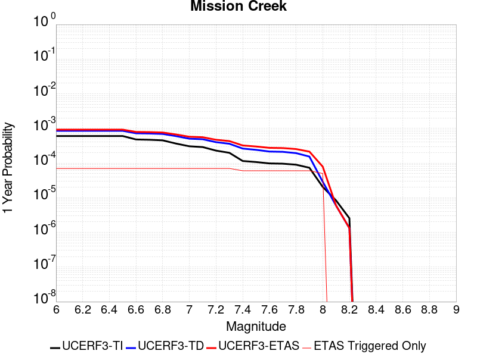 | 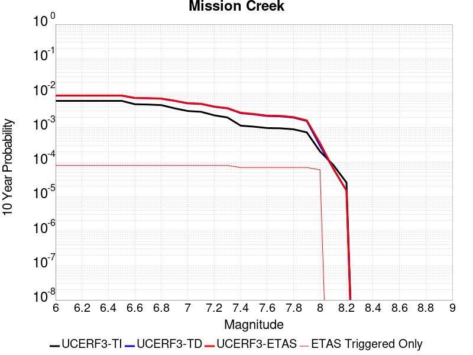 |

| Magnitude | 1 wk TI Prob | 1 wk TD Prob | 1 wk ETAS Prob | 1 wk ETAS/TD Gain | 1 wk ETAS Triggered Only | 1 mo TI Prob | 1 mo TD Prob | 1 mo ETAS Prob | 1 mo ETAS/TD Gain | 1 mo ETAS Triggered Only | 1 yr TI Prob | 1 yr TD Prob | 1 yr ETAS Prob | 1 yr ETAS/TD Gain | 1 yr ETAS Triggered Only | 10 yr TI Prob | 10 yr TD Prob | 10 yr ETAS Prob | 10 yr ETAS/TD Gain | 10 yr ETAS Triggered Only |
|-----|-----|-----|-----|-----|-----|-----|-----|-----|-----|-----|-----|-----|-----|-----|-----|-----|-----|-----|-----|-----|
| 6.0 | 1.1549387E-5 | 1.632237E-5 | 7.102787E-5 | 4.351566 | 5.470639E-5 | 4.9496433E-5 | 6.9951224E-5 | 1.355943E-4 | 1.9384122 | 6.564767E-5 | 6.0245243E-4 | 8.513384E-4 | 9.1693015E-4 | 1.0770454 | 6.564767E-5 | 0.006008218 | 0.008509998 | 0.008585935 | 1.0089233 | 7.658895E-5 |
| 6.1 | 1.1549387E-5 | 1.632237E-5 | 7.102787E-5 | 4.351566 | 5.470639E-5 | 4.9496433E-5 | 6.9951224E-5 | 1.355943E-4 | 1.9384122 | 6.564767E-5 | 6.0245243E-4 | 8.513384E-4 | 9.1693015E-4 | 1.0770454 | 6.564767E-5 | 0.006008218 | 0.008509998 | 0.008585935 | 1.0089233 | 7.658895E-5 |
| 6.2 | 1.1549387E-5 | 1.632237E-5 | 7.102787E-5 | 4.351566 | 5.470639E-5 | 4.9496433E-5 | 6.9951224E-5 | 1.355943E-4 | 1.9384122 | 6.564767E-5 | 6.0245243E-4 | 8.513384E-4 | 9.1693015E-4 | 1.0770454 | 6.564767E-5 | 0.006008218 | 0.008509998 | 0.008585935 | 1.0089233 | 7.658895E-5 |
| 6.3 | 1.1549387E-5 | 1.632237E-5 | 7.102787E-5 | 4.351566 | 5.470639E-5 | 4.9496433E-5 | 6.9951224E-5 | 1.355943E-4 | 1.9384122 | 6.564767E-5 | 6.0245243E-4 | 8.513384E-4 | 9.1693015E-4 | 1.0770454 | 6.564767E-5 | 0.006008218 | 0.008509998 | 0.008585935 | 1.0089233 | 7.658895E-5 |
| 6.4 | 1.1549387E-5 | 1.632237E-5 | 7.102787E-5 | 4.351566 | 5.470639E-5 | 4.9496433E-5 | 6.9951224E-5 | 1.355943E-4 | 1.9384122 | 6.564767E-5 | 6.0245243E-4 | 8.513384E-4 | 9.1693015E-4 | 1.0770454 | 6.564767E-5 | 0.006008218 | 0.008509998 | 0.008585935 | 1.0089233 | 7.658895E-5 |
| 6.5 | 1.1549387E-5 | 1.632237E-5 | 7.102787E-5 | 4.351566 | 5.470639E-5 | 4.9496433E-5 | 6.9951224E-5 | 1.355943E-4 | 1.9384122 | 6.564767E-5 | 6.0245243E-4 | 8.513384E-4 | 9.1693015E-4 | 1.0770454 | 6.564767E-5 | 0.006008218 | 0.008509998 | 0.008585935 | 1.0089233 | 7.658895E-5 |
| 6.6 | 9.202681E-6 | 1.3845646E-5 | 6.855128E-5 | 4.951107 | 5.470639E-5 | 3.9439463E-5 | 5.9337188E-5 | 1.2498096E-4 | 2.106284 | 6.564767E-5 | 4.800697E-4 | 7.221998E-4 | 7.8780006E-4 | 1.0908339 | 6.564767E-5 | 0.004790339 | 0.0072271815 | 0.007303217 | 1.0105208 | 7.658895E-5 |
| 6.7 | 9.019164E-6 | 1.3651316E-5 | 6.835696E-5 | 5.0073533 | 5.470639E-5 | 3.8652986E-5 | 5.8504378E-5 | 1.2414821E-4 | 2.1220326 | 6.564767E-5 | 4.7049852E-4 | 7.12067E-4 | 7.7766797E-4 | 1.0921274 | 6.564767E-5 | 0.004695036 | 0.007126506 | 0.007202549 | 1.0106704 | 7.658895E-5 |
| 6.8 | 8.673558E-6 | 1.3273427E-5 | 6.797909E-5 | 5.1214423 | 5.470639E-5 | 3.717186E-5 | 5.6884925E-5 | 1.2252886E-4 | 2.1539776 | 6.564767E-5 | 4.524734E-4 | 6.923627E-4 | 7.5796497E-4 | 1.0947512 | 6.564767E-5 | 0.0045155324 | 0.006930694 | 0.0070067523 | 1.010974 | 7.658895E-5 |
| 6.9 | 7.002255E-6 | 1.1477657E-5 | 6.618342E-5 | 5.7662835 | 5.470639E-5 | 3.000932E-5 | 4.9189068E-5 | 1.1483351E-4 | 2.3345332 | 6.564767E-5 | 3.653022E-4 | 5.9871917E-4 | 6.643275E-4 | 1.1095812 | 6.564767E-5 | 0.0036470229 | 0.005999517 | 0.0060756467 | 1.0126892 | 7.658895E-5 |
| 7.0 | 5.84644E-6 | 9.67498E-6 | 6.438084E-5 | 6.654364 | 5.470639E-5 | 2.5055931E-5 | 4.1463565E-5 | 1.0710851E-4 | 2.583196 | 6.564767E-5 | 3.0501327E-4 | 5.047066E-4 | 5.703211E-4 | 1.1300054 | 6.564767E-5 | 0.0030459496 | 0.0050638523 | 0.005140053 | 1.015048 | 7.658895E-5 |
| 7.1 | 5.54703E-6 | 9.329456E-6 | 6.403534E-5 | 6.8637805 | 5.470639E-5 | 2.377277E-5 | 3.9982795E-5 | 1.0562784E-4 | 2.6418324 | 6.564767E-5 | 2.8939504E-4 | 4.8668624E-4 | 5.52302E-4 | 1.1348214 | 6.564767E-5 | 0.0028901845 | 0.004884446 | 0.0049606613 | 1.0156035 | 7.658895E-5 |
| 7.2 | 4.384709E-6 | 7.68157E-6 | 6.238754E-5 | 8.1217165 | 5.470639E-5 | 1.8791474E-5 | 3.2920623E-5 | 9.856613E-5 | 2.9940543 | 6.564767E-5 | 2.2876218E-4 | 4.0073853E-4 | 4.6635987E-4 | 1.1637511 | 6.564767E-5 | 0.0022852682 | 0.004028366 | 0.004104646 | 1.0189358 | 7.658895E-5 |
| 7.3 | 3.7888456E-6 | 6.915452E-6 | 6.162147E-5 | 8.910692 | 5.470639E-5 | 1.623781E-5 | 2.9637333E-5 | 9.528306E-5 | 3.2149673 | 6.564767E-5 | 1.9767738E-4 | 3.6077813E-4 | 4.264021E-4 | 1.1818957 | 6.564767E-5 | 0.0019750162 | 0.0036301152 | 0.0037064261 | 1.0210216 | 7.658895E-5 |
| 7.4 | 2.1982462E-6 | 5.0237763E-6 | 4.878867E-5 | 9.711553 | 4.3765114E-5 | 9.421021E-6 | 2.1530293E-5 | 7.6235505E-5 | 3.5408485 | 5.470639E-5 | 1.1469489E-4 | 2.621E-4 | 3.1679205E-4 | 1.2086687 | 5.470639E-5 | 0.0011463572 | 0.0026458844 | 0.0027113585 | 1.0247456 | 6.564767E-5 |
| 7.5 | 2.051923E-6 | 4.615016E-6 | 4.8379927E-5 | 10.483154 | 4.3765114E-5 | 8.793926E-6 | 1.9778492E-5 | 7.44838E-5 | 3.765899 | 5.470639E-5 | 1.0706078E-4 | 2.4077666E-4 | 2.954699E-4 | 1.2271533 | 5.470639E-5 | 0.0010700922 | 0.0024335422 | 0.00249903 | 1.0269105 | 6.564767E-5 |
| 7.6 | 1.8733427E-6 | 4.1233748E-6 | 4.788831E-5 | 11.613862 | 4.3765114E-5 | 8.028587E-6 | 1.7671488E-5 | 7.237691E-5 | 4.095689 | 5.470639E-5 | 9.774366E-5 | 2.151292E-4 | 2.6982382E-4 | 1.2542408 | 5.470639E-5 | 9.770069E-4 | 0.0021780801 | 0.002243585 | 1.0300745 | 6.564767E-5 |
| 7.7 | 1.8411953E-6 | 4.0430496E-6 | 4.7807986E-5 | 11.824734 | 4.3765114E-5 | 7.890813E-6 | 1.732724E-5 | 7.2032686E-5 | 4.1571927 | 5.470639E-5 | 9.606641E-5 | 2.1093882E-4 | 2.6563366E-4 | 1.2592925 | 5.470639E-5 | 9.6024893E-4 | 0.0021363653 | 0.0022018726 | 1.030663 | 6.564767E-5 |
| 7.8 | 1.7194251E-6 | 3.7104276E-6 | 4.7475376E-5 | 12.795123 | 4.3765114E-5 | 7.368944E-6 | 1.5901736E-5 | 7.060725E-5 | 4.440223 | 5.470639E-5 | 8.97132E-5 | 1.9358651E-4 | 2.482823E-4 | 1.2825394 | 5.470639E-5 | 8.967699E-4 | 0.0019623525 | 0.0020278713 | 1.0333879 | 6.564767E-5 |
| 7.9 | 1.4035052E-6 | 2.9500632E-6 | 4.6715046E-5 | 15.83527 | 4.3765114E-5 | 6.0150082E-6 | 1.2643067E-5 | 6.734877E-5 | 5.326933 | 5.470639E-5 | 7.3230265E-5 | 1.5391852E-4 | 2.0861649E-4 | 1.3553697 | 5.470639E-5 | 7.3206134E-4 | 0.0015631086 | 0.0016286537 | 1.0419325 | 6.564767E-5 |
| 8.0 | 3.9318823E-7 | 5.528522E-7 | 3.337667E-5 | 60.371773 | 3.2823835E-5 | 1.6850913E-6 | 2.3693647E-6 | 4.6134373E-5 | 19.4712 | 4.3765114E-5 | 2.0515794E-5 | 2.8846638E-5 | 7.2610484E-5 | 2.5171213 | 4.3765114E-5 | 2.0513899E-4 | 2.9899E-4 | 3.5368002E-4 | 1.1829159 | 5.470639E-5 |
| 8.1 | 1.596793E-7 | 1.1380002E-7 | 1.1380002E-7 | 1.0 | 0.0 | 6.8433974E-7 | 4.877143E-7 | 4.877143E-7 | 1.0 | 0.0 | 8.331805E-6 | 5.937906E-6 | 5.937906E-6 | 1.0 | 0.0 | 8.331492E-5 | 6.549966E-5 | 6.549966E-5 | 1.0 | 0.0 |
| 8.2 | 4.9003038E-8 | 2.5444924E-8 | 2.5444924E-8 | 1.0 | 0.0 | 2.10013E-7 | 1.0904967E-7 | 1.0904967E-7 | 1.0 | 0.0 | 2.5569052E-6 | 1.327679E-6 | 1.327679E-6 | 1.0 | 0.0 | 2.556876E-5 | 1.495635E-5 | 1.495635E-5 | 1.0 | 0.0 |

## Great Valley 09 (Laguna Seca)
*[(top)](#table-of-contents)*

| 1 Week | 1 Month | 1 Year | 10 Year |
|-----|-----|-----|-----|
|  |  |  |  |

| Magnitude | 1 wk TI Prob | 1 wk TD Prob | 1 wk ETAS Prob | 1 wk ETAS/TD Gain | 1 wk ETAS Triggered Only | 1 mo TI Prob | 1 mo TD Prob | 1 mo ETAS Prob | 1 mo ETAS/TD Gain | 1 mo ETAS Triggered Only | 1 yr TI Prob | 1 yr TD Prob | 1 yr ETAS Prob | 1 yr ETAS/TD Gain | 1 yr ETAS Triggered Only | 10 yr TI Prob | 10 yr TD Prob | 10 yr ETAS Prob | 10 yr ETAS/TD Gain | 10 yr ETAS Triggered Only |
|-----|-----|-----|-----|-----|-----|-----|-----|-----|-----|-----|-----|-----|-----|-----|-----|-----|-----|-----|-----|-----|
| 6.0 | 5.4353277E-5 | 7.05022E-5 | 1.1426423E-4 | 1.6207186 | 4.3765114E-5 | 2.3292181E-4 | 3.0211566E-4 | 3.4586756E-4 | 1.1448183 | 4.3765114E-5 | 0.0028321352 | 0.0036721937 | 0.0037376005 | 1.0178113 | 6.564767E-5 | 0.02796312 | 0.03611547 | 0.03617875 | 1.001752 | 6.564767E-5 |
| 6.1 | 4.5578287E-5 | 5.822118E-5 | 9.1043104E-5 | 1.5637454 | 3.2823835E-5 | 1.953209E-4 | 2.4949326E-4 | 2.823089E-4 | 1.1315292 | 3.2823835E-5 | 0.0023754383 | 0.003033432 | 0.0030770644 | 1.0143838 | 4.3765114E-5 | 0.023502063 | 0.029919548 | 0.029972617 | 1.0017737 | 5.470639E-5 |
| 6.2 | 2.8536782E-5 | 3.4737273E-5 | 6.7559966E-5 | 1.944884 | 3.2823835E-5 | 1.2229476E-4 | 1.4886224E-4 | 1.8168119E-4 | 1.2204652 | 3.2823835E-5 | 0.0014879217 | 0.001810813 | 0.0018544989 | 1.024125 | 4.3765114E-5 | 0.014779986 | 0.017958116 | 0.01801184 | 1.0029917 | 5.470639E-5 |
| 6.3 | 2.3698774E-5 | 2.8213295E-5 | 6.1036204E-5 | 2.1633844 | 3.2823835E-5 | 1.01562226E-4 | 1.20905075E-4 | 1.5372495E-4 | 1.2714515 | 3.2823835E-5 | 0.0012358186 | 0.0014710218 | 0.0015037974 | 1.0222808 | 3.2823835E-5 | 0.012289686 | 0.014611342 | 0.014654468 | 1.0029515 | 4.3765114E-5 |
| 6.4 | 1.9191197E-5 | 2.2123184E-5 | 3.3064218E-5 | 1.4945507 | 1.0941279E-5 | 8.2245395E-5 | 9.4806666E-5 | 1.05746905E-4 | 1.1153953 | 1.0941279E-5 | 0.0010008777 | 0.0011536429 | 0.0011645715 | 1.0094732 | 1.0941279E-5 | 0.009963818 | 0.011476948 | 0.011487763 | 1.0009423 | 1.0941279E-5 |
| 6.5 | 1.5203241E-5 | 1.6802203E-5 | 2.7743297E-5 | 1.6511703 | 1.0941279E-5 | 6.5155116E-5 | 7.200386E-5 | 8.2944345E-5 | 1.1519431 | 1.0941279E-5 | 7.9297484E-4 | 8.7626575E-4 | 8.8719744E-4 | 1.0124754 | 1.0941279E-5 | 0.007901512 | 0.0087295165 | 0.008740363 | 1.0012424 | 1.0941279E-5 |
| 6.6 | 1.0984925E-5 | 1.1242595E-5 | 2.218375E-5 | 1.9731877 | 1.0941279E-5 | 4.70774E-5 | 4.8181686E-5 | 5.9122434E-5 | 1.2270728 | 1.0941279E-5 | 5.730166E-4 | 5.8645656E-4 | 5.973914E-4 | 1.0186456 | 1.0941279E-5 | 0.005715413 | 0.0058494853 | 0.0058603627 | 1.0018595 | 1.0941279E-5 |
| 6.7 | 9.134616E-6 | 9.019894E-6 | 1.9961073E-5 | 2.2130053 | 1.0941279E-5 | 3.9147766E-5 | 3.865613E-5 | 4.9596983E-5 | 1.2830303 | 1.0941279E-5 | 4.7651984E-4 | 4.7053912E-4 | 4.8147526E-4 | 1.0232418 | 1.0941279E-5 | 0.004754993 | 0.0046956735 | 0.004706563 | 1.0023191 | 1.0941279E-5 |
| 6.8 | 7.785589E-6 | 7.4519444E-6 | 1.839314E-5 | 2.4682338 | 1.0941279E-5 | 3.3366385E-5 | 3.1936524E-5 | 4.2877455E-5 | 1.3425835 | 1.0941279E-5 | 4.0616E-4 | 3.8875983E-4 | 3.9969684E-4 | 1.0281332 | 1.0941279E-5 | 0.0040541845 | 0.0038810016 | 0.0038919004 | 1.0028082 | 1.0941279E-5 |
| 6.9 | 5.579095E-6 | 4.898492E-6 | 4.898492E-6 | 1.0 | 0.0 | 2.3910188E-5 | 2.0993377E-5 | 2.0993377E-5 | 1.0 | 0.0 | 2.9106764E-4 | 2.5556577E-4 | 2.5556577E-4 | 1.0 | 0.0 | 0.002906867 | 0.002552856 | 0.002552856 | 1.0 | 0.0 |
| 7.0 | 2.6816688E-6 | 1.5216126E-6 | 1.5216126E-6 | 1.0 | 0.0 | 1.1492816E-5 | 6.521181E-6 | 6.521181E-6 | 1.0 | 0.0 | 1.3991605E-4 | 7.939258E-5 | 7.939258E-5 | 1.0 | 0.0 | 0.0013982799 | 7.9365086E-4 | 7.9365086E-4 | 1.0 | 0.0 |
| 7.1 | 1.9951021E-6 | 7.453827E-7 | 7.453827E-7 | 1.0 | 0.0 | 8.55041E-6 | 3.1944935E-6 | 3.1944935E-6 | 1.0 | 0.0 | 1.0409627E-4 | 3.8892307E-5 | 3.8892307E-5 | 1.0 | 0.0 | 0.0010404752 | 3.8885913E-4 | 3.8885913E-4 | 1.0 | 0.0 |
| 7.2 | 1.9951021E-6 | 7.453827E-7 | 7.453827E-7 | 1.0 | 0.0 | 8.55041E-6 | 3.1944935E-6 | 3.1944935E-6 | 1.0 | 0.0 | 1.0409627E-4 | 3.8892307E-5 | 3.8892307E-5 | 1.0 | 0.0 | 0.0010404752 | 3.8885913E-4 | 3.8885913E-4 | 1.0 | 0.0 |
| 7.3 | 1.7087556E-6 | 6.578881E-7 | 6.578881E-7 | 1.0 | 0.0 | 7.3232177E-6 | 2.8195177E-6 | 2.8195177E-6 | 1.0 | 0.0 | 8.915652E-5 | 3.4327128E-5 | 3.4327128E-5 | 1.0 | 0.0 | 8.9120766E-4 | 3.432223E-4 | 3.432223E-4 | 1.0 | 0.0 |
| 7.4 | 1.3804846E-6 | 6.073852E-7 | 6.073852E-7 | 1.0 | 0.0 | 5.916349E-6 | 2.6030768E-6 | 2.6030768E-6 | 1.0 | 0.0 | 7.2029165E-5 | 3.169204E-5 | 3.169204E-5 | 1.0 | 0.0 | 7.200583E-4 | 3.1687922E-4 | 3.1687922E-4 | 1.0 | 0.0 |
| 7.5 | 1.3804846E-6 | 6.073852E-7 | 6.073852E-7 | 1.0 | 0.0 | 5.916349E-6 | 2.6030768E-6 | 2.6030768E-6 | 1.0 | 0.0 | 7.2029165E-5 | 3.169204E-5 | 3.169204E-5 | 1.0 | 0.0 | 7.200583E-4 | 3.1687922E-4 | 3.1687922E-4 | 1.0 | 0.0 |

## Palos Verdes
*[(top)](#table-of-contents)*

| 1 Week | 1 Month | 1 Year | 10 Year |
|-----|-----|-----|-----|
|  |  |  |  |

| Magnitude | 1 wk TI Prob | 1 wk TD Prob | 1 wk ETAS Prob | 1 wk ETAS/TD Gain | 1 wk ETAS Triggered Only | 1 mo TI Prob | 1 mo TD Prob | 1 mo ETAS Prob | 1 mo ETAS/TD Gain | 1 mo ETAS Triggered Only | 1 yr TI Prob | 1 yr TD Prob | 1 yr ETAS Prob | 1 yr ETAS/TD Gain | 1 yr ETAS Triggered Only | 10 yr TI Prob | 10 yr TD Prob | 10 yr ETAS Prob | 10 yr ETAS/TD Gain | 10 yr ETAS Triggered Only |
|-----|-----|-----|-----|-----|-----|-----|-----|-----|-----|-----|-----|-----|-----|-----|-----|-----|-----|-----|-----|-----|
| 6.0 | 6.126063E-5 | 7.622612E-5 | 9.8107004E-5 | 1.2870524 | 2.1882557E-5 | 2.6251914E-4 | 3.2664582E-4 | 3.5945894E-4 | 1.1004547 | 3.2823835E-5 | 0.0031914865 | 0.003970174 | 0.0040137656 | 1.0109797 | 4.3765114E-5 | 0.031460393 | 0.039048895 | 0.039101467 | 1.0013462 | 5.470639E-5 |
| 6.1 | 6.126063E-5 | 7.622612E-5 | 9.8107004E-5 | 1.2870524 | 2.1882557E-5 | 2.6251914E-4 | 3.2664582E-4 | 3.5945894E-4 | 1.1004547 | 3.2823835E-5 | 0.0031914865 | 0.003970174 | 0.0040137656 | 1.0109797 | 4.3765114E-5 | 0.031460393 | 0.039048895 | 0.039101467 | 1.0013462 | 5.470639E-5 |
| 6.2 | 6.126063E-5 | 7.622612E-5 | 9.8107004E-5 | 1.2870524 | 2.1882557E-5 | 2.6251914E-4 | 3.2664582E-4 | 3.5945894E-4 | 1.1004547 | 3.2823835E-5 | 0.0031914865 | 0.003970174 | 0.0040137656 | 1.0109797 | 4.3765114E-5 | 0.031460393 | 0.039048895 | 0.039101467 | 1.0013462 | 5.470639E-5 |
| 6.3 | 4.0838047E-5 | 4.9749437E-5 | 7.16309E-5 | 1.4398335 | 2.1882557E-5 | 1.7500846E-4 | 2.1319572E-4 | 2.350736E-4 | 1.1026188 | 2.1882557E-5 | 0.0021286458 | 0.0025927818 | 0.0026146076 | 1.008418 | 2.1882557E-5 | 0.021083709 | 0.025646681 | 0.025678663 | 1.001247 | 3.2823835E-5 |
| 6.4 | 4.0838047E-5 | 4.9749437E-5 | 7.16309E-5 | 1.4398335 | 2.1882557E-5 | 1.7500846E-4 | 2.1319572E-4 | 2.350736E-4 | 1.1026188 | 2.1882557E-5 | 0.0021286458 | 0.0025927818 | 0.0026146076 | 1.008418 | 2.1882557E-5 | 0.021083709 | 0.025646681 | 0.025678663 | 1.001247 | 3.2823835E-5 |
| 6.5 | 3.0512005E-5 | 3.656162E-5 | 4.75025E-5 | 1.2992449 | 1.0941279E-5 | 1.3075917E-4 | 1.5668393E-4 | 1.676235E-4 | 1.0698193 | 1.0941279E-5 | 0.0015908304 | 0.0019060767 | 0.001916997 | 1.0057293 | 1.0941279E-5 | 0.015794903 | 0.018909154 | 0.018930623 | 1.0011353 | 2.1882557E-5 |
| 6.6 | 2.9255087E-5 | 3.515442E-5 | 4.6095312E-5 | 1.3112239 | 1.0941279E-5 | 1.2537291E-4 | 1.5065377E-4 | 1.6159339E-4 | 1.0726144 | 1.0941279E-5 | 0.0015253464 | 0.0018327828 | 0.001843704 | 1.0059588 | 1.0941279E-5 | 0.015149189 | 0.018188225 | 0.018209709 | 1.0011812 | 2.1882557E-5 |
| 6.7 | 2.287198E-5 | 2.7248278E-5 | 3.8189257E-5 | 1.4015292 | 1.0941279E-5 | 9.801909E-5 | 1.16773626E-4 | 1.2771363E-4 | 1.0936855 | 1.0941279E-5 | 0.001192729 | 0.0014208833 | 0.001431809 | 1.0076894 | 1.0941279E-5 | 0.011863477 | 0.014127217 | 0.014138004 | 1.0007635 | 1.0941279E-5 |
| 6.8 | 2.1325764E-5 | 2.5431877E-5 | 3.6372876E-5 | 1.4302081 | 1.0941279E-5 | 9.139293E-5 | 1.0898971E-4 | 1.199298E-4 | 1.1003772 | 1.0941279E-5 | 0.001112141 | 0.0013262323 | 0.0013371591 | 1.0082389 | 1.0941279E-5 | 0.011065915 | 0.013192211 | 0.013203008 | 1.0008185 | 1.0941279E-5 |
| 6.9 | 1.9009392E-5 | 2.2613547E-5 | 3.3554577E-5 | 1.4838264 | 1.0941279E-5 | 8.1466285E-5 | 9.6912096E-5 | 1.0785231E-4 | 1.1128881 | 1.0941279E-5 | 9.914007E-4 | 0.0011793535 | 0.0011902818 | 1.0092664 | 1.0941279E-5 | 0.009869894 | 0.011739632 | 0.011750446 | 1.000921 | 1.0941279E-5 |
| 7.0 | 1.7098473E-5 | 2.0319356E-5 | 3.126041E-5 | 1.5384549 | 1.0941279E-5 | 7.3277115E-5 | 8.708052E-5 | 9.802085E-5 | 1.1256346 | 1.0941279E-5 | 8.917837E-4 | 0.001059775 | 0.0010707047 | 1.0103132 | 1.0941279E-5 | 0.008882134 | 0.010555646 | 0.010566472 | 1.0010256 | 1.0941279E-5 |
| 7.1 | 1.5982785E-5 | 1.899476E-5 | 2.993583E-5 | 1.5760046 | 1.0941279E-5 | 6.849585E-5 | 8.1404054E-5 | 9.234444E-5 | 1.1343961 | 1.0941279E-5 | 8.336179E-4 | 9.907284E-4 | 0.0010016588 | 1.0110327 | 1.0941279E-5 | 0.008304977 | 0.009871479 | 0.009882313 | 1.0010974 | 1.0941279E-5 |
| 7.2 | 1.4468002E-5 | 1.7197237E-5 | 2.8138325E-5 | 1.6362121 | 1.0941279E-5 | 6.200425E-5 | 7.370083E-5 | 8.46413E-5 | 1.1484443 | 1.0941279E-5 | 7.546402E-4 | 8.970222E-4 | 9.0795365E-4 | 1.0121864 | 1.0941279E-5 | 0.007520827 | 0.008942284 | 0.008953127 | 1.0012126 | 1.0941279E-5 |
| 7.3 | 5.288233E-6 | 6.2036747E-6 | 1.7144885E-5 | 2.763666 | 1.0941279E-5 | 2.2663658E-5 | 2.6587102E-5 | 3.752809E-5 | 1.4115149 | 1.0941279E-5 | 2.7589512E-4 | 3.236848E-4 | 3.3462254E-4 | 1.0337913 | 1.0941279E-5 | 0.0027555283 | 0.0032355562 | 0.003246462 | 1.0033706 | 1.0941279E-5 |
| 7.4 | 8.279556E-7 | 8.408347E-7 | 1.1782104E-5 | 14.01239 | 1.0941279E-5 | 3.5483763E-6 | 3.6035726E-6 | 1.4544811E-5 | 4.03622 | 1.0941279E-5 | 4.3200624E-5 | 4.3872686E-5 | 5.4813485E-5 | 1.249376 | 1.0941279E-5 | 4.3192226E-4 | 4.3864746E-4 | 4.4958395E-4 | 1.0249323 | 1.0941279E-5 |
| 7.5 | 6.559831E-7 | 6.667229E-7 | 6.667229E-7 | 1.0 | 0.0 | 2.8113532E-6 | 2.857381E-6 | 2.857381E-6 | 1.0 | 0.0 | 3.4227687E-5 | 3.4788125E-5 | 3.4788125E-5 | 1.0 | 0.0 | 3.4222414E-4 | 3.4783344E-4 | 3.4783344E-4 | 1.0 | 0.0 |
| 7.6 | 3.5018968E-7 | 3.5620027E-7 | 3.5620027E-7 | 1.0 | 0.0 | 1.500812E-6 | 1.526572E-6 | 1.526572E-6 | 1.0 | 0.0 | 1.8272232E-5 | 1.8585903E-5 | 1.8585903E-5 | 1.0 | 0.0 | 1.8270731E-4 | 1.8584808E-4 | 1.8584808E-4 | 1.0 | 0.0 |
| 7.7 | 1.1986104E-7 | 1.2198376E-7 | 1.2198376E-7 | 1.0 | 0.0 | 5.1369005E-7 | 5.2278745E-7 | 5.2278745E-7 | 1.0 | 0.0 | 6.2541585E-6 | 6.364919E-6 | 6.364919E-6 | 1.0 | 0.0 | 6.2539824E-5 | 6.364741E-5 | 6.364741E-5 | 1.0 | 0.0 |
| 7.8 | 3.0445005E-8 | 3.1027582E-8 | 3.1027582E-8 | 1.0 | 0.0 | 1.3047858E-7 | 1.3297536E-7 | 1.3297536E-7 | 1.0 | 0.0 | 1.5885756E-6 | 1.6189739E-6 | 1.6189739E-6 | 1.0 | 0.0 | 1.5885644E-5 | 1.6189642E-5 | 1.6189642E-5 | 1.0 | 0.0 |

## Coronado Bank alt1
*[(top)](#table-of-contents)*

| 1 Week | 1 Month | 1 Year | 10 Year |
|-----|-----|-----|-----|
|  |  |  | 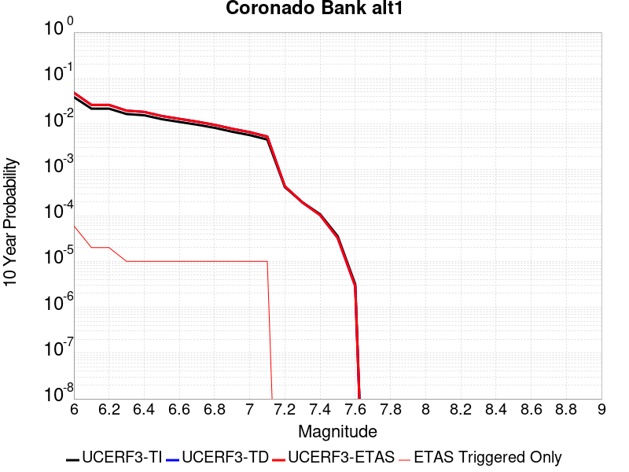 |

| Magnitude | 1 wk TI Prob | 1 wk TD Prob | 1 wk ETAS Prob | 1 wk ETAS/TD Gain | 1 wk ETAS Triggered Only | 1 mo TI Prob | 1 mo TD Prob | 1 mo ETAS Prob | 1 mo ETAS/TD Gain | 1 mo ETAS Triggered Only | 1 yr TI Prob | 1 yr TD Prob | 1 yr ETAS Prob | 1 yr ETAS/TD Gain | 1 yr ETAS Triggered Only | 10 yr TI Prob | 10 yr TD Prob | 10 yr ETAS Prob | 10 yr ETAS/TD Gain | 10 yr ETAS Triggered Only |
|-----|-----|-----|-----|-----|-----|-----|-----|-----|-----|-----|-----|-----|-----|-----|-----|-----|-----|-----|-----|-----|
| 6.0 | 7.533492E-5 | 9.394913E-5 | 1.3771013E-4 | 1.4657947 | 4.3765114E-5 | 3.22824E-4 | 4.0258127E-4 | 4.4632875E-4 | 1.1086675 | 4.3765114E-5 | 0.0039233007 | 0.0048909658 | 0.0049454044 | 1.0111305 | 5.470639E-5 | 0.03854755 | 0.04790356 | 0.047966063 | 1.0013047 | 6.564767E-5 |
| 6.1 | 4.1807285E-5 | 5.049283E-5 | 6.143356E-5 | 1.2166787 | 1.0941279E-5 | 1.7916178E-4 | 2.1638049E-4 | 2.273194E-4 | 1.050554 | 1.0941279E-5 | 0.0021791123 | 0.0026313474 | 0.0026531725 | 1.0082942 | 2.1882557E-5 | 0.021578677 | 0.026011046 | 0.02603236 | 1.0008194 | 2.1882557E-5 |
| 6.2 | 4.1807285E-5 | 5.049283E-5 | 6.143356E-5 | 1.2166787 | 1.0941279E-5 | 1.7916178E-4 | 2.1638049E-4 | 2.273194E-4 | 1.050554 | 1.0941279E-5 | 0.0021791123 | 0.0026313474 | 0.0026531725 | 1.0082942 | 2.1882557E-5 | 0.021578677 | 0.026011046 | 0.02603236 | 1.0008194 | 2.1882557E-5 |
| 6.3 | 3.1793104E-5 | 3.7711117E-5 | 4.8651982E-5 | 1.2901231 | 1.0941279E-5 | 1.3624904E-4 | 1.6160926E-4 | 1.7254878E-4 | 1.0676911 | 1.0941279E-5 | 0.0016575698 | 0.001965848 | 0.0019767678 | 1.0055548 | 1.0941279E-5 | 0.016452603 | 0.019488465 | 0.019499192 | 1.0005505 | 1.0941279E-5 |
| 6.4 | 2.9878007E-5 | 3.5335794E-5 | 4.6276687E-5 | 1.3096263 | 1.0941279E-5 | 1.2804232E-4 | 1.5143053E-4 | 1.6237015E-4 | 1.0722419 | 1.0941279E-5 | 0.0015578003 | 0.0018421387 | 0.0018530599 | 1.0059285 | 1.0941279E-5 | 0.015469253 | 0.01827244 | 0.018283183 | 1.0005878 | 1.0941279E-5 |
| 6.5 | 2.4512565E-5 | 2.8764043E-5 | 3.9705006E-5 | 1.3803694 | 1.0941279E-5 | 1.0504962E-4 | 1.2326881E-4 | 1.3420873E-4 | 1.0887486 | 1.0941279E-5 | 0.0012782287 | 0.0014997921 | 0.001510717 | 1.0072843 | 1.0941279E-5 | 0.012709012 | 0.014899683 | 0.014910461 | 1.0007234 | 1.0941279E-5 |
| 6.6 | 2.1317413E-5 | 2.490667E-5 | 3.5847675E-5 | 1.4392802 | 1.0941279E-5 | 9.135714E-5 | 1.0673863E-4 | 1.1767874E-4 | 1.1024944 | 1.0941279E-5 | 0.0011117056 | 0.0012987906 | 0.0013097175 | 1.0084133 | 1.0941279E-5 | 0.011061605 | 0.012914404 | 0.012925205 | 1.0008363 | 1.0941279E-5 |
| 6.7 | 1.8585655E-5 | 2.163488E-5 | 3.257592E-5 | 1.5057131 | 1.0941279E-5 | 7.9650374E-5 | 9.271773E-5 | 1.03658E-4 | 1.1179954 | 1.0941279E-5 | 9.6931186E-4 | 0.0011282742 | 0.0011392032 | 1.0096865 | 1.0941279E-5 | 0.0096509475 | 0.011227623 | 0.011238441 | 1.0009636 | 1.0941279E-5 |
| 6.8 | 1.5862879E-5 | 1.8419474E-5 | 2.9360552E-5 | 1.5939951 | 1.0941279E-5 | 6.798199E-5 | 7.893833E-5 | 8.987874E-5 | 1.1385945 | 1.0941279E-5 | 8.273665E-4 | 9.6066965E-4 | 9.716004E-4 | 1.0113783 | 1.0941279E-5 | 0.008242928 | 0.00956715 | 0.009577987 | 1.0011327 | 1.0941279E-5 |
| 6.9 | 1.3021509E-5 | 1.5095265E-5 | 2.6036378E-5 | 1.7248043 | 1.0941279E-5 | 5.5805274E-5 | 6.469249E-5 | 7.5633056E-5 | 1.1691165 | 1.0941279E-5 | 6.792174E-4 | 7.8736455E-4 | 7.982972E-4 | 1.0138851 | 1.0941279E-5 | 0.006771452 | 0.007847573 | 0.007858428 | 1.0013833 | 1.0941279E-5 |
| 7.0 | 1.0974371E-5 | 1.2720104E-5 | 2.3661243E-5 | 1.8601454 | 1.0941279E-5 | 4.7032172E-5 | 5.451369E-5 | 6.545437E-5 | 1.200696 | 1.0941279E-5 | 5.7246623E-4 | 6.6351966E-4 | 6.744537E-4 | 1.0164788 | 1.0941279E-5 | 0.0057099373 | 0.006617135 | 0.0066280034 | 1.0016426 | 1.0941279E-5 |
| 7.1 | 8.766221E-6 | 1.01638325E-5 | 2.1105E-5 | 2.0764804 | 1.0941279E-5 | 3.7568978E-5 | 4.355865E-5 | 5.449945E-5 | 1.251174 | 1.0941279E-5 | 4.573063E-4 | 5.3021475E-4 | 5.411502E-4 | 1.0206246 | 1.0941279E-5 | 0.0045636636 | 0.0052911965 | 0.00530208 | 1.0020568 | 1.0941279E-5 |
| 7.2 | 8.026024E-7 | 8.331765E-7 | 8.331765E-7 | 1.0 | 0.0 | 3.43972E-6 | 3.5707515E-6 | 3.5707515E-6 | 1.0 | 0.0 | 4.1877785E-5 | 4.3473043E-5 | 4.3473043E-5 | 1.0 | 0.0 | 4.1869894E-4 | 4.3464647E-4 | 4.3464647E-4 | 1.0 | 0.0 |
| 7.3 | 3.7293114E-7 | 3.7000953E-7 | 3.7000953E-7 | 1.0 | 0.0 | 1.5982754E-6 | 1.5857541E-6 | 1.5857541E-6 | 1.0 | 0.0 | 1.9458828E-5 | 1.9306386E-5 | 1.9306386E-5 | 1.0 | 0.0 | 1.9457124E-4 | 1.9304715E-4 | 1.9304715E-4 | 1.0 | 0.0 |
| 7.4 | 2.0557036E-7 | 1.9674363E-7 | 1.9674363E-7 | 1.0 | 0.0 | 8.810155E-7 | 8.431867E-7 | 8.431867E-7 | 1.0 | 0.0 | 1.0726311E-5 | 1.026575E-5 | 1.026575E-5 | 1.0 | 0.0 | 1.0725793E-4 | 1.0265279E-4 | 1.0265279E-4 | 1.0 | 0.0 |
| 7.5 | 6.845446E-8 | 6.279369E-8 | 6.279369E-8 | 1.0 | 0.0 | 2.9337625E-7 | 2.691158E-7 | 2.691158E-7 | 1.0 | 0.0 | 3.5718497E-6 | 3.2764797E-6 | 3.2764797E-6 | 1.0 | 0.0 | 3.5717923E-5 | 3.2764325E-5 | 3.2764325E-5 | 1.0 | 0.0 |
| 7.6 | 6.0975145E-9 | 5.53185E-9 | 5.53185E-9 | 1.0 | 0.0 | 2.6132206E-8 | 2.370793E-8 | 2.370793E-8 | 1.0 | 0.0 | 3.1815955E-7 | 2.88644E-7 | 2.88644E-7 | 1.0 | 0.0 | 3.181591E-6 | 2.8864374E-6 | 2.8864374E-6 | 1.0 | 0.0 |

## Tin Mountain
*[(top)](#table-of-contents)*

| 1 Week | 1 Month | 1 Year | 10 Year |
|-----|-----|-----|-----|
|  | 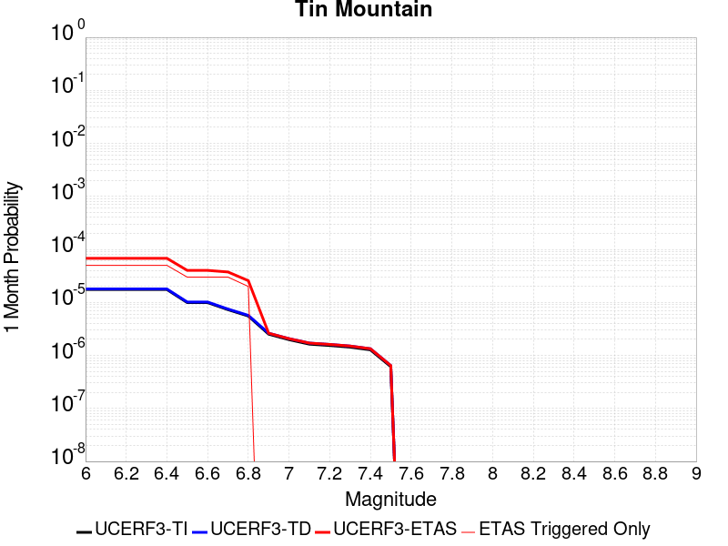 |  |  |

| Magnitude | 1 wk TI Prob | 1 wk TD Prob | 1 wk ETAS Prob | 1 wk ETAS/TD Gain | 1 wk ETAS Triggered Only | 1 mo TI Prob | 1 mo TD Prob | 1 mo ETAS Prob | 1 mo ETAS/TD Gain | 1 mo ETAS Triggered Only | 1 yr TI Prob | 1 yr TD Prob | 1 yr ETAS Prob | 1 yr ETAS/TD Gain | 1 yr ETAS Triggered Only | 10 yr TI Prob | 10 yr TD Prob | 10 yr ETAS Prob | 10 yr ETAS/TD Gain | 10 yr ETAS Triggered Only |
|-----|-----|-----|-----|-----|-----|-----|-----|-----|-----|-----|-----|-----|-----|-----|-----|-----|-----|-----|-----|-----|
| 6.0 | 4.083776E-6 | 4.1815365E-6 | 5.8887697E-5 | 14.082789 | 5.470639E-5 | 1.750178E-5 | 1.792077E-5 | 7.262618E-5 | 4.052626 | 5.470639E-5 | 2.1306332E-4 | 2.1816725E-4 | 2.728617E-4 | 1.2506996 | 5.470639E-5 | 0.0021285915 | 0.0021798965 | 0.002245401 | 1.0300494 | 6.564767E-5 |
| 6.1 | 4.083776E-6 | 4.1815365E-6 | 5.8887697E-5 | 14.082789 | 5.470639E-5 | 1.750178E-5 | 1.792077E-5 | 7.262618E-5 | 4.052626 | 5.470639E-5 | 2.1306332E-4 | 2.1816725E-4 | 2.728617E-4 | 1.2506996 | 5.470639E-5 | 0.0021285915 | 0.0021798965 | 0.002245401 | 1.0300494 | 6.564767E-5 |
| 6.2 | 4.083776E-6 | 4.1815365E-6 | 5.8887697E-5 | 14.082789 | 5.470639E-5 | 1.750178E-5 | 1.792077E-5 | 7.262618E-5 | 4.052626 | 5.470639E-5 | 2.1306332E-4 | 2.1816725E-4 | 2.728617E-4 | 1.2506996 | 5.470639E-5 | 0.0021285915 | 0.0021798965 | 0.002245401 | 1.0300494 | 6.564767E-5 |
| 6.3 | 4.083776E-6 | 4.1815365E-6 | 5.8887697E-5 | 14.082789 | 5.470639E-5 | 1.750178E-5 | 1.792077E-5 | 7.262618E-5 | 4.052626 | 5.470639E-5 | 2.1306332E-4 | 2.1816725E-4 | 2.728617E-4 | 1.2506996 | 5.470639E-5 | 0.0021285915 | 0.0021798965 | 0.002245401 | 1.0300494 | 6.564767E-5 |
| 6.4 | 4.083776E-6 | 4.1815365E-6 | 5.8887697E-5 | 14.082789 | 5.470639E-5 | 1.750178E-5 | 1.792077E-5 | 7.262618E-5 | 4.052626 | 5.470639E-5 | 2.1306332E-4 | 2.1816725E-4 | 2.728617E-4 | 1.2506996 | 5.470639E-5 | 0.0021285915 | 0.0021798965 | 0.002245401 | 1.0300494 | 6.564767E-5 |
| 6.5 | 2.3143427E-6 | 2.3731573E-6 | 3.5196914E-5 | 14.831262 | 3.2823835E-5 | 9.9185745E-6 | 1.0170638E-5 | 4.299414E-5 | 4.22728 | 3.2823835E-5 | 1.2075195E-4 | 1.2382126E-4 | 1.5664102E-4 | 1.2650577 | 3.2823835E-5 | 0.0012068636 | 0.0012375986 | 0.0012703819 | 1.0264894 | 3.2823835E-5 |
| 6.6 | 2.3143427E-6 | 2.3731573E-6 | 3.5196914E-5 | 14.831262 | 3.2823835E-5 | 9.9185745E-6 | 1.0170638E-5 | 4.299414E-5 | 4.22728 | 3.2823835E-5 | 1.2075195E-4 | 1.2382126E-4 | 1.5664102E-4 | 1.2650577 | 3.2823835E-5 | 0.0012068636 | 0.0012375986 | 0.0012703819 | 1.0264894 | 3.2823835E-5 |
| 6.7 | 1.7029532E-6 | 1.7497915E-6 | 3.4573568E-5 | 19.758678 | 3.2823835E-5 | 7.2983503E-6 | 7.499088E-6 | 4.0322677E-5 | 5.377011 | 3.2823835E-5 | 8.885379E-5 | 9.1298105E-5 | 1.2411895E-4 | 1.3594909 | 3.2823835E-5 | 8.881827E-4 | 9.1265864E-4 | 9.454525E-4 | 1.0359323 | 3.2823835E-5 |
| 6.8 | 1.2914646E-6 | 1.3299378E-6 | 2.3212466E-5 | 17.453796 | 2.1882557E-5 | 5.534837E-6 | 5.6997237E-6 | 2.7582155E-5 | 4.839209 | 2.1882557E-5 | 6.738455E-5 | 6.939237E-5 | 9.12734E-5 | 1.3153234 | 2.1882557E-5 | 6.736412E-4 | 6.9375033E-4 | 7.1561773E-4 | 1.0315205 | 2.1882557E-5 |
| 6.9 | 5.8708974E-7 | 6.1169936E-7 | 6.1169936E-7 | 1.0 | 0.0 | 2.5160964E-6 | 2.6215664E-6 | 2.6215664E-6 | 1.0 | 0.0 | 3.0633044E-5 | 3.1917145E-5 | 3.1917145E-5 | 1.0 | 0.0 | 3.0628822E-4 | 3.191297E-4 | 3.191297E-4 | 1.0 | 0.0 |
| 7.0 | 4.6248786E-7 | 4.832015E-7 | 4.832015E-7 | 1.0 | 0.0 | 1.9820893E-6 | 2.0708624E-6 | 2.0708624E-6 | 1.0 | 0.0 | 2.413167E-5 | 2.5212494E-5 | 2.5212494E-5 | 1.0 | 0.0 | 2.412905E-4 | 2.5210003E-4 | 2.5210003E-4 | 1.0 | 0.0 |
| 7.1 | 3.804606E-7 | 3.987147E-7 | 3.987147E-7 | 1.0 | 0.0 | 1.6305444E-6 | 1.7087764E-6 | 1.7087764E-6 | 1.0 | 0.0 | 1.9851697E-5 | 2.0804187E-5 | 2.0804187E-5 | 1.0 | 0.0 | 1.9849923E-4 | 2.0802575E-4 | 2.0802575E-4 | 1.0 | 0.0 |
| 7.2 | 3.5864858E-7 | 3.7616863E-7 | 3.7616863E-7 | 1.0 | 0.0 | 1.5370645E-6 | 1.6121504E-6 | 1.6121504E-6 | 1.0 | 0.0 | 1.87136E-5 | 1.9627789E-5 | 1.9627789E-5 | 1.0 | 0.0 | 1.8712023E-4 | 1.9626386E-4 | 1.9626386E-4 | 1.0 | 0.0 |
| 7.3 | 3.342063E-7 | 3.506347E-7 | 3.506347E-7 | 1.0 | 0.0 | 1.4323119E-6 | 1.5027196E-6 | 1.5027196E-6 | 1.0 | 0.0 | 1.7438259E-5 | 1.829549E-5 | 1.829549E-5 | 1.0 | 0.0 | 1.743689E-4 | 1.8294314E-4 | 1.8294314E-4 | 1.0 | 0.0 |
| 7.4 | 2.971242E-7 | 3.1165817E-7 | 3.1165817E-7 | 1.0 | 0.0 | 1.2733886E-6 | 1.3356774E-6 | 1.3356774E-6 | 1.0 | 0.0 | 1.5503398E-5 | 1.6261785E-5 | 1.6261785E-5 | 1.0 | 0.0 | 1.5502315E-4 | 1.6260923E-4 | 1.6260923E-4 | 1.0 | 0.0 |
| 7.5 | 1.4326713E-7 | 1.5012525E-7 | 1.5012525E-7 | 1.0 | 0.0 | 6.140018E-7 | 6.433939E-7 | 6.433939E-7 | 1.0 | 0.0 | 7.4754466E-6 | 7.8333205E-6 | 7.8333205E-6 | 1.0 | 0.0 | 7.475195E-5 | 7.833321E-5 | 7.833321E-5 | 1.0 | 0.0 |

## Owens Valley
*[(top)](#table-of-contents)*

| 1 Week | 1 Month | 1 Year | 10 Year |
|-----|-----|-----|-----|
|  |  |  |  |

| Magnitude | 1 wk TI Prob | 1 wk TD Prob | 1 wk ETAS Prob | 1 wk ETAS/TD Gain | 1 wk ETAS Triggered Only | 1 mo TI Prob | 1 mo TD Prob | 1 mo ETAS Prob | 1 mo ETAS/TD Gain | 1 mo ETAS Triggered Only | 1 yr TI Prob | 1 yr TD Prob | 1 yr ETAS Prob | 1 yr ETAS/TD Gain | 1 yr ETAS Triggered Only | 10 yr TI Prob | 10 yr TD Prob | 10 yr ETAS Prob | 10 yr ETAS/TD Gain | 10 yr ETAS Triggered Only |
|-----|-----|-----|-----|-----|-----|-----|-----|-----|-----|-----|-----|-----|-----|-----|-----|-----|-----|-----|-----|-----|
| 6.0 | 4.83821E-5 | 3.626567E-6 | 3.645028E-5 | 10.050906 | 3.2823835E-5 | 2.0733538E-4 | 1.5542342E-5 | 5.9306774E-5 | 3.8158195 | 4.3765114E-5 | 0.002521386 | 1.8921259E-4 | 2.4390862E-4 | 1.2890719 | 5.470639E-5 | 0.024929691 | 0.001925011 | 0.0019905323 | 1.0340369 | 6.564767E-5 |
| 6.1 | 4.83821E-5 | 3.626567E-6 | 3.645028E-5 | 10.050906 | 3.2823835E-5 | 2.0733538E-4 | 1.5542342E-5 | 5.9306774E-5 | 3.8158195 | 4.3765114E-5 | 0.002521386 | 1.8921259E-4 | 2.4390862E-4 | 1.2890719 | 5.470639E-5 | 0.024929691 | 0.001925011 | 0.0019905323 | 1.0340369 | 6.564767E-5 |
| 6.2 | 4.83821E-5 | 3.626567E-6 | 3.645028E-5 | 10.050906 | 3.2823835E-5 | 2.0733538E-4 | 1.5542342E-5 | 5.9306774E-5 | 3.8158195 | 4.3765114E-5 | 0.002521386 | 1.8921259E-4 | 2.4390862E-4 | 1.2890719 | 5.470639E-5 | 0.024929691 | 0.001925011 | 0.0019905323 | 1.0340369 | 6.564767E-5 |
| 6.3 | 3.953008E-5 | 3.1553948E-6 | 3.5979127E-5 | 11.402416 | 3.2823835E-5 | 1.6940363E-4 | 1.3523055E-5 | 5.7287576E-5 | 4.2362895 | 4.3765114E-5 | 0.002060538 | 1.6463149E-4 | 2.0838939E-4 | 1.2657931 | 4.3765114E-5 | 0.020415364 | 0.0016592 | 0.0017138155 | 1.0329168 | 5.470639E-5 |
| 6.4 | 3.953008E-5 | 3.1553948E-6 | 3.5979127E-5 | 11.402416 | 3.2823835E-5 | 1.6940363E-4 | 1.3523055E-5 | 5.7287576E-5 | 4.2362895 | 4.3765114E-5 | 0.002060538 | 1.6463149E-4 | 2.0838939E-4 | 1.2657931 | 4.3765114E-5 | 0.020415364 | 0.0016592 | 0.0017138155 | 1.0329168 | 5.470639E-5 |
| 6.5 | 3.457342E-5 | 2.9715961E-6 | 3.5795332E-5 | 12.045827 | 3.2823835E-5 | 1.4816338E-4 | 1.2735354E-5 | 5.649991E-5 | 4.4364614 | 4.3765114E-5 | 0.0018023965 | 1.550426E-4 | 1.9880093E-4 | 1.2822342 | 4.3765114E-5 | 0.017878477 | 0.001555719 | 0.0016103402 | 1.03511 | 5.470639E-5 |
| 6.6 | 3.1127765E-5 | 2.8744932E-6 | 3.5698235E-5 | 12.418965 | 3.2823835E-5 | 1.3339789E-4 | 1.2319203E-5 | 5.6083776E-5 | 4.5525494 | 4.3765114E-5 | 0.0016229092 | 1.4997667E-4 | 1.937352E-4 | 1.291769 | 4.3765114E-5 | 0.016111081 | 0.0015012559 | 0.0015558802 | 1.0363857 | 5.470639E-5 |
| 6.7 | 2.806885E-5 | 2.8104134E-6 | 3.5634155E-5 | 12.679329 | 3.2823835E-5 | 1.2028952E-4 | 1.20445775E-5 | 5.5809163E-5 | 4.633551 | 4.3765114E-5 | 0.001463541 | 1.4663354E-4 | 1.9039224E-4 | 1.2984221 | 4.3765114E-5 | 0.014539397 | 0.0014657511 | 0.0015203772 | 1.0372684 | 5.470639E-5 |
| 6.8 | 2.524524E-5 | 2.2353688E-6 | 3.505913E-5 | 15.683824 | 3.2823835E-5 | 1.0818939E-4 | 9.580118E-6 | 5.334481E-5 | 5.568283 | 4.3765114E-5 | 0.0013164099 | 1.16632E-4 | 1.6039201E-4 | 1.3751973 | 4.3765114E-5 | 0.01308639 | 0.0011659812 | 0.0012206237 | 1.046864 | 5.470639E-5 |
| 6.9 | 2.2704568E-5 | 1.6081682E-6 | 3.443195E-5 | 21.410664 | 3.2823835E-5 | 9.730166E-5 | 6.8921313E-6 | 5.065694E-5 | 7.3499675 | 4.3765114E-5 | 0.0011840039 | 8.390849E-5 | 1.2766993E-4 | 1.5215377 | 4.3765114E-5 | 0.011777153 | 8.3897985E-4 | 8.9364033E-4 | 1.0651511 | 5.470639E-5 |
| 7.0 | 2.0871712E-5 | 1.5395453E-6 | 3.436333E-5 | 22.32044 | 3.2823835E-5 | 8.944713E-5 | 6.598035E-6 | 5.0362858E-5 | 7.633009 | 4.3765114E-5 | 0.0010884746 | 8.032813E-5 | 1.2408973E-4 | 1.5447855 | 4.3765114E-5 | 0.010831586 | 8.0316263E-4 | 8.5782504E-4 | 1.068059 | 5.470639E-5 |
| 7.1 | 1.944928E-5 | 1.3864178E-6 | 3.4210207E-5 | 24.675251 | 3.2823835E-5 | 8.335139E-5 | 5.941777E-6 | 4.970663E-5 | 8.365617 | 4.3765114E-5 | 0.0010143308 | 7.233874E-5 | 1.1610069E-4 | 1.6049587 | 4.3765114E-5 | 0.010097133 | 7.2330976E-4 | 7.779766E-4 | 1.0755787 | 5.470639E-5 |
| 7.2 | 1.7876306E-5 | 1.2489141E-6 | 3.407271E-5 | 27.281866 | 3.2823835E-5 | 7.6610486E-5 | 5.352478E-6 | 4.9117356E-5 | 9.176563 | 4.3765114E-5 | 9.3233347E-4 | 6.516448E-5 | 1.0892674E-4 | 1.6715661 | 4.3765114E-5 | 0.009284316 | 6.5159105E-4 | 7.062618E-4 | 1.0839034 | 5.470639E-5 |
| 7.3 | 1.2618672E-5 | 1.1115209E-6 | 3.3935317E-5 | 30.530527 | 3.2823835E-5 | 5.40789E-5 | 4.763652E-6 | 4.8528556E-5 | 10.187259 | 4.3765114E-5 | 6.582117E-4 | 5.799593E-5 | 1.017585E-4 | 1.7545801 | 4.3765114E-5 | 0.0065626553 | 5.7994033E-4 | 6.34615E-4 | 1.0942763 | 5.470639E-5 |
| 7.4 | 7.4874442E-6 | 8.5486437E-7 | 3.3678672E-5 | 39.396507 | 3.2823835E-5 | 3.208865E-5 | 3.6636993E-6 | 4.7428653E-5 | 12.945563 | 4.3765114E-5 | 3.906093E-4 | 4.4604632E-5 | 8.836779E-5 | 1.9811349 | 4.3765114E-5 | 0.003899234 | 4.4604883E-4 | 5.007308E-4 | 1.122592 | 5.470639E-5 |
| 7.5 | 2.4734156E-6 | 6.068616E-7 | 3.3430675E-5 | 55.08781 | 3.2823835E-5 | 1.060031E-5 | 2.6008327E-6 | 3.5424582E-5 | 13.620477 | 3.2823835E-5 | 1.2905113E-4 | 3.166468E-5 | 6.4487474E-5 | 2.0365744 | 3.2823835E-5 | 0.0012897621 | 3.1660203E-4 | 3.6035327E-4 | 1.13819 | 4.3765114E-5 |
| 7.6 | 1.1328841E-6 | 3.196531E-7 | 1.1260928E-5 | 35.22859 | 1.0941279E-5 | 4.8552088E-6 | 1.3699412E-6 | 1.2311204E-5 | 8.986667 | 1.0941279E-5 | 5.9110564E-5 | 1.6678909E-5 | 2.7620003E-5 | 1.6559839 | 1.0941279E-5 | 5.9094845E-4 | 1.6677675E-4 | 1.777162E-4 | 1.0655934 | 1.0941279E-5 |
| 7.7 | 4.8613185E-7 | 8.964689E-8 | 8.964689E-8 | 1.0 | 0.0 | 2.0834207E-6 | 3.8420092E-7 | 3.8420092E-7 | 1.0 | 0.0 | 2.536535E-5 | 4.6776368E-6 | 4.6776368E-6 | 1.0 | 0.0 | 2.5362454E-4 | 4.677545E-5 | 4.677545E-5 | 1.0 | 0.0 |

## Santa Ynez (West)
*[(top)](#table-of-contents)*

| 1 Week | 1 Month | 1 Year | 10 Year |
|-----|-----|-----|-----|
|  | 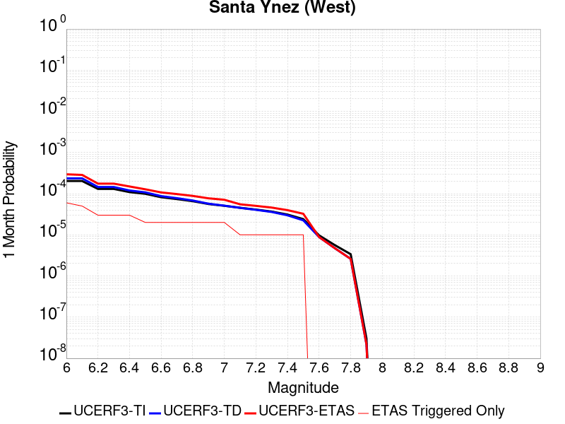 |  |  |

| Magnitude | 1 wk TI Prob | 1 wk TD Prob | 1 wk ETAS Prob | 1 wk ETAS/TD Gain | 1 wk ETAS Triggered Only | 1 mo TI Prob | 1 mo TD Prob | 1 mo ETAS Prob | 1 mo ETAS/TD Gain | 1 mo ETAS Triggered Only | 1 yr TI Prob | 1 yr TD Prob | 1 yr ETAS Prob | 1 yr ETAS/TD Gain | 1 yr ETAS Triggered Only | 10 yr TI Prob | 10 yr TD Prob | 10 yr ETAS Prob | 10 yr ETAS/TD Gain | 10 yr ETAS Triggered Only |
|-----|-----|-----|-----|-----|-----|-----|-----|-----|-----|-----|-----|-----|-----|-----|-----|-----|-----|-----|-----|-----|
| 6.0 | 4.7352758E-5 | 5.4972126E-5 | 9.873483E-5 | 1.796089 | 4.3765114E-5 | 2.0292461E-4 | 2.3557522E-4 | 2.7933E-4 | 1.1857361 | 4.3765114E-5 | 0.0024678076 | 0.0028645284 | 0.002919078 | 1.0190432 | 5.470639E-5 | 0.024405818 | 0.028304417 | 0.028368207 | 1.0022537 | 6.564767E-5 |
| 6.1 | 4.7352758E-5 | 5.4972126E-5 | 9.873483E-5 | 1.796089 | 4.3765114E-5 | 2.0292461E-4 | 2.3557522E-4 | 2.7933E-4 | 1.1857361 | 4.3765114E-5 | 0.0024678076 | 0.0028645284 | 0.002919078 | 1.0190432 | 5.470639E-5 | 0.024405818 | 0.028304417 | 0.028368207 | 1.0022537 | 6.564767E-5 |
| 6.2 | 3.0415853E-5 | 3.392511E-5 | 6.674783E-5 | 1.9675052 | 3.2823835E-5 | 1.3034715E-4 | 1.4538545E-4 | 1.7820451E-4 | 1.2257383 | 3.2823835E-5 | 0.0015858212 | 0.0017686661 | 0.0018123537 | 1.0247009 | 4.3765114E-5 | 0.015745522 | 0.017549807 | 0.017603554 | 1.0030625 | 5.470639E-5 |
| 6.3 | 3.0415853E-5 | 3.392511E-5 | 6.674783E-5 | 1.9675052 | 3.2823835E-5 | 1.3034715E-4 | 1.4538545E-4 | 1.7820451E-4 | 1.2257383 | 3.2823835E-5 | 0.0015858212 | 0.0017686661 | 0.0018123537 | 1.0247009 | 4.3765114E-5 | 0.015745522 | 0.017549807 | 0.017603554 | 1.0030625 | 5.470639E-5 |
| 6.4 | 2.5452082E-5 | 2.7912422E-5 | 6.073534E-5 | 2.175925 | 3.2823835E-5 | 1.09075794E-4 | 1.196193E-4 | 1.524392E-4 | 1.2743697 | 3.2823835E-5 | 0.0013271887 | 0.0014554089 | 0.0014991103 | 1.0300269 | 4.3765114E-5 | 0.013192902 | 0.014460951 | 0.014514866 | 1.0037284 | 5.470639E-5 |
| 6.5 | 2.3143784E-5 | 2.5128256E-5 | 4.7010264E-5 | 1.8708128 | 2.1882557E-5 | 9.9183875E-5 | 1.0768817E-4 | 1.2956838E-4 | 1.2031811 | 2.1882557E-5 | 0.0012068948 | 0.0013103267 | 0.0013431075 | 1.0250173 | 3.2823835E-5 | 0.012003611 | 0.01302768 | 0.013070875 | 1.0033157 | 4.3765114E-5 |
| 6.6 | 1.9118515E-5 | 2.035434E-5 | 4.223645E-5 | 2.0750587 | 2.1882557E-5 | 8.193392E-5 | 8.7230015E-5 | 1.0911066E-4 | 1.2508385 | 2.1882557E-5 | 9.97089E-4 | 0.001061516 | 0.001094305 | 1.0308888 | 3.2823835E-5 | 0.00992627 | 0.010565365 | 0.010597842 | 1.0030739 | 3.2823835E-5 |
| 6.7 | 1.722807E-5 | 1.8146347E-5 | 4.0028506E-5 | 2.2058713 | 2.1882557E-5 | 7.3832496E-5 | 7.776777E-5 | 9.964863E-5 | 1.2813615 | 2.1882557E-5 | 8.985399E-4 | 9.464169E-4 | 9.792097E-4 | 1.0346494 | 3.2823835E-5 | 0.008949154 | 0.0094245095 | 0.009457025 | 1.00345 | 3.2823835E-5 |
| 6.8 | 1.5317364E-5 | 1.5926486E-5 | 3.780869E-5 | 2.373951 | 2.1882557E-5 | 6.56442E-5 | 6.82546E-5 | 9.013567E-5 | 1.32058 | 2.1882557E-5 | 7.98925E-4 | 8.306873E-4 | 8.634838E-4 | 1.0394813 | 3.2823835E-5 | 0.007960589 | 0.00827631 | 0.008308861 | 1.0039332 | 3.2823835E-5 |
| 6.9 | 1.3071226E-5 | 1.3329624E-5 | 3.5211888E-5 | 2.6416266 | 2.1882557E-5 | 5.6018336E-5 | 5.7125722E-5 | 7.9007026E-5 | 1.3830377 | 2.1882557E-5 | 6.8180985E-4 | 6.9528597E-4 | 7.28087E-4 | 1.0471762 | 3.2823835E-5 | 0.0067972173 | 0.006931367 | 0.0069639636 | 1.0047027 | 3.2823835E-5 |
| 7.0 | 1.1836986E-5 | 1.19327815E-5 | 3.381508E-5 | 2.8337967 | 2.1882557E-5 | 5.0728955E-5 | 5.11395E-5 | 7.3020936E-5 | 1.4278774 | 2.1882557E-5 | 6.1745E-4 | 6.2244723E-4 | 6.552506E-4 | 1.0527008 | 3.2823835E-5 | 0.006157372 | 0.006207231 | 0.006239851 | 1.0052552 | 3.2823835E-5 |
| 7.1 | 1.0597169E-5 | 1.0542201E-5 | 2.1483364E-5 | 2.0378442 | 1.0941279E-5 | 4.541565E-5 | 4.5180084E-5 | 5.612087E-5 | 1.2421595 | 1.0941279E-5 | 5.5279525E-4 | 5.4992986E-4 | 5.718004E-4 | 1.0397696 | 2.1882557E-5 | 0.0055142213 | 0.005485821 | 0.0055075833 | 1.003967 | 2.1882557E-5 |
| 7.2 | 9.59113E-6 | 9.459144E-6 | 2.0400319E-5 | 2.156677 | 1.0941279E-5 | 4.11042E-5 | 4.0538565E-5 | 5.1479397E-5 | 1.2698871 | 1.0941279E-5 | 5.0032866E-4 | 4.934463E-4 | 5.1531807E-4 | 1.0443245 | 2.1882557E-5 | 0.004992037 | 0.0049236254 | 0.0049454 | 1.0044225 | 2.1882557E-5 |
| 7.3 | 8.586084E-6 | 8.379583E-6 | 1.932077E-5 | 2.3056958 | 1.0941279E-5 | 3.679698E-5 | 3.5912013E-5 | 4.6852896E-5 | 1.304658 | 1.0941279E-5 | 4.4791115E-4 | 4.3714207E-4 | 4.5901505E-4 | 1.0500363 | 2.1882557E-5 | 0.004470094 | 0.004362933 | 0.00438472 | 1.0049937 | 2.1882557E-5 |
| 7.4 | 7.2622997E-6 | 6.9515427E-6 | 1.7892744E-5 | 2.5739243 | 1.0941279E-5 | 3.112377E-5 | 2.979199E-5 | 4.0732943E-5 | 1.3672447 | 1.0941279E-5 | 3.78866E-4 | 3.626581E-4 | 3.845327E-4 | 1.0603175 | 2.1882557E-5 | 0.0037822074 | 0.0036207628 | 0.0036425663 | 1.0060217 | 2.1882557E-5 |
| 7.5 | 5.627296E-6 | 5.251588E-6 | 1.619281E-5 | 3.083412 | 1.0941279E-5 | 2.411676E-5 | 2.2506614E-5 | 3.3447646E-5 | 1.4861251 | 1.0941279E-5 | 2.9358198E-4 | 2.739843E-4 | 2.9586084E-4 | 1.079846 | 2.1882557E-5 | 0.0029319443 | 0.002736537 | 0.0027583598 | 1.0079745 | 2.1882557E-5 |
| 7.6 | 2.265244E-6 | 2.0608625E-6 | 2.0608625E-6 | 1.0 | 0.0 | 9.708152E-6 | 8.832238E-6 | 8.832238E-6 | 1.0 | 0.0 | 1.18190335E-4 | 1.0752728E-4 | 1.0752728E-4 | 1.0 | 0.0 | 0.001181275 | 0.0010747612 | 0.0010747612 | 1.0 | 0.0 |
| 7.7 | 1.3099874E-6 | 1.1016252E-6 | 1.1016252E-6 | 1.0 | 0.0 | 5.61422E-6 | 4.7212425E-6 | 4.7212425E-6 | 1.0 | 0.0 | 6.8350986E-5 | 5.7479636E-5 | 5.7479636E-5 | 1.0 | 0.0 | 6.832996E-4 | 5.7465007E-4 | 5.7465007E-4 | 1.0 | 0.0 |
| 7.8 | 7.903951E-7 | 6.0711415E-7 | 6.0711415E-7 | 1.0 | 0.0 | 3.3874032E-6 | 2.6019152E-6 | 2.6019152E-6 | 1.0 | 0.0 | 4.1240855E-5 | 3.167787E-5 | 3.167787E-5 | 1.0 | 0.0 | 4.12332E-4 | 3.167349E-4 | 3.167349E-4 | 1.0 | 0.0 |
| 7.9 | 7.0753297E-9 | 5.0899476E-9 | 5.0899476E-9 | 1.0 | 0.0 | 3.032284E-8 | 2.181406E-8 | 2.181406E-8 | 1.0 | 0.0 | 3.6918053E-7 | 2.6558615E-7 | 2.6558615E-7 | 1.0 | 0.0 | 3.691799E-6 | 2.6558594E-6 | 2.6558594E-6 | 1.0 | 0.0 |

## San Jacinto (Coyote Creek)
*[(top)](#table-of-contents)*

| 1 Week | 1 Month | 1 Year | 10 Year |
|-----|-----|-----|-----|
|  |  |  |  |

| Magnitude | 1 wk TI Prob | 1 wk TD Prob | 1 wk ETAS Prob | 1 wk ETAS/TD Gain | 1 wk ETAS Triggered Only | 1 mo TI Prob | 1 mo TD Prob | 1 mo ETAS Prob | 1 mo ETAS/TD Gain | 1 mo ETAS Triggered Only | 1 yr TI Prob | 1 yr TD Prob | 1 yr ETAS Prob | 1 yr ETAS/TD Gain | 1 yr ETAS Triggered Only | 10 yr TI Prob | 10 yr TD Prob | 10 yr ETAS Prob | 10 yr ETAS/TD Gain | 10 yr ETAS Triggered Only |
|-----|-----|-----|-----|-----|-----|-----|-----|-----|-----|-----|-----|-----|-----|-----|-----|-----|-----|-----|-----|-----|
| 6.0 | 2.7374346E-5 | 2.4145214E-5 | 6.790927E-5 | 2.8125355 | 4.3765114E-5 | 1.1731335E-4 | 1.034754E-4 | 1.5817613E-4 | 1.5286351 | 5.470639E-5 | 0.0014273542 | 0.0012590875 | 0.001313725 | 1.0433946 | 5.470639E-5 | 0.01418221 | 0.012928318 | 0.012993117 | 1.0050122 | 6.564767E-5 |
| 6.1 | 2.7374346E-5 | 2.4145214E-5 | 6.790927E-5 | 2.8125355 | 4.3765114E-5 | 1.1731335E-4 | 1.034754E-4 | 1.5817613E-4 | 1.5286351 | 5.470639E-5 | 0.0014273542 | 0.0012590875 | 0.001313725 | 1.0433946 | 5.470639E-5 | 0.01418221 | 0.012928318 | 0.012993117 | 1.0050122 | 6.564767E-5 |
| 6.2 | 2.7374346E-5 | 2.4145214E-5 | 6.790927E-5 | 2.8125355 | 4.3765114E-5 | 1.1731335E-4 | 1.034754E-4 | 1.5817613E-4 | 1.5286351 | 5.470639E-5 | 0.0014273542 | 0.0012590875 | 0.001313725 | 1.0433946 | 5.470639E-5 | 0.01418221 | 0.012928318 | 0.012993117 | 1.0050122 | 6.564767E-5 |
| 6.3 | 2.7374346E-5 | 2.4145214E-5 | 6.790927E-5 | 2.8125355 | 4.3765114E-5 | 1.1731335E-4 | 1.034754E-4 | 1.5817613E-4 | 1.5286351 | 5.470639E-5 | 0.0014273542 | 0.0012590875 | 0.001313725 | 1.0433946 | 5.470639E-5 | 0.01418221 | 0.012928318 | 0.012993117 | 1.0050122 | 6.564767E-5 |
| 6.4 | 2.7374346E-5 | 2.4145214E-5 | 6.790927E-5 | 2.8125355 | 4.3765114E-5 | 1.1731335E-4 | 1.034754E-4 | 1.5817613E-4 | 1.5286351 | 5.470639E-5 | 0.0014273542 | 0.0012590875 | 0.001313725 | 1.0433946 | 5.470639E-5 | 0.01418221 | 0.012928318 | 0.012993117 | 1.0050122 | 6.564767E-5 |
| 6.5 | 2.7282445E-5 | 2.4031293E-5 | 6.779535E-5 | 2.8211281 | 4.3765114E-5 | 1.16919524E-4 | 1.029872E-4 | 1.5768796E-4 | 1.5311413 | 5.470639E-5 | 0.0014225657 | 0.0012531505 | 0.0013077884 | 1.0436003 | 5.470639E-5 | 0.014134934 | 0.012869646 | 0.012934448 | 1.0050353 | 6.564767E-5 |
| 6.6 | 2.7282445E-5 | 2.4031293E-5 | 6.779535E-5 | 2.8211281 | 4.3765114E-5 | 1.16919524E-4 | 1.029872E-4 | 1.5768796E-4 | 1.5311413 | 5.470639E-5 | 0.0014225657 | 0.0012531505 | 0.0013077884 | 1.0436003 | 5.470639E-5 | 0.014134934 | 0.012869646 | 0.012934448 | 1.0050353 | 6.564767E-5 |
| 6.7 | 2.7216198E-5 | 2.3956412E-5 | 6.772048E-5 | 2.8268204 | 4.3765114E-5 | 1.1663563E-4 | 1.02666316E-4 | 1.5736709E-4 | 1.5328016 | 5.470639E-5 | 0.0014191137 | 0.0012492483 | 0.0013038864 | 1.0437367 | 5.470639E-5 | 0.014100855 | 0.0128310565 | 0.012895863 | 1.0050507 | 6.564767E-5 |
| 6.8 | 2.7078617E-5 | 2.387363E-5 | 6.7637695E-5 | 2.8331552 | 4.3765114E-5 | 1.1604605E-4 | 1.0231156E-4 | 1.5701236E-4 | 1.5346493 | 5.470639E-5 | 0.001411945 | 0.0012449342 | 0.0012995724 | 1.0438884 | 5.470639E-5 | 0.014030075 | 0.012788199 | 0.012853007 | 1.0050678 | 6.564767E-5 |
| 6.9 | 2.6982952E-5 | 2.3793142E-5 | 6.7557216E-5 | 2.8393567 | 4.3765114E-5 | 1.15636096E-4 | 1.0196664E-4 | 1.5666745E-4 | 1.5364579 | 5.470639E-5 | 0.0014069602 | 0.0012407395 | 0.001295378 | 1.0440371 | 5.470639E-5 | 0.013980856 | 0.012746515 | 0.0128113255 | 1.0050846 | 6.564767E-5 |
| 7.0 | 2.6449972E-5 | 2.3370165E-5 | 6.713426E-5 | 2.872648 | 4.3765114E-5 | 1.1335209E-4 | 1.00154015E-4 | 1.5485493E-4 | 1.546168 | 5.470639E-5 | 0.001379188 | 0.0012186957 | 0.0012733353 | 1.0448346 | 5.470639E-5 | 0.0137065975 | 0.0125278765 | 0.012592702 | 1.0051745 | 6.564767E-5 |
| 7.1 | 2.6257849E-5 | 2.3196202E-5 | 6.6960296E-5 | 2.8866925 | 4.3765114E-5 | 1.1252879E-4 | 9.940852E-5 | 1.5410947E-4 | 1.5502642 | 5.470639E-5 | 0.0013691769 | 0.0012096294 | 0.0012642696 | 1.045171 | 5.470639E-5 | 0.013607717 | 0.012437741 | 0.0125025725 | 1.0052124 | 6.564767E-5 |
| 7.2 | 2.5270041E-5 | 2.2390966E-5 | 6.61551E-5 | 2.954544 | 4.3765114E-5 | 1.0829568E-4 | 9.595777E-5 | 1.506589E-4 | 1.5700543 | 5.470639E-5 | 0.0013177024 | 0.0011676621 | 0.0012223045 | 1.0467966 | 5.470639E-5 | 0.013099162 | 0.012018777 | 0.012083637 | 1.0053965 | 6.564767E-5 |
| 7.3 | 2.339701E-5 | 2.1122814E-5 | 6.4887005E-5 | 3.071892 | 4.3765114E-5 | 1.0026905E-4 | 9.0523215E-5 | 1.4522465E-4 | 1.6042807 | 5.470639E-5 | 0.001220092 | 0.0011015651 | 0.0011562111 | 1.0496078 | 5.470639E-5 | 0.012134149 | 0.011357696 | 0.011422598 | 1.0057144 | 6.564767E-5 |
| 7.4 | 2.296333E-5 | 2.0853171E-5 | 6.461737E-5 | 3.0986834 | 4.3765114E-5 | 9.841056E-5 | 8.936768E-5 | 1.4406918E-4 | 1.6120949 | 5.470639E-5 | 0.0011974899 | 0.0010875105 | 0.0011421574 | 1.0502496 | 5.470639E-5 | 0.011910575 | 0.01121681 | 0.011281721 | 1.005787 | 6.564767E-5 |
| 7.5 | 2.2188895E-5 | 2.0376096E-5 | 6.414032E-5 | 3.1478217 | 4.3765114E-5 | 9.50918E-5 | 8.732321E-5 | 1.4202483E-4 | 1.6264269 | 5.470639E-5 | 0.0011571277 | 0.0010626436 | 0.0011172919 | 1.0514266 | 5.470639E-5 | 0.011511209 | 0.010966429 | 0.011031356 | 1.0059206 | 6.564767E-5 |
| 7.6 | 2.0013189E-5 | 1.8962366E-5 | 6.272665E-5 | 3.3079548 | 4.3765114E-5 | 8.5767984E-5 | 8.1264756E-5 | 1.3596671E-4 | 1.6731324 | 5.470639E-5 | 0.001043725 | 9.889511E-4 | 0.0010436034 | 1.0552629 | 5.470639E-5 | 0.010388365 | 0.010224434 | 0.01028941 | 1.006355 | 6.564767E-5 |
| 7.7 | 1.7230794E-5 | 1.674371E-5 | 6.050809E-5 | 3.6137803 | 4.3765114E-5 | 7.384417E-5 | 7.175679E-5 | 1.2645926E-4 | 1.7623316 | 5.470639E-5 | 8.986819E-4 | 8.7328954E-4 | 9.2794816E-4 | 1.0625893 | 5.470639E-5 | 0.008950562 | 0.009062956 | 0.009128009 | 1.0071778 | 6.564767E-5 |
| 7.8 | 1.4478809E-5 | 1.4990978E-5 | 5.8755435E-5 | 3.9193864 | 4.3765114E-5 | 6.205057E-5 | 6.424547E-5 | 1.18948345E-4 | 1.8514667 | 5.470639E-5 | 7.552038E-4 | 7.819085E-4 | 8.3657214E-4 | 1.0699105 | 5.470639E-5 | 0.0075264242 | 0.008141387 | 0.008206501 | 1.0079978 | 6.564767E-5 |
| 7.9 | 1.1114467E-5 | 1.1645102E-5 | 5.5409706E-5 | 4.7581983 | 4.3765114E-5 | 4.7632562E-5 | 4.990663E-5 | 1.0461029E-4 | 2.09612 | 5.470639E-5 | 5.797721E-4 | 6.074444E-4 | 6.6211756E-4 | 1.0900052 | 5.470639E-5 | 0.0057826187 | 0.0063803247 | 0.0064455536 | 1.0102234 | 6.564767E-5 |
| 8.0 | 9.327402E-6 | 9.899186E-6 | 5.3663865E-5 | 5.421038 | 4.3765114E-5 | 3.9973966E-5 | 4.2424395E-5 | 9.712847E-5 | 2.2894483 | 5.470639E-5 | 4.8657437E-4 | 5.1639514E-4 | 5.710733E-4 | 1.1058843 | 5.470639E-5 | 0.0048551033 | 0.0054499684 | 0.0055152583 | 1.0119798 | 6.564767E-5 |
| 8.1 | 7.0235833E-6 | 6.827495E-6 | 3.9651106E-5 | 5.807563 | 3.2823835E-5 | 3.0100724E-5 | 2.9260367E-5 | 7.30242E-5 | 2.4956694 | 4.3765114E-5 | 3.664147E-4 | 3.5618723E-4 | 3.9993678E-4 | 1.1228273 | 4.3765114E-5 | 0.003658111 | 0.0037876023 | 0.0038421014 | 1.0143888 | 5.470639E-5 |
| 8.2 | 2.0358202E-6 | 8.994527E-7 | 8.994527E-7 | 1.0 | 0.0 | 8.724915E-6 | 3.854792E-6 | 3.854792E-6 | 1.0 | 0.0 | 1.06220665E-4 | 4.69311E-5 | 4.69311E-5 | 1.0 | 0.0 | 0.001061699 | 5.3254166E-4 | 5.3254166E-4 | 1.0 | 0.0 |
| 8.3 | 2.0051264E-7 | 6.617272E-8 | 6.617272E-8 | 1.0 | 0.0 | 8.5933965E-7 | 2.8359733E-7 | 2.8359733E-7 | 1.0 | 0.0 | 1.046241E-5 | 3.4527925E-6 | 3.4527925E-6 | 1.0 | 0.0 | 1.0461917E-4 | 4.01389E-5 | 4.01389E-5 | 1.0 | 0.0 |

## Hunting Creek - Berryessa 2011 CFM
*[(top)](#table-of-contents)*

| 1 Week | 1 Month | 1 Year | 10 Year |
|-----|-----|-----|-----|
|  | 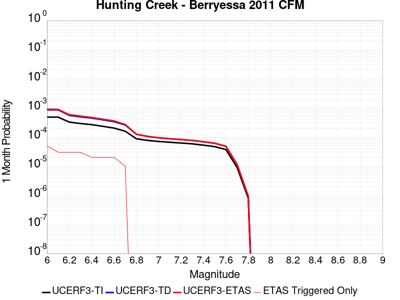 |  |  |

| Magnitude | 1 wk TI Prob | 1 wk TD Prob | 1 wk ETAS Prob | 1 wk ETAS/TD Gain | 1 wk ETAS Triggered Only | 1 mo TI Prob | 1 mo TD Prob | 1 mo ETAS Prob | 1 mo ETAS/TD Gain | 1 mo ETAS Triggered Only | 1 yr TI Prob | 1 yr TD Prob | 1 yr ETAS Prob | 1 yr ETAS/TD Gain | 1 yr ETAS Triggered Only | 10 yr TI Prob | 10 yr TD Prob | 10 yr ETAS Prob | 10 yr ETAS/TD Gain | 10 yr ETAS Triggered Only |
|-----|-----|-----|-----|-----|-----|-----|-----|-----|-----|-----|-----|-----|-----|-----|-----|-----|-----|-----|-----|-----|
| 6.0 | 1.1270982E-4 | 2.0012174E-4 | 2.3293901E-4 | 1.1639866 | 3.2823835E-5 | 4.8295266E-4 | 8.5739547E-4 | 9.011231E-4 | 1.0510005 | 4.3765114E-5 | 0.0058641075 | 0.010386313 | 0.010440451 | 1.0052124 | 5.470639E-5 | 0.057117578 | 0.09803703 | 0.098086365 | 1.0005033 | 5.470639E-5 |
| 6.1 | 1.1239393E-4 | 1.9960315E-4 | 2.2148133E-4 | 1.1096084 | 2.1882557E-5 | 4.8159933E-4 | 8.551744E-4 | 8.770382E-4 | 1.0255666 | 2.1882557E-5 | 0.0058477195 | 0.010359551 | 0.010392034 | 1.0031357 | 3.2823835E-5 | 0.056962132 | 0.09779551 | 0.09782512 | 1.0003028 | 3.2823835E-5 |
| 6.2 | 7.596265E-5 | 1.2940196E-4 | 1.5128168E-4 | 1.1690834 | 2.1882557E-5 | 3.2551357E-4 | 5.5444165E-4 | 5.763121E-4 | 1.0394459 | 2.1882557E-5 | 0.0039559277 | 0.0067210156 | 0.006753619 | 1.004851 | 3.2823835E-5 | 0.038862433 | 0.0645915 | 0.0646222 | 1.0004754 | 3.2823835E-5 |
| 6.3 | 6.78794E-5 | 1.145119E-4 | 1.3639196E-4 | 1.1910722 | 2.1882557E-5 | 2.9087928E-4 | 4.906513E-4 | 5.125231E-4 | 1.0445771 | 2.1882557E-5 | 0.003535705 | 0.005952679 | 0.0059853075 | 1.0054814 | 3.2823835E-5 | 0.034799766 | 0.057465393 | 0.05749633 | 1.0005383 | 3.2823835E-5 |
| 6.4 | 6.2165134E-5 | 1.0436625E-4 | 1.2624652E-4 | 1.209649 | 2.1882557E-5 | 2.6639478E-4 | 4.4721062E-4 | 4.690834E-4 | 1.0489093 | 2.1882557E-5 | 0.0032385332 | 0.005427573 | 0.0054602185 | 1.0060148 | 3.2823835E-5 | 0.03191742 | 0.052550517 | 0.052581616 | 1.0005918 | 3.2823835E-5 |
| 6.5 | 5.4368087E-5 | 9.071415E-5 | 1.12594724E-4 | 1.2412035 | 2.1882557E-5 | 2.3298527E-4 | 3.8872007E-4 | 4.1059413E-4 | 1.056272 | 2.1882557E-5 | 0.0028329059 | 0.0047198683 | 0.0047525372 | 1.0069215 | 3.2823835E-5 | 0.027970633 | 0.045880128 | 0.045911446 | 1.0006826 | 3.2823835E-5 |
| 6.6 | 4.729947E-5 | 7.847572E-5 | 1.0035656E-4 | 1.278823 | 2.1882557E-5 | 2.0269625E-4 | 3.362842E-4 | 3.581594E-4 | 1.0650498 | 2.1882557E-5 | 0.002465034 | 0.0040849647 | 0.0041176546 | 1.0080024 | 3.2823835E-5 | 0.02437869 | 0.03985155 | 0.039883066 | 1.0007908 | 3.2823835E-5 |
| 6.7 | 3.6875328E-5 | 6.0451803E-5 | 7.139242E-5 | 1.1809808 | 1.0941279E-5 | 1.5802756E-4 | 2.59056E-4 | 2.6999443E-4 | 1.0422243 | 1.0941279E-5 | 0.0019222875 | 0.0031482063 | 0.00317002 | 1.0069289 | 2.1882557E-5 | 0.019057442 | 0.03089237 | 0.030913578 | 1.0006864 | 2.1882557E-5 |
| 6.8 | 2.0292036E-5 | 2.8976308E-5 | 2.8976308E-5 | 1.0 | 0.0 | 8.6962966E-5 | 1.2417832E-4 | 1.2417832E-4 | 1.0 | 0.0 | 0.0010582599 | 0.0015108072 | 0.001521732 | 1.0072311 | 1.0941279E-5 | 0.010532344 | 0.014978523 | 0.014989301 | 1.0007195 | 1.0941279E-5 |
| 6.9 | 1.7871042E-5 | 2.4472254E-5 | 2.4472254E-5 | 1.0 | 0.0 | 7.658793E-5 | 1.048769E-4 | 1.048769E-4 | 1.0 | 0.0 | 9.320591E-4 | 0.0012761299 | 0.0012870572 | 1.0085628 | 1.0941279E-5 | 0.009281595 | 0.012679775 | 0.012690578 | 1.000852 | 1.0941279E-5 |
| 7.0 | 1.6415532E-5 | 2.1906277E-5 | 2.1906277E-5 | 1.0 | 0.0 | 7.035038E-5 | 9.3880684E-5 | 9.3880684E-5 | 1.0 | 0.0 | 8.561793E-4 | 0.0011424015 | 0.0011533303 | 1.0095665 | 1.0941279E-5 | 0.008528882 | 0.01136452 | 0.011375336 | 1.0009518 | 1.0941279E-5 |
| 7.1 | 1.5409885E-5 | 2.0346342E-5 | 2.0346342E-5 | 1.0 | 0.0 | 6.6040695E-5 | 8.7195716E-5 | 8.7195716E-5 | 1.0 | 0.0 | 8.0374884E-4 | 0.0010610938 | 0.0010720234 | 1.0103004 | 1.0941279E-5 | 0.00800848 | 0.010560595 | 0.010571421 | 1.0010251 | 1.0941279E-5 |
| 7.2 | 1.4497423E-5 | 1.9054964E-5 | 1.9054964E-5 | 1.0 | 0.0 | 6.213033E-5 | 8.166159E-5 | 8.166159E-5 | 1.0 | 0.0 | 7.5617427E-4 | 9.937795E-4 | 0.0010047099 | 1.0109988 | 1.0941279E-5 | 0.0075360634 | 0.009893929 | 0.009904761 | 1.0010949 | 1.0941279E-5 |
| 7.3 | 1.3615175E-5 | 1.7826127E-5 | 1.7826127E-5 | 1.0 | 0.0 | 5.8349444E-5 | 7.639547E-5 | 7.639547E-5 | 1.0 | 0.0 | 7.101729E-4 | 9.297209E-4 | 9.40652E-4 | 1.0117574 | 1.0941279E-5 | 0.0070790765 | 0.009258823 | 0.009269662 | 1.0011708 | 1.0941279E-5 |
| 7.4 | 1.2252825E-5 | 1.602625E-5 | 1.602625E-5 | 1.0 | 0.0 | 5.251105E-5 | 6.868213E-5 | 6.868213E-5 | 1.0 | 0.0 | 6.391345E-4 | 8.35887E-4 | 8.468191E-4 | 1.0130785 | 1.0941279E-5 | 0.0063729943 | 0.008327872 | 0.0083387215 | 1.0013028 | 1.0941279E-5 |
| 7.5 | 1.0913301E-5 | 1.4241117E-5 | 1.4241117E-5 | 1.0 | 0.0 | 4.6770452E-5 | 6.1031948E-5 | 6.1031948E-5 | 1.0 | 0.0 | 5.6928146E-4 | 7.4281334E-4 | 7.537465E-4 | 1.0147185 | 1.0941279E-5 | 0.0056782532 | 0.0074036797 | 0.00741454 | 1.0014669 | 1.0941279E-5 |
| 7.6 | 8.623192E-6 | 1.12346415E-5 | 1.12346415E-5 | 1.0 | 0.0 | 3.6956015E-5 | 4.814759E-5 | 4.814759E-5 | 1.0 | 0.0 | 4.4984656E-4 | 5.8604183E-4 | 5.9697666E-4 | 1.0186589 | 1.0941279E-5 | 0.00448937 | 0.0058452785 | 0.005856156 | 1.0018609 | 1.0941279E-5 |
| 7.7 | 2.0993634E-6 | 2.662584E-6 | 2.662584E-6 | 1.0 | 0.0 | 8.997241E-6 | 1.1411025E-5 | 1.1411025E-5 | 1.0 | 0.0 | 1.09535904E-4 | 1.3892044E-4 | 1.3892044E-4 | 1.0 | 0.0 | 0.0010948193 | 0.0013883426 | 0.0013883426 | 1.0 | 0.0 |
| 7.8 | 1.8428308E-7 | 2.167437E-7 | 2.167437E-7 | 1.0 | 0.0 | 7.897844E-7 | 9.289013E-7 | 9.289013E-7 | 1.0 | 0.0 | 9.615583E-6 | 1.1309318E-5 | 1.1309318E-5 | 1.0 | 0.0 | 9.615166E-5 | 1.13086026E-4 | 1.13086026E-4 | 1.0 | 0.0 |

## Santa Rosa Island
*[(top)](#table-of-contents)*

| 1 Week | 1 Month | 1 Year | 10 Year |
|-----|-----|-----|-----|
|  |  |  |  |

| Magnitude | 1 wk TI Prob | 1 wk TD Prob | 1 wk ETAS Prob | 1 wk ETAS/TD Gain | 1 wk ETAS Triggered Only | 1 mo TI Prob | 1 mo TD Prob | 1 mo ETAS Prob | 1 mo ETAS/TD Gain | 1 mo ETAS Triggered Only | 1 yr TI Prob | 1 yr TD Prob | 1 yr ETAS Prob | 1 yr ETAS/TD Gain | 1 yr ETAS Triggered Only | 10 yr TI Prob | 10 yr TD Prob | 10 yr ETAS Prob | 10 yr ETAS/TD Gain | 10 yr ETAS Triggered Only |
|-----|-----|-----|-----|-----|-----|-----|-----|-----|-----|-----|-----|-----|-----|-----|-----|-----|-----|-----|-----|-----|
| 6.0 | 4.1143165E-5 | 4.7091133E-5 | 9.0854184E-5 | 1.9293268 | 4.3765114E-5 | 1.7631594E-4 | 2.0180465E-4 | 2.4556092E-4 | 1.2168249 | 4.3765114E-5 | 0.002144533 | 0.0024544 | 0.0025198865 | 1.0266813 | 6.564767E-5 | 0.021239553 | 0.024293551 | 0.024357604 | 1.0026367 | 6.564767E-5 |
| 6.1 | 2.1061249E-5 | 2.3864959E-5 | 4.5746994E-5 | 1.9169105 | 2.1882557E-5 | 9.0259375E-5 | 1.0227455E-4 | 1.2415487E-4 | 1.213937 | 2.1882557E-5 | 0.0010983539 | 0.0012445104 | 0.0012663656 | 1.0175614 | 2.1882557E-5 | 0.01092941 | 0.012378449 | 0.01240006 | 1.0017459 | 2.1882557E-5 |
| 6.2 | 2.1061249E-5 | 2.3864959E-5 | 4.5746994E-5 | 1.9169105 | 2.1882557E-5 | 9.0259375E-5 | 1.0227455E-4 | 1.2415487E-4 | 1.213937 | 2.1882557E-5 | 0.0010983539 | 0.0012445104 | 0.0012663656 | 1.0175614 | 2.1882557E-5 | 0.01092941 | 0.012378449 | 0.01240006 | 1.0017459 | 2.1882557E-5 |
| 6.3 | 1.5158236E-5 | 1.7074419E-5 | 3.89566E-5 | 2.2815769 | 2.1882557E-5 | 6.496225E-5 | 7.3174095E-5 | 9.505505E-5 | 1.299026 | 2.1882557E-5 | 7.906284E-4 | 8.905424E-4 | 9.124055E-4 | 1.0245503 | 2.1882557E-5 | 0.007878214 | 0.008870989 | 0.008892678 | 1.0024449 | 2.1882557E-5 |
| 6.4 | 1.2341918E-5 | 1.3852917E-5 | 2.4794042E-5 | 1.7898067 | 1.0941279E-5 | 5.2892858E-5 | 5.9368336E-5 | 7.030897E-5 | 1.1842839 | 1.0941279E-5 | 6.437803E-4 | 7.225779E-4 | 7.335113E-4 | 1.0151311 | 1.0941279E-5 | 0.006419184 | 0.007203121 | 0.0072139837 | 1.001508 | 1.0941279E-5 |
| 6.5 | 9.061158E-6 | 1.0117031E-5 | 2.1058198E-5 | 2.0814602 | 1.0941279E-5 | 3.883296E-5 | 4.3358013E-5 | 5.4298816E-5 | 1.2523364 | 1.0941279E-5 | 4.726887E-4 | 5.277613E-4 | 5.3869677E-4 | 1.0207206 | 1.0941279E-5 | 0.004716845 | 0.0052656173 | 0.005276501 | 1.002067 | 1.0941279E-5 |
| 6.6 | 7.5461685E-6 | 8.400733E-6 | 1.934192E-5 | 2.3024085 | 1.0941279E-5 | 3.2340322E-5 | 3.600267E-5 | 4.6943554E-5 | 1.303891 | 1.0941279E-5 | 3.936723E-4 | 4.3824865E-4 | 4.4918514E-4 | 1.0249549 | 1.0941279E-5 | 0.003929756 | 0.0043742736 | 0.0043851673 | 1.0024903 | 1.0941279E-5 |
| 6.7 | 5.5023775E-6 | 6.087381E-6 | 6.087381E-6 | 1.0 | 0.0 | 2.3581404E-5 | 2.6088532E-5 | 2.6088532E-5 | 1.0 | 0.0 | 2.8706578E-4 | 3.1758484E-4 | 3.1758484E-4 | 1.0 | 0.0 | 0.0028669522 | 0.0031716314 | 0.0031716314 | 1.0 | 0.0 |
| 6.8 | 3.7351679E-6 | 4.0831405E-6 | 4.0831405E-6 | 1.0 | 0.0 | 1.6007763E-5 | 1.749907E-5 | 1.749907E-5 | 1.0 | 0.0 | 1.948771E-4 | 2.1303284E-4 | 2.1303284E-4 | 1.0 | 0.0 | 0.0019470629 | 0.0021285315 | 0.0021285315 | 1.0 | 0.0 |
| 6.9 | 2.456366E-6 | 2.6292705E-6 | 2.6292705E-6 | 1.0 | 0.0 | 1.0527241E-5 | 1.1268254E-5 | 1.1268254E-5 | 1.0 | 0.0 | 1.2816161E-4 | 1.3718237E-4 | 1.3718237E-4 | 1.0 | 0.0 | 0.0012808773 | 0.0013709799 | 0.0013709799 | 1.0 | 0.0 |
| 7.0 | 2.3245157E-6 | 2.4827782E-6 | 2.4827782E-6 | 1.0 | 0.0 | 9.962172E-6 | 1.0640435E-5 | 1.0640435E-5 | 1.0 | 0.0 | 1.2128269E-4 | 1.2953962E-4 | 1.2953962E-4 | 1.0 | 0.0 | 0.0012121652 | 0.0012946434 | 0.0012946434 | 1.0 | 0.0 |
| 7.1 | 2.2248344E-6 | 2.37325E-6 | 2.37325E-6 | 1.0 | 0.0 | 9.53497E-6 | 1.0171032E-5 | 1.0171032E-5 | 1.0 | 0.0 | 1.1608207E-4 | 1.2382529E-4 | 1.2382529E-4 | 1.0 | 0.0 | 0.0011602144 | 0.001237565 | 0.001237565 | 1.0 | 0.0 |
| 7.2 | 2.1350402E-6 | 2.276154E-6 | 2.276154E-6 | 1.0 | 0.0 | 9.150141E-6 | 9.754909E-6 | 9.754909E-6 | 1.0 | 0.0 | 1.1139726E-4 | 1.1875956E-4 | 1.1875956E-4 | 1.0 | 0.0 | 0.0011134144 | 0.0011869629 | 0.0011869629 | 1.0 | 0.0 |
| 7.3 | 1.9793572E-6 | 2.108719E-6 | 2.108719E-6 | 1.0 | 0.0 | 8.482932E-6 | 9.037336E-6 | 9.037336E-6 | 1.0 | 0.0 | 1.032748E-4 | 1.10024026E-4 | 1.10024026E-4 | 1.0 | 0.0 | 0.0010322682 | 0.0010996973 | 0.0010996973 | 1.0 | 0.0 |
| 7.4 | 1.6951194E-6 | 1.8045733E-6 | 1.8045733E-6 | 1.0 | 0.0 | 7.264777E-6 | 7.733863E-6 | 7.733863E-6 | 1.0 | 0.0 | 8.844508E-5 | 9.415573E-5 | 9.415573E-5 | 1.0 | 0.0 | 8.840988E-4 | 9.4116E-4 | 9.4116E-4 | 1.0 | 0.0 |
| 7.5 | 8.987207E-7 | 9.5122147E-7 | 9.5122147E-7 | 1.0 | 0.0 | 3.8516546E-6 | 4.076657E-6 | 4.076657E-6 | 1.0 | 0.0 | 4.6892885E-5 | 4.963218E-5 | 4.963218E-5 | 1.0 | 0.0 | 4.688299E-4 | 4.9621216E-4 | 4.9621216E-4 | 1.0 | 0.0 |
| 7.6 | 3.8783037E-7 | 4.052932E-7 | 4.052932E-7 | 1.0 | 0.0 | 1.6621291E-6 | 1.7369698E-6 | 1.7369698E-6 | 1.0 | 0.0 | 2.0236233E-5 | 2.1147409E-5 | 2.1147409E-5 | 1.0 | 0.0 | 2.023439E-4 | 2.1145462E-4 | 2.1145462E-4 | 1.0 | 0.0 |
| 7.7 | 6.181804E-8 | 6.339035E-8 | 6.339035E-8 | 1.0 | 0.0 | 2.6493444E-7 | 2.7167292E-7 | 2.7167292E-7 | 1.0 | 0.0 | 3.225572E-6 | 3.3076128E-6 | 3.3076128E-6 | 1.0 | 0.0 | 3.225525E-5 | 3.307564E-5 | 3.307564E-5 | 1.0 | 0.0 |
| 7.8 | 1.3704449E-9 | 1.3964153E-9 | 1.3964153E-9 | 1.0 | 0.0 | 5.873335E-9 | 5.984637E-9 | 5.984637E-9 | 1.0 | 0.0 | 7.1507856E-8 | 7.286295E-8 | 7.286295E-8 | 1.0 | 0.0 | 7.1507833E-7 | 7.286294E-7 | 7.286294E-7 | 1.0 | 0.0 |

## Lost Hills
*[(top)](#table-of-contents)*

| 1 Week | 1 Month | 1 Year | 10 Year |
|-----|-----|-----|-----|
|  |  |  |  |

| Magnitude | 1 wk TI Prob | 1 wk TD Prob | 1 wk ETAS Prob | 1 wk ETAS/TD Gain | 1 wk ETAS Triggered Only | 1 mo TI Prob | 1 mo TD Prob | 1 mo ETAS Prob | 1 mo ETAS/TD Gain | 1 mo ETAS Triggered Only | 1 yr TI Prob | 1 yr TD Prob | 1 yr ETAS Prob | 1 yr ETAS/TD Gain | 1 yr ETAS Triggered Only | 10 yr TI Prob | 10 yr TD Prob | 10 yr ETAS Prob | 10 yr ETAS/TD Gain | 10 yr ETAS Triggered Only |
|-----|-----|-----|-----|-----|-----|-----|-----|-----|-----|-----|-----|-----|-----|-----|-----|-----|-----|-----|-----|-----|
| 6.0 | 2.233523E-5 | 2.5106583E-5 | 4.698859E-5 | 1.8715645 | 2.1882557E-5 | 9.571891E-5 | 1.0759615E-4 | 1.6229665E-4 | 1.5083872 | 5.470639E-5 | 0.0011647546 | 0.001309364 | 0.0013639987 | 1.0417262 | 5.470639E-5 | 0.011586686 | 0.013033091 | 0.0130870845 | 1.0041428 | 5.470639E-5 |
| 6.1 | 2.233523E-5 | 2.5106583E-5 | 4.698859E-5 | 1.8715645 | 2.1882557E-5 | 9.571891E-5 | 1.0759615E-4 | 1.6229665E-4 | 1.5083872 | 5.470639E-5 | 0.0011647546 | 0.001309364 | 0.0013639987 | 1.0417262 | 5.470639E-5 | 0.011586686 | 0.013033091 | 0.0130870845 | 1.0041428 | 5.470639E-5 |
| 6.2 | 2.233523E-5 | 2.5106583E-5 | 4.698859E-5 | 1.8715645 | 2.1882557E-5 | 9.571891E-5 | 1.0759615E-4 | 1.6229665E-4 | 1.5083872 | 5.470639E-5 | 0.0011647546 | 0.001309364 | 0.0013639987 | 1.0417262 | 5.470639E-5 | 0.011586686 | 0.013033091 | 0.0130870845 | 1.0041428 | 5.470639E-5 |
| 6.3 | 2.233523E-5 | 2.5106583E-5 | 4.698859E-5 | 1.8715645 | 2.1882557E-5 | 9.571891E-5 | 1.0759615E-4 | 1.6229665E-4 | 1.5083872 | 5.470639E-5 | 0.0011647546 | 0.001309364 | 0.0013639987 | 1.0417262 | 5.470639E-5 | 0.011586686 | 0.013033091 | 0.0130870845 | 1.0041428 | 5.470639E-5 |
| 6.4 | 1.2288092E-5 | 1.3781108E-5 | 1.3781108E-5 | 1.0 | 0.0 | 5.2662188E-5 | 5.906108E-5 | 5.906108E-5 | 1.0 | 0.0 | 6.409735E-4 | 7.189252E-4 | 7.189252E-4 | 1.0 | 0.0 | 0.006391279 | 0.0071752006 | 0.0071752006 | 1.0 | 0.0 |
| 6.5 | 1.2288092E-5 | 1.3781108E-5 | 1.3781108E-5 | 1.0 | 0.0 | 5.2662188E-5 | 5.906108E-5 | 5.906108E-5 | 1.0 | 0.0 | 6.409735E-4 | 7.189252E-4 | 7.189252E-4 | 1.0 | 0.0 | 0.006391279 | 0.0071752006 | 0.0071752006 | 1.0 | 0.0 |
| 6.6 | 8.58281E-6 | 9.63377E-6 | 9.63377E-6 | 1.0 | 0.0 | 3.6782953E-5 | 4.12874E-5 | 4.12874E-5 | 1.0 | 0.0 | 4.4774043E-4 | 5.026414E-4 | 5.026414E-4 | 1.0 | 0.0 | 0.0044683935 | 0.005023205 | 0.005023205 | 1.0 | 0.0 |
| 6.7 | 7.205685E-6 | 8.088302E-6 | 8.088302E-6 | 1.0 | 0.0 | 3.088114E-5 | 3.466415E-5 | 3.466415E-5 | 1.0 | 0.0 | 3.7591302E-4 | 4.2203604E-4 | 4.2203604E-4 | 1.0 | 0.0 | 0.0037527776 | 0.0042203604 | 0.0042203604 | 1.0 | 0.0 |

## Pleito
*[(top)](#table-of-contents)*

| 1 Week | 1 Month | 1 Year | 10 Year |
|-----|-----|-----|-----|
|  |  |  |  |

| Magnitude | 1 wk TI Prob | 1 wk TD Prob | 1 wk ETAS Prob | 1 wk ETAS/TD Gain | 1 wk ETAS Triggered Only | 1 mo TI Prob | 1 mo TD Prob | 1 mo ETAS Prob | 1 mo ETAS/TD Gain | 1 mo ETAS Triggered Only | 1 yr TI Prob | 1 yr TD Prob | 1 yr ETAS Prob | 1 yr ETAS/TD Gain | 1 yr ETAS Triggered Only | 10 yr TI Prob | 10 yr TD Prob | 10 yr ETAS Prob | 10 yr ETAS/TD Gain | 10 yr ETAS Triggered Only |
|-----|-----|-----|-----|-----|-----|-----|-----|-----|-----|-----|-----|-----|-----|-----|-----|-----|-----|-----|-----|-----|
| 6.0 | 1.6763008E-5 | 2.4763838E-5 | 5.758686E-5 | 2.3254416 | 3.2823835E-5 | 7.183948E-5 | 1.0612683E-4 | 1.3894717E-4 | 1.309256 | 3.2823835E-5 | 8.742947E-4 | 0.0012914003 | 0.0013351089 | 1.0338459 | 4.3765114E-5 | 0.00870863 | 0.0129538905 | 0.013007888 | 1.0041685 | 5.470639E-5 |
| 6.1 | 1.6763008E-5 | 2.4763838E-5 | 5.758686E-5 | 2.3254416 | 3.2823835E-5 | 7.183948E-5 | 1.0612683E-4 | 1.3894717E-4 | 1.309256 | 3.2823835E-5 | 8.742947E-4 | 0.0012914003 | 0.0013351089 | 1.0338459 | 4.3765114E-5 | 0.00870863 | 0.0129538905 | 0.013007888 | 1.0041685 | 5.470639E-5 |
| 6.2 | 1.6763008E-5 | 2.4763838E-5 | 5.758686E-5 | 2.3254416 | 3.2823835E-5 | 7.183948E-5 | 1.0612683E-4 | 1.3894717E-4 | 1.309256 | 3.2823835E-5 | 8.742947E-4 | 0.0012914003 | 0.0013351089 | 1.0338459 | 4.3765114E-5 | 0.00870863 | 0.0129538905 | 0.013007888 | 1.0041685 | 5.470639E-5 |
| 6.3 | 1.6763008E-5 | 2.4763838E-5 | 5.758686E-5 | 2.3254416 | 3.2823835E-5 | 7.183948E-5 | 1.0612683E-4 | 1.3894717E-4 | 1.309256 | 3.2823835E-5 | 8.742947E-4 | 0.0012914003 | 0.0013351089 | 1.0338459 | 4.3765114E-5 | 0.00870863 | 0.0129538905 | 0.013007888 | 1.0041685 | 5.470639E-5 |
| 6.4 | 1.6763008E-5 | 2.4763838E-5 | 5.758686E-5 | 2.3254416 | 3.2823835E-5 | 7.183948E-5 | 1.0612683E-4 | 1.3894717E-4 | 1.309256 | 3.2823835E-5 | 8.742947E-4 | 0.0012914003 | 0.0013351089 | 1.0338459 | 4.3765114E-5 | 0.00870863 | 0.0129538905 | 0.013007888 | 1.0041685 | 5.470639E-5 |
| 6.5 | 1.6763008E-5 | 2.4763838E-5 | 5.758686E-5 | 2.3254416 | 3.2823835E-5 | 7.183948E-5 | 1.0612683E-4 | 1.3894717E-4 | 1.309256 | 3.2823835E-5 | 8.742947E-4 | 0.0012914003 | 0.0013351089 | 1.0338459 | 4.3765114E-5 | 0.00870863 | 0.0129538905 | 0.013007888 | 1.0041685 | 5.470639E-5 |
| 6.6 | 9.910213E-6 | 1.7214623E-5 | 3.90968E-5 | 2.271139 | 2.1882557E-5 | 4.247165E-5 | 7.377489E-5 | 9.5655836E-5 | 1.2965907 | 2.1882557E-5 | 5.169696E-4 | 8.978429E-4 | 9.3063724E-4 | 1.0365257 | 3.2823835E-5 | 0.0051576863 | 0.009050702 | 0.009094071 | 1.0047917 | 4.3765114E-5 |
| 6.7 | 9.910213E-6 | 1.7214623E-5 | 3.90968E-5 | 2.271139 | 2.1882557E-5 | 4.247165E-5 | 7.377489E-5 | 9.5655836E-5 | 1.2965907 | 2.1882557E-5 | 5.169696E-4 | 8.978429E-4 | 9.3063724E-4 | 1.0365257 | 3.2823835E-5 | 0.0051576863 | 0.009050702 | 0.009094071 | 1.0047917 | 4.3765114E-5 |
| 6.8 | 8.300162E-6 | 1.5474232E-5 | 3.735645E-5 | 2.4141068 | 2.1882557E-5 | 3.557164E-5 | 6.631646E-5 | 8.8197565E-5 | 1.3299499 | 2.1882557E-5 | 4.3299864E-4 | 8.071053E-4 | 8.399026E-4 | 1.0406358 | 3.2823835E-5 | 0.004321559 | 0.008150139 | 0.008193547 | 1.0053262 | 4.3765114E-5 |
| 6.9 | 8.183114E-6 | 1.5345448E-5 | 3.7227666E-5 | 2.4259748 | 2.1882557E-5 | 3.5070017E-5 | 6.576455E-5 | 8.764567E-5 | 1.332719 | 2.1882557E-5 | 4.2689382E-4 | 8.003907E-4 | 8.331883E-4 | 1.0409769 | 3.2823835E-5 | 0.0042607468 | 0.008083483 | 0.008126895 | 1.0053704 | 4.3765114E-5 |
| 7.0 | 7.1748823E-6 | 1.413244E-5 | 1.413244E-5 | 1.0 | 0.0 | 3.0749135E-5 | 6.0566195E-5 | 6.0566195E-5 | 1.0 | 0.0 | 3.743064E-4 | 7.371445E-4 | 7.480777E-4 | 1.0148319 | 1.0941279E-5 | 0.0037367654 | 0.007454939 | 0.0074766586 | 1.0029135 | 2.1882557E-5 |
| 7.1 | 7.1671807E-6 | 1.412281E-5 | 1.412281E-5 | 1.0 | 0.0 | 3.0716128E-5 | 6.052493E-5 | 6.052493E-5 | 1.0 | 0.0 | 3.7390468E-4 | 7.366424E-4 | 7.475756E-4 | 1.0148419 | 1.0941279E-5 | 0.0037327618 | 0.0074499524 | 0.007471672 | 1.0029154 | 2.1882557E-5 |
| 7.2 | 7.0649667E-6 | 1.39701015E-5 | 1.39701015E-5 | 1.0 | 0.0 | 3.0278077E-5 | 5.9870494E-5 | 5.9870494E-5 | 1.0 | 0.0 | 3.6857324E-4 | 7.2868E-4 | 7.396133E-4 | 1.0150043 | 1.0941279E-5 | 0.0036796255 | 0.0073707094 | 0.0073924307 | 1.002947 | 2.1882557E-5 |
| 7.3 | 7.02082E-6 | 1.3913556E-5 | 1.3913556E-5 | 1.0 | 0.0 | 3.008888E-5 | 5.9628168E-5 | 5.9628168E-5 | 1.0 | 0.0 | 3.6627054E-4 | 7.2573166E-4 | 7.36665E-4 | 1.0150653 | 1.0941279E-5 | 0.0036566744 | 0.007341209 | 0.007362931 | 1.0029589 | 2.1882557E-5 |
| 7.4 | 6.987146E-6 | 1.3873118E-5 | 1.3873118E-5 | 1.0 | 0.0 | 2.9944567E-5 | 5.945487E-5 | 5.945487E-5 | 1.0 | 0.0 | 3.6451413E-4 | 7.2362315E-4 | 7.345565E-4 | 1.0151092 | 1.0941279E-5 | 0.0036391679 | 0.007320144 | 0.007341867 | 1.0029675 | 2.1882557E-5 |
| 7.5 | 6.9494554E-6 | 1.3830024E-5 | 1.3830024E-5 | 1.0 | 0.0 | 2.9783041E-5 | 5.9270187E-5 | 5.9270187E-5 | 1.0 | 0.0 | 3.625482E-4 | 7.2137616E-4 | 7.3230953E-4 | 1.0151563 | 1.0941279E-5 | 0.0036195726 | 0.0072977724 | 0.0073194955 | 1.0029767 | 2.1882557E-5 |
| 7.6 | 6.92694E-6 | 1.3789138E-5 | 1.3789138E-5 | 1.0 | 0.0 | 2.9686547E-5 | 5.909497E-5 | 5.909497E-5 | 1.0 | 0.0 | 3.6137376E-4 | 7.1924424E-4 | 7.301777E-4 | 1.0152012 | 1.0941279E-5 | 0.0036078666 | 0.0072765257 | 0.0072982493 | 1.0029854 | 2.1882557E-5 |
| 7.7 | 6.395867E-6 | 1.2668219E-5 | 1.2668219E-5 | 1.0 | 0.0 | 2.741057E-5 | 5.429124E-5 | 5.429124E-5 | 1.0 | 0.0 | 3.336726E-4 | 6.6079566E-4 | 6.7172974E-4 | 1.0165468 | 1.0941279E-5 | 0.0033317201 | 0.0066951844 | 0.0067169205 | 1.0032465 | 2.1882557E-5 |
| 7.8 | 5.8664327E-6 | 1.153586E-5 | 1.153586E-5 | 1.0 | 0.0 | 2.5141611E-5 | 4.9438466E-5 | 4.9438466E-5 | 1.0 | 0.0 | 3.060561E-4 | 6.017473E-4 | 6.1268196E-4 | 1.0181715 | 1.0941279E-5 | 0.0030563495 | 0.0061006667 | 0.0061224154 | 1.0035651 | 2.1882557E-5 |
| 7.9 | 3.7167474E-6 | 7.1140853E-6 | 7.1140853E-6 | 1.0 | 0.0 | 1.592882E-5 | 3.0488582E-5 | 3.0488582E-5 | 1.0 | 0.0 | 1.9391612E-4 | 3.7113542E-4 | 3.8207264E-4 | 1.0294696 | 1.0941279E-5 | 0.0019374699 | 0.0037674906 | 0.0037892908 | 1.0057864 | 2.1882557E-5 |
| 8.0 | 1.0903841E-6 | 1.2879392E-6 | 1.2879392E-6 | 1.0 | 0.0 | 4.6730665E-6 | 5.5197274E-6 | 5.5197274E-6 | 1.0 | 0.0 | 5.68931E-5 | 6.720063E-5 | 6.720063E-5 | 1.0 | 0.0 | 5.6878536E-4 | 6.941948E-4 | 7.051285E-4 | 1.0157502 | 1.0941279E-5 |
| 8.1 | 2.6894583E-7 | 1.1060341E-7 | 1.1060341E-7 | 1.0 | 0.0 | 1.1526245E-6 | 4.740145E-7 | 4.740145E-7 | 1.0 | 0.0 | 1.4033113E-5 | 5.7711113E-6 | 5.7711113E-6 | 1.0 | 0.0 | 1.4032227E-4 | 6.456908E-5 | 6.456908E-5 | 1.0 | 0.0 |
| 8.2 | 5.2967013E-9 | 2.4578228E-9 | 2.4578228E-9 | 1.0 | 0.0 | 2.2700148E-8 | 1.0533527E-8 | 1.0533527E-8 | 1.0 | 0.0 | 2.7637427E-7 | 1.2824569E-7 | 1.2824569E-7 | 1.0 | 0.0 | 2.7637393E-6 | 1.4592787E-6 | 1.4592787E-6 | 1.0 | 0.0 |

## Oceanic - West Huasna
*[(top)](#table-of-contents)*

| 1 Week | 1 Month | 1 Year | 10 Year |
|-----|-----|-----|-----|
|  |  |  |  |

| Magnitude | 1 wk TI Prob | 1 wk TD Prob | 1 wk ETAS Prob | 1 wk ETAS/TD Gain | 1 wk ETAS Triggered Only | 1 mo TI Prob | 1 mo TD Prob | 1 mo ETAS Prob | 1 mo ETAS/TD Gain | 1 mo ETAS Triggered Only | 1 yr TI Prob | 1 yr TD Prob | 1 yr ETAS Prob | 1 yr ETAS/TD Gain | 1 yr ETAS Triggered Only | 10 yr TI Prob | 10 yr TD Prob | 10 yr ETAS Prob | 10 yr ETAS/TD Gain | 10 yr ETAS Triggered Only |
|-----|-----|-----|-----|-----|-----|-----|-----|-----|-----|-----|-----|-----|-----|-----|-----|-----|-----|-----|-----|-----|
| 6.0 | 3.195567E-5 | 2.7926868E-5 | 8.2631734E-5 | 2.9588614 | 5.470639E-5 | 1.3694567E-4 | 1.1968133E-4 | 1.7438117E-4 | 1.4570458 | 5.470639E-5 | 0.0016660384 | 0.0014561893 | 0.001510816 | 1.0375135 | 5.470639E-5 | 0.016536033 | 0.014471028 | 0.014524942 | 1.0037256 | 5.470639E-5 |
| 6.1 | 2.1156782E-5 | 1.7573486E-5 | 3.945566E-5 | 2.245181 | 2.1882557E-5 | 9.066878E-5 | 7.531282E-5 | 9.7193726E-5 | 1.2905337 | 2.1882557E-5 | 0.0011033333 | 9.165572E-4 | 9.384197E-4 | 1.0238528 | 2.1882557E-5 | 0.010978713 | 0.009128777 | 0.00915046 | 1.0023752 | 2.1882557E-5 |
| 6.2 | 1.6195117E-5 | 1.3327152E-5 | 3.5209418E-5 | 2.641931 | 2.1882557E-5 | 6.9405796E-5 | 5.7115132E-5 | 7.899644E-5 | 1.3831087 | 2.1882557E-5 | 8.44688E-4 | 6.9515745E-4 | 7.170248E-4 | 1.0314567 | 2.1882557E-5 | 0.008414844 | 0.006930123 | 0.006951854 | 1.0031357 | 2.1882557E-5 |
| 6.3 | 1.3559345E-5 | 1.1179142E-5 | 2.2120299E-5 | 1.9787115 | 1.0941279E-5 | 5.811018E-5 | 4.7909736E-5 | 5.885049E-5 | 1.2283618 | 1.0941279E-5 | 7.072618E-4 | 5.831459E-4 | 5.940808E-4 | 1.0187516 | 1.0941279E-5 | 0.0070501505 | 0.0058162753 | 0.0058271526 | 1.0018702 | 1.0941279E-5 |
| 6.4 | 1.2120619E-5 | 1.0000977E-5 | 2.0942147E-5 | 2.0940099 | 1.0941279E-5 | 5.1944477E-5 | 4.2860633E-5 | 5.380144E-5 | 1.2552648 | 1.0941279E-5 | 6.322405E-4 | 5.2170374E-4 | 5.3263933E-4 | 1.0209613 | 1.0941279E-5 | 0.006304447 | 0.0052048573 | 0.0052157417 | 1.0020912 | 1.0941279E-5 |
| 6.5 | 1.13511915E-5 | 9.3674735E-6 | 2.030865E-5 | 2.1679964 | 1.0941279E-5 | 4.8647056E-5 | 4.01457E-5 | 5.108654E-5 | 1.2725283 | 1.0941279E-5 | 5.9211696E-4 | 4.886647E-4 | 4.9960066E-4 | 1.0223792 | 1.0941279E-5 | 0.0059054173 | 0.0048759608 | 0.004886849 | 1.002233 | 1.0941279E-5 |
| 6.6 | 9.850605E-6 | 8.135418E-6 | 8.135418E-6 | 1.0 | 0.0 | 4.2216197E-5 | 3.4865614E-5 | 3.4865614E-5 | 1.0 | 0.0 | 5.1386096E-4 | 4.2440637E-4 | 4.2440637E-4 | 1.0 | 0.0 | 0.0051267436 | 0.004235991 | 0.004235991 | 1.0 | 0.0 |
| 6.7 | 8.8558645E-6 | 7.318433E-6 | 7.318433E-6 | 1.0 | 0.0 | 3.7953152E-5 | 3.1364336E-5 | 3.1364336E-5 | 1.0 | 0.0 | 4.6198163E-4 | 3.8179406E-4 | 3.8179406E-4 | 1.0 | 0.0 | 0.004610224 | 0.0038114067 | 0.0038114067 | 1.0 | 0.0 |
| 6.8 | 7.67136E-6 | 6.391756E-6 | 6.391756E-6 | 1.0 | 0.0 | 3.2876844E-5 | 2.7392953E-5 | 2.7392953E-5 | 1.0 | 0.0 | 4.0020206E-4 | 3.3345833E-4 | 3.3345833E-4 | 1.0 | 0.0 | 0.003994821 | 0.0033296007 | 0.0033296007 | 1.0 | 0.0 |
| 6.9 | 6.534529E-6 | 5.4583297E-6 | 5.4583297E-6 | 1.0 | 0.0 | 2.8004823E-5 | 2.3392633E-5 | 2.3392633E-5 | 1.0 | 0.0 | 3.4090536E-4 | 2.847682E-4 | 2.847682E-4 | 1.0 | 0.0 | 0.0034038287 | 0.0028440498 | 0.0028440498 | 1.0 | 0.0 |
| 7.0 | 5.460525E-6 | 4.5699517E-6 | 4.5699517E-6 | 1.0 | 0.0 | 2.3402039E-5 | 1.958536E-5 | 1.958536E-5 | 1.0 | 0.0 | 2.8488258E-4 | 2.3842578E-4 | 2.3842578E-4 | 1.0 | 0.0 | 0.0028451765 | 0.0023817138 | 0.0023817138 | 1.0 | 0.0 |
| 7.1 | 4.4825083E-6 | 3.7524428E-6 | 3.7524428E-6 | 1.0 | 0.0 | 1.9210609E-5 | 1.60818E-5 | 1.60818E-5 | 1.0 | 0.0 | 2.3386406E-4 | 1.9577841E-4 | 1.9577841E-4 | 1.0 | 0.0 | 0.002336181 | 0.0019560715 | 0.0019560715 | 1.0 | 0.0 |
| 7.2 | 2.821708E-6 | 2.4249334E-6 | 2.4249334E-6 | 1.0 | 0.0 | 1.2092979E-5 | 1.039253E-5 | 1.039253E-5 | 1.0 | 0.0 | 1.4722206E-4 | 1.2652173E-4 | 1.2652173E-4 | 1.0 | 0.0 | 0.0014712457 | 0.0012644994 | 0.0012644994 | 1.0 | 0.0 |
| 7.3 | 2.0644757E-6 | 1.7687412E-6 | 1.7687412E-6 | 1.0 | 0.0 | 8.847723E-6 | 7.5802973E-6 | 7.5802973E-6 | 1.0 | 0.0 | 1.0771569E-4 | 9.228622E-5 | 9.228622E-5 | 1.0 | 0.0 | 0.001076635 | 9.2248066E-4 | 9.2248066E-4 | 1.0 | 0.0 |
| 7.4 | 1.6980367E-6 | 1.4379892E-6 | 1.4379892E-6 | 1.0 | 0.0 | 7.27728E-6 | 6.162796E-6 | 6.162796E-6 | 1.0 | 0.0 | 8.8597284E-5 | 7.5029464E-5 | 7.5029464E-5 | 1.0 | 0.0 | 8.8561967E-4 | 7.500429E-4 | 7.500429E-4 | 1.0 | 0.0 |
| 7.5 | 1.3637683E-6 | 1.1302635E-6 | 1.1302635E-6 | 1.0 | 0.0 | 5.844708E-6 | 4.8439774E-6 | 4.8439774E-6 | 1.0 | 0.0 | 7.1156996E-5 | 5.897383E-5 | 5.897383E-5 | 1.0 | 0.0 | 7.1134215E-4 | 5.895833E-4 | 5.895833E-4 | 1.0 | 0.0 |
| 7.6 | 9.802994E-7 | 7.677247E-7 | 7.677247E-7 | 1.0 | 0.0 | 4.2012766E-6 | 3.2902446E-6 | 3.2902446E-6 | 1.0 | 0.0 | 5.1149345E-5 | 4.0057992E-5 | 4.0057992E-5 | 1.0 | 0.0 | 5.113757E-4 | 4.0050913E-4 | 4.0050913E-4 | 1.0 | 0.0 |
| 7.7 | 5.986191E-7 | 4.0050548E-7 | 4.0050548E-7 | 1.0 | 0.0 | 2.5655079E-6 | 1.7164509E-6 | 1.7164509E-6 | 1.0 | 0.0 | 3.1234613E-5 | 2.089759E-5 | 2.089759E-5 | 1.0 | 0.0 | 3.123022E-4 | 2.089576E-4 | 2.089576E-4 | 1.0 | 0.0 |
| 7.8 | 2.9189815E-7 | 1.5285792E-7 | 1.5285792E-7 | 1.0 | 0.0 | 1.2509914E-6 | 6.5510517E-7 | 6.5510517E-7 | 1.0 | 0.0 | 1.5230714E-5 | 7.9758765E-6 | 7.9758765E-6 | 1.0 | 0.0 | 1.522967E-4 | 7.9757214E-5 | 7.9757214E-5 | 1.0 | 0.0 |
| 7.9 | 1.2057845E-7 | 4.621248E-8 | 4.621248E-8 | 1.0 | 0.0 | 5.1676466E-7 | 1.9805347E-7 | 1.9805347E-7 | 1.0 | 0.0 | 6.2915915E-6 | 2.4112983E-6 | 2.4112983E-6 | 1.0 | 0.0 | 6.2914136E-5 | 2.4114026E-5 | 2.4114026E-5 | 1.0 | 0.0 |
| 8.0 | 3.3806387E-9 | 9.011393E-10 | 9.011393E-10 | 1.0 | 0.0 | 1.4488451E-8 | 3.8620254E-9 | 3.8620254E-9 | 1.0 | 0.0 | 1.7639688E-7 | 4.702016E-8 | 4.702016E-8 | 1.0 | 0.0 | 1.7639674E-6 | 4.7129527E-7 | 4.7129527E-7 | 1.0 | 0.0 |

## Mission Ridge-Arroyo Parida-Santa Ana
*[(top)](#table-of-contents)*

| 1 Week | 1 Month | 1 Year | 10 Year |
|-----|-----|-----|-----|
|  |  |  |  |

| Magnitude | 1 wk TI Prob | 1 wk TD Prob | 1 wk ETAS Prob | 1 wk ETAS/TD Gain | 1 wk ETAS Triggered Only | 1 mo TI Prob | 1 mo TD Prob | 1 mo ETAS Prob | 1 mo ETAS/TD Gain | 1 mo ETAS Triggered Only | 1 yr TI Prob | 1 yr TD Prob | 1 yr ETAS Prob | 1 yr ETAS/TD Gain | 1 yr ETAS Triggered Only | 10 yr TI Prob | 10 yr TD Prob | 10 yr ETAS Prob | 10 yr ETAS/TD Gain | 10 yr ETAS Triggered Only |
|-----|-----|-----|-----|-----|-----|-----|-----|-----|-----|-----|-----|-----|-----|-----|-----|-----|-----|-----|-----|-----|
| 6.0 | 4.169034E-5 | 4.7138263E-5 | 7.996055E-5 | 1.6962982 | 3.2823835E-5 | 1.7866064E-4 | 2.0201034E-4 | 2.3482754E-4 | 1.162453 | 3.2823835E-5 | 0.0021730233 | 0.00245745 | 0.0024901931 | 1.013324 | 3.2823835E-5 | 0.021518968 | 0.024384614 | 0.024437986 | 1.0021888 | 5.470639E-5 |
| 6.1 | 1.73813E-5 | 1.6854226E-5 | 1.6854226E-5 | 1.0 | 0.0 | 7.4489166E-5 | 7.223046E-5 | 7.223046E-5 | 1.0 | 0.0 | 9.065282E-4 | 8.790618E-4 | 8.790618E-4 | 1.0 | 0.0 | 0.009028391 | 0.008756988 | 0.008756988 | 1.0 | 0.0 |
| 6.2 | 1.4622182E-5 | 1.367329E-5 | 1.367329E-5 | 1.0 | 0.0 | 6.2664985E-5 | 5.8598518E-5 | 5.8598518E-5 | 1.0 | 0.0 | 7.6267915E-4 | 7.132073E-4 | 7.132073E-4 | 1.0 | 0.0 | 0.007600669 | 0.007109627 | 0.007109627 | 1.0 | 0.0 |
| 6.3 | 1.3552434E-5 | 1.2482201E-5 | 1.2482201E-5 | 1.0 | 0.0 | 5.8080568E-5 | 5.3494066E-5 | 5.3494066E-5 | 1.0 | 0.0 | 7.069015E-4 | 6.510988E-4 | 6.510988E-4 | 1.0 | 0.0 | 0.00704657 | 0.006492275 | 0.006492275 | 1.0 | 0.0 |
| 6.4 | 1.30977305E-5 | 1.1979156E-5 | 1.1979156E-5 | 1.0 | 0.0 | 5.613192E-5 | 5.1338247E-5 | 5.1338247E-5 | 1.0 | 0.0 | 6.831918E-4 | 6.248669E-4 | 6.248669E-4 | 1.0 | 0.0 | 0.006810953 | 0.0062314444 | 0.0062314444 | 1.0 | 0.0 |
| 6.5 | 1.225205E-5 | 1.1048803E-5 | 1.1048803E-5 | 1.0 | 0.0 | 5.2507727E-5 | 4.7351168E-5 | 4.7351168E-5 | 1.0 | 0.0 | 6.3909404E-4 | 5.7635066E-4 | 5.7635066E-4 | 1.0 | 0.0 | 0.006372592 | 0.005748869 | 0.005748869 | 1.0 | 0.0 |
| 6.6 | 1.1352241E-5 | 1.0063535E-5 | 1.0063535E-5 | 1.0 | 0.0 | 4.8651553E-5 | 4.3128734E-5 | 4.3128734E-5 | 1.0 | 0.0 | 5.921717E-4 | 5.2496797E-4 | 5.2496797E-4 | 1.0 | 0.0 | 0.0059059616 | 0.0052375244 | 0.0052375244 | 1.0 | 0.0 |
| 6.7 | 1.0864116E-5 | 9.517027E-6 | 9.517027E-6 | 1.0 | 0.0 | 4.6559664E-5 | 4.0786632E-5 | 4.0786632E-5 | 1.0 | 0.0 | 5.667165E-4 | 4.964661E-4 | 4.964661E-4 | 1.0 | 0.0 | 0.005652734 | 0.004953804 | 0.004953804 | 1.0 | 0.0 |
| 6.8 | 1.0666365E-5 | 9.299779E-6 | 9.299779E-6 | 1.0 | 0.0 | 4.571219E-5 | 3.9855597E-5 | 3.9855597E-5 | 1.0 | 0.0 | 5.564038E-4 | 4.8513585E-4 | 4.8513585E-4 | 1.0 | 0.0 | 0.005550127 | 0.0048410003 | 0.0048410003 | 1.0 | 0.0 |
| 6.9 | 1.0038665E-5 | 8.592046E-6 | 8.592046E-6 | 1.0 | 0.0 | 4.302214E-5 | 3.682254E-5 | 3.682254E-5 | 1.0 | 0.0 | 5.236687E-4 | 4.4822405E-4 | 4.4822405E-4 | 1.0 | 0.0 | 0.005224364 | 0.004473411 | 0.004473411 | 1.0 | 0.0 |
| 7.0 | 9.5379955E-6 | 8.025073E-6 | 8.025073E-6 | 1.0 | 0.0 | 4.0876483E-5 | 3.4392728E-5 | 3.4392728E-5 | 1.0 | 0.0 | 4.975576E-4 | 4.1865272E-4 | 4.1865272E-4 | 1.0 | 0.0 | 0.00496445 | 0.0041788397 | 0.0041788397 | 1.0 | 0.0 |
| 7.1 | 9.207389E-6 | 7.652375E-6 | 7.652375E-6 | 1.0 | 0.0 | 3.945964E-5 | 3.279549E-5 | 3.279549E-5 | 1.0 | 0.0 | 4.803152E-4 | 3.9921363E-4 | 3.9921363E-4 | 1.0 | 0.0 | 0.004792784 | 0.003985161 | 0.003985161 | 1.0 | 0.0 |
| 7.2 | 7.638091E-6 | 5.9311183E-6 | 5.9311183E-6 | 1.0 | 0.0 | 3.2734264E-5 | 2.541883E-5 | 2.541883E-5 | 1.0 | 0.0 | 3.984668E-4 | 3.0943064E-4 | 3.0943064E-4 | 1.0 | 0.0 | 0.0039775306 | 0.0030900547 | 0.0030900547 | 1.0 | 0.0 |
| 7.3 | 7.2500147E-6 | 5.5961527E-6 | 5.5961527E-6 | 1.0 | 0.0 | 3.1071122E-5 | 2.3983293E-5 | 2.3983293E-5 | 1.0 | 0.0 | 3.7822526E-4 | 2.9195778E-4 | 2.9195778E-4 | 1.0 | 0.0 | 0.0037758215 | 0.0029157975 | 0.0029157975 | 1.0 | 0.0 |
| 7.4 | 6.3899715E-6 | 4.9184964E-6 | 4.9184964E-6 | 1.0 | 0.0 | 2.7385306E-5 | 2.10791E-5 | 2.10791E-5 | 1.0 | 0.0 | 3.3336508E-4 | 2.5660804E-4 | 2.5660804E-4 | 1.0 | 0.0 | 0.0033286542 | 0.0025631618 | 0.0025631618 | 1.0 | 0.0 |
| 7.5 | 5.379025E-6 | 4.0838527E-6 | 4.0838527E-6 | 1.0 | 0.0 | 2.305276E-5 | 1.7502109E-5 | 1.7502109E-5 | 1.0 | 0.0 | 2.806312E-4 | 2.1306744E-4 | 2.1306744E-4 | 1.0 | 0.0 | 0.0028027708 | 0.002128643 | 0.002128643 | 1.0 | 0.0 |
| 7.6 | 4.1270696E-6 | 3.0883439E-6 | 3.0883439E-6 | 1.0 | 0.0 | 1.768732E-5 | 1.3235693E-5 | 1.3235693E-5 | 1.0 | 0.0 | 2.1532185E-4 | 1.6113273E-4 | 1.6113273E-4 | 1.0 | 0.0 | 0.0021511333 | 0.001610167 | 0.001610167 | 1.0 | 0.0 |
| 7.7 | 2.5406805E-6 | 1.8282013E-6 | 1.8282013E-6 | 1.0 | 0.0 | 1.0888585E-5 | 7.835125E-6 | 7.835125E-6 | 1.0 | 0.0 | 1.3256045E-4 | 9.538854E-5 | 9.538854E-5 | 1.0 | 0.0 | 0.0013248142 | 9.534821E-4 | 9.534821E-4 | 1.0 | 0.0 |
| 7.8 | 4.8608285E-7 | 3.5098864E-7 | 3.5098864E-7 | 1.0 | 0.0 | 2.0832106E-6 | 1.5042363E-6 | 1.5042363E-6 | 1.0 | 0.0 | 2.5362791E-5 | 1.8313924E-5 | 1.8313924E-5 | 1.0 | 0.0 | 2.5359896E-4 | 1.8312426E-4 | 1.8312426E-4 | 1.0 | 0.0 |
| 7.9 | 2.0472514E-8 | 1.2688783E-8 | 1.2688783E-8 | 1.0 | 0.0 | 8.7739345E-8 | 5.43805E-8 | 5.43805E-8 | 1.0 | 0.0 | 1.068226E-6 | 6.6208236E-7 | 6.6208236E-7 | 1.0 | 0.0 | 1.0682209E-5 | 6.620805E-6 | 6.620805E-6 | 1.0 | 0.0 |
| 8.0 | 4.443582E-9 | 2.0321211E-9 | 2.0321211E-9 | 1.0 | 0.0 | 1.9043922E-8 | 8.70909E-9 | 8.70909E-9 | 1.0 | 0.0 | 2.3185973E-7 | 1.0603316E-7 | 1.0603316E-7 | 1.0 | 0.0 | 2.3185949E-6 | 1.0603312E-6 | 1.0603312E-6 | 1.0 | 0.0 |

## Kern Canyon (North Kern) 2011
*[(top)](#table-of-contents)*

| 1 Week | 1 Month | 1 Year | 10 Year |
|-----|-----|-----|-----|
|  |  |  |  |

| Magnitude | 1 wk TI Prob | 1 wk TD Prob | 1 wk ETAS Prob | 1 wk ETAS/TD Gain | 1 wk ETAS Triggered Only | 1 mo TI Prob | 1 mo TD Prob | 1 mo ETAS Prob | 1 mo ETAS/TD Gain | 1 mo ETAS Triggered Only | 1 yr TI Prob | 1 yr TD Prob | 1 yr ETAS Prob | 1 yr ETAS/TD Gain | 1 yr ETAS Triggered Only | 10 yr TI Prob | 10 yr TD Prob | 10 yr ETAS Prob | 10 yr ETAS/TD Gain | 10 yr ETAS Triggered Only |
|-----|-----|-----|-----|-----|-----|-----|-----|-----|-----|-----|-----|-----|-----|-----|-----|-----|-----|-----|-----|-----|
| 6.0 | 6.6264497E-6 | 6.75733E-6 | 1.7698534E-5 | 2.619161 | 1.0941279E-5 | 2.8398761E-5 | 2.895971E-5 | 6.178259E-5 | 2.1333983 | 3.2823835E-5 | 3.4570007E-4 | 3.5253543E-4 | 4.0722254E-4 | 1.1551251 | 5.470639E-5 | 0.0034516277 | 0.0035205502 | 0.003575064 | 1.0154845 | 5.470639E-5 |
| 6.1 | 6.6264497E-6 | 6.75733E-6 | 1.7698534E-5 | 2.619161 | 1.0941279E-5 | 2.8398761E-5 | 2.895971E-5 | 6.178259E-5 | 2.1333983 | 3.2823835E-5 | 3.4570007E-4 | 3.5253543E-4 | 4.0722254E-4 | 1.1551251 | 5.470639E-5 | 0.0034516277 | 0.0035205502 | 0.003575064 | 1.0154845 | 5.470639E-5 |
| 6.2 | 6.6264497E-6 | 6.75733E-6 | 1.7698534E-5 | 2.619161 | 1.0941279E-5 | 2.8398761E-5 | 2.895971E-5 | 6.178259E-5 | 2.1333983 | 3.2823835E-5 | 3.4570007E-4 | 3.5253543E-4 | 4.0722254E-4 | 1.1551251 | 5.470639E-5 | 0.0034516277 | 0.0035205502 | 0.003575064 | 1.0154845 | 5.470639E-5 |
| 6.3 | 6.6264497E-6 | 6.75733E-6 | 1.7698534E-5 | 2.619161 | 1.0941279E-5 | 2.8398761E-5 | 2.895971E-5 | 6.178259E-5 | 2.1333983 | 3.2823835E-5 | 3.4570007E-4 | 3.5253543E-4 | 4.0722254E-4 | 1.1551251 | 5.470639E-5 | 0.0034516277 | 0.0035205502 | 0.003575064 | 1.0154845 | 5.470639E-5 |
| 6.4 | 6.6264497E-6 | 6.75733E-6 | 1.7698534E-5 | 2.619161 | 1.0941279E-5 | 2.8398761E-5 | 2.895971E-5 | 6.178259E-5 | 2.1333983 | 3.2823835E-5 | 3.4570007E-4 | 3.5253543E-4 | 4.0722254E-4 | 1.1551251 | 5.470639E-5 | 0.0034516277 | 0.0035205502 | 0.003575064 | 1.0154845 | 5.470639E-5 |
| 6.5 | 3.2162225E-6 | 3.2570915E-6 | 3.2570915E-6 | 1.0 | 0.0 | 1.3783738E-5 | 1.3958893E-5 | 2.4900019E-5 | 1.7838104 | 1.0941279E-5 | 1.6780409E-4 | 1.6993708E-4 | 2.0275533E-4 | 1.19312 | 3.2823835E-5 | 0.0016767744 | 0.001698151 | 0.0017309191 | 1.0192963 | 3.2823835E-5 |
| 6.6 | 3.2162225E-6 | 3.2570915E-6 | 3.2570915E-6 | 1.0 | 0.0 | 1.3783738E-5 | 1.3958893E-5 | 2.4900019E-5 | 1.7838104 | 1.0941279E-5 | 1.6780409E-4 | 1.6993708E-4 | 2.0275533E-4 | 1.19312 | 3.2823835E-5 | 0.0016767744 | 0.001698151 | 0.0017309191 | 1.0192963 | 3.2823835E-5 |
| 6.7 | 2.1908265E-6 | 2.2071222E-6 | 2.2071222E-6 | 1.0 | 0.0 | 9.389223E-6 | 9.459061E-6 | 2.0400237E-5 | 2.156687 | 1.0941279E-5 | 1.1430779E-4 | 1.1515819E-4 | 1.4797824E-4 | 1.2849997 | 3.2823835E-5 | 0.0011424901 | 0.0011510046 | 0.0011837906 | 1.0284847 | 3.2823835E-5 |
| 6.8 | 1.7303895E-6 | 1.7365529E-6 | 1.7365529E-6 | 1.0 | 0.0 | 7.415934E-6 | 7.4423488E-6 | 1.8383545E-5 | 2.4701269 | 1.0941279E-5 | 9.028525E-5 | 9.0606925E-5 | 1.2342779E-4 | 1.3622334 | 3.2823835E-5 | 9.024858E-4 | 9.057096E-4 | 9.385037E-4 | 1.0362082 | 3.2823835E-5 |
| 6.9 | 1.3700314E-6 | 1.3688622E-6 | 1.3688622E-6 | 1.0 | 0.0 | 5.87155E-6 | 5.8665396E-6 | 1.6807753E-5 | 2.86502 | 1.0941279E-5 | 7.148377E-5 | 7.142282E-5 | 1.0424431E-4 | 1.4595379 | 3.2823835E-5 | 7.146078E-4 | 7.140032E-4 | 7.4680365E-4 | 1.0459387 | 3.2823835E-5 |
| 7.0 | 1.1467797E-6 | 1.1413804E-6 | 1.1413804E-6 | 1.0 | 0.0 | 4.9147607E-6 | 4.8916213E-6 | 1.5832846E-5 | 3.2367277 | 1.0941279E-5 | 5.983557E-5 | 5.9553895E-5 | 9.2375776E-5 | 1.551129 | 3.2823835E-5 | 5.981946E-4 | 5.953825E-4 | 6.281868E-4 | 1.0550978 | 3.2823835E-5 |
| 7.1 | 9.3952065E-7 | 9.3026904E-7 | 9.3026904E-7 | 1.0 | 0.0 | 4.026511E-6 | 3.9868614E-6 | 1.4928096E-5 | 3.7443228 | 1.0941279E-5 | 4.9021666E-5 | 4.8538972E-5 | 7.0420465E-5 | 1.4508026 | 2.1882557E-5 | 4.901085E-4 | 4.8528548E-4 | 5.071574E-4 | 1.0450703 | 2.1882557E-5 |
| 7.2 | 6.858055E-7 | 6.7193E-7 | 6.7193E-7 | 1.0 | 0.0 | 2.939163E-6 | 2.879697E-6 | 2.879697E-6 | 1.0 | 0.0 | 3.5783723E-5 | 3.5059755E-5 | 4.6000652E-5 | 1.3120642 | 1.0941279E-5 | 3.5777962E-4 | 3.5054312E-4 | 3.6148058E-4 | 1.0312014 | 1.0941279E-5 |
| 7.3 | 5.1101983E-7 | 4.9393E-7 | 4.9393E-7 | 1.0 | 0.0 | 2.1900833E-6 | 2.116841E-6 | 2.116841E-6 | 1.0 | 0.0 | 2.6663936E-5 | 2.5772239E-5 | 3.6713234E-5 | 1.4245265 | 1.0941279E-5 | 2.6660739E-4 | 2.57693E-4 | 2.6863144E-4 | 1.0424477 | 1.0941279E-5 |
| 7.4 | 3.4999414E-7 | 3.2995905E-7 | 3.2995905E-7 | 1.0 | 0.0 | 1.499974E-6 | 1.4141094E-6 | 1.4141094E-6 | 1.0 | 0.0 | 1.8262032E-5 | 1.721665E-5 | 2.815774E-5 | 1.6354947 | 1.0941279E-5 | 1.826053E-4 | 1.7215339E-4 | 1.830928E-4 | 1.0635445 | 1.0941279E-5 |
| 7.5 | 1.7021522E-7 | 1.4750044E-7 | 1.4750044E-7 | 1.0 | 0.0 | 7.2949354E-7 | 6.321446E-7 | 6.321446E-7 | 1.0 | 0.0 | 8.881548E-6 | 7.696334E-6 | 7.696334E-6 | 1.0 | 0.0 | 8.8811925E-5 | 7.696076E-5 | 7.696076E-5 | 1.0 | 0.0 |
| 7.6 | 2.572245E-8 | 1.7352555E-8 | 1.7352555E-8 | 1.0 | 0.0 | 1.10239064E-7 | 7.436809E-8 | 7.436809E-8 | 1.0 | 0.0 | 1.3421597E-6 | 9.054312E-7 | 9.054312E-7 | 1.0 | 0.0 | 1.3421517E-5 | 9.05428E-6 | 9.05428E-6 | 1.0 | 0.0 |

## Camp Rock 2011
*[(top)](#table-of-contents)*

| 1 Week | 1 Month | 1 Year | 10 Year |
|-----|-----|-----|-----|
|  |  | 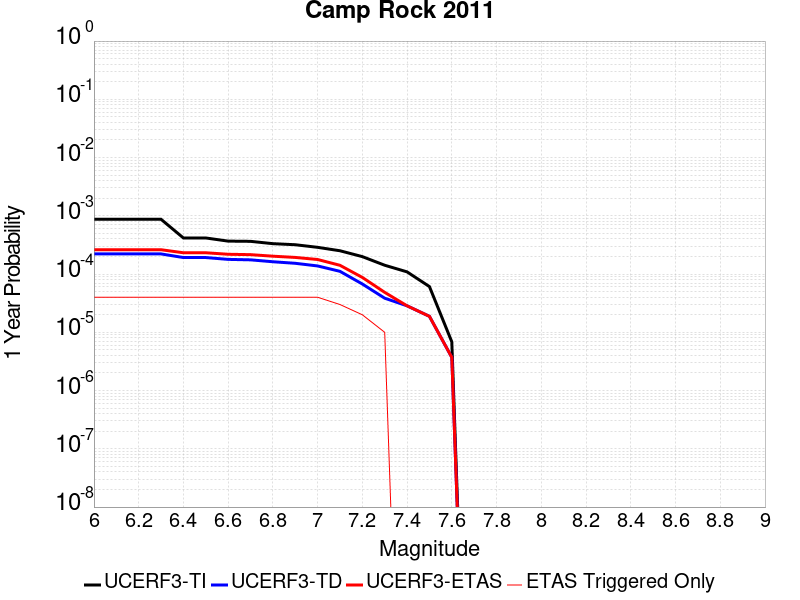 |  |

| Magnitude | 1 wk TI Prob | 1 wk TD Prob | 1 wk ETAS Prob | 1 wk ETAS/TD Gain | 1 wk ETAS Triggered Only | 1 mo TI Prob | 1 mo TD Prob | 1 mo ETAS Prob | 1 mo ETAS/TD Gain | 1 mo ETAS Triggered Only | 1 yr TI Prob | 1 yr TD Prob | 1 yr ETAS Prob | 1 yr ETAS/TD Gain | 1 yr ETAS Triggered Only | 10 yr TI Prob | 10 yr TD Prob | 10 yr ETAS Prob | 10 yr ETAS/TD Gain | 10 yr ETAS Triggered Only |
|-----|-----|-----|-----|-----|-----|-----|-----|-----|-----|-----|-----|-----|-----|-----|-----|-----|-----|-----|-----|-----|
| 6.0 | 1.6710783E-5 | 4.25026E-6 | 2.6132724E-5 | 6.1484995 | 2.1882557E-5 | 7.161568E-5 | 1.8215276E-5 | 5.1038514E-5 | 2.801962 | 3.2823835E-5 | 8.7157206E-4 | 2.2174895E-4 | 2.545655E-4 | 1.1479896 | 3.2823835E-5 | 0.008681616 | 0.0022153298 | 0.0022699148 | 1.0246397 | 5.470639E-5 |
| 6.1 | 1.6710783E-5 | 4.25026E-6 | 2.6132724E-5 | 6.1484995 | 2.1882557E-5 | 7.161568E-5 | 1.8215276E-5 | 5.1038514E-5 | 2.801962 | 3.2823835E-5 | 8.7157206E-4 | 2.2174895E-4 | 2.545655E-4 | 1.1479896 | 3.2823835E-5 | 0.008681616 | 0.0022153298 | 0.0022699148 | 1.0246397 | 5.470639E-5 |
| 6.2 | 1.6710783E-5 | 4.25026E-6 | 2.6132724E-5 | 6.1484995 | 2.1882557E-5 | 7.161568E-5 | 1.8215276E-5 | 5.1038514E-5 | 2.801962 | 3.2823835E-5 | 8.7157206E-4 | 2.2174895E-4 | 2.545655E-4 | 1.1479896 | 3.2823835E-5 | 0.008681616 | 0.0022153298 | 0.0022699148 | 1.0246397 | 5.470639E-5 |
| 6.3 | 1.6710783E-5 | 4.25026E-6 | 2.6132724E-5 | 6.1484995 | 2.1882557E-5 | 7.161568E-5 | 1.8215276E-5 | 5.1038514E-5 | 2.801962 | 3.2823835E-5 | 8.7157206E-4 | 2.2174895E-4 | 2.545655E-4 | 1.1479896 | 3.2823835E-5 | 0.008681616 | 0.0022153298 | 0.0022699148 | 1.0246397 | 5.470639E-5 |
| 6.4 | 7.982846E-6 | 3.6820884E-6 | 2.5564565E-5 | 6.942952 | 2.1882557E-5 | 3.421175E-5 | 1.5780286E-5 | 4.86036E-5 | 3.0800204 | 3.2823835E-5 | 4.1644843E-4 | 1.9210839E-4 | 2.2492591E-4 | 1.1708282 | 3.2823835E-5 | 0.0041566887 | 0.001919458 | 0.0019740595 | 1.0284462 | 5.470639E-5 |
| 6.5 | 7.982846E-6 | 3.6820884E-6 | 2.5564565E-5 | 6.942952 | 2.1882557E-5 | 3.421175E-5 | 1.5780286E-5 | 4.86036E-5 | 3.0800204 | 3.2823835E-5 | 4.1644843E-4 | 1.9210839E-4 | 2.2492591E-4 | 1.1708282 | 3.2823835E-5 | 0.0041566887 | 0.001919458 | 0.0019740595 | 1.0284462 | 5.470639E-5 |
| 6.6 | 7.048869E-6 | 3.4243571E-6 | 2.530684E-5 | 7.390245 | 2.1882557E-5 | 3.0209088E-5 | 1.4675736E-5 | 4.749909E-5 | 3.236573 | 3.2823835E-5 | 3.677336E-4 | 1.7866275E-4 | 2.1148071E-4 | 1.1836867 | 3.2823835E-5 | 0.0036712566 | 0.0017852228 | 0.0018398315 | 1.0305893 | 5.470639E-5 |
| 6.7 | 6.987307E-6 | 3.3623348E-6 | 2.5244817E-5 | 7.5081215 | 2.1882557E-5 | 2.9945259E-5 | 1.4409929E-5 | 4.723329E-5 | 3.2778296 | 3.2823835E-5 | 3.6452254E-4 | 1.7542706E-4 | 2.0824514E-4 | 1.1870754 | 3.2823835E-5 | 0.0036392517 | 0.001752917 | 0.0018075275 | 1.031154 | 5.470639E-5 |
| 6.8 | 6.3737602E-6 | 3.1179077E-6 | 2.5000396E-5 | 8.018325 | 2.1882557E-5 | 2.731583E-5 | 1.3362394E-5 | 4.618579E-5 | 3.4564006 | 3.2823835E-5 | 3.3251947E-4 | 1.626753E-4 | 1.9549379E-4 | 1.2017423 | 3.2823835E-5 | 0.0033202237 | 0.0016255907 | 0.0016802083 | 1.0335985 | 5.470639E-5 |
| 6.9 | 6.112211E-6 | 2.9331156E-6 | 2.4815608E-5 | 8.460494 | 2.1882557E-5 | 2.6194928E-5 | 1.2570436E-5 | 4.539386E-5 | 3.61116 | 3.2823835E-5 | 3.1887658E-4 | 1.5303459E-4 | 1.8585341E-4 | 1.2144536 | 3.2823835E-5 | 0.003184194 | 0.0015293199 | 0.0015839426 | 1.035717 | 5.470639E-5 |
| 7.0 | 5.5140117E-6 | 2.641923E-6 | 2.4524421E-5 | 9.282792 | 2.1882557E-5 | 2.3631264E-5 | 1.132248E-5 | 4.414594E-5 | 3.8989642 | 3.2823835E-5 | 2.8767265E-4 | 1.3784273E-4 | 1.7066202E-4 | 1.2380924 | 3.2823835E-5 | 0.0028730053 | 0.0013775975 | 0.0014322285 | 1.0396568 | 5.470639E-5 |
| 7.1 | 4.8151105E-6 | 2.1342705E-6 | 1.3075525E-5 | 6.1264615 | 1.0941279E-5 | 2.0636026E-5 | 9.146843E-6 | 3.1029198E-5 | 3.39234 | 2.1882557E-5 | 2.5121463E-4 | 1.1135734E-4 | 1.3323745E-4 | 1.1964856 | 2.1882557E-5 | 0.0025093083 | 0.0011130372 | 0.0011458246 | 1.0294574 | 3.2823835E-5 |
| 7.2 | 3.818335E-6 | 1.2937425E-6 | 1.2937425E-6 | 1.0 | 0.0 | 1.6364189E-5 | 5.5445994E-6 | 1.6485817E-5 | 2.9733107 | 1.0941279E-5 | 1.9921579E-4 | 6.750349E-5 | 7.844403E-5 | 1.1620737 | 1.0941279E-5 | 0.0019903728 | 6.748381E-4 | 6.85772E-4 | 1.0162022 | 1.0941279E-5 |
| 7.3 | 2.7166698E-6 | 7.3835776E-7 | 7.3835776E-7 | 1.0 | 0.0 | 1.1642818E-5 | 3.1643867E-6 | 1.410563E-5 | 4.457619 | 1.0941279E-5 | 1.4174209E-4 | 3.8525748E-5 | 4.9466602E-5 | 1.2839881 | 1.0941279E-5 | 0.0014165172 | 3.851927E-4 | 3.9612976E-4 | 1.0283937 | 1.0941279E-5 |
| 7.4 | 2.0893426E-6 | 5.4618386E-7 | 5.4618386E-7 | 1.0 | 0.0 | 8.954295E-6 | 2.3407858E-6 | 2.3407858E-6 | 1.0 | 0.0 | 1.0901308E-4 | 2.84987E-5 | 2.84987E-5 | 1.0 | 0.0 | 0.0010895962 | 2.84951E-4 | 2.84951E-4 | 1.0 | 0.0 |
| 7.5 | 1.1681728E-6 | 3.6030585E-7 | 3.6030585E-7 | 1.0 | 0.0 | 5.0064455E-6 | 1.544167E-6 | 1.544167E-6 | 1.0 | 0.0 | 6.0951766E-5 | 1.8800076E-5 | 1.8800076E-5 | 1.0 | 0.0 | 6.093505E-4 | 1.8798532E-4 | 1.8798532E-4 | 1.0 | 0.0 |
| 7.6 | 1.3154387E-7 | 7.1197384E-8 | 7.1197384E-8 | 1.0 | 0.0 | 5.6375933E-7 | 3.051316E-7 | 3.051316E-7 | 1.0 | 0.0 | 6.863748E-6 | 3.7149728E-6 | 3.7149728E-6 | 1.0 | 0.0 | 6.863536E-5 | 3.7149264E-5 | 3.7149264E-5 | 1.0 | 0.0 |

## Deep Springs
*[(top)](#table-of-contents)*

| 1 Week | 1 Month | 1 Year | 10 Year |
|-----|-----|-----|-----|
|  |  |  |  |

| Magnitude | 1 wk TI Prob | 1 wk TD Prob | 1 wk ETAS Prob | 1 wk ETAS/TD Gain | 1 wk ETAS Triggered Only | 1 mo TI Prob | 1 mo TD Prob | 1 mo ETAS Prob | 1 mo ETAS/TD Gain | 1 mo ETAS Triggered Only | 1 yr TI Prob | 1 yr TD Prob | 1 yr ETAS Prob | 1 yr ETAS/TD Gain | 1 yr ETAS Triggered Only | 10 yr TI Prob | 10 yr TD Prob | 10 yr ETAS Prob | 10 yr ETAS/TD Gain | 10 yr ETAS Triggered Only |
|-----|-----|-----|-----|-----|-----|-----|-----|-----|-----|-----|-----|-----|-----|-----|-----|-----|-----|-----|-----|-----|
| 6.0 | 1.9810619E-5 | 2.311252E-5 | 6.687662E-5 | 2.8935235 | 4.3765114E-5 | 8.489989E-5 | 9.905276E-5 | 1.4281354E-4 | 1.4417926 | 4.3765114E-5 | 0.001033166 | 0.0012058079 | 0.0012604484 | 1.0453143 | 5.470639E-5 | 0.010283757 | 0.012042425 | 0.012096472 | 1.0044881 | 5.470639E-5 |
| 6.1 | 1.9810619E-5 | 2.311252E-5 | 6.687662E-5 | 2.8935235 | 4.3765114E-5 | 8.489989E-5 | 9.905276E-5 | 1.4281354E-4 | 1.4417926 | 4.3765114E-5 | 0.001033166 | 0.0012058079 | 0.0012604484 | 1.0453143 | 5.470639E-5 | 0.010283757 | 0.012042425 | 0.012096472 | 1.0044881 | 5.470639E-5 |
| 6.2 | 1.9810619E-5 | 2.311252E-5 | 6.687662E-5 | 2.8935235 | 4.3765114E-5 | 8.489989E-5 | 9.905276E-5 | 1.4281354E-4 | 1.4417926 | 4.3765114E-5 | 0.001033166 | 0.0012058079 | 0.0012604484 | 1.0453143 | 5.470639E-5 | 0.010283757 | 0.012042425 | 0.012096472 | 1.0044881 | 5.470639E-5 |
| 6.3 | 1.9810619E-5 | 2.311252E-5 | 6.687662E-5 | 2.8935235 | 4.3765114E-5 | 8.489989E-5 | 9.905276E-5 | 1.4281354E-4 | 1.4417926 | 4.3765114E-5 | 0.001033166 | 0.0012058079 | 0.0012604484 | 1.0453143 | 5.470639E-5 | 0.010283757 | 0.012042425 | 0.012096472 | 1.0044881 | 5.470639E-5 |
| 6.4 | 1.9810619E-5 | 2.311252E-5 | 6.687662E-5 | 2.8935235 | 4.3765114E-5 | 8.489989E-5 | 9.905276E-5 | 1.4281354E-4 | 1.4417926 | 4.3765114E-5 | 0.001033166 | 0.0012058079 | 0.0012604484 | 1.0453143 | 5.470639E-5 | 0.010283757 | 0.012042425 | 0.012096472 | 1.0044881 | 5.470639E-5 |
| 6.5 | 1.7190405E-5 | 2.0050555E-5 | 6.381479E-5 | 3.1826944 | 4.3765114E-5 | 7.367108E-5 | 8.593095E-5 | 1.296923E-4 | 1.5092618 | 4.3765114E-5 | 8.9657627E-4 | 0.0010462094 | 0.0011008586 | 1.0522354 | 5.470639E-5 | 0.008929676 | 0.010462056 | 0.01051619 | 1.0051743 | 5.470639E-5 |
| 6.6 | 1.7190405E-5 | 2.0050555E-5 | 6.381479E-5 | 3.1826944 | 4.3765114E-5 | 7.367108E-5 | 8.593095E-5 | 1.296923E-4 | 1.5092618 | 4.3765114E-5 | 8.9657627E-4 | 0.0010462094 | 0.0011008586 | 1.0522354 | 5.470639E-5 | 0.008929676 | 0.010462056 | 0.01051619 | 1.0051743 | 5.470639E-5 |

## Kern Canyon (South Kern) 2011
*[(top)](#table-of-contents)*

| 1 Week | 1 Month | 1 Year | 10 Year |
|-----|-----|-----|-----|
|  |  |  | 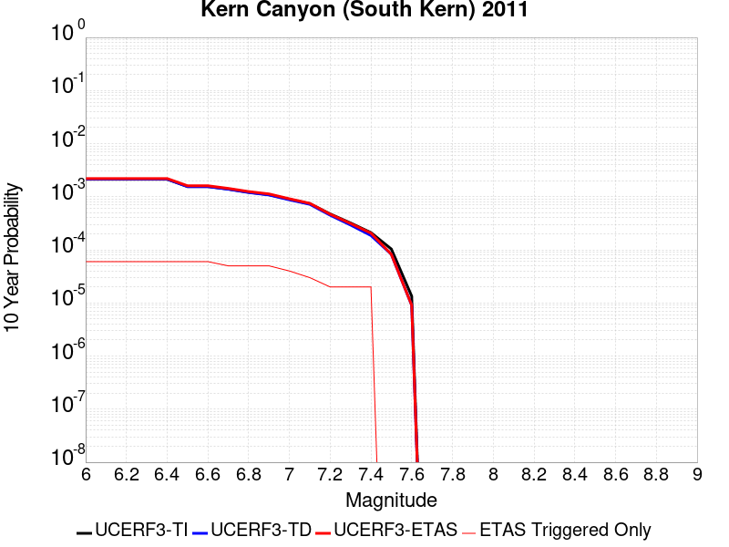 |

| Magnitude | 1 wk TI Prob | 1 wk TD Prob | 1 wk ETAS Prob | 1 wk ETAS/TD Gain | 1 wk ETAS Triggered Only | 1 mo TI Prob | 1 mo TD Prob | 1 mo ETAS Prob | 1 mo ETAS/TD Gain | 1 mo ETAS Triggered Only | 1 yr TI Prob | 1 yr TD Prob | 1 yr ETAS Prob | 1 yr ETAS/TD Gain | 1 yr ETAS Triggered Only | 10 yr TI Prob | 10 yr TD Prob | 10 yr ETAS Prob | 10 yr ETAS/TD Gain | 10 yr ETAS Triggered Only |
|-----|-----|-----|-----|-----|-----|-----|-----|-----|-----|-----|-----|-----|-----|-----|-----|-----|-----|-----|-----|-----|
| 6.0 | 4.105075E-6 | 4.1137264E-6 | 2.5996193E-5 | 6.319378 | 2.1882557E-5 | 1.7593058E-5 | 1.763014E-5 | 5.0453396E-5 | 2.8617694 | 3.2823835E-5 | 2.1417443E-4 | 2.1462646E-4 | 2.693211E-4 | 1.2548364 | 5.470639E-5 | 0.0021396813 | 0.0021442557 | 0.0021988447 | 1.0254583 | 5.470639E-5 |
| 6.1 | 4.105075E-6 | 4.1137264E-6 | 2.5996193E-5 | 6.319378 | 2.1882557E-5 | 1.7593058E-5 | 1.763014E-5 | 5.0453396E-5 | 2.8617694 | 3.2823835E-5 | 2.1417443E-4 | 2.1462646E-4 | 2.693211E-4 | 1.2548364 | 5.470639E-5 | 0.0021396813 | 0.0021442557 | 0.0021988447 | 1.0254583 | 5.470639E-5 |
| 6.2 | 4.105075E-6 | 4.1137264E-6 | 2.5996193E-5 | 6.319378 | 2.1882557E-5 | 1.7593058E-5 | 1.763014E-5 | 5.0453396E-5 | 2.8617694 | 3.2823835E-5 | 2.1417443E-4 | 2.1462646E-4 | 2.693211E-4 | 1.2548364 | 5.470639E-5 | 0.0021396813 | 0.0021442557 | 0.0021988447 | 1.0254583 | 5.470639E-5 |
| 6.3 | 4.105075E-6 | 4.1137264E-6 | 2.5996193E-5 | 6.319378 | 2.1882557E-5 | 1.7593058E-5 | 1.763014E-5 | 5.0453396E-5 | 2.8617694 | 3.2823835E-5 | 2.1417443E-4 | 2.1462646E-4 | 2.693211E-4 | 1.2548364 | 5.470639E-5 | 0.0021396813 | 0.0021442557 | 0.0021988447 | 1.0254583 | 5.470639E-5 |
| 6.4 | 4.105075E-6 | 4.1137264E-6 | 2.5996193E-5 | 6.319378 | 2.1882557E-5 | 1.7593058E-5 | 1.763014E-5 | 5.0453396E-5 | 2.8617694 | 3.2823835E-5 | 2.1417443E-4 | 2.1462646E-4 | 2.693211E-4 | 1.2548364 | 5.470639E-5 | 0.0021396813 | 0.0021442557 | 0.0021988447 | 1.0254583 | 5.470639E-5 |
| 6.5 | 2.9849807E-6 | 2.9731548E-6 | 2.4855646E-5 | 8.360024 | 2.1882557E-5 | 1.2792712E-5 | 1.274203E-5 | 4.5565448E-5 | 3.5759957 | 3.2823835E-5 | 1.5574014E-4 | 1.5512333E-4 | 2.0982123E-4 | 1.3526092 | 5.470639E-5 | 0.0015563103 | 0.0015501656 | 0.0016047872 | 1.035236 | 5.470639E-5 |
| 6.6 | 2.9849807E-6 | 2.9731548E-6 | 2.4855646E-5 | 8.360024 | 2.1882557E-5 | 1.2792712E-5 | 1.274203E-5 | 4.5565448E-5 | 3.5759957 | 3.2823835E-5 | 1.5574014E-4 | 1.5512333E-4 | 2.0982123E-4 | 1.3526092 | 5.470639E-5 | 0.0015563103 | 0.0015501656 | 0.0016047872 | 1.035236 | 5.470639E-5 |
| 6.7 | 2.6756725E-6 | 2.6582206E-6 | 1.359947E-5 | 5.1160045 | 1.0941279E-5 | 1.1467117E-5 | 1.1392325E-5 | 3.327463E-5 | 2.9207938 | 2.1882557E-5 | 1.396032E-4 | 1.3869285E-4 | 1.8245188E-4 | 1.3155105 | 4.3765114E-5 | 0.0013951553 | 0.0013860738 | 0.0014297783 | 1.0315311 | 4.3765114E-5 |
| 6.8 | 2.3283721E-6 | 2.3047787E-6 | 1.3246032E-5 | 5.747203 | 1.0941279E-5 | 9.9787E-6 | 9.877586E-6 | 3.1759926E-5 | 3.215353 | 2.1882557E-5 | 1.214839E-4 | 1.20253055E-4 | 1.640129E-4 | 1.363898 | 4.3765114E-5 | 0.001214175 | 0.0012018873 | 0.0012455998 | 1.0363699 | 4.3765114E-5 |
| 6.9 | 2.0972677E-6 | 2.0696411E-6 | 1.30108965E-5 | 6.286547 | 1.0941279E-5 | 8.988259E-6 | 8.869861E-6 | 3.0752224E-5 | 3.467047 | 2.1882557E-5 | 1.0942656E-4 | 1.0798526E-4 | 1.5174564E-4 | 1.4052441 | 4.3765114E-5 | 0.0010937268 | 0.0010793337 | 0.0011230516 | 1.0405045 | 4.3765114E-5 |
| 7.0 | 1.7132242E-6 | 1.6787036E-6 | 1.6787036E-6 | 1.0 | 0.0 | 7.3423685E-6 | 7.194424E-6 | 1.8135624E-5 | 2.5207887 | 1.0941279E-5 | 8.938967E-5 | 8.758863E-5 | 1.2040959E-4 | 1.3747171 | 3.2823835E-5 | 8.935372E-4 | 8.7554497E-4 | 9.0834004E-4 | 1.0374568 | 3.2823835E-5 |
| 7.1 | 1.4215541E-6 | 1.3815752E-6 | 1.3815752E-6 | 1.0 | 0.0 | 6.0923603E-6 | 5.9210233E-6 | 1.6862237E-5 | 2.8478584 | 1.0941279E-5 | 7.417196E-5 | 7.20861E-5 | 9.396708E-5 | 1.3035395 | 2.1882557E-5 | 7.414721E-4 | 7.206299E-4 | 7.424967E-4 | 1.030344 | 2.1882557E-5 |
| 7.2 | 9.097853E-7 | 8.6037755E-7 | 8.6037755E-7 | 1.0 | 0.0 | 3.899074E-6 | 3.6873273E-6 | 3.6873273E-6 | 1.0 | 0.0 | 4.7470192E-5 | 4.4892295E-5 | 5.5833083E-5 | 1.243712 | 1.0941279E-5 | 4.7460053E-4 | 4.4883334E-4 | 4.597697E-4 | 1.0243663 | 1.0941279E-5 |
| 7.3 | 6.144169E-7 | 5.628206E-7 | 5.628206E-7 | 1.0 | 0.0 | 2.6332125E-6 | 2.4120861E-6 | 2.4120861E-6 | 1.0 | 0.0 | 3.205889E-5 | 2.9366758E-5 | 4.0307717E-5 | 1.3725626 | 1.0941279E-5 | 3.2054266E-4 | 2.936293E-4 | 3.0456737E-4 | 1.0372512 | 1.0941279E-5 |
| 7.4 | 4.049844E-7 | 3.5728314E-7 | 3.5728314E-7 | 1.0 | 0.0 | 1.7356463E-6 | 1.5312125E-6 | 1.5312125E-6 | 1.0 | 0.0 | 2.1131287E-5 | 1.8642357E-5 | 2.958343E-5 | 1.5868933 | 1.0941279E-5 | 2.1129279E-4 | 1.8640817E-4 | 1.9734741E-4 | 1.0586843 | 1.0941279E-5 |
| 7.5 | 1.9871162E-7 | 1.583044E-7 | 1.583044E-7 | 1.0 | 0.0 | 8.5162094E-7 | 6.7844724E-7 | 6.7844724E-7 | 1.0 | 0.0 | 1.0368436E-5 | 8.260065E-6 | 8.260065E-6 | 1.0 | 0.0 | 1.0367952E-4 | 8.259767E-5 | 8.259767E-5 | 1.0 | 0.0 |
| 7.6 | 2.572245E-8 | 1.7352555E-8 | 1.7352555E-8 | 1.0 | 0.0 | 1.10239064E-7 | 7.436809E-8 | 7.436809E-8 | 1.0 | 0.0 | 1.3421597E-6 | 9.054312E-7 | 9.054312E-7 | 1.0 | 0.0 | 1.3421517E-5 | 9.05428E-6 | 9.05428E-6 | 1.0 | 0.0 |

## Rose Canyon
*[(top)](#table-of-contents)*

| 1 Week | 1 Month | 1 Year | 10 Year |
|-----|-----|-----|-----|
|  |  |  |  |

| Magnitude | 1 wk TI Prob | 1 wk TD Prob | 1 wk ETAS Prob | 1 wk ETAS/TD Gain | 1 wk ETAS Triggered Only | 1 mo TI Prob | 1 mo TD Prob | 1 mo ETAS Prob | 1 mo ETAS/TD Gain | 1 mo ETAS Triggered Only | 1 yr TI Prob | 1 yr TD Prob | 1 yr ETAS Prob | 1 yr ETAS/TD Gain | 1 yr ETAS Triggered Only | 10 yr TI Prob | 10 yr TD Prob | 10 yr ETAS Prob | 10 yr ETAS/TD Gain | 10 yr ETAS Triggered Only |
|-----|-----|-----|-----|-----|-----|-----|-----|-----|-----|-----|-----|-----|-----|-----|-----|-----|-----|-----|-----|-----|
| 6.0 | 4.5923203E-5 | 4.9714225E-5 | 8.2536426E-5 | 1.6602175 | 3.2823835E-5 | 1.9679888E-4 | 2.1304491E-4 | 2.568007E-4 | 1.205383 | 4.3765114E-5 | 0.0023933933 | 0.0025909345 | 0.002645499 | 1.0210599 | 5.470639E-5 | 0.023677798 | 0.02563999 | 0.025693294 | 1.0020789 | 5.470639E-5 |
| 6.1 | 4.5923203E-5 | 4.9714225E-5 | 7.159569E-5 | 1.440145 | 2.1882557E-5 | 1.9679888E-4 | 2.1304491E-4 | 2.3492282E-4 | 1.1026914 | 2.1882557E-5 | 0.0023933933 | 0.0025909345 | 0.0026236733 | 1.012636 | 3.2823835E-5 | 0.023677798 | 0.02563999 | 0.025671974 | 1.0012474 | 3.2823835E-5 |
| 6.2 | 2.8844734E-5 | 2.9668723E-5 | 4.0609677E-5 | 1.3687706 | 1.0941279E-5 | 1.2361443E-4 | 1.2714567E-4 | 1.3808555E-4 | 1.0860422 | 1.0941279E-5 | 0.0015039665 | 0.0015468939 | 0.0015687426 | 1.0141243 | 2.1882557E-5 | 0.0149382865 | 0.015374276 | 0.015395822 | 1.0014014 | 2.1882557E-5 |
| 6.3 | 2.3171577E-5 | 2.3161238E-5 | 2.3161238E-5 | 1.0 | 0.0 | 9.9302975E-5 | 9.9258745E-5 | 9.9258745E-5 | 1.0 | 0.0 | 0.0012083431 | 0.0012078186 | 0.0012187466 | 1.0090477 | 1.0941279E-5 | 0.012017938 | 0.012022437 | 0.012033246 | 1.0008991 | 1.0941279E-5 |
| 6.4 | 2.0066604E-5 | 1.9667024E-5 | 1.9667024E-5 | 1.0 | 0.0 | 8.599689E-5 | 8.4284584E-5 | 8.4284584E-5 | 1.0 | 0.0 | 0.0010465092 | 0.0010256917 | 0.0010366217 | 1.0106562 | 1.0941279E-5 | 0.010415946 | 0.010217559 | 0.010228388 | 1.0010599 | 1.0941279E-5 |
| 6.5 | 1.776989E-5 | 1.7113807E-5 | 1.7113807E-5 | 1.0 | 0.0 | 7.615444E-5 | 7.334287E-5 | 7.334287E-5 | 1.0 | 0.0 | 9.267859E-4 | 8.925905E-4 | 9.03522E-4 | 1.012247 | 1.0941279E-5 | 0.009229303 | 0.008896211 | 0.008907055 | 1.0012189 | 1.0941279E-5 |
| 6.6 | 1.5227364E-5 | 1.433926E-5 | 1.433926E-5 | 1.0 | 0.0 | 6.52585E-5 | 6.1452556E-5 | 6.1452556E-5 | 1.0 | 0.0 | 7.942326E-4 | 7.479332E-4 | 7.588663E-4 | 1.0146178 | 1.0941279E-5 | 0.007914 | 0.007458359 | 0.0074692187 | 1.001456 | 1.0941279E-5 |
| 6.7 | 1.2703898E-5 | 1.1673274E-5 | 1.1673274E-5 | 1.0 | 0.0 | 5.4444143E-5 | 5.0027378E-5 | 5.0027378E-5 | 1.0 | 0.0 | 6.626558E-4 | 6.089174E-4 | 6.19852E-4 | 1.0179574 | 1.0941279E-5 | 0.006606833 | 0.0060750856 | 0.0060859607 | 1.00179 | 1.0941279E-5 |
| 6.8 | 1.1554917E-5 | 1.0609337E-5 | 1.0609337E-5 | 1.0 | 0.0 | 4.9520135E-5 | 4.546782E-5 | 4.546782E-5 | 1.0 | 0.0 | 6.0274085E-4 | 5.5343413E-4 | 5.643694E-4 | 1.0197588 | 1.0941279E-5 | 0.0060110865 | 0.0055225673 | 0.0055334484 | 1.0019703 | 1.0941279E-5 |
| 6.9 | 8.732078E-6 | 7.881357E-6 | 7.881357E-6 | 1.0 | 0.0 | 3.7422655E-5 | 3.3776825E-5 | 3.3776825E-5 | 1.0 | 0.0 | 4.5552556E-4 | 4.111582E-4 | 4.2209498E-4 | 1.0265999 | 1.0941279E-5 | 0.0045459294 | 0.0041048084 | 0.004115705 | 1.0026546 | 1.0941279E-5 |
| 7.0 | 5.9337494E-6 | 5.1074853E-6 | 5.1074853E-6 | 1.0 | 0.0 | 2.5430107E-5 | 2.188904E-5 | 2.188904E-5 | 1.0 | 0.0 | 3.0956755E-4 | 2.664666E-4 | 2.7740496E-4 | 1.0410496 | 1.0941279E-5 | 0.0030913667 | 0.0026614866 | 0.0026723987 | 1.0041 | 1.0941279E-5 |
| 7.1 | 5.013409E-6 | 4.1773833E-6 | 4.1773833E-6 | 1.0 | 0.0 | 2.1485863E-5 | 1.7902948E-5 | 1.7902948E-5 | 1.0 | 0.0 | 2.6155898E-4 | 2.179467E-4 | 2.179467E-4 | 1.0 | 0.0 | 0.0026125133 | 0.0021773411 | 0.0021773411 | 1.0 | 0.0 |
| 7.2 | 4.120763E-6 | 3.2821383E-6 | 3.2821383E-6 | 1.0 | 0.0 | 1.7660293E-5 | 1.4066231E-5 | 1.4066231E-5 | 1.0 | 0.0 | 2.1499286E-4 | 1.7124301E-4 | 1.7124301E-4 | 1.0 | 0.0 | 0.0021478499 | 0.00171112 | 0.00171112 | 1.0 | 0.0 |
| 7.3 | 3.2081239E-6 | 2.4405372E-6 | 2.4405372E-6 | 1.0 | 0.0 | 1.374903E-5 | 1.0459404E-5 | 1.0459404E-5 | 1.0 | 0.0 | 1.6738157E-4 | 1.2733586E-4 | 1.2733586E-4 | 1.0 | 0.0 | 0.0016725556 | 0.001272636 | 0.001272636 | 1.0 | 0.0 |
| 7.4 | 2.4194755E-6 | 1.7680634E-6 | 1.7680634E-6 | 1.0 | 0.0 | 1.0369139E-5 | 7.577393E-6 | 7.577393E-6 | 1.0 | 0.0 | 1.2623696E-4 | 9.2250906E-5 | 9.2250906E-5 | 1.0 | 0.0 | 0.0012616527 | 9.2213147E-4 | 9.2213147E-4 | 1.0 | 0.0 |
| 7.5 | 1.3842889E-6 | 9.3786275E-7 | 9.3786275E-7 | 1.0 | 0.0 | 5.9326535E-6 | 4.019406E-6 | 4.019406E-6 | 1.0 | 0.0 | 7.222766E-5 | 4.8935202E-5 | 4.8935202E-5 | 1.0 | 0.0 | 7.220419E-4 | 4.892478E-4 | 4.892478E-4 | 1.0 | 0.0 |
| 7.6 | 1.0021575E-6 | 6.411463E-7 | 6.411463E-7 | 1.0 | 0.0 | 4.2949537E-6 | 2.7477672E-6 | 2.7477672E-6 | 1.0 | 0.0 | 5.2289808E-5 | 3.3453573E-5 | 3.3453573E-5 | 1.0 | 0.0 | 5.2277505E-4 | 3.344875E-4 | 3.344875E-4 | 1.0 | 0.0 |
| 7.7 | 8.7620116E-8 | 6.4492404E-8 | 6.4492404E-8 | 1.0 | 0.0 | 3.7551473E-7 | 2.76396E-7 | 2.76396E-7 | 1.0 | 0.0 | 4.5718825E-6 | 3.3651165E-6 | 3.3651165E-6 | 1.0 | 0.0 | 4.5717883E-5 | 3.3650686E-5 | 3.3650686E-5 | 1.0 | 0.0 |

## Pisgah-Bullion Mtn-Mesquite Lk
*[(top)](#table-of-contents)*

| 1 Week | 1 Month | 1 Year | 10 Year |
|-----|-----|-----|-----|
|  |  |  |  |

| Magnitude | 1 wk TI Prob | 1 wk TD Prob | 1 wk ETAS Prob | 1 wk ETAS/TD Gain | 1 wk ETAS Triggered Only | 1 mo TI Prob | 1 mo TD Prob | 1 mo ETAS Prob | 1 mo ETAS/TD Gain | 1 mo ETAS Triggered Only | 1 yr TI Prob | 1 yr TD Prob | 1 yr ETAS Prob | 1 yr ETAS/TD Gain | 1 yr ETAS Triggered Only | 10 yr TI Prob | 10 yr TD Prob | 10 yr ETAS Prob | 10 yr ETAS/TD Gain | 10 yr ETAS Triggered Only |
|-----|-----|-----|-----|-----|-----|-----|-----|-----|-----|-----|-----|-----|-----|-----|-----|-----|-----|-----|-----|-----|
| 6.0 | 3.0240792E-5 | 2.4091114E-5 | 4.5973142E-5 | 1.9083029 | 2.1882557E-5 | 1.2959696E-4 | 1.03244114E-4 | 1.2512441E-4 | 1.2119278 | 2.1882557E-5 | 0.0015767008 | 0.0012563728 | 0.0013000829 | 1.0347908 | 4.3765114E-5 | 0.015655609 | 0.012502721 | 0.012556743 | 1.0043209 | 5.470639E-5 |
| 6.1 | 3.0240792E-5 | 2.4091114E-5 | 4.5973142E-5 | 1.9083029 | 2.1882557E-5 | 1.2959696E-4 | 1.03244114E-4 | 1.2512441E-4 | 1.2119278 | 2.1882557E-5 | 0.0015767008 | 0.0012563728 | 0.0013000829 | 1.0347908 | 4.3765114E-5 | 0.015655609 | 0.012502721 | 0.012556743 | 1.0043209 | 5.470639E-5 |
| 6.2 | 3.0240792E-5 | 2.4091114E-5 | 4.5973142E-5 | 1.9083029 | 2.1882557E-5 | 1.2959696E-4 | 1.03244114E-4 | 1.2512441E-4 | 1.2119278 | 2.1882557E-5 | 0.0015767008 | 0.0012563728 | 0.0013000829 | 1.0347908 | 4.3765114E-5 | 0.015655609 | 0.012502721 | 0.012556743 | 1.0043209 | 5.470639E-5 |
| 6.3 | 2.0498217E-5 | 1.36380695E-5 | 3.5520326E-5 | 2.6044981 | 2.1882557E-5 | 8.784654E-5 | 5.844765E-5 | 8.032893E-5 | 1.3743739 | 2.1882557E-5 | 0.0010690069 | 7.1138405E-4 | 7.4418454E-4 | 1.046108 | 3.2823835E-5 | 0.01063879 | 0.0070926943 | 0.0071361493 | 1.0061266 | 4.3765114E-5 |
| 6.4 | 2.0498217E-5 | 1.36380695E-5 | 3.5520326E-5 | 2.6044981 | 2.1882557E-5 | 8.784654E-5 | 5.844765E-5 | 8.032893E-5 | 1.3743739 | 2.1882557E-5 | 0.0010690069 | 7.1138405E-4 | 7.4418454E-4 | 1.046108 | 3.2823835E-5 | 0.01063879 | 0.0070926943 | 0.0071361493 | 1.0061266 | 4.3765114E-5 |
| 6.5 | 1.7316182E-5 | 1.0477042E-5 | 3.235937E-5 | 3.0885978 | 2.1882557E-5 | 7.42101E-5 | 4.4900895E-5 | 6.678247E-5 | 1.4873304 | 2.1882557E-5 | 9.0313336E-4 | 5.465413E-4 | 5.684119E-4 | 1.0400164 | 2.1882557E-5 | 0.008994718 | 0.0054529672 | 0.0054747304 | 1.0039911 | 2.1882557E-5 |
| 6.6 | 1.5251077E-5 | 8.414273E-6 | 3.0296645E-5 | 3.6006255 | 2.1882557E-5 | 6.536012E-5 | 3.6060712E-5 | 5.7942478E-5 | 1.6068035 | 2.1882557E-5 | 7.9546886E-4 | 4.3895794E-4 | 4.608309E-4 | 1.0498292 | 2.1882557E-5 | 0.007926274 | 0.0043816264 | 0.004403413 | 1.0049723 | 2.1882557E-5 |
| 6.7 | 1.2997425E-5 | 6.4114965E-6 | 2.8293913E-5 | 4.412997 | 2.1882557E-5 | 5.570206E-5 | 2.7477578E-5 | 4.9359533E-5 | 1.7963568 | 2.1882557E-5 | 6.7796157E-4 | 3.3449283E-4 | 3.5636805E-4 | 1.0653982 | 2.1882557E-5 | 0.0067589693 | 0.0033403537 | 0.0033621632 | 1.0065291 | 2.1882557E-5 |
| 6.8 | 1.035386E-5 | 4.3332193E-6 | 1.527445E-5 | 3.5249658 | 1.0941279E-5 | 4.437293E-5 | 1.8570812E-5 | 2.9511888E-5 | 1.5891544 | 1.0941279E-5 | 5.401065E-4 | 2.2607706E-4 | 2.3701586E-4 | 1.0483853 | 1.0941279E-5 | 0.0053879567 | 0.0022585576 | 0.002269474 | 1.0048335 | 1.0941279E-5 |
| 6.9 | 8.816252E-6 | 3.580638E-6 | 1.4521876E-5 | 4.0556674 | 1.0941279E-5 | 3.778339E-5 | 1.5345504E-5 | 2.6286614E-5 | 1.7129848 | 1.0941279E-5 | 4.5991567E-4 | 1.8681608E-4 | 1.977553E-4 | 1.0585562 | 1.0941279E-5 | 0.00458965 | 0.0018666488 | 0.0018775696 | 1.0058506 | 1.0941279E-5 |
| 7.0 | 6.8232207E-6 | 2.5675843E-6 | 1.3508835E-5 | 5.261301 | 1.0941279E-5 | 2.9242048E-5 | 1.1003888E-5 | 2.1945047E-5 | 1.9942993 | 1.0941279E-5 | 3.5596377E-4 | 1.3396442E-4 | 1.4490423E-4 | 1.081662 | 1.0941279E-5 | 0.0035539411 | 0.0013388677 | 0.0013497943 | 1.0081611 | 1.0941279E-5 |
| 7.1 | 5.837013E-6 | 2.22738E-6 | 1.3168634E-5 | 5.912163 | 1.0941279E-5 | 2.501553E-5 | 9.545881E-6 | 2.0487056E-5 | 2.146167 | 1.0941279E-5 | 3.045215E-4 | 1.16215204E-4 | 1.271552E-4 | 1.0941358 | 1.0941279E-5 | 0.0030410455 | 0.0011615733 | 0.0011725018 | 1.0094085 | 1.0941279E-5 |
| 7.2 | 4.278052E-6 | 1.6275711E-6 | 1.6275711E-6 | 1.0 | 0.0 | 1.833438E-5 | 6.9752873E-6 | 6.9752873E-6 | 1.0 | 0.0 | 2.231982E-4 | 8.492105E-5 | 8.492105E-5 | 1.0 | 0.0 | 0.0022297418 | 8.489092E-4 | 8.489092E-4 | 1.0 | 0.0 |
| 7.3 | 1.8803692E-6 | 8.344926E-7 | 8.344926E-7 | 1.0 | 0.0 | 8.0587E-6 | 3.5763926E-6 | 3.5763926E-6 | 1.0 | 0.0 | 9.811026E-5 | 4.354186E-5 | 4.354186E-5 | 1.0 | 0.0 | 9.806695E-4 | 4.3534773E-4 | 4.3534773E-4 | 1.0 | 0.0 |

## San Clemente
*[(top)](#table-of-contents)*

| 1 Week | 1 Month | 1 Year | 10 Year |
|-----|-----|-----|-----|
|  | 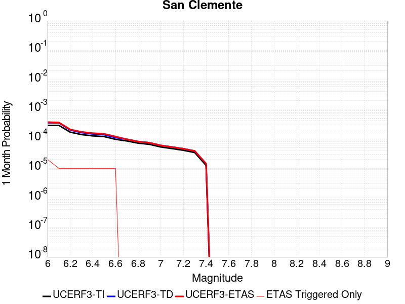 |  |  |

| Magnitude | 1 wk TI Prob | 1 wk TD Prob | 1 wk ETAS Prob | 1 wk ETAS/TD Gain | 1 wk ETAS Triggered Only | 1 mo TI Prob | 1 mo TD Prob | 1 mo ETAS Prob | 1 mo ETAS/TD Gain | 1 mo ETAS Triggered Only | 1 yr TI Prob | 1 yr TD Prob | 1 yr ETAS Prob | 1 yr ETAS/TD Gain | 1 yr ETAS Triggered Only | 10 yr TI Prob | 10 yr TD Prob | 10 yr ETAS Prob | 10 yr ETAS/TD Gain | 10 yr ETAS Triggered Only |
|-----|-----|-----|-----|-----|-----|-----|-----|-----|-----|-----|-----|-----|-----|-----|-----|-----|-----|-----|-----|-----|
| 6.0 | 6.681379E-5 | 8.163422E-5 | 1.0351499E-4 | 1.2680342 | 2.1882557E-5 | 2.8631336E-4 | 3.498173E-4 | 3.716922E-4 | 1.0625323 | 2.1882557E-5 | 0.003480294 | 0.0042512873 | 0.004273077 | 1.0051254 | 2.1882557E-5 | 0.03426291 | 0.041755714 | 0.041797653 | 1.0010043 | 4.3765114E-5 |
| 6.1 | 6.681379E-5 | 8.163422E-5 | 9.2574606E-5 | 1.1340171 | 1.0941279E-5 | 2.8631336E-4 | 3.498173E-4 | 3.6075476E-4 | 1.0312662 | 1.0941279E-5 | 0.003480294 | 0.0042512873 | 0.0042621824 | 1.0025626 | 1.0941279E-5 | 0.03426291 | 0.041755714 | 0.041776683 | 1.0005022 | 2.1882557E-5 |
| 6.2 | 3.9400576E-5 | 4.6451984E-5 | 5.7392754E-5 | 1.2355286 | 1.0941279E-5 | 1.6884868E-4 | 1.9906509E-4 | 2.1000419E-4 | 1.0549524 | 1.0941279E-5 | 0.0020537945 | 0.002420985 | 0.0024318995 | 1.0045084 | 1.0941279E-5 | 0.020349167 | 0.02395286 | 0.023963539 | 1.0004458 | 1.0941279E-5 |
| 6.3 | 3.2590255E-5 | 3.7929087E-5 | 4.886995E-5 | 1.2884557 | 1.0941279E-5 | 1.3966505E-4 | 1.6254328E-4 | 1.7348278E-4 | 1.0673021 | 1.0941279E-5 | 0.0016990956 | 0.0019771985 | 0.001988118 | 1.0055227 | 1.0941279E-5 | 0.01686163 | 0.019599866 | 0.019610593 | 1.0005473 | 1.0941279E-5 |
| 6.4 | 2.9454652E-5 | 3.4097775E-5 | 4.5038683E-5 | 1.3208686 | 1.0941279E-5 | 1.2622811E-4 | 1.4612528E-4 | 1.5706496E-4 | 1.0748651 | 1.0941279E-5 | 0.0015357438 | 0.0017776482 | 0.00178857 | 1.0061439 | 1.0941279E-5 | 0.015251739 | 0.017637458 | 0.017648205 | 1.0006094 | 1.0941279E-5 |
| 6.5 | 2.790836E-5 | 3.2247463E-5 | 4.3188385E-5 | 1.3392802 | 1.0941279E-5 | 1.1960178E-4 | 1.3819622E-4 | 1.4913599E-4 | 1.079161 | 1.0941279E-5 | 0.001455179 | 0.0016812651 | 0.001692188 | 1.0064968 | 1.0941279E-5 | 0.014456868 | 0.016688475 | 0.016699234 | 1.0006447 | 1.0941279E-5 |
| 6.6 | 2.2492153E-5 | 2.5762707E-5 | 3.6703703E-5 | 1.4246835 | 1.0941279E-5 | 9.639138E-5 | 1.1040701E-4 | 1.2134708E-4 | 1.0990885 | 1.0941279E-5 | 0.0011729331 | 0.0013433908 | 0.0013543174 | 1.0081335 | 1.0941279E-5 | 0.011667615 | 0.013354415 | 0.01336521 | 1.0008084 | 1.0941279E-5 |
| 6.7 | 1.9862755E-5 | 2.2666423E-5 | 2.2666423E-5 | 1.0 | 0.0 | 8.512331E-5 | 9.713826E-5 | 9.713826E-5 | 1.0 | 0.0 | 0.0010358836 | 0.0011820279 | 0.0011820279 | 1.0 | 0.0 | 0.010310682 | 0.011758701 | 0.011758701 | 1.0 | 0.0 |
| 6.8 | 1.6697575E-5 | 1.897771E-5 | 1.897771E-5 | 1.0 | 0.0 | 7.155907E-5 | 8.133056E-5 | 8.133056E-5 | 1.0 | 0.0 | 8.7088346E-4 | 9.897591E-4 | 9.897591E-4 | 1.0 | 0.0 | 0.008674784 | 0.0098545365 | 0.0098545365 | 1.0 | 0.0 |
| 6.9 | 1.5218415E-5 | 1.72694E-5 | 1.72694E-5 | 1.0 | 0.0 | 6.522015E-5 | 7.4009666E-5 | 7.4009666E-5 | 1.0 | 0.0 | 7.93766E-4 | 9.00704E-4 | 9.00704E-4 | 1.0 | 0.0 | 0.007909367 | 0.008971481 | 0.008971481 | 1.0 | 0.0 |
| 7.0 | 1.2392958E-5 | 1.4033016E-5 | 1.4033016E-5 | 1.0 | 0.0 | 5.3111595E-5 | 6.014015E-5 | 6.014015E-5 | 1.0 | 0.0 | 6.4644177E-4 | 7.319679E-4 | 7.319679E-4 | 1.0 | 0.0 | 0.0064456454 | 0.0072963564 | 0.0072963564 | 1.0 | 0.0 |
| 7.1 | 1.0934128E-5 | 1.2375138E-5 | 1.2375138E-5 | 1.0 | 0.0 | 4.6859706E-5 | 5.303527E-5 | 5.303527E-5 | 1.0 | 0.0 | 5.7036756E-4 | 6.455204E-4 | 6.455204E-4 | 1.0 | 0.0 | 0.0056890585 | 0.0064371997 | 0.0064371997 | 1.0 | 0.0 |
| 7.2 | 9.5798805E-6 | 1.0844935E-5 | 1.0844935E-5 | 1.0 | 0.0 | 4.1055984E-5 | 4.6477508E-5 | 4.6477508E-5 | 1.0 | 0.0 | 4.9974193E-4 | 5.657239E-4 | 5.657239E-4 | 1.0 | 0.0 | 0.0049861963 | 0.0056435615 | 0.0056435615 | 1.0 | 0.0 |
| 7.3 | 8.0167365E-6 | 9.083918E-6 | 9.083918E-6 | 1.0 | 0.0 | 3.4356988E-5 | 3.8930535E-5 | 3.8930535E-5 | 1.0 | 0.0 | 4.1821605E-4 | 4.7388324E-4 | 4.7388324E-4 | 1.0 | 0.0 | 0.0041742986 | 0.0047294297 | 0.0047294297 | 1.0 | 0.0 |
| 7.4 | 2.9581017E-6 | 3.3623792E-6 | 3.3623792E-6 | 1.0 | 0.0 | 1.2677518E-5 | 1.4410146E-5 | 1.4410146E-5 | 1.0 | 0.0 | 1.5433785E-4 | 1.7543444E-4 | 1.7543444E-4 | 1.0 | 0.0 | 0.001542307 | 0.0017534546 | 0.0017534546 | 1.0 | 0.0 |

## Cleghorn Pass
*[(top)](#table-of-contents)*

| 1 Week | 1 Month | 1 Year | 10 Year |
|-----|-----|-----|-----|
|  |  |  |  |

| Magnitude | 1 wk TI Prob | 1 wk TD Prob | 1 wk ETAS Prob | 1 wk ETAS/TD Gain | 1 wk ETAS Triggered Only | 1 mo TI Prob | 1 mo TD Prob | 1 mo ETAS Prob | 1 mo ETAS/TD Gain | 1 mo ETAS Triggered Only | 1 yr TI Prob | 1 yr TD Prob | 1 yr ETAS Prob | 1 yr ETAS/TD Gain | 1 yr ETAS Triggered Only | 10 yr TI Prob | 10 yr TD Prob | 10 yr ETAS Prob | 10 yr ETAS/TD Gain | 10 yr ETAS Triggered Only |
|-----|-----|-----|-----|-----|-----|-----|-----|-----|-----|-----|-----|-----|-----|-----|-----|-----|-----|-----|-----|-----|
| 6.0 | 1.0522846E-5 | 1.1040642E-5 | 2.19818E-5 | 1.9909892 | 1.0941279E-5 | 4.509713E-5 | 4.7316473E-5 | 5.8257236E-5 | 1.2312251 | 1.0941279E-5 | 5.4891926E-4 | 5.759784E-4 | 6.087834E-4 | 1.0569551 | 3.2823835E-5 | 0.0054756533 | 0.005750022 | 0.005793535 | 1.0075675 | 4.3765114E-5 |
| 6.1 | 1.0522846E-5 | 1.1040642E-5 | 2.19818E-5 | 1.9909892 | 1.0941279E-5 | 4.509713E-5 | 4.7316473E-5 | 5.8257236E-5 | 1.2312251 | 1.0941279E-5 | 5.4891926E-4 | 5.759784E-4 | 6.087834E-4 | 1.0569551 | 3.2823835E-5 | 0.0054756533 | 0.005750022 | 0.005793535 | 1.0075675 | 4.3765114E-5 |
| 6.2 | 2.1045846E-6 | 2.2082024E-6 | 2.2082024E-6 | 1.0 | 0.0 | 9.019617E-6 | 9.463714E-6 | 9.463714E-6 | 1.0 | 0.0 | 1.098083E-4 | 1.1521882E-4 | 1.1521882E-4 | 1.0 | 0.0 | 0.0010975406 | 0.0011520023 | 0.0011520023 | 1.0 | 0.0 |
| 6.3 | 2.1045846E-6 | 2.2082024E-6 | 2.2082024E-6 | 1.0 | 0.0 | 9.019617E-6 | 9.463714E-6 | 9.463714E-6 | 1.0 | 0.0 | 1.098083E-4 | 1.1521882E-4 | 1.1521882E-4 | 1.0 | 0.0 | 0.0010975406 | 0.0011520023 | 0.0011520023 | 1.0 | 0.0 |
| 6.4 | 1.7259927E-6 | 1.810877E-6 | 1.810877E-6 | 1.0 | 0.0 | 7.3970905E-6 | 7.760902E-6 | 7.760902E-6 | 1.0 | 0.0 | 9.005586E-5 | 9.4488976E-5 | 9.4488976E-5 | 1.0 | 0.0 | 9.001937E-4 | 9.448898E-4 | 9.448898E-4 | 1.0 | 0.0 |

## Oak Ridge (Onshore)
*[(top)](#table-of-contents)*

| 1 Week | 1 Month | 1 Year | 10 Year |
|-----|-----|-----|-----|
|  |  |  |  |

| Magnitude | 1 wk TI Prob | 1 wk TD Prob | 1 wk ETAS Prob | 1 wk ETAS/TD Gain | 1 wk ETAS Triggered Only | 1 mo TI Prob | 1 mo TD Prob | 1 mo ETAS Prob | 1 mo ETAS/TD Gain | 1 mo ETAS Triggered Only | 1 yr TI Prob | 1 yr TD Prob | 1 yr ETAS Prob | 1 yr ETAS/TD Gain | 1 yr ETAS Triggered Only | 10 yr TI Prob | 10 yr TD Prob | 10 yr ETAS Prob | 10 yr ETAS/TD Gain | 10 yr ETAS Triggered Only |
|-----|-----|-----|-----|-----|-----|-----|-----|-----|-----|-----|-----|-----|-----|-----|-----|-----|-----|-----|-----|-----|
| 6.0 | 3.155064E-5 | 2.9525974E-5 | 4.046693E-5 | 1.3705536 | 1.0941279E-5 | 1.3521002E-4 | 1.2653397E-4 | 1.4841375E-4 | 1.1729163 | 2.1882557E-5 | 0.001644939 | 0.0015395004 | 0.0015831982 | 1.0283843 | 4.3765114E-5 | 0.01632816 | 0.015292859 | 0.015335955 | 1.002818 | 4.3765114E-5 |
| 6.1 | 3.155064E-5 | 2.9525974E-5 | 4.046693E-5 | 1.3705536 | 1.0941279E-5 | 1.3521002E-4 | 1.2653397E-4 | 1.4841375E-4 | 1.1729163 | 2.1882557E-5 | 0.001644939 | 0.0015395004 | 0.0015831982 | 1.0283843 | 4.3765114E-5 | 0.01632816 | 0.015292859 | 0.015335955 | 1.002818 | 4.3765114E-5 |
| 6.2 | 3.155064E-5 | 2.9525974E-5 | 4.046693E-5 | 1.3705536 | 1.0941279E-5 | 1.3521002E-4 | 1.2653397E-4 | 1.4841375E-4 | 1.1729163 | 2.1882557E-5 | 0.001644939 | 0.0015395004 | 0.0015831982 | 1.0283843 | 4.3765114E-5 | 0.01632816 | 0.015292859 | 0.015335955 | 1.002818 | 4.3765114E-5 |
| 6.3 | 3.155064E-5 | 2.9525974E-5 | 4.046693E-5 | 1.3705536 | 1.0941279E-5 | 1.3521002E-4 | 1.2653397E-4 | 1.4841375E-4 | 1.1729163 | 2.1882557E-5 | 0.001644939 | 0.0015395004 | 0.0015831982 | 1.0283843 | 4.3765114E-5 | 0.01632816 | 0.015292859 | 0.015335955 | 1.002818 | 4.3765114E-5 |
| 6.4 | 3.155064E-5 | 2.9525974E-5 | 4.046693E-5 | 1.3705536 | 1.0941279E-5 | 1.3521002E-4 | 1.2653397E-4 | 1.4841375E-4 | 1.1729163 | 2.1882557E-5 | 0.001644939 | 0.0015395004 | 0.0015831982 | 1.0283843 | 4.3765114E-5 | 0.01632816 | 0.015292859 | 0.015335955 | 1.002818 | 4.3765114E-5 |
| 6.5 | 3.155064E-5 | 2.9525974E-5 | 4.046693E-5 | 1.3705536 | 1.0941279E-5 | 1.3521002E-4 | 1.2653397E-4 | 1.4841375E-4 | 1.1729163 | 2.1882557E-5 | 0.001644939 | 0.0015395004 | 0.0015831982 | 1.0283843 | 4.3765114E-5 | 0.01632816 | 0.015292859 | 0.015335955 | 1.002818 | 4.3765114E-5 |
| 6.6 | 3.155064E-5 | 2.9525974E-5 | 4.046693E-5 | 1.3705536 | 1.0941279E-5 | 1.3521002E-4 | 1.2653397E-4 | 1.4841375E-4 | 1.1729163 | 2.1882557E-5 | 0.001644939 | 0.0015395004 | 0.0015831982 | 1.0283843 | 4.3765114E-5 | 0.01632816 | 0.015292859 | 0.015335955 | 1.002818 | 4.3765114E-5 |
| 6.7 | 3.098897E-5 | 2.8864175E-5 | 3.9805138E-5 | 1.3790499 | 1.0941279E-5 | 1.328031E-4 | 1.2369796E-4 | 1.455778E-4 | 1.1768813 | 2.1882557E-5 | 0.0016156785 | 0.0015050198 | 0.0015487191 | 1.0290357 | 4.3765114E-5 | 0.016039822 | 0.014952714 | 0.014995825 | 1.0028831 | 4.3765114E-5 |
| 6.8 | 3.0449872E-5 | 2.8239372E-5 | 3.918034E-5 | 1.3874367 | 1.0941279E-5 | 1.3049292E-4 | 1.2102048E-4 | 1.4290039E-4 | 1.1807951 | 2.1882557E-5 | 0.0015875935 | 0.0014724657 | 0.0015161663 | 1.0296786 | 4.3765114E-5 | 0.015762992 | 0.014631462 | 0.014674586 | 1.0029474 | 4.3765114E-5 |
| 6.9 | 2.697928E-5 | 2.4219773E-5 | 3.5160785E-5 | 1.4517388 | 1.0941279E-5 | 1.15620365E-4 | 1.0379502E-4 | 1.256753E-4 | 1.2108028 | 2.1882557E-5 | 0.0014067689 | 0.0012629933 | 0.0013067032 | 1.0346081 | 4.3765114E-5 | 0.0139789665 | 0.01256087 | 0.012604085 | 1.0034405 | 4.3765114E-5 |
| 7.0 | 2.4893961E-5 | 2.1862043E-5 | 3.280308E-5 | 1.5004582 | 1.0941279E-5 | 1.0668404E-4 | 9.3691204E-5 | 1.15571704E-4 | 1.2335385 | 2.1882557E-5 | 0.0012981043 | 0.0011401111 | 0.0011838264 | 1.038343 | 4.3765114E-5 | 0.012905477 | 0.011344905 | 0.011388174 | 1.003814 | 4.3765114E-5 |
| 7.1 | 2.0945363E-5 | 1.7354487E-5 | 2.8295575E-5 | 1.6304473 | 1.0941279E-5 | 8.976275E-5 | 7.437428E-5 | 9.625521E-5 | 1.2942002 | 2.1882557E-5 | 0.0010923136 | 9.051354E-4 | 9.488609E-4 | 1.0483083 | 4.3765114E-5 | 0.0108696 | 0.009015423 | 0.009058793 | 1.0048107 | 4.3765114E-5 |
| 7.2 | 2.0439404E-5 | 1.6809423E-5 | 2.7750519E-5 | 1.6508905 | 1.0941279E-5 | 8.7594504E-5 | 7.203843E-5 | 9.391941E-5 | 1.3037404 | 2.1882557E-5 | 0.0010659413 | 8.767196E-4 | 9.095146E-4 | 1.0374066 | 3.2823835E-5 | 0.010608427 | 0.008733526 | 0.0087660635 | 1.0037255 | 3.2823835E-5 |
| 7.3 | 1.8463334E-5 | 1.5381811E-5 | 2.632292E-5 | 1.7113018 | 1.0941279E-5 | 7.912617E-5 | 6.59204E-5 | 8.780152E-5 | 1.3319323 | 2.1882557E-5 | 9.6293533E-4 | 8.0228975E-4 | 8.3508727E-4 | 1.0408798 | 3.2823835E-5 | 0.009587734 | 0.007994797 | 0.008027358 | 1.0040728 | 3.2823835E-5 |
| 7.4 | 1.763139E-5 | 1.451684E-5 | 2.5457959E-5 | 1.7536846 | 1.0941279E-5 | 7.556091E-5 | 6.221356E-5 | 8.409476E-5 | 1.351711 | 2.1882557E-5 | 9.1956573E-4 | 7.571909E-4 | 7.899899E-4 | 1.0433166 | 3.2823835E-5 | 0.009157699 | 0.007546914 | 0.0075794896 | 1.0043164 | 3.2823835E-5 |
| 7.5 | 1.3594944E-5 | 1.1163356E-5 | 1.1163356E-5 | 1.0 | 0.0 | 5.8262744E-5 | 4.784209E-5 | 4.784209E-5 | 1.0 | 0.0 | 7.0911803E-4 | 5.8232434E-4 | 5.9325923E-4 | 1.0187781 | 1.0941279E-5 | 0.007068595 | 0.0058082556 | 0.0058191335 | 1.0018728 | 1.0941279E-5 |
| 7.6 | 6.9889534E-6 | 5.6367144E-6 | 5.6367144E-6 | 1.0 | 0.0 | 2.9952313E-5 | 2.4157125E-5 | 2.4157125E-5 | 1.0 | 0.0 | 3.646084E-4 | 2.9407372E-4 | 2.9407372E-4 | 1.0 | 0.0 | 0.0036401073 | 0.0029368899 | 0.0029368899 | 1.0 | 0.0 |
| 7.7 | 4.0824193E-6 | 3.2832586E-6 | 3.2832586E-6 | 1.0 | 0.0 | 1.7495966E-5 | 1.4071033E-5 | 1.4071033E-5 | 1.0 | 0.0 | 2.1299256E-4 | 1.713015E-4 | 1.713015E-4 | 1.0 | 0.0 | 0.0021278851 | 0.0017117079 | 0.0017117079 | 1.0 | 0.0 |
| 7.8 | 1.7023609E-6 | 1.4370495E-6 | 1.4370495E-6 | 1.0 | 0.0 | 7.295812E-6 | 6.1587693E-6 | 6.1587693E-6 | 1.0 | 0.0 | 8.882289E-5 | 7.498047E-5 | 7.498047E-5 | 1.0 | 0.0 | 8.8787393E-4 | 7.495545E-4 | 7.495545E-4 | 1.0 | 0.0 |
| 7.9 | 2.721225E-7 | 2.2616497E-7 | 2.2616497E-7 | 1.0 | 0.0 | 1.1662388E-6 | 9.692781E-7 | 9.692781E-7 | 1.0 | 0.0 | 1.4198865E-5 | 1.1800899E-5 | 1.1800899E-5 | 1.0 | 0.0 | 1.4197957E-4 | 1.1800301E-4 | 1.1800301E-4 | 1.0 | 0.0 |
| 8.0 | 9.364255E-9 | 5.1206666E-9 | 5.1206666E-9 | 1.0 | 0.0 | 4.0132523E-8 | 2.1945715E-8 | 2.1945715E-8 | 1.0 | 0.0 | 4.8861335E-7 | 2.6718905E-7 | 2.6718905E-7 | 1.0 | 0.0 | 4.8861225E-6 | 2.6718876E-6 | 2.6718876E-6 | 1.0 | 0.0 |

## Sierra Madre
*[(top)](#table-of-contents)*

| 1 Week | 1 Month | 1 Year | 10 Year |
|-----|-----|-----|-----|
|  |  |  |  |

| Magnitude | 1 wk TI Prob | 1 wk TD Prob | 1 wk ETAS Prob | 1 wk ETAS/TD Gain | 1 wk ETAS Triggered Only | 1 mo TI Prob | 1 mo TD Prob | 1 mo ETAS Prob | 1 mo ETAS/TD Gain | 1 mo ETAS Triggered Only | 1 yr TI Prob | 1 yr TD Prob | 1 yr ETAS Prob | 1 yr ETAS/TD Gain | 1 yr ETAS Triggered Only | 10 yr TI Prob | 10 yr TD Prob | 10 yr ETAS Prob | 10 yr ETAS/TD Gain | 10 yr ETAS Triggered Only |
|-----|-----|-----|-----|-----|-----|-----|-----|-----|-----|-----|-----|-----|-----|-----|-----|-----|-----|-----|-----|-----|
| 6.0 | 1.3379373E-5 | 1.10007395E-5 | 4.3824213E-5 | 3.9837515 | 3.2823835E-5 | 5.7338908E-5 | 4.7145186E-5 | 7.9967474E-5 | 1.696196 | 3.2823835E-5 | 6.978776E-4 | 5.738429E-4 | 6.066479E-4 | 1.0571672 | 3.2823835E-5 | 0.0069569005 | 0.0057239756 | 0.0057674902 | 1.0076022 | 4.3765114E-5 |
| 6.1 | 1.3379373E-5 | 1.10007395E-5 | 4.3824213E-5 | 3.9837515 | 3.2823835E-5 | 5.7338908E-5 | 4.7145186E-5 | 7.9967474E-5 | 1.696196 | 3.2823835E-5 | 6.978776E-4 | 5.738429E-4 | 6.066479E-4 | 1.0571672 | 3.2823835E-5 | 0.0069569005 | 0.0057239756 | 0.0057674902 | 1.0076022 | 4.3765114E-5 |
| 6.2 | 1.3379373E-5 | 1.10007395E-5 | 4.3824213E-5 | 3.9837515 | 3.2823835E-5 | 5.7338908E-5 | 4.7145186E-5 | 7.9967474E-5 | 1.696196 | 3.2823835E-5 | 6.978776E-4 | 5.738429E-4 | 6.066479E-4 | 1.0571672 | 3.2823835E-5 | 0.0069569005 | 0.0057239756 | 0.0057674902 | 1.0076022 | 4.3765114E-5 |
| 6.3 | 1.3379373E-5 | 1.10007395E-5 | 4.3824213E-5 | 3.9837515 | 3.2823835E-5 | 5.7338908E-5 | 4.7145186E-5 | 7.9967474E-5 | 1.696196 | 3.2823835E-5 | 6.978776E-4 | 5.738429E-4 | 6.066479E-4 | 1.0571672 | 3.2823835E-5 | 0.0069569005 | 0.0057239756 | 0.0057674902 | 1.0076022 | 4.3765114E-5 |
| 6.4 | 1.3379373E-5 | 1.10007395E-5 | 4.3824213E-5 | 3.9837515 | 3.2823835E-5 | 5.7338908E-5 | 4.7145186E-5 | 7.9967474E-5 | 1.696196 | 3.2823835E-5 | 6.978776E-4 | 5.738429E-4 | 6.066479E-4 | 1.0571672 | 3.2823835E-5 | 0.0069569005 | 0.0057239756 | 0.0057674902 | 1.0076022 | 4.3765114E-5 |
| 6.5 | 1.26563245E-5 | 1.0230196E-5 | 3.211253E-5 | 3.1389945 | 2.1882557E-5 | 5.4240263E-5 | 4.3842967E-5 | 6.572456E-5 | 1.4990903 | 2.1882557E-5 | 6.601751E-4 | 5.336584E-4 | 5.555293E-4 | 1.040983 | 2.1882557E-5 | 0.006582173 | 0.0053240913 | 0.00535674 | 1.0061324 | 3.2823835E-5 |
| 6.6 | 1.26563245E-5 | 1.0230196E-5 | 3.211253E-5 | 3.1389945 | 2.1882557E-5 | 5.4240263E-5 | 4.3842967E-5 | 6.572456E-5 | 1.4990903 | 2.1882557E-5 | 6.601751E-4 | 5.336584E-4 | 5.555293E-4 | 1.040983 | 2.1882557E-5 | 0.006582173 | 0.0053240913 | 0.00535674 | 1.0061324 | 3.2823835E-5 |
| 6.7 | 1.2502474E-5 | 1.006634E-5 | 3.1948675E-5 | 3.1738126 | 2.1882557E-5 | 5.3580934E-5 | 4.314075E-5 | 6.502236E-5 | 1.5072144 | 2.1882557E-5 | 6.521526E-4 | 5.251131E-4 | 5.469842E-4 | 1.0416502 | 2.1882557E-5 | 0.0065024206 | 0.0052390425 | 0.005271694 | 1.0062324 | 3.2823835E-5 |
| 6.8 | 1.2454966E-5 | 1.0018625E-5 | 3.1900963E-5 | 3.1841655 | 2.1882557E-5 | 5.3377335E-5 | 4.2936266E-5 | 6.481788E-5 | 1.5096302 | 2.1882557E-5 | 6.4967526E-4 | 5.226247E-4 | 5.444958E-4 | 1.0418487 | 2.1882557E-5 | 0.006477792 | 0.0052142753 | 0.005246928 | 1.0062622 | 3.2823835E-5 |
| 6.9 | 1.2225574E-5 | 9.792602E-6 | 3.1674943E-5 | 3.2345788 | 2.1882557E-5 | 5.2394265E-5 | 4.1967625E-5 | 6.3849264E-5 | 1.5213933 | 2.1882557E-5 | 6.3771347E-4 | 5.108371E-4 | 5.327085E-4 | 1.0428147 | 2.1882557E-5 | 0.006358865 | 0.0050969445 | 0.0051187156 | 1.0042714 | 2.1882557E-5 |
| 7.0 | 1.182946E-5 | 9.399144E-6 | 3.1281495E-5 | 3.3281217 | 2.1882557E-5 | 5.06967E-5 | 4.0281426E-5 | 6.2163104E-5 | 1.5432199 | 2.1882557E-5 | 6.1705755E-4 | 4.9031706E-4 | 5.121889E-4 | 1.0446075 | 2.1882557E-5 | 0.006153469 | 0.004892664 | 0.0049144397 | 1.0044507 | 2.1882557E-5 |
| 7.1 | 1.14369095E-5 | 8.986159E-6 | 1.9927338E-5 | 2.217559 | 1.0941279E-5 | 4.9014405E-5 | 3.8511545E-5 | 4.9452403E-5 | 1.2840929 | 1.0941279E-5 | 5.9658696E-4 | 4.687782E-4 | 4.7971433E-4 | 1.023329 | 1.0941279E-5 | 0.005949879 | 0.004678199 | 0.0046890895 | 1.0023278 | 1.0941279E-5 |
| 7.2 | 1.0836419E-5 | 8.3995565E-6 | 1.9340743E-5 | 2.3025908 | 1.0941279E-5 | 4.644097E-5 | 3.5997607E-5 | 4.6938494E-5 | 1.3039336 | 1.0941279E-5 | 5.652721E-4 | 4.3818366E-4 | 4.4912015E-4 | 1.0249587 | 1.0941279E-5 | 0.0056383642 | 0.004373494 | 0.0043843878 | 1.0024908 | 1.0941279E-5 |
| 7.3 | 1.0403439E-5 | 8.02082E-6 | 1.896201E-5 | 2.3640988 | 1.0941279E-5 | 4.4585406E-5 | 3.4374494E-5 | 4.5315395E-5 | 1.3182855 | 1.0941279E-5 | 5.426921E-4 | 4.1843E-4 | 4.2936672E-4 | 1.0261375 | 1.0941279E-5 | 0.005413687 | 0.004176717 | 0.0041876123 | 1.0026087 | 1.0941279E-5 |
| 7.4 | 9.768864E-6 | 7.414448E-6 | 1.8355646E-5 | 2.475659 | 1.0941279E-5 | 4.186589E-5 | 3.1775824E-5 | 4.2716754E-5 | 1.3443161 | 1.0941279E-5 | 5.09598E-4 | 3.868029E-4 | 3.9773993E-4 | 1.0282755 | 1.0941279E-5 | 0.0050843097 | 0.0038615882 | 0.0038724872 | 1.0028224 | 1.0941279E-5 |
| 7.5 | 8.687089E-6 | 6.4501564E-6 | 1.7391365E-5 | 2.69627 | 1.0941279E-5 | 3.722985E-5 | 2.764324E-5 | 3.8584214E-5 | 1.3957921 | 1.0941279E-5 | 4.5317915E-4 | 3.3650533E-4 | 3.4744292E-4 | 1.0325035 | 1.0941279E-5 | 0.004522561 | 0.0033602451 | 0.0033711498 | 1.0032451 | 1.0941279E-5 |
| 7.6 | 6.3506063E-6 | 4.4303215E-6 | 4.4303215E-6 | 1.0 | 0.0 | 2.72166E-5 | 1.8986955E-5 | 1.8986955E-5 | 1.0 | 0.0 | 3.3131172E-4 | 2.3114192E-4 | 2.3114192E-4 | 1.0 | 0.0 | 0.003308182 | 0.0023092402 | 0.0023092402 | 1.0 | 0.0 |
| 7.7 | 4.62223E-6 | 2.932967E-6 | 2.932967E-6 | 1.0 | 0.0 | 1.9809406E-5 | 1.2569798E-5 | 1.2569798E-5 | 1.0 | 0.0 | 2.4115283E-4 | 1.5302657E-4 | 1.5302657E-4 | 1.0 | 0.0 | 0.0024089129 | 0.001529413 | 0.001529413 | 1.0 | 0.0 |
| 7.8 | 3.2145008E-6 | 1.9494332E-6 | 1.9494332E-6 | 1.0 | 0.0 | 1.3776359E-5 | 8.3546865E-6 | 8.3546865E-6 | 1.0 | 0.0 | 1.6771426E-4 | 1.0171358E-4 | 1.0171358E-4 | 1.0 | 0.0 | 0.0016758774 | 0.0010168145 | 0.0010168145 | 1.0 | 0.0 |
| 7.9 | 1.0391769E-6 | 5.6026335E-7 | 5.6026335E-7 | 1.0 | 0.0 | 4.4536077E-6 | 2.4011265E-6 | 2.4011265E-6 | 1.0 | 0.0 | 5.4221324E-5 | 2.9233326E-5 | 2.9233326E-5 | 1.0 | 0.0 | 5.4208096E-4 | 2.9229524E-4 | 2.9229524E-4 | 1.0 | 0.0 |
| 8.0 | 1.210983E-7 | 6.613821E-8 | 6.613821E-8 | 1.0 | 0.0 | 5.1899264E-7 | 2.8344945E-7 | 2.8344945E-7 | 1.0 | 0.0 | 6.3187167E-6 | 3.4509917E-6 | 3.4509917E-6 | 1.0 | 0.0 | 6.318537E-5 | 3.45094E-5 | 3.45094E-5 | 1.0 | 0.0 |

## Ventura-Pitas Point
*[(top)](#table-of-contents)*

| 1 Week | 1 Month | 1 Year | 10 Year |
|-----|-----|-----|-----|
|  |  |  |  |

| Magnitude | 1 wk TI Prob | 1 wk TD Prob | 1 wk ETAS Prob | 1 wk ETAS/TD Gain | 1 wk ETAS Triggered Only | 1 mo TI Prob | 1 mo TD Prob | 1 mo ETAS Prob | 1 mo ETAS/TD Gain | 1 mo ETAS Triggered Only | 1 yr TI Prob | 1 yr TD Prob | 1 yr ETAS Prob | 1 yr ETAS/TD Gain | 1 yr ETAS Triggered Only | 10 yr TI Prob | 10 yr TD Prob | 10 yr ETAS Prob | 10 yr ETAS/TD Gain | 10 yr ETAS Triggered Only |
|-----|-----|-----|-----|-----|-----|-----|-----|-----|-----|-----|-----|-----|-----|-----|-----|-----|-----|-----|-----|-----|
| 6.0 | 3.3179622E-5 | 3.3735185E-5 | 5.5617E-5 | 1.6486349 | 2.1882557E-5 | 1.4219063E-4 | 1.445728E-4 | 1.6645218E-4 | 1.1513382 | 2.1882557E-5 | 0.0017297962 | 0.0017590096 | 0.0018026978 | 1.0248368 | 4.3765114E-5 | 0.017163932 | 0.0174764 | 0.017519401 | 1.0024605 | 4.3765114E-5 |
| 6.1 | 3.3179622E-5 | 3.3735185E-5 | 5.5617E-5 | 1.6486349 | 2.1882557E-5 | 1.4219063E-4 | 1.445728E-4 | 1.6645218E-4 | 1.1513382 | 2.1882557E-5 | 0.0017297962 | 0.0017590096 | 0.0018026978 | 1.0248368 | 4.3765114E-5 | 0.017163932 | 0.0174764 | 0.017519401 | 1.0024605 | 4.3765114E-5 |
| 6.2 | 3.3179622E-5 | 3.3735185E-5 | 5.5617E-5 | 1.6486349 | 2.1882557E-5 | 1.4219063E-4 | 1.445728E-4 | 1.6645218E-4 | 1.1513382 | 2.1882557E-5 | 0.0017297962 | 0.0017590096 | 0.0018026978 | 1.0248368 | 4.3765114E-5 | 0.017163932 | 0.0174764 | 0.017519401 | 1.0024605 | 4.3765114E-5 |
| 6.3 | 3.3179622E-5 | 3.3735185E-5 | 5.5617E-5 | 1.6486349 | 2.1882557E-5 | 1.4219063E-4 | 1.445728E-4 | 1.6645218E-4 | 1.1513382 | 2.1882557E-5 | 0.0017297962 | 0.0017590096 | 0.0018026978 | 1.0248368 | 4.3765114E-5 | 0.017163932 | 0.0174764 | 0.017519401 | 1.0024605 | 4.3765114E-5 |
| 6.4 | 1.8754668E-5 | 1.701961E-5 | 2.7960703E-5 | 1.6428521 | 1.0941279E-5 | 8.037467E-5 | 7.293928E-5 | 8.387976E-5 | 1.1499944 | 1.0941279E-5 | 9.781223E-4 | 8.8769704E-4 | 9.204917E-4 | 1.0369436 | 3.2823835E-5 | 0.009738282 | 0.008843848 | 0.008876381 | 1.0036787 | 3.2823835E-5 |
| 6.5 | 1.8754668E-5 | 1.701961E-5 | 2.7960703E-5 | 1.6428521 | 1.0941279E-5 | 8.037467E-5 | 7.293928E-5 | 8.387976E-5 | 1.1499944 | 1.0941279E-5 | 9.781223E-4 | 8.8769704E-4 | 9.204917E-4 | 1.0369436 | 3.2823835E-5 | 0.009738282 | 0.008843848 | 0.008876381 | 1.0036787 | 3.2823835E-5 |
| 6.6 | 1.4361558E-5 | 1.2122275E-5 | 2.306342E-5 | 1.9025654 | 1.0941279E-5 | 6.154808E-5 | 5.1951585E-5 | 6.289229E-5 | 1.2105943 | 1.0941279E-5 | 7.490902E-4 | 6.3232926E-4 | 6.6513236E-4 | 1.0518765 | 3.2823835E-5 | 0.0074657016 | 0.0063055577 | 0.0063381745 | 1.0051727 | 3.2823835E-5 |
| 6.7 | 1.4361558E-5 | 1.2122275E-5 | 2.306342E-5 | 1.9025654 | 1.0941279E-5 | 6.154808E-5 | 5.1951585E-5 | 6.289229E-5 | 1.2105943 | 1.0941279E-5 | 7.490902E-4 | 6.3232926E-4 | 6.6513236E-4 | 1.0518765 | 3.2823835E-5 | 0.0074657016 | 0.0063055577 | 0.0063381745 | 1.0051727 | 3.2823835E-5 |
| 6.8 | 1.3663846E-5 | 1.13444175E-5 | 1.13444175E-5 | 1.0 | 0.0 | 5.8558027E-5 | 4.861804E-5 | 4.861804E-5 | 1.0 | 0.0 | 7.127108E-4 | 5.917658E-4 | 6.136354E-4 | 1.0369565 | 2.1882557E-5 | 0.007104293 | 0.005902116 | 0.0059238696 | 1.0036857 | 2.1882557E-5 |
| 6.9 | 1.3644157E-5 | 1.1322519E-5 | 1.1322519E-5 | 1.0 | 0.0 | 5.8473648E-5 | 4.8524187E-5 | 4.8524187E-5 | 1.0 | 0.0 | 7.116841E-4 | 5.9062376E-4 | 6.1249343E-4 | 1.0370281 | 2.1882557E-5 | 0.007094092 | 0.0058907564 | 0.00591251 | 1.0036929 | 2.1882557E-5 |
| 7.0 | 1.3568845E-5 | 1.1242086E-5 | 1.1242086E-5 | 1.0 | 0.0 | 5.8150898E-5 | 4.817949E-5 | 4.817949E-5 | 1.0 | 0.0 | 7.077572E-4 | 5.864293E-4 | 6.0829904E-4 | 1.0372931 | 2.1882557E-5 | 0.007055073 | 0.0058490336 | 0.005870788 | 1.0037193 | 2.1882557E-5 |
| 7.1 | 1.306572E-5 | 1.072054E-5 | 1.072054E-5 | 1.0 | 0.0 | 5.599474E-5 | 4.5944373E-5 | 4.5944373E-5 | 1.0 | 0.0 | 6.815227E-4 | 5.5923103E-4 | 5.8110134E-4 | 1.0391078 | 2.1882557E-5 | 0.0067943637 | 0.0055784425 | 0.005600203 | 1.0039008 | 2.1882557E-5 |
| 7.2 | 1.232604E-5 | 9.995143E-6 | 9.995143E-6 | 1.0 | 0.0 | 5.2824813E-5 | 4.2835632E-5 | 4.2835632E-5 | 1.0 | 0.0 | 6.429523E-4 | 5.214008E-4 | 5.323364E-4 | 1.0209734 | 1.0941279E-5 | 0.0064109527 | 0.005201967 | 0.0052128513 | 1.0020924 | 1.0941279E-5 |
| 7.3 | 1.0917261E-5 | 8.84384E-6 | 8.84384E-6 | 1.0 | 0.0 | 4.678742E-5 | 3.790163E-5 | 3.790163E-5 | 1.0 | 0.0 | 5.69488E-4 | 4.6135622E-4 | 4.7229245E-4 | 1.0237045 | 1.0941279E-5 | 0.0056803077 | 0.00460415 | 0.004615041 | 1.0023655 | 1.0941279E-5 |
| 7.4 | 1.039959E-5 | 8.423562E-6 | 8.423562E-6 | 1.0 | 0.0 | 4.456891E-5 | 3.610049E-5 | 3.610049E-5 | 1.0 | 0.0 | 5.424914E-4 | 4.3943635E-4 | 4.503728E-4 | 1.0248874 | 1.0941279E-5 | 0.0054116896 | 0.004385836 | 0.004396729 | 1.0024837 | 1.0941279E-5 |
| 7.5 | 9.015877E-6 | 7.2975445E-6 | 7.2975445E-6 | 1.0 | 0.0 | 3.86389E-5 | 3.1274823E-5 | 3.1274823E-5 | 1.0 | 0.0 | 4.7032707E-4 | 3.8070587E-4 | 3.9164297E-4 | 1.0287285 | 1.0941279E-5 | 0.004693329 | 0.0038006818 | 0.0038115815 | 1.0028678 | 1.0941279E-5 |
| 7.6 | 4.900162E-6 | 3.8741155E-6 | 3.8741155E-6 | 1.0 | 0.0 | 2.1000526E-5 | 1.6603248E-5 | 1.6603248E-5 | 1.0 | 0.0 | 2.556514E-4 | 2.0212591E-4 | 2.0212591E-4 | 1.0 | 0.0 | 0.0025535747 | 0.0020194345 | 0.0020194345 | 1.0 | 0.0 |
| 7.7 | 3.8850626E-6 | 3.1267302E-6 | 3.1267302E-6 | 1.0 | 0.0 | 1.6650163E-5 | 1.3400205E-5 | 1.3400205E-5 | 1.0 | 0.0 | 2.0269687E-4 | 1.6313537E-4 | 1.6313537E-4 | 1.0 | 0.0 | 0.002025121 | 0.0016301654 | 0.0016301654 | 1.0 | 0.0 |
| 7.8 | 2.4654719E-6 | 2.029875E-6 | 2.029875E-6 | 1.0 | 0.0 | 1.0566265E-5 | 8.699436E-6 | 8.699436E-6 | 1.0 | 0.0 | 1.2863669E-4 | 1.0591053E-4 | 1.0591053E-4 | 1.0 | 0.0 | 0.0012856225 | 0.0010586053 | 0.0010586053 | 1.0 | 0.0 |
| 7.9 | 4.095894E-7 | 3.2764765E-7 | 3.2764765E-7 | 1.0 | 0.0 | 1.7553821E-6 | 1.4042034E-6 | 1.4042034E-6 | 1.0 | 0.0 | 2.1371567E-5 | 1.7096047E-5 | 1.7096047E-5 | 1.0 | 0.0 | 2.1369511E-4 | 1.7094762E-4 | 1.7094762E-4 | 1.0 | 0.0 |
| 8.0 | 7.791402E-9 | 5.683497E-9 | 5.683497E-9 | 1.0 | 0.0 | 3.3391725E-8 | 2.4357844E-8 | 2.4357844E-8 | 1.0 | 0.0 | 4.0654416E-7 | 2.9655675E-7 | 2.9655675E-7 | 1.0 | 0.0 | 4.065434E-6 | 2.9655655E-6 | 2.9655655E-6 | 1.0 | 0.0 |

## Big Pine (Central)
*[(top)](#table-of-contents)*

| 1 Week | 1 Month | 1 Year | 10 Year |
|-----|-----|-----|-----|
|  |  |  |  |

| Magnitude | 1 wk TI Prob | 1 wk TD Prob | 1 wk ETAS Prob | 1 wk ETAS/TD Gain | 1 wk ETAS Triggered Only | 1 mo TI Prob | 1 mo TD Prob | 1 mo ETAS Prob | 1 mo ETAS/TD Gain | 1 mo ETAS Triggered Only | 1 yr TI Prob | 1 yr TD Prob | 1 yr ETAS Prob | 1 yr ETAS/TD Gain | 1 yr ETAS Triggered Only | 10 yr TI Prob | 10 yr TD Prob | 10 yr ETAS Prob | 10 yr ETAS/TD Gain | 10 yr ETAS Triggered Only |
|-----|-----|-----|-----|-----|-----|-----|-----|-----|-----|-----|-----|-----|-----|-----|-----|-----|-----|-----|-----|-----|
| 6.0 | 1.2706755E-5 | 1.4250529E-5 | 3.6132773E-5 | 2.5355392 | 2.1882557E-5 | 5.4456385E-5 | 6.107247E-5 | 8.295369E-5 | 1.3582829 | 2.1882557E-5 | 6.628048E-4 | 7.433402E-4 | 7.870728E-4 | 1.0588325 | 4.3765114E-5 | 0.006608314 | 0.0074135666 | 0.0074570077 | 1.0058596 | 4.3765114E-5 |
| 6.1 | 8.342579E-6 | 9.510762E-6 | 2.0451937E-5 | 2.1503994 | 1.0941279E-5 | 3.5753423E-5 | 4.0759893E-5 | 5.1700725E-5 | 1.2684215 | 1.0941279E-5 | 4.3521097E-4 | 4.961604E-4 | 5.28968E-4 | 1.0661229 | 3.2823835E-5 | 0.0043435963 | 0.0049540824 | 0.0049867434 | 1.0065928 | 3.2823835E-5 |
| 6.2 | 6.923899E-6 | 7.967147E-6 | 1.8908338E-5 | 2.3732884 | 1.0941279E-5 | 2.9673516E-5 | 3.4144578E-5 | 4.5085482E-5 | 1.3204287 | 1.0941279E-5 | 3.6121515E-4 | 4.156502E-4 | 4.3752365E-4 | 1.0526247 | 2.1882557E-5 | 0.003606286 | 0.0041520367 | 0.0041738283 | 1.0052484 | 2.1882557E-5 |
| 6.3 | 2.728396E-6 | 3.4242908E-6 | 3.4242908E-6 | 1.0 | 0.0 | 1.1693074E-5 | 1.4675454E-5 | 1.4675454E-5 | 1.0 | 0.0 | 1.4235388E-4 | 1.7865987E-4 | 1.7865987E-4 | 1.0 | 0.0 | 0.0014226272 | 0.0017866704 | 0.0017866704 | 1.0 | 0.0 |
| 6.4 | 2.7136944E-6 | 3.408584E-6 | 3.408584E-6 | 1.0 | 0.0 | 1.1630066E-5 | 1.4608141E-5 | 1.4608141E-5 | 1.0 | 0.0 | 1.4158686E-4 | 1.7784047E-4 | 1.7784047E-4 | 1.0 | 0.0 | 0.0014149669 | 0.0017784894 | 0.0017784894 | 1.0 | 0.0 |
| 6.5 | 2.6971882E-6 | 3.3909291E-6 | 3.3909291E-6 | 1.0 | 0.0 | 1.1559327E-5 | 1.45324775E-5 | 1.45324775E-5 | 1.0 | 0.0 | 1.4072572E-4 | 1.7691942E-4 | 1.7691942E-4 | 1.0 | 0.0 | 0.0014063664 | 0.0017692937 | 0.0017692937 | 1.0 | 0.0 |
| 6.6 | 2.669092E-6 | 3.3609497E-6 | 3.3609497E-6 | 1.0 | 0.0 | 1.1438916E-5 | 1.4403995E-5 | 1.4403995E-5 | 1.0 | 0.0 | 1.3925991E-4 | 1.753554E-4 | 1.753554E-4 | 1.0 | 0.0 | 0.0013917267 | 0.0017536782 | 0.0017536782 | 1.0 | 0.0 |
| 6.7 | 2.6408059E-6 | 3.3309752E-6 | 3.3309752E-6 | 1.0 | 0.0 | 1.1317691E-5 | 1.4275535E-5 | 1.4275535E-5 | 1.0 | 0.0 | 1.3778417E-4 | 1.7379165E-4 | 1.7379165E-4 | 1.0 | 0.0 | 0.0013769877 | 0.0017380653 | 0.0017380653 | 1.0 | 0.0 |
| 6.8 | 2.1786943E-6 | 2.8544325E-6 | 2.8544325E-6 | 1.0 | 0.0 | 9.337228E-6 | 1.2233229E-5 | 1.2233229E-5 | 1.0 | 0.0 | 1.1367482E-4 | 1.4893012E-4 | 1.4893012E-4 | 1.0 | 0.0 | 0.0011361669 | 0.0014897975 | 0.0014897975 | 1.0 | 0.0 |
| 6.9 | 1.4411696E-6 | 2.068499E-6 | 2.068499E-6 | 1.0 | 0.0 | 6.1764263E-6 | 8.864968E-6 | 8.864968E-6 | 1.0 | 0.0 | 7.51954E-5 | 1.079259E-4 | 1.079259E-4 | 1.0 | 0.0 | 7.5169955E-4 | 0.0010801847 | 0.0010801847 | 1.0 | 0.0 |
| 7.0 | 1.0073411E-6 | 1.554261E-6 | 1.554261E-6 | 1.0 | 0.0 | 4.317169E-6 | 6.6611024E-6 | 6.6611024E-6 | 1.0 | 0.0 | 5.2560266E-5 | 8.1096056E-5 | 8.1096056E-5 | 1.0 | 0.0 | 5.2547833E-4 | 8.1210316E-4 | 8.1210316E-4 | 1.0 | 0.0 |
| 7.1 | 8.947104E-7 | 1.4302494E-6 | 1.4302494E-6 | 1.0 | 0.0 | 3.834468E-6 | 6.129627E-6 | 6.129627E-6 | 1.0 | 0.0 | 4.6683643E-5 | 7.46258E-5 | 7.46258E-5 | 1.0 | 0.0 | 4.6673836E-4 | 7.474457E-4 | 7.474457E-4 | 1.0 | 0.0 |
| 7.2 | 5.215166E-7 | 1.0111678E-6 | 1.0111678E-6 | 1.0 | 0.0 | 2.2350691E-6 | 4.3335694E-6 | 4.3335694E-6 | 1.0 | 0.0 | 2.7211627E-5 | 5.2759973E-5 | 5.2759973E-5 | 1.0 | 0.0 | 2.7208295E-4 | 5.2890263E-4 | 5.2890263E-4 | 1.0 | 0.0 |
| 7.3 | 4.4024807E-7 | 9.219589E-7 | 9.219589E-7 | 1.0 | 0.0 | 1.8867761E-6 | 3.9512465E-6 | 3.9512465E-6 | 1.0 | 0.0 | 2.2971257E-5 | 4.810541E-5 | 4.810541E-5 | 1.0 | 0.0 | 2.2968883E-4 | 4.8237795E-4 | 4.8237795E-4 | 1.0 | 0.0 |
| 7.4 | 3.6130905E-7 | 8.358523E-7 | 8.358523E-7 | 1.0 | 0.0 | 1.5484665E-6 | 3.5822195E-6 | 3.5822195E-6 | 1.0 | 0.0 | 1.8852415E-5 | 4.3612687E-5 | 4.3612687E-5 | 1.0 | 0.0 | 1.8850817E-4 | 4.374597E-4 | 4.374597E-4 | 1.0 | 0.0 |
| 7.5 | 3.408184E-7 | 8.108147E-7 | 8.108147E-7 | 1.0 | 0.0 | 1.4606494E-6 | 3.4749157E-6 | 3.4749157E-6 | 1.0 | 0.0 | 1.7783263E-5 | 4.2306317E-5 | 4.2306317E-5 | 1.0 | 0.0 | 1.778184E-4 | 4.2437963E-4 | 4.2437963E-4 | 1.0 | 0.0 |
| 7.6 | 3.1428627E-7 | 7.7316E-7 | 7.7316E-7 | 1.0 | 0.0 | 1.3469405E-6 | 3.3135389E-6 | 3.3135389E-6 | 1.0 | 0.0 | 1.6398877E-5 | 4.0341627E-5 | 4.0341627E-5 | 1.0 | 0.0 | 1.6397667E-4 | 4.0471106E-4 | 4.0471106E-4 | 1.0 | 0.0 |
| 7.7 | 1.7972785E-7 | 5.077752E-7 | 5.077752E-7 | 1.0 | 0.0 | 7.70262E-7 | 2.1761778E-6 | 2.1761778E-6 | 1.0 | 0.0 | 9.377899E-6 | 2.6494654E-5 | 2.6494654E-5 | 1.0 | 0.0 | 9.377503E-5 | 2.662899E-4 | 2.662899E-4 | 1.0 | 0.0 |
| 7.8 | 4.9230927E-8 | 1.198079E-7 | 1.198079E-7 | 1.0 | 0.0 | 2.1098968E-7 | 5.134623E-7 | 5.134623E-7 | 1.0 | 0.0 | 2.5687964E-6 | 6.2513873E-6 | 6.2513873E-6 | 1.0 | 0.0 | 2.5687666E-5 | 6.295415E-5 | 6.295415E-5 | 1.0 | 0.0 |
| 7.9 | 3.6805972E-9 | 4.105293E-9 | 4.105293E-9 | 1.0 | 0.0 | 1.5773987E-8 | 1.7594115E-8 | 1.7594115E-8 | 1.0 | 0.0 | 1.9204828E-7 | 2.1420831E-7 | 2.1420831E-7 | 1.0 | 0.0 | 1.920481E-6 | 2.1900614E-6 | 2.1900614E-6 | 1.0 | 0.0 |

## San Pedro Basin
*[(top)](#table-of-contents)*

| 1 Week | 1 Month | 1 Year | 10 Year |
|-----|-----|-----|-----|
|  |  |  | 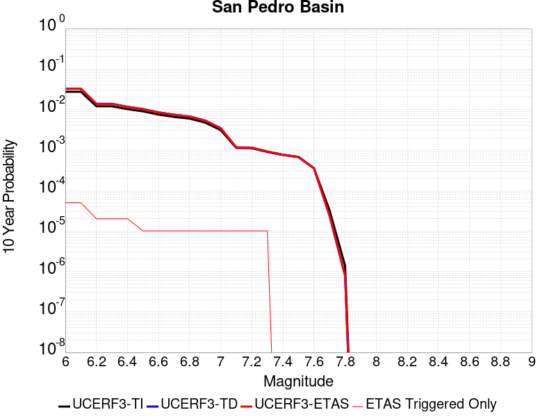 |

| Magnitude | 1 wk TI Prob | 1 wk TD Prob | 1 wk ETAS Prob | 1 wk ETAS/TD Gain | 1 wk ETAS Triggered Only | 1 mo TI Prob | 1 mo TD Prob | 1 mo ETAS Prob | 1 mo ETAS/TD Gain | 1 mo ETAS Triggered Only | 1 yr TI Prob | 1 yr TD Prob | 1 yr ETAS Prob | 1 yr ETAS/TD Gain | 1 yr ETAS Triggered Only | 10 yr TI Prob | 10 yr TD Prob | 10 yr ETAS Prob | 10 yr ETAS/TD Gain | 10 yr ETAS Triggered Only |
|-----|-----|-----|-----|-----|-----|-----|-----|-----|-----|-----|-----|-----|-----|-----|-----|-----|-----|-----|-----|-----|
| 6.0 | 5.3449043E-5 | 6.336954E-5 | 8.525071E-5 | 1.3452948 | 2.1882557E-5 | 2.2904722E-4 | 2.715589E-4 | 2.9343553E-4 | 1.0805594 | 2.1882557E-5 | 0.0027850836 | 0.0033018254 | 0.0033345409 | 1.0099083 | 3.2823835E-5 | 0.027504366 | 0.03258945 | 0.03263179 | 1.0012991 | 4.3765114E-5 |
| 6.1 | 5.3449043E-5 | 6.336954E-5 | 8.525071E-5 | 1.3452948 | 2.1882557E-5 | 2.2904722E-4 | 2.715589E-4 | 2.9343553E-4 | 1.0805594 | 2.1882557E-5 | 0.0027850836 | 0.0033018254 | 0.0033345409 | 1.0099083 | 3.2823835E-5 | 0.027504366 | 0.03258945 | 0.03263179 | 1.0012991 | 4.3765114E-5 |
| 6.2 | 2.3189454E-5 | 2.6642796E-5 | 3.7583784E-5 | 1.4106545 | 1.0941279E-5 | 9.9379584E-5 | 1.14178685E-4 | 1.251187E-4 | 1.095815 | 1.0941279E-5 | 0.0012092749 | 0.0013892864 | 0.0014111386 | 1.0157291 | 2.1882557E-5 | 0.012027155 | 0.013810883 | 0.013832464 | 1.0015626 | 2.1882557E-5 |
| 6.3 | 2.3189454E-5 | 2.6642796E-5 | 3.7583784E-5 | 1.4106545 | 1.0941279E-5 | 9.9379584E-5 | 1.14178685E-4 | 1.251187E-4 | 1.095815 | 1.0941279E-5 | 0.0012092749 | 0.0013892864 | 0.0014111386 | 1.0157291 | 2.1882557E-5 | 0.012027155 | 0.013810883 | 0.013832464 | 1.0015626 | 2.1882557E-5 |
| 6.4 | 1.966056E-5 | 2.2463413E-5 | 3.3404445E-5 | 1.4870601 | 1.0941279E-5 | 8.425682E-5 | 9.626844E-5 | 1.0720867E-4 | 1.1136429 | 1.0941279E-5 | 0.001025344 | 0.0011714783 | 0.0011933353 | 1.0186576 | 2.1882557E-5 | 0.010206259 | 0.011657117 | 0.011678744 | 1.0018553 | 2.1882557E-5 |
| 6.5 | 1.7342953E-5 | 1.9745148E-5 | 3.068621E-5 | 1.554114 | 1.0941279E-5 | 7.4324824E-5 | 8.4619525E-5 | 9.555988E-5 | 1.1292888 | 1.0941279E-5 | 9.04529E-4 | 0.0010297928 | 0.0010407228 | 1.0106138 | 1.0941279E-5 | 0.009008561 | 0.010253931 | 0.01026476 | 1.0010561 | 1.0941279E-5 |
| 6.6 | 1.439804E-5 | 1.6322716E-5 | 2.7263815E-5 | 1.6702989 | 1.0941279E-5 | 6.170443E-5 | 6.99528E-5 | 8.089331E-5 | 1.1563985 | 1.0941279E-5 | 7.509924E-4 | 8.513747E-4 | 8.623067E-4 | 1.0128404 | 1.0941279E-5 | 0.0074845953 | 0.008484332 | 0.008495181 | 1.0012786 | 1.0941279E-5 |
| 6.7 | 1.2634884E-5 | 1.4285297E-5 | 2.5226418E-5 | 1.7659009 | 1.0941279E-5 | 5.414838E-5 | 6.1221435E-5 | 7.2162045E-5 | 1.1787056 | 1.0941279E-5 | 6.590571E-4 | 7.4514654E-4 | 7.560797E-4 | 1.0146724 | 1.0941279E-5 | 0.006571059 | 0.007429501 | 0.007440361 | 1.0014617 | 1.0941279E-5 |
| 6.8 | 1.146091E-5 | 1.2933192E-5 | 2.3874329E-5 | 1.8459735 | 1.0941279E-5 | 4.911726E-5 | 5.5426954E-5 | 6.6367626E-5 | 1.197389 | 1.0941279E-5 | 5.9783855E-4 | 6.7464396E-4 | 6.8557786E-4 | 1.0162069 | 1.0941279E-5 | 0.0059623276 | 0.006728899 | 0.006739767 | 1.001615 | 1.0941279E-5 |
| 6.9 | 9.109035E-6 | 1.0235011E-5 | 2.1176178E-5 | 2.068994 | 1.0941279E-5 | 3.9038136E-5 | 4.3863754E-5 | 5.4804554E-5 | 1.2494268 | 1.0941279E-5 | 4.7518566E-4 | 5.3393835E-4 | 5.448738E-4 | 1.0204808 | 1.0941279E-5 | 0.0047417083 | 0.005329309 | 0.005340192 | 1.002042 | 1.0941279E-5 |
| 7.0 | 5.9351028E-6 | 6.583964E-6 | 1.752517E-5 | 2.661796 | 1.0941279E-5 | 2.5435906E-5 | 2.8216817E-5 | 3.9157785E-5 | 1.3877465 | 1.0941279E-5 | 3.0963816E-4 | 3.435092E-4 | 3.5444673E-4 | 1.0318406 | 1.0941279E-5 | 0.0030920706 | 0.0034320992 | 0.003443003 | 1.0031769 | 1.0941279E-5 |
| 7.1 | 2.1557585E-6 | 2.209648E-6 | 1.3150902E-5 | 5.951582 | 1.0941279E-5 | 9.238933E-6 | 9.469887E-6 | 2.0411062E-5 | 2.1553648 | 1.0941279E-5 | 1.1247819E-4 | 1.1528993E-4 | 1.2622995E-4 | 1.0948913 | 1.0941279E-5 | 0.0011242128 | 0.0011523166 | 0.0011632452 | 1.009484 | 1.0941279E-5 |
| 7.2 | 2.1251979E-6 | 2.1779945E-6 | 1.3119248E-5 | 6.0235457 | 1.0941279E-5 | 9.107958E-6 | 9.334229E-6 | 2.0275405E-5 | 2.1721563 | 1.0941279E-5 | 1.1088375E-4 | 1.1363847E-4 | 1.245785E-4 | 1.0962706 | 1.0941279E-5 | 0.0011082845 | 0.0011358189 | 0.0011467477 | 1.009622 | 1.0941279E-5 |
| 7.3 | 1.7145798E-6 | 1.7442874E-6 | 1.2685547E-5 | 7.272624 | 1.0941279E-5 | 7.3481783E-6 | 7.4754967E-6 | 1.8416693E-5 | 2.463608 | 1.0941279E-5 | 8.94604E-5 | 9.1010465E-5 | 1.0195075E-4 | 1.1202091 | 1.0941279E-5 | 8.9424395E-4 | 9.0974104E-4 | 9.206723E-4 | 1.0120158 | 1.0941279E-5 |
| 7.4 | 1.4467993E-6 | 1.4641868E-6 | 1.4641868E-6 | 1.0 | 0.0 | 6.200554E-6 | 6.2750714E-6 | 6.2750714E-6 | 1.0 | 0.0 | 7.548913E-5 | 7.639639E-5 | 7.639639E-5 | 1.0 | 0.0 | 7.546349E-4 | 7.6370855E-4 | 7.6370855E-4 | 1.0 | 0.0 |
| 7.5 | 1.2803735E-6 | 1.2931497E-6 | 1.2931497E-6 | 1.0 | 0.0 | 5.487303E-6 | 5.5420587E-6 | 5.5420587E-6 | 1.0 | 0.0 | 6.680587E-5 | 6.7472545E-5 | 6.7472545E-5 | 1.0 | 0.0 | 6.678579E-4 | 6.7452766E-4 | 6.7452766E-4 | 1.0 | 0.0 |
| 7.6 | 6.755009E-7 | 6.769465E-7 | 6.769465E-7 | 1.0 | 0.0 | 2.8950008E-6 | 2.9011965E-6 | 2.9011965E-6 | 1.0 | 0.0 | 3.5246063E-5 | 3.5321555E-5 | 3.5321555E-5 | 1.0 | 0.0 | 3.5240475E-4 | 3.5316512E-4 | 3.5316512E-4 | 1.0 | 0.0 |
| 7.7 | 6.211885E-8 | 4.569953E-8 | 4.569953E-8 | 1.0 | 0.0 | 2.6622362E-7 | 1.9585512E-7 | 1.9585512E-7 | 1.0 | 0.0 | 3.2412677E-6 | 2.3845337E-6 | 2.3845337E-6 | 1.0 | 0.0 | 3.2412205E-5 | 2.3845101E-5 | 2.3845101E-5 | 1.0 | 0.0 |
| 7.8 | 2.6580573E-9 | 1.5138163E-9 | 1.5138163E-9 | 1.0 | 0.0 | 1.1391674E-8 | 6.487784E-9 | 6.487784E-9 | 1.0 | 0.0 | 1.3869362E-7 | 7.898877E-8 | 7.898877E-8 | 1.0 | 0.0 | 1.3869354E-6 | 7.898877E-7 | 7.898877E-7 | 1.0 | 0.0 |

## Simi-Santa Rosa
*[(top)](#table-of-contents)*

| 1 Week | 1 Month | 1 Year | 10 Year |
|-----|-----|-----|-----|
|  |  |  |  |

| Magnitude | 1 wk TI Prob | 1 wk TD Prob | 1 wk ETAS Prob | 1 wk ETAS/TD Gain | 1 wk ETAS Triggered Only | 1 mo TI Prob | 1 mo TD Prob | 1 mo ETAS Prob | 1 mo ETAS/TD Gain | 1 mo ETAS Triggered Only | 1 yr TI Prob | 1 yr TD Prob | 1 yr ETAS Prob | 1 yr ETAS/TD Gain | 1 yr ETAS Triggered Only | 10 yr TI Prob | 10 yr TD Prob | 10 yr ETAS Prob | 10 yr ETAS/TD Gain | 10 yr ETAS Triggered Only |
|-----|-----|-----|-----|-----|-----|-----|-----|-----|-----|-----|-----|-----|-----|-----|-----|-----|-----|-----|-----|-----|
| 6.0 | 2.198912E-5 | 2.2275442E-5 | 4.415751E-5 | 1.9823405 | 2.1882557E-5 | 9.4235686E-5 | 9.5462936E-5 | 1.2828363E-4 | 1.3438057 | 3.2823835E-5 | 0.0011467156 | 0.0011616853 | 0.0012053996 | 1.0376301 | 4.3765114E-5 | 0.011408163 | 0.011560575 | 0.011603834 | 1.003742 | 4.3765114E-5 |
| 6.1 | 2.198912E-5 | 2.2275442E-5 | 4.415751E-5 | 1.9823405 | 2.1882557E-5 | 9.4235686E-5 | 9.5462936E-5 | 1.2828363E-4 | 1.3438057 | 3.2823835E-5 | 0.0011467156 | 0.0011616853 | 0.0012053996 | 1.0376301 | 4.3765114E-5 | 0.011408163 | 0.011560575 | 0.011603834 | 1.003742 | 4.3765114E-5 |
| 6.2 | 1.69983E-5 | 1.6668559E-5 | 1.6668559E-5 | 1.0 | 0.0 | 7.284782E-5 | 7.143489E-5 | 7.143489E-5 | 1.0 | 0.0 | 8.865613E-4 | 8.6940196E-4 | 8.6940196E-4 | 1.0 | 0.0 | 0.008830327 | 0.008662928 | 0.008662928 | 1.0 | 0.0 |
| 6.3 | 1.69983E-5 | 1.6668559E-5 | 1.6668559E-5 | 1.0 | 0.0 | 7.284782E-5 | 7.143489E-5 | 7.143489E-5 | 1.0 | 0.0 | 8.865613E-4 | 8.6940196E-4 | 8.6940196E-4 | 1.0 | 0.0 | 0.008830327 | 0.008662928 | 0.008662928 | 1.0 | 0.0 |
| 6.4 | 1.4666188E-5 | 1.4052543E-5 | 1.4052543E-5 | 1.0 | 0.0 | 6.285358E-5 | 6.0223934E-5 | 6.0223934E-5 | 1.0 | 0.0 | 7.6497364E-4 | 7.3300465E-4 | 7.3300465E-4 | 1.0 | 0.0 | 0.0076234564 | 0.007308344 | 0.007308344 | 1.0 | 0.0 |
| 6.5 | 1.4666188E-5 | 1.4052543E-5 | 1.4052543E-5 | 1.0 | 0.0 | 6.285358E-5 | 6.0223934E-5 | 6.0223934E-5 | 1.0 | 0.0 | 7.6497364E-4 | 7.3300465E-4 | 7.3300465E-4 | 1.0 | 0.0 | 0.0076234564 | 0.007308344 | 0.007308344 | 1.0 | 0.0 |
| 6.6 | 1.4377586E-5 | 1.3729583E-5 | 1.3729583E-5 | 1.0 | 0.0 | 6.1616774E-5 | 5.883988E-5 | 5.883988E-5 | 1.0 | 0.0 | 7.4992597E-4 | 7.1616494E-4 | 7.1616494E-4 | 1.0 | 0.0 | 0.007474003 | 0.0071410383 | 0.0071410383 | 1.0 | 0.0 |
| 6.7 | 1.3881404E-5 | 1.320755E-5 | 1.320755E-5 | 1.0 | 0.0 | 5.9490372E-5 | 5.66027E-5 | 5.66027E-5 | 1.0 | 0.0 | 7.240546E-4 | 6.8894465E-4 | 6.8894465E-4 | 1.0 | 0.0 | 0.007217 | 0.006870538 | 0.006870538 | 1.0 | 0.0 |
| 6.8 | 1.0176516E-5 | 9.154151E-6 | 9.154151E-6 | 1.0 | 0.0 | 4.3612912E-5 | 3.9231574E-5 | 3.9231574E-5 | 1.0 | 0.0 | 5.308578E-4 | 4.7755634E-4 | 4.7755634E-4 | 1.0 | 0.0 | 0.0052959146 | 0.004766934 | 0.004766934 | 1.0 | 0.0 |
| 6.9 | 9.699797E-6 | 8.774719E-6 | 8.774719E-6 | 1.0 | 0.0 | 4.15699E-5 | 3.7605492E-5 | 3.7605492E-5 | 1.0 | 0.0 | 5.05996E-4 | 4.577671E-4 | 4.577671E-4 | 1.0 | 0.0 | 0.005048454 | 0.0045698597 | 0.0045698597 | 1.0 | 0.0 |
| 7.0 | 7.4049476E-6 | 6.559333E-6 | 6.559333E-6 | 1.0 | 0.0 | 3.1735104E-5 | 2.8111197E-5 | 2.8111197E-5 | 1.0 | 0.0 | 3.8630638E-4 | 3.422127E-4 | 3.422127E-4 | 1.0 | 0.0 | 0.0038563553 | 0.0034180996 | 0.0034180996 | 1.0 | 0.0 |
| 7.1 | 3.873439E-6 | 2.7595095E-6 | 2.7595095E-6 | 1.0 | 0.0 | 1.6600346E-5 | 1.1826417E-5 | 1.1826417E-5 | 1.0 | 0.0 | 2.0209046E-4 | 1.4397735E-4 | 1.4397735E-4 | 1.0 | 0.0 | 0.0020190678 | 0.0014388643 | 0.0014388643 | 1.0 | 0.0 |
| 7.2 | 3.417706E-6 | 2.3676484E-6 | 2.3676484E-6 | 1.0 | 0.0 | 1.4647229E-5 | 1.0147027E-5 | 1.0147027E-5 | 1.0 | 0.0 | 1.7831543E-4 | 1.2353327E-4 | 1.2353327E-4 | 1.0 | 0.0 | 0.0017817242 | 0.0012346683 | 0.0012346683 | 1.0 | 0.0 |
| 7.3 | 1.90225E-6 | 1.4073753E-6 | 1.4073753E-6 | 1.0 | 0.0 | 8.152474E-6 | 6.0315947E-6 | 6.0315947E-6 | 1.0 | 0.0 | 9.9251854E-5 | 7.343221E-5 | 7.343221E-5 | 1.0 | 0.0 | 9.920754E-4 | 7.340817E-4 | 7.340817E-4 | 1.0 | 0.0 |
| 7.4 | 1.5170556E-6 | 1.1024773E-6 | 1.1024773E-6 | 1.0 | 0.0 | 6.5016507E-6 | 4.724894E-6 | 4.724894E-6 | 1.0 | 0.0 | 7.915472E-5 | 5.7524077E-5 | 5.7524077E-5 | 1.0 | 0.0 | 7.9126534E-4 | 5.7509297E-4 | 5.7509297E-4 | 1.0 | 0.0 |
| 7.5 | 1.178732E-6 | 8.535102E-7 | 8.535102E-7 | 1.0 | 0.0 | 5.0516987E-6 | 3.6578958E-6 | 3.6578958E-6 | 1.0 | 0.0 | 6.1502695E-5 | 4.453398E-5 | 4.453398E-5 | 1.0 | 0.0 | 6.148568E-4 | 4.452515E-4 | 4.452515E-4 | 1.0 | 0.0 |
| 7.6 | 6.8722386E-7 | 4.793198E-7 | 4.793198E-7 | 1.0 | 0.0 | 2.9452417E-6 | 2.054226E-6 | 2.054226E-6 | 1.0 | 0.0 | 3.5857727E-5 | 2.5009915E-5 | 2.5009915E-5 | 1.0 | 0.0 | 3.5851944E-4 | 2.5007114E-4 | 2.5007114E-4 | 1.0 | 0.0 |
| 7.7 | 5.5126515E-7 | 3.6731157E-7 | 3.6731157E-7 | 1.0 | 0.0 | 2.3625628E-6 | 1.5741915E-6 | 1.5741915E-6 | 1.0 | 0.0 | 2.8763823E-5 | 1.9165615E-5 | 1.9165615E-5 | 1.0 | 0.0 | 2.87601E-4 | 1.9163972E-4 | 1.9163972E-4 | 1.0 | 0.0 |
| 7.8 | 3.3860243E-7 | 2.0075942E-7 | 2.0075942E-7 | 1.0 | 0.0 | 1.4511525E-6 | 8.6039717E-7 | 8.6039717E-7 | 1.0 | 0.0 | 1.7667637E-5 | 1.0475286E-5 | 1.0475286E-5 | 1.0 | 0.0 | 1.7666233E-4 | 1.04747975E-4 | 1.04747975E-4 | 1.0 | 0.0 |
| 7.9 | 2.7955386E-7 | 1.4649108E-7 | 1.4649108E-7 | 1.0 | 0.0 | 1.1980875E-6 | 6.278188E-7 | 6.278188E-7 | 1.0 | 0.0 | 1.4586617E-5 | 7.643667E-6 | 7.643667E-6 | 1.0 | 0.0 | 1.458566E-4 | 7.643409E-5 | 7.643409E-5 | 1.0 | 0.0 |
| 8.0 | 5.6259015E-8 | 3.3355324E-8 | 3.3355324E-8 | 1.0 | 0.0 | 2.4111003E-7 | 1.4295138E-7 | 1.4295138E-7 | 1.0 | 0.0 | 2.9355108E-6 | 1.7404317E-6 | 1.7404317E-6 | 1.0 | 0.0 | 2.935472E-5 | 1.7404194E-5 | 1.7404194E-5 | 1.0 | 0.0 |

## Whittier alt 1
*[(top)](#table-of-contents)*

| 1 Week | 1 Month | 1 Year | 10 Year |
|-----|-----|-----|-----|
|  |  |  |  |

| Magnitude | 1 wk TI Prob | 1 wk TD Prob | 1 wk ETAS Prob | 1 wk ETAS/TD Gain | 1 wk ETAS Triggered Only | 1 mo TI Prob | 1 mo TD Prob | 1 mo ETAS Prob | 1 mo ETAS/TD Gain | 1 mo ETAS Triggered Only | 1 yr TI Prob | 1 yr TD Prob | 1 yr ETAS Prob | 1 yr ETAS/TD Gain | 1 yr ETAS Triggered Only | 10 yr TI Prob | 10 yr TD Prob | 10 yr ETAS Prob | 10 yr ETAS/TD Gain | 10 yr ETAS Triggered Only |
|-----|-----|-----|-----|-----|-----|-----|-----|-----|-----|-----|-----|-----|-----|-----|-----|-----|-----|-----|-----|-----|
| 6.0 | 4.2554693E-5 | 4.725218E-5 | 6.91337E-5 | 1.4630797 | 2.1882557E-5 | 1.8236451E-4 | 2.0249544E-4 | 2.3531263E-4 | 1.1620638 | 3.2823835E-5 | 0.002218027 | 0.0024629154 | 0.0025065728 | 1.0177258 | 4.3765114E-5 | 0.02196019 | 0.024390234 | 0.024432933 | 1.0017506 | 4.3765114E-5 |
| 6.1 | 4.2554693E-5 | 4.725218E-5 | 6.91337E-5 | 1.4630797 | 2.1882557E-5 | 1.8236451E-4 | 2.0249544E-4 | 2.3531263E-4 | 1.1620638 | 3.2823835E-5 | 0.002218027 | 0.0024629154 | 0.0025065728 | 1.0177258 | 4.3765114E-5 | 0.02196019 | 0.024390234 | 0.024432933 | 1.0017506 | 4.3765114E-5 |
| 6.2 | 4.2554693E-5 | 4.725218E-5 | 6.91337E-5 | 1.4630797 | 2.1882557E-5 | 1.8236451E-4 | 2.0249544E-4 | 2.3531263E-4 | 1.1620638 | 3.2823835E-5 | 0.002218027 | 0.0024629154 | 0.0025065728 | 1.0177258 | 4.3765114E-5 | 0.02196019 | 0.024390234 | 0.024432933 | 1.0017506 | 4.3765114E-5 |
| 6.3 | 1.9617712E-5 | 1.8268593E-5 | 2.920967E-5 | 1.598901 | 1.0941279E-5 | 8.40732E-5 | 7.829172E-5 | 8.923215E-5 | 1.1397392 | 1.0941279E-5 | 0.0010231105 | 9.52804E-4 | 9.746657E-4 | 1.0229446 | 2.1882557E-5 | 0.01018413 | 0.009490474 | 0.00951215 | 1.0022838 | 2.1882557E-5 |
| 6.4 | 1.5611336E-5 | 1.3604271E-5 | 1.3604271E-5 | 1.0 | 0.0 | 6.690401E-5 | 5.8302747E-5 | 5.8302747E-5 | 1.0 | 0.0 | 8.142519E-4 | 7.0961076E-4 | 7.2054425E-4 | 1.0154078 | 1.0941279E-5 | 0.008112748 | 0.0070754145 | 0.0070862784 | 1.0015354 | 1.0941279E-5 |
| 6.5 | 1.5150166E-5 | 1.3100925E-5 | 1.3100925E-5 | 1.0 | 0.0 | 6.492767E-5 | 5.6145647E-5 | 5.6145647E-5 | 1.0 | 0.0 | 7.9020765E-4 | 6.8336475E-4 | 6.9429853E-4 | 1.0159999 | 1.0941279E-5 | 0.007874036 | 0.0068145846 | 0.0068254513 | 1.0015947 | 1.0941279E-5 |
| 6.6 | 1.295588E-5 | 1.0380725E-5 | 1.0380725E-5 | 1.0 | 0.0 | 5.552402E-5 | 4.4488075E-5 | 4.4488075E-5 | 1.0 | 0.0 | 6.7579525E-4 | 5.4150965E-4 | 5.4150965E-4 | 1.0 | 0.0 | 0.006737438 | 0.0054033357 | 0.0054033357 | 1.0 | 0.0 |
| 6.7 | 1.2542085E-5 | 9.899369E-6 | 9.899369E-6 | 1.0 | 0.0 | 5.3750682E-5 | 4.242519E-5 | 4.242519E-5 | 1.0 | 0.0 | 6.542181E-4 | 5.164061E-4 | 5.164061E-4 | 1.0 | 0.0 | 0.006522954 | 0.0051534795 | 0.0051534795 | 1.0 | 0.0 |
| 6.8 | 1.2195878E-5 | 9.495415E-6 | 9.495415E-6 | 1.0 | 0.0 | 5.2267E-5 | 4.069401E-5 | 4.069401E-5 | 1.0 | 0.0 | 6.36165E-4 | 4.9533875E-4 | 4.9533875E-4 | 1.0 | 0.0 | 0.0063434686 | 0.004943688 | 0.004943688 | 1.0 | 0.0 |
| 6.9 | 1.1580298E-5 | 8.772933E-6 | 8.772933E-6 | 1.0 | 0.0 | 4.9628903E-5 | 3.7597754E-5 | 3.7597754E-5 | 1.0 | 0.0 | 6.040644E-4 | 4.5765814E-4 | 4.5765814E-4 | 1.0 | 0.0 | 0.00602425 | 0.0045684157 | 0.0045684157 | 1.0 | 0.0 |
| 7.0 | 1.0964795E-5 | 8.083994E-6 | 8.083994E-6 | 1.0 | 0.0 | 4.6991136E-5 | 3.4645236E-5 | 3.4645236E-5 | 1.0 | 0.0 | 5.7196687E-4 | 4.2172565E-4 | 4.2172565E-4 | 1.0 | 0.0 | 0.0057049696 | 0.004210462 | 0.004210462 | 1.0 | 0.0 |
| 7.1 | 1.0230601E-5 | 7.3266697E-6 | 7.3266697E-6 | 1.0 | 0.0 | 4.3844695E-5 | 3.1399642E-5 | 3.1399642E-5 | 1.0 | 0.0 | 5.336784E-4 | 3.8222488E-4 | 3.8222488E-4 | 1.0 | 0.0 | 0.005323986 | 0.0038168381 | 0.0038168381 | 1.0 | 0.0 |
| 7.2 | 9.40865E-6 | 6.543289E-6 | 6.543289E-6 | 1.0 | 0.0 | 4.032216E-5 | 2.8042374E-5 | 2.8042374E-5 | 1.0 | 0.0 | 4.908117E-4 | 3.4136363E-4 | 3.4136363E-4 | 1.0 | 0.0 | 0.0048972913 | 0.003409485 | 0.003409485 | 1.0 | 0.0 |
| 7.3 | 8.237384E-6 | 5.5977525E-6 | 5.5977525E-6 | 1.0 | 0.0 | 3.5302593E-5 | 2.3990153E-5 | 2.3990153E-5 | 1.0 | 0.0 | 4.2972428E-4 | 2.92042E-4 | 2.92042E-4 | 1.0 | 0.0 | 0.0042889426 | 0.002916903 | 0.002916903 | 1.0 | 0.0 |
| 7.4 | 7.5316966E-6 | 5.027819E-6 | 5.027819E-6 | 1.0 | 0.0 | 3.2278298E-5 | 2.1547625E-5 | 2.1547625E-5 | 1.0 | 0.0 | 3.9291743E-4 | 2.6231175E-4 | 2.6231175E-4 | 1.0 | 0.0 | 0.0039222343 | 0.0026201333 | 0.0026201333 | 1.0 | 0.0 |
| 7.5 | 6.149649E-6 | 3.933841E-6 | 3.933841E-6 | 1.0 | 0.0 | 2.6355372E-5 | 1.6859214E-5 | 1.6859214E-5 | 1.0 | 0.0 | 3.208294E-4 | 2.052425E-4 | 2.052425E-4 | 1.0 | 0.0 | 0.003203666 | 0.0020506186 | 0.0020506186 | 1.0 | 0.0 |
| 7.6 | 5.457711E-6 | 3.3953788E-6 | 3.3953788E-6 | 1.0 | 0.0 | 2.338998E-5 | 1.4551547E-5 | 1.4551547E-5 | 1.0 | 0.0 | 2.8473578E-4 | 1.771515E-4 | 1.771515E-4 | 1.0 | 0.0 | 0.0028437122 | 0.0017701836 | 0.0017701836 | 1.0 | 0.0 |
| 7.7 | 4.1676276E-6 | 2.3331952E-6 | 2.3331952E-6 | 1.0 | 0.0 | 1.7861139E-5 | 9.999374E-6 | 9.999374E-6 | 1.0 | 0.0 | 2.1743766E-4 | 1.2173632E-4 | 1.2173632E-4 | 1.0 | 0.0 | 0.0021722503 | 0.0012167693 | 0.0012167693 | 1.0 | 0.0 |
| 7.8 | 2.2692414E-7 | 9.3854695E-8 | 9.3854695E-8 | 1.0 | 0.0 | 9.725317E-7 | 4.0223435E-7 | 4.0223435E-7 | 1.0 | 0.0 | 1.1840509E-5 | 4.8971956E-6 | 4.8971956E-6 | 1.0 | 0.0 | 1.1839878E-4 | 4.8971204E-5 | 4.8971204E-5 | 1.0 | 0.0 |
| 7.9 | 6.676829E-9 | 3.439853E-9 | 3.439853E-9 | 1.0 | 0.0 | 2.861498E-8 | 1.4742227E-8 | 1.4742227E-8 | 1.0 | 0.0 | 3.4838732E-7 | 1.7948659E-7 | 1.7948659E-7 | 1.0 | 0.0 | 3.4838679E-6 | 1.7948646E-6 | 1.7948646E-6 | 1.0 | 0.0 |

## San Jacinto (Borrego)
*[(top)](#table-of-contents)*

| 1 Week | 1 Month | 1 Year | 10 Year |
|-----|-----|-----|-----|
|  |  |  |  |

| Magnitude | 1 wk TI Prob | 1 wk TD Prob | 1 wk ETAS Prob | 1 wk ETAS/TD Gain | 1 wk ETAS Triggered Only | 1 mo TI Prob | 1 mo TD Prob | 1 mo ETAS Prob | 1 mo ETAS/TD Gain | 1 mo ETAS Triggered Only | 1 yr TI Prob | 1 yr TD Prob | 1 yr ETAS Prob | 1 yr ETAS/TD Gain | 1 yr ETAS Triggered Only | 10 yr TI Prob | 10 yr TD Prob | 10 yr ETAS Prob | 10 yr ETAS/TD Gain | 10 yr ETAS Triggered Only |
|-----|-----|-----|-----|-----|-----|-----|-----|-----|-----|-----|-----|-----|-----|-----|-----|-----|-----|-----|-----|-----|
| 6.0 | 3.543992E-5 | 2.7926513E-5 | 4.980846E-5 | 1.7835546 | 2.1882557E-5 | 1.5187653E-4 | 1.1967963E-4 | 1.5249953E-4 | 1.2742313 | 3.2823835E-5 | 0.0018475284 | 0.0014561379 | 0.0014889139 | 1.0225089 | 3.2823835E-5 | 0.018322436 | 0.014869647 | 0.014912762 | 1.0028995 | 4.3765114E-5 |
| 6.1 | 3.542281E-5 | 2.7926513E-5 | 4.980846E-5 | 1.7835546 | 2.1882557E-5 | 1.5180321E-4 | 1.1967963E-4 | 1.5249953E-4 | 1.2742313 | 3.2823835E-5 | 0.0018466372 | 0.0014561379 | 0.0014889139 | 1.0225089 | 3.2823835E-5 | 0.018313672 | 0.014869647 | 0.014912762 | 1.0028995 | 4.3765114E-5 |
| 6.2 | 3.4688688E-5 | 2.7926511E-5 | 4.9808456E-5 | 1.7835546 | 2.1882557E-5 | 1.4865733E-4 | 1.1967963E-4 | 1.5249953E-4 | 1.2742313 | 3.2823835E-5 | 0.0018084005 | 0.0014561379 | 0.0014889139 | 1.0225089 | 3.2823835E-5 | 0.017937548 | 0.014869647 | 0.014912761 | 1.0028995 | 4.3765114E-5 |
| 6.3 | 3.2087122E-5 | 2.7771865E-5 | 4.9653812E-5 | 1.7879179 | 2.1882557E-5 | 1.3750899E-4 | 1.1901691E-4 | 1.5183684E-4 | 1.2757585 | 3.2823835E-5 | 0.0016728862 | 0.00144808 | 0.0014808563 | 1.0226343 | 3.2823835E-5 | 0.016603488 | 0.014790683 | 0.0148338005 | 1.0029151 | 4.3765114E-5 |
| 6.4 | 3.1828724E-5 | 2.7738852E-5 | 4.96208E-5 | 1.7888557 | 2.1882557E-5 | 1.364017E-4 | 1.1887544E-4 | 1.5169538E-4 | 1.2760867 | 3.2823835E-5 | 0.0016594254 | 0.0014463598 | 0.0014791362 | 1.0226613 | 3.2823835E-5 | 0.016470885 | 0.014773762 | 0.01481688 | 1.0029186 | 4.3765114E-5 |
| 6.5 | 3.1563577E-5 | 2.747857E-5 | 4.9360526E-5 | 1.796328 | 2.1882557E-5 | 1.3526545E-4 | 1.1776006E-4 | 1.5058002E-4 | 1.278702 | 3.2823835E-5 | 0.0016456128 | 0.0014327979 | 0.0014655747 | 1.022876 | 3.2823835E-5 | 0.0163348 | 0.014640348 | 0.014683472 | 1.0029455 | 4.3765114E-5 |
| 6.6 | 3.1467625E-5 | 2.7322796E-5 | 4.9204755E-5 | 1.8008683 | 2.1882557E-5 | 1.3485427E-4 | 1.1709251E-4 | 1.4991249E-4 | 1.2802911 | 3.2823835E-5 | 0.0016406142 | 0.0014246812 | 0.0014574582 | 1.0230066 | 3.2823835E-5 | 0.016285548 | 0.014560594 | 0.014603722 | 1.002962 | 4.3765114E-5 |
| 6.7 | 3.1223695E-5 | 2.6940816E-5 | 4.882278E-5 | 1.8122237 | 2.1882557E-5 | 1.3380898E-4 | 1.15455594E-4 | 1.4827563E-4 | 1.2842655 | 3.2823835E-5 | 0.0016279068 | 0.0014047775 | 0.0014375553 | 1.0233331 | 3.2823835E-5 | 0.01616033 | 0.014364966 | 0.014408102 | 1.0030029 | 4.3765114E-5 |
| 6.8 | 3.1015585E-5 | 2.6761822E-5 | 4.8643793E-5 | 1.8176563 | 2.1882557E-5 | 1.3291716E-4 | 1.1468855E-4 | 1.4750862E-4 | 1.2861669 | 3.2823835E-5 | 0.001617065 | 0.0013954508 | 0.0014282288 | 1.0234892 | 3.2823835E-5 | 0.016053487 | 0.014272246 | 0.014315386 | 1.0030227 | 4.3765114E-5 |
| 6.9 | 2.6641965E-5 | 2.2184247E-5 | 4.4066317E-5 | 1.9863788 | 2.1882557E-5 | 1.1417485E-4 | 9.50719E-5 | 1.278926E-4 | 1.34522 | 3.2823835E-5 | 0.0013891924 | 0.0011568897 | 0.0011896755 | 1.0283396 | 3.2823835E-5 | 0.0138054015 | 0.011882438 | 0.011925683 | 1.0036395 | 4.3765114E-5 |
| 7.0 | 2.3854353E-5 | 2.0479023E-5 | 4.236113E-5 | 2.0685132 | 2.1882557E-5 | 1.02228936E-4 | 8.77643E-5 | 1.2058526E-4 | 1.373967 | 3.2823835E-5 | 0.0012439266 | 0.0010680092 | 0.001100798 | 1.0307008 | 3.2823835E-5 | 0.012369866 | 0.0109828 | 0.011026085 | 1.003941 | 4.3765114E-5 |
| 7.1 | 2.3672901E-5 | 2.031551E-5 | 4.2197622E-5 | 2.0771136 | 2.1882557E-5 | 1.0145135E-4 | 8.7063585E-5 | 1.19884564E-4 | 1.3769771 | 3.2823835E-5 | 0.0012344702 | 0.0010594862 | 0.0010922753 | 1.030948 | 3.2823835E-5 | 0.0122763505 | 0.010897976 | 0.010941264 | 1.0039722 | 4.3765114E-5 |
| 7.2 | 2.2717244E-5 | 1.9542893E-5 | 4.142502E-5 | 2.1196976 | 2.1882557E-5 | 9.735599E-5 | 8.375258E-5 | 1.1657366E-4 | 1.3918815 | 3.2823835E-5 | 0.0011846646 | 0.001019213 | 0.0010520034 | 1.0321722 | 3.2823835E-5 | 0.01178369 | 0.010495341 | 0.010538647 | 1.0041262 | 4.3765114E-5 |
| 7.3 | 2.1016205E-5 | 1.8384526E-5 | 4.026668E-5 | 2.1902485 | 2.1882557E-5 | 9.006634E-5 | 7.878846E-5 | 1.11609705E-4 | 1.4165744 | 3.2823835E-5 | 0.001096006 | 9.5882936E-4 | 9.916218E-4 | 1.0342004 | 3.2823835E-5 | 0.010906163 | 0.009890967 | 0.009934299 | 1.004381 | 4.3765114E-5 |
| 7.4 | 2.0683625E-5 | 1.8187047E-5 | 4.0069204E-5 | 2.2031727 | 2.1882557E-5 | 8.86411E-5 | 7.794217E-5 | 1.10763445E-4 | 1.4210978 | 3.2823835E-5 | 0.001078671 | 9.485349E-4 | 9.813275E-4 | 1.034572 | 3.2823835E-5 | 0.010734501 | 0.009787692 | 0.009831029 | 1.0044277 | 4.3765114E-5 |
| 7.5 | 1.9993966E-5 | 1.7782075E-5 | 3.9664243E-5 | 2.2305746 | 2.1882557E-5 | 8.568561E-5 | 7.620667E-5 | 1.09028006E-4 | 1.4306884 | 3.2823835E-5 | 0.001042723 | 9.2742336E-4 | 9.6021674E-4 | 1.0353596 | 3.2823835E-5 | 0.010378438 | 0.009574614 | 0.009617961 | 1.0045272 | 4.3765114E-5 |
| 7.6 | 1.788966E-5 | 1.6435291E-5 | 3.831749E-5 | 2.3314152 | 2.1882557E-5 | 7.666772E-5 | 7.043507E-5 | 1.0325659E-4 | 1.4659827 | 3.2823835E-5 | 9.3302975E-4 | 8.572113E-4 | 8.90007E-4 | 1.0382586 | 3.2823835E-5 | 0.00929122 | 0.008866487 | 0.008909863 | 1.0048922 | 4.3765114E-5 |
| 7.7 | 1.5125781E-5 | 1.4237377E-5 | 3.611962E-5 | 2.5369575 | 2.1882557E-5 | 6.4823165E-5 | 6.1015908E-5 | 9.383774E-5 | 1.5379225 | 3.2823835E-5 | 7.889362E-4 | 7.426163E-4 | 7.7541574E-4 | 1.0441674 | 3.2823835E-5 | 0.007861412 | 0.0077142045 | 0.0077576316 | 1.0056295 | 4.3765114E-5 |
| 7.8 | 1.250089E-5 | 1.26304985E-5 | 3.4512777E-5 | 2.7324953 | 2.1882557E-5 | 5.3574146E-5 | 5.412959E-5 | 8.6951644E-5 | 1.6063608 | 3.2823835E-5 | 6.5207E-4 | 6.588291E-4 | 6.916313E-4 | 1.0497886 | 3.2823835E-5 | 0.006501599 | 0.0068677636 | 0.0069112284 | 1.0063288 | 4.3765114E-5 |
| 7.9 | 9.561E-6 | 9.754616E-6 | 3.163696E-5 | 3.2432806 | 2.1882557E-5 | 4.0975072E-5 | 4.1804833E-5 | 7.462729E-5 | 1.7851356 | 3.2823835E-5 | 4.987573E-4 | 5.088555E-4 | 5.416627E-4 | 1.0644724 | 3.2823835E-5 | 0.0049763937 | 0.0053523467 | 0.0053958776 | 1.008133 | 4.3765114E-5 |
| 8.0 | 8.01699E-6 | 8.293488E-6 | 3.0175863E-5 | 3.638501 | 2.1882557E-5 | 3.4358076E-5 | 3.554304E-5 | 6.8365705E-5 | 1.9234626 | 3.2823835E-5 | 4.1822926E-4 | 4.3265108E-4 | 4.654607E-4 | 1.0758339 | 3.2823835E-5 | 0.0041744304 | 0.004573375 | 0.00461694 | 1.0095258 | 4.3765114E-5 |
| 8.1 | 6.541947E-6 | 6.4622354E-6 | 2.834465E-5 | 4.386199 | 2.1882557E-5 | 2.8036617E-5 | 2.7695003E-5 | 6.051793E-5 | 2.185157 | 3.2823835E-5 | 3.4129233E-4 | 3.37135E-4 | 3.6994775E-4 | 1.0973283 | 3.2823835E-5 | 0.0034076865 | 0.0035806994 | 0.003624308 | 1.0121788 | 4.3765114E-5 |
| 8.2 | 1.7968189E-6 | 7.9713476E-7 | 7.9713476E-7 | 1.0 | 0.0 | 7.70063E-6 | 3.4162877E-6 | 3.4162877E-6 | 1.0 | 0.0 | 9.3751136E-5 | 4.159253E-5 | 4.159253E-5 | 1.0 | 0.0 | 9.371159E-4 | 4.712058E-4 | 4.712058E-4 | 1.0 | 0.0 |
| 8.3 | 1.5167889E-7 | 4.897714E-8 | 4.897714E-8 | 1.0 | 0.0 | 6.500522E-7 | 2.09902E-7 | 2.09902E-7 | 1.0 | 0.0 | 7.9143565E-6 | 2.5555544E-6 | 2.5555544E-6 | 1.0 | 0.0 | 7.914075E-5 | 2.969505E-5 | 2.969505E-5 | 1.0 | 0.0 |

## Kern Canyon (Lake Isabella) 2011
*[(top)](#table-of-contents)*

| 1 Week | 1 Month | 1 Year | 10 Year |
|-----|-----|-----|-----|
|  |  | 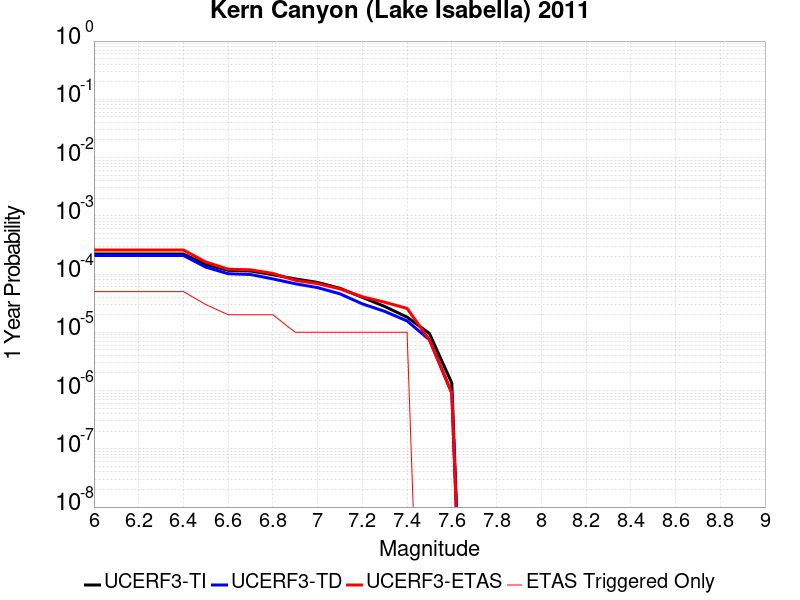 | 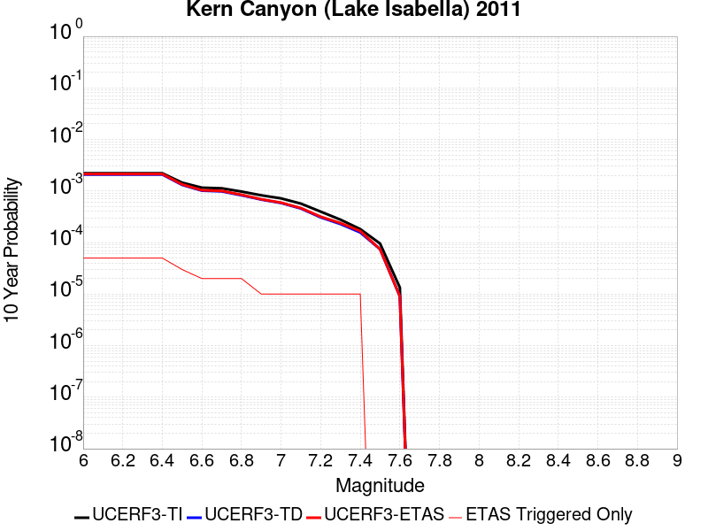 |

| Magnitude | 1 wk TI Prob | 1 wk TD Prob | 1 wk ETAS Prob | 1 wk ETAS/TD Gain | 1 wk ETAS Triggered Only | 1 mo TI Prob | 1 mo TD Prob | 1 mo ETAS Prob | 1 mo ETAS/TD Gain | 1 mo ETAS Triggered Only | 1 yr TI Prob | 1 yr TD Prob | 1 yr ETAS Prob | 1 yr ETAS/TD Gain | 1 yr ETAS Triggered Only | 10 yr TI Prob | 10 yr TD Prob | 10 yr ETAS Prob | 10 yr ETAS/TD Gain | 10 yr ETAS Triggered Only |
|-----|-----|-----|-----|-----|-----|-----|-----|-----|-----|-----|-----|-----|-----|-----|-----|-----|-----|-----|-----|-----|
| 6.0 | 4.2387383E-6 | 4.001639E-6 | 3.6825342E-5 | 9.202565 | 3.2823835E-5 | 1.8165894E-5 | 1.7149778E-5 | 4.997305E-5 | 2.9139183 | 3.2823835E-5 | 2.2114732E-4 | 2.087804E-4 | 2.5253638E-4 | 1.209579 | 4.3765114E-5 | 0.0022092736 | 0.0020860266 | 0.0021297003 | 1.0209364 | 4.3765114E-5 |
| 6.1 | 4.2387383E-6 | 4.001639E-6 | 3.6825342E-5 | 9.202565 | 3.2823835E-5 | 1.8165894E-5 | 1.7149778E-5 | 4.997305E-5 | 2.9139183 | 3.2823835E-5 | 2.2114732E-4 | 2.087804E-4 | 2.5253638E-4 | 1.209579 | 4.3765114E-5 | 0.0022092736 | 0.0020860266 | 0.0021297003 | 1.0209364 | 4.3765114E-5 |
| 6.2 | 4.2387383E-6 | 4.001639E-6 | 3.6825342E-5 | 9.202565 | 3.2823835E-5 | 1.8165894E-5 | 1.7149778E-5 | 4.997305E-5 | 2.9139183 | 3.2823835E-5 | 2.2114732E-4 | 2.087804E-4 | 2.5253638E-4 | 1.209579 | 4.3765114E-5 | 0.0022092736 | 0.0020860266 | 0.0021297003 | 1.0209364 | 4.3765114E-5 |
| 6.3 | 4.2387383E-6 | 4.001639E-6 | 3.6825342E-5 | 9.202565 | 3.2823835E-5 | 1.8165894E-5 | 1.7149778E-5 | 4.997305E-5 | 2.9139183 | 3.2823835E-5 | 2.2114732E-4 | 2.087804E-4 | 2.5253638E-4 | 1.209579 | 4.3765114E-5 | 0.0022092736 | 0.0020860266 | 0.0021297003 | 1.0209364 | 4.3765114E-5 |
| 6.4 | 4.2387383E-6 | 4.001639E-6 | 3.6825342E-5 | 9.202565 | 3.2823835E-5 | 1.8165894E-5 | 1.7149778E-5 | 4.997305E-5 | 2.9139183 | 3.2823835E-5 | 2.2114732E-4 | 2.087804E-4 | 2.5253638E-4 | 1.209579 | 4.3765114E-5 | 0.0022092736 | 0.0020860266 | 0.0021297003 | 1.0209364 | 4.3765114E-5 |
| 6.5 | 2.7857532E-6 | 2.517867E-6 | 1.3459117E-5 | 5.345444 | 1.0941279E-5 | 1.1938888E-5 | 1.0790815E-5 | 2.1731976E-5 | 2.0139327 | 1.0941279E-5 | 1.4534626E-4 | 1.3137059E-4 | 1.5325026E-4 | 1.1665493 | 2.1882557E-5 | 0.0014525123 | 0.001312962 | 0.0013348159 | 1.0166447 | 2.1882557E-5 |
| 6.6 | 2.2233348E-6 | 1.9441236E-6 | 1.2885381E-5 | 6.627861 | 1.0941279E-5 | 9.528543E-6 | 8.331932E-6 | 1.9273119E-5 | 2.3131633 | 1.0941279E-5 | 1.1600384E-4 | 1.01436635E-4 | 1.1237681E-4 | 1.1078522 | 1.0941279E-5 | 0.001159433 | 0.001013912 | 0.0010248421 | 1.0107802 | 1.0941279E-5 |
| 6.7 | 2.1635126E-6 | 1.8835036E-6 | 1.2824761E-5 | 6.8089924 | 1.0941279E-5 | 9.272164E-6 | 8.072134E-6 | 1.9013323E-5 | 2.3554273 | 1.0941279E-5 | 1.1288274E-4 | 9.827388E-5 | 1.0921408E-4 | 1.1113236 | 1.0941279E-5 | 0.0011282542 | 9.823124E-4 | 9.932428E-4 | 1.0111274 | 1.0941279E-5 |
| 6.8 | 1.8685711E-6 | 1.5831425E-6 | 1.2524403E-5 | 7.911103 | 1.0941279E-5 | 8.008137E-6 | 6.784879E-6 | 1.7726083E-5 | 2.6125865 | 1.0941279E-5 | 9.74947E-5 | 8.260282E-5 | 9.3543196E-5 | 1.1324456 | 1.0941279E-5 | 9.745194E-4 | 8.2572614E-4 | 8.3665835E-4 | 1.0132395 | 1.0941279E-5 |
| 6.9 | 1.5815071E-6 | 1.3064928E-6 | 1.3064928E-6 | 1.0 | 0.0 | 6.77787E-6 | 5.599243E-6 | 5.599243E-6 | 1.0 | 0.0 | 8.251744E-5 | 6.816868E-5 | 6.816868E-5 | 1.0 | 0.0 | 8.248681E-4 | 6.8148033E-4 | 6.8148033E-4 | 1.0 | 0.0 |
| 7.0 | 1.3772564E-6 | 1.1210718E-6 | 1.1210718E-6 | 1.0 | 0.0 | 5.9025137E-6 | 4.8045845E-6 | 4.8045845E-6 | 1.0 | 0.0 | 7.186073E-5 | 5.8494268E-5 | 5.8494268E-5 | 1.0 | 0.0 | 7.18375E-4 | 5.847908E-4 | 5.847908E-4 | 1.0 | 0.0 |
| 7.1 | 1.0916998E-6 | 8.763777E-7 | 8.763777E-7 | 1.0 | 0.0 | 4.678705E-6 | 3.7558991E-6 | 3.7558991E-6 | 1.0 | 0.0 | 5.6961744E-5 | 4.5727127E-5 | 4.5727127E-5 | 1.0 | 0.0 | 5.6947145E-4 | 4.571785E-4 | 4.571785E-4 | 1.0 | 0.0 |
| 7.2 | 7.6277024E-7 | 5.901454E-7 | 5.901454E-7 | 1.0 | 0.0 | 3.2690114E-6 | 2.5291922E-6 | 2.5291922E-6 | 1.0 | 0.0 | 3.9799485E-5 | 3.0792486E-5 | 3.0792486E-5 | 1.0 | 0.0 | 3.9792358E-4 | 3.0788282E-4 | 3.0788282E-4 | 1.0 | 0.0 |
| 7.3 | 5.3265916E-7 | 4.3824414E-7 | 4.3824414E-7 | 1.0 | 0.0 | 2.282823E-6 | 1.878188E-6 | 1.878188E-6 | 1.0 | 0.0 | 2.7793016E-5 | 2.2866701E-5 | 2.2866701E-5 | 1.0 | 0.0 | 2.778954E-4 | 2.2864387E-4 | 2.2864387E-4 | 1.0 | 0.0 |
| 7.4 | 3.4946007E-7 | 3.006571E-7 | 3.006571E-7 | 1.0 | 0.0 | 1.497685E-6 | 1.2885298E-6 | 1.2885298E-6 | 1.0 | 0.0 | 1.8234163E-5 | 1.568774E-5 | 1.568774E-5 | 1.0 | 0.0 | 1.8232666E-4 | 1.5686655E-4 | 1.5686655E-4 | 1.0 | 0.0 |
| 7.5 | 1.8317026E-7 | 1.4244812E-7 | 1.4244812E-7 | 1.0 | 0.0 | 7.850152E-7 | 6.104918E-7 | 6.104918E-7 | 1.0 | 0.0 | 9.557518E-6 | 7.432713E-6 | 7.432713E-6 | 1.0 | 0.0 | 9.5571064E-5 | 7.432472E-5 | 7.432472E-5 | 1.0 | 0.0 |
| 7.6 | 2.572245E-8 | 1.7352555E-8 | 1.7352555E-8 | 1.0 | 0.0 | 1.10239064E-7 | 7.436809E-8 | 7.436809E-8 | 1.0 | 0.0 | 1.3421597E-6 | 9.054312E-7 | 9.054312E-7 | 1.0 | 0.0 | 1.3421517E-5 | 9.05428E-6 | 9.05428E-6 | 1.0 | 0.0 |

## White Wolf
*[(top)](#table-of-contents)*

| 1 Week | 1 Month | 1 Year | 10 Year |
|-----|-----|-----|-----|
|  |  |  |  |

| Magnitude | 1 wk TI Prob | 1 wk TD Prob | 1 wk ETAS Prob | 1 wk ETAS/TD Gain | 1 wk ETAS Triggered Only | 1 mo TI Prob | 1 mo TD Prob | 1 mo ETAS Prob | 1 mo ETAS/TD Gain | 1 mo ETAS Triggered Only | 1 yr TI Prob | 1 yr TD Prob | 1 yr ETAS Prob | 1 yr ETAS/TD Gain | 1 yr ETAS Triggered Only | 10 yr TI Prob | 10 yr TD Prob | 10 yr ETAS Prob | 10 yr ETAS/TD Gain | 10 yr ETAS Triggered Only |
|-----|-----|-----|-----|-----|-----|-----|-----|-----|-----|-----|-----|-----|-----|-----|-----|-----|-----|-----|-----|-----|
| 6.0 | 2.0037822E-5 | 1.0469162E-6 | 2.292945E-5 | 21.901897 | 2.1882557E-5 | 8.587355E-5 | 4.486776E-6 | 3.7310463E-5 | 8.315651 | 3.2823835E-5 | 0.001045009 | 5.4625183E-5 | 8.7447224E-5 | 1.6008592 | 3.2823835E-5 | 0.010401085 | 5.461226E-4 | 5.789285E-4 | 1.0600706 | 3.2823835E-5 |
| 6.1 | 2.0037822E-5 | 1.0469162E-6 | 2.292945E-5 | 21.901897 | 2.1882557E-5 | 8.587355E-5 | 4.486776E-6 | 3.7310463E-5 | 8.315651 | 3.2823835E-5 | 0.001045009 | 5.4625183E-5 | 8.7447224E-5 | 1.6008592 | 3.2823835E-5 | 0.010401085 | 5.461226E-4 | 5.789285E-4 | 1.0600706 | 3.2823835E-5 |
| 6.2 | 2.0037822E-5 | 1.0469162E-6 | 2.292945E-5 | 21.901897 | 2.1882557E-5 | 8.587355E-5 | 4.486776E-6 | 3.7310463E-5 | 8.315651 | 3.2823835E-5 | 0.001045009 | 5.4625183E-5 | 8.7447224E-5 | 1.6008592 | 3.2823835E-5 | 0.010401085 | 5.461226E-4 | 5.789285E-4 | 1.0600706 | 3.2823835E-5 |
| 6.3 | 2.0037822E-5 | 1.0469162E-6 | 2.292945E-5 | 21.901897 | 2.1882557E-5 | 8.587355E-5 | 4.486776E-6 | 3.7310463E-5 | 8.315651 | 3.2823835E-5 | 0.001045009 | 5.4625183E-5 | 8.7447224E-5 | 1.6008592 | 3.2823835E-5 | 0.010401085 | 5.461226E-4 | 5.789285E-4 | 1.0600706 | 3.2823835E-5 |
| 6.4 | 1.132487E-5 | 1.0469162E-6 | 2.292945E-5 | 21.901897 | 2.1882557E-5 | 4.8534253E-5 | 4.486776E-6 | 3.7310463E-5 | 8.315651 | 3.2823835E-5 | 5.907443E-4 | 5.4625183E-5 | 8.7447224E-5 | 1.6008592 | 3.2823835E-5 | 0.005891764 | 5.461226E-4 | 5.789285E-4 | 1.0600706 | 3.2823835E-5 |
| 6.5 | 1.132487E-5 | 1.0469162E-6 | 2.292945E-5 | 21.901897 | 2.1882557E-5 | 4.8534253E-5 | 4.486776E-6 | 3.7310463E-5 | 8.315651 | 3.2823835E-5 | 5.907443E-4 | 5.4625183E-5 | 8.7447224E-5 | 1.6008592 | 3.2823835E-5 | 0.005891764 | 5.461226E-4 | 5.789285E-4 | 1.0600706 | 3.2823835E-5 |
| 6.6 | 9.347473E-6 | 1.0469162E-6 | 2.292945E-5 | 21.901897 | 2.1882557E-5 | 4.0059982E-5 | 4.486776E-6 | 3.7310463E-5 | 8.315651 | 3.2823835E-5 | 4.8762115E-4 | 5.4625183E-5 | 8.7447224E-5 | 1.6008592 | 3.2823835E-5 | 0.0048655253 | 5.461226E-4 | 5.789285E-4 | 1.0600706 | 3.2823835E-5 |
| 6.7 | 7.842647E-6 | 1.0048342E-6 | 2.2887369E-5 | 22.77726 | 2.1882557E-5 | 3.361091E-5 | 4.3064256E-6 | 3.7130118E-5 | 8.622027 | 3.2823835E-5 | 4.0913603E-4 | 5.2429517E-5 | 8.525163E-5 | 1.6260235 | 3.2823835E-5 | 0.004083836 | 5.2417646E-4 | 5.5698305E-4 | 1.062587 | 3.2823835E-5 |
| 6.8 | 6.26597E-6 | 9.734822E-7 | 2.2856017E-5 | 23.478619 | 2.1882557E-5 | 2.685388E-5 | 4.17206E-6 | 3.6995756E-5 | 8.867503 | 3.2823835E-5 | 3.2689696E-4 | 5.0793697E-5 | 8.3615865E-5 | 1.6461859 | 3.2823835E-5 | 0.003264165 | 5.078258E-4 | 5.4063293E-4 | 1.0646032 | 3.2823835E-5 |
| 6.9 | 5.258436E-6 | 9.183254E-7 | 2.2800861E-5 | 24.82874 | 2.1882557E-5 | 2.2535958E-5 | 3.9356746E-6 | 3.675938E-5 | 9.340046 | 3.2823835E-5 | 2.7434074E-4 | 4.7915833E-5 | 8.073809E-5 | 1.6849983 | 3.2823835E-5 | 0.0027400232 | 4.790598E-4 | 5.118679E-4 | 1.0684844 | 3.2823835E-5 |
| 7.0 | 4.675028E-6 | 8.6611794E-7 | 1.1807387E-5 | 13.632539 | 1.0941279E-5 | 2.003568E-5 | 3.7119291E-6 | 2.5594403E-5 | 6.895176 | 2.1882557E-5 | 2.4390711E-4 | 4.5191846E-5 | 6.7073415E-5 | 1.4841928 | 2.1882557E-5 | 0.0024363957 | 4.518313E-4 | 4.7370396E-4 | 1.048409 | 2.1882557E-5 |
| 7.1 | 2.8270078E-6 | 6.8741696E-7 | 1.1628687E-5 | 16.916498 | 1.0941279E-5 | 1.2115692E-5 | 2.9460696E-6 | 2.4828561E-5 | 8.4276905 | 2.1882557E-5 | 1.4749856E-4 | 3.5867848E-5 | 5.774962E-5 | 1.6100664 | 2.1882557E-5 | 0.001474007 | 3.586247E-4 | 3.804994E-4 | 1.060996 | 2.1882557E-5 |
| 7.2 | 1.6881406E-6 | 2.2706382E-7 | 1.1168339E-5 | 49.185905 | 1.0941279E-5 | 7.2348685E-6 | 9.731303E-7 | 2.2855666E-5 | 23.486746 | 2.1882557E-5 | 8.808096E-5 | 1.1847799E-5 | 3.3730095E-5 | 2.8469505 | 2.1882557E-5 | 8.8046055E-4 | 1.1847183E-4 | 1.403518E-4 | 1.184685 | 2.1882557E-5 |
| 7.3 | 9.086107E-7 | 1.5266386E-7 | 1.109394E-5 | 72.66907 | 1.0941279E-5 | 3.8940398E-6 | 6.5427355E-7 | 2.2536815E-5 | 34.445557 | 2.1882557E-5 | 4.7408903E-5 | 7.965752E-6 | 2.9848134E-5 | 3.747058 | 2.1882557E-5 | 4.739879E-4 | 7.965475E-5 | 1.0153556E-4 | 1.2746956 | 2.1882557E-5 |
| 7.4 | 1.9717383E-7 | 9.003913E-8 | 9.003913E-8 | 1.0 | 0.0 | 8.450304E-7 | 3.8588192E-7 | 3.8588192E-7 | 1.0 | 0.0 | 1.0288197E-5 | 4.6981027E-6 | 4.6981027E-6 | 1.0 | 0.0 | 1.028772E-4 | 4.6980065E-5 | 4.6980065E-5 | 1.0 | 0.0 |
| 7.5 | 1.086975E-7 | 6.6597195E-8 | 6.6597195E-8 | 1.0 | 0.0 | 4.6584634E-7 | 2.8541652E-7 | 2.8541652E-7 | 1.0 | 0.0 | 5.6716644E-6 | 3.474941E-6 | 3.474941E-6 | 1.0 | 0.0 | 5.6715195E-5 | 3.474889E-5 | 3.474889E-5 | 1.0 | 0.0 |
| 7.6 | 2.4217808E-8 | 1.5820765E-8 | 1.5820765E-8 | 1.0 | 0.0 | 1.03790605E-7 | 6.780328E-8 | 6.780328E-8 | 1.0 | 0.0 | 1.2636499E-6 | 8.255046E-7 | 8.255046E-7 | 1.0 | 0.0 | 1.2636427E-5 | 8.2550205E-6 | 8.2550205E-6 | 1.0 | 0.0 |

## Pinto Mtn
*[(top)](#table-of-contents)*

| 1 Week | 1 Month | 1 Year | 10 Year |
|-----|-----|-----|-----|
|  |  |  |  |

| Magnitude | 1 wk TI Prob | 1 wk TD Prob | 1 wk ETAS Prob | 1 wk ETAS/TD Gain | 1 wk ETAS Triggered Only | 1 mo TI Prob | 1 mo TD Prob | 1 mo ETAS Prob | 1 mo ETAS/TD Gain | 1 mo ETAS Triggered Only | 1 yr TI Prob | 1 yr TD Prob | 1 yr ETAS Prob | 1 yr ETAS/TD Gain | 1 yr ETAS Triggered Only | 10 yr TI Prob | 10 yr TD Prob | 10 yr ETAS Prob | 10 yr ETAS/TD Gain | 10 yr ETAS Triggered Only |
|-----|-----|-----|-----|-----|-----|-----|-----|-----|-----|-----|-----|-----|-----|-----|-----|-----|-----|-----|-----|-----|
| 6.0 | 4.4194956E-5 | 4.785362E-5 | 6.973513E-5 | 1.4572592 | 2.1882557E-5 | 1.893932E-4 | 2.0507174E-4 | 2.269498E-4 | 1.1066849 | 2.1882557E-5 | 0.0023034236 | 0.0024940541 | 0.0025267962 | 1.013128 | 3.2823835E-5 | 0.022796938 | 0.024678145 | 0.024710158 | 1.0012972 | 3.2823835E-5 |
| 6.1 | 4.4194956E-5 | 4.785362E-5 | 6.973513E-5 | 1.4572592 | 2.1882557E-5 | 1.893932E-4 | 2.0507174E-4 | 2.269498E-4 | 1.1066849 | 2.1882557E-5 | 0.0023034236 | 0.0024940541 | 0.0025267962 | 1.013128 | 3.2823835E-5 | 0.022796938 | 0.024678145 | 0.024710158 | 1.0012972 | 3.2823835E-5 |
| 6.2 | 4.4194956E-5 | 4.785362E-5 | 6.973513E-5 | 1.4572592 | 2.1882557E-5 | 1.893932E-4 | 2.0507174E-4 | 2.269498E-4 | 1.1066849 | 2.1882557E-5 | 0.0023034236 | 0.0024940541 | 0.0025267962 | 1.013128 | 3.2823835E-5 | 0.022796938 | 0.024678145 | 0.024710158 | 1.0012972 | 3.2823835E-5 |
| 6.3 | 4.4194956E-5 | 4.785362E-5 | 6.973513E-5 | 1.4572592 | 2.1882557E-5 | 1.893932E-4 | 2.0507174E-4 | 2.269498E-4 | 1.1066849 | 2.1882557E-5 | 0.0023034236 | 0.0024940541 | 0.0025267962 | 1.013128 | 3.2823835E-5 | 0.022796938 | 0.024678145 | 0.024710158 | 1.0012972 | 3.2823835E-5 |
| 6.4 | 3.729929E-5 | 3.9603186E-5 | 5.054403E-5 | 1.2762617 | 1.0941279E-5 | 1.5984432E-4 | 1.6971743E-4 | 1.8065685E-4 | 1.0644567 | 1.0941279E-5 | 0.0019443673 | 0.002064445 | 0.0020862825 | 1.0105778 | 2.1882557E-5 | 0.019274427 | 0.02046269 | 0.020484125 | 1.0010475 | 2.1882557E-5 |
| 6.5 | 3.729929E-5 | 3.9603186E-5 | 5.054403E-5 | 1.2762617 | 1.0941279E-5 | 1.5984432E-4 | 1.6971743E-4 | 1.8065685E-4 | 1.0644567 | 1.0941279E-5 | 0.0019443673 | 0.002064445 | 0.0020862825 | 1.0105778 | 2.1882557E-5 | 0.019274427 | 0.02046269 | 0.020484125 | 1.0010475 | 2.1882557E-5 |
| 6.6 | 3.0204548E-5 | 3.1205298E-5 | 4.2146236E-5 | 1.3506116 | 1.0941279E-5 | 1.2944164E-4 | 1.3373033E-4 | 1.4467015E-4 | 1.081805 | 1.0941279E-5 | 0.0015748127 | 0.0016269855 | 0.0016488325 | 1.0134279 | 2.1882557E-5 | 0.015636992 | 0.01615461 | 0.016176138 | 1.0013326 | 2.1882557E-5 |
| 6.7 | 2.9857754E-5 | 3.081468E-5 | 4.1755622E-5 | 1.355056 | 1.0941279E-5 | 1.2795553E-4 | 1.3205643E-4 | 1.4299627E-4 | 1.0828421 | 1.0941279E-5 | 0.0015567453 | 0.001606636 | 0.0016284833 | 1.0135982 | 2.1882557E-5 | 0.015458848 | 0.01595405 | 0.015975581 | 1.0013497 | 2.1882557E-5 |
| 6.8 | 2.4819734E-5 | 2.5009364E-5 | 3.595037E-5 | 1.4374764 | 1.0941279E-5 | 1.0636595E-4 | 1.07178705E-4 | 1.18118805E-4 | 1.1020736 | 1.0941279E-5 | 0.0012942362 | 0.0013041412 | 0.0013259953 | 1.0167574 | 2.1882557E-5 | 0.012867244 | 0.0129672475 | 0.012988846 | 1.0016656 | 2.1882557E-5 |
| 6.9 | 2.331124E-5 | 2.3337643E-5 | 3.4278666E-5 | 1.4688144 | 1.0941279E-5 | 9.990149E-5 | 1.00014746E-4 | 1.10954934E-4 | 1.1093857 | 1.0941279E-5 | 0.001215622 | 0.0012170197 | 0.0012388757 | 1.0179585 | 2.1882557E-5 | 0.012089936 | 0.012105742 | 0.0121273585 | 1.0017858 | 2.1882557E-5 |
| 7.0 | 2.1818534E-5 | 2.1760772E-5 | 3.2701813E-5 | 1.5027874 | 1.0941279E-5 | 9.3504656E-5 | 9.325723E-5 | 1.0419749E-4 | 1.1173127 | 1.0941279E-5 | 0.0011378246 | 0.0011348352 | 0.001156693 | 1.0192606 | 2.1882557E-5 | 0.011320163 | 0.011292503 | 0.011314139 | 1.0019159 | 2.1882557E-5 |
| 7.1 | 2.066081E-5 | 2.0540418E-5 | 3.148147E-5 | 1.5326598 | 1.0941279E-5 | 8.854332E-5 | 8.8027504E-5 | 9.8967816E-5 | 1.124283 | 1.0941279E-5 | 0.0010774818 | 0.0010712275 | 0.0010930866 | 1.0204057 | 2.1882557E-5 | 0.010722724 | 0.010662688 | 0.0106843375 | 1.0020304 | 2.1882557E-5 |
| 7.2 | 1.8990233E-5 | 1.9053701E-5 | 2.9994771E-5 | 1.5742228 | 1.0941279E-5 | 8.138417E-5 | 8.1656275E-5 | 9.259666E-5 | 1.133981 | 1.0941279E-5 | 9.904018E-4 | 9.937311E-4 | 0.0010155919 | 1.0219988 | 2.1882557E-5 | 0.009859995 | 0.009894874 | 0.00991654 | 1.0021896 | 2.1882557E-5 |
| 7.3 | 1.3335872E-5 | 1.4906372E-5 | 2.5847487E-5 | 1.7339891 | 1.0941279E-5 | 5.7152483E-5 | 6.388296E-5 | 7.482354E-5 | 1.1712598 | 1.0941279E-5 | 6.956093E-4 | 7.775102E-4 | 7.9937576E-4 | 1.0281225 | 2.1882557E-5 | 0.006934359 | 0.0077491994 | 0.0077709123 | 1.002802 | 2.1882557E-5 |
| 7.4 | 9.414066E-6 | 1.186061E-5 | 1.186061E-5 | 1.0 | 0.0 | 4.0345374E-5 | 5.0830247E-5 | 5.0830247E-5 | 1.0 | 0.0 | 4.910942E-4 | 6.1869196E-4 | 6.296265E-4 | 1.0176736 | 1.0941279E-5 | 0.0049001034 | 0.006170644 | 0.0061815176 | 1.0017622 | 1.0941279E-5 |
| 7.5 | 7.2101157E-6 | 9.157893E-6 | 9.157893E-6 | 1.0 | 0.0 | 3.090013E-5 | 3.924757E-5 | 3.924757E-5 | 1.0 | 0.0 | 3.7614413E-4 | 4.7774217E-4 | 4.7774217E-4 | 1.0 | 0.0 | 0.0037550807 | 0.004767927 | 0.004767927 | 1.0 | 0.0 |
| 7.6 | 3.296375E-6 | 4.5453176E-6 | 4.5453176E-6 | 1.0 | 0.0 | 1.4127245E-5 | 1.9479796E-5 | 1.9479796E-5 | 1.0 | 0.0 | 1.7198564E-4 | 2.3714209E-4 | 2.3714209E-4 | 1.0 | 0.0 | 0.0017185259 | 0.0023690276 | 0.0023690276 | 1.0 | 0.0 |
| 7.7 | 2.5741092E-6 | 3.584251E-6 | 3.584251E-6 | 1.0 | 0.0 | 1.103185E-5 | 1.5360993E-5 | 1.5360993E-5 | 1.0 | 0.0 | 1.3430449E-4 | 1.8700535E-4 | 1.8700535E-4 | 1.0 | 0.0 | 0.0013422335 | 0.0018686098 | 0.0018686098 | 1.0 | 0.0 |

## San Gabriel
*[(top)](#table-of-contents)*

| 1 Week | 1 Month | 1 Year | 10 Year |
|-----|-----|-----|-----|
|  | 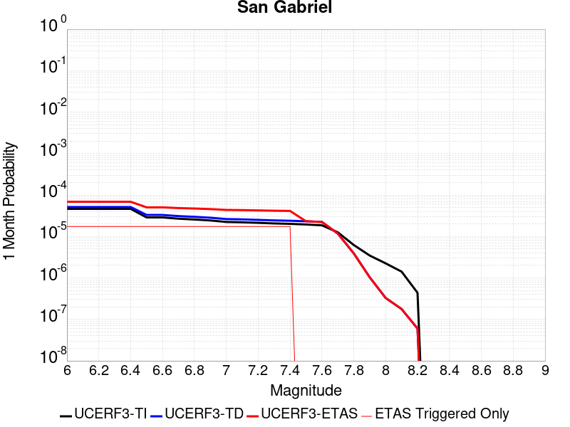 | 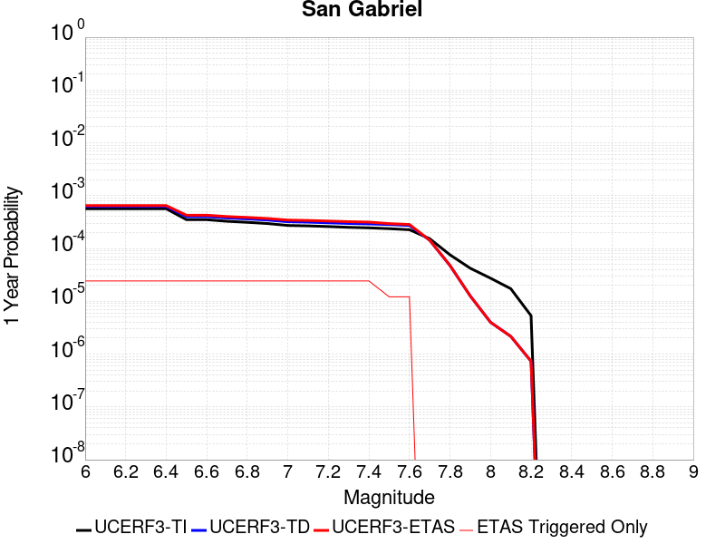 | 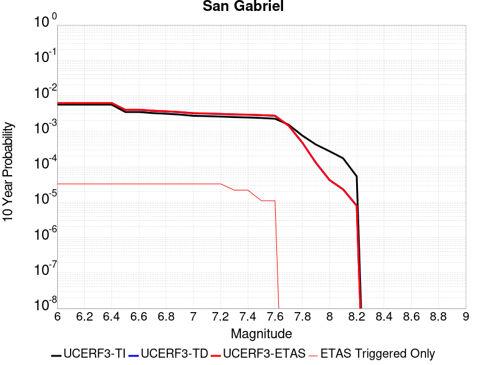 |

| Magnitude | 1 wk TI Prob | 1 wk TD Prob | 1 wk ETAS Prob | 1 wk ETAS/TD Gain | 1 wk ETAS Triggered Only | 1 mo TI Prob | 1 mo TD Prob | 1 mo ETAS Prob | 1 mo ETAS/TD Gain | 1 mo ETAS Triggered Only | 1 yr TI Prob | 1 yr TD Prob | 1 yr ETAS Prob | 1 yr ETAS/TD Gain | 1 yr ETAS Triggered Only | 10 yr TI Prob | 10 yr TD Prob | 10 yr ETAS Prob | 10 yr ETAS/TD Gain | 10 yr ETAS Triggered Only |
|-----|-----|-----|-----|-----|-----|-----|-----|-----|-----|-----|-----|-----|-----|-----|-----|-----|-----|-----|-----|-----|
| 6.0 | 1.083775E-5 | 1.19851875E-5 | 3.386748E-5 | 2.8257782 | 2.1882557E-5 | 4.6446676E-5 | 5.1364143E-5 | 7.3245574E-5 | 1.426006 | 2.1882557E-5 | 5.653415E-4 | 6.251903E-4 | 6.579936E-4 | 1.0524694 | 3.2823835E-5 | 0.0056390543 | 0.006246409 | 0.006279028 | 1.005222 | 3.2823835E-5 |
| 6.1 | 1.083775E-5 | 1.19851875E-5 | 3.386748E-5 | 2.8257782 | 2.1882557E-5 | 4.6446676E-5 | 5.1364143E-5 | 7.3245574E-5 | 1.426006 | 2.1882557E-5 | 5.653415E-4 | 6.251903E-4 | 6.579936E-4 | 1.0524694 | 3.2823835E-5 | 0.0056390543 | 0.006246409 | 0.006279028 | 1.005222 | 3.2823835E-5 |
| 6.2 | 1.083775E-5 | 1.19851875E-5 | 3.386748E-5 | 2.8257782 | 2.1882557E-5 | 4.6446676E-5 | 5.1364143E-5 | 7.3245574E-5 | 1.426006 | 2.1882557E-5 | 5.653415E-4 | 6.251903E-4 | 6.579936E-4 | 1.0524694 | 3.2823835E-5 | 0.0056390543 | 0.006246409 | 0.006279028 | 1.005222 | 3.2823835E-5 |
| 6.3 | 1.083775E-5 | 1.19851875E-5 | 3.386748E-5 | 2.8257782 | 2.1882557E-5 | 4.6446676E-5 | 5.1364143E-5 | 7.3245574E-5 | 1.426006 | 2.1882557E-5 | 5.653415E-4 | 6.251903E-4 | 6.579936E-4 | 1.0524694 | 3.2823835E-5 | 0.0056390543 | 0.006246409 | 0.006279028 | 1.005222 | 3.2823835E-5 |
| 6.4 | 1.083775E-5 | 1.19851875E-5 | 3.386748E-5 | 2.8257782 | 2.1882557E-5 | 4.6446676E-5 | 5.1364143E-5 | 7.3245574E-5 | 1.426006 | 2.1882557E-5 | 5.653415E-4 | 6.251903E-4 | 6.579936E-4 | 1.0524694 | 3.2823835E-5 | 0.0056390543 | 0.006246409 | 0.006279028 | 1.005222 | 3.2823835E-5 |
| 6.5 | 6.7317824E-6 | 7.716944E-6 | 2.9599332E-5 | 3.8356285 | 2.1882557E-5 | 2.8850178E-5 | 3.3072207E-5 | 5.495404E-5 | 1.6616381 | 2.1882557E-5 | 3.511943E-4 | 4.0258077E-4 | 4.3539138E-4 | 1.0815008 | 3.2823835E-5 | 0.003506398 | 0.0040296097 | 0.004062301 | 1.0081128 | 3.2823835E-5 |
| 6.6 | 6.7317824E-6 | 7.716944E-6 | 2.9599332E-5 | 3.8356285 | 2.1882557E-5 | 2.8850178E-5 | 3.3072207E-5 | 5.495404E-5 | 1.6616381 | 2.1882557E-5 | 3.511943E-4 | 4.0258077E-4 | 4.3539138E-4 | 1.0815008 | 3.2823835E-5 | 0.003506398 | 0.0040296097 | 0.004062301 | 1.0081128 | 3.2823835E-5 |
| 6.7 | 6.274881E-6 | 7.2458647E-6 | 2.9128263E-5 | 4.0199842 | 2.1882557E-5 | 2.6892068E-5 | 3.1053343E-5 | 5.293522E-5 | 1.7046545 | 2.1882557E-5 | 3.2736175E-4 | 3.780098E-4 | 4.1082123E-4 | 1.0868005 | 3.2823835E-5 | 0.0032687993 | 0.0037847564 | 0.003817456 | 1.0086398 | 3.2823835E-5 |
| 6.8 | 5.996209E-6 | 6.958585E-6 | 2.8840988E-5 | 4.144663 | 2.1882557E-5 | 2.5697784E-5 | 2.9822171E-5 | 5.1704075E-5 | 1.7337462 | 2.1882557E-5 | 3.128256E-4 | 3.6302538E-4 | 3.958373E-4 | 1.0903846 | 3.2823835E-5 | 0.003123856 | 0.0036354093 | 0.0036681138 | 1.0089961 | 3.2823835E-5 |
| 6.9 | 5.686331E-6 | 6.6236316E-6 | 2.8506043E-5 | 4.303688 | 2.1882557E-5 | 2.4369761E-5 | 2.8386688E-5 | 5.0268623E-5 | 1.770852 | 2.1882557E-5 | 2.9666146E-4 | 3.4555403E-4 | 3.7836653E-4 | 1.0949562 | 3.2823835E-5 | 0.0029626573 | 0.0034612515 | 0.0034939616 | 1.0094504 | 3.2823835E-5 |
| 7.0 | 5.2329838E-6 | 6.147514E-6 | 2.8029935E-5 | 4.559556 | 2.1882557E-5 | 2.242688E-5 | 2.6346226E-5 | 4.822821E-5 | 1.8305546 | 2.1882557E-5 | 2.7301308E-4 | 3.2071886E-4 | 3.5353217E-4 | 1.1023117 | 3.2823835E-5 | 0.002726779 | 0.0032136322 | 0.0032463504 | 1.0101811 | 3.2823835E-5 |
| 7.1 | 5.135671E-6 | 6.03764E-6 | 2.7920065E-5 | 4.624334 | 2.1882557E-5 | 2.2009834E-5 | 2.5875348E-5 | 4.7757338E-5 | 1.8456694 | 2.1882557E-5 | 2.6793676E-4 | 3.1498758E-4 | 3.4780108E-4 | 1.1041739 | 3.2823835E-5 | 0.0026761394 | 0.0031564834 | 0.0031892036 | 1.0103661 | 3.2823835E-5 |
| 7.2 | 4.989062E-6 | 5.87102E-6 | 2.7753447E-5 | 4.7271934 | 2.1882557E-5 | 2.1381518E-5 | 2.5161276E-5 | 4.7043282E-5 | 1.8696699 | 2.1882557E-5 | 2.6028889E-4 | 3.0629625E-4 | 3.3911003E-4 | 1.1071309 | 3.2823835E-5 | 0.0025998424 | 0.003069813 | 0.0031025358 | 1.0106596 | 3.2823835E-5 |
| 7.3 | 4.8219395E-6 | 5.702574E-6 | 1.664379E-5 | 2.9186451 | 1.0941279E-5 | 2.0665291E-5 | 2.443938E-5 | 3.5380388E-5 | 1.4476795 | 1.0941279E-5 | 2.5157086E-4 | 2.9750957E-4 | 3.193856E-4 | 1.0735306 | 2.1882557E-5 | 0.0025128627 | 0.0029821852 | 0.0030040026 | 1.0073159 | 2.1882557E-5 |
| 7.4 | 4.7118383E-6 | 5.5911332E-6 | 1.653235E-5 | 2.9568872 | 1.0941279E-5 | 2.0193436E-5 | 2.3961782E-5 | 3.4902798E-5 | 1.4566027 | 1.0941279E-5 | 2.4582737E-4 | 2.916964E-4 | 3.135726E-4 | 1.0749964 | 2.1882557E-5 | 0.002455556 | 0.0029242067 | 0.0029460252 | 1.0074613 | 2.1882557E-5 |
| 7.5 | 4.5506545E-6 | 5.4365014E-6 | 5.4365014E-6 | 1.0 | 0.0 | 1.9502659E-5 | 2.3299088E-5 | 2.3299088E-5 | 1.0 | 0.0 | 2.37419E-4 | 2.8363022E-4 | 2.945684E-4 | 1.0385649 | 1.0941279E-5 | 0.002371655 | 0.002843753 | 0.0028546632 | 1.0038365 | 1.0941279E-5 |
| 7.6 | 4.343636E-6 | 5.2293817E-6 | 5.2293817E-6 | 1.0 | 0.0 | 1.861545E-5 | 2.2411448E-5 | 2.2411448E-5 | 1.0 | 0.0 | 2.2661954E-4 | 2.7282597E-4 | 2.8376424E-4 | 1.0400926 | 1.0941279E-5 | 0.0022638857 | 0.0027359722 | 0.0027468835 | 1.0039881 | 1.0941279E-5 |
| 7.7 | 2.936235E-6 | 2.7440458E-6 | 2.7440458E-6 | 1.0 | 0.0 | 1.2583803E-5 | 1.1760143E-5 | 1.1760143E-5 | 1.0 | 0.0 | 1.5319703E-4 | 1.4317037E-4 | 1.4317037E-4 | 1.0 | 0.0 | 0.0015309147 | 0.0014380751 | 0.0014380751 | 1.0 | 0.0 |
| 7.8 | 1.4541639E-6 | 9.1237047E-7 | 9.1237047E-7 | 1.0 | 0.0 | 6.232116E-6 | 3.9101533E-6 | 3.9101533E-6 | 1.0 | 0.0 | 7.587337E-5 | 4.7605077E-5 | 4.7605077E-5 | 1.0 | 0.0 | 7.584747E-4 | 4.8085177E-4 | 4.8085177E-4 | 1.0 | 0.0 |
| 7.9 | 8.098958E-7 | 2.41753E-7 | 2.41753E-7 | 1.0 | 0.0 | 3.4709774E-6 | 1.0360839E-6 | 1.0360839E-6 | 1.0 | 0.0 | 4.225833E-5 | 1.2614248E-5 | 1.2614248E-5 | 1.0 | 0.0 | 4.2250296E-4 | 1.2921814E-4 | 1.2921814E-4 | 1.0 | 0.0 |
| 8.0 | 5.2473234E-7 | 7.6792055E-8 | 7.6792055E-8 | 1.0 | 0.0 | 2.248851E-6 | 3.2910876E-7 | 3.2910876E-7 | 1.0 | 0.0 | 2.7379416E-5 | 4.0068917E-6 | 4.0068917E-6 | 1.0 | 0.0 | 2.7376044E-4 | 4.21918E-5 | 4.21918E-5 | 1.0 | 0.0 |
| 8.1 | 3.3162388E-7 | 4.1496126E-8 | 4.1496126E-8 | 1.0 | 0.0 | 1.4212444E-6 | 1.7784053E-7 | 1.7784053E-7 | 1.0 | 0.0 | 1.7303513E-5 | 2.1652063E-6 | 2.1652063E-6 | 1.0 | 0.0 | 1.7302166E-4 | 2.2965523E-5 | 2.2965523E-5 | 1.0 | 0.0 |
| 8.2 | 1.0235345E-7 | 1.4043474E-8 | 1.4043474E-8 | 1.0 | 0.0 | 4.3865757E-7 | 6.0186316E-8 | 6.0186316E-8 | 1.0 | 0.0 | 5.340643E-6 | 7.327681E-7 | 7.327681E-7 | 1.0 | 0.0 | 5.3405143E-5 | 7.9273705E-6 | 7.9273705E-6 | 1.0 | 0.0 |

## Calaveras (So) 2011 CFM
*[(top)](#table-of-contents)*

| 1 Week | 1 Month | 1 Year | 10 Year |
|-----|-----|-----|-----|
|  |  |  |  |

| Magnitude | 1 wk TI Prob | 1 wk TD Prob | 1 wk ETAS Prob | 1 wk ETAS/TD Gain | 1 wk ETAS Triggered Only | 1 mo TI Prob | 1 mo TD Prob | 1 mo ETAS Prob | 1 mo ETAS/TD Gain | 1 mo ETAS Triggered Only | 1 yr TI Prob | 1 yr TD Prob | 1 yr ETAS Prob | 1 yr ETAS/TD Gain | 1 yr ETAS Triggered Only | 10 yr TI Prob | 10 yr TD Prob | 10 yr ETAS Prob | 10 yr ETAS/TD Gain | 10 yr ETAS Triggered Only |
|-----|-----|-----|-----|-----|-----|-----|-----|-----|-----|-----|-----|-----|-----|-----|-----|-----|-----|-----|-----|-----|
| 6.0 | 1.5950744E-4 | 3.071188E-4 | 3.071188E-4 | 1.0 | 0.0 | 6.834242E-4 | 0.0013155643 | 0.0013155643 | 1.0 | 0.0 | 0.00828899 | 0.01585904 | 0.015880575 | 1.0013579 | 2.1882557E-5 | 0.079865426 | 0.14440064 | 0.14442873 | 1.0001944 | 3.2823835E-5 |
| 6.1 | 1.3584697E-4 | 2.6036944E-4 | 2.6036944E-4 | 1.0 | 0.0 | 5.8207137E-4 | 0.0011153965 | 0.0011153965 | 1.0 | 0.0 | 0.007063716 | 0.013462106 | 0.013483694 | 1.0016036 | 2.1882557E-5 | 0.06843361 | 0.12402854 | 0.1240573 | 1.0002319 | 3.2823835E-5 |
| 6.2 | 1.14676266E-4 | 2.1726108E-4 | 2.1726108E-4 | 1.0 | 0.0 | 4.9137714E-4 | 9.307893E-4 | 9.307893E-4 | 1.0 | 0.0 | 0.0059661185 | 0.011245592 | 0.011267228 | 1.001924 | 2.1882557E-5 | 0.058084648 | 0.105019294 | 0.10504867 | 1.0002798 | 3.2823835E-5 |
| 6.3 | 8.691518E-5 | 1.5987165E-4 | 1.5987165E-4 | 1.0 | 0.0 | 3.7244044E-4 | 6.8496726E-4 | 6.8496726E-4 | 1.0 | 0.0 | 0.004525038 | 0.008300893 | 0.008311744 | 1.0013071 | 1.0941279E-5 | 0.044339992 | 0.0793347 | 0.079354845 | 1.0002539 | 2.1882557E-5 |
| 6.4 | 8.50982E-5 | 1.5693568E-4 | 1.5693568E-4 | 1.0 | 0.0 | 3.646556E-4 | 6.7239115E-4 | 6.7239115E-4 | 1.0 | 0.0 | 0.0044306475 | 0.008148931 | 0.008159783 | 1.0013317 | 1.0941279E-5 | 0.04343345 | 0.077940844 | 0.07796102 | 1.0002589 | 2.1882557E-5 |
| 6.5 | 8.4062965E-5 | 1.5518135E-4 | 1.5518135E-4 | 1.0 | 0.0 | 3.602201E-4 | 6.648764E-4 | 6.648764E-4 | 1.0 | 0.0 | 0.004376863 | 0.008058134 | 0.008068986 | 1.0013468 | 1.0941279E-5 | 0.042916555 | 0.077112116 | 0.07713231 | 1.0002619 | 2.1882557E-5 |
| 6.6 | 8.194716E-5 | 1.5154095E-4 | 1.5154095E-4 | 1.0 | 0.0 | 3.5115483E-4 | 6.492825E-4 | 6.492825E-4 | 1.0 | 0.0 | 0.0042669317 | 0.007869979 | 0.007880835 | 1.0013794 | 1.0941279E-5 | 0.04185927 | 0.07539739 | 0.07541762 | 1.0002683 | 2.1882557E-5 |
| 6.7 | 8.012326E-5 | 1.4821833E-4 | 1.4821833E-4 | 1.0 | 0.0 | 3.433402E-4 | 6.350497E-4 | 6.350497E-4 | 1.0 | 0.0 | 0.004172157 | 0.007698474 | 0.0077093313 | 1.0014102 | 1.0941279E-5 | 0.040946912 | 0.073839515 | 0.07385978 | 1.0002744 | 2.1882557E-5 |
| 6.8 | 7.119773E-5 | 1.2880519E-4 | 1.2880519E-4 | 1.0 | 0.0 | 3.0509746E-4 | 5.519001E-4 | 5.519001E-4 | 1.0 | 0.0 | 0.0037082357 | 0.0066958875 | 0.0067067556 | 1.001623 | 1.0941279E-5 | 0.036469642 | 0.06468402 | 0.064704485 | 1.0003164 | 2.1882557E-5 |
| 6.9 | 5.7343088E-5 | 9.9189E-5 | 9.9189E-5 | 1.0 | 0.0 | 2.4573295E-4 | 4.2502693E-4 | 4.2502693E-4 | 1.0 | 0.0 | 0.0029876942 | 0.0051625078 | 0.0051625078 | 1.0 | 0.0 | 0.02947844 | 0.050509132 | 0.050519522 | 1.0002056 | 1.0941279E-5 |
| 7.0 | 4.8746577E-5 | 8.284751E-5 | 8.284751E-5 | 1.0 | 0.0 | 2.0889717E-4 | 3.550128E-4 | 3.550128E-4 | 1.0 | 0.0 | 0.0025403565 | 0.004313781 | 0.004313781 | 1.0 | 0.0 | 0.025115121 | 0.04248505 | 0.042495526 | 1.0002466 | 1.0941279E-5 |
| 7.1 | 4.2998014E-5 | 7.264914E-5 | 7.264914E-5 | 1.0 | 0.0 | 1.8426418E-4 | 3.1131663E-4 | 3.1131663E-4 | 1.0 | 0.0 | 0.002241108 | 0.0037837527 | 0.0037837527 | 1.0 | 0.0 | 0.022186412 | 0.037423246 | 0.037433777 | 1.0002815 | 1.0941279E-5 |
| 7.2 | 3.221292E-5 | 5.390566E-5 | 5.390566E-5 | 1.0 | 0.0 | 1.3804805E-4 | 2.3100396E-4 | 2.3100396E-4 | 1.0 | 0.0 | 0.0016794393 | 0.0028088738 | 0.0028088738 | 1.0 | 0.0 | 0.016668037 | 0.028035998 | 0.028046632 | 1.0003793 | 1.0941279E-5 |
| 7.3 | 2.3756531E-5 | 3.9471706E-5 | 3.9471706E-5 | 1.0 | 0.0 | 1.0180973E-4 | 1.6915359E-4 | 1.6915359E-4 | 1.0 | 0.0 | 0.0012388286 | 0.0020575167 | 0.0020575167 | 1.0 | 0.0 | 0.012319452 | 0.02064345 | 0.020654166 | 1.000519 | 1.0941279E-5 |
| 7.4 | 1.5997684E-5 | 2.734085E-5 | 2.734085E-5 | 1.0 | 0.0 | 6.8559704E-5 | 1.1716982E-4 | 1.1716982E-4 | 1.0 | 0.0 | 8.343947E-4 | 0.0014256114 | 0.0014256114 | 1.0 | 0.0 | 0.008312687 | 0.014376549 | 0.014387333 | 1.0007501 | 1.0941279E-5 |
| 7.5 | 1.3814293E-5 | 2.4782603E-5 | 2.4782603E-5 | 1.0 | 0.0 | 5.9202768E-5 | 1.0620684E-4 | 1.0620684E-4 | 1.0 | 0.0 | 7.205553E-4 | 0.0012923037 | 0.0012923037 | 1.0 | 0.0 | 0.007182234 | 0.013055766 | 0.013066565 | 1.0008271 | 1.0941279E-5 |
| 7.6 | 8.817309E-6 | 1.6429829E-5 | 1.6429829E-5 | 1.0 | 0.0 | 3.7787922E-5 | 7.041166E-5 | 7.041166E-5 | 1.0 | 0.0 | 4.5997082E-4 | 8.5692614E-4 | 8.5692614E-4 | 1.0 | 0.0 | 0.004590199 | 0.008719863 | 0.00873071 | 1.0012438 | 1.0941279E-5 |
| 7.7 | 4.0352206E-6 | 7.706877E-6 | 7.706877E-6 | 1.0 | 0.0 | 1.7293689E-5 | 3.3029053E-5 | 3.3029053E-5 | 1.0 | 0.0 | 2.1053031E-4 | 4.020546E-4 | 4.020546E-4 | 1.0 | 0.0 | 0.0021033096 | 0.0041649863 | 0.004175882 | 1.002616 | 1.0941279E-5 |
| 7.8 | 3.413169E-6 | 6.7868646E-6 | 6.7868646E-6 | 1.0 | 0.0 | 1.4627784E-5 | 2.9086239E-5 | 2.9086239E-5 | 1.0 | 0.0 | 1.7807873E-4 | 3.5406748E-4 | 3.5406748E-4 | 1.0 | 0.0 | 0.0017793609 | 0.0036663096 | 0.0036772108 | 1.0029733 | 1.0941279E-5 |
| 7.9 | 2.4740732E-6 | 5.278809E-6 | 5.278809E-6 | 1.0 | 0.0 | 1.06031275E-5 | 2.2623271E-5 | 2.2623271E-5 | 1.0 | 0.0 | 1.2908543E-4 | 2.7540355E-4 | 2.7540355E-4 | 1.0 | 0.0 | 0.0012901047 | 0.002834638 | 0.0028455483 | 1.0038489 | 1.0941279E-5 |
| 8.0 | 1.5231818E-6 | 3.2887135E-6 | 3.2887135E-6 | 1.0 | 0.0 | 6.527906E-6 | 1.409441E-5 | 1.409441E-5 | 1.0 | 0.0 | 7.9474354E-5 | 1.7158597E-4 | 1.7158597E-4 | 1.0 | 0.0 | 7.944594E-4 | 0.001756374 | 0.001767296 | 1.0062186 | 1.0941279E-5 |
| 8.1 | 1.0104524E-6 | 2.0456548E-6 | 2.0456548E-6 | 1.0 | 0.0 | 4.330503E-6 | 8.767062E-6 | 8.767062E-6 | 1.0 | 0.0 | 5.2722597E-5 | 1.06733794E-4 | 1.06733794E-4 | 1.0 | 0.0 | 5.271009E-4 | 0.0010929212 | 0.0011038505 | 1.0100001 | 1.0941279E-5 |

## San Andreas (Santa Cruz Mts) 2011 CFM
*[(top)](#table-of-contents)*

| 1 Week | 1 Month | 1 Year | 10 Year |
|-----|-----|-----|-----|
|  |  |  |  |

| Magnitude | 1 wk TI Prob | 1 wk TD Prob | 1 wk ETAS Prob | 1 wk ETAS/TD Gain | 1 wk ETAS Triggered Only | 1 mo TI Prob | 1 mo TD Prob | 1 mo ETAS Prob | 1 mo ETAS/TD Gain | 1 mo ETAS Triggered Only | 1 yr TI Prob | 1 yr TD Prob | 1 yr ETAS Prob | 1 yr ETAS/TD Gain | 1 yr ETAS Triggered Only | 10 yr TI Prob | 10 yr TD Prob | 10 yr ETAS Prob | 10 yr ETAS/TD Gain | 10 yr ETAS Triggered Only |
|-----|-----|-----|-----|-----|-----|-----|-----|-----|-----|-----|-----|-----|-----|-----|-----|-----|-----|-----|-----|-----|
| 6.0 | 1.7221631E-4 | 1.3793171E-4 | 1.4887148E-4 | 1.0793129 | 1.0941279E-5 | 7.378611E-4 | 5.9100403E-4 | 6.019388E-4 | 1.0185021 | 1.0941279E-5 | 0.008946515 | 0.007172124 | 0.0072047124 | 1.0045438 | 3.2823835E-5 | 0.08594794 | 0.0705551 | 0.0705856 | 1.0004324 | 3.2823835E-5 |
| 6.1 | 1.7221631E-4 | 1.3793171E-4 | 1.4887148E-4 | 1.0793129 | 1.0941279E-5 | 7.378611E-4 | 5.9100403E-4 | 6.019388E-4 | 1.0185021 | 1.0941279E-5 | 0.008946515 | 0.007172124 | 0.0072047124 | 1.0045438 | 3.2823835E-5 | 0.08594794 | 0.0705551 | 0.0705856 | 1.0004324 | 3.2823835E-5 |
| 6.2 | 1.7221631E-4 | 1.3793171E-4 | 1.4887148E-4 | 1.0793129 | 1.0941279E-5 | 7.378611E-4 | 5.9100403E-4 | 6.019388E-4 | 1.0185021 | 1.0941279E-5 | 0.008946515 | 0.007172124 | 0.0072047124 | 1.0045438 | 3.2823835E-5 | 0.08594794 | 0.0705551 | 0.0705856 | 1.0004324 | 3.2823835E-5 |
| 6.3 | 1.716926E-4 | 1.3712609E-4 | 1.4806585E-4 | 1.079779 | 1.0941279E-5 | 7.3561794E-4 | 5.875529E-4 | 5.9848774E-4 | 1.0186108 | 1.0941279E-5 | 0.008919428 | 0.0071303817 | 0.0071629714 | 1.0045706 | 3.2823835E-5 | 0.08569809 | 0.070167266 | 0.07019779 | 1.000435 | 3.2823835E-5 |
| 6.4 | 1.6392978E-4 | 1.3588481E-4 | 1.468246E-4 | 1.0805079 | 1.0941279E-5 | 7.02367E-4 | 5.822355E-4 | 5.931704E-4 | 1.018781 | 1.0941279E-5 | 0.008517839 | 0.007066063 | 0.0070986548 | 1.0046124 | 3.2823835E-5 | 0.08198654 | 0.06940135 | 0.0694319 | 1.0004401 | 3.2823835E-5 |
| 6.5 | 1.5742714E-4 | 1.2648388E-4 | 1.3742376E-4 | 1.0864924 | 1.0941279E-5 | 6.745133E-4 | 5.4196286E-4 | 5.528982E-4 | 1.0201772 | 1.0941279E-5 | 0.00818132 | 0.0065787593 | 0.006611367 | 1.0049565 | 3.2823835E-5 | 0.078865945 | 0.06486309 | 0.06489379 | 1.0004733 | 3.2823835E-5 |
| 6.6 | 1.3038084E-4 | 1.1588213E-4 | 1.2682214E-4 | 1.0944064 | 1.0941279E-5 | 5.5865536E-4 | 4.9654447E-4 | 5.074803E-4 | 1.0220239 | 1.0941279E-5 | 0.006780438 | 0.0060289134 | 0.006061539 | 1.0054116 | 3.2823835E-5 | 0.0657725 | 0.05932738 | 0.059358254 | 1.0005205 | 3.2823835E-5 |
| 6.7 | 1.2867592E-4 | 1.1314701E-4 | 1.2408705E-4 | 1.0966887 | 1.0941279E-5 | 5.5135164E-4 | 4.8482692E-4 | 4.957629E-4 | 1.0225564 | 1.0941279E-5 | 0.0066920654 | 0.00588703 | 0.005919661 | 1.0055428 | 3.2823835E-5 | 0.06494093 | 0.058038417 | 0.058069337 | 1.0005327 | 3.2823835E-5 |
| 6.8 | 1.2801298E-4 | 1.1252261E-4 | 1.2346265E-4 | 1.0972253 | 1.0941279E-5 | 5.485117E-4 | 4.8215193E-4 | 4.930879E-4 | 1.0226817 | 1.0941279E-5 | 0.0066577005 | 0.0058546383 | 0.00588727 | 1.0055736 | 3.2823835E-5 | 0.06461738 | 0.057752274 | 0.0577832 | 1.0005355 | 3.2823835E-5 |
| 6.9 | 1.269149E-4 | 1.1094465E-4 | 1.2188472E-4 | 1.0986083 | 1.0941279E-5 | 5.4380763E-4 | 4.7539172E-4 | 4.863278E-4 | 1.0230043 | 1.0941279E-5 | 0.006600777 | 0.005772772 | 0.0058054063 | 1.0056531 | 3.2823835E-5 | 0.06408122 | 0.0570241 | 0.05705505 | 1.0005428 | 3.2823835E-5 |
| 7.0 | 1.2030331E-4 | 1.0824504E-4 | 1.1918513E-4 | 1.1010679 | 1.0941279E-5 | 5.154837E-4 | 4.638261E-4 | 4.747623E-4 | 1.0235783 | 1.0941279E-5 | 0.006257969 | 0.0056326967 | 0.0056653353 | 1.0057945 | 3.2823835E-5 | 0.06084648 | 0.055696685 | 0.055727683 | 1.0005565 | 3.2823835E-5 |
| 7.1 | 8.049617E-5 | 5.3926604E-5 | 6.486729E-5 | 1.2028811 | 1.0941279E-5 | 3.4493793E-4 | 2.3109373E-4 | 2.4203247E-4 | 1.0473347 | 1.0941279E-5 | 0.0041915346 | 0.0028099709 | 0.0028427024 | 1.0116484 | 3.2823835E-5 | 0.041133516 | 0.029618956 | 0.029650807 | 1.0010754 | 3.2823835E-5 |
| 7.2 | 7.093979E-5 | 4.2937932E-5 | 5.387874E-5 | 1.2548052 | 1.0941279E-5 | 3.0399222E-4 | 1.8400686E-4 | 1.9494611E-4 | 1.0594503 | 1.0941279E-5 | 0.0036948253 | 0.0022380045 | 0.002270755 | 1.0146338 | 3.2823835E-5 | 0.03633994 | 0.023941692 | 0.02397373 | 1.0013381 | 3.2823835E-5 |
| 7.3 | 6.193693E-5 | 2.8894141E-5 | 3.9835104E-5 | 1.3786567 | 1.0941279E-5 | 2.6541698E-4 | 1.2382616E-4 | 1.3476609E-4 | 1.088349 | 1.0941279E-5 | 0.0032266637 | 0.0015065427 | 0.0015283923 | 1.0145031 | 2.1882557E-5 | 0.031802133 | 0.016499156 | 0.016520677 | 1.0013044 | 2.1882557E-5 |
| 7.4 | 5.906492E-5 | 2.702346E-5 | 3.7964444E-5 | 1.4048698 | 1.0941279E-5 | 2.5311083E-4 | 1.1580969E-4 | 1.2674971E-4 | 1.0944654 | 1.0941279E-5 | 0.0030772698 | 0.0014090725 | 0.0014309242 | 1.0155078 | 2.1882557E-5 | 0.030350044 | 0.015471023 | 0.015492566 | 1.0013925 | 2.1882557E-5 |
| 7.5 | 5.424296E-5 | 2.4678277E-5 | 3.5619283E-5 | 1.4433457 | 1.0941279E-5 | 2.324491E-4 | 1.05759755E-4 | 1.1669988E-4 | 1.1034431 | 1.0941279E-5 | 0.002826395 | 0.0012868657 | 0.0013087201 | 1.0169827 | 2.1882557E-5 | 0.027907165 | 0.014163188 | 0.01418476 | 1.0015231 | 2.1882557E-5 |
| 7.6 | 4.43084E-5 | 1.990431E-5 | 3.084537E-5 | 1.549683 | 1.0941279E-5 | 1.8987931E-4 | 8.53014E-5 | 9.624174E-5 | 1.1282551 | 1.0941279E-5 | 0.0023093296 | 0.0010380499 | 0.0010599098 | 1.0210586 | 2.1882557E-5 | 0.022854783 | 0.011412679 | 0.011434313 | 1.0018955 | 2.1882557E-5 |
| 7.7 | 4.118098E-5 | 1.8936442E-5 | 2.9877514E-5 | 1.5777786 | 1.0941279E-5 | 1.7647797E-4 | 8.115366E-5 | 9.2094044E-5 | 1.1348108 | 1.0941279E-5 | 0.002146502 | 9.875982E-4 | 0.0010094591 | 1.0221355 | 2.1882557E-5 | 0.021258866 | 0.010870468 | 0.010892113 | 1.0019912 | 2.1882557E-5 |
| 7.8 | 3.5408906E-5 | 1.856446E-5 | 2.9505536E-5 | 1.589356 | 1.0941279E-5 | 1.5174363E-4 | 7.955955E-5 | 9.0499954E-5 | 1.1375122 | 1.0941279E-5 | 0.0018459131 | 9.682073E-4 | 9.900687E-4 | 1.0225792 | 2.1882557E-5 | 0.018306552 | 0.010652021 | 0.01067367 | 1.0020324 | 2.1882557E-5 |
| 7.9 | 2.5860836E-5 | 1.7315993E-5 | 1.7315993E-5 | 1.0 | 0.0 | 1.10827445E-4 | 7.420929E-5 | 7.420929E-5 | 1.0 | 0.0 | 0.001348489 | 9.031238E-4 | 9.140552E-4 | 1.012104 | 1.0941279E-5 | 0.013403354 | 0.009907599 | 0.009918432 | 1.0010934 | 1.0941279E-5 |
| 8.0 | 1.9777332E-5 | 1.4839596E-5 | 1.4839596E-5 | 1.0 | 0.0 | 8.4757245E-5 | 6.3596715E-5 | 6.3596715E-5 | 1.0 | 0.0 | 0.0010314309 | 7.740152E-4 | 7.84948E-4 | 1.0141248 | 1.0941279E-5 | 0.010266567 | 0.008508967 | 0.008519816 | 1.001275 | 1.0941279E-5 |
| 8.1 | 1.468494E-5 | 1.2107374E-5 | 1.2107374E-5 | 1.0 | 0.0 | 6.293394E-5 | 5.1887713E-5 | 5.1887713E-5 | 1.0 | 0.0 | 7.6595135E-4 | 6.3155E-4 | 6.4248435E-4 | 1.0173136 | 1.0941279E-5 | 0.0076331664 | 0.006969149 | 0.006980014 | 1.001559 | 1.0941279E-5 |
| 8.2 | 8.63836E-6 | 5.469061E-6 | 5.469061E-6 | 1.0 | 0.0 | 3.7021015E-5 | 2.3438623E-5 | 2.3438623E-5 | 1.0 | 0.0 | 4.5063766E-4 | 2.8532793E-4 | 2.8532793E-4 | 1.0 | 0.0 | 0.004497249 | 0.00324569 | 0.00324569 | 1.0 | 0.0 |
| 8.3 | 1.983087E-6 | 7.6599065E-7 | 7.6599065E-7 | 1.0 | 0.0 | 8.498917E-6 | 3.282813E-6 | 3.282813E-6 | 1.0 | 0.0 | 1.034694E-4 | 3.9967534E-5 | 3.9967534E-5 | 1.0 | 0.0 | 0.0010342124 | 4.719687E-4 | 4.719687E-4 | 1.0 | 0.0 |

## Santa Susana alt 1
*[(top)](#table-of-contents)*

| 1 Week | 1 Month | 1 Year | 10 Year |
|-----|-----|-----|-----|
| 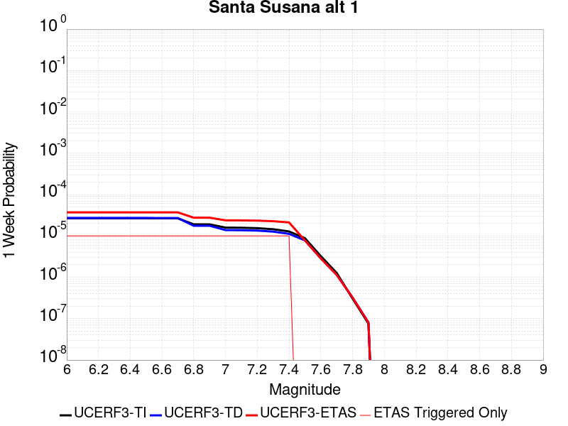 |  |  |  |

| Magnitude | 1 wk TI Prob | 1 wk TD Prob | 1 wk ETAS Prob | 1 wk ETAS/TD Gain | 1 wk ETAS Triggered Only | 1 mo TI Prob | 1 mo TD Prob | 1 mo ETAS Prob | 1 mo ETAS/TD Gain | 1 mo ETAS Triggered Only | 1 yr TI Prob | 1 yr TD Prob | 1 yr ETAS Prob | 1 yr ETAS/TD Gain | 1 yr ETAS Triggered Only | 10 yr TI Prob | 10 yr TD Prob | 10 yr ETAS Prob | 10 yr ETAS/TD Gain | 10 yr ETAS Triggered Only |
|-----|-----|-----|-----|-----|-----|-----|-----|-----|-----|-----|-----|-----|-----|-----|-----|-----|-----|-----|-----|-----|
| 6.0 | 2.674877E-5 | 2.7198023E-5 | 3.8139002E-5 | 1.4022712 | 1.0941279E-5 | 1.1463255E-4 | 1.1655839E-4 | 1.384384E-4 | 1.1877171 | 2.1882557E-5 | 0.0013947578 | 0.0014182882 | 0.0014510654 | 1.0231105 | 3.2823835E-5 | 0.013860362 | 0.014104128 | 0.014136489 | 1.0022944 | 3.2823835E-5 |
| 6.1 | 2.674877E-5 | 2.7198023E-5 | 3.8139002E-5 | 1.4022712 | 1.0941279E-5 | 1.1463255E-4 | 1.1655839E-4 | 1.384384E-4 | 1.1877171 | 2.1882557E-5 | 0.0013947578 | 0.0014182882 | 0.0014510654 | 1.0231105 | 3.2823835E-5 | 0.013860362 | 0.014104128 | 0.014136489 | 1.0022944 | 3.2823835E-5 |
| 6.2 | 2.674877E-5 | 2.7198023E-5 | 3.8139002E-5 | 1.4022712 | 1.0941279E-5 | 1.1463255E-4 | 1.1655839E-4 | 1.384384E-4 | 1.1877171 | 2.1882557E-5 | 0.0013947578 | 0.0014182882 | 0.0014510654 | 1.0231105 | 3.2823835E-5 | 0.013860362 | 0.014104128 | 0.014136489 | 1.0022944 | 3.2823835E-5 |
| 6.3 | 2.674877E-5 | 2.7198023E-5 | 3.8139002E-5 | 1.4022712 | 1.0941279E-5 | 1.1463255E-4 | 1.1655839E-4 | 1.384384E-4 | 1.1877171 | 2.1882557E-5 | 0.0013947578 | 0.0014182882 | 0.0014510654 | 1.0231105 | 3.2823835E-5 | 0.013860362 | 0.014104128 | 0.014136489 | 1.0022944 | 3.2823835E-5 |
| 6.4 | 2.674877E-5 | 2.7198023E-5 | 3.8139002E-5 | 1.4022712 | 1.0941279E-5 | 1.1463255E-4 | 1.1655839E-4 | 1.384384E-4 | 1.1877171 | 2.1882557E-5 | 0.0013947578 | 0.0014182882 | 0.0014510654 | 1.0231105 | 3.2823835E-5 | 0.013860362 | 0.014104128 | 0.014136489 | 1.0022944 | 3.2823835E-5 |
| 6.5 | 2.674877E-5 | 2.7198023E-5 | 3.8139002E-5 | 1.4022712 | 1.0941279E-5 | 1.1463255E-4 | 1.1655839E-4 | 1.384384E-4 | 1.1877171 | 2.1882557E-5 | 0.0013947578 | 0.0014182882 | 0.0014510654 | 1.0231105 | 3.2823835E-5 | 0.013860362 | 0.014104128 | 0.014136489 | 1.0022944 | 3.2823835E-5 |
| 6.6 | 2.6647976E-5 | 2.7074359E-5 | 3.801534E-5 | 1.4041086 | 1.0941279E-5 | 1.14200615E-4 | 1.1602845E-4 | 1.3790847E-4 | 1.1885746 | 2.1882557E-5 | 0.0013895056 | 0.0014118447 | 0.0014446223 | 1.0232161 | 3.2823835E-5 | 0.013808494 | 0.014040513 | 0.014072876 | 1.0023049 | 3.2823835E-5 |
| 6.7 | 2.6647976E-5 | 2.7074359E-5 | 3.801534E-5 | 1.4041086 | 1.0941279E-5 | 1.14200615E-4 | 1.1602845E-4 | 1.3790847E-4 | 1.1885746 | 2.1882557E-5 | 0.0013895056 | 0.0014118447 | 0.0014446223 | 1.0232161 | 3.2823835E-5 | 0.013808494 | 0.014040513 | 0.014072876 | 1.0023049 | 3.2823835E-5 |
| 6.8 | 1.9073179E-5 | 1.7637283E-5 | 2.857837E-5 | 1.6203384 | 1.0941279E-5 | 8.1739636E-5 | 7.558627E-5 | 9.746717E-5 | 1.2894825 | 2.1882557E-5 | 9.947256E-4 | 9.198925E-4 | 9.526861E-4 | 1.0356494 | 3.2823835E-5 | 0.009902848 | 0.009163101 | 0.009195624 | 1.0035493 | 3.2823835E-5 |
| 6.9 | 1.9041876E-5 | 1.7619415E-5 | 2.85605E-5 | 1.6209675 | 1.0941279E-5 | 8.160549E-5 | 7.55097E-5 | 9.73906E-5 | 1.2897761 | 2.1882557E-5 | 9.930939E-4 | 9.1896096E-4 | 9.517546E-4 | 1.0356855 | 3.2823835E-5 | 0.0098866755 | 0.0091538625 | 0.009186386 | 1.0035529 | 3.2823835E-5 |
| 7.0 | 1.5917482E-5 | 1.3863864E-5 | 2.4804991E-5 | 1.789183 | 1.0941279E-5 | 6.8215995E-5 | 5.9415237E-5 | 8.129649E-5 | 1.3682768 | 2.1882557E-5 | 8.302132E-4 | 7.231451E-4 | 7.5594516E-4 | 1.0453576 | 3.2823835E-5 | 0.008271185 | 0.0072088144 | 0.007241402 | 1.0045204 | 3.2823835E-5 |
| 7.1 | 1.577788E-5 | 1.3743872E-5 | 2.4685E-5 | 1.7960732 | 1.0941279E-5 | 6.761774E-5 | 5.8901005E-5 | 8.078227E-5 | 1.3714923 | 2.1882557E-5 | 8.2293496E-4 | 7.1688846E-4 | 7.496887E-4 | 1.0457537 | 3.2823835E-5 | 0.008198941 | 0.007146652 | 0.007179241 | 1.0045601 | 3.2823835E-5 |
| 7.2 | 1.5416446E-5 | 1.3469944E-5 | 2.4411074E-5 | 1.8122625 | 1.0941279E-5 | 6.606882E-5 | 5.772708E-5 | 7.960838E-5 | 1.3790473 | 2.1882557E-5 | 8.0409093E-4 | 7.026052E-4 | 7.3540595E-4 | 1.0466845 | 3.2823835E-5 | 0.008011877 | 0.0070047234 | 0.0070373174 | 1.0046531 | 3.2823835E-5 |
| 7.3 | 1.4534083E-5 | 1.2717879E-5 | 2.3659019E-5 | 1.8602959 | 1.0941279E-5 | 6.228744E-5 | 5.4504082E-5 | 7.638545E-5 | 1.4014628 | 2.1882557E-5 | 7.580857E-4 | 6.633896E-4 | 6.961917E-4 | 1.0494461 | 3.2823835E-5 | 0.007555048 | 0.0066149444 | 0.006647551 | 1.0049293 | 3.2823835E-5 |
| 7.4 | 1.2858995E-5 | 1.1229652E-5 | 2.2170807E-5 | 1.9743093 | 1.0941279E-5 | 5.5108816E-5 | 4.8126214E-5 | 7.000772E-5 | 1.4546691 | 2.1882557E-5 | 6.7074323E-4 | 5.857831E-4 | 6.185877E-4 | 1.0560013 | 3.2823835E-5 | 0.0066872234 | 0.005843165 | 0.005875797 | 1.0055846 | 3.2823835E-5 |
| 7.5 | 8.827668E-6 | 7.805457E-6 | 7.805457E-6 | 1.0 | 0.0 | 3.7832317E-5 | 3.3451546E-5 | 3.3451546E-5 | 1.0 | 0.0 | 4.605111E-4 | 4.071989E-4 | 4.1813572E-4 | 1.0268587 | 1.0941279E-5 | 0.0045955796 | 0.0040647765 | 0.0040756734 | 1.0026808 | 1.0941279E-5 |
| 7.6 | 3.2533426E-6 | 2.871988E-6 | 2.871988E-6 | 1.0 | 0.0 | 1.3942822E-5 | 1.2308465E-5 | 1.2308465E-5 | 1.0 | 0.0 | 1.6974064E-4 | 1.4984563E-4 | 1.4984563E-4 | 1.0 | 0.0 | 0.0016961104 | 0.0014974826 | 0.0014974826 | 1.0 | 0.0 |
| 7.7 | 1.2751709E-6 | 1.1491089E-6 | 1.1491089E-6 | 1.0 | 0.0 | 5.4650063E-6 | 4.9247437E-6 | 4.9247437E-6 | 1.0 | 0.0 | 6.653442E-5 | 5.9957198E-5 | 5.9957198E-5 | 1.0 | 0.0 | 6.6514505E-4 | 5.994191E-4 | 5.994191E-4 | 1.0 | 0.0 |
| 7.8 | 3.067544E-7 | 3.2400436E-7 | 3.2400436E-7 | 1.0 | 0.0 | 1.3146611E-6 | 1.3885895E-6 | 1.3885895E-6 | 1.0 | 0.0 | 1.600588E-5 | 1.6905957E-5 | 1.6905957E-5 | 1.0 | 0.0 | 1.6004729E-4 | 1.6904772E-4 | 1.6904772E-4 | 1.0 | 0.0 |
| 7.9 | 7.622999E-8 | 8.087964E-8 | 8.087964E-8 | 1.0 | 0.0 | 3.2669993E-7 | 3.4662696E-7 | 3.4662696E-7 | 1.0 | 0.0 | 3.977564E-6 | 4.2201773E-6 | 4.2201773E-6 | 1.0 | 0.0 | 3.977493E-5 | 4.220118E-5 | 4.220118E-5 | 1.0 | 0.0 |

## Green Valley 2011 CFM
*[(top)](#table-of-contents)*

| 1 Week | 1 Month | 1 Year | 10 Year |
|-----|-----|-----|-----|
| 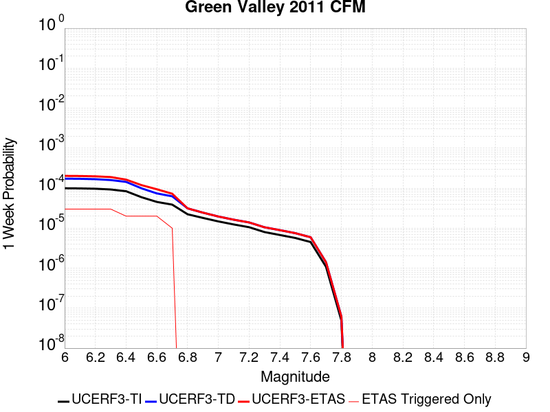 | 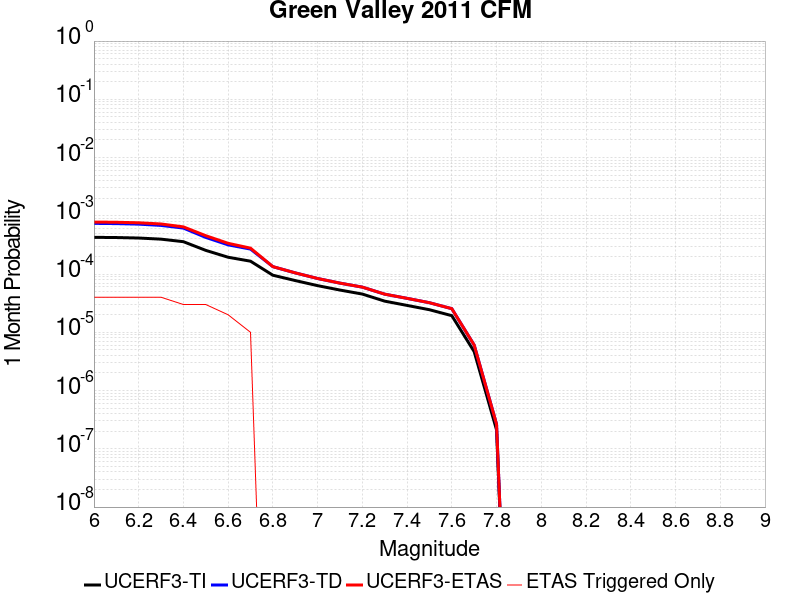 | 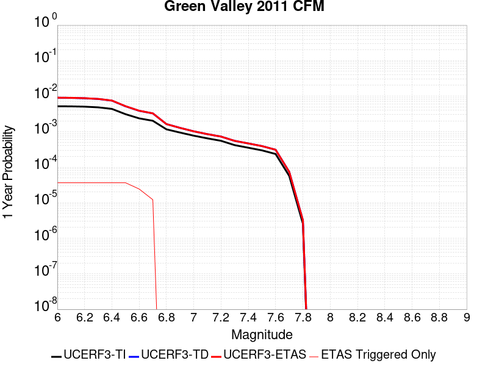 | 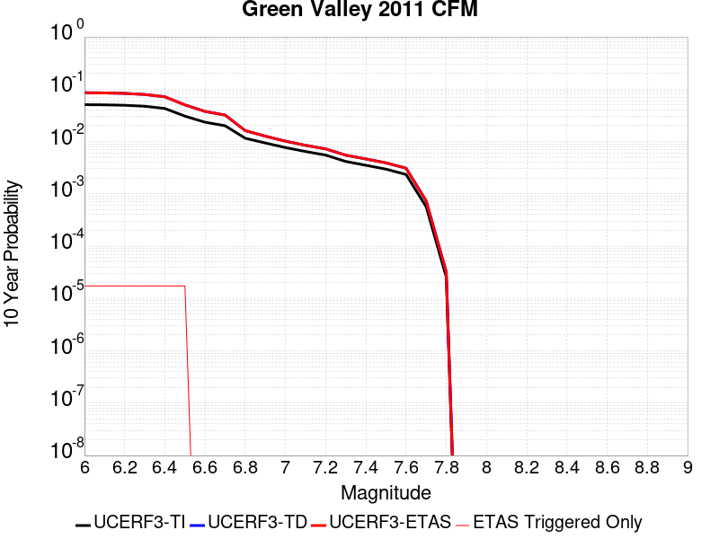 |

| Magnitude | 1 wk TI Prob | 1 wk TD Prob | 1 wk ETAS Prob | 1 wk ETAS/TD Gain | 1 wk ETAS Triggered Only | 1 mo TI Prob | 1 mo TD Prob | 1 mo ETAS Prob | 1 mo ETAS/TD Gain | 1 mo ETAS Triggered Only | 1 yr TI Prob | 1 yr TD Prob | 1 yr ETAS Prob | 1 yr ETAS/TD Gain | 1 yr ETAS Triggered Only | 10 yr TI Prob | 10 yr TD Prob | 10 yr ETAS Prob | 10 yr ETAS/TD Gain | 10 yr ETAS Triggered Only |
|-----|-----|-----|-----|-----|-----|-----|-----|-----|-----|-----|-----|-----|-----|-----|-----|-----|-----|-----|-----|-----|
| 6.0 | 9.9629346E-5 | 1.7305532E-4 | 1.949341E-4 | 1.1264265 | 2.1882557E-5 | 4.2691303E-4 | 7.4143766E-4 | 7.7423715E-4 | 1.0442377 | 3.2823835E-5 | 0.0051852856 | 0.008986705 | 0.009019234 | 1.0036197 | 3.2823835E-5 | 0.050659515 | 0.085522056 | 0.085552074 | 1.000351 | 3.2823835E-5 |
| 6.1 | 9.88615E-5 | 1.7152846E-4 | 1.9340726E-4 | 1.127552 | 2.1882557E-5 | 4.2362334E-4 | 7.348976E-4 | 7.6769735E-4 | 1.0446317 | 3.2823835E-5 | 0.0051454236 | 0.0089077335 | 0.008940265 | 1.0036521 | 3.2823835E-5 | 0.050279044 | 0.084809676 | 0.08483972 | 1.0003542 | 3.2823835E-5 |
| 6.2 | 9.696895E-5 | 1.6791887E-4 | 1.8979776E-4 | 1.1302943 | 2.1882557E-5 | 4.15515E-4 | 7.194366E-4 | 7.522368E-4 | 1.0455916 | 3.2823835E-5 | 0.0050471667 | 0.008721114 | 0.008753652 | 1.0037309 | 3.2823835E-5 | 0.04934063 | 0.0831186 | 0.0831487 | 1.000362 | 3.2823835E-5 |
| 6.3 | 9.275224E-5 | 1.5971228E-4 | 1.8159133E-4 | 1.1369904 | 2.1882557E-5 | 3.9744904E-4 | 6.842841E-4 | 7.1708544E-4 | 1.0479354 | 3.2823835E-5 | 0.0048282105 | 0.008296439 | 0.008328991 | 1.0039235 | 3.2823835E-5 | 0.047246475 | 0.07925707 | 0.07928729 | 1.0003814 | 3.2823835E-5 |
| 6.4 | 8.391499E-5 | 1.4367796E-4 | 1.6555737E-4 | 1.1522809 | 2.1882557E-5 | 3.595861E-4 | 6.156248E-4 | 6.4842845E-4 | 1.0532851 | 3.2823835E-5 | 0.004369175 | 0.0074670846 | 0.007499663 | 1.004363 | 3.2823835E-5 | 0.04284265 | 0.071630865 | 0.07166134 | 1.0004255 | 3.2823835E-5 |
| 6.5 | 5.9519385E-5 | 9.9340905E-5 | 1.2122129E-4 | 1.2202555 | 2.1882557E-5 | 2.5505814E-4 | 4.2568138E-4 | 4.5849127E-4 | 1.0770761 | 3.2823835E-5 | 0.0031009112 | 0.005168295 | 0.005200949 | 1.0063182 | 3.2823835E-5 | 0.030579966 | 0.050145864 | 0.05017704 | 1.0006218 | 3.2823835E-5 |
| 6.6 | 4.5361558E-5 | 7.402609E-5 | 9.5907024E-5 | 1.2955841 | 2.1882557E-5 | 1.9439218E-4 | 3.1721895E-4 | 3.3909458E-4 | 1.0689607 | 2.1882557E-5 | 0.0023641558 | 0.0038539418 | 0.0038757399 | 1.0056561 | 2.1882557E-5 | 0.023391623 | 0.037665963 | 0.037687022 | 1.0005591 | 2.1882557E-5 |
| 6.7 | 3.8808106E-5 | 6.2651976E-5 | 7.3592564E-5 | 1.1746249 | 1.0941279E-5 | 1.6630985E-4 | 2.6848342E-4 | 2.7942177E-4 | 1.0407412 | 1.0941279E-5 | 0.0020229418 | 0.0032626586 | 0.0032735642 | 1.0033425 | 1.0941279E-5 | 0.020046256 | 0.032005914 | 0.032016505 | 1.0003309 | 1.0941279E-5 |
| 6.8 | 2.2284667E-5 | 3.1285235E-5 | 3.1285235E-5 | 1.0 | 0.0 | 9.550222E-5 | 1.3407279E-4 | 1.3407279E-4 | 1.0 | 0.0 | 0.0011621192 | 0.0016311078 | 0.0016311078 | 1.0 | 0.0 | 0.011560607 | 0.016165998 | 0.016165998 | 1.0 | 0.0 |
| 6.9 | 1.8050168E-5 | 2.4448054E-5 | 2.4448054E-5 | 1.0 | 0.0 | 7.735557E-5 | 1.047732E-4 | 1.047732E-4 | 1.0 | 0.0 | 9.4139716E-4 | 0.0012748708 | 0.0012748708 | 1.0 | 0.0 | 0.009374191 | 0.012667833 | 0.012667833 | 1.0 | 0.0 |
| 7.0 | 1.4763166E-5 | 1.9582854E-5 | 1.9582854E-5 | 1.0 | 0.0 | 6.326917E-5 | 8.3923835E-5 | 8.3923835E-5 | 1.0 | 0.0 | 7.7002996E-4 | 0.0010212966 | 0.0010212966 | 1.0 | 0.0 | 0.007673672 | 0.010165343 | 0.010165343 | 1.0 | 0.0 |
| 7.1 | 1.2399713E-5 | 1.6303715E-5 | 1.6303715E-5 | 1.0 | 0.0 | 5.3140546E-5 | 6.98712E-5 | 6.98712E-5 | 1.0 | 0.0 | 6.467941E-4 | 8.503518E-4 | 8.503518E-4 | 1.0 | 0.0 | 0.006449148 | 0.008471259 | 0.008471259 | 1.0 | 0.0 |
| 7.2 | 1.0584195E-5 | 1.3921742E-5 | 1.3921742E-5 | 1.0 | 0.0 | 4.5360044E-5 | 5.9663253E-5 | 5.9663253E-5 | 1.0 | 0.0 | 5.521186E-4 | 7.261596E-4 | 7.261596E-4 | 1.0 | 0.0 | 0.0055074887 | 0.007238285 | 0.007238285 | 1.0 | 0.0 |
| 7.3 | 7.998173E-6 | 1.054402E-5 | 1.054402E-5 | 1.0 | 0.0 | 3.4277433E-5 | 4.518788E-5 | 4.518788E-5 | 1.0 | 0.0 | 4.1724785E-4 | 5.500247E-4 | 5.500247E-4 | 1.0 | 0.0 | 0.004164653 | 0.0054868995 | 0.0054868995 | 1.0 | 0.0 |
| 7.4 | 6.7571127E-6 | 8.932697E-6 | 8.932697E-6 | 1.0 | 0.0 | 2.8958733E-5 | 3.828243E-5 | 3.828243E-5 | 1.0 | 0.0 | 3.5251552E-4 | 4.6598984E-4 | 4.6598984E-4 | 1.0 | 0.0 | 0.0035195686 | 0.0046503306 | 0.0046503306 | 1.0 | 0.0 |
| 7.5 | 5.69878E-6 | 7.516314E-6 | 7.516314E-6 | 1.0 | 0.0 | 2.4423114E-5 | 3.221238E-5 | 3.221238E-5 | 1.0 | 0.0 | 2.9731085E-4 | 3.9211605E-4 | 3.9211605E-4 | 1.0 | 0.0 | 0.002969134 | 0.0039143935 | 0.0039143935 | 1.0 | 0.0 |
| 7.6 | 4.503664E-6 | 5.9356807E-6 | 5.9356807E-6 | 1.0 | 0.0 | 1.9301275E-5 | 2.5438389E-5 | 2.5438389E-5 | 1.0 | 0.0 | 2.3496768E-4 | 3.096692E-4 | 3.096692E-4 | 1.0 | 0.0 | 0.002347194 | 0.003092502 | 0.003092502 | 1.0 | 0.0 |
| 7.7 | 1.0873546E-6 | 1.4106979E-6 | 1.4106979E-6 | 1.0 | 0.0 | 4.6600826E-6 | 6.045834E-6 | 6.045834E-6 | 1.0 | 0.0 | 5.6735033E-5 | 7.360557E-5 | 7.360557E-5 | 1.0 | 0.0 | 5.672055E-4 | 7.35814E-4 | 7.35814E-4 | 1.0 | 0.0 |
| 7.8 | 4.9373917E-8 | 6.1777136E-8 | 6.1777136E-8 | 1.0 | 0.0 | 2.1160248E-7 | 2.6475914E-7 | 2.6475914E-7 | 1.0 | 0.0 | 2.5762572E-6 | 3.223439E-6 | 3.223439E-6 | 1.0 | 0.0 | 2.5762274E-5 | 3.2232296E-5 | 3.2232296E-5 | 1.0 | 0.0 |

## Cucamonga
*[(top)](#table-of-contents)*

| 1 Week | 1 Month | 1 Year | 10 Year |
|-----|-----|-----|-----|
| 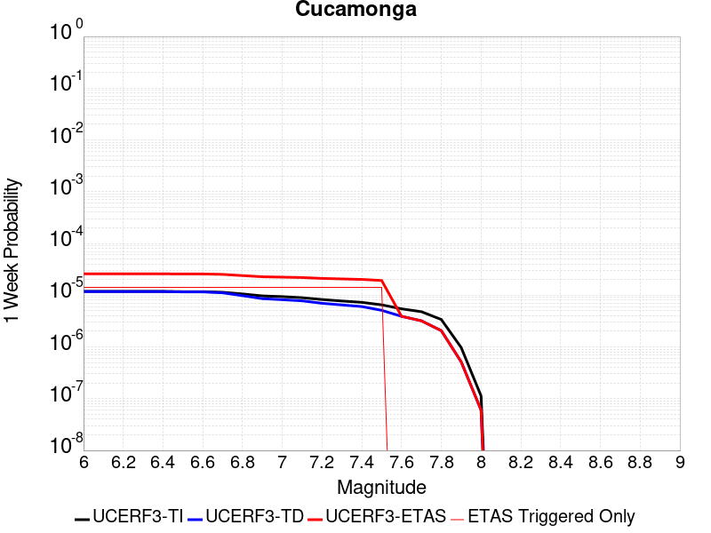 | 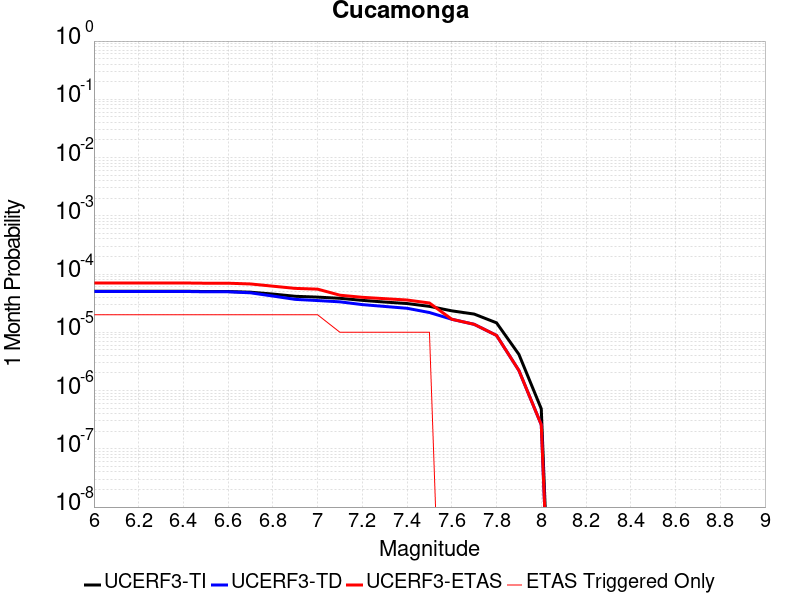 | 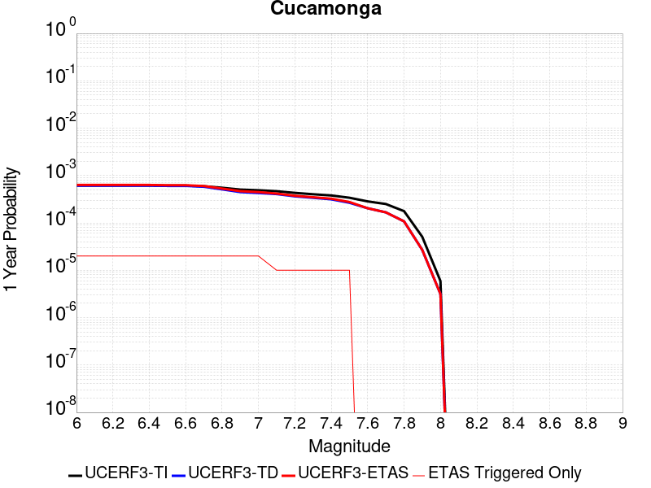 | 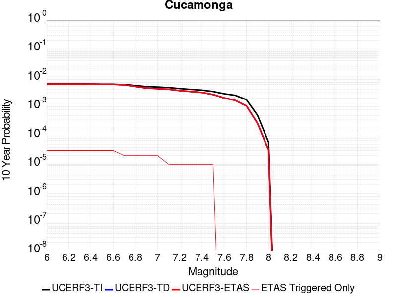 |

| Magnitude | 1 wk TI Prob | 1 wk TD Prob | 1 wk ETAS Prob | 1 wk ETAS/TD Gain | 1 wk ETAS Triggered Only | 1 mo TI Prob | 1 mo TD Prob | 1 mo ETAS Prob | 1 mo ETAS/TD Gain | 1 mo ETAS Triggered Only | 1 yr TI Prob | 1 yr TD Prob | 1 yr ETAS Prob | 1 yr ETAS/TD Gain | 1 yr ETAS Triggered Only | 10 yr TI Prob | 10 yr TD Prob | 10 yr ETAS Prob | 10 yr ETAS/TD Gain | 10 yr ETAS Triggered Only |
|-----|-----|-----|-----|-----|-----|-----|-----|-----|-----|-----|-----|-----|-----|-----|-----|-----|-----|-----|-----|-----|
| 6.0 | 1.1848348E-5 | 1.1737008E-5 | 3.3619308E-5 | 2.864385 | 2.1882557E-5 | 5.0777642E-5 | 5.030051E-5 | 7.218197E-5 | 1.4350146 | 2.1882557E-5 | 6.180424E-4 | 6.1223935E-4 | 6.341085E-4 | 1.03572 | 2.1882557E-5 | 0.0061632637 | 0.0061067017 | 0.006139325 | 1.0053422 | 3.2823835E-5 |
| 6.1 | 1.1848348E-5 | 1.1737008E-5 | 3.3619308E-5 | 2.864385 | 2.1882557E-5 | 5.0777642E-5 | 5.030051E-5 | 7.218197E-5 | 1.4350146 | 2.1882557E-5 | 6.180424E-4 | 6.1223935E-4 | 6.341085E-4 | 1.03572 | 2.1882557E-5 | 0.0061632637 | 0.0061067017 | 0.006139325 | 1.0053422 | 3.2823835E-5 |
| 6.2 | 1.1848348E-5 | 1.1737008E-5 | 3.3619308E-5 | 2.864385 | 2.1882557E-5 | 5.0777642E-5 | 5.030051E-5 | 7.218197E-5 | 1.4350146 | 2.1882557E-5 | 6.180424E-4 | 6.1223935E-4 | 6.341085E-4 | 1.03572 | 2.1882557E-5 | 0.0061632637 | 0.0061067017 | 0.006139325 | 1.0053422 | 3.2823835E-5 |
| 6.3 | 1.1848348E-5 | 1.1737008E-5 | 3.3619308E-5 | 2.864385 | 2.1882557E-5 | 5.0777642E-5 | 5.030051E-5 | 7.218197E-5 | 1.4350146 | 2.1882557E-5 | 6.180424E-4 | 6.1223935E-4 | 6.341085E-4 | 1.03572 | 2.1882557E-5 | 0.0061632637 | 0.0061067017 | 0.006139325 | 1.0053422 | 3.2823835E-5 |
| 6.4 | 1.1848348E-5 | 1.1737008E-5 | 3.3619308E-5 | 2.864385 | 2.1882557E-5 | 5.0777642E-5 | 5.030051E-5 | 7.218197E-5 | 1.4350146 | 2.1882557E-5 | 6.180424E-4 | 6.1223935E-4 | 6.341085E-4 | 1.03572 | 2.1882557E-5 | 0.0061632637 | 0.0061067017 | 0.006139325 | 1.0053422 | 3.2823835E-5 |
| 6.5 | 1.16988695E-5 | 1.15760395E-5 | 3.3458342E-5 | 2.89031 | 2.1882557E-5 | 5.013705E-5 | 4.9610666E-5 | 7.149214E-5 | 1.4410639 | 2.1882557E-5 | 6.102476E-4 | 6.0384517E-4 | 6.257145E-4 | 1.0362169 | 2.1882557E-5 | 0.006085745 | 0.006023216 | 0.006055842 | 1.0054168 | 3.2823835E-5 |
| 6.6 | 1.16988695E-5 | 1.15760395E-5 | 3.3458342E-5 | 2.89031 | 2.1882557E-5 | 5.013705E-5 | 4.9610666E-5 | 7.149214E-5 | 1.4410639 | 2.1882557E-5 | 6.102476E-4 | 6.0384517E-4 | 6.257145E-4 | 1.0362169 | 2.1882557E-5 | 0.006085745 | 0.006023216 | 0.006055842 | 1.0054168 | 3.2823835E-5 |
| 6.7 | 1.1397107E-5 | 1.11149475E-5 | 3.299726E-5 | 2.9687283 | 2.1882557E-5 | 4.884383E-5 | 4.7634636E-5 | 6.951615E-5 | 1.4593614 | 2.1882557E-5 | 5.9451134E-4 | 5.797998E-4 | 6.016697E-4 | 1.0377197 | 2.1882557E-5 | 0.005929234 | 0.0057840226 | 0.005805779 | 1.0037614 | 2.1882557E-5 |
| 6.8 | 1.058387E-5 | 9.784992E-6 | 3.1667332E-5 | 3.236317 | 2.1882557E-5 | 4.5358654E-5 | 4.193501E-5 | 6.3816646E-5 | 1.5217988 | 2.1882557E-5 | 5.521017E-4 | 5.1044027E-4 | 5.323116E-4 | 1.0428481 | 2.1882557E-5 | 0.00550732 | 0.0050936877 | 0.0051154587 | 1.0042741 | 2.1882557E-5 |
| 6.9 | 9.690046E-6 | 8.57948E-6 | 3.0461848E-5 | 3.5505471 | 2.1882557E-5 | 4.1528107E-5 | 3.6768684E-5 | 5.8650436E-5 | 1.5951192 | 2.1882557E-5 | 5.054874E-4 | 4.475672E-4 | 4.6943995E-4 | 1.0488703 | 2.1882557E-5 | 0.005043391 | 0.004467594 | 0.004489379 | 1.0048761 | 2.1882557E-5 |
| 7.0 | 9.381461E-6 | 8.187101E-6 | 3.006948E-5 | 3.672787 | 2.1882557E-5 | 4.020564E-5 | 3.5087105E-5 | 5.6968896E-5 | 1.6236418 | 2.1882557E-5 | 4.893937E-4 | 4.2710215E-4 | 4.4897536E-4 | 1.051213 | 2.1882557E-5 | 0.0048831734 | 0.0042637475 | 0.0042855367 | 1.0051104 | 2.1882557E-5 |
| 7.1 | 8.946492E-6 | 7.781886E-6 | 1.8723078E-5 | 2.4059823 | 1.0941279E-5 | 3.8341543E-5 | 3.3350516E-5 | 4.4291428E-5 | 1.3280582 | 1.0941279E-5 | 4.667083E-4 | 4.0596718E-4 | 4.1690402E-4 | 1.0269402 | 1.0941279E-5 | 0.0046572937 | 0.004053192 | 0.004064089 | 1.0026885 | 1.0941279E-5 |
| 7.2 | 8.251016E-6 | 6.9752796E-6 | 1.7916482E-5 | 2.5685682 | 1.0941279E-5 | 3.5361016E-5 | 2.9893714E-5 | 4.0834664E-5 | 1.365995 | 1.0941279E-5 | 4.3043532E-4 | 3.6389544E-4 | 3.748327E-4 | 1.0300561 | 1.0941279E-5 | 0.0042960253 | 0.0036339292 | 0.0036448305 | 1.0029999 | 1.0941279E-5 |
| 7.3 | 7.717881E-6 | 6.4863502E-6 | 1.7427557E-5 | 2.6868048 | 1.0941279E-5 | 3.3076216E-5 | 2.7798349E-5 | 3.8739323E-5 | 1.3935835 | 1.0941279E-5 | 4.026285E-4 | 3.3839257E-4 | 3.4933013E-4 | 1.0323222 | 1.0941279E-5 | 0.004018998 | 0.00337971 | 0.0033906144 | 1.0032264 | 1.0941279E-5 |
| 7.4 | 7.275623E-6 | 6.031997E-6 | 1.697321E-5 | 2.8138623 | 1.0941279E-5 | 3.118087E-5 | 2.585116E-5 | 3.6792157E-5 | 1.4232303 | 1.0941279E-5 | 3.7956095E-4 | 3.1469265E-4 | 3.2563048E-4 | 1.0347573 | 1.0941279E-5 | 0.0037891332 | 0.0031434062 | 0.0031543132 | 1.0034698 | 1.0941279E-5 |
| 7.5 | 6.5109502E-6 | 5.1006014E-6 | 1.6041824E-5 | 3.1450849 | 1.0941279E-5 | 2.7903774E-5 | 2.1859538E-5 | 3.2800577E-5 | 1.5005156 | 1.0941279E-5 | 3.3967546E-4 | 2.661075E-4 | 2.7704588E-4 | 1.041105 | 1.0941279E-5 | 0.0033915674 | 0.002658813 | 0.0026697253 | 1.0041041 | 1.0941279E-5 |
| 7.6 | 5.4495326E-6 | 3.90857E-6 | 3.90857E-6 | 1.0 | 0.0 | 2.335493E-5 | 1.6750908E-5 | 1.6750908E-5 | 1.0 | 0.0 | 2.8430918E-4 | 2.0392328E-4 | 2.0392328E-4 | 1.0 | 0.0 | 0.0028394572 | 0.002038282 | 0.002038282 | 1.0 | 0.0 |
| 7.7 | 4.7997164E-6 | 3.2002547E-6 | 3.2002547E-6 | 1.0 | 0.0 | 2.057005E-5 | 1.3715306E-5 | 1.3715306E-5 | 1.0 | 0.0 | 2.504116E-4 | 1.6697108E-4 | 1.6697108E-4 | 1.0 | 0.0 | 0.002501296 | 0.0016693877 | 0.0016693877 | 1.0 | 0.0 |
| 7.8 | 3.3941733E-6 | 2.0641899E-6 | 2.0641899E-6 | 1.0 | 0.0 | 1.4546376E-5 | 8.846498E-6 | 8.846498E-6 | 1.0 | 0.0 | 1.7708774E-4 | 1.07700806E-4 | 1.07700806E-4 | 1.0 | 0.0 | 0.0017694668 | 0.001076723 | 0.001076723 | 1.0 | 0.0 |
| 7.9 | 9.750552E-7 | 5.155946E-7 | 5.155946E-7 | 1.0 | 0.0 | 4.178801E-6 | 2.2096892E-6 | 2.2096892E-6 | 1.0 | 0.0 | 5.0875715E-5 | 2.690264E-5 | 2.690264E-5 | 1.0 | 0.0 | 5.086407E-4 | 2.6899425E-4 | 2.6899425E-4 | 1.0 | 0.0 |
| 8.0 | 1.133857E-7 | 6.053707E-8 | 6.053707E-8 | 1.0 | 0.0 | 4.8593864E-7 | 2.5944456E-7 | 2.5944456E-7 | 1.0 | 0.0 | 5.9162867E-6 | 3.158733E-6 | 3.158733E-6 | 1.0 | 0.0 | 5.916129E-5 | 3.1586897E-5 | 3.1586897E-5 | 1.0 | 0.0 |

## San Jacinto (Clark) rev
*[(top)](#table-of-contents)*

| 1 Week | 1 Month | 1 Year | 10 Year |
|-----|-----|-----|-----|
|  |  | 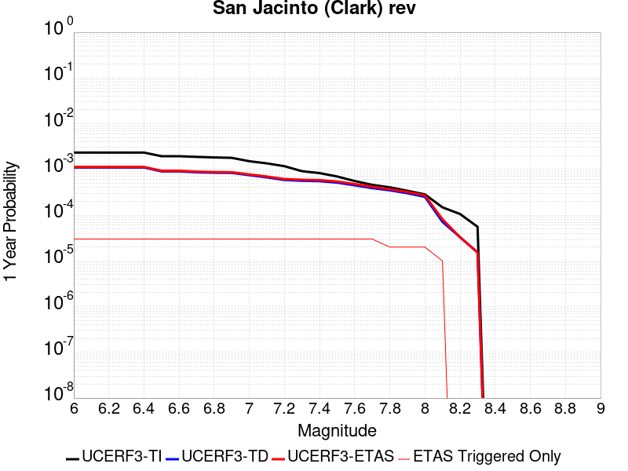 | 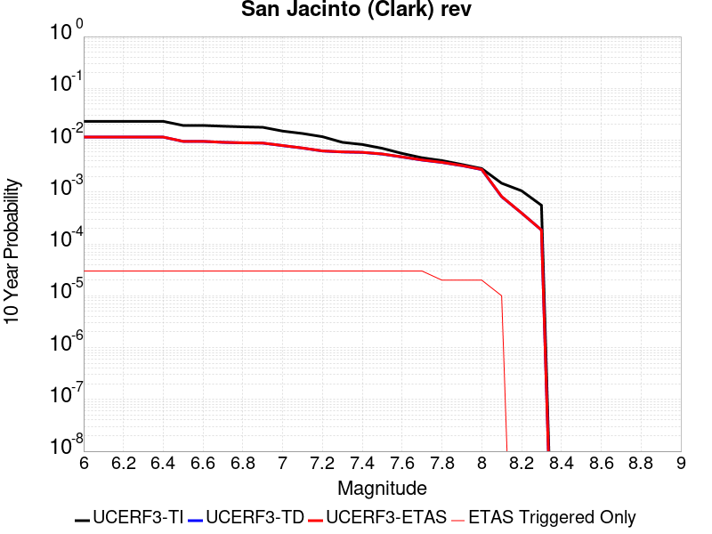 |

| Magnitude | 1 wk TI Prob | 1 wk TD Prob | 1 wk ETAS Prob | 1 wk ETAS/TD Gain | 1 wk ETAS Triggered Only | 1 mo TI Prob | 1 mo TD Prob | 1 mo ETAS Prob | 1 mo ETAS/TD Gain | 1 mo ETAS Triggered Only | 1 yr TI Prob | 1 yr TD Prob | 1 yr ETAS Prob | 1 yr ETAS/TD Gain | 1 yr ETAS Triggered Only | 10 yr TI Prob | 10 yr TD Prob | 10 yr ETAS Prob | 10 yr ETAS/TD Gain | 10 yr ETAS Triggered Only |
|-----|-----|-----|-----|-----|-----|-----|-----|-----|-----|-----|-----|-----|-----|-----|-----|-----|-----|-----|-----|-----|
| 6.0 | 4.482615E-5 | 2.1154196E-5 | 4.303629E-5 | 2.0344093 | 2.1882557E-5 | 1.9209793E-4 | 9.065773E-5 | 1.12538306E-4 | 1.2413536 | 2.1882557E-5 | 0.0023362834 | 0.0011032083 | 0.001135996 | 1.0297203 | 3.2823835E-5 | 0.02311874 | 0.011503847 | 0.011536293 | 1.0028205 | 3.2823835E-5 |
| 6.1 | 4.482615E-5 | 2.1154196E-5 | 4.303629E-5 | 2.0344093 | 2.1882557E-5 | 1.9209793E-4 | 9.065773E-5 | 1.12538306E-4 | 1.2413536 | 2.1882557E-5 | 0.0023362834 | 0.0011032083 | 0.001135996 | 1.0297203 | 3.2823835E-5 | 0.02311874 | 0.011503847 | 0.011536293 | 1.0028205 | 3.2823835E-5 |
| 6.2 | 4.482615E-5 | 2.1154196E-5 | 4.303629E-5 | 2.0344093 | 2.1882557E-5 | 1.9209793E-4 | 9.065773E-5 | 1.12538306E-4 | 1.2413536 | 2.1882557E-5 | 0.0023362834 | 0.0011032083 | 0.001135996 | 1.0297203 | 3.2823835E-5 | 0.02311874 | 0.011503847 | 0.011536293 | 1.0028205 | 3.2823835E-5 |
| 6.3 | 4.482615E-5 | 2.1154196E-5 | 4.303629E-5 | 2.0344093 | 2.1882557E-5 | 1.9209793E-4 | 9.065773E-5 | 1.12538306E-4 | 1.2413536 | 2.1882557E-5 | 0.0023362834 | 0.0011032083 | 0.001135996 | 1.0297203 | 3.2823835E-5 | 0.02311874 | 0.011503847 | 0.011536293 | 1.0028205 | 3.2823835E-5 |
| 6.4 | 4.482615E-5 | 2.1154196E-5 | 4.303629E-5 | 2.0344093 | 2.1882557E-5 | 1.9209793E-4 | 9.065773E-5 | 1.12538306E-4 | 1.2413536 | 2.1882557E-5 | 0.0023362834 | 0.0011032083 | 0.001135996 | 1.0297203 | 3.2823835E-5 | 0.02311874 | 0.011503847 | 0.011536293 | 1.0028205 | 3.2823835E-5 |
| 6.5 | 3.7294863E-5 | 1.7356087E-5 | 3.9238264E-5 | 2.2607782 | 2.1882557E-5 | 1.5982533E-4 | 7.438113E-5 | 9.626206E-5 | 1.2941731 | 2.1882557E-5 | 0.0019441366 | 9.052186E-4 | 9.380127E-4 | 1.0362278 | 3.2823835E-5 | 0.01927216 | 0.0094941035 | 0.009526615 | 1.0034244 | 3.2823835E-5 |
| 6.6 | 3.7294863E-5 | 1.7356087E-5 | 3.9238264E-5 | 2.2607782 | 2.1882557E-5 | 1.5982533E-4 | 7.438113E-5 | 9.626206E-5 | 1.2941731 | 2.1882557E-5 | 0.0019441366 | 9.052186E-4 | 9.380127E-4 | 1.0362278 | 3.2823835E-5 | 0.01927216 | 0.0094941035 | 0.009526615 | 1.0034244 | 3.2823835E-5 |
| 6.7 | 3.6039248E-5 | 1.6604314E-5 | 3.8486505E-5 | 2.317862 | 2.1882557E-5 | 1.5444479E-4 | 7.1159426E-5 | 9.304042E-5 | 1.3074926 | 2.1882557E-5 | 0.0018787434 | 8.6602574E-4 | 8.9882116E-4 | 1.0378689 | 3.2823835E-5 | 0.01862939 | 0.009096047 | 0.009128572 | 1.0035758 | 3.2823835E-5 |
| 6.8 | 3.5031844E-5 | 1.6232942E-5 | 3.8115144E-5 | 2.348012 | 2.1882557E-5 | 1.5012783E-4 | 6.956792E-5 | 9.144895E-5 | 1.3145276 | 2.1882557E-5 | 0.0018262739 | 8.4666436E-4 | 8.7946036E-4 | 1.0387356 | 3.2823835E-5 | 0.01811338 | 0.008895969 | 0.008928501 | 1.0036569 | 3.2823835E-5 |
| 6.9 | 3.435112E-5 | 1.6063195E-5 | 3.79454E-5 | 2.3622572 | 2.1882557E-5 | 1.4721078E-4 | 6.884047E-5 | 9.072152E-5 | 1.3178515 | 2.1882557E-5 | 0.0017908178 | 8.3781447E-4 | 8.706108E-4 | 1.0391451 | 3.2823835E-5 | 0.017764548 | 0.008804181 | 0.0088367155 | 1.0036954 | 3.2823835E-5 |
| 7.0 | 2.8959772E-5 | 1.4336745E-5 | 3.621899E-5 | 2.5263047 | 2.1882557E-5 | 1.241074E-4 | 6.144176E-5 | 8.332297E-5 | 1.3561293 | 2.1882557E-5 | 0.0015099603 | 7.477995E-4 | 7.805988E-4 | 1.043861 | 3.2823835E-5 | 0.014997416 | 0.007868037 | 0.007900602 | 1.004139 | 3.2823835E-5 |
| 7.1 | 2.6002877E-5 | 1.2829002E-5 | 3.4711276E-5 | 2.705688 | 2.1882557E-5 | 1.11436144E-4 | 5.498029E-5 | 7.6861645E-5 | 1.3979855 | 2.1882557E-5 | 0.0013558907 | 6.691816E-4 | 7.019834E-4 | 1.0490179 | 3.2823835E-5 | 0.013476475 | 0.0070465137 | 0.0070791063 | 1.0046253 | 3.2823835E-5 |
| 7.2 | 2.2544838E-5 | 1.1262543E-5 | 3.3144854E-5 | 2.9429278 | 2.1882557E-5 | 9.661716E-5 | 4.8267157E-5 | 7.014866E-5 | 1.4533414 | 2.1882557E-5 | 0.001175679 | 5.874956E-4 | 6.203002E-4 | 1.055838 | 3.2823835E-5 | 0.011694785 | 0.0061927503 | 0.006225371 | 1.0052675 | 3.2823835E-5 |
| 7.3 | 1.75334E-5 | 1.0811715E-5 | 3.2694035E-5 | 3.0239453 | 2.1882557E-5 | 7.514098E-5 | 4.6335106E-5 | 6.821665E-5 | 1.4722455 | 2.1882557E-5 | 9.144575E-4 | 5.6398526E-4 | 5.967906E-4 | 1.058167 | 3.2823835E-5 | 0.009107036 | 0.0059337732 | 0.0059664026 | 1.0054989 | 3.2823835E-5 |
| 7.4 | 1.5924552E-5 | 1.0611516E-5 | 3.249384E-5 | 3.0621297 | 2.1882557E-5 | 6.82463E-5 | 4.547714E-5 | 6.7358706E-5 | 1.4811552 | 2.1882557E-5 | 8.305819E-4 | 5.535449E-4 | 5.8635056E-4 | 1.0592647 | 3.2823835E-5 | 0.008274844 | 0.0058210334 | 0.005853666 | 1.005606 | 3.2823835E-5 |
| 7.5 | 1.3428931E-5 | 9.8519E-6 | 3.1734242E-5 | 3.221129 | 2.1882557E-5 | 5.7551293E-5 | 4.2221753E-5 | 6.4103384E-5 | 1.518255 | 2.1882557E-5 | 7.004617E-4 | 5.1392964E-4 | 5.4673664E-4 | 1.0638355 | 3.2823835E-5 | 0.006982579 | 0.0054066023 | 0.005439249 | 1.0060382 | 3.2823835E-5 |
| 7.6 | 1.0688787E-5 | 8.614839E-6 | 3.0497207E-5 | 3.5400784 | 2.1882557E-5 | 4.5808283E-5 | 3.692022E-5 | 5.8801972E-5 | 1.5926765 | 2.1882557E-5 | 5.5757316E-4 | 4.4941145E-4 | 4.8222055E-4 | 1.0730046 | 3.2823835E-5 | 0.005561762 | 0.0047416524 | 0.0047743204 | 1.0068896 | 3.2823835E-5 |
| 7.7 | 8.81236E-6 | 7.4680274E-6 | 2.935042E-5 | 3.9301436 | 2.1882557E-5 | 3.776671E-5 | 3.2005442E-5 | 5.3887296E-5 | 1.6836917 | 2.1882557E-5 | 4.597127E-4 | 3.8959677E-4 | 4.2240781E-4 | 1.0842179 | 3.2823835E-5 | 0.0045876284 | 0.0041346536 | 0.0041673416 | 1.0079058 | 3.2823835E-5 |
| 7.8 | 7.780431E-6 | 6.696579E-6 | 1.7637783E-5 | 2.6338499 | 1.0941279E-5 | 3.3344273E-5 | 2.8699309E-5 | 3.9640272E-5 | 1.3812275 | 1.0941279E-5 | 4.0589093E-4 | 3.4935825E-4 | 3.7123315E-4 | 1.0626146 | 2.1882557E-5 | 0.0040515037 | 0.0037227906 | 0.0037445917 | 1.0058562 | 2.1882557E-5 |
| 7.9 | 6.5437994E-6 | 5.780382E-6 | 1.6721597E-5 | 2.8928187 | 1.0941279E-5 | 2.8044553E-5 | 2.477283E-5 | 3.5713838E-5 | 1.4416535 | 1.0941279E-5 | 3.4138895E-4 | 3.0156763E-4 | 3.234436E-4 | 1.0725408 | 2.1882557E-5 | 0.0034086495 | 0.0032344845 | 0.0032562963 | 1.0067436 | 2.1882557E-5 |
| 8.0 | 5.4488164E-6 | 4.8133406E-6 | 1.5754566E-5 | 3.2731042 | 1.0941279E-5 | 2.3351862E-5 | 2.062844E-5 | 3.1569492E-5 | 1.5303868 | 1.0941279E-5 | 2.8427184E-4 | 2.5112246E-4 | 2.7299952E-4 | 1.0871171 | 2.1882557E-5 | 0.0028390845 | 0.002710839 | 0.0027326623 | 1.0080503 | 2.1882557E-5 |
| 8.1 | 2.8397242E-6 | 1.3670389E-6 | 1.2308302E-5 | 9.003622 | 1.0941279E-5 | 1.217019E-5 | 5.858725E-6 | 1.6799939E-5 | 2.8675077 | 1.0941279E-5 | 1.4816198E-4 | 7.132765E-5 | 8.2268154E-5 | 1.1533837 | 1.0941279E-5 | 0.0014806325 | 8.115382E-4 | 8.224706E-4 | 1.0134712 | 1.0941279E-5 |
| 8.2 | 2.030244E-6 | 6.318974E-7 | 6.318974E-7 | 1.0 | 0.0 | 8.701017E-6 | 2.708129E-6 | 2.708129E-6 | 1.0 | 0.0 | 1.05929736E-4 | 3.2970976E-5 | 3.2970976E-5 | 1.0 | 0.0 | 0.0010587925 | 3.9486602E-4 | 3.9486602E-4 | 1.0 | 0.0 |
| 8.3 | 1.0659804E-6 | 2.9250086E-7 | 2.9250086E-7 | 1.0 | 0.0 | 4.568479E-6 | 1.2535745E-6 | 1.2535745E-6 | 1.0 | 0.0 | 5.5619817E-5 | 1.5262167E-5 | 1.5262167E-5 | 1.0 | 0.0 | 5.5605895E-4 | 1.8566217E-4 | 1.8566217E-4 | 1.0 | 0.0 |

## Santa Cruz Catalina Ridge alt1
*[(top)](#table-of-contents)*

| 1 Week | 1 Month | 1 Year | 10 Year |
|-----|-----|-----|-----|
| 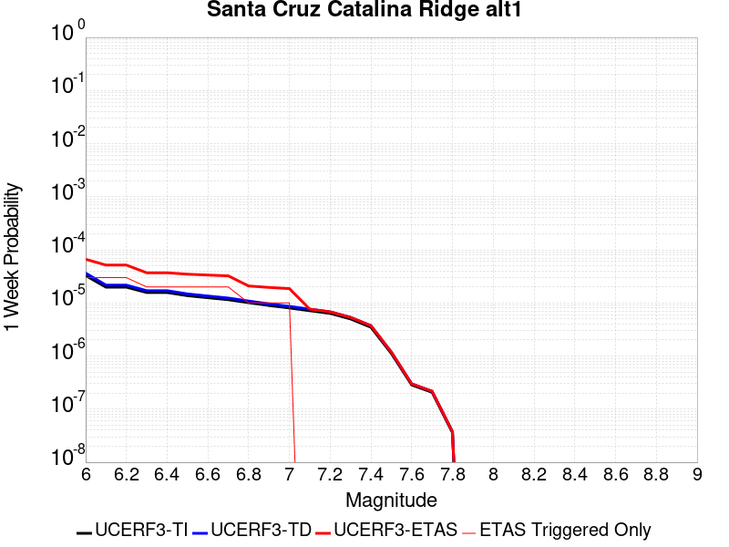 | 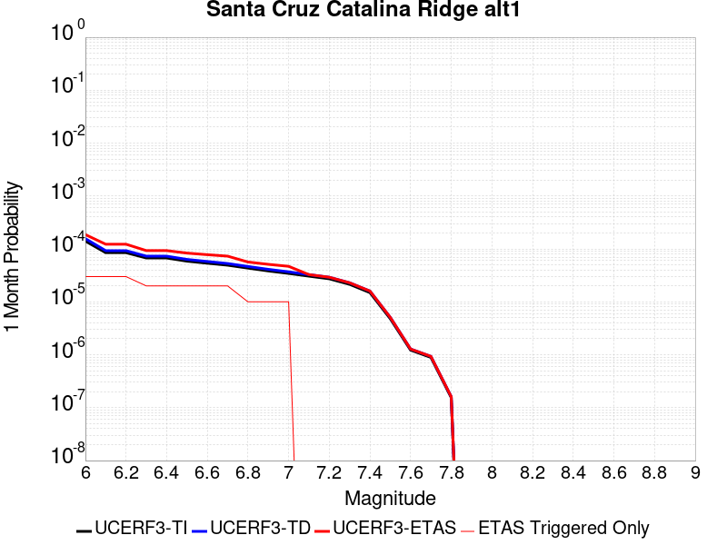 | 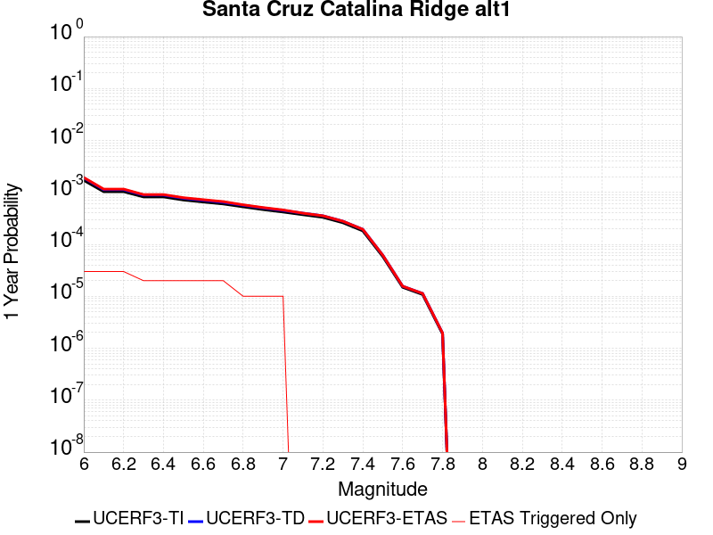 | 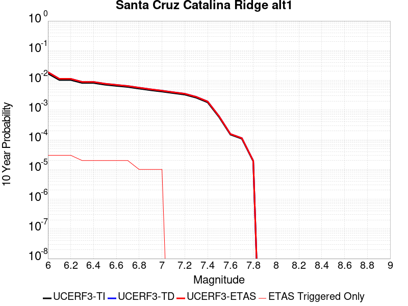 |

| Magnitude | 1 wk TI Prob | 1 wk TD Prob | 1 wk ETAS Prob | 1 wk ETAS/TD Gain | 1 wk ETAS Triggered Only | 1 mo TI Prob | 1 mo TD Prob | 1 mo ETAS Prob | 1 mo ETAS/TD Gain | 1 mo ETAS Triggered Only | 1 yr TI Prob | 1 yr TD Prob | 1 yr ETAS Prob | 1 yr ETAS/TD Gain | 1 yr ETAS Triggered Only | 10 yr TI Prob | 10 yr TD Prob | 10 yr ETAS Prob | 10 yr ETAS/TD Gain | 10 yr ETAS Triggered Only |
|-----|-----|-----|-----|-----|-----|-----|-----|-----|-----|-----|-----|-----|-----|-----|-----|-----|-----|-----|-----|-----|
| 6.0 | 3.2833184E-5 | 3.65584E-5 | 6.9381036E-5 | 1.8978138 | 3.2823835E-5 | 1.4070606E-4 | 1.5667039E-4 | 1.8948907E-4 | 1.209476 | 3.2823835E-5 | 0.00171175 | 0.0019059596 | 0.0019387208 | 1.0171889 | 3.2823835E-5 | 0.016986247 | 0.018913029 | 0.018945232 | 1.0017027 | 3.2823835E-5 |
| 6.1 | 1.9835548E-5 | 2.1659505E-5 | 5.448263E-5 | 2.5154142 | 3.2823835E-5 | 8.500672E-5 | 9.282326E-5 | 1.2564404E-4 | 1.3535837 | 3.2823835E-5 | 0.0010344655 | 0.0011295575 | 0.0011623442 | 1.0290262 | 3.2823835E-5 | 0.010296632 | 0.011240295 | 0.011272751 | 1.0028874 | 3.2823835E-5 |
| 6.2 | 1.9835548E-5 | 2.1659505E-5 | 5.448263E-5 | 2.5154142 | 3.2823835E-5 | 8.500672E-5 | 9.282326E-5 | 1.2564404E-4 | 1.3535837 | 3.2823835E-5 | 0.0010344655 | 0.0011295575 | 0.0011623442 | 1.0290262 | 3.2823835E-5 | 0.010296632 | 0.011240295 | 0.011272751 | 1.0028874 | 3.2823835E-5 |
| 6.3 | 1.5728183E-5 | 1.703395E-5 | 3.8916132E-5 | 2.284622 | 2.1882557E-5 | 6.7404755E-5 | 7.300063E-5 | 9.488159E-5 | 1.2997366 | 2.1882557E-5 | 8.2034385E-4 | 8.884264E-4 | 9.102895E-4 | 1.0246089 | 2.1882557E-5 | 0.008173222 | 0.008849427 | 0.008871116 | 1.0024508 | 2.1882557E-5 |
| 6.4 | 1.5728183E-5 | 1.703395E-5 | 3.8916132E-5 | 2.284622 | 2.1882557E-5 | 6.7404755E-5 | 7.300063E-5 | 9.488159E-5 | 1.2997366 | 2.1882557E-5 | 8.2034385E-4 | 8.884264E-4 | 9.102895E-4 | 1.0246089 | 2.1882557E-5 | 0.008173222 | 0.008849427 | 0.008871116 | 1.0024508 | 2.1882557E-5 |
| 6.5 | 1.3707734E-5 | 1.4794522E-5 | 3.6676756E-5 | 2.4790766 | 2.1882557E-5 | 5.8746107E-5 | 6.3403575E-5 | 8.5284744E-5 | 1.3451093 | 2.1882557E-5 | 7.1499916E-4 | 7.716686E-4 | 7.935343E-4 | 1.0283356 | 2.1882557E-5 | 0.0071270303 | 0.0076902895 | 0.007712004 | 1.0028236 | 2.1882557E-5 |
| 6.6 | 1.2539813E-5 | 1.3510219E-5 | 3.539248E-5 | 2.619682 | 2.1882557E-5 | 5.3740947E-5 | 5.789967E-5 | 7.978096E-5 | 1.3779173 | 2.1882557E-5 | 6.540996E-4 | 7.0470315E-4 | 7.265703E-4 | 1.0310303 | 2.1882557E-5 | 0.0065217763 | 0.0070249885 | 0.007046717 | 1.0030931 | 2.1882557E-5 |
| 6.7 | 1.1504083E-5 | 1.2377375E-5 | 3.425966E-5 | 2.7679262 | 2.1882557E-5 | 4.930228E-5 | 5.3044827E-5 | 7.492622E-5 | 1.4125077 | 2.1882557E-5 | 6.0008996E-4 | 6.456314E-4 | 6.6749984E-4 | 1.0338714 | 2.1882557E-5 | 0.005984721 | 0.006437786 | 0.0064595276 | 1.0033772 | 2.1882557E-5 |
| 6.8 | 1.012739E-5 | 1.0877071E-5 | 2.181823E-5 | 2.005892 | 1.0941279E-5 | 4.340238E-5 | 4.6615194E-5 | 5.7555964E-5 | 1.2347039 | 1.0941279E-5 | 5.282958E-4 | 5.673937E-4 | 5.783288E-4 | 1.0192724 | 1.0941279E-5 | 0.0052704164 | 0.0056596193 | 0.005670499 | 1.0019222 | 1.0941279E-5 |
| 6.9 | 8.9607865E-6 | 9.609117E-6 | 2.0550291E-5 | 2.1386242 | 1.0941279E-5 | 3.8402806E-5 | 4.1181287E-5 | 5.2122115E-5 | 1.2656747 | 1.0941279E-5 | 4.6745385E-4 | 5.012679E-4 | 5.1220367E-4 | 1.0218163 | 1.0941279E-5 | 0.0046647177 | 0.005001492 | 0.005012378 | 1.0021766 | 1.0941279E-5 |
| 7.0 | 8.046829E-6 | 8.619746E-6 | 1.956093E-5 | 2.2693162 | 1.0941279E-5 | 3.4485955E-5 | 3.694125E-5 | 4.7882124E-5 | 1.2961695 | 1.0941279E-5 | 4.1978562E-4 | 4.496677E-4 | 4.6060406E-4 | 1.024321 | 1.0941279E-5 | 0.004189935 | 0.0044876686 | 0.004498561 | 1.0024271 | 1.0941279E-5 |
| 7.1 | 7.136131E-6 | 7.637656E-6 | 7.637656E-6 | 1.0 | 0.0 | 3.0583058E-5 | 3.2732405E-5 | 3.2732405E-5 | 1.0 | 0.0 | 3.7228514E-4 | 3.9844486E-4 | 3.9844486E-4 | 1.0 | 0.0 | 0.0037166206 | 0.003977381 | 0.003977381 | 1.0 | 0.0 |
| 7.2 | 6.362014E-6 | 6.8049585E-6 | 6.8049585E-6 | 1.0 | 0.0 | 2.726549E-5 | 2.9163786E-5 | 2.9163786E-5 | 1.0 | 0.0 | 3.3190678E-4 | 3.550119E-4 | 3.550119E-4 | 1.0 | 0.0 | 0.0033141149 | 0.003544516 | 0.003544516 | 1.0 | 0.0 |
| 7.3 | 5.004101E-6 | 5.351715E-6 | 5.351715E-6 | 1.0 | 0.0 | 2.1445969E-5 | 2.2935723E-5 | 2.2935723E-5 | 1.0 | 0.0 | 2.6107338E-4 | 2.792072E-4 | 2.792072E-4 | 1.0 | 0.0 | 0.002607669 | 0.0027886187 | 0.0027886187 | 1.0 | 0.0 |
| 7.4 | 3.4901443E-6 | 3.7320526E-6 | 3.7320526E-6 | 1.0 | 0.0 | 1.4957676E-5 | 1.5994416E-5 | 1.5994416E-5 | 1.0 | 0.0 | 1.8209449E-4 | 1.9471499E-4 | 1.9471499E-4 | 1.0 | 0.0 | 0.0018194534 | 0.0019454823 | 0.0019454823 | 1.0 | 0.0 |
| 7.5 | 1.1215045E-6 | 1.189387E-6 | 1.189387E-6 | 1.0 | 0.0 | 4.806439E-6 | 5.097363E-6 | 5.097363E-6 | 1.0 | 0.0 | 5.851682E-5 | 6.205866E-5 | 6.205866E-5 | 1.0 | 0.0 | 5.850142E-4 | 6.2041637E-4 | 6.2041637E-4 | 1.0 | 0.0 |
| 7.6 | 2.8599047E-7 | 2.9951994E-7 | 2.9951994E-7 | 1.0 | 0.0 | 1.2256729E-6 | 1.2836562E-6 | 1.2836562E-6 | 1.0 | 0.0 | 1.4922465E-5 | 1.5628404E-5 | 1.5628404E-5 | 1.0 | 0.0 | 1.4921463E-4 | 1.5627318E-4 | 1.5627318E-4 | 1.0 | 0.0 |
| 7.7 | 2.0781519E-7 | 2.1744323E-7 | 2.1744323E-7 | 1.0 | 0.0 | 8.906362E-7 | 9.3189925E-7 | 9.3189925E-7 | 1.0 | 0.0 | 1.08434415E-5 | 1.13458145E-5 | 1.13458145E-5 | 1.0 | 0.0 | 1.0842913E-4 | 1.1345245E-4 | 1.1345245E-4 | 1.0 | 0.0 |
| 7.8 | 3.614776E-8 | 3.764102E-8 | 3.764102E-8 | 1.0 | 0.0 | 1.5491896E-7 | 1.6131864E-7 | 1.6131864E-7 | 1.0 | 0.0 | 1.8861368E-6 | 1.9640527E-6 | 1.9640527E-6 | 1.0 | 0.0 | 1.8861208E-5 | 1.9640367E-5 | 1.9640367E-5 | 1.0 | 0.0 |

## Cleghorn
*[(top)](#table-of-contents)*

| 1 Week | 1 Month | 1 Year | 10 Year |
|-----|-----|-----|-----|
|  |  |  |  |

| Magnitude | 1 wk TI Prob | 1 wk TD Prob | 1 wk ETAS Prob | 1 wk ETAS/TD Gain | 1 wk ETAS Triggered Only | 1 mo TI Prob | 1 mo TD Prob | 1 mo ETAS Prob | 1 mo ETAS/TD Gain | 1 mo ETAS Triggered Only | 1 yr TI Prob | 1 yr TD Prob | 1 yr ETAS Prob | 1 yr ETAS/TD Gain | 1 yr ETAS Triggered Only | 10 yr TI Prob | 10 yr TD Prob | 10 yr ETAS Prob | 10 yr ETAS/TD Gain | 10 yr ETAS Triggered Only |
|-----|-----|-----|-----|-----|-----|-----|-----|-----|-----|-----|-----|-----|-----|-----|-----|-----|-----|-----|-----|-----|
| 6.0 | 7.9267165E-6 | 9.831582E-6 | 2.0772753E-5 | 2.1128595 | 1.0941279E-5 | 3.39712E-5 | 4.2134732E-5 | 6.401637E-5 | 1.5193254 | 2.1882557E-5 | 4.1352084E-4 | 5.128803E-4 | 5.456873E-4 | 1.0639662 | 3.2823835E-5 | 0.004127522 | 0.0051320773 | 0.0051647327 | 1.006363 | 3.2823835E-5 |
| 6.1 | 7.9267165E-6 | 9.831582E-6 | 2.0772753E-5 | 2.1128595 | 1.0941279E-5 | 3.39712E-5 | 4.2134732E-5 | 6.401637E-5 | 1.5193254 | 2.1882557E-5 | 4.1352084E-4 | 5.128803E-4 | 5.456873E-4 | 1.0639662 | 3.2823835E-5 | 0.004127522 | 0.0051320773 | 0.0051647327 | 1.006363 | 3.2823835E-5 |
| 6.2 | 7.9267165E-6 | 9.831582E-6 | 2.0772753E-5 | 2.1128595 | 1.0941279E-5 | 3.39712E-5 | 4.2134732E-5 | 6.401637E-5 | 1.5193254 | 2.1882557E-5 | 4.1352084E-4 | 5.128803E-4 | 5.456873E-4 | 1.0639662 | 3.2823835E-5 | 0.004127522 | 0.0051320773 | 0.0051647327 | 1.006363 | 3.2823835E-5 |
| 6.3 | 7.9267165E-6 | 9.831582E-6 | 2.0772753E-5 | 2.1128595 | 1.0941279E-5 | 3.39712E-5 | 4.2134732E-5 | 6.401637E-5 | 1.5193254 | 2.1882557E-5 | 4.1352084E-4 | 5.128803E-4 | 5.456873E-4 | 1.0639662 | 3.2823835E-5 | 0.004127522 | 0.0051320773 | 0.0051647327 | 1.006363 | 3.2823835E-5 |
| 6.4 | 4.3445207E-6 | 6.0914435E-6 | 1.7032655E-5 | 2.7961607 | 1.0941279E-5 | 1.8619241E-5 | 2.610593E-5 | 4.7987916E-5 | 1.8381997 | 2.1882557E-5 | 2.2666567E-4 | 3.1779436E-4 | 3.5060776E-4 | 1.1032536 | 3.2823835E-5 | 0.0022643462 | 0.0031875873 | 0.0032203065 | 1.0102645 | 3.2823835E-5 |
| 6.5 | 4.3445207E-6 | 6.0914435E-6 | 1.7032655E-5 | 2.7961607 | 1.0941279E-5 | 1.8619241E-5 | 2.610593E-5 | 4.7987916E-5 | 1.8381997 | 2.1882557E-5 | 2.2666567E-4 | 3.1779436E-4 | 3.5060776E-4 | 1.1032536 | 3.2823835E-5 | 0.0022643462 | 0.0031875873 | 0.0032203065 | 1.0102645 | 3.2823835E-5 |
| 6.6 | 4.040109E-6 | 5.773851E-6 | 1.6715067E-5 | 2.8949597 | 1.0941279E-5 | 1.7314638E-5 | 2.4744846E-5 | 3.5685855E-5 | 1.442153 | 1.0941279E-5 | 2.1078532E-4 | 3.012278E-4 | 3.2310377E-4 | 1.0726227 | 2.1882557E-5 | 0.002105855 | 0.003022377 | 0.0030441934 | 1.0072182 | 2.1882557E-5 |
| 6.7 | 3.3632055E-6 | 5.067348E-6 | 1.6008571E-5 | 3.1591616 | 1.0941279E-5 | 1.4413658E-5 | 2.1717027E-5 | 3.2658067E-5 | 1.5038002 | 1.0941279E-5 | 1.7547216E-4 | 2.6437303E-4 | 2.753114E-4 | 1.0413748 | 1.0941279E-5 | 0.0017533366 | 0.0026547113 | 0.0026656233 | 1.0041106 | 1.0941279E-5 |
| 6.8 | 3.2902772E-6 | 4.9892556E-6 | 1.593048E-5 | 3.1929572 | 1.0941279E-5 | 1.4101111E-5 | 2.1382351E-5 | 3.2323394E-5 | 1.5116857 | 1.0941279E-5 | 1.716675E-4 | 2.6029933E-4 | 2.7123778E-4 | 1.0420225 | 1.0941279E-5 | 0.0017153495 | 0.0026140702 | 0.0026249827 | 1.0041746 | 1.0941279E-5 |
| 6.9 | 3.031547E-6 | 4.6910186E-6 | 1.5632246E-5 | 3.3323777 | 1.0941279E-5 | 1.299228E-5 | 2.0104211E-5 | 3.104527E-5 | 1.5442172 | 1.0941279E-5 | 1.5816953E-4 | 2.4474156E-4 | 2.5568015E-4 | 1.0446945 | 1.0941279E-5 | 0.00158057 | 0.0024588439 | 0.0024697583 | 1.0044389 | 1.0941279E-5 |
| 7.0 | 2.8259715E-6 | 4.3705895E-6 | 1.531182E-5 | 3.5033765 | 1.0941279E-5 | 1.211125E-5 | 1.8730963E-5 | 2.9672037E-5 | 1.5841169 | 1.0941279E-5 | 1.4744449E-4 | 2.2802586E-4 | 2.3896464E-4 | 1.0479717 | 1.0941279E-5 | 0.001473467 | 0.0022920412 | 0.0023029572 | 1.0047626 | 1.0941279E-5 |
| 7.1 | 2.5962665E-6 | 4.0658106E-6 | 1.5007045E-5 | 3.6910336 | 1.0941279E-5 | 1.1126809E-5 | 1.7424789E-5 | 2.8365876E-5 | 1.6279036 | 1.0941279E-5 | 1.3546048E-4 | 2.1212637E-4 | 2.2306532E-4 | 1.0515682 | 1.0941279E-5 | 0.0013537793 | 0.002133366 | 0.0021442838 | 1.0051177 | 1.0941279E-5 |
| 7.2 | 2.3247253E-6 | 3.6763672E-6 | 1.4617605E-5 | 3.9761004 | 1.0941279E-5 | 9.96307E-6 | 1.5755764E-5 | 2.6696871E-5 | 1.6944193 | 1.0941279E-5 | 1.21293626E-4 | 1.9180974E-4 | 2.0274892E-4 | 1.0570314 | 1.0941279E-5 | 0.0012122744 | 0.0019305905 | 0.0019415106 | 1.0056564 | 1.0941279E-5 |
| 7.3 | 2.056928E-6 | 3.2350938E-6 | 1.4176337E-5 | 4.382048 | 1.0941279E-5 | 8.815376E-6 | 1.3864615E-5 | 2.480574E-5 | 1.7891403 | 1.0941279E-5 | 1.0732192E-4 | 1.6878877E-4 | 1.797282E-4 | 1.0648113 | 1.0941279E-5 | 0.001072701 | 0.0017008206 | 0.0017117433 | 1.006422 | 1.0941279E-5 |
| 7.4 | 1.8055999E-6 | 2.8255042E-6 | 1.3766751E-5 | 4.872317 | 1.0941279E-5 | 7.738263E-6 | 1.2109249E-5 | 2.3050394E-5 | 1.9035363 | 1.0941279E-5 | 9.4209274E-5 | 1.4742027E-4 | 1.5835994E-4 | 1.0742073 | 1.0941279E-5 | 9.4169343E-4 | 0.0014875771 | 0.0014985021 | 1.0073441 | 1.0941279E-5 |
| 7.5 | 1.4683443E-6 | 2.4247483E-6 | 1.3366E-5 | 5.5123243 | 1.0941279E-5 | 6.292889E-6 | 1.0391738E-5 | 2.1332902E-5 | 2.0528715 | 1.0941279E-5 | 7.661323E-5 | 1.2651215E-4 | 1.3745205E-4 | 1.0864731 | 1.0941279E-5 | 7.658682E-4 | 0.0012787961 | 0.0012897234 | 1.0085449 | 1.0941279E-5 |
| 7.6 | 9.804088E-7 | 1.900266E-6 | 1.900266E-6 | 1.0 | 0.0 | 4.201745E-6 | 8.143972E-6 | 8.143972E-6 | 1.0 | 0.0 | 5.1155046E-5 | 9.91484E-5 | 9.91484E-5 | 1.0 | 0.0 | 5.114327E-4 | 0.001005471 | 0.001005471 | 1.0 | 0.0 |
| 7.7 | 7.3434086E-7 | 1.6284146E-6 | 1.6284146E-6 | 1.0 | 0.0 | 3.1471714E-6 | 6.978901E-6 | 6.978901E-6 | 1.0 | 0.0 | 3.831614E-5 | 8.4964835E-5 | 8.4964835E-5 | 1.0 | 0.0 | 3.8309532E-4 | 8.6378685E-4 | 8.6378685E-4 | 1.0 | 0.0 |
| 7.8 | 6.434184E-7 | 1.5220047E-6 | 1.5220047E-6 | 1.0 | 0.0 | 2.7575045E-6 | 6.5228614E-6 | 6.5228614E-6 | 1.0 | 0.0 | 3.35721E-5 | 7.941297E-5 | 7.941297E-5 | 1.0 | 0.0 | 3.3567028E-4 | 8.079678E-4 | 8.079678E-4 | 1.0 | 0.0 |
| 7.9 | 3.4943926E-7 | 7.574459E-7 | 7.574459E-7 | 1.0 | 0.0 | 1.497596E-6 | 3.2461926E-6 | 3.2461926E-6 | 1.0 | 0.0 | 1.8233079E-5 | 3.952169E-5 | 3.952169E-5 | 1.0 | 0.0 | 1.8231584E-4 | 4.040099E-4 | 4.040099E-4 | 1.0 | 0.0 |
| 8.0 | 6.717524E-8 | 5.838828E-8 | 5.838828E-8 | 1.0 | 0.0 | 2.8789387E-7 | 2.5023547E-7 | 2.5023547E-7 | 1.0 | 0.0 | 3.505102E-6 | 3.0466126E-6 | 3.0466126E-6 | 1.0 | 0.0 | 3.5050467E-5 | 3.273506E-5 | 3.273506E-5 | 1.0 | 0.0 |
| 8.1 | 3.1984914E-8 | 1.2956093E-8 | 1.2956093E-8 | 1.0 | 0.0 | 1.370782E-7 | 5.552611E-8 | 5.552611E-8 | 1.0 | 0.0 | 1.6689258E-6 | 6.760302E-7 | 6.760302E-7 | 1.0 | 0.0 | 1.6689133E-5 | 7.74454E-6 | 7.74454E-6 | 1.0 | 0.0 |
| 8.2 | 1.21887656E-8 | 3.6495305E-9 | 3.6495305E-9 | 1.0 | 0.0 | 5.2237567E-8 | 1.5640845E-8 | 1.5640845E-8 | 1.0 | 0.0 | 6.359922E-7 | 1.9042727E-7 | 1.9042727E-7 | 1.0 | 0.0 | 6.3599036E-6 | 2.2470974E-6 | 2.2470974E-6 | 1.0 | 0.0 |

## Cleghorn Lake
*[(top)](#table-of-contents)*

| 1 Week | 1 Month | 1 Year | 10 Year |
|-----|-----|-----|-----|
|  |  |  |  |

| Magnitude | 1 wk TI Prob | 1 wk TD Prob | 1 wk ETAS Prob | 1 wk ETAS/TD Gain | 1 wk ETAS Triggered Only | 1 mo TI Prob | 1 mo TD Prob | 1 mo ETAS Prob | 1 mo ETAS/TD Gain | 1 mo ETAS Triggered Only | 1 yr TI Prob | 1 yr TD Prob | 1 yr ETAS Prob | 1 yr ETAS/TD Gain | 1 yr ETAS Triggered Only | 10 yr TI Prob | 10 yr TD Prob | 10 yr ETAS Prob | 10 yr ETAS/TD Gain | 10 yr ETAS Triggered Only |
|-----|-----|-----|-----|-----|-----|-----|-----|-----|-----|-----|-----|-----|-----|-----|-----|-----|-----|-----|-----|-----|
| 6.0 | 1.5467183E-5 | 1.6794203E-5 | 2.7735297E-5 | 1.6514804 | 1.0941279E-5 | 6.6286244E-5 | 7.197348E-5 | 1.04794955E-4 | 1.4560218 | 3.2823835E-5 | 8.067362E-4 | 8.759797E-4 | 9.087748E-4 | 1.0374382 | 3.2823835E-5 | 0.008038137 | 0.008730696 | 0.008763233 | 1.0037267 | 3.2823835E-5 |
| 6.1 | 1.5467183E-5 | 1.6794203E-5 | 2.7735297E-5 | 1.6514804 | 1.0941279E-5 | 6.6286244E-5 | 7.197348E-5 | 1.04794955E-4 | 1.4560218 | 3.2823835E-5 | 8.067362E-4 | 8.759797E-4 | 9.087748E-4 | 1.0374382 | 3.2823835E-5 | 0.008038137 | 0.008730696 | 0.008763233 | 1.0037267 | 3.2823835E-5 |
| 6.2 | 1.2624631E-5 | 1.3681544E-5 | 2.4622674E-5 | 1.7996998 | 1.0941279E-5 | 5.410444E-5 | 5.863415E-5 | 9.145606E-5 | 1.5597746 | 3.2823835E-5 | 6.585225E-4 | 7.1368564E-4 | 7.46486E-4 | 1.0459592 | 3.2823835E-5 | 0.0065657445 | 0.0071187317 | 0.007151322 | 1.0045781 | 3.2823835E-5 |
| 6.3 | 1.2624631E-5 | 1.3681544E-5 | 2.4622674E-5 | 1.7996998 | 1.0941279E-5 | 5.410444E-5 | 5.863415E-5 | 9.145606E-5 | 1.5597746 | 3.2823835E-5 | 6.585225E-4 | 7.1368564E-4 | 7.46486E-4 | 1.0459592 | 3.2823835E-5 | 0.0065657445 | 0.0071187317 | 0.007151322 | 1.0045781 | 3.2823835E-5 |
| 6.4 | 9.417684E-6 | 1.0170118E-5 | 2.1111284E-5 | 2.0758152 | 1.0941279E-5 | 4.036088E-5 | 4.3585722E-5 | 6.546733E-5 | 1.502036 | 2.1882557E-5 | 4.912829E-4 | 5.3056807E-4 | 5.52439E-4 | 1.0412217 | 2.1882557E-5 | 0.004901982 | 0.005297049 | 0.005318816 | 1.0041091 | 2.1882557E-5 |
| 6.5 | 9.368219E-6 | 1.0117545E-5 | 2.1058711E-5 | 2.0814054 | 1.0941279E-5 | 4.014889E-5 | 4.3360415E-5 | 6.524202E-5 | 1.5046448 | 2.1882557E-5 | 4.8870314E-4 | 5.2782625E-4 | 5.4969726E-4 | 1.041436 | 2.1882557E-5 | 0.004876298 | 0.0052697617 | 0.0052915285 | 1.0041306 | 2.1882557E-5 |
| 6.6 | 7.803798E-6 | 8.441831E-6 | 1.9383016E-5 | 2.296068 | 1.0941279E-5 | 3.3444423E-5 | 3.6179E-5 | 5.8060763E-5 | 1.6048195 | 2.1882557E-5 | 4.0710976E-4 | 4.4043022E-4 | 4.6230314E-4 | 1.0496626 | 2.1882557E-5 | 0.0040636472 | 0.0043994905 | 0.0044212765 | 1.004952 | 2.1882557E-5 |
| 6.7 | 2.3108669E-6 | 2.4438336E-6 | 2.4438336E-6 | 1.0 | 0.0 | 9.903678E-6 | 1.0473532E-5 | 1.0473532E-5 | 1.0 | 0.0 | 1.205706E-4 | 1.2750797E-4 | 1.2750797E-4 | 1.0 | 0.0 | 0.001205052 | 0.0012743667 | 0.0012743667 | 1.0 | 0.0 |
| 6.8 | 2.0882828E-6 | 2.2062823E-6 | 2.2062823E-6 | 1.0 | 0.0 | 8.949753E-6 | 9.455462E-6 | 9.455462E-6 | 1.0 | 0.0 | 1.08957785E-4 | 1.1511434E-4 | 1.1511434E-4 | 1.0 | 0.0 | 0.0010890438 | 0.0011505639 | 0.0011505639 | 1.0 | 0.0 |
| 6.9 | 1.876935E-6 | 1.981051E-6 | 1.981051E-6 | 1.0 | 0.0 | 8.043982E-6 | 8.490192E-6 | 8.490192E-6 | 1.0 | 0.0 | 9.7931086E-5 | 1.03363345E-4 | 1.03363345E-4 | 1.0 | 0.0 | 9.788794E-4 | 0.0010331686 | 0.0010331686 | 1.0 | 0.0 |
| 7.0 | 1.5357559E-6 | 1.6202807E-6 | 1.6202807E-6 | 1.0 | 0.0 | 6.5817944E-6 | 6.9440425E-6 | 6.9440425E-6 | 1.0 | 0.0 | 8.01304E-5 | 8.454057E-5 | 8.454057E-5 | 1.0 | 0.0 | 8.010151E-4 | 8.450965E-4 | 8.450965E-4 | 1.0 | 0.0 |
| 7.1 | 1.0905424E-6 | 1.1497619E-6 | 1.1497619E-6 | 1.0 | 0.0 | 4.6737446E-6 | 4.9275427E-6 | 4.9275427E-6 | 1.0 | 0.0 | 5.6901354E-5 | 5.999128E-5 | 5.999128E-5 | 1.0 | 0.0 | 5.6886784E-4 | 5.997606E-4 | 5.997606E-4 | 1.0 | 0.0 |
| 7.2 | 6.06668E-7 | 6.387277E-7 | 6.387277E-7 | 1.0 | 0.0 | 2.600003E-6 | 2.7374022E-6 | 2.7374022E-6 | 1.0 | 0.0 | 3.1654577E-5 | 3.3327433E-5 | 3.3327433E-5 | 1.0 | 0.0 | 3.1650066E-4 | 3.3323118E-4 | 3.3323118E-4 | 1.0 | 0.0 |

## Raymond
*[(top)](#table-of-contents)*

| 1 Week | 1 Month | 1 Year | 10 Year |
|-----|-----|-----|-----|
|  |  |  |  |

| Magnitude | 1 wk TI Prob | 1 wk TD Prob | 1 wk ETAS Prob | 1 wk ETAS/TD Gain | 1 wk ETAS Triggered Only | 1 mo TI Prob | 1 mo TD Prob | 1 mo ETAS Prob | 1 mo ETAS/TD Gain | 1 mo ETAS Triggered Only | 1 yr TI Prob | 1 yr TD Prob | 1 yr ETAS Prob | 1 yr ETAS/TD Gain | 1 yr ETAS Triggered Only | 10 yr TI Prob | 10 yr TD Prob | 10 yr ETAS Prob | 10 yr ETAS/TD Gain | 10 yr ETAS Triggered Only |
|-----|-----|-----|-----|-----|-----|-----|-----|-----|-----|-----|-----|-----|-----|-----|-----|-----|-----|-----|-----|-----|
| 6.0 | 1.5157413E-5 | 1.5810128E-5 | 2.6751233E-5 | 1.6920314 | 1.0941279E-5 | 6.4958724E-5 | 6.7756075E-5 | 8.963715E-5 | 1.3229389 | 2.1882557E-5 | 7.905855E-4 | 8.2464307E-4 | 8.574398E-4 | 1.0397708 | 3.2823835E-5 | 0.007877788 | 0.008218348 | 0.008250902 | 1.0039612 | 3.2823835E-5 |
| 6.1 | 1.5157413E-5 | 1.5810128E-5 | 2.6751233E-5 | 1.6920314 | 1.0941279E-5 | 6.4958724E-5 | 6.7756075E-5 | 8.963715E-5 | 1.3229389 | 2.1882557E-5 | 7.905855E-4 | 8.2464307E-4 | 8.574398E-4 | 1.0397708 | 3.2823835E-5 | 0.007877788 | 0.008218348 | 0.008250902 | 1.0039612 | 3.2823835E-5 |
| 6.2 | 1.5157413E-5 | 1.5810128E-5 | 2.6751233E-5 | 1.6920314 | 1.0941279E-5 | 6.4958724E-5 | 6.7756075E-5 | 8.963715E-5 | 1.3229389 | 2.1882557E-5 | 7.905855E-4 | 8.2464307E-4 | 8.574398E-4 | 1.0397708 | 3.2823835E-5 | 0.007877788 | 0.008218348 | 0.008250902 | 1.0039612 | 3.2823835E-5 |
| 6.3 | 1.5157413E-5 | 1.5810128E-5 | 2.6751233E-5 | 1.6920314 | 1.0941279E-5 | 6.4958724E-5 | 6.7756075E-5 | 8.963715E-5 | 1.3229389 | 2.1882557E-5 | 7.905855E-4 | 8.2464307E-4 | 8.574398E-4 | 1.0397708 | 3.2823835E-5 | 0.007877788 | 0.008218348 | 0.008250902 | 1.0039612 | 3.2823835E-5 |
| 6.4 | 1.3941944E-5 | 1.445469E-5 | 1.445469E-5 | 1.0 | 0.0 | 5.9749822E-5 | 6.1947336E-5 | 7.288793E-5 | 1.1766113 | 1.0941279E-5 | 7.2721124E-4 | 7.5397117E-4 | 7.649042E-4 | 1.0145006 | 1.0941279E-5 | 0.007248361 | 0.0075164647 | 0.007527324 | 1.0014447 | 1.0941279E-5 |
| 6.5 | 1.3941944E-5 | 1.445469E-5 | 1.445469E-5 | 1.0 | 0.0 | 5.9749822E-5 | 6.1947336E-5 | 7.288793E-5 | 1.1766113 | 1.0941279E-5 | 7.2721124E-4 | 7.5397117E-4 | 7.649042E-4 | 1.0145006 | 1.0941279E-5 | 0.007248361 | 0.0075164647 | 0.007527324 | 1.0014447 | 1.0941279E-5 |
| 6.6 | 1.0542609E-5 | 1.0671113E-5 | 1.0671113E-5 | 1.0 | 0.0 | 4.5181827E-5 | 4.573257E-5 | 5.6673347E-5 | 1.2392339 | 1.0941279E-5 | 5.499499E-4 | 5.5665727E-4 | 5.6759245E-4 | 1.0196444 | 1.0941279E-5 | 0.005485909 | 0.00555319 | 0.005564071 | 1.0019593 | 1.0941279E-5 |
| 6.7 | 1.0542609E-5 | 1.0671113E-5 | 1.0671113E-5 | 1.0 | 0.0 | 4.5181827E-5 | 4.573257E-5 | 5.6673347E-5 | 1.2392339 | 1.0941279E-5 | 5.499499E-4 | 5.5665727E-4 | 5.6759245E-4 | 1.0196444 | 1.0941279E-5 | 0.005485909 | 0.00555319 | 0.005564071 | 1.0019593 | 1.0941279E-5 |
| 6.8 | 1.0079132E-5 | 1.0176646E-5 | 1.0176646E-5 | 1.0 | 0.0 | 4.3195567E-5 | 4.3613498E-5 | 5.45543E-5 | 1.2508582 | 1.0941279E-5 | 5.257791E-4 | 5.3087034E-4 | 5.418058E-4 | 1.0205991 | 1.0941279E-5 | 0.0052453685 | 0.005296571 | 0.0053074546 | 1.0020548 | 1.0941279E-5 |
| 6.9 | 7.721598E-6 | 7.5489047E-6 | 7.5489047E-6 | 1.0 | 0.0 | 3.3092143E-5 | 3.2352054E-5 | 4.3292977E-5 | 1.3381833 | 1.0941279E-5 | 4.0282236E-4 | 3.9381627E-4 | 4.0475326E-4 | 1.0277717 | 1.0941279E-5 | 0.0040209293 | 0.0039313175 | 0.003942216 | 1.0027722 | 1.0941279E-5 |
| 7.0 | 7.137566E-6 | 6.9113057E-6 | 6.9113057E-6 | 1.0 | 0.0 | 3.058921E-5 | 2.961955E-5 | 4.0560506E-5 | 1.3693829 | 1.0941279E-5 | 3.7236E-4 | 3.6055944E-4 | 3.7149678E-4 | 1.0303344 | 1.0941279E-5 | 0.0037173668 | 0.0035998628 | 0.0036107646 | 1.0030284 | 1.0941279E-5 |
| 7.1 | 5.654976E-6 | 5.29954E-6 | 5.29954E-6 | 1.0 | 0.0 | 2.4235387E-5 | 2.2712118E-5 | 3.365315E-5 | 1.4817265 | 1.0941279E-5 | 2.9502588E-4 | 2.7648517E-4 | 2.8742343E-4 | 1.0395617 | 1.0941279E-5 | 0.0029463451 | 0.002761443 | 0.002772354 | 1.0039512 | 1.0941279E-5 |
| 7.2 | 4.9358455E-6 | 4.5266574E-6 | 4.5266574E-6 | 1.0 | 0.0 | 2.1153453E-5 | 1.9399817E-5 | 3.0340883E-5 | 1.5639778 | 1.0941279E-5 | 2.5751285E-4 | 2.3616731E-4 | 2.47106E-4 | 1.0463176 | 1.0941279E-5 | 0.0025721465 | 0.0023591854 | 0.002370101 | 1.0046268 | 1.0941279E-5 |
| 7.3 | 4.2368597E-6 | 3.8056164E-6 | 3.8056164E-6 | 1.0 | 0.0 | 1.8157843E-5 | 1.6309683E-5 | 2.7250784E-5 | 1.6708345 | 1.0941279E-5 | 2.2104931E-4 | 1.9855241E-4 | 2.0949151E-4 | 1.0550942 | 1.0941279E-5 | 0.0022082955 | 0.0019837688 | 0.0019946885 | 1.0055045 | 1.0941279E-5 |
| 7.4 | 3.4999923E-6 | 3.043744E-6 | 3.043744E-6 | 1.0 | 0.0 | 1.49998805E-5 | 1.3044552E-5 | 2.3985689E-5 | 1.8387513 | 1.0941279E-5 | 1.8260824E-4 | 1.5880594E-4 | 1.6974547E-4 | 1.0688862 | 1.0941279E-5 | 0.0018245826 | 0.0015869403 | 0.0015978642 | 1.0068836 | 1.0941279E-5 |
| 7.5 | 2.738017E-6 | 2.3020468E-6 | 2.3020468E-6 | 1.0 | 0.0 | 1.1734306E-5 | 9.865878E-6 | 9.865878E-6 | 1.0 | 0.0 | 1.428558E-4 | 1.2011051E-4 | 1.2011051E-4 | 1.0 | 0.0 | 0.0014276401 | 0.0012004703 | 0.0012004703 | 1.0 | 0.0 |
| 7.6 | 1.8186392E-6 | 1.442312E-6 | 1.442312E-6 | 1.0 | 0.0 | 7.794145E-6 | 6.181323E-6 | 6.181323E-6 | 1.0 | 0.0 | 9.488958E-5 | 7.5255055E-5 | 7.5255055E-5 | 1.0 | 0.0 | 9.4849075E-4 | 7.523072E-4 | 7.523072E-4 | 1.0 | 0.0 |
| 7.7 | 1.0660348E-6 | 7.6438056E-7 | 7.6438056E-7 | 1.0 | 0.0 | 4.5687125E-6 | 3.2759126E-6 | 3.2759126E-6 | 1.0 | 0.0 | 5.5622655E-5 | 3.9883522E-5 | 3.9883522E-5 | 1.0 | 0.0 | 5.5608735E-4 | 3.9877277E-4 | 3.9877277E-4 | 1.0 | 0.0 |
| 7.8 | 6.913602E-7 | 4.3204133E-7 | 4.3204133E-7 | 1.0 | 0.0 | 2.962969E-6 | 1.8516045E-6 | 1.8516045E-6 | 1.0 | 0.0 | 3.607355E-5 | 2.2543056E-5 | 2.2543056E-5 | 1.0 | 0.0 | 3.6067693E-4 | 2.2541556E-4 | 2.2541556E-4 | 1.0 | 0.0 |
| 7.9 | 7.425201E-8 | 5.3222113E-8 | 5.3222113E-8 | 1.0 | 0.0 | 3.1822285E-7 | 2.2809476E-7 | 2.2809476E-7 | 1.0 | 0.0 | 3.874356E-6 | 2.7770516E-6 | 2.7770516E-6 | 1.0 | 0.0 | 3.8742884E-5 | 2.7770298E-5 | 2.7770298E-5 | 1.0 | 0.0 |

## Elsinore (Stepovers Combined)
*[(top)](#table-of-contents)*

| 1 Week | 1 Month | 1 Year | 10 Year |
|-----|-----|-----|-----|
|  |  |  |  |

| Magnitude | 1 wk TI Prob | 1 wk TD Prob | 1 wk ETAS Prob | 1 wk ETAS/TD Gain | 1 wk ETAS Triggered Only | 1 mo TI Prob | 1 mo TD Prob | 1 mo ETAS Prob | 1 mo ETAS/TD Gain | 1 mo ETAS Triggered Only | 1 yr TI Prob | 1 yr TD Prob | 1 yr ETAS Prob | 1 yr ETAS/TD Gain | 1 yr ETAS Triggered Only | 10 yr TI Prob | 10 yr TD Prob | 10 yr ETAS Prob | 10 yr ETAS/TD Gain | 10 yr ETAS Triggered Only |
|-----|-----|-----|-----|-----|-----|-----|-----|-----|-----|-----|-----|-----|-----|-----|-----|-----|-----|-----|-----|-----|
| 6.0 | 2.144392E-5 | 1.9760193E-5 | 1.9760193E-5 | 1.0 | 0.0 | 9.189928E-5 | 8.468392E-5 | 9.5624266E-5 | 1.1291904 | 1.0941279E-5 | 0.0011182994 | 0.0010305607 | 0.0010524207 | 1.0212117 | 2.1882557E-5 | 0.011126885 | 0.010264917 | 0.010297405 | 1.0031649 | 3.2823835E-5 |
| 6.1 | 2.144392E-5 | 1.9760193E-5 | 1.9760193E-5 | 1.0 | 0.0 | 9.189928E-5 | 8.468392E-5 | 9.5624266E-5 | 1.1291904 | 1.0941279E-5 | 0.0011182994 | 0.0010305607 | 0.0010524207 | 1.0212117 | 2.1882557E-5 | 0.011126885 | 0.010264917 | 0.010297405 | 1.0031649 | 3.2823835E-5 |
| 6.2 | 2.144392E-5 | 1.9760193E-5 | 1.9760193E-5 | 1.0 | 0.0 | 9.189928E-5 | 8.468392E-5 | 9.5624266E-5 | 1.1291904 | 1.0941279E-5 | 0.0011182994 | 0.0010305607 | 0.0010524207 | 1.0212117 | 2.1882557E-5 | 0.011126885 | 0.010264917 | 0.010297405 | 1.0031649 | 3.2823835E-5 |
| 6.3 | 1.9751555E-5 | 1.7741453E-5 | 1.7741453E-5 | 1.0 | 0.0 | 8.4646774E-5 | 7.603267E-5 | 8.697312E-5 | 1.1438913 | 1.0941279E-5 | 0.0010300872 | 9.253213E-4 | 9.471836E-4 | 1.0236267 | 2.1882557E-5 | 0.010253254 | 0.009221276 | 0.009253798 | 1.0035268 | 3.2823835E-5 |
| 6.4 | 1.9751555E-5 | 1.7741453E-5 | 1.7741453E-5 | 1.0 | 0.0 | 8.4646774E-5 | 7.603267E-5 | 8.697312E-5 | 1.1438913 | 1.0941279E-5 | 0.0010300872 | 9.253213E-4 | 9.471836E-4 | 1.0236267 | 2.1882557E-5 | 0.010253254 | 0.009221276 | 0.009253798 | 1.0035268 | 3.2823835E-5 |
| 6.5 | 1.9751555E-5 | 1.7741453E-5 | 1.7741453E-5 | 1.0 | 0.0 | 8.4646774E-5 | 7.603267E-5 | 8.697312E-5 | 1.1438913 | 1.0941279E-5 | 0.0010300872 | 9.253213E-4 | 9.471836E-4 | 1.0236267 | 2.1882557E-5 | 0.010253254 | 0.009221276 | 0.009253798 | 1.0035268 | 3.2823835E-5 |
| 6.6 | 1.9188685E-5 | 1.7003393E-5 | 1.7003393E-5 | 1.0 | 0.0 | 8.2234634E-5 | 7.286974E-5 | 8.381022E-5 | 1.1501375 | 1.0941279E-5 | 0.0010007467 | 8.868442E-4 | 9.087073E-4 | 1.0246527 | 2.1882557E-5 | 0.00996252 | 0.0088398475 | 0.008872381 | 1.0036803 | 3.2823835E-5 |
| 6.7 | 1.7608272E-5 | 1.4732616E-5 | 1.4732616E-5 | 1.0 | 0.0 | 7.546184E-5 | 6.3138315E-5 | 6.3138315E-5 | 1.0 | 0.0 | 9.183606E-4 | 7.684476E-4 | 7.7938044E-4 | 1.0142273 | 1.0941279E-5 | 0.009145746 | 0.00766491 | 0.0076757674 | 1.0014166 | 1.0941279E-5 |
| 6.8 | 1.697165E-5 | 1.3783365E-5 | 1.3783365E-5 | 1.0 | 0.0 | 7.273361E-5 | 5.9070277E-5 | 5.9070277E-5 | 1.0 | 0.0 | 8.8517193E-4 | 7.18952E-4 | 7.2988536E-4 | 1.0152074 | 1.0941279E-5 | 0.008816543 | 0.007172675 | 0.007183538 | 1.0015144 | 1.0941279E-5 |
| 6.9 | 1.600365E-5 | 1.2846671E-5 | 1.2846671E-5 | 1.0 | 0.0 | 6.858527E-5 | 5.5056043E-5 | 5.5056043E-5 | 1.0 | 0.0 | 8.347058E-4 | 6.7010894E-4 | 6.810429E-4 | 1.0163167 | 1.0941279E-5 | 0.008315775 | 0.0066867657 | 0.0066976342 | 1.0016253 | 1.0941279E-5 |
| 7.0 | 1.3314581E-5 | 1.0447548E-5 | 1.0447548E-5 | 1.0 | 0.0 | 5.7061243E-5 | 4.4774453E-5 | 4.4774453E-5 | 1.0 | 0.0 | 6.944992E-4 | 5.449953E-4 | 5.5593066E-4 | 1.020065 | 1.0941279E-5 | 0.006923327 | 0.0054405155 | 0.005451397 | 1.0020001 | 1.0941279E-5 |
| 7.1 | 1.2865345E-5 | 9.937536E-6 | 9.937536E-6 | 1.0 | 0.0 | 5.5136024E-5 | 4.258876E-5 | 4.258876E-5 | 1.0 | 0.0 | 6.710743E-4 | 5.183973E-4 | 5.293329E-4 | 1.021095 | 1.0941279E-5 | 0.0066905143 | 0.0051752133 | 0.005186098 | 1.0021032 | 1.0941279E-5 |
| 7.2 | 1.1650051E-5 | 8.633809E-6 | 8.633809E-6 | 1.0 | 0.0 | 4.9927836E-5 | 3.7001522E-5 | 3.7001522E-5 | 1.0 | 0.0 | 6.0770183E-4 | 4.504022E-4 | 4.504022E-4 | 1.0 | 0.0 | 0.0060604266 | 0.0044963174 | 0.0044963174 | 1.0 | 0.0 |
| 7.3 | 1.0008533E-5 | 7.2010425E-6 | 7.2010425E-6 | 1.0 | 0.0 | 4.2893007E-5 | 3.0861254E-5 | 3.0861254E-5 | 1.0 | 0.0 | 5.220972E-4 | 3.7567242E-4 | 3.7567242E-4 | 1.0 | 0.0 | 0.005208723 | 0.003750761 | 0.003750761 | 1.0 | 0.0 |
| 7.4 | 9.116759E-6 | 6.410068E-6 | 6.410068E-6 | 1.0 | 0.0 | 3.907124E-5 | 2.747144E-5 | 2.747144E-5 | 1.0 | 0.0 | 4.7558855E-4 | 3.3441483E-4 | 3.3441483E-4 | 1.0 | 0.0 | 0.00474572 | 0.0033392678 | 0.0033392678 | 1.0 | 0.0 |
| 7.5 | 7.870524E-6 | 5.3825365E-6 | 5.3825365E-6 | 1.0 | 0.0 | 3.3730383E-5 | 2.3067816E-5 | 2.3067816E-5 | 1.0 | 0.0 | 4.1059E-4 | 2.8081573E-4 | 2.8081573E-4 | 1.0 | 0.0 | 0.0040983222 | 0.0028047354 | 0.0028047354 | 1.0 | 0.0 |
| 7.6 | 6.9774537E-6 | 4.6776067E-6 | 4.6776067E-6 | 1.0 | 0.0 | 2.990303E-5 | 2.0046738E-5 | 2.0046738E-5 | 1.0 | 0.0 | 3.640086E-4 | 2.4404288E-4 | 2.4404288E-4 | 1.0 | 0.0 | 0.003634129 | 0.0024378651 | 0.0024378651 | 1.0 | 0.0 |
| 7.7 | 4.1616954E-6 | 2.32834E-6 | 2.32834E-6 | 1.0 | 0.0 | 1.7835715E-5 | 9.978567E-6 | 9.978567E-6 | 1.0 | 0.0 | 2.171282E-4 | 1.2148302E-4 | 1.2148302E-4 | 1.0 | 0.0 | 0.0021691616 | 0.0012142392 | 0.0012142392 | 1.0 | 0.0 |
| 7.8 | 2.2692414E-7 | 9.3854695E-8 | 9.3854695E-8 | 1.0 | 0.0 | 9.725317E-7 | 4.0223435E-7 | 4.0223435E-7 | 1.0 | 0.0 | 1.1840509E-5 | 4.8971956E-6 | 4.8971956E-6 | 1.0 | 0.0 | 1.1839878E-4 | 4.8971204E-5 | 4.8971204E-5 | 1.0 | 0.0 |
| 7.9 | 6.676829E-9 | 3.439853E-9 | 3.439853E-9 | 1.0 | 0.0 | 2.861498E-8 | 1.4742227E-8 | 1.4742227E-8 | 1.0 | 0.0 | 3.4838732E-7 | 1.7948659E-7 | 1.7948659E-7 | 1.0 | 0.0 | 3.4838679E-6 | 1.7948646E-6 | 1.7948646E-6 | 1.0 | 0.0 |

## Great Valley 05 Pittsburg - Kirby Hills alt1
*[(top)](#table-of-contents)*

| 1 Week | 1 Month | 1 Year | 10 Year |
|-----|-----|-----|-----|
|  |  |  |  |

| Magnitude | 1 wk TI Prob | 1 wk TD Prob | 1 wk ETAS Prob | 1 wk ETAS/TD Gain | 1 wk ETAS Triggered Only | 1 mo TI Prob | 1 mo TD Prob | 1 mo ETAS Prob | 1 mo ETAS/TD Gain | 1 mo ETAS Triggered Only | 1 yr TI Prob | 1 yr TD Prob | 1 yr ETAS Prob | 1 yr ETAS/TD Gain | 1 yr ETAS Triggered Only | 10 yr TI Prob | 10 yr TD Prob | 10 yr ETAS Prob | 10 yr ETAS/TD Gain | 10 yr ETAS Triggered Only |
|-----|-----|-----|-----|-----|-----|-----|-----|-----|-----|-----|-----|-----|-----|-----|-----|-----|-----|-----|-----|-----|
| 6.0 | 4.187212E-5 | 5.3442072E-5 | 6.4382766E-5 | 1.2047206 | 1.0941279E-5 | 1.794396E-4 | 2.290231E-4 | 2.3996187E-4 | 1.0477628 | 1.0941279E-5 | 0.002182488 | 0.0027857882 | 0.0028076097 | 1.0078332 | 2.1882557E-5 | 0.021611776 | 0.02760304 | 0.027624318 | 1.0007709 | 2.1882557E-5 |
| 6.1 | 4.187212E-5 | 5.3442072E-5 | 6.4382766E-5 | 1.2047206 | 1.0941279E-5 | 1.794396E-4 | 2.290231E-4 | 2.3996187E-4 | 1.0477628 | 1.0941279E-5 | 0.002182488 | 0.0027857882 | 0.0028076097 | 1.0078332 | 2.1882557E-5 | 0.021611776 | 0.02760304 | 0.027624318 | 1.0007709 | 2.1882557E-5 |
| 6.2 | 1.7353306E-5 | 2.2154374E-5 | 2.2154374E-5 | 1.0 | 0.0 | 7.436919E-5 | 9.494618E-5 | 9.494618E-5 | 1.0 | 0.0 | 9.050688E-4 | 0.0011557543 | 0.0011557543 | 1.0 | 0.0 | 0.009013915 | 0.011535114 | 0.011535114 | 1.0 | 0.0 |
| 6.3 | 1.7353306E-5 | 2.2154374E-5 | 2.2154374E-5 | 1.0 | 0.0 | 7.436919E-5 | 9.494618E-5 | 9.494618E-5 | 1.0 | 0.0 | 9.050688E-4 | 0.0011557543 | 0.0011557543 | 1.0 | 0.0 | 0.009013915 | 0.011535114 | 0.011535114 | 1.0 | 0.0 |
| 6.4 | 1.4028824E-5 | 1.7900597E-5 | 1.7900597E-5 | 1.0 | 0.0 | 6.0122147E-5 | 7.671684E-5 | 7.671684E-5 | 1.0 | 0.0 | 7.3174125E-4 | 9.340275E-4 | 9.340275E-4 | 1.0 | 0.0 | 0.0072933645 | 0.009338138 | 0.009338138 | 1.0 | 0.0 |

## Concord 2011 CFM
*[(top)](#table-of-contents)*

| 1 Week | 1 Month | 1 Year | 10 Year |
|-----|-----|-----|-----|
| 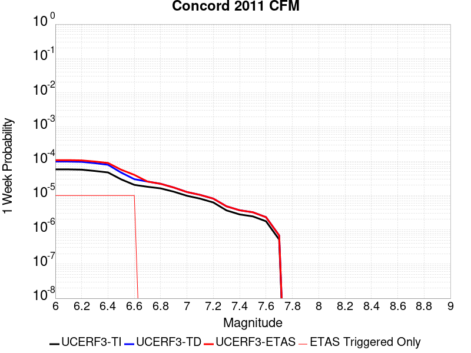 | 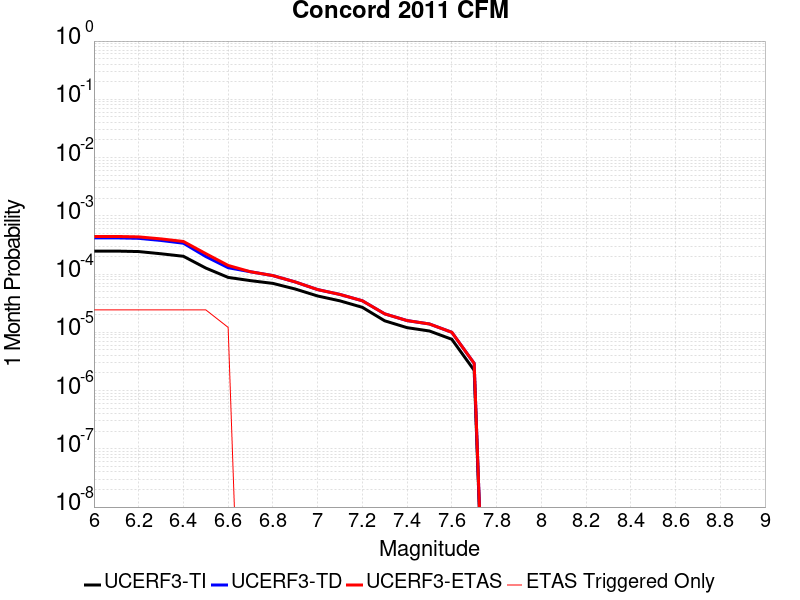 | 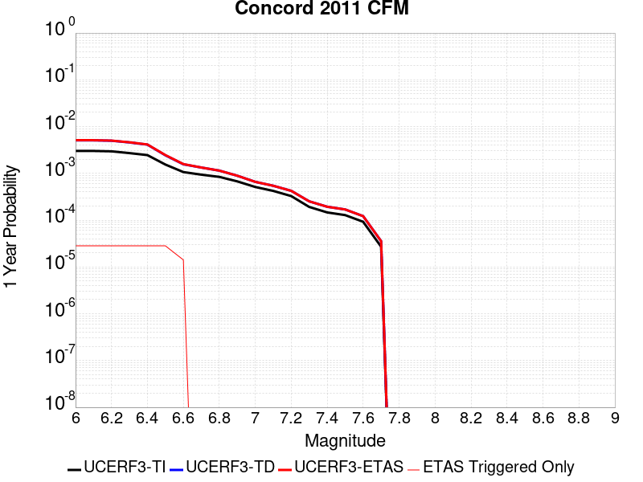 | 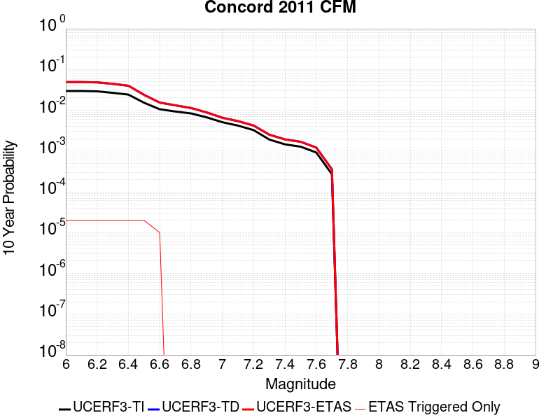 |

| Magnitude | 1 wk TI Prob | 1 wk TD Prob | 1 wk ETAS Prob | 1 wk ETAS/TD Gain | 1 wk ETAS Triggered Only | 1 mo TI Prob | 1 mo TD Prob | 1 mo ETAS Prob | 1 mo ETAS/TD Gain | 1 mo ETAS Triggered Only | 1 yr TI Prob | 1 yr TD Prob | 1 yr ETAS Prob | 1 yr ETAS/TD Gain | 1 yr ETAS Triggered Only | 10 yr TI Prob | 10 yr TD Prob | 10 yr ETAS Prob | 10 yr ETAS/TD Gain | 10 yr ETAS Triggered Only |
|-----|-----|-----|-----|-----|-----|-----|-----|-----|-----|-----|-----|-----|-----|-----|-----|-----|-----|-----|-----|-----|
| 6.0 | 5.7865112E-5 | 9.759152E-5 | 1.0853173E-4 | 1.112102 | 1.0941279E-5 | 2.4796976E-4 | 4.1818706E-4 | 4.4006048E-4 | 1.0523053 | 2.1882557E-5 | 0.0030148525 | 0.005079467 | 0.0051012384 | 1.0042862 | 2.1882557E-5 | 0.029742775 | 0.049248982 | 0.049269784 | 1.0004225 | 2.1882557E-5 |
| 6.1 | 5.7865112E-5 | 9.759152E-5 | 1.0853173E-4 | 1.112102 | 1.0941279E-5 | 2.4796976E-4 | 4.1818706E-4 | 4.4006048E-4 | 1.0523053 | 2.1882557E-5 | 0.0030148525 | 0.005079467 | 0.0051012384 | 1.0042862 | 2.1882557E-5 | 0.029742775 | 0.049248982 | 0.049269784 | 1.0004225 | 2.1882557E-5 |
| 6.2 | 5.6789337E-5 | 9.5795076E-5 | 1.0673531E-4 | 1.1142045 | 1.0941279E-5 | 2.4336016E-4 | 4.104905E-4 | 4.3236406E-4 | 1.0532864 | 2.1882557E-5 | 0.0029588845 | 0.0049861916 | 0.005007965 | 1.0043668 | 2.1882557E-5 | 0.029197963 | 0.04836556 | 0.048386384 | 1.0004306 | 2.1882557E-5 |
| 6.3 | 5.203322E-5 | 8.803056E-5 | 9.897087E-5 | 1.1242787 | 1.0941279E-5 | 2.2298045E-4 | 3.7722368E-4 | 3.9909797E-4 | 1.0579876 | 2.1882557E-5 | 0.0027114071 | 0.0045838105 | 0.0046055927 | 1.004752 | 2.1882557E-5 | 0.026785625 | 0.04453672 | 0.044557627 | 1.0004694 | 2.1882557E-5 |
| 6.4 | 4.7120942E-5 | 7.897404E-5 | 8.991445E-5 | 1.1385318 | 1.0941279E-5 | 2.0193127E-4 | 3.3842045E-4 | 3.6029558E-4 | 1.064639 | 2.1882557E-5 | 0.0024557412 | 0.00411323 | 0.0041350224 | 1.0052981 | 2.1882557E-5 | 0.024287801 | 0.040065527 | 0.040086534 | 1.0005243 | 2.1882557E-5 |
| 6.5 | 2.9598437E-5 | 4.667486E-5 | 5.7615627E-5 | 1.2344038 | 1.0941279E-5 | 1.2684427E-4 | 2.0002096E-4 | 2.2189914E-4 | 1.1093794 | 2.1882557E-5 | 0.001543235 | 0.0024327459 | 0.0024545752 | 1.0089731 | 2.1882557E-5 | 0.015325619 | 0.023909973 | 0.023931332 | 1.0008934 | 2.1882557E-5 |
| 6.6 | 2.0443718E-5 | 2.998433E-5 | 4.0925283E-5 | 1.3648889 | 1.0941279E-5 | 8.7613E-5 | 1.2849816E-4 | 1.3943802E-4 | 1.0851364 | 1.0941279E-5 | 0.0010661662 | 0.0015633785 | 0.0015743027 | 1.0069876 | 1.0941279E-5 | 0.010610655 | 0.015466996 | 0.015477768 | 1.0006964 | 1.0941279E-5 |
| 6.7 | 1.798539E-5 | 2.5557381E-5 | 2.5557381E-5 | 1.0 | 0.0 | 7.7077966E-5 | 1.0952716E-4 | 1.0952716E-4 | 1.0 | 0.0 | 9.380202E-4 | 0.001332699 | 0.001332699 | 1.0 | 0.0 | 0.009340706 | 0.013217433 | 0.013217433 | 1.0 | 0.0 |
| 6.8 | 1.613555E-5 | 2.1959211E-5 | 2.1959211E-5 | 1.0 | 0.0 | 6.915052E-5 | 9.4107585E-5 | 9.4107585E-5 | 1.0 | 0.0 | 8.4158237E-4 | 0.0011451716 | 0.0011451716 | 1.0 | 0.0 | 0.008384023 | 0.0113782035 | 0.0113782035 | 1.0 | 0.0 |
| 6.9 | 1.2916435E-5 | 1.7081054E-5 | 1.7081054E-5 | 1.0 | 0.0 | 5.5354973E-5 | 7.32025E-5 | 7.32025E-5 | 1.0 | 0.0 | 6.7373837E-4 | 8.908818E-4 | 8.908818E-4 | 1.0 | 0.0 | 0.006716994 | 0.008867139 | 0.008867139 | 1.0 | 0.0 |
| 7.0 | 9.81129E-6 | 1.2630829E-5 | 1.2630829E-5 | 1.0 | 0.0 | 4.2047708E-5 | 5.413101E-5 | 5.413101E-5 | 1.0 | 0.0 | 5.118106E-4 | 6.588474E-4 | 6.588474E-4 | 1.0 | 0.0 | 0.005106334 | 0.006569153 | 0.006569153 | 1.0 | 0.0 |
| 7.1 | 8.0889195E-6 | 1.0418261E-5 | 1.0418261E-5 | 1.0 | 0.0 | 3.4666336E-5 | 4.4648932E-5 | 4.4648932E-5 | 1.0 | 0.0 | 4.219809E-4 | 5.434662E-4 | 5.434662E-4 | 1.0 | 0.0 | 0.004211805 | 0.0054215975 | 0.0054215975 | 1.0 | 0.0 |
| 7.2 | 6.267438E-6 | 8.115699E-6 | 8.115699E-6 | 1.0 | 0.0 | 2.6860173E-5 | 3.4781104E-5 | 3.4781104E-5 | 1.0 | 0.0 | 3.2697353E-4 | 4.233784E-4 | 4.233784E-4 | 1.0 | 0.0 | 0.0032649285 | 0.004225969 | 0.004225969 | 1.0 | 0.0 |
| 7.3 | 3.6761196E-6 | 4.8401653E-6 | 4.8401653E-6 | 1.0 | 0.0 | 1.5754704E-5 | 2.0743402E-5 | 2.0743402E-5 | 1.0 | 0.0 | 1.9179663E-4 | 2.5252186E-4 | 2.5252186E-4 | 1.0 | 0.0 | 0.0019163118 | 0.002522487 | 0.002522487 | 1.0 | 0.0 |
| 7.4 | 2.8044356E-6 | 3.7096036E-6 | 3.7096036E-6 | 1.0 | 0.0 | 1.2018954E-5 | 1.5898204E-5 | 1.5898204E-5 | 1.0 | 0.0 | 1.4632095E-4 | 1.9354356E-4 | 1.9354356E-4 | 1.0 | 0.0 | 0.0014622464 | 0.0019338481 | 0.0019338481 | 1.0 | 0.0 |
| 7.5 | 2.4578699E-6 | 3.2447442E-6 | 3.2447442E-6 | 1.0 | 0.0 | 1.0533685E-5 | 1.3905973E-5 | 1.3905973E-5 | 1.0 | 0.0 | 1.2824008E-4 | 1.6929218E-4 | 1.6929218E-4 | 1.0 | 0.0 | 0.0012816609 | 0.001691713 | 0.001691713 | 1.0 | 0.0 |
| 7.6 | 1.7713267E-6 | 2.3351192E-6 | 2.3351192E-6 | 1.0 | 0.0 | 7.591378E-6 | 1.0007616E-5 | 1.0007616E-5 | 1.0 | 0.0 | 9.2421105E-5 | 1.21836E-4 | 1.21836E-4 | 1.0 | 0.0 | 9.2382677E-4 | 0.0012177454 | 0.0012177454 | 1.0 | 0.0 |
| 7.7 | 5.1912366E-7 | 6.8290143E-7 | 6.8290143E-7 | 1.0 | 0.0 | 2.2248137E-6 | 2.9267171E-6 | 2.9267171E-6 | 1.0 | 0.0 | 2.708677E-5 | 3.5632213E-5 | 3.5632213E-5 | 1.0 | 0.0 | 2.708347E-4 | 3.5627294E-4 | 3.5627294E-4 | 1.0 | 0.0 |

## Channel Islands Thrust
*[(top)](#table-of-contents)*

| 1 Week | 1 Month | 1 Year | 10 Year |
|-----|-----|-----|-----|
| 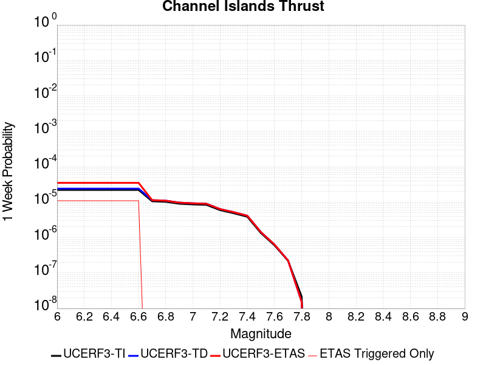 | 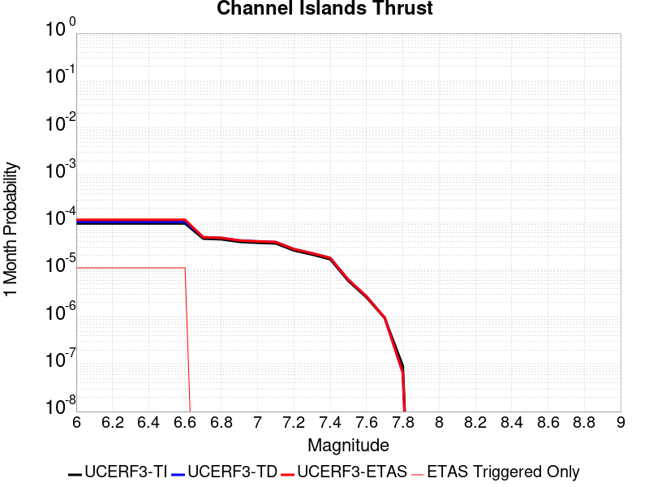 | 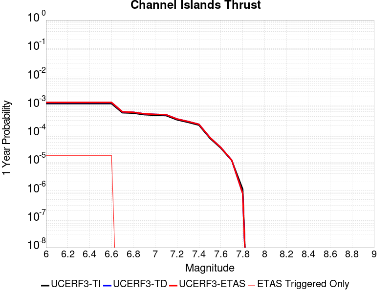 | 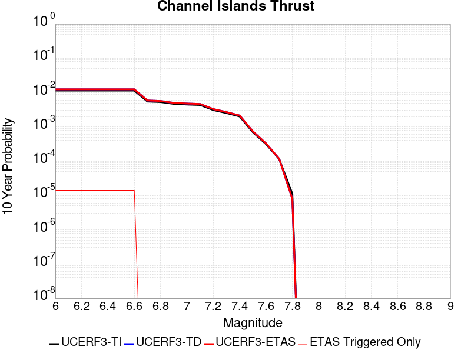 |

| Magnitude | 1 wk TI Prob | 1 wk TD Prob | 1 wk ETAS Prob | 1 wk ETAS/TD Gain | 1 wk ETAS Triggered Only | 1 mo TI Prob | 1 mo TD Prob | 1 mo ETAS Prob | 1 mo ETAS/TD Gain | 1 mo ETAS Triggered Only | 1 yr TI Prob | 1 yr TD Prob | 1 yr ETAS Prob | 1 yr ETAS/TD Gain | 1 yr ETAS Triggered Only | 10 yr TI Prob | 10 yr TD Prob | 10 yr ETAS Prob | 10 yr ETAS/TD Gain | 10 yr ETAS Triggered Only |
|-----|-----|-----|-----|-----|-----|-----|-----|-----|-----|-----|-----|-----|-----|-----|-----|-----|-----|-----|-----|-----|
| 6.0 | 2.2156251E-5 | 2.4092022E-5 | 3.5033037E-5 | 1.4541343 | 1.0941279E-5 | 9.495191E-5 | 1.03248036E-4 | 1.1418819E-4 | 1.1059599 | 1.0941279E-5 | 0.0011554264 | 0.0012564264 | 0.0012782816 | 1.0173947 | 2.1882557E-5 | 0.011494373 | 0.0125038205 | 0.012525429 | 1.0017282 | 2.1882557E-5 |
| 6.1 | 2.2156251E-5 | 2.4092022E-5 | 3.5033037E-5 | 1.4541343 | 1.0941279E-5 | 9.495191E-5 | 1.03248036E-4 | 1.1418819E-4 | 1.1059599 | 1.0941279E-5 | 0.0011554264 | 0.0012564264 | 0.0012782816 | 1.0173947 | 2.1882557E-5 | 0.011494373 | 0.0125038205 | 0.012525429 | 1.0017282 | 2.1882557E-5 |
| 6.2 | 2.2156251E-5 | 2.4092022E-5 | 3.5033037E-5 | 1.4541343 | 1.0941279E-5 | 9.495191E-5 | 1.03248036E-4 | 1.1418819E-4 | 1.1059599 | 1.0941279E-5 | 0.0011554264 | 0.0012564264 | 0.0012782816 | 1.0173947 | 2.1882557E-5 | 0.011494373 | 0.0125038205 | 0.012525429 | 1.0017282 | 2.1882557E-5 |
| 6.3 | 2.2156251E-5 | 2.4092022E-5 | 3.5033037E-5 | 1.4541343 | 1.0941279E-5 | 9.495191E-5 | 1.03248036E-4 | 1.1418819E-4 | 1.1059599 | 1.0941279E-5 | 0.0011554264 | 0.0012564264 | 0.0012782816 | 1.0173947 | 2.1882557E-5 | 0.011494373 | 0.0125038205 | 0.012525429 | 1.0017282 | 2.1882557E-5 |
| 6.4 | 2.2156251E-5 | 2.4092022E-5 | 3.5033037E-5 | 1.4541343 | 1.0941279E-5 | 9.495191E-5 | 1.03248036E-4 | 1.1418819E-4 | 1.1059599 | 1.0941279E-5 | 0.0011554264 | 0.0012564264 | 0.0012782816 | 1.0173947 | 2.1882557E-5 | 0.011494373 | 0.0125038205 | 0.012525429 | 1.0017282 | 2.1882557E-5 |
| 6.5 | 2.2156251E-5 | 2.4092022E-5 | 3.5033037E-5 | 1.4541343 | 1.0941279E-5 | 9.495191E-5 | 1.03248036E-4 | 1.1418819E-4 | 1.1059599 | 1.0941279E-5 | 0.0011554264 | 0.0012564264 | 0.0012782816 | 1.0173947 | 2.1882557E-5 | 0.011494373 | 0.0125038205 | 0.012525429 | 1.0017282 | 2.1882557E-5 |
| 6.6 | 2.2156251E-5 | 2.4092022E-5 | 3.5033037E-5 | 1.4541343 | 1.0941279E-5 | 9.495191E-5 | 1.03248036E-4 | 1.1418819E-4 | 1.1059599 | 1.0941279E-5 | 0.0011554264 | 0.0012564264 | 0.0012782816 | 1.0173947 | 2.1882557E-5 | 0.011494373 | 0.0125038205 | 0.012525429 | 1.0017282 | 2.1882557E-5 |
| 6.7 | 1.0601296E-5 | 1.1379544E-5 | 1.1379544E-5 | 1.0 | 0.0 | 4.5433335E-5 | 4.876859E-5 | 4.876859E-5 | 1.0 | 0.0 | 5.5301044E-4 | 5.936007E-4 | 5.936007E-4 | 1.0 | 0.0 | 0.005516363 | 0.005920653 | 0.005920653 | 1.0 | 0.0 |
| 6.8 | 1.0246747E-5 | 1.0996669E-5 | 1.0996669E-5 | 1.0 | 0.0 | 4.391389E-5 | 4.7127756E-5 | 4.7127756E-5 | 1.0 | 0.0 | 5.345204E-4 | 5.7363417E-4 | 5.7363417E-4 | 1.0 | 0.0 | 0.0053323656 | 0.005722025 | 0.005722025 | 1.0 | 0.0 |
| 6.9 | 9.049551E-6 | 9.699645E-6 | 9.699645E-6 | 1.0 | 0.0 | 3.878322E-5 | 4.1569267E-5 | 4.1569267E-5 | 1.0 | 0.0 | 4.7208337E-4 | 5.059924E-4 | 5.059924E-4 | 1.0 | 0.0 | 0.0047108172 | 0.0050488203 | 0.0050488203 | 1.0 | 0.0 |
| 7.0 | 8.6542195E-6 | 9.274603E-6 | 9.274603E-6 | 1.0 | 0.0 | 3.7088983E-5 | 3.9747716E-5 | 3.9747716E-5 | 1.0 | 0.0 | 4.5146482E-4 | 4.8382508E-4 | 4.8382508E-4 | 1.0 | 0.0 | 0.004505487 | 0.004828129 | 0.004828129 | 1.0 | 0.0 |
| 7.1 | 8.391028E-6 | 8.992924E-6 | 8.992924E-6 | 1.0 | 0.0 | 3.5961057E-5 | 3.854056E-5 | 3.854056E-5 | 1.0 | 0.0 | 4.3773788E-4 | 4.6913436E-4 | 4.6913436E-4 | 1.0 | 0.0 | 0.004368766 | 0.0046818503 | 0.0046818503 | 1.0 | 0.0 |
| 7.2 | 5.965188E-6 | 6.3716952E-6 | 6.3716952E-6 | 1.0 | 0.0 | 2.556484E-5 | 2.7306982E-5 | 2.7306982E-5 | 1.0 | 0.0 | 3.1120746E-4 | 3.3241234E-4 | 3.3241234E-4 | 1.0 | 0.0 | 0.00310772 | 0.0033192092 | 0.0033192092 | 1.0 | 0.0 |
| 7.3 | 4.877518E-6 | 5.2060063E-6 | 5.2060063E-6 | 1.0 | 0.0 | 2.0903482E-5 | 2.2311267E-5 | 2.2311267E-5 | 1.0 | 0.0 | 2.5447016E-4 | 2.716063E-4 | 2.716063E-4 | 1.0 | 0.0 | 0.0025417898 | 0.0027127895 | 0.0027127895 | 1.0 | 0.0 |
| 7.4 | 3.8829853E-6 | 4.141863E-6 | 4.141863E-6 | 1.0 | 0.0 | 1.664126E-5 | 1.7750723E-5 | 1.7750723E-5 | 1.0 | 0.0 | 2.0258849E-4 | 2.1609402E-4 | 2.1609402E-4 | 1.0 | 0.0 | 0.002024039 | 0.0021588807 | 0.0021588807 | 1.0 | 0.0 |
| 7.5 | 1.3489616E-6 | 1.4277903E-6 | 1.4277903E-6 | 1.0 | 0.0 | 5.7812517E-6 | 6.119087E-6 | 6.119087E-6 | 1.0 | 0.0 | 7.038446E-5 | 7.449738E-5 | 7.449738E-5 | 1.0 | 0.0 | 7.036218E-4 | 7.44728E-4 | 7.44728E-4 | 1.0 | 0.0 |
| 7.6 | 6.058192E-7 | 6.353778E-7 | 6.353778E-7 | 1.0 | 0.0 | 2.5963652E-6 | 2.7230449E-6 | 2.7230449E-6 | 1.0 | 0.0 | 3.161029E-5 | 3.3152584E-5 | 3.3152584E-5 | 1.0 | 0.0 | 3.1605794E-4 | 3.31478E-4 | 3.31478E-4 | 1.0 | 0.0 |
| 7.7 | 2.2170494E-7 | 2.2607902E-7 | 2.2607902E-7 | 1.0 | 0.0 | 9.5016367E-7 | 9.689098E-7 | 9.689098E-7 | 1.0 | 0.0 | 1.1568181E-5 | 1.1796425E-5 | 1.1796425E-5 | 1.0 | 0.0 | 1.1567579E-4 | 1.1795909E-4 | 1.1795909E-4 | 1.0 | 0.0 |
| 7.8 | 2.1613102E-8 | 1.5466682E-8 | 1.5466682E-8 | 1.0 | 0.0 | 9.262757E-8 | 6.628578E-8 | 6.628578E-8 | 1.0 | 0.0 | 1.1277401E-6 | 8.070291E-7 | 8.070291E-7 | 1.0 | 0.0 | 1.1277344E-5 | 8.070269E-6 | 8.070269E-6 | 1.0 | 0.0 |

## Clamshell-Sawpit
*[(top)](#table-of-contents)*

| 1 Week | 1 Month | 1 Year | 10 Year |
|-----|-----|-----|-----|
|  |  |  |  |

| Magnitude | 1 wk TI Prob | 1 wk TD Prob | 1 wk ETAS Prob | 1 wk ETAS/TD Gain | 1 wk ETAS Triggered Only | 1 mo TI Prob | 1 mo TD Prob | 1 mo ETAS Prob | 1 mo ETAS/TD Gain | 1 mo ETAS Triggered Only | 1 yr TI Prob | 1 yr TD Prob | 1 yr ETAS Prob | 1 yr ETAS/TD Gain | 1 yr ETAS Triggered Only | 10 yr TI Prob | 10 yr TD Prob | 10 yr ETAS Prob | 10 yr ETAS/TD Gain | 10 yr ETAS Triggered Only |
|-----|-----|-----|-----|-----|-----|-----|-----|-----|-----|-----|-----|-----|-----|-----|-----|-----|-----|-----|-----|-----|
| 6.0 | 3.202998E-6 | 3.0127644E-6 | 1.395401E-5 | 4.63163 | 1.0941279E-5 | 1.3727062E-5 | 1.2911788E-5 | 2.3852925E-5 | 1.8473759 | 1.0941279E-5 | 1.6711417E-4 | 1.5719049E-4 | 1.6813003E-4 | 1.0695943 | 1.0941279E-5 | 0.0016698855 | 0.0015708724 | 0.0015927205 | 1.0139083 | 2.1882557E-5 |
| 6.1 | 3.202998E-6 | 3.0127644E-6 | 1.395401E-5 | 4.63163 | 1.0941279E-5 | 1.3727062E-5 | 1.2911788E-5 | 2.3852925E-5 | 1.8473759 | 1.0941279E-5 | 1.6711417E-4 | 1.5719049E-4 | 1.6813003E-4 | 1.0695943 | 1.0941279E-5 | 0.0016698855 | 0.0015708724 | 0.0015927205 | 1.0139083 | 2.1882557E-5 |
| 6.2 | 3.202998E-6 | 3.0127644E-6 | 1.395401E-5 | 4.63163 | 1.0941279E-5 | 1.3727062E-5 | 1.2911788E-5 | 2.3852925E-5 | 1.8473759 | 1.0941279E-5 | 1.6711417E-4 | 1.5719049E-4 | 1.6813003E-4 | 1.0695943 | 1.0941279E-5 | 0.0016698855 | 0.0015708724 | 0.0015927205 | 1.0139083 | 2.1882557E-5 |
| 6.3 | 3.202998E-6 | 3.0127644E-6 | 1.395401E-5 | 4.63163 | 1.0941279E-5 | 1.3727062E-5 | 1.2911788E-5 | 2.3852925E-5 | 1.8473759 | 1.0941279E-5 | 1.6711417E-4 | 1.5719049E-4 | 1.6813003E-4 | 1.0695943 | 1.0941279E-5 | 0.0016698855 | 0.0015708724 | 0.0015927205 | 1.0139083 | 2.1882557E-5 |
| 6.4 | 3.202998E-6 | 3.0127644E-6 | 1.395401E-5 | 4.63163 | 1.0941279E-5 | 1.3727062E-5 | 1.2911788E-5 | 2.3852925E-5 | 1.8473759 | 1.0941279E-5 | 1.6711417E-4 | 1.5719049E-4 | 1.6813003E-4 | 1.0695943 | 1.0941279E-5 | 0.0016698855 | 0.0015708724 | 0.0015927205 | 1.0139083 | 2.1882557E-5 |
| 6.5 | 2.5862723E-6 | 2.380775E-6 | 2.380775E-6 | 1.0 | 0.0 | 1.1083977E-5 | 1.0203283E-5 | 1.0203283E-5 | 1.0 | 0.0 | 1.3493907E-4 | 1.2421819E-4 | 1.2421819E-4 | 1.0 | 0.0 | 0.0013485716 | 0.0012415178 | 0.0012524456 | 1.0088019 | 1.0941279E-5 |
| 6.6 | 2.5862723E-6 | 2.380775E-6 | 2.380775E-6 | 1.0 | 0.0 | 1.1083977E-5 | 1.0203283E-5 | 1.0203283E-5 | 1.0 | 0.0 | 1.3493907E-4 | 1.2421819E-4 | 1.2421819E-4 | 1.0 | 0.0 | 0.0013485716 | 0.0012415178 | 0.0012524456 | 1.0088019 | 1.0941279E-5 |
| 6.7 | 2.5862723E-6 | 2.380775E-6 | 2.380775E-6 | 1.0 | 0.0 | 1.1083977E-5 | 1.0203283E-5 | 1.0203283E-5 | 1.0 | 0.0 | 1.3493907E-4 | 1.2421819E-4 | 1.2421819E-4 | 1.0 | 0.0 | 0.0013485716 | 0.0012415178 | 0.0012524456 | 1.0088019 | 1.0941279E-5 |
| 6.8 | 2.4098806E-6 | 2.1977307E-6 | 2.1977307E-6 | 1.0 | 0.0 | 1.0328019E-5 | 9.4188135E-6 | 9.4188135E-6 | 1.0 | 0.0 | 1.2573638E-4 | 1.1466829E-4 | 1.1466829E-4 | 1.0 | 0.0 | 0.0012566525 | 0.0011461178 | 0.0011570465 | 1.0095354 | 1.0941279E-5 |
| 6.9 | 2.0073985E-6 | 1.7784248E-6 | 1.7784248E-6 | 1.0 | 0.0 | 8.603109E-6 | 7.621799E-6 | 7.621799E-6 | 1.0 | 0.0 | 1.0473781E-4 | 9.279157E-5 | 9.279157E-5 | 1.0 | 0.0 | 0.0010468846 | 9.275401E-4 | 9.275401E-4 | 1.0 | 0.0 |
| 7.0 | 1.8166766E-6 | 1.5807095E-6 | 1.5807095E-6 | 1.0 | 0.0 | 7.785734E-6 | 6.7744522E-6 | 6.7744522E-6 | 1.0 | 0.0 | 9.478718E-5 | 8.247593E-5 | 8.247593E-5 | 1.0 | 0.0 | 9.4746763E-4 | 8.244633E-4 | 8.244633E-4 | 1.0 | 0.0 |
| 7.1 | 1.5471421E-6 | 1.3052961E-6 | 1.3052961E-6 | 1.0 | 0.0 | 6.6305925E-6 | 5.5941146E-6 | 5.5941146E-6 | 1.0 | 0.0 | 8.072447E-5 | 6.8106274E-5 | 6.8106274E-5 | 1.0 | 0.0 | 8.0695155E-4 | 6.808595E-4 | 6.808595E-4 | 1.0 | 0.0 |
| 7.2 | 1.3608037E-6 | 1.1153443E-6 | 1.1153443E-6 | 1.0 | 0.0 | 5.8320024E-6 | 4.7800386E-6 | 4.7800386E-6 | 1.0 | 0.0 | 7.1002316E-5 | 5.8195463E-5 | 5.8195463E-5 | 1.0 | 0.0 | 7.097964E-4 | 5.818069E-4 | 5.818069E-4 | 1.0 | 0.0 |
| 7.3 | 1.0749634E-6 | 8.384254E-7 | 8.384254E-7 | 1.0 | 0.0 | 4.6069777E-6 | 3.593247E-6 | 3.593247E-6 | 1.0 | 0.0 | 5.608851E-5 | 4.374693E-5 | 4.374693E-5 | 1.0 | 0.0 | 5.6074356E-4 | 4.37386E-4 | 4.37386E-4 | 1.0 | 0.0 |
| 7.4 | 8.416856E-7 | 6.200048E-7 | 6.200048E-7 | 1.0 | 0.0 | 3.607219E-6 | 2.6571608E-6 | 2.6571608E-6 | 1.0 | 0.0 | 4.3917007E-5 | 3.2350472E-5 | 3.2350472E-5 | 1.0 | 0.0 | 4.390833E-4 | 3.2345962E-4 | 3.2345962E-4 | 1.0 | 0.0 |
| 7.5 | 6.2779594E-7 | 4.496886E-7 | 4.496886E-7 | 1.0 | 0.0 | 2.6905511E-6 | 1.9272356E-6 | 1.9272356E-6 | 1.0 | 0.0 | 3.275697E-5 | 2.346386E-5 | 2.346386E-5 | 1.0 | 0.0 | 3.275214E-4 | 2.346157E-4 | 2.346157E-4 | 1.0 | 0.0 |
| 7.6 | 4.3822078E-7 | 3.0595405E-7 | 3.0595405E-7 | 1.0 | 0.0 | 1.8780877E-6 | 1.311231E-6 | 1.311231E-6 | 1.0 | 0.0 | 2.2865479E-5 | 1.5964137E-5 | 1.5964137E-5 | 1.0 | 0.0 | 2.2863125E-4 | 1.5963144E-4 | 1.5963144E-4 | 1.0 | 0.0 |
| 7.7 | 1.8704569E-7 | 1.12379205E-7 | 1.12379205E-7 | 1.0 | 0.0 | 8.0162414E-7 | 4.816251E-7 | 4.816251E-7 | 1.0 | 0.0 | 9.75973E-6 | 5.86377E-6 | 5.86377E-6 | 1.0 | 0.0 | 9.7593016E-5 | 5.863622E-5 | 5.863622E-5 | 1.0 | 0.0 |
| 7.8 | 3.5378733E-8 | 2.1838144E-8 | 2.1838144E-8 | 1.0 | 0.0 | 1.5162313E-7 | 9.359204E-8 | 9.359204E-8 | 1.0 | 0.0 | 1.84601E-6 | 1.1394826E-6 | 1.1394826E-6 | 1.0 | 0.0 | 1.8459947E-5 | 1.139477E-5 | 1.139477E-5 | 1.0 | 0.0 |
| 7.9 | 7.504945E-9 | 5.1920326E-9 | 5.1920326E-9 | 1.0 | 0.0 | 3.2164053E-8 | 2.225157E-8 | 2.225157E-8 | 1.0 | 0.0 | 3.9159727E-7 | 2.7091284E-7 | 2.7091284E-7 | 1.0 | 0.0 | 3.915966E-6 | 2.7091257E-6 | 2.7091257E-6 | 1.0 | 0.0 |
| 8.0 | 1.6554036E-10 | 1.4180768E-10 | 1.4180768E-10 | 1.0 | 0.0 | 7.0945894E-10 | 6.077475E-10 | 6.077475E-10 | 1.0 | 0.0 | 8.637662E-9 | 7.3993256E-9 | 7.3993256E-9 | 1.0 | 0.0 | 8.6376616E-8 | 7.3993256E-8 | 7.3993256E-8 | 1.0 | 0.0 |

## Monterey Bay-Tularcitos
*[(top)](#table-of-contents)*

| 1 Week | 1 Month | 1 Year | 10 Year |
|-----|-----|-----|-----|
|  |  |  |  |

| Magnitude | 1 wk TI Prob | 1 wk TD Prob | 1 wk ETAS Prob | 1 wk ETAS/TD Gain | 1 wk ETAS Triggered Only | 1 mo TI Prob | 1 mo TD Prob | 1 mo ETAS Prob | 1 mo ETAS/TD Gain | 1 mo ETAS Triggered Only | 1 yr TI Prob | 1 yr TD Prob | 1 yr ETAS Prob | 1 yr ETAS/TD Gain | 1 yr ETAS Triggered Only | 10 yr TI Prob | 10 yr TD Prob | 10 yr ETAS Prob | 10 yr ETAS/TD Gain | 10 yr ETAS Triggered Only |
|-----|-----|-----|-----|-----|-----|-----|-----|-----|-----|-----|-----|-----|-----|-----|-----|-----|-----|-----|-----|-----|
| 6.0 | 3.0131365E-5 | 3.279877E-5 | 4.373969E-5 | 1.3335772 | 1.0941279E-5 | 1.2912804E-4 | 1.4055918E-4 | 1.5149893E-4 | 1.0778302 | 1.0941279E-5 | 0.001571 | 0.0017100703 | 0.0017319154 | 1.0127745 | 2.1882557E-5 | 0.015599402 | 0.016979916 | 0.017001428 | 1.0012668 | 2.1882557E-5 |
| 6.1 | 3.0131365E-5 | 3.279877E-5 | 4.373969E-5 | 1.3335772 | 1.0941279E-5 | 1.2912804E-4 | 1.4055918E-4 | 1.5149893E-4 | 1.0778302 | 1.0941279E-5 | 0.001571 | 0.0017100703 | 0.0017319154 | 1.0127745 | 2.1882557E-5 | 0.015599402 | 0.016979916 | 0.017001428 | 1.0012668 | 2.1882557E-5 |
| 6.2 | 3.0131365E-5 | 3.279877E-5 | 4.373969E-5 | 1.3335772 | 1.0941279E-5 | 1.2912804E-4 | 1.4055918E-4 | 1.5149893E-4 | 1.0778302 | 1.0941279E-5 | 0.001571 | 0.0017100703 | 0.0017319154 | 1.0127745 | 2.1882557E-5 | 0.015599402 | 0.016979916 | 0.017001428 | 1.0012668 | 2.1882557E-5 |
| 6.3 | 1.6998249E-5 | 1.8330798E-5 | 2.9271876E-5 | 1.5968686 | 1.0941279E-5 | 7.28476E-5 | 7.85583E-5 | 8.9498724E-5 | 1.139265 | 1.0941279E-5 | 8.865586E-4 | 9.5604634E-4 | 9.6697715E-4 | 1.0114334 | 1.0941279E-5 | 0.0088303005 | 0.009521258 | 0.009532095 | 1.0011382 | 1.0941279E-5 |
| 6.4 | 1.6998249E-5 | 1.8330798E-5 | 2.9271876E-5 | 1.5968686 | 1.0941279E-5 | 7.28476E-5 | 7.85583E-5 | 8.9498724E-5 | 1.139265 | 1.0941279E-5 | 8.865586E-4 | 9.5604634E-4 | 9.6697715E-4 | 1.0114334 | 1.0941279E-5 | 0.0088303005 | 0.009521258 | 0.009532095 | 1.0011382 | 1.0941279E-5 |
| 6.5 | 1.27470785E-5 | 1.3693312E-5 | 2.463444E-5 | 1.7990125 | 1.0941279E-5 | 5.4629192E-5 | 5.8684363E-5 | 6.9625E-5 | 1.1864319 | 1.0941279E-5 | 6.649074E-4 | 7.1425823E-4 | 7.251917E-4 | 1.0153074 | 1.0941279E-5 | 0.0066292146 | 0.007120678 | 0.0071315416 | 1.0015256 | 1.0941279E-5 |
| 6.6 | 1.2739422E-5 | 1.36854E-5 | 2.4626528E-5 | 1.7994745 | 1.0941279E-5 | 5.4596385E-5 | 5.8650454E-5 | 6.9591086E-5 | 1.1865396 | 1.0941279E-5 | 6.645082E-4 | 7.1384566E-4 | 7.2477915E-4 | 1.0153162 | 1.0941279E-5 | 0.0066252467 | 0.007116579 | 0.0071274424 | 1.0015265 | 1.0941279E-5 |
| 6.7 | 1.0160109E-5 | 1.0885755E-5 | 2.1826914E-5 | 2.0050895 | 1.0941279E-5 | 4.35426E-5 | 4.665244E-5 | 5.7593206E-5 | 1.2345165 | 1.0941279E-5 | 5.300022E-4 | 5.6785246E-4 | 5.787875E-4 | 1.0192568 | 1.0941279E-5 | 0.005287399 | 0.0056647263 | 0.0056756055 | 1.0019206 | 1.0941279E-5 |
| 6.8 | 8.349859E-6 | 8.932587E-6 | 1.9873767E-5 | 2.2248614 | 1.0941279E-5 | 3.578462E-5 | 3.8281985E-5 | 4.9222843E-5 | 1.2857965 | 1.0941279E-5 | 4.3559066E-4 | 4.6598914E-4 | 4.7692534E-4 | 1.0234687 | 1.0941279E-5 | 0.004347378 | 0.004650685 | 0.0046615754 | 1.0023416 | 1.0941279E-5 |
| 6.9 | 5.193639E-6 | 5.53643E-6 | 1.6477648E-5 | 2.9762225 | 1.0941279E-5 | 2.2258262E-5 | 2.372736E-5 | 3.4668377E-5 | 1.461114 | 1.0941279E-5 | 2.7096065E-4 | 2.8884556E-4 | 2.997837E-4 | 1.0378684 | 1.0941279E-5 | 0.0027063051 | 0.0028850222 | 0.002895932 | 1.0037816 | 1.0941279E-5 |
| 7.0 | 4.359381E-6 | 4.643366E-6 | 1.5584594E-5 | 3.356314 | 1.0941279E-5 | 1.8682927E-5 | 1.9900004E-5 | 3.0841064E-5 | 1.549802 | 1.0941279E-5 | 2.274409E-4 | 2.422586E-4 | 2.531972E-4 | 1.0451527 | 1.0941279E-5 | 0.0022720827 | 0.002420238 | 0.0024311529 | 1.0045098 | 1.0941279E-5 |
| 7.1 | 3.0398533E-6 | 3.2310427E-6 | 1.4172286E-5 | 4.3862886 | 1.0941279E-5 | 1.3027877E-5 | 1.3847267E-5 | 2.4788393E-5 | 1.790129 | 1.0941279E-5 | 1.5860285E-4 | 1.6858005E-4 | 1.7951948E-4 | 1.0648916 | 1.0941279E-5 | 0.001584897 | 0.0016847793 | 0.0016957022 | 1.0064832 | 1.0941279E-5 |
| 7.2 | 1.642335E-6 | 1.7333153E-6 | 1.26745745E-5 | 7.3123302 | 1.0941279E-5 | 7.0385595E-6 | 7.428485E-6 | 1.8369681E-5 | 2.4728706 | 1.0941279E-5 | 8.569109E-5 | 9.044012E-5 | 1.0138041E-4 | 1.1209673 | 1.0941279E-5 | 8.5658056E-4 | 9.042358E-4 | 9.151672E-4 | 1.0120891 | 1.0941279E-5 |
| 7.3 | 3.356842E-7 | 3.2952389E-7 | 3.2952389E-7 | 1.0 | 0.0 | 1.4386458E-6 | 1.4122444E-6 | 1.4122444E-6 | 1.0 | 0.0 | 1.7515373E-5 | 1.7193941E-5 | 1.7193941E-5 | 1.0 | 0.0 | 1.7513991E-4 | 1.719262E-4 | 1.719262E-4 | 1.0 | 0.0 |
| 7.4 | 2.1973483E-7 | 2.1006413E-7 | 2.1006413E-7 | 1.0 | 0.0 | 9.417204E-7 | 9.0027453E-7 | 9.0027453E-7 | 1.0 | 0.0 | 1.1465385E-5 | 1.0960787E-5 | 1.0960787E-5 | 1.0 | 0.0 | 1.1464794E-4 | 1.096025E-4 | 1.096025E-4 | 1.0 | 0.0 |
| 7.5 | 1.1944135E-7 | 1.0696043E-7 | 1.0696043E-7 | 1.0 | 0.0 | 5.118914E-7 | 4.5840173E-7 | 4.5840173E-7 | 1.0 | 0.0 | 6.23226E-6 | 5.581027E-6 | 5.581027E-6 | 1.0 | 0.0 | 6.2320854E-5 | 5.5808883E-5 | 5.5808883E-5 | 1.0 | 0.0 |
| 7.6 | 4.636058E-8 | 3.336489E-8 | 3.336489E-8 | 1.0 | 0.0 | 1.9868818E-7 | 1.4299238E-7 | 1.4299238E-7 | 1.0 | 0.0 | 2.419026E-6 | 1.7409308E-6 | 1.7409308E-6 | 1.0 | 0.0 | 2.4189996E-5 | 1.7409173E-5 | 1.7409173E-5 | 1.0 | 0.0 |
| 7.7 | 1.8588572E-8 | 8.003744E-9 | 8.003744E-9 | 1.0 | 0.0 | 7.9665305E-8 | 3.430176E-8 | 3.430176E-8 | 1.0 | 0.0 | 9.699246E-7 | 4.1762385E-7 | 4.1762385E-7 | 1.0 | 0.0 | 9.699204E-6 | 4.176231E-6 | 4.176231E-6 | 1.0 | 0.0 |
| 7.8 | 2.7960154E-9 | 7.6099427E-10 | 7.6099427E-10 | 1.0 | 0.0 | 1.1982923E-8 | 3.2614043E-9 | 3.2614043E-9 | 1.0 | 0.0 | 1.4589209E-7 | 3.9707597E-8 | 3.9707597E-8 | 1.0 | 0.0 | 1.4589199E-6 | 3.9707595E-7 | 3.9707595E-7 | 1.0 | 0.0 |

## Hunting Creek - Bartlett Springs connector 2011
*[(top)](#table-of-contents)*

| 1 Week | 1 Month | 1 Year | 10 Year |
|-----|-----|-----|-----|
| 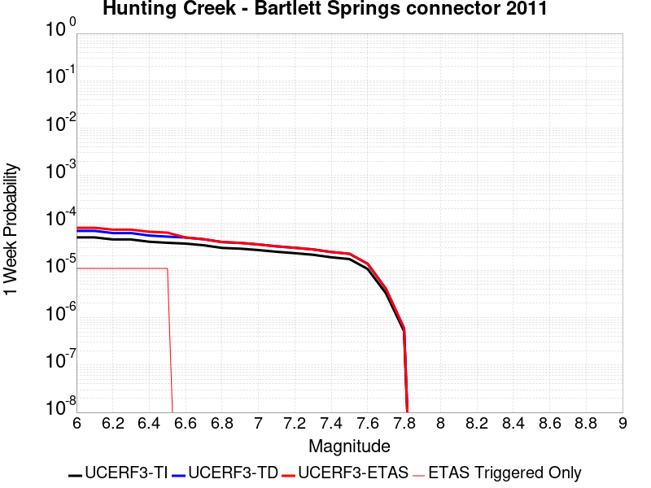 | 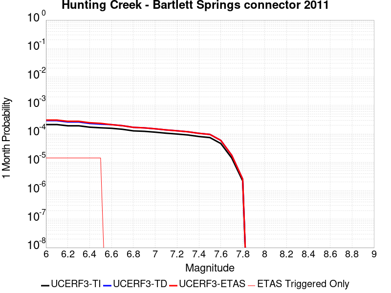 | 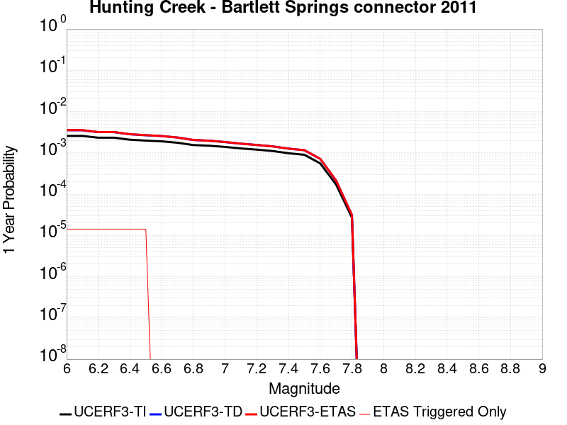 | 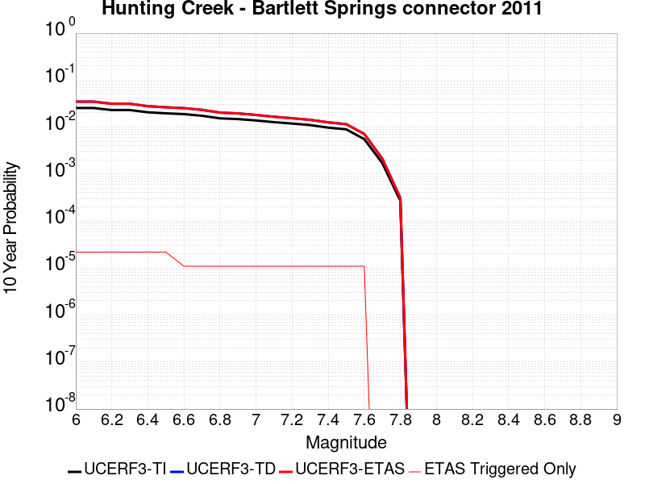 |

| Magnitude | 1 wk TI Prob | 1 wk TD Prob | 1 wk ETAS Prob | 1 wk ETAS/TD Gain | 1 wk ETAS Triggered Only | 1 mo TI Prob | 1 mo TD Prob | 1 mo ETAS Prob | 1 mo ETAS/TD Gain | 1 mo ETAS Triggered Only | 1 yr TI Prob | 1 yr TD Prob | 1 yr ETAS Prob | 1 yr ETAS/TD Gain | 1 yr ETAS Triggered Only | 10 yr TI Prob | 10 yr TD Prob | 10 yr ETAS Prob | 10 yr ETAS/TD Gain | 10 yr ETAS Triggered Only |
|-----|-----|-----|-----|-----|-----|-----|-----|-----|-----|-----|-----|-----|-----|-----|-----|-----|-----|-----|-----|-----|
| 6.0 | 4.940016E-5 | 6.786822E-5 | 7.880875E-5 | 1.1612027 | 1.0941279E-5 | 2.1169778E-4 | 2.9083234E-4 | 3.0177043E-4 | 1.0376096 | 1.0941279E-5 | 0.002574374 | 0.003535177 | 0.0035569824 | 1.006168 | 2.1882557E-5 | 0.025447546 | 0.034773834 | 0.034794956 | 1.0006074 | 2.1882557E-5 |
| 6.1 | 4.940016E-5 | 6.786822E-5 | 7.880875E-5 | 1.1612027 | 1.0941279E-5 | 2.1169778E-4 | 2.9083234E-4 | 3.0177043E-4 | 1.0376096 | 1.0941279E-5 | 0.002574374 | 0.003535177 | 0.0035569824 | 1.006168 | 2.1882557E-5 | 0.025447546 | 0.034773834 | 0.034794956 | 1.0006074 | 2.1882557E-5 |
| 6.2 | 4.472471E-5 | 6.1002804E-5 | 7.194341E-5 | 1.1793461 | 1.0941279E-5 | 1.9166325E-4 | 2.6141506E-4 | 2.723535E-4 | 1.041843 | 1.0941279E-5 | 0.0023310026 | 0.003178107 | 0.00319992 | 1.0068635 | 2.1882557E-5 | 0.02306703 | 0.031316914 | 0.03133811 | 1.0006769 | 2.1882557E-5 |
| 6.3 | 4.472471E-5 | 6.1002804E-5 | 7.194341E-5 | 1.1793461 | 1.0941279E-5 | 1.9166325E-4 | 2.6141506E-4 | 2.723535E-4 | 1.041843 | 1.0941279E-5 | 0.0023310026 | 0.003178107 | 0.00319992 | 1.0068635 | 2.1882557E-5 | 0.02306703 | 0.031316914 | 0.03133811 | 1.0006769 | 2.1882557E-5 |
| 6.4 | 4.0001003E-5 | 5.4103755E-5 | 6.504444E-5 | 1.2022167 | 1.0941279E-5 | 1.714216E-4 | 2.31853E-4 | 2.4279175E-4 | 1.0471797 | 1.0941279E-5 | 0.0020850603 | 0.0028191248 | 0.0028409457 | 1.0077403 | 2.1882557E-5 | 0.02065605 | 0.027828315 | 0.027849589 | 1.0007645 | 2.1882557E-5 |
| 6.5 | 3.8033053E-5 | 5.1266547E-5 | 6.220726E-5 | 1.2134085 | 1.0941279E-5 | 1.6298861E-4 | 2.1969559E-4 | 2.3063445E-4 | 1.0497911 | 1.0941279E-5 | 0.0019825802 | 0.0026714746 | 0.0026932987 | 1.0081693 | 2.1882557E-5 | 0.019649856 | 0.026390454 | 0.026411759 | 1.0008073 | 2.1882557E-5 |
| 6.6 | 3.653754E-5 | 4.913017E-5 | 4.913017E-5 | 1.0 | 0.0 | 1.5658008E-4 | 2.1054115E-4 | 2.1054115E-4 | 1.0 | 0.0 | 0.0019046954 | 0.0025602852 | 0.0025711986 | 1.0042626 | 1.0941279E-5 | 0.018884527 | 0.025306415 | 0.025317078 | 1.0004214 | 1.0941279E-5 |
| 6.7 | 3.372024E-5 | 4.514011E-5 | 4.514011E-5 | 1.0 | 0.0 | 1.4450731E-4 | 1.9344354E-4 | 1.9344354E-4 | 1.0 | 0.0 | 0.0017579567 | 0.002352639 | 0.0023635547 | 1.0046397 | 1.0941279E-5 | 0.017441148 | 0.023278099 | 0.023288785 | 1.0004591 | 1.0941279E-5 |
| 6.8 | 2.9650024E-5 | 3.9411374E-5 | 3.9411374E-5 | 1.0 | 0.0 | 1.2706534E-4 | 1.6889503E-4 | 1.6889503E-4 | 1.0 | 0.0 | 0.0015459227 | 0.0020543463 | 0.0020652649 | 1.005315 | 1.0941279E-5 | 0.015352124 | 0.020351216 | 0.020361934 | 1.0005267 | 1.0941279E-5 |
| 6.9 | 2.860775E-5 | 3.7812544E-5 | 3.7812544E-5 | 1.0 | 0.0 | 1.2259888E-4 | 1.6204377E-4 | 1.6204377E-4 | 1.0 | 0.0 | 0.0014916194 | 0.001971107 | 0.0019820267 | 1.0055399 | 1.0941279E-5 | 0.014816469 | 0.01953584 | 0.019546567 | 1.0005491 | 1.0941279E-5 |
| 7.0 | 2.6696067E-5 | 3.506726E-5 | 3.506726E-5 | 1.0 | 0.0 | 1.144067E-4 | 1.5027967E-4 | 1.5027967E-4 | 1.0 | 0.0 | 0.0013920115 | 0.0018281302 | 0.0018390515 | 1.005974 | 1.0941279E-5 | 0.013833242 | 0.018131364 | 0.018142108 | 1.0005925 | 1.0941279E-5 |
| 7.1 | 2.456087E-5 | 3.2013093E-5 | 3.2013093E-5 | 1.0 | 0.0 | 1.0525662E-4 | 1.371918E-4 | 1.371918E-4 | 1.0 | 0.0 | 0.001280746 | 0.0016690396 | 0.0016799626 | 1.0065445 | 1.0941279E-5 | 0.012733897 | 0.016566366 | 0.016577126 | 1.0006495 | 1.0941279E-5 |
| 7.2 | 2.295761E-5 | 2.9822932E-5 | 2.9822932E-5 | 1.0 | 0.0 | 9.8386045E-5 | 1.2780636E-4 | 1.2780636E-4 | 1.0 | 0.0 | 0.0011971919 | 0.001554941 | 0.0015658652 | 1.0070255 | 1.0941279E-5 | 0.011907627 | 0.015442089 | 0.015452862 | 1.0006976 | 1.0941279E-5 |
| 7.3 | 2.1256936E-5 | 2.7541912E-5 | 2.7541912E-5 | 1.0 | 0.0 | 9.109797E-5 | 1.1803147E-4 | 1.1803147E-4 | 1.0 | 0.0 | 0.0011085535 | 0.0014360948 | 0.0014470203 | 1.0076078 | 1.0941279E-5 | 0.011030397 | 0.014269472 | 0.014280257 | 1.0007558 | 1.0941279E-5 |
| 7.4 | 1.8784336E-5 | 2.4306766E-5 | 2.4306766E-5 | 1.0 | 0.0 | 8.050181E-5 | 1.0416774E-4 | 1.0416774E-4 | 1.0 | 0.0 | 9.796688E-4 | 0.001267512 | 0.0012784394 | 1.0086211 | 1.0941279E-5 | 0.009753612 | 0.012603902 | 0.012614706 | 1.0008571 | 1.0941279E-5 |
| 7.5 | 1.7248298E-5 | 2.2268887E-5 | 2.2268887E-5 | 1.0 | 0.0 | 7.391918E-5 | 9.543464E-5 | 9.543464E-5 | 1.0 | 0.0 | 8.9959445E-4 | 0.0011613049 | 0.0011722335 | 1.0094106 | 1.0941279E-5 | 0.008959615 | 0.01155334 | 0.011564154 | 1.000936 | 1.0941279E-5 |
| 7.6 | 1.0653709E-5 | 1.3722118E-5 | 1.3722118E-5 | 1.0 | 0.0 | 4.5657955E-5 | 5.8807767E-5 | 5.8807767E-5 | 1.0 | 0.0 | 5.557438E-4 | 7.157521E-4 | 7.266855E-4 | 1.0152755 | 1.0941279E-5 | 0.0055435603 | 0.0071348166 | 0.0071456796 | 1.0015225 | 1.0941279E-5 |
| 7.7 | 3.286316E-6 | 4.0903437E-6 | 4.0903437E-6 | 1.0 | 0.0 | 1.4084137E-5 | 1.7529928E-5 | 1.7529928E-5 | 1.0 | 0.0 | 1.7146087E-4 | 2.1340612E-4 | 2.1340612E-4 | 1.0 | 0.0 | 0.0017132863 | 0.0021320276 | 0.0021320276 | 1.0 | 0.0 |
| 7.8 | 5.1855085E-7 | 5.9720696E-7 | 5.9720696E-7 | 1.0 | 0.0 | 2.222359E-6 | 2.5594559E-6 | 2.5594559E-6 | 1.0 | 0.0 | 2.7056883E-5 | 3.116094E-5 | 3.116094E-5 | 1.0 | 0.0 | 2.705359E-4 | 3.1156495E-4 | 3.1156495E-4 | 1.0 | 0.0 |

## Pittville 2011 CFM
*[(top)](#table-of-contents)*

| 1 Week | 1 Month | 1 Year | 10 Year |
|-----|-----|-----|-----|
| 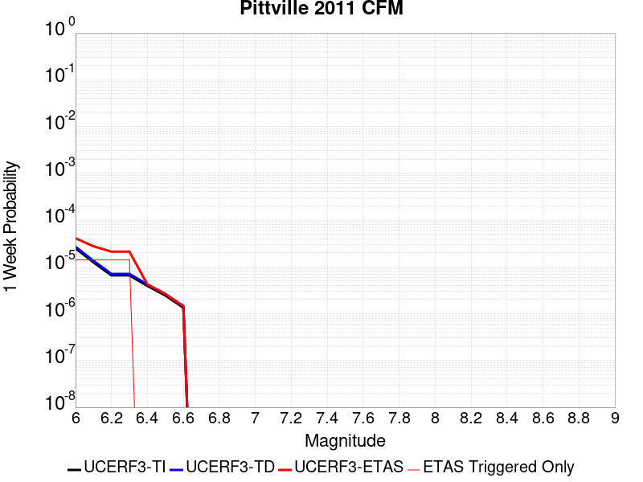 | 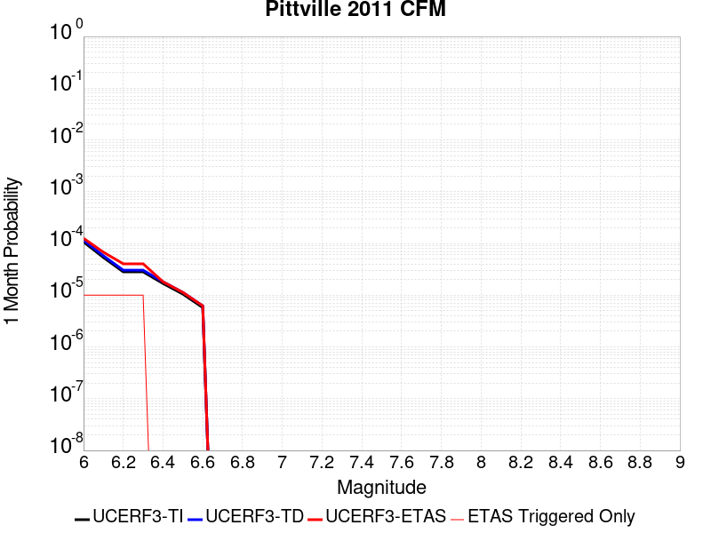 | 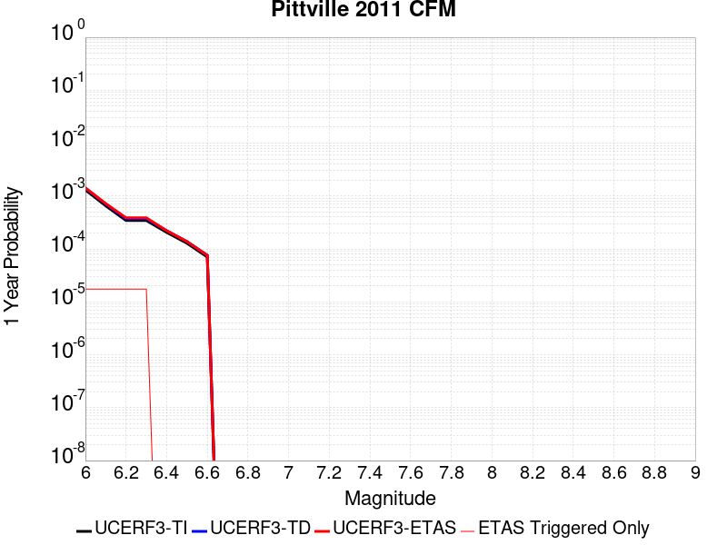 | 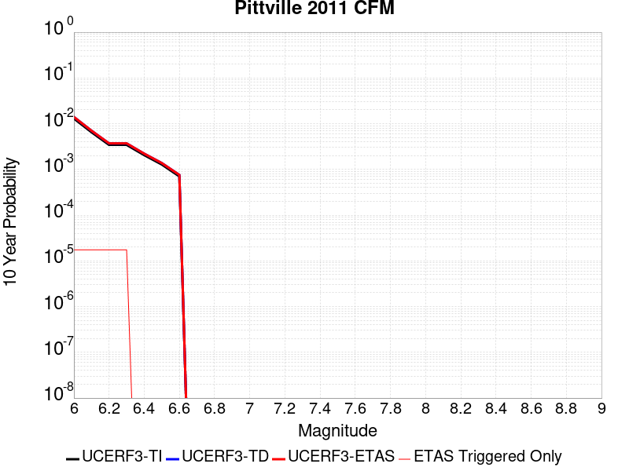 |

| Magnitude | 1 wk TI Prob | 1 wk TD Prob | 1 wk ETAS Prob | 1 wk ETAS/TD Gain | 1 wk ETAS Triggered Only | 1 mo TI Prob | 1 mo TD Prob | 1 mo ETAS Prob | 1 mo ETAS/TD Gain | 1 mo ETAS Triggered Only | 1 yr TI Prob | 1 yr TD Prob | 1 yr ETAS Prob | 1 yr ETAS/TD Gain | 1 yr ETAS Triggered Only | 10 yr TI Prob | 10 yr TD Prob | 10 yr ETAS Prob | 10 yr ETAS/TD Gain | 10 yr ETAS Triggered Only |
|-----|-----|-----|-----|-----|-----|-----|-----|-----|-----|-----|-----|-----|-----|-----|-----|-----|-----|-----|-----|-----|
| 6.0 | 2.5031832E-5 | 2.7056969E-5 | 3.799795E-5 | 1.4043684 | 1.0941279E-5 | 1.0727487E-4 | 1.1595384E-4 | 1.2689384E-4 | 1.094348 | 1.0941279E-5 | 0.001305289 | 0.0014109211 | 0.0014218469 | 1.0077437 | 1.0941279E-5 | 0.012976485 | 0.014029415 | 0.014040204 | 1.0007689 | 1.0941279E-5 |
| 6.1 | 1.2540113E-5 | 1.3513067E-5 | 2.4454197E-5 | 1.8096704 | 1.0941279E-5 | 5.3742235E-5 | 5.7911984E-5 | 6.885263E-5 | 1.1889185 | 1.0941279E-5 | 6.541153E-4 | 7.048728E-4 | 7.158063E-4 | 1.0155114 | 1.0941279E-5 | 0.0065219323 | 0.0070286044 | 0.0070394687 | 1.0015458 | 1.0941279E-5 |
| 6.2 | 6.603218E-6 | 7.107189E-6 | 1.804839E-5 | 2.5394554 | 1.0941279E-5 | 2.8299199E-5 | 3.0459063E-5 | 4.1400006E-5 | 1.3592017 | 1.0941279E-5 | 3.4448825E-4 | 3.7078248E-4 | 3.817197E-4 | 1.0294976 | 1.0941279E-5 | 0.0034395473 | 0.0037022792 | 0.0037131798 | 1.0029444 | 1.0941279E-5 |
| 6.3 | 6.603218E-6 | 7.107189E-6 | 1.804839E-5 | 2.5394554 | 1.0941279E-5 | 2.8299199E-5 | 3.0459063E-5 | 4.1400006E-5 | 1.3592017 | 1.0941279E-5 | 3.4448825E-4 | 3.7078248E-4 | 3.817197E-4 | 1.0294976 | 1.0941279E-5 | 0.0034395473 | 0.0037022792 | 0.0037131798 | 1.0029444 | 1.0941279E-5 |
| 6.4 | 3.9389015E-6 | 4.239175E-6 | 4.239175E-6 | 1.0 | 0.0 | 1.6880897E-5 | 1.8167784E-5 | 1.8167784E-5 | 1.0 | 0.0 | 2.0550552E-4 | 2.2117342E-4 | 2.2117342E-4 | 1.0 | 0.0 | 0.0020531558 | 0.002209838 | 0.002209838 | 1.0 | 0.0 |
| 6.5 | 2.4533072E-6 | 2.6412686E-6 | 2.6412686E-6 | 1.0 | 0.0 | 1.0514132E-5 | 1.1319685E-5 | 1.1319685E-5 | 1.0 | 0.0 | 1.2800204E-4 | 1.3781038E-4 | 1.3781038E-4 | 1.0 | 0.0 | 0.0012792832 | 0.0013774394 | 0.0013774394 | 1.0 | 0.0 |
| 6.6 | 1.3482367E-6 | 1.452993E-6 | 1.452993E-6 | 1.0 | 0.0 | 5.778144E-6 | 6.2271047E-6 | 6.2271047E-6 | 1.0 | 0.0 | 7.0346636E-5 | 7.58135E-5 | 7.58135E-5 | 1.0 | 0.0 | 7.032437E-4 | 7.5798744E-4 | 7.5798744E-4 | 1.0 | 0.0 |

## Santa Ynez River
*[(top)](#table-of-contents)*

| 1 Week | 1 Month | 1 Year | 10 Year |
|-----|-----|-----|-----|
| 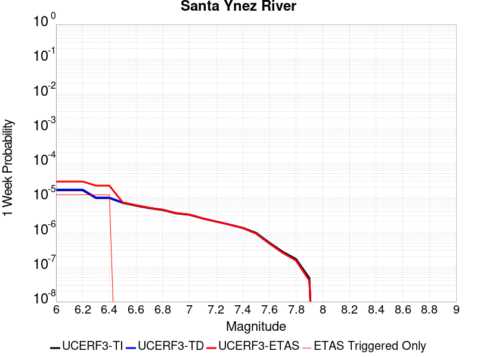 | 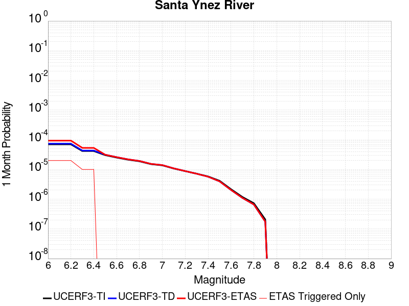 | 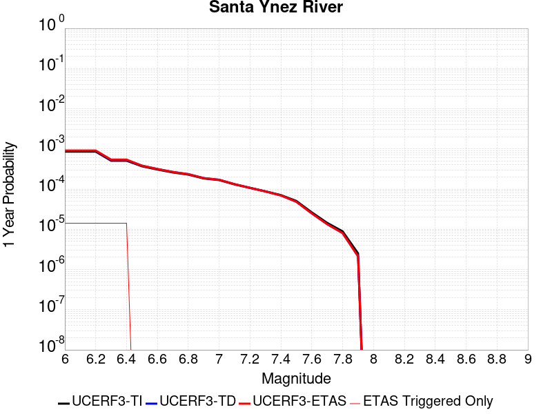 | 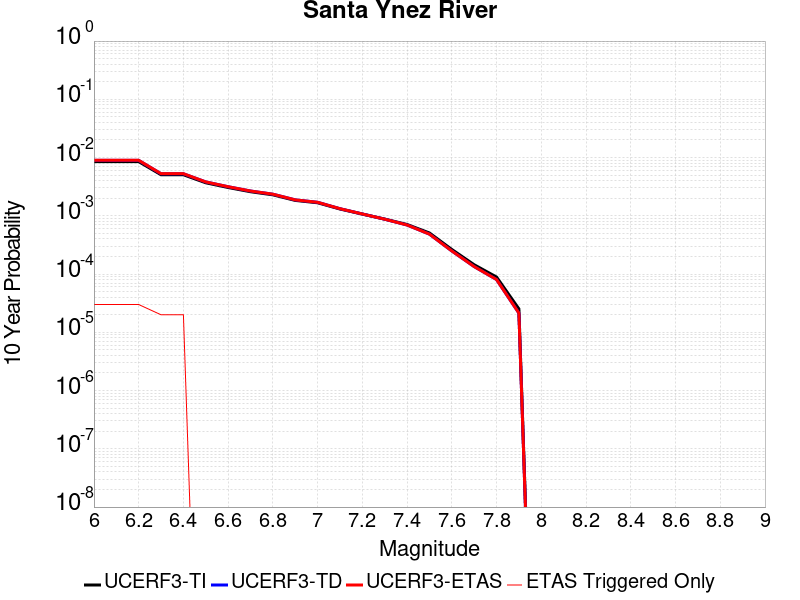 |

| Magnitude | 1 wk TI Prob | 1 wk TD Prob | 1 wk ETAS Prob | 1 wk ETAS/TD Gain | 1 wk ETAS Triggered Only | 1 mo TI Prob | 1 mo TD Prob | 1 mo ETAS Prob | 1 mo ETAS/TD Gain | 1 mo ETAS Triggered Only | 1 yr TI Prob | 1 yr TD Prob | 1 yr ETAS Prob | 1 yr ETAS/TD Gain | 1 yr ETAS Triggered Only | 10 yr TI Prob | 10 yr TD Prob | 10 yr ETAS Prob | 10 yr ETAS/TD Gain | 10 yr ETAS Triggered Only |
|-----|-----|-----|-----|-----|-----|-----|-----|-----|-----|-----|-----|-----|-----|-----|-----|-----|-----|-----|-----|-----|
| 6.0 | 1.6396456E-5 | 1.7209435E-5 | 2.8150525E-5 | 1.6357611 | 1.0941279E-5 | 7.026863E-5 | 7.375284E-5 | 8.469331E-5 | 1.1483396 | 1.0941279E-5 | 8.551848E-4 | 8.976064E-4 | 9.085379E-4 | 1.0121784 | 1.0941279E-5 | 0.0085190125 | 0.008943358 | 0.008965045 | 1.002425 | 2.1882557E-5 |
| 6.1 | 1.6396456E-5 | 1.7209435E-5 | 2.8150525E-5 | 1.6357611 | 1.0941279E-5 | 7.026863E-5 | 7.375284E-5 | 8.469331E-5 | 1.1483396 | 1.0941279E-5 | 8.551848E-4 | 8.976064E-4 | 9.085379E-4 | 1.0121784 | 1.0941279E-5 | 0.0085190125 | 0.008943358 | 0.008965045 | 1.002425 | 2.1882557E-5 |
| 6.2 | 1.6396456E-5 | 1.7209435E-5 | 2.8150525E-5 | 1.6357611 | 1.0941279E-5 | 7.026863E-5 | 7.375284E-5 | 8.469331E-5 | 1.1483396 | 1.0941279E-5 | 8.551848E-4 | 8.976064E-4 | 9.085379E-4 | 1.0121784 | 1.0941279E-5 | 0.0085190125 | 0.008943358 | 0.008965045 | 1.002425 | 2.1882557E-5 |
| 6.3 | 9.736976E-6 | 1.012233E-5 | 2.1063497E-5 | 2.0808942 | 1.0941279E-5 | 4.172923E-5 | 4.338072E-5 | 5.4321525E-5 | 1.2522043 | 1.0941279E-5 | 5.0793495E-4 | 5.280373E-4 | 5.389728E-4 | 1.0207098 | 1.0941279E-5 | 0.005067755 | 0.005268332 | 0.0052900994 | 1.0041317 | 2.1882557E-5 |
| 6.4 | 9.736976E-6 | 1.012233E-5 | 2.1063497E-5 | 2.0808942 | 1.0941279E-5 | 4.172923E-5 | 4.338072E-5 | 5.4321525E-5 | 1.2522043 | 1.0941279E-5 | 5.0793495E-4 | 5.280373E-4 | 5.389728E-4 | 1.0207098 | 1.0941279E-5 | 0.005067755 | 0.005268332 | 0.0052900994 | 1.0041317 | 2.1882557E-5 |
| 6.5 | 7.081964E-6 | 7.3298966E-6 | 7.3298966E-6 | 1.0 | 0.0 | 3.035092E-5 | 3.1413474E-5 | 3.1413474E-5 | 1.0 | 0.0 | 3.694598E-4 | 3.8239348E-4 | 3.8239348E-4 | 1.0 | 0.0 | 0.0036884616 | 0.0038175168 | 0.0038175168 | 1.0 | 0.0 |
| 6.6 | 5.873247E-6 | 6.059743E-6 | 6.059743E-6 | 1.0 | 0.0 | 2.5170815E-5 | 2.5970074E-5 | 2.5970074E-5 | 1.0 | 0.0 | 3.064116E-4 | 3.1614062E-4 | 3.1614062E-4 | 1.0 | 0.0 | 0.0030598943 | 0.0031569963 | 0.0031569963 | 1.0 | 0.0 |
| 6.7 | 4.973277E-6 | 5.115901E-6 | 5.115901E-6 | 1.0 | 0.0 | 2.1313872E-5 | 2.1925109E-5 | 2.1925109E-5 | 1.0 | 0.0 | 2.5946548E-4 | 2.66906E-4 | 2.66906E-4 | 1.0 | 0.0 | 0.0025916274 | 0.0026659032 | 0.0026659032 | 1.0 | 0.0 |
| 6.8 | 4.396492E-6 | 4.5109778E-6 | 4.5109778E-6 | 1.0 | 0.0 | 1.884197E-5 | 1.9332621E-5 | 1.9332621E-5 | 1.0 | 0.0 | 2.2937685E-4 | 2.3534958E-4 | 2.3534958E-4 | 1.0 | 0.0 | 0.0022914023 | 0.0023510386 | 0.0023510386 | 1.0 | 0.0 |
| 6.9 | 3.5255632E-6 | 3.6013332E-6 | 3.6013332E-6 | 1.0 | 0.0 | 1.5109469E-5 | 1.5434196E-5 | 1.5434196E-5 | 1.0 | 0.0 | 1.8394225E-4 | 1.8789528E-4 | 1.8789528E-4 | 1.0 | 0.0 | 0.0018379007 | 0.0018773803 | 0.0018773803 | 1.0 | 0.0 |
| 7.0 | 3.211603E-6 | 3.273654E-6 | 3.273654E-6 | 1.0 | 0.0 | 1.376394E-5 | 1.4029872E-5 | 1.4029872E-5 | 1.0 | 0.0 | 1.6756308E-4 | 1.7080043E-4 | 1.7080043E-4 | 1.0 | 0.0 | 0.0016743679 | 0.0017067058 | 0.0017067058 | 1.0 | 0.0 |
| 7.1 | 2.5094619E-6 | 2.5409204E-6 | 2.5409204E-6 | 1.0 | 0.0 | 1.0754793E-5 | 1.0889614E-5 | 1.0889614E-5 | 1.0 | 0.0 | 1.3093173E-4 | 1.3257304E-4 | 1.3257304E-4 | 1.0 | 0.0 | 0.0013085462 | 0.0013249456 | 0.0013249456 | 1.0 | 0.0 |
| 7.2 | 2.0515774E-6 | 2.0619375E-6 | 2.0619375E-6 | 1.0 | 0.0 | 8.792445E-6 | 8.836846E-6 | 8.836846E-6 | 1.0 | 0.0 | 1.0704277E-4 | 1.0758333E-4 | 1.0758333E-4 | 1.0 | 0.0 | 0.0010699122 | 0.0010753168 | 0.0010753168 | 1.0 | 0.0 |
| 7.3 | 1.6845745E-6 | 1.6773907E-6 | 1.6773907E-6 | 1.0 | 0.0 | 7.219585E-6 | 7.1887976E-6 | 7.1887976E-6 | 1.0 | 0.0 | 8.78949E-5 | 8.752012E-5 | 8.752012E-5 | 1.0 | 0.0 | 8.7860145E-4 | 8.7485946E-4 | 8.7485946E-4 | 1.0 | 0.0 |
| 7.4 | 1.3600285E-6 | 1.3333357E-6 | 1.3333357E-6 | 1.0 | 0.0 | 5.82868E-6 | 5.714284E-6 | 5.714284E-6 | 1.0 | 0.0 | 7.096187E-5 | 6.956921E-5 | 6.956921E-5 | 1.0 | 0.0 | 7.0939213E-4 | 6.954765E-4 | 6.954765E-4 | 1.0 | 0.0 |
| 7.5 | 9.735342E-7 | 9.290103E-7 | 9.290103E-7 | 1.0 | 0.0 | 4.172283E-6 | 3.9814668E-6 | 3.9814668E-6 | 1.0 | 0.0 | 5.079636E-5 | 4.8473295E-5 | 4.8473295E-5 | 1.0 | 0.0 | 5.0784746E-4 | 4.8462892E-4 | 4.8462892E-4 | 1.0 | 0.0 |
| 7.6 | 5.067187E-7 | 4.77857E-7 | 4.77857E-7 | 1.0 | 0.0 | 2.1716498E-6 | 2.047957E-6 | 2.047957E-6 | 1.0 | 0.0 | 2.6439517E-5 | 2.4933597E-5 | 2.4933597E-5 | 1.0 | 0.0 | 2.643637E-4 | 2.4930874E-4 | 2.4930874E-4 | 1.0 | 0.0 |
| 7.7 | 2.769089E-7 | 2.5759124E-7 | 2.5759124E-7 | 1.0 | 0.0 | 1.1867519E-6 | 1.1039621E-6 | 1.1039621E-6 | 1.0 | 0.0 | 1.4448608E-5 | 1.34406555E-5 | 1.34406555E-5 | 1.0 | 0.0 | 1.444767E-4 | 1.3439846E-4 | 1.3439846E-4 | 1.0 | 0.0 |
| 7.8 | 1.7044663E-7 | 1.5449015E-7 | 1.5449015E-7 | 1.0 | 0.0 | 7.3048534E-7 | 6.621005E-7 | 6.621005E-7 | 1.0 | 0.0 | 8.893623E-6 | 8.061043E-6 | 8.061043E-6 | 1.0 | 0.0 | 8.893267E-5 | 8.060753E-5 | 8.060753E-5 | 1.0 | 0.0 |
| 7.9 | 4.8344287E-8 | 4.0910923E-8 | 4.0910923E-8 | 1.0 | 0.0 | 2.0718979E-7 | 1.7533252E-7 | 1.7533252E-7 | 1.0 | 0.0 | 2.5225327E-6 | 2.1346711E-6 | 2.1346711E-6 | 1.0 | 0.0 | 2.5225041E-5 | 2.1346512E-5 | 2.1346512E-5 | 1.0 | 0.0 |

## San Juan
*[(top)](#table-of-contents)*

| 1 Week | 1 Month | 1 Year | 10 Year |
|-----|-----|-----|-----|
|  |  |  |  |

| Magnitude | 1 wk TI Prob | 1 wk TD Prob | 1 wk ETAS Prob | 1 wk ETAS/TD Gain | 1 wk ETAS Triggered Only | 1 mo TI Prob | 1 mo TD Prob | 1 mo ETAS Prob | 1 mo ETAS/TD Gain | 1 mo ETAS Triggered Only | 1 yr TI Prob | 1 yr TD Prob | 1 yr ETAS Prob | 1 yr ETAS/TD Gain | 1 yr ETAS Triggered Only | 10 yr TI Prob | 10 yr TD Prob | 10 yr ETAS Prob | 10 yr ETAS/TD Gain | 10 yr ETAS Triggered Only |
|-----|-----|-----|-----|-----|-----|-----|-----|-----|-----|-----|-----|-----|-----|-----|-----|-----|-----|-----|-----|-----|
| 6.0 | 8.682808E-6 | 8.7491635E-6 | 3.0631527E-5 | 3.5010808 | 2.1882557E-5 | 3.72115E-5 | 3.74959E-5 | 5.937764E-5 | 1.5835767 | 2.1882557E-5 | 4.5295584E-4 | 4.564218E-4 | 4.782944E-4 | 1.0479218 | 2.1882557E-5 | 0.004520337 | 0.004555385 | 0.004577168 | 1.0047818 | 2.1882557E-5 |
| 6.1 | 8.682808E-6 | 8.7491635E-6 | 3.0631527E-5 | 3.5010808 | 2.1882557E-5 | 3.72115E-5 | 3.74959E-5 | 5.937764E-5 | 1.5835767 | 2.1882557E-5 | 4.5295584E-4 | 4.564218E-4 | 4.782944E-4 | 1.0479218 | 2.1882557E-5 | 0.004520337 | 0.004555385 | 0.004577168 | 1.0047818 | 2.1882557E-5 |
| 6.2 | 8.682808E-6 | 8.7491635E-6 | 3.0631527E-5 | 3.5010808 | 2.1882557E-5 | 3.72115E-5 | 3.74959E-5 | 5.937764E-5 | 1.5835767 | 2.1882557E-5 | 4.5295584E-4 | 4.564218E-4 | 4.782944E-4 | 1.0479218 | 2.1882557E-5 | 0.004520337 | 0.004555385 | 0.004577168 | 1.0047818 | 2.1882557E-5 |
| 6.3 | 6.3054235E-6 | 6.2825848E-6 | 1.7223794E-5 | 2.741514 | 1.0941279E-5 | 2.7022963E-5 | 2.6925094E-5 | 3.7866077E-5 | 1.406349 | 1.0941279E-5 | 3.2895492E-4 | 3.2776513E-4 | 3.387028E-4 | 1.0333705 | 1.0941279E-5 | 0.003284684 | 0.003273017 | 0.0032839223 | 1.0033319 | 1.0941279E-5 |
| 6.4 | 6.1490473E-6 | 6.1144656E-6 | 1.7055678E-5 | 2.7893977 | 1.0941279E-5 | 2.6352795E-5 | 2.6204598E-5 | 3.714559E-5 | 1.4175218 | 1.0941279E-5 | 3.2079802E-4 | 3.1899565E-4 | 3.2993342E-4 | 1.0342882 | 1.0941279E-5 | 0.0032033534 | 0.0031855737 | 0.0031964802 | 1.0034237 | 1.0941279E-5 |
| 6.5 | 5.204848E-6 | 5.137233E-6 | 1.6078455E-5 | 3.1297889 | 1.0941279E-5 | 2.23063E-5 | 2.2016533E-5 | 3.295757E-5 | 1.4969465 | 1.0941279E-5 | 2.7154534E-4 | 2.6801927E-4 | 2.7895762E-4 | 1.0408118 | 1.0941279E-5 | 0.0027121378 | 0.0026771144 | 0.0026880265 | 1.004076 | 1.0941279E-5 |
| 6.6 | 4.5179986E-6 | 4.4150297E-6 | 1.535626E-5 | 3.478178 | 1.0941279E-5 | 1.9362706E-5 | 1.8921424E-5 | 2.9862495E-5 | 1.5782372 | 1.0941279E-5 | 2.3571544E-4 | 2.3034477E-4 | 2.4128353E-4 | 1.0474887 | 1.0941279E-5 | 0.0023546559 | 0.0023011973 | 0.0023121133 | 1.0047437 | 1.0941279E-5 |
| 6.7 | 3.9442616E-6 | 3.819828E-6 | 3.819828E-6 | 1.0 | 0.0 | 1.6903869E-5 | 1.6370592E-5 | 1.6370592E-5 | 1.0 | 0.0 | 2.0578515E-4 | 1.992944E-4 | 1.992944E-4 | 1.0 | 0.0 | 0.002055947 | 0.0019912818 | 0.0019912818 | 1.0 | 0.0 |
| 6.8 | 3.4536245E-6 | 3.3163353E-6 | 3.3163353E-6 | 1.0 | 0.0 | 1.4801163E-5 | 1.4212792E-5 | 1.4212792E-5 | 1.0 | 0.0 | 1.8018926E-4 | 1.7302761E-4 | 1.7302761E-4 | 1.0 | 0.0 | 0.0018004322 | 0.0017290477 | 0.0017290477 | 1.0 | 0.0 |
| 6.9 | 3.059865E-6 | 2.9120315E-6 | 2.9120315E-6 | 1.0 | 0.0 | 1.3113641E-5 | 1.2480078E-5 | 1.2480078E-5 | 1.0 | 0.0 | 1.596469E-4 | 1.5193493E-4 | 1.5193493E-4 | 1.0 | 0.0 | 0.0015953224 | 0.0015184252 | 0.0015184252 | 1.0 | 0.0 |
| 7.0 | 2.6504351E-6 | 2.4920002E-6 | 2.4920002E-6 | 1.0 | 0.0 | 1.1358958E-5 | 1.0679961E-5 | 1.0679961E-5 | 1.0 | 0.0 | 1.3828653E-4 | 1.300213E-4 | 1.300213E-4 | 1.0 | 0.0 | 0.0013820052 | 0.0012995641 | 0.0012995641 | 1.0 | 0.0 |
| 7.1 | 2.2039317E-6 | 2.0338296E-6 | 2.0338296E-6 | 1.0 | 0.0 | 9.445387E-6 | 8.716386E-6 | 8.716386E-6 | 1.0 | 0.0 | 1.1499152E-4 | 1.0611736E-4 | 1.0611736E-4 | 1.0 | 0.0 | 0.0011493203 | 0.0010607769 | 0.0010607769 | 1.0 | 0.0 |
| 7.2 | 1.0786707E-6 | 8.7701903E-7 | 8.7701903E-7 | 1.0 | 0.0 | 4.622866E-6 | 3.7586476E-6 | 3.7586476E-6 | 1.0 | 0.0 | 5.628194E-5 | 4.5760586E-5 | 4.5760586E-5 | 1.0 | 0.0 | 5.6267687E-4 | 4.5757066E-4 | 4.5757066E-4 | 1.0 | 0.0 |
| 7.3 | 6.846433E-7 | 4.868805E-7 | 4.868805E-7 | 1.0 | 0.0 | 2.9341822E-6 | 2.086629E-6 | 2.086629E-6 | 1.0 | 0.0 | 3.5723086E-5 | 2.5404412E-5 | 2.5404412E-5 | 1.0 | 0.0 | 3.571734E-4 | 2.540486E-4 | 2.540486E-4 | 1.0 | 0.0 |
| 7.4 | 5.23043E-7 | 3.2628162E-7 | 3.2628162E-7 | 1.0 | 0.0 | 2.2416111E-6 | 1.398349E-6 | 1.398349E-6 | 1.0 | 0.0 | 2.7291273E-5 | 1.7024766E-5 | 1.7024766E-5 | 1.0 | 0.0 | 2.7287923E-4 | 1.7026656E-4 | 1.7026656E-4 | 1.0 | 0.0 |
| 7.5 | 4.648444E-7 | 2.7234944E-7 | 2.7234944E-7 | 1.0 | 0.0 | 1.9921886E-6 | 1.1672114E-6 | 1.1672114E-6 | 1.0 | 0.0 | 2.4254627E-5 | 1.42107065E-5 | 1.42107065E-5 | 1.0 | 0.0 | 2.425198E-4 | 1.421276E-4 | 1.421276E-4 | 1.0 | 0.0 |
| 7.6 | 3.9906567E-7 | 2.2083314E-7 | 2.2083314E-7 | 1.0 | 0.0 | 1.7102802E-6 | 9.464274E-7 | 9.464274E-7 | 1.0 | 0.0 | 2.0822463E-5 | 1.1522693E-5 | 1.1522693E-5 | 1.0 | 0.0 | 2.0820512E-4 | 1.15245566E-4 | 1.15245566E-4 | 1.0 | 0.0 |
| 7.7 | 1.8784601E-7 | 5.3666906E-8 | 5.3666906E-8 | 1.0 | 0.0 | 8.0505407E-7 | 2.30001E-7 | 2.30001E-7 | 1.0 | 0.0 | 9.80149E-6 | 2.8002585E-6 | 2.8002585E-6 | 1.0 | 0.0 | 9.801057E-5 | 2.8011282E-5 | 2.8011282E-5 | 1.0 | 0.0 |
| 7.8 | 1.00154914E-7 | 1.2415832E-8 | 1.2415832E-8 | 1.0 | 0.0 | 4.2923529E-7 | 5.3210716E-8 | 5.3210716E-8 | 1.0 | 0.0 | 5.225927E-6 | 6.4784024E-7 | 6.4784024E-7 | 1.0 | 0.0 | 5.225804E-5 | 6.484273E-6 | 6.484273E-6 | 1.0 | 0.0 |
| 7.9 | 6.171429E-8 | 4.2966155E-9 | 4.2966155E-9 | 1.0 | 0.0 | 2.6448978E-7 | 1.8414067E-8 | 1.8414067E-8 | 1.0 | 0.0 | 3.2201583E-6 | 2.2419121E-7 | 2.2419121E-7 | 1.0 | 0.0 | 3.2201115E-5 | 2.2472002E-6 | 2.2472002E-6 | 1.0 | 0.0 |
| 8.0 | 1.3974572E-8 | 3.3788217E-10 | 3.3788217E-10 | 1.0 | 0.0 | 5.989102E-8 | 1.448067E-9 | 1.448067E-9 | 1.0 | 0.0 | 7.2917294E-7 | 1.763022E-8 | 1.763022E-8 | 1.0 | 0.0 | 7.2917055E-6 | 1.8060365E-7 | 1.8060365E-7 | 1.0 | 0.0 |
| 8.1 | 1.8403477E-9 | 1.1302803E-10 | 1.1302803E-10 | 1.0 | 0.0 | 7.887204E-9 | 4.844063E-10 | 4.844063E-10 | 1.0 | 0.0 | 9.602671E-8 | 5.8976446E-9 | 5.8976446E-9 | 1.0 | 0.0 | 9.602667E-7 | 6.021993E-8 | 6.021993E-8 | 1.0 | 0.0 |

## Red Mountain
*[(top)](#table-of-contents)*

| 1 Week | 1 Month | 1 Year | 10 Year |
|-----|-----|-----|-----|
|  | 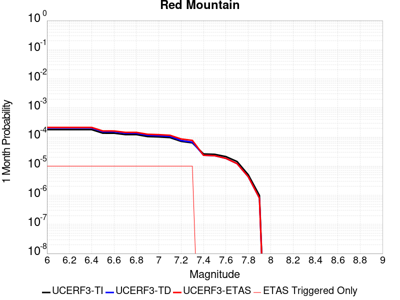 |  |  |

| Magnitude | 1 wk TI Prob | 1 wk TD Prob | 1 wk ETAS Prob | 1 wk ETAS/TD Gain | 1 wk ETAS Triggered Only | 1 mo TI Prob | 1 mo TD Prob | 1 mo ETAS Prob | 1 mo ETAS/TD Gain | 1 mo ETAS Triggered Only | 1 yr TI Prob | 1 yr TD Prob | 1 yr ETAS Prob | 1 yr ETAS/TD Gain | 1 yr ETAS Triggered Only | 10 yr TI Prob | 10 yr TD Prob | 10 yr ETAS Prob | 10 yr ETAS/TD Gain | 10 yr ETAS Triggered Only |
|-----|-----|-----|-----|-----|-----|-----|-----|-----|-----|-----|-----|-----|-----|-----|-----|-----|-----|-----|-----|-----|
| 6.0 | 4.1810763E-5 | 4.7589947E-5 | 5.8530703E-5 | 1.2298964 | 1.0941279E-5 | 1.7917668E-4 | 2.039419E-4 | 2.1488094E-4 | 1.0536381 | 1.0941279E-5 | 0.0021792934 | 0.0024803306 | 0.0024912448 | 1.0044003 | 1.0941279E-5 | 0.021580452 | 0.024544092 | 0.024565438 | 1.0008696 | 2.1882557E-5 |
| 6.1 | 4.1810763E-5 | 4.7589947E-5 | 5.8530703E-5 | 1.2298964 | 1.0941279E-5 | 1.7917668E-4 | 2.039419E-4 | 2.1488094E-4 | 1.0536381 | 1.0941279E-5 | 0.0021792934 | 0.0024803306 | 0.0024912448 | 1.0044003 | 1.0941279E-5 | 0.021580452 | 0.024544092 | 0.024565438 | 1.0008696 | 2.1882557E-5 |
| 6.2 | 4.1810763E-5 | 4.7589947E-5 | 5.8530703E-5 | 1.2298964 | 1.0941279E-5 | 1.7917668E-4 | 2.039419E-4 | 2.1488094E-4 | 1.0536381 | 1.0941279E-5 | 0.0021792934 | 0.0024803306 | 0.0024912448 | 1.0044003 | 1.0941279E-5 | 0.021580452 | 0.024544092 | 0.024565438 | 1.0008696 | 2.1882557E-5 |
| 6.3 | 4.1810763E-5 | 4.7589947E-5 | 5.8530703E-5 | 1.2298964 | 1.0941279E-5 | 1.7917668E-4 | 2.039419E-4 | 2.1488094E-4 | 1.0536381 | 1.0941279E-5 | 0.0021792934 | 0.0024803306 | 0.0024912448 | 1.0044003 | 1.0941279E-5 | 0.021580452 | 0.024544092 | 0.024565438 | 1.0008696 | 2.1882557E-5 |
| 6.4 | 4.1810763E-5 | 4.7589947E-5 | 5.8530703E-5 | 1.2298964 | 1.0941279E-5 | 1.7917668E-4 | 2.039419E-4 | 2.1488094E-4 | 1.0536381 | 1.0941279E-5 | 0.0021792934 | 0.0024803306 | 0.0024912448 | 1.0044003 | 1.0941279E-5 | 0.021580452 | 0.024544092 | 0.024565438 | 1.0008696 | 2.1882557E-5 |
| 6.5 | 3.154503E-5 | 3.5359728E-5 | 4.6300618E-5 | 1.3094168 | 1.0941279E-5 | 1.3518598E-4 | 1.5153342E-4 | 1.6247304E-4 | 1.0721928 | 1.0941279E-5 | 0.0016446467 | 0.0018434501 | 0.0018543713 | 1.0059242 | 1.0941279E-5 | 0.01632528 | 0.018291233 | 0.018312717 | 1.0011744 | 2.1882557E-5 |
| 6.6 | 3.1535834E-5 | 3.534911E-5 | 4.6290003E-5 | 1.3095096 | 1.0941279E-5 | 1.3514658E-4 | 1.5148791E-4 | 1.6242753E-4 | 1.0722145 | 1.0941279E-5 | 0.0016441676 | 0.001842897 | 0.0018538182 | 1.005926 | 1.0941279E-5 | 0.01632056 | 0.018285794 | 0.018307278 | 1.0011748 | 2.1882557E-5 |
| 6.7 | 2.8267326E-5 | 3.146934E-5 | 4.2410273E-5 | 1.3476696 | 1.0941279E-5 | 1.2114006E-4 | 1.348621E-4 | 1.4580191E-4 | 1.0811185 | 1.0941279E-5 | 0.0014738824 | 0.0016407946 | 0.0016517179 | 1.0066574 | 1.0941279E-5 | 0.014641452 | 0.016295563 | 0.01631709 | 1.001321 | 2.1882557E-5 |
| 6.8 | 2.8212884E-5 | 3.1407224E-5 | 4.2348158E-5 | 1.3483572 | 1.0941279E-5 | 1.20906756E-4 | 1.3459593E-4 | 1.4553573E-4 | 1.0812789 | 1.0941279E-5 | 0.0014710457 | 0.0016375587 | 0.001648482 | 1.0066705 | 1.0941279E-5 | 0.014613459 | 0.01626368 | 0.016285207 | 1.0013236 | 2.1882557E-5 |
| 6.9 | 2.4227871E-5 | 2.6706979E-5 | 3.7647966E-5 | 1.4096677 | 1.0941279E-5 | 1.03829596E-4 | 1.14453884E-4 | 1.2539391E-4 | 1.0955846 | 1.0941279E-5 | 0.0012633923 | 0.0013926612 | 0.0014035873 | 1.0078454 | 1.0941279E-5 | 0.012562336 | 0.013847026 | 0.013868606 | 1.0015584 | 2.1882557E-5 |
| 7.0 | 2.348524E-5 | 2.5835763E-5 | 3.6776757E-5 | 1.4234825 | 1.0941279E-5 | 1.0064714E-4 | 1.1072042E-4 | 1.21660494E-4 | 1.098808 | 1.0941279E-5 | 0.0012246901 | 0.0013472632 | 0.0013581897 | 1.0081102 | 1.0941279E-5 | 0.012179627 | 0.01339859 | 0.013420179 | 1.0016114 | 2.1882557E-5 |
| 7.1 | 2.2311642E-5 | 2.4462828E-5 | 3.540384E-5 | 1.4472504 | 1.0941279E-5 | 9.561782E-5 | 1.048369E-4 | 1.1577704E-4 | 1.1043538 | 1.0941279E-5 | 0.0011635252 | 0.0012757168 | 0.0012866441 | 1.0085657 | 1.0941279E-5 | 0.01157452 | 0.012691451 | 0.012713056 | 1.0017023 | 2.1882557E-5 |
| 7.2 | 1.6533986E-5 | 1.7670347E-5 | 2.8611432E-5 | 1.6191777 | 1.0941279E-5 | 7.085802E-5 | 7.572822E-5 | 8.666867E-5 | 1.14447 | 1.0941279E-5 | 8.623549E-4 | 9.216645E-4 | 9.325957E-4 | 1.0118603 | 1.0941279E-5 | 0.008590161 | 0.009184699 | 0.009195539 | 1.0011803 | 1.0941279E-5 |
| 7.3 | 1.4703092E-5 | 1.555952E-5 | 2.650063E-5 | 1.7031777 | 1.0941279E-5 | 6.301173E-5 | 6.66823E-5 | 7.7622855E-5 | 1.1640698 | 1.0941279E-5 | 7.668978E-4 | 8.1161625E-4 | 8.2254864E-4 | 1.0134699 | 1.0941279E-5 | 0.0076425658 | 0.008092596 | 0.008103449 | 1.0013411 | 1.0941279E-5 |
| 7.4 | 6.1331984E-6 | 5.528872E-6 | 5.528872E-6 | 1.0 | 0.0 | 2.6284872E-5 | 2.3694953E-5 | 2.3694953E-5 | 1.0 | 0.0 | 3.199713E-4 | 2.8844838E-4 | 2.8844838E-4 | 1.0 | 0.0 | 0.0031951098 | 0.0028807942 | 0.0028807942 | 1.0 | 0.0 |
| 7.5 | 5.954766E-6 | 5.3385015E-6 | 5.3385015E-6 | 1.0 | 0.0 | 2.5520176E-5 | 2.2879094E-5 | 2.2879094E-5 | 1.0 | 0.0 | 3.1066386E-4 | 2.785179E-4 | 2.785179E-4 | 1.0 | 0.0 | 0.003102299 | 0.0027817423 | 0.0027817423 | 1.0 | 0.0 |
| 7.6 | 4.9726646E-6 | 4.315295E-6 | 4.315295E-6 | 1.0 | 0.0 | 2.1311245E-5 | 1.8493993E-5 | 1.8493993E-5 | 1.0 | 0.0 | 2.5943352E-4 | 2.2514143E-4 | 2.2514143E-4 | 1.0 | 0.0 | 0.0025913084 | 0.002249168 | 0.002249168 | 1.0 | 0.0 |
| 7.7 | 3.3613894E-6 | 2.8526642E-6 | 2.8526642E-6 | 1.0 | 0.0 | 1.4405875E-5 | 1.2225649E-5 | 1.2225649E-5 | 1.0 | 0.0 | 1.7537741E-4 | 1.4883737E-4 | 1.4883737E-4 | 1.0 | 0.0 | 0.0017523908 | 0.0014874031 | 0.0014874031 | 1.0 | 0.0 |
| 7.8 | 1.1828961E-6 | 1.0122756E-6 | 1.0122756E-6 | 1.0 | 0.0 | 5.069545E-6 | 4.338317E-6 | 4.338317E-6 | 1.0 | 0.0 | 6.171996E-5 | 5.281776E-5 | 5.281776E-5 | 1.0 | 0.0 | 6.170282E-4 | 5.2805495E-4 | 5.2805495E-4 | 1.0 | 0.0 |
| 7.9 | 2.2967266E-7 | 1.8618952E-7 | 1.8618952E-7 | 1.0 | 0.0 | 9.843111E-7 | 7.9795484E-7 | 7.9795484E-7 | 1.0 | 0.0 | 1.19839215E-5 | 9.7150605E-6 | 9.7150605E-6 | 1.0 | 0.0 | 1.1983275E-4 | 9.714664E-5 | 9.714664E-5 | 1.0 | 0.0 |

## Great Valley 11
*[(top)](#table-of-contents)*

| 1 Week | 1 Month | 1 Year | 10 Year |
|-----|-----|-----|-----|
|  |  |  | 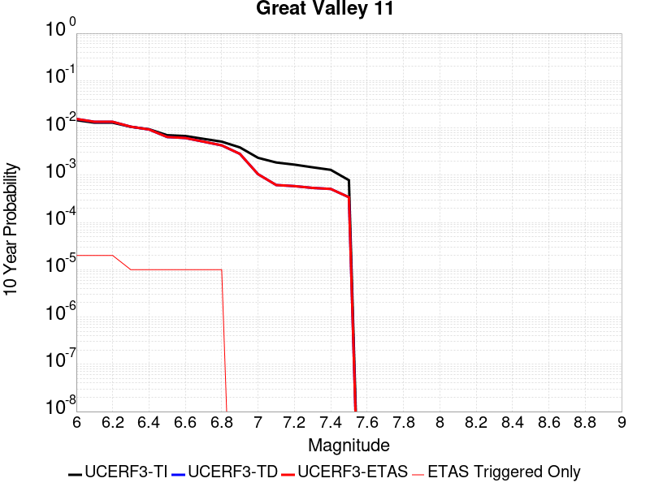 |

| Magnitude | 1 wk TI Prob | 1 wk TD Prob | 1 wk ETAS Prob | 1 wk ETAS/TD Gain | 1 wk ETAS Triggered Only | 1 mo TI Prob | 1 mo TD Prob | 1 mo ETAS Prob | 1 mo ETAS/TD Gain | 1 mo ETAS Triggered Only | 1 yr TI Prob | 1 yr TD Prob | 1 yr ETAS Prob | 1 yr ETAS/TD Gain | 1 yr ETAS Triggered Only | 10 yr TI Prob | 10 yr TD Prob | 10 yr ETAS Prob | 10 yr ETAS/TD Gain | 10 yr ETAS Triggered Only |
|-----|-----|-----|-----|-----|-----|-----|-----|-----|-----|-----|-----|-----|-----|-----|-----|-----|-----|-----|-----|-----|
| 6.0 | 2.8099583E-5 | 2.9832152E-5 | 5.1714054E-5 | 1.7335007 | 2.1882557E-5 | 1.20421224E-4 | 1.278462E-4 | 1.4972595E-4 | 1.1711413 | 2.1882557E-5 | 0.0014651422 | 0.0015554909 | 0.0015773394 | 1.0140461 | 2.1882557E-5 | 0.0145552 | 0.01545356 | 0.015475105 | 1.0013942 | 2.1882557E-5 |
| 6.1 | 2.483194E-5 | 2.590715E-5 | 4.778914E-5 | 1.8446313 | 2.1882557E-5 | 1.0641825E-4 | 1.11026246E-4 | 1.3290637E-4 | 1.1970717 | 2.1882557E-5 | 0.0012948721 | 0.0013509706 | 0.0013728235 | 1.0161757 | 2.1882557E-5 | 0.012873529 | 0.013433994 | 0.013455582 | 1.0016071 | 2.1882557E-5 |
| 6.2 | 2.483194E-5 | 2.590715E-5 | 4.778914E-5 | 1.8446313 | 2.1882557E-5 | 1.0641825E-4 | 1.11026246E-4 | 1.3290637E-4 | 1.1970717 | 2.1882557E-5 | 0.0012948721 | 0.0013509706 | 0.0013728235 | 1.0161757 | 2.1882557E-5 | 0.012873529 | 0.013433994 | 0.013455582 | 1.0016071 | 2.1882557E-5 |
| 6.3 | 2.0257901E-5 | 2.0398922E-5 | 3.1339976E-5 | 1.5363545 | 1.0941279E-5 | 8.681669E-5 | 8.742122E-5 | 9.836155E-5 | 1.125145 | 1.0941279E-5 | 0.0010564806 | 0.0010638756 | 0.0010748052 | 1.0102735 | 1.0941279E-5 | 0.01051472 | 0.010592012 | 0.0106028365 | 1.001022 | 1.0941279E-5 |
| 6.4 | 1.8054898E-5 | 1.7780874E-5 | 2.872196E-5 | 1.6153288 | 1.0941279E-5 | 7.737584E-5 | 7.62017E-5 | 8.714214E-5 | 1.1435722 | 1.0941279E-5 | 9.416436E-4 | 9.2739856E-4 | 9.3832973E-4 | 1.0117868 | 1.0941279E-5 | 0.009376635 | 0.009239036 | 0.009249876 | 1.0011733 | 1.0941279E-5 |
| 6.5 | 1.34804895E-5 | 1.2321055E-5 | 2.3262199E-5 | 1.8880038 | 1.0941279E-5 | 5.777225E-5 | 5.2803476E-5 | 6.374418E-5 | 1.2071966 | 1.0941279E-5 | 7.031501E-4 | 6.4269686E-4 | 6.536311E-4 | 1.0170131 | 1.0941279E-5 | 0.007009294 | 0.0064088185 | 0.0064196894 | 1.0016962 | 1.0941279E-5 |
| 6.6 | 1.294883E-5 | 1.1732312E-5 | 2.2673461E-5 | 1.9325656 | 1.0941279E-5 | 5.5493805E-5 | 5.028039E-5 | 6.1221115E-5 | 1.2175944 | 1.0941279E-5 | 6.754276E-4 | 6.1199587E-4 | 6.2293047E-4 | 1.0178671 | 1.0941279E-5 | 0.006733784 | 0.0061035305 | 0.006114405 | 1.0017817 | 1.0941279E-5 |
| 6.7 | 1.1272237E-5 | 9.811886E-6 | 2.0753057E-5 | 2.1150935 | 1.0941279E-5 | 4.8308695E-5 | 4.2050277E-5 | 5.2991094E-5 | 1.2601842 | 1.0941279E-5 | 5.879996E-4 | 5.118446E-4 | 5.227803E-4 | 1.0213653 | 1.0941279E-5 | 0.005864462 | 0.0051069413 | 0.0051178266 | 1.0021315 | 1.0941279E-5 |
| 6.8 | 9.8337505E-6 | 8.19377E-6 | 1.9134959E-5 | 2.335306 | 1.0941279E-5 | 4.2143965E-5 | 3.5115696E-5 | 4.605659E-5 | 1.3115671 | 1.0941279E-5 | 5.1298196E-4 | 4.2745177E-4 | 4.3838838E-4 | 1.0255855 | 1.0941279E-5 | 0.005117994 | 0.0042665056 | 0.0042774 | 1.0025535 | 1.0941279E-5 |
| 6.9 | 7.4224813E-6 | 5.4131347E-6 | 5.4131347E-6 | 1.0 | 0.0 | 3.1810247E-5 | 2.319895E-5 | 2.319895E-5 | 1.0 | 0.0 | 3.872209E-4 | 2.8241202E-4 | 2.8241202E-4 | 1.0 | 0.0 | 0.0038654688 | 0.0028206722 | 0.0028206722 | 1.0 | 0.0 |
| 7.0 | 4.4628923E-6 | 2.0110795E-6 | 2.0110795E-6 | 1.0 | 0.0 | 1.912654E-5 | 8.618884E-6 | 8.618884E-6 | 1.0 | 0.0 | 2.3284076E-4 | 1.04929975E-4 | 1.04929975E-4 | 1.0 | 0.0 | 0.0023259693 | 0.0010488159 | 0.0010488159 | 1.0 | 0.0 |
| 7.1 | 3.5546527E-6 | 1.1855836E-6 | 1.1855836E-6 | 1.0 | 0.0 | 1.5234136E-5 | 5.081063E-6 | 5.081063E-6 | 1.0 | 0.0 | 1.8545982E-4 | 6.186026E-5 | 6.186026E-5 | 1.0 | 0.0 | 0.0018530512 | 6.1843713E-4 | 6.1843713E-4 | 1.0 | 0.0 |
| 7.2 | 3.2039936E-6 | 1.1254128E-6 | 1.1254128E-6 | 1.0 | 0.0 | 1.3731329E-5 | 4.823189E-6 | 4.823189E-6 | 1.0 | 0.0 | 1.671661E-4 | 5.8720816E-5 | 5.8720816E-5 | 1.0 | 0.0 | 0.0016704041 | 5.870597E-4 | 5.870597E-4 | 1.0 | 0.0 |
| 7.3 | 2.8120473E-6 | 1.0305612E-6 | 1.0305612E-6 | 1.0 | 0.0 | 1.2051575E-5 | 4.4166836E-6 | 4.4166836E-6 | 1.0 | 0.0 | 1.4671806E-4 | 5.3771862E-5 | 5.3771862E-5 | 1.0 | 0.0 | 0.0014662122 | 5.3759513E-4 | 5.3759513E-4 | 1.0 | 0.0 |
| 7.4 | 2.4837766E-6 | 9.800582E-7 | 9.800582E-7 | 1.0 | 0.0 | 1.0644713E-5 | 4.200243E-6 | 4.200243E-6 | 1.0 | 0.0 | 1.2959167E-4 | 5.1136827E-5 | 5.1136827E-5 | 1.0 | 0.0 | 0.0012951613 | 5.112572E-4 | 5.112572E-4 | 1.0 | 0.0 |
| 7.5 | 1.5002679E-6 | 6.546144E-7 | 6.546144E-7 | 1.0 | 0.0 | 6.4297037E-6 | 2.8054874E-6 | 2.8054874E-6 | 1.0 | 0.0 | 7.827883E-5 | 3.4156317E-5 | 3.4156317E-5 | 1.0 | 0.0 | 7.825126E-4 | 3.4151482E-4 | 3.4151482E-4 | 1.0 | 0.0 |

## Santa Susana East (connector)
*[(top)](#table-of-contents)*

| 1 Week | 1 Month | 1 Year | 10 Year |
|-----|-----|-----|-----|
|  |  |  |  |

| Magnitude | 1 wk TI Prob | 1 wk TD Prob | 1 wk ETAS Prob | 1 wk ETAS/TD Gain | 1 wk ETAS Triggered Only | 1 mo TI Prob | 1 mo TD Prob | 1 mo ETAS Prob | 1 mo ETAS/TD Gain | 1 mo ETAS Triggered Only | 1 yr TI Prob | 1 yr TD Prob | 1 yr ETAS Prob | 1 yr ETAS/TD Gain | 1 yr ETAS Triggered Only | 10 yr TI Prob | 10 yr TD Prob | 10 yr ETAS Prob | 10 yr ETAS/TD Gain | 10 yr ETAS Triggered Only |
|-----|-----|-----|-----|-----|-----|-----|-----|-----|-----|-----|-----|-----|-----|-----|-----|-----|-----|-----|-----|-----|
| 6.0 | 2.858397E-5 | 3.202091E-5 | 5.3902768E-5 | 1.6833614 | 2.1882557E-5 | 1.2249697E-4 | 1.3722685E-4 | 1.591064E-4 | 1.1594408 | 2.1882557E-5 | 0.0014903803 | 0.0016697381 | 0.0016915841 | 1.0130835 | 2.1882557E-5 | 0.014804244 | 0.016599052 | 0.01662057 | 1.0012964 | 2.1882557E-5 |
| 6.1 | 2.858397E-5 | 3.202091E-5 | 5.3902768E-5 | 1.6833614 | 2.1882557E-5 | 1.2249697E-4 | 1.3722685E-4 | 1.591064E-4 | 1.1594408 | 2.1882557E-5 | 0.0014903803 | 0.0016697381 | 0.0016915841 | 1.0130835 | 2.1882557E-5 | 0.014804244 | 0.016599052 | 0.01662057 | 1.0012964 | 2.1882557E-5 |
| 6.2 | 2.858397E-5 | 3.202091E-5 | 5.3902768E-5 | 1.6833614 | 2.1882557E-5 | 1.2249697E-4 | 1.3722685E-4 | 1.591064E-4 | 1.1594408 | 2.1882557E-5 | 0.0014903803 | 0.0016697381 | 0.0016915841 | 1.0130835 | 2.1882557E-5 | 0.014804244 | 0.016599052 | 0.01662057 | 1.0012964 | 2.1882557E-5 |
| 6.3 | 1.943582E-5 | 2.036718E-5 | 3.1308235E-5 | 1.5371904 | 1.0941279E-5 | 8.329371E-5 | 8.7285625E-5 | 9.822595E-5 | 1.1253394 | 1.0941279E-5 | 0.001013629 | 0.0010622967 | 0.0010732263 | 1.0102887 | 1.0941279E-5 | 0.010090181 | 0.010583619 | 0.010594444 | 1.0010228 | 1.0941279E-5 |
| 6.4 | 1.943582E-5 | 2.036718E-5 | 3.1308235E-5 | 1.5371904 | 1.0941279E-5 | 8.329371E-5 | 8.7285625E-5 | 9.822595E-5 | 1.1253394 | 1.0941279E-5 | 0.001013629 | 0.0010622967 | 0.0010732263 | 1.0102887 | 1.0941279E-5 | 0.010090181 | 0.010583619 | 0.010594444 | 1.0010228 | 1.0941279E-5 |
| 6.5 | 1.943582E-5 | 2.036718E-5 | 3.1308235E-5 | 1.5371904 | 1.0941279E-5 | 8.329371E-5 | 8.7285625E-5 | 9.822595E-5 | 1.1253394 | 1.0941279E-5 | 0.001013629 | 0.0010622967 | 0.0010732263 | 1.0102887 | 1.0941279E-5 | 0.010090181 | 0.010583619 | 0.010594444 | 1.0010228 | 1.0941279E-5 |
| 6.6 | 1.943582E-5 | 2.036718E-5 | 3.1308235E-5 | 1.5371904 | 1.0941279E-5 | 8.329371E-5 | 8.7285625E-5 | 9.822595E-5 | 1.1253394 | 1.0941279E-5 | 0.001013629 | 0.0010622967 | 0.0010732263 | 1.0102887 | 1.0941279E-5 | 0.010090181 | 0.010583619 | 0.010594444 | 1.0010228 | 1.0941279E-5 |
| 6.7 | 1.9404439E-5 | 2.03546E-5 | 3.1295658E-5 | 1.5375224 | 1.0941279E-5 | 8.3159226E-5 | 8.723172E-5 | 9.8172044E-5 | 1.1254168 | 1.0941279E-5 | 0.0010119933 | 0.0010616409 | 0.0010725707 | 1.010295 | 1.0941279E-5 | 0.010073971 | 0.010577125 | 0.01058795 | 1.0010235 | 1.0941279E-5 |
| 6.8 | 1.2217526E-5 | 1.1592998E-5 | 2.2534148E-5 | 1.9437724 | 1.0941279E-5 | 5.2359774E-5 | 4.9683425E-5 | 6.062416E-5 | 1.220209 | 1.0941279E-5 | 6.372938E-4 | 6.0474465E-4 | 6.156793E-4 | 1.0180814 | 1.0941279E-5 | 0.0063546924 | 0.006033037 | 0.006043912 | 1.0018026 | 1.0941279E-5 |
| 6.9 | 1.2217526E-5 | 1.1592998E-5 | 2.2534148E-5 | 1.9437724 | 1.0941279E-5 | 5.2359774E-5 | 4.9683425E-5 | 6.062416E-5 | 1.220209 | 1.0941279E-5 | 6.372938E-4 | 6.0474465E-4 | 6.156793E-4 | 1.0180814 | 1.0941279E-5 | 0.0063546924 | 0.006033037 | 0.006043912 | 1.0018026 | 1.0941279E-5 |
| 7.0 | 9.276017E-6 | 8.059113E-6 | 1.9000303E-5 | 2.3576171 | 1.0941279E-5 | 3.9753755E-5 | 3.4538618E-5 | 4.547952E-5 | 1.3167729 | 1.0941279E-5 | 4.8389446E-4 | 4.2042998E-4 | 4.3136664E-4 | 1.0260131 | 1.0941279E-5 | 0.0048284214 | 0.0041970722 | 0.004207968 | 1.0025959 | 1.0941279E-5 |
| 7.1 | 9.130355E-6 | 7.942286E-6 | 1.8883478E-5 | 2.377587 | 1.0941279E-5 | 3.9129503E-5 | 3.4037945E-5 | 4.497885E-5 | 1.3214326 | 1.0941279E-5 | 4.7629757E-4 | 4.1433662E-4 | 4.2527338E-4 | 1.0263958 | 1.0941279E-5 | 0.00475278 | 0.004136367 | 0.004147263 | 1.0026342 | 1.0941279E-5 |
| 7.2 | 8.851015E-6 | 7.741445E-6 | 1.8682638E-5 | 2.413327 | 1.0941279E-5 | 3.7932372E-5 | 3.317722E-5 | 4.4118136E-5 | 1.3297719 | 1.0941279E-5 | 4.6172875E-4 | 4.038612E-4 | 4.1479807E-4 | 1.0270808 | 1.0941279E-5 | 0.0046077054 | 0.0040319953 | 0.0040428927 | 1.0027027 | 1.0941279E-5 |
| 7.3 | 8.573006E-6 | 7.550166E-6 | 1.8491362E-5 | 2.4491332 | 1.0941279E-5 | 3.6740938E-5 | 3.2357475E-5 | 4.3298398E-5 | 1.3381267 | 1.0941279E-5 | 4.472291E-4 | 3.9388443E-4 | 4.0482142E-4 | 1.027767 | 1.0941279E-5 | 0.004463301 | 0.0039325804 | 0.0039434787 | 1.0027713 | 1.0941279E-5 |
| 7.4 | 7.852282E-6 | 6.817687E-6 | 1.775889E-5 | 2.6048265 | 1.0941279E-5 | 3.36522E-5 | 2.9218349E-5 | 4.0159306E-5 | 1.3744551 | 1.0941279E-5 | 4.096385E-4 | 3.5567835E-4 | 3.6661574E-4 | 1.0307508 | 1.0941279E-5 | 0.0040888423 | 0.0035517553 | 0.0035626576 | 1.0030696 | 1.0941279E-5 |
| 7.5 | 4.8869324E-6 | 4.279055E-6 | 4.279055E-6 | 1.0 | 0.0 | 2.0943828E-5 | 1.8338687E-5 | 1.8338687E-5 | 1.0 | 0.0 | 2.5496128E-4 | 2.232523E-4 | 2.232523E-4 | 1.0 | 0.0 | 0.0025466895 | 0.0022304445 | 0.0022304445 | 1.0 | 0.0 |
| 7.6 | 1.3894544E-6 | 1.1568179E-6 | 1.1568179E-6 | 1.0 | 0.0 | 5.954791E-6 | 4.957783E-6 | 4.957783E-6 | 1.0 | 0.0 | 7.249717E-5 | 6.0359558E-5 | 6.0359558E-5 | 1.0 | 0.0 | 7.247352E-4 | 6.0345343E-4 | 6.0345343E-4 | 1.0 | 0.0 |
| 7.7 | 2.9924632E-7 | 2.371928E-7 | 2.371928E-7 | 1.0 | 0.0 | 1.2824837E-6 | 1.0165402E-6 | 1.0165402E-6 | 1.0 | 0.0 | 1.5614127E-5 | 1.2376314E-5 | 1.2376314E-5 | 1.0 | 0.0 | 1.5613029E-4 | 1.2375697E-4 | 1.2375697E-4 | 1.0 | 0.0 |
| 7.8 | 4.8188564E-8 | 2.6323061E-8 | 2.6323061E-8 | 1.0 | 0.0 | 2.065224E-7 | 1.1281311E-7 | 1.1281311E-7 | 1.0 | 0.0 | 2.5144072E-6 | 1.3734989E-6 | 1.3734989E-6 | 1.0 | 0.0 | 2.5143789E-5 | 1.3734912E-5 | 1.3734912E-5 | 1.0 | 0.0 |
| 7.9 | 2.6127251E-9 | 2.7681102E-9 | 2.7681102E-9 | 1.0 | 0.0 | 1.1197393E-8 | 1.186333E-8 | 1.186333E-8 | 1.0 | 0.0 | 1.3632825E-7 | 1.4443603E-7 | 1.4443603E-7 | 1.0 | 0.0 | 1.3632817E-6 | 1.4443604E-6 | 1.4443604E-6 | 1.0 | 0.0 |

## Northridge
*[(top)](#table-of-contents)*

| 1 Week | 1 Month | 1 Year | 10 Year |
|-----|-----|-----|-----|
|  |  |  |  |

| Magnitude | 1 wk TI Prob | 1 wk TD Prob | 1 wk ETAS Prob | 1 wk ETAS/TD Gain | 1 wk ETAS Triggered Only | 1 mo TI Prob | 1 mo TD Prob | 1 mo ETAS Prob | 1 mo ETAS/TD Gain | 1 mo ETAS Triggered Only | 1 yr TI Prob | 1 yr TD Prob | 1 yr ETAS Prob | 1 yr ETAS/TD Gain | 1 yr ETAS Triggered Only | 10 yr TI Prob | 10 yr TD Prob | 10 yr ETAS Prob | 10 yr ETAS/TD Gain | 10 yr ETAS Triggered Only |
|-----|-----|-----|-----|-----|-----|-----|-----|-----|-----|-----|-----|-----|-----|-----|-----|-----|-----|-----|-----|-----|
| 6.0 | 1.8340852E-5 | 7.5880193E-6 | 7.5880193E-6 | 1.0 | 0.0 | 7.860128E-5 | 3.251969E-5 | 4.346061E-5 | 1.33644 | 1.0941279E-5 | 9.565505E-4 | 3.958575E-4 | 4.1773138E-4 | 1.055257 | 2.1882557E-5 | 0.009524435 | 0.003951746 | 0.0039735422 | 1.0055156 | 2.1882557E-5 |
| 6.1 | 1.8340852E-5 | 7.5880193E-6 | 7.5880193E-6 | 1.0 | 0.0 | 7.860128E-5 | 3.251969E-5 | 4.346061E-5 | 1.33644 | 1.0941279E-5 | 9.565505E-4 | 3.958575E-4 | 4.1773138E-4 | 1.055257 | 2.1882557E-5 | 0.009524435 | 0.003951746 | 0.0039735422 | 1.0055156 | 2.1882557E-5 |
| 6.2 | 1.8340852E-5 | 7.5880193E-6 | 7.5880193E-6 | 1.0 | 0.0 | 7.860128E-5 | 3.251969E-5 | 4.346061E-5 | 1.33644 | 1.0941279E-5 | 9.565505E-4 | 3.958575E-4 | 4.1773138E-4 | 1.055257 | 2.1882557E-5 | 0.009524435 | 0.003951746 | 0.0039735422 | 1.0055156 | 2.1882557E-5 |
| 6.3 | 1.8340852E-5 | 7.5880193E-6 | 7.5880193E-6 | 1.0 | 0.0 | 7.860128E-5 | 3.251969E-5 | 4.346061E-5 | 1.33644 | 1.0941279E-5 | 9.565505E-4 | 3.958575E-4 | 4.1773138E-4 | 1.055257 | 2.1882557E-5 | 0.009524435 | 0.003951746 | 0.0039735422 | 1.0055156 | 2.1882557E-5 |
| 6.4 | 1.7361892E-5 | 7.5880193E-6 | 7.5880193E-6 | 1.0 | 0.0 | 7.440598E-5 | 3.251969E-5 | 4.346061E-5 | 1.33644 | 1.0941279E-5 | 9.055163E-4 | 3.958575E-4 | 4.1773138E-4 | 1.055257 | 2.1882557E-5 | 0.009018354 | 0.003951746 | 0.0039735422 | 1.0055156 | 2.1882557E-5 |
| 6.5 | 1.7361892E-5 | 7.5880193E-6 | 7.5880193E-6 | 1.0 | 0.0 | 7.440598E-5 | 3.251969E-5 | 4.346061E-5 | 1.33644 | 1.0941279E-5 | 9.055163E-4 | 3.958575E-4 | 4.1773138E-4 | 1.055257 | 2.1882557E-5 | 0.009018354 | 0.003951746 | 0.0039735422 | 1.0055156 | 2.1882557E-5 |
| 6.6 | 1.5458201E-5 | 7.5880193E-6 | 7.5880193E-6 | 1.0 | 0.0 | 6.624775E-5 | 3.251969E-5 | 4.346061E-5 | 1.33644 | 1.0941279E-5 | 8.0626784E-4 | 3.958575E-4 | 4.1773138E-4 | 1.055257 | 2.1882557E-5 | 0.008033488 | 0.003951746 | 0.0039735422 | 1.0055156 | 2.1882557E-5 |
| 6.7 | 1.2538368E-5 | 6.381603E-6 | 6.381603E-6 | 1.0 | 0.0 | 5.3734755E-5 | 2.7349442E-5 | 3.829042E-5 | 1.400044 | 1.0941279E-5 | 6.5402425E-4 | 3.3292902E-4 | 3.548043E-4 | 1.0657055 | 2.1882557E-5 | 0.0065210275 | 0.0033243506 | 0.0033461603 | 1.0065606 | 2.1882557E-5 |
| 6.8 | 1.1438097E-5 | 6.3502566E-6 | 6.3502566E-6 | 1.0 | 0.0 | 4.9019498E-5 | 2.7215105E-5 | 3.8156086E-5 | 1.4020187 | 1.0941279E-5 | 5.9664896E-4 | 3.3129397E-4 | 3.5316928E-4 | 1.0660299 | 2.1882557E-5 | 0.005950495 | 0.0033080487 | 0.0033298589 | 1.0065931 | 2.1882557E-5 |
| 6.9 | 1.1204891E-5 | 6.2867084E-6 | 6.2867084E-6 | 1.0 | 0.0 | 4.8020076E-5 | 2.694276E-5 | 3.7883743E-5 | 1.4060825 | 1.0941279E-5 | 5.8448757E-4 | 3.2797916E-4 | 3.4985456E-4 | 1.0666975 | 2.1882557E-5 | 0.0058295266 | 0.0032749989 | 0.0032968097 | 1.0066599 | 2.1882557E-5 |
| 7.0 | 1.061046E-5 | 6.115359E-6 | 6.115359E-6 | 1.0 | 0.0 | 4.5472607E-5 | 2.6208421E-5 | 3.7149413E-5 | 1.4174609 | 1.0941279E-5 | 5.534883E-4 | 3.1904122E-4 | 3.409168E-4 | 1.0685666 | 2.1882557E-5 | 0.0055211177 | 0.0031858785 | 0.0032076915 | 1.0068468 | 2.1882557E-5 |
| 7.1 | 1.0266979E-5 | 6.004274E-6 | 6.004274E-6 | 1.0 | 0.0 | 4.40006E-5 | 2.5732352E-5 | 3.6673347E-5 | 1.4251845 | 1.0941279E-5 | 5.355756E-4 | 3.1324677E-4 | 3.3512246E-4 | 1.0698353 | 2.1882557E-5 | 0.0053428668 | 0.003128098 | 0.0031499122 | 1.0069736 | 2.1882557E-5 |
| 7.2 | 9.91273E-6 | 5.819984E-6 | 5.819984E-6 | 1.0 | 0.0 | 4.248244E-5 | 2.4942554E-5 | 3.5883557E-5 | 1.4386482 | 1.0941279E-5 | 5.171009E-4 | 3.036337E-4 | 3.255096E-4 | 1.072047 | 2.1882557E-5 | 0.0051589934 | 0.0030322333 | 0.0030540496 | 1.0071948 | 2.1882557E-5 |
| 7.3 | 8.4959265E-6 | 5.193062E-6 | 5.193062E-6 | 1.0 | 0.0 | 3.6410605E-5 | 2.225579E-5 | 3.3196826E-5 | 1.491604 | 1.0941279E-5 | 4.4320893E-4 | 2.709308E-4 | 2.9280744E-4 | 1.0807462 | 2.1882557E-5 | 0.00442326 | 0.0027060313 | 0.0027278548 | 1.0080647 | 2.1882557E-5 |
| 7.4 | 8.0847185E-6 | 4.9819355E-6 | 4.9819355E-6 | 1.0 | 0.0 | 3.4648332E-5 | 2.135098E-5 | 3.2292024E-5 | 1.5124376 | 1.0941279E-5 | 4.2176177E-4 | 2.599174E-4 | 2.8179426E-4 | 1.0841686 | 2.1882557E-5 | 0.0042096223 | 0.00259616 | 0.0026179857 | 1.0084069 | 2.1882557E-5 |
| 7.5 | 6.8220684E-6 | 4.2533075E-6 | 4.2533075E-6 | 1.0 | 0.0 | 2.9237108E-5 | 1.8228335E-5 | 1.8228335E-5 | 1.0 | 0.0 | 3.5590364E-4 | 2.2190758E-4 | 2.3284643E-4 | 1.0492946 | 1.0941279E-5 | 0.0035533418 | 0.002216881 | 0.0022277979 | 1.0049245 | 1.0941279E-5 |
| 7.6 | 4.4224143E-6 | 2.8999582E-6 | 2.8999582E-6 | 1.0 | 0.0 | 1.8953066E-5 | 1.2428334E-5 | 1.2428334E-5 | 1.0 | 0.0 | 2.3072914E-4 | 1.5130457E-4 | 1.5130457E-4 | 1.0 | 0.0 | 0.0023048974 | 0.0015120271 | 0.0015120271 | 1.0 | 0.0 |
| 7.7 | 2.5297056E-6 | 1.6045905E-6 | 1.6045905E-6 | 1.0 | 0.0 | 1.0841551E-5 | 6.8767986E-6 | 6.8767986E-6 | 1.0 | 0.0 | 1.319879E-4 | 8.3721854E-5 | 8.3721854E-5 | 1.0 | 0.0 | 0.0013190953 | 8.369078E-4 | 8.369078E-4 | 1.0 | 0.0 |
| 7.8 | 1.2508156E-6 | 8.780076E-7 | 8.780076E-7 | 1.0 | 0.0 | 5.3606273E-6 | 3.7628845E-6 | 3.7628845E-6 | 1.0 | 0.0 | 6.526368E-5 | 4.581217E-5 | 4.581217E-5 | 1.0 | 0.0 | 6.524452E-4 | 4.5802852E-4 | 4.5802852E-4 | 1.0 | 0.0 |
| 7.9 | 2.262199E-7 | 1.4664671E-7 | 1.4664671E-7 | 1.0 | 0.0 | 9.695135E-7 | 6.284858E-7 | 6.284858E-7 | 1.0 | 0.0 | 1.1803763E-5 | 7.651788E-6 | 7.651788E-6 | 1.0 | 0.0 | 1.1803136E-4 | 7.651533E-5 | 7.651533E-5 | 1.0 | 0.0 |
| 8.0 | 2.865362E-9 | 1.2753101E-9 | 1.2753101E-9 | 1.0 | 0.0 | 1.2280123E-8 | 5.4656146E-9 | 5.4656146E-9 | 1.0 | 0.0 | 1.4951048E-7 | 6.654386E-8 | 6.654386E-8 | 1.0 | 0.0 | 1.4951038E-6 | 6.654386E-7 | 6.654386E-7 | 1.0 | 0.0 |

## Johnson Valley (No) 2011 rev
*[(top)](#table-of-contents)*

| 1 Week | 1 Month | 1 Year | 10 Year |
|-----|-----|-----|-----|
|  | 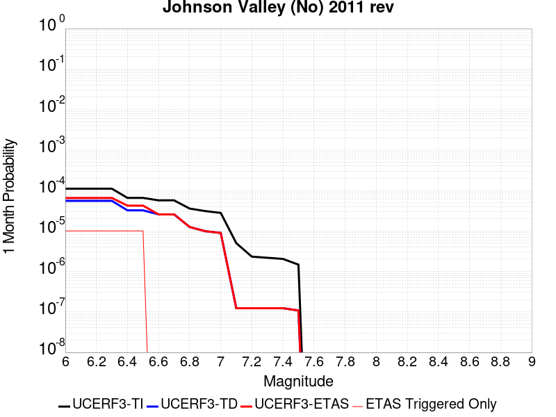 |  |  |

| Magnitude | 1 wk TI Prob | 1 wk TD Prob | 1 wk ETAS Prob | 1 wk ETAS/TD Gain | 1 wk ETAS Triggered Only | 1 mo TI Prob | 1 mo TD Prob | 1 mo ETAS Prob | 1 mo ETAS/TD Gain | 1 mo ETAS Triggered Only | 1 yr TI Prob | 1 yr TD Prob | 1 yr ETAS Prob | 1 yr ETAS/TD Gain | 1 yr ETAS Triggered Only | 10 yr TI Prob | 10 yr TD Prob | 10 yr ETAS Prob | 10 yr ETAS/TD Gain | 10 yr ETAS Triggered Only |
|-----|-----|-----|-----|-----|-----|-----|-----|-----|-----|-----|-----|-----|-----|-----|-----|-----|-----|-----|-----|-----|
| 6.0 | 2.577707E-5 | 1.2900938E-5 | 2.3842074E-5 | 1.8480885 | 1.0941279E-5 | 1.1046848E-4 | 5.5288787E-5 | 6.622946E-5 | 1.1978823 | 1.0941279E-5 | 0.0013441239 | 6.7297276E-4 | 6.9484056E-4 | 1.0324944 | 2.1882557E-5 | 0.013360229 | 0.006713257 | 0.006734993 | 1.0032377 | 2.1882557E-5 |
| 6.1 | 2.577707E-5 | 1.2900938E-5 | 2.3842074E-5 | 1.8480885 | 1.0941279E-5 | 1.1046848E-4 | 5.5288787E-5 | 6.622946E-5 | 1.1978823 | 1.0941279E-5 | 0.0013441239 | 6.7297276E-4 | 6.9484056E-4 | 1.0324944 | 2.1882557E-5 | 0.013360229 | 0.006713257 | 0.006734993 | 1.0032377 | 2.1882557E-5 |
| 6.2 | 2.577707E-5 | 1.2900938E-5 | 2.3842074E-5 | 1.8480885 | 1.0941279E-5 | 1.1046848E-4 | 5.5288787E-5 | 6.622946E-5 | 1.1978823 | 1.0941279E-5 | 0.0013441239 | 6.7297276E-4 | 6.9484056E-4 | 1.0324944 | 2.1882557E-5 | 0.013360229 | 0.006713257 | 0.006734993 | 1.0032377 | 2.1882557E-5 |
| 6.3 | 2.577707E-5 | 1.2900938E-5 | 2.3842074E-5 | 1.8480885 | 1.0941279E-5 | 1.1046848E-4 | 5.5288787E-5 | 6.622946E-5 | 1.1978823 | 1.0941279E-5 | 0.0013441239 | 6.7297276E-4 | 6.9484056E-4 | 1.0324944 | 2.1882557E-5 | 0.013360229 | 0.006713257 | 0.006734993 | 1.0032377 | 2.1882557E-5 |
| 6.4 | 1.5296591E-5 | 7.536742E-6 | 1.8477938E-5 | 2.4517143 | 1.0941279E-5 | 6.555518E-5 | 3.2300028E-5 | 4.3240954E-5 | 1.3387281 | 1.0941279E-5 | 7.97842E-4 | 3.9320064E-4 | 4.0413762E-4 | 1.0278152 | 1.0941279E-5 | 0.007949836 | 0.0039268904 | 0.003937789 | 1.0027753 | 1.0941279E-5 |
| 6.5 | 1.5296591E-5 | 7.536742E-6 | 1.8477938E-5 | 2.4517143 | 1.0941279E-5 | 6.555518E-5 | 3.2300028E-5 | 4.3240954E-5 | 1.3387281 | 1.0941279E-5 | 7.97842E-4 | 3.9320064E-4 | 4.0413762E-4 | 1.0278152 | 1.0941279E-5 | 0.007949836 | 0.0039268904 | 0.003937789 | 1.0027753 | 1.0941279E-5 |
| 6.6 | 1.3289383E-5 | 5.9917306E-6 | 5.9917306E-6 | 1.0 | 0.0 | 5.6953253E-5 | 2.5678688E-5 | 2.5678688E-5 | 1.0 | 0.0 | 6.9318525E-4 | 3.1261015E-4 | 3.1261015E-4 | 1.0 | 0.0 | 0.0069102696 | 0.0031233684 | 0.0031233684 | 1.0 | 0.0 |
| 6.7 | 1.3289383E-5 | 5.9917306E-6 | 5.9917306E-6 | 1.0 | 0.0 | 5.6953253E-5 | 2.5678688E-5 | 2.5678688E-5 | 1.0 | 0.0 | 6.9318525E-4 | 3.1261015E-4 | 3.1261015E-4 | 1.0 | 0.0 | 0.0069102696 | 0.0031233684 | 0.0031233684 | 1.0 | 0.0 |
| 6.8 | 8.330789E-6 | 2.9211888E-6 | 2.9211888E-6 | 1.0 | 0.0 | 3.570289E-5 | 1.2519352E-5 | 1.2519352E-5 | 1.0 | 0.0 | 4.34596E-4 | 1.5241816E-4 | 1.5241816E-4 | 1.0 | 0.0 | 0.0043374705 | 0.0015236961 | 0.0015236961 | 1.0 | 0.0 |
| 6.9 | 7.2359003E-6 | 2.3013247E-6 | 2.3013247E-6 | 1.0 | 0.0 | 3.1010633E-5 | 9.8628125E-6 | 9.8628125E-6 | 1.0 | 0.0 | 3.7748902E-4 | 1.2007845E-4 | 1.2007845E-4 | 1.0 | 0.0 | 0.0037684843 | 0.0012006586 | 0.0012006586 | 1.0 | 0.0 |
| 7.0 | 6.5149957E-6 | 2.088482E-6 | 2.088482E-6 | 1.0 | 0.0 | 2.792111E-5 | 8.950637E-6 | 8.950637E-6 | 1.0 | 0.0 | 3.398865E-4 | 1.0897385E-4 | 1.0897385E-4 | 1.0 | 0.0 | 0.003393671 | 0.0010897239 | 0.0010897239 | 1.0 | 0.0 |
| 7.1 | 1.1662233E-6 | 2.8802024E-8 | 2.8802024E-8 | 1.0 | 0.0 | 4.9980904E-6 | 1.2343725E-7 | 1.2343725E-7 | 1.0 | 0.0 | 6.0850052E-5 | 1.5028476E-6 | 1.5028476E-6 | 1.0 | 0.0 | 6.083339E-4 | 1.50283895E-5 | 1.50283895E-5 | 1.0 | 0.0 |
| 7.2 | 5.413881E-7 | 2.8802024E-8 | 2.8802024E-8 | 1.0 | 0.0 | 2.3202326E-6 | 1.2343725E-7 | 1.2343725E-7 | 1.0 | 0.0 | 2.8248465E-5 | 1.5028476E-6 | 1.5028476E-6 | 1.0 | 0.0 | 2.8244875E-4 | 1.50283895E-5 | 1.50283895E-5 | 1.0 | 0.0 |
| 7.3 | 5.076821E-7 | 2.8802024E-8 | 2.8802024E-8 | 1.0 | 0.0 | 2.1757785E-6 | 1.2343723E-7 | 1.2343723E-7 | 1.0 | 0.0 | 2.648978E-5 | 1.5028475E-6 | 1.5028475E-6 | 1.0 | 0.0 | 2.6486625E-4 | 1.50283895E-5 | 1.50283895E-5 | 1.0 | 0.0 |
| 7.4 | 4.7568687E-7 | 2.8783948E-8 | 2.8783948E-8 | 1.0 | 0.0 | 2.0386565E-6 | 1.2335977E-7 | 1.2335977E-7 | 1.0 | 0.0 | 2.482036E-5 | 1.5019043E-6 | 1.5019043E-6 | 1.0 | 0.0 | 2.4817587E-4 | 1.5018958E-5 | 1.5018958E-5 | 1.0 | 0.0 |
| 7.5 | 3.435626E-7 | 2.5357679E-8 | 2.5357679E-8 | 1.0 | 0.0 | 1.4724103E-6 | 1.0867576E-7 | 1.0867576E-7 | 1.0 | 0.0 | 1.7926448E-5 | 1.3231268E-6 | 1.3231268E-6 | 1.0 | 0.0 | 1.7925001E-4 | 1.3231205E-5 | 1.3231205E-5 | 1.0 | 0.0 |

## Elsinore (Temecula) rev
*[(top)](#table-of-contents)*

| 1 Week | 1 Month | 1 Year | 10 Year |
|-----|-----|-----|-----|
|  |  |  |  |

| Magnitude | 1 wk TI Prob | 1 wk TD Prob | 1 wk ETAS Prob | 1 wk ETAS/TD Gain | 1 wk ETAS Triggered Only | 1 mo TI Prob | 1 mo TD Prob | 1 mo ETAS Prob | 1 mo ETAS/TD Gain | 1 mo ETAS Triggered Only | 1 yr TI Prob | 1 yr TD Prob | 1 yr ETAS Prob | 1 yr ETAS/TD Gain | 1 yr ETAS Triggered Only | 10 yr TI Prob | 10 yr TD Prob | 10 yr ETAS Prob | 10 yr ETAS/TD Gain | 10 yr ETAS Triggered Only |
|-----|-----|-----|-----|-----|-----|-----|-----|-----|-----|-----|-----|-----|-----|-----|-----|-----|-----|-----|-----|-----|
| 6.0 | 2.9514995E-5 | 2.2517117E-5 | 3.345815E-5 | 1.4858985 | 1.0941279E-5 | 1.264867E-4 | 9.649849E-5 | 1.07438704E-4 | 1.113372 | 1.0941279E-5 | 0.0015388876 | 0.0011742581 | 0.0011961149 | 1.0186133 | 2.1882557E-5 | 0.015282745 | 0.011696897 | 0.011718525 | 1.0018489 | 2.1882557E-5 |
| 6.1 | 2.9514995E-5 | 2.2517117E-5 | 3.345815E-5 | 1.4858985 | 1.0941279E-5 | 1.264867E-4 | 9.649849E-5 | 1.07438704E-4 | 1.113372 | 1.0941279E-5 | 0.0015388876 | 0.0011742581 | 0.0011961149 | 1.0186133 | 2.1882557E-5 | 0.015282745 | 0.011696897 | 0.011718525 | 1.0018489 | 2.1882557E-5 |
| 6.2 | 2.9514995E-5 | 2.2517117E-5 | 3.345815E-5 | 1.4858985 | 1.0941279E-5 | 1.264867E-4 | 9.649849E-5 | 1.07438704E-4 | 1.113372 | 1.0941279E-5 | 0.0015388876 | 0.0011742581 | 0.0011961149 | 1.0186133 | 2.1882557E-5 | 0.015282745 | 0.011696897 | 0.011718525 | 1.0018489 | 2.1882557E-5 |
| 6.3 | 2.3223649E-5 | 1.8406454E-5 | 1.8406454E-5 | 1.0 | 0.0 | 9.952613E-5 | 7.888251E-5 | 7.888251E-5 | 1.0 | 0.0 | 0.001211057 | 9.599888E-4 | 9.7091956E-4 | 1.0113864 | 1.0941279E-5 | 0.012044783 | 0.009569948 | 0.0095807845 | 1.0011324 | 1.0941279E-5 |
| 6.4 | 2.3223649E-5 | 1.8406454E-5 | 1.8406454E-5 | 1.0 | 0.0 | 9.952613E-5 | 7.888251E-5 | 7.888251E-5 | 1.0 | 0.0 | 0.001211057 | 9.599888E-4 | 9.7091956E-4 | 1.0113864 | 1.0941279E-5 | 0.012044783 | 0.009569948 | 0.0095807845 | 1.0011324 | 1.0941279E-5 |
| 6.5 | 1.8338875E-5 | 1.4750118E-5 | 1.4750118E-5 | 1.0 | 0.0 | 7.8592806E-5 | 6.321331E-5 | 6.321331E-5 | 1.0 | 0.0 | 9.5644733E-4 | 7.69359E-4 | 7.8029186E-4 | 1.0142103 | 1.0941279E-5 | 0.009523412 | 0.0076739118 | 0.007684769 | 1.0014148 | 1.0941279E-5 |
| 6.6 | 1.8223333E-5 | 1.4612673E-5 | 1.4612673E-5 | 1.0 | 0.0 | 7.809766E-5 | 6.262429E-5 | 6.262429E-5 | 1.0 | 0.0 | 9.504242E-4 | 7.6219277E-4 | 7.731257E-4 | 1.0143441 | 1.0941279E-5 | 0.009463696 | 0.0076027405 | 0.007613599 | 1.0014281 | 1.0941279E-5 |
| 6.7 | 1.7512752E-5 | 1.402721E-5 | 1.402721E-5 | 1.0 | 0.0 | 7.505249E-5 | 6.011528E-5 | 6.011528E-5 | 1.0 | 0.0 | 9.13381E-4 | 7.3166634E-4 | 7.425996E-4 | 1.014943 | 1.0941279E-5 | 0.00909636 | 0.00729892 | 0.0073097814 | 1.0014881 | 1.0941279E-5 |
| 6.8 | 1.7417142E-5 | 1.3951195E-5 | 1.3951195E-5 | 1.0 | 0.0 | 7.4642754E-5 | 5.9789512E-5 | 5.9789512E-5 | 1.0 | 0.0 | 9.083966E-4 | 7.277028E-4 | 7.3863607E-4 | 1.0150244 | 1.0941279E-5 | 0.009046922 | 0.0072594886 | 0.0072703506 | 1.0014962 | 1.0941279E-5 |
| 6.9 | 1.6402591E-5 | 1.2988613E-5 | 1.2988613E-5 | 1.0 | 0.0 | 7.0294926E-5 | 5.5664343E-5 | 5.5664343E-5 | 1.0 | 0.0 | 8.5550465E-4 | 6.775103E-4 | 6.884442E-4 | 1.0161383 | 1.0941279E-5 | 0.008522186 | 0.006760169 | 0.006771036 | 1.0016075 | 1.0941279E-5 |
| 7.0 | 1.3912486E-5 | 1.0878233E-5 | 1.0878233E-5 | 1.0 | 0.0 | 5.9623577E-5 | 4.6620182E-5 | 4.6620182E-5 | 1.0 | 0.0 | 7.2567526E-4 | 5.674556E-4 | 5.7839067E-4 | 1.0192703 | 1.0941279E-5 | 0.0072331014 | 0.005663986 | 0.005674865 | 1.0019208 | 1.0941279E-5 |
| 7.1 | 1.3405147E-5 | 1.03274215E-5 | 1.03274215E-5 | 1.0 | 0.0 | 5.7449364E-5 | 4.425964E-5 | 4.425964E-5 | 1.0 | 0.0 | 6.9922156E-4 | 5.3873047E-4 | 5.496658E-4 | 1.0202985 | 1.0941279E-5 | 0.0069702556 | 0.005377577 | 0.005388459 | 1.0020237 | 1.0941279E-5 |
| 7.2 | 1.21402E-5 | 8.996737E-6 | 8.996737E-6 | 1.0 | 0.0 | 5.202839E-5 | 3.8556886E-5 | 3.8556886E-5 | 1.0 | 0.0 | 6.332616E-4 | 4.6933076E-4 | 4.6933076E-4 | 1.0 | 0.0 | 0.0063146 | 0.004684821 | 0.004684821 | 1.0 | 0.0 |
| 7.3 | 1.05047775E-5 | 7.571771E-6 | 7.571771E-6 | 1.0 | 0.0 | 4.5019697E-5 | 3.245005E-5 | 3.245005E-5 | 1.0 | 0.0 | 5.4797693E-4 | 3.950092E-4 | 3.950092E-4 | 1.0 | 0.0 | 0.005466277 | 0.00394346 | 0.00394346 | 1.0 | 0.0 |
| 7.4 | 9.624483E-6 | 6.7868696E-6 | 6.7868696E-6 | 1.0 | 0.0 | 4.124713E-5 | 2.9086266E-5 | 2.9086266E-5 | 1.0 | 0.0 | 5.0206814E-4 | 3.5406914E-4 | 3.5406914E-4 | 1.0 | 0.0 | 0.005009353 | 0.003535204 | 0.003535204 | 1.0 | 0.0 |
| 7.5 | 8.215151E-6 | 5.635538E-6 | 5.635538E-6 | 1.0 | 0.0 | 3.5207315E-5 | 2.4152088E-5 | 2.4152088E-5 | 1.0 | 0.0 | 4.2856473E-4 | 2.9401327E-4 | 2.9401327E-4 | 1.0 | 0.0 | 0.004277392 | 0.002936371 | 0.002936371 | 1.0 | 0.0 |
| 7.6 | 6.975058E-6 | 4.676045E-6 | 4.676045E-6 | 1.0 | 0.0 | 2.9892764E-5 | 2.0040046E-5 | 2.0040046E-5 | 1.0 | 0.0 | 3.6388362E-4 | 2.439614E-4 | 2.439614E-4 | 1.0 | 0.0 | 0.0036328835 | 0.002437052 | 0.002437052 | 1.0 | 0.0 |
| 7.7 | 4.159604E-6 | 2.3269924E-6 | 2.3269924E-6 | 1.0 | 0.0 | 1.7826753E-5 | 9.97279E-6 | 9.97279E-6 | 1.0 | 0.0 | 2.1701909E-4 | 1.21412704E-4 | 1.21412704E-4 | 1.0 | 0.0 | 0.0021680726 | 0.0012135367 | 0.0012135367 | 1.0 | 0.0 |
| 7.8 | 2.2692414E-7 | 9.3854695E-8 | 9.3854695E-8 | 1.0 | 0.0 | 9.725317E-7 | 4.0223435E-7 | 4.0223435E-7 | 1.0 | 0.0 | 1.1840509E-5 | 4.8971956E-6 | 4.8971956E-6 | 1.0 | 0.0 | 1.1839878E-4 | 4.8971204E-5 | 4.8971204E-5 | 1.0 | 0.0 |
| 7.9 | 6.676829E-9 | 3.439853E-9 | 3.439853E-9 | 1.0 | 0.0 | 2.861498E-8 | 1.4742227E-8 | 1.4742227E-8 | 1.0 | 0.0 | 3.4838732E-7 | 1.7948659E-7 | 1.7948659E-7 | 1.0 | 0.0 | 3.4838679E-6 | 1.7948646E-6 | 1.7948646E-6 | 1.0 | 0.0 |

## San Diego Trough north alt1
*[(top)](#table-of-contents)*

| 1 Week | 1 Month | 1 Year | 10 Year |
|-----|-----|-----|-----|
| 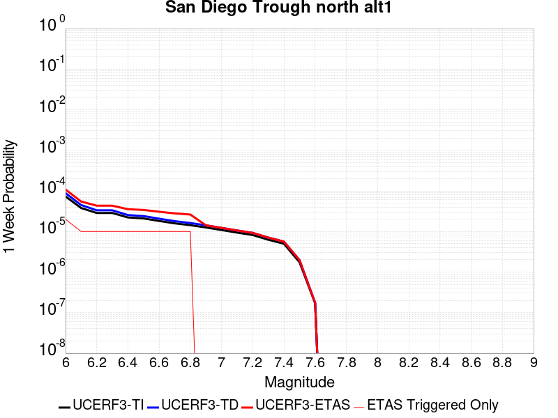 | 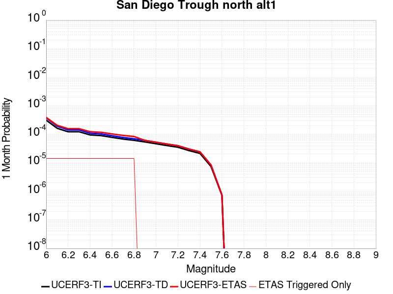 | 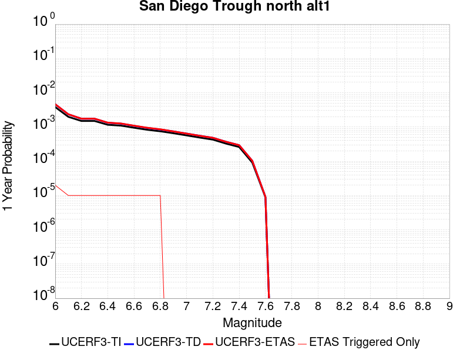 | 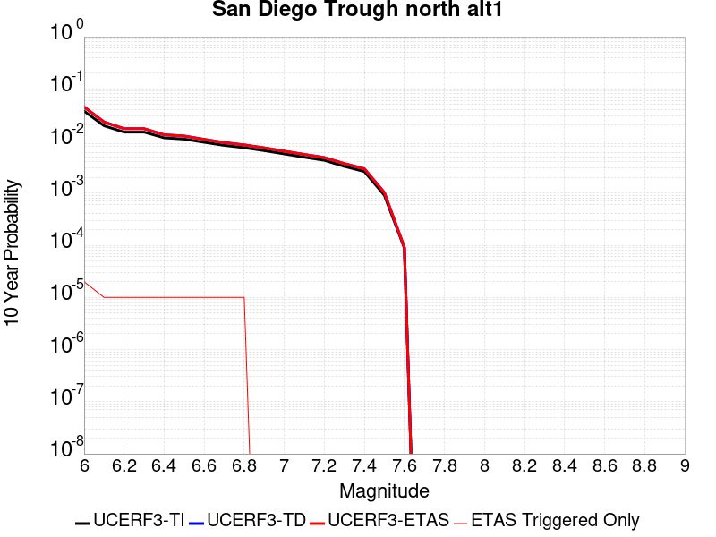 |

| Magnitude | 1 wk TI Prob | 1 wk TD Prob | 1 wk ETAS Prob | 1 wk ETAS/TD Gain | 1 wk ETAS Triggered Only | 1 mo TI Prob | 1 mo TD Prob | 1 mo ETAS Prob | 1 mo ETAS/TD Gain | 1 mo ETAS Triggered Only | 1 yr TI Prob | 1 yr TD Prob | 1 yr ETAS Prob | 1 yr ETAS/TD Gain | 1 yr ETAS Triggered Only | 10 yr TI Prob | 10 yr TD Prob | 10 yr ETAS Prob | 10 yr ETAS/TD Gain | 10 yr ETAS Triggered Only |
|-----|-----|-----|-----|-----|-----|-----|-----|-----|-----|-----|-----|-----|-----|-----|-----|-----|-----|-----|-----|-----|
| 6.0 | 7.329252E-5 | 8.821093E-5 | 1.10091554E-4 | 1.2480489 | 2.1882557E-5 | 3.14073E-4 | 3.7799572E-4 | 3.9987E-4 | 1.0578691 | 2.1882557E-5 | 0.0038171355 | 0.004593027 | 0.004614809 | 1.0047424 | 2.1882557E-5 | 0.03752231 | 0.045044992 | 0.045065887 | 1.000464 | 2.1882557E-5 |
| 6.1 | 3.7940346E-5 | 4.4885E-5 | 5.582579E-5 | 1.2437515 | 1.0941279E-5 | 1.6259136E-4 | 1.9235066E-4 | 2.0328983E-4 | 1.0568709 | 1.0941279E-5 | 0.0019777524 | 0.0023394432 | 0.002350359 | 1.004666 | 1.0941279E-5 | 0.019602431 | 0.023156688 | 0.023167375 | 1.0004616 | 1.0941279E-5 |
| 6.2 | 2.8645263E-5 | 3.329678E-5 | 4.4237695E-5 | 1.3285878 | 1.0941279E-5 | 1.2275964E-4 | 1.4269284E-4 | 1.5363256E-4 | 1.0766662 | 1.0941279E-5 | 0.0014935739 | 0.0017359189 | 0.0017468412 | 1.006292 | 1.0941279E-5 | 0.0148357535 | 0.017226247 | 0.017237 | 1.0006242 | 1.0941279E-5 |
| 6.3 | 2.8645263E-5 | 3.329678E-5 | 4.4237695E-5 | 1.3285878 | 1.0941279E-5 | 1.2275964E-4 | 1.4269284E-4 | 1.5363256E-4 | 1.0766662 | 1.0941279E-5 | 0.0014935739 | 0.0017359189 | 0.0017468412 | 1.006292 | 1.0941279E-5 | 0.0148357535 | 0.017226247 | 0.017237 | 1.0006242 | 1.0941279E-5 |
| 6.4 | 2.2204576E-5 | 2.5448318E-5 | 3.638932E-5 | 1.4299302 | 1.0941279E-5 | 9.5159E-5 | 1.0905972E-4 | 1.199998E-4 | 1.1003128 | 1.0941279E-5 | 0.001157945 | 0.0013270034 | 0.0013379301 | 1.0082341 | 1.0941279E-5 | 0.011519298 | 0.013191955 | 0.013202752 | 1.0008185 | 1.0941279E-5 |
| 6.5 | 2.1004838E-5 | 2.4024694E-5 | 3.496571E-5 | 1.455407 | 1.0941279E-5 | 9.0017624E-5 | 1.0295896E-4 | 1.13899114E-4 | 1.1062574 | 1.0941279E-5 | 0.0010954136 | 0.0012528138 | 0.0012637414 | 1.0087224 | 1.0941279E-5 | 0.010900296 | 0.012458589 | 0.012469394 | 1.0008672 | 1.0941279E-5 |
| 6.6 | 1.820557E-5 | 2.0704787E-5 | 3.164584E-5 | 1.528431 | 1.0941279E-5 | 7.802154E-5 | 8.873181E-5 | 9.967212E-5 | 1.1232964 | 1.0941279E-5 | 9.4949827E-4 | 0.0010797799 | 0.0010907094 | 1.010122 | 1.0941279E-5 | 0.009454516 | 0.010746004 | 0.010756828 | 1.0010072 | 1.0941279E-5 |
| 6.7 | 1.5884485E-5 | 1.7983646E-5 | 2.8924727E-5 | 1.6083906 | 1.0941279E-5 | 6.807459E-5 | 7.707051E-5 | 8.8010944E-5 | 1.1419536 | 1.0941279E-5 | 8.284929E-4 | 9.3793223E-4 | 9.488633E-4 | 1.0116544 | 1.0941279E-5 | 0.008254109 | 0.009340104 | 0.009350942 | 1.0011605 | 1.0941279E-5 |
| 6.8 | 1.4331171E-5 | 1.6201066E-5 | 2.7142165E-5 | 1.6753322 | 1.0941279E-5 | 6.141786E-5 | 6.94313E-5 | 8.0371814E-5 | 1.1575733 | 1.0941279E-5 | 7.4750587E-4 | 8.450002E-4 | 8.5593225E-4 | 1.0129373 | 1.0941279E-5 | 0.0074499645 | 0.008418139 | 0.008428988 | 1.0012888 | 1.0941279E-5 |
| 6.9 | 1.2574203E-5 | 1.4205835E-5 | 1.4205835E-5 | 1.0 | 0.0 | 5.3888325E-5 | 6.0880735E-5 | 6.0880735E-5 | 1.0 | 0.0 | 6.558929E-4 | 7.409723E-4 | 7.409723E-4 | 1.0 | 0.0 | 0.0065396037 | 0.007385203 | 0.007385203 | 1.0 | 0.0 |
| 7.0 | 1.0883844E-5 | 1.2289262E-5 | 1.2289262E-5 | 1.0 | 0.0 | 4.664421E-5 | 5.2667205E-5 | 5.2667205E-5 | 1.0 | 0.0 | 5.677453E-4 | 6.4103556E-4 | 6.4103556E-4 | 1.0 | 0.0 | 0.00566297 | 0.006391993 | 0.006391993 | 1.0 | 0.0 |
| 7.1 | 9.393088E-6 | 1.060702E-5 | 1.060702E-5 | 1.0 | 0.0 | 4.025547E-5 | 4.545787E-5 | 4.545787E-5 | 1.0 | 0.0 | 4.900001E-4 | 5.533098E-4 | 5.533098E-4 | 1.0 | 0.0 | 0.0048892107 | 0.005519418 | 0.005519418 | 1.0 | 0.0 |
| 7.2 | 8.190791E-6 | 9.258625E-6 | 9.258625E-6 | 1.0 | 0.0 | 3.510292E-5 | 3.9679224E-5 | 3.9679224E-5 | 1.0 | 0.0 | 4.2729423E-4 | 4.8298817E-4 | 4.8298817E-4 | 1.0 | 0.0 | 0.0042647356 | 0.004819465 | 0.004819465 | 1.0 | 0.0 |
| 7.3 | 6.268162E-6 | 7.089716E-6 | 7.089716E-6 | 1.0 | 0.0 | 2.6863276E-5 | 3.0384144E-5 | 3.0384144E-5 | 1.0 | 0.0 | 3.2701128E-4 | 3.6986457E-4 | 3.6986457E-4 | 1.0 | 0.0 | 0.003265305 | 0.003692536 | 0.003692536 | 1.0 | 0.0 |
| 7.4 | 4.985186E-6 | 5.6426816E-6 | 5.6426816E-6 | 1.0 | 0.0 | 2.1364907E-5 | 2.4182698E-5 | 2.4182698E-5 | 1.0 | 0.0 | 2.600867E-4 | 2.9438498E-4 | 2.9438498E-4 | 1.0 | 0.0 | 0.002597825 | 0.0029399914 | 0.0029399914 | 1.0 | 0.0 |
| 7.5 | 1.7489613E-6 | 1.969678E-6 | 1.969678E-6 | 1.0 | 0.0 | 7.495527E-6 | 8.4414505E-6 | 8.4414505E-6 | 1.0 | 0.0 | 9.125422E-5 | 1.02770035E-4 | 1.02770035E-4 | 1.0 | 0.0 | 9.1216754E-4 | 0.0010272472 | 0.0010272472 | 1.0 | 0.0 |
| 7.6 | 1.6988751E-7 | 1.7533823E-7 | 1.7533823E-7 | 1.0 | 0.0 | 7.2808916E-7 | 7.5144936E-7 | 7.5144936E-7 | 1.0 | 0.0 | 8.864449E-6 | 9.14886E-6 | 9.14886E-6 | 1.0 | 0.0 | 8.8640954E-5 | 9.1485024E-5 | 9.1485024E-5 | 1.0 | 0.0 |

## Blue Cut
*[(top)](#table-of-contents)*

| 1 Week | 1 Month | 1 Year | 10 Year |
|-----|-----|-----|-----|
|  |  |  |  |

| Magnitude | 1 wk TI Prob | 1 wk TD Prob | 1 wk ETAS Prob | 1 wk ETAS/TD Gain | 1 wk ETAS Triggered Only | 1 mo TI Prob | 1 mo TD Prob | 1 mo ETAS Prob | 1 mo ETAS/TD Gain | 1 mo ETAS Triggered Only | 1 yr TI Prob | 1 yr TD Prob | 1 yr ETAS Prob | 1 yr ETAS/TD Gain | 1 yr ETAS Triggered Only | 10 yr TI Prob | 10 yr TD Prob | 10 yr ETAS Prob | 10 yr ETAS/TD Gain | 10 yr ETAS Triggered Only |
|-----|-----|-----|-----|-----|-----|-----|-----|-----|-----|-----|-----|-----|-----|-----|-----|-----|-----|-----|-----|-----|
| 6.0 | 2.1227985E-5 | 2.2719574E-5 | 3.3660603E-5 | 1.4815685 | 1.0941279E-5 | 9.097391E-5 | 9.73663E-5 | 1.19246724E-4 | 1.2247227 | 2.1882557E-5 | 0.0011070445 | 0.0011848481 | 0.0012067048 | 1.0184468 | 2.1882557E-5 | 0.011015458 | 0.011791152 | 0.011812776 | 1.0018339 | 2.1882557E-5 |
| 6.1 | 2.1227985E-5 | 2.2719574E-5 | 3.3660603E-5 | 1.4815685 | 1.0941279E-5 | 9.097391E-5 | 9.73663E-5 | 1.19246724E-4 | 1.2247227 | 2.1882557E-5 | 0.0011070445 | 0.0011848481 | 0.0012067048 | 1.0184468 | 2.1882557E-5 | 0.011015458 | 0.011791152 | 0.011812776 | 1.0018339 | 2.1882557E-5 |
| 6.2 | 2.1227985E-5 | 2.2719574E-5 | 3.3660603E-5 | 1.4815685 | 1.0941279E-5 | 9.097391E-5 | 9.73663E-5 | 1.19246724E-4 | 1.2247227 | 2.1882557E-5 | 0.0011070445 | 0.0011848481 | 0.0012067048 | 1.0184468 | 2.1882557E-5 | 0.011015458 | 0.011791152 | 0.011812776 | 1.0018339 | 2.1882557E-5 |
| 6.3 | 1.1613981E-5 | 1.2353542E-5 | 2.3294684E-5 | 1.8856685 | 1.0941279E-5 | 4.9773254E-5 | 5.2942745E-5 | 6.3883446E-5 | 1.2066516 | 1.0941279E-5 | 6.0582085E-4 | 6.443998E-4 | 6.55334E-4 | 1.0169681 | 1.0941279E-5 | 0.0060417196 | 0.0064265593 | 0.00643743 | 1.0016916 | 1.0941279E-5 |
| 6.4 | 1.1613981E-5 | 1.2353542E-5 | 2.3294684E-5 | 1.8856685 | 1.0941279E-5 | 4.9773254E-5 | 5.2942745E-5 | 6.3883446E-5 | 1.2066516 | 1.0941279E-5 | 6.0582085E-4 | 6.443998E-4 | 6.55334E-4 | 1.0169681 | 1.0941279E-5 | 0.0060417196 | 0.0064265593 | 0.00643743 | 1.0016916 | 1.0941279E-5 |
| 6.5 | 8.931326E-6 | 9.4816E-6 | 2.0422774E-5 | 2.1539376 | 1.0941279E-5 | 3.8276554E-5 | 4.0634844E-5 | 5.157568E-5 | 1.2692475 | 1.0941279E-5 | 4.6591737E-4 | 4.946261E-4 | 5.0556194E-4 | 1.0221094 | 1.0941279E-5 | 0.0046494175 | 0.004936161 | 0.004947048 | 1.0022056 | 1.0941279E-5 |
| 6.6 | 7.345353E-6 | 7.79028E-6 | 1.8731473E-5 | 2.4044673 | 1.0941279E-5 | 3.1479703E-5 | 3.338653E-5 | 4.432744E-5 | 1.3277044 | 1.0941279E-5 | 3.83198E-4 | 4.064132E-4 | 4.1735E-4 | 1.0269107 | 1.0941279E-5 | 0.0038253788 | 0.0040574907 | 0.0040683877 | 1.0026857 | 1.0941279E-5 |
| 6.7 | 6.2775666E-6 | 6.655149E-6 | 1.7596354E-5 | 2.644021 | 1.0941279E-5 | 2.690358E-5 | 2.8521798E-5 | 3.9462764E-5 | 1.3836001 | 1.0941279E-5 | 3.2750185E-4 | 3.472051E-4 | 3.5814257E-4 | 1.0315015 | 1.0941279E-5 | 0.0032701963 | 0.003467367 | 0.0034782705 | 1.0031445 | 1.0941279E-5 |
| 6.8 | 5.5234095E-6 | 5.8551113E-6 | 1.6796324E-5 | 2.8686604 | 1.0941279E-5 | 2.367154E-5 | 2.5093133E-5 | 3.6034136E-5 | 1.4360158 | 1.0941279E-5 | 2.8816288E-4 | 3.0547334E-4 | 3.164113E-4 | 1.0358065 | 1.0941279E-5 | 0.002877895 | 0.0030512505 | 0.0030621584 | 1.0035748 | 1.0941279E-5 |
| 6.9 | 4.7780054E-6 | 5.0654203E-6 | 1.6006643E-5 | 3.1599832 | 1.0941279E-5 | 2.0477004E-5 | 2.1708804E-5 | 3.2649845E-5 | 1.5039909 | 1.0941279E-5 | 2.4927902E-4 | 2.642797E-4 | 2.7521807E-4 | 1.0413895 | 1.0941279E-5 | 0.0024899957 | 0.002640346 | 0.0026512586 | 1.004133 | 1.0941279E-5 |
| 7.0 | 3.883171E-6 | 4.118487E-6 | 1.505972E-5 | 3.6566145 | 1.0941279E-5 | 1.6642054E-5 | 1.7650578E-5 | 2.8591663E-5 | 1.6198711 | 1.0941279E-5 | 2.0259817E-4 | 2.1488148E-4 | 2.2582042E-4 | 1.0509068 | 1.0941279E-5 | 0.0020241356 | 0.0021474129 | 0.0021583305 | 1.0050842 | 1.0941279E-5 |
| 7.1 | 2.8358215E-6 | 3.0097158E-6 | 1.3950961E-5 | 4.6353083 | 1.0941279E-5 | 1.2153464E-5 | 1.2898756E-5 | 2.3839893E-5 | 1.848232 | 1.0941279E-5 | 1.4795837E-4 | 1.5703762E-4 | 1.6797717E-4 | 1.0696621 | 1.0941279E-5 | 0.001478599 | 0.0015699116 | 0.0015808357 | 1.0069584 | 1.0941279E-5 |

## Newport-Inglewood (Offshore)
*[(top)](#table-of-contents)*

| 1 Week | 1 Month | 1 Year | 10 Year |
|-----|-----|-----|-----|
|  |  |  |  |

| Magnitude | 1 wk TI Prob | 1 wk TD Prob | 1 wk ETAS Prob | 1 wk ETAS/TD Gain | 1 wk ETAS Triggered Only | 1 mo TI Prob | 1 mo TD Prob | 1 mo ETAS Prob | 1 mo ETAS/TD Gain | 1 mo ETAS Triggered Only | 1 yr TI Prob | 1 yr TD Prob | 1 yr ETAS Prob | 1 yr ETAS/TD Gain | 1 yr ETAS Triggered Only | 10 yr TI Prob | 10 yr TD Prob | 10 yr ETAS Prob | 10 yr ETAS/TD Gain | 10 yr ETAS Triggered Only |
|-----|-----|-----|-----|-----|-----|-----|-----|-----|-----|-----|-----|-----|-----|-----|-----|-----|-----|-----|-----|-----|
| 6.0 | 1.9626508E-5 | 1.8965357E-5 | 2.9906427E-5 | 1.5768977 | 1.0941279E-5 | 8.411089E-5 | 8.1277634E-5 | 9.2218026E-5 | 1.1346052 | 1.0941279E-5 | 0.001023569 | 9.891186E-4 | 0.0010109795 | 1.0221014 | 2.1882557E-5 | 0.010188672 | 0.009848503 | 0.009870171 | 1.0022 | 2.1882557E-5 |
| 6.1 | 1.331886E-5 | 1.2218092E-5 | 2.3159237E-5 | 1.8954872 | 1.0941279E-5 | 5.707958E-5 | 5.2362207E-5 | 6.330291E-5 | 1.2089428 | 1.0941279E-5 | 6.947222E-4 | 6.3732493E-4 | 6.5919355E-4 | 1.0343131 | 2.1882557E-5 | 0.006925544 | 0.006355149 | 0.0063768923 | 1.0034214 | 2.1882557E-5 |
| 6.2 | 1.2250852E-5 | 1.1076029E-5 | 1.1076029E-5 | 1.0 | 0.0 | 5.2502597E-5 | 4.7467838E-5 | 4.7467838E-5 | 1.0 | 0.0 | 6.3903164E-4 | 5.777687E-4 | 5.8870367E-4 | 1.0189261 | 1.0941279E-5 | 0.006371971 | 0.0057627866 | 0.005773665 | 1.0018877 | 1.0941279E-5 |
| 6.3 | 1.2106258E-5 | 1.0918891E-5 | 1.0918891E-5 | 1.0 | 0.0 | 5.1882926E-5 | 4.6794412E-5 | 4.6794412E-5 | 1.0 | 0.0 | 6.3149154E-4 | 5.69574E-4 | 5.805091E-4 | 1.0191987 | 1.0941279E-5 | 0.0062970007 | 0.005681259 | 0.0056921383 | 1.0019149 | 1.0941279E-5 |
| 6.4 | 1.1348758E-5 | 1.0109362E-5 | 1.0109362E-5 | 1.0 | 0.0 | 4.8636626E-5 | 4.3325123E-5 | 4.3325123E-5 | 1.0 | 0.0 | 5.919901E-4 | 5.273565E-4 | 5.38292E-4 | 1.0207365 | 1.0941279E-5 | 0.005904155 | 0.0052611465 | 0.0052720304 | 1.0020686 | 1.0941279E-5 |
| 6.5 | 1.100837E-5 | 9.7433895E-6 | 9.7433895E-6 | 1.0 | 0.0 | 4.7177873E-5 | 4.1756717E-5 | 4.1756717E-5 | 1.0 | 0.0 | 5.7423924E-4 | 5.082702E-4 | 5.1920593E-4 | 1.0215156 | 1.0941279E-5 | 0.005727576 | 0.0050711688 | 0.0050820545 | 1.0021466 | 1.0941279E-5 |
| 6.6 | 1.0634696E-5 | 9.345544E-6 | 9.345544E-6 | 1.0 | 0.0 | 4.557647E-5 | 4.0051716E-5 | 4.0051716E-5 | 1.0 | 0.0 | 5.5475225E-4 | 4.8752132E-4 | 4.9845723E-4 | 1.0224317 | 1.0941279E-5 | 0.0055336943 | 0.0048646047 | 0.004875493 | 1.0022383 | 1.0941279E-5 |
| 6.7 | 9.9780855E-6 | 8.667911E-6 | 8.667911E-6 | 1.0 | 0.0 | 4.276252E-5 | 3.7147664E-5 | 3.7147664E-5 | 1.0 | 0.0 | 5.205093E-4 | 4.5217964E-4 | 4.6311598E-4 | 1.0241858 | 1.0941279E-5 | 0.0051929182 | 0.004512675 | 0.004523567 | 1.0024136 | 1.0941279E-5 |
| 6.8 | 9.59546E-6 | 8.27295E-6 | 8.27295E-6 | 1.0 | 0.0 | 4.1122752E-5 | 3.5455025E-5 | 3.5455025E-5 | 1.0 | 0.0 | 5.0055445E-4 | 4.315801E-4 | 4.4251664E-4 | 1.0253407 | 1.0941279E-5 | 0.004994285 | 0.004307495 | 0.004318389 | 1.0025291 | 1.0941279E-5 |
| 6.9 | 9.000614E-6 | 7.70684E-6 | 7.70684E-6 | 1.0 | 0.0 | 3.857349E-5 | 3.30289E-5 | 3.30289E-5 | 1.0 | 0.0 | 4.6953102E-4 | 4.0205332E-4 | 4.129902E-4 | 1.0272026 | 1.0941279E-5 | 0.004685402 | 0.0040133307 | 0.004024228 | 1.0027153 | 1.0941279E-5 |
| 7.0 | 7.4070194E-6 | 6.148904E-6 | 6.148904E-6 | 1.0 | 0.0 | 3.1743984E-5 | 2.635218E-5 | 2.635218E-5 | 1.0 | 0.0 | 3.8641447E-4 | 3.207907E-4 | 3.317285E-4 | 1.0340962 | 1.0941279E-5 | 0.0038574322 | 0.0032032963 | 0.0032142026 | 1.0034047 | 1.0941279E-5 |
| 7.1 | 6.299615E-6 | 5.0565927E-6 | 5.0565927E-6 | 1.0 | 0.0 | 2.699807E-5 | 2.1670932E-5 | 2.1670932E-5 | 1.0 | 0.0 | 3.2865192E-4 | 2.638118E-4 | 2.638118E-4 | 1.0 | 0.0 | 0.003281663 | 0.002635001 | 0.002635001 | 1.0 | 0.0 |
| 7.2 | 5.096653E-6 | 3.892769E-6 | 3.892769E-6 | 1.0 | 0.0 | 2.1842614E-5 | 1.668319E-5 | 1.668319E-5 | 1.0 | 0.0 | 2.6590136E-4 | 2.0309901E-4 | 2.0309901E-4 | 1.0 | 0.0 | 0.0026558342 | 0.0020291451 | 0.0020291451 | 1.0 | 0.0 |
| 7.3 | 3.9753018E-6 | 2.9099103E-6 | 2.9099103E-6 | 1.0 | 0.0 | 1.7036897E-5 | 1.2470985E-5 | 1.2470985E-5 | 1.0 | 0.0 | 2.0740448E-4 | 1.5182374E-4 | 1.5182374E-4 | 1.0 | 0.0 | 0.00207211 | 0.0015172083 | 0.0015172083 | 1.0 | 0.0 |
| 7.4 | 3.0568392E-6 | 2.1449955E-6 | 2.1449955E-6 | 1.0 | 0.0 | 1.3100675E-5 | 9.192806E-6 | 9.192806E-6 | 1.0 | 0.0 | 1.5948903E-4 | 1.1191672E-4 | 1.1191672E-4 | 1.0 | 0.0 | 0.0015937461 | 0.0011186098 | 0.0011186098 | 1.0 | 0.0 |
| 7.5 | 1.7279019E-6 | 1.1469883E-6 | 1.1469883E-6 | 1.0 | 0.0 | 7.405273E-6 | 4.915655E-6 | 4.915655E-6 | 1.0 | 0.0 | 9.015547E-5 | 5.9846494E-5 | 5.9846494E-5 | 1.0 | 0.0 | 9.01189E-4 | 5.9830764E-4 | 5.9830764E-4 | 1.0 | 0.0 |
| 7.6 | 1.1156416E-6 | 7.223012E-7 | 7.223012E-7 | 1.0 | 0.0 | 4.7813123E-6 | 3.095573E-6 | 3.095573E-6 | 1.0 | 0.0 | 5.821092E-5 | 3.7687976E-5 | 3.7687976E-5 | 1.0 | 0.0 | 5.8195676E-4 | 3.7681818E-4 | 3.7681818E-4 | 1.0 | 0.0 |
| 7.7 | 9.117973E-8 | 6.734145E-8 | 6.734145E-8 | 1.0 | 0.0 | 3.907702E-7 | 2.886062E-7 | 2.886062E-7 | 1.0 | 0.0 | 4.757617E-6 | 3.513775E-6 | 3.513775E-6 | 1.0 | 0.0 | 4.7575148E-5 | 3.5137225E-5 | 3.5137225E-5 | 1.0 | 0.0 |

## Calaveras (So) - Paicines extension 2011 CFM
*[(top)](#table-of-contents)*

| 1 Week | 1 Month | 1 Year | 10 Year |
|-----|-----|-----|-----|
|  |  |  |  |

| Magnitude | 1 wk TI Prob | 1 wk TD Prob | 1 wk ETAS Prob | 1 wk ETAS/TD Gain | 1 wk ETAS Triggered Only | 1 mo TI Prob | 1 mo TD Prob | 1 mo ETAS Prob | 1 mo ETAS/TD Gain | 1 mo ETAS Triggered Only | 1 yr TI Prob | 1 yr TD Prob | 1 yr ETAS Prob | 1 yr ETAS/TD Gain | 1 yr ETAS Triggered Only | 10 yr TI Prob | 10 yr TD Prob | 10 yr ETAS Prob | 10 yr ETAS/TD Gain | 10 yr ETAS Triggered Only |
|-----|-----|-----|-----|-----|-----|-----|-----|-----|-----|-----|-----|-----|-----|-----|-----|-----|-----|-----|-----|-----|
| 6.0 | 1.5183659E-4 | 3.0533716E-4 | 3.0533716E-4 | 1.0 | 0.0 | 6.5056595E-4 | 0.0013069661 | 0.0013069661 | 1.0 | 0.0 | 0.007891912 | 0.01569571 | 0.01570648 | 1.0006862 | 1.0941279E-5 | 0.076174594 | 0.13848671 | 0.13850558 | 1.0001361 | 2.1882557E-5 |
| 6.1 | 1.5024997E-4 | 3.0227835E-4 | 3.0227835E-4 | 1.0 | 0.0 | 6.437695E-4 | 0.00129387 | 0.00129387 | 1.0 | 0.0 | 0.0078097614 | 0.015539104 | 0.015549876 | 1.0006932 | 1.0941279E-5 | 0.075409345 | 0.13715632 | 0.1371752 | 1.0001377 | 2.1882557E-5 |
| 6.2 | 1.2743923E-4 | 2.5306802E-4 | 2.5306802E-4 | 1.0 | 0.0 | 5.460538E-4 | 0.0010841049 | 0.0010841049 | 1.0 | 0.0 | 0.0066279583 | 0.013046704 | 0.013057503 | 1.0008277 | 1.0941279E-5 | 0.064337276 | 0.11725405 | 0.11727336 | 1.0001647 | 2.1882557E-5 |
| 6.3 | 1.1525114E-4 | 2.2595265E-4 | 2.2595265E-4 | 1.0 | 0.0 | 4.9383997E-4 | 9.6799526E-4 | 9.6799526E-4 | 1.0 | 0.0 | 0.0059959386 | 0.011667927 | 0.01167874 | 1.0009267 | 1.0941279E-5 | 0.058367174 | 0.10637007 | 0.10638963 | 1.0001838 | 2.1882557E-5 |
| 6.4 | 1.07200925E-4 | 2.0836305E-4 | 2.0836305E-4 | 1.0 | 0.0 | 4.5935164E-4 | 8.926636E-4 | 8.926636E-4 | 1.0 | 0.0 | 0.0055782744 | 0.010772766 | 0.0107835885 | 1.0010047 | 1.0941279E-5 | 0.0544031 | 0.09919256 | 0.099212274 | 1.0001987 | 2.1882557E-5 |
| 6.5 | 9.69631E-5 | 1.8729115E-4 | 1.8729115E-4 | 1.0 | 0.0 | 4.1548995E-4 | 8.024135E-4 | 8.024135E-4 | 1.0 | 0.0 | 0.0050468626 | 0.009694662 | 0.009705498 | 1.0011176 | 1.0941279E-5 | 0.04933773 | 0.090084255 | 0.09010417 | 1.000221 | 2.1882557E-5 |
| 6.6 | 8.0552316E-5 | 1.5070537E-4 | 1.5070537E-4 | 1.0 | 0.0 | 3.4517853E-4 | 6.456994E-4 | 6.456994E-4 | 1.0 | 0.0 | 0.0041944524 | 0.007826256 | 0.007837111 | 1.0013871 | 1.0941279E-5 | 0.04116161 | 0.074854024 | 0.07487427 | 1.0002705 | 2.1882557E-5 |
| 6.7 | 7.815757E-5 | 1.4610609E-4 | 1.4610609E-4 | 1.0 | 0.0 | 3.34918E-4 | 6.260017E-4 | 6.260017E-4 | 1.0 | 0.0 | 0.004070005 | 0.0075890915 | 0.00759995 | 1.0014307 | 1.0941279E-5 | 0.039962657 | 0.072703585 | 0.07272387 | 1.0002791 | 2.1882557E-5 |
| 6.8 | 6.965264E-5 | 1.2721405E-4 | 1.2721405E-4 | 1.0 | 0.0 | 2.9847719E-4 | 5.450839E-4 | 5.450839E-4 | 1.0 | 0.0 | 0.0036279052 | 0.00661342 | 0.0066242884 | 1.0016434 | 1.0941279E-5 | 0.03569247 | 0.06379891 | 0.06381939 | 1.0003211 | 2.1882557E-5 |
| 6.9 | 5.8000453E-5 | 1.01435086E-4 | 1.01435086E-4 | 1.0 | 0.0 | 2.4854968E-4 | 4.3464993E-4 | 4.3464993E-4 | 1.0 | 0.0 | 0.0030218933 | 0.0052791284 | 0.0052791284 | 1.0 | 0.0 | 0.029811295 | 0.051501602 | 0.05151198 | 1.0002015 | 1.0941279E-5 |
| 7.0 | 4.9865852E-5 | 8.567692E-5 | 8.567692E-5 | 1.0 | 0.0 | 2.1369329E-4 | 3.671356E-4 | 3.671356E-4 | 1.0 | 0.0 | 0.0025986114 | 0.0044608037 | 0.0044608037 | 1.0 | 0.0 | 0.025684336 | 0.043781694 | 0.043792155 | 1.000239 | 1.0941279E-5 |
| 7.1 | 4.283875E-5 | 7.112159E-5 | 7.112159E-5 | 1.0 | 0.0 | 1.8358172E-4 | 3.047715E-4 | 3.047715E-4 | 1.0 | 0.0 | 0.0022328163 | 0.003704336 | 0.003704336 | 1.0 | 0.0 | 0.022105146 | 0.03673583 | 0.036746368 | 1.0002869 | 1.0941279E-5 |
| 7.2 | 3.450115E-5 | 5.5776054E-5 | 5.5776054E-5 | 1.0 | 0.0 | 1.478537E-4 | 2.390185E-4 | 2.390185E-4 | 1.0 | 0.0 | 0.0017986323 | 0.0029061958 | 0.0029061958 | 1.0 | 0.0 | 0.017841442 | 0.029079199 | 0.029089822 | 1.0003653 | 1.0941279E-5 |
| 7.3 | 2.5709045E-5 | 4.0588155E-5 | 4.0588155E-5 | 1.0 | 0.0 | 1.1017697E-4 | 1.7393773E-4 | 1.7393773E-4 | 1.0 | 0.0 | 0.0013405791 | 0.002115652 | 0.002115652 | 1.0 | 0.0 | 0.013325208 | 0.021297242 | 0.02130795 | 1.0005028 | 1.0941279E-5 |
| 7.4 | 1.8003093E-5 | 2.8509934E-5 | 2.8509934E-5 | 1.0 | 0.0 | 7.715383E-5 | 1.2217973E-4 | 1.2217973E-4 | 1.0 | 0.0 | 9.3894306E-4 | 0.0014865254 | 0.0014865254 | 1.0 | 0.0 | 0.009349857 | 0.015052196 | 0.015062972 | 1.000716 | 1.0941279E-5 |
| 7.5 | 1.5595824E-5 | 2.5822499E-5 | 2.5822499E-5 | 1.0 | 0.0 | 6.683753E-5 | 1.1066317E-4 | 1.1066317E-4 | 1.0 | 0.0 | 8.134431E-4 | 0.0013464936 | 0.0013464936 | 1.0 | 0.0 | 0.008104719 | 0.01365213 | 0.013662922 | 1.0007905 | 1.0941279E-5 |
| 7.6 | 1.1110309E-5 | 1.9222098E-5 | 1.9222098E-5 | 1.0 | 0.0 | 4.761474E-5 | 8.2377825E-5 | 8.2377825E-5 | 1.0 | 0.0 | 5.795553E-4 | 0.0010024898 | 0.0010024898 | 1.0 | 0.0 | 0.0057804612 | 0.010203943 | 0.010214772 | 1.0010613 | 1.0941279E-5 |
| 7.7 | 6.2140443E-6 | 1.0437076E-5 | 1.0437076E-5 | 1.0 | 0.0 | 2.6631347E-5 | 4.4729557E-5 | 4.4729557E-5 | 1.0 | 0.0 | 3.241884E-4 | 5.444464E-4 | 5.444464E-4 | 1.0 | 0.0 | 0.0032371588 | 0.005619835 | 0.005630715 | 1.001936 | 1.0941279E-5 |
| 7.8 | 5.305533E-6 | 9.433038E-6 | 9.433038E-6 | 1.0 | 0.0 | 2.27378E-5 | 4.042668E-5 | 4.042668E-5 | 1.0 | 0.0 | 2.7679754E-4 | 4.920837E-4 | 4.920837E-4 | 1.0 | 0.0 | 0.0027645302 | 0.005074324 | 0.00508521 | 1.0021453 | 1.0941279E-5 |
| 7.9 | 3.363505E-6 | 7.3848937E-6 | 7.3848937E-6 | 1.0 | 0.0 | 1.4414942E-5 | 3.164916E-5 | 3.164916E-5 | 1.0 | 0.0 | 1.7548777E-4 | 3.8526047E-4 | 3.8526047E-4 | 1.0 | 0.0 | 0.0017534926 | 0.003948527 | 0.0039594253 | 1.00276 | 1.0941279E-5 |
| 8.0 | 2.0271132E-6 | 4.413104E-6 | 4.413104E-6 | 1.0 | 0.0 | 8.687599E-6 | 1.8913164E-5 | 1.8913164E-5 | 1.0 | 0.0 | 1.05766376E-4 | 2.302435E-4 | 2.302435E-4 | 1.0 | 0.0 | 0.0010571606 | 0.002351099 | 0.0023620145 | 1.0046427 | 1.0941279E-5 |
| 8.1 | 1.2206116E-6 | 2.3751331E-6 | 2.3751331E-6 | 1.0 | 0.0 | 5.2311816E-6 | 1.0179103E-5 | 1.0179103E-5 | 1.0 | 0.0 | 6.3687774E-5 | 1.2392356E-4 | 1.2392356E-4 | 1.0 | 0.0 | 6.366953E-4 | 0.0012705477 | 0.0012814751 | 1.0086005 | 1.0941279E-5 |

## Bullion Mountains
*[(top)](#table-of-contents)*

| 1 Week | 1 Month | 1 Year | 10 Year |
|-----|-----|-----|-----|
| 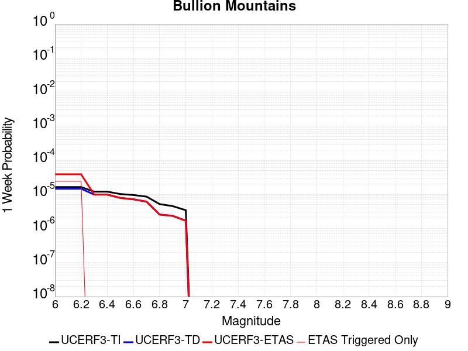 |  | 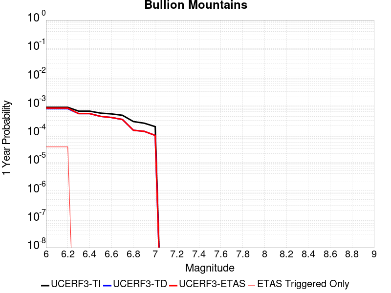 | 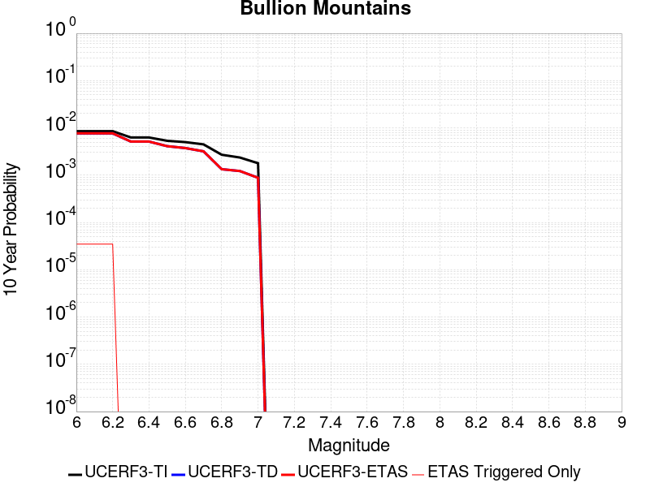 |

| Magnitude | 1 wk TI Prob | 1 wk TD Prob | 1 wk ETAS Prob | 1 wk ETAS/TD Gain | 1 wk ETAS Triggered Only | 1 mo TI Prob | 1 mo TD Prob | 1 mo ETAS Prob | 1 mo ETAS/TD Gain | 1 mo ETAS Triggered Only | 1 yr TI Prob | 1 yr TD Prob | 1 yr ETAS Prob | 1 yr ETAS/TD Gain | 1 yr ETAS Triggered Only | 10 yr TI Prob | 10 yr TD Prob | 10 yr ETAS Prob | 10 yr ETAS/TD Gain | 10 yr ETAS Triggered Only |
|-----|-----|-----|-----|-----|-----|-----|-----|-----|-----|-----|-----|-----|-----|-----|-----|-----|-----|-----|-----|-----|
| 6.0 | 1.6420427E-5 | 1.4692089E-5 | 3.6574325E-5 | 2.489389 | 2.1882557E-5 | 7.037136E-5 | 6.296479E-5 | 8.4845975E-5 | 1.3475145 | 2.1882557E-5 | 8.5643446E-4 | 7.663651E-4 | 7.8823086E-4 | 1.0285318 | 2.1882557E-5 | 0.008531413 | 0.007641016 | 0.007662731 | 1.002842 | 2.1882557E-5 |
| 6.1 | 1.6420427E-5 | 1.4692089E-5 | 3.6574325E-5 | 2.489389 | 2.1882557E-5 | 7.037136E-5 | 6.296479E-5 | 8.4845975E-5 | 1.3475145 | 2.1882557E-5 | 8.5643446E-4 | 7.663651E-4 | 7.8823086E-4 | 1.0285318 | 2.1882557E-5 | 0.008531413 | 0.007641016 | 0.007662731 | 1.002842 | 2.1882557E-5 |
| 6.2 | 1.6420427E-5 | 1.4692089E-5 | 3.6574325E-5 | 2.489389 | 2.1882557E-5 | 7.037136E-5 | 6.296479E-5 | 8.4845975E-5 | 1.3475145 | 2.1882557E-5 | 8.5643446E-4 | 7.663651E-4 | 7.8823086E-4 | 1.0285318 | 2.1882557E-5 | 0.008531413 | 0.007641016 | 0.007662731 | 1.002842 | 2.1882557E-5 |
| 6.3 | 1.2046778E-5 | 9.862335E-6 | 9.862335E-6 | 1.0 | 0.0 | 5.1628023E-5 | 4.2266598E-5 | 4.2266598E-5 | 1.0 | 0.0 | 6.283899E-4 | 5.144975E-4 | 5.144975E-4 | 1.0 | 0.0 | 0.0062661595 | 0.005135345 | 0.005135345 | 1.0 | 0.0 |
| 6.4 | 1.2046778E-5 | 9.862335E-6 | 9.862335E-6 | 1.0 | 0.0 | 5.1628023E-5 | 4.2266598E-5 | 4.2266598E-5 | 1.0 | 0.0 | 6.283899E-4 | 5.144975E-4 | 5.144975E-4 | 1.0 | 0.0 | 0.0062661595 | 0.005135345 | 0.005135345 | 1.0 | 0.0 |
| 6.5 | 1.0244343E-5 | 7.879458E-6 | 7.879458E-6 | 1.0 | 0.0 | 4.390359E-5 | 3.3768785E-5 | 3.3768785E-5 | 1.0 | 0.0 | 5.343951E-4 | 4.110781E-4 | 4.110781E-4 | 1.0 | 0.0 | 0.005331118 | 0.004105208 | 0.004105208 | 1.0 | 0.0 |
| 6.6 | 9.605408E-6 | 7.1774966E-6 | 7.1774966E-6 | 1.0 | 0.0 | 4.1165385E-5 | 3.076045E-5 | 3.076045E-5 | 1.0 | 0.0 | 5.010733E-4 | 3.744645E-4 | 3.744645E-4 | 1.0 | 0.0 | 0.00499945 | 0.003740332 | 0.003740332 | 1.0 | 0.0 |
| 6.7 | 8.60418E-6 | 6.1240044E-6 | 6.1240044E-6 | 1.0 | 0.0 | 3.687454E-5 | 2.624558E-5 | 2.624558E-5 | 1.0 | 0.0 | 4.48855E-4 | 3.1951256E-4 | 3.1951256E-4 | 1.0 | 0.0 | 0.004479495 | 0.0031924439 | 0.0031924439 | 1.0 | 0.0 |
| 6.8 | 5.187994E-6 | 2.5631666E-6 | 2.5631666E-6 | 1.0 | 0.0 | 2.223407E-5 | 1.0984976E-5 | 1.0984976E-5 | 1.0 | 0.0 | 2.7066618E-4 | 1.3373788E-4 | 1.3373788E-4 | 1.0 | 0.0 | 0.0027033675 | 0.0013369655 | 0.0013369655 | 1.0 | 0.0 |
| 6.9 | 4.5302368E-6 | 2.3443165E-6 | 2.3443165E-6 | 1.0 | 0.0 | 1.9415156E-5 | 1.0047055E-5 | 1.0047055E-5 | 1.0 | 0.0 | 2.3635388E-4 | 1.2232E-4 | 1.2232E-4 | 1.0 | 0.0 | 0.0023610266 | 0.0012229157 | 0.0012229157 | 1.0 | 0.0 |
| 7.0 | 3.431668E-6 | 1.6882402E-6 | 1.6882402E-6 | 1.0 | 0.0 | 1.4707065E-5 | 7.235315E-6 | 7.235315E-6 | 1.0 | 0.0 | 1.7904381E-4 | 8.808996E-5 | 8.808996E-5 | 1.0 | 0.0 | 0.0017889962 | 8.808996E-4 | 8.808996E-4 | 1.0 | 0.0 |

## San Cayetano
*[(top)](#table-of-contents)*

| 1 Week | 1 Month | 1 Year | 10 Year |
|-----|-----|-----|-----|
| 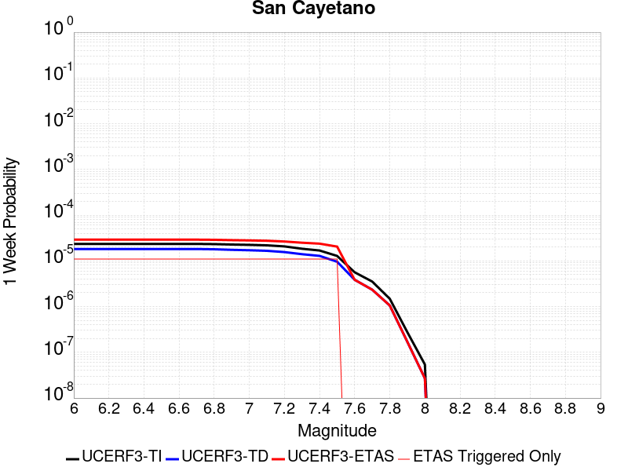 | 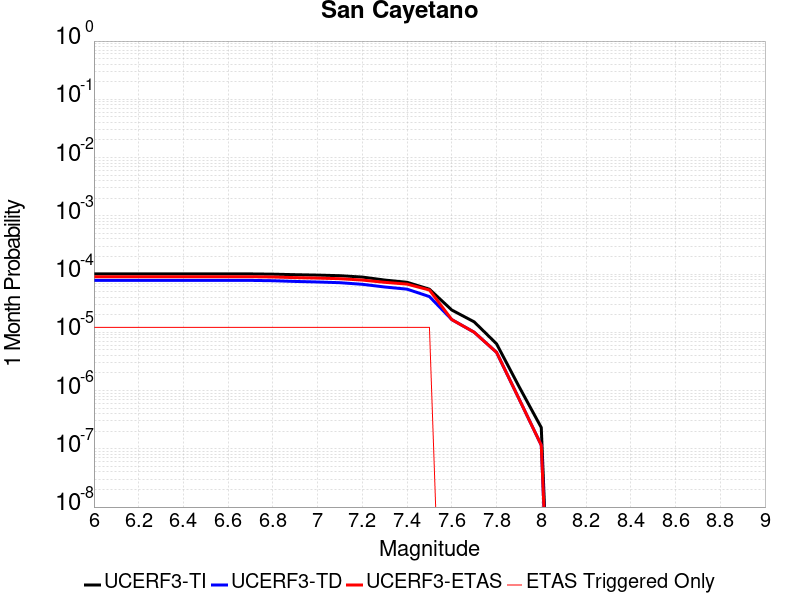 | 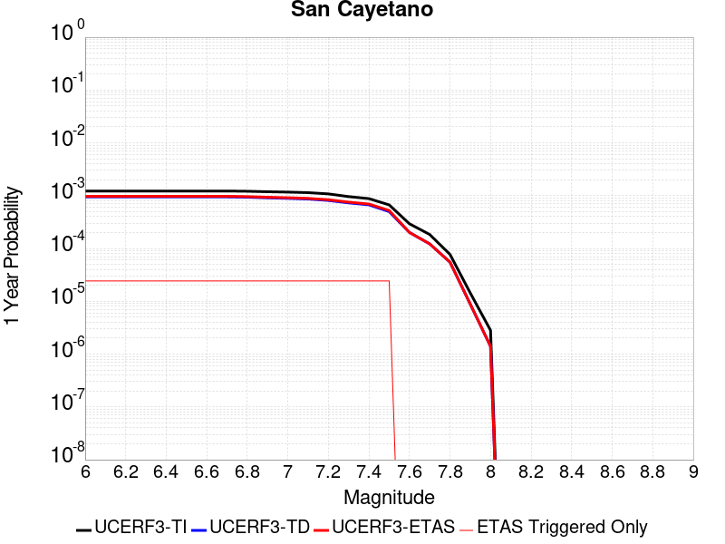 | 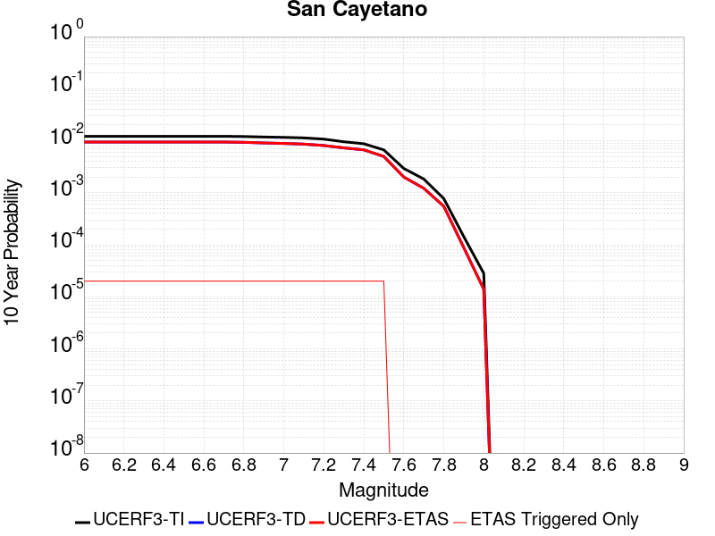 |

| Magnitude | 1 wk TI Prob | 1 wk TD Prob | 1 wk ETAS Prob | 1 wk ETAS/TD Gain | 1 wk ETAS Triggered Only | 1 mo TI Prob | 1 mo TD Prob | 1 mo ETAS Prob | 1 mo ETAS/TD Gain | 1 mo ETAS Triggered Only | 1 yr TI Prob | 1 yr TD Prob | 1 yr ETAS Prob | 1 yr ETAS/TD Gain | 1 yr ETAS Triggered Only | 10 yr TI Prob | 10 yr TD Prob | 10 yr ETAS Prob | 10 yr ETAS/TD Gain | 10 yr ETAS Triggered Only |
|-----|-----|-----|-----|-----|-----|-----|-----|-----|-----|-----|-----|-----|-----|-----|-----|-----|-----|-----|-----|-----|
| 6.0 | 2.3476267E-5 | 1.816928E-5 | 2.9110359E-5 | 1.6021746 | 1.0941279E-5 | 1.0060869E-4 | 7.786603E-5 | 8.880646E-5 | 1.1405032 | 1.0941279E-5 | 0.0012242225 | 9.476103E-4 | 9.694721E-4 | 1.0230705 | 2.1882557E-5 | 0.012175002 | 0.009436584 | 0.009458261 | 1.002297 | 2.1882557E-5 |
| 6.1 | 2.3476267E-5 | 1.816928E-5 | 2.9110359E-5 | 1.6021746 | 1.0941279E-5 | 1.0060869E-4 | 7.786603E-5 | 8.880646E-5 | 1.1405032 | 1.0941279E-5 | 0.0012242225 | 9.476103E-4 | 9.694721E-4 | 1.0230705 | 2.1882557E-5 | 0.012175002 | 0.009436584 | 0.009458261 | 1.002297 | 2.1882557E-5 |
| 6.2 | 2.3476267E-5 | 1.816928E-5 | 2.9110359E-5 | 1.6021746 | 1.0941279E-5 | 1.0060869E-4 | 7.786603E-5 | 8.880646E-5 | 1.1405032 | 1.0941279E-5 | 0.0012242225 | 9.476103E-4 | 9.694721E-4 | 1.0230705 | 2.1882557E-5 | 0.012175002 | 0.009436584 | 0.009458261 | 1.002297 | 2.1882557E-5 |
| 6.3 | 2.3476267E-5 | 1.816928E-5 | 2.9110359E-5 | 1.6021746 | 1.0941279E-5 | 1.0060869E-4 | 7.786603E-5 | 8.880646E-5 | 1.1405032 | 1.0941279E-5 | 0.0012242225 | 9.476103E-4 | 9.694721E-4 | 1.0230705 | 2.1882557E-5 | 0.012175002 | 0.009436584 | 0.009458261 | 1.002297 | 2.1882557E-5 |
| 6.4 | 2.3476267E-5 | 1.816928E-5 | 2.9110359E-5 | 1.6021746 | 1.0941279E-5 | 1.0060869E-4 | 7.786603E-5 | 8.880646E-5 | 1.1405032 | 1.0941279E-5 | 0.0012242225 | 9.476103E-4 | 9.694721E-4 | 1.0230705 | 2.1882557E-5 | 0.012175002 | 0.009436584 | 0.009458261 | 1.002297 | 2.1882557E-5 |
| 6.5 | 2.3476267E-5 | 1.816928E-5 | 2.9110359E-5 | 1.6021746 | 1.0941279E-5 | 1.0060869E-4 | 7.786603E-5 | 8.880646E-5 | 1.1405032 | 1.0941279E-5 | 0.0012242225 | 9.476103E-4 | 9.694721E-4 | 1.0230705 | 2.1882557E-5 | 0.012175002 | 0.009436584 | 0.009458261 | 1.002297 | 2.1882557E-5 |
| 6.6 | 2.3476267E-5 | 1.816928E-5 | 2.9110359E-5 | 1.6021746 | 1.0941279E-5 | 1.0060869E-4 | 7.786603E-5 | 8.880646E-5 | 1.1405032 | 1.0941279E-5 | 0.0012242225 | 9.476103E-4 | 9.694721E-4 | 1.0230705 | 2.1882557E-5 | 0.012175002 | 0.009436584 | 0.009458261 | 1.002297 | 2.1882557E-5 |
| 6.7 | 2.3476267E-5 | 1.816928E-5 | 2.9110359E-5 | 1.6021746 | 1.0941279E-5 | 1.0060869E-4 | 7.786603E-5 | 8.880646E-5 | 1.1405032 | 1.0941279E-5 | 0.0012242225 | 9.476103E-4 | 9.694721E-4 | 1.0230705 | 2.1882557E-5 | 0.012175002 | 0.009436584 | 0.009458261 | 1.002297 | 2.1882557E-5 |
| 6.8 | 2.3241924E-5 | 1.7936987E-5 | 2.8878068E-5 | 1.6099732 | 1.0941279E-5 | 9.960445E-5 | 7.687056E-5 | 8.781099E-5 | 1.1423229 | 1.0941279E-5 | 0.0012120095 | 9.3550084E-4 | 9.573629E-4 | 1.0233694 | 2.1882557E-5 | 0.012054204 | 0.009316482 | 0.009338161 | 1.002327 | 2.1882557E-5 |
| 6.9 | 2.2761007E-5 | 1.7432423E-5 | 2.8373512E-5 | 1.6276286 | 1.0941279E-5 | 9.7543525E-5 | 7.470827E-5 | 8.5648724E-5 | 1.1464424 | 1.0941279E-5 | 0.0011869454 | 9.09197E-4 | 9.310597E-4 | 1.0240461 | 2.1882557E-5 | 0.011806256 | 0.009055603 | 0.009077287 | 1.0023946 | 2.1882557E-5 |
| 7.0 | 2.240283E-5 | 1.7066168E-5 | 2.800726E-5 | 1.6410983 | 1.0941279E-5 | 9.600859E-5 | 7.313869E-5 | 8.407917E-5 | 1.1495854 | 1.0941279E-5 | 0.0011682777 | 8.9010317E-4 | 9.1196626E-4 | 1.0245624 | 2.1882557E-5 | 0.011621549 | 0.008866196 | 0.008887884 | 1.0024462 | 2.1882557E-5 |
| 7.1 | 2.1871154E-5 | 1.6586018E-5 | 2.7527114E-5 | 1.6596578 | 1.0941279E-5 | 9.373015E-5 | 7.108101E-5 | 8.2021514E-5 | 1.1539159 | 1.0941279E-5 | 0.0011405671 | 8.6507114E-4 | 8.8693475E-4 | 1.0252738 | 2.1882557E-5 | 0.011347309 | 0.008617838 | 0.008639532 | 1.0025173 | 2.1882557E-5 |
| 7.2 | 2.0714133E-5 | 1.5564561E-5 | 2.6505668E-5 | 1.70295 | 1.0941279E-5 | 8.8771834E-5 | 6.670357E-5 | 7.764412E-5 | 1.1640174 | 1.0941279E-5 | 0.0010802611 | 8.1181666E-4 | 8.3368144E-4 | 1.0269332 | 2.1882557E-5 | 0.010750249 | 0.008089285 | 0.008110991 | 1.0026833 | 2.1882557E-5 |
| 7.3 | 1.8408395E-5 | 1.3996864E-5 | 2.493799E-5 | 1.781684 | 1.0941279E-5 | 7.8890735E-5 | 5.99852E-5 | 7.0925824E-5 | 1.1823887 | 1.0941279E-5 | 9.600714E-4 | 7.300781E-4 | 7.5194467E-4 | 1.029951 | 2.1882557E-5 | 0.009559342 | 0.0072775153 | 0.007299239 | 1.002985 | 2.1882557E-5 |
| 7.4 | 1.6856795E-5 | 1.28500815E-5 | 2.3791219E-5 | 1.8514451 | 1.0941279E-5 | 7.2241404E-5 | 5.5070628E-5 | 6.601131E-5 | 1.1986662 | 1.0941279E-5 | 8.7918417E-4 | 6.7028153E-4 | 6.921494E-4 | 1.032625 | 2.1882557E-5 | 0.00875714 | 0.0066832784 | 0.006705015 | 1.0032524 | 2.1882557E-5 |
| 7.5 | 1.2822778E-5 | 9.577542E-6 | 2.0518715E-5 | 2.142378 | 1.0941279E-5 | 5.495361E-5 | 4.1045972E-5 | 5.19868E-5 | 1.2665507 | 1.0941279E-5 | 6.688548E-4 | 4.996217E-4 | 5.214933E-4 | 1.0437764 | 2.1882557E-5 | 0.006668452 | 0.0049851555 | 0.005006929 | 1.0043677 | 2.1882557E-5 |
| 7.6 | 5.6272684E-6 | 3.854903E-6 | 3.854903E-6 | 1.0 | 0.0 | 2.4116642E-5 | 1.652091E-5 | 1.652091E-5 | 1.0 | 0.0 | 2.9358055E-4 | 2.0112359E-4 | 2.0112359E-4 | 1.0 | 0.0 | 0.0029319301 | 0.0020094267 | 0.0020094267 | 1.0 | 0.0 |
| 7.7 | 3.5261346E-6 | 2.3407013E-6 | 2.3407013E-6 | 1.0 | 0.0 | 1.5111918E-5 | 1.0031539E-5 | 1.0031539E-5 | 1.0 | 0.0 | 1.8397206E-4 | 1.2212721E-4 | 1.2212721E-4 | 1.0 | 0.0 | 0.0018381984 | 0.0012206084 | 0.0012206084 | 1.0 | 0.0 |
| 7.8 | 1.4826929E-6 | 1.056428E-6 | 1.056428E-6 | 1.0 | 0.0 | 6.354383E-6 | 4.5275406E-6 | 4.5275406E-6 | 1.0 | 0.0 | 7.736187E-5 | 5.5121433E-5 | 5.5121433E-5 | 1.0 | 0.0 | 7.733494E-4 | 5.5107963E-4 | 5.5107963E-4 | 1.0 | 0.0 |
| 7.9 | 2.7568166E-7 | 1.6978244E-7 | 1.6978244E-7 | 1.0 | 0.0 | 1.1814923E-6 | 7.2763885E-7 | 7.2763885E-7 | 1.0 | 0.0 | 1.4384574E-5 | 8.858967E-6 | 8.858967E-6 | 1.0 | 0.0 | 1.4383643E-4 | 8.8586174E-5 | 8.8586174E-5 | 1.0 | 0.0 |
| 8.0 | 5.407832E-8 | 2.6887697E-8 | 2.6887697E-8 | 1.0 | 0.0 | 2.3176422E-7 | 1.15232986E-7 | 1.15232986E-7 | 1.0 | 0.0 | 2.8217257E-6 | 1.4029607E-6 | 1.4029607E-6 | 1.0 | 0.0 | 2.8216898E-5 | 1.4029522E-5 | 1.4029522E-5 | 1.0 | 0.0 |

## Hayward (So) 2011 CFM
*[(top)](#table-of-contents)*

| 1 Week | 1 Month | 1 Year | 10 Year |
|-----|-----|-----|-----|
|  |  |  |  |

| Magnitude | 1 wk TI Prob | 1 wk TD Prob | 1 wk ETAS Prob | 1 wk ETAS/TD Gain | 1 wk ETAS Triggered Only | 1 mo TI Prob | 1 mo TD Prob | 1 mo ETAS Prob | 1 mo ETAS/TD Gain | 1 mo ETAS Triggered Only | 1 yr TI Prob | 1 yr TD Prob | 1 yr ETAS Prob | 1 yr ETAS/TD Gain | 1 yr ETAS Triggered Only | 10 yr TI Prob | 10 yr TD Prob | 10 yr ETAS Prob | 10 yr ETAS/TD Gain | 10 yr ETAS Triggered Only |
|-----|-----|-----|-----|-----|-----|-----|-----|-----|-----|-----|-----|-----|-----|-----|-----|-----|-----|-----|-----|-----|
| 6.0 | 1.8091932E-4 | 3.570541E-4 | 3.570541E-4 | 1.0 | 0.0 | 7.751381E-4 | 0.0015293444 | 0.0015293444 | 1.0 | 0.0 | 0.00939654 | 0.018463207 | 0.018473947 | 1.0005816 | 1.0941279E-5 | 0.090090066 | 0.16673161 | 0.16674985 | 1.0001093 | 2.1882557E-5 |
| 6.1 | 1.8091932E-4 | 3.570541E-4 | 3.570541E-4 | 1.0 | 0.0 | 7.751381E-4 | 0.0015293444 | 0.0015293444 | 1.0 | 0.0 | 0.00939654 | 0.018463207 | 0.018473947 | 1.0005816 | 1.0941279E-5 | 0.090090066 | 0.16673161 | 0.16674985 | 1.0001093 | 2.1882557E-5 |
| 6.2 | 1.8091932E-4 | 3.570541E-4 | 3.570541E-4 | 1.0 | 0.0 | 7.751381E-4 | 0.0015293444 | 0.0015293444 | 1.0 | 0.0 | 0.00939654 | 0.018463207 | 0.018473947 | 1.0005816 | 1.0941279E-5 | 0.090090066 | 0.16673161 | 0.16674985 | 1.0001093 | 2.1882557E-5 |
| 6.3 | 1.7322872E-4 | 3.426234E-4 | 3.426234E-4 | 1.0 | 0.0 | 7.4219756E-4 | 0.0014675693 | 0.0014675693 | 1.0 | 0.0 | 0.0089988755 | 0.017723544 | 0.017734291 | 1.0006064 | 1.0941279E-5 | 0.08643075 | 0.16066726 | 0.16068563 | 1.0001143 | 2.1882557E-5 |
| 6.4 | 1.6334097E-4 | 3.234411E-4 | 3.234411E-4 | 1.0 | 0.0 | 6.998449E-4 | 0.0013854484 | 0.0013854484 | 1.0 | 0.0 | 0.008487372 | 0.016739385 | 0.016750144 | 1.0006427 | 1.0941279E-5 | 0.081704415 | 0.15255594 | 0.15257448 | 1.0001216 | 2.1882557E-5 |
| 6.5 | 1.5600289E-4 | 3.1018828E-4 | 3.1018828E-4 | 1.0 | 0.0 | 6.684125E-4 | 0.0013287093 | 0.0013287093 | 1.0 | 0.0 | 0.008107598 | 0.016058935 | 0.0160697 | 1.0006704 | 1.0941279E-5 | 0.078181036 | 0.14683272 | 0.14685138 | 1.0001272 | 2.1882557E-5 |
| 6.6 | 1.4046066E-4 | 2.8032906E-4 | 2.8032906E-4 | 1.0 | 0.0 | 6.018354E-4 | 0.0012008639 | 0.0012008639 | 1.0 | 0.0 | 0.0073027555 | 0.014524006 | 0.014534788 | 1.0007424 | 1.0941279E-5 | 0.07067384 | 0.13391982 | 0.13393877 | 1.0001415 | 2.1882557E-5 |
| 6.7 | 1.14696966E-4 | 2.3271477E-4 | 2.3271477E-4 | 1.0 | 0.0 | 4.914658E-4 | 9.969729E-4 | 9.969729E-4 | 1.0 | 0.0 | 0.0059671924 | 0.012071652 | 0.012082462 | 1.0008954 | 1.0941279E-5 | 0.058094822 | 0.11274672 | 0.11276614 | 1.0001723 | 2.1882557E-5 |
| 6.8 | 9.3874296E-5 | 1.8861453E-4 | 1.8861453E-4 | 1.0 | 0.0 | 4.0225635E-4 | 8.0810126E-4 | 8.0810126E-4 | 1.0 | 0.0 | 0.0048864787 | 0.009794984 | 0.009794984 | 1.0 | 0.0 | 0.047804173 | 0.09259856 | 0.09260849 | 1.0001072 | 1.0941279E-5 |
| 6.9 | 5.551852E-5 | 1.072948E-4 | 1.072948E-4 | 1.0 | 0.0 | 2.3791482E-4 | 4.5975443E-4 | 4.5975443E-4 | 1.0 | 0.0 | 0.0028927654 | 0.0055832625 | 0.0055832625 | 1.0 | 0.0 | 0.028553981 | 0.054245494 | 0.05425584 | 1.0001907 | 1.0941279E-5 |
| 7.0 | 4.2662363E-5 | 8.2464416E-5 | 8.2464416E-5 | 1.0 | 0.0 | 1.8282588E-4 | 3.5337146E-4 | 3.5337146E-4 | 1.0 | 0.0 | 0.0022236328 | 0.0042938837 | 0.0042938837 | 1.0 | 0.0 | 0.022015138 | 0.042064495 | 0.042074975 | 1.0002491 | 1.0941279E-5 |
| 7.1 | 3.305886E-5 | 6.3019055E-5 | 6.3019055E-5 | 1.0 | 0.0 | 1.4167312E-4 | 2.700538E-4 | 2.700538E-4 | 1.0 | 0.0 | 0.0017235056 | 0.0032829668 | 0.0032829668 | 1.0 | 0.0 | 0.017101998 | 0.032452874 | 0.03246346 | 1.0003262 | 1.0941279E-5 |
| 7.2 | 2.9856887E-5 | 5.7013647E-5 | 5.7013647E-5 | 1.0 | 0.0 | 1.2795182E-4 | 2.4432142E-4 | 2.4432142E-4 | 1.0 | 0.0 | 0.0015567001 | 0.0029705726 | 0.0029705726 | 1.0 | 0.0 | 0.015458403 | 0.029453589 | 0.029464208 | 1.0003605 | 1.0941279E-5 |
| 7.3 | 2.4559737E-5 | 4.599088E-5 | 4.599088E-5 | 1.0 | 0.0 | 1.0525176E-4 | 1.9708896E-4 | 1.9708896E-4 | 1.0 | 0.0 | 0.0012806869 | 0.0023969305 | 0.0023969305 | 1.0 | 0.0 | 0.012733313 | 0.023857482 | 0.023868162 | 1.0004476 | 1.0941279E-5 |
| 7.4 | 1.9002231E-5 | 3.5049303E-5 | 3.5049303E-5 | 1.0 | 0.0 | 8.143559E-5 | 1.502027E-4 | 1.502027E-4 | 1.0 | 0.0 | 9.910273E-4 | 0.0018271938 | 0.0018271938 | 1.0 | 0.0 | 0.009866194 | 0.018258283 | 0.018269025 | 1.0005883 | 1.0941279E-5 |
| 7.5 | 1.2783333E-5 | 2.3330069E-5 | 2.3330069E-5 | 1.0 | 0.0 | 5.4784563E-5 | 9.998221E-5 | 9.998221E-5 | 1.0 | 0.0 | 6.667979E-4 | 0.0012166094 | 0.0012166094 | 1.0 | 0.0 | 0.006648007 | 0.012209582 | 0.01222039 | 1.0008851 | 1.0941279E-5 |
| 7.6 | 4.8149627E-6 | 8.887544E-6 | 8.887544E-6 | 1.0 | 0.0 | 2.063539E-5 | 3.8088925E-5 | 3.8088925E-5 | 1.0 | 0.0 | 2.5120692E-4 | 4.636352E-4 | 4.636352E-4 | 1.0 | 0.0 | 0.0025092314 | 0.0046812436 | 0.0046921335 | 1.0023264 | 1.0941279E-5 |
| 7.7 | 6.0838227E-7 | 1.2056693E-6 | 1.2056693E-6 | 1.0 | 0.0 | 2.6073499E-6 | 5.1671436E-6 | 5.1671436E-6 | 1.0 | 0.0 | 3.174402E-5 | 6.290816E-5 | 6.290816E-5 | 1.0 | 0.0 | 3.1739488E-4 | 6.5293367E-4 | 6.638678E-4 | 1.0167462 | 1.0941279E-5 |
| 7.8 | 4.5542808E-7 | 9.792182E-7 | 9.792182E-7 | 1.0 | 0.0 | 1.9518332E-6 | 4.1966427E-6 | 4.1966427E-6 | 1.0 | 0.0 | 2.376331E-5 | 5.1092928E-5 | 5.1092928E-5 | 1.0 | 0.0 | 2.3760769E-4 | 5.321372E-4 | 5.430726E-4 | 1.02055 | 1.0941279E-5 |
| 7.9 | 3.3016747E-7 | 7.386335E-7 | 7.386335E-7 | 1.0 | 0.0 | 1.4150027E-6 | 3.1655684E-6 | 3.1655684E-6 | 1.0 | 0.0 | 1.7227521E-5 | 3.8540114E-5 | 3.8540114E-5 | 1.0 | 0.0 | 1.7226185E-4 | 3.9930744E-4 | 4.1024433E-4 | 1.0273896 | 1.0941279E-5 |
| 8.0 | 2.347038E-7 | 5.4714894E-7 | 5.4714894E-7 | 1.0 | 0.0 | 1.0058731E-6 | 2.344922E-6 | 2.344922E-6 | 1.0 | 0.0 | 1.2246436E-5 | 2.8549053E-5 | 2.8549053E-5 | 1.0 | 0.0 | 1.2245761E-4 | 2.9355253E-4 | 3.044906E-4 | 1.037261 | 1.0941279E-5 |
| 8.1 | 1.18822804E-7 | 2.6058973E-7 | 2.6058973E-7 | 1.0 | 0.0 | 5.092405E-7 | 1.1168127E-6 | 1.1168127E-6 | 1.0 | 0.0 | 6.1999854E-6 | 1.359711E-5 | 1.359711E-5 | 1.0 | 0.0 | 6.199812E-5 | 1.3917852E-4 | 1.5011827E-4 | 1.0786023 | 1.0941279E-5 |

## Calaveras (Central) 2011 CFM
*[(top)](#table-of-contents)*

| 1 Week | 1 Month | 1 Year | 10 Year |
|-----|-----|-----|-----|
|  | 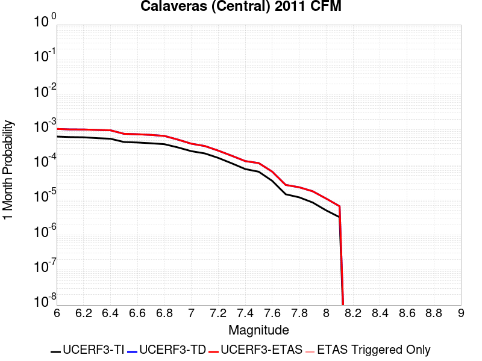 |  |  |

| Magnitude | 1 wk TI Prob | 1 wk TD Prob | 1 wk ETAS Prob | 1 wk ETAS/TD Gain | 1 wk ETAS Triggered Only | 1 mo TI Prob | 1 mo TD Prob | 1 mo ETAS Prob | 1 mo ETAS/TD Gain | 1 mo ETAS Triggered Only | 1 yr TI Prob | 1 yr TD Prob | 1 yr ETAS Prob | 1 yr ETAS/TD Gain | 1 yr ETAS Triggered Only | 10 yr TI Prob | 10 yr TD Prob | 10 yr ETAS Prob | 10 yr ETAS/TD Gain | 10 yr ETAS Triggered Only |
|-----|-----|-----|-----|-----|-----|-----|-----|-----|-----|-----|-----|-----|-----|-----|-----|-----|-----|-----|-----|-----|
| 6.0 | 1.5010907E-4 | 2.481574E-4 | 2.481574E-4 | 1.0 | 0.0 | 6.4316596E-4 | 0.0010621005 | 0.0010621005 | 1.0 | 0.0 | 0.0078024664 | 0.012850073 | 0.012850073 | 1.0 | 0.0 | 0.07534136 | 0.120401435 | 0.12041106 | 1.00008 | 1.0941279E-5 |
| 6.1 | 1.4521465E-4 | 2.397987E-4 | 2.397987E-4 | 1.0 | 0.0 | 6.222001E-4 | 0.0010263061 | 0.0010263061 | 1.0 | 0.0 | 0.0075490056 | 0.012419341 | 0.012419341 | 1.0 | 0.0 | 0.07297657 | 0.11667323 | 0.116682895 | 1.0000829 | 1.0941279E-5 |
| 6.2 | 1.429998E-4 | 2.3911126E-4 | 2.3911126E-4 | 1.0 | 0.0 | 6.127123E-4 | 0.0010233623 | 0.0010233623 | 1.0 | 0.0 | 0.007434286 | 0.01238394 | 0.01238394 | 1.0 | 0.0 | 0.07190444 | 0.1163272 | 0.11633687 | 1.0000831 | 1.0941279E-5 |
| 6.3 | 1.3536277E-4 | 2.3242626E-4 | 2.3242626E-4 | 1.0 | 0.0 | 5.799972E-4 | 9.947343E-4 | 9.947343E-4 | 1.0 | 0.0 | 0.0070386264 | 0.012040132 | 0.012040132 | 1.0 | 0.0 | 0.0681982 | 0.11323977 | 0.11324948 | 1.0000857 | 1.0941279E-5 |
| 6.4 | 1.2993296E-4 | 2.2666177E-4 | 2.2666177E-4 | 1.0 | 0.0 | 5.5673666E-4 | 9.700479E-4 | 9.700479E-4 | 1.0 | 0.0 | 0.006757223 | 0.011742937 | 0.011742937 | 1.0 | 0.0 | 0.06555412 | 0.11051771 | 0.11052744 | 1.0000881 | 1.0941279E-5 |
| 6.5 | 1.0498927E-4 | 1.7981697E-4 | 1.7981697E-4 | 1.0 | 0.0 | 4.498764E-4 | 7.704157E-4 | 7.704157E-4 | 1.0 | 0.0 | 0.005463498 | 0.00933924 | 0.00933924 | 1.0 | 0.0 | 0.053311124 | 0.089199215 | 0.08920918 | 1.0001117 | 1.0941279E-5 |
| 6.6 | 1.0157505E-4 | 1.7469203E-4 | 1.7469203E-4 | 1.0 | 0.0 | 4.35249E-4 | 7.484645E-4 | 7.484645E-4 | 1.0 | 0.0 | 0.0052862884 | 0.009074297 | 0.009074297 | 1.0 | 0.0 | 0.05162293 | 0.08677671 | 0.0867867 | 1.0001152 | 1.0941279E-5 |
| 6.7 | 9.660386E-5 | 1.6728524E-4 | 1.6728524E-4 | 1.0 | 0.0 | 4.1395082E-4 | 7.1673887E-4 | 7.1673887E-4 | 1.0 | 0.0 | 0.0050282106 | 0.008691208 | 0.008691208 | 1.0 | 0.0 | 0.049159497 | 0.083266065 | 0.08327609 | 1.0001204 | 1.0941279E-5 |
| 6.8 | 9.089927E-5 | 1.5643016E-4 | 1.5643016E-4 | 1.0 | 0.0 | 3.8951015E-4 | 6.702439E-4 | 6.702439E-4 | 1.0 | 0.0 | 0.0047319788 | 0.008129478 | 0.008129478 | 1.0 | 0.0 | 0.046324775 | 0.078159414 | 0.0781695 | 1.0001291 | 1.0941279E-5 |
| 6.9 | 7.353187E-5 | 1.2295354E-4 | 1.2295354E-4 | 1.0 | 0.0 | 3.150985E-4 | 5.2683795E-4 | 5.2683795E-4 | 1.0 | 0.0 | 0.0038295772 | 0.006395508 | 0.006395508 | 1.0 | 0.0 | 0.037642512 | 0.062187865 | 0.062198125 | 1.000165 | 1.0941279E-5 |
| 7.0 | 5.746064E-5 | 9.3887444E-5 | 9.3887444E-5 | 1.0 | 0.0 | 2.4623662E-4 | 4.0231308E-4 | 4.0231308E-4 | 1.0 | 0.0 | 0.0029938098 | 0.004887232 | 0.004887232 | 1.0 | 0.0 | 0.02953797 | 0.04798685 | 0.047997266 | 1.0002171 | 1.0941279E-5 |
| 7.1 | 4.9557195E-5 | 8.052461E-5 | 8.052461E-5 | 1.0 | 0.0 | 2.123707E-4 | 3.4506017E-4 | 3.4506017E-4 | 1.0 | 0.0 | 0.0025825473 | 0.0041930773 | 0.0041930773 | 1.0 | 0.0 | 0.0255274 | 0.041373078 | 0.04138357 | 1.0002536 | 1.0941279E-5 |
| 7.2 | 3.687595E-5 | 5.9524526E-5 | 5.9524526E-5 | 1.0 | 0.0 | 1.5803022E-4 | 2.5508032E-4 | 2.5508032E-4 | 1.0 | 0.0 | 0.0019223199 | 0.0031012094 | 0.0031012094 | 1.0 | 0.0 | 0.01905776 | 0.030883716 | 0.030894319 | 1.0003433 | 1.0941279E-5 |
| 7.3 | 2.5846984E-5 | 4.247213E-5 | 4.247213E-5 | 1.0 | 0.0 | 1.1076809E-4 | 1.8201082E-4 | 1.8201082E-4 | 1.0 | 0.0 | 0.0013477671 | 0.002213747 | 0.002213747 | 1.0 | 0.0 | 0.013396223 | 0.02217554 | 0.022186238 | 1.0004824 | 1.0941279E-5 |
| 7.4 | 1.7747854E-5 | 2.9936204E-5 | 2.9936204E-5 | 1.0 | 0.0 | 7.6060016E-5 | 1.2829172E-4 | 1.2829172E-4 | 1.0 | 0.0 | 9.2563726E-4 | 0.0015608355 | 0.0015608355 | 1.0 | 0.0 | 0.009217911 | 0.015709236 | 0.015720006 | 1.0006856 | 1.0941279E-5 |
| 7.5 | 1.4883479E-5 | 2.6243379E-5 | 2.6243379E-5 | 1.0 | 0.0 | 6.378478E-5 | 1.1246678E-4 | 1.1246678E-4 | 1.0 | 0.0 | 7.76303E-4 | 0.0013684258 | 0.0013684258 | 1.0 | 0.0 | 0.0077359667 | 0.013802425 | 0.013813215 | 1.0007818 | 1.0941279E-5 |
| 7.6 | 8.166975E-6 | 1.4963478E-5 | 1.4963478E-5 | 1.0 | 0.0 | 3.5000852E-5 | 6.412763E-5 | 6.412763E-5 | 1.0 | 0.0 | 4.2605202E-4 | 7.804755E-4 | 7.804755E-4 | 1.0 | 0.0 | 0.004252361 | 0.00793984 | 0.007950694 | 1.0013671 | 1.0941279E-5 |
| 7.7 | 3.3858064E-6 | 6.253914E-6 | 6.253914E-6 | 1.0 | 0.0 | 1.4510518E-5 | 2.6802214E-5 | 2.6802214E-5 | 1.0 | 0.0 | 1.7665124E-4 | 3.2626814E-4 | 3.2626814E-4 | 1.0 | 0.0 | 0.0017651088 | 0.0033882293 | 0.0033991334 | 1.0032183 | 1.0941279E-5 |
| 7.8 | 2.7721615E-6 | 5.3663807E-6 | 5.3663807E-6 | 1.0 | 0.0 | 1.1880637E-5 | 2.2998573E-5 | 2.2998573E-5 | 1.0 | 0.0 | 1.4463716E-4 | 2.799717E-4 | 2.799717E-4 | 1.0 | 0.0 | 0.0014454306 | 0.0029074624 | 0.002918372 | 1.0037522 | 1.0941279E-5 |
| 7.9 | 1.9736292E-6 | 4.1284193E-6 | 4.1284193E-6 | 1.0 | 0.0 | 8.4583835E-6 | 1.7693106E-5 | 1.7693106E-5 | 1.0 | 0.0 | 1.0297595E-4 | 2.1539231E-4 | 2.1539231E-4 | 1.0 | 0.0 | 0.0010292825 | 0.0022236116 | 0.0022345285 | 1.0049095 | 1.0941279E-5 |
| 8.0 | 1.1767289E-6 | 2.5544743E-6 | 2.5544743E-6 | 1.0 | 0.0 | 5.0431145E-6 | 1.0947701E-5 | 1.0947701E-5 | 1.0 | 0.0 | 6.139818E-5 | 1.3328013E-4 | 1.3328013E-4 | 1.0 | 0.0 | 6.1381224E-4 | 0.0013660848 | 0.0013770111 | 1.0079982 | 1.0941279E-5 |
| 8.1 | 7.5112825E-7 | 1.5409794E-6 | 1.5409794E-6 | 1.0 | 0.0 | 3.2191172E-6 | 6.6041807E-6 | 6.6041807E-6 | 1.0 | 0.0 | 3.9192048E-5 | 8.0402955E-5 | 8.0402955E-5 | 1.0 | 0.0 | 3.9185135E-4 | 8.235564E-4 | 8.3448866E-4 | 1.0132744 | 1.0941279E-5 |

## Earthquake Valley (So Extension)
*[(top)](#table-of-contents)*

| 1 Week | 1 Month | 1 Year | 10 Year |
|-----|-----|-----|-----|
| 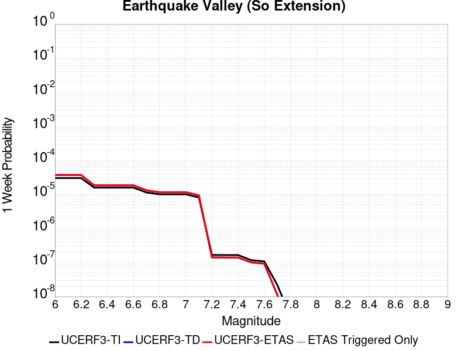 | 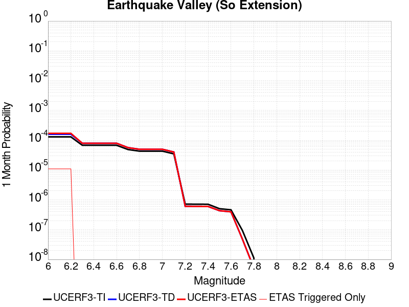 | 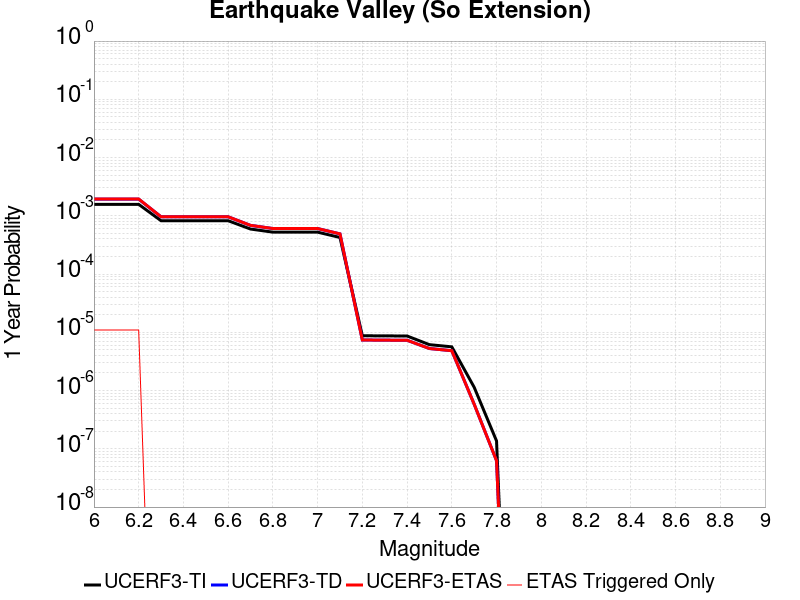 | 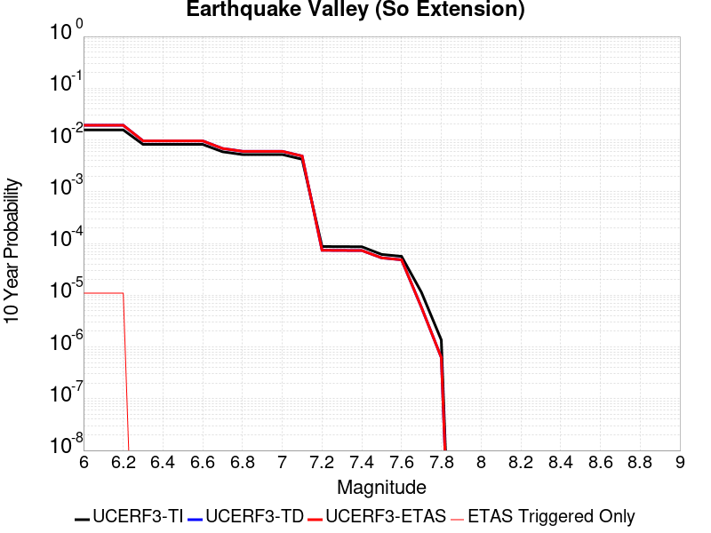 |

| Magnitude | 1 wk TI Prob | 1 wk TD Prob | 1 wk ETAS Prob | 1 wk ETAS/TD Gain | 1 wk ETAS Triggered Only | 1 mo TI Prob | 1 mo TD Prob | 1 mo ETAS Prob | 1 mo ETAS/TD Gain | 1 mo ETAS Triggered Only | 1 yr TI Prob | 1 yr TD Prob | 1 yr ETAS Prob | 1 yr ETAS/TD Gain | 1 yr ETAS Triggered Only | 10 yr TI Prob | 10 yr TD Prob | 10 yr ETAS Prob | 10 yr ETAS/TD Gain | 10 yr ETAS Triggered Only |
|-----|-----|-----|-----|-----|-----|-----|-----|-----|-----|-----|-----|-----|-----|-----|-----|-----|-----|-----|-----|-----|
| 6.0 | 3.0194888E-5 | 3.7072114E-5 | 3.7072114E-5 | 1.0 | 0.0 | 1.2940024E-4 | 1.5887388E-4 | 1.6981341E-4 | 1.0688567 | 1.0941279E-5 | 0.0015743093 | 0.0019331174 | 0.0019440375 | 1.005649 | 1.0941279E-5 | 0.01563203 | 0.019213019 | 0.01922375 | 1.0005585 | 1.0941279E-5 |
| 6.1 | 3.0194888E-5 | 3.7072114E-5 | 3.7072114E-5 | 1.0 | 0.0 | 1.2940024E-4 | 1.5887388E-4 | 1.6981341E-4 | 1.0688567 | 1.0941279E-5 | 0.0015743093 | 0.0019331174 | 0.0019440375 | 1.005649 | 1.0941279E-5 | 0.01563203 | 0.019213019 | 0.01922375 | 1.0005585 | 1.0941279E-5 |
| 6.2 | 3.0194888E-5 | 3.7072114E-5 | 3.7072114E-5 | 1.0 | 0.0 | 1.2940024E-4 | 1.5887388E-4 | 1.6981341E-4 | 1.0688567 | 1.0941279E-5 | 0.0015743093 | 0.0019331174 | 0.0019440375 | 1.005649 | 1.0941279E-5 | 0.01563203 | 0.019213019 | 0.01922375 | 1.0005585 | 1.0941279E-5 |
| 6.3 | 1.5795305E-5 | 1.844658E-5 | 1.844658E-5 | 1.0 | 0.0 | 6.769241E-5 | 7.9055004E-5 | 7.9055004E-5 | 1.0 | 0.0 | 8.238434E-4 | 9.6218096E-4 | 9.6218096E-4 | 1.0 | 0.0 | 0.008207959 | 0.009591061 | 0.009591061 | 1.0 | 0.0 |
| 6.4 | 1.5795305E-5 | 1.844658E-5 | 1.844658E-5 | 1.0 | 0.0 | 6.769241E-5 | 7.9055004E-5 | 7.9055004E-5 | 1.0 | 0.0 | 8.238434E-4 | 9.6218096E-4 | 9.6218096E-4 | 1.0 | 0.0 | 0.008207959 | 0.009591061 | 0.009591061 | 1.0 | 0.0 |
| 6.5 | 1.5795305E-5 | 1.844658E-5 | 1.844658E-5 | 1.0 | 0.0 | 6.769241E-5 | 7.9055004E-5 | 7.9055004E-5 | 1.0 | 0.0 | 8.238434E-4 | 9.6218096E-4 | 9.6218096E-4 | 1.0 | 0.0 | 0.008207959 | 0.009591061 | 0.009591061 | 1.0 | 0.0 |
| 6.6 | 1.5795305E-5 | 1.844658E-5 | 1.844658E-5 | 1.0 | 0.0 | 6.769241E-5 | 7.9055004E-5 | 7.9055004E-5 | 1.0 | 0.0 | 8.238434E-4 | 9.6218096E-4 | 9.6218096E-4 | 1.0 | 0.0 | 0.008207959 | 0.009591061 | 0.009591061 | 1.0 | 0.0 |
| 6.7 | 1.1363076E-5 | 1.3138294E-5 | 1.3138294E-5 | 1.0 | 0.0 | 4.8697988E-5 | 5.6306188E-5 | 5.6306188E-5 | 1.0 | 0.0 | 5.927367E-4 | 6.8538834E-4 | 6.8538834E-4 | 1.0 | 0.0 | 0.0059115817 | 0.0068402183 | 0.0068402183 | 1.0 | 0.0 |
| 6.8 | 1.0049611E-5 | 1.1594334E-5 | 1.1594334E-5 | 1.0 | 0.0 | 4.306905E-5 | 4.9689468E-5 | 4.9689468E-5 | 1.0 | 0.0 | 5.242395E-4 | 6.048745E-4 | 6.048745E-4 | 1.0 | 0.0 | 0.0052300454 | 0.006039458 | 0.006039458 | 1.0 | 0.0 |
| 6.9 | 1.0049611E-5 | 1.1594334E-5 | 1.1594334E-5 | 1.0 | 0.0 | 4.306905E-5 | 4.9689468E-5 | 4.9689468E-5 | 1.0 | 0.0 | 5.242395E-4 | 6.048745E-4 | 6.048745E-4 | 1.0 | 0.0 | 0.0052300454 | 0.006039458 | 0.006039458 | 1.0 | 0.0 |
| 7.0 | 1.0049611E-5 | 1.1594334E-5 | 1.1594334E-5 | 1.0 | 0.0 | 4.306905E-5 | 4.9689468E-5 | 4.9689468E-5 | 1.0 | 0.0 | 5.242395E-4 | 6.048745E-4 | 6.048745E-4 | 1.0 | 0.0 | 0.0052300454 | 0.006039458 | 0.006039458 | 1.0 | 0.0 |
| 7.1 | 8.140254E-6 | 9.383458E-6 | 9.383458E-6 | 1.0 | 0.0 | 3.4886336E-5 | 4.0214578E-5 | 4.0214578E-5 | 1.0 | 0.0 | 4.2465836E-4 | 4.8956956E-4 | 4.8956956E-4 | 1.0 | 0.0 | 0.0042384774 | 0.0048914864 | 0.0048914864 | 1.0 | 0.0 |
| 7.2 | 1.673835E-7 | 1.4154125E-7 | 1.4154125E-7 | 1.0 | 0.0 | 7.173577E-7 | 6.066052E-7 | 6.066052E-7 | 1.0 | 0.0 | 8.733795E-6 | 7.385397E-6 | 7.385397E-6 | 1.0 | 0.0 | 8.733451E-5 | 7.385187E-5 | 7.385187E-5 | 1.0 | 0.0 |
| 7.3 | 1.6632116E-7 | 1.4052354E-7 | 1.4052354E-7 | 1.0 | 0.0 | 7.1280476E-7 | 6.0224363E-7 | 6.0224363E-7 | 1.0 | 0.0 | 8.678364E-6 | 7.332295E-6 | 7.332295E-6 | 1.0 | 0.0 | 8.6780245E-5 | 7.332089E-5 | 7.332089E-5 | 1.0 | 0.0 |
| 7.4 | 1.6569169E-7 | 1.3996983E-7 | 1.3996983E-7 | 1.0 | 0.0 | 7.1010703E-7 | 5.9987053E-7 | 5.9987053E-7 | 1.0 | 0.0 | 8.645519E-6 | 7.303403E-6 | 7.303403E-6 | 1.0 | 0.0 | 8.645182E-5 | 7.303199E-5 | 7.303199E-5 | 1.0 | 0.0 |
| 7.5 | 1.1764555E-7 | 1.0095917E-7 | 1.0095917E-7 | 1.0 | 0.0 | 5.041951E-7 | 4.326821E-7 | 4.326821E-7 | 1.0 | 0.0 | 6.138558E-6 | 5.267894E-6 | 5.267894E-6 | 1.0 | 0.0 | 6.1383886E-5 | 5.2677904E-5 | 5.2677904E-5 | 1.0 | 0.0 |
| 7.6 | 1.07927605E-7 | 9.260736E-8 | 9.260736E-8 | 1.0 | 0.0 | 4.6254678E-7 | 3.9688865E-7 | 3.9688865E-7 | 1.0 | 0.0 | 5.6314925E-6 | 4.832111E-6 | 4.832111E-6 | 1.0 | 0.0 | 5.63135E-5 | 4.8320264E-5 | 4.8320264E-5 | 1.0 | 0.0 |
| 7.7 | 2.1826905E-8 | 1.1180516E-8 | 1.1180516E-8 | 1.0 | 0.0 | 9.3543875E-8 | 4.7916494E-8 | 4.7916494E-8 | 1.0 | 0.0 | 1.1388961E-6 | 5.833832E-7 | 5.833832E-7 | 1.0 | 0.0 | 1.1388902E-5 | 5.8338223E-6 | 5.8338223E-6 | 1.0 | 0.0 |
| 7.8 | 2.6169649E-9 | 1.1969472E-9 | 1.1969472E-9 | 1.0 | 0.0 | 1.1215564E-8 | 5.1297735E-9 | 5.1297735E-9 | 1.0 | 0.0 | 1.3654947E-7 | 6.2454994E-8 | 6.2454994E-8 | 1.0 | 0.0 | 1.365494E-6 | 6.245499E-7 | 6.245499E-7 | 1.0 | 0.0 |

## Great Valley 03a Dunnigan Hills
*[(top)](#table-of-contents)*

| 1 Week | 1 Month | 1 Year | 10 Year |
|-----|-----|-----|-----|
|  | 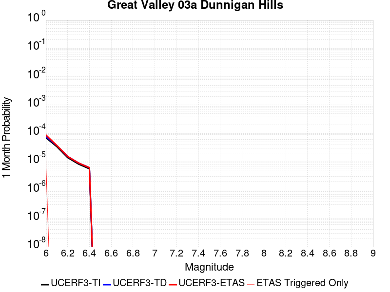 | 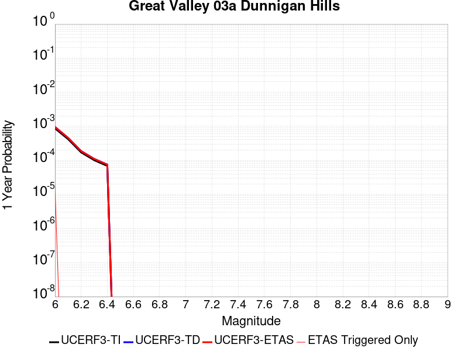 | 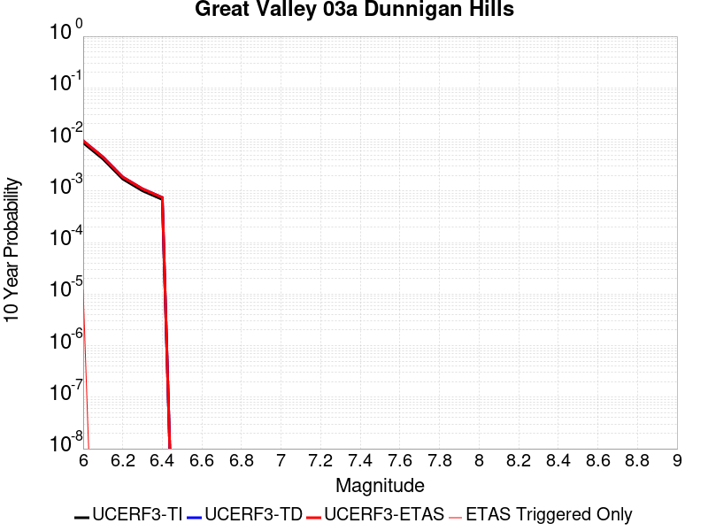 |

| Magnitude | 1 wk TI Prob | 1 wk TD Prob | 1 wk ETAS Prob | 1 wk ETAS/TD Gain | 1 wk ETAS Triggered Only | 1 mo TI Prob | 1 mo TD Prob | 1 mo ETAS Prob | 1 mo ETAS/TD Gain | 1 mo ETAS Triggered Only | 1 yr TI Prob | 1 yr TD Prob | 1 yr ETAS Prob | 1 yr ETAS/TD Gain | 1 yr ETAS Triggered Only | 10 yr TI Prob | 10 yr TD Prob | 10 yr ETAS Prob | 10 yr ETAS/TD Gain | 10 yr ETAS Triggered Only |
|-----|-----|-----|-----|-----|-----|-----|-----|-----|-----|-----|-----|-----|-----|-----|-----|-----|-----|-----|-----|-----|
| 6.0 | 1.6591328E-5 | 1.8107954E-5 | 1.8107954E-5 | 1.0 | 0.0 | 7.110376E-5 | 7.7603596E-5 | 8.854403E-5 | 1.1409783 | 1.0941279E-5 | 8.6534437E-4 | 9.444834E-4 | 9.554143E-4 | 1.0115734 | 1.0941279E-5 | 0.008619824 | 0.009411525 | 0.009422364 | 1.0011516 | 1.0941279E-5 |
| 6.1 | 8.041125E-6 | 8.769726E-6 | 8.769726E-6 | 1.0 | 0.0 | 3.4461507E-5 | 3.7584115E-5 | 3.7584115E-5 | 1.0 | 0.0 | 4.194881E-4 | 4.5751085E-4 | 4.5751085E-4 | 1.0 | 0.0 | 0.004186971 | 0.004567687 | 0.004567687 | 1.0 | 0.0 |
| 6.2 | 3.2807004E-6 | 3.5795688E-6 | 3.5795688E-6 | 1.0 | 0.0 | 1.4060069E-5 | 1.5340942E-5 | 1.5340942E-5 | 1.0 | 0.0 | 1.7116789E-4 | 1.8676413E-4 | 1.8676413E-4 | 1.0 | 0.0 | 0.0017103611 | 0.0018664796 | 0.0018664796 | 1.0 | 0.0 |
| 6.3 | 1.9339366E-6 | 2.1103806E-6 | 2.1103806E-6 | 1.0 | 0.0 | 8.288273E-6 | 9.044474E-6 | 9.044474E-6 | 1.0 | 0.0 | 1.00905054E-4 | 1.1011375E-4 | 1.1011375E-4 | 1.0 | 0.0 | 0.0010085925 | 0.0011008718 | 0.0011008718 | 1.0 | 0.0 |
| 6.4 | 1.3142635E-6 | 1.4339867E-6 | 1.4339867E-6 | 1.0 | 0.0 | 5.6325457E-6 | 6.145657E-6 | 6.145657E-6 | 1.0 | 0.0 | 6.857408E-5 | 7.482337E-5 | 7.482337E-5 | 1.0 | 0.0 | 6.8552926E-4 | 7.4823375E-4 | 7.4823375E-4 | 1.0 | 0.0 |

## Elmore Ranch
*[(top)](#table-of-contents)*

| 1 Week | 1 Month | 1 Year | 10 Year |
|-----|-----|-----|-----|
| 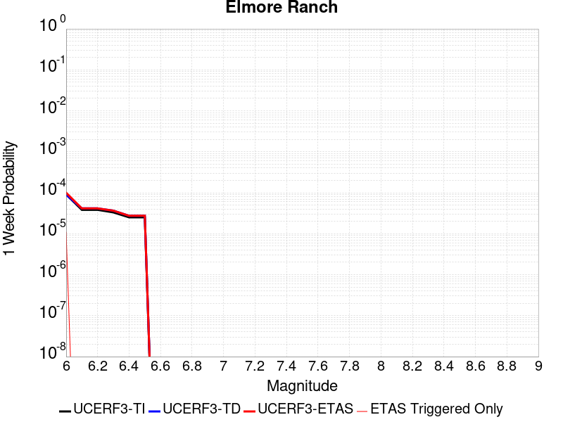 | 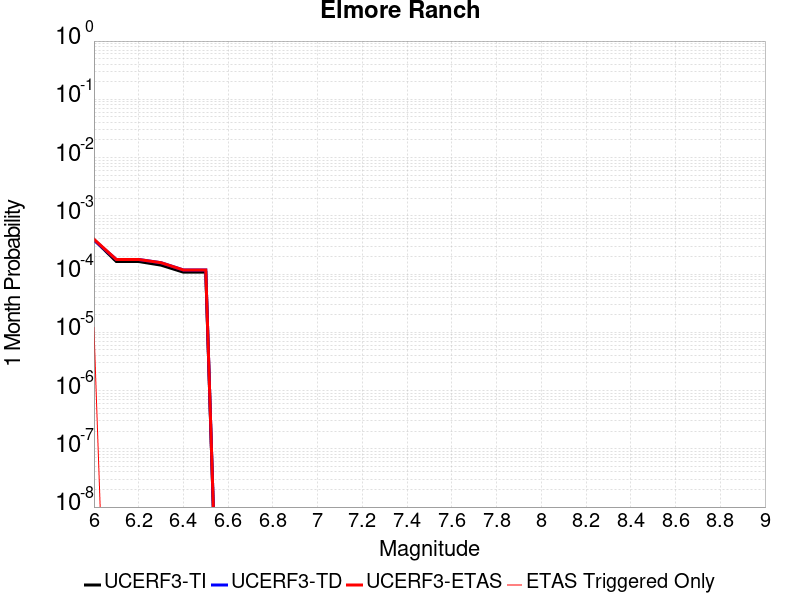 | 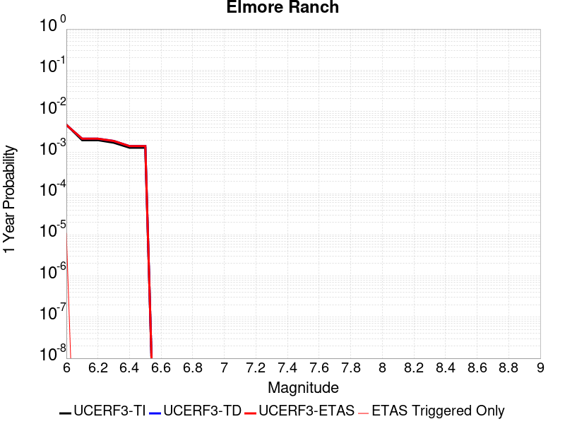 | 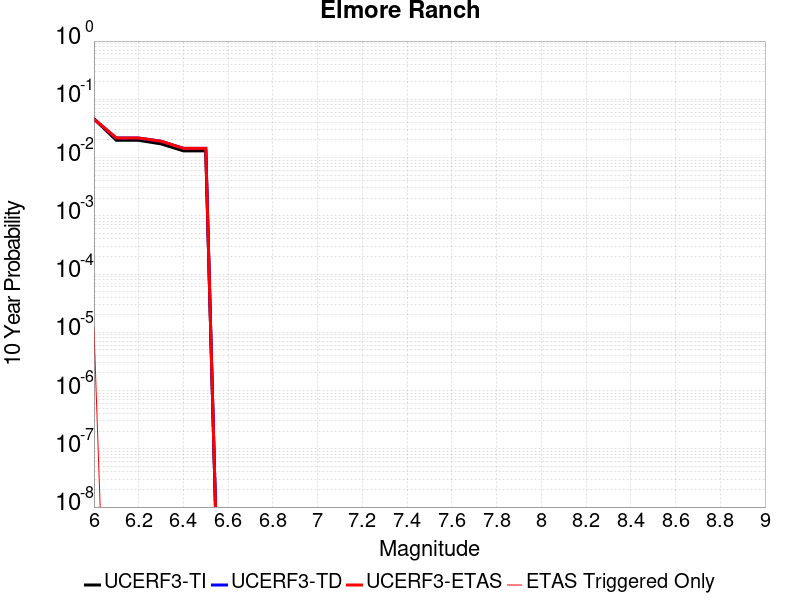 |

| Magnitude | 1 wk TI Prob | 1 wk TD Prob | 1 wk ETAS Prob | 1 wk ETAS/TD Gain | 1 wk ETAS Triggered Only | 1 mo TI Prob | 1 mo TD Prob | 1 mo ETAS Prob | 1 mo ETAS/TD Gain | 1 mo ETAS Triggered Only | 1 yr TI Prob | 1 yr TD Prob | 1 yr ETAS Prob | 1 yr ETAS/TD Gain | 1 yr ETAS Triggered Only | 10 yr TI Prob | 10 yr TD Prob | 10 yr ETAS Prob | 10 yr ETAS/TD Gain | 10 yr ETAS Triggered Only |
|-----|-----|-----|-----|-----|-----|-----|-----|-----|-----|-----|-----|-----|-----|-----|-----|-----|-----|-----|-----|-----|
| 6.0 | 9.102099E-5 | 8.952015E-5 | 1.0046045E-4 | 1.1222105 | 1.0941279E-5 | 3.9003167E-4 | 3.8361453E-4 | 3.945516E-4 | 1.0285106 | 1.0941279E-5 | 0.0047383 | 0.004662009 | 0.0046728994 | 1.0023359 | 1.0941279E-5 | 0.046385348 | 0.045870975 | 0.045881413 | 1.0002276 | 1.0941279E-5 |
| 6.1 | 3.8306698E-5 | 4.1498504E-5 | 4.1498504E-5 | 1.0 | 0.0 | 1.6416123E-4 | 1.7784268E-4 | 1.7784268E-4 | 1.0 | 0.0 | 0.0019968306 | 0.0021631396 | 0.0021631396 | 1.0 | 0.0 | 0.019789828 | 0.021628205 | 0.021628205 | 1.0 | 0.0 |
| 6.2 | 3.8306698E-5 | 4.1498504E-5 | 4.1498504E-5 | 1.0 | 0.0 | 1.6416123E-4 | 1.7784268E-4 | 1.7784268E-4 | 1.0 | 0.0 | 0.0019968306 | 0.0021631396 | 0.0021631396 | 1.0 | 0.0 | 0.019789828 | 0.021628205 | 0.021628205 | 1.0 | 0.0 |
| 6.3 | 3.3197924E-5 | 3.6554302E-5 | 3.6554302E-5 | 1.0 | 0.0 | 1.4226905E-4 | 1.5665586E-4 | 1.5665586E-4 | 1.0 | 0.0 | 0.0017307495 | 0.001905917 | 0.001905917 | 1.0 | 0.0 | 0.017173318 | 0.01908996 | 0.01908996 | 1.0 | 0.0 |
| 6.4 | 2.5148964E-5 | 2.7420487E-5 | 2.7420487E-5 | 1.0 | 0.0 | 1.0777682E-4 | 1.17514726E-4 | 1.17514726E-4 | 1.0 | 0.0 | 0.0013113929 | 0.0014304507 | 0.0014304507 | 1.0 | 0.0 | 0.01303681 | 0.014387194 | 0.014387194 | 1.0 | 0.0 |
| 6.5 | 2.5148964E-5 | 2.7420487E-5 | 2.7420487E-5 | 1.0 | 0.0 | 1.0777682E-4 | 1.17514726E-4 | 1.17514726E-4 | 1.0 | 0.0 | 0.0013113929 | 0.0014304507 | 0.0014304507 | 1.0 | 0.0 | 0.01303681 | 0.014387194 | 0.014387194 | 1.0 | 0.0 |

## Round Valley
*[(top)](#table-of-contents)*

| 1 Week | 1 Month | 1 Year | 10 Year |
|-----|-----|-----|-----|
| 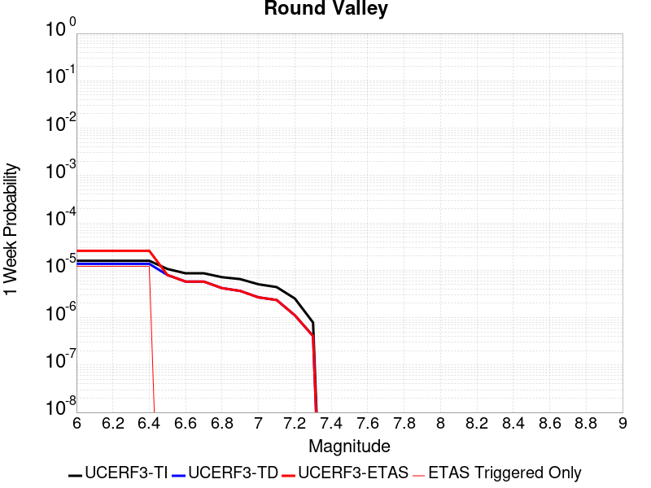 | 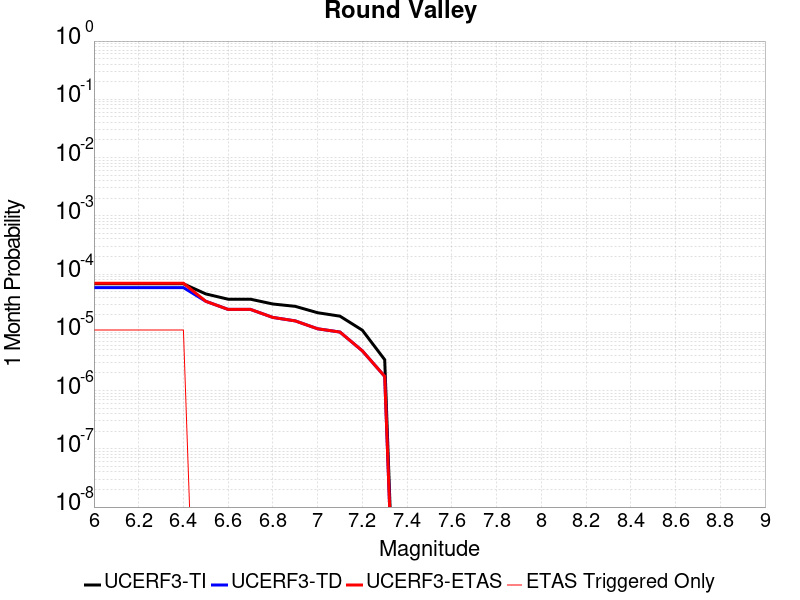 | 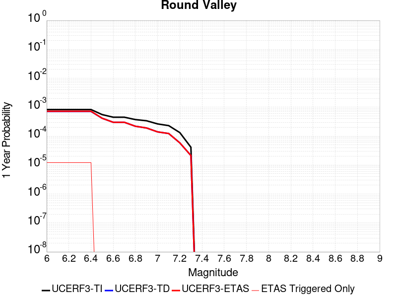 | 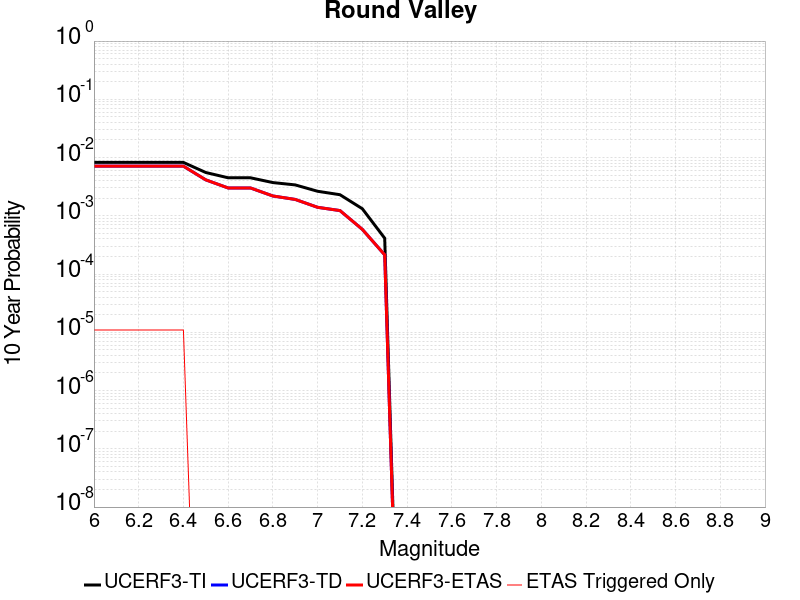 |

| Magnitude | 1 wk TI Prob | 1 wk TD Prob | 1 wk ETAS Prob | 1 wk ETAS/TD Gain | 1 wk ETAS Triggered Only | 1 mo TI Prob | 1 mo TD Prob | 1 mo ETAS Prob | 1 mo ETAS/TD Gain | 1 mo ETAS Triggered Only | 1 yr TI Prob | 1 yr TD Prob | 1 yr ETAS Prob | 1 yr ETAS/TD Gain | 1 yr ETAS Triggered Only | 10 yr TI Prob | 10 yr TD Prob | 10 yr ETAS Prob | 10 yr ETAS/TD Gain | 10 yr ETAS Triggered Only |
|-----|-----|-----|-----|-----|-----|-----|-----|-----|-----|-----|-----|-----|-----|-----|-----|-----|-----|-----|-----|-----|
| 6.0 | 1.588152E-5 | 1.3670716E-5 | 2.4611843E-5 | 1.8003333 | 1.0941279E-5 | 6.806188E-5 | 5.8587688E-5 | 6.952832E-5 | 1.1867396 | 1.0941279E-5 | 8.283384E-4 | 7.13111E-4 | 7.240445E-4 | 1.0153321 | 1.0941279E-5 | 0.008252576 | 0.0071121147 | 0.0071229786 | 1.0015274 | 1.0941279E-5 |
| 6.1 | 1.588152E-5 | 1.3670716E-5 | 2.4611843E-5 | 1.8003333 | 1.0941279E-5 | 6.806188E-5 | 5.8587688E-5 | 6.952832E-5 | 1.1867396 | 1.0941279E-5 | 8.283384E-4 | 7.13111E-4 | 7.240445E-4 | 1.0153321 | 1.0941279E-5 | 0.008252576 | 0.0071121147 | 0.0071229786 | 1.0015274 | 1.0941279E-5 |
| 6.2 | 1.588152E-5 | 1.3670716E-5 | 2.4611843E-5 | 1.8003333 | 1.0941279E-5 | 6.806188E-5 | 5.8587688E-5 | 6.952832E-5 | 1.1867396 | 1.0941279E-5 | 8.283384E-4 | 7.13111E-4 | 7.240445E-4 | 1.0153321 | 1.0941279E-5 | 0.008252576 | 0.0071121147 | 0.0071229786 | 1.0015274 | 1.0941279E-5 |
| 6.3 | 1.588152E-5 | 1.3670716E-5 | 2.4611843E-5 | 1.8003333 | 1.0941279E-5 | 6.806188E-5 | 5.8587688E-5 | 6.952832E-5 | 1.1867396 | 1.0941279E-5 | 8.283384E-4 | 7.13111E-4 | 7.240445E-4 | 1.0153321 | 1.0941279E-5 | 0.008252576 | 0.0071121147 | 0.0071229786 | 1.0015274 | 1.0941279E-5 |
| 6.4 | 1.588152E-5 | 1.3670716E-5 | 2.4611843E-5 | 1.8003333 | 1.0941279E-5 | 6.806188E-5 | 5.8587688E-5 | 6.952832E-5 | 1.1867396 | 1.0941279E-5 | 8.283384E-4 | 7.13111E-4 | 7.240445E-4 | 1.0153321 | 1.0941279E-5 | 0.008252576 | 0.0071121147 | 0.0071229786 | 1.0015274 | 1.0941279E-5 |
| 6.5 | 1.0646776E-5 | 7.953037E-6 | 7.953037E-6 | 1.0 | 0.0 | 4.5628243E-5 | 3.408405E-5 | 3.408405E-5 | 1.0 | 0.0 | 5.553823E-4 | 4.1490266E-4 | 4.1490266E-4 | 1.0 | 0.0 | 0.005539963 | 0.0041421093 | 0.0041421093 | 1.0 | 0.0 |
| 6.6 | 8.632956E-6 | 5.768742E-6 | 5.768742E-6 | 1.0 | 0.0 | 3.6997862E-5 | 2.4722967E-5 | 2.4722967E-5 | 1.0 | 0.0 | 4.5035584E-4 | 3.009644E-4 | 3.009644E-4 | 1.0 | 0.0 | 0.0044944426 | 0.003005946 | 0.003005946 | 1.0 | 0.0 |
| 6.7 | 8.632956E-6 | 5.768742E-6 | 5.768742E-6 | 1.0 | 0.0 | 3.6997862E-5 | 2.4722967E-5 | 2.4722967E-5 | 1.0 | 0.0 | 4.5035584E-4 | 3.009644E-4 | 3.009644E-4 | 1.0 | 0.0 | 0.0044944426 | 0.003005946 | 0.003005946 | 1.0 | 0.0 |
| 6.8 | 7.143895E-6 | 4.2018346E-6 | 4.2018346E-6 | 1.0 | 0.0 | 3.0616335E-5 | 1.8007748E-5 | 1.8007748E-5 | 1.0 | 0.0 | 3.726901E-4 | 2.1922393E-4 | 2.1922393E-4 | 1.0 | 0.0 | 0.0037206567 | 0.0021902416 | 0.0021902416 | 1.0 | 0.0 |
| 6.9 | 6.5120694E-6 | 3.6644687E-6 | 3.6644687E-6 | 1.0 | 0.0 | 2.790857E-5 | 1.570478E-5 | 1.570478E-5 | 1.0 | 0.0 | 3.3973387E-4 | 1.9119044E-4 | 1.9119044E-4 | 1.0 | 0.0 | 0.0033921495 | 0.0019104085 | 0.0019104085 | 1.0 | 0.0 |
| 7.0 | 5.0614435E-6 | 2.6836676E-6 | 2.6836676E-6 | 1.0 | 0.0 | 2.169172E-5 | 1.1501388E-5 | 1.1501388E-5 | 1.0 | 0.0 | 2.6406467E-4 | 1.4002144E-4 | 1.4002144E-4 | 1.0 | 0.0 | 0.0026375111 | 0.0013994334 | 0.0013994334 | 1.0 | 0.0 |
| 7.1 | 4.41728E-6 | 2.3575074E-6 | 2.3575074E-6 | 1.0 | 0.0 | 1.8931061E-5 | 1.0103569E-5 | 1.0103569E-5 | 1.0 | 0.0 | 2.304613E-4 | 1.23005E-4 | 1.23005E-4 | 1.0 | 0.0 | 0.0023022245 | 0.0012294657 | 0.0012294657 | 1.0 | 0.0 |
| 7.2 | 2.535495E-6 | 1.1208391E-6 | 1.1208391E-6 | 1.0 | 0.0 | 1.0866362E-5 | 4.8035904E-6 | 4.8035904E-6 | 1.0 | 0.0 | 1.3228992E-4 | 5.8482667E-5 | 5.8482667E-5 | 1.0 | 0.0 | 0.0013221119 | 5.84724E-4 | 5.84724E-4 | 1.0 | 0.0 |
| 7.3 | 7.900015E-7 | 4.0889498E-7 | 4.0889498E-7 | 1.0 | 0.0 | 3.3857161E-6 | 1.752407E-6 | 1.752407E-6 | 1.0 | 0.0 | 4.1220315E-5 | 2.1335554E-5 | 2.1335554E-5 | 1.0 | 0.0 | 4.121267E-4 | 2.1335555E-4 | 2.1335555E-4 | 1.0 | 0.0 |

## Rinconada 2011 CFM
*[(top)](#table-of-contents)*

| 1 Week | 1 Month | 1 Year | 10 Year |
|-----|-----|-----|-----|
| 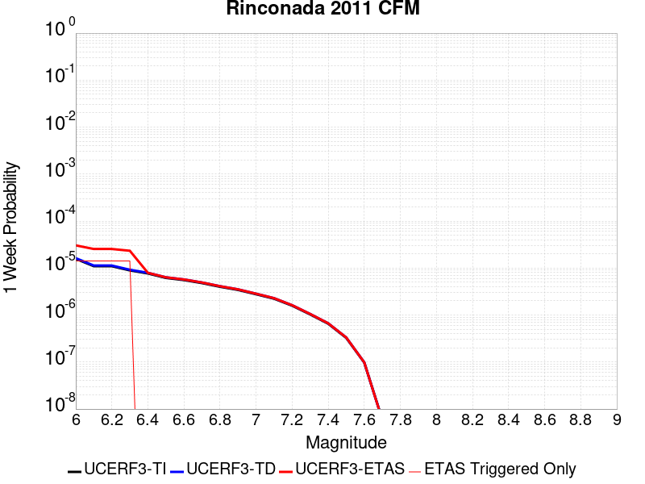 | 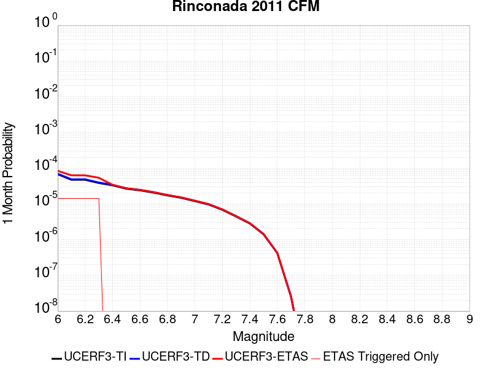 | 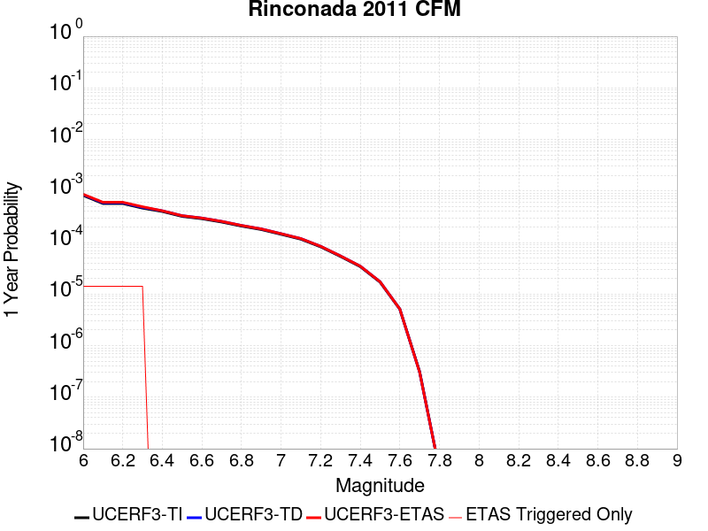 | 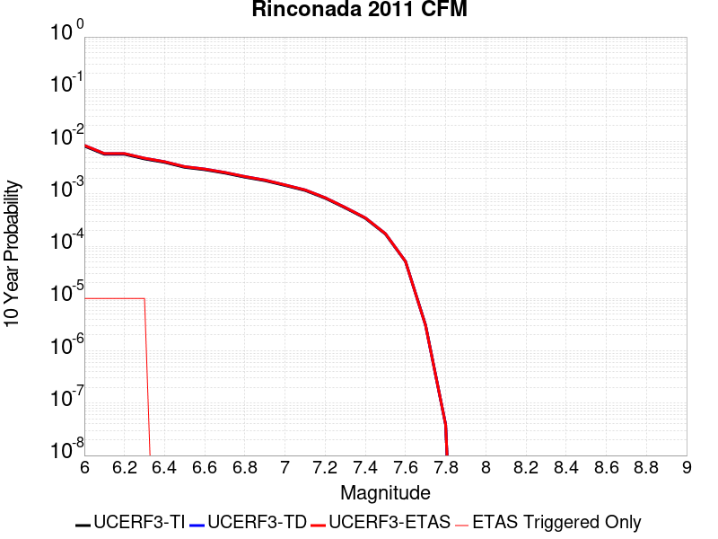 |

| Magnitude | 1 wk TI Prob | 1 wk TD Prob | 1 wk ETAS Prob | 1 wk ETAS/TD Gain | 1 wk ETAS Triggered Only | 1 mo TI Prob | 1 mo TD Prob | 1 mo ETAS Prob | 1 mo ETAS/TD Gain | 1 mo ETAS Triggered Only | 1 yr TI Prob | 1 yr TD Prob | 1 yr ETAS Prob | 1 yr ETAS/TD Gain | 1 yr ETAS Triggered Only | 10 yr TI Prob | 10 yr TD Prob | 10 yr ETAS Prob | 10 yr ETAS/TD Gain | 10 yr ETAS Triggered Only |
|-----|-----|-----|-----|-----|-----|-----|-----|-----|-----|-----|-----|-----|-----|-----|-----|-----|-----|-----|-----|-----|
| 6.0 | 1.5752368E-5 | 1.6274716E-5 | 2.7215816E-5 | 1.672276 | 1.0941279E-5 | 6.75084E-5 | 6.974694E-5 | 8.068745E-5 | 1.1568601 | 1.0941279E-5 | 8.2160486E-4 | 8.488412E-4 | 8.5977325E-4 | 1.0128788 | 1.0941279E-5 | 0.008185739 | 0.00845637 | 0.008467219 | 1.0012829 | 1.0941279E-5 |
| 6.1 | 1.0966133E-5 | 1.1323029E-5 | 2.2264183E-5 | 1.9662745 | 1.0941279E-5 | 4.6996865E-5 | 4.852637E-5 | 5.9467115E-5 | 1.2254598 | 1.0941279E-5 | 5.720366E-4 | 5.906491E-4 | 6.015839E-4 | 1.0185132 | 1.0941279E-5 | 0.0057056635 | 0.0058908886 | 0.0059017655 | 1.0018464 | 1.0941279E-5 |
| 6.2 | 1.0966133E-5 | 1.1323029E-5 | 2.2264183E-5 | 1.9662745 | 1.0941279E-5 | 4.6996865E-5 | 4.852637E-5 | 5.9467115E-5 | 1.2254598 | 1.0941279E-5 | 5.720366E-4 | 5.906491E-4 | 6.015839E-4 | 1.0185132 | 1.0941279E-5 | 0.0057056635 | 0.0058908886 | 0.0059017655 | 1.0018464 | 1.0941279E-5 |
| 6.3 | 8.926149E-6 | 9.212771E-6 | 2.015395E-5 | 2.1876097 | 1.0941279E-5 | 3.8254362E-5 | 3.948271E-5 | 5.0423558E-5 | 1.2771047 | 1.0941279E-5 | 4.6564735E-4 | 4.805963E-4 | 4.915323E-4 | 1.0227551 | 1.0941279E-5 | 0.0046467283 | 0.0047956146 | 0.004806503 | 1.0022706 | 1.0941279E-5 |
| 6.4 | 7.676955E-6 | 7.920191E-6 | 7.920191E-6 | 1.0 | 0.0 | 3.290082E-5 | 3.3943234E-5 | 3.3943234E-5 | 1.0 | 0.0 | 4.0049385E-4 | 4.1318068E-4 | 4.1318068E-4 | 1.0 | 0.0 | 0.0039977287 | 0.004124151 | 0.004124151 | 1.0 | 0.0 |
| 6.5 | 6.1671026E-6 | 6.3589546E-6 | 6.3589546E-6 | 1.0 | 0.0 | 2.6430173E-5 | 2.725238E-5 | 2.725238E-5 | 1.0 | 0.0 | 3.2173982E-4 | 3.317473E-4 | 3.317473E-4 | 1.0 | 0.0 | 0.003212744 | 0.0033125326 | 0.0033125326 | 1.0 | 0.0 |
| 6.6 | 5.553456E-6 | 5.7248126E-6 | 5.7248126E-6 | 1.0 | 0.0 | 2.3800309E-5 | 2.453468E-5 | 2.453468E-5 | 1.0 | 0.0 | 2.897302E-4 | 2.9866883E-4 | 2.9866883E-4 | 1.0 | 0.0 | 0.0028935277 | 0.002982683 | 0.002982683 | 1.0 | 0.0 |
| 6.7 | 4.787857E-6 | 4.9333094E-6 | 4.9333094E-6 | 1.0 | 0.0 | 2.0519226E-5 | 2.1142583E-5 | 2.1142583E-5 | 1.0 | 0.0 | 2.4979294E-4 | 2.573806E-4 | 2.573806E-4 | 1.0 | 0.0 | 0.0024951235 | 0.0025708308 | 0.0025708308 | 1.0 | 0.0 |
| 6.8 | 3.9955166E-6 | 4.1134763E-6 | 4.1134763E-6 | 1.0 | 0.0 | 1.7123532E-5 | 1.7629065E-5 | 1.7629065E-5 | 1.0 | 0.0 | 2.0845905E-4 | 2.1461274E-4 | 2.1461274E-4 | 1.0 | 0.0 | 0.002082636 | 0.0021440585 | 0.0021440585 | 1.0 | 0.0 |
| 6.9 | 3.4250072E-6 | 3.5224464E-6 | 3.5224464E-6 | 1.0 | 0.0 | 1.46785205E-5 | 1.5096111E-5 | 1.5096111E-5 | 1.0 | 0.0 | 1.7869633E-4 | 1.8377967E-4 | 1.8377967E-4 | 1.0 | 0.0 | 0.001785527 | 0.0018362794 | 0.0018362794 | 1.0 | 0.0 |
| 7.0 | 2.7712713E-6 | 2.8467E-6 | 2.8467E-6 | 1.0 | 0.0 | 1.1876823E-5 | 1.2200086E-5 | 1.2200086E-5 | 1.0 | 0.0 | 1.4459073E-4 | 1.4852593E-4 | 1.4852593E-4 | 1.0 | 0.0 | 0.0014449668 | 0.0014842682 | 0.0014842682 | 1.0 | 0.0 |
| 7.1 | 2.227358E-6 | 2.2856984E-6 | 2.2856984E-6 | 1.0 | 0.0 | 9.545785E-6 | 9.795814E-6 | 9.795814E-6 | 1.0 | 0.0 | 1.16213734E-4 | 1.19257515E-4 | 1.19257515E-4 | 1.0 | 0.0 | 0.0011615298 | 0.0011919362 | 0.0011919362 | 1.0 | 0.0 |
| 7.2 | 1.581796E-6 | 1.6209011E-6 | 1.6209011E-6 | 1.0 | 0.0 | 6.779108E-6 | 6.9467005E-6 | 6.9467005E-6 | 1.0 | 0.0 | 8.253252E-5 | 8.457281E-5 | 8.457281E-5 | 1.0 | 0.0 | 8.250187E-4 | 8.454067E-4 | 8.454067E-4 | 1.0 | 0.0 |
| 7.3 | 1.0306567E-6 | 1.0546477E-6 | 1.0546477E-6 | 1.0 | 0.0 | 4.4170924E-6 | 4.519911E-6 | 4.519911E-6 | 1.0 | 0.0 | 5.3776774E-5 | 5.5028526E-5 | 5.5028526E-5 | 1.0 | 0.0 | 5.376376E-4 | 5.5014924E-4 | 5.5014924E-4 | 1.0 | 0.0 |
| 7.4 | 6.535541E-7 | 6.682742E-7 | 6.682742E-7 | 1.0 | 0.0 | 2.800943E-6 | 2.864029E-6 | 2.864029E-6 | 1.0 | 0.0 | 3.4100947E-5 | 3.4868997E-5 | 3.4868997E-5 | 1.0 | 0.0 | 3.4095717E-4 | 3.4863537E-4 | 3.4863537E-4 | 1.0 | 0.0 |
| 7.5 | 3.2656962E-7 | 3.3316687E-7 | 3.3316687E-7 | 1.0 | 0.0 | 1.3995833E-6 | 1.4278572E-6 | 1.4278572E-6 | 1.0 | 0.0 | 1.7039794E-5 | 1.7384024E-5 | 1.7384024E-5 | 1.0 | 0.0 | 1.7038487E-4 | 1.7382667E-4 | 1.7382667E-4 | 1.0 | 0.0 |
| 7.6 | 9.754343E-8 | 9.82099E-8 | 9.82099E-8 | 1.0 | 0.0 | 4.180432E-7 | 4.208995E-7 | 4.208995E-7 | 1.0 | 0.0 | 5.089664E-6 | 5.1244397E-6 | 5.1244397E-6 | 1.0 | 0.0 | 5.0895473E-5 | 5.1243223E-5 | 5.1243223E-5 | 1.0 | 0.0 |
| 7.7 | 6.0001453E-9 | 5.8490435E-9 | 5.8490435E-9 | 1.0 | 0.0 | 2.5714908E-8 | 2.506733E-8 | 2.506733E-8 | 1.0 | 0.0 | 3.1307894E-7 | 3.051947E-7 | 3.051947E-7 | 1.0 | 0.0 | 3.1307852E-6 | 3.051943E-6 | 3.051943E-6 | 1.0 | 0.0 |
| 7.8 | 7.400003E-11 | 7.4654505E-11 | 7.4654505E-11 | 1.0 | 0.0 | 3.171432E-10 | 3.1994773E-10 | 3.1994773E-10 | 1.0 | 0.0 | 3.861218E-9 | 3.895363E-9 | 3.895363E-9 | 1.0 | 0.0 | 3.861218E-8 | 3.895363E-8 | 3.895363E-8 | 1.0 | 0.0 |

## Puente Hills
*[(top)](#table-of-contents)*

| 1 Week | 1 Month | 1 Year | 10 Year |
|-----|-----|-----|-----|
|  |  |  |  |

| Magnitude | 1 wk TI Prob | 1 wk TD Prob | 1 wk ETAS Prob | 1 wk ETAS/TD Gain | 1 wk ETAS Triggered Only | 1 mo TI Prob | 1 mo TD Prob | 1 mo ETAS Prob | 1 mo ETAS/TD Gain | 1 mo ETAS Triggered Only | 1 yr TI Prob | 1 yr TD Prob | 1 yr ETAS Prob | 1 yr ETAS/TD Gain | 1 yr ETAS Triggered Only | 10 yr TI Prob | 10 yr TD Prob | 10 yr ETAS Prob | 10 yr ETAS/TD Gain | 10 yr ETAS Triggered Only |
|-----|-----|-----|-----|-----|-----|-----|-----|-----|-----|-----|-----|-----|-----|-----|-----|-----|-----|-----|-----|-----|
| 6.0 | 1.2101656E-5 | 8.098625E-6 | 8.098625E-6 | 1.0 | 0.0 | 5.1863204E-5 | 3.4707962E-5 | 3.4707962E-5 | 1.0 | 0.0 | 6.312516E-4 | 4.2249315E-4 | 4.334298E-4 | 1.0258859 | 1.0941279E-5 | 0.0062946146 | 0.0042174594 | 0.0042283544 | 1.0025834 | 1.0941279E-5 |
| 6.1 | 1.2101656E-5 | 8.098625E-6 | 8.098625E-6 | 1.0 | 0.0 | 5.1863204E-5 | 3.4707962E-5 | 3.4707962E-5 | 1.0 | 0.0 | 6.312516E-4 | 4.2249315E-4 | 4.334298E-4 | 1.0258859 | 1.0941279E-5 | 0.0062946146 | 0.0042174594 | 0.0042283544 | 1.0025834 | 1.0941279E-5 |
| 6.2 | 1.2101656E-5 | 8.098625E-6 | 8.098625E-6 | 1.0 | 0.0 | 5.1863204E-5 | 3.4707962E-5 | 3.4707962E-5 | 1.0 | 0.0 | 6.312516E-4 | 4.2249315E-4 | 4.334298E-4 | 1.0258859 | 1.0941279E-5 | 0.0062946146 | 0.0042174594 | 0.0042283544 | 1.0025834 | 1.0941279E-5 |
| 6.3 | 1.2101656E-5 | 8.098625E-6 | 8.098625E-6 | 1.0 | 0.0 | 5.1863204E-5 | 3.4707962E-5 | 3.4707962E-5 | 1.0 | 0.0 | 6.312516E-4 | 4.2249315E-4 | 4.334298E-4 | 1.0258859 | 1.0941279E-5 | 0.0062946146 | 0.0042174594 | 0.0042283544 | 1.0025834 | 1.0941279E-5 |
| 6.4 | 1.2101656E-5 | 8.098625E-6 | 8.098625E-6 | 1.0 | 0.0 | 5.1863204E-5 | 3.4707962E-5 | 3.4707962E-5 | 1.0 | 0.0 | 6.312516E-4 | 4.2249315E-4 | 4.334298E-4 | 1.0258859 | 1.0941279E-5 | 0.0062946146 | 0.0042174594 | 0.0042283544 | 1.0025834 | 1.0941279E-5 |
| 6.5 | 1.2101656E-5 | 8.098625E-6 | 8.098625E-6 | 1.0 | 0.0 | 5.1863204E-5 | 3.4707962E-5 | 3.4707962E-5 | 1.0 | 0.0 | 6.312516E-4 | 4.2249315E-4 | 4.334298E-4 | 1.0258859 | 1.0941279E-5 | 0.0062946146 | 0.0042174594 | 0.0042283544 | 1.0025834 | 1.0941279E-5 |
| 6.6 | 1.0222488E-5 | 6.3991847E-6 | 6.3991847E-6 | 1.0 | 0.0 | 4.3809923E-5 | 2.7424803E-5 | 2.7424803E-5 | 1.0 | 0.0 | 5.332553E-4 | 3.3384826E-4 | 3.3384826E-4 | 1.0 | 0.0 | 0.0053197746 | 0.0033337125 | 0.0033337125 | 1.0 | 0.0 |
| 6.7 | 1.0222488E-5 | 6.3991847E-6 | 6.3991847E-6 | 1.0 | 0.0 | 4.3809923E-5 | 2.7424803E-5 | 2.7424803E-5 | 1.0 | 0.0 | 5.332553E-4 | 3.3384826E-4 | 3.3384826E-4 | 1.0 | 0.0 | 0.0053197746 | 0.0033337125 | 0.0033337125 | 1.0 | 0.0 |
| 6.8 | 8.6367845E-6 | 5.0282533E-6 | 5.0282533E-6 | 1.0 | 0.0 | 3.7014266E-5 | 2.1549482E-5 | 2.1549482E-5 | 1.0 | 0.0 | 4.505555E-4 | 2.623339E-4 | 2.623339E-4 | 1.0 | 0.0 | 0.004496431 | 0.0026202986 | 0.0026202986 | 1.0 | 0.0 |
| 6.9 | 8.066481E-6 | 4.836117E-6 | 4.836117E-6 | 1.0 | 0.0 | 3.4570177E-5 | 2.0726053E-5 | 2.0726053E-5 | 1.0 | 0.0 | 4.2081063E-4 | 2.52311E-4 | 2.52311E-4 | 1.0 | 0.0 | 0.0042001465 | 0.0025202993 | 0.0025202993 | 1.0 | 0.0 |
| 7.0 | 7.393828E-6 | 4.417296E-6 | 4.417296E-6 | 1.0 | 0.0 | 3.168745E-5 | 1.8931134E-5 | 1.8931134E-5 | 1.0 | 0.0 | 3.857264E-4 | 2.3046264E-4 | 2.3046264E-4 | 1.0 | 0.0 | 0.0038505755 | 0.0023022818 | 0.0023022818 | 1.0 | 0.0 |
| 7.1 | 6.4660953E-6 | 3.8044495E-6 | 3.8044495E-6 | 1.0 | 0.0 | 2.7711543E-5 | 1.6304684E-5 | 1.6304684E-5 | 1.0 | 0.0 | 3.373358E-4 | 1.984918E-4 | 1.984918E-4 | 1.0 | 0.0 | 0.0033682417 | 0.001983181 | 0.001983181 | 1.0 | 0.0 |
| 7.2 | 5.143232E-6 | 2.7865456E-6 | 2.7865456E-6 | 1.0 | 0.0 | 2.2042237E-5 | 1.1942284E-5 | 1.1942284E-5 | 1.0 | 0.0 | 2.6833118E-4 | 1.453877E-4 | 1.453877E-4 | 1.0 | 0.0 | 0.002680074 | 0.0014529356 | 0.0014529356 | 1.0 | 0.0 |
| 7.3 | 3.928255E-6 | 2.0913774E-6 | 2.0913774E-6 | 1.0 | 0.0 | 1.683527E-5 | 8.963015E-6 | 8.963015E-6 | 1.0 | 0.0 | 2.0495013E-4 | 1.0911931E-4 | 1.0911931E-4 | 1.0 | 0.0 | 0.002047612 | 0.001090664 | 0.001090664 | 1.0 | 0.0 |
| 7.4 | 2.7894434E-6 | 1.3546753E-6 | 1.3546753E-6 | 1.0 | 0.0 | 1.1954703E-5 | 5.8057385E-6 | 5.8057385E-6 | 1.0 | 0.0 | 1.4553878E-4 | 7.068262E-5 | 7.068262E-5 | 1.0 | 0.0 | 0.001454435 | 7.066058E-4 | 7.066058E-4 | 1.0 | 0.0 |
| 7.5 | 2.041735E-6 | 8.787305E-7 | 8.787305E-7 | 1.0 | 0.0 | 8.750263E-6 | 3.7659825E-6 | 3.7659825E-6 | 1.0 | 0.0 | 1.06529245E-4 | 4.5849905E-5 | 4.5849905E-5 | 1.0 | 0.0 | 0.0010647819 | 4.5840783E-4 | 4.5840783E-4 | 1.0 | 0.0 |
| 7.6 | 1.6959062E-6 | 6.6986263E-7 | 6.6986263E-7 | 1.0 | 0.0 | 7.268149E-6 | 2.8708366E-6 | 2.8708366E-6 | 1.0 | 0.0 | 8.848612E-5 | 3.4951907E-5 | 3.4951907E-5 | 1.0 | 0.0 | 8.84509E-4 | 3.4946698E-4 | 3.4946698E-4 | 1.0 | 0.0 |
| 7.7 | 1.4767965E-6 | 5.407607E-7 | 5.407607E-7 | 1.0 | 0.0 | 6.3291122E-6 | 2.317544E-6 | 2.317544E-6 | 1.0 | 0.0 | 7.705422E-5 | 2.8215758E-5 | 2.8215758E-5 | 1.0 | 0.0 | 7.702751E-4 | 2.8212433E-4 | 2.8212433E-4 | 1.0 | 0.0 |
| 7.8 | 1.8432911E-7 | 7.28201E-8 | 7.28201E-8 | 1.0 | 0.0 | 7.8998164E-7 | 3.1208612E-7 | 3.1208612E-7 | 1.0 | 0.0 | 9.617985E-6 | 3.7996451E-6 | 3.7996451E-6 | 1.0 | 0.0 | 9.617568E-5 | 3.7996128E-5 | 3.7996128E-5 | 1.0 | 0.0 |

## Eaton Roughs 2011 CFM
*[(top)](#table-of-contents)*

| 1 Week | 1 Month | 1 Year | 10 Year |
|-----|-----|-----|-----|
|  |  | 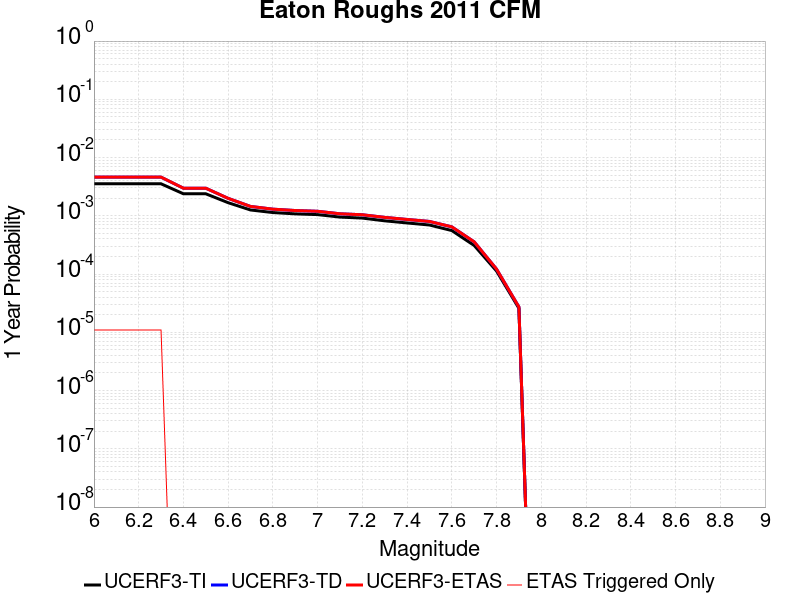 | 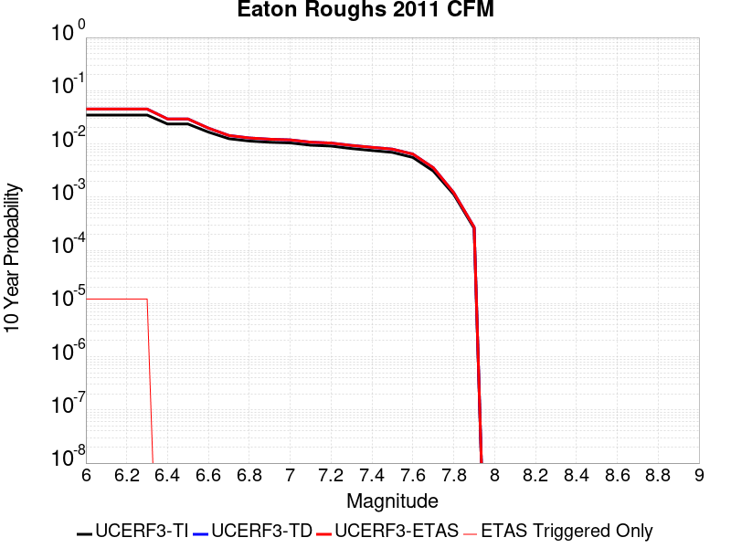 |

| Magnitude | 1 wk TI Prob | 1 wk TD Prob | 1 wk ETAS Prob | 1 wk ETAS/TD Gain | 1 wk ETAS Triggered Only | 1 mo TI Prob | 1 mo TD Prob | 1 mo ETAS Prob | 1 mo ETAS/TD Gain | 1 mo ETAS Triggered Only | 1 yr TI Prob | 1 yr TD Prob | 1 yr ETAS Prob | 1 yr ETAS/TD Gain | 1 yr ETAS Triggered Only | 10 yr TI Prob | 10 yr TD Prob | 10 yr ETAS Prob | 10 yr ETAS/TD Gain | 10 yr ETAS Triggered Only |
|-----|-----|-----|-----|-----|-----|-----|-----|-----|-----|-----|-----|-----|-----|-----|-----|-----|-----|-----|-----|-----|
| 6.0 | 6.8044945E-5 | 8.843646E-5 | 8.843646E-5 | 1.0 | 0.0 | 2.9158857E-4 | 3.7896493E-4 | 3.7896493E-4 | 1.0 | 0.0 | 0.0035443127 | 0.0046050907 | 0.0046159816 | 1.002365 | 1.0941279E-5 | 0.03488314 | 0.04516335 | 0.045173794 | 1.0002313 | 1.0941279E-5 |
| 6.1 | 6.8044945E-5 | 8.843646E-5 | 8.843646E-5 | 1.0 | 0.0 | 2.9158857E-4 | 3.7896493E-4 | 3.7896493E-4 | 1.0 | 0.0 | 0.0035443127 | 0.0046050907 | 0.0046159816 | 1.002365 | 1.0941279E-5 | 0.03488314 | 0.04516335 | 0.045173794 | 1.0002313 | 1.0941279E-5 |
| 6.2 | 6.8044945E-5 | 8.843646E-5 | 8.843646E-5 | 1.0 | 0.0 | 2.9158857E-4 | 3.7896493E-4 | 3.7896493E-4 | 1.0 | 0.0 | 0.0035443127 | 0.0046050907 | 0.0046159816 | 1.002365 | 1.0941279E-5 | 0.03488314 | 0.04516335 | 0.045173794 | 1.0002313 | 1.0941279E-5 |
| 6.3 | 6.8044945E-5 | 8.843646E-5 | 8.843646E-5 | 1.0 | 0.0 | 2.9158857E-4 | 3.7896493E-4 | 3.7896493E-4 | 1.0 | 0.0 | 0.0035443127 | 0.0046050907 | 0.0046159816 | 1.002365 | 1.0941279E-5 | 0.03488314 | 0.04516335 | 0.045173794 | 1.0002313 | 1.0941279E-5 |
| 6.4 | 4.5830013E-5 | 5.715427E-5 | 5.715427E-5 | 1.0 | 0.0 | 1.9639956E-4 | 2.4492692E-4 | 2.4492692E-4 | 1.0 | 0.0 | 0.0023885423 | 0.0029784471 | 0.0029784471 | 1.0 | 0.0 | 0.023630321 | 0.029421588 | 0.029421588 | 1.0 | 0.0 |
| 6.5 | 4.5830013E-5 | 5.715427E-5 | 5.715427E-5 | 1.0 | 0.0 | 1.9639956E-4 | 2.4492692E-4 | 2.4492692E-4 | 1.0 | 0.0 | 0.0023885423 | 0.0029784471 | 0.0029784471 | 1.0 | 0.0 | 0.023630321 | 0.029421588 | 0.029421588 | 1.0 | 0.0 |
| 6.6 | 3.222194E-5 | 3.8261504E-5 | 3.8261504E-5 | 1.0 | 0.0 | 1.3808672E-4 | 1.639682E-4 | 1.639682E-4 | 1.0 | 0.0 | 0.0016799092 | 0.001994599 | 0.001994599 | 1.0 | 0.0 | 0.016672665 | 0.019776601 | 0.019776601 | 1.0 | 0.0 |
| 6.7 | 2.4155654E-5 | 2.7786238E-5 | 2.7786238E-5 | 1.0 | 0.0 | 1.0352012E-4 | 1.1907848E-4 | 1.1907848E-4 | 1.0 | 0.0 | 0.0012596287 | 0.0014488247 | 0.0014488247 | 1.0 | 0.0 | 0.012525126 | 0.014394943 | 0.014394943 | 1.0 | 0.0 |
| 6.8 | 2.1814667E-5 | 2.4940868E-5 | 2.4940868E-5 | 1.0 | 0.0 | 9.348808E-5 | 1.06885076E-4 | 1.06885076E-4 | 1.0 | 0.0 | 0.001137623 | 0.0013005526 | 0.0013005526 | 1.0 | 0.0 | 0.011318169 | 0.012930038 | 0.012930038 | 1.0 | 0.0 |
| 6.9 | 2.0700467E-5 | 2.3628932E-5 | 2.3628932E-5 | 1.0 | 0.0 | 8.871327E-5 | 1.01262944E-4 | 1.01262944E-4 | 1.0 | 0.0 | 0.0010795488 | 0.0012321823 | 0.0012321823 | 1.0 | 0.0 | 0.010743194 | 0.012254035 | 0.012254035 | 1.0 | 0.0 |
| 7.0 | 2.0104066E-5 | 2.29365E-5 | 2.29365E-5 | 1.0 | 0.0 | 8.615744E-5 | 9.82956E-5 | 9.82956E-5 | 1.0 | 0.0 | 0.0010484619 | 0.0011960949 | 0.0011960949 | 1.0 | 0.0 | 0.010435291 | 0.011897073 | 0.011897073 | 1.0 | 0.0 |
| 7.1 | 1.8225232E-5 | 2.0773046E-5 | 2.0773046E-5 | 1.0 | 0.0 | 7.81058E-5 | 8.902431E-5 | 8.902431E-5 | 1.0 | 0.0 | 9.5052324E-4 | 0.0010833336 | 0.0010833336 | 1.0 | 0.0 | 0.009464677 | 0.010780825 | 0.010780825 | 1.0 | 0.0 |
| 7.2 | 1.7526572E-5 | 1.9993488E-5 | 1.9993488E-5 | 1.0 | 0.0 | 7.511172E-5 | 8.5683576E-5 | 8.5683576E-5 | 1.0 | 0.0 | 9.141015E-4 | 0.0010426997 | 0.0010426997 | 1.0 | 0.0 | 0.009103506 | 0.010378351 | 0.010378351 | 1.0 | 0.0 |
| 7.3 | 1.5727232E-5 | 1.8021507E-5 | 1.8021507E-5 | 1.0 | 0.0 | 6.740067E-5 | 7.723275E-5 | 7.723275E-5 | 1.0 | 0.0 | 8.2029426E-4 | 9.399043E-4 | 9.399043E-4 | 1.0 | 0.0 | 0.008172729 | 0.009359511 | 0.009359511 | 1.0 | 0.0 |
| 7.4 | 1.4457361E-5 | 1.6598358E-5 | 1.6598358E-5 | 1.0 | 0.0 | 6.195865E-5 | 7.113389E-5 | 7.113389E-5 | 1.0 | 0.0 | 7.540854E-4 | 8.657119E-4 | 8.657119E-4 | 1.0 | 0.0 | 0.007515317 | 0.008623555 | 0.008623555 | 1.0 | 0.0 |
| 7.5 | 1.33280955E-5 | 1.5345435E-5 | 1.5345435E-5 | 1.0 | 0.0 | 5.711916E-5 | 6.57645E-5 | 6.57645E-5 | 1.0 | 0.0 | 6.9520384E-4 | 8.0038945E-4 | 8.0038945E-4 | 1.0 | 0.0 | 0.00693033 | 0.007975209 | 0.007975209 | 1.0 | 0.0 |
| 7.6 | 1.0699478E-5 | 1.2387815E-5 | 1.2387815E-5 | 1.0 | 0.0 | 4.5854096E-5 | 5.308956E-5 | 5.308956E-5 | 1.0 | 0.0 | 5.581306E-4 | 6.4617425E-4 | 6.4617425E-4 | 1.0 | 0.0 | 0.005567309 | 0.0064430353 | 0.0064430353 | 1.0 | 0.0 |
| 7.7 | 5.9390236E-6 | 6.852951E-6 | 6.852951E-6 | 1.0 | 0.0 | 2.545271E-5 | 2.9369461E-5 | 2.9369461E-5 | 1.0 | 0.0 | 3.0984267E-4 | 3.5751477E-4 | 3.5751477E-4 | 1.0 | 0.0 | 0.0030941102 | 0.0035694204 | 0.0035694204 | 1.0 | 0.0 |
| 7.8 | 2.1622036E-6 | 2.3296996E-6 | 2.3296996E-6 | 1.0 | 0.0 | 9.266554E-6 | 9.984388E-6 | 9.984388E-6 | 1.0 | 0.0 | 1.1281446E-4 | 1.21553225E-4 | 1.21553225E-4 | 1.0 | 0.0 | 0.001127572 | 0.001214873 | 0.001214873 | 1.0 | 0.0 |
| 7.9 | 4.9586197E-7 | 5.2189216E-7 | 5.2189216E-7 | 1.0 | 0.0 | 2.125121E-6 | 2.2366787E-6 | 2.2366787E-6 | 1.0 | 0.0 | 2.5873042E-5 | 2.7231245E-5 | 2.7231245E-5 | 1.0 | 0.0 | 2.5870028E-4 | 2.7228118E-4 | 2.7228118E-4 | 1.0 | 0.0 |

## Davis Creek
*[(top)](#table-of-contents)*

| 1 Week | 1 Month | 1 Year | 10 Year |
|-----|-----|-----|-----|
|  |  | 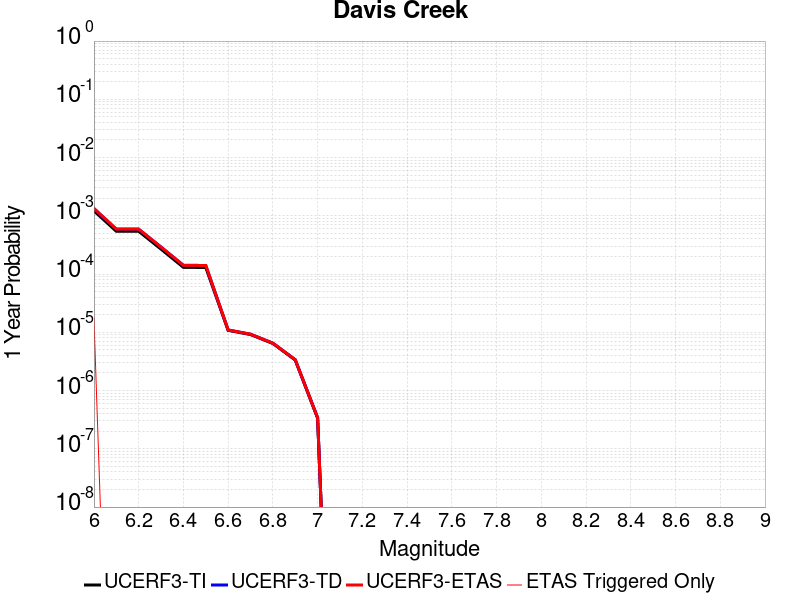 | 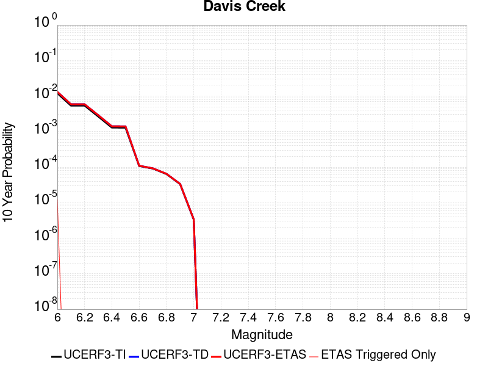 |

| Magnitude | 1 wk TI Prob | 1 wk TD Prob | 1 wk ETAS Prob | 1 wk ETAS/TD Gain | 1 wk ETAS Triggered Only | 1 mo TI Prob | 1 mo TD Prob | 1 mo ETAS Prob | 1 mo ETAS/TD Gain | 1 mo ETAS Triggered Only | 1 yr TI Prob | 1 yr TD Prob | 1 yr ETAS Prob | 1 yr ETAS/TD Gain | 1 yr ETAS Triggered Only | 10 yr TI Prob | 10 yr TD Prob | 10 yr ETAS Prob | 10 yr ETAS/TD Gain | 10 yr ETAS Triggered Only |
|-----|-----|-----|-----|-----|-----|-----|-----|-----|-----|-----|-----|-----|-----|-----|-----|-----|-----|-----|-----|-----|
| 6.0 | 2.331472E-5 | 2.5417214E-5 | 2.5417214E-5 | 1.0 | 0.0 | 9.99164E-5 | 1.0892704E-4 | 1.0892704E-4 | 1.0 | 0.0 | 0.0012158032 | 0.0013254983 | 0.0013364251 | 1.0082436 | 1.0941279E-5 | 0.01209173 | 0.013187704 | 0.013198501 | 1.0008187 | 1.0941279E-5 |
| 6.1 | 1.0407654E-5 | 1.1316986E-5 | 1.1316986E-5 | 1.0 | 0.0 | 4.4603472E-5 | 4.8500624E-5 | 4.8500624E-5 | 1.0 | 0.0 | 5.4291193E-4 | 5.9036224E-4 | 5.9036224E-4 | 1.0 | 0.0 | 0.0054158745 | 0.005890611 | 0.005890611 | 1.0 | 0.0 |
| 6.2 | 1.0407654E-5 | 1.1316986E-5 | 1.1316986E-5 | 1.0 | 0.0 | 4.4603472E-5 | 4.8500624E-5 | 4.8500624E-5 | 1.0 | 0.0 | 5.4291193E-4 | 5.9036224E-4 | 5.9036224E-4 | 1.0 | 0.0 | 0.0054158745 | 0.005890611 | 0.005890611 | 1.0 | 0.0 |
| 6.3 | 5.1323277E-6 | 5.568556E-6 | 5.568556E-6 | 1.0 | 0.0 | 2.1995505E-5 | 2.386507E-5 | 2.386507E-5 | 1.0 | 0.0 | 2.6776237E-4 | 2.905271E-4 | 2.905271E-4 | 1.0 | 0.0 | 0.0026743996 | 0.0029023192 | 0.0029023192 | 1.0 | 0.0 |
| 6.4 | 2.4985154E-6 | 2.704538E-6 | 2.704538E-6 | 1.0 | 0.0 | 1.07078795E-5 | 1.1590847E-5 | 1.1590847E-5 | 1.0 | 0.0 | 1.3036063E-4 | 1.4111304E-4 | 1.4111304E-4 | 1.0 | 0.0 | 0.0013028418 | 0.001410589 | 0.001410589 | 1.0 | 0.0 |
| 6.5 | 2.4846438E-6 | 2.6904722E-6 | 2.6904722E-6 | 1.0 | 0.0 | 1.064843E-5 | 1.1530565E-5 | 1.1530565E-5 | 1.0 | 0.0 | 1.2963692E-4 | 1.403792E-4 | 1.403792E-4 | 1.0 | 0.0 | 0.0012956132 | 0.0014032599 | 0.0014032599 | 1.0 | 0.0 |
| 6.6 | 2.072566E-7 | 2.1018087E-7 | 2.1018087E-7 | 1.0 | 0.0 | 8.882423E-7 | 9.0077486E-7 | 9.0077486E-7 | 1.0 | 0.0 | 1.0814296E-5 | 1.0966881E-5 | 1.0966881E-5 | 1.0 | 0.0 | 1.081377E-4 | 1.09663575E-4 | 1.09663575E-4 | 1.0 | 0.0 |
| 6.7 | 1.7544528E-7 | 1.7790826E-7 | 1.7790826E-7 | 1.0 | 0.0 | 7.5190815E-7 | 7.6246374E-7 | 7.6246374E-7 | 1.0 | 0.0 | 9.154443E-6 | 9.282958E-6 | 9.282958E-6 | 1.0 | 0.0 | 9.1540656E-5 | 9.282586E-5 | 9.282586E-5 | 1.0 | 0.0 |
| 6.8 | 1.2320395E-7 | 1.2481138E-7 | 1.2481138E-7 | 1.0 | 0.0 | 5.280168E-7 | 5.349058E-7 | 5.349058E-7 | 1.0 | 0.0 | 6.428586E-6 | 6.5124595E-6 | 6.5124595E-6 | 1.0 | 0.0 | 6.4284E-5 | 6.5122804E-5 | 6.5122804E-5 | 1.0 | 0.0 |
| 6.9 | 6.399997E-8 | 6.486058E-8 | 6.486058E-8 | 1.0 | 0.0 | 2.7428555E-7 | 2.7797387E-7 | 2.7797387E-7 | 1.0 | 0.0 | 3.3394215E-6 | 3.3843273E-6 | 3.3843273E-6 | 1.0 | 0.0 | 3.3393713E-5 | 3.384282E-5 | 3.384282E-5 | 1.0 | 0.0 |
| 7.0 | 6.4455685E-9 | 6.535264E-9 | 6.535264E-9 | 1.0 | 0.0 | 2.7623864E-8 | 2.8008275E-8 | 2.8008275E-8 | 1.0 | 0.0 | 3.3632048E-7 | 3.4100074E-7 | 3.4100074E-7 | 1.0 | 0.0 | 3.3631998E-6 | 3.4100074E-6 | 3.4100074E-6 | 1.0 | 0.0 |

## Santa Cruz Island
*[(top)](#table-of-contents)*

| 1 Week | 1 Month | 1 Year | 10 Year |
|-----|-----|-----|-----|
|  |  |  |  |

| Magnitude | 1 wk TI Prob | 1 wk TD Prob | 1 wk ETAS Prob | 1 wk ETAS/TD Gain | 1 wk ETAS Triggered Only | 1 mo TI Prob | 1 mo TD Prob | 1 mo ETAS Prob | 1 mo ETAS/TD Gain | 1 mo ETAS Triggered Only | 1 yr TI Prob | 1 yr TD Prob | 1 yr ETAS Prob | 1 yr ETAS/TD Gain | 1 yr ETAS Triggered Only | 10 yr TI Prob | 10 yr TD Prob | 10 yr ETAS Prob | 10 yr ETAS/TD Gain | 10 yr ETAS Triggered Only |
|-----|-----|-----|-----|-----|-----|-----|-----|-----|-----|-----|-----|-----|-----|-----|-----|-----|-----|-----|-----|-----|
| 6.0 | 2.9164563E-5 | 3.1599742E-5 | 4.2540676E-5 | 1.3462348 | 1.0941279E-5 | 1.2498499E-4 | 1.3542121E-4 | 1.4636101E-4 | 1.0807835 | 1.0941279E-5 | 0.0015206301 | 0.0016476426 | 0.0016585658 | 1.0066296 | 1.0941279E-5 | 0.015102667 | 0.016368 | 0.016378762 | 1.0006576 | 1.0941279E-5 |
| 6.1 | 2.9164563E-5 | 3.1599742E-5 | 4.2540676E-5 | 1.3462348 | 1.0941279E-5 | 1.2498499E-4 | 1.3542121E-4 | 1.4636101E-4 | 1.0807835 | 1.0941279E-5 | 0.0015206301 | 0.0016476426 | 0.0016585658 | 1.0066296 | 1.0941279E-5 | 0.015102667 | 0.016368 | 0.016378762 | 1.0006576 | 1.0941279E-5 |
| 6.2 | 2.9164563E-5 | 3.1599742E-5 | 4.2540676E-5 | 1.3462348 | 1.0941279E-5 | 1.2498499E-4 | 1.3542121E-4 | 1.4636101E-4 | 1.0807835 | 1.0941279E-5 | 0.0015206301 | 0.0016476426 | 0.0016585658 | 1.0066296 | 1.0941279E-5 | 0.015102667 | 0.016368 | 0.016378762 | 1.0006576 | 1.0941279E-5 |
| 6.3 | 1.6635553E-5 | 1.780436E-5 | 2.8745442E-5 | 1.6145171 | 1.0941279E-5 | 7.1293274E-5 | 7.630226E-5 | 8.724271E-5 | 1.1433829 | 1.0941279E-5 | 8.6765E-4 | 9.2860236E-4 | 9.395335E-4 | 1.0117716 | 1.0941279E-5 | 0.008642701 | 0.009249094 | 0.009259934 | 1.0011721 | 1.0941279E-5 |
| 6.4 | 1.6635553E-5 | 1.780436E-5 | 2.8745442E-5 | 1.6145171 | 1.0941279E-5 | 7.1293274E-5 | 7.630226E-5 | 8.724271E-5 | 1.1433829 | 1.0941279E-5 | 8.6765E-4 | 9.2860236E-4 | 9.395335E-4 | 1.0117716 | 1.0941279E-5 | 0.008642701 | 0.009249094 | 0.009259934 | 1.0011721 | 1.0941279E-5 |
| 6.5 | 1.2238748E-5 | 1.3042995E-5 | 2.398413E-5 | 1.8388515 | 1.0941279E-5 | 5.2450723E-5 | 5.5897377E-5 | 6.6838045E-5 | 1.1957277 | 1.0941279E-5 | 6.3840044E-4 | 6.8034173E-4 | 6.912756E-4 | 1.0160711 | 1.0941279E-5 | 0.0063656955 | 0.0067829876 | 0.0067938548 | 1.001602 | 1.0941279E-5 |
| 6.6 | 1.0489767E-5 | 1.1156636E-5 | 2.2097793E-5 | 1.980686 | 1.0941279E-5 | 4.495537E-5 | 4.781329E-5 | 5.8754045E-5 | 1.2288225 | 1.0941279E-5 | 5.4719415E-4 | 5.819735E-4 | 5.929085E-4 | 1.0187894 | 1.0941279E-5 | 0.005458487 | 0.0058047357 | 0.0058156135 | 1.001874 | 1.0941279E-5 |
| 6.7 | 8.699222E-6 | 9.236782E-6 | 2.0177959E-5 | 2.1845226 | 1.0941279E-5 | 3.7281847E-5 | 3.958561E-5 | 5.0526454E-5 | 1.2763844 | 1.0941279E-5 | 4.5381195E-4 | 4.8184878E-4 | 4.927848E-4 | 1.0226959 | 1.0941279E-5 | 0.0045288634 | 0.004808108 | 0.0048189964 | 1.0022646 | 1.0941279E-5 |
| 6.8 | 8.307732E-6 | 8.8169045E-6 | 1.9758087E-5 | 2.2409325 | 1.0941279E-5 | 3.560408E-5 | 3.7786187E-5 | 4.872705E-5 | 1.2895467 | 1.0941279E-5 | 4.3339343E-4 | 4.5995016E-4 | 4.7088639E-4 | 1.023777 | 1.0941279E-5 | 0.004325492 | 0.0045900354 | 0.0046009263 | 1.0023727 | 1.0941279E-5 |
| 6.9 | 8.073121E-6 | 8.564939E-6 | 1.9506124E-5 | 2.2774386 | 1.0941279E-5 | 3.459863E-5 | 3.6706366E-5 | 4.7647245E-5 | 1.2980648 | 1.0941279E-5 | 4.2115687E-4 | 4.468088E-4 | 4.577452E-4 | 1.0244766 | 1.0941279E-5 | 0.004203596 | 0.004459156 | 0.0044700485 | 1.0024427 | 1.0941279E-5 |
| 7.0 | 7.617019E-6 | 8.074664E-6 | 1.9015853E-5 | 2.3550024 | 1.0941279E-5 | 3.264396E-5 | 3.4605247E-5 | 4.5546145E-5 | 1.3161631 | 1.0941279E-5 | 3.9736772E-4 | 4.212378E-4 | 4.3217448E-4 | 1.0259632 | 1.0941279E-5 | 0.003966579 | 0.0042044413 | 0.0042153364 | 1.0025914 | 1.0941279E-5 |
| 7.1 | 7.1224836E-6 | 7.545788E-6 | 7.545788E-6 | 1.0 | 0.0 | 3.052457E-5 | 3.2338692E-5 | 3.2338692E-5 | 1.0 | 0.0 | 3.715733E-4 | 3.936528E-4 | 3.936528E-4 | 1.0 | 0.0 | 0.003709526 | 0.003929598 | 0.003929598 | 1.0 | 0.0 |
| 7.2 | 6.441115E-6 | 6.8273835E-6 | 6.8273835E-6 | 1.0 | 0.0 | 2.7604487E-5 | 2.9259887E-5 | 2.9259887E-5 | 1.0 | 0.0 | 3.360328E-4 | 3.5618112E-4 | 3.5618112E-4 | 1.0 | 0.0 | 0.0033552512 | 0.003556131 | 0.003556131 | 1.0 | 0.0 |
| 7.3 | 5.494274E-6 | 5.8199944E-6 | 5.8199944E-6 | 1.0 | 0.0 | 2.3546674E-5 | 2.4942596E-5 | 2.4942596E-5 | 1.0 | 0.0 | 2.8664304E-4 | 3.0363398E-4 | 3.0363398E-4 | 1.0 | 0.0 | 0.002862736 | 0.0030322142 | 0.0030322142 | 1.0 | 0.0 |
| 7.4 | 4.0802624E-6 | 4.312256E-6 | 4.312256E-6 | 1.0 | 0.0 | 1.7486722E-5 | 1.8480967E-5 | 1.8480967E-5 | 1.0 | 0.0 | 2.1288003E-4 | 2.2498262E-4 | 2.2498262E-4 | 1.0 | 0.0 | 0.0021267622 | 0.0022475575 | 0.0022475575 | 1.0 | 0.0 |
| 7.5 | 2.3584746E-6 | 2.4753094E-6 | 2.4753094E-6 | 1.0 | 0.0 | 1.0107709E-5 | 1.0608426E-5 | 1.0608426E-5 | 1.0 | 0.0 | 1.2305441E-4 | 1.2915E-4 | 1.2915E-4 | 1.0 | 0.0 | 0.0012298629 | 0.0012907543 | 0.0012907543 | 1.0 | 0.0 |
| 7.6 | 9.4981914E-7 | 9.86093E-7 | 9.86093E-7 | 1.0 | 0.0 | 4.0706473E-6 | 4.2261063E-6 | 4.2261063E-6 | 1.0 | 0.0 | 4.9559E-5 | 5.145164E-5 | 5.145164E-5 | 1.0 | 0.0 | 4.954795E-4 | 5.1439856E-4 | 5.1439856E-4 | 1.0 | 0.0 |
| 7.7 | 2.6013532E-7 | 2.6416603E-7 | 2.6416603E-7 | 1.0 | 0.0 | 1.1148652E-6 | 1.1321397E-6 | 1.1321397E-6 | 1.0 | 0.0 | 1.3573399E-5 | 1.3783714E-5 | 1.3783714E-5 | 1.0 | 0.0 | 1.357257E-4 | 1.3782867E-4 | 1.3782867E-4 | 1.0 | 0.0 |
| 7.8 | 4.1522263E-8 | 3.965679E-8 | 3.965679E-8 | 1.0 | 0.0 | 1.7795254E-7 | 1.6995766E-7 | 1.6995766E-7 | 1.0 | 0.0 | 2.16657E-6 | 2.0692328E-6 | 2.0692328E-6 | 1.0 | 0.0 | 2.1665488E-5 | 2.0692156E-5 | 2.0692156E-5 | 1.0 | 0.0 |
| 7.9 | 7.7242046E-10 | 5.9468175E-10 | 5.9468175E-10 | 1.0 | 0.0 | 3.3103735E-9 | 2.5486364E-9 | 2.5486364E-9 | 1.0 | 0.0 | 4.0303796E-8 | 3.1029646E-8 | 3.1029646E-8 | 1.0 | 0.0 | 4.030379E-7 | 3.1029643E-7 | 3.1029643E-7 | 1.0 | 0.0 |

## Fitzhugh Creek
*[(top)](#table-of-contents)*

| 1 Week | 1 Month | 1 Year | 10 Year |
|-----|-----|-----|-----|
|  |  |  |  |

| Magnitude | 1 wk TI Prob | 1 wk TD Prob | 1 wk ETAS Prob | 1 wk ETAS/TD Gain | 1 wk ETAS Triggered Only | 1 mo TI Prob | 1 mo TD Prob | 1 mo ETAS Prob | 1 mo ETAS/TD Gain | 1 mo ETAS Triggered Only | 1 yr TI Prob | 1 yr TD Prob | 1 yr ETAS Prob | 1 yr ETAS/TD Gain | 1 yr ETAS Triggered Only | 10 yr TI Prob | 10 yr TD Prob | 10 yr ETAS Prob | 10 yr ETAS/TD Gain | 10 yr ETAS Triggered Only |
|-----|-----|-----|-----|-----|-----|-----|-----|-----|-----|-----|-----|-----|-----|-----|-----|-----|-----|-----|-----|-----|
| 6.0 | 6.1090436E-6 | 6.2101562E-6 | 1.7151366E-5 | 2.7618253 | 1.0941279E-5 | 2.6181353E-5 | 2.6614709E-5 | 3.7555696E-5 | 1.411088 | 1.0941279E-5 | 3.1871133E-4 | 3.239904E-4 | 3.3492813E-4 | 1.0337595 | 1.0941279E-5 | 0.0031825465 | 0.0032356246 | 0.0032465304 | 1.0033705 | 1.0941279E-5 |
| 6.1 | 2.9741811E-6 | 3.021581E-6 | 1.3962826E-5 | 4.621033 | 1.0941279E-5 | 1.2746428E-5 | 1.2949574E-5 | 2.389071E-5 | 1.8449032 | 1.0941279E-5 | 1.5517672E-4 | 1.576506E-4 | 1.6859015E-4 | 1.0693911 | 1.0941279E-5 | 0.001550684 | 0.0015754806 | 0.0015864046 | 1.0069338 | 1.0941279E-5 |
| 6.2 | 2.9741811E-6 | 3.021581E-6 | 1.3962826E-5 | 4.621033 | 1.0941279E-5 | 1.2746428E-5 | 1.2949574E-5 | 2.389071E-5 | 1.8449032 | 1.0941279E-5 | 1.5517672E-4 | 1.576506E-4 | 1.6859015E-4 | 1.0693911 | 1.0941279E-5 | 0.001550684 | 0.0015754806 | 0.0015864046 | 1.0069338 | 1.0941279E-5 |
| 6.3 | 1.4781198E-6 | 1.5012708E-6 | 1.2442532E-5 | 8.288 | 1.0941279E-5 | 6.3347834E-6 | 6.4340034E-6 | 1.737521E-5 | 2.7005289 | 1.0941279E-5 | 7.712326E-5 | 7.833137E-5 | 8.9271794E-5 | 1.1396685 | 1.0941279E-5 | 7.70965E-4 | 7.830576E-4 | 7.939903E-4 | 1.0139616 | 1.0941279E-5 |
| 6.4 | 1.4781198E-6 | 1.5012708E-6 | 1.2442532E-5 | 8.288 | 1.0941279E-5 | 6.3347834E-6 | 6.4340034E-6 | 1.737521E-5 | 2.7005289 | 1.0941279E-5 | 7.712326E-5 | 7.833137E-5 | 8.9271794E-5 | 1.1396685 | 1.0941279E-5 | 7.70965E-4 | 7.830576E-4 | 7.939903E-4 | 1.0139616 | 1.0941279E-5 |
| 6.5 | 9.5176676E-7 | 9.66606E-7 | 1.1907873E-5 | 12.319263 | 1.0941279E-5 | 4.078994E-6 | 4.142591E-6 | 1.5083824E-5 | 3.641157 | 1.0941279E-5 | 4.9660623E-5 | 5.0434985E-5 | 6.137571E-5 | 1.2169273 | 1.0941279E-5 | 4.964952E-4 | 5.042458E-4 | 5.151816E-4 | 1.0216874 | 1.0941279E-5 |
| 6.6 | 6.21145E-7 | 6.3085855E-7 | 1.157213E-5 | 18.343462 | 1.0941279E-5 | 2.662047E-6 | 2.7036772E-6 | 1.3644926E-5 | 5.046803 | 1.0941279E-5 | 3.2409942E-5 | 3.291684E-5 | 4.385776E-5 | 1.3323805 | 1.0941279E-5 | 3.2405215E-4 | 3.2912623E-4 | 3.4006388E-4 | 1.0332325 | 1.0941279E-5 |
| 6.7 | 2.2377962E-7 | 2.2734636E-7 | 2.2734636E-7 | 1.0 | 0.0 | 9.590551E-7 | 9.743413E-7 | 9.743413E-7 | 1.0 | 0.0 | 1.1676434E-5 | 1.1862574E-5 | 1.1862574E-5 | 1.0 | 0.0 | 1.1675821E-4 | 1.1862254E-4 | 1.1862254E-4 | 1.0 | 0.0 |
| 6.8 | 1.4785022E-7 | 1.5021492E-7 | 1.5021492E-7 | 1.0 | 0.0 | 6.3364365E-7 | 6.4377826E-7 | 6.4377826E-7 | 1.0 | 0.0 | 7.714584E-6 | 7.838E-6 | 7.838E-6 | 1.0 | 0.0 | 7.714316E-5 | 7.838E-5 | 7.838E-5 | 1.0 | 0.0 |

## Mono Lake 2011 CFM
*[(top)](#table-of-contents)*

| 1 Week | 1 Month | 1 Year | 10 Year |
|-----|-----|-----|-----|
| 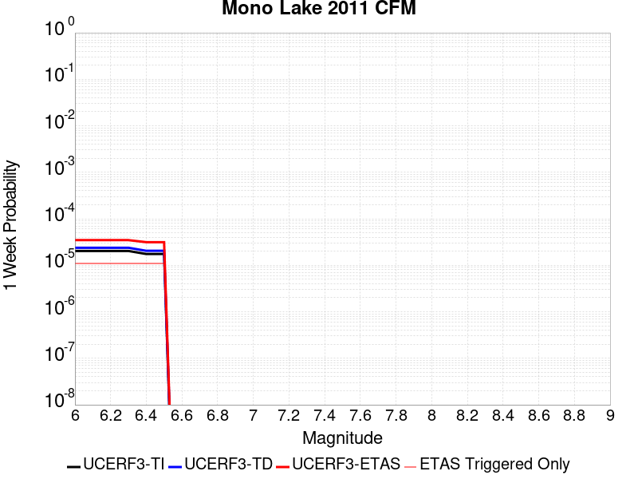 | 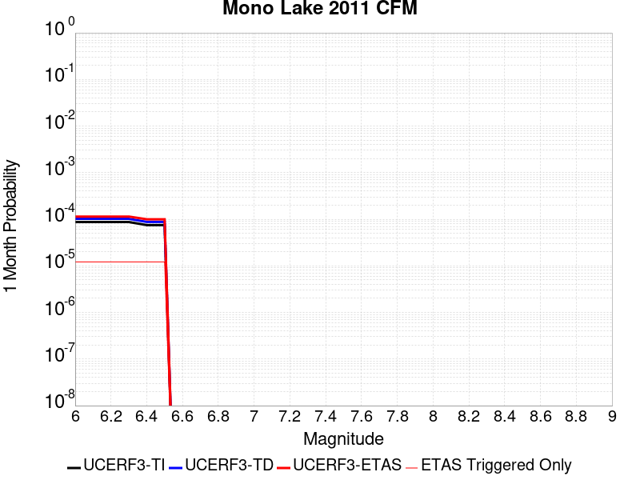 | 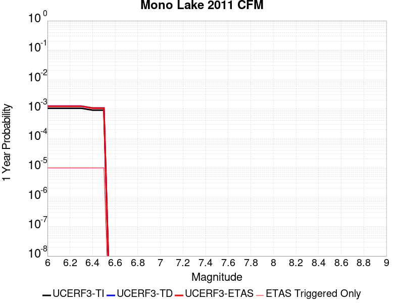 | 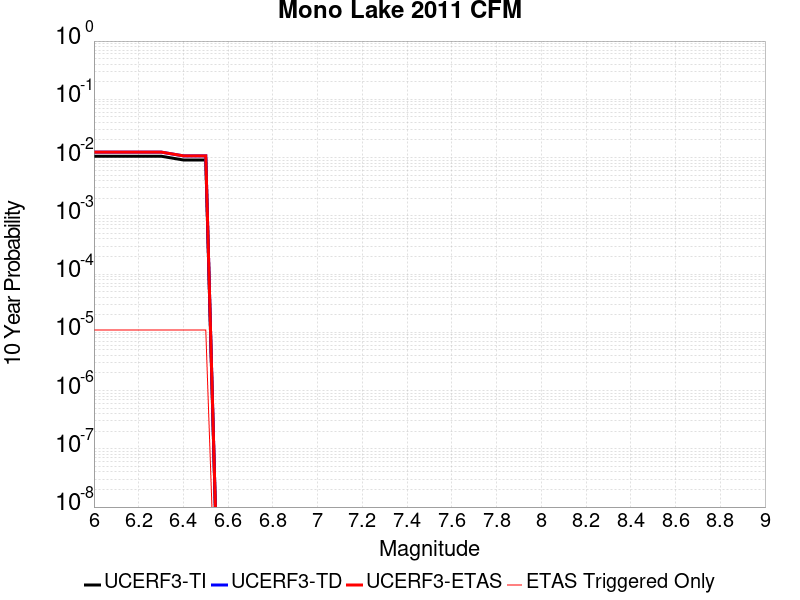 |

| Magnitude | 1 wk TI Prob | 1 wk TD Prob | 1 wk ETAS Prob | 1 wk ETAS/TD Gain | 1 wk ETAS Triggered Only | 1 mo TI Prob | 1 mo TD Prob | 1 mo ETAS Prob | 1 mo ETAS/TD Gain | 1 mo ETAS Triggered Only | 1 yr TI Prob | 1 yr TD Prob | 1 yr ETAS Prob | 1 yr ETAS/TD Gain | 1 yr ETAS Triggered Only | 10 yr TI Prob | 10 yr TD Prob | 10 yr ETAS Prob | 10 yr ETAS/TD Gain | 10 yr ETAS Triggered Only |
|-----|-----|-----|-----|-----|-----|-----|-----|-----|-----|-----|-----|-----|-----|-----|-----|-----|-----|-----|-----|-----|
| 6.0 | 2.0341662E-5 | 2.3828166E-5 | 3.4769186E-5 | 1.4591632 | 1.0941279E-5 | 8.717564E-5 | 1.0211971E-4 | 1.13059876E-4 | 1.1071308 | 1.0941279E-5 | 0.0010608466 | 0.0012431298 | 0.0012540575 | 1.0087905 | 1.0941279E-5 | 0.010557966 | 0.012413835 | 0.01242464 | 1.0008705 | 1.0941279E-5 |
| 6.1 | 2.0341662E-5 | 2.3828166E-5 | 3.4769186E-5 | 1.4591632 | 1.0941279E-5 | 8.717564E-5 | 1.0211971E-4 | 1.13059876E-4 | 1.1071308 | 1.0941279E-5 | 0.0010608466 | 0.0012431298 | 0.0012540575 | 1.0087905 | 1.0941279E-5 | 0.010557966 | 0.012413835 | 0.01242464 | 1.0008705 | 1.0941279E-5 |
| 6.2 | 2.0341662E-5 | 2.3828166E-5 | 3.4769186E-5 | 1.4591632 | 1.0941279E-5 | 8.717564E-5 | 1.0211971E-4 | 1.13059876E-4 | 1.1071308 | 1.0941279E-5 | 0.0010608466 | 0.0012431298 | 0.0012540575 | 1.0087905 | 1.0941279E-5 | 0.010557966 | 0.012413835 | 0.01242464 | 1.0008705 | 1.0941279E-5 |
| 6.3 | 2.0341662E-5 | 2.3828166E-5 | 3.4769186E-5 | 1.4591632 | 1.0941279E-5 | 8.717564E-5 | 1.0211971E-4 | 1.13059876E-4 | 1.1071308 | 1.0941279E-5 | 0.0010608466 | 0.0012431298 | 0.0012540575 | 1.0087905 | 1.0941279E-5 | 0.010557966 | 0.012413835 | 0.01242464 | 1.0008705 | 1.0941279E-5 |
| 6.4 | 1.749821E-5 | 2.0490985E-5 | 3.143204E-5 | 1.5339447 | 1.0941279E-5 | 7.499018E-5 | 8.781851E-5 | 9.875883E-5 | 1.1245787 | 1.0941279E-5 | 9.1262296E-4 | 0.0010691903 | 0.0010801199 | 1.0102223 | 1.0941279E-5 | 0.009088841 | 0.010691865 | 0.010702689 | 1.0010124 | 1.0941279E-5 |
| 6.5 | 1.749821E-5 | 2.0490985E-5 | 3.143204E-5 | 1.5339447 | 1.0941279E-5 | 7.499018E-5 | 8.781851E-5 | 9.875883E-5 | 1.1245787 | 1.0941279E-5 | 9.1262296E-4 | 0.0010691903 | 0.0010801199 | 1.0102223 | 1.0941279E-5 | 0.009088841 | 0.010691865 | 0.010702689 | 1.0010124 | 1.0941279E-5 |

## Shoreline
*[(top)](#table-of-contents)*

| 1 Week | 1 Month | 1 Year | 10 Year |
|-----|-----|-----|-----|
|  | 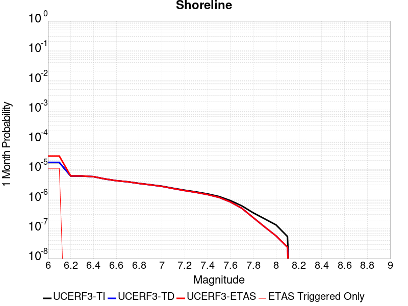 | 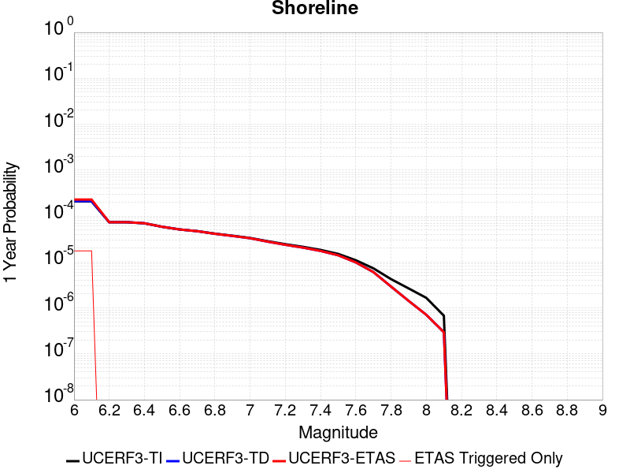 | 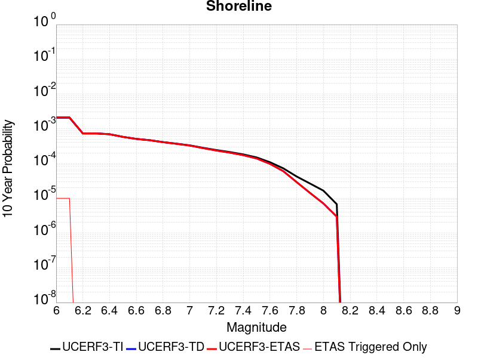 |

| Magnitude | 1 wk TI Prob | 1 wk TD Prob | 1 wk ETAS Prob | 1 wk ETAS/TD Gain | 1 wk ETAS Triggered Only | 1 mo TI Prob | 1 mo TD Prob | 1 mo ETAS Prob | 1 mo ETAS/TD Gain | 1 mo ETAS Triggered Only | 1 yr TI Prob | 1 yr TD Prob | 1 yr ETAS Prob | 1 yr ETAS/TD Gain | 1 yr ETAS Triggered Only | 10 yr TI Prob | 10 yr TD Prob | 10 yr ETAS Prob | 10 yr ETAS/TD Gain | 10 yr ETAS Triggered Only |
|-----|-----|-----|-----|-----|-----|-----|-----|-----|-----|-----|-----|-----|-----|-----|-----|-----|-----|-----|-----|-----|
| 6.0 | 3.9888673E-6 | 4.047929E-6 | 4.047929E-6 | 1.0 | 0.0 | 1.7095033E-5 | 1.7348184E-5 | 2.8289272E-5 | 1.6306763 | 1.0941279E-5 | 2.0811215E-4 | 2.1119925E-4 | 2.2213822E-4 | 1.0517945 | 1.0941279E-5 | 0.0020791737 | 0.002110534 | 0.0021214522 | 1.0051732 | 1.0941279E-5 |
| 6.1 | 3.9888673E-6 | 4.047929E-6 | 4.047929E-6 | 1.0 | 0.0 | 1.7095033E-5 | 1.7348184E-5 | 2.8289272E-5 | 1.6306763 | 1.0941279E-5 | 2.0811215E-4 | 2.1119925E-4 | 2.2213822E-4 | 1.0517945 | 1.0941279E-5 | 0.0020791737 | 0.002110534 | 0.0021214522 | 1.0051732 | 1.0941279E-5 |
| 6.2 | 1.4039653E-6 | 1.4100891E-6 | 1.4100891E-6 | 1.0 | 0.0 | 6.0169805E-6 | 6.0432253E-6 | 6.0432253E-6 | 1.0 | 0.0 | 7.325427E-5 | 7.357384E-5 | 7.357384E-5 | 1.0 | 0.0 | 7.3230127E-4 | 7.355009E-4 | 7.355009E-4 | 1.0 | 0.0 |
| 6.3 | 1.4039653E-6 | 1.4100891E-6 | 1.4100891E-6 | 1.0 | 0.0 | 6.0169805E-6 | 6.0432253E-6 | 6.0432253E-6 | 1.0 | 0.0 | 7.325427E-5 | 7.357384E-5 | 7.357384E-5 | 1.0 | 0.0 | 7.3230127E-4 | 7.355009E-4 | 7.355009E-4 | 1.0 | 0.0 |
| 6.4 | 1.3314152E-6 | 1.3361605E-6 | 1.3361605E-6 | 1.0 | 0.0 | 5.7060524E-6 | 5.7263896E-6 | 5.7263896E-6 | 1.0 | 0.0 | 6.946897E-5 | 6.971662E-5 | 6.971662E-5 | 1.0 | 0.0 | 6.9447263E-4 | 6.9695286E-4 | 6.9695286E-4 | 1.0 | 0.0 |
| 6.5 | 1.1187026E-6 | 1.120364E-6 | 1.120364E-6 | 1.0 | 0.0 | 4.794431E-6 | 4.8015513E-6 | 4.8015513E-6 | 1.0 | 0.0 | 5.8370628E-5 | 5.8457343E-5 | 5.8457343E-5 | 1.0 | 0.0 | 5.83553E-4 | 5.844222E-4 | 5.844222E-4 | 1.0 | 0.0 |
| 6.6 | 9.793089E-7 | 9.784919E-7 | 9.784919E-7 | 1.0 | 0.0 | 4.1970316E-6 | 4.1935305E-6 | 4.1935305E-6 | 1.0 | 0.0 | 5.1097657E-5 | 5.105505E-5 | 5.105505E-5 | 1.0 | 0.0 | 5.108591E-4 | 5.1043445E-4 | 5.1043445E-4 | 1.0 | 0.0 |
| 6.7 | 8.995986E-7 | 8.9728E-7 | 8.9728E-7 | 1.0 | 0.0 | 3.8554167E-6 | 3.84548E-6 | 3.84548E-6 | 1.0 | 0.0 | 4.693869E-5 | 4.6817724E-5 | 4.6817724E-5 | 1.0 | 0.0 | 4.6928777E-4 | 4.6807955E-4 | 4.6807955E-4 | 1.0 | 0.0 |
| 6.8 | 7.931612E-7 | 7.8804027E-7 | 7.8804027E-7 | 1.0 | 0.0 | 3.3992578E-6 | 3.377311E-6 | 3.377311E-6 | 1.0 | 0.0 | 4.1385178E-5 | 4.1117994E-5 | 4.1117994E-5 | 1.0 | 0.0 | 4.1377472E-4 | 4.1110438E-4 | 4.1110438E-4 | 1.0 | 0.0 |
| 6.9 | 7.1465956E-7 | 7.078006E-7 | 7.078006E-7 | 1.0 | 0.0 | 3.062823E-6 | 3.0334277E-6 | 3.0334277E-6 | 1.0 | 0.0 | 3.7289232E-5 | 3.6931357E-5 | 3.6931357E-5 | 1.0 | 0.0 | 3.7282976E-4 | 3.6925258E-4 | 3.6925258E-4 | 1.0 | 0.0 |
| 7.0 | 6.389046E-7 | 6.299458E-7 | 6.299458E-7 | 1.0 | 0.0 | 2.7381598E-6 | 2.699765E-6 | 2.699765E-6 | 1.0 | 0.0 | 3.3336586E-5 | 3.2869146E-5 | 3.2869146E-5 | 1.0 | 0.0 | 3.3331584E-4 | 3.2864307E-4 | 3.2864307E-4 | 1.0 | 0.0 |
| 7.1 | 5.4300875E-7 | 5.3111313E-7 | 5.3111313E-7 | 1.0 | 0.0 | 2.3271782E-6 | 2.276197E-6 | 2.276197E-6 | 1.0 | 0.0 | 2.8333026E-5 | 2.7712347E-5 | 2.7712347E-5 | 1.0 | 0.0 | 2.8329415E-4 | 2.77089E-4 | 2.77089E-4 | 1.0 | 0.0 |
| 7.2 | 4.6768855E-7 | 4.5348952E-7 | 4.5348952E-7 | 1.0 | 0.0 | 2.0043778E-6 | 1.9435251E-6 | 1.9435251E-6 | 1.0 | 0.0 | 2.4403027E-5 | 2.3662162E-5 | 2.3662162E-5 | 1.0 | 0.0 | 2.4400349E-4 | 2.3659648E-4 | 2.3659648E-4 | 1.0 | 0.0 |
| 7.3 | 4.0966103E-7 | 3.9385662E-7 | 3.9385662E-7 | 1.0 | 0.0 | 1.7556889E-6 | 1.6879559E-6 | 1.6879559E-6 | 1.0 | 0.0 | 2.1375303E-5 | 2.055067E-5 | 2.055067E-5 | 1.0 | 0.0 | 2.1373246E-4 | 2.0548773E-4 | 2.0548773E-4 | 1.0 | 0.0 |
| 7.4 | 3.5105785E-7 | 3.3363975E-7 | 3.3363975E-7 | 1.0 | 0.0 | 1.5045327E-6 | 1.4298838E-6 | 1.4298838E-6 | 1.0 | 0.0 | 1.8317533E-5 | 1.7408696E-5 | 1.7408696E-5 | 1.0 | 0.0 | 1.8316023E-4 | 1.7407336E-4 | 1.7407336E-4 | 1.0 | 0.0 |
| 7.5 | 2.8737534E-7 | 2.6820038E-7 | 2.6820038E-7 | 1.0 | 0.0 | 1.2316079E-6 | 1.1494297E-6 | 1.1494297E-6 | 1.0 | 0.0 | 1.4994724E-5 | 1.3994217E-5 | 1.3994217E-5 | 1.0 | 0.0 | 1.4993713E-4 | 1.3993339E-4 | 1.3993339E-4 | 1.0 | 0.0 |
| 7.6 | 2.0924051E-7 | 1.8778988E-7 | 1.8778988E-7 | 1.0 | 0.0 | 8.967448E-7 | 8.048135E-7 | 8.048135E-7 | 1.0 | 0.0 | 1.0917813E-5 | 9.79856E-6 | 9.79856E-6 | 1.0 | 0.0 | 1.0917276E-4 | 9.798129E-5 | 9.798129E-5 | 1.0 | 0.0 |
| 7.7 | 1.392265E-7 | 1.15433906E-7 | 1.15433906E-7 | 1.0 | 0.0 | 5.9668486E-7 | 4.9471663E-7 | 4.9471663E-7 | 1.0 | 0.0 | 7.2646135E-6 | 6.023158E-6 | 6.023158E-6 | 1.0 | 0.0 | 7.2643765E-5 | 6.0229955E-5 | 6.0229955E-5 | 1.0 | 0.0 |
| 7.8 | 8.1080074E-8 | 5.586722E-8 | 5.586722E-8 | 1.0 | 0.0 | 3.4748598E-7 | 2.394309E-7 | 2.394309E-7 | 1.0 | 0.0 | 4.2306337E-6 | 2.9150672E-6 | 2.9150672E-6 | 1.0 | 0.0 | 4.230553E-5 | 2.9150291E-5 | 2.9150291E-5 | 1.0 | 0.0 |
| 7.9 | 5.0859036E-8 | 2.7244445E-8 | 2.7244445E-8 | 1.0 | 0.0 | 2.1796728E-7 | 1.16761896E-7 | 1.16761896E-7 | 1.0 | 0.0 | 2.6537484E-6 | 1.4215751E-6 | 1.4215751E-6 | 1.0 | 0.0 | 2.6537167E-5 | 1.4215661E-5 | 1.4215661E-5 | 1.0 | 0.0 |
| 8.0 | 3.1760536E-8 | 1.3577206E-8 | 1.3577206E-8 | 1.0 | 0.0 | 1.3611657E-7 | 5.8188025E-8 | 5.8188025E-8 | 1.0 | 0.0 | 1.6572179E-6 | 7.0843896E-7 | 7.0843896E-7 | 1.0 | 0.0 | 1.6572056E-5 | 7.084367E-6 | 7.084367E-6 | 1.0 | 0.0 |
| 8.1 | 1.2947896E-8 | 5.6628693E-9 | 5.6628693E-9 | 1.0 | 0.0 | 5.5490982E-8 | 2.426944E-8 | 2.426944E-8 | 1.0 | 0.0 | 6.756025E-7 | 2.954804E-7 | 2.954804E-7 | 1.0 | 0.0 | 6.7560045E-6 | 2.9548003E-6 | 2.9548003E-6 | 1.0 | 0.0 |

## Breckenridge 2011
*[(top)](#table-of-contents)*

| 1 Week | 1 Month | 1 Year | 10 Year |
|-----|-----|-----|-----|
| 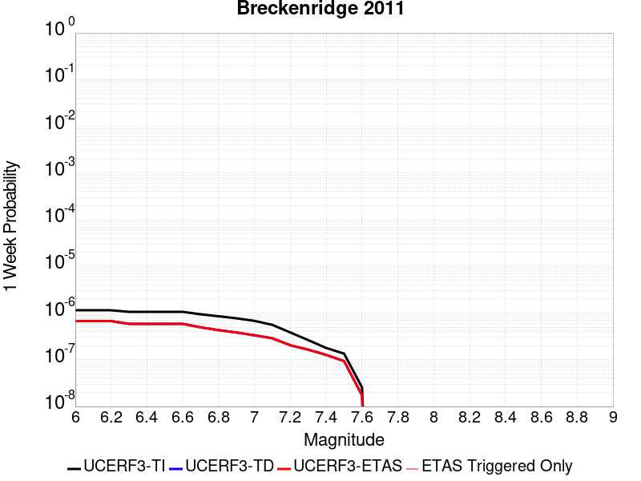 | 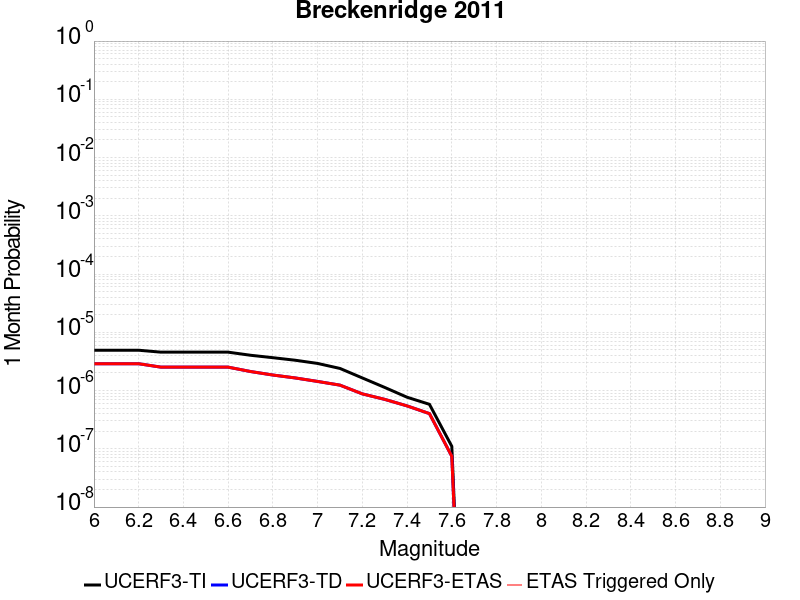 | 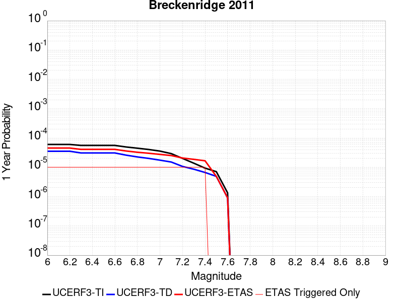 | 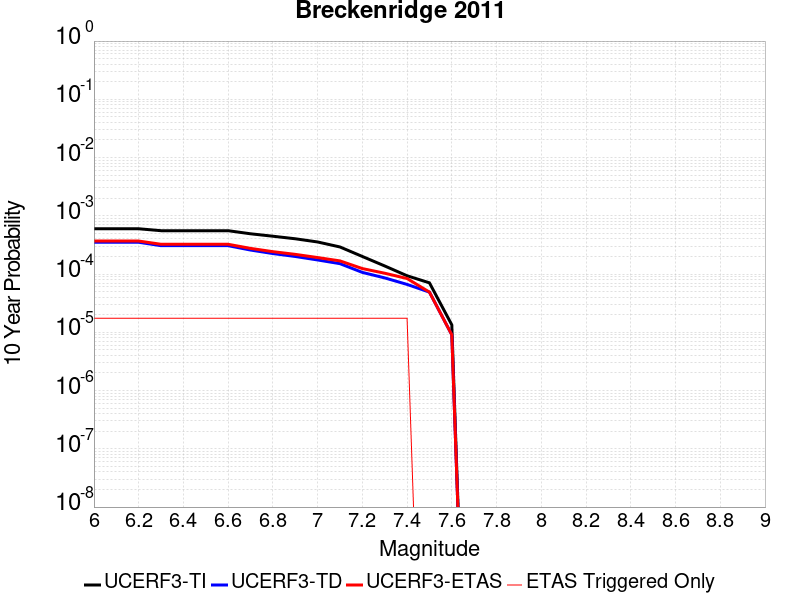 |

| Magnitude | 1 wk TI Prob | 1 wk TD Prob | 1 wk ETAS Prob | 1 wk ETAS/TD Gain | 1 wk ETAS Triggered Only | 1 mo TI Prob | 1 mo TD Prob | 1 mo ETAS Prob | 1 mo ETAS/TD Gain | 1 mo ETAS Triggered Only | 1 yr TI Prob | 1 yr TD Prob | 1 yr ETAS Prob | 1 yr ETAS/TD Gain | 1 yr ETAS Triggered Only | 10 yr TI Prob | 10 yr TD Prob | 10 yr ETAS Prob | 10 yr ETAS/TD Gain | 10 yr ETAS Triggered Only |
|-----|-----|-----|-----|-----|-----|-----|-----|-----|-----|-----|-----|-----|-----|-----|-----|-----|-----|-----|-----|-----|
| 6.0 | 1.1490393E-6 | 6.7380773E-7 | 6.7380773E-7 | 1.0 | 0.0 | 4.924445E-6 | 2.8877444E-6 | 2.8877444E-6 | 1.0 | 0.0 | 5.995347E-5 | 3.515774E-5 | 4.6098634E-5 | 1.3111944 | 1.0941279E-5 | 5.9937296E-4 | 3.5152383E-4 | 3.624613E-4 | 1.0311143 | 1.0941279E-5 |
| 6.1 | 1.1490393E-6 | 6.7380773E-7 | 6.7380773E-7 | 1.0 | 0.0 | 4.924445E-6 | 2.8877444E-6 | 2.8877444E-6 | 1.0 | 0.0 | 5.995347E-5 | 3.515774E-5 | 4.6098634E-5 | 1.3111944 | 1.0941279E-5 | 5.9937296E-4 | 3.5152383E-4 | 3.624613E-4 | 1.0311143 | 1.0941279E-5 |
| 6.2 | 1.1490393E-6 | 6.7380773E-7 | 6.7380773E-7 | 1.0 | 0.0 | 4.924445E-6 | 2.8877444E-6 | 2.8877444E-6 | 1.0 | 0.0 | 5.995347E-5 | 3.515774E-5 | 4.6098634E-5 | 1.3111944 | 1.0941279E-5 | 5.9937296E-4 | 3.5152383E-4 | 3.624613E-4 | 1.0311143 | 1.0941279E-5 |
| 6.3 | 1.064617E-6 | 5.886475E-7 | 5.886475E-7 | 1.0 | 0.0 | 4.5626366E-6 | 2.5227728E-6 | 2.5227728E-6 | 1.0 | 0.0 | 5.5548684E-5 | 3.0714335E-5 | 4.165528E-5 | 1.3562162 | 1.0941279E-5 | 5.55348E-4 | 3.0710208E-4 | 3.1804E-4 | 1.0356165 | 1.0941279E-5 |
| 6.4 | 1.064617E-6 | 5.886475E-7 | 5.886475E-7 | 1.0 | 0.0 | 4.5626366E-6 | 2.5227728E-6 | 2.5227728E-6 | 1.0 | 0.0 | 5.5548684E-5 | 3.0714335E-5 | 4.165528E-5 | 1.3562162 | 1.0941279E-5 | 5.55348E-4 | 3.0710208E-4 | 3.1804E-4 | 1.0356165 | 1.0941279E-5 |
| 6.5 | 1.064617E-6 | 5.886475E-7 | 5.886475E-7 | 1.0 | 0.0 | 4.5626366E-6 | 2.5227728E-6 | 2.5227728E-6 | 1.0 | 0.0 | 5.5548684E-5 | 3.0714335E-5 | 4.165528E-5 | 1.3562162 | 1.0941279E-5 | 5.55348E-4 | 3.0710208E-4 | 3.1804E-4 | 1.0356165 | 1.0941279E-5 |
| 6.6 | 1.064617E-6 | 5.886475E-7 | 5.886475E-7 | 1.0 | 0.0 | 4.5626366E-6 | 2.5227728E-6 | 2.5227728E-6 | 1.0 | 0.0 | 5.5548684E-5 | 3.0714335E-5 | 4.165528E-5 | 1.3562162 | 1.0941279E-5 | 5.55348E-4 | 3.0710208E-4 | 3.1804E-4 | 1.0356165 | 1.0941279E-5 |
| 6.7 | 9.4219524E-7 | 4.954078E-7 | 4.954078E-7 | 1.0 | 0.0 | 4.037973E-6 | 2.1231745E-6 | 2.1231745E-6 | 1.0 | 0.0 | 4.916122E-5 | 2.5849351E-5 | 3.6790345E-5 | 1.42326 | 1.0941279E-5 | 4.9150345E-4 | 2.5846408E-4 | 2.6940255E-4 | 1.042321 | 1.0941279E-5 |
| 6.8 | 8.556422E-7 | 4.311975E-7 | 4.311975E-7 | 1.0 | 0.0 | 3.667033E-6 | 1.847988E-6 | 1.847988E-6 | 1.0 | 0.0 | 4.464521E-5 | 2.2499025E-5 | 3.3440057E-5 | 1.4862891 | 1.0941279E-5 | 4.4636242E-4 | 2.2496787E-4 | 2.3590669E-4 | 1.0486239 | 1.0941279E-5 |
| 6.9 | 7.7357794E-7 | 3.8420345E-7 | 3.8420345E-7 | 1.0 | 0.0 | 3.3153299E-6 | 1.6465851E-6 | 1.6465851E-6 | 1.0 | 0.0 | 4.0363393E-5 | 2.0046993E-5 | 3.0988052E-5 | 1.5457705 | 1.0941279E-5 | 4.035606E-4 | 2.0045215E-4 | 2.1139123E-4 | 1.0545721 | 1.0941279E-5 |
| 7.0 | 6.8172454E-7 | 3.3471417E-7 | 3.3471417E-7 | 1.0 | 0.0 | 2.9216735E-6 | 1.4344886E-6 | 1.4344886E-6 | 1.0 | 0.0 | 3.5570793E-5 | 1.7464761E-5 | 2.8405848E-5 | 1.6264665 | 1.0941279E-5 | 3.55651E-4 | 1.746341E-4 | 1.8557347E-4 | 1.0626416 | 1.0941279E-5 |
| 7.1 | 5.5936397E-7 | 2.890966E-7 | 2.890966E-7 | 1.0 | 0.0 | 2.397272E-6 | 1.2389849E-6 | 1.2389849E-6 | 1.0 | 0.0 | 2.9186394E-5 | 1.5084538E-5 | 2.6025651E-5 | 1.7253197 | 1.0941279E-5 | 2.9182562E-4 | 1.5083532E-4 | 1.6177495E-4 | 1.0725269 | 1.0941279E-5 |
| 7.2 | 3.8420822E-7 | 2.0468339E-7 | 2.0468339E-7 | 1.0 | 0.0 | 1.6466057E-6 | 8.7721423E-7 | 8.7721423E-7 | 1.0 | 0.0 | 2.004724E-5 | 1.0680032E-5 | 2.1621194E-5 | 2.0244503 | 1.0941279E-5 | 2.004543E-4 | 1.0679527E-4 | 1.17735384E-4 | 1.10244 | 1.0941279E-5 |
| 7.3 | 2.6405158E-7 | 1.647323E-7 | 1.647323E-7 | 1.0 | 0.0 | 1.1316491E-6 | 7.059954E-7 | 7.059954E-7 | 1.0 | 0.0 | 1.37777415E-5 | 8.595461E-6 | 1.9536645E-5 | 2.2729027 | 1.0941279E-5 | 1.3776887E-4 | 8.5951346E-5 | 9.689168E-5 | 1.1272852 | 1.0941279E-5 |
| 7.4 | 1.792114E-7 | 1.2725314E-7 | 1.2725314E-7 | 1.0 | 0.0 | 7.6804866E-7 | 5.4537054E-7 | 5.4537054E-7 | 1.0 | 0.0 | 9.3509525E-6 | 6.6398666E-6 | 1.7581073E-5 | 2.647805 | 1.0941279E-5 | 9.350559E-5 | 6.639673E-5 | 7.733728E-5 | 1.1647755 | 1.0941279E-5 |
| 7.5 | 1.3548703E-7 | 9.3854034E-8 | 9.3854034E-8 | 1.0 | 0.0 | 5.8065854E-7 | 4.022315E-7 | 4.022315E-7 | 1.0 | 0.0 | 7.0694946E-6 | 4.897158E-6 | 4.897158E-6 | 1.0 | 0.0 | 7.0692695E-5 | 4.8970534E-5 | 4.8970534E-5 | 1.0 | 0.0 |
| 7.6 | 2.572245E-8 | 1.7352555E-8 | 1.7352555E-8 | 1.0 | 0.0 | 1.10239064E-7 | 7.436809E-8 | 7.436809E-8 | 1.0 | 0.0 | 1.3421597E-6 | 9.054312E-7 | 9.054312E-7 | 1.0 | 0.0 | 1.3421517E-5 | 9.05428E-6 | 9.05428E-6 | 1.0 | 0.0 |

## San Luis Range - Oceano 2011 CFM
*[(top)](#table-of-contents)*

| 1 Week | 1 Month | 1 Year | 10 Year |
|-----|-----|-----|-----|
| 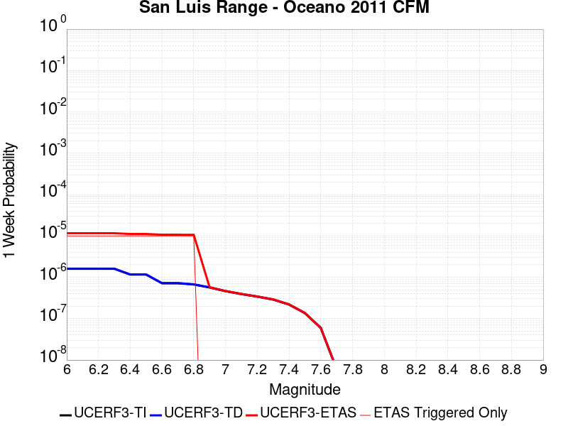 | 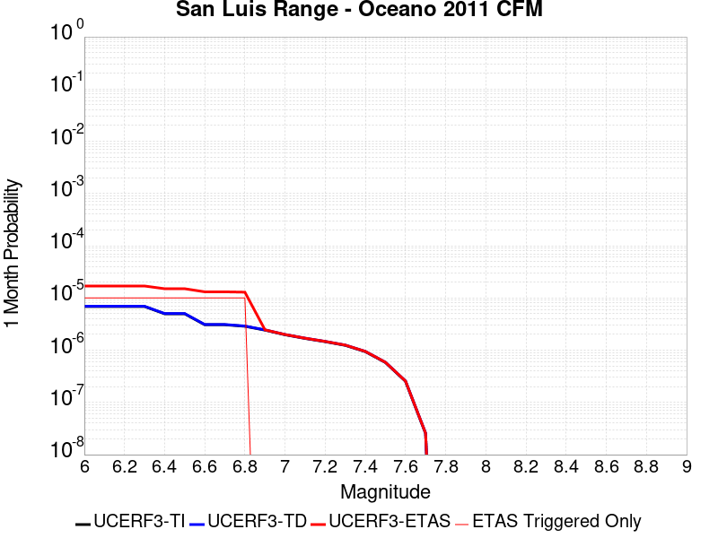 | 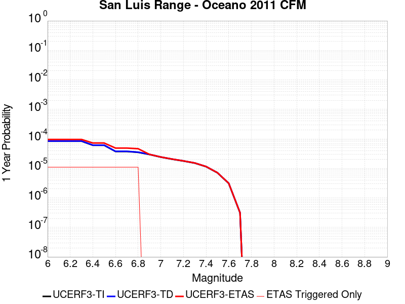 | 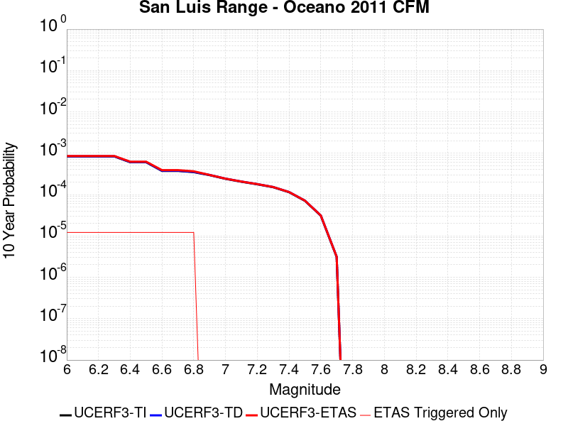 |

| Magnitude | 1 wk TI Prob | 1 wk TD Prob | 1 wk ETAS Prob | 1 wk ETAS/TD Gain | 1 wk ETAS Triggered Only | 1 mo TI Prob | 1 mo TD Prob | 1 mo ETAS Prob | 1 mo ETAS/TD Gain | 1 mo ETAS Triggered Only | 1 yr TI Prob | 1 yr TD Prob | 1 yr ETAS Prob | 1 yr ETAS/TD Gain | 1 yr ETAS Triggered Only | 10 yr TI Prob | 10 yr TD Prob | 10 yr ETAS Prob | 10 yr ETAS/TD Gain | 10 yr ETAS Triggered Only |
|-----|-----|-----|-----|-----|-----|-----|-----|-----|-----|-----|-----|-----|-----|-----|-----|-----|-----|-----|-----|-----|
| 6.0 | 1.6025788E-6 | 1.620119E-6 | 1.256138E-5 | 7.7533684 | 1.0941279E-5 | 6.8681766E-6 | 6.943351E-6 | 1.7884553E-5 | 2.5757813 | 1.0941279E-5 | 8.361684E-5 | 8.453243E-5 | 9.547279E-5 | 1.129422 | 1.0941279E-5 | 8.3585386E-4 | 8.4504357E-4 | 8.559756E-4 | 1.0129366 | 1.0941279E-5 |
| 6.1 | 1.6025788E-6 | 1.620119E-6 | 1.256138E-5 | 7.7533684 | 1.0941279E-5 | 6.8681766E-6 | 6.943351E-6 | 1.7884553E-5 | 2.5757813 | 1.0941279E-5 | 8.361684E-5 | 8.453243E-5 | 9.547279E-5 | 1.129422 | 1.0941279E-5 | 8.3585386E-4 | 8.4504357E-4 | 8.559756E-4 | 1.0129366 | 1.0941279E-5 |
| 6.2 | 1.6025788E-6 | 1.620119E-6 | 1.256138E-5 | 7.7533684 | 1.0941279E-5 | 6.8681766E-6 | 6.943351E-6 | 1.7884553E-5 | 2.5757813 | 1.0941279E-5 | 8.361684E-5 | 8.453243E-5 | 9.547279E-5 | 1.129422 | 1.0941279E-5 | 8.3585386E-4 | 8.4504357E-4 | 8.559756E-4 | 1.0129366 | 1.0941279E-5 |
| 6.3 | 1.6025788E-6 | 1.620119E-6 | 1.256138E-5 | 7.7533684 | 1.0941279E-5 | 6.8681766E-6 | 6.943351E-6 | 1.7884553E-5 | 2.5757813 | 1.0941279E-5 | 8.361684E-5 | 8.453243E-5 | 9.547279E-5 | 1.129422 | 1.0941279E-5 | 8.3585386E-4 | 8.4504357E-4 | 8.559756E-4 | 1.0129366 | 1.0941279E-5 |
| 6.4 | 1.1621186E-6 | 1.1749894E-6 | 1.2116255E-5 | 10.311799 | 1.0941279E-5 | 4.980499E-6 | 5.0356607E-6 | 1.5976884E-5 | 3.1727483 | 1.0941279E-5 | 6.0635884E-5 | 6.130771E-5 | 7.2248324E-5 | 1.178454 | 1.0941279E-5 | 6.0619344E-4 | 6.1293464E-4 | 6.238692E-4 | 1.0178397 | 1.0941279E-5 |
| 6.5 | 1.1621186E-6 | 1.1749894E-6 | 1.2116255E-5 | 10.311799 | 1.0941279E-5 | 4.980499E-6 | 5.0356607E-6 | 1.5976884E-5 | 3.1727483 | 1.0941279E-5 | 6.0635884E-5 | 6.130771E-5 | 7.2248324E-5 | 1.178454 | 1.0941279E-5 | 6.0619344E-4 | 6.1293464E-4 | 6.238692E-4 | 1.0178397 | 1.0941279E-5 |
| 6.6 | 7.164729E-7 | 7.2485784E-7 | 1.1666128E-5 | 16.094368 | 1.0941279E-5 | 3.0705946E-6 | 3.10653E-6 | 1.4047774E-5 | 4.5220146 | 1.0941279E-5 | 3.738385E-5 | 3.7821363E-5 | 4.8762227E-5 | 1.2892773 | 1.0941279E-5 | 3.737756E-4 | 3.7815105E-4 | 3.8908818E-4 | 1.0289227 | 1.0941279E-5 |
| 6.7 | 7.164729E-7 | 7.2485784E-7 | 1.1666128E-5 | 16.094368 | 1.0941279E-5 | 3.0705946E-6 | 3.10653E-6 | 1.4047774E-5 | 4.5220146 | 1.0941279E-5 | 3.738385E-5 | 3.7821363E-5 | 4.8762227E-5 | 1.2892773 | 1.0941279E-5 | 3.737756E-4 | 3.7815105E-4 | 3.8908818E-4 | 1.0289227 | 1.0941279E-5 |
| 6.8 | 6.700177E-7 | 6.7774397E-7 | 1.1619015E-5 | 17.143663 | 1.0941279E-5 | 2.8715012E-6 | 2.904614E-6 | 1.384586E-5 | 4.7668505 | 1.0941279E-5 | 3.495997E-5 | 3.536312E-5 | 4.630401E-5 | 1.3093871 | 1.0941279E-5 | 3.495447E-4 | 3.5357653E-4 | 3.6451395E-4 | 1.0309336 | 1.0941279E-5 |
| 6.9 | 5.657865E-7 | 5.7217864E-7 | 5.7217864E-7 | 1.0 | 0.0 | 2.424797E-6 | 2.452192E-6 | 2.452192E-6 | 1.0 | 0.0 | 2.9521503E-5 | 2.9855039E-5 | 2.9855039E-5 | 1.0 | 0.0 | 2.9517582E-4 | 2.9851135E-4 | 2.9851135E-4 | 1.0 | 0.0 |
| 7.0 | 4.608413E-7 | 4.660169E-7 | 4.660169E-7 | 1.0 | 0.0 | 1.9750328E-6 | 1.9972138E-6 | 1.9972138E-6 | 1.0 | 0.0 | 2.4045758E-5 | 2.431581E-5 | 2.431581E-5 | 1.0 | 0.0 | 2.4043156E-4 | 2.4313178E-4 | 2.4313178E-4 | 1.0 | 0.0 |
| 7.1 | 3.9177846E-7 | 3.9621602E-7 | 3.9621602E-7 | 1.0 | 0.0 | 1.6790494E-6 | 1.6980675E-6 | 1.6980675E-6 | 1.0 | 0.0 | 2.0442236E-5 | 2.0673779E-5 | 2.0673779E-5 | 1.0 | 0.0 | 2.0440355E-4 | 2.067187E-4 | 2.067187E-4 | 1.0 | 0.0 |
| 7.2 | 3.3974752E-7 | 3.436653E-7 | 3.436653E-7 | 1.0 | 0.0 | 1.45606E-6 | 1.4728505E-6 | 1.4728505E-6 | 1.0 | 0.0 | 1.7727387E-5 | 1.7931809E-5 | 1.7931809E-5 | 1.0 | 0.0 | 1.7725973E-4 | 1.7930372E-4 | 1.7930372E-4 | 1.0 | 0.0 |
| 7.3 | 2.8900928E-7 | 2.923402E-7 | 2.923402E-7 | 1.0 | 0.0 | 1.2386106E-6 | 1.2528859E-6 | 1.2528859E-6 | 1.0 | 0.0 | 1.5079979E-5 | 1.525378E-5 | 1.525378E-5 | 1.0 | 0.0 | 1.5078956E-4 | 1.5252741E-4 | 1.5252741E-4 | 1.0 | 0.0 |
| 7.4 | 2.1881527E-7 | 2.2139594E-7 | 2.2139594E-7 | 1.0 | 0.0 | 9.3777936E-7 | 9.488394E-7 | 9.488394E-7 | 1.0 | 0.0 | 1.14174045E-5 | 1.1552059E-5 | 1.1552059E-5 | 1.0 | 0.0 | 1.1416818E-4 | 1.1551464E-4 | 1.1551464E-4 | 1.0 | 0.0 |
| 7.5 | 1.356398E-7 | 1.3718639E-7 | 1.3718639E-7 | 1.0 | 0.0 | 5.813133E-7 | 5.8794154E-7 | 5.8794154E-7 | 1.0 | 0.0 | 7.0774663E-6 | 7.158165E-6 | 7.158165E-6 | 1.0 | 0.0 | 7.077241E-5 | 7.157937E-5 | 7.157937E-5 | 1.0 | 0.0 |
| 7.6 | 5.9269272E-8 | 6.001364E-8 | 6.001364E-8 | 1.0 | 0.0 | 2.5401116E-7 | 2.572013E-7 | 2.572013E-7 | 1.0 | 0.0 | 3.0925814E-6 | 3.1314214E-6 | 3.1314214E-6 | 1.0 | 0.0 | 3.0925385E-5 | 3.1313786E-5 | 3.1313786E-5 | 1.0 | 0.0 |
| 7.7 | 5.946232E-9 | 6.036928E-9 | 6.036928E-9 | 1.0 | 0.0 | 2.5483851E-8 | 2.5872547E-8 | 2.5872547E-8 | 1.0 | 0.0 | 3.1026585E-7 | 3.1499823E-7 | 3.1499823E-7 | 1.0 | 0.0 | 3.102654E-6 | 3.1499787E-6 | 3.1499787E-6 | 1.0 | 0.0 |

## Los Alamos 2011 CFM
*[(top)](#table-of-contents)*

| 1 Week | 1 Month | 1 Year | 10 Year |
|-----|-----|-----|-----|
| 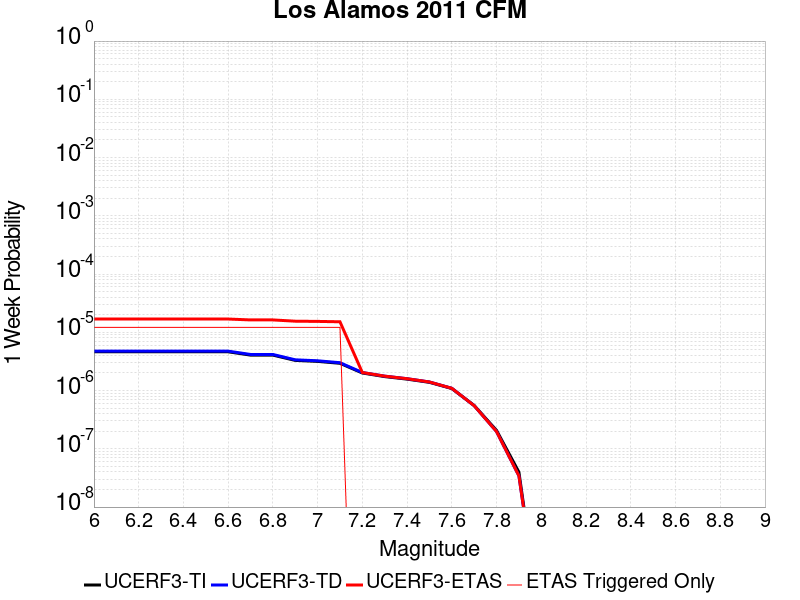 | 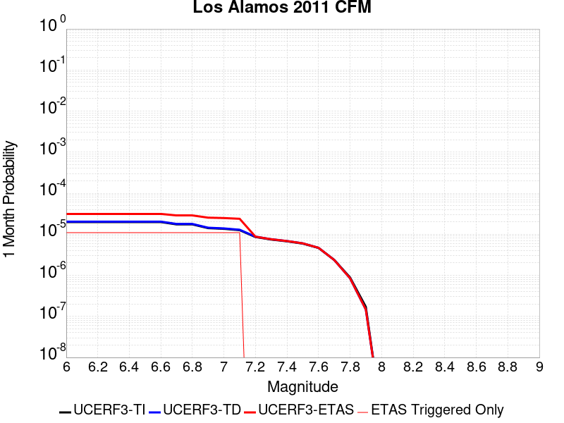 | 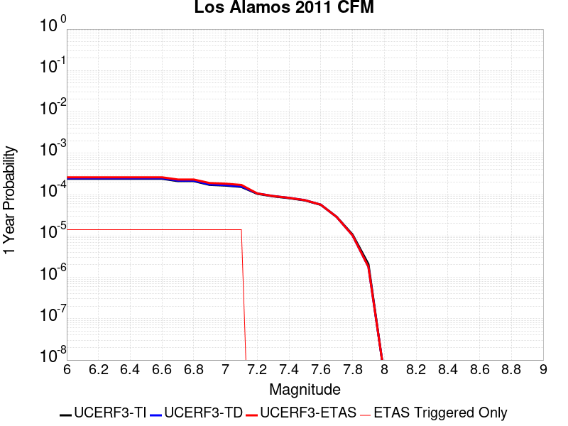 | 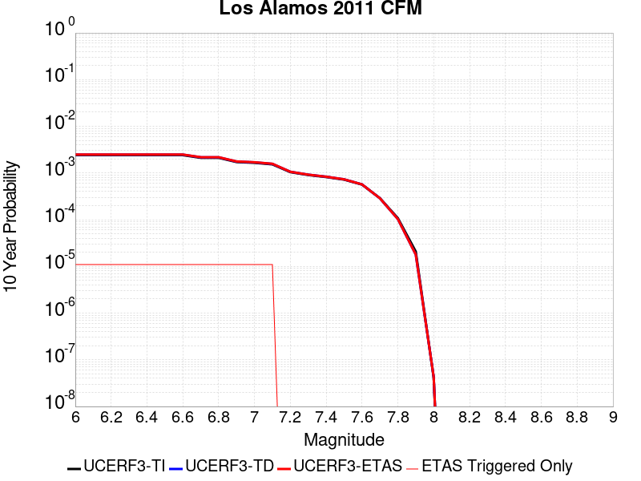 |

| Magnitude | 1 wk TI Prob | 1 wk TD Prob | 1 wk ETAS Prob | 1 wk ETAS/TD Gain | 1 wk ETAS Triggered Only | 1 mo TI Prob | 1 mo TD Prob | 1 mo ETAS Prob | 1 mo ETAS/TD Gain | 1 mo ETAS Triggered Only | 1 yr TI Prob | 1 yr TD Prob | 1 yr ETAS Prob | 1 yr ETAS/TD Gain | 1 yr ETAS Triggered Only | 10 yr TI Prob | 10 yr TD Prob | 10 yr ETAS Prob | 10 yr ETAS/TD Gain | 10 yr ETAS Triggered Only |
|-----|-----|-----|-----|-----|-----|-----|-----|-----|-----|-----|-----|-----|-----|-----|-----|-----|-----|-----|-----|-----|
| 6.0 | 4.6284417E-6 | 4.751731E-6 | 1.5692958E-5 | 3.3025768 | 1.0941279E-5 | 1.9836029E-5 | 2.0364414E-5 | 3.130547E-5 | 1.5372635 | 1.0941279E-5 | 2.4147688E-4 | 2.4791027E-4 | 2.5884886E-4 | 1.044123 | 1.0941279E-5 | 0.0024121467 | 0.0024765113 | 0.0024874257 | 1.004407 | 1.0941279E-5 |
| 6.1 | 4.6284417E-6 | 4.751731E-6 | 1.5692958E-5 | 3.3025768 | 1.0941279E-5 | 1.9836029E-5 | 2.0364414E-5 | 3.130547E-5 | 1.5372635 | 1.0941279E-5 | 2.4147688E-4 | 2.4791027E-4 | 2.5884886E-4 | 1.044123 | 1.0941279E-5 | 0.0024121467 | 0.0024765113 | 0.0024874257 | 1.004407 | 1.0941279E-5 |
| 6.2 | 4.6284417E-6 | 4.751731E-6 | 1.5692958E-5 | 3.3025768 | 1.0941279E-5 | 1.9836029E-5 | 2.0364414E-5 | 3.130547E-5 | 1.5372635 | 1.0941279E-5 | 2.4147688E-4 | 2.4791027E-4 | 2.5884886E-4 | 1.044123 | 1.0941279E-5 | 0.0024121467 | 0.0024765113 | 0.0024874257 | 1.004407 | 1.0941279E-5 |
| 6.3 | 4.6284417E-6 | 4.751731E-6 | 1.5692958E-5 | 3.3025768 | 1.0941279E-5 | 1.9836029E-5 | 2.0364414E-5 | 3.130547E-5 | 1.5372635 | 1.0941279E-5 | 2.4147688E-4 | 2.4791027E-4 | 2.5884886E-4 | 1.044123 | 1.0941279E-5 | 0.0024121467 | 0.0024765113 | 0.0024874257 | 1.004407 | 1.0941279E-5 |
| 6.4 | 4.6284417E-6 | 4.751731E-6 | 1.5692958E-5 | 3.3025768 | 1.0941279E-5 | 1.9836029E-5 | 2.0364414E-5 | 3.130547E-5 | 1.5372635 | 1.0941279E-5 | 2.4147688E-4 | 2.4791027E-4 | 2.5884886E-4 | 1.044123 | 1.0941279E-5 | 0.0024121467 | 0.0024765113 | 0.0024874257 | 1.004407 | 1.0941279E-5 |
| 6.5 | 4.6284417E-6 | 4.751731E-6 | 1.5692958E-5 | 3.3025768 | 1.0941279E-5 | 1.9836029E-5 | 2.0364414E-5 | 3.130547E-5 | 1.5372635 | 1.0941279E-5 | 2.4147688E-4 | 2.4791027E-4 | 2.5884886E-4 | 1.044123 | 1.0941279E-5 | 0.0024121467 | 0.0024765113 | 0.0024874257 | 1.004407 | 1.0941279E-5 |
| 6.6 | 4.6284417E-6 | 4.751731E-6 | 1.5692958E-5 | 3.3025768 | 1.0941279E-5 | 1.9836029E-5 | 2.0364414E-5 | 3.130547E-5 | 1.5372635 | 1.0941279E-5 | 2.4147688E-4 | 2.4791027E-4 | 2.5884886E-4 | 1.044123 | 1.0941279E-5 | 0.0024121467 | 0.0024765113 | 0.0024874257 | 1.004407 | 1.0941279E-5 |
| 6.7 | 4.062321E-6 | 4.166349E-6 | 1.5107581E-5 | 3.6260962 | 1.0941279E-5 | 1.7409831E-5 | 1.7855667E-5 | 2.8796749E-5 | 1.6127512 | 1.0941279E-5 | 2.1194408E-4 | 2.1737257E-4 | 2.2831147E-4 | 1.0503232 | 1.0941279E-5 | 0.0021174205 | 0.0021717492 | 0.0021826667 | 1.005027 | 1.0941279E-5 |
| 6.8 | 4.062321E-6 | 4.166349E-6 | 1.5107581E-5 | 3.6260962 | 1.0941279E-5 | 1.7409831E-5 | 1.7855667E-5 | 2.8796749E-5 | 1.6127512 | 1.0941279E-5 | 2.1194408E-4 | 2.1737257E-4 | 2.2831147E-4 | 1.0503232 | 1.0941279E-5 | 0.0021174205 | 0.0021717492 | 0.0021826667 | 1.005027 | 1.0941279E-5 |
| 6.9 | 3.2936077E-6 | 3.372958E-6 | 1.4314199E-5 | 4.243812 | 1.0941279E-5 | 1.4115385E-5 | 1.4455459E-5 | 2.5396579E-5 | 1.756885 | 1.0941279E-5 | 1.7184127E-4 | 1.7598194E-4 | 1.8692129E-4 | 1.0621618 | 1.0941279E-5 | 0.0017170844 | 0.0017585184 | 0.0017694405 | 1.0062109 | 1.0941279E-5 |
| 7.0 | 3.1687898E-6 | 3.2448156E-6 | 1.4186058E-5 | 4.3719153 | 1.0941279E-5 | 1.3580457E-5 | 1.3906283E-5 | 2.484741E-5 | 1.7867757 | 1.0941279E-5 | 1.6532952E-4 | 1.6929678E-4 | 1.802362E-4 | 1.0646168 | 1.0941279E-5 | 0.0016520657 | 0.0016917696 | 0.0017026924 | 1.0064564 | 1.0941279E-5 |
| 7.1 | 2.9379228E-6 | 3.0073259E-6 | 1.3948571E-5 | 4.6381974 | 1.0941279E-5 | 1.25910365E-5 | 1.288848E-5 | 2.3829618E-5 | 1.8489082 | 1.0941279E-5 | 1.5328509E-4 | 1.5690686E-4 | 1.6784642E-4 | 1.0697201 | 1.0941279E-5 | 0.001531794 | 0.0015680499 | 0.001578974 | 1.0069667 | 1.0941279E-5 |
| 7.2 | 2.0020686E-6 | 2.0416298E-6 | 2.0416298E-6 | 1.0 | 0.0 | 8.580266E-6 | 8.749813E-6 | 8.749813E-6 | 1.0 | 0.0 | 1.0445973E-4 | 1.0652381E-4 | 1.0652381E-4 | 1.0 | 0.0 | 0.0010441064 | 0.001064732 | 0.001064732 | 1.0 | 0.0 |
| 7.3 | 1.7364243E-6 | 1.7678802E-6 | 1.7678802E-6 | 1.0 | 0.0 | 7.441797E-6 | 7.576608E-6 | 7.576608E-6 | 1.0 | 0.0 | 9.0600115E-5 | 9.2241324E-5 | 9.2241324E-5 | 1.0 | 0.0 | 9.0563187E-4 | 9.2203356E-4 | 9.2203356E-4 | 1.0 | 0.0 |
| 7.4 | 1.5718434E-6 | 1.5983177E-6 | 1.5983177E-6 | 1.0 | 0.0 | 6.7364545E-6 | 6.849915E-6 | 6.849915E-6 | 1.0 | 0.0 | 8.201325E-5 | 8.339455E-5 | 8.339455E-5 | 1.0 | 0.0 | 8.198299E-4 | 8.3363557E-4 | 8.3363557E-4 | 1.0 | 0.0 |
| 7.5 | 1.3841119E-6 | 1.4042793E-6 | 1.4042793E-6 | 1.0 | 0.0 | 5.9318945E-6 | 6.0183256E-6 | 6.0183256E-6 | 1.0 | 0.0 | 7.221842E-5 | 7.327068E-5 | 7.327068E-5 | 1.0 | 0.0 | 7.2194956E-4 | 7.324681E-4 | 7.324681E-4 | 1.0 | 0.0 |
| 7.6 | 1.0843726E-6 | 1.093442E-6 | 1.093442E-6 | 1.0 | 0.0 | 4.647303E-6 | 4.6861724E-6 | 4.6861724E-6 | 1.0 | 0.0 | 5.6579443E-5 | 5.705268E-5 | 5.705268E-5 | 1.0 | 0.0 | 5.656504E-4 | 5.703829E-4 | 5.703829E-4 | 1.0 | 0.0 |
| 7.7 | 5.544814E-7 | 5.5018705E-7 | 5.5018705E-7 | 1.0 | 0.0 | 2.3763469E-6 | 2.3579425E-6 | 2.3579425E-6 | 1.0 | 0.0 | 2.8931638E-5 | 2.8707573E-5 | 2.8707573E-5 | 1.0 | 0.0 | 2.8927872E-4 | 2.870388E-4 | 2.870388E-4 | 1.0 | 0.0 |
| 7.8 | 2.0707465E-7 | 1.977846E-7 | 1.977846E-7 | 1.0 | 0.0 | 8.874625E-7 | 8.4764804E-7 | 8.4764804E-7 | 1.0 | 0.0 | 1.08048025E-5 | 1.0320066E-5 | 1.0320066E-5 | 1.0 | 0.0 | 1.0804277E-4 | 1.0319592E-4 | 1.0319592E-4 | 1.0 | 0.0 |
| 7.9 | 3.9821284E-8 | 3.433109E-8 | 3.433109E-8 | 1.0 | 0.0 | 1.7066264E-7 | 1.4713324E-7 | 1.4713324E-7 | 1.0 | 0.0 | 2.0778157E-6 | 1.7913457E-6 | 1.7913457E-6 | 1.0 | 0.0 | 2.0777963E-5 | 1.7913319E-5 | 1.7913319E-5 | 1.0 | 0.0 |
| 8.0 | 7.880441E-11 | 8.2353124E-11 | 8.2353124E-11 | 1.0 | 0.0 | 3.3773329E-10 | 3.52942E-10 | 3.52942E-10 | 1.0 | 0.0 | 4.1119033E-9 | 4.2970694E-9 | 4.2970694E-9 | 1.0 | 0.0 | 4.1119034E-8 | 4.2970694E-8 | 4.2970694E-8 | 1.0 | 0.0 |

## Almanor 2011 CFM
*[(top)](#table-of-contents)*

| 1 Week | 1 Month | 1 Year | 10 Year |
|-----|-----|-----|-----|
|  | 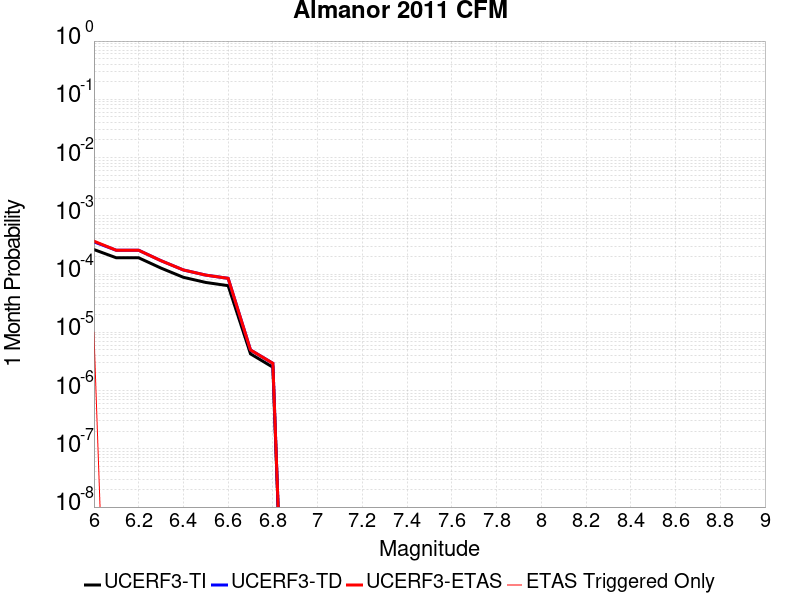 |  | 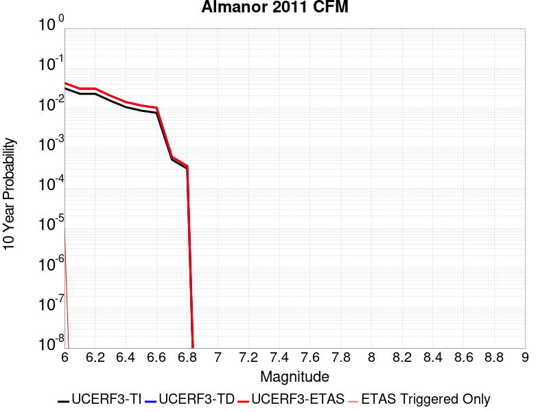 |

| Magnitude | 1 wk TI Prob | 1 wk TD Prob | 1 wk ETAS Prob | 1 wk ETAS/TD Gain | 1 wk ETAS Triggered Only | 1 mo TI Prob | 1 mo TD Prob | 1 mo ETAS Prob | 1 mo ETAS/TD Gain | 1 mo ETAS Triggered Only | 1 yr TI Prob | 1 yr TD Prob | 1 yr ETAS Prob | 1 yr ETAS/TD Gain | 1 yr ETAS Triggered Only | 10 yr TI Prob | 10 yr TD Prob | 10 yr ETAS Prob | 10 yr ETAS/TD Gain | 10 yr ETAS Triggered Only |
|-----|-----|-----|-----|-----|-----|-----|-----|-----|-----|-----|-----|-----|-----|-----|-----|-----|-----|-----|-----|-----|
| 6.0 | 6.1479834E-5 | 8.32787E-5 | 9.421907E-5 | 1.1313705 | 1.0941279E-5 | 2.6345838E-4 | 3.5686578E-4 | 3.6780315E-4 | 1.0306485 | 1.0941279E-5 | 0.0032028882 | 0.0043366123 | 0.004347506 | 1.0025121 | 1.0941279E-5 | 0.031571172 | 0.04258577 | 0.042596247 | 1.0002459 | 1.0941279E-5 |
| 6.1 | 4.4387216E-5 | 5.9770442E-5 | 5.9770442E-5 | 1.0 | 0.0 | 1.9021705E-4 | 2.561381E-4 | 2.561381E-4 | 1.0 | 0.0 | 0.0023134327 | 0.003114426 | 0.003114426 | 1.0 | 0.0 | 0.022894967 | 0.030755036 | 0.030755036 | 1.0 | 0.0 |
| 6.2 | 4.4387216E-5 | 5.9770442E-5 | 5.9770442E-5 | 1.0 | 0.0 | 1.9021705E-4 | 2.561381E-4 | 2.561381E-4 | 1.0 | 0.0 | 0.0023134327 | 0.003114426 | 0.003114426 | 1.0 | 0.0 | 0.022894967 | 0.030755036 | 0.030755036 | 1.0 | 0.0 |
| 6.3 | 2.9523822E-5 | 3.954719E-5 | 3.954719E-5 | 1.0 | 0.0 | 1.2652454E-4 | 1.6947983E-4 | 1.6947983E-4 | 1.0 | 0.0 | 0.0015393476 | 0.0020618725 | 0.0020618725 | 1.0 | 0.0 | 0.015287281 | 0.020460794 | 0.020460794 | 1.0 | 0.0 |
| 6.4 | 2.0512744E-5 | 2.7431617E-5 | 2.7431617E-5 | 1.0 | 0.0 | 8.79088E-5 | 1.175612E-4 | 1.175612E-4 | 1.0 | 0.0 | 0.001069764 | 0.0014307408 | 0.0014307408 | 1.0 | 0.0 | 0.010646289 | 0.014244413 | 0.014244413 | 1.0 | 0.0 |
| 6.5 | 1.6750226E-5 | 2.23913E-5 | 2.23913E-5 | 1.0 | 0.0 | 7.178471E-5 | 9.596152E-5 | 9.596152E-5 | 1.0 | 0.0 | 8.7362836E-4 | 0.0011680633 | 0.0011680633 | 1.0 | 0.0 | 0.008702018 | 0.011649038 | 0.011649038 | 1.0 | 0.0 |
| 6.6 | 1.4745303E-5 | 1.9707952E-5 | 1.9707952E-5 | 1.0 | 0.0 | 6.319262E-5 | 8.446223E-5 | 8.446223E-5 | 1.0 | 0.0 | 7.690986E-4 | 0.0010281964 | 0.0010281964 | 1.0 | 0.0 | 0.0076644225 | 0.010264971 | 0.010264971 | 1.0 | 0.0 |
| 6.7 | 9.951145E-7 | 1.1616347E-6 | 1.1616347E-6 | 1.0 | 0.0 | 4.26477E-6 | 4.9784257E-6 | 4.9784257E-6 | 1.0 | 0.0 | 5.1922336E-5 | 6.0610826E-5 | 6.0610826E-5 | 1.0 | 0.0 | 5.1910203E-4 | 6.059602E-4 | 6.059602E-4 | 1.0 | 0.0 |
| 6.8 | 5.866312E-7 | 6.849384E-7 | 6.849384E-7 | 1.0 | 0.0 | 2.5141312E-6 | 2.9354478E-6 | 2.9354478E-6 | 1.0 | 0.0 | 3.0609117E-5 | 3.5738623E-5 | 3.5738623E-5 | 1.0 | 0.0 | 3.06049E-4 | 3.5734157E-4 | 3.5734157E-4 | 1.0 | 0.0 |

## Ortigalita (North)
*[(top)](#table-of-contents)*

| 1 Week | 1 Month | 1 Year | 10 Year |
|-----|-----|-----|-----|
| 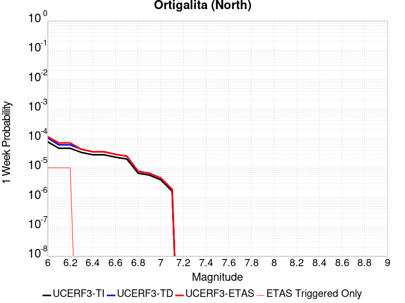 | 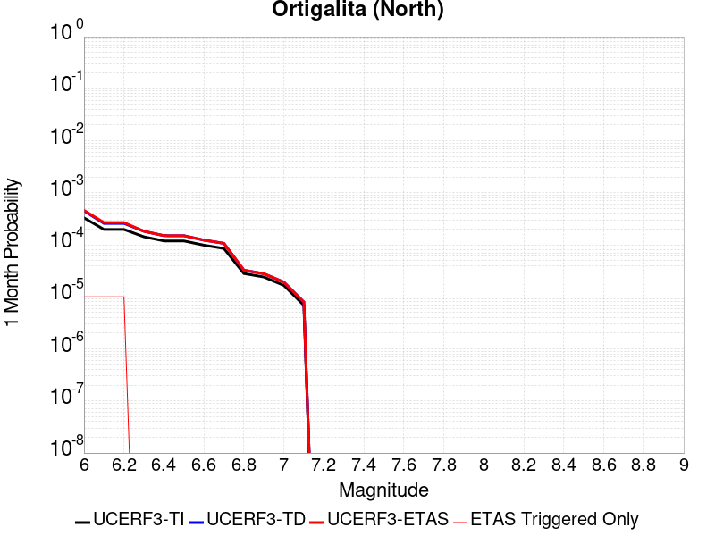 | 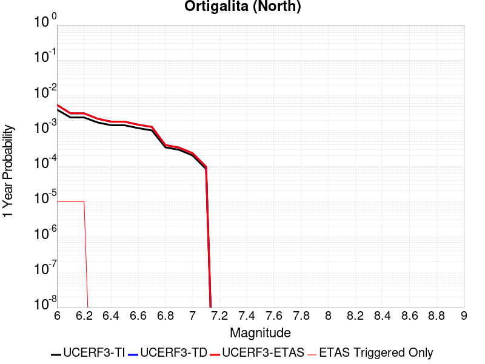 | 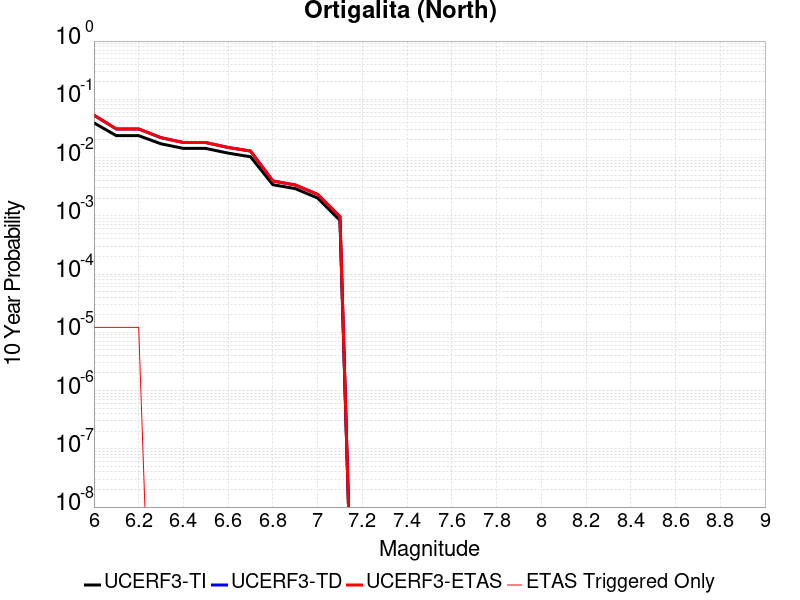 |

| Magnitude | 1 wk TI Prob | 1 wk TD Prob | 1 wk ETAS Prob | 1 wk ETAS/TD Gain | 1 wk ETAS Triggered Only | 1 mo TI Prob | 1 mo TD Prob | 1 mo ETAS Prob | 1 mo ETAS/TD Gain | 1 mo ETAS Triggered Only | 1 yr TI Prob | 1 yr TD Prob | 1 yr ETAS Prob | 1 yr ETAS/TD Gain | 1 yr ETAS Triggered Only | 10 yr TI Prob | 10 yr TD Prob | 10 yr ETAS Prob | 10 yr ETAS/TD Gain | 10 yr ETAS Triggered Only |
|-----|-----|-----|-----|-----|-----|-----|-----|-----|-----|-----|-----|-----|-----|-----|-----|-----|-----|-----|-----|-----|
| 6.0 | 7.711876E-5 | 1.05064966E-4 | 1.16005096E-4 | 1.1041273 | 1.0941279E-5 | 3.3046713E-4 | 4.502116E-4 | 4.6114795E-4 | 1.0242916 | 1.0941279E-5 | 0.004016016 | 0.0054681194 | 0.005479001 | 1.00199 | 1.0941279E-5 | 0.039442103 | 0.053454787 | 0.053465143 | 1.0001937 | 1.0941279E-5 |
| 6.1 | 4.607858E-5 | 6.0239203E-5 | 7.117982E-5 | 1.1816196 | 1.0941279E-5 | 1.9746469E-4 | 2.5814527E-4 | 2.690837E-4 | 1.0423733 | 1.0941279E-5 | 0.0024014818 | 0.0031387596 | 0.0031496666 | 1.003475 | 1.0941279E-5 | 0.023756953 | 0.030975068 | 0.03098567 | 1.0003422 | 1.0941279E-5 |
| 6.2 | 4.607858E-5 | 6.0239203E-5 | 7.117982E-5 | 1.1816196 | 1.0941279E-5 | 1.9746469E-4 | 2.5814527E-4 | 2.690837E-4 | 1.0423733 | 1.0941279E-5 | 0.0024014818 | 0.0031387596 | 0.0031496666 | 1.003475 | 1.0941279E-5 | 0.023756953 | 0.030975068 | 0.03098567 | 1.0003422 | 1.0941279E-5 |
| 6.3 | 3.327423E-5 | 4.2475127E-5 | 4.2475127E-5 | 1.0 | 0.0 | 1.4259605E-4 | 1.8202531E-4 | 1.8202531E-4 | 1.0 | 0.0 | 0.0017347244 | 0.002214197 | 0.002214197 | 1.0 | 0.0 | 0.017212452 | 0.021945644 | 0.021945644 | 1.0 | 0.0 |
| 6.4 | 2.7732503E-5 | 3.4998593E-5 | 3.4998593E-5 | 1.0 | 0.0 | 1.1884817E-4 | 1.4998685E-4 | 1.4998685E-4 | 1.0 | 0.0 | 0.001446016 | 0.0018248095 | 0.0018248095 | 1.0 | 0.0 | 0.014366428 | 0.018121224 | 0.018121224 | 1.0 | 0.0 |
| 6.5 | 2.7689714E-5 | 3.4948407E-5 | 3.4948407E-5 | 1.0 | 0.0 | 1.186648E-4 | 1.497718E-4 | 1.497718E-4 | 1.0 | 0.0 | 0.0014437864 | 0.0018221956 | 0.0018221956 | 1.0 | 0.0 | 0.014344421 | 0.01809551 | 0.01809551 | 1.0 | 0.0 |
| 6.6 | 2.2976905E-5 | 2.8718265E-5 | 2.8718265E-5 | 1.0 | 0.0 | 9.846873E-5 | 1.230739E-4 | 1.230739E-4 | 1.0 | 0.0 | 0.0011981975 | 0.0014976363 | 0.0014976363 | 1.0 | 0.0 | 0.011917574 | 0.014898697 | 0.014898697 | 1.0 | 0.0 |
| 6.7 | 1.9871539E-5 | 2.4904411E-5 | 2.4904411E-5 | 1.0 | 0.0 | 8.516096E-5 | 1.0673023E-4 | 1.0673023E-4 | 1.0 | 0.0 | 0.0010363415 | 0.0012989145 | 0.0012989145 | 1.0 | 0.0 | 0.010315218 | 0.012936919 | 0.012936919 | 1.0 | 0.0 |
| 6.8 | 6.5640475E-6 | 7.6054926E-6 | 7.6054926E-6 | 1.0 | 0.0 | 2.813133E-5 | 3.2594577E-5 | 3.2594577E-5 | 1.0 | 0.0 | 3.424451E-4 | 3.9676955E-4 | 3.9676955E-4 | 1.0 | 0.0 | 0.0034191788 | 0.003960899 | 0.003960899 | 1.0 | 0.0 |
| 6.9 | 5.6219683E-6 | 6.5018376E-6 | 6.5018376E-6 | 1.0 | 0.0 | 2.4093928E-5 | 2.7864735E-5 | 2.7864735E-5 | 1.0 | 0.0 | 2.933041E-4 | 3.3920293E-4 | 3.3920293E-4 | 1.0 | 0.0 | 0.0029291727 | 0.003387109 | 0.003387109 | 1.0 | 0.0 |
| 7.0 | 3.875591E-6 | 4.4847548E-6 | 4.4847548E-6 | 1.0 | 0.0 | 1.6609569E-5 | 1.9220248E-5 | 1.9220248E-5 | 1.0 | 0.0 | 2.0220275E-4 | 2.339835E-4 | 2.339835E-4 | 1.0 | 0.0 | 0.0020201886 | 0.0023375798 | 0.0023375798 | 1.0 | 0.0 |
| 7.1 | 1.6017933E-6 | 1.8570418E-6 | 1.8570418E-6 | 1.0 | 0.0 | 6.8648105E-6 | 7.958732E-6 | 7.958732E-6 | 1.0 | 0.0 | 8.357586E-5 | 9.689432E-5 | 9.689432E-5 | 1.0 | 0.0 | 8.3544437E-4 | 9.686254E-4 | 9.686254E-4 | 1.0 | 0.0 |

## Yorba Linda
*[(top)](#table-of-contents)*

| 1 Week | 1 Month | 1 Year | 10 Year |
|-----|-----|-----|-----|
|  |  | 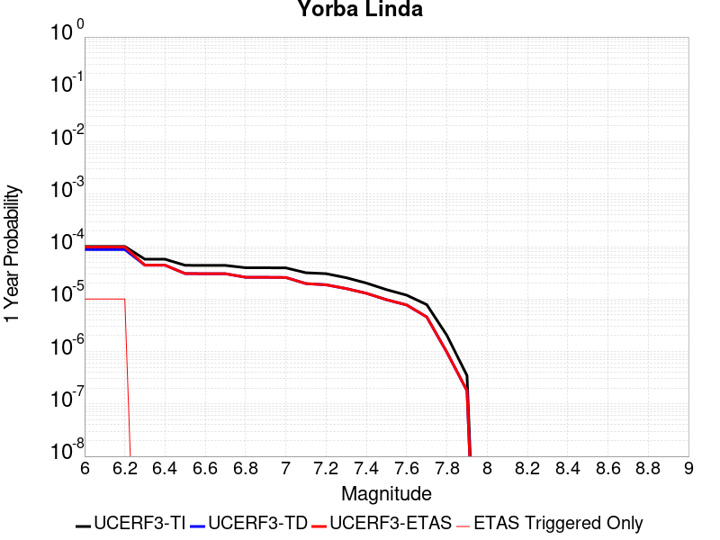 | 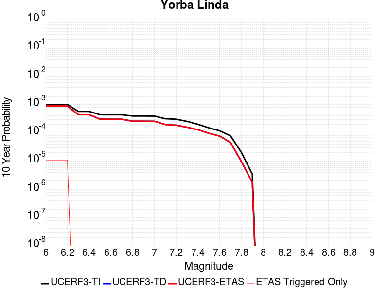 |

| Magnitude | 1 wk TI Prob | 1 wk TD Prob | 1 wk ETAS Prob | 1 wk ETAS/TD Gain | 1 wk ETAS Triggered Only | 1 mo TI Prob | 1 mo TD Prob | 1 mo ETAS Prob | 1 mo ETAS/TD Gain | 1 mo ETAS Triggered Only | 1 yr TI Prob | 1 yr TD Prob | 1 yr ETAS Prob | 1 yr ETAS/TD Gain | 1 yr ETAS Triggered Only | 10 yr TI Prob | 10 yr TD Prob | 10 yr ETAS Prob | 10 yr ETAS/TD Gain | 10 yr ETAS Triggered Only |
|-----|-----|-----|-----|-----|-----|-----|-----|-----|-----|-----|-----|-----|-----|-----|-----|-----|-----|-----|-----|-----|
| 6.0 | 1.9346849E-6 | 1.6909235E-6 | 1.6909235E-6 | 1.0 | 0.0 | 8.29148E-6 | 7.2468E-6 | 1.8187999E-5 | 2.5097973 | 1.0941279E-5 | 1.009441E-4 | 8.822717E-5 | 9.916748E-5 | 1.1240016 | 1.0941279E-5 | 0.0010089825 | 8.820145E-4 | 8.9294615E-4 | 1.012394 | 1.0941279E-5 |
| 6.1 | 1.9346849E-6 | 1.6909235E-6 | 1.6909235E-6 | 1.0 | 0.0 | 8.29148E-6 | 7.2468E-6 | 1.8187999E-5 | 2.5097973 | 1.0941279E-5 | 1.009441E-4 | 8.822717E-5 | 9.916748E-5 | 1.1240016 | 1.0941279E-5 | 0.0010089825 | 8.820145E-4 | 8.9294615E-4 | 1.012394 | 1.0941279E-5 |
| 6.2 | 1.9346849E-6 | 1.6909235E-6 | 1.6909235E-6 | 1.0 | 0.0 | 8.29148E-6 | 7.2468E-6 | 1.8187999E-5 | 2.5097973 | 1.0941279E-5 | 1.009441E-4 | 8.822717E-5 | 9.916748E-5 | 1.1240016 | 1.0941279E-5 | 0.0010089825 | 8.820145E-4 | 8.9294615E-4 | 1.012394 | 1.0941279E-5 |
| 6.3 | 1.1028608E-6 | 8.481986E-7 | 8.481986E-7 | 1.0 | 0.0 | 4.7265376E-6 | 3.6351323E-6 | 3.6351323E-6 | 1.0 | 0.0 | 5.754407E-5 | 4.4256903E-5 | 4.4256903E-5 | 1.0 | 0.0 | 5.7529175E-4 | 4.4248742E-4 | 4.4248742E-4 | 1.0 | 0.0 |
| 6.4 | 1.1028608E-6 | 8.481986E-7 | 8.481986E-7 | 1.0 | 0.0 | 4.7265376E-6 | 3.6351323E-6 | 3.6351323E-6 | 1.0 | 0.0 | 5.754407E-5 | 4.4256903E-5 | 4.4256903E-5 | 1.0 | 0.0 | 5.7529175E-4 | 4.4248742E-4 | 4.4248742E-4 | 1.0 | 0.0 |
| 6.5 | 8.4451364E-7 | 5.8692325E-7 | 5.8692325E-7 | 1.0 | 0.0 | 3.619339E-6 | 2.5153831E-6 | 2.5153831E-6 | 1.0 | 0.0 | 4.406456E-5 | 3.0624382E-5 | 3.0624382E-5 | 1.0 | 0.0 | 4.4055824E-4 | 3.0620373E-4 | 3.0620373E-4 | 1.0 | 0.0 |
| 6.6 | 8.422957E-7 | 5.8447665E-7 | 5.8447665E-7 | 1.0 | 0.0 | 3.6098338E-6 | 2.5048976E-6 | 2.5048976E-6 | 1.0 | 0.0 | 4.3948843E-5 | 3.0496723E-5 | 3.0496723E-5 | 1.0 | 0.0 | 4.394015E-4 | 3.0492753E-4 | 3.0492753E-4 | 1.0 | 0.0 |
| 6.7 | 8.4119705E-7 | 5.832608E-7 | 5.832608E-7 | 1.0 | 0.0 | 3.6051254E-6 | 2.499687E-6 | 2.499687E-6 | 1.0 | 0.0 | 4.3891516E-5 | 3.0433286E-5 | 3.0433286E-5 | 1.0 | 0.0 | 4.388285E-4 | 3.0429332E-4 | 3.0429332E-4 | 1.0 | 0.0 |
| 6.8 | 7.5919155E-7 | 4.995118E-7 | 4.995118E-7 | 1.0 | 0.0 | 3.253674E-6 | 2.1407632E-6 | 2.1407632E-6 | 1.0 | 0.0 | 3.961276E-5 | 2.6063499E-5 | 2.6063499E-5 | 1.0 | 0.0 | 3.9605703E-4 | 2.6060612E-4 | 2.6060612E-4 | 1.0 | 0.0 |
| 6.9 | 7.5804564E-7 | 4.981302E-7 | 4.981302E-7 | 1.0 | 0.0 | 3.248763E-6 | 2.134842E-6 | 2.134842E-6 | 1.0 | 0.0 | 3.955297E-5 | 2.5991409E-5 | 2.5991409E-5 | 1.0 | 0.0 | 3.9545933E-4 | 2.598854E-4 | 2.598854E-4 | 1.0 | 0.0 |
| 7.0 | 7.539293E-7 | 4.943436E-7 | 4.943436E-7 | 1.0 | 0.0 | 3.2311218E-6 | 2.118614E-6 | 2.118614E-6 | 1.0 | 0.0 | 3.9338196E-5 | 2.5793837E-5 | 2.5793837E-5 | 1.0 | 0.0 | 3.9331234E-4 | 2.5791014E-4 | 2.5791014E-4 | 1.0 | 0.0 |
| 7.1 | 6.0900885E-7 | 3.781838E-7 | 3.781838E-7 | 1.0 | 0.0 | 2.6100352E-6 | 1.6207867E-6 | 1.6207867E-6 | 1.0 | 0.0 | 3.1776715E-5 | 1.9732903E-5 | 1.9732903E-5 | 1.0 | 0.0 | 3.1772171E-4 | 1.9731186E-4 | 1.9731186E-4 | 1.0 | 0.0 |
| 7.2 | 5.849925E-7 | 3.5880063E-7 | 3.5880063E-7 | 1.0 | 0.0 | 2.5071083E-6 | 1.5377161E-6 | 1.5377161E-6 | 1.0 | 0.0 | 3.0523614E-5 | 1.8721537E-5 | 1.8721537E-5 | 1.0 | 0.0 | 3.0519423E-4 | 1.8719993E-4 | 1.8719993E-4 | 1.0 | 0.0 |
| 7.3 | 4.89808E-7 | 3.038045E-7 | 3.038045E-7 | 1.0 | 0.0 | 2.0991754E-6 | 1.3020187E-6 | 1.3020187E-6 | 1.0 | 0.0 | 2.5557161E-5 | 1.5851965E-5 | 1.5851965E-5 | 1.0 | 0.0 | 2.5554223E-4 | 1.5850857E-4 | 1.5850857E-4 | 1.0 | 0.0 |
| 7.4 | 3.8700415E-7 | 2.4723E-7 | 2.4723E-7 | 1.0 | 0.0 | 1.6585881E-6 | 1.0595568E-6 | 1.0595568E-6 | 1.0 | 0.0 | 2.0193123E-5 | 1.2900028E-5 | 1.2900028E-5 | 1.0 | 0.0 | 2.0191289E-4 | 1.2899292E-4 | 1.2899292E-4 | 1.0 | 0.0 |
| 7.5 | 2.900565E-7 | 1.8637812E-7 | 1.8637812E-7 | 1.0 | 0.0 | 1.2430987E-6 | 7.987631E-7 | 7.987631E-7 | 1.0 | 0.0 | 1.5134622E-5 | 9.7248985E-6 | 9.7248985E-6 | 1.0 | 0.0 | 1.5133592E-4 | 9.724481E-5 | 9.724481E-5 | 1.0 | 0.0 |
| 7.6 | 2.2770318E-7 | 1.4814457E-7 | 1.4814457E-7 | 1.0 | 0.0 | 9.758704E-7 | 6.349051E-7 | 6.349051E-7 | 1.0 | 0.0 | 1.1881158E-5 | 7.729943E-6 | 7.729943E-6 | 1.0 | 0.0 | 1.1880523E-4 | 7.729679E-5 | 7.729679E-5 | 1.0 | 0.0 |
| 7.7 | 1.5017194E-7 | 8.735719E-8 | 8.735719E-8 | 1.0 | 0.0 | 6.4359386E-7 | 3.743879E-7 | 3.743879E-7 | 1.0 | 0.0 | 7.835727E-6 | 4.5581633E-6 | 4.5581633E-6 | 1.0 | 0.0 | 7.835451E-5 | 4.5580728E-5 | 4.5580728E-5 | 1.0 | 0.0 |
| 7.8 | 3.895753E-8 | 1.8533399E-8 | 1.8533399E-8 | 1.0 | 0.0 | 1.6696083E-7 | 7.9428844E-8 | 7.9428844E-8 | 1.0 | 0.0 | 2.0327461E-6 | 9.670458E-7 | 9.670458E-7 | 1.0 | 0.0 | 2.0327276E-5 | 9.670418E-6 | 9.670418E-6 | 1.0 | 0.0 |
| 7.9 | 6.648505E-9 | 3.4184469E-9 | 3.4184469E-9 | 1.0 | 0.0 | 2.8493591E-8 | 1.4650486E-8 | 1.4650486E-8 | 1.0 | 0.0 | 3.4690942E-7 | 1.7836966E-7 | 1.7836966E-7 | 1.0 | 0.0 | 3.4690888E-6 | 1.7836953E-6 | 1.7836953E-6 | 1.0 | 0.0 |

## Honey Lake 2011 CFM
*[(top)](#table-of-contents)*

| 1 Week | 1 Month | 1 Year | 10 Year |
|-----|-----|-----|-----|
|  |  | 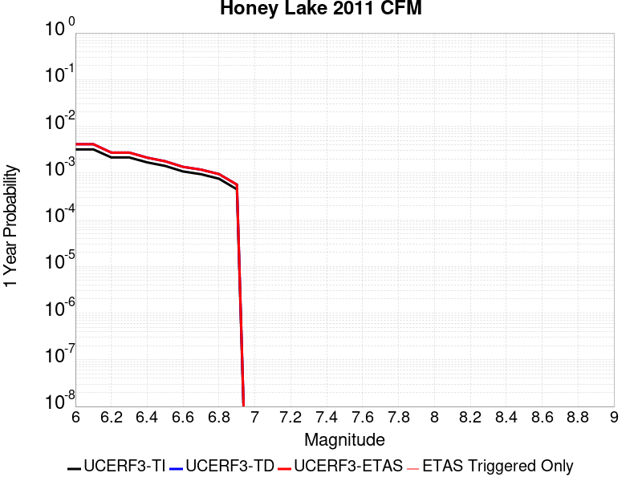 |  |

| Magnitude | 1 wk TI Prob | 1 wk TD Prob | 1 wk ETAS Prob | 1 wk ETAS/TD Gain | 1 wk ETAS Triggered Only | 1 mo TI Prob | 1 mo TD Prob | 1 mo ETAS Prob | 1 mo ETAS/TD Gain | 1 mo ETAS Triggered Only | 1 yr TI Prob | 1 yr TD Prob | 1 yr ETAS Prob | 1 yr ETAS/TD Gain | 1 yr ETAS Triggered Only | 10 yr TI Prob | 10 yr TD Prob | 10 yr ETAS Prob | 10 yr ETAS/TD Gain | 10 yr ETAS Triggered Only |
|-----|-----|-----|-----|-----|-----|-----|-----|-----|-----|-----|-----|-----|-----|-----|-----|-----|-----|-----|-----|-----|
| 6.0 | 6.155506E-5 | 7.954667E-5 | 7.954667E-5 | 1.0 | 0.0 | 2.6378073E-4 | 3.40873E-4 | 3.40873E-4 | 1.0 | 0.0 | 0.0032068014 | 0.0041427943 | 0.0041427943 | 1.0 | 0.0 | 0.03160919 | 0.040702924 | 0.04071342 | 1.0002578 | 1.0941279E-5 |
| 6.1 | 6.155506E-5 | 7.954667E-5 | 7.954667E-5 | 1.0 | 0.0 | 2.6378073E-4 | 3.40873E-4 | 3.40873E-4 | 1.0 | 0.0 | 0.0032068014 | 0.0041427943 | 0.0041427943 | 1.0 | 0.0 | 0.03160919 | 0.040702924 | 0.04071342 | 1.0002578 | 1.0941279E-5 |
| 6.2 | 4.1335024E-5 | 5.257629E-5 | 5.257629E-5 | 1.0 | 0.0 | 1.7713808E-4 | 2.253086E-4 | 2.253086E-4 | 1.0 | 0.0 | 0.0021545228 | 0.0027398595 | 0.0027398595 | 1.0 | 0.0 | 0.021337535 | 0.027076708 | 0.027076708 | 1.0 | 0.0 |
| 6.3 | 4.1335024E-5 | 5.257629E-5 | 5.257629E-5 | 1.0 | 0.0 | 1.7713808E-4 | 2.253086E-4 | 2.253086E-4 | 1.0 | 0.0 | 0.0021545228 | 0.0027398595 | 0.0027398595 | 1.0 | 0.0 | 0.021337535 | 0.027076708 | 0.027076708 | 1.0 | 0.0 |
| 6.4 | 3.2393702E-5 | 4.0887444E-5 | 4.0887444E-5 | 1.0 | 0.0 | 1.3882275E-4 | 1.7522085E-4 | 1.7522085E-4 | 1.0 | 0.0 | 0.0016888566 | 0.002131335 | 0.002131335 | 1.0 | 0.0 | 0.016760793 | 0.02111982 | 0.02111982 | 1.0 | 0.0 |
| 6.5 | 2.7205504E-5 | 3.4211684E-5 | 3.4211684E-5 | 1.0 | 0.0 | 1.1658981E-4 | 1.4661385E-4 | 1.4661385E-4 | 1.0 | 0.0 | 0.0014185566 | 0.0017836588 | 0.0017836588 | 1.0 | 0.0 | 0.014095354 | 0.017702932 | 0.017702932 | 1.0 | 0.0 |
| 6.6 | 2.069265E-5 | 2.5955307E-5 | 2.5955307E-5 | 1.0 | 0.0 | 8.867977E-5 | 1.1123277E-4 | 1.1123277E-4 | 1.0 | 0.0 | 0.0010791414 | 0.0013535038 | 0.0013535038 | 1.0 | 0.0 | 0.010739161 | 0.013461002 | 0.013461002 | 1.0 | 0.0 |
| 6.7 | 1.8060919E-5 | 2.2656828E-5 | 2.2656828E-5 | 1.0 | 0.0 | 7.7401644E-5 | 9.709754E-5 | 9.709754E-5 | 1.0 | 0.0 | 9.419576E-4 | 0.0011816026 | 0.0011816026 | 1.0 | 0.0 | 0.009379748 | 0.011761238 | 0.011761238 | 1.0 | 0.0 |
| 6.8 | 1.4474663E-5 | 1.818127E-5 | 1.818127E-5 | 1.0 | 0.0 | 6.203279E-5 | 7.791784E-5 | 7.791784E-5 | 1.0 | 0.0 | 7.5498753E-4 | 9.483136E-4 | 9.483136E-4 | 1.0 | 0.0 | 0.007524277 | 0.009450192 | 0.009450192 | 1.0 | 0.0 |
| 6.9 | 8.564552E-6 | 1.0802308E-5 | 1.0802308E-5 | 1.0 | 0.0 | 3.6704707E-5 | 4.6295158E-5 | 4.6295158E-5 | 1.0 | 0.0 | 4.4678818E-4 | 5.635644E-4 | 5.635644E-4 | 1.0 | 0.0 | 0.0044589094 | 0.0056278477 | 0.0056278477 | 1.0 | 0.0 |

## Antelope Valley 2011
*[(top)](#table-of-contents)*

| 1 Week | 1 Month | 1 Year | 10 Year |
|-----|-----|-----|-----|
|  |  |  |  |

| Magnitude | 1 wk TI Prob | 1 wk TD Prob | 1 wk ETAS Prob | 1 wk ETAS/TD Gain | 1 wk ETAS Triggered Only | 1 mo TI Prob | 1 mo TD Prob | 1 mo ETAS Prob | 1 mo ETAS/TD Gain | 1 mo ETAS Triggered Only | 1 yr TI Prob | 1 yr TD Prob | 1 yr ETAS Prob | 1 yr ETAS/TD Gain | 1 yr ETAS Triggered Only | 10 yr TI Prob | 10 yr TD Prob | 10 yr ETAS Prob | 10 yr ETAS/TD Gain | 10 yr ETAS Triggered Only |
|-----|-----|-----|-----|-----|-----|-----|-----|-----|-----|-----|-----|-----|-----|-----|-----|-----|-----|-----|-----|-----|
| 6.0 | 3.1646934E-5 | 3.6904403E-5 | 3.6904403E-5 | 1.0 | 0.0 | 1.3562266E-4 | 1.5815363E-4 | 1.5815363E-4 | 1.0 | 0.0 | 0.0016499552 | 0.0019240845 | 0.0019350047 | 1.0056756 | 1.0941279E-5 | 0.016377583 | 0.019100651 | 0.019111384 | 1.0005618 | 1.0941279E-5 |
| 6.1 | 3.1646934E-5 | 3.6904403E-5 | 3.6904403E-5 | 1.0 | 0.0 | 1.3562266E-4 | 1.5815363E-4 | 1.5815363E-4 | 1.0 | 0.0 | 0.0016499552 | 0.0019240845 | 0.0019350047 | 1.0056756 | 1.0941279E-5 | 0.016377583 | 0.019100651 | 0.019111384 | 1.0005618 | 1.0941279E-5 |
| 6.2 | 3.1646934E-5 | 3.6904403E-5 | 3.6904403E-5 | 1.0 | 0.0 | 1.3562266E-4 | 1.5815363E-4 | 1.5815363E-4 | 1.0 | 0.0 | 0.0016499552 | 0.0019240845 | 0.0019350047 | 1.0056756 | 1.0941279E-5 | 0.016377583 | 0.019100651 | 0.019111384 | 1.0005618 | 1.0941279E-5 |
| 6.3 | 3.1646934E-5 | 3.6904403E-5 | 3.6904403E-5 | 1.0 | 0.0 | 1.3562266E-4 | 1.5815363E-4 | 1.5815363E-4 | 1.0 | 0.0 | 0.0016499552 | 0.0019240845 | 0.0019350047 | 1.0056756 | 1.0941279E-5 | 0.016377583 | 0.019100651 | 0.019111384 | 1.0005618 | 1.0941279E-5 |
| 6.4 | 3.1646934E-5 | 3.6904403E-5 | 3.6904403E-5 | 1.0 | 0.0 | 1.3562266E-4 | 1.5815363E-4 | 1.5815363E-4 | 1.0 | 0.0 | 0.0016499552 | 0.0019240845 | 0.0019350047 | 1.0056756 | 1.0941279E-5 | 0.016377583 | 0.019100651 | 0.019111384 | 1.0005618 | 1.0941279E-5 |
| 6.5 | 1.8034107E-5 | 2.0940959E-5 | 2.0940959E-5 | 1.0 | 0.0 | 7.7286735E-5 | 8.974457E-5 | 8.974457E-5 | 1.0 | 0.0 | 9.405598E-4 | 0.0010922146 | 0.0010922146 | 1.0 | 0.0 | 0.009365888 | 0.010880542 | 0.010880542 | 1.0 | 0.0 |
| 6.6 | 1.8034107E-5 | 2.0940959E-5 | 2.0940959E-5 | 1.0 | 0.0 | 7.7286735E-5 | 8.974457E-5 | 8.974457E-5 | 1.0 | 0.0 | 9.405598E-4 | 0.0010922146 | 0.0010922146 | 1.0 | 0.0 | 0.009365888 | 0.010880542 | 0.010880542 | 1.0 | 0.0 |
| 6.7 | 1.3567667E-5 | 1.5749509E-5 | 1.5749509E-5 | 1.0 | 0.0 | 5.814585E-5 | 6.749675E-5 | 6.749675E-5 | 1.0 | 0.0 | 7.076958E-4 | 8.2156935E-4 | 8.2156935E-4 | 1.0 | 0.0 | 0.007054463 | 0.008195754 | 0.008195754 | 1.0 | 0.0 |
| 6.8 | 9.867387E-6 | 1.1467935E-5 | 1.1467935E-5 | 1.0 | 0.0 | 4.2288117E-5 | 4.91479E-5 | 4.91479E-5 | 1.0 | 0.0 | 5.1473617E-4 | 5.9830636E-4 | 5.9830636E-4 | 1.0 | 0.0 | 0.005135455 | 0.005976268 | 0.005976268 | 1.0 | 0.0 |
| 6.9 | 7.273233E-6 | 8.454864E-6 | 8.454864E-6 | 1.0 | 0.0 | 3.1170628E-5 | 3.623513E-5 | 3.623513E-5 | 1.0 | 0.0 | 3.794363E-4 | 4.411627E-4 | 4.411627E-4 | 1.0 | 0.0 | 0.0037878908 | 0.004411627 | 0.004411627 | 1.0 | 0.0 |

## Little Salmon (Onshore)
*[(top)](#table-of-contents)*

| 1 Week | 1 Month | 1 Year | 10 Year |
|-----|-----|-----|-----|
| 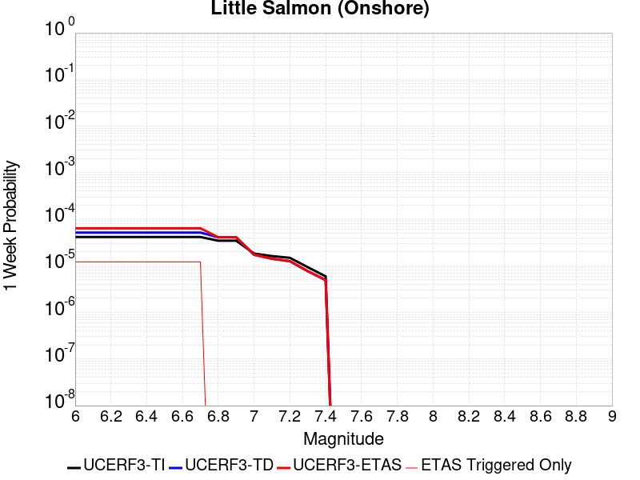 | 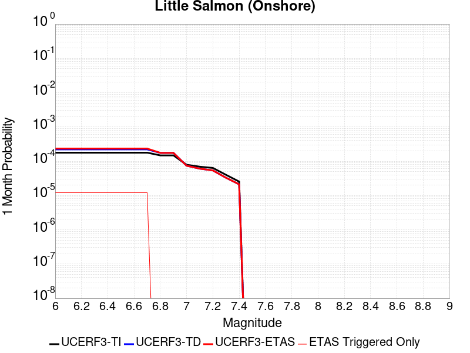 | 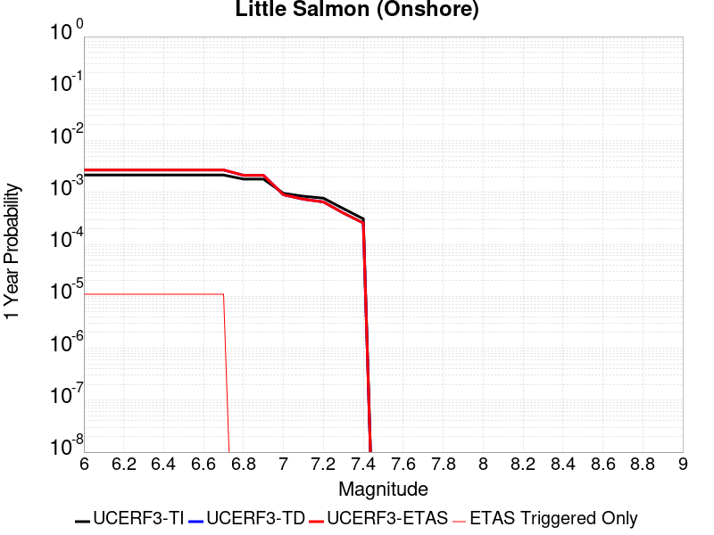 | 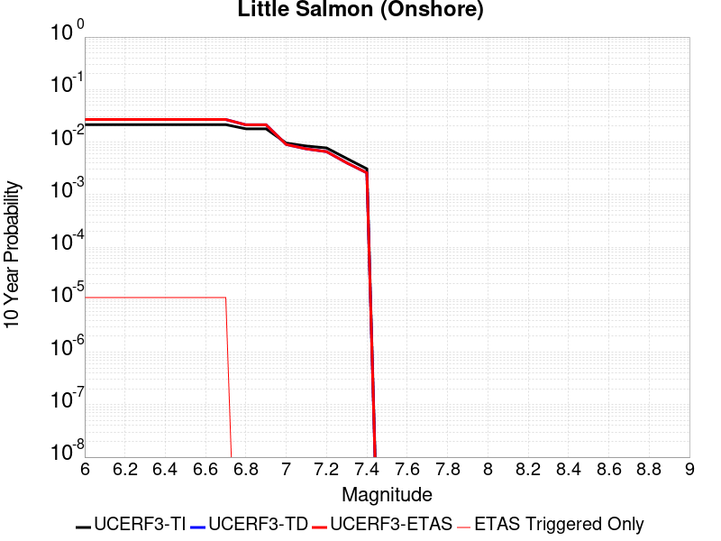 |

| Magnitude | 1 wk TI Prob | 1 wk TD Prob | 1 wk ETAS Prob | 1 wk ETAS/TD Gain | 1 wk ETAS Triggered Only | 1 mo TI Prob | 1 mo TD Prob | 1 mo ETAS Prob | 1 mo ETAS/TD Gain | 1 mo ETAS Triggered Only | 1 yr TI Prob | 1 yr TD Prob | 1 yr ETAS Prob | 1 yr ETAS/TD Gain | 1 yr ETAS Triggered Only | 10 yr TI Prob | 10 yr TD Prob | 10 yr ETAS Prob | 10 yr ETAS/TD Gain | 10 yr ETAS Triggered Only |
|-----|-----|-----|-----|-----|-----|-----|-----|-----|-----|-----|-----|-----|-----|-----|-----|-----|-----|-----|-----|-----|
| 6.0 | 4.1582247E-5 | 5.1824976E-5 | 6.2765685E-5 | 1.2111088 | 1.0941279E-5 | 1.7819746E-4 | 2.220928E-4 | 2.3303165E-4 | 1.0492535 | 1.0941279E-5 | 0.0021673953 | 0.0027014539 | 0.0027123657 | 1.0040392 | 1.0941279E-5 | 0.021463778 | 0.026869582 | 0.026880229 | 1.0003963 | 1.0941279E-5 |
| 6.1 | 4.1582247E-5 | 5.1824976E-5 | 6.2765685E-5 | 1.2111088 | 1.0941279E-5 | 1.7819746E-4 | 2.220928E-4 | 2.3303165E-4 | 1.0492535 | 1.0941279E-5 | 0.0021673953 | 0.0027014539 | 0.0027123657 | 1.0040392 | 1.0941279E-5 | 0.021463778 | 0.026869582 | 0.026880229 | 1.0003963 | 1.0941279E-5 |
| 6.2 | 4.1582247E-5 | 5.1824976E-5 | 6.2765685E-5 | 1.2111088 | 1.0941279E-5 | 1.7819746E-4 | 2.220928E-4 | 2.3303165E-4 | 1.0492535 | 1.0941279E-5 | 0.0021673953 | 0.0027014539 | 0.0027123657 | 1.0040392 | 1.0941279E-5 | 0.021463778 | 0.026869582 | 0.026880229 | 1.0003963 | 1.0941279E-5 |
| 6.3 | 4.1582247E-5 | 5.1824976E-5 | 6.2765685E-5 | 1.2111088 | 1.0941279E-5 | 1.7819746E-4 | 2.220928E-4 | 2.3303165E-4 | 1.0492535 | 1.0941279E-5 | 0.0021673953 | 0.0027014539 | 0.0027123657 | 1.0040392 | 1.0941279E-5 | 0.021463778 | 0.026869582 | 0.026880229 | 1.0003963 | 1.0941279E-5 |
| 6.4 | 4.1582247E-5 | 5.1824976E-5 | 6.2765685E-5 | 1.2111088 | 1.0941279E-5 | 1.7819746E-4 | 2.220928E-4 | 2.3303165E-4 | 1.0492535 | 1.0941279E-5 | 0.0021673953 | 0.0027014539 | 0.0027123657 | 1.0040392 | 1.0941279E-5 | 0.021463778 | 0.026869582 | 0.026880229 | 1.0003963 | 1.0941279E-5 |
| 6.5 | 4.1582247E-5 | 5.1824976E-5 | 6.2765685E-5 | 1.2111088 | 1.0941279E-5 | 1.7819746E-4 | 2.220928E-4 | 2.3303165E-4 | 1.0492535 | 1.0941279E-5 | 0.0021673953 | 0.0027014539 | 0.0027123657 | 1.0040392 | 1.0941279E-5 | 0.021463778 | 0.026869582 | 0.026880229 | 1.0003963 | 1.0941279E-5 |
| 6.6 | 4.1582247E-5 | 5.1824976E-5 | 6.2765685E-5 | 1.2111088 | 1.0941279E-5 | 1.7819746E-4 | 2.220928E-4 | 2.3303165E-4 | 1.0492535 | 1.0941279E-5 | 0.0021673953 | 0.0027014539 | 0.0027123657 | 1.0040392 | 1.0941279E-5 | 0.021463778 | 0.026869582 | 0.026880229 | 1.0003963 | 1.0941279E-5 |
| 6.7 | 4.1582247E-5 | 5.1824976E-5 | 6.2765685E-5 | 1.2111088 | 1.0941279E-5 | 1.7819746E-4 | 2.220928E-4 | 2.3303165E-4 | 1.0492535 | 1.0941279E-5 | 0.0021673953 | 0.0027014539 | 0.0027123657 | 1.0040392 | 1.0941279E-5 | 0.021463778 | 0.026869582 | 0.026880229 | 1.0003963 | 1.0941279E-5 |
| 6.8 | 3.4607925E-5 | 4.0949457E-5 | 4.0949457E-5 | 1.0 | 0.0 | 1.4831126E-4 | 1.7549012E-4 | 1.7549012E-4 | 1.0 | 0.0 | 0.001804194 | 0.0021352505 | 0.0021352505 | 1.0 | 0.0 | 0.01789616 | 0.021304231 | 0.021304231 | 1.0 | 0.0 |
| 6.9 | 3.4607925E-5 | 4.0949457E-5 | 4.0949457E-5 | 1.0 | 0.0 | 1.4831126E-4 | 1.7549012E-4 | 1.7549012E-4 | 1.0 | 0.0 | 0.001804194 | 0.0021352505 | 0.0021352505 | 1.0 | 0.0 | 0.01789616 | 0.021304231 | 0.021304231 | 1.0 | 0.0 |
| 7.0 | 1.8411014E-5 | 1.7285138E-5 | 1.7285138E-5 | 1.0 | 0.0 | 7.8901954E-5 | 7.407736E-5 | 7.407736E-5 | 1.0 | 0.0 | 9.6020795E-4 | 9.015722E-4 | 9.015722E-4 | 1.0 | 0.0 | 0.009560696 | 0.00900614 | 0.00900614 | 1.0 | 0.0 |
| 7.1 | 1.6183103E-5 | 1.4205674E-5 | 1.4205674E-5 | 1.0 | 0.0 | 6.935431E-5 | 6.0880306E-5 | 6.0880306E-5 | 1.0 | 0.0 | 8.440616E-4 | 7.4101315E-4 | 7.4101315E-4 | 1.0 | 0.0 | 0.008408628 | 0.0074118357 | 0.0074118357 | 1.0 | 0.0 |
| 7.2 | 1.4868988E-5 | 1.2585626E-5 | 1.2585626E-5 | 1.0 | 0.0 | 6.372268E-5 | 5.3937536E-5 | 5.3937536E-5 | 1.0 | 0.0 | 7.755474E-4 | 6.565367E-4 | 6.565367E-4 | 1.0 | 0.0 | 0.0077284635 | 0.006571851 | 0.006571851 | 1.0 | 0.0 |
| 7.3 | 9.3599865E-6 | 7.694645E-6 | 7.694645E-6 | 1.0 | 0.0 | 4.011361E-5 | 3.2976837E-5 | 3.2976837E-5 | 1.0 | 0.0 | 4.8827377E-4 | 4.014547E-4 | 4.014547E-4 | 1.0 | 0.0 | 0.004872023 | 0.0040239627 | 0.0040239627 | 1.0 | 0.0 |
| 7.4 | 5.941556E-6 | 4.9509595E-6 | 4.9509595E-6 | 1.0 | 0.0 | 2.5463563E-5 | 2.1218399E-5 | 2.1218399E-5 | 1.0 | 0.0 | 3.0997477E-4 | 2.5833398E-4 | 2.5833398E-4 | 1.0 | 0.0 | 0.0030954275 | 0.002591868 | 0.002591868 | 1.0 | 0.0 |

## Great Valley 03 Mysterious Ridge
*[(top)](#table-of-contents)*

| 1 Week | 1 Month | 1 Year | 10 Year |
|-----|-----|-----|-----|
|  | 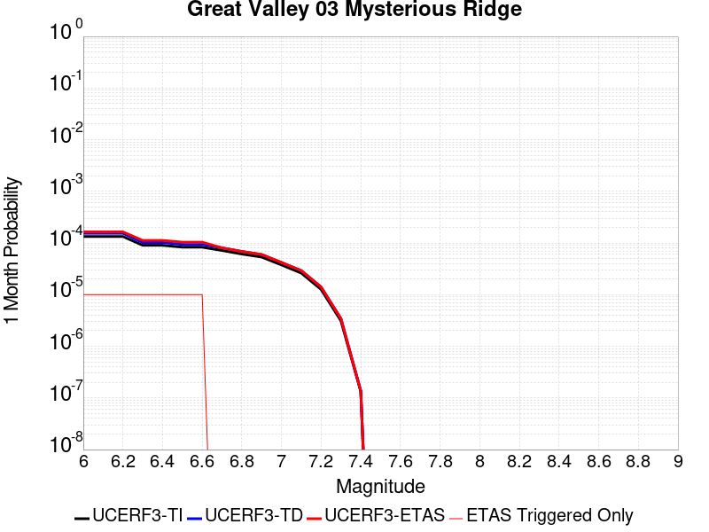 |  |  |

| Magnitude | 1 wk TI Prob | 1 wk TD Prob | 1 wk ETAS Prob | 1 wk ETAS/TD Gain | 1 wk ETAS Triggered Only | 1 mo TI Prob | 1 mo TD Prob | 1 mo ETAS Prob | 1 mo ETAS/TD Gain | 1 mo ETAS Triggered Only | 1 yr TI Prob | 1 yr TD Prob | 1 yr ETAS Prob | 1 yr ETAS/TD Gain | 1 yr ETAS Triggered Only | 10 yr TI Prob | 10 yr TD Prob | 10 yr ETAS Prob | 10 yr ETAS/TD Gain | 10 yr ETAS Triggered Only |
|-----|-----|-----|-----|-----|-----|-----|-----|-----|-----|-----|-----|-----|-----|-----|-----|-----|-----|-----|-----|-----|
| 6.0 | 3.1182444E-5 | 3.603423E-5 | 4.6975114E-5 | 1.3036247 | 1.0941279E-5 | 1.336322E-4 | 1.544242E-4 | 1.6536379E-4 | 1.0708412 | 1.0941279E-5 | 0.0016257578 | 0.0018786696 | 0.0018895904 | 1.005813 | 1.0941279E-5 | 0.016139153 | 0.018646652 | 0.018657388 | 1.0005758 | 1.0941279E-5 |
| 6.1 | 3.1182444E-5 | 3.603423E-5 | 4.6975114E-5 | 1.3036247 | 1.0941279E-5 | 1.336322E-4 | 1.544242E-4 | 1.6536379E-4 | 1.0708412 | 1.0941279E-5 | 0.0016257578 | 0.0018786696 | 0.0018895904 | 1.005813 | 1.0941279E-5 | 0.016139153 | 0.018646652 | 0.018657388 | 1.0005758 | 1.0941279E-5 |
| 6.2 | 3.1182444E-5 | 3.603423E-5 | 4.6975114E-5 | 1.3036247 | 1.0941279E-5 | 1.336322E-4 | 1.544242E-4 | 1.6536379E-4 | 1.0708412 | 1.0941279E-5 | 0.0016257578 | 0.0018786696 | 0.0018895904 | 1.005813 | 1.0941279E-5 | 0.016139153 | 0.018646652 | 0.018657388 | 1.0005758 | 1.0941279E-5 |
| 6.3 | 2.106934E-5 | 2.3850307E-5 | 3.4791326E-5 | 1.4587369 | 1.0941279E-5 | 9.0294045E-5 | 1.0221177E-4 | 1.1315194E-4 | 1.1070342 | 1.0941279E-5 | 0.0010987755 | 0.0012437489 | 0.0012546766 | 1.0087861 | 1.0941279E-5 | 0.010933585 | 0.012371127 | 0.012381933 | 1.0008734 | 1.0941279E-5 |
| 6.4 | 2.106934E-5 | 2.3850307E-5 | 3.4791326E-5 | 1.4587369 | 1.0941279E-5 | 9.0294045E-5 | 1.0221177E-4 | 1.1315194E-4 | 1.1070342 | 1.0941279E-5 | 0.0010987755 | 0.0012437489 | 0.0012546766 | 1.0087861 | 1.0941279E-5 | 0.010933585 | 0.012371127 | 0.012381933 | 1.0008734 | 1.0941279E-5 |
| 6.5 | 1.9389783E-5 | 2.1884984E-5 | 3.282602E-5 | 1.4999336 | 1.0941279E-5 | 8.309642E-5 | 9.3789575E-5 | 1.0472982E-4 | 1.1166468 | 1.0941279E-5 | 0.0010112294 | 0.0011413174 | 0.0011522463 | 1.0095756 | 1.0941279E-5 | 0.010066401 | 0.011357434 | 0.0113682505 | 1.0009524 | 1.0941279E-5 |
| 6.6 | 1.9370193E-5 | 2.1864906E-5 | 3.2805943E-5 | 1.5003927 | 1.0941279E-5 | 8.301247E-5 | 9.370353E-5 | 1.04643776E-4 | 1.1167539 | 1.0941279E-5 | 0.0010102082 | 0.001140271 | 0.0011511997 | 1.0095844 | 1.0941279E-5 | 0.010056281 | 0.011347076 | 0.011357892 | 1.0009533 | 1.0941279E-5 |
| 6.7 | 1.6723505E-5 | 1.8799281E-5 | 1.8799281E-5 | 1.0 | 0.0 | 7.16702E-5 | 8.056597E-5 | 8.056597E-5 | 1.0 | 0.0 | 8.722353E-4 | 9.804688E-4 | 9.804688E-4 | 1.0 | 0.0 | 0.008688197 | 0.009763439 | 0.009763439 | 1.0 | 0.0 |
| 6.8 | 1.426937E-5 | 1.599721E-5 | 1.599721E-5 | 1.0 | 0.0 | 6.115301E-5 | 6.855775E-5 | 6.855775E-5 | 1.0 | 0.0 | 7.4428355E-4 | 8.343854E-4 | 8.343854E-4 | 1.0 | 0.0 | 0.007417957 | 0.008314005 | 0.008314005 | 1.0 | 0.0 |
| 6.9 | 1.2469891E-5 | 1.3956928E-5 | 1.3956928E-5 | 1.0 | 0.0 | 5.3441294E-5 | 5.9814105E-5 | 5.9814105E-5 | 1.0 | 0.0 | 6.504535E-4 | 7.280055E-4 | 7.280055E-4 | 1.0 | 0.0 | 0.006485529 | 0.00725743 | 0.00725743 | 1.0 | 0.0 |
| 7.0 | 8.7746275E-6 | 9.791734E-6 | 9.791734E-6 | 1.0 | 0.0 | 3.7605005E-5 | 4.196394E-5 | 4.196394E-5 | 1.0 | 0.0 | 4.5774475E-4 | 5.1079853E-4 | 5.1079853E-4 | 1.0 | 0.0 | 0.00456803 | 0.005096977 | 0.005096977 | 1.0 | 0.0 |
| 7.1 | 6.1067153E-6 | 6.813725E-6 | 6.813725E-6 | 1.0 | 0.0 | 2.6171374E-5 | 2.9201385E-5 | 2.9201385E-5 | 1.0 | 0.0 | 3.1858988E-4 | 3.5547445E-4 | 3.5547445E-4 | 1.0 | 0.0 | 0.0031813353 | 0.003549609 | 0.003549609 | 1.0 | 0.0 |
| 7.2 | 2.939283E-6 | 3.2741057E-6 | 3.2741057E-6 | 1.0 | 0.0 | 1.2596866E-5 | 1.4031816E-5 | 1.4031816E-5 | 1.0 | 0.0 | 1.5335606E-4 | 1.7082572E-4 | 1.7082572E-4 | 1.0 | 0.0 | 0.0015325027 | 0.001707116 | 0.001707116 | 1.0 | 0.0 |
| 7.3 | 7.2387763E-7 | 8.008505E-7 | 8.008505E-7 | 1.0 | 0.0 | 3.102329E-6 | 3.4322145E-6 | 3.4322145E-6 | 1.0 | 0.0 | 3.77702E-5 | 4.178687E-5 | 4.178687E-5 | 1.0 | 0.0 | 3.7763783E-4 | 4.1783508E-4 | 4.1783508E-4 | 1.0 | 0.0 |
| 7.4 | 3.112171E-8 | 3.2068368E-8 | 3.2068368E-8 | 1.0 | 0.0 | 1.3337875E-7 | 1.3743585E-7 | 1.3743585E-7 | 1.0 | 0.0 | 1.6238852E-6 | 1.6732803E-6 | 1.6732803E-6 | 1.0 | 0.0 | 1.6238733E-5 | 1.6732685E-5 | 1.6732685E-5 | 1.0 | 0.0 |

## Jess Valley
*[(top)](#table-of-contents)*

| 1 Week | 1 Month | 1 Year | 10 Year |
|-----|-----|-----|-----|
| 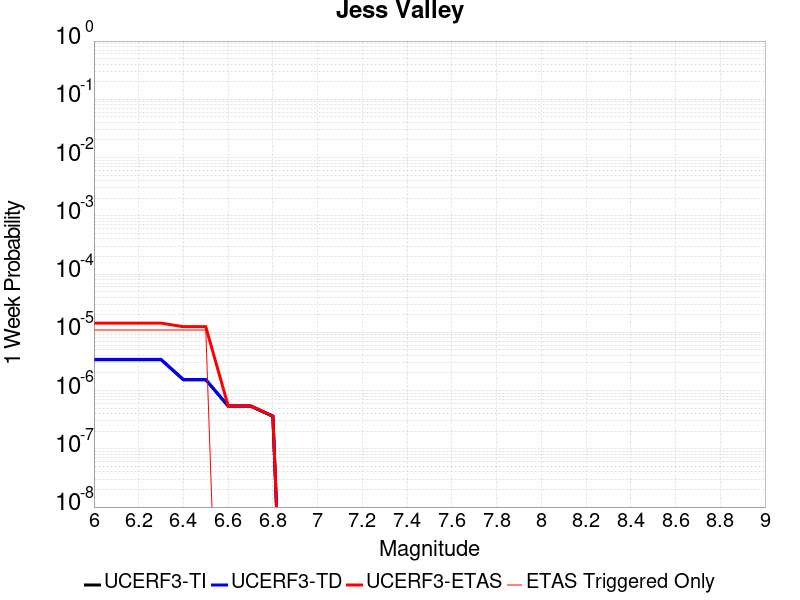 | 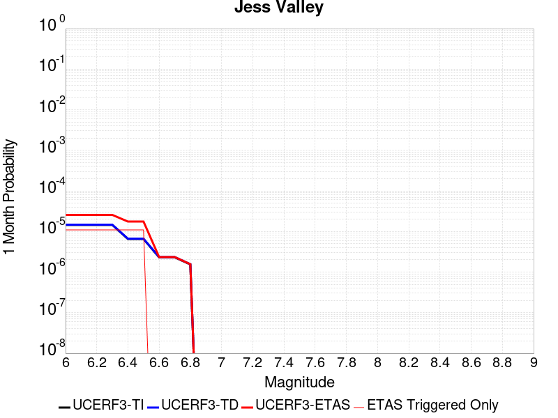 | 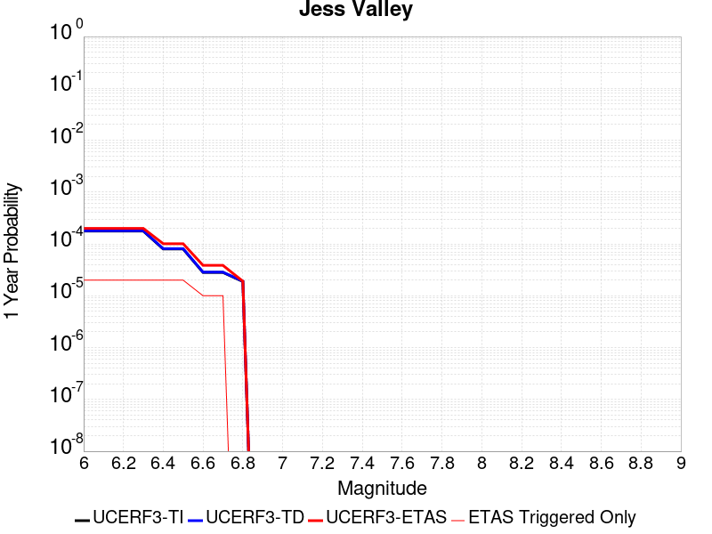 | 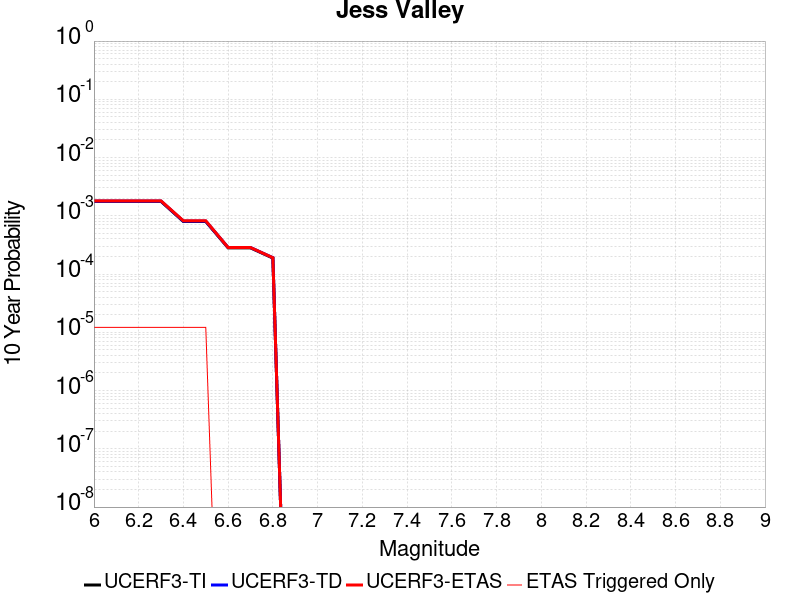 |

| Magnitude | 1 wk TI Prob | 1 wk TD Prob | 1 wk ETAS Prob | 1 wk ETAS/TD Gain | 1 wk ETAS Triggered Only | 1 mo TI Prob | 1 mo TD Prob | 1 mo ETAS Prob | 1 mo ETAS/TD Gain | 1 mo ETAS Triggered Only | 1 yr TI Prob | 1 yr TD Prob | 1 yr ETAS Prob | 1 yr ETAS/TD Gain | 1 yr ETAS Triggered Only | 10 yr TI Prob | 10 yr TD Prob | 10 yr ETAS Prob | 10 yr ETAS/TD Gain | 10 yr ETAS Triggered Only |
|-----|-----|-----|-----|-----|-----|-----|-----|-----|-----|-----|-----|-----|-----|-----|-----|-----|-----|-----|-----|-----|
| 6.0 | 3.3861274E-6 | 3.4340592E-6 | 1.43752995E-5 | 4.1860957 | 1.0941279E-5 | 1.4511894E-5 | 1.471733E-5 | 2.5658446E-5 | 1.7434173 | 1.0941279E-5 | 1.7666799E-4 | 1.7917156E-4 | 1.9011089E-4 | 1.061055 | 1.0941279E-5 | 0.001765276 | 0.0017905476 | 0.0018014692 | 1.0060996 | 1.0941279E-5 |
| 6.1 | 3.3861274E-6 | 3.4340592E-6 | 1.43752995E-5 | 4.1860957 | 1.0941279E-5 | 1.4511894E-5 | 1.471733E-5 | 2.5658446E-5 | 1.7434173 | 1.0941279E-5 | 1.7666799E-4 | 1.7917156E-4 | 1.9011089E-4 | 1.061055 | 1.0941279E-5 | 0.001765276 | 0.0017905476 | 0.0018014692 | 1.0060996 | 1.0941279E-5 |
| 6.2 | 3.3861274E-6 | 3.4340592E-6 | 1.43752995E-5 | 4.1860957 | 1.0941279E-5 | 1.4511894E-5 | 1.471733E-5 | 2.5658446E-5 | 1.7434173 | 1.0941279E-5 | 1.7666799E-4 | 1.7917156E-4 | 1.9011089E-4 | 1.061055 | 1.0941279E-5 | 0.001765276 | 0.0017905476 | 0.0018014692 | 1.0060996 | 1.0941279E-5 |
| 6.3 | 3.3861274E-6 | 3.4340592E-6 | 1.43752995E-5 | 4.1860957 | 1.0941279E-5 | 1.4511894E-5 | 1.471733E-5 | 2.5658446E-5 | 1.7434173 | 1.0941279E-5 | 1.7666799E-4 | 1.7917156E-4 | 1.9011089E-4 | 1.061055 | 1.0941279E-5 | 0.001765276 | 0.0017905476 | 0.0018014692 | 1.0060996 | 1.0941279E-5 |
| 6.4 | 1.5291708E-6 | 1.5502784E-6 | 1.249154E-5 | 8.0576105 | 1.0941279E-5 | 6.553573E-6 | 6.644038E-6 | 1.7585244E-5 | 2.6467705 | 1.0941279E-5 | 7.978683E-5 | 8.088895E-5 | 9.182935E-5 | 1.135252 | 1.0941279E-5 | 7.975819E-4 | 8.086733E-4 | 8.196058E-4 | 1.0135189 | 1.0941279E-5 |
| 6.5 | 1.5291708E-6 | 1.5502784E-6 | 1.249154E-5 | 8.0576105 | 1.0941279E-5 | 6.553573E-6 | 6.644038E-6 | 1.7585244E-5 | 2.6467705 | 1.0941279E-5 | 7.978683E-5 | 8.088895E-5 | 9.182935E-5 | 1.135252 | 1.0941279E-5 | 7.975819E-4 | 8.086733E-4 | 8.196058E-4 | 1.0135189 | 1.0941279E-5 |
| 6.6 | 5.396423E-7 | 5.4719953E-7 | 5.4719953E-7 | 1.0 | 0.0 | 2.312751E-6 | 2.3451398E-6 | 2.3451398E-6 | 1.0 | 0.0 | 2.8157378E-5 | 2.855189E-5 | 2.855189E-5 | 1.0 | 0.0 | 2.8153812E-4 | 2.8550063E-4 | 2.8550063E-4 | 1.0 | 0.0 |
| 6.7 | 5.396423E-7 | 5.4719953E-7 | 5.4719953E-7 | 1.0 | 0.0 | 2.312751E-6 | 2.3451398E-6 | 2.3451398E-6 | 1.0 | 0.0 | 2.8157378E-5 | 2.855189E-5 | 2.855189E-5 | 1.0 | 0.0 | 2.8153812E-4 | 2.8550063E-4 | 2.8550063E-4 | 1.0 | 0.0 |
| 6.8 | 3.6058395E-7 | 3.6563068E-7 | 3.6563068E-7 | 1.0 | 0.0 | 1.5453588E-6 | 1.5669885E-6 | 1.5669885E-6 | 1.0 | 0.0 | 1.8814582E-5 | 1.9078087E-5 | 1.9078087E-5 | 1.0 | 0.0 | 1.8812988E-4 | 1.9078086E-4 | 1.9078086E-4 | 1.0 | 0.0 |

## West Tahoe
*[(top)](#table-of-contents)*

| 1 Week | 1 Month | 1 Year | 10 Year |
|-----|-----|-----|-----|
|  |  |  |  |

| Magnitude | 1 wk TI Prob | 1 wk TD Prob | 1 wk ETAS Prob | 1 wk ETAS/TD Gain | 1 wk ETAS Triggered Only | 1 mo TI Prob | 1 mo TD Prob | 1 mo ETAS Prob | 1 mo ETAS/TD Gain | 1 mo ETAS Triggered Only | 1 yr TI Prob | 1 yr TD Prob | 1 yr ETAS Prob | 1 yr ETAS/TD Gain | 1 yr ETAS Triggered Only | 10 yr TI Prob | 10 yr TD Prob | 10 yr ETAS Prob | 10 yr ETAS/TD Gain | 10 yr ETAS Triggered Only |
|-----|-----|-----|-----|-----|-----|-----|-----|-----|-----|-----|-----|-----|-----|-----|-----|-----|-----|-----|-----|-----|
| 6.0 | 1.952444E-5 | 2.118317E-5 | 3.2124215E-5 | 1.5164971 | 1.0941279E-5 | 8.367348E-5 | 9.078217E-5 | 1.0172245E-4 | 1.1205114 | 1.0941279E-5 | 0.0010182485 | 0.0011047672 | 0.0011156964 | 1.0098927 | 1.0941279E-5 | 0.010135954 | 0.010998235 | 0.011009056 | 1.0009838 | 1.0941279E-5 |
| 6.1 | 1.952444E-5 | 2.118317E-5 | 3.2124215E-5 | 1.5164971 | 1.0941279E-5 | 8.367348E-5 | 9.078217E-5 | 1.0172245E-4 | 1.1205114 | 1.0941279E-5 | 0.0010182485 | 0.0011047672 | 0.0011156964 | 1.0098927 | 1.0941279E-5 | 0.010135954 | 0.010998235 | 0.011009056 | 1.0009838 | 1.0941279E-5 |
| 6.2 | 1.952444E-5 | 2.118317E-5 | 3.2124215E-5 | 1.5164971 | 1.0941279E-5 | 8.367348E-5 | 9.078217E-5 | 1.0172245E-4 | 1.1205114 | 1.0941279E-5 | 0.0010182485 | 0.0011047672 | 0.0011156964 | 1.0098927 | 1.0941279E-5 | 0.010135954 | 0.010998235 | 0.011009056 | 1.0009838 | 1.0941279E-5 |
| 6.3 | 1.952444E-5 | 2.118317E-5 | 3.2124215E-5 | 1.5164971 | 1.0941279E-5 | 8.367348E-5 | 9.078217E-5 | 1.0172245E-4 | 1.1205114 | 1.0941279E-5 | 0.0010182485 | 0.0011047672 | 0.0011156964 | 1.0098927 | 1.0941279E-5 | 0.010135954 | 0.010998235 | 0.011009056 | 1.0009838 | 1.0941279E-5 |
| 6.4 | 1.952444E-5 | 2.118317E-5 | 3.2124215E-5 | 1.5164971 | 1.0941279E-5 | 8.367348E-5 | 9.078217E-5 | 1.0172245E-4 | 1.1205114 | 1.0941279E-5 | 0.0010182485 | 0.0011047672 | 0.0011156964 | 1.0098927 | 1.0941279E-5 | 0.010135954 | 0.010998235 | 0.011009056 | 1.0009838 | 1.0941279E-5 |
| 6.5 | 1.2685271E-5 | 1.3690627E-5 | 1.3690627E-5 | 1.0 | 0.0 | 5.4364315E-5 | 5.8672893E-5 | 5.8672893E-5 | 1.0 | 0.0 | 6.616845E-4 | 7.141248E-4 | 7.141248E-4 | 1.0 | 0.0 | 0.0065971776 | 0.00711995 | 0.00711995 | 1.0 | 0.0 |
| 6.6 | 1.2685271E-5 | 1.3690627E-5 | 1.3690627E-5 | 1.0 | 0.0 | 5.4364315E-5 | 5.8672893E-5 | 5.8672893E-5 | 1.0 | 0.0 | 6.616845E-4 | 7.141248E-4 | 7.141248E-4 | 1.0 | 0.0 | 0.0065971776 | 0.00711995 | 0.00711995 | 1.0 | 0.0 |
| 6.7 | 9.117886E-6 | 9.809846E-6 | 9.809846E-6 | 1.0 | 0.0 | 3.9076072E-5 | 4.2041564E-5 | 4.2041564E-5 | 1.0 | 0.0 | 4.756473E-4 | 5.11743E-4 | 5.11743E-4 | 1.0 | 0.0 | 0.0047463053 | 0.0051063634 | 0.0051063634 | 1.0 | 0.0 |
| 6.8 | 8.786828E-6 | 9.457863E-6 | 9.457863E-6 | 1.0 | 0.0 | 3.7657293E-5 | 4.053311E-5 | 4.053311E-5 | 1.0 | 0.0 | 4.5838108E-4 | 4.933859E-4 | 4.933859E-4 | 1.0 | 0.0 | 0.0045743673 | 0.0049236063 | 0.0049236063 | 1.0 | 0.0 |
| 6.9 | 6.7562123E-6 | 7.2638086E-6 | 7.2638086E-6 | 1.0 | 0.0 | 2.8954875E-5 | 3.1130265E-5 | 3.1130265E-5 | 1.0 | 0.0 | 3.5246857E-4 | 3.789498E-4 | 3.789498E-4 | 1.0 | 0.0 | 0.0035191004 | 0.0037835082 | 0.0037835082 | 1.0 | 0.0 |
| 7.0 | 5.1792854E-6 | 5.567338E-6 | 5.567338E-6 | 1.0 | 0.0 | 2.2196748E-5 | 2.3859824E-5 | 2.3859824E-5 | 1.0 | 0.0 | 2.702119E-4 | 2.9045844E-4 | 2.9045844E-4 | 1.0 | 0.0 | 0.0026988357 | 0.0029011632 | 0.0029011632 | 1.0 | 0.0 |
| 7.1 | 4.090765E-6 | 4.3974223E-6 | 4.3974223E-6 | 1.0 | 0.0 | 1.7531731E-5 | 1.884598E-5 | 1.884598E-5 | 1.0 | 0.0 | 2.134279E-4 | 2.2942905E-4 | 2.2942905E-4 | 1.0 | 0.0 | 0.0021322304 | 0.0022922563 | 0.0022922563 | 1.0 | 0.0 |
| 7.2 | 2.2356758E-6 | 2.4023684E-6 | 2.4023684E-6 | 1.0 | 0.0 | 9.581432E-6 | 1.0295834E-5 | 1.0295834E-5 | 1.0 | 0.0 | 1.1664769E-4 | 1.2534647E-4 | 1.2534647E-4 | 1.0 | 0.0 | 0.0011658648 | 0.0012529434 | 0.0012529434 | 1.0 | 0.0 |

## Surprise Valley 2011 CFM
*[(top)](#table-of-contents)*

| 1 Week | 1 Month | 1 Year | 10 Year |
|-----|-----|-----|-----|
|  |  |  |  |

| Magnitude | 1 wk TI Prob | 1 wk TD Prob | 1 wk ETAS Prob | 1 wk ETAS/TD Gain | 1 wk ETAS Triggered Only | 1 mo TI Prob | 1 mo TD Prob | 1 mo ETAS Prob | 1 mo ETAS/TD Gain | 1 mo ETAS Triggered Only | 1 yr TI Prob | 1 yr TD Prob | 1 yr ETAS Prob | 1 yr ETAS/TD Gain | 1 yr ETAS Triggered Only | 10 yr TI Prob | 10 yr TD Prob | 10 yr ETAS Prob | 10 yr ETAS/TD Gain | 10 yr ETAS Triggered Only |
|-----|-----|-----|-----|-----|-----|-----|-----|-----|-----|-----|-----|-----|-----|-----|-----|-----|-----|-----|-----|-----|
| 6.0 | 4.0396248E-5 | 4.485131E-5 | 5.5792098E-5 | 1.2439346 | 1.0941279E-5 | 1.7311527E-4 | 1.9220692E-4 | 2.0314609E-4 | 1.0569135 | 1.0941279E-5 | 0.002105641 | 0.0023378176 | 0.0023487334 | 1.0046692 | 1.0941279E-5 | 0.020858008 | 0.023153966 | 0.023164654 | 1.0004616 | 1.0941279E-5 |
| 6.1 | 4.0396248E-5 | 4.485131E-5 | 5.5792098E-5 | 1.2439346 | 1.0941279E-5 | 1.7311527E-4 | 1.9220692E-4 | 2.0314609E-4 | 1.0569135 | 1.0941279E-5 | 0.002105641 | 0.0023378176 | 0.0023487334 | 1.0046692 | 1.0941279E-5 | 0.020858008 | 0.023153966 | 0.023164654 | 1.0004616 | 1.0941279E-5 |
| 6.2 | 2.2295266E-5 | 2.440125E-5 | 2.440125E-5 | 1.0 | 0.0 | 9.554764E-5 | 1.0457276E-4 | 1.0457276E-4 | 1.0 | 0.0 | 0.0011626717 | 0.0012724606 | 0.0012724606 | 1.0 | 0.0 | 0.011566074 | 0.012654981 | 0.012654981 | 1.0 | 0.0 |
| 6.3 | 1.572643E-5 | 1.7096807E-5 | 1.7096807E-5 | 1.0 | 0.0 | 6.7397246E-5 | 7.327003E-5 | 7.327003E-5 | 1.0 | 0.0 | 8.202525E-4 | 8.91708E-4 | 8.91708E-4 | 1.0 | 0.0 | 0.008172315 | 0.008882407 | 0.008882407 | 1.0 | 0.0 |
| 6.4 | 1.5714395E-5 | 1.7084629E-5 | 1.7084629E-5 | 1.0 | 0.0 | 6.734567E-5 | 7.3217845E-5 | 7.3217845E-5 | 1.0 | 0.0 | 8.1962504E-4 | 8.9107314E-4 | 8.9107314E-4 | 1.0 | 0.0 | 0.008166086 | 0.008876109 | 0.008876109 | 1.0 | 0.0 |
| 6.5 | 1.2733495E-5 | 1.38016E-5 | 1.38016E-5 | 1.0 | 0.0 | 5.457098E-5 | 5.9148413E-5 | 5.9148413E-5 | 1.0 | 0.0 | 6.641992E-4 | 7.1990065E-4 | 7.1990065E-4 | 1.0 | 0.0 | 0.0066221743 | 0.0071763797 | 0.0071763797 | 1.0 | 0.0 |
| 6.6 | 1.0983784E-5 | 1.1886554E-5 | 1.1886554E-5 | 1.0 | 0.0 | 4.7072506E-5 | 5.094141E-5 | 5.094141E-5 | 1.0 | 0.0 | 5.7295704E-4 | 6.200405E-4 | 6.200405E-4 | 1.0 | 0.0 | 0.0057148207 | 0.0061836545 | 0.0061836545 | 1.0 | 0.0 |
| 6.7 | 9.104806E-6 | 9.839491E-6 | 9.839491E-6 | 1.0 | 0.0 | 3.902001E-5 | 4.2168587E-5 | 4.2168587E-5 | 1.0 | 0.0 | 4.7496508E-4 | 5.132855E-4 | 5.132855E-4 | 1.0 | 0.0 | 0.004739512 | 0.005121397 | 0.005121397 | 1.0 | 0.0 |
| 6.8 | 6.2162403E-6 | 6.7041337E-6 | 6.7041337E-6 | 1.0 | 0.0 | 2.6640759E-5 | 2.8731698E-5 | 2.8731698E-5 | 1.0 | 0.0 | 3.2430296E-4 | 3.497545E-4 | 3.497545E-4 | 1.0 | 0.0 | 0.003238301 | 0.0034922638 | 0.0034922638 | 1.0 | 0.0 |
| 6.9 | 4.1792696E-6 | 4.50323E-6 | 4.50323E-6 | 1.0 | 0.0 | 1.7911032E-5 | 1.9299423E-5 | 1.9299423E-5 | 1.0 | 0.0 | 2.1804498E-4 | 2.3494668E-4 | 2.3494668E-4 | 1.0 | 0.0 | 0.0021783116 | 0.0023471361 | 0.0023471361 | 1.0 | 0.0 |
| 7.0 | 2.7478413E-6 | 2.9622424E-6 | 2.9622424E-6 | 1.0 | 0.0 | 1.177641E-5 | 1.269527E-5 | 1.269527E-5 | 1.0 | 0.0 | 1.4336836E-4 | 1.545552E-4 | 1.545552E-4 | 1.0 | 0.0 | 0.001432759 | 0.0015445995 | 0.0015445995 | 1.0 | 0.0 |
| 7.1 | 8.128648E-7 | 8.724922E-7 | 8.724922E-7 | 1.0 | 0.0 | 3.4837017E-6 | 3.7392501E-6 | 3.7392501E-6 | 1.0 | 0.0 | 4.2413245E-5 | 4.552502E-5 | 4.552502E-5 | 1.0 | 0.0 | 4.2405148E-4 | 4.5521575E-4 | 4.5521575E-4 | 1.0 | 0.0 |
| 7.2 | 4.8641045E-8 | 4.9402068E-8 | 4.9402068E-8 | 1.0 | 0.0 | 2.084616E-7 | 2.1172312E-7 | 2.1172312E-7 | 1.0 | 0.0 | 2.538017E-6 | 2.577726E-6 | 2.577726E-6 | 1.0 | 0.0 | 2.537988E-5 | 2.5776973E-5 | 2.5776973E-5 | 1.0 | 0.0 |
| 7.3 | 5.3911844E-9 | 5.4758145E-9 | 5.4758145E-9 | 1.0 | 0.0 | 2.3105075E-8 | 2.3467775E-8 | 2.3467775E-8 | 1.0 | 0.0 | 2.8130427E-7 | 2.8572015E-7 | 2.8572015E-7 | 1.0 | 0.0 | 2.8130391E-6 | 2.8571992E-6 | 2.8571992E-6 | 1.0 | 0.0 |

## San Gabriel (Extension)
*[(top)](#table-of-contents)*

| 1 Week | 1 Month | 1 Year | 10 Year |
|-----|-----|-----|-----|
|  |  |  |  |

| Magnitude | 1 wk TI Prob | 1 wk TD Prob | 1 wk ETAS Prob | 1 wk ETAS/TD Gain | 1 wk ETAS Triggered Only | 1 mo TI Prob | 1 mo TD Prob | 1 mo ETAS Prob | 1 mo ETAS/TD Gain | 1 mo ETAS Triggered Only | 1 yr TI Prob | 1 yr TD Prob | 1 yr ETAS Prob | 1 yr ETAS/TD Gain | 1 yr ETAS Triggered Only | 10 yr TI Prob | 10 yr TD Prob | 10 yr ETAS Prob | 10 yr ETAS/TD Gain | 10 yr ETAS Triggered Only |
|-----|-----|-----|-----|-----|-----|-----|-----|-----|-----|-----|-----|-----|-----|-----|-----|-----|-----|-----|-----|-----|
| 6.0 | 5.6486106E-6 | 5.7168304E-6 | 1.6658047E-5 | 2.9138606 | 1.0941279E-5 | 2.4208108E-5 | 2.450048E-5 | 3.5441488E-5 | 1.4465631 | 1.0941279E-5 | 2.9469383E-4 | 2.9825376E-4 | 3.091918E-4 | 1.0366735 | 1.0941279E-5 | 0.0029430336 | 0.0029786653 | 0.0029895739 | 1.0036622 | 1.0941279E-5 |
| 6.1 | 5.6486106E-6 | 5.7168304E-6 | 1.6658047E-5 | 2.9138606 | 1.0941279E-5 | 2.4208108E-5 | 2.450048E-5 | 3.5441488E-5 | 1.4465631 | 1.0941279E-5 | 2.9469383E-4 | 2.9825376E-4 | 3.091918E-4 | 1.0366735 | 1.0941279E-5 | 0.0029430336 | 0.0029786653 | 0.0029895739 | 1.0036622 | 1.0941279E-5 |
| 6.2 | 5.6486106E-6 | 5.7168304E-6 | 1.6658047E-5 | 2.9138606 | 1.0941279E-5 | 2.4208108E-5 | 2.450048E-5 | 3.5441488E-5 | 1.4465631 | 1.0941279E-5 | 2.9469383E-4 | 2.9825376E-4 | 3.091918E-4 | 1.0366735 | 1.0941279E-5 | 0.0029430336 | 0.0029786653 | 0.0029895739 | 1.0036622 | 1.0941279E-5 |
| 6.3 | 5.6486106E-6 | 5.7168304E-6 | 1.6658047E-5 | 2.9138606 | 1.0941279E-5 | 2.4208108E-5 | 2.450048E-5 | 3.5441488E-5 | 1.4465631 | 1.0941279E-5 | 2.9469383E-4 | 2.9825376E-4 | 3.091918E-4 | 1.0366735 | 1.0941279E-5 | 0.0029430336 | 0.0029786653 | 0.0029895739 | 1.0036622 | 1.0941279E-5 |
| 6.4 | 5.6486106E-6 | 5.7168304E-6 | 1.6658047E-5 | 2.9138606 | 1.0941279E-5 | 2.4208108E-5 | 2.450048E-5 | 3.5441488E-5 | 1.4465631 | 1.0941279E-5 | 2.9469383E-4 | 2.9825376E-4 | 3.091918E-4 | 1.0366735 | 1.0941279E-5 | 0.0029430336 | 0.0029786653 | 0.0029895739 | 1.0036622 | 1.0941279E-5 |
| 6.5 | 4.7134554E-6 | 4.7542544E-6 | 4.7542544E-6 | 1.0 | 0.0 | 2.0200367E-5 | 2.0375222E-5 | 2.0375222E-5 | 1.0 | 0.0 | 2.459117E-4 | 2.4804095E-4 | 2.4804095E-4 | 1.0 | 0.0 | 0.0024563975 | 0.002477729 | 0.002477729 | 1.0 | 0.0 |
| 6.6 | 4.7134554E-6 | 4.7542544E-6 | 4.7542544E-6 | 1.0 | 0.0 | 2.0200367E-5 | 2.0375222E-5 | 2.0375222E-5 | 1.0 | 0.0 | 2.459117E-4 | 2.4804095E-4 | 2.4804095E-4 | 1.0 | 0.0 | 0.0024563975 | 0.002477729 | 0.002477729 | 1.0 | 0.0 |
| 6.7 | 4.2468837E-6 | 4.2740717E-6 | 4.2740717E-6 | 1.0 | 0.0 | 1.8200803E-5 | 1.8317325E-5 | 1.8317325E-5 | 1.0 | 0.0 | 2.2157225E-4 | 2.2299135E-4 | 2.2299135E-4 | 1.0 | 0.0 | 0.0022135144 | 0.0022277518 | 0.0022277518 | 1.0 | 0.0 |
| 6.8 | 4.1180615E-6 | 4.1414614E-6 | 4.1414614E-6 | 1.0 | 0.0 | 1.7648716E-5 | 1.7749004E-5 | 1.7749004E-5 | 1.0 | 0.0 | 2.1485193E-4 | 2.160734E-4 | 2.160734E-4 | 1.0 | 0.0 | 0.0021464431 | 0.0021587082 | 0.0021587082 | 1.0 | 0.0 |
| 6.9 | 3.863861E-6 | 3.8797766E-6 | 3.8797766E-6 | 1.0 | 0.0 | 1.65593E-5 | 1.6627511E-5 | 1.6627511E-5 | 1.0 | 0.0 | 2.0159081E-4 | 2.0242184E-4 | 2.0242184E-4 | 1.0 | 0.0 | 0.0020140803 | 0.002022446 | 0.002022446 | 1.0 | 0.0 |
| 7.0 | 3.6947372E-6 | 3.705676E-6 | 3.705676E-6 | 1.0 | 0.0 | 1.5834492E-5 | 1.5881375E-5 | 1.5881375E-5 | 1.0 | 0.0 | 1.9276788E-4 | 1.9333926E-4 | 1.9333926E-4 | 1.0 | 0.0 | 0.0019260074 | 0.0019317807 | 0.0019317807 | 1.0 | 0.0 |
| 7.1 | 3.5686835E-6 | 3.5728963E-6 | 3.5728963E-6 | 1.0 | 0.0 | 1.5294268E-5 | 1.5312327E-5 | 1.5312327E-5 | 1.0 | 0.0 | 1.861918E-4 | 1.8641229E-4 | 1.8641229E-4 | 1.0 | 0.0 | 0.0018603588 | 0.0018626289 | 0.0018626289 | 1.0 | 0.0 |
| 7.2 | 2.8023446E-6 | 2.7767885E-6 | 2.7767885E-6 | 1.0 | 0.0 | 1.2009994E-5 | 1.1900468E-5 | 1.1900468E-5 | 1.0 | 0.0 | 1.4621185E-4 | 1.4487868E-4 | 1.4487868E-4 | 1.0 | 0.0 | 0.001461157 | 0.0014478569 | 0.0014478569 | 1.0 | 0.0 |
| 7.3 | 2.5843012E-6 | 2.5459642E-6 | 2.5459642E-6 | 1.0 | 0.0 | 1.1075529E-5 | 1.0911231E-5 | 1.0911231E-5 | 1.0 | 0.0 | 1.3483623E-4 | 1.3283623E-4 | 1.3283623E-4 | 1.0 | 0.0 | 0.0013475444 | 0.0013275818 | 0.0013275818 | 1.0 | 0.0 |
| 7.4 | 2.4464468E-6 | 2.396665E-6 | 2.396665E-6 | 1.0 | 0.0 | 1.04847295E-5 | 1.0271382E-5 | 1.0271382E-5 | 1.0 | 0.0 | 1.276441E-4 | 1.25047E-4 | 1.25047E-4 | 1.0 | 0.0 | 0.0012757082 | 0.0012497796 | 0.0012497796 | 1.0 | 0.0 |
| 7.5 | 2.0420266E-6 | 1.8910426E-6 | 1.8910426E-6 | 1.0 | 0.0 | 8.751514E-6 | 8.104444E-6 | 8.104444E-6 | 1.0 | 0.0 | 1.0654447E-4 | 9.8667166E-5 | 9.8667166E-5 | 1.0 | 0.0 | 0.001064934 | 9.862408E-4 | 9.862408E-4 | 1.0 | 0.0 |
| 7.6 | 1.8326596E-6 | 1.6398341E-6 | 1.6398341E-6 | 1.0 | 0.0 | 7.854232E-6 | 7.0278415E-6 | 7.0278415E-6 | 1.0 | 0.0 | 9.562107E-5 | 8.5560634E-5 | 8.5560634E-5 | 1.0 | 0.0 | 9.5579936E-4 | 8.5528276E-4 | 8.5528276E-4 | 1.0 | 0.0 |
| 7.7 | 1.4786998E-6 | 1.2523838E-6 | 1.2523838E-6 | 1.0 | 0.0 | 6.3372695E-6 | 5.367348E-6 | 5.367348E-6 | 1.0 | 0.0 | 7.715353E-5 | 6.534551E-5 | 6.534551E-5 | 1.0 | 0.0 | 7.7126746E-4 | 6.532707E-4 | 6.532707E-4 | 1.0 | 0.0 |
| 7.8 | 7.6975533E-7 | 6.0693884E-7 | 6.0693884E-7 | 1.0 | 0.0 | 3.2989474E-6 | 2.601164E-6 | 2.601164E-6 | 1.0 | 0.0 | 4.0163945E-5 | 3.166871E-5 | 3.166871E-5 | 1.0 | 0.0 | 4.0156685E-4 | 3.1664805E-4 | 3.1664805E-4 | 1.0 | 0.0 |
| 7.9 | 1.7645915E-7 | 9.213256E-8 | 9.213256E-8 | 1.0 | 0.0 | 7.562533E-7 | 3.9485377E-7 | 3.9485377E-7 | 1.0 | 0.0 | 9.207345E-6 | 4.807334E-6 | 4.807334E-6 | 1.0 | 0.0 | 9.206964E-5 | 4.807699E-5 | 4.807699E-5 | 1.0 | 0.0 |
| 8.0 | 1.0463461E-7 | 2.4949307E-8 | 2.4949307E-8 | 1.0 | 0.0 | 4.4843398E-7 | 1.0692559E-7 | 1.0692559E-7 | 1.0 | 0.0 | 5.45967E-6 | 1.3018183E-6 | 1.3018183E-6 | 1.0 | 0.0 | 5.459536E-5 | 1.3022789E-5 | 1.3022789E-5 | 1.0 | 0.0 |
| 8.1 | 7.875717E-8 | 1.3866874E-8 | 1.3866874E-8 | 1.0 | 0.0 | 3.3753068E-7 | 5.942946E-8 | 5.942946E-8 | 1.0 | 0.0 | 4.109428E-6 | 7.235534E-7 | 7.235534E-7 | 1.0 | 0.0 | 4.109352E-5 | 7.2401926E-6 | 7.2401926E-6 | 1.0 | 0.0 |
| 8.2 | 1.33163E-8 | 1.7733891E-9 | 1.7733891E-9 | 1.0 | 0.0 | 5.7069855E-8 | 7.600239E-9 | 7.600239E-9 | 1.0 | 0.0 | 6.9482525E-7 | 9.25329E-8 | 9.25329E-8 | 1.0 | 0.0 | 6.9482307E-6 | 9.272953E-7 | 9.272953E-7 | 1.0 | 0.0 |

## Cerro Prieto
*[(top)](#table-of-contents)*

| 1 Week | 1 Month | 1 Year | 10 Year |
|-----|-----|-----|-----|
| 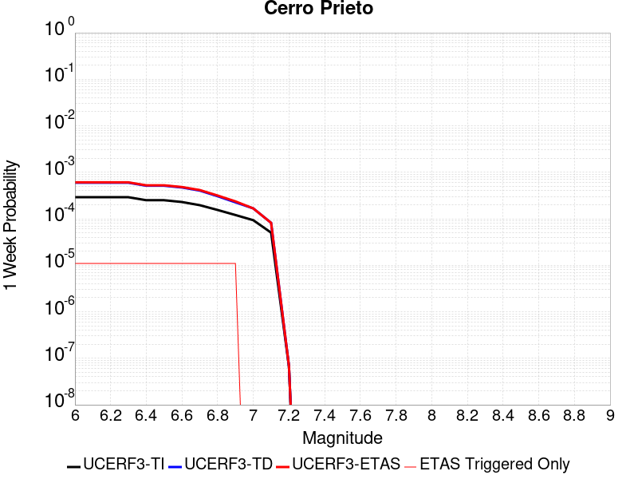 | 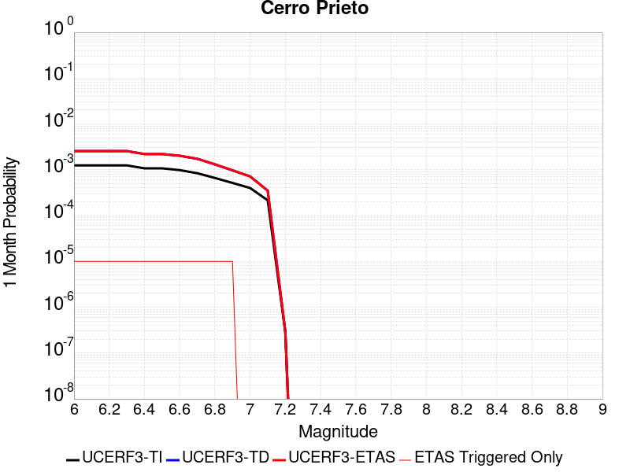 | 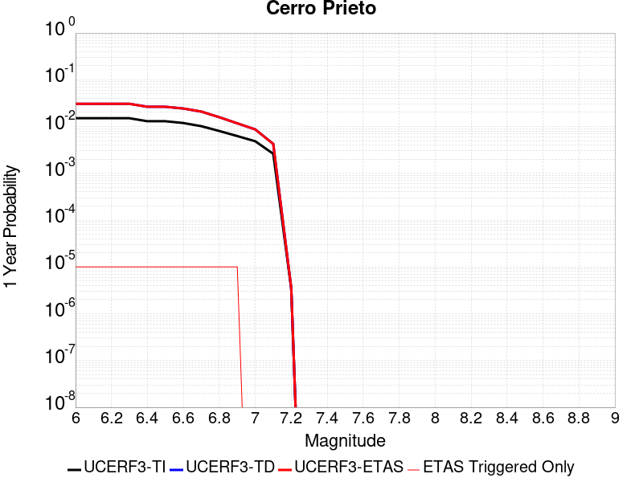 | 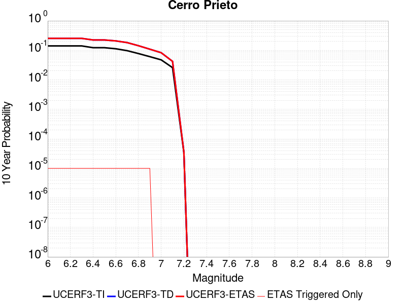 |

| Magnitude | 1 wk TI Prob | 1 wk TD Prob | 1 wk ETAS Prob | 1 wk ETAS/TD Gain | 1 wk ETAS Triggered Only | 1 mo TI Prob | 1 mo TD Prob | 1 mo ETAS Prob | 1 mo ETAS/TD Gain | 1 mo ETAS Triggered Only | 1 yr TI Prob | 1 yr TD Prob | 1 yr ETAS Prob | 1 yr ETAS/TD Gain | 1 yr ETAS Triggered Only | 10 yr TI Prob | 10 yr TD Prob | 10 yr ETAS Prob | 10 yr ETAS/TD Gain | 10 yr ETAS Triggered Only |
|-----|-----|-----|-----|-----|-----|-----|-----|-----|-----|-----|-----|-----|-----|-----|-----|-----|-----|-----|-----|-----|
| 6.0 | 2.9101528E-4 | 5.964804E-4 | 6.074151E-4 | 1.0183321 | 1.0941279E-5 | 0.0012466122 | 0.002554082 | 0.0025649955 | 1.0042729 | 1.0941279E-5 | 0.015072231 | 0.03064807 | 0.030658675 | 1.0003461 | 1.0941279E-5 | 0.14089979 | 0.25397858 | 0.25398675 | 1.0000322 | 1.0941279E-5 |
| 6.1 | 2.9101528E-4 | 5.964804E-4 | 6.074151E-4 | 1.0183321 | 1.0941279E-5 | 0.0012466122 | 0.002554082 | 0.0025649955 | 1.0042729 | 1.0941279E-5 | 0.015072231 | 0.03064807 | 0.030658675 | 1.0003461 | 1.0941279E-5 | 0.14089979 | 0.25397858 | 0.25398675 | 1.0000322 | 1.0941279E-5 |
| 6.2 | 2.9101528E-4 | 5.964804E-4 | 6.074151E-4 | 1.0183321 | 1.0941279E-5 | 0.0012466122 | 0.002554082 | 0.0025649955 | 1.0042729 | 1.0941279E-5 | 0.015072231 | 0.03064807 | 0.030658675 | 1.0003461 | 1.0941279E-5 | 0.14089979 | 0.25397858 | 0.25398675 | 1.0000322 | 1.0941279E-5 |
| 6.3 | 2.9101528E-4 | 5.964804E-4 | 6.074151E-4 | 1.0183321 | 1.0941279E-5 | 0.0012466122 | 0.002554082 | 0.0025649955 | 1.0042729 | 1.0941279E-5 | 0.015072231 | 0.03064807 | 0.030658675 | 1.0003461 | 1.0941279E-5 | 0.14089979 | 0.25397858 | 0.25398675 | 1.0000322 | 1.0941279E-5 |
| 6.4 | 2.508648E-4 | 5.1397446E-4 | 5.249101E-4 | 1.0212766 | 1.0941279E-5 | 0.0010746918 | 0.0022010866 | 0.0022120038 | 1.00496 | 1.0941279E-5 | 0.013006088 | 0.026471792 | 0.026482444 | 1.0004023 | 1.0941279E-5 | 0.12270685 | 0.22440416 | 0.22441263 | 1.0000378 | 1.0941279E-5 |
| 6.5 | 2.508648E-4 | 5.1397446E-4 | 5.249101E-4 | 1.0212766 | 1.0941279E-5 | 0.0010746918 | 0.0022010866 | 0.0022120038 | 1.00496 | 1.0941279E-5 | 0.013006088 | 0.026471792 | 0.026482444 | 1.0004023 | 1.0941279E-5 | 0.12270685 | 0.22440416 | 0.22441263 | 1.0000378 | 1.0941279E-5 |
| 6.6 | 2.294914E-4 | 4.7116808E-4 | 4.821042E-4 | 1.0232106 | 1.0941279E-5 | 9.831638E-4 | 0.0020179166 | 0.0020288357 | 1.0054111 | 1.0941279E-5 | 0.011904482 | 0.02429866 | 0.024309335 | 1.0004393 | 1.0941279E-5 | 0.11286586 | 0.20858558 | 0.20859423 | 1.0000415 | 1.0941279E-5 |
| 6.7 | 1.9621674E-4 | 4.0419117E-4 | 4.1512804E-4 | 1.0270586 | 1.0941279E-5 | 8.4065786E-4 | 0.0017312564 | 0.0017421787 | 1.0063089 | 1.0941279E-5 | 0.010187071 | 0.020884845 | 0.020895557 | 1.000513 | 1.0941279E-5 | 0.09732539 | 0.18290249 | 0.18291143 | 1.0000489 | 1.0941279E-5 |
| 6.8 | 1.5476145E-4 | 3.056516E-4 | 3.1658952E-4 | 1.0357857 | 1.0941279E-5 | 6.6309475E-4 | 0.00130938 | 0.0013203069 | 1.0083451 | 1.0941279E-5 | 0.008043335 | 0.015836509 | 0.015847277 | 1.00068 | 1.0941279E-5 | 0.07758363 | 0.14336355 | 0.14337292 | 1.0000653 | 1.0941279E-5 |
| 6.9 | 1.20509176E-4 | 2.2582515E-4 | 2.3676395E-4 | 1.0484393 | 1.0941279E-5 | 5.1636563E-4 | 9.6752634E-4 | 9.78457E-4 | 1.0112976 | 1.0941279E-5 | 0.006268645 | 0.011726342 | 0.011737155 | 1.0009221 | 1.0941279E-5 | 0.060947374 | 0.109451205 | 0.10946095 | 1.000089 | 1.0941279E-5 |
| 7.0 | 9.3269155E-5 | 1.6716642E-4 | 1.6716642E-4 | 1.0 | 0.0 | 3.9966372E-4 | 7.162739E-4 | 7.162739E-4 | 1.0 | 0.0 | 0.0048550544 | 0.008693418 | 0.008693418 | 1.0 | 0.0 | 0.04750344 | 0.08315912 | 0.08315912 | 1.0 | 0.0 |
| 7.1 | 5.029709E-5 | 8.1718936E-5 | 8.1718936E-5 | 1.0 | 0.0 | 2.1554115E-4 | 3.5019626E-4 | 3.5019626E-4 | 1.0 | 0.0 | 0.0026210553 | 0.0042587193 | 0.0042587193 | 1.0 | 0.0 | 0.025903556 | 0.042365108 | 0.042365108 | 1.0 | 0.0 |
| 7.2 | 6.5445185E-8 | 6.814903E-8 | 6.814903E-8 | 1.0 | 0.0 | 2.8047933E-7 | 2.9206726E-7 | 2.9206726E-7 | 1.0 | 0.0 | 3.4148304E-6 | 3.555919E-6 | 3.555919E-6 | 1.0 | 0.0 | 3.414778E-5 | 3.5559187E-5 | 3.5559187E-5 | 1.0 | 0.0 |

## Elysian Park (Upper)
*[(top)](#table-of-contents)*

| 1 Week | 1 Month | 1 Year | 10 Year |
|-----|-----|-----|-----|
|  |  |  |  |

| Magnitude | 1 wk TI Prob | 1 wk TD Prob | 1 wk ETAS Prob | 1 wk ETAS/TD Gain | 1 wk ETAS Triggered Only | 1 mo TI Prob | 1 mo TD Prob | 1 mo ETAS Prob | 1 mo ETAS/TD Gain | 1 mo ETAS Triggered Only | 1 yr TI Prob | 1 yr TD Prob | 1 yr ETAS Prob | 1 yr ETAS/TD Gain | 1 yr ETAS Triggered Only | 10 yr TI Prob | 10 yr TD Prob | 10 yr ETAS Prob | 10 yr ETAS/TD Gain | 10 yr ETAS Triggered Only |
|-----|-----|-----|-----|-----|-----|-----|-----|-----|-----|-----|-----|-----|-----|-----|-----|-----|-----|-----|-----|-----|
| 6.0 | 3.1876025E-5 | 3.7035516E-5 | 3.7035516E-5 | 1.0 | 0.0 | 1.3660437E-4 | 1.587167E-4 | 1.587167E-4 | 1.0 | 0.0 | 0.0016618895 | 0.0019311075 | 0.0019420276 | 1.0056548 | 1.0941279E-5 | 0.016495159 | 0.019189782 | 0.019200515 | 1.0005592 | 1.0941279E-5 |
| 6.1 | 3.1876025E-5 | 3.7035516E-5 | 3.7035516E-5 | 1.0 | 0.0 | 1.3660437E-4 | 1.587167E-4 | 1.587167E-4 | 1.0 | 0.0 | 0.0016618895 | 0.0019311075 | 0.0019420276 | 1.0056548 | 1.0941279E-5 | 0.016495159 | 0.019189782 | 0.019200515 | 1.0005592 | 1.0941279E-5 |
| 6.2 | 3.1876025E-5 | 3.7035516E-5 | 3.7035516E-5 | 1.0 | 0.0 | 1.3660437E-4 | 1.587167E-4 | 1.587167E-4 | 1.0 | 0.0 | 0.0016618895 | 0.0019311075 | 0.0019420276 | 1.0056548 | 1.0941279E-5 | 0.016495159 | 0.019189782 | 0.019200515 | 1.0005592 | 1.0941279E-5 |
| 6.3 | 3.1876025E-5 | 3.7035516E-5 | 3.7035516E-5 | 1.0 | 0.0 | 1.3660437E-4 | 1.587167E-4 | 1.587167E-4 | 1.0 | 0.0 | 0.0016618895 | 0.0019311075 | 0.0019420276 | 1.0056548 | 1.0941279E-5 | 0.016495159 | 0.019189782 | 0.019200515 | 1.0005592 | 1.0941279E-5 |
| 6.4 | 1.9273462E-5 | 2.1202266E-5 | 2.1202266E-5 | 1.0 | 0.0 | 8.259794E-5 | 9.086466E-5 | 9.086466E-5 | 1.0 | 0.0 | 0.001005166 | 0.0011058892 | 0.0011168184 | 1.0098827 | 1.0941279E-5 | 0.010006315 | 0.011020724 | 0.011031545 | 1.0009818 | 1.0941279E-5 |
| 6.5 | 1.9273462E-5 | 2.1202266E-5 | 2.1202266E-5 | 1.0 | 0.0 | 8.259794E-5 | 9.086466E-5 | 9.086466E-5 | 1.0 | 0.0 | 0.001005166 | 0.0011058892 | 0.0011168184 | 1.0098827 | 1.0941279E-5 | 0.010006315 | 0.011020724 | 0.011031545 | 1.0009818 | 1.0941279E-5 |
| 6.6 | 9.813258E-6 | 9.665599E-6 | 9.665599E-6 | 1.0 | 0.0 | 4.205614E-5 | 4.1423376E-5 | 4.1423376E-5 | 1.0 | 0.0 | 5.119132E-4 | 5.0422014E-4 | 5.0422014E-4 | 1.0 | 0.0 | 0.005107356 | 0.0050314846 | 0.0050314846 | 1.0 | 0.0 |
| 6.7 | 9.801478E-6 | 9.653168E-6 | 9.653168E-6 | 1.0 | 0.0 | 4.2005657E-5 | 4.1370105E-5 | 4.1370105E-5 | 1.0 | 0.0 | 5.112989E-4 | 5.035719E-4 | 5.035719E-4 | 1.0 | 0.0 | 0.0051012407 | 0.0050250315 | 0.0050250315 | 1.0 | 0.0 |
| 6.8 | 8.102489E-6 | 7.773004E-6 | 7.773004E-6 | 1.0 | 0.0 | 3.4724493E-5 | 3.3312477E-5 | 3.3312477E-5 | 1.0 | 0.0 | 4.2268867E-4 | 4.055089E-4 | 4.055089E-4 | 1.0 | 0.0 | 0.004218856 | 0.0040481836 | 0.0040481836 | 1.0 | 0.0 |
| 6.9 | 6.08275E-6 | 5.4814514E-6 | 5.4814514E-6 | 1.0 | 0.0 | 2.6068668E-5 | 2.3491726E-5 | 2.3491726E-5 | 1.0 | 0.0 | 3.173398E-4 | 2.85975E-4 | 2.85975E-4 | 1.0 | 0.0 | 0.0031688702 | 0.0028561477 | 0.0028561477 | 1.0 | 0.0 |
| 7.0 | 5.5995934E-6 | 4.98278E-6 | 4.98278E-6 | 1.0 | 0.0 | 2.3998036E-5 | 2.13546E-5 | 2.13546E-5 | 1.0 | 0.0 | 2.9213692E-4 | 2.599619E-4 | 2.599619E-4 | 1.0 | 0.0 | 0.0029175316 | 0.0025966454 | 0.0025966454 | 1.0 | 0.0 |
| 7.1 | 4.709881E-6 | 4.0874015E-6 | 4.0874015E-6 | 1.0 | 0.0 | 2.0185047E-5 | 1.7517319E-5 | 1.7517319E-5 | 1.0 | 0.0 | 2.4572524E-4 | 2.132529E-4 | 2.132529E-4 | 1.0 | 0.0 | 0.002454537 | 0.002130524 | 0.002130524 | 1.0 | 0.0 |
| 7.2 | 3.6063436E-6 | 2.9779544E-6 | 2.9779544E-6 | 1.0 | 0.0 | 1.5455667E-5 | 1.27626E-5 | 1.27626E-5 | 1.0 | 0.0 | 1.881565E-4 | 1.5537368E-4 | 1.5537368E-4 | 1.0 | 0.0 | 0.0018799726 | 0.0015526618 | 0.0015526618 | 1.0 | 0.0 |
| 7.3 | 2.471135E-6 | 2.0954615E-6 | 2.0954615E-6 | 1.0 | 0.0 | 1.0590536E-5 | 8.980519E-6 | 8.980519E-6 | 1.0 | 0.0 | 1.2893214E-4 | 1.093324E-4 | 1.093324E-4 | 1.0 | 0.0 | 0.0012885736 | 0.0010927934 | 0.0010927934 | 1.0 | 0.0 |
| 7.4 | 1.163943E-6 | 1.0275091E-6 | 1.0275091E-6 | 1.0 | 0.0 | 4.988318E-6 | 4.4036033E-6 | 4.4036033E-6 | 1.0 | 0.0 | 6.0731076E-5 | 5.3612584E-5 | 5.3612584E-5 | 1.0 | 0.0 | 6.071448E-4 | 5.359995E-4 | 5.359995E-4 | 1.0 | 0.0 |
| 7.5 | 4.99459E-7 | 4.917604E-7 | 4.917604E-7 | 1.0 | 0.0 | 2.140537E-6 | 2.1075427E-6 | 2.1075427E-6 | 1.0 | 0.0 | 2.6060725E-5 | 2.5659048E-5 | 2.5659048E-5 | 1.0 | 0.0 | 2.605767E-4 | 2.5656243E-4 | 2.5656243E-4 | 1.0 | 0.0 |
| 7.6 | 2.4667852E-7 | 2.4778336E-7 | 2.4778336E-7 | 1.0 | 0.0 | 1.0571932E-6 | 1.0619283E-6 | 1.0619283E-6 | 1.0 | 0.0 | 1.2871251E-5 | 1.2928905E-5 | 1.2928905E-5 | 1.0 | 0.0 | 1.2870505E-4 | 1.2928189E-4 | 1.2928189E-4 | 1.0 | 0.0 |
| 7.7 | 8.2312795E-8 | 7.3864456E-8 | 7.3864456E-8 | 1.0 | 0.0 | 3.527691E-7 | 3.165619E-7 | 3.165619E-7 | 1.0 | 0.0 | 4.294955E-6 | 3.8541357E-6 | 3.8541357E-6 | 1.0 | 0.0 | 4.2948723E-5 | 3.8540802E-5 | 3.8540802E-5 | 1.0 | 0.0 |
| 7.8 | 2.7819295E-8 | 1.7566023E-8 | 1.7566023E-8 | 1.0 | 0.0 | 1.1922555E-7 | 7.5282955E-8 | 7.5282955E-8 | 1.0 | 0.0 | 1.45157E-6 | 9.165697E-7 | 9.165697E-7 | 1.0 | 0.0 | 1.45156055E-5 | 9.165675E-6 | 9.165675E-6 | 1.0 | 0.0 |

## Great Valley 10 (Panoche)
*[(top)](#table-of-contents)*

| 1 Week | 1 Month | 1 Year | 10 Year |
|-----|-----|-----|-----|
|  |  |  |  |

| Magnitude | 1 wk TI Prob | 1 wk TD Prob | 1 wk ETAS Prob | 1 wk ETAS/TD Gain | 1 wk ETAS Triggered Only | 1 mo TI Prob | 1 mo TD Prob | 1 mo ETAS Prob | 1 mo ETAS/TD Gain | 1 mo ETAS Triggered Only | 1 yr TI Prob | 1 yr TD Prob | 1 yr ETAS Prob | 1 yr ETAS/TD Gain | 1 yr ETAS Triggered Only | 10 yr TI Prob | 10 yr TD Prob | 10 yr ETAS Prob | 10 yr ETAS/TD Gain | 10 yr ETAS Triggered Only |
|-----|-----|-----|-----|-----|-----|-----|-----|-----|-----|-----|-----|-----|-----|-----|-----|-----|-----|-----|-----|-----|
| 6.0 | 1.6014626E-5 | 1.6575399E-5 | 2.7516495E-5 | 1.6600804 | 1.0941279E-5 | 6.863231E-5 | 7.103552E-5 | 8.1976024E-5 | 1.1540145 | 1.0941279E-5 | 8.35278E-4 | 8.645185E-4 | 8.754503E-4 | 1.012645 | 1.0941279E-5 | 0.008321454 | 0.008612172 | 0.008623019 | 1.0012594 | 1.0941279E-5 |
| 6.1 | 1.6014626E-5 | 1.6575399E-5 | 2.7516495E-5 | 1.6600804 | 1.0941279E-5 | 6.863231E-5 | 7.103552E-5 | 8.1976024E-5 | 1.1540145 | 1.0941279E-5 | 8.35278E-4 | 8.645185E-4 | 8.754503E-4 | 1.012645 | 1.0941279E-5 | 0.008321454 | 0.008612172 | 0.008623019 | 1.0012594 | 1.0941279E-5 |
| 6.2 | 1.56782E-5 | 1.6198446E-5 | 2.7139547E-5 | 1.6754414 | 1.0941279E-5 | 6.719056E-5 | 6.94201E-5 | 8.0360616E-5 | 1.1575987 | 1.0941279E-5 | 8.17738E-4 | 8.4486604E-4 | 8.557981E-4 | 1.0129393 | 1.0941279E-5 | 0.008147354 | 0.008417147 | 0.008427996 | 1.0012889 | 1.0941279E-5 |
| 6.3 | 1.5263338E-5 | 1.5723514E-5 | 2.666462E-5 | 1.6958436 | 1.0941279E-5 | 6.541267E-5 | 6.738478E-5 | 7.832532E-5 | 1.1623592 | 1.0941279E-5 | 7.961082E-4 | 8.201049E-4 | 8.3103724E-4 | 1.0133303 | 1.0941279E-5 | 0.007932622 | 0.008171377 | 0.008182229 | 1.001328 | 1.0941279E-5 |
| 6.4 | 1.4720723E-5 | 1.5099376E-5 | 2.6040489E-5 | 1.724607 | 1.0941279E-5 | 6.308728E-5 | 6.471004E-5 | 7.5650605E-5 | 1.1690707 | 1.0941279E-5 | 7.67817E-4 | 7.8756385E-4 | 7.984965E-4 | 1.0138816 | 1.0941279E-5 | 0.007651695 | 0.007848303 | 0.007859158 | 1.0013832 | 1.0941279E-5 |
| 6.5 | 1.408264E-5 | 1.4355969E-5 | 2.5297091E-5 | 1.7621304 | 1.0941279E-5 | 6.0352773E-5 | 6.1524166E-5 | 7.246477E-5 | 1.1778262 | 1.0941279E-5 | 7.3454727E-4 | 7.488031E-4 | 7.5973617E-4 | 1.0146008 | 1.0941279E-5 | 0.0073212404 | 0.0074633555 | 0.0074742152 | 1.0014551 | 1.0941279E-5 |
| 6.6 | 1.3197086E-5 | 1.3321889E-5 | 2.4263021E-5 | 1.8212899 | 1.0941279E-5 | 5.6557717E-5 | 5.709259E-5 | 6.8033245E-5 | 1.19163 | 1.0941279E-5 | 6.8837265E-4 | 6.9488434E-4 | 7.05818E-4 | 1.0157346 | 1.0941279E-5 | 0.006862442 | 0.0069276537 | 0.006938519 | 1.0015684 | 1.0941279E-5 |
| 6.7 | 1.017583E-5 | 9.745382E-6 | 2.0686553E-5 | 2.122703 | 1.0941279E-5 | 4.360997E-5 | 4.176527E-5 | 5.270609E-5 | 1.2619598 | 1.0941279E-5 | 5.30822E-4 | 5.0837593E-4 | 5.1931164E-4 | 1.0215111 | 1.0941279E-5 | 0.0052955584 | 0.005072382 | 0.0050832676 | 1.0021461 | 1.0941279E-5 |
| 6.8 | 8.557912E-6 | 7.872707E-6 | 1.88139E-5 | 2.3897624 | 1.0941279E-5 | 3.667625E-5 | 3.373975E-5 | 4.468066E-5 | 1.3242736 | 1.0941279E-5 | 4.4644187E-4 | 4.1070607E-4 | 4.2164285E-4 | 1.0266292 | 1.0941279E-5 | 0.0044554602 | 0.004099677 | 0.0041105733 | 1.0026579 | 1.0941279E-5 |
| 6.9 | 6.14664E-6 | 5.092071E-6 | 5.092071E-6 | 1.0 | 0.0 | 2.6342475E-5 | 2.1822989E-5 | 2.1822989E-5 | 1.0 | 0.0 | 3.2067244E-4 | 2.6566387E-4 | 2.6566387E-4 | 1.0 | 0.0 | 0.003202101 | 0.002653601 | 0.002653601 | 1.0 | 0.0 |
| 7.0 | 3.2310581E-6 | 1.6951219E-6 | 1.6951219E-6 | 1.0 | 0.0 | 1.3847319E-5 | 7.264788E-6 | 7.264788E-6 | 1.0 | 0.0 | 1.6857806E-4 | 8.8445304E-5 | 8.8445304E-5 | 1.0 | 0.0 | 0.0016845023 | 8.841104E-4 | 8.841104E-4 | 1.0 | 0.0 |
| 7.1 | 2.544492E-6 | 9.1889206E-7 | 9.1889206E-7 | 1.0 | 0.0 | 1.090492E-5 | 3.938103E-6 | 3.938103E-6 | 1.0 | 0.0 | 1.327593E-4 | 4.79454E-5 | 4.79454E-5 | 1.0 | 0.0 | 0.0013268003 | 4.793553E-4 | 4.793553E-4 | 1.0 | 0.0 |
| 7.2 | 2.4479045E-6 | 8.841304E-7 | 8.841304E-7 | 1.0 | 0.0 | 1.0490977E-5 | 3.789125E-6 | 3.789125E-6 | 1.0 | 0.0 | 1.2772017E-4 | 4.6131667E-5 | 4.6131667E-5 | 1.0 | 0.0 | 0.0012764678 | 4.6122566E-4 | 4.6122566E-4 | 1.0 | 0.0 |
| 7.3 | 2.0559578E-6 | 7.892787E-7 | 7.892787E-7 | 1.0 | 0.0 | 8.811218E-6 | 3.3826188E-6 | 3.3826188E-6 | 1.0 | 0.0 | 1.072713E-4 | 4.1182655E-5 | 4.1182655E-5 | 1.0 | 0.0 | 0.0010721954 | 4.1175485E-4 | 4.1175485E-4 | 1.0 | 0.0 |
| 7.4 | 1.727687E-6 | 7.387757E-7 | 7.387757E-7 | 1.0 | 0.0 | 7.404352E-6 | 3.1661782E-6 | 3.1661782E-6 | 1.0 | 0.0 | 9.0144255E-5 | 3.8547583E-5 | 3.8547583E-5 | 1.0 | 0.0 | 9.0107694E-4 | 3.854136E-4 | 3.854136E-4 | 1.0 | 0.0 |
| 7.5 | 1.5002679E-6 | 6.546144E-7 | 6.546144E-7 | 1.0 | 0.0 | 6.4297037E-6 | 2.8054874E-6 | 2.8054874E-6 | 1.0 | 0.0 | 7.827883E-5 | 3.4156317E-5 | 3.4156317E-5 | 1.0 | 0.0 | 7.825126E-4 | 3.4151482E-4 | 3.4151482E-4 | 1.0 | 0.0 |

## Los Alamos extension
*[(top)](#table-of-contents)*

| 1 Week | 1 Month | 1 Year | 10 Year |
|-----|-----|-----|-----|
| 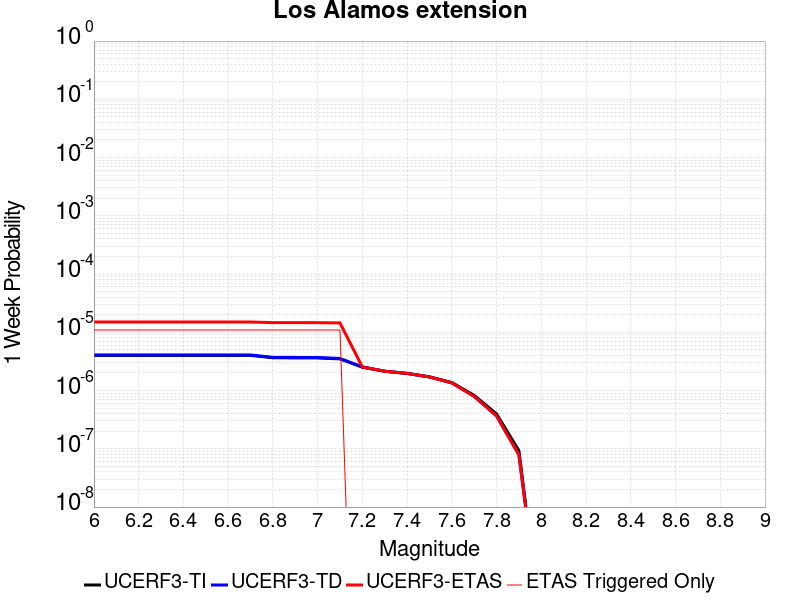 | 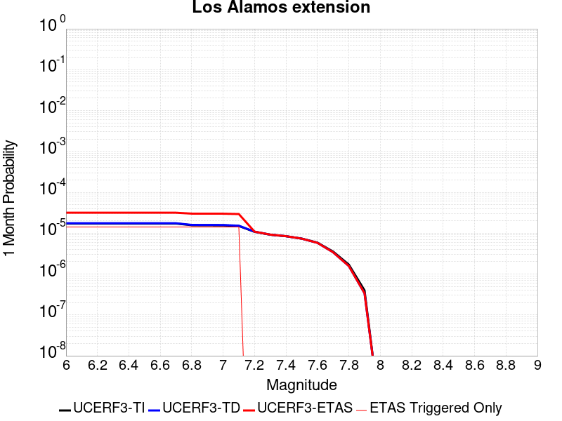 | 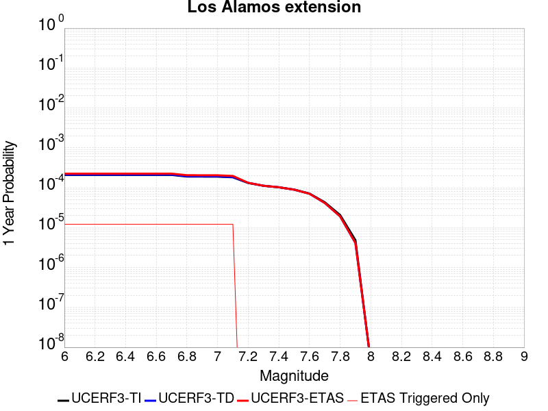 | 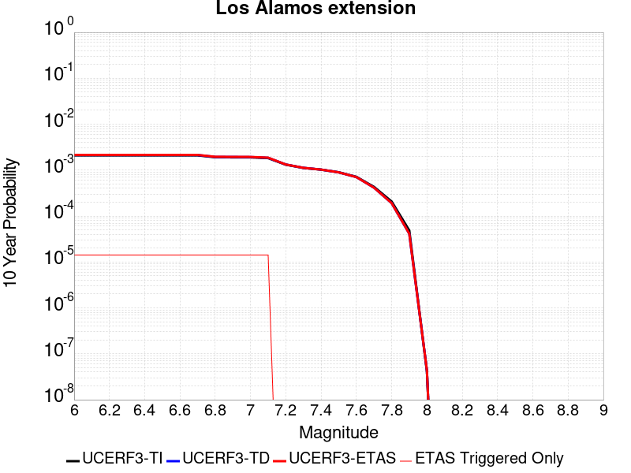 |

| Magnitude | 1 wk TI Prob | 1 wk TD Prob | 1 wk ETAS Prob | 1 wk ETAS/TD Gain | 1 wk ETAS Triggered Only | 1 mo TI Prob | 1 mo TD Prob | 1 mo ETAS Prob | 1 mo ETAS/TD Gain | 1 mo ETAS Triggered Only | 1 yr TI Prob | 1 yr TD Prob | 1 yr ETAS Prob | 1 yr ETAS/TD Gain | 1 yr ETAS Triggered Only | 10 yr TI Prob | 10 yr TD Prob | 10 yr ETAS Prob | 10 yr ETAS/TD Gain | 10 yr ETAS Triggered Only |
|-----|-----|-----|-----|-----|-----|-----|-----|-----|-----|-----|-----|-----|-----|-----|-----|-----|-----|-----|-----|-----|
| 6.0 | 4.0146506E-6 | 4.0861596E-6 | 1.5027393E-5 | 3.6776323 | 1.0941279E-5 | 1.7205533E-5 | 1.7512002E-5 | 2.8453089E-5 | 1.6247765 | 1.0941279E-5 | 2.0945723E-4 | 2.1318886E-4 | 2.2412781E-4 | 1.051311 | 1.0941279E-5 | 0.0020925992 | 0.0021299527 | 0.0021408706 | 1.0051259 | 1.0941279E-5 |
| 6.1 | 4.0146506E-6 | 4.0861596E-6 | 1.5027393E-5 | 3.6776323 | 1.0941279E-5 | 1.7205533E-5 | 1.7512002E-5 | 2.8453089E-5 | 1.6247765 | 1.0941279E-5 | 2.0945723E-4 | 2.1318886E-4 | 2.2412781E-4 | 1.051311 | 1.0941279E-5 | 0.0020925992 | 0.0021299527 | 0.0021408706 | 1.0051259 | 1.0941279E-5 |
| 6.2 | 4.0146506E-6 | 4.0861596E-6 | 1.5027393E-5 | 3.6776323 | 1.0941279E-5 | 1.7205533E-5 | 1.7512002E-5 | 2.8453089E-5 | 1.6247765 | 1.0941279E-5 | 2.0945723E-4 | 2.1318886E-4 | 2.2412781E-4 | 1.051311 | 1.0941279E-5 | 0.0020925992 | 0.0021299527 | 0.0021408706 | 1.0051259 | 1.0941279E-5 |
| 6.3 | 4.0146506E-6 | 4.0861596E-6 | 1.5027393E-5 | 3.6776323 | 1.0941279E-5 | 1.7205533E-5 | 1.7512002E-5 | 2.8453089E-5 | 1.6247765 | 1.0941279E-5 | 2.0945723E-4 | 2.1318886E-4 | 2.2412781E-4 | 1.051311 | 1.0941279E-5 | 0.0020925992 | 0.0021299527 | 0.0021408706 | 1.0051259 | 1.0941279E-5 |
| 6.4 | 4.0146506E-6 | 4.0861596E-6 | 1.5027393E-5 | 3.6776323 | 1.0941279E-5 | 1.7205533E-5 | 1.7512002E-5 | 2.8453089E-5 | 1.6247765 | 1.0941279E-5 | 2.0945723E-4 | 2.1318886E-4 | 2.2412781E-4 | 1.051311 | 1.0941279E-5 | 0.0020925992 | 0.0021299527 | 0.0021408706 | 1.0051259 | 1.0941279E-5 |
| 6.5 | 4.0146506E-6 | 4.0861596E-6 | 1.5027393E-5 | 3.6776323 | 1.0941279E-5 | 1.7205533E-5 | 1.7512002E-5 | 2.8453089E-5 | 1.6247765 | 1.0941279E-5 | 2.0945723E-4 | 2.1318886E-4 | 2.2412781E-4 | 1.051311 | 1.0941279E-5 | 0.0020925992 | 0.0021299527 | 0.0021408706 | 1.0051259 | 1.0941279E-5 |
| 6.6 | 4.0146506E-6 | 4.0861596E-6 | 1.5027393E-5 | 3.6776323 | 1.0941279E-5 | 1.7205533E-5 | 1.7512002E-5 | 2.8453089E-5 | 1.6247765 | 1.0941279E-5 | 2.0945723E-4 | 2.1318886E-4 | 2.2412781E-4 | 1.051311 | 1.0941279E-5 | 0.0020925992 | 0.0021299527 | 0.0021408706 | 1.0051259 | 1.0941279E-5 |
| 6.7 | 4.0146506E-6 | 4.0861596E-6 | 1.5027393E-5 | 3.6776323 | 1.0941279E-5 | 1.7205533E-5 | 1.7512002E-5 | 2.8453089E-5 | 1.6247765 | 1.0941279E-5 | 2.0945723E-4 | 2.1318886E-4 | 2.2412781E-4 | 1.051311 | 1.0941279E-5 | 0.0020925992 | 0.0021299527 | 0.0021408706 | 1.0051259 | 1.0941279E-5 |
| 6.8 | 3.6584688E-6 | 3.7188588E-6 | 1.4660096E-5 | 3.9420953 | 1.0941279E-5 | 1.5679057E-5 | 1.5937874E-5 | 2.6878979E-5 | 1.6864845 | 1.0941279E-5 | 1.9087581E-4 | 1.9402728E-4 | 2.0496643E-4 | 1.0563794 | 1.0941279E-5 | 0.0019071194 | 0.0019386712 | 0.0019495912 | 1.0056328 | 1.0941279E-5 |
| 6.9 | 3.644631E-6 | 3.7045688E-6 | 1.4645807E-5 | 3.9534442 | 1.0941279E-5 | 1.5619753E-5 | 1.5876632E-5 | 2.6817737E-5 | 1.6891326 | 1.0941279E-5 | 1.901539E-4 | 1.9328178E-4 | 2.0422095E-4 | 1.056597 | 1.0941279E-5 | 0.0018999127 | 0.0019312293 | 0.0019421494 | 1.0056545 | 1.0941279E-5 |
| 7.0 | 3.6318522E-6 | 3.6913295E-6 | 1.4632567E-5 | 3.9640372 | 1.0941279E-5 | 1.5564989E-5 | 1.5819893E-5 | 2.6760998E-5 | 1.6916043 | 1.0941279E-5 | 1.8948725E-4 | 1.925911E-4 | 2.0353028E-4 | 1.0568 | 1.0941279E-5 | 0.0018932576 | 0.0019243343 | 0.0019352545 | 1.0056748 | 1.0941279E-5 |
| 7.1 | 3.5001724E-6 | 3.5554E-6 | 1.4496639E-5 | 4.0773582 | 1.0941279E-5 | 1.5000653E-5 | 1.5237345E-5 | 2.6178457E-5 | 1.7180458 | 1.0941279E-5 | 1.8261763E-4 | 1.854998E-4 | 1.9643905E-4 | 1.0589718 | 1.0941279E-5 | 0.0018246764 | 0.0018535402 | 0.0018644612 | 1.0058919 | 1.0941279E-5 |
| 7.2 | 2.5204702E-6 | 2.5436943E-6 | 2.5436943E-6 | 1.0 | 0.0 | 1.080197E-5 | 1.0901502E-5 | 1.0901502E-5 | 1.0 | 0.0 | 1.3150605E-4 | 1.3271775E-4 | 1.3271775E-4 | 1.0 | 0.0 | 0.0013142825 | 0.0013263905 | 0.0013263905 | 1.0 | 0.0 |
| 7.3 | 2.1399692E-6 | 2.1501316E-6 | 2.1501316E-6 | 1.0 | 0.0 | 9.1712645E-6 | 9.2148175E-6 | 9.2148175E-6 | 1.0 | 0.0 | 1.1165442E-4 | 1.1218466E-4 | 1.1218466E-4 | 1.0 | 0.0 | 0.0011159834 | 0.0011212835 | 0.0011212835 | 1.0 | 0.0 |
| 7.4 | 1.9660122E-6 | 1.9702363E-6 | 1.9702363E-6 | 1.0 | 0.0 | 8.42574E-6 | 8.4438425E-6 | 8.4438425E-6 | 1.0 | 0.0 | 1.0257855E-4 | 1.0279897E-4 | 1.0279897E-4 | 1.0 | 0.0 | 0.0010253121 | 0.0010275173 | 0.0010275173 | 1.0 | 0.0 |
| 7.5 | 1.7204633E-6 | 1.7150983E-6 | 1.7150983E-6 | 1.0 | 0.0 | 7.373393E-6 | 7.3504007E-6 | 7.3504007E-6 | 1.0 | 0.0 | 8.976737E-5 | 8.948748E-5 | 8.948748E-5 | 1.0 | 0.0 | 8.9731114E-4 | 8.9451746E-4 | 8.9451746E-4 | 1.0 | 0.0 |
| 7.6 | 1.3717638E-6 | 1.3535827E-6 | 1.3535827E-6 | 1.0 | 0.0 | 5.878974E-6 | 5.8010555E-6 | 5.8010555E-6 | 1.0 | 0.0 | 7.157416E-5 | 7.062559E-5 | 7.062559E-5 | 1.0 | 0.0 | 7.1551115E-4 | 7.060341E-4 | 7.060341E-4 | 1.0 | 0.0 |
| 7.7 | 8.272564E-7 | 7.957636E-7 | 7.957636E-7 | 1.0 | 0.0 | 3.5453797E-6 | 3.410411E-6 | 3.410411E-6 | 1.0 | 0.0 | 4.3164142E-5 | 4.1520965E-5 | 4.1520965E-5 | 1.0 | 0.0 | 4.315576E-4 | 4.1513226E-4 | 4.1513226E-4 | 1.0 | 0.0 |
| 7.8 | 3.9708277E-7 | 3.6719027E-7 | 3.6719027E-7 | 1.0 | 0.0 | 1.7017821E-6 | 1.5736716E-6 | 1.5736716E-6 | 1.0 | 0.0 | 2.0719E-5 | 1.9159284E-5 | 1.9159284E-5 | 1.0 | 0.0 | 2.071707E-4 | 1.9157639E-4 | 1.9157639E-4 | 1.0 | 0.0 |
| 7.9 | 9.292528E-8 | 7.889087E-8 | 7.889087E-8 | 1.0 | 0.0 | 3.9825116E-7 | 3.381037E-7 | 3.381037E-7 | 1.0 | 0.0 | 4.848697E-6 | 4.116405E-6 | 4.116405E-6 | 1.0 | 0.0 | 4.8485912E-5 | 4.1163294E-5 | 4.1163294E-5 | 1.0 | 0.0 |
| 8.0 | 7.880441E-11 | 8.2353124E-11 | 8.2353124E-11 | 1.0 | 0.0 | 3.3773329E-10 | 3.52942E-10 | 3.52942E-10 | 1.0 | 0.0 | 4.1119033E-9 | 4.2970694E-9 | 4.2970694E-9 | 1.0 | 0.0 | 4.1119034E-8 | 4.2970694E-8 | 4.2970694E-8 | 1.0 | 0.0 |

## Anaheim
*[(top)](#table-of-contents)*

| 1 Week | 1 Month | 1 Year | 10 Year |
|-----|-----|-----|-----|
| 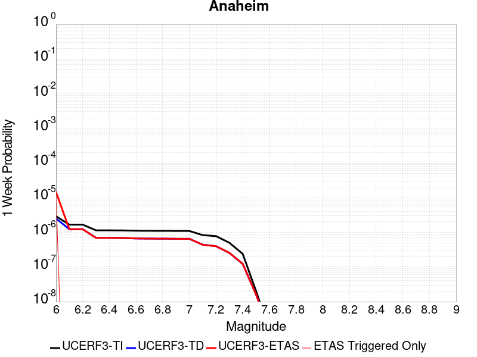 | 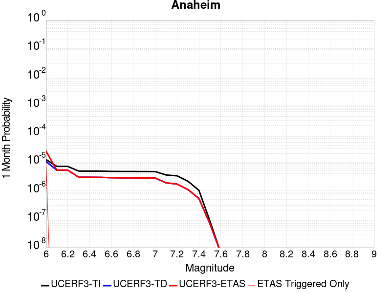 | 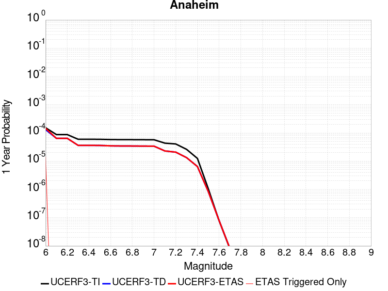 | 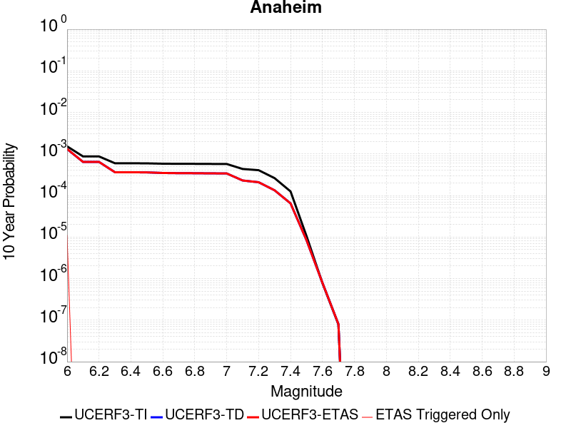 |

| Magnitude | 1 wk TI Prob | 1 wk TD Prob | 1 wk ETAS Prob | 1 wk ETAS/TD Gain | 1 wk ETAS Triggered Only | 1 mo TI Prob | 1 mo TD Prob | 1 mo ETAS Prob | 1 mo ETAS/TD Gain | 1 mo ETAS Triggered Only | 1 yr TI Prob | 1 yr TD Prob | 1 yr ETAS Prob | 1 yr ETAS/TD Gain | 1 yr ETAS Triggered Only | 10 yr TI Prob | 10 yr TD Prob | 10 yr ETAS Prob | 10 yr ETAS/TD Gain | 10 yr ETAS Triggered Only |
|-----|-----|-----|-----|-----|-----|-----|-----|-----|-----|-----|-----|-----|-----|-----|-----|-----|-----|-----|-----|-----|
| 6.0 | 2.9254998E-6 | 2.5122863E-6 | 1.3453537E-5 | 5.3550973 | 1.0941279E-5 | 1.25377965E-5 | 1.0766909E-5 | 2.170807E-5 | 2.0161839 | 1.0941279E-5 | 1.5263697E-4 | 1.3108159E-4 | 1.4202142E-4 | 1.0834583 | 1.0941279E-5 | 0.0015253217 | 0.0013102728 | 0.0013211998 | 1.0083394 | 1.0941279E-5 |
| 6.1 | 1.6729715E-6 | 1.2337348E-6 | 1.2337348E-6 | 1.0 | 0.0 | 7.1698582E-6 | 5.287426E-6 | 5.287426E-6 | 1.0 | 0.0 | 8.7289525E-5 | 6.437293E-5 | 6.437293E-5 | 1.0 | 0.0 | 8.7255245E-4 | 6.435838E-4 | 6.435838E-4 | 1.0 | 0.0 |
| 6.2 | 1.6729715E-6 | 1.2337348E-6 | 1.2337348E-6 | 1.0 | 0.0 | 7.1698582E-6 | 5.287426E-6 | 5.287426E-6 | 1.0 | 0.0 | 8.7289525E-5 | 6.437293E-5 | 6.437293E-5 | 1.0 | 0.0 | 8.7255245E-4 | 6.435838E-4 | 6.435838E-4 | 1.0 | 0.0 |
| 6.3 | 1.1444064E-6 | 6.9596666E-7 | 6.9596666E-7 | 1.0 | 0.0 | 4.9045893E-6 | 2.9827113E-6 | 2.9827113E-6 | 1.0 | 0.0 | 5.971174E-5 | 3.631396E-5 | 3.631396E-5 | 1.0 | 0.0 | 5.96957E-4 | 3.6308577E-4 | 3.6308577E-4 | 1.0 | 0.0 |
| 6.4 | 1.1444064E-6 | 6.9596666E-7 | 6.9596666E-7 | 1.0 | 0.0 | 4.9045893E-6 | 2.9827113E-6 | 2.9827113E-6 | 1.0 | 0.0 | 5.971174E-5 | 3.631396E-5 | 3.631396E-5 | 1.0 | 0.0 | 5.96957E-4 | 3.6308577E-4 | 3.6308577E-4 | 1.0 | 0.0 |
| 6.5 | 1.1385318E-6 | 6.9003505E-7 | 6.9003505E-7 | 1.0 | 0.0 | 4.879413E-6 | 2.95729E-6 | 2.95729E-6 | 1.0 | 0.0 | 5.9405233E-5 | 3.6004465E-5 | 3.6004465E-5 | 1.0 | 0.0 | 5.938936E-4 | 3.5999183E-4 | 3.5999183E-4 | 1.0 | 0.0 |
| 6.6 | 1.1165511E-6 | 6.678222E-7 | 6.678222E-7 | 1.0 | 0.0 | 4.78521E-6 | 2.862092E-6 | 2.862092E-6 | 1.0 | 0.0 | 5.8258374E-5 | 3.484547E-5 | 3.484547E-5 | 1.0 | 0.0 | 5.8243104E-4 | 3.484055E-4 | 3.484055E-4 | 1.0 | 0.0 |
| 6.7 | 1.1098243E-6 | 6.610416E-7 | 6.610416E-7 | 1.0 | 0.0 | 4.7563813E-6 | 2.8330326E-6 | 2.8330326E-6 | 1.0 | 0.0 | 5.7907404E-5 | 3.449168E-5 | 3.449168E-5 | 1.0 | 0.0 | 5.7892315E-4 | 3.4486872E-4 | 3.4486872E-4 | 1.0 | 0.0 |
| 6.8 | 1.1077587E-6 | 6.589619E-7 | 6.589619E-7 | 1.0 | 0.0 | 4.7475287E-6 | 2.8241195E-6 | 2.8241195E-6 | 1.0 | 0.0 | 5.779963E-5 | 3.438317E-5 | 3.438317E-5 | 1.0 | 0.0 | 5.77846E-4 | 3.4378393E-4 | 3.4378393E-4 | 1.0 | 0.0 |
| 6.9 | 1.1024468E-6 | 6.5361957E-7 | 6.5361957E-7 | 1.0 | 0.0 | 4.7247636E-6 | 2.8012241E-6 | 2.8012241E-6 | 1.0 | 0.0 | 5.752248E-5 | 3.4104425E-5 | 3.4104425E-5 | 1.0 | 0.0 | 5.750759E-4 | 3.4099736E-4 | 3.4099736E-4 | 1.0 | 0.0 |
| 7.0 | 1.0993066E-6 | 6.510303E-7 | 6.510303E-7 | 1.0 | 0.0 | 4.7113053E-6 | 2.7901272E-6 | 2.7901272E-6 | 1.0 | 0.0 | 5.7358633E-5 | 3.3969325E-5 | 3.3969325E-5 | 1.0 | 0.0 | 5.734383E-4 | 3.3964674E-4 | 3.3964674E-4 | 1.0 | 0.0 |
| 7.1 | 8.334877E-7 | 4.4049145E-7 | 4.4049145E-7 | 1.0 | 0.0 | 3.5720855E-6 | 1.8878193E-6 | 1.8878193E-6 | 1.0 | 0.0 | 4.348927E-5 | 2.298398E-5 | 2.298398E-5 | 1.0 | 0.0 | 4.3480762E-4 | 2.2981827E-4 | 2.2981827E-4 | 1.0 | 0.0 |
| 7.2 | 7.794411E-7 | 3.997645E-7 | 3.997645E-7 | 1.0 | 0.0 | 3.3404576E-6 | 1.7132754E-6 | 1.7132754E-6 | 1.0 | 0.0 | 4.0669314E-5 | 2.0858948E-5 | 2.0858948E-5 | 1.0 | 0.0 | 4.066187E-4 | 2.0857195E-4 | 2.0857195E-4 | 1.0 | 0.0 |
| 7.3 | 5.01704E-7 | 2.5573388E-7 | 2.5573388E-7 | 1.0 | 0.0 | 2.150158E-6 | 1.0960019E-6 | 1.0960019E-6 | 1.0 | 0.0 | 2.617786E-5 | 1.3343754E-5 | 1.3343754E-5 | 1.0 | 0.0 | 2.6174777E-4 | 1.3343077E-4 | 1.3343077E-4 | 1.0 | 0.0 |
| 7.4 | 2.4008182E-7 | 1.2367859E-7 | 1.2367859E-7 | 1.0 | 0.0 | 1.0289217E-6 | 5.30051E-7 | 5.30051E-7 | 1.0 | 0.0 | 1.252705E-5 | 6.4533597E-6 | 6.4533597E-6 | 1.0 | 0.0 | 1.2526344E-4 | 6.453248E-5 | 6.453248E-5 | 1.0 | 0.0 |
| 7.5 | 2.0263876E-8 | 1.6120866E-8 | 1.6120866E-8 | 1.0 | 0.0 | 8.684518E-8 | 6.908943E-8 | 6.908943E-8 | 1.0 | 0.0 | 1.0573395E-6 | 8.4116357E-7 | 8.4116357E-7 | 1.0 | 0.0 | 1.0573345E-5 | 8.411613E-6 | 8.411613E-6 | 1.0 | 0.0 |
| 7.6 | 1.4871431E-9 | 1.508418E-9 | 1.508418E-9 | 1.0 | 0.0 | 6.37347E-9 | 6.4646484E-9 | 6.4646484E-9 | 1.0 | 0.0 | 7.7596994E-8 | 7.870709E-8 | 7.870709E-8 | 1.0 | 0.0 | 7.759697E-7 | 7.8707063E-7 | 7.8707063E-7 | 1.0 | 0.0 |
| 7.7 | 1.5093293E-10 | 1.5333512E-10 | 1.5333512E-10 | 1.0 | 0.0 | 6.4685546E-10 | 6.571509E-10 | 6.571509E-10 | 1.0 | 0.0 | 7.875465E-9 | 8.0008125E-9 | 8.0008125E-9 | 1.0 | 0.0 | 7.8754645E-8 | 8.000812E-8 | 8.000812E-8 | 1.0 | 0.0 |

## Sierra Madre (San Fernando)
*[(top)](#table-of-contents)*

| 1 Week | 1 Month | 1 Year | 10 Year |
|-----|-----|-----|-----|
| 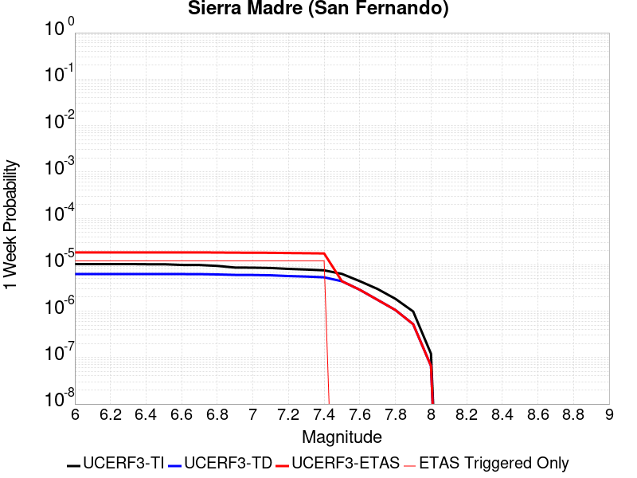 | 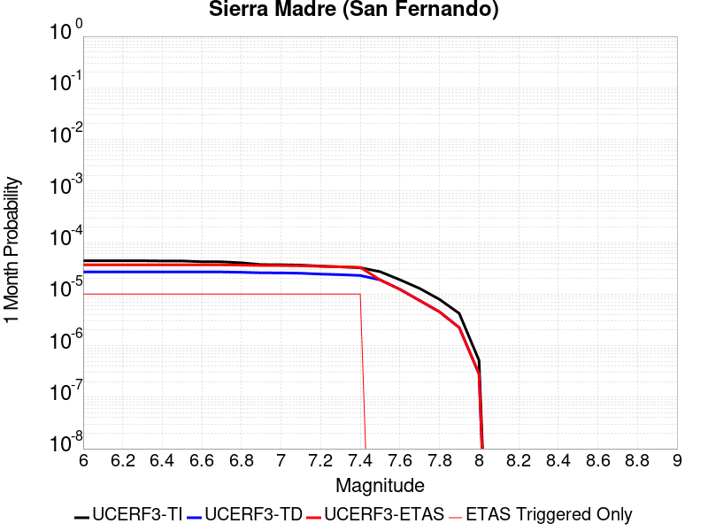 | 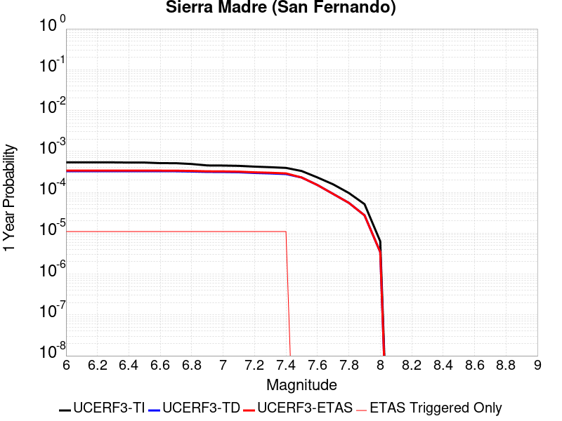 | 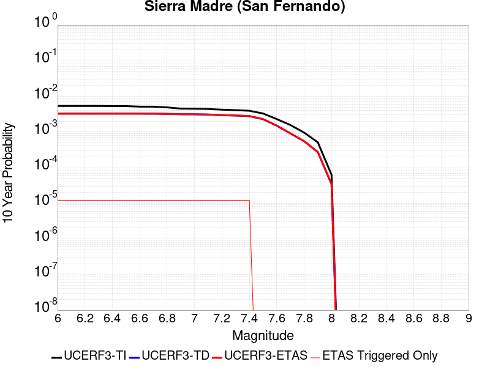 |

| Magnitude | 1 wk TI Prob | 1 wk TD Prob | 1 wk ETAS Prob | 1 wk ETAS/TD Gain | 1 wk ETAS Triggered Only | 1 mo TI Prob | 1 mo TD Prob | 1 mo ETAS Prob | 1 mo ETAS/TD Gain | 1 mo ETAS Triggered Only | 1 yr TI Prob | 1 yr TD Prob | 1 yr ETAS Prob | 1 yr ETAS/TD Gain | 1 yr ETAS Triggered Only | 10 yr TI Prob | 10 yr TD Prob | 10 yr ETAS Prob | 10 yr ETAS/TD Gain | 10 yr ETAS Triggered Only |
|-----|-----|-----|-----|-----|-----|-----|-----|-----|-----|-----|-----|-----|-----|-----|-----|-----|-----|-----|-----|-----|
| 6.0 | 1.0346413E-5 | 6.2872605E-6 | 1.722847E-5 | 2.7402189 | 1.0941279E-5 | 4.4341014E-5 | 2.694513E-5 | 3.7886115E-5 | 1.4060467 | 1.0941279E-5 | 5.3971814E-4 | 3.280087E-4 | 3.3894638E-4 | 1.0333457 | 1.0941279E-5 | 0.0053840918 | 0.0032753581 | 0.0032862637 | 1.0033295 | 1.0941279E-5 |
| 6.1 | 1.0346413E-5 | 6.2872605E-6 | 1.722847E-5 | 2.7402189 | 1.0941279E-5 | 4.4341014E-5 | 2.694513E-5 | 3.7886115E-5 | 1.4060467 | 1.0941279E-5 | 5.3971814E-4 | 3.280087E-4 | 3.3894638E-4 | 1.0333457 | 1.0941279E-5 | 0.0053840918 | 0.0032753581 | 0.0032862637 | 1.0033295 | 1.0941279E-5 |
| 6.2 | 1.0346413E-5 | 6.2872605E-6 | 1.722847E-5 | 2.7402189 | 1.0941279E-5 | 4.4341014E-5 | 2.694513E-5 | 3.7886115E-5 | 1.4060467 | 1.0941279E-5 | 5.3971814E-4 | 3.280087E-4 | 3.3894638E-4 | 1.0333457 | 1.0941279E-5 | 0.0053840918 | 0.0032753581 | 0.0032862637 | 1.0033295 | 1.0941279E-5 |
| 6.3 | 1.0346413E-5 | 6.2872605E-6 | 1.722847E-5 | 2.7402189 | 1.0941279E-5 | 4.4341014E-5 | 2.694513E-5 | 3.7886115E-5 | 1.4060467 | 1.0941279E-5 | 5.3971814E-4 | 3.280087E-4 | 3.3894638E-4 | 1.0333457 | 1.0941279E-5 | 0.0053840918 | 0.0032753581 | 0.0032862637 | 1.0033295 | 1.0941279E-5 |
| 6.4 | 1.0249558E-5 | 6.2872605E-6 | 1.722847E-5 | 2.7402189 | 1.0941279E-5 | 4.392594E-5 | 2.694513E-5 | 3.7886115E-5 | 1.4060467 | 1.0941279E-5 | 5.3466705E-4 | 3.280087E-4 | 3.3894638E-4 | 1.0333457 | 1.0941279E-5 | 0.0053338245 | 0.0032753581 | 0.0032862637 | 1.0033295 | 1.0941279E-5 |
| 6.5 | 1.0249558E-5 | 6.2872605E-6 | 1.722847E-5 | 2.7402189 | 1.0941279E-5 | 4.392594E-5 | 2.694513E-5 | 3.7886115E-5 | 1.4060467 | 1.0941279E-5 | 5.3466705E-4 | 3.280087E-4 | 3.3894638E-4 | 1.0333457 | 1.0941279E-5 | 0.0053338245 | 0.0032753581 | 0.0032862637 | 1.0033295 | 1.0941279E-5 |
| 6.6 | 9.9035515E-6 | 6.2872605E-6 | 1.722847E-5 | 2.7402189 | 1.0941279E-5 | 4.2443102E-5 | 2.694513E-5 | 3.7886115E-5 | 1.4060467 | 1.0941279E-5 | 5.166222E-4 | 3.280087E-4 | 3.3894638E-4 | 1.0333457 | 1.0941279E-5 | 0.0051542283 | 0.0032753581 | 0.0032862637 | 1.0033295 | 1.0941279E-5 |
| 6.7 | 9.87217E-6 | 6.2746817E-6 | 1.721589E-5 | 2.7437077 | 1.0941279E-5 | 4.2308613E-5 | 2.689122E-5 | 3.7832204E-5 | 1.4068608 | 1.0941279E-5 | 5.149856E-4 | 3.2735255E-4 | 3.3829024E-4 | 1.0334126 | 1.0941279E-5 | 0.005137938 | 0.0032688158 | 0.0032797214 | 1.0033362 | 1.0941279E-5 |
| 6.8 | 9.4359175E-6 | 6.1786586E-6 | 1.711987E-5 | 2.7708068 | 1.0941279E-5 | 4.043902E-5 | 2.6479704E-5 | 3.742069E-5 | 1.4131839 | 1.0941279E-5 | 4.9223384E-4 | 3.2234378E-4 | 3.3328155E-4 | 1.033932 | 1.0941279E-5 | 0.0049114493 | 0.0032188739 | 0.00322978 | 1.0033882 | 1.0941279E-5 |
| 6.9 | 8.700447E-6 | 6.039922E-6 | 1.6981134E-5 | 2.8114824 | 1.0941279E-5 | 3.72871E-5 | 2.5885129E-5 | 3.6826124E-5 | 1.4226749 | 1.0941279E-5 | 4.5387587E-4 | 3.1510694E-4 | 3.2604477E-4 | 1.0347115 | 1.0941279E-5 | 0.0045295 | 0.003146711 | 0.0031576178 | 1.0034661 | 1.0941279E-5 |
| 7.0 | 8.648878E-6 | 6.0148373E-6 | 1.695605E-5 | 2.8190372 | 1.0941279E-5 | 3.7066096E-5 | 2.5777625E-5 | 3.6718622E-5 | 1.4244378 | 1.0941279E-5 | 4.5118626E-4 | 3.1379846E-4 | 3.2473632E-4 | 1.0348563 | 1.0941279E-5 | 0.004502713 | 0.003133663 | 0.0031445702 | 1.0034806 | 1.0941279E-5 |
| 7.1 | 8.505786E-6 | 5.9244676E-6 | 1.686568E-5 | 2.846784 | 1.0941279E-5 | 3.645286E-5 | 2.5390334E-5 | 3.6331334E-5 | 1.430912 | 1.0941279E-5 | 4.437232E-4 | 3.0908454E-4 | 3.2002246E-4 | 1.035388 | 1.0941279E-5 | 0.0044283825 | 0.0030866556 | 0.0030975633 | 1.0035337 | 1.0941279E-5 |
| 7.2 | 8.139752E-6 | 5.6987624E-6 | 1.6639979E-5 | 2.9199283 | 1.0941279E-5 | 3.4884186E-5 | 2.4423045E-5 | 3.5364057E-5 | 1.447979 | 1.0941279E-5 | 4.246322E-4 | 2.9731105E-4 | 3.082491E-4 | 1.0367899 | 1.0941279E-5 | 0.004238217 | 0.0029692391 | 0.0029801477 | 1.0036739 | 1.0941279E-5 |
| 7.3 | 7.8816E-6 | 5.552077E-6 | 1.6493294E-5 | 2.970653 | 1.0941279E-5 | 3.3777847E-5 | 2.3794404E-5 | 3.473542E-5 | 1.4598148 | 1.0941279E-5 | 4.111677E-4 | 2.896594E-4 | 3.0059752E-4 | 1.0377619 | 1.0941279E-5 | 0.004104078 | 0.0028929242 | 0.0029038338 | 1.0037712 | 1.0941279E-5 |
| 7.4 | 7.5810603E-6 | 5.3563126E-6 | 1.6297532E-5 | 3.0426776 | 1.0941279E-5 | 3.2489854E-5 | 2.2955428E-5 | 3.3896456E-5 | 1.4766204 | 1.0941279E-5 | 3.9549218E-4 | 2.7944756E-4 | 2.9038577E-4 | 1.0391423 | 1.0941279E-5 | 0.0039478904 | 0.0027910667 | 0.0028019773 | 1.0039091 | 1.0941279E-5 |
| 7.5 | 6.349153E-6 | 4.407576E-6 | 4.407576E-6 | 1.0 | 0.0 | 2.7210372E-5 | 1.888948E-5 | 1.888948E-5 | 1.0 | 0.0 | 3.312359E-4 | 2.2995596E-4 | 2.2995596E-4 | 1.0 | 0.0 | 0.0033074263 | 0.0022972622 | 0.0022972622 | 1.0 | 0.0 |
| 7.6 | 4.430576E-6 | 2.8905868E-6 | 2.8905868E-6 | 1.0 | 0.0 | 1.8988047E-5 | 1.2388171E-5 | 1.2388171E-5 | 1.0 | 0.0 | 2.3115493E-4 | 1.5081577E-4 | 1.5081577E-4 | 1.0 | 0.0 | 0.0023091463 | 0.0015071568 | 0.0015071568 | 1.0 | 0.0 |
| 7.7 | 3.005066E-6 | 1.7510115E-6 | 1.7510115E-6 | 1.0 | 0.0 | 1.2878791E-5 | 7.504313E-6 | 7.504313E-6 | 1.0 | 0.0 | 1.56788E-4 | 9.1361195E-5 | 9.1361195E-5 | 1.0 | 0.0 | 0.0015667742 | 9.132375E-4 | 9.132375E-4 | 1.0 | 0.0 |
| 7.8 | 1.8459098E-6 | 1.0582091E-6 | 1.0582091E-6 | 1.0 | 0.0 | 7.911018E-6 | 4.535174E-6 | 4.535174E-6 | 1.0 | 0.0 | 9.631238E-5 | 5.5214347E-5 | 5.5214347E-5 | 1.0 | 0.0 | 9.627065E-4 | 5.5200676E-4 | 5.5200676E-4 | 1.0 | 0.0 |
| 7.9 | 9.839262E-7 | 5.23421E-7 | 5.23421E-7 | 1.0 | 0.0 | 4.2168194E-6 | 2.2432312E-6 | 2.2432312E-6 | 1.0 | 0.0 | 5.1338568E-5 | 2.7310998E-5 | 2.7310998E-5 | 1.0 | 0.0 | 5.132671E-4 | 2.730767E-4 | 2.730767E-4 | 1.0 | 0.0 |
| 8.0 | 1.210983E-7 | 6.613821E-8 | 6.613821E-8 | 1.0 | 0.0 | 5.1899264E-7 | 2.8344945E-7 | 2.8344945E-7 | 1.0 | 0.0 | 6.3187167E-6 | 3.4509917E-6 | 3.4509917E-6 | 1.0 | 0.0 | 6.318537E-5 | 3.45094E-5 | 3.45094E-5 | 1.0 | 0.0 |

## Pine Mtn
*[(top)](#table-of-contents)*

| 1 Week | 1 Month | 1 Year | 10 Year |
|-----|-----|-----|-----|
|  |  |  |  |

| Magnitude | 1 wk TI Prob | 1 wk TD Prob | 1 wk ETAS Prob | 1 wk ETAS/TD Gain | 1 wk ETAS Triggered Only | 1 mo TI Prob | 1 mo TD Prob | 1 mo ETAS Prob | 1 mo ETAS/TD Gain | 1 mo ETAS Triggered Only | 1 yr TI Prob | 1 yr TD Prob | 1 yr ETAS Prob | 1 yr ETAS/TD Gain | 1 yr ETAS Triggered Only | 10 yr TI Prob | 10 yr TD Prob | 10 yr ETAS Prob | 10 yr ETAS/TD Gain | 10 yr ETAS Triggered Only |
|-----|-----|-----|-----|-----|-----|-----|-----|-----|-----|-----|-----|-----|-----|-----|-----|-----|-----|-----|-----|-----|
| 6.0 | 6.894797E-6 | 7.225461E-6 | 1.816666E-5 | 2.5142562 | 1.0941279E-5 | 2.9548795E-5 | 3.096591E-5 | 4.1906853E-5 | 1.353322 | 1.0941279E-5 | 3.596972E-4 | 3.7694772E-4 | 3.8788488E-4 | 1.0290151 | 1.0941279E-5 | 0.0035911554 | 0.003763381 | 0.0037742811 | 1.0028963 | 1.0941279E-5 |
| 6.1 | 6.894797E-6 | 7.225461E-6 | 1.816666E-5 | 2.5142562 | 1.0941279E-5 | 2.9548795E-5 | 3.096591E-5 | 4.1906853E-5 | 1.353322 | 1.0941279E-5 | 3.596972E-4 | 3.7694772E-4 | 3.8788488E-4 | 1.0290151 | 1.0941279E-5 | 0.0035911554 | 0.003763381 | 0.0037742811 | 1.0028963 | 1.0941279E-5 |
| 6.2 | 6.894797E-6 | 7.225461E-6 | 1.816666E-5 | 2.5142562 | 1.0941279E-5 | 2.9548795E-5 | 3.096591E-5 | 4.1906853E-5 | 1.353322 | 1.0941279E-5 | 3.596972E-4 | 3.7694772E-4 | 3.8788488E-4 | 1.0290151 | 1.0941279E-5 | 0.0035911554 | 0.003763381 | 0.0037742811 | 1.0028963 | 1.0941279E-5 |
| 6.3 | 6.894797E-6 | 7.225461E-6 | 1.816666E-5 | 2.5142562 | 1.0941279E-5 | 2.9548795E-5 | 3.096591E-5 | 4.1906853E-5 | 1.353322 | 1.0941279E-5 | 3.596972E-4 | 3.7694772E-4 | 3.8788488E-4 | 1.0290151 | 1.0941279E-5 | 0.0035911554 | 0.003763381 | 0.0037742811 | 1.0028963 | 1.0941279E-5 |
| 6.4 | 6.894797E-6 | 7.225461E-6 | 1.816666E-5 | 2.5142562 | 1.0941279E-5 | 2.9548795E-5 | 3.096591E-5 | 4.1906853E-5 | 1.353322 | 1.0941279E-5 | 3.596972E-4 | 3.7694772E-4 | 3.8788488E-4 | 1.0290151 | 1.0941279E-5 | 0.0035911554 | 0.003763381 | 0.0037742811 | 1.0028963 | 1.0941279E-5 |
| 6.5 | 6.894797E-6 | 7.225461E-6 | 1.816666E-5 | 2.5142562 | 1.0941279E-5 | 2.9548795E-5 | 3.096591E-5 | 4.1906853E-5 | 1.353322 | 1.0941279E-5 | 3.596972E-4 | 3.7694772E-4 | 3.8788488E-4 | 1.0290151 | 1.0941279E-5 | 0.0035911554 | 0.003763381 | 0.0037742811 | 1.0028963 | 1.0941279E-5 |
| 6.6 | 6.894797E-6 | 7.225461E-6 | 1.816666E-5 | 2.5142562 | 1.0941279E-5 | 2.9548795E-5 | 3.096591E-5 | 4.1906853E-5 | 1.353322 | 1.0941279E-5 | 3.596972E-4 | 3.7694772E-4 | 3.8788488E-4 | 1.0290151 | 1.0941279E-5 | 0.0035911554 | 0.003763381 | 0.0037742811 | 1.0028963 | 1.0941279E-5 |
| 6.7 | 6.0867933E-6 | 6.3971133E-6 | 1.7338321E-5 | 2.7103353 | 1.0941279E-5 | 2.6085996E-5 | 2.7415923E-5 | 3.8356902E-5 | 1.3990738 | 1.0941279E-5 | 3.1755073E-4 | 3.3373994E-4 | 3.4467757E-4 | 1.0327729 | 1.0941279E-5 | 0.0031709734 | 0.0033326065 | 0.0033435111 | 1.0032722 | 1.0941279E-5 |
| 6.8 | 5.6530425E-6 | 5.9505956E-6 | 1.6891809E-5 | 2.8386753 | 1.0941279E-5 | 2.42271E-5 | 2.5502315E-5 | 3.6443314E-5 | 1.4290198 | 1.0941279E-5 | 2.94925E-4 | 3.104485E-4 | 3.2138638E-4 | 1.0352325 | 1.0941279E-5 | 0.002945339 | 0.0031003528 | 0.0031112602 | 1.0035181 | 1.0941279E-5 |
| 6.9 | 4.6015225E-6 | 4.863834E-6 | 1.5805059E-5 | 3.2495062 | 1.0941279E-5 | 1.9720663E-5 | 2.0844845E-5 | 3.1785894E-5 | 1.5248804 | 1.0941279E-5 | 2.4007261E-4 | 2.5375787E-4 | 2.6469637E-4 | 1.0431061 | 1.0941279E-5 | 0.0023981342 | 0.0025348254 | 0.002545739 | 1.0043055 | 1.0941279E-5 |
| 7.0 | 4.4875965E-6 | 4.747473E-6 | 1.56887E-5 | 3.3046422 | 1.0941279E-5 | 1.9232413E-5 | 2.0346162E-5 | 3.1287218E-5 | 1.5377454 | 1.0941279E-5 | 2.3412947E-4 | 2.4768783E-4 | 2.586264E-4 | 1.0441628 | 1.0941279E-5 | 0.0023388295 | 0.0024742614 | 0.0024851756 | 1.0044111 | 1.0941279E-5 |
| 7.1 | 3.203907E-6 | 3.4294096E-6 | 1.437065E-5 | 4.1904154 | 1.0941279E-5 | 1.3730958E-5 | 1.4697391E-5 | 2.5638508E-5 | 1.7444259 | 1.0941279E-5 | 1.6716159E-4 | 1.789267E-4 | 1.8986603E-4 | 1.0611385 | 1.0941279E-5 | 0.0016703589 | 0.0017878925 | 0.0017988143 | 1.0061088 | 1.0941279E-5 |
| 7.2 | 2.2060601E-6 | 2.3784817E-6 | 1.3319734E-5 | 5.6000996 | 1.0941279E-5 | 9.4545085E-6 | 1.0193455E-5 | 2.1134621E-5 | 2.073352 | 1.0941279E-5 | 1.15102564E-4 | 1.240987E-4 | 1.3503863E-4 | 1.088155 | 1.0941279E-5 | 0.0011504296 | 0.0012403389 | 0.0012512666 | 1.0088103 | 1.0941279E-5 |
| 7.3 | 1.3765207E-6 | 1.5216481E-6 | 1.246291E-5 | 8.190402 | 1.0941279E-5 | 5.899361E-6 | 6.521333E-6 | 1.746254E-5 | 2.677756 | 1.0941279E-5 | 7.182235E-5 | 7.939443E-5 | 9.033484E-5 | 1.1377982 | 1.0941279E-5 | 7.1799144E-4 | 7.936697E-4 | 8.0460234E-4 | 1.0137748 | 1.0941279E-5 |
| 7.4 | 1.1245983E-6 | 1.2587075E-6 | 1.2587075E-6 | 1.0 | 0.0 | 4.819698E-6 | 5.39445E-6 | 5.39445E-6 | 1.0 | 0.0 | 5.8678244E-5 | 6.567554E-5 | 6.567554E-5 | 1.0 | 0.0 | 5.866275E-4 | 6.5656955E-4 | 6.5656955E-4 | 1.0 | 0.0 |
| 7.5 | 8.031682E-7 | 9.276951E-7 | 9.276951E-7 | 1.0 | 0.0 | 3.4421448E-6 | 3.9758306E-6 | 3.9758306E-6 | 1.0 | 0.0 | 4.1907308E-5 | 4.840473E-5 | 4.840473E-5 | 1.0 | 0.0 | 4.1899405E-4 | 4.8394862E-4 | 4.8394862E-4 | 1.0 | 0.0 |
| 7.6 | 4.8953444E-7 | 6.003009E-7 | 6.003009E-7 | 1.0 | 0.0 | 2.098003E-6 | 2.5727159E-6 | 2.5727159E-6 | 1.0 | 0.0 | 2.5542888E-5 | 3.1322415E-5 | 3.1322415E-5 | 1.0 | 0.0 | 2.5539953E-4 | 3.1318486E-4 | 3.1318486E-4 | 1.0 | 0.0 |
| 7.7 | 6.634529E-8 | 6.788826E-8 | 6.788826E-8 | 1.0 | 0.0 | 2.843369E-7 | 2.9094966E-7 | 2.9094966E-7 | 1.0 | 0.0 | 3.4617963E-6 | 3.5423066E-6 | 3.5423066E-6 | 1.0 | 0.0 | 3.4617424E-5 | 3.542255E-5 | 3.542255E-5 | 1.0 | 0.0 |
| 7.8 | 9.235578E-9 | 9.488566E-9 | 9.488566E-9 | 1.0 | 0.0 | 3.9581046E-8 | 4.0665284E-8 | 4.0665284E-8 | 1.0 | 0.0 | 4.818991E-7 | 4.950997E-7 | 4.950997E-7 | 1.0 | 0.0 | 4.8189804E-6 | 4.950988E-6 | 4.950988E-6 | 1.0 | 0.0 |

## Big Pine (West)
*[(top)](#table-of-contents)*

| 1 Week | 1 Month | 1 Year | 10 Year |
|-----|-----|-----|-----|
|  |  |  |  |

| Magnitude | 1 wk TI Prob | 1 wk TD Prob | 1 wk ETAS Prob | 1 wk ETAS/TD Gain | 1 wk ETAS Triggered Only | 1 mo TI Prob | 1 mo TD Prob | 1 mo ETAS Prob | 1 mo ETAS/TD Gain | 1 mo ETAS Triggered Only | 1 yr TI Prob | 1 yr TD Prob | 1 yr ETAS Prob | 1 yr ETAS/TD Gain | 1 yr ETAS Triggered Only | 10 yr TI Prob | 10 yr TD Prob | 10 yr ETAS Prob | 10 yr ETAS/TD Gain | 10 yr ETAS Triggered Only |
|-----|-----|-----|-----|-----|-----|-----|-----|-----|-----|-----|-----|-----|-----|-----|-----|-----|-----|-----|-----|-----|
| 6.0 | 6.8306974E-7 | 6.8818304E-7 | 1.1629454E-5 | 16.89878 | 1.0941279E-5 | 2.9274386E-6 | 2.949353E-6 | 1.3890599E-5 | 4.7097106 | 1.0941279E-5 | 3.564098E-5 | 3.5907877E-5 | 4.6848763E-5 | 1.3046932 | 1.0941279E-5 | 3.5635266E-4 | 3.5903015E-4 | 3.6996749E-4 | 1.0304636 | 1.0941279E-5 |
| 6.1 | 6.8306974E-7 | 6.8818304E-7 | 1.1629454E-5 | 16.89878 | 1.0941279E-5 | 2.9274386E-6 | 2.949353E-6 | 1.3890599E-5 | 4.7097106 | 1.0941279E-5 | 3.564098E-5 | 3.5907877E-5 | 4.6848763E-5 | 1.3046932 | 1.0941279E-5 | 3.5635266E-4 | 3.5903015E-4 | 3.6996749E-4 | 1.0304636 | 1.0941279E-5 |
| 6.2 | 6.8306974E-7 | 6.8818304E-7 | 1.1629454E-5 | 16.89878 | 1.0941279E-5 | 2.9274386E-6 | 2.949353E-6 | 1.3890599E-5 | 4.7097106 | 1.0941279E-5 | 3.564098E-5 | 3.5907877E-5 | 4.6848763E-5 | 1.3046932 | 1.0941279E-5 | 3.5635266E-4 | 3.5903015E-4 | 3.6996749E-4 | 1.0304636 | 1.0941279E-5 |
| 6.3 | 4.227652E-7 | 4.2665604E-7 | 1.136793E-5 | 26.644249 | 1.0941279E-5 | 1.8118495E-6 | 1.8285248E-6 | 1.2769783E-5 | 6.9836535 | 1.0941279E-5 | 2.2059045E-5 | 2.226208E-5 | 3.3203116E-5 | 1.4914651 | 1.0941279E-5 | 2.2056856E-4 | 2.2260031E-4 | 2.3353916E-4 | 1.0491412 | 1.0941279E-5 |
| 6.4 | 4.227652E-7 | 4.2665604E-7 | 1.136793E-5 | 26.644249 | 1.0941279E-5 | 1.8118495E-6 | 1.8285248E-6 | 1.2769783E-5 | 6.9836535 | 1.0941279E-5 | 2.2059045E-5 | 2.226208E-5 | 3.3203116E-5 | 1.4914651 | 1.0941279E-5 | 2.2056856E-4 | 2.2260031E-4 | 2.3353916E-4 | 1.0491412 | 1.0941279E-5 |
| 6.5 | 3.1538403E-7 | 3.1884528E-7 | 1.126012E-5 | 35.31531 | 1.0941279E-5 | 1.3516451E-6 | 1.3664791E-6 | 1.23077425E-5 | 9.006902 | 1.0941279E-5 | 1.6456155E-5 | 1.6636759E-5 | 2.7577855E-5 | 1.6576458 | 1.0941279E-5 | 1.6454936E-4 | 1.6635554E-4 | 1.7729499E-4 | 1.0657595 | 1.0941279E-5 |
| 6.6 | 3.1538403E-7 | 3.1884528E-7 | 1.126012E-5 | 35.31531 | 1.0941279E-5 | 1.3516451E-6 | 1.3664791E-6 | 1.23077425E-5 | 9.006902 | 1.0941279E-5 | 1.6456155E-5 | 1.6636759E-5 | 2.7577855E-5 | 1.6576458 | 1.0941279E-5 | 1.6454936E-4 | 1.6635554E-4 | 1.7729499E-4 | 1.0657595 | 1.0941279E-5 |
| 6.7 | 3.1538403E-7 | 3.1884528E-7 | 1.126012E-5 | 35.31531 | 1.0941279E-5 | 1.3516451E-6 | 1.3664791E-6 | 1.23077425E-5 | 9.006902 | 1.0941279E-5 | 1.6456155E-5 | 1.6636759E-5 | 2.7577855E-5 | 1.6576458 | 1.0941279E-5 | 1.6454936E-4 | 1.6635554E-4 | 1.7729499E-4 | 1.0657595 | 1.0941279E-5 |
| 6.8 | 3.1538403E-7 | 3.1884528E-7 | 1.126012E-5 | 35.31531 | 1.0941279E-5 | 1.3516451E-6 | 1.3664791E-6 | 1.23077425E-5 | 9.006902 | 1.0941279E-5 | 1.6456155E-5 | 1.6636759E-5 | 2.7577855E-5 | 1.6576458 | 1.0941279E-5 | 1.6454936E-4 | 1.6635554E-4 | 1.7729499E-4 | 1.0657595 | 1.0941279E-5 |
| 6.9 | 3.0402092E-7 | 3.0739798E-7 | 1.1248673E-5 | 36.59319 | 1.0941279E-5 | 1.3029462E-6 | 1.3174192E-6 | 1.22586835E-5 | 9.305074 | 1.0941279E-5 | 1.5863254E-5 | 1.6039465E-5 | 2.6980568E-5 | 1.6821364 | 1.0941279E-5 | 1.5862122E-4 | 1.6038347E-4 | 1.7132299E-4 | 1.0682086 | 1.0941279E-5 |
| 7.0 | 2.3673063E-7 | 2.3944315E-7 | 1.11807185E-5 | 46.69467 | 1.0941279E-5 | 1.0145594E-6 | 1.0261845E-6 | 1.1967451E-5 | 11.662086 | 1.0941279E-5 | 1.235219E-5 | 1.2493728E-5 | 2.343487E-5 | 1.8757308 | 1.0941279E-5 | 1.2351504E-4 | 1.2493054E-4 | 1.3587045E-4 | 1.0875679 | 1.0941279E-5 |
| 7.1 | 1.632138E-7 | 1.6514511E-7 | 1.1106422E-5 | 67.252495 | 1.0941279E-5 | 6.9948754E-7 | 7.0776457E-7 | 1.1649035E-5 | 16.458912 | 1.0941279E-5 | 8.516227E-6 | 8.617002E-6 | 1.9558185E-5 | 2.2697206 | 1.0941279E-5 | 8.5159016E-5 | 8.616685E-5 | 9.7107186E-5 | 1.1269668 | 1.0941279E-5 |
| 7.2 | 1.1523723E-7 | 1.1657165E-7 | 1.10578485E-5 | 94.85882 | 1.0941279E-5 | 4.9387376E-7 | 4.9959266E-7 | 1.1440866E-5 | 22.900387 | 1.0941279E-5 | 6.0128964E-6 | 6.082525E-6 | 1.7023736E-5 | 2.7987943 | 1.0941279E-5 | 6.0127335E-5 | 6.0823695E-5 | 7.1764305E-5 | 1.1798742 | 1.0941279E-5 |
| 7.3 | 7.777805E-8 | 7.862446E-8 | 1.1019902E-5 | 140.15869 | 1.0941279E-5 | 3.3333444E-7 | 3.3696193E-7 | 1.1278236E-5 | 33.47036 | 1.0941279E-5 | 4.0583395E-6 | 4.102504E-6 | 1.5043737E-5 | 3.6669645 | 1.0941279E-5 | 4.0582654E-5 | 4.102434E-5 | 5.1965173E-5 | 1.2666912 | 1.0941279E-5 |
| 7.4 | 4.609946E-8 | 4.6522135E-8 | 4.6522135E-8 | 1.0 | 0.0 | 1.975691E-7 | 1.9938055E-7 | 1.9938055E-7 | 1.0 | 0.0 | 2.4054011E-6 | 2.4274557E-6 | 2.4274557E-6 | 1.0 | 0.0 | 2.405375E-5 | 2.427431E-5 | 2.427431E-5 | 1.0 | 0.0 |
| 7.5 | 2.3439137E-8 | 2.3608283E-8 | 2.3608283E-8 | 1.0 | 0.0 | 1.00453434E-7 | 1.0117836E-7 | 1.0117836E-7 | 1.0 | 0.0 | 1.2230199E-6 | 1.2318458E-6 | 1.2318458E-6 | 1.0 | 0.0 | 1.2230132E-5 | 1.2318393E-5 | 1.2318393E-5 | 1.0 | 0.0 |
| 7.6 | 1.6699769E-8 | 1.6817072E-8 | 1.6817072E-8 | 1.0 | 0.0 | 7.157044E-8 | 7.207316E-8 | 7.207316E-8 | 1.0 | 0.0 | 8.713697E-7 | 8.7749044E-7 | 8.7749044E-7 | 1.0 | 0.0 | 8.713663E-6 | 8.774871E-6 | 8.774871E-6 | 1.0 | 0.0 |
| 7.7 | 7.4061512E-9 | 7.4541635E-9 | 7.4541635E-9 | 1.0 | 0.0 | 3.1740647E-8 | 3.1946417E-8 | 3.1946417E-8 | 1.0 | 0.0 | 3.864423E-7 | 3.8894754E-7 | 3.8894754E-7 | 1.0 | 0.0 | 3.8644166E-6 | 3.8894696E-6 | 3.8894696E-6 | 1.0 | 0.0 |
| 7.8 | 1.2189427E-9 | 1.2270763E-9 | 1.2270763E-9 | 1.0 | 0.0 | 5.2240403E-9 | 5.258898E-9 | 5.258898E-9 | 1.0 | 0.0 | 6.3602684E-8 | 6.4027084E-8 | 6.4027084E-8 | 1.0 | 0.0 | 6.360267E-7 | 6.4027074E-7 | 6.4027074E-7 | 1.0 | 0.0 |

## San Luis Range 2011 CFM
*[(top)](#table-of-contents)*

| 1 Week | 1 Month | 1 Year | 10 Year |
|-----|-----|-----|-----|
| 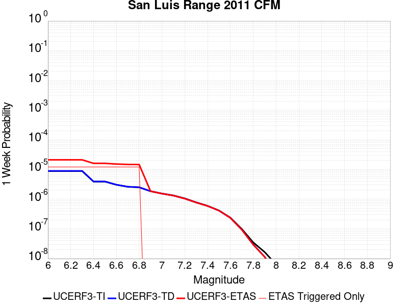 | 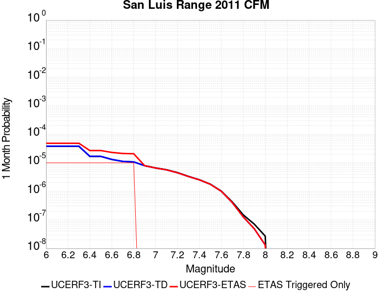 | 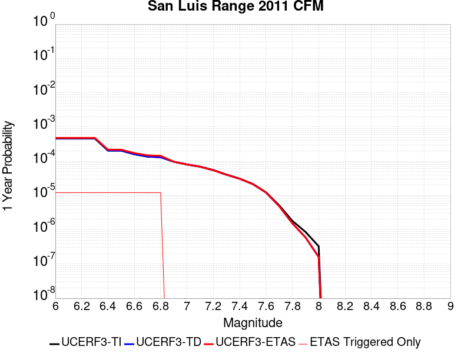 | 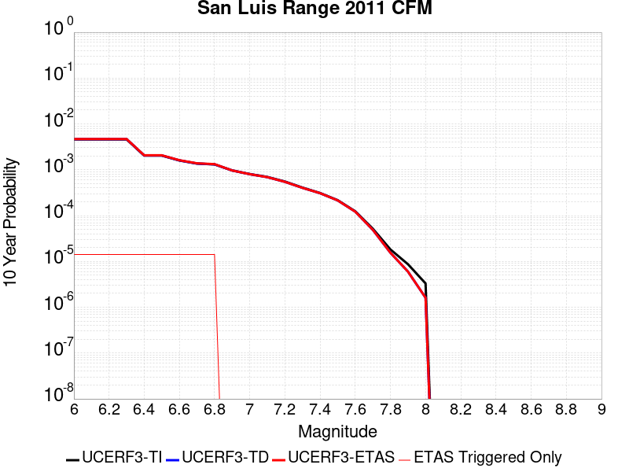 |

| Magnitude | 1 wk TI Prob | 1 wk TD Prob | 1 wk ETAS Prob | 1 wk ETAS/TD Gain | 1 wk ETAS Triggered Only | 1 mo TI Prob | 1 mo TD Prob | 1 mo ETAS Prob | 1 mo ETAS/TD Gain | 1 mo ETAS Triggered Only | 1 yr TI Prob | 1 yr TD Prob | 1 yr ETAS Prob | 1 yr ETAS/TD Gain | 1 yr ETAS Triggered Only | 10 yr TI Prob | 10 yr TD Prob | 10 yr ETAS Prob | 10 yr ETAS/TD Gain | 10 yr ETAS Triggered Only |
|-----|-----|-----|-----|-----|-----|-----|-----|-----|-----|-----|-----|-----|-----|-----|-----|-----|-----|-----|-----|-----|
| 6.0 | 8.8368415E-6 | 8.965454E-6 | 1.9906634E-5 | 2.220371 | 1.0941279E-5 | 3.787163E-5 | 3.842285E-5 | 4.936371E-5 | 1.2847487 | 1.0941279E-5 | 4.609895E-4 | 4.677057E-4 | 4.7864186E-4 | 1.0233825 | 1.0941279E-5 | 0.0046003438 | 0.0046679964 | 0.0046788864 | 1.0023329 | 1.0941279E-5 |
| 6.1 | 8.8368415E-6 | 8.965454E-6 | 1.9906634E-5 | 2.220371 | 1.0941279E-5 | 3.787163E-5 | 3.842285E-5 | 4.936371E-5 | 1.2847487 | 1.0941279E-5 | 4.609895E-4 | 4.677057E-4 | 4.7864186E-4 | 1.0233825 | 1.0941279E-5 | 0.0046003438 | 0.0046679964 | 0.0046788864 | 1.0023329 | 1.0941279E-5 |
| 6.2 | 8.8368415E-6 | 8.965454E-6 | 1.9906634E-5 | 2.220371 | 1.0941279E-5 | 3.787163E-5 | 3.842285E-5 | 4.936371E-5 | 1.2847487 | 1.0941279E-5 | 4.609895E-4 | 4.677057E-4 | 4.7864186E-4 | 1.0233825 | 1.0941279E-5 | 0.0046003438 | 0.0046679964 | 0.0046788864 | 1.0023329 | 1.0941279E-5 |
| 6.3 | 8.8368415E-6 | 8.965454E-6 | 1.9906634E-5 | 2.220371 | 1.0941279E-5 | 3.787163E-5 | 3.842285E-5 | 4.936371E-5 | 1.2847487 | 1.0941279E-5 | 4.609895E-4 | 4.677057E-4 | 4.7864186E-4 | 1.0233825 | 1.0941279E-5 | 0.0046003438 | 0.0046679964 | 0.0046788864 | 1.0023329 | 1.0941279E-5 |
| 6.4 | 3.9094193E-6 | 3.9412025E-6 | 1.4882437E-5 | 3.776116 | 1.0941279E-5 | 1.6754546E-5 | 1.689076E-5 | 2.7831855E-5 | 1.6477561 | 1.0941279E-5 | 2.039675E-4 | 2.056259E-4 | 2.1656492E-4 | 1.0531987 | 1.0941279E-5 | 0.0020378039 | 0.0020543851 | 0.002065304 | 1.0053148 | 1.0941279E-5 |
| 6.5 | 3.9094193E-6 | 3.9412025E-6 | 1.4882437E-5 | 3.776116 | 1.0941279E-5 | 1.6754546E-5 | 1.689076E-5 | 2.7831855E-5 | 1.6477561 | 1.0941279E-5 | 2.039675E-4 | 2.056259E-4 | 2.1656492E-4 | 1.0531987 | 1.0941279E-5 | 0.0020378039 | 0.0020543851 | 0.002065304 | 1.0053148 | 1.0941279E-5 |
| 6.6 | 3.0587726E-6 | 3.0753883E-6 | 1.4016633E-5 | 4.557679 | 1.0941279E-5 | 1.3108959E-5 | 1.318017E-5 | 2.4121304E-5 | 1.8301209 | 1.0941279E-5 | 1.595899E-4 | 1.6045687E-4 | 1.7139639E-4 | 1.0681773 | 1.0941279E-5 | 0.0015947534 | 0.0016034221 | 0.0016143458 | 1.0068128 | 1.0941279E-5 |
| 6.7 | 2.6160574E-6 | 2.6251273E-6 | 1.3566377E-5 | 5.167893 | 1.0941279E-5 | 1.1211626E-5 | 1.1250498E-5 | 2.2191653E-5 | 1.9725041 | 1.0941279E-5 | 1.3649299E-4 | 1.3696625E-4 | 1.4790603E-4 | 1.0798721 | 1.0941279E-5 | 0.0013640919 | 0.0013688246 | 0.0013797509 | 1.0079823 | 1.0941279E-5 |
| 6.8 | 2.5110312E-6 | 2.51814E-6 | 1.3459391E-5 | 5.344973 | 1.0941279E-5 | 1.0761518E-5 | 1.0791985E-5 | 2.1733145E-5 | 2.0138228 | 1.0941279E-5 | 1.310136E-4 | 1.3138456E-4 | 1.423244E-4 | 1.0832658 | 1.0941279E-5 | 0.0013093639 | 0.0013130746 | 0.0013240016 | 1.0083216 | 1.0941279E-5 |
| 6.9 | 1.8564405E-6 | 1.852487E-6 | 1.852487E-6 | 1.0 | 0.0 | 7.95615E-6 | 7.939206E-6 | 7.939206E-6 | 1.0 | 0.0 | 9.686181E-5 | 9.665557E-5 | 9.665557E-5 | 1.0 | 0.0 | 9.68196E-4 | 9.661373E-4 | 9.661373E-4 | 1.0 | 0.0 |
| 7.0 | 1.546127E-6 | 1.5369537E-6 | 1.5369537E-6 | 1.0 | 0.0 | 6.626242E-6 | 6.586928E-6 | 6.586928E-6 | 1.0 | 0.0 | 8.06715E-5 | 8.0192905E-5 | 8.0192905E-5 | 1.0 | 0.0 | 8.0642226E-4 | 8.016404E-4 | 8.016404E-4 | 1.0 | 0.0 |
| 7.1 | 1.3368208E-6 | 1.3235326E-6 | 1.3235326E-6 | 1.0 | 0.0 | 5.7292195E-6 | 5.67227E-6 | 5.67227E-6 | 1.0 | 0.0 | 6.975101E-5 | 6.905771E-5 | 6.905771E-5 | 1.0 | 0.0 | 6.972912E-4 | 6.9036294E-4 | 6.9036294E-4 | 1.0 | 0.0 |
| 7.2 | 1.0623363E-6 | 1.0454368E-6 | 1.0454368E-6 | 1.0 | 0.0 | 4.5528623E-6 | 4.4804356E-6 | 4.4804356E-6 | 1.0 | 0.0 | 5.5429686E-5 | 5.4547938E-5 | 5.4547938E-5 | 1.0 | 0.0 | 5.5415864E-4 | 5.4534577E-4 | 5.4534577E-4 | 1.0 | 0.0 |
| 7.3 | 7.831679E-7 | 7.7273904E-7 | 7.7273904E-7 | 1.0 | 0.0 | 3.3564295E-6 | 3.3117344E-6 | 3.3117344E-6 | 1.0 | 0.0 | 4.086376E-5 | 4.0319625E-5 | 4.0319625E-5 | 1.0 | 0.0 | 4.0856248E-4 | 4.031232E-4 | 4.031232E-4 | 1.0 | 0.0 |
| 7.4 | 5.9558846E-7 | 5.910636E-7 | 5.910636E-7 | 1.0 | 0.0 | 2.5525194E-6 | 2.5331274E-6 | 2.5331274E-6 | 1.0 | 0.0 | 3.107648E-5 | 3.084039E-5 | 3.084039E-5 | 1.0 | 0.0 | 3.1072134E-4 | 3.083612E-4 | 3.083612E-4 | 1.0 | 0.0 |
| 7.5 | 4.1616502E-7 | 4.119631E-7 | 4.119631E-7 | 1.0 | 0.0 | 1.7835631E-6 | 1.7655549E-6 | 1.7655549E-6 | 1.0 | 0.0 | 2.1714664E-5 | 2.149542E-5 | 2.149542E-5 | 1.0 | 0.0 | 2.1712543E-4 | 2.1493346E-4 | 2.1493346E-4 | 1.0 | 0.0 |
| 7.6 | 2.3816014E-7 | 2.3376548E-7 | 2.3376548E-7 | 1.0 | 0.0 | 1.0206859E-6 | 1.0018516E-6 | 1.0018516E-6 | 1.0 | 0.0 | 1.242678E-5 | 1.2197475E-5 | 1.2197475E-5 | 1.0 | 0.0 | 1.2426086E-4 | 1.2196808E-4 | 1.2196808E-4 | 1.0 | 0.0 |
| 7.7 | 9.918777E-8 | 9.3867584E-8 | 9.3867584E-8 | 1.0 | 0.0 | 4.2509038E-7 | 4.0228957E-7 | 4.0228957E-7 | 1.0 | 0.0 | 5.1754632E-6 | 4.8978645E-6 | 4.8978645E-6 | 1.0 | 0.0 | 5.1753424E-5 | 4.897757E-5 | 4.897757E-5 | 1.0 | 0.0 |
| 7.8 | 3.4982556E-8 | 2.968655E-8 | 2.968655E-8 | 1.0 | 0.0 | 1.4992524E-7 | 1.2722806E-7 | 1.2722806E-7 | 1.0 | 0.0 | 1.8253382E-6 | 1.5490006E-6 | 1.5490006E-6 | 1.0 | 0.0 | 1.8253233E-5 | 1.5489897E-5 | 1.5489897E-5 | 1.0 | 0.0 |
| 7.9 | 1.6624908E-8 | 1.1477036E-8 | 1.1477036E-8 | 1.0 | 0.0 | 7.12496E-8 | 4.91873E-8 | 4.91873E-8 | 1.0 | 0.0 | 8.6746354E-7 | 5.988552E-7 | 5.988552E-7 | 1.0 | 0.0 | 8.674601E-6 | 5.988536E-6 | 5.988536E-6 | 1.0 | 0.0 |
| 8.0 | 6.3352315E-9 | 3.0888412E-9 | 3.0888412E-9 | 1.0 | 0.0 | 2.715099E-8 | 1.3237893E-8 | 1.3237893E-8 | 1.0 | 0.0 | 3.3056327E-7 | 1.6117131E-7 | 1.6117131E-7 | 1.0 | 0.0 | 3.3056278E-6 | 1.611712E-6 | 1.611712E-6 | 1.0 | 0.0 |

## San Gregorio (South) 2011 CFM
*[(top)](#table-of-contents)*

| 1 Week | 1 Month | 1 Year | 10 Year |
|-----|-----|-----|-----|
| 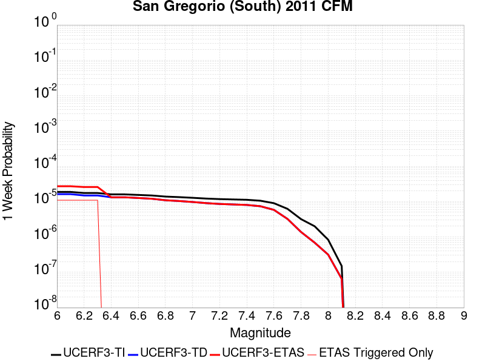 | 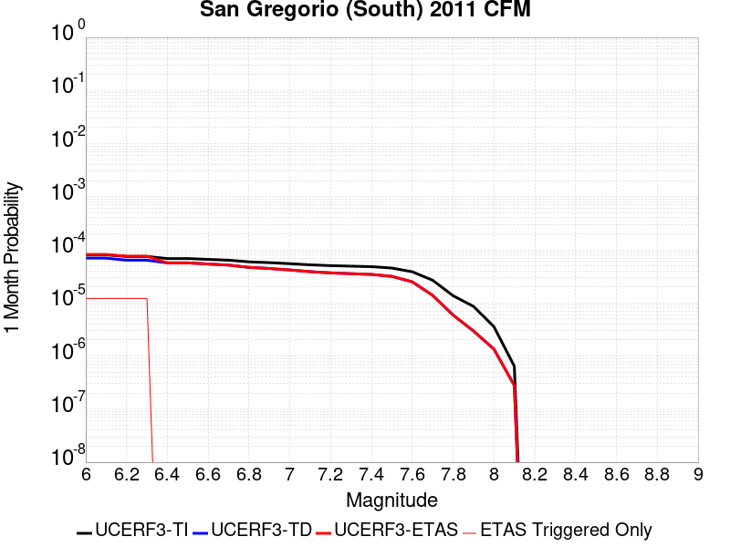 | 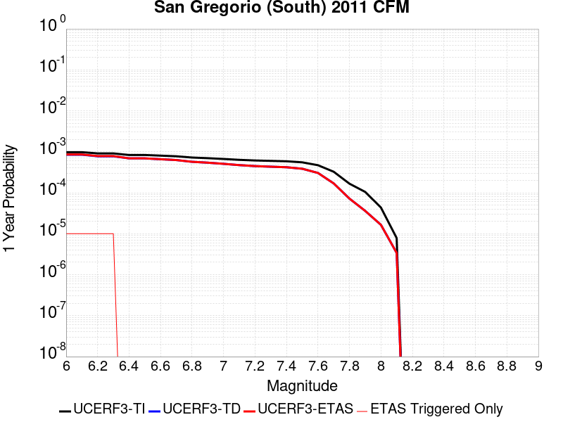 | 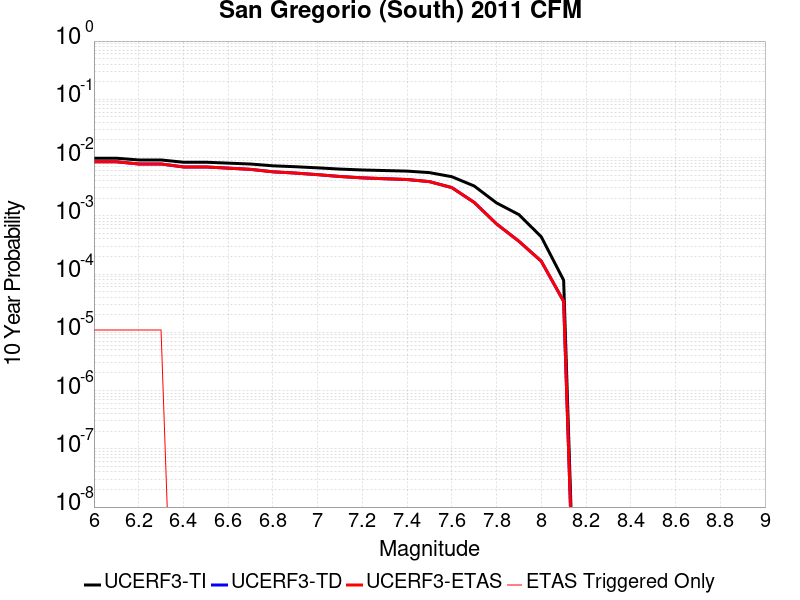 |

| Magnitude | 1 wk TI Prob | 1 wk TD Prob | 1 wk ETAS Prob | 1 wk ETAS/TD Gain | 1 wk ETAS Triggered Only | 1 mo TI Prob | 1 mo TD Prob | 1 mo ETAS Prob | 1 mo ETAS/TD Gain | 1 mo ETAS Triggered Only | 1 yr TI Prob | 1 yr TD Prob | 1 yr ETAS Prob | 1 yr ETAS/TD Gain | 1 yr ETAS Triggered Only | 10 yr TI Prob | 10 yr TD Prob | 10 yr ETAS Prob | 10 yr ETAS/TD Gain | 10 yr ETAS Triggered Only |
|-----|-----|-----|-----|-----|-----|-----|-----|-----|-----|-----|-----|-----|-----|-----|-----|-----|-----|-----|-----|-----|
| 6.0 | 1.8770423E-5 | 1.6279751E-5 | 2.722085E-5 | 1.672068 | 1.0941279E-5 | 8.044219E-5 | 6.976852E-5 | 8.070903E-5 | 1.1568116 | 1.0941279E-5 | 9.789435E-4 | 8.491044E-4 | 8.6003647E-4 | 1.0128747 | 1.0941279E-5 | 0.009746423 | 0.008471312 | 0.00848216 | 1.0012807 | 1.0941279E-5 |
| 6.1 | 1.8770423E-5 | 1.6279751E-5 | 2.722085E-5 | 1.672068 | 1.0941279E-5 | 8.044219E-5 | 6.976852E-5 | 8.070903E-5 | 1.1568116 | 1.0941279E-5 | 9.789435E-4 | 8.491044E-4 | 8.6003647E-4 | 1.0128747 | 1.0941279E-5 | 0.009746423 | 0.008471312 | 0.00848216 | 1.0012807 | 1.0941279E-5 |
| 6.2 | 1.7508692E-5 | 1.4899257E-5 | 2.5840372E-5 | 1.7343397 | 1.0941279E-5 | 7.5035096E-5 | 6.3852414E-5 | 7.479299E-5 | 1.1713417 | 1.0941279E-5 | 9.1316935E-4 | 7.7712885E-4 | 7.8806165E-4 | 1.0140681 | 1.0941279E-5 | 0.00909426 | 0.00775674 | 0.0077675963 | 1.0013996 | 1.0941279E-5 |
| 6.3 | 1.7508692E-5 | 1.4899257E-5 | 2.5840372E-5 | 1.7343397 | 1.0941279E-5 | 7.5035096E-5 | 6.3852414E-5 | 7.479299E-5 | 1.1713417 | 1.0941279E-5 | 9.1316935E-4 | 7.7712885E-4 | 7.8806165E-4 | 1.0140681 | 1.0941279E-5 | 0.00909426 | 0.00775674 | 0.0077675963 | 1.0013996 | 1.0941279E-5 |
| 6.4 | 1.6004591E-5 | 1.3249094E-5 | 1.3249094E-5 | 1.0 | 0.0 | 6.85893E-5 | 5.6780602E-5 | 5.6780602E-5 | 1.0 | 0.0 | 8.347548E-4 | 6.910856E-4 | 6.910856E-4 | 1.0 | 0.0 | 0.008316261 | 0.006901791 | 0.006901791 | 1.0 | 0.0 |
| 6.5 | 1.6004591E-5 | 1.3249094E-5 | 1.3249094E-5 | 1.0 | 0.0 | 6.85893E-5 | 5.6780602E-5 | 5.6780602E-5 | 1.0 | 0.0 | 8.347548E-4 | 6.910856E-4 | 6.910856E-4 | 1.0 | 0.0 | 0.008316261 | 0.006901791 | 0.006901791 | 1.0 | 0.0 |
| 6.6 | 1.5442201E-5 | 1.2633725E-5 | 1.2633725E-5 | 1.0 | 0.0 | 6.617918E-5 | 5.4143416E-5 | 5.4143416E-5 | 1.0 | 0.0 | 8.0543366E-4 | 6.5899757E-4 | 6.5899757E-4 | 1.0 | 0.0 | 0.008025207 | 0.006582842 | 0.006582842 | 1.0 | 0.0 |
| 6.7 | 1.489921E-5 | 1.2042234E-5 | 1.2042234E-5 | 1.0 | 0.0 | 6.3852196E-5 | 5.1608557E-5 | 5.1608557E-5 | 1.0 | 0.0 | 7.7712315E-4 | 6.2815374E-4 | 6.2815374E-4 | 1.0 | 0.0 | 0.0077441116 | 0.006276176 | 0.006276176 | 1.0 | 0.0 |
| 6.8 | 1.3876024E-5 | 1.0921184E-5 | 1.0921184E-5 | 1.0 | 0.0 | 5.9467322E-5 | 4.6804238E-5 | 4.6804238E-5 | 1.0 | 0.0 | 7.237741E-4 | 5.69693E-4 | 5.69693E-4 | 1.0 | 0.0 | 0.0072142133 | 0.0056946846 | 0.0056946846 | 1.0 | 0.0 |
| 6.9 | 1.33922495E-5 | 1.0392687E-5 | 1.0392687E-5 | 1.0 | 0.0 | 5.7394092E-5 | 4.4539327E-5 | 4.4539327E-5 | 1.0 | 0.0 | 6.9854903E-4 | 5.4213166E-4 | 5.4213166E-4 | 1.0 | 0.0 | 0.0069635725 | 0.005420442 | 0.005420442 | 1.0 | 0.0 |
| 7.0 | 1.2807324E-5 | 9.752649E-6 | 9.752649E-6 | 1.0 | 0.0 | 5.4887376E-5 | 4.1796397E-5 | 4.1796397E-5 | 1.0 | 0.0 | 6.680489E-4 | 5.087525E-4 | 5.087525E-4 | 1.0 | 0.0 | 0.006660442 | 0.0050882204 | 0.0050882204 | 1.0 | 0.0 |
| 7.1 | 1.2191438E-5 | 9.061537E-6 | 9.061537E-6 | 1.0 | 0.0 | 5.224797E-5 | 3.8834576E-5 | 3.8834576E-5 | 1.0 | 0.0 | 6.3593336E-4 | 4.727085E-4 | 4.727085E-4 | 1.0 | 0.0 | 0.0063411663 | 0.0047293645 | 0.0047293645 | 1.0 | 0.0 |
| 7.2 | 1.1769438E-5 | 8.581731E-6 | 8.581731E-6 | 1.0 | 0.0 | 5.0439474E-5 | 3.677833E-5 | 3.677833E-5 | 1.0 | 0.0 | 6.1392755E-4 | 4.4768423E-4 | 4.4768423E-4 | 1.0 | 0.0 | 0.0061223423 | 0.004480157 | 0.004480157 | 1.0 | 0.0 |
| 7.3 | 1.150374E-5 | 8.29716E-6 | 8.29716E-6 | 1.0 | 0.0 | 4.9300812E-5 | 3.5558773E-5 | 3.5558773E-5 | 1.0 | 0.0 | 6.0007203E-4 | 4.3284212E-4 | 4.3284212E-4 | 1.0 | 0.0 | 0.0059845424 | 0.0043323063 | 0.0043323063 | 1.0 | 0.0 |
| 7.4 | 1.12514E-5 | 8.042902E-6 | 8.042902E-6 | 1.0 | 0.0 | 4.8219394E-5 | 3.4469125E-5 | 3.4469125E-5 | 1.0 | 0.0 | 5.8691297E-4 | 4.1958084E-4 | 4.1958084E-4 | 1.0 | 0.0 | 0.005853653 | 0.0042001884 | 0.0042001884 | 1.0 | 0.0 |
| 7.5 | 1.059696E-5 | 7.3931915E-6 | 7.3931915E-6 | 1.0 | 0.0 | 4.5414752E-5 | 3.168472E-5 | 3.168472E-5 | 1.0 | 0.0 | 5.5278436E-4 | 3.8569325E-4 | 3.8569325E-4 | 1.0 | 0.0 | 0.0055141128 | 0.0038624762 | 0.0038624762 | 1.0 | 0.0 |
| 7.6 | 9.018592E-6 | 5.8369624E-6 | 5.8369624E-6 | 1.0 | 0.0 | 3.8650534E-5 | 2.5015313E-5 | 2.5015313E-5 | 1.0 | 0.0 | 4.7046866E-4 | 3.045189E-4 | 3.045189E-4 | 1.0 | 0.0 | 0.004694739 | 0.0030528754 | 0.0030528754 | 1.0 | 0.0 |
| 7.7 | 6.243489E-6 | 3.2395455E-6 | 3.2395455E-6 | 1.0 | 0.0 | 2.6757538E-5 | 1.3883692E-5 | 1.3883692E-5 | 1.0 | 0.0 | 3.257243E-4 | 1.6902086E-4 | 1.6902086E-4 | 1.0 | 0.0 | 0.003252473 | 0.001699108 | 0.001699108 | 1.0 | 0.0 |
| 7.8 | 3.1941963E-6 | 1.3809986E-6 | 1.3809986E-6 | 1.0 | 0.0 | 1.368934E-5 | 5.9185513E-6 | 5.9185513E-6 | 1.0 | 0.0 | 1.6665498E-4 | 7.2055984E-5 | 7.2055984E-5 | 1.0 | 0.0 | 0.0016653005 | 7.263174E-4 | 7.263174E-4 | 1.0 | 0.0 |
| 7.9 | 2.0098398E-6 | 6.9161155E-7 | 6.9161155E-7 | 1.0 | 0.0 | 8.6135715E-6 | 2.964046E-6 | 2.964046E-6 | 1.0 | 0.0 | 1.0486518E-4 | 3.608666E-5 | 3.608666E-5 | 1.0 | 0.0 | 0.0010481571 | 3.657225E-4 | 3.657225E-4 | 1.0 | 0.0 |
| 8.0 | 8.353119E-7 | 3.1623412E-7 | 3.1623412E-7 | 1.0 | 0.0 | 3.579903E-6 | 1.3552883E-6 | 1.3552883E-6 | 1.0 | 0.0 | 4.358445E-5 | 1.6500511E-5 | 1.6500511E-5 | 1.0 | 0.0 | 4.3575902E-4 | 1.6619264E-4 | 1.6619264E-4 | 1.0 | 0.0 |
| 8.1 | 1.5033264E-7 | 6.527624E-8 | 6.527624E-8 | 1.0 | 0.0 | 6.442826E-7 | 2.7975528E-7 | 2.7975528E-7 | 1.0 | 0.0 | 7.844113E-6 | 3.4060151E-6 | 3.4060151E-6 | 1.0 | 0.0 | 7.843835E-5 | 3.407693E-5 | 3.407693E-5 | 1.0 | 0.0 |

## Big Pine (East)
*[(top)](#table-of-contents)*

| 1 Week | 1 Month | 1 Year | 10 Year |
|-----|-----|-----|-----|
| 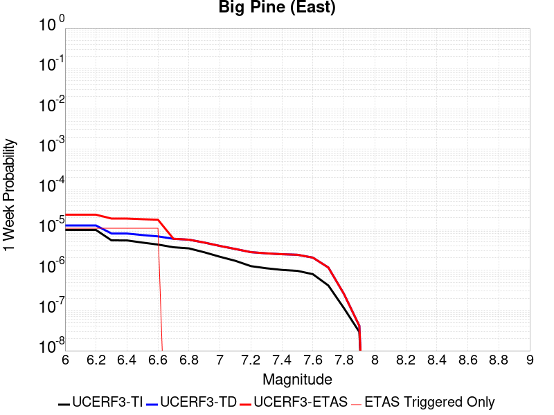 | 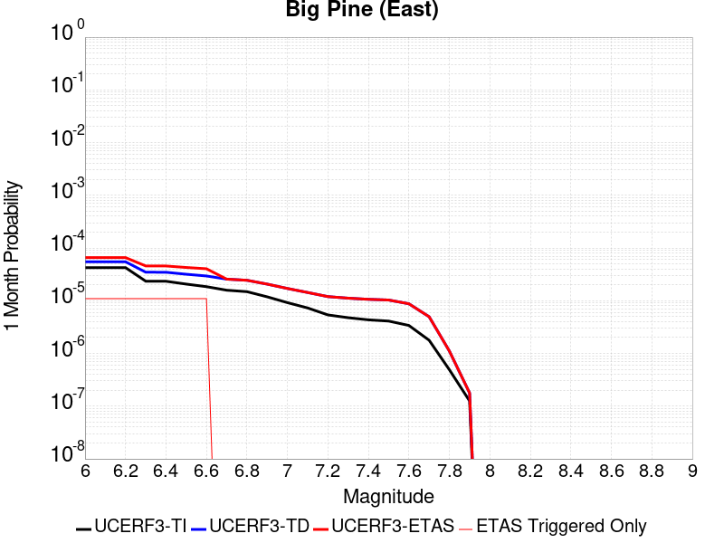 |  | 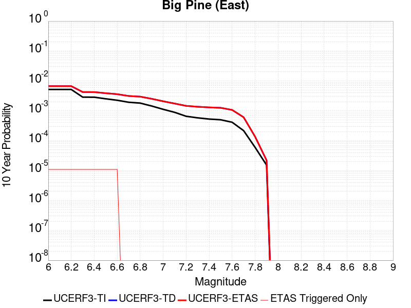 |

| Magnitude | 1 wk TI Prob | 1 wk TD Prob | 1 wk ETAS Prob | 1 wk ETAS/TD Gain | 1 wk ETAS Triggered Only | 1 mo TI Prob | 1 mo TD Prob | 1 mo ETAS Prob | 1 mo ETAS/TD Gain | 1 mo ETAS Triggered Only | 1 yr TI Prob | 1 yr TD Prob | 1 yr ETAS Prob | 1 yr ETAS/TD Gain | 1 yr ETAS Triggered Only | 10 yr TI Prob | 10 yr TD Prob | 10 yr ETAS Prob | 10 yr ETAS/TD Gain | 10 yr ETAS Triggered Only |
|-----|-----|-----|-----|-----|-----|-----|-----|-----|-----|-----|-----|-----|-----|-----|-----|-----|-----|-----|-----|-----|
| 6.0 | 9.916913E-6 | 1.2816984E-5 | 2.3758123E-5 | 1.8536437 | 1.0941279E-5 | 4.250036E-5 | 5.49289E-5 | 6.586958E-5 | 1.1991789 | 1.0941279E-5 | 5.173191E-4 | 6.685763E-4 | 6.7951024E-4 | 1.0163541 | 1.0941279E-5 | 0.0051611643 | 0.006670441 | 0.0066813095 | 1.0016294 | 1.0941279E-5 |
| 6.1 | 9.916913E-6 | 1.2816984E-5 | 2.3758123E-5 | 1.8536437 | 1.0941279E-5 | 4.250036E-5 | 5.49289E-5 | 6.586958E-5 | 1.1991789 | 1.0941279E-5 | 5.173191E-4 | 6.685763E-4 | 6.7951024E-4 | 1.0163541 | 1.0941279E-5 | 0.0051611643 | 0.006670441 | 0.0066813095 | 1.0016294 | 1.0941279E-5 |
| 6.2 | 9.916913E-6 | 1.2816984E-5 | 2.3758123E-5 | 1.8536437 | 1.0941279E-5 | 4.250036E-5 | 5.49289E-5 | 6.586958E-5 | 1.1991789 | 1.0941279E-5 | 5.173191E-4 | 6.685763E-4 | 6.7951024E-4 | 1.0163541 | 1.0941279E-5 | 0.0051611643 | 0.006670441 | 0.0066813095 | 1.0016294 | 1.0941279E-5 |
| 6.3 | 5.479711E-6 | 8.112951E-6 | 1.9054141E-5 | 2.3486078 | 1.0941279E-5 | 2.3484265E-5 | 3.4769346E-5 | 4.5710243E-5 | 1.3146708 | 1.0941279E-5 | 2.858834E-4 | 4.2323777E-4 | 4.341744E-4 | 1.0258404 | 1.0941279E-5 | 0.0028551589 | 0.004227244 | 0.0042381384 | 1.0025773 | 1.0941279E-5 |
| 6.4 | 5.465009E-6 | 8.097245E-6 | 1.9038434E-5 | 2.3512237 | 1.0941279E-5 | 2.3421257E-5 | 3.4702036E-5 | 4.5642933E-5 | 1.3152812 | 1.0941279E-5 | 2.851165E-4 | 4.2241855E-4 | 4.3335522E-4 | 1.0258906 | 1.0941279E-5 | 0.0028475097 | 0.0042190826 | 0.0042299777 | 1.0025823 | 1.0941279E-5 |
| 6.5 | 4.826767E-6 | 7.422301E-6 | 1.8363498E-5 | 2.4740977 | 1.0941279E-5 | 2.068598E-5 | 3.180949E-5 | 4.275042E-5 | 1.3439517 | 1.0941279E-5 | 2.518227E-4 | 3.872145E-4 | 3.9815155E-4 | 1.0282454 | 1.0941279E-5 | 0.0025153751 | 0.003868283 | 0.0038791818 | 1.0028175 | 1.0941279E-5 |
| 6.6 | 4.3146847E-6 | 6.8822374E-6 | 1.782344E-5 | 2.5897741 | 1.0941279E-5 | 1.8491375E-5 | 2.9494982E-5 | 4.0435938E-5 | 1.370943 | 1.0941279E-5 | 2.2510924E-4 | 3.590447E-4 | 3.6998204E-4 | 1.0304624 | 1.0941279E-5 | 0.0022488134 | 0.0035874986 | 0.0035984006 | 1.0030389 | 1.0941279E-5 |
| 6.7 | 3.6968106E-6 | 5.9954727E-6 | 5.9954727E-6 | 1.0 | 0.0 | 1.5843378E-5 | 2.5694639E-5 | 2.5694639E-5 | 1.0 | 0.0 | 1.9287605E-4 | 3.1278885E-4 | 3.1278885E-4 | 1.0 | 0.0 | 0.0019270873 | 0.0031262483 | 0.0031262483 | 1.0 | 0.0 |
| 6.8 | 3.4671132E-6 | 5.702177E-6 | 5.702177E-6 | 1.0 | 0.0 | 1.4858972E-5 | 2.4437682E-5 | 2.4437682E-5 | 1.0 | 0.0 | 1.8089297E-4 | 2.974896E-4 | 2.974896E-4 | 1.0 | 0.0 | 0.0018074579 | 0.002973667 | 0.002973667 | 1.0 | 0.0 |
| 6.9 | 2.7686972E-6 | 4.825223E-6 | 4.825223E-6 | 1.0 | 0.0 | 1.1865792E-5 | 2.0679368E-5 | 2.0679368E-5 | 1.0 | 0.0 | 1.4445644E-4 | 2.5174298E-4 | 2.5174298E-4 | 1.0 | 0.0 | 0.0014436257 | 0.0025172636 | 0.0025172636 | 1.0 | 0.0 |
| 7.0 | 2.1472624E-6 | 3.9850406E-6 | 3.9850406E-6 | 1.0 | 0.0 | 9.20252E-6 | 1.7078637E-5 | 1.7078637E-5 | 1.0 | 0.0 | 1.12034926E-4 | 2.079131E-4 | 2.079131E-4 | 1.0 | 0.0 | 0.0011197845 | 0.0020798394 | 0.0020798394 | 1.0 | 0.0 |
| 7.1 | 1.7018335E-6 | 3.344876E-6 | 3.344876E-6 | 1.0 | 0.0 | 7.293552E-6 | 1.4335106E-5 | 1.4335106E-5 | 1.0 | 0.0 | 8.879537E-5 | 1.7451629E-4 | 1.7451629E-4 | 1.0 | 0.0 | 8.87599E-4 | 0.0017464145 | 0.0017464145 | 1.0 | 0.0 |
| 7.2 | 1.25603E-6 | 2.794484E-6 | 2.794484E-6 | 1.0 | 0.0 | 5.3829745E-6 | 1.1976307E-5 | 1.1976307E-5 | 1.0 | 0.0 | 6.553574E-5 | 1.4580201E-4 | 1.4580201E-4 | 1.0 | 0.0 | 6.551642E-4 | 0.001459661 | 0.001459661 | 1.0 | 0.0 |
| 7.3 | 1.112297E-6 | 2.610332E-6 | 2.610332E-6 | 1.0 | 0.0 | 4.7669787E-6 | 1.118709E-5 | 1.118709E-5 | 1.0 | 0.0 | 5.803642E-5 | 1.3619453E-4 | 1.3619453E-4 | 1.0 | 0.0 | 5.802127E-4 | 0.0013635408 | 0.0013635408 | 1.0 | 0.0 |
| 7.4 | 1.0137181E-6 | 2.4834917E-6 | 2.4834917E-6 | 1.0 | 0.0 | 4.3444993E-6 | 1.0643494E-5 | 1.0643494E-5 | 1.0 | 0.0 | 5.2892992E-5 | 1.2957705E-4 | 1.2957705E-4 | 1.0 | 0.0 | 5.288041E-4 | 0.0012972289 | 0.0012972289 | 1.0 | 0.0 |
| 7.5 | 9.598608E-7 | 2.4071483E-6 | 2.4071483E-6 | 1.0 | 0.0 | 4.1136827E-6 | 1.031631E-5 | 1.031631E-5 | 1.0 | 0.0 | 5.0082934E-5 | 1.2559404E-4 | 1.2559404E-4 | 1.0 | 0.0 | 5.007165E-4 | 0.0012572526 | 0.0012572526 | 1.0 | 0.0 |
| 7.6 | 7.929459E-7 | 2.0448588E-6 | 2.0448588E-6 | 1.0 | 0.0 | 3.3983351E-6 | 8.763653E-6 | 8.763653E-6 | 1.0 | 0.0 | 4.1373947E-5 | 1.06692416E-4 | 1.06692416E-4 | 1.0 | 0.0 | 4.1366243E-4 | 0.0010685222 | 0.0010685222 | 1.0 | 0.0 |
| 7.7 | 4.155788E-7 | 1.1605589E-6 | 1.1605589E-6 | 1.0 | 0.0 | 1.7810507E-6 | 4.9738146E-6 | 4.9738146E-6 | 1.0 | 0.0 | 2.1684076E-5 | 6.0554554E-5 | 6.0554554E-5 | 1.0 | 0.0 | 2.1681961E-4 | 6.0857297E-4 | 6.0857297E-4 | 1.0 | 0.0 |
| 7.8 | 1.14666925E-7 | 2.592015E-7 | 2.592015E-7 | 1.0 | 0.0 | 4.914296E-7 | 1.1108631E-6 | 1.1108631E-6 | 1.0 | 0.0 | 5.9831386E-6 | 1.3524678E-5 | 1.3524678E-5 | 1.0 | 0.0 | 5.9829777E-5 | 1.3634123E-4 | 1.3634123E-4 | 1.0 | 0.0 |
| 7.9 | 2.9231824E-8 | 4.1463963E-8 | 4.1463963E-8 | 1.0 | 0.0 | 1.2527924E-7 | 1.7770269E-7 | 1.7770269E-7 | 1.0 | 0.0 | 1.5252737E-6 | 2.1635283E-6 | 2.1635283E-6 | 1.0 | 0.0 | 1.5252632E-5 | 2.1967755E-5 | 2.1967755E-5 | 1.0 | 0.0 |

## San Diego Trough south
*[(top)](#table-of-contents)*

| 1 Week | 1 Month | 1 Year | 10 Year |
|-----|-----|-----|-----|
|  |  |  |  |

| Magnitude | 1 wk TI Prob | 1 wk TD Prob | 1 wk ETAS Prob | 1 wk ETAS/TD Gain | 1 wk ETAS Triggered Only | 1 mo TI Prob | 1 mo TD Prob | 1 mo ETAS Prob | 1 mo ETAS/TD Gain | 1 mo ETAS Triggered Only | 1 yr TI Prob | 1 yr TD Prob | 1 yr ETAS Prob | 1 yr ETAS/TD Gain | 1 yr ETAS Triggered Only | 10 yr TI Prob | 10 yr TD Prob | 10 yr ETAS Prob | 10 yr ETAS/TD Gain | 10 yr ETAS Triggered Only |
|-----|-----|-----|-----|-----|-----|-----|-----|-----|-----|-----|-----|-----|-----|-----|-----|-----|-----|-----|-----|-----|
| 6.0 | 8.279495E-5 | 1.04241306E-4 | 1.1518144E-4 | 1.1049501 | 1.0941279E-5 | 3.5478722E-4 | 4.4667677E-4 | 4.5761318E-4 | 1.0244839 | 1.0941279E-5 | 0.004310982 | 0.0054256152 | 0.0054364973 | 1.0020057 | 1.0941279E-5 | 0.042283054 | 0.05299221 | 0.05300257 | 1.0001955 | 1.0941279E-5 |
| 6.1 | 4.6961468E-5 | 5.772944E-5 | 5.772944E-5 | 1.0 | 0.0 | 2.0124791E-4 | 2.473894E-4 | 2.473894E-4 | 1.0 | 0.0 | 0.00244744 | 0.0030079768 | 0.0030079768 | 1.0 | 0.0 | 0.024206603 | 0.029679462 | 0.029679462 | 1.0 | 0.0 |
| 6.2 | 3.5079658E-5 | 4.214154E-5 | 4.214154E-5 | 1.0 | 0.0 | 1.5033272E-4 | 1.8059435E-4 | 1.8059435E-4 | 1.0 | 0.0 | 0.0018287642 | 0.0021965632 | 0.0021965632 | 1.0 | 0.0 | 0.018137876 | 0.021751117 | 0.021751117 | 1.0 | 0.0 |
| 6.3 | 3.5079658E-5 | 4.214154E-5 | 4.214154E-5 | 1.0 | 0.0 | 1.5033272E-4 | 1.8059435E-4 | 1.8059435E-4 | 1.0 | 0.0 | 0.0018287642 | 0.0021965632 | 0.0021965632 | 1.0 | 0.0 | 0.018137876 | 0.021751117 | 0.021751117 | 1.0 | 0.0 |
| 6.4 | 2.7196904E-5 | 3.2087162E-5 | 3.2087162E-5 | 1.0 | 0.0 | 1.16552954E-4 | 1.3750927E-4 | 1.3750927E-4 | 1.0 | 0.0 | 0.0014181085 | 0.0016729041 | 0.0016729041 | 1.0 | 0.0 | 0.014090929 | 0.016604643 | 0.016604643 | 1.0 | 0.0 |
| 6.5 | 2.5584688E-5 | 3.010164E-5 | 3.010164E-5 | 1.0 | 0.0 | 1.0964406E-4 | 1.2900073E-4 | 1.2900073E-4 | 1.0 | 0.0 | 0.0013340989 | 0.0015694655 | 0.0015694655 | 1.0 | 0.0 | 0.013261181 | 0.015585314 | 0.015585314 | 1.0 | 0.0 |
| 6.6 | 2.2034688E-5 | 2.5742738E-5 | 2.5742738E-5 | 1.0 | 0.0 | 9.443096E-5 | 1.1032141E-4 | 1.1032141E-4 | 1.0 | 0.0 | 0.0011490905 | 0.0013423424 | 0.0013423424 | 1.0 | 0.0 | 0.011431668 | 0.013343317 | 0.013343317 | 1.0 | 0.0 |
| 6.7 | 1.9394853E-5 | 2.254176E-5 | 2.254176E-5 | 1.0 | 0.0 | 8.311815E-5 | 9.6603995E-5 | 9.6603995E-5 | 1.0 | 0.0 | 0.0010114936 | 0.0011755243 | 0.0011755243 | 1.0 | 0.0 | 0.01006902 | 0.011693766 | 0.011693766 | 1.0 | 0.0 |
| 6.8 | 1.7615313E-5 | 2.0403182E-5 | 2.0403182E-5 | 1.0 | 0.0 | 7.549201E-5 | 8.74393E-5 | 8.74393E-5 | 1.0 | 0.0 | 9.1872766E-4 | 0.0010640579 | 0.0010640579 | 1.0 | 0.0 | 0.009149387 | 0.010590198 | 0.010590198 | 1.0 | 0.0 |
| 6.9 | 1.5621423E-5 | 1.8026114E-5 | 1.8026114E-5 | 1.0 | 0.0 | 6.6947236E-5 | 7.725251E-5 | 7.725251E-5 | 1.0 | 0.0 | 8.147778E-4 | 9.40147E-4 | 9.40147E-4 | 1.0 | 0.0 | 0.008117969 | 0.009362142 | 0.009362142 | 1.0 | 0.0 |
| 7.0 | 1.3444376E-5 | 1.544809E-5 | 1.544809E-5 | 1.0 | 0.0 | 5.7617483E-5 | 6.620443E-5 | 6.620443E-5 | 1.0 | 0.0 | 7.0126704E-4 | 8.057436E-4 | 8.057436E-4 | 1.0 | 0.0 | 0.006990582 | 0.008028555 | 0.008028555 | 1.0 | 0.0 |
| 7.1 | 1.2268361E-5 | 1.407303E-5 | 1.407303E-5 | 1.0 | 0.0 | 5.2577634E-5 | 6.0311606E-5 | 6.0311606E-5 | 1.0 | 0.0 | 6.399447E-4 | 7.3404907E-4 | 7.3404907E-4 | 1.0 | 0.0 | 0.0063810493 | 0.0073165493 | 0.0073165493 | 1.0 | 0.0 |
| 7.2 | 1.0922655E-5 | 1.2513563E-5 | 1.2513563E-5 | 1.0 | 0.0 | 4.681054E-5 | 5.3628468E-5 | 5.3628468E-5 | 1.0 | 0.0 | 5.697693E-4 | 6.5273355E-4 | 6.5273355E-4 | 1.0 | 0.0 | 0.0056831064 | 0.0065084435 | 0.0065084435 | 1.0 | 0.0 |
| 7.3 | 6.1106753E-6 | 6.928925E-6 | 6.928925E-6 | 1.0 | 0.0 | 2.6188345E-5 | 2.9695057E-5 | 2.9695057E-5 | 1.0 | 0.0 | 3.1879646E-4 | 3.6147775E-4 | 3.6147775E-4 | 1.0 | 0.0 | 0.0031833951 | 0.003608943 | 0.003608943 | 1.0 | 0.0 |
| 7.4 | 4.933187E-6 | 5.5895525E-6 | 5.5895525E-6 | 1.0 | 0.0 | 2.114206E-5 | 2.3955008E-5 | 2.3955008E-5 | 1.0 | 0.0 | 2.5737417E-4 | 2.9161357E-4 | 2.9161357E-4 | 1.0 | 0.0 | 0.002570763 | 0.0029123505 | 0.0029123505 | 1.0 | 0.0 |
| 7.5 | 1.7489613E-6 | 1.969678E-6 | 1.969678E-6 | 1.0 | 0.0 | 7.495527E-6 | 8.4414505E-6 | 8.4414505E-6 | 1.0 | 0.0 | 9.125422E-5 | 1.02770035E-4 | 1.02770035E-4 | 1.0 | 0.0 | 9.1216754E-4 | 0.0010272472 | 0.0010272472 | 1.0 | 0.0 |
| 7.6 | 1.6988751E-7 | 1.7533823E-7 | 1.7533823E-7 | 1.0 | 0.0 | 7.2808916E-7 | 7.5144936E-7 | 7.5144936E-7 | 1.0 | 0.0 | 8.864449E-6 | 9.14886E-6 | 9.14886E-6 | 1.0 | 0.0 | 8.8640954E-5 | 9.1485024E-5 | 9.1485024E-5 | 1.0 | 0.0 |

## Malibu Coast alt 1
*[(top)](#table-of-contents)*

| 1 Week | 1 Month | 1 Year | 10 Year |
|-----|-----|-----|-----|
|  |  | 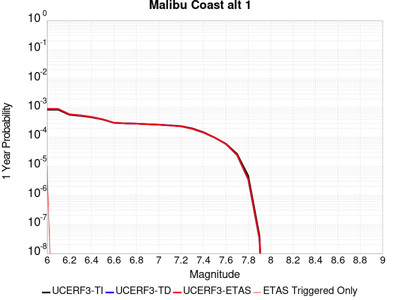 |  |

| Magnitude | 1 wk TI Prob | 1 wk TD Prob | 1 wk ETAS Prob | 1 wk ETAS/TD Gain | 1 wk ETAS Triggered Only | 1 mo TI Prob | 1 mo TD Prob | 1 mo ETAS Prob | 1 mo ETAS/TD Gain | 1 mo ETAS Triggered Only | 1 yr TI Prob | 1 yr TD Prob | 1 yr ETAS Prob | 1 yr ETAS/TD Gain | 1 yr ETAS Triggered Only | 10 yr TI Prob | 10 yr TD Prob | 10 yr ETAS Prob | 10 yr ETAS/TD Gain | 10 yr ETAS Triggered Only |
|-----|-----|-----|-----|-----|-----|-----|-----|-----|-----|-----|-----|-----|-----|-----|-----|-----|-----|-----|-----|-----|
| 6.0 | 1.6572556E-5 | 1.7598066E-5 | 2.8539152E-5 | 1.6217209 | 1.0941279E-5 | 7.102331E-5 | 7.541821E-5 | 8.635866E-5 | 1.1450638 | 1.0941279E-5 | 8.6436566E-4 | 9.178488E-4 | 9.2878E-4 | 1.0119096 | 1.0941279E-5 | 0.0086101135 | 0.009142512 | 0.009153354 | 1.0011858 | 1.0941279E-5 |
| 6.1 | 1.6572556E-5 | 1.7598066E-5 | 1.7598066E-5 | 1.0 | 0.0 | 7.102331E-5 | 7.541821E-5 | 7.541821E-5 | 1.0 | 0.0 | 8.6436566E-4 | 9.178488E-4 | 9.178488E-4 | 1.0 | 0.0 | 0.0086101135 | 0.009142512 | 0.009142512 | 1.0 | 0.0 |
| 6.2 | 1.1085717E-5 | 1.1557147E-5 | 1.1557147E-5 | 1.0 | 0.0 | 4.750935E-5 | 4.952971E-5 | 4.952971E-5 | 1.0 | 0.0 | 5.782728E-4 | 6.028609E-4 | 6.028609E-4 | 1.0 | 0.0 | 0.0057677035 | 0.0060126255 | 0.0060126255 | 1.0 | 0.0 |
| 6.3 | 1.0208568E-5 | 1.0592237E-5 | 1.0592237E-5 | 1.0 | 0.0 | 4.375027E-5 | 4.539453E-5 | 4.539453E-5 | 1.0 | 0.0 | 5.325294E-4 | 5.5254117E-4 | 5.5254117E-4 | 1.0 | 0.0 | 0.0053125503 | 0.0055119814 | 0.0055119814 | 1.0 | 0.0 |
| 6.4 | 9.0682315E-6 | 9.342637E-6 | 9.342637E-6 | 1.0 | 0.0 | 3.8863272E-5 | 4.003927E-5 | 4.003927E-5 | 1.0 | 0.0 | 4.730576E-4 | 4.8737114E-4 | 4.8737114E-4 | 1.0 | 0.0 | 0.0047205184 | 0.004863236 | 0.004863236 | 1.0 | 0.0 |
| 6.5 | 7.605796E-6 | 7.748587E-6 | 7.748587E-6 | 1.0 | 0.0 | 3.259586E-5 | 3.3207816E-5 | 3.3207816E-5 | 1.0 | 0.0 | 3.9678233E-4 | 4.0423148E-4 | 4.0423148E-4 | 1.0 | 0.0 | 0.0039607463 | 0.0040351 | 0.0040351 | 1.0 | 0.0 |
| 6.6 | 5.889873E-6 | 5.8795385E-6 | 5.8795385E-6 | 1.0 | 0.0 | 2.5242069E-5 | 2.519778E-5 | 2.519778E-5 | 1.0 | 0.0 | 3.0727885E-4 | 3.0673988E-4 | 3.0673988E-4 | 1.0 | 0.0 | 0.003068543 | 0.0030631777 | 0.0030631777 | 1.0 | 0.0 |
| 6.7 | 5.66586E-6 | 5.641641E-6 | 5.641641E-6 | 1.0 | 0.0 | 2.428203E-5 | 2.417824E-5 | 2.417824E-5 | 1.0 | 0.0 | 2.955936E-4 | 2.9433038E-4 | 2.9433038E-4 | 1.0 | 0.0 | 0.0029520073 | 0.0029394177 | 0.0029394177 | 1.0 | 0.0 |
| 6.8 | 5.521556E-6 | 5.489427E-6 | 5.489427E-6 | 1.0 | 0.0 | 2.3663597E-5 | 2.3525903E-5 | 2.3525903E-5 | 1.0 | 0.0 | 2.880662E-4 | 2.8639034E-4 | 2.8639034E-4 | 1.0 | 0.0 | 0.0028769306 | 0.002860224 | 0.002860224 | 1.0 | 0.0 |
| 6.9 | 5.29752E-6 | 5.2499317E-6 | 5.2499317E-6 | 1.0 | 0.0 | 2.270346E-5 | 2.2499513E-5 | 2.2499513E-5 | 1.0 | 0.0 | 2.7637955E-4 | 2.7389723E-4 | 2.7389723E-4 | 1.0 | 0.0 | 0.0027603607 | 0.0027356069 | 0.0027356069 | 1.0 | 0.0 |
| 7.0 | 5.106743E-6 | 5.0476788E-6 | 5.0476788E-6 | 1.0 | 0.0 | 2.1885859E-5 | 2.163273E-5 | 2.163273E-5 | 1.0 | 0.0 | 2.6642776E-4 | 2.6334674E-4 | 2.6334674E-4 | 1.0 | 0.0 | 0.0026610855 | 0.0026303562 | 0.0026303562 | 1.0 | 0.0 |
| 7.1 | 4.8469647E-6 | 4.770373E-6 | 4.770373E-6 | 1.0 | 0.0 | 2.0772539E-5 | 2.0444295E-5 | 2.0444295E-5 | 1.0 | 0.0 | 2.528763E-4 | 2.4888094E-4 | 2.4888094E-4 | 1.0 | 0.0 | 0.0025258875 | 0.00248603 | 0.00248603 | 1.0 | 0.0 |
| 7.2 | 4.545514E-6 | 4.4481935E-6 | 4.4481935E-6 | 1.0 | 0.0 | 1.9480629E-5 | 1.9063547E-5 | 1.9063547E-5 | 1.0 | 0.0 | 2.3715083E-4 | 2.3207403E-4 | 2.3207403E-4 | 1.0 | 0.0 | 0.0023689792 | 0.0023183243 | 0.0023183243 | 1.0 | 0.0 |
| 7.3 | 3.794097E-6 | 3.6519348E-6 | 3.6519348E-6 | 1.0 | 0.0 | 1.6260314E-5 | 1.5651056E-5 | 1.5651056E-5 | 1.0 | 0.0 | 1.9795135E-4 | 1.9053498E-4 | 1.9053498E-4 | 1.0 | 0.0 | 0.001977751 | 0.0019037209 | 0.0019037209 | 1.0 | 0.0 |
| 7.4 | 2.808217E-6 | 2.719077E-6 | 2.719077E-6 | 1.0 | 0.0 | 1.203516E-5 | 1.1653135E-5 | 1.1653135E-5 | 1.0 | 0.0 | 1.4651821E-4 | 1.418677E-4 | 1.418677E-4 | 1.0 | 0.0 | 0.0014642165 | 0.001417774 | 0.001417774 | 1.0 | 0.0 |
| 7.5 | 1.83809E-6 | 1.8190691E-6 | 1.8190691E-6 | 1.0 | 0.0 | 7.877505E-6 | 7.795988E-6 | 7.795988E-6 | 1.0 | 0.0 | 9.59044E-5 | 9.491203E-5 | 9.491203E-5 | 1.0 | 0.0 | 9.5863023E-4 | 9.48717E-4 | 9.48717E-4 | 1.0 | 0.0 |
| 7.6 | 1.1292672E-6 | 1.1001447E-6 | 1.1001447E-6 | 1.0 | 0.0 | 4.839708E-6 | 4.714897E-6 | 4.714897E-6 | 1.0 | 0.0 | 5.8921847E-5 | 5.7402376E-5 | 5.7402376E-5 | 1.0 | 0.0 | 5.890623E-4 | 5.738771E-4 | 5.738771E-4 | 1.0 | 0.0 |
| 7.7 | 5.065272E-7 | 4.609151E-7 | 4.609151E-7 | 1.0 | 0.0 | 2.170829E-6 | 1.975349E-6 | 1.975349E-6 | 1.0 | 0.0 | 2.6429525E-5 | 2.404962E-5 | 2.404962E-5 | 1.0 | 0.0 | 2.642638E-4 | 2.4047129E-4 | 2.4047129E-4 | 1.0 | 0.0 |
| 7.8 | 8.952991E-8 | 6.707874E-8 | 6.707874E-8 | 1.0 | 0.0 | 3.8369956E-7 | 2.8748025E-7 | 2.8748025E-7 | 1.0 | 0.0 | 4.671532E-6 | 3.5000667E-6 | 3.5000667E-6 | 1.0 | 0.0 | 4.671434E-5 | 3.5000136E-5 | 3.5000136E-5 | 1.0 | 0.0 |
| 7.9 | 8.007447E-10 | 6.1608785E-10 | 6.1608785E-10 | 1.0 | 0.0 | 3.4317629E-9 | 2.6403764E-9 | 2.6403764E-9 | 1.0 | 0.0 | 4.1781714E-8 | 3.2146584E-8 | 3.2146584E-8 | 1.0 | 0.0 | 4.1781706E-7 | 3.214658E-7 | 3.214658E-7 | 1.0 | 0.0 |

## Verdugo
*[(top)](#table-of-contents)*

| 1 Week | 1 Month | 1 Year | 10 Year |
|-----|-----|-----|-----|
|  |  |  | 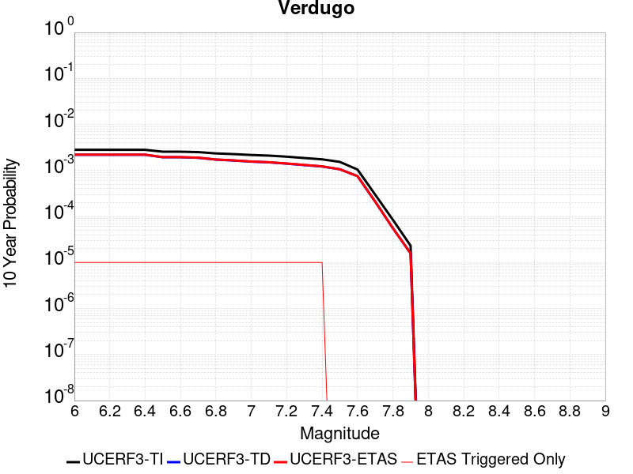 |

| Magnitude | 1 wk TI Prob | 1 wk TD Prob | 1 wk ETAS Prob | 1 wk ETAS/TD Gain | 1 wk ETAS Triggered Only | 1 mo TI Prob | 1 mo TD Prob | 1 mo ETAS Prob | 1 mo ETAS/TD Gain | 1 mo ETAS Triggered Only | 1 yr TI Prob | 1 yr TD Prob | 1 yr ETAS Prob | 1 yr ETAS/TD Gain | 1 yr ETAS Triggered Only | 10 yr TI Prob | 10 yr TD Prob | 10 yr ETAS Prob | 10 yr ETAS/TD Gain | 10 yr ETAS Triggered Only |
|-----|-----|-----|-----|-----|-----|-----|-----|-----|-----|-----|-----|-----|-----|-----|-----|-----|-----|-----|-----|-----|
| 6.0 | 5.392987E-6 | 4.216517E-6 | 4.216517E-6 | 1.0 | 0.0 | 2.3112598E-5 | 1.8070665E-5 | 2.9011746E-5 | 1.6054609 | 1.0941279E-5 | 2.8135953E-4 | 2.1998861E-4 | 2.3092749E-4 | 1.0497247 | 1.0941279E-5 | 0.0028100356 | 0.0021977562 | 0.0022086734 | 1.0049675 | 1.0941279E-5 |
| 6.1 | 5.392987E-6 | 4.216517E-6 | 4.216517E-6 | 1.0 | 0.0 | 2.3112598E-5 | 1.8070665E-5 | 2.9011746E-5 | 1.6054609 | 1.0941279E-5 | 2.8135953E-4 | 2.1998861E-4 | 2.3092749E-4 | 1.0497247 | 1.0941279E-5 | 0.0028100356 | 0.0021977562 | 0.0022086734 | 1.0049675 | 1.0941279E-5 |
| 6.2 | 5.392987E-6 | 4.216517E-6 | 4.216517E-6 | 1.0 | 0.0 | 2.3112598E-5 | 1.8070665E-5 | 2.9011746E-5 | 1.6054609 | 1.0941279E-5 | 2.8135953E-4 | 2.1998861E-4 | 2.3092749E-4 | 1.0497247 | 1.0941279E-5 | 0.0028100356 | 0.0021977562 | 0.0022086734 | 1.0049675 | 1.0941279E-5 |
| 6.3 | 5.392987E-6 | 4.216517E-6 | 4.216517E-6 | 1.0 | 0.0 | 2.3112598E-5 | 1.8070665E-5 | 2.9011746E-5 | 1.6054609 | 1.0941279E-5 | 2.8135953E-4 | 2.1998861E-4 | 2.3092749E-4 | 1.0497247 | 1.0941279E-5 | 0.0028100356 | 0.0021977562 | 0.0022086734 | 1.0049675 | 1.0941279E-5 |
| 6.4 | 5.392987E-6 | 4.216517E-6 | 4.216517E-6 | 1.0 | 0.0 | 2.3112598E-5 | 1.8070665E-5 | 2.9011746E-5 | 1.6054609 | 1.0941279E-5 | 2.8135953E-4 | 2.1998861E-4 | 2.3092749E-4 | 1.0497247 | 1.0941279E-5 | 0.0028100356 | 0.0021977562 | 0.0022086734 | 1.0049675 | 1.0941279E-5 |
| 6.5 | 4.9154837E-6 | 3.722465E-6 | 3.722465E-6 | 1.0 | 0.0 | 2.1066187E-5 | 1.5953325E-5 | 2.689443E-5 | 1.6858196 | 1.0941279E-5 | 2.5645064E-4 | 1.9421462E-4 | 2.0515377E-4 | 1.0563251 | 1.0941279E-5 | 0.002561549 | 0.0019404698 | 0.0019513898 | 1.0056275 | 1.0941279E-5 |
| 6.6 | 4.9154837E-6 | 3.722465E-6 | 3.722465E-6 | 1.0 | 0.0 | 2.1066187E-5 | 1.5953325E-5 | 2.689443E-5 | 1.6858196 | 1.0941279E-5 | 2.5645064E-4 | 1.9421462E-4 | 2.0515377E-4 | 1.0563251 | 1.0941279E-5 | 0.002561549 | 0.0019404698 | 0.0019513898 | 1.0056275 | 1.0941279E-5 |
| 6.7 | 4.817006E-6 | 3.6206518E-6 | 3.6206518E-6 | 1.0 | 0.0 | 2.0644147E-5 | 1.5516987E-5 | 2.6458096E-5 | 1.7051052 | 1.0941279E-5 | 2.513135E-4 | 1.8890314E-4 | 1.9984235E-4 | 1.0579091 | 1.0941279E-5 | 0.0025102948 | 0.0018874453 | 0.0018983659 | 1.005786 | 1.0941279E-5 |
| 6.8 | 4.507407E-6 | 3.3071042E-6 | 3.3071042E-6 | 1.0 | 0.0 | 1.9317316E-5 | 1.4173227E-5 | 2.511435E-5 | 1.771957 | 1.0941279E-5 | 2.3516294E-4 | 1.7254551E-4 | 1.8348491E-4 | 1.0634 | 1.0941279E-5 | 0.0023491425 | 0.0017241298 | 0.0017350522 | 1.006335 | 1.0941279E-5 |
| 6.9 | 4.3573054E-6 | 3.161011E-6 | 3.161011E-6 | 1.0 | 0.0 | 1.8674033E-5 | 1.354712E-5 | 2.448825E-5 | 1.8076352 | 1.0941279E-5 | 2.2733262E-4 | 1.6492383E-4 | 1.758633E-4 | 1.0663304 | 1.0941279E-5 | 0.0022710022 | 0.0016480266 | 0.0016589499 | 1.006628 | 1.0941279E-5 |
| 7.0 | 4.171527E-6 | 2.9836704E-6 | 2.9836704E-6 | 1.0 | 0.0 | 1.787785E-5 | 1.2787096E-5 | 2.3728235E-5 | 1.855639 | 1.0941279E-5 | 2.1764109E-4 | 1.5567189E-4 | 1.6661145E-4 | 1.0702733 | 1.0941279E-5 | 0.0021742806 | 0.0015556397 | 0.001566564 | 1.0070224 | 1.0941279E-5 |
| 7.1 | 4.0405484E-6 | 2.882261E-6 | 2.882261E-6 | 1.0 | 0.0 | 1.731652E-5 | 1.235249E-5 | 2.3293633E-5 | 1.885744 | 1.0941279E-5 | 2.1080824E-4 | 1.503813E-4 | 1.6132092E-4 | 1.0727459 | 1.0941279E-5 | 0.0021060838 | 0.0015028063 | 0.0015137312 | 1.0072696 | 1.0941279E-5 |
| 7.2 | 3.8306007E-6 | 2.7018452E-6 | 2.7018452E-6 | 1.0 | 0.0 | 1.6416758E-5 | 1.15792855E-5 | 2.2520437E-5 | 1.94489 | 1.0941279E-5 | 1.9985568E-4 | 1.4096878E-4 | 1.5190852E-4 | 1.0776039 | 1.0941279E-5 | 0.0019967605 | 0.0014088044 | 0.0014197303 | 1.0077554 | 1.0941279E-5 |
| 7.3 | 3.5750938E-6 | 2.5121758E-6 | 2.5121758E-6 | 1.0 | 0.0 | 1.532174E-5 | 1.0766424E-5 | 2.1707585E-5 | 2.0162296 | 1.0941279E-5 | 1.8652623E-4 | 1.3107344E-4 | 1.4201328E-4 | 1.0834634 | 1.0941279E-5 | 0.0018636974 | 0.0013099718 | 0.0013208988 | 1.0083413 | 1.0941279E-5 |
| 7.4 | 3.3510041E-6 | 2.3408586E-6 | 2.3408586E-6 | 1.0 | 0.0 | 1.4361368E-5 | 1.0032213E-5 | 2.097338E-5 | 2.0906036 | 1.0941279E-5 | 1.7483562E-4 | 1.2213545E-4 | 1.3307539E-4 | 1.0895722 | 1.0941279E-5 | 0.0017469813 | 0.0012206937 | 0.0012316216 | 1.0089523 | 1.0941279E-5 |
| 7.5 | 2.948287E-6 | 2.0391124E-6 | 2.0391124E-6 | 1.0 | 0.0 | 1.2635454E-5 | 8.739024E-6 | 8.739024E-6 | 1.0 | 0.0 | 1.538258E-4 | 1.0639253E-4 | 1.0639253E-4 | 1.0 | 0.0 | 0.0015371935 | 0.0010634261 | 0.0010634261 | 1.0 | 0.0 |
| 7.6 | 2.0134323E-6 | 1.4471265E-6 | 1.4471265E-6 | 1.0 | 0.0 | 8.628967E-6 | 6.2019562E-6 | 6.2019562E-6 | 1.0 | 0.0 | 1.05052604E-4 | 7.550629E-5 | 7.550629E-5 | 1.0 | 0.0 | 0.0010500296 | 7.548152E-4 | 7.548152E-4 | 1.0 | 0.0 |
| 7.7 | 5.726436E-7 | 4.045248E-7 | 4.045248E-7 | 1.0 | 0.0 | 2.4541846E-6 | 1.7336766E-6 | 1.7336766E-6 | 1.0 | 0.0 | 2.9879287E-5 | 2.1107335E-5 | 2.1107335E-5 | 1.0 | 0.0 | 2.987527E-4 | 2.1105584E-4 | 2.1105584E-4 | 1.0 | 0.0 |
| 7.8 | 1.6248204E-7 | 1.0687696E-7 | 1.0687696E-7 | 1.0 | 0.0 | 6.963514E-7 | 4.5804404E-7 | 4.5804404E-7 | 1.0 | 0.0 | 8.478045E-6 | 5.5766723E-6 | 5.5766723E-6 | 1.0 | 0.0 | 8.477722E-5 | 5.5765355E-5 | 5.5765355E-5 | 1.0 | 0.0 |
| 7.9 | 4.4475744E-8 | 3.0375546E-8 | 3.0375546E-8 | 1.0 | 0.0 | 1.9061031E-7 | 1.301809E-7 | 1.301809E-7 | 1.0 | 0.0 | 2.320678E-6 | 1.5849514E-6 | 1.5849514E-6 | 1.0 | 0.0 | 2.3206538E-5 | 1.5849415E-5 | 1.5849415E-5 | 1.0 | 0.0 |

## Robinson Creek
*[(top)](#table-of-contents)*

| 1 Week | 1 Month | 1 Year | 10 Year |
|-----|-----|-----|-----|
| 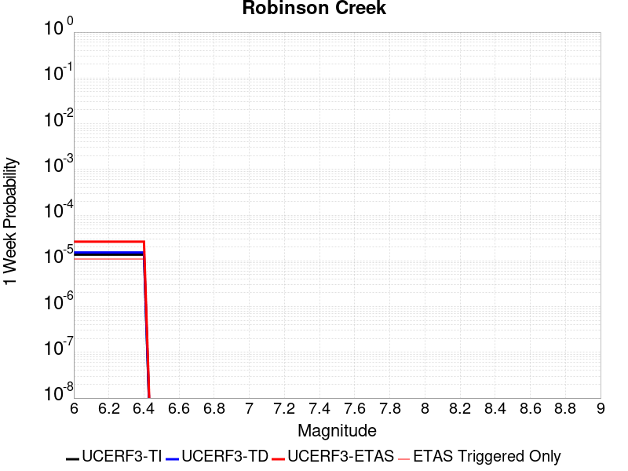 | 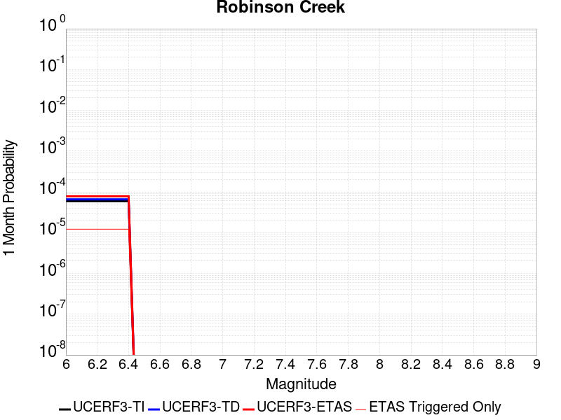 | 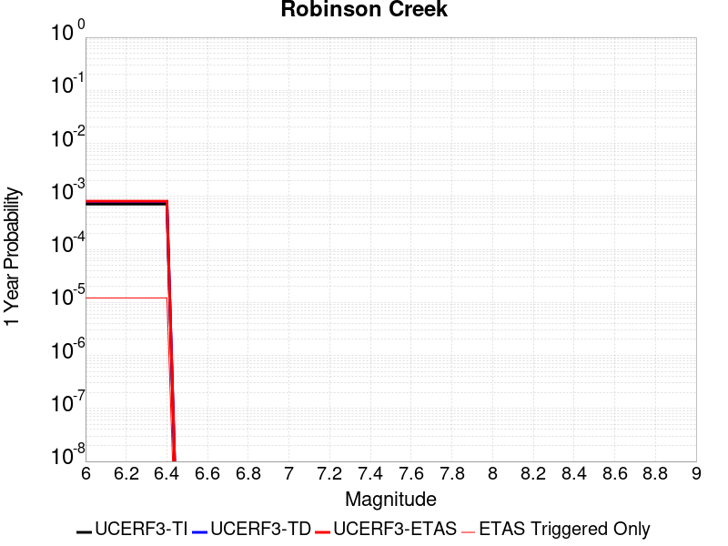 | 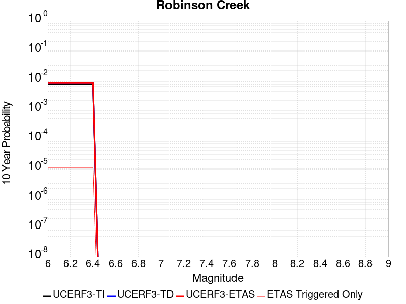 |

| Magnitude | 1 wk TI Prob | 1 wk TD Prob | 1 wk ETAS Prob | 1 wk ETAS/TD Gain | 1 wk ETAS Triggered Only | 1 mo TI Prob | 1 mo TD Prob | 1 mo ETAS Prob | 1 mo ETAS/TD Gain | 1 mo ETAS Triggered Only | 1 yr TI Prob | 1 yr TD Prob | 1 yr ETAS Prob | 1 yr ETAS/TD Gain | 1 yr ETAS Triggered Only | 10 yr TI Prob | 10 yr TD Prob | 10 yr ETAS Prob | 10 yr ETAS/TD Gain | 10 yr ETAS Triggered Only |
|-----|-----|-----|-----|-----|-----|-----|-----|-----|-----|-----|-----|-----|-----|-----|-----|-----|-----|-----|-----|-----|
| 6.0 | 1.3705327E-5 | 1.5285013E-5 | 2.6226124E-5 | 1.7158065 | 1.0941279E-5 | 5.8735794E-5 | 6.55072E-5 | 7.644776E-5 | 1.1670132 | 1.0941279E-5 | 7.1487366E-4 | 7.9755014E-4 | 8.084827E-4 | 1.0137076 | 1.0941279E-5 | 0.0071257832 | 0.007975501 | 0.007986356 | 1.0013609 | 1.0941279E-5 |
| 6.1 | 1.3705327E-5 | 1.5285013E-5 | 2.6226124E-5 | 1.7158065 | 1.0941279E-5 | 5.8735794E-5 | 6.55072E-5 | 7.644776E-5 | 1.1670132 | 1.0941279E-5 | 7.1487366E-4 | 7.9755014E-4 | 8.084827E-4 | 1.0137076 | 1.0941279E-5 | 0.0071257832 | 0.007975501 | 0.007986356 | 1.0013609 | 1.0941279E-5 |
| 6.2 | 1.3705327E-5 | 1.5285013E-5 | 2.6226124E-5 | 1.7158065 | 1.0941279E-5 | 5.8735794E-5 | 6.55072E-5 | 7.644776E-5 | 1.1670132 | 1.0941279E-5 | 7.1487366E-4 | 7.9755014E-4 | 8.084827E-4 | 1.0137076 | 1.0941279E-5 | 0.0071257832 | 0.007975501 | 0.007986356 | 1.0013609 | 1.0941279E-5 |
| 6.3 | 1.3705327E-5 | 1.5285013E-5 | 2.6226124E-5 | 1.7158065 | 1.0941279E-5 | 5.8735794E-5 | 6.55072E-5 | 7.644776E-5 | 1.1670132 | 1.0941279E-5 | 7.1487366E-4 | 7.9755014E-4 | 8.084827E-4 | 1.0137076 | 1.0941279E-5 | 0.0071257832 | 0.007975501 | 0.007986356 | 1.0013609 | 1.0941279E-5 |
| 6.4 | 1.3705327E-5 | 1.5285013E-5 | 2.6226124E-5 | 1.7158065 | 1.0941279E-5 | 5.8735794E-5 | 6.55072E-5 | 7.644776E-5 | 1.1670132 | 1.0941279E-5 | 7.1487366E-4 | 7.9755014E-4 | 8.084827E-4 | 1.0137076 | 1.0941279E-5 | 0.0071257832 | 0.007975501 | 0.007986356 | 1.0013609 | 1.0941279E-5 |

## Bartlett Springs 2011 CFM
*[(top)](#table-of-contents)*

| 1 Week | 1 Month | 1 Year | 10 Year |
|-----|-----|-----|-----|
|  |  | 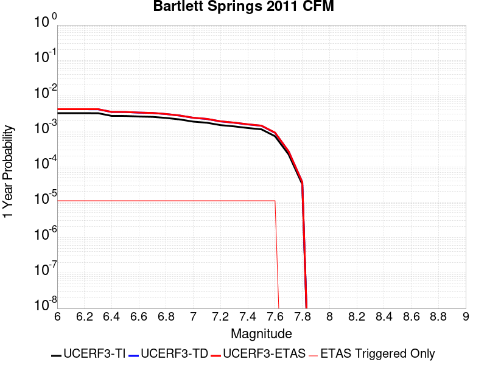 |  |

| Magnitude | 1 wk TI Prob | 1 wk TD Prob | 1 wk ETAS Prob | 1 wk ETAS/TD Gain | 1 wk ETAS Triggered Only | 1 mo TI Prob | 1 mo TD Prob | 1 mo ETAS Prob | 1 mo ETAS/TD Gain | 1 mo ETAS Triggered Only | 1 yr TI Prob | 1 yr TD Prob | 1 yr ETAS Prob | 1 yr ETAS/TD Gain | 1 yr ETAS Triggered Only | 10 yr TI Prob | 10 yr TD Prob | 10 yr ETAS Prob | 10 yr ETAS/TD Gain | 10 yr ETAS Triggered Only |
|-----|-----|-----|-----|-----|-----|-----|-----|-----|-----|-----|-----|-----|-----|-----|-----|-----|-----|-----|-----|-----|
| 6.0 | 6.2326144E-5 | 8.060613E-5 | 8.060613E-5 | 1.0 | 0.0 | 2.6708472E-4 | 3.454099E-4 | 3.454099E-4 | 1.0 | 0.0 | 0.003246908 | 0.0041973945 | 0.00420829 | 1.0025958 | 1.0941279E-5 | 0.031998757 | 0.04119771 | 0.0412082 | 1.0002546 | 1.0941279E-5 |
| 6.1 | 6.227657E-5 | 8.054363E-5 | 8.054363E-5 | 1.0 | 0.0 | 2.668723E-4 | 3.4514212E-4 | 3.4514212E-4 | 1.0 | 0.0 | 0.0032443295 | 0.004194147 | 0.0042050425 | 1.0025978 | 1.0941279E-5 | 0.031973712 | 0.041166443 | 0.041176934 | 1.0002549 | 1.0941279E-5 |
| 6.2 | 6.22452E-5 | 8.050423E-5 | 8.050423E-5 | 1.0 | 0.0 | 2.6673786E-4 | 3.4497332E-4 | 3.4497332E-4 | 1.0 | 0.0 | 0.0032426978 | 0.0041921 | 0.0042029954 | 1.002599 | 1.0941279E-5 | 0.03195787 | 0.041146737 | 0.041157227 | 1.000255 | 1.0941279E-5 |
| 6.3 | 6.219006E-5 | 8.043407E-5 | 8.043407E-5 | 1.0 | 0.0 | 2.6650162E-4 | 3.4467268E-4 | 3.4467268E-4 | 1.0 | 0.0 | 0.00323983 | 0.0041884542 | 0.0041993493 | 1.0026013 | 1.0941279E-5 | 0.031930014 | 0.041111637 | 0.041122127 | 1.0002552 | 1.0941279E-5 |
| 6.4 | 5.2175856E-5 | 6.725342E-5 | 6.725342E-5 | 1.0 | 0.0 | 2.2359163E-4 | 2.8819745E-4 | 2.8819745E-4 | 1.0 | 0.0 | 0.0027188298 | 0.0035032115 | 0.0035141145 | 1.0031123 | 1.0941279E-5 | 0.026858058 | 0.034489222 | 0.034499787 | 1.0003062 | 1.0941279E-5 |
| 6.5 | 5.205166E-5 | 6.7096094E-5 | 6.7096094E-5 | 1.0 | 0.0 | 2.2305945E-4 | 2.8752335E-4 | 2.8752335E-4 | 1.0 | 0.0 | 0.0027123666 | 0.0034950306 | 0.0035059338 | 1.0031196 | 1.0941279E-5 | 0.026794989 | 0.034409966 | 0.03442053 | 1.0003071 | 1.0941279E-5 |
| 6.6 | 5.0085426E-5 | 6.449277E-5 | 6.449277E-5 | 1.0 | 0.0 | 2.1463417E-4 | 2.763686E-4 | 2.763686E-4 | 1.0 | 0.0 | 0.0026100394 | 0.0033596456 | 0.00337055 | 1.0032457 | 1.0941279E-5 | 0.025795965 | 0.033097573 | 0.033108152 | 1.0003196 | 1.0941279E-5 |
| 6.7 | 4.8930866E-5 | 6.3017396E-5 | 6.3017396E-5 | 1.0 | 0.0 | 2.0968684E-4 | 2.7004688E-4 | 2.7004688E-4 | 1.0 | 0.0 | 0.0025499484 | 0.0032829174 | 0.0032938228 | 1.0033219 | 1.0941279E-5 | 0.025208864 | 0.03235294 | 0.032363527 | 1.0003272 | 1.0941279E-5 |
| 6.8 | 4.5679535E-5 | 5.8741858E-5 | 5.8741858E-5 | 1.0 | 0.0 | 1.9575475E-4 | 2.5172674E-4 | 2.5172674E-4 | 1.0 | 0.0 | 0.002380709 | 0.0030605064 | 0.0030714143 | 1.003564 | 1.0941279E-5 | 0.023553653 | 0.03019042 | 0.03020103 | 1.0003514 | 1.0941279E-5 |
| 6.9 | 4.1439176E-5 | 5.3220094E-5 | 5.3220094E-5 | 1.0 | 0.0 | 1.7758438E-4 | 2.2806633E-4 | 2.2806633E-4 | 1.0 | 0.0 | 0.002159946 | 0.0027731995 | 0.0027841104 | 1.0039344 | 1.0941279E-5 | 0.021390721 | 0.027390772 | 0.027401416 | 1.0003885 | 1.0941279E-5 |
| 7.0 | 3.5920104E-5 | 4.600871E-5 | 4.600871E-5 | 1.0 | 0.0 | 1.5393422E-4 | 1.9716538E-4 | 1.9716538E-4 | 1.0 | 0.0 | 0.001872538 | 0.0023978627 | 0.0024087778 | 1.004552 | 1.0941279E-5 | 0.018568378 | 0.023723004 | 0.023733687 | 1.0004503 | 1.0941279E-5 |
| 7.1 | 3.338812E-5 | 4.2689582E-5 | 4.2689582E-5 | 1.0 | 0.0 | 1.430841E-4 | 1.829426E-4 | 1.829426E-4 | 1.0 | 0.0 | 0.0017406568 | 0.0022250658 | 0.0022359826 | 1.0049063 | 1.0941279E-5 | 0.017270854 | 0.02203054 | 0.02204124 | 1.0004857 | 1.0941279E-5 |
| 7.2 | 2.8619615E-5 | 3.6401652E-5 | 3.6401652E-5 | 1.0 | 0.0 | 1.2264973E-4 | 1.5599781E-4 | 1.5599781E-4 | 1.0 | 0.0 | 0.0014922376 | 0.0018976285 | 0.001908549 | 1.0057548 | 1.0941279E-5 | 0.014822568 | 0.01881613 | 0.018826865 | 1.0005705 | 1.0941279E-5 |
| 7.3 | 2.6376783E-5 | 3.342276E-5 | 3.342276E-5 | 1.0 | 0.0 | 1.13038455E-4 | 1.4323258E-4 | 1.4323258E-4 | 1.0 | 0.0 | 0.0013753743 | 0.001742471 | 0.0017533932 | 1.0062683 | 1.0941279E-5 | 0.01366893 | 0.01728972 | 0.017300472 | 1.0006219 | 1.0941279E-5 |
| 7.4 | 2.3738676E-5 | 2.9978975E-5 | 2.9978975E-5 | 1.0 | 0.0 | 1.0173322E-4 | 1.2847505E-4 | 1.2847505E-4 | 1.0 | 0.0 | 0.0012378981 | 0.0015630693 | 0.0015739935 | 1.0069889 | 1.0941279E-5 | 0.012310251 | 0.015522073 | 0.015532845 | 1.0006939 | 1.0941279E-5 |
| 7.5 | 2.1789481E-5 | 2.7439388E-5 | 2.7439388E-5 | 1.0 | 0.0 | 9.338015E-5 | 1.1759212E-4 | 1.1759212E-4 | 1.0 | 0.0 | 0.0011363103 | 0.0014307518 | 0.0014416773 | 1.0076363 | 1.0941279E-5 | 0.011305175 | 0.014216576 | 0.014227361 | 1.0007586 | 1.0941279E-5 |
| 7.6 | 1.3895281E-5 | 1.7368426E-5 | 1.7368426E-5 | 1.0 | 0.0 | 5.9549846E-5 | 7.4434E-5 | 7.4434E-5 | 1.0 | 0.0 | 7.2477816E-4 | 9.0586004E-4 | 9.1679144E-4 | 1.0120674 | 1.0941279E-5 | 0.0072241887 | 0.009022084 | 0.009032927 | 1.0012017 | 1.0941279E-5 |
| 7.7 | 4.245981E-6 | 5.1624675E-6 | 5.1624675E-6 | 1.0 | 0.0 | 1.8196934E-5 | 2.2124674E-5 | 2.2124674E-5 | 1.0 | 0.0 | 2.2152514E-4 | 2.693348E-4 | 2.693348E-4 | 1.0 | 0.0 | 0.0022130446 | 0.0026901034 | 0.0026901034 | 1.0 | 0.0 |
| 7.8 | 6.145192E-7 | 7.047006E-7 | 7.047006E-7 | 1.0 | 0.0 | 2.633651E-6 | 3.020142E-6 | 3.020142E-6 | 1.0 | 0.0 | 3.206423E-5 | 3.676962E-5 | 3.676962E-5 | 1.0 | 0.0 | 3.2059604E-4 | 3.6763478E-4 | 3.6763478E-4 | 1.0 | 0.0 |

## Channel Islands Western Deep Ramp
*[(top)](#table-of-contents)*

| 1 Week | 1 Month | 1 Year | 10 Year |
|-----|-----|-----|-----|
|  |  |  |  |

| Magnitude | 1 wk TI Prob | 1 wk TD Prob | 1 wk ETAS Prob | 1 wk ETAS/TD Gain | 1 wk ETAS Triggered Only | 1 mo TI Prob | 1 mo TD Prob | 1 mo ETAS Prob | 1 mo ETAS/TD Gain | 1 mo ETAS Triggered Only | 1 yr TI Prob | 1 yr TD Prob | 1 yr ETAS Prob | 1 yr ETAS/TD Gain | 1 yr ETAS Triggered Only | 10 yr TI Prob | 10 yr TD Prob | 10 yr ETAS Prob | 10 yr ETAS/TD Gain | 10 yr ETAS Triggered Only |
|-----|-----|-----|-----|-----|-----|-----|-----|-----|-----|-----|-----|-----|-----|-----|-----|-----|-----|-----|-----|-----|
| 6.0 | 6.0213506E-6 | 6.2548684E-6 | 1.7196078E-5 | 2.749231 | 1.0941279E-5 | 2.5805533E-5 | 2.6806329E-5 | 3.774731E-5 | 1.4081494 | 1.0941279E-5 | 3.1413708E-4 | 3.2632265E-4 | 3.3726034E-4 | 1.0335181 | 1.0941279E-5 | 0.0031369338 | 0.0032588763 | 0.0032697818 | 1.0033464 | 1.0941279E-5 |
| 6.1 | 6.0213506E-6 | 6.2548684E-6 | 1.7196078E-5 | 2.749231 | 1.0941279E-5 | 2.5805533E-5 | 2.6806329E-5 | 3.774731E-5 | 1.4081494 | 1.0941279E-5 | 3.1413708E-4 | 3.2632265E-4 | 3.3726034E-4 | 1.0335181 | 1.0941279E-5 | 0.0031369338 | 0.0032588763 | 0.0032697818 | 1.0033464 | 1.0941279E-5 |
| 6.2 | 6.0213506E-6 | 6.2548684E-6 | 1.7196078E-5 | 2.749231 | 1.0941279E-5 | 2.5805533E-5 | 2.6806329E-5 | 3.774731E-5 | 1.4081494 | 1.0941279E-5 | 3.1413708E-4 | 3.2632265E-4 | 3.3726034E-4 | 1.0335181 | 1.0941279E-5 | 0.0031369338 | 0.0032588763 | 0.0032697818 | 1.0033464 | 1.0941279E-5 |
| 6.3 | 6.0213506E-6 | 6.2548684E-6 | 1.7196078E-5 | 2.749231 | 1.0941279E-5 | 2.5805533E-5 | 2.6806329E-5 | 3.774731E-5 | 1.4081494 | 1.0941279E-5 | 3.1413708E-4 | 3.2632265E-4 | 3.3726034E-4 | 1.0335181 | 1.0941279E-5 | 0.0031369338 | 0.0032588763 | 0.0032697818 | 1.0033464 | 1.0941279E-5 |
| 6.4 | 6.0213506E-6 | 6.2548684E-6 | 1.7196078E-5 | 2.749231 | 1.0941279E-5 | 2.5805533E-5 | 2.6806329E-5 | 3.774731E-5 | 1.4081494 | 1.0941279E-5 | 3.1413708E-4 | 3.2632265E-4 | 3.3726034E-4 | 1.0335181 | 1.0941279E-5 | 0.0031369338 | 0.0032588763 | 0.0032697818 | 1.0033464 | 1.0941279E-5 |
| 6.5 | 6.0213506E-6 | 6.2548684E-6 | 1.7196078E-5 | 2.749231 | 1.0941279E-5 | 2.5805533E-5 | 2.6806329E-5 | 3.774731E-5 | 1.4081494 | 1.0941279E-5 | 3.1413708E-4 | 3.2632265E-4 | 3.3726034E-4 | 1.0335181 | 1.0941279E-5 | 0.0031369338 | 0.0032588763 | 0.0032697818 | 1.0033464 | 1.0941279E-5 |
| 6.6 | 6.0213506E-6 | 6.2548684E-6 | 1.7196078E-5 | 2.749231 | 1.0941279E-5 | 2.5805533E-5 | 2.6806329E-5 | 3.774731E-5 | 1.4081494 | 1.0941279E-5 | 3.1413708E-4 | 3.2632265E-4 | 3.3726034E-4 | 1.0335181 | 1.0941279E-5 | 0.0031369338 | 0.0032588763 | 0.0032697818 | 1.0033464 | 1.0941279E-5 |
| 6.7 | 5.313309E-6 | 5.5252403E-6 | 1.6466458E-5 | 2.9802246 | 1.0941279E-5 | 2.2771126E-5 | 2.367941E-5 | 3.462043E-5 | 1.4620478 | 1.0941279E-5 | 2.772032E-4 | 2.8826276E-4 | 2.9920088E-4 | 1.037945 | 1.0941279E-5 | 0.0027685766 | 0.0028792918 | 0.0028902015 | 1.0037891 | 1.0941279E-5 |
| 6.8 | 5.313309E-6 | 5.5252403E-6 | 1.6466458E-5 | 2.9802246 | 1.0941279E-5 | 2.2771126E-5 | 2.367941E-5 | 3.462043E-5 | 1.4620478 | 1.0941279E-5 | 2.772032E-4 | 2.8826276E-4 | 2.9920088E-4 | 1.037945 | 1.0941279E-5 | 0.0027685766 | 0.0028792918 | 0.0028902015 | 1.0037891 | 1.0941279E-5 |
| 6.9 | 4.744377E-6 | 4.9394303E-6 | 1.5880654E-5 | 3.215078 | 1.0941279E-5 | 2.0332885E-5 | 2.1168837E-5 | 3.2109885E-5 | 1.5168469 | 1.0941279E-5 | 2.4752476E-4 | 2.5770385E-4 | 2.686423E-4 | 1.0424459 | 1.0941279E-5 | 0.0024724922 | 0.0025744175 | 0.0025853305 | 1.0042391 | 1.0941279E-5 |
| 7.0 | 4.722209E-6 | 4.9164732E-6 | 1.5857697E-5 | 3.2254214 | 1.0941279E-5 | 2.0237881E-5 | 2.107045E-5 | 3.2011496E-5 | 1.5192603 | 1.0941279E-5 | 2.4636835E-4 | 2.5650626E-4 | 2.6744473E-4 | 1.042644 | 1.0941279E-5 | 0.002460954 | 0.0025624693 | 0.0025733826 | 1.0042589 | 1.0941279E-5 |
| 7.1 | 4.611174E-6 | 4.801409E-6 | 4.801409E-6 | 1.0 | 0.0 | 1.9762025E-5 | 2.0577325E-5 | 2.0577325E-5 | 1.0 | 0.0 | 2.4057609E-4 | 2.5050386E-4 | 2.5050386E-4 | 1.0 | 0.0 | 0.002403158 | 0.002502582 | 0.002502582 | 1.0 | 0.0 |
| 7.2 | 4.043994E-6 | 4.2120264E-6 | 4.2120264E-6 | 1.0 | 0.0 | 1.7331287E-5 | 1.8051438E-5 | 1.8051438E-5 | 1.0 | 0.0 | 2.10988E-4 | 2.1975765E-4 | 2.1975765E-4 | 1.0 | 0.0 | 0.002107878 | 0.0021957543 | 0.0021957543 | 1.0 | 0.0 |
| 7.3 | 2.1233036E-6 | 2.2297875E-6 | 2.2297875E-6 | 1.0 | 0.0 | 9.099841E-6 | 9.556197E-6 | 9.556197E-6 | 1.0 | 0.0 | 1.1078493E-4 | 1.1634055E-4 | 1.1634055E-4 | 1.0 | 0.0 | 0.0011072971 | 0.001162802 | 0.001162802 | 1.0 | 0.0 |
| 7.4 | 1.9051884E-6 | 2.0014973E-6 | 2.0014973E-6 | 1.0 | 0.0 | 8.165067E-6 | 8.577817E-6 | 8.577817E-6 | 1.0 | 0.0 | 9.940516E-5 | 1.0442998E-4 | 1.0442998E-4 | 1.0 | 0.0 | 9.93607E-4 | 0.0010438144 | 0.0010438144 | 1.0 | 0.0 |
| 7.5 | 1.2408497E-6 | 1.3038839E-6 | 1.3038839E-6 | 1.0 | 0.0 | 5.317916E-6 | 5.588062E-6 | 5.588062E-6 | 1.0 | 0.0 | 6.4743705E-5 | 6.8032554E-5 | 6.8032554E-5 | 1.0 | 0.0 | 6.4724847E-4 | 6.8011944E-4 | 6.8011944E-4 | 1.0 | 0.0 |
| 7.6 | 6.5440025E-7 | 6.886718E-7 | 6.886718E-7 | 1.0 | 0.0 | 2.8045695E-6 | 2.9514472E-6 | 2.9514472E-6 | 1.0 | 0.0 | 3.4145098E-5 | 3.593329E-5 | 3.593329E-5 | 1.0 | 0.0 | 3.4139853E-4 | 3.5927625E-4 | 3.5927625E-4 | 1.0 | 0.0 |
| 7.7 | 3.985963E-7 | 4.1930787E-7 | 4.1930787E-7 | 1.0 | 0.0 | 1.7082689E-6 | 1.7970326E-6 | 1.7970326E-6 | 1.0 | 0.0 | 2.0797976E-5 | 2.1878664E-5 | 2.1878664E-5 | 1.0 | 0.0 | 2.0796029E-4 | 2.1876628E-4 | 2.1876628E-4 | 1.0 | 0.0 |
| 7.8 | 3.706329E-8 | 3.8591796E-8 | 3.8591796E-8 | 1.0 | 0.0 | 1.5884267E-7 | 1.653934E-7 | 1.653934E-7 | 1.0 | 0.0 | 1.9339077E-6 | 2.0136629E-6 | 2.0136629E-6 | 1.0 | 0.0 | 1.933891E-5 | 2.0136458E-5 | 2.0136458E-5 | 1.0 | 0.0 |

## Santa Monica Bay
*[(top)](#table-of-contents)*

| 1 Week | 1 Month | 1 Year | 10 Year |
|-----|-----|-----|-----|
| 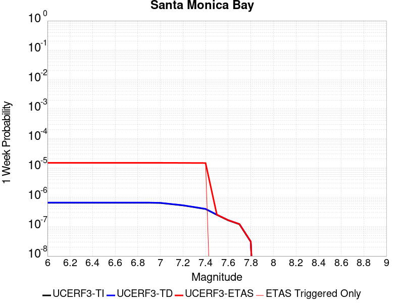 | 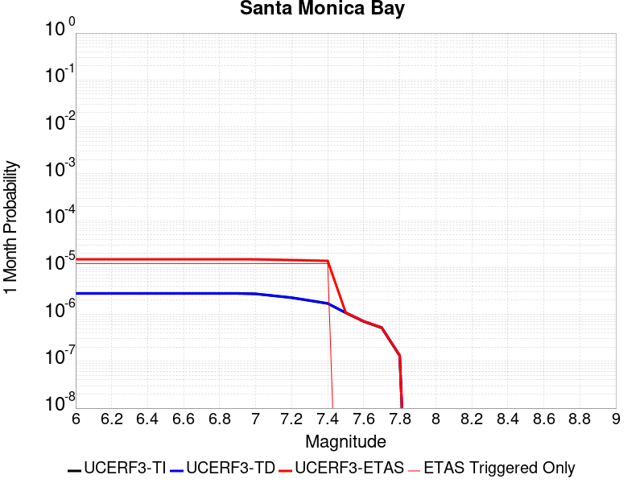 | 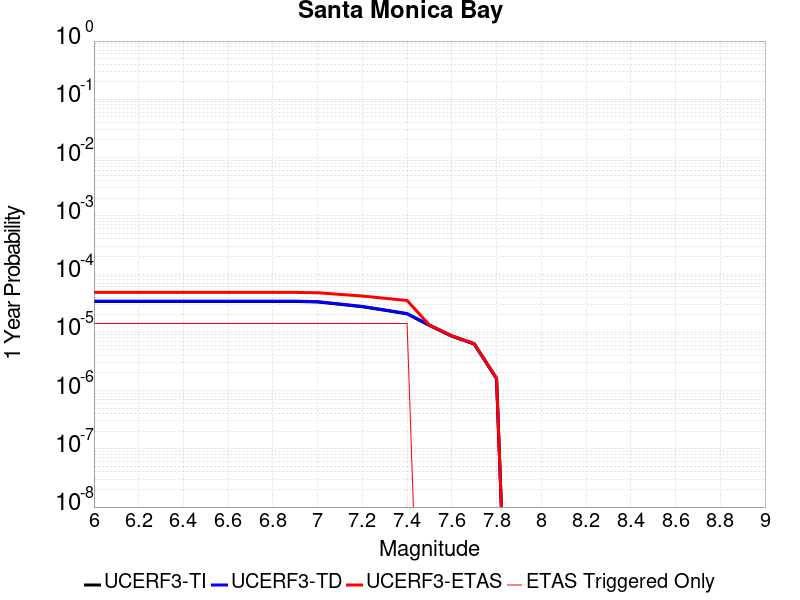 | 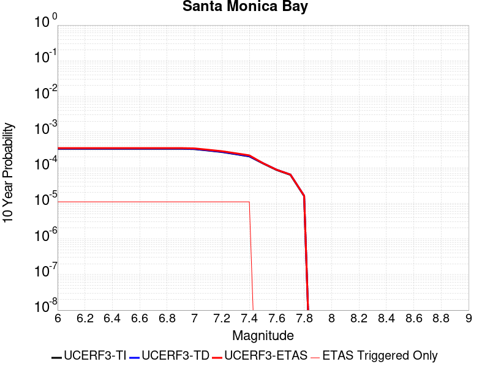 |

| Magnitude | 1 wk TI Prob | 1 wk TD Prob | 1 wk ETAS Prob | 1 wk ETAS/TD Gain | 1 wk ETAS Triggered Only | 1 mo TI Prob | 1 mo TD Prob | 1 mo ETAS Prob | 1 mo ETAS/TD Gain | 1 mo ETAS Triggered Only | 1 yr TI Prob | 1 yr TD Prob | 1 yr ETAS Prob | 1 yr ETAS/TD Gain | 1 yr ETAS Triggered Only | 10 yr TI Prob | 10 yr TD Prob | 10 yr ETAS Prob | 10 yr ETAS/TD Gain | 10 yr ETAS Triggered Only |
|-----|-----|-----|-----|-----|-----|-----|-----|-----|-----|-----|-----|-----|-----|-----|-----|-----|-----|-----|-----|-----|
| 6.0 | 6.493459E-7 | 6.570905E-7 | 1.1598361E-5 | 17.651087 | 1.0941279E-5 | 2.782908E-6 | 2.8160991E-6 | 1.3757346E-5 | 4.885249 | 1.0941279E-5 | 3.388138E-5 | 3.4285487E-5 | 4.522639E-5 | 1.3191118 | 1.0941279E-5 | 3.3876215E-4 | 3.4280377E-4 | 3.5374128E-4 | 1.0319061 | 1.0941279E-5 |
| 6.1 | 6.493459E-7 | 6.570905E-7 | 1.1598361E-5 | 17.651087 | 1.0941279E-5 | 2.782908E-6 | 2.8160991E-6 | 1.3757346E-5 | 4.885249 | 1.0941279E-5 | 3.388138E-5 | 3.4285487E-5 | 4.522639E-5 | 1.3191118 | 1.0941279E-5 | 3.3876215E-4 | 3.4280377E-4 | 3.5374128E-4 | 1.0319061 | 1.0941279E-5 |
| 6.2 | 6.493459E-7 | 6.570905E-7 | 1.1598361E-5 | 17.651087 | 1.0941279E-5 | 2.782908E-6 | 2.8160991E-6 | 1.3757346E-5 | 4.885249 | 1.0941279E-5 | 3.388138E-5 | 3.4285487E-5 | 4.522639E-5 | 1.3191118 | 1.0941279E-5 | 3.3876215E-4 | 3.4280377E-4 | 3.5374128E-4 | 1.0319061 | 1.0941279E-5 |
| 6.3 | 6.493459E-7 | 6.570905E-7 | 1.1598361E-5 | 17.651087 | 1.0941279E-5 | 2.782908E-6 | 2.8160991E-6 | 1.3757346E-5 | 4.885249 | 1.0941279E-5 | 3.388138E-5 | 3.4285487E-5 | 4.522639E-5 | 1.3191118 | 1.0941279E-5 | 3.3876215E-4 | 3.4280377E-4 | 3.5374128E-4 | 1.0319061 | 1.0941279E-5 |
| 6.4 | 6.493459E-7 | 6.570905E-7 | 1.1598361E-5 | 17.651087 | 1.0941279E-5 | 2.782908E-6 | 2.8160991E-6 | 1.3757346E-5 | 4.885249 | 1.0941279E-5 | 3.388138E-5 | 3.4285487E-5 | 4.522639E-5 | 1.3191118 | 1.0941279E-5 | 3.3876215E-4 | 3.4280377E-4 | 3.5374128E-4 | 1.0319061 | 1.0941279E-5 |
| 6.5 | 6.493459E-7 | 6.570905E-7 | 1.1598361E-5 | 17.651087 | 1.0941279E-5 | 2.782908E-6 | 2.8160991E-6 | 1.3757346E-5 | 4.885249 | 1.0941279E-5 | 3.388138E-5 | 3.4285487E-5 | 4.522639E-5 | 1.3191118 | 1.0941279E-5 | 3.3876215E-4 | 3.4280377E-4 | 3.5374128E-4 | 1.0319061 | 1.0941279E-5 |
| 6.6 | 6.493459E-7 | 6.570905E-7 | 1.1598361E-5 | 17.651087 | 1.0941279E-5 | 2.782908E-6 | 2.8160991E-6 | 1.3757346E-5 | 4.885249 | 1.0941279E-5 | 3.388138E-5 | 3.4285487E-5 | 4.522639E-5 | 1.3191118 | 1.0941279E-5 | 3.3876215E-4 | 3.4280377E-4 | 3.5374128E-4 | 1.0319061 | 1.0941279E-5 |
| 6.7 | 6.493459E-7 | 6.570905E-7 | 1.1598361E-5 | 17.651087 | 1.0941279E-5 | 2.782908E-6 | 2.8160991E-6 | 1.3757346E-5 | 4.885249 | 1.0941279E-5 | 3.388138E-5 | 3.4285487E-5 | 4.522639E-5 | 1.3191118 | 1.0941279E-5 | 3.3876215E-4 | 3.4280377E-4 | 3.5374128E-4 | 1.0319061 | 1.0941279E-5 |
| 6.8 | 6.493459E-7 | 6.570905E-7 | 1.1598361E-5 | 17.651087 | 1.0941279E-5 | 2.782908E-6 | 2.8160991E-6 | 1.3757346E-5 | 4.885249 | 1.0941279E-5 | 3.388138E-5 | 3.4285487E-5 | 4.522639E-5 | 1.3191118 | 1.0941279E-5 | 3.3876215E-4 | 3.4280377E-4 | 3.5374128E-4 | 1.0319061 | 1.0941279E-5 |
| 6.9 | 6.493459E-7 | 6.570905E-7 | 1.1598361E-5 | 17.651087 | 1.0941279E-5 | 2.782908E-6 | 2.8160991E-6 | 1.3757346E-5 | 4.885249 | 1.0941279E-5 | 3.388138E-5 | 3.4285487E-5 | 4.522639E-5 | 1.3191118 | 1.0941279E-5 | 3.3876215E-4 | 3.4280377E-4 | 3.5374128E-4 | 1.0319061 | 1.0941279E-5 |
| 7.0 | 6.3621707E-7 | 6.4389707E-7 | 1.1585168E-5 | 17.992268 | 1.0941279E-5 | 2.726642E-6 | 2.759556E-6 | 1.3700804E-5 | 4.964858 | 1.0941279E-5 | 3.319636E-5 | 3.3597094E-5 | 4.4538006E-5 | 1.3256505 | 1.0941279E-5 | 3.31914E-4 | 3.3592194E-4 | 3.4685954E-4 | 1.03256 | 1.0941279E-5 |
| 7.1 | 5.796316E-7 | 5.8694985E-7 | 1.1528222E-5 | 19.640898 | 1.0941279E-5 | 2.4841331E-6 | 2.515497E-6 | 1.3456747E-5 | 5.3495383 | 1.0941279E-5 | 3.0243902E-5 | 3.062576E-5 | 4.1566705E-5 | 1.3572464 | 1.0941279E-5 | 3.0239785E-4 | 3.0621697E-4 | 3.171549E-4 | 1.0357195 | 1.0941279E-5 |
| 7.2 | 5.2654514E-7 | 5.3347253E-7 | 1.14747445E-5 | 21.509533 | 1.0941279E-5 | 2.25662E-6 | 2.286309E-6 | 1.3227562E-5 | 5.785553 | 1.0941279E-5 | 2.7474003E-5 | 2.7835471E-5 | 3.8776445E-5 | 1.3930587 | 1.0941279E-5 | 2.7470608E-4 | 2.7832124E-4 | 2.8925948E-4 | 1.0393008 | 1.0941279E-5 |
| 7.3 | 4.582996E-7 | 4.6463197E-7 | 1.1405905E-5 | 24.548258 | 1.0941279E-5 | 1.9641398E-6 | 1.9912784E-6 | 1.2932534E-5 | 6.494589 | 1.0941279E-5 | 2.3913139E-5 | 2.4243556E-5 | 3.518457E-5 | 1.4512957 | 1.0941279E-5 | 2.3910566E-4 | 2.4241036E-4 | 2.53349E-4 | 1.0451244 | 1.0941279E-5 |
| 7.4 | 3.9690556E-7 | 4.026118E-7 | 1.13438855E-5 | 28.175741 | 1.0941279E-5 | 1.7010227E-6 | 1.725478E-6 | 1.2666737E-5 | 7.341002 | 1.0941279E-5 | 2.0709755E-5 | 2.1007503E-5 | 3.194855E-5 | 1.5208162 | 1.0941279E-5 | 2.0707825E-4 | 2.1005633E-4 | 2.2099531E-4 | 1.0520765 | 1.0941279E-5 |
| 7.5 | 2.514765E-7 | 2.5540857E-7 | 2.5540857E-7 | 1.0 | 0.0 | 1.077756E-6 | 1.0946077E-6 | 1.0946077E-6 | 1.0 | 0.0 | 1.31216E-5 | 1.3326773E-5 | 1.3326773E-5 | 1.0 | 0.0 | 1.3120825E-4 | 1.3326031E-4 | 1.3326031E-4 | 1.0 | 0.0 |
| 7.6 | 1.6412821E-7 | 1.6690133E-7 | 1.6690133E-7 | 1.0 | 0.0 | 7.0340644E-7 | 7.152912E-7 | 7.152912E-7 | 1.0 | 0.0 | 8.563939E-6 | 8.708636E-6 | 8.708636E-6 | 1.0 | 0.0 | 8.56361E-5 | 8.7083E-5 | 8.7083E-5 | 1.0 | 0.0 |
| 7.7 | 1.2030355E-7 | 1.224329E-7 | 1.224329E-7 | 1.0 | 0.0 | 5.155865E-7 | 5.247123E-7 | 5.247123E-7 | 1.0 | 0.0 | 6.277248E-6 | 6.388354E-6 | 6.388354E-6 | 1.0 | 0.0 | 6.2770705E-5 | 6.3881744E-5 | 6.3881744E-5 | 1.0 | 0.0 |
| 7.8 | 3.0539674E-8 | 3.1123864E-8 | 3.1123864E-8 | 1.0 | 0.0 | 1.308843E-7 | 1.3338799E-7 | 1.3338799E-7 | 1.0 | 0.0 | 1.5935152E-6 | 1.6239977E-6 | 1.6239977E-6 | 1.0 | 0.0 | 1.5935038E-5 | 1.623988E-5 | 1.623988E-5 | 1.0 | 0.0 |

## Laguna Salada
*[(top)](#table-of-contents)*

| 1 Week | 1 Month | 1 Year | 10 Year |
|-----|-----|-----|-----|
|  | 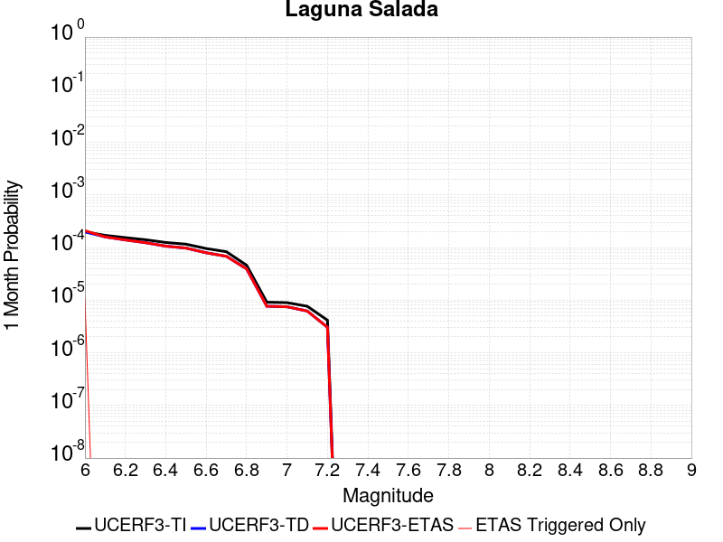 | 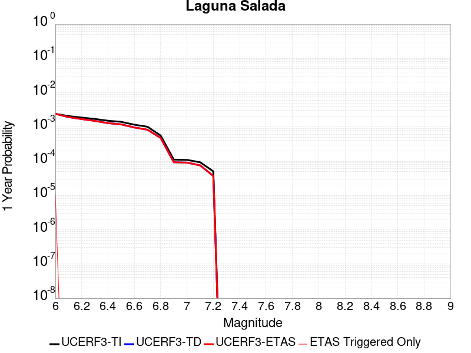 | 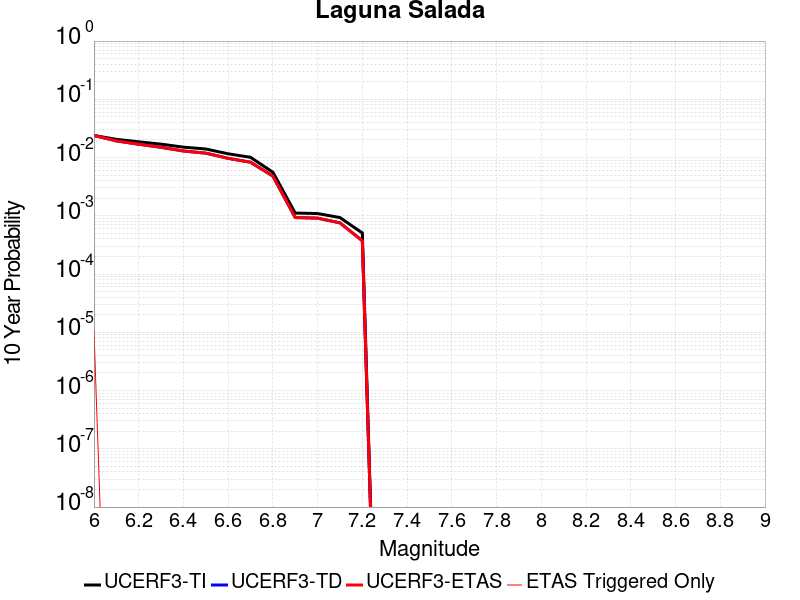 |

| Magnitude | 1 wk TI Prob | 1 wk TD Prob | 1 wk ETAS Prob | 1 wk ETAS/TD Gain | 1 wk ETAS Triggered Only | 1 mo TI Prob | 1 mo TD Prob | 1 mo ETAS Prob | 1 mo ETAS/TD Gain | 1 mo ETAS Triggered Only | 1 yr TI Prob | 1 yr TD Prob | 1 yr ETAS Prob | 1 yr ETAS/TD Gain | 1 yr ETAS Triggered Only | 10 yr TI Prob | 10 yr TD Prob | 10 yr ETAS Prob | 10 yr ETAS/TD Gain | 10 yr ETAS Triggered Only |
|-----|-----|-----|-----|-----|-----|-----|-----|-----|-----|-----|-----|-----|-----|-----|-----|-----|-----|-----|-----|-----|
| 6.0 | 4.6465593E-5 | 4.634639E-5 | 5.728716E-5 | 1.2360653 | 1.0941279E-5 | 1.9912305E-4 | 1.9861311E-4 | 2.095522E-4 | 1.0550774 | 1.0941279E-5 | 0.0024216278 | 0.002415429 | 0.002426344 | 1.0045187 | 1.0941279E-5 | 0.02395408 | 0.023975259 | 0.023985937 | 1.0004454 | 1.0941279E-5 |
| 6.1 | 3.982297E-5 | 3.7246125E-5 | 3.7246125E-5 | 1.0 | 0.0 | 1.706587E-4 | 1.5961716E-4 | 1.5961716E-4 | 1.0 | 0.0 | 0.0020757897 | 0.0019417295 | 0.0019417295 | 1.0 | 0.0 | 0.020565065 | 0.019331863 | 0.019331863 | 1.0 | 0.0 |
| 6.2 | 3.6067784E-5 | 3.2602693E-5 | 3.2602693E-5 | 1.0 | 0.0 | 1.5456705E-4 | 1.3971896E-4 | 1.3971896E-4 | 1.0 | 0.0 | 0.0018802295 | 0.0016998611 | 0.0016998611 | 1.0 | 0.0 | 0.018644003 | 0.016949628 | 0.016949628 | 1.0 | 0.0 |
| 6.3 | 3.2859112E-5 | 2.8849448E-5 | 2.8849448E-5 | 1.0 | 0.0 | 1.4081717E-4 | 1.2363521E-4 | 1.2363521E-4 | 1.0 | 0.0 | 0.0017131006 | 0.0015043203 | 0.0015043203 | 1.0 | 0.0 | 0.016999546 | 0.015018767 | 0.015018767 | 1.0 | 0.0 |
| 6.4 | 2.9132116E-5 | 2.4852965E-5 | 2.4852965E-5 | 1.0 | 0.0 | 1.2484594E-4 | 1.0650887E-4 | 1.0650887E-4 | 1.0 | 0.0 | 0.0015189396 | 0.001296065 | 0.001296065 | 1.0 | 0.0 | 0.015085992 | 0.012956262 | 0.012956262 | 1.0 | 0.0 |
| 6.5 | 2.7075037E-5 | 2.2825836E-5 | 2.2825836E-5 | 1.0 | 0.0 | 1.1603071E-4 | 9.7821845E-5 | 9.7821845E-5 | 1.0 | 0.0 | 0.0014117584 | 0.0011904186 | 0.0011904186 | 1.0 | 0.0 | 0.014028233 | 0.011907749 | 0.011907749 | 1.0 | 0.0 |
| 6.6 | 2.2367465E-5 | 1.8573526E-5 | 1.8573526E-5 | 1.0 | 0.0 | 9.5857045E-5 | 7.959886E-5 | 7.959886E-5 | 1.0 | 0.0 | 0.0011664346 | 9.6876756E-4 | 9.6876756E-4 | 1.0 | 0.0 | 0.011603311 | 0.009702191 | 0.009702191 | 1.0 | 0.0 |
| 6.7 | 1.9458053E-5 | 1.5914242E-5 | 1.5914242E-5 | 1.0 | 0.0 | 8.338899E-5 | 6.8202564E-5 | 6.8202564E-5 | 1.0 | 0.0 | 0.001014788 | 8.3013024E-4 | 8.3013024E-4 | 1.0 | 0.0 | 0.010101665 | 0.0083209425 | 0.0083209425 | 1.0 | 0.0 |
| 6.8 | 1.0767866E-5 | 9.18435E-6 | 9.18435E-6 | 1.0 | 0.0 | 4.614718E-5 | 3.9361294E-5 | 3.9361294E-5 | 1.0 | 0.0 | 5.6169706E-4 | 4.7918706E-4 | 4.7918706E-4 | 1.0 | 0.0 | 0.0056027942 | 0.0048096925 | 0.0048096925 | 1.0 | 0.0 |
| 6.9 | 2.1384765E-6 | 1.7913675E-6 | 1.7913675E-6 | 1.0 | 0.0 | 9.164866E-6 | 7.677269E-6 | 7.677269E-6 | 1.0 | 0.0 | 1.1157654E-4 | 9.346713E-5 | 9.346713E-5 | 1.0 | 0.0 | 0.0011152053 | 9.343165E-4 | 9.343165E-4 | 1.0 | 0.0 |
| 7.0 | 2.0952946E-6 | 1.7493046E-6 | 1.7493046E-6 | 1.0 | 0.0 | 8.979802E-6 | 7.4970003E-6 | 7.4970003E-6 | 1.0 | 0.0 | 1.0932361E-4 | 9.1272545E-5 | 9.1272545E-5 | 1.0 | 0.0 | 0.0010926984 | 9.123888E-4 | 9.123888E-4 | 1.0 | 0.0 |
| 7.1 | 1.7887576E-6 | 1.4500254E-6 | 1.4500254E-6 | 1.0 | 0.0 | 7.666081E-6 | 6.2143813E-6 | 6.2143813E-6 | 1.0 | 0.0 | 9.333054E-5 | 7.565777E-5 | 7.565777E-5 | 1.0 | 0.0 | 9.329135E-4 | 7.563506E-4 | 7.563506E-4 | 1.0 | 0.0 |
| 7.2 | 9.723109E-7 | 7.135619E-7 | 7.135619E-7 | 1.0 | 0.0 | 4.16704E-6 | 3.0581198E-6 | 3.0581198E-6 | 1.0 | 0.0 | 5.073253E-5 | 3.7232137E-5 | 3.7232137E-5 | 1.0 | 0.0 | 5.072095E-4 | 3.7227524E-4 | 3.7227524E-4 | 1.0 | 0.0 |

## North Frontal  (West)
*[(top)](#table-of-contents)*

| 1 Week | 1 Month | 1 Year | 10 Year |
|-----|-----|-----|-----|
| 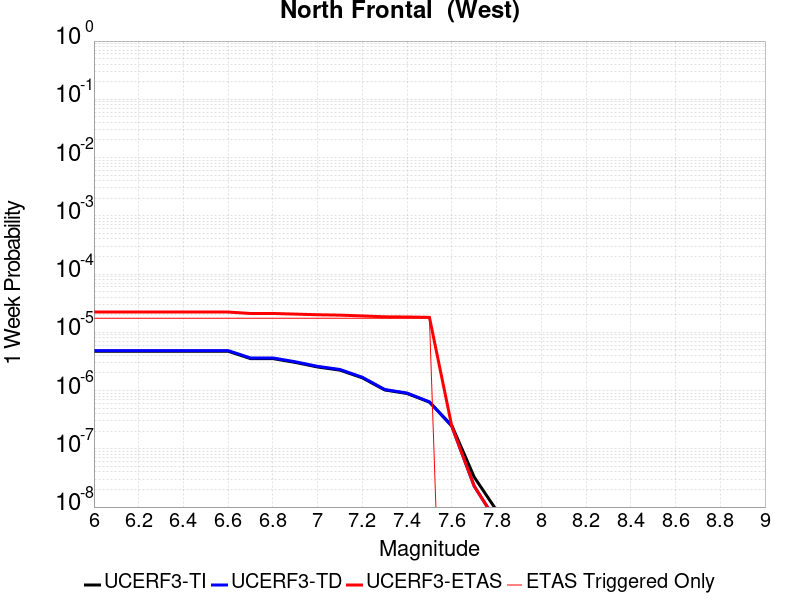 | 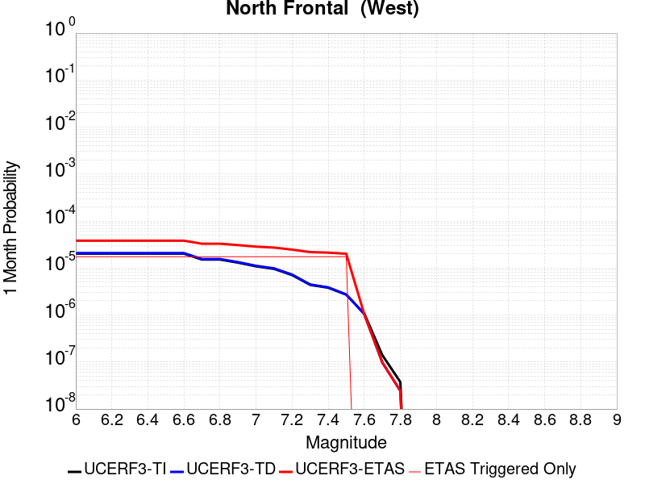 | 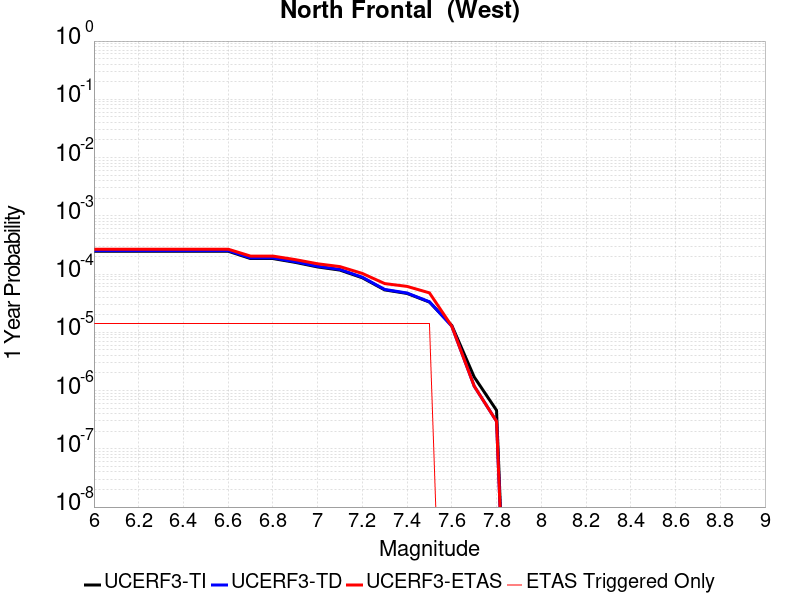 | 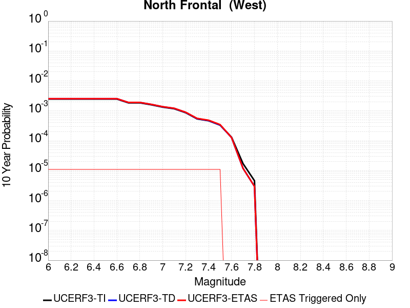 |

| Magnitude | 1 wk TI Prob | 1 wk TD Prob | 1 wk ETAS Prob | 1 wk ETAS/TD Gain | 1 wk ETAS Triggered Only | 1 mo TI Prob | 1 mo TD Prob | 1 mo ETAS Prob | 1 mo ETAS/TD Gain | 1 mo ETAS Triggered Only | 1 yr TI Prob | 1 yr TD Prob | 1 yr ETAS Prob | 1 yr ETAS/TD Gain | 1 yr ETAS Triggered Only | 10 yr TI Prob | 10 yr TD Prob | 10 yr ETAS Prob | 10 yr ETAS/TD Gain | 10 yr ETAS Triggered Only |
|-----|-----|-----|-----|-----|-----|-----|-----|-----|-----|-----|-----|-----|-----|-----|-----|-----|-----|-----|-----|-----|
| 6.0 | 4.7316266E-6 | 4.8526726E-6 | 1.5793898E-5 | 3.2546802 | 1.0941279E-5 | 2.0278241E-5 | 2.0797012E-5 | 3.173806E-5 | 1.5260876 | 1.0941279E-5 | 2.4685962E-4 | 2.5317568E-4 | 2.6411418E-4 | 1.0432053 | 1.0941279E-5 | 0.0024658558 | 0.0025290183 | 0.002539932 | 1.0043154 | 1.0941279E-5 |
| 6.1 | 4.7316266E-6 | 4.8526726E-6 | 1.5793898E-5 | 3.2546802 | 1.0941279E-5 | 2.0278241E-5 | 2.0797012E-5 | 3.173806E-5 | 1.5260876 | 1.0941279E-5 | 2.4685962E-4 | 2.5317568E-4 | 2.6411418E-4 | 1.0432053 | 1.0941279E-5 | 0.0024658558 | 0.0025290183 | 0.002539932 | 1.0043154 | 1.0941279E-5 |
| 6.2 | 4.7316266E-6 | 4.8526726E-6 | 1.5793898E-5 | 3.2546802 | 1.0941279E-5 | 2.0278241E-5 | 2.0797012E-5 | 3.173806E-5 | 1.5260876 | 1.0941279E-5 | 2.4685962E-4 | 2.5317568E-4 | 2.6411418E-4 | 1.0432053 | 1.0941279E-5 | 0.0024658558 | 0.0025290183 | 0.002539932 | 1.0043154 | 1.0941279E-5 |
| 6.3 | 4.7316266E-6 | 4.8526726E-6 | 1.5793898E-5 | 3.2546802 | 1.0941279E-5 | 2.0278241E-5 | 2.0797012E-5 | 3.173806E-5 | 1.5260876 | 1.0941279E-5 | 2.4685962E-4 | 2.5317568E-4 | 2.6411418E-4 | 1.0432053 | 1.0941279E-5 | 0.0024658558 | 0.0025290183 | 0.002539932 | 1.0043154 | 1.0941279E-5 |
| 6.4 | 4.7316266E-6 | 4.8526726E-6 | 1.5793898E-5 | 3.2546802 | 1.0941279E-5 | 2.0278241E-5 | 2.0797012E-5 | 3.173806E-5 | 1.5260876 | 1.0941279E-5 | 2.4685962E-4 | 2.5317568E-4 | 2.6411418E-4 | 1.0432053 | 1.0941279E-5 | 0.0024658558 | 0.0025290183 | 0.002539932 | 1.0043154 | 1.0941279E-5 |
| 6.5 | 4.7316266E-6 | 4.8526726E-6 | 1.5793898E-5 | 3.2546802 | 1.0941279E-5 | 2.0278241E-5 | 2.0797012E-5 | 3.173806E-5 | 1.5260876 | 1.0941279E-5 | 2.4685962E-4 | 2.5317568E-4 | 2.6411418E-4 | 1.0432053 | 1.0941279E-5 | 0.0024658558 | 0.0025290183 | 0.002539932 | 1.0043154 | 1.0941279E-5 |
| 6.6 | 4.7316266E-6 | 4.8526726E-6 | 1.5793898E-5 | 3.2546802 | 1.0941279E-5 | 2.0278241E-5 | 2.0797012E-5 | 3.173806E-5 | 1.5260876 | 1.0941279E-5 | 2.4685962E-4 | 2.5317568E-4 | 2.6411418E-4 | 1.0432053 | 1.0941279E-5 | 0.0024658558 | 0.0025290183 | 0.002539932 | 1.0043154 | 1.0941279E-5 |
| 6.7 | 3.5382777E-6 | 3.6308859E-6 | 1.4572124E-5 | 4.0133796 | 1.0941279E-5 | 1.516396E-5 | 1.5560852E-5 | 2.6501959E-5 | 1.7031176 | 1.0941279E-5 | 1.8460557E-4 | 1.8943768E-4 | 2.0037688E-4 | 1.0577457 | 1.0941279E-5 | 0.0018445229 | 0.0018928389 | 0.0019037594 | 1.0057694 | 1.0941279E-5 |
| 6.8 | 3.5382777E-6 | 3.6308859E-6 | 1.4572124E-5 | 4.0133796 | 1.0941279E-5 | 1.516396E-5 | 1.5560852E-5 | 2.6501959E-5 | 1.7031176 | 1.0941279E-5 | 1.8460557E-4 | 1.8943768E-4 | 2.0037688E-4 | 1.0577457 | 1.0941279E-5 | 0.0018445229 | 0.0018928389 | 0.0019037594 | 1.0057694 | 1.0941279E-5 |
| 6.9 | 3.0428037E-6 | 3.1227605E-6 | 1.4064005E-5 | 4.503709 | 1.0941279E-5 | 1.30405215E-5 | 1.33831945E-5 | 2.4324327E-5 | 1.8175277 | 1.0941279E-5 | 1.5875678E-4 | 1.6292889E-4 | 1.738684E-4 | 1.0671427 | 1.0941279E-5 | 0.0015864341 | 0.0016281615 | 0.001639085 | 1.0067091 | 1.0941279E-5 |
| 7.0 | 2.538778E-6 | 2.6060904E-6 | 1.354734E-5 | 5.1983385 | 1.0941279E-5 | 1.0880432E-5 | 1.1168913E-5 | 2.2110069E-5 | 1.9796079 | 1.0941279E-5 | 1.324612E-4 | 1.3597352E-4 | 1.469133E-4 | 1.0804553 | 1.0941279E-5 | 0.0013238228 | 0.0013589499 | 0.0013698763 | 1.0080403 | 1.0941279E-5 |
| 7.1 | 2.2418935E-6 | 2.3012074E-6 | 1.324246E-5 | 5.754571 | 1.0941279E-5 | 9.60808E-6 | 9.862282E-6 | 2.0803453E-5 | 2.1093953 | 1.0941279E-5 | 1.1697209E-4 | 1.2006712E-4 | 1.3100708E-4 | 1.0911154 | 1.0941279E-5 | 0.0011691054 | 0.0012000664 | 0.0012109946 | 1.0091063 | 1.0941279E-5 |
| 7.2 | 1.6526745E-6 | 1.6924851E-6 | 1.26337445E-5 | 7.464612 | 1.0941279E-5 | 7.082872E-6 | 7.253489E-6 | 1.8194687E-5 | 2.508405 | 1.0941279E-5 | 8.623055E-5 | 8.8307905E-5 | 9.924822E-5 | 1.1238883 | 1.0941279E-5 | 8.61971E-4 | 8.827532E-4 | 8.936848E-4 | 1.0123836 | 1.0941279E-5 |
| 7.3 | 1.0246019E-6 | 1.0442261E-6 | 1.1985493E-5 | 11.477872 | 1.0941279E-5 | 4.391144E-6 | 4.4752474E-6 | 1.5416477E-5 | 3.444832 | 1.0941279E-5 | 5.3460866E-5 | 5.448489E-5 | 6.542558E-5 | 1.2008021 | 1.0941279E-5 | 5.344801E-4 | 5.4472685E-4 | 5.5566215E-4 | 1.0200748 | 1.0941279E-5 |
| 7.4 | 8.9045164E-7 | 9.0565584E-7 | 1.1846924E-5 | 13.081044 | 1.0941279E-5 | 3.8162157E-6 | 3.8813773E-6 | 1.4822613E-5 | 3.8189056 | 1.0941279E-5 | 4.646144E-5 | 4.7254853E-5 | 5.8195612E-5 | 1.2315267 | 1.0941279E-5 | 4.6451724E-4 | 4.7245892E-4 | 4.8339504E-4 | 1.0231472 | 1.0941279E-5 |
| 7.5 | 6.3357E-7 | 6.4027006E-7 | 1.1581541E-5 | 18.088526 | 1.0941279E-5 | 2.7152971E-6 | 2.744012E-6 | 1.36852605E-5 | 4.987318 | 1.0941279E-5 | 3.305824E-5 | 3.34079E-5 | 4.4348813E-5 | 1.3274947 | 1.0941279E-5 | 3.3053322E-4 | 3.3403534E-4 | 3.4497297E-4 | 1.0327439 | 1.0941279E-5 |
| 7.6 | 2.5087024E-7 | 2.4361097E-7 | 2.4361097E-7 | 1.0 | 0.0 | 1.0751578E-6 | 1.0440467E-6 | 1.0440467E-6 | 1.0 | 0.0 | 1.3089967E-5 | 1.2711216E-5 | 1.2711216E-5 | 1.0 | 0.0 | 1.3089196E-4 | 1.2710695E-4 | 1.2710695E-4 | 1.0 | 0.0 |
| 7.7 | 3.282987E-8 | 2.2874195E-8 | 2.2874195E-8 | 1.0 | 0.0 | 1.4069944E-7 | 9.803227E-8 | 9.803227E-8 | 1.0 | 0.0 | 1.7130144E-6 | 1.1935423E-6 | 1.1935423E-6 | 1.0 | 0.0 | 1.7130013E-5 | 1.1935367E-5 | 1.1935367E-5 | 1.0 | 0.0 |
| 7.8 | 8.77499E-9 | 5.6815956E-9 | 5.6815956E-9 | 1.0 | 0.0 | 3.7607098E-8 | 2.4349696E-8 | 2.4349696E-8 | 1.0 | 0.0 | 4.578663E-7 | 2.9645753E-7 | 2.9645753E-7 | 1.0 | 0.0 | 4.5786537E-6 | 2.9645726E-6 | 2.9645726E-6 | 1.0 | 0.0 |

## Anacapa-Dume alt 1
*[(top)](#table-of-contents)*

| 1 Week | 1 Month | 1 Year | 10 Year |
|-----|-----|-----|-----|
|  |  |  |  |

| Magnitude | 1 wk TI Prob | 1 wk TD Prob | 1 wk ETAS Prob | 1 wk ETAS/TD Gain | 1 wk ETAS Triggered Only | 1 mo TI Prob | 1 mo TD Prob | 1 mo ETAS Prob | 1 mo ETAS/TD Gain | 1 mo ETAS Triggered Only | 1 yr TI Prob | 1 yr TD Prob | 1 yr ETAS Prob | 1 yr ETAS/TD Gain | 1 yr ETAS Triggered Only | 10 yr TI Prob | 10 yr TD Prob | 10 yr ETAS Prob | 10 yr ETAS/TD Gain | 10 yr ETAS Triggered Only |
|-----|-----|-----|-----|-----|-----|-----|-----|-----|-----|-----|-----|-----|-----|-----|-----|-----|-----|-----|-----|-----|
| 6.0 | 5.1871802E-6 | 5.3673907E-6 | 1.630861E-5 | 3.0384614 | 1.0941279E-5 | 2.2230583E-5 | 2.3002905E-5 | 3.3943932E-5 | 1.4756367 | 1.0941279E-5 | 2.7062374E-4 | 2.8002524E-4 | 2.9096345E-4 | 1.0390615 | 1.0941279E-5 | 0.002702944 | 0.0027968092 | 0.0028077199 | 1.0039011 | 1.0941279E-5 |
| 6.1 | 5.1871802E-6 | 5.3673907E-6 | 1.630861E-5 | 3.0384614 | 1.0941279E-5 | 2.2230583E-5 | 2.3002905E-5 | 3.3943932E-5 | 1.4756367 | 1.0941279E-5 | 2.7062374E-4 | 2.8002524E-4 | 2.9096345E-4 | 1.0390615 | 1.0941279E-5 | 0.002702944 | 0.0027968092 | 0.0028077199 | 1.0039011 | 1.0941279E-5 |
| 6.2 | 5.1871802E-6 | 5.3673907E-6 | 1.630861E-5 | 3.0384614 | 1.0941279E-5 | 2.2230583E-5 | 2.3002905E-5 | 3.3943932E-5 | 1.4756367 | 1.0941279E-5 | 2.7062374E-4 | 2.8002524E-4 | 2.9096345E-4 | 1.0390615 | 1.0941279E-5 | 0.002702944 | 0.0027968092 | 0.0028077199 | 1.0039011 | 1.0941279E-5 |
| 6.3 | 5.1871802E-6 | 5.3673907E-6 | 1.630861E-5 | 3.0384614 | 1.0941279E-5 | 2.2230583E-5 | 2.3002905E-5 | 3.3943932E-5 | 1.4756367 | 1.0941279E-5 | 2.7062374E-4 | 2.8002524E-4 | 2.9096345E-4 | 1.0390615 | 1.0941279E-5 | 0.002702944 | 0.0027968092 | 0.0028077199 | 1.0039011 | 1.0941279E-5 |
| 6.4 | 5.1871802E-6 | 5.3673907E-6 | 1.630861E-5 | 3.0384614 | 1.0941279E-5 | 2.2230583E-5 | 2.3002905E-5 | 3.3943932E-5 | 1.4756367 | 1.0941279E-5 | 2.7062374E-4 | 2.8002524E-4 | 2.9096345E-4 | 1.0390615 | 1.0941279E-5 | 0.002702944 | 0.0027968092 | 0.0028077199 | 1.0039011 | 1.0941279E-5 |
| 6.5 | 5.1871802E-6 | 5.3673907E-6 | 1.630861E-5 | 3.0384614 | 1.0941279E-5 | 2.2230583E-5 | 2.3002905E-5 | 3.3943932E-5 | 1.4756367 | 1.0941279E-5 | 2.7062374E-4 | 2.8002524E-4 | 2.9096345E-4 | 1.0390615 | 1.0941279E-5 | 0.002702944 | 0.0027968092 | 0.0028077199 | 1.0039011 | 1.0941279E-5 |
| 6.6 | 5.1871802E-6 | 5.3673907E-6 | 1.630861E-5 | 3.0384614 | 1.0941279E-5 | 2.2230583E-5 | 2.3002905E-5 | 3.3943932E-5 | 1.4756367 | 1.0941279E-5 | 2.7062374E-4 | 2.8002524E-4 | 2.9096345E-4 | 1.0390615 | 1.0941279E-5 | 0.002702944 | 0.0027968092 | 0.0028077199 | 1.0039011 | 1.0941279E-5 |
| 6.7 | 4.7693475E-6 | 4.9366918E-6 | 1.5877917E-5 | 3.216307 | 1.0941279E-5 | 2.04399E-5 | 2.1157082E-5 | 3.209813E-5 | 1.517134 | 1.0941279E-5 | 2.4882736E-4 | 2.5755778E-4 | 2.6849625E-4 | 1.04247 | 1.0941279E-5 | 0.0024854892 | 0.002572669 | 0.002583582 | 1.004242 | 1.0941279E-5 |
| 6.8 | 4.753408E-6 | 4.92024E-6 | 1.5861464E-5 | 3.2237177 | 1.0941279E-5 | 2.037159E-5 | 2.1086576E-5 | 3.2027623E-5 | 1.5188632 | 1.0941279E-5 | 2.4799586E-4 | 2.5669957E-4 | 2.6763804E-4 | 1.042612 | 1.0941279E-5 | 0.002477193 | 0.0025641066 | 0.0025750198 | 1.0042561 | 1.0941279E-5 |
| 6.9 | 3.800069E-6 | 3.937126E-6 | 1.4878361E-5 | 3.7789903 | 1.0941279E-5 | 1.6285909E-5 | 1.687329E-5 | 2.7814383E-5 | 1.6484268 | 1.0941279E-5 | 1.9826289E-4 | 2.0541316E-4 | 2.163522E-4 | 1.0532538 | 1.0941279E-5 | 0.001980861 | 0.0020522568 | 0.0020631757 | 1.0053204 | 1.0941279E-5 |
| 7.0 | 3.6671938E-6 | 3.7999182E-6 | 1.4741155E-5 | 3.8793347 | 1.0941279E-5 | 1.571645E-5 | 1.6285263E-5 | 2.7226364E-5 | 1.6718405 | 1.0941279E-5 | 1.9133097E-4 | 1.9825528E-4 | 2.0919438E-4 | 1.0551769 | 1.0941279E-5 | 0.0019116632 | 0.0019808074 | 0.001991727 | 1.0055127 | 1.0941279E-5 |
| 7.1 | 3.2394885E-6 | 3.3587933E-6 | 1.4300034E-5 | 4.2574916 | 1.0941279E-5 | 1.3883448E-5 | 1.4394749E-5 | 2.533587E-5 | 1.7600772 | 1.0941279E-5 | 1.6901788E-4 | 1.7524208E-4 | 1.8618144E-4 | 1.0624243 | 1.0941279E-5 | 0.0016888938 | 0.0017510501 | 0.0017619723 | 1.0062375 | 1.0941279E-5 |
| 7.2 | 3.0935948E-6 | 3.2079258E-6 | 1.4149169E-5 | 4.410691 | 1.0941279E-5 | 1.3258196E-5 | 1.3748182E-5 | 2.468931E-5 | 1.7958236 | 1.0941279E-5 | 1.6140658E-4 | 1.6737137E-4 | 1.7831082E-4 | 1.0653603 | 1.0941279E-5 | 0.001612894 | 0.0016724641 | 0.0016833871 | 1.0065311 | 1.0941279E-5 |
| 7.3 | 2.5604163E-6 | 2.647073E-6 | 1.3588322E-5 | 5.1333385 | 1.0941279E-5 | 1.0973167E-5 | 1.1344549E-5 | 2.2285703E-5 | 1.9644414 | 1.0941279E-5 | 1.3359012E-4 | 1.3811118E-4 | 1.4905095E-4 | 1.0792098 | 1.0941279E-5 | 0.0013350984 | 0.0013802581 | 0.0013911843 | 1.0079161 | 1.0941279E-5 |
| 7.4 | 2.1429005E-6 | 2.2106028E-6 | 2.2106028E-6 | 1.0 | 0.0 | 9.1838265E-6 | 9.473977E-6 | 9.473977E-6 | 1.0 | 0.0 | 1.11807356E-4 | 1.1533959E-4 | 1.1533959E-4 | 1.0 | 0.0 | 0.0011175112 | 0.0011527999 | 0.0011527999 | 1.0 | 0.0 |
| 7.5 | 1.7237151E-6 | 1.7761449E-6 | 1.7761449E-6 | 1.0 | 0.0 | 7.3873293E-6 | 7.6120277E-6 | 7.6120277E-6 | 1.0 | 0.0 | 8.993702E-5 | 9.267252E-5 | 9.267252E-5 | 1.0 | 0.0 | 8.990063E-4 | 9.2634105E-4 | 9.2634105E-4 | 1.0 | 0.0 |
| 7.6 | 9.541696E-7 | 9.823206E-7 | 9.823206E-7 | 1.0 | 0.0 | 4.089292E-6 | 4.2099387E-6 | 4.2099387E-6 | 1.0 | 0.0 | 4.9785995E-5 | 5.1254807E-5 | 5.1254807E-5 | 1.0 | 0.0 | 4.9774844E-4 | 5.1243114E-4 | 5.1243114E-4 | 1.0 | 0.0 |
| 7.7 | 2.7226676E-7 | 2.7172416E-7 | 2.7172416E-7 | 1.0 | 0.0 | 1.166857E-6 | 1.1645316E-6 | 1.1645316E-6 | 1.0 | 0.0 | 1.4206392E-5 | 1.4178081E-5 | 1.4178081E-5 | 1.0 | 0.0 | 1.4205484E-4 | 1.4177183E-4 | 1.4177183E-4 | 1.0 | 0.0 |
| 7.8 | 4.5017995E-8 | 4.2157676E-8 | 4.2157676E-8 | 1.0 | 0.0 | 1.9293425E-7 | 1.8067574E-7 | 1.8067574E-7 | 1.0 | 0.0 | 2.348972E-6 | 2.1997253E-6 | 2.1997253E-6 | 1.0 | 0.0 | 2.348947E-5 | 2.1997055E-5 | 2.1997055E-5 | 1.0 | 0.0 |
| 7.9 | 8.007447E-10 | 6.1608785E-10 | 6.1608785E-10 | 1.0 | 0.0 | 3.4317629E-9 | 2.6403764E-9 | 2.6403764E-9 | 1.0 | 0.0 | 4.1781714E-8 | 3.2146584E-8 | 3.2146584E-8 | 1.0 | 0.0 | 4.1781706E-7 | 3.214658E-7 | 3.214658E-7 | 1.0 | 0.0 |

## Sheephole
*[(top)](#table-of-contents)*

| 1 Week | 1 Month | 1 Year | 10 Year |
|-----|-----|-----|-----|
| 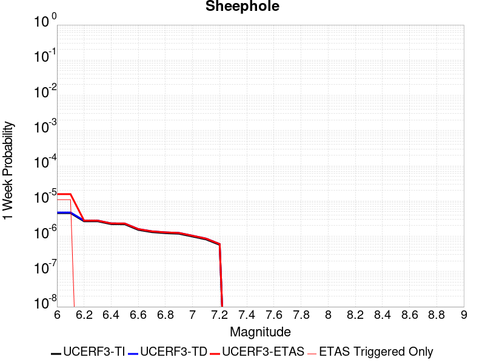 | 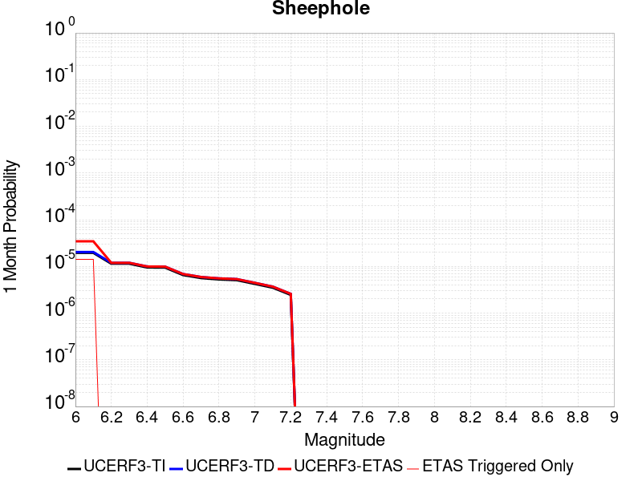 | 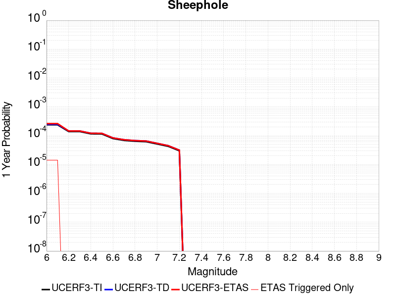 | 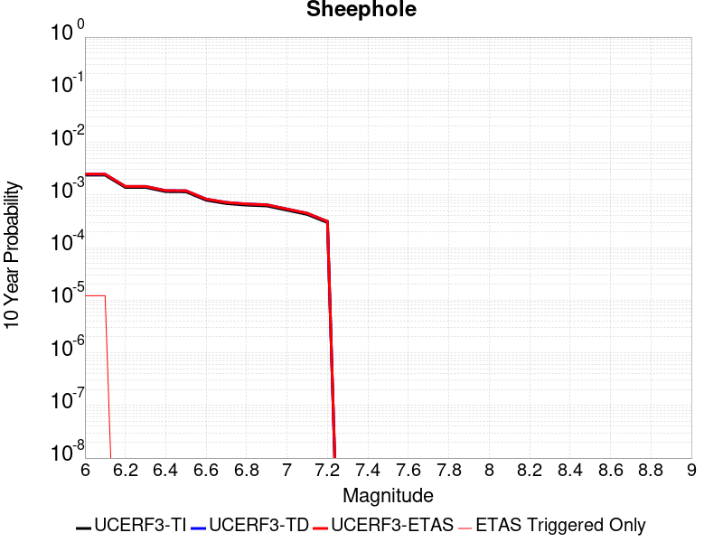 |

| Magnitude | 1 wk TI Prob | 1 wk TD Prob | 1 wk ETAS Prob | 1 wk ETAS/TD Gain | 1 wk ETAS Triggered Only | 1 mo TI Prob | 1 mo TD Prob | 1 mo ETAS Prob | 1 mo ETAS/TD Gain | 1 mo ETAS Triggered Only | 1 yr TI Prob | 1 yr TD Prob | 1 yr ETAS Prob | 1 yr ETAS/TD Gain | 1 yr ETAS Triggered Only | 10 yr TI Prob | 10 yr TD Prob | 10 yr ETAS Prob | 10 yr ETAS/TD Gain | 10 yr ETAS Triggered Only |
|-----|-----|-----|-----|-----|-----|-----|-----|-----|-----|-----|-----|-----|-----|-----|-----|-----|-----|-----|-----|-----|
| 6.0 | 4.5579695E-6 | 4.7412627E-6 | 1.5682488E-5 | 3.3076608 | 1.0941279E-5 | 1.9534009E-5 | 2.031957E-5 | 3.1260624E-5 | 1.5384492 | 1.0941279E-5 | 2.3780059E-4 | 2.473682E-4 | 2.583068E-4 | 1.0442199 | 1.0941279E-5 | 0.0023754628 | 0.002471473 | 0.0024823875 | 1.0044161 | 1.0941279E-5 |
| 6.1 | 4.5579695E-6 | 4.7412627E-6 | 1.5682488E-5 | 3.3076608 | 1.0941279E-5 | 1.9534009E-5 | 2.031957E-5 | 3.1260624E-5 | 1.5384492 | 1.0941279E-5 | 2.3780059E-4 | 2.473682E-4 | 2.583068E-4 | 1.0442199 | 1.0941279E-5 | 0.0023754628 | 0.002471473 | 0.0024823875 | 1.0044161 | 1.0941279E-5 |
| 6.2 | 2.6677674E-6 | 2.7873941E-6 | 2.7873941E-6 | 1.0 | 0.0 | 1.1433239E-5 | 1.1945926E-5 | 1.1945926E-5 | 1.0 | 0.0 | 1.3919079E-4 | 1.4543302E-4 | 1.4543302E-4 | 1.0 | 0.0 | 0.0013910364 | 0.0014534844 | 0.0014534844 | 1.0 | 0.0 |
| 6.3 | 2.6677674E-6 | 2.7873941E-6 | 2.7873941E-6 | 1.0 | 0.0 | 1.1433239E-5 | 1.1945926E-5 | 1.1945926E-5 | 1.0 | 0.0 | 1.3919079E-4 | 1.4543302E-4 | 1.4543302E-4 | 1.0 | 0.0 | 0.0013910364 | 0.0014534844 | 0.0014534844 | 1.0 | 0.0 |
| 6.4 | 2.2159759E-6 | 2.3228788E-6 | 2.3228788E-6 | 1.0 | 0.0 | 9.497005E-6 | 9.955161E-6 | 9.955161E-6 | 1.0 | 0.0 | 1.156199E-4 | 1.2119815E-4 | 1.2119815E-4 | 1.0 | 0.0 | 0.0011555976 | 0.0012113999 | 0.0012113999 | 1.0 | 0.0 |
| 6.5 | 2.1986082E-6 | 2.304759E-6 | 2.304759E-6 | 1.0 | 0.0 | 9.4225725E-6 | 9.877506E-6 | 9.877506E-6 | 1.0 | 0.0 | 1.1471378E-4 | 1.2025281E-4 | 1.2025281E-4 | 1.0 | 0.0 | 0.0011465458 | 0.0012019566 | 0.0012019566 | 1.0 | 0.0 |
| 6.6 | 1.5232331E-6 | 1.6018919E-6 | 1.6018919E-6 | 1.0 | 0.0 | 6.5281256E-6 | 6.865234E-6 | 6.865234E-6 | 1.0 | 0.0 | 7.947703E-5 | 8.35812E-5 | 8.35812E-5 | 1.0 | 0.0 | 7.9448614E-4 | 8.3551643E-4 | 8.3551643E-4 | 1.0 | 0.0 |
| 6.7 | 1.3137362E-6 | 1.382819E-6 | 1.382819E-6 | 1.0 | 0.0 | 5.6302856E-6 | 5.926355E-6 | 5.926355E-6 | 1.0 | 0.0 | 6.854657E-5 | 7.215112E-5 | 7.215112E-5 | 1.0 | 0.0 | 6.8525434E-4 | 7.212908E-4 | 7.212908E-4 | 1.0 | 0.0 |
| 6.8 | 1.2275751E-6 | 1.2922847E-6 | 1.2922847E-6 | 1.0 | 0.0 | 5.2610258E-6 | 5.5383516E-6 | 5.5383516E-6 | 1.0 | 0.0 | 6.4051106E-5 | 6.7427485E-5 | 6.7427485E-5 | 1.0 | 0.0 | 6.4032647E-4 | 6.740836E-4 | 6.740836E-4 | 1.0 | 0.0 |
| 6.9 | 1.1837088E-6 | 1.246102E-6 | 1.246102E-6 | 1.0 | 0.0 | 5.0730278E-6 | 5.340427E-6 | 5.340427E-6 | 1.0 | 0.0 | 6.176237E-5 | 6.501789E-5 | 6.501789E-5 | 1.0 | 0.0 | 6.17452E-4 | 6.5000186E-4 | 6.5000186E-4 | 1.0 | 0.0 |
| 7.0 | 9.849371E-7 | 1.0366288E-6 | 1.0366288E-6 | 1.0 | 0.0 | 4.2211523E-6 | 4.442688E-6 | 4.442688E-6 | 1.0 | 0.0 | 5.1391315E-5 | 5.4088487E-5 | 5.4088487E-5 | 1.0 | 0.0 | 5.137943E-4 | 5.407633E-4 | 5.407633E-4 | 1.0 | 0.0 |
| 7.1 | 8.1643645E-7 | 8.591669E-7 | 8.591669E-7 | 1.0 | 0.0 | 3.4990085E-6 | 3.682139E-6 | 3.682139E-6 | 1.0 | 0.0 | 4.2599597E-5 | 4.482921E-5 | 4.482921E-5 | 1.0 | 0.0 | 4.259143E-4 | 4.4821028E-4 | 4.4821028E-4 | 1.0 | 0.0 |
| 7.2 | 5.7295756E-7 | 6.029502E-7 | 6.029502E-7 | 1.0 | 0.0 | 2.45553E-6 | 2.58407E-6 | 2.58407E-6 | 1.0 | 0.0 | 2.9895667E-5 | 3.1460666E-5 | 3.1460666E-5 | 1.0 | 0.0 | 2.9891645E-4 | 3.145688E-4 | 3.145688E-4 | 1.0 | 0.0 |

