# Parent Section Magnitude-Probability Distributions

Only fault sections with at least one triggered aftershock are plotted. Sections are sorted by total supraseismogenic trigger rate (decreasing)

## Table Of Contents

* [Garlock (Central)](#garlock-central)
* [Tank Canyon](#tank-canyon)
* [Little Lake](#little-lake)
* [Airport Lake](#airport-lake)
* [Owl Lake](#owl-lake)
* [Panamint Valley](#panamint-valley)
* [Garlock (East)](#garlock-east)
* [Hunter Mountain-Saline Valley](#hunter-mountain-saline-valley)
* [Blackwater](#blackwater)
* [Ash Hill](#ash-hill)
* [Garlock (West)](#garlock-west)
* [Gravel Hills-Harper Lk](#gravel-hills-harper-lk)
* [McLean Lake](#mclean-lake)
* [Goldstone Lake](#goldstone-lake)
* [So Sierra Nevada](#so-sierra-nevada)
* [San Andreas (Mojave N)](#san-andreas-mojave-n)
* [Coyote Canyon](#coyote-canyon)
* [San Andreas (Mojave S)](#san-andreas-mojave-s)
* [Death Valley (So)](#death-valley-so)
* [Towne Pass](#towne-pass)
* [Nelson Lake](#nelson-lake)
* [San Andreas (San Bernardino N)](#san-andreas-san-bernardino-n)
* [Lenwood-Lockhart-Old Woman Springs](#lenwood-lockhart-old-woman-springs)
* [Bicycle Lake](#bicycle-lake)
* [Paradise](#paradise)
* [Garlic Springs](#garlic-springs)
* [Death Valley (Black Mtns Frontal)](#death-valley-black-mtns-frontal)
* [San Andreas (San Bernardino S)](#san-andreas-san-bernardino-s)
* [Coyote Lake](#coyote-lake)
* [Helendale-So Lockhart](#helendale-so-lockhart)
* [San Andreas (Big Bend)](#san-andreas-big-bend)
* [Death Valley (No)](#death-valley-no)
* [San Jacinto (San Bernardino)](#san-jacinto-san-bernardino)
* [Red Pass](#red-pass)
* [Elsinore (Glen Ivy) rev](#elsinore-glen-ivy-rev)
* [San Andreas (Parkfield)](#san-andreas-parkfield)
* [San Jacinto (San Jacinto Valley) rev](#san-jacinto-san-jacinto-valley-rev)
* [Ludlow](#ludlow)
* [Manix-Afton Hills](#manix-afton-hills)
* [San Jacinto (Stepovers Combined)](#san-jacinto-stepovers-combined)
* [Calico-Hidalgo](#calico-hidalgo)
* [San Andreas (Cholame) rev](#san-andreas-cholame-rev)
* [San Andreas (Carrizo) rev](#san-andreas-carrizo-rev)
* [San Andreas (North Branch Mill Creek)](#san-andreas-north-branch-mill-creek)
* [Death Valley (Fish Lake Valley)](#death-valley-fish-lake-valley)
* [Cady](#cady)
* [San Andreas (Creeping Section) 2011 CFM](#san-andreas-creeping-section-2011-cfm)
* [Sierra Nevada  (No Extension)](#sierra-nevada--no-extension)
* [San Andreas (San Gorgonio Pass-Garnet HIll)](#san-andreas-san-gorgonio-pass-garnet-hill)
* [San Jacinto (Anza) rev](#san-jacinto-anza-rev)
* [White Mountains](#white-mountains)
* [San Andreas (Coachella) rev](#san-andreas-coachella-rev)
* [Baker](#baker)
* [Brawley (Seismic Zone) alt 1](#brawley-seismic-zone-alt-1)
* [Lake Isabella (Seismicity)](#lake-isabella-seismicity)
* [Santa Ynez (East)](#santa-ynez-east)
* [Scodie Lineament](#scodie-lineament)
* [San Jacinto (Coyote Creek)](#san-jacinto-coyote-creek)
* [Imperial](#imperial)
* [Chino alt 1](#chino-alt-1)
* [White Wolf (Extension)](#white-wolf-extension)
* [San Jacinto (Lytle Creek connector)](#san-jacinto-lytle-creek-connector)
* [Independence rev 2011](#independence-rev-2011)
* [San Jacinto (Borrego)](#san-jacinto-borrego)
* [Deep Springs](#deep-springs)
* [Coronado Bank alt1](#coronado-bank-alt1)
* [Kern Canyon (South Kern) 2011](#kern-canyon-south-kern-2011)
* [Mission Ridge-Arroyo Parida-Santa Ana](#mission-ridge-arroyo-parida-santa-ana)
* [Camp Rock 2011](#camp-rock-2011)
* [Dry Mountain](#dry-mountain)
* [San Clemente](#san-clemente)
* [Sierra Madre](#sierra-madre)
* [Simi-Santa Rosa](#simi-santa-rosa)
* [San Pedro Basin](#san-pedro-basin)
* [Pleito](#pleito)
* [Oceanic - West Huasna](#oceanic---west-huasna)
* [Kern Canyon (North Kern) 2011](#kern-canyon-north-kern-2011)
* [Raymond](#raymond)
* [Santa Rosa Island](#santa-rosa-island)
* [Whittier alt 1](#whittier-alt-1)
* [Owens Valley](#owens-valley)
* [Great Valley 09 (Laguna Seca)](#great-valley-09-laguna-seca)
* [San Andreas (Santa Cruz Mts) 2011 CFM](#san-andreas-santa-cruz-mts-2011-cfm)
* [Lost Hills](#lost-hills)
* [Santa Susana alt 1](#santa-susana-alt-1)
* [White Wolf](#white-wolf)
* [Pisgah-Bullion Mtn-Mesquite Lk](#pisgah-bullion-mtn-mesquite-lk)
* [Hayward (So) 2011 CFM](#hayward-so-2011-cfm)
* [Cleghorn](#cleghorn)
* [Pittville 2011 CFM](#pittville-2011-cfm)
* [Bullion Mountains](#bullion-mountains)
* [Palos Verdes](#palos-verdes)
* [Kern Canyon (Lake Isabella) 2011](#kern-canyon-lake-isabella-2011)
* [Rose Canyon](#rose-canyon)
* [Oak Ridge (Onshore)](#oak-ridge-onshore)
* [Elsinore (Stepovers Combined)](#elsinore-stepovers-combined)
* [Monterey Bay-Tularcitos](#monterey-bay-tularcitos)
* [Tin Mountain](#tin-mountain)
* [Cleghorn Lake](#cleghorn-lake)
* [Santa Ynez (West)](#santa-ynez-west)
* [San Jacinto (Clark) rev](#san-jacinto-clark-rev)
* [Calaveras (So) - Paicines extension 2011 CFM](#calaveras-so---paicines-extension-2011-cfm)
* [Mission Creek](#mission-creek)
* [Northridge](#northridge)
* [Cleghorn Pass](#cleghorn-pass)
* [Calaveras (So) 2011 CFM](#calaveras-so-2011-cfm)
* [Blue Cut](#blue-cut)
* [Big Pine (Central)](#big-pine-central)
* [Honey Lake 2011 CFM](#honey-lake-2011-cfm)
* [San Gabriel](#san-gabriel)
* [Santa Susana East (connector)](#santa-susana-east-connector)
* [Cucamonga](#cucamonga)
* [Newport-Inglewood (Offshore)](#newport-inglewood-offshore)
* [Ventura-Pitas Point](#ventura-pitas-point)
* [San Diego Trough south](#san-diego-trough-south)
* [San Juan](#san-juan)
* [Red Mountain](#red-mountain)
* [Almanor 2011 CFM](#almanor-2011-cfm)
* [Great Valley 11](#great-valley-11)
* [Santa Cruz Island](#santa-cruz-island)
* [Malibu Coast alt 1](#malibu-coast-alt-1)
* [Great Valley 03 Mysterious Ridge](#great-valley-03-mysterious-ridge)
* [Verdugo](#verdugo)
* [Green Valley 2011 CFM](#green-valley-2011-cfm)
* [Great Valley 05 Pittsburg - Kirby Hills alt1](#great-valley-05-pittsburg---kirby-hills-alt1)
* [Calaveras (Central) 2011 CFM](#calaveras-central-2011-cfm)
* [Channel Islands Western Deep Ramp](#channel-islands-western-deep-ramp)
* [Great Valley 03a Dunnigan Hills](#great-valley-03a-dunnigan-hills)
* [Channel Islands Thrust](#channel-islands-thrust)
* [Pinto Mtn](#pinto-mtn)
* [Great Valley 10 (Panoche)](#great-valley-10-panoche)
* [Big Pine (West)](#big-pine-west)
* [Mono Lake 2011 CFM](#mono-lake-2011-cfm)
* [Hunting Creek - Berryessa 2011 CFM](#hunting-creek---berryessa-2011-cfm)
* [Elysian Park (Upper)](#elysian-park-upper)
* [North Frontal  (West)](#north-frontal--west)
* [Breckenridge 2011](#breckenridge-2011)
* [Concord 2011 CFM](#concord-2011-cfm)
* [West Tahoe](#west-tahoe)
* [Rinconada 2011 CFM](#rinconada-2011-cfm)
* [Antelope Valley 2011](#antelope-valley-2011)
* [Pine Mtn](#pine-mtn)
* [San Gabriel (Extension)](#san-gabriel-extension)
* [Surprise Valley 2011 CFM](#surprise-valley-2011-cfm)
* [Davis Creek](#davis-creek)
* [Johnson Valley (No) 2011 rev](#johnson-valley-no-2011-rev)
* [Anacapa-Dume alt 1](#anacapa-dume-alt-1)
* [Elsinore (Temecula) rev](#elsinore-temecula-rev)
* [Clamshell-Sawpit](#clamshell-sawpit)
* [Fitzhugh Creek](#fitzhugh-creek)
* [Puente Hills](#puente-hills)
* [Shoreline](#shoreline)

## Garlock (Central)
*[(top)](#table-of-contents)*

| 1 Week | 1 Month | 1 Year | 10 Year |
|-----|-----|-----|-----|
|  |  |  |  |

| Magnitude | 1 wk TI Prob | 1 wk TD Prob | 1 wk ETAS Prob | 1 wk ETAS/TD Gain | 1 wk ETAS Triggered Only | 1 mo TI Prob | 1 mo TD Prob | 1 mo ETAS Prob | 1 mo ETAS/TD Gain | 1 mo ETAS Triggered Only | 1 yr TI Prob | 1 yr TD Prob | 1 yr ETAS Prob | 1 yr ETAS/TD Gain | 1 yr ETAS Triggered Only | 10 yr TI Prob | 10 yr TD Prob | 10 yr ETAS Prob | 10 yr ETAS/TD Gain | 10 yr ETAS Triggered Only |
|-----|-----|-----|-----|-----|-----|-----|-----|-----|-----|-----|-----|-----|-----|-----|-----|-----|-----|-----|-----|-----|
| 6.0 | 5.5131142E-5 | 7.024681E-5 | 0.071737684 | 1021.2234 | 0.07167248 | 2.3625491E-4 | 3.010234E-4 | 0.080294356 | 266.73795 | 0.080017425 | 0.0028726095 | 0.0036588663 | 0.09364201 | 25.593176 | 0.09031359 | 0.028357591 | 0.036079824 | 0.12876058 | 3.5687695 | 0.096149825 |
| 6.1 | 5.5131142E-5 | 7.024681E-5 | 0.071737684 | 1021.2234 | 0.07167248 | 2.3625491E-4 | 3.010234E-4 | 0.080294356 | 266.73795 | 0.080017425 | 0.0028726095 | 0.0036588663 | 0.09364201 | 25.593176 | 0.09031359 | 0.028357591 | 0.036079824 | 0.12876058 | 3.5687695 | 0.096149825 |
| 6.2 | 4.216245E-5 | 5.1661493E-5 | 0.043307267 | 838.2891 | 0.04325784 | 1.806837E-4 | 2.2138779E-4 | 0.048520796 | 219.16655 | 0.048310105 | 0.0021976046 | 0.0026920962 | 0.057596155 | 21.394537 | 0.055052266 | 0.021759989 | 0.026689773 | 0.08379968 | 3.1397674 | 0.05867596 |
| 6.3 | 4.216245E-5 | 5.1661493E-5 | 0.043307267 | 838.2891 | 0.04325784 | 1.806837E-4 | 2.2138779E-4 | 0.048520796 | 219.16655 | 0.048310105 | 0.0021976046 | 0.0026920962 | 0.057596155 | 21.394537 | 0.055052266 | 0.021759989 | 0.026689773 | 0.08379968 | 3.1397674 | 0.05867596 |
| 6.4 | 3.6858168E-5 | 4.411054E-5 | 0.034067 | 772.3097 | 0.03402439 | 1.5795401E-4 | 1.8903162E-4 | 0.038282875 | 202.52101 | 0.038101044 | 0.0019213937 | 0.002299056 | 0.045596495 | 19.832705 | 0.043397214 | 0.019048655 | 0.02284894 | 0.06792727 | 2.972885 | 0.046132404 |
| 6.5 | 3.39199E-5 | 4.0018083E-5 | 0.0308576 | 771.09143 | 0.030818814 | 1.453629E-4 | 1.7149492E-4 | 0.034608096 | 201.80246 | 0.03444251 | 0.0017683565 | 0.002085973 | 0.041254967 | 19.777327 | 0.03925087 | 0.017543508 | 0.020759864 | 0.0617037 | 2.9722595 | 0.041811846 |
| 6.6 | 3.3571985E-5 | 3.9472274E-5 | 0.03083965 | 781.2991 | 0.030801393 | 1.4387199E-4 | 1.6915603E-4 | 0.03458842 | 204.47641 | 0.034425087 | 0.0017502342 | 0.0020575512 | 0.04119289 | 20.020348 | 0.039216027 | 0.017365133 | 0.020481179 | 0.061385475 | 2.9971652 | 0.04175958 |
| 6.7 | 3.2580007E-5 | 3.8088703E-5 | 0.029636264 | 778.08545 | 0.029599303 | 1.3962112E-4 | 1.632272E-4 | 0.033189196 | 203.33127 | 0.03303136 | 0.0016985617 | 0.0019855013 | 0.039610997 | 19.950123 | 0.037700348 | 0.016856372 | 0.019773813 | 0.059085324 | 2.988059 | 0.04010453 |
| 6.8 | 3.2185937E-5 | 3.7515918E-5 | 0.029043397 | 774.1619 | 0.02900697 | 1.3793244E-4 | 1.6077272E-4 | 0.032559745 | 202.52032 | 0.03240418 | 0.0016780337 | 0.001955672 | 0.03893895 | 19.910778 | 0.03705575 | 0.016654192 | 0.019480614 | 0.058103513 | 2.9826324 | 0.039390244 |
| 6.9 | 3.165394E-5 | 3.6720503E-5 | 0.02806705 | 764.3427 | 0.028031358 | 1.3565269E-4 | 1.5736422E-4 | 0.031476475 | 200.02309 | 0.03132404 | 0.0016503202 | 0.001914247 | 0.03764711 | 19.666796 | 0.035801392 | 0.01638118 | 0.019073246 | 0.056396313 | 2.956828 | 0.03804878 |
| 7.0 | 3.0903822E-5 | 3.5625766E-5 | 0.026985886 | 757.48224 | 0.02695122 | 1.3243823E-4 | 1.5267303E-4 | 0.030287445 | 198.3811 | 0.030139374 | 0.0016112428 | 0.0018572307 | 0.036392275 | 19.594913 | 0.034599304 | 0.015996104 | 0.018512413 | 0.054642785 | 2.9516835 | 0.036811847 |
| 7.1 | 3.0069863E-5 | 3.4392073E-5 | 0.025904583 | 753.2138 | 0.02587108 | 1.2886449E-4 | 1.4738638E-4 | 0.029028147 | 196.9527 | 0.028885018 | 0.0015677959 | 0.0017929734 | 0.03485206 | 19.438135 | 0.033118468 | 0.01556781 | 0.017880075 | 0.052510925 | 2.9368403 | 0.035261326 |
| 7.2 | 2.7957109E-5 | 3.128145E-5 | 0.021528866 | 688.231 | 0.021498257 | 1.1981068E-4 | 1.340566E-4 | 0.024224903 | 180.70654 | 0.024094077 | 0.0014577188 | 0.0016309366 | 0.029216535 | 17.913961 | 0.027630663 | 0.014481937 | 0.016283695 | 0.045281045 | 2.78076 | 0.029477352 |
| 7.3 | 2.4519275E-5 | 2.6714795E-5 | 0.01527021 | 571.60126 | 0.015243903 | 1.0507837E-4 | 1.1448703E-4 | 0.017185703 | 150.11047 | 0.017073171 | 0.0012785783 | 0.001393003 | 0.021069389 | 15.125155 | 0.019703833 | 0.012712469 | 0.013928054 | 0.034714587 | 2.492422 | 0.02108014 |
| 7.4 | 2.3225532E-5 | 2.51994E-5 | 0.014171184 | 562.362 | 0.014146341 | 9.95342E-5 | 1.0799304E-4 | 0.01590768 | 147.30283 | 0.015801394 | 0.0012111551 | 0.0013140367 | 0.019426094 | 14.783525 | 0.018135889 | 0.012045753 | 0.013145725 | 0.0322123 | 2.450401 | 0.019320557 |
| 7.5 | 2.097765E-5 | 2.2483688E-5 | 0.011172059 | 496.89618 | 0.0111498255 | 8.9901114E-5 | 9.635517E-5 | 0.012551601 | 130.2639 | 0.012456446 | 0.0010939965 | 0.0011725046 | 0.015337062 | 13.080598 | 0.014181185 | 0.010886264 | 0.011740365 | 0.026753647 | 2.2787747 | 0.015191638 |
| 7.6 | 1.511254E-5 | 1.5991332E-5 | 0.0059915055 | 374.67206 | 0.0059756096 | 6.476642E-5 | 6.853253E-5 | 0.0068102307 | 99.37224 | 0.0067421603 | 7.882459E-4 | 8.3407195E-4 | 0.008527998 | 10.224535 | 0.0077003483 | 0.007854558 | 0.008383559 | 0.016554892 | 1.9746857 | 0.0082404185 |
| 7.7 | 9.934069E-6 | 1.0678794E-5 | 0.0015786063 | 147.82628 | 0.0015679443 | 4.2573887E-5 | 4.5765457E-5 | 0.0018226876 | 39.82671 | 0.0017770035 | 5.182138E-4 | 5.570524E-4 | 0.0025942444 | 4.6570926 | 0.0020383275 | 0.00517007 | 0.005627684 | 0.007775805 | 1.3817061 | 0.0021602788 |
| 7.8 | 6.7562896E-6 | 8.428449E-6 | 0.0010711373 | 127.08593 | 0.0010627178 | 2.8955206E-5 | 3.6121426E-5 | 0.0012904315 | 35.724823 | 0.0012543554 | 3.5247262E-4 | 4.3968976E-4 | 0.001885047 | 4.2872205 | 0.0014459931 | 0.0035191406 | 0.004446654 | 0.0059209056 | 1.3315418 | 0.0014808362 |
| 7.9 | 3.975453E-6 | 5.37103E-6 | 5.8028084E-4 | 108.03902 | 5.749129E-4 | 1.7037546E-5 | 2.3018498E-5 | 6.850242E-4 | 29.759724 | 6.6202093E-4 | 2.0741238E-4 | 2.8021427E-4 | 0.0010639668 | 3.7969754 | 7.8397215E-4 | 0.002072189 | 0.0028336283 | 0.0036501235 | 1.2881447 | 8.188153E-4 |
| 8.0 | 1.6729537E-6 | 2.0775144E-6 | 1.7629318E-4 | 84.85774 | 1.7421602E-4 | 7.169782E-6 | 8.903603E-6 | 2.1796097E-4 | 24.480087 | 2.0905923E-4 | 8.7288594E-5 | 1.0839601E-4 | 3.6969173E-4 | 3.4105659 | 2.6132405E-4 | 8.7254314E-4 | 0.0010969337 | 0.0013927761 | 1.2696993 | 2.9616724E-4 |
| 8.1 | 3.6733252E-7 | 3.1489964E-7 | 7.000129E-5 | 222.29713 | 6.968641E-5 | 1.5742813E-6 | 1.3495693E-6 | 8.845747E-5 | 65.54496 | 8.710801E-5 | 1.9166706E-5 | 1.6430899E-5 | 1.0353748E-4 | 6.3013887 | 8.710801E-5 | 1.9165053E-4 | 1.6638759E-4 | 2.7089982E-4 | 1.6281251 | 1.04529616E-4 |

## Tank Canyon
*[(top)](#table-of-contents)*

| 1 Week | 1 Month | 1 Year | 10 Year |
|-----|-----|-----|-----|
|  |  |  |  |

| Magnitude | 1 wk TI Prob | 1 wk TD Prob | 1 wk ETAS Prob | 1 wk ETAS/TD Gain | 1 wk ETAS Triggered Only | 1 mo TI Prob | 1 mo TD Prob | 1 mo ETAS Prob | 1 mo ETAS/TD Gain | 1 mo ETAS Triggered Only | 1 yr TI Prob | 1 yr TD Prob | 1 yr ETAS Prob | 1 yr ETAS/TD Gain | 1 yr ETAS Triggered Only | 10 yr TI Prob | 10 yr TD Prob | 10 yr ETAS Prob | 10 yr ETAS/TD Gain | 10 yr ETAS Triggered Only |
|-----|-----|-----|-----|-----|-----|-----|-----|-----|-----|-----|-----|-----|-----|-----|-----|-----|-----|-----|-----|-----|
| 6.0 | 4.8284557E-5 | 5.7964822E-5 | 0.041187983 | 710.5686 | 0.041132405 | 2.0691741E-4 | 2.4840087E-4 | 0.048372332 | 194.73495 | 0.048135888 | 0.0025163088 | 0.0030207601 | 0.05936572 | 19.652576 | 0.05651568 | 0.02488006 | 0.029863637 | 0.08964364 | 3.0017657 | 0.06162021 |
| 6.1 | 1.7796336E-5 | 2.0873314E-5 | 0.01515993 | 726.28284 | 0.015139373 | 7.626778E-5 | 8.945422E-5 | 0.01796242 | 200.80014 | 0.017874565 | 9.281647E-4 | 0.0010885983 | 0.021728126 | 19.95973 | 0.02066202 | 0.009242975 | 0.010836744 | 0.03301537 | 3.0466135 | 0.022421602 |
| 6.2 | 1.7796336E-5 | 2.0873314E-5 | 0.01515993 | 726.28284 | 0.015139373 | 7.626778E-5 | 8.945422E-5 | 0.01796242 | 200.80014 | 0.017874565 | 9.281647E-4 | 0.0010885983 | 0.021728126 | 19.95973 | 0.02066202 | 0.009242975 | 0.010836744 | 0.03301537 | 3.0466135 | 0.022421602 |
| 6.3 | 1.3515912E-5 | 1.5759564E-5 | 0.011182831 | 709.5901 | 0.011167248 | 5.792405E-5 | 6.753938E-5 | 0.013150279 | 194.70537 | 0.013083624 | 7.049971E-4 | 8.2200574E-4 | 0.01598375 | 19.444813 | 0.015174216 | 0.007027647 | 0.0081922645 | 0.024589922 | 3.0016026 | 0.016533101 |
| 6.4 | 1.0870146E-5 | 1.2618021E-5 | 0.0084619885 | 670.62726 | 0.008449477 | 4.658551E-5 | 5.4076212E-5 | 0.009879329 | 182.69269 | 0.009825784 | 5.67031E-4 | 6.581969E-4 | 0.012044426 | 18.299122 | 0.011393729 | 0.005655863 | 0.0065644905 | 0.018939167 | 2.885093 | 0.012456446 |
| 6.5 | 7.964826E-6 | 9.196094E-6 | 0.0052356287 | 569.3318 | 0.005226481 | 3.4134522E-5 | 3.9411298E-5 | 0.0060670483 | 153.94186 | 0.0060278745 | 4.1550855E-4 | 4.7973756E-4 | 0.0075843413 | 15.809356 | 0.007108014 | 0.0041473247 | 0.004788321 | 0.012486474 | 2.6076937 | 0.007735192 |
| 6.6 | 6.6317E-6 | 7.6122988E-6 | 0.003962286 | 520.5111 | 0.003954704 | 2.8421264E-5 | 3.2623782E-5 | 0.004579514 | 140.37347 | 0.004547038 | 3.4597394E-4 | 3.9713128E-4 | 0.0056737806 | 14.286915 | 0.0052787457 | 0.0034543579 | 0.003965368 | 0.009656995 | 2.4353337 | 0.0057142857 |
| 6.7 | 4.793663E-6 | 5.4307857E-6 | 0.0021134333 | 389.15793 | 0.002108014 | 2.0544108E-5 | 2.3274613E-5 | 0.0023751364 | 102.04837 | 0.0023519164 | 2.500958E-4 | 2.8333595E-4 | 0.003000336 | 10.589323 | 0.00271777 | 0.0024981452 | 0.0028304397 | 0.005748985 | 2.0311277 | 0.0029268293 |
| 6.8 | 4.382823E-6 | 4.9692567E-6 | 0.0019736006 | 397.1621 | 0.001968641 | 1.8783392E-5 | 2.1296666E-5 | 0.0021815293 | 102.43526 | 0.0021602788 | 2.286638E-4 | 2.5926033E-4 | 0.0027499036 | 10.606728 | 0.0024912893 | 0.0022842865 | 0.002590253 | 0.0052314773 | 2.019678 | 0.0026480837 |
| 6.9 | 2.729601E-6 | 3.0735416E-6 | 8.044648E-4 | 261.7387 | 8.013937E-4 | 1.1698237E-5 | 1.3172262E-5 | 9.016623E-4 | 68.45159 | 8.8850176E-4 | 1.4241673E-4 | 1.6036171E-4 | 0.0011880714 | 7.4086976 | 0.0010278745 | 0.001423255 | 0.0016026258 | 0.0026462467 | 1.6511943 | 0.0010452962 |
| 7.0 | 1.8987357E-6 | 2.126939E-6 | 2.80872E-4 | 132.05455 | 2.7874563E-4 | 8.137413E-6 | 9.115425E-6 | 3.0527997E-4 | 33.490482 | 2.9616724E-4 | 9.90685E-5 | 1.1097535E-4 | 4.767884E-4 | 4.296345 | 3.6585366E-4 | 9.902435E-4 | 0.0011092679 | 0.0014921181 | 1.3451376 | 3.8327527E-4 |
| 7.1 | 1.4928986E-6 | 1.6641272E-6 | 1.9330144E-4 | 116.15785 | 1.9163763E-4 | 6.398121E-6 | 7.1319573E-6 | 2.161897E-4 | 30.312815 | 2.0905923E-4 | 7.789434E-5 | 8.682871E-5 | 3.3070997E-4 | 3.8087628 | 2.4390244E-4 | 7.786704E-4 | 8.6800574E-4 | 0.001129103 | 1.3008013 | 2.6132405E-4 |
| 7.2 | 1.069082E-6 | 1.1828573E-6 | 3.602602E-5 | 30.456778 | 3.4843204E-5 | 4.581772E-6 | 5.0693816E-6 | 5.7333924E-5 | 11.309846 | 5.2264808E-5 | 5.5781646E-5 | 6.171851E-5 | 1.1398009E-4 | 1.8467733 | 5.2264808E-5 | 5.576765E-4 | 6.170659E-4 | 6.6929846E-4 | 1.0846467 | 5.2264808E-5 |
| 7.3 | 8.776551E-7 | 9.770005E-7 | 1.8398587E-5 | 18.831707 | 1.7421602E-5 | 3.7613736E-6 | 4.1871413E-6 | 3.90302E-5 | 9.321444 | 3.4843204E-5 | 4.579376E-5 | 5.097777E-5 | 8.58192E-5 | 1.6834632 | 3.4843204E-5 | 4.5784327E-4 | 5.097118E-4 | 5.445372E-4 | 1.0683239 | 3.4843204E-5 |
| 7.4 | 7.55721E-7 | 8.510244E-7 | 1.8272613E-5 | 21.471313 | 1.7421602E-5 | 3.2388E-6 | 3.6472454E-6 | 2.1068785E-5 | 5.7766294 | 1.7421602E-5 | 3.9431678E-5 | 4.4404827E-5 | 6.182565E-5 | 1.3923184 | 1.7421602E-5 | 3.942468E-4 | 4.440104E-4 | 4.6142426E-4 | 1.0392195 | 1.7421602E-5 |
| 7.5 | 5.587665E-7 | 6.305619E-7 | 1.8052153E-5 | 28.62868 | 1.7421602E-5 | 2.3947114E-6 | 2.702408E-6 | 2.0123964E-5 | 7.446678 | 1.7421602E-5 | 2.915522E-5 | 3.290182E-5 | 5.0322848E-5 | 1.5294853 | 1.7421602E-5 | 2.9151395E-4 | 3.290182E-4 | 3.4643407E-4 | 1.0529329 | 1.7421602E-5 |

## Little Lake
*[(top)](#table-of-contents)*

| 1 Week | 1 Month | 1 Year | 10 Year |
|-----|-----|-----|-----|
|  |  |  | 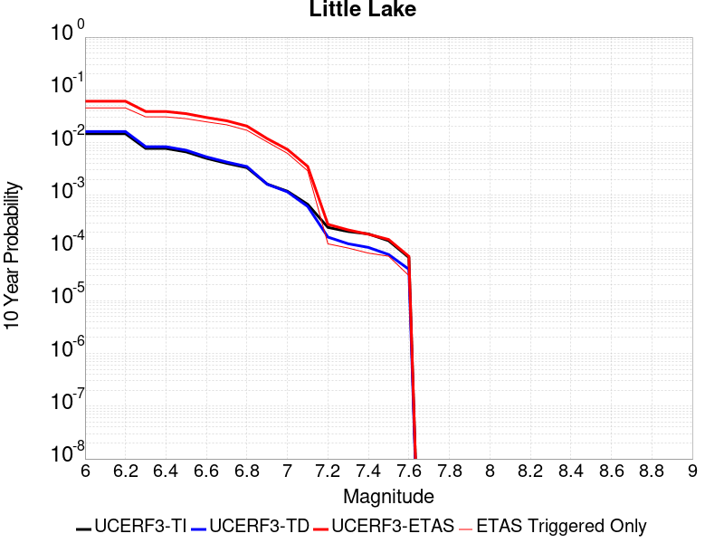 |

| Magnitude | 1 wk TI Prob | 1 wk TD Prob | 1 wk ETAS Prob | 1 wk ETAS/TD Gain | 1 wk ETAS Triggered Only | 1 mo TI Prob | 1 mo TD Prob | 1 mo ETAS Prob | 1 mo ETAS/TD Gain | 1 mo ETAS Triggered Only | 1 yr TI Prob | 1 yr TD Prob | 1 yr ETAS Prob | 1 yr ETAS/TD Gain | 1 yr ETAS Triggered Only | 10 yr TI Prob | 10 yr TD Prob | 10 yr ETAS Prob | 10 yr ETAS/TD Gain | 10 yr ETAS Triggered Only |
|-----|-----|-----|-----|-----|-----|-----|-----|-----|-----|-----|-----|-----|-----|-----|-----|-----|-----|-----|-----|-----|
| 6.0 | 2.8424427E-5 | 3.120572E-5 | 0.034402955 | 1102.4567 | 0.03437282 | 1.2181328E-4 | 1.337327E-4 | 0.038369037 | 286.90842 | 0.038240418 | 0.0014820677 | 0.0016271127 | 0.04424059 | 27.189629 | 0.042682927 | 0.014722223 | 0.016165402 | 0.061157838 | 3.783255 | 0.04573171 |
| 6.1 | 2.8424427E-5 | 3.120572E-5 | 0.034402955 | 1102.4567 | 0.03437282 | 1.2181328E-4 | 1.337327E-4 | 0.038369037 | 286.90842 | 0.038240418 | 0.0014820677 | 0.0016271127 | 0.04424059 | 27.189629 | 0.042682927 | 0.014722223 | 0.016165402 | 0.061157838 | 3.783255 | 0.04573171 |
| 6.2 | 2.8424427E-5 | 3.120572E-5 | 0.034402955 | 1102.4567 | 0.03437282 | 1.2181328E-4 | 1.337327E-4 | 0.038369037 | 286.90842 | 0.038240418 | 0.0014820677 | 0.0016271127 | 0.04424059 | 27.189629 | 0.042682927 | 0.014722223 | 0.016165402 | 0.061157838 | 3.783255 | 0.04573171 |
| 6.3 | 1.48860645E-5 | 1.6081389E-5 | 0.02370908 | 1474.3179 | 0.023693379 | 6.379586E-5 | 6.8918576E-5 | 0.026356306 | 382.4267 | 0.026289199 | 7.7643775E-4 | 8.3878887E-4 | 0.030082531 | 35.864246 | 0.029268293 | 0.007737305 | 0.008359048 | 0.03947308 | 4.722198 | 0.031376306 |
| 6.4 | 1.48860645E-5 | 1.6081389E-5 | 0.02370908 | 1474.3179 | 0.023693379 | 6.379586E-5 | 6.8918576E-5 | 0.026356306 | 382.4267 | 0.026289199 | 7.7643775E-4 | 8.3878887E-4 | 0.030082531 | 35.864246 | 0.029268293 | 0.007737305 | 0.008359048 | 0.03947308 | 4.722198 | 0.031376306 |
| 6.5 | 1.2797581E-5 | 1.3765565E-5 | 0.022121476 | 1607.0154 | 0.022108015 | 5.4845623E-5 | 5.899409E-5 | 0.024534902 | 415.88745 | 0.024477351 | 6.675408E-4 | 7.18042E-4 | 0.027945865 | 38.919537 | 0.027247386 | 0.006655392 | 0.00715977 | 0.03609743 | 5.0417023 | 0.029146342 |
| 6.6 | 9.661896E-6 | 1.0289038E-5 | 0.019504862 | 1895.6935 | 0.019494774 | 4.1407468E-5 | 4.409522E-5 | 0.021558827 | 488.91522 | 0.021515679 | 5.040193E-4 | 5.367433E-4 | 0.024426352 | 45.508442 | 0.023902439 | 0.005028777 | 0.0053560743 | 0.030672709 | 5.726714 | 0.025452962 |
| 6.7 | 7.767871E-6 | 8.199687E-6 | 0.017272867 | 2106.5276 | 0.017264808 | 3.329045E-5 | 3.5141118E-5 | 0.019111127 | 543.8394 | 0.019076655 | 4.0523586E-4 | 4.2777284E-4 | 0.021533724 | 50.339153 | 0.021114983 | 0.004044977 | 0.004270846 | 0.026683426 | 6.247808 | 0.02250871 |
| 6.8 | 6.4235196E-6 | 6.7357446E-6 | 0.013752288 | 2041.6879 | 0.013745645 | 2.752908E-5 | 2.8867229E-5 | 0.0150632765 | 521.8123 | 0.015034843 | 3.35115E-4 | 3.5141467E-4 | 0.017035445 | 48.47676 | 0.016689895 | 0.003346101 | 0.00350985 | 0.021200154 | 6.040188 | 0.017752614 |
| 6.9 | 3.1283696E-6 | 3.1121804E-6 | 0.008365455 | 2687.9724 | 0.00836237 | 1.3407229E-5 | 1.3337856E-5 | 0.009176979 | 688.04 | 0.009163763 | 1.6322079E-4 | 1.6237781E-4 | 0.010334942 | 63.6475 | 0.010174216 | 0.0016310095 | 0.00162274 | 0.0123718195 | 7.6240306 | 0.010766551 |
| 7.0 | 2.290603E-6 | 2.2286815E-6 | 0.0051938547 | 2330.4607 | 0.0051916377 | 9.816834E-6 | 9.551463E-6 | 0.005619254 | 588.3134 | 0.005609756 | 1.19513395E-4 | 1.162839E-4 | 0.0063524926 | 54.629166 | 0.0062369336 | 0.0011944914 | 0.0011623327 | 0.0077922484 | 6.703974 | 0.0066376305 |
| 7.1 | 1.293693E-6 | 1.1776827E-6 | 0.0026492581 | 2249.5515 | 0.0026480837 | 5.5443866E-6 | 5.0472063E-6 | 0.0028447541 | 563.62946 | 0.0028397213 | 6.750081E-5 | 6.14487E-5 | 0.0031100418 | 50.612003 | 0.0030487804 | 6.7480316E-4 | 6.143856E-4 | 0.0038179911 | 6.214324 | 0.0032055748 |
| 7.2 | 4.715842E-7 | 3.0917857E-7 | 6.999557E-5 | 226.39204 | 6.968641E-5 | 2.0210737E-6 | 1.3250503E-6 | 8.843295E-5 | 66.73931 | 8.710801E-5 | 2.4606294E-5 | 1.6132375E-5 | 1.03238985E-4 | 6.399491 | 8.710801E-5 | 2.460357E-4 | 1.6131258E-4 | 2.4840655E-4 | 1.539908 | 8.710801E-5 |
| 7.3 | 3.9430947E-7 | 2.3097488E-7 | 6.991737E-5 | 302.70554 | 6.968641E-5 | 1.6898966E-6 | 9.89892E-7 | 7.067624E-5 | 71.39793 | 6.968641E-5 | 2.0574296E-5 | 1.2051869E-5 | 8.173744E-5 | 6.7821383 | 6.968641E-5 | 2.0572392E-4 | 1.20512224E-4 | 1.9019023E-4 | 1.5781821 | 6.968641E-5 |
| 7.4 | 3.547123E-7 | 1.9679135E-7 | 5.246159E-5 | 266.58484 | 5.2264808E-5 | 1.5201948E-6 | 8.4339126E-7 | 5.3108157E-5 | 62.969772 | 5.2264808E-5 | 1.8508214E-5 | 1.0268241E-5 | 6.253251E-5 | 6.0898952 | 5.2264808E-5 | 1.8506673E-4 | 1.02677724E-4 | 1.5493717E-4 | 1.5089657 | 5.2264808E-5 |
| 7.5 | 2.6354266E-7 | 1.4423138E-7 | 5.2409032E-5 | 363.36774 | 5.2264808E-5 | 1.129468E-6 | 6.181344E-7 | 5.288291E-5 | 85.55245 | 5.2264808E-5 | 1.3751187E-5 | 7.5257603E-6 | 5.9790174E-5 | 7.9447355 | 5.2264808E-5 | 1.3750336E-4 | 7.5255106E-5 | 1.2751599E-4 | 1.6944495 | 5.2264808E-5 |
| 7.6 | 1.269913E-7 | 7.572556E-8 | 1.7497327E-5 | 231.06236 | 1.7421602E-5 | 5.4424834E-7 | 3.245381E-7 | 1.7746135E-5 | 54.68121 | 1.7421602E-5 | 6.6262032E-6 | 3.9512443E-6 | 2.1372778E-5 | 5.409126 | 1.7421602E-5 | 6.626006E-5 | 3.9511775E-5 | 5.693269E-5 | 1.4409044 | 1.7421602E-5 |

## Airport Lake
*[(top)](#table-of-contents)*

| 1 Week | 1 Month | 1 Year | 10 Year |
|-----|-----|-----|-----|
|  | 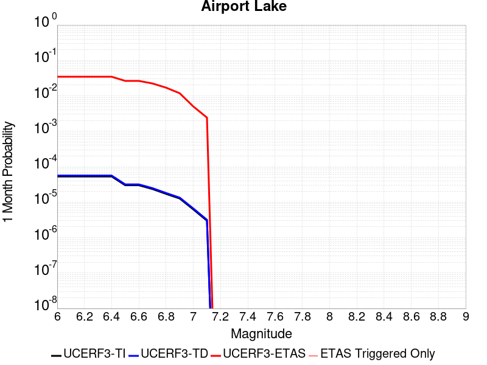 |  |  |

| Magnitude | 1 wk TI Prob | 1 wk TD Prob | 1 wk ETAS Prob | 1 wk ETAS/TD Gain | 1 wk ETAS Triggered Only | 1 mo TI Prob | 1 mo TD Prob | 1 mo ETAS Prob | 1 mo ETAS/TD Gain | 1 mo ETAS Triggered Only | 1 yr TI Prob | 1 yr TD Prob | 1 yr ETAS Prob | 1 yr ETAS/TD Gain | 1 yr ETAS Triggered Only | 10 yr TI Prob | 10 yr TD Prob | 10 yr ETAS Prob | 10 yr ETAS/TD Gain | 10 yr ETAS Triggered Only |
|-----|-----|-----|-----|-----|-----|-----|-----|-----|-----|-----|-----|-----|-----|-----|-----|-----|-----|-----|-----|-----|
| 6.0 | 1.2387061E-5 | 1.3103157E-5 | 0.031232206 | 2383.5635 | 0.031219512 | 5.3086325E-5 | 5.615534E-5 | 0.03420058 | 609.0352 | 0.034146342 | 6.461343E-4 | 6.8350515E-4 | 0.03816658 | 55.83949 | 0.03750871 | 0.0064425888 | 0.0068168393 | 0.046232715 | 6.7821336 | 0.03968641 |
| 6.1 | 1.2387061E-5 | 1.3103157E-5 | 0.031232206 | 2383.5635 | 0.031219512 | 5.3086325E-5 | 5.615534E-5 | 0.03420058 | 609.0352 | 0.034146342 | 6.461343E-4 | 6.8350515E-4 | 0.03816658 | 55.83949 | 0.03750871 | 0.0064425888 | 0.0068168393 | 0.046232715 | 6.7821336 | 0.03968641 |
| 6.2 | 1.2387061E-5 | 1.3103157E-5 | 0.031232206 | 2383.5635 | 0.031219512 | 5.3086325E-5 | 5.615534E-5 | 0.03420058 | 609.0352 | 0.034146342 | 6.461343E-4 | 6.8350515E-4 | 0.03816658 | 55.83949 | 0.03750871 | 0.0064425888 | 0.0068168393 | 0.046232715 | 6.7821336 | 0.03968641 |
| 6.3 | 1.2387061E-5 | 1.3103157E-5 | 0.031232206 | 2383.5635 | 0.031219512 | 5.3086325E-5 | 5.615534E-5 | 0.03420058 | 609.0352 | 0.034146342 | 6.461343E-4 | 6.8350515E-4 | 0.03816658 | 55.83949 | 0.03750871 | 0.0064425888 | 0.0068168393 | 0.046232715 | 6.7821336 | 0.03968641 |
| 6.4 | 1.2387061E-5 | 1.3103157E-5 | 0.031232206 | 2383.5635 | 0.031219512 | 5.3086325E-5 | 5.615534E-5 | 0.03420058 | 609.0352 | 0.034146342 | 6.461343E-4 | 6.8350515E-4 | 0.03816658 | 55.83949 | 0.03750871 | 0.0064425888 | 0.0068168393 | 0.046232715 | 6.7821336 | 0.03968641 |
| 6.5 | 6.9922594E-6 | 7.384925E-6 | 0.024083862 | 3261.2195 | 0.024076656 | 2.996648E-5 | 3.1649324E-5 | 0.026494225 | 837.11816 | 0.026463415 | 3.6478083E-4 | 3.8526783E-4 | 0.029468136 | 76.487404 | 0.029094076 | 0.003641826 | 0.0038465366 | 0.034650933 | 9.008347 | 0.030923344 |
| 6.6 | 6.9922594E-6 | 7.384925E-6 | 0.024083862 | 3261.2195 | 0.024076656 | 2.996648E-5 | 3.1649324E-5 | 0.026494225 | 837.11816 | 0.026463415 | 3.6478083E-4 | 3.8526783E-4 | 0.029468136 | 76.487404 | 0.029094076 | 0.003641826 | 0.0038465366 | 0.034650933 | 9.008347 | 0.030923344 |
| 6.7 | 5.477277E-6 | 5.7860684E-6 | 0.020441208 | 3532.832 | 0.02043554 | 2.3473833E-5 | 2.4797222E-5 | 0.02253295 | 908.6885 | 0.02250871 | 2.8575645E-4 | 3.0186825E-4 | 0.025050493 | 82.984856 | 0.024756098 | 0.0028538927 | 0.003014966 | 0.029242273 | 9.699039 | 0.02630662 |
| 6.8 | 3.9950432E-6 | 4.2190873E-6 | 0.015544224 | 3684.2622 | 0.01554007 | 1.7121502E-5 | 1.8081691E-5 | 0.017073523 | 944.24365 | 0.01705575 | 2.0843433E-4 | 2.2012512E-4 | 0.01915324 | 87.01069 | 0.018937282 | 0.0020823893 | 0.0021993418 | 0.022207504 | 10.097342 | 0.020052265 |
| 6.9 | 2.95695E-6 | 3.1230243E-6 | 0.010978699 | 3515.406 | 0.0109756095 | 1.2672582E-5 | 1.3384334E-5 | 0.012121236 | 905.62866 | 0.012108014 | 1.5427776E-4 | 1.6294434E-4 | 0.013645068 | 83.74066 | 0.013484321 | 0.001541707 | 0.0016284712 | 0.015960494 | 9.800907 | 0.014355401 |
| 7.0 | 1.456072E-6 | 1.540812E-6 | 0.0050015333 | 3246.037 | 0.005 | 6.2402937E-6 | 6.603469E-6 | 0.005389843 | 816.2139 | 0.0053832754 | 7.597293E-5 | 8.039528E-5 | 0.006072945 | 75.538574 | 0.0059930314 | 7.594696E-4 | 8.0376083E-4 | 0.007157535 | 8.905056 | 0.006358885 |
| 7.1 | 6.995192E-7 | 7.4089746E-7 | 0.002544293 | 3434.069 | 0.002543554 | 2.997936E-6 | 3.1752747E-6 | 0.0027209367 | 856.91376 | 0.00271777 | 3.649926E-5 | 3.865897E-5 | 0.002965375 | 76.706 | 0.0029268293 | 3.6493264E-4 | 3.865897E-4 | 0.0034690213 | 8.9733925 | 0.0030836237 |

## Owl Lake
*[(top)](#table-of-contents)*

| 1 Week | 1 Month | 1 Year | 10 Year |
|-----|-----|-----|-----|
|  |  |  |  |

| Magnitude | 1 wk TI Prob | 1 wk TD Prob | 1 wk ETAS Prob | 1 wk ETAS/TD Gain | 1 wk ETAS Triggered Only | 1 mo TI Prob | 1 mo TD Prob | 1 mo ETAS Prob | 1 mo ETAS/TD Gain | 1 mo ETAS Triggered Only | 1 yr TI Prob | 1 yr TD Prob | 1 yr ETAS Prob | 1 yr ETAS/TD Gain | 1 yr ETAS Triggered Only | 10 yr TI Prob | 10 yr TD Prob | 10 yr ETAS Prob | 10 yr ETAS/TD Gain | 10 yr ETAS Triggered Only |
|-----|-----|-----|-----|-----|-----|-----|-----|-----|-----|-----|-----|-----|-----|-----|-----|-----|-----|-----|-----|-----|
| 6.0 | 5.0320643E-5 | 6.635816E-5 | 0.017225498 | 259.58374 | 0.01716028 | 2.1564208E-4 | 2.843674E-4 | 0.020243846 | 71.189064 | 0.019965157 | 0.0026222812 | 0.0034577388 | 0.026947664 | 7.793435 | 0.023571428 | 0.02591553 | 0.034140717 | 0.058792002 | 1.7220495 | 0.025522647 |
| 6.1 | 5.0320643E-5 | 6.635816E-5 | 0.017225498 | 259.58374 | 0.01716028 | 2.1564208E-4 | 2.843674E-4 | 0.020243846 | 71.189064 | 0.019965157 | 0.0026222812 | 0.0034577388 | 0.026947664 | 7.793435 | 0.023571428 | 0.02591553 | 0.034140717 | 0.058792002 | 1.7220495 | 0.025522647 |
| 6.2 | 2.4125871E-5 | 3.0981035E-5 | 0.01395041 | 450.2887 | 0.013919861 | 1.0339249E-4 | 1.3277028E-4 | 0.016019162 | 120.65323 | 0.015888501 | 0.0012580766 | 0.001615439 | 0.020069899 | 12.423805 | 0.01848432 | 0.012509781 | 0.016070465 | 0.035423364 | 2.2042527 | 0.019668989 |
| 6.3 | 1.7433485E-5 | 2.2355514E-5 | 0.012130098 | 542.59985 | 0.012108014 | 7.471279E-5 | 9.580672E-5 | 0.013840134 | 144.45891 | 0.013745645 | 9.0924866E-4 | 0.0011659743 | 0.017105555 | 14.670611 | 0.015958188 | 0.009055373 | 0.011628896 | 0.028348554 | 2.4377682 | 0.016916376 |
| 6.4 | 1.7433485E-5 | 2.2355514E-5 | 0.012130098 | 542.59985 | 0.012108014 | 7.471279E-5 | 9.580672E-5 | 0.013840134 | 144.45891 | 0.013745645 | 9.0924866E-4 | 0.0011659743 | 0.017105555 | 14.670611 | 0.015958188 | 0.009055373 | 0.011628896 | 0.028348554 | 2.4377682 | 0.016916376 |
| 6.5 | 1.5182742E-5 | 1.9429144E-5 | 0.011674255 | 600.86304 | 0.011655052 | 6.506727E-5 | 8.326596E-5 | 0.013270321 | 159.37271 | 0.0131881535 | 7.919061E-4 | 0.0010134429 | 0.016363723 | 16.146666 | 0.015365854 | 0.0078909 | 0.010118429 | 0.02619107 | 2.5884523 | 0.016236933 |
| 6.6 | 6.7271576E-6 | 8.547361E-6 | 0.009694876 | 1134.2537 | 0.009686411 | 2.8830356E-5 | 3.6631063E-5 | 0.010959576 | 299.18802 | 0.010923345 | 3.5095305E-4 | 4.458976E-4 | 0.012827134 | 28.766994 | 0.01238676 | 0.0035039932 | 0.004467813 | 0.01738892 | 3.8920429 | 0.012979094 |
| 6.7 | 6.682835E-6 | 8.479807E-6 | 0.009677388 | 1141.2273 | 0.009668989 | 2.8640408E-5 | 3.6341557E-5 | 0.010941869 | 301.0842 | 0.010905923 | 3.4864116E-4 | 4.4237426E-4 | 0.0128062405 | 28.948881 | 0.012369338 | 0.003480947 | 0.0044327388 | 0.017336955 | 3.911116 | 0.012961673 |
| 6.8 | 6.5774975E-6 | 8.32628E-6 | 0.009677235 | 1162.252 | 0.009668989 | 2.8188972E-5 | 3.5683603E-5 | 0.010941218 | 306.61752 | 0.010905923 | 3.4314668E-4 | 4.343669E-4 | 0.012798332 | 29.464334 | 0.012369338 | 0.0034261728 | 0.004352885 | 0.017258137 | 3.9647584 | 0.012961673 |
| 6.9 | 6.363419E-6 | 7.999454E-6 | 0.009624647 | 1203.163 | 0.009616725 | 2.727151E-5 | 3.428296E-5 | 0.010870148 | 317.07147 | 0.010836237 | 3.3198006E-4 | 4.1732067E-4 | 0.01271184 | 30.460604 | 0.012299651 | 0.0033148455 | 0.0041828766 | 0.017020937 | 4.0691943 | 0.012891986 |
| 7.0 | 6.1342453E-6 | 7.6316555E-6 | 0.009484911 | 1242.838 | 0.009477352 | 2.6289357E-5 | 3.2706717E-5 | 0.010676958 | 326.44543 | 0.010644599 | 3.2002592E-4 | 3.9813702E-4 | 0.01250133 | 31.399569 | 0.012108014 | 0.0031956544 | 0.003991571 | 0.016641226 | 4.1690917 | 0.012700348 |
| 7.1 | 5.842926E-6 | 7.142211E-6 | 0.008996625 | 1259.6415 | 0.008989547 | 2.504087E-5 | 3.0609146E-5 | 0.010187092 | 332.81204 | 0.010156794 | 3.0482994E-4 | 3.7260808E-4 | 0.011883996 | 31.894094 | 0.01151568 | 0.0030441214 | 0.0037370329 | 0.01574773 | 4.213966 | 0.012055749 |
| 7.2 | 4.77173E-6 | 5.358483E-6 | 0.005493134 | 1025.1285 | 0.0054878048 | 2.045011E-5 | 2.2964748E-5 | 0.0063468614 | 276.37408 | 0.0063240416 | 2.4895166E-4 | 2.79564E-4 | 0.0074030077 | 26.480547 | 0.0071254354 | 0.0024867293 | 0.002808645 | 0.010278894 | 3.659734 | 0.007491289 |
| 7.3 | 3.0494948E-6 | 2.710463E-6 | 0.0012047978 | 444.4989 | 0.0012020906 | 1.3069198E-5 | 1.1616219E-5 | 0.0014227496 | 122.47958 | 0.0014111499 | 1.5910587E-4 | 1.4141845E-4 | 0.0016743027 | 11.839351 | 0.0015331011 | 0.0015899199 | 0.0014232415 | 0.0030237478 | 2.12455 | 0.0016027874 |
| 7.4 | 2.7263884E-6 | 2.3056762E-6 | 8.559622E-4 | 371.2413 | 8.5365854E-4 | 1.1684469E-5 | 9.881433E-6 | 9.680601E-4 | 97.96758 | 9.5818815E-4 | 1.4224913E-4 | 1.20299905E-4 | 0.0011480508 | 9.54324 | 0.0010278745 | 0.0014215811 | 0.0012112238 | 0.0023074553 | 1.9050611 | 0.001097561 |
| 7.5 | 2.6090431E-6 | 2.1656133E-6 | 7.512929E-4 | 346.91925 | 7.491289E-4 | 1.1181565E-5 | 9.281167E-6 | 8.4551034E-4 | 91.09957 | 8.362369E-4 | 1.3612706E-4 | 1.1299244E-4 | 0.0010013938 | 8.862485 | 8.8850176E-4 | 0.001360437 | 0.0011379806 | 0.0020776766 | 1.8257575 | 9.4076653E-4 |
| 7.6 | 2.3008756E-6 | 1.8727933E-6 | 5.767846E-4 | 307.98093 | 5.749129E-4 | 9.860858E-6 | 8.0262325E-6 | 6.351989E-4 | 79.14035 | 6.271777E-4 | 1.20049335E-4 | 9.7715085E-5 | 7.596713E-4 | 7.77435 | 6.6202093E-4 | 0.001199845 | 9.849932E-4 | 0.0016811709 | 1.7067842 | 6.968641E-4 |
| 7.7 | 1.7184348E-6 | 1.3419171E-6 | 2.6266562E-4 | 195.73907 | 2.6132405E-4 | 7.3646997E-6 | 5.7510606E-6 | 2.670736E-4 | 46.439014 | 2.6132405E-4 | 8.966153E-5 | 7.0016955E-5 | 3.4874308E-4 | 4.9808373 | 2.7874563E-4 | 8.962536E-4 | 7.078345E-4 | 9.863828E-4 | 1.3935219 | 2.7874563E-4 |
| 7.8 | 8.4612907E-7 | 8.4058576E-7 | 1.2279171E-4 | 146.07874 | 1.2195122E-4 | 3.6262625E-6 | 3.6025056E-6 | 1.2555328E-4 | 34.851658 | 1.2195122E-4 | 4.4148852E-5 | 4.3859643E-5 | 1.8322635E-4 | 4.1775613 | 1.3937282E-4 | 4.414008E-4 | 4.4398365E-4 | 5.832946E-4 | 1.313775 | 1.3937282E-4 |
| 7.9 | 2.716738E-7 | 3.768106E-7 | 5.26416E-5 | 139.70308 | 5.2264808E-5 | 1.1643157E-6 | 1.6149015E-6 | 5.3879627E-5 | 33.364033 | 5.2264808E-5 | 1.4175452E-5 | 1.966126E-5 | 8.93463E-5 | 4.5442815 | 6.968641E-5 | 1.4174548E-4 | 1.9836679E-4 | 2.6803938E-4 | 1.3512311 | 6.968641E-5 |
| 8.0 | 2.1995428E-8 | 3.384878E-8 | 3.384878E-8 | 1.0 | 0.0 | 9.426611E-8 | 1.4506621E-7 | 1.4506621E-7 | 1.0 | 0.0 | 1.1476893E-6 | 1.7661803E-6 | 1.9187752E-5 | 10.863983 | 1.7421602E-5 | 1.14768345E-5 | 1.7963059E-5 | 3.538435E-5 | 1.9698398 | 1.7421602E-5 |

## Panamint Valley
*[(top)](#table-of-contents)*

| 1 Week | 1 Month | 1 Year | 10 Year |
|-----|-----|-----|-----|
|  |  |  |  |

| Magnitude | 1 wk TI Prob | 1 wk TD Prob | 1 wk ETAS Prob | 1 wk ETAS/TD Gain | 1 wk ETAS Triggered Only | 1 mo TI Prob | 1 mo TD Prob | 1 mo ETAS Prob | 1 mo ETAS/TD Gain | 1 mo ETAS Triggered Only | 1 yr TI Prob | 1 yr TD Prob | 1 yr ETAS Prob | 1 yr ETAS/TD Gain | 1 yr ETAS Triggered Only | 10 yr TI Prob | 10 yr TD Prob | 10 yr ETAS Prob | 10 yr ETAS/TD Gain | 10 yr ETAS Triggered Only |
|-----|-----|-----|-----|-----|-----|-----|-----|-----|-----|-----|-----|-----|-----|-----|-----|-----|-----|-----|-----|-----|
| 6.0 | 3.0211835E-5 | 3.3984514E-5 | 0.01459795 | 429.54712 | 0.01456446 | 1.2947287E-4 | 1.4563995E-4 | 0.016693752 | 114.62344 | 0.016550522 | 0.0015751923 | 0.0017717537 | 0.021092862 | 11.905075 | 0.019355401 | 0.015640736 | 0.017583137 | 0.038241275 | 2.1748836 | 0.021027874 |
| 6.1 | 3.0211835E-5 | 3.3984514E-5 | 0.01459795 | 429.54712 | 0.01456446 | 1.2947287E-4 | 1.4563995E-4 | 0.016693752 | 114.62344 | 0.016550522 | 0.0015751923 | 0.0017717537 | 0.021092862 | 11.905075 | 0.019355401 | 0.015640736 | 0.017583137 | 0.038241275 | 2.1748836 | 0.021027874 |
| 6.2 | 3.0211835E-5 | 3.3984514E-5 | 0.01459795 | 429.54712 | 0.01456446 | 1.2947287E-4 | 1.4563995E-4 | 0.016693752 | 114.62344 | 0.016550522 | 0.0015751923 | 0.0017717537 | 0.021092862 | 11.905075 | 0.019355401 | 0.015640736 | 0.017583137 | 0.038241275 | 2.1748836 | 0.021027874 |
| 6.3 | 2.8573924E-5 | 3.210268E-5 | 0.014160569 | 441.1024 | 0.01412892 | 1.2245393E-4 | 1.3757581E-4 | 0.01607615 | 116.85302 | 0.015940767 | 0.001489857 | 0.0016737265 | 0.020248856 | 12.098068 | 0.018606272 | 0.01479908 | 0.016617801 | 0.036439635 | 2.1928072 | 0.020156795 |
| 6.4 | 2.8573924E-5 | 3.210268E-5 | 0.014160569 | 441.1024 | 0.01412892 | 1.2245393E-4 | 1.3757581E-4 | 0.01607615 | 116.85302 | 0.015940767 | 0.001489857 | 0.0016737265 | 0.020248856 | 12.098068 | 0.018606272 | 0.01479908 | 0.016617801 | 0.036439635 | 2.1928072 | 0.020156795 |
| 6.5 | 2.7468774E-5 | 3.0828433E-5 | 0.013985102 | 453.64297 | 0.013954704 | 1.1771801E-4 | 1.3211532E-4 | 0.015774649 | 119.4006 | 0.015644599 | 0.0014322745 | 0.0016073446 | 0.019783657 | 12.308286 | 0.018205576 | 0.014230782 | 0.015963677 | 0.03533582 | 2.2135139 | 0.019686412 |
| 6.6 | 2.6135967E-5 | 2.925248E-5 | 0.013565442 | 463.73645 | 0.0135365855 | 1.1200648E-4 | 1.253619E-4 | 0.015262837 | 121.750206 | 0.015139373 | 0.0013628257 | 0.0015252391 | 0.01902464 | 12.473219 | 0.017526133 | 0.013544982 | 0.015154043 | 0.033838663 | 2.2329793 | 0.018972125 |
| 6.7 | 2.4498746E-5 | 2.7341335E-5 | 0.013128028 | 480.15317 | 0.013101045 | 1.04990395E-4 | 1.1717203E-4 | 0.014732184 | 125.73124 | 0.014616725 | 0.0012775084 | 0.0014256609 | 0.018230936 | 12.787708 | 0.016829269 | 0.012701893 | 0.014171274 | 0.032136027 | 2.2676878 | 0.018222997 |
| 6.8 | 2.2244329E-5 | 2.4935423E-5 | 0.012568177 | 504.029 | 0.012543554 | 9.532935E-5 | 1.0686185E-4 | 0.014042655 | 131.40942 | 0.013937282 | 0.0011600169 | 0.0013002884 | 0.017202929 | 13.230087 | 0.015923345 | 0.011539802 | 0.0129325185 | 0.029853676 | 2.3084192 | 0.017142856 |
| 6.9 | 1.9902658E-5 | 2.2290267E-5 | 0.011346079 | 509.01498 | 0.0113240415 | 8.529431E-5 | 9.552632E-5 | 0.012690142 | 132.84445 | 0.012595818 | 0.0010379635 | 0.0011624309 | 0.015501144 | 13.335111 | 0.014355401 | 0.010331288 | 0.011568608 | 0.02682558 | 2.3188252 | 0.01543554 |
| 7.0 | 1.8353881E-5 | 2.0566185E-5 | 0.010664946 | 518.5671 | 0.010644599 | 7.865712E-5 | 8.813792E-5 | 0.011898943 | 135.00368 | 0.011811847 | 9.5722964E-4 | 0.0010725686 | 0.014577232 | 13.590956 | 0.013519164 | 0.009531168 | 0.010678849 | 0.025105013 | 2.35091 | 0.014581881 |
| 7.1 | 1.7667631E-5 | 1.9772613E-5 | 0.010420264 | 527.00494 | 0.010400697 | 7.571623E-5 | 8.473711E-5 | 0.0116168605 | 137.09296 | 0.011533101 | 9.2145515E-4 | 0.0010312037 | 0.0142057575 | 13.775899 | 0.0131881535 | 0.009176437 | 0.010269073 | 0.024356358 | 2.3718166 | 0.0142334495 |
| 7.2 | 1.6381597E-5 | 1.8158249E-5 | 0.009408232 | 518.1244 | 0.009390244 | 7.020495E-5 | 7.781885E-5 | 0.010477707 | 134.64227 | 0.010400697 | 8.544101E-4 | 9.4704994E-4 | 0.012834736 | 13.552333 | 0.011898954 | 0.008511325 | 0.009434792 | 0.022118859 | 2.3443928 | 0.012804878 |
| 7.3 | 1.4520491E-5 | 1.5966476E-5 | 0.007838141 | 490.9124 | 0.007822299 | 6.222919E-5 | 6.842605E-5 | 0.008796052 | 128.5483 | 0.008728223 | 7.57377E-4 | 8.327849E-4 | 0.010789643 | 12.956098 | 0.009965157 | 0.0075480095 | 0.00829975 | 0.018959664 | 2.2843657 | 0.010749129 |
| 7.4 | 1.2852287E-5 | 1.4145411E-5 | 0.0076969634 | 544.1315 | 0.007682927 | 5.5080065E-5 | 6.062187E-5 | 0.008631531 | 142.38312 | 0.008571428 | 6.7039346E-4 | 7.378371E-4 | 0.010486736 | 14.212807 | 0.009756098 | 0.0066837464 | 0.0073567946 | 0.01780203 | 2.419808 | 0.010522648 |
| 7.5 | 1.1637851E-5 | 1.2836797E-5 | 0.0076259794 | 594.0718 | 0.0076132403 | 4.987555E-5 | 5.5013777E-5 | 0.008521447 | 154.8966 | 0.008466899 | 6.070656E-4 | 6.6960254E-4 | 0.010314708 | 15.404224 | 0.009651568 | 0.006054099 | 0.0066787465 | 0.01700998 | 2.5468822 | 0.010400697 |
| 7.6 | 3.0068115E-6 | 3.3330316E-6 | 0.0034005342 | 1020.2526 | 0.0033972126 | 1.2886271E-5 | 1.4284384E-5 | 0.0037772967 | 264.4354 | 0.0037630661 | 1.5687906E-4 | 1.7390578E-4 | 0.0044240374 | 25.43928 | 0.004250871 | 0.0015676835 | 0.0017391363 | 0.0063130492 | 3.629991 | 0.0045818817 |

## Garlock (East)
*[(top)](#table-of-contents)*

| 1 Week | 1 Month | 1 Year | 10 Year |
|-----|-----|-----|-----|
|  |  |  |  |

| Magnitude | 1 wk TI Prob | 1 wk TD Prob | 1 wk ETAS Prob | 1 wk ETAS/TD Gain | 1 wk ETAS Triggered Only | 1 mo TI Prob | 1 mo TD Prob | 1 mo ETAS Prob | 1 mo ETAS/TD Gain | 1 mo ETAS Triggered Only | 1 yr TI Prob | 1 yr TD Prob | 1 yr ETAS Prob | 1 yr ETAS/TD Gain | 1 yr ETAS Triggered Only | 10 yr TI Prob | 10 yr TD Prob | 10 yr ETAS Prob | 10 yr ETAS/TD Gain | 10 yr ETAS Triggered Only |
|-----|-----|-----|-----|-----|-----|-----|-----|-----|-----|-----|-----|-----|-----|-----|-----|-----|-----|-----|-----|-----|
| 6.0 | 4.5092507E-5 | 6.290325E-5 | 0.011020402 | 175.19608 | 0.010958188 | 1.9323928E-4 | 2.6956003E-4 | 0.012757482 | 47.327057 | 0.0124912895 | 0.0023501497 | 0.0032774 | 0.018367155 | 5.6041846 | 0.015139373 | 0.023254504 | 0.032351844 | 0.048316356 | 1.4934652 | 0.016498258 |
| 6.1 | 4.5092507E-5 | 6.290325E-5 | 0.011020402 | 175.19608 | 0.010958188 | 1.9323928E-4 | 2.6956003E-4 | 0.012757482 | 47.327057 | 0.0124912895 | 0.0023501497 | 0.0032774 | 0.018367155 | 5.6041846 | 0.015139373 | 0.023254504 | 0.032351844 | 0.048316356 | 1.4934652 | 0.016498258 |
| 6.2 | 2.6674514E-5 | 3.4509674E-5 | 0.008431433 | 244.32083 | 0.008397212 | 1.1431433E-4 | 1.4789042E-4 | 0.00964126 | 65.19192 | 0.009494773 | 0.0013908884 | 0.0017991117 | 0.013015829 | 7.2345862 | 0.011236934 | 0.01382215 | 0.017890299 | 0.029833026 | 1.6675533 | 0.012160279 |
| 6.3 | 2.6674514E-5 | 3.4509674E-5 | 0.008431433 | 244.32083 | 0.008397212 | 1.1431433E-4 | 1.4789042E-4 | 0.00964126 | 65.19192 | 0.009494773 | 0.0013908884 | 0.0017991117 | 0.013015829 | 7.2345862 | 0.011236934 | 0.01382215 | 0.017890299 | 0.029833026 | 1.6675533 | 0.012160279 |
| 6.4 | 2.5312667E-5 | 3.233893E-5 | 0.008359596 | 258.49945 | 0.008327526 | 1.0847834E-4 | 1.3858822E-4 | 0.0095275305 | 68.74705 | 0.009390244 | 0.0013199237 | 0.0016860351 | 0.012782278 | 7.5812645 | 0.011114983 | 0.013121112 | 0.016778335 | 0.02859755 | 1.7044331 | 0.0120209055 |
| 6.5 | 2.5312667E-5 | 3.233893E-5 | 0.008359596 | 258.49945 | 0.008327526 | 1.0847834E-4 | 1.3858822E-4 | 0.0095275305 | 68.74705 | 0.009390244 | 0.0013199237 | 0.0016860351 | 0.012782278 | 7.5812645 | 0.011114983 | 0.013121112 | 0.016778335 | 0.02859755 | 1.7044331 | 0.0120209055 |
| 6.6 | 2.246556E-5 | 2.8133776E-5 | 0.007919898 | 281.5085 | 0.0078919865 | 9.627742E-5 | 1.20567885E-4 | 0.008952255 | 74.25075 | 0.008832753 | 0.0011715472 | 0.0014669491 | 0.0119741615 | 8.162628 | 0.010522648 | 0.011653901 | 0.01461866 | 0.025862996 | 1.7691767 | 0.01141115 |
| 6.7 | 2.2241198E-5 | 2.7803519E-5 | 0.00791957 | 284.84058 | 0.0078919865 | 9.531594E-5 | 1.1915263E-4 | 0.008950853 | 75.1209 | 0.008832753 | 0.0011598538 | 0.0014497414 | 0.011957134 | 8.24777 | 0.010522648 | 0.011538187 | 0.014448853 | 0.025695125 | 1.7783505 | 0.01141115 |
| 6.8 | 1.9528685E-5 | 2.389819E-5 | 0.0075498507 | 315.91724 | 0.0075261323 | 8.369167E-5 | 1.0241691E-4 | 0.008498769 | 82.98209 | 0.008397212 | 0.0010184698 | 0.0012462323 | 0.011181571 | 8.972301 | 0.009947735 | 0.010138147 | 0.012436427 | 0.023086285 | 1.8563439 | 0.010783972 |
| 6.9 | 1.3318621E-5 | 1.5198884E-5 | 0.006914049 | 454.905 | 0.0068989545 | 5.7078556E-5 | 6.513648E-5 | 0.007782404 | 119.47842 | 0.00771777 | 6.9470983E-4 | 7.927538E-4 | 0.009844805 | 12.418489 | 0.009059234 | 0.0069254204 | 0.007939888 | 0.017670373 | 2.2255192 | 0.009808362 |
| 7.0 | 1.1760853E-5 | 1.31077895E-5 | 0.0066680727 | 508.71072 | 0.0066550523 | 5.0402683E-5 | 5.6175057E-5 | 0.007512202 | 133.72842 | 0.007456446 | 6.134799E-4 | 6.8372174E-4 | 0.009475616 | 13.858877 | 0.008797909 | 0.0061178906 | 0.00685652 | 0.016320797 | 2.3803322 | 0.009529617 |
| 7.1 | 1.0064758E-5 | 1.0902931E-5 | 0.006474247 | 593.808 | 0.0064634145 | 4.3133965E-5 | 4.672603E-5 | 0.0072589326 | 155.35095 | 0.0072125434 | 5.2502943E-4 | 5.687444E-4 | 0.009065651 | 15.939764 | 0.008501742 | 0.005237907 | 0.0057129986 | 0.014859053 | 2.6009202 | 0.009198606 |
| 7.2 | 9.768808E-6 | 1.0498807E-5 | 0.00640416 | 609.9893 | 0.0063937283 | 4.186565E-5 | 4.499413E-5 | 0.0071352674 | 158.58218 | 0.0070905923 | 5.095951E-4 | 5.4766936E-4 | 0.008888047 | 16.228855 | 0.008344947 | 0.0050842804 | 0.0055032647 | 0.0144779915 | 2.6308005 | 0.00902439 |
| 7.3 | 9.344516E-6 | 9.944468E-6 | 0.005915809 | 594.88446 | 0.0059059234 | 4.004731E-5 | 4.261847E-5 | 0.00655802 | 153.87743 | 0.0065156794 | 4.8746695E-4 | 5.1875977E-4 | 0.0082499385 | 15.903196 | 0.007735192 | 0.0048639905 | 0.0052149445 | 0.013516374 | 2.5918539 | 0.008344947 |
| 7.4 | 9.023491E-6 | 9.490661E-6 | 0.005323029 | 560.87024 | 0.005313589 | 3.867153E-5 | 4.0673647E-5 | 0.005911515 | 145.34018 | 0.0058710803 | 4.7072413E-4 | 4.950925E-4 | 0.0074080448 | 14.962951 | 0.0069163763 | 0.004697283 | 0.0049783974 | 0.012293713 | 2.4694118 | 0.0073519163 |
| 7.5 | 7.081253E-6 | 7.087672E-6 | 0.002411252 | 340.20364 | 0.0024041813 | 3.0347876E-5 | 3.0375388E-5 | 0.0026609574 | 87.602425 | 0.002630662 | 3.6942272E-4 | 3.6975832E-4 | 0.003452242 | 9.336482 | 0.0030836237 | 0.003688092 | 0.0037243143 | 0.0070568044 | 1.8947929 | 0.0033449477 |
| 7.6 | 6.116396E-6 | 5.959245E-6 | 0.0014519437 | 243.64558 | 0.0014459931 | 2.6212863E-5 | 2.5539372E-5 | 0.0016282859 | 63.755913 | 0.0016027874 | 3.1909486E-4 | 3.1089774E-4 | 0.0022440944 | 7.218111 | 0.001933798 | 0.0031863707 | 0.0031357552 | 0.005237159 | 1.6701428 | 0.002108014 |
| 7.7 | 4.797145E-6 | 4.757281E-6 | 8.409902E-4 | 176.7796 | 8.362369E-4 | 2.055903E-5 | 2.0388188E-5 | 9.262931E-4 | 45.432827 | 9.0592337E-4 | 2.5027743E-4 | 2.4819805E-4 | 0.0013280694 | 5.3508453 | 0.0010801394 | 0.0024999576 | 0.0025093474 | 0.0037084215 | 1.477843 | 0.0012020906 |
| 7.8 | 3.4028885E-6 | 3.978462E-6 | 4.917814E-4 | 123.61094 | 4.8780488E-4 | 1.4583726E-5 | 1.7050439E-5 | 5.5711094E-4 | 32.674286 | 5.400697E-4 | 1.775424E-4 | 2.0756939E-4 | 8.694529E-4 | 4.1887336 | 6.6202093E-4 | 0.0017740062 | 0.0021012232 | 0.002796623 | 1.33095 | 6.968641E-4 |
| 7.9 | 2.5928412E-6 | 3.3724489E-6 | 3.8664642E-4 | 114.64856 | 3.8327527E-4 | 1.1112129E-5 | 1.4453272E-5 | 4.325657E-4 | 29.928564 | 4.1811846E-4 | 1.3528178E-4 | 1.7595445E-4 | 6.8109203E-4 | 3.870843 | 5.052265E-4 | 0.0013519945 | 0.0017812408 | 0.0023203485 | 1.3026586 | 5.400697E-4 |
| 8.0 | 1.3743648E-6 | 1.6734747E-6 | 1.7588922E-4 | 105.104195 | 1.7421602E-4 | 5.8901214E-6 | 7.1720146E-6 | 1.9880827E-4 | 27.720003 | 1.9163763E-4 | 7.1709874E-5 | 8.731581E-5 | 3.1377687E-4 | 3.593586 | 2.2648084E-4 | 7.1686733E-4 | 8.837234E-4 | 0.0011448165 | 1.2954466 | 2.6132405E-4 |
| 8.1 | 3.6733252E-7 | 3.1489964E-7 | 7.000129E-5 | 222.29713 | 6.968641E-5 | 1.5742813E-6 | 1.3495693E-6 | 8.845747E-5 | 65.54496 | 8.710801E-5 | 1.9166706E-5 | 1.6430899E-5 | 1.0353748E-4 | 6.3013887 | 8.710801E-5 | 1.9165053E-4 | 1.6638759E-4 | 2.7089982E-4 | 1.6281251 | 1.04529616E-4 |

## Hunter Mountain-Saline Valley
*[(top)](#table-of-contents)*

| 1 Week | 1 Month | 1 Year | 10 Year |
|-----|-----|-----|-----|
|  | 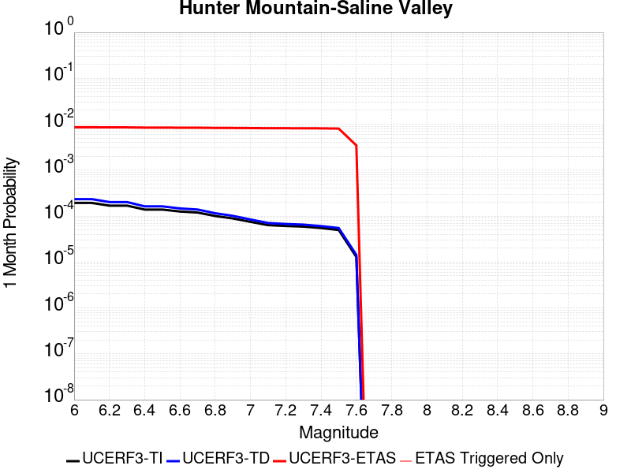 | 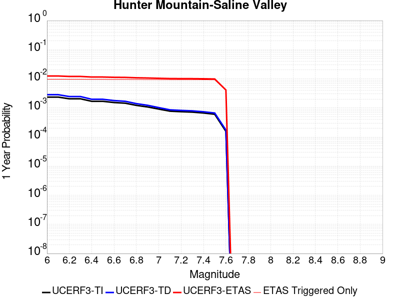 |  |

| Magnitude | 1 wk TI Prob | 1 wk TD Prob | 1 wk ETAS Prob | 1 wk ETAS/TD Gain | 1 wk ETAS Triggered Only | 1 mo TI Prob | 1 mo TD Prob | 1 mo ETAS Prob | 1 mo ETAS/TD Gain | 1 mo ETAS Triggered Only | 1 yr TI Prob | 1 yr TD Prob | 1 yr ETAS Prob | 1 yr ETAS/TD Gain | 1 yr ETAS Triggered Only | 10 yr TI Prob | 10 yr TD Prob | 10 yr ETAS Prob | 10 yr ETAS/TD Gain | 10 yr ETAS Triggered Only |
|-----|-----|-----|-----|-----|-----|-----|-----|-----|-----|-----|-----|-----|-----|-----|-----|-----|-----|-----|-----|-----|
| 6.0 | 4.5103672E-5 | 5.4570177E-5 | 0.007998387 | 146.57068 | 0.0079442505 | 1.9328714E-4 | 2.3385242E-4 | 0.009116792 | 38.985237 | 0.008885018 | 0.002350731 | 0.0028435152 | 0.012954056 | 4.555649 | 0.010139373 | 0.023260195 | 0.028091887 | 0.038691442 | 1.3773173 | 0.010905923 |
| 6.1 | 4.5103672E-5 | 5.4570177E-5 | 0.007998387 | 146.57068 | 0.0079442505 | 1.9328714E-4 | 2.3385242E-4 | 0.009116792 | 38.985237 | 0.008885018 | 0.002350731 | 0.0028435152 | 0.012954056 | 4.555649 | 0.010139373 | 0.023260195 | 0.028091887 | 0.038691442 | 1.3773173 | 0.010905923 |
| 6.2 | 3.9363465E-5 | 4.706337E-5 | 0.007973519 | 169.42093 | 0.007926829 | 1.6868966E-4 | 2.0168544E-4 | 0.009067493 | 44.958588 | 0.008867596 | 0.002051862 | 0.0024528175 | 0.012515184 | 5.1023707 | 0.010087108 | 0.020330196 | 0.024273481 | 0.034863684 | 1.4362869 | 0.010853658 |
| 6.3 | 3.9363465E-5 | 4.706337E-5 | 0.007973519 | 169.42093 | 0.007926829 | 1.6868966E-4 | 2.0168544E-4 | 0.009067493 | 44.958588 | 0.008867596 | 0.002051862 | 0.0024528175 | 0.012515184 | 5.1023707 | 0.010087108 | 0.020330196 | 0.024273481 | 0.034863684 | 1.4362869 | 0.010853658 |
| 6.4 | 3.2311684E-5 | 3.795099E-5 | 0.007894795 | 208.02608 | 0.007857143 | 1.384713E-4 | 1.6263737E-4 | 0.0089591155 | 55.086452 | 0.008797909 | 0.0016845843 | 0.0019783843 | 0.011958601 | 6.0446296 | 0.01 | 0.016718714 | 0.019616475 | 0.030171823 | 1.5380859 | 0.010766551 |
| 6.5 | 3.2311684E-5 | 3.795099E-5 | 0.007894795 | 208.02608 | 0.007857143 | 1.384713E-4 | 1.6263737E-4 | 0.0089591155 | 55.086452 | 0.008797909 | 0.0016845843 | 0.0019783843 | 0.011958601 | 6.0446296 | 0.01 | 0.016718714 | 0.019616475 | 0.030171823 | 1.5380859 | 0.010766551 |
| 6.6 | 2.9305844E-5 | 3.418183E-5 | 0.007856214 | 229.83595 | 0.007822299 | 1.2559042E-4 | 1.4648569E-4 | 0.00889085 | 60.694317 | 0.008745644 | 0.0015279909 | 0.001782067 | 0.011712074 | 6.572185 | 0.009947735 | 0.015175272 | 0.01768569 | 0.028210487 | 1.5951023 | 0.010714286 |
| 6.7 | 2.7826512E-5 | 3.2344276E-5 | 0.007854391 | 242.83713 | 0.007822299 | 1.19251024E-4 | 1.386113E-4 | 0.008883043 | 64.086 | 0.008745644 | 0.0014509142 | 0.0016863465 | 0.011617307 | 6.889039 | 0.009947735 | 0.014414776 | 0.016743187 | 0.02727808 | 1.6292049 | 0.010714286 |
| 6.8 | 2.3389874E-5 | 2.6866714E-5 | 0.007779272 | 289.55054 | 0.007752613 | 1.0023846E-4 | 1.15138246E-4 | 0.008790097 | 76.34386 | 0.008675958 | 0.00121972 | 0.001400954 | 0.011265164 | 8.041066 | 0.009878049 | 0.01213047 | 0.013927434 | 0.024423782 | 1.7536454 | 0.010644599 |
| 6.9 | 2.069209E-5 | 2.3570032E-5 | 0.0077760005 | 329.9105 | 0.007752613 | 8.867737E-5 | 1.01010715E-4 | 0.0087586725 | 86.710335 | 0.008658537 | 0.0010791123 | 0.0012291478 | 0.011077655 | 9.012467 | 0.009860627 | 0.010738871 | 0.012228523 | 0.022725746 | 1.8584211 | 0.010627178 |
| 7.0 | 1.7462342E-5 | 1.9633546E-5 | 0.0077546733 | 394.9706 | 0.007735192 | 7.483646E-5 | 8.414118E-5 | 0.008724529 | 103.68917 | 0.008641115 | 9.1075303E-4 | 0.0010239601 | 0.010839683 | 10.5860405 | 0.009825784 | 0.009070295 | 0.0101960525 | 0.020680387 | 2.0282738 | 0.010592335 |
| 7.1 | 1.4807709E-5 | 1.6441749E-5 | 0.0076992423 | 468.2739 | 0.007682927 | 6.3460066E-5 | 7.046283E-5 | 0.008641288 | 122.63611 | 0.008571428 | 7.723524E-4 | 8.575638E-4 | 0.010605295 | 12.366771 | 0.009756098 | 0.007696735 | 0.008545532 | 0.018978259 | 2.22084 | 0.010522648 |
| 7.2 | 1.4180048E-5 | 1.5698337E-5 | 0.0076985047 | 490.4026 | 0.007682927 | 6.077022E-5 | 6.727694E-5 | 0.008638129 | 128.39658 | 0.008571428 | 7.396263E-4 | 8.188051E-4 | 0.010566914 | 12.905286 | 0.009756098 | 0.0073716943 | 0.008160833 | 0.018597608 | 2.2788858 | 0.010522648 |
| 7.3 | 1.3730402E-5 | 1.5172075E-5 | 0.0076979822 | 507.37833 | 0.007682927 | 5.8843252E-5 | 6.502165E-5 | 0.0086358925 | 132.81566 | 0.008571428 | 7.161811E-4 | 7.9136714E-4 | 0.010539744 | 13.318399 | 0.009756098 | 0.007138774 | 0.007888422 | 0.018328063 | 2.323413 | 0.010522648 |
| 7.4 | 1.2810095E-5 | 1.4109277E-5 | 0.007662085 | 543.053 | 0.007648084 | 5.489925E-5 | 6.0467017E-5 | 0.008596536 | 142.169 | 0.008536586 | 6.681934E-4 | 7.359531E-4 | 0.010450053 | 14.199347 | 0.009721254 | 0.006661878 | 0.007338053 | 0.017748898 | 2.4187474 | 0.010487805 |
| 7.5 | 1.1595659E-5 | 1.2800664E-5 | 0.007591101 | 593.024 | 0.007578397 | 4.9694736E-5 | 5.4858923E-5 | 0.0084864525 | 154.69592 | 0.008432056 | 6.0486543E-4 | 6.6771836E-4 | 0.010278022 | 15.39275 | 0.009616725 | 0.006032217 | 0.0066599925 | 0.01695681 | 2.5460703 | 0.010365854 |
| 7.6 | 2.997694E-6 | 3.3251579E-6 | 0.0034005265 | 1022.66614 | 0.0033972126 | 1.28471975E-5 | 1.425064E-5 | 0.0037772632 | 265.0592 | 0.0037630661 | 1.564034E-4 | 1.73495E-4 | 0.0044236286 | 25.497152 | 0.004250871 | 0.0015629337 | 0.001735031 | 0.006308963 | 3.6362247 | 0.0045818817 |

## Blackwater
*[(top)](#table-of-contents)*

| 1 Week | 1 Month | 1 Year | 10 Year |
|-----|-----|-----|-----|
|  |  |  |  |

| Magnitude | 1 wk TI Prob | 1 wk TD Prob | 1 wk ETAS Prob | 1 wk ETAS/TD Gain | 1 wk ETAS Triggered Only | 1 mo TI Prob | 1 mo TD Prob | 1 mo ETAS Prob | 1 mo ETAS/TD Gain | 1 mo ETAS Triggered Only | 1 yr TI Prob | 1 yr TD Prob | 1 yr ETAS Prob | 1 yr ETAS/TD Gain | 1 yr ETAS Triggered Only | 10 yr TI Prob | 10 yr TD Prob | 10 yr ETAS Prob | 10 yr ETAS/TD Gain | 10 yr ETAS Triggered Only |
|-----|-----|-----|-----|-----|-----|-----|-----|-----|-----|-----|-----|-----|-----|-----|-----|-----|-----|-----|-----|-----|
| 6.0 | 3.0708583E-5 | 3.3095846E-5 | 0.0044580363 | 134.70078 | 0.004425087 | 1.3160157E-4 | 1.4183241E-4 | 0.005628859 | 39.68669 | 0.0054878048 | 0.0016010714 | 0.0017255784 | 0.008369147 | 4.850053 | 0.0066550523 | 0.015895851 | 0.017135633 | 0.024241708 | 1.4146959 | 0.007229965 |
| 6.1 | 3.0708583E-5 | 3.3095846E-5 | 0.0044580363 | 134.70078 | 0.004425087 | 1.3160157E-4 | 1.4183241E-4 | 0.005628859 | 39.68669 | 0.0054878048 | 0.0016010714 | 0.0017255784 | 0.008369147 | 4.850053 | 0.0066550523 | 0.015895851 | 0.017135633 | 0.024241708 | 1.4146959 | 0.007229965 |
| 6.2 | 1.1707779E-5 | 1.2545122E-5 | 0.0014236772 | 113.48453 | 0.0014111499 | 5.017523E-5 | 5.3763757E-5 | 0.0018132511 | 33.726273 | 0.0017595818 | 6.107122E-4 | 6.5438676E-4 | 0.0028480722 | 4.352277 | 0.002195122 | 0.006090366 | 0.0065255696 | 0.008914062 | 1.3660206 | 0.0024041813 |
| 6.3 | 1.1707779E-5 | 1.2545122E-5 | 0.0014236772 | 113.48453 | 0.0014111499 | 5.017523E-5 | 5.3763757E-5 | 0.0018132511 | 33.726273 | 0.0017595818 | 6.107122E-4 | 6.5438676E-4 | 0.0028480722 | 4.352277 | 0.002195122 | 0.006090366 | 0.0065255696 | 0.008914062 | 1.3660206 | 0.0024041813 |
| 6.4 | 7.929244E-6 | 8.480098E-6 | 9.318172E-4 | 109.882835 | 9.233449E-4 | 3.3982033E-5 | 3.6342793E-5 | 0.001116443 | 30.719788 | 0.0010801394 | 4.136527E-4 | 4.423877E-4 | 0.0018529133 | 4.1884375 | 0.0014111499 | 0.0041288356 | 0.0044154758 | 0.0059938417 | 1.3574622 | 0.0015853659 |
| 6.5 | 5.8832115E-6 | 6.285991E-6 | 5.811953E-4 | 92.45882 | 5.749129E-4 | 2.521352E-5 | 2.6939697E-5 | 6.889428E-4 | 25.573515 | 6.6202093E-4 | 3.0693135E-4 | 3.27944E-4 | 0.0012509861 | 3.8146334 | 9.233449E-4 | 0.0030650778 | 0.0032748538 | 0.004334091 | 1.3234458 | 0.0010627178 |
| 6.6 | 5.8832115E-6 | 6.285991E-6 | 5.811953E-4 | 92.45882 | 5.749129E-4 | 2.521352E-5 | 2.6939697E-5 | 6.889428E-4 | 25.573515 | 6.6202093E-4 | 3.0693135E-4 | 3.27944E-4 | 0.0012509861 | 3.8146334 | 9.233449E-4 | 0.0030650778 | 0.0032748538 | 0.004334091 | 1.3234458 | 0.0010627178 |
| 6.7 | 3.0715053E-6 | 3.2814662E-6 | 1.2523228E-4 | 38.163517 | 1.2195122E-4 | 1.3163528E-5 | 1.4063357E-5 | 1.7085558E-4 | 12.14899 | 1.5679443E-4 | 1.6025416E-4 | 1.7120909E-4 | 4.49907E-4 | 2.627822 | 2.7874563E-4 | 0.0016013865 | 0.0017108864 | 0.002076114 | 1.2134728 | 3.6585366E-4 |
| 6.8 | 2.2722281E-6 | 2.4287538E-6 | 8.953656E-5 | 36.865227 | 8.710801E-5 | 9.738084E-6 | 1.0408908E-5 | 1.1493744E-4 | 11.042218 | 1.04529616E-4 | 1.1855473E-4 | 1.26722E-4 | 3.1833534E-4 | 2.5120764 | 1.9163763E-4 | 0.001184915 | 0.0012665876 | 0.0015101811 | 1.1923227 | 2.4390244E-4 |
| 6.9 | 9.952399E-7 | 1.0653489E-6 | 5.3330103E-5 | 50.058815 | 5.2264808E-5 | 4.265307E-6 | 4.5657757E-6 | 7.425187E-5 | 16.262707 | 6.968641E-5 | 5.1928873E-5 | 5.5587418E-5 | 1.6011123E-4 | 2.88035 | 1.04529616E-4 | 5.191674E-4 | 5.557858E-4 | 6.776692E-4 | 1.2192993 | 1.2195122E-4 |
| 7.0 | 4.7385504E-7 | 5.0755597E-7 | 5.0755597E-7 | 1.0 | 0.0 | 2.0308057E-6 | 2.1752398E-6 | 1.9596804E-5 | 9.009032 | 1.7421602E-5 | 2.4724779E-5 | 2.6483543E-5 | 6.132582E-5 | 2.3156202 | 3.4843204E-5 | 2.4722028E-4 | 2.6483546E-4 | 3.170864E-4 | 1.197296 | 5.2264808E-5 |

## Ash Hill
*[(top)](#table-of-contents)*

| 1 Week | 1 Month | 1 Year | 10 Year |
|-----|-----|-----|-----|
|  |  |  |  |

| Magnitude | 1 wk TI Prob | 1 wk TD Prob | 1 wk ETAS Prob | 1 wk ETAS/TD Gain | 1 wk ETAS Triggered Only | 1 mo TI Prob | 1 mo TD Prob | 1 mo ETAS Prob | 1 mo ETAS/TD Gain | 1 mo ETAS Triggered Only | 1 yr TI Prob | 1 yr TD Prob | 1 yr ETAS Prob | 1 yr ETAS/TD Gain | 1 yr ETAS Triggered Only | 10 yr TI Prob | 10 yr TD Prob | 10 yr ETAS Prob | 10 yr ETAS/TD Gain | 10 yr ETAS Triggered Only |
|-----|-----|-----|-----|-----|-----|-----|-----|-----|-----|-----|-----|-----|-----|-----|-----|-----|-----|-----|-----|-----|
| 6.0 | 2.1545662E-5 | 2.3194447E-5 | 0.0043088095 | 185.76901 | 0.004285714 | 9.2335285E-5 | 9.940143E-5 | 0.0052556833 | 52.873314 | 0.0051567946 | 0.0011236023 | 0.0012096206 | 0.007404209 | 6.1211004 | 0.0062020905 | 0.011179381 | 0.012038348 | 0.019009158 | 1.5790503 | 0.007055749 |
| 6.1 | 2.1545662E-5 | 2.3194447E-5 | 0.0043088095 | 185.76901 | 0.004285714 | 9.2335285E-5 | 9.940143E-5 | 0.0052556833 | 52.873314 | 0.0051567946 | 0.0011236023 | 0.0012096206 | 0.007404209 | 6.1211004 | 0.0062020905 | 0.011179381 | 0.012038348 | 0.019009158 | 1.5790503 | 0.007055749 |
| 6.2 | 2.1545662E-5 | 2.3194447E-5 | 0.0043088095 | 185.76901 | 0.004285714 | 9.2335285E-5 | 9.940143E-5 | 0.0052556833 | 52.873314 | 0.0051567946 | 0.0011236023 | 0.0012096206 | 0.007404209 | 6.1211004 | 0.0062020905 | 0.011179381 | 0.012038348 | 0.019009158 | 1.5790503 | 0.007055749 |
| 6.3 | 1.0025529E-5 | 1.0746934E-5 | 0.0017703099 | 164.72697 | 0.0017595818 | 4.2965847E-5 | 4.605755E-5 | 0.0022410783 | 48.65822 | 0.002195122 | 5.229836E-4 | 5.6061964E-4 | 0.0032594542 | 5.8140206 | 0.0027003484 | 0.005217545 | 0.0055933665 | 0.008590446 | 1.5358274 | 0.0030139373 |
| 6.4 | 1.0025529E-5 | 1.0746934E-5 | 0.0017703099 | 164.72697 | 0.0017595818 | 4.2965847E-5 | 4.605755E-5 | 0.0022410783 | 48.65822 | 0.002195122 | 5.229836E-4 | 5.6061964E-4 | 0.0032594542 | 5.8140206 | 0.0027003484 | 0.005217545 | 0.0055933665 | 0.008590446 | 1.5358274 | 0.0030139373 |
| 6.5 | 6.9617327E-6 | 7.456634E-6 | 0.0011921168 | 159.8733 | 0.001184669 | 2.9835655E-5 | 3.195666E-5 | 0.0014430614 | 45.156826 | 0.0014111499 | 3.6318856E-4 | 3.8901155E-4 | 0.0020956644 | 5.387152 | 0.0017073171 | 0.0036259557 | 0.0038841602 | 0.0057930932 | 1.491466 | 0.0019163763 |
| 6.6 | 4.9919777E-6 | 5.3466883E-6 | 8.7642216E-4 | 163.9187 | 8.7108015E-4 | 2.1394015E-5 | 2.2914215E-5 | 0.0010507653 | 45.85648 | 0.0010278745 | 2.60441E-4 | 2.7895154E-4 | 0.0014807069 | 5.3081145 | 0.0012020906 | 0.0026013597 | 0.0027866727 | 0.004124398 | 1.4800439 | 0.0013414634 |
| 6.7 | 3.6630722E-6 | 3.924624E-6 | 6.659429E-4 | 169.68326 | 6.6202093E-4 | 1.5698786E-5 | 1.681974E-5 | 8.007787E-4 | 47.60946 | 7.8397215E-4 | 1.9111596E-4 | 2.0476682E-4 | 0.0010930867 | 5.338202 | 8.8850176E-4 | 0.0019095168 | 0.0020463446 | 0.0030547297 | 1.4927739 | 0.001010453 |
| 6.8 | 2.5599613E-6 | 2.744925E-6 | 4.5570536E-4 | 166.01741 | 4.5296169E-4 | 1.0971216E-5 | 1.1763939E-5 | 4.9956306E-4 | 42.46563 | 4.8780488E-4 | 1.3356637E-4 | 1.4322149E-4 | 7.1805203E-4 | 5.0135775 | 5.749129E-4 | 0.0013348613 | 0.0014317769 | 0.00209285 | 1.4617151 | 6.6202093E-4 |
| 6.9 | 1.7684905E-6 | 1.8968707E-6 | 3.1548511E-4 | 166.31873 | 3.1358885E-4 | 7.579223E-6 | 8.129446E-6 | 3.2171575E-4 | 39.57413 | 3.1358885E-4 | 9.2273134E-5 | 9.8976E-5 | 4.996332E-4 | 5.0480237 | 4.0069685E-4 | 9.223483E-4 | 9.8976E-4 | 0.001424869 | 1.4396106 | 4.3554007E-4 |

## Garlock (West)
*[(top)](#table-of-contents)*

| 1 Week | 1 Month | 1 Year | 10 Year |
|-----|-----|-----|-----|
|  |  |  |  |

| Magnitude | 1 wk TI Prob | 1 wk TD Prob | 1 wk ETAS Prob | 1 wk ETAS/TD Gain | 1 wk ETAS Triggered Only | 1 mo TI Prob | 1 mo TD Prob | 1 mo ETAS Prob | 1 mo ETAS/TD Gain | 1 mo ETAS Triggered Only | 1 yr TI Prob | 1 yr TD Prob | 1 yr ETAS Prob | 1 yr ETAS/TD Gain | 1 yr ETAS Triggered Only | 10 yr TI Prob | 10 yr TD Prob | 10 yr ETAS Prob | 10 yr ETAS/TD Gain | 10 yr ETAS Triggered Only |
|-----|-----|-----|-----|-----|-----|-----|-----|-----|-----|-----|-----|-----|-----|-----|-----|-----|-----|-----|-----|-----|
| 6.0 | 2.5181727E-5 | 2.51973E-5 | 0.0045024366 | 178.68726 | 0.004477352 | 1.0791722E-4 | 1.0798398E-4 | 0.0051422836 | 47.6208 | 0.005034843 | 0.0013131002 | 0.0013139155 | 0.0070728892 | 5.3830624 | 0.0057665505 | 0.013053683 | 0.013141977 | 0.019193789 | 1.4604949 | 0.0061324043 |
| 6.1 | 2.5077732E-5 | 2.5098372E-5 | 0.004502338 | 179.38765 | 0.004477352 | 1.0747157E-4 | 1.0756004E-4 | 0.0051418617 | 47.804573 | 0.005034843 | 0.001307681 | 0.0013087603 | 0.0070677637 | 5.4003506 | 0.0057665505 | 0.013000126 | 0.013091032 | 0.019143157 | 1.4623107 | 0.0061324043 |
| 6.2 | 2.494612E-5 | 2.498005E-5 | 0.00450222 | 180.23264 | 0.004477352 | 1.0690756E-4 | 1.0705298E-4 | 0.0051413574 | 48.026287 | 0.005034843 | 0.0013008224 | 0.0013025942 | 0.0070616333 | 5.4212074 | 0.0057665505 | 0.012932341 | 0.013030097 | 0.019082595 | 1.4645014 | 0.0061324043 |
| 6.3 | 2.4733758E-5 | 2.479942E-5 | 0.0045020403 | 181.53813 | 0.004477352 | 1.0599751E-4 | 1.06278916E-4 | 0.005140587 | 48.36883 | 0.005034843 | 0.0012897556 | 0.0012931811 | 0.0070522744 | 5.453431 | 0.0057665505 | 0.012822957 | 0.012937066 | 0.018990135 | 1.4678857 | 0.0061324043 |
| 6.4 | 2.3237335E-5 | 2.317873E-5 | 0.0044830055 | 193.41032 | 0.00445993 | 9.958477E-5 | 9.933365E-5 | 0.005116257 | 51.50578 | 0.0050174217 | 0.0012117702 | 0.001208719 | 0.006933498 | 5.7362366 | 0.0057317074 | 0.012051838 | 0.012101916 | 0.018125685 | 1.4977534 | 0.0060975607 |
| 6.5 | 2.2732203E-5 | 2.2993298E-5 | 0.004482821 | 194.96208 | 0.00445993 | 9.742009E-5 | 9.8539E-5 | 0.005115466 | 51.913113 | 0.0050174217 | 0.0011854442 | 0.0011990548 | 0.0069238893 | 5.774456 | 0.0057317074 | 0.011791403 | 0.012006322 | 0.018030673 | 1.5017649 | 0.0060975607 |
| 6.6 | 2.1319436E-5 | 2.17735E-5 | 0.0044816067 | 205.8285 | 0.00445993 | 9.136581E-5 | 9.331167E-5 | 0.005110265 | 54.765553 | 0.0050174217 | 0.001111811 | 0.0011354799 | 0.0068432773 | 6.026771 | 0.0057142857 | 0.011062649 | 0.011377227 | 0.017388191 | 1.5283331 | 0.0060801394 |
| 6.7 | 1.970802E-5 | 2.0393396E-5 | 0.0044628116 | 218.83612 | 0.004442509 | 8.446021E-5 | 8.739735E-5 | 0.0050869603 | 58.20497 | 0.005 | 0.001027818 | 0.001063545 | 0.0067543504 | 6.350789 | 0.0056968643 | 0.010230771 | 0.010664964 | 0.016663024 | 1.5624079 | 0.0060627176 |
| 6.8 | 1.8744462E-5 | 1.9901045E-5 | 0.0044623213 | 224.22548 | 0.004442509 | 8.033094E-5 | 8.5287415E-5 | 0.005084861 | 59.620296 | 0.005 | 9.775903E-4 | 0.0010378812 | 0.0067288326 | 6.483239 | 0.0056968643 | 0.009733009 | 0.01041075 | 0.01641035 | 1.5762889 | 0.0060627176 |
| 6.9 | 1.7559682E-5 | 1.8953415E-5 | 0.004461378 | 235.3865 | 0.004442509 | 7.5253614E-5 | 8.12264E-5 | 0.0050634 | 62.336876 | 0.0049825786 | 9.158276E-4 | 9.884841E-4 | 0.0066623124 | 6.7399282 | 0.0056794425 | 0.0091206245 | 0.009921231 | 0.01590655 | 1.6032839 | 0.0060452963 |
| 7.0 | 1.6794445E-5 | 1.8216237E-5 | 0.0044432227 | 243.91551 | 0.004425087 | 7.197421E-5 | 7.8067256E-5 | 0.0050428365 | 64.59605 | 0.004965157 | 8.759337E-4 | 9.5005584E-4 | 0.0066066976 | 6.95401 | 0.0056620208 | 0.008724891 | 0.009540141 | 0.015510508 | 1.6258155 | 0.0060278745 |
| 7.1 | 1.6337795E-5 | 1.7717046E-5 | 0.004442726 | 250.75996 | 0.004425087 | 7.0017246E-5 | 7.5927994E-5 | 0.005040708 | 66.388 | 0.004965157 | 8.521265E-4 | 9.240326E-4 | 0.0065808217 | 7.12185 | 0.0056620208 | 0.008488664 | 0.009281996 | 0.01525392 | 1.6433879 | 0.0060278745 |
| 7.2 | 1.5780008E-5 | 1.7165687E-5 | 0.0044247555 | 257.76746 | 0.0044076657 | 6.762685E-5 | 7.356516E-5 | 0.0050209365 | 68.25155 | 0.004947735 | 8.2304585E-4 | 8.9528906E-4 | 0.006534835 | 7.299134 | 0.0056445994 | 0.008200042 | 0.008996838 | 0.014953216 | 1.6620524 | 0.0060104528 |
| 7.3 | 1.5058865E-5 | 1.6618762E-5 | 0.00440679 | 265.16956 | 0.004390244 | 6.45364E-5 | 7.122133E-5 | 0.0050011836 | 70.220314 | 0.0049303137 | 7.854473E-4 | 8.667759E-4 | 0.006489076 | 7.486452 | 0.0056271777 | 0.00782677 | 0.008713539 | 0.01465435 | 1.6817908 | 0.0059930314 |
| 7.4 | 1.4887923E-5 | 1.6454731E-5 | 0.004336941 | 263.56802 | 0.0043205577 | 6.380382E-5 | 7.051838E-5 | 0.004913382 | 69.6752 | 0.0048432057 | 7.7653467E-4 | 8.582243E-4 | 0.0063935393 | 7.4497304 | 0.0055400697 | 0.0077382675 | 0.008628399 | 0.014483363 | 1.6785691 | 0.0059059234 |
| 7.5 | 1.4509299E-5 | 1.6046748E-5 | 0.003953266 | 246.35931 | 0.003937282 | 6.218123E-5 | 6.876997E-5 | 0.004510973 | 65.5951 | 0.004442509 | 7.567935E-4 | 8.36954E-4 | 0.005937211 | 7.0938325 | 0.0051045297 | 0.0075422134 | 0.008416704 | 0.01382377 | 1.6424208 | 0.0054529617 |
| 7.6 | 1.2756717E-5 | 1.4050848E-5 | 0.0025924118 | 184.50215 | 0.0025783973 | 5.4670498E-5 | 6.0216535E-5 | 0.0030391312 | 50.470043 | 0.0029790942 | 6.6541E-4 | 7.328904E-4 | 0.0041798395 | 5.703226 | 0.0034494773 | 0.006634211 | 0.0073816874 | 0.011013218 | 1.4919648 | 0.0036585366 |
| 7.7 | 1.0328985E-5 | 1.1460557E-5 | 0.0015793869 | 137.81065 | 0.0015679443 | 4.4266326E-5 | 4.911575E-5 | 0.001826032 | 37.178135 | 0.0017770035 | 5.388092E-4 | 5.978206E-4 | 0.0026349295 | 4.407559 | 0.0020383275 | 0.0053750467 | 0.006038511 | 0.008185745 | 1.35559 | 0.0021602788 |
| 7.8 | 7.0306583E-6 | 8.899601E-6 | 0.0010716079 | 120.41078 | 0.0010627178 | 3.0131043E-5 | 3.814059E-5 | 0.0012924481 | 33.88642 | 0.0012543554 | 3.667837E-4 | 4.642629E-4 | 0.0019095846 | 4.1131535 | 0.0014459931 | 0.003661789 | 0.0046952725 | 0.0061691557 | 1.313908 | 0.0014808362 |
| 7.9 | 4.060633E-6 | 5.4653938E-6 | 5.8037514E-4 | 106.19091 | 5.749129E-4 | 1.7402595E-5 | 2.3422906E-5 | 6.854283E-4 | 29.26316 | 6.6202093E-4 | 2.11856E-4 | 2.851367E-4 | 0.0010688852 | 3.7486768 | 7.8397215E-4 | 0.0021165414 | 0.002884201 | 0.0037006547 | 1.283078 | 8.188153E-4 |
| 8.0 | 1.6729537E-6 | 2.0775144E-6 | 1.7629318E-4 | 84.85774 | 1.7421602E-4 | 7.169782E-6 | 8.903603E-6 | 2.1796097E-4 | 24.480087 | 2.0905923E-4 | 8.7288594E-5 | 1.0839601E-4 | 3.6969173E-4 | 3.4105659 | 2.6132405E-4 | 8.7254314E-4 | 0.0010969337 | 0.0013927761 | 1.2696993 | 2.9616724E-4 |
| 8.1 | 3.6733252E-7 | 3.1489964E-7 | 7.000129E-5 | 222.29713 | 6.968641E-5 | 1.5742813E-6 | 1.3495693E-6 | 8.845747E-5 | 65.54496 | 8.710801E-5 | 1.9166706E-5 | 1.6430899E-5 | 1.0353748E-4 | 6.3013887 | 8.710801E-5 | 1.9165053E-4 | 1.6638759E-4 | 2.7089982E-4 | 1.6281251 | 1.04529616E-4 |

## Gravel Hills-Harper Lk
*[(top)](#table-of-contents)*

| 1 Week | 1 Month | 1 Year | 10 Year |
|-----|-----|-----|-----|
|  | 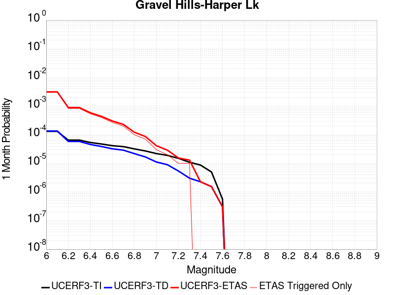 |  |  |

| Magnitude | 1 wk TI Prob | 1 wk TD Prob | 1 wk ETAS Prob | 1 wk ETAS/TD Gain | 1 wk ETAS Triggered Only | 1 mo TI Prob | 1 mo TD Prob | 1 mo ETAS Prob | 1 mo ETAS/TD Gain | 1 mo ETAS Triggered Only | 1 yr TI Prob | 1 yr TD Prob | 1 yr ETAS Prob | 1 yr ETAS/TD Gain | 1 yr ETAS Triggered Only | 10 yr TI Prob | 10 yr TD Prob | 10 yr ETAS Prob | 10 yr ETAS/TD Gain | 10 yr ETAS Triggered Only |
|-----|-----|-----|-----|-----|-----|-----|-----|-----|-----|-----|-----|-----|-----|-----|-----|-----|-----|-----|-----|-----|
| 6.0 | 3.0679566E-5 | 3.1464646E-5 | 0.0026620438 | 84.60429 | 0.002630662 | 1.3147724E-4 | 1.3484273E-4 | 0.003252889 | 24.123577 | 0.0031184668 | 0.0015995599 | 0.0016406906 | 0.005397583 | 3.2898235 | 0.0037630661 | 0.015880952 | 0.01630734 | 0.020454613 | 1.2543195 | 0.004216028 |
| 6.1 | 3.0679566E-5 | 3.1464646E-5 | 0.0026620438 | 84.60429 | 0.002630662 | 1.3147724E-4 | 1.3484273E-4 | 0.003252889 | 24.123577 | 0.0031184668 | 0.0015995599 | 0.0016406906 | 0.005397583 | 3.2898235 | 0.0037630661 | 0.015880952 | 0.01630734 | 0.020454613 | 1.2543195 | 0.004216028 |
| 6.2 | 1.514536E-5 | 1.3635206E-5 | 5.885403E-4 | 43.16328 | 5.749129E-4 | 6.490707E-5 | 5.843536E-5 | 8.4236165E-4 | 14.415274 | 7.8397215E-4 | 7.8995706E-4 | 7.1123015E-4 | 0.001686146 | 2.370746 | 9.7560976E-4 | 0.007871548 | 0.0070907404 | 0.008197817 | 1.1561298 | 0.0011149825 |
| 6.3 | 1.514536E-5 | 1.3635206E-5 | 5.885403E-4 | 43.16328 | 5.749129E-4 | 6.490707E-5 | 5.843536E-5 | 8.4236165E-4 | 14.415274 | 7.8397215E-4 | 7.8995706E-4 | 7.1123015E-4 | 0.001686146 | 2.370746 | 9.7560976E-4 | 0.007871548 | 0.0070907404 | 0.008197817 | 1.1561298 | 0.0011149825 |
| 6.4 | 1.2532521E-5 | 1.06896905E-5 | 4.6364652E-4 | 43.37324 | 4.5296169E-4 | 5.37097E-5 | 4.581219E-5 | 5.8585714E-4 | 12.788238 | 5.400697E-4 | 6.537194E-4 | 5.576265E-4 | 0.0012366901 | 2.217775 | 6.794425E-4 | 0.0065179965 | 0.005562863 | 0.0063597984 | 1.14326 | 8.013937E-4 |
| 6.5 | 1.1094058E-5 | 9.083664E-6 | 3.4009112E-4 | 37.43986 | 3.3101047E-4 | 4.7545094E-5 | 3.892943E-5 | 4.3961068E-4 | 11.292503 | 4.0069685E-4 | 5.787078E-4 | 4.7386673E-4 | 9.6144044E-4 | 2.028926 | 4.8780488E-4 | 0.0057720304 | 0.0047289706 | 0.0052838256 | 1.117331 | 5.5749126E-4 |
| 6.6 | 9.688328E-6 | 7.5316952E-6 | 1.9916789E-4 | 26.443966 | 1.9163763E-4 | 4.1520743E-5 | 3.227831E-5 | 2.935939E-4 | 9.095703 | 2.6132405E-4 | 5.053978E-4 | 3.9292008E-4 | 7.238005E-4 | 1.8421061 | 3.3101047E-4 | 0.0050424994 | 0.0039225104 | 0.0043042824 | 1.0973284 | 3.8327527E-4 |
| 6.7 | 8.974824E-6 | 6.749413E-6 | 1.8096427E-4 | 26.811852 | 1.7421602E-4 | 3.8462964E-5 | 2.8925748E-5 | 2.3797894E-4 | 8.227236 | 2.0905923E-4 | 4.6818596E-4 | 3.5211627E-4 | 5.959328E-4 | 1.6924319 | 2.4390244E-4 | 0.004672008 | 0.0035158044 | 0.0038109305 | 1.0839427 | 2.9616724E-4 |
| 6.8 | 7.4780046E-6 | 5.1161933E-6 | 7.480225E-5 | 14.620685 | 6.968641E-5 | 3.20482E-5 | 2.1926366E-5 | 1.0903247E-4 | 4.972665 | 8.710801E-5 | 3.9011694E-4 | 2.669222E-4 | 3.714239E-4 | 1.3915063 | 1.04529616E-4 | 0.0038943281 | 0.0026661542 | 0.0027877802 | 1.0456185 | 1.2195122E-4 |
| 6.9 | 6.3409307E-6 | 3.9074966E-6 | 7.3593634E-5 | 18.83396 | 6.968641E-5 | 2.7175134E-5 | 1.6746313E-5 | 1.0385287E-4 | 6.201536 | 8.710801E-5 | 3.3080703E-4 | 2.0386827E-4 | 3.083766E-4 | 1.5126266 | 1.04529616E-4 | 0.0033031502 | 0.0020369107 | 0.0021586134 | 1.0597488 | 1.2195122E-4 |
| 7.0 | 5.1239335E-6 | 2.6058565E-6 | 2.0027413E-5 | 7.6855397 | 1.7421602E-5 | 2.195953E-5 | 1.116791E-5 | 4.6010726E-5 | 4.119905 | 3.4843204E-5 | 2.6732447E-4 | 1.3596108E-4 | 1.7079954E-4 | 1.2562386 | 3.4843204E-5 | 0.0026700313 | 0.0013588042 | 0.0014109979 | 1.0384116 | 5.2264808E-5 |
| 7.1 | 4.438899E-6 | 2.0984728E-6 | 2.0984728E-6 | 1.0 | 0.0 | 1.9023713E-5 | 8.993425E-6 | 2.6414871E-5 | 2.9371314 | 1.7421602E-5 | 2.315891E-4 | 1.0948967E-4 | 1.2690936E-4 | 1.159099 | 1.7421602E-5 | 0.002313479 | 0.0010943791 | 0.0011291842 | 1.0318035 | 3.4843204E-5 |
| 7.2 | 3.50367E-6 | 1.2615716E-6 | 1.2615716E-6 | 1.0 | 0.0 | 1.5015643E-5 | 5.4067245E-6 | 2.2828233E-5 | 4.222193 | 1.7421602E-5 | 1.8280011E-4 | 6.582497E-5 | 8.3245424E-5 | 1.2646482 | 1.7421602E-5 | 0.0018264982 | 6.580629E-4 | 6.754731E-4 | 1.0264566 | 1.7421602E-5 |
| 7.3 | 2.561638E-6 | 7.1191585E-7 | 7.1191585E-7 | 1.0 | 0.0 | 1.0978401E-5 | 3.0510646E-6 | 2.0472615E-5 | 6.7099905 | 1.7421602E-5 | 1.3365384E-4 | 3.71461E-5 | 5.4567052E-5 | 1.4689848 | 1.7421602E-5 | 0.0013357349 | 3.7140088E-4 | 3.88816E-4 | 1.0468904 | 1.7421602E-5 |
| 7.4 | 2.0368864E-6 | 5.304837E-7 | 5.304837E-7 | 1.0 | 0.0 | 8.729483E-6 | 2.2734996E-6 | 2.2734996E-6 | 1.0 | 0.0 | 1.06276275E-4 | 2.7679513E-5 | 2.7679513E-5 | 1.0 | 0.0 | 0.0010622547 | 2.767612E-4 | 2.767612E-4 | 1.0 | 0.0 |
| 7.5 | 1.1681728E-6 | 3.6030585E-7 | 3.6030585E-7 | 1.0 | 0.0 | 5.0064455E-6 | 1.544167E-6 | 1.544167E-6 | 1.0 | 0.0 | 6.0951766E-5 | 1.8800076E-5 | 1.8800076E-5 | 1.0 | 0.0 | 6.093505E-4 | 1.8798532E-4 | 1.8798532E-4 | 1.0 | 0.0 |
| 7.6 | 1.3154387E-7 | 7.1197384E-8 | 7.1197384E-8 | 1.0 | 0.0 | 5.6375933E-7 | 3.051316E-7 | 3.051316E-7 | 1.0 | 0.0 | 6.863748E-6 | 3.7149728E-6 | 3.7149728E-6 | 1.0 | 0.0 | 6.863536E-5 | 3.7149264E-5 | 3.7149264E-5 | 1.0 | 0.0 |

## McLean Lake
*[(top)](#table-of-contents)*

| 1 Week | 1 Month | 1 Year | 10 Year |
|-----|-----|-----|-----|
|  |  |  |  |

| Magnitude | 1 wk TI Prob | 1 wk TD Prob | 1 wk ETAS Prob | 1 wk ETAS/TD Gain | 1 wk ETAS Triggered Only | 1 mo TI Prob | 1 mo TD Prob | 1 mo ETAS Prob | 1 mo ETAS/TD Gain | 1 mo ETAS Triggered Only | 1 yr TI Prob | 1 yr TD Prob | 1 yr ETAS Prob | 1 yr ETAS/TD Gain | 1 yr ETAS Triggered Only | 10 yr TI Prob | 10 yr TD Prob | 10 yr ETAS Prob | 10 yr ETAS/TD Gain | 10 yr ETAS Triggered Only |
|-----|-----|-----|-----|-----|-----|-----|-----|-----|-----|-----|-----|-----|-----|-----|-----|-----|-----|-----|-----|-----|
| 6.0 | 1.7360222E-5 | 1.8501627E-5 | 0.0020393701 | 110.226524 | 0.002020906 | 7.439883E-5 | 7.9290556E-5 | 0.0026052226 | 32.85666 | 0.0025261324 | 9.0542925E-4 | 9.6498354E-4 | 0.004167465 | 4.3186903 | 0.0032055748 | 0.009017491 | 0.0096127745 | 0.013236143 | 1.3769326 | 0.0036585366 |
| 6.1 | 9.062689E-6 | 9.592193E-6 | 0.0011419855 | 119.053635 | 0.0011324042 | 3.8839516E-5 | 4.1108804E-5 | 0.001382517 | 33.63068 | 0.0013414634 | 4.727685E-4 | 5.003936E-4 | 0.0022939208 | 4.584233 | 0.0017944251 | 0.0047176396 | 0.004993552 | 0.0069870315 | 1.3992108 | 0.0020034844 |
| 6.2 | 9.062689E-6 | 9.592193E-6 | 0.0011419855 | 119.053635 | 0.0011324042 | 3.8839516E-5 | 4.1108804E-5 | 0.001382517 | 33.63068 | 0.0013414634 | 4.727685E-4 | 5.003936E-4 | 0.0022939208 | 4.584233 | 0.0017944251 | 0.0047176396 | 0.004993552 | 0.0069870315 | 1.3992108 | 0.0020034844 |
| 6.3 | 7.2575485E-6 | 7.66771E-6 | 8.613197E-4 | 112.33077 | 8.5365854E-4 | 3.110341E-5 | 3.2861237E-5 | 0.00102586 | 31.217934 | 9.930313E-4 | 3.786182E-4 | 4.0001926E-4 | 0.0017235314 | 4.3086214 | 0.0013240419 | 0.0037797375 | 0.0039936965 | 0.005503323 | 1.3780023 | 0.0015156794 |
| 6.4 | 7.2575485E-6 | 7.66771E-6 | 8.613197E-4 | 112.33077 | 8.5365854E-4 | 3.110341E-5 | 3.2861237E-5 | 0.00102586 | 31.217934 | 9.930313E-4 | 3.786182E-4 | 4.0001926E-4 | 0.0017235314 | 4.3086214 | 0.0013240419 | 0.0037797375 | 0.0039936965 | 0.005503323 | 1.3780023 | 0.0015156794 |
| 6.5 | 6.06582E-6 | 6.4038773E-6 | 7.729495E-4 | 120.70024 | 7.6655054E-4 | 2.5996113E-5 | 2.7444936E-5 | 8.985012E-4 | 32.738323 | 8.7108015E-4 | 3.164567E-4 | 3.3409733E-4 | 0.0015183706 | 4.544695 | 0.001184669 | 0.0031600643 | 0.0033365893 | 0.00469094 | 1.4059088 | 0.001358885 |
| 6.6 | 5.598744E-6 | 5.910262E-6 | 7.7245623E-4 | 130.69746 | 7.6655054E-4 | 2.3994397E-5 | 2.5329486E-5 | 8.9638756E-4 | 35.389095 | 8.7108015E-4 | 2.9209262E-4 | 3.0834923E-4 | 0.0014752367 | 4.7843046 | 0.0011672474 | 0.0029170897 | 0.003079843 | 0.004365071 | 1.4173031 | 0.0012891986 |
| 6.7 | 5.246996E-6 | 5.539162E-6 | 7.023994E-4 | 126.806076 | 6.968641E-4 | 2.2486933E-5 | 2.3739085E-5 | 8.076926E-4 | 34.023746 | 7.8397215E-4 | 2.73744E-4 | 2.8899137E-4 | 0.0013688186 | 4.736538 | 0.0010801394 | 0.0027340704 | 0.0028867796 | 0.0040854 | 1.4152102 | 0.0012020906 |
| 6.8 | 4.02324E-6 | 4.2469046E-6 | 5.268928E-4 | 124.06513 | 5.226481E-4 | 1.7242342E-5 | 1.8200926E-5 | 6.2794593E-4 | 34.50077 | 6.097561E-4 | 2.099053E-4 | 2.2157968E-4 | 0.0010576313 | 4.773142 | 8.362369E-4 | 0.0020970714 | 0.002214172 | 0.0031354725 | 1.4160925 | 9.233449E-4 |
| 6.9 | 6.835972E-7 | 7.1399285E-7 | 7.0400354E-5 | 98.60093 | 6.968641E-5 | 2.9296991E-6 | 3.0599674E-6 | 7.274617E-5 | 23.77351 | 6.968641E-5 | 3.56685E-5 | 3.7254784E-5 | 1.2435955E-4 | 3.3380828 | 8.710801E-5 | 3.5662777E-4 | 3.7251666E-4 | 4.7700733E-4 | 1.2804993 | 1.04529616E-4 |

## Goldstone Lake
*[(top)](#table-of-contents)*

| 1 Week | 1 Month | 1 Year | 10 Year |
|-----|-----|-----|-----|
|  |  |  | 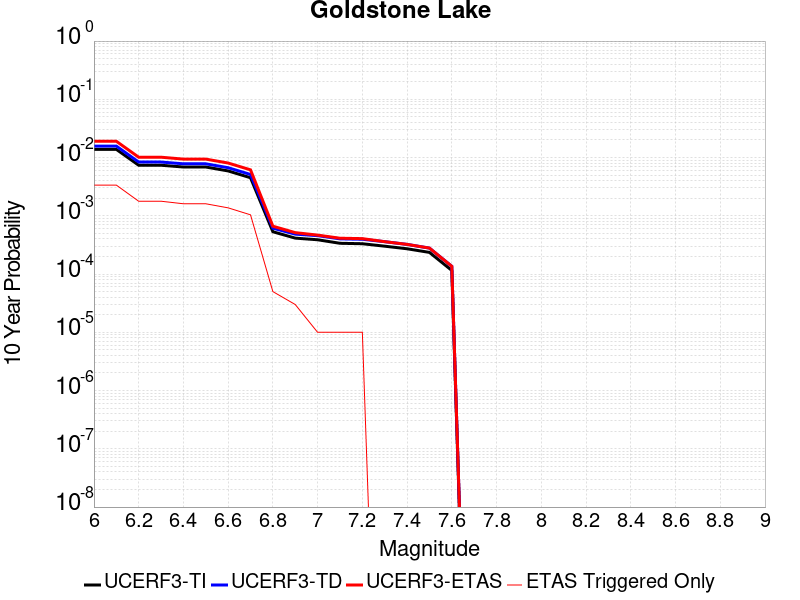 |

| Magnitude | 1 wk TI Prob | 1 wk TD Prob | 1 wk ETAS Prob | 1 wk ETAS/TD Gain | 1 wk ETAS Triggered Only | 1 mo TI Prob | 1 mo TD Prob | 1 mo ETAS Prob | 1 mo ETAS/TD Gain | 1 mo ETAS Triggered Only | 1 yr TI Prob | 1 yr TD Prob | 1 yr ETAS Prob | 1 yr ETAS/TD Gain | 1 yr ETAS Triggered Only | 10 yr TI Prob | 10 yr TD Prob | 10 yr ETAS Prob | 10 yr ETAS/TD Gain | 10 yr ETAS Triggered Only |
|-----|-----|-----|-----|-----|-----|-----|-----|-----|-----|-----|-----|-----|-----|-----|-----|-----|-----|-----|-----|-----|
| 6.0 | 2.671352E-5 | 3.037609E-5 | 0.0019292731 | 63.512886 | 0.0018989547 | 1.1448149E-4 | 1.3017785E-4 | 0.0025688848 | 19.733654 | 0.0024390244 | 0.001392921 | 0.0015839594 | 0.004523547 | 2.8558476 | 0.0029442508 | 0.013842222 | 0.015746197 | 0.019072767 | 1.211262 | 0.003379791 |
| 6.1 | 2.671352E-5 | 3.037609E-5 | 0.0019292731 | 63.512886 | 0.0018989547 | 1.1448149E-4 | 1.3017785E-4 | 0.0025688848 | 19.733654 | 0.0024390244 | 0.001392921 | 0.0015839594 | 0.004523547 | 2.8558476 | 0.0029442508 | 0.013842222 | 0.015746197 | 0.019072767 | 1.211262 | 0.003379791 |
| 6.2 | 1.4197047E-5 | 1.6096245E-5 | 0.0010787969 | 67.02165 | 0.0010627178 | 6.0843064E-5 | 6.8982634E-5 | 0.0014103535 | 20.445051 | 0.0013414634 | 7.4051257E-4 | 8.3963864E-4 | 0.0024410803 | 2.9072988 | 0.0016027874 | 0.007380498 | 0.0083743585 | 0.010136481 | 1.2104188 | 0.0017770035 |
| 6.3 | 1.4197047E-5 | 1.6096245E-5 | 0.0010787969 | 67.02165 | 0.0010627178 | 6.0843064E-5 | 6.8982634E-5 | 0.0014103535 | 20.445051 | 0.0013414634 | 7.4051257E-4 | 8.3963864E-4 | 0.0024410803 | 2.9072988 | 0.0016027874 | 0.007380498 | 0.0083743585 | 0.010136481 | 1.2104188 | 0.0017770035 |
| 6.4 | 1.3238931E-5 | 1.500846E-5 | 9.557609E-4 | 63.68148 | 9.4076653E-4 | 5.6737044E-5 | 6.4320935E-5 | 0.0012663342 | 19.687746 | 0.0012020906 | 6.9055456E-4 | 7.82924E-4 | 0.002227785 | 2.8454676 | 0.0014459931 | 0.006884126 | 0.0078112837 | 0.009401551 | 1.203586 | 0.0016027874 |
| 6.5 | 1.3238931E-5 | 1.500846E-5 | 9.557609E-4 | 63.68148 | 9.4076653E-4 | 5.6737044E-5 | 6.4320935E-5 | 0.0012663342 | 19.687746 | 0.0012020906 | 6.9055456E-4 | 7.82924E-4 | 0.002227785 | 2.8454676 | 0.0014459931 | 0.006884126 | 0.0078112837 | 0.009401551 | 1.203586 | 0.0016027874 |
| 6.6 | 1.1328278E-5 | 1.2855166E-5 | 8.3165994E-4 | 64.69461 | 8.188153E-4 | 4.8548856E-5 | 5.5092944E-5 | 0.0010654902 | 19.339869 | 0.001010453 | 5.90922E-4 | 6.7064585E-4 | 0.0018893401 | 2.8171952 | 0.0012195122 | 0.0058935313 | 0.0066956086 | 0.0080627 | 1.2041774 | 0.0013763066 |
| 6.7 | 8.651175E-6 | 9.824565E-6 | 6.369961E-4 | 64.83708 | 6.271777E-4 | 3.707594E-5 | 4.2105108E-5 | 8.2604424E-4 | 19.618624 | 7.8397215E-4 | 4.5130608E-4 | 5.1259965E-4 | 0.0014702966 | 2.8683138 | 9.5818815E-4 | 0.0045039062 | 0.005123051 | 0.0062149893 | 1.2131422 | 0.001097561 |
| 6.8 | 1.0215377E-6 | 1.1754702E-6 | 1.8597053E-5 | 15.820948 | 1.7421602E-5 | 4.378012E-6 | 5.0377203E-6 | 2.2459235E-5 | 4.458214 | 1.7421602E-5 | 5.3300988E-5 | 6.1332634E-5 | 7.875317E-5 | 1.2840337 | 1.7421602E-5 | 5.3288206E-4 | 6.1316835E-4 | 6.3057925E-4 | 1.028395 | 1.7421602E-5 |
| 6.9 | 7.9360774E-7 | 9.2833966E-7 | 9.2833966E-7 | 1.0 | 0.0 | 3.4011714E-6 | 3.9785928E-6 | 3.9785928E-6 | 1.0 | 0.0 | 4.1408475E-5 | 4.843836E-5 | 4.843836E-5 | 1.0 | 0.0 | 4.140076E-4 | 4.8428503E-4 | 4.8428503E-4 | 1.0 | 0.0 |
| 7.0 | 7.4382757E-7 | 8.7473285E-7 | 8.7473285E-7 | 1.0 | 0.0 | 3.1878285E-6 | 3.74885E-6 | 3.74885E-6 | 1.0 | 0.0 | 3.8811122E-5 | 4.564136E-5 | 4.564136E-5 | 1.0 | 0.0 | 3.8804344E-4 | 4.5632652E-4 | 4.5632652E-4 | 1.0 | 0.0 |
| 7.1 | 6.4709513E-7 | 7.7113E-7 | 7.7113E-7 | 1.0 | 0.0 | 2.773262E-6 | 3.3048389E-6 | 3.3048389E-6 | 1.0 | 0.0 | 3.376394E-5 | 4.0235733E-5 | 4.0235733E-5 | 1.0 | 0.0 | 3.375881E-4 | 4.0229043E-4 | 4.0229043E-4 | 1.0 | 0.0 |
| 7.2 | 6.356704E-7 | 7.5883594E-7 | 7.5883594E-7 | 1.0 | 0.0 | 2.7242988E-6 | 3.2521505E-6 | 3.2521505E-6 | 1.0 | 0.0 | 3.3167835E-5 | 3.959427E-5 | 3.959427E-5 | 1.0 | 0.0 | 3.3162883E-4 | 3.958781E-4 | 3.958781E-4 | 1.0 | 0.0 |
| 7.3 | 5.7695723E-7 | 6.8965653E-7 | 6.8965653E-7 | 1.0 | 0.0 | 2.4726714E-6 | 2.9556677E-6 | 2.9556677E-6 | 1.0 | 0.0 | 3.0104358E-5 | 3.5984718E-5 | 3.5984718E-5 | 1.0 | 0.0 | 3.0100282E-4 | 3.5979465E-4 | 3.5979465E-4 | 1.0 | 0.0 |
| 7.4 | 5.209647E-7 | 6.193514E-7 | 6.193514E-7 | 1.0 | 0.0 | 2.232704E-6 | 2.6543607E-6 | 2.6543607E-6 | 1.0 | 0.0 | 2.718283E-5 | 3.2316417E-5 | 3.2316417E-5 | 1.0 | 0.0 | 2.7179506E-4 | 3.2312275E-4 | 3.2312275E-4 | 1.0 | 0.0 |
| 7.5 | 4.512955E-7 | 5.348885E-7 | 5.348885E-7 | 1.0 | 0.0 | 1.934122E-6 | 2.2923775E-6 | 2.2923775E-6 | 1.0 | 0.0 | 2.3547682E-5 | 2.7909393E-5 | 2.7909393E-5 | 1.0 | 0.0 | 2.3545188E-4 | 2.7906417E-4 | 2.7906417E-4 | 1.0 | 0.0 |
| 7.6 | 2.21172E-7 | 2.603961E-7 | 2.603961E-7 | 1.0 | 0.0 | 9.478797E-7 | 1.1159829E-6 | 1.1159829E-6 | 1.0 | 0.0 | 1.1540374E-5 | 1.3587036E-5 | 1.3587036E-5 | 1.0 | 0.0 | 1.1539775E-4 | 1.3586486E-4 | 1.3586486E-4 | 1.0 | 0.0 |

## So Sierra Nevada
*[(top)](#table-of-contents)*

| 1 Week | 1 Month | 1 Year | 10 Year |
|-----|-----|-----|-----|
|  |  |  |  |

| Magnitude | 1 wk TI Prob | 1 wk TD Prob | 1 wk ETAS Prob | 1 wk ETAS/TD Gain | 1 wk ETAS Triggered Only | 1 mo TI Prob | 1 mo TD Prob | 1 mo ETAS Prob | 1 mo ETAS/TD Gain | 1 mo ETAS Triggered Only | 1 yr TI Prob | 1 yr TD Prob | 1 yr ETAS Prob | 1 yr ETAS/TD Gain | 1 yr ETAS Triggered Only | 10 yr TI Prob | 10 yr TD Prob | 10 yr ETAS Prob | 10 yr ETAS/TD Gain | 10 yr ETAS Triggered Only |
|-----|-----|-----|-----|-----|-----|-----|-----|-----|-----|-----|-----|-----|-----|-----|-----|-----|-----|-----|-----|-----|
| 6.0 | 1.15488665E-5 | 1.1079643E-5 | 0.001892592 | 170.81706 | 0.0018815331 | 4.9494203E-5 | 4.748339E-5 | 0.0023644466 | 49.795235 | 0.002317073 | 6.024253E-4 | 5.7796965E-4 | 0.0032767574 | 5.669428 | 0.0027003484 | 0.006007948 | 0.005765934 | 0.008727851 | 1.5136925 | 0.0029790942 |
| 6.1 | 1.15488665E-5 | 1.1079643E-5 | 0.001892592 | 170.81706 | 0.0018815331 | 4.9494203E-5 | 4.748339E-5 | 0.0023644466 | 49.795235 | 0.002317073 | 6.024253E-4 | 5.7796965E-4 | 0.0032767574 | 5.669428 | 0.0027003484 | 0.006007948 | 0.005765934 | 0.008727851 | 1.5136925 | 0.0029790942 |
| 6.2 | 1.15488665E-5 | 1.1079643E-5 | 0.001892592 | 170.81706 | 0.0018815331 | 4.9494203E-5 | 4.748339E-5 | 0.0023644466 | 49.795235 | 0.002317073 | 6.024253E-4 | 5.7796965E-4 | 0.0032767574 | 5.669428 | 0.0027003484 | 0.006007948 | 0.005765934 | 0.008727851 | 1.5136925 | 0.0029790942 |
| 6.3 | 1.15488665E-5 | 1.1079643E-5 | 0.001892592 | 170.81706 | 0.0018815331 | 4.9494203E-5 | 4.748339E-5 | 0.0023644466 | 49.795235 | 0.002317073 | 6.024253E-4 | 5.7796965E-4 | 0.0032767574 | 5.669428 | 0.0027003484 | 0.006007948 | 0.005765934 | 0.008727851 | 1.5136925 | 0.0029790942 |
| 6.4 | 1.15488665E-5 | 1.1079643E-5 | 0.001892592 | 170.81706 | 0.0018815331 | 4.9494203E-5 | 4.748339E-5 | 0.0023644466 | 49.795235 | 0.002317073 | 6.024253E-4 | 5.7796965E-4 | 0.0032767574 | 5.669428 | 0.0027003484 | 0.006007948 | 0.005765934 | 0.008727851 | 1.5136925 | 0.0029790942 |
| 6.5 | 1.15488665E-5 | 1.1079643E-5 | 0.001892592 | 170.81706 | 0.0018815331 | 4.9494203E-5 | 4.748339E-5 | 0.0023644466 | 49.795235 | 0.002317073 | 6.024253E-4 | 5.7796965E-4 | 0.0032767574 | 5.669428 | 0.0027003484 | 0.006007948 | 0.005765934 | 0.008727851 | 1.5136925 | 0.0029790942 |
| 6.6 | 7.587044E-6 | 6.935635E-6 | 0.0010348031 | 149.20091 | 0.0010278745 | 3.2515498E-5 | 2.9723828E-5 | 0.0013363052 | 44.95737 | 0.0013066202 | 3.9580427E-4 | 3.6183043E-4 | 0.0018769614 | 5.187406 | 0.0015156794 | 0.003951 | 0.0036127048 | 0.0052791364 | 1.4612699 | 0.0016724739 |
| 6.7 | 7.587044E-6 | 6.935635E-6 | 0.0010348031 | 149.20091 | 0.0010278745 | 3.2515498E-5 | 2.9723828E-5 | 0.0013363052 | 44.95737 | 0.0013066202 | 3.9580427E-4 | 3.6183043E-4 | 0.0018769614 | 5.187406 | 0.0015156794 | 0.003951 | 0.0036127048 | 0.0052791364 | 1.4612699 | 0.0016724739 |
| 6.8 | 5.9026956E-6 | 5.1793927E-6 | 7.7172596E-4 | 148.99931 | 7.6655054E-4 | 2.5297022E-5 | 2.2197215E-5 | 9.2810043E-4 | 41.811573 | 9.0592337E-4 | 3.0794772E-4 | 2.7021873E-4 | 0.0013152325 | 4.867288 | 0.0010452962 | 0.0030752132 | 0.002699018 | 0.003810991 | 1.4119918 | 0.0011149825 |
| 6.9 | 5.0118915E-6 | 4.2524252E-6 | 6.48849E-4 | 152.58328 | 6.445993E-4 | 2.1479358E-5 | 1.8224557E-5 | 7.6733984E-4 | 42.104717 | 7.491289E-4 | 2.614798E-4 | 2.2186211E-4 | 0.001092749 | 4.925352 | 8.7108015E-4 | 0.0026117235 | 0.0022164788 | 0.0031551602 | 1.4235011 | 9.4076653E-4 |
| 7.0 | 4.4924795E-6 | 3.7139177E-6 | 5.089385E-4 | 137.03549 | 5.052265E-4 | 1.925334E-5 | 1.5916696E-5 | 6.0824177E-4 | 38.21407 | 5.923345E-4 | 2.3438422E-4 | 1.9376918E-4 | 9.0791646E-4 | 4.685557 | 7.142857E-4 | 0.0023413717 | 0.0019360651 | 0.0027185194 | 1.4041467 | 7.8397215E-4 |
| 7.1 | 3.9118436E-6 | 3.1119775E-6 | 3.689645E-4 | 118.562706 | 3.6585366E-4 | 1.6764936E-5 | 1.3336982E-5 | 4.4887123E-4 | 33.65613 | 4.3554007E-4 | 2.0409399E-4 | 1.6236622E-4 | 7.0234825E-4 | 4.325704 | 5.400697E-4 | 0.0020390663 | 0.001622532 | 0.0021965122 | 1.3537558 | 5.749129E-4 |
| 7.2 | 3.4200818E-6 | 2.6054543E-6 | 2.9877192E-4 | 114.67172 | 2.9616724E-4 | 1.4657411E-5 | 1.11661875E-5 | 3.5959436E-4 | 32.20386 | 3.4843205E-4 | 1.7843937E-4 | 1.3594035E-4 | 5.54002E-4 | 4.075331 | 4.1811846E-4 | 0.0017829615 | 0.0013586218 | 0.001810968 | 1.332945 | 4.5296169E-4 |
| 7.3 | 2.6593618E-6 | 1.8284203E-6 | 1.7604412E-4 | 96.28209 | 1.7421602E-4 | 1.13972155E-5 | 7.836065E-6 | 1.994722E-4 | 25.455658 | 1.9163763E-4 | 1.3875226E-4 | 9.540021E-5 | 3.392794E-4 | 3.5563798 | 2.4390244E-4 | 0.0013866565 | 9.5362146E-4 | 0.0012146963 | 1.273772 | 2.6132405E-4 |
| 7.4 | 2.2577992E-6 | 1.436438E-6 | 1.4080906E-4 | 98.02655 | 1.3937282E-4 | 9.676246E-6 | 6.15615E-6 | 1.6294961E-4 | 26.469402 | 1.5679443E-4 | 1.1780193E-4 | 7.49488E-5 | 2.6657208E-4 | 3.5567222 | 1.9163763E-4 | 0.001177395 | 7.492603E-4 | 9.407543E-4 | 1.2555774 | 1.9163763E-4 |
| 7.5 | 1.489319E-6 | 7.353936E-7 | 5.3000163E-5 | 72.07047 | 5.2264808E-5 | 6.3827797E-6 | 3.1516831E-6 | 7.283787E-5 | 23.110786 | 6.968641E-5 | 7.770758E-5 | 3.8371072E-5 | 1.0805481E-4 | 2.8160489 | 6.968641E-5 | 7.7680405E-4 | 3.836449E-4 | 4.5330456E-4 | 1.1815733 | 6.968641E-5 |
| 7.6 | 1.0680322E-6 | 4.6596554E-7 | 1.788756E-5 | 38.38816 | 1.7421602E-5 | 4.577273E-6 | 1.9969937E-6 | 3.684013E-5 | 18.447796 | 3.4843204E-5 | 5.5726876E-5 | 2.4313129E-5 | 5.915549E-5 | 2.4330676 | 3.4843204E-5 | 5.5712904E-4 | 2.4310495E-4 | 2.779397E-4 | 1.1432909 | 3.4843204E-5 |
| 7.7 | 5.509146E-7 | 1.5580486E-7 | 1.5580486E-7 | 1.0 | 0.0 | 2.3610605E-6 | 6.677349E-7 | 1.8089326E-5 | 27.090578 | 1.7421602E-5 | 2.8745531E-5 | 8.129644E-6 | 2.5551106E-5 | 3.142955 | 1.7421602E-5 | 2.8741814E-4 | 8.1293576E-5 | 9.871377E-5 | 1.2142874 | 1.7421602E-5 |

## San Andreas (Mojave N)
*[(top)](#table-of-contents)*

| 1 Week | 1 Month | 1 Year | 10 Year |
|-----|-----|-----|-----|
|  |  |  |  |

| Magnitude | 1 wk TI Prob | 1 wk TD Prob | 1 wk ETAS Prob | 1 wk ETAS/TD Gain | 1 wk ETAS Triggered Only | 1 mo TI Prob | 1 mo TD Prob | 1 mo ETAS Prob | 1 mo ETAS/TD Gain | 1 mo ETAS Triggered Only | 1 yr TI Prob | 1 yr TD Prob | 1 yr ETAS Prob | 1 yr ETAS/TD Gain | 1 yr ETAS Triggered Only | 10 yr TI Prob | 10 yr TD Prob | 10 yr ETAS Prob | 10 yr ETAS/TD Gain | 10 yr ETAS Triggered Only |
|-----|-----|-----|-----|-----|-----|-----|-----|-----|-----|-----|-----|-----|-----|-----|-----|-----|-----|-----|-----|-----|
| 6.0 | 9.877682E-5 | 1.9400702E-4 | 0.0020577568 | 10.60661 | 0.0018641115 | 4.2326056E-4 | 8.311939E-4 | 0.0030070841 | 3.617789 | 0.0021777004 | 0.0051410277 | 0.010072956 | 0.01253915 | 1.2448332 | 0.0024912893 | 0.05023708 | 0.09831428 | 0.10070202 | 1.0242867 | 0.0026480837 |
| 6.1 | 9.877682E-5 | 1.9400702E-4 | 0.0020577568 | 10.60661 | 0.0018641115 | 4.2326056E-4 | 8.311939E-4 | 0.0030070841 | 3.617789 | 0.0021777004 | 0.0051410277 | 0.010072956 | 0.01253915 | 1.2448332 | 0.0024912893 | 0.05023708 | 0.09831428 | 0.10070202 | 1.0242867 | 0.0026480837 |
| 6.2 | 9.877682E-5 | 1.9400702E-4 | 0.0020577568 | 10.60661 | 0.0018641115 | 4.2326056E-4 | 8.311939E-4 | 0.0030070841 | 3.617789 | 0.0021777004 | 0.0051410277 | 0.010072956 | 0.01253915 | 1.2448332 | 0.0024912893 | 0.05023708 | 0.09831428 | 0.10070202 | 1.0242867 | 0.0026480837 |
| 6.3 | 9.877682E-5 | 1.9400702E-4 | 0.0020577568 | 10.60661 | 0.0018641115 | 4.2326056E-4 | 8.311939E-4 | 0.0030070841 | 3.617789 | 0.0021777004 | 0.0051410277 | 0.010072956 | 0.01253915 | 1.2448332 | 0.0024912893 | 0.05023708 | 0.09831428 | 0.10070202 | 1.0242867 | 0.0026480837 |
| 6.4 | 9.877682E-5 | 1.9400702E-4 | 0.0020577568 | 10.60661 | 0.0018641115 | 4.2326056E-4 | 8.311939E-4 | 0.0030070841 | 3.617789 | 0.0021777004 | 0.0051410277 | 0.010072956 | 0.01253915 | 1.2448332 | 0.0024912893 | 0.05023708 | 0.09831428 | 0.10070202 | 1.0242867 | 0.0026480837 |
| 6.5 | 9.861474E-5 | 1.9374468E-4 | 0.002057495 | 10.61962 | 0.0018641115 | 4.2256617E-4 | 8.300703E-4 | 0.003005963 | 3.6213355 | 0.0021777004 | 0.0051326132 | 0.010059402 | 0.012525631 | 1.2451664 | 0.0024912893 | 0.050156746 | 0.098192066 | 0.10058013 | 1.0243204 | 0.0026480837 |
| 6.6 | 9.861474E-5 | 1.9374468E-4 | 0.002057495 | 10.61962 | 0.0018641115 | 4.2256617E-4 | 8.300703E-4 | 0.003005963 | 3.6213355 | 0.0021777004 | 0.0051326132 | 0.010059402 | 0.012525631 | 1.2451664 | 0.0024912893 | 0.050156746 | 0.098192066 | 0.10058013 | 1.0243204 | 0.0026480837 |
| 6.7 | 9.8552715E-5 | 1.9364421E-4 | 0.0020573947 | 10.624613 | 0.0018641115 | 4.223004E-4 | 8.2964E-4 | 0.0030055337 | 3.6226962 | 0.0021777004 | 0.0051293927 | 0.010054212 | 0.012520453 | 1.2452943 | 0.0024912893 | 0.050125998 | 0.098145254 | 0.10053344 | 1.0243332 | 0.0026480837 |
| 6.8 | 9.8464974E-5 | 1.9349584E-4 | 0.0020572466 | 10.631994 | 0.0018641115 | 4.219245E-4 | 8.290045E-4 | 0.0030048995 | 3.6247082 | 0.0021777004 | 0.0051248376 | 0.010046546 | 0.012512807 | 1.2454834 | 0.0024912893 | 0.05008251 | 0.09807528 | 0.10046365 | 1.0243524 | 0.0026480837 |
| 6.9 | 9.825824E-5 | 1.9317595E-4 | 0.0020569274 | 10.647948 | 0.0018641115 | 4.2103877E-4 | 8.276344E-4 | 0.0030035323 | 3.629057 | 0.0021777004 | 0.0051141046 | 0.010030019 | 0.0124963205 | 1.245892 | 0.0024912893 | 0.049980022 | 0.09792438 | 0.10031315 | 1.024394 | 0.0026480837 |
| 7.0 | 9.781462E-5 | 1.924896E-4 | 0.0020562422 | 10.682355 | 0.0018641115 | 4.1913814E-4 | 8.246948E-4 | 0.003000599 | 3.6384358 | 0.0021777004 | 0.005091073 | 0.009994558 | 0.012460948 | 1.2467732 | 0.0024912893 | 0.04976007 | 0.09760077 | 0.099990405 | 1.0244837 | 0.0026480837 |
| 7.1 | 9.7121134E-5 | 1.9150671E-4 | 0.0020552613 | 10.732059 | 0.0018641115 | 4.1616702E-4 | 8.204851E-4 | 0.0029963986 | 3.6519842 | 0.0021777004 | 0.005055068 | 0.009943774 | 0.012410291 | 1.2480463 | 0.0024912893 | 0.04941613 | 0.09713728 | 0.09952814 | 1.0246131 | 0.0026480837 |
| 7.2 | 9.663819E-5 | 1.9081456E-4 | 0.0020545705 | 10.767366 | 0.0018641115 | 4.1409794E-4 | 8.175206E-4 | 0.0029934407 | 3.6616087 | 0.0021777004 | 0.0050299936 | 0.00990801 | 0.012374616 | 1.2489506 | 0.0024912893 | 0.049176537 | 0.09681055 | 0.09920227 | 1.0247052 | 0.0026480837 |
| 7.3 | 9.6277574E-5 | 1.9033969E-4 | 0.0020540964 | 10.791739 | 0.0018641115 | 4.125529E-4 | 8.154867E-4 | 0.0029914111 | 3.6682525 | 0.0021777004 | 0.0050112694 | 0.009883473 | 0.012350139 | 1.2495749 | 0.0024912893 | 0.04899759 | 0.09658401 | 0.09897633 | 1.0247693 | 0.0026480837 |
| 7.4 | 9.593308E-5 | 1.897375E-4 | 0.0020534953 | 10.822823 | 0.0018641115 | 4.1107697E-4 | 8.129075E-4 | 0.0029888377 | 3.6767254 | 0.0021777004 | 0.0049933824 | 0.009852355 | 0.012319099 | 1.250371 | 0.0024912893 | 0.04882661 | 0.09630218 | 0.098695256 | 1.0248495 | 0.0026480837 |
| 7.5 | 9.561707E-5 | 1.8919831E-4 | 0.002035539 | 10.758758 | 0.0018466898 | 4.0972308E-4 | 8.1059814E-4 | 0.0029691258 | 3.6628826 | 0.0021602788 | 0.0049769743 | 0.009824493 | 0.012274056 | 1.2493323 | 0.0024738675 | 0.048669744 | 0.09604836 | 0.09842636 | 1.0247582 | 0.002630662 |
| 7.6 | 9.418194E-5 | 1.8572104E-4 | 0.0020320679 | 10.941506 | 0.0018466898 | 4.0357444E-4 | 7.957047E-4 | 0.0029542646 | 3.7127647 | 0.0021602788 | 0.004902454 | 0.009644784 | 0.012094792 | 1.2540241 | 0.0024738675 | 0.047957025 | 0.094430685 | 0.09681293 | 1.0252274 | 0.002630662 |
| 7.7 | 8.202141E-5 | 1.6021315E-4 | 0.0017627438 | 11.002491 | 0.0016027874 | 3.51473E-4 | 6.8644714E-4 | 0.0025318693 | 3.6883676 | 0.0018466898 | 0.00427079 | 0.008325525 | 0.010415988 | 1.2510909 | 0.002108014 | 0.04189639 | 0.08223219 | 0.08431076 | 1.0252768 | 0.0022648084 |
| 7.8 | 7.2859846E-5 | 1.4516473E-4 | 0.0012425664 | 8.559699 | 0.001097561 | 3.1221908E-4 | 6.219862E-4 | 0.0019452045 | 3.1274078 | 0.0013240419 | 0.003794643 | 0.0075464295 | 0.009050671 | 1.1993315 | 0.0015156794 | 0.037304975 | 0.07472468 | 0.07619158 | 1.0196307 | 0.0015853659 |
| 7.9 | 5.3874453E-5 | 1.0045676E-4 | 6.9273176E-4 | 6.89582 | 5.923345E-4 | 2.3087008E-4 | 4.3045796E-4 | 0.0011444362 | 2.658648 | 7.142857E-4 | 0.0028072202 | 0.0052282433 | 0.006060108 | 1.1591098 | 8.362369E-4 | 0.02772022 | 0.05242443 | 0.05328286 | 1.0163746 | 9.0592337E-4 |
| 8.0 | 3.468538E-5 | 5.4260272E-5 | 2.2846684E-4 | 4.210573 | 1.7421602E-4 | 1.4864317E-4 | 2.325233E-4 | 4.589515E-4 | 1.9737871 | 2.2648084E-4 | 0.0018082283 | 0.002827298 | 0.0031052553 | 1.0983121 | 2.7874563E-4 | 0.017935853 | 0.028947512 | 0.029285857 | 1.0116882 | 3.4843205E-4 |
| 8.1 | 1.9152367E-5 | 1.940263E-5 | 8.908769E-5 | 4.5915265 | 6.968641E-5 | 8.207899E-5 | 8.3151484E-5 | 1.7025226E-4 | 2.0474951 | 8.710801E-5 | 9.988535E-4 | 0.0010118998 | 0.0010989197 | 1.0859965 | 8.710801E-5 | 0.009943757 | 0.01085625 | 0.010976877 | 1.0111114 | 1.2195122E-4 |
| 8.2 | 8.643924E-6 | 5.4748625E-6 | 5.4748625E-6 | 1.0 | 0.0 | 3.704486E-5 | 2.3463486E-5 | 2.3463486E-5 | 1.0 | 0.0 | 4.5092785E-4 | 2.8563058E-4 | 2.8563058E-4 | 1.0 | 0.0 | 0.0045001395 | 0.0032487072 | 0.0032487072 | 1.0 | 0.0 |
| 8.3 | 1.983087E-6 | 7.6599065E-7 | 7.6599065E-7 | 1.0 | 0.0 | 8.498917E-6 | 3.282813E-6 | 3.282813E-6 | 1.0 | 0.0 | 1.034694E-4 | 3.9967534E-5 | 3.9967534E-5 | 1.0 | 0.0 | 0.0010342124 | 4.719687E-4 | 4.719687E-4 | 1.0 | 0.0 |

## Coyote Canyon
*[(top)](#table-of-contents)*

| 1 Week | 1 Month | 1 Year | 10 Year |
|-----|-----|-----|-----|
|  |  |  |  |

| Magnitude | 1 wk TI Prob | 1 wk TD Prob | 1 wk ETAS Prob | 1 wk ETAS/TD Gain | 1 wk ETAS Triggered Only | 1 mo TI Prob | 1 mo TD Prob | 1 mo ETAS Prob | 1 mo ETAS/TD Gain | 1 mo ETAS Triggered Only | 1 yr TI Prob | 1 yr TD Prob | 1 yr ETAS Prob | 1 yr ETAS/TD Gain | 1 yr ETAS Triggered Only | 10 yr TI Prob | 10 yr TD Prob | 10 yr ETAS Prob | 10 yr ETAS/TD Gain | 10 yr ETAS Triggered Only |
|-----|-----|-----|-----|-----|-----|-----|-----|-----|-----|-----|-----|-----|-----|-----|-----|-----|-----|-----|-----|-----|
| 6.0 | 3.5090034E-5 | 4.0364324E-5 | 0.0013469318 | 33.36936 | 0.0013066202 | 1.503772E-4 | 1.7297994E-4 | 0.0018103273 | 10.465533 | 0.0016376306 | 0.0018293047 | 0.0021042528 | 0.0040861364 | 1.9418467 | 0.0019860626 | 0.018143194 | 0.020869201 | 0.023103803 | 1.1070765 | 0.00228223 |
| 6.1 | 3.5090034E-5 | 4.0364324E-5 | 0.0013469318 | 33.36936 | 0.0013066202 | 1.503772E-4 | 1.7297994E-4 | 0.0018103273 | 10.465533 | 0.0016376306 | 0.0018293047 | 0.0021042528 | 0.0040861364 | 1.9418467 | 0.0019860626 | 0.018143194 | 0.020869201 | 0.023103803 | 1.1070765 | 0.00228223 |
| 6.2 | 1.841879E-5 | 2.1059794E-5 | 8.2243665E-4 | 39.052456 | 8.013937E-4 | 7.8935285E-5 | 9.0253714E-5 | 9.786752E-4 | 10.843601 | 8.8850176E-4 | 9.606133E-4 | 0.001098387 | 0.0022295474 | 2.0298378 | 0.0011324042 | 0.0095647145 | 0.010939667 | 0.012266455 | 1.1212823 | 0.0013414634 |
| 6.3 | 1.841879E-5 | 2.1059794E-5 | 8.2243665E-4 | 39.052456 | 8.013937E-4 | 7.8935285E-5 | 9.0253714E-5 | 9.786752E-4 | 10.843601 | 8.8850176E-4 | 9.606133E-4 | 0.001098387 | 0.0022295474 | 2.0298378 | 0.0011324042 | 0.0095647145 | 0.010939667 | 0.012266455 | 1.1212823 | 0.0013414634 |
| 6.4 | 1.712201E-5 | 1.9565212E-5 | 7.8610075E-4 | 40.178493 | 7.6655054E-4 | 7.337798E-5 | 8.3848776E-5 | 9.548559E-4 | 11.387833 | 8.7108015E-4 | 8.930107E-4 | 0.0010204813 | 0.0021169223 | 2.074435 | 0.001097561 | 0.008894307 | 0.010167871 | 0.0114439605 | 1.1255022 | 0.0012891986 |
| 6.5 | 1.4744935E-5 | 1.6836972E-5 | 6.788467E-4 | 40.318813 | 6.6202093E-4 | 6.3191044E-5 | 7.215698E-5 | 8.386522E-4 | 11.622606 | 7.6655054E-4 | 7.6907943E-4 | 8.7825063E-4 | 0.0018181909 | 2.0702415 | 9.4076653E-4 | 0.007664232 | 0.008756994 | 0.009827675 | 1.1222658 | 0.0010801394 |
| 6.6 | 1.2017839E-5 | 1.37240895E-5 | 6.060505E-4 | 44.15961 | 5.923345E-4 | 5.150401E-5 | 5.88167E-5 | 7.3821924E-4 | 12.551185 | 6.794425E-4 | 6.268809E-4 | 7.159466E-4 | 0.0015515848 | 2.1671796 | 8.362369E-4 | 0.0062511545 | 0.0071450938 | 0.008079139 | 1.1307253 | 9.4076653E-4 |
| 6.7 | 1.00956095E-5 | 1.1533517E-5 | 5.51597E-4 | 47.82557 | 5.400697E-4 | 4.326618E-5 | 4.942891E-5 | 6.5915484E-4 | 13.335412 | 6.097561E-4 | 5.266384E-4 | 6.017178E-4 | 0.001367807 | 2.2731705 | 7.6655054E-4 | 0.005253921 | 0.0060094125 | 0.006875258 | 1.1440816 | 8.7108015E-4 |

## San Andreas (Mojave S)
*[(top)](#table-of-contents)*

| 1 Week | 1 Month | 1 Year | 10 Year |
|-----|-----|-----|-----|
|  |  |  |  |

| Magnitude | 1 wk TI Prob | 1 wk TD Prob | 1 wk ETAS Prob | 1 wk ETAS/TD Gain | 1 wk ETAS Triggered Only | 1 mo TI Prob | 1 mo TD Prob | 1 mo ETAS Prob | 1 mo ETAS/TD Gain | 1 mo ETAS Triggered Only | 1 yr TI Prob | 1 yr TD Prob | 1 yr ETAS Prob | 1 yr ETAS/TD Gain | 1 yr ETAS Triggered Only | 10 yr TI Prob | 10 yr TD Prob | 10 yr ETAS Prob | 10 yr ETAS/TD Gain | 10 yr ETAS Triggered Only |
|-----|-----|-----|-----|-----|-----|-----|-----|-----|-----|-----|-----|-----|-----|-----|-----|-----|-----|-----|-----|-----|
| 6.0 | 3.1064058E-4 | 6.7460834E-4 | 0.0023459538 | 3.4775052 | 0.0016724739 | 0.0013306376 | 0.0028881032 | 0.0048510586 | 1.6796694 | 0.001968641 | 0.016080605 | 0.03462235 | 0.03684238 | 1.0641214 | 0.0022996515 | 0.1496549 | 0.28660452 | 0.28833207 | 1.0060277 | 0.0024216028 |
| 6.1 | 3.1064058E-4 | 6.7460834E-4 | 0.0023459538 | 3.4775052 | 0.0016724739 | 0.0013306376 | 0.0028881032 | 0.0048510586 | 1.6796694 | 0.001968641 | 0.016080605 | 0.03462235 | 0.03684238 | 1.0641214 | 0.0022996515 | 0.1496549 | 0.28660452 | 0.28833207 | 1.0060277 | 0.0024216028 |
| 6.2 | 3.1064058E-4 | 6.7460834E-4 | 0.0023459538 | 3.4775052 | 0.0016724739 | 0.0013306376 | 0.0028881032 | 0.0048510586 | 1.6796694 | 0.001968641 | 0.016080605 | 0.03462235 | 0.03684238 | 1.0641214 | 0.0022996515 | 0.1496549 | 0.28660452 | 0.28833207 | 1.0060277 | 0.0024216028 |
| 6.3 | 3.1064058E-4 | 6.7460834E-4 | 0.0023459538 | 3.4775052 | 0.0016724739 | 0.0013306376 | 0.0028881032 | 0.0048510586 | 1.6796694 | 0.001968641 | 0.016080605 | 0.03462235 | 0.03684238 | 1.0641214 | 0.0022996515 | 0.1496549 | 0.28660452 | 0.28833207 | 1.0060277 | 0.0024216028 |
| 6.4 | 1.9872203E-4 | 4.3179357E-4 | 0.0019642327 | 4.549009 | 0.0015331011 | 8.5138786E-4 | 0.0018492596 | 0.0036403663 | 1.9685534 | 0.0017944251 | 0.010316478 | 0.02228844 | 0.024264302 | 1.0886496 | 0.002020906 | 0.098504856 | 0.19699748 | 0.19869022 | 1.0085927 | 0.002108014 |
| 6.5 | 1.291105E-4 | 2.875267E-4 | 0.0016111878 | 5.6036115 | 0.0013240419 | 5.5321335E-4 | 0.0012316781 | 0.0027976912 | 2.2714467 | 0.0015679443 | 0.006714592 | 0.0148934 | 0.0166611 | 1.1186901 | 0.0017944251 | 0.065152965 | 0.13803436 | 0.13965617 | 1.0117494 | 0.0018815331 |
| 6.6 | 1.291105E-4 | 2.875267E-4 | 0.0016111878 | 5.6036115 | 0.0013240419 | 5.5321335E-4 | 0.0012316781 | 0.0027976912 | 2.2714467 | 0.0015679443 | 0.006714592 | 0.0148934 | 0.0166611 | 1.1186901 | 0.0017944251 | 0.065152965 | 0.13803436 | 0.13965617 | 1.0117494 | 0.0018815331 |
| 6.7 | 1.08001186E-4 | 2.4333889E-4 | 0.0015670585 | 6.4398193 | 0.0013240419 | 4.6278012E-4 | 0.0010424647 | 0.0026087745 | 2.5025063 | 0.0015679443 | 0.0056198016 | 0.012618446 | 0.014390228 | 1.1404121 | 0.0017944251 | 0.054797906 | 0.119176775 | 0.120834075 | 1.0139062 | 0.0018815331 |
| 6.8 | 1.0624356E-4 | 2.3851555E-4 | 0.0015622416 | 6.549852 | 0.0013240419 | 4.5525006E-4 | 0.0010218095 | 0.0025881517 | 2.53291 | 0.0015679443 | 0.0055285925 | 0.012369843 | 0.014142072 | 1.14327 | 0.0017944251 | 0.053930566 | 0.11712591 | 0.11878707 | 1.0141827 | 0.0018815331 |
| 6.9 | 1.0393785E-4 | 2.3221898E-4 | 0.0015385358 | 6.625366 | 0.0013066202 | 4.4537184E-4 | 9.948451E-4 | 0.0025438252 | 2.5570064 | 0.0015505226 | 0.0054089287 | 0.012045221 | 0.01380082 | 1.1457506 | 0.0017770035 | 0.05279156 | 0.11442335 | 0.11607417 | 1.0144272 | 0.0018641115 |
| 7.0 | 1.0155622E-4 | 2.2591476E-4 | 0.0015322397 | 6.78238 | 0.0013066202 | 4.3516833E-4 | 9.6784724E-4 | 0.0025168692 | 2.600482 | 0.0015505226 | 0.005285311 | 0.0117200995 | 0.013476277 | 1.1498432 | 0.0017770035 | 0.05161361 | 0.111683756 | 0.11333967 | 1.0148269 | 0.0018641115 |
| 7.1 | 9.885595E-5 | 2.1879886E-4 | 0.0015251331 | 6.9704804 | 0.0013066202 | 4.2359953E-4 | 9.3737274E-4 | 0.002486442 | 2.6525648 | 0.0015505226 | 0.0051451353 | 0.011352993 | 0.013109822 | 1.1547459 | 0.0017770035 | 0.05027629 | 0.1085682 | 0.11022993 | 1.0153059 | 0.0018641115 |
| 7.2 | 9.6411415E-5 | 2.124288E-4 | 0.0015187714 | 7.149555 | 0.0013066202 | 4.1312634E-4 | 9.1009185E-4 | 0.0024592034 | 2.7021487 | 0.0015505226 | 0.005018219 | 0.011024255 | 0.012781669 | 1.1594133 | 0.0017770035 | 0.049064007 | 0.105758004 | 0.10742497 | 1.0157621 | 0.0018641115 |
| 7.3 | 9.1180635E-5 | 1.9471257E-4 | 0.0014488237 | 7.440833 | 0.0012543554 | 3.907156E-4 | 8.342157E-4 | 0.0023138167 | 2.773643 | 0.0014808362 | 0.004746591 | 0.01010939 | 0.011799447 | 1.167177 | 0.0017073171 | 0.046464786 | 0.09795115 | 0.09956981 | 1.0165251 | 0.0017944251 |
| 7.4 | 8.887388E-5 | 1.8719878E-4 | 0.0014239011 | 7.6063585 | 0.0012369337 | 3.8083247E-4 | 8.020339E-4 | 0.0022642747 | 2.823166 | 0.0014634146 | 0.0046267817 | 0.00972114 | 0.011394608 | 1.1721473 | 0.0016898955 | 0.045316286 | 0.09458615 | 0.09619507 | 1.0170101 | 0.0017770035 |
| 7.5 | 8.6750515E-5 | 1.8051457E-4 | 0.0014172251 | 7.851029 | 0.0012369337 | 3.7173493E-4 | 7.7340455E-4 | 0.0022356873 | 2.890709 | 0.0014634146 | 0.004516484 | 0.009375632 | 0.011049683 | 1.1785535 | 0.0016898955 | 0.04425787 | 0.091549896 | 0.09316421 | 1.0176332 | 0.0017770035 |
| 7.6 | 8.453092E-5 | 1.7439072E-4 | 0.0014111088 | 8.091651 | 0.0012369337 | 3.6222505E-4 | 7.471748E-4 | 0.002209496 | 2.957134 | 0.0014634146 | 0.0044011753 | 0.009058985 | 0.010733571 | 1.1848537 | 0.0016898955 | 0.04315024 | 0.08870898 | 0.09032835 | 1.0182549 | 0.0017770035 |
| 7.7 | 8.259102E-5 | 1.6961215E-4 | 0.0014063362 | 8.291482 | 0.0012369337 | 3.539135E-4 | 7.2670676E-4 | 0.0021890579 | 3.0122988 | 0.0014634146 | 0.004300386 | 0.008811831 | 0.010486835 | 1.1900859 | 0.0016898955 | 0.042181134 | 0.08645982 | 0.088083185 | 1.0187759 | 0.0017770035 |
| 7.8 | 7.444844E-5 | 1.5283503E-4 | 0.0012502283 | 8.180247 | 0.001097561 | 3.1902574E-4 | 6.548429E-4 | 0.0019780176 | 3.020599 | 0.0013240419 | 0.0038772223 | 0.007943616 | 0.009447255 | 1.1892891 | 0.0015156794 | 0.03810269 | 0.078290746 | 0.07975199 | 1.0186644 | 0.0015853659 |
| 7.9 | 5.2586525E-5 | 1.00064186E-4 | 6.923394E-4 | 6.918953 | 5.923345E-4 | 2.2535135E-4 | 4.2877605E-4 | 0.0011427555 | 2.665157 | 7.142857E-4 | 0.0027402006 | 0.005207864 | 0.0060397456 | 1.1597357 | 8.362369E-4 | 0.027066574 | 0.052200034 | 0.05305867 | 1.016449 | 9.0592337E-4 |
| 8.0 | 3.379877E-5 | 5.4074168E-5 | 2.2828077E-4 | 4.2216234 | 1.7421602E-4 | 1.4484383E-4 | 2.3172585E-4 | 4.5815422E-4 | 1.977139 | 2.2648084E-4 | 0.0017620471 | 0.002817614 | 0.0030955742 | 1.0986509 | 2.7874563E-4 | 0.017481409 | 0.028834904 | 0.029173288 | 1.0117352 | 3.4843205E-4 |
| 8.1 | 1.8668277E-5 | 1.9309397E-5 | 8.8994464E-5 | 4.608868 | 6.968641E-5 | 8.000444E-5 | 8.275194E-5 | 1.6985275E-4 | 2.0525532 | 8.710801E-5 | 9.736188E-4 | 0.0010070398 | 0.0010940601 | 1.086412 | 8.710801E-5 | 0.009693642 | 0.010798888 | 0.0109195225 | 1.011171 | 1.2195122E-4 |
| 8.2 | 8.541571E-6 | 5.460819E-6 | 5.460819E-6 | 1.0 | 0.0 | 3.660622E-5 | 2.3403301E-5 | 2.3403301E-5 | 1.0 | 0.0 | 4.455896E-4 | 2.84898E-4 | 2.84898E-4 | 1.0 | 0.0 | 0.0044469717 | 0.0032408056 | 0.0032408056 | 1.0 | 0.0 |
| 8.3 | 1.983087E-6 | 7.6599065E-7 | 7.6599065E-7 | 1.0 | 0.0 | 8.498917E-6 | 3.282813E-6 | 3.282813E-6 | 1.0 | 0.0 | 1.034694E-4 | 3.9967534E-5 | 3.9967534E-5 | 1.0 | 0.0 | 0.0010342124 | 4.719687E-4 | 4.719687E-4 | 1.0 | 0.0 |

## Death Valley (So)
*[(top)](#table-of-contents)*

| 1 Week | 1 Month | 1 Year | 10 Year |
|-----|-----|-----|-----|
|  |  |  |  |

| Magnitude | 1 wk TI Prob | 1 wk TD Prob | 1 wk ETAS Prob | 1 wk ETAS/TD Gain | 1 wk ETAS Triggered Only | 1 mo TI Prob | 1 mo TD Prob | 1 mo ETAS Prob | 1 mo ETAS/TD Gain | 1 mo ETAS Triggered Only | 1 yr TI Prob | 1 yr TD Prob | 1 yr ETAS Prob | 1 yr ETAS/TD Gain | 1 yr ETAS Triggered Only | 10 yr TI Prob | 10 yr TD Prob | 10 yr ETAS Prob | 10 yr ETAS/TD Gain | 10 yr ETAS Triggered Only |
|-----|-----|-----|-----|-----|-----|-----|-----|-----|-----|-----|-----|-----|-----|-----|-----|-----|-----|-----|-----|-----|
| 6.0 | 2.0684236E-5 | 2.5617775E-5 | 0.0012973621 | 50.643044 | 0.001271777 | 8.864371E-5 | 1.0978594E-4 | 0.001625299 | 14.804254 | 0.0015156794 | 0.0010787029 | 0.0013358411 | 0.0032148608 | 2.406619 | 0.0018815331 | 0.010734817 | 0.013281397 | 0.015361413 | 1.1566113 | 0.002108014 |
| 6.1 | 2.0684236E-5 | 2.5617775E-5 | 0.0012973621 | 50.643044 | 0.001271777 | 8.864371E-5 | 1.0978594E-4 | 0.001625299 | 14.804254 | 0.0015156794 | 0.0010787029 | 0.0013358411 | 0.0032148608 | 2.406619 | 0.0018815331 | 0.010734817 | 0.013281397 | 0.015361413 | 1.1566113 | 0.002108014 |
| 6.2 | 2.0684236E-5 | 2.5617775E-5 | 0.0012973621 | 50.643044 | 0.001271777 | 8.864371E-5 | 1.0978594E-4 | 0.001625299 | 14.804254 | 0.0015156794 | 0.0010787029 | 0.0013358411 | 0.0032148608 | 2.406619 | 0.0018815331 | 0.010734817 | 0.013281397 | 0.015361413 | 1.1566113 | 0.002108014 |
| 6.3 | 2.0240292E-5 | 2.511786E-5 | 0.0012620206 | 50.243954 | 0.0012369337 | 8.6741224E-5 | 1.07643624E-4 | 0.0015883205 | 14.75536 | 0.0014808362 | 0.0010555626 | 0.00130979 | 0.0031192636 | 2.381499 | 0.0018118467 | 0.010505628 | 0.013023956 | 0.015018542 | 1.1531475 | 0.002020906 |
| 6.4 | 2.0240292E-5 | 2.511786E-5 | 0.0012620206 | 50.243954 | 0.0012369337 | 8.6741224E-5 | 1.07643624E-4 | 0.0015883205 | 14.75536 | 0.0014808362 | 0.0010555626 | 0.00130979 | 0.0031192636 | 2.381499 | 0.0018118467 | 0.010505628 | 0.013023956 | 0.015018542 | 1.1531475 | 0.002020906 |
| 6.5 | 1.9962767E-5 | 2.4807114E-5 | 0.0012094467 | 48.75403 | 0.001184669 | 8.55519E-5 | 1.0631196E-4 | 0.0015347315 | 14.436113 | 0.0014285714 | 0.0010410968 | 0.0012935963 | 0.003050902 | 2.3584652 | 0.0017595818 | 0.010362327 | 0.012863902 | 0.01480722 | 1.1510674 | 0.001968641 |
| 6.6 | 1.8937297E-5 | 2.3310964E-5 | 0.0011556888 | 49.577045 | 0.0011324042 | 8.115732E-5 | 9.990039E-5 | 0.0014586496 | 14.601041 | 0.001358885 | 9.876423E-4 | 0.0012156231 | 0.0028686635 | 2.3598297 | 0.0016550523 | 0.009832645 | 0.012092789 | 0.013917147 | 1.1508633 | 0.0018466898 |
| 6.7 | 1.8621096E-5 | 2.2911607E-5 | 0.0011030262 | 48.142685 | 0.0010801394 | 7.980225E-5 | 9.818898E-5 | 0.001387261 | 14.128479 | 0.0012891986 | 9.711593E-4 | 0.0011948098 | 0.0027782815 | 2.3252919 | 0.0015853659 | 0.009669261 | 0.011886904 | 0.01362557 | 1.1462673 | 0.0017595818 |
| 6.8 | 1.7830353E-5 | 2.1805688E-5 | 0.0010148154 | 46.53902 | 9.930313E-4 | 7.641356E-5 | 9.344968E-5 | 0.001278008 | 13.675895 | 0.001184669 | 9.29938E-4 | 0.00113717 | 0.0026163224 | 2.300731 | 0.0014808362 | 0.009260561 | 0.011316354 | 0.012935453 | 1.143076 | 0.0016376306 |
| 6.9 | 1.3135183E-5 | 1.5303925E-5 | 6.42472E-4 | 41.980865 | 6.271777E-4 | 5.6292425E-5 | 6.558664E-5 | 8.320869E-4 | 12.686835 | 7.6655054E-4 | 6.8514474E-4 | 7.982312E-4 | 0.0017034315 | 2.1340075 | 9.0592337E-4 | 0.006830362 | 0.007954649 | 0.00893978 | 1.1238436 | 9.930313E-4 |
| 7.0 | 1.1507512E-5 | 1.3154199E-5 | 3.7900303E-4 | 28.812323 | 3.6585366E-4 | 4.9316975E-5 | 5.6373956E-5 | 5.4415135E-4 | 9.652531 | 4.8780488E-4 | 6.002687E-4 | 6.8614254E-4 | 0.0013128899 | 1.913436 | 6.271777E-4 | 0.0059864987 | 0.0068409415 | 0.0075330385 | 1.1011698 | 6.968641E-4 |
| 7.1 | 9.715903E-6 | 1.0865278E-5 | 1.850794E-4 | 17.034025 | 1.7421602E-4 | 4.1638916E-5 | 4.656467E-5 | 3.2529733E-4 | 6.9859257 | 2.7874563E-4 | 5.068359E-4 | 5.667817E-4 | 9.3242794E-4 | 1.6451273 | 3.6585366E-4 | 0.0050568148 | 0.0056538144 | 0.006034923 | 1.0674073 | 3.8327527E-4 |
| 7.2 | 9.233269E-6 | 1.02863105E-5 | 1.3223628E-4 | 12.855559 | 1.2195122E-4 | 3.9570554E-5 | 4.4083466E-5 | 2.1829181E-4 | 4.951784 | 1.7421602E-4 | 4.81665E-4 | 5.3658825E-4 | 7.8035984E-4 | 1.4542991 | 2.4390244E-4 | 0.0048062233 | 0.0053533576 | 0.005613283 | 1.0485537 | 2.6132405E-4 |
| 7.3 | 8.8041315E-6 | 9.808164E-6 | 1.14336755E-4 | 11.657305 | 1.04529616E-4 | 3.7731446E-5 | 4.2034335E-5 | 1.814013E-4 | 4.315551 | 1.3937282E-4 | 4.592835E-4 | 5.1165203E-4 | 7.031916E-4 | 1.3743552 | 1.9163763E-4 | 0.0045833546 | 0.005105167 | 0.005313159 | 1.0407414 | 2.0905923E-4 |
| 7.4 | 8.708749E-6 | 9.707175E-6 | 9.681434E-5 | 9.973483 | 8.710801E-5 | 3.7322676E-5 | 4.160154E-5 | 1.6354768E-4 | 3.9312894 | 1.2195122E-4 | 4.5430884E-4 | 5.0638523E-4 | 6.8051304E-4 | 1.3438643 | 1.7421602E-4 | 0.004533812 | 0.0050527398 | 0.005243409 | 1.0377358 | 1.9163763E-4 |
| 7.5 | 8.612678E-6 | 9.604817E-6 | 9.671199E-5 | 10.069114 | 8.710801E-5 | 3.6910955E-5 | 4.1162875E-5 | 1.6310907E-4 | 3.9625287 | 1.2195122E-4 | 4.492982E-4 | 5.01047E-4 | 6.7517575E-4 | 1.3475298 | 1.7421602E-4 | 0.004483909 | 0.0049995985 | 0.0051902784 | 1.038139 | 1.9163763E-4 |
| 7.6 | 8.319024E-6 | 9.283916E-6 | 9.639112E-5 | 10.382592 | 8.710801E-5 | 3.5652476E-5 | 3.978763E-5 | 1.61734E-4 | 4.064932 | 1.2195122E-4 | 4.3398244E-4 | 4.8431093E-4 | 6.410294E-4 | 1.3235906 | 1.5679443E-4 | 0.0043313587 | 0.0048329784 | 0.0050063524 | 1.0358732 | 1.7421602E-4 |
| 7.7 | 7.4718328E-6 | 8.34517E-6 | 7.8031E-5 | 9.350439 | 6.968641E-5 | 3.2021748E-5 | 3.5764548E-5 | 1.2286945E-4 | 3.4355097 | 8.710801E-5 | 3.8979502E-4 | 4.353504E-4 | 5.5724854E-4 | 1.2800001 | 1.2195122E-4 | 0.00389112 | 0.0043453807 | 0.0044841478 | 1.0319344 | 1.3937282E-4 |
| 7.8 | 3.4586725E-7 | 3.6482615E-7 | 3.6482615E-7 | 1.0 | 0.0 | 1.4822873E-6 | 1.5635396E-6 | 1.5635396E-6 | 1.0 | 0.0 | 1.80467E-5 | 1.9035933E-5 | 1.9035933E-5 | 1.0 | 0.0 | 1.8045233E-4 | 1.9034347E-4 | 1.9034347E-4 | 1.0 | 0.0 |
| 7.9 | 2.5591178E-9 | 2.6696718E-9 | 2.6696718E-9 | 1.0 | 0.0 | 1.0967647E-8 | 1.14414505E-8 | 1.14414505E-8 | 1.0 | 0.0 | 1.335311E-7 | 1.3929966E-7 | 1.3929966E-7 | 1.0 | 0.0 | 1.3353102E-6 | 1.3929966E-6 | 1.3929966E-6 | 1.0 | 0.0 |

## Towne Pass
*[(top)](#table-of-contents)*

| 1 Week | 1 Month | 1 Year | 10 Year |
|-----|-----|-----|-----|
|  |  |  |  |

| Magnitude | 1 wk TI Prob | 1 wk TD Prob | 1 wk ETAS Prob | 1 wk ETAS/TD Gain | 1 wk ETAS Triggered Only | 1 mo TI Prob | 1 mo TD Prob | 1 mo ETAS Prob | 1 mo ETAS/TD Gain | 1 mo ETAS Triggered Only | 1 yr TI Prob | 1 yr TD Prob | 1 yr ETAS Prob | 1 yr ETAS/TD Gain | 1 yr ETAS Triggered Only | 10 yr TI Prob | 10 yr TD Prob | 10 yr ETAS Prob | 10 yr ETAS/TD Gain | 10 yr ETAS Triggered Only |
|-----|-----|-----|-----|-----|-----|-----|-----|-----|-----|-----|-----|-----|-----|-----|-----|-----|-----|-----|-----|-----|
| 6.0 | 3.849728E-6 | 3.8945414E-6 | 9.795005E-4 | 251.506 | 9.7560976E-4 | 1.649873E-5 | 1.669081E-5 | 0.0013232892 | 79.28251 | 0.0013066202 | 2.0085352E-4 | 2.0319603E-4 | 0.0018579119 | 9.143446 | 0.0016550523 | 0.0020067208 | 0.0020305314 | 0.0039256304 | 1.9333019 | 0.0018989547 |
| 6.1 | 3.849728E-6 | 3.8945414E-6 | 9.795005E-4 | 251.506 | 9.7560976E-4 | 1.649873E-5 | 1.669081E-5 | 0.0013232892 | 79.28251 | 0.0013066202 | 2.0085352E-4 | 2.0319603E-4 | 0.0018579119 | 9.143446 | 0.0016550523 | 0.0020067208 | 0.0020305314 | 0.0039256304 | 1.9333019 | 0.0018989547 |
| 6.2 | 3.849728E-6 | 3.8945414E-6 | 9.795005E-4 | 251.506 | 9.7560976E-4 | 1.649873E-5 | 1.669081E-5 | 0.0013232892 | 79.28251 | 0.0013066202 | 2.0085352E-4 | 2.0319603E-4 | 0.0018579119 | 9.143446 | 0.0016550523 | 0.0020067208 | 0.0020305314 | 0.0039256304 | 1.9333019 | 0.0018989547 |
| 6.3 | 3.849728E-6 | 3.8945414E-6 | 9.795005E-4 | 251.506 | 9.7560976E-4 | 1.649873E-5 | 1.669081E-5 | 0.0013232892 | 79.28251 | 0.0013066202 | 2.0085352E-4 | 2.0319603E-4 | 0.0018579119 | 9.143446 | 0.0016550523 | 0.0020067208 | 0.0020305314 | 0.0039256304 | 1.9333019 | 0.0018989547 |
| 6.4 | 3.849728E-6 | 3.8945414E-6 | 9.795005E-4 | 251.506 | 9.7560976E-4 | 1.649873E-5 | 1.669081E-5 | 0.0013232892 | 79.28251 | 0.0013066202 | 2.0085352E-4 | 2.0319603E-4 | 0.0018579119 | 9.143446 | 0.0016550523 | 0.0020067208 | 0.0020305314 | 0.0039256304 | 1.9333019 | 0.0018989547 |
| 6.5 | 1.1953545E-6 | 1.203052E-6 | 1.5799729E-4 | 131.33038 | 1.5679443E-4 | 5.1229376E-6 | 5.1559277E-6 | 2.490571E-4 | 48.305004 | 2.4390244E-4 | 6.236998E-5 | 6.277173E-5 | 3.4149986E-4 | 5.4403453 | 2.7874563E-4 | 6.235248E-4 | 6.275517E-4 | 9.757651E-4 | 1.554876 | 3.4843205E-4 |
| 6.6 | 1.1953545E-6 | 1.203052E-6 | 1.5799729E-4 | 131.33038 | 1.5679443E-4 | 5.1229376E-6 | 5.1559277E-6 | 2.490571E-4 | 48.305004 | 2.4390244E-4 | 6.236998E-5 | 6.277173E-5 | 3.4149986E-4 | 5.4403453 | 2.7874563E-4 | 6.235248E-4 | 6.275517E-4 | 9.757651E-4 | 1.554876 | 3.4843205E-4 |
| 6.7 | 8.375951E-7 | 8.4106705E-7 | 1.0537059E-4 | 125.28204 | 1.04529616E-4 | 3.5896885E-6 | 3.6045683E-6 | 1.6039843E-4 | 44.49865 | 1.5679443E-4 | 4.370358E-5 | 4.3884793E-5 | 2.3551402E-4 | 5.366643 | 1.9163763E-4 | 4.3694986E-4 | 4.38767E-4 | 6.6514843E-4 | 1.5159491 | 2.2648084E-4 |
| 6.8 | 6.38041E-7 | 6.392156E-7 | 8.7747176E-5 | 137.2732 | 8.710801E-5 | 2.7344586E-6 | 2.7394929E-6 | 1.2469038E-4 | 45.51586 | 1.2195122E-4 | 3.3291526E-5 | 3.3352855E-5 | 1.9014205E-4 | 5.700923 | 1.5679443E-4 | 3.3286537E-4 | 3.334823E-4 | 5.2505604E-4 | 1.5744644 | 1.9163763E-4 |
| 6.9 | 5.3460053E-7 | 5.345333E-7 | 5.2799314E-5 | 98.776474 | 5.2264808E-5 | 2.2911431E-6 | 2.2908553E-6 | 8.939867E-5 | 39.024147 | 8.710801E-5 | 2.789431E-5 | 2.789084E-5 | 1.3241754E-4 | 4.7477074 | 1.04529616E-4 | 2.789081E-4 | 2.7887672E-4 | 4.1821066E-4 | 1.4996257 | 1.3937282E-4 |
| 7.0 | 3.557783E-7 | 3.5324226E-7 | 1.7774839E-5 | 50.31912 | 1.7421602E-5 | 1.5247632E-6 | 1.5138945E-6 | 3.6357047E-5 | 24.015574 | 3.4843204E-5 | 1.8563835E-5 | 1.843152E-5 | 5.327408E-5 | 2.8903794 | 3.4843204E-5 | 1.8562283E-4 | 1.8430075E-4 | 2.3655592E-4 | 1.2835321 | 5.2264808E-5 |
| 7.1 | 3.037942E-7 | 3.0002218E-7 | 1.7721619E-5 | 59.0677 | 1.7421602E-5 | 1.3019744E-6 | 1.2858087E-6 | 3.612897E-5 | 28.098246 | 3.4843204E-5 | 1.5851423E-5 | 1.5654618E-5 | 5.0497278E-5 | 3.2257116 | 3.4843204E-5 | 1.5850292E-4 | 1.5653588E-4 | 1.9137363E-4 | 1.2225544 | 3.4843204E-5 |
| 7.2 | 2.0808248E-7 | 2.0217689E-7 | 1.7623775E-5 | 87.17008 | 1.7421602E-5 | 8.917818E-7 | 8.6647213E-7 | 3.5709647E-5 | 41.212692 | 3.4843204E-5 | 1.0857389E-5 | 1.0549252E-5 | 4.539209E-5 | 4.302873 | 3.4843204E-5 | 1.0856859E-4 | 1.0548797E-4 | 1.403275E-4 | 1.3302702 | 3.4843204E-5 |
| 7.3 | 1.1162073E-7 | 1.0636894E-7 | 1.0636894E-7 | 1.0 | 0.0 | 4.7837443E-7 | 4.558668E-7 | 1.787746E-5 | 39.216415 | 1.7421602E-5 | 5.8241935E-6 | 5.550166E-6 | 2.2971672E-5 | 4.138916 | 1.7421602E-5 | 5.8240406E-5 | 5.5500474E-5 | 7.292111E-5 | 1.3138826 | 1.7421602E-5 |

## Nelson Lake
*[(top)](#table-of-contents)*

| 1 Week | 1 Month | 1 Year | 10 Year |
|-----|-----|-----|-----|
|  |  |  |  |

| Magnitude | 1 wk TI Prob | 1 wk TD Prob | 1 wk ETAS Prob | 1 wk ETAS/TD Gain | 1 wk ETAS Triggered Only | 1 mo TI Prob | 1 mo TD Prob | 1 mo ETAS Prob | 1 mo ETAS/TD Gain | 1 mo ETAS Triggered Only | 1 yr TI Prob | 1 yr TD Prob | 1 yr ETAS Prob | 1 yr ETAS/TD Gain | 1 yr ETAS Triggered Only | 10 yr TI Prob | 10 yr TD Prob | 10 yr ETAS Prob | 10 yr ETAS/TD Gain | 10 yr ETAS Triggered Only |
|-----|-----|-----|-----|-----|-----|-----|-----|-----|-----|-----|-----|-----|-----|-----|-----|-----|-----|-----|-----|-----|
| 6.0 | 9.913453E-6 | 1.0192255E-5 | 8.9868496E-4 | 88.17332 | 8.8850176E-4 | 4.2485535E-5 | 4.3680422E-5 | 0.0012282977 | 28.120096 | 0.001184669 | 5.1713863E-4 | 5.316897E-4 | 0.001976914 | 3.7181723 | 0.0014459931 | 0.0051593683 | 0.005305204 | 0.0068301717 | 1.2874475 | 0.0015331011 |
| 6.1 | 9.913453E-6 | 1.0192255E-5 | 8.9868496E-4 | 88.17332 | 8.8850176E-4 | 4.2485535E-5 | 4.3680422E-5 | 0.0012282977 | 28.120096 | 0.001184669 | 5.1713863E-4 | 5.316897E-4 | 0.001976914 | 3.7181723 | 0.0014459931 | 0.0051593683 | 0.005305204 | 0.0068301717 | 1.2874475 | 0.0015331011 |
| 6.2 | 4.5596407E-6 | 4.696313E-6 | 3.357052E-4 | 71.48271 | 3.3101047E-4 | 1.954117E-5 | 2.0126909E-5 | 4.7307948E-4 | 23.504826 | 4.5296169E-4 | 2.3788778E-4 | 2.4501883E-4 | 8.023735E-4 | 3.2747424 | 5.5749126E-4 | 0.0023763329 | 0.0024476128 | 0.0030384974 | 1.2414126 | 5.923345E-4 |
| 6.3 | 4.5596407E-6 | 4.696313E-6 | 3.357052E-4 | 71.48271 | 3.3101047E-4 | 1.954117E-5 | 2.0126909E-5 | 4.7307948E-4 | 23.504826 | 4.5296169E-4 | 2.3788778E-4 | 2.4501883E-4 | 8.023735E-4 | 3.2747424 | 5.5749126E-4 | 0.0023763329 | 0.0024476128 | 0.0030384974 | 1.2414126 | 5.923345E-4 |
| 6.4 | 3.4025713E-6 | 3.5098972E-6 | 2.474115E-4 | 70.48966 | 2.4390244E-4 | 1.4582367E-5 | 1.5042335E-5 | 3.6346915E-4 | 24.16308 | 3.4843205E-4 | 1.7752586E-4 | 1.8312587E-4 | 6.185862E-4 | 3.377929 | 4.3554007E-4 | 0.001773841 | 0.0018298327 | 0.002299355 | 1.2565931 | 4.7038327E-4 |
| 6.5 | 2.8352947E-6 | 2.927856E-6 | 2.2940803E-4 | 78.353584 | 2.2648084E-4 | 1.2151207E-5 | 1.2547898E-5 | 3.0871143E-4 | 24.60264 | 2.9616724E-4 | 1.479309E-4 | 1.5276071E-4 | 5.359774E-4 | 3.5086079 | 3.8327527E-4 | 0.0014783246 | 0.0015266308 | 0.001926716 | 1.2620707 | 4.0069685E-4 |
| 6.6 | 2.251518E-6 | 2.3290677E-6 | 1.765447E-4 | 75.80059 | 1.7421602E-4 | 9.649328E-6 | 9.981683E-6 | 2.3646026E-4 | 23.689417 | 2.2648084E-4 | 1.1747423E-4 | 1.2152085E-4 | 4.350716E-4 | 3.580222 | 3.1358885E-4 | 0.0011741214 | 0.0012146058 | 0.0015452141 | 1.272194 | 3.3101047E-4 |
| 6.7 | 1.8911853E-6 | 1.9591396E-6 | 1.5875326E-4 | 81.03213 | 1.5679443E-4 | 8.105055E-6 | 8.39629E-6 | 2.0003231E-4 | 23.823895 | 1.9163763E-4 | 9.867457E-5 | 1.0222061E-4 | 3.8093777E-4 | 3.7266238 | 2.7874563E-4 | 9.863076E-4 | 0.0010217935 | 0.001317658 | 1.2895542 | 2.9616724E-4 |
| 6.8 | 1.4874814E-6 | 1.5438305E-6 | 1.4091644E-4 | 91.277145 | 1.3937282E-4 | 6.374905E-6 | 6.6164025E-6 | 1.6340979E-4 | 24.69768 | 1.5679443E-4 | 7.76117E-5 | 8.055224E-5 | 2.8959464E-4 | 3.5951157 | 2.0905923E-4 | 7.75846E-4 | 8.0528157E-4 | 0.00103158 | 1.2810178 | 2.2648084E-4 |
| 6.9 | 6.835972E-7 | 7.1399285E-7 | 7.0400354E-5 | 98.60093 | 6.968641E-5 | 2.9296991E-6 | 3.0599674E-6 | 7.274617E-5 | 23.77351 | 6.968641E-5 | 3.56685E-5 | 3.7254784E-5 | 1.2435955E-4 | 3.3380828 | 8.710801E-5 | 3.5662777E-4 | 3.7251666E-4 | 4.7700733E-4 | 1.2804993 | 1.04529616E-4 |

## San Andreas (San Bernardino N)
*[(top)](#table-of-contents)*

| 1 Week | 1 Month | 1 Year | 10 Year |
|-----|-----|-----|-----|
|  |  | 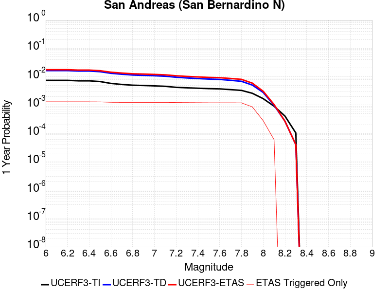 |  |

| Magnitude | 1 wk TI Prob | 1 wk TD Prob | 1 wk ETAS Prob | 1 wk ETAS/TD Gain | 1 wk ETAS Triggered Only | 1 mo TI Prob | 1 mo TD Prob | 1 mo ETAS Prob | 1 mo ETAS/TD Gain | 1 mo ETAS Triggered Only | 1 yr TI Prob | 1 yr TD Prob | 1 yr ETAS Prob | 1 yr ETAS/TD Gain | 1 yr ETAS Triggered Only | 10 yr TI Prob | 10 yr TD Prob | 10 yr ETAS Prob | 10 yr ETAS/TD Gain | 10 yr ETAS Triggered Only |
|-----|-----|-----|-----|-----|-----|-----|-----|-----|-----|-----|-----|-----|-----|-----|-----|-----|-----|-----|-----|-----|
| 6.0 | 1.4273766E-4 | 3.1606483E-4 | 0.0013087824 | 4.1408668 | 9.930313E-4 | 6.115894E-4 | 0.0013538664 | 0.0025543296 | 1.8866924 | 0.0012020906 | 0.0074207084 | 0.016360244 | 0.017714033 | 1.0827488 | 0.0013763066 | 0.07177748 | 0.15026689 | 0.15149559 | 1.0081768 | 0.0014459931 |
| 6.1 | 1.4273766E-4 | 3.1606483E-4 | 0.0013087824 | 4.1408668 | 9.930313E-4 | 6.115894E-4 | 0.0013538664 | 0.0025543296 | 1.8866924 | 0.0012020906 | 0.0074207084 | 0.016360244 | 0.017714033 | 1.0827488 | 0.0013763066 | 0.07177748 | 0.15026689 | 0.15149559 | 1.0081768 | 0.0014459931 |
| 6.2 | 1.4273766E-4 | 3.1606483E-4 | 0.0013087824 | 4.1408668 | 9.930313E-4 | 6.115894E-4 | 0.0013538664 | 0.0025543296 | 1.8866924 | 0.0012020906 | 0.0074207084 | 0.016360244 | 0.017714033 | 1.0827488 | 0.0013763066 | 0.07177748 | 0.15026689 | 0.15149559 | 1.0081768 | 0.0014459931 |
| 6.3 | 1.3730655E-4 | 3.0511338E-4 | 0.0012978418 | 4.253638 | 9.930313E-4 | 5.883239E-4 | 0.0013069791 | 0.0025074987 | 1.9185452 | 0.0012020906 | 0.0071393442 | 0.015797773 | 0.017152337 | 1.085744 | 0.0013763066 | 0.06914291 | 0.14556676 | 0.14680228 | 1.0084876 | 0.0014459931 |
| 6.4 | 1.3730655E-4 | 3.0511338E-4 | 0.0012978418 | 4.253638 | 9.930313E-4 | 5.883239E-4 | 0.0013069791 | 0.0025074987 | 1.9185452 | 0.0012020906 | 0.0071393442 | 0.015797773 | 0.017152337 | 1.085744 | 0.0013763066 | 0.06914291 | 0.14556676 | 0.14680228 | 1.0084876 | 0.0014459931 |
| 6.5 | 1.2942807E-4 | 2.8925808E-4 | 0.0012645856 | 4.3718247 | 9.7560976E-4 | 5.545738E-4 | 0.0012390936 | 0.0024222948 | 1.9548924 | 0.001184669 | 0.0067310524 | 0.01498286 | 0.016321385 | 1.0893371 | 0.001358885 | 0.06530788 | 0.13870941 | 0.13993983 | 1.0088705 | 0.0014285714 |
| 6.6 | 1.1125901E-4 | 2.536472E-4 | 0.0011941751 | 4.7080164 | 9.4076653E-4 | 4.767372E-4 | 0.0010866089 | 0.0022351851 | 2.0570283 | 0.0011498258 | 0.005788839 | 0.013149847 | 0.014439286 | 1.0980573 | 0.0013066202 | 0.056403454 | 0.122999296 | 0.12420631 | 1.0098132 | 0.0013763066 |
| 6.7 | 1.02209575E-4 | 2.3499702E-4 | 0.0011755425 | 5.0023723 | 9.4076653E-4 | 4.3796748E-4 | 0.0010067427 | 0.0021554108 | 2.140975 | 0.0011498258 | 0.0053192247 | 0.012188629 | 0.013479324 | 1.1058933 | 0.0013066202 | 0.051936906 | 0.114790924 | 0.11600924 | 1.0106133 | 0.0013763066 |
| 6.8 | 9.610582E-5 | 2.2025521E-4 | 0.0011608145 | 5.270316 | 9.4076653E-4 | 4.1181705E-4 | 9.436101E-4 | 0.002092351 | 2.2173893 | 0.0011498258 | 0.0050023515 | 0.011428202 | 0.012719889 | 1.1130264 | 0.0013066202 | 0.048912346 | 0.1081929 | 0.1094203 | 1.0113446 | 0.0013763066 |
| 6.9 | 9.3877505E-5 | 2.1481077E-4 | 0.0011553753 | 5.378572 | 9.4076653E-4 | 4.0227012E-4 | 9.2029345E-4 | 0.0020690612 | 2.2482624 | 0.0011498258 | 0.0048866454 | 0.011147255 | 0.012439311 | 1.1159079 | 0.0013066202 | 0.04780577 | 0.10578323 | 0.10701394 | 1.0116343 | 0.0013763066 |
| 7.0 | 9.1019785E-5 | 2.0808022E-4 | 0.001148651 | 5.5202317 | 9.4076653E-4 | 3.900265E-4 | 8.914682E-4 | 0.002040269 | 2.2886615 | 0.0011498258 | 0.0047382377 | 0.010799837 | 0.012092346 | 1.1196786 | 0.0013066202 | 0.046384744 | 0.102753714 | 0.1039886 | 1.012018 | 0.0013763066 |
| 7.1 | 8.771155E-5 | 1.9982594E-4 | 0.0011404045 | 5.7069893 | 9.4076653E-4 | 3.758525E-4 | 8.5611636E-4 | 0.0020049578 | 2.341922 | 0.0011498258 | 0.0045664064 | 0.0103736 | 0.011666665 | 1.1246496 | 0.0013066202 | 0.044737056 | 0.09906527 | 0.10030523 | 1.0125166 | 0.0013763066 |
| 7.2 | 8.0830236E-5 | 1.8388197E-4 | 0.0011244755 | 6.1152024 | 9.4076653E-4 | 3.4636928E-4 | 7.8782777E-4 | 0.0019367477 | 2.458339 | 0.0011498258 | 0.0042088944 | 0.009549725 | 0.0108438665 | 1.1355162 | 0.0013066202 | 0.041300658 | 0.09179615 | 0.093046114 | 1.0136168 | 0.0013763066 |
| 7.3 | 7.7668235E-5 | 1.7331762E-4 | 0.0010965025 | 6.3265495 | 9.233449E-4 | 3.328214E-4 | 7.425784E-4 | 0.0018741417 | 2.52383 | 0.0011324042 | 0.0040445733 | 0.009003494 | 0.010281085 | 1.1418995 | 0.0012891986 | 0.03971748 | 0.08706327 | 0.08830384 | 1.0142491 | 0.001358885 |
| 7.4 | 7.520177E-5 | 1.6551897E-4 | 0.0010712923 | 6.4723234 | 9.0592337E-4 | 3.2225347E-4 | 7.0917426E-4 | 0.0018233662 | 2.5711114 | 0.0011149825 | 0.0039163795 | 0.008600081 | 0.009860921 | 1.1466079 | 0.001271777 | 0.038480744 | 0.08351955 | 0.084748976 | 1.0147202 | 0.0013414634 |
| 7.5 | 7.274697E-5 | 1.5839566E-4 | 0.0010641755 | 6.718464 | 9.0592337E-4 | 3.1173544E-4 | 6.78662E-4 | 0.0017928878 | 2.641798 | 0.0011149825 | 0.003788775 | 0.008231463 | 0.009492771 | 1.1532302 | 0.001271777 | 0.03724827 | 0.08023631 | 0.08147014 | 1.0153774 | 0.0013414634 |
| 7.6 | 7.1185845E-5 | 1.540943E-4 | 0.001059878 | 6.8781133 | 9.0592337E-4 | 3.0504653E-4 | 6.6023704E-4 | 0.0017744835 | 2.687646 | 0.0011149825 | 0.0037076178 | 0.008008812 | 0.009270403 | 1.1575254 | 0.001271777 | 0.036463667 | 0.07822598 | 0.079462506 | 1.0158072 | 0.0013414634 |
| 7.7 | 6.709961E-5 | 1.4318313E-4 | 0.0010489768 | 7.3261194 | 9.0592337E-4 | 2.8753807E-4 | 6.1349774E-4 | 0.0017277963 | 2.8163042 | 0.0011149825 | 0.003495157 | 0.0074437927 | 0.008706103 | 1.1695789 | 0.001271777 | 0.034406938 | 0.07305469 | 0.07429816 | 1.017021 | 0.0013414634 |
| 7.8 | 6.300812E-5 | 1.3202413E-4 | 0.0010378279 | 7.8608956 | 9.0592337E-4 | 2.7000686E-4 | 5.65695E-4 | 0.0016800469 | 2.969881 | 0.0011149825 | 0.0032823787 | 0.006865616 | 0.008128662 | 1.1839668 | 0.001271777 | 0.032343175 | 0.06771354 | 0.06896417 | 1.0184695 | 0.0013414634 |
| 7.9 | 4.983037E-5 | 9.723488E-5 | 6.8951177E-4 | 7.091198 | 5.923345E-4 | 2.1354125E-4 | 4.1665437E-4 | 0.0011306425 | 2.713622 | 7.142857E-4 | 0.0025967648 | 0.0050609782 | 0.0058929827 | 1.164396 | 8.362369E-4 | 0.025666296 | 0.05064886 | 0.0515089 | 1.0169804 | 9.0592337E-4 |
| 8.0 | 3.2211527E-5 | 5.3304586E-5 | 2.2751132E-4 | 4.268138 | 1.7421602E-4 | 1.380421E-4 | 2.2842824E-4 | 4.5485733E-4 | 1.9912484 | 2.2648084E-4 | 0.0016793669 | 0.0027775685 | 0.0030555401 | 1.1000773 | 2.7874563E-4 | 0.016667323 | 0.028361378 | 0.028699929 | 1.011937 | 3.4843205E-4 |
| 8.1 | 1.743376E-5 | 1.8824427E-5 | 8.850953E-5 | 4.7018447 | 6.968641E-5 | 7.471398E-5 | 8.067362E-5 | 1.677746E-4 | 2.0796711 | 8.710801E-5 | 9.0926304E-4 | 9.817594E-4 | 0.0010687818 | 1.0886394 | 8.710801E-5 | 0.009055517 | 0.010484105 | 0.010604777 | 1.01151 | 1.2195122E-4 |
| 8.2 | 7.831616E-6 | 5.1551065E-6 | 5.1551065E-6 | 1.0 | 0.0 | 3.3563636E-5 | 2.2093127E-5 | 2.2093127E-5 | 1.0 | 0.0 | 4.0856065E-4 | 2.6895068E-4 | 2.6895068E-4 | 1.0 | 0.0 | 0.004078103 | 0.0030418145 | 0.0030418145 | 1.0 | 0.0 |
| 8.3 | 1.983087E-6 | 7.6599065E-7 | 7.6599065E-7 | 1.0 | 0.0 | 8.498917E-6 | 3.282813E-6 | 3.282813E-6 | 1.0 | 0.0 | 1.034694E-4 | 3.9967534E-5 | 3.9967534E-5 | 1.0 | 0.0 | 0.0010342124 | 4.719687E-4 | 4.719687E-4 | 1.0 | 0.0 |

## Lenwood-Lockhart-Old Woman Springs
*[(top)](#table-of-contents)*

| 1 Week | 1 Month | 1 Year | 10 Year |
|-----|-----|-----|-----|
| 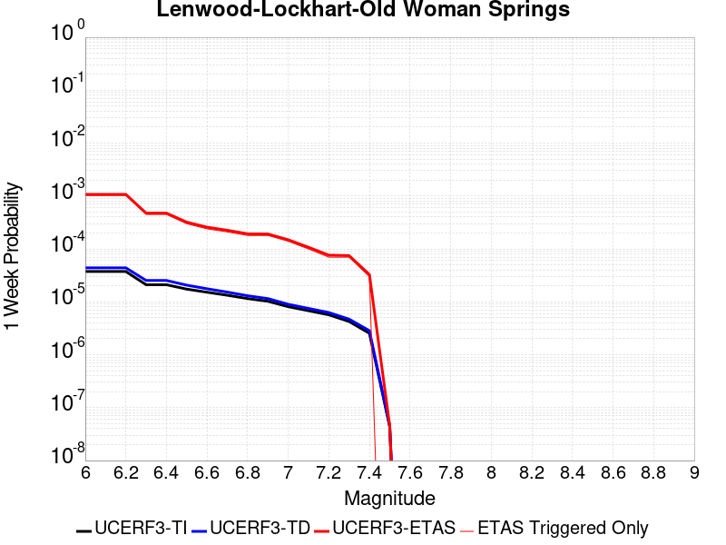 |  |  |  |

| Magnitude | 1 wk TI Prob | 1 wk TD Prob | 1 wk ETAS Prob | 1 wk ETAS/TD Gain | 1 wk ETAS Triggered Only | 1 mo TI Prob | 1 mo TD Prob | 1 mo ETAS Prob | 1 mo ETAS/TD Gain | 1 mo ETAS Triggered Only | 1 yr TI Prob | 1 yr TD Prob | 1 yr ETAS Prob | 1 yr ETAS/TD Gain | 1 yr ETAS Triggered Only | 10 yr TI Prob | 10 yr TD Prob | 10 yr ETAS Prob | 10 yr ETAS/TD Gain | 10 yr ETAS Triggered Only |
|-----|-----|-----|-----|-----|-----|-----|-----|-----|-----|-----|-----|-----|-----|-----|-----|-----|-----|-----|-----|-----|
| 6.0 | 3.744542E-5 | 4.396252E-5 | 0.0010021086 | 22.794611 | 9.5818815E-4 | 1.604705E-4 | 1.8839816E-4 | 0.0013031707 | 6.9171095 | 0.0011149825 | 0.0019519776 | 0.0022915069 | 0.0037168046 | 1.6219915 | 0.0014285714 | 0.019349206 | 0.022696787 | 0.024161039 | 1.0645137 | 0.0014982579 |
| 6.1 | 3.744542E-5 | 4.396252E-5 | 0.0010021086 | 22.794611 | 9.5818815E-4 | 1.604705E-4 | 1.8839816E-4 | 0.0013031707 | 6.9171095 | 0.0011149825 | 0.0019519776 | 0.0022915069 | 0.0037168046 | 1.6219915 | 0.0014285714 | 0.019349206 | 0.022696787 | 0.024161039 | 1.0645137 | 0.0014982579 |
| 6.2 | 3.744542E-5 | 4.396252E-5 | 0.0010021086 | 22.794611 | 9.5818815E-4 | 1.604705E-4 | 1.8839816E-4 | 0.0013031707 | 6.9171095 | 0.0011149825 | 0.0019519776 | 0.0022915069 | 0.0037168046 | 1.6219915 | 0.0014285714 | 0.019349206 | 0.022696787 | 0.024161039 | 1.0645137 | 0.0014982579 |
| 6.3 | 2.1079984E-5 | 2.5353434E-5 | 3.9119783E-4 | 15.429776 | 3.6585366E-4 | 9.0339665E-5 | 1.0865316E-4 | 5.615656E-4 | 5.168424 | 4.5296169E-4 | 0.0010993304 | 0.0013220694 | 0.0019658166 | 1.4869238 | 6.445993E-4 | 0.010939079 | 0.0131442575 | 0.013831962 | 1.0523198 | 6.968641E-4 |
| 6.4 | 2.1079984E-5 | 2.5353434E-5 | 3.9119783E-4 | 15.429776 | 3.6585366E-4 | 9.0339665E-5 | 1.0865316E-4 | 5.615656E-4 | 5.168424 | 4.5296169E-4 | 0.0010993304 | 0.0013220694 | 0.0019658166 | 1.4869238 | 6.445993E-4 | 0.010939079 | 0.0131442575 | 0.013831962 | 1.0523198 | 6.968641E-4 |
| 6.5 | 1.7397282E-5 | 2.066241E-5 | 2.2971732E-4 | 11.117644 | 2.0905923E-4 | 7.455765E-5 | 8.8550245E-5 | 3.3243108E-4 | 3.754152 | 2.4390244E-4 | 9.073613E-4 | 0.0010775778 | 0.00146044 | 1.355299 | 3.8327527E-4 | 0.009036654 | 0.010724821 | 0.011121221 | 1.036961 | 4.0069685E-4 |
| 6.6 | 1.52050325E-5 | 1.7679693E-5 | 1.9189264E-4 | 10.853844 | 1.7421602E-4 | 6.51628E-5 | 7.576796E-5 | 2.8481137E-4 | 3.7589946 | 2.0905923E-4 | 7.9306826E-4 | 9.220924E-4 | 0.0012702032 | 1.3775227 | 3.4843205E-4 | 0.007902439 | 0.009183526 | 0.00954602 | 1.0394722 | 3.6585366E-4 |
| 6.7 | 1.332523E-5 | 1.5264002E-5 | 1.7205604E-4 | 11.272013 | 1.5679443E-4 | 5.7106878E-5 | 6.5415545E-5 | 2.5704064E-4 | 3.929351 | 1.9163763E-4 | 6.950544E-4 | 7.961491E-4 | 0.0010920806 | 1.3717035 | 2.9616724E-4 | 0.006928845 | 0.007933599 | 0.0082447 | 1.0392131 | 3.1358885E-4 |
| 6.8 | 1.1525329E-5 | 1.3030979E-5 | 1.3498061E-4 | 10.358439 | 1.2195122E-4 | 4.9393333E-5 | 5.584588E-5 | 1.9521092E-4 | 3.4955294 | 1.3937282E-4 | 6.011979E-4 | 6.797157E-4 | 9.0604264E-4 | 1.3329729 | 2.2648084E-4 | 0.00599574 | 0.006776819 | 0.0070190686 | 1.0357468 | 2.4390244E-4 |
| 6.9 | 1.0253909E-5 | 1.15144385E-5 | 1.3346426E-4 | 11.591034 | 1.2195122E-4 | 4.3944583E-5 | 4.9346683E-5 | 1.7129189E-4 | 3.4711936 | 1.2195122E-4 | 5.3489394E-4 | 6.0063385E-4 | 8.095675E-4 | 1.3478553 | 2.0905923E-4 | 0.0053360825 | 0.0059904843 | 0.006215608 | 1.0375803 | 2.2648084E-4 |
| 7.0 | 8.104563E-6 | 8.991279E-6 | 9.609851E-5 | 10.687969 | 8.710801E-5 | 3.4733377E-5 | 3.8533497E-5 | 1.2563815E-4 | 3.2604918 | 8.710801E-5 | 4.2279682E-4 | 4.6904673E-4 | 6.4318103E-4 | 1.3712515 | 1.7421602E-4 | 0.0042199334 | 0.0046808156 | 0.0048542162 | 1.037045 | 1.7421602E-4 |
| 7.1 | 6.7986157E-6 | 7.515816E-6 | 5.9780232E-5 | 7.9539247 | 5.2264808E-5 | 2.91366E-5 | 3.2210253E-5 | 8.447338E-5 | 2.6225617 | 5.2264808E-5 | 3.5468035E-4 | 3.920914E-4 | 5.314096E-4 | 1.3553207 | 1.3937282E-4 | 0.003541148 | 0.003914213 | 0.00405304 | 1.0354675 | 1.3937282E-4 |
| 7.2 | 5.6893327E-6 | 6.2800136E-6 | 4.1123E-5 | 6.548234 | 3.4843204E-5 | 2.4382627E-5 | 2.6914078E-5 | 6.175635E-5 | 2.294574 | 3.4843204E-5 | 2.9681803E-4 | 3.2763163E-4 | 4.3212698E-4 | 1.3189416 | 1.04529616E-4 | 0.002964219 | 0.0032716845 | 0.0033758723 | 1.0318452 | 1.04529616E-4 |
| 7.3 | 4.253348E-6 | 4.7069107E-6 | 3.9549952E-5 | 8.402529 | 3.4843204E-5 | 1.8228506E-5 | 2.0172329E-5 | 5.5014832E-5 | 2.7272425 | 3.4843204E-5 | 2.2190946E-4 | 2.4557224E-4 | 3.3265888E-4 | 1.3546273 | 8.710801E-5 | 0.00221688 | 0.0024531898 | 0.002540084 | 1.0354209 | 8.710801E-5 |
| 7.4 | 2.5448119E-6 | 2.852045E-6 | 2.0273597E-5 | 7.108443 | 1.7421602E-5 | 1.0906291E-5 | 1.2223002E-5 | 2.9644392E-5 | 2.4252956 | 1.7421602E-5 | 1.3277601E-4 | 1.4880655E-4 | 2.1848259E-4 | 1.4682324 | 6.968641E-5 | 0.001326967 | 0.0014872311 | 0.001556814 | 1.0467868 | 6.968641E-5 |
| 7.5 | 4.3706837E-8 | 4.562909E-8 | 4.562909E-8 | 1.0 | 0.0 | 1.8731501E-7 | 1.9555324E-7 | 1.9555324E-7 | 1.0 | 0.0 | 2.2805577E-6 | 2.3808586E-6 | 2.3808586E-6 | 1.0 | 0.0 | 2.2805343E-5 | 2.3808387E-5 | 2.3808387E-5 | 1.0 | 0.0 |

## Bicycle Lake
*[(top)](#table-of-contents)*

| 1 Week | 1 Month | 1 Year | 10 Year |
|-----|-----|-----|-----|
|  | 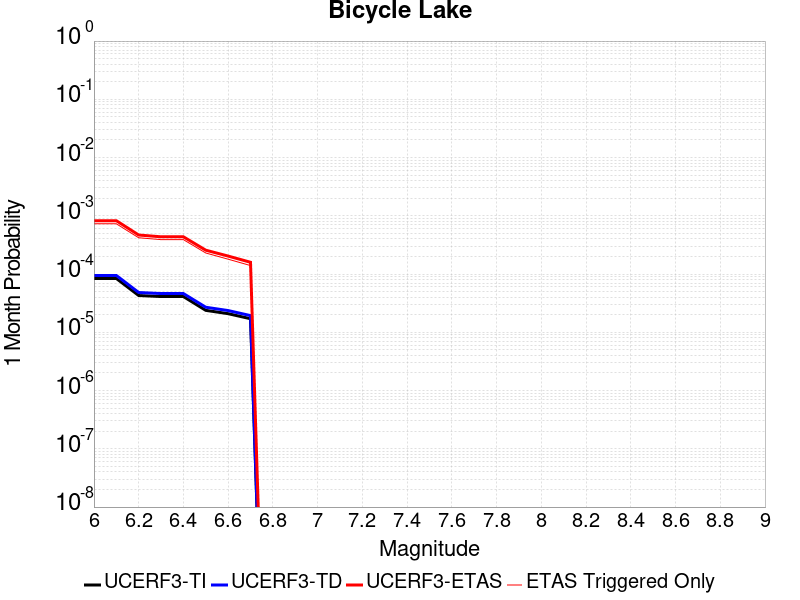 |  |  |

| Magnitude | 1 wk TI Prob | 1 wk TD Prob | 1 wk ETAS Prob | 1 wk ETAS/TD Gain | 1 wk ETAS Triggered Only | 1 mo TI Prob | 1 mo TD Prob | 1 mo ETAS Prob | 1 mo ETAS/TD Gain | 1 mo ETAS Triggered Only | 1 yr TI Prob | 1 yr TD Prob | 1 yr ETAS Prob | 1 yr ETAS/TD Gain | 1 yr ETAS Triggered Only | 10 yr TI Prob | 10 yr TD Prob | 10 yr ETAS Prob | 10 yr ETAS/TD Gain | 10 yr ETAS Triggered Only |
|-----|-----|-----|-----|-----|-----|-----|-----|-----|-----|-----|-----|-----|-----|-----|-----|-----|-----|-----|-----|-----|
| 6.0 | 1.9621975E-5 | 2.2097078E-5 | 7.189458E-4 | 32.535786 | 6.968641E-4 | 8.4091465E-5 | 9.4699084E-5 | 8.6117705E-4 | 9.093826 | 7.6655054E-4 | 0.0010233327 | 0.0011524865 | 0.0021095704 | 1.8304513 | 9.5818815E-4 | 0.01018633 | 0.011478408 | 0.012597814 | 1.0975227 | 0.0011324042 |
| 6.1 | 1.9621975E-5 | 2.2097078E-5 | 7.189458E-4 | 32.535786 | 6.968641E-4 | 8.4091465E-5 | 9.4699084E-5 | 8.6117705E-4 | 9.093826 | 7.6655054E-4 | 0.0010233327 | 0.0011524865 | 0.0021095704 | 1.8304513 | 9.5818815E-4 | 0.01018633 | 0.011478408 | 0.012597814 | 1.0975227 | 0.0011324042 |
| 6.2 | 9.9971285E-6 | 1.1255639E-5 | 3.4226236E-4 | 30.40808 | 3.3101047E-4 | 4.2844134E-5 | 4.8237856E-5 | 4.1407387E-4 | 8.5840025 | 3.6585366E-4 | 5.2150246E-4 | 5.871896E-4 | 0.0011095308 | 1.8895613 | 5.226481E-4 | 0.0052028033 | 0.005861487 | 0.0065023075 | 1.1093274 | 6.445993E-4 |
| 6.3 | 9.589428E-6 | 1.0798346E-5 | 3.4180522E-4 | 31.653479 | 3.3101047E-4 | 4.10969E-5 | 4.62781E-5 | 3.9469404E-4 | 8.528744 | 3.4843205E-4 | 5.002399E-4 | 5.6334207E-4 | 0.0010334604 | 1.8345166 | 4.7038327E-4 | 0.0049911533 | 0.0056242296 | 0.006213233 | 1.104726 | 5.923345E-4 |
| 6.4 | 9.589428E-6 | 1.0798346E-5 | 3.4180522E-4 | 31.653479 | 3.3101047E-4 | 4.10969E-5 | 4.62781E-5 | 3.9469404E-4 | 8.528744 | 3.4843205E-4 | 5.002399E-4 | 5.6334207E-4 | 0.0010334604 | 1.8345166 | 4.7038327E-4 | 0.0049911533 | 0.0056242296 | 0.006213233 | 1.104726 | 5.923345E-4 |
| 6.5 | 5.557707E-6 | 6.2856016E-6 | 2.1534352E-4 | 34.25981 | 2.0905923E-4 | 2.3818526E-5 | 2.6938165E-5 | 2.534129E-4 | 9.4072075 | 2.2648084E-4 | 2.8995197E-4 | 3.2794967E-4 | 6.240198E-4 | 1.9027913 | 2.9616724E-4 | 0.0028957394 | 0.0032772934 | 0.0036245836 | 1.1059686 | 3.4843205E-4 |
| 6.6 | 4.8742945E-6 | 5.5132896E-6 | 1.9714986E-4 | 35.759026 | 1.9163763E-4 | 2.0889667E-5 | 2.3628318E-5 | 2.1526142E-4 | 9.110315 | 1.9163763E-4 | 2.54302E-4 | 2.87663E-4 | 5.3149526E-4 | 1.8476317 | 2.4390244E-4 | 0.002540112 | 0.0028754752 | 0.0031534194 | 1.0966603 | 2.7874563E-4 |
| 6.7 | 3.991108E-6 | 4.5159104E-6 | 1.6130962E-4 | 35.72029 | 1.5679443E-4 | 1.7104636E-5 | 1.9353902E-5 | 1.7614529E-4 | 9.101281 | 1.5679443E-4 | 2.0822904E-4 | 2.3563375E-4 | 4.4464372E-4 | 1.887012 | 2.0905923E-4 | 0.0020803404 | 0.0023563374 | 0.0025996652 | 1.1032652 | 2.4390244E-4 |

## Paradise
*[(top)](#table-of-contents)*

| 1 Week | 1 Month | 1 Year | 10 Year |
|-----|-----|-----|-----|
|  |  |  |  |

| Magnitude | 1 wk TI Prob | 1 wk TD Prob | 1 wk ETAS Prob | 1 wk ETAS/TD Gain | 1 wk ETAS Triggered Only | 1 mo TI Prob | 1 mo TD Prob | 1 mo ETAS Prob | 1 mo ETAS/TD Gain | 1 mo ETAS Triggered Only | 1 yr TI Prob | 1 yr TD Prob | 1 yr ETAS Prob | 1 yr ETAS/TD Gain | 1 yr ETAS Triggered Only | 10 yr TI Prob | 10 yr TD Prob | 10 yr ETAS Prob | 10 yr ETAS/TD Gain | 10 yr ETAS Triggered Only |
|-----|-----|-----|-----|-----|-----|-----|-----|-----|-----|-----|-----|-----|-----|-----|-----|-----|-----|-----|-----|-----|
| 6.0 | 1.4851273E-5 | 1.6694692E-5 | 7.309685E-4 | 43.784485 | 7.142857E-4 | 6.364676E-5 | 7.154685E-5 | 9.0772397E-4 | 12.687127 | 8.362369E-4 | 7.7462377E-4 | 8.707584E-4 | 0.0018281122 | 2.0994482 | 9.5818815E-4 | 0.0077192914 | 0.008675844 | 0.009763883 | 1.1254101 | 0.001097561 |
| 6.1 | 1.4851273E-5 | 1.6694692E-5 | 7.309685E-4 | 43.784485 | 7.142857E-4 | 6.364676E-5 | 7.154685E-5 | 9.0772397E-4 | 12.687127 | 8.362369E-4 | 7.7462377E-4 | 8.707584E-4 | 0.0018281122 | 2.0994482 | 9.5818815E-4 | 0.0077192914 | 0.008675844 | 0.009763883 | 1.1254101 | 0.001097561 |
| 6.2 | 1.4851273E-5 | 1.6694692E-5 | 7.309685E-4 | 43.784485 | 7.142857E-4 | 6.364676E-5 | 7.154685E-5 | 9.0772397E-4 | 12.687127 | 8.362369E-4 | 7.7462377E-4 | 8.707584E-4 | 0.0018281122 | 2.0994482 | 9.5818815E-4 | 0.0077192914 | 0.008675844 | 0.009763883 | 1.1254101 | 0.001097561 |
| 6.3 | 1.0426831E-5 | 1.188862E-5 | 3.6031654E-4 | 30.307682 | 3.4843205E-4 | 4.4685654E-5 | 5.0950268E-5 | 4.8646814E-4 | 9.547901 | 4.3554007E-4 | 5.43912E-4 | 6.201489E-4 | 0.0010902404 | 1.7580302 | 4.7038327E-4 | 0.0054258266 | 0.0061847917 | 0.0067215213 | 1.0867821 | 5.400697E-4 |
| 6.4 | 1.0426831E-5 | 1.188862E-5 | 3.6031654E-4 | 30.307682 | 3.4843205E-4 | 4.4685654E-5 | 5.0950268E-5 | 4.8646814E-4 | 9.547901 | 4.3554007E-4 | 5.43912E-4 | 6.201489E-4 | 0.0010902404 | 1.7580302 | 4.7038327E-4 | 0.0054258266 | 0.0061847917 | 0.0067215213 | 1.0867821 | 5.400697E-4 |
| 6.5 | 9.25027E-6 | 1.06199595E-5 | 2.7194122E-4 | 25.606615 | 2.6132405E-4 | 3.964341E-5 | 4.551335E-5 | 3.7650875E-4 | 8.2724905 | 3.3101047E-4 | 4.8255164E-4 | 5.53989E-4 | 9.1964E-4 | 1.6600329 | 3.6585366E-4 | 0.0048150513 | 0.0055265795 | 0.005942387 | 1.0752378 | 4.1811846E-4 |
| 6.6 | 7.904275E-6 | 9.159525E-6 | 2.007954E-4 | 21.922031 | 1.9163763E-4 | 3.3875025E-5 | 3.9254537E-5 | 2.6572647E-4 | 6.7693186 | 2.2648084E-4 | 4.1235037E-4 | 4.7782314E-4 | 7.3902233E-4 | 1.5466441 | 2.6132405E-4 | 0.0041158604 | 0.0047683544 | 0.0050457707 | 1.0581787 | 2.7874563E-4 |
| 6.7 | 7.2061953E-6 | 8.407248E-6 | 9.551453E-5 | 11.360974 | 8.710801E-5 | 3.088333E-5 | 3.6030586E-5 | 1.5797741E-4 | 4.3845363 | 1.2195122E-4 | 3.7593965E-4 | 4.3858777E-4 | 5.7789945E-4 | 1.317637 | 1.3937282E-4 | 0.003753043 | 0.004377591 | 0.004516354 | 1.0316985 | 1.3937282E-4 |
| 6.8 | 6.6948724E-6 | 7.842166E-6 | 6.0106566E-5 | 7.6645365 | 5.2264808E-5 | 2.8691995E-5 | 3.360887E-5 | 1.03292936E-4 | 3.0733833 | 6.968641E-5 | 3.4926904E-4 | 4.0911473E-4 | 4.9618713E-4 | 1.2128311 | 8.710801E-5 | 0.003487206 | 0.0040839734 | 0.0041707256 | 1.0212421 | 8.710801E-5 |
| 6.9 | 6.0421025E-6 | 7.130621E-6 | 4.1973577E-5 | 5.886385 | 3.4843204E-5 | 2.5894467E-5 | 3.0559466E-5 | 6.5401604E-5 | 2.1401424 | 3.4843204E-5 | 3.1521954E-4 | 3.7200135E-4 | 4.2424674E-4 | 1.140444 | 5.2264808E-5 | 0.0031477278 | 0.0037141247 | 0.0037661954 | 1.0140196 | 5.2264808E-5 |
| 7.0 | 4.134091E-6 | 5.0803087E-6 | 3.9923336E-5 | 7.8584466 | 3.4843204E-5 | 1.7717413E-5 | 2.177258E-5 | 5.6615027E-5 | 2.6002903 | 3.4843204E-5 | 2.1568815E-4 | 2.6505045E-4 | 3.173014E-4 | 1.1971359 | 5.2264808E-5 | 0.0021547892 | 0.0026474963 | 0.002699623 | 1.019689 | 5.2264808E-5 |
| 7.1 | 3.7674888E-6 | 4.6318696E-6 | 2.2053391E-5 | 4.761229 | 1.7421602E-5 | 1.6146281E-5 | 1.9850726E-5 | 3.7271984E-5 | 1.8776131 | 1.7421602E-5 | 1.9656324E-4 | 2.4165731E-4 | 2.590747E-4 | 1.0720748 | 1.7421602E-5 | 0.0019638946 | 0.002414096 | 0.0024314756 | 1.0071992 | 1.7421602E-5 |
| 7.2 | 3.4065345E-6 | 4.156723E-6 | 2.1578253E-5 | 5.1911693 | 1.7421602E-5 | 1.4599351E-5 | 1.7814415E-5 | 3.5235706E-5 | 1.9779323 | 1.7421602E-5 | 1.777326E-4 | 2.1687041E-4 | 2.3428824E-4 | 1.0803144 | 1.7421602E-5 | 0.0017759053 | 0.002166736 | 0.0021841198 | 1.008023 | 1.7421602E-5 |
| 7.3 | 2.9934936E-6 | 3.6293168E-6 | 3.6293168E-6 | 1.0 | 0.0 | 1.2829195E-5 | 1.555413E-5 | 1.555413E-5 | 1.0 | 0.0 | 1.5618425E-4 | 1.8935655E-4 | 1.8935655E-4 | 1.0 | 0.0 | 0.0015607453 | 0.0018920974 | 0.0018920974 | 1.0 | 0.0 |
| 7.4 | 2.4049796E-6 | 2.8889842E-6 | 2.8889842E-6 | 1.0 | 0.0 | 1.0307015E-5 | 1.238131E-5 | 1.238131E-5 | 1.0 | 0.0 | 1.2548068E-4 | 1.5073347E-4 | 1.5073347E-4 | 1.0 | 0.0 | 0.0012540985 | 0.0015064536 | 0.0015064536 | 1.0 | 0.0 |
| 7.5 | 1.2710091E-6 | 1.5134682E-6 | 1.5134682E-6 | 1.0 | 0.0 | 5.44717E-6 | 6.4862834E-6 | 6.4862834E-6 | 1.0 | 0.0 | 6.631728E-5 | 7.8968886E-5 | 7.8968886E-5 | 1.0 | 0.0 | 6.6297496E-4 | 7.8953087E-4 | 7.8953087E-4 | 1.0 | 0.0 |
| 7.6 | 2.21172E-7 | 2.603961E-7 | 2.603961E-7 | 1.0 | 0.0 | 9.478797E-7 | 1.1159829E-6 | 1.1159829E-6 | 1.0 | 0.0 | 1.1540374E-5 | 1.3587036E-5 | 1.3587036E-5 | 1.0 | 0.0 | 1.1539775E-4 | 1.3586486E-4 | 1.3586486E-4 | 1.0 | 0.0 |

## Garlic Springs
*[(top)](#table-of-contents)*

| 1 Week | 1 Month | 1 Year | 10 Year |
|-----|-----|-----|-----|
|  |  |  |  |

| Magnitude | 1 wk TI Prob | 1 wk TD Prob | 1 wk ETAS Prob | 1 wk ETAS/TD Gain | 1 wk ETAS Triggered Only | 1 mo TI Prob | 1 mo TD Prob | 1 mo ETAS Prob | 1 mo ETAS/TD Gain | 1 mo ETAS Triggered Only | 1 yr TI Prob | 1 yr TD Prob | 1 yr ETAS Prob | 1 yr ETAS/TD Gain | 1 yr ETAS Triggered Only | 10 yr TI Prob | 10 yr TD Prob | 10 yr ETAS Prob | 10 yr ETAS/TD Gain | 10 yr ETAS Triggered Only |
|-----|-----|-----|-----|-----|-----|-----|-----|-----|-----|-----|-----|-----|-----|-----|-----|-----|-----|-----|-----|-----|
| 6.0 | 1.6760017E-5 | 1.8776833E-5 | 4.7173E-4 | 25.12298 | 4.5296169E-4 | 7.182667E-5 | 8.0470316E-5 | 6.0307636E-4 | 7.494395 | 5.226481E-4 | 8.7413884E-4 | 9.794032E-4 | 0.0016059666 | 1.6397401 | 6.271777E-4 | 0.008707083 | 0.009762413 | 0.010469725 | 1.0724527 | 7.142857E-4 |
| 6.1 | 9.852767E-6 | 1.09735865E-5 | 2.8971618E-4 | 26.401228 | 2.7874563E-4 | 4.222546E-5 | 4.702921E-5 | 3.4318253E-4 | 7.2972207 | 2.9616724E-4 | 5.139737E-4 | 5.7250116E-4 | 9.381454E-4 | 1.6386786 | 3.6585366E-4 | 0.005127866 | 0.005717221 | 0.0061502713 | 1.0757449 | 4.3554007E-4 |
| 6.2 | 9.852767E-6 | 1.09735865E-5 | 2.8971618E-4 | 26.401228 | 2.7874563E-4 | 4.222546E-5 | 4.702921E-5 | 3.4318253E-4 | 7.2972207 | 2.9616724E-4 | 5.139737E-4 | 5.7250116E-4 | 9.381454E-4 | 1.6386786 | 3.6585366E-4 | 0.005127866 | 0.005717221 | 0.0061502713 | 1.0757449 | 4.3554007E-4 |
| 6.3 | 4.3167724E-6 | 4.7780286E-6 | 1.615717E-4 | 33.81556 | 1.5679443E-4 | 1.8500323E-5 | 2.0477235E-5 | 1.946897E-4 | 9.507617 | 1.7421602E-4 | 2.2521814E-4 | 2.4930484E-4 | 4.4089468E-4 | 1.7684963 | 1.9163763E-4 | 0.0022499003 | 0.00249251 | 0.0027184263 | 1.090638 | 2.2648084E-4 |
| 6.4 | 4.3167724E-6 | 4.7780286E-6 | 1.615717E-4 | 33.81556 | 1.5679443E-4 | 1.8500323E-5 | 2.0477235E-5 | 1.946897E-4 | 9.507617 | 1.7421602E-4 | 2.2521814E-4 | 2.4930484E-4 | 4.4089468E-4 | 1.7684963 | 1.9163763E-4 | 0.0022499003 | 0.00249251 | 0.0027184263 | 1.090638 | 2.2648084E-4 |
| 6.5 | 4.3167724E-6 | 4.7780286E-6 | 1.615717E-4 | 33.81556 | 1.5679443E-4 | 1.8500323E-5 | 2.0477235E-5 | 1.946897E-4 | 9.507617 | 1.7421602E-4 | 2.2521814E-4 | 2.4930484E-4 | 4.4089468E-4 | 1.7684963 | 1.9163763E-4 | 0.0022499003 | 0.00249251 | 0.0027184263 | 1.090638 | 2.2648084E-4 |
| 6.6 | 4.301311E-6 | 4.760897E-6 | 1.6155458E-4 | 33.933643 | 1.5679443E-4 | 1.8434059E-5 | 2.0403815E-5 | 1.9461628E-4 | 9.538231 | 1.7421602E-4 | 2.2441156E-4 | 2.4841115E-4 | 4.4000117E-4 | 1.7712618 | 1.9163763E-4 | 0.0022418506 | 0.002483593 | 0.0027095114 | 1.0909643 | 2.2648084E-4 |
| 6.7 | 3.8599724E-6 | 4.27106E-6 | 1.6106482E-4 | 37.710735 | 1.5679443E-4 | 1.6542634E-5 | 1.8304541E-5 | 1.750961E-4 | 9.565719 | 1.5679443E-4 | 2.0138794E-4 | 2.228578E-4 | 3.796173E-4 | 1.7034059 | 1.5679443E-4 | 0.0020120554 | 0.002228578 | 0.0024197886 | 1.0857993 | 1.9163763E-4 |

## Death Valley (Black Mtns Frontal)
*[(top)](#table-of-contents)*

| 1 Week | 1 Month | 1 Year | 10 Year |
|-----|-----|-----|-----|
|  |  |  |  |

| Magnitude | 1 wk TI Prob | 1 wk TD Prob | 1 wk ETAS Prob | 1 wk ETAS/TD Gain | 1 wk ETAS Triggered Only | 1 mo TI Prob | 1 mo TD Prob | 1 mo ETAS Prob | 1 mo ETAS/TD Gain | 1 mo ETAS Triggered Only | 1 yr TI Prob | 1 yr TD Prob | 1 yr ETAS Prob | 1 yr ETAS/TD Gain | 1 yr ETAS Triggered Only | 10 yr TI Prob | 10 yr TD Prob | 10 yr ETAS Prob | 10 yr ETAS/TD Gain | 10 yr ETAS Triggered Only |
|-----|-----|-----|-----|-----|-----|-----|-----|-----|-----|-----|-----|-----|-----|-----|-----|-----|-----|-----|-----|-----|
| 6.0 | 1.6707214E-5 | 1.867027E-5 | 3.670958E-4 | 19.662054 | 3.4843205E-4 | 7.160038E-5 | 8.001302E-5 | 5.1551824E-4 | 6.4429293 | 4.3554007E-4 | 8.71386E-4 | 9.737309E-4 | 0.0015132746 | 1.5540996 | 5.400697E-4 | 0.00867977 | 0.009695496 | 0.010351099 | 1.0676192 | 6.6202093E-4 |
| 6.1 | 1.6707214E-5 | 1.867027E-5 | 3.670958E-4 | 19.662054 | 3.4843205E-4 | 7.160038E-5 | 8.001302E-5 | 5.1551824E-4 | 6.4429293 | 4.3554007E-4 | 8.71386E-4 | 9.737309E-4 | 0.0015132746 | 1.5540996 | 5.400697E-4 | 0.00867977 | 0.009695496 | 0.010351099 | 1.0676192 | 6.6202093E-4 |
| 6.2 | 1.6707214E-5 | 1.867027E-5 | 3.670958E-4 | 19.662054 | 3.4843205E-4 | 7.160038E-5 | 8.001302E-5 | 5.1551824E-4 | 6.4429293 | 4.3554007E-4 | 8.71386E-4 | 9.737309E-4 | 0.0015132746 | 1.5540996 | 5.400697E-4 | 0.00867977 | 0.009695496 | 0.010351099 | 1.0676192 | 6.6202093E-4 |
| 6.3 | 1.6707214E-5 | 1.867027E-5 | 3.670958E-4 | 19.662054 | 3.4843205E-4 | 7.160038E-5 | 8.001302E-5 | 5.1551824E-4 | 6.4429293 | 4.3554007E-4 | 8.71386E-4 | 9.737309E-4 | 0.0015132746 | 1.5540996 | 5.400697E-4 | 0.00867977 | 0.009695496 | 0.010351099 | 1.0676192 | 6.6202093E-4 |
| 6.4 | 1.5515609E-5 | 1.7338214E-5 | 2.6123642E-4 | 15.06709 | 2.4390244E-4 | 6.649377E-5 | 7.4304546E-5 | 4.052904E-4 | 5.4544497 | 3.3101047E-4 | 8.0926094E-4 | 9.042885E-4 | 0.001304623 | 1.4427066 | 4.0069685E-4 | 0.008063202 | 0.009006773 | 0.009507448 | 1.0555888 | 5.052265E-4 |
| 6.5 | 1.5515609E-5 | 1.7338214E-5 | 2.6123642E-4 | 15.06709 | 2.4390244E-4 | 6.649377E-5 | 7.4304546E-5 | 4.052904E-4 | 5.4544497 | 3.3101047E-4 | 8.0926094E-4 | 9.042885E-4 | 0.001304623 | 1.4427066 | 4.0069685E-4 | 0.008063202 | 0.009006773 | 0.009507448 | 1.0555888 | 5.052265E-4 |
| 6.6 | 1.5041828E-5 | 1.6809145E-5 | 2.4328618E-4 | 14.473442 | 2.2648084E-4 | 6.4463384E-5 | 7.203723E-5 | 3.507628E-4 | 4.8691874 | 2.7874563E-4 | 7.8455906E-4 | 8.767063E-4 | 0.001224833 | 1.3970846 | 3.4843205E-4 | 0.00781795 | 0.008733132 | 0.009182138 | 1.051414 | 4.5296169E-4 |
| 6.7 | 1.4634985E-5 | 1.6356016E-5 | 2.4283315E-4 | 14.846717 | 2.2648084E-4 | 6.271985E-5 | 7.009536E-5 | 3.314011E-4 | 4.7278605 | 2.6132405E-4 | 7.6334673E-4 | 8.5308263E-4 | 0.0011838108 | 1.3876859 | 3.3101047E-4 | 0.007607299 | 0.008498715 | 0.008878734 | 1.0447147 | 3.8327527E-4 |
| 6.8 | 1.4209158E-5 | 1.5882048E-5 | 2.2493796E-4 | 14.163033 | 2.0905923E-4 | 6.089497E-5 | 6.8064175E-5 | 3.1195002E-4 | 4.5831747 | 2.4390244E-4 | 7.4114406E-4 | 8.2837185E-4 | 0.001141701 | 1.3782469 | 3.1358885E-4 | 0.007386771 | 0.008253456 | 0.008599012 | 1.0418681 | 3.4843205E-4 |
| 6.9 | 1.3780098E-5 | 1.5404594E-5 | 2.0703927E-4 | 13.4401 | 1.9163763E-4 | 5.9056227E-5 | 6.6018045E-5 | 2.9248392E-4 | 4.4303637 | 2.2648084E-4 | 7.1877235E-4 | 8.0347876E-4 | 0.001099408 | 1.36831 | 2.9616724E-4 | 0.0071645193 | 0.008006332 | 0.008334693 | 1.0410125 | 3.3101047E-4 |
| 7.0 | 1.3585064E-5 | 1.5188155E-5 | 2.0682288E-4 | 13.617379 | 1.9163763E-4 | 5.8220405E-5 | 6.50905E-5 | 2.915566E-4 | 4.4792495 | 2.2648084E-4 | 7.086029E-4 | 7.9219416E-4 | 0.0010881268 | 1.3735607 | 2.9616724E-4 | 0.007063476 | 0.007894293 | 0.008205407 | 1.0394099 | 3.1358885E-4 |
| 7.1 | 1.3398601E-5 | 1.49813395E-5 | 2.066161E-4 | 13.791564 | 1.9163763E-4 | 5.742131E-5 | 6.420419E-5 | 2.906705E-4 | 4.527282 | 2.2648084E-4 | 6.9888023E-4 | 7.8141113E-4 | 0.001077347 | 1.3787197 | 2.9616724E-4 | 0.0069668638 | 0.007787224 | 0.008098371 | 1.0399561 | 3.1358885E-4 |
| 7.2 | 1.3126312E-5 | 1.4679561E-5 | 1.7147168E-4 | 11.680982 | 1.5679443E-4 | 5.6254412E-5 | 6.291092E-5 | 2.5453648E-4 | 4.045983 | 1.9163763E-4 | 6.846822E-4 | 7.6567667E-4 | 0.0010268006 | 1.3410368 | 2.6132405E-4 | 0.006825765 | 0.00763097 | 0.007907589 | 1.0362495 | 2.7874563E-4 |
| 7.3 | 1.2922429E-5 | 1.4453788E-5 | 1.7124595E-4 | 11.847825 | 1.5679443E-4 | 5.5380664E-5 | 6.194336E-5 | 2.5356913E-4 | 4.093564 | 1.9163763E-4 | 6.74051E-4 | 7.53905E-4 | 9.976235E-4 | 1.323275 | 2.4390244E-4 | 0.006720101 | 0.007514055 | 0.007773415 | 1.0345167 | 2.6132405E-4 |
| 7.4 | 1.2768878E-5 | 1.4283772E-5 | 1.536546E-4 | 10.757285 | 1.3937282E-4 | 5.4722615E-5 | 6.1214756E-5 | 2.3542011E-4 | 3.8458066 | 1.7421602E-4 | 6.660441E-4 | 7.4504025E-4 | 9.7135233E-4 | 1.3037583 | 2.2648084E-4 | 0.0066405144 | 0.0074260035 | 0.0076680947 | 1.0326005 | 2.4390244E-4 |
| 7.5 | 1.2521929E-5 | 1.40120155E-5 | 1.5338289E-4 | 10.946526 | 1.3937282E-4 | 5.366431E-5 | 6.005014E-5 | 2.3425571E-4 | 3.9010017 | 1.7421602E-4 | 6.531671E-4 | 7.3087064E-4 | 9.57186E-4 | 1.3096516 | 2.2648084E-4 | 0.006512506 | 0.0072852457 | 0.0075273714 | 1.0332351 | 2.4390244E-4 |
| 7.6 | 1.1301089E-5 | 1.2648149E-5 | 1.17176445E-4 | 9.264316 | 1.04529616E-4 | 4.8432343E-5 | 5.4205255E-5 | 1.9357052E-4 | 3.5710657 | 1.3937282E-4 | 5.895042E-4 | 6.5975444E-4 | 8.3385553E-4 | 1.2638876 | 1.7421602E-4 | 0.0058794282 | 0.00657851 | 0.0067688874 | 1.0289392 | 1.9163763E-4 |
| 7.7 | 9.189108E-6 | 1.0283358E-5 | 7.996905E-5 | 7.7765503 | 6.968641E-5 | 3.93813E-5 | 4.407082E-5 | 1.31175E-4 | 2.9764593 | 8.710801E-5 | 4.7936183E-4 | 5.3643517E-4 | 6.5832096E-4 | 1.2272145 | 1.2195122E-4 | 0.004783291 | 0.005351914 | 0.005490541 | 1.0259023 | 1.3937282E-4 |
| 7.8 | 3.4586725E-7 | 3.6482615E-7 | 3.6482615E-7 | 1.0 | 0.0 | 1.4822873E-6 | 1.5635396E-6 | 1.5635396E-6 | 1.0 | 0.0 | 1.80467E-5 | 1.9035933E-5 | 1.9035933E-5 | 1.0 | 0.0 | 1.8045233E-4 | 1.9034347E-4 | 1.9034347E-4 | 1.0 | 0.0 |
| 7.9 | 2.5591178E-9 | 2.6696718E-9 | 2.6696718E-9 | 1.0 | 0.0 | 1.0967647E-8 | 1.14414505E-8 | 1.14414505E-8 | 1.0 | 0.0 | 1.335311E-7 | 1.3929966E-7 | 1.3929966E-7 | 1.0 | 0.0 | 1.3353102E-6 | 1.3929966E-6 | 1.3929966E-6 | 1.0 | 0.0 |

## San Andreas (San Bernardino S)
*[(top)](#table-of-contents)*

| 1 Week | 1 Month | 1 Year | 10 Year |
|-----|-----|-----|-----|
|  | 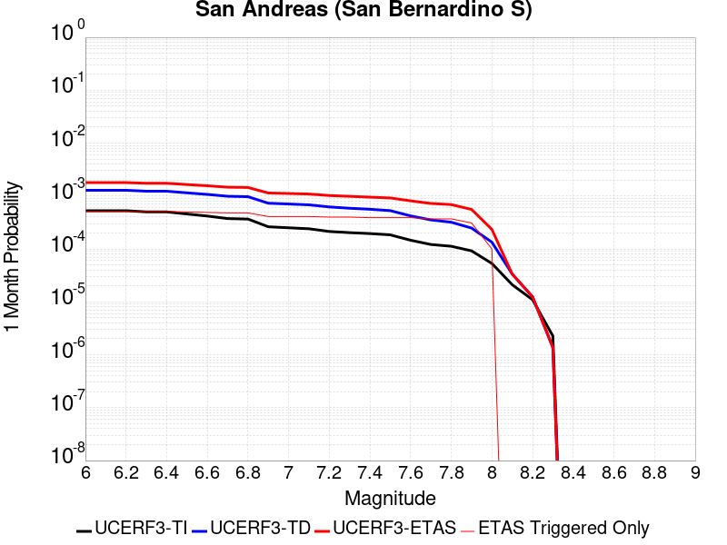 |  |  |

| Magnitude | 1 wk TI Prob | 1 wk TD Prob | 1 wk ETAS Prob | 1 wk ETAS/TD Gain | 1 wk ETAS Triggered Only | 1 mo TI Prob | 1 mo TD Prob | 1 mo ETAS Prob | 1 mo ETAS/TD Gain | 1 mo ETAS Triggered Only | 1 yr TI Prob | 1 yr TD Prob | 1 yr ETAS Prob | 1 yr ETAS/TD Gain | 1 yr ETAS Triggered Only | 10 yr TI Prob | 10 yr TD Prob | 10 yr ETAS Prob | 10 yr ETAS/TD Gain | 10 yr ETAS Triggered Only |
|-----|-----|-----|-----|-----|-----|-----|-----|-----|-----|-----|-----|-----|-----|-----|-----|-----|-----|-----|-----|-----|
| 6.0 | 1.2336002E-4 | 3.0004102E-4 | 7.1803405E-4 | 2.3931196 | 4.1811846E-4 | 5.2857865E-4 | 0.0012852824 | 0.0017898596 | 1.3925807 | 5.052265E-4 | 0.006416472 | 0.015540994 | 0.016124124 | 1.037522 | 5.923345E-4 | 0.06234337 | 0.14283717 | 0.14335983 | 1.0036591 | 6.097561E-4 |
| 6.1 | 1.2336002E-4 | 3.0004102E-4 | 7.1803405E-4 | 2.3931196 | 4.1811846E-4 | 5.2857865E-4 | 0.0012852824 | 0.0017898596 | 1.3925807 | 5.052265E-4 | 0.006416472 | 0.015540994 | 0.016124124 | 1.037522 | 5.923345E-4 | 0.06234337 | 0.14283717 | 0.14335983 | 1.0036591 | 6.097561E-4 |
| 6.2 | 1.2336002E-4 | 3.0004102E-4 | 7.1803405E-4 | 2.3931196 | 4.1811846E-4 | 5.2857865E-4 | 0.0012852824 | 0.0017898596 | 1.3925807 | 5.052265E-4 | 0.006416472 | 0.015540994 | 0.016124124 | 1.037522 | 5.923345E-4 | 0.06234337 | 0.14283717 | 0.14335983 | 1.0036591 | 6.097561E-4 |
| 6.3 | 1.1712257E-4 | 2.8792414E-4 | 7.059222E-4 | 2.4517646 | 4.1811846E-4 | 5.018573E-4 | 0.0012334028 | 0.001738006 | 1.4091148 | 5.052265E-4 | 0.006093008 | 0.014918125 | 0.015501623 | 1.0391134 | 5.923345E-4 | 0.059286322 | 0.13754563 | 0.13807152 | 1.0038234 | 6.097561E-4 |
| 6.4 | 1.1712257E-4 | 2.8792414E-4 | 7.059222E-4 | 2.4517646 | 4.1811846E-4 | 5.018573E-4 | 0.0012334028 | 0.001738006 | 1.4091148 | 5.052265E-4 | 0.006093008 | 0.014918125 | 0.015501623 | 1.0391134 | 5.923345E-4 | 0.059286322 | 0.13754563 | 0.13807152 | 1.0038234 | 6.097561E-4 |
| 6.5 | 1.0689076E-4 | 2.680528E-4 | 6.686422E-4 | 2.4944425 | 4.0069685E-4 | 4.5802278E-4 | 0.0011483167 | 0.0016355613 | 1.4243121 | 4.8780488E-4 | 0.0055621783 | 0.01389575 | 0.014462674 | 1.0407984 | 5.749129E-4 | 0.05425003 | 0.12879294 | 0.129309 | 1.0040067 | 5.923345E-4 |
| 6.6 | 9.7648895E-5 | 2.50501E-4 | 6.3368026E-4 | 2.5296514 | 3.8327527E-4 | 4.1842813E-4 | 0.0010731576 | 0.0015430362 | 1.4378467 | 4.7038327E-4 | 0.005082469 | 0.012991785 | 0.013524839 | 1.04103 | 5.400697E-4 | 0.049677886 | 0.12095292 | 0.12144297 | 1.0040517 | 5.5749126E-4 |
| 6.7 | 8.757013E-5 | 2.3120902E-4 | 6.1439566E-4 | 2.657317 | 3.8327527E-4 | 3.7524657E-4 | 9.905418E-4 | 0.0014604592 | 1.4744043 | 4.7038327E-4 | 0.00455906 | 0.011997245 | 0.012530835 | 1.044476 | 5.400697E-4 | 0.04466656 | 0.11226123 | 0.11275613 | 1.0044085 | 5.5749126E-4 |
| 6.8 | 8.562978E-5 | 2.2680782E-4 | 6.0999615E-4 | 2.6894846 | 3.8327527E-4 | 3.6693315E-4 | 9.7169366E-4 | 0.0014416198 | 1.4836156 | 4.7038327E-4 | 0.004458263 | 0.011770263 | 0.012303976 | 1.0453442 | 5.400697E-4 | 0.043698758 | 0.11027153 | 0.11076755 | 1.0044981 | 5.5749126E-4 |
| 6.9 | 6.124075E-5 | 1.7065753E-4 | 4.6677422E-4 | 2.7351518 | 2.9616724E-4 | 2.6243398E-4 | 7.311852E-4 | 0.0010967713 | 1.4999912 | 3.6585366E-4 | 0.0031904527 | 0.008866051 | 0.009280462 | 1.0467414 | 4.1811846E-4 | 0.031450346 | 0.08418263 | 0.08459746 | 1.0049278 | 4.5296169E-4 |
| 7.0 | 5.8598747E-5 | 1.649477E-4 | 4.610661E-4 | 2.7952259 | 2.9616724E-4 | 2.5111332E-4 | 7.06728E-4 | 0.0010723232 | 1.5173067 | 3.6585366E-4 | 0.0030530186 | 0.008570663 | 0.008985198 | 1.0483668 | 4.1811846E-4 | 0.03011414 | 0.081500374 | 0.081916414 | 1.0051048 | 4.5296169E-4 |
| 7.1 | 5.613814E-5 | 1.5913323E-4 | 4.5525335E-4 | 2.8608315 | 2.9616724E-4 | 2.4056983E-4 | 6.818221E-4 | 0.0010474263 | 1.5362165 | 3.6585366E-4 | 0.0029250039 | 0.008269769 | 0.008684429 | 1.0501418 | 4.1811846E-4 | 0.028868021 | 0.07879931 | 0.07921658 | 1.0052953 | 4.5296169E-4 |
| 7.2 | 4.991222E-5 | 1.4519796E-4 | 4.413222E-4 | 3.0394518 | 2.9616724E-4 | 2.1389198E-4 | 6.2212895E-4 | 9.87755E-4 | 1.5877014 | 3.6585366E-4 | 0.002601025 | 0.007548217 | 0.00796318 | 1.0549749 | 4.1811846E-4 | 0.025707912 | 0.07225321 | 0.07267344 | 1.0058161 | 4.5296169E-4 |
| 7.3 | 4.7410045E-5 | 1.3714004E-4 | 4.3326666E-4 | 3.159301 | 2.9616724E-4 | 2.0317009E-4 | 5.8761094E-4 | 9.5324963E-4 | 1.6222461 | 3.6585366E-4 | 0.0024707897 | 0.0071307817 | 0.007545918 | 1.0582176 | 4.1811846E-4 | 0.024434982 | 0.06853558 | 0.0689575 | 1.0061562 | 4.5296169E-4 |
| 7.4 | 4.5556746E-5 | 1.3121912E-4 | 4.0992818E-4 | 3.1239974 | 2.7874563E-4 | 1.952286E-4 | 5.622468E-4 | 9.104829E-4 | 1.6193653 | 3.4843205E-4 | 0.002374317 | 0.0068239477 | 0.00722191 | 1.0583185 | 4.0069685E-4 | 0.023491086 | 0.065788016 | 0.0661949 | 1.0061848 | 4.3554007E-4 |
| 7.5 | 4.3084514E-5 | 1.2357246E-4 | 4.0228368E-4 | 3.2554474 | 2.7874563E-4 | 1.8463485E-4 | 5.2948913E-4 | 8.7773666E-4 | 1.6577048 | 3.4843205E-4 | 0.0022456115 | 0.0064275465 | 0.0068256683 | 1.0619398 | 4.0069685E-4 | 0.022230545 | 0.062188786 | 0.06259724 | 1.006568 | 4.3554007E-4 |
| 7.6 | 3.408608E-5 | 9.83552E-5 | 3.7707342E-4 | 3.8337924 | 2.7874563E-4 | 1.4607502E-4 | 4.214543E-4 | 7.697395E-4 | 1.8263891 | 3.4843205E-4 | 0.0017770125 | 0.0051191594 | 0.005517805 | 1.0778732 | 4.0069685E-4 | 0.017628696 | 0.050020292 | 0.050434045 | 1.0082717 | 4.3554007E-4 |
| 7.7 | 2.8315713E-5 | 8.248679E-5 | 3.437893E-4 | 4.16781 | 2.6132405E-4 | 1.2134742E-4 | 3.5346695E-4 | 6.843604E-4 | 1.9361368 | 3.3101047E-4 | 0.0014764034 | 0.0042949775 | 0.0046766065 | 1.0888548 | 3.8327527E-4 | 0.01466633 | 0.0422714 | 0.042671848 | 1.0094732 | 4.1811846E-4 |
| 7.8 | 2.6222975E-5 | 7.463088E-5 | 3.3593542E-4 | 4.5012927 | 2.6132405E-4 | 1.1237934E-4 | 3.1980744E-4 | 6.5071206E-4 | 2.0346994 | 3.3101047E-4 | 0.0013673597 | 0.0038867102 | 0.004268496 | 1.0982285 | 3.8327527E-4 | 0.013589768 | 0.03843674 | 0.03883879 | 1.01046 | 4.1811846E-4 |
| 7.9 | 2.1469694E-5 | 5.787864E-5 | 2.495052E-4 | 4.3108335 | 1.9163763E-4 | 9.200973E-5 | 2.4802773E-4 | 5.09287E-4 | 2.0533469 | 2.6132405E-4 | 0.0011196428 | 0.0030155594 | 0.0033282025 | 1.1036767 | 3.1358885E-4 | 0.011140184 | 0.030152109 | 0.030490035 | 1.0112073 | 3.4843205E-4 |
| 8.0 | 1.2420249E-5 | 3.131896E-5 | 4.8740018E-5 | 1.5562464 | 1.7421602E-5 | 5.322855E-5 | 1.342172E-4 | 1.6905574E-4 | 1.2595682 | 3.4843204E-5 | 6.478649E-4 | 0.0016328706 | 0.0016850502 | 1.0319557 | 5.2264808E-5 | 0.0064597935 | 0.016522504 | 0.016608173 | 1.005185 | 8.710801E-5 |
| 8.1 | 4.9197724E-6 | 7.822348E-6 | 7.822348E-6 | 1.0 | 0.0 | 2.1084568E-5 | 3.352392E-5 | 3.352392E-5 | 1.0 | 0.0 | 2.566744E-4 | 4.0807744E-4 | 4.0807744E-4 | 1.0 | 0.0 | 0.002563781 | 0.0043843705 | 0.0043843705 | 1.0 | 0.0 |
| 8.2 | 2.5634774E-6 | 2.9067196E-6 | 2.9067196E-6 | 1.0 | 0.0 | 1.0986286E-5 | 1.2457311E-5 | 1.2457311E-5 | 1.0 | 0.0 | 1.3374983E-4 | 1.5165724E-4 | 1.5165724E-4 | 1.0 | 0.0 | 0.0013366934 | 0.0017049741 | 0.0017049741 | 1.0 | 0.0 |
| 8.3 | 5.2850464E-7 | 3.2088764E-7 | 3.2088764E-7 | 1.0 | 0.0 | 2.2650179E-6 | 1.375232E-6 | 1.375232E-6 | 1.0 | 0.0 | 2.7576245E-5 | 1.6743334E-5 | 1.6743334E-5 | 1.0 | 0.0 | 2.7572823E-4 | 1.9870348E-4 | 1.9870348E-4 | 1.0 | 0.0 |

## Coyote Lake
*[(top)](#table-of-contents)*

| 1 Week | 1 Month | 1 Year | 10 Year |
|-----|-----|-----|-----|
|  |  |  |  |

| Magnitude | 1 wk TI Prob | 1 wk TD Prob | 1 wk ETAS Prob | 1 wk ETAS/TD Gain | 1 wk ETAS Triggered Only | 1 mo TI Prob | 1 mo TD Prob | 1 mo ETAS Prob | 1 mo ETAS/TD Gain | 1 mo ETAS Triggered Only | 1 yr TI Prob | 1 yr TD Prob | 1 yr ETAS Prob | 1 yr ETAS/TD Gain | 1 yr ETAS Triggered Only | 10 yr TI Prob | 10 yr TD Prob | 10 yr ETAS Prob | 10 yr ETAS/TD Gain | 10 yr ETAS Triggered Only |
|-----|-----|-----|-----|-----|-----|-----|-----|-----|-----|-----|-----|-----|-----|-----|-----|-----|-----|-----|-----|-----|
| 6.0 | 1.980352E-5 | 2.1706745E-5 | 3.1786755E-4 | 14.6437235 | 2.9616724E-4 | 8.486947E-5 | 9.302599E-5 | 4.0658566E-4 | 4.3706675 | 3.1358885E-4 | 0.0010327959 | 0.0011320751 | 0.0014801127 | 1.3074334 | 3.4843205E-4 | 0.010280091 | 0.011270258 | 0.011683664 | 1.0366812 | 4.1811846E-4 |
| 6.1 | 1.980352E-5 | 2.1706745E-5 | 3.1786755E-4 | 14.6437235 | 2.9616724E-4 | 8.486947E-5 | 9.302599E-5 | 4.0658566E-4 | 4.3706675 | 3.1358885E-4 | 0.0010327959 | 0.0011320751 | 0.0014801127 | 1.3074334 | 3.4843205E-4 | 0.010280091 | 0.011270258 | 0.011683664 | 1.0366812 | 4.1811846E-4 |
| 6.2 | 1.980352E-5 | 2.1706745E-5 | 3.1786755E-4 | 14.6437235 | 2.9616724E-4 | 8.486947E-5 | 9.302599E-5 | 4.0658566E-4 | 4.3706675 | 3.1358885E-4 | 0.0010327959 | 0.0011320751 | 0.0014801127 | 1.3074334 | 3.4843205E-4 | 0.010280091 | 0.011270258 | 0.011683664 | 1.0366812 | 4.1811846E-4 |
| 6.3 | 1.5344787E-5 | 1.682067E-5 | 2.4329769E-4 | 14.4642105 | 2.2648084E-4 | 6.576172E-5 | 7.2086936E-5 | 3.159718E-4 | 4.3832045 | 2.4390244E-4 | 8.003548E-4 | 8.773662E-4 | 0.0011558674 | 1.3174286 | 2.7874563E-4 | 0.007974784 | 0.00874507 | 0.009073185 | 1.03752 | 3.3101047E-4 |
| 6.4 | 1.5344787E-5 | 1.682067E-5 | 2.4329769E-4 | 14.4642105 | 2.2648084E-4 | 6.576172E-5 | 7.2086936E-5 | 3.159718E-4 | 4.3832045 | 2.4390244E-4 | 8.003548E-4 | 8.773662E-4 | 0.0011558674 | 1.3174286 | 2.7874563E-4 | 0.007974784 | 0.00874507 | 0.009073185 | 1.03752 | 3.3101047E-4 |
| 6.5 | 1.4189697E-5 | 1.5557987E-5 | 2.420353E-4 | 15.55698 | 2.2648084E-4 | 6.081157E-5 | 6.6675726E-5 | 3.105619E-4 | 4.657796 | 2.4390244E-4 | 7.401293E-4 | 8.115349E-4 | 0.0010726468 | 1.3217508 | 2.6132405E-4 | 0.0073766913 | 0.008091656 | 0.008385426 | 1.0363054 | 2.9616724E-4 |
| 6.6 | 1.3469301E-5 | 1.4771577E-5 | 2.4124907E-4 | 16.331978 | 2.2648084E-4 | 5.7724297E-5 | 6.330556E-5 | 3.0719256E-4 | 4.8525367 | 2.4390244E-4 | 7.025667E-4 | 7.7053264E-4 | 0.0010316554 | 1.3388859 | 2.6132405E-4 | 0.0070034964 | 0.0076845144 | 0.007978406 | 1.0382446 | 2.9616724E-4 |
| 6.7 | 1.3027966E-5 | 1.4281745E-5 | 2.4075934E-4 | 16.857838 | 2.2648084E-4 | 5.5832945E-5 | 6.120638E-5 | 2.8767335E-4 | 4.700055 | 2.2648084E-4 | 6.7955407E-4 | 7.4499263E-4 | 9.713047E-4 | 1.3037777 | 2.2648084E-4 | 0.006774798 | 0.0074308286 | 0.007690211 | 1.0349063 | 2.6132405E-4 |
| 6.8 | 5.695434E-6 | 6.2244176E-6 | 7.591039E-5 | 12.195581 | 6.968641E-5 | 2.4408775E-5 | 2.6675973E-5 | 9.636053E-5 | 3.6122591 | 6.968641E-5 | 2.971363E-4 | 3.2476155E-4 | 3.9442533E-4 | 1.2145075 | 6.968641E-5 | 0.0029673933 | 0.0032458105 | 0.0033152706 | 1.0214 | 6.968641E-5 |
| 6.9 | 4.385688E-6 | 4.7930553E-6 | 7.447913E-5 | 15.538968 | 6.968641E-5 | 1.879567E-5 | 2.0541665E-5 | 9.022665E-5 | 4.392372 | 6.968641E-5 | 2.2881327E-4 | 2.5009477E-4 | 3.1976376E-4 | 1.2785703 | 6.968641E-5 | 0.002285778 | 0.0025009478 | 0.0025704599 | 1.0277944 | 6.968641E-5 |

## Helendale-So Lockhart
*[(top)](#table-of-contents)*

| 1 Week | 1 Month | 1 Year | 10 Year |
|-----|-----|-----|-----|
|  |  |  |  |

| Magnitude | 1 wk TI Prob | 1 wk TD Prob | 1 wk ETAS Prob | 1 wk ETAS/TD Gain | 1 wk ETAS Triggered Only | 1 mo TI Prob | 1 mo TD Prob | 1 mo ETAS Prob | 1 mo ETAS/TD Gain | 1 mo ETAS Triggered Only | 1 yr TI Prob | 1 yr TD Prob | 1 yr ETAS Prob | 1 yr ETAS/TD Gain | 1 yr ETAS Triggered Only | 10 yr TI Prob | 10 yr TD Prob | 10 yr ETAS Prob | 10 yr ETAS/TD Gain | 10 yr ETAS Triggered Only |
|-----|-----|-----|-----|-----|-----|-----|-----|-----|-----|-----|-----|-----|-----|-----|-----|-----|-----|-----|-----|-----|
| 6.0 | 1.7296055E-5 | 1.8103729E-5 | 1.4005274E-4 | 7.7361264 | 1.2195122E-4 | 7.412385E-5 | 7.7585224E-5 | 2.5178774E-4 | 3.2453053 | 1.7421602E-4 | 9.0208417E-4 | 9.4421144E-4 | 0.001222694 | 1.2949365 | 2.7874563E-4 | 0.008984311 | 0.009404116 | 0.0098183025 | 1.0440431 | 4.1811846E-4 |
| 6.1 | 1.7296055E-5 | 1.8103729E-5 | 1.4005274E-4 | 7.7361264 | 1.2195122E-4 | 7.412385E-5 | 7.7585224E-5 | 2.5178774E-4 | 3.2453053 | 1.7421602E-4 | 9.0208417E-4 | 9.4421144E-4 | 0.001222694 | 1.2949365 | 2.7874563E-4 | 0.008984311 | 0.009404116 | 0.0098183025 | 1.0440431 | 4.1811846E-4 |
| 6.2 | 1.7296055E-5 | 1.8103729E-5 | 1.4005274E-4 | 7.7361264 | 1.2195122E-4 | 7.412385E-5 | 7.7585224E-5 | 2.5178774E-4 | 3.2453053 | 1.7421602E-4 | 9.0208417E-4 | 9.4421144E-4 | 0.001222694 | 1.2949365 | 2.7874563E-4 | 0.008984311 | 0.009404116 | 0.0098183025 | 1.0440431 | 4.1811846E-4 |
| 6.3 | 1.0669118E-5 | 1.1135425E-5 | 9.824247E-5 | 8.822516 | 8.710801E-5 | 4.5723988E-5 | 4.772239E-5 | 1.696678E-4 | 3.5553079 | 1.2195122E-4 | 5.5654737E-4 | 5.80868E-4 | 7.898058E-4 | 1.3596992 | 2.0905923E-4 | 0.0055515557 | 0.0057937936 | 0.0060536037 | 1.0448428 | 2.6132405E-4 |
| 6.4 | 1.0669118E-5 | 1.1135425E-5 | 9.824247E-5 | 8.822516 | 8.710801E-5 | 4.5723988E-5 | 4.772239E-5 | 1.696678E-4 | 3.5553079 | 1.2195122E-4 | 5.5654737E-4 | 5.80868E-4 | 7.898058E-4 | 1.3596992 | 2.0905923E-4 | 0.0055515557 | 0.0057937936 | 0.0060536037 | 1.0448428 | 2.6132405E-4 |
| 6.5 | 8.790038E-6 | 9.170197E-6 | 7.885597E-5 | 8.599157 | 6.968641E-5 | 3.767105E-5 | 3.930026E-5 | 1.2640485E-4 | 3.216387 | 8.710801E-5 | 4.585485E-4 | 4.7837716E-4 | 6.3509657E-4 | 1.3276064 | 1.5679443E-4 | 0.0045760344 | 0.004773638 | 0.004964361 | 1.0399534 | 1.9163763E-4 |
| 6.6 | 7.396949E-6 | 7.715537E-6 | 5.9979942E-5 | 7.7739167 | 5.2264808E-5 | 3.1700827E-5 | 3.3066175E-5 | 1.0275028E-4 | 3.1074138 | 6.968641E-5 | 3.858892E-4 | 4.025073E-4 | 5.4182403E-4 | 1.3461223 | 1.3937282E-4 | 0.003852198 | 0.00401789 | 0.004174054 | 1.0388672 | 1.5679443E-4 |
| 6.7 | 6.4600285E-6 | 6.738031E-6 | 5.9002487E-5 | 8.756637 | 5.2264808E-5 | 2.7685543E-5 | 2.887696E-5 | 9.856136E-5 | 3.4131486 | 6.968641E-5 | 3.3701936E-4 | 3.5152107E-4 | 4.5601392E-4 | 1.2972592 | 1.04529616E-4 | 0.0033650869 | 0.003509732 | 0.0036138948 | 1.0296782 | 1.04529616E-4 |
| 6.8 | 5.600104E-6 | 5.836009E-6 | 4.0679013E-5 | 6.9703474 | 3.4843204E-5 | 2.4000226E-5 | 2.5011232E-5 | 5.9853566E-5 | 2.3930674 | 3.4843204E-5 | 2.9216358E-4 | 3.044698E-4 | 3.7413498E-4 | 1.2288082 | 6.968641E-5 | 0.0029177975 | 0.003040588 | 0.0031100626 | 1.0228491 | 6.968641E-5 |
| 6.9 | 4.839122E-6 | 5.0395092E-6 | 3.988254E-5 | 7.913973 | 3.4843204E-5 | 2.0738931E-5 | 2.159772E-5 | 5.6440174E-5 | 2.6132467 | 3.4843204E-5 | 2.5246723E-4 | 2.6292098E-4 | 3.325891E-4 | 1.2649773 | 6.968641E-5 | 0.002521806 | 0.002626147 | 0.00269565 | 1.0264659 | 6.968641E-5 |
| 7.0 | 3.6937633E-6 | 3.845208E-6 | 3.868828E-5 | 10.061427 | 3.4843204E-5 | 1.5830317E-5 | 1.647936E-5 | 5.1321993E-5 | 3.1143193 | 3.4843204E-5 | 1.9271708E-4 | 2.0061806E-4 | 2.7029047E-4 | 1.347289 | 6.968641E-5 | 0.0019255003 | 0.002004401 | 0.0020739476 | 1.034697 | 6.968641E-5 |
| 7.1 | 2.7858857E-6 | 2.8978538E-6 | 2.0319407E-5 | 7.011881 | 1.7421602E-5 | 1.1939455E-5 | 1.2419316E-5 | 2.9840701E-5 | 2.4027655 | 1.7421602E-5 | 1.4535317E-4 | 1.511949E-4 | 2.034518E-4 | 1.3456261 | 5.2264808E-5 | 0.0014525814 | 0.0015109418 | 0.0015631276 | 1.0345386 | 5.2264808E-5 |
| 7.2 | 2.1672065E-6 | 2.2540128E-6 | 1.9675575E-5 | 8.729133 | 1.7421602E-5 | 9.2879945E-6 | 9.66002E-6 | 2.7081454E-5 | 2.8034575 | 1.7421602E-5 | 1.1307546E-4 | 1.1760458E-4 | 1.524437E-4 | 1.2962394 | 3.4843204E-5 | 0.0011301794 | 0.0011754417 | 0.0012102439 | 1.0296078 | 3.4843204E-5 |
| 7.3 | 1.4823496E-6 | 1.5422102E-6 | 1.8963787E-5 | 12.296499 | 1.7421602E-5 | 6.3529114E-6 | 6.6094562E-6 | 2.4030944E-5 | 3.6358428 | 1.7421602E-5 | 7.734395E-5 | 8.046731E-5 | 1.1530772E-4 | 1.4329758 | 3.4843204E-5 | 7.731704E-4 | 8.0439687E-4 | 8.3921204E-4 | 1.0432811 | 3.4843204E-5 |
| 7.4 | 4.2321457E-7 | 4.4108765E-7 | 4.4108765E-7 | 1.0 | 0.0 | 1.8137755E-6 | 1.8903745E-6 | 1.8903745E-6 | 1.0 | 0.0 | 2.2082493E-5 | 2.3015113E-5 | 4.0436316E-5 | 1.7569462 | 1.7421602E-5 | 2.2080299E-4 | 2.3013182E-4 | 2.475494E-4 | 1.0756853 | 1.7421602E-5 |
| 7.5 | 5.6942316E-8 | 5.9415648E-8 | 5.9415648E-8 | 1.0 | 0.0 | 2.440385E-7 | 2.5463845E-7 | 2.5463845E-7 | 1.0 | 0.0 | 2.9711643E-6 | 3.1002196E-6 | 3.1002196E-6 | 1.0 | 0.0 | 2.9711247E-5 | 3.1001844E-5 | 3.1001844E-5 | 1.0 | 0.0 |

## San Andreas (Big Bend)
*[(top)](#table-of-contents)*

| 1 Week | 1 Month | 1 Year | 10 Year |
|-----|-----|-----|-----|
|  |  |  | 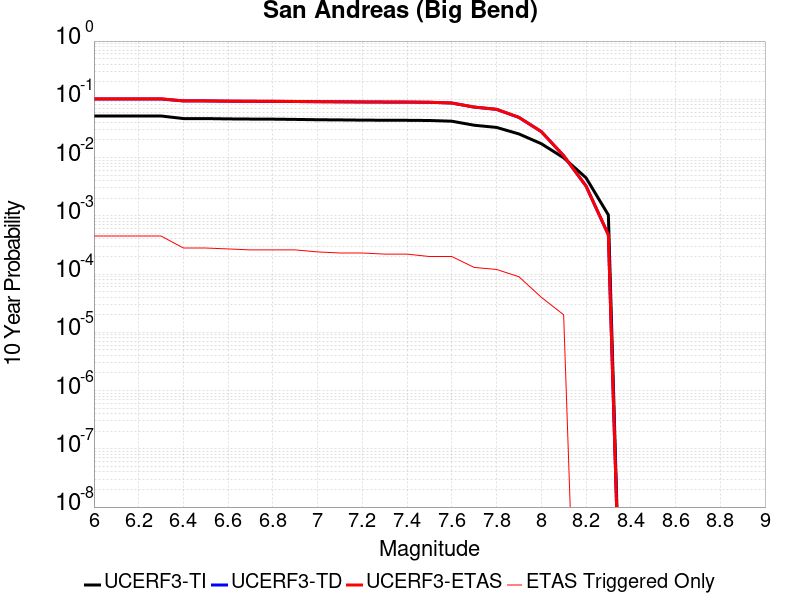 |

| Magnitude | 1 wk TI Prob | 1 wk TD Prob | 1 wk ETAS Prob | 1 wk ETAS/TD Gain | 1 wk ETAS Triggered Only | 1 mo TI Prob | 1 mo TD Prob | 1 mo ETAS Prob | 1 mo ETAS/TD Gain | 1 mo ETAS Triggered Only | 1 yr TI Prob | 1 yr TD Prob | 1 yr ETAS Prob | 1 yr ETAS/TD Gain | 1 yr ETAS Triggered Only | 10 yr TI Prob | 10 yr TD Prob | 10 yr ETAS Prob | 10 yr ETAS/TD Gain | 10 yr ETAS Triggered Only |
|-----|-----|-----|-----|-----|-----|-----|-----|-----|-----|-----|-----|-----|-----|-----|-----|-----|-----|-----|-----|-----|
| 6.0 | 1.0179969E-4 | 2.0072258E-4 | 3.2264934E-4 | 1.607439 | 1.2195122E-4 | 4.362114E-4 | 8.599571E-4 | 0.0010862432 | 1.2631365 | 2.2648084E-4 | 0.0052979486 | 0.010419999 | 0.01071308 | 1.0281268 | 2.9616724E-4 | 0.051734097 | 0.10144902 | 0.10177776 | 1.0032405 | 3.6585366E-4 |
| 6.1 | 1.0179969E-4 | 2.0072258E-4 | 3.2264934E-4 | 1.607439 | 1.2195122E-4 | 4.362114E-4 | 8.599571E-4 | 0.0010862432 | 1.2631365 | 2.2648084E-4 | 0.0052979486 | 0.010419999 | 0.01071308 | 1.0281268 | 2.9616724E-4 | 0.051734097 | 0.10144902 | 0.10177776 | 1.0032405 | 3.6585366E-4 |
| 6.2 | 1.0179969E-4 | 2.0072258E-4 | 3.2264934E-4 | 1.607439 | 1.2195122E-4 | 4.362114E-4 | 8.599571E-4 | 0.0010862432 | 1.2631365 | 2.2648084E-4 | 0.0052979486 | 0.010419999 | 0.01071308 | 1.0281268 | 2.9616724E-4 | 0.051734097 | 0.10144902 | 0.10177776 | 1.0032405 | 3.6585366E-4 |
| 6.3 | 1.0179969E-4 | 2.0072258E-4 | 3.2264934E-4 | 1.607439 | 1.2195122E-4 | 4.362114E-4 | 8.599571E-4 | 0.0010862432 | 1.2631365 | 2.2648084E-4 | 0.0052979486 | 0.010419999 | 0.01071308 | 1.0281268 | 2.9616724E-4 | 0.051734097 | 0.10144902 | 0.10177776 | 1.0032405 | 3.6585366E-4 |
| 6.4 | 9.1639464E-5 | 1.8429532E-4 | 3.0622407E-4 | 1.6615944 | 1.2195122E-4 | 3.9268145E-4 | 7.895982E-4 | 9.4626885E-4 | 1.1984181 | 1.5679443E-4 | 0.0047704205 | 0.009571102 | 0.009795415 | 1.0234365 | 2.2648084E-4 | 0.046693064 | 0.09377527 | 0.09401209 | 1.0025253 | 2.6132405E-4 |
| 6.5 | 9.1639464E-5 | 1.8429532E-4 | 3.0622407E-4 | 1.6615944 | 1.2195122E-4 | 3.9268145E-4 | 7.895982E-4 | 9.4626885E-4 | 1.1984181 | 1.5679443E-4 | 0.0047704205 | 0.009571102 | 0.009795415 | 1.0234365 | 2.2648084E-4 | 0.046693064 | 0.09377527 | 0.09401209 | 1.0025253 | 2.6132405E-4 |
| 6.6 | 9.042622E-5 | 1.823659E-4 | 3.042949E-4 | 1.6685953 | 1.2195122E-4 | 3.8748336E-4 | 7.8133424E-4 | 9.3800615E-4 | 1.2005184 | 1.5679443E-4 | 0.0047074095 | 0.009471365 | 0.009678444 | 1.0218637 | 2.0905923E-4 | 0.046089325 | 0.092869274 | 0.09309053 | 1.0023824 | 2.4390244E-4 |
| 6.7 | 8.9836685E-5 | 1.8150927E-4 | 3.0343834E-4 | 1.6717513 | 1.2195122E-4 | 3.8495753E-4 | 7.776651E-4 | 9.343376E-4 | 1.2014652 | 1.5679443E-4 | 0.00467679 | 0.00942708 | 0.009634169 | 1.0219674 | 2.0905923E-4 | 0.045795817 | 0.09246355 | 0.0926849 | 1.002394 | 2.4390244E-4 |
| 6.8 | 8.9471854E-5 | 1.8097709E-4 | 3.0290624E-4 | 1.673727 | 1.2195122E-4 | 3.8339442E-4 | 7.7538576E-4 | 9.320586E-4 | 1.202058 | 1.5679443E-4 | 0.004657841 | 0.009399569 | 0.009606663 | 1.0220323 | 2.0905923E-4 | 0.04561414 | 0.092210755 | 0.09243217 | 1.0024011 | 2.4390244E-4 |
| 6.9 | 8.858234E-5 | 1.7979681E-4 | 3.017261E-4 | 1.6781504 | 1.2195122E-4 | 3.7958333E-4 | 7.703304E-4 | 9.270041E-4 | 1.203385 | 1.5679443E-4 | 0.004611638 | 0.009338548 | 0.009545656 | 1.0221776 | 2.0905923E-4 | 0.04517103 | 0.09165087 | 0.091872424 | 1.0024173 | 2.4390244E-4 |
| 7.0 | 8.7433385E-5 | 1.7818481E-4 | 2.826958E-4 | 1.5865314 | 1.04529616E-4 | 3.746607E-4 | 7.634259E-4 | 9.026923E-4 | 1.182423 | 1.3937282E-4 | 0.004551957 | 0.009255203 | 0.0094450675 | 1.0205142 | 1.9163763E-4 | 0.044598386 | 0.09088532 | 0.091091216 | 1.0022655 | 2.2648084E-4 |
| 7.1 | 8.684964E-5 | 1.7730435E-4 | 2.8181545E-4 | 1.5894445 | 1.04529616E-4 | 3.7215967E-4 | 7.596547E-4 | 8.9892163E-4 | 1.1833292 | 1.3937282E-4 | 0.0045216335 | 0.009209678 | 0.009382289 | 1.0187424 | 1.7421602E-4 | 0.04430731 | 0.09046686 | 0.090657 | 1.0021018 | 2.0905923E-4 |
| 7.2 | 8.606521E-5 | 1.762105E-4 | 2.807217E-4 | 1.5931042 | 1.04529616E-4 | 3.6879873E-4 | 7.549695E-4 | 8.942371E-4 | 1.1844678 | 1.3937282E-4 | 0.0044808835 | 0.0091531165 | 0.009325737 | 1.0188593 | 1.7421602E-4 | 0.043916024 | 0.089947365 | 0.09013762 | 1.0021151 | 2.0905923E-4 |
| 7.3 | 8.568266E-5 | 1.7563057E-4 | 2.8014183E-4 | 1.5950631 | 1.04529616E-4 | 3.6715972E-4 | 7.524855E-4 | 8.917534E-4 | 1.1850773 | 1.3937282E-4 | 0.0044610105 | 0.009123127 | 0.009295754 | 1.0189219 | 1.7421602E-4 | 0.043725148 | 0.08966853 | 0.08985884 | 1.0021224 | 2.0905923E-4 |
| 7.4 | 8.5432206E-5 | 1.7525644E-4 | 2.7976773E-4 | 1.5963335 | 1.04529616E-4 | 3.6608664E-4 | 7.50883E-4 | 8.901512E-4 | 1.1854725 | 1.3937282E-4 | 0.004447999 | 0.009103781 | 0.009276411 | 1.0189625 | 1.7421602E-4 | 0.043600157 | 0.08948871 | 0.089679055 | 1.002127 | 2.0905923E-4 |
| 7.5 | 8.4791965E-5 | 1.7394972E-4 | 2.4362402E-4 | 1.4005426 | 6.968641E-5 | 3.633435E-4 | 7.4528606E-4 | 8.497377E-4 | 1.1401498 | 1.04529616E-4 | 0.0044147377 | 0.009036204 | 0.009174318 | 1.0152844 | 1.3937282E-4 | 0.043280575 | 0.088866346 | 0.08902508 | 1.0017862 | 1.7421602E-4 |
| 7.6 | 8.241105E-5 | 1.6840403E-4 | 2.380787E-4 | 1.4137352 | 6.968641E-5 | 3.531424E-4 | 7.215321E-4 | 8.259863E-4 | 1.1447672 | 1.04529616E-4 | 0.0042910352 | 0.008749358 | 0.008887512 | 1.0157901 | 1.3937282E-4 | 0.042091176 | 0.086243294 | 0.08640248 | 1.0018458 | 1.7421602E-4 |
| 7.7 | 7.00432E-5 | 1.42045E-4 | 1.7688326E-4 | 1.2452621 | 3.4843204E-5 | 3.001506E-4 | 6.0862233E-4 | 6.7826634E-4 | 1.1144289 | 6.968641E-5 | 0.0036482112 | 0.0073848404 | 0.007454012 | 1.0093668 | 6.968641E-5 | 0.035888977 | 0.07351733 | 0.07361417 | 1.0013173 | 1.04529616E-4 |
| 7.8 | 6.415362E-5 | 1.2968935E-4 | 1.6452803E-4 | 1.2686318 | 3.4843204E-5 | 2.749151E-4 | 5.556931E-4 | 6.253408E-4 | 1.1253349 | 6.968641E-5 | 0.0033419547 | 0.0067446055 | 0.006813822 | 1.0102625 | 6.968641E-5 | 0.03292141 | 0.06725231 | 0.06734981 | 1.0014497 | 1.04529616E-4 |
| 7.9 | 4.939911E-5 | 9.3411545E-5 | 1.1083152E-4 | 1.1864864 | 1.7421602E-5 | 2.116933E-4 | 4.0027377E-4 | 4.5251765E-4 | 1.1305203 | 5.2264808E-5 | 0.0025743195 | 0.004862453 | 0.0049144635 | 1.0106964 | 5.2264808E-5 | 0.025447013 | 0.048914436 | 0.048997287 | 1.0016937 | 8.710801E-5 |
| 8.0 | 3.344983E-5 | 5.222685E-5 | 5.222685E-5 | 1.0 | 0.0 | 1.4334853E-4 | 2.2381016E-4 | 2.4122787E-4 | 1.0778235 | 1.7421602E-5 | 0.0017438711 | 0.0027214854 | 0.0027388597 | 1.0063841 | 1.7421602E-5 | 0.017302496 | 0.027922187 | 0.027972993 | 1.0018195 | 5.2264808E-5 |
| 8.1 | 1.9104898E-5 | 1.9173063E-5 | 1.9173063E-5 | 1.0 | 0.0 | 8.1875565E-5 | 8.216769E-5 | 8.216769E-5 | 1.0 | 0.0 | 9.963791E-4 | 9.999331E-4 | 9.999331E-4 | 1.0 | 0.0 | 0.009919235 | 0.010749801 | 0.010767035 | 1.0016032 | 1.7421602E-5 |
| 8.2 | 8.643924E-6 | 5.4748625E-6 | 5.4748625E-6 | 1.0 | 0.0 | 3.704486E-5 | 2.3463486E-5 | 2.3463486E-5 | 1.0 | 0.0 | 4.5092785E-4 | 2.8563058E-4 | 2.8563058E-4 | 1.0 | 0.0 | 0.0045001395 | 0.0032487072 | 0.0032487072 | 1.0 | 0.0 |
| 8.3 | 1.983087E-6 | 7.6599065E-7 | 7.6599065E-7 | 1.0 | 0.0 | 8.498917E-6 | 3.282813E-6 | 3.282813E-6 | 1.0 | 0.0 | 1.034694E-4 | 3.9967534E-5 | 3.9967534E-5 | 1.0 | 0.0 | 0.0010342124 | 4.719687E-4 | 4.719687E-4 | 1.0 | 0.0 |

## Death Valley (No)
*[(top)](#table-of-contents)*

| 1 Week | 1 Month | 1 Year | 10 Year |
|-----|-----|-----|-----|
|  |  |  |  |

| Magnitude | 1 wk TI Prob | 1 wk TD Prob | 1 wk ETAS Prob | 1 wk ETAS/TD Gain | 1 wk ETAS Triggered Only | 1 mo TI Prob | 1 mo TD Prob | 1 mo ETAS Prob | 1 mo ETAS/TD Gain | 1 mo ETAS Triggered Only | 1 yr TI Prob | 1 yr TD Prob | 1 yr ETAS Prob | 1 yr ETAS/TD Gain | 1 yr ETAS Triggered Only | 10 yr TI Prob | 10 yr TD Prob | 10 yr ETAS Prob | 10 yr ETAS/TD Gain | 10 yr ETAS Triggered Only |
|-----|-----|-----|-----|-----|-----|-----|-----|-----|-----|-----|-----|-----|-----|-----|-----|-----|-----|-----|-----|-----|
| 6.0 | 2.0074807E-5 | 2.2500084E-5 | 2.141334E-4 | 9.517005 | 1.9163763E-4 | 8.603206E-5 | 9.642541E-5 | 3.228844E-4 | 3.3485408 | 2.2648084E-4 | 0.001046937 | 0.0011733545 | 0.0014691742 | 1.2521145 | 2.9616724E-4 | 0.010420183 | 0.011672506 | 0.011999654 | 1.0280272 | 3.3101047E-4 |
| 6.1 | 2.0074807E-5 | 2.2500084E-5 | 2.141334E-4 | 9.517005 | 1.9163763E-4 | 8.603206E-5 | 9.642541E-5 | 3.228844E-4 | 3.3485408 | 2.2648084E-4 | 0.001046937 | 0.0011733545 | 0.0014691742 | 1.2521145 | 2.9616724E-4 | 0.010420183 | 0.011672506 | 0.011999654 | 1.0280272 | 3.3101047E-4 |
| 6.2 | 2.0074807E-5 | 2.2500084E-5 | 2.141334E-4 | 9.517005 | 1.9163763E-4 | 8.603206E-5 | 9.642541E-5 | 3.228844E-4 | 3.3485408 | 2.2648084E-4 | 0.001046937 | 0.0011733545 | 0.0014691742 | 1.2521145 | 2.9616724E-4 | 0.010420183 | 0.011672506 | 0.011999654 | 1.0280272 | 3.3101047E-4 |
| 6.3 | 1.9050609E-5 | 2.1336948E-5 | 1.9554926E-4 | 9.164819 | 1.7421602E-4 | 8.164292E-5 | 9.1440896E-5 | 3.00481E-4 | 3.2860682 | 2.0905923E-4 | 9.935491E-4 | 0.001112731 | 0.0013911665 | 1.2502271 | 2.7874563E-4 | 0.009891188 | 0.011072419 | 0.011382535 | 1.028008 | 3.1358885E-4 |
| 6.4 | 1.9050609E-5 | 2.1336948E-5 | 1.9554926E-4 | 9.164819 | 1.7421602E-4 | 8.164292E-5 | 9.1440896E-5 | 3.00481E-4 | 3.2860682 | 2.0905923E-4 | 9.935491E-4 | 0.001112731 | 0.0013911665 | 1.2502271 | 2.7874563E-4 | 0.009891188 | 0.011072419 | 0.011382535 | 1.028008 | 3.1358885E-4 |
| 6.5 | 1.8367004E-5 | 2.0561009E-5 | 1.9477346E-4 | 9.472953 | 1.7421602E-4 | 7.8713354E-5 | 8.811567E-5 | 2.9715648E-4 | 3.3723454 | 2.0905923E-4 | 9.5791375E-4 | 0.0010722869 | 0.0013507336 | 1.2596756 | 2.7874563E-4 | 0.009537951 | 0.0106719155 | 0.010982158 | 1.0290709 | 3.1358885E-4 |
| 6.6 | 1.779439E-5 | 1.9910927E-5 | 1.7670223E-4 | 8.874636 | 1.5679443E-4 | 7.625944E-5 | 8.53298E-5 | 2.7695106E-4 | 3.245655 | 1.9163763E-4 | 9.280632E-4 | 0.0010384015 | 0.0012994541 | 1.2513986 | 2.6132405E-4 | 0.009241969 | 0.010336253 | 0.010629359 | 1.028357 | 2.9616724E-4 |
| 6.7 | 1.7025437E-5 | 1.9043426E-5 | 1.7583487E-4 | 9.233363 | 1.5679443E-4 | 7.296412E-5 | 8.161216E-5 | 2.7323415E-4 | 3.3479588 | 1.9163763E-4 | 8.87976E-4 | 9.931813E-4 | 0.0012542458 | 1.2628568 | 2.6132405E-4 | 0.008844362 | 0.009888145 | 0.010181384 | 1.0296556 | 2.9616724E-4 |
| 6.8 | 1.6545107E-5 | 1.8512545E-5 | 1.7530407E-4 | 9.469474 | 1.5679443E-4 | 7.090568E-5 | 7.93371E-5 | 2.7095954E-4 | 3.415294 | 1.9163763E-4 | 8.629347E-4 | 9.655073E-4 | 0.0012265791 | 1.2703985 | 2.6132405E-4 | 0.008595915 | 0.009613829 | 0.009907149 | 1.0305102 | 2.9616724E-4 |
| 6.9 | 1.615478E-5 | 1.8087594E-5 | 1.7487918E-4 | 9.66846 | 1.5679443E-4 | 6.9232934E-5 | 7.751599E-5 | 2.6913878E-4 | 3.4720418 | 1.9163763E-4 | 8.4258494E-4 | 9.433546E-4 | 0.001187027 | 1.2583041 | 2.4390244E-4 | 0.008393973 | 0.009394196 | 0.009670323 | 1.0293933 | 2.7874563E-4 |
| 7.0 | 1.5894311E-5 | 1.780555E-5 | 1.7459718E-4 | 9.805773 | 1.5679443E-4 | 6.81167E-5 | 7.6307304E-5 | 2.679303E-4 | 3.5112014 | 1.9163763E-4 | 8.2900526E-4 | 9.286515E-4 | 0.0011723274 | 1.2623976 | 2.4390244E-4 | 0.008259195 | 0.009248397 | 0.009524565 | 1.0298611 | 2.7874563E-4 |
| 7.1 | 1.5602263E-5 | 1.7483504E-5 | 1.7427519E-4 | 9.9679785 | 1.5679443E-4 | 6.6865134E-5 | 7.492718E-5 | 2.6655046E-4 | 3.55746 | 1.9163763E-4 | 8.137789E-4 | 9.118627E-4 | 0.0011555428 | 1.2672333 | 2.4390244E-4 | 0.008108052 | 0.009081894 | 0.009358108 | 1.0304137 | 2.7874563E-4 |
| 7.2 | 1.5323829E-5 | 1.717063E-5 | 1.7396237E-4 | 10.131391 | 1.5679443E-4 | 6.56719E-5 | 7.358637E-5 | 2.652099E-4 | 3.6040628 | 1.9163763E-4 | 7.99262E-4 | 8.9555193E-4 | 0.0011392359 | 1.2721049 | 2.4390244E-4 | 0.007963934 | 0.008920107 | 0.009196366 | 1.0309703 | 2.7874563E-4 |
| 7.3 | 1.4556212E-5 | 1.6302456E-5 | 1.55673E-4 | 9.549053 | 1.3937282E-4 | 6.238227E-5 | 6.9865826E-5 | 2.4406968E-4 | 3.4934058 | 1.7421602E-4 | 7.592395E-4 | 8.5029035E-4 | 0.0010765786 | 1.2661306 | 2.2648084E-4 | 0.0075665074 | 0.008471014 | 0.008730125 | 1.0305879 | 2.6132405E-4 |
| 7.4 | 1.411725E-5 | 1.580796E-5 | 1.5517858E-4 | 9.8164835 | 1.3937282E-4 | 6.0501097E-5 | 6.7746674E-5 | 2.419509E-4 | 3.5714064 | 1.7421602E-4 | 7.363519E-4 | 8.245094E-4 | 0.0010508036 | 1.2744591 | 2.2648084E-4 | 0.0073391674 | 0.008215138 | 0.0084743155 | 1.0315487 | 2.6132405E-4 |
| 7.5 | 1.3503312E-5 | 1.5126289E-5 | 1.54497E-4 | 10.213807 | 1.3937282E-4 | 5.7870053E-5 | 6.482538E-5 | 2.3903011E-4 | 3.6872923 | 1.7421602E-4 | 7.043401E-4 | 7.8896893E-4 | 0.0010152711 | 1.2868328 | 2.2648084E-4 | 0.007021119 | 0.007862304 | 0.008121573 | 1.0329763 | 2.6132405E-4 |
| 7.6 | 1.1279839E-5 | 1.2626327E-5 | 1.17154625E-4 | 9.278599 | 1.04529616E-4 | 4.834127E-5 | 5.4111737E-5 | 1.9347701E-4 | 3.5755093 | 1.3937282E-4 | 5.88396E-4 | 6.5861654E-4 | 8.3271787E-4 | 1.264344 | 1.7421602E-4 | 0.005868405 | 0.006567199 | 0.006757578 | 1.0289894 | 1.9163763E-4 |
| 7.7 | 9.189108E-6 | 1.0283358E-5 | 7.996905E-5 | 7.7765503 | 6.968641E-5 | 3.93813E-5 | 4.407082E-5 | 1.31175E-4 | 2.9764593 | 8.710801E-5 | 4.7936183E-4 | 5.3643517E-4 | 6.5832096E-4 | 1.2272145 | 1.2195122E-4 | 0.004783291 | 0.005351914 | 0.005490541 | 1.0259023 | 1.3937282E-4 |
| 7.8 | 3.4586725E-7 | 3.6482615E-7 | 3.6482615E-7 | 1.0 | 0.0 | 1.4822873E-6 | 1.5635396E-6 | 1.5635396E-6 | 1.0 | 0.0 | 1.80467E-5 | 1.9035933E-5 | 1.9035933E-5 | 1.0 | 0.0 | 1.8045233E-4 | 1.9034347E-4 | 1.9034347E-4 | 1.0 | 0.0 |
| 7.9 | 2.5591178E-9 | 2.6696718E-9 | 2.6696718E-9 | 1.0 | 0.0 | 1.0967647E-8 | 1.14414505E-8 | 1.14414505E-8 | 1.0 | 0.0 | 1.335311E-7 | 1.3929966E-7 | 1.3929966E-7 | 1.0 | 0.0 | 1.3353102E-6 | 1.3929966E-6 | 1.3929966E-6 | 1.0 | 0.0 |

## San Jacinto (San Bernardino)
*[(top)](#table-of-contents)*

| 1 Week | 1 Month | 1 Year | 10 Year |
|-----|-----|-----|-----|
|  |  |  |  |

| Magnitude | 1 wk TI Prob | 1 wk TD Prob | 1 wk ETAS Prob | 1 wk ETAS/TD Gain | 1 wk ETAS Triggered Only | 1 mo TI Prob | 1 mo TD Prob | 1 mo ETAS Prob | 1 mo ETAS/TD Gain | 1 mo ETAS Triggered Only | 1 yr TI Prob | 1 yr TD Prob | 1 yr ETAS Prob | 1 yr ETAS/TD Gain | 1 yr ETAS Triggered Only | 10 yr TI Prob | 10 yr TD Prob | 10 yr ETAS Prob | 10 yr ETAS/TD Gain | 10 yr ETAS Triggered Only |
|-----|-----|-----|-----|-----|-----|-----|-----|-----|-----|-----|-----|-----|-----|-----|-----|-----|-----|-----|-----|-----|
| 6.0 | 3.409352E-5 | 3.5986508E-5 | 2.624592E-4 | 7.2932663 | 2.2648084E-4 | 1.461069E-4 | 1.542188E-4 | 4.1550252E-4 | 2.6942406 | 2.6132405E-4 | 0.0017774 | 0.0018759987 | 0.0021716102 | 1.1575756 | 2.9616724E-4 | 0.01763251 | 0.019349935 | 0.019657455 | 1.0158926 | 3.1358885E-4 |
| 6.1 | 3.409352E-5 | 3.5986508E-5 | 2.624592E-4 | 7.2932663 | 2.2648084E-4 | 1.461069E-4 | 1.542188E-4 | 4.1550252E-4 | 2.6942406 | 2.6132405E-4 | 0.0017774 | 0.0018759987 | 0.0021716102 | 1.1575756 | 2.9616724E-4 | 0.01763251 | 0.019349935 | 0.019657455 | 1.0158926 | 3.1358885E-4 |
| 6.2 | 3.409352E-5 | 3.5986508E-5 | 2.624592E-4 | 7.2932663 | 2.2648084E-4 | 1.461069E-4 | 1.542188E-4 | 4.1550252E-4 | 2.6942406 | 2.6132405E-4 | 0.0017774 | 0.0018759987 | 0.0021716102 | 1.1575756 | 2.9616724E-4 | 0.01763251 | 0.019349935 | 0.019657455 | 1.0158926 | 3.1358885E-4 |
| 6.3 | 3.409352E-5 | 3.5986508E-5 | 2.624592E-4 | 7.2932663 | 2.2648084E-4 | 1.461069E-4 | 1.542188E-4 | 4.1550252E-4 | 2.6942406 | 2.6132405E-4 | 0.0017774 | 0.0018759987 | 0.0021716102 | 1.1575756 | 2.9616724E-4 | 0.01763251 | 0.019349935 | 0.019657455 | 1.0158926 | 3.1358885E-4 |
| 6.4 | 3.400795E-5 | 3.5879173E-5 | 2.6235188E-4 | 7.312094 | 2.2648084E-4 | 1.4574021E-4 | 1.5375883E-4 | 4.1504268E-4 | 2.6993096 | 2.6132405E-4 | 0.0017729428 | 0.0018704084 | 0.0021660216 | 1.1580474 | 2.9616724E-4 | 0.017588645 | 0.019295016 | 0.019602556 | 1.0159388 | 3.1358885E-4 |
| 6.5 | 3.341482E-5 | 3.5139812E-5 | 2.616127E-4 | 7.444909 | 2.2648084E-4 | 1.4319851E-4 | 1.5059051E-4 | 4.118752E-4 | 2.7350676 | 2.6132405E-4 | 0.0017420477 | 0.0018318989 | 0.0021275238 | 1.1613761 | 2.9616724E-4 | 0.017284546 | 0.018916558 | 0.019224215 | 1.0162638 | 3.1358885E-4 |
| 6.6 | 3.3364955E-5 | 3.5077028E-5 | 2.4412893E-4 | 6.959795 | 2.0905923E-4 | 1.4298483E-4 | 1.5032147E-4 | 3.9418726E-4 | 2.622295 | 2.4390244E-4 | 0.0017394501 | 0.001828629 | 0.002106865 | 1.1521555 | 2.7874563E-4 | 0.017258976 | 0.018884424 | 0.019174999 | 1.0153869 | 2.9616724E-4 |
| 6.7 | 3.335922E-5 | 3.5066805E-5 | 2.4411871E-4 | 6.961533 | 2.0905923E-4 | 1.4296026E-4 | 1.5027766E-4 | 3.9414343E-4 | 2.6227682 | 2.4390244E-4 | 0.0017391514 | 0.0018280965 | 0.0021063325 | 1.1521999 | 2.7874563E-4 | 0.017256035 | 0.018879214 | 0.01916979 | 1.0153913 | 2.9616724E-4 |
| 6.8 | 3.327683E-5 | 3.496087E-5 | 2.440128E-4 | 6.9795976 | 2.0905923E-4 | 1.4260718E-4 | 1.498237E-4 | 3.936896E-4 | 2.6276858 | 2.4390244E-4 | 0.0017348597 | 0.0018225788 | 0.0021008165 | 1.1526614 | 2.7874563E-4 | 0.017213784 | 0.018824987 | 0.019115578 | 1.0154365 | 2.9616724E-4 |
| 6.9 | 3.3235785E-5 | 3.4901823E-5 | 2.4395376E-4 | 6.9897137 | 2.0905923E-4 | 1.4243131E-4 | 1.4957068E-4 | 3.9343664E-4 | 2.6304395 | 2.4390244E-4 | 0.0017327217 | 0.0018195034 | 0.002097742 | 1.15292 | 2.7874563E-4 | 0.017192734 | 0.018794855 | 0.019085456 | 1.0154617 | 2.9616724E-4 |
| 7.0 | 3.3197095E-5 | 3.4841752E-5 | 2.4389371E-4 | 7.000041 | 2.0905923E-4 | 1.422655E-4 | 1.4931326E-4 | 3.9317927E-4 | 2.633251 | 2.4390244E-4 | 0.0017307063 | 0.0018163746 | 0.002094614 | 1.1531839 | 2.7874563E-4 | 0.017172894 | 0.018764233 | 0.019054843 | 1.0154874 | 2.9616724E-4 |
| 7.1 | 3.3129716E-5 | 3.4721965E-5 | 2.4377395E-4 | 7.0207415 | 2.0905923E-4 | 1.4197677E-4 | 1.4879994E-4 | 3.926661E-4 | 2.638886 | 2.4390244E-4 | 0.0017271966 | 0.0018101353 | 0.0020883763 | 1.1537129 | 2.7874563E-4 | 0.017138338 | 0.018703312 | 0.01899394 | 1.0155388 | 2.9616724E-4 |
| 7.2 | 3.3034008E-5 | 3.458941E-5 | 2.4364142E-4 | 7.0438147 | 2.0905923E-4 | 1.4156665E-4 | 1.4823192E-4 | 3.920982E-4 | 2.645167 | 2.4390244E-4 | 0.0017222111 | 0.0018032312 | 0.0020814743 | 1.1543025 | 2.7874563E-4 | 0.017089253 | 0.018635705 | 0.018926352 | 1.0155963 | 2.9616724E-4 |
| 7.3 | 3.2956614E-5 | 3.445717E-5 | 2.435092E-4 | 7.067011 | 2.0905923E-4 | 1.4123498E-4 | 1.4766524E-4 | 3.9153165E-4 | 2.6514816 | 2.4390244E-4 | 0.0017181796 | 0.0017963431 | 0.002074588 | 1.1548952 | 2.7874563E-4 | 0.017049557 | 0.018568452 | 0.01885912 | 1.0156538 | 2.9616724E-4 |
| 7.4 | 3.2915937E-5 | 3.4378863E-5 | 2.4343091E-4 | 7.0808306 | 2.0905923E-4 | 1.4106068E-4 | 1.4732967E-4 | 3.911962E-4 | 2.6552436 | 2.4390244E-4 | 0.0017160608 | 0.0017922645 | 0.0020705105 | 1.1552483 | 2.7874563E-4 | 0.017028693 | 0.018528719 | 0.018819397 | 1.0156881 | 2.9616724E-4 |
| 7.5 | 3.281791E-5 | 3.4243778E-5 | 2.4329586E-4 | 7.104819 | 2.0905923E-4 | 1.406406E-4 | 1.4675081E-4 | 3.9061744E-4 | 2.661774 | 2.4390244E-4 | 0.0017109542 | 0.0017852283 | 0.0020634762 | 1.1558613 | 2.7874563E-4 | 0.016978411 | 0.018459605 | 0.018750306 | 1.0157479 | 2.9616724E-4 |
| 7.6 | 3.2521442E-5 | 3.396873E-5 | 2.4302086E-4 | 7.154252 | 2.0905923E-4 | 1.3937015E-4 | 1.4557215E-4 | 3.8943908E-4 | 2.6752307 | 2.4390244E-4 | 0.0016955109 | 0.0017709016 | 0.0020491537 | 1.1571245 | 2.7874563E-4 | 0.016826328 | 0.018317232 | 0.018607976 | 1.0158726 | 2.9616724E-4 |
| 7.7 | 3.0287873E-5 | 3.245276E-5 | 2.4150521E-4 | 7.4417458 | 2.0905923E-4 | 1.297987E-4 | 1.3907586E-4 | 3.829444E-4 | 2.7534928 | 2.4390244E-4 | 0.0015791537 | 0.0016919347 | 0.0019702087 | 1.1644709 | 2.7874563E-4 | 0.01567979 | 0.01752809 | 0.017819066 | 1.0166006 | 2.9616724E-4 |
| 7.8 | 2.6316151E-5 | 2.9663592E-5 | 2.3871662E-4 | 8.047462 | 2.0905923E-4 | 1.1277862E-4 | 1.2712348E-4 | 3.709949E-4 | 2.9183822 | 2.4390244E-4 | 0.0013722149 | 0.0015466306 | 0.0018249451 | 1.1799489 | 2.7874563E-4 | 0.013637724 | 0.016069634 | 0.016361043 | 1.0181341 | 2.9616724E-4 |
| 7.9 | 2.0761147E-5 | 2.34181E-5 | 2.1505124E-4 | 9.183121 | 1.9163763E-4 | 8.897331E-5 | 1.0035944E-4 | 3.093977E-4 | 3.0828958 | 2.0905923E-4 | 0.0010827117 | 0.0012211921 | 0.0014473964 | 1.1852323 | 2.2648084E-4 | 0.010774517 | 0.012793174 | 0.013033956 | 1.0188211 | 2.4390244E-4 |
| 8.0 | 1.5738568E-5 | 1.6033575E-5 | 1.2056152E-4 | 7.5193157 | 1.04529616E-4 | 6.744926E-5 | 6.871352E-5 | 1.9065636E-4 | 2.7746558 | 1.2195122E-4 | 8.2088535E-4 | 8.3626667E-4 | 9.755229E-4 | 1.1665214 | 1.3937282E-4 | 0.008178596 | 0.008865921 | 0.009021325 | 1.0175283 | 1.5679443E-4 |
| 8.1 | 1.0105832E-5 | 8.3304985E-6 | 7.801633E-5 | 9.365146 | 6.968641E-5 | 4.3309992E-5 | 3.570165E-5 | 1.2280655E-4 | 3.4398005 | 8.710801E-5 | 5.2717153E-4 | 4.345814E-4 | 5.216516E-4 | 1.2003541 | 8.710801E-5 | 0.005259227 | 0.004677232 | 0.0047812727 | 1.0222441 | 1.04529616E-4 |
| 8.2 | 4.189207E-6 | 1.5784357E-6 | 1.5784357E-6 | 1.0 | 0.0 | 1.7953622E-5 | 6.7647065E-6 | 6.7647065E-6 | 1.0 | 0.0 | 2.1856341E-4 | 8.235722E-5 | 8.235722E-5 | 1.0 | 0.0 | 0.0021834858 | 9.565867E-4 | 9.565867E-4 | 1.0 | 0.0 |
| 8.3 | 1.2758221E-6 | 3.6149942E-7 | 3.6149942E-7 | 1.0 | 0.0 | 5.4677976E-6 | 1.5492824E-6 | 1.5492824E-6 | 1.0 | 0.0 | 6.65684E-5 | 1.8862354E-5 | 1.8862354E-5 | 1.0 | 0.0 | 6.6548464E-4 | 2.2751294E-4 | 2.2751294E-4 | 1.0 | 0.0 |

## Red Pass
*[(top)](#table-of-contents)*

| 1 Week | 1 Month | 1 Year | 10 Year |
|-----|-----|-----|-----|
|  |  |  |  |

| Magnitude | 1 wk TI Prob | 1 wk TD Prob | 1 wk ETAS Prob | 1 wk ETAS/TD Gain | 1 wk ETAS Triggered Only | 1 mo TI Prob | 1 mo TD Prob | 1 mo ETAS Prob | 1 mo ETAS/TD Gain | 1 mo ETAS Triggered Only | 1 yr TI Prob | 1 yr TD Prob | 1 yr ETAS Prob | 1 yr ETAS/TD Gain | 1 yr ETAS Triggered Only | 10 yr TI Prob | 10 yr TD Prob | 10 yr ETAS Prob | 10 yr ETAS/TD Gain | 10 yr ETAS Triggered Only |
|-----|-----|-----|-----|-----|-----|-----|-----|-----|-----|-----|-----|-----|-----|-----|-----|-----|-----|-----|-----|-----|
| 6.0 | 8.258278E-6 | 8.551265E-6 | 9.5658535E-5 | 11.186478 | 8.710801E-5 | 3.539214E-5 | 3.6647863E-5 | 1.7601557E-4 | 4.802888 | 1.3937282E-4 | 4.308141E-4 | 4.4611428E-4 | 6.5508025E-4 | 1.4684136 | 2.0905923E-4 | 0.0042997985 | 0.004453945 | 0.004714105 | 1.0584111 | 2.6132405E-4 |
| 6.1 | 3.649988E-6 | 3.7753161E-6 | 5.6039928E-5 | 14.843771 | 5.2264808E-5 | 1.5642712E-5 | 1.6179853E-5 | 1.0328646E-4 | 6.3836465 | 8.710801E-5 | 1.9043336E-4 | 1.9697666E-4 | 3.0148568E-4 | 1.5305655 | 1.04529616E-4 | 0.0019027026 | 0.001968488 | 0.0020728118 | 1.052997 | 1.04529616E-4 |
| 6.2 | 3.649988E-6 | 3.7753161E-6 | 5.6039928E-5 | 14.843771 | 5.2264808E-5 | 1.5642712E-5 | 1.6179853E-5 | 1.0328646E-4 | 6.3836465 | 8.710801E-5 | 1.9043336E-4 | 1.9697666E-4 | 3.0148568E-4 | 1.5305655 | 1.04529616E-4 | 0.0019027026 | 0.001968488 | 0.0020728118 | 1.052997 | 1.04529616E-4 |
| 6.3 | 1.3924937E-6 | 1.4411166E-6 | 1.4411166E-6 | 1.0 | 0.0 | 5.9678164E-6 | 6.1762075E-6 | 6.1762075E-6 | 1.0 | 0.0 | 7.265574E-5 | 7.519415E-5 | 7.519415E-5 | 1.0 | 0.0 | 7.263199E-4 | 7.518258E-4 | 7.518258E-4 | 1.0 | 0.0 |
| 6.4 | 1.3924937E-6 | 1.4411166E-6 | 1.4411166E-6 | 1.0 | 0.0 | 5.9678164E-6 | 6.1762075E-6 | 6.1762075E-6 | 1.0 | 0.0 | 7.265574E-5 | 7.519415E-5 | 7.519415E-5 | 1.0 | 0.0 | 7.263199E-4 | 7.518258E-4 | 7.518258E-4 | 1.0 | 0.0 |
| 6.5 | 9.876812E-7 | 1.0221912E-6 | 1.0221912E-6 | 1.0 | 0.0 | 4.2329125E-6 | 4.3808195E-6 | 4.3808195E-6 | 1.0 | 0.0 | 5.153449E-5 | 5.3336476E-5 | 5.3336476E-5 | 1.0 | 0.0 | 5.1522546E-4 | 5.333648E-4 | 5.333648E-4 | 1.0 | 0.0 |

## Elsinore (Glen Ivy) rev
*[(top)](#table-of-contents)*

| 1 Week | 1 Month | 1 Year | 10 Year |
|-----|-----|-----|-----|
| 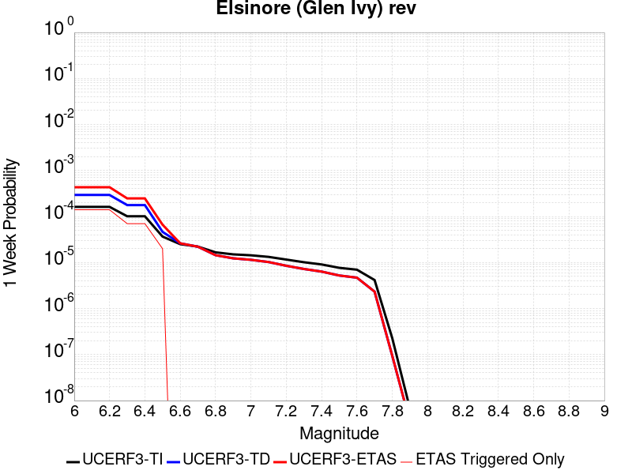 |  |  |  |

| Magnitude | 1 wk TI Prob | 1 wk TD Prob | 1 wk ETAS Prob | 1 wk ETAS/TD Gain | 1 wk ETAS Triggered Only | 1 mo TI Prob | 1 mo TD Prob | 1 mo ETAS Prob | 1 mo ETAS/TD Gain | 1 mo ETAS Triggered Only | 1 yr TI Prob | 1 yr TD Prob | 1 yr ETAS Prob | 1 yr ETAS/TD Gain | 1 yr ETAS Triggered Only | 10 yr TI Prob | 10 yr TD Prob | 10 yr ETAS Prob | 10 yr ETAS/TD Gain | 10 yr ETAS Triggered Only |
|-----|-----|-----|-----|-----|-----|-----|-----|-----|-----|-----|-----|-----|-----|-----|-----|-----|-----|-----|-----|-----|
| 6.0 | 1.6204086E-4 | 2.9360707E-4 | 4.3293898E-4 | 1.4745523 | 1.3937282E-4 | 6.94276E-4 | 0.0012578638 | 0.0014144611 | 1.1244946 | 1.5679443E-4 | 0.008420097 | 0.015234485 | 0.015440359 | 1.0135137 | 2.0905923E-4 | 0.081081145 | 0.13969168 | 0.13987152 | 1.0012875 | 2.0905923E-4 |
| 6.1 | 1.6204086E-4 | 2.9360707E-4 | 4.3293898E-4 | 1.4745523 | 1.3937282E-4 | 6.94276E-4 | 0.0012578638 | 0.0014144611 | 1.1244946 | 1.5679443E-4 | 0.008420097 | 0.015234485 | 0.015440359 | 1.0135137 | 2.0905923E-4 | 0.081081145 | 0.13969168 | 0.13987152 | 1.0012875 | 2.0905923E-4 |
| 6.2 | 1.6204086E-4 | 2.9360707E-4 | 4.3293898E-4 | 1.4745523 | 1.3937282E-4 | 6.94276E-4 | 0.0012578638 | 0.0014144611 | 1.1244946 | 1.5679443E-4 | 0.008420097 | 0.015234485 | 0.015440359 | 1.0135137 | 2.0905923E-4 | 0.081081145 | 0.13969168 | 0.13987152 | 1.0012875 | 2.0905923E-4 |
| 6.3 | 1.0111737E-4 | 1.7703383E-4 | 2.2928938E-4 | 1.2951727 | 5.2264808E-5 | 4.332882E-4 | 7.5861247E-4 | 8.456544E-4 | 1.1147383 | 8.710801E-5 | 0.005262531 | 0.009217682 | 0.00935577 | 1.0149808 | 1.3937282E-4 | 0.0513964 | 0.0870191 | 0.08714634 | 1.0014622 | 1.3937282E-4 |
| 6.4 | 1.0111737E-4 | 1.7703383E-4 | 2.2928938E-4 | 1.2951727 | 5.2264808E-5 | 4.332882E-4 | 7.5861247E-4 | 8.456544E-4 | 1.1147383 | 8.710801E-5 | 0.005262531 | 0.009217682 | 0.00935577 | 1.0149808 | 1.3937282E-4 | 0.0513964 | 0.0870191 | 0.08714634 | 1.0014622 | 1.3937282E-4 |
| 6.5 | 3.6624708E-5 | 4.6391084E-5 | 4.6391084E-5 | 1.0 | 0.0 | 1.569536E-4 | 1.9880582E-4 | 2.1622397E-4 | 1.0876138 | 1.7421602E-5 | 0.001909235 | 0.0024181372 | 0.0024702756 | 1.0215614 | 5.2264808E-5 | 0.01892915 | 0.023739954 | 0.023790978 | 1.0021493 | 5.2264808E-5 |
| 6.6 | 2.5051324E-5 | 2.614772E-5 | 2.614772E-5 | 1.0 | 0.0 | 1.073584E-4 | 1.12057096E-4 | 1.2947674E-4 | 1.1554533 | 1.7421602E-5 | 0.0013063047 | 0.0013634858 | 0.0013982815 | 1.0255196 | 3.4843204E-5 | 0.012986525 | 0.013564618 | 0.013598989 | 1.0025338 | 3.4843204E-5 |
| 6.7 | 2.2189772E-5 | 2.2072849E-5 | 2.2072849E-5 | 1.0 | 0.0 | 9.509556E-5 | 9.4594696E-5 | 9.4594696E-5 | 1.0 | 0.0 | 0.0011571734 | 0.0011511183 | 0.0011685198 | 1.015117 | 1.7421602E-5 | 0.011511663 | 0.011465415 | 0.011482637 | 1.001502 | 1.7421602E-5 |
| 6.8 | 1.6654378E-5 | 1.4437705E-5 | 1.4437705E-5 | 1.0 | 0.0 | 7.137396E-5 | 6.187444E-5 | 6.187444E-5 | 1.0 | 0.0 | 8.686314E-4 | 7.530661E-4 | 7.7047455E-4 | 1.0231168 | 1.7421602E-5 | 0.008652439 | 0.00751048 | 0.007527771 | 1.0023022 | 1.7421602E-5 |
| 6.9 | 1.5042909E-5 | 1.2332022E-5 | 1.2332022E-5 | 1.0 | 0.0 | 6.446802E-5 | 5.285047E-5 | 5.285047E-5 | 1.0 | 0.0 | 7.8461546E-4 | 6.4326765E-4 | 6.606781E-4 | 1.0270655 | 1.7421602E-5 | 0.007818509 | 0.00641828 | 0.00643559 | 1.002697 | 1.7421602E-5 |
| 7.0 | 1.4361385E-5 | 1.1451324E-5 | 1.1451324E-5 | 1.0 | 0.0 | 6.154734E-5 | 4.9076196E-5 | 4.9076196E-5 | 1.0 | 0.0 | 7.490812E-4 | 5.973418E-4 | 6.14753E-4 | 1.0291477 | 1.7421602E-5 | 0.007465612 | 0.0059613534 | 0.005978671 | 1.002905 | 1.7421602E-5 |
| 7.1 | 1.3265571E-5 | 1.0244926E-5 | 1.0244926E-5 | 1.0 | 0.0 | 5.6851208E-5 | 4.39061E-5 | 4.39061E-5 | 1.0 | 0.0 | 6.919436E-4 | 5.344282E-4 | 5.5184047E-4 | 1.0325812 | 1.7421602E-5 | 0.006897931 | 0.0053347866 | 0.0053521153 | 1.0032482 | 1.7421602E-5 |
| 7.2 | 1.1596403E-5 | 8.505067E-6 | 8.505067E-6 | 1.0 | 0.0 | 4.9697923E-5 | 3.6449786E-5 | 3.6449786E-5 | 1.0 | 0.0 | 6.049042E-4 | 4.436875E-4 | 4.436875E-4 | 1.0 | 0.0 | 0.006032603 | 0.0044294316 | 0.0044294316 | 1.0 | 0.0 |
| 7.3 | 1.0150827E-5 | 7.2387597E-6 | 7.2387597E-6 | 1.0 | 0.0 | 4.3502816E-5 | 3.1022897E-5 | 3.1022897E-5 | 1.0 | 0.0 | 5.2951806E-4 | 3.7763975E-4 | 3.7763975E-4 | 1.0 | 0.0 | 0.005282581 | 0.0037703665 | 0.0037703665 | 1.0 | 0.0 |
| 7.4 | 9.080705E-6 | 6.352519E-6 | 6.352519E-6 | 1.0 | 0.0 | 3.8916725E-5 | 2.7224805E-5 | 2.7224805E-5 | 1.0 | 0.0 | 4.7370812E-4 | 3.3141294E-4 | 3.3141294E-4 | 1.0 | 0.0 | 0.004726996 | 0.0033093381 | 0.0033093381 | 1.0 | 0.0 |
| 7.5 | 7.671649E-6 | 5.2256332E-6 | 5.2256332E-6 | 1.0 | 0.0 | 3.287808E-5 | 2.2395385E-5 | 2.2395385E-5 | 1.0 | 0.0 | 4.0021708E-4 | 2.7263095E-4 | 2.7263095E-4 | 1.0 | 0.0 | 0.0039949706 | 0.00272309 | 0.00272309 | 1.0 | 0.0 |
| 7.6 | 6.990086E-6 | 4.687545E-6 | 4.687545E-6 | 1.0 | 0.0 | 2.9957167E-5 | 2.008933E-5 | 2.008933E-5 | 1.0 | 0.0 | 3.6466747E-4 | 2.445613E-4 | 2.445613E-4 | 1.0 | 0.0 | 0.0036406964 | 0.002443038 | 0.002443038 | 1.0 | 0.0 |
| 7.7 | 4.163505E-6 | 2.3295343E-6 | 2.3295343E-6 | 1.0 | 0.0 | 1.7843471E-5 | 9.983683E-6 | 9.983683E-6 | 1.0 | 0.0 | 2.172226E-4 | 1.21545316E-4 | 1.21545316E-4 | 1.0 | 0.0 | 0.0021701038 | 0.0012148614 | 0.0012148614 | 1.0 | 0.0 |
| 7.8 | 2.2692414E-7 | 9.3854695E-8 | 9.3854695E-8 | 1.0 | 0.0 | 9.725317E-7 | 4.0223435E-7 | 4.0223435E-7 | 1.0 | 0.0 | 1.1840509E-5 | 4.8971956E-6 | 4.8971956E-6 | 1.0 | 0.0 | 1.1839878E-4 | 4.8971204E-5 | 4.8971204E-5 | 1.0 | 0.0 |
| 7.9 | 6.676829E-9 | 3.439853E-9 | 3.439853E-9 | 1.0 | 0.0 | 2.861498E-8 | 1.4742227E-8 | 1.4742227E-8 | 1.0 | 0.0 | 3.4838732E-7 | 1.7948659E-7 | 1.7948659E-7 | 1.0 | 0.0 | 3.4838679E-6 | 1.7948646E-6 | 1.7948646E-6 | 1.0 | 0.0 |

## San Andreas (Parkfield)
*[(top)](#table-of-contents)*

| 1 Week | 1 Month | 1 Year | 10 Year |
|-----|-----|-----|-----|
|  |  |  |  |

| Magnitude | 1 wk TI Prob | 1 wk TD Prob | 1 wk ETAS Prob | 1 wk ETAS/TD Gain | 1 wk ETAS Triggered Only | 1 mo TI Prob | 1 mo TD Prob | 1 mo ETAS Prob | 1 mo ETAS/TD Gain | 1 mo ETAS Triggered Only | 1 yr TI Prob | 1 yr TD Prob | 1 yr ETAS Prob | 1 yr ETAS/TD Gain | 1 yr ETAS Triggered Only | 10 yr TI Prob | 10 yr TD Prob | 10 yr ETAS Prob | 10 yr ETAS/TD Gain | 10 yr ETAS Triggered Only |
|-----|-----|-----|-----|-----|-----|-----|-----|-----|-----|-----|-----|-----|-----|-----|-----|-----|-----|-----|-----|-----|
| 6.0 | 5.556969E-4 | 7.7782426E-4 | 8.996806E-4 | 1.1566631 | 1.2195122E-4 | 0.0023793848 | 0.0033298214 | 0.0034513664 | 1.036502 | 1.2195122E-4 | 0.028586963 | 0.040191233 | 0.04037517 | 1.0045766 | 1.9163763E-4 | 0.25176284 | 0.33716413 | 0.33731428 | 1.0004452 | 2.2648084E-4 |
| 6.1 | 1.925858E-4 | 3.0276453E-4 | 3.7242984E-4 | 1.2300973 | 6.968641E-5 | 8.2510663E-4 | 0.0012970108 | 0.0013666068 | 1.0536588 | 6.968641E-5 | 0.0099994885 | 0.015778083 | 0.015880965 | 1.0065205 | 1.04529616E-4 | 0.095613256 | 0.1497237 | 0.14984219 | 1.0007915 | 1.3937282E-4 |
| 6.2 | 9.4306815E-5 | 1.8242796E-4 | 2.5210166E-4 | 1.3819244 | 6.968641E-5 | 4.0410945E-4 | 7.816011E-4 | 8.51233E-4 | 1.0890888 | 6.968641E-5 | 0.0049089384 | 0.009474681 | 0.00957822 | 1.010928 | 1.04529616E-4 | 0.048019063 | 0.09185409 | 0.09198066 | 1.0013779 | 1.3937282E-4 |
| 6.3 | 9.283051E-5 | 1.7939322E-4 | 2.4906712E-4 | 1.3883865 | 6.968641E-5 | 3.9778434E-4 | 7.686027E-4 | 8.3823554E-4 | 1.0905967 | 6.968641E-5 | 0.0048322747 | 0.009317789 | 0.009421345 | 1.0111138 | 1.04529616E-4 | 0.047285385 | 0.09050704 | 0.090633795 | 1.0014006 | 1.3937282E-4 |
| 6.4 | 9.138826E-5 | 1.770153E-4 | 2.466894E-4 | 1.3936048 | 6.968641E-5 | 3.916052E-4 | 7.5841765E-4 | 8.2805124E-4 | 1.0918143 | 6.968641E-5 | 0.0047573745 | 0.00919484 | 0.009298408 | 1.0112637 | 1.04529616E-4 | 0.046568092 | 0.08940927 | 0.08953618 | 1.0014194 | 1.3937282E-4 |
| 6.5 | 9.000255E-5 | 1.7459576E-4 | 2.4427E-4 | 1.3990604 | 6.968641E-5 | 3.8566816E-4 | 7.480541E-4 | 8.176884E-4 | 1.0930872 | 6.968641E-5 | 0.0046854047 | 0.009069731 | 0.009173313 | 1.0114206 | 1.04529616E-4 | 0.045878403 | 0.088295065 | 0.088422135 | 1.0014391 | 1.3937282E-4 |
| 6.6 | 8.8109264E-5 | 1.7140752E-4 | 2.4108199E-4 | 1.4064842 | 6.968641E-5 | 3.7755648E-4 | 7.3439797E-4 | 8.0403325E-4 | 1.0948194 | 6.968641E-5 | 0.0045870654 | 0.008904854 | 0.009008452 | 1.011634 | 1.04529616E-4 | 0.04493529 | 0.0868267 | 0.08695397 | 1.0014658 | 1.3937282E-4 |
| 6.7 | 8.738073E-5 | 1.7007832E-4 | 2.2233425E-4 | 1.3072462 | 5.2264808E-5 | 3.7443507E-4 | 7.287046E-4 | 7.809313E-4 | 1.0716707 | 5.2264808E-5 | 0.0045492216 | 0.008836143 | 0.008922481 | 1.009771 | 8.710801E-5 | 0.04457213 | 0.08622707 | 0.0863385 | 1.0012923 | 1.2195122E-4 |
| 6.8 | 8.710195E-5 | 1.6953335E-4 | 2.2178929E-4 | 1.3082341 | 5.2264808E-5 | 3.7324068E-4 | 7.263703E-4 | 7.7859714E-4 | 1.0719011 | 5.2264808E-5 | 0.0045347405 | 0.008807961 | 0.008894302 | 1.0098026 | 8.710801E-5 | 0.04443313 | 0.08597467 | 0.08608614 | 1.0012965 | 1.2195122E-4 |
| 6.9 | 8.6801556E-5 | 1.689429E-4 | 2.2119888E-4 | 1.3093115 | 5.2264808E-5 | 3.7195362E-4 | 7.2384125E-4 | 7.760682E-4 | 1.0721525 | 5.2264808E-5 | 0.0045191357 | 0.008777418 | 0.008863761 | 1.009837 | 8.710801E-5 | 0.044283327 | 0.085700735 | 0.08581223 | 1.001301 | 1.2195122E-4 |
| 7.0 | 8.5571606E-5 | 1.6647128E-4 | 2.187274E-4 | 1.3139046 | 5.2264808E-5 | 3.6668387E-4 | 7.132544E-4 | 7.6548196E-4 | 1.0732243 | 5.2264808E-5 | 0.004455241 | 0.008649553 | 0.008735908 | 1.0099837 | 8.710801E-5 | 0.043669727 | 0.08454914 | 0.084660776 | 1.0013204 | 1.2195122E-4 |
| 7.1 | 7.82589E-5 | 1.5128135E-4 | 2.0353825E-4 | 1.3454286 | 5.2264808E-5 | 3.3535215E-4 | 6.481883E-4 | 7.0041924E-4 | 1.0805799 | 5.2264808E-5 | 0.0040752706 | 0.007863307 | 0.00794973 | 1.0109906 | 8.710801E-5 | 0.040013418 | 0.07746111 | 0.07757361 | 1.0014524 | 1.2195122E-4 |
| 7.2 | 7.690929E-5 | 1.4865391E-4 | 2.0091094E-4 | 1.351535 | 5.2264808E-5 | 3.2956956E-4 | 6.369334E-4 | 6.891649E-4 | 1.0820047 | 5.2264808E-5 | 0.004005129 | 0.007727258 | 0.007813693 | 1.0111858 | 8.710801E-5 | 0.0393371 | 0.07623427 | 0.07634693 | 1.0014777 | 1.2195122E-4 |
| 7.3 | 7.5543794E-5 | 1.4561978E-4 | 1.9787697E-4 | 1.3588606 | 5.2264808E-5 | 3.2371894E-4 | 6.2393624E-4 | 6.761684E-4 | 1.083714 | 5.2264808E-5 | 0.003934157 | 0.007570127 | 0.0076565756 | 1.0114197 | 8.710801E-5 | 0.038652334 | 0.074797355 | 0.07491018 | 1.0015085 | 1.2195122E-4 |
| 7.4 | 7.4214564E-5 | 1.4262961E-4 | 1.9488696E-4 | 1.366385 | 5.2264808E-5 | 3.1802364E-4 | 6.111273E-4 | 6.633602E-4 | 1.0854697 | 5.2264808E-5 | 0.003865065 | 0.00741525 | 0.007501712 | 1.01166 | 8.710801E-5 | 0.03798529 | 0.07337123 | 0.073484235 | 1.0015402 | 1.2195122E-4 |
| 7.5 | 6.149578E-5 | 1.11907226E-4 | 1.6416618E-4 | 1.4669846 | 5.2264808E-5 | 2.6352672E-4 | 4.7951436E-4 | 5.317541E-4 | 1.108943 | 5.2264808E-5 | 0.0032037178 | 0.0058224914 | 0.0059090923 | 1.0148735 | 8.710801E-5 | 0.03157923 | 0.058557566 | 0.058672376 | 1.0019606 | 1.2195122E-4 |
| 7.6 | 6.0643448E-5 | 1.10193796E-4 | 1.6245285E-4 | 1.4742467 | 5.2264808E-5 | 2.598746E-4 | 4.7217376E-4 | 5.244139E-4 | 1.1106375 | 5.2264808E-5 | 0.0031593828 | 0.0057335934 | 0.005820202 | 1.0151055 | 8.710801E-5 | 0.031148417 | 0.057718582 | 0.057833493 | 1.0019909 | 1.2195122E-4 |
| 7.7 | 5.1652263E-5 | 9.174698E-5 | 1.26587E-4 | 1.3797401 | 3.4843204E-5 | 2.2134806E-4 | 3.931421E-4 | 4.2797162E-4 | 1.0885926 | 3.4843204E-5 | 0.002691582 | 0.0047760103 | 0.004810687 | 1.0072606 | 3.4843204E-5 | 0.026592141 | 0.04853623 | 0.048602533 | 1.001366 | 6.968641E-5 |
| 7.8 | 4.8090482E-5 | 8.559635E-5 | 1.20436576E-4 | 1.4070293 | 3.4843204E-5 | 2.060858E-4 | 3.6678996E-4 | 4.016204E-4 | 1.0949601 | 3.4843204E-5 | 0.0025062072 | 0.0044565317 | 0.0044912198 | 1.0077837 | 3.4843204E-5 | 0.024781305 | 0.04530245 | 0.04536898 | 1.0014685 | 6.968641E-5 |
| 7.9 | 3.970278E-5 | 6.750426E-5 | 8.4924686E-5 | 1.2580642 | 1.7421602E-5 | 1.7014367E-4 | 2.892719E-4 | 3.0668845E-4 | 1.0602083 | 1.7421602E-5 | 0.002069531 | 0.0035162016 | 0.003533562 | 1.0049373 | 1.7421602E-5 | 0.020503636 | 0.035881363 | 0.03593175 | 1.0014043 | 5.2264808E-5 |
| 8.0 | 2.8982335E-5 | 4.069796E-5 | 4.069796E-5 | 1.0 | 0.0 | 1.2420409E-4 | 1.7440817E-4 | 1.7440817E-4 | 1.0 | 0.0 | 0.0015111357 | 0.0021213528 | 0.0021213528 | 1.0 | 0.0 | 0.015009012 | 0.022010697 | 0.022044772 | 1.0015482 | 3.4843204E-5 |
| 8.1 | 1.8836186E-5 | 1.8681134E-5 | 1.8681134E-5 | 1.0 | 0.0 | 8.0724014E-5 | 8.005955E-5 | 8.005955E-5 | 1.0 | 0.0 | 9.823717E-4 | 9.742898E-4 | 9.742898E-4 | 1.0 | 0.0 | 0.009780403 | 0.010488115 | 0.010505355 | 1.0016437 | 1.7421602E-5 |
| 8.2 | 8.643924E-6 | 5.4748625E-6 | 5.4748625E-6 | 1.0 | 0.0 | 3.704486E-5 | 2.3463486E-5 | 2.3463486E-5 | 1.0 | 0.0 | 4.5092785E-4 | 2.8563058E-4 | 2.8563058E-4 | 1.0 | 0.0 | 0.0045001395 | 0.0032487072 | 0.0032487072 | 1.0 | 0.0 |
| 8.3 | 1.983087E-6 | 7.6599065E-7 | 7.6599065E-7 | 1.0 | 0.0 | 8.498917E-6 | 3.282813E-6 | 3.282813E-6 | 1.0 | 0.0 | 1.034694E-4 | 3.9967534E-5 | 3.9967534E-5 | 1.0 | 0.0 | 0.0010342124 | 4.719687E-4 | 4.719687E-4 | 1.0 | 0.0 |

## San Jacinto (San Jacinto Valley) rev
*[(top)](#table-of-contents)*

| 1 Week | 1 Month | 1 Year | 10 Year |
|-----|-----|-----|-----|
|  | 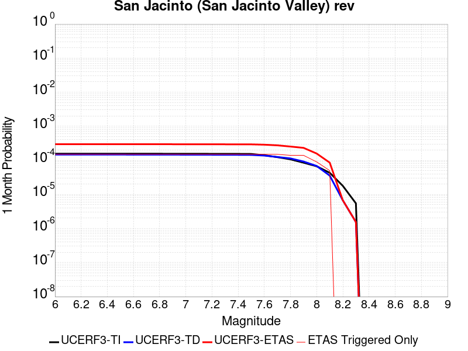 |  |  |

| Magnitude | 1 wk TI Prob | 1 wk TD Prob | 1 wk ETAS Prob | 1 wk ETAS/TD Gain | 1 wk ETAS Triggered Only | 1 mo TI Prob | 1 mo TD Prob | 1 mo ETAS Prob | 1 mo ETAS/TD Gain | 1 mo ETAS Triggered Only | 1 yr TI Prob | 1 yr TD Prob | 1 yr ETAS Prob | 1 yr ETAS/TD Gain | 1 yr ETAS Triggered Only | 10 yr TI Prob | 10 yr TD Prob | 10 yr ETAS Prob | 10 yr ETAS/TD Gain | 10 yr ETAS Triggered Only |
|-----|-----|-----|-----|-----|-----|-----|-----|-----|-----|-----|-----|-----|-----|-----|-----|-----|-----|-----|-----|-----|
| 6.0 | 3.652694E-5 | 3.4402394E-5 | 1.9119143E-4 | 5.5575037 | 1.5679443E-4 | 1.5653463E-4 | 1.474305E-4 | 3.2162084E-4 | 2.181508 | 1.7421602E-4 | 0.0019041431 | 0.00179349 | 0.001984784 | 1.1066601 | 1.9163763E-4 | 0.018879099 | 0.018526595 | 0.01873178 | 1.0110753 | 2.0905923E-4 |
| 6.1 | 3.652694E-5 | 3.4402394E-5 | 1.9119143E-4 | 5.5575037 | 1.5679443E-4 | 1.5653463E-4 | 1.474305E-4 | 3.2162084E-4 | 2.181508 | 1.7421602E-4 | 0.0019041431 | 0.00179349 | 0.001984784 | 1.1066601 | 1.9163763E-4 | 0.018879099 | 0.018526595 | 0.01873178 | 1.0110753 | 2.0905923E-4 |
| 6.2 | 3.652694E-5 | 3.4402394E-5 | 1.9119143E-4 | 5.5575037 | 1.5679443E-4 | 1.5653463E-4 | 1.474305E-4 | 3.2162084E-4 | 2.181508 | 1.7421602E-4 | 0.0019041431 | 0.00179349 | 0.001984784 | 1.1066601 | 1.9163763E-4 | 0.018879099 | 0.018526595 | 0.01873178 | 1.0110753 | 2.0905923E-4 |
| 6.3 | 3.652694E-5 | 3.4402394E-5 | 1.9119143E-4 | 5.5575037 | 1.5679443E-4 | 1.5653463E-4 | 1.474305E-4 | 3.2162084E-4 | 2.181508 | 1.7421602E-4 | 0.0019041431 | 0.00179349 | 0.001984784 | 1.1066601 | 1.9163763E-4 | 0.018879099 | 0.018526595 | 0.01873178 | 1.0110753 | 2.0905923E-4 |
| 6.4 | 3.646941E-5 | 3.432397E-5 | 1.9111301E-4 | 5.567917 | 1.5679443E-4 | 1.5628811E-4 | 1.4709444E-4 | 3.2128484E-4 | 2.184208 | 1.7421602E-4 | 0.0019011468 | 0.0017894056 | 0.0019807003 | 1.106904 | 1.9163763E-4 | 0.018849645 | 0.018486476 | 0.01869167 | 1.0110997 | 2.0905923E-4 |
| 6.5 | 3.646941E-5 | 3.432397E-5 | 1.9111301E-4 | 5.567917 | 1.5679443E-4 | 1.5628811E-4 | 1.4709444E-4 | 3.2128484E-4 | 2.184208 | 1.7421602E-4 | 0.0019011468 | 0.0017894056 | 0.0019807003 | 1.106904 | 1.9163763E-4 | 0.018849645 | 0.018486476 | 0.01869167 | 1.0110997 | 2.0905923E-4 |
| 6.6 | 3.6442503E-5 | 3.4287354E-5 | 1.910764E-4 | 5.5727954 | 1.5679443E-4 | 1.561728E-4 | 1.4693754E-4 | 3.2112797E-4 | 2.1854725 | 1.7421602E-4 | 0.0018997455 | 0.0017874985 | 0.0019787936 | 1.1070184 | 1.9163763E-4 | 0.018835869 | 0.018467745 | 0.018672943 | 1.0111111 | 2.0905923E-4 |
| 6.7 | 3.6432113E-5 | 3.4272925E-5 | 1.9106198E-4 | 5.5747204 | 1.5679443E-4 | 1.5612828E-4 | 1.4687571E-4 | 3.2106615E-4 | 2.1859717 | 1.7421602E-4 | 0.0018992044 | 0.0017867472 | 0.0019780425 | 1.1070634 | 1.9163763E-4 | 0.018830549 | 0.018460369 | 0.018665569 | 1.0111157 | 2.0905923E-4 |
| 6.8 | 3.6409598E-5 | 3.424198E-5 | 1.9103104E-4 | 5.5788546 | 1.5679443E-4 | 1.560318E-4 | 1.4674311E-4 | 3.2093358E-4 | 2.1870437 | 1.7421602E-4 | 0.0018980318 | 0.0017851355 | 0.0019764309 | 1.1071602 | 1.9163763E-4 | 0.018819023 | 0.018444523 | 0.018649727 | 1.0111254 | 2.0905923E-4 |
| 6.9 | 3.638078E-5 | 3.4202407E-5 | 1.9099147E-4 | 5.584153 | 1.5679443E-4 | 1.5590832E-4 | 1.4657351E-4 | 3.20764E-4 | 2.1884172 | 1.7421602E-4 | 0.0018965311 | 0.001783074 | 0.0019743699 | 1.1072843 | 1.9163763E-4 | 0.018804269 | 0.018424258 | 0.018629465 | 1.0111378 | 2.0905923E-4 |
| 7.0 | 3.6294874E-5 | 3.408442E-5 | 1.908735E-4 | 5.600022 | 1.5679443E-4 | 1.5554018E-4 | 1.4606792E-4 | 3.202585E-4 | 2.1925313 | 1.7421602E-4 | 0.0018920569 | 0.001776929 | 0.0019682262 | 1.107656 | 1.9163763E-4 | 0.018760284 | 0.018363839 | 0.01856906 | 1.0111753 | 2.0905923E-4 |
| 7.1 | 3.6260717E-5 | 3.4040702E-5 | 1.9082979E-4 | 5.60593 | 1.5679443E-4 | 1.5539382E-4 | 1.4588058E-4 | 3.2007118E-4 | 2.194063 | 1.7421602E-4 | 0.001890278 | 0.0017746518 | 0.0019659493 | 1.1077944 | 1.9163763E-4 | 0.018742796 | 0.018341439 | 0.018546665 | 1.0111891 | 2.0905923E-4 |
| 7.2 | 3.6210204E-5 | 3.397492E-5 | 1.9076403E-4 | 5.614848 | 1.5679443E-4 | 1.5517735E-4 | 1.455987E-4 | 3.1978937E-4 | 2.1963751 | 1.7421602E-4 | 0.001887647 | 0.0017712255 | 0.0019625237 | 1.1080033 | 1.9163763E-4 | 0.01871693 | 0.01830772 | 0.018512951 | 1.0112101 | 2.0905923E-4 |
| 7.3 | 3.6119454E-5 | 3.386321E-5 | 1.9065232E-4 | 5.6300726 | 1.5679443E-4 | 1.5478847E-4 | 1.4511998E-4 | 3.1931073E-4 | 2.2003224 | 1.7421602E-4 | 0.0018829206 | 0.0017654065 | 0.0019567057 | 1.1083599 | 1.9163763E-4 | 0.018670462 | 0.018250274 | 0.018455517 | 1.0112461 | 2.0905923E-4 |
| 7.4 | 3.607848E-5 | 3.381071E-5 | 1.9059984E-4 | 5.6372623 | 1.5679443E-4 | 1.5461289E-4 | 1.44895E-4 | 3.1908578E-4 | 2.2021863 | 1.7421602E-4 | 0.0018807866 | 0.0017626719 | 0.0019539718 | 1.1085284 | 1.9163763E-4 | 0.018649481 | 0.018223269 | 0.018428518 | 1.011263 | 2.0905923E-4 |
| 7.5 | 3.5856774E-5 | 3.3620483E-5 | 1.9040963E-4 | 5.6635013 | 1.5679443E-4 | 1.5366284E-4 | 1.4407984E-4 | 3.1827076E-4 | 2.208989 | 1.7421602E-4 | 0.0018692396 | 0.0017527633 | 0.001944065 | 1.1091429 | 1.9163763E-4 | 0.018535944 | 0.018124366 | 0.018329637 | 1.0113256 | 2.0905923E-4 |
| 7.6 | 3.286655E-5 | 3.2143445E-5 | 1.8893283E-4 | 5.8778024 | 1.5679443E-4 | 1.4084904E-4 | 1.3775036E-4 | 3.119424E-4 | 2.2645485 | 1.7421602E-4 | 0.001713488 | 0.0016758227 | 0.0018671391 | 1.1141627 | 1.9163763E-4 | 0.017003361 | 0.017344031 | 0.017549464 | 1.0118446 | 2.0905923E-4 |
| 7.7 | 2.8882527E-5 | 2.9236293E-5 | 1.8602614E-4 | 6.362849 | 1.5679443E-4 | 1.237764E-4 | 1.2529238E-4 | 2.994866E-4 | 2.3903015 | 1.7421602E-4 | 0.0015059357 | 0.0015243685 | 0.001715714 | 1.1255244 | 1.9163763E-4 | 0.014957713 | 0.015830461 | 0.01603621 | 1.012997 | 2.0905923E-4 |
| 7.8 | 2.4950225E-5 | 2.6527203E-5 | 1.8331748E-4 | 6.9105463 | 1.5679443E-4 | 1.0692515E-4 | 1.1368306E-4 | 2.878793E-4 | 2.5322971 | 1.7421602E-4 | 0.0013010362 | 0.0013832134 | 0.0015745859 | 1.1383536 | 1.9163763E-4 | 0.012934455 | 0.014411755 | 0.014617801 | 1.0142971 | 2.0905923E-4 |
| 7.9 | 1.9881603E-5 | 2.1507445E-5 | 1.7829849E-4 | 8.290083 | 1.5679443E-4 | 8.520408E-5 | 9.217151E-5 | 2.6637147E-4 | 2.8899546 | 1.7421602E-4 | 0.001036866 | 0.0011216112 | 0.001313034 | 1.1706675 | 1.9163763E-4 | 0.010320415 | 0.011777027 | 0.011983624 | 1.0175424 | 2.0905923E-4 |
| 8.0 | 1.563292E-5 | 1.5937347E-5 | 1.20465294E-4 | 7.55868 | 1.04529616E-4 | 6.6996516E-5 | 6.8301124E-5 | 1.9024401E-4 | 2.7853715 | 1.2195122E-4 | 8.153773E-4 | 8.3124964E-4 | 9.7050663E-4 | 1.1675272 | 1.3937282E-4 | 0.00812392 | 0.008810506 | 0.008965919 | 1.0176395 | 1.5679443E-4 |
| 8.1 | 1.0045313E-5 | 8.301802E-6 | 7.7987635E-5 | 9.39406 | 6.968641E-5 | 4.305063E-5 | 3.5578672E-5 | 1.2268359E-4 | 3.448234 | 8.710801E-5 | 5.2401534E-4 | 4.3308473E-4 | 5.20155E-4 | 1.2010468 | 8.710801E-5 | 0.0052278144 | 0.0046591135 | 0.004763156 | 1.022331 | 1.04529616E-4 |
| 8.2 | 4.1554413E-6 | 1.5655598E-6 | 1.5655598E-6 | 1.0 | 0.0 | 1.7808914E-5 | 6.709525E-6 | 6.709525E-6 | 1.0 | 0.0 | 2.1680194E-4 | 8.168544E-5 | 8.168544E-5 | 1.0 | 0.0 | 0.0021659054 | 9.482903E-4 | 9.482903E-4 | 1.0 | 0.0 |
| 8.3 | 1.2758221E-6 | 3.6149942E-7 | 3.6149942E-7 | 1.0 | 0.0 | 5.4677976E-6 | 1.5492824E-6 | 1.5492824E-6 | 1.0 | 0.0 | 6.65684E-5 | 1.8862354E-5 | 1.8862354E-5 | 1.0 | 0.0 | 6.6548464E-4 | 2.2751294E-4 | 2.2751294E-4 | 1.0 | 0.0 |

## Ludlow
*[(top)](#table-of-contents)*

| 1 Week | 1 Month | 1 Year | 10 Year |
|-----|-----|-----|-----|
|  |  |  |  |

| Magnitude | 1 wk TI Prob | 1 wk TD Prob | 1 wk ETAS Prob | 1 wk ETAS/TD Gain | 1 wk ETAS Triggered Only | 1 mo TI Prob | 1 mo TD Prob | 1 mo ETAS Prob | 1 mo ETAS/TD Gain | 1 mo ETAS Triggered Only | 1 yr TI Prob | 1 yr TD Prob | 1 yr ETAS Prob | 1 yr ETAS/TD Gain | 1 yr ETAS Triggered Only | 10 yr TI Prob | 10 yr TD Prob | 10 yr ETAS Prob | 10 yr ETAS/TD Gain | 10 yr ETAS Triggered Only |
|-----|-----|-----|-----|-----|-----|-----|-----|-----|-----|-----|-----|-----|-----|-----|-----|-----|-----|-----|-----|-----|
| 6.0 | 2.2407607E-5 | 2.3657254E-5 | 1.6302678E-4 | 6.8911963 | 1.3937282E-4 | 9.602906E-5 | 1.0138454E-4 | 2.4074323E-4 | 2.3745556 | 1.3937282E-4 | 0.0011685267 | 0.001233702 | 0.0014251032 | 1.1551439 | 1.9163763E-4 | 0.011624013 | 0.012273042 | 0.012479535 | 1.016825 | 2.0905923E-4 |
| 6.1 | 2.2407607E-5 | 2.3657254E-5 | 1.6302678E-4 | 6.8911963 | 1.3937282E-4 | 9.602906E-5 | 1.0138454E-4 | 2.4074323E-4 | 2.3745556 | 1.3937282E-4 | 0.0011685267 | 0.001233702 | 0.0014251032 | 1.1551439 | 1.9163763E-4 | 0.011624013 | 0.012273042 | 0.012479535 | 1.016825 | 2.0905923E-4 |
| 6.2 | 1.0781252E-5 | 1.1365663E-5 | 8.105128E-5 | 7.131241 | 6.968641E-5 | 4.620455E-5 | 4.8709102E-5 | 1.1839212E-4 | 2.4305954 | 6.968641E-5 | 5.623952E-4 | 5.9287593E-4 | 6.973436E-4 | 1.1762049 | 1.04529616E-4 | 0.00560974 | 0.0059133614 | 0.0060345912 | 1.020501 | 1.2195122E-4 |
| 6.3 | 1.0781252E-5 | 1.1365663E-5 | 8.105128E-5 | 7.131241 | 6.968641E-5 | 4.620455E-5 | 4.8709102E-5 | 1.1839212E-4 | 2.4305954 | 6.968641E-5 | 5.623952E-4 | 5.9287593E-4 | 6.973436E-4 | 1.1762049 | 1.04529616E-4 | 0.00560974 | 0.0059133614 | 0.0060345912 | 1.020501 | 1.2195122E-4 |
| 6.4 | 7.814439E-6 | 8.237729E-6 | 7.792356E-5 | 9.459351 | 6.968641E-5 | 3.3490025E-5 | 3.530408E-5 | 1.0498803E-4 | 2.9738214 | 6.968641E-5 | 4.0766477E-4 | 4.2974384E-4 | 5.342285E-4 | 1.2431325 | 1.04529616E-4 | 0.0040691774 | 0.0042892746 | 0.004393356 | 1.0242655 | 1.04529616E-4 |
| 6.5 | 6.4986366E-6 | 6.85092E-6 | 5.911537E-5 | 8.628822 | 5.2264808E-5 | 2.7851002E-5 | 2.9360759E-5 | 8.1624035E-5 | 2.7800384 | 5.2264808E-5 | 3.390332E-4 | 3.5740953E-4 | 4.4448642E-4 | 1.2436334 | 8.710801E-5 | 0.003385164 | 0.0035684432 | 0.0036552404 | 1.0243236 | 8.710801E-5 |
| 6.6 | 5.582177E-6 | 5.8860055E-6 | 5.8150505E-5 | 9.879452 | 5.2264808E-5 | 2.3923398E-5 | 2.5225498E-5 | 7.7488985E-5 | 3.0718517 | 5.2264808E-5 | 2.9122844E-4 | 3.0707786E-4 | 3.9415914E-4 | 1.2835804 | 8.710801E-5 | 0.0029084706 | 0.003066609 | 0.0031534499 | 1.0283182 | 8.710801E-5 |
| 6.7 | 4.6858763E-6 | 4.940427E-6 | 5.7204976E-5 | 11.578954 | 5.2264808E-5 | 2.0082172E-5 | 2.1173091E-5 | 7.343679E-5 | 3.4684021 | 5.2264808E-5 | 2.4447302E-4 | 2.5775246E-4 | 3.274209E-4 | 1.270292 | 6.968641E-5 | 0.0024420423 | 0.0025745912 | 0.0026440984 | 1.0269973 | 6.968641E-5 |
| 6.8 | 3.5584908E-6 | 3.7520183E-6 | 3.859509E-5 | 10.286489 | 3.4843204E-5 | 1.5250586E-5 | 1.6079981E-5 | 5.0922627E-5 | 3.1668336 | 3.4843204E-5 | 1.8566006E-4 | 1.957566E-4 | 2.4801117E-4 | 1.2669364 | 5.2264808E-5 | 0.0018550502 | 0.0019558826 | 0.0020080453 | 1.0266696 | 5.2264808E-5 |
| 6.9 | 2.532834E-6 | 2.6710034E-6 | 2.009256E-5 | 7.522476 | 1.7421602E-5 | 1.0854958E-5 | 1.1447109E-5 | 2.8868513E-5 | 2.5219042 | 1.7421602E-5 | 1.3215111E-4 | 1.3935992E-4 | 1.5677909E-4 | 1.1249942 | 1.7421602E-5 | 0.0013207254 | 0.0013927529 | 0.0014101502 | 1.0124913 | 1.7421602E-5 |
| 7.0 | 1.7083285E-6 | 1.8019439E-6 | 1.8019439E-6 | 1.0 | 0.0 | 7.3213873E-6 | 7.722595E-6 | 7.722595E-6 | 1.0 | 0.0 | 8.913424E-5 | 9.40187E-5 | 9.40187E-5 | 1.0 | 0.0 | 8.9098496E-4 | 9.3980576E-4 | 9.3980576E-4 | 1.0 | 0.0 |
| 7.1 | 1.0905424E-6 | 1.1497619E-6 | 1.1497619E-6 | 1.0 | 0.0 | 4.6737446E-6 | 4.9275427E-6 | 4.9275427E-6 | 1.0 | 0.0 | 5.6901354E-5 | 5.999128E-5 | 5.999128E-5 | 1.0 | 0.0 | 5.6886784E-4 | 5.997606E-4 | 5.997606E-4 | 1.0 | 0.0 |
| 7.2 | 6.06668E-7 | 6.387277E-7 | 6.387277E-7 | 1.0 | 0.0 | 2.600003E-6 | 2.7374022E-6 | 2.7374022E-6 | 1.0 | 0.0 | 3.1654577E-5 | 3.3327433E-5 | 3.3327433E-5 | 1.0 | 0.0 | 3.1650066E-4 | 3.3323118E-4 | 3.3323118E-4 | 1.0 | 0.0 |

## Manix-Afton Hills
*[(top)](#table-of-contents)*

| 1 Week | 1 Month | 1 Year | 10 Year |
|-----|-----|-----|-----|
|  |  |  |  |

| Magnitude | 1 wk TI Prob | 1 wk TD Prob | 1 wk ETAS Prob | 1 wk ETAS/TD Gain | 1 wk ETAS Triggered Only | 1 mo TI Prob | 1 mo TD Prob | 1 mo ETAS Prob | 1 mo ETAS/TD Gain | 1 mo ETAS Triggered Only | 1 yr TI Prob | 1 yr TD Prob | 1 yr ETAS Prob | 1 yr ETAS/TD Gain | 1 yr ETAS Triggered Only | 10 yr TI Prob | 10 yr TD Prob | 10 yr ETAS Prob | 10 yr ETAS/TD Gain | 10 yr ETAS Triggered Only |
|-----|-----|-----|-----|-----|-----|-----|-----|-----|-----|-----|-----|-----|-----|-----|-----|-----|-----|-----|-----|-----|
| 6.0 | 1.3783202E-5 | 1.47110895E-5 | 1.3666051E-4 | 9.289625 | 1.2195122E-4 | 5.906953E-5 | 6.30461E-5 | 2.1983065E-4 | 3.4868236 | 1.5679443E-4 | 7.189342E-4 | 7.6733343E-4 | 9.414158E-4 | 1.2268666 | 1.7421602E-4 | 0.0071661277 | 0.007648596 | 0.007856056 | 1.0271239 | 2.0905923E-4 |
| 6.1 | 1.3783202E-5 | 1.47110895E-5 | 1.3666051E-4 | 9.289625 | 1.2195122E-4 | 5.906953E-5 | 6.30461E-5 | 2.1983065E-4 | 3.4868236 | 1.5679443E-4 | 7.189342E-4 | 7.6733343E-4 | 9.414158E-4 | 1.2268666 | 1.7421602E-4 | 0.0071661277 | 0.007648596 | 0.007856056 | 1.0271239 | 2.0905923E-4 |
| 6.2 | 1.3783202E-5 | 1.47110895E-5 | 1.3666051E-4 | 9.289625 | 1.2195122E-4 | 5.906953E-5 | 6.30461E-5 | 2.1983065E-4 | 3.4868236 | 1.5679443E-4 | 7.189342E-4 | 7.6733343E-4 | 9.414158E-4 | 1.2268666 | 1.7421602E-4 | 0.0071661277 | 0.007648596 | 0.007856056 | 1.0271239 | 2.0905923E-4 |
| 6.3 | 1.10494875E-5 | 1.1793136E-5 | 8.147873E-5 | 6.9089956 | 6.968641E-5 | 4.7354086E-5 | 5.054109E-5 | 1.5506543E-4 | 3.0681062 | 1.04529616E-4 | 5.763835E-4 | 6.151744E-4 | 7.196397E-4 | 1.1698141 | 1.04529616E-4 | 0.005748908 | 0.0061357557 | 0.0062569585 | 1.0197536 | 1.2195122E-4 |
| 6.4 | 1.10494875E-5 | 1.1793136E-5 | 8.147873E-5 | 6.9089956 | 6.968641E-5 | 4.7354086E-5 | 5.054109E-5 | 1.5506543E-4 | 3.0681062 | 1.04529616E-4 | 5.763835E-4 | 6.151744E-4 | 7.196397E-4 | 1.1698141 | 1.04529616E-4 | 0.005748908 | 0.0061357557 | 0.0062569585 | 1.0197536 | 1.2195122E-4 |
| 6.5 | 9.788949E-6 | 1.045432E-5 | 8.014E-5 | 7.665731 | 6.968641E-5 | 4.1951964E-5 | 4.480351E-5 | 1.4932844E-4 | 3.332963 | 1.04529616E-4 | 5.1064545E-4 | 5.453555E-4 | 6.498281E-4 | 1.1915679 | 1.04529616E-4 | 0.0050947363 | 0.0054410985 | 0.0055450597 | 1.0191066 | 1.04529616E-4 |
| 6.6 | 8.810006E-6 | 9.4136285E-6 | 7.909938E-5 | 8.402646 | 6.968641E-5 | 3.775662E-5 | 4.0343548E-5 | 1.4486894E-4 | 3.5908828 | 1.04529616E-4 | 4.5958988E-4 | 4.9108086E-4 | 5.9555913E-4 | 1.2127517 | 1.04529616E-4 | 0.0045864056 | 0.004900839 | 0.0050048563 | 1.0212244 | 1.04529616E-4 |
| 6.7 | 8.80128E-6 | 9.404108E-6 | 7.908986E-5 | 8.41014 | 6.968641E-5 | 3.7719226E-5 | 4.0302748E-5 | 1.4482815E-4 | 3.5935056 | 1.04529616E-4 | 4.591348E-4 | 4.9058435E-4 | 5.950627E-4 | 1.2129672 | 1.04529616E-4 | 0.004581874 | 0.0048958957 | 0.0049999137 | 1.021246 | 1.04529616E-4 |
| 6.8 | 6.8994877E-6 | 7.380076E-6 | 4.2223026E-5 | 5.721218 | 3.4843204E-5 | 2.9568899E-5 | 3.162856E-5 | 1.0131277E-4 | 3.203205 | 6.968641E-5 | 3.5994186E-4 | 3.8501783E-4 | 4.546774E-4 | 1.1809256 | 6.968641E-5 | 0.003593594 | 0.0038443129 | 0.0039137313 | 1.0180575 | 6.968641E-5 |
| 6.9 | 4.9328037E-6 | 5.2709615E-6 | 2.2692473E-5 | 4.3051867 | 1.7421602E-5 | 2.1140417E-5 | 2.2589675E-5 | 7.48533E-5 | 3.313607 | 5.2264808E-5 | 2.5735417E-4 | 2.7500073E-4 | 3.2725115E-4 | 1.1900011 | 5.2264808E-5 | 0.0025705635 | 0.0027472095 | 0.0027993307 | 1.0189724 | 5.2264808E-5 |
| 7.0 | 3.347973E-6 | 3.59003E-6 | 2.101157E-5 | 5.852756 | 1.7421602E-5 | 1.4348378E-5 | 1.5385775E-5 | 5.0228446E-5 | 3.264603 | 3.4843204E-5 | 1.746775E-4 | 1.8730981E-4 | 2.221465E-4 | 1.1859843 | 3.4843204E-5 | 0.0017454025 | 0.0018719219 | 0.0019067 | 1.0185788 | 3.4843204E-5 |
| 7.1 | 1.2073567E-6 | 1.293482E-6 | 1.293482E-6 | 1.0 | 0.0 | 5.1743755E-6 | 5.543492E-6 | 2.2964998E-5 | 4.1426954 | 1.7421602E-5 | 6.29962E-5 | 6.749156E-5 | 8.491198E-5 | 1.2581127 | 1.7421602E-5 | 6.297835E-4 | 6.7487074E-4 | 6.922806E-4 | 1.0257972 | 1.7421602E-5 |

## San Jacinto (Stepovers Combined)
*[(top)](#table-of-contents)*

| 1 Week | 1 Month | 1 Year | 10 Year |
|-----|-----|-----|-----|
|  |  | 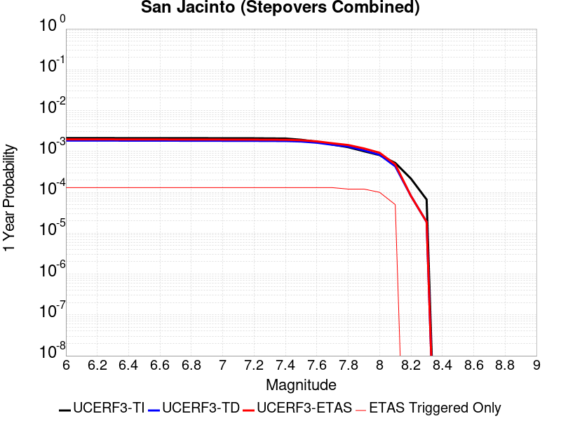 |  |

| Magnitude | 1 wk TI Prob | 1 wk TD Prob | 1 wk ETAS Prob | 1 wk ETAS/TD Gain | 1 wk ETAS Triggered Only | 1 mo TI Prob | 1 mo TD Prob | 1 mo ETAS Prob | 1 mo ETAS/TD Gain | 1 mo ETAS Triggered Only | 1 yr TI Prob | 1 yr TD Prob | 1 yr ETAS Prob | 1 yr ETAS/TD Gain | 1 yr ETAS Triggered Only | 10 yr TI Prob | 10 yr TD Prob | 10 yr ETAS Prob | 10 yr ETAS/TD Gain | 10 yr ETAS Triggered Only |
|-----|-----|-----|-----|-----|-----|-----|-----|-----|-----|-----|-----|-----|-----|-----|-----|-----|-----|-----|-----|-----|
| 6.0 | 4.0667746E-5 | 3.5272755E-5 | 1.7464066E-4 | 4.951149 | 1.3937282E-4 | 1.742787E-4 | 1.5116022E-4 | 3.0793092E-4 | 2.0371163 | 1.5679443E-4 | 0.0021197782 | 0.0018388226 | 0.0020127182 | 1.0945691 | 1.7421602E-4 | 0.020996714 | 0.018986892 | 0.01917489 | 1.0099015 | 1.9163763E-4 |
| 6.1 | 4.0667746E-5 | 3.5272755E-5 | 1.7464066E-4 | 4.951149 | 1.3937282E-4 | 1.742787E-4 | 1.5116022E-4 | 3.0793092E-4 | 2.0371163 | 1.5679443E-4 | 0.0021197782 | 0.0018388226 | 0.0020127182 | 1.0945691 | 1.7421602E-4 | 0.020996714 | 0.018986892 | 0.01917489 | 1.0099015 | 1.9163763E-4 |
| 6.2 | 4.0667746E-5 | 3.5272755E-5 | 1.7464066E-4 | 4.951149 | 1.3937282E-4 | 1.742787E-4 | 1.5116022E-4 | 3.0793092E-4 | 2.0371163 | 1.5679443E-4 | 0.0021197782 | 0.0018388226 | 0.0020127182 | 1.0945691 | 1.7421602E-4 | 0.020996714 | 0.018986892 | 0.01917489 | 1.0099015 | 1.9163763E-4 |
| 6.3 | 4.0667746E-5 | 3.5272755E-5 | 1.7464066E-4 | 4.951149 | 1.3937282E-4 | 1.742787E-4 | 1.5116022E-4 | 3.0793092E-4 | 2.0371163 | 1.5679443E-4 | 0.0021197782 | 0.0018388226 | 0.0020127182 | 1.0945691 | 1.7421602E-4 | 0.020996714 | 0.018986892 | 0.01917489 | 1.0099015 | 1.9163763E-4 |
| 6.4 | 4.0577226E-5 | 3.5144654E-5 | 1.7451258E-4 | 4.965551 | 1.3937282E-4 | 1.738908E-4 | 1.5061127E-4 | 3.0738208E-4 | 2.040897 | 1.5679443E-4 | 0.0021150648 | 0.0018321523 | 0.002006049 | 1.094914 | 1.7421602E-4 | 0.020950472 | 0.018921461 | 0.019109473 | 1.0099365 | 1.9163763E-4 |
| 6.5 | 4.0577226E-5 | 3.5144654E-5 | 1.7451258E-4 | 4.965551 | 1.3937282E-4 | 1.738908E-4 | 1.5061127E-4 | 3.0738208E-4 | 2.040897 | 1.5679443E-4 | 0.0021150648 | 0.0018321523 | 0.002006049 | 1.094914 | 1.7421602E-4 | 0.020950472 | 0.018921461 | 0.019109473 | 1.0099365 | 1.9163763E-4 |
| 6.6 | 4.053861E-5 | 3.509E-5 | 1.7445793E-4 | 4.971728 | 1.3937282E-4 | 1.7372532E-4 | 1.5037706E-4 | 3.0714792E-4 | 2.0425184 | 1.5679443E-4 | 0.0021130538 | 0.0018293057 | 0.002003203 | 1.0950619 | 1.7421602E-4 | 0.020930743 | 0.018893538 | 0.019081555 | 1.0099514 | 1.9163763E-4 |
| 6.7 | 4.0516545E-5 | 3.5059067E-5 | 1.74427E-4 | 4.975232 | 1.3937282E-4 | 1.7363077E-4 | 1.5024451E-4 | 3.0701538E-4 | 2.0434382 | 1.5679443E-4 | 0.002111905 | 0.001827695 | 0.0020015927 | 1.0951458 | 1.7421602E-4 | 0.020919468 | 0.018877735 | 0.019065754 | 1.0099599 | 1.9163763E-4 |
| 6.8 | 4.049434E-5 | 3.5030633E-5 | 1.7439858E-4 | 4.9784594 | 1.3937282E-4 | 1.7353562E-4 | 1.5012265E-4 | 3.0689355E-4 | 2.0442853 | 1.5679443E-4 | 0.0021107488 | 0.0018262138 | 0.0020001116 | 1.0952232 | 1.7421602E-4 | 0.020908125 | 0.018863149 | 0.01905117 | 1.0099677 | 1.9163763E-4 |
| 6.9 | 4.046386E-5 | 3.499319E-5 | 1.7436114E-4 | 4.982716 | 1.3937282E-4 | 1.73405E-4 | 1.4996222E-4 | 3.0673313E-4 | 2.0454028 | 1.5679443E-4 | 0.0021091616 | 0.0018242638 | 0.001998162 | 1.0953251 | 1.7421602E-4 | 0.020892553 | 0.01884392 | 0.019031947 | 1.009978 | 1.9163763E-4 |
| 7.0 | 4.036382E-5 | 3.487376E-5 | 1.7424172E-4 | 4.9963565 | 1.3937282E-4 | 1.7297632E-4 | 1.4945042E-4 | 3.0622142E-4 | 2.0489833 | 1.5679443E-4 | 0.0021039525 | 0.0018180435 | 0.0019919428 | 1.0956519 | 1.7421602E-4 | 0.02084144 | 0.018782536 | 0.018970573 | 1.0100113 | 1.9163763E-4 |
| 7.1 | 4.0343282E-5 | 3.4852223E-5 | 1.7422019E-4 | 4.998826 | 1.3937282E-4 | 1.7288832E-4 | 1.4935812E-4 | 3.0612914E-4 | 2.0496316 | 1.5679443E-4 | 0.002102883 | 0.0018169218 | 0.0019908212 | 1.095711 | 1.7421602E-4 | 0.020830948 | 0.018771412 | 0.018959453 | 1.0100174 | 1.9163763E-4 |
| 7.2 | 4.0257353E-5 | 3.4756722E-5 | 1.741247E-4 | 5.009814 | 1.3937282E-4 | 1.725201E-4 | 1.489489E-4 | 3.0571996E-4 | 2.0525157 | 1.5679443E-4 | 0.0020984085 | 0.0018119477 | 0.001985848 | 1.0959743 | 1.7421602E-4 | 0.020787042 | 0.018722152 | 0.018910201 | 1.0100442 | 1.9163763E-4 |
| 7.3 | 3.9940667E-5 | 3.4584376E-5 | 1.7395237E-4 | 5.0297966 | 1.3937282E-4 | 1.7116306E-4 | 1.4821035E-4 | 3.0498154E-4 | 2.0577614 | 1.5679443E-4 | 0.0020819185 | 0.0018029709 | 0.0019768728 | 1.096453 | 1.7421602E-4 | 0.020625217 | 0.018630784 | 0.018818852 | 1.0100944 | 1.9163763E-4 |
| 7.4 | 3.9721202E-5 | 3.4469766E-5 | 1.7383779E-4 | 5.0431957 | 1.3937282E-4 | 1.7022261E-4 | 1.4771923E-4 | 3.0449047E-4 | 2.0612786 | 1.5679443E-4 | 0.0020704903 | 0.0017970012 | 0.0019709042 | 1.096774 | 1.7421602E-4 | 0.020513052 | 0.018569905 | 0.018757986 | 1.0101281 | 1.9163763E-4 |
| 7.5 | 3.7036873E-5 | 3.3537188E-5 | 1.7290533E-4 | 5.15563 | 1.3937282E-4 | 1.5871979E-4 | 1.437229E-4 | 3.0049478E-4 | 2.0907927 | 1.5679443E-4 | 0.0019307006 | 0.0017484248 | 0.0019223363 | 1.0994675 | 1.7421602E-4 | 0.019140124 | 0.018071463 | 0.018259639 | 1.0104128 | 1.9163763E-4 |
| 7.6 | 3.2940967E-5 | 3.1317984E-5 | 1.7068644E-4 | 5.450109 | 1.3937282E-4 | 1.4116794E-4 | 1.3421304E-4 | 2.9098644E-4 | 2.1680934 | 1.5679443E-4 | 0.0017173645 | 0.0016328214 | 0.0018067529 | 1.1065221 | 1.7421602E-4 | 0.01704153 | 0.016904354 | 0.017092751 | 1.011145 | 1.9163763E-4 |
| 7.7 | 2.8236149E-5 | 2.7883889E-5 | 1.6725283E-4 | 5.9981885 | 1.3937282E-4 | 1.2100645E-4 | 1.19496915E-4 | 2.762726E-4 | 2.3119643 | 1.5679443E-4 | 0.0014722579 | 0.001453905 | 0.0016278678 | 1.119652 | 1.7421602E-4 | 0.014625421 | 0.015115095 | 0.015303836 | 1.0124869 | 1.9163763E-4 |
| 7.8 | 2.4329287E-5 | 2.5207537E-5 | 1.6457685E-4 | 6.5288744 | 1.3937282E-4 | 1.042642E-4 | 1.0802783E-4 | 2.648053E-4 | 2.4512694 | 1.5679443E-4 | 0.0012686774 | 0.0013144462 | 0.0014884332 | 1.1323652 | 1.7421602E-4 | 0.012614589 | 0.013712396 | 0.013901406 | 1.0137838 | 1.9163763E-4 |
| 7.9 | 1.9370926E-5 | 2.0421452E-5 | 1.5979142E-4 | 7.824685 | 1.3937282E-4 | 8.301561E-5 | 8.7517576E-5 | 2.4429828E-4 | 2.7914197 | 1.5679443E-4 | 0.0010102465 | 0.0010650064 | 0.0012390369 | 1.1634079 | 1.7421602E-4 | 0.0100566605 | 0.011199483 | 0.011388973 | 1.0169196 | 1.9163763E-4 |
| 8.0 | 1.5583017E-5 | 1.588647E-5 | 1.2041443E-4 | 7.5796847 | 1.04529616E-4 | 6.6782646E-5 | 6.808309E-5 | 1.9002601E-4 | 2.7910895 | 1.2195122E-4 | 8.127754E-4 | 8.285971E-4 | 9.6785446E-4 | 1.168064 | 1.3937282E-4 | 0.008098091 | 0.008781809 | 0.008937228 | 1.0176977 | 1.5679443E-4 |
| 8.1 | 1.0024873E-5 | 8.292404E-6 | 7.7978235E-5 | 9.403574 | 6.968641E-5 | 4.2963035E-5 | 3.5538393E-5 | 1.2264331E-4 | 3.4510088 | 8.710801E-5 | 5.229494E-4 | 4.3259456E-4 | 5.196649E-4 | 1.2012746 | 8.710801E-5 | 0.0052172043 | 0.0046534105 | 0.0047574537 | 1.0223585 | 1.04529616E-4 |
| 8.2 | 4.142796E-6 | 1.5610041E-6 | 1.5610041E-6 | 1.0 | 0.0 | 1.775472E-5 | 6.69E-6 | 6.69E-6 | 1.0 | 0.0 | 2.1614227E-4 | 8.144774E-5 | 8.144774E-5 | 1.0 | 0.0 | 0.0021593217 | 9.454649E-4 | 9.454649E-4 | 1.0 | 0.0 |
| 8.3 | 1.2750878E-6 | 3.612133E-7 | 3.612133E-7 | 1.0 | 0.0 | 5.4646503E-6 | 1.548056E-6 | 1.548056E-6 | 1.0 | 0.0 | 6.653009E-5 | 1.8847424E-5 | 1.8847424E-5 | 1.0 | 0.0 | 6.6510175E-4 | 2.2734253E-4 | 2.2734253E-4 | 1.0 | 0.0 |

## Calico-Hidalgo
*[(top)](#table-of-contents)*

| 1 Week | 1 Month | 1 Year | 10 Year |
|-----|-----|-----|-----|
|  |  |  |  |

| Magnitude | 1 wk TI Prob | 1 wk TD Prob | 1 wk ETAS Prob | 1 wk ETAS/TD Gain | 1 wk ETAS Triggered Only | 1 mo TI Prob | 1 mo TD Prob | 1 mo ETAS Prob | 1 mo ETAS/TD Gain | 1 mo ETAS Triggered Only | 1 yr TI Prob | 1 yr TD Prob | 1 yr ETAS Prob | 1 yr ETAS/TD Gain | 1 yr ETAS Triggered Only | 10 yr TI Prob | 10 yr TD Prob | 10 yr ETAS Prob | 10 yr ETAS/TD Gain | 10 yr ETAS Triggered Only |
|-----|-----|-----|-----|-----|-----|-----|-----|-----|-----|-----|-----|-----|-----|-----|-----|-----|-----|-----|-----|-----|
| 6.0 | 4.0906612E-5 | 5.0703686E-5 | 1.55228E-4 | 3.0614736 | 1.04529616E-4 | 1.7530227E-4 | 2.172857E-4 | 3.392104E-4 | 1.5611264 | 1.2195122E-4 | 0.0021322158 | 0.002642648 | 0.002799028 | 1.0591755 | 1.5679443E-4 | 0.02111873 | 0.026152607 | 0.026322266 | 1.0064873 | 1.7421602E-4 |
| 6.1 | 4.0906612E-5 | 5.0703686E-5 | 1.55228E-4 | 3.0614736 | 1.04529616E-4 | 1.7530227E-4 | 2.172857E-4 | 3.392104E-4 | 1.5611264 | 1.2195122E-4 | 0.0021322158 | 0.002642648 | 0.002799028 | 1.0591755 | 1.5679443E-4 | 0.02111873 | 0.026152607 | 0.026322266 | 1.0064873 | 1.7421602E-4 |
| 6.2 | 4.0906612E-5 | 5.0703686E-5 | 1.55228E-4 | 3.0614736 | 1.04529616E-4 | 1.7530227E-4 | 2.172857E-4 | 3.392104E-4 | 1.5611264 | 1.2195122E-4 | 0.0021322158 | 0.002642648 | 0.002799028 | 1.0591755 | 1.5679443E-4 | 0.02111873 | 0.026152607 | 0.026322266 | 1.0064873 | 1.7421602E-4 |
| 6.3 | 2.4242801E-5 | 3.0090669E-5 | 6.493283E-5 | 2.1579058 | 3.4843204E-5 | 1.0389358E-4 | 1.2895382E-4 | 1.8121189E-4 | 1.4052464 | 5.2264808E-5 | 0.0012641704 | 0.0015689151 | 0.0016558864 | 1.0554341 | 8.710801E-5 | 0.01257003 | 0.01558206 | 0.01568496 | 1.0066038 | 1.04529616E-4 |
| 6.4 | 2.4242801E-5 | 3.0090669E-5 | 6.493283E-5 | 2.1579058 | 3.4843204E-5 | 1.0389358E-4 | 1.2895382E-4 | 1.8121189E-4 | 1.4052464 | 5.2264808E-5 | 0.0012641704 | 0.0015689151 | 0.0016558864 | 1.0554341 | 8.710801E-5 | 0.01257003 | 0.01558206 | 0.01568496 | 1.0066038 | 1.04529616E-4 |
| 6.5 | 2.0286952E-5 | 2.5315738E-5 | 6.015806E-5 | 2.3763108 | 3.4843204E-5 | 8.694118E-5 | 1.0849161E-4 | 1.6075074E-4 | 1.4816883 | 5.2264808E-5 | 0.0010579949 | 0.001320102 | 0.0013896965 | 1.052719 | 6.968641E-5 | 0.010529719 | 0.013124538 | 0.013210502 | 1.00655 | 8.710801E-5 |
| 6.6 | 2.0269223E-5 | 2.5296687E-5 | 6.0139013E-5 | 2.3773472 | 3.4843204E-5 | 8.6865206E-5 | 1.08409964E-4 | 1.6066911E-4 | 1.4820511 | 5.2264808E-5 | 0.0010570707 | 0.0013191093 | 0.0013887038 | 1.0527587 | 6.968641E-5 | 0.010520565 | 0.013114728 | 0.013200693 | 1.0065548 | 8.710801E-5 |
| 6.7 | 1.799852E-5 | 2.25406E-5 | 5.7383022E-5 | 2.5457628 | 3.4843204E-5 | 7.713423E-5 | 9.659908E-5 | 1.4885883E-4 | 1.5409964 | 5.2264808E-5 | 9.3870464E-4 | 0.0011754738 | 0.0012450783 | 1.059214 | 6.968641E-5 | 0.009347493 | 0.011694173 | 0.011780263 | 1.0073618 | 8.710801E-5 |
| 6.8 | 1.7458793E-5 | 2.184212E-5 | 5.6684563E-5 | 2.595195 | 3.4843204E-5 | 7.4821255E-5 | 9.3605806E-5 | 1.4586572E-4 | 1.5582978 | 5.2264808E-5 | 9.10568E-4 | 0.0011390693 | 0.0012086764 | 1.0611087 | 6.968641E-5 | 0.009068459 | 0.011333893 | 0.011420014 | 1.0075985 | 8.710801E-5 |
| 6.9 | 1.542884E-5 | 1.9025927E-5 | 5.386847E-5 | 2.831319 | 3.4843204E-5 | 6.612192E-5 | 8.153721E-5 | 1.3379776E-4 | 1.640941 | 5.2264808E-5 | 8.04737E-4 | 9.922766E-4 | 0.0010618939 | 1.0701591 | 6.968641E-5 | 0.008018291 | 0.009879857 | 0.009948855 | 1.0069836 | 6.968641E-5 |
| 7.0 | 1.468253E-5 | 1.8030598E-5 | 5.2873176E-5 | 2.9324138 | 3.4843204E-5 | 6.292361E-5 | 7.7271776E-5 | 1.2953255E-4 | 1.6763241 | 5.2264808E-5 | 7.658257E-4 | 9.4039086E-4 | 0.0010100118 | 1.074034 | 6.968641E-5 | 0.0076319184 | 0.009365481 | 0.009434515 | 1.0073711 | 6.968641E-5 |
| 7.1 | 1.3139281E-5 | 1.6200942E-5 | 3.3622262E-5 | 2.0753276 | 1.7421602E-5 | 5.6309986E-5 | 6.943083E-5 | 1.0427162E-4 | 1.5018057 | 3.4843204E-5 | 6.853584E-4 | 8.4500515E-4 | 8.798189E-4 | 1.0411994 | 3.4843204E-5 | 0.0068324856 | 0.0084192185 | 0.008453769 | 1.0041037 | 3.4843204E-5 |
| 7.2 | 1.1127404E-5 | 1.3866597E-5 | 3.128796E-5 | 2.2563543 | 1.7421602E-5 | 4.7688E-5 | 5.942698E-5 | 7.684755E-5 | 1.2931424 | 1.7421602E-5 | 5.8044674E-4 | 7.232942E-4 | 7.407032E-4 | 1.0240691 | 1.7421602E-5 | 0.0057893298 | 0.0072105085 | 0.0072278045 | 1.0023987 | 1.7421602E-5 |
| 7.3 | 9.808154E-6 | 1.2176215E-5 | 1.2176215E-5 | 1.0 | 0.0 | 4.2034266E-5 | 5.2182797E-5 | 5.2182797E-5 | 1.0 | 0.0 | 5.11647E-4 | 6.3515105E-4 | 6.3515105E-4 | 1.0 | 0.0 | 0.0051047057 | 0.006334433 | 0.006334433 | 1.0 | 0.0 |
| 7.4 | 7.942452E-6 | 9.792144E-6 | 9.792144E-6 | 1.0 | 0.0 | 3.4038632E-5 | 4.1965708E-5 | 4.1965708E-5 | 1.0 | 0.0 | 4.1434157E-4 | 5.1082217E-4 | 5.1082217E-4 | 1.0 | 0.0 | 0.0041356985 | 0.005097421 | 0.005097421 | 1.0 | 0.0 |
| 7.5 | 4.7121216E-6 | 5.772836E-6 | 5.772836E-6 | 1.0 | 0.0 | 2.019465E-5 | 2.4740535E-5 | 2.4740535E-5 | 1.0 | 0.0 | 2.4584212E-4 | 3.0118204E-4 | 3.0118204E-4 | 1.0 | 0.0 | 0.0024557032 | 0.0030084911 | 0.0030084911 | 1.0 | 0.0 |
| 7.6 | 2.21172E-7 | 2.603961E-7 | 2.603961E-7 | 1.0 | 0.0 | 9.478797E-7 | 1.1159829E-6 | 1.1159829E-6 | 1.0 | 0.0 | 1.1540374E-5 | 1.3587036E-5 | 1.3587036E-5 | 1.0 | 0.0 | 1.1539775E-4 | 1.3586486E-4 | 1.3586486E-4 | 1.0 | 0.0 |

## San Andreas (Cholame) rev
*[(top)](#table-of-contents)*

| 1 Week | 1 Month | 1 Year | 10 Year |
|-----|-----|-----|-----|
|  |  |  |  |

| Magnitude | 1 wk TI Prob | 1 wk TD Prob | 1 wk ETAS Prob | 1 wk ETAS/TD Gain | 1 wk ETAS Triggered Only | 1 mo TI Prob | 1 mo TD Prob | 1 mo ETAS Prob | 1 mo ETAS/TD Gain | 1 mo ETAS Triggered Only | 1 yr TI Prob | 1 yr TD Prob | 1 yr ETAS Prob | 1 yr ETAS/TD Gain | 1 yr ETAS Triggered Only | 10 yr TI Prob | 10 yr TD Prob | 10 yr ETAS Prob | 10 yr ETAS/TD Gain | 10 yr ETAS Triggered Only |
|-----|-----|-----|-----|-----|-----|-----|-----|-----|-----|-----|-----|-----|-----|-----|-----|-----|-----|-----|-----|-----|
| 6.0 | 1.2302514E-4 | 2.5204287E-4 | 3.3912892E-4 | 1.3455209 | 8.710801E-5 | 5.27144E-4 | 0.0010797381 | 0.001184155 | 1.0967057 | 1.04529616E-4 | 0.0063991086 | 0.0130670825 | 0.013204634 | 1.0105265 | 1.3937282E-4 | 0.06217949 | 0.12439073 | 0.12454327 | 1.0012263 | 1.7421602E-4 |
| 6.1 | 1.2302514E-4 | 2.5204287E-4 | 3.3912892E-4 | 1.3455209 | 8.710801E-5 | 5.27144E-4 | 0.0010797381 | 0.001184155 | 1.0967057 | 1.04529616E-4 | 0.0063991086 | 0.0130670825 | 0.013204634 | 1.0105265 | 1.3937282E-4 | 0.06217949 | 0.12439073 | 0.12454327 | 1.0012263 | 1.7421602E-4 |
| 6.2 | 1.2203569E-4 | 2.5021084E-4 | 3.3729707E-4 | 1.3480513 | 8.710801E-5 | 5.2290526E-4 | 0.0010718931 | 0.0011763107 | 1.0974141 | 1.04529616E-4 | 0.006347804 | 0.01297271 | 0.013110274 | 1.0106041 | 1.3937282E-4 | 0.061695136 | 0.12357691 | 0.123729594 | 1.0012356 | 1.7421602E-4 |
| 6.3 | 1.2142645E-4 | 2.4907055E-4 | 3.3615687E-4 | 1.3496451 | 8.710801E-5 | 5.202953E-4 | 0.0010670102 | 0.0011714282 | 1.0978605 | 1.04529616E-4 | 0.006316212 | 0.012913967 | 0.01305154 | 1.010653 | 1.3937282E-4 | 0.06139677 | 0.12307103 | 0.123223804 | 1.0012413 | 1.7421602E-4 |
| 6.4 | 1.1865206E-4 | 2.44126E-4 | 3.3121277E-4 | 1.3567287 | 8.710801E-5 | 5.0840975E-4 | 0.0010458364 | 0.0011502567 | 1.0998439 | 1.04529616E-4 | 0.006172335 | 0.012659196 | 0.012796804 | 1.0108702 | 1.3937282E-4 | 0.060036868 | 0.1208638 | 0.121016964 | 1.0012672 | 1.7421602E-4 |
| 6.5 | 1.17443946E-4 | 2.4205919E-4 | 3.2914613E-4 | 1.3597753 | 8.710801E-5 | 5.032341E-4 | 0.0010369857 | 0.0011414068 | 1.1006969 | 1.04529616E-4 | 0.006109677 | 0.012552682 | 0.012690306 | 1.0109637 | 1.3937282E-4 | 0.059444077 | 0.11993805 | 0.12009137 | 1.0012783 | 1.7421602E-4 |
| 6.6 | 1.13579066E-4 | 2.3514954E-4 | 3.2223706E-4 | 1.3703495 | 8.710801E-5 | 4.866766E-4 | 0.001007396 | 0.0011118203 | 1.1036576 | 1.04529616E-4 | 0.0059092017 | 0.012196515 | 0.0123341875 | 1.0112879 | 1.3937282E-4 | 0.057545185 | 0.11685214 | 0.117006004 | 1.0013167 | 1.7421602E-4 |
| 6.7 | 1.1271412E-4 | 2.3359268E-4 | 3.2068035E-4 | 1.3728185 | 8.710801E-5 | 4.829711E-4 | 0.0010007289 | 0.0011051539 | 1.1043489 | 1.04529616E-4 | 0.005864331 | 0.012116249 | 0.012253933 | 1.0113636 | 1.3937282E-4 | 0.057119697 | 0.116155714 | 0.116309695 | 1.0013256 | 1.7421602E-4 |
| 6.8 | 1.1217975E-4 | 2.3247694E-4 | 3.1956472E-4 | 1.3746082 | 8.710801E-5 | 4.8068175E-4 | 9.959509E-4 | 0.0011003764 | 1.10485 | 1.04529616E-4 | 0.005836608 | 0.012058721 | 0.012196413 | 1.0114185 | 1.3937282E-4 | 0.056856725 | 0.11565396 | 0.11580803 | 1.0013322 | 1.7421602E-4 |
| 6.9 | 1.1146753E-4 | 2.3096445E-4 | 3.1805233E-4 | 1.3770618 | 8.710801E-5 | 4.7763053E-4 | 9.894737E-4 | 0.0010938998 | 1.105537 | 1.04529616E-4 | 0.0057996577 | 0.011980731 | 0.0121184345 | 1.0114937 | 1.3937282E-4 | 0.056506127 | 0.11497439 | 0.11512858 | 1.001341 | 1.7421602E-4 |
| 7.0 | 1.0965793E-4 | 2.2719789E-4 | 3.1428612E-4 | 1.3833144 | 8.710801E-5 | 4.698779E-4 | 9.733434E-4 | 0.0010777713 | 1.1072878 | 1.04529616E-4 | 0.005705768 | 0.011786487 | 0.0119242165 | 1.0116854 | 1.3937282E-4 | 0.055614736 | 0.11327597 | 0.11343045 | 1.0013638 | 1.7421602E-4 |
| 7.1 | 9.927982E-5 | 2.0538924E-4 | 2.9247935E-4 | 1.4240248 | 8.710801E-5 | 4.2541555E-4 | 8.7994366E-4 | 9.843813E-4 | 1.1186867 | 1.04529616E-4 | 0.0051671406 | 0.010660981 | 0.010798868 | 1.0129339 | 1.3937282E-4 | 0.05048634 | 0.1033706 | 0.10352681 | 1.0015111 | 1.7421602E-4 |
| 7.2 | 9.696786E-5 | 2.0043184E-4 | 2.875224E-4 | 1.4345145 | 8.710801E-5 | 4.1551032E-4 | 8.5871184E-4 | 9.631517E-4 | 1.1216239 | 1.04529616E-4 | 0.00504711 | 0.010404981 | 0.010542903 | 1.0132555 | 1.3937282E-4 | 0.04934009 | 0.1011086 | 0.1012652 | 1.0015489 | 1.7421602E-4 |
| 7.3 | 9.4727984E-5 | 1.9472468E-4 | 2.8181574E-4 | 1.4472523 | 8.710801E-5 | 4.0591392E-4 | 8.3426846E-4 | 9.387109E-4 | 1.1251904 | 1.04529616E-4 | 0.0049308087 | 0.010110183 | 0.010248146 | 1.013646 | 1.3937282E-4 | 0.048228268 | 0.09847952 | 0.098636575 | 1.0015949 | 1.7421602E-4 |
| 7.4 | 9.220358E-5 | 1.8843076E-4 | 2.7552235E-4 | 1.4621942 | 8.710801E-5 | 3.9509835E-4 | 8.073114E-4 | 9.117566E-4 | 1.1293741 | 1.04529616E-4 | 0.004799717 | 0.009784967 | 0.009922976 | 1.0141042 | 1.3937282E-4 | 0.046973653 | 0.095557496 | 0.09571507 | 1.0016489 | 1.7421602E-4 |
| 7.5 | 7.71631E-5 | 1.5177966E-4 | 2.214555E-4 | 1.4590591 | 6.968641E-5 | 3.306571E-4 | 6.503223E-4 | 7.3737366E-4 | 1.1338588 | 8.710801E-5 | 0.0040183207 | 0.007889002 | 0.008009991 | 1.0153364 | 1.2195122E-4 | 0.03946433 | 0.07828531 | 0.078429826 | 1.0018461 | 1.5679443E-4 |
| 7.6 | 7.5634416E-5 | 1.483744E-4 | 2.1805047E-4 | 1.4695964 | 6.968641E-5 | 3.241072E-4 | 6.3573546E-4 | 7.227881E-4 | 1.1369321 | 8.710801E-5 | 0.0039388672 | 0.0077126776 | 0.0078336885 | 1.0156898 | 1.2195122E-4 | 0.038697794 | 0.07664872 | 0.0767935 | 1.0018889 | 1.5679443E-4 |
| 7.7 | 6.3783E-5 | 1.235872E-4 | 1.584261E-4 | 1.2818973 | 3.4843204E-5 | 2.7332708E-4 | 5.29552E-4 | 5.817891E-4 | 1.098644 | 5.2264808E-5 | 0.0033226798 | 0.0064282627 | 0.0064801914 | 1.0080782 | 5.2264808E-5 | 0.032734364 | 0.06454029 | 0.06462178 | 1.0012625 | 8.710801E-5 |
| 7.8 | 5.863422E-5 | 1.1416107E-4 | 1.490003E-4 | 1.305176 | 3.4843204E-5 | 2.512653E-4 | 4.8917E-4 | 5.414093E-4 | 1.1067916 | 5.2264808E-5 | 0.003054864 | 0.0059394026 | 0.005991357 | 1.0087475 | 5.2264808E-5 | 0.030132094 | 0.059659187 | 0.0597411 | 1.0013729 | 8.710801E-5 |
| 7.9 | 4.595283E-5 | 8.426331E-5 | 1.0168344E-4 | 1.2067345 | 1.7421602E-5 | 1.9692584E-4 | 3.610785E-4 | 3.9590913E-4 | 1.0964627 | 3.4843204E-5 | 0.0023949358 | 0.0043872762 | 0.0044219666 | 1.007907 | 3.4843204E-5 | 0.023692891 | 0.044362005 | 0.0444286 | 1.0015012 | 6.968641E-5 |
| 8.0 | 3.2950178E-5 | 5.0772942E-5 | 5.0772942E-5 | 1.0 | 0.0 | 1.412074E-4 | 2.1758018E-4 | 2.3499799E-4 | 1.0800524 | 1.7421602E-5 | 0.0017178444 | 0.0026458222 | 0.002663198 | 1.0065671 | 1.7421602E-5 | 0.017046256 | 0.027180137 | 0.027230982 | 1.0018706 | 5.2264808E-5 |
| 8.1 | 1.9177472E-5 | 1.9185145E-5 | 1.9185145E-5 | 1.0 | 0.0 | 8.218658E-5 | 8.221946E-5 | 8.221946E-5 | 1.0 | 0.0 | 0.0010001622 | 0.0010005629 | 0.0010005629 | 1.0 | 0.0 | 0.009956728 | 0.010758142 | 0.010775376 | 1.0016019 | 1.7421602E-5 |
| 8.2 | 8.643924E-6 | 5.4748625E-6 | 5.4748625E-6 | 1.0 | 0.0 | 3.704486E-5 | 2.3463486E-5 | 2.3463486E-5 | 1.0 | 0.0 | 4.5092785E-4 | 2.8563058E-4 | 2.8563058E-4 | 1.0 | 0.0 | 0.0045001395 | 0.0032487072 | 0.0032487072 | 1.0 | 0.0 |
| 8.3 | 1.983087E-6 | 7.6599065E-7 | 7.6599065E-7 | 1.0 | 0.0 | 8.498917E-6 | 3.282813E-6 | 3.282813E-6 | 1.0 | 0.0 | 1.034694E-4 | 3.9967534E-5 | 3.9967534E-5 | 1.0 | 0.0 | 0.0010342124 | 4.719687E-4 | 4.719687E-4 | 1.0 | 0.0 |

## San Andreas (Carrizo) rev
*[(top)](#table-of-contents)*

| 1 Week | 1 Month | 1 Year | 10 Year |
|-----|-----|-----|-----|
|  |  |  |  |

| Magnitude | 1 wk TI Prob | 1 wk TD Prob | 1 wk ETAS Prob | 1 wk ETAS/TD Gain | 1 wk ETAS Triggered Only | 1 mo TI Prob | 1 mo TD Prob | 1 mo ETAS Prob | 1 mo ETAS/TD Gain | 1 mo ETAS Triggered Only | 1 yr TI Prob | 1 yr TD Prob | 1 yr ETAS Prob | 1 yr ETAS/TD Gain | 1 yr ETAS Triggered Only | 10 yr TI Prob | 10 yr TD Prob | 10 yr ETAS Prob | 10 yr ETAS/TD Gain | 10 yr ETAS Triggered Only |
|-----|-----|-----|-----|-----|-----|-----|-----|-----|-----|-----|-----|-----|-----|-----|-----|-----|-----|-----|-----|-----|
| 6.0 | 1.1674632E-4 | 2.432302E-4 | 3.477344E-4 | 1.4296514 | 1.04529616E-4 | 5.002454E-4 | 0.0010420004 | 0.0011638245 | 1.1169137 | 1.2195122E-4 | 0.006073493 | 0.012613042 | 0.012767859 | 1.0122744 | 1.5679443E-4 | 0.0591016 | 0.12061418 | 0.1207827 | 1.0013973 | 1.9163763E-4 |
| 6.1 | 1.1674632E-4 | 2.432302E-4 | 3.477344E-4 | 1.4296514 | 1.04529616E-4 | 5.002454E-4 | 0.0010420004 | 0.0011638245 | 1.1169137 | 1.2195122E-4 | 0.006073493 | 0.012613042 | 0.012767859 | 1.0122744 | 1.5679443E-4 | 0.0591016 | 0.12061418 | 0.1207827 | 1.0013973 | 1.9163763E-4 |
| 6.2 | 1.1674632E-4 | 2.432302E-4 | 3.477344E-4 | 1.4296514 | 1.04529616E-4 | 5.002454E-4 | 0.0010420004 | 0.0011638245 | 1.1169137 | 1.2195122E-4 | 0.006073493 | 0.012613042 | 0.012767859 | 1.0122744 | 1.5679443E-4 | 0.0591016 | 0.12061418 | 0.1207827 | 1.0013973 | 1.9163763E-4 |
| 6.3 | 1.1674632E-4 | 2.432302E-4 | 3.477344E-4 | 1.4296514 | 1.04529616E-4 | 5.002454E-4 | 0.0010420004 | 0.0011638245 | 1.1169137 | 1.2195122E-4 | 0.006073493 | 0.012613042 | 0.012767859 | 1.0122744 | 1.5679443E-4 | 0.0591016 | 0.12061418 | 0.1207827 | 1.0013973 | 1.9163763E-4 |
| 6.4 | 1.1674632E-4 | 2.432302E-4 | 3.477344E-4 | 1.4296514 | 1.04529616E-4 | 5.002454E-4 | 0.0010420004 | 0.0011638245 | 1.1169137 | 1.2195122E-4 | 0.006073493 | 0.012613042 | 0.012767859 | 1.0122744 | 1.5679443E-4 | 0.0591016 | 0.12061418 | 0.1207827 | 1.0013973 | 1.9163763E-4 |
| 6.5 | 1.13136164E-4 | 2.3643032E-4 | 3.4093522E-4 | 1.4420115 | 1.04529616E-4 | 4.847792E-4 | 0.0010128808 | 0.0011347085 | 1.1202784 | 1.2195122E-4 | 0.0058862255 | 0.012262545 | 0.012417416 | 1.0126296 | 1.5679443E-4 | 0.057327334 | 0.117585555 | 0.11775465 | 1.0014381 | 1.9163763E-4 |
| 6.6 | 1.13136164E-4 | 2.3643032E-4 | 3.4093522E-4 | 1.4420115 | 1.04529616E-4 | 4.847792E-4 | 0.0010128808 | 0.0011347085 | 1.1202784 | 1.2195122E-4 | 0.0058862255 | 0.012262545 | 0.012417416 | 1.0126296 | 1.5679443E-4 | 0.057327334 | 0.117585555 | 0.11775465 | 1.0014381 | 1.9163763E-4 |
| 6.7 | 1.1149675E-4 | 2.3334254E-4 | 3.3784777E-4 | 1.4478619 | 1.04529616E-4 | 4.777557E-4 | 9.996577E-4 | 0.001121487 | 1.121871 | 1.2195122E-4 | 0.0058011734 | 0.012103349 | 0.012258246 | 1.0127978 | 1.5679443E-4 | 0.05652051 | 0.1162071 | 0.11637647 | 1.0014575 | 1.9163763E-4 |
| 6.8 | 1.1103589E-4 | 2.3236412E-4 | 3.3686945E-4 | 1.4497482 | 1.04529616E-4 | 4.7578133E-4 | 9.954676E-4 | 0.0011172976 | 1.1223845 | 1.2195122E-4 | 0.005777263 | 0.012052901 | 0.012207806 | 1.0128521 | 1.5679443E-4 | 0.056293584 | 0.1157674 | 0.11593685 | 1.0014638 | 1.9163763E-4 |
| 6.9 | 1.1053259E-4 | 2.3128795E-4 | 3.357934E-4 | 1.4518412 | 1.04529616E-4 | 4.7362508E-4 | 9.90859E-4 | 0.0011126894 | 1.1229542 | 1.2195122E-4 | 0.0057511497 | 0.01199741 | 0.0121523235 | 1.0129123 | 1.5679443E-4 | 0.05604569 | 0.11528359 | 0.11545314 | 1.0014707 | 1.9163763E-4 |
| 7.0 | 1.1005377E-4 | 2.3029637E-4 | 3.348019E-4 | 1.4537872 | 1.04529616E-4 | 4.7157376E-4 | 9.866126E-4 | 0.0011084435 | 1.123484 | 1.2195122E-4 | 0.0057263062 | 0.011946279 | 0.0121012 | 1.0129682 | 1.5679443E-4 | 0.055809796 | 0.11483591 | 0.11500554 | 1.0014771 | 1.9163763E-4 |
| 7.1 | 1.0308142E-4 | 2.1539345E-4 | 3.1990054E-4 | 1.4851917 | 1.04529616E-4 | 4.417027E-4 | 9.227892E-4 | 0.0010446279 | 1.1320331 | 1.2195122E-4 | 0.0053644776 | 0.011177397 | 0.011332439 | 1.0138711 | 1.5679443E-4 | 0.052368138 | 0.108092256 | 0.10826318 | 1.0015813 | 1.9163763E-4 |
| 7.2 | 1.0027479E-4 | 2.094724E-4 | 3.1398013E-4 | 1.4989092 | 1.04529616E-4 | 4.296783E-4 | 8.9743105E-4 | 0.0010192728 | 1.1357673 | 1.2195122E-4 | 0.0052187922 | 0.010871782 | 0.011026872 | 1.0142653 | 1.5679443E-4 | 0.050979212 | 0.10539625 | 0.105567686 | 1.0016266 | 1.9163763E-4 |
| 7.3 | 9.816942E-5 | 2.0422463E-4 | 3.087329E-4 | 1.511732 | 1.04529616E-4 | 4.2065824E-4 | 8.7495585E-4 | 9.968004E-4 | 1.1392579 | 1.2195122E-4 | 0.005109493 | 0.010600842 | 0.010755974 | 1.014634 | 1.5679443E-4 | 0.049935985 | 0.102979995 | 0.1031519 | 1.0016693 | 1.9163763E-4 |
| 7.4 | 9.5634205E-5 | 1.9791997E-4 | 3.024289E-4 | 1.5280364 | 1.04529616E-4 | 4.0979648E-4 | 8.479536E-4 | 9.6980145E-4 | 1.1436963 | 1.2195122E-4 | 0.0049778637 | 0.010275229 | 0.010430412 | 1.0151026 | 1.5679443E-4 | 0.048678253 | 0.10006632 | 0.10023878 | 1.0017235 | 1.9163763E-4 |
| 7.5 | 8.052417E-5 | 1.611261E-4 | 2.3080128E-4 | 1.4324265 | 6.968641E-5 | 3.4505792E-4 | 6.903579E-4 | 7.7740574E-4 | 1.126091 | 8.710801E-5 | 0.0041929903 | 0.008372796 | 0.008493726 | 1.0144433 | 1.2195122E-4 | 0.04114753 | 0.08281049 | 0.0829543 | 1.0017366 | 1.5679443E-4 |
| 7.6 | 7.897024E-5 | 1.5765853E-4 | 2.2733396E-4 | 1.4419388 | 6.968641E-5 | 3.384E-4 | 6.755046E-4 | 7.625538E-4 | 1.1288654 | 8.710801E-5 | 0.0041122385 | 0.008193332 | 0.0083142845 | 1.0147623 | 1.2195122E-4 | 0.040369697 | 0.08115171 | 0.08129577 | 1.0017753 | 1.5679443E-4 |
| 7.7 | 6.707427E-5 | 1.3276102E-4 | 1.675996E-4 | 1.2624158 | 3.4843204E-5 | 2.8742946E-4 | 5.688518E-4 | 6.2108686E-4 | 1.0918255 | 5.2264808E-5 | 0.003493839 | 0.00690381 | 0.006955714 | 1.0075182 | 5.2264808E-5 | 0.034394164 | 0.069048055 | 0.069129154 | 1.0011744 | 8.710801E-5 |
| 7.8 | 6.147705E-5 | 1.2197486E-4 | 1.5681383E-4 | 1.285624 | 3.4843204E-5 | 2.6344648E-4 | 5.226447E-4 | 5.748822E-4 | 1.0999484 | 5.2264808E-5 | 0.0032027436 | 0.006344659 | 0.006396592 | 1.0081854 | 5.2264808E-5 | 0.031569764 | 0.06351457 | 0.06359614 | 1.0012844 | 8.710801E-5 |
| 7.9 | 4.7636717E-5 | 8.87977E-5 | 1.06217754E-4 | 1.1961769 | 1.7421602E-5 | 2.0414138E-4 | 3.8050607E-4 | 4.1533602E-4 | 1.0915358 | 3.4843204E-5 | 0.0024825884 | 0.0046228287 | 0.0046575107 | 1.0075023 | 3.4843204E-5 | 0.024550365 | 0.046628095 | 0.046694532 | 1.0014248 | 6.968641E-5 |
| 8.0 | 3.3554235E-5 | 5.2136907E-5 | 5.2136907E-5 | 1.0 | 0.0 | 1.4379594E-4 | 2.2342477E-4 | 2.4084248E-4 | 1.0779579 | 1.7421602E-5 | 0.0017493097 | 0.002716805 | 0.0027341794 | 1.0063951 | 1.7421602E-5 | 0.017356034 | 0.027880952 | 0.027931761 | 1.0018224 | 5.2264808E-5 |
| 8.1 | 1.9175432E-5 | 1.9184976E-5 | 1.9184976E-5 | 1.0 | 0.0 | 8.217783E-5 | 8.2218736E-5 | 8.2218736E-5 | 1.0 | 0.0 | 0.0010000558 | 0.0010005541 | 0.0010005541 | 1.0 | 0.0 | 0.009955673 | 0.0107580265 | 0.010775261 | 1.0016019 | 1.7421602E-5 |
| 8.2 | 8.643924E-6 | 5.4748625E-6 | 5.4748625E-6 | 1.0 | 0.0 | 3.704486E-5 | 2.3463486E-5 | 2.3463486E-5 | 1.0 | 0.0 | 4.5092785E-4 | 2.8563058E-4 | 2.8563058E-4 | 1.0 | 0.0 | 0.0045001395 | 0.0032487072 | 0.0032487072 | 1.0 | 0.0 |
| 8.3 | 1.983087E-6 | 7.6599065E-7 | 7.6599065E-7 | 1.0 | 0.0 | 8.498917E-6 | 3.282813E-6 | 3.282813E-6 | 1.0 | 0.0 | 1.034694E-4 | 3.9967534E-5 | 3.9967534E-5 | 1.0 | 0.0 | 0.0010342124 | 4.719687E-4 | 4.719687E-4 | 1.0 | 0.0 |

## San Andreas (North Branch Mill Creek)
*[(top)](#table-of-contents)*

| 1 Week | 1 Month | 1 Year | 10 Year |
|-----|-----|-----|-----|
|  |  |  |  |

| Magnitude | 1 wk TI Prob | 1 wk TD Prob | 1 wk ETAS Prob | 1 wk ETAS/TD Gain | 1 wk ETAS Triggered Only | 1 mo TI Prob | 1 mo TD Prob | 1 mo ETAS Prob | 1 mo ETAS/TD Gain | 1 mo ETAS Triggered Only | 1 yr TI Prob | 1 yr TD Prob | 1 yr ETAS Prob | 1 yr ETAS/TD Gain | 1 yr ETAS Triggered Only | 10 yr TI Prob | 10 yr TD Prob | 10 yr ETAS Prob | 10 yr ETAS/TD Gain | 10 yr ETAS Triggered Only |
|-----|-----|-----|-----|-----|-----|-----|-----|-----|-----|-----|-----|-----|-----|-----|-----|-----|-----|-----|-----|-----|
| 6.0 | 1.3461156E-5 | 2.3499893E-5 | 1.6286944E-4 | 6.930646 | 1.3937282E-4 | 5.7689394E-5 | 1.00709956E-4 | 2.574886E-4 | 2.556734 | 1.5679443E-4 | 7.02142E-4 | 0.0012254574 | 0.0013994599 | 1.1419898 | 1.7421602E-4 | 0.0069992766 | 0.01222957 | 0.012418863 | 1.0154784 | 1.9163763E-4 |
| 6.1 | 1.3461156E-5 | 2.3499893E-5 | 1.6286944E-4 | 6.930646 | 1.3937282E-4 | 5.7689394E-5 | 1.00709956E-4 | 2.574886E-4 | 2.556734 | 1.5679443E-4 | 7.02142E-4 | 0.0012254574 | 0.0013994599 | 1.1419898 | 1.7421602E-4 | 0.0069992766 | 0.01222957 | 0.012418863 | 1.0154784 | 1.9163763E-4 |
| 6.2 | 1.3461156E-5 | 2.3499893E-5 | 1.6286944E-4 | 6.930646 | 1.3937282E-4 | 5.7689394E-5 | 1.00709956E-4 | 2.574886E-4 | 2.556734 | 1.5679443E-4 | 7.02142E-4 | 0.0012254574 | 0.0013994599 | 1.1419898 | 1.7421602E-4 | 0.0069992766 | 0.01222957 | 0.012418863 | 1.0154784 | 1.9163763E-4 |
| 6.3 | 1.3461156E-5 | 2.3499893E-5 | 1.6286944E-4 | 6.930646 | 1.3937282E-4 | 5.7689394E-5 | 1.00709956E-4 | 2.574886E-4 | 2.556734 | 1.5679443E-4 | 7.02142E-4 | 0.0012254574 | 0.0013994599 | 1.1419898 | 1.7421602E-4 | 0.0069992766 | 0.01222957 | 0.012418863 | 1.0154784 | 1.9163763E-4 |
| 6.4 | 1.3461156E-5 | 2.3499893E-5 | 1.6286944E-4 | 6.930646 | 1.3937282E-4 | 5.7689394E-5 | 1.00709956E-4 | 2.574886E-4 | 2.556734 | 1.5679443E-4 | 7.02142E-4 | 0.0012254574 | 0.0013994599 | 1.1419898 | 1.7421602E-4 | 0.0069992766 | 0.01222957 | 0.012418863 | 1.0154784 | 1.9163763E-4 |
| 6.5 | 1.3450706E-5 | 2.3488852E-5 | 1.628584E-4 | 6.9334335 | 1.3937282E-4 | 5.764461E-5 | 1.0066265E-4 | 2.5744128E-4 | 2.557466 | 1.5679443E-4 | 7.0159714E-4 | 0.001224882 | 0.0013988846 | 1.1420567 | 1.7421602E-4 | 0.006993862 | 0.01222388 | 0.012413175 | 1.0154856 | 1.9163763E-4 |
| 6.6 | 1.3074523E-5 | 2.3103135E-5 | 1.6247274E-4 | 7.0324974 | 1.3937282E-4 | 5.6032466E-5 | 9.9009696E-5 | 2.557886E-4 | 2.58347 | 1.5679443E-4 | 6.8198174E-4 | 0.0012047797 | 0.0013787858 | 1.1444298 | 1.7421602E-4 | 0.006798926 | 0.012025044 | 0.0122143775 | 1.0157449 | 1.9163763E-4 |
| 6.7 | 1.3050216E-5 | 2.3078432E-5 | 1.6244804E-4 | 7.0389547 | 1.3937282E-4 | 5.59283E-5 | 9.890384E-5 | 2.5568274E-4 | 2.5851653 | 1.5679443E-4 | 6.8071426E-4 | 0.0012034923 | 0.0013774986 | 1.1445845 | 1.7421602E-4 | 0.0067863287 | 0.012012309 | 0.0122016445 | 1.0157619 | 1.9163763E-4 |
| 6.8 | 1.29049395E-5 | 2.292684E-5 | 1.6229646E-4 | 7.0788846 | 1.3937282E-4 | 5.530571E-5 | 9.825421E-5 | 2.5503323E-4 | 2.5956469 | 1.5679443E-4 | 6.73139E-4 | 0.0011955918 | 0.0013695995 | 1.1455411 | 1.7421602E-4 | 0.0067110364 | 0.011934154 | 0.012123505 | 1.0158663 | 1.9163763E-4 |
| 6.9 | 1.2867369E-5 | 2.2886245E-5 | 1.6225588E-4 | 7.089668 | 1.3937282E-4 | 5.51447E-5 | 9.8080236E-5 | 2.5485927E-4 | 2.5984774 | 1.5679443E-4 | 6.711799E-4 | 0.0011934759 | 0.0013674841 | 1.1457994 | 1.7421602E-4 | 0.006691564 | 0.011913223 | 0.012102578 | 1.0158945 | 1.9163763E-4 |
| 7.0 | 1.2495996E-5 | 2.2286325E-5 | 1.6165605E-4 | 7.2535977 | 1.3937282E-4 | 5.3553173E-5 | 9.550934E-5 | 2.522888E-4 | 2.641509 | 1.5679443E-4 | 6.518148E-4 | 0.0011622087 | 0.0013362223 | 1.1497266 | 1.7421602E-4 | 0.0064990623 | 0.0116038285 | 0.011793243 | 1.0163234 | 1.9163763E-4 |
| 7.1 | 1.2452067E-5 | 2.2231397E-5 | 1.6160113E-4 | 7.269049 | 1.3937282E-4 | 5.3364907E-5 | 9.527396E-5 | 2.5205343E-4 | 2.645565 | 1.5679443E-4 | 6.4952404E-4 | 0.0011593461 | 0.0013333601 | 1.1500968 | 1.7421602E-4 | 0.0064762887 | 0.0115755 | 0.011764919 | 1.0163639 | 1.9163763E-4 |
| 7.2 | 1.2002777E-5 | 2.1609963E-5 | 1.6097978E-4 | 7.4493313 | 1.3937282E-4 | 5.143946E-5 | 9.2610855E-5 | 2.4939075E-4 | 2.692889 | 1.5679443E-4 | 6.2609545E-4 | 0.0011269567 | 0.0013009763 | 1.1544156 | 1.7421602E-4 | 0.006243344 | 0.011254923 | 0.011444404 | 1.0168353 | 1.9163763E-4 |
| 7.3 | 1.1923425E-5 | 2.1479793E-5 | 1.6084962E-4 | 7.4884157 | 1.3937282E-4 | 5.109939E-5 | 9.205302E-5 | 2.48833E-4 | 2.7031488 | 1.5679443E-4 | 6.219575E-4 | 0.001120172 | 0.0012941929 | 1.1553519 | 1.7421602E-4 | 0.0062021962 | 0.011187789 | 0.011377282 | 1.0169375 | 1.9163763E-4 |
| 7.4 | 1.16105175E-5 | 2.0853771E-5 | 1.6022369E-4 | 7.6831994 | 1.3937282E-4 | 4.975841E-5 | 8.937026E-5 | 2.4615068E-4 | 2.7542794 | 1.5679443E-4 | 6.0564023E-4 | 0.0010875424 | 0.001261569 | 1.1600182 | 1.7421602E-4 | 0.006039923 | 0.010865397 | 0.011054952 | 1.0174458 | 1.9163763E-4 |
| 7.5 | 1.1037265E-5 | 1.9553907E-5 | 1.58924E-4 | 8.1274805 | 1.3937282E-4 | 4.7301706E-5 | 8.379978E-5 | 2.4058107E-4 | 2.8709033 | 1.5679443E-4 | 5.757461E-4 | 0.0010197869 | 0.0011938253 | 1.1706614 | 1.7421602E-4 | 0.005742567 | 0.010194898 | 0.010384581 | 1.0186057 | 1.9163763E-4 |
| 7.6 | 1.0720915E-5 | 1.899582E-5 | 1.5836599E-4 | 8.336887 | 1.3937282E-4 | 4.5945973E-5 | 8.140812E-5 | 2.3818978E-4 | 2.9258723 | 1.5679443E-4 | 5.592486E-4 | 9.906954E-4 | 0.0011647388 | 1.175678 | 1.7421602E-4 | 0.005578433 | 0.009906623 | 0.010096361 | 1.0191528 | 1.9163763E-4 |
| 7.7 | 9.276279E-6 | 1.6441649E-5 | 1.5581217E-4 | 9.476676 | 1.3937282E-4 | 3.9754876E-5 | 7.0462316E-5 | 2.2724569E-4 | 3.2250671 | 1.5679443E-4 | 4.839081E-4 | 8.575427E-4 | 0.0010316094 | 1.202983 | 1.7421602E-4 | 0.0048285574 | 0.008586041 | 0.008776033 | 1.022128 | 1.9163763E-4 |
| 7.8 | 5.8346777E-6 | 1.1155013E-5 | 1.5052628E-4 | 13.494047 | 1.3937282E-4 | 2.5005522E-5 | 4.7806327E-5 | 2.0459325E-4 | 4.2796273 | 1.5679443E-4 | 3.043997E-4 | 5.818867E-4 | 7.5600133E-4 | 1.2992244 | 1.7421602E-4 | 0.0030398308 | 0.0058469265 | 0.0060374434 | 1.0325842 | 1.9163763E-4 |
| 7.9 | 4.690204E-6 | 8.509093E-6 | 1.4788072E-4 | 17.37914 | 1.3937282E-4 | 2.0100719E-5 | 3.6467034E-5 | 1.9325574E-4 | 5.299464 | 1.5679443E-4 | 2.4469878E-4 | 4.4389578E-4 | 6.1803445E-4 | 1.3922963 | 1.7421602E-4 | 0.002444295 | 0.0044707474 | 0.004661528 | 1.0426731 | 1.9163763E-4 |
| 8.0 | 2.9570454E-6 | 4.846947E-6 | 5.71115E-5 | 11.782985 | 5.2264808E-5 | 1.267299E-5 | 2.0772464E-5 | 9.0457426E-5 | 4.3546796 | 6.968641E-5 | 1.5428272E-4 | 2.5287544E-4 | 3.399614E-4 | 1.344383 | 8.710801E-5 | 0.0015417566 | 0.002549644 | 0.0026539073 | 1.0408932 | 1.04529616E-4 |
| 8.1 | 1.6376824E-6 | 2.1968929E-6 | 2.1968929E-6 | 1.0 | 0.0 | 7.01862E-6 | 9.41522E-6 | 9.41522E-6 | 1.0 | 0.0 | 8.544835E-5 | 1.14624294E-4 | 1.14624294E-4 | 1.0 | 0.0 | 8.54155E-4 | 0.0011606582 | 0.0011780596 | 1.0149927 | 1.7421602E-5 |
| 8.2 | 6.9631557E-7 | 4.5360213E-7 | 4.5360213E-7 | 1.0 | 0.0 | 2.984206E-6 | 1.9440076E-6 | 1.9440076E-6 | 1.0 | 0.0 | 3.63321E-5 | 2.3668037E-5 | 2.3668037E-5 | 1.0 | 0.0 | 3.6326164E-4 | 2.451564E-4 | 2.451564E-4 | 1.0 | 0.0 |
| 8.3 | 1.7876137E-7 | 8.360375E-8 | 8.360375E-8 | 1.0 | 0.0 | 7.661199E-7 | 3.5830175E-7 | 3.5830175E-7 | 1.0 | 0.0 | 9.32747E-6 | 4.3623154E-6 | 4.3623154E-6 | 1.0 | 0.0 | 9.3270784E-5 | 4.5817014E-5 | 4.5817014E-5 | 1.0 | 0.0 |

## Death Valley (Fish Lake Valley)
*[(top)](#table-of-contents)*

| 1 Week | 1 Month | 1 Year | 10 Year |
|-----|-----|-----|-----|
|  |  | 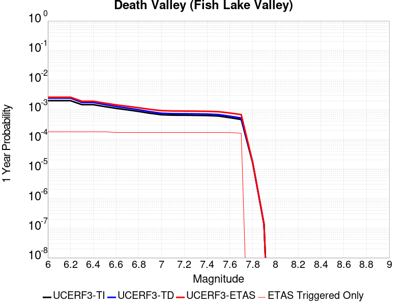 |  |

| Magnitude | 1 wk TI Prob | 1 wk TD Prob | 1 wk ETAS Prob | 1 wk ETAS/TD Gain | 1 wk ETAS Triggered Only | 1 mo TI Prob | 1 mo TD Prob | 1 mo ETAS Prob | 1 mo ETAS/TD Gain | 1 mo ETAS Triggered Only | 1 yr TI Prob | 1 yr TD Prob | 1 yr ETAS Prob | 1 yr ETAS/TD Gain | 1 yr ETAS Triggered Only | 10 yr TI Prob | 10 yr TD Prob | 10 yr ETAS Prob | 10 yr ETAS/TD Gain | 10 yr ETAS Triggered Only |
|-----|-----|-----|-----|-----|-----|-----|-----|-----|-----|-----|-----|-----|-----|-----|-----|-----|-----|-----|-----|-----|
| 6.0 | 3.872328E-5 | 4.7267473E-5 | 1.1695059E-4 | 2.4742298 | 6.968641E-5 | 1.6594635E-4 | 2.0256084E-4 | 3.0706928E-4 | 1.515936 | 1.04529616E-4 | 0.0020185246 | 0.002463534 | 0.0026025635 | 1.056435 | 1.3937282E-4 | 0.02000288 | 0.024388181 | 0.024558147 | 1.0069692 | 1.7421602E-4 |
| 6.1 | 3.872328E-5 | 4.7267473E-5 | 1.1695059E-4 | 2.4742298 | 6.968641E-5 | 1.6594635E-4 | 2.0256084E-4 | 3.0706928E-4 | 1.515936 | 1.04529616E-4 | 0.0020185246 | 0.002463534 | 0.0026025635 | 1.056435 | 1.3937282E-4 | 0.02000288 | 0.024388181 | 0.024558147 | 1.0069692 | 1.7421602E-4 |
| 6.2 | 3.872328E-5 | 4.7267473E-5 | 1.1695059E-4 | 2.4742298 | 6.968641E-5 | 1.6594635E-4 | 2.0256084E-4 | 3.0706928E-4 | 1.515936 | 1.04529616E-4 | 0.0020185246 | 0.002463534 | 0.0026025635 | 1.056435 | 1.3937282E-4 | 0.02000288 | 0.024388181 | 0.024558147 | 1.0069692 | 1.7421602E-4 |
| 6.3 | 2.8356371E-5 | 3.3609853E-5 | 1.0329392E-4 | 3.0733228 | 6.968641E-5 | 1.2152165E-4 | 1.4403471E-4 | 2.4854927E-4 | 1.7256206 | 1.04529616E-4 | 0.0014785219 | 0.0017522911 | 0.0018914196 | 1.0793982 | 1.3937282E-4 | 0.014687235 | 0.017391782 | 0.017562969 | 1.0098429 | 1.7421602E-4 |
| 6.4 | 2.8356371E-5 | 3.3609853E-5 | 1.0329392E-4 | 3.0733228 | 6.968641E-5 | 1.2152165E-4 | 1.4403471E-4 | 2.4854927E-4 | 1.7256206 | 1.04529616E-4 | 0.0014785219 | 0.0017522911 | 0.0018914196 | 1.0793982 | 1.3937282E-4 | 0.014687235 | 0.017391782 | 0.017562969 | 1.0098429 | 1.7421602E-4 |
| 6.5 | 2.4448687E-5 | 2.8607552E-5 | 9.8291974E-5 | 3.435875 | 6.968641E-5 | 1.0477588E-4 | 1.2259831E-4 | 2.2711512E-4 | 1.8525141 | 1.04529616E-4 | 0.0012748998 | 0.0014916632 | 0.001630828 | 1.0932951 | 1.3937282E-4 | 0.012676105 | 0.014821377 | 0.01499301 | 1.0115801 | 1.7421602E-4 |
| 6.6 | 2.1298161E-5 | 2.4660083E-5 | 9.4344774E-5 | 3.8258092 | 6.968641E-5 | 9.127464E-5 | 1.0568198E-4 | 1.9278079E-4 | 1.8241595 | 8.710801E-5 | 0.0011107022 | 0.0012859525 | 0.0014077469 | 1.0947114 | 1.2195122E-4 | 0.011051672 | 0.012788526 | 0.012943314 | 1.0121038 | 1.5679443E-4 |
| 6.7 | 1.8959729E-5 | 2.1781025E-5 | 9.146592E-5 | 4.1993394 | 6.968641E-5 | 8.125345E-5 | 9.334405E-5 | 1.8044394E-4 | 1.9331058 | 8.710801E-5 | 9.888117E-4 | 0.001135897 | 0.0012577097 | 1.1072392 | 1.2195122E-4 | 0.009844234 | 0.01130357 | 0.011458592 | 1.0137144 | 1.5679443E-4 |
| 6.8 | 1.6691629E-5 | 1.9018353E-5 | 8.870344E-5 | 4.664097 | 6.968641E-5 | 7.153359E-5 | 8.150477E-5 | 1.6860568E-4 | 2.0686603 | 8.710801E-5 | 8.7057345E-4 | 9.918857E-4 | 0.0011137159 | 1.1228269 | 1.2195122E-4 | 0.008671708 | 0.009876343 | 0.010031589 | 1.0157189 | 1.5679443E-4 |
| 6.9 | 1.450505E-5 | 1.638954E-5 | 8.607481E-5 | 5.251814 | 6.968641E-5 | 6.216302E-5 | 7.0239046E-5 | 1.5734094E-4 | 2.240078 | 8.710801E-5 | 7.5657194E-4 | 8.5483363E-4 | 9.766805E-4 | 1.1425388 | 1.2195122E-4 | 0.007540013 | 0.008516385 | 0.008671844 | 1.0182542 | 1.5679443E-4 |
| 7.0 | 1.2940855E-5 | 1.4537972E-5 | 8.422337E-5 | 5.793337 | 6.968641E-5 | 5.545963E-5 | 6.230414E-5 | 1.4940673E-4 | 2.3980224 | 8.710801E-5 | 6.750118E-4 | 7.5829466E-4 | 8.8015344E-4 | 1.160701 | 1.2195122E-4 | 0.006729651 | 0.0075576897 | 0.0077132992 | 1.0205896 | 1.5679443E-4 |
| 7.1 | 1.2544658E-5 | 1.4078208E-5 | 8.376364E-5 | 5.9498796 | 6.968641E-5 | 5.3761712E-5 | 6.0333812E-5 | 1.4743657E-4 | 2.4436808 | 8.710801E-5 | 6.5435225E-4 | 7.343222E-4 | 8.561839E-4 | 1.1659513 | 1.2195122E-4 | 0.006524288 | 0.007319551 | 0.007475198 | 1.0212646 | 1.5679443E-4 |
| 7.2 | 1.2489416E-5 | 1.4015674E-5 | 8.370111E-5 | 5.9719644 | 6.968641E-5 | 5.3524967E-5 | 6.0065824E-5 | 1.4716861E-4 | 2.450122 | 8.710801E-5 | 6.514716E-4 | 7.310616E-4 | 8.529237E-4 | 1.1666919 | 1.2195122E-4 | 0.006495651 | 0.0072871596 | 0.0074428115 | 1.0213597 | 1.5679443E-4 |
| 7.3 | 1.2368307E-5 | 1.3879812E-5 | 8.356525E-5 | 6.0206327 | 6.968641E-5 | 5.3005948E-5 | 5.9483587E-5 | 1.4658642E-4 | 2.464317 | 8.710801E-5 | 6.451563E-4 | 7.2397763E-4 | 8.4584055E-4 | 1.1683241 | 1.2195122E-4 | 0.0064328653 | 0.007216782 | 0.0073724445 | 1.0215696 | 1.5679443E-4 |
| 7.4 | 1.2161707E-5 | 1.36478675E-5 | 8.3333325E-5 | 6.1059594 | 6.968641E-5 | 5.212056E-5 | 5.8489582E-5 | 1.4559251E-4 | 2.489204 | 8.710801E-5 | 6.3438306E-4 | 7.118836E-4 | 8.33748E-4 | 1.1711859 | 1.2195122E-4 | 0.006325751 | 0.0070966207 | 0.0072523025 | 1.0219375 | 1.5679443E-4 |
| 7.5 | 1.1707948E-5 | 1.3145515E-5 | 8.283101E-5 | 6.301085 | 6.968641E-5 | 5.0175953E-5 | 5.6336736E-5 | 1.4343984E-4 | 2.5461156 | 8.710801E-5 | 6.10721E-4 | 6.856895E-4 | 8.075571E-4 | 1.17773 | 1.2195122E-4 | 0.0060904534 | 0.006836321 | 0.006992044 | 1.0227787 | 1.5679443E-4 |
| 7.6 | 1.0319538E-5 | 1.1579622E-5 | 8.126523E-5 | 7.0179515 | 6.968641E-5 | 4.4225842E-5 | 4.9626036E-5 | 1.3672972E-4 | 2.7552013 | 8.710801E-5 | 5.383166E-4 | 6.040347E-4 | 7.259122E-4 | 1.2017725 | 1.2195122E-4 | 0.0053701443 | 0.0060244603 | 0.0061629936 | 1.0229951 | 1.3937282E-4 |
| 7.7 | 8.937764E-6 | 1.0022779E-5 | 6.2287065E-5 | 6.21455 | 5.2264808E-5 | 3.830414E-5 | 4.295409E-5 | 1.1263751E-4 | 2.6222768 | 6.968641E-5 | 4.6625308E-4 | 5.228456E-4 | 6.2732055E-4 | 1.1998199 | 1.04529616E-4 | 0.0046527605 | 0.005216664 | 0.005337979 | 1.0232553 | 1.2195122E-4 |
| 7.8 | 3.108007E-7 | 3.284654E-7 | 3.284654E-7 | 1.0 | 0.0 | 1.3320023E-6 | 1.407708E-6 | 1.407708E-6 | 1.0 | 0.0 | 1.6217007E-5 | 1.7138715E-5 | 1.7138715E-5 | 1.0 | 0.0 | 1.6215823E-4 | 1.7137431E-4 | 1.7137431E-4 | 1.0 | 0.0 |
| 7.9 | 2.5591178E-9 | 2.6696718E-9 | 2.6696718E-9 | 1.0 | 0.0 | 1.0967647E-8 | 1.14414505E-8 | 1.14414505E-8 | 1.0 | 0.0 | 1.335311E-7 | 1.3929966E-7 | 1.3929966E-7 | 1.0 | 0.0 | 1.3353102E-6 | 1.3929966E-6 | 1.3929966E-6 | 1.0 | 0.0 |

## Cady
*[(top)](#table-of-contents)*

| 1 Week | 1 Month | 1 Year | 10 Year |
|-----|-----|-----|-----|
|  |  |  |  |

| Magnitude | 1 wk TI Prob | 1 wk TD Prob | 1 wk ETAS Prob | 1 wk ETAS/TD Gain | 1 wk ETAS Triggered Only | 1 mo TI Prob | 1 mo TD Prob | 1 mo ETAS Prob | 1 mo ETAS/TD Gain | 1 mo ETAS Triggered Only | 1 yr TI Prob | 1 yr TD Prob | 1 yr ETAS Prob | 1 yr ETAS/TD Gain | 1 yr ETAS Triggered Only | 10 yr TI Prob | 10 yr TD Prob | 10 yr ETAS Prob | 10 yr ETAS/TD Gain | 10 yr ETAS Triggered Only |
|-----|-----|-----|-----|-----|-----|-----|-----|-----|-----|-----|-----|-----|-----|-----|-----|-----|-----|-----|-----|-----|
| 6.0 | 1.9892565E-5 | 2.1858728E-5 | 7.412239E-5 | 3.3909745 | 5.2264808E-5 | 8.525106E-5 | 9.3677416E-5 | 1.9819725E-4 | 2.115742 | 1.04529616E-4 | 0.0010374374 | 0.0011400167 | 0.0012618289 | 1.1068512 | 1.2195122E-4 | 0.010326075 | 0.011350701 | 0.011505716 | 1.0136569 | 1.5679443E-4 |
| 6.1 | 1.9892565E-5 | 2.1858728E-5 | 7.412239E-5 | 3.3909745 | 5.2264808E-5 | 8.525106E-5 | 9.3677416E-5 | 1.9819725E-4 | 2.115742 | 1.04529616E-4 | 0.0010374374 | 0.0011400167 | 0.0012618289 | 1.1068512 | 1.2195122E-4 | 0.010326075 | 0.011350701 | 0.011505716 | 1.0136569 | 1.5679443E-4 |
| 6.2 | 1.9892565E-5 | 2.1858728E-5 | 7.412239E-5 | 3.3909745 | 5.2264808E-5 | 8.525106E-5 | 9.3677416E-5 | 1.9819725E-4 | 2.115742 | 1.04529616E-4 | 0.0010374374 | 0.0011400167 | 0.0012618289 | 1.1068512 | 1.2195122E-4 | 0.010326075 | 0.011350701 | 0.011505716 | 1.0136569 | 1.5679443E-4 |
| 6.3 | 1.1117327E-5 | 1.2176583E-5 | 2.9597973E-5 | 2.430729 | 1.7421602E-5 | 4.764482E-5 | 5.2184492E-5 | 1.2186727E-4 | 2.3353157 | 6.968641E-5 | 5.7992124E-4 | 6.351925E-4 | 7.222452E-4 | 1.1370493 | 8.710801E-5 | 0.0057841022 | 0.0063368753 | 0.006458054 | 1.0191227 | 1.2195122E-4 |
| 6.4 | 1.1117327E-5 | 1.2176583E-5 | 2.9597973E-5 | 2.430729 | 1.7421602E-5 | 4.764482E-5 | 5.2184492E-5 | 1.2186727E-4 | 2.3353157 | 6.968641E-5 | 5.7992124E-4 | 6.351925E-4 | 7.222452E-4 | 1.1370493 | 8.710801E-5 | 0.0057841022 | 0.0063368753 | 0.006458054 | 1.0191227 | 1.2195122E-4 |
| 6.5 | 6.103093E-6 | 6.672021E-6 | 6.672021E-6 | 1.0 | 0.0 | 2.615585E-5 | 2.8594131E-5 | 4.6015237E-5 | 1.6092546 | 1.7421602E-5 | 3.1840094E-4 | 3.480905E-4 | 3.6550604E-4 | 1.0500317 | 1.7421602E-5 | 0.0031794512 | 0.0034766865 | 0.0035114088 | 1.0099871 | 3.4843204E-5 |
| 6.6 | 5.817237E-6 | 6.3656585E-6 | 6.3656585E-6 | 1.0 | 0.0 | 2.4930776E-5 | 2.728118E-5 | 4.4702305E-5 | 1.6385767 | 1.7421602E-5 | 3.034899E-4 | 3.3211018E-4 | 3.49526E-4 | 1.0524399 | 1.7421602E-5 | 0.0030307577 | 0.0033173605 | 0.0033520882 | 1.0104685 | 3.4843204E-5 |
| 6.7 | 4.8846314E-6 | 5.3405684E-6 | 5.3405684E-6 | 1.0 | 0.0 | 2.0933967E-5 | 2.2888014E-5 | 2.2888014E-5 | 1.0 | 0.0 | 2.5484123E-4 | 2.7863772E-4 | 2.7863772E-4 | 1.0 | 0.0 | 0.0025454918 | 0.0027840391 | 0.0028014123 | 1.0062402 | 1.7421602E-5 |
| 6.8 | 1.7788773E-6 | 1.9399079E-6 | 1.9399079E-6 | 1.0 | 0.0 | 7.6237375E-6 | 8.313874E-6 | 8.313874E-6 | 1.0 | 0.0 | 9.281505E-5 | 1.01218284E-4 | 1.01218284E-4 | 1.0 | 0.0 | 9.2776294E-4 | 0.0010118765 | 0.0010118765 | 1.0 | 0.0 |
| 6.9 | 7.5455404E-7 | 8.297092E-7 | 8.297092E-7 | 1.0 | 0.0 | 3.233799E-6 | 3.5558937E-6 | 3.5558937E-6 | 1.0 | 0.0 | 3.937079E-5 | 4.3292483E-5 | 4.3292483E-5 | 1.0 | 0.0 | 3.9363815E-4 | 4.3287344E-4 | 4.3287344E-4 | 1.0 | 0.0 |
| 7.0 | 6.8578805E-7 | 7.541816E-7 | 7.541816E-7 | 1.0 | 0.0 | 2.9390883E-6 | 3.2322048E-6 | 3.2322048E-6 | 1.0 | 0.0 | 3.578281E-5 | 3.9351715E-5 | 3.9351715E-5 | 1.0 | 0.0 | 3.577705E-4 | 3.9347992E-4 | 3.9347992E-4 | 1.0 | 0.0 |

## San Andreas (Creeping Section) 2011 CFM
*[(top)](#table-of-contents)*

| 1 Week | 1 Month | 1 Year | 10 Year |
|-----|-----|-----|-----|
|  |  |  |  |

| Magnitude | 1 wk TI Prob | 1 wk TD Prob | 1 wk ETAS Prob | 1 wk ETAS/TD Gain | 1 wk ETAS Triggered Only | 1 mo TI Prob | 1 mo TD Prob | 1 mo ETAS Prob | 1 mo ETAS/TD Gain | 1 mo ETAS Triggered Only | 1 yr TI Prob | 1 yr TD Prob | 1 yr ETAS Prob | 1 yr ETAS/TD Gain | 1 yr ETAS Triggered Only | 10 yr TI Prob | 10 yr TD Prob | 10 yr ETAS Prob | 10 yr ETAS/TD Gain | 10 yr ETAS Triggered Only |
|-----|-----|-----|-----|-----|-----|-----|-----|-----|-----|-----|-----|-----|-----|-----|-----|-----|-----|-----|-----|-----|
| 6.0 | 5.986481E-4 | 0.001228691 | 0.0012982917 | 1.0566463 | 6.968641E-5 | 0.0025631124 | 0.005246795 | 0.005316116 | 1.013212 | 6.968641E-5 | 0.030762846 | 0.061203245 | 0.061285023 | 1.0013361 | 8.710801E-5 | 0.26835477 | 0.425928 | 0.425998 | 1.0001644 | 1.2195122E-4 |
| 6.1 | 5.015945E-4 | 0.0010230356 | 0.0010926507 | 1.0680476 | 6.968641E-5 | 0.00214792 | 0.004369436 | 0.0044388175 | 1.0158789 | 6.968641E-5 | 0.025839351 | 0.051246606 | 0.05132925 | 1.0016127 | 8.710801E-5 | 0.23032776 | 0.37284943 | 0.37292594 | 1.0002052 | 1.2195122E-4 |
| 6.2 | 4.073338E-4 | 8.1157376E-4 | 8.637961E-4 | 1.064347 | 5.2264808E-5 | 0.0017445484 | 0.0034683137 | 0.0035203972 | 1.0150169 | 5.2264808E-5 | 0.021034058 | 0.04093177 | 0.040998604 | 1.0016328 | 6.968641E-5 | 0.19150782 | 0.31302592 | 0.31308576 | 1.0001912 | 8.710801E-5 |
| 6.3 | 3.464099E-4 | 6.7455834E-4 | 7.267879E-4 | 1.0774277 | 5.2264808E-5 | 0.0014837692 | 0.0028832308 | 0.002935345 | 1.0180749 | 5.2264808E-5 | 0.017915873 | 0.034187846 | 0.03425515 | 1.0019686 | 6.968641E-5 | 0.16538359 | 0.27130842 | 0.2713719 | 1.000234 | 8.710801E-5 |
| 6.4 | 2.935057E-4 | 5.5516965E-4 | 5.899935E-4 | 1.0627265 | 3.4843204E-5 | 0.0012572751 | 0.0023727308 | 0.0024074914 | 1.01465 | 3.4843204E-5 | 0.015200248 | 0.02826279 | 0.028313577 | 1.001797 | 5.2264808E-5 | 0.14201577 | 0.23297668 | 0.23303013 | 1.0002295 | 6.968641E-5 |
| 6.5 | 2.3409708E-4 | 4.2132285E-4 | 4.5615138E-4 | 1.0826647 | 3.4843204E-5 | 0.0010028875 | 0.0018017791 | 0.0018365596 | 1.0193033 | 3.4843204E-5 | 0.012141965 | 0.021586355 | 0.02163749 | 1.0023689 | 5.2264808E-5 | 0.11499573 | 0.1868149 | 0.18687157 | 1.0003034 | 6.968641E-5 |
| 6.6 | 1.5842178E-4 | 2.5068692E-4 | 2.8552138E-4 | 1.1389561 | 3.4843204E-5 | 6.7877385E-4 | 0.0010739256 | 0.0011087314 | 1.0324099 | 3.4843204E-5 | 0.0082328 | 0.012995283 | 0.013046869 | 1.0039696 | 5.2264808E-5 | 0.07934396 | 0.12313759 | 0.1231987 | 1.0004963 | 6.968641E-5 |
| 6.7 | 1.5616413E-4 | 2.4605254E-4 | 2.8088718E-4 | 1.1415739 | 3.4843204E-5 | 6.691031E-4 | 0.0010540807 | 0.0010888871 | 1.0330207 | 3.4843204E-5 | 0.0081159435 | 0.012757154 | 0.012808752 | 1.0040447 | 5.2264808E-5 | 0.0782586 | 0.12116472 | 0.12122596 | 1.0005054 | 6.968641E-5 |
| 6.8 | 1.5538467E-4 | 2.442914E-4 | 2.791261E-4 | 1.1425948 | 3.4843204E-5 | 6.6576427E-4 | 0.001046539 | 0.0010813458 | 1.0332589 | 3.4843204E-5 | 0.008075596 | 0.012666538 | 0.012718141 | 1.004074 | 5.2264808E-5 | 0.07788358 | 0.12039561 | 0.120456904 | 1.0005091 | 6.968641E-5 |
| 6.9 | 1.5153569E-4 | 2.3538464E-4 | 2.7021964E-4 | 1.1479919 | 3.4843204E-5 | 6.49277E-4 | 0.0010084033 | 0.0010432113 | 1.034518 | 3.4843204E-5 | 0.007876333 | 0.012208726 | 0.012260353 | 1.0042287 | 5.2264808E-5 | 0.07602952 | 0.11646574 | 0.11652731 | 1.0005287 | 6.968641E-5 |
| 7.0 | 1.4588932E-4 | 2.2395732E-4 | 2.5879272E-4 | 1.1555449 | 3.4843204E-5 | 6.250901E-4 | 9.59466E-4 | 9.942758E-4 | 1.0362804 | 3.4843204E-5 | 0.0075839474 | 0.011619428 | 0.011671085 | 1.0044458 | 5.2264808E-5 | 0.073302895 | 0.11131206 | 0.11137399 | 1.0005563 | 6.968641E-5 |
| 7.1 | 1.1565079E-4 | 1.6281323E-4 | 1.9765076E-4 | 1.2139723 | 3.4843204E-5 | 4.955521E-4 | 6.9758523E-4 | 7.324041E-4 | 1.0499135 | 3.4843204E-5 | 0.006016669 | 0.008460228 | 0.008512051 | 1.0061255 | 5.2264808E-5 | 0.058563538 | 0.08366478 | 0.08372864 | 1.0007633 | 6.968641E-5 |
| 7.2 | 1.0393792E-4 | 1.4615392E-4 | 1.8099204E-4 | 1.2383659 | 3.4843204E-5 | 4.4537216E-4 | 6.262243E-4 | 6.610457E-4 | 1.0556053 | 3.4843204E-5 | 0.005408933 | 0.0075977976 | 0.007649665 | 1.0068266 | 5.2264808E-5 | 0.052791595 | 0.07561503 | 0.07567945 | 1.0008519 | 6.968641E-5 |
| 7.3 | 9.332884E-5 | 1.2780601E-4 | 1.6264475E-4 | 1.2725909 | 3.4843204E-5 | 3.999194E-4 | 5.4762565E-4 | 5.824498E-4 | 1.0635911 | 3.4843204E-5 | 0.0048581534 | 0.0066470946 | 0.006681706 | 1.0052071 | 3.4843204E-5 | 0.047533102 | 0.06647954 | 0.066528335 | 1.000734 | 5.2264808E-5 |
| 7.4 | 8.670252E-5 | 1.1702972E-4 | 1.5186884E-4 | 1.2976947 | 3.4843204E-5 | 3.715293E-4 | 5.014601E-4 | 5.3628586E-4 | 1.0694487 | 3.4843204E-5 | 0.004513991 | 0.0060883067 | 0.006122938 | 1.0056881 | 3.4843204E-5 | 0.044233937 | 0.061148684 | 0.061197754 | 1.0008024 | 5.2264808E-5 |
| 7.5 | 7.3036405E-5 | 9.005699E-5 | 1.2489705E-4 | 1.3868669 | 3.4843204E-5 | 3.129756E-4 | 3.859015E-4 | 4.2073126E-4 | 1.0902556 | 3.4843204E-5 | 0.0038038217 | 0.0046882504 | 0.0047229305 | 1.0073972 | 3.4843204E-5 | 0.03739367 | 0.047875606 | 0.047925368 | 1.0010394 | 5.2264808E-5 |
| 7.6 | 6.3935775E-5 | 8.280209E-5 | 1.1764241E-4 | 1.4207662 | 3.4843204E-5 | 2.7398168E-4 | 3.5481792E-4 | 3.8964878E-4 | 1.0981654 | 3.4843204E-5 | 0.0033306254 | 0.00431137 | 0.004346063 | 1.0080469 | 3.4843204E-5 | 0.032811474 | 0.043990135 | 0.0440401 | 1.0011358 | 5.2264808E-5 |
| 7.7 | 5.5050095E-5 | 6.661729E-5 | 8.403773E-5 | 1.2615004 | 1.7421602E-5 | 2.3590765E-4 | 2.8547147E-4 | 3.028881E-4 | 1.06101 | 1.7421602E-5 | 0.0028683927 | 0.0034700802 | 0.0034874412 | 1.0050031 | 1.7421602E-5 | 0.0283165 | 0.03579509 | 0.035828684 | 1.0009385 | 3.4843204E-5 |
| 7.8 | 5.027131E-5 | 6.1627725E-5 | 7.904825E-5 | 1.2826736 | 1.7421602E-5 | 2.1543067E-4 | 2.640921E-4 | 2.815091E-4 | 1.0659505 | 1.7421602E-5 | 0.0026197135 | 0.003210584 | 0.0032279496 | 1.0054089 | 1.7421602E-5 | 0.025890453 | 0.03312572 | 0.03315941 | 1.001017 | 3.4843204E-5 |
| 7.9 | 3.7271806E-5 | 5.0224386E-5 | 5.0224386E-5 | 1.0 | 0.0 | 1.5972654E-4 | 2.1522962E-4 | 2.1522962E-4 | 1.0 | 0.0 | 0.0019429359 | 0.0026172737 | 0.0026172737 | 1.0 | 0.0 | 0.019260362 | 0.027066687 | 0.027083637 | 1.0006262 | 1.7421602E-5 |
| 8.0 | 2.7310243E-5 | 3.1428404E-5 | 3.1428404E-5 | 1.0 | 0.0 | 1.17038646E-4 | 1.3468621E-4 | 1.3468621E-4 | 1.0 | 0.0 | 0.0014240141 | 0.0016385721 | 0.0016385721 | 1.0 | 0.0 | 0.014149235 | 0.01721387 | 0.017230991 | 1.0009947 | 1.7421602E-5 |
| 8.1 | 1.7940547E-5 | 1.7400796E-5 | 1.7400796E-5 | 1.0 | 0.0 | 7.688579E-5 | 7.457271E-5 | 7.457271E-5 | 1.0 | 0.0 | 9.3568244E-4 | 9.075451E-4 | 9.075451E-4 | 1.0 | 0.0 | 0.009317525 | 0.009799073 | 0.009816324 | 1.0017605 | 1.7421602E-5 |
| 8.2 | 8.643924E-6 | 5.4748625E-6 | 5.4748625E-6 | 1.0 | 0.0 | 3.704486E-5 | 2.3463486E-5 | 2.3463486E-5 | 1.0 | 0.0 | 4.5092785E-4 | 2.8563058E-4 | 2.8563058E-4 | 1.0 | 0.0 | 0.0045001395 | 0.0032487072 | 0.0032487072 | 1.0 | 0.0 |
| 8.3 | 1.983087E-6 | 7.6599065E-7 | 7.6599065E-7 | 1.0 | 0.0 | 8.498917E-6 | 3.282813E-6 | 3.282813E-6 | 1.0 | 0.0 | 1.034694E-4 | 3.9967534E-5 | 3.9967534E-5 | 1.0 | 0.0 | 0.0010342124 | 4.719687E-4 | 4.719687E-4 | 1.0 | 0.0 |

## Sierra Nevada  (No Extension)
*[(top)](#table-of-contents)*

| 1 Week | 1 Month | 1 Year | 10 Year |
|-----|-----|-----|-----|
|  |  |  |  |

| Magnitude | 1 wk TI Prob | 1 wk TD Prob | 1 wk ETAS Prob | 1 wk ETAS/TD Gain | 1 wk ETAS Triggered Only | 1 mo TI Prob | 1 mo TD Prob | 1 mo ETAS Prob | 1 mo ETAS/TD Gain | 1 mo ETAS Triggered Only | 1 yr TI Prob | 1 yr TD Prob | 1 yr ETAS Prob | 1 yr ETAS/TD Gain | 1 yr ETAS Triggered Only | 10 yr TI Prob | 10 yr TD Prob | 10 yr ETAS Prob | 10 yr ETAS/TD Gain | 10 yr ETAS Triggered Only |
|-----|-----|-----|-----|-----|-----|-----|-----|-----|-----|-----|-----|-----|-----|-----|-----|-----|-----|-----|-----|-----|
| 6.0 | 7.7690465E-6 | 6.976322E-6 | 1.1150521E-4 | 15.983381 | 1.04529616E-4 | 3.329549E-5 | 2.9898381E-5 | 1.6926703E-4 | 5.6614113 | 1.3937282E-4 | 4.0529718E-4 | 3.6398784E-4 | 5.207252E-4 | 1.4306115 | 1.5679443E-4 | 0.004045588 | 0.0036374326 | 0.0037936568 | 1.042949 | 1.5679443E-4 |
| 6.1 | 7.7690465E-6 | 6.976322E-6 | 1.1150521E-4 | 15.983381 | 1.04529616E-4 | 3.329549E-5 | 2.9898381E-5 | 1.6926703E-4 | 5.6614113 | 1.3937282E-4 | 4.0529718E-4 | 3.6398784E-4 | 5.207252E-4 | 1.4306115 | 1.5679443E-4 | 0.004045588 | 0.0036374326 | 0.0037936568 | 1.042949 | 1.5679443E-4 |
| 6.2 | 7.7690465E-6 | 6.976322E-6 | 1.1150521E-4 | 15.983381 | 1.04529616E-4 | 3.329549E-5 | 2.9898381E-5 | 1.6926703E-4 | 5.6614113 | 1.3937282E-4 | 4.0529718E-4 | 3.6398784E-4 | 5.207252E-4 | 1.4306115 | 1.5679443E-4 | 0.004045588 | 0.0036374326 | 0.0037936568 | 1.042949 | 1.5679443E-4 |
| 6.3 | 7.7690465E-6 | 6.976322E-6 | 1.1150521E-4 | 15.983381 | 1.04529616E-4 | 3.329549E-5 | 2.9898381E-5 | 1.6926703E-4 | 5.6614113 | 1.3937282E-4 | 4.0529718E-4 | 3.6398784E-4 | 5.207252E-4 | 1.4306115 | 1.5679443E-4 | 0.004045588 | 0.0036374326 | 0.0037936568 | 1.042949 | 1.5679443E-4 |
| 6.4 | 7.7690465E-6 | 6.976322E-6 | 1.1150521E-4 | 15.983381 | 1.04529616E-4 | 3.329549E-5 | 2.9898381E-5 | 1.6926703E-4 | 5.6614113 | 1.3937282E-4 | 4.0529718E-4 | 3.6398784E-4 | 5.207252E-4 | 1.4306115 | 1.5679443E-4 | 0.004045588 | 0.0036374326 | 0.0037936568 | 1.042949 | 1.5679443E-4 |
| 6.5 | 7.7690465E-6 | 6.976322E-6 | 1.1150521E-4 | 15.983381 | 1.04529616E-4 | 3.329549E-5 | 2.9898381E-5 | 1.6926703E-4 | 5.6614113 | 1.3937282E-4 | 4.0529718E-4 | 3.6398784E-4 | 5.207252E-4 | 1.4306115 | 1.5679443E-4 | 0.004045588 | 0.0036374326 | 0.0037936568 | 1.042949 | 1.5679443E-4 |
| 6.6 | 2.653E-6 | 1.614854E-6 | 7.1301154E-5 | 44.153313 | 6.968641E-5 | 1.136995E-5 | 6.9207845E-6 | 9.40282E-5 | 13.5863495 | 8.710801E-5 | 1.3842035E-4 | 8.425733E-5 | 1.8877814E-4 | 2.2404952 | 1.04529616E-4 | 0.0013833415 | 8.422573E-4 | 9.466988E-4 | 1.124002 | 1.04529616E-4 |
| 6.7 | 2.5902466E-6 | 1.5501876E-6 | 7.123649E-5 | 45.95347 | 6.968641E-5 | 1.11010095E-5 | 6.643644E-6 | 9.375108E-5 | 14.111394 | 8.710801E-5 | 1.351464E-4 | 8.0883394E-5 | 1.8540455E-4 | 2.292245 | 1.04529616E-4 | 0.0013506424 | 8.0854254E-4 | 9.129876E-4 | 1.129177 | 1.04529616E-4 |
| 6.8 | 2.5853892E-6 | 1.5469877E-6 | 7.123329E-5 | 46.046448 | 6.968641E-5 | 1.1080193E-5 | 6.629931E-6 | 9.373737E-5 | 14.138514 | 8.710801E-5 | 1.34893E-4 | 8.071645E-5 | 1.8523763E-4 | 2.294918 | 1.04529616E-4 | 0.0013481114 | 8.068743E-4 | 9.1131957E-4 | 1.1294442 | 1.04529616E-4 |
| 6.9 | 2.458257E-6 | 1.4220619E-6 | 7.110838E-5 | 50.003708 | 6.968641E-5 | 1.0535345E-5 | 6.094537E-6 | 9.320202E-5 | 15.292715 | 8.710801E-5 | 1.2826028E-4 | 7.4198484E-5 | 1.7872035E-4 | 2.4086792 | 1.04529616E-4 | 0.0012818627 | 7.4173906E-4 | 8.4619113E-4 | 1.1408205 | 1.04529616E-4 |
| 7.0 | 2.4341468E-6 | 1.3990258E-6 | 7.108534E-5 | 50.810596 | 6.968641E-5 | 1.0432016E-5 | 5.9958115E-6 | 9.310331E-5 | 15.528057 | 8.710801E-5 | 1.270024E-4 | 7.2996576E-5 | 1.7751857E-4 | 2.4318752 | 1.04529616E-4 | 0.0012692984 | 7.297279E-4 | 8.3418126E-4 | 1.1431401 | 1.04529616E-4 |
| 7.1 | 2.3652476E-6 | 1.3339754E-6 | 7.1020295E-5 | 53.239582 | 6.968641E-5 | 1.0136736E-5 | 5.717025E-6 | 9.282454E-5 | 16.236511 | 8.710801E-5 | 1.2340778E-4 | 6.9602575E-5 | 1.7412491E-4 | 2.5017023 | 1.04529616E-4 | 0.0012333926 | 6.9580943E-4 | 8.0026634E-4 | 1.1501229 | 1.04529616E-4 |
| 7.2 | 2.272158E-6 | 1.2502821E-6 | 7.093661E-5 | 56.73648 | 6.968641E-5 | 9.737784E-6 | 5.3583412E-6 | 9.246589E-5 | 17.25644 | 8.710801E-5 | 1.1855107E-4 | 6.5235865E-5 | 1.6975866E-4 | 2.602229 | 1.04529616E-4 | 0.0011848784 | 6.5216864E-4 | 7.566301E-4 | 1.1601756 | 1.04529616E-4 |
| 7.3 | 2.1382127E-6 | 1.1419703E-6 | 7.0828304E-5 | 62.022896 | 6.968641E-5 | 9.163737E-6 | 4.8941492E-6 | 9.2001734E-5 | 18.798311 | 8.710801E-5 | 1.1156279E-4 | 5.958465E-5 | 1.6410803E-4 | 2.7542 | 1.04529616E-4 | 0.001115068 | 5.956879E-4 | 7.001553E-4 | 1.1753726 | 1.04529616E-4 |
| 7.4 | 1.9048055E-6 | 9.575242E-7 | 5.3222284E-5 | 55.58322 | 5.2264808E-5 | 8.163426E-6 | 4.1036687E-6 | 7.378979E-5 | 17.98142 | 6.968641E-5 | 9.9385186E-5 | 4.996103E-5 | 1.370647E-4 | 2.743432 | 8.710801E-5 | 9.934074E-4 | 4.994987E-4 | 5.865632E-4 | 1.1743038 | 8.710801E-5 |
| 7.5 | 1.5373403E-6 | 7.560042E-7 | 5.3020773E-5 | 70.132904 | 5.2264808E-5 | 6.5885843E-6 | 3.2400142E-6 | 7.29262E-5 | 22.507988 | 6.968641E-5 | 8.021306E-5 | 3.9446462E-5 | 1.09130124E-4 | 2.7665377 | 6.968641E-5 | 8.0184115E-4 | 3.943951E-4 | 4.64054E-4 | 1.1766222 | 6.968641E-5 |
| 7.6 | 1.0680322E-6 | 4.6596554E-7 | 1.788756E-5 | 38.38816 | 1.7421602E-5 | 4.577273E-6 | 1.9969937E-6 | 3.684013E-5 | 18.447796 | 3.4843204E-5 | 5.5726876E-5 | 2.4313129E-5 | 5.915549E-5 | 2.4330676 | 3.4843204E-5 | 5.5712904E-4 | 2.4310495E-4 | 2.779397E-4 | 1.1432909 | 3.4843204E-5 |
| 7.7 | 5.509146E-7 | 1.5580486E-7 | 1.5580486E-7 | 1.0 | 0.0 | 2.3610605E-6 | 6.677349E-7 | 1.8089326E-5 | 27.090578 | 1.7421602E-5 | 2.8745531E-5 | 8.129644E-6 | 2.5551106E-5 | 3.142955 | 1.7421602E-5 | 2.8741814E-4 | 8.1293576E-5 | 9.871377E-5 | 1.2142874 | 1.7421602E-5 |

## San Andreas (San Gorgonio Pass-Garnet HIll)
*[(top)](#table-of-contents)*

| 1 Week | 1 Month | 1 Year | 10 Year |
|-----|-----|-----|-----|
|  |  |  |  |

| Magnitude | 1 wk TI Prob | 1 wk TD Prob | 1 wk ETAS Prob | 1 wk ETAS/TD Gain | 1 wk ETAS Triggered Only | 1 mo TI Prob | 1 mo TD Prob | 1 mo ETAS Prob | 1 mo ETAS/TD Gain | 1 mo ETAS Triggered Only | 1 yr TI Prob | 1 yr TD Prob | 1 yr ETAS Prob | 1 yr ETAS/TD Gain | 1 yr ETAS Triggered Only | 10 yr TI Prob | 10 yr TD Prob | 10 yr ETAS Prob | 10 yr ETAS/TD Gain | 10 yr ETAS Triggered Only |
|-----|-----|-----|-----|-----|-----|-----|-----|-----|-----|-----|-----|-----|-----|-----|-----|-----|-----|-----|-----|-----|
| 6.0 | 8.31567E-5 | 2.3382473E-4 | 2.686598E-4 | 1.1489793 | 3.4843204E-5 | 3.5633717E-4 | 0.0010017233 | 0.0011061482 | 1.1042453 | 1.04529616E-4 | 0.004329778 | 0.012127888 | 0.012265571 | 1.0113525 | 1.3937282E-4 | 0.042463828 | 0.11257892 | 0.11271806 | 1.001236 | 1.5679443E-4 |
| 6.1 | 8.31567E-5 | 2.3382473E-4 | 2.686598E-4 | 1.1489793 | 3.4843204E-5 | 3.5633717E-4 | 0.0010017233 | 0.0011061482 | 1.1042453 | 1.04529616E-4 | 0.004329778 | 0.012127888 | 0.012265571 | 1.0113525 | 1.3937282E-4 | 0.042463828 | 0.11257892 | 0.11271806 | 1.001236 | 1.5679443E-4 |
| 6.2 | 8.31567E-5 | 2.3382473E-4 | 2.686598E-4 | 1.1489793 | 3.4843204E-5 | 3.5633717E-4 | 0.0010017233 | 0.0011061482 | 1.1042453 | 1.04529616E-4 | 0.004329778 | 0.012127888 | 0.012265571 | 1.0113525 | 1.3937282E-4 | 0.042463828 | 0.11257892 | 0.11271806 | 1.001236 | 1.5679443E-4 |
| 6.3 | 8.31567E-5 | 2.3382473E-4 | 2.686598E-4 | 1.1489793 | 3.4843204E-5 | 3.5633717E-4 | 0.0010017233 | 0.0011061482 | 1.1042453 | 1.04529616E-4 | 0.004329778 | 0.012127888 | 0.012265571 | 1.0113525 | 1.3937282E-4 | 0.042463828 | 0.11257892 | 0.11271806 | 1.001236 | 1.5679443E-4 |
| 6.4 | 8.059055E-5 | 2.2940808E-4 | 2.642433E-4 | 1.1518482 | 3.4843204E-5 | 3.4534236E-4 | 9.828096E-4 | 0.0010872365 | 1.1062534 | 1.04529616E-4 | 0.0041964394 | 0.011900152 | 0.012037866 | 1.0115725 | 1.3937282E-4 | 0.041180745 | 0.11056015 | 0.1106996 | 1.0012614 | 1.5679443E-4 |
| 6.5 | 8.059055E-5 | 2.2940808E-4 | 2.642433E-4 | 1.1518482 | 3.4843204E-5 | 3.4534236E-4 | 9.828096E-4 | 0.0010872365 | 1.1062534 | 1.04529616E-4 | 0.0041964394 | 0.011900152 | 0.012037866 | 1.0115725 | 1.3937282E-4 | 0.041180745 | 0.11056015 | 0.1106996 | 1.0012614 | 1.5679443E-4 |
| 6.6 | 7.619237E-5 | 2.218517E-4 | 2.5668717E-4 | 1.1570214 | 3.4843204E-5 | 3.2649786E-4 | 9.5044886E-4 | 0.0010548792 | 1.1098747 | 1.04529616E-4 | 0.0039678677 | 0.01151087 | 0.011648639 | 1.0119686 | 1.3937282E-4 | 0.03897764 | 0.10709683 | 0.10723683 | 1.0013072 | 1.5679443E-4 |
| 6.7 | 7.440636E-5 | 2.1860997E-4 | 2.5344556E-4 | 1.1593504 | 3.4843204E-5 | 3.188454E-4 | 9.3656575E-4 | 0.0010409974 | 1.1115049 | 1.04529616E-4 | 0.0038750346 | 0.011343609 | 0.0114814 | 1.0121471 | 1.3937282E-4 | 0.038081564 | 0.105605274 | 0.10574551 | 1.0013279 | 1.5679443E-4 |
| 6.8 | 7.3735864E-5 | 2.1708169E-4 | 2.519173E-4 | 1.1604725 | 3.4843204E-5 | 3.1597257E-4 | 9.3002064E-4 | 0.001034453 | 1.1122904 | 1.04529616E-4 | 0.0038401815 | 0.011264749 | 0.011402552 | 1.0122331 | 1.3937282E-4 | 0.03774495 | 0.10490683 | 0.105047174 | 1.0013378 | 1.5679443E-4 |
| 6.9 | 7.27575E-5 | 2.1477141E-4 | 2.4960714E-4 | 1.162199 | 3.4843204E-5 | 3.117806E-4 | 9.201265E-4 | 0.00102456 | 1.113499 | 1.04529616E-4 | 0.003789323 | 0.011145527 | 0.0112833455 | 1.0123655 | 1.3937282E-4 | 0.037253562 | 0.103854746 | 0.103995256 | 1.0013529 | 1.5679443E-4 |
| 7.0 | 7.102591E-5 | 2.1061185E-4 | 2.454477E-4 | 1.1654031 | 3.4843204E-5 | 3.0436125E-4 | 9.023122E-4 | 0.0010067475 | 1.1157418 | 1.04529616E-4 | 0.003699303 | 0.010930831 | 0.01106868 | 1.012611 | 1.3937282E-4 | 0.03638325 | 0.10195695 | 0.10209776 | 1.001381 | 1.5679443E-4 |
| 7.1 | 7.028513E-5 | 2.0896831E-4 | 2.4380424E-4 | 1.1667043 | 3.4843204E-5 | 3.0118722E-4 | 8.9527335E-4 | 9.997094E-4 | 1.1166527 | 1.04529616E-4 | 0.0036607897 | 0.010845989 | 0.010983851 | 1.0127108 | 1.3937282E-4 | 0.036010686 | 0.101199985 | 0.10134091 | 1.0013926 | 1.5679443E-4 |
| 7.2 | 6.8498244E-5 | 2.0504706E-4 | 2.3988313E-4 | 1.169893 | 3.4843204E-5 | 2.9353087E-4 | 8.784794E-4 | 9.829171E-4 | 1.1188847 | 1.04529616E-4 | 0.003567883 | 0.010643536 | 0.010781425 | 1.0129552 | 1.3937282E-4 | 0.035111405 | 0.09939202 | 0.09953323 | 1.0014207 | 1.5679443E-4 |
| 7.3 | 6.622592E-5 | 1.9732013E-4 | 2.1473829E-4 | 1.0882736 | 1.7421602E-5 | 2.8379448E-4 | 8.453858E-4 | 9.3242014E-4 | 1.1029522 | 8.710801E-5 | 0.0034497243 | 0.0102444785 | 0.010365181 | 1.0117822 | 1.2195122E-4 | 0.033966612 | 0.095888525 | 0.09601454 | 1.0013142 | 1.3937282E-4 |
| 7.4 | 5.1050705E-5 | 1.4689034E-4 | 1.6430937E-4 | 1.1185853 | 1.7421602E-5 | 2.1877038E-4 | 6.29379E-4 | 7.164322E-4 | 1.138316 | 8.710801E-5 | 0.002660276 | 0.0076359594 | 0.0077569797 | 1.0158488 | 1.2195122E-4 | 0.02628654 | 0.07286301 | 0.072992235 | 1.0017735 | 1.3937282E-4 |
| 7.5 | 3.9302922E-5 | 1.1129847E-4 | 1.2871814E-4 | 1.1565131 | 1.7421602E-5 | 1.6843023E-4 | 4.7690657E-4 | 5.6397304E-4 | 1.1825651 | 8.710801E-5 | 0.0020487092 | 0.005790949 | 0.0059121936 | 1.020937 | 1.2195122E-4 | 0.020299247 | 0.05600951 | 0.05614108 | 1.002349 | 1.3937282E-4 |
| 7.6 | 2.9851626E-5 | 8.4949745E-5 | 1.02369864E-4 | 1.2050638 | 1.7421602E-5 | 1.2792926E-4 | 3.6401965E-4 | 4.5109596E-4 | 1.2392077 | 8.710801E-5 | 0.0015564259 | 0.0044229585 | 0.0045443703 | 1.0274503 | 1.2195122E-4 | 0.0154556995 | 0.04319374 | 0.04332709 | 1.0030873 | 1.3937282E-4 |
| 7.7 | 2.1135214E-5 | 6.3529005E-5 | 6.3529005E-5 | 1.0 | 0.0 | 9.0576345E-5 | 2.7223877E-4 | 3.419062E-4 | 1.2559056 | 6.968641E-5 | 0.0011022091 | 0.0033094748 | 0.0034136586 | 1.0314804 | 1.04529616E-4 | 0.010967582 | 0.032582592 | 0.032700572 | 1.0036209 | 1.2195122E-4 |
| 7.8 | 1.883379E-5 | 5.564028E-5 | 5.564028E-5 | 1.0 | 0.0 | 8.0713755E-5 | 2.3843657E-4 | 3.0810636E-4 | 1.2921942 | 6.968641E-5 | 9.822468E-4 | 0.0028991038 | 0.0030033304 | 1.0359513 | 1.04529616E-4 | 0.0097791655 | 0.028695205 | 0.028813658 | 1.004128 | 1.2195122E-4 |
| 7.9 | 1.5156185E-5 | 4.1658426E-5 | 4.1658426E-5 | 1.0 | 0.0 | 6.495346E-5 | 1.785239E-4 | 2.4819787E-4 | 1.3902781 | 6.968641E-5 | 7.9052144E-4 | 0.0021713632 | 0.0022756658 | 1.0480355 | 1.04529616E-4 | 0.007877152 | 0.021759422 | 0.021878721 | 1.0054826 | 1.2195122E-4 |
| 8.0 | 1.1405907E-5 | 2.9974231E-5 | 2.9974231E-5 | 1.0 | 0.0 | 4.8881542E-5 | 1.2845467E-4 | 1.4587403E-4 | 1.1356071 | 1.7421602E-5 | 5.9497025E-4 | 0.0015628147 | 0.0015976034 | 1.0222603 | 3.4843204E-5 | 0.005933798 | 0.015772851 | 0.01582429 | 1.0032613 | 5.2264808E-5 |
| 8.1 | 4.3511436E-6 | 7.369219E-6 | 7.369219E-6 | 1.0 | 0.0 | 1.8647626E-5 | 3.1581985E-5 | 3.1581985E-5 | 1.0 | 0.0 | 2.2701119E-4 | 3.8444297E-4 | 3.8444297E-4 | 1.0 | 0.0 | 0.0022677942 | 0.0041163345 | 0.0041163345 | 1.0 | 0.0 |
| 8.2 | 2.3042528E-6 | 2.7329415E-6 | 2.7329415E-6 | 1.0 | 0.0 | 9.875332E-6 | 1.1712554E-5 | 1.1712554E-5 | 1.0 | 0.0 | 1.2022553E-4 | 1.4259106E-4 | 1.4259106E-4 | 1.0 | 0.0 | 0.0012016051 | 0.0015979785 | 0.0015979785 | 1.0 | 0.0 |
| 8.3 | 5.202968E-7 | 3.1598344E-7 | 3.1598344E-7 | 1.0 | 0.0 | 2.2298414E-6 | 1.3542141E-6 | 1.3542141E-6 | 1.0 | 0.0 | 2.714798E-5 | 1.6487444E-5 | 1.6487444E-5 | 1.0 | 0.0 | 2.7144665E-4 | 1.9563142E-4 | 1.9563142E-4 | 1.0 | 0.0 |

## San Jacinto (Anza) rev
*[(top)](#table-of-contents)*

| 1 Week | 1 Month | 1 Year | 10 Year |
|-----|-----|-----|-----|
|  |  |  |  |

| Magnitude | 1 wk TI Prob | 1 wk TD Prob | 1 wk ETAS Prob | 1 wk ETAS/TD Gain | 1 wk ETAS Triggered Only | 1 mo TI Prob | 1 mo TD Prob | 1 mo ETAS Prob | 1 mo ETAS/TD Gain | 1 mo ETAS Triggered Only | 1 yr TI Prob | 1 yr TD Prob | 1 yr ETAS Prob | 1 yr ETAS/TD Gain | 1 yr ETAS Triggered Only | 10 yr TI Prob | 10 yr TD Prob | 10 yr ETAS Prob | 10 yr ETAS/TD Gain | 10 yr ETAS Triggered Only |
|-----|-----|-----|-----|-----|-----|-----|-----|-----|-----|-----|-----|-----|-----|-----|-----|-----|-----|-----|-----|-----|
| 6.0 | 6.3015636E-5 | 4.3302647E-5 | 1.4782774E-4 | 3.4138267 | 1.04529616E-4 | 2.7003905E-4 | 1.8556965E-4 | 3.0749824E-4 | 1.6570503 | 1.2195122E-4 | 0.0032827691 | 0.0022569813 | 0.0023960394 | 1.0616125 | 1.3937282E-4 | 0.032346968 | 0.023296192 | 0.023449333 | 1.0065737 | 1.5679443E-4 |
| 6.1 | 6.3015636E-5 | 4.3302647E-5 | 1.4782774E-4 | 3.4138267 | 1.04529616E-4 | 2.7003905E-4 | 1.8556965E-4 | 3.0749824E-4 | 1.6570503 | 1.2195122E-4 | 0.0032827691 | 0.0022569813 | 0.0023960394 | 1.0616125 | 1.3937282E-4 | 0.032346968 | 0.023296192 | 0.023449333 | 1.0065737 | 1.5679443E-4 |
| 6.2 | 6.3015636E-5 | 4.3302647E-5 | 1.4782774E-4 | 3.4138267 | 1.04529616E-4 | 2.7003905E-4 | 1.8556965E-4 | 3.0749824E-4 | 1.6570503 | 1.2195122E-4 | 0.0032827691 | 0.0022569813 | 0.0023960394 | 1.0616125 | 1.3937282E-4 | 0.032346968 | 0.023296192 | 0.023449333 | 1.0065737 | 1.5679443E-4 |
| 6.3 | 6.3015636E-5 | 4.3302647E-5 | 1.4782774E-4 | 3.4138267 | 1.04529616E-4 | 2.7003905E-4 | 1.8556965E-4 | 3.0749824E-4 | 1.6570503 | 1.2195122E-4 | 0.0032827691 | 0.0022569813 | 0.0023960394 | 1.0616125 | 1.3937282E-4 | 0.032346968 | 0.023296192 | 0.023449333 | 1.0065737 | 1.5679443E-4 |
| 6.4 | 6.3015636E-5 | 4.3302647E-5 | 1.4782774E-4 | 3.4138267 | 1.04529616E-4 | 2.7003905E-4 | 1.8556965E-4 | 3.0749824E-4 | 1.6570503 | 1.2195122E-4 | 0.0032827691 | 0.0022569813 | 0.0023960394 | 1.0616125 | 1.3937282E-4 | 0.032346968 | 0.023296192 | 0.023449333 | 1.0065737 | 1.5679443E-4 |
| 6.5 | 5.811017E-5 | 4.0082516E-5 | 1.4460794E-4 | 3.6077561 | 1.04529616E-4 | 2.4901982E-4 | 1.7177092E-4 | 2.937012E-4 | 1.7098423 | 1.2195122E-4 | 0.0030276014 | 0.002089311 | 0.0022283925 | 1.0665681 | 1.3937282E-4 | 0.02986684 | 0.021593736 | 0.021747146 | 1.0071043 | 1.5679443E-4 |
| 6.6 | 5.811017E-5 | 4.0082516E-5 | 1.4460794E-4 | 3.6077561 | 1.04529616E-4 | 2.4901982E-4 | 1.7177092E-4 | 2.937012E-4 | 1.7098423 | 1.2195122E-4 | 0.0030276014 | 0.002089311 | 0.0022283925 | 1.0665681 | 1.3937282E-4 | 0.02986684 | 0.021593736 | 0.021747146 | 1.0071043 | 1.5679443E-4 |
| 6.7 | 5.712442E-5 | 3.9505223E-5 | 1.4403071E-4 | 3.645865 | 1.04529616E-4 | 2.4479596E-4 | 1.6929714E-4 | 2.912277E-4 | 1.7202164 | 1.2195122E-4 | 0.0029763177 | 0.0020592497 | 0.0021983355 | 1.067542 | 1.3937282E-4 | 0.029367693 | 0.021285562 | 0.02143902 | 1.0072094 | 1.5679443E-4 |
| 6.8 | 5.6967532E-5 | 3.9361643E-5 | 1.4388714E-4 | 3.6555166 | 1.04529616E-4 | 2.4412372E-4 | 1.6868189E-4 | 2.9061254E-4 | 1.7228438 | 1.2195122E-4 | 0.0029681553 | 0.002051773 | 0.0021908598 | 1.0677886 | 1.3937282E-4 | 0.029288229 | 0.021210281 | 0.02136375 | 1.0072355 | 1.5679443E-4 |
| 6.9 | 5.6211324E-5 | 3.9066435E-5 | 1.4359197E-4 | 3.675584 | 1.04529616E-4 | 2.4088343E-4 | 1.6741687E-4 | 2.8934766E-4 | 1.7283065 | 1.2195122E-4 | 0.0029288116 | 0.0020364004 | 0.0021754894 | 1.0683014 | 1.3937282E-4 | 0.028905109 | 0.021049714 | 0.021203207 | 1.007292 | 1.5679443E-4 |
| 7.0 | 5.4383527E-5 | 3.792697E-5 | 1.4245263E-4 | 3.7559717 | 1.04529616E-4 | 2.3305144E-4 | 1.6253405E-4 | 2.8446544E-4 | 1.7501899 | 1.2195122E-4 | 0.0028337094 | 0.001977061 | 0.0021161581 | 1.0703555 | 1.3937282E-4 | 0.027978465 | 0.020440677 | 0.020594265 | 1.0075139 | 1.5679443E-4 |
| 7.1 | 5.1393665E-5 | 3.6389913E-5 | 1.4091573E-4 | 3.8723843 | 1.04529616E-4 | 2.2023996E-4 | 1.5594746E-4 | 2.7787968E-4 | 1.78188 | 1.2195122E-4 | 0.0026781242 | 0.0018970112 | 0.0020361196 | 1.0733303 | 1.3937282E-4 | 0.026460782 | 0.019614287 | 0.019768005 | 1.007837 | 1.5679443E-4 |
| 7.2 | 4.785222E-5 | 3.4741795E-5 | 1.3926778E-4 | 4.008652 | 1.04529616E-4 | 2.0506482E-4 | 1.4888494E-4 | 2.70818E-4 | 1.8189752 | 1.2195122E-4 | 0.0024938055 | 0.0018111705 | 0.0019502909 | 1.0768124 | 1.3937282E-4 | 0.024660049 | 0.018728992 | 0.01888285 | 1.008215 | 1.5679443E-4 |
| 7.3 | 4.2143256E-5 | 3.383628E-5 | 1.3836236E-4 | 4.089172 | 1.04529616E-4 | 1.8060145E-4 | 1.4500458E-4 | 2.6693812E-4 | 1.8408943 | 1.2195122E-4 | 0.002196605 | 0.0017640047 | 0.0019031316 | 1.0788699 | 1.3937282E-4 | 0.02175019 | 0.01823724 | 0.018391175 | 1.0084407 | 1.5679443E-4 |
| 7.4 | 4.0264713E-5 | 3.347446E-5 | 1.3800059E-4 | 4.122563 | 1.04529616E-4 | 1.7255165E-4 | 1.4345412E-4 | 2.6538785E-4 | 1.8499842 | 1.2195122E-4 | 0.002098792 | 0.0017451581 | 0.0018842877 | 1.0797232 | 1.3937282E-4 | 0.020790804 | 0.018041821 | 0.018195786 | 1.0085338 | 1.5679443E-4 |
| 7.5 | 3.694492E-5 | 3.218847E-5 | 1.3671472E-4 | 4.24732 | 1.04529616E-4 | 1.5832575E-4 | 1.379433E-4 | 2.598777E-4 | 1.8839458 | 1.2195122E-4 | 0.0019259118 | 0.001678169 | 0.0018173079 | 1.0829111 | 1.3937282E-4 | 0.01909306 | 0.01735827 | 0.017512344 | 1.0088761 | 1.5679443E-4 |
| 7.6 | 3.200565E-5 | 2.9504106E-5 | 1.3403063E-4 | 4.542779 | 1.04529616E-4 | 1.3715986E-4 | 1.2644005E-4 | 2.4837584E-4 | 1.9643763 | 1.2195122E-4 | 0.001668642 | 0.0015383229 | 0.0016774813 | 1.0904611 | 1.3937282E-4 | 0.01656168 | 0.0159463 | 0.016100595 | 1.0096759 | 1.5679443E-4 |
| 7.7 | 2.731642E-5 | 2.6092788E-5 | 1.3061968E-4 | 5.0059686 | 1.04529616E-4 | 1.1706512E-4 | 1.1182144E-4 | 2.3375903E-4 | 2.090467 | 1.2195122E-4 | 0.001424336 | 0.0013605768 | 0.0014997601 | 1.1022972 | 1.3937282E-4 | 0.014152412 | 0.014167004 | 0.014321578 | 1.0109107 | 1.5679443E-4 |
| 7.8 | 2.3466424E-5 | 2.3504817E-5 | 1.2803198E-4 | 5.4470525 | 1.04529616E-4 | 1.0056651E-4 | 1.0073105E-4 | 2.2266999E-4 | 2.2105398 | 1.2195122E-4 | 0.0012237094 | 0.0012257113 | 0.0013649133 | 1.1135683 | 1.3937282E-4 | 0.012169928 | 0.012808893 | 0.012963679 | 1.0120842 | 1.5679443E-4 |
| 7.9 | 1.8611925E-5 | 1.8908117E-5 | 1.2343576E-4 | 6.5281887 | 1.04529616E-4 | 7.9762955E-5 | 8.1032274E-5 | 2.029736E-4 | 2.504849 | 1.2195122E-4 | 9.7068126E-4 | 9.861222E-4 | 0.0011253575 | 1.1411948 | 1.3937282E-4 | 0.0096645225 | 0.010393824 | 0.010548989 | 1.0149286 | 1.5679443E-4 |
| 8.0 | 1.5460775E-5 | 1.5740965E-5 | 1.2026894E-4 | 7.6405063 | 1.04529616E-4 | 6.6258784E-5 | 6.7459536E-5 | 1.8940253E-4 | 2.8076465 | 1.2195122E-4 | 8.0640207E-4 | 8.21011E-4 | 9.602694E-4 | 1.1696181 | 1.3937282E-4 | 0.008034821 | 0.0087028835 | 0.008858314 | 1.0178596 | 1.5679443E-4 |
| 8.1 | 9.983884E-6 | 8.269952E-6 | 7.795579E-5 | 9.42639 | 6.968641E-5 | 4.2787375E-5 | 3.544217E-5 | 1.2254709E-4 | 3.4576633 | 8.710801E-5 | 5.2081177E-4 | 4.314235E-4 | 5.1849394E-4 | 1.2018212 | 8.710801E-5 | 0.0051959283 | 0.004640022 | 0.004744067 | 1.0224233 | 1.04529616E-4 |
| 8.2 | 4.1226E-6 | 1.5529788E-6 | 1.5529788E-6 | 1.0 | 0.0 | 1.7668166E-5 | 6.6556063E-6 | 6.6556063E-6 | 1.0 | 0.0 | 2.1508869E-4 | 8.102902E-5 | 8.102902E-5 | 1.0 | 0.0 | 0.0021488064 | 9.4050163E-4 | 9.4050163E-4 | 1.0 | 0.0 |
| 8.3 | 1.2750878E-6 | 3.612133E-7 | 3.612133E-7 | 1.0 | 0.0 | 5.4646503E-6 | 1.548056E-6 | 1.548056E-6 | 1.0 | 0.0 | 6.653009E-5 | 1.8847424E-5 | 1.8847424E-5 | 1.0 | 0.0 | 6.6510175E-4 | 2.2734253E-4 | 2.2734253E-4 | 1.0 | 0.0 |

## White Mountains
*[(top)](#table-of-contents)*

| 1 Week | 1 Month | 1 Year | 10 Year |
|-----|-----|-----|-----|
|  |  |  |  |

| Magnitude | 1 wk TI Prob | 1 wk TD Prob | 1 wk ETAS Prob | 1 wk ETAS/TD Gain | 1 wk ETAS Triggered Only | 1 mo TI Prob | 1 mo TD Prob | 1 mo ETAS Prob | 1 mo ETAS/TD Gain | 1 mo ETAS Triggered Only | 1 yr TI Prob | 1 yr TD Prob | 1 yr ETAS Prob | 1 yr ETAS/TD Gain | 1 yr ETAS Triggered Only | 10 yr TI Prob | 10 yr TD Prob | 10 yr ETAS Prob | 10 yr ETAS/TD Gain | 10 yr ETAS Triggered Only |
|-----|-----|-----|-----|-----|-----|-----|-----|-----|-----|-----|-----|-----|-----|-----|-----|-----|-----|-----|-----|-----|
| 6.0 | 3.503579E-5 | 3.378405E-5 | 1.03468104E-4 | 3.0626318 | 6.968641E-5 | 1.5014476E-4 | 1.4478143E-4 | 2.4929593E-4 | 1.7218777 | 1.04529616E-4 | 0.0018264796 | 0.0017614096 | 0.0018657551 | 1.0592397 | 1.04529616E-4 | 0.018115403 | 0.017486818 | 0.017623754 | 1.0078307 | 1.3937282E-4 |
| 6.1 | 3.503579E-5 | 3.378405E-5 | 1.03468104E-4 | 3.0626318 | 6.968641E-5 | 1.5014476E-4 | 1.4478143E-4 | 2.4929593E-4 | 1.7218777 | 1.04529616E-4 | 0.0018264796 | 0.0017614096 | 0.0018657551 | 1.0592397 | 1.04529616E-4 | 0.018115403 | 0.017486818 | 0.017623754 | 1.0078307 | 1.3937282E-4 |
| 6.2 | 3.503579E-5 | 3.378405E-5 | 1.03468104E-4 | 3.0626318 | 6.968641E-5 | 1.5014476E-4 | 1.4478143E-4 | 2.4929593E-4 | 1.7218777 | 1.04529616E-4 | 0.0018264796 | 0.0017614096 | 0.0018657551 | 1.0592397 | 1.04529616E-4 | 0.018115403 | 0.017486818 | 0.017623754 | 1.0078307 | 1.3937282E-4 |
| 6.3 | 1.7818425E-5 | 1.5916074E-5 | 1.5916074E-5 | 1.0 | 0.0 | 7.636245E-5 | 6.821004E-5 | 6.821004E-5 | 1.0 | 0.0 | 9.293162E-4 | 8.301551E-4 | 8.301551E-4 | 1.0 | 0.0 | 0.009254395 | 0.008271999 | 0.008289276 | 1.0020887 | 1.7421602E-5 |
| 6.4 | 1.7818425E-5 | 1.5916074E-5 | 1.5916074E-5 | 1.0 | 0.0 | 7.636245E-5 | 6.821004E-5 | 6.821004E-5 | 1.0 | 0.0 | 9.293162E-4 | 8.301551E-4 | 8.301551E-4 | 1.0 | 0.0 | 0.009254395 | 0.008271999 | 0.008289276 | 1.0020887 | 1.7421602E-5 |
| 6.5 | 1.3397557E-5 | 1.13362685E-5 | 1.13362685E-5 | 1.0 | 0.0 | 5.741684E-5 | 4.858314E-5 | 4.858314E-5 | 1.0 | 0.0 | 6.988258E-4 | 5.913462E-4 | 5.913462E-4 | 1.0 | 0.0 | 0.006966323 | 0.005898432 | 0.005898432 | 1.0 | 0.0 |
| 6.6 | 1.0818695E-5 | 8.625366E-6 | 8.625366E-6 | 1.0 | 0.0 | 4.6365014E-5 | 3.6965357E-5 | 3.6965357E-5 | 1.0 | 0.0 | 5.6434784E-4 | 4.4996463E-4 | 4.4996463E-4 | 1.0 | 0.0 | 0.005629168 | 0.004490972 | 0.004490972 | 1.0 | 0.0 |
| 6.7 | 9.067908E-6 | 6.802442E-6 | 6.802442E-6 | 1.0 | 0.0 | 3.8861883E-5 | 2.9153016E-5 | 2.9153016E-5 | 1.0 | 0.0 | 4.7304068E-4 | 3.5488335E-4 | 3.5488335E-4 | 1.0 | 0.0 | 0.00472035 | 0.0035434833 | 0.0035434833 | 1.0 | 0.0 |
| 6.8 | 7.295947E-6 | 4.936391E-6 | 4.936391E-6 | 1.0 | 0.0 | 3.126797E-5 | 2.1155796E-5 | 2.1155796E-5 | 1.0 | 0.0 | 3.8062103E-4 | 2.575425E-4 | 2.575425E-4 | 1.0 | 0.0 | 0.0037996976 | 0.0025725532 | 0.0025725532 | 1.0 | 0.0 |
| 6.9 | 6.2243444E-6 | 3.832213E-6 | 3.832213E-6 | 1.0 | 0.0 | 2.6675489E-5 | 1.642367E-5 | 1.642367E-5 | 1.0 | 0.0 | 3.2472567E-4 | 1.9994036E-4 | 1.9994036E-4 | 1.0 | 0.0 | 0.0032425157 | 0.0019976576 | 0.0019976576 | 1.0 | 0.0 |
| 7.0 | 4.9878413E-6 | 2.6795342E-6 | 2.6795342E-6 | 1.0 | 0.0 | 2.1376287E-5 | 1.14836685E-5 | 1.14836685E-5 | 1.0 | 0.0 | 2.602252E-4 | 1.3980496E-4 | 1.3980496E-4 | 1.0 | 0.0 | 0.002599207 | 0.0013971963 | 0.0013971963 | 1.0 | 0.0 |
| 7.1 | 4.0252844E-6 | 1.8857575E-6 | 1.8857575E-6 | 1.0 | 0.0 | 1.7251105E-5 | 8.081794E-6 | 8.081794E-6 | 1.0 | 0.0 | 2.1001195E-4 | 9.8391516E-5 | 9.8391516E-5 | 1.0 | 0.0 | 0.0020981359 | 9.834924E-4 | 9.834924E-4 | 1.0 | 0.0 |
| 7.2 | 3.3284066E-6 | 1.281964E-6 | 1.281964E-6 | 1.0 | 0.0 | 1.4264522E-5 | 5.494121E-6 | 5.494121E-6 | 1.0 | 0.0 | 1.736567E-4 | 6.688897E-5 | 6.688897E-5 | 1.0 | 0.0 | 0.0017352107 | 6.6869846E-4 | 6.6869846E-4 | 1.0 | 0.0 |
| 7.3 | 2.458226E-6 | 6.05722E-7 | 6.05722E-7 | 1.0 | 0.0 | 1.0535211E-5 | 2.5959491E-6 | 2.5959491E-6 | 1.0 | 0.0 | 1.2825865E-4 | 3.1605257E-5 | 3.1605257E-5 | 1.0 | 0.0 | 0.0012818464 | 3.160114E-4 | 3.160114E-4 | 1.0 | 0.0 |
| 7.4 | 1.965953E-6 | 3.1089303E-7 | 3.1089303E-7 | 1.0 | 0.0 | 8.425486E-6 | 1.332398E-6 | 1.332398E-6 | 1.0 | 0.0 | 1.0257547E-4 | 1.6221828E-5 | 1.6221828E-5 | 1.0 | 0.0 | 0.0010252813 | 1.6220656E-4 | 1.6220656E-4 | 1.0 | 0.0 |
| 7.5 | 1.2014192E-6 | 1.8244253E-7 | 1.8244253E-7 | 1.0 | 0.0 | 5.148929E-6 | 7.8189635E-7 | 7.8189635E-7 | 1.0 | 0.0 | 6.2686406E-5 | 9.519547E-6 | 9.519547E-6 | 1.0 | 0.0 | 6.266873E-4 | 9.519148E-5 | 9.519148E-5 | 1.0 | 0.0 |
| 7.6 | 2.5612175E-7 | 4.8946475E-8 | 4.8946475E-8 | 1.0 | 0.0 | 1.0976642E-6 | 2.0977059E-7 | 2.0977059E-7 | 1.0 | 0.0 | 1.3363979E-5 | 2.5539543E-6 | 2.5539543E-6 | 1.0 | 0.0 | 1.3363175E-4 | 2.5539286E-5 | 2.5539286E-5 | 1.0 | 0.0 |

## San Andreas (Coachella) rev
*[(top)](#table-of-contents)*

| 1 Week | 1 Month | 1 Year | 10 Year |
|-----|-----|-----|-----|
|  |  |  |  |

| Magnitude | 1 wk TI Prob | 1 wk TD Prob | 1 wk ETAS Prob | 1 wk ETAS/TD Gain | 1 wk ETAS Triggered Only | 1 mo TI Prob | 1 mo TD Prob | 1 mo ETAS Prob | 1 mo ETAS/TD Gain | 1 mo ETAS Triggered Only | 1 yr TI Prob | 1 yr TD Prob | 1 yr ETAS Prob | 1 yr ETAS/TD Gain | 1 yr ETAS Triggered Only | 10 yr TI Prob | 10 yr TD Prob | 10 yr ETAS Prob | 10 yr ETAS/TD Gain | 10 yr ETAS Triggered Only |
|-----|-----|-----|-----|-----|-----|-----|-----|-----|-----|-----|-----|-----|-----|-----|-----|-----|-----|-----|-----|-----|
| 6.0 | 1.1925945E-4 | 3.2729402E-4 | 3.795417E-4 | 1.1596354 | 5.2264808E-5 | 5.110118E-4 | 0.0014019393 | 0.0015063224 | 1.0744562 | 1.04529616E-4 | 0.0062038354 | 0.016936364 | 0.017039124 | 1.0060674 | 1.04529616E-4 | 0.060334753 | 0.15265316 | 0.15275648 | 1.0006769 | 1.2195122E-4 |
| 6.1 | 1.1925945E-4 | 3.2729402E-4 | 3.795417E-4 | 1.1596354 | 5.2264808E-5 | 5.110118E-4 | 0.0014019393 | 0.0015063224 | 1.0744562 | 1.04529616E-4 | 0.0062038354 | 0.016936364 | 0.017039124 | 1.0060674 | 1.04529616E-4 | 0.060334753 | 0.15265316 | 0.15275648 | 1.0006769 | 1.2195122E-4 |
| 6.2 | 1.07432395E-4 | 3.0230157E-4 | 3.5455058E-4 | 1.1728374 | 5.2264808E-5 | 4.603433E-4 | 0.0012949388 | 0.0013993331 | 1.0806172 | 1.04529616E-4 | 0.005590286 | 0.015653009 | 0.015755901 | 1.0065734 | 1.04529616E-4 | 0.05451731 | 0.14182423 | 0.1419289 | 1.0007379 | 1.2195122E-4 |
| 6.3 | 1.0718766E-4 | 3.0175463E-4 | 3.5400366E-4 | 1.1731508 | 5.2264808E-5 | 4.592948E-4 | 0.0012925972 | 0.0013969917 | 1.0807633 | 1.04529616E-4 | 0.005577586 | 0.015624908 | 0.015727803 | 1.0065854 | 1.04529616E-4 | 0.054396555 | 0.14159249 | 0.14169718 | 1.0007393 | 1.2195122E-4 |
| 6.4 | 1.0355944E-4 | 2.9383553E-4 | 3.4608497E-4 | 1.1778187 | 5.2264808E-5 | 4.4375064E-4 | 0.0012586913 | 0.0013630893 | 1.0829418 | 1.04529616E-4 | 0.0053892885 | 0.015217941 | 0.01532088 | 1.0067643 | 1.04529616E-4 | 0.052604496 | 0.13815255 | 0.13825765 | 1.0007608 | 1.2195122E-4 |
| 6.5 | 1.0227914E-4 | 2.9102986E-4 | 3.4327948E-4 | 1.1795335 | 5.2264808E-5 | 4.382655E-4 | 0.0012466786 | 0.0013510779 | 1.0837419 | 1.04529616E-4 | 0.0053228354 | 0.01507372 | 0.015176674 | 1.00683 | 1.04529616E-4 | 0.051971316 | 0.13693172 | 0.13703698 | 1.0007687 | 1.2195122E-4 |
| 6.6 | 1.0116757E-4 | 2.8868738E-4 | 3.409371E-4 | 1.1809907 | 5.2264808E-5 | 4.3350324E-4 | 0.0012366489 | 0.0013410493 | 1.084422 | 1.04529616E-4 | 0.0052651367 | 0.01495329 | 0.015056257 | 1.0068859 | 1.04529616E-4 | 0.051421247 | 0.1359099 | 0.13601528 | 1.0007753 | 1.2195122E-4 |
| 6.7 | 1.0050676E-4 | 2.8727303E-4 | 3.395228E-4 | 1.181882 | 5.2264808E-5 | 4.3067214E-4 | 0.0012305931 | 0.0013349941 | 1.0848379 | 1.04529616E-4 | 0.005230834 | 0.014880571 | 0.014983544 | 1.0069201 | 1.04529616E-4 | 0.051094085 | 0.13529462 | 0.13540007 | 1.0007794 | 1.2195122E-4 |
| 6.8 | 9.976819E-5 | 2.853096E-4 | 3.375595E-4 | 1.1831341 | 5.2264808E-5 | 4.2750788E-4 | 0.0012221863 | 0.0013265882 | 1.0854222 | 1.04529616E-4 | 0.0051924936 | 0.0147796115 | 0.014882596 | 1.006968 | 1.04529616E-4 | 0.050728295 | 0.13444631 | 0.13455187 | 1.0007851 | 1.2195122E-4 |
| 6.9 | 9.77719E-5 | 2.8027873E-4 | 3.325289E-4 | 1.1864221 | 5.2264808E-5 | 4.1895514E-4 | 0.0012006456 | 0.0013050496 | 1.0869566 | 1.04529616E-4 | 0.0050888555 | 0.014520878 | 0.01462389 | 1.007094 | 1.04529616E-4 | 0.049738888 | 0.1322748 | 0.13238063 | 1.0008 | 1.2195122E-4 |
| 7.0 | 8.500761E-5 | 2.4762485E-4 | 2.9987673E-4 | 1.2110122 | 5.2264808E-5 | 3.6426744E-4 | 0.001060821 | 0.0011652397 | 1.098432 | 1.04529616E-4 | 0.0044259406 | 0.012839786 | 0.0129429735 | 1.0080365 | 1.04529616E-4 | 0.04338823 | 0.11813272 | 0.11824027 | 1.0009104 | 1.2195122E-4 |
| 7.1 | 8.319876E-5 | 2.4365232E-4 | 2.959044E-4 | 1.2144535 | 5.2264808E-5 | 3.5651738E-4 | 0.0010438096 | 0.00114823 | 1.1000379 | 1.04529616E-4 | 0.004331963 | 0.012635092 | 0.012738301 | 1.0081685 | 1.04529616E-4 | 0.042484846 | 0.116353 | 0.11646076 | 1.0009261 | 1.2195122E-4 |
| 7.2 | 7.563917E-5 | 2.2413683E-4 | 2.7638994E-4 | 1.2331303 | 5.2264808E-5 | 3.2412758E-4 | 9.602359E-4 | 0.0010646651 | 1.1087537 | 1.04529616E-4 | 0.0039391145 | 0.011628893 | 0.011732208 | 1.0088843 | 1.04529616E-4 | 0.03870018 | 0.10775925 | 0.10786806 | 1.0010097 | 1.2195122E-4 |
| 7.3 | 7.082985E-5 | 2.0729867E-4 | 2.4213466E-4 | 1.1680473 | 3.4843204E-5 | 3.0352117E-4 | 8.881233E-4 | 9.7515393E-4 | 1.0979939 | 8.710801E-5 | 0.0036891096 | 0.010759917 | 0.010846088 | 1.0080085 | 8.710801E-5 | 0.03628465 | 0.100282 | 0.10037605 | 1.0009378 | 1.04529616E-4 |
| 7.4 | 5.146215E-5 | 1.4273795E-4 | 1.7757618E-4 | 1.2440712 | 3.4843204E-5 | 2.2053342E-4 | 6.115915E-4 | 6.9864624E-4 | 1.1423414 | 8.710801E-5 | 0.0026816884 | 0.0074208933 | 0.007507355 | 1.0116512 | 8.710801E-5 | 0.02649557 | 0.070849575 | 0.0709467 | 1.0013708 | 1.04529616E-4 |
| 7.5 | 4.0285166E-5 | 1.09416E-4 | 1.4425539E-4 | 1.3184122 | 3.4843204E-5 | 1.7263928E-4 | 4.6884175E-4 | 5.5590895E-4 | 1.185707 | 8.710801E-5 | 0.002099857 | 0.0056932783 | 0.0057798903 | 1.015213 | 8.710801E-5 | 0.020801254 | 0.055011146 | 0.055109926 | 1.0017956 | 1.04529616E-4 |
| 7.6 | 3.1168736E-5 | 8.4389096E-5 | 1.19229364E-4 | 1.4128526 | 3.4843204E-5 | 1.3357346E-4 | 3.6161754E-4 | 4.4869407E-4 | 1.2407973 | 8.710801E-5 | 0.0016250437 | 0.0043938323 | 0.0044805575 | 1.019738 | 8.710801E-5 | 0.016132116 | 0.04281005 | 0.042910103 | 1.0023372 | 1.04529616E-4 |
| 7.7 | 2.2100989E-5 | 6.238755E-5 | 7.9808065E-5 | 1.2792306 | 1.7421602E-5 | 9.4715084E-5 | 2.6734784E-4 | 3.3701563E-4 | 1.2605885 | 6.968641E-5 | 0.001152546 | 0.0032501083 | 0.0033195682 | 1.0213716 | 6.968641E-5 | 0.011465867 | 0.0319002 | 0.03198453 | 1.0026436 | 8.710801E-5 |
| 7.8 | 1.7484861E-5 | 5.179572E-5 | 6.921642E-5 | 1.3363347 | 1.7421602E-5 | 7.493296E-5 | 2.2196278E-4 | 2.916337E-4 | 1.3138857 | 6.968641E-5 | 9.1192697E-4 | 0.0026990508 | 0.0027685491 | 1.0257492 | 6.968641E-5 | 0.009081938 | 0.026640115 | 0.026724903 | 1.0031826 | 8.710801E-5 |
| 7.9 | 1.3967285E-5 | 3.822255E-5 | 5.564349E-5 | 1.4557763 | 1.7421602E-5 | 5.985842E-5 | 1.6380067E-4 | 2.3347566E-4 | 1.4253646 | 6.968641E-5 | 7.2853256E-4 | 0.00199245 | 0.0020619978 | 1.0349056 | 6.968641E-5 | 0.0072614877 | 0.019909438 | 0.01999481 | 1.0042881 | 8.710801E-5 |
| 8.0 | 1.1887396E-5 | 3.106521E-5 | 4.8486272E-5 | 1.5607901 | 1.7421602E-5 | 5.094499E-5 | 1.3312983E-4 | 1.8538767E-4 | 1.392533 | 5.2264808E-5 | 6.200787E-4 | 0.0016196516 | 0.0016718317 | 1.0322169 | 5.2264808E-5 | 0.006183513 | 0.016279267 | 0.01634782 | 1.004211 | 6.968641E-5 |
| 8.1 | 5.100864E-6 | 8.973418E-6 | 8.973418E-6 | 1.0 | 0.0 | 2.1860664E-5 | 3.8456936E-5 | 3.8456936E-5 | 1.0 | 0.0 | 2.6612106E-4 | 4.6811273E-4 | 4.6811273E-4 | 1.0 | 0.0 | 0.002658026 | 0.004917731 | 0.0049350667 | 1.0035251 | 1.7421602E-5 |
| 8.2 | 2.3004484E-6 | 2.7864487E-6 | 2.7864487E-6 | 1.0 | 0.0 | 9.859027E-6 | 1.1941868E-5 | 1.1941868E-5 | 1.0 | 0.0 | 1.2002704E-4 | 1.4538258E-4 | 1.4538258E-4 | 1.0 | 0.0 | 0.0011996223 | 0.0015973912 | 0.0015973912 | 1.0 | 0.0 |
| 8.3 | 1.0424446E-7 | 5.8161504E-8 | 5.8161504E-8 | 1.0 | 0.0 | 4.4676187E-7 | 2.4926356E-7 | 2.4926356E-7 | 1.0 | 0.0 | 5.439312E-6 | 3.03478E-6 | 3.03478E-6 | 1.0 | 0.0 | 5.4391792E-5 | 3.190716E-5 | 3.190716E-5 | 1.0 | 0.0 |

## Baker
*[(top)](#table-of-contents)*

| 1 Week | 1 Month | 1 Year | 10 Year |
|-----|-----|-----|-----|
|  |  |  |  |

| Magnitude | 1 wk TI Prob | 1 wk TD Prob | 1 wk ETAS Prob | 1 wk ETAS/TD Gain | 1 wk ETAS Triggered Only | 1 mo TI Prob | 1 mo TD Prob | 1 mo ETAS Prob | 1 mo ETAS/TD Gain | 1 mo ETAS Triggered Only | 1 yr TI Prob | 1 yr TD Prob | 1 yr ETAS Prob | 1 yr ETAS/TD Gain | 1 yr ETAS Triggered Only | 10 yr TI Prob | 10 yr TD Prob | 10 yr ETAS Prob | 10 yr ETAS/TD Gain | 10 yr ETAS Triggered Only |
|-----|-----|-----|-----|-----|-----|-----|-----|-----|-----|-----|-----|-----|-----|-----|-----|-----|-----|-----|-----|-----|
| 6.0 | 5.695525E-6 | 5.8348373E-6 | 9.294234E-5 | 15.928866 | 8.710801E-5 | 2.4409164E-5 | 2.5006228E-5 | 1.469544E-4 | 5.876712 | 1.2195122E-4 | 2.9714106E-4 | 3.044123E-4 | 4.2632638E-4 | 1.40049 | 1.2195122E-4 | 0.0029674405 | 0.0030403486 | 0.003161929 | 1.039989 | 1.2195122E-4 |
| 6.1 | 5.695525E-6 | 5.8348373E-6 | 9.294234E-5 | 15.928866 | 8.710801E-5 | 2.4409164E-5 | 2.5006228E-5 | 1.469544E-4 | 5.876712 | 1.2195122E-4 | 2.9714106E-4 | 3.044123E-4 | 4.2632638E-4 | 1.40049 | 1.2195122E-4 | 0.0029674405 | 0.0030403486 | 0.003161929 | 1.039989 | 1.2195122E-4 |
| 6.2 | 5.695525E-6 | 5.8348373E-6 | 9.294234E-5 | 15.928866 | 8.710801E-5 | 2.4409164E-5 | 2.5006228E-5 | 1.469544E-4 | 5.876712 | 1.2195122E-4 | 2.9714106E-4 | 3.044123E-4 | 4.2632638E-4 | 1.40049 | 1.2195122E-4 | 0.0029674405 | 0.0030403486 | 0.003161929 | 1.039989 | 1.2195122E-4 |
| 6.3 | 3.2995713E-6 | 3.383667E-6 | 7.3069845E-5 | 21.594868 | 6.968641E-5 | 1.4140943E-5 | 1.4501353E-5 | 1.1902946E-4 | 8.208162 | 1.04529616E-4 | 1.7215237E-4 | 1.7654014E-4 | 2.810513E-4 | 1.5919967 | 1.04529616E-4 | 0.0017201907 | 0.001764046 | 0.0018683913 | 1.059151 | 1.04529616E-4 |
| 6.4 | 3.2995713E-6 | 3.383667E-6 | 7.3069845E-5 | 21.594868 | 6.968641E-5 | 1.4140943E-5 | 1.4501353E-5 | 1.1902946E-4 | 8.208162 | 1.04529616E-4 | 1.7215237E-4 | 1.7654014E-4 | 2.810513E-4 | 1.5919967 | 1.04529616E-4 | 0.0017201907 | 0.001764046 | 0.0018683913 | 1.059151 | 1.04529616E-4 |
| 6.5 | 2.782202E-6 | 2.8558404E-6 | 7.2542054E-5 | 25.401299 | 6.968641E-5 | 1.1923668E-5 | 1.223926E-5 | 1.16767595E-4 | 9.540413 | 1.04529616E-4 | 1.4516099E-4 | 1.4900314E-4 | 2.5351718E-4 | 1.7014217 | 1.04529616E-4 | 0.001450662 | 0.0014890651 | 0.001593439 | 1.0700936 | 1.04529616E-4 |
| 6.6 | 2.3163404E-6 | 2.38092E-6 | 3.7224043E-5 | 15.634311 | 3.4843204E-5 | 9.927136E-6 | 1.0203904E-5 | 7.988961E-5 | 7.8293176 | 6.968641E-5 | 1.20856166E-4 | 1.2422565E-4 | 1.9390341E-4 | 1.5608966 | 6.968641E-5 | 0.0012079047 | 0.0012415823 | 0.0013111822 | 1.0560575 | 6.968641E-5 |
| 6.7 | 2.037056E-6 | 2.0965003E-6 | 3.6939633E-5 | 17.619663 | 3.4843204E-5 | 8.7302105E-6 | 8.984972E-6 | 7.867076E-5 | 8.7558155 | 6.968641E-5 | 1.0628513E-4 | 1.093867E-4 | 1.790655E-4 | 1.6369951 | 6.968641E-5 | 0.0010623431 | 0.0010933448 | 0.001162955 | 1.0636672 | 6.968641E-5 |
| 6.8 | 1.8356744E-6 | 1.8915287E-6 | 3.673467E-5 | 19.420624 | 3.4843204E-5 | 7.867153E-6 | 8.106527E-6 | 7.779237E-5 | 9.596264 | 6.968641E-5 | 9.577837E-5 | 9.869264E-5 | 1.6837218E-4 | 1.7060256 | 6.968641E-5 | 9.57371E-4 | 9.86502E-4 | 0.0010561197 | 1.0705702 | 6.968641E-5 |
| 6.9 | 1.6310546E-6 | 1.6832072E-6 | 3.6526355E-5 | 21.70045 | 3.4843204E-5 | 6.9902153E-6 | 7.213726E-6 | 7.689963E-5 | 10.660183 | 6.968641E-5 | 8.510255E-5 | 8.782368E-5 | 1.5750398E-4 | 1.7934111 | 6.968641E-5 | 8.5069967E-4 | 8.7790104E-4 | 9.475263E-4 | 1.0793087 | 6.968641E-5 |
| 7.0 | 1.2058036E-6 | 1.2508665E-6 | 1.8672448E-5 | 14.927609 | 1.7421602E-5 | 5.1677193E-6 | 5.3608455E-6 | 5.7625373E-5 | 10.749307 | 5.2264808E-5 | 6.291517E-5 | 6.5266366E-5 | 1.17527765E-4 | 1.8007401 | 5.2264808E-5 | 6.289736E-4 | 6.524743E-4 | 7.04705E-4 | 1.0800502 | 5.2264808E-5 |
| 7.1 | 1.052382E-6 | 1.0951609E-6 | 1.8516745E-5 | 16.907785 | 1.7421602E-5 | 4.5102006E-6 | 4.693538E-6 | 5.6958103E-5 | 12.135429 | 5.2264808E-5 | 5.491031E-5 | 5.7142337E-5 | 1.0940416E-4 | 1.9145902 | 5.2264808E-5 | 5.4896745E-4 | 5.7127734E-4 | 6.2351226E-4 | 1.0914353 | 5.2264808E-5 |
| 7.2 | 1.0067454E-6 | 1.0487711E-6 | 1.8470355E-5 | 17.611427 | 1.7421602E-5 | 4.3146156E-6 | 4.4947255E-6 | 3.9337774E-5 | 8.7519865 | 3.4843204E-5 | 5.252918E-5 | 5.4721917E-5 | 8.956322E-5 | 1.6366973 | 3.4843204E-5 | 5.251676E-4 | 5.470853E-4 | 5.8190944E-4 | 1.063654 | 3.4843204E-5 |
| 7.3 | 9.3596316E-7 | 9.767723E-7 | 1.8398357E-5 | 18.83587 | 1.7421602E-5 | 4.0112645E-6 | 4.1861604E-6 | 3.902922E-5 | 9.323393 | 3.4843204E-5 | 4.8836053E-5 | 5.096532E-5 | 8.580675E-5 | 1.6836301 | 3.4843204E-5 | 4.8825322E-4 | 5.095371E-4 | 5.443625E-4 | 1.0683472 | 3.4843204E-5 |
| 7.4 | 8.8117395E-7 | 9.2076635E-7 | 1.8342353E-5 | 19.920748 | 1.7421602E-5 | 3.7764542E-6 | 3.9461356E-6 | 3.8789203E-5 | 9.829668 | 3.4843204E-5 | 4.5977362E-5 | 4.8043148E-5 | 8.288468E-5 | 1.7252133 | 3.4843204E-5 | 4.596785E-4 | 4.8032837E-4 | 5.1515485E-4 | 1.0725056 | 3.4843204E-5 |
| 7.5 | 8.292386E-7 | 8.6745956E-7 | 1.8289047E-5 | 21.083458 | 1.7421602E-5 | 3.5538749E-6 | 3.7176785E-6 | 3.8560756E-5 | 10.372267 | 3.4843204E-5 | 4.326757E-5 | 4.5261804E-5 | 8.010343E-5 | 1.7697799 | 3.4843204E-5 | 4.3259145E-4 | 4.5252658E-4 | 4.8735403E-4 | 1.0769622 | 3.4843204E-5 |
| 7.6 | 7.553842E-7 | 7.9144706E-7 | 1.8213035E-5 | 23.012323 | 1.7421602E-5 | 3.2373566E-6 | 3.3919116E-6 | 3.8234997E-5 | 11.272405 | 3.4843204E-5 | 3.9414106E-5 | 4.129575E-5 | 7.613751E-5 | 1.8437132 | 3.4843204E-5 | 3.9407116E-4 | 4.1288146E-4 | 4.4771028E-4 | 1.0843555 | 3.4843204E-5 |
| 7.7 | 6.5285366E-7 | 6.852797E-7 | 1.810687E-5 | 26.4226 | 1.7421602E-5 | 2.797941E-6 | 2.9369096E-6 | 2.035846E-5 | 6.9319334 | 1.7421602E-5 | 3.40644E-5 | 3.5756293E-5 | 5.3177275E-5 | 1.4872143 | 1.7421602E-5 | 3.405918E-4 | 3.5750607E-4 | 3.7492145E-4 | 1.0487136 | 1.7421602E-5 |
| 7.8 | 3.4586725E-7 | 3.6482615E-7 | 3.6482615E-7 | 1.0 | 0.0 | 1.4822873E-6 | 1.5635396E-6 | 1.5635396E-6 | 1.0 | 0.0 | 1.80467E-5 | 1.9035933E-5 | 1.9035933E-5 | 1.0 | 0.0 | 1.8045233E-4 | 1.9034347E-4 | 1.9034347E-4 | 1.0 | 0.0 |
| 7.9 | 2.5591178E-9 | 2.6696718E-9 | 2.6696718E-9 | 1.0 | 0.0 | 1.0967647E-8 | 1.14414505E-8 | 1.14414505E-8 | 1.0 | 0.0 | 1.335311E-7 | 1.3929966E-7 | 1.3929966E-7 | 1.0 | 0.0 | 1.3353102E-6 | 1.3929966E-6 | 1.3929966E-6 | 1.0 | 0.0 |

## Brawley (Seismic Zone) alt 1
*[(top)](#table-of-contents)*

| 1 Week | 1 Month | 1 Year | 10 Year |
|-----|-----|-----|-----|
|  |  |  |  |

| Magnitude | 1 wk TI Prob | 1 wk TD Prob | 1 wk ETAS Prob | 1 wk ETAS/TD Gain | 1 wk ETAS Triggered Only | 1 mo TI Prob | 1 mo TD Prob | 1 mo ETAS Prob | 1 mo ETAS/TD Gain | 1 mo ETAS Triggered Only | 1 yr TI Prob | 1 yr TD Prob | 1 yr ETAS Prob | 1 yr ETAS/TD Gain | 1 yr ETAS Triggered Only | 10 yr TI Prob | 10 yr TD Prob | 10 yr ETAS Prob | 10 yr ETAS/TD Gain | 10 yr ETAS Triggered Only |
|-----|-----|-----|-----|-----|-----|-----|-----|-----|-----|-----|-----|-----|-----|-----|-----|-----|-----|-----|-----|-----|
| 6.0 | 2.2521618E-4 | 4.7632487E-4 | 5.285648E-4 | 1.1096729 | 5.2264808E-5 | 9.6485513E-4 | 0.0020398323 | 0.0021441488 | 1.0511397 | 1.04529616E-4 | 0.011683988 | 0.024546238 | 0.0246482 | 1.004154 | 1.04529616E-4 | 0.11088423 | 0.21350002 | 0.21359594 | 1.0004493 | 1.2195122E-4 |
| 6.1 | 2.2521618E-4 | 4.7632487E-4 | 5.285648E-4 | 1.1096729 | 5.2264808E-5 | 9.6485513E-4 | 0.0020398323 | 0.0021441488 | 1.0511397 | 1.04529616E-4 | 0.011683988 | 0.024546238 | 0.0246482 | 1.004154 | 1.04529616E-4 | 0.11088423 | 0.21350002 | 0.21359594 | 1.0004493 | 1.2195122E-4 |
| 6.2 | 2.198148E-4 | 4.6717093E-4 | 5.1941135E-4 | 1.1118228 | 5.2264808E-5 | 9.417233E-4 | 0.0020006616 | 0.002104982 | 1.052143 | 1.04529616E-4 | 0.011405343 | 0.024080504 | 0.024182515 | 1.0042363 | 1.04529616E-4 | 0.10837428 | 0.20993657 | 0.21003293 | 1.000459 | 1.2195122E-4 |
| 6.3 | 2.1704129E-4 | 4.615278E-4 | 5.1376846E-4 | 1.1131908 | 5.2264808E-5 | 9.298453E-4 | 0.0019765133 | 0.0020808363 | 1.0527813 | 1.04529616E-4 | 0.011262234 | 0.02379366 | 0.023895703 | 1.0042887 | 1.04529616E-4 | 0.107082725 | 0.20782755 | 0.20792416 | 1.0004648 | 1.2195122E-4 |
| 6.4 | 1.876142E-4 | 4.00449E-4 | 4.1786363E-4 | 1.0434878 | 1.7421602E-5 | 8.038131E-4 | 0.0017150956 | 0.0017846625 | 1.0405616 | 6.968641E-5 | 0.00974259 | 0.020680401 | 0.020748647 | 1.0033 | 6.968641E-5 | 0.093263686 | 0.18457815 | 0.18464918 | 1.0003848 | 8.710801E-5 |
| 6.5 | 1.7390939E-4 | 3.7477075E-4 | 3.9218582E-4 | 1.0464686 | 1.7421602E-5 | 7.45113E-4 | 0.0016051838 | 0.0016747584 | 1.0433437 | 6.968641E-5 | 0.009034078 | 0.019368723 | 0.01943706 | 1.0035282 | 6.968641E-5 | 0.086755216 | 0.17440031 | 0.17447223 | 1.0004123 | 8.710801E-5 |
| 6.6 | 1.591791E-4 | 3.4891962E-4 | 3.6633515E-4 | 1.0499127 | 1.7421602E-5 | 6.8201777E-4 | 0.0014945229 | 0.0015467096 | 1.0349187 | 5.2264808E-5 | 0.008271996 | 0.018045569 | 0.018096892 | 1.002844 | 5.2264808E-5 | 0.07970774 | 0.16380852 | 0.1638668 | 1.0003557 | 6.968641E-5 |
| 6.7 | 1.4268003E-4 | 3.20582E-4 | 3.3799803E-4 | 1.0543263 | 1.7421602E-5 | 6.1134255E-4 | 0.0013732077 | 0.0014254007 | 1.0380081 | 5.2264808E-5 | 0.007417723 | 0.016592601 | 0.016644 | 1.0030977 | 5.2264808E-5 | 0.07174956 | 0.15193306 | 0.15199216 | 1.000389 | 6.968641E-5 |
| 6.8 | 1.239713E-4 | 2.9053655E-4 | 3.079531E-4 | 1.0599462 | 1.7421602E-5 | 5.3119735E-4 | 0.0012445687 | 0.0012967684 | 1.041942 | 5.2264808E-5 | 0.0064481674 | 0.015048777 | 0.015100256 | 1.0034207 | 5.2264808E-5 | 0.06264243 | 0.13837762 | 0.13843767 | 1.0004339 | 6.968641E-5 |
| 6.9 | 1.0180238E-4 | 2.625439E-4 | 2.7996095E-4 | 1.0663395 | 1.7421602E-5 | 4.3622297E-4 | 0.0011247073 | 0.0011769133 | 1.0464175 | 5.2264808E-5 | 0.005298089 | 0.013608336 | 0.01365989 | 1.0037884 | 5.2264808E-5 | 0.05173543 | 0.124961674 | 0.12502265 | 1.0004879 | 6.968641E-5 |
| 7.0 | 7.6619996E-5 | 2.23993E-4 | 2.414107E-4 | 1.07776 | 1.7421602E-5 | 3.283301E-4 | 9.5962E-4 | 0.0010118347 | 1.0544118 | 5.2264808E-5 | 0.0039900932 | 0.011621496 | 0.011673153 | 1.004445 | 5.2264808E-5 | 0.039192066 | 0.107266866 | 0.10732908 | 1.00058 | 6.968641E-5 |
| 7.1 | 7.5127435E-5 | 2.2082464E-4 | 2.382424E-4 | 1.078876 | 1.7421602E-5 | 3.2193496E-4 | 9.4605127E-4 | 9.982666E-4 | 1.055193 | 5.2264808E-5 | 0.0039125155 | 0.011458045 | 0.011509711 | 1.0045091 | 5.2264808E-5 | 0.038443442 | 0.10583085 | 0.10589316 | 1.0005888 | 6.968641E-5 |
| 7.2 | 6.788582E-5 | 2.0210193E-4 | 2.1952002E-4 | 1.0861846 | 1.7421602E-5 | 2.9090676E-4 | 8.6586666E-4 | 9.180862E-4 | 1.060309 | 5.2264808E-5 | 0.0035360386 | 0.0104916105 | 0.010543327 | 1.0049293 | 5.2264808E-5 | 0.034803 | 0.09750131 | 0.097564206 | 1.000645 | 6.968641E-5 |
| 7.3 | 6.399602E-5 | 1.8841137E-4 | 2.058297E-4 | 1.0924484 | 1.7421602E-5 | 2.7423984E-4 | 8.072303E-4 | 8.5945294E-4 | 1.0646936 | 5.2264808E-5 | 0.0033337586 | 0.009784332 | 0.009836084 | 1.0052894 | 5.2264808E-5 | 0.03284188 | 0.09139617 | 0.09145948 | 1.0006927 | 6.968641E-5 |
| 7.4 | 4.506759E-5 | 1.2529209E-4 | 1.427115E-4 | 1.1390305 | 1.7421602E-5 | 1.9313251E-4 | 5.368565E-4 | 5.890932E-4 | 1.0973011 | 5.2264808E-5 | 0.0023488526 | 0.0065168133 | 0.006568738 | 1.0079677 | 5.2264808E-5 | 0.023241805 | 0.062363707 | 0.062429044 | 1.0010477 | 6.968641E-5 |
| 7.5 | 3.43289E-5 | 9.33541E-5 | 1.10774075E-4 | 1.186601 | 1.7421602E-5 | 1.4711556E-4 | 4.00028E-4 | 4.5227187E-4 | 1.1306006 | 5.2264808E-5 | 0.0017896603 | 0.0048595266 | 0.0049115373 | 1.0107028 | 5.2264808E-5 | 0.01775316 | 0.04705519 | 0.047121596 | 1.0014113 | 6.968641E-5 |
| 7.6 | 2.5980507E-5 | 7.053101E-5 | 8.795138E-5 | 1.2469889 | 1.7421602E-5 | 1.1134028E-4 | 3.0224086E-4 | 3.544899E-4 | 1.1728721 | 5.2264808E-5 | 0.001354725 | 0.003673598 | 0.0037256707 | 1.0141749 | 5.2264808E-5 | 0.013464959 | 0.035840835 | 0.035908025 | 1.0018747 | 6.968641E-5 |
| 7.7 | 1.7292105E-5 | 4.9407296E-5 | 4.9407296E-5 | 1.0 | 0.0 | 7.4106916E-5 | 2.117284E-4 | 2.4656422E-4 | 1.1645308 | 3.4843204E-5 | 9.018782E-4 | 0.0025747516 | 0.002609505 | 1.0134978 | 3.4843204E-5 | 0.008982267 | 0.025290398 | 0.025341341 | 1.0020143 | 5.2264808E-5 |
| 7.8 | 1.2927471E-5 | 3.9693266E-5 | 3.9693266E-5 | 1.0 | 0.0 | 5.5402274E-5 | 1.7010293E-4 | 2.0494021E-4 | 1.2048012 | 3.4843204E-5 | 6.743139E-4 | 0.0020690386 | 0.0021038097 | 1.0168054 | 3.4843204E-5 | 0.0067227143 | 0.020431727 | 0.020482926 | 1.0025058 | 5.2264808E-5 |
| 7.9 | 1.0200774E-5 | 2.874569E-5 | 2.874569E-5 | 1.0 | 0.0 | 4.371687E-5 | 1.2319001E-4 | 1.5802891E-4 | 1.2828063 | 3.4843204E-5 | 5.321229E-4 | 0.0014988075 | 0.0015335985 | 1.0232124 | 3.4843204E-5 | 0.005308505 | 0.014991644 | 0.0150431255 | 1.003434 | 5.2264808E-5 |
| 8.0 | 8.650396E-6 | 2.3277367E-5 | 2.3277367E-5 | 1.0 | 0.0 | 3.70726E-5 | 9.975634E-5 | 1.17176205E-4 | 1.1746241 | 1.7421602E-5 | 4.5126543E-4 | 0.0012138576 | 0.001231258 | 1.0143348 | 1.7421602E-5 | 0.0045035016 | 0.012211097 | 0.012245514 | 1.0028186 | 3.4843204E-5 |
| 8.1 | 3.9368224E-6 | 7.3279825E-6 | 7.3279825E-6 | 1.0 | 0.0 | 1.6871985E-5 | 3.140526E-5 | 3.140526E-5 | 1.0 | 0.0 | 2.0539707E-4 | 3.8229208E-4 | 3.8229208E-4 | 1.0 | 0.0 | 0.0020520731 | 0.004001185 | 0.0040185363 | 1.0043367 | 1.7421602E-5 |
| 8.2 | 1.7101195E-6 | 2.217876E-6 | 2.217876E-6 | 1.0 | 0.0 | 7.329063E-6 | 9.505149E-6 | 9.505149E-6 | 1.0 | 0.0 | 8.922769E-5 | 1.1571907E-4 | 1.1571907E-4 | 1.0 | 0.0 | 8.9191867E-4 | 0.0012666774 | 0.0012666774 | 1.0 | 0.0 |
| 8.3 | 3.0346666E-8 | 1.721586E-8 | 1.721586E-8 | 1.0 | 0.0 | 1.3005713E-7 | 7.378226E-8 | 7.378226E-8 | 1.0 | 0.0 | 1.5834444E-6 | 8.9829894E-7 | 8.9829894E-7 | 1.0 | 0.0 | 1.5834332E-5 | 9.367729E-6 | 9.367729E-6 | 1.0 | 0.0 |

## Lake Isabella (Seismicity)
*[(top)](#table-of-contents)*

| 1 Week | 1 Month | 1 Year | 10 Year |
|-----|-----|-----|-----|
|  |  |  |  |

| Magnitude | 1 wk TI Prob | 1 wk TD Prob | 1 wk ETAS Prob | 1 wk ETAS/TD Gain | 1 wk ETAS Triggered Only | 1 mo TI Prob | 1 mo TD Prob | 1 mo ETAS Prob | 1 mo ETAS/TD Gain | 1 mo ETAS Triggered Only | 1 yr TI Prob | 1 yr TD Prob | 1 yr ETAS Prob | 1 yr ETAS/TD Gain | 1 yr ETAS Triggered Only | 10 yr TI Prob | 10 yr TD Prob | 10 yr ETAS Prob | 10 yr ETAS/TD Gain | 10 yr ETAS Triggered Only |
|-----|-----|-----|-----|-----|-----|-----|-----|-----|-----|-----|-----|-----|-----|-----|-----|-----|-----|-----|-----|-----|
| 6.0 | 9.431637E-6 | 9.741651E-6 | 9.684882E-5 | 9.941725 | 8.710801E-5 | 4.0420677E-5 | 4.1749343E-5 | 1.2885372E-4 | 3.0863652 | 8.710801E-5 | 4.920106E-4 | 5.0819275E-4 | 6.30082E-4 | 1.2398485 | 1.2195122E-4 | 0.004909227 | 0.005071599 | 0.0051929317 | 1.023924 | 1.2195122E-4 |
| 6.1 | 9.431637E-6 | 9.741651E-6 | 9.684882E-5 | 9.941725 | 8.710801E-5 | 4.0420677E-5 | 4.1749343E-5 | 1.2885372E-4 | 3.0863652 | 8.710801E-5 | 4.920106E-4 | 5.0819275E-4 | 6.30082E-4 | 1.2398485 | 1.2195122E-4 | 0.004909227 | 0.005071599 | 0.0051929317 | 1.023924 | 1.2195122E-4 |
| 6.2 | 9.431637E-6 | 9.741651E-6 | 9.684882E-5 | 9.941725 | 8.710801E-5 | 4.0420677E-5 | 4.1749343E-5 | 1.2885372E-4 | 3.0863652 | 8.710801E-5 | 4.920106E-4 | 5.0819275E-4 | 6.30082E-4 | 1.2398485 | 1.2195122E-4 | 0.004909227 | 0.005071599 | 0.0051929317 | 1.023924 | 1.2195122E-4 |
| 6.3 | 9.431637E-6 | 9.741651E-6 | 9.684882E-5 | 9.941725 | 8.710801E-5 | 4.0420677E-5 | 4.1749343E-5 | 1.2885372E-4 | 3.0863652 | 8.710801E-5 | 4.920106E-4 | 5.0819275E-4 | 6.30082E-4 | 1.2398485 | 1.2195122E-4 | 0.004909227 | 0.005071599 | 0.0051929317 | 1.023924 | 1.2195122E-4 |
| 6.4 | 5.144063E-6 | 5.3000763E-6 | 5.7564608E-5 | 10.861091 | 5.2264808E-5 | 2.2045799E-5 | 2.2714434E-5 | 7.497805E-5 | 3.3008993 | 5.2264808E-5 | 2.6837454E-4 | 2.765166E-4 | 3.6360053E-4 | 1.314932 | 8.710801E-5 | 0.0026805066 | 0.0027620657 | 0.0028489332 | 1.0314502 | 8.710801E-5 |
| 6.5 | 5.144063E-6 | 5.3000763E-6 | 5.7564608E-5 | 10.861091 | 5.2264808E-5 | 2.2045799E-5 | 2.2714434E-5 | 7.497805E-5 | 3.3008993 | 5.2264808E-5 | 2.6837454E-4 | 2.765166E-4 | 3.6360053E-4 | 1.314932 | 8.710801E-5 | 0.0026805066 | 0.0027620657 | 0.0028489332 | 1.0314502 | 8.710801E-5 |
| 6.6 | 3.4009804E-6 | 3.498786E-6 | 2.0920328E-5 | 5.9793105 | 1.7421602E-5 | 1.4575549E-5 | 1.4994721E-5 | 3.241606E-5 | 2.1618316 | 1.7421602E-5 | 1.7744285E-4 | 1.8254704E-4 | 2.348023E-4 | 1.2862564 | 5.2264808E-5 | 0.0017730123 | 0.0018241286 | 0.0018762981 | 1.0285996 | 5.2264808E-5 |
| 6.7 | 3.3880428E-6 | 3.4856528E-6 | 2.0907195E-5 | 5.9980717 | 1.7421602E-5 | 1.4520103E-5 | 1.4938435E-5 | 3.2359778E-5 | 2.1662092 | 1.7421602E-5 | 1.767679E-4 | 1.8186188E-4 | 2.3411718E-4 | 1.2873352 | 5.2264808E-5 | 0.0017662736 | 0.0018172882 | 0.001869458 | 1.0287075 | 5.2264808E-5 |
| 6.8 | 2.6582E-6 | 2.7337003E-6 | 2.7337003E-6 | 1.0 | 0.0 | 1.1392236E-5 | 1.1715813E-5 | 1.1715813E-5 | 1.0 | 0.0 | 1.3869164E-4 | 1.4263204E-4 | 1.7747027E-4 | 1.2442526 | 3.4843204E-5 | 0.0013860512 | 0.0014255369 | 0.0014603304 | 1.0244073 | 3.4843204E-5 |
| 6.9 | 2.406011E-6 | 2.4743288E-6 | 2.4743288E-6 | 1.0 | 0.0 | 1.0311434E-5 | 1.0604231E-5 | 1.0604231E-5 | 1.0 | 0.0 | 1.2553448E-4 | 1.2910018E-4 | 1.639389E-4 | 1.2698579 | 3.4843204E-5 | 0.0012546359 | 0.0012903814 | 0.0013251797 | 1.0269674 | 3.4843204E-5 |
| 7.0 | 1.6953097E-6 | 1.7429371E-6 | 1.7429371E-6 | 1.0 | 0.0 | 7.265593E-6 | 7.469715E-6 | 7.469715E-6 | 1.0 | 0.0 | 8.8455E-5 | 9.094104E-5 | 1.2578107E-4 | 1.3831058 | 3.4843204E-5 | 8.84198E-4 | 9.09141E-4 | 9.439525E-4 | 1.0382906 | 3.4843204E-5 |
| 7.1 | 3.5013824E-7 | 3.5714822E-7 | 3.5714822E-7 | 1.0 | 0.0 | 1.5005916E-6 | 1.5306344E-6 | 1.5306344E-6 | 1.0 | 0.0 | 1.826955E-5 | 1.8635317E-5 | 3.6056594E-5 | 1.9348528 | 1.7421602E-5 | 1.8268047E-4 | 1.863378E-4 | 2.0375615E-4 | 1.0934774 | 1.7421602E-5 |
| 7.2 | 2.2321095E-7 | 2.2750574E-7 | 2.2750574E-7 | 1.0 | 0.0 | 9.56618E-7 | 9.750242E-7 | 9.750242E-7 | 1.0 | 0.0 | 1.1646762E-5 | 1.1870856E-5 | 2.9292252E-5 | 2.467577 | 1.7421602E-5 | 1.1646151E-4 | 1.1870232E-4 | 1.3612186E-4 | 1.1467497 | 1.7421602E-5 |
| 7.3 | 1.5760406E-7 | 1.6060922E-7 | 1.6060922E-7 | 1.0 | 0.0 | 6.7544585E-7 | 6.8832503E-7 | 6.8832503E-7 | 1.0 | 0.0 | 8.223522E-6 | 8.380326E-6 | 2.5801783E-5 | 3.078852 | 1.7421602E-5 | 8.2232174E-5 | 8.3800165E-5 | 1.0122031E-4 | 1.2078772 | 1.7421602E-5 |
| 7.4 | 1.1216497E-7 | 1.1431706E-7 | 1.1431706E-7 | 1.0 | 0.0 | 4.8070694E-7 | 4.899302E-7 | 4.899302E-7 | 1.0 | 0.0 | 5.852591E-6 | 5.964884E-6 | 2.3386383E-5 | 3.920677 | 1.7421602E-5 | 5.8524372E-5 | 5.9647282E-5 | 7.7067845E-5 | 1.2920597 | 1.7421602E-5 |
| 7.5 | 4.885185E-8 | 4.9787737E-8 | 4.9787737E-8 | 1.0 | 0.0 | 2.0936506E-7 | 2.13376E-7 | 2.13376E-7 | 1.0 | 0.0 | 2.5490165E-6 | 2.59785E-6 | 2.59785E-6 | 1.0 | 0.0 | 2.5489873E-5 | 2.5978214E-5 | 2.5978214E-5 | 1.0 | 0.0 |
| 7.6 | 1.504641E-9 | 1.5317903E-9 | 1.5317903E-9 | 1.0 | 0.0 | 6.4484613E-9 | 6.5648154E-9 | 6.5648154E-9 | 1.0 | 0.0 | 7.851001E-8 | 7.992663E-8 | 7.992663E-8 | 1.0 | 0.0 | 7.8509987E-7 | 7.992663E-7 | 7.992663E-7 | 1.0 | 0.0 |

## Santa Ynez (East)
*[(top)](#table-of-contents)*

| 1 Week | 1 Month | 1 Year | 10 Year |
|-----|-----|-----|-----|
|  |  |  |  |

| Magnitude | 1 wk TI Prob | 1 wk TD Prob | 1 wk ETAS Prob | 1 wk ETAS/TD Gain | 1 wk ETAS Triggered Only | 1 mo TI Prob | 1 mo TD Prob | 1 mo ETAS Prob | 1 mo ETAS/TD Gain | 1 mo ETAS Triggered Only | 1 yr TI Prob | 1 yr TD Prob | 1 yr ETAS Prob | 1 yr ETAS/TD Gain | 1 yr ETAS Triggered Only | 10 yr TI Prob | 10 yr TD Prob | 10 yr ETAS Prob | 10 yr ETAS/TD Gain | 10 yr ETAS Triggered Only |
|-----|-----|-----|-----|-----|-----|-----|-----|-----|-----|-----|-----|-----|-----|-----|-----|-----|-----|-----|-----|-----|
| 6.0 | 3.2269712E-5 | 3.67505E-5 | 8.901339E-5 | 2.4220998 | 5.2264808E-5 | 1.3829143E-4 | 1.5749598E-4 | 2.271714E-4 | 1.4423951 | 6.968641E-5 | 0.0016823979 | 0.0019164166 | 0.0020033577 | 1.0453665 | 8.710801E-5 | 0.016697178 | 0.019056441 | 0.01915898 | 1.0053807 | 1.04529616E-4 |
| 6.1 | 3.2269712E-5 | 3.67505E-5 | 8.901339E-5 | 2.4220998 | 5.2264808E-5 | 1.3829143E-4 | 1.5749598E-4 | 2.271714E-4 | 1.4423951 | 6.968641E-5 | 0.0016823979 | 0.0019164166 | 0.0020033577 | 1.0453665 | 8.710801E-5 | 0.016697178 | 0.019056441 | 0.01915898 | 1.0053807 | 1.04529616E-4 |
| 6.2 | 3.2269712E-5 | 3.67505E-5 | 8.901339E-5 | 2.4220998 | 5.2264808E-5 | 1.3829143E-4 | 1.5749598E-4 | 2.271714E-4 | 1.4423951 | 6.968641E-5 | 0.0016823979 | 0.0019164166 | 0.0020033577 | 1.0453665 | 8.710801E-5 | 0.016697178 | 0.019056441 | 0.01915898 | 1.0053807 | 1.04529616E-4 |
| 6.3 | 3.2269712E-5 | 3.67505E-5 | 8.901339E-5 | 2.4220998 | 5.2264808E-5 | 1.3829143E-4 | 1.5749598E-4 | 2.271714E-4 | 1.4423951 | 6.968641E-5 | 0.0016823979 | 0.0019164166 | 0.0020033577 | 1.0453665 | 8.710801E-5 | 0.016697178 | 0.019056441 | 0.01915898 | 1.0053807 | 1.04529616E-4 |
| 6.4 | 1.4404779E-5 | 1.4849382E-5 | 3.2270727E-5 | 2.1732032 | 1.7421602E-5 | 6.1733306E-5 | 6.363868E-5 | 8.105918E-5 | 1.2737406 | 1.7421602E-5 | 7.513438E-4 | 7.745306E-4 | 7.919387E-4 | 1.0224757 | 1.7421602E-5 | 0.0074880854 | 0.007718862 | 0.007736149 | 1.0022396 | 1.7421602E-5 |
| 6.5 | 1.4404779E-5 | 1.4849382E-5 | 3.2270727E-5 | 2.1732032 | 1.7421602E-5 | 6.1733306E-5 | 6.363868E-5 | 8.105918E-5 | 1.2737406 | 1.7421602E-5 | 7.513438E-4 | 7.745306E-4 | 7.919387E-4 | 1.0224757 | 1.7421602E-5 | 0.0074880854 | 0.007718862 | 0.007736149 | 1.0022396 | 1.7421602E-5 |
| 6.6 | 1.280208E-5 | 1.3011947E-5 | 1.3011947E-5 | 1.0 | 0.0 | 5.4864904E-5 | 5.5764307E-5 | 5.5764307E-5 | 1.0 | 0.0 | 6.6777546E-4 | 6.787207E-4 | 6.787207E-4 | 1.0 | 0.0 | 0.006657724 | 0.0067666885 | 0.0067666885 | 1.0 | 0.0 |
| 6.7 | 1.2457027E-5 | 1.2628468E-5 | 1.2628468E-5 | 1.0 | 0.0 | 5.3386164E-5 | 5.412089E-5 | 5.412089E-5 | 1.0 | 0.0 | 6.497827E-4 | 6.587243E-4 | 6.587243E-4 | 1.0 | 0.0 | 0.00647886 | 0.006567915 | 0.006567915 | 1.0 | 0.0 |
| 6.8 | 1.2095134E-5 | 1.2230915E-5 | 1.2230915E-5 | 1.0 | 0.0 | 5.1835254E-5 | 5.241716E-5 | 5.241716E-5 | 1.0 | 0.0 | 6.309115E-4 | 6.379937E-4 | 6.379937E-4 | 1.0 | 0.0 | 0.0062912325 | 0.006361809 | 0.006361809 | 1.0 | 0.0 |
| 6.9 | 1.1104036E-5 | 1.1157347E-5 | 1.1157347E-5 | 1.0 | 0.0 | 4.758786E-5 | 4.781633E-5 | 4.781633E-5 | 1.0 | 0.0 | 5.7922816E-4 | 5.820096E-4 | 5.820096E-4 | 1.0 | 0.0 | 0.005777207 | 0.0058049993 | 0.0058049993 | 1.0 | 0.0 |
| 7.0 | 1.0577444E-5 | 1.058168E-5 | 1.058168E-5 | 1.0 | 0.0 | 4.5331115E-5 | 4.5349276E-5 | 4.5349276E-5 | 1.0 | 0.0 | 5.5176654E-4 | 5.519888E-4 | 5.519888E-4 | 1.0 | 0.0 | 0.0055039856 | 0.0055063153 | 0.0055063153 | 1.0 | 0.0 |
| 7.1 | 1.0021775E-5 | 9.980988E-6 | 9.980988E-6 | 1.0 | 0.0 | 4.294976E-5 | 4.2774966E-5 | 4.2774966E-5 | 1.0 | 0.0 | 5.2278786E-4 | 5.2066194E-4 | 5.2066194E-4 | 1.0 | 0.0 | 0.0052155964 | 0.0051945536 | 0.0051945536 | 1.0 | 0.0 |
| 7.2 | 8.874109E-6 | 8.748793E-6 | 8.748793E-6 | 1.0 | 0.0 | 3.8031343E-5 | 3.7494297E-5 | 3.7494297E-5 | 1.0 | 0.0 | 4.629332E-4 | 4.5639853E-4 | 4.5639853E-4 | 1.0 | 0.0 | 0.0046197 | 0.0045547304 | 0.0045547304 | 1.0 | 0.0 |
| 7.3 | 7.5504267E-6 | 7.5051175E-6 | 7.5051175E-6 | 1.0 | 0.0 | 3.235857E-5 | 3.21644E-5 | 3.21644E-5 | 1.0 | 0.0 | 3.9389438E-4 | 3.915322E-4 | 3.915322E-4 | 1.0 | 0.0 | 0.0039319694 | 0.003908531 | 0.003908531 | 1.0 | 0.0 |
| 7.4 | 6.309394E-6 | 6.1831556E-6 | 6.1831556E-6 | 1.0 | 0.0 | 2.703998E-5 | 2.6498974E-5 | 2.6498974E-5 | 1.0 | 0.0 | 3.2916202E-4 | 3.225782E-4 | 3.225782E-4 | 1.0 | 0.0 | 0.003286749 | 0.003221197 | 0.003221197 | 1.0 | 0.0 |
| 7.5 | 4.6103073E-6 | 4.4408903E-6 | 4.4408903E-6 | 1.0 | 0.0 | 1.975831E-5 | 1.9032252E-5 | 1.9032252E-5 | 1.0 | 0.0 | 2.4053088E-4 | 2.3169373E-4 | 2.3169373E-4 | 1.0 | 0.0 | 0.002402707 | 0.002314591 | 0.002314591 | 1.0 | 0.0 |
| 7.6 | 1.2858658E-6 | 1.3008173E-6 | 1.3008173E-6 | 1.0 | 0.0 | 5.5108417E-6 | 5.5749197E-6 | 5.5749197E-6 | 1.0 | 0.0 | 6.7092435E-5 | 6.78726E-5 | 6.78726E-5 | 1.0 | 0.0 | 6.707218E-4 | 6.785256E-4 | 6.785256E-4 | 1.0 | 0.0 |
| 7.7 | 5.3302307E-7 | 5.612138E-7 | 5.612138E-7 | 1.0 | 0.0 | 2.2843826E-6 | 2.4052001E-6 | 2.4052001E-6 | 1.0 | 0.0 | 2.7812002E-5 | 2.9282954E-5 | 2.9282954E-5 | 1.0 | 0.0 | 2.7808524E-4 | 2.9279452E-4 | 2.9279452E-4 | 1.0 | 0.0 |
| 7.8 | 4.613933E-8 | 4.80301E-8 | 4.80301E-8 | 1.0 | 0.0 | 1.9773998E-7 | 2.0584326E-7 | 2.0584326E-7 | 1.0 | 0.0 | 2.4074816E-6 | 2.5061388E-6 | 2.5061388E-6 | 1.0 | 0.0 | 2.4074554E-5 | 2.5061116E-5 | 2.5061116E-5 | 1.0 | 0.0 |

## Scodie Lineament
*[(top)](#table-of-contents)*

| 1 Week | 1 Month | 1 Year | 10 Year |
|-----|-----|-----|-----|
|  | 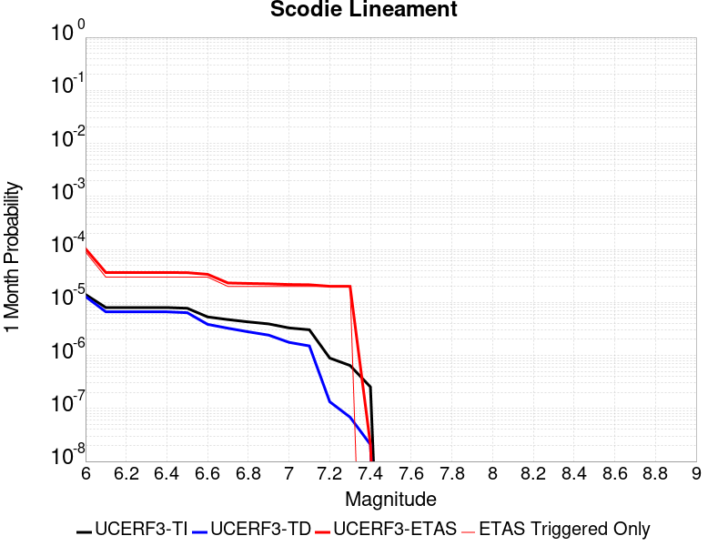 |  |  |

| Magnitude | 1 wk TI Prob | 1 wk TD Prob | 1 wk ETAS Prob | 1 wk ETAS/TD Gain | 1 wk ETAS Triggered Only | 1 mo TI Prob | 1 mo TD Prob | 1 mo ETAS Prob | 1 mo ETAS/TD Gain | 1 mo ETAS Triggered Only | 1 yr TI Prob | 1 yr TD Prob | 1 yr ETAS Prob | 1 yr ETAS/TD Gain | 1 yr ETAS Triggered Only | 10 yr TI Prob | 10 yr TD Prob | 10 yr ETAS Prob | 10 yr ETAS/TD Gain | 10 yr ETAS Triggered Only |
|-----|-----|-----|-----|-----|-----|-----|-----|-----|-----|-----|-----|-----|-----|-----|-----|-----|-----|-----|-----|-----|
| 6.0 | 3.2919327E-6 | 3.0133422E-6 | 5.5277993E-5 | 18.344412 | 5.2264808E-5 | 1.4108206E-5 | 1.2914278E-5 | 1.0002116E-4 | 7.7450066 | 8.710801E-5 | 1.7175387E-4 | 1.5722317E-4 | 2.6173634E-4 | 1.6647441 | 1.04529616E-4 | 0.0017162118 | 0.0015714309 | 0.0016757962 | 1.0664142 | 1.04529616E-4 |
| 6.1 | 1.8663811E-6 | 1.5490499E-6 | 1.5490499E-6 | 1.0 | 0.0 | 7.998751E-6 | 6.6387715E-6 | 2.4060259E-5 | 3.6242034 | 1.7421602E-5 | 9.738045E-5 | 8.082454E-5 | 9.824474E-5 | 1.215531 | 1.7421602E-5 | 9.7337784E-4 | 8.080003E-4 | 8.254078E-4 | 1.021544 | 1.7421602E-5 |
| 6.2 | 1.8663811E-6 | 1.5490499E-6 | 1.5490499E-6 | 1.0 | 0.0 | 7.998751E-6 | 6.6387715E-6 | 2.4060259E-5 | 3.6242034 | 1.7421602E-5 | 9.738045E-5 | 8.082454E-5 | 9.824474E-5 | 1.215531 | 1.7421602E-5 | 9.7337784E-4 | 8.080003E-4 | 8.254078E-4 | 1.021544 | 1.7421602E-5 |
| 6.3 | 1.8663811E-6 | 1.5490499E-6 | 1.5490499E-6 | 1.0 | 0.0 | 7.998751E-6 | 6.6387715E-6 | 2.4060259E-5 | 3.6242034 | 1.7421602E-5 | 9.738045E-5 | 8.082454E-5 | 9.824474E-5 | 1.215531 | 1.7421602E-5 | 9.7337784E-4 | 8.080003E-4 | 8.254078E-4 | 1.021544 | 1.7421602E-5 |
| 6.4 | 1.8663811E-6 | 1.5490499E-6 | 1.5490499E-6 | 1.0 | 0.0 | 7.998751E-6 | 6.6387715E-6 | 2.4060259E-5 | 3.6242034 | 1.7421602E-5 | 9.738045E-5 | 8.082454E-5 | 9.824474E-5 | 1.215531 | 1.7421602E-5 | 9.7337784E-4 | 8.080003E-4 | 8.254078E-4 | 1.021544 | 1.7421602E-5 |
| 6.5 | 1.8106311E-6 | 1.4909839E-6 | 1.4909839E-6 | 1.0 | 0.0 | 7.759824E-6 | 6.3899183E-6 | 2.381141E-5 | 3.7264028 | 1.7421602E-5 | 9.447177E-5 | 7.7794975E-5 | 9.521522E-5 | 1.2239251 | 1.7421602E-5 | 9.4431615E-4 | 7.7772606E-4 | 7.951341E-4 | 1.0223832 | 1.7421602E-5 |
| 6.6 | 1.2414679E-6 | 8.997558E-7 | 8.997558E-7 | 1.0 | 0.0 | 5.320566E-6 | 3.856091E-6 | 2.1277627E-5 | 5.5179267 | 1.7421602E-5 | 6.477596E-5 | 4.6946985E-5 | 6.436777E-5 | 1.3710736 | 1.7421602E-5 | 6.475708E-4 | 4.693793E-4 | 4.8679273E-4 | 1.0370989 | 1.7421602E-5 |
| 6.7 | 1.1062215E-6 | 7.594311E-7 | 7.594311E-7 | 1.0 | 0.0 | 4.7409408E-6 | 3.2547011E-6 | 2.0676247E-5 | 6.352733 | 1.7421602E-5 | 5.7719422E-5 | 3.9625334E-5 | 5.7046247E-5 | 1.4396408 | 1.7421602E-5 | 5.770443E-4 | 3.961897E-4 | 4.136044E-4 | 1.0439554 | 1.7421602E-5 |
| 6.8 | 1.0006736E-6 | 6.500397E-7 | 6.500397E-7 | 1.0 | 0.0 | 4.288594E-6 | 2.7858816E-6 | 2.0207435E-5 | 7.2535157 | 1.7421602E-5 | 5.221238E-5 | 3.3917644E-5 | 5.1338655E-5 | 1.5136268 | 1.7421602E-5 | 5.220012E-4 | 3.3913075E-4 | 3.5654643E-4 | 1.0513539 | 1.7421602E-5 |
| 6.9 | 9.167364E-7 | 5.631625E-7 | 5.631625E-7 | 1.0 | 0.0 | 3.9288643E-6 | 2.4135516E-6 | 1.9835112E-5 | 8.218226 | 1.7421602E-5 | 4.7832873E-5 | 2.9384651E-5 | 4.680574E-5 | 1.5928637 | 1.7421602E-5 | 4.782258E-4 | 2.9381333E-4 | 3.112298E-4 | 1.0592774 | 1.7421602E-5 |
| 7.0 | 7.6987664E-7 | 4.113383E-7 | 4.113383E-7 | 1.0 | 0.0 | 3.2994672E-6 | 1.7628774E-6 | 1.918445E-5 | 10.882463 | 1.7421602E-5 | 4.0170275E-5 | 2.1462862E-5 | 3.888409E-5 | 1.8116919 | 1.7421602E-5 | 4.0163012E-4 | 2.1461173E-4 | 2.320296E-4 | 1.0811598 | 1.7421602E-5 |
| 7.1 | 7.1038727E-7 | 3.5211494E-7 | 3.5211494E-7 | 1.0 | 0.0 | 3.0445133E-6 | 1.5090633E-6 | 1.893064E-5 | 12.544629 | 1.7421602E-5 | 3.706632E-5 | 1.8372726E-5 | 3.5794008E-5 | 1.9482143 | 1.7421602E-5 | 3.7060137E-4 | 1.8371557E-4 | 2.0113397E-4 | 1.0948118 | 1.7421602E-5 |
| 7.2 | 2.0799602E-7 | 3.1186854E-8 | 3.1186854E-8 | 1.0 | 0.0 | 8.914113E-7 | 1.3365793E-7 | 1.7555258E-5 | 131.34468 | 1.7421602E-5 | 1.0852878E-5 | 1.6272843E-6 | 1.9048859E-5 | 11.705919 | 1.7421602E-5 | 1.08523476E-4 | 1.627273E-5 | 3.369405E-5 | 2.0705836 | 1.7421602E-5 |
| 7.3 | 1.5048182E-7 | 1.5945696E-8 | 1.5945696E-8 | 1.0 | 0.0 | 6.449219E-7 | 6.83387E-8 | 1.748994E-5 | 255.93025 | 1.7421602E-5 | 7.851896E-6 | 8.320234E-7 | 1.8253611E-5 | 21.938822 | 1.7421602E-5 | 7.851618E-5 | 8.320206E-6 | 2.5741663E-5 | 3.0938735 | 1.7421602E-5 |
| 7.4 | 5.9334678E-8 | 4.8683537E-9 | 4.8683537E-9 | 1.0 | 0.0 | 2.5429145E-7 | 2.0864372E-8 | 2.0864372E-8 | 1.0 | 0.0 | 3.095994E-6 | 2.5402372E-7 | 2.5402372E-7 | 1.0 | 0.0 | 3.095951E-5 | 2.5402353E-6 | 2.5402353E-6 | 1.0 | 0.0 |

## San Jacinto (Coyote Creek)
*[(top)](#table-of-contents)*

| 1 Week | 1 Month | 1 Year | 10 Year |
|-----|-----|-----|-----|
|  |  |  |  |

| Magnitude | 1 wk TI Prob | 1 wk TD Prob | 1 wk ETAS Prob | 1 wk ETAS/TD Gain | 1 wk ETAS Triggered Only | 1 mo TI Prob | 1 mo TD Prob | 1 mo ETAS Prob | 1 mo ETAS/TD Gain | 1 mo ETAS Triggered Only | 1 yr TI Prob | 1 yr TD Prob | 1 yr ETAS Prob | 1 yr ETAS/TD Gain | 1 yr ETAS Triggered Only | 10 yr TI Prob | 10 yr TD Prob | 10 yr ETAS Prob | 10 yr ETAS/TD Gain | 10 yr ETAS Triggered Only |
|-----|-----|-----|-----|-----|-----|-----|-----|-----|-----|-----|-----|-----|-----|-----|-----|-----|-----|-----|-----|-----|
| 6.0 | 2.7374346E-5 | 2.4145214E-5 | 9.382994E-5 | 3.8860679 | 6.968641E-5 | 1.1731335E-4 | 1.034754E-4 | 1.905744E-4 | 1.8417363 | 8.710801E-5 | 0.0014273542 | 0.0012590875 | 0.0013460858 | 1.0690963 | 8.710801E-5 | 0.01418221 | 0.012928318 | 0.013031497 | 1.0079808 | 1.04529616E-4 |
| 6.1 | 2.7374346E-5 | 2.4145214E-5 | 9.382994E-5 | 3.8860679 | 6.968641E-5 | 1.1731335E-4 | 1.034754E-4 | 1.905744E-4 | 1.8417363 | 8.710801E-5 | 0.0014273542 | 0.0012590875 | 0.0013460858 | 1.0690963 | 8.710801E-5 | 0.01418221 | 0.012928318 | 0.013031497 | 1.0079808 | 1.04529616E-4 |
| 6.2 | 2.7374346E-5 | 2.4145214E-5 | 9.382994E-5 | 3.8860679 | 6.968641E-5 | 1.1731335E-4 | 1.034754E-4 | 1.905744E-4 | 1.8417363 | 8.710801E-5 | 0.0014273542 | 0.0012590875 | 0.0013460858 | 1.0690963 | 8.710801E-5 | 0.01418221 | 0.012928318 | 0.013031497 | 1.0079808 | 1.04529616E-4 |
| 6.3 | 2.7374346E-5 | 2.4145214E-5 | 9.382994E-5 | 3.8860679 | 6.968641E-5 | 1.1731335E-4 | 1.034754E-4 | 1.905744E-4 | 1.8417363 | 8.710801E-5 | 0.0014273542 | 0.0012590875 | 0.0013460858 | 1.0690963 | 8.710801E-5 | 0.01418221 | 0.012928318 | 0.013031497 | 1.0079808 | 1.04529616E-4 |
| 6.4 | 2.7374346E-5 | 2.4145214E-5 | 9.382994E-5 | 3.8860679 | 6.968641E-5 | 1.1731335E-4 | 1.034754E-4 | 1.905744E-4 | 1.8417363 | 8.710801E-5 | 0.0014273542 | 0.0012590875 | 0.0013460858 | 1.0690963 | 8.710801E-5 | 0.01418221 | 0.012928318 | 0.013031497 | 1.0079808 | 1.04529616E-4 |
| 6.5 | 2.7282445E-5 | 2.4031293E-5 | 9.371603E-5 | 3.8997498 | 6.968641E-5 | 1.16919524E-4 | 1.029872E-4 | 1.9008624E-4 | 1.8457268 | 8.710801E-5 | 0.0014225657 | 0.0012531505 | 0.0013401494 | 1.0694242 | 8.710801E-5 | 0.014134934 | 0.012869646 | 0.01297283 | 1.0080177 | 1.04529616E-4 |
| 6.6 | 2.7282445E-5 | 2.4031293E-5 | 9.371603E-5 | 3.8997498 | 6.968641E-5 | 1.16919524E-4 | 1.029872E-4 | 1.9008624E-4 | 1.8457268 | 8.710801E-5 | 0.0014225657 | 0.0012531505 | 0.0013401494 | 1.0694242 | 8.710801E-5 | 0.014134934 | 0.012869646 | 0.01297283 | 1.0080177 | 1.04529616E-4 |
| 6.7 | 2.7216198E-5 | 2.3956412E-5 | 9.364115E-5 | 3.9088137 | 6.968641E-5 | 1.1663563E-4 | 1.02666316E-4 | 1.8976539E-4 | 1.8483704 | 8.710801E-5 | 0.0014191137 | 0.0012492483 | 0.0013362475 | 1.0696412 | 8.710801E-5 | 0.014100855 | 0.0128310565 | 0.012934245 | 1.0080421 | 1.04529616E-4 |
| 6.8 | 2.7078617E-5 | 2.387363E-5 | 9.355838E-5 | 3.9189003 | 6.968641E-5 | 1.1604605E-4 | 1.0231156E-4 | 1.8941067E-4 | 1.8513124 | 8.710801E-5 | 0.001411945 | 0.0012449342 | 0.0013319337 | 1.0698829 | 8.710801E-5 | 0.014030075 | 0.012788199 | 0.012891391 | 1.0080694 | 1.04529616E-4 |
| 6.9 | 2.6982952E-5 | 2.3793142E-5 | 9.3477895E-5 | 3.9287748 | 6.968641E-5 | 1.15636096E-4 | 1.0196664E-4 | 1.8906577E-4 | 1.8541925 | 8.710801E-5 | 0.0014069602 | 0.0012407395 | 0.0013277393 | 1.0701194 | 8.710801E-5 | 0.013980856 | 0.012746515 | 0.012849712 | 1.0080961 | 1.04529616E-4 |
| 7.0 | 2.6449972E-5 | 2.3370165E-5 | 9.305494E-5 | 3.981784 | 6.968641E-5 | 1.1335209E-4 | 1.00154015E-4 | 1.872533E-4 | 1.8696535 | 8.710801E-5 | 0.001379188 | 0.0012186957 | 0.0013056975 | 1.0713893 | 8.710801E-5 | 0.0137065975 | 0.0125278765 | 0.012631097 | 1.0082393 | 1.04529616E-4 |
| 7.1 | 2.6257849E-5 | 2.3196202E-5 | 9.2881E-5 | 4.004147 | 6.968641E-5 | 1.1252879E-4 | 9.940852E-5 | 1.8650787E-4 | 1.876176 | 8.710801E-5 | 0.0013691769 | 0.0012096294 | 0.001296632 | 1.071925 | 8.710801E-5 | 0.013607717 | 0.012437741 | 0.012540971 | 1.0082997 | 1.04529616E-4 |
| 7.2 | 2.5270041E-5 | 2.2390966E-5 | 9.207582E-5 | 4.112186 | 6.968641E-5 | 1.0829568E-4 | 9.595777E-5 | 1.8305742E-4 | 1.9076874 | 8.710801E-5 | 0.0013177024 | 0.0011676621 | 0.0012546683 | 1.0745132 | 8.710801E-5 | 0.013099162 | 0.012018777 | 0.012122051 | 1.0085926 | 1.04529616E-4 |
| 7.3 | 2.339701E-5 | 2.1122814E-5 | 9.0807756E-5 | 4.2990365 | 6.968641E-5 | 1.0026905E-4 | 9.0523215E-5 | 1.7762334E-4 | 1.9621855 | 8.710801E-5 | 0.001220092 | 0.0011015651 | 0.001188577 | 1.0789895 | 8.710801E-5 | 0.012134149 | 0.011357696 | 0.011461038 | 1.0090989 | 1.04529616E-4 |
| 7.4 | 2.296333E-5 | 2.0853171E-5 | 9.053813E-5 | 4.3416963 | 6.968641E-5 | 9.841056E-5 | 8.936768E-5 | 1.764679E-4 | 1.9746279 | 8.710801E-5 | 0.0011974899 | 0.0010875105 | 0.0011745237 | 1.0800115 | 8.710801E-5 | 0.011910575 | 0.01121681 | 0.011320166 | 1.0092145 | 1.04529616E-4 |
| 7.5 | 2.2188895E-5 | 2.0376096E-5 | 9.006108E-5 | 4.4199386 | 6.968641E-5 | 9.50918E-5 | 8.732321E-5 | 1.7442362E-4 | 1.9974486 | 8.710801E-5 | 0.0011571277 | 0.0010626436 | 0.001149659 | 1.0818858 | 8.710801E-5 | 0.011511209 | 0.010966429 | 0.011069812 | 1.0094273 | 1.04529616E-4 |
| 7.6 | 2.0013189E-5 | 1.8962366E-5 | 8.864745E-5 | 4.6749153 | 6.968641E-5 | 8.5767984E-5 | 8.1264756E-5 | 1.6836569E-4 | 2.071817 | 8.710801E-5 | 0.001043725 | 9.889511E-4 | 0.001075973 | 1.0879941 | 8.710801E-5 | 0.010388365 | 0.010224434 | 0.010327894 | 1.010119 | 1.04529616E-4 |
| 7.7 | 1.7230794E-5 | 1.674371E-5 | 8.6428954E-5 | 5.161876 | 6.968641E-5 | 7.384417E-5 | 7.175679E-5 | 1.5885856E-4 | 2.213847 | 8.710801E-5 | 8.986819E-4 | 8.7328954E-4 | 9.6032146E-4 | 1.0996599 | 8.710801E-5 | 0.008950562 | 0.009062956 | 0.009166539 | 1.0114292 | 1.04529616E-4 |
| 7.8 | 1.4478809E-5 | 1.4990978E-5 | 8.467634E-5 | 5.648487 | 6.968641E-5 | 6.205057E-5 | 6.424547E-5 | 1.513479E-4 | 2.355775 | 8.710801E-5 | 7.552038E-4 | 7.819085E-4 | 8.6894847E-4 | 1.1113173 | 8.710801E-5 | 0.0075264242 | 0.008141387 | 0.008245066 | 1.0127348 | 1.04529616E-4 |
| 7.9 | 1.1114467E-5 | 1.1645102E-5 | 8.1330705E-5 | 6.9841123 | 6.968641E-5 | 4.7632562E-5 | 4.990663E-5 | 1.370103E-4 | 2.7453327 | 8.710801E-5 | 5.797721E-4 | 6.074444E-4 | 6.9449947E-4 | 1.1433136 | 8.710801E-5 | 0.0057826187 | 0.0063803247 | 0.0064841877 | 1.0162786 | 1.04529616E-4 |
| 8.0 | 9.327402E-6 | 9.899186E-6 | 7.9584905E-5 | 8.03954 | 6.968641E-5 | 3.9973966E-5 | 4.2424395E-5 | 1.2952872E-4 | 3.0531657 | 8.710801E-5 | 4.8657437E-4 | 5.1639514E-4 | 6.034582E-4 | 1.1685977 | 8.710801E-5 | 0.0048551033 | 0.0054499684 | 0.0055539287 | 1.0190753 | 1.04529616E-4 |
| 8.1 | 7.0235833E-6 | 6.827495E-6 | 5.9091948E-5 | 8.654997 | 5.2264808E-5 | 3.0100724E-5 | 2.9260367E-5 | 9.8944736E-5 | 3.3815277 | 6.968641E-5 | 3.664147E-4 | 3.5618723E-4 | 4.2584882E-4 | 1.1955757 | 6.968641E-5 | 0.003658111 | 0.0037876023 | 0.0038743804 | 1.0229111 | 8.710801E-5 |
| 8.2 | 2.0358202E-6 | 8.994527E-7 | 8.994527E-7 | 1.0 | 0.0 | 8.724915E-6 | 3.854792E-6 | 3.854792E-6 | 1.0 | 0.0 | 1.06220665E-4 | 4.69311E-5 | 4.69311E-5 | 1.0 | 0.0 | 0.001061699 | 5.3254166E-4 | 5.3254166E-4 | 1.0 | 0.0 |
| 8.3 | 2.0051264E-7 | 6.617272E-8 | 6.617272E-8 | 1.0 | 0.0 | 8.5933965E-7 | 2.8359733E-7 | 2.8359733E-7 | 1.0 | 0.0 | 1.046241E-5 | 3.4527925E-6 | 3.4527925E-6 | 1.0 | 0.0 | 1.0461917E-4 | 4.01389E-5 | 4.01389E-5 | 1.0 | 0.0 |

## Imperial
*[(top)](#table-of-contents)*

| 1 Week | 1 Month | 1 Year | 10 Year |
|-----|-----|-----|-----|
|  |  |  |  |

| Magnitude | 1 wk TI Prob | 1 wk TD Prob | 1 wk ETAS Prob | 1 wk ETAS/TD Gain | 1 wk ETAS Triggered Only | 1 mo TI Prob | 1 mo TD Prob | 1 mo ETAS Prob | 1 mo ETAS/TD Gain | 1 mo ETAS Triggered Only | 1 yr TI Prob | 1 yr TD Prob | 1 yr ETAS Prob | 1 yr ETAS/TD Gain | 1 yr ETAS Triggered Only | 10 yr TI Prob | 10 yr TD Prob | 10 yr ETAS Prob | 10 yr ETAS/TD Gain | 10 yr ETAS Triggered Only |
|-----|-----|-----|-----|-----|-----|-----|-----|-----|-----|-----|-----|-----|-----|-----|-----|-----|-----|-----|-----|-----|
| 6.0 | 2.7496446E-4 | 5.0552754E-4 | 5.577659E-4 | 1.1033344 | 5.2264808E-5 | 0.0011778869 | 0.002164787 | 0.0022690904 | 1.0481818 | 1.04529616E-4 | 0.0142467655 | 0.026038699 | 0.026140505 | 1.0039098 | 1.04529616E-4 | 0.13367249 | 0.2280438 | 0.22812448 | 1.0003538 | 1.04529616E-4 |
| 6.1 | 2.5356023E-4 | 4.8656776E-4 | 5.3880713E-4 | 1.107363 | 5.2264808E-5 | 0.001086234 | 0.0020836622 | 0.002187974 | 1.0500618 | 1.04529616E-4 | 0.013144928 | 0.025071215 | 0.025173124 | 1.0040648 | 1.04529616E-4 | 0.123940155 | 0.21947981 | 0.2195614 | 1.0003717 | 1.04529616E-4 |
| 6.2 | 2.4820742E-4 | 4.7752203E-4 | 5.297619E-4 | 1.1093978 | 5.2264808E-5 | 0.0010633124 | 0.0020449557 | 0.0021492715 | 1.0510113 | 1.04529616E-4 | 0.01286919 | 0.024611235 | 0.024713192 | 1.0041428 | 1.04529616E-4 | 0.12148927 | 0.21598552 | 0.21606748 | 1.0003794 | 1.04529616E-4 |
| 6.3 | 2.3205351E-4 | 4.5890483E-4 | 5.111456E-4 | 1.1138381 | 5.2264808E-5 | 9.94136E-4 | 0.0019652895 | 0.0020696137 | 1.0530834 | 1.04529616E-4 | 0.012036599 | 0.02366133 | 0.023763387 | 1.0043132 | 1.04529616E-4 | 0.11405133 | 0.20793462 | 0.20801741 | 1.0003982 | 1.04529616E-4 |
| 6.4 | 2.0304754E-4 | 3.987652E-4 | 4.1617986E-4 | 1.0436715 | 1.7421602E-5 | 8.6991355E-4 | 0.0017078889 | 0.0017774564 | 1.040733 | 6.968641E-5 | 0.010539869 | 0.020595672 | 0.020663923 | 1.0033139 | 6.968641E-5 | 0.100537635 | 0.1850669 | 0.18512368 | 1.0003068 | 6.968641E-5 |
| 6.5 | 1.854992E-4 | 3.6988858E-4 | 3.8730373E-4 | 1.0470822 | 1.7421602E-5 | 7.9475436E-4 | 0.0015842861 | 0.0016538621 | 1.0439163 | 6.968641E-5 | 0.009633281 | 0.01911948 | 0.019187836 | 1.0035751 | 6.968641E-5 | 0.0922623 | 0.173298 | 0.17335561 | 1.0003325 | 6.968641E-5 |
| 6.6 | 1.6586106E-4 | 3.403506E-4 | 3.577663E-4 | 1.0511698 | 1.7421602E-5 | 7.106394E-4 | 0.0014578402 | 0.0015100288 | 1.0357985 | 5.2264808E-5 | 0.008617763 | 0.01760642 | 0.017657764 | 1.0029162 | 5.2264808E-5 | 0.08291132 | 0.16077545 | 0.1608193 | 1.0002729 | 5.2264808E-5 |
| 6.7 | 1.4224656E-4 | 3.076692E-4 | 3.2508542E-4 | 1.056607 | 1.7421602E-5 | 6.094856E-4 | 0.001317924 | 0.00137012 | 1.0396047 | 5.2264808E-5 | 0.0073952693 | 0.015929576 | 0.01598101 | 1.0032288 | 5.2264808E-5 | 0.07153955 | 0.14648417 | 0.14652877 | 1.0003046 | 5.2264808E-5 |
| 6.8 | 1.2317259E-4 | 2.779122E-4 | 2.9532894E-4 | 1.06267 | 1.7421602E-5 | 5.2777573E-4 | 0.0011905148 | 0.0012427173 | 1.0438488 | 5.2264808E-5 | 0.0064067547 | 0.0143995695 | 0.014451082 | 1.0035774 | 5.2264808E-5 | 0.06225166 | 0.13293684 | 0.13298215 | 1.0003409 | 5.2264808E-5 |
| 6.9 | 9.859898E-5 | 2.5014306E-4 | 2.675603E-4 | 1.0696292 | 1.7421602E-5 | 4.2249862E-4 | 0.0010716055 | 0.0011238143 | 1.0487201 | 5.2264808E-5 | 0.0051317946 | 0.012969712 | 0.013021299 | 1.0039775 | 5.2264808E-5 | 0.05014893 | 0.11940631 | 0.119452335 | 1.0003854 | 5.2264808E-5 |
| 7.0 | 7.3191884E-5 | 2.1266776E-4 | 2.3008566E-4 | 1.0819019 | 1.7421602E-5 | 3.136418E-4 | 9.1111806E-4 | 9.633353E-4 | 1.057311 | 5.2264808E-5 | 0.003811904 | 0.011037128 | 0.0110888155 | 1.0046831 | 5.2264808E-5 | 0.037471764 | 0.10206493 | 0.10211185 | 1.0004598 | 5.2264808E-5 |
| 7.1 | 7.1760296E-5 | 2.0968143E-4 | 2.2709937E-4 | 1.0830686 | 1.7421602E-5 | 3.0750787E-4 | 8.983284E-4 | 9.5054624E-4 | 1.0581278 | 5.2264808E-5 | 0.003737482 | 0.010882978 | 0.010934674 | 1.0047501 | 5.2264808E-5 | 0.03675245 | 0.10070146 | 0.10074846 | 1.0004667 | 5.2264808E-5 |
| 7.2 | 6.46614E-5 | 1.9136685E-4 | 2.0878513E-4 | 1.0910203 | 1.7421602E-5 | 2.7709085E-4 | 8.1988896E-4 | 8.721109E-4 | 1.063694 | 5.2264808E-5 | 0.0033683628 | 0.0099370815 | 0.009988827 | 1.0052073 | 5.2264808E-5 | 0.033177625 | 0.09250898 | 0.09255641 | 1.0005127 | 5.2264808E-5 |
| 7.3 | 6.088115E-5 | 1.78084E-4 | 1.9550249E-4 | 1.0978106 | 1.7421602E-5 | 2.6089314E-4 | 7.6299673E-4 | 8.1522163E-4 | 1.0684471 | 5.2264808E-5 | 0.0031717476 | 0.009250494 | 0.009302275 | 1.0055977 | 5.2264808E-5 | 0.031268585 | 0.08655989 | 0.086607635 | 1.0005516 | 5.2264808E-5 |
| 7.4 | 4.199346E-5 | 1.1510366E-4 | 1.3252326E-4 | 1.1513383 | 1.7421602E-5 | 1.7995955E-4 | 4.9320905E-4 | 5.4544804E-4 | 1.1059166 | 5.2264808E-5 | 0.0021888057 | 0.0059884563 | 0.0060404083 | 1.0086753 | 5.2264808E-5 | 0.02167372 | 0.057439793 | 0.057489056 | 1.0008576 | 5.2264808E-5 |
| 7.5 | 3.130448E-5 | 8.33328E-5 | 1.0075295E-4 | 1.2090431 | 1.7421602E-5 | 1.3415517E-4 | 3.57092E-4 | 4.0933816E-4 | 1.1463101 | 5.2264808E-5 | 0.0016321153 | 0.004338988 | 0.004391026 | 1.0119932 | 5.2264808E-5 | 0.016201803 | 0.04213201 | 0.04218207 | 1.0011883 | 5.2264808E-5 |
| 7.6 | 2.3074248E-5 | 6.0844646E-5 | 7.826519E-5 | 1.2863119 | 1.7421602E-5 | 9.888588E-5 | 2.6073685E-4 | 3.1298804E-4 | 1.2003982 | 5.2264808E-5 | 0.0012032706 | 0.0031698733 | 0.0032219724 | 1.0164357 | 5.2264808E-5 | 0.011967761 | 0.031026395 | 0.031077038 | 1.0016322 | 5.2264808E-5 |
| 7.7 | 1.45864815E-5 | 4.0124698E-5 | 4.0124698E-5 | 1.0 | 0.0 | 6.2511994E-5 | 1.7195169E-4 | 2.067889E-4 | 1.2025988 | 3.4843204E-5 | 7.608177E-4 | 0.0020915072 | 0.0021262774 | 1.0166246 | 3.4843204E-5 | 0.007582182 | 0.020627763 | 0.020661889 | 1.0016543 | 3.4843204E-5 |
| 7.8 | 1.0352979E-5 | 3.0960902E-5 | 3.0960902E-5 | 1.0 | 0.0 | 4.4369157E-5 | 1.3268284E-4 | 1.6752142E-4 | 1.2625704 | 3.4843204E-5 | 5.400606E-4 | 0.0016142189 | 0.0016490059 | 1.0215503 | 3.4843204E-5 | 0.0053875 | 0.016016833 | 0.016051117 | 1.0021405 | 3.4843204E-5 |
| 7.9 | 8.137906E-6 | 2.2149103E-5 | 2.2149103E-5 | 1.0 | 0.0 | 3.4876273E-5 | 9.492128E-5 | 1.2976117E-4 | 1.3670399 | 3.4843204E-5 | 4.2453592E-4 | 0.0011550548 | 0.0011898577 | 1.030131 | 3.4843204E-5 | 0.004237258 | 0.011617903 | 0.011652341 | 1.0029643 | 3.4843204E-5 |
| 8.0 | 6.93792E-6 | 1.8008766E-5 | 1.8008766E-5 | 1.0 | 0.0 | 2.9733603E-5 | 7.717814E-5 | 9.459841E-5 | 1.2257149 | 1.7421602E-5 | 3.6194647E-4 | 9.3923963E-4 | 9.566448E-4 | 1.0185312 | 1.7421602E-5 | 0.0036135751 | 0.00950155 | 0.009518807 | 1.0018162 | 1.7421602E-5 |
| 8.1 | 3.4286315E-6 | 6.379872E-6 | 6.379872E-6 | 1.0 | 0.0 | 1.4694053E-5 | 2.7342023E-5 | 2.7342023E-5 | 1.0 | 0.0 | 1.7888541E-4 | 3.328384E-4 | 3.328384E-4 | 1.0 | 0.0 | 0.0017874148 | 0.003486031 | 0.003486031 | 1.0 | 0.0 |
| 8.2 | 1.4906886E-6 | 1.9366646E-6 | 1.9366646E-6 | 1.0 | 0.0 | 6.3886496E-6 | 8.299965E-6 | 8.299965E-6 | 1.0 | 0.0 | 7.7779034E-5 | 1.0104742E-4 | 1.0104742E-4 | 1.0 | 0.0 | 7.775182E-4 | 0.0011075331 | 0.0011075331 | 1.0 | 0.0 |
| 8.3 | 2.5758007E-8 | 1.4500102E-8 | 1.4500102E-8 | 1.0 | 0.0 | 1.10391454E-7 | 6.214329E-8 | 6.214329E-8 | 1.0 | 0.0 | 1.3440151E-6 | 7.565946E-7 | 7.565946E-7 | 1.0 | 0.0 | 1.344007E-5 | 7.887763E-6 | 7.887763E-6 | 1.0 | 0.0 |

## Chino alt 1
*[(top)](#table-of-contents)*

| 1 Week | 1 Month | 1 Year | 10 Year |
|-----|-----|-----|-----|
|  |  |  |  |

| Magnitude | 1 wk TI Prob | 1 wk TD Prob | 1 wk ETAS Prob | 1 wk ETAS/TD Gain | 1 wk ETAS Triggered Only | 1 mo TI Prob | 1 mo TD Prob | 1 mo ETAS Prob | 1 mo ETAS/TD Gain | 1 mo ETAS Triggered Only | 1 yr TI Prob | 1 yr TD Prob | 1 yr ETAS Prob | 1 yr ETAS/TD Gain | 1 yr ETAS Triggered Only | 10 yr TI Prob | 10 yr TD Prob | 10 yr ETAS Prob | 10 yr ETAS/TD Gain | 10 yr ETAS Triggered Only |
|-----|-----|-----|-----|-----|-----|-----|-----|-----|-----|-----|-----|-----|-----|-----|-----|-----|-----|-----|-----|-----|
| 6.0 | 3.939946E-5 | 4.8948554E-5 | 1.360523E-4 | 2.779496 | 8.710801E-5 | 1.6884391E-4 | 2.097656E-4 | 3.142733E-4 | 1.4982117 | 1.04529616E-4 | 0.0020537362 | 0.0025513945 | 0.0026556575 | 1.0408651 | 1.04529616E-4 | 0.020348595 | 0.025277847 | 0.025379734 | 1.0040307 | 1.04529616E-4 |
| 6.1 | 2.1505624E-5 | 2.6879026E-5 | 6.172129E-5 | 2.2962623 | 3.4843204E-5 | 9.2163704E-5 | 1.1519137E-4 | 1.5003055E-4 | 1.3024462 | 3.4843204E-5 | 0.0011215154 | 0.001401664 | 0.0014364583 | 1.0248237 | 3.4843204E-5 | 0.011158722 | 0.013945141 | 0.013979498 | 1.0024637 | 3.4843204E-5 |
| 6.2 | 2.1505624E-5 | 2.6879026E-5 | 6.172129E-5 | 2.2962623 | 3.4843204E-5 | 9.2163704E-5 | 1.1519137E-4 | 1.5003055E-4 | 1.3024462 | 3.4843204E-5 | 0.0011215154 | 0.001401664 | 0.0014364583 | 1.0248237 | 3.4843204E-5 | 0.011158722 | 0.013945141 | 0.013979498 | 1.0024637 | 3.4843204E-5 |
| 6.3 | 1.4290785E-5 | 1.8165128E-5 | 1.8165128E-5 | 1.0 | 0.0 | 6.1244784E-5 | 7.784848E-5 | 7.784848E-5 | 1.0 | 0.0 | 7.454001E-4 | 9.4743853E-4 | 9.4743853E-4 | 1.0 | 0.0 | 0.007429048 | 0.0094444575 | 0.0094444575 | 1.0 | 0.0 |
| 6.4 | 1.4290785E-5 | 1.8165128E-5 | 1.8165128E-5 | 1.0 | 0.0 | 6.1244784E-5 | 7.784848E-5 | 7.784848E-5 | 1.0 | 0.0 | 7.454001E-4 | 9.4743853E-4 | 9.4743853E-4 | 1.0 | 0.0 | 0.007429048 | 0.0094444575 | 0.0094444575 | 1.0 | 0.0 |
| 6.5 | 1.3017944E-5 | 1.6652088E-5 | 1.6652088E-5 | 1.0 | 0.0 | 5.5789995E-5 | 7.136439E-5 | 7.136439E-5 | 1.0 | 0.0 | 6.790315E-4 | 8.685589E-4 | 8.685589E-4 | 1.0 | 0.0 | 0.0067696036 | 0.008661949 | 0.008661949 | 1.0 | 0.0 |
| 6.6 | 9.470016E-6 | 1.2039424E-5 | 1.2039424E-5 | 1.0 | 0.0 | 4.058515E-5 | 5.1596704E-5 | 5.1596704E-5 | 1.0 | 0.0 | 4.940122E-4 | 6.280428E-4 | 6.280428E-4 | 1.0 | 0.0 | 0.004929154 | 0.0062718987 | 0.0062718987 | 1.0 | 0.0 |
| 6.7 | 8.314155E-6 | 1.0407736E-5 | 1.0407736E-5 | 1.0 | 0.0 | 3.5631605E-5 | 4.4604003E-5 | 4.4604003E-5 | 1.0 | 0.0 | 4.3372845E-4 | 5.429507E-4 | 5.429507E-4 | 1.0 | 0.0 | 0.004328829 | 0.005425775 | 0.005425775 | 1.0 | 0.0 |
| 6.8 | 3.4856364E-6 | 3.8133708E-6 | 3.8133708E-6 | 1.0 | 0.0 | 1.4938357E-5 | 1.6342927E-5 | 1.6342927E-5 | 1.0 | 0.0 | 1.8185932E-4 | 1.9895904E-4 | 1.9895904E-4 | 1.0 | 0.0 | 0.0018171056 | 0.0019894864 | 0.0019894864 | 1.0 | 0.0 |
| 6.9 | 2.2645952E-6 | 2.1529022E-6 | 2.1529022E-6 | 1.0 | 0.0 | 9.705372E-6 | 9.226692E-6 | 9.226692E-6 | 1.0 | 0.0 | 1.18156495E-4 | 1.123294E-4 | 1.123294E-4 | 1.0 | 0.0 | 0.0011809369 | 0.0011233423 | 0.0011233423 | 1.0 | 0.0 |
| 7.0 | 1.7864003E-6 | 1.5430785E-6 | 1.5430785E-6 | 1.0 | 0.0 | 7.655979E-6 | 6.613177E-6 | 6.613177E-6 | 1.0 | 0.0 | 9.3207556E-5 | 8.051251E-5 | 8.051251E-5 | 1.0 | 0.0 | 9.316847E-4 | 8.0528046E-4 | 8.0528046E-4 | 1.0 | 0.0 |
| 7.1 | 1.7315456E-6 | 1.4733511E-6 | 1.4733511E-6 | 1.0 | 0.0 | 7.420889E-6 | 6.3143466E-6 | 6.3143466E-6 | 1.0 | 0.0 | 9.034557E-5 | 7.6874516E-5 | 7.6874516E-5 | 1.0 | 0.0 | 9.0308854E-4 | 7.6891703E-4 | 7.6891703E-4 | 1.0 | 0.0 |
| 7.2 | 1.6008337E-6 | 1.3574215E-6 | 1.3574215E-6 | 1.0 | 0.0 | 6.860698E-6 | 5.817508E-6 | 5.817508E-6 | 1.0 | 0.0 | 8.352579E-5 | 7.082591E-5 | 7.082591E-5 | 1.0 | 0.0 | 8.34944E-4 | 7.0845755E-4 | 7.0845755E-4 | 1.0 | 0.0 |
| 7.3 | 1.3320939E-6 | 1.121782E-6 | 1.121782E-6 | 1.0 | 0.0 | 5.7089615E-6 | 4.807629E-6 | 4.807629E-6 | 1.0 | 0.0 | 6.9504385E-5 | 5.8531357E-5 | 5.8531357E-5 | 1.0 | 0.0 | 6.9482654E-4 | 5.8530393E-4 | 5.8530393E-4 | 1.0 | 0.0 |
| 7.4 | 1.114294E-6 | 9.237111E-7 | 9.237111E-7 | 1.0 | 0.0 | 4.775537E-6 | 3.958756E-6 | 3.958756E-6 | 1.0 | 0.0 | 5.8140613E-5 | 4.8196827E-5 | 4.8196827E-5 | 1.0 | 0.0 | 5.81254E-4 | 4.8188053E-4 | 4.8188053E-4 | 1.0 | 0.0 |
| 7.5 | 9.354081E-7 | 7.6234323E-7 | 7.6234323E-7 | 1.0 | 0.0 | 4.0088858E-6 | 3.2671815E-6 | 3.2671815E-6 | 1.0 | 0.0 | 4.8807087E-5 | 3.9777242E-5 | 3.9777242E-5 | 1.0 | 0.0 | 4.879637E-4 | 3.977046E-4 | 3.977046E-4 | 1.0 | 0.0 |
| 7.6 | 8.521771E-7 | 6.88071E-7 | 6.88071E-7 | 1.0 | 0.0 | 3.6521824E-6 | 2.9488726E-6 | 2.9488726E-6 | 1.0 | 0.0 | 4.4464414E-5 | 3.5901965E-5 | 3.5901965E-5 | 1.0 | 0.0 | 4.4455516E-4 | 3.589648E-4 | 3.589648E-4 | 1.0 | 0.0 |
| 7.7 | 2.1803626E-7 | 1.418649E-7 | 1.418649E-7 | 1.0 | 0.0 | 9.344408E-7 | 6.079923E-7 | 6.079923E-7 | 1.0 | 0.0 | 1.1376757E-5 | 7.4022914E-6 | 7.4022914E-6 | 1.0 | 0.0 | 1.13761744E-4 | 7.402141E-5 | 7.402141E-5 | 1.0 | 0.0 |

## White Wolf (Extension)
*[(top)](#table-of-contents)*

| 1 Week | 1 Month | 1 Year | 10 Year |
|-----|-----|-----|-----|
|  |  |  |  |

| Magnitude | 1 wk TI Prob | 1 wk TD Prob | 1 wk ETAS Prob | 1 wk ETAS/TD Gain | 1 wk ETAS Triggered Only | 1 mo TI Prob | 1 mo TD Prob | 1 mo ETAS Prob | 1 mo ETAS/TD Gain | 1 mo ETAS Triggered Only | 1 yr TI Prob | 1 yr TD Prob | 1 yr ETAS Prob | 1 yr ETAS/TD Gain | 1 yr ETAS Triggered Only | 10 yr TI Prob | 10 yr TD Prob | 10 yr ETAS Prob | 10 yr ETAS/TD Gain | 10 yr ETAS Triggered Only |
|-----|-----|-----|-----|-----|-----|-----|-----|-----|-----|-----|-----|-----|-----|-----|-----|-----|-----|-----|-----|-----|
| 6.0 | 8.222555E-6 | 6.0666657E-6 | 5.8331156E-5 | 9.615027 | 5.2264808E-5 | 3.5239045E-5 | 2.5999774E-5 | 1.13105525E-4 | 4.3502502 | 8.710801E-5 | 4.289509E-4 | 3.1650788E-4 | 4.0358835E-4 | 1.2751288 | 8.710801E-5 | 0.0042812387 | 0.003161223 | 0.0032480557 | 1.0274681 | 8.710801E-5 |
| 6.1 | 8.222555E-6 | 6.0666657E-6 | 5.8331156E-5 | 9.615027 | 5.2264808E-5 | 3.5239045E-5 | 2.5999774E-5 | 1.13105525E-4 | 4.3502502 | 8.710801E-5 | 4.289509E-4 | 3.1650788E-4 | 4.0358835E-4 | 1.2751288 | 8.710801E-5 | 0.0042812387 | 0.003161223 | 0.0032480557 | 1.0274681 | 8.710801E-5 |
| 6.2 | 8.222555E-6 | 6.0666657E-6 | 5.8331156E-5 | 9.615027 | 5.2264808E-5 | 3.5239045E-5 | 2.5999774E-5 | 1.13105525E-4 | 4.3502502 | 8.710801E-5 | 4.289509E-4 | 3.1650788E-4 | 4.0358835E-4 | 1.2751288 | 8.710801E-5 | 0.0042812387 | 0.003161223 | 0.0032480557 | 1.0274681 | 8.710801E-5 |
| 6.3 | 8.222555E-6 | 6.0666657E-6 | 5.8331156E-5 | 9.615027 | 5.2264808E-5 | 3.5239045E-5 | 2.5999774E-5 | 1.13105525E-4 | 4.3502502 | 8.710801E-5 | 4.289509E-4 | 3.1650788E-4 | 4.0358835E-4 | 1.2751288 | 8.710801E-5 | 0.0042812387 | 0.003161223 | 0.0032480557 | 1.0274681 | 8.710801E-5 |
| 6.4 | 5.821773E-6 | 3.5571766E-6 | 2.0978718E-5 | 5.897576 | 1.7421602E-5 | 2.4950215E-5 | 1.5244959E-5 | 5.0087634E-5 | 3.285521 | 3.4843204E-5 | 3.0372653E-4 | 1.8559267E-4 | 2.204294E-4 | 1.1877054 | 3.4843204E-5 | 0.0030331176 | 0.001854485 | 0.0018892636 | 1.0187538 | 3.4843204E-5 |
| 6.5 | 5.766023E-6 | 3.4991106E-6 | 2.0920652E-5 | 5.9788485 | 1.7421602E-5 | 2.4711293E-5 | 1.4996108E-5 | 4.9838793E-5 | 3.3234484 | 3.4843204E-5 | 3.0081844E-4 | 1.8256342E-4 | 2.1740026E-4 | 1.1908205 | 3.4843204E-5 | 0.0030041158 | 0.0018242426 | 0.0018590222 | 1.0190653 | 3.4843204E-5 |
| 6.6 | 4.643576E-6 | 2.332624E-6 | 1.9754187E-5 | 8.468654 | 1.7421602E-5 | 1.9900888E-5 | 9.996925E-6 | 4.483978E-5 | 4.4853578 | 3.4843204E-5 | 2.4226638E-4 | 1.2170619E-4 | 1.5654515E-4 | 1.2862546 | 3.4843204E-5 | 0.0024200242 | 0.0012164378 | 0.0012512386 | 1.0286088 | 3.4843204E-5 |
| 6.7 | 3.9529173E-6 | 1.6483477E-6 | 1.9069921E-5 | 11.569113 | 1.7421602E-5 | 1.6940963E-5 | 7.0643296E-6 | 4.190729E-5 | 5.9322386 | 3.4843204E-5 | 2.0623671E-4 | 8.6005006E-5 | 1.20845216E-4 | 1.4050951 | 3.4843204E-5 | 0.002060454 | 8.597357E-4 | 8.9454895E-4 | 1.040493 | 3.4843204E-5 |
| 6.8 | 3.4377522E-6 | 1.2245237E-6 | 1.8646106E-5 | 15.227231 | 1.7421602E-5 | 1.473314E-5 | 5.2479486E-6 | 4.009097E-5 | 7.6393604 | 3.4843204E-5 | 1.7936122E-4 | 6.3891996E-5 | 9.873298E-5 | 1.5453106 | 3.4843204E-5 | 0.0017921652 | 6.387454E-4 | 6.735663E-4 | 1.0545146 | 3.4843204E-5 |
| 6.9 | 3.1367306E-6 | 1.0033783E-6 | 1.8424964E-5 | 18.362926 | 1.7421602E-5 | 1.3443062E-5 | 4.3001864E-6 | 3.914324E-5 | 9.102685 | 3.4843204E-5 | 1.63657E-4 | 5.235359E-5 | 8.719497E-5 | 1.6655014 | 3.4843204E-5 | 0.0016353652 | 5.2342017E-4 | 5.5824517E-4 | 1.0665334 | 3.4843204E-5 |
| 7.0 | 2.8298145E-6 | 7.4286646E-7 | 7.4286646E-7 | 1.0 | 0.0 | 1.2127721E-5 | 3.1837099E-6 | 2.0605257E-5 | 6.4720902 | 1.7421602E-5 | 1.47645E-4 | 3.8761027E-5 | 5.6181958E-5 | 1.4494444 | 1.7421602E-5 | 0.0014754693 | 3.8754768E-4 | 4.049625E-4 | 1.0449361 | 1.7421602E-5 |
| 7.1 | 2.4091064E-6 | 5.4227525E-7 | 5.4227525E-7 | 1.0 | 0.0 | 1.03247E-5 | 2.3240348E-6 | 1.9745597E-5 | 8.496257 | 1.7421602E-5 | 1.2569598E-4 | 2.8294799E-5 | 4.5715908E-5 | 1.6157001 | 1.7421602E-5 | 0.001256249 | 2.8291598E-4 | 3.0033267E-4 | 1.0615613 | 1.7421602E-5 |
| 7.2 | 1.3875518E-6 | 1.0743063E-7 | 1.0743063E-7 | 1.0 | 0.0 | 5.9466374E-6 | 4.6041689E-7 | 1.7882012E-5 | 38.838737 | 1.7421602E-5 | 7.23979E-5 | 5.6055624E-6 | 2.3027067E-5 | 4.107896 | 1.7421602E-5 | 7.2374323E-4 | 5.6054323E-5 | 7.347495E-5 | 1.3107811 | 1.7421602E-5 |
| 7.3 | 7.056077E-7 | 5.002034E-8 | 5.002034E-8 | 1.0 | 0.0 | 3.0240296E-6 | 2.1437286E-7 | 1.7635972E-5 | 82.267746 | 1.7421602E-5 | 3.681694E-5 | 2.609987E-6 | 2.0031544E-5 | 7.6749597 | 1.7421602E-5 | 3.681084E-4 | 2.609961E-5 | 4.352076E-5 | 1.6674869 | 1.7421602E-5 |
| 7.4 | 5.9334678E-8 | 4.8683537E-9 | 4.8683537E-9 | 1.0 | 0.0 | 2.5429145E-7 | 2.0864372E-8 | 2.0864372E-8 | 1.0 | 0.0 | 3.095994E-6 | 2.5402372E-7 | 2.5402372E-7 | 1.0 | 0.0 | 3.095951E-5 | 2.5402353E-6 | 2.5402353E-6 | 1.0 | 0.0 |

## San Jacinto (Lytle Creek connector)
*[(top)](#table-of-contents)*

| 1 Week | 1 Month | 1 Year | 10 Year |
|-----|-----|-----|-----|
|  |  |  |  |

| Magnitude | 1 wk TI Prob | 1 wk TD Prob | 1 wk ETAS Prob | 1 wk ETAS/TD Gain | 1 wk ETAS Triggered Only | 1 mo TI Prob | 1 mo TD Prob | 1 mo ETAS Prob | 1 mo ETAS/TD Gain | 1 mo ETAS Triggered Only | 1 yr TI Prob | 1 yr TD Prob | 1 yr ETAS Prob | 1 yr ETAS/TD Gain | 1 yr ETAS Triggered Only | 10 yr TI Prob | 10 yr TD Prob | 10 yr ETAS Prob | 10 yr ETAS/TD Gain | 10 yr ETAS Triggered Only |
|-----|-----|-----|-----|-----|-----|-----|-----|-----|-----|-----|-----|-----|-----|-----|-----|-----|-----|-----|-----|-----|
| 6.0 | 6.693995E-6 | 6.660216E-6 | 5.8924677E-5 | 8.847261 | 5.2264808E-5 | 2.8688235E-5 | 2.854347E-5 | 9.8227894E-5 | 3.4413435 | 6.968641E-5 | 3.492233E-4 | 3.4746144E-4 | 4.1712364E-4 | 1.200489 | 6.968641E-5 | 0.00348675 | 0.0035493854 | 0.0036361841 | 1.0244546 | 8.710801E-5 |
| 6.1 | 6.693995E-6 | 6.660216E-6 | 5.8924677E-5 | 8.847261 | 5.2264808E-5 | 2.8688235E-5 | 2.854347E-5 | 9.8227894E-5 | 3.4413435 | 6.968641E-5 | 3.492233E-4 | 3.4746144E-4 | 4.1712364E-4 | 1.200489 | 6.968641E-5 | 0.00348675 | 0.0035493854 | 0.0036361841 | 1.0244546 | 8.710801E-5 |
| 6.2 | 6.693995E-6 | 6.660216E-6 | 5.8924677E-5 | 8.847261 | 5.2264808E-5 | 2.8688235E-5 | 2.854347E-5 | 9.8227894E-5 | 3.4413435 | 6.968641E-5 | 3.492233E-4 | 3.4746144E-4 | 4.1712364E-4 | 1.200489 | 6.968641E-5 | 0.00348675 | 0.0035493854 | 0.0036361841 | 1.0244546 | 8.710801E-5 |
| 6.3 | 6.693995E-6 | 6.660216E-6 | 5.8924677E-5 | 8.847261 | 5.2264808E-5 | 2.8688235E-5 | 2.854347E-5 | 9.8227894E-5 | 3.4413435 | 6.968641E-5 | 3.492233E-4 | 3.4746144E-4 | 4.1712364E-4 | 1.200489 | 6.968641E-5 | 0.00348675 | 0.0035493854 | 0.0036361841 | 1.0244546 | 8.710801E-5 |
| 6.4 | 6.693995E-6 | 6.660216E-6 | 5.8924677E-5 | 8.847261 | 5.2264808E-5 | 2.8688235E-5 | 2.854347E-5 | 9.8227894E-5 | 3.4413435 | 6.968641E-5 | 3.492233E-4 | 3.4746144E-4 | 4.1712364E-4 | 1.200489 | 6.968641E-5 | 0.00348675 | 0.0035493854 | 0.0036361841 | 1.0244546 | 8.710801E-5 |
| 6.5 | 6.6561875E-6 | 6.6204343E-6 | 5.8884896E-5 | 8.894416 | 5.2264808E-5 | 2.8526205E-5 | 2.837298E-5 | 9.805742E-5 | 3.456014 | 6.968641E-5 | 3.472512E-4 | 3.4538636E-4 | 4.150487E-4 | 1.201694 | 6.968641E-5 | 0.0034670907 | 0.003528701 | 0.0036155016 | 1.0245985 | 8.710801E-5 |
| 6.6 | 6.6561875E-6 | 6.6204343E-6 | 5.8884896E-5 | 8.894416 | 5.2264808E-5 | 2.8526205E-5 | 2.837298E-5 | 9.805742E-5 | 3.456014 | 6.968641E-5 | 3.472512E-4 | 3.4538636E-4 | 4.150487E-4 | 1.201694 | 6.968641E-5 | 0.0034670907 | 0.003528701 | 0.0036155016 | 1.0245985 | 8.710801E-5 |
| 6.7 | 6.5802237E-6 | 6.539611E-6 | 5.880408E-5 | 8.991984 | 5.2264808E-5 | 2.8200653E-5 | 2.8026603E-5 | 9.771106E-5 | 3.4863682 | 6.968641E-5 | 3.4328885E-4 | 3.4117055E-4 | 4.108332E-4 | 1.2041872 | 6.968641E-5 | 0.0034275902 | 0.0034866752 | 0.0035734796 | 1.024896 | 8.710801E-5 |
| 6.8 | 6.575632E-6 | 6.5341005E-6 | 5.8798567E-5 | 8.998724 | 5.2264808E-5 | 2.8180975E-5 | 2.8002989E-5 | 9.768745E-5 | 3.488465 | 6.968641E-5 | 3.4304935E-4 | 3.4088313E-4 | 4.1054576E-4 | 1.2043594 | 6.968641E-5 | 0.0034252026 | 0.00348381 | 0.0035706146 | 1.0249165 | 8.710801E-5 |
| 6.9 | 6.570433E-6 | 6.525495E-6 | 5.8789963E-5 | 9.009273 | 5.2264808E-5 | 2.8158694E-5 | 2.7966107E-5 | 9.765057E-5 | 3.491747 | 6.968641E-5 | 3.4277816E-4 | 3.4043423E-4 | 4.1009692E-4 | 1.204629 | 6.968641E-5 | 0.0034224992 | 0.0034793352 | 0.00356614 | 1.0249487 | 8.710801E-5 |
| 7.0 | 6.5643826E-6 | 6.515616E-6 | 5.8780082E-5 | 9.021417 | 5.2264808E-5 | 2.8132765E-5 | 2.792377E-5 | 9.760824E-5 | 3.4955251 | 6.968641E-5 | 3.424626E-4 | 3.3991894E-4 | 4.0958164E-4 | 1.2049392 | 6.968641E-5 | 0.0034193532 | 0.0034741985 | 0.0035610038 | 1.0249857 | 8.710801E-5 |
| 7.1 | 6.557402E-6 | 6.5043278E-6 | 5.8768797E-5 | 9.035337 | 5.2264808E-5 | 2.8102848E-5 | 2.7875392E-5 | 9.755986E-5 | 3.499856 | 6.968641E-5 | 3.4209844E-4 | 3.3933012E-4 | 4.089929E-4 | 1.205295 | 6.968641E-5 | 0.0034157229 | 0.0034683298 | 0.0035551358 | 1.0250281 | 8.710801E-5 |
| 7.2 | 6.546394E-6 | 6.4862943E-6 | 5.8750764E-5 | 9.057677 | 5.2264808E-5 | 2.8055672E-5 | 2.7798109E-5 | 9.748258E-5 | 3.5068064 | 6.968641E-5 | 3.4152428E-4 | 3.3838948E-4 | 4.0805232E-4 | 1.2058659 | 6.968641E-5 | 0.0034099987 | 0.0034589572 | 0.003545764 | 1.0250962 | 8.710801E-5 |
| 7.3 | 6.5364216E-6 | 6.4670803E-6 | 5.873155E-5 | 9.081617 | 5.2264808E-5 | 2.8012933E-5 | 2.7715765E-5 | 9.740025E-5 | 3.5142543 | 6.968641E-5 | 3.4100408E-4 | 3.3738726E-4 | 4.0705016E-4 | 1.2064775 | 6.968641E-5 | 0.003404813 | 0.0034489788 | 0.0035357864 | 1.025169 | 8.710801E-5 |
| 7.4 | 6.5269523E-6 | 6.4481674E-6 | 5.8712638E-5 | 9.105322 | 5.2264808E-5 | 2.7972354E-5 | 2.7634711E-5 | 9.73192E-5 | 3.5216289 | 6.968641E-5 | 3.4051016E-4 | 3.3640073E-4 | 4.0606371E-4 | 1.2070832 | 6.968641E-5 | 0.0033998888 | 0.003439161 | 0.0035259693 | 1.0252411 | 8.710801E-5 |
| 7.5 | 6.5111835E-6 | 6.424442E-6 | 5.8688915E-5 | 9.135255 | 5.2264808E-5 | 2.7904773E-5 | 2.7533031E-5 | 9.7217526E-5 | 3.5309415 | 6.968641E-5 | 3.3968766E-4 | 3.3516317E-4 | 4.0482622E-4 | 1.2078482 | 6.968641E-5 | 0.0033916887 | 0.003426834 | 0.0035136435 | 1.0253323 | 8.710801E-5 |
| 7.6 | 6.4768806E-6 | 6.383551E-6 | 5.8648027E-5 | 9.1873665 | 5.2264808E-5 | 2.7757764E-5 | 2.735779E-5 | 9.704229E-5 | 3.547154 | 6.968641E-5 | 3.3789838E-4 | 3.3303024E-4 | 4.0269346E-4 | 1.2091798 | 6.968641E-5 | 0.0033738504 | 0.0034055663 | 0.0034923775 | 1.025491 | 8.710801E-5 |
| 7.7 | 6.1655364E-6 | 6.1760365E-6 | 5.844052E-5 | 9.462463 | 5.2264808E-5 | 2.642346E-5 | 2.646846E-5 | 9.6153024E-5 | 3.6327398 | 6.968641E-5 | 3.2165812E-4 | 3.2220592E-4 | 3.9186986E-4 | 1.2162094 | 6.968641E-5 | 0.0032119295 | 0.0032971818 | 0.0033840025 | 1.0263318 | 8.710801E-5 |
| 7.8 | 5.5043524E-6 | 5.737097E-6 | 5.8001606E-5 | 10.109922 | 5.2264808E-5 | 2.3589868E-5 | 2.4587327E-5 | 9.427202E-5 | 3.8341713 | 6.968641E-5 | 2.871688E-4 | 2.9930964E-4 | 3.689752E-4 | 1.2327541 | 6.968641E-5 | 0.0028679797 | 0.0030672832 | 0.0031541241 | 1.028312 | 8.710801E-5 |
| 7.9 | 3.889249E-6 | 4.076761E-6 | 5.6341356E-5 | 13.8201275 | 5.2264808E-5 | 1.6668104E-5 | 1.7471715E-5 | 8.715691E-5 | 4.988457 | 6.968641E-5 | 2.0291525E-4 | 2.1269741E-4 | 2.82369E-4 | 1.327562 | 6.968641E-5 | 0.0020273007 | 0.0021943315 | 0.0022812483 | 1.0396097 | 8.710801E-5 |
| 8.0 | 2.668535E-6 | 2.5315155E-6 | 3.7374633E-5 | 14.763739 | 3.4843204E-5 | 1.1436528E-5 | 1.0849307E-5 | 6.311355E-5 | 5.8172884 | 5.2264808E-5 | 1.3923083E-4 | 1.3208234E-4 | 1.8434024E-4 | 1.3956465 | 5.2264808E-5 | 0.0013914363 | 0.0013757964 | 0.0014453869 | 1.050582 | 6.968641E-5 |
| 8.1 | 1.5911459E-6 | 1.218661E-6 | 3.6061825E-5 | 29.591349 | 3.4843204E-5 | 6.8191785E-6 | 5.2228224E-6 | 5.748736E-5 | 11.006952 | 5.2264808E-5 | 8.3020335E-5 | 6.3586034E-5 | 1.1584751E-4 | 1.821902 | 5.2264808E-5 | 8.298933E-4 | 6.6932244E-4 | 7.389622E-4 | 1.1040452 | 6.968641E-5 |
| 8.2 | 6.1294963E-7 | 2.1812275E-7 | 2.1812275E-7 | 1.0 | 0.0 | 2.6269242E-6 | 9.3481145E-7 | 9.3481145E-7 | 1.0 | 0.0 | 3.1982334E-5 | 1.138127E-5 | 1.138127E-5 | 1.0 | 0.0 | 3.1977732E-4 | 1.2784546E-4 | 1.2784546E-4 | 1.0 | 0.0 |
| 8.3 | 1.762871E-7 | 4.7546838E-8 | 4.7546838E-8 | 1.0 | 0.0 | 7.5551594E-7 | 2.0377215E-7 | 2.0377215E-7 | 1.0 | 0.0 | 9.1983675E-6 | 2.480923E-6 | 2.480923E-6 | 1.0 | 0.0 | 9.197987E-5 | 2.868753E-5 | 2.868753E-5 | 1.0 | 0.0 |

## Independence rev 2011
*[(top)](#table-of-contents)*

| 1 Week | 1 Month | 1 Year | 10 Year |
|-----|-----|-----|-----|
|  |  |  |  |

| Magnitude | 1 wk TI Prob | 1 wk TD Prob | 1 wk ETAS Prob | 1 wk ETAS/TD Gain | 1 wk ETAS Triggered Only | 1 mo TI Prob | 1 mo TD Prob | 1 mo ETAS Prob | 1 mo ETAS/TD Gain | 1 mo ETAS Triggered Only | 1 yr TI Prob | 1 yr TD Prob | 1 yr ETAS Prob | 1 yr ETAS/TD Gain | 1 yr ETAS Triggered Only | 10 yr TI Prob | 10 yr TD Prob | 10 yr ETAS Prob | 10 yr ETAS/TD Gain | 10 yr ETAS Triggered Only |
|-----|-----|-----|-----|-----|-----|-----|-----|-----|-----|-----|-----|-----|-----|-----|-----|-----|-----|-----|-----|-----|
| 6.0 | 4.422171E-6 | 4.326227E-6 | 3.916928E-5 | 9.053913 | 3.4843204E-5 | 1.8952025E-5 | 1.8540857E-5 | 7.0804694E-5 | 3.818847 | 5.2264808E-5 | 2.3071647E-4 | 2.2571455E-4 | 2.9538522E-4 | 1.3086672 | 6.968641E-5 | 0.0023047708 | 0.0022551466 | 0.002342058 | 1.0385392 | 8.710801E-5 |
| 6.1 | 4.422171E-6 | 4.326227E-6 | 3.916928E-5 | 9.053913 | 3.4843204E-5 | 1.8952025E-5 | 1.8540857E-5 | 7.0804694E-5 | 3.818847 | 5.2264808E-5 | 2.3071647E-4 | 2.2571455E-4 | 2.9538522E-4 | 1.3086672 | 6.968641E-5 | 0.0023047708 | 0.0022551466 | 0.002342058 | 1.0385392 | 8.710801E-5 |
| 6.2 | 4.422171E-6 | 4.326227E-6 | 3.916928E-5 | 9.053913 | 3.4843204E-5 | 1.8952025E-5 | 1.8540857E-5 | 7.0804694E-5 | 3.818847 | 5.2264808E-5 | 2.3071647E-4 | 2.2571455E-4 | 2.9538522E-4 | 1.3086672 | 6.968641E-5 | 0.0023047708 | 0.0022551466 | 0.002342058 | 1.0385392 | 8.710801E-5 |
| 6.3 | 4.422171E-6 | 4.326227E-6 | 3.916928E-5 | 9.053913 | 3.4843204E-5 | 1.8952025E-5 | 1.8540857E-5 | 7.0804694E-5 | 3.818847 | 5.2264808E-5 | 2.3071647E-4 | 2.2571455E-4 | 2.9538522E-4 | 1.3086672 | 6.968641E-5 | 0.0023047708 | 0.0022551466 | 0.002342058 | 1.0385392 | 8.710801E-5 |
| 6.4 | 4.422171E-6 | 4.326227E-6 | 3.916928E-5 | 9.053913 | 3.4843204E-5 | 1.8952025E-5 | 1.8540857E-5 | 7.0804694E-5 | 3.818847 | 5.2264808E-5 | 2.3071647E-4 | 2.2571455E-4 | 2.9538522E-4 | 1.3086672 | 6.968641E-5 | 0.0023047708 | 0.0022551466 | 0.002342058 | 1.0385392 | 8.710801E-5 |
| 6.5 | 4.422171E-6 | 4.326227E-6 | 3.916928E-5 | 9.053913 | 3.4843204E-5 | 1.8952025E-5 | 1.8540857E-5 | 7.0804694E-5 | 3.818847 | 5.2264808E-5 | 2.3071647E-4 | 2.2571455E-4 | 2.9538522E-4 | 1.3086672 | 6.968641E-5 | 0.0023047708 | 0.0022551466 | 0.002342058 | 1.0385392 | 8.710801E-5 |
| 6.6 | 2.663744E-6 | 2.5319862E-6 | 3.7375103E-5 | 14.76118 | 3.4843204E-5 | 1.1415996E-5 | 1.0851327E-5 | 6.311557E-5 | 5.8163915 | 5.2264808E-5 | 1.3898089E-4 | 1.3210738E-4 | 2.0178458E-4 | 1.5274285 | 6.968641E-5 | 0.0013889399 | 0.0013203367 | 0.0014073298 | 1.065887 | 8.710801E-5 |
| 6.7 | 2.663744E-6 | 2.5319862E-6 | 3.7375103E-5 | 14.76118 | 3.4843204E-5 | 1.1415996E-5 | 1.0851327E-5 | 6.311557E-5 | 5.8163915 | 5.2264808E-5 | 1.3898089E-4 | 1.3210738E-4 | 2.0178458E-4 | 1.5274285 | 6.968641E-5 | 0.0013889399 | 0.0013203367 | 0.0014073298 | 1.065887 | 8.710801E-5 |
| 6.8 | 1.9716529E-6 | 1.8322585E-6 | 3.66754E-5 | 20.0165 | 3.4843204E-5 | 8.449913E-6 | 7.852514E-6 | 6.0116912E-5 | 7.655754 | 5.2264808E-5 | 1.0287284E-4 | 9.5600284E-5 | 1.6528003E-4 | 1.7288655 | 6.968641E-5 | 0.0010282523 | 9.556045E-4 | 0.0010426292 | 1.0910678 | 8.710801E-5 |
| 6.9 | 1.8788617E-6 | 1.7429993E-6 | 3.6586145E-5 | 20.990337 | 3.4843204E-5 | 8.0522395E-6 | 7.4699765E-6 | 5.9734393E-5 | 7.996598 | 5.2264808E-5 | 9.80316E-5 | 9.0943286E-5 | 1.6062336E-4 | 1.7661926 | 6.968641E-5 | 9.798837E-4 | 9.0907275E-4 | 9.961015E-4 | 1.0957336 | 8.710801E-5 |
| 7.0 | 1.5045488E-6 | 1.3849503E-6 | 1.880653E-5 | 13.579207 | 1.7421602E-5 | 6.44805E-6 | 5.9354884E-6 | 4.0778486E-5 | 6.870283 | 3.4843204E-5 | 7.8502184E-5 | 7.226223E-5 | 1.2452326E-4 | 1.7232137 | 5.2264808E-5 | 7.8474457E-4 | 7.2239246E-4 | 7.920285E-4 | 1.0963964 | 6.968641E-5 |
| 7.1 | 1.272341E-6 | 1.1625096E-6 | 1.8584093E-5 | 15.986182 | 1.7421602E-5 | 5.4528787E-6 | 4.982175E-6 | 3.982521E-5 | 7.9935384 | 3.4843204E-5 | 6.6386776E-5 | 6.0656326E-5 | 1.12917965E-4 | 1.8616024 | 5.2264808E-5 | 6.636695E-4 | 6.064009E-4 | 6.76045E-4 | 1.1148484 | 6.968641E-5 |
| 7.2 | 1.0416892E-6 | 9.4098806E-7 | 1.8362574E-5 | 19.514143 | 1.7421602E-5 | 4.464375E-6 | 4.0328E-6 | 3.8875864E-5 | 9.639919 | 3.4843204E-5 | 5.4352407E-5 | 4.909825E-5 | 1.0136049E-4 | 2.0644422 | 5.2264808E-5 | 5.4339116E-4 | 4.9087586E-4 | 5.605281E-4 | 1.1418937 | 6.968641E-5 |
| 7.3 | 7.9450155E-7 | 7.235002E-7 | 1.814509E-5 | 25.079594 | 1.7421602E-5 | 3.4050022E-6 | 3.1007114E-6 | 3.794381E-5 | 12.23713 | 3.4843204E-5 | 4.1455114E-5 | 3.775052E-5 | 9.001335E-5 | 2.3844268 | 5.2264808E-5 | 4.144738E-4 | 3.7744216E-4 | 4.2968726E-4 | 1.1384188 | 5.2264808E-5 |
| 7.4 | 5.3893444E-7 | 5.019512E-7 | 1.7923545E-5 | 35.707745 | 1.7421602E-5 | 2.309717E-6 | 2.1512178E-6 | 3.699435E-5 | 17.196934 | 3.4843204E-5 | 2.8120441E-5 | 2.6190766E-5 | 7.8454206E-5 | 2.995491 | 5.2264808E-5 | 2.8116882E-4 | 2.6187726E-4 | 3.1412838E-4 | 1.1995252 | 5.2264808E-5 |
| 7.5 | 3.8852085E-7 | 3.682554E-7 | 1.7789851E-5 | 48.308464 | 1.7421602E-5 | 1.6650882E-6 | 1.5782365E-6 | 3.642139E-5 | 23.077269 | 3.4843204E-5 | 2.027226E-5 | 1.9214862E-5 | 5.4057396E-5 | 2.8133118 | 3.4843204E-5 | 2.0270412E-4 | 1.9213221E-4 | 2.2696872E-4 | 1.1813153 | 3.4843204E-5 |
| 7.6 | 2.414929E-7 | 2.345755E-7 | 2.345755E-7 | 1.0 | 0.0 | 1.0349692E-6 | 1.0053232E-6 | 1.8426908E-5 | 18.329338 | 1.7421602E-5 | 1.2600677E-5 | 1.2239742E-5 | 2.9661132E-5 | 2.423346 | 1.7421602E-5 | 1.2599962E-4 | 1.223908E-4 | 1.3981028E-4 | 1.1423266 | 1.7421602E-5 |
| 7.7 | 6.8298014E-8 | 6.85897E-8 | 6.85897E-8 | 1.0 | 0.0 | 2.9270575E-7 | 2.9395582E-7 | 1.7715554E-5 | 60.266045 | 1.7421602E-5 | 3.5636867E-6 | 3.5789067E-6 | 2.1000447E-5 | 5.867839 | 1.7421602E-5 | 3.5636294E-5 | 3.5788536E-5 | 5.320952E-5 | 1.4867754 | 1.7421602E-5 |

## San Jacinto (Borrego)
*[(top)](#table-of-contents)*

| 1 Week | 1 Month | 1 Year | 10 Year |
|-----|-----|-----|-----|
|  |  |  |  |

| Magnitude | 1 wk TI Prob | 1 wk TD Prob | 1 wk ETAS Prob | 1 wk ETAS/TD Gain | 1 wk ETAS Triggered Only | 1 mo TI Prob | 1 mo TD Prob | 1 mo ETAS Prob | 1 mo ETAS/TD Gain | 1 mo ETAS Triggered Only | 1 yr TI Prob | 1 yr TD Prob | 1 yr ETAS Prob | 1 yr ETAS/TD Gain | 1 yr ETAS Triggered Only | 10 yr TI Prob | 10 yr TD Prob | 10 yr ETAS Prob | 10 yr ETAS/TD Gain | 10 yr ETAS Triggered Only |
|-----|-----|-----|-----|-----|-----|-----|-----|-----|-----|-----|-----|-----|-----|-----|-----|-----|-----|-----|-----|-----|
| 6.0 | 3.543992E-5 | 2.7926513E-5 | 6.276875E-5 | 2.24764 | 3.4843204E-5 | 1.5187653E-4 | 1.1967963E-4 | 1.7193818E-4 | 1.4366537 | 5.2264808E-5 | 0.0018475284 | 0.0014561379 | 0.0015083265 | 1.0358405 | 5.2264808E-5 | 0.018322436 | 0.014869647 | 0.014938298 | 1.0046169 | 6.968641E-5 |
| 6.1 | 3.542281E-5 | 2.7926513E-5 | 6.276875E-5 | 2.24764 | 3.4843204E-5 | 1.5180321E-4 | 1.1967963E-4 | 1.7193818E-4 | 1.4366537 | 5.2264808E-5 | 0.0018466372 | 0.0014561379 | 0.0015083265 | 1.0358405 | 5.2264808E-5 | 0.018313672 | 0.014869647 | 0.014938298 | 1.0046169 | 6.968641E-5 |
| 6.2 | 3.4688688E-5 | 2.7926511E-5 | 6.276875E-5 | 2.24764 | 3.4843204E-5 | 1.4865733E-4 | 1.1967963E-4 | 1.7193818E-4 | 1.4366537 | 5.2264808E-5 | 0.0018084005 | 0.0014561379 | 0.0015083265 | 1.0358405 | 5.2264808E-5 | 0.017937548 | 0.014869647 | 0.014938297 | 1.0046169 | 6.968641E-5 |
| 6.3 | 3.2087122E-5 | 2.7771865E-5 | 6.2614105E-5 | 2.2545877 | 3.4843204E-5 | 1.3750899E-4 | 1.1901691E-4 | 1.712755E-4 | 1.4390854 | 5.2264808E-5 | 0.0016728862 | 0.00144808 | 0.001500269 | 1.0360402 | 5.2264808E-5 | 0.016603488 | 0.014790683 | 0.014859338 | 1.0046418 | 6.968641E-5 |
| 6.4 | 3.1828724E-5 | 2.7738852E-5 | 6.258109E-5 | 2.2560809 | 3.4843204E-5 | 1.364017E-4 | 1.1887544E-4 | 1.7113403E-4 | 1.439608 | 5.2264808E-5 | 0.0016594254 | 0.0014463598 | 0.001498549 | 1.0360831 | 5.2264808E-5 | 0.016470885 | 0.014773762 | 0.014842419 | 1.0046473 | 6.968641E-5 |
| 6.5 | 3.1563577E-5 | 2.747857E-5 | 6.232082E-5 | 2.267979 | 3.4843204E-5 | 1.3526545E-4 | 1.1776006E-4 | 1.7001871E-4 | 1.4437723 | 5.2264808E-5 | 0.0016456128 | 0.0014327979 | 0.0014849878 | 1.0364252 | 5.2264808E-5 | 0.0163348 | 0.014640348 | 0.014709014 | 1.0046902 | 6.968641E-5 |
| 6.6 | 3.1467625E-5 | 2.7322796E-5 | 6.216505E-5 | 2.2752082 | 3.4843204E-5 | 1.3485427E-4 | 1.1709251E-4 | 1.693512E-4 | 1.4463025 | 5.2264808E-5 | 0.0016406142 | 0.0014246812 | 0.0014768715 | 1.036633 | 5.2264808E-5 | 0.016285548 | 0.014560594 | 0.014629266 | 1.0047163 | 6.968641E-5 |
| 6.7 | 3.1223695E-5 | 2.6940816E-5 | 6.178308E-5 | 2.2932892 | 3.4843204E-5 | 1.3380898E-4 | 1.15455594E-4 | 1.6771437E-4 | 1.452631 | 5.2264808E-5 | 0.0016279068 | 0.0014047775 | 0.001456969 | 1.0371528 | 5.2264808E-5 | 0.01616033 | 0.014364966 | 0.014433651 | 1.0047815 | 6.968641E-5 |
| 6.8 | 3.1015585E-5 | 2.6761822E-5 | 6.160409E-5 | 2.3019395 | 3.4843204E-5 | 1.3291716E-4 | 1.1468855E-4 | 1.6694737E-4 | 1.4556586 | 5.2264808E-5 | 0.001617065 | 0.0013954508 | 0.0014476427 | 1.0374014 | 5.2264808E-5 | 0.016053487 | 0.014272246 | 0.014340938 | 1.004813 | 6.968641E-5 |
| 6.9 | 2.6641965E-5 | 2.2184247E-5 | 5.702668E-5 | 2.5705934 | 3.4843204E-5 | 1.1417485E-4 | 9.50719E-5 | 1.4733174E-4 | 1.5496875 | 5.2264808E-5 | 0.0013891924 | 0.0011568897 | 0.001209094 | 1.0451248 | 5.2264808E-5 | 0.0138054015 | 0.011882438 | 0.011951297 | 1.005795 | 6.968641E-5 |
| 7.0 | 2.3854353E-5 | 2.0479023E-5 | 5.5321514E-5 | 2.7013748 | 3.4843204E-5 | 1.02228936E-4 | 8.77643E-5 | 1.4002452E-4 | 1.595461 | 5.2264808E-5 | 0.0012439266 | 0.0010680092 | 0.0011202182 | 1.0488844 | 5.2264808E-5 | 0.012369866 | 0.0109828 | 0.011051722 | 1.0062754 | 6.968641E-5 |
| 7.1 | 2.3672901E-5 | 2.031551E-5 | 5.515801E-5 | 2.7150688 | 3.4843204E-5 | 1.0145135E-4 | 8.7063585E-5 | 1.3932385E-4 | 1.6002539 | 5.2264808E-5 | 0.0012344702 | 0.0010594862 | 0.0011116957 | 1.049278 | 5.2264808E-5 | 0.0122763505 | 0.010897976 | 0.0109669035 | 1.0063248 | 6.968641E-5 |
| 7.2 | 2.2717244E-5 | 1.9542893E-5 | 5.438542E-5 | 2.7828746 | 3.4843204E-5 | 9.735599E-5 | 8.375258E-5 | 1.3601301E-4 | 1.6239859 | 5.2264808E-5 | 0.0011846646 | 0.001019213 | 0.0010714245 | 1.0512273 | 5.2264808E-5 | 0.01178369 | 0.010495341 | 0.0105642965 | 1.0065701 | 6.968641E-5 |
| 7.3 | 2.1016205E-5 | 1.8384526E-5 | 5.322709E-5 | 2.8952115 | 3.4843204E-5 | 9.006634E-5 | 7.878846E-5 | 1.3104915E-4 | 1.663304 | 5.2264808E-5 | 0.001096006 | 9.5882936E-4 | 0.001011044 | 1.0544567 | 5.2264808E-5 | 0.010906163 | 0.009890967 | 0.009959964 | 1.0069758 | 6.968641E-5 |
| 7.4 | 2.0683625E-5 | 1.8187047E-5 | 5.302962E-5 | 2.9157906 | 3.4843204E-5 | 8.86411E-5 | 7.794217E-5 | 1.302029E-4 | 1.6705066 | 5.2264808E-5 | 0.001078671 | 9.485349E-4 | 0.0010007501 | 1.0550483 | 5.2264808E-5 | 0.010734501 | 0.009787692 | 0.009856696 | 1.0070502 | 6.968641E-5 |
| 7.5 | 1.9993966E-5 | 1.7782075E-5 | 5.262466E-5 | 2.9594219 | 3.4843204E-5 | 8.568561E-5 | 7.620667E-5 | 1.284675E-4 | 1.6857775 | 5.2264808E-5 | 0.001042723 | 9.2742336E-4 | 9.796397E-4 | 1.0563025 | 5.2264808E-5 | 0.010378438 | 0.009574614 | 0.009643634 | 1.0072086 | 6.968641E-5 |
| 7.6 | 1.788966E-5 | 1.6435291E-5 | 5.1277922E-5 | 3.119989 | 3.4843204E-5 | 7.666772E-5 | 7.043507E-5 | 1.2269619E-4 | 1.741976 | 5.2264808E-5 | 9.3302975E-4 | 8.572113E-4 | 9.094313E-4 | 1.0609185 | 5.2264808E-5 | 0.00929122 | 0.008866487 | 0.008935555 | 1.0077899 | 6.968641E-5 |
| 7.7 | 1.5125781E-5 | 1.4237377E-5 | 4.908009E-5 | 3.4472702 | 3.4843204E-5 | 6.4823165E-5 | 6.1015908E-5 | 1.1327753E-4 | 1.8565245 | 5.2264808E-5 | 7.889362E-4 | 7.426163E-4 | 7.948423E-4 | 1.070327 | 5.2264808E-5 | 0.007861412 | 0.0077142045 | 0.0077833533 | 1.0089638 | 6.968641E-5 |
| 7.8 | 1.250089E-5 | 1.26304985E-5 | 4.7473262E-5 | 3.7586217 | 3.4843204E-5 | 5.3574146E-5 | 5.412959E-5 | 1.0639157E-4 | 1.9654975 | 5.2264808E-5 | 6.5207E-4 | 6.588291E-4 | 7.110595E-4 | 1.0792776 | 5.2264808E-5 | 0.006501599 | 0.0068677636 | 0.0069369716 | 1.0100772 | 6.968641E-5 |
| 7.9 | 9.561E-6 | 9.754616E-6 | 4.4597484E-5 | 4.571936 | 3.4843204E-5 | 4.0975072E-5 | 4.1804833E-5 | 9.406746E-5 | 2.2501574 | 5.2264808E-5 | 4.987573E-4 | 5.088555E-4 | 5.6109374E-4 | 1.1026583 | 5.2264808E-5 | 0.0049763937 | 0.0053523467 | 0.00542166 | 1.0129501 | 6.968641E-5 |
| 8.0 | 8.01699E-6 | 8.293488E-6 | 4.3136402E-5 | 5.201238 | 3.4843204E-5 | 3.4358076E-5 | 3.554304E-5 | 8.780599E-5 | 2.4704132 | 5.2264808E-5 | 4.1822926E-4 | 4.3265108E-4 | 4.8489327E-4 | 1.120749 | 5.2264808E-5 | 0.0041744304 | 0.004573375 | 0.0046427427 | 1.0151677 | 6.968641E-5 |
| 8.1 | 6.541947E-6 | 6.4622354E-6 | 4.1305215E-5 | 6.3917847 | 3.4843204E-5 | 2.8036617E-5 | 2.7695003E-5 | 7.9958365E-5 | 2.8871043 | 5.2264808E-5 | 3.4129233E-4 | 3.37135E-4 | 3.8938218E-4 | 1.1549741 | 5.2264808E-5 | 0.0034076865 | 0.0035806994 | 0.0036501363 | 1.019392 | 6.968641E-5 |
| 8.2 | 1.7968189E-6 | 7.9713476E-7 | 7.9713476E-7 | 1.0 | 0.0 | 7.70063E-6 | 3.4162877E-6 | 3.4162877E-6 | 1.0 | 0.0 | 9.3751136E-5 | 4.159253E-5 | 4.159253E-5 | 1.0 | 0.0 | 9.371159E-4 | 4.712058E-4 | 4.712058E-4 | 1.0 | 0.0 |
| 8.3 | 1.5167889E-7 | 4.897714E-8 | 4.897714E-8 | 1.0 | 0.0 | 6.500522E-7 | 2.09902E-7 | 2.09902E-7 | 1.0 | 0.0 | 7.9143565E-6 | 2.5555544E-6 | 2.5555544E-6 | 1.0 | 0.0 | 7.914075E-5 | 2.969505E-5 | 2.969505E-5 | 1.0 | 0.0 |

## Deep Springs
*[(top)](#table-of-contents)*

| 1 Week | 1 Month | 1 Year | 10 Year |
|-----|-----|-----|-----|
|  |  |  |  |

| Magnitude | 1 wk TI Prob | 1 wk TD Prob | 1 wk ETAS Prob | 1 wk ETAS/TD Gain | 1 wk ETAS Triggered Only | 1 mo TI Prob | 1 mo TD Prob | 1 mo ETAS Prob | 1 mo ETAS/TD Gain | 1 mo ETAS Triggered Only | 1 yr TI Prob | 1 yr TD Prob | 1 yr ETAS Prob | 1 yr ETAS/TD Gain | 1 yr ETAS Triggered Only | 10 yr TI Prob | 10 yr TD Prob | 10 yr ETAS Prob | 10 yr ETAS/TD Gain | 10 yr ETAS Triggered Only |
|-----|-----|-----|-----|-----|-----|-----|-----|-----|-----|-----|-----|-----|-----|-----|-----|-----|-----|-----|-----|-----|
| 6.0 | 1.9810619E-5 | 2.311252E-5 | 7.537612E-5 | 3.261268 | 5.2264808E-5 | 8.489989E-5 | 9.905276E-5 | 1.5131239E-4 | 1.5275939 | 5.2264808E-5 | 0.001033166 | 0.0012058079 | 0.0012754103 | 1.0577226 | 6.968641E-5 | 0.010283757 | 0.012042425 | 0.012111272 | 1.005717 | 6.968641E-5 |
| 6.1 | 1.9810619E-5 | 2.311252E-5 | 7.537612E-5 | 3.261268 | 5.2264808E-5 | 8.489989E-5 | 9.905276E-5 | 1.5131239E-4 | 1.5275939 | 5.2264808E-5 | 0.001033166 | 0.0012058079 | 0.0012754103 | 1.0577226 | 6.968641E-5 | 0.010283757 | 0.012042425 | 0.012111272 | 1.005717 | 6.968641E-5 |
| 6.2 | 1.9810619E-5 | 2.311252E-5 | 7.537612E-5 | 3.261268 | 5.2264808E-5 | 8.489989E-5 | 9.905276E-5 | 1.5131239E-4 | 1.5275939 | 5.2264808E-5 | 0.001033166 | 0.0012058079 | 0.0012754103 | 1.0577226 | 6.968641E-5 | 0.010283757 | 0.012042425 | 0.012111272 | 1.005717 | 6.968641E-5 |
| 6.3 | 1.9810619E-5 | 2.311252E-5 | 7.537612E-5 | 3.261268 | 5.2264808E-5 | 8.489989E-5 | 9.905276E-5 | 1.5131239E-4 | 1.5275939 | 5.2264808E-5 | 0.001033166 | 0.0012058079 | 0.0012754103 | 1.0577226 | 6.968641E-5 | 0.010283757 | 0.012042425 | 0.012111272 | 1.005717 | 6.968641E-5 |
| 6.4 | 1.9810619E-5 | 2.311252E-5 | 7.537612E-5 | 3.261268 | 5.2264808E-5 | 8.489989E-5 | 9.905276E-5 | 1.5131239E-4 | 1.5275939 | 5.2264808E-5 | 0.001033166 | 0.0012058079 | 0.0012754103 | 1.0577226 | 6.968641E-5 | 0.010283757 | 0.012042425 | 0.012111272 | 1.005717 | 6.968641E-5 |
| 6.5 | 1.7190405E-5 | 2.0050555E-5 | 7.231432E-5 | 3.606599 | 5.2264808E-5 | 7.367108E-5 | 8.593095E-5 | 1.3819127E-4 | 1.6081663 | 5.2264808E-5 | 8.9657627E-4 | 0.0010462094 | 0.0011158228 | 1.0665388 | 6.968641E-5 | 0.008929676 | 0.010462056 | 0.010531014 | 1.0065912 | 6.968641E-5 |
| 6.6 | 1.7190405E-5 | 2.0050555E-5 | 7.231432E-5 | 3.606599 | 5.2264808E-5 | 7.367108E-5 | 8.593095E-5 | 1.3819127E-4 | 1.6081663 | 5.2264808E-5 | 8.9657627E-4 | 0.0010462094 | 0.0011158228 | 1.0665388 | 6.968641E-5 | 0.008929676 | 0.010462056 | 0.010531014 | 1.0065912 | 6.968641E-5 |

## Coronado Bank alt1
*[(top)](#table-of-contents)*

| 1 Week | 1 Month | 1 Year | 10 Year |
|-----|-----|-----|-----|
|  |  |  |  |

| Magnitude | 1 wk TI Prob | 1 wk TD Prob | 1 wk ETAS Prob | 1 wk ETAS/TD Gain | 1 wk ETAS Triggered Only | 1 mo TI Prob | 1 mo TD Prob | 1 mo ETAS Prob | 1 mo ETAS/TD Gain | 1 mo ETAS Triggered Only | 1 yr TI Prob | 1 yr TD Prob | 1 yr ETAS Prob | 1 yr ETAS/TD Gain | 1 yr ETAS Triggered Only | 10 yr TI Prob | 10 yr TD Prob | 10 yr ETAS Prob | 10 yr ETAS/TD Gain | 10 yr ETAS Triggered Only |
|-----|-----|-----|-----|-----|-----|-----|-----|-----|-----|-----|-----|-----|-----|-----|-----|-----|-----|-----|-----|-----|
| 6.0 | 7.533492E-5 | 9.394913E-5 | 1.4620903E-4 | 1.5562574 | 5.2264808E-5 | 3.22824E-4 | 4.0258127E-4 | 4.5482503E-4 | 1.129772 | 5.2264808E-5 | 0.0039233007 | 0.0048909658 | 0.0049429745 | 1.0106337 | 5.2264808E-5 | 0.03854755 | 0.04790356 | 0.04796991 | 1.0013851 | 6.968641E-5 |
| 6.1 | 4.1807285E-5 | 5.049283E-5 | 6.7913556E-5 | 1.3450139 | 1.7421602E-5 | 1.7916178E-4 | 2.1638049E-4 | 2.3379832E-4 | 1.0804963 | 1.7421602E-5 | 0.0021791123 | 0.0026313474 | 0.002648723 | 1.0066034 | 1.7421602E-5 | 0.021578677 | 0.026011046 | 0.026028015 | 1.0006523 | 1.7421602E-5 |
| 6.2 | 4.1807285E-5 | 5.049283E-5 | 6.7913556E-5 | 1.3450139 | 1.7421602E-5 | 1.7916178E-4 | 2.1638049E-4 | 2.3379832E-4 | 1.0804963 | 1.7421602E-5 | 0.0021791123 | 0.0026313474 | 0.002648723 | 1.0066034 | 1.7421602E-5 | 0.021578677 | 0.026011046 | 0.026028015 | 1.0006523 | 1.7421602E-5 |
| 6.3 | 3.1793104E-5 | 3.7711117E-5 | 5.5132063E-5 | 1.4619578 | 1.7421602E-5 | 1.3624904E-4 | 1.6160926E-4 | 1.7902805E-4 | 1.1077833 | 1.7421602E-5 | 0.0016575698 | 0.001965848 | 0.0019832354 | 1.0088447 | 1.7421602E-5 | 0.016452603 | 0.019488465 | 0.019505547 | 1.0008765 | 1.7421602E-5 |
| 6.4 | 2.9878007E-5 | 3.5335794E-5 | 5.2756783E-5 | 1.4930124 | 1.7421602E-5 | 1.2804232E-4 | 1.5143053E-4 | 1.688495E-4 | 1.1150295 | 1.7421602E-5 | 0.0015578003 | 0.0018421387 | 0.0018595282 | 1.0094398 | 1.7421602E-5 | 0.015469253 | 0.01827244 | 0.018289544 | 1.000936 | 1.7421602E-5 |
| 6.5 | 2.4512565E-5 | 2.8764043E-5 | 4.6185145E-5 | 1.6056556 | 1.7421602E-5 | 1.0504962E-4 | 1.2326881E-4 | 1.4068825E-4 | 1.1413127 | 1.7421602E-5 | 0.0012782287 | 0.0014997921 | 0.0015171876 | 1.0115986 | 1.7421602E-5 | 0.012709012 | 0.014899683 | 0.014916845 | 1.0011518 | 1.7421602E-5 |
| 6.6 | 2.1317413E-5 | 2.490667E-5 | 4.232784E-5 | 1.699458 | 1.7421602E-5 | 9.135714E-5 | 1.0673863E-4 | 1.2415838E-4 | 1.1632 | 1.7421602E-5 | 0.0011117056 | 0.0012987906 | 0.0013161895 | 1.0133963 | 1.7421602E-5 | 0.011061605 | 0.012914404 | 0.012931601 | 1.0013316 | 1.7421602E-5 |
| 6.7 | 1.8585655E-5 | 2.163488E-5 | 3.9056107E-5 | 1.8052379 | 1.7421602E-5 | 7.9650374E-5 | 9.271773E-5 | 1.1013772E-4 | 1.187882 | 1.7421602E-5 | 9.6931186E-4 | 0.0011282742 | 0.0011456762 | 1.0154235 | 1.7421602E-5 | 0.0096509475 | 0.011227623 | 0.011244848 | 1.0015342 | 1.7421602E-5 |
| 6.8 | 1.5862879E-5 | 1.8419474E-5 | 3.5840756E-5 | 1.9458077 | 1.7421602E-5 | 6.798199E-5 | 7.893833E-5 | 9.6358555E-5 | 1.2206815 | 1.7421602E-5 | 8.273665E-4 | 9.6066965E-4 | 9.780745E-4 | 1.0181174 | 1.7421602E-5 | 0.008242928 | 0.00956715 | 0.0095844045 | 1.0018035 | 1.7421602E-5 |
| 6.9 | 1.3021509E-5 | 1.5095265E-5 | 3.2516604E-5 | 2.154093 | 1.7421602E-5 | 5.5805274E-5 | 6.469249E-5 | 8.2112965E-5 | 1.2692813 | 1.7421602E-5 | 6.792174E-4 | 7.8736455E-4 | 8.047724E-4 | 1.022109 | 1.7421602E-5 | 0.006771452 | 0.007847573 | 0.007864857 | 1.0022026 | 1.7421602E-5 |
| 7.0 | 1.0974371E-5 | 1.2720104E-5 | 3.0141486E-5 | 2.3695943 | 1.7421602E-5 | 4.7032172E-5 | 5.451369E-5 | 7.1934344E-5 | 1.3195647 | 1.7421602E-5 | 5.7246623E-4 | 6.6351966E-4 | 6.809297E-4 | 1.0262389 | 1.7421602E-5 | 0.0057099373 | 0.006617135 | 0.006634441 | 1.0026153 | 1.7421602E-5 |
| 7.1 | 8.766221E-6 | 1.01638325E-5 | 2.7585258E-5 | 2.7140608 | 1.7421602E-5 | 3.7568978E-5 | 4.355865E-5 | 6.0979495E-5 | 1.3999399 | 1.7421602E-5 | 4.573063E-4 | 5.3021475E-4 | 5.476271E-4 | 1.0328403 | 1.7421602E-5 | 0.0045636636 | 0.0052911965 | 0.005308526 | 1.0032752 | 1.7421602E-5 |
| 7.2 | 8.026024E-7 | 8.331765E-7 | 8.331765E-7 | 1.0 | 0.0 | 3.43972E-6 | 3.5707515E-6 | 3.5707515E-6 | 1.0 | 0.0 | 4.1877785E-5 | 4.3473043E-5 | 4.3473043E-5 | 1.0 | 0.0 | 4.1869894E-4 | 4.3464647E-4 | 4.3464647E-4 | 1.0 | 0.0 |
| 7.3 | 3.7293114E-7 | 3.7000953E-7 | 3.7000953E-7 | 1.0 | 0.0 | 1.5982754E-6 | 1.5857541E-6 | 1.5857541E-6 | 1.0 | 0.0 | 1.9458828E-5 | 1.9306386E-5 | 1.9306386E-5 | 1.0 | 0.0 | 1.9457124E-4 | 1.9304715E-4 | 1.9304715E-4 | 1.0 | 0.0 |
| 7.4 | 2.0557036E-7 | 1.9674363E-7 | 1.9674363E-7 | 1.0 | 0.0 | 8.810155E-7 | 8.431867E-7 | 8.431867E-7 | 1.0 | 0.0 | 1.0726311E-5 | 1.026575E-5 | 1.026575E-5 | 1.0 | 0.0 | 1.0725793E-4 | 1.0265279E-4 | 1.0265279E-4 | 1.0 | 0.0 |
| 7.5 | 6.845446E-8 | 6.279369E-8 | 6.279369E-8 | 1.0 | 0.0 | 2.9337625E-7 | 2.691158E-7 | 2.691158E-7 | 1.0 | 0.0 | 3.5718497E-6 | 3.2764797E-6 | 3.2764797E-6 | 1.0 | 0.0 | 3.5717923E-5 | 3.2764325E-5 | 3.2764325E-5 | 1.0 | 0.0 |
| 7.6 | 6.0975145E-9 | 5.53185E-9 | 5.53185E-9 | 1.0 | 0.0 | 2.6132206E-8 | 2.370793E-8 | 2.370793E-8 | 1.0 | 0.0 | 3.1815955E-7 | 2.88644E-7 | 2.88644E-7 | 1.0 | 0.0 | 3.181591E-6 | 2.8864374E-6 | 2.8864374E-6 | 1.0 | 0.0 |

## Kern Canyon (South Kern) 2011
*[(top)](#table-of-contents)*

| 1 Week | 1 Month | 1 Year | 10 Year |
|-----|-----|-----|-----|
|  | 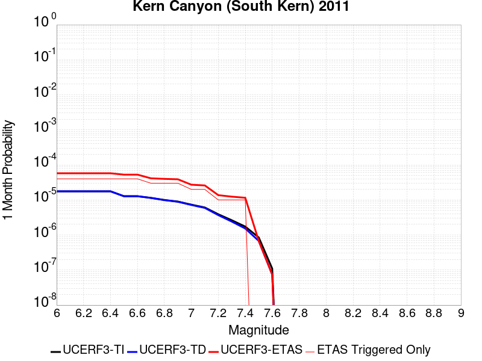 |  |  |

| Magnitude | 1 wk TI Prob | 1 wk TD Prob | 1 wk ETAS Prob | 1 wk ETAS/TD Gain | 1 wk ETAS Triggered Only | 1 mo TI Prob | 1 mo TD Prob | 1 mo ETAS Prob | 1 mo ETAS/TD Gain | 1 mo ETAS Triggered Only | 1 yr TI Prob | 1 yr TD Prob | 1 yr ETAS Prob | 1 yr ETAS/TD Gain | 1 yr ETAS Triggered Only | 10 yr TI Prob | 10 yr TD Prob | 10 yr ETAS Prob | 10 yr ETAS/TD Gain | 10 yr ETAS Triggered Only |
|-----|-----|-----|-----|-----|-----|-----|-----|-----|-----|-----|-----|-----|-----|-----|-----|-----|-----|-----|-----|-----|
| 6.0 | 4.105075E-6 | 4.1137264E-6 | 3.895679E-5 | 9.469952 | 3.4843204E-5 | 1.7593058E-5 | 1.763014E-5 | 5.2472733E-5 | 2.976308 | 3.4843204E-5 | 2.1417443E-4 | 2.1462646E-4 | 2.8429792E-4 | 1.3246173 | 6.968641E-5 | 0.0021396813 | 0.0021442557 | 0.0022137926 | 1.0324295 | 6.968641E-5 |
| 6.1 | 4.105075E-6 | 4.1137264E-6 | 3.895679E-5 | 9.469952 | 3.4843204E-5 | 1.7593058E-5 | 1.763014E-5 | 5.2472733E-5 | 2.976308 | 3.4843204E-5 | 2.1417443E-4 | 2.1462646E-4 | 2.8429792E-4 | 1.3246173 | 6.968641E-5 | 0.0021396813 | 0.0021442557 | 0.0022137926 | 1.0324295 | 6.968641E-5 |
| 6.2 | 4.105075E-6 | 4.1137264E-6 | 3.895679E-5 | 9.469952 | 3.4843204E-5 | 1.7593058E-5 | 1.763014E-5 | 5.2472733E-5 | 2.976308 | 3.4843204E-5 | 2.1417443E-4 | 2.1462646E-4 | 2.8429792E-4 | 1.3246173 | 6.968641E-5 | 0.0021396813 | 0.0021442557 | 0.0022137926 | 1.0324295 | 6.968641E-5 |
| 6.3 | 4.105075E-6 | 4.1137264E-6 | 3.895679E-5 | 9.469952 | 3.4843204E-5 | 1.7593058E-5 | 1.763014E-5 | 5.2472733E-5 | 2.976308 | 3.4843204E-5 | 2.1417443E-4 | 2.1462646E-4 | 2.8429792E-4 | 1.3246173 | 6.968641E-5 | 0.0021396813 | 0.0021442557 | 0.0022137926 | 1.0324295 | 6.968641E-5 |
| 6.4 | 4.105075E-6 | 4.1137264E-6 | 3.895679E-5 | 9.469952 | 3.4843204E-5 | 1.7593058E-5 | 1.763014E-5 | 5.2472733E-5 | 2.976308 | 3.4843204E-5 | 2.1417443E-4 | 2.1462646E-4 | 2.8429792E-4 | 1.3246173 | 6.968641E-5 | 0.0021396813 | 0.0021442557 | 0.0022137926 | 1.0324295 | 6.968641E-5 |
| 6.5 | 2.9849807E-6 | 2.9731548E-6 | 3.7816255E-5 | 12.719236 | 3.4843204E-5 | 1.2792712E-5 | 1.274203E-5 | 4.7584792E-5 | 3.734475 | 3.4843204E-5 | 1.5574014E-4 | 1.5512333E-4 | 2.2479893E-4 | 1.4491626 | 6.968641E-5 | 0.0015563103 | 0.0015501656 | 0.001619744 | 1.0448844 | 6.968641E-5 |
| 6.6 | 2.9849807E-6 | 2.9731548E-6 | 3.7816255E-5 | 12.719236 | 3.4843204E-5 | 1.2792712E-5 | 1.274203E-5 | 4.7584792E-5 | 3.734475 | 3.4843204E-5 | 1.5574014E-4 | 1.5512333E-4 | 2.2479893E-4 | 1.4491626 | 6.968641E-5 | 0.0015563103 | 0.0015501656 | 0.001619744 | 1.0448844 | 6.968641E-5 |
| 6.7 | 2.6756725E-6 | 2.6582206E-6 | 2.0079777E-5 | 7.553841 | 1.7421602E-5 | 1.1467117E-5 | 1.1392325E-5 | 2.8813729E-5 | 2.5292227 | 1.7421602E-5 | 1.396032E-4 | 1.3869285E-4 | 1.909504E-4 | 1.3767862 | 5.2264808E-5 | 0.0013951553 | 0.0013860738 | 0.0014382661 | 1.0376549 | 5.2264808E-5 |
| 6.8 | 2.3283721E-6 | 2.3047787E-6 | 1.9726342E-5 | 8.5588875 | 1.7421602E-5 | 9.9787E-6 | 9.877586E-6 | 2.7299016E-5 | 2.7637336 | 1.7421602E-5 | 1.214839E-4 | 1.20253055E-4 | 1.7251157E-4 | 1.4345713 | 5.2264808E-5 | 0.001214175 | 0.0012018873 | 0.0012540893 | 1.0434333 | 5.2264808E-5 |
| 6.9 | 2.0972677E-6 | 2.0696411E-6 | 1.9491208E-5 | 9.417675 | 1.7421602E-5 | 8.988259E-6 | 8.869861E-6 | 2.6291309E-5 | 2.9641175 | 1.7421602E-5 | 1.0942656E-4 | 1.0798526E-4 | 1.6024442E-4 | 1.4839472 | 5.2264808E-5 | 0.0010937268 | 0.0010793337 | 0.0011315421 | 1.048371 | 5.2264808E-5 |
| 7.0 | 1.7132242E-6 | 1.6787036E-6 | 1.6787036E-6 | 1.0 | 0.0 | 7.3423685E-6 | 7.194424E-6 | 7.194424E-6 | 1.0 | 0.0 | 8.938967E-5 | 8.758863E-5 | 1.2242878E-4 | 1.3977703 | 3.4843204E-5 | 8.935372E-4 | 8.7554497E-4 | 9.1035763E-4 | 1.0397612 | 3.4843204E-5 |
| 7.1 | 1.4215541E-6 | 1.3815752E-6 | 1.3815752E-6 | 1.0 | 0.0 | 6.0923603E-6 | 5.9210233E-6 | 5.9210233E-6 | 1.0 | 0.0 | 7.417196E-5 | 7.20861E-5 | 8.950645E-5 | 1.2416602 | 1.7421602E-5 | 7.414721E-4 | 7.206299E-4 | 7.380389E-4 | 1.0241581 | 1.7421602E-5 |
| 7.2 | 9.097853E-7 | 8.6037755E-7 | 8.6037755E-7 | 1.0 | 0.0 | 3.899074E-6 | 3.6873273E-6 | 3.6873273E-6 | 1.0 | 0.0 | 4.7470192E-5 | 4.4892295E-5 | 6.231311E-5 | 1.3880582 | 1.7421602E-5 | 4.7460053E-4 | 4.4883334E-4 | 4.6624712E-4 | 1.0387979 | 1.7421602E-5 |
| 7.3 | 6.144169E-7 | 5.628206E-7 | 5.628206E-7 | 1.0 | 0.0 | 2.6332125E-6 | 2.4120861E-6 | 2.4120861E-6 | 1.0 | 0.0 | 3.205889E-5 | 2.9366758E-5 | 4.678785E-5 | 1.5932249 | 1.7421602E-5 | 3.2054266E-4 | 2.936293E-4 | 3.110458E-4 | 1.0593145 | 1.7421602E-5 |
| 7.4 | 4.049844E-7 | 3.5728314E-7 | 3.5728314E-7 | 1.0 | 0.0 | 1.7356463E-6 | 1.5312125E-6 | 1.5312125E-6 | 1.0 | 0.0 | 2.1131287E-5 | 1.8642357E-5 | 3.6063633E-5 | 1.9344999 | 1.7421602E-5 | 2.1129279E-4 | 1.8640817E-4 | 2.0382652E-4 | 1.093442 | 1.7421602E-5 |
| 7.5 | 1.9871162E-7 | 1.583044E-7 | 1.583044E-7 | 1.0 | 0.0 | 8.5162094E-7 | 6.7844724E-7 | 6.7844724E-7 | 1.0 | 0.0 | 1.0368436E-5 | 8.260065E-6 | 8.260065E-6 | 1.0 | 0.0 | 1.0367952E-4 | 8.259767E-5 | 8.259767E-5 | 1.0 | 0.0 |
| 7.6 | 2.572245E-8 | 1.7352555E-8 | 1.7352555E-8 | 1.0 | 0.0 | 1.10239064E-7 | 7.436809E-8 | 7.436809E-8 | 1.0 | 0.0 | 1.3421597E-6 | 9.054312E-7 | 9.054312E-7 | 1.0 | 0.0 | 1.3421517E-5 | 9.05428E-6 | 9.05428E-6 | 1.0 | 0.0 |

## Mission Ridge-Arroyo Parida-Santa Ana
*[(top)](#table-of-contents)*

| 1 Week | 1 Month | 1 Year | 10 Year |
|-----|-----|-----|-----|
|  |  |  |  |

| Magnitude | 1 wk TI Prob | 1 wk TD Prob | 1 wk ETAS Prob | 1 wk ETAS/TD Gain | 1 wk ETAS Triggered Only | 1 mo TI Prob | 1 mo TD Prob | 1 mo ETAS Prob | 1 mo ETAS/TD Gain | 1 mo ETAS Triggered Only | 1 yr TI Prob | 1 yr TD Prob | 1 yr ETAS Prob | 1 yr ETAS/TD Gain | 1 yr ETAS Triggered Only | 10 yr TI Prob | 10 yr TD Prob | 10 yr ETAS Prob | 10 yr ETAS/TD Gain | 10 yr ETAS Triggered Only |
|-----|-----|-----|-----|-----|-----|-----|-----|-----|-----|-----|-----|-----|-----|-----|-----|-----|-----|-----|-----|-----|
| 6.0 | 4.169034E-5 | 4.7138263E-5 | 6.455905E-5 | 1.3695678 | 1.7421602E-5 | 1.7866064E-4 | 2.0201034E-4 | 2.1942843E-4 | 1.0862237 | 1.7421602E-5 | 0.0021730233 | 0.00245745 | 0.0024748289 | 1.0070719 | 1.7421602E-5 | 0.021518968 | 0.024384614 | 0.024435606 | 1.002091 | 5.2264808E-5 |
| 6.1 | 1.73813E-5 | 1.6854226E-5 | 1.6854226E-5 | 1.0 | 0.0 | 7.4489166E-5 | 7.223046E-5 | 7.223046E-5 | 1.0 | 0.0 | 9.065282E-4 | 8.790618E-4 | 8.790618E-4 | 1.0 | 0.0 | 0.009028391 | 0.008756988 | 0.008756988 | 1.0 | 0.0 |
| 6.2 | 1.4622182E-5 | 1.367329E-5 | 1.367329E-5 | 1.0 | 0.0 | 6.2664985E-5 | 5.8598518E-5 | 5.8598518E-5 | 1.0 | 0.0 | 7.6267915E-4 | 7.132073E-4 | 7.132073E-4 | 1.0 | 0.0 | 0.007600669 | 0.007109627 | 0.007109627 | 1.0 | 0.0 |
| 6.3 | 1.3552434E-5 | 1.2482201E-5 | 1.2482201E-5 | 1.0 | 0.0 | 5.8080568E-5 | 5.3494066E-5 | 5.3494066E-5 | 1.0 | 0.0 | 7.069015E-4 | 6.510988E-4 | 6.510988E-4 | 1.0 | 0.0 | 0.00704657 | 0.006492275 | 0.006492275 | 1.0 | 0.0 |
| 6.4 | 1.30977305E-5 | 1.1979156E-5 | 1.1979156E-5 | 1.0 | 0.0 | 5.613192E-5 | 5.1338247E-5 | 5.1338247E-5 | 1.0 | 0.0 | 6.831918E-4 | 6.248669E-4 | 6.248669E-4 | 1.0 | 0.0 | 0.006810953 | 0.0062314444 | 0.0062314444 | 1.0 | 0.0 |
| 6.5 | 1.225205E-5 | 1.1048803E-5 | 1.1048803E-5 | 1.0 | 0.0 | 5.2507727E-5 | 4.7351168E-5 | 4.7351168E-5 | 1.0 | 0.0 | 6.3909404E-4 | 5.7635066E-4 | 5.7635066E-4 | 1.0 | 0.0 | 0.006372592 | 0.005748869 | 0.005748869 | 1.0 | 0.0 |
| 6.6 | 1.1352241E-5 | 1.0063535E-5 | 1.0063535E-5 | 1.0 | 0.0 | 4.8651553E-5 | 4.3128734E-5 | 4.3128734E-5 | 1.0 | 0.0 | 5.921717E-4 | 5.2496797E-4 | 5.2496797E-4 | 1.0 | 0.0 | 0.0059059616 | 0.0052375244 | 0.0052375244 | 1.0 | 0.0 |
| 6.7 | 1.0864116E-5 | 9.517027E-6 | 9.517027E-6 | 1.0 | 0.0 | 4.6559664E-5 | 4.0786632E-5 | 4.0786632E-5 | 1.0 | 0.0 | 5.667165E-4 | 4.964661E-4 | 4.964661E-4 | 1.0 | 0.0 | 0.005652734 | 0.004953804 | 0.004953804 | 1.0 | 0.0 |
| 6.8 | 1.0666365E-5 | 9.299779E-6 | 9.299779E-6 | 1.0 | 0.0 | 4.571219E-5 | 3.9855597E-5 | 3.9855597E-5 | 1.0 | 0.0 | 5.564038E-4 | 4.8513585E-4 | 4.8513585E-4 | 1.0 | 0.0 | 0.005550127 | 0.0048410003 | 0.0048410003 | 1.0 | 0.0 |
| 6.9 | 1.0038665E-5 | 8.592046E-6 | 8.592046E-6 | 1.0 | 0.0 | 4.302214E-5 | 3.682254E-5 | 3.682254E-5 | 1.0 | 0.0 | 5.236687E-4 | 4.4822405E-4 | 4.4822405E-4 | 1.0 | 0.0 | 0.005224364 | 0.004473411 | 0.004473411 | 1.0 | 0.0 |
| 7.0 | 9.5379955E-6 | 8.025073E-6 | 8.025073E-6 | 1.0 | 0.0 | 4.0876483E-5 | 3.4392728E-5 | 3.4392728E-5 | 1.0 | 0.0 | 4.975576E-4 | 4.1865272E-4 | 4.1865272E-4 | 1.0 | 0.0 | 0.00496445 | 0.0041788397 | 0.0041788397 | 1.0 | 0.0 |
| 7.1 | 9.207389E-6 | 7.652375E-6 | 7.652375E-6 | 1.0 | 0.0 | 3.945964E-5 | 3.279549E-5 | 3.279549E-5 | 1.0 | 0.0 | 4.803152E-4 | 3.9921363E-4 | 3.9921363E-4 | 1.0 | 0.0 | 0.004792784 | 0.003985161 | 0.003985161 | 1.0 | 0.0 |
| 7.2 | 7.638091E-6 | 5.9311183E-6 | 5.9311183E-6 | 1.0 | 0.0 | 3.2734264E-5 | 2.541883E-5 | 2.541883E-5 | 1.0 | 0.0 | 3.984668E-4 | 3.0943064E-4 | 3.0943064E-4 | 1.0 | 0.0 | 0.0039775306 | 0.0030900547 | 0.0030900547 | 1.0 | 0.0 |
| 7.3 | 7.2500147E-6 | 5.5961527E-6 | 5.5961527E-6 | 1.0 | 0.0 | 3.1071122E-5 | 2.3983293E-5 | 2.3983293E-5 | 1.0 | 0.0 | 3.7822526E-4 | 2.9195778E-4 | 2.9195778E-4 | 1.0 | 0.0 | 0.0037758215 | 0.0029157975 | 0.0029157975 | 1.0 | 0.0 |
| 7.4 | 6.3899715E-6 | 4.9184964E-6 | 4.9184964E-6 | 1.0 | 0.0 | 2.7385306E-5 | 2.10791E-5 | 2.10791E-5 | 1.0 | 0.0 | 3.3336508E-4 | 2.5660804E-4 | 2.5660804E-4 | 1.0 | 0.0 | 0.0033286542 | 0.0025631618 | 0.0025631618 | 1.0 | 0.0 |
| 7.5 | 5.379025E-6 | 4.0838527E-6 | 4.0838527E-6 | 1.0 | 0.0 | 2.305276E-5 | 1.7502109E-5 | 1.7502109E-5 | 1.0 | 0.0 | 2.806312E-4 | 2.1306744E-4 | 2.1306744E-4 | 1.0 | 0.0 | 0.0028027708 | 0.002128643 | 0.002128643 | 1.0 | 0.0 |
| 7.6 | 4.1270696E-6 | 3.0883439E-6 | 3.0883439E-6 | 1.0 | 0.0 | 1.768732E-5 | 1.3235693E-5 | 1.3235693E-5 | 1.0 | 0.0 | 2.1532185E-4 | 1.6113273E-4 | 1.6113273E-4 | 1.0 | 0.0 | 0.0021511333 | 0.001610167 | 0.001610167 | 1.0 | 0.0 |
| 7.7 | 2.5406805E-6 | 1.8282013E-6 | 1.8282013E-6 | 1.0 | 0.0 | 1.0888585E-5 | 7.835125E-6 | 7.835125E-6 | 1.0 | 0.0 | 1.3256045E-4 | 9.538854E-5 | 9.538854E-5 | 1.0 | 0.0 | 0.0013248142 | 9.534821E-4 | 9.534821E-4 | 1.0 | 0.0 |
| 7.8 | 4.8608285E-7 | 3.5098864E-7 | 3.5098864E-7 | 1.0 | 0.0 | 2.0832106E-6 | 1.5042363E-6 | 1.5042363E-6 | 1.0 | 0.0 | 2.5362791E-5 | 1.8313924E-5 | 1.8313924E-5 | 1.0 | 0.0 | 2.5359896E-4 | 1.8312426E-4 | 1.8312426E-4 | 1.0 | 0.0 |
| 7.9 | 2.0472514E-8 | 1.2688783E-8 | 1.2688783E-8 | 1.0 | 0.0 | 8.7739345E-8 | 5.43805E-8 | 5.43805E-8 | 1.0 | 0.0 | 1.068226E-6 | 6.6208236E-7 | 6.6208236E-7 | 1.0 | 0.0 | 1.0682209E-5 | 6.620805E-6 | 6.620805E-6 | 1.0 | 0.0 |
| 8.0 | 4.443582E-9 | 2.0321211E-9 | 2.0321211E-9 | 1.0 | 0.0 | 1.9043922E-8 | 8.70909E-9 | 8.70909E-9 | 1.0 | 0.0 | 2.3185973E-7 | 1.0603316E-7 | 1.0603316E-7 | 1.0 | 0.0 | 2.3185949E-6 | 1.0603312E-6 | 1.0603312E-6 | 1.0 | 0.0 |

## Camp Rock 2011
*[(top)](#table-of-contents)*

| 1 Week | 1 Month | 1 Year | 10 Year |
|-----|-----|-----|-----|
|  |  |  | 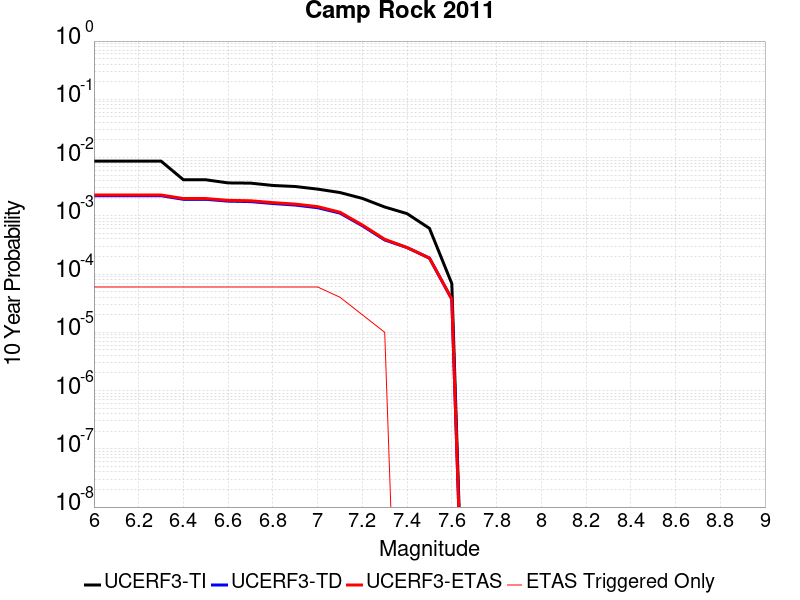 |

| Magnitude | 1 wk TI Prob | 1 wk TD Prob | 1 wk ETAS Prob | 1 wk ETAS/TD Gain | 1 wk ETAS Triggered Only | 1 mo TI Prob | 1 mo TD Prob | 1 mo ETAS Prob | 1 mo ETAS/TD Gain | 1 mo ETAS Triggered Only | 1 yr TI Prob | 1 yr TD Prob | 1 yr ETAS Prob | 1 yr ETAS/TD Gain | 1 yr ETAS Triggered Only | 10 yr TI Prob | 10 yr TD Prob | 10 yr ETAS Prob | 10 yr ETAS/TD Gain | 10 yr ETAS Triggered Only |
|-----|-----|-----|-----|-----|-----|-----|-----|-----|-----|-----|-----|-----|-----|-----|-----|-----|-----|-----|-----|-----|
| 6.0 | 1.6710783E-5 | 4.25026E-6 | 2.1671789E-5 | 5.0989323 | 1.7421602E-5 | 7.161568E-5 | 1.8215276E-5 | 5.3057847E-5 | 2.9128213 | 3.4843204E-5 | 8.7157206E-4 | 2.2174895E-4 | 2.5658443E-4 | 1.1570942 | 3.4843204E-5 | 0.008681616 | 0.0022153298 | 0.0022674787 | 1.02354 | 5.2264808E-5 |
| 6.1 | 1.6710783E-5 | 4.25026E-6 | 2.1671789E-5 | 5.0989323 | 1.7421602E-5 | 7.161568E-5 | 1.8215276E-5 | 5.3057847E-5 | 2.9128213 | 3.4843204E-5 | 8.7157206E-4 | 2.2174895E-4 | 2.5658443E-4 | 1.1570942 | 3.4843204E-5 | 0.008681616 | 0.0022153298 | 0.0022674787 | 1.02354 | 5.2264808E-5 |
| 6.2 | 1.6710783E-5 | 4.25026E-6 | 2.1671789E-5 | 5.0989323 | 1.7421602E-5 | 7.161568E-5 | 1.8215276E-5 | 5.3057847E-5 | 2.9128213 | 3.4843204E-5 | 8.7157206E-4 | 2.2174895E-4 | 2.5658443E-4 | 1.1570942 | 3.4843204E-5 | 0.008681616 | 0.0022153298 | 0.0022674787 | 1.02354 | 5.2264808E-5 |
| 6.3 | 1.6710783E-5 | 4.25026E-6 | 2.1671789E-5 | 5.0989323 | 1.7421602E-5 | 7.161568E-5 | 1.8215276E-5 | 5.3057847E-5 | 2.9128213 | 3.4843204E-5 | 8.7157206E-4 | 2.2174895E-4 | 2.5658443E-4 | 1.1570942 | 3.4843204E-5 | 0.008681616 | 0.0022153298 | 0.0022674787 | 1.02354 | 5.2264808E-5 |
| 6.4 | 7.982846E-6 | 3.6820884E-6 | 2.1103628E-5 | 5.7314286 | 1.7421602E-5 | 3.421175E-5 | 1.5780286E-5 | 5.062294E-5 | 3.2079864 | 3.4843204E-5 | 4.1644843E-4 | 1.9210839E-4 | 2.269449E-4 | 1.1813378 | 3.4843204E-5 | 0.0041566887 | 0.001919458 | 0.0019716225 | 1.0271766 | 5.2264808E-5 |
| 6.5 | 7.982846E-6 | 3.6820884E-6 | 2.1103628E-5 | 5.7314286 | 1.7421602E-5 | 3.421175E-5 | 1.5780286E-5 | 5.062294E-5 | 3.2079864 | 3.4843204E-5 | 4.1644843E-4 | 1.9210839E-4 | 2.269449E-4 | 1.1813378 | 3.4843204E-5 | 0.0041566887 | 0.001919458 | 0.0019716225 | 1.0271766 | 5.2264808E-5 |
| 6.6 | 7.048869E-6 | 3.4243571E-6 | 2.08459E-5 | 6.087537 | 1.7421602E-5 | 3.0209088E-5 | 1.4675736E-5 | 4.951843E-5 | 3.37417 | 3.4843204E-5 | 3.677336E-4 | 1.7866275E-4 | 2.1349973E-4 | 1.1949874 | 3.4843204E-5 | 0.0036712566 | 0.0017852228 | 0.0018373943 | 1.029224 | 5.2264808E-5 |
| 6.7 | 6.987307E-6 | 3.3623348E-6 | 2.0783878E-5 | 6.181383 | 1.7421602E-5 | 2.9945259E-5 | 1.4409929E-5 | 4.925263E-5 | 3.4179652 | 3.4843204E-5 | 3.6452254E-4 | 1.7542706E-4 | 2.1026416E-4 | 1.1985844 | 3.4843204E-5 | 0.0036392517 | 0.001752917 | 0.0018050901 | 1.0297637 | 5.2264808E-5 |
| 6.8 | 6.3737602E-6 | 3.1179077E-6 | 2.0539455E-5 | 6.587577 | 1.7421602E-5 | 2.731583E-5 | 1.3362394E-5 | 4.8205133E-5 | 3.6075222 | 3.4843204E-5 | 3.3251947E-4 | 1.626753E-4 | 1.9751283E-4 | 1.2141539 | 3.4843204E-5 | 0.0033202237 | 0.0016255907 | 0.0016777706 | 1.032099 | 5.2264808E-5 |
| 6.9 | 6.112211E-6 | 2.9331156E-6 | 2.0354668E-5 | 6.939606 | 1.7421602E-5 | 2.6194928E-5 | 1.2570436E-5 | 4.7413203E-5 | 3.7718027 | 3.4843204E-5 | 3.1887658E-4 | 1.5303459E-4 | 1.8787247E-4 | 1.2276471 | 3.4843204E-5 | 0.003184194 | 0.0015293199 | 0.0015815047 | 1.034123 | 5.2264808E-5 |
| 7.0 | 5.5140117E-6 | 2.641923E-6 | 2.006348E-5 | 7.594271 | 1.7421602E-5 | 2.3631264E-5 | 1.132248E-5 | 4.616529E-5 | 4.077313 | 3.4843204E-5 | 2.8767265E-4 | 1.3784273E-4 | 1.7268112E-4 | 1.2527403 | 3.4843204E-5 | 0.0028730053 | 0.0013775975 | 0.0014297903 | 1.0378869 | 5.2264808E-5 |
| 7.1 | 4.8151105E-6 | 2.1342705E-6 | 2.1342705E-6 | 1.0 | 0.0 | 2.0636026E-5 | 9.146843E-6 | 2.6568287E-5 | 2.9046402 | 1.7421602E-5 | 2.5121463E-4 | 1.1135734E-4 | 1.28777E-4 | 1.1564304 | 1.7421602E-5 | 0.0025093083 | 0.0011130372 | 0.0011478417 | 1.0312698 | 3.4843204E-5 |
| 7.2 | 3.818335E-6 | 1.2937425E-6 | 1.2937425E-6 | 1.0 | 0.0 | 1.6364189E-5 | 5.5445994E-6 | 2.2966105E-5 | 4.142068 | 1.7421602E-5 | 1.9921579E-4 | 6.750349E-5 | 8.4923915E-5 | 1.258067 | 1.7421602E-5 | 0.0019903728 | 6.748381E-4 | 6.9224794E-4 | 1.0257986 | 1.7421602E-5 |
| 7.3 | 2.7166698E-6 | 7.3835776E-7 | 7.3835776E-7 | 1.0 | 0.0 | 1.1642818E-5 | 3.1643867E-6 | 2.0585934E-5 | 6.505505 | 1.7421602E-5 | 1.4174209E-4 | 3.8525748E-5 | 5.594668E-5 | 1.4521893 | 1.7421602E-5 | 0.0014165172 | 3.851927E-4 | 4.0260758E-4 | 1.0452108 | 1.7421602E-5 |
| 7.4 | 2.0893426E-6 | 5.4618386E-7 | 5.4618386E-7 | 1.0 | 0.0 | 8.954295E-6 | 2.3407858E-6 | 2.3407858E-6 | 1.0 | 0.0 | 1.0901308E-4 | 2.84987E-5 | 2.84987E-5 | 1.0 | 0.0 | 0.0010895962 | 2.84951E-4 | 2.84951E-4 | 1.0 | 0.0 |
| 7.5 | 1.1681728E-6 | 3.6030585E-7 | 3.6030585E-7 | 1.0 | 0.0 | 5.0064455E-6 | 1.544167E-6 | 1.544167E-6 | 1.0 | 0.0 | 6.0951766E-5 | 1.8800076E-5 | 1.8800076E-5 | 1.0 | 0.0 | 6.093505E-4 | 1.8798532E-4 | 1.8798532E-4 | 1.0 | 0.0 |
| 7.6 | 1.3154387E-7 | 7.1197384E-8 | 7.1197384E-8 | 1.0 | 0.0 | 5.6375933E-7 | 3.051316E-7 | 3.051316E-7 | 1.0 | 0.0 | 6.863748E-6 | 3.7149728E-6 | 3.7149728E-6 | 1.0 | 0.0 | 6.863536E-5 | 3.7149264E-5 | 3.7149264E-5 | 1.0 | 0.0 |

## Dry Mountain
*[(top)](#table-of-contents)*

| 1 Week | 1 Month | 1 Year | 10 Year |
|-----|-----|-----|-----|
|  |  |  |  |

| Magnitude | 1 wk TI Prob | 1 wk TD Prob | 1 wk ETAS Prob | 1 wk ETAS/TD Gain | 1 wk ETAS Triggered Only | 1 mo TI Prob | 1 mo TD Prob | 1 mo ETAS Prob | 1 mo ETAS/TD Gain | 1 mo ETAS Triggered Only | 1 yr TI Prob | 1 yr TD Prob | 1 yr ETAS Prob | 1 yr ETAS/TD Gain | 1 yr ETAS Triggered Only | 10 yr TI Prob | 10 yr TD Prob | 10 yr ETAS Prob | 10 yr ETAS/TD Gain | 10 yr ETAS Triggered Only |
|-----|-----|-----|-----|-----|-----|-----|-----|-----|-----|-----|-----|-----|-----|-----|-----|-----|-----|-----|-----|-----|
| 6.0 | 6.222801E-6 | 6.439381E-6 | 4.128236E-5 | 6.4109206 | 3.4843204E-5 | 2.6668875E-5 | 2.7597147E-5 | 6.243939E-5 | 2.2625308 | 3.4843204E-5 | 3.2464517E-4 | 3.3595937E-4 | 3.8820662E-4 | 1.1555166 | 5.2264808E-5 | 0.0032417132 | 0.0033560768 | 0.0034081663 | 1.0155209 | 5.2264808E-5 |
| 6.1 | 6.222801E-6 | 6.439381E-6 | 4.128236E-5 | 6.4109206 | 3.4843204E-5 | 2.6668875E-5 | 2.7597147E-5 | 6.243939E-5 | 2.2625308 | 3.4843204E-5 | 3.2464517E-4 | 3.3595937E-4 | 3.8820662E-4 | 1.1555166 | 5.2264808E-5 | 0.0032417132 | 0.0033560768 | 0.0034081663 | 1.0155209 | 5.2264808E-5 |
| 6.2 | 6.222801E-6 | 6.439381E-6 | 4.128236E-5 | 6.4109206 | 3.4843204E-5 | 2.6668875E-5 | 2.7597147E-5 | 6.243939E-5 | 2.2625308 | 3.4843204E-5 | 3.2464517E-4 | 3.3595937E-4 | 3.8820662E-4 | 1.1555166 | 5.2264808E-5 | 0.0032417132 | 0.0033560768 | 0.0034081663 | 1.0155209 | 5.2264808E-5 |
| 6.3 | 6.222801E-6 | 6.439381E-6 | 4.128236E-5 | 6.4109206 | 3.4843204E-5 | 2.6668875E-5 | 2.7597147E-5 | 6.243939E-5 | 2.2625308 | 3.4843204E-5 | 3.2464517E-4 | 3.3595937E-4 | 3.8820662E-4 | 1.1555166 | 5.2264808E-5 | 0.0032417132 | 0.0033560768 | 0.0034081663 | 1.0155209 | 5.2264808E-5 |
| 6.4 | 6.222801E-6 | 6.439381E-6 | 4.128236E-5 | 6.4109206 | 3.4843204E-5 | 2.6668875E-5 | 2.7597147E-5 | 6.243939E-5 | 2.2625308 | 3.4843204E-5 | 3.2464517E-4 | 3.3595937E-4 | 3.8820662E-4 | 1.1555166 | 5.2264808E-5 | 0.0032417132 | 0.0033560768 | 0.0034081663 | 1.0155209 | 5.2264808E-5 |
| 6.5 | 2.8528623E-6 | 2.9521684E-6 | 2.037372E-5 | 6.901273 | 1.7421602E-5 | 1.22264955E-5 | 1.2652138E-5 | 3.0073521E-5 | 2.3769517 | 1.7421602E-5 | 1.4884741E-4 | 1.540376E-4 | 1.8887543E-4 | 1.2261646 | 3.4843204E-5 | 0.0014874774 | 0.0015401616 | 0.0015749511 | 1.0225883 | 3.4843204E-5 |
| 6.6 | 2.8528623E-6 | 2.9521684E-6 | 2.037372E-5 | 6.901273 | 1.7421602E-5 | 1.22264955E-5 | 1.2652138E-5 | 3.0073521E-5 | 2.3769517 | 1.7421602E-5 | 1.4884741E-4 | 1.540376E-4 | 1.8887543E-4 | 1.2261646 | 3.4843204E-5 | 0.0014874774 | 0.0015401616 | 0.0015749511 | 1.0225883 | 3.4843204E-5 |
| 6.7 | 2.541E-6 | 2.6293578E-6 | 2.0050915E-5 | 7.625784 | 1.7421602E-5 | 1.0889954E-5 | 1.1268677E-5 | 2.8690083E-5 | 2.5460029 | 1.7421602E-5 | 1.3257713E-4 | 1.3719614E-4 | 1.7203456E-4 | 1.2539315 | 3.4843204E-5 | 0.0013249806 | 0.0013719613 | 0.0014067568 | 1.0253618 | 3.4843204E-5 |

## San Clemente
*[(top)](#table-of-contents)*

| 1 Week | 1 Month | 1 Year | 10 Year |
|-----|-----|-----|-----|
|  |  |  |  |

| Magnitude | 1 wk TI Prob | 1 wk TD Prob | 1 wk ETAS Prob | 1 wk ETAS/TD Gain | 1 wk ETAS Triggered Only | 1 mo TI Prob | 1 mo TD Prob | 1 mo ETAS Prob | 1 mo ETAS/TD Gain | 1 mo ETAS Triggered Only | 1 yr TI Prob | 1 yr TD Prob | 1 yr ETAS Prob | 1 yr ETAS/TD Gain | 1 yr ETAS Triggered Only | 10 yr TI Prob | 10 yr TD Prob | 10 yr ETAS Prob | 10 yr ETAS/TD Gain | 10 yr ETAS Triggered Only |
|-----|-----|-----|-----|-----|-----|-----|-----|-----|-----|-----|-----|-----|-----|-----|-----|-----|-----|-----|-----|-----|
| 6.0 | 6.681379E-5 | 8.163422E-5 | 9.905441E-5 | 1.2133931 | 1.7421602E-5 | 2.8631336E-4 | 3.498173E-4 | 3.6723283E-4 | 1.0497845 | 1.7421602E-5 | 0.003480294 | 0.0042512873 | 0.004268635 | 1.0040805 | 1.7421602E-5 | 0.03426291 | 0.041755714 | 0.041805796 | 1.0011994 | 5.2264808E-5 |
| 6.1 | 6.681379E-5 | 8.163422E-5 | 9.905441E-5 | 1.2133931 | 1.7421602E-5 | 2.8631336E-4 | 3.498173E-4 | 3.6723283E-4 | 1.0497845 | 1.7421602E-5 | 0.003480294 | 0.0042512873 | 0.004268635 | 1.0040805 | 1.7421602E-5 | 0.03426291 | 0.041755714 | 0.041789103 | 1.0007997 | 3.4843204E-5 |
| 6.2 | 3.9400576E-5 | 4.6451984E-5 | 6.387278E-5 | 1.375028 | 1.7421602E-5 | 1.6884868E-4 | 1.9906509E-4 | 2.1648323E-4 | 1.0874997 | 1.7421602E-5 | 0.0020537945 | 0.002420985 | 0.0024383643 | 1.0071787 | 1.7421602E-5 | 0.020349167 | 0.02395286 | 0.023969864 | 1.0007099 | 1.7421602E-5 |
| 6.3 | 3.2590255E-5 | 3.7929087E-5 | 5.535003E-5 | 1.4593029 | 1.7421602E-5 | 1.3966505E-4 | 1.6254328E-4 | 1.7996205E-4 | 1.1071639 | 1.7421602E-5 | 0.0016990956 | 0.0019771985 | 0.0019945856 | 1.0087938 | 1.7421602E-5 | 0.01686163 | 0.019599866 | 0.019616947 | 1.0008714 | 1.7421602E-5 |
| 6.4 | 2.9454652E-5 | 3.4097775E-5 | 5.1518786E-5 | 1.5109134 | 1.7421602E-5 | 1.2622811E-4 | 1.4612528E-4 | 1.6354435E-4 | 1.1192063 | 1.7421602E-5 | 0.0015357438 | 0.0017776482 | 0.0017950388 | 1.0097829 | 1.7421602E-5 | 0.015251739 | 0.017637458 | 0.017654572 | 1.0009704 | 1.7421602E-5 |
| 6.5 | 2.790836E-5 | 3.2247463E-5 | 4.9668502E-5 | 1.5402298 | 1.7421602E-5 | 1.1960178E-4 | 1.3819622E-4 | 1.5561542E-4 | 1.1260468 | 1.7421602E-5 | 0.001455179 | 0.0016812651 | 0.0016986574 | 1.0103447 | 1.7421602E-5 | 0.014456868 | 0.016688475 | 0.016705606 | 1.0010265 | 1.7421602E-5 |
| 6.6 | 2.2492153E-5 | 2.5762707E-5 | 4.318386E-5 | 1.676216 | 1.7421602E-5 | 9.639138E-5 | 1.1040701E-4 | 1.2782669E-4 | 1.157777 | 1.7421602E-5 | 0.0011729331 | 0.0013433908 | 0.001360789 | 1.012951 | 1.7421602E-5 | 0.011667615 | 0.013354415 | 0.0133716045 | 1.0012871 | 1.7421602E-5 |
| 6.7 | 1.9862755E-5 | 2.2666423E-5 | 2.2666423E-5 | 1.0 | 0.0 | 8.512331E-5 | 9.713826E-5 | 9.713826E-5 | 1.0 | 0.0 | 0.0010358836 | 0.0011820279 | 0.0011820279 | 1.0 | 0.0 | 0.010310682 | 0.011758701 | 0.011758701 | 1.0 | 0.0 |
| 6.8 | 1.6697575E-5 | 1.897771E-5 | 1.897771E-5 | 1.0 | 0.0 | 7.155907E-5 | 8.133056E-5 | 8.133056E-5 | 1.0 | 0.0 | 8.7088346E-4 | 9.897591E-4 | 9.897591E-4 | 1.0 | 0.0 | 0.008674784 | 0.0098545365 | 0.0098545365 | 1.0 | 0.0 |
| 6.9 | 1.5218415E-5 | 1.72694E-5 | 1.72694E-5 | 1.0 | 0.0 | 6.522015E-5 | 7.4009666E-5 | 7.4009666E-5 | 1.0 | 0.0 | 7.93766E-4 | 9.00704E-4 | 9.00704E-4 | 1.0 | 0.0 | 0.007909367 | 0.008971481 | 0.008971481 | 1.0 | 0.0 |
| 7.0 | 1.2392958E-5 | 1.4033016E-5 | 1.4033016E-5 | 1.0 | 0.0 | 5.3111595E-5 | 6.014015E-5 | 6.014015E-5 | 1.0 | 0.0 | 6.4644177E-4 | 7.319679E-4 | 7.319679E-4 | 1.0 | 0.0 | 0.0064456454 | 0.0072963564 | 0.0072963564 | 1.0 | 0.0 |
| 7.1 | 1.0934128E-5 | 1.2375138E-5 | 1.2375138E-5 | 1.0 | 0.0 | 4.6859706E-5 | 5.303527E-5 | 5.303527E-5 | 1.0 | 0.0 | 5.7036756E-4 | 6.455204E-4 | 6.455204E-4 | 1.0 | 0.0 | 0.0056890585 | 0.0064371997 | 0.0064371997 | 1.0 | 0.0 |
| 7.2 | 9.5798805E-6 | 1.0844935E-5 | 1.0844935E-5 | 1.0 | 0.0 | 4.1055984E-5 | 4.6477508E-5 | 4.6477508E-5 | 1.0 | 0.0 | 4.9974193E-4 | 5.657239E-4 | 5.657239E-4 | 1.0 | 0.0 | 0.0049861963 | 0.0056435615 | 0.0056435615 | 1.0 | 0.0 |
| 7.3 | 8.0167365E-6 | 9.083918E-6 | 9.083918E-6 | 1.0 | 0.0 | 3.4356988E-5 | 3.8930535E-5 | 3.8930535E-5 | 1.0 | 0.0 | 4.1821605E-4 | 4.7388324E-4 | 4.7388324E-4 | 1.0 | 0.0 | 0.0041742986 | 0.0047294297 | 0.0047294297 | 1.0 | 0.0 |
| 7.4 | 2.9581017E-6 | 3.3623792E-6 | 3.3623792E-6 | 1.0 | 0.0 | 1.2677518E-5 | 1.4410146E-5 | 1.4410146E-5 | 1.0 | 0.0 | 1.5433785E-4 | 1.7543444E-4 | 1.7543444E-4 | 1.0 | 0.0 | 0.001542307 | 0.0017534546 | 0.0017534546 | 1.0 | 0.0 |

## Sierra Madre
*[(top)](#table-of-contents)*

| 1 Week | 1 Month | 1 Year | 10 Year |
|-----|-----|-----|-----|
|  |  |  |  |

| Magnitude | 1 wk TI Prob | 1 wk TD Prob | 1 wk ETAS Prob | 1 wk ETAS/TD Gain | 1 wk ETAS Triggered Only | 1 mo TI Prob | 1 mo TD Prob | 1 mo ETAS Prob | 1 mo ETAS/TD Gain | 1 mo ETAS Triggered Only | 1 yr TI Prob | 1 yr TD Prob | 1 yr ETAS Prob | 1 yr ETAS/TD Gain | 1 yr ETAS Triggered Only | 10 yr TI Prob | 10 yr TD Prob | 10 yr ETAS Prob | 10 yr ETAS/TD Gain | 10 yr ETAS Triggered Only |
|-----|-----|-----|-----|-----|-----|-----|-----|-----|-----|-----|-----|-----|-----|-----|-----|-----|-----|-----|-----|-----|
| 6.0 | 1.3379373E-5 | 1.10007395E-5 | 4.584356E-5 | 4.1673164 | 3.4843204E-5 | 5.7338908E-5 | 4.7145186E-5 | 8.198675E-5 | 1.739027 | 3.4843204E-5 | 6.978776E-4 | 5.738429E-4 | 6.0866616E-4 | 1.0606842 | 3.4843204E-5 | 0.0069569005 | 0.0057239756 | 0.0057759415 | 1.0090786 | 5.2264808E-5 |
| 6.1 | 1.3379373E-5 | 1.10007395E-5 | 4.584356E-5 | 4.1673164 | 3.4843204E-5 | 5.7338908E-5 | 4.7145186E-5 | 8.198675E-5 | 1.739027 | 3.4843204E-5 | 6.978776E-4 | 5.738429E-4 | 6.0866616E-4 | 1.0606842 | 3.4843204E-5 | 0.0069569005 | 0.0057239756 | 0.0057759415 | 1.0090786 | 5.2264808E-5 |
| 6.2 | 1.3379373E-5 | 1.10007395E-5 | 4.584356E-5 | 4.1673164 | 3.4843204E-5 | 5.7338908E-5 | 4.7145186E-5 | 8.198675E-5 | 1.739027 | 3.4843204E-5 | 6.978776E-4 | 5.738429E-4 | 6.0866616E-4 | 1.0606842 | 3.4843204E-5 | 0.0069569005 | 0.0057239756 | 0.0057759415 | 1.0090786 | 5.2264808E-5 |
| 6.3 | 1.3379373E-5 | 1.10007395E-5 | 4.584356E-5 | 4.1673164 | 3.4843204E-5 | 5.7338908E-5 | 4.7145186E-5 | 8.198675E-5 | 1.739027 | 3.4843204E-5 | 6.978776E-4 | 5.738429E-4 | 6.0866616E-4 | 1.0606842 | 3.4843204E-5 | 0.0069569005 | 0.0057239756 | 0.0057759415 | 1.0090786 | 5.2264808E-5 |
| 6.4 | 1.3379373E-5 | 1.10007395E-5 | 4.584356E-5 | 4.1673164 | 3.4843204E-5 | 5.7338908E-5 | 4.7145186E-5 | 8.198675E-5 | 1.739027 | 3.4843204E-5 | 6.978776E-4 | 5.738429E-4 | 6.0866616E-4 | 1.0606842 | 3.4843204E-5 | 0.0069569005 | 0.0057239756 | 0.0057759415 | 1.0090786 | 5.2264808E-5 |
| 6.5 | 1.26563245E-5 | 1.0230196E-5 | 2.765162E-5 | 2.7029414 | 1.7421602E-5 | 5.4240263E-5 | 4.3842967E-5 | 6.12638E-5 | 1.3973463 | 1.7421602E-5 | 6.601751E-4 | 5.336584E-4 | 5.510707E-4 | 1.0326282 | 1.7421602E-5 | 0.006582173 | 0.0053240913 | 0.0053587486 | 1.0065095 | 3.4843204E-5 |
| 6.6 | 1.26563245E-5 | 1.0230196E-5 | 2.765162E-5 | 2.7029414 | 1.7421602E-5 | 5.4240263E-5 | 4.3842967E-5 | 6.12638E-5 | 1.3973463 | 1.7421602E-5 | 6.601751E-4 | 5.336584E-4 | 5.510707E-4 | 1.0326282 | 1.7421602E-5 | 0.006582173 | 0.0053240913 | 0.0053587486 | 1.0065095 | 3.4843204E-5 |
| 6.7 | 1.2502474E-5 | 1.006634E-5 | 2.7487768E-5 | 2.7306616 | 1.7421602E-5 | 5.3580934E-5 | 4.314075E-5 | 6.05616E-5 | 1.4038143 | 1.7421602E-5 | 6.521526E-4 | 5.251131E-4 | 5.4252555E-4 | 1.0331595 | 1.7421602E-5 | 0.0065024206 | 0.0052390425 | 0.005273703 | 1.0066159 | 3.4843204E-5 |
| 6.8 | 1.2454966E-5 | 1.0018625E-5 | 2.7440054E-5 | 2.738904 | 1.7421602E-5 | 5.3377335E-5 | 4.2936266E-5 | 6.035712E-5 | 1.4057375 | 1.7421602E-5 | 6.4967526E-4 | 5.226247E-4 | 5.4003723E-4 | 1.0333174 | 1.7421602E-5 | 0.006477792 | 0.0052142753 | 0.005248937 | 1.0066475 | 3.4843204E-5 |
| 6.9 | 1.2225574E-5 | 9.792602E-6 | 2.7214035E-5 | 2.77904 | 1.7421602E-5 | 5.2394265E-5 | 4.1967625E-5 | 5.9388498E-5 | 1.4151026 | 1.7421602E-5 | 6.3771347E-4 | 5.108371E-4 | 5.2824983E-4 | 1.0340866 | 1.7421602E-5 | 0.006358865 | 0.0050969445 | 0.0051142774 | 1.0034007 | 1.7421602E-5 |
| 7.0 | 1.182946E-5 | 9.399144E-6 | 2.6820582E-5 | 2.8535135 | 1.7421602E-5 | 5.06967E-5 | 4.0281426E-5 | 5.7702327E-5 | 1.4324797 | 1.7421602E-5 | 6.1705755E-4 | 4.9031706E-4 | 5.077301E-4 | 1.0355139 | 1.7421602E-5 | 0.006153469 | 0.004892664 | 0.0049100006 | 1.0035434 | 1.7421602E-5 |
| 7.1 | 1.14369095E-5 | 8.986159E-6 | 2.6407604E-5 | 2.9386978 | 1.7421602E-5 | 4.9014405E-5 | 3.8511545E-5 | 5.593248E-5 | 1.4523561 | 1.7421602E-5 | 5.9658696E-4 | 4.687782E-4 | 4.8619162E-4 | 1.0371464 | 1.7421602E-5 | 0.005949879 | 0.004678199 | 0.0046955394 | 1.0037066 | 1.7421602E-5 |
| 7.2 | 1.0836419E-5 | 8.3995565E-6 | 2.5821013E-5 | 3.0740924 | 1.7421602E-5 | 4.644097E-5 | 3.5997607E-5 | 5.3418586E-5 | 1.4839481 | 1.7421602E-5 | 5.652721E-4 | 4.3818366E-4 | 4.5559765E-4 | 1.0397413 | 1.7421602E-5 | 0.0056383642 | 0.004373494 | 0.0043908395 | 1.003966 | 1.7421602E-5 |
| 7.3 | 1.0403439E-5 | 8.02082E-6 | 2.5442283E-5 | 3.1720302 | 1.7421602E-5 | 4.4585406E-5 | 3.4374494E-5 | 5.1795498E-5 | 1.5068003 | 1.7421602E-5 | 5.426921E-4 | 4.1843E-4 | 4.3584433E-4 | 1.0416182 | 1.7421602E-5 | 0.005413687 | 0.004176717 | 0.004194066 | 1.0041537 | 1.7421602E-5 |
| 7.4 | 9.768864E-6 | 7.414448E-6 | 2.4835923E-5 | 3.3496654 | 1.7421602E-5 | 4.186589E-5 | 3.1775824E-5 | 4.9196875E-5 | 1.5482485 | 1.7421602E-5 | 5.09598E-4 | 3.868029E-4 | 4.0421775E-4 | 1.0450226 | 1.7421602E-5 | 0.0050843097 | 0.0038615882 | 0.0038789427 | 1.0044941 | 1.7421602E-5 |
| 7.5 | 8.687089E-6 | 6.4501564E-6 | 2.3871647E-5 | 3.7009408 | 1.7421602E-5 | 3.722985E-5 | 2.764324E-5 | 4.506436E-5 | 1.6302127 | 1.7421602E-5 | 4.5317915E-4 | 3.3650533E-4 | 3.5392106E-4 | 1.0517547 | 1.7421602E-5 | 0.004522561 | 0.0033602451 | 0.0033776083 | 1.0051672 | 1.7421602E-5 |
| 7.6 | 6.3506063E-6 | 4.4303215E-6 | 4.4303215E-6 | 1.0 | 0.0 | 2.72166E-5 | 1.8986955E-5 | 1.8986955E-5 | 1.0 | 0.0 | 3.3131172E-4 | 2.3114192E-4 | 2.3114192E-4 | 1.0 | 0.0 | 0.003308182 | 0.0023092402 | 0.0023092402 | 1.0 | 0.0 |
| 7.7 | 4.62223E-6 | 2.932967E-6 | 2.932967E-6 | 1.0 | 0.0 | 1.9809406E-5 | 1.2569798E-5 | 1.2569798E-5 | 1.0 | 0.0 | 2.4115283E-4 | 1.5302657E-4 | 1.5302657E-4 | 1.0 | 0.0 | 0.0024089129 | 0.001529413 | 0.001529413 | 1.0 | 0.0 |
| 7.8 | 3.2145008E-6 | 1.9494332E-6 | 1.9494332E-6 | 1.0 | 0.0 | 1.3776359E-5 | 8.3546865E-6 | 8.3546865E-6 | 1.0 | 0.0 | 1.6771426E-4 | 1.0171358E-4 | 1.0171358E-4 | 1.0 | 0.0 | 0.0016758774 | 0.0010168145 | 0.0010168145 | 1.0 | 0.0 |
| 7.9 | 1.0391769E-6 | 5.6026335E-7 | 5.6026335E-7 | 1.0 | 0.0 | 4.4536077E-6 | 2.4011265E-6 | 2.4011265E-6 | 1.0 | 0.0 | 5.4221324E-5 | 2.9233326E-5 | 2.9233326E-5 | 1.0 | 0.0 | 5.4208096E-4 | 2.9229524E-4 | 2.9229524E-4 | 1.0 | 0.0 |
| 8.0 | 1.210983E-7 | 6.613821E-8 | 6.613821E-8 | 1.0 | 0.0 | 5.1899264E-7 | 2.8344945E-7 | 2.8344945E-7 | 1.0 | 0.0 | 6.3187167E-6 | 3.4509917E-6 | 3.4509917E-6 | 1.0 | 0.0 | 6.318537E-5 | 3.45094E-5 | 3.45094E-5 | 1.0 | 0.0 |

## Simi-Santa Rosa
*[(top)](#table-of-contents)*

| 1 Week | 1 Month | 1 Year | 10 Year |
|-----|-----|-----|-----|
|  |  |  |  |

| Magnitude | 1 wk TI Prob | 1 wk TD Prob | 1 wk ETAS Prob | 1 wk ETAS/TD Gain | 1 wk ETAS Triggered Only | 1 mo TI Prob | 1 mo TD Prob | 1 mo ETAS Prob | 1 mo ETAS/TD Gain | 1 mo ETAS Triggered Only | 1 yr TI Prob | 1 yr TD Prob | 1 yr ETAS Prob | 1 yr ETAS/TD Gain | 1 yr ETAS Triggered Only | 10 yr TI Prob | 10 yr TD Prob | 10 yr ETAS Prob | 10 yr ETAS/TD Gain | 10 yr ETAS Triggered Only |
|-----|-----|-----|-----|-----|-----|-----|-----|-----|-----|-----|-----|-----|-----|-----|-----|-----|-----|-----|-----|-----|
| 6.0 | 2.198912E-5 | 2.2275442E-5 | 3.9696657E-5 | 1.7820816 | 1.7421602E-5 | 9.4235686E-5 | 9.5462936E-5 | 1.3030281E-4 | 1.3649571 | 3.4843204E-5 | 0.0011467156 | 0.0011616853 | 0.0012138895 | 1.0449382 | 5.2264808E-5 | 0.011408163 | 0.011560575 | 0.011612236 | 1.0044687 | 5.2264808E-5 |
| 6.1 | 2.198912E-5 | 2.2275442E-5 | 3.9696657E-5 | 1.7820816 | 1.7421602E-5 | 9.4235686E-5 | 9.5462936E-5 | 1.3030281E-4 | 1.3649571 | 3.4843204E-5 | 0.0011467156 | 0.0011616853 | 0.0012138895 | 1.0449382 | 5.2264808E-5 | 0.011408163 | 0.011560575 | 0.011612236 | 1.0044687 | 5.2264808E-5 |
| 6.2 | 1.69983E-5 | 1.6668559E-5 | 1.6668559E-5 | 1.0 | 0.0 | 7.284782E-5 | 7.143489E-5 | 7.143489E-5 | 1.0 | 0.0 | 8.865613E-4 | 8.6940196E-4 | 8.6940196E-4 | 1.0 | 0.0 | 0.008830327 | 0.008662928 | 0.008662928 | 1.0 | 0.0 |
| 6.3 | 1.69983E-5 | 1.6668559E-5 | 1.6668559E-5 | 1.0 | 0.0 | 7.284782E-5 | 7.143489E-5 | 7.143489E-5 | 1.0 | 0.0 | 8.865613E-4 | 8.6940196E-4 | 8.6940196E-4 | 1.0 | 0.0 | 0.008830327 | 0.008662928 | 0.008662928 | 1.0 | 0.0 |
| 6.4 | 1.4666188E-5 | 1.4052543E-5 | 1.4052543E-5 | 1.0 | 0.0 | 6.285358E-5 | 6.0223934E-5 | 6.0223934E-5 | 1.0 | 0.0 | 7.6497364E-4 | 7.3300465E-4 | 7.3300465E-4 | 1.0 | 0.0 | 0.0076234564 | 0.007308344 | 0.007308344 | 1.0 | 0.0 |
| 6.5 | 1.4666188E-5 | 1.4052543E-5 | 1.4052543E-5 | 1.0 | 0.0 | 6.285358E-5 | 6.0223934E-5 | 6.0223934E-5 | 1.0 | 0.0 | 7.6497364E-4 | 7.3300465E-4 | 7.3300465E-4 | 1.0 | 0.0 | 0.0076234564 | 0.007308344 | 0.007308344 | 1.0 | 0.0 |
| 6.6 | 1.4377586E-5 | 1.3729583E-5 | 1.3729583E-5 | 1.0 | 0.0 | 6.1616774E-5 | 5.883988E-5 | 5.883988E-5 | 1.0 | 0.0 | 7.4992597E-4 | 7.1616494E-4 | 7.1616494E-4 | 1.0 | 0.0 | 0.007474003 | 0.0071410383 | 0.0071410383 | 1.0 | 0.0 |
| 6.7 | 1.3881404E-5 | 1.320755E-5 | 1.320755E-5 | 1.0 | 0.0 | 5.9490372E-5 | 5.66027E-5 | 5.66027E-5 | 1.0 | 0.0 | 7.240546E-4 | 6.8894465E-4 | 6.8894465E-4 | 1.0 | 0.0 | 0.007217 | 0.006870538 | 0.006870538 | 1.0 | 0.0 |
| 6.8 | 1.0176516E-5 | 9.154151E-6 | 9.154151E-6 | 1.0 | 0.0 | 4.3612912E-5 | 3.9231574E-5 | 3.9231574E-5 | 1.0 | 0.0 | 5.308578E-4 | 4.7755634E-4 | 4.7755634E-4 | 1.0 | 0.0 | 0.0052959146 | 0.004766934 | 0.004766934 | 1.0 | 0.0 |
| 6.9 | 9.699797E-6 | 8.774719E-6 | 8.774719E-6 | 1.0 | 0.0 | 4.15699E-5 | 3.7605492E-5 | 3.7605492E-5 | 1.0 | 0.0 | 5.05996E-4 | 4.577671E-4 | 4.577671E-4 | 1.0 | 0.0 | 0.005048454 | 0.0045698597 | 0.0045698597 | 1.0 | 0.0 |
| 7.0 | 7.4049476E-6 | 6.559333E-6 | 6.559333E-6 | 1.0 | 0.0 | 3.1735104E-5 | 2.8111197E-5 | 2.8111197E-5 | 1.0 | 0.0 | 3.8630638E-4 | 3.422127E-4 | 3.422127E-4 | 1.0 | 0.0 | 0.0038563553 | 0.0034180996 | 0.0034180996 | 1.0 | 0.0 |
| 7.1 | 3.873439E-6 | 2.7595095E-6 | 2.7595095E-6 | 1.0 | 0.0 | 1.6600346E-5 | 1.1826417E-5 | 1.1826417E-5 | 1.0 | 0.0 | 2.0209046E-4 | 1.4397735E-4 | 1.4397735E-4 | 1.0 | 0.0 | 0.0020190678 | 0.0014388643 | 0.0014388643 | 1.0 | 0.0 |
| 7.2 | 3.417706E-6 | 2.3676484E-6 | 2.3676484E-6 | 1.0 | 0.0 | 1.4647229E-5 | 1.0147027E-5 | 1.0147027E-5 | 1.0 | 0.0 | 1.7831543E-4 | 1.2353327E-4 | 1.2353327E-4 | 1.0 | 0.0 | 0.0017817242 | 0.0012346683 | 0.0012346683 | 1.0 | 0.0 |
| 7.3 | 1.90225E-6 | 1.4073753E-6 | 1.4073753E-6 | 1.0 | 0.0 | 8.152474E-6 | 6.0315947E-6 | 6.0315947E-6 | 1.0 | 0.0 | 9.9251854E-5 | 7.343221E-5 | 7.343221E-5 | 1.0 | 0.0 | 9.920754E-4 | 7.340817E-4 | 7.340817E-4 | 1.0 | 0.0 |
| 7.4 | 1.5170556E-6 | 1.1024773E-6 | 1.1024773E-6 | 1.0 | 0.0 | 6.5016507E-6 | 4.724894E-6 | 4.724894E-6 | 1.0 | 0.0 | 7.915472E-5 | 5.7524077E-5 | 5.7524077E-5 | 1.0 | 0.0 | 7.9126534E-4 | 5.7509297E-4 | 5.7509297E-4 | 1.0 | 0.0 |
| 7.5 | 1.178732E-6 | 8.535102E-7 | 8.535102E-7 | 1.0 | 0.0 | 5.0516987E-6 | 3.6578958E-6 | 3.6578958E-6 | 1.0 | 0.0 | 6.1502695E-5 | 4.453398E-5 | 4.453398E-5 | 1.0 | 0.0 | 6.148568E-4 | 4.452515E-4 | 4.452515E-4 | 1.0 | 0.0 |
| 7.6 | 6.8722386E-7 | 4.793198E-7 | 4.793198E-7 | 1.0 | 0.0 | 2.9452417E-6 | 2.054226E-6 | 2.054226E-6 | 1.0 | 0.0 | 3.5857727E-5 | 2.5009915E-5 | 2.5009915E-5 | 1.0 | 0.0 | 3.5851944E-4 | 2.5007114E-4 | 2.5007114E-4 | 1.0 | 0.0 |
| 7.7 | 5.5126515E-7 | 3.6731157E-7 | 3.6731157E-7 | 1.0 | 0.0 | 2.3625628E-6 | 1.5741915E-6 | 1.5741915E-6 | 1.0 | 0.0 | 2.8763823E-5 | 1.9165615E-5 | 1.9165615E-5 | 1.0 | 0.0 | 2.87601E-4 | 1.9163972E-4 | 1.9163972E-4 | 1.0 | 0.0 |
| 7.8 | 3.3860243E-7 | 2.0075942E-7 | 2.0075942E-7 | 1.0 | 0.0 | 1.4511525E-6 | 8.6039717E-7 | 8.6039717E-7 | 1.0 | 0.0 | 1.7667637E-5 | 1.0475286E-5 | 1.0475286E-5 | 1.0 | 0.0 | 1.7666233E-4 | 1.04747975E-4 | 1.04747975E-4 | 1.0 | 0.0 |
| 7.9 | 2.7955386E-7 | 1.4649108E-7 | 1.4649108E-7 | 1.0 | 0.0 | 1.1980875E-6 | 6.278188E-7 | 6.278188E-7 | 1.0 | 0.0 | 1.4586617E-5 | 7.643667E-6 | 7.643667E-6 | 1.0 | 0.0 | 1.458566E-4 | 7.643409E-5 | 7.643409E-5 | 1.0 | 0.0 |
| 8.0 | 5.6259015E-8 | 3.3355324E-8 | 3.3355324E-8 | 1.0 | 0.0 | 2.4111003E-7 | 1.4295138E-7 | 1.4295138E-7 | 1.0 | 0.0 | 2.9355108E-6 | 1.7404317E-6 | 1.7404317E-6 | 1.0 | 0.0 | 2.935472E-5 | 1.7404194E-5 | 1.7404194E-5 | 1.0 | 0.0 |

## San Pedro Basin
*[(top)](#table-of-contents)*

| 1 Week | 1 Month | 1 Year | 10 Year |
|-----|-----|-----|-----|
|  |  |  |  |

| Magnitude | 1 wk TI Prob | 1 wk TD Prob | 1 wk ETAS Prob | 1 wk ETAS/TD Gain | 1 wk ETAS Triggered Only | 1 mo TI Prob | 1 mo TD Prob | 1 mo ETAS Prob | 1 mo ETAS/TD Gain | 1 mo ETAS Triggered Only | 1 yr TI Prob | 1 yr TD Prob | 1 yr ETAS Prob | 1 yr ETAS/TD Gain | 1 yr ETAS Triggered Only | 10 yr TI Prob | 10 yr TD Prob | 10 yr ETAS Prob | 10 yr ETAS/TD Gain | 10 yr ETAS Triggered Only |
|-----|-----|-----|-----|-----|-----|-----|-----|-----|-----|-----|-----|-----|-----|-----|-----|-----|-----|-----|-----|-----|
| 6.0 | 5.3449043E-5 | 6.336954E-5 | 9.8210534E-5 | 1.5498067 | 3.4843204E-5 | 2.2904722E-4 | 2.715589E-4 | 3.0639267E-4 | 1.1282732 | 3.4843204E-5 | 0.0027850836 | 0.0033018254 | 0.0033365535 | 1.0105178 | 3.4843204E-5 | 0.027504366 | 0.03258945 | 0.032640014 | 1.0015515 | 5.2264808E-5 |
| 6.1 | 5.3449043E-5 | 6.336954E-5 | 9.8210534E-5 | 1.5498067 | 3.4843204E-5 | 2.2904722E-4 | 2.715589E-4 | 3.0639267E-4 | 1.1282732 | 3.4843204E-5 | 0.0027850836 | 0.0033018254 | 0.0033365535 | 1.0105178 | 3.4843204E-5 | 0.027504366 | 0.03258945 | 0.032640014 | 1.0015515 | 5.2264808E-5 |
| 6.2 | 2.3189454E-5 | 2.6642796E-5 | 4.4063934E-5 | 1.653878 | 1.7421602E-5 | 9.9379584E-5 | 1.14178685E-4 | 1.315983E-4 | 1.1525645 | 1.7421602E-5 | 0.0012092749 | 0.0013892864 | 0.0014066838 | 1.0125226 | 1.7421602E-5 | 0.012027155 | 0.013810883 | 0.013828064 | 1.0012441 | 1.7421602E-5 |
| 6.3 | 2.3189454E-5 | 2.6642796E-5 | 4.4063934E-5 | 1.653878 | 1.7421602E-5 | 9.9379584E-5 | 1.14178685E-4 | 1.315983E-4 | 1.1525645 | 1.7421602E-5 | 0.0012092749 | 0.0013892864 | 0.0014066838 | 1.0125226 | 1.7421602E-5 | 0.012027155 | 0.013810883 | 0.013828064 | 1.0012441 | 1.7421602E-5 |
| 6.4 | 1.966056E-5 | 2.2463413E-5 | 3.9884624E-5 | 1.7755371 | 1.7421602E-5 | 8.425682E-5 | 9.626844E-5 | 1.1368837E-4 | 1.1809516 | 1.7421602E-5 | 0.001025344 | 0.0011714783 | 0.0011888795 | 1.0148541 | 1.7421602E-5 | 0.010206259 | 0.011657117 | 0.011674335 | 1.0014771 | 1.7421602E-5 |
| 6.5 | 1.7342953E-5 | 1.9745148E-5 | 3.7166406E-5 | 1.8823057 | 1.7421602E-5 | 7.4324824E-5 | 8.4619525E-5 | 1.0203966E-4 | 1.2058642 | 1.7421602E-5 | 9.04529E-4 | 0.0010297928 | 0.0010471964 | 1.0169002 | 1.7421602E-5 | 0.009008561 | 0.010253931 | 0.010271174 | 1.0016816 | 1.7421602E-5 |
| 6.6 | 1.439804E-5 | 1.6322716E-5 | 3.3744032E-5 | 2.067305 | 1.7421602E-5 | 6.170443E-5 | 6.99528E-5 | 8.7373184E-5 | 1.2490306 | 1.7421602E-5 | 7.509924E-4 | 8.513747E-4 | 8.6878147E-4 | 1.0204455 | 1.7421602E-5 | 0.0074845953 | 0.008484332 | 0.008501606 | 1.002036 | 1.7421602E-5 |
| 6.7 | 1.2634884E-5 | 1.4285297E-5 | 3.170665E-5 | 2.2195303 | 1.7421602E-5 | 5.414838E-5 | 6.1221435E-5 | 7.864197E-5 | 1.2845496 | 1.7421602E-5 | 6.590571E-4 | 7.4514654E-4 | 7.6255517E-4 | 1.0233626 | 1.7421602E-5 | 0.006571059 | 0.007429501 | 0.0074467934 | 1.0023274 | 1.7421602E-5 |
| 6.8 | 1.146091E-5 | 1.2933192E-5 | 3.035457E-5 | 2.3470285 | 1.7421602E-5 | 4.911726E-5 | 5.5426954E-5 | 7.284759E-5 | 1.314299 | 1.7421602E-5 | 5.9783855E-4 | 6.7464396E-4 | 6.920538E-4 | 1.025806 | 1.7421602E-5 | 0.0059623276 | 0.006728899 | 0.0067462036 | 1.0025717 | 1.7421602E-5 |
| 6.9 | 9.109035E-6 | 1.0235011E-5 | 2.7656437E-5 | 2.70214 | 1.7421602E-5 | 3.9038136E-5 | 4.3863754E-5 | 6.12846E-5 | 1.3971579 | 1.7421602E-5 | 4.7518566E-4 | 5.3393835E-4 | 5.5135065E-4 | 1.032611 | 1.7421602E-5 | 0.0047417083 | 0.005329309 | 0.0053466377 | 1.0032516 | 1.7421602E-5 |
| 7.0 | 5.9351028E-6 | 6.583964E-6 | 2.4005452E-5 | 3.6460485 | 1.7421602E-5 | 2.5435906E-5 | 2.8216817E-5 | 4.5637928E-5 | 1.6174017 | 1.7421602E-5 | 3.0963816E-4 | 3.435092E-4 | 3.609248E-4 | 1.0506991 | 1.7421602E-5 | 0.0030920706 | 0.0034320992 | 0.003449461 | 1.0050586 | 1.7421602E-5 |
| 7.1 | 2.1557585E-6 | 2.209648E-6 | 1.9631212E-5 | 8.884316 | 1.7421602E-5 | 9.238933E-6 | 9.469887E-6 | 2.6891325E-5 | 2.8396668 | 1.7421602E-5 | 1.1247819E-4 | 1.1528993E-4 | 1.3270952E-4 | 1.1510938 | 1.7421602E-5 | 0.0011242128 | 0.0011523166 | 0.0011697181 | 1.0151013 | 1.7421602E-5 |
| 7.2 | 2.1251979E-6 | 2.1779945E-6 | 1.959956E-5 | 8.998902 | 1.7421602E-5 | 9.107958E-6 | 9.334229E-6 | 2.675567E-5 | 2.8664038 | 1.7421602E-5 | 1.1088375E-4 | 1.1363847E-4 | 1.3105808E-4 | 1.1532898 | 1.7421602E-5 | 0.0011082845 | 0.0011358189 | 0.0011532207 | 1.0153209 | 1.7421602E-5 |
| 7.3 | 1.7145798E-6 | 1.7442874E-6 | 1.916586E-5 | 10.987787 | 1.7421602E-5 | 7.3481783E-6 | 7.4754967E-6 | 2.489697E-5 | 3.330477 | 1.7421602E-5 | 8.94604E-5 | 9.1010465E-5 | 1.0843048E-4 | 1.1914067 | 1.7421602E-5 | 8.9424395E-4 | 9.0974104E-4 | 9.2714676E-4 | 1.0191326 | 1.7421602E-5 |
| 7.4 | 1.4467993E-6 | 1.4641868E-6 | 1.4641868E-6 | 1.0 | 0.0 | 6.200554E-6 | 6.2750714E-6 | 6.2750714E-6 | 1.0 | 0.0 | 7.548913E-5 | 7.639639E-5 | 7.639639E-5 | 1.0 | 0.0 | 7.546349E-4 | 7.6370855E-4 | 7.6370855E-4 | 1.0 | 0.0 |
| 7.5 | 1.2803735E-6 | 1.2931497E-6 | 1.2931497E-6 | 1.0 | 0.0 | 5.487303E-6 | 5.5420587E-6 | 5.5420587E-6 | 1.0 | 0.0 | 6.680587E-5 | 6.7472545E-5 | 6.7472545E-5 | 1.0 | 0.0 | 6.678579E-4 | 6.7452766E-4 | 6.7452766E-4 | 1.0 | 0.0 |
| 7.6 | 6.755009E-7 | 6.769465E-7 | 6.769465E-7 | 1.0 | 0.0 | 2.8950008E-6 | 2.9011965E-6 | 2.9011965E-6 | 1.0 | 0.0 | 3.5246063E-5 | 3.5321555E-5 | 3.5321555E-5 | 1.0 | 0.0 | 3.5240475E-4 | 3.5316512E-4 | 3.5316512E-4 | 1.0 | 0.0 |
| 7.7 | 6.211885E-8 | 4.569953E-8 | 4.569953E-8 | 1.0 | 0.0 | 2.6622362E-7 | 1.9585512E-7 | 1.9585512E-7 | 1.0 | 0.0 | 3.2412677E-6 | 2.3845337E-6 | 2.3845337E-6 | 1.0 | 0.0 | 3.2412205E-5 | 2.3845101E-5 | 2.3845101E-5 | 1.0 | 0.0 |
| 7.8 | 2.6580573E-9 | 1.5138163E-9 | 1.5138163E-9 | 1.0 | 0.0 | 1.1391674E-8 | 6.487784E-9 | 6.487784E-9 | 1.0 | 0.0 | 1.3869362E-7 | 7.898877E-8 | 7.898877E-8 | 1.0 | 0.0 | 1.3869354E-6 | 7.898877E-7 | 7.898877E-7 | 1.0 | 0.0 |

## Pleito
*[(top)](#table-of-contents)*

| 1 Week | 1 Month | 1 Year | 10 Year |
|-----|-----|-----|-----|
|  | 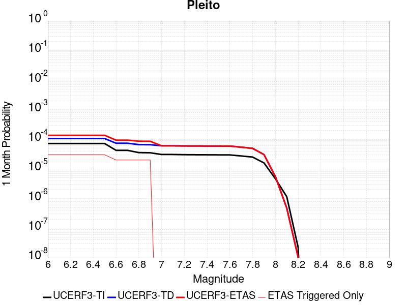 |  | 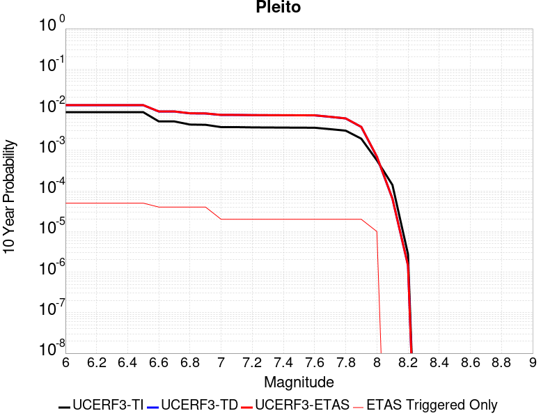 |

| Magnitude | 1 wk TI Prob | 1 wk TD Prob | 1 wk ETAS Prob | 1 wk ETAS/TD Gain | 1 wk ETAS Triggered Only | 1 mo TI Prob | 1 mo TD Prob | 1 mo ETAS Prob | 1 mo ETAS/TD Gain | 1 mo ETAS Triggered Only | 1 yr TI Prob | 1 yr TD Prob | 1 yr ETAS Prob | 1 yr ETAS/TD Gain | 1 yr ETAS Triggered Only | 10 yr TI Prob | 10 yr TD Prob | 10 yr ETAS Prob | 10 yr ETAS/TD Gain | 10 yr ETAS Triggered Only |
|-----|-----|-----|-----|-----|-----|-----|-----|-----|-----|-----|-----|-----|-----|-----|-----|-----|-----|-----|-----|-----|
| 6.0 | 1.6763008E-5 | 2.4763838E-5 | 5.960618E-5 | 2.4069848 | 3.4843204E-5 | 7.183948E-5 | 1.0612683E-4 | 1.4096634E-4 | 1.3282818 | 3.4843204E-5 | 8.742947E-4 | 0.0012914003 | 0.0013261985 | 1.0269461 | 3.4843204E-5 | 0.00870863 | 0.0129538905 | 0.013005478 | 1.0039824 | 5.2264808E-5 |
| 6.1 | 1.6763008E-5 | 2.4763838E-5 | 5.960618E-5 | 2.4069848 | 3.4843204E-5 | 7.183948E-5 | 1.0612683E-4 | 1.4096634E-4 | 1.3282818 | 3.4843204E-5 | 8.742947E-4 | 0.0012914003 | 0.0013261985 | 1.0269461 | 3.4843204E-5 | 0.00870863 | 0.0129538905 | 0.013005478 | 1.0039824 | 5.2264808E-5 |
| 6.2 | 1.6763008E-5 | 2.4763838E-5 | 5.960618E-5 | 2.4069848 | 3.4843204E-5 | 7.183948E-5 | 1.0612683E-4 | 1.4096634E-4 | 1.3282818 | 3.4843204E-5 | 8.742947E-4 | 0.0012914003 | 0.0013261985 | 1.0269461 | 3.4843204E-5 | 0.00870863 | 0.0129538905 | 0.013005478 | 1.0039824 | 5.2264808E-5 |
| 6.3 | 1.6763008E-5 | 2.4763838E-5 | 5.960618E-5 | 2.4069848 | 3.4843204E-5 | 7.183948E-5 | 1.0612683E-4 | 1.4096634E-4 | 1.3282818 | 3.4843204E-5 | 8.742947E-4 | 0.0012914003 | 0.0013261985 | 1.0269461 | 3.4843204E-5 | 0.00870863 | 0.0129538905 | 0.013005478 | 1.0039824 | 5.2264808E-5 |
| 6.4 | 1.6763008E-5 | 2.4763838E-5 | 5.960618E-5 | 2.4069848 | 3.4843204E-5 | 7.183948E-5 | 1.0612683E-4 | 1.4096634E-4 | 1.3282818 | 3.4843204E-5 | 8.742947E-4 | 0.0012914003 | 0.0013261985 | 1.0269461 | 3.4843204E-5 | 0.00870863 | 0.0129538905 | 0.013005478 | 1.0039824 | 5.2264808E-5 |
| 6.5 | 1.6763008E-5 | 2.4763838E-5 | 5.960618E-5 | 2.4069848 | 3.4843204E-5 | 7.183948E-5 | 1.0612683E-4 | 1.4096634E-4 | 1.3282818 | 3.4843204E-5 | 8.742947E-4 | 0.0012914003 | 0.0013261985 | 1.0269461 | 3.4843204E-5 | 0.00870863 | 0.0129538905 | 0.013005478 | 1.0039824 | 5.2264808E-5 |
| 6.6 | 9.910213E-6 | 1.7214623E-5 | 3.4635927E-5 | 2.012006 | 1.7421602E-5 | 4.247165E-5 | 7.377489E-5 | 9.119521E-5 | 1.236128 | 1.7421602E-5 | 5.169696E-4 | 8.978429E-4 | 9.152489E-4 | 1.0193864 | 1.7421602E-5 | 0.0051576863 | 0.009050702 | 0.00908523 | 1.0038149 | 3.4843204E-5 |
| 6.7 | 9.910213E-6 | 1.7214623E-5 | 3.4635927E-5 | 2.012006 | 1.7421602E-5 | 4.247165E-5 | 7.377489E-5 | 9.119521E-5 | 1.236128 | 1.7421602E-5 | 5.169696E-4 | 8.978429E-4 | 9.152489E-4 | 1.0193864 | 1.7421602E-5 | 0.0051576863 | 0.009050702 | 0.00908523 | 1.0038149 | 3.4843204E-5 |
| 6.8 | 8.300162E-6 | 1.5474232E-5 | 3.2895565E-5 | 2.1258285 | 1.7421602E-5 | 3.557164E-5 | 6.631646E-5 | 8.373691E-5 | 1.2626866 | 1.7421602E-5 | 4.3299864E-4 | 8.071053E-4 | 8.245128E-4 | 1.0215678 | 1.7421602E-5 | 0.004321559 | 0.008150139 | 0.008184698 | 1.0042403 | 3.4843204E-5 |
| 6.9 | 8.183114E-6 | 1.5345448E-5 | 3.2766784E-5 | 2.135277 | 1.7421602E-5 | 3.5070017E-5 | 6.576455E-5 | 8.318501E-5 | 1.2648913 | 1.7421602E-5 | 4.2689382E-4 | 8.003907E-4 | 8.1779837E-4 | 1.0217489 | 1.7421602E-5 | 0.0042607468 | 0.008083483 | 0.0081180455 | 1.0042756 | 3.4843204E-5 |
| 7.0 | 7.1748823E-6 | 1.413244E-5 | 1.413244E-5 | 1.0 | 0.0 | 3.0749135E-5 | 6.0566195E-5 | 6.0566195E-5 | 1.0 | 0.0 | 3.743064E-4 | 7.371445E-4 | 7.371445E-4 | 1.0 | 0.0 | 0.0037367654 | 0.007454939 | 0.007472231 | 1.0023195 | 1.7421602E-5 |
| 7.1 | 7.1671807E-6 | 1.412281E-5 | 1.412281E-5 | 1.0 | 0.0 | 3.0716128E-5 | 6.052493E-5 | 6.052493E-5 | 1.0 | 0.0 | 3.7390468E-4 | 7.366424E-4 | 7.366424E-4 | 1.0 | 0.0 | 0.0037327618 | 0.0074499524 | 0.007467244 | 1.002321 | 1.7421602E-5 |
| 7.2 | 7.0649667E-6 | 1.39701015E-5 | 1.39701015E-5 | 1.0 | 0.0 | 3.0278077E-5 | 5.9870494E-5 | 5.9870494E-5 | 1.0 | 0.0 | 3.6857324E-4 | 7.2868E-4 | 7.2868E-4 | 1.0 | 0.0 | 0.0036796255 | 0.0073707094 | 0.0073880027 | 1.0023462 | 1.7421602E-5 |
| 7.3 | 7.02082E-6 | 1.3913556E-5 | 1.3913556E-5 | 1.0 | 0.0 | 3.008888E-5 | 5.9628168E-5 | 5.9628168E-5 | 1.0 | 0.0 | 3.6627054E-4 | 7.2573166E-4 | 7.2573166E-4 | 1.0 | 0.0 | 0.0036566744 | 0.007341209 | 0.0073585026 | 1.0023557 | 1.7421602E-5 |
| 7.4 | 6.987146E-6 | 1.3873118E-5 | 1.3873118E-5 | 1.0 | 0.0 | 2.9944567E-5 | 5.945487E-5 | 5.945487E-5 | 1.0 | 0.0 | 3.6451413E-4 | 7.2362315E-4 | 7.2362315E-4 | 1.0 | 0.0 | 0.0036391679 | 0.007320144 | 0.0073374384 | 1.0023625 | 1.7421602E-5 |
| 7.5 | 6.9494554E-6 | 1.3830024E-5 | 1.3830024E-5 | 1.0 | 0.0 | 2.9783041E-5 | 5.9270187E-5 | 5.9270187E-5 | 1.0 | 0.0 | 3.625482E-4 | 7.2137616E-4 | 7.2137616E-4 | 1.0 | 0.0 | 0.0036195726 | 0.0072977724 | 0.007315067 | 1.0023699 | 1.7421602E-5 |
| 7.6 | 6.92694E-6 | 1.3789138E-5 | 1.3789138E-5 | 1.0 | 0.0 | 2.9686547E-5 | 5.909497E-5 | 5.909497E-5 | 1.0 | 0.0 | 3.6137376E-4 | 7.1924424E-4 | 7.1924424E-4 | 1.0 | 0.0 | 0.0036078666 | 0.0072765257 | 0.007293821 | 1.0023768 | 1.7421602E-5 |
| 7.7 | 6.395867E-6 | 1.2668219E-5 | 1.2668219E-5 | 1.0 | 0.0 | 2.741057E-5 | 5.429124E-5 | 5.429124E-5 | 1.0 | 0.0 | 3.336726E-4 | 6.6079566E-4 | 6.6079566E-4 | 1.0 | 0.0 | 0.0033317201 | 0.0066951844 | 0.0067124893 | 1.0025847 | 1.7421602E-5 |
| 7.8 | 5.8664327E-6 | 1.153586E-5 | 1.153586E-5 | 1.0 | 0.0 | 2.5141611E-5 | 4.9438466E-5 | 4.9438466E-5 | 1.0 | 0.0 | 3.060561E-4 | 6.017473E-4 | 6.017473E-4 | 1.0 | 0.0 | 0.0030563495 | 0.0061006667 | 0.006117982 | 1.0028383 | 1.7421602E-5 |
| 7.9 | 3.7167474E-6 | 7.1140853E-6 | 7.1140853E-6 | 1.0 | 0.0 | 1.592882E-5 | 3.0488582E-5 | 3.0488582E-5 | 1.0 | 0.0 | 1.9391612E-4 | 3.7113542E-4 | 3.7113542E-4 | 1.0 | 0.0 | 0.0019374699 | 0.0037674906 | 0.0037848465 | 1.0046067 | 1.7421602E-5 |
| 8.0 | 1.0903841E-6 | 1.2879392E-6 | 1.2879392E-6 | 1.0 | 0.0 | 4.6730665E-6 | 5.5197274E-6 | 5.5197274E-6 | 1.0 | 0.0 | 5.68931E-5 | 6.720063E-5 | 6.720063E-5 | 1.0 | 0.0 | 5.6878536E-4 | 6.941948E-4 | 7.116043E-4 | 1.0250787 | 1.7421602E-5 |
| 8.1 | 2.6894583E-7 | 1.1060341E-7 | 1.1060341E-7 | 1.0 | 0.0 | 1.1526245E-6 | 4.740145E-7 | 4.740145E-7 | 1.0 | 0.0 | 1.4033113E-5 | 5.7711113E-6 | 5.7711113E-6 | 1.0 | 0.0 | 1.4032227E-4 | 6.456908E-5 | 6.456908E-5 | 1.0 | 0.0 |
| 8.2 | 5.2967013E-9 | 2.4578228E-9 | 2.4578228E-9 | 1.0 | 0.0 | 2.2700148E-8 | 1.0533527E-8 | 1.0533527E-8 | 1.0 | 0.0 | 2.7637427E-7 | 1.2824569E-7 | 1.2824569E-7 | 1.0 | 0.0 | 2.7637393E-6 | 1.4592787E-6 | 1.4592787E-6 | 1.0 | 0.0 |

## Oceanic - West Huasna
*[(top)](#table-of-contents)*

| 1 Week | 1 Month | 1 Year | 10 Year |
|-----|-----|-----|-----|
|  | 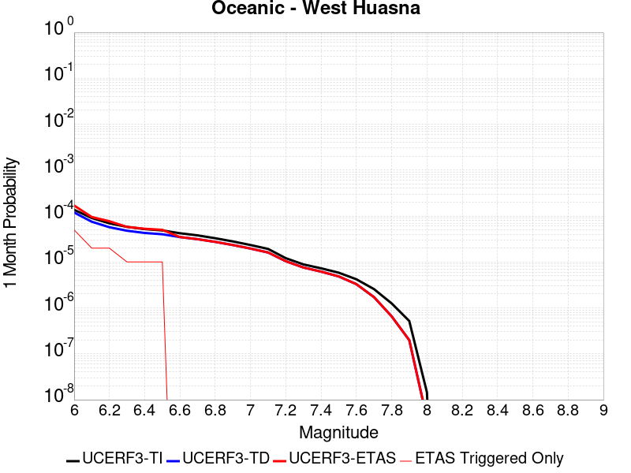 |  |  |

| Magnitude | 1 wk TI Prob | 1 wk TD Prob | 1 wk ETAS Prob | 1 wk ETAS/TD Gain | 1 wk ETAS Triggered Only | 1 mo TI Prob | 1 mo TD Prob | 1 mo ETAS Prob | 1 mo ETAS/TD Gain | 1 mo ETAS Triggered Only | 1 yr TI Prob | 1 yr TD Prob | 1 yr ETAS Prob | 1 yr ETAS/TD Gain | 1 yr ETAS Triggered Only | 10 yr TI Prob | 10 yr TD Prob | 10 yr ETAS Prob | 10 yr ETAS/TD Gain | 10 yr ETAS Triggered Only |
|-----|-----|-----|-----|-----|-----|-----|-----|-----|-----|-----|-----|-----|-----|-----|-----|-----|-----|-----|-----|-----|
| 6.0 | 3.195567E-5 | 2.7926868E-5 | 8.019021E-5 | 2.871436 | 5.2264808E-5 | 1.3694567E-4 | 1.1968133E-4 | 1.7193989E-4 | 1.4366475 | 5.2264808E-5 | 0.0016660384 | 0.0014561893 | 0.0015083781 | 1.0358392 | 5.2264808E-5 | 0.016536033 | 0.014471028 | 0.014522536 | 1.0035595 | 5.2264808E-5 |
| 6.1 | 2.1156782E-5 | 1.7573486E-5 | 3.4994784E-5 | 1.9913398 | 1.7421602E-5 | 9.066878E-5 | 7.531282E-5 | 9.2733106E-5 | 1.2313058 | 1.7421602E-5 | 0.0011033333 | 9.165572E-4 | 9.339629E-4 | 1.0189903 | 1.7421602E-5 | 0.010978713 | 0.009128777 | 0.00914604 | 1.001891 | 1.7421602E-5 |
| 6.2 | 1.6195117E-5 | 1.3327152E-5 | 3.0748524E-5 | 2.3072088 | 1.7421602E-5 | 6.9405796E-5 | 5.7115132E-5 | 7.453574E-5 | 1.3050086 | 1.7421602E-5 | 8.44688E-4 | 6.9515745E-4 | 7.1256695E-4 | 1.025044 | 1.7421602E-5 | 0.008414844 | 0.006930123 | 0.0069474243 | 1.0024965 | 1.7421602E-5 |
| 6.3 | 1.3559345E-5 | 1.1179142E-5 | 2.860055E-5 | 2.558385 | 1.7421602E-5 | 5.811018E-5 | 4.7909736E-5 | 6.53305E-5 | 1.3636165 | 1.7421602E-5 | 7.072618E-4 | 5.831459E-4 | 6.005573E-4 | 1.0298578 | 1.7421602E-5 | 0.0070501505 | 0.0058162753 | 0.0058335955 | 1.0029778 | 1.7421602E-5 |
| 6.4 | 1.2120619E-5 | 1.0000977E-5 | 2.7422406E-5 | 2.7419724 | 1.7421602E-5 | 5.1944477E-5 | 4.2860633E-5 | 6.0281487E-5 | 1.4064536 | 1.7421602E-5 | 6.322405E-4 | 5.2170374E-4 | 5.3911627E-4 | 1.0333762 | 1.7421602E-5 | 0.006304447 | 0.0052048573 | 0.0052221883 | 1.0033298 | 1.7421602E-5 |
| 6.5 | 1.13511915E-5 | 9.3674735E-6 | 2.6788914E-5 | 2.85978 | 1.7421602E-5 | 4.8647056E-5 | 4.01457E-5 | 5.75666E-5 | 1.433942 | 1.7421602E-5 | 5.9211696E-4 | 4.886647E-4 | 5.0607783E-4 | 1.035634 | 1.7421602E-5 | 0.0059054173 | 0.0048759608 | 0.0048932973 | 1.0035555 | 1.7421602E-5 |
| 6.6 | 9.850605E-6 | 8.135418E-6 | 8.135418E-6 | 1.0 | 0.0 | 4.2216197E-5 | 3.4865614E-5 | 3.4865614E-5 | 1.0 | 0.0 | 5.1386096E-4 | 4.2440637E-4 | 4.2440637E-4 | 1.0 | 0.0 | 0.0051267436 | 0.004235991 | 0.004235991 | 1.0 | 0.0 |
| 6.7 | 8.8558645E-6 | 7.318433E-6 | 7.318433E-6 | 1.0 | 0.0 | 3.7953152E-5 | 3.1364336E-5 | 3.1364336E-5 | 1.0 | 0.0 | 4.6198163E-4 | 3.8179406E-4 | 3.8179406E-4 | 1.0 | 0.0 | 0.004610224 | 0.0038114067 | 0.0038114067 | 1.0 | 0.0 |
| 6.8 | 7.67136E-6 | 6.391756E-6 | 6.391756E-6 | 1.0 | 0.0 | 3.2876844E-5 | 2.7392953E-5 | 2.7392953E-5 | 1.0 | 0.0 | 4.0020206E-4 | 3.3345833E-4 | 3.3345833E-4 | 1.0 | 0.0 | 0.003994821 | 0.0033296007 | 0.0033296007 | 1.0 | 0.0 |
| 6.9 | 6.534529E-6 | 5.4583297E-6 | 5.4583297E-6 | 1.0 | 0.0 | 2.8004823E-5 | 2.3392633E-5 | 2.3392633E-5 | 1.0 | 0.0 | 3.4090536E-4 | 2.847682E-4 | 2.847682E-4 | 1.0 | 0.0 | 0.0034038287 | 0.0028440498 | 0.0028440498 | 1.0 | 0.0 |
| 7.0 | 5.460525E-6 | 4.5699517E-6 | 4.5699517E-6 | 1.0 | 0.0 | 2.3402039E-5 | 1.958536E-5 | 1.958536E-5 | 1.0 | 0.0 | 2.8488258E-4 | 2.3842578E-4 | 2.3842578E-4 | 1.0 | 0.0 | 0.0028451765 | 0.0023817138 | 0.0023817138 | 1.0 | 0.0 |
| 7.1 | 4.4825083E-6 | 3.7524428E-6 | 3.7524428E-6 | 1.0 | 0.0 | 1.9210609E-5 | 1.60818E-5 | 1.60818E-5 | 1.0 | 0.0 | 2.3386406E-4 | 1.9577841E-4 | 1.9577841E-4 | 1.0 | 0.0 | 0.002336181 | 0.0019560715 | 0.0019560715 | 1.0 | 0.0 |
| 7.2 | 2.821708E-6 | 2.4249334E-6 | 2.4249334E-6 | 1.0 | 0.0 | 1.2092979E-5 | 1.039253E-5 | 1.039253E-5 | 1.0 | 0.0 | 1.4722206E-4 | 1.2652173E-4 | 1.2652173E-4 | 1.0 | 0.0 | 0.0014712457 | 0.0012644994 | 0.0012644994 | 1.0 | 0.0 |
| 7.3 | 2.0644757E-6 | 1.7687412E-6 | 1.7687412E-6 | 1.0 | 0.0 | 8.847723E-6 | 7.5802973E-6 | 7.5802973E-6 | 1.0 | 0.0 | 1.0771569E-4 | 9.228622E-5 | 9.228622E-5 | 1.0 | 0.0 | 0.001076635 | 9.2248066E-4 | 9.2248066E-4 | 1.0 | 0.0 |
| 7.4 | 1.6980367E-6 | 1.4379892E-6 | 1.4379892E-6 | 1.0 | 0.0 | 7.27728E-6 | 6.162796E-6 | 6.162796E-6 | 1.0 | 0.0 | 8.8597284E-5 | 7.5029464E-5 | 7.5029464E-5 | 1.0 | 0.0 | 8.8561967E-4 | 7.500429E-4 | 7.500429E-4 | 1.0 | 0.0 |
| 7.5 | 1.3637683E-6 | 1.1302635E-6 | 1.1302635E-6 | 1.0 | 0.0 | 5.844708E-6 | 4.8439774E-6 | 4.8439774E-6 | 1.0 | 0.0 | 7.1156996E-5 | 5.897383E-5 | 5.897383E-5 | 1.0 | 0.0 | 7.1134215E-4 | 5.895833E-4 | 5.895833E-4 | 1.0 | 0.0 |
| 7.6 | 9.802994E-7 | 7.677247E-7 | 7.677247E-7 | 1.0 | 0.0 | 4.2012766E-6 | 3.2902446E-6 | 3.2902446E-6 | 1.0 | 0.0 | 5.1149345E-5 | 4.0057992E-5 | 4.0057992E-5 | 1.0 | 0.0 | 5.113757E-4 | 4.0050913E-4 | 4.0050913E-4 | 1.0 | 0.0 |
| 7.7 | 5.986191E-7 | 4.0050548E-7 | 4.0050548E-7 | 1.0 | 0.0 | 2.5655079E-6 | 1.7164509E-6 | 1.7164509E-6 | 1.0 | 0.0 | 3.1234613E-5 | 2.089759E-5 | 2.089759E-5 | 1.0 | 0.0 | 3.123022E-4 | 2.089576E-4 | 2.089576E-4 | 1.0 | 0.0 |
| 7.8 | 2.9189815E-7 | 1.5285792E-7 | 1.5285792E-7 | 1.0 | 0.0 | 1.2509914E-6 | 6.5510517E-7 | 6.5510517E-7 | 1.0 | 0.0 | 1.5230714E-5 | 7.9758765E-6 | 7.9758765E-6 | 1.0 | 0.0 | 1.522967E-4 | 7.9757214E-5 | 7.9757214E-5 | 1.0 | 0.0 |
| 7.9 | 1.2057845E-7 | 4.621248E-8 | 4.621248E-8 | 1.0 | 0.0 | 5.1676466E-7 | 1.9805347E-7 | 1.9805347E-7 | 1.0 | 0.0 | 6.2915915E-6 | 2.4112983E-6 | 2.4112983E-6 | 1.0 | 0.0 | 6.2914136E-5 | 2.4114026E-5 | 2.4114026E-5 | 1.0 | 0.0 |
| 8.0 | 3.3806387E-9 | 9.011393E-10 | 9.011393E-10 | 1.0 | 0.0 | 1.4488451E-8 | 3.8620254E-9 | 3.8620254E-9 | 1.0 | 0.0 | 1.7639688E-7 | 4.702016E-8 | 4.702016E-8 | 1.0 | 0.0 | 1.7639674E-6 | 4.7129527E-7 | 4.7129527E-7 | 1.0 | 0.0 |

## Kern Canyon (North Kern) 2011
*[(top)](#table-of-contents)*

| 1 Week | 1 Month | 1 Year | 10 Year |
|-----|-----|-----|-----|
|  |  | 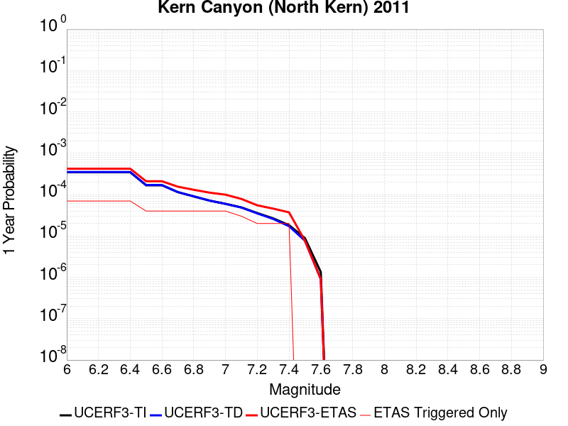 |  |

| Magnitude | 1 wk TI Prob | 1 wk TD Prob | 1 wk ETAS Prob | 1 wk ETAS/TD Gain | 1 wk ETAS Triggered Only | 1 mo TI Prob | 1 mo TD Prob | 1 mo ETAS Prob | 1 mo ETAS/TD Gain | 1 mo ETAS Triggered Only | 1 yr TI Prob | 1 yr TD Prob | 1 yr ETAS Prob | 1 yr ETAS/TD Gain | 1 yr ETAS Triggered Only | 10 yr TI Prob | 10 yr TD Prob | 10 yr ETAS Prob | 10 yr ETAS/TD Gain | 10 yr ETAS Triggered Only |
|-----|-----|-----|-----|-----|-----|-----|-----|-----|-----|-----|-----|-----|-----|-----|-----|-----|-----|-----|-----|-----|
| 6.0 | 6.6264497E-6 | 6.75733E-6 | 6.75733E-6 | 1.0 | 0.0 | 2.8398761E-5 | 2.895971E-5 | 4.6380806E-5 | 1.6015633 | 1.7421602E-5 | 3.4570007E-4 | 3.5253543E-4 | 4.047818E-4 | 1.1482018 | 5.2264808E-5 | 0.0034516277 | 0.0035205502 | 0.003572631 | 1.0147934 | 5.2264808E-5 |
| 6.1 | 6.6264497E-6 | 6.75733E-6 | 6.75733E-6 | 1.0 | 0.0 | 2.8398761E-5 | 2.895971E-5 | 4.6380806E-5 | 1.6015633 | 1.7421602E-5 | 3.4570007E-4 | 3.5253543E-4 | 4.047818E-4 | 1.1482018 | 5.2264808E-5 | 0.0034516277 | 0.0035205502 | 0.003572631 | 1.0147934 | 5.2264808E-5 |
| 6.2 | 6.6264497E-6 | 6.75733E-6 | 6.75733E-6 | 1.0 | 0.0 | 2.8398761E-5 | 2.895971E-5 | 4.6380806E-5 | 1.6015633 | 1.7421602E-5 | 3.4570007E-4 | 3.5253543E-4 | 4.047818E-4 | 1.1482018 | 5.2264808E-5 | 0.0034516277 | 0.0035205502 | 0.003572631 | 1.0147934 | 5.2264808E-5 |
| 6.3 | 6.6264497E-6 | 6.75733E-6 | 6.75733E-6 | 1.0 | 0.0 | 2.8398761E-5 | 2.895971E-5 | 4.6380806E-5 | 1.6015633 | 1.7421602E-5 | 3.4570007E-4 | 3.5253543E-4 | 4.047818E-4 | 1.1482018 | 5.2264808E-5 | 0.0034516277 | 0.0035205502 | 0.003572631 | 1.0147934 | 5.2264808E-5 |
| 6.4 | 6.6264497E-6 | 6.75733E-6 | 6.75733E-6 | 1.0 | 0.0 | 2.8398761E-5 | 2.895971E-5 | 4.6380806E-5 | 1.6015633 | 1.7421602E-5 | 3.4570007E-4 | 3.5253543E-4 | 4.047818E-4 | 1.1482018 | 5.2264808E-5 | 0.0034516277 | 0.0035205502 | 0.003572631 | 1.0147934 | 5.2264808E-5 |
| 6.5 | 3.2162225E-6 | 3.2570915E-6 | 3.2570915E-6 | 1.0 | 0.0 | 1.3783738E-5 | 1.3958893E-5 | 1.3958893E-5 | 1.0 | 0.0 | 1.6780409E-4 | 1.6993708E-4 | 2.0477436E-4 | 1.2050011 | 3.4843204E-5 | 0.0016767744 | 0.001698151 | 0.001732935 | 1.0204835 | 3.4843204E-5 |
| 6.6 | 3.2162225E-6 | 3.2570915E-6 | 3.2570915E-6 | 1.0 | 0.0 | 1.3783738E-5 | 1.3958893E-5 | 1.3958893E-5 | 1.0 | 0.0 | 1.6780409E-4 | 1.6993708E-4 | 2.0477436E-4 | 1.2050011 | 3.4843204E-5 | 0.0016767744 | 0.001698151 | 0.001732935 | 1.0204835 | 3.4843204E-5 |
| 6.7 | 2.1908265E-6 | 2.2071222E-6 | 2.2071222E-6 | 1.0 | 0.0 | 9.389223E-6 | 9.459061E-6 | 9.459061E-6 | 1.0 | 0.0 | 1.1430779E-4 | 1.1515819E-4 | 1.4999737E-4 | 1.3025334 | 3.4843204E-5 | 0.0011424901 | 0.0011510046 | 0.0011858076 | 1.0302372 | 3.4843204E-5 |
| 6.8 | 1.7303895E-6 | 1.7365529E-6 | 1.7365529E-6 | 1.0 | 0.0 | 7.415934E-6 | 7.4423488E-6 | 7.4423488E-6 | 1.0 | 0.0 | 9.028525E-5 | 9.0606925E-5 | 1.2544698E-4 | 1.3845186 | 3.4843204E-5 | 9.024858E-4 | 9.057096E-4 | 9.4052125E-4 | 1.0384358 | 3.4843204E-5 |
| 6.9 | 1.3700314E-6 | 1.3688622E-6 | 1.3688622E-6 | 1.0 | 0.0 | 5.87155E-6 | 5.8665396E-6 | 5.8665396E-6 | 1.0 | 0.0 | 7.148377E-5 | 7.142282E-5 | 1.0626354E-4 | 1.4878093 | 3.4843204E-5 | 7.146078E-4 | 7.140032E-4 | 7.488216E-4 | 1.048765 | 3.4843204E-5 |
| 7.0 | 1.1467797E-6 | 1.1413804E-6 | 1.1413804E-6 | 1.0 | 0.0 | 4.9147607E-6 | 4.8916213E-6 | 4.8916213E-6 | 1.0 | 0.0 | 5.983557E-5 | 5.9553895E-5 | 9.439502E-5 | 1.5850353 | 3.4843204E-5 | 5.981946E-4 | 5.953825E-4 | 6.30205E-4 | 1.0584875 | 3.4843204E-5 |
| 7.1 | 9.3952065E-7 | 9.3026904E-7 | 9.3026904E-7 | 1.0 | 0.0 | 4.026511E-6 | 3.9868614E-6 | 3.9868614E-6 | 1.0 | 0.0 | 4.9021666E-5 | 4.8538972E-5 | 6.595973E-5 | 1.3589025 | 1.7421602E-5 | 4.901085E-4 | 4.8528548E-4 | 5.0269865E-4 | 1.0358822 | 1.7421602E-5 |
| 7.2 | 6.858055E-7 | 6.7193E-7 | 6.7193E-7 | 1.0 | 0.0 | 2.939163E-6 | 2.879697E-6 | 2.879697E-6 | 1.0 | 0.0 | 3.5783723E-5 | 3.5059755E-5 | 5.2480747E-5 | 1.4968942 | 1.7421602E-5 | 3.5777962E-4 | 3.5054312E-4 | 3.6795862E-4 | 1.0496814 | 1.7421602E-5 |
| 7.3 | 5.1101983E-7 | 4.9393E-7 | 4.9393E-7 | 1.0 | 0.0 | 2.1900833E-6 | 2.116841E-6 | 2.116841E-6 | 1.0 | 0.0 | 2.6663936E-5 | 2.5772239E-5 | 4.3193395E-5 | 1.6759659 | 1.7421602E-5 | 2.6660739E-4 | 2.57693E-4 | 2.751101E-4 | 1.0675886 | 1.7421602E-5 |
| 7.4 | 3.4999414E-7 | 3.2995905E-7 | 3.2995905E-7 | 1.0 | 0.0 | 1.499974E-6 | 1.4141094E-6 | 1.4141094E-6 | 1.0 | 0.0 | 1.8262032E-5 | 1.721665E-5 | 3.4637953E-5 | 2.011887 | 1.7421602E-5 | 1.826053E-4 | 1.7215339E-4 | 1.8957199E-4 | 1.1011807 | 1.7421602E-5 |
| 7.5 | 1.7021522E-7 | 1.4750044E-7 | 1.4750044E-7 | 1.0 | 0.0 | 7.2949354E-7 | 6.321446E-7 | 6.321446E-7 | 1.0 | 0.0 | 8.881548E-6 | 7.696334E-6 | 7.696334E-6 | 1.0 | 0.0 | 8.8811925E-5 | 7.696076E-5 | 7.696076E-5 | 1.0 | 0.0 |
| 7.6 | 2.572245E-8 | 1.7352555E-8 | 1.7352555E-8 | 1.0 | 0.0 | 1.10239064E-7 | 7.436809E-8 | 7.436809E-8 | 1.0 | 0.0 | 1.3421597E-6 | 9.054312E-7 | 9.054312E-7 | 1.0 | 0.0 | 1.3421517E-5 | 9.05428E-6 | 9.05428E-6 | 1.0 | 0.0 |

## Raymond
*[(top)](#table-of-contents)*

| 1 Week | 1 Month | 1 Year | 10 Year |
|-----|-----|-----|-----|
|  |  |  |  |

| Magnitude | 1 wk TI Prob | 1 wk TD Prob | 1 wk ETAS Prob | 1 wk ETAS/TD Gain | 1 wk ETAS Triggered Only | 1 mo TI Prob | 1 mo TD Prob | 1 mo ETAS Prob | 1 mo ETAS/TD Gain | 1 mo ETAS Triggered Only | 1 yr TI Prob | 1 yr TD Prob | 1 yr ETAS Prob | 1 yr ETAS/TD Gain | 1 yr ETAS Triggered Only | 10 yr TI Prob | 10 yr TD Prob | 10 yr ETAS Prob | 10 yr ETAS/TD Gain | 10 yr ETAS Triggered Only |
|-----|-----|-----|-----|-----|-----|-----|-----|-----|-----|-----|-----|-----|-----|-----|-----|-----|-----|-----|-----|-----|
| 6.0 | 1.5157413E-5 | 1.5810128E-5 | 3.3231456E-5 | 2.1019094 | 1.7421602E-5 | 6.4958724E-5 | 6.7756075E-5 | 1.0259692E-4 | 1.5142099 | 3.4843204E-5 | 7.905855E-4 | 8.2464307E-4 | 8.7686477E-4 | 1.0633265 | 5.2264808E-5 | 0.007877788 | 0.008218348 | 0.008270184 | 1.0063072 | 5.2264808E-5 |
| 6.1 | 1.5157413E-5 | 1.5810128E-5 | 3.3231456E-5 | 2.1019094 | 1.7421602E-5 | 6.4958724E-5 | 6.7756075E-5 | 1.0259692E-4 | 1.5142099 | 3.4843204E-5 | 7.905855E-4 | 8.2464307E-4 | 8.7686477E-4 | 1.0633265 | 5.2264808E-5 | 0.007877788 | 0.008218348 | 0.008270184 | 1.0063072 | 5.2264808E-5 |
| 6.2 | 1.5157413E-5 | 1.5810128E-5 | 3.3231456E-5 | 2.1019094 | 1.7421602E-5 | 6.4958724E-5 | 6.7756075E-5 | 1.0259692E-4 | 1.5142099 | 3.4843204E-5 | 7.905855E-4 | 8.2464307E-4 | 8.7686477E-4 | 1.0633265 | 5.2264808E-5 | 0.007877788 | 0.008218348 | 0.008270184 | 1.0063072 | 5.2264808E-5 |
| 6.3 | 1.5157413E-5 | 1.5810128E-5 | 3.3231456E-5 | 2.1019094 | 1.7421602E-5 | 6.4958724E-5 | 6.7756075E-5 | 1.0259692E-4 | 1.5142099 | 3.4843204E-5 | 7.905855E-4 | 8.2464307E-4 | 8.7686477E-4 | 1.0633265 | 5.2264808E-5 | 0.007877788 | 0.008218348 | 0.008270184 | 1.0063072 | 5.2264808E-5 |
| 6.4 | 1.3941944E-5 | 1.445469E-5 | 1.445469E-5 | 1.0 | 0.0 | 5.9749822E-5 | 6.1947336E-5 | 7.9367856E-5 | 1.2812151 | 1.7421602E-5 | 7.2721124E-4 | 7.5397117E-4 | 7.713796E-4 | 1.023089 | 1.7421602E-5 | 0.007248361 | 0.0075164647 | 0.0075337556 | 1.0023004 | 1.7421602E-5 |
| 6.5 | 1.3941944E-5 | 1.445469E-5 | 1.445469E-5 | 1.0 | 0.0 | 5.9749822E-5 | 6.1947336E-5 | 7.9367856E-5 | 1.2812151 | 1.7421602E-5 | 7.2721124E-4 | 7.5397117E-4 | 7.713796E-4 | 1.023089 | 1.7421602E-5 | 0.007248361 | 0.0075164647 | 0.0075337556 | 1.0023004 | 1.7421602E-5 |
| 6.6 | 1.0542609E-5 | 1.0671113E-5 | 1.0671113E-5 | 1.0 | 0.0 | 4.5181827E-5 | 4.573257E-5 | 6.315338E-5 | 1.3809278 | 1.7421602E-5 | 5.499499E-4 | 5.5665727E-4 | 5.7406916E-4 | 1.0312794 | 1.7421602E-5 | 0.005485909 | 0.00555319 | 0.005570515 | 1.0031198 | 1.7421602E-5 |
| 6.7 | 1.0542609E-5 | 1.0671113E-5 | 1.0671113E-5 | 1.0 | 0.0 | 4.5181827E-5 | 4.573257E-5 | 6.315338E-5 | 1.3809278 | 1.7421602E-5 | 5.499499E-4 | 5.5665727E-4 | 5.7406916E-4 | 1.0312794 | 1.7421602E-5 | 0.005485909 | 0.00555319 | 0.005570515 | 1.0031198 | 1.7421602E-5 |
| 6.8 | 1.0079132E-5 | 1.0176646E-5 | 1.0176646E-5 | 1.0 | 0.0 | 4.3195567E-5 | 4.3613498E-5 | 6.103434E-5 | 1.399437 | 1.7421602E-5 | 5.257791E-4 | 5.3087034E-4 | 5.482827E-4 | 1.0327996 | 1.7421602E-5 | 0.0052453685 | 0.005296571 | 0.0053139008 | 1.0032718 | 1.7421602E-5 |
| 6.9 | 7.721598E-6 | 7.5489047E-6 | 7.5489047E-6 | 1.0 | 0.0 | 3.3092143E-5 | 3.2352054E-5 | 4.9773094E-5 | 1.5384833 | 1.7421602E-5 | 4.0282236E-4 | 3.9381627E-4 | 4.11231E-4 | 1.0442204 | 1.7421602E-5 | 0.0040209293 | 0.0039313175 | 0.003948671 | 1.0044141 | 1.7421602E-5 |
| 7.0 | 7.137566E-6 | 6.9113057E-6 | 6.9113057E-6 | 1.0 | 0.0 | 3.058921E-5 | 2.961955E-5 | 4.7040638E-5 | 1.5881617 | 1.7421602E-5 | 3.7236E-4 | 3.6055944E-4 | 3.7797476E-4 | 1.0483009 | 1.7421602E-5 | 0.0037173668 | 0.0035998628 | 0.0036172215 | 1.0048221 | 1.7421602E-5 |
| 7.1 | 5.654976E-6 | 5.29954E-6 | 5.29954E-6 | 1.0 | 0.0 | 2.4235387E-5 | 2.2712118E-5 | 4.0133327E-5 | 1.7670445 | 1.7421602E-5 | 2.9502588E-4 | 2.7648517E-4 | 2.9390195E-4 | 1.0629935 | 1.7421602E-5 | 0.0029463451 | 0.002761443 | 0.0027788165 | 1.0062915 | 1.7421602E-5 |
| 7.2 | 4.9358455E-6 | 4.5266574E-6 | 4.5266574E-6 | 1.0 | 0.0 | 2.1153453E-5 | 1.9399817E-5 | 3.6821082E-5 | 1.8980118 | 1.7421602E-5 | 2.5751285E-4 | 2.3616731E-4 | 2.535848E-4 | 1.0737506 | 1.7421602E-5 | 0.0025721465 | 0.0023591854 | 0.002376566 | 1.0073671 | 1.7421602E-5 |
| 7.3 | 4.2368597E-6 | 3.8056164E-6 | 3.8056164E-6 | 1.0 | 0.0 | 1.8157843E-5 | 1.6309683E-5 | 3.3731E-5 | 2.068158 | 1.7421602E-5 | 2.2104931E-4 | 1.9855241E-4 | 2.1597055E-4 | 1.0877256 | 1.7421602E-5 | 0.0022082955 | 0.0019837688 | 0.0020011559 | 1.0087646 | 1.7421602E-5 |
| 7.4 | 3.4999923E-6 | 3.043744E-6 | 3.043744E-6 | 1.0 | 0.0 | 1.49998805E-5 | 1.3044552E-5 | 3.0465928E-5 | 2.3355289 | 1.7421602E-5 | 1.8260824E-4 | 1.5880594E-4 | 1.7622477E-4 | 1.1096863 | 1.7421602E-5 | 0.0018245826 | 0.0015869403 | 0.0016043342 | 1.0109607 | 1.7421602E-5 |
| 7.5 | 2.738017E-6 | 2.3020468E-6 | 2.3020468E-6 | 1.0 | 0.0 | 1.1734306E-5 | 9.865878E-6 | 9.865878E-6 | 1.0 | 0.0 | 1.428558E-4 | 1.2011051E-4 | 1.2011051E-4 | 1.0 | 0.0 | 0.0014276401 | 0.0012004703 | 0.0012004703 | 1.0 | 0.0 |
| 7.6 | 1.8186392E-6 | 1.442312E-6 | 1.442312E-6 | 1.0 | 0.0 | 7.794145E-6 | 6.181323E-6 | 6.181323E-6 | 1.0 | 0.0 | 9.488958E-5 | 7.5255055E-5 | 7.5255055E-5 | 1.0 | 0.0 | 9.4849075E-4 | 7.523072E-4 | 7.523072E-4 | 1.0 | 0.0 |
| 7.7 | 1.0660348E-6 | 7.6438056E-7 | 7.6438056E-7 | 1.0 | 0.0 | 4.5687125E-6 | 3.2759126E-6 | 3.2759126E-6 | 1.0 | 0.0 | 5.5622655E-5 | 3.9883522E-5 | 3.9883522E-5 | 1.0 | 0.0 | 5.5608735E-4 | 3.9877277E-4 | 3.9877277E-4 | 1.0 | 0.0 |
| 7.8 | 6.913602E-7 | 4.3204133E-7 | 4.3204133E-7 | 1.0 | 0.0 | 2.962969E-6 | 1.8516045E-6 | 1.8516045E-6 | 1.0 | 0.0 | 3.607355E-5 | 2.2543056E-5 | 2.2543056E-5 | 1.0 | 0.0 | 3.6067693E-4 | 2.2541556E-4 | 2.2541556E-4 | 1.0 | 0.0 |
| 7.9 | 7.425201E-8 | 5.3222113E-8 | 5.3222113E-8 | 1.0 | 0.0 | 3.1822285E-7 | 2.2809476E-7 | 2.2809476E-7 | 1.0 | 0.0 | 3.874356E-6 | 2.7770516E-6 | 2.7770516E-6 | 1.0 | 0.0 | 3.8742884E-5 | 2.7770298E-5 | 2.7770298E-5 | 1.0 | 0.0 |

## Santa Rosa Island
*[(top)](#table-of-contents)*

| 1 Week | 1 Month | 1 Year | 10 Year |
|-----|-----|-----|-----|
|  |  |  |  |

| Magnitude | 1 wk TI Prob | 1 wk TD Prob | 1 wk ETAS Prob | 1 wk ETAS/TD Gain | 1 wk ETAS Triggered Only | 1 mo TI Prob | 1 mo TD Prob | 1 mo ETAS Prob | 1 mo ETAS/TD Gain | 1 mo ETAS Triggered Only | 1 yr TI Prob | 1 yr TD Prob | 1 yr ETAS Prob | 1 yr ETAS/TD Gain | 1 yr ETAS Triggered Only | 10 yr TI Prob | 10 yr TD Prob | 10 yr ETAS Prob | 10 yr ETAS/TD Gain | 10 yr ETAS Triggered Only |
|-----|-----|-----|-----|-----|-----|-----|-----|-----|-----|-----|-----|-----|-----|-----|-----|-----|-----|-----|-----|-----|
| 6.0 | 4.1143165E-5 | 4.7091133E-5 | 9.935348E-5 | 2.109813 | 5.2264808E-5 | 1.7631594E-4 | 2.0180465E-4 | 2.5405892E-4 | 1.2589349 | 5.2264808E-5 | 0.002144533 | 0.0024544 | 0.0025065364 | 1.021242 | 5.2264808E-5 | 0.021239553 | 0.024293551 | 0.024344547 | 1.0020992 | 5.2264808E-5 |
| 6.1 | 2.1061249E-5 | 2.3864959E-5 | 5.8707334E-5 | 2.4599805 | 3.4843204E-5 | 9.0259375E-5 | 1.0227455E-4 | 1.371142E-4 | 1.3406482 | 3.4843204E-5 | 0.0010983539 | 0.0012445104 | 0.0012793102 | 1.0279627 | 3.4843204E-5 | 0.01092941 | 0.012378449 | 0.01241286 | 1.00278 | 3.4843204E-5 |
| 6.2 | 2.1061249E-5 | 2.3864959E-5 | 5.8707334E-5 | 2.4599805 | 3.4843204E-5 | 9.0259375E-5 | 1.0227455E-4 | 1.371142E-4 | 1.3406482 | 3.4843204E-5 | 0.0010983539 | 0.0012445104 | 0.0012793102 | 1.0279627 | 3.4843204E-5 | 0.01092941 | 0.012378449 | 0.01241286 | 1.00278 | 3.4843204E-5 |
| 6.3 | 1.5158236E-5 | 1.7074419E-5 | 5.1917028E-5 | 3.0406322 | 3.4843204E-5 | 6.496225E-5 | 7.3174095E-5 | 1.08014756E-4 | 1.4761337 | 3.4843204E-5 | 7.906284E-4 | 8.905424E-4 | 9.253546E-4 | 1.039091 | 3.4843204E-5 | 0.007878214 | 0.008870989 | 0.008905523 | 1.0038929 | 3.4843204E-5 |
| 6.4 | 1.2341918E-5 | 1.3852917E-5 | 3.1274278E-5 | 2.2575953 | 1.7421602E-5 | 5.2892858E-5 | 5.9368336E-5 | 7.678891E-5 | 1.293432 | 1.7421602E-5 | 6.437803E-4 | 7.225779E-4 | 7.3998695E-4 | 1.0240929 | 1.7421602E-5 | 0.006419184 | 0.007203121 | 0.0072204173 | 1.0024012 | 1.7421602E-5 |
| 6.5 | 9.061158E-6 | 1.0117031E-5 | 2.7538457E-5 | 2.72199 | 1.7421602E-5 | 3.883296E-5 | 4.3358013E-5 | 6.077886E-5 | 1.4017907 | 1.7421602E-5 | 4.726887E-4 | 5.277613E-4 | 5.451737E-4 | 1.032993 | 1.7421602E-5 | 0.004716845 | 0.0052656173 | 0.0052829473 | 1.0032911 | 1.7421602E-5 |
| 6.6 | 7.5461685E-6 | 8.400733E-6 | 2.582219E-5 | 3.0738018 | 1.7421602E-5 | 3.2340322E-5 | 3.600267E-5 | 5.3423646E-5 | 1.48388 | 1.7421602E-5 | 3.936723E-4 | 4.3824865E-4 | 4.5566264E-4 | 1.0397353 | 1.7421602E-5 | 0.003929756 | 0.0043742736 | 0.004391619 | 1.0039654 | 1.7421602E-5 |
| 6.7 | 5.5023775E-6 | 6.087381E-6 | 6.087381E-6 | 1.0 | 0.0 | 2.3581404E-5 | 2.6088532E-5 | 2.6088532E-5 | 1.0 | 0.0 | 2.8706578E-4 | 3.1758484E-4 | 3.1758484E-4 | 1.0 | 0.0 | 0.0028669522 | 0.0031716314 | 0.0031716314 | 1.0 | 0.0 |
| 6.8 | 3.7351679E-6 | 4.0831405E-6 | 4.0831405E-6 | 1.0 | 0.0 | 1.6007763E-5 | 1.749907E-5 | 1.749907E-5 | 1.0 | 0.0 | 1.948771E-4 | 2.1303284E-4 | 2.1303284E-4 | 1.0 | 0.0 | 0.0019470629 | 0.0021285315 | 0.0021285315 | 1.0 | 0.0 |
| 6.9 | 2.456366E-6 | 2.6292705E-6 | 2.6292705E-6 | 1.0 | 0.0 | 1.0527241E-5 | 1.1268254E-5 | 1.1268254E-5 | 1.0 | 0.0 | 1.2816161E-4 | 1.3718237E-4 | 1.3718237E-4 | 1.0 | 0.0 | 0.0012808773 | 0.0013709799 | 0.0013709799 | 1.0 | 0.0 |
| 7.0 | 2.3245157E-6 | 2.4827782E-6 | 2.4827782E-6 | 1.0 | 0.0 | 9.962172E-6 | 1.0640435E-5 | 1.0640435E-5 | 1.0 | 0.0 | 1.2128269E-4 | 1.2953962E-4 | 1.2953962E-4 | 1.0 | 0.0 | 0.0012121652 | 0.0012946434 | 0.0012946434 | 1.0 | 0.0 |
| 7.1 | 2.2248344E-6 | 2.37325E-6 | 2.37325E-6 | 1.0 | 0.0 | 9.53497E-6 | 1.0171032E-5 | 1.0171032E-5 | 1.0 | 0.0 | 1.1608207E-4 | 1.2382529E-4 | 1.2382529E-4 | 1.0 | 0.0 | 0.0011602144 | 0.001237565 | 0.001237565 | 1.0 | 0.0 |
| 7.2 | 2.1350402E-6 | 2.276154E-6 | 2.276154E-6 | 1.0 | 0.0 | 9.150141E-6 | 9.754909E-6 | 9.754909E-6 | 1.0 | 0.0 | 1.1139726E-4 | 1.1875956E-4 | 1.1875956E-4 | 1.0 | 0.0 | 0.0011134144 | 0.0011869629 | 0.0011869629 | 1.0 | 0.0 |
| 7.3 | 1.9793572E-6 | 2.108719E-6 | 2.108719E-6 | 1.0 | 0.0 | 8.482932E-6 | 9.037336E-6 | 9.037336E-6 | 1.0 | 0.0 | 1.032748E-4 | 1.10024026E-4 | 1.10024026E-4 | 1.0 | 0.0 | 0.0010322682 | 0.0010996973 | 0.0010996973 | 1.0 | 0.0 |
| 7.4 | 1.6951194E-6 | 1.8045733E-6 | 1.8045733E-6 | 1.0 | 0.0 | 7.264777E-6 | 7.733863E-6 | 7.733863E-6 | 1.0 | 0.0 | 8.844508E-5 | 9.415573E-5 | 9.415573E-5 | 1.0 | 0.0 | 8.840988E-4 | 9.4116E-4 | 9.4116E-4 | 1.0 | 0.0 |
| 7.5 | 8.987207E-7 | 9.5122147E-7 | 9.5122147E-7 | 1.0 | 0.0 | 3.8516546E-6 | 4.076657E-6 | 4.076657E-6 | 1.0 | 0.0 | 4.6892885E-5 | 4.963218E-5 | 4.963218E-5 | 1.0 | 0.0 | 4.688299E-4 | 4.9621216E-4 | 4.9621216E-4 | 1.0 | 0.0 |
| 7.6 | 3.8783037E-7 | 4.052932E-7 | 4.052932E-7 | 1.0 | 0.0 | 1.6621291E-6 | 1.7369698E-6 | 1.7369698E-6 | 1.0 | 0.0 | 2.0236233E-5 | 2.1147409E-5 | 2.1147409E-5 | 1.0 | 0.0 | 2.023439E-4 | 2.1145462E-4 | 2.1145462E-4 | 1.0 | 0.0 |
| 7.7 | 6.181804E-8 | 6.339035E-8 | 6.339035E-8 | 1.0 | 0.0 | 2.6493444E-7 | 2.7167292E-7 | 2.7167292E-7 | 1.0 | 0.0 | 3.225572E-6 | 3.3076128E-6 | 3.3076128E-6 | 1.0 | 0.0 | 3.225525E-5 | 3.307564E-5 | 3.307564E-5 | 1.0 | 0.0 |
| 7.8 | 1.3704449E-9 | 1.3964153E-9 | 1.3964153E-9 | 1.0 | 0.0 | 5.873335E-9 | 5.984637E-9 | 5.984637E-9 | 1.0 | 0.0 | 7.1507856E-8 | 7.286295E-8 | 7.286295E-8 | 1.0 | 0.0 | 7.1507833E-7 | 7.286294E-7 | 7.286294E-7 | 1.0 | 0.0 |

## Whittier alt 1
*[(top)](#table-of-contents)*

| 1 Week | 1 Month | 1 Year | 10 Year |
|-----|-----|-----|-----|
|  |  |  |  |

| Magnitude | 1 wk TI Prob | 1 wk TD Prob | 1 wk ETAS Prob | 1 wk ETAS/TD Gain | 1 wk ETAS Triggered Only | 1 mo TI Prob | 1 mo TD Prob | 1 mo ETAS Prob | 1 mo ETAS/TD Gain | 1 mo ETAS Triggered Only | 1 yr TI Prob | 1 yr TD Prob | 1 yr ETAS Prob | 1 yr ETAS/TD Gain | 1 yr ETAS Triggered Only | 10 yr TI Prob | 10 yr TD Prob | 10 yr ETAS Prob | 10 yr ETAS/TD Gain | 10 yr ETAS Triggered Only |
|-----|-----|-----|-----|-----|-----|-----|-----|-----|-----|-----|-----|-----|-----|-----|-----|-----|-----|-----|-----|-----|
| 6.0 | 4.2554693E-5 | 4.725218E-5 | 8.2093735E-5 | 1.7373534 | 3.4843204E-5 | 1.8236451E-4 | 2.0249544E-4 | 2.373316E-4 | 1.1720343 | 3.4843204E-5 | 0.002218027 | 0.0024629154 | 0.0025150515 | 1.0211685 | 5.2264808E-5 | 0.02196019 | 0.024390234 | 0.024441225 | 1.0020906 | 5.2264808E-5 |
| 6.1 | 4.2554693E-5 | 4.725218E-5 | 8.2093735E-5 | 1.7373534 | 3.4843204E-5 | 1.8236451E-4 | 2.0249544E-4 | 2.373316E-4 | 1.1720343 | 3.4843204E-5 | 0.002218027 | 0.0024629154 | 0.0025150515 | 1.0211685 | 5.2264808E-5 | 0.02196019 | 0.024390234 | 0.024441225 | 1.0020906 | 5.2264808E-5 |
| 6.2 | 4.2554693E-5 | 4.725218E-5 | 8.2093735E-5 | 1.7373534 | 3.4843204E-5 | 1.8236451E-4 | 2.0249544E-4 | 2.373316E-4 | 1.1720343 | 3.4843204E-5 | 0.002218027 | 0.0024629154 | 0.0025150515 | 1.0211685 | 5.2264808E-5 | 0.02196019 | 0.024390234 | 0.024441225 | 1.0020906 | 5.2264808E-5 |
| 6.3 | 1.9617712E-5 | 1.8268593E-5 | 3.5689878E-5 | 1.9536195 | 1.7421602E-5 | 8.40732E-5 | 7.829172E-5 | 9.571196E-5 | 1.2225043 | 1.7421602E-5 | 0.0010231105 | 9.52804E-4 | 9.876139E-4 | 1.0365343 | 3.4843204E-5 | 0.01018413 | 0.009490474 | 0.009524987 | 1.0036366 | 3.4843204E-5 |
| 6.4 | 1.5611336E-5 | 1.3604271E-5 | 1.3604271E-5 | 1.0 | 0.0 | 6.690401E-5 | 5.8302747E-5 | 5.8302747E-5 | 1.0 | 0.0 | 8.142519E-4 | 7.0961076E-4 | 7.2702003E-4 | 1.0245335 | 1.7421602E-5 | 0.008112748 | 0.0070754145 | 0.007092713 | 1.0024449 | 1.7421602E-5 |
| 6.5 | 1.5150166E-5 | 1.3100925E-5 | 1.3100925E-5 | 1.0 | 0.0 | 6.492767E-5 | 5.6145647E-5 | 5.6145647E-5 | 1.0 | 0.0 | 7.9020765E-4 | 6.8336475E-4 | 7.007744E-4 | 1.0254765 | 1.7421602E-5 | 0.007874036 | 0.0068145846 | 0.0068318876 | 1.002539 | 1.7421602E-5 |
| 6.6 | 1.295588E-5 | 1.0380725E-5 | 1.0380725E-5 | 1.0 | 0.0 | 5.552402E-5 | 4.4488075E-5 | 4.4488075E-5 | 1.0 | 0.0 | 6.7579525E-4 | 5.4150965E-4 | 5.4150965E-4 | 1.0 | 0.0 | 0.006737438 | 0.0054033357 | 0.0054033357 | 1.0 | 0.0 |
| 6.7 | 1.2542085E-5 | 9.899369E-6 | 9.899369E-6 | 1.0 | 0.0 | 5.3750682E-5 | 4.242519E-5 | 4.242519E-5 | 1.0 | 0.0 | 6.542181E-4 | 5.164061E-4 | 5.164061E-4 | 1.0 | 0.0 | 0.006522954 | 0.0051534795 | 0.0051534795 | 1.0 | 0.0 |
| 6.8 | 1.2195878E-5 | 9.495415E-6 | 9.495415E-6 | 1.0 | 0.0 | 5.2267E-5 | 4.069401E-5 | 4.069401E-5 | 1.0 | 0.0 | 6.36165E-4 | 4.9533875E-4 | 4.9533875E-4 | 1.0 | 0.0 | 0.0063434686 | 0.004943688 | 0.004943688 | 1.0 | 0.0 |
| 6.9 | 1.1580298E-5 | 8.772933E-6 | 8.772933E-6 | 1.0 | 0.0 | 4.9628903E-5 | 3.7597754E-5 | 3.7597754E-5 | 1.0 | 0.0 | 6.040644E-4 | 4.5765814E-4 | 4.5765814E-4 | 1.0 | 0.0 | 0.00602425 | 0.0045684157 | 0.0045684157 | 1.0 | 0.0 |
| 7.0 | 1.0964795E-5 | 8.083994E-6 | 8.083994E-6 | 1.0 | 0.0 | 4.6991136E-5 | 3.4645236E-5 | 3.4645236E-5 | 1.0 | 0.0 | 5.7196687E-4 | 4.2172565E-4 | 4.2172565E-4 | 1.0 | 0.0 | 0.0057049696 | 0.004210462 | 0.004210462 | 1.0 | 0.0 |
| 7.1 | 1.0230601E-5 | 7.3266697E-6 | 7.3266697E-6 | 1.0 | 0.0 | 4.3844695E-5 | 3.1399642E-5 | 3.1399642E-5 | 1.0 | 0.0 | 5.336784E-4 | 3.8222488E-4 | 3.8222488E-4 | 1.0 | 0.0 | 0.005323986 | 0.0038168381 | 0.0038168381 | 1.0 | 0.0 |
| 7.2 | 9.40865E-6 | 6.543289E-6 | 6.543289E-6 | 1.0 | 0.0 | 4.032216E-5 | 2.8042374E-5 | 2.8042374E-5 | 1.0 | 0.0 | 4.908117E-4 | 3.4136363E-4 | 3.4136363E-4 | 1.0 | 0.0 | 0.0048972913 | 0.003409485 | 0.003409485 | 1.0 | 0.0 |
| 7.3 | 8.237384E-6 | 5.5977525E-6 | 5.5977525E-6 | 1.0 | 0.0 | 3.5302593E-5 | 2.3990153E-5 | 2.3990153E-5 | 1.0 | 0.0 | 4.2972428E-4 | 2.92042E-4 | 2.92042E-4 | 1.0 | 0.0 | 0.0042889426 | 0.002916903 | 0.002916903 | 1.0 | 0.0 |
| 7.4 | 7.5316966E-6 | 5.027819E-6 | 5.027819E-6 | 1.0 | 0.0 | 3.2278298E-5 | 2.1547625E-5 | 2.1547625E-5 | 1.0 | 0.0 | 3.9291743E-4 | 2.6231175E-4 | 2.6231175E-4 | 1.0 | 0.0 | 0.0039222343 | 0.0026201333 | 0.0026201333 | 1.0 | 0.0 |
| 7.5 | 6.149649E-6 | 3.933841E-6 | 3.933841E-6 | 1.0 | 0.0 | 2.6355372E-5 | 1.6859214E-5 | 1.6859214E-5 | 1.0 | 0.0 | 3.208294E-4 | 2.052425E-4 | 2.052425E-4 | 1.0 | 0.0 | 0.003203666 | 0.0020506186 | 0.0020506186 | 1.0 | 0.0 |
| 7.6 | 5.457711E-6 | 3.3953788E-6 | 3.3953788E-6 | 1.0 | 0.0 | 2.338998E-5 | 1.4551547E-5 | 1.4551547E-5 | 1.0 | 0.0 | 2.8473578E-4 | 1.771515E-4 | 1.771515E-4 | 1.0 | 0.0 | 0.0028437122 | 0.0017701836 | 0.0017701836 | 1.0 | 0.0 |
| 7.7 | 4.1676276E-6 | 2.3331952E-6 | 2.3331952E-6 | 1.0 | 0.0 | 1.7861139E-5 | 9.999374E-6 | 9.999374E-6 | 1.0 | 0.0 | 2.1743766E-4 | 1.2173632E-4 | 1.2173632E-4 | 1.0 | 0.0 | 0.0021722503 | 0.0012167693 | 0.0012167693 | 1.0 | 0.0 |
| 7.8 | 2.2692414E-7 | 9.3854695E-8 | 9.3854695E-8 | 1.0 | 0.0 | 9.725317E-7 | 4.0223435E-7 | 4.0223435E-7 | 1.0 | 0.0 | 1.1840509E-5 | 4.8971956E-6 | 4.8971956E-6 | 1.0 | 0.0 | 1.1839878E-4 | 4.8971204E-5 | 4.8971204E-5 | 1.0 | 0.0 |
| 7.9 | 6.676829E-9 | 3.439853E-9 | 3.439853E-9 | 1.0 | 0.0 | 2.861498E-8 | 1.4742227E-8 | 1.4742227E-8 | 1.0 | 0.0 | 3.4838732E-7 | 1.7948659E-7 | 1.7948659E-7 | 1.0 | 0.0 | 3.4838679E-6 | 1.7948646E-6 | 1.7948646E-6 | 1.0 | 0.0 |

## Owens Valley
*[(top)](#table-of-contents)*

| 1 Week | 1 Month | 1 Year | 10 Year |
|-----|-----|-----|-----|
|  |  |  |  |

| Magnitude | 1 wk TI Prob | 1 wk TD Prob | 1 wk ETAS Prob | 1 wk ETAS/TD Gain | 1 wk ETAS Triggered Only | 1 mo TI Prob | 1 mo TD Prob | 1 mo ETAS Prob | 1 mo ETAS/TD Gain | 1 mo ETAS Triggered Only | 1 yr TI Prob | 1 yr TD Prob | 1 yr ETAS Prob | 1 yr ETAS/TD Gain | 1 yr ETAS Triggered Only | 10 yr TI Prob | 10 yr TD Prob | 10 yr ETAS Prob | 10 yr ETAS/TD Gain | 10 yr ETAS Triggered Only |
|-----|-----|-----|-----|-----|-----|-----|-----|-----|-----|-----|-----|-----|-----|-----|-----|-----|-----|-----|-----|-----|
| 6.0 | 4.83821E-5 | 3.626567E-6 | 3.8469647E-5 | 10.607731 | 3.4843204E-5 | 2.0733538E-4 | 1.5542342E-5 | 5.0385006E-5 | 3.2417898 | 3.4843204E-5 | 0.002521386 | 1.8921259E-4 | 2.4146751E-4 | 1.2761704 | 5.2264808E-5 | 0.024929691 | 0.001925011 | 0.0019771752 | 1.0270982 | 5.2264808E-5 |
| 6.1 | 4.83821E-5 | 3.626567E-6 | 3.8469647E-5 | 10.607731 | 3.4843204E-5 | 2.0733538E-4 | 1.5542342E-5 | 5.0385006E-5 | 3.2417898 | 3.4843204E-5 | 0.002521386 | 1.8921259E-4 | 2.4146751E-4 | 1.2761704 | 5.2264808E-5 | 0.024929691 | 0.001925011 | 0.0019771752 | 1.0270982 | 5.2264808E-5 |
| 6.2 | 4.83821E-5 | 3.626567E-6 | 3.8469647E-5 | 10.607731 | 3.4843204E-5 | 2.0733538E-4 | 1.5542342E-5 | 5.0385006E-5 | 3.2417898 | 3.4843204E-5 | 0.002521386 | 1.8921259E-4 | 2.4146751E-4 | 1.2761704 | 5.2264808E-5 | 0.024929691 | 0.001925011 | 0.0019771752 | 1.0270982 | 5.2264808E-5 |
| 6.3 | 3.953008E-5 | 3.1553948E-6 | 3.7998492E-5 | 12.042389 | 3.4843204E-5 | 1.6940363E-4 | 1.3523055E-5 | 4.836579E-5 | 3.576543 | 3.4843204E-5 | 0.002060538 | 1.6463149E-4 | 1.9946895E-4 | 1.2116088 | 3.4843204E-5 | 0.020415364 | 0.0016592 | 0.0016939853 | 1.0209652 | 3.4843204E-5 |
| 6.4 | 3.953008E-5 | 3.1553948E-6 | 3.7998492E-5 | 12.042389 | 3.4843204E-5 | 1.6940363E-4 | 1.3523055E-5 | 4.836579E-5 | 3.576543 | 3.4843204E-5 | 0.002060538 | 1.6463149E-4 | 1.9946895E-4 | 1.2116088 | 3.4843204E-5 | 0.020415364 | 0.0016592 | 0.0016939853 | 1.0209652 | 3.4843204E-5 |
| 6.5 | 3.457342E-5 | 2.9715961E-6 | 3.7814698E-5 | 12.725383 | 3.4843204E-5 | 1.4816338E-4 | 1.2735354E-5 | 4.7578116E-5 | 3.7359083 | 3.4843204E-5 | 0.0018023965 | 1.550426E-4 | 1.898804E-4 | 1.2246983 | 3.4843204E-5 | 0.017878477 | 0.001555719 | 0.0015905079 | 1.022362 | 3.4843204E-5 |
| 6.6 | 3.1127765E-5 | 2.8744932E-6 | 3.77176E-5 | 13.121477 | 3.4843204E-5 | 1.3339789E-4 | 1.2319203E-5 | 4.716198E-5 | 3.8283305 | 3.4843204E-5 | 0.0016229092 | 1.4997667E-4 | 1.8481463E-4 | 1.2322893 | 3.4843204E-5 | 0.016111081 | 0.0015012559 | 0.0015360467 | 1.0231745 | 3.4843204E-5 |
| 6.7 | 2.806885E-5 | 2.8104134E-6 | 3.765352E-5 | 13.397859 | 3.4843204E-5 | 1.2028952E-4 | 1.20445775E-5 | 4.6887362E-5 | 3.8928194 | 3.4843204E-5 | 0.001463541 | 1.4663354E-4 | 1.8147164E-4 | 1.2375861 | 3.4843204E-5 | 0.014539397 | 0.0014657511 | 0.0015005432 | 1.0237367 | 3.4843204E-5 |
| 6.8 | 2.524524E-5 | 2.2353688E-6 | 3.7078495E-5 | 16.587194 | 3.4843204E-5 | 1.0818939E-4 | 9.580118E-6 | 4.442299E-5 | 4.636998 | 3.4843204E-5 | 0.0013164099 | 1.16632E-4 | 1.5147115E-4 | 1.29871 | 3.4843204E-5 | 0.01308639 | 0.0011659812 | 0.0012007838 | 1.0298483 | 3.4843204E-5 |
| 6.9 | 2.2704568E-5 | 1.6081682E-6 | 3.6451318E-5 | 22.666359 | 3.4843204E-5 | 9.730166E-5 | 6.8921313E-6 | 4.1735097E-5 | 6.05547 | 3.4843204E-5 | 0.0011840039 | 8.390849E-5 | 1.1874877E-4 | 1.4152176 | 3.4843204E-5 | 0.011777153 | 8.3897985E-4 | 8.737938E-4 | 1.0414956 | 3.4843204E-5 |
| 7.0 | 2.0871712E-5 | 1.5395453E-6 | 3.63827E-5 | 23.632105 | 3.4843204E-5 | 8.944713E-5 | 6.598035E-6 | 4.144101E-5 | 6.2808113 | 3.4843204E-5 | 0.0010884746 | 8.032813E-5 | 1.15168536E-4 | 1.4337261 | 3.4843204E-5 | 0.010831586 | 8.0316263E-4 | 8.3797786E-4 | 1.0433477 | 3.4843204E-5 |
| 7.1 | 1.944928E-5 | 1.3864178E-6 | 3.6229576E-5 | 26.131788 | 3.4843204E-5 | 8.335139E-5 | 5.941777E-6 | 4.0784777E-5 | 6.8640704 | 3.4843204E-5 | 0.0010143308 | 7.233874E-5 | 1.07179425E-4 | 1.4816325 | 3.4843204E-5 | 0.010097133 | 7.2330976E-4 | 7.581278E-4 | 1.0481371 | 3.4843204E-5 |
| 7.2 | 1.7876306E-5 | 1.2489141E-6 | 3.6092075E-5 | 28.898766 | 3.4843204E-5 | 7.6610486E-5 | 5.352478E-6 | 4.0195497E-5 | 7.5096984 | 3.4843204E-5 | 9.3233347E-4 | 6.516448E-5 | 1.0000542E-4 | 1.5346614 | 3.4843204E-5 | 0.009284316 | 6.5159105E-4 | 6.864116E-4 | 1.0534391 | 3.4843204E-5 |
| 7.3 | 1.2618672E-5 | 1.1115209E-6 | 3.5954687E-5 | 32.34729 | 3.4843204E-5 | 5.40789E-5 | 4.763652E-6 | 3.9606693E-5 | 8.314354 | 3.4843204E-5 | 6.582117E-4 | 5.799593E-5 | 9.2837116E-5 | 1.6007522 | 3.4843204E-5 | 0.0065626553 | 5.7994033E-4 | 6.1476335E-4 | 1.0600458 | 3.4843204E-5 |
| 7.4 | 7.4874442E-6 | 8.5486437E-7 | 3.569804E-5 | 41.758717 | 3.4843204E-5 | 3.208865E-5 | 3.6636993E-6 | 3.8506776E-5 | 10.510354 | 3.4843204E-5 | 3.906093E-4 | 4.4604632E-5 | 7.944628E-5 | 1.7811219 | 3.4843204E-5 | 0.003899234 | 4.4604883E-4 | 4.808765E-4 | 1.0780804 | 3.4843204E-5 |
| 7.5 | 2.4734156E-6 | 6.068616E-7 | 3.5450044E-5 | 58.415375 | 3.4843204E-5 | 1.060031E-5 | 2.6008327E-6 | 3.7443948E-5 | 14.396907 | 3.4843204E-5 | 1.2905113E-4 | 3.166468E-5 | 6.6506786E-5 | 2.1003458 | 3.4843204E-5 | 0.0012897621 | 3.1660203E-4 | 3.514342E-4 | 1.1100188 | 3.4843204E-5 |
| 7.6 | 1.1328841E-6 | 3.196531E-7 | 1.7741251E-5 | 55.501575 | 1.7421602E-5 | 4.8552088E-6 | 1.3699412E-6 | 1.879152E-5 | 13.717028 | 1.7421602E-5 | 5.9110564E-5 | 1.6678909E-5 | 3.410022E-5 | 2.0445116 | 1.7421602E-5 | 5.9094845E-4 | 1.6677675E-4 | 1.8419545E-4 | 1.1044432 | 1.7421602E-5 |
| 7.7 | 4.8613185E-7 | 8.964689E-8 | 8.964689E-8 | 1.0 | 0.0 | 2.0834207E-6 | 3.8420092E-7 | 3.8420092E-7 | 1.0 | 0.0 | 2.536535E-5 | 4.6776368E-6 | 4.6776368E-6 | 1.0 | 0.0 | 2.5362454E-4 | 4.677545E-5 | 4.677545E-5 | 1.0 | 0.0 |

## Great Valley 09 (Laguna Seca)
*[(top)](#table-of-contents)*

| 1 Week | 1 Month | 1 Year | 10 Year |
|-----|-----|-----|-----|
|  |  |  | 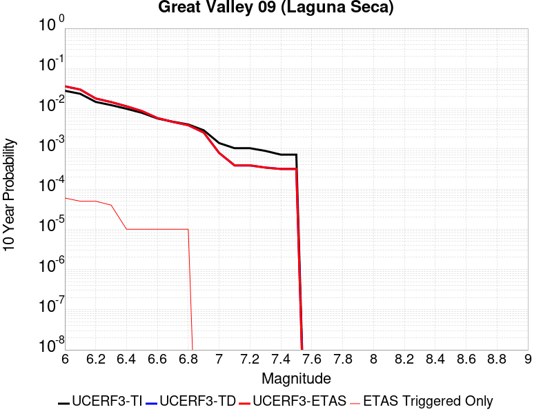 |

| Magnitude | 1 wk TI Prob | 1 wk TD Prob | 1 wk ETAS Prob | 1 wk ETAS/TD Gain | 1 wk ETAS Triggered Only | 1 mo TI Prob | 1 mo TD Prob | 1 mo ETAS Prob | 1 mo ETAS/TD Gain | 1 mo ETAS Triggered Only | 1 yr TI Prob | 1 yr TD Prob | 1 yr ETAS Prob | 1 yr ETAS/TD Gain | 1 yr ETAS Triggered Only | 10 yr TI Prob | 10 yr TD Prob | 10 yr ETAS Prob | 10 yr ETAS/TD Gain | 10 yr ETAS Triggered Only |
|-----|-----|-----|-----|-----|-----|-----|-----|-----|-----|-----|-----|-----|-----|-----|-----|-----|-----|-----|-----|-----|
| 6.0 | 5.4353277E-5 | 7.05022E-5 | 1.2276332E-4 | 1.7412694 | 5.2264808E-5 | 2.3292181E-4 | 3.0211566E-4 | 3.543647E-4 | 1.1729437 | 5.2264808E-5 | 0.0028321352 | 0.0036721937 | 0.0037242668 | 1.0141803 | 5.2264808E-5 | 0.02796312 | 0.03611547 | 0.03616585 | 1.0013949 | 5.2264808E-5 |
| 6.1 | 4.5578287E-5 | 5.822118E-5 | 9.306236E-5 | 1.5984279 | 3.4843204E-5 | 1.953209E-4 | 2.4949326E-4 | 2.8432778E-4 | 1.139621 | 3.4843204E-5 | 0.0023754383 | 0.003033432 | 0.0030681696 | 1.0114516 | 3.4843204E-5 | 0.023502063 | 0.029919548 | 0.029953348 | 1.0011297 | 3.4843204E-5 |
| 6.2 | 2.8536782E-5 | 3.4737273E-5 | 6.957927E-5 | 2.0030146 | 3.4843204E-5 | 1.2229476E-4 | 1.4886224E-4 | 1.8370025E-4 | 1.2340286 | 3.4843204E-5 | 0.0014879217 | 0.001810813 | 0.0018455931 | 1.0192069 | 3.4843204E-5 | 0.014779986 | 0.017958116 | 0.017992334 | 1.0019054 | 3.4843204E-5 |
| 6.3 | 2.3698774E-5 | 2.8213295E-5 | 6.3055515E-5 | 2.2349575 | 3.4843204E-5 | 1.01562226E-4 | 1.20905075E-4 | 1.5574407E-4 | 1.2881516 | 3.4843204E-5 | 0.0012358186 | 0.0014710218 | 0.0015058137 | 1.0236516 | 3.4843204E-5 | 0.012289686 | 0.014611342 | 0.014645676 | 1.0023499 | 3.4843204E-5 |
| 6.4 | 1.9191197E-5 | 2.2123184E-5 | 3.95444E-5 | 1.7874643 | 1.7421602E-5 | 8.2245395E-5 | 9.4806666E-5 | 1.1222662E-4 | 1.1837418 | 1.7421602E-5 | 0.0010008777 | 0.0011536429 | 0.0011710443 | 1.0150839 | 1.7421602E-5 | 0.009963818 | 0.011476948 | 0.01149417 | 1.0015005 | 1.7421602E-5 |
| 6.5 | 1.5203241E-5 | 1.6802203E-5 | 3.4223514E-5 | 2.0368466 | 1.7421602E-5 | 6.5155116E-5 | 7.200386E-5 | 8.9424204E-5 | 1.2419363 | 1.7421602E-5 | 7.9297484E-4 | 8.7626575E-4 | 8.936721E-4 | 1.0198642 | 1.7421602E-5 | 0.007901512 | 0.0087295165 | 0.008746786 | 1.0019783 | 1.7421602E-5 |
| 6.6 | 1.0984925E-5 | 1.1242595E-5 | 2.8664002E-5 | 2.5495894 | 1.7421602E-5 | 4.70774E-5 | 4.8181686E-5 | 6.560245E-5 | 1.361564 | 1.7421602E-5 | 5.730166E-4 | 5.8645656E-4 | 6.038679E-4 | 1.0296891 | 1.7421602E-5 | 0.005715413 | 0.0058494853 | 0.005866805 | 1.0029609 | 1.7421602E-5 |
| 6.7 | 9.134616E-6 | 9.019894E-6 | 2.644134E-5 | 2.9314468 | 1.7421602E-5 | 3.9147766E-5 | 3.865613E-5 | 5.607706E-5 | 1.450664 | 1.7421602E-5 | 4.7651984E-4 | 4.7053912E-4 | 4.8795252E-4 | 1.0370073 | 1.7421602E-5 | 0.004754993 | 0.0046956735 | 0.004713013 | 1.0036927 | 1.7421602E-5 |
| 6.8 | 7.785589E-6 | 7.4519444E-6 | 2.4873418E-5 | 3.3378427 | 1.7421602E-5 | 3.3366385E-5 | 3.1936524E-5 | 4.935757E-5 | 1.5454898 | 1.7421602E-5 | 4.0616E-4 | 3.8875983E-4 | 4.0617466E-4 | 1.0447959 | 1.7421602E-5 | 0.0040541845 | 0.0038810016 | 0.0038983554 | 1.0044715 | 1.7421602E-5 |
| 6.9 | 5.579095E-6 | 4.898492E-6 | 4.898492E-6 | 1.0 | 0.0 | 2.3910188E-5 | 2.0993377E-5 | 2.0993377E-5 | 1.0 | 0.0 | 2.9106764E-4 | 2.5556577E-4 | 2.5556577E-4 | 1.0 | 0.0 | 0.002906867 | 0.002552856 | 0.002552856 | 1.0 | 0.0 |
| 7.0 | 2.6816688E-6 | 1.5216126E-6 | 1.5216126E-6 | 1.0 | 0.0 | 1.1492816E-5 | 6.521181E-6 | 6.521181E-6 | 1.0 | 0.0 | 1.3991605E-4 | 7.939258E-5 | 7.939258E-5 | 1.0 | 0.0 | 0.0013982799 | 7.9365086E-4 | 7.9365086E-4 | 1.0 | 0.0 |
| 7.1 | 1.9951021E-6 | 7.453827E-7 | 7.453827E-7 | 1.0 | 0.0 | 8.55041E-6 | 3.1944935E-6 | 3.1944935E-6 | 1.0 | 0.0 | 1.0409627E-4 | 3.8892307E-5 | 3.8892307E-5 | 1.0 | 0.0 | 0.0010404752 | 3.8885913E-4 | 3.8885913E-4 | 1.0 | 0.0 |
| 7.2 | 1.9951021E-6 | 7.453827E-7 | 7.453827E-7 | 1.0 | 0.0 | 8.55041E-6 | 3.1944935E-6 | 3.1944935E-6 | 1.0 | 0.0 | 1.0409627E-4 | 3.8892307E-5 | 3.8892307E-5 | 1.0 | 0.0 | 0.0010404752 | 3.8885913E-4 | 3.8885913E-4 | 1.0 | 0.0 |
| 7.3 | 1.7087556E-6 | 6.578881E-7 | 6.578881E-7 | 1.0 | 0.0 | 7.3232177E-6 | 2.8195177E-6 | 2.8195177E-6 | 1.0 | 0.0 | 8.915652E-5 | 3.4327128E-5 | 3.4327128E-5 | 1.0 | 0.0 | 8.9120766E-4 | 3.432223E-4 | 3.432223E-4 | 1.0 | 0.0 |
| 7.4 | 1.3804846E-6 | 6.073852E-7 | 6.073852E-7 | 1.0 | 0.0 | 5.916349E-6 | 2.6030768E-6 | 2.6030768E-6 | 1.0 | 0.0 | 7.2029165E-5 | 3.169204E-5 | 3.169204E-5 | 1.0 | 0.0 | 7.200583E-4 | 3.1687922E-4 | 3.1687922E-4 | 1.0 | 0.0 |
| 7.5 | 1.3804846E-6 | 6.073852E-7 | 6.073852E-7 | 1.0 | 0.0 | 5.916349E-6 | 2.6030768E-6 | 2.6030768E-6 | 1.0 | 0.0 | 7.2029165E-5 | 3.169204E-5 | 3.169204E-5 | 1.0 | 0.0 | 7.200583E-4 | 3.1687922E-4 | 3.1687922E-4 | 1.0 | 0.0 |

## San Andreas (Santa Cruz Mts) 2011 CFM
*[(top)](#table-of-contents)*

| 1 Week | 1 Month | 1 Year | 10 Year |
|-----|-----|-----|-----|
|  |  | 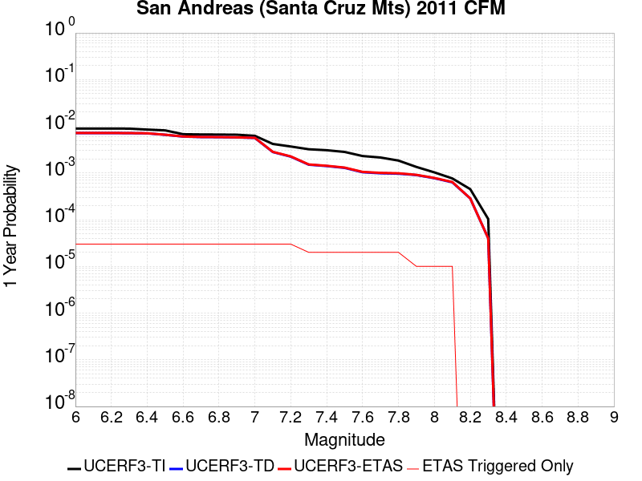 |  |

| Magnitude | 1 wk TI Prob | 1 wk TD Prob | 1 wk ETAS Prob | 1 wk ETAS/TD Gain | 1 wk ETAS Triggered Only | 1 mo TI Prob | 1 mo TD Prob | 1 mo ETAS Prob | 1 mo ETAS/TD Gain | 1 mo ETAS Triggered Only | 1 yr TI Prob | 1 yr TD Prob | 1 yr ETAS Prob | 1 yr ETAS/TD Gain | 1 yr ETAS Triggered Only | 10 yr TI Prob | 10 yr TD Prob | 10 yr ETAS Prob | 10 yr ETAS/TD Gain | 10 yr ETAS Triggered Only |
|-----|-----|-----|-----|-----|-----|-----|-----|-----|-----|-----|-----|-----|-----|-----|-----|-----|-----|-----|-----|-----|
| 6.0 | 1.7221631E-4 | 1.3793171E-4 | 1.553509E-4 | 1.1262885 | 1.7421602E-5 | 7.378611E-4 | 5.9100403E-4 | 6.0841534E-4 | 1.0294605 | 1.7421602E-5 | 0.008946515 | 0.007172124 | 0.007206717 | 1.0048233 | 3.4843204E-5 | 0.08594794 | 0.0705551 | 0.07058748 | 1.000459 | 3.4843204E-5 |
| 6.1 | 1.7221631E-4 | 1.3793171E-4 | 1.553509E-4 | 1.1262885 | 1.7421602E-5 | 7.378611E-4 | 5.9100403E-4 | 6.0841534E-4 | 1.0294605 | 1.7421602E-5 | 0.008946515 | 0.007172124 | 0.007206717 | 1.0048233 | 3.4843204E-5 | 0.08594794 | 0.0705551 | 0.07058748 | 1.000459 | 3.4843204E-5 |
| 6.2 | 1.7221631E-4 | 1.3793171E-4 | 1.553509E-4 | 1.1262885 | 1.7421602E-5 | 7.378611E-4 | 5.9100403E-4 | 6.0841534E-4 | 1.0294605 | 1.7421602E-5 | 0.008946515 | 0.007172124 | 0.007206717 | 1.0048233 | 3.4843204E-5 | 0.08594794 | 0.0705551 | 0.07058748 | 1.000459 | 3.4843204E-5 |
| 6.3 | 1.716926E-4 | 1.3712609E-4 | 1.545453E-4 | 1.1270306 | 1.7421602E-5 | 7.3561794E-4 | 5.875529E-4 | 6.0496427E-4 | 1.0296338 | 1.7421602E-5 | 0.008919428 | 0.0071303817 | 0.007164976 | 1.0048517 | 3.4843204E-5 | 0.08569809 | 0.070167266 | 0.07019967 | 1.0004617 | 3.4843204E-5 |
| 6.4 | 1.6392978E-4 | 1.3588481E-4 | 1.5330405E-4 | 1.1281912 | 1.7421602E-5 | 7.02367E-4 | 5.822355E-4 | 5.99647E-4 | 1.0299045 | 1.7421602E-5 | 0.008517839 | 0.007066063 | 0.00710066 | 1.0048962 | 3.4843204E-5 | 0.08198654 | 0.06940135 | 0.06943378 | 1.0004672 | 3.4843204E-5 |
| 6.5 | 1.5742714E-4 | 1.2648388E-4 | 1.4390328E-4 | 1.1377203 | 1.7421602E-5 | 6.745133E-4 | 5.4196286E-4 | 5.59375E-4 | 1.032128 | 1.7421602E-5 | 0.00818132 | 0.0065787593 | 0.0066133733 | 1.0052614 | 3.4843204E-5 | 0.078865945 | 0.06486309 | 0.06489568 | 1.0005023 | 3.4843204E-5 |
| 6.6 | 1.3038084E-4 | 1.1588213E-4 | 1.3330171E-4 | 1.1503216 | 1.7421602E-5 | 5.5865536E-4 | 4.9654447E-4 | 5.139574E-4 | 1.0350683 | 1.7421602E-5 | 0.006780438 | 0.0060289134 | 0.0060635465 | 1.0057445 | 3.4843204E-5 | 0.0657725 | 0.05932738 | 0.059360154 | 1.0005524 | 3.4843204E-5 |
| 6.7 | 1.2867592E-4 | 1.1314701E-4 | 1.3056664E-4 | 1.1539557 | 1.7421602E-5 | 5.5135164E-4 | 4.8482692E-4 | 5.022401E-4 | 1.0359162 | 1.7421602E-5 | 0.0066920654 | 0.00588703 | 0.0059216684 | 1.0058838 | 3.4843204E-5 | 0.06494093 | 0.058038417 | 0.058071237 | 1.0005655 | 3.4843204E-5 |
| 6.8 | 1.2801298E-4 | 1.1252261E-4 | 1.2994226E-4 | 1.1548102 | 1.7421602E-5 | 5.485117E-4 | 4.8215193E-4 | 4.995651E-4 | 1.0361156 | 1.7421602E-5 | 0.0066577005 | 0.0058546383 | 0.0058892774 | 1.0059166 | 3.4843204E-5 | 0.06461738 | 0.057752274 | 0.057785105 | 1.0005685 | 3.4843204E-5 |
| 6.9 | 1.269149E-4 | 1.1094465E-4 | 1.2836432E-4 | 1.1570122 | 1.7421602E-5 | 5.4380763E-4 | 4.7539172E-4 | 4.9280503E-4 | 1.0366294 | 1.7421602E-5 | 0.006600777 | 0.005772772 | 0.0058074137 | 1.006001 | 3.4843204E-5 | 0.06408122 | 0.0570241 | 0.057056952 | 1.0005761 | 3.4843204E-5 |
| 7.0 | 1.2030331E-4 | 1.0824504E-4 | 1.2566475E-4 | 1.1609286 | 1.7421602E-5 | 5.154837E-4 | 4.638261E-4 | 4.812396E-4 | 1.0375432 | 1.7421602E-5 | 0.006257969 | 0.0056326967 | 0.0056673433 | 1.0061511 | 3.4843204E-5 | 0.06084648 | 0.055696685 | 0.05572959 | 1.0005908 | 3.4843204E-5 |
| 7.1 | 8.049617E-5 | 5.3926604E-5 | 7.134726E-5 | 1.323044 | 1.7421602E-5 | 3.4493793E-4 | 2.3109373E-4 | 2.485113E-4 | 1.0753702 | 1.7421602E-5 | 0.0041915346 | 0.0028099709 | 0.0028447162 | 1.012365 | 3.4843204E-5 | 0.041133516 | 0.029618956 | 0.029652767 | 1.0011415 | 3.4843204E-5 |
| 7.2 | 7.093979E-5 | 4.2937932E-5 | 6.0358787E-5 | 1.4057218 | 1.7421602E-5 | 3.0399222E-4 | 1.8400686E-4 | 2.0142525E-4 | 1.0946617 | 1.7421602E-5 | 0.0036948253 | 0.0022380045 | 0.0022727698 | 1.015534 | 3.4843204E-5 | 0.03633994 | 0.023941692 | 0.0239757 | 1.0014205 | 3.4843204E-5 |
| 7.3 | 6.193693E-5 | 2.8894141E-5 | 4.631524E-5 | 1.6029284 | 1.7421602E-5 | 2.6541698E-4 | 1.2382616E-4 | 1.412456E-4 | 1.1406766 | 1.7421602E-5 | 0.0032266637 | 0.0015065427 | 0.001523938 | 1.0115465 | 1.7421602E-5 | 0.031802133 | 0.016499156 | 0.01651629 | 1.0010384 | 1.7421602E-5 |
| 7.4 | 5.906492E-5 | 2.702346E-5 | 4.4444594E-5 | 1.6446669 | 1.7421602E-5 | 2.5311083E-4 | 1.1580969E-4 | 1.3322927E-4 | 1.1504157 | 1.7421602E-5 | 0.0030772698 | 0.0014090725 | 0.0014264695 | 1.0123465 | 1.7421602E-5 | 0.030350044 | 0.015471023 | 0.015488175 | 1.0011086 | 1.7421602E-5 |
| 7.5 | 5.424296E-5 | 2.4678277E-5 | 4.2099447E-5 | 1.7059315 | 1.7421602E-5 | 2.324491E-4 | 1.05759755E-4 | 1.2317952E-4 | 1.1647106 | 1.7421602E-5 | 0.002826395 | 0.0012868657 | 0.0013042649 | 1.0135206 | 1.7421602E-5 | 0.027907165 | 0.014163188 | 0.014180362 | 1.0012126 | 1.7421602E-5 |
| 7.6 | 4.43084E-5 | 1.990431E-5 | 3.7325568E-5 | 1.8752505 | 1.7421602E-5 | 1.8987931E-4 | 8.53014E-5 | 1.0272151E-4 | 1.2042184 | 1.7421602E-5 | 0.0023093296 | 0.0010380499 | 0.0010554534 | 1.0167656 | 1.7421602E-5 | 0.022854783 | 0.011412679 | 0.011429902 | 1.0015091 | 1.7421602E-5 |
| 7.7 | 4.118098E-5 | 1.8936442E-5 | 3.6357716E-5 | 1.9199866 | 1.7421602E-5 | 1.7647797E-4 | 8.115366E-5 | 9.8573844E-5 | 1.2146568 | 1.7421602E-5 | 0.002146502 | 9.875982E-4 | 0.0010050025 | 1.017623 | 1.7421602E-5 | 0.021258866 | 0.010870468 | 0.0108877 | 1.0015852 | 1.7421602E-5 |
| 7.8 | 3.5408906E-5 | 1.856446E-5 | 3.598574E-5 | 1.938421 | 1.7421602E-5 | 1.5174363E-4 | 7.955955E-5 | 9.697976E-5 | 1.2189583 | 1.7421602E-5 | 0.0018459131 | 9.682073E-4 | 9.85612E-4 | 1.0179763 | 1.7421602E-5 | 0.018306552 | 0.010652021 | 0.010669257 | 1.0016181 | 1.7421602E-5 |
| 7.9 | 2.5860836E-5 | 1.7315993E-5 | 1.7315993E-5 | 1.0 | 0.0 | 1.10827445E-4 | 7.420929E-5 | 7.420929E-5 | 1.0 | 0.0 | 0.001348489 | 9.031238E-4 | 9.031238E-4 | 1.0 | 0.0 | 0.013403354 | 0.009907599 | 0.009907599 | 1.0 | 0.0 |
| 8.0 | 1.9777332E-5 | 1.4839596E-5 | 1.4839596E-5 | 1.0 | 0.0 | 8.4757245E-5 | 6.3596715E-5 | 6.3596715E-5 | 1.0 | 0.0 | 0.0010314309 | 7.740152E-4 | 7.740152E-4 | 1.0 | 0.0 | 0.010266567 | 0.008508967 | 0.008508967 | 1.0 | 0.0 |
| 8.1 | 1.468494E-5 | 1.2107374E-5 | 1.2107374E-5 | 1.0 | 0.0 | 6.293394E-5 | 5.1887713E-5 | 5.1887713E-5 | 1.0 | 0.0 | 7.6595135E-4 | 6.3155E-4 | 6.3155E-4 | 1.0 | 0.0 | 0.0076331664 | 0.006969149 | 0.006969149 | 1.0 | 0.0 |
| 8.2 | 8.63836E-6 | 5.469061E-6 | 5.469061E-6 | 1.0 | 0.0 | 3.7021015E-5 | 2.3438623E-5 | 2.3438623E-5 | 1.0 | 0.0 | 4.5063766E-4 | 2.8532793E-4 | 2.8532793E-4 | 1.0 | 0.0 | 0.004497249 | 0.00324569 | 0.00324569 | 1.0 | 0.0 |
| 8.3 | 1.983087E-6 | 7.6599065E-7 | 7.6599065E-7 | 1.0 | 0.0 | 8.498917E-6 | 3.282813E-6 | 3.282813E-6 | 1.0 | 0.0 | 1.034694E-4 | 3.9967534E-5 | 3.9967534E-5 | 1.0 | 0.0 | 0.0010342124 | 4.719687E-4 | 4.719687E-4 | 1.0 | 0.0 |

## Lost Hills
*[(top)](#table-of-contents)*

| 1 Week | 1 Month | 1 Year | 10 Year |
|-----|-----|-----|-----|
|  |  |  |  |

| Magnitude | 1 wk TI Prob | 1 wk TD Prob | 1 wk ETAS Prob | 1 wk ETAS/TD Gain | 1 wk ETAS Triggered Only | 1 mo TI Prob | 1 mo TD Prob | 1 mo ETAS Prob | 1 mo ETAS/TD Gain | 1 mo ETAS Triggered Only | 1 yr TI Prob | 1 yr TD Prob | 1 yr ETAS Prob | 1 yr ETAS/TD Gain | 1 yr ETAS Triggered Only | 10 yr TI Prob | 10 yr TD Prob | 10 yr ETAS Prob | 10 yr ETAS/TD Gain | 10 yr ETAS Triggered Only |
|-----|-----|-----|-----|-----|-----|-----|-----|-----|-----|-----|-----|-----|-----|-----|-----|-----|-----|-----|-----|-----|
| 6.0 | 2.233523E-5 | 2.5106583E-5 | 4.2527747E-5 | 1.6938883 | 1.7421602E-5 | 9.571891E-5 | 1.0759615E-4 | 1.424356E-4 | 1.3237984 | 3.4843204E-5 | 0.0011647546 | 0.001309364 | 0.0013441616 | 1.0265759 | 3.4843204E-5 | 0.011586686 | 0.013033091 | 0.01306748 | 1.0026386 | 3.4843204E-5 |
| 6.1 | 2.233523E-5 | 2.5106583E-5 | 4.2527747E-5 | 1.6938883 | 1.7421602E-5 | 9.571891E-5 | 1.0759615E-4 | 1.424356E-4 | 1.3237984 | 3.4843204E-5 | 0.0011647546 | 0.001309364 | 0.0013441616 | 1.0265759 | 3.4843204E-5 | 0.011586686 | 0.013033091 | 0.01306748 | 1.0026386 | 3.4843204E-5 |
| 6.2 | 2.233523E-5 | 2.5106583E-5 | 4.2527747E-5 | 1.6938883 | 1.7421602E-5 | 9.571891E-5 | 1.0759615E-4 | 1.424356E-4 | 1.3237984 | 3.4843204E-5 | 0.0011647546 | 0.001309364 | 0.0013441616 | 1.0265759 | 3.4843204E-5 | 0.011586686 | 0.013033091 | 0.01306748 | 1.0026386 | 3.4843204E-5 |
| 6.3 | 2.233523E-5 | 2.5106583E-5 | 4.2527747E-5 | 1.6938883 | 1.7421602E-5 | 9.571891E-5 | 1.0759615E-4 | 1.424356E-4 | 1.3237984 | 3.4843204E-5 | 0.0011647546 | 0.001309364 | 0.0013441616 | 1.0265759 | 3.4843204E-5 | 0.011586686 | 0.013033091 | 0.01306748 | 1.0026386 | 3.4843204E-5 |
| 6.4 | 1.2288092E-5 | 1.3781108E-5 | 1.3781108E-5 | 1.0 | 0.0 | 5.2662188E-5 | 5.906108E-5 | 5.906108E-5 | 1.0 | 0.0 | 6.409735E-4 | 7.189252E-4 | 7.189252E-4 | 1.0 | 0.0 | 0.006391279 | 0.0071752006 | 0.0071752006 | 1.0 | 0.0 |
| 6.5 | 1.2288092E-5 | 1.3781108E-5 | 1.3781108E-5 | 1.0 | 0.0 | 5.2662188E-5 | 5.906108E-5 | 5.906108E-5 | 1.0 | 0.0 | 6.409735E-4 | 7.189252E-4 | 7.189252E-4 | 1.0 | 0.0 | 0.006391279 | 0.0071752006 | 0.0071752006 | 1.0 | 0.0 |
| 6.6 | 8.58281E-6 | 9.63377E-6 | 9.63377E-6 | 1.0 | 0.0 | 3.6782953E-5 | 4.12874E-5 | 4.12874E-5 | 1.0 | 0.0 | 4.4774043E-4 | 5.026414E-4 | 5.026414E-4 | 1.0 | 0.0 | 0.0044683935 | 0.005023205 | 0.005023205 | 1.0 | 0.0 |
| 6.7 | 7.205685E-6 | 8.088302E-6 | 8.088302E-6 | 1.0 | 0.0 | 3.088114E-5 | 3.466415E-5 | 3.466415E-5 | 1.0 | 0.0 | 3.7591302E-4 | 4.2203604E-4 | 4.2203604E-4 | 1.0 | 0.0 | 0.0037527776 | 0.0042203604 | 0.0042203604 | 1.0 | 0.0 |

## Santa Susana alt 1
*[(top)](#table-of-contents)*

| 1 Week | 1 Month | 1 Year | 10 Year |
|-----|-----|-----|-----|
|  |  |  |  |

| Magnitude | 1 wk TI Prob | 1 wk TD Prob | 1 wk ETAS Prob | 1 wk ETAS/TD Gain | 1 wk ETAS Triggered Only | 1 mo TI Prob | 1 mo TD Prob | 1 mo ETAS Prob | 1 mo ETAS/TD Gain | 1 mo ETAS Triggered Only | 1 yr TI Prob | 1 yr TD Prob | 1 yr ETAS Prob | 1 yr ETAS/TD Gain | 1 yr ETAS Triggered Only | 10 yr TI Prob | 10 yr TD Prob | 10 yr ETAS Prob | 10 yr ETAS/TD Gain | 10 yr ETAS Triggered Only |
|-----|-----|-----|-----|-----|-----|-----|-----|-----|-----|-----|-----|-----|-----|-----|-----|-----|-----|-----|-----|-----|
| 6.0 | 2.674877E-5 | 2.7198023E-5 | 2.7198023E-5 | 1.0 | 0.0 | 1.1463255E-4 | 1.1655839E-4 | 1.3397796E-4 | 1.1494493 | 1.7421602E-5 | 0.0013947578 | 0.0014182882 | 0.001453082 | 1.0245322 | 3.4843204E-5 | 0.013860362 | 0.014104128 | 0.01413848 | 1.0024356 | 3.4843204E-5 |
| 6.1 | 2.674877E-5 | 2.7198023E-5 | 2.7198023E-5 | 1.0 | 0.0 | 1.1463255E-4 | 1.1655839E-4 | 1.3397796E-4 | 1.1494493 | 1.7421602E-5 | 0.0013947578 | 0.0014182882 | 0.001453082 | 1.0245322 | 3.4843204E-5 | 0.013860362 | 0.014104128 | 0.01413848 | 1.0024356 | 3.4843204E-5 |
| 6.2 | 2.674877E-5 | 2.7198023E-5 | 2.7198023E-5 | 1.0 | 0.0 | 1.1463255E-4 | 1.1655839E-4 | 1.3397796E-4 | 1.1494493 | 1.7421602E-5 | 0.0013947578 | 0.0014182882 | 0.001453082 | 1.0245322 | 3.4843204E-5 | 0.013860362 | 0.014104128 | 0.01413848 | 1.0024356 | 3.4843204E-5 |
| 6.3 | 2.674877E-5 | 2.7198023E-5 | 2.7198023E-5 | 1.0 | 0.0 | 1.1463255E-4 | 1.1655839E-4 | 1.3397796E-4 | 1.1494493 | 1.7421602E-5 | 0.0013947578 | 0.0014182882 | 0.001453082 | 1.0245322 | 3.4843204E-5 | 0.013860362 | 0.014104128 | 0.01413848 | 1.0024356 | 3.4843204E-5 |
| 6.4 | 2.674877E-5 | 2.7198023E-5 | 2.7198023E-5 | 1.0 | 0.0 | 1.1463255E-4 | 1.1655839E-4 | 1.3397796E-4 | 1.1494493 | 1.7421602E-5 | 0.0013947578 | 0.0014182882 | 0.001453082 | 1.0245322 | 3.4843204E-5 | 0.013860362 | 0.014104128 | 0.01413848 | 1.0024356 | 3.4843204E-5 |
| 6.5 | 2.674877E-5 | 2.7198023E-5 | 2.7198023E-5 | 1.0 | 0.0 | 1.1463255E-4 | 1.1655839E-4 | 1.3397796E-4 | 1.1494493 | 1.7421602E-5 | 0.0013947578 | 0.0014182882 | 0.001453082 | 1.0245322 | 3.4843204E-5 | 0.013860362 | 0.014104128 | 0.01413848 | 1.0024356 | 3.4843204E-5 |
| 6.6 | 2.6647976E-5 | 2.7074359E-5 | 2.7074359E-5 | 1.0 | 0.0 | 1.14200615E-4 | 1.1602845E-4 | 1.3344803E-4 | 1.150132 | 1.7421602E-5 | 0.0013895056 | 0.0014118447 | 0.0014466388 | 1.0246444 | 3.4843204E-5 | 0.013808494 | 0.014040513 | 0.014074867 | 1.0024468 | 3.4843204E-5 |
| 6.7 | 2.6647976E-5 | 2.7074359E-5 | 2.7074359E-5 | 1.0 | 0.0 | 1.14200615E-4 | 1.1602845E-4 | 1.3344803E-4 | 1.150132 | 1.7421602E-5 | 0.0013895056 | 0.0014118447 | 0.0014466388 | 1.0246444 | 3.4843204E-5 | 0.013808494 | 0.014040513 | 0.014074867 | 1.0024468 | 3.4843204E-5 |
| 6.8 | 1.9073179E-5 | 1.7637283E-5 | 1.7637283E-5 | 1.0 | 0.0 | 8.1739636E-5 | 7.558627E-5 | 9.300656E-5 | 1.2304689 | 1.7421602E-5 | 9.947256E-4 | 9.198925E-4 | 9.5470366E-4 | 1.0378426 | 3.4843204E-5 | 0.009902848 | 0.009163101 | 0.009197625 | 1.0037677 | 3.4843204E-5 |
| 6.9 | 1.9041876E-5 | 1.7619415E-5 | 1.7619415E-5 | 1.0 | 0.0 | 8.160549E-5 | 7.55097E-5 | 9.2929986E-5 | 1.2307026 | 1.7421602E-5 | 9.930939E-4 | 9.1896096E-4 | 9.5377216E-4 | 1.037881 | 3.4843204E-5 | 0.0098866755 | 0.0091538625 | 0.009188387 | 1.0037715 | 3.4843204E-5 |
| 7.0 | 1.5917482E-5 | 1.3863864E-5 | 1.3863864E-5 | 1.0 | 0.0 | 6.8215995E-5 | 5.9415237E-5 | 7.68358E-5 | 1.2932004 | 1.7421602E-5 | 8.302132E-4 | 7.231451E-4 | 7.5796305E-4 | 1.048148 | 3.4843204E-5 | 0.008271185 | 0.0072088144 | 0.0072434065 | 1.0047985 | 3.4843204E-5 |
| 7.1 | 1.577788E-5 | 1.3743872E-5 | 1.3743872E-5 | 1.0 | 0.0 | 6.761774E-5 | 5.8901005E-5 | 7.632158E-5 | 1.2957603 | 1.7421602E-5 | 8.2293496E-4 | 7.1688846E-4 | 7.5170666E-4 | 1.0485685 | 3.4843204E-5 | 0.008198941 | 0.007146652 | 0.0071812463 | 1.0048406 | 3.4843204E-5 |
| 7.2 | 1.5416446E-5 | 1.3469944E-5 | 1.3469944E-5 | 1.0 | 0.0 | 6.606882E-5 | 5.772708E-5 | 7.514768E-5 | 1.3017751 | 1.7421602E-5 | 8.0409093E-4 | 7.026052E-4 | 7.3742395E-4 | 1.0495566 | 3.4843204E-5 | 0.008011877 | 0.0070047234 | 0.0070393225 | 1.0049394 | 3.4843204E-5 |
| 7.3 | 1.4534083E-5 | 1.2717879E-5 | 1.2717879E-5 | 1.0 | 0.0 | 6.228744E-5 | 5.4504082E-5 | 7.192473E-5 | 1.3196211 | 1.7421602E-5 | 7.580857E-4 | 6.633896E-4 | 6.982097E-4 | 1.0524881 | 3.4843204E-5 | 0.007555048 | 0.0066149444 | 0.006649557 | 1.0052325 | 3.4843204E-5 |
| 7.4 | 1.2858995E-5 | 1.1229652E-5 | 1.1229652E-5 | 1.0 | 0.0 | 5.5108816E-5 | 4.8126214E-5 | 6.554698E-5 | 1.3619808 | 1.7421602E-5 | 6.7074323E-4 | 5.857831E-4 | 6.206059E-4 | 1.0594466 | 3.4843204E-5 | 0.0066872234 | 0.005843165 | 0.0058778045 | 1.0059283 | 3.4843204E-5 |
| 7.5 | 8.827668E-6 | 7.805457E-6 | 7.805457E-6 | 1.0 | 0.0 | 3.7832317E-5 | 3.3451546E-5 | 3.3451546E-5 | 1.0 | 0.0 | 4.605111E-4 | 4.071989E-4 | 4.2461342E-4 | 1.0427666 | 1.7421602E-5 | 0.0045955796 | 0.0040647765 | 0.0040821275 | 1.0042685 | 1.7421602E-5 |
| 7.6 | 3.2533426E-6 | 2.871988E-6 | 2.871988E-6 | 1.0 | 0.0 | 1.3942822E-5 | 1.2308465E-5 | 1.2308465E-5 | 1.0 | 0.0 | 1.6974064E-4 | 1.4984563E-4 | 1.4984563E-4 | 1.0 | 0.0 | 0.0016961104 | 0.0014974826 | 0.0014974826 | 1.0 | 0.0 |
| 7.7 | 1.2751709E-6 | 1.1491089E-6 | 1.1491089E-6 | 1.0 | 0.0 | 5.4650063E-6 | 4.9247437E-6 | 4.9247437E-6 | 1.0 | 0.0 | 6.653442E-5 | 5.9957198E-5 | 5.9957198E-5 | 1.0 | 0.0 | 6.6514505E-4 | 5.994191E-4 | 5.994191E-4 | 1.0 | 0.0 |
| 7.8 | 3.067544E-7 | 3.2400436E-7 | 3.2400436E-7 | 1.0 | 0.0 | 1.3146611E-6 | 1.3885895E-6 | 1.3885895E-6 | 1.0 | 0.0 | 1.600588E-5 | 1.6905957E-5 | 1.6905957E-5 | 1.0 | 0.0 | 1.6004729E-4 | 1.6904772E-4 | 1.6904772E-4 | 1.0 | 0.0 |
| 7.9 | 7.622999E-8 | 8.087964E-8 | 8.087964E-8 | 1.0 | 0.0 | 3.2669993E-7 | 3.4662696E-7 | 3.4662696E-7 | 1.0 | 0.0 | 3.977564E-6 | 4.2201773E-6 | 4.2201773E-6 | 1.0 | 0.0 | 3.977493E-5 | 4.220118E-5 | 4.220118E-5 | 1.0 | 0.0 |

## White Wolf
*[(top)](#table-of-contents)*

| 1 Week | 1 Month | 1 Year | 10 Year |
|-----|-----|-----|-----|
|  |  |  |  |

| Magnitude | 1 wk TI Prob | 1 wk TD Prob | 1 wk ETAS Prob | 1 wk ETAS/TD Gain | 1 wk ETAS Triggered Only | 1 mo TI Prob | 1 mo TD Prob | 1 mo ETAS Prob | 1 mo ETAS/TD Gain | 1 mo ETAS Triggered Only | 1 yr TI Prob | 1 yr TD Prob | 1 yr ETAS Prob | 1 yr ETAS/TD Gain | 1 yr ETAS Triggered Only | 10 yr TI Prob | 10 yr TD Prob | 10 yr ETAS Prob | 10 yr ETAS/TD Gain | 10 yr ETAS Triggered Only |
|-----|-----|-----|-----|-----|-----|-----|-----|-----|-----|-----|-----|-----|-----|-----|-----|-----|-----|-----|-----|-----|
| 6.0 | 2.0037822E-5 | 1.0469162E-6 | 1.8468501E-5 | 17.64086 | 1.7421602E-5 | 8.587355E-5 | 4.486776E-6 | 3.9329825E-5 | 8.76572 | 3.4843204E-5 | 0.001045009 | 5.4625183E-5 | 8.9466484E-5 | 1.6378249 | 3.4843204E-5 | 0.010401085 | 5.461226E-4 | 5.809468E-4 | 1.0637662 | 3.4843204E-5 |
| 6.1 | 2.0037822E-5 | 1.0469162E-6 | 1.8468501E-5 | 17.64086 | 1.7421602E-5 | 8.587355E-5 | 4.486776E-6 | 3.9329825E-5 | 8.76572 | 3.4843204E-5 | 0.001045009 | 5.4625183E-5 | 8.9466484E-5 | 1.6378249 | 3.4843204E-5 | 0.010401085 | 5.461226E-4 | 5.809468E-4 | 1.0637662 | 3.4843204E-5 |
| 6.2 | 2.0037822E-5 | 1.0469162E-6 | 1.8468501E-5 | 17.64086 | 1.7421602E-5 | 8.587355E-5 | 4.486776E-6 | 3.9329825E-5 | 8.76572 | 3.4843204E-5 | 0.001045009 | 5.4625183E-5 | 8.9466484E-5 | 1.6378249 | 3.4843204E-5 | 0.010401085 | 5.461226E-4 | 5.809468E-4 | 1.0637662 | 3.4843204E-5 |
| 6.3 | 2.0037822E-5 | 1.0469162E-6 | 1.8468501E-5 | 17.64086 | 1.7421602E-5 | 8.587355E-5 | 4.486776E-6 | 3.9329825E-5 | 8.76572 | 3.4843204E-5 | 0.001045009 | 5.4625183E-5 | 8.9466484E-5 | 1.6378249 | 3.4843204E-5 | 0.010401085 | 5.461226E-4 | 5.809468E-4 | 1.0637662 | 3.4843204E-5 |
| 6.4 | 1.132487E-5 | 1.0469162E-6 | 1.8468501E-5 | 17.64086 | 1.7421602E-5 | 4.8534253E-5 | 4.486776E-6 | 3.9329825E-5 | 8.76572 | 3.4843204E-5 | 5.907443E-4 | 5.4625183E-5 | 8.9466484E-5 | 1.6378249 | 3.4843204E-5 | 0.005891764 | 5.461226E-4 | 5.809468E-4 | 1.0637662 | 3.4843204E-5 |
| 6.5 | 1.132487E-5 | 1.0469162E-6 | 1.8468501E-5 | 17.64086 | 1.7421602E-5 | 4.8534253E-5 | 4.486776E-6 | 3.9329825E-5 | 8.76572 | 3.4843204E-5 | 5.907443E-4 | 5.4625183E-5 | 8.9466484E-5 | 1.6378249 | 3.4843204E-5 | 0.005891764 | 5.461226E-4 | 5.809468E-4 | 1.0637662 | 3.4843204E-5 |
| 6.6 | 9.347473E-6 | 1.0469162E-6 | 1.8468501E-5 | 17.64086 | 1.7421602E-5 | 4.0059982E-5 | 4.486776E-6 | 3.9329825E-5 | 8.76572 | 3.4843204E-5 | 4.8762115E-4 | 5.4625183E-5 | 8.9466484E-5 | 1.6378249 | 3.4843204E-5 | 0.0048655253 | 5.461226E-4 | 5.809468E-4 | 1.0637662 | 3.4843204E-5 |
| 6.7 | 7.842647E-6 | 1.0048342E-6 | 1.8426419E-5 | 18.33777 | 1.7421602E-5 | 3.361091E-5 | 4.3064256E-6 | 3.914948E-5 | 9.090946 | 3.4843204E-5 | 4.0913603E-4 | 5.2429517E-5 | 8.72709E-5 | 1.6645374 | 3.4843204E-5 | 0.004083836 | 5.2417646E-4 | 5.590014E-4 | 1.0664375 | 3.4843204E-5 |
| 6.8 | 6.26597E-6 | 9.734822E-7 | 1.8395069E-5 | 18.896152 | 1.7421602E-5 | 2.685388E-5 | 4.17206E-6 | 3.901512E-5 | 9.351524 | 3.4843204E-5 | 3.2689696E-4 | 5.0793697E-5 | 8.563513E-5 | 1.6859401 | 3.4843204E-5 | 0.003264165 | 5.078258E-4 | 5.426513E-4 | 1.0685776 | 3.4843204E-5 |
| 6.9 | 5.258436E-6 | 9.183254E-7 | 1.8339912E-5 | 19.971039 | 1.7421602E-5 | 2.2535958E-5 | 3.9356746E-6 | 3.8778744E-5 | 9.853138 | 3.4843204E-5 | 2.7434074E-4 | 4.7915833E-5 | 8.275737E-5 | 1.7271404 | 3.4843204E-5 | 0.0027400232 | 4.790598E-4 | 5.1388633E-4 | 1.0726976 | 3.4843204E-5 |
| 7.0 | 4.675028E-6 | 8.6611794E-7 | 8.6611794E-7 | 1.0 | 0.0 | 2.003568E-5 | 3.7119291E-6 | 2.1133466E-5 | 5.693392 | 1.7421602E-5 | 2.4390711E-4 | 4.5191846E-5 | 6.2612664E-5 | 1.3854858 | 1.7421602E-5 | 0.0024363957 | 4.518313E-4 | 4.6924502E-4 | 1.0385404 | 1.7421602E-5 |
| 7.1 | 2.8270078E-6 | 6.8741696E-7 | 6.8741696E-7 | 1.0 | 0.0 | 1.2115692E-5 | 2.9460696E-6 | 2.036762E-5 | 6.9134893 | 1.7421602E-5 | 1.4749856E-4 | 3.5867848E-5 | 5.3288826E-5 | 1.4856989 | 1.7421602E-5 | 0.001474007 | 3.586247E-4 | 3.7604006E-4 | 1.0485615 | 1.7421602E-5 |
| 7.2 | 1.6881406E-6 | 2.2706382E-7 | 2.2706382E-7 | 1.0 | 0.0 | 7.2348685E-6 | 9.731303E-7 | 1.8394716E-5 | 18.902624 | 1.7421602E-5 | 8.808096E-5 | 1.1847799E-5 | 2.9269195E-5 | 2.4704332 | 1.7421602E-5 | 8.8046055E-4 | 1.1847183E-4 | 1.3589137E-4 | 1.1470352 | 1.7421602E-5 |
| 7.3 | 9.086107E-7 | 1.5266386E-7 | 1.5266386E-7 | 1.0 | 0.0 | 3.8940398E-6 | 6.5427355E-7 | 1.8075865E-5 | 27.627382 | 1.7421602E-5 | 4.7408903E-5 | 7.965752E-6 | 2.5387217E-5 | 3.1870458 | 1.7421602E-5 | 4.739879E-4 | 7.965475E-5 | 9.707496E-5 | 1.2186965 | 1.7421602E-5 |
| 7.4 | 1.9717383E-7 | 9.003913E-8 | 9.003913E-8 | 1.0 | 0.0 | 8.450304E-7 | 3.8588192E-7 | 3.8588192E-7 | 1.0 | 0.0 | 1.0288197E-5 | 4.6981027E-6 | 4.6981027E-6 | 1.0 | 0.0 | 1.028772E-4 | 4.6980065E-5 | 4.6980065E-5 | 1.0 | 0.0 |
| 7.5 | 1.086975E-7 | 6.6597195E-8 | 6.6597195E-8 | 1.0 | 0.0 | 4.6584634E-7 | 2.8541652E-7 | 2.8541652E-7 | 1.0 | 0.0 | 5.6716644E-6 | 3.474941E-6 | 3.474941E-6 | 1.0 | 0.0 | 5.6715195E-5 | 3.474889E-5 | 3.474889E-5 | 1.0 | 0.0 |
| 7.6 | 2.4217808E-8 | 1.5820765E-8 | 1.5820765E-8 | 1.0 | 0.0 | 1.03790605E-7 | 6.780328E-8 | 6.780328E-8 | 1.0 | 0.0 | 1.2636499E-6 | 8.255046E-7 | 8.255046E-7 | 1.0 | 0.0 | 1.2636427E-5 | 8.2550205E-6 | 8.2550205E-6 | 1.0 | 0.0 |

## Pisgah-Bullion Mtn-Mesquite Lk
*[(top)](#table-of-contents)*

| 1 Week | 1 Month | 1 Year | 10 Year |
|-----|-----|-----|-----|
|  |  |  |  |

| Magnitude | 1 wk TI Prob | 1 wk TD Prob | 1 wk ETAS Prob | 1 wk ETAS/TD Gain | 1 wk ETAS Triggered Only | 1 mo TI Prob | 1 mo TD Prob | 1 mo ETAS Prob | 1 mo ETAS/TD Gain | 1 mo ETAS Triggered Only | 1 yr TI Prob | 1 yr TD Prob | 1 yr ETAS Prob | 1 yr ETAS/TD Gain | 1 yr ETAS Triggered Only | 10 yr TI Prob | 10 yr TD Prob | 10 yr ETAS Prob | 10 yr ETAS/TD Gain | 10 yr ETAS Triggered Only |
|-----|-----|-----|-----|-----|-----|-----|-----|-----|-----|-----|-----|-----|-----|-----|-----|-----|-----|-----|-----|-----|
| 6.0 | 3.0240792E-5 | 2.4091114E-5 | 2.4091114E-5 | 1.0 | 0.0 | 1.2959696E-4 | 1.03244114E-4 | 1.03244114E-4 | 1.0 | 0.0 | 0.0015767008 | 0.0012563728 | 0.0012737724 | 1.0138491 | 1.7421602E-5 | 0.015655609 | 0.012502721 | 0.012537128 | 1.0027521 | 3.4843204E-5 |
| 6.1 | 3.0240792E-5 | 2.4091114E-5 | 2.4091114E-5 | 1.0 | 0.0 | 1.2959696E-4 | 1.03244114E-4 | 1.03244114E-4 | 1.0 | 0.0 | 0.0015767008 | 0.0012563728 | 0.0012737724 | 1.0138491 | 1.7421602E-5 | 0.015655609 | 0.012502721 | 0.012537128 | 1.0027521 | 3.4843204E-5 |
| 6.2 | 3.0240792E-5 | 2.4091114E-5 | 2.4091114E-5 | 1.0 | 0.0 | 1.2959696E-4 | 1.03244114E-4 | 1.03244114E-4 | 1.0 | 0.0 | 0.0015767008 | 0.0012563728 | 0.0012737724 | 1.0138491 | 1.7421602E-5 | 0.015655609 | 0.012502721 | 0.012537128 | 1.0027521 | 3.4843204E-5 |
| 6.3 | 2.0498217E-5 | 1.36380695E-5 | 1.36380695E-5 | 1.0 | 0.0 | 8.784654E-5 | 5.844765E-5 | 5.844765E-5 | 1.0 | 0.0 | 0.0010690069 | 7.1138405E-4 | 7.1138405E-4 | 1.0 | 0.0 | 0.01063879 | 0.0070926943 | 0.0071099927 | 1.0024389 | 1.7421602E-5 |
| 6.4 | 2.0498217E-5 | 1.36380695E-5 | 1.36380695E-5 | 1.0 | 0.0 | 8.784654E-5 | 5.844765E-5 | 5.844765E-5 | 1.0 | 0.0 | 0.0010690069 | 7.1138405E-4 | 7.1138405E-4 | 1.0 | 0.0 | 0.01063879 | 0.0070926943 | 0.0071099927 | 1.0024389 | 1.7421602E-5 |
| 6.5 | 1.7316182E-5 | 1.0477042E-5 | 1.0477042E-5 | 1.0 | 0.0 | 7.42101E-5 | 4.4900895E-5 | 4.4900895E-5 | 1.0 | 0.0 | 9.0313336E-4 | 5.465413E-4 | 5.465413E-4 | 1.0 | 0.0 | 0.008994718 | 0.0054529672 | 0.0054529672 | 1.0 | 0.0 |
| 6.6 | 1.5251077E-5 | 8.414273E-6 | 8.414273E-6 | 1.0 | 0.0 | 6.536012E-5 | 3.6060712E-5 | 3.6060712E-5 | 1.0 | 0.0 | 7.9546886E-4 | 4.3895794E-4 | 4.3895794E-4 | 1.0 | 0.0 | 0.007926274 | 0.0043816264 | 0.0043816264 | 1.0 | 0.0 |
| 6.7 | 1.2997425E-5 | 6.4114965E-6 | 6.4114965E-6 | 1.0 | 0.0 | 5.570206E-5 | 2.7477578E-5 | 2.7477578E-5 | 1.0 | 0.0 | 6.7796157E-4 | 3.3449283E-4 | 3.3449283E-4 | 1.0 | 0.0 | 0.0067589693 | 0.0033403537 | 0.0033403537 | 1.0 | 0.0 |
| 6.8 | 1.035386E-5 | 4.3332193E-6 | 4.3332193E-6 | 1.0 | 0.0 | 4.437293E-5 | 1.8570812E-5 | 1.8570812E-5 | 1.0 | 0.0 | 5.401065E-4 | 2.2607706E-4 | 2.2607706E-4 | 1.0 | 0.0 | 0.0053879567 | 0.0022585576 | 0.0022585576 | 1.0 | 0.0 |
| 6.9 | 8.816252E-6 | 3.580638E-6 | 3.580638E-6 | 1.0 | 0.0 | 3.778339E-5 | 1.5345504E-5 | 1.5345504E-5 | 1.0 | 0.0 | 4.5991567E-4 | 1.8681608E-4 | 1.8681608E-4 | 1.0 | 0.0 | 0.00458965 | 0.0018666488 | 0.0018666488 | 1.0 | 0.0 |
| 7.0 | 6.8232207E-6 | 2.5675843E-6 | 2.5675843E-6 | 1.0 | 0.0 | 2.9242048E-5 | 1.1003888E-5 | 1.1003888E-5 | 1.0 | 0.0 | 3.5596377E-4 | 1.3396442E-4 | 1.3396442E-4 | 1.0 | 0.0 | 0.0035539411 | 0.0013388677 | 0.0013388677 | 1.0 | 0.0 |
| 7.1 | 5.837013E-6 | 2.22738E-6 | 2.22738E-6 | 1.0 | 0.0 | 2.501553E-5 | 9.545881E-6 | 9.545881E-6 | 1.0 | 0.0 | 3.045215E-4 | 1.16215204E-4 | 1.16215204E-4 | 1.0 | 0.0 | 0.0030410455 | 0.0011615733 | 0.0011615733 | 1.0 | 0.0 |
| 7.2 | 4.278052E-6 | 1.6275711E-6 | 1.6275711E-6 | 1.0 | 0.0 | 1.833438E-5 | 6.9752873E-6 | 6.9752873E-6 | 1.0 | 0.0 | 2.231982E-4 | 8.492105E-5 | 8.492105E-5 | 1.0 | 0.0 | 0.0022297418 | 8.489092E-4 | 8.489092E-4 | 1.0 | 0.0 |
| 7.3 | 1.8803692E-6 | 8.344926E-7 | 8.344926E-7 | 1.0 | 0.0 | 8.0587E-6 | 3.5763926E-6 | 3.5763926E-6 | 1.0 | 0.0 | 9.811026E-5 | 4.354186E-5 | 4.354186E-5 | 1.0 | 0.0 | 9.806695E-4 | 4.3534773E-4 | 4.3534773E-4 | 1.0 | 0.0 |

## Hayward (So) 2011 CFM
*[(top)](#table-of-contents)*

| 1 Week | 1 Month | 1 Year | 10 Year |
|-----|-----|-----|-----|
|  |  |  |  |

| Magnitude | 1 wk TI Prob | 1 wk TD Prob | 1 wk ETAS Prob | 1 wk ETAS/TD Gain | 1 wk ETAS Triggered Only | 1 mo TI Prob | 1 mo TD Prob | 1 mo ETAS Prob | 1 mo ETAS/TD Gain | 1 mo ETAS Triggered Only | 1 yr TI Prob | 1 yr TD Prob | 1 yr ETAS Prob | 1 yr ETAS/TD Gain | 1 yr ETAS Triggered Only | 10 yr TI Prob | 10 yr TD Prob | 10 yr ETAS Prob | 10 yr ETAS/TD Gain | 10 yr ETAS Triggered Only |
|-----|-----|-----|-----|-----|-----|-----|-----|-----|-----|-----|-----|-----|-----|-----|-----|-----|-----|-----|-----|-----|
| 6.0 | 1.8091932E-4 | 3.570541E-4 | 3.570541E-4 | 1.0 | 0.0 | 7.751381E-4 | 0.0015293444 | 0.0015293444 | 1.0 | 0.0 | 0.00939654 | 0.018463207 | 0.018480308 | 1.0009261 | 1.7421602E-5 | 0.090090066 | 0.16673161 | 0.16676064 | 1.0001742 | 3.4843204E-5 |
| 6.1 | 1.8091932E-4 | 3.570541E-4 | 3.570541E-4 | 1.0 | 0.0 | 7.751381E-4 | 0.0015293444 | 0.0015293444 | 1.0 | 0.0 | 0.00939654 | 0.018463207 | 0.018480308 | 1.0009261 | 1.7421602E-5 | 0.090090066 | 0.16673161 | 0.16676064 | 1.0001742 | 3.4843204E-5 |
| 6.2 | 1.8091932E-4 | 3.570541E-4 | 3.570541E-4 | 1.0 | 0.0 | 7.751381E-4 | 0.0015293444 | 0.0015293444 | 1.0 | 0.0 | 0.00939654 | 0.018463207 | 0.018480308 | 1.0009261 | 1.7421602E-5 | 0.090090066 | 0.16673161 | 0.16676064 | 1.0001742 | 3.4843204E-5 |
| 6.3 | 1.7322872E-4 | 3.426234E-4 | 3.426234E-4 | 1.0 | 0.0 | 7.4219756E-4 | 0.0014675693 | 0.0014675693 | 1.0 | 0.0 | 0.0089988755 | 0.017723544 | 0.017740658 | 1.0009656 | 1.7421602E-5 | 0.08643075 | 0.16066726 | 0.1606965 | 1.000182 | 3.4843204E-5 |
| 6.4 | 1.6334097E-4 | 3.234411E-4 | 3.234411E-4 | 1.0 | 0.0 | 6.998449E-4 | 0.0013854484 | 0.0013854484 | 1.0 | 0.0 | 0.008487372 | 0.016739385 | 0.016756516 | 1.0010233 | 1.7421602E-5 | 0.081704415 | 0.15255594 | 0.15258548 | 1.0001936 | 3.4843204E-5 |
| 6.5 | 1.5600289E-4 | 3.1018828E-4 | 3.1018828E-4 | 1.0 | 0.0 | 6.684125E-4 | 0.0013287093 | 0.0013287093 | 1.0 | 0.0 | 0.008107598 | 0.016058935 | 0.016076077 | 1.0010674 | 1.7421602E-5 | 0.078181036 | 0.14683272 | 0.14686243 | 1.0002024 | 3.4843204E-5 |
| 6.6 | 1.4046066E-4 | 2.8032906E-4 | 2.8032906E-4 | 1.0 | 0.0 | 6.018354E-4 | 0.0012008639 | 0.0012008639 | 1.0 | 0.0 | 0.0073027555 | 0.014524006 | 0.014541174 | 1.0011821 | 1.7421602E-5 | 0.07067384 | 0.13391982 | 0.13395 | 1.0002253 | 3.4843204E-5 |
| 6.7 | 1.14696966E-4 | 2.3271477E-4 | 2.3271477E-4 | 1.0 | 0.0 | 4.914658E-4 | 9.969729E-4 | 9.969729E-4 | 1.0 | 0.0 | 0.0059671924 | 0.012071652 | 0.012088864 | 1.0014257 | 1.7421602E-5 | 0.058094822 | 0.11274672 | 0.112777635 | 1.0002742 | 3.4843204E-5 |
| 6.8 | 9.3874296E-5 | 1.8861453E-4 | 1.8861453E-4 | 1.0 | 0.0 | 4.0225635E-4 | 8.0810126E-4 | 8.0810126E-4 | 1.0 | 0.0 | 0.0048864787 | 0.009794984 | 0.009794984 | 1.0 | 0.0 | 0.047804173 | 0.09259856 | 0.09261437 | 1.0001707 | 1.7421602E-5 |
| 6.9 | 5.551852E-5 | 1.072948E-4 | 1.072948E-4 | 1.0 | 0.0 | 2.3791482E-4 | 4.5975443E-4 | 4.5975443E-4 | 1.0 | 0.0 | 0.0028927654 | 0.0055832625 | 0.0055832625 | 1.0 | 0.0 | 0.028553981 | 0.054245494 | 0.054261968 | 1.0003037 | 1.7421602E-5 |
| 7.0 | 4.2662363E-5 | 8.2464416E-5 | 8.2464416E-5 | 1.0 | 0.0 | 1.8282588E-4 | 3.5337146E-4 | 3.5337146E-4 | 1.0 | 0.0 | 0.0022236328 | 0.0042938837 | 0.0042938837 | 1.0 | 0.0 | 0.022015138 | 0.042064495 | 0.042081185 | 1.0003967 | 1.7421602E-5 |
| 7.1 | 3.305886E-5 | 6.3019055E-5 | 6.3019055E-5 | 1.0 | 0.0 | 1.4167312E-4 | 2.700538E-4 | 2.700538E-4 | 1.0 | 0.0 | 0.0017235056 | 0.0032829668 | 0.0032829668 | 1.0 | 0.0 | 0.017101998 | 0.032452874 | 0.03246973 | 1.0005194 | 1.7421602E-5 |
| 7.2 | 2.9856887E-5 | 5.7013647E-5 | 5.7013647E-5 | 1.0 | 0.0 | 1.2795182E-4 | 2.4432142E-4 | 2.4432142E-4 | 1.0 | 0.0 | 0.0015567001 | 0.0029705726 | 0.0029705726 | 1.0 | 0.0 | 0.015458403 | 0.029453589 | 0.029470496 | 1.0005741 | 1.7421602E-5 |
| 7.3 | 2.4559737E-5 | 4.599088E-5 | 4.599088E-5 | 1.0 | 0.0 | 1.0525176E-4 | 1.9708896E-4 | 1.9708896E-4 | 1.0 | 0.0 | 0.0012806869 | 0.0023969305 | 0.0023969305 | 1.0 | 0.0 | 0.012733313 | 0.023857482 | 0.023874488 | 1.0007129 | 1.7421602E-5 |
| 7.4 | 1.9002231E-5 | 3.5049303E-5 | 3.5049303E-5 | 1.0 | 0.0 | 8.143559E-5 | 1.502027E-4 | 1.502027E-4 | 1.0 | 0.0 | 9.910273E-4 | 0.0018271938 | 0.0018271938 | 1.0 | 0.0 | 0.009866194 | 0.018258283 | 0.018275386 | 1.0009367 | 1.7421602E-5 |
| 7.5 | 1.2783333E-5 | 2.3330069E-5 | 2.3330069E-5 | 1.0 | 0.0 | 5.4784563E-5 | 9.998221E-5 | 9.998221E-5 | 1.0 | 0.0 | 6.667979E-4 | 0.0012166094 | 0.0012166094 | 1.0 | 0.0 | 0.006648007 | 0.012209582 | 0.012226791 | 1.0014094 | 1.7421602E-5 |
| 7.6 | 4.8149627E-6 | 8.887544E-6 | 8.887544E-6 | 1.0 | 0.0 | 2.063539E-5 | 3.8088925E-5 | 3.8088925E-5 | 1.0 | 0.0 | 2.5120692E-4 | 4.636352E-4 | 4.636352E-4 | 1.0 | 0.0 | 0.0025092314 | 0.0046812436 | 0.0046985834 | 1.0037042 | 1.7421602E-5 |
| 7.7 | 6.0838227E-7 | 1.2056693E-6 | 1.2056693E-6 | 1.0 | 0.0 | 2.6073499E-6 | 5.1671436E-6 | 5.1671436E-6 | 1.0 | 0.0 | 3.174402E-5 | 6.290816E-5 | 6.290816E-5 | 1.0 | 0.0 | 3.1739488E-4 | 6.5293367E-4 | 6.7034387E-4 | 1.0266646 | 1.7421602E-5 |
| 7.8 | 4.5542808E-7 | 9.792182E-7 | 9.792182E-7 | 1.0 | 0.0 | 1.9518332E-6 | 4.1966427E-6 | 4.1966427E-6 | 1.0 | 0.0 | 2.376331E-5 | 5.1092928E-5 | 5.1092928E-5 | 1.0 | 0.0 | 2.3760769E-4 | 5.321372E-4 | 5.4954947E-4 | 1.0327215 | 1.7421602E-5 |
| 7.9 | 3.3016747E-7 | 7.386335E-7 | 7.386335E-7 | 1.0 | 0.0 | 1.4150027E-6 | 3.1655684E-6 | 3.1655684E-6 | 1.0 | 0.0 | 1.7227521E-5 | 3.8540114E-5 | 3.8540114E-5 | 1.0 | 0.0 | 1.7226185E-4 | 3.9930744E-4 | 4.1672206E-4 | 1.0436121 | 1.7421602E-5 |
| 8.0 | 2.347038E-7 | 5.4714894E-7 | 5.4714894E-7 | 1.0 | 0.0 | 1.0058731E-6 | 2.344922E-6 | 2.344922E-6 | 1.0 | 0.0 | 1.2246436E-5 | 2.8549053E-5 | 2.8549053E-5 | 1.0 | 0.0 | 1.2245761E-4 | 2.9355253E-4 | 3.1096902E-4 | 1.0593301 | 1.7421602E-5 |
| 8.1 | 1.18822804E-7 | 2.6058973E-7 | 2.6058973E-7 | 1.0 | 0.0 | 5.092405E-7 | 1.1168127E-6 | 1.1168127E-6 | 1.0 | 0.0 | 6.1999854E-6 | 1.359711E-5 | 1.359711E-5 | 1.0 | 0.0 | 6.199812E-5 | 1.3917852E-4 | 1.5659769E-4 | 1.1251571 | 1.7421602E-5 |

## Cleghorn
*[(top)](#table-of-contents)*

| 1 Week | 1 Month | 1 Year | 10 Year |
|-----|-----|-----|-----|
|  |  |  |  |

| Magnitude | 1 wk TI Prob | 1 wk TD Prob | 1 wk ETAS Prob | 1 wk ETAS/TD Gain | 1 wk ETAS Triggered Only | 1 mo TI Prob | 1 mo TD Prob | 1 mo ETAS Prob | 1 mo ETAS/TD Gain | 1 mo ETAS Triggered Only | 1 yr TI Prob | 1 yr TD Prob | 1 yr ETAS Prob | 1 yr ETAS/TD Gain | 1 yr ETAS Triggered Only | 10 yr TI Prob | 10 yr TD Prob | 10 yr ETAS Prob | 10 yr ETAS/TD Gain | 10 yr ETAS Triggered Only |
|-----|-----|-----|-----|-----|-----|-----|-----|-----|-----|-----|-----|-----|-----|-----|-----|-----|-----|-----|-----|-----|
| 6.0 | 7.9267165E-6 | 9.831582E-6 | 2.7253014E-5 | 2.7719865 | 1.7421602E-5 | 3.39712E-5 | 4.2134732E-5 | 5.95556E-5 | 1.4134562 | 1.7421602E-5 | 4.1352084E-4 | 5.128803E-4 | 5.4770557E-4 | 1.0679015 | 3.4843204E-5 | 0.004127522 | 0.0051320773 | 0.0051667416 | 1.0067544 | 3.4843204E-5 |
| 6.1 | 7.9267165E-6 | 9.831582E-6 | 2.7253014E-5 | 2.7719865 | 1.7421602E-5 | 3.39712E-5 | 4.2134732E-5 | 5.95556E-5 | 1.4134562 | 1.7421602E-5 | 4.1352084E-4 | 5.128803E-4 | 5.4770557E-4 | 1.0679015 | 3.4843204E-5 | 0.004127522 | 0.0051320773 | 0.0051667416 | 1.0067544 | 3.4843204E-5 |
| 6.2 | 7.9267165E-6 | 9.831582E-6 | 2.7253014E-5 | 2.7719865 | 1.7421602E-5 | 3.39712E-5 | 4.2134732E-5 | 5.95556E-5 | 1.4134562 | 1.7421602E-5 | 4.1352084E-4 | 5.128803E-4 | 5.4770557E-4 | 1.0679015 | 3.4843204E-5 | 0.004127522 | 0.0051320773 | 0.0051667416 | 1.0067544 | 3.4843204E-5 |
| 6.3 | 7.9267165E-6 | 9.831582E-6 | 2.7253014E-5 | 2.7719865 | 1.7421602E-5 | 3.39712E-5 | 4.2134732E-5 | 5.95556E-5 | 1.4134562 | 1.7421602E-5 | 4.1352084E-4 | 5.128803E-4 | 5.4770557E-4 | 1.0679015 | 3.4843204E-5 | 0.004127522 | 0.0051320773 | 0.0051667416 | 1.0067544 | 3.4843204E-5 |
| 6.4 | 4.3445207E-6 | 6.0914435E-6 | 2.351294E-5 | 3.859995 | 1.7421602E-5 | 1.8619241E-5 | 2.610593E-5 | 4.3527078E-5 | 1.6673253 | 1.7421602E-5 | 2.2666567E-4 | 3.1779436E-4 | 3.526265E-4 | 1.1096059 | 3.4843204E-5 | 0.0022643462 | 0.0031875873 | 0.0032223195 | 1.0108961 | 3.4843204E-5 |
| 6.5 | 4.3445207E-6 | 6.0914435E-6 | 2.351294E-5 | 3.859995 | 1.7421602E-5 | 1.8619241E-5 | 2.610593E-5 | 4.3527078E-5 | 1.6673253 | 1.7421602E-5 | 2.2666567E-4 | 3.1779436E-4 | 3.526265E-4 | 1.1096059 | 3.4843204E-5 | 0.0022643462 | 0.0031875873 | 0.0032223195 | 1.0108961 | 3.4843204E-5 |
| 6.6 | 4.040109E-6 | 5.773851E-6 | 2.3195353E-5 | 4.0173106 | 1.7421602E-5 | 1.7314638E-5 | 2.4744846E-5 | 4.216602E-5 | 1.7040323 | 1.7421602E-5 | 2.1078532E-4 | 3.012278E-4 | 3.360605E-4 | 1.1156358 | 3.4843204E-5 | 0.002105855 | 0.003022377 | 0.003057115 | 1.0114936 | 3.4843204E-5 |
| 6.7 | 3.3632055E-6 | 5.067348E-6 | 2.2488863E-5 | 4.4379945 | 1.7421602E-5 | 1.4413658E-5 | 2.1717027E-5 | 3.9138253E-5 | 1.802192 | 1.7421602E-5 | 1.7547216E-4 | 2.6437303E-4 | 2.8179004E-4 | 1.0658804 | 1.7421602E-5 | 0.0017533366 | 0.0026547113 | 0.0026720865 | 1.0065451 | 1.7421602E-5 |
| 6.8 | 3.2902772E-6 | 4.9892556E-6 | 2.2410772E-5 | 4.4918065 | 1.7421602E-5 | 1.4101111E-5 | 2.1382351E-5 | 3.880358E-5 | 1.8147482 | 1.7421602E-5 | 1.716675E-4 | 2.6029933E-4 | 2.777164E-4 | 1.0669117 | 1.7421602E-5 | 0.0017153495 | 0.0026140702 | 0.002631446 | 1.0066471 | 1.7421602E-5 |
| 6.9 | 3.031547E-6 | 4.6910186E-6 | 2.211254E-5 | 4.713804 | 1.7421602E-5 | 1.299228E-5 | 2.0104211E-5 | 3.7525464E-5 | 1.8665475 | 1.7421602E-5 | 1.5816953E-4 | 2.4474156E-4 | 2.621589E-4 | 1.0711663 | 1.7421602E-5 | 0.00158057 | 0.0024588439 | 0.0024762226 | 1.0070679 | 1.7421602E-5 |
| 7.0 | 2.8259715E-6 | 4.3705895E-6 | 2.1792115E-5 | 4.9860816 | 1.7421602E-5 | 1.211125E-5 | 1.8730963E-5 | 3.615224E-5 | 1.930079 | 1.7421602E-5 | 1.4744449E-4 | 2.2802586E-4 | 2.454435E-4 | 1.0763844 | 1.7421602E-5 | 0.001473467 | 0.0022920412 | 0.0023094227 | 1.0075835 | 1.7421602E-5 |
| 7.1 | 2.5962665E-6 | 4.0658106E-6 | 2.1487343E-5 | 5.284885 | 1.7421602E-5 | 1.1126809E-5 | 1.7424789E-5 | 3.484609E-5 | 1.9997997 | 1.7421602E-5 | 1.3546048E-4 | 2.1212637E-4 | 2.2954427E-4 | 1.082111 | 1.7421602E-5 | 0.0013537793 | 0.002133366 | 0.0021507505 | 1.0081488 | 1.7421602E-5 |
| 7.2 | 2.3247253E-6 | 3.6763672E-6 | 2.1097905E-5 | 5.738792 | 1.7421602E-5 | 9.96307E-6 | 1.5755764E-5 | 3.3177093E-5 | 2.1057115 | 1.7421602E-5 | 1.21293626E-4 | 1.9180974E-4 | 2.09228E-4 | 1.0908101 | 1.7421602E-5 | 0.0012122744 | 0.0019305905 | 0.0019479784 | 1.0090065 | 1.7421602E-5 |
| 7.3 | 2.056928E-6 | 3.2350938E-6 | 2.065664E-5 | 6.385175 | 1.7421602E-5 | 8.815376E-6 | 1.3864615E-5 | 3.1285977E-5 | 2.256534 | 1.7421602E-5 | 1.0732192E-4 | 1.6878877E-4 | 1.8620743E-4 | 1.103198 | 1.7421602E-5 | 0.001072701 | 0.0017008206 | 0.0017182126 | 1.0102257 | 1.7421602E-5 |
| 7.4 | 1.8055999E-6 | 2.8255042E-6 | 2.0247058E-5 | 7.165821 | 1.7421602E-5 | 7.738263E-6 | 1.2109249E-5 | 2.953064E-5 | 2.4386847 | 1.7421602E-5 | 9.4209274E-5 | 1.4742027E-4 | 1.6483931E-4 | 1.118159 | 1.7421602E-5 | 9.4169343E-4 | 0.0014875771 | 0.0015049728 | 1.011694 | 1.7421602E-5 |
| 7.5 | 1.4683443E-6 | 2.4247483E-6 | 1.984631E-5 | 8.184895 | 1.7421602E-5 | 6.292889E-6 | 1.0391738E-5 | 2.781316E-5 | 2.6764686 | 1.7421602E-5 | 7.661323E-5 | 1.2651215E-4 | 1.4393155E-4 | 1.1376895 | 1.7421602E-5 | 7.658682E-4 | 0.0012787961 | 0.0012961954 | 1.0136061 | 1.7421602E-5 |
| 7.6 | 9.804088E-7 | 1.900266E-6 | 1.900266E-6 | 1.0 | 0.0 | 4.201745E-6 | 8.143972E-6 | 8.143972E-6 | 1.0 | 0.0 | 5.1155046E-5 | 9.91484E-5 | 9.91484E-5 | 1.0 | 0.0 | 5.114327E-4 | 0.001005471 | 0.001005471 | 1.0 | 0.0 |
| 7.7 | 7.3434086E-7 | 1.6284146E-6 | 1.6284146E-6 | 1.0 | 0.0 | 3.1471714E-6 | 6.978901E-6 | 6.978901E-6 | 1.0 | 0.0 | 3.831614E-5 | 8.4964835E-5 | 8.4964835E-5 | 1.0 | 0.0 | 3.8309532E-4 | 8.6378685E-4 | 8.6378685E-4 | 1.0 | 0.0 |
| 7.8 | 6.434184E-7 | 1.5220047E-6 | 1.5220047E-6 | 1.0 | 0.0 | 2.7575045E-6 | 6.5228614E-6 | 6.5228614E-6 | 1.0 | 0.0 | 3.35721E-5 | 7.941297E-5 | 7.941297E-5 | 1.0 | 0.0 | 3.3567028E-4 | 8.079678E-4 | 8.079678E-4 | 1.0 | 0.0 |
| 7.9 | 3.4943926E-7 | 7.574459E-7 | 7.574459E-7 | 1.0 | 0.0 | 1.497596E-6 | 3.2461926E-6 | 3.2461926E-6 | 1.0 | 0.0 | 1.8233079E-5 | 3.952169E-5 | 3.952169E-5 | 1.0 | 0.0 | 1.8231584E-4 | 4.040099E-4 | 4.040099E-4 | 1.0 | 0.0 |
| 8.0 | 6.717524E-8 | 5.838828E-8 | 5.838828E-8 | 1.0 | 0.0 | 2.8789387E-7 | 2.5023547E-7 | 2.5023547E-7 | 1.0 | 0.0 | 3.505102E-6 | 3.0466126E-6 | 3.0466126E-6 | 1.0 | 0.0 | 3.5050467E-5 | 3.273506E-5 | 3.273506E-5 | 1.0 | 0.0 |
| 8.1 | 3.1984914E-8 | 1.2956093E-8 | 1.2956093E-8 | 1.0 | 0.0 | 1.370782E-7 | 5.552611E-8 | 5.552611E-8 | 1.0 | 0.0 | 1.6689258E-6 | 6.760302E-7 | 6.760302E-7 | 1.0 | 0.0 | 1.6689133E-5 | 7.74454E-6 | 7.74454E-6 | 1.0 | 0.0 |
| 8.2 | 1.21887656E-8 | 3.6495305E-9 | 3.6495305E-9 | 1.0 | 0.0 | 5.2237567E-8 | 1.5640845E-8 | 1.5640845E-8 | 1.0 | 0.0 | 6.359922E-7 | 1.9042727E-7 | 1.9042727E-7 | 1.0 | 0.0 | 6.3599036E-6 | 2.2470974E-6 | 2.2470974E-6 | 1.0 | 0.0 |

## Pittville 2011 CFM
*[(top)](#table-of-contents)*

| 1 Week | 1 Month | 1 Year | 10 Year |
|-----|-----|-----|-----|
|  |  |  |  |

| Magnitude | 1 wk TI Prob | 1 wk TD Prob | 1 wk ETAS Prob | 1 wk ETAS/TD Gain | 1 wk ETAS Triggered Only | 1 mo TI Prob | 1 mo TD Prob | 1 mo ETAS Prob | 1 mo ETAS/TD Gain | 1 mo ETAS Triggered Only | 1 yr TI Prob | 1 yr TD Prob | 1 yr ETAS Prob | 1 yr ETAS/TD Gain | 1 yr ETAS Triggered Only | 10 yr TI Prob | 10 yr TD Prob | 10 yr ETAS Prob | 10 yr ETAS/TD Gain | 10 yr ETAS Triggered Only |
|-----|-----|-----|-----|-----|-----|-----|-----|-----|-----|-----|-----|-----|-----|-----|-----|-----|-----|-----|-----|-----|
| 6.0 | 2.5031832E-5 | 2.7056969E-5 | 4.44781E-5 | 1.6438686 | 1.7421602E-5 | 1.0727487E-4 | 1.1595384E-4 | 1.3337341E-4 | 1.1502286 | 1.7421602E-5 | 0.001305289 | 0.0014109211 | 0.0014283181 | 1.0123303 | 1.7421602E-5 | 0.012976485 | 0.014029415 | 0.014046593 | 1.0012244 | 1.7421602E-5 |
| 6.1 | 1.2540113E-5 | 1.3513067E-5 | 3.0934432E-5 | 2.289224 | 1.7421602E-5 | 5.3742235E-5 | 5.7911984E-5 | 7.533257E-5 | 1.3008115 | 1.7421602E-5 | 6.541153E-4 | 7.048728E-4 | 7.222821E-4 | 1.0246985 | 1.7421602E-5 | 0.0065219323 | 0.0070286044 | 0.0070459032 | 1.0024612 | 1.7421602E-5 |
| 6.2 | 6.603218E-6 | 7.107189E-6 | 2.4528668E-5 | 3.4512475 | 1.7421602E-5 | 2.8299199E-5 | 3.0459063E-5 | 4.7880134E-5 | 1.5719503 | 1.7421602E-5 | 3.4448825E-4 | 3.7078248E-4 | 3.8819763E-4 | 1.0469686 | 1.7421602E-5 | 0.0034395473 | 0.0037022792 | 0.0037196362 | 1.0046883 | 1.7421602E-5 |
| 6.3 | 6.603218E-6 | 7.107189E-6 | 2.4528668E-5 | 3.4512475 | 1.7421602E-5 | 2.8299199E-5 | 3.0459063E-5 | 4.7880134E-5 | 1.5719503 | 1.7421602E-5 | 3.4448825E-4 | 3.7078248E-4 | 3.8819763E-4 | 1.0469686 | 1.7421602E-5 | 0.0034395473 | 0.0037022792 | 0.0037196362 | 1.0046883 | 1.7421602E-5 |
| 6.4 | 3.9389015E-6 | 4.239175E-6 | 4.239175E-6 | 1.0 | 0.0 | 1.6880897E-5 | 1.8167784E-5 | 1.8167784E-5 | 1.0 | 0.0 | 2.0550552E-4 | 2.2117342E-4 | 2.2117342E-4 | 1.0 | 0.0 | 0.0020531558 | 0.002209838 | 0.002209838 | 1.0 | 0.0 |
| 6.5 | 2.4533072E-6 | 2.6412686E-6 | 2.6412686E-6 | 1.0 | 0.0 | 1.0514132E-5 | 1.1319685E-5 | 1.1319685E-5 | 1.0 | 0.0 | 1.2800204E-4 | 1.3781038E-4 | 1.3781038E-4 | 1.0 | 0.0 | 0.0012792832 | 0.0013774394 | 0.0013774394 | 1.0 | 0.0 |
| 6.6 | 1.3482367E-6 | 1.452993E-6 | 1.452993E-6 | 1.0 | 0.0 | 5.778144E-6 | 6.2271047E-6 | 6.2271047E-6 | 1.0 | 0.0 | 7.0346636E-5 | 7.58135E-5 | 7.58135E-5 | 1.0 | 0.0 | 7.032437E-4 | 7.5798744E-4 | 7.5798744E-4 | 1.0 | 0.0 |

## Bullion Mountains
*[(top)](#table-of-contents)*

| 1 Week | 1 Month | 1 Year | 10 Year |
|-----|-----|-----|-----|
|  |  |  |  |

| Magnitude | 1 wk TI Prob | 1 wk TD Prob | 1 wk ETAS Prob | 1 wk ETAS/TD Gain | 1 wk ETAS Triggered Only | 1 mo TI Prob | 1 mo TD Prob | 1 mo ETAS Prob | 1 mo ETAS/TD Gain | 1 mo ETAS Triggered Only | 1 yr TI Prob | 1 yr TD Prob | 1 yr ETAS Prob | 1 yr ETAS/TD Gain | 1 yr ETAS Triggered Only | 10 yr TI Prob | 10 yr TD Prob | 10 yr ETAS Prob | 10 yr ETAS/TD Gain | 10 yr ETAS Triggered Only |
|-----|-----|-----|-----|-----|-----|-----|-----|-----|-----|-----|-----|-----|-----|-----|-----|-----|-----|-----|-----|-----|
| 6.0 | 1.6420427E-5 | 1.4692089E-5 | 4.953478E-5 | 3.3715274 | 3.4843204E-5 | 7.037136E-5 | 6.296479E-5 | 9.780581E-5 | 1.5533412 | 3.4843204E-5 | 8.5643446E-4 | 7.663651E-4 | 8.011816E-4 | 1.0454307 | 3.4843204E-5 | 0.008531413 | 0.007641016 | 0.0076755933 | 1.0045252 | 3.4843204E-5 |
| 6.1 | 1.6420427E-5 | 1.4692089E-5 | 4.953478E-5 | 3.3715274 | 3.4843204E-5 | 7.037136E-5 | 6.296479E-5 | 9.780581E-5 | 1.5533412 | 3.4843204E-5 | 8.5643446E-4 | 7.663651E-4 | 8.011816E-4 | 1.0454307 | 3.4843204E-5 | 0.008531413 | 0.007641016 | 0.0076755933 | 1.0045252 | 3.4843204E-5 |
| 6.2 | 1.6420427E-5 | 1.4692089E-5 | 4.953478E-5 | 3.3715274 | 3.4843204E-5 | 7.037136E-5 | 6.296479E-5 | 9.780581E-5 | 1.5533412 | 3.4843204E-5 | 8.5643446E-4 | 7.663651E-4 | 8.011816E-4 | 1.0454307 | 3.4843204E-5 | 0.008531413 | 0.007641016 | 0.0076755933 | 1.0045252 | 3.4843204E-5 |
| 6.3 | 1.2046778E-5 | 9.862335E-6 | 9.862335E-6 | 1.0 | 0.0 | 5.1628023E-5 | 4.2266598E-5 | 4.2266598E-5 | 1.0 | 0.0 | 6.283899E-4 | 5.144975E-4 | 5.144975E-4 | 1.0 | 0.0 | 0.0062661595 | 0.005135345 | 0.005135345 | 1.0 | 0.0 |
| 6.4 | 1.2046778E-5 | 9.862335E-6 | 9.862335E-6 | 1.0 | 0.0 | 5.1628023E-5 | 4.2266598E-5 | 4.2266598E-5 | 1.0 | 0.0 | 6.283899E-4 | 5.144975E-4 | 5.144975E-4 | 1.0 | 0.0 | 0.0062661595 | 0.005135345 | 0.005135345 | 1.0 | 0.0 |
| 6.5 | 1.0244343E-5 | 7.879458E-6 | 7.879458E-6 | 1.0 | 0.0 | 4.390359E-5 | 3.3768785E-5 | 3.3768785E-5 | 1.0 | 0.0 | 5.343951E-4 | 4.110781E-4 | 4.110781E-4 | 1.0 | 0.0 | 0.005331118 | 0.004105208 | 0.004105208 | 1.0 | 0.0 |
| 6.6 | 9.605408E-6 | 7.1774966E-6 | 7.1774966E-6 | 1.0 | 0.0 | 4.1165385E-5 | 3.076045E-5 | 3.076045E-5 | 1.0 | 0.0 | 5.010733E-4 | 3.744645E-4 | 3.744645E-4 | 1.0 | 0.0 | 0.00499945 | 0.003740332 | 0.003740332 | 1.0 | 0.0 |
| 6.7 | 8.60418E-6 | 6.1240044E-6 | 6.1240044E-6 | 1.0 | 0.0 | 3.687454E-5 | 2.624558E-5 | 2.624558E-5 | 1.0 | 0.0 | 4.48855E-4 | 3.1951256E-4 | 3.1951256E-4 | 1.0 | 0.0 | 0.004479495 | 0.0031924439 | 0.0031924439 | 1.0 | 0.0 |
| 6.8 | 5.187994E-6 | 2.5631666E-6 | 2.5631666E-6 | 1.0 | 0.0 | 2.223407E-5 | 1.0984976E-5 | 1.0984976E-5 | 1.0 | 0.0 | 2.7066618E-4 | 1.3373788E-4 | 1.3373788E-4 | 1.0 | 0.0 | 0.0027033675 | 0.0013369655 | 0.0013369655 | 1.0 | 0.0 |
| 6.9 | 4.5302368E-6 | 2.3443165E-6 | 2.3443165E-6 | 1.0 | 0.0 | 1.9415156E-5 | 1.0047055E-5 | 1.0047055E-5 | 1.0 | 0.0 | 2.3635388E-4 | 1.2232E-4 | 1.2232E-4 | 1.0 | 0.0 | 0.0023610266 | 0.0012229157 | 0.0012229157 | 1.0 | 0.0 |
| 7.0 | 3.431668E-6 | 1.6882402E-6 | 1.6882402E-6 | 1.0 | 0.0 | 1.4707065E-5 | 7.235315E-6 | 7.235315E-6 | 1.0 | 0.0 | 1.7904381E-4 | 8.808996E-5 | 8.808996E-5 | 1.0 | 0.0 | 0.0017889962 | 8.808996E-4 | 8.808996E-4 | 1.0 | 0.0 |

## Palos Verdes
*[(top)](#table-of-contents)*

| 1 Week | 1 Month | 1 Year | 10 Year |
|-----|-----|-----|-----|
|  |  |  |  |

| Magnitude | 1 wk TI Prob | 1 wk TD Prob | 1 wk ETAS Prob | 1 wk ETAS/TD Gain | 1 wk ETAS Triggered Only | 1 mo TI Prob | 1 mo TD Prob | 1 mo ETAS Prob | 1 mo ETAS/TD Gain | 1 mo ETAS Triggered Only | 1 yr TI Prob | 1 yr TD Prob | 1 yr ETAS Prob | 1 yr ETAS/TD Gain | 1 yr ETAS Triggered Only | 10 yr TI Prob | 10 yr TD Prob | 10 yr ETAS Prob | 10 yr ETAS/TD Gain | 10 yr ETAS Triggered Only |
|-----|-----|-----|-----|-----|-----|-----|-----|-----|-----|-----|-----|-----|-----|-----|-----|-----|-----|-----|-----|-----|
| 6.0 | 6.126063E-5 | 7.622612E-5 | 7.622612E-5 | 1.0 | 0.0 | 2.6251914E-4 | 3.2664582E-4 | 3.2664582E-4 | 1.0 | 0.0 | 0.0031914865 | 0.003970174 | 0.0039875265 | 1.0043707 | 1.7421602E-5 | 0.031460393 | 0.039048895 | 0.03908238 | 1.0008575 | 3.4843204E-5 |
| 6.1 | 6.126063E-5 | 7.622612E-5 | 7.622612E-5 | 1.0 | 0.0 | 2.6251914E-4 | 3.2664582E-4 | 3.2664582E-4 | 1.0 | 0.0 | 0.0031914865 | 0.003970174 | 0.0039875265 | 1.0043707 | 1.7421602E-5 | 0.031460393 | 0.039048895 | 0.03908238 | 1.0008575 | 3.4843204E-5 |
| 6.2 | 6.126063E-5 | 7.622612E-5 | 7.622612E-5 | 1.0 | 0.0 | 2.6251914E-4 | 3.2664582E-4 | 3.2664582E-4 | 1.0 | 0.0 | 0.0031914865 | 0.003970174 | 0.0039875265 | 1.0043707 | 1.7421602E-5 | 0.031460393 | 0.039048895 | 0.03908238 | 1.0008575 | 3.4843204E-5 |
| 6.3 | 4.0838047E-5 | 4.9749437E-5 | 4.9749437E-5 | 1.0 | 0.0 | 1.7500846E-4 | 2.1319572E-4 | 2.1319572E-4 | 1.0 | 0.0 | 0.0021286458 | 0.0025927818 | 0.0025927818 | 1.0 | 0.0 | 0.021083709 | 0.025646681 | 0.025663655 | 1.0006618 | 1.7421602E-5 |
| 6.4 | 4.0838047E-5 | 4.9749437E-5 | 4.9749437E-5 | 1.0 | 0.0 | 1.7500846E-4 | 2.1319572E-4 | 2.1319572E-4 | 1.0 | 0.0 | 0.0021286458 | 0.0025927818 | 0.0025927818 | 1.0 | 0.0 | 0.021083709 | 0.025646681 | 0.025663655 | 1.0006618 | 1.7421602E-5 |
| 6.5 | 3.0512005E-5 | 3.656162E-5 | 3.656162E-5 | 1.0 | 0.0 | 1.3075917E-4 | 1.5668393E-4 | 1.5668393E-4 | 1.0 | 0.0 | 0.0015908304 | 0.0019060767 | 0.0019060767 | 1.0 | 0.0 | 0.015794903 | 0.018909154 | 0.018926246 | 1.000904 | 1.7421602E-5 |
| 6.6 | 2.9255087E-5 | 3.515442E-5 | 3.515442E-5 | 1.0 | 0.0 | 1.2537291E-4 | 1.5065377E-4 | 1.5065377E-4 | 1.0 | 0.0 | 0.0015253464 | 0.0018327828 | 0.0018327828 | 1.0 | 0.0 | 0.015149189 | 0.018188225 | 0.01820533 | 1.0009404 | 1.7421602E-5 |
| 6.7 | 2.287198E-5 | 2.7248278E-5 | 2.7248278E-5 | 1.0 | 0.0 | 9.801909E-5 | 1.16773626E-4 | 1.16773626E-4 | 1.0 | 0.0 | 0.001192729 | 0.0014208833 | 0.0014208833 | 1.0 | 0.0 | 0.011863477 | 0.014127217 | 0.014127217 | 1.0 | 0.0 |
| 6.8 | 2.1325764E-5 | 2.5431877E-5 | 2.5431877E-5 | 1.0 | 0.0 | 9.139293E-5 | 1.0898971E-4 | 1.0898971E-4 | 1.0 | 0.0 | 0.001112141 | 0.0013262323 | 0.0013262323 | 1.0 | 0.0 | 0.011065915 | 0.013192211 | 0.013192211 | 1.0 | 0.0 |
| 6.9 | 1.9009392E-5 | 2.2613547E-5 | 2.2613547E-5 | 1.0 | 0.0 | 8.1466285E-5 | 9.6912096E-5 | 9.6912096E-5 | 1.0 | 0.0 | 9.914007E-4 | 0.0011793535 | 0.0011793535 | 1.0 | 0.0 | 0.009869894 | 0.011739632 | 0.011739632 | 1.0 | 0.0 |
| 7.0 | 1.7098473E-5 | 2.0319356E-5 | 2.0319356E-5 | 1.0 | 0.0 | 7.3277115E-5 | 8.708052E-5 | 8.708052E-5 | 1.0 | 0.0 | 8.917837E-4 | 0.001059775 | 0.001059775 | 1.0 | 0.0 | 0.008882134 | 0.010555646 | 0.010555646 | 1.0 | 0.0 |
| 7.1 | 1.5982785E-5 | 1.899476E-5 | 1.899476E-5 | 1.0 | 0.0 | 6.849585E-5 | 8.1404054E-5 | 8.1404054E-5 | 1.0 | 0.0 | 8.336179E-4 | 9.907284E-4 | 9.907284E-4 | 1.0 | 0.0 | 0.008304977 | 0.009871479 | 0.009871479 | 1.0 | 0.0 |
| 7.2 | 1.4468002E-5 | 1.7197237E-5 | 1.7197237E-5 | 1.0 | 0.0 | 6.200425E-5 | 7.370083E-5 | 7.370083E-5 | 1.0 | 0.0 | 7.546402E-4 | 8.970222E-4 | 8.970222E-4 | 1.0 | 0.0 | 0.007520827 | 0.008942284 | 0.008942284 | 1.0 | 0.0 |
| 7.3 | 5.288233E-6 | 6.2036747E-6 | 6.2036747E-6 | 1.0 | 0.0 | 2.2663658E-5 | 2.6587102E-5 | 2.6587102E-5 | 1.0 | 0.0 | 2.7589512E-4 | 3.236848E-4 | 3.236848E-4 | 1.0 | 0.0 | 0.0027555283 | 0.0032355562 | 0.0032355562 | 1.0 | 0.0 |
| 7.4 | 8.279556E-7 | 8.408347E-7 | 8.408347E-7 | 1.0 | 0.0 | 3.5483763E-6 | 3.6035726E-6 | 3.6035726E-6 | 1.0 | 0.0 | 4.3200624E-5 | 4.3872686E-5 | 4.3872686E-5 | 1.0 | 0.0 | 4.3192226E-4 | 4.3864746E-4 | 4.3864746E-4 | 1.0 | 0.0 |
| 7.5 | 6.559831E-7 | 6.667229E-7 | 6.667229E-7 | 1.0 | 0.0 | 2.8113532E-6 | 2.857381E-6 | 2.857381E-6 | 1.0 | 0.0 | 3.4227687E-5 | 3.4788125E-5 | 3.4788125E-5 | 1.0 | 0.0 | 3.4222414E-4 | 3.4783344E-4 | 3.4783344E-4 | 1.0 | 0.0 |
| 7.6 | 3.5018968E-7 | 3.5620027E-7 | 3.5620027E-7 | 1.0 | 0.0 | 1.500812E-6 | 1.526572E-6 | 1.526572E-6 | 1.0 | 0.0 | 1.8272232E-5 | 1.8585903E-5 | 1.8585903E-5 | 1.0 | 0.0 | 1.8270731E-4 | 1.8584808E-4 | 1.8584808E-4 | 1.0 | 0.0 |
| 7.7 | 1.1986104E-7 | 1.2198376E-7 | 1.2198376E-7 | 1.0 | 0.0 | 5.1369005E-7 | 5.2278745E-7 | 5.2278745E-7 | 1.0 | 0.0 | 6.2541585E-6 | 6.364919E-6 | 6.364919E-6 | 1.0 | 0.0 | 6.2539824E-5 | 6.364741E-5 | 6.364741E-5 | 1.0 | 0.0 |
| 7.8 | 3.0445005E-8 | 3.1027582E-8 | 3.1027582E-8 | 1.0 | 0.0 | 1.3047858E-7 | 1.3297536E-7 | 1.3297536E-7 | 1.0 | 0.0 | 1.5885756E-6 | 1.6189739E-6 | 1.6189739E-6 | 1.0 | 0.0 | 1.5885644E-5 | 1.6189642E-5 | 1.6189642E-5 | 1.0 | 0.0 |

## Kern Canyon (Lake Isabella) 2011
*[(top)](#table-of-contents)*

| 1 Week | 1 Month | 1 Year | 10 Year |
|-----|-----|-----|-----|
|  | 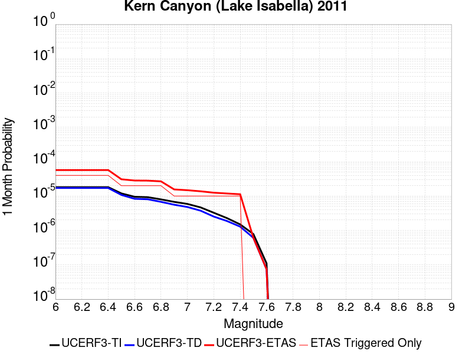 |  |  |

| Magnitude | 1 wk TI Prob | 1 wk TD Prob | 1 wk ETAS Prob | 1 wk ETAS/TD Gain | 1 wk ETAS Triggered Only | 1 mo TI Prob | 1 mo TD Prob | 1 mo ETAS Prob | 1 mo ETAS/TD Gain | 1 mo ETAS Triggered Only | 1 yr TI Prob | 1 yr TD Prob | 1 yr ETAS Prob | 1 yr ETAS/TD Gain | 1 yr ETAS Triggered Only | 10 yr TI Prob | 10 yr TD Prob | 10 yr ETAS Prob | 10 yr ETAS/TD Gain | 10 yr ETAS Triggered Only |
|-----|-----|-----|-----|-----|-----|-----|-----|-----|-----|-----|-----|-----|-----|-----|-----|-----|-----|-----|-----|-----|
| 6.0 | 4.2387383E-6 | 4.001639E-6 | 2.1423171E-5 | 5.3535995 | 1.7421602E-5 | 1.8165894E-5 | 1.7149778E-5 | 3.4571083E-5 | 2.0158327 | 1.7421602E-5 | 2.2114732E-4 | 2.087804E-4 | 2.4361633E-4 | 1.1668544 | 3.4843204E-5 | 0.0022092736 | 0.0020860266 | 0.002120797 | 1.0166683 | 3.4843204E-5 |
| 6.1 | 4.2387383E-6 | 4.001639E-6 | 2.1423171E-5 | 5.3535995 | 1.7421602E-5 | 1.8165894E-5 | 1.7149778E-5 | 3.4571083E-5 | 2.0158327 | 1.7421602E-5 | 2.2114732E-4 | 2.087804E-4 | 2.4361633E-4 | 1.1668544 | 3.4843204E-5 | 0.0022092736 | 0.0020860266 | 0.002120797 | 1.0166683 | 3.4843204E-5 |
| 6.2 | 4.2387383E-6 | 4.001639E-6 | 2.1423171E-5 | 5.3535995 | 1.7421602E-5 | 1.8165894E-5 | 1.7149778E-5 | 3.4571083E-5 | 2.0158327 | 1.7421602E-5 | 2.2114732E-4 | 2.087804E-4 | 2.4361633E-4 | 1.1668544 | 3.4843204E-5 | 0.0022092736 | 0.0020860266 | 0.002120797 | 1.0166683 | 3.4843204E-5 |
| 6.3 | 4.2387383E-6 | 4.001639E-6 | 2.1423171E-5 | 5.3535995 | 1.7421602E-5 | 1.8165894E-5 | 1.7149778E-5 | 3.4571083E-5 | 2.0158327 | 1.7421602E-5 | 2.2114732E-4 | 2.087804E-4 | 2.4361633E-4 | 1.1668544 | 3.4843204E-5 | 0.0022092736 | 0.0020860266 | 0.002120797 | 1.0166683 | 3.4843204E-5 |
| 6.4 | 4.2387383E-6 | 4.001639E-6 | 2.1423171E-5 | 5.3535995 | 1.7421602E-5 | 1.8165894E-5 | 1.7149778E-5 | 3.4571083E-5 | 2.0158327 | 1.7421602E-5 | 2.2114732E-4 | 2.087804E-4 | 2.4361633E-4 | 1.1668544 | 3.4843204E-5 | 0.0022092736 | 0.0020860266 | 0.002120797 | 1.0166683 | 3.4843204E-5 |
| 6.5 | 2.7857532E-6 | 2.517867E-6 | 2.517867E-6 | 1.0 | 0.0 | 1.1938888E-5 | 1.0790815E-5 | 1.0790815E-5 | 1.0 | 0.0 | 1.4534626E-4 | 1.3137059E-4 | 1.487899E-4 | 1.1325967 | 1.7421602E-5 | 0.0014525123 | 0.001312962 | 0.0013303608 | 1.0132515 | 1.7421602E-5 |
| 6.6 | 2.2233348E-6 | 1.9441236E-6 | 1.9441236E-6 | 1.0 | 0.0 | 9.528543E-6 | 8.331932E-6 | 8.331932E-6 | 1.0 | 0.0 | 1.1600384E-4 | 1.01436635E-4 | 1.01436635E-4 | 1.0 | 0.0 | 0.001159433 | 0.001013912 | 0.001013912 | 1.0 | 0.0 |
| 6.7 | 2.1635126E-6 | 1.8835036E-6 | 1.8835036E-6 | 1.0 | 0.0 | 9.272164E-6 | 8.072134E-6 | 8.072134E-6 | 1.0 | 0.0 | 1.1288274E-4 | 9.827388E-5 | 9.827388E-5 | 1.0 | 0.0 | 0.0011282542 | 9.823124E-4 | 9.823124E-4 | 1.0 | 0.0 |
| 6.8 | 1.8685711E-6 | 1.5831425E-6 | 1.5831425E-6 | 1.0 | 0.0 | 8.008137E-6 | 6.784879E-6 | 6.784879E-6 | 1.0 | 0.0 | 9.74947E-5 | 8.260282E-5 | 8.260282E-5 | 1.0 | 0.0 | 9.745194E-4 | 8.2572614E-4 | 8.2572614E-4 | 1.0 | 0.0 |
| 6.9 | 1.5815071E-6 | 1.3064928E-6 | 1.3064928E-6 | 1.0 | 0.0 | 6.77787E-6 | 5.599243E-6 | 5.599243E-6 | 1.0 | 0.0 | 8.251744E-5 | 6.816868E-5 | 6.816868E-5 | 1.0 | 0.0 | 8.248681E-4 | 6.8148033E-4 | 6.8148033E-4 | 1.0 | 0.0 |
| 7.0 | 1.3772564E-6 | 1.1210718E-6 | 1.1210718E-6 | 1.0 | 0.0 | 5.9025137E-6 | 4.8045845E-6 | 4.8045845E-6 | 1.0 | 0.0 | 7.186073E-5 | 5.8494268E-5 | 5.8494268E-5 | 1.0 | 0.0 | 7.18375E-4 | 5.847908E-4 | 5.847908E-4 | 1.0 | 0.0 |
| 7.1 | 1.0916998E-6 | 8.763777E-7 | 8.763777E-7 | 1.0 | 0.0 | 4.678705E-6 | 3.7558991E-6 | 3.7558991E-6 | 1.0 | 0.0 | 5.6961744E-5 | 4.5727127E-5 | 4.5727127E-5 | 1.0 | 0.0 | 5.6947145E-4 | 4.571785E-4 | 4.571785E-4 | 1.0 | 0.0 |
| 7.2 | 7.6277024E-7 | 5.901454E-7 | 5.901454E-7 | 1.0 | 0.0 | 3.2690114E-6 | 2.5291922E-6 | 2.5291922E-6 | 1.0 | 0.0 | 3.9799485E-5 | 3.0792486E-5 | 3.0792486E-5 | 1.0 | 0.0 | 3.9792358E-4 | 3.0788282E-4 | 3.0788282E-4 | 1.0 | 0.0 |
| 7.3 | 5.3265916E-7 | 4.3824414E-7 | 4.3824414E-7 | 1.0 | 0.0 | 2.282823E-6 | 1.878188E-6 | 1.878188E-6 | 1.0 | 0.0 | 2.7793016E-5 | 2.2866701E-5 | 2.2866701E-5 | 1.0 | 0.0 | 2.778954E-4 | 2.2864387E-4 | 2.2864387E-4 | 1.0 | 0.0 |
| 7.4 | 3.4946007E-7 | 3.006571E-7 | 3.006571E-7 | 1.0 | 0.0 | 1.497685E-6 | 1.2885298E-6 | 1.2885298E-6 | 1.0 | 0.0 | 1.8234163E-5 | 1.568774E-5 | 1.568774E-5 | 1.0 | 0.0 | 1.8232666E-4 | 1.5686655E-4 | 1.5686655E-4 | 1.0 | 0.0 |
| 7.5 | 1.8317026E-7 | 1.4244812E-7 | 1.4244812E-7 | 1.0 | 0.0 | 7.850152E-7 | 6.104918E-7 | 6.104918E-7 | 1.0 | 0.0 | 9.557518E-6 | 7.432713E-6 | 7.432713E-6 | 1.0 | 0.0 | 9.5571064E-5 | 7.432472E-5 | 7.432472E-5 | 1.0 | 0.0 |
| 7.6 | 2.572245E-8 | 1.7352555E-8 | 1.7352555E-8 | 1.0 | 0.0 | 1.10239064E-7 | 7.436809E-8 | 7.436809E-8 | 1.0 | 0.0 | 1.3421597E-6 | 9.054312E-7 | 9.054312E-7 | 1.0 | 0.0 | 1.3421517E-5 | 9.05428E-6 | 9.05428E-6 | 1.0 | 0.0 |

## Rose Canyon
*[(top)](#table-of-contents)*

| 1 Week | 1 Month | 1 Year | 10 Year |
|-----|-----|-----|-----|
|  | 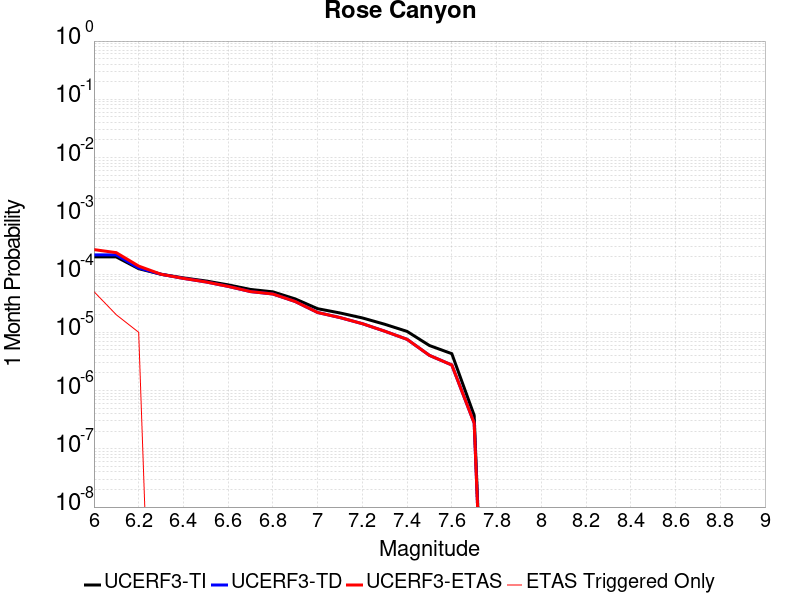 |  |  |

| Magnitude | 1 wk TI Prob | 1 wk TD Prob | 1 wk ETAS Prob | 1 wk ETAS/TD Gain | 1 wk ETAS Triggered Only | 1 mo TI Prob | 1 mo TD Prob | 1 mo ETAS Prob | 1 mo ETAS/TD Gain | 1 mo ETAS Triggered Only | 1 yr TI Prob | 1 yr TD Prob | 1 yr ETAS Prob | 1 yr ETAS/TD Gain | 1 yr ETAS Triggered Only | 10 yr TI Prob | 10 yr TD Prob | 10 yr ETAS Prob | 10 yr ETAS/TD Gain | 10 yr ETAS Triggered Only |
|-----|-----|-----|-----|-----|-----|-----|-----|-----|-----|-----|-----|-----|-----|-----|-----|-----|-----|-----|-----|-----|
| 6.0 | 4.5923203E-5 | 4.9714225E-5 | 8.45557E-5 | 1.7008351 | 3.4843204E-5 | 1.9679888E-4 | 2.1304491E-4 | 2.478807E-4 | 1.1635138 | 3.4843204E-5 | 0.0023933933 | 0.0025909345 | 0.0026256873 | 1.0134133 | 3.4843204E-5 | 0.023677798 | 0.02563999 | 0.02567394 | 1.001324 | 3.4843204E-5 |
| 6.1 | 4.5923203E-5 | 4.9714225E-5 | 8.45557E-5 | 1.7008351 | 3.4843204E-5 | 1.9679888E-4 | 2.1304491E-4 | 2.478807E-4 | 1.1635138 | 3.4843204E-5 | 0.0023933933 | 0.0025909345 | 0.0026256873 | 1.0134133 | 3.4843204E-5 | 0.023677798 | 0.02563999 | 0.02567394 | 1.001324 | 3.4843204E-5 |
| 6.2 | 2.8844734E-5 | 2.9668723E-5 | 4.708981E-5 | 1.5871869 | 1.7421602E-5 | 1.2361443E-4 | 1.2714567E-4 | 1.4456506E-4 | 1.1370034 | 1.7421602E-5 | 0.0015039665 | 0.0015468939 | 0.0015642885 | 1.0112449 | 1.7421602E-5 | 0.0149382865 | 0.015374276 | 0.01539143 | 1.0011158 | 1.7421602E-5 |
| 6.3 | 2.3171577E-5 | 2.3161238E-5 | 2.3161238E-5 | 1.0 | 0.0 | 9.9302975E-5 | 9.9258745E-5 | 9.9258745E-5 | 1.0 | 0.0 | 0.0012083431 | 0.0012078186 | 0.0012078186 | 1.0 | 0.0 | 0.012017938 | 0.012022437 | 0.012022437 | 1.0 | 0.0 |
| 6.4 | 2.0066604E-5 | 1.9667024E-5 | 1.9667024E-5 | 1.0 | 0.0 | 8.599689E-5 | 8.4284584E-5 | 8.4284584E-5 | 1.0 | 0.0 | 0.0010465092 | 0.0010256917 | 0.0010256917 | 1.0 | 0.0 | 0.010415946 | 0.010217559 | 0.010217559 | 1.0 | 0.0 |
| 6.5 | 1.776989E-5 | 1.7113807E-5 | 1.7113807E-5 | 1.0 | 0.0 | 7.615444E-5 | 7.334287E-5 | 7.334287E-5 | 1.0 | 0.0 | 9.267859E-4 | 8.925905E-4 | 8.925905E-4 | 1.0 | 0.0 | 0.009229303 | 0.008896211 | 0.008896211 | 1.0 | 0.0 |
| 6.6 | 1.5227364E-5 | 1.433926E-5 | 1.433926E-5 | 1.0 | 0.0 | 6.52585E-5 | 6.1452556E-5 | 6.1452556E-5 | 1.0 | 0.0 | 7.942326E-4 | 7.479332E-4 | 7.479332E-4 | 1.0 | 0.0 | 0.007914 | 0.007458359 | 0.007458359 | 1.0 | 0.0 |
| 6.7 | 1.2703898E-5 | 1.1673274E-5 | 1.1673274E-5 | 1.0 | 0.0 | 5.4444143E-5 | 5.0027378E-5 | 5.0027378E-5 | 1.0 | 0.0 | 6.626558E-4 | 6.089174E-4 | 6.089174E-4 | 1.0 | 0.0 | 0.006606833 | 0.0060750856 | 0.0060750856 | 1.0 | 0.0 |
| 6.8 | 1.1554917E-5 | 1.0609337E-5 | 1.0609337E-5 | 1.0 | 0.0 | 4.9520135E-5 | 4.546782E-5 | 4.546782E-5 | 1.0 | 0.0 | 6.0274085E-4 | 5.5343413E-4 | 5.5343413E-4 | 1.0 | 0.0 | 0.0060110865 | 0.0055225673 | 0.0055225673 | 1.0 | 0.0 |
| 6.9 | 8.732078E-6 | 7.881357E-6 | 7.881357E-6 | 1.0 | 0.0 | 3.7422655E-5 | 3.3776825E-5 | 3.3776825E-5 | 1.0 | 0.0 | 4.5552556E-4 | 4.111582E-4 | 4.111582E-4 | 1.0 | 0.0 | 0.0045459294 | 0.0041048084 | 0.0041048084 | 1.0 | 0.0 |
| 7.0 | 5.9337494E-6 | 5.1074853E-6 | 5.1074853E-6 | 1.0 | 0.0 | 2.5430107E-5 | 2.188904E-5 | 2.188904E-5 | 1.0 | 0.0 | 3.0956755E-4 | 2.664666E-4 | 2.664666E-4 | 1.0 | 0.0 | 0.0030913667 | 0.0026614866 | 0.0026614866 | 1.0 | 0.0 |
| 7.1 | 5.013409E-6 | 4.1773833E-6 | 4.1773833E-6 | 1.0 | 0.0 | 2.1485863E-5 | 1.7902948E-5 | 1.7902948E-5 | 1.0 | 0.0 | 2.6155898E-4 | 2.179467E-4 | 2.179467E-4 | 1.0 | 0.0 | 0.0026125133 | 0.0021773411 | 0.0021773411 | 1.0 | 0.0 |
| 7.2 | 4.120763E-6 | 3.2821383E-6 | 3.2821383E-6 | 1.0 | 0.0 | 1.7660293E-5 | 1.4066231E-5 | 1.4066231E-5 | 1.0 | 0.0 | 2.1499286E-4 | 1.7124301E-4 | 1.7124301E-4 | 1.0 | 0.0 | 0.0021478499 | 0.00171112 | 0.00171112 | 1.0 | 0.0 |
| 7.3 | 3.2081239E-6 | 2.4405372E-6 | 2.4405372E-6 | 1.0 | 0.0 | 1.374903E-5 | 1.0459404E-5 | 1.0459404E-5 | 1.0 | 0.0 | 1.6738157E-4 | 1.2733586E-4 | 1.2733586E-4 | 1.0 | 0.0 | 0.0016725556 | 0.001272636 | 0.001272636 | 1.0 | 0.0 |
| 7.4 | 2.4194755E-6 | 1.7680634E-6 | 1.7680634E-6 | 1.0 | 0.0 | 1.0369139E-5 | 7.577393E-6 | 7.577393E-6 | 1.0 | 0.0 | 1.2623696E-4 | 9.2250906E-5 | 9.2250906E-5 | 1.0 | 0.0 | 0.0012616527 | 9.2213147E-4 | 9.2213147E-4 | 1.0 | 0.0 |
| 7.5 | 1.3842889E-6 | 9.3786275E-7 | 9.3786275E-7 | 1.0 | 0.0 | 5.9326535E-6 | 4.019406E-6 | 4.019406E-6 | 1.0 | 0.0 | 7.222766E-5 | 4.8935202E-5 | 4.8935202E-5 | 1.0 | 0.0 | 7.220419E-4 | 4.892478E-4 | 4.892478E-4 | 1.0 | 0.0 |
| 7.6 | 1.0021575E-6 | 6.411463E-7 | 6.411463E-7 | 1.0 | 0.0 | 4.2949537E-6 | 2.7477672E-6 | 2.7477672E-6 | 1.0 | 0.0 | 5.2289808E-5 | 3.3453573E-5 | 3.3453573E-5 | 1.0 | 0.0 | 5.2277505E-4 | 3.344875E-4 | 3.344875E-4 | 1.0 | 0.0 |
| 7.7 | 8.7620116E-8 | 6.4492404E-8 | 6.4492404E-8 | 1.0 | 0.0 | 3.7551473E-7 | 2.76396E-7 | 2.76396E-7 | 1.0 | 0.0 | 4.5718825E-6 | 3.3651165E-6 | 3.3651165E-6 | 1.0 | 0.0 | 4.5717883E-5 | 3.3650686E-5 | 3.3650686E-5 | 1.0 | 0.0 |

## Oak Ridge (Onshore)
*[(top)](#table-of-contents)*

| 1 Week | 1 Month | 1 Year | 10 Year |
|-----|-----|-----|-----|
|  |  |  |  |

| Magnitude | 1 wk TI Prob | 1 wk TD Prob | 1 wk ETAS Prob | 1 wk ETAS/TD Gain | 1 wk ETAS Triggered Only | 1 mo TI Prob | 1 mo TD Prob | 1 mo ETAS Prob | 1 mo ETAS/TD Gain | 1 mo ETAS Triggered Only | 1 yr TI Prob | 1 yr TD Prob | 1 yr ETAS Prob | 1 yr ETAS/TD Gain | 1 yr ETAS Triggered Only | 10 yr TI Prob | 10 yr TD Prob | 10 yr ETAS Prob | 10 yr ETAS/TD Gain | 10 yr ETAS Triggered Only |
|-----|-----|-----|-----|-----|-----|-----|-----|-----|-----|-----|-----|-----|-----|-----|-----|-----|-----|-----|-----|-----|
| 6.0 | 3.155064E-5 | 2.9525974E-5 | 2.9525974E-5 | 1.0 | 0.0 | 1.3521002E-4 | 1.2653397E-4 | 1.4395337E-4 | 1.1376657 | 1.7421602E-5 | 0.001644939 | 0.0015395004 | 0.00157429 | 1.0225979 | 3.4843204E-5 | 0.01632816 | 0.015292859 | 0.01532717 | 1.0022435 | 3.4843204E-5 |
| 6.1 | 3.155064E-5 | 2.9525974E-5 | 2.9525974E-5 | 1.0 | 0.0 | 1.3521002E-4 | 1.2653397E-4 | 1.4395337E-4 | 1.1376657 | 1.7421602E-5 | 0.001644939 | 0.0015395004 | 0.00157429 | 1.0225979 | 3.4843204E-5 | 0.01632816 | 0.015292859 | 0.01532717 | 1.0022435 | 3.4843204E-5 |
| 6.2 | 3.155064E-5 | 2.9525974E-5 | 2.9525974E-5 | 1.0 | 0.0 | 1.3521002E-4 | 1.2653397E-4 | 1.4395337E-4 | 1.1376657 | 1.7421602E-5 | 0.001644939 | 0.0015395004 | 0.00157429 | 1.0225979 | 3.4843204E-5 | 0.01632816 | 0.015292859 | 0.01532717 | 1.0022435 | 3.4843204E-5 |
| 6.3 | 3.155064E-5 | 2.9525974E-5 | 2.9525974E-5 | 1.0 | 0.0 | 1.3521002E-4 | 1.2653397E-4 | 1.4395337E-4 | 1.1376657 | 1.7421602E-5 | 0.001644939 | 0.0015395004 | 0.00157429 | 1.0225979 | 3.4843204E-5 | 0.01632816 | 0.015292859 | 0.01532717 | 1.0022435 | 3.4843204E-5 |
| 6.4 | 3.155064E-5 | 2.9525974E-5 | 2.9525974E-5 | 1.0 | 0.0 | 1.3521002E-4 | 1.2653397E-4 | 1.4395337E-4 | 1.1376657 | 1.7421602E-5 | 0.001644939 | 0.0015395004 | 0.00157429 | 1.0225979 | 3.4843204E-5 | 0.01632816 | 0.015292859 | 0.01532717 | 1.0022435 | 3.4843204E-5 |
| 6.5 | 3.155064E-5 | 2.9525974E-5 | 2.9525974E-5 | 1.0 | 0.0 | 1.3521002E-4 | 1.2653397E-4 | 1.4395337E-4 | 1.1376657 | 1.7421602E-5 | 0.001644939 | 0.0015395004 | 0.00157429 | 1.0225979 | 3.4843204E-5 | 0.01632816 | 0.015292859 | 0.01532717 | 1.0022435 | 3.4843204E-5 |
| 6.6 | 3.155064E-5 | 2.9525974E-5 | 2.9525974E-5 | 1.0 | 0.0 | 1.3521002E-4 | 1.2653397E-4 | 1.4395337E-4 | 1.1376657 | 1.7421602E-5 | 0.001644939 | 0.0015395004 | 0.00157429 | 1.0225979 | 3.4843204E-5 | 0.01632816 | 0.015292859 | 0.01532717 | 1.0022435 | 3.4843204E-5 |
| 6.7 | 3.098897E-5 | 2.8864175E-5 | 2.8864175E-5 | 1.0 | 0.0 | 1.328031E-4 | 1.2369796E-4 | 1.411174E-4 | 1.1408224 | 1.7421602E-5 | 0.0016156785 | 0.0015050198 | 0.0015398106 | 1.0231165 | 3.4843204E-5 | 0.016039822 | 0.014952714 | 0.014987036 | 1.0022954 | 3.4843204E-5 |
| 6.8 | 3.0449872E-5 | 2.8239372E-5 | 2.8239372E-5 | 1.0 | 0.0 | 1.3049292E-4 | 1.2102048E-4 | 1.3843997E-4 | 1.1439384 | 1.7421602E-5 | 0.0015875935 | 0.0014724657 | 0.0015072576 | 1.0236284 | 3.4843204E-5 | 0.015762992 | 0.014631462 | 0.0146657955 | 1.0023465 | 3.4843204E-5 |
| 6.9 | 2.697928E-5 | 2.4219773E-5 | 2.4219773E-5 | 1.0 | 0.0 | 1.15620365E-4 | 1.0379502E-4 | 1.2121481E-4 | 1.1678288 | 1.7421602E-5 | 0.0014067689 | 0.0012629933 | 0.0012977925 | 1.027553 | 3.4843204E-5 | 0.0139789665 | 0.01256087 | 0.012595275 | 1.0027391 | 3.4843204E-5 |
| 7.0 | 2.4893961E-5 | 2.1862043E-5 | 2.1862043E-5 | 1.0 | 0.0 | 1.0668404E-4 | 9.3691204E-5 | 1.1111117E-4 | 1.1859297 | 1.7421602E-5 | 0.0012981043 | 0.0011401111 | 0.0011749147 | 1.0305264 | 3.4843204E-5 | 0.012905477 | 0.011344905 | 0.011379354 | 1.0030364 | 3.4843204E-5 |
| 7.1 | 2.0945363E-5 | 1.7354487E-5 | 1.7354487E-5 | 1.0 | 0.0 | 8.976275E-5 | 7.437428E-5 | 9.179459E-5 | 1.2342249 | 1.7421602E-5 | 0.0010923136 | 9.051354E-4 | 9.399471E-4 | 1.0384601 | 3.4843204E-5 | 0.0108696 | 0.009015423 | 0.009049952 | 1.00383 | 3.4843204E-5 |
| 7.2 | 2.0439404E-5 | 1.6809423E-5 | 1.6809423E-5 | 1.0 | 0.0 | 8.7594504E-5 | 7.203843E-5 | 8.945877E-5 | 1.2418202 | 1.7421602E-5 | 0.0010659413 | 8.767196E-4 | 9.115322E-4 | 1.0397079 | 3.4843204E-5 | 0.010608427 | 0.008733526 | 0.008768065 | 1.0039548 | 3.4843204E-5 |
| 7.3 | 1.8463334E-5 | 1.5381811E-5 | 1.5381811E-5 | 1.0 | 0.0 | 7.912617E-5 | 6.59204E-5 | 8.3340856E-5 | 1.264265 | 1.7421602E-5 | 9.6293533E-4 | 8.0228975E-4 | 8.37105E-4 | 1.0433948 | 3.4843204E-5 | 0.009587734 | 0.007994797 | 0.008029361 | 1.0043234 | 3.4843204E-5 |
| 7.4 | 1.763139E-5 | 1.451684E-5 | 1.451684E-5 | 1.0 | 0.0 | 7.556091E-5 | 6.221356E-5 | 7.963408E-5 | 1.2800115 | 1.7421602E-5 | 9.1956573E-4 | 7.571909E-4 | 7.920077E-4 | 1.0459815 | 3.4843204E-5 | 0.009157699 | 0.007546914 | 0.007581494 | 1.004582 | 3.4843204E-5 |
| 7.5 | 1.3594944E-5 | 1.1163356E-5 | 1.1163356E-5 | 1.0 | 0.0 | 5.8262744E-5 | 4.784209E-5 | 4.784209E-5 | 1.0 | 0.0 | 7.0911803E-4 | 5.8232434E-4 | 5.9973577E-4 | 1.0299 | 1.7421602E-5 | 0.007068595 | 0.0058082556 | 0.005825576 | 1.002982 | 1.7421602E-5 |
| 7.6 | 6.9889534E-6 | 5.6367144E-6 | 5.6367144E-6 | 1.0 | 0.0 | 2.9952313E-5 | 2.4157125E-5 | 2.4157125E-5 | 1.0 | 0.0 | 3.646084E-4 | 2.9407372E-4 | 2.9407372E-4 | 1.0 | 0.0 | 0.0036401073 | 0.0029368899 | 0.0029368899 | 1.0 | 0.0 |
| 7.7 | 4.0824193E-6 | 3.2832586E-6 | 3.2832586E-6 | 1.0 | 0.0 | 1.7495966E-5 | 1.4071033E-5 | 1.4071033E-5 | 1.0 | 0.0 | 2.1299256E-4 | 1.713015E-4 | 1.713015E-4 | 1.0 | 0.0 | 0.0021278851 | 0.0017117079 | 0.0017117079 | 1.0 | 0.0 |
| 7.8 | 1.7023609E-6 | 1.4370495E-6 | 1.4370495E-6 | 1.0 | 0.0 | 7.295812E-6 | 6.1587693E-6 | 6.1587693E-6 | 1.0 | 0.0 | 8.882289E-5 | 7.498047E-5 | 7.498047E-5 | 1.0 | 0.0 | 8.8787393E-4 | 7.495545E-4 | 7.495545E-4 | 1.0 | 0.0 |
| 7.9 | 2.721225E-7 | 2.2616497E-7 | 2.2616497E-7 | 1.0 | 0.0 | 1.1662388E-6 | 9.692781E-7 | 9.692781E-7 | 1.0 | 0.0 | 1.4198865E-5 | 1.1800899E-5 | 1.1800899E-5 | 1.0 | 0.0 | 1.4197957E-4 | 1.1800301E-4 | 1.1800301E-4 | 1.0 | 0.0 |
| 8.0 | 9.364255E-9 | 5.1206666E-9 | 5.1206666E-9 | 1.0 | 0.0 | 4.0132523E-8 | 2.1945715E-8 | 2.1945715E-8 | 1.0 | 0.0 | 4.8861335E-7 | 2.6718905E-7 | 2.6718905E-7 | 1.0 | 0.0 | 4.8861225E-6 | 2.6718876E-6 | 2.6718876E-6 | 1.0 | 0.0 |

## Elsinore (Stepovers Combined)
*[(top)](#table-of-contents)*

| 1 Week | 1 Month | 1 Year | 10 Year |
|-----|-----|-----|-----|
|  |  |  |  |

| Magnitude | 1 wk TI Prob | 1 wk TD Prob | 1 wk ETAS Prob | 1 wk ETAS/TD Gain | 1 wk ETAS Triggered Only | 1 mo TI Prob | 1 mo TD Prob | 1 mo ETAS Prob | 1 mo ETAS/TD Gain | 1 mo ETAS Triggered Only | 1 yr TI Prob | 1 yr TD Prob | 1 yr ETAS Prob | 1 yr ETAS/TD Gain | 1 yr ETAS Triggered Only | 10 yr TI Prob | 10 yr TD Prob | 10 yr ETAS Prob | 10 yr ETAS/TD Gain | 10 yr ETAS Triggered Only |
|-----|-----|-----|-----|-----|-----|-----|-----|-----|-----|-----|-----|-----|-----|-----|-----|-----|-----|-----|-----|-----|
| 6.0 | 2.144392E-5 | 1.9760193E-5 | 1.9760193E-5 | 1.0 | 0.0 | 9.189928E-5 | 8.468392E-5 | 1.02104044E-4 | 1.2057077 | 1.7421602E-5 | 0.0011182994 | 0.0010305607 | 0.001065368 | 1.0337751 | 3.4843204E-5 | 0.011126885 | 0.010264917 | 0.010299403 | 1.0033596 | 3.4843204E-5 |
| 6.1 | 2.144392E-5 | 1.9760193E-5 | 1.9760193E-5 | 1.0 | 0.0 | 9.189928E-5 | 8.468392E-5 | 1.02104044E-4 | 1.2057077 | 1.7421602E-5 | 0.0011182994 | 0.0010305607 | 0.001065368 | 1.0337751 | 3.4843204E-5 | 0.011126885 | 0.010264917 | 0.010299403 | 1.0033596 | 3.4843204E-5 |
| 6.2 | 2.144392E-5 | 1.9760193E-5 | 1.9760193E-5 | 1.0 | 0.0 | 9.189928E-5 | 8.468392E-5 | 1.02104044E-4 | 1.2057077 | 1.7421602E-5 | 0.0011182994 | 0.0010305607 | 0.001065368 | 1.0337751 | 3.4843204E-5 | 0.011126885 | 0.010264917 | 0.010299403 | 1.0033596 | 3.4843204E-5 |
| 6.3 | 1.9751555E-5 | 1.7741453E-5 | 1.7741453E-5 | 1.0 | 0.0 | 8.4646774E-5 | 7.603267E-5 | 9.345295E-5 | 1.2291157 | 1.7421602E-5 | 0.0010300872 | 9.253213E-4 | 9.601323E-4 | 1.0376204 | 3.4843204E-5 | 0.010253254 | 0.009221276 | 0.0092557985 | 1.0037438 | 3.4843204E-5 |
| 6.4 | 1.9751555E-5 | 1.7741453E-5 | 1.7741453E-5 | 1.0 | 0.0 | 8.4646774E-5 | 7.603267E-5 | 9.345295E-5 | 1.2291157 | 1.7421602E-5 | 0.0010300872 | 9.253213E-4 | 9.601323E-4 | 1.0376204 | 3.4843204E-5 | 0.010253254 | 0.009221276 | 0.0092557985 | 1.0037438 | 3.4843204E-5 |
| 6.5 | 1.9751555E-5 | 1.7741453E-5 | 1.7741453E-5 | 1.0 | 0.0 | 8.4646774E-5 | 7.603267E-5 | 9.345295E-5 | 1.2291157 | 1.7421602E-5 | 0.0010300872 | 9.253213E-4 | 9.601323E-4 | 1.0376204 | 3.4843204E-5 | 0.010253254 | 0.009221276 | 0.0092557985 | 1.0037438 | 3.4843204E-5 |
| 6.6 | 1.9188685E-5 | 1.7003393E-5 | 1.7003393E-5 | 1.0 | 0.0 | 8.2234634E-5 | 7.286974E-5 | 9.029007E-5 | 1.2390612 | 1.7421602E-5 | 0.0010007467 | 8.868442E-4 | 9.2165644E-4 | 1.0392542 | 3.4843204E-5 | 0.00996252 | 0.0088398475 | 0.008874383 | 1.0039067 | 3.4843204E-5 |
| 6.7 | 1.7608272E-5 | 1.4732616E-5 | 1.4732616E-5 | 1.0 | 0.0 | 7.546184E-5 | 6.3138315E-5 | 6.3138315E-5 | 1.0 | 0.0 | 9.183606E-4 | 7.684476E-4 | 7.858558E-4 | 1.0226537 | 1.7421602E-5 | 0.009145746 | 0.00766491 | 0.007682198 | 1.0022554 | 1.7421602E-5 |
| 6.8 | 1.697165E-5 | 1.3783365E-5 | 1.3783365E-5 | 1.0 | 0.0 | 7.273361E-5 | 5.9070277E-5 | 5.9070277E-5 | 1.0 | 0.0 | 8.8517193E-4 | 7.18952E-4 | 7.363611E-4 | 1.0242145 | 1.7421602E-5 | 0.008816543 | 0.007172675 | 0.007189972 | 1.0024115 | 1.7421602E-5 |
| 6.9 | 1.600365E-5 | 1.2846671E-5 | 1.2846671E-5 | 1.0 | 0.0 | 6.858527E-5 | 5.5056043E-5 | 5.5056043E-5 | 1.0 | 0.0 | 8.347058E-4 | 6.7010894E-4 | 6.875189E-4 | 1.0259807 | 1.7421602E-5 | 0.008315775 | 0.0066867657 | 0.006704071 | 1.0025879 | 1.7421602E-5 |
| 7.0 | 1.3314581E-5 | 1.0447548E-5 | 1.0447548E-5 | 1.0 | 0.0 | 5.7061243E-5 | 4.4774453E-5 | 4.4774453E-5 | 1.0 | 0.0 | 6.944992E-4 | 5.449953E-4 | 5.624074E-4 | 1.031949 | 1.7421602E-5 | 0.006923327 | 0.0054405155 | 0.0054578423 | 1.0031848 | 1.7421602E-5 |
| 7.1 | 1.2865345E-5 | 9.937536E-6 | 9.937536E-6 | 1.0 | 0.0 | 5.5136024E-5 | 4.258876E-5 | 4.258876E-5 | 1.0 | 0.0 | 6.710743E-4 | 5.183973E-4 | 5.358099E-4 | 1.0335892 | 1.7421602E-5 | 0.0066905143 | 0.0051752133 | 0.005192545 | 1.003349 | 1.7421602E-5 |
| 7.2 | 1.1650051E-5 | 8.633809E-6 | 8.633809E-6 | 1.0 | 0.0 | 4.9927836E-5 | 3.7001522E-5 | 3.7001522E-5 | 1.0 | 0.0 | 6.0770183E-4 | 4.504022E-4 | 4.504022E-4 | 1.0 | 0.0 | 0.0060604266 | 0.0044963174 | 0.0044963174 | 1.0 | 0.0 |
| 7.3 | 1.0008533E-5 | 7.2010425E-6 | 7.2010425E-6 | 1.0 | 0.0 | 4.2893007E-5 | 3.0861254E-5 | 3.0861254E-5 | 1.0 | 0.0 | 5.220972E-4 | 3.7567242E-4 | 3.7567242E-4 | 1.0 | 0.0 | 0.005208723 | 0.003750761 | 0.003750761 | 1.0 | 0.0 |
| 7.4 | 9.116759E-6 | 6.410068E-6 | 6.410068E-6 | 1.0 | 0.0 | 3.907124E-5 | 2.747144E-5 | 2.747144E-5 | 1.0 | 0.0 | 4.7558855E-4 | 3.3441483E-4 | 3.3441483E-4 | 1.0 | 0.0 | 0.00474572 | 0.0033392678 | 0.0033392678 | 1.0 | 0.0 |
| 7.5 | 7.870524E-6 | 5.3825365E-6 | 5.3825365E-6 | 1.0 | 0.0 | 3.3730383E-5 | 2.3067816E-5 | 2.3067816E-5 | 1.0 | 0.0 | 4.1059E-4 | 2.8081573E-4 | 2.8081573E-4 | 1.0 | 0.0 | 0.0040983222 | 0.0028047354 | 0.0028047354 | 1.0 | 0.0 |
| 7.6 | 6.9774537E-6 | 4.6776067E-6 | 4.6776067E-6 | 1.0 | 0.0 | 2.990303E-5 | 2.0046738E-5 | 2.0046738E-5 | 1.0 | 0.0 | 3.640086E-4 | 2.4404288E-4 | 2.4404288E-4 | 1.0 | 0.0 | 0.003634129 | 0.0024378651 | 0.0024378651 | 1.0 | 0.0 |
| 7.7 | 4.1616954E-6 | 2.32834E-6 | 2.32834E-6 | 1.0 | 0.0 | 1.7835715E-5 | 9.978567E-6 | 9.978567E-6 | 1.0 | 0.0 | 2.171282E-4 | 1.2148302E-4 | 1.2148302E-4 | 1.0 | 0.0 | 0.0021691616 | 0.0012142392 | 0.0012142392 | 1.0 | 0.0 |
| 7.8 | 2.2692414E-7 | 9.3854695E-8 | 9.3854695E-8 | 1.0 | 0.0 | 9.725317E-7 | 4.0223435E-7 | 4.0223435E-7 | 1.0 | 0.0 | 1.1840509E-5 | 4.8971956E-6 | 4.8971956E-6 | 1.0 | 0.0 | 1.1839878E-4 | 4.8971204E-5 | 4.8971204E-5 | 1.0 | 0.0 |
| 7.9 | 6.676829E-9 | 3.439853E-9 | 3.439853E-9 | 1.0 | 0.0 | 2.861498E-8 | 1.4742227E-8 | 1.4742227E-8 | 1.0 | 0.0 | 3.4838732E-7 | 1.7948659E-7 | 1.7948659E-7 | 1.0 | 0.0 | 3.4838679E-6 | 1.7948646E-6 | 1.7948646E-6 | 1.0 | 0.0 |

## Monterey Bay-Tularcitos
*[(top)](#table-of-contents)*

| 1 Week | 1 Month | 1 Year | 10 Year |
|-----|-----|-----|-----|
|  |  |  |  |

| Magnitude | 1 wk TI Prob | 1 wk TD Prob | 1 wk ETAS Prob | 1 wk ETAS/TD Gain | 1 wk ETAS Triggered Only | 1 mo TI Prob | 1 mo TD Prob | 1 mo ETAS Prob | 1 mo ETAS/TD Gain | 1 mo ETAS Triggered Only | 1 yr TI Prob | 1 yr TD Prob | 1 yr ETAS Prob | 1 yr ETAS/TD Gain | 1 yr ETAS Triggered Only | 10 yr TI Prob | 10 yr TD Prob | 10 yr ETAS Prob | 10 yr ETAS/TD Gain | 10 yr ETAS Triggered Only |
|-----|-----|-----|-----|-----|-----|-----|-----|-----|-----|-----|-----|-----|-----|-----|-----|-----|-----|-----|-----|-----|
| 6.0 | 3.0131365E-5 | 3.279877E-5 | 5.02198E-5 | 1.5311489 | 1.7421602E-5 | 1.2912804E-4 | 1.4055918E-4 | 1.5797834E-4 | 1.1239276 | 1.7421602E-5 | 0.001571 | 0.0017100703 | 0.0017448539 | 1.0203404 | 3.4843204E-5 | 0.015599402 | 0.016979916 | 0.017014168 | 1.0020171 | 3.4843204E-5 |
| 6.1 | 3.0131365E-5 | 3.279877E-5 | 5.02198E-5 | 1.5311489 | 1.7421602E-5 | 1.2912804E-4 | 1.4055918E-4 | 1.5797834E-4 | 1.1239276 | 1.7421602E-5 | 0.001571 | 0.0017100703 | 0.0017448539 | 1.0203404 | 3.4843204E-5 | 0.015599402 | 0.016979916 | 0.017014168 | 1.0020171 | 3.4843204E-5 |
| 6.2 | 3.0131365E-5 | 3.279877E-5 | 5.02198E-5 | 1.5311489 | 1.7421602E-5 | 1.2912804E-4 | 1.4055918E-4 | 1.5797834E-4 | 1.1239276 | 1.7421602E-5 | 0.001571 | 0.0017100703 | 0.0017448539 | 1.0203404 | 3.4843204E-5 | 0.015599402 | 0.016979916 | 0.017014168 | 1.0020171 | 3.4843204E-5 |
| 6.3 | 1.6998249E-5 | 1.8330798E-5 | 3.575208E-5 | 1.9503833 | 1.7421602E-5 | 7.28476E-5 | 7.85583E-5 | 9.597854E-5 | 1.2217491 | 1.7421602E-5 | 8.865586E-4 | 9.5604634E-4 | 9.734513E-4 | 1.0182052 | 1.7421602E-5 | 0.0088303005 | 0.009521258 | 0.009538514 | 1.0018123 | 1.7421602E-5 |
| 6.4 | 1.6998249E-5 | 1.8330798E-5 | 3.575208E-5 | 1.9503833 | 1.7421602E-5 | 7.28476E-5 | 7.85583E-5 | 9.597854E-5 | 1.2217491 | 1.7421602E-5 | 8.865586E-4 | 9.5604634E-4 | 9.734513E-4 | 1.0182052 | 1.7421602E-5 | 0.0088303005 | 0.009521258 | 0.009538514 | 1.0018123 | 1.7421602E-5 |
| 6.5 | 1.27470785E-5 | 1.3693312E-5 | 3.1114676E-5 | 2.2722535 | 1.7421602E-5 | 5.4629192E-5 | 5.8684363E-5 | 7.6104945E-5 | 1.2968521 | 1.7421602E-5 | 6.649074E-4 | 7.1425823E-4 | 7.316674E-4 | 1.0243738 | 1.7421602E-5 | 0.0066292146 | 0.007120678 | 0.007137976 | 1.0024292 | 1.7421602E-5 |
| 6.6 | 1.2739422E-5 | 1.36854E-5 | 3.1106763E-5 | 2.272989 | 1.7421602E-5 | 5.4596385E-5 | 5.8650454E-5 | 7.607103E-5 | 1.2970238 | 1.7421602E-5 | 6.645082E-4 | 7.1384566E-4 | 7.312548E-4 | 1.0243878 | 1.7421602E-5 | 0.0066252467 | 0.007116579 | 0.0071338764 | 1.0024306 | 1.7421602E-5 |
| 6.7 | 1.0160109E-5 | 1.0885755E-5 | 2.8307168E-5 | 2.6003864 | 1.7421602E-5 | 4.35426E-5 | 4.665244E-5 | 6.407323E-5 | 1.3734165 | 1.7421602E-5 | 5.300022E-4 | 5.6785246E-4 | 5.852642E-4 | 1.0306624 | 1.7421602E-5 | 0.005287399 | 0.0056647263 | 0.005682049 | 1.0030581 | 1.7421602E-5 |
| 6.8 | 8.349859E-6 | 8.932587E-6 | 2.6354033E-5 | 2.950325 | 1.7421602E-5 | 3.578462E-5 | 3.8281985E-5 | 5.570292E-5 | 1.4550688 | 1.7421602E-5 | 4.3559066E-4 | 4.6598914E-4 | 4.8340263E-4 | 1.0373689 | 1.7421602E-5 | 0.004347378 | 0.004650685 | 0.0046680258 | 1.0037286 | 1.7421602E-5 |
| 6.9 | 5.193639E-6 | 5.53643E-6 | 2.2957936E-5 | 4.146704 | 1.7421602E-5 | 2.2258262E-5 | 2.372736E-5 | 4.114855E-5 | 1.7342237 | 1.7421602E-5 | 2.7096065E-4 | 2.8884556E-4 | 3.0626214E-4 | 1.0602971 | 1.7421602E-5 | 0.0027063051 | 0.0028850222 | 0.0029023937 | 1.0060213 | 1.7421602E-5 |
| 7.0 | 4.359381E-6 | 4.643366E-6 | 2.2064887E-5 | 4.751917 | 1.7421602E-5 | 1.8682927E-5 | 1.9900004E-5 | 3.732126E-5 | 1.8754398 | 1.7421602E-5 | 2.274409E-4 | 2.422586E-4 | 2.59676E-4 | 1.0718958 | 1.7421602E-5 | 0.0022720827 | 0.002420238 | 0.0024376174 | 1.0071809 | 1.7421602E-5 |
| 7.1 | 3.0398533E-6 | 3.2310427E-6 | 2.065259E-5 | 6.3919272 | 1.7421602E-5 | 1.3027877E-5 | 1.3847267E-5 | 3.1268628E-5 | 2.2581084 | 1.7421602E-5 | 1.5860285E-4 | 1.6858005E-4 | 1.8599872E-4 | 1.1033257 | 1.7421602E-5 | 0.001584897 | 0.0016847793 | 0.0017021716 | 1.0103232 | 1.7421602E-5 |
| 7.2 | 1.642335E-6 | 1.7333153E-6 | 1.9154888E-5 | 11.051012 | 1.7421602E-5 | 7.0385595E-6 | 7.428485E-6 | 2.4849958E-5 | 3.3452256 | 1.7421602E-5 | 8.569109E-5 | 9.044012E-5 | 1.0786014E-4 | 1.192614 | 1.7421602E-5 | 8.5658056E-4 | 9.042358E-4 | 9.2164165E-4 | 1.0192492 | 1.7421602E-5 |
| 7.3 | 3.356842E-7 | 3.2952389E-7 | 3.2952389E-7 | 1.0 | 0.0 | 1.4386458E-6 | 1.4122444E-6 | 1.4122444E-6 | 1.0 | 0.0 | 1.7515373E-5 | 1.7193941E-5 | 1.7193941E-5 | 1.0 | 0.0 | 1.7513991E-4 | 1.719262E-4 | 1.719262E-4 | 1.0 | 0.0 |
| 7.4 | 2.1973483E-7 | 2.1006413E-7 | 2.1006413E-7 | 1.0 | 0.0 | 9.417204E-7 | 9.0027453E-7 | 9.0027453E-7 | 1.0 | 0.0 | 1.1465385E-5 | 1.0960787E-5 | 1.0960787E-5 | 1.0 | 0.0 | 1.1464794E-4 | 1.096025E-4 | 1.096025E-4 | 1.0 | 0.0 |
| 7.5 | 1.1944135E-7 | 1.0696043E-7 | 1.0696043E-7 | 1.0 | 0.0 | 5.118914E-7 | 4.5840173E-7 | 4.5840173E-7 | 1.0 | 0.0 | 6.23226E-6 | 5.581027E-6 | 5.581027E-6 | 1.0 | 0.0 | 6.2320854E-5 | 5.5808883E-5 | 5.5808883E-5 | 1.0 | 0.0 |
| 7.6 | 4.636058E-8 | 3.336489E-8 | 3.336489E-8 | 1.0 | 0.0 | 1.9868818E-7 | 1.4299238E-7 | 1.4299238E-7 | 1.0 | 0.0 | 2.419026E-6 | 1.7409308E-6 | 1.7409308E-6 | 1.0 | 0.0 | 2.4189996E-5 | 1.7409173E-5 | 1.7409173E-5 | 1.0 | 0.0 |
| 7.7 | 1.8588572E-8 | 8.003744E-9 | 8.003744E-9 | 1.0 | 0.0 | 7.9665305E-8 | 3.430176E-8 | 3.430176E-8 | 1.0 | 0.0 | 9.699246E-7 | 4.1762385E-7 | 4.1762385E-7 | 1.0 | 0.0 | 9.699204E-6 | 4.176231E-6 | 4.176231E-6 | 1.0 | 0.0 |
| 7.8 | 2.7960154E-9 | 7.6099427E-10 | 7.6099427E-10 | 1.0 | 0.0 | 1.1982923E-8 | 3.2614043E-9 | 3.2614043E-9 | 1.0 | 0.0 | 1.4589209E-7 | 3.9707597E-8 | 3.9707597E-8 | 1.0 | 0.0 | 1.4589199E-6 | 3.9707595E-7 | 3.9707595E-7 | 1.0 | 0.0 |

## Tin Mountain
*[(top)](#table-of-contents)*

| 1 Week | 1 Month | 1 Year | 10 Year |
|-----|-----|-----|-----|
|  |  |  |  |

| Magnitude | 1 wk TI Prob | 1 wk TD Prob | 1 wk ETAS Prob | 1 wk ETAS/TD Gain | 1 wk ETAS Triggered Only | 1 mo TI Prob | 1 mo TD Prob | 1 mo ETAS Prob | 1 mo ETAS/TD Gain | 1 mo ETAS Triggered Only | 1 yr TI Prob | 1 yr TD Prob | 1 yr ETAS Prob | 1 yr ETAS/TD Gain | 1 yr ETAS Triggered Only | 10 yr TI Prob | 10 yr TD Prob | 10 yr ETAS Prob | 10 yr ETAS/TD Gain | 10 yr ETAS Triggered Only |
|-----|-----|-----|-----|-----|-----|-----|-----|-----|-----|-----|-----|-----|-----|-----|-----|-----|-----|-----|-----|-----|
| 6.0 | 4.083776E-6 | 4.1815365E-6 | 3.9024595E-5 | 9.332597 | 3.4843204E-5 | 1.750178E-5 | 1.792077E-5 | 5.276335E-5 | 2.944257 | 3.4843204E-5 | 2.1306332E-4 | 2.1816725E-4 | 2.5300286E-4 | 1.1596738 | 3.4843204E-5 | 0.0021285915 | 0.0021798965 | 0.0022146637 | 1.015949 | 3.4843204E-5 |
| 6.1 | 4.083776E-6 | 4.1815365E-6 | 3.9024595E-5 | 9.332597 | 3.4843204E-5 | 1.750178E-5 | 1.792077E-5 | 5.276335E-5 | 2.944257 | 3.4843204E-5 | 2.1306332E-4 | 2.1816725E-4 | 2.5300286E-4 | 1.1596738 | 3.4843204E-5 | 0.0021285915 | 0.0021798965 | 0.0022146637 | 1.015949 | 3.4843204E-5 |
| 6.2 | 4.083776E-6 | 4.1815365E-6 | 3.9024595E-5 | 9.332597 | 3.4843204E-5 | 1.750178E-5 | 1.792077E-5 | 5.276335E-5 | 2.944257 | 3.4843204E-5 | 2.1306332E-4 | 2.1816725E-4 | 2.5300286E-4 | 1.1596738 | 3.4843204E-5 | 0.0021285915 | 0.0021798965 | 0.0022146637 | 1.015949 | 3.4843204E-5 |
| 6.3 | 4.083776E-6 | 4.1815365E-6 | 3.9024595E-5 | 9.332597 | 3.4843204E-5 | 1.750178E-5 | 1.792077E-5 | 5.276335E-5 | 2.944257 | 3.4843204E-5 | 2.1306332E-4 | 2.1816725E-4 | 2.5300286E-4 | 1.1596738 | 3.4843204E-5 | 0.0021285915 | 0.0021798965 | 0.0022146637 | 1.015949 | 3.4843204E-5 |
| 6.4 | 4.083776E-6 | 4.1815365E-6 | 3.9024595E-5 | 9.332597 | 3.4843204E-5 | 1.750178E-5 | 1.792077E-5 | 5.276335E-5 | 2.944257 | 3.4843204E-5 | 2.1306332E-4 | 2.1816725E-4 | 2.5300286E-4 | 1.1596738 | 3.4843204E-5 | 0.0021285915 | 0.0021798965 | 0.0022146637 | 1.015949 | 3.4843204E-5 |
| 6.5 | 2.3143427E-6 | 2.3731573E-6 | 3.721628E-5 | 15.682181 | 3.4843204E-5 | 9.9185745E-6 | 1.0170638E-5 | 4.501349E-5 | 4.4258275 | 3.4843204E-5 | 1.2075195E-4 | 1.2382126E-4 | 1.5866014E-4 | 1.2813643 | 3.4843204E-5 | 0.0012068636 | 0.0012375986 | 0.0012723987 | 1.0281191 | 3.4843204E-5 |
| 6.6 | 2.3143427E-6 | 2.3731573E-6 | 3.721628E-5 | 15.682181 | 3.4843204E-5 | 9.9185745E-6 | 1.0170638E-5 | 4.501349E-5 | 4.4258275 | 3.4843204E-5 | 1.2075195E-4 | 1.2382126E-4 | 1.5866014E-4 | 1.2813643 | 3.4843204E-5 | 0.0012068636 | 0.0012375986 | 0.0012723987 | 1.0281191 | 3.4843204E-5 |
| 6.7 | 1.7029532E-6 | 1.7497915E-6 | 3.6592937E-5 | 20.91274 | 3.4843204E-5 | 7.2983503E-6 | 7.499088E-6 | 4.234203E-5 | 5.646291 | 3.4843204E-5 | 8.885379E-5 | 9.1298105E-5 | 1.2613813E-4 | 1.3816073 | 3.4843204E-5 | 8.881827E-4 | 9.1265864E-4 | 9.4747E-4 | 1.0381428 | 3.4843204E-5 |
| 6.8 | 1.2914646E-6 | 1.3299378E-6 | 1.8751518E-5 | 14.099544 | 1.7421602E-5 | 5.534837E-6 | 5.6997237E-6 | 2.3121227E-5 | 4.0565524 | 1.7421602E-5 | 6.738455E-5 | 6.939237E-5 | 8.681276E-5 | 1.2510419 | 1.7421602E-5 | 6.736412E-4 | 6.9375033E-4 | 7.111599E-4 | 1.0250947 | 1.7421602E-5 |
| 6.9 | 5.8708974E-7 | 6.1169936E-7 | 6.1169936E-7 | 1.0 | 0.0 | 2.5160964E-6 | 2.6215664E-6 | 2.6215664E-6 | 1.0 | 0.0 | 3.0633044E-5 | 3.1917145E-5 | 3.1917145E-5 | 1.0 | 0.0 | 3.0628822E-4 | 3.191297E-4 | 3.191297E-4 | 1.0 | 0.0 |
| 7.0 | 4.6248786E-7 | 4.832015E-7 | 4.832015E-7 | 1.0 | 0.0 | 1.9820893E-6 | 2.0708624E-6 | 2.0708624E-6 | 1.0 | 0.0 | 2.413167E-5 | 2.5212494E-5 | 2.5212494E-5 | 1.0 | 0.0 | 2.412905E-4 | 2.5210003E-4 | 2.5210003E-4 | 1.0 | 0.0 |
| 7.1 | 3.804606E-7 | 3.987147E-7 | 3.987147E-7 | 1.0 | 0.0 | 1.6305444E-6 | 1.7087764E-6 | 1.7087764E-6 | 1.0 | 0.0 | 1.9851697E-5 | 2.0804187E-5 | 2.0804187E-5 | 1.0 | 0.0 | 1.9849923E-4 | 2.0802575E-4 | 2.0802575E-4 | 1.0 | 0.0 |
| 7.2 | 3.5864858E-7 | 3.7616863E-7 | 3.7616863E-7 | 1.0 | 0.0 | 1.5370645E-6 | 1.6121504E-6 | 1.6121504E-6 | 1.0 | 0.0 | 1.87136E-5 | 1.9627789E-5 | 1.9627789E-5 | 1.0 | 0.0 | 1.8712023E-4 | 1.9626386E-4 | 1.9626386E-4 | 1.0 | 0.0 |
| 7.3 | 3.342063E-7 | 3.506347E-7 | 3.506347E-7 | 1.0 | 0.0 | 1.4323119E-6 | 1.5027196E-6 | 1.5027196E-6 | 1.0 | 0.0 | 1.7438259E-5 | 1.829549E-5 | 1.829549E-5 | 1.0 | 0.0 | 1.743689E-4 | 1.8294314E-4 | 1.8294314E-4 | 1.0 | 0.0 |
| 7.4 | 2.971242E-7 | 3.1165817E-7 | 3.1165817E-7 | 1.0 | 0.0 | 1.2733886E-6 | 1.3356774E-6 | 1.3356774E-6 | 1.0 | 0.0 | 1.5503398E-5 | 1.6261785E-5 | 1.6261785E-5 | 1.0 | 0.0 | 1.5502315E-4 | 1.6260923E-4 | 1.6260923E-4 | 1.0 | 0.0 |
| 7.5 | 1.4326713E-7 | 1.5012525E-7 | 1.5012525E-7 | 1.0 | 0.0 | 6.140018E-7 | 6.433939E-7 | 6.433939E-7 | 1.0 | 0.0 | 7.4754466E-6 | 7.8333205E-6 | 7.8333205E-6 | 1.0 | 0.0 | 7.475195E-5 | 7.833321E-5 | 7.833321E-5 | 1.0 | 0.0 |

## Cleghorn Lake
*[(top)](#table-of-contents)*

| 1 Week | 1 Month | 1 Year | 10 Year |
|-----|-----|-----|-----|
|  |  |  |  |

| Magnitude | 1 wk TI Prob | 1 wk TD Prob | 1 wk ETAS Prob | 1 wk ETAS/TD Gain | 1 wk ETAS Triggered Only | 1 mo TI Prob | 1 mo TD Prob | 1 mo ETAS Prob | 1 mo ETAS/TD Gain | 1 mo ETAS Triggered Only | 1 yr TI Prob | 1 yr TD Prob | 1 yr ETAS Prob | 1 yr ETAS/TD Gain | 1 yr ETAS Triggered Only | 10 yr TI Prob | 10 yr TD Prob | 10 yr ETAS Prob | 10 yr ETAS/TD Gain | 10 yr ETAS Triggered Only |
|-----|-----|-----|-----|-----|-----|-----|-----|-----|-----|-----|-----|-----|-----|-----|-----|-----|-----|-----|-----|-----|
| 6.0 | 1.5467183E-5 | 1.6794203E-5 | 3.4215514E-5 | 2.0373406 | 1.7421602E-5 | 6.6286244E-5 | 7.197348E-5 | 1.0681418E-4 | 1.4840769 | 3.4843204E-5 | 8.067362E-4 | 8.759797E-4 | 9.1079244E-4 | 1.0397414 | 3.4843204E-5 | 0.008038137 | 0.008730696 | 0.008765235 | 1.0039561 | 3.4843204E-5 |
| 6.1 | 1.5467183E-5 | 1.6794203E-5 | 3.4215514E-5 | 2.0373406 | 1.7421602E-5 | 6.6286244E-5 | 7.197348E-5 | 1.0681418E-4 | 1.4840769 | 3.4843204E-5 | 8.067362E-4 | 8.759797E-4 | 9.1079244E-4 | 1.0397414 | 3.4843204E-5 | 0.008038137 | 0.008730696 | 0.008765235 | 1.0039561 | 3.4843204E-5 |
| 6.2 | 1.2624631E-5 | 1.3681544E-5 | 3.110291E-5 | 2.2733479 | 1.7421602E-5 | 5.410444E-5 | 5.863415E-5 | 9.347531E-5 | 1.5942128 | 3.4843204E-5 | 6.585225E-4 | 7.1368564E-4 | 7.4850395E-4 | 1.0487866 | 3.4843204E-5 | 0.0065657445 | 0.0071187317 | 0.007153327 | 1.0048597 | 3.4843204E-5 |
| 6.3 | 1.2624631E-5 | 1.3681544E-5 | 3.110291E-5 | 2.2733479 | 1.7421602E-5 | 5.410444E-5 | 5.863415E-5 | 9.347531E-5 | 1.5942128 | 3.4843204E-5 | 6.585225E-4 | 7.1368564E-4 | 7.4850395E-4 | 1.0487866 | 3.4843204E-5 | 0.0065657445 | 0.0071187317 | 0.007153327 | 1.0048597 | 3.4843204E-5 |
| 6.4 | 9.417684E-6 | 1.0170118E-5 | 2.7591543E-5 | 2.7130015 | 1.7421602E-5 | 4.036088E-5 | 4.3585722E-5 | 7.842741E-5 | 1.799383 | 3.4843204E-5 | 4.912829E-4 | 5.3056807E-4 | 5.653928E-4 | 1.0656366 | 3.4843204E-5 | 0.004901982 | 0.005297049 | 0.0053317077 | 1.006543 | 3.4843204E-5 |
| 6.5 | 9.368219E-6 | 1.0117545E-5 | 2.753897E-5 | 2.7219026 | 1.7421602E-5 | 4.014889E-5 | 4.3360415E-5 | 7.820211E-5 | 1.8035369 | 3.4843204E-5 | 4.8870314E-4 | 5.2782625E-4 | 5.626511E-4 | 1.0659778 | 3.4843204E-5 | 0.004876298 | 0.0052697617 | 0.0053044213 | 1.006577 | 3.4843204E-5 |
| 6.6 | 7.803798E-6 | 8.441831E-6 | 2.5863286E-5 | 3.063706 | 1.7421602E-5 | 3.3444423E-5 | 3.6179E-5 | 7.102094E-5 | 1.9630433 | 3.4843204E-5 | 4.0710976E-4 | 4.4043022E-4 | 4.7525807E-4 | 1.0790769 | 3.4843204E-5 | 0.0040636472 | 0.0043994905 | 0.0044341804 | 1.007885 | 3.4843204E-5 |
| 6.7 | 2.3108669E-6 | 2.4438336E-6 | 2.4438336E-6 | 1.0 | 0.0 | 9.903678E-6 | 1.0473532E-5 | 1.0473532E-5 | 1.0 | 0.0 | 1.205706E-4 | 1.2750797E-4 | 1.2750797E-4 | 1.0 | 0.0 | 0.001205052 | 0.0012743667 | 0.0012743667 | 1.0 | 0.0 |
| 6.8 | 2.0882828E-6 | 2.2062823E-6 | 2.2062823E-6 | 1.0 | 0.0 | 8.949753E-6 | 9.455462E-6 | 9.455462E-6 | 1.0 | 0.0 | 1.08957785E-4 | 1.1511434E-4 | 1.1511434E-4 | 1.0 | 0.0 | 0.0010890438 | 0.0011505639 | 0.0011505639 | 1.0 | 0.0 |
| 6.9 | 1.876935E-6 | 1.981051E-6 | 1.981051E-6 | 1.0 | 0.0 | 8.043982E-6 | 8.490192E-6 | 8.490192E-6 | 1.0 | 0.0 | 9.7931086E-5 | 1.03363345E-4 | 1.03363345E-4 | 1.0 | 0.0 | 9.788794E-4 | 0.0010331686 | 0.0010331686 | 1.0 | 0.0 |
| 7.0 | 1.5357559E-6 | 1.6202807E-6 | 1.6202807E-6 | 1.0 | 0.0 | 6.5817944E-6 | 6.9440425E-6 | 6.9440425E-6 | 1.0 | 0.0 | 8.01304E-5 | 8.454057E-5 | 8.454057E-5 | 1.0 | 0.0 | 8.010151E-4 | 8.450965E-4 | 8.450965E-4 | 1.0 | 0.0 |
| 7.1 | 1.0905424E-6 | 1.1497619E-6 | 1.1497619E-6 | 1.0 | 0.0 | 4.6737446E-6 | 4.9275427E-6 | 4.9275427E-6 | 1.0 | 0.0 | 5.6901354E-5 | 5.999128E-5 | 5.999128E-5 | 1.0 | 0.0 | 5.6886784E-4 | 5.997606E-4 | 5.997606E-4 | 1.0 | 0.0 |
| 7.2 | 6.06668E-7 | 6.387277E-7 | 6.387277E-7 | 1.0 | 0.0 | 2.600003E-6 | 2.7374022E-6 | 2.7374022E-6 | 1.0 | 0.0 | 3.1654577E-5 | 3.3327433E-5 | 3.3327433E-5 | 1.0 | 0.0 | 3.1650066E-4 | 3.3323118E-4 | 3.3323118E-4 | 1.0 | 0.0 |

## Santa Ynez (West)
*[(top)](#table-of-contents)*

| 1 Week | 1 Month | 1 Year | 10 Year |
|-----|-----|-----|-----|
|  |  |  |  |

| Magnitude | 1 wk TI Prob | 1 wk TD Prob | 1 wk ETAS Prob | 1 wk ETAS/TD Gain | 1 wk ETAS Triggered Only | 1 mo TI Prob | 1 mo TD Prob | 1 mo ETAS Prob | 1 mo ETAS/TD Gain | 1 mo ETAS Triggered Only | 1 yr TI Prob | 1 yr TD Prob | 1 yr ETAS Prob | 1 yr ETAS/TD Gain | 1 yr ETAS Triggered Only | 10 yr TI Prob | 10 yr TD Prob | 10 yr ETAS Prob | 10 yr ETAS/TD Gain | 10 yr ETAS Triggered Only |
|-----|-----|-----|-----|-----|-----|-----|-----|-----|-----|-----|-----|-----|-----|-----|-----|-----|-----|-----|-----|-----|
| 6.0 | 4.7352758E-5 | 5.4972126E-5 | 7.239277E-5 | 1.3168997 | 1.7421602E-5 | 2.0292461E-4 | 2.3557522E-4 | 2.529927E-4 | 1.073936 | 1.7421602E-5 | 0.0024678076 | 0.0028645284 | 0.0028819 | 1.0060644 | 1.7421602E-5 | 0.024405818 | 0.028304417 | 0.028338274 | 1.0011961 | 3.4843204E-5 |
| 6.1 | 4.7352758E-5 | 5.4972126E-5 | 7.239277E-5 | 1.3168997 | 1.7421602E-5 | 2.0292461E-4 | 2.3557522E-4 | 2.529927E-4 | 1.073936 | 1.7421602E-5 | 0.0024678076 | 0.0028645284 | 0.0028819 | 1.0060644 | 1.7421602E-5 | 0.024405818 | 0.028304417 | 0.028338274 | 1.0011961 | 3.4843204E-5 |
| 6.2 | 3.0415853E-5 | 3.392511E-5 | 5.1346124E-5 | 1.5135138 | 1.7421602E-5 | 1.3034715E-4 | 1.4538545E-4 | 1.6280451E-4 | 1.119813 | 1.7421602E-5 | 0.0015858212 | 0.0017686661 | 0.0017860569 | 1.0098327 | 1.7421602E-5 | 0.015745522 | 0.017549807 | 0.017584039 | 1.0019505 | 3.4843204E-5 |
| 6.3 | 3.0415853E-5 | 3.392511E-5 | 5.1346124E-5 | 1.5135138 | 1.7421602E-5 | 1.3034715E-4 | 1.4538545E-4 | 1.6280451E-4 | 1.119813 | 1.7421602E-5 | 0.0015858212 | 0.0017686661 | 0.0017860569 | 1.0098327 | 1.7421602E-5 | 0.015745522 | 0.017549807 | 0.017584039 | 1.0019505 | 3.4843204E-5 |
| 6.4 | 2.5452082E-5 | 2.7912422E-5 | 4.5333538E-5 | 1.6241349 | 1.7421602E-5 | 1.09075794E-4 | 1.196193E-4 | 1.3703882E-4 | 1.1456246 | 1.7421602E-5 | 0.0013271887 | 0.0014554089 | 0.001472805 | 1.0119529 | 1.7421602E-5 | 0.013192902 | 0.014460951 | 0.014495291 | 1.0023746 | 3.4843204E-5 |
| 6.5 | 2.3143784E-5 | 2.5128256E-5 | 2.5128256E-5 | 1.0 | 0.0 | 9.9183875E-5 | 1.0768817E-4 | 1.0768817E-4 | 1.0 | 0.0 | 0.0012068948 | 0.0013103267 | 0.0013103267 | 1.0 | 0.0 | 0.012003611 | 0.01302768 | 0.013044875 | 1.0013199 | 1.7421602E-5 |
| 6.6 | 1.9118515E-5 | 2.035434E-5 | 2.035434E-5 | 1.0 | 0.0 | 8.193392E-5 | 8.7230015E-5 | 8.7230015E-5 | 1.0 | 0.0 | 9.97089E-4 | 0.001061516 | 0.001061516 | 1.0 | 0.0 | 0.00992627 | 0.010565365 | 0.010565365 | 1.0 | 0.0 |
| 6.7 | 1.722807E-5 | 1.8146347E-5 | 1.8146347E-5 | 1.0 | 0.0 | 7.3832496E-5 | 7.776777E-5 | 7.776777E-5 | 1.0 | 0.0 | 8.985399E-4 | 9.464169E-4 | 9.464169E-4 | 1.0 | 0.0 | 0.008949154 | 0.0094245095 | 0.0094245095 | 1.0 | 0.0 |
| 6.8 | 1.5317364E-5 | 1.5926486E-5 | 1.5926486E-5 | 1.0 | 0.0 | 6.56442E-5 | 6.82546E-5 | 6.82546E-5 | 1.0 | 0.0 | 7.98925E-4 | 8.306873E-4 | 8.306873E-4 | 1.0 | 0.0 | 0.007960589 | 0.00827631 | 0.00827631 | 1.0 | 0.0 |
| 6.9 | 1.3071226E-5 | 1.3329624E-5 | 1.3329624E-5 | 1.0 | 0.0 | 5.6018336E-5 | 5.7125722E-5 | 5.7125722E-5 | 1.0 | 0.0 | 6.8180985E-4 | 6.9528597E-4 | 6.9528597E-4 | 1.0 | 0.0 | 0.0067972173 | 0.006931367 | 0.006931367 | 1.0 | 0.0 |
| 7.0 | 1.1836986E-5 | 1.19327815E-5 | 1.19327815E-5 | 1.0 | 0.0 | 5.0728955E-5 | 5.11395E-5 | 5.11395E-5 | 1.0 | 0.0 | 6.1745E-4 | 6.2244723E-4 | 6.2244723E-4 | 1.0 | 0.0 | 0.006157372 | 0.006207231 | 0.006207231 | 1.0 | 0.0 |
| 7.1 | 1.0597169E-5 | 1.0542201E-5 | 1.0542201E-5 | 1.0 | 0.0 | 4.541565E-5 | 4.5180084E-5 | 4.5180084E-5 | 1.0 | 0.0 | 5.5279525E-4 | 5.4992986E-4 | 5.4992986E-4 | 1.0 | 0.0 | 0.0055142213 | 0.005485821 | 0.005485821 | 1.0 | 0.0 |
| 7.2 | 9.59113E-6 | 9.459144E-6 | 9.459144E-6 | 1.0 | 0.0 | 4.11042E-5 | 4.0538565E-5 | 4.0538565E-5 | 1.0 | 0.0 | 5.0032866E-4 | 4.934463E-4 | 4.934463E-4 | 1.0 | 0.0 | 0.004992037 | 0.0049236254 | 0.0049236254 | 1.0 | 0.0 |
| 7.3 | 8.586084E-6 | 8.379583E-6 | 8.379583E-6 | 1.0 | 0.0 | 3.679698E-5 | 3.5912013E-5 | 3.5912013E-5 | 1.0 | 0.0 | 4.4791115E-4 | 4.3714207E-4 | 4.3714207E-4 | 1.0 | 0.0 | 0.004470094 | 0.004362933 | 0.004362933 | 1.0 | 0.0 |
| 7.4 | 7.2622997E-6 | 6.9515427E-6 | 6.9515427E-6 | 1.0 | 0.0 | 3.112377E-5 | 2.979199E-5 | 2.979199E-5 | 1.0 | 0.0 | 3.78866E-4 | 3.626581E-4 | 3.626581E-4 | 1.0 | 0.0 | 0.0037822074 | 0.0036207628 | 0.0036207628 | 1.0 | 0.0 |
| 7.5 | 5.627296E-6 | 5.251588E-6 | 5.251588E-6 | 1.0 | 0.0 | 2.411676E-5 | 2.2506614E-5 | 2.2506614E-5 | 1.0 | 0.0 | 2.9358198E-4 | 2.739843E-4 | 2.739843E-4 | 1.0 | 0.0 | 0.0029319443 | 0.002736537 | 0.002736537 | 1.0 | 0.0 |
| 7.6 | 2.265244E-6 | 2.0608625E-6 | 2.0608625E-6 | 1.0 | 0.0 | 9.708152E-6 | 8.832238E-6 | 8.832238E-6 | 1.0 | 0.0 | 1.18190335E-4 | 1.0752728E-4 | 1.0752728E-4 | 1.0 | 0.0 | 0.001181275 | 0.0010747612 | 0.0010747612 | 1.0 | 0.0 |
| 7.7 | 1.3099874E-6 | 1.1016252E-6 | 1.1016252E-6 | 1.0 | 0.0 | 5.61422E-6 | 4.7212425E-6 | 4.7212425E-6 | 1.0 | 0.0 | 6.8350986E-5 | 5.7479636E-5 | 5.7479636E-5 | 1.0 | 0.0 | 6.832996E-4 | 5.7465007E-4 | 5.7465007E-4 | 1.0 | 0.0 |
| 7.8 | 7.903951E-7 | 6.0711415E-7 | 6.0711415E-7 | 1.0 | 0.0 | 3.3874032E-6 | 2.6019152E-6 | 2.6019152E-6 | 1.0 | 0.0 | 4.1240855E-5 | 3.167787E-5 | 3.167787E-5 | 1.0 | 0.0 | 4.12332E-4 | 3.167349E-4 | 3.167349E-4 | 1.0 | 0.0 |
| 7.9 | 7.0753297E-9 | 5.0899476E-9 | 5.0899476E-9 | 1.0 | 0.0 | 3.032284E-8 | 2.181406E-8 | 2.181406E-8 | 1.0 | 0.0 | 3.6918053E-7 | 2.6558615E-7 | 2.6558615E-7 | 1.0 | 0.0 | 3.691799E-6 | 2.6558594E-6 | 2.6558594E-6 | 1.0 | 0.0 |

## San Jacinto (Clark) rev
*[(top)](#table-of-contents)*

| 1 Week | 1 Month | 1 Year | 10 Year |
|-----|-----|-----|-----|
|  |  |  |  |

| Magnitude | 1 wk TI Prob | 1 wk TD Prob | 1 wk ETAS Prob | 1 wk ETAS/TD Gain | 1 wk ETAS Triggered Only | 1 mo TI Prob | 1 mo TD Prob | 1 mo ETAS Prob | 1 mo ETAS/TD Gain | 1 mo ETAS Triggered Only | 1 yr TI Prob | 1 yr TD Prob | 1 yr ETAS Prob | 1 yr ETAS/TD Gain | 1 yr ETAS Triggered Only | 10 yr TI Prob | 10 yr TD Prob | 10 yr ETAS Prob | 10 yr ETAS/TD Gain | 10 yr ETAS Triggered Only |
|-----|-----|-----|-----|-----|-----|-----|-----|-----|-----|-----|-----|-----|-----|-----|-----|-----|-----|-----|-----|-----|
| 6.0 | 4.482615E-5 | 2.1154196E-5 | 3.857543E-5 | 1.8235357 | 1.7421602E-5 | 1.9209793E-4 | 9.065773E-5 | 1.0807776E-4 | 1.1921515 | 1.7421602E-5 | 0.0023362834 | 0.0011032083 | 0.0011380131 | 1.0315487 | 3.4843204E-5 | 0.02311874 | 0.011503847 | 0.0115382895 | 1.002994 | 3.4843204E-5 |
| 6.1 | 4.482615E-5 | 2.1154196E-5 | 3.857543E-5 | 1.8235357 | 1.7421602E-5 | 1.9209793E-4 | 9.065773E-5 | 1.0807776E-4 | 1.1921515 | 1.7421602E-5 | 0.0023362834 | 0.0011032083 | 0.0011380131 | 1.0315487 | 3.4843204E-5 | 0.02311874 | 0.011503847 | 0.0115382895 | 1.002994 | 3.4843204E-5 |
| 6.2 | 4.482615E-5 | 2.1154196E-5 | 3.857543E-5 | 1.8235357 | 1.7421602E-5 | 1.9209793E-4 | 9.065773E-5 | 1.0807776E-4 | 1.1921515 | 1.7421602E-5 | 0.0023362834 | 0.0011032083 | 0.0011380131 | 1.0315487 | 3.4843204E-5 | 0.02311874 | 0.011503847 | 0.0115382895 | 1.002994 | 3.4843204E-5 |
| 6.3 | 4.482615E-5 | 2.1154196E-5 | 3.857543E-5 | 1.8235357 | 1.7421602E-5 | 1.9209793E-4 | 9.065773E-5 | 1.0807776E-4 | 1.1921515 | 1.7421602E-5 | 0.0023362834 | 0.0011032083 | 0.0011380131 | 1.0315487 | 3.4843204E-5 | 0.02311874 | 0.011503847 | 0.0115382895 | 1.002994 | 3.4843204E-5 |
| 6.4 | 4.482615E-5 | 2.1154196E-5 | 3.857543E-5 | 1.8235357 | 1.7421602E-5 | 1.9209793E-4 | 9.065773E-5 | 1.0807776E-4 | 1.1921515 | 1.7421602E-5 | 0.0023362834 | 0.0011032083 | 0.0011380131 | 1.0315487 | 3.4843204E-5 | 0.02311874 | 0.011503847 | 0.0115382895 | 1.002994 | 3.4843204E-5 |
| 6.5 | 3.7294863E-5 | 1.7356087E-5 | 3.477739E-5 | 2.0037575 | 1.7421602E-5 | 1.5982533E-4 | 7.438113E-5 | 9.180144E-5 | 1.2342033 | 1.7421602E-5 | 0.0019441366 | 9.052186E-4 | 9.400302E-4 | 1.0384567 | 3.4843204E-5 | 0.01927216 | 0.0094941035 | 0.0095286155 | 1.0036352 | 3.4843204E-5 |
| 6.6 | 3.7294863E-5 | 1.7356087E-5 | 3.477739E-5 | 2.0037575 | 1.7421602E-5 | 1.5982533E-4 | 7.438113E-5 | 9.180144E-5 | 1.2342033 | 1.7421602E-5 | 0.0019441366 | 9.052186E-4 | 9.400302E-4 | 1.0384567 | 3.4843204E-5 | 0.01927216 | 0.0094941035 | 0.0095286155 | 1.0036352 | 3.4843204E-5 |
| 6.7 | 3.6039248E-5 | 1.6604314E-5 | 3.4025627E-5 | 2.049204 | 1.7421602E-5 | 1.5444479E-4 | 7.1159426E-5 | 8.8579785E-5 | 1.2448075 | 1.7421602E-5 | 0.0018787434 | 8.6602574E-4 | 9.008388E-4 | 1.0401986 | 3.4843204E-5 | 0.01862939 | 0.009096047 | 0.009130573 | 1.0037957 | 3.4843204E-5 |
| 6.8 | 3.5031844E-5 | 1.6232942E-5 | 3.365426E-5 | 2.0732079 | 1.7421602E-5 | 1.5012783E-4 | 6.956792E-5 | 8.698831E-5 | 1.2504084 | 1.7421602E-5 | 0.0018262739 | 8.4666436E-4 | 8.814781E-4 | 1.0411186 | 3.4843204E-5 | 0.01811338 | 0.008895969 | 0.008930502 | 1.0038819 | 3.4843204E-5 |
| 6.9 | 3.435112E-5 | 1.6063195E-5 | 3.3484517E-5 | 2.0845492 | 1.7421602E-5 | 1.4721078E-4 | 6.884047E-5 | 8.626087E-5 | 1.2530547 | 1.7421602E-5 | 0.0017908178 | 8.3781447E-4 | 8.7262853E-4 | 1.0415534 | 3.4843204E-5 | 0.017764548 | 0.008804181 | 0.008838717 | 1.0039227 | 3.4843204E-5 |
| 7.0 | 2.8959772E-5 | 1.4336745E-5 | 3.17581E-5 | 2.215154 | 1.7421602E-5 | 1.241074E-4 | 6.144176E-5 | 7.886229E-5 | 1.2835292 | 1.7421602E-5 | 0.0015099603 | 7.477995E-4 | 7.8261667E-4 | 1.0465595 | 3.4843204E-5 | 0.014997416 | 0.007868037 | 0.007902605 | 1.0043936 | 3.4843204E-5 |
| 7.1 | 2.6002877E-5 | 1.2829002E-5 | 3.0250381E-5 | 2.3579683 | 1.7421602E-5 | 1.11436144E-4 | 5.498029E-5 | 7.240094E-5 | 1.3168526 | 1.7421602E-5 | 0.0013558907 | 6.691816E-4 | 7.0400146E-4 | 1.0520335 | 3.4843204E-5 | 0.013476475 | 0.0070465137 | 0.0070811114 | 1.0049099 | 3.4843204E-5 |
| 7.2 | 2.2544838E-5 | 1.1262543E-5 | 2.868395E-5 | 2.5468447 | 1.7421602E-5 | 9.661716E-5 | 4.8267157E-5 | 6.568792E-5 | 1.3609238 | 1.7421602E-5 | 0.001175679 | 5.874956E-4 | 6.2231836E-4 | 1.0592731 | 3.4843204E-5 | 0.011694785 | 0.0061927503 | 0.0062273773 | 1.0055916 | 3.4843204E-5 |
| 7.3 | 1.75334E-5 | 1.0811715E-5 | 2.823313E-5 | 2.611346 | 1.7421602E-5 | 7.514098E-5 | 4.6335106E-5 | 6.37559E-5 | 1.375974 | 1.7421602E-5 | 9.144575E-4 | 5.6398526E-4 | 5.988088E-4 | 1.0617455 | 3.4843204E-5 | 0.009107036 | 0.0059337732 | 0.00596841 | 1.0058372 | 3.4843204E-5 |
| 7.4 | 1.5924552E-5 | 1.0611516E-5 | 2.8032935E-5 | 2.6417463 | 1.7421602E-5 | 6.82463E-5 | 4.547714E-5 | 6.2897954E-5 | 1.3830674 | 1.7421602E-5 | 8.305819E-4 | 5.535449E-4 | 5.883688E-4 | 1.0629108 | 3.4843204E-5 | 0.008274844 | 0.0058210334 | 0.005855674 | 1.0059509 | 3.4843204E-5 |
| 7.5 | 1.3428931E-5 | 9.8519E-6 | 2.727333E-5 | 2.7683322 | 1.7421602E-5 | 5.7551293E-5 | 4.2221753E-5 | 5.9642618E-5 | 1.4126041 | 1.7421602E-5 | 7.004617E-4 | 5.1392964E-4 | 5.4875494E-4 | 1.0677627 | 3.4843204E-5 | 0.006982579 | 0.0054066023 | 0.0054412573 | 1.0064098 | 3.4843204E-5 |
| 7.6 | 1.0688787E-5 | 8.614839E-6 | 2.6036292E-5 | 3.022261 | 1.7421602E-5 | 4.5808283E-5 | 3.692022E-5 | 5.434118E-5 | 1.4718541 | 1.7421602E-5 | 5.5757316E-4 | 4.4941145E-4 | 4.8423902E-4 | 1.0774959 | 3.4843204E-5 | 0.005561762 | 0.0047416524 | 0.00477633 | 1.0073135 | 3.4843204E-5 |
| 7.7 | 8.81236E-6 | 7.4680274E-6 | 2.48895E-5 | 3.3328078 | 1.7421602E-5 | 3.776671E-5 | 3.2005442E-5 | 4.9426486E-5 | 1.5443151 | 1.7421602E-5 | 4.597127E-4 | 3.8959677E-4 | 4.244264E-4 | 1.0893992 | 3.4843204E-5 | 0.0045876284 | 0.0041346536 | 0.004169353 | 1.0083922 | 3.4843204E-5 |
| 7.8 | 7.780431E-6 | 6.696579E-6 | 2.4118066E-5 | 3.60155 | 1.7421602E-5 | 3.3344273E-5 | 2.8699309E-5 | 4.612041E-5 | 1.6070217 | 1.7421602E-5 | 4.0589093E-4 | 3.4935825E-4 | 3.8418928E-4 | 1.0997001 | 3.4843204E-5 | 0.0040515037 | 0.0037227906 | 0.003757504 | 1.0093246 | 3.4843204E-5 |
| 7.9 | 6.5437994E-6 | 5.780382E-6 | 2.3201885E-5 | 4.0139017 | 1.7421602E-5 | 2.8044553E-5 | 2.477283E-5 | 4.2194002E-5 | 1.703237 | 1.7421602E-5 | 3.4138895E-4 | 3.0156763E-4 | 3.3640032E-4 | 1.1155055 | 3.4843204E-5 | 0.0034086495 | 0.0032344845 | 0.003269215 | 1.0107375 | 3.4843204E-5 |
| 8.0 | 5.4488164E-6 | 4.8133406E-6 | 2.2234859E-5 | 4.6194234 | 1.7421602E-5 | 2.3351862E-5 | 2.062844E-5 | 3.8049686E-5 | 1.8445255 | 1.7421602E-5 | 2.8427184E-4 | 2.5112246E-4 | 2.8595692E-4 | 1.138715 | 3.4843204E-5 | 0.0028390845 | 0.002710839 | 0.0027455878 | 1.0128185 | 3.4843204E-5 |
| 8.1 | 2.8397242E-6 | 1.3670389E-6 | 1.8788618E-5 | 13.744025 | 1.7421602E-5 | 1.217019E-5 | 5.858725E-6 | 2.3280225E-5 | 3.9735992 | 1.7421602E-5 | 1.4816198E-4 | 7.132765E-5 | 8.874801E-5 | 1.2442302 | 1.7421602E-5 | 0.0014806325 | 8.115382E-4 | 8.289456E-4 | 1.0214499 | 1.7421602E-5 |
| 8.2 | 2.030244E-6 | 6.318974E-7 | 6.318974E-7 | 1.0 | 0.0 | 8.701017E-6 | 2.708129E-6 | 2.708129E-6 | 1.0 | 0.0 | 1.05929736E-4 | 3.2970976E-5 | 3.2970976E-5 | 1.0 | 0.0 | 0.0010587925 | 3.9486602E-4 | 3.9486602E-4 | 1.0 | 0.0 |
| 8.3 | 1.0659804E-6 | 2.9250086E-7 | 2.9250086E-7 | 1.0 | 0.0 | 4.568479E-6 | 1.2535745E-6 | 1.2535745E-6 | 1.0 | 0.0 | 5.5619817E-5 | 1.5262167E-5 | 1.5262167E-5 | 1.0 | 0.0 | 5.5605895E-4 | 1.8566217E-4 | 1.8566217E-4 | 1.0 | 0.0 |

## Calaveras (So) - Paicines extension 2011 CFM
*[(top)](#table-of-contents)*

| 1 Week | 1 Month | 1 Year | 10 Year |
|-----|-----|-----|-----|
|  |  |  |  |

| Magnitude | 1 wk TI Prob | 1 wk TD Prob | 1 wk ETAS Prob | 1 wk ETAS/TD Gain | 1 wk ETAS Triggered Only | 1 mo TI Prob | 1 mo TD Prob | 1 mo ETAS Prob | 1 mo ETAS/TD Gain | 1 mo ETAS Triggered Only | 1 yr TI Prob | 1 yr TD Prob | 1 yr ETAS Prob | 1 yr ETAS/TD Gain | 1 yr ETAS Triggered Only | 10 yr TI Prob | 10 yr TD Prob | 10 yr ETAS Prob | 10 yr ETAS/TD Gain | 10 yr ETAS Triggered Only |
|-----|-----|-----|-----|-----|-----|-----|-----|-----|-----|-----|-----|-----|-----|-----|-----|-----|-----|-----|-----|-----|
| 6.0 | 1.5183659E-4 | 3.0533716E-4 | 3.0533716E-4 | 1.0 | 0.0 | 6.5056595E-4 | 0.0013069661 | 0.0013069661 | 1.0 | 0.0 | 0.007891912 | 0.01569571 | 0.01571286 | 1.0010926 | 1.7421602E-5 | 0.076174594 | 0.13848671 | 0.13851674 | 1.0002167 | 3.4843204E-5 |
| 6.1 | 1.5024997E-4 | 3.0227835E-4 | 3.0227835E-4 | 1.0 | 0.0 | 6.437695E-4 | 0.00129387 | 0.00129387 | 1.0 | 0.0 | 0.0078097614 | 0.015539104 | 0.015556255 | 1.0011038 | 1.7421602E-5 | 0.075409345 | 0.13715632 | 0.1371864 | 1.0002192 | 3.4843204E-5 |
| 6.2 | 1.2743923E-4 | 2.5306802E-4 | 2.5306802E-4 | 1.0 | 0.0 | 5.460538E-4 | 0.0010841049 | 0.0010841049 | 1.0 | 0.0 | 0.0066279583 | 0.013046704 | 0.013063898 | 1.0013179 | 1.7421602E-5 | 0.064337276 | 0.11725405 | 0.117284805 | 1.0002623 | 3.4843204E-5 |
| 6.3 | 1.1525114E-4 | 2.2595265E-4 | 2.2595265E-4 | 1.0 | 0.0 | 4.9383997E-4 | 9.6799526E-4 | 9.6799526E-4 | 1.0 | 0.0 | 0.0059959386 | 0.011667927 | 0.011685145 | 1.0014757 | 1.7421602E-5 | 0.058367174 | 0.10637007 | 0.10640121 | 1.0002928 | 3.4843204E-5 |
| 6.4 | 1.07200925E-4 | 2.0836305E-4 | 2.0836305E-4 | 1.0 | 0.0 | 4.5935164E-4 | 8.926636E-4 | 8.926636E-4 | 1.0 | 0.0 | 0.0055782744 | 0.010772766 | 0.010789999 | 1.0015998 | 1.7421602E-5 | 0.0544031 | 0.09919256 | 0.09922395 | 1.0003164 | 3.4843204E-5 |
| 6.5 | 9.69631E-5 | 1.8729115E-4 | 1.8729115E-4 | 1.0 | 0.0 | 4.1548995E-4 | 8.024135E-4 | 8.024135E-4 | 1.0 | 0.0 | 0.0050468626 | 0.009694662 | 0.009711915 | 1.0017796 | 1.7421602E-5 | 0.04933773 | 0.090084255 | 0.090115964 | 1.0003519 | 3.4843204E-5 |
| 6.6 | 8.0552316E-5 | 1.5070537E-4 | 1.5070537E-4 | 1.0 | 0.0 | 3.4517853E-4 | 6.456994E-4 | 6.456994E-4 | 1.0 | 0.0 | 0.0041944524 | 0.007826256 | 0.007843541 | 1.0022086 | 1.7421602E-5 | 0.04116161 | 0.074854024 | 0.07488626 | 1.0004306 | 3.4843204E-5 |
| 6.7 | 7.815757E-5 | 1.4610609E-4 | 1.4610609E-4 | 1.0 | 0.0 | 3.34918E-4 | 6.260017E-4 | 6.260017E-4 | 1.0 | 0.0 | 0.004070005 | 0.0075890915 | 0.007606381 | 1.0022782 | 1.7421602E-5 | 0.039962657 | 0.072703585 | 0.0727359 | 1.0004444 | 3.4843204E-5 |
| 6.8 | 6.965264E-5 | 1.2721405E-4 | 1.2721405E-4 | 1.0 | 0.0 | 2.9847719E-4 | 5.450839E-4 | 5.450839E-4 | 1.0 | 0.0 | 0.0036279052 | 0.00661342 | 0.006630726 | 1.0026169 | 1.7421602E-5 | 0.03569247 | 0.06379891 | 0.06383153 | 1.0005113 | 3.4843204E-5 |
| 6.9 | 5.8000453E-5 | 1.01435086E-4 | 1.01435086E-4 | 1.0 | 0.0 | 2.4854968E-4 | 4.3464993E-4 | 4.3464993E-4 | 1.0 | 0.0 | 0.0030218933 | 0.0052791284 | 0.0052791284 | 1.0 | 0.0 | 0.029811295 | 0.051501602 | 0.051518127 | 1.0003208 | 1.7421602E-5 |
| 7.0 | 4.9865852E-5 | 8.567692E-5 | 8.567692E-5 | 1.0 | 0.0 | 2.1369329E-4 | 3.671356E-4 | 3.671356E-4 | 1.0 | 0.0 | 0.0025986114 | 0.0044608037 | 0.0044608037 | 1.0 | 0.0 | 0.025684336 | 0.043781694 | 0.043798354 | 1.0003805 | 1.7421602E-5 |
| 7.1 | 4.283875E-5 | 7.112159E-5 | 7.112159E-5 | 1.0 | 0.0 | 1.8358172E-4 | 3.047715E-4 | 3.047715E-4 | 1.0 | 0.0 | 0.0022328163 | 0.003704336 | 0.003704336 | 1.0 | 0.0 | 0.022105146 | 0.03673583 | 0.03675261 | 1.0004568 | 1.7421602E-5 |
| 7.2 | 3.450115E-5 | 5.5776054E-5 | 5.5776054E-5 | 1.0 | 0.0 | 1.478537E-4 | 2.390185E-4 | 2.390185E-4 | 1.0 | 0.0 | 0.0017986323 | 0.0029061958 | 0.0029061958 | 1.0 | 0.0 | 0.017841442 | 0.029079199 | 0.029096114 | 1.0005817 | 1.7421602E-5 |
| 7.3 | 2.5709045E-5 | 4.0588155E-5 | 4.0588155E-5 | 1.0 | 0.0 | 1.1017697E-4 | 1.7393773E-4 | 1.7393773E-4 | 1.0 | 0.0 | 0.0013405791 | 0.002115652 | 0.002115652 | 1.0 | 0.0 | 0.013325208 | 0.021297242 | 0.021314293 | 1.0008006 | 1.7421602E-5 |
| 7.4 | 1.8003093E-5 | 2.8509934E-5 | 2.8509934E-5 | 1.0 | 0.0 | 7.715383E-5 | 1.2217973E-4 | 1.2217973E-4 | 1.0 | 0.0 | 9.3894306E-4 | 0.0014865254 | 0.0014865254 | 1.0 | 0.0 | 0.009349857 | 0.015052196 | 0.015069355 | 1.00114 | 1.7421602E-5 |
| 7.5 | 1.5595824E-5 | 2.5822499E-5 | 2.5822499E-5 | 1.0 | 0.0 | 6.683753E-5 | 1.1066317E-4 | 1.1066317E-4 | 1.0 | 0.0 | 8.134431E-4 | 0.0013464936 | 0.0013464936 | 1.0 | 0.0 | 0.008104719 | 0.01365213 | 0.013669314 | 1.0012587 | 1.7421602E-5 |
| 7.6 | 1.1110309E-5 | 1.9222098E-5 | 1.9222098E-5 | 1.0 | 0.0 | 4.761474E-5 | 8.2377825E-5 | 8.2377825E-5 | 1.0 | 0.0 | 5.795553E-4 | 0.0010024898 | 0.0010024898 | 1.0 | 0.0 | 0.0057804612 | 0.010203943 | 0.010221187 | 1.0016899 | 1.7421602E-5 |
| 7.7 | 6.2140443E-6 | 1.0437076E-5 | 1.0437076E-5 | 1.0 | 0.0 | 2.6631347E-5 | 4.4729557E-5 | 4.4729557E-5 | 1.0 | 0.0 | 3.241884E-4 | 5.444464E-4 | 5.444464E-4 | 1.0 | 0.0 | 0.0032371588 | 0.005619835 | 0.0056371586 | 1.0030826 | 1.7421602E-5 |
| 7.8 | 5.305533E-6 | 9.433038E-6 | 9.433038E-6 | 1.0 | 0.0 | 2.27378E-5 | 4.042668E-5 | 4.042668E-5 | 1.0 | 0.0 | 2.7679754E-4 | 4.920837E-4 | 4.920837E-4 | 1.0 | 0.0 | 0.0027645302 | 0.005074324 | 0.0050916574 | 1.0034158 | 1.7421602E-5 |
| 7.9 | 3.363505E-6 | 7.3848937E-6 | 7.3848937E-6 | 1.0 | 0.0 | 1.4414942E-5 | 3.164916E-5 | 3.164916E-5 | 1.0 | 0.0 | 1.7548777E-4 | 3.8526047E-4 | 3.8526047E-4 | 1.0 | 0.0 | 0.0017534926 | 0.003948527 | 0.00396588 | 1.0043948 | 1.7421602E-5 |
| 8.0 | 2.0271132E-6 | 4.413104E-6 | 4.413104E-6 | 1.0 | 0.0 | 8.687599E-6 | 1.8913164E-5 | 1.8913164E-5 | 1.0 | 0.0 | 1.05766376E-4 | 2.302435E-4 | 2.302435E-4 | 1.0 | 0.0 | 0.0010571606 | 0.002351099 | 0.0023684795 | 1.0073925 | 1.7421602E-5 |
| 8.1 | 1.2206116E-6 | 2.3751331E-6 | 2.3751331E-6 | 1.0 | 0.0 | 5.2311816E-6 | 1.0179103E-5 | 1.0179103E-5 | 1.0 | 0.0 | 6.3687774E-5 | 1.2392356E-4 | 1.2392356E-4 | 1.0 | 0.0 | 6.366953E-4 | 0.0012705477 | 0.0012879472 | 1.0136944 | 1.7421602E-5 |

## Mission Creek
*[(top)](#table-of-contents)*

| 1 Week | 1 Month | 1 Year | 10 Year |
|-----|-----|-----|-----|
| 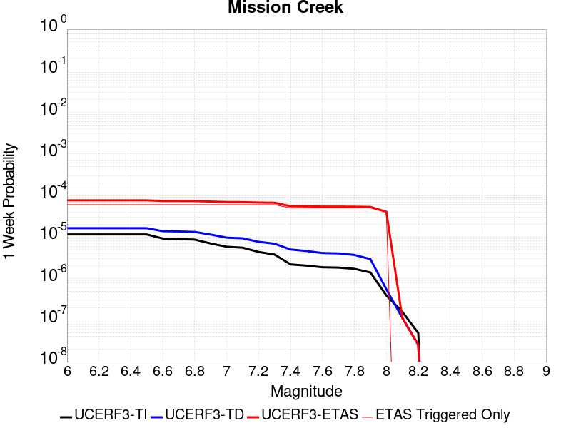 |  |  |  |

| Magnitude | 1 wk TI Prob | 1 wk TD Prob | 1 wk ETAS Prob | 1 wk ETAS/TD Gain | 1 wk ETAS Triggered Only | 1 mo TI Prob | 1 mo TD Prob | 1 mo ETAS Prob | 1 mo ETAS/TD Gain | 1 mo ETAS Triggered Only | 1 yr TI Prob | 1 yr TD Prob | 1 yr ETAS Prob | 1 yr ETAS/TD Gain | 1 yr ETAS Triggered Only | 10 yr TI Prob | 10 yr TD Prob | 10 yr ETAS Prob | 10 yr ETAS/TD Gain | 10 yr ETAS Triggered Only |
|-----|-----|-----|-----|-----|-----|-----|-----|-----|-----|-----|-----|-----|-----|-----|-----|-----|-----|-----|-----|-----|
| 6.0 | 1.1549387E-5 | 1.632237E-5 | 3.3743687E-5 | 2.0673277 | 1.7421602E-5 | 4.9496433E-5 | 6.9951224E-5 | 8.7371605E-5 | 1.2490362 | 1.7421602E-5 | 6.0245243E-4 | 8.513384E-4 | 8.6874515E-4 | 1.0204464 | 1.7421602E-5 | 0.006008218 | 0.008509998 | 0.008544545 | 1.0040596 | 3.4843204E-5 |
| 6.1 | 1.1549387E-5 | 1.632237E-5 | 3.3743687E-5 | 2.0673277 | 1.7421602E-5 | 4.9496433E-5 | 6.9951224E-5 | 8.7371605E-5 | 1.2490362 | 1.7421602E-5 | 6.0245243E-4 | 8.513384E-4 | 8.6874515E-4 | 1.0204464 | 1.7421602E-5 | 0.006008218 | 0.008509998 | 0.008544545 | 1.0040596 | 3.4843204E-5 |
| 6.2 | 1.1549387E-5 | 1.632237E-5 | 3.3743687E-5 | 2.0673277 | 1.7421602E-5 | 4.9496433E-5 | 6.9951224E-5 | 8.7371605E-5 | 1.2490362 | 1.7421602E-5 | 6.0245243E-4 | 8.513384E-4 | 8.6874515E-4 | 1.0204464 | 1.7421602E-5 | 0.006008218 | 0.008509998 | 0.008544545 | 1.0040596 | 3.4843204E-5 |
| 6.3 | 1.1549387E-5 | 1.632237E-5 | 3.3743687E-5 | 2.0673277 | 1.7421602E-5 | 4.9496433E-5 | 6.9951224E-5 | 8.7371605E-5 | 1.2490362 | 1.7421602E-5 | 6.0245243E-4 | 8.513384E-4 | 8.6874515E-4 | 1.0204464 | 1.7421602E-5 | 0.006008218 | 0.008509998 | 0.008544545 | 1.0040596 | 3.4843204E-5 |
| 6.4 | 1.1549387E-5 | 1.632237E-5 | 3.3743687E-5 | 2.0673277 | 1.7421602E-5 | 4.9496433E-5 | 6.9951224E-5 | 8.7371605E-5 | 1.2490362 | 1.7421602E-5 | 6.0245243E-4 | 8.513384E-4 | 8.6874515E-4 | 1.0204464 | 1.7421602E-5 | 0.006008218 | 0.008509998 | 0.008544545 | 1.0040596 | 3.4843204E-5 |
| 6.5 | 1.1549387E-5 | 1.632237E-5 | 3.3743687E-5 | 2.0673277 | 1.7421602E-5 | 4.9496433E-5 | 6.9951224E-5 | 8.7371605E-5 | 1.2490362 | 1.7421602E-5 | 6.0245243E-4 | 8.513384E-4 | 8.6874515E-4 | 1.0204464 | 1.7421602E-5 | 0.006008218 | 0.008509998 | 0.008544545 | 1.0040596 | 3.4843204E-5 |
| 6.6 | 9.202681E-6 | 1.3845646E-5 | 3.126701E-5 | 2.2582555 | 1.7421602E-5 | 3.9439463E-5 | 5.9337188E-5 | 7.675776E-5 | 1.293586 | 1.7421602E-5 | 4.800697E-4 | 7.221998E-4 | 7.3960883E-4 | 1.0241055 | 1.7421602E-5 | 0.004790339 | 0.0072271815 | 0.007261773 | 1.0047863 | 3.4843204E-5 |
| 6.7 | 9.019164E-6 | 1.3651316E-5 | 3.1072683E-5 | 2.2761674 | 1.7421602E-5 | 3.8652986E-5 | 5.8504378E-5 | 7.592496E-5 | 1.2977655 | 1.7421602E-5 | 4.7049852E-4 | 7.12067E-4 | 7.294762E-4 | 1.0244489 | 1.7421602E-5 | 0.004695036 | 0.007126506 | 0.007161101 | 1.0048544 | 3.4843204E-5 |
| 6.8 | 8.673558E-6 | 1.3273427E-5 | 3.06948E-5 | 2.3125 | 1.7421602E-5 | 3.717186E-5 | 5.6884925E-5 | 7.4305535E-5 | 1.3062431 | 1.7421602E-5 | 4.524734E-4 | 6.923627E-4 | 7.097723E-4 | 1.0251452 | 1.7421602E-5 | 0.0045155324 | 0.006930694 | 0.006965296 | 1.0049925 | 3.4843204E-5 |
| 6.9 | 7.002255E-6 | 1.1477657E-5 | 2.889906E-5 | 2.5178537 | 1.7421602E-5 | 3.000932E-5 | 4.9189068E-5 | 6.660981E-5 | 1.3541589 | 1.7421602E-5 | 3.653022E-4 | 5.9871917E-4 | 6.1613036E-4 | 1.0290807 | 1.7421602E-5 | 0.0036470229 | 0.005999517 | 0.0060341517 | 1.0057728 | 3.4843204E-5 |
| 7.0 | 5.84644E-6 | 9.67498E-6 | 2.7096414E-5 | 2.8006687 | 1.7421602E-5 | 2.5055931E-5 | 4.1463565E-5 | 5.888445E-5 | 1.4201491 | 1.7421602E-5 | 3.0501327E-4 | 5.047066E-4 | 5.2211934E-4 | 1.0345008 | 1.7421602E-5 | 0.0030459496 | 0.0050638523 | 0.005098519 | 1.006846 | 3.4843204E-5 |
| 7.1 | 5.54703E-6 | 9.329456E-6 | 2.6750897E-5 | 2.8673587 | 1.7421602E-5 | 2.377277E-5 | 3.9982795E-5 | 5.74037E-5 | 1.4357101 | 1.7421602E-5 | 2.8939504E-4 | 4.8668624E-4 | 5.0409936E-4 | 1.035779 | 1.7421602E-5 | 0.0028901845 | 0.004884446 | 0.004919119 | 1.0070987 | 3.4843204E-5 |
| 7.2 | 4.384709E-6 | 7.68157E-6 | 2.510304E-5 | 3.2679565 | 1.7421602E-5 | 1.8791474E-5 | 3.2920623E-5 | 5.0341652E-5 | 1.5291829 | 1.7421602E-5 | 2.2876218E-4 | 4.0073853E-4 | 4.1815315E-4 | 1.0434563 | 1.7421602E-5 | 0.0022852682 | 0.004028366 | 0.0040630684 | 1.0086147 | 3.4843204E-5 |
| 7.3 | 3.7888456E-6 | 6.915452E-6 | 2.4336934E-5 | 3.519211 | 1.7421602E-5 | 1.623781E-5 | 2.9637333E-5 | 4.705842E-5 | 1.5878088 | 1.7421602E-5 | 1.9767738E-4 | 3.6077813E-4 | 3.7819345E-4 | 1.0482715 | 1.7421602E-5 | 0.0019750162 | 0.0036301152 | 0.0036648319 | 1.0095636 | 3.4843204E-5 |
| 7.4 | 2.1982462E-6 | 5.0237763E-6 | 2.2445292E-5 | 4.4678125 | 1.7421602E-5 | 9.421021E-6 | 2.1530293E-5 | 3.8951523E-5 | 1.8091495 | 1.7421602E-5 | 1.1469489E-4 | 2.621E-4 | 2.7951703E-4 | 1.0664519 | 1.7421602E-5 | 0.0011463572 | 0.0026458844 | 0.0026806355 | 1.013134 | 3.4843204E-5 |
| 7.5 | 2.051923E-6 | 4.615016E-6 | 2.2036538E-5 | 4.774965 | 1.7421602E-5 | 8.793926E-6 | 1.9778492E-5 | 3.719975E-5 | 1.8808184 | 1.7421602E-5 | 1.0706078E-4 | 2.4077666E-4 | 2.5819408E-4 | 1.0723385 | 1.7421602E-5 | 0.0010700922 | 0.0024335422 | 0.0024683005 | 1.0142831 | 3.4843204E-5 |
| 7.6 | 1.8733427E-6 | 4.1233748E-6 | 2.1544905E-5 | 5.2250657 | 1.7421602E-5 | 8.028587E-6 | 1.7671488E-5 | 3.5092784E-5 | 1.985842 | 1.7421602E-5 | 9.774366E-5 | 2.151292E-4 | 2.3254706E-4 | 1.0809646 | 1.7421602E-5 | 9.770069E-4 | 0.0021780801 | 0.0022128476 | 1.0159624 | 3.4843204E-5 |
| 7.7 | 1.8411953E-6 | 4.0430496E-6 | 2.1464582E-5 | 5.3090076 | 1.7421602E-5 | 7.890813E-6 | 1.732724E-5 | 3.474854E-5 | 2.0054286 | 1.7421602E-5 | 9.606641E-5 | 2.1093882E-4 | 2.2835674E-4 | 1.0825734 | 1.7421602E-5 | 9.6024893E-4 | 0.0021363653 | 0.002171134 | 1.0162747 | 3.4843204E-5 |
| 7.8 | 1.7194251E-6 | 3.7104276E-6 | 2.1131966E-5 | 5.6952915 | 1.7421602E-5 | 7.368944E-6 | 1.5901736E-5 | 3.332306E-5 | 2.0955613 | 1.7421602E-5 | 8.97132E-5 | 1.9358651E-4 | 2.1100474E-4 | 1.0899764 | 1.7421602E-5 | 8.967699E-4 | 0.0019623525 | 0.0019971272 | 1.0177209 | 3.4843204E-5 |
| 7.9 | 1.4035052E-6 | 2.9500632E-6 | 2.0371615E-5 | 6.905484 | 1.7421602E-5 | 6.0150082E-6 | 1.2643067E-5 | 3.006445E-5 | 2.3779397 | 1.7421602E-5 | 7.3230265E-5 | 1.5391852E-4 | 1.7133745E-4 | 1.1131698 | 1.7421602E-5 | 7.3206134E-4 | 0.0015631086 | 0.0015978974 | 1.0222561 | 3.4843204E-5 |
| 8.0 | 3.9318823E-7 | 5.528522E-7 | 1.7974446E-5 | 32.512207 | 1.7421602E-5 | 1.6850913E-6 | 2.3693647E-6 | 1.9790927E-5 | 8.352841 | 1.7421602E-5 | 2.0515794E-5 | 2.8846638E-5 | 4.6267738E-5 | 1.6039213 | 1.7421602E-5 | 2.0513899E-4 | 2.9899E-4 | 3.3382277E-4 | 1.1165016 | 3.4843204E-5 |
| 8.1 | 1.596793E-7 | 1.1380002E-7 | 1.1380002E-7 | 1.0 | 0.0 | 6.8433974E-7 | 4.877143E-7 | 4.877143E-7 | 1.0 | 0.0 | 8.331805E-6 | 5.937906E-6 | 5.937906E-6 | 1.0 | 0.0 | 8.331492E-5 | 6.549966E-5 | 6.549966E-5 | 1.0 | 0.0 |
| 8.2 | 4.9003038E-8 | 2.5444924E-8 | 2.5444924E-8 | 1.0 | 0.0 | 2.10013E-7 | 1.0904967E-7 | 1.0904967E-7 | 1.0 | 0.0 | 2.5569052E-6 | 1.327679E-6 | 1.327679E-6 | 1.0 | 0.0 | 2.556876E-5 | 1.495635E-5 | 1.495635E-5 | 1.0 | 0.0 |

## Northridge
*[(top)](#table-of-contents)*

| 1 Week | 1 Month | 1 Year | 10 Year |
|-----|-----|-----|-----|
|  |  |  | 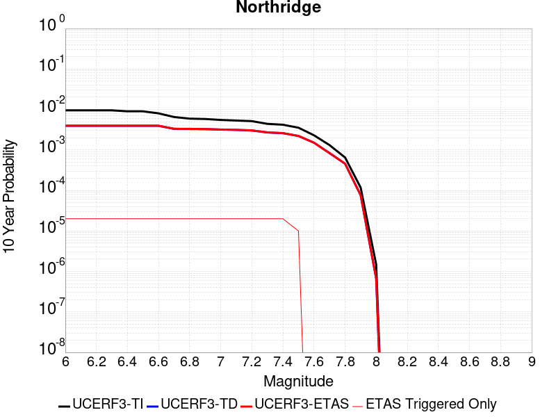 |

| Magnitude | 1 wk TI Prob | 1 wk TD Prob | 1 wk ETAS Prob | 1 wk ETAS/TD Gain | 1 wk ETAS Triggered Only | 1 mo TI Prob | 1 mo TD Prob | 1 mo ETAS Prob | 1 mo ETAS/TD Gain | 1 mo ETAS Triggered Only | 1 yr TI Prob | 1 yr TD Prob | 1 yr ETAS Prob | 1 yr ETAS/TD Gain | 1 yr ETAS Triggered Only | 10 yr TI Prob | 10 yr TD Prob | 10 yr ETAS Prob | 10 yr ETAS/TD Gain | 10 yr ETAS Triggered Only |
|-----|-----|-----|-----|-----|-----|-----|-----|-----|-----|-----|-----|-----|-----|-----|-----|-----|-----|-----|-----|-----|
| 6.0 | 1.8340852E-5 | 7.5880193E-6 | 7.5880193E-6 | 1.0 | 0.0 | 7.860128E-5 | 3.251969E-5 | 4.9940725E-5 | 1.5357074 | 1.7421602E-5 | 9.565505E-4 | 3.958575E-4 | 4.306869E-4 | 1.0879847 | 3.4843204E-5 | 0.009524435 | 0.003951746 | 0.0039864513 | 1.0087823 | 3.4843204E-5 |
| 6.1 | 1.8340852E-5 | 7.5880193E-6 | 7.5880193E-6 | 1.0 | 0.0 | 7.860128E-5 | 3.251969E-5 | 4.9940725E-5 | 1.5357074 | 1.7421602E-5 | 9.565505E-4 | 3.958575E-4 | 4.306869E-4 | 1.0879847 | 3.4843204E-5 | 0.009524435 | 0.003951746 | 0.0039864513 | 1.0087823 | 3.4843204E-5 |
| 6.2 | 1.8340852E-5 | 7.5880193E-6 | 7.5880193E-6 | 1.0 | 0.0 | 7.860128E-5 | 3.251969E-5 | 4.9940725E-5 | 1.5357074 | 1.7421602E-5 | 9.565505E-4 | 3.958575E-4 | 4.306869E-4 | 1.0879847 | 3.4843204E-5 | 0.009524435 | 0.003951746 | 0.0039864513 | 1.0087823 | 3.4843204E-5 |
| 6.3 | 1.8340852E-5 | 7.5880193E-6 | 7.5880193E-6 | 1.0 | 0.0 | 7.860128E-5 | 3.251969E-5 | 4.9940725E-5 | 1.5357074 | 1.7421602E-5 | 9.565505E-4 | 3.958575E-4 | 4.306869E-4 | 1.0879847 | 3.4843204E-5 | 0.009524435 | 0.003951746 | 0.0039864513 | 1.0087823 | 3.4843204E-5 |
| 6.4 | 1.7361892E-5 | 7.5880193E-6 | 7.5880193E-6 | 1.0 | 0.0 | 7.440598E-5 | 3.251969E-5 | 4.9940725E-5 | 1.5357074 | 1.7421602E-5 | 9.055163E-4 | 3.958575E-4 | 4.306869E-4 | 1.0879847 | 3.4843204E-5 | 0.009018354 | 0.003951746 | 0.0039864513 | 1.0087823 | 3.4843204E-5 |
| 6.5 | 1.7361892E-5 | 7.5880193E-6 | 7.5880193E-6 | 1.0 | 0.0 | 7.440598E-5 | 3.251969E-5 | 4.9940725E-5 | 1.5357074 | 1.7421602E-5 | 9.055163E-4 | 3.958575E-4 | 4.306869E-4 | 1.0879847 | 3.4843204E-5 | 0.009018354 | 0.003951746 | 0.0039864513 | 1.0087823 | 3.4843204E-5 |
| 6.6 | 1.5458201E-5 | 7.5880193E-6 | 7.5880193E-6 | 1.0 | 0.0 | 6.624775E-5 | 3.251969E-5 | 4.9940725E-5 | 1.5357074 | 1.7421602E-5 | 8.0626784E-4 | 3.958575E-4 | 4.306869E-4 | 1.0879847 | 3.4843204E-5 | 0.008033488 | 0.003951746 | 0.0039864513 | 1.0087823 | 3.4843204E-5 |
| 6.7 | 1.2538368E-5 | 6.381603E-6 | 6.381603E-6 | 1.0 | 0.0 | 5.3734755E-5 | 2.7349442E-5 | 4.4770568E-5 | 1.6369829 | 1.7421602E-5 | 6.5402425E-4 | 3.3292902E-4 | 3.6776063E-4 | 1.1046218 | 3.4843204E-5 | 0.0065210275 | 0.0033243506 | 0.003359078 | 1.0104463 | 3.4843204E-5 |
| 6.8 | 1.1438097E-5 | 6.3502566E-6 | 6.3502566E-6 | 1.0 | 0.0 | 4.9019498E-5 | 2.7215105E-5 | 4.4636232E-5 | 1.6401272 | 1.7421602E-5 | 5.9664896E-4 | 3.3129397E-4 | 3.6612563E-4 | 1.1051382 | 3.4843204E-5 | 0.005950495 | 0.0033080487 | 0.0033427766 | 1.010498 | 3.4843204E-5 |
| 6.9 | 1.1204891E-5 | 6.2867084E-6 | 6.2867084E-6 | 1.0 | 0.0 | 4.8020076E-5 | 2.694276E-5 | 4.4363893E-5 | 1.646598 | 1.7421602E-5 | 5.8448757E-4 | 3.2797916E-4 | 3.6281094E-4 | 1.1062012 | 3.4843204E-5 | 0.0058295266 | 0.0032749989 | 0.0033097279 | 1.0106043 | 3.4843204E-5 |
| 7.0 | 1.061046E-5 | 6.115359E-6 | 6.115359E-6 | 1.0 | 0.0 | 4.5472607E-5 | 2.6208421E-5 | 4.3629567E-5 | 1.6647156 | 1.7421602E-5 | 5.534883E-4 | 3.1904122E-4 | 3.5387333E-4 | 1.1091774 | 3.4843204E-5 | 0.0055211177 | 0.0031858785 | 0.0032206108 | 1.0109019 | 3.4843204E-5 |
| 7.1 | 1.0266979E-5 | 6.004274E-6 | 6.004274E-6 | 1.0 | 0.0 | 4.40006E-5 | 2.5732352E-5 | 4.3153505E-5 | 1.6770138 | 1.7421602E-5 | 5.355756E-4 | 3.1324677E-4 | 3.4807905E-4 | 1.1111976 | 3.4843204E-5 | 0.0053428668 | 0.003128098 | 0.0031628325 | 1.011104 | 3.4843204E-5 |
| 7.2 | 9.91273E-6 | 5.819984E-6 | 5.819984E-6 | 1.0 | 0.0 | 4.248244E-5 | 2.4942554E-5 | 4.236372E-5 | 1.6984516 | 1.7421602E-5 | 5.171009E-4 | 3.036337E-4 | 3.384663E-4 | 1.1147193 | 3.4843204E-5 | 0.0051589934 | 0.0030322333 | 0.003066971 | 1.0114561 | 3.4843204E-5 |
| 7.3 | 8.4959265E-6 | 5.193062E-6 | 5.193062E-6 | 1.0 | 0.0 | 3.6410605E-5 | 2.225579E-5 | 3.9677005E-5 | 1.7827722 | 1.7421602E-5 | 4.4320893E-4 | 2.709308E-4 | 3.0576455E-4 | 1.1285707 | 3.4843204E-5 | 0.00442326 | 0.0027060313 | 0.0027407804 | 1.0128412 | 3.4843204E-5 |
| 7.4 | 8.0847185E-6 | 4.9819355E-6 | 4.9819355E-6 | 1.0 | 0.0 | 3.4648332E-5 | 2.135098E-5 | 3.877221E-5 | 1.8159453 | 1.7421602E-5 | 4.2176177E-4 | 2.599174E-4 | 2.9475155E-4 | 1.1340201 | 3.4843204E-5 | 0.0042096223 | 0.00259616 | 0.0026309127 | 1.0133862 | 3.4843204E-5 |
| 7.5 | 6.8220684E-6 | 4.2533075E-6 | 4.2533075E-6 | 1.0 | 0.0 | 2.9237108E-5 | 1.8228335E-5 | 1.8228335E-5 | 1.0 | 0.0 | 3.5590364E-4 | 2.2190758E-4 | 2.3932531E-4 | 1.078491 | 1.7421602E-5 | 0.0035533418 | 0.002216881 | 0.0022342638 | 1.0078412 | 1.7421602E-5 |
| 7.6 | 4.4224143E-6 | 2.8999582E-6 | 2.8999582E-6 | 1.0 | 0.0 | 1.8953066E-5 | 1.2428334E-5 | 1.2428334E-5 | 1.0 | 0.0 | 2.3072914E-4 | 1.5130457E-4 | 1.5130457E-4 | 1.0 | 0.0 | 0.0023048974 | 0.0015120271 | 0.0015120271 | 1.0 | 0.0 |
| 7.7 | 2.5297056E-6 | 1.6045905E-6 | 1.6045905E-6 | 1.0 | 0.0 | 1.0841551E-5 | 6.8767986E-6 | 6.8767986E-6 | 1.0 | 0.0 | 1.319879E-4 | 8.3721854E-5 | 8.3721854E-5 | 1.0 | 0.0 | 0.0013190953 | 8.369078E-4 | 8.369078E-4 | 1.0 | 0.0 |
| 7.8 | 1.2508156E-6 | 8.780076E-7 | 8.780076E-7 | 1.0 | 0.0 | 5.3606273E-6 | 3.7628845E-6 | 3.7628845E-6 | 1.0 | 0.0 | 6.526368E-5 | 4.581217E-5 | 4.581217E-5 | 1.0 | 0.0 | 6.524452E-4 | 4.5802852E-4 | 4.5802852E-4 | 1.0 | 0.0 |
| 7.9 | 2.262199E-7 | 1.4664671E-7 | 1.4664671E-7 | 1.0 | 0.0 | 9.695135E-7 | 6.284858E-7 | 6.284858E-7 | 1.0 | 0.0 | 1.1803763E-5 | 7.651788E-6 | 7.651788E-6 | 1.0 | 0.0 | 1.1803136E-4 | 7.651533E-5 | 7.651533E-5 | 1.0 | 0.0 |
| 8.0 | 2.865362E-9 | 1.2753101E-9 | 1.2753101E-9 | 1.0 | 0.0 | 1.2280123E-8 | 5.4656146E-9 | 5.4656146E-9 | 1.0 | 0.0 | 1.4951048E-7 | 6.654386E-8 | 6.654386E-8 | 1.0 | 0.0 | 1.4951038E-6 | 6.654386E-7 | 6.654386E-7 | 1.0 | 0.0 |

## Cleghorn Pass
*[(top)](#table-of-contents)*

| 1 Week | 1 Month | 1 Year | 10 Year |
|-----|-----|-----|-----|
|  | 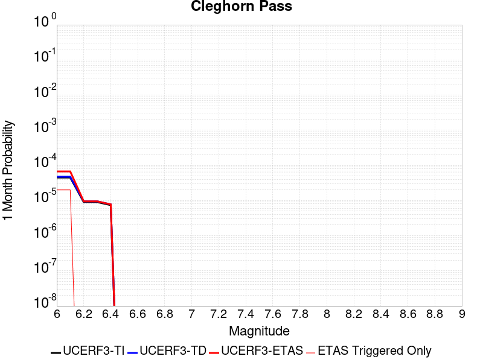 | 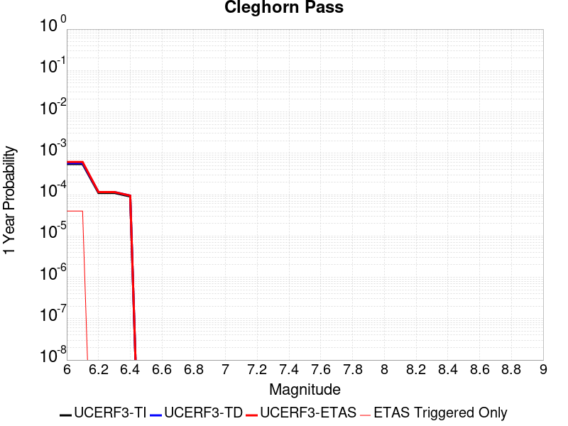 |  |

| Magnitude | 1 wk TI Prob | 1 wk TD Prob | 1 wk ETAS Prob | 1 wk ETAS/TD Gain | 1 wk ETAS Triggered Only | 1 mo TI Prob | 1 mo TD Prob | 1 mo ETAS Prob | 1 mo ETAS/TD Gain | 1 mo ETAS Triggered Only | 1 yr TI Prob | 1 yr TD Prob | 1 yr ETAS Prob | 1 yr ETAS/TD Gain | 1 yr ETAS Triggered Only | 10 yr TI Prob | 10 yr TD Prob | 10 yr ETAS Prob | 10 yr ETAS/TD Gain | 10 yr ETAS Triggered Only |
|-----|-----|-----|-----|-----|-----|-----|-----|-----|-----|-----|-----|-----|-----|-----|-----|-----|-----|-----|-----|-----|
| 6.0 | 1.0522846E-5 | 1.1040642E-5 | 1.1040642E-5 | 1.0 | 0.0 | 4.509713E-5 | 4.7316473E-5 | 4.7316473E-5 | 1.0 | 0.0 | 5.4891926E-4 | 5.759784E-4 | 6.1080157E-4 | 1.0604591 | 3.4843204E-5 | 0.0054756533 | 0.005750022 | 0.005784665 | 1.0060248 | 3.4843204E-5 |
| 6.1 | 1.0522846E-5 | 1.1040642E-5 | 1.1040642E-5 | 1.0 | 0.0 | 4.509713E-5 | 4.7316473E-5 | 4.7316473E-5 | 1.0 | 0.0 | 5.4891926E-4 | 5.759784E-4 | 6.1080157E-4 | 1.0604591 | 3.4843204E-5 | 0.0054756533 | 0.005750022 | 0.005784665 | 1.0060248 | 3.4843204E-5 |
| 6.2 | 2.1045846E-6 | 2.2082024E-6 | 2.2082024E-6 | 1.0 | 0.0 | 9.019617E-6 | 9.463714E-6 | 9.463714E-6 | 1.0 | 0.0 | 1.098083E-4 | 1.1521882E-4 | 1.1521882E-4 | 1.0 | 0.0 | 0.0010975406 | 0.0011520023 | 0.0011520023 | 1.0 | 0.0 |
| 6.3 | 2.1045846E-6 | 2.2082024E-6 | 2.2082024E-6 | 1.0 | 0.0 | 9.019617E-6 | 9.463714E-6 | 9.463714E-6 | 1.0 | 0.0 | 1.098083E-4 | 1.1521882E-4 | 1.1521882E-4 | 1.0 | 0.0 | 0.0010975406 | 0.0011520023 | 0.0011520023 | 1.0 | 0.0 |
| 6.4 | 1.7259927E-6 | 1.810877E-6 | 1.810877E-6 | 1.0 | 0.0 | 7.3970905E-6 | 7.760902E-6 | 7.760902E-6 | 1.0 | 0.0 | 9.005586E-5 | 9.4488976E-5 | 9.4488976E-5 | 1.0 | 0.0 | 9.001937E-4 | 9.448898E-4 | 9.448898E-4 | 1.0 | 0.0 |

## Calaveras (So) 2011 CFM
*[(top)](#table-of-contents)*

| 1 Week | 1 Month | 1 Year | 10 Year |
|-----|-----|-----|-----|
|  |  |  |  |

| Magnitude | 1 wk TI Prob | 1 wk TD Prob | 1 wk ETAS Prob | 1 wk ETAS/TD Gain | 1 wk ETAS Triggered Only | 1 mo TI Prob | 1 mo TD Prob | 1 mo ETAS Prob | 1 mo ETAS/TD Gain | 1 mo ETAS Triggered Only | 1 yr TI Prob | 1 yr TD Prob | 1 yr ETAS Prob | 1 yr ETAS/TD Gain | 1 yr ETAS Triggered Only | 10 yr TI Prob | 10 yr TD Prob | 10 yr ETAS Prob | 10 yr ETAS/TD Gain | 10 yr ETAS Triggered Only |
|-----|-----|-----|-----|-----|-----|-----|-----|-----|-----|-----|-----|-----|-----|-----|-----|-----|-----|-----|-----|-----|
| 6.0 | 1.5950744E-4 | 3.071188E-4 | 3.071188E-4 | 1.0 | 0.0 | 6.834242E-4 | 0.0013155643 | 0.0013155643 | 1.0 | 0.0 | 0.00828899 | 0.01585904 | 0.015876185 | 1.0010811 | 1.7421602E-5 | 0.079865426 | 0.14440064 | 0.14443046 | 1.0002065 | 3.4843204E-5 |
| 6.1 | 1.3584697E-4 | 2.6036944E-4 | 2.6036944E-4 | 1.0 | 0.0 | 5.8207137E-4 | 0.0011153965 | 0.0011153965 | 1.0 | 0.0 | 0.007063716 | 0.013462106 | 0.013479293 | 1.0012767 | 1.7421602E-5 | 0.06843361 | 0.12402854 | 0.124059066 | 1.000246 | 3.4843204E-5 |
| 6.2 | 1.14676266E-4 | 2.1726108E-4 | 2.1726108E-4 | 1.0 | 0.0 | 4.9137714E-4 | 9.307893E-4 | 9.307893E-4 | 1.0 | 0.0 | 0.0059661185 | 0.011245592 | 0.011262817 | 1.0015317 | 1.7421602E-5 | 0.058084648 | 0.105019294 | 0.105050474 | 1.000297 | 3.4843204E-5 |
| 6.3 | 8.691518E-5 | 1.5987165E-4 | 1.5987165E-4 | 1.0 | 0.0 | 3.7244044E-4 | 6.8496726E-4 | 6.8496726E-4 | 1.0 | 0.0 | 0.004525038 | 0.008300893 | 0.00831817 | 1.0020814 | 1.7421602E-5 | 0.044339992 | 0.0793347 | 0.07936678 | 1.0004044 | 3.4843204E-5 |
| 6.4 | 8.50982E-5 | 1.5693568E-4 | 1.5693568E-4 | 1.0 | 0.0 | 3.646556E-4 | 6.7239115E-4 | 6.7239115E-4 | 1.0 | 0.0 | 0.0044306475 | 0.008148931 | 0.00816621 | 1.0021205 | 1.7421602E-5 | 0.04343345 | 0.077940844 | 0.07797297 | 1.0004122 | 3.4843204E-5 |
| 6.5 | 8.4062965E-5 | 1.5518135E-4 | 1.5518135E-4 | 1.0 | 0.0 | 3.602201E-4 | 6.648764E-4 | 6.648764E-4 | 1.0 | 0.0 | 0.004376863 | 0.008058134 | 0.008075414 | 1.0021446 | 1.7421602E-5 | 0.042916555 | 0.077112116 | 0.07714427 | 1.000417 | 3.4843204E-5 |
| 6.6 | 8.194716E-5 | 1.5154095E-4 | 1.5154095E-4 | 1.0 | 0.0 | 3.5115483E-4 | 6.492825E-4 | 6.492825E-4 | 1.0 | 0.0 | 0.0042669317 | 0.007869979 | 0.007887264 | 1.0021963 | 1.7421602E-5 | 0.04185927 | 0.07539739 | 0.0754296 | 1.0004272 | 3.4843204E-5 |
| 6.7 | 8.012326E-5 | 1.4821833E-4 | 1.4821833E-4 | 1.0 | 0.0 | 3.433402E-4 | 6.350497E-4 | 6.350497E-4 | 1.0 | 0.0 | 0.004172157 | 0.007698474 | 0.0077157617 | 1.0022455 | 1.7421602E-5 | 0.040946912 | 0.073839515 | 0.073871784 | 1.000437 | 3.4843204E-5 |
| 6.8 | 7.119773E-5 | 1.2880519E-4 | 1.2880519E-4 | 1.0 | 0.0 | 3.0509746E-4 | 5.519001E-4 | 5.519001E-4 | 1.0 | 0.0 | 0.0037082357 | 0.0066958875 | 0.0067131924 | 1.0025845 | 1.7421602E-5 | 0.036469642 | 0.06468402 | 0.06471661 | 1.0005038 | 3.4843204E-5 |
| 6.9 | 5.7343088E-5 | 9.9189E-5 | 9.9189E-5 | 1.0 | 0.0 | 2.4573295E-4 | 4.2502693E-4 | 4.2502693E-4 | 1.0 | 0.0 | 0.0029876942 | 0.0051625078 | 0.0051625078 | 1.0 | 0.0 | 0.02947844 | 0.050509132 | 0.050525676 | 1.0003275 | 1.7421602E-5 |
| 7.0 | 4.8746577E-5 | 8.284751E-5 | 8.284751E-5 | 1.0 | 0.0 | 2.0889717E-4 | 3.550128E-4 | 3.550128E-4 | 1.0 | 0.0 | 0.0025403565 | 0.004313781 | 0.004313781 | 1.0 | 0.0 | 0.025115121 | 0.04248505 | 0.042501733 | 1.0003927 | 1.7421602E-5 |
| 7.1 | 4.2998014E-5 | 7.264914E-5 | 7.264914E-5 | 1.0 | 0.0 | 1.8426418E-4 | 3.1131663E-4 | 3.1131663E-4 | 1.0 | 0.0 | 0.002241108 | 0.0037837527 | 0.0037837527 | 1.0 | 0.0 | 0.022186412 | 0.037423246 | 0.037440013 | 1.0004481 | 1.7421602E-5 |
| 7.2 | 3.221292E-5 | 5.390566E-5 | 5.390566E-5 | 1.0 | 0.0 | 1.3804805E-4 | 2.3100396E-4 | 2.3100396E-4 | 1.0 | 0.0 | 0.0016794393 | 0.0028088738 | 0.0028088738 | 1.0 | 0.0 | 0.016668037 | 0.028035998 | 0.028052932 | 1.000604 | 1.7421602E-5 |
| 7.3 | 2.3756531E-5 | 3.9471706E-5 | 3.9471706E-5 | 1.0 | 0.0 | 1.0180973E-4 | 1.6915359E-4 | 1.6915359E-4 | 1.0 | 0.0 | 0.0012388286 | 0.0020575167 | 0.0020575167 | 1.0 | 0.0 | 0.012319452 | 0.02064345 | 0.020660512 | 1.0008265 | 1.7421602E-5 |
| 7.4 | 1.5997684E-5 | 2.734085E-5 | 2.734085E-5 | 1.0 | 0.0 | 6.8559704E-5 | 1.1716982E-4 | 1.1716982E-4 | 1.0 | 0.0 | 8.343947E-4 | 0.0014256114 | 0.0014256114 | 1.0 | 0.0 | 0.008312687 | 0.014376549 | 0.01439372 | 1.0011944 | 1.7421602E-5 |
| 7.5 | 1.3814293E-5 | 2.4782603E-5 | 2.4782603E-5 | 1.0 | 0.0 | 5.9202768E-5 | 1.0620684E-4 | 1.0620684E-4 | 1.0 | 0.0 | 7.205553E-4 | 0.0012923037 | 0.0012923037 | 1.0 | 0.0 | 0.007182234 | 0.013055766 | 0.01307296 | 1.001317 | 1.7421602E-5 |
| 7.6 | 8.817309E-6 | 1.6429829E-5 | 1.6429829E-5 | 1.0 | 0.0 | 3.7787922E-5 | 7.041166E-5 | 7.041166E-5 | 1.0 | 0.0 | 4.5997082E-4 | 8.5692614E-4 | 8.5692614E-4 | 1.0 | 0.0 | 0.004590199 | 0.008719863 | 0.008737134 | 1.0019805 | 1.7421602E-5 |
| 7.7 | 4.0352206E-6 | 7.706877E-6 | 7.706877E-6 | 1.0 | 0.0 | 1.7293689E-5 | 3.3029053E-5 | 3.3029053E-5 | 1.0 | 0.0 | 2.1053031E-4 | 4.020546E-4 | 4.020546E-4 | 1.0 | 0.0 | 0.0021033096 | 0.0041649863 | 0.0041823355 | 1.0041654 | 1.7421602E-5 |
| 7.8 | 3.413169E-6 | 6.7868646E-6 | 6.7868646E-6 | 1.0 | 0.0 | 1.4627784E-5 | 2.9086239E-5 | 2.9086239E-5 | 1.0 | 0.0 | 1.7807873E-4 | 3.5406748E-4 | 3.5406748E-4 | 1.0 | 0.0 | 0.0017793609 | 0.0036663096 | 0.0036836674 | 1.0047344 | 1.7421602E-5 |
| 7.9 | 2.4740732E-6 | 5.278809E-6 | 5.278809E-6 | 1.0 | 0.0 | 1.06031275E-5 | 2.2623271E-5 | 2.2623271E-5 | 1.0 | 0.0 | 1.2908543E-4 | 2.7540355E-4 | 2.7540355E-4 | 1.0 | 0.0 | 0.0012901047 | 0.002834638 | 0.0028520103 | 1.0061285 | 1.7421602E-5 |
| 8.0 | 1.5231818E-6 | 3.2887135E-6 | 3.2887135E-6 | 1.0 | 0.0 | 6.527906E-6 | 1.409441E-5 | 1.409441E-5 | 1.0 | 0.0 | 7.9474354E-5 | 1.7158597E-4 | 1.7158597E-4 | 1.0 | 0.0 | 7.944594E-4 | 0.001756374 | 0.001773765 | 1.0099016 | 1.7421602E-5 |
| 8.1 | 1.0104524E-6 | 2.0456548E-6 | 2.0456548E-6 | 1.0 | 0.0 | 4.330503E-6 | 8.767062E-6 | 8.767062E-6 | 1.0 | 0.0 | 5.2722597E-5 | 1.06733794E-4 | 1.06733794E-4 | 1.0 | 0.0 | 5.271009E-4 | 0.0010929212 | 0.0011103238 | 1.015923 | 1.7421602E-5 |

## Blue Cut
*[(top)](#table-of-contents)*

| 1 Week | 1 Month | 1 Year | 10 Year |
|-----|-----|-----|-----|
|  |  |  |  |

| Magnitude | 1 wk TI Prob | 1 wk TD Prob | 1 wk ETAS Prob | 1 wk ETAS/TD Gain | 1 wk ETAS Triggered Only | 1 mo TI Prob | 1 mo TD Prob | 1 mo ETAS Prob | 1 mo ETAS/TD Gain | 1 mo ETAS Triggered Only | 1 yr TI Prob | 1 yr TD Prob | 1 yr ETAS Prob | 1 yr ETAS/TD Gain | 1 yr ETAS Triggered Only | 10 yr TI Prob | 10 yr TD Prob | 10 yr ETAS Prob | 10 yr ETAS/TD Gain | 10 yr ETAS Triggered Only |
|-----|-----|-----|-----|-----|-----|-----|-----|-----|-----|-----|-----|-----|-----|-----|-----|-----|-----|-----|-----|-----|
| 6.0 | 2.1227985E-5 | 2.2719574E-5 | 4.014078E-5 | 1.7667928 | 1.7421602E-5 | 9.097391E-5 | 9.73663E-5 | 1.3220611E-4 | 1.3578221 | 3.4843204E-5 | 0.0011070445 | 0.0011848481 | 0.00121965 | 1.0293725 | 3.4843204E-5 | 0.011015458 | 0.011791152 | 0.011825584 | 1.0029202 | 3.4843204E-5 |
| 6.1 | 2.1227985E-5 | 2.2719574E-5 | 4.014078E-5 | 1.7667928 | 1.7421602E-5 | 9.097391E-5 | 9.73663E-5 | 1.3220611E-4 | 1.3578221 | 3.4843204E-5 | 0.0011070445 | 0.0011848481 | 0.00121965 | 1.0293725 | 3.4843204E-5 | 0.011015458 | 0.011791152 | 0.011825584 | 1.0029202 | 3.4843204E-5 |
| 6.2 | 2.1227985E-5 | 2.2719574E-5 | 4.014078E-5 | 1.7667928 | 1.7421602E-5 | 9.097391E-5 | 9.73663E-5 | 1.3220611E-4 | 1.3578221 | 3.4843204E-5 | 0.0011070445 | 0.0011848481 | 0.00121965 | 1.0293725 | 3.4843204E-5 | 0.011015458 | 0.011791152 | 0.011825584 | 1.0029202 | 3.4843204E-5 |
| 6.3 | 1.1613981E-5 | 1.2353542E-5 | 2.977493E-5 | 2.4102342 | 1.7421602E-5 | 4.9773254E-5 | 5.2942745E-5 | 7.036343E-5 | 1.3290476 | 1.7421602E-5 | 6.0582085E-4 | 6.443998E-4 | 6.6181016E-4 | 1.027018 | 1.7421602E-5 | 0.0060417196 | 0.0064265593 | 0.006443869 | 1.0026934 | 1.7421602E-5 |
| 6.4 | 1.1613981E-5 | 1.2353542E-5 | 2.977493E-5 | 2.4102342 | 1.7421602E-5 | 4.9773254E-5 | 5.2942745E-5 | 7.036343E-5 | 1.3290476 | 1.7421602E-5 | 6.0582085E-4 | 6.443998E-4 | 6.6181016E-4 | 1.027018 | 1.7421602E-5 | 0.0060417196 | 0.0064265593 | 0.006443869 | 1.0026934 | 1.7421602E-5 |
| 6.5 | 8.931326E-6 | 9.4816E-6 | 2.6903037E-5 | 2.8373942 | 1.7421602E-5 | 3.8276554E-5 | 4.0634844E-5 | 5.8055743E-5 | 1.4287181 | 1.7421602E-5 | 4.6591737E-4 | 4.946261E-4 | 5.120391E-4 | 1.0352043 | 1.7421602E-5 | 0.0046494175 | 0.004936161 | 0.0049534966 | 1.0035119 | 1.7421602E-5 |
| 6.6 | 7.345353E-6 | 7.79028E-6 | 2.5211746E-5 | 3.2363083 | 1.7421602E-5 | 3.1479703E-5 | 3.338653E-5 | 5.080755E-5 | 1.5217979 | 1.7421602E-5 | 3.83198E-4 | 4.064132E-4 | 4.238277E-4 | 1.0428493 | 1.7421602E-5 | 0.0038253788 | 0.0040574907 | 0.0040748417 | 1.0042763 | 1.7421602E-5 |
| 6.7 | 6.2775666E-6 | 6.655149E-6 | 2.4076637E-5 | 3.6177456 | 1.7421602E-5 | 2.690358E-5 | 2.8521798E-5 | 4.5942903E-5 | 1.6107997 | 1.7421602E-5 | 3.2750185E-4 | 3.472051E-4 | 3.6462065E-4 | 1.0501592 | 1.7421602E-5 | 0.0032701963 | 0.003467367 | 0.0034847283 | 1.005007 | 1.7421602E-5 |
| 6.8 | 5.5234095E-6 | 5.8551113E-6 | 2.3276612E-5 | 3.9754345 | 1.7421602E-5 | 2.367154E-5 | 2.5093133E-5 | 4.25143E-5 | 1.6942602 | 1.7421602E-5 | 2.8816288E-4 | 3.0547334E-4 | 3.2288962E-4 | 1.0570141 | 1.7421602E-5 | 0.002877895 | 0.0030512505 | 0.003068619 | 1.0056922 | 1.7421602E-5 |
| 6.9 | 4.7780054E-6 | 5.0654203E-6 | 2.2486935E-5 | 4.439303 | 1.7421602E-5 | 2.0477004E-5 | 2.1708804E-5 | 3.9130027E-5 | 1.8024958 | 1.7421602E-5 | 2.4927902E-4 | 2.642797E-4 | 2.8169667E-4 | 1.0659037 | 1.7421602E-5 | 0.0024899957 | 0.002640346 | 0.0026577218 | 1.0065808 | 1.7421602E-5 |
| 7.0 | 3.883171E-6 | 4.118487E-6 | 2.1540018E-5 | 5.23008 | 1.7421602E-5 | 1.6642054E-5 | 1.7650578E-5 | 3.5071873E-5 | 1.9870099 | 1.7421602E-5 | 2.0259817E-4 | 2.1488148E-4 | 2.3229935E-4 | 1.081058 | 1.7421602E-5 | 0.0020241356 | 0.0021474129 | 0.002164797 | 1.0080954 | 1.7421602E-5 |
| 7.1 | 2.8358215E-6 | 3.0097158E-6 | 2.0431266E-5 | 6.788437 | 1.7421602E-5 | 1.2153464E-5 | 1.2898756E-5 | 3.0320134E-5 | 2.3506248 | 1.7421602E-5 | 1.4795837E-4 | 1.5703762E-4 | 1.7445648E-4 | 1.1109216 | 1.7421602E-5 | 0.001478599 | 0.0015699116 | 0.0015873059 | 1.0110798 | 1.7421602E-5 |

## Big Pine (Central)
*[(top)](#table-of-contents)*

| 1 Week | 1 Month | 1 Year | 10 Year |
|-----|-----|-----|-----|
|  |  |  |  |

| Magnitude | 1 wk TI Prob | 1 wk TD Prob | 1 wk ETAS Prob | 1 wk ETAS/TD Gain | 1 wk ETAS Triggered Only | 1 mo TI Prob | 1 mo TD Prob | 1 mo ETAS Prob | 1 mo ETAS/TD Gain | 1 mo ETAS Triggered Only | 1 yr TI Prob | 1 yr TD Prob | 1 yr ETAS Prob | 1 yr ETAS/TD Gain | 1 yr ETAS Triggered Only | 10 yr TI Prob | 10 yr TD Prob | 10 yr ETAS Prob | 10 yr ETAS/TD Gain | 10 yr ETAS Triggered Only |
|-----|-----|-----|-----|-----|-----|-----|-----|-----|-----|-----|-----|-----|-----|-----|-----|-----|-----|-----|-----|-----|
| 6.0 | 1.2706755E-5 | 1.4250529E-5 | 3.1671883E-5 | 2.2225058 | 1.7421602E-5 | 5.4456385E-5 | 6.107247E-5 | 7.849301E-5 | 1.2852437 | 1.7421602E-5 | 6.628048E-4 | 7.433402E-4 | 7.781575E-4 | 1.046839 | 3.4843204E-5 | 0.006608314 | 0.0074135666 | 0.0074481517 | 1.0046651 | 3.4843204E-5 |
| 6.1 | 8.342579E-6 | 9.510762E-6 | 9.510762E-6 | 1.0 | 0.0 | 3.5753423E-5 | 4.0759893E-5 | 4.0759893E-5 | 1.0 | 0.0 | 4.3521097E-4 | 4.961604E-4 | 5.1357335E-4 | 1.0350955 | 1.7421602E-5 | 0.0043435963 | 0.0049540824 | 0.0049714176 | 1.0034992 | 1.7421602E-5 |
| 6.2 | 6.923899E-6 | 7.967147E-6 | 7.967147E-6 | 1.0 | 0.0 | 2.9673516E-5 | 3.4144578E-5 | 3.4144578E-5 | 1.0 | 0.0 | 3.6121515E-4 | 4.156502E-4 | 4.3306456E-4 | 1.0418967 | 1.7421602E-5 | 0.003606286 | 0.0041520367 | 0.004169386 | 1.0041785 | 1.7421602E-5 |
| 6.3 | 2.728396E-6 | 3.4242908E-6 | 3.4242908E-6 | 1.0 | 0.0 | 1.1693074E-5 | 1.4675454E-5 | 1.4675454E-5 | 1.0 | 0.0 | 1.4235388E-4 | 1.7865987E-4 | 1.7865987E-4 | 1.0 | 0.0 | 0.0014226272 | 0.0017866704 | 0.0017866704 | 1.0 | 0.0 |
| 6.4 | 2.7136944E-6 | 3.408584E-6 | 3.408584E-6 | 1.0 | 0.0 | 1.1630066E-5 | 1.4608141E-5 | 1.4608141E-5 | 1.0 | 0.0 | 1.4158686E-4 | 1.7784047E-4 | 1.7784047E-4 | 1.0 | 0.0 | 0.0014149669 | 0.0017784894 | 0.0017784894 | 1.0 | 0.0 |
| 6.5 | 2.6971882E-6 | 3.3909291E-6 | 3.3909291E-6 | 1.0 | 0.0 | 1.1559327E-5 | 1.45324775E-5 | 1.45324775E-5 | 1.0 | 0.0 | 1.4072572E-4 | 1.7691942E-4 | 1.7691942E-4 | 1.0 | 0.0 | 0.0014063664 | 0.0017692937 | 0.0017692937 | 1.0 | 0.0 |
| 6.6 | 2.669092E-6 | 3.3609497E-6 | 3.3609497E-6 | 1.0 | 0.0 | 1.1438916E-5 | 1.4403995E-5 | 1.4403995E-5 | 1.0 | 0.0 | 1.3925991E-4 | 1.753554E-4 | 1.753554E-4 | 1.0 | 0.0 | 0.0013917267 | 0.0017536782 | 0.0017536782 | 1.0 | 0.0 |
| 6.7 | 2.6408059E-6 | 3.3309752E-6 | 3.3309752E-6 | 1.0 | 0.0 | 1.1317691E-5 | 1.4275535E-5 | 1.4275535E-5 | 1.0 | 0.0 | 1.3778417E-4 | 1.7379165E-4 | 1.7379165E-4 | 1.0 | 0.0 | 0.0013769877 | 0.0017380653 | 0.0017380653 | 1.0 | 0.0 |
| 6.8 | 2.1786943E-6 | 2.8544325E-6 | 2.8544325E-6 | 1.0 | 0.0 | 9.337228E-6 | 1.2233229E-5 | 1.2233229E-5 | 1.0 | 0.0 | 1.1367482E-4 | 1.4893012E-4 | 1.4893012E-4 | 1.0 | 0.0 | 0.0011361669 | 0.0014897975 | 0.0014897975 | 1.0 | 0.0 |
| 6.9 | 1.4411696E-6 | 2.068499E-6 | 2.068499E-6 | 1.0 | 0.0 | 6.1764263E-6 | 8.864968E-6 | 8.864968E-6 | 1.0 | 0.0 | 7.51954E-5 | 1.079259E-4 | 1.079259E-4 | 1.0 | 0.0 | 7.5169955E-4 | 0.0010801847 | 0.0010801847 | 1.0 | 0.0 |
| 7.0 | 1.0073411E-6 | 1.554261E-6 | 1.554261E-6 | 1.0 | 0.0 | 4.317169E-6 | 6.6611024E-6 | 6.6611024E-6 | 1.0 | 0.0 | 5.2560266E-5 | 8.1096056E-5 | 8.1096056E-5 | 1.0 | 0.0 | 5.2547833E-4 | 8.1210316E-4 | 8.1210316E-4 | 1.0 | 0.0 |
| 7.1 | 8.947104E-7 | 1.4302494E-6 | 1.4302494E-6 | 1.0 | 0.0 | 3.834468E-6 | 6.129627E-6 | 6.129627E-6 | 1.0 | 0.0 | 4.6683643E-5 | 7.46258E-5 | 7.46258E-5 | 1.0 | 0.0 | 4.6673836E-4 | 7.474457E-4 | 7.474457E-4 | 1.0 | 0.0 |
| 7.2 | 5.215166E-7 | 1.0111678E-6 | 1.0111678E-6 | 1.0 | 0.0 | 2.2350691E-6 | 4.3335694E-6 | 4.3335694E-6 | 1.0 | 0.0 | 2.7211627E-5 | 5.2759973E-5 | 5.2759973E-5 | 1.0 | 0.0 | 2.7208295E-4 | 5.2890263E-4 | 5.2890263E-4 | 1.0 | 0.0 |
| 7.3 | 4.4024807E-7 | 9.219589E-7 | 9.219589E-7 | 1.0 | 0.0 | 1.8867761E-6 | 3.9512465E-6 | 3.9512465E-6 | 1.0 | 0.0 | 2.2971257E-5 | 4.810541E-5 | 4.810541E-5 | 1.0 | 0.0 | 2.2968883E-4 | 4.8237795E-4 | 4.8237795E-4 | 1.0 | 0.0 |
| 7.4 | 3.6130905E-7 | 8.358523E-7 | 8.358523E-7 | 1.0 | 0.0 | 1.5484665E-6 | 3.5822195E-6 | 3.5822195E-6 | 1.0 | 0.0 | 1.8852415E-5 | 4.3612687E-5 | 4.3612687E-5 | 1.0 | 0.0 | 1.8850817E-4 | 4.374597E-4 | 4.374597E-4 | 1.0 | 0.0 |
| 7.5 | 3.408184E-7 | 8.108147E-7 | 8.108147E-7 | 1.0 | 0.0 | 1.4606494E-6 | 3.4749157E-6 | 3.4749157E-6 | 1.0 | 0.0 | 1.7783263E-5 | 4.2306317E-5 | 4.2306317E-5 | 1.0 | 0.0 | 1.778184E-4 | 4.2437963E-4 | 4.2437963E-4 | 1.0 | 0.0 |
| 7.6 | 3.1428627E-7 | 7.7316E-7 | 7.7316E-7 | 1.0 | 0.0 | 1.3469405E-6 | 3.3135389E-6 | 3.3135389E-6 | 1.0 | 0.0 | 1.6398877E-5 | 4.0341627E-5 | 4.0341627E-5 | 1.0 | 0.0 | 1.6397667E-4 | 4.0471106E-4 | 4.0471106E-4 | 1.0 | 0.0 |
| 7.7 | 1.7972785E-7 | 5.077752E-7 | 5.077752E-7 | 1.0 | 0.0 | 7.70262E-7 | 2.1761778E-6 | 2.1761778E-6 | 1.0 | 0.0 | 9.377899E-6 | 2.6494654E-5 | 2.6494654E-5 | 1.0 | 0.0 | 9.377503E-5 | 2.662899E-4 | 2.662899E-4 | 1.0 | 0.0 |
| 7.8 | 4.9230927E-8 | 1.198079E-7 | 1.198079E-7 | 1.0 | 0.0 | 2.1098968E-7 | 5.134623E-7 | 5.134623E-7 | 1.0 | 0.0 | 2.5687964E-6 | 6.2513873E-6 | 6.2513873E-6 | 1.0 | 0.0 | 2.5687666E-5 | 6.295415E-5 | 6.295415E-5 | 1.0 | 0.0 |
| 7.9 | 3.6805972E-9 | 4.105293E-9 | 4.105293E-9 | 1.0 | 0.0 | 1.5773987E-8 | 1.7594115E-8 | 1.7594115E-8 | 1.0 | 0.0 | 1.9204828E-7 | 2.1420831E-7 | 2.1420831E-7 | 1.0 | 0.0 | 1.920481E-6 | 2.1900614E-6 | 2.1900614E-6 | 1.0 | 0.0 |

## Honey Lake 2011 CFM
*[(top)](#table-of-contents)*

| 1 Week | 1 Month | 1 Year | 10 Year |
|-----|-----|-----|-----|
|  |  |  | 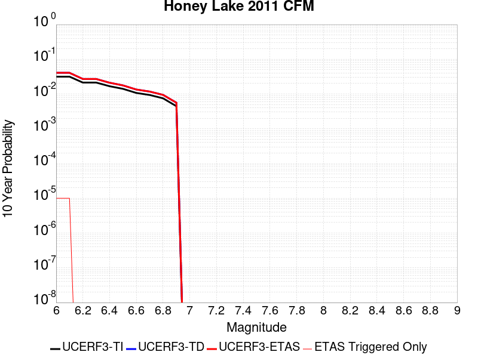 |

| Magnitude | 1 wk TI Prob | 1 wk TD Prob | 1 wk ETAS Prob | 1 wk ETAS/TD Gain | 1 wk ETAS Triggered Only | 1 mo TI Prob | 1 mo TD Prob | 1 mo ETAS Prob | 1 mo ETAS/TD Gain | 1 mo ETAS Triggered Only | 1 yr TI Prob | 1 yr TD Prob | 1 yr ETAS Prob | 1 yr ETAS/TD Gain | 1 yr ETAS Triggered Only | 10 yr TI Prob | 10 yr TD Prob | 10 yr ETAS Prob | 10 yr ETAS/TD Gain | 10 yr ETAS Triggered Only |
|-----|-----|-----|-----|-----|-----|-----|-----|-----|-----|-----|-----|-----|-----|-----|-----|-----|-----|-----|-----|-----|
| 6.0 | 6.155506E-5 | 7.954667E-5 | 7.954667E-5 | 1.0 | 0.0 | 2.6378073E-4 | 3.40873E-4 | 3.40873E-4 | 1.0 | 0.0 | 0.0032068014 | 0.0041427943 | 0.0041427943 | 1.0 | 0.0 | 0.03160919 | 0.040702924 | 0.040719636 | 1.0004106 | 1.7421602E-5 |
| 6.1 | 6.155506E-5 | 7.954667E-5 | 7.954667E-5 | 1.0 | 0.0 | 2.6378073E-4 | 3.40873E-4 | 3.40873E-4 | 1.0 | 0.0 | 0.0032068014 | 0.0041427943 | 0.0041427943 | 1.0 | 0.0 | 0.03160919 | 0.040702924 | 0.040719636 | 1.0004106 | 1.7421602E-5 |
| 6.2 | 4.1335024E-5 | 5.257629E-5 | 5.257629E-5 | 1.0 | 0.0 | 1.7713808E-4 | 2.253086E-4 | 2.253086E-4 | 1.0 | 0.0 | 0.0021545228 | 0.0027398595 | 0.0027398595 | 1.0 | 0.0 | 0.021337535 | 0.027076708 | 0.027076708 | 1.0 | 0.0 |
| 6.3 | 4.1335024E-5 | 5.257629E-5 | 5.257629E-5 | 1.0 | 0.0 | 1.7713808E-4 | 2.253086E-4 | 2.253086E-4 | 1.0 | 0.0 | 0.0021545228 | 0.0027398595 | 0.0027398595 | 1.0 | 0.0 | 0.021337535 | 0.027076708 | 0.027076708 | 1.0 | 0.0 |
| 6.4 | 3.2393702E-5 | 4.0887444E-5 | 4.0887444E-5 | 1.0 | 0.0 | 1.3882275E-4 | 1.7522085E-4 | 1.7522085E-4 | 1.0 | 0.0 | 0.0016888566 | 0.002131335 | 0.002131335 | 1.0 | 0.0 | 0.016760793 | 0.02111982 | 0.02111982 | 1.0 | 0.0 |
| 6.5 | 2.7205504E-5 | 3.4211684E-5 | 3.4211684E-5 | 1.0 | 0.0 | 1.1658981E-4 | 1.4661385E-4 | 1.4661385E-4 | 1.0 | 0.0 | 0.0014185566 | 0.0017836588 | 0.0017836588 | 1.0 | 0.0 | 0.014095354 | 0.017702932 | 0.017702932 | 1.0 | 0.0 |
| 6.6 | 2.069265E-5 | 2.5955307E-5 | 2.5955307E-5 | 1.0 | 0.0 | 8.867977E-5 | 1.1123277E-4 | 1.1123277E-4 | 1.0 | 0.0 | 0.0010791414 | 0.0013535038 | 0.0013535038 | 1.0 | 0.0 | 0.010739161 | 0.013461002 | 0.013461002 | 1.0 | 0.0 |
| 6.7 | 1.8060919E-5 | 2.2656828E-5 | 2.2656828E-5 | 1.0 | 0.0 | 7.7401644E-5 | 9.709754E-5 | 9.709754E-5 | 1.0 | 0.0 | 9.419576E-4 | 0.0011816026 | 0.0011816026 | 1.0 | 0.0 | 0.009379748 | 0.011761238 | 0.011761238 | 1.0 | 0.0 |
| 6.8 | 1.4474663E-5 | 1.818127E-5 | 1.818127E-5 | 1.0 | 0.0 | 6.203279E-5 | 7.791784E-5 | 7.791784E-5 | 1.0 | 0.0 | 7.5498753E-4 | 9.483136E-4 | 9.483136E-4 | 1.0 | 0.0 | 0.007524277 | 0.009450192 | 0.009450192 | 1.0 | 0.0 |
| 6.9 | 8.564552E-6 | 1.0802308E-5 | 1.0802308E-5 | 1.0 | 0.0 | 3.6704707E-5 | 4.6295158E-5 | 4.6295158E-5 | 1.0 | 0.0 | 4.4678818E-4 | 5.635644E-4 | 5.635644E-4 | 1.0 | 0.0 | 0.0044589094 | 0.0056278477 | 0.0056278477 | 1.0 | 0.0 |

## San Gabriel
*[(top)](#table-of-contents)*

| 1 Week | 1 Month | 1 Year | 10 Year |
|-----|-----|-----|-----|
|  |  |  | 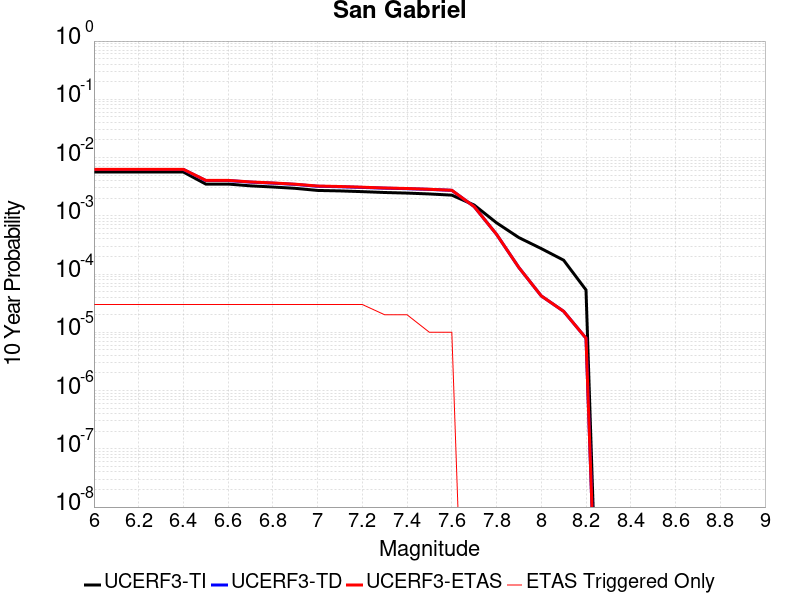 |

| Magnitude | 1 wk TI Prob | 1 wk TD Prob | 1 wk ETAS Prob | 1 wk ETAS/TD Gain | 1 wk ETAS Triggered Only | 1 mo TI Prob | 1 mo TD Prob | 1 mo ETAS Prob | 1 mo ETAS/TD Gain | 1 mo ETAS Triggered Only | 1 yr TI Prob | 1 yr TD Prob | 1 yr ETAS Prob | 1 yr ETAS/TD Gain | 1 yr ETAS Triggered Only | 10 yr TI Prob | 10 yr TD Prob | 10 yr ETAS Prob | 10 yr ETAS/TD Gain | 10 yr ETAS Triggered Only |
|-----|-----|-----|-----|-----|-----|-----|-----|-----|-----|-----|-----|-----|-----|-----|-----|-----|-----|-----|-----|-----|
| 6.0 | 1.083775E-5 | 1.19851875E-5 | 2.9406581E-5 | 2.453577 | 1.7421602E-5 | 4.6446676E-5 | 5.1364143E-5 | 6.878485E-5 | 1.3391609 | 1.7421602E-5 | 5.653415E-4 | 6.251903E-4 | 6.4260105E-4 | 1.0278486 | 1.7421602E-5 | 0.0056390543 | 0.006246409 | 0.0062637217 | 1.0027716 | 1.7421602E-5 |
| 6.1 | 1.083775E-5 | 1.19851875E-5 | 2.9406581E-5 | 2.453577 | 1.7421602E-5 | 4.6446676E-5 | 5.1364143E-5 | 6.878485E-5 | 1.3391609 | 1.7421602E-5 | 5.653415E-4 | 6.251903E-4 | 6.4260105E-4 | 1.0278486 | 1.7421602E-5 | 0.0056390543 | 0.006246409 | 0.0062637217 | 1.0027716 | 1.7421602E-5 |
| 6.2 | 1.083775E-5 | 1.19851875E-5 | 2.9406581E-5 | 2.453577 | 1.7421602E-5 | 4.6446676E-5 | 5.1364143E-5 | 6.878485E-5 | 1.3391609 | 1.7421602E-5 | 5.653415E-4 | 6.251903E-4 | 6.4260105E-4 | 1.0278486 | 1.7421602E-5 | 0.0056390543 | 0.006246409 | 0.0062637217 | 1.0027716 | 1.7421602E-5 |
| 6.3 | 1.083775E-5 | 1.19851875E-5 | 2.9406581E-5 | 2.453577 | 1.7421602E-5 | 4.6446676E-5 | 5.1364143E-5 | 6.878485E-5 | 1.3391609 | 1.7421602E-5 | 5.653415E-4 | 6.251903E-4 | 6.4260105E-4 | 1.0278486 | 1.7421602E-5 | 0.0056390543 | 0.006246409 | 0.0062637217 | 1.0027716 | 1.7421602E-5 |
| 6.4 | 1.083775E-5 | 1.19851875E-5 | 2.9406581E-5 | 2.453577 | 1.7421602E-5 | 4.6446676E-5 | 5.1364143E-5 | 6.878485E-5 | 1.3391609 | 1.7421602E-5 | 5.653415E-4 | 6.251903E-4 | 6.4260105E-4 | 1.0278486 | 1.7421602E-5 | 0.0056390543 | 0.006246409 | 0.0062637217 | 1.0027716 | 1.7421602E-5 |
| 6.5 | 6.7317824E-6 | 7.716944E-6 | 2.5138414E-5 | 3.2575603 | 1.7421602E-5 | 2.8850178E-5 | 3.3072207E-5 | 5.0493232E-5 | 1.5267574 | 1.7421602E-5 | 3.511943E-4 | 4.0258077E-4 | 4.1999537E-4 | 1.0432574 | 1.7421602E-5 | 0.003506398 | 0.0040296097 | 0.004046961 | 1.004306 | 1.7421602E-5 |
| 6.6 | 6.7317824E-6 | 7.716944E-6 | 2.5138414E-5 | 3.2575603 | 1.7421602E-5 | 2.8850178E-5 | 3.3072207E-5 | 5.0493232E-5 | 1.5267574 | 1.7421602E-5 | 3.511943E-4 | 4.0258077E-4 | 4.1999537E-4 | 1.0432574 | 1.7421602E-5 | 0.003506398 | 0.0040296097 | 0.004046961 | 1.004306 | 1.7421602E-5 |
| 6.7 | 6.274881E-6 | 7.2458647E-6 | 2.466734E-5 | 3.4043336 | 1.7421602E-5 | 2.6892068E-5 | 3.1053343E-5 | 4.8474405E-5 | 1.5610044 | 1.7421602E-5 | 3.2736175E-4 | 3.780098E-4 | 3.9542484E-4 | 1.0460702 | 1.7421602E-5 | 0.0032687993 | 0.0037847564 | 0.003802112 | 1.0045856 | 1.7421602E-5 |
| 6.8 | 5.996209E-6 | 6.958585E-6 | 2.4380066E-5 | 3.5035954 | 1.7421602E-5 | 2.5697784E-5 | 2.9822171E-5 | 4.7243255E-5 | 1.5841655 | 1.7421602E-5 | 3.128256E-4 | 3.6302538E-4 | 3.8044064E-4 | 1.0479727 | 1.7421602E-5 | 0.003123856 | 0.0036354093 | 0.0036527675 | 1.0047748 | 1.7421602E-5 |
| 6.9 | 5.686331E-6 | 6.6236316E-6 | 2.4045119E-5 | 3.6302018 | 1.7421602E-5 | 2.4369761E-5 | 2.8386688E-5 | 4.5807796E-5 | 1.613707 | 1.7421602E-5 | 2.9666146E-4 | 3.4555403E-4 | 3.6296961E-4 | 1.0503991 | 1.7421602E-5 | 0.0029626573 | 0.0034612515 | 0.0034786128 | 1.0050159 | 1.7421602E-5 |
| 7.0 | 5.2329838E-6 | 6.147514E-6 | 2.356901E-5 | 3.833909 | 1.7421602E-5 | 2.242688E-5 | 2.6346226E-5 | 4.376737E-5 | 1.6612387 | 1.7421602E-5 | 2.7301308E-4 | 3.2071886E-4 | 3.3813488E-4 | 1.054303 | 1.7421602E-5 | 0.002726779 | 0.0032136322 | 0.0032309976 | 1.0054038 | 1.7421602E-5 |
| 7.1 | 5.135671E-6 | 6.03764E-6 | 2.3459137E-5 | 3.8854814 | 1.7421602E-5 | 2.2009834E-5 | 2.5875348E-5 | 4.32965E-5 | 1.6732721 | 1.7421602E-5 | 2.6793676E-4 | 3.1498758E-4 | 3.324037E-4 | 1.0552914 | 1.7421602E-5 | 0.0026761394 | 0.0031564834 | 0.00317385 | 1.0055019 | 1.7421602E-5 |
| 7.2 | 4.989062E-6 | 5.87102E-6 | 2.3292521E-5 | 3.967372 | 1.7421602E-5 | 2.1381518E-5 | 2.5161276E-5 | 4.258244E-5 | 1.69238 | 1.7421602E-5 | 2.6028889E-4 | 3.0629625E-4 | 3.237125E-4 | 1.0568608 | 1.7421602E-5 | 0.0025998424 | 0.003069813 | 0.003087181 | 1.0056577 | 1.7421602E-5 |
| 7.3 | 4.8219395E-6 | 5.702574E-6 | 2.3124077E-5 | 4.0550246 | 1.7421602E-5 | 2.0665291E-5 | 2.443938E-5 | 4.1860556E-5 | 1.7128322 | 1.7421602E-5 | 2.5157086E-4 | 2.9750957E-4 | 3.1492597E-4 | 1.0585407 | 1.7421602E-5 | 0.0025128627 | 0.0029821852 | 0.0029995549 | 1.0058244 | 1.7421602E-5 |
| 7.4 | 4.7118383E-6 | 5.5911332E-6 | 2.3012639E-5 | 4.1159167 | 1.7421602E-5 | 2.0193436E-5 | 2.3961782E-5 | 4.138297E-5 | 1.7270404 | 1.7421602E-5 | 2.4582737E-4 | 2.916964E-4 | 3.0911292E-4 | 1.0597076 | 1.7421602E-5 | 0.002455556 | 0.0029242067 | 0.0029415775 | 1.0059403 | 1.7421602E-5 |
| 7.5 | 4.5506545E-6 | 5.4365014E-6 | 5.4365014E-6 | 1.0 | 0.0 | 1.9502659E-5 | 2.3299088E-5 | 2.3299088E-5 | 1.0 | 0.0 | 2.37419E-4 | 2.8363022E-4 | 2.8363022E-4 | 1.0 | 0.0 | 0.002371655 | 0.002843753 | 0.002843753 | 1.0 | 0.0 |
| 7.6 | 4.343636E-6 | 5.2293817E-6 | 5.2293817E-6 | 1.0 | 0.0 | 1.861545E-5 | 2.2411448E-5 | 2.2411448E-5 | 1.0 | 0.0 | 2.2661954E-4 | 2.7282597E-4 | 2.7282597E-4 | 1.0 | 0.0 | 0.0022638857 | 0.0027359722 | 0.0027359722 | 1.0 | 0.0 |
| 7.7 | 2.936235E-6 | 2.7440458E-6 | 2.7440458E-6 | 1.0 | 0.0 | 1.2583803E-5 | 1.1760143E-5 | 1.1760143E-5 | 1.0 | 0.0 | 1.5319703E-4 | 1.4317037E-4 | 1.4317037E-4 | 1.0 | 0.0 | 0.0015309147 | 0.0014380751 | 0.0014380751 | 1.0 | 0.0 |
| 7.8 | 1.4541639E-6 | 9.1237047E-7 | 9.1237047E-7 | 1.0 | 0.0 | 6.232116E-6 | 3.9101533E-6 | 3.9101533E-6 | 1.0 | 0.0 | 7.587337E-5 | 4.7605077E-5 | 4.7605077E-5 | 1.0 | 0.0 | 7.584747E-4 | 4.8085177E-4 | 4.8085177E-4 | 1.0 | 0.0 |
| 7.9 | 8.098958E-7 | 2.41753E-7 | 2.41753E-7 | 1.0 | 0.0 | 3.4709774E-6 | 1.0360839E-6 | 1.0360839E-6 | 1.0 | 0.0 | 4.225833E-5 | 1.2614248E-5 | 1.2614248E-5 | 1.0 | 0.0 | 4.2250296E-4 | 1.2921814E-4 | 1.2921814E-4 | 1.0 | 0.0 |
| 8.0 | 5.2473234E-7 | 7.6792055E-8 | 7.6792055E-8 | 1.0 | 0.0 | 2.248851E-6 | 3.2910876E-7 | 3.2910876E-7 | 1.0 | 0.0 | 2.7379416E-5 | 4.0068917E-6 | 4.0068917E-6 | 1.0 | 0.0 | 2.7376044E-4 | 4.21918E-5 | 4.21918E-5 | 1.0 | 0.0 |
| 8.1 | 3.3162388E-7 | 4.1496126E-8 | 4.1496126E-8 | 1.0 | 0.0 | 1.4212444E-6 | 1.7784053E-7 | 1.7784053E-7 | 1.0 | 0.0 | 1.7303513E-5 | 2.1652063E-6 | 2.1652063E-6 | 1.0 | 0.0 | 1.7302166E-4 | 2.2965523E-5 | 2.2965523E-5 | 1.0 | 0.0 |
| 8.2 | 1.0235345E-7 | 1.4043474E-8 | 1.4043474E-8 | 1.0 | 0.0 | 4.3865757E-7 | 6.0186316E-8 | 6.0186316E-8 | 1.0 | 0.0 | 5.340643E-6 | 7.327681E-7 | 7.327681E-7 | 1.0 | 0.0 | 5.3405143E-5 | 7.9273705E-6 | 7.9273705E-6 | 1.0 | 0.0 |

## Santa Susana East (connector)
*[(top)](#table-of-contents)*

| 1 Week | 1 Month | 1 Year | 10 Year |
|-----|-----|-----|-----|
|  |  |  |  |

| Magnitude | 1 wk TI Prob | 1 wk TD Prob | 1 wk ETAS Prob | 1 wk ETAS/TD Gain | 1 wk ETAS Triggered Only | 1 mo TI Prob | 1 mo TD Prob | 1 mo ETAS Prob | 1 mo ETAS/TD Gain | 1 mo ETAS Triggered Only | 1 yr TI Prob | 1 yr TD Prob | 1 yr ETAS Prob | 1 yr ETAS/TD Gain | 1 yr ETAS Triggered Only | 10 yr TI Prob | 10 yr TD Prob | 10 yr ETAS Prob | 10 yr ETAS/TD Gain | 10 yr ETAS Triggered Only |
|-----|-----|-----|-----|-----|-----|-----|-----|-----|-----|-----|-----|-----|-----|-----|-----|-----|-----|-----|-----|-----|
| 6.0 | 2.858397E-5 | 3.202091E-5 | 4.9441955E-5 | 1.5440521 | 1.7421602E-5 | 1.2249697E-4 | 1.3722685E-4 | 1.5464606E-4 | 1.1269374 | 1.7421602E-5 | 0.0014903803 | 0.0016697381 | 0.0016871307 | 1.0104163 | 1.7421602E-5 | 0.014804244 | 0.016599052 | 0.016616184 | 1.0010321 | 1.7421602E-5 |
| 6.1 | 2.858397E-5 | 3.202091E-5 | 4.9441955E-5 | 1.5440521 | 1.7421602E-5 | 1.2249697E-4 | 1.3722685E-4 | 1.5464606E-4 | 1.1269374 | 1.7421602E-5 | 0.0014903803 | 0.0016697381 | 0.0016871307 | 1.0104163 | 1.7421602E-5 | 0.014804244 | 0.016599052 | 0.016616184 | 1.0010321 | 1.7421602E-5 |
| 6.2 | 2.858397E-5 | 3.202091E-5 | 4.9441955E-5 | 1.5440521 | 1.7421602E-5 | 1.2249697E-4 | 1.3722685E-4 | 1.5464606E-4 | 1.1269374 | 1.7421602E-5 | 0.0014903803 | 0.0016697381 | 0.0016871307 | 1.0104163 | 1.7421602E-5 | 0.014804244 | 0.016599052 | 0.016616184 | 1.0010321 | 1.7421602E-5 |
| 6.3 | 1.943582E-5 | 2.036718E-5 | 2.036718E-5 | 1.0 | 0.0 | 8.329371E-5 | 8.7285625E-5 | 8.7285625E-5 | 1.0 | 0.0 | 0.001013629 | 0.0010622967 | 0.0010622967 | 1.0 | 0.0 | 0.010090181 | 0.010583619 | 0.010583619 | 1.0 | 0.0 |
| 6.4 | 1.943582E-5 | 2.036718E-5 | 2.036718E-5 | 1.0 | 0.0 | 8.329371E-5 | 8.7285625E-5 | 8.7285625E-5 | 1.0 | 0.0 | 0.001013629 | 0.0010622967 | 0.0010622967 | 1.0 | 0.0 | 0.010090181 | 0.010583619 | 0.010583619 | 1.0 | 0.0 |
| 6.5 | 1.943582E-5 | 2.036718E-5 | 2.036718E-5 | 1.0 | 0.0 | 8.329371E-5 | 8.7285625E-5 | 8.7285625E-5 | 1.0 | 0.0 | 0.001013629 | 0.0010622967 | 0.0010622967 | 1.0 | 0.0 | 0.010090181 | 0.010583619 | 0.010583619 | 1.0 | 0.0 |
| 6.6 | 1.943582E-5 | 2.036718E-5 | 2.036718E-5 | 1.0 | 0.0 | 8.329371E-5 | 8.7285625E-5 | 8.7285625E-5 | 1.0 | 0.0 | 0.001013629 | 0.0010622967 | 0.0010622967 | 1.0 | 0.0 | 0.010090181 | 0.010583619 | 0.010583619 | 1.0 | 0.0 |
| 6.7 | 1.9404439E-5 | 2.03546E-5 | 2.03546E-5 | 1.0 | 0.0 | 8.3159226E-5 | 8.723172E-5 | 8.723172E-5 | 1.0 | 0.0 | 0.0010119933 | 0.0010616409 | 0.0010616409 | 1.0 | 0.0 | 0.010073971 | 0.010577125 | 0.010577125 | 1.0 | 0.0 |
| 6.8 | 1.2217526E-5 | 1.1592998E-5 | 1.1592998E-5 | 1.0 | 0.0 | 5.2359774E-5 | 4.9683425E-5 | 4.9683425E-5 | 1.0 | 0.0 | 6.372938E-4 | 6.0474465E-4 | 6.0474465E-4 | 1.0 | 0.0 | 0.0063546924 | 0.006033037 | 0.006033037 | 1.0 | 0.0 |
| 6.9 | 1.2217526E-5 | 1.1592998E-5 | 1.1592998E-5 | 1.0 | 0.0 | 5.2359774E-5 | 4.9683425E-5 | 4.9683425E-5 | 1.0 | 0.0 | 6.372938E-4 | 6.0474465E-4 | 6.0474465E-4 | 1.0 | 0.0 | 0.0063546924 | 0.006033037 | 0.006033037 | 1.0 | 0.0 |
| 7.0 | 9.276017E-6 | 8.059113E-6 | 8.059113E-6 | 1.0 | 0.0 | 3.9753755E-5 | 3.4538618E-5 | 3.4538618E-5 | 1.0 | 0.0 | 4.8389446E-4 | 4.2042998E-4 | 4.2042998E-4 | 1.0 | 0.0 | 0.0048284214 | 0.0041970722 | 0.0041970722 | 1.0 | 0.0 |
| 7.1 | 9.130355E-6 | 7.942286E-6 | 7.942286E-6 | 1.0 | 0.0 | 3.9129503E-5 | 3.4037945E-5 | 3.4037945E-5 | 1.0 | 0.0 | 4.7629757E-4 | 4.1433662E-4 | 4.1433662E-4 | 1.0 | 0.0 | 0.00475278 | 0.004136367 | 0.004136367 | 1.0 | 0.0 |
| 7.2 | 8.851015E-6 | 7.741445E-6 | 7.741445E-6 | 1.0 | 0.0 | 3.7932372E-5 | 3.317722E-5 | 3.317722E-5 | 1.0 | 0.0 | 4.6172875E-4 | 4.038612E-4 | 4.038612E-4 | 1.0 | 0.0 | 0.0046077054 | 0.0040319953 | 0.0040319953 | 1.0 | 0.0 |
| 7.3 | 8.573006E-6 | 7.550166E-6 | 7.550166E-6 | 1.0 | 0.0 | 3.6740938E-5 | 3.2357475E-5 | 3.2357475E-5 | 1.0 | 0.0 | 4.472291E-4 | 3.9388443E-4 | 3.9388443E-4 | 1.0 | 0.0 | 0.004463301 | 0.0039325804 | 0.0039325804 | 1.0 | 0.0 |
| 7.4 | 7.852282E-6 | 6.817687E-6 | 6.817687E-6 | 1.0 | 0.0 | 3.36522E-5 | 2.9218349E-5 | 2.9218349E-5 | 1.0 | 0.0 | 4.096385E-4 | 3.5567835E-4 | 3.5567835E-4 | 1.0 | 0.0 | 0.0040888423 | 0.0035517553 | 0.0035517553 | 1.0 | 0.0 |
| 7.5 | 4.8869324E-6 | 4.279055E-6 | 4.279055E-6 | 1.0 | 0.0 | 2.0943828E-5 | 1.8338687E-5 | 1.8338687E-5 | 1.0 | 0.0 | 2.5496128E-4 | 2.232523E-4 | 2.232523E-4 | 1.0 | 0.0 | 0.0025466895 | 0.0022304445 | 0.0022304445 | 1.0 | 0.0 |
| 7.6 | 1.3894544E-6 | 1.1568179E-6 | 1.1568179E-6 | 1.0 | 0.0 | 5.954791E-6 | 4.957783E-6 | 4.957783E-6 | 1.0 | 0.0 | 7.249717E-5 | 6.0359558E-5 | 6.0359558E-5 | 1.0 | 0.0 | 7.247352E-4 | 6.0345343E-4 | 6.0345343E-4 | 1.0 | 0.0 |
| 7.7 | 2.9924632E-7 | 2.371928E-7 | 2.371928E-7 | 1.0 | 0.0 | 1.2824837E-6 | 1.0165402E-6 | 1.0165402E-6 | 1.0 | 0.0 | 1.5614127E-5 | 1.2376314E-5 | 1.2376314E-5 | 1.0 | 0.0 | 1.5613029E-4 | 1.2375697E-4 | 1.2375697E-4 | 1.0 | 0.0 |
| 7.8 | 4.8188564E-8 | 2.6323061E-8 | 2.6323061E-8 | 1.0 | 0.0 | 2.065224E-7 | 1.1281311E-7 | 1.1281311E-7 | 1.0 | 0.0 | 2.5144072E-6 | 1.3734989E-6 | 1.3734989E-6 | 1.0 | 0.0 | 2.5143789E-5 | 1.3734912E-5 | 1.3734912E-5 | 1.0 | 0.0 |
| 7.9 | 2.6127251E-9 | 2.7681102E-9 | 2.7681102E-9 | 1.0 | 0.0 | 1.1197393E-8 | 1.186333E-8 | 1.186333E-8 | 1.0 | 0.0 | 1.3632825E-7 | 1.4443603E-7 | 1.4443603E-7 | 1.0 | 0.0 | 1.3632817E-6 | 1.4443604E-6 | 1.4443604E-6 | 1.0 | 0.0 |

## Cucamonga
*[(top)](#table-of-contents)*

| 1 Week | 1 Month | 1 Year | 10 Year |
|-----|-----|-----|-----|
| 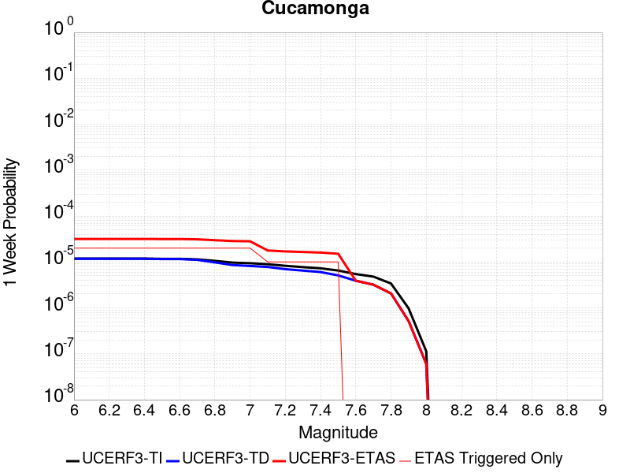 |  |  |  |

| Magnitude | 1 wk TI Prob | 1 wk TD Prob | 1 wk ETAS Prob | 1 wk ETAS/TD Gain | 1 wk ETAS Triggered Only | 1 mo TI Prob | 1 mo TD Prob | 1 mo ETAS Prob | 1 mo ETAS/TD Gain | 1 mo ETAS Triggered Only | 1 yr TI Prob | 1 yr TD Prob | 1 yr ETAS Prob | 1 yr ETAS/TD Gain | 1 yr ETAS Triggered Only | 10 yr TI Prob | 10 yr TD Prob | 10 yr ETAS Prob | 10 yr ETAS/TD Gain | 10 yr ETAS Triggered Only |
|-----|-----|-----|-----|-----|-----|-----|-----|-----|-----|-----|-----|-----|-----|-----|-----|-----|-----|-----|-----|-----|
| 6.0 | 1.1848348E-5 | 1.1737008E-5 | 2.9158407E-5 | 2.4843135 | 1.7421602E-5 | 5.0777642E-5 | 5.030051E-5 | 6.772124E-5 | 1.346333 | 1.7421602E-5 | 6.180424E-4 | 6.1223935E-4 | 6.2965025E-4 | 1.0284381 | 1.7421602E-5 | 0.0061632637 | 0.0061067017 | 0.006124017 | 1.0028354 | 1.7421602E-5 |
| 6.1 | 1.1848348E-5 | 1.1737008E-5 | 2.9158407E-5 | 2.4843135 | 1.7421602E-5 | 5.0777642E-5 | 5.030051E-5 | 6.772124E-5 | 1.346333 | 1.7421602E-5 | 6.180424E-4 | 6.1223935E-4 | 6.2965025E-4 | 1.0284381 | 1.7421602E-5 | 0.0061632637 | 0.0061067017 | 0.006124017 | 1.0028354 | 1.7421602E-5 |
| 6.2 | 1.1848348E-5 | 1.1737008E-5 | 2.9158407E-5 | 2.4843135 | 1.7421602E-5 | 5.0777642E-5 | 5.030051E-5 | 6.772124E-5 | 1.346333 | 1.7421602E-5 | 6.180424E-4 | 6.1223935E-4 | 6.2965025E-4 | 1.0284381 | 1.7421602E-5 | 0.0061632637 | 0.0061067017 | 0.006124017 | 1.0028354 | 1.7421602E-5 |
| 6.3 | 1.1848348E-5 | 1.1737008E-5 | 2.9158407E-5 | 2.4843135 | 1.7421602E-5 | 5.0777642E-5 | 5.030051E-5 | 6.772124E-5 | 1.346333 | 1.7421602E-5 | 6.180424E-4 | 6.1223935E-4 | 6.2965025E-4 | 1.0284381 | 1.7421602E-5 | 0.0061632637 | 0.0061067017 | 0.006124017 | 1.0028354 | 1.7421602E-5 |
| 6.4 | 1.1848348E-5 | 1.1737008E-5 | 2.9158407E-5 | 2.4843135 | 1.7421602E-5 | 5.0777642E-5 | 5.030051E-5 | 6.772124E-5 | 1.346333 | 1.7421602E-5 | 6.180424E-4 | 6.1223935E-4 | 6.2965025E-4 | 1.0284381 | 1.7421602E-5 | 0.0061632637 | 0.0061067017 | 0.006124017 | 1.0028354 | 1.7421602E-5 |
| 6.5 | 1.16988695E-5 | 1.15760395E-5 | 2.899744E-5 | 2.5049536 | 1.7421602E-5 | 5.013705E-5 | 4.9610666E-5 | 6.7031404E-5 | 1.3511491 | 1.7421602E-5 | 6.102476E-4 | 6.0384517E-4 | 6.2125624E-4 | 1.0288337 | 1.7421602E-5 | 0.006085745 | 0.006023216 | 0.0060405326 | 1.002875 | 1.7421602E-5 |
| 6.6 | 1.16988695E-5 | 1.15760395E-5 | 2.899744E-5 | 2.5049536 | 1.7421602E-5 | 5.013705E-5 | 4.9610666E-5 | 6.7031404E-5 | 1.3511491 | 1.7421602E-5 | 6.102476E-4 | 6.0384517E-4 | 6.2125624E-4 | 1.0288337 | 1.7421602E-5 | 0.006085745 | 0.006023216 | 0.0060405326 | 1.002875 | 1.7421602E-5 |
| 6.7 | 1.1397107E-5 | 1.11149475E-5 | 2.8536357E-5 | 2.5673857 | 1.7421602E-5 | 4.884383E-5 | 4.7634636E-5 | 6.505541E-5 | 1.3657166 | 1.7421602E-5 | 5.9451134E-4 | 5.797998E-4 | 5.9721136E-4 | 1.0300303 | 1.7421602E-5 | 0.005929234 | 0.0057840226 | 0.005801344 | 1.0029947 | 1.7421602E-5 |
| 6.8 | 1.058387E-5 | 9.784992E-6 | 2.7206424E-5 | 2.7804239 | 1.7421602E-5 | 4.5358654E-5 | 4.193501E-5 | 5.9355883E-5 | 1.4154255 | 1.7421602E-5 | 5.521017E-4 | 5.1044027E-4 | 5.27853E-4 | 1.0341132 | 1.7421602E-5 | 0.00550732 | 0.0050936877 | 0.0051110205 | 1.0034028 | 1.7421602E-5 |
| 6.9 | 9.690046E-6 | 8.57948E-6 | 2.6000933E-5 | 3.0305955 | 1.7421602E-5 | 4.1528107E-5 | 3.6768684E-5 | 5.4189648E-5 | 1.4737989 | 1.7421602E-5 | 5.054874E-4 | 4.475672E-4 | 4.6498099E-4 | 1.0389076 | 1.7421602E-5 | 0.005043391 | 0.004467594 | 0.004484938 | 1.0038822 | 1.7421602E-5 |
| 7.0 | 9.381461E-6 | 8.187101E-6 | 2.560856E-5 | 3.1279156 | 1.7421602E-5 | 4.020564E-5 | 3.5087105E-5 | 5.2508098E-5 | 1.4965069 | 1.7421602E-5 | 4.893937E-4 | 4.2710215E-4 | 4.445163E-4 | 1.0407728 | 1.7421602E-5 | 0.0048831734 | 0.0042637475 | 0.0042810948 | 1.0040686 | 1.7421602E-5 |
| 7.1 | 8.946492E-6 | 7.781886E-6 | 2.5203353E-5 | 3.2387204 | 1.7421602E-5 | 3.8341543E-5 | 3.3350516E-5 | 5.0771538E-5 | 1.5223614 | 1.7421602E-5 | 4.667083E-4 | 4.0596718E-4 | 4.2338172E-4 | 1.0428964 | 1.7421602E-5 | 0.0046572937 | 0.004053192 | 0.004070543 | 1.0042808 | 1.7421602E-5 |
| 7.2 | 8.251016E-6 | 6.9752796E-6 | 2.439676E-5 | 3.4976032 | 1.7421602E-5 | 3.5361016E-5 | 2.9893714E-5 | 4.7314796E-5 | 1.5827674 | 1.7421602E-5 | 4.3043532E-4 | 3.6389544E-4 | 3.813107E-4 | 1.0478579 | 1.7421602E-5 | 0.0042960253 | 0.0036339292 | 0.0036512874 | 1.0047767 | 1.7421602E-5 |
| 7.3 | 7.717881E-6 | 6.4863502E-6 | 2.390784E-5 | 3.6858695 | 1.7421602E-5 | 3.3076216E-5 | 2.7798349E-5 | 4.521947E-5 | 1.6266961 | 1.7421602E-5 | 4.026285E-4 | 3.3839257E-4 | 3.5580827E-4 | 1.051466 | 1.7421602E-5 | 0.004018998 | 0.00337971 | 0.0033970727 | 1.0051373 | 1.7421602E-5 |
| 7.4 | 7.275623E-6 | 6.031997E-6 | 2.3453495E-5 | 3.8881807 | 1.7421602E-5 | 3.118087E-5 | 2.585116E-5 | 4.3272314E-5 | 1.6739022 | 1.7421602E-5 | 3.7956095E-4 | 3.1469265E-4 | 3.321088E-4 | 1.0553433 | 1.7421602E-5 | 0.0037891332 | 0.0031434062 | 0.003160773 | 1.0055249 | 1.7421602E-5 |
| 7.5 | 6.5109502E-6 | 5.1006014E-6 | 2.2522116E-5 | 4.4155803 | 1.7421602E-5 | 2.7903774E-5 | 2.1859538E-5 | 3.928076E-5 | 1.796962 | 1.7421602E-5 | 3.3967546E-4 | 2.661075E-4 | 2.8352448E-4 | 1.0654509 | 1.7421602E-5 | 0.0033915674 | 0.002658813 | 0.0026761882 | 1.0065349 | 1.7421602E-5 |
| 7.6 | 5.4495326E-6 | 3.90857E-6 | 3.90857E-6 | 1.0 | 0.0 | 2.335493E-5 | 1.6750908E-5 | 1.6750908E-5 | 1.0 | 0.0 | 2.8430918E-4 | 2.0392328E-4 | 2.0392328E-4 | 1.0 | 0.0 | 0.0028394572 | 0.002038282 | 0.002038282 | 1.0 | 0.0 |
| 7.7 | 4.7997164E-6 | 3.2002547E-6 | 3.2002547E-6 | 1.0 | 0.0 | 2.057005E-5 | 1.3715306E-5 | 1.3715306E-5 | 1.0 | 0.0 | 2.504116E-4 | 1.6697108E-4 | 1.6697108E-4 | 1.0 | 0.0 | 0.002501296 | 0.0016693877 | 0.0016693877 | 1.0 | 0.0 |
| 7.8 | 3.3941733E-6 | 2.0641899E-6 | 2.0641899E-6 | 1.0 | 0.0 | 1.4546376E-5 | 8.846498E-6 | 8.846498E-6 | 1.0 | 0.0 | 1.7708774E-4 | 1.07700806E-4 | 1.07700806E-4 | 1.0 | 0.0 | 0.0017694668 | 0.001076723 | 0.001076723 | 1.0 | 0.0 |
| 7.9 | 9.750552E-7 | 5.155946E-7 | 5.155946E-7 | 1.0 | 0.0 | 4.178801E-6 | 2.2096892E-6 | 2.2096892E-6 | 1.0 | 0.0 | 5.0875715E-5 | 2.690264E-5 | 2.690264E-5 | 1.0 | 0.0 | 5.086407E-4 | 2.6899425E-4 | 2.6899425E-4 | 1.0 | 0.0 |
| 8.0 | 1.133857E-7 | 6.053707E-8 | 6.053707E-8 | 1.0 | 0.0 | 4.8593864E-7 | 2.5944456E-7 | 2.5944456E-7 | 1.0 | 0.0 | 5.9162867E-6 | 3.158733E-6 | 3.158733E-6 | 1.0 | 0.0 | 5.916129E-5 | 3.1586897E-5 | 3.1586897E-5 | 1.0 | 0.0 |

## Newport-Inglewood (Offshore)
*[(top)](#table-of-contents)*

| 1 Week | 1 Month | 1 Year | 10 Year |
|-----|-----|-----|-----|
|  |  |  |  |

| Magnitude | 1 wk TI Prob | 1 wk TD Prob | 1 wk ETAS Prob | 1 wk ETAS/TD Gain | 1 wk ETAS Triggered Only | 1 mo TI Prob | 1 mo TD Prob | 1 mo ETAS Prob | 1 mo ETAS/TD Gain | 1 mo ETAS Triggered Only | 1 yr TI Prob | 1 yr TD Prob | 1 yr ETAS Prob | 1 yr ETAS/TD Gain | 1 yr ETAS Triggered Only | 10 yr TI Prob | 10 yr TD Prob | 10 yr ETAS Prob | 10 yr ETAS/TD Gain | 10 yr ETAS Triggered Only |
|-----|-----|-----|-----|-----|-----|-----|-----|-----|-----|-----|-----|-----|-----|-----|-----|-----|-----|-----|-----|-----|
| 6.0 | 1.9626508E-5 | 1.8965357E-5 | 3.6386627E-5 | 1.918584 | 1.7421602E-5 | 8.411089E-5 | 8.1277634E-5 | 9.869782E-5 | 1.2143294 | 1.7421602E-5 | 0.001023569 | 9.891186E-4 | 0.0010065229 | 1.0175959 | 1.7421602E-5 | 0.010188672 | 0.009848503 | 0.009865753 | 1.0017515 | 1.7421602E-5 |
| 6.1 | 1.331886E-5 | 1.2218092E-5 | 2.9639483E-5 | 2.4258683 | 1.7421602E-5 | 5.707958E-5 | 5.2362207E-5 | 6.97829E-5 | 1.3326958 | 1.7421602E-5 | 6.947222E-4 | 6.3732493E-4 | 6.547354E-4 | 1.0273181 | 1.7421602E-5 | 0.006925544 | 0.006355149 | 0.0063724597 | 1.0027239 | 1.7421602E-5 |
| 6.2 | 1.2250852E-5 | 1.1076029E-5 | 1.1076029E-5 | 1.0 | 0.0 | 5.2502597E-5 | 4.7467838E-5 | 4.7467838E-5 | 1.0 | 0.0 | 6.3903164E-4 | 5.777687E-4 | 5.777687E-4 | 1.0 | 0.0 | 0.006371971 | 0.0057627866 | 0.0057627866 | 1.0 | 0.0 |
| 6.3 | 1.2106258E-5 | 1.0918891E-5 | 1.0918891E-5 | 1.0 | 0.0 | 5.1882926E-5 | 4.6794412E-5 | 4.6794412E-5 | 1.0 | 0.0 | 6.3149154E-4 | 5.69574E-4 | 5.69574E-4 | 1.0 | 0.0 | 0.0062970007 | 0.005681259 | 0.005681259 | 1.0 | 0.0 |
| 6.4 | 1.1348758E-5 | 1.0109362E-5 | 1.0109362E-5 | 1.0 | 0.0 | 4.8636626E-5 | 4.3325123E-5 | 4.3325123E-5 | 1.0 | 0.0 | 5.919901E-4 | 5.273565E-4 | 5.273565E-4 | 1.0 | 0.0 | 0.005904155 | 0.0052611465 | 0.0052611465 | 1.0 | 0.0 |
| 6.5 | 1.100837E-5 | 9.7433895E-6 | 9.7433895E-6 | 1.0 | 0.0 | 4.7177873E-5 | 4.1756717E-5 | 4.1756717E-5 | 1.0 | 0.0 | 5.7423924E-4 | 5.082702E-4 | 5.082702E-4 | 1.0 | 0.0 | 0.005727576 | 0.0050711688 | 0.0050711688 | 1.0 | 0.0 |
| 6.6 | 1.0634696E-5 | 9.345544E-6 | 9.345544E-6 | 1.0 | 0.0 | 4.557647E-5 | 4.0051716E-5 | 4.0051716E-5 | 1.0 | 0.0 | 5.5475225E-4 | 4.8752132E-4 | 4.8752132E-4 | 1.0 | 0.0 | 0.0055336943 | 0.0048646047 | 0.0048646047 | 1.0 | 0.0 |
| 6.7 | 9.9780855E-6 | 8.667911E-6 | 8.667911E-6 | 1.0 | 0.0 | 4.276252E-5 | 3.7147664E-5 | 3.7147664E-5 | 1.0 | 0.0 | 5.205093E-4 | 4.5217964E-4 | 4.5217964E-4 | 1.0 | 0.0 | 0.0051929182 | 0.004512675 | 0.004512675 | 1.0 | 0.0 |
| 6.8 | 9.59546E-6 | 8.27295E-6 | 8.27295E-6 | 1.0 | 0.0 | 4.1122752E-5 | 3.5455025E-5 | 3.5455025E-5 | 1.0 | 0.0 | 5.0055445E-4 | 4.315801E-4 | 4.315801E-4 | 1.0 | 0.0 | 0.004994285 | 0.004307495 | 0.004307495 | 1.0 | 0.0 |
| 6.9 | 9.000614E-6 | 7.70684E-6 | 7.70684E-6 | 1.0 | 0.0 | 3.857349E-5 | 3.30289E-5 | 3.30289E-5 | 1.0 | 0.0 | 4.6953102E-4 | 4.0205332E-4 | 4.0205332E-4 | 1.0 | 0.0 | 0.004685402 | 0.0040133307 | 0.0040133307 | 1.0 | 0.0 |
| 7.0 | 7.4070194E-6 | 6.148904E-6 | 6.148904E-6 | 1.0 | 0.0 | 3.1743984E-5 | 2.635218E-5 | 2.635218E-5 | 1.0 | 0.0 | 3.8641447E-4 | 3.207907E-4 | 3.207907E-4 | 1.0 | 0.0 | 0.0038574322 | 0.0032032963 | 0.0032032963 | 1.0 | 0.0 |
| 7.1 | 6.299615E-6 | 5.0565927E-6 | 5.0565927E-6 | 1.0 | 0.0 | 2.699807E-5 | 2.1670932E-5 | 2.1670932E-5 | 1.0 | 0.0 | 3.2865192E-4 | 2.638118E-4 | 2.638118E-4 | 1.0 | 0.0 | 0.003281663 | 0.002635001 | 0.002635001 | 1.0 | 0.0 |
| 7.2 | 5.096653E-6 | 3.892769E-6 | 3.892769E-6 | 1.0 | 0.0 | 2.1842614E-5 | 1.668319E-5 | 1.668319E-5 | 1.0 | 0.0 | 2.6590136E-4 | 2.0309901E-4 | 2.0309901E-4 | 1.0 | 0.0 | 0.0026558342 | 0.0020291451 | 0.0020291451 | 1.0 | 0.0 |
| 7.3 | 3.9753018E-6 | 2.9099103E-6 | 2.9099103E-6 | 1.0 | 0.0 | 1.7036897E-5 | 1.2470985E-5 | 1.2470985E-5 | 1.0 | 0.0 | 2.0740448E-4 | 1.5182374E-4 | 1.5182374E-4 | 1.0 | 0.0 | 0.00207211 | 0.0015172083 | 0.0015172083 | 1.0 | 0.0 |
| 7.4 | 3.0568392E-6 | 2.1449955E-6 | 2.1449955E-6 | 1.0 | 0.0 | 1.3100675E-5 | 9.192806E-6 | 9.192806E-6 | 1.0 | 0.0 | 1.5948903E-4 | 1.1191672E-4 | 1.1191672E-4 | 1.0 | 0.0 | 0.0015937461 | 0.0011186098 | 0.0011186098 | 1.0 | 0.0 |
| 7.5 | 1.7279019E-6 | 1.1469883E-6 | 1.1469883E-6 | 1.0 | 0.0 | 7.405273E-6 | 4.915655E-6 | 4.915655E-6 | 1.0 | 0.0 | 9.015547E-5 | 5.9846494E-5 | 5.9846494E-5 | 1.0 | 0.0 | 9.01189E-4 | 5.9830764E-4 | 5.9830764E-4 | 1.0 | 0.0 |
| 7.6 | 1.1156416E-6 | 7.223012E-7 | 7.223012E-7 | 1.0 | 0.0 | 4.7813123E-6 | 3.095573E-6 | 3.095573E-6 | 1.0 | 0.0 | 5.821092E-5 | 3.7687976E-5 | 3.7687976E-5 | 1.0 | 0.0 | 5.8195676E-4 | 3.7681818E-4 | 3.7681818E-4 | 1.0 | 0.0 |
| 7.7 | 9.117973E-8 | 6.734145E-8 | 6.734145E-8 | 1.0 | 0.0 | 3.907702E-7 | 2.886062E-7 | 2.886062E-7 | 1.0 | 0.0 | 4.757617E-6 | 3.513775E-6 | 3.513775E-6 | 1.0 | 0.0 | 4.7575148E-5 | 3.5137225E-5 | 3.5137225E-5 | 1.0 | 0.0 |

## Ventura-Pitas Point
*[(top)](#table-of-contents)*

| 1 Week | 1 Month | 1 Year | 10 Year |
|-----|-----|-----|-----|
| 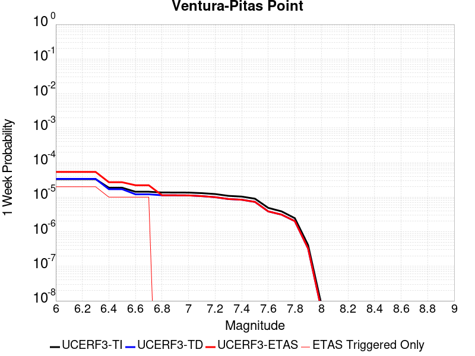 |  |  |  |

| Magnitude | 1 wk TI Prob | 1 wk TD Prob | 1 wk ETAS Prob | 1 wk ETAS/TD Gain | 1 wk ETAS Triggered Only | 1 mo TI Prob | 1 mo TD Prob | 1 mo ETAS Prob | 1 mo ETAS/TD Gain | 1 mo ETAS Triggered Only | 1 yr TI Prob | 1 yr TD Prob | 1 yr ETAS Prob | 1 yr ETAS/TD Gain | 1 yr ETAS Triggered Only | 10 yr TI Prob | 10 yr TD Prob | 10 yr ETAS Prob | 10 yr ETAS/TD Gain | 10 yr ETAS Triggered Only |
|-----|-----|-----|-----|-----|-----|-----|-----|-----|-----|-----|-----|-----|-----|-----|-----|-----|-----|-----|-----|-----|
| 6.0 | 3.3179622E-5 | 3.3735185E-5 | 3.3735185E-5 | 1.0 | 0.0 | 1.4219063E-4 | 1.445728E-4 | 1.445728E-4 | 1.0 | 0.0 | 0.0017297962 | 0.0017590096 | 0.0017764006 | 1.0098867 | 1.7421602E-5 | 0.017163932 | 0.0174764 | 0.017493518 | 1.0009794 | 1.7421602E-5 |
| 6.1 | 3.3179622E-5 | 3.3735185E-5 | 3.3735185E-5 | 1.0 | 0.0 | 1.4219063E-4 | 1.445728E-4 | 1.445728E-4 | 1.0 | 0.0 | 0.0017297962 | 0.0017590096 | 0.0017764006 | 1.0098867 | 1.7421602E-5 | 0.017163932 | 0.0174764 | 0.017493518 | 1.0009794 | 1.7421602E-5 |
| 6.2 | 3.3179622E-5 | 3.3735185E-5 | 3.3735185E-5 | 1.0 | 0.0 | 1.4219063E-4 | 1.445728E-4 | 1.445728E-4 | 1.0 | 0.0 | 0.0017297962 | 0.0017590096 | 0.0017764006 | 1.0098867 | 1.7421602E-5 | 0.017163932 | 0.0174764 | 0.017493518 | 1.0009794 | 1.7421602E-5 |
| 6.3 | 3.3179622E-5 | 3.3735185E-5 | 3.3735185E-5 | 1.0 | 0.0 | 1.4219063E-4 | 1.445728E-4 | 1.445728E-4 | 1.0 | 0.0 | 0.0017297962 | 0.0017590096 | 0.0017764006 | 1.0098867 | 1.7421602E-5 | 0.017163932 | 0.0174764 | 0.017493518 | 1.0009794 | 1.7421602E-5 |
| 6.4 | 1.8754668E-5 | 1.701961E-5 | 1.701961E-5 | 1.0 | 0.0 | 8.037467E-5 | 7.293928E-5 | 7.293928E-5 | 1.0 | 0.0 | 9.781223E-4 | 8.8769704E-4 | 9.0510317E-4 | 1.0196081 | 1.7421602E-5 | 0.009738282 | 0.008843848 | 0.008861115 | 1.0019525 | 1.7421602E-5 |
| 6.5 | 1.8754668E-5 | 1.701961E-5 | 1.701961E-5 | 1.0 | 0.0 | 8.037467E-5 | 7.293928E-5 | 7.293928E-5 | 1.0 | 0.0 | 9.781223E-4 | 8.8769704E-4 | 9.0510317E-4 | 1.0196081 | 1.7421602E-5 | 0.009738282 | 0.008843848 | 0.008861115 | 1.0019525 | 1.7421602E-5 |
| 6.6 | 1.4361558E-5 | 1.2122275E-5 | 1.2122275E-5 | 1.0 | 0.0 | 6.154808E-5 | 5.1951585E-5 | 5.1951585E-5 | 1.0 | 0.0 | 7.490902E-4 | 6.3232926E-4 | 6.497399E-4 | 1.027534 | 1.7421602E-5 | 0.0074657016 | 0.0063055577 | 0.006322869 | 1.0027455 | 1.7421602E-5 |
| 6.7 | 1.4361558E-5 | 1.2122275E-5 | 1.2122275E-5 | 1.0 | 0.0 | 6.154808E-5 | 5.1951585E-5 | 5.1951585E-5 | 1.0 | 0.0 | 7.490902E-4 | 6.3232926E-4 | 6.497399E-4 | 1.027534 | 1.7421602E-5 | 0.0074657016 | 0.0063055577 | 0.006322869 | 1.0027455 | 1.7421602E-5 |
| 6.8 | 1.3663846E-5 | 1.13444175E-5 | 1.13444175E-5 | 1.0 | 0.0 | 5.8558027E-5 | 4.861804E-5 | 4.861804E-5 | 1.0 | 0.0 | 7.127108E-4 | 5.917658E-4 | 6.091771E-4 | 1.0294226 | 1.7421602E-5 | 0.007104293 | 0.005902116 | 0.005919435 | 1.0029343 | 1.7421602E-5 |
| 6.9 | 1.3644157E-5 | 1.1322519E-5 | 1.1322519E-5 | 1.0 | 0.0 | 5.8473648E-5 | 4.8524187E-5 | 4.8524187E-5 | 1.0 | 0.0 | 7.116841E-4 | 5.9062376E-4 | 6.080351E-4 | 1.0294795 | 1.7421602E-5 | 0.007094092 | 0.0058907564 | 0.0059080757 | 1.00294 | 1.7421602E-5 |
| 7.0 | 1.3568845E-5 | 1.1242086E-5 | 1.1242086E-5 | 1.0 | 0.0 | 5.8150898E-5 | 4.817949E-5 | 4.817949E-5 | 1.0 | 0.0 | 7.077572E-4 | 5.864293E-4 | 6.038407E-4 | 1.0296905 | 1.7421602E-5 | 0.007055073 | 0.0058490336 | 0.005866353 | 1.0029612 | 1.7421602E-5 |
| 7.1 | 1.306572E-5 | 1.072054E-5 | 1.072054E-5 | 1.0 | 0.0 | 5.599474E-5 | 4.5944373E-5 | 4.5944373E-5 | 1.0 | 0.0 | 6.815227E-4 | 5.5923103E-4 | 5.7664287E-4 | 1.0311353 | 1.7421602E-5 | 0.0067943637 | 0.0055784425 | 0.0055957665 | 1.0031056 | 1.7421602E-5 |
| 7.2 | 1.232604E-5 | 9.995143E-6 | 9.995143E-6 | 1.0 | 0.0 | 5.2824813E-5 | 4.2835632E-5 | 4.2835632E-5 | 1.0 | 0.0 | 6.429523E-4 | 5.214008E-4 | 5.3881336E-4 | 1.0333956 | 1.7421602E-5 | 0.0064109527 | 0.005201967 | 0.005219298 | 1.0033317 | 1.7421602E-5 |
| 7.3 | 1.0917261E-5 | 8.84384E-6 | 8.84384E-6 | 1.0 | 0.0 | 4.678742E-5 | 3.790163E-5 | 3.790163E-5 | 1.0 | 0.0 | 5.69488E-4 | 4.6135622E-4 | 4.7876977E-4 | 1.0377443 | 1.7421602E-5 | 0.0056803077 | 0.00460415 | 0.0046214913 | 1.0037664 | 1.7421602E-5 |
| 7.4 | 1.039959E-5 | 8.423562E-6 | 8.423562E-6 | 1.0 | 0.0 | 4.456891E-5 | 3.610049E-5 | 3.610049E-5 | 1.0 | 0.0 | 5.424914E-4 | 4.3943635E-4 | 4.568503E-4 | 1.0396279 | 1.7421602E-5 | 0.0054116896 | 0.004385836 | 0.004403181 | 1.0039548 | 1.7421602E-5 |
| 7.5 | 9.015877E-6 | 7.2975445E-6 | 7.2975445E-6 | 1.0 | 0.0 | 3.86389E-5 | 3.1274823E-5 | 3.1274823E-5 | 1.0 | 0.0 | 4.7032707E-4 | 3.8070587E-4 | 3.9812084E-4 | 1.045744 | 1.7421602E-5 | 0.004693329 | 0.0038006818 | 0.0038180372 | 1.0045664 | 1.7421602E-5 |
| 7.6 | 4.900162E-6 | 3.8741155E-6 | 3.8741155E-6 | 1.0 | 0.0 | 2.1000526E-5 | 1.6603248E-5 | 1.6603248E-5 | 1.0 | 0.0 | 2.556514E-4 | 2.0212591E-4 | 2.0212591E-4 | 1.0 | 0.0 | 0.0025535747 | 0.0020194345 | 0.0020194345 | 1.0 | 0.0 |
| 7.7 | 3.8850626E-6 | 3.1267302E-6 | 3.1267302E-6 | 1.0 | 0.0 | 1.6650163E-5 | 1.3400205E-5 | 1.3400205E-5 | 1.0 | 0.0 | 2.0269687E-4 | 1.6313537E-4 | 1.6313537E-4 | 1.0 | 0.0 | 0.002025121 | 0.0016301654 | 0.0016301654 | 1.0 | 0.0 |
| 7.8 | 2.4654719E-6 | 2.029875E-6 | 2.029875E-6 | 1.0 | 0.0 | 1.0566265E-5 | 8.699436E-6 | 8.699436E-6 | 1.0 | 0.0 | 1.2863669E-4 | 1.0591053E-4 | 1.0591053E-4 | 1.0 | 0.0 | 0.0012856225 | 0.0010586053 | 0.0010586053 | 1.0 | 0.0 |
| 7.9 | 4.095894E-7 | 3.2764765E-7 | 3.2764765E-7 | 1.0 | 0.0 | 1.7553821E-6 | 1.4042034E-6 | 1.4042034E-6 | 1.0 | 0.0 | 2.1371567E-5 | 1.7096047E-5 | 1.7096047E-5 | 1.0 | 0.0 | 2.1369511E-4 | 1.7094762E-4 | 1.7094762E-4 | 1.0 | 0.0 |
| 8.0 | 7.791402E-9 | 5.683497E-9 | 5.683497E-9 | 1.0 | 0.0 | 3.3391725E-8 | 2.4357844E-8 | 2.4357844E-8 | 1.0 | 0.0 | 4.0654416E-7 | 2.9655675E-7 | 2.9655675E-7 | 1.0 | 0.0 | 4.065434E-6 | 2.9655655E-6 | 2.9655655E-6 | 1.0 | 0.0 |

## San Diego Trough south
*[(top)](#table-of-contents)*

| 1 Week | 1 Month | 1 Year | 10 Year |
|-----|-----|-----|-----|
|  |  |  |  |

| Magnitude | 1 wk TI Prob | 1 wk TD Prob | 1 wk ETAS Prob | 1 wk ETAS/TD Gain | 1 wk ETAS Triggered Only | 1 mo TI Prob | 1 mo TD Prob | 1 mo ETAS Prob | 1 mo ETAS/TD Gain | 1 mo ETAS Triggered Only | 1 yr TI Prob | 1 yr TD Prob | 1 yr ETAS Prob | 1 yr ETAS/TD Gain | 1 yr ETAS Triggered Only | 10 yr TI Prob | 10 yr TD Prob | 10 yr ETAS Prob | 10 yr ETAS/TD Gain | 10 yr ETAS Triggered Only |
|-----|-----|-----|-----|-----|-----|-----|-----|-----|-----|-----|-----|-----|-----|-----|-----|-----|-----|-----|-----|-----|
| 6.0 | 8.279495E-5 | 1.04241306E-4 | 1.2166109E-4 | 1.1671102 | 1.7421602E-5 | 3.5478722E-4 | 4.4667677E-4 | 4.640906E-4 | 1.0389853 | 1.7421602E-5 | 0.004310982 | 0.0054256152 | 0.0054429425 | 1.0031936 | 1.7421602E-5 | 0.042283054 | 0.05299221 | 0.05300871 | 1.0003114 | 1.7421602E-5 |
| 6.1 | 4.6961468E-5 | 5.772944E-5 | 5.772944E-5 | 1.0 | 0.0 | 2.0124791E-4 | 2.473894E-4 | 2.473894E-4 | 1.0 | 0.0 | 0.00244744 | 0.0030079768 | 0.0030079768 | 1.0 | 0.0 | 0.024206603 | 0.029679462 | 0.029679462 | 1.0 | 0.0 |
| 6.2 | 3.5079658E-5 | 4.214154E-5 | 4.214154E-5 | 1.0 | 0.0 | 1.5033272E-4 | 1.8059435E-4 | 1.8059435E-4 | 1.0 | 0.0 | 0.0018287642 | 0.0021965632 | 0.0021965632 | 1.0 | 0.0 | 0.018137876 | 0.021751117 | 0.021751117 | 1.0 | 0.0 |
| 6.3 | 3.5079658E-5 | 4.214154E-5 | 4.214154E-5 | 1.0 | 0.0 | 1.5033272E-4 | 1.8059435E-4 | 1.8059435E-4 | 1.0 | 0.0 | 0.0018287642 | 0.0021965632 | 0.0021965632 | 1.0 | 0.0 | 0.018137876 | 0.021751117 | 0.021751117 | 1.0 | 0.0 |
| 6.4 | 2.7196904E-5 | 3.2087162E-5 | 3.2087162E-5 | 1.0 | 0.0 | 1.16552954E-4 | 1.3750927E-4 | 1.3750927E-4 | 1.0 | 0.0 | 0.0014181085 | 0.0016729041 | 0.0016729041 | 1.0 | 0.0 | 0.014090929 | 0.016604643 | 0.016604643 | 1.0 | 0.0 |
| 6.5 | 2.5584688E-5 | 3.010164E-5 | 3.010164E-5 | 1.0 | 0.0 | 1.0964406E-4 | 1.2900073E-4 | 1.2900073E-4 | 1.0 | 0.0 | 0.0013340989 | 0.0015694655 | 0.0015694655 | 1.0 | 0.0 | 0.013261181 | 0.015585314 | 0.015585314 | 1.0 | 0.0 |
| 6.6 | 2.2034688E-5 | 2.5742738E-5 | 2.5742738E-5 | 1.0 | 0.0 | 9.443096E-5 | 1.1032141E-4 | 1.1032141E-4 | 1.0 | 0.0 | 0.0011490905 | 0.0013423424 | 0.0013423424 | 1.0 | 0.0 | 0.011431668 | 0.013343317 | 0.013343317 | 1.0 | 0.0 |
| 6.7 | 1.9394853E-5 | 2.254176E-5 | 2.254176E-5 | 1.0 | 0.0 | 8.311815E-5 | 9.6603995E-5 | 9.6603995E-5 | 1.0 | 0.0 | 0.0010114936 | 0.0011755243 | 0.0011755243 | 1.0 | 0.0 | 0.01006902 | 0.011693766 | 0.011693766 | 1.0 | 0.0 |
| 6.8 | 1.7615313E-5 | 2.0403182E-5 | 2.0403182E-5 | 1.0 | 0.0 | 7.549201E-5 | 8.74393E-5 | 8.74393E-5 | 1.0 | 0.0 | 9.1872766E-4 | 0.0010640579 | 0.0010640579 | 1.0 | 0.0 | 0.009149387 | 0.010590198 | 0.010590198 | 1.0 | 0.0 |
| 6.9 | 1.5621423E-5 | 1.8026114E-5 | 1.8026114E-5 | 1.0 | 0.0 | 6.6947236E-5 | 7.725251E-5 | 7.725251E-5 | 1.0 | 0.0 | 8.147778E-4 | 9.40147E-4 | 9.40147E-4 | 1.0 | 0.0 | 0.008117969 | 0.009362142 | 0.009362142 | 1.0 | 0.0 |
| 7.0 | 1.3444376E-5 | 1.544809E-5 | 1.544809E-5 | 1.0 | 0.0 | 5.7617483E-5 | 6.620443E-5 | 6.620443E-5 | 1.0 | 0.0 | 7.0126704E-4 | 8.057436E-4 | 8.057436E-4 | 1.0 | 0.0 | 0.006990582 | 0.008028555 | 0.008028555 | 1.0 | 0.0 |
| 7.1 | 1.2268361E-5 | 1.407303E-5 | 1.407303E-5 | 1.0 | 0.0 | 5.2577634E-5 | 6.0311606E-5 | 6.0311606E-5 | 1.0 | 0.0 | 6.399447E-4 | 7.3404907E-4 | 7.3404907E-4 | 1.0 | 0.0 | 0.0063810493 | 0.0073165493 | 0.0073165493 | 1.0 | 0.0 |
| 7.2 | 1.0922655E-5 | 1.2513563E-5 | 1.2513563E-5 | 1.0 | 0.0 | 4.681054E-5 | 5.3628468E-5 | 5.3628468E-5 | 1.0 | 0.0 | 5.697693E-4 | 6.5273355E-4 | 6.5273355E-4 | 1.0 | 0.0 | 0.0056831064 | 0.0065084435 | 0.0065084435 | 1.0 | 0.0 |
| 7.3 | 6.1106753E-6 | 6.928925E-6 | 6.928925E-6 | 1.0 | 0.0 | 2.6188345E-5 | 2.9695057E-5 | 2.9695057E-5 | 1.0 | 0.0 | 3.1879646E-4 | 3.6147775E-4 | 3.6147775E-4 | 1.0 | 0.0 | 0.0031833951 | 0.003608943 | 0.003608943 | 1.0 | 0.0 |
| 7.4 | 4.933187E-6 | 5.5895525E-6 | 5.5895525E-6 | 1.0 | 0.0 | 2.114206E-5 | 2.3955008E-5 | 2.3955008E-5 | 1.0 | 0.0 | 2.5737417E-4 | 2.9161357E-4 | 2.9161357E-4 | 1.0 | 0.0 | 0.002570763 | 0.0029123505 | 0.0029123505 | 1.0 | 0.0 |
| 7.5 | 1.7489613E-6 | 1.969678E-6 | 1.969678E-6 | 1.0 | 0.0 | 7.495527E-6 | 8.4414505E-6 | 8.4414505E-6 | 1.0 | 0.0 | 9.125422E-5 | 1.02770035E-4 | 1.02770035E-4 | 1.0 | 0.0 | 9.1216754E-4 | 0.0010272472 | 0.0010272472 | 1.0 | 0.0 |
| 7.6 | 1.6988751E-7 | 1.7533823E-7 | 1.7533823E-7 | 1.0 | 0.0 | 7.2808916E-7 | 7.5144936E-7 | 7.5144936E-7 | 1.0 | 0.0 | 8.864449E-6 | 9.14886E-6 | 9.14886E-6 | 1.0 | 0.0 | 8.8640954E-5 | 9.1485024E-5 | 9.1485024E-5 | 1.0 | 0.0 |

## San Juan
*[(top)](#table-of-contents)*

| 1 Week | 1 Month | 1 Year | 10 Year |
|-----|-----|-----|-----|
|  |  |  |  |

| Magnitude | 1 wk TI Prob | 1 wk TD Prob | 1 wk ETAS Prob | 1 wk ETAS/TD Gain | 1 wk ETAS Triggered Only | 1 mo TI Prob | 1 mo TD Prob | 1 mo ETAS Prob | 1 mo ETAS/TD Gain | 1 mo ETAS Triggered Only | 1 yr TI Prob | 1 yr TD Prob | 1 yr ETAS Prob | 1 yr ETAS/TD Gain | 1 yr ETAS Triggered Only | 10 yr TI Prob | 10 yr TD Prob | 10 yr ETAS Prob | 10 yr ETAS/TD Gain | 10 yr ETAS Triggered Only |
|-----|-----|-----|-----|-----|-----|-----|-----|-----|-----|-----|-----|-----|-----|-----|-----|-----|-----|-----|-----|-----|
| 6.0 | 8.682808E-6 | 8.7491635E-6 | 2.6170614E-5 | 2.9912133 | 1.7421602E-5 | 3.72115E-5 | 3.74959E-5 | 5.491685E-5 | 1.4646094 | 1.7421602E-5 | 4.5295584E-4 | 4.564218E-4 | 4.7383548E-4 | 1.0381526 | 1.7421602E-5 | 0.004520337 | 0.004555385 | 0.0045727273 | 1.003807 | 1.7421602E-5 |
| 6.1 | 8.682808E-6 | 8.7491635E-6 | 2.6170614E-5 | 2.9912133 | 1.7421602E-5 | 3.72115E-5 | 3.74959E-5 | 5.491685E-5 | 1.4646094 | 1.7421602E-5 | 4.5295584E-4 | 4.564218E-4 | 4.7383548E-4 | 1.0381526 | 1.7421602E-5 | 0.004520337 | 0.004555385 | 0.0045727273 | 1.003807 | 1.7421602E-5 |
| 6.2 | 8.682808E-6 | 8.7491635E-6 | 2.6170614E-5 | 2.9912133 | 1.7421602E-5 | 3.72115E-5 | 3.74959E-5 | 5.491685E-5 | 1.4646094 | 1.7421602E-5 | 4.5295584E-4 | 4.564218E-4 | 4.7383548E-4 | 1.0381526 | 1.7421602E-5 | 0.004520337 | 0.004555385 | 0.0045727273 | 1.003807 | 1.7421602E-5 |
| 6.3 | 6.3054235E-6 | 6.2825848E-6 | 2.3704079E-5 | 3.7729816 | 1.7421602E-5 | 2.7022963E-5 | 2.6925094E-5 | 4.4346227E-5 | 1.6470222 | 1.7421602E-5 | 3.2895492E-4 | 3.2776513E-4 | 3.45181E-4 | 1.0531353 | 1.7421602E-5 | 0.003284684 | 0.003273017 | 0.0032903815 | 1.0053054 | 1.7421602E-5 |
| 6.4 | 6.1490473E-6 | 6.1144656E-6 | 2.3535962E-5 | 3.8492262 | 1.7421602E-5 | 2.6352795E-5 | 2.6204598E-5 | 4.3625743E-5 | 1.6648126 | 1.7421602E-5 | 3.2079802E-4 | 3.1899565E-4 | 3.364117E-4 | 1.0545965 | 1.7421602E-5 | 0.0032033534 | 0.0031855737 | 0.0032029399 | 1.0054514 | 1.7421602E-5 |
| 6.5 | 5.204848E-6 | 5.137233E-6 | 2.2558746E-5 | 4.391225 | 1.7421602E-5 | 2.23063E-5 | 2.2016533E-5 | 3.9437753E-5 | 1.791279 | 1.7421602E-5 | 2.7154534E-4 | 2.6801927E-4 | 2.8543622E-4 | 1.0649838 | 1.7421602E-5 | 0.0027121378 | 0.0026771144 | 0.0026944894 | 1.0064902 | 1.7421602E-5 |
| 6.6 | 4.5179986E-6 | 4.4150297E-6 | 2.1836555E-5 | 4.9459586 | 1.7421602E-5 | 1.9362706E-5 | 1.8921424E-5 | 3.6342695E-5 | 1.9207168 | 1.7421602E-5 | 2.3571544E-4 | 2.3034477E-4 | 2.4776236E-4 | 1.0756153 | 1.7421602E-5 | 0.0023546559 | 0.0023011973 | 0.0023185788 | 1.0075532 | 1.7421602E-5 |
| 6.7 | 3.9442616E-6 | 3.819828E-6 | 3.819828E-6 | 1.0 | 0.0 | 1.6903869E-5 | 1.6370592E-5 | 1.6370592E-5 | 1.0 | 0.0 | 2.0578515E-4 | 1.992944E-4 | 1.992944E-4 | 1.0 | 0.0 | 0.002055947 | 0.0019912818 | 0.0019912818 | 1.0 | 0.0 |
| 6.8 | 3.4536245E-6 | 3.3163353E-6 | 3.3163353E-6 | 1.0 | 0.0 | 1.4801163E-5 | 1.4212792E-5 | 1.4212792E-5 | 1.0 | 0.0 | 1.8018926E-4 | 1.7302761E-4 | 1.7302761E-4 | 1.0 | 0.0 | 0.0018004322 | 0.0017290477 | 0.0017290477 | 1.0 | 0.0 |
| 6.9 | 3.059865E-6 | 2.9120315E-6 | 2.9120315E-6 | 1.0 | 0.0 | 1.3113641E-5 | 1.2480078E-5 | 1.2480078E-5 | 1.0 | 0.0 | 1.596469E-4 | 1.5193493E-4 | 1.5193493E-4 | 1.0 | 0.0 | 0.0015953224 | 0.0015184252 | 0.0015184252 | 1.0 | 0.0 |
| 7.0 | 2.6504351E-6 | 2.4920002E-6 | 2.4920002E-6 | 1.0 | 0.0 | 1.1358958E-5 | 1.0679961E-5 | 1.0679961E-5 | 1.0 | 0.0 | 1.3828653E-4 | 1.300213E-4 | 1.300213E-4 | 1.0 | 0.0 | 0.0013820052 | 0.0012995641 | 0.0012995641 | 1.0 | 0.0 |
| 7.1 | 2.2039317E-6 | 2.0338296E-6 | 2.0338296E-6 | 1.0 | 0.0 | 9.445387E-6 | 8.716386E-6 | 8.716386E-6 | 1.0 | 0.0 | 1.1499152E-4 | 1.0611736E-4 | 1.0611736E-4 | 1.0 | 0.0 | 0.0011493203 | 0.0010607769 | 0.0010607769 | 1.0 | 0.0 |
| 7.2 | 1.0786707E-6 | 8.7701903E-7 | 8.7701903E-7 | 1.0 | 0.0 | 4.622866E-6 | 3.7586476E-6 | 3.7586476E-6 | 1.0 | 0.0 | 5.628194E-5 | 4.5760586E-5 | 4.5760586E-5 | 1.0 | 0.0 | 5.6267687E-4 | 4.5757066E-4 | 4.5757066E-4 | 1.0 | 0.0 |
| 7.3 | 6.846433E-7 | 4.868805E-7 | 4.868805E-7 | 1.0 | 0.0 | 2.9341822E-6 | 2.086629E-6 | 2.086629E-6 | 1.0 | 0.0 | 3.5723086E-5 | 2.5404412E-5 | 2.5404412E-5 | 1.0 | 0.0 | 3.571734E-4 | 2.540486E-4 | 2.540486E-4 | 1.0 | 0.0 |
| 7.4 | 5.23043E-7 | 3.2628162E-7 | 3.2628162E-7 | 1.0 | 0.0 | 2.2416111E-6 | 1.398349E-6 | 1.398349E-6 | 1.0 | 0.0 | 2.7291273E-5 | 1.7024766E-5 | 1.7024766E-5 | 1.0 | 0.0 | 2.7287923E-4 | 1.7026656E-4 | 1.7026656E-4 | 1.0 | 0.0 |
| 7.5 | 4.648444E-7 | 2.7234944E-7 | 2.7234944E-7 | 1.0 | 0.0 | 1.9921886E-6 | 1.1672114E-6 | 1.1672114E-6 | 1.0 | 0.0 | 2.4254627E-5 | 1.42107065E-5 | 1.42107065E-5 | 1.0 | 0.0 | 2.425198E-4 | 1.421276E-4 | 1.421276E-4 | 1.0 | 0.0 |
| 7.6 | 3.9906567E-7 | 2.2083314E-7 | 2.2083314E-7 | 1.0 | 0.0 | 1.7102802E-6 | 9.464274E-7 | 9.464274E-7 | 1.0 | 0.0 | 2.0822463E-5 | 1.1522693E-5 | 1.1522693E-5 | 1.0 | 0.0 | 2.0820512E-4 | 1.15245566E-4 | 1.15245566E-4 | 1.0 | 0.0 |
| 7.7 | 1.8784601E-7 | 5.3666906E-8 | 5.3666906E-8 | 1.0 | 0.0 | 8.0505407E-7 | 2.30001E-7 | 2.30001E-7 | 1.0 | 0.0 | 9.80149E-6 | 2.8002585E-6 | 2.8002585E-6 | 1.0 | 0.0 | 9.801057E-5 | 2.8011282E-5 | 2.8011282E-5 | 1.0 | 0.0 |
| 7.8 | 1.00154914E-7 | 1.2415832E-8 | 1.2415832E-8 | 1.0 | 0.0 | 4.2923529E-7 | 5.3210716E-8 | 5.3210716E-8 | 1.0 | 0.0 | 5.225927E-6 | 6.4784024E-7 | 6.4784024E-7 | 1.0 | 0.0 | 5.225804E-5 | 6.484273E-6 | 6.484273E-6 | 1.0 | 0.0 |
| 7.9 | 6.171429E-8 | 4.2966155E-9 | 4.2966155E-9 | 1.0 | 0.0 | 2.6448978E-7 | 1.8414067E-8 | 1.8414067E-8 | 1.0 | 0.0 | 3.2201583E-6 | 2.2419121E-7 | 2.2419121E-7 | 1.0 | 0.0 | 3.2201115E-5 | 2.2472002E-6 | 2.2472002E-6 | 1.0 | 0.0 |
| 8.0 | 1.3974572E-8 | 3.3788217E-10 | 3.3788217E-10 | 1.0 | 0.0 | 5.989102E-8 | 1.448067E-9 | 1.448067E-9 | 1.0 | 0.0 | 7.2917294E-7 | 1.763022E-8 | 1.763022E-8 | 1.0 | 0.0 | 7.2917055E-6 | 1.8060365E-7 | 1.8060365E-7 | 1.0 | 0.0 |
| 8.1 | 1.8403477E-9 | 1.1302803E-10 | 1.1302803E-10 | 1.0 | 0.0 | 7.887204E-9 | 4.844063E-10 | 4.844063E-10 | 1.0 | 0.0 | 9.602671E-8 | 5.8976446E-9 | 5.8976446E-9 | 1.0 | 0.0 | 9.602667E-7 | 6.021993E-8 | 6.021993E-8 | 1.0 | 0.0 |

## Red Mountain
*[(top)](#table-of-contents)*

| 1 Week | 1 Month | 1 Year | 10 Year |
|-----|-----|-----|-----|
|  |  |  |  |

| Magnitude | 1 wk TI Prob | 1 wk TD Prob | 1 wk ETAS Prob | 1 wk ETAS/TD Gain | 1 wk ETAS Triggered Only | 1 mo TI Prob | 1 mo TD Prob | 1 mo ETAS Prob | 1 mo ETAS/TD Gain | 1 mo ETAS Triggered Only | 1 yr TI Prob | 1 yr TD Prob | 1 yr ETAS Prob | 1 yr ETAS/TD Gain | 1 yr ETAS Triggered Only | 10 yr TI Prob | 10 yr TD Prob | 10 yr ETAS Prob | 10 yr ETAS/TD Gain | 10 yr ETAS Triggered Only |
|-----|-----|-----|-----|-----|-----|-----|-----|-----|-----|-----|-----|-----|-----|-----|-----|-----|-----|-----|-----|-----|
| 6.0 | 4.1810763E-5 | 4.7589947E-5 | 4.7589947E-5 | 1.0 | 0.0 | 1.7917668E-4 | 2.039419E-4 | 2.039419E-4 | 1.0 | 0.0 | 0.0021792934 | 0.0024803306 | 0.0024803306 | 1.0 | 0.0 | 0.021580452 | 0.024544092 | 0.024561085 | 1.0006924 | 1.7421602E-5 |
| 6.1 | 4.1810763E-5 | 4.7589947E-5 | 4.7589947E-5 | 1.0 | 0.0 | 1.7917668E-4 | 2.039419E-4 | 2.039419E-4 | 1.0 | 0.0 | 0.0021792934 | 0.0024803306 | 0.0024803306 | 1.0 | 0.0 | 0.021580452 | 0.024544092 | 0.024561085 | 1.0006924 | 1.7421602E-5 |
| 6.2 | 4.1810763E-5 | 4.7589947E-5 | 4.7589947E-5 | 1.0 | 0.0 | 1.7917668E-4 | 2.039419E-4 | 2.039419E-4 | 1.0 | 0.0 | 0.0021792934 | 0.0024803306 | 0.0024803306 | 1.0 | 0.0 | 0.021580452 | 0.024544092 | 0.024561085 | 1.0006924 | 1.7421602E-5 |
| 6.3 | 4.1810763E-5 | 4.7589947E-5 | 4.7589947E-5 | 1.0 | 0.0 | 1.7917668E-4 | 2.039419E-4 | 2.039419E-4 | 1.0 | 0.0 | 0.0021792934 | 0.0024803306 | 0.0024803306 | 1.0 | 0.0 | 0.021580452 | 0.024544092 | 0.024561085 | 1.0006924 | 1.7421602E-5 |
| 6.4 | 4.1810763E-5 | 4.7589947E-5 | 4.7589947E-5 | 1.0 | 0.0 | 1.7917668E-4 | 2.039419E-4 | 2.039419E-4 | 1.0 | 0.0 | 0.0021792934 | 0.0024803306 | 0.0024803306 | 1.0 | 0.0 | 0.021580452 | 0.024544092 | 0.024561085 | 1.0006924 | 1.7421602E-5 |
| 6.5 | 3.154503E-5 | 3.5359728E-5 | 3.5359728E-5 | 1.0 | 0.0 | 1.3518598E-4 | 1.5153342E-4 | 1.5153342E-4 | 1.0 | 0.0 | 0.0016446467 | 0.0018434501 | 0.0018434501 | 1.0 | 0.0 | 0.01632528 | 0.018291233 | 0.018308338 | 1.0009351 | 1.7421602E-5 |
| 6.6 | 3.1535834E-5 | 3.534911E-5 | 3.534911E-5 | 1.0 | 0.0 | 1.3514658E-4 | 1.5148791E-4 | 1.5148791E-4 | 1.0 | 0.0 | 0.0016441676 | 0.001842897 | 0.001842897 | 1.0 | 0.0 | 0.01632056 | 0.018285794 | 0.018302897 | 1.0009353 | 1.7421602E-5 |
| 6.7 | 2.8267326E-5 | 3.146934E-5 | 3.146934E-5 | 1.0 | 0.0 | 1.2114006E-4 | 1.348621E-4 | 1.348621E-4 | 1.0 | 0.0 | 0.0014738824 | 0.0016407946 | 0.0016407946 | 1.0 | 0.0 | 0.014641452 | 0.016295563 | 0.016312702 | 1.0010517 | 1.7421602E-5 |
| 6.8 | 2.8212884E-5 | 3.1407224E-5 | 3.1407224E-5 | 1.0 | 0.0 | 1.20906756E-4 | 1.3459593E-4 | 1.3459593E-4 | 1.0 | 0.0 | 0.0014710457 | 0.0016375587 | 0.0016375587 | 1.0 | 0.0 | 0.014613459 | 0.01626368 | 0.016280819 | 1.0010538 | 1.7421602E-5 |
| 6.9 | 2.4227871E-5 | 2.6706979E-5 | 2.6706979E-5 | 1.0 | 0.0 | 1.03829596E-4 | 1.14453884E-4 | 1.14453884E-4 | 1.0 | 0.0 | 0.0012633923 | 0.0013926612 | 0.0013926612 | 1.0 | 0.0 | 0.012562336 | 0.013847026 | 0.013864206 | 1.0012407 | 1.7421602E-5 |
| 7.0 | 2.348524E-5 | 2.5835763E-5 | 2.5835763E-5 | 1.0 | 0.0 | 1.0064714E-4 | 1.1072042E-4 | 1.1072042E-4 | 1.0 | 0.0 | 0.0012246901 | 0.0013472632 | 0.0013472632 | 1.0 | 0.0 | 0.012179627 | 0.01339859 | 0.013415778 | 1.0012828 | 1.7421602E-5 |
| 7.1 | 2.2311642E-5 | 2.4462828E-5 | 2.4462828E-5 | 1.0 | 0.0 | 9.561782E-5 | 1.048369E-4 | 1.048369E-4 | 1.0 | 0.0 | 0.0011635252 | 0.0012757168 | 0.0012757168 | 1.0 | 0.0 | 0.01157452 | 0.012691451 | 0.012708652 | 1.0013553 | 1.7421602E-5 |
| 7.2 | 1.6533986E-5 | 1.7670347E-5 | 1.7670347E-5 | 1.0 | 0.0 | 7.085802E-5 | 7.572822E-5 | 7.572822E-5 | 1.0 | 0.0 | 8.623549E-4 | 9.216645E-4 | 9.216645E-4 | 1.0 | 0.0 | 0.008590161 | 0.009184699 | 0.009184699 | 1.0 | 0.0 |
| 7.3 | 1.4703092E-5 | 1.555952E-5 | 1.555952E-5 | 1.0 | 0.0 | 6.301173E-5 | 6.66823E-5 | 6.66823E-5 | 1.0 | 0.0 | 7.668978E-4 | 8.1161625E-4 | 8.1161625E-4 | 1.0 | 0.0 | 0.0076425658 | 0.008092596 | 0.008092596 | 1.0 | 0.0 |
| 7.4 | 6.1331984E-6 | 5.528872E-6 | 5.528872E-6 | 1.0 | 0.0 | 2.6284872E-5 | 2.3694953E-5 | 2.3694953E-5 | 1.0 | 0.0 | 3.199713E-4 | 2.8844838E-4 | 2.8844838E-4 | 1.0 | 0.0 | 0.0031951098 | 0.0028807942 | 0.0028807942 | 1.0 | 0.0 |
| 7.5 | 5.954766E-6 | 5.3385015E-6 | 5.3385015E-6 | 1.0 | 0.0 | 2.5520176E-5 | 2.2879094E-5 | 2.2879094E-5 | 1.0 | 0.0 | 3.1066386E-4 | 2.785179E-4 | 2.785179E-4 | 1.0 | 0.0 | 0.003102299 | 0.0027817423 | 0.0027817423 | 1.0 | 0.0 |
| 7.6 | 4.9726646E-6 | 4.315295E-6 | 4.315295E-6 | 1.0 | 0.0 | 2.1311245E-5 | 1.8493993E-5 | 1.8493993E-5 | 1.0 | 0.0 | 2.5943352E-4 | 2.2514143E-4 | 2.2514143E-4 | 1.0 | 0.0 | 0.0025913084 | 0.002249168 | 0.002249168 | 1.0 | 0.0 |
| 7.7 | 3.3613894E-6 | 2.8526642E-6 | 2.8526642E-6 | 1.0 | 0.0 | 1.4405875E-5 | 1.2225649E-5 | 1.2225649E-5 | 1.0 | 0.0 | 1.7537741E-4 | 1.4883737E-4 | 1.4883737E-4 | 1.0 | 0.0 | 0.0017523908 | 0.0014874031 | 0.0014874031 | 1.0 | 0.0 |
| 7.8 | 1.1828961E-6 | 1.0122756E-6 | 1.0122756E-6 | 1.0 | 0.0 | 5.069545E-6 | 4.338317E-6 | 4.338317E-6 | 1.0 | 0.0 | 6.171996E-5 | 5.281776E-5 | 5.281776E-5 | 1.0 | 0.0 | 6.170282E-4 | 5.2805495E-4 | 5.2805495E-4 | 1.0 | 0.0 |
| 7.9 | 2.2967266E-7 | 1.8618952E-7 | 1.8618952E-7 | 1.0 | 0.0 | 9.843111E-7 | 7.9795484E-7 | 7.9795484E-7 | 1.0 | 0.0 | 1.19839215E-5 | 9.7150605E-6 | 9.7150605E-6 | 1.0 | 0.0 | 1.1983275E-4 | 9.714664E-5 | 9.714664E-5 | 1.0 | 0.0 |

## Almanor 2011 CFM
*[(top)](#table-of-contents)*

| 1 Week | 1 Month | 1 Year | 10 Year |
|-----|-----|-----|-----|
|  |  |  |  |

| Magnitude | 1 wk TI Prob | 1 wk TD Prob | 1 wk ETAS Prob | 1 wk ETAS/TD Gain | 1 wk ETAS Triggered Only | 1 mo TI Prob | 1 mo TD Prob | 1 mo ETAS Prob | 1 mo ETAS/TD Gain | 1 mo ETAS Triggered Only | 1 yr TI Prob | 1 yr TD Prob | 1 yr ETAS Prob | 1 yr ETAS/TD Gain | 1 yr ETAS Triggered Only | 10 yr TI Prob | 10 yr TD Prob | 10 yr ETAS Prob | 10 yr ETAS/TD Gain | 10 yr ETAS Triggered Only |
|-----|-----|-----|-----|-----|-----|-----|-----|-----|-----|-----|-----|-----|-----|-----|-----|-----|-----|-----|-----|-----|
| 6.0 | 6.1479834E-5 | 8.32787E-5 | 1.0069885E-4 | 1.2091789 | 1.7421602E-5 | 2.6345838E-4 | 3.5686578E-4 | 3.7428117E-4 | 1.048801 | 1.7421602E-5 | 0.0032028882 | 0.0043366123 | 0.004353958 | 1.004 | 1.7421602E-5 | 0.031571172 | 0.04258577 | 0.04260245 | 1.0003917 | 1.7421602E-5 |
| 6.1 | 4.4387216E-5 | 5.9770442E-5 | 5.9770442E-5 | 1.0 | 0.0 | 1.9021705E-4 | 2.561381E-4 | 2.561381E-4 | 1.0 | 0.0 | 0.0023134327 | 0.003114426 | 0.003114426 | 1.0 | 0.0 | 0.022894967 | 0.030755036 | 0.030755036 | 1.0 | 0.0 |
| 6.2 | 4.4387216E-5 | 5.9770442E-5 | 5.9770442E-5 | 1.0 | 0.0 | 1.9021705E-4 | 2.561381E-4 | 2.561381E-4 | 1.0 | 0.0 | 0.0023134327 | 0.003114426 | 0.003114426 | 1.0 | 0.0 | 0.022894967 | 0.030755036 | 0.030755036 | 1.0 | 0.0 |
| 6.3 | 2.9523822E-5 | 3.954719E-5 | 3.954719E-5 | 1.0 | 0.0 | 1.2652454E-4 | 1.6947983E-4 | 1.6947983E-4 | 1.0 | 0.0 | 0.0015393476 | 0.0020618725 | 0.0020618725 | 1.0 | 0.0 | 0.015287281 | 0.020460794 | 0.020460794 | 1.0 | 0.0 |
| 6.4 | 2.0512744E-5 | 2.7431617E-5 | 2.7431617E-5 | 1.0 | 0.0 | 8.79088E-5 | 1.175612E-4 | 1.175612E-4 | 1.0 | 0.0 | 0.001069764 | 0.0014307408 | 0.0014307408 | 1.0 | 0.0 | 0.010646289 | 0.014244413 | 0.014244413 | 1.0 | 0.0 |
| 6.5 | 1.6750226E-5 | 2.23913E-5 | 2.23913E-5 | 1.0 | 0.0 | 7.178471E-5 | 9.596152E-5 | 9.596152E-5 | 1.0 | 0.0 | 8.7362836E-4 | 0.0011680633 | 0.0011680633 | 1.0 | 0.0 | 0.008702018 | 0.011649038 | 0.011649038 | 1.0 | 0.0 |
| 6.6 | 1.4745303E-5 | 1.9707952E-5 | 1.9707952E-5 | 1.0 | 0.0 | 6.319262E-5 | 8.446223E-5 | 8.446223E-5 | 1.0 | 0.0 | 7.690986E-4 | 0.0010281964 | 0.0010281964 | 1.0 | 0.0 | 0.0076644225 | 0.010264971 | 0.010264971 | 1.0 | 0.0 |
| 6.7 | 9.951145E-7 | 1.1616347E-6 | 1.1616347E-6 | 1.0 | 0.0 | 4.26477E-6 | 4.9784257E-6 | 4.9784257E-6 | 1.0 | 0.0 | 5.1922336E-5 | 6.0610826E-5 | 6.0610826E-5 | 1.0 | 0.0 | 5.1910203E-4 | 6.059602E-4 | 6.059602E-4 | 1.0 | 0.0 |
| 6.8 | 5.866312E-7 | 6.849384E-7 | 6.849384E-7 | 1.0 | 0.0 | 2.5141312E-6 | 2.9354478E-6 | 2.9354478E-6 | 1.0 | 0.0 | 3.0609117E-5 | 3.5738623E-5 | 3.5738623E-5 | 1.0 | 0.0 | 3.06049E-4 | 3.5734157E-4 | 3.5734157E-4 | 1.0 | 0.0 |

## Great Valley 11
*[(top)](#table-of-contents)*

| 1 Week | 1 Month | 1 Year | 10 Year |
|-----|-----|-----|-----|
|  |  |  |  |

| Magnitude | 1 wk TI Prob | 1 wk TD Prob | 1 wk ETAS Prob | 1 wk ETAS/TD Gain | 1 wk ETAS Triggered Only | 1 mo TI Prob | 1 mo TD Prob | 1 mo ETAS Prob | 1 mo ETAS/TD Gain | 1 mo ETAS Triggered Only | 1 yr TI Prob | 1 yr TD Prob | 1 yr ETAS Prob | 1 yr ETAS/TD Gain | 1 yr ETAS Triggered Only | 10 yr TI Prob | 10 yr TD Prob | 10 yr ETAS Prob | 10 yr ETAS/TD Gain | 10 yr ETAS Triggered Only |
|-----|-----|-----|-----|-----|-----|-----|-----|-----|-----|-----|-----|-----|-----|-----|-----|-----|-----|-----|-----|-----|
| 6.0 | 2.8099583E-5 | 2.9832152E-5 | 4.7253234E-5 | 1.5839701 | 1.7421602E-5 | 1.20421224E-4 | 1.278462E-4 | 1.4526557E-4 | 1.1362526 | 1.7421602E-5 | 0.0014651422 | 0.0015554909 | 0.0015728854 | 1.0111827 | 1.7421602E-5 | 0.0145552 | 0.01545356 | 0.015470712 | 1.00111 | 1.7421602E-5 |
| 6.1 | 2.483194E-5 | 2.590715E-5 | 4.3328302E-5 | 1.6724457 | 1.7421602E-5 | 1.0641825E-4 | 1.11026246E-4 | 1.2844591E-4 | 1.1568968 | 1.7421602E-5 | 0.0012948721 | 0.0013509706 | 0.0013683686 | 1.0128782 | 1.7421602E-5 | 0.012873529 | 0.013433994 | 0.013451181 | 1.0012794 | 1.7421602E-5 |
| 6.2 | 2.483194E-5 | 2.590715E-5 | 4.3328302E-5 | 1.6724457 | 1.7421602E-5 | 1.0641825E-4 | 1.11026246E-4 | 1.2844591E-4 | 1.1568968 | 1.7421602E-5 | 0.0012948721 | 0.0013509706 | 0.0013683686 | 1.0128782 | 1.7421602E-5 | 0.012873529 | 0.013433994 | 0.013451181 | 1.0012794 | 1.7421602E-5 |
| 6.3 | 2.0257901E-5 | 2.0398922E-5 | 3.782017E-5 | 1.8540279 | 1.7421602E-5 | 8.681669E-5 | 8.742122E-5 | 1.048413E-4 | 1.1992661 | 1.7421602E-5 | 0.0010564806 | 0.0010638756 | 0.0010812787 | 1.0163581 | 1.7421602E-5 | 0.01051472 | 0.010592012 | 0.010609249 | 1.0016273 | 1.7421602E-5 |
| 6.4 | 1.8054898E-5 | 1.7780874E-5 | 3.5202167E-5 | 1.9797771 | 1.7421602E-5 | 7.737584E-5 | 7.62017E-5 | 9.362197E-5 | 1.2286074 | 1.7421602E-5 | 9.416436E-4 | 9.2739856E-4 | 9.4480405E-4 | 1.0187681 | 1.7421602E-5 | 0.009376635 | 0.009239036 | 0.009256296 | 1.0018682 | 1.7421602E-5 |
| 6.5 | 1.34804895E-5 | 1.2321055E-5 | 2.9742443E-5 | 2.4139526 | 1.7421602E-5 | 5.777225E-5 | 5.2803476E-5 | 7.022416E-5 | 1.3299154 | 1.7421602E-5 | 7.031501E-4 | 6.4269686E-4 | 6.6010724E-4 | 1.0270896 | 1.7421602E-5 | 0.007009294 | 0.0064088185 | 0.0064261286 | 1.0027009 | 1.7421602E-5 |
| 6.6 | 1.294883E-5 | 1.1732312E-5 | 2.9153709E-5 | 2.4849076 | 1.7421602E-5 | 5.5493805E-5 | 5.028039E-5 | 6.770111E-5 | 1.3464715 | 1.7421602E-5 | 6.754276E-4 | 6.1199587E-4 | 6.2940683E-4 | 1.0284494 | 1.7421602E-5 | 0.006733784 | 0.0061035305 | 0.0061208457 | 1.002837 | 1.7421602E-5 |
| 6.7 | 1.1272237E-5 | 9.811886E-6 | 2.7233318E-5 | 2.7755437 | 1.7421602E-5 | 4.8308695E-5 | 4.2050277E-5 | 5.9471146E-5 | 1.4142867 | 1.7421602E-5 | 5.879996E-4 | 5.118446E-4 | 5.292573E-4 | 1.0340195 | 1.7421602E-5 | 0.005864462 | 0.0051069413 | 0.0051242737 | 1.0033939 | 1.7421602E-5 |
| 6.8 | 9.8337505E-6 | 8.19377E-6 | 2.561523E-5 | 3.1261837 | 1.7421602E-5 | 4.2143965E-5 | 3.5115696E-5 | 5.2536685E-5 | 1.4961027 | 1.7421602E-5 | 5.1298196E-4 | 4.2745177E-4 | 4.4486593E-4 | 1.0407394 | 1.7421602E-5 | 0.005117994 | 0.0042665056 | 0.004283853 | 1.0040659 | 1.7421602E-5 |
| 6.9 | 7.4224813E-6 | 5.4131347E-6 | 5.4131347E-6 | 1.0 | 0.0 | 3.1810247E-5 | 2.319895E-5 | 2.319895E-5 | 1.0 | 0.0 | 3.872209E-4 | 2.8241202E-4 | 2.8241202E-4 | 1.0 | 0.0 | 0.0038654688 | 0.0028206722 | 0.0028206722 | 1.0 | 0.0 |
| 7.0 | 4.4628923E-6 | 2.0110795E-6 | 2.0110795E-6 | 1.0 | 0.0 | 1.912654E-5 | 8.618884E-6 | 8.618884E-6 | 1.0 | 0.0 | 2.3284076E-4 | 1.04929975E-4 | 1.04929975E-4 | 1.0 | 0.0 | 0.0023259693 | 0.0010488159 | 0.0010488159 | 1.0 | 0.0 |
| 7.1 | 3.5546527E-6 | 1.1855836E-6 | 1.1855836E-6 | 1.0 | 0.0 | 1.5234136E-5 | 5.081063E-6 | 5.081063E-6 | 1.0 | 0.0 | 1.8545982E-4 | 6.186026E-5 | 6.186026E-5 | 1.0 | 0.0 | 0.0018530512 | 6.1843713E-4 | 6.1843713E-4 | 1.0 | 0.0 |
| 7.2 | 3.2039936E-6 | 1.1254128E-6 | 1.1254128E-6 | 1.0 | 0.0 | 1.3731329E-5 | 4.823189E-6 | 4.823189E-6 | 1.0 | 0.0 | 1.671661E-4 | 5.8720816E-5 | 5.8720816E-5 | 1.0 | 0.0 | 0.0016704041 | 5.870597E-4 | 5.870597E-4 | 1.0 | 0.0 |
| 7.3 | 2.8120473E-6 | 1.0305612E-6 | 1.0305612E-6 | 1.0 | 0.0 | 1.2051575E-5 | 4.4166836E-6 | 4.4166836E-6 | 1.0 | 0.0 | 1.4671806E-4 | 5.3771862E-5 | 5.3771862E-5 | 1.0 | 0.0 | 0.0014662122 | 5.3759513E-4 | 5.3759513E-4 | 1.0 | 0.0 |
| 7.4 | 2.4837766E-6 | 9.800582E-7 | 9.800582E-7 | 1.0 | 0.0 | 1.0644713E-5 | 4.200243E-6 | 4.200243E-6 | 1.0 | 0.0 | 1.2959167E-4 | 5.1136827E-5 | 5.1136827E-5 | 1.0 | 0.0 | 0.0012951613 | 5.112572E-4 | 5.112572E-4 | 1.0 | 0.0 |
| 7.5 | 1.5002679E-6 | 6.546144E-7 | 6.546144E-7 | 1.0 | 0.0 | 6.4297037E-6 | 2.8054874E-6 | 2.8054874E-6 | 1.0 | 0.0 | 7.827883E-5 | 3.4156317E-5 | 3.4156317E-5 | 1.0 | 0.0 | 7.825126E-4 | 3.4151482E-4 | 3.4151482E-4 | 1.0 | 0.0 |

## Santa Cruz Island
*[(top)](#table-of-contents)*

| 1 Week | 1 Month | 1 Year | 10 Year |
|-----|-----|-----|-----|
| 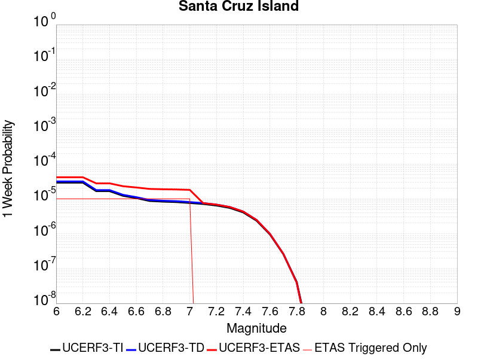 |  |  | 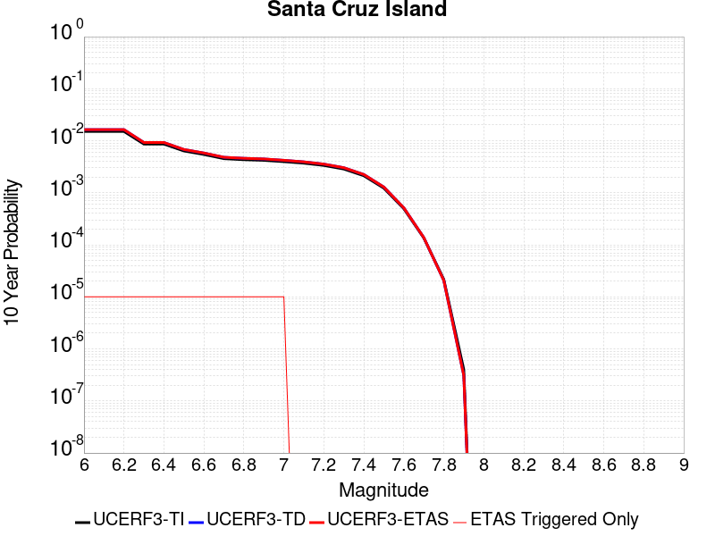 |

| Magnitude | 1 wk TI Prob | 1 wk TD Prob | 1 wk ETAS Prob | 1 wk ETAS/TD Gain | 1 wk ETAS Triggered Only | 1 mo TI Prob | 1 mo TD Prob | 1 mo ETAS Prob | 1 mo ETAS/TD Gain | 1 mo ETAS Triggered Only | 1 yr TI Prob | 1 yr TD Prob | 1 yr ETAS Prob | 1 yr ETAS/TD Gain | 1 yr ETAS Triggered Only | 10 yr TI Prob | 10 yr TD Prob | 10 yr ETAS Prob | 10 yr ETAS/TD Gain | 10 yr ETAS Triggered Only |
|-----|-----|-----|-----|-----|-----|-----|-----|-----|-----|-----|-----|-----|-----|-----|-----|-----|-----|-----|-----|-----|
| 6.0 | 2.9164563E-5 | 3.1599742E-5 | 4.9020797E-5 | 1.5513036 | 1.7421602E-5 | 1.2498499E-4 | 1.3542121E-4 | 1.5284045E-4 | 1.12863 | 1.7421602E-5 | 0.0015206301 | 0.0016476426 | 0.0016650354 | 1.0105562 | 1.7421602E-5 | 0.015102667 | 0.016368 | 0.016385136 | 1.0010469 | 1.7421602E-5 |
| 6.1 | 2.9164563E-5 | 3.1599742E-5 | 4.9020797E-5 | 1.5513036 | 1.7421602E-5 | 1.2498499E-4 | 1.3542121E-4 | 1.5284045E-4 | 1.12863 | 1.7421602E-5 | 0.0015206301 | 0.0016476426 | 0.0016650354 | 1.0105562 | 1.7421602E-5 | 0.015102667 | 0.016368 | 0.016385136 | 1.0010469 | 1.7421602E-5 |
| 6.2 | 2.9164563E-5 | 3.1599742E-5 | 4.9020797E-5 | 1.5513036 | 1.7421602E-5 | 1.2498499E-4 | 1.3542121E-4 | 1.5284045E-4 | 1.12863 | 1.7421602E-5 | 0.0015206301 | 0.0016476426 | 0.0016650354 | 1.0105562 | 1.7421602E-5 | 0.015102667 | 0.016368 | 0.016385136 | 1.0010469 | 1.7421602E-5 |
| 6.3 | 1.6635553E-5 | 1.780436E-5 | 3.522565E-5 | 1.9784847 | 1.7421602E-5 | 7.1293274E-5 | 7.630226E-5 | 9.372254E-5 | 1.228306 | 1.7421602E-5 | 8.6765E-4 | 9.2860236E-4 | 9.460078E-4 | 1.0187436 | 1.7421602E-5 | 0.008642701 | 0.009249094 | 0.009266354 | 1.0018662 | 1.7421602E-5 |
| 6.4 | 1.6635553E-5 | 1.780436E-5 | 3.522565E-5 | 1.9784847 | 1.7421602E-5 | 7.1293274E-5 | 7.630226E-5 | 9.372254E-5 | 1.228306 | 1.7421602E-5 | 8.6765E-4 | 9.2860236E-4 | 9.460078E-4 | 1.0187436 | 1.7421602E-5 | 0.008642701 | 0.009249094 | 0.009266354 | 1.0018662 | 1.7421602E-5 |
| 6.5 | 1.2238748E-5 | 1.3042995E-5 | 3.046437E-5 | 2.335688 | 1.7421602E-5 | 5.2450723E-5 | 5.5897377E-5 | 7.3318006E-5 | 1.3116537 | 1.7421602E-5 | 6.3840044E-4 | 6.8034173E-4 | 6.977515E-4 | 1.0255897 | 1.7421602E-5 | 0.0063656955 | 0.0067829876 | 0.006800291 | 1.002551 | 1.7421602E-5 |
| 6.6 | 1.0489767E-5 | 1.1156636E-5 | 2.8578044E-5 | 2.561529 | 1.7421602E-5 | 4.495537E-5 | 4.781329E-5 | 6.523406E-5 | 1.36435 | 1.7421602E-5 | 5.4719415E-4 | 5.819735E-4 | 5.99385E-4 | 1.029918 | 1.7421602E-5 | 0.005458487 | 0.0058047357 | 0.0058220564 | 1.0029838 | 1.7421602E-5 |
| 6.7 | 8.699222E-6 | 9.236782E-6 | 2.6658225E-5 | 2.8860943 | 1.7421602E-5 | 3.7281847E-5 | 3.958561E-5 | 5.7006524E-5 | 1.440082 | 1.7421602E-5 | 4.5381195E-4 | 4.8184878E-4 | 4.99262E-4 | 1.0361383 | 1.7421602E-5 | 0.0045288634 | 0.004808108 | 0.004825446 | 1.003606 | 1.7421602E-5 |
| 6.8 | 8.307732E-6 | 8.8169045E-6 | 2.6238353E-5 | 2.9759145 | 1.7421602E-5 | 3.560408E-5 | 3.7786187E-5 | 5.5207132E-5 | 1.46104 | 1.7421602E-5 | 4.3339343E-4 | 4.5995016E-4 | 4.7736373E-4 | 1.0378597 | 1.7421602E-5 | 0.004325492 | 0.0045900354 | 0.004607377 | 1.0037781 | 1.7421602E-5 |
| 6.9 | 8.073121E-6 | 8.564939E-6 | 2.5986392E-5 | 3.0340428 | 1.7421602E-5 | 3.459863E-5 | 3.6706366E-5 | 5.412733E-5 | 1.4746033 | 1.7421602E-5 | 4.2115687E-4 | 4.468088E-4 | 4.642226E-4 | 1.0389738 | 1.7421602E-5 | 0.004203596 | 0.004459156 | 0.0044764997 | 1.0038896 | 1.7421602E-5 |
| 7.0 | 7.617019E-6 | 8.074664E-6 | 2.5496127E-5 | 3.1575463 | 1.7421602E-5 | 3.264396E-5 | 3.4605247E-5 | 5.2026247E-5 | 1.5034207 | 1.7421602E-5 | 3.9736772E-4 | 4.212378E-4 | 4.386521E-4 | 1.0413407 | 1.7421602E-5 | 0.003966579 | 0.0042044413 | 0.0042217895 | 1.0041262 | 1.7421602E-5 |
| 7.1 | 7.1224836E-6 | 7.545788E-6 | 7.545788E-6 | 1.0 | 0.0 | 3.052457E-5 | 3.2338692E-5 | 3.2338692E-5 | 1.0 | 0.0 | 3.715733E-4 | 3.936528E-4 | 3.936528E-4 | 1.0 | 0.0 | 0.003709526 | 0.003929598 | 0.003929598 | 1.0 | 0.0 |
| 7.2 | 6.441115E-6 | 6.8273835E-6 | 6.8273835E-6 | 1.0 | 0.0 | 2.7604487E-5 | 2.9259887E-5 | 2.9259887E-5 | 1.0 | 0.0 | 3.360328E-4 | 3.5618112E-4 | 3.5618112E-4 | 1.0 | 0.0 | 0.0033552512 | 0.003556131 | 0.003556131 | 1.0 | 0.0 |
| 7.3 | 5.494274E-6 | 5.8199944E-6 | 5.8199944E-6 | 1.0 | 0.0 | 2.3546674E-5 | 2.4942596E-5 | 2.4942596E-5 | 1.0 | 0.0 | 2.8664304E-4 | 3.0363398E-4 | 3.0363398E-4 | 1.0 | 0.0 | 0.002862736 | 0.0030322142 | 0.0030322142 | 1.0 | 0.0 |
| 7.4 | 4.0802624E-6 | 4.312256E-6 | 4.312256E-6 | 1.0 | 0.0 | 1.7486722E-5 | 1.8480967E-5 | 1.8480967E-5 | 1.0 | 0.0 | 2.1288003E-4 | 2.2498262E-4 | 2.2498262E-4 | 1.0 | 0.0 | 0.0021267622 | 0.0022475575 | 0.0022475575 | 1.0 | 0.0 |
| 7.5 | 2.3584746E-6 | 2.4753094E-6 | 2.4753094E-6 | 1.0 | 0.0 | 1.0107709E-5 | 1.0608426E-5 | 1.0608426E-5 | 1.0 | 0.0 | 1.2305441E-4 | 1.2915E-4 | 1.2915E-4 | 1.0 | 0.0 | 0.0012298629 | 0.0012907543 | 0.0012907543 | 1.0 | 0.0 |
| 7.6 | 9.4981914E-7 | 9.86093E-7 | 9.86093E-7 | 1.0 | 0.0 | 4.0706473E-6 | 4.2261063E-6 | 4.2261063E-6 | 1.0 | 0.0 | 4.9559E-5 | 5.145164E-5 | 5.145164E-5 | 1.0 | 0.0 | 4.954795E-4 | 5.1439856E-4 | 5.1439856E-4 | 1.0 | 0.0 |
| 7.7 | 2.6013532E-7 | 2.6416603E-7 | 2.6416603E-7 | 1.0 | 0.0 | 1.1148652E-6 | 1.1321397E-6 | 1.1321397E-6 | 1.0 | 0.0 | 1.3573399E-5 | 1.3783714E-5 | 1.3783714E-5 | 1.0 | 0.0 | 1.357257E-4 | 1.3782867E-4 | 1.3782867E-4 | 1.0 | 0.0 |
| 7.8 | 4.1522263E-8 | 3.965679E-8 | 3.965679E-8 | 1.0 | 0.0 | 1.7795254E-7 | 1.6995766E-7 | 1.6995766E-7 | 1.0 | 0.0 | 2.16657E-6 | 2.0692328E-6 | 2.0692328E-6 | 1.0 | 0.0 | 2.1665488E-5 | 2.0692156E-5 | 2.0692156E-5 | 1.0 | 0.0 |
| 7.9 | 7.7242046E-10 | 5.9468175E-10 | 5.9468175E-10 | 1.0 | 0.0 | 3.3103735E-9 | 2.5486364E-9 | 2.5486364E-9 | 1.0 | 0.0 | 4.0303796E-8 | 3.1029646E-8 | 3.1029646E-8 | 1.0 | 0.0 | 4.030379E-7 | 3.1029643E-7 | 3.1029643E-7 | 1.0 | 0.0 |

## Malibu Coast alt 1
*[(top)](#table-of-contents)*

| 1 Week | 1 Month | 1 Year | 10 Year |
|-----|-----|-----|-----|
|  |  |  | 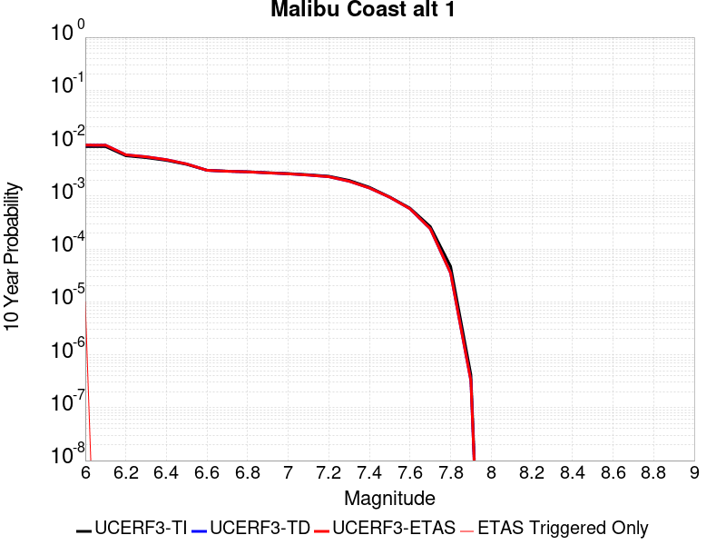 |

| Magnitude | 1 wk TI Prob | 1 wk TD Prob | 1 wk ETAS Prob | 1 wk ETAS/TD Gain | 1 wk ETAS Triggered Only | 1 mo TI Prob | 1 mo TD Prob | 1 mo ETAS Prob | 1 mo ETAS/TD Gain | 1 mo ETAS Triggered Only | 1 yr TI Prob | 1 yr TD Prob | 1 yr ETAS Prob | 1 yr ETAS/TD Gain | 1 yr ETAS Triggered Only | 10 yr TI Prob | 10 yr TD Prob | 10 yr ETAS Prob | 10 yr ETAS/TD Gain | 10 yr ETAS Triggered Only |
|-----|-----|-----|-----|-----|-----|-----|-----|-----|-----|-----|-----|-----|-----|-----|-----|-----|-----|-----|-----|-----|
| 6.0 | 1.6572556E-5 | 1.7598066E-5 | 3.5019362E-5 | 1.9899552 | 1.7421602E-5 | 7.102331E-5 | 7.541821E-5 | 9.28385E-5 | 1.2309825 | 1.7421602E-5 | 8.6436566E-4 | 9.178488E-4 | 9.352544E-4 | 1.0189635 | 1.7421602E-5 | 0.0086101135 | 0.009142512 | 0.0091597745 | 1.0018882 | 1.7421602E-5 |
| 6.1 | 1.6572556E-5 | 1.7598066E-5 | 1.7598066E-5 | 1.0 | 0.0 | 7.102331E-5 | 7.541821E-5 | 7.541821E-5 | 1.0 | 0.0 | 8.6436566E-4 | 9.178488E-4 | 9.178488E-4 | 1.0 | 0.0 | 0.0086101135 | 0.009142512 | 0.009142512 | 1.0 | 0.0 |
| 6.2 | 1.1085717E-5 | 1.1557147E-5 | 1.1557147E-5 | 1.0 | 0.0 | 4.750935E-5 | 4.952971E-5 | 4.952971E-5 | 1.0 | 0.0 | 5.782728E-4 | 6.028609E-4 | 6.028609E-4 | 1.0 | 0.0 | 0.0057677035 | 0.0060126255 | 0.0060126255 | 1.0 | 0.0 |
| 6.3 | 1.0208568E-5 | 1.0592237E-5 | 1.0592237E-5 | 1.0 | 0.0 | 4.375027E-5 | 4.539453E-5 | 4.539453E-5 | 1.0 | 0.0 | 5.325294E-4 | 5.5254117E-4 | 5.5254117E-4 | 1.0 | 0.0 | 0.0053125503 | 0.0055119814 | 0.0055119814 | 1.0 | 0.0 |
| 6.4 | 9.0682315E-6 | 9.342637E-6 | 9.342637E-6 | 1.0 | 0.0 | 3.8863272E-5 | 4.003927E-5 | 4.003927E-5 | 1.0 | 0.0 | 4.730576E-4 | 4.8737114E-4 | 4.8737114E-4 | 1.0 | 0.0 | 0.0047205184 | 0.004863236 | 0.004863236 | 1.0 | 0.0 |
| 6.5 | 7.605796E-6 | 7.748587E-6 | 7.748587E-6 | 1.0 | 0.0 | 3.259586E-5 | 3.3207816E-5 | 3.3207816E-5 | 1.0 | 0.0 | 3.9678233E-4 | 4.0423148E-4 | 4.0423148E-4 | 1.0 | 0.0 | 0.0039607463 | 0.0040351 | 0.0040351 | 1.0 | 0.0 |
| 6.6 | 5.889873E-6 | 5.8795385E-6 | 5.8795385E-6 | 1.0 | 0.0 | 2.5242069E-5 | 2.519778E-5 | 2.519778E-5 | 1.0 | 0.0 | 3.0727885E-4 | 3.0673988E-4 | 3.0673988E-4 | 1.0 | 0.0 | 0.003068543 | 0.0030631777 | 0.0030631777 | 1.0 | 0.0 |
| 6.7 | 5.66586E-6 | 5.641641E-6 | 5.641641E-6 | 1.0 | 0.0 | 2.428203E-5 | 2.417824E-5 | 2.417824E-5 | 1.0 | 0.0 | 2.955936E-4 | 2.9433038E-4 | 2.9433038E-4 | 1.0 | 0.0 | 0.0029520073 | 0.0029394177 | 0.0029394177 | 1.0 | 0.0 |
| 6.8 | 5.521556E-6 | 5.489427E-6 | 5.489427E-6 | 1.0 | 0.0 | 2.3663597E-5 | 2.3525903E-5 | 2.3525903E-5 | 1.0 | 0.0 | 2.880662E-4 | 2.8639034E-4 | 2.8639034E-4 | 1.0 | 0.0 | 0.0028769306 | 0.002860224 | 0.002860224 | 1.0 | 0.0 |
| 6.9 | 5.29752E-6 | 5.2499317E-6 | 5.2499317E-6 | 1.0 | 0.0 | 2.270346E-5 | 2.2499513E-5 | 2.2499513E-5 | 1.0 | 0.0 | 2.7637955E-4 | 2.7389723E-4 | 2.7389723E-4 | 1.0 | 0.0 | 0.0027603607 | 0.0027356069 | 0.0027356069 | 1.0 | 0.0 |
| 7.0 | 5.106743E-6 | 5.0476788E-6 | 5.0476788E-6 | 1.0 | 0.0 | 2.1885859E-5 | 2.163273E-5 | 2.163273E-5 | 1.0 | 0.0 | 2.6642776E-4 | 2.6334674E-4 | 2.6334674E-4 | 1.0 | 0.0 | 0.0026610855 | 0.0026303562 | 0.0026303562 | 1.0 | 0.0 |
| 7.1 | 4.8469647E-6 | 4.770373E-6 | 4.770373E-6 | 1.0 | 0.0 | 2.0772539E-5 | 2.0444295E-5 | 2.0444295E-5 | 1.0 | 0.0 | 2.528763E-4 | 2.4888094E-4 | 2.4888094E-4 | 1.0 | 0.0 | 0.0025258875 | 0.00248603 | 0.00248603 | 1.0 | 0.0 |
| 7.2 | 4.545514E-6 | 4.4481935E-6 | 4.4481935E-6 | 1.0 | 0.0 | 1.9480629E-5 | 1.9063547E-5 | 1.9063547E-5 | 1.0 | 0.0 | 2.3715083E-4 | 2.3207403E-4 | 2.3207403E-4 | 1.0 | 0.0 | 0.0023689792 | 0.0023183243 | 0.0023183243 | 1.0 | 0.0 |
| 7.3 | 3.794097E-6 | 3.6519348E-6 | 3.6519348E-6 | 1.0 | 0.0 | 1.6260314E-5 | 1.5651056E-5 | 1.5651056E-5 | 1.0 | 0.0 | 1.9795135E-4 | 1.9053498E-4 | 1.9053498E-4 | 1.0 | 0.0 | 0.001977751 | 0.0019037209 | 0.0019037209 | 1.0 | 0.0 |
| 7.4 | 2.808217E-6 | 2.719077E-6 | 2.719077E-6 | 1.0 | 0.0 | 1.203516E-5 | 1.1653135E-5 | 1.1653135E-5 | 1.0 | 0.0 | 1.4651821E-4 | 1.418677E-4 | 1.418677E-4 | 1.0 | 0.0 | 0.0014642165 | 0.001417774 | 0.001417774 | 1.0 | 0.0 |
| 7.5 | 1.83809E-6 | 1.8190691E-6 | 1.8190691E-6 | 1.0 | 0.0 | 7.877505E-6 | 7.795988E-6 | 7.795988E-6 | 1.0 | 0.0 | 9.59044E-5 | 9.491203E-5 | 9.491203E-5 | 1.0 | 0.0 | 9.5863023E-4 | 9.48717E-4 | 9.48717E-4 | 1.0 | 0.0 |
| 7.6 | 1.1292672E-6 | 1.1001447E-6 | 1.1001447E-6 | 1.0 | 0.0 | 4.839708E-6 | 4.714897E-6 | 4.714897E-6 | 1.0 | 0.0 | 5.8921847E-5 | 5.7402376E-5 | 5.7402376E-5 | 1.0 | 0.0 | 5.890623E-4 | 5.738771E-4 | 5.738771E-4 | 1.0 | 0.0 |
| 7.7 | 5.065272E-7 | 4.609151E-7 | 4.609151E-7 | 1.0 | 0.0 | 2.170829E-6 | 1.975349E-6 | 1.975349E-6 | 1.0 | 0.0 | 2.6429525E-5 | 2.404962E-5 | 2.404962E-5 | 1.0 | 0.0 | 2.642638E-4 | 2.4047129E-4 | 2.4047129E-4 | 1.0 | 0.0 |
| 7.8 | 8.952991E-8 | 6.707874E-8 | 6.707874E-8 | 1.0 | 0.0 | 3.8369956E-7 | 2.8748025E-7 | 2.8748025E-7 | 1.0 | 0.0 | 4.671532E-6 | 3.5000667E-6 | 3.5000667E-6 | 1.0 | 0.0 | 4.671434E-5 | 3.5000136E-5 | 3.5000136E-5 | 1.0 | 0.0 |
| 7.9 | 8.007447E-10 | 6.1608785E-10 | 6.1608785E-10 | 1.0 | 0.0 | 3.4317629E-9 | 2.6403764E-9 | 2.6403764E-9 | 1.0 | 0.0 | 4.1781714E-8 | 3.2146584E-8 | 3.2146584E-8 | 1.0 | 0.0 | 4.1781706E-7 | 3.214658E-7 | 3.214658E-7 | 1.0 | 0.0 |

## Great Valley 03 Mysterious Ridge
*[(top)](#table-of-contents)*

| 1 Week | 1 Month | 1 Year | 10 Year |
|-----|-----|-----|-----|
|  |  |  |  |

| Magnitude | 1 wk TI Prob | 1 wk TD Prob | 1 wk ETAS Prob | 1 wk ETAS/TD Gain | 1 wk ETAS Triggered Only | 1 mo TI Prob | 1 mo TD Prob | 1 mo ETAS Prob | 1 mo ETAS/TD Gain | 1 mo ETAS Triggered Only | 1 yr TI Prob | 1 yr TD Prob | 1 yr ETAS Prob | 1 yr ETAS/TD Gain | 1 yr ETAS Triggered Only | 10 yr TI Prob | 10 yr TD Prob | 10 yr ETAS Prob | 10 yr ETAS/TD Gain | 10 yr ETAS Triggered Only |
|-----|-----|-----|-----|-----|-----|-----|-----|-----|-----|-----|-----|-----|-----|-----|-----|-----|-----|-----|-----|-----|
| 6.0 | 3.1182444E-5 | 3.603423E-5 | 5.3455205E-5 | 1.4834563 | 1.7421602E-5 | 1.336322E-4 | 1.544242E-4 | 1.7184312E-4 | 1.1127992 | 1.7421602E-5 | 0.0016257578 | 0.0018786696 | 0.0018960586 | 1.009256 | 1.7421602E-5 | 0.016139153 | 0.018646652 | 0.018663747 | 1.0009168 | 1.7421602E-5 |
| 6.1 | 3.1182444E-5 | 3.603423E-5 | 5.3455205E-5 | 1.4834563 | 1.7421602E-5 | 1.336322E-4 | 1.544242E-4 | 1.7184312E-4 | 1.1127992 | 1.7421602E-5 | 0.0016257578 | 0.0018786696 | 0.0018960586 | 1.009256 | 1.7421602E-5 | 0.016139153 | 0.018646652 | 0.018663747 | 1.0009168 | 1.7421602E-5 |
| 6.2 | 3.1182444E-5 | 3.603423E-5 | 5.3455205E-5 | 1.4834563 | 1.7421602E-5 | 1.336322E-4 | 1.544242E-4 | 1.7184312E-4 | 1.1127992 | 1.7421602E-5 | 0.0016257578 | 0.0018786696 | 0.0018960586 | 1.009256 | 1.7421602E-5 | 0.016139153 | 0.018646652 | 0.018663747 | 1.0009168 | 1.7421602E-5 |
| 6.3 | 2.106934E-5 | 2.3850307E-5 | 4.1271494E-5 | 1.7304387 | 1.7421602E-5 | 9.0294045E-5 | 1.0221177E-4 | 1.196316E-4 | 1.1704288 | 1.7421602E-5 | 0.0010987755 | 0.0012437489 | 0.0012611488 | 1.0139899 | 1.7421602E-5 | 0.010933585 | 0.012371127 | 0.012388333 | 1.0013908 | 1.7421602E-5 |
| 6.4 | 2.106934E-5 | 2.3850307E-5 | 4.1271494E-5 | 1.7304387 | 1.7421602E-5 | 9.0294045E-5 | 1.0221177E-4 | 1.196316E-4 | 1.1704288 | 1.7421602E-5 | 0.0010987755 | 0.0012437489 | 0.0012611488 | 1.0139899 | 1.7421602E-5 | 0.010933585 | 0.012371127 | 0.012388333 | 1.0013908 | 1.7421602E-5 |
| 6.5 | 1.9389783E-5 | 2.1884984E-5 | 3.9306204E-5 | 1.7960354 | 1.7421602E-5 | 8.309642E-5 | 9.3789575E-5 | 1.1120954E-4 | 1.1857346 | 1.7421602E-5 | 0.0010112294 | 0.0011413174 | 0.0011587192 | 1.015247 | 1.7421602E-5 | 0.010066401 | 0.011357434 | 0.011374658 | 1.0015165 | 1.7421602E-5 |
| 6.6 | 1.9370193E-5 | 2.1864906E-5 | 3.9286126E-5 | 1.7967664 | 1.7421602E-5 | 8.301247E-5 | 9.370353E-5 | 1.11123496E-4 | 1.1859052 | 1.7421602E-5 | 0.0010102082 | 0.001140271 | 0.0011576726 | 1.015261 | 1.7421602E-5 | 0.010056281 | 0.011347076 | 0.0113643 | 1.0015179 | 1.7421602E-5 |
| 6.7 | 1.6723505E-5 | 1.8799281E-5 | 1.8799281E-5 | 1.0 | 0.0 | 7.16702E-5 | 8.056597E-5 | 8.056597E-5 | 1.0 | 0.0 | 8.722353E-4 | 9.804688E-4 | 9.804688E-4 | 1.0 | 0.0 | 0.008688197 | 0.009763439 | 0.009763439 | 1.0 | 0.0 |
| 6.8 | 1.426937E-5 | 1.599721E-5 | 1.599721E-5 | 1.0 | 0.0 | 6.115301E-5 | 6.855775E-5 | 6.855775E-5 | 1.0 | 0.0 | 7.4428355E-4 | 8.343854E-4 | 8.343854E-4 | 1.0 | 0.0 | 0.007417957 | 0.008314005 | 0.008314005 | 1.0 | 0.0 |
| 6.9 | 1.2469891E-5 | 1.3956928E-5 | 1.3956928E-5 | 1.0 | 0.0 | 5.3441294E-5 | 5.9814105E-5 | 5.9814105E-5 | 1.0 | 0.0 | 6.504535E-4 | 7.280055E-4 | 7.280055E-4 | 1.0 | 0.0 | 0.006485529 | 0.00725743 | 0.00725743 | 1.0 | 0.0 |
| 7.0 | 8.7746275E-6 | 9.791734E-6 | 9.791734E-6 | 1.0 | 0.0 | 3.7605005E-5 | 4.196394E-5 | 4.196394E-5 | 1.0 | 0.0 | 4.5774475E-4 | 5.1079853E-4 | 5.1079853E-4 | 1.0 | 0.0 | 0.00456803 | 0.005096977 | 0.005096977 | 1.0 | 0.0 |
| 7.1 | 6.1067153E-6 | 6.813725E-6 | 6.813725E-6 | 1.0 | 0.0 | 2.6171374E-5 | 2.9201385E-5 | 2.9201385E-5 | 1.0 | 0.0 | 3.1858988E-4 | 3.5547445E-4 | 3.5547445E-4 | 1.0 | 0.0 | 0.0031813353 | 0.003549609 | 0.003549609 | 1.0 | 0.0 |
| 7.2 | 2.939283E-6 | 3.2741057E-6 | 3.2741057E-6 | 1.0 | 0.0 | 1.2596866E-5 | 1.4031816E-5 | 1.4031816E-5 | 1.0 | 0.0 | 1.5335606E-4 | 1.7082572E-4 | 1.7082572E-4 | 1.0 | 0.0 | 0.0015325027 | 0.001707116 | 0.001707116 | 1.0 | 0.0 |
| 7.3 | 7.2387763E-7 | 8.008505E-7 | 8.008505E-7 | 1.0 | 0.0 | 3.102329E-6 | 3.4322145E-6 | 3.4322145E-6 | 1.0 | 0.0 | 3.77702E-5 | 4.178687E-5 | 4.178687E-5 | 1.0 | 0.0 | 3.7763783E-4 | 4.1783508E-4 | 4.1783508E-4 | 1.0 | 0.0 |
| 7.4 | 3.112171E-8 | 3.2068368E-8 | 3.2068368E-8 | 1.0 | 0.0 | 1.3337875E-7 | 1.3743585E-7 | 1.3743585E-7 | 1.0 | 0.0 | 1.6238852E-6 | 1.6732803E-6 | 1.6732803E-6 | 1.0 | 0.0 | 1.6238733E-5 | 1.6732685E-5 | 1.6732685E-5 | 1.0 | 0.0 |

## Verdugo
*[(top)](#table-of-contents)*

| 1 Week | 1 Month | 1 Year | 10 Year |
|-----|-----|-----|-----|
|  |  |  |  |

| Magnitude | 1 wk TI Prob | 1 wk TD Prob | 1 wk ETAS Prob | 1 wk ETAS/TD Gain | 1 wk ETAS Triggered Only | 1 mo TI Prob | 1 mo TD Prob | 1 mo ETAS Prob | 1 mo ETAS/TD Gain | 1 mo ETAS Triggered Only | 1 yr TI Prob | 1 yr TD Prob | 1 yr ETAS Prob | 1 yr ETAS/TD Gain | 1 yr ETAS Triggered Only | 10 yr TI Prob | 10 yr TD Prob | 10 yr ETAS Prob | 10 yr ETAS/TD Gain | 10 yr ETAS Triggered Only |
|-----|-----|-----|-----|-----|-----|-----|-----|-----|-----|-----|-----|-----|-----|-----|-----|-----|-----|-----|-----|-----|
| 6.0 | 5.392987E-6 | 4.216517E-6 | 4.216517E-6 | 1.0 | 0.0 | 2.3112598E-5 | 1.8070665E-5 | 3.5491954E-5 | 1.9640646 | 1.7421602E-5 | 2.8135953E-4 | 2.1998861E-4 | 2.3740638E-4 | 1.0791758 | 1.7421602E-5 | 0.0028100356 | 0.0021977562 | 0.0022151396 | 1.0079095 | 1.7421602E-5 |
| 6.1 | 5.392987E-6 | 4.216517E-6 | 4.216517E-6 | 1.0 | 0.0 | 2.3112598E-5 | 1.8070665E-5 | 3.5491954E-5 | 1.9640646 | 1.7421602E-5 | 2.8135953E-4 | 2.1998861E-4 | 2.3740638E-4 | 1.0791758 | 1.7421602E-5 | 0.0028100356 | 0.0021977562 | 0.0022151396 | 1.0079095 | 1.7421602E-5 |
| 6.2 | 5.392987E-6 | 4.216517E-6 | 4.216517E-6 | 1.0 | 0.0 | 2.3112598E-5 | 1.8070665E-5 | 3.5491954E-5 | 1.9640646 | 1.7421602E-5 | 2.8135953E-4 | 2.1998861E-4 | 2.3740638E-4 | 1.0791758 | 1.7421602E-5 | 0.0028100356 | 0.0021977562 | 0.0022151396 | 1.0079095 | 1.7421602E-5 |
| 6.3 | 5.392987E-6 | 4.216517E-6 | 4.216517E-6 | 1.0 | 0.0 | 2.3112598E-5 | 1.8070665E-5 | 3.5491954E-5 | 1.9640646 | 1.7421602E-5 | 2.8135953E-4 | 2.1998861E-4 | 2.3740638E-4 | 1.0791758 | 1.7421602E-5 | 0.0028100356 | 0.0021977562 | 0.0022151396 | 1.0079095 | 1.7421602E-5 |
| 6.4 | 5.392987E-6 | 4.216517E-6 | 4.216517E-6 | 1.0 | 0.0 | 2.3112598E-5 | 1.8070665E-5 | 3.5491954E-5 | 1.9640646 | 1.7421602E-5 | 2.8135953E-4 | 2.1998861E-4 | 2.3740638E-4 | 1.0791758 | 1.7421602E-5 | 0.0028100356 | 0.0021977562 | 0.0022151396 | 1.0079095 | 1.7421602E-5 |
| 6.5 | 4.9154837E-6 | 3.722465E-6 | 3.722465E-6 | 1.0 | 0.0 | 2.1066187E-5 | 1.5953325E-5 | 3.337465E-5 | 2.0920184 | 1.7421602E-5 | 2.5645064E-4 | 1.9421462E-4 | 2.1163284E-4 | 1.0896854 | 1.7421602E-5 | 0.002561549 | 0.0019404698 | 0.0019578575 | 1.0089606 | 1.7421602E-5 |
| 6.6 | 4.9154837E-6 | 3.722465E-6 | 3.722465E-6 | 1.0 | 0.0 | 2.1066187E-5 | 1.5953325E-5 | 3.337465E-5 | 2.0920184 | 1.7421602E-5 | 2.5645064E-4 | 1.9421462E-4 | 2.1163284E-4 | 1.0896854 | 1.7421602E-5 | 0.002561549 | 0.0019404698 | 0.0019578575 | 1.0089606 | 1.7421602E-5 |
| 6.7 | 4.817006E-6 | 3.6206518E-6 | 3.6206518E-6 | 1.0 | 0.0 | 2.0644147E-5 | 1.5516987E-5 | 3.293832E-5 | 2.1227264 | 1.7421602E-5 | 2.513135E-4 | 1.8890314E-4 | 2.0632145E-4 | 1.0922077 | 1.7421602E-5 | 0.0025102948 | 0.0018874453 | 0.0019048341 | 1.0092129 | 1.7421602E-5 |
| 6.8 | 4.507407E-6 | 3.3071042E-6 | 3.3071042E-6 | 1.0 | 0.0 | 1.9317316E-5 | 1.4173227E-5 | 3.1594584E-5 | 2.2291737 | 1.7421602E-5 | 2.3516294E-4 | 1.7254551E-4 | 1.899641E-4 | 1.1009507 | 1.7421602E-5 | 0.0023491425 | 0.0017241298 | 0.0017415213 | 1.0100871 | 1.7421602E-5 |
| 6.9 | 4.3573054E-6 | 3.161011E-6 | 3.161011E-6 | 1.0 | 0.0 | 1.8674033E-5 | 1.354712E-5 | 3.0968487E-5 | 2.285983 | 1.7421602E-5 | 2.2733262E-4 | 1.6492383E-4 | 1.8234256E-4 | 1.1056168 | 1.7421602E-5 | 0.0022710022 | 0.0016480266 | 0.0016654195 | 1.0105537 | 1.7421602E-5 |
| 7.0 | 4.171527E-6 | 2.9836704E-6 | 2.9836704E-6 | 1.0 | 0.0 | 1.787785E-5 | 1.2787096E-5 | 3.0208477E-5 | 2.3624187 | 1.7421602E-5 | 2.1764109E-4 | 1.5567189E-4 | 1.7309078E-4 | 1.1118948 | 1.7421602E-5 | 0.0021742806 | 0.0015556397 | 0.0015730342 | 1.0111816 | 1.7421602E-5 |
| 7.1 | 4.0405484E-6 | 2.882261E-6 | 2.882261E-6 | 1.0 | 0.0 | 1.731652E-5 | 1.235249E-5 | 2.9773877E-5 | 2.4103544 | 1.7421602E-5 | 2.1080824E-4 | 1.503813E-4 | 1.6780027E-4 | 1.1158321 | 1.7421602E-5 | 0.0021060838 | 0.0015028063 | 0.0015202018 | 1.0115753 | 1.7421602E-5 |
| 7.2 | 3.8306007E-6 | 2.7018452E-6 | 2.7018452E-6 | 1.0 | 0.0 | 1.6416758E-5 | 1.15792855E-5 | 2.9000686E-5 | 2.5045316 | 1.7421602E-5 | 1.9985568E-4 | 1.4096878E-4 | 1.5838793E-4 | 1.1235675 | 1.7421602E-5 | 0.0019967605 | 0.0014088044 | 0.0014262014 | 1.0123488 | 1.7421602E-5 |
| 7.3 | 3.5750938E-6 | 2.5121758E-6 | 2.5121758E-6 | 1.0 | 0.0 | 1.532174E-5 | 1.0766424E-5 | 2.818784E-5 | 2.6181245 | 1.7421602E-5 | 1.8652623E-4 | 1.3107344E-4 | 1.4849275E-4 | 1.1328974 | 1.7421602E-5 | 0.0018636974 | 0.0013099718 | 0.0013273705 | 1.0132818 | 1.7421602E-5 |
| 7.4 | 3.3510041E-6 | 2.3408586E-6 | 2.3408586E-6 | 1.0 | 0.0 | 1.4361368E-5 | 1.0032213E-5 | 2.7453641E-5 | 2.736549 | 1.7421602E-5 | 1.7483562E-4 | 1.2213545E-4 | 1.3955492E-4 | 1.1426243 | 1.7421602E-5 | 0.0017469813 | 0.0012206937 | 0.0012380941 | 1.0142545 | 1.7421602E-5 |
| 7.5 | 2.948287E-6 | 2.0391124E-6 | 2.0391124E-6 | 1.0 | 0.0 | 1.2635454E-5 | 8.739024E-6 | 8.739024E-6 | 1.0 | 0.0 | 1.538258E-4 | 1.0639253E-4 | 1.0639253E-4 | 1.0 | 0.0 | 0.0015371935 | 0.0010634261 | 0.0010634261 | 1.0 | 0.0 |
| 7.6 | 2.0134323E-6 | 1.4471265E-6 | 1.4471265E-6 | 1.0 | 0.0 | 8.628967E-6 | 6.2019562E-6 | 6.2019562E-6 | 1.0 | 0.0 | 1.05052604E-4 | 7.550629E-5 | 7.550629E-5 | 1.0 | 0.0 | 0.0010500296 | 7.548152E-4 | 7.548152E-4 | 1.0 | 0.0 |
| 7.7 | 5.726436E-7 | 4.045248E-7 | 4.045248E-7 | 1.0 | 0.0 | 2.4541846E-6 | 1.7336766E-6 | 1.7336766E-6 | 1.0 | 0.0 | 2.9879287E-5 | 2.1107335E-5 | 2.1107335E-5 | 1.0 | 0.0 | 2.987527E-4 | 2.1105584E-4 | 2.1105584E-4 | 1.0 | 0.0 |
| 7.8 | 1.6248204E-7 | 1.0687696E-7 | 1.0687696E-7 | 1.0 | 0.0 | 6.963514E-7 | 4.5804404E-7 | 4.5804404E-7 | 1.0 | 0.0 | 8.478045E-6 | 5.5766723E-6 | 5.5766723E-6 | 1.0 | 0.0 | 8.477722E-5 | 5.5765355E-5 | 5.5765355E-5 | 1.0 | 0.0 |
| 7.9 | 4.4475744E-8 | 3.0375546E-8 | 3.0375546E-8 | 1.0 | 0.0 | 1.9061031E-7 | 1.301809E-7 | 1.301809E-7 | 1.0 | 0.0 | 2.320678E-6 | 1.5849514E-6 | 1.5849514E-6 | 1.0 | 0.0 | 2.3206538E-5 | 1.5849415E-5 | 1.5849415E-5 | 1.0 | 0.0 |

## Green Valley 2011 CFM
*[(top)](#table-of-contents)*

| 1 Week | 1 Month | 1 Year | 10 Year |
|-----|-----|-----|-----|
|  |  |  |  |

| Magnitude | 1 wk TI Prob | 1 wk TD Prob | 1 wk ETAS Prob | 1 wk ETAS/TD Gain | 1 wk ETAS Triggered Only | 1 mo TI Prob | 1 mo TD Prob | 1 mo ETAS Prob | 1 mo ETAS/TD Gain | 1 mo ETAS Triggered Only | 1 yr TI Prob | 1 yr TD Prob | 1 yr ETAS Prob | 1 yr ETAS/TD Gain | 1 yr ETAS Triggered Only | 10 yr TI Prob | 10 yr TD Prob | 10 yr ETAS Prob | 10 yr ETAS/TD Gain | 10 yr ETAS Triggered Only |
|-----|-----|-----|-----|-----|-----|-----|-----|-----|-----|-----|-----|-----|-----|-----|-----|-----|-----|-----|-----|-----|
| 6.0 | 9.9629346E-5 | 1.7305532E-4 | 1.7305532E-4 | 1.0 | 0.0 | 4.2691303E-4 | 7.4143766E-4 | 7.5884635E-4 | 1.0234796 | 1.7421602E-5 | 0.0051852856 | 0.008986705 | 0.00900397 | 1.0019212 | 1.7421602E-5 | 0.050659515 | 0.085522056 | 0.08553799 | 1.0001863 | 1.7421602E-5 |
| 6.1 | 9.88615E-5 | 1.7152846E-4 | 1.7152846E-4 | 1.0 | 0.0 | 4.2362334E-4 | 7.348976E-4 | 7.523064E-4 | 1.0236888 | 1.7421602E-5 | 0.0051454236 | 0.0089077335 | 0.008925 | 1.0019383 | 1.7421602E-5 | 0.050279044 | 0.084809676 | 0.08482562 | 1.000188 | 1.7421602E-5 |
| 6.2 | 9.696895E-5 | 1.6791887E-4 | 1.6791887E-4 | 1.0 | 0.0 | 4.15515E-4 | 7.194366E-4 | 7.3684566E-4 | 1.0241982 | 1.7421602E-5 | 0.0050471667 | 0.008721114 | 0.008738384 | 1.0019802 | 1.7421602E-5 | 0.04934063 | 0.0831186 | 0.08313458 | 1.0001922 | 1.7421602E-5 |
| 6.3 | 9.275224E-5 | 1.5971228E-4 | 1.5971228E-4 | 1.0 | 0.0 | 3.9744904E-4 | 6.842841E-4 | 7.0169376E-4 | 1.0254422 | 1.7421602E-5 | 0.0048282105 | 0.008296439 | 0.008313716 | 1.0020825 | 1.7421602E-5 | 0.047246475 | 0.07925707 | 0.07927311 | 1.0002024 | 1.7421602E-5 |
| 6.4 | 8.391499E-5 | 1.4367796E-4 | 1.4367796E-4 | 1.0 | 0.0 | 3.595861E-4 | 6.156248E-4 | 6.3303567E-4 | 1.0282817 | 1.7421602E-5 | 0.004369175 | 0.0074670846 | 0.007484376 | 1.0023156 | 1.7421602E-5 | 0.04284265 | 0.071630865 | 0.07164704 | 1.0002258 | 1.7421602E-5 |
| 6.5 | 5.9519385E-5 | 9.9340905E-5 | 9.9340905E-5 | 1.0 | 0.0 | 2.5505814E-4 | 4.2568138E-4 | 4.4309557E-4 | 1.0409089 | 1.7421602E-5 | 0.0031009112 | 0.005168295 | 0.0051856264 | 1.0033535 | 1.7421602E-5 | 0.030579966 | 0.050145864 | 0.050162412 | 1.00033 | 1.7421602E-5 |
| 6.6 | 4.5361558E-5 | 7.402609E-5 | 7.402609E-5 | 1.0 | 0.0 | 1.9439218E-4 | 3.1721895E-4 | 3.1721895E-4 | 1.0 | 0.0 | 0.0023641558 | 0.0038539418 | 0.0038539418 | 1.0 | 0.0 | 0.023391623 | 0.037665963 | 0.037665963 | 1.0 | 0.0 |
| 6.7 | 3.8808106E-5 | 6.2651976E-5 | 6.2651976E-5 | 1.0 | 0.0 | 1.6630985E-4 | 2.6848342E-4 | 2.6848342E-4 | 1.0 | 0.0 | 0.0020229418 | 0.0032626586 | 0.0032626586 | 1.0 | 0.0 | 0.020046256 | 0.032005914 | 0.032005914 | 1.0 | 0.0 |
| 6.8 | 2.2284667E-5 | 3.1285235E-5 | 3.1285235E-5 | 1.0 | 0.0 | 9.550222E-5 | 1.3407279E-4 | 1.3407279E-4 | 1.0 | 0.0 | 0.0011621192 | 0.0016311078 | 0.0016311078 | 1.0 | 0.0 | 0.011560607 | 0.016165998 | 0.016165998 | 1.0 | 0.0 |
| 6.9 | 1.8050168E-5 | 2.4448054E-5 | 2.4448054E-5 | 1.0 | 0.0 | 7.735557E-5 | 1.047732E-4 | 1.047732E-4 | 1.0 | 0.0 | 9.4139716E-4 | 0.0012748708 | 0.0012748708 | 1.0 | 0.0 | 0.009374191 | 0.012667833 | 0.012667833 | 1.0 | 0.0 |
| 7.0 | 1.4763166E-5 | 1.9582854E-5 | 1.9582854E-5 | 1.0 | 0.0 | 6.326917E-5 | 8.3923835E-5 | 8.3923835E-5 | 1.0 | 0.0 | 7.7002996E-4 | 0.0010212966 | 0.0010212966 | 1.0 | 0.0 | 0.007673672 | 0.010165343 | 0.010165343 | 1.0 | 0.0 |
| 7.1 | 1.2399713E-5 | 1.6303715E-5 | 1.6303715E-5 | 1.0 | 0.0 | 5.3140546E-5 | 6.98712E-5 | 6.98712E-5 | 1.0 | 0.0 | 6.467941E-4 | 8.503518E-4 | 8.503518E-4 | 1.0 | 0.0 | 0.006449148 | 0.008471259 | 0.008471259 | 1.0 | 0.0 |
| 7.2 | 1.0584195E-5 | 1.3921742E-5 | 1.3921742E-5 | 1.0 | 0.0 | 4.5360044E-5 | 5.9663253E-5 | 5.9663253E-5 | 1.0 | 0.0 | 5.521186E-4 | 7.261596E-4 | 7.261596E-4 | 1.0 | 0.0 | 0.0055074887 | 0.007238285 | 0.007238285 | 1.0 | 0.0 |
| 7.3 | 7.998173E-6 | 1.054402E-5 | 1.054402E-5 | 1.0 | 0.0 | 3.4277433E-5 | 4.518788E-5 | 4.518788E-5 | 1.0 | 0.0 | 4.1724785E-4 | 5.500247E-4 | 5.500247E-4 | 1.0 | 0.0 | 0.004164653 | 0.0054868995 | 0.0054868995 | 1.0 | 0.0 |
| 7.4 | 6.7571127E-6 | 8.932697E-6 | 8.932697E-6 | 1.0 | 0.0 | 2.8958733E-5 | 3.828243E-5 | 3.828243E-5 | 1.0 | 0.0 | 3.5251552E-4 | 4.6598984E-4 | 4.6598984E-4 | 1.0 | 0.0 | 0.0035195686 | 0.0046503306 | 0.0046503306 | 1.0 | 0.0 |
| 7.5 | 5.69878E-6 | 7.516314E-6 | 7.516314E-6 | 1.0 | 0.0 | 2.4423114E-5 | 3.221238E-5 | 3.221238E-5 | 1.0 | 0.0 | 2.9731085E-4 | 3.9211605E-4 | 3.9211605E-4 | 1.0 | 0.0 | 0.002969134 | 0.0039143935 | 0.0039143935 | 1.0 | 0.0 |
| 7.6 | 4.503664E-6 | 5.9356807E-6 | 5.9356807E-6 | 1.0 | 0.0 | 1.9301275E-5 | 2.5438389E-5 | 2.5438389E-5 | 1.0 | 0.0 | 2.3496768E-4 | 3.096692E-4 | 3.096692E-4 | 1.0 | 0.0 | 0.002347194 | 0.003092502 | 0.003092502 | 1.0 | 0.0 |
| 7.7 | 1.0873546E-6 | 1.4106979E-6 | 1.4106979E-6 | 1.0 | 0.0 | 4.6600826E-6 | 6.045834E-6 | 6.045834E-6 | 1.0 | 0.0 | 5.6735033E-5 | 7.360557E-5 | 7.360557E-5 | 1.0 | 0.0 | 5.672055E-4 | 7.35814E-4 | 7.35814E-4 | 1.0 | 0.0 |
| 7.8 | 4.9373917E-8 | 6.1777136E-8 | 6.1777136E-8 | 1.0 | 0.0 | 2.1160248E-7 | 2.6475914E-7 | 2.6475914E-7 | 1.0 | 0.0 | 2.5762572E-6 | 3.223439E-6 | 3.223439E-6 | 1.0 | 0.0 | 2.5762274E-5 | 3.2232296E-5 | 3.2232296E-5 | 1.0 | 0.0 |

## Great Valley 05 Pittsburg - Kirby Hills alt1
*[(top)](#table-of-contents)*

| 1 Week | 1 Month | 1 Year | 10 Year |
|-----|-----|-----|-----|
|  |  |  |  |

| Magnitude | 1 wk TI Prob | 1 wk TD Prob | 1 wk ETAS Prob | 1 wk ETAS/TD Gain | 1 wk ETAS Triggered Only | 1 mo TI Prob | 1 mo TD Prob | 1 mo ETAS Prob | 1 mo ETAS/TD Gain | 1 mo ETAS Triggered Only | 1 yr TI Prob | 1 yr TD Prob | 1 yr ETAS Prob | 1 yr ETAS/TD Gain | 1 yr ETAS Triggered Only | 10 yr TI Prob | 10 yr TD Prob | 10 yr ETAS Prob | 10 yr ETAS/TD Gain | 10 yr ETAS Triggered Only |
|-----|-----|-----|-----|-----|-----|-----|-----|-----|-----|-----|-----|-----|-----|-----|-----|-----|-----|-----|-----|-----|
| 6.0 | 4.187212E-5 | 5.3442072E-5 | 5.3442072E-5 | 1.0 | 0.0 | 1.794396E-4 | 2.290231E-4 | 2.290231E-4 | 1.0 | 0.0 | 0.002182488 | 0.0027857882 | 0.0028031613 | 1.0062363 | 1.7421602E-5 | 0.021611776 | 0.02760304 | 0.02761998 | 1.0006137 | 1.7421602E-5 |
| 6.1 | 4.187212E-5 | 5.3442072E-5 | 5.3442072E-5 | 1.0 | 0.0 | 1.794396E-4 | 2.290231E-4 | 2.290231E-4 | 1.0 | 0.0 | 0.002182488 | 0.0027857882 | 0.0028031613 | 1.0062363 | 1.7421602E-5 | 0.021611776 | 0.02760304 | 0.02761998 | 1.0006137 | 1.7421602E-5 |
| 6.2 | 1.7353306E-5 | 2.2154374E-5 | 2.2154374E-5 | 1.0 | 0.0 | 7.436919E-5 | 9.494618E-5 | 9.494618E-5 | 1.0 | 0.0 | 9.050688E-4 | 0.0011557543 | 0.0011557543 | 1.0 | 0.0 | 0.009013915 | 0.011535114 | 0.011535114 | 1.0 | 0.0 |
| 6.3 | 1.7353306E-5 | 2.2154374E-5 | 2.2154374E-5 | 1.0 | 0.0 | 7.436919E-5 | 9.494618E-5 | 9.494618E-5 | 1.0 | 0.0 | 9.050688E-4 | 0.0011557543 | 0.0011557543 | 1.0 | 0.0 | 0.009013915 | 0.011535114 | 0.011535114 | 1.0 | 0.0 |
| 6.4 | 1.4028824E-5 | 1.7900597E-5 | 1.7900597E-5 | 1.0 | 0.0 | 6.0122147E-5 | 7.671684E-5 | 7.671684E-5 | 1.0 | 0.0 | 7.3174125E-4 | 9.340275E-4 | 9.340275E-4 | 1.0 | 0.0 | 0.0072933645 | 0.009338138 | 0.009338138 | 1.0 | 0.0 |

## Calaveras (Central) 2011 CFM
*[(top)](#table-of-contents)*

| 1 Week | 1 Month | 1 Year | 10 Year |
|-----|-----|-----|-----|
|  |  |  |  |

| Magnitude | 1 wk TI Prob | 1 wk TD Prob | 1 wk ETAS Prob | 1 wk ETAS/TD Gain | 1 wk ETAS Triggered Only | 1 mo TI Prob | 1 mo TD Prob | 1 mo ETAS Prob | 1 mo ETAS/TD Gain | 1 mo ETAS Triggered Only | 1 yr TI Prob | 1 yr TD Prob | 1 yr ETAS Prob | 1 yr ETAS/TD Gain | 1 yr ETAS Triggered Only | 10 yr TI Prob | 10 yr TD Prob | 10 yr ETAS Prob | 10 yr ETAS/TD Gain | 10 yr ETAS Triggered Only |
|-----|-----|-----|-----|-----|-----|-----|-----|-----|-----|-----|-----|-----|-----|-----|-----|-----|-----|-----|-----|-----|
| 6.0 | 1.5010907E-4 | 2.481574E-4 | 2.481574E-4 | 1.0 | 0.0 | 6.4316596E-4 | 0.0010621005 | 0.0010621005 | 1.0 | 0.0 | 0.0078024664 | 0.012850073 | 0.012850073 | 1.0 | 0.0 | 0.07534136 | 0.120401435 | 0.12041676 | 1.0001273 | 1.7421602E-5 |
| 6.1 | 1.4521465E-4 | 2.397987E-4 | 2.397987E-4 | 1.0 | 0.0 | 6.222001E-4 | 0.0010263061 | 0.0010263061 | 1.0 | 0.0 | 0.0075490056 | 0.012419341 | 0.012419341 | 1.0 | 0.0 | 0.07297657 | 0.11667323 | 0.11668862 | 1.0001318 | 1.7421602E-5 |
| 6.2 | 1.429998E-4 | 2.3911126E-4 | 2.3911126E-4 | 1.0 | 0.0 | 6.127123E-4 | 0.0010233623 | 0.0010233623 | 1.0 | 0.0 | 0.007434286 | 0.01238394 | 0.01238394 | 1.0 | 0.0 | 0.07190444 | 0.1163272 | 0.11634259 | 1.0001323 | 1.7421602E-5 |
| 6.3 | 1.3536277E-4 | 2.3242626E-4 | 2.3242626E-4 | 1.0 | 0.0 | 5.799972E-4 | 9.947343E-4 | 9.947343E-4 | 1.0 | 0.0 | 0.0070386264 | 0.012040132 | 0.012040132 | 1.0 | 0.0 | 0.0681982 | 0.11323977 | 0.113255225 | 1.0001364 | 1.7421602E-5 |
| 6.4 | 1.2993296E-4 | 2.2666177E-4 | 2.2666177E-4 | 1.0 | 0.0 | 5.5673666E-4 | 9.700479E-4 | 9.700479E-4 | 1.0 | 0.0 | 0.006757223 | 0.011742937 | 0.011742937 | 1.0 | 0.0 | 0.06555412 | 0.11051771 | 0.11053321 | 1.0001402 | 1.7421602E-5 |
| 6.5 | 1.0498927E-4 | 1.7981697E-4 | 1.7981697E-4 | 1.0 | 0.0 | 4.498764E-4 | 7.704157E-4 | 7.704157E-4 | 1.0 | 0.0 | 0.005463498 | 0.00933924 | 0.00933924 | 1.0 | 0.0 | 0.053311124 | 0.089199215 | 0.08921508 | 1.0001779 | 1.7421602E-5 |
| 6.6 | 1.0157505E-4 | 1.7469203E-4 | 1.7469203E-4 | 1.0 | 0.0 | 4.35249E-4 | 7.484645E-4 | 7.484645E-4 | 1.0 | 0.0 | 0.0052862884 | 0.009074297 | 0.009074297 | 1.0 | 0.0 | 0.05162293 | 0.08677671 | 0.08679262 | 1.0001833 | 1.7421602E-5 |
| 6.7 | 9.660386E-5 | 1.6728524E-4 | 1.6728524E-4 | 1.0 | 0.0 | 4.1395082E-4 | 7.1673887E-4 | 7.1673887E-4 | 1.0 | 0.0 | 0.0050282106 | 0.008691208 | 0.008691208 | 1.0 | 0.0 | 0.049159497 | 0.083266065 | 0.08328203 | 1.0001918 | 1.7421602E-5 |
| 6.8 | 9.089927E-5 | 1.5643016E-4 | 1.5643016E-4 | 1.0 | 0.0 | 3.8951015E-4 | 6.702439E-4 | 6.702439E-4 | 1.0 | 0.0 | 0.0047319788 | 0.008129478 | 0.008129478 | 1.0 | 0.0 | 0.046324775 | 0.078159414 | 0.07817548 | 1.0002055 | 1.7421602E-5 |
| 6.9 | 7.353187E-5 | 1.2295354E-4 | 1.2295354E-4 | 1.0 | 0.0 | 3.150985E-4 | 5.2683795E-4 | 5.2683795E-4 | 1.0 | 0.0 | 0.0038295772 | 0.006395508 | 0.006395508 | 1.0 | 0.0 | 0.037642512 | 0.062187865 | 0.0622042 | 1.0002627 | 1.7421602E-5 |
| 7.0 | 5.746064E-5 | 9.3887444E-5 | 9.3887444E-5 | 1.0 | 0.0 | 2.4623662E-4 | 4.0231308E-4 | 4.0231308E-4 | 1.0 | 0.0 | 0.0029938098 | 0.004887232 | 0.004887232 | 1.0 | 0.0 | 0.02953797 | 0.04798685 | 0.048003435 | 1.0003456 | 1.7421602E-5 |
| 7.1 | 4.9557195E-5 | 8.052461E-5 | 8.052461E-5 | 1.0 | 0.0 | 2.123707E-4 | 3.4506017E-4 | 3.4506017E-4 | 1.0 | 0.0 | 0.0025825473 | 0.0041930773 | 0.0041930773 | 1.0 | 0.0 | 0.0255274 | 0.041373078 | 0.04138978 | 1.0004036 | 1.7421602E-5 |
| 7.2 | 3.687595E-5 | 5.9524526E-5 | 5.9524526E-5 | 1.0 | 0.0 | 1.5803022E-4 | 2.5508032E-4 | 2.5508032E-4 | 1.0 | 0.0 | 0.0019223199 | 0.0031012094 | 0.0031012094 | 1.0 | 0.0 | 0.01905776 | 0.030883716 | 0.0309006 | 1.0005467 | 1.7421602E-5 |
| 7.3 | 2.5846984E-5 | 4.247213E-5 | 4.247213E-5 | 1.0 | 0.0 | 1.1076809E-4 | 1.8201082E-4 | 1.8201082E-4 | 1.0 | 0.0 | 0.0013477671 | 0.002213747 | 0.002213747 | 1.0 | 0.0 | 0.013396223 | 0.02217554 | 0.022192575 | 1.0007682 | 1.7421602E-5 |
| 7.4 | 1.7747854E-5 | 2.9936204E-5 | 2.9936204E-5 | 1.0 | 0.0 | 7.6060016E-5 | 1.2829172E-4 | 1.2829172E-4 | 1.0 | 0.0 | 9.2563726E-4 | 0.0015608355 | 0.0015608355 | 1.0 | 0.0 | 0.009217911 | 0.015709236 | 0.015726384 | 1.0010916 | 1.7421602E-5 |
| 7.5 | 1.4883479E-5 | 2.6243379E-5 | 2.6243379E-5 | 1.0 | 0.0 | 6.378478E-5 | 1.1246678E-4 | 1.1246678E-4 | 1.0 | 0.0 | 7.76303E-4 | 0.0013684258 | 0.0013684258 | 1.0 | 0.0 | 0.0077359667 | 0.013802425 | 0.013819606 | 1.0012448 | 1.7421602E-5 |
| 7.6 | 8.166975E-6 | 1.4963478E-5 | 1.4963478E-5 | 1.0 | 0.0 | 3.5000852E-5 | 6.412763E-5 | 6.412763E-5 | 1.0 | 0.0 | 4.2605202E-4 | 7.804755E-4 | 7.804755E-4 | 1.0 | 0.0 | 0.004252361 | 0.00793984 | 0.007957123 | 1.0021768 | 1.7421602E-5 |
| 7.7 | 3.3858064E-6 | 6.253914E-6 | 6.253914E-6 | 1.0 | 0.0 | 1.4510518E-5 | 2.6802214E-5 | 2.6802214E-5 | 1.0 | 0.0 | 1.7665124E-4 | 3.2626814E-4 | 3.2626814E-4 | 1.0 | 0.0 | 0.0017651088 | 0.0033882293 | 0.0034055917 | 1.0051243 | 1.7421602E-5 |
| 7.8 | 2.7721615E-6 | 5.3663807E-6 | 5.3663807E-6 | 1.0 | 0.0 | 1.1880637E-5 | 2.2998573E-5 | 2.2998573E-5 | 1.0 | 0.0 | 1.4463716E-4 | 2.799717E-4 | 2.799717E-4 | 1.0 | 0.0 | 0.0014454306 | 0.0029074624 | 0.0029248334 | 1.0059747 | 1.7421602E-5 |
| 7.9 | 1.9736292E-6 | 4.1284193E-6 | 4.1284193E-6 | 1.0 | 0.0 | 8.4583835E-6 | 1.7693106E-5 | 1.7693106E-5 | 1.0 | 0.0 | 1.0297595E-4 | 2.1539231E-4 | 2.1539231E-4 | 1.0 | 0.0 | 0.0010292825 | 0.0022236116 | 0.0022409945 | 1.0078174 | 1.7421602E-5 |
| 8.0 | 1.1767289E-6 | 2.5544743E-6 | 2.5544743E-6 | 1.0 | 0.0 | 5.0431145E-6 | 1.0947701E-5 | 1.0947701E-5 | 1.0 | 0.0 | 6.139818E-5 | 1.3328013E-4 | 1.3328013E-4 | 1.0 | 0.0 | 6.1381224E-4 | 0.0013660848 | 0.0013834826 | 1.0127355 | 1.7421602E-5 |
| 8.1 | 7.5112825E-7 | 1.5409794E-6 | 1.5409794E-6 | 1.0 | 0.0 | 3.2191172E-6 | 6.6041807E-6 | 6.6041807E-6 | 1.0 | 0.0 | 3.9192048E-5 | 8.0402955E-5 | 8.0402955E-5 | 1.0 | 0.0 | 3.9185135E-4 | 8.235564E-4 | 8.409636E-4 | 1.0211366 | 1.7421602E-5 |

## Channel Islands Western Deep Ramp
*[(top)](#table-of-contents)*

| 1 Week | 1 Month | 1 Year | 10 Year |
|-----|-----|-----|-----|
|  |  |  |  |

| Magnitude | 1 wk TI Prob | 1 wk TD Prob | 1 wk ETAS Prob | 1 wk ETAS/TD Gain | 1 wk ETAS Triggered Only | 1 mo TI Prob | 1 mo TD Prob | 1 mo ETAS Prob | 1 mo ETAS/TD Gain | 1 mo ETAS Triggered Only | 1 yr TI Prob | 1 yr TD Prob | 1 yr ETAS Prob | 1 yr ETAS/TD Gain | 1 yr ETAS Triggered Only | 10 yr TI Prob | 10 yr TD Prob | 10 yr ETAS Prob | 10 yr ETAS/TD Gain | 10 yr ETAS Triggered Only |
|-----|-----|-----|-----|-----|-----|-----|-----|-----|-----|-----|-----|-----|-----|-----|-----|-----|-----|-----|-----|-----|
| 6.0 | 6.0213506E-6 | 6.2548684E-6 | 2.3676363E-5 | 3.7852695 | 1.7421602E-5 | 2.5805533E-5 | 2.6806329E-5 | 4.4227465E-5 | 1.6498889 | 1.7421602E-5 | 3.1413708E-4 | 3.2632265E-4 | 3.4373856E-4 | 1.0533702 | 1.7421602E-5 | 0.0031369338 | 0.0032588763 | 0.003276241 | 1.0053284 | 1.7421602E-5 |
| 6.1 | 6.0213506E-6 | 6.2548684E-6 | 2.3676363E-5 | 3.7852695 | 1.7421602E-5 | 2.5805533E-5 | 2.6806329E-5 | 4.4227465E-5 | 1.6498889 | 1.7421602E-5 | 3.1413708E-4 | 3.2632265E-4 | 3.4373856E-4 | 1.0533702 | 1.7421602E-5 | 0.0031369338 | 0.0032588763 | 0.003276241 | 1.0053284 | 1.7421602E-5 |
| 6.2 | 6.0213506E-6 | 6.2548684E-6 | 2.3676363E-5 | 3.7852695 | 1.7421602E-5 | 2.5805533E-5 | 2.6806329E-5 | 4.4227465E-5 | 1.6498889 | 1.7421602E-5 | 3.1413708E-4 | 3.2632265E-4 | 3.4373856E-4 | 1.0533702 | 1.7421602E-5 | 0.0031369338 | 0.0032588763 | 0.003276241 | 1.0053284 | 1.7421602E-5 |
| 6.3 | 6.0213506E-6 | 6.2548684E-6 | 2.3676363E-5 | 3.7852695 | 1.7421602E-5 | 2.5805533E-5 | 2.6806329E-5 | 4.4227465E-5 | 1.6498889 | 1.7421602E-5 | 3.1413708E-4 | 3.2632265E-4 | 3.4373856E-4 | 1.0533702 | 1.7421602E-5 | 0.0031369338 | 0.0032588763 | 0.003276241 | 1.0053284 | 1.7421602E-5 |
| 6.4 | 6.0213506E-6 | 6.2548684E-6 | 2.3676363E-5 | 3.7852695 | 1.7421602E-5 | 2.5805533E-5 | 2.6806329E-5 | 4.4227465E-5 | 1.6498889 | 1.7421602E-5 | 3.1413708E-4 | 3.2632265E-4 | 3.4373856E-4 | 1.0533702 | 1.7421602E-5 | 0.0031369338 | 0.0032588763 | 0.003276241 | 1.0053284 | 1.7421602E-5 |
| 6.5 | 6.0213506E-6 | 6.2548684E-6 | 2.3676363E-5 | 3.7852695 | 1.7421602E-5 | 2.5805533E-5 | 2.6806329E-5 | 4.4227465E-5 | 1.6498889 | 1.7421602E-5 | 3.1413708E-4 | 3.2632265E-4 | 3.4373856E-4 | 1.0533702 | 1.7421602E-5 | 0.0031369338 | 0.0032588763 | 0.003276241 | 1.0053284 | 1.7421602E-5 |
| 6.6 | 6.0213506E-6 | 6.2548684E-6 | 2.3676363E-5 | 3.7852695 | 1.7421602E-5 | 2.5805533E-5 | 2.6806329E-5 | 4.4227465E-5 | 1.6498889 | 1.7421602E-5 | 3.1413708E-4 | 3.2632265E-4 | 3.4373856E-4 | 1.0533702 | 1.7421602E-5 | 0.0031369338 | 0.0032588763 | 0.003276241 | 1.0053284 | 1.7421602E-5 |
| 6.7 | 5.313309E-6 | 5.5252403E-6 | 2.2946748E-5 | 4.1530766 | 1.7421602E-5 | 2.2771126E-5 | 2.367941E-5 | 4.11006E-5 | 1.7357105 | 1.7421602E-5 | 2.772032E-4 | 2.8826276E-4 | 3.0567934E-4 | 1.0604191 | 1.7421602E-5 | 0.0027685766 | 0.0028792918 | 0.002896663 | 1.0060332 | 1.7421602E-5 |
| 6.8 | 5.313309E-6 | 5.5252403E-6 | 2.2946748E-5 | 4.1530766 | 1.7421602E-5 | 2.2771126E-5 | 2.367941E-5 | 4.11006E-5 | 1.7357105 | 1.7421602E-5 | 2.772032E-4 | 2.8826276E-4 | 3.0567934E-4 | 1.0604191 | 1.7421602E-5 | 0.0027685766 | 0.0028792918 | 0.002896663 | 1.0060332 | 1.7421602E-5 |
| 6.9 | 4.744377E-6 | 4.9394303E-6 | 2.2360948E-5 | 4.5270295 | 1.7421602E-5 | 2.0332885E-5 | 2.1168837E-5 | 3.859007E-5 | 1.8229661 | 1.7421602E-5 | 2.4752476E-4 | 2.5770385E-4 | 2.7512095E-4 | 1.0675858 | 1.7421602E-5 | 0.0024724922 | 0.0025744175 | 0.0025917941 | 1.0067497 | 1.7421602E-5 |
| 7.0 | 4.722209E-6 | 4.9164732E-6 | 2.233799E-5 | 4.543499 | 1.7421602E-5 | 2.0237881E-5 | 2.107045E-5 | 3.8491686E-5 | 1.8268089 | 1.7421602E-5 | 2.4636835E-4 | 2.5650626E-4 | 2.739234E-4 | 1.0679014 | 1.7421602E-5 | 0.002460954 | 0.0025624693 | 0.0025798462 | 1.0067813 | 1.7421602E-5 |
| 7.1 | 4.611174E-6 | 4.801409E-6 | 4.801409E-6 | 1.0 | 0.0 | 1.9762025E-5 | 2.0577325E-5 | 2.0577325E-5 | 1.0 | 0.0 | 2.4057609E-4 | 2.5050386E-4 | 2.5050386E-4 | 1.0 | 0.0 | 0.002403158 | 0.002502582 | 0.002502582 | 1.0 | 0.0 |
| 7.2 | 4.043994E-6 | 4.2120264E-6 | 4.2120264E-6 | 1.0 | 0.0 | 1.7331287E-5 | 1.8051438E-5 | 1.8051438E-5 | 1.0 | 0.0 | 2.10988E-4 | 2.1975765E-4 | 2.1975765E-4 | 1.0 | 0.0 | 0.002107878 | 0.0021957543 | 0.0021957543 | 1.0 | 0.0 |
| 7.3 | 2.1233036E-6 | 2.2297875E-6 | 2.2297875E-6 | 1.0 | 0.0 | 9.099841E-6 | 9.556197E-6 | 9.556197E-6 | 1.0 | 0.0 | 1.1078493E-4 | 1.1634055E-4 | 1.1634055E-4 | 1.0 | 0.0 | 0.0011072971 | 0.001162802 | 0.001162802 | 1.0 | 0.0 |
| 7.4 | 1.9051884E-6 | 2.0014973E-6 | 2.0014973E-6 | 1.0 | 0.0 | 8.165067E-6 | 8.577817E-6 | 8.577817E-6 | 1.0 | 0.0 | 9.940516E-5 | 1.0442998E-4 | 1.0442998E-4 | 1.0 | 0.0 | 9.93607E-4 | 0.0010438144 | 0.0010438144 | 1.0 | 0.0 |
| 7.5 | 1.2408497E-6 | 1.3038839E-6 | 1.3038839E-6 | 1.0 | 0.0 | 5.317916E-6 | 5.588062E-6 | 5.588062E-6 | 1.0 | 0.0 | 6.4743705E-5 | 6.8032554E-5 | 6.8032554E-5 | 1.0 | 0.0 | 6.4724847E-4 | 6.8011944E-4 | 6.8011944E-4 | 1.0 | 0.0 |
| 7.6 | 6.5440025E-7 | 6.886718E-7 | 6.886718E-7 | 1.0 | 0.0 | 2.8045695E-6 | 2.9514472E-6 | 2.9514472E-6 | 1.0 | 0.0 | 3.4145098E-5 | 3.593329E-5 | 3.593329E-5 | 1.0 | 0.0 | 3.4139853E-4 | 3.5927625E-4 | 3.5927625E-4 | 1.0 | 0.0 |
| 7.7 | 3.985963E-7 | 4.1930787E-7 | 4.1930787E-7 | 1.0 | 0.0 | 1.7082689E-6 | 1.7970326E-6 | 1.7970326E-6 | 1.0 | 0.0 | 2.0797976E-5 | 2.1878664E-5 | 2.1878664E-5 | 1.0 | 0.0 | 2.0796029E-4 | 2.1876628E-4 | 2.1876628E-4 | 1.0 | 0.0 |
| 7.8 | 3.706329E-8 | 3.8591796E-8 | 3.8591796E-8 | 1.0 | 0.0 | 1.5884267E-7 | 1.653934E-7 | 1.653934E-7 | 1.0 | 0.0 | 1.9339077E-6 | 2.0136629E-6 | 2.0136629E-6 | 1.0 | 0.0 | 1.933891E-5 | 2.0136458E-5 | 2.0136458E-5 | 1.0 | 0.0 |

## Great Valley 03a Dunnigan Hills
*[(top)](#table-of-contents)*

| 1 Week | 1 Month | 1 Year | 10 Year |
|-----|-----|-----|-----|
|  |  | 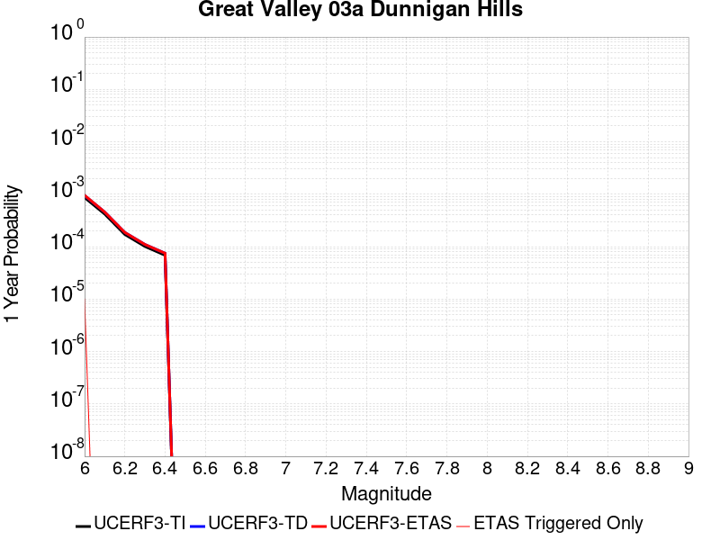 |  |

| Magnitude | 1 wk TI Prob | 1 wk TD Prob | 1 wk ETAS Prob | 1 wk ETAS/TD Gain | 1 wk ETAS Triggered Only | 1 mo TI Prob | 1 mo TD Prob | 1 mo ETAS Prob | 1 mo ETAS/TD Gain | 1 mo ETAS Triggered Only | 1 yr TI Prob | 1 yr TD Prob | 1 yr ETAS Prob | 1 yr ETAS/TD Gain | 1 yr ETAS Triggered Only | 10 yr TI Prob | 10 yr TD Prob | 10 yr ETAS Prob | 10 yr ETAS/TD Gain | 10 yr ETAS Triggered Only |
|-----|-----|-----|-----|-----|-----|-----|-----|-----|-----|-----|-----|-----|-----|-----|-----|-----|-----|-----|-----|-----|
| 6.0 | 1.6591328E-5 | 1.8107954E-5 | 1.8107954E-5 | 1.0 | 0.0 | 7.110376E-5 | 7.7603596E-5 | 9.502385E-5 | 1.2244774 | 1.7421602E-5 | 8.6534437E-4 | 9.444834E-4 | 9.618885E-4 | 1.0184282 | 1.7421602E-5 | 0.008619824 | 0.009411525 | 0.009428782 | 1.0018337 | 1.7421602E-5 |
| 6.1 | 8.041125E-6 | 8.769726E-6 | 8.769726E-6 | 1.0 | 0.0 | 3.4461507E-5 | 3.7584115E-5 | 3.7584115E-5 | 1.0 | 0.0 | 4.194881E-4 | 4.5751085E-4 | 4.5751085E-4 | 1.0 | 0.0 | 0.004186971 | 0.004567687 | 0.004567687 | 1.0 | 0.0 |
| 6.2 | 3.2807004E-6 | 3.5795688E-6 | 3.5795688E-6 | 1.0 | 0.0 | 1.4060069E-5 | 1.5340942E-5 | 1.5340942E-5 | 1.0 | 0.0 | 1.7116789E-4 | 1.8676413E-4 | 1.8676413E-4 | 1.0 | 0.0 | 0.0017103611 | 0.0018664796 | 0.0018664796 | 1.0 | 0.0 |
| 6.3 | 1.9339366E-6 | 2.1103806E-6 | 2.1103806E-6 | 1.0 | 0.0 | 8.288273E-6 | 9.044474E-6 | 9.044474E-6 | 1.0 | 0.0 | 1.00905054E-4 | 1.1011375E-4 | 1.1011375E-4 | 1.0 | 0.0 | 0.0010085925 | 0.0011008718 | 0.0011008718 | 1.0 | 0.0 |
| 6.4 | 1.3142635E-6 | 1.4339867E-6 | 1.4339867E-6 | 1.0 | 0.0 | 5.6325457E-6 | 6.145657E-6 | 6.145657E-6 | 1.0 | 0.0 | 6.857408E-5 | 7.482337E-5 | 7.482337E-5 | 1.0 | 0.0 | 6.8552926E-4 | 7.4823375E-4 | 7.4823375E-4 | 1.0 | 0.0 |

## Channel Islands Thrust
*[(top)](#table-of-contents)*

| 1 Week | 1 Month | 1 Year | 10 Year |
|-----|-----|-----|-----|
|  |  |  |  |

| Magnitude | 1 wk TI Prob | 1 wk TD Prob | 1 wk ETAS Prob | 1 wk ETAS/TD Gain | 1 wk ETAS Triggered Only | 1 mo TI Prob | 1 mo TD Prob | 1 mo ETAS Prob | 1 mo ETAS/TD Gain | 1 mo ETAS Triggered Only | 1 yr TI Prob | 1 yr TD Prob | 1 yr ETAS Prob | 1 yr ETAS/TD Gain | 1 yr ETAS Triggered Only | 10 yr TI Prob | 10 yr TD Prob | 10 yr ETAS Prob | 10 yr ETAS/TD Gain | 10 yr ETAS Triggered Only |
|-----|-----|-----|-----|-----|-----|-----|-----|-----|-----|-----|-----|-----|-----|-----|-----|-----|-----|-----|-----|-----|
| 6.0 | 2.2156251E-5 | 2.4092022E-5 | 2.4092022E-5 | 1.0 | 0.0 | 9.495191E-5 | 1.03248036E-4 | 1.03248036E-4 | 1.0 | 0.0 | 0.0011554264 | 0.0012564264 | 0.0012738262 | 1.0138485 | 1.7421602E-5 | 0.011494373 | 0.0125038205 | 0.012521024 | 1.0013759 | 1.7421602E-5 |
| 6.1 | 2.2156251E-5 | 2.4092022E-5 | 2.4092022E-5 | 1.0 | 0.0 | 9.495191E-5 | 1.03248036E-4 | 1.03248036E-4 | 1.0 | 0.0 | 0.0011554264 | 0.0012564264 | 0.0012738262 | 1.0138485 | 1.7421602E-5 | 0.011494373 | 0.0125038205 | 0.012521024 | 1.0013759 | 1.7421602E-5 |
| 6.2 | 2.2156251E-5 | 2.4092022E-5 | 2.4092022E-5 | 1.0 | 0.0 | 9.495191E-5 | 1.03248036E-4 | 1.03248036E-4 | 1.0 | 0.0 | 0.0011554264 | 0.0012564264 | 0.0012738262 | 1.0138485 | 1.7421602E-5 | 0.011494373 | 0.0125038205 | 0.012521024 | 1.0013759 | 1.7421602E-5 |
| 6.3 | 2.2156251E-5 | 2.4092022E-5 | 2.4092022E-5 | 1.0 | 0.0 | 9.495191E-5 | 1.03248036E-4 | 1.03248036E-4 | 1.0 | 0.0 | 0.0011554264 | 0.0012564264 | 0.0012738262 | 1.0138485 | 1.7421602E-5 | 0.011494373 | 0.0125038205 | 0.012521024 | 1.0013759 | 1.7421602E-5 |
| 6.4 | 2.2156251E-5 | 2.4092022E-5 | 2.4092022E-5 | 1.0 | 0.0 | 9.495191E-5 | 1.03248036E-4 | 1.03248036E-4 | 1.0 | 0.0 | 0.0011554264 | 0.0012564264 | 0.0012738262 | 1.0138485 | 1.7421602E-5 | 0.011494373 | 0.0125038205 | 0.012521024 | 1.0013759 | 1.7421602E-5 |
| 6.5 | 2.2156251E-5 | 2.4092022E-5 | 2.4092022E-5 | 1.0 | 0.0 | 9.495191E-5 | 1.03248036E-4 | 1.03248036E-4 | 1.0 | 0.0 | 0.0011554264 | 0.0012564264 | 0.0012738262 | 1.0138485 | 1.7421602E-5 | 0.011494373 | 0.0125038205 | 0.012521024 | 1.0013759 | 1.7421602E-5 |
| 6.6 | 2.2156251E-5 | 2.4092022E-5 | 2.4092022E-5 | 1.0 | 0.0 | 9.495191E-5 | 1.03248036E-4 | 1.03248036E-4 | 1.0 | 0.0 | 0.0011554264 | 0.0012564264 | 0.0012738262 | 1.0138485 | 1.7421602E-5 | 0.011494373 | 0.0125038205 | 0.012521024 | 1.0013759 | 1.7421602E-5 |
| 6.7 | 1.0601296E-5 | 1.1379544E-5 | 1.1379544E-5 | 1.0 | 0.0 | 4.5433335E-5 | 4.876859E-5 | 4.876859E-5 | 1.0 | 0.0 | 5.5301044E-4 | 5.936007E-4 | 5.936007E-4 | 1.0 | 0.0 | 0.005516363 | 0.005920653 | 0.005920653 | 1.0 | 0.0 |
| 6.8 | 1.0246747E-5 | 1.0996669E-5 | 1.0996669E-5 | 1.0 | 0.0 | 4.391389E-5 | 4.7127756E-5 | 4.7127756E-5 | 1.0 | 0.0 | 5.345204E-4 | 5.7363417E-4 | 5.7363417E-4 | 1.0 | 0.0 | 0.0053323656 | 0.005722025 | 0.005722025 | 1.0 | 0.0 |
| 6.9 | 9.049551E-6 | 9.699645E-6 | 9.699645E-6 | 1.0 | 0.0 | 3.878322E-5 | 4.1569267E-5 | 4.1569267E-5 | 1.0 | 0.0 | 4.7208337E-4 | 5.059924E-4 | 5.059924E-4 | 1.0 | 0.0 | 0.0047108172 | 0.0050488203 | 0.0050488203 | 1.0 | 0.0 |
| 7.0 | 8.6542195E-6 | 9.274603E-6 | 9.274603E-6 | 1.0 | 0.0 | 3.7088983E-5 | 3.9747716E-5 | 3.9747716E-5 | 1.0 | 0.0 | 4.5146482E-4 | 4.8382508E-4 | 4.8382508E-4 | 1.0 | 0.0 | 0.004505487 | 0.004828129 | 0.004828129 | 1.0 | 0.0 |
| 7.1 | 8.391028E-6 | 8.992924E-6 | 8.992924E-6 | 1.0 | 0.0 | 3.5961057E-5 | 3.854056E-5 | 3.854056E-5 | 1.0 | 0.0 | 4.3773788E-4 | 4.6913436E-4 | 4.6913436E-4 | 1.0 | 0.0 | 0.004368766 | 0.0046818503 | 0.0046818503 | 1.0 | 0.0 |
| 7.2 | 5.965188E-6 | 6.3716952E-6 | 6.3716952E-6 | 1.0 | 0.0 | 2.556484E-5 | 2.7306982E-5 | 2.7306982E-5 | 1.0 | 0.0 | 3.1120746E-4 | 3.3241234E-4 | 3.3241234E-4 | 1.0 | 0.0 | 0.00310772 | 0.0033192092 | 0.0033192092 | 1.0 | 0.0 |
| 7.3 | 4.877518E-6 | 5.2060063E-6 | 5.2060063E-6 | 1.0 | 0.0 | 2.0903482E-5 | 2.2311267E-5 | 2.2311267E-5 | 1.0 | 0.0 | 2.5447016E-4 | 2.716063E-4 | 2.716063E-4 | 1.0 | 0.0 | 0.0025417898 | 0.0027127895 | 0.0027127895 | 1.0 | 0.0 |
| 7.4 | 3.8829853E-6 | 4.141863E-6 | 4.141863E-6 | 1.0 | 0.0 | 1.664126E-5 | 1.7750723E-5 | 1.7750723E-5 | 1.0 | 0.0 | 2.0258849E-4 | 2.1609402E-4 | 2.1609402E-4 | 1.0 | 0.0 | 0.002024039 | 0.0021588807 | 0.0021588807 | 1.0 | 0.0 |
| 7.5 | 1.3489616E-6 | 1.4277903E-6 | 1.4277903E-6 | 1.0 | 0.0 | 5.7812517E-6 | 6.119087E-6 | 6.119087E-6 | 1.0 | 0.0 | 7.038446E-5 | 7.449738E-5 | 7.449738E-5 | 1.0 | 0.0 | 7.036218E-4 | 7.44728E-4 | 7.44728E-4 | 1.0 | 0.0 |
| 7.6 | 6.058192E-7 | 6.353778E-7 | 6.353778E-7 | 1.0 | 0.0 | 2.5963652E-6 | 2.7230449E-6 | 2.7230449E-6 | 1.0 | 0.0 | 3.161029E-5 | 3.3152584E-5 | 3.3152584E-5 | 1.0 | 0.0 | 3.1605794E-4 | 3.31478E-4 | 3.31478E-4 | 1.0 | 0.0 |
| 7.7 | 2.2170494E-7 | 2.2607902E-7 | 2.2607902E-7 | 1.0 | 0.0 | 9.5016367E-7 | 9.689098E-7 | 9.689098E-7 | 1.0 | 0.0 | 1.1568181E-5 | 1.1796425E-5 | 1.1796425E-5 | 1.0 | 0.0 | 1.1567579E-4 | 1.1795909E-4 | 1.1795909E-4 | 1.0 | 0.0 |
| 7.8 | 2.1613102E-8 | 1.5466682E-8 | 1.5466682E-8 | 1.0 | 0.0 | 9.262757E-8 | 6.628578E-8 | 6.628578E-8 | 1.0 | 0.0 | 1.1277401E-6 | 8.070291E-7 | 8.070291E-7 | 1.0 | 0.0 | 1.1277344E-5 | 8.070269E-6 | 8.070269E-6 | 1.0 | 0.0 |

## Pinto Mtn
*[(top)](#table-of-contents)*

| 1 Week | 1 Month | 1 Year | 10 Year |
|-----|-----|-----|-----|
|  |  |  |  |

| Magnitude | 1 wk TI Prob | 1 wk TD Prob | 1 wk ETAS Prob | 1 wk ETAS/TD Gain | 1 wk ETAS Triggered Only | 1 mo TI Prob | 1 mo TD Prob | 1 mo ETAS Prob | 1 mo ETAS/TD Gain | 1 mo ETAS Triggered Only | 1 yr TI Prob | 1 yr TD Prob | 1 yr ETAS Prob | 1 yr ETAS/TD Gain | 1 yr ETAS Triggered Only | 10 yr TI Prob | 10 yr TD Prob | 10 yr ETAS Prob | 10 yr ETAS/TD Gain | 10 yr ETAS Triggered Only |
|-----|-----|-----|-----|-----|-----|-----|-----|-----|-----|-----|-----|-----|-----|-----|-----|-----|-----|-----|-----|-----|
| 6.0 | 4.4194956E-5 | 4.785362E-5 | 6.527439E-5 | 1.3640429 | 1.7421602E-5 | 1.893932E-4 | 2.0507174E-4 | 2.2248978E-4 | 1.0849363 | 1.7421602E-5 | 0.0023034236 | 0.0024940541 | 0.0025114324 | 1.0069678 | 1.7421602E-5 | 0.022796938 | 0.024678145 | 0.024695136 | 1.0006886 | 1.7421602E-5 |
| 6.1 | 4.4194956E-5 | 4.785362E-5 | 6.527439E-5 | 1.3640429 | 1.7421602E-5 | 1.893932E-4 | 2.0507174E-4 | 2.2248978E-4 | 1.0849363 | 1.7421602E-5 | 0.0023034236 | 0.0024940541 | 0.0025114324 | 1.0069678 | 1.7421602E-5 | 0.022796938 | 0.024678145 | 0.024695136 | 1.0006886 | 1.7421602E-5 |
| 6.2 | 4.4194956E-5 | 4.785362E-5 | 6.527439E-5 | 1.3640429 | 1.7421602E-5 | 1.893932E-4 | 2.0507174E-4 | 2.2248978E-4 | 1.0849363 | 1.7421602E-5 | 0.0023034236 | 0.0024940541 | 0.0025114324 | 1.0069678 | 1.7421602E-5 | 0.022796938 | 0.024678145 | 0.024695136 | 1.0006886 | 1.7421602E-5 |
| 6.3 | 4.4194956E-5 | 4.785362E-5 | 6.527439E-5 | 1.3640429 | 1.7421602E-5 | 1.893932E-4 | 2.0507174E-4 | 2.2248978E-4 | 1.0849363 | 1.7421602E-5 | 0.0023034236 | 0.0024940541 | 0.0025114324 | 1.0069678 | 1.7421602E-5 | 0.022796938 | 0.024678145 | 0.024695136 | 1.0006886 | 1.7421602E-5 |
| 6.4 | 3.729929E-5 | 3.9603186E-5 | 3.9603186E-5 | 1.0 | 0.0 | 1.5984432E-4 | 1.6971743E-4 | 1.6971743E-4 | 1.0 | 0.0 | 0.0019443673 | 0.002064445 | 0.002064445 | 1.0 | 0.0 | 0.019274427 | 0.02046269 | 0.02046269 | 1.0 | 0.0 |
| 6.5 | 3.729929E-5 | 3.9603186E-5 | 3.9603186E-5 | 1.0 | 0.0 | 1.5984432E-4 | 1.6971743E-4 | 1.6971743E-4 | 1.0 | 0.0 | 0.0019443673 | 0.002064445 | 0.002064445 | 1.0 | 0.0 | 0.019274427 | 0.02046269 | 0.02046269 | 1.0 | 0.0 |
| 6.6 | 3.0204548E-5 | 3.1205298E-5 | 3.1205298E-5 | 1.0 | 0.0 | 1.2944164E-4 | 1.3373033E-4 | 1.3373033E-4 | 1.0 | 0.0 | 0.0015748127 | 0.0016269855 | 0.0016269855 | 1.0 | 0.0 | 0.015636992 | 0.01615461 | 0.01615461 | 1.0 | 0.0 |
| 6.7 | 2.9857754E-5 | 3.081468E-5 | 3.081468E-5 | 1.0 | 0.0 | 1.2795553E-4 | 1.3205643E-4 | 1.3205643E-4 | 1.0 | 0.0 | 0.0015567453 | 0.001606636 | 0.001606636 | 1.0 | 0.0 | 0.015458848 | 0.01595405 | 0.01595405 | 1.0 | 0.0 |
| 6.8 | 2.4819734E-5 | 2.5009364E-5 | 2.5009364E-5 | 1.0 | 0.0 | 1.0636595E-4 | 1.07178705E-4 | 1.07178705E-4 | 1.0 | 0.0 | 0.0012942362 | 0.0013041412 | 0.0013041412 | 1.0 | 0.0 | 0.012867244 | 0.0129672475 | 0.0129672475 | 1.0 | 0.0 |
| 6.9 | 2.331124E-5 | 2.3337643E-5 | 2.3337643E-5 | 1.0 | 0.0 | 9.990149E-5 | 1.00014746E-4 | 1.00014746E-4 | 1.0 | 0.0 | 0.001215622 | 0.0012170197 | 0.0012170197 | 1.0 | 0.0 | 0.012089936 | 0.012105742 | 0.012105742 | 1.0 | 0.0 |
| 7.0 | 2.1818534E-5 | 2.1760772E-5 | 2.1760772E-5 | 1.0 | 0.0 | 9.3504656E-5 | 9.325723E-5 | 9.325723E-5 | 1.0 | 0.0 | 0.0011378246 | 0.0011348352 | 0.0011348352 | 1.0 | 0.0 | 0.011320163 | 0.011292503 | 0.011292503 | 1.0 | 0.0 |
| 7.1 | 2.066081E-5 | 2.0540418E-5 | 2.0540418E-5 | 1.0 | 0.0 | 8.854332E-5 | 8.8027504E-5 | 8.8027504E-5 | 1.0 | 0.0 | 0.0010774818 | 0.0010712275 | 0.0010712275 | 1.0 | 0.0 | 0.010722724 | 0.010662688 | 0.010662688 | 1.0 | 0.0 |
| 7.2 | 1.8990233E-5 | 1.9053701E-5 | 1.9053701E-5 | 1.0 | 0.0 | 8.138417E-5 | 8.1656275E-5 | 8.1656275E-5 | 1.0 | 0.0 | 9.904018E-4 | 9.937311E-4 | 9.937311E-4 | 1.0 | 0.0 | 0.009859995 | 0.009894874 | 0.009894874 | 1.0 | 0.0 |
| 7.3 | 1.3335872E-5 | 1.4906372E-5 | 1.4906372E-5 | 1.0 | 0.0 | 5.7152483E-5 | 6.388296E-5 | 6.388296E-5 | 1.0 | 0.0 | 6.956093E-4 | 7.775102E-4 | 7.775102E-4 | 1.0 | 0.0 | 0.006934359 | 0.0077491994 | 0.0077491994 | 1.0 | 0.0 |
| 7.4 | 9.414066E-6 | 1.186061E-5 | 1.186061E-5 | 1.0 | 0.0 | 4.0345374E-5 | 5.0830247E-5 | 5.0830247E-5 | 1.0 | 0.0 | 4.910942E-4 | 6.1869196E-4 | 6.1869196E-4 | 1.0 | 0.0 | 0.0049001034 | 0.006170644 | 0.006170644 | 1.0 | 0.0 |
| 7.5 | 7.2101157E-6 | 9.157893E-6 | 9.157893E-6 | 1.0 | 0.0 | 3.090013E-5 | 3.924757E-5 | 3.924757E-5 | 1.0 | 0.0 | 3.7614413E-4 | 4.7774217E-4 | 4.7774217E-4 | 1.0 | 0.0 | 0.0037550807 | 0.004767927 | 0.004767927 | 1.0 | 0.0 |
| 7.6 | 3.296375E-6 | 4.5453176E-6 | 4.5453176E-6 | 1.0 | 0.0 | 1.4127245E-5 | 1.9479796E-5 | 1.9479796E-5 | 1.0 | 0.0 | 1.7198564E-4 | 2.3714209E-4 | 2.3714209E-4 | 1.0 | 0.0 | 0.0017185259 | 0.0023690276 | 0.0023690276 | 1.0 | 0.0 |
| 7.7 | 2.5741092E-6 | 3.584251E-6 | 3.584251E-6 | 1.0 | 0.0 | 1.103185E-5 | 1.5360993E-5 | 1.5360993E-5 | 1.0 | 0.0 | 1.3430449E-4 | 1.8700535E-4 | 1.8700535E-4 | 1.0 | 0.0 | 0.0013422335 | 0.0018686098 | 0.0018686098 | 1.0 | 0.0 |

## Great Valley 10 (Panoche)
*[(top)](#table-of-contents)*

| 1 Week | 1 Month | 1 Year | 10 Year |
|-----|-----|-----|-----|
|  |  |  |  |

| Magnitude | 1 wk TI Prob | 1 wk TD Prob | 1 wk ETAS Prob | 1 wk ETAS/TD Gain | 1 wk ETAS Triggered Only | 1 mo TI Prob | 1 mo TD Prob | 1 mo ETAS Prob | 1 mo ETAS/TD Gain | 1 mo ETAS Triggered Only | 1 yr TI Prob | 1 yr TD Prob | 1 yr ETAS Prob | 1 yr ETAS/TD Gain | 1 yr ETAS Triggered Only | 10 yr TI Prob | 10 yr TD Prob | 10 yr ETAS Prob | 10 yr ETAS/TD Gain | 10 yr ETAS Triggered Only |
|-----|-----|-----|-----|-----|-----|-----|-----|-----|-----|-----|-----|-----|-----|-----|-----|-----|-----|-----|-----|-----|
| 6.0 | 1.6014626E-5 | 1.6575399E-5 | 3.3996712E-5 | 2.0510345 | 1.7421602E-5 | 6.863231E-5 | 7.103552E-5 | 8.845589E-5 | 1.2452346 | 1.7421602E-5 | 8.35278E-4 | 8.645185E-4 | 8.8192505E-4 | 1.0201343 | 1.7421602E-5 | 0.008321454 | 0.008612172 | 0.008629443 | 1.0020055 | 1.7421602E-5 |
| 6.1 | 1.6014626E-5 | 1.6575399E-5 | 3.3996712E-5 | 2.0510345 | 1.7421602E-5 | 6.863231E-5 | 7.103552E-5 | 8.845589E-5 | 1.2452346 | 1.7421602E-5 | 8.35278E-4 | 8.645185E-4 | 8.8192505E-4 | 1.0201343 | 1.7421602E-5 | 0.008321454 | 0.008612172 | 0.008629443 | 1.0020055 | 1.7421602E-5 |
| 6.2 | 1.56782E-5 | 1.6198446E-5 | 3.3619766E-5 | 2.0754933 | 1.7421602E-5 | 6.719056E-5 | 6.94201E-5 | 8.684049E-5 | 1.2509416 | 1.7421602E-5 | 8.17738E-4 | 8.4486604E-4 | 8.622729E-4 | 1.0206032 | 1.7421602E-5 | 0.008147354 | 0.008417147 | 0.008434422 | 1.0020523 | 1.7421602E-5 |
| 6.3 | 1.5263338E-5 | 1.5723514E-5 | 3.3144843E-5 | 2.1079793 | 1.7421602E-5 | 6.541267E-5 | 6.738478E-5 | 8.480521E-5 | 1.2585217 | 1.7421602E-5 | 7.961082E-4 | 8.201049E-4 | 8.3751226E-4 | 1.0212257 | 1.7421602E-5 | 0.007932622 | 0.008171377 | 0.008188656 | 1.0021147 | 1.7421602E-5 |
| 6.4 | 1.4720723E-5 | 1.5099376E-5 | 3.2520715E-5 | 2.1537788 | 1.7421602E-5 | 6.308728E-5 | 6.471004E-5 | 8.2130515E-5 | 1.2692082 | 1.7421602E-5 | 7.67817E-4 | 7.8756385E-4 | 8.049717E-4 | 1.0221034 | 1.7421602E-5 | 0.007651695 | 0.007848303 | 0.007865588 | 1.0022024 | 1.7421602E-5 |
| 6.5 | 1.408264E-5 | 1.4355969E-5 | 3.1777323E-5 | 2.2135267 | 1.7421602E-5 | 6.0352773E-5 | 6.1524166E-5 | 7.894469E-5 | 1.2831494 | 1.7421602E-5 | 7.3454727E-4 | 7.488031E-4 | 7.6621165E-4 | 1.0232486 | 1.7421602E-5 | 0.0073212404 | 0.0074633555 | 0.0074806474 | 1.0023168 | 1.7421602E-5 |
| 6.6 | 1.3197086E-5 | 1.3321889E-5 | 3.074326E-5 | 2.3077252 | 1.7421602E-5 | 5.6557717E-5 | 5.709259E-5 | 7.45132E-5 | 1.305129 | 1.7421602E-5 | 6.8837265E-4 | 6.9488434E-4 | 7.1229384E-4 | 1.0250539 | 1.7421602E-5 | 0.006862442 | 0.0069276537 | 0.0069449544 | 1.0024973 | 1.7421602E-5 |
| 6.7 | 1.017583E-5 | 9.745382E-6 | 2.7166816E-5 | 2.7876604 | 1.7421602E-5 | 4.360997E-5 | 4.176527E-5 | 5.9186143E-5 | 1.4171139 | 1.7421602E-5 | 5.30822E-4 | 5.0837593E-4 | 5.257887E-4 | 1.0342517 | 1.7421602E-5 | 0.0052955584 | 0.005072382 | 0.005089715 | 1.0034171 | 1.7421602E-5 |
| 6.8 | 8.557912E-6 | 7.872707E-6 | 2.5294174E-5 | 3.2128937 | 1.7421602E-5 | 3.667625E-5 | 3.373975E-5 | 5.1160765E-5 | 1.516335 | 1.7421602E-5 | 4.4644187E-4 | 4.1070607E-4 | 4.2812052E-4 | 1.0424012 | 1.7421602E-5 | 0.0044554602 | 0.004099677 | 0.0041170274 | 1.004232 | 1.7421602E-5 |
| 6.9 | 6.14664E-6 | 5.092071E-6 | 5.092071E-6 | 1.0 | 0.0 | 2.6342475E-5 | 2.1822989E-5 | 2.1822989E-5 | 1.0 | 0.0 | 3.2067244E-4 | 2.6566387E-4 | 2.6566387E-4 | 1.0 | 0.0 | 0.003202101 | 0.002653601 | 0.002653601 | 1.0 | 0.0 |
| 7.0 | 3.2310581E-6 | 1.6951219E-6 | 1.6951219E-6 | 1.0 | 0.0 | 1.3847319E-5 | 7.264788E-6 | 7.264788E-6 | 1.0 | 0.0 | 1.6857806E-4 | 8.8445304E-5 | 8.8445304E-5 | 1.0 | 0.0 | 0.0016845023 | 8.841104E-4 | 8.841104E-4 | 1.0 | 0.0 |
| 7.1 | 2.544492E-6 | 9.1889206E-7 | 9.1889206E-7 | 1.0 | 0.0 | 1.090492E-5 | 3.938103E-6 | 3.938103E-6 | 1.0 | 0.0 | 1.327593E-4 | 4.79454E-5 | 4.79454E-5 | 1.0 | 0.0 | 0.0013268003 | 4.793553E-4 | 4.793553E-4 | 1.0 | 0.0 |
| 7.2 | 2.4479045E-6 | 8.841304E-7 | 8.841304E-7 | 1.0 | 0.0 | 1.0490977E-5 | 3.789125E-6 | 3.789125E-6 | 1.0 | 0.0 | 1.2772017E-4 | 4.6131667E-5 | 4.6131667E-5 | 1.0 | 0.0 | 0.0012764678 | 4.6122566E-4 | 4.6122566E-4 | 1.0 | 0.0 |
| 7.3 | 2.0559578E-6 | 7.892787E-7 | 7.892787E-7 | 1.0 | 0.0 | 8.811218E-6 | 3.3826188E-6 | 3.3826188E-6 | 1.0 | 0.0 | 1.072713E-4 | 4.1182655E-5 | 4.1182655E-5 | 1.0 | 0.0 | 0.0010721954 | 4.1175485E-4 | 4.1175485E-4 | 1.0 | 0.0 |
| 7.4 | 1.727687E-6 | 7.387757E-7 | 7.387757E-7 | 1.0 | 0.0 | 7.404352E-6 | 3.1661782E-6 | 3.1661782E-6 | 1.0 | 0.0 | 9.0144255E-5 | 3.8547583E-5 | 3.8547583E-5 | 1.0 | 0.0 | 9.0107694E-4 | 3.854136E-4 | 3.854136E-4 | 1.0 | 0.0 |
| 7.5 | 1.5002679E-6 | 6.546144E-7 | 6.546144E-7 | 1.0 | 0.0 | 6.4297037E-6 | 2.8054874E-6 | 2.8054874E-6 | 1.0 | 0.0 | 7.827883E-5 | 3.4156317E-5 | 3.4156317E-5 | 1.0 | 0.0 | 7.825126E-4 | 3.4151482E-4 | 3.4151482E-4 | 1.0 | 0.0 |

## Big Pine (West)
*[(top)](#table-of-contents)*

| 1 Week | 1 Month | 1 Year | 10 Year |
|-----|-----|-----|-----|
| 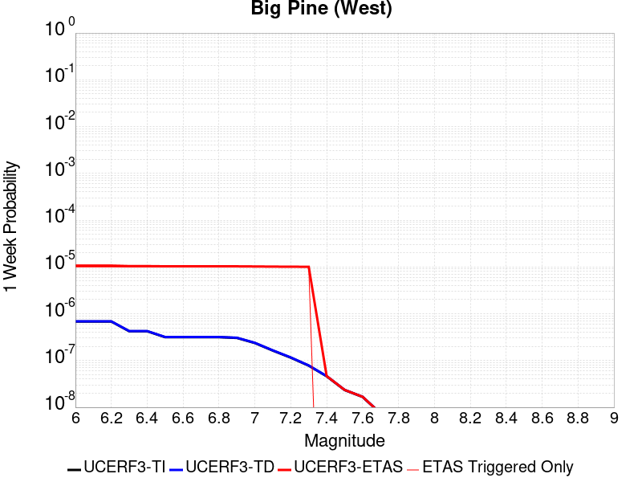 |  |  | 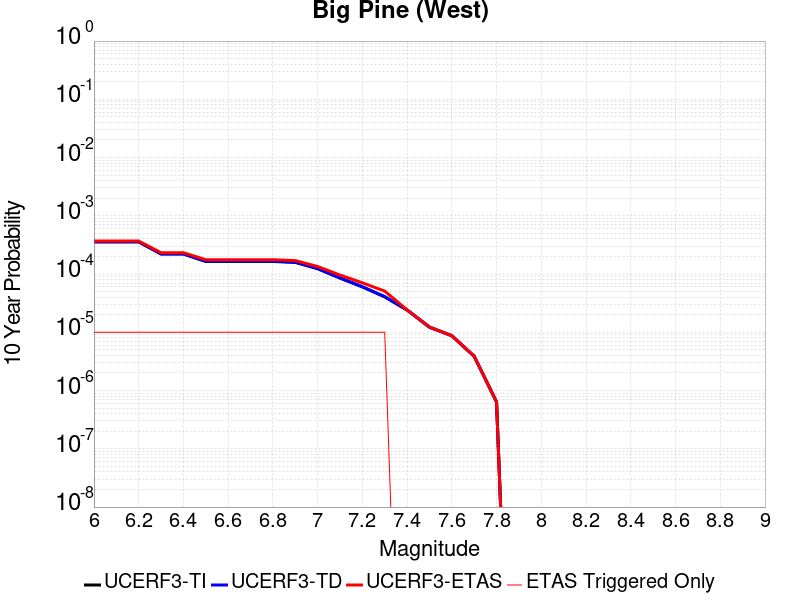 |

| Magnitude | 1 wk TI Prob | 1 wk TD Prob | 1 wk ETAS Prob | 1 wk ETAS/TD Gain | 1 wk ETAS Triggered Only | 1 mo TI Prob | 1 mo TD Prob | 1 mo ETAS Prob | 1 mo ETAS/TD Gain | 1 mo ETAS Triggered Only | 1 yr TI Prob | 1 yr TD Prob | 1 yr ETAS Prob | 1 yr ETAS/TD Gain | 1 yr ETAS Triggered Only | 10 yr TI Prob | 10 yr TD Prob | 10 yr ETAS Prob | 10 yr ETAS/TD Gain | 10 yr ETAS Triggered Only |
|-----|-----|-----|-----|-----|-----|-----|-----|-----|-----|-----|-----|-----|-----|-----|-----|-----|-----|-----|-----|-----|
| 6.0 | 6.8306974E-7 | 6.8818304E-7 | 1.8109773E-5 | 26.315346 | 1.7421602E-5 | 2.9274386E-6 | 2.949353E-6 | 2.0370904E-5 | 6.906906 | 1.7421602E-5 | 3.564098E-5 | 3.5907877E-5 | 5.3328855E-5 | 1.4851575 | 1.7421602E-5 | 3.5635266E-4 | 3.5903015E-4 | 3.7644547E-4 | 1.0485066 | 1.7421602E-5 |
| 6.1 | 6.8306974E-7 | 6.8818304E-7 | 1.8109773E-5 | 26.315346 | 1.7421602E-5 | 2.9274386E-6 | 2.949353E-6 | 2.0370904E-5 | 6.906906 | 1.7421602E-5 | 3.564098E-5 | 3.5907877E-5 | 5.3328855E-5 | 1.4851575 | 1.7421602E-5 | 3.5635266E-4 | 3.5903015E-4 | 3.7644547E-4 | 1.0485066 | 1.7421602E-5 |
| 6.2 | 6.8306974E-7 | 6.8818304E-7 | 1.8109773E-5 | 26.315346 | 1.7421602E-5 | 2.9274386E-6 | 2.949353E-6 | 2.0370904E-5 | 6.906906 | 1.7421602E-5 | 3.564098E-5 | 3.5907877E-5 | 5.3328855E-5 | 1.4851575 | 1.7421602E-5 | 3.5635266E-4 | 3.5903015E-4 | 3.7644547E-4 | 1.0485066 | 1.7421602E-5 |
| 6.3 | 4.227652E-7 | 4.2665604E-7 | 1.7848251E-5 | 41.832882 | 1.7421602E-5 | 1.8118495E-6 | 1.8285248E-6 | 1.9250096E-5 | 10.527665 | 1.7421602E-5 | 2.2059045E-5 | 2.226208E-5 | 3.9683295E-5 | 1.782551 | 1.7421602E-5 | 2.2056856E-4 | 2.2260031E-4 | 2.4001804E-4 | 1.0782466 | 1.7421602E-5 |
| 6.4 | 4.227652E-7 | 4.2665604E-7 | 1.7848251E-5 | 41.832882 | 1.7421602E-5 | 1.8118495E-6 | 1.8285248E-6 | 1.9250096E-5 | 10.527665 | 1.7421602E-5 | 2.2059045E-5 | 2.226208E-5 | 3.9683295E-5 | 1.782551 | 1.7421602E-5 | 2.2056856E-4 | 2.2260031E-4 | 2.4001804E-4 | 1.0782466 | 1.7421602E-5 |
| 6.5 | 3.1538403E-7 | 3.1884528E-7 | 1.7740442E-5 | 55.63966 | 1.7421602E-5 | 1.3516451E-6 | 1.3664791E-6 | 1.8788058E-5 | 13.749247 | 1.7421602E-5 | 1.6456155E-5 | 1.6636759E-5 | 3.4058074E-5 | 2.0471578 | 1.7421602E-5 | 1.6454936E-4 | 1.6635554E-4 | 1.8377425E-4 | 1.1047077 | 1.7421602E-5 |
| 6.6 | 3.1538403E-7 | 3.1884528E-7 | 1.7740442E-5 | 55.63966 | 1.7421602E-5 | 1.3516451E-6 | 1.3664791E-6 | 1.8788058E-5 | 13.749247 | 1.7421602E-5 | 1.6456155E-5 | 1.6636759E-5 | 3.4058074E-5 | 2.0471578 | 1.7421602E-5 | 1.6454936E-4 | 1.6635554E-4 | 1.8377425E-4 | 1.1047077 | 1.7421602E-5 |
| 6.7 | 3.1538403E-7 | 3.1884528E-7 | 1.7740442E-5 | 55.63966 | 1.7421602E-5 | 1.3516451E-6 | 1.3664791E-6 | 1.8788058E-5 | 13.749247 | 1.7421602E-5 | 1.6456155E-5 | 1.6636759E-5 | 3.4058074E-5 | 2.0471578 | 1.7421602E-5 | 1.6454936E-4 | 1.6635554E-4 | 1.8377425E-4 | 1.1047077 | 1.7421602E-5 |
| 6.8 | 3.1538403E-7 | 3.1884528E-7 | 1.7740442E-5 | 55.63966 | 1.7421602E-5 | 1.3516451E-6 | 1.3664791E-6 | 1.8788058E-5 | 13.749247 | 1.7421602E-5 | 1.6456155E-5 | 1.6636759E-5 | 3.4058074E-5 | 2.0471578 | 1.7421602E-5 | 1.6454936E-4 | 1.6635554E-4 | 1.8377425E-4 | 1.1047077 | 1.7421602E-5 |
| 6.9 | 3.0402092E-7 | 3.0739798E-7 | 1.7728995E-5 | 57.674404 | 1.7421602E-5 | 1.3029462E-6 | 1.3174192E-6 | 1.8739E-5 | 14.224021 | 1.7421602E-5 | 1.5863254E-5 | 1.6039465E-5 | 3.346079E-5 | 2.0861535 | 1.7421602E-5 | 1.5862122E-4 | 1.6038347E-4 | 1.7780227E-4 | 1.1086073 | 1.7421602E-5 |
| 7.0 | 2.3673063E-7 | 2.3944315E-7 | 1.7661041E-5 | 73.75881 | 1.7421602E-5 | 1.0145594E-6 | 1.0261845E-6 | 1.8447769E-5 | 17.977049 | 1.7421602E-5 | 1.235219E-5 | 1.2493728E-5 | 2.9915112E-5 | 2.3944106 | 1.7421602E-5 | 1.2351504E-4 | 1.2493054E-4 | 1.4234995E-4 | 1.1394329 | 1.7421602E-5 |
| 7.1 | 1.632138E-7 | 1.6514511E-7 | 1.7586744E-5 | 106.492676 | 1.7421602E-5 | 6.9948754E-7 | 7.0776457E-7 | 1.8129354E-5 | 25.61495 | 1.7421602E-5 | 8.516227E-6 | 8.617002E-6 | 2.6038455E-5 | 3.0217533 | 1.7421602E-5 | 8.5159016E-5 | 8.616685E-5 | 1.0358695E-4 | 1.2021672 | 1.7421602E-5 |
| 7.2 | 1.1523723E-7 | 1.1657165E-7 | 1.7538172E-5 | 150.44972 | 1.7421602E-5 | 4.9387376E-7 | 4.9959266E-7 | 1.7921187E-5 | 35.871597 | 1.7421602E-5 | 6.0128964E-6 | 6.082525E-6 | 2.3504022E-5 | 3.8641882 | 1.7421602E-5 | 6.0127335E-5 | 6.0823695E-5 | 7.824424E-5 | 1.2864105 | 1.7421602E-5 |
| 7.3 | 7.777805E-8 | 7.862446E-8 | 1.7500226E-5 | 222.57993 | 1.7421602E-5 | 3.3333444E-7 | 3.3696193E-7 | 1.7758559E-5 | 52.701973 | 1.7421602E-5 | 4.0583395E-6 | 4.102504E-6 | 2.1524036E-5 | 5.24656 | 1.7421602E-5 | 4.0582654E-5 | 4.102434E-5 | 5.844523E-5 | 1.4246476 | 1.7421602E-5 |
| 7.4 | 4.609946E-8 | 4.6522135E-8 | 4.6522135E-8 | 1.0 | 0.0 | 1.975691E-7 | 1.9938055E-7 | 1.9938055E-7 | 1.0 | 0.0 | 2.4054011E-6 | 2.4274557E-6 | 2.4274557E-6 | 1.0 | 0.0 | 2.405375E-5 | 2.427431E-5 | 2.427431E-5 | 1.0 | 0.0 |
| 7.5 | 2.3439137E-8 | 2.3608283E-8 | 2.3608283E-8 | 1.0 | 0.0 | 1.00453434E-7 | 1.0117836E-7 | 1.0117836E-7 | 1.0 | 0.0 | 1.2230199E-6 | 1.2318458E-6 | 1.2318458E-6 | 1.0 | 0.0 | 1.2230132E-5 | 1.2318393E-5 | 1.2318393E-5 | 1.0 | 0.0 |
| 7.6 | 1.6699769E-8 | 1.6817072E-8 | 1.6817072E-8 | 1.0 | 0.0 | 7.157044E-8 | 7.207316E-8 | 7.207316E-8 | 1.0 | 0.0 | 8.713697E-7 | 8.7749044E-7 | 8.7749044E-7 | 1.0 | 0.0 | 8.713663E-6 | 8.774871E-6 | 8.774871E-6 | 1.0 | 0.0 |
| 7.7 | 7.4061512E-9 | 7.4541635E-9 | 7.4541635E-9 | 1.0 | 0.0 | 3.1740647E-8 | 3.1946417E-8 | 3.1946417E-8 | 1.0 | 0.0 | 3.864423E-7 | 3.8894754E-7 | 3.8894754E-7 | 1.0 | 0.0 | 3.8644166E-6 | 3.8894696E-6 | 3.8894696E-6 | 1.0 | 0.0 |
| 7.8 | 1.2189427E-9 | 1.2270763E-9 | 1.2270763E-9 | 1.0 | 0.0 | 5.2240403E-9 | 5.258898E-9 | 5.258898E-9 | 1.0 | 0.0 | 6.3602684E-8 | 6.4027084E-8 | 6.4027084E-8 | 1.0 | 0.0 | 6.360267E-7 | 6.4027074E-7 | 6.4027074E-7 | 1.0 | 0.0 |

## Mono Lake 2011 CFM
*[(top)](#table-of-contents)*

| 1 Week | 1 Month | 1 Year | 10 Year |
|-----|-----|-----|-----|
|  |  |  |  |

| Magnitude | 1 wk TI Prob | 1 wk TD Prob | 1 wk ETAS Prob | 1 wk ETAS/TD Gain | 1 wk ETAS Triggered Only | 1 mo TI Prob | 1 mo TD Prob | 1 mo ETAS Prob | 1 mo ETAS/TD Gain | 1 mo ETAS Triggered Only | 1 yr TI Prob | 1 yr TD Prob | 1 yr ETAS Prob | 1 yr ETAS/TD Gain | 1 yr ETAS Triggered Only | 10 yr TI Prob | 10 yr TD Prob | 10 yr ETAS Prob | 10 yr ETAS/TD Gain | 10 yr ETAS Triggered Only |
|-----|-----|-----|-----|-----|-----|-----|-----|-----|-----|-----|-----|-----|-----|-----|-----|-----|-----|-----|-----|-----|
| 6.0 | 2.0341662E-5 | 2.3828166E-5 | 4.1249354E-5 | 1.7311174 | 1.7421602E-5 | 8.717564E-5 | 1.0211971E-4 | 1.1953954E-4 | 1.1705824 | 1.7421602E-5 | 0.0010608466 | 0.0012431298 | 0.0012605297 | 1.0139968 | 1.7421602E-5 | 0.010557966 | 0.012413835 | 0.01243104 | 1.0013859 | 1.7421602E-5 |
| 6.1 | 2.0341662E-5 | 2.3828166E-5 | 4.1249354E-5 | 1.7311174 | 1.7421602E-5 | 8.717564E-5 | 1.0211971E-4 | 1.1953954E-4 | 1.1705824 | 1.7421602E-5 | 0.0010608466 | 0.0012431298 | 0.0012605297 | 1.0139968 | 1.7421602E-5 | 0.010557966 | 0.012413835 | 0.01243104 | 1.0013859 | 1.7421602E-5 |
| 6.2 | 2.0341662E-5 | 2.3828166E-5 | 4.1249354E-5 | 1.7311174 | 1.7421602E-5 | 8.717564E-5 | 1.0211971E-4 | 1.1953954E-4 | 1.1705824 | 1.7421602E-5 | 0.0010608466 | 0.0012431298 | 0.0012605297 | 1.0139968 | 1.7421602E-5 | 0.010557966 | 0.012413835 | 0.01243104 | 1.0013859 | 1.7421602E-5 |
| 6.3 | 2.0341662E-5 | 2.3828166E-5 | 4.1249354E-5 | 1.7311174 | 1.7421602E-5 | 8.717564E-5 | 1.0211971E-4 | 1.1953954E-4 | 1.1705824 | 1.7421602E-5 | 0.0010608466 | 0.0012431298 | 0.0012605297 | 1.0139968 | 1.7421602E-5 | 0.010557966 | 0.012413835 | 0.01243104 | 1.0013859 | 1.7421602E-5 |
| 6.4 | 1.749821E-5 | 2.0490985E-5 | 3.7912232E-5 | 1.8501908 | 1.7421602E-5 | 7.499018E-5 | 8.781851E-5 | 1.0523858E-4 | 1.1983645 | 1.7421602E-5 | 9.1262296E-4 | 0.0010691903 | 0.0010865934 | 1.0162768 | 1.7421602E-5 | 0.009088841 | 0.010691865 | 0.0107091 | 1.001612 | 1.7421602E-5 |
| 6.5 | 1.749821E-5 | 2.0490985E-5 | 3.7912232E-5 | 1.8501908 | 1.7421602E-5 | 7.499018E-5 | 8.781851E-5 | 1.0523858E-4 | 1.1983645 | 1.7421602E-5 | 9.1262296E-4 | 0.0010691903 | 0.0010865934 | 1.0162768 | 1.7421602E-5 | 0.009088841 | 0.010691865 | 0.0107091 | 1.001612 | 1.7421602E-5 |

## Hunting Creek - Berryessa 2011 CFM
*[(top)](#table-of-contents)*

| 1 Week | 1 Month | 1 Year | 10 Year |
|-----|-----|-----|-----|
|  |  | 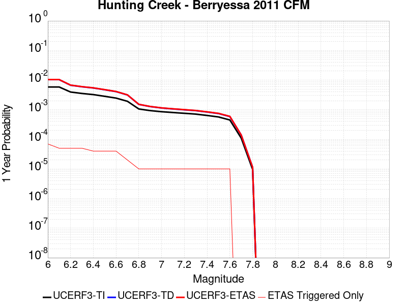 |  |

| Magnitude | 1 wk TI Prob | 1 wk TD Prob | 1 wk ETAS Prob | 1 wk ETAS/TD Gain | 1 wk ETAS Triggered Only | 1 mo TI Prob | 1 mo TD Prob | 1 mo ETAS Prob | 1 mo ETAS/TD Gain | 1 mo ETAS Triggered Only | 1 yr TI Prob | 1 yr TD Prob | 1 yr ETAS Prob | 1 yr ETAS/TD Gain | 1 yr ETAS Triggered Only | 10 yr TI Prob | 10 yr TD Prob | 10 yr ETAS Prob | 10 yr ETAS/TD Gain | 10 yr ETAS Triggered Only |
|-----|-----|-----|-----|-----|-----|-----|-----|-----|-----|-----|-----|-----|-----|-----|-----|-----|-----|-----|-----|-----|
| 6.0 | 1.1270982E-4 | 2.0012174E-4 | 2.0012174E-4 | 1.0 | 0.0 | 4.8295266E-4 | 8.5739547E-4 | 8.748022E-4 | 1.0203018 | 1.7421602E-5 | 0.0058641075 | 0.010386313 | 0.010403554 | 1.00166 | 1.7421602E-5 | 0.057117578 | 0.09803703 | 0.09805274 | 1.0001603 | 1.7421602E-5 |
| 6.1 | 1.1239393E-4 | 1.9960315E-4 | 1.9960315E-4 | 1.0 | 0.0 | 4.8159933E-4 | 8.551744E-4 | 8.551744E-4 | 1.0 | 0.0 | 0.0058477195 | 0.010359551 | 0.010359551 | 1.0 | 0.0 | 0.056962132 | 0.09779551 | 0.09779551 | 1.0 | 0.0 |
| 6.2 | 7.596265E-5 | 1.2940196E-4 | 1.2940196E-4 | 1.0 | 0.0 | 3.2551357E-4 | 5.5444165E-4 | 5.5444165E-4 | 1.0 | 0.0 | 0.0039559277 | 0.0067210156 | 0.0067210156 | 1.0 | 0.0 | 0.038862433 | 0.0645915 | 0.0645915 | 1.0 | 0.0 |
| 6.3 | 6.78794E-5 | 1.145119E-4 | 1.145119E-4 | 1.0 | 0.0 | 2.9087928E-4 | 4.906513E-4 | 4.906513E-4 | 1.0 | 0.0 | 0.003535705 | 0.005952679 | 0.005952679 | 1.0 | 0.0 | 0.034799766 | 0.057465393 | 0.057465393 | 1.0 | 0.0 |
| 6.4 | 6.2165134E-5 | 1.0436625E-4 | 1.0436625E-4 | 1.0 | 0.0 | 2.6639478E-4 | 4.4721062E-4 | 4.4721062E-4 | 1.0 | 0.0 | 0.0032385332 | 0.005427573 | 0.005427573 | 1.0 | 0.0 | 0.03191742 | 0.052550517 | 0.052550517 | 1.0 | 0.0 |
| 6.5 | 5.4368087E-5 | 9.071415E-5 | 9.071415E-5 | 1.0 | 0.0 | 2.3298527E-4 | 3.8872007E-4 | 3.8872007E-4 | 1.0 | 0.0 | 0.0028329059 | 0.0047198683 | 0.0047198683 | 1.0 | 0.0 | 0.027970633 | 0.045880128 | 0.045880128 | 1.0 | 0.0 |
| 6.6 | 4.729947E-5 | 7.847572E-5 | 7.847572E-5 | 1.0 | 0.0 | 2.0269625E-4 | 3.362842E-4 | 3.362842E-4 | 1.0 | 0.0 | 0.002465034 | 0.0040849647 | 0.0040849647 | 1.0 | 0.0 | 0.02437869 | 0.03985155 | 0.03985155 | 1.0 | 0.0 |
| 6.7 | 3.6875328E-5 | 6.0451803E-5 | 6.0451803E-5 | 1.0 | 0.0 | 1.5802756E-4 | 2.59056E-4 | 2.59056E-4 | 1.0 | 0.0 | 0.0019222875 | 0.0031482063 | 0.0031482063 | 1.0 | 0.0 | 0.019057442 | 0.03089237 | 0.03089237 | 1.0 | 0.0 |
| 6.8 | 2.0292036E-5 | 2.8976308E-5 | 2.8976308E-5 | 1.0 | 0.0 | 8.6962966E-5 | 1.2417832E-4 | 1.2417832E-4 | 1.0 | 0.0 | 0.0010582599 | 0.0015108072 | 0.0015108072 | 1.0 | 0.0 | 0.010532344 | 0.014978523 | 0.014978523 | 1.0 | 0.0 |
| 6.9 | 1.7871042E-5 | 2.4472254E-5 | 2.4472254E-5 | 1.0 | 0.0 | 7.658793E-5 | 1.048769E-4 | 1.048769E-4 | 1.0 | 0.0 | 9.320591E-4 | 0.0012761299 | 0.0012761299 | 1.0 | 0.0 | 0.009281595 | 0.012679775 | 0.012679775 | 1.0 | 0.0 |
| 7.0 | 1.6415532E-5 | 2.1906277E-5 | 2.1906277E-5 | 1.0 | 0.0 | 7.035038E-5 | 9.3880684E-5 | 9.3880684E-5 | 1.0 | 0.0 | 8.561793E-4 | 0.0011424015 | 0.0011424015 | 1.0 | 0.0 | 0.008528882 | 0.01136452 | 0.01136452 | 1.0 | 0.0 |
| 7.1 | 1.5409885E-5 | 2.0346342E-5 | 2.0346342E-5 | 1.0 | 0.0 | 6.6040695E-5 | 8.7195716E-5 | 8.7195716E-5 | 1.0 | 0.0 | 8.0374884E-4 | 0.0010610938 | 0.0010610938 | 1.0 | 0.0 | 0.00800848 | 0.010560595 | 0.010560595 | 1.0 | 0.0 |
| 7.2 | 1.4497423E-5 | 1.9054964E-5 | 1.9054964E-5 | 1.0 | 0.0 | 6.213033E-5 | 8.166159E-5 | 8.166159E-5 | 1.0 | 0.0 | 7.5617427E-4 | 9.937795E-4 | 9.937795E-4 | 1.0 | 0.0 | 0.0075360634 | 0.009893929 | 0.009893929 | 1.0 | 0.0 |
| 7.3 | 1.3615175E-5 | 1.7826127E-5 | 1.7826127E-5 | 1.0 | 0.0 | 5.8349444E-5 | 7.639547E-5 | 7.639547E-5 | 1.0 | 0.0 | 7.101729E-4 | 9.297209E-4 | 9.297209E-4 | 1.0 | 0.0 | 0.0070790765 | 0.009258823 | 0.009258823 | 1.0 | 0.0 |
| 7.4 | 1.2252825E-5 | 1.602625E-5 | 1.602625E-5 | 1.0 | 0.0 | 5.251105E-5 | 6.868213E-5 | 6.868213E-5 | 1.0 | 0.0 | 6.391345E-4 | 8.35887E-4 | 8.35887E-4 | 1.0 | 0.0 | 0.0063729943 | 0.008327872 | 0.008327872 | 1.0 | 0.0 |
| 7.5 | 1.0913301E-5 | 1.4241117E-5 | 1.4241117E-5 | 1.0 | 0.0 | 4.6770452E-5 | 6.1031948E-5 | 6.1031948E-5 | 1.0 | 0.0 | 5.6928146E-4 | 7.4281334E-4 | 7.4281334E-4 | 1.0 | 0.0 | 0.0056782532 | 0.0074036797 | 0.0074036797 | 1.0 | 0.0 |
| 7.6 | 8.623192E-6 | 1.12346415E-5 | 1.12346415E-5 | 1.0 | 0.0 | 3.6956015E-5 | 4.814759E-5 | 4.814759E-5 | 1.0 | 0.0 | 4.4984656E-4 | 5.8604183E-4 | 5.8604183E-4 | 1.0 | 0.0 | 0.00448937 | 0.0058452785 | 0.0058452785 | 1.0 | 0.0 |
| 7.7 | 2.0993634E-6 | 2.662584E-6 | 2.662584E-6 | 1.0 | 0.0 | 8.997241E-6 | 1.1411025E-5 | 1.1411025E-5 | 1.0 | 0.0 | 1.09535904E-4 | 1.3892044E-4 | 1.3892044E-4 | 1.0 | 0.0 | 0.0010948193 | 0.0013883426 | 0.0013883426 | 1.0 | 0.0 |
| 7.8 | 1.8428308E-7 | 2.167437E-7 | 2.167437E-7 | 1.0 | 0.0 | 7.897844E-7 | 9.289013E-7 | 9.289013E-7 | 1.0 | 0.0 | 9.615583E-6 | 1.1309318E-5 | 1.1309318E-5 | 1.0 | 0.0 | 9.615166E-5 | 1.13086026E-4 | 1.13086026E-4 | 1.0 | 0.0 |

## Elysian Park (Upper)
*[(top)](#table-of-contents)*

| 1 Week | 1 Month | 1 Year | 10 Year |
|-----|-----|-----|-----|
| 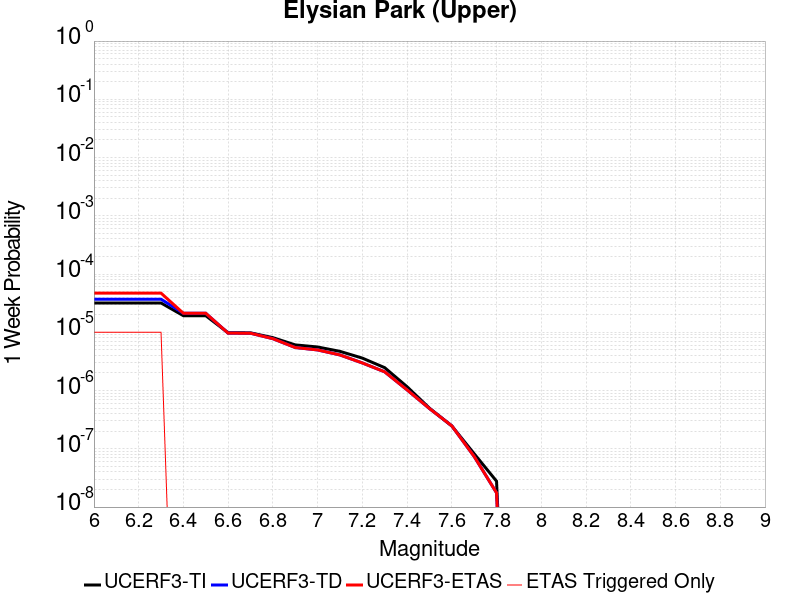 |  |  |  |

| Magnitude | 1 wk TI Prob | 1 wk TD Prob | 1 wk ETAS Prob | 1 wk ETAS/TD Gain | 1 wk ETAS Triggered Only | 1 mo TI Prob | 1 mo TD Prob | 1 mo ETAS Prob | 1 mo ETAS/TD Gain | 1 mo ETAS Triggered Only | 1 yr TI Prob | 1 yr TD Prob | 1 yr ETAS Prob | 1 yr ETAS/TD Gain | 1 yr ETAS Triggered Only | 10 yr TI Prob | 10 yr TD Prob | 10 yr ETAS Prob | 10 yr ETAS/TD Gain | 10 yr ETAS Triggered Only |
|-----|-----|-----|-----|-----|-----|-----|-----|-----|-----|-----|-----|-----|-----|-----|-----|-----|-----|-----|-----|-----|
| 6.0 | 3.1876025E-5 | 3.7035516E-5 | 3.7035516E-5 | 1.0 | 0.0 | 1.3660437E-4 | 1.587167E-4 | 1.587167E-4 | 1.0 | 0.0 | 0.0016618895 | 0.0019311075 | 0.0019484954 | 1.0090041 | 1.7421602E-5 | 0.016495159 | 0.019189782 | 0.01920687 | 1.0008905 | 1.7421602E-5 |
| 6.1 | 3.1876025E-5 | 3.7035516E-5 | 3.7035516E-5 | 1.0 | 0.0 | 1.3660437E-4 | 1.587167E-4 | 1.587167E-4 | 1.0 | 0.0 | 0.0016618895 | 0.0019311075 | 0.0019484954 | 1.0090041 | 1.7421602E-5 | 0.016495159 | 0.019189782 | 0.01920687 | 1.0008905 | 1.7421602E-5 |
| 6.2 | 3.1876025E-5 | 3.7035516E-5 | 3.7035516E-5 | 1.0 | 0.0 | 1.3660437E-4 | 1.587167E-4 | 1.587167E-4 | 1.0 | 0.0 | 0.0016618895 | 0.0019311075 | 0.0019484954 | 1.0090041 | 1.7421602E-5 | 0.016495159 | 0.019189782 | 0.01920687 | 1.0008905 | 1.7421602E-5 |
| 6.3 | 3.1876025E-5 | 3.7035516E-5 | 3.7035516E-5 | 1.0 | 0.0 | 1.3660437E-4 | 1.587167E-4 | 1.587167E-4 | 1.0 | 0.0 | 0.0016618895 | 0.0019311075 | 0.0019484954 | 1.0090041 | 1.7421602E-5 | 0.016495159 | 0.019189782 | 0.01920687 | 1.0008905 | 1.7421602E-5 |
| 6.4 | 1.9273462E-5 | 2.1202266E-5 | 2.1202266E-5 | 1.0 | 0.0 | 8.259794E-5 | 9.086466E-5 | 9.086466E-5 | 1.0 | 0.0 | 0.001005166 | 0.0011058892 | 0.0011232916 | 1.0157361 | 1.7421602E-5 | 0.010006315 | 0.011020724 | 0.011037953 | 1.0015634 | 1.7421602E-5 |
| 6.5 | 1.9273462E-5 | 2.1202266E-5 | 2.1202266E-5 | 1.0 | 0.0 | 8.259794E-5 | 9.086466E-5 | 9.086466E-5 | 1.0 | 0.0 | 0.001005166 | 0.0011058892 | 0.0011232916 | 1.0157361 | 1.7421602E-5 | 0.010006315 | 0.011020724 | 0.011037953 | 1.0015634 | 1.7421602E-5 |
| 6.6 | 9.813258E-6 | 9.665599E-6 | 9.665599E-6 | 1.0 | 0.0 | 4.205614E-5 | 4.1423376E-5 | 4.1423376E-5 | 1.0 | 0.0 | 5.119132E-4 | 5.0422014E-4 | 5.0422014E-4 | 1.0 | 0.0 | 0.005107356 | 0.0050314846 | 0.0050314846 | 1.0 | 0.0 |
| 6.7 | 9.801478E-6 | 9.653168E-6 | 9.653168E-6 | 1.0 | 0.0 | 4.2005657E-5 | 4.1370105E-5 | 4.1370105E-5 | 1.0 | 0.0 | 5.112989E-4 | 5.035719E-4 | 5.035719E-4 | 1.0 | 0.0 | 0.0051012407 | 0.0050250315 | 0.0050250315 | 1.0 | 0.0 |
| 6.8 | 8.102489E-6 | 7.773004E-6 | 7.773004E-6 | 1.0 | 0.0 | 3.4724493E-5 | 3.3312477E-5 | 3.3312477E-5 | 1.0 | 0.0 | 4.2268867E-4 | 4.055089E-4 | 4.055089E-4 | 1.0 | 0.0 | 0.004218856 | 0.0040481836 | 0.0040481836 | 1.0 | 0.0 |
| 6.9 | 6.08275E-6 | 5.4814514E-6 | 5.4814514E-6 | 1.0 | 0.0 | 2.6068668E-5 | 2.3491726E-5 | 2.3491726E-5 | 1.0 | 0.0 | 3.173398E-4 | 2.85975E-4 | 2.85975E-4 | 1.0 | 0.0 | 0.0031688702 | 0.0028561477 | 0.0028561477 | 1.0 | 0.0 |
| 7.0 | 5.5995934E-6 | 4.98278E-6 | 4.98278E-6 | 1.0 | 0.0 | 2.3998036E-5 | 2.13546E-5 | 2.13546E-5 | 1.0 | 0.0 | 2.9213692E-4 | 2.599619E-4 | 2.599619E-4 | 1.0 | 0.0 | 0.0029175316 | 0.0025966454 | 0.0025966454 | 1.0 | 0.0 |
| 7.1 | 4.709881E-6 | 4.0874015E-6 | 4.0874015E-6 | 1.0 | 0.0 | 2.0185047E-5 | 1.7517319E-5 | 1.7517319E-5 | 1.0 | 0.0 | 2.4572524E-4 | 2.132529E-4 | 2.132529E-4 | 1.0 | 0.0 | 0.002454537 | 0.002130524 | 0.002130524 | 1.0 | 0.0 |
| 7.2 | 3.6063436E-6 | 2.9779544E-6 | 2.9779544E-6 | 1.0 | 0.0 | 1.5455667E-5 | 1.27626E-5 | 1.27626E-5 | 1.0 | 0.0 | 1.881565E-4 | 1.5537368E-4 | 1.5537368E-4 | 1.0 | 0.0 | 0.0018799726 | 0.0015526618 | 0.0015526618 | 1.0 | 0.0 |
| 7.3 | 2.471135E-6 | 2.0954615E-6 | 2.0954615E-6 | 1.0 | 0.0 | 1.0590536E-5 | 8.980519E-6 | 8.980519E-6 | 1.0 | 0.0 | 1.2893214E-4 | 1.093324E-4 | 1.093324E-4 | 1.0 | 0.0 | 0.0012885736 | 0.0010927934 | 0.0010927934 | 1.0 | 0.0 |
| 7.4 | 1.163943E-6 | 1.0275091E-6 | 1.0275091E-6 | 1.0 | 0.0 | 4.988318E-6 | 4.4036033E-6 | 4.4036033E-6 | 1.0 | 0.0 | 6.0731076E-5 | 5.3612584E-5 | 5.3612584E-5 | 1.0 | 0.0 | 6.071448E-4 | 5.359995E-4 | 5.359995E-4 | 1.0 | 0.0 |
| 7.5 | 4.99459E-7 | 4.917604E-7 | 4.917604E-7 | 1.0 | 0.0 | 2.140537E-6 | 2.1075427E-6 | 2.1075427E-6 | 1.0 | 0.0 | 2.6060725E-5 | 2.5659048E-5 | 2.5659048E-5 | 1.0 | 0.0 | 2.605767E-4 | 2.5656243E-4 | 2.5656243E-4 | 1.0 | 0.0 |
| 7.6 | 2.4667852E-7 | 2.4778336E-7 | 2.4778336E-7 | 1.0 | 0.0 | 1.0571932E-6 | 1.0619283E-6 | 1.0619283E-6 | 1.0 | 0.0 | 1.2871251E-5 | 1.2928905E-5 | 1.2928905E-5 | 1.0 | 0.0 | 1.2870505E-4 | 1.2928189E-4 | 1.2928189E-4 | 1.0 | 0.0 |
| 7.7 | 8.2312795E-8 | 7.3864456E-8 | 7.3864456E-8 | 1.0 | 0.0 | 3.527691E-7 | 3.165619E-7 | 3.165619E-7 | 1.0 | 0.0 | 4.294955E-6 | 3.8541357E-6 | 3.8541357E-6 | 1.0 | 0.0 | 4.2948723E-5 | 3.8540802E-5 | 3.8540802E-5 | 1.0 | 0.0 |
| 7.8 | 2.7819295E-8 | 1.7566023E-8 | 1.7566023E-8 | 1.0 | 0.0 | 1.1922555E-7 | 7.5282955E-8 | 7.5282955E-8 | 1.0 | 0.0 | 1.45157E-6 | 9.165697E-7 | 9.165697E-7 | 1.0 | 0.0 | 1.45156055E-5 | 9.165675E-6 | 9.165675E-6 | 1.0 | 0.0 |

## North Frontal  (West)
*[(top)](#table-of-contents)*

| 1 Week | 1 Month | 1 Year | 10 Year |
|-----|-----|-----|-----|
| 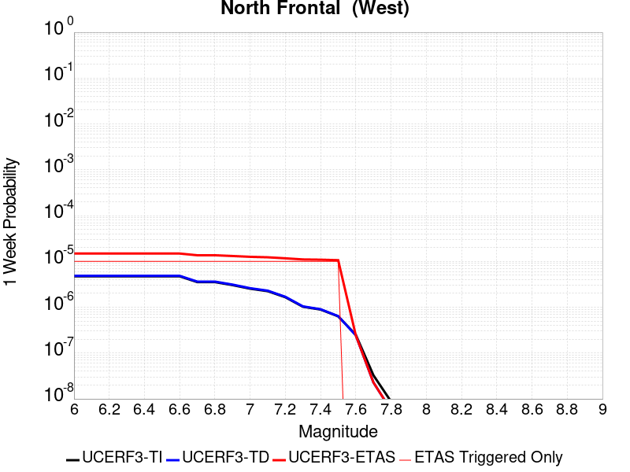 |  |  |  |

| Magnitude | 1 wk TI Prob | 1 wk TD Prob | 1 wk ETAS Prob | 1 wk ETAS/TD Gain | 1 wk ETAS Triggered Only | 1 mo TI Prob | 1 mo TD Prob | 1 mo ETAS Prob | 1 mo ETAS/TD Gain | 1 mo ETAS Triggered Only | 1 yr TI Prob | 1 yr TD Prob | 1 yr ETAS Prob | 1 yr ETAS/TD Gain | 1 yr ETAS Triggered Only | 10 yr TI Prob | 10 yr TD Prob | 10 yr ETAS Prob | 10 yr ETAS/TD Gain | 10 yr ETAS Triggered Only |
|-----|-----|-----|-----|-----|-----|-----|-----|-----|-----|-----|-----|-----|-----|-----|-----|-----|-----|-----|-----|-----|
| 6.0 | 4.7316266E-6 | 4.8526726E-6 | 2.2274191E-5 | 4.5900874 | 1.7421602E-5 | 2.0278241E-5 | 2.0797012E-5 | 3.821825E-5 | 1.83768 | 1.7421602E-5 | 2.4685962E-4 | 2.5317568E-4 | 2.7059286E-4 | 1.0687948 | 1.7421602E-5 | 0.0024658558 | 0.0025290183 | 0.0025463959 | 1.0068712 | 1.7421602E-5 |
| 6.1 | 4.7316266E-6 | 4.8526726E-6 | 2.2274191E-5 | 4.5900874 | 1.7421602E-5 | 2.0278241E-5 | 2.0797012E-5 | 3.821825E-5 | 1.83768 | 1.7421602E-5 | 2.4685962E-4 | 2.5317568E-4 | 2.7059286E-4 | 1.0687948 | 1.7421602E-5 | 0.0024658558 | 0.0025290183 | 0.0025463959 | 1.0068712 | 1.7421602E-5 |
| 6.2 | 4.7316266E-6 | 4.8526726E-6 | 2.2274191E-5 | 4.5900874 | 1.7421602E-5 | 2.0278241E-5 | 2.0797012E-5 | 3.821825E-5 | 1.83768 | 1.7421602E-5 | 2.4685962E-4 | 2.5317568E-4 | 2.7059286E-4 | 1.0687948 | 1.7421602E-5 | 0.0024658558 | 0.0025290183 | 0.0025463959 | 1.0068712 | 1.7421602E-5 |
| 6.3 | 4.7316266E-6 | 4.8526726E-6 | 2.2274191E-5 | 4.5900874 | 1.7421602E-5 | 2.0278241E-5 | 2.0797012E-5 | 3.821825E-5 | 1.83768 | 1.7421602E-5 | 2.4685962E-4 | 2.5317568E-4 | 2.7059286E-4 | 1.0687948 | 1.7421602E-5 | 0.0024658558 | 0.0025290183 | 0.0025463959 | 1.0068712 | 1.7421602E-5 |
| 6.4 | 4.7316266E-6 | 4.8526726E-6 | 2.2274191E-5 | 4.5900874 | 1.7421602E-5 | 2.0278241E-5 | 2.0797012E-5 | 3.821825E-5 | 1.83768 | 1.7421602E-5 | 2.4685962E-4 | 2.5317568E-4 | 2.7059286E-4 | 1.0687948 | 1.7421602E-5 | 0.0024658558 | 0.0025290183 | 0.0025463959 | 1.0068712 | 1.7421602E-5 |
| 6.5 | 4.7316266E-6 | 4.8526726E-6 | 2.2274191E-5 | 4.5900874 | 1.7421602E-5 | 2.0278241E-5 | 2.0797012E-5 | 3.821825E-5 | 1.83768 | 1.7421602E-5 | 2.4685962E-4 | 2.5317568E-4 | 2.7059286E-4 | 1.0687948 | 1.7421602E-5 | 0.0024658558 | 0.0025290183 | 0.0025463959 | 1.0068712 | 1.7421602E-5 |
| 6.6 | 4.7316266E-6 | 4.8526726E-6 | 2.2274191E-5 | 4.5900874 | 1.7421602E-5 | 2.0278241E-5 | 2.0797012E-5 | 3.821825E-5 | 1.83768 | 1.7421602E-5 | 2.4685962E-4 | 2.5317568E-4 | 2.7059286E-4 | 1.0687948 | 1.7421602E-5 | 0.0024658558 | 0.0025290183 | 0.0025463959 | 1.0068712 | 1.7421602E-5 |
| 6.7 | 3.5382777E-6 | 3.6308859E-6 | 2.1052425E-5 | 5.798151 | 1.7421602E-5 | 1.516396E-5 | 1.5560852E-5 | 3.298218E-5 | 2.1195617 | 1.7421602E-5 | 1.8460557E-4 | 1.8943768E-4 | 2.0685597E-4 | 1.0919474 | 1.7421602E-5 | 0.0018445229 | 0.0018928389 | 0.0019102275 | 1.0091865 | 1.7421602E-5 |
| 6.8 | 3.5382777E-6 | 3.6308859E-6 | 2.1052425E-5 | 5.798151 | 1.7421602E-5 | 1.516396E-5 | 1.5560852E-5 | 3.298218E-5 | 2.1195617 | 1.7421602E-5 | 1.8460557E-4 | 1.8943768E-4 | 2.0685597E-4 | 1.0919474 | 1.7421602E-5 | 0.0018445229 | 0.0018928389 | 0.0019102275 | 1.0091865 | 1.7421602E-5 |
| 6.9 | 3.0428037E-6 | 3.1227605E-6 | 2.0544308E-5 | 6.578893 | 1.7421602E-5 | 1.30405215E-5 | 1.33831945E-5 | 3.0804564E-5 | 2.3017347 | 1.7421602E-5 | 1.5875678E-4 | 1.6292889E-4 | 1.8034766E-4 | 1.1069102 | 1.7421602E-5 | 0.0015864341 | 0.0016281615 | 0.0016455548 | 1.0106827 | 1.7421602E-5 |
| 7.0 | 2.538778E-6 | 2.6060904E-6 | 2.0027648E-5 | 7.68494 | 1.7421602E-5 | 1.0880432E-5 | 1.1168913E-5 | 2.8590322E-5 | 2.5598123 | 1.7421602E-5 | 1.324612E-4 | 1.3597352E-4 | 1.5339274E-4 | 1.1281075 | 1.7421602E-5 | 0.0013238228 | 0.0013589499 | 0.0013763478 | 1.0128025 | 1.7421602E-5 |
| 7.1 | 2.2418935E-6 | 2.3012074E-6 | 1.972277E-5 | 8.570619 | 1.7421602E-5 | 9.60808E-6 | 9.862282E-6 | 2.7283713E-5 | 2.7664704 | 1.7421602E-5 | 1.1697209E-4 | 1.2006712E-4 | 1.3748663E-4 | 1.1450814 | 1.7421602E-5 | 0.0011691054 | 0.0012000664 | 0.0012174671 | 1.0144998 | 1.7421602E-5 |
| 7.2 | 1.6526745E-6 | 1.6924851E-6 | 1.9114059E-5 | 11.293487 | 1.7421602E-5 | 7.082872E-6 | 7.253489E-6 | 2.4674966E-5 | 3.4018064 | 1.7421602E-5 | 8.623055E-5 | 8.8307905E-5 | 1.05727966E-4 | 1.197265 | 1.7421602E-5 | 8.61971E-4 | 8.827532E-4 | 9.001594E-4 | 1.019718 | 1.7421602E-5 |
| 7.3 | 1.0246019E-6 | 1.0442261E-6 | 1.8465811E-5 | 17.68373 | 1.7421602E-5 | 4.391144E-6 | 4.4752474E-6 | 2.1896773E-5 | 4.892863 | 1.7421602E-5 | 5.3460866E-5 | 5.448489E-5 | 7.1905546E-5 | 1.3197336 | 1.7421602E-5 | 5.344801E-4 | 5.4472685E-4 | 5.62139E-4 | 1.0319649 | 1.7421602E-5 |
| 7.4 | 8.9045164E-7 | 9.0565584E-7 | 1.8327242E-5 | 20.236431 | 1.7421602E-5 | 3.8162157E-6 | 3.8813773E-6 | 2.1302913E-5 | 5.4884934 | 1.7421602E-5 | 4.646144E-5 | 4.7254853E-5 | 6.467563E-5 | 1.3686559 | 1.7421602E-5 | 4.6451724E-4 | 4.7245892E-4 | 4.898723E-4 | 1.0368569 | 1.7421602E-5 |
| 7.5 | 6.3357E-7 | 6.4027006E-7 | 1.806186E-5 | 28.209757 | 1.7421602E-5 | 2.7152971E-6 | 2.744012E-6 | 2.0165568E-5 | 7.3489356 | 1.7421602E-5 | 3.305824E-5 | 3.34079E-5 | 5.082892E-5 | 1.5214641 | 1.7421602E-5 | 3.3053322E-4 | 3.3403534E-4 | 3.5145113E-4 | 1.0521375 | 1.7421602E-5 |
| 7.6 | 2.5087024E-7 | 2.4361097E-7 | 2.4361097E-7 | 1.0 | 0.0 | 1.0751578E-6 | 1.0440467E-6 | 1.0440467E-6 | 1.0 | 0.0 | 1.3089967E-5 | 1.2711216E-5 | 1.2711216E-5 | 1.0 | 0.0 | 1.3089196E-4 | 1.2710695E-4 | 1.2710695E-4 | 1.0 | 0.0 |
| 7.7 | 3.282987E-8 | 2.2874195E-8 | 2.2874195E-8 | 1.0 | 0.0 | 1.4069944E-7 | 9.803227E-8 | 9.803227E-8 | 1.0 | 0.0 | 1.7130144E-6 | 1.1935423E-6 | 1.1935423E-6 | 1.0 | 0.0 | 1.7130013E-5 | 1.1935367E-5 | 1.1935367E-5 | 1.0 | 0.0 |
| 7.8 | 8.77499E-9 | 5.6815956E-9 | 5.6815956E-9 | 1.0 | 0.0 | 3.7607098E-8 | 2.4349696E-8 | 2.4349696E-8 | 1.0 | 0.0 | 4.578663E-7 | 2.9645753E-7 | 2.9645753E-7 | 1.0 | 0.0 | 4.5786537E-6 | 2.9645726E-6 | 2.9645726E-6 | 1.0 | 0.0 |

## Breckenridge 2011
*[(top)](#table-of-contents)*

| 1 Week | 1 Month | 1 Year | 10 Year |
|-----|-----|-----|-----|
|  |  |  |  |

| Magnitude | 1 wk TI Prob | 1 wk TD Prob | 1 wk ETAS Prob | 1 wk ETAS/TD Gain | 1 wk ETAS Triggered Only | 1 mo TI Prob | 1 mo TD Prob | 1 mo ETAS Prob | 1 mo ETAS/TD Gain | 1 mo ETAS Triggered Only | 1 yr TI Prob | 1 yr TD Prob | 1 yr ETAS Prob | 1 yr ETAS/TD Gain | 1 yr ETAS Triggered Only | 10 yr TI Prob | 10 yr TD Prob | 10 yr ETAS Prob | 10 yr ETAS/TD Gain | 10 yr ETAS Triggered Only |
|-----|-----|-----|-----|-----|-----|-----|-----|-----|-----|-----|-----|-----|-----|-----|-----|-----|-----|-----|-----|-----|
| 6.0 | 1.1490393E-6 | 6.7380773E-7 | 6.7380773E-7 | 1.0 | 0.0 | 4.924445E-6 | 2.8877444E-6 | 2.8877444E-6 | 1.0 | 0.0 | 5.995347E-5 | 3.515774E-5 | 5.2578733E-5 | 1.4955094 | 1.7421602E-5 | 5.9937296E-4 | 3.5152383E-4 | 3.689393E-4 | 1.0495428 | 1.7421602E-5 |
| 6.1 | 1.1490393E-6 | 6.7380773E-7 | 6.7380773E-7 | 1.0 | 0.0 | 4.924445E-6 | 2.8877444E-6 | 2.8877444E-6 | 1.0 | 0.0 | 5.995347E-5 | 3.515774E-5 | 5.2578733E-5 | 1.4955094 | 1.7421602E-5 | 5.9937296E-4 | 3.5152383E-4 | 3.689393E-4 | 1.0495428 | 1.7421602E-5 |
| 6.2 | 1.1490393E-6 | 6.7380773E-7 | 6.7380773E-7 | 1.0 | 0.0 | 4.924445E-6 | 2.8877444E-6 | 2.8877444E-6 | 1.0 | 0.0 | 5.995347E-5 | 3.515774E-5 | 5.2578733E-5 | 1.4955094 | 1.7421602E-5 | 5.9937296E-4 | 3.5152383E-4 | 3.689393E-4 | 1.0495428 | 1.7421602E-5 |
| 6.3 | 1.064617E-6 | 5.886475E-7 | 5.886475E-7 | 1.0 | 0.0 | 4.5626366E-6 | 2.5227728E-6 | 2.5227728E-6 | 1.0 | 0.0 | 5.5548684E-5 | 3.0714335E-5 | 4.8135404E-5 | 1.5671966 | 1.7421602E-5 | 5.55348E-4 | 3.0710208E-4 | 3.2451833E-4 | 1.0567116 | 1.7421602E-5 |
| 6.4 | 1.064617E-6 | 5.886475E-7 | 5.886475E-7 | 1.0 | 0.0 | 4.5626366E-6 | 2.5227728E-6 | 2.5227728E-6 | 1.0 | 0.0 | 5.5548684E-5 | 3.0714335E-5 | 4.8135404E-5 | 1.5671966 | 1.7421602E-5 | 5.55348E-4 | 3.0710208E-4 | 3.2451833E-4 | 1.0567116 | 1.7421602E-5 |
| 6.5 | 1.064617E-6 | 5.886475E-7 | 5.886475E-7 | 1.0 | 0.0 | 4.5626366E-6 | 2.5227728E-6 | 2.5227728E-6 | 1.0 | 0.0 | 5.5548684E-5 | 3.0714335E-5 | 4.8135404E-5 | 1.5671966 | 1.7421602E-5 | 5.55348E-4 | 3.0710208E-4 | 3.2451833E-4 | 1.0567116 | 1.7421602E-5 |
| 6.6 | 1.064617E-6 | 5.886475E-7 | 5.886475E-7 | 1.0 | 0.0 | 4.5626366E-6 | 2.5227728E-6 | 2.5227728E-6 | 1.0 | 0.0 | 5.5548684E-5 | 3.0714335E-5 | 4.8135404E-5 | 1.5671966 | 1.7421602E-5 | 5.55348E-4 | 3.0710208E-4 | 3.2451833E-4 | 1.0567116 | 1.7421602E-5 |
| 6.7 | 9.4219524E-7 | 4.954078E-7 | 4.954078E-7 | 1.0 | 0.0 | 4.037973E-6 | 2.1231745E-6 | 2.1231745E-6 | 1.0 | 0.0 | 4.916122E-5 | 2.5849351E-5 | 4.3270502E-5 | 1.6739494 | 1.7421602E-5 | 4.9150345E-4 | 2.5846408E-4 | 2.7588118E-4 | 1.067387 | 1.7421602E-5 |
| 6.8 | 8.556422E-7 | 4.311975E-7 | 4.311975E-7 | 1.0 | 0.0 | 3.667033E-6 | 1.847988E-6 | 1.847988E-6 | 1.0 | 0.0 | 4.464521E-5 | 2.2499025E-5 | 3.9920236E-5 | 1.7743096 | 1.7421602E-5 | 4.4636242E-4 | 2.2496787E-4 | 2.4238556E-4 | 1.077423 | 1.7421602E-5 |
| 6.9 | 7.7357794E-7 | 3.8420345E-7 | 3.8420345E-7 | 1.0 | 0.0 | 3.3153299E-6 | 1.6465851E-6 | 1.6465851E-6 | 1.0 | 0.0 | 4.0363393E-5 | 2.0046993E-5 | 3.7468246E-5 | 1.8690208 | 1.7421602E-5 | 4.035606E-4 | 2.0045215E-4 | 2.1787027E-4 | 1.0868942 | 1.7421602E-5 |
| 7.0 | 6.8172454E-7 | 3.3471417E-7 | 3.3471417E-7 | 1.0 | 0.0 | 2.9216735E-6 | 1.4344886E-6 | 1.4344886E-6 | 1.0 | 0.0 | 3.5570793E-5 | 1.7464761E-5 | 3.488606E-5 | 1.9975114 | 1.7421602E-5 | 3.55651E-4 | 1.746341E-4 | 1.9205267E-4 | 1.0997431 | 1.7421602E-5 |
| 7.1 | 5.5936397E-7 | 2.890966E-7 | 2.890966E-7 | 1.0 | 0.0 | 2.397272E-6 | 1.2389849E-6 | 1.2389849E-6 | 1.0 | 0.0 | 2.9186394E-5 | 1.5084538E-5 | 3.250588E-5 | 2.1549137 | 1.7421602E-5 | 2.9182562E-4 | 1.5083532E-4 | 1.682543E-4 | 1.1154834 | 1.7421602E-5 |
| 7.2 | 3.8420822E-7 | 2.0468339E-7 | 2.0468339E-7 | 1.0 | 0.0 | 1.6466057E-6 | 8.7721423E-7 | 8.7721423E-7 | 1.0 | 0.0 | 2.004724E-5 | 1.0680032E-5 | 2.8101449E-5 | 2.631214 | 1.7421602E-5 | 2.004543E-4 | 1.0679527E-4 | 1.2421502E-4 | 1.1631135 | 1.7421602E-5 |
| 7.3 | 2.6405158E-7 | 1.647323E-7 | 1.647323E-7 | 1.0 | 0.0 | 1.1316491E-6 | 7.059954E-7 | 7.059954E-7 | 1.0 | 0.0 | 1.37777415E-5 | 8.595461E-6 | 2.6016913E-5 | 3.0268202 | 1.7421602E-5 | 1.3776887E-4 | 8.5951346E-5 | 1.0337145E-4 | 1.202674 | 1.7421602E-5 |
| 7.4 | 1.792114E-7 | 1.2725314E-7 | 1.2725314E-7 | 1.0 | 0.0 | 7.6804866E-7 | 5.4537054E-7 | 5.4537054E-7 | 1.0 | 0.0 | 9.3509525E-6 | 6.6398666E-6 | 2.4061354E-5 | 3.6237707 | 1.7421602E-5 | 9.350559E-5 | 6.639673E-5 | 8.3817176E-5 | 1.262369 | 1.7421602E-5 |
| 7.5 | 1.3548703E-7 | 9.3854034E-8 | 9.3854034E-8 | 1.0 | 0.0 | 5.8065854E-7 | 4.022315E-7 | 4.022315E-7 | 1.0 | 0.0 | 7.0694946E-6 | 4.897158E-6 | 4.897158E-6 | 1.0 | 0.0 | 7.0692695E-5 | 4.8970534E-5 | 4.8970534E-5 | 1.0 | 0.0 |
| 7.6 | 2.572245E-8 | 1.7352555E-8 | 1.7352555E-8 | 1.0 | 0.0 | 1.10239064E-7 | 7.436809E-8 | 7.436809E-8 | 1.0 | 0.0 | 1.3421597E-6 | 9.054312E-7 | 9.054312E-7 | 1.0 | 0.0 | 1.3421517E-5 | 9.05428E-6 | 9.05428E-6 | 1.0 | 0.0 |

## Concord 2011 CFM
*[(top)](#table-of-contents)*

| 1 Week | 1 Month | 1 Year | 10 Year |
|-----|-----|-----|-----|
|  |  |  |  |

| Magnitude | 1 wk TI Prob | 1 wk TD Prob | 1 wk ETAS Prob | 1 wk ETAS/TD Gain | 1 wk ETAS Triggered Only | 1 mo TI Prob | 1 mo TD Prob | 1 mo ETAS Prob | 1 mo ETAS/TD Gain | 1 mo ETAS Triggered Only | 1 yr TI Prob | 1 yr TD Prob | 1 yr ETAS Prob | 1 yr ETAS/TD Gain | 1 yr ETAS Triggered Only | 10 yr TI Prob | 10 yr TD Prob | 10 yr ETAS Prob | 10 yr ETAS/TD Gain | 10 yr ETAS Triggered Only |
|-----|-----|-----|-----|-----|-----|-----|-----|-----|-----|-----|-----|-----|-----|-----|-----|-----|-----|-----|-----|-----|
| 6.0 | 5.7865112E-5 | 9.759152E-5 | 9.759152E-5 | 1.0 | 0.0 | 2.4796976E-4 | 4.1818706E-4 | 4.356014E-4 | 1.0416424 | 1.7421602E-5 | 0.0030148525 | 0.005079467 | 0.0050968 | 1.0034124 | 1.7421602E-5 | 0.029742775 | 0.049248982 | 0.049265545 | 1.0003363 | 1.7421602E-5 |
| 6.1 | 5.7865112E-5 | 9.759152E-5 | 9.759152E-5 | 1.0 | 0.0 | 2.4796976E-4 | 4.1818706E-4 | 4.356014E-4 | 1.0416424 | 1.7421602E-5 | 0.0030148525 | 0.005079467 | 0.0050968 | 1.0034124 | 1.7421602E-5 | 0.029742775 | 0.049248982 | 0.049265545 | 1.0003363 | 1.7421602E-5 |
| 6.2 | 5.6789337E-5 | 9.5795076E-5 | 9.5795076E-5 | 1.0 | 0.0 | 2.4336016E-4 | 4.104905E-4 | 4.2790495E-4 | 1.0424235 | 1.7421602E-5 | 0.0029588845 | 0.0049861916 | 0.0050035263 | 1.0034765 | 1.7421602E-5 | 0.029197963 | 0.04836556 | 0.048382137 | 1.0003427 | 1.7421602E-5 |
| 6.3 | 5.203322E-5 | 8.803056E-5 | 8.803056E-5 | 1.0 | 0.0 | 2.2298045E-4 | 3.7722368E-4 | 3.946387E-4 | 1.0461663 | 1.7421602E-5 | 0.0027114071 | 0.0045838105 | 0.004601152 | 1.0037832 | 1.7421602E-5 | 0.026785625 | 0.04453672 | 0.044553366 | 1.0003737 | 1.7421602E-5 |
| 6.4 | 4.7120942E-5 | 7.897404E-5 | 7.897404E-5 | 1.0 | 0.0 | 2.0193127E-4 | 3.3842045E-4 | 3.5583615E-4 | 1.0514617 | 1.7421602E-5 | 0.0024557412 | 0.00411323 | 0.0041305795 | 1.0042181 | 1.7421602E-5 | 0.024287801 | 0.040065527 | 0.040082254 | 1.0004174 | 1.7421602E-5 |
| 6.5 | 2.9598437E-5 | 4.667486E-5 | 4.667486E-5 | 1.0 | 0.0 | 1.2684427E-4 | 2.0002096E-4 | 2.1743908E-4 | 1.0870814 | 1.7421602E-5 | 0.001543235 | 0.0024327459 | 0.002450125 | 1.0071439 | 1.7421602E-5 | 0.015325619 | 0.023909973 | 0.023926979 | 1.0007112 | 1.7421602E-5 |
| 6.6 | 2.0443718E-5 | 2.998433E-5 | 2.998433E-5 | 1.0 | 0.0 | 8.7613E-5 | 1.2849816E-4 | 1.2849816E-4 | 1.0 | 0.0 | 0.0010661662 | 0.0015633785 | 0.0015633785 | 1.0 | 0.0 | 0.010610655 | 0.015466996 | 0.015466996 | 1.0 | 0.0 |
| 6.7 | 1.798539E-5 | 2.5557381E-5 | 2.5557381E-5 | 1.0 | 0.0 | 7.7077966E-5 | 1.0952716E-4 | 1.0952716E-4 | 1.0 | 0.0 | 9.380202E-4 | 0.001332699 | 0.001332699 | 1.0 | 0.0 | 0.009340706 | 0.013217433 | 0.013217433 | 1.0 | 0.0 |
| 6.8 | 1.613555E-5 | 2.1959211E-5 | 2.1959211E-5 | 1.0 | 0.0 | 6.915052E-5 | 9.4107585E-5 | 9.4107585E-5 | 1.0 | 0.0 | 8.4158237E-4 | 0.0011451716 | 0.0011451716 | 1.0 | 0.0 | 0.008384023 | 0.0113782035 | 0.0113782035 | 1.0 | 0.0 |
| 6.9 | 1.2916435E-5 | 1.7081054E-5 | 1.7081054E-5 | 1.0 | 0.0 | 5.5354973E-5 | 7.32025E-5 | 7.32025E-5 | 1.0 | 0.0 | 6.7373837E-4 | 8.908818E-4 | 8.908818E-4 | 1.0 | 0.0 | 0.006716994 | 0.008867139 | 0.008867139 | 1.0 | 0.0 |
| 7.0 | 9.81129E-6 | 1.2630829E-5 | 1.2630829E-5 | 1.0 | 0.0 | 4.2047708E-5 | 5.413101E-5 | 5.413101E-5 | 1.0 | 0.0 | 5.118106E-4 | 6.588474E-4 | 6.588474E-4 | 1.0 | 0.0 | 0.005106334 | 0.006569153 | 0.006569153 | 1.0 | 0.0 |
| 7.1 | 8.0889195E-6 | 1.0418261E-5 | 1.0418261E-5 | 1.0 | 0.0 | 3.4666336E-5 | 4.4648932E-5 | 4.4648932E-5 | 1.0 | 0.0 | 4.219809E-4 | 5.434662E-4 | 5.434662E-4 | 1.0 | 0.0 | 0.004211805 | 0.0054215975 | 0.0054215975 | 1.0 | 0.0 |
| 7.2 | 6.267438E-6 | 8.115699E-6 | 8.115699E-6 | 1.0 | 0.0 | 2.6860173E-5 | 3.4781104E-5 | 3.4781104E-5 | 1.0 | 0.0 | 3.2697353E-4 | 4.233784E-4 | 4.233784E-4 | 1.0 | 0.0 | 0.0032649285 | 0.004225969 | 0.004225969 | 1.0 | 0.0 |
| 7.3 | 3.6761196E-6 | 4.8401653E-6 | 4.8401653E-6 | 1.0 | 0.0 | 1.5754704E-5 | 2.0743402E-5 | 2.0743402E-5 | 1.0 | 0.0 | 1.9179663E-4 | 2.5252186E-4 | 2.5252186E-4 | 1.0 | 0.0 | 0.0019163118 | 0.002522487 | 0.002522487 | 1.0 | 0.0 |
| 7.4 | 2.8044356E-6 | 3.7096036E-6 | 3.7096036E-6 | 1.0 | 0.0 | 1.2018954E-5 | 1.5898204E-5 | 1.5898204E-5 | 1.0 | 0.0 | 1.4632095E-4 | 1.9354356E-4 | 1.9354356E-4 | 1.0 | 0.0 | 0.0014622464 | 0.0019338481 | 0.0019338481 | 1.0 | 0.0 |
| 7.5 | 2.4578699E-6 | 3.2447442E-6 | 3.2447442E-6 | 1.0 | 0.0 | 1.0533685E-5 | 1.3905973E-5 | 1.3905973E-5 | 1.0 | 0.0 | 1.2824008E-4 | 1.6929218E-4 | 1.6929218E-4 | 1.0 | 0.0 | 0.0012816609 | 0.001691713 | 0.001691713 | 1.0 | 0.0 |
| 7.6 | 1.7713267E-6 | 2.3351192E-6 | 2.3351192E-6 | 1.0 | 0.0 | 7.591378E-6 | 1.0007616E-5 | 1.0007616E-5 | 1.0 | 0.0 | 9.2421105E-5 | 1.21836E-4 | 1.21836E-4 | 1.0 | 0.0 | 9.2382677E-4 | 0.0012177454 | 0.0012177454 | 1.0 | 0.0 |
| 7.7 | 5.1912366E-7 | 6.8290143E-7 | 6.8290143E-7 | 1.0 | 0.0 | 2.2248137E-6 | 2.9267171E-6 | 2.9267171E-6 | 1.0 | 0.0 | 2.708677E-5 | 3.5632213E-5 | 3.5632213E-5 | 1.0 | 0.0 | 2.708347E-4 | 3.5627294E-4 | 3.5627294E-4 | 1.0 | 0.0 |

## West Tahoe
*[(top)](#table-of-contents)*

| 1 Week | 1 Month | 1 Year | 10 Year |
|-----|-----|-----|-----|
|  |  |  |  |

| Magnitude | 1 wk TI Prob | 1 wk TD Prob | 1 wk ETAS Prob | 1 wk ETAS/TD Gain | 1 wk ETAS Triggered Only | 1 mo TI Prob | 1 mo TD Prob | 1 mo ETAS Prob | 1 mo ETAS/TD Gain | 1 mo ETAS Triggered Only | 1 yr TI Prob | 1 yr TD Prob | 1 yr ETAS Prob | 1 yr ETAS/TD Gain | 1 yr ETAS Triggered Only | 10 yr TI Prob | 10 yr TD Prob | 10 yr ETAS Prob | 10 yr ETAS/TD Gain | 10 yr ETAS Triggered Only |
|-----|-----|-----|-----|-----|-----|-----|-----|-----|-----|-----|-----|-----|-----|-----|-----|-----|-----|-----|-----|-----|
| 6.0 | 1.952444E-5 | 2.118317E-5 | 3.8604405E-5 | 1.8224092 | 1.7421602E-5 | 8.367348E-5 | 9.078217E-5 | 1.08202184E-4 | 1.1918881 | 1.7421602E-5 | 0.0010182485 | 0.0011047672 | 0.0011221695 | 1.0157521 | 1.7421602E-5 | 0.010135954 | 0.010998235 | 0.0110154655 | 1.0015666 | 1.7421602E-5 |
| 6.1 | 1.952444E-5 | 2.118317E-5 | 3.8604405E-5 | 1.8224092 | 1.7421602E-5 | 8.367348E-5 | 9.078217E-5 | 1.08202184E-4 | 1.1918881 | 1.7421602E-5 | 0.0010182485 | 0.0011047672 | 0.0011221695 | 1.0157521 | 1.7421602E-5 | 0.010135954 | 0.010998235 | 0.0110154655 | 1.0015666 | 1.7421602E-5 |
| 6.2 | 1.952444E-5 | 2.118317E-5 | 3.8604405E-5 | 1.8224092 | 1.7421602E-5 | 8.367348E-5 | 9.078217E-5 | 1.08202184E-4 | 1.1918881 | 1.7421602E-5 | 0.0010182485 | 0.0011047672 | 0.0011221695 | 1.0157521 | 1.7421602E-5 | 0.010135954 | 0.010998235 | 0.0110154655 | 1.0015666 | 1.7421602E-5 |
| 6.3 | 1.952444E-5 | 2.118317E-5 | 3.8604405E-5 | 1.8224092 | 1.7421602E-5 | 8.367348E-5 | 9.078217E-5 | 1.08202184E-4 | 1.1918881 | 1.7421602E-5 | 0.0010182485 | 0.0011047672 | 0.0011221695 | 1.0157521 | 1.7421602E-5 | 0.010135954 | 0.010998235 | 0.0110154655 | 1.0015666 | 1.7421602E-5 |
| 6.4 | 1.952444E-5 | 2.118317E-5 | 3.8604405E-5 | 1.8224092 | 1.7421602E-5 | 8.367348E-5 | 9.078217E-5 | 1.08202184E-4 | 1.1918881 | 1.7421602E-5 | 0.0010182485 | 0.0011047672 | 0.0011221695 | 1.0157521 | 1.7421602E-5 | 0.010135954 | 0.010998235 | 0.0110154655 | 1.0015666 | 1.7421602E-5 |
| 6.5 | 1.2685271E-5 | 1.3690627E-5 | 1.3690627E-5 | 1.0 | 0.0 | 5.4364315E-5 | 5.8672893E-5 | 5.8672893E-5 | 1.0 | 0.0 | 6.616845E-4 | 7.141248E-4 | 7.141248E-4 | 1.0 | 0.0 | 0.0065971776 | 0.00711995 | 0.00711995 | 1.0 | 0.0 |
| 6.6 | 1.2685271E-5 | 1.3690627E-5 | 1.3690627E-5 | 1.0 | 0.0 | 5.4364315E-5 | 5.8672893E-5 | 5.8672893E-5 | 1.0 | 0.0 | 6.616845E-4 | 7.141248E-4 | 7.141248E-4 | 1.0 | 0.0 | 0.0065971776 | 0.00711995 | 0.00711995 | 1.0 | 0.0 |
| 6.7 | 9.117886E-6 | 9.809846E-6 | 9.809846E-6 | 1.0 | 0.0 | 3.9076072E-5 | 4.2041564E-5 | 4.2041564E-5 | 1.0 | 0.0 | 4.756473E-4 | 5.11743E-4 | 5.11743E-4 | 1.0 | 0.0 | 0.0047463053 | 0.0051063634 | 0.0051063634 | 1.0 | 0.0 |
| 6.8 | 8.786828E-6 | 9.457863E-6 | 9.457863E-6 | 1.0 | 0.0 | 3.7657293E-5 | 4.053311E-5 | 4.053311E-5 | 1.0 | 0.0 | 4.5838108E-4 | 4.933859E-4 | 4.933859E-4 | 1.0 | 0.0 | 0.0045743673 | 0.0049236063 | 0.0049236063 | 1.0 | 0.0 |
| 6.9 | 6.7562123E-6 | 7.2638086E-6 | 7.2638086E-6 | 1.0 | 0.0 | 2.8954875E-5 | 3.1130265E-5 | 3.1130265E-5 | 1.0 | 0.0 | 3.5246857E-4 | 3.789498E-4 | 3.789498E-4 | 1.0 | 0.0 | 0.0035191004 | 0.0037835082 | 0.0037835082 | 1.0 | 0.0 |
| 7.0 | 5.1792854E-6 | 5.567338E-6 | 5.567338E-6 | 1.0 | 0.0 | 2.2196748E-5 | 2.3859824E-5 | 2.3859824E-5 | 1.0 | 0.0 | 2.702119E-4 | 2.9045844E-4 | 2.9045844E-4 | 1.0 | 0.0 | 0.0026988357 | 0.0029011632 | 0.0029011632 | 1.0 | 0.0 |
| 7.1 | 4.090765E-6 | 4.3974223E-6 | 4.3974223E-6 | 1.0 | 0.0 | 1.7531731E-5 | 1.884598E-5 | 1.884598E-5 | 1.0 | 0.0 | 2.134279E-4 | 2.2942905E-4 | 2.2942905E-4 | 1.0 | 0.0 | 0.0021322304 | 0.0022922563 | 0.0022922563 | 1.0 | 0.0 |
| 7.2 | 2.2356758E-6 | 2.4023684E-6 | 2.4023684E-6 | 1.0 | 0.0 | 9.581432E-6 | 1.0295834E-5 | 1.0295834E-5 | 1.0 | 0.0 | 1.1664769E-4 | 1.2534647E-4 | 1.2534647E-4 | 1.0 | 0.0 | 0.0011658648 | 0.0012529434 | 0.0012529434 | 1.0 | 0.0 |

## Rinconada 2011 CFM
*[(top)](#table-of-contents)*

| 1 Week | 1 Month | 1 Year | 10 Year |
|-----|-----|-----|-----|
|  |  |  |  |

| Magnitude | 1 wk TI Prob | 1 wk TD Prob | 1 wk ETAS Prob | 1 wk ETAS/TD Gain | 1 wk ETAS Triggered Only | 1 mo TI Prob | 1 mo TD Prob | 1 mo ETAS Prob | 1 mo ETAS/TD Gain | 1 mo ETAS Triggered Only | 1 yr TI Prob | 1 yr TD Prob | 1 yr ETAS Prob | 1 yr ETAS/TD Gain | 1 yr ETAS Triggered Only | 10 yr TI Prob | 10 yr TD Prob | 10 yr ETAS Prob | 10 yr ETAS/TD Gain | 10 yr ETAS Triggered Only |
|-----|-----|-----|-----|-----|-----|-----|-----|-----|-----|-----|-----|-----|-----|-----|-----|-----|-----|-----|-----|-----|
| 6.0 | 1.5752368E-5 | 1.6274716E-5 | 3.3696037E-5 | 2.0704532 | 1.7421602E-5 | 6.75084E-5 | 6.974694E-5 | 8.716732E-5 | 1.2497656 | 1.7421602E-5 | 8.2160486E-4 | 8.488412E-4 | 8.6624804E-4 | 1.0205066 | 1.7421602E-5 | 0.008185739 | 0.00845637 | 0.008473644 | 1.0020428 | 1.7421602E-5 |
| 6.1 | 1.0966133E-5 | 1.1323029E-5 | 2.8744435E-5 | 2.5385818 | 1.7421602E-5 | 4.6996865E-5 | 4.852637E-5 | 6.5947126E-5 | 1.3589957 | 1.7421602E-5 | 5.720366E-4 | 5.906491E-4 | 6.080604E-4 | 1.0294783 | 1.7421602E-5 | 0.0057056635 | 0.0058908886 | 0.005908208 | 1.0029399 | 1.7421602E-5 |
| 6.2 | 1.0966133E-5 | 1.1323029E-5 | 2.8744435E-5 | 2.5385818 | 1.7421602E-5 | 4.6996865E-5 | 4.852637E-5 | 6.5947126E-5 | 1.3589957 | 1.7421602E-5 | 5.720366E-4 | 5.906491E-4 | 6.080604E-4 | 1.0294783 | 1.7421602E-5 | 0.0057056635 | 0.0058908886 | 0.005908208 | 1.0029399 | 1.7421602E-5 |
| 6.3 | 8.926149E-6 | 9.212771E-6 | 2.6634214E-5 | 2.8910098 | 1.7421602E-5 | 3.8254362E-5 | 3.948271E-5 | 5.6903627E-5 | 1.441229 | 1.7421602E-5 | 4.6564735E-4 | 4.805963E-4 | 4.9800955E-4 | 1.0362326 | 1.7421602E-5 | 0.0046467283 | 0.0047956146 | 0.0048129526 | 1.0036154 | 1.7421602E-5 |
| 6.4 | 7.676955E-6 | 7.920191E-6 | 7.920191E-6 | 1.0 | 0.0 | 3.290082E-5 | 3.3943234E-5 | 3.3943234E-5 | 1.0 | 0.0 | 4.0049385E-4 | 4.1318068E-4 | 4.1318068E-4 | 1.0 | 0.0 | 0.0039977287 | 0.004124151 | 0.004124151 | 1.0 | 0.0 |
| 6.5 | 6.1671026E-6 | 6.3589546E-6 | 6.3589546E-6 | 1.0 | 0.0 | 2.6430173E-5 | 2.725238E-5 | 2.725238E-5 | 1.0 | 0.0 | 3.2173982E-4 | 3.317473E-4 | 3.317473E-4 | 1.0 | 0.0 | 0.003212744 | 0.0033125326 | 0.0033125326 | 1.0 | 0.0 |
| 6.6 | 5.553456E-6 | 5.7248126E-6 | 5.7248126E-6 | 1.0 | 0.0 | 2.3800309E-5 | 2.453468E-5 | 2.453468E-5 | 1.0 | 0.0 | 2.897302E-4 | 2.9866883E-4 | 2.9866883E-4 | 1.0 | 0.0 | 0.0028935277 | 0.002982683 | 0.002982683 | 1.0 | 0.0 |
| 6.7 | 4.787857E-6 | 4.9333094E-6 | 4.9333094E-6 | 1.0 | 0.0 | 2.0519226E-5 | 2.1142583E-5 | 2.1142583E-5 | 1.0 | 0.0 | 2.4979294E-4 | 2.573806E-4 | 2.573806E-4 | 1.0 | 0.0 | 0.0024951235 | 0.0025708308 | 0.0025708308 | 1.0 | 0.0 |
| 6.8 | 3.9955166E-6 | 4.1134763E-6 | 4.1134763E-6 | 1.0 | 0.0 | 1.7123532E-5 | 1.7629065E-5 | 1.7629065E-5 | 1.0 | 0.0 | 2.0845905E-4 | 2.1461274E-4 | 2.1461274E-4 | 1.0 | 0.0 | 0.002082636 | 0.0021440585 | 0.0021440585 | 1.0 | 0.0 |
| 6.9 | 3.4250072E-6 | 3.5224464E-6 | 3.5224464E-6 | 1.0 | 0.0 | 1.46785205E-5 | 1.5096111E-5 | 1.5096111E-5 | 1.0 | 0.0 | 1.7869633E-4 | 1.8377967E-4 | 1.8377967E-4 | 1.0 | 0.0 | 0.001785527 | 0.0018362794 | 0.0018362794 | 1.0 | 0.0 |
| 7.0 | 2.7712713E-6 | 2.8467E-6 | 2.8467E-6 | 1.0 | 0.0 | 1.1876823E-5 | 1.2200086E-5 | 1.2200086E-5 | 1.0 | 0.0 | 1.4459073E-4 | 1.4852593E-4 | 1.4852593E-4 | 1.0 | 0.0 | 0.0014449668 | 0.0014842682 | 0.0014842682 | 1.0 | 0.0 |
| 7.1 | 2.227358E-6 | 2.2856984E-6 | 2.2856984E-6 | 1.0 | 0.0 | 9.545785E-6 | 9.795814E-6 | 9.795814E-6 | 1.0 | 0.0 | 1.16213734E-4 | 1.19257515E-4 | 1.19257515E-4 | 1.0 | 0.0 | 0.0011615298 | 0.0011919362 | 0.0011919362 | 1.0 | 0.0 |
| 7.2 | 1.581796E-6 | 1.6209011E-6 | 1.6209011E-6 | 1.0 | 0.0 | 6.779108E-6 | 6.9467005E-6 | 6.9467005E-6 | 1.0 | 0.0 | 8.253252E-5 | 8.457281E-5 | 8.457281E-5 | 1.0 | 0.0 | 8.250187E-4 | 8.454067E-4 | 8.454067E-4 | 1.0 | 0.0 |
| 7.3 | 1.0306567E-6 | 1.0546477E-6 | 1.0546477E-6 | 1.0 | 0.0 | 4.4170924E-6 | 4.519911E-6 | 4.519911E-6 | 1.0 | 0.0 | 5.3776774E-5 | 5.5028526E-5 | 5.5028526E-5 | 1.0 | 0.0 | 5.376376E-4 | 5.5014924E-4 | 5.5014924E-4 | 1.0 | 0.0 |
| 7.4 | 6.535541E-7 | 6.682742E-7 | 6.682742E-7 | 1.0 | 0.0 | 2.800943E-6 | 2.864029E-6 | 2.864029E-6 | 1.0 | 0.0 | 3.4100947E-5 | 3.4868997E-5 | 3.4868997E-5 | 1.0 | 0.0 | 3.4095717E-4 | 3.4863537E-4 | 3.4863537E-4 | 1.0 | 0.0 |
| 7.5 | 3.2656962E-7 | 3.3316687E-7 | 3.3316687E-7 | 1.0 | 0.0 | 1.3995833E-6 | 1.4278572E-6 | 1.4278572E-6 | 1.0 | 0.0 | 1.7039794E-5 | 1.7384024E-5 | 1.7384024E-5 | 1.0 | 0.0 | 1.7038487E-4 | 1.7382667E-4 | 1.7382667E-4 | 1.0 | 0.0 |
| 7.6 | 9.754343E-8 | 9.82099E-8 | 9.82099E-8 | 1.0 | 0.0 | 4.180432E-7 | 4.208995E-7 | 4.208995E-7 | 1.0 | 0.0 | 5.089664E-6 | 5.1244397E-6 | 5.1244397E-6 | 1.0 | 0.0 | 5.0895473E-5 | 5.1243223E-5 | 5.1243223E-5 | 1.0 | 0.0 |
| 7.7 | 6.0001453E-9 | 5.8490435E-9 | 5.8490435E-9 | 1.0 | 0.0 | 2.5714908E-8 | 2.506733E-8 | 2.506733E-8 | 1.0 | 0.0 | 3.1307894E-7 | 3.051947E-7 | 3.051947E-7 | 1.0 | 0.0 | 3.1307852E-6 | 3.051943E-6 | 3.051943E-6 | 1.0 | 0.0 |
| 7.8 | 7.400003E-11 | 7.4654505E-11 | 7.4654505E-11 | 1.0 | 0.0 | 3.171432E-10 | 3.1994773E-10 | 3.1994773E-10 | 1.0 | 0.0 | 3.861218E-9 | 3.895363E-9 | 3.895363E-9 | 1.0 | 0.0 | 3.861218E-8 | 3.895363E-8 | 3.895363E-8 | 1.0 | 0.0 |

## Antelope Valley 2011
*[(top)](#table-of-contents)*

| 1 Week | 1 Month | 1 Year | 10 Year |
|-----|-----|-----|-----|
|  |  |  |  |

| Magnitude | 1 wk TI Prob | 1 wk TD Prob | 1 wk ETAS Prob | 1 wk ETAS/TD Gain | 1 wk ETAS Triggered Only | 1 mo TI Prob | 1 mo TD Prob | 1 mo ETAS Prob | 1 mo ETAS/TD Gain | 1 mo ETAS Triggered Only | 1 yr TI Prob | 1 yr TD Prob | 1 yr ETAS Prob | 1 yr ETAS/TD Gain | 1 yr ETAS Triggered Only | 10 yr TI Prob | 10 yr TD Prob | 10 yr ETAS Prob | 10 yr ETAS/TD Gain | 10 yr ETAS Triggered Only |
|-----|-----|-----|-----|-----|-----|-----|-----|-----|-----|-----|-----|-----|-----|-----|-----|-----|-----|-----|-----|-----|
| 6.0 | 3.1646934E-5 | 3.6904403E-5 | 3.6904403E-5 | 1.0 | 0.0 | 1.3562266E-4 | 1.5815363E-4 | 1.5815363E-4 | 1.0 | 0.0 | 0.0016499552 | 0.0019240845 | 0.0019414725 | 1.009037 | 1.7421602E-5 | 0.016377583 | 0.019100651 | 0.019117739 | 1.0008947 | 1.7421602E-5 |
| 6.1 | 3.1646934E-5 | 3.6904403E-5 | 3.6904403E-5 | 1.0 | 0.0 | 1.3562266E-4 | 1.5815363E-4 | 1.5815363E-4 | 1.0 | 0.0 | 0.0016499552 | 0.0019240845 | 0.0019414725 | 1.009037 | 1.7421602E-5 | 0.016377583 | 0.019100651 | 0.019117739 | 1.0008947 | 1.7421602E-5 |
| 6.2 | 3.1646934E-5 | 3.6904403E-5 | 3.6904403E-5 | 1.0 | 0.0 | 1.3562266E-4 | 1.5815363E-4 | 1.5815363E-4 | 1.0 | 0.0 | 0.0016499552 | 0.0019240845 | 0.0019414725 | 1.009037 | 1.7421602E-5 | 0.016377583 | 0.019100651 | 0.019117739 | 1.0008947 | 1.7421602E-5 |
| 6.3 | 3.1646934E-5 | 3.6904403E-5 | 3.6904403E-5 | 1.0 | 0.0 | 1.3562266E-4 | 1.5815363E-4 | 1.5815363E-4 | 1.0 | 0.0 | 0.0016499552 | 0.0019240845 | 0.0019414725 | 1.009037 | 1.7421602E-5 | 0.016377583 | 0.019100651 | 0.019117739 | 1.0008947 | 1.7421602E-5 |
| 6.4 | 3.1646934E-5 | 3.6904403E-5 | 3.6904403E-5 | 1.0 | 0.0 | 1.3562266E-4 | 1.5815363E-4 | 1.5815363E-4 | 1.0 | 0.0 | 0.0016499552 | 0.0019240845 | 0.0019414725 | 1.009037 | 1.7421602E-5 | 0.016377583 | 0.019100651 | 0.019117739 | 1.0008947 | 1.7421602E-5 |
| 6.5 | 1.8034107E-5 | 2.0940959E-5 | 2.0940959E-5 | 1.0 | 0.0 | 7.7286735E-5 | 8.974457E-5 | 8.974457E-5 | 1.0 | 0.0 | 9.405598E-4 | 0.0010922146 | 0.0010922146 | 1.0 | 0.0 | 0.009365888 | 0.010880542 | 0.010880542 | 1.0 | 0.0 |
| 6.6 | 1.8034107E-5 | 2.0940959E-5 | 2.0940959E-5 | 1.0 | 0.0 | 7.7286735E-5 | 8.974457E-5 | 8.974457E-5 | 1.0 | 0.0 | 9.405598E-4 | 0.0010922146 | 0.0010922146 | 1.0 | 0.0 | 0.009365888 | 0.010880542 | 0.010880542 | 1.0 | 0.0 |
| 6.7 | 1.3567667E-5 | 1.5749509E-5 | 1.5749509E-5 | 1.0 | 0.0 | 5.814585E-5 | 6.749675E-5 | 6.749675E-5 | 1.0 | 0.0 | 7.076958E-4 | 8.2156935E-4 | 8.2156935E-4 | 1.0 | 0.0 | 0.007054463 | 0.008195754 | 0.008195754 | 1.0 | 0.0 |
| 6.8 | 9.867387E-6 | 1.1467935E-5 | 1.1467935E-5 | 1.0 | 0.0 | 4.2288117E-5 | 4.91479E-5 | 4.91479E-5 | 1.0 | 0.0 | 5.1473617E-4 | 5.9830636E-4 | 5.9830636E-4 | 1.0 | 0.0 | 0.005135455 | 0.005976268 | 0.005976268 | 1.0 | 0.0 |
| 6.9 | 7.273233E-6 | 8.454864E-6 | 8.454864E-6 | 1.0 | 0.0 | 3.1170628E-5 | 3.623513E-5 | 3.623513E-5 | 1.0 | 0.0 | 3.794363E-4 | 4.411627E-4 | 4.411627E-4 | 1.0 | 0.0 | 0.0037878908 | 0.004411627 | 0.004411627 | 1.0 | 0.0 |

## Pine Mtn
*[(top)](#table-of-contents)*

| 1 Week | 1 Month | 1 Year | 10 Year |
|-----|-----|-----|-----|
|  | 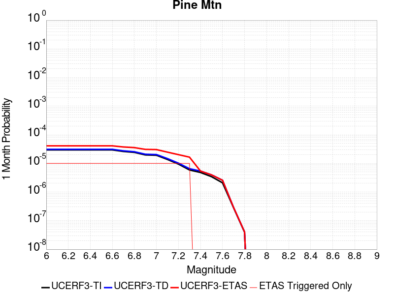 |  |  |

| Magnitude | 1 wk TI Prob | 1 wk TD Prob | 1 wk ETAS Prob | 1 wk ETAS/TD Gain | 1 wk ETAS Triggered Only | 1 mo TI Prob | 1 mo TD Prob | 1 mo ETAS Prob | 1 mo ETAS/TD Gain | 1 mo ETAS Triggered Only | 1 yr TI Prob | 1 yr TD Prob | 1 yr ETAS Prob | 1 yr ETAS/TD Gain | 1 yr ETAS Triggered Only | 10 yr TI Prob | 10 yr TD Prob | 10 yr ETAS Prob | 10 yr ETAS/TD Gain | 10 yr ETAS Triggered Only |
|-----|-----|-----|-----|-----|-----|-----|-----|-----|-----|-----|-----|-----|-----|-----|-----|-----|-----|-----|-----|-----|
| 6.0 | 6.894797E-6 | 7.225461E-6 | 2.4646939E-5 | 3.411123 | 1.7421602E-5 | 2.9548795E-5 | 3.096591E-5 | 4.8386974E-5 | 1.5625885 | 1.7421602E-5 | 3.596972E-4 | 3.7694772E-4 | 3.9436278E-4 | 1.0462002 | 1.7421602E-5 | 0.0035911554 | 0.003763381 | 0.003780737 | 1.0046118 | 1.7421602E-5 |
| 6.1 | 6.894797E-6 | 7.225461E-6 | 2.4646939E-5 | 3.411123 | 1.7421602E-5 | 2.9548795E-5 | 3.096591E-5 | 4.8386974E-5 | 1.5625885 | 1.7421602E-5 | 3.596972E-4 | 3.7694772E-4 | 3.9436278E-4 | 1.0462002 | 1.7421602E-5 | 0.0035911554 | 0.003763381 | 0.003780737 | 1.0046118 | 1.7421602E-5 |
| 6.2 | 6.894797E-6 | 7.225461E-6 | 2.4646939E-5 | 3.411123 | 1.7421602E-5 | 2.9548795E-5 | 3.096591E-5 | 4.8386974E-5 | 1.5625885 | 1.7421602E-5 | 3.596972E-4 | 3.7694772E-4 | 3.9436278E-4 | 1.0462002 | 1.7421602E-5 | 0.0035911554 | 0.003763381 | 0.003780737 | 1.0046118 | 1.7421602E-5 |
| 6.3 | 6.894797E-6 | 7.225461E-6 | 2.4646939E-5 | 3.411123 | 1.7421602E-5 | 2.9548795E-5 | 3.096591E-5 | 4.8386974E-5 | 1.5625885 | 1.7421602E-5 | 3.596972E-4 | 3.7694772E-4 | 3.9436278E-4 | 1.0462002 | 1.7421602E-5 | 0.0035911554 | 0.003763381 | 0.003780737 | 1.0046118 | 1.7421602E-5 |
| 6.4 | 6.894797E-6 | 7.225461E-6 | 2.4646939E-5 | 3.411123 | 1.7421602E-5 | 2.9548795E-5 | 3.096591E-5 | 4.8386974E-5 | 1.5625885 | 1.7421602E-5 | 3.596972E-4 | 3.7694772E-4 | 3.9436278E-4 | 1.0462002 | 1.7421602E-5 | 0.0035911554 | 0.003763381 | 0.003780737 | 1.0046118 | 1.7421602E-5 |
| 6.5 | 6.894797E-6 | 7.225461E-6 | 2.4646939E-5 | 3.411123 | 1.7421602E-5 | 2.9548795E-5 | 3.096591E-5 | 4.8386974E-5 | 1.5625885 | 1.7421602E-5 | 3.596972E-4 | 3.7694772E-4 | 3.9436278E-4 | 1.0462002 | 1.7421602E-5 | 0.0035911554 | 0.003763381 | 0.003780737 | 1.0046118 | 1.7421602E-5 |
| 6.6 | 6.894797E-6 | 7.225461E-6 | 2.4646939E-5 | 3.411123 | 1.7421602E-5 | 2.9548795E-5 | 3.096591E-5 | 4.8386974E-5 | 1.5625885 | 1.7421602E-5 | 3.596972E-4 | 3.7694772E-4 | 3.9436278E-4 | 1.0462002 | 1.7421602E-5 | 0.0035911554 | 0.003763381 | 0.003780737 | 1.0046118 | 1.7421602E-5 |
| 6.7 | 6.0867933E-6 | 6.3971133E-6 | 2.3818604E-5 | 3.7233365 | 1.7421602E-5 | 2.6085996E-5 | 2.7415923E-5 | 4.483705E-5 | 1.6354382 | 1.7421602E-5 | 3.1755073E-4 | 3.3373994E-4 | 3.5115573E-4 | 1.0521837 | 1.7421602E-5 | 0.0031709734 | 0.0033326065 | 0.0033499699 | 1.0052102 | 1.7421602E-5 |
| 6.8 | 5.6530425E-6 | 5.9505956E-6 | 2.3372095E-5 | 3.92769 | 1.7421602E-5 | 2.42271E-5 | 2.5502315E-5 | 4.292347E-5 | 1.6831207 | 1.7421602E-5 | 2.94925E-4 | 3.104485E-4 | 3.278647E-4 | 1.0561001 | 1.7421602E-5 | 0.002945339 | 0.0031003528 | 0.0031177204 | 1.0056018 | 1.7421602E-5 |
| 6.9 | 4.6015225E-6 | 4.863834E-6 | 2.2285352E-5 | 4.5818486 | 1.7421602E-5 | 1.9720663E-5 | 2.0844845E-5 | 3.8266084E-5 | 1.8357577 | 1.7421602E-5 | 2.4007261E-4 | 2.5375787E-4 | 2.7117506E-4 | 1.068637 | 1.7421602E-5 | 0.0023981342 | 0.0025348254 | 0.002552203 | 1.0068555 | 1.7421602E-5 |
| 7.0 | 4.4875965E-6 | 4.747473E-6 | 2.2168993E-5 | 4.6696405 | 1.7421602E-5 | 1.9232413E-5 | 2.0346162E-5 | 3.776741E-5 | 1.8562424 | 1.7421602E-5 | 2.3412947E-4 | 2.4768783E-4 | 2.651051E-4 | 1.0703195 | 1.7421602E-5 | 0.0023388295 | 0.0024742614 | 0.00249164 | 1.0070237 | 1.7421602E-5 |
| 7.1 | 3.203907E-6 | 3.4294096E-6 | 2.0850952E-5 | 6.0800414 | 1.7421602E-5 | 1.3730958E-5 | 1.4697391E-5 | 3.2118736E-5 | 2.185336 | 1.7421602E-5 | 1.6716159E-4 | 1.789267E-4 | 1.963452E-4 | 1.0973499 | 1.7421602E-5 | 0.0016703589 | 0.0017878925 | 0.001805283 | 1.0097268 | 1.7421602E-5 |
| 7.2 | 2.2060601E-6 | 2.3784817E-6 | 1.9800043E-5 | 8.3246565 | 1.7421602E-5 | 9.4545085E-6 | 1.0193455E-5 | 2.761488E-5 | 2.7090795 | 1.7421602E-5 | 1.15102564E-4 | 1.240987E-4 | 1.4151815E-4 | 1.1403676 | 1.7421602E-5 | 0.0011504296 | 0.0012403389 | 0.0012577389 | 1.0140284 | 1.7421602E-5 |
| 7.3 | 1.3765207E-6 | 1.5216481E-6 | 1.8943225E-5 | 12.44915 | 1.7421602E-5 | 5.899361E-6 | 6.521333E-6 | 2.3942823E-5 | 3.6714613 | 1.7421602E-5 | 7.182235E-5 | 7.939443E-5 | 9.681465E-5 | 1.2194136 | 1.7421602E-5 | 7.1799144E-4 | 7.936697E-4 | 8.1107754E-4 | 1.0219333 | 1.7421602E-5 |
| 7.4 | 1.1245983E-6 | 1.2587075E-6 | 1.2587075E-6 | 1.0 | 0.0 | 4.819698E-6 | 5.39445E-6 | 5.39445E-6 | 1.0 | 0.0 | 5.8678244E-5 | 6.567554E-5 | 6.567554E-5 | 1.0 | 0.0 | 5.866275E-4 | 6.5656955E-4 | 6.5656955E-4 | 1.0 | 0.0 |
| 7.5 | 8.031682E-7 | 9.276951E-7 | 9.276951E-7 | 1.0 | 0.0 | 3.4421448E-6 | 3.9758306E-6 | 3.9758306E-6 | 1.0 | 0.0 | 4.1907308E-5 | 4.840473E-5 | 4.840473E-5 | 1.0 | 0.0 | 4.1899405E-4 | 4.8394862E-4 | 4.8394862E-4 | 1.0 | 0.0 |
| 7.6 | 4.8953444E-7 | 6.003009E-7 | 6.003009E-7 | 1.0 | 0.0 | 2.098003E-6 | 2.5727159E-6 | 2.5727159E-6 | 1.0 | 0.0 | 2.5542888E-5 | 3.1322415E-5 | 3.1322415E-5 | 1.0 | 0.0 | 2.5539953E-4 | 3.1318486E-4 | 3.1318486E-4 | 1.0 | 0.0 |
| 7.7 | 6.634529E-8 | 6.788826E-8 | 6.788826E-8 | 1.0 | 0.0 | 2.843369E-7 | 2.9094966E-7 | 2.9094966E-7 | 1.0 | 0.0 | 3.4617963E-6 | 3.5423066E-6 | 3.5423066E-6 | 1.0 | 0.0 | 3.4617424E-5 | 3.542255E-5 | 3.542255E-5 | 1.0 | 0.0 |
| 7.8 | 9.235578E-9 | 9.488566E-9 | 9.488566E-9 | 1.0 | 0.0 | 3.9581046E-8 | 4.0665284E-8 | 4.0665284E-8 | 1.0 | 0.0 | 4.818991E-7 | 4.950997E-7 | 4.950997E-7 | 1.0 | 0.0 | 4.8189804E-6 | 4.950988E-6 | 4.950988E-6 | 1.0 | 0.0 |

## San Gabriel (Extension)
*[(top)](#table-of-contents)*

| 1 Week | 1 Month | 1 Year | 10 Year |
|-----|-----|-----|-----|
| 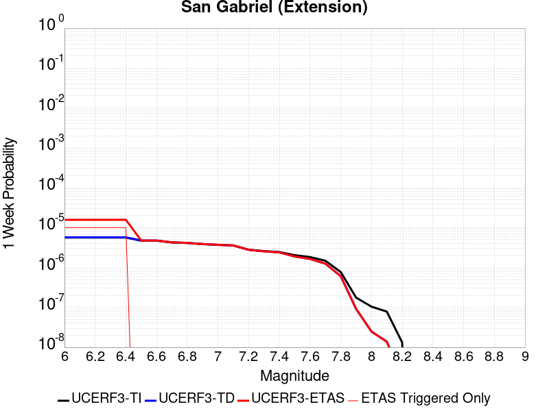 |  |  |  |

| Magnitude | 1 wk TI Prob | 1 wk TD Prob | 1 wk ETAS Prob | 1 wk ETAS/TD Gain | 1 wk ETAS Triggered Only | 1 mo TI Prob | 1 mo TD Prob | 1 mo ETAS Prob | 1 mo ETAS/TD Gain | 1 mo ETAS Triggered Only | 1 yr TI Prob | 1 yr TD Prob | 1 yr ETAS Prob | 1 yr ETAS/TD Gain | 1 yr ETAS Triggered Only | 10 yr TI Prob | 10 yr TD Prob | 10 yr ETAS Prob | 10 yr ETAS/TD Gain | 10 yr ETAS Triggered Only |
|-----|-----|-----|-----|-----|-----|-----|-----|-----|-----|-----|-----|-----|-----|-----|-----|-----|-----|-----|-----|-----|
| 6.0 | 5.6486106E-6 | 5.7168304E-6 | 2.3138333E-5 | 4.047406 | 1.7421602E-5 | 2.4208108E-5 | 2.450048E-5 | 4.1921656E-5 | 1.7110546 | 1.7421602E-5 | 2.9469383E-4 | 2.9825376E-4 | 3.1567016E-4 | 1.0583946 | 1.7421602E-5 | 0.0029430336 | 0.0029786653 | 0.002996035 | 1.0058314 | 1.7421602E-5 |
| 6.1 | 5.6486106E-6 | 5.7168304E-6 | 2.3138333E-5 | 4.047406 | 1.7421602E-5 | 2.4208108E-5 | 2.450048E-5 | 4.1921656E-5 | 1.7110546 | 1.7421602E-5 | 2.9469383E-4 | 2.9825376E-4 | 3.1567016E-4 | 1.0583946 | 1.7421602E-5 | 0.0029430336 | 0.0029786653 | 0.002996035 | 1.0058314 | 1.7421602E-5 |
| 6.2 | 5.6486106E-6 | 5.7168304E-6 | 2.3138333E-5 | 4.047406 | 1.7421602E-5 | 2.4208108E-5 | 2.450048E-5 | 4.1921656E-5 | 1.7110546 | 1.7421602E-5 | 2.9469383E-4 | 2.9825376E-4 | 3.1567016E-4 | 1.0583946 | 1.7421602E-5 | 0.0029430336 | 0.0029786653 | 0.002996035 | 1.0058314 | 1.7421602E-5 |
| 6.3 | 5.6486106E-6 | 5.7168304E-6 | 2.3138333E-5 | 4.047406 | 1.7421602E-5 | 2.4208108E-5 | 2.450048E-5 | 4.1921656E-5 | 1.7110546 | 1.7421602E-5 | 2.9469383E-4 | 2.9825376E-4 | 3.1567016E-4 | 1.0583946 | 1.7421602E-5 | 0.0029430336 | 0.0029786653 | 0.002996035 | 1.0058314 | 1.7421602E-5 |
| 6.4 | 5.6486106E-6 | 5.7168304E-6 | 2.3138333E-5 | 4.047406 | 1.7421602E-5 | 2.4208108E-5 | 2.450048E-5 | 4.1921656E-5 | 1.7110546 | 1.7421602E-5 | 2.9469383E-4 | 2.9825376E-4 | 3.1567016E-4 | 1.0583946 | 1.7421602E-5 | 0.0029430336 | 0.0029786653 | 0.002996035 | 1.0058314 | 1.7421602E-5 |
| 6.5 | 4.7134554E-6 | 4.7542544E-6 | 4.7542544E-6 | 1.0 | 0.0 | 2.0200367E-5 | 2.0375222E-5 | 2.0375222E-5 | 1.0 | 0.0 | 2.459117E-4 | 2.4804095E-4 | 2.4804095E-4 | 1.0 | 0.0 | 0.0024563975 | 0.002477729 | 0.002477729 | 1.0 | 0.0 |
| 6.6 | 4.7134554E-6 | 4.7542544E-6 | 4.7542544E-6 | 1.0 | 0.0 | 2.0200367E-5 | 2.0375222E-5 | 2.0375222E-5 | 1.0 | 0.0 | 2.459117E-4 | 2.4804095E-4 | 2.4804095E-4 | 1.0 | 0.0 | 0.0024563975 | 0.002477729 | 0.002477729 | 1.0 | 0.0 |
| 6.7 | 4.2468837E-6 | 4.2740717E-6 | 4.2740717E-6 | 1.0 | 0.0 | 1.8200803E-5 | 1.8317325E-5 | 1.8317325E-5 | 1.0 | 0.0 | 2.2157225E-4 | 2.2299135E-4 | 2.2299135E-4 | 1.0 | 0.0 | 0.0022135144 | 0.0022277518 | 0.0022277518 | 1.0 | 0.0 |
| 6.8 | 4.1180615E-6 | 4.1414614E-6 | 4.1414614E-6 | 1.0 | 0.0 | 1.7648716E-5 | 1.7749004E-5 | 1.7749004E-5 | 1.0 | 0.0 | 2.1485193E-4 | 2.160734E-4 | 2.160734E-4 | 1.0 | 0.0 | 0.0021464431 | 0.0021587082 | 0.0021587082 | 1.0 | 0.0 |
| 6.9 | 3.863861E-6 | 3.8797766E-6 | 3.8797766E-6 | 1.0 | 0.0 | 1.65593E-5 | 1.6627511E-5 | 1.6627511E-5 | 1.0 | 0.0 | 2.0159081E-4 | 2.0242184E-4 | 2.0242184E-4 | 1.0 | 0.0 | 0.0020140803 | 0.002022446 | 0.002022446 | 1.0 | 0.0 |
| 7.0 | 3.6947372E-6 | 3.705676E-6 | 3.705676E-6 | 1.0 | 0.0 | 1.5834492E-5 | 1.5881375E-5 | 1.5881375E-5 | 1.0 | 0.0 | 1.9276788E-4 | 1.9333926E-4 | 1.9333926E-4 | 1.0 | 0.0 | 0.0019260074 | 0.0019317807 | 0.0019317807 | 1.0 | 0.0 |
| 7.1 | 3.5686835E-6 | 3.5728963E-6 | 3.5728963E-6 | 1.0 | 0.0 | 1.5294268E-5 | 1.5312327E-5 | 1.5312327E-5 | 1.0 | 0.0 | 1.861918E-4 | 1.8641229E-4 | 1.8641229E-4 | 1.0 | 0.0 | 0.0018603588 | 0.0018626289 | 0.0018626289 | 1.0 | 0.0 |
| 7.2 | 2.8023446E-6 | 2.7767885E-6 | 2.7767885E-6 | 1.0 | 0.0 | 1.2009994E-5 | 1.1900468E-5 | 1.1900468E-5 | 1.0 | 0.0 | 1.4621185E-4 | 1.4487868E-4 | 1.4487868E-4 | 1.0 | 0.0 | 0.001461157 | 0.0014478569 | 0.0014478569 | 1.0 | 0.0 |
| 7.3 | 2.5843012E-6 | 2.5459642E-6 | 2.5459642E-6 | 1.0 | 0.0 | 1.1075529E-5 | 1.0911231E-5 | 1.0911231E-5 | 1.0 | 0.0 | 1.3483623E-4 | 1.3283623E-4 | 1.3283623E-4 | 1.0 | 0.0 | 0.0013475444 | 0.0013275818 | 0.0013275818 | 1.0 | 0.0 |
| 7.4 | 2.4464468E-6 | 2.396665E-6 | 2.396665E-6 | 1.0 | 0.0 | 1.04847295E-5 | 1.0271382E-5 | 1.0271382E-5 | 1.0 | 0.0 | 1.276441E-4 | 1.25047E-4 | 1.25047E-4 | 1.0 | 0.0 | 0.0012757082 | 0.0012497796 | 0.0012497796 | 1.0 | 0.0 |
| 7.5 | 2.0420266E-6 | 1.8910426E-6 | 1.8910426E-6 | 1.0 | 0.0 | 8.751514E-6 | 8.104444E-6 | 8.104444E-6 | 1.0 | 0.0 | 1.0654447E-4 | 9.8667166E-5 | 9.8667166E-5 | 1.0 | 0.0 | 0.001064934 | 9.862408E-4 | 9.862408E-4 | 1.0 | 0.0 |
| 7.6 | 1.8326596E-6 | 1.6398341E-6 | 1.6398341E-6 | 1.0 | 0.0 | 7.854232E-6 | 7.0278415E-6 | 7.0278415E-6 | 1.0 | 0.0 | 9.562107E-5 | 8.5560634E-5 | 8.5560634E-5 | 1.0 | 0.0 | 9.5579936E-4 | 8.5528276E-4 | 8.5528276E-4 | 1.0 | 0.0 |
| 7.7 | 1.4786998E-6 | 1.2523838E-6 | 1.2523838E-6 | 1.0 | 0.0 | 6.3372695E-6 | 5.367348E-6 | 5.367348E-6 | 1.0 | 0.0 | 7.715353E-5 | 6.534551E-5 | 6.534551E-5 | 1.0 | 0.0 | 7.7126746E-4 | 6.532707E-4 | 6.532707E-4 | 1.0 | 0.0 |
| 7.8 | 7.6975533E-7 | 6.0693884E-7 | 6.0693884E-7 | 1.0 | 0.0 | 3.2989474E-6 | 2.601164E-6 | 2.601164E-6 | 1.0 | 0.0 | 4.0163945E-5 | 3.166871E-5 | 3.166871E-5 | 1.0 | 0.0 | 4.0156685E-4 | 3.1664805E-4 | 3.1664805E-4 | 1.0 | 0.0 |
| 7.9 | 1.7645915E-7 | 9.213256E-8 | 9.213256E-8 | 1.0 | 0.0 | 7.562533E-7 | 3.9485377E-7 | 3.9485377E-7 | 1.0 | 0.0 | 9.207345E-6 | 4.807334E-6 | 4.807334E-6 | 1.0 | 0.0 | 9.206964E-5 | 4.807699E-5 | 4.807699E-5 | 1.0 | 0.0 |
| 8.0 | 1.0463461E-7 | 2.4949307E-8 | 2.4949307E-8 | 1.0 | 0.0 | 4.4843398E-7 | 1.0692559E-7 | 1.0692559E-7 | 1.0 | 0.0 | 5.45967E-6 | 1.3018183E-6 | 1.3018183E-6 | 1.0 | 0.0 | 5.459536E-5 | 1.3022789E-5 | 1.3022789E-5 | 1.0 | 0.0 |
| 8.1 | 7.875717E-8 | 1.3866874E-8 | 1.3866874E-8 | 1.0 | 0.0 | 3.3753068E-7 | 5.942946E-8 | 5.942946E-8 | 1.0 | 0.0 | 4.109428E-6 | 7.235534E-7 | 7.235534E-7 | 1.0 | 0.0 | 4.109352E-5 | 7.2401926E-6 | 7.2401926E-6 | 1.0 | 0.0 |
| 8.2 | 1.33163E-8 | 1.7733891E-9 | 1.7733891E-9 | 1.0 | 0.0 | 5.7069855E-8 | 7.600239E-9 | 7.600239E-9 | 1.0 | 0.0 | 6.9482525E-7 | 9.25329E-8 | 9.25329E-8 | 1.0 | 0.0 | 6.9482307E-6 | 9.272953E-7 | 9.272953E-7 | 1.0 | 0.0 |

## Surprise Valley 2011 CFM
*[(top)](#table-of-contents)*

| 1 Week | 1 Month | 1 Year | 10 Year |
|-----|-----|-----|-----|
|  |  |  |  |

| Magnitude | 1 wk TI Prob | 1 wk TD Prob | 1 wk ETAS Prob | 1 wk ETAS/TD Gain | 1 wk ETAS Triggered Only | 1 mo TI Prob | 1 mo TD Prob | 1 mo ETAS Prob | 1 mo ETAS/TD Gain | 1 mo ETAS Triggered Only | 1 yr TI Prob | 1 yr TD Prob | 1 yr ETAS Prob | 1 yr ETAS/TD Gain | 1 yr ETAS Triggered Only | 10 yr TI Prob | 10 yr TD Prob | 10 yr ETAS Prob | 10 yr ETAS/TD Gain | 10 yr ETAS Triggered Only |
|-----|-----|-----|-----|-----|-----|-----|-----|-----|-----|-----|-----|-----|-----|-----|-----|-----|-----|-----|-----|-----|
| 6.0 | 4.0396248E-5 | 4.485131E-5 | 6.227213E-5 | 1.3884127 | 1.7421602E-5 | 1.7311527E-4 | 1.9220692E-4 | 2.0962517E-4 | 1.0906224 | 1.7421602E-5 | 0.002105641 | 0.0023378176 | 0.0023551986 | 1.0074346 | 1.7421602E-5 | 0.020858008 | 0.023153966 | 0.023170983 | 1.000735 | 1.7421602E-5 |
| 6.1 | 4.0396248E-5 | 4.485131E-5 | 6.227213E-5 | 1.3884127 | 1.7421602E-5 | 1.7311527E-4 | 1.9220692E-4 | 2.0962517E-4 | 1.0906224 | 1.7421602E-5 | 0.002105641 | 0.0023378176 | 0.0023551986 | 1.0074346 | 1.7421602E-5 | 0.020858008 | 0.023153966 | 0.023170983 | 1.000735 | 1.7421602E-5 |
| 6.2 | 2.2295266E-5 | 2.440125E-5 | 2.440125E-5 | 1.0 | 0.0 | 9.554764E-5 | 1.0457276E-4 | 1.0457276E-4 | 1.0 | 0.0 | 0.0011626717 | 0.0012724606 | 0.0012724606 | 1.0 | 0.0 | 0.011566074 | 0.012654981 | 0.012654981 | 1.0 | 0.0 |
| 6.3 | 1.572643E-5 | 1.7096807E-5 | 1.7096807E-5 | 1.0 | 0.0 | 6.7397246E-5 | 7.327003E-5 | 7.327003E-5 | 1.0 | 0.0 | 8.202525E-4 | 8.91708E-4 | 8.91708E-4 | 1.0 | 0.0 | 0.008172315 | 0.008882407 | 0.008882407 | 1.0 | 0.0 |
| 6.4 | 1.5714395E-5 | 1.7084629E-5 | 1.7084629E-5 | 1.0 | 0.0 | 6.734567E-5 | 7.3217845E-5 | 7.3217845E-5 | 1.0 | 0.0 | 8.1962504E-4 | 8.9107314E-4 | 8.9107314E-4 | 1.0 | 0.0 | 0.008166086 | 0.008876109 | 0.008876109 | 1.0 | 0.0 |
| 6.5 | 1.2733495E-5 | 1.38016E-5 | 1.38016E-5 | 1.0 | 0.0 | 5.457098E-5 | 5.9148413E-5 | 5.9148413E-5 | 1.0 | 0.0 | 6.641992E-4 | 7.1990065E-4 | 7.1990065E-4 | 1.0 | 0.0 | 0.0066221743 | 0.0071763797 | 0.0071763797 | 1.0 | 0.0 |
| 6.6 | 1.0983784E-5 | 1.1886554E-5 | 1.1886554E-5 | 1.0 | 0.0 | 4.7072506E-5 | 5.094141E-5 | 5.094141E-5 | 1.0 | 0.0 | 5.7295704E-4 | 6.200405E-4 | 6.200405E-4 | 1.0 | 0.0 | 0.0057148207 | 0.0061836545 | 0.0061836545 | 1.0 | 0.0 |
| 6.7 | 9.104806E-6 | 9.839491E-6 | 9.839491E-6 | 1.0 | 0.0 | 3.902001E-5 | 4.2168587E-5 | 4.2168587E-5 | 1.0 | 0.0 | 4.7496508E-4 | 5.132855E-4 | 5.132855E-4 | 1.0 | 0.0 | 0.004739512 | 0.005121397 | 0.005121397 | 1.0 | 0.0 |
| 6.8 | 6.2162403E-6 | 6.7041337E-6 | 6.7041337E-6 | 1.0 | 0.0 | 2.6640759E-5 | 2.8731698E-5 | 2.8731698E-5 | 1.0 | 0.0 | 3.2430296E-4 | 3.497545E-4 | 3.497545E-4 | 1.0 | 0.0 | 0.003238301 | 0.0034922638 | 0.0034922638 | 1.0 | 0.0 |
| 6.9 | 4.1792696E-6 | 4.50323E-6 | 4.50323E-6 | 1.0 | 0.0 | 1.7911032E-5 | 1.9299423E-5 | 1.9299423E-5 | 1.0 | 0.0 | 2.1804498E-4 | 2.3494668E-4 | 2.3494668E-4 | 1.0 | 0.0 | 0.0021783116 | 0.0023471361 | 0.0023471361 | 1.0 | 0.0 |
| 7.0 | 2.7478413E-6 | 2.9622424E-6 | 2.9622424E-6 | 1.0 | 0.0 | 1.177641E-5 | 1.269527E-5 | 1.269527E-5 | 1.0 | 0.0 | 1.4336836E-4 | 1.545552E-4 | 1.545552E-4 | 1.0 | 0.0 | 0.001432759 | 0.0015445995 | 0.0015445995 | 1.0 | 0.0 |
| 7.1 | 8.128648E-7 | 8.724922E-7 | 8.724922E-7 | 1.0 | 0.0 | 3.4837017E-6 | 3.7392501E-6 | 3.7392501E-6 | 1.0 | 0.0 | 4.2413245E-5 | 4.552502E-5 | 4.552502E-5 | 1.0 | 0.0 | 4.2405148E-4 | 4.5521575E-4 | 4.5521575E-4 | 1.0 | 0.0 |
| 7.2 | 4.8641045E-8 | 4.9402068E-8 | 4.9402068E-8 | 1.0 | 0.0 | 2.084616E-7 | 2.1172312E-7 | 2.1172312E-7 | 1.0 | 0.0 | 2.538017E-6 | 2.577726E-6 | 2.577726E-6 | 1.0 | 0.0 | 2.537988E-5 | 2.5776973E-5 | 2.5776973E-5 | 1.0 | 0.0 |
| 7.3 | 5.3911844E-9 | 5.4758145E-9 | 5.4758145E-9 | 1.0 | 0.0 | 2.3105075E-8 | 2.3467775E-8 | 2.3467775E-8 | 1.0 | 0.0 | 2.8130427E-7 | 2.8572015E-7 | 2.8572015E-7 | 1.0 | 0.0 | 2.8130391E-6 | 2.8571992E-6 | 2.8571992E-6 | 1.0 | 0.0 |

## Davis Creek
*[(top)](#table-of-contents)*

| 1 Week | 1 Month | 1 Year | 10 Year |
|-----|-----|-----|-----|
|  |  |  |  |

| Magnitude | 1 wk TI Prob | 1 wk TD Prob | 1 wk ETAS Prob | 1 wk ETAS/TD Gain | 1 wk ETAS Triggered Only | 1 mo TI Prob | 1 mo TD Prob | 1 mo ETAS Prob | 1 mo ETAS/TD Gain | 1 mo ETAS Triggered Only | 1 yr TI Prob | 1 yr TD Prob | 1 yr ETAS Prob | 1 yr ETAS/TD Gain | 1 yr ETAS Triggered Only | 10 yr TI Prob | 10 yr TD Prob | 10 yr ETAS Prob | 10 yr ETAS/TD Gain | 10 yr ETAS Triggered Only |
|-----|-----|-----|-----|-----|-----|-----|-----|-----|-----|-----|-----|-----|-----|-----|-----|-----|-----|-----|-----|-----|
| 6.0 | 2.331472E-5 | 2.5417214E-5 | 2.5417214E-5 | 1.0 | 0.0 | 9.99164E-5 | 1.0892704E-4 | 1.0892704E-4 | 1.0 | 0.0 | 0.0012158032 | 0.0013254983 | 0.0013428968 | 1.013126 | 1.7421602E-5 | 0.01209173 | 0.013187704 | 0.013204896 | 1.0013037 | 1.7421602E-5 |
| 6.1 | 1.0407654E-5 | 1.1316986E-5 | 1.1316986E-5 | 1.0 | 0.0 | 4.4603472E-5 | 4.8500624E-5 | 4.8500624E-5 | 1.0 | 0.0 | 5.4291193E-4 | 5.9036224E-4 | 5.9036224E-4 | 1.0 | 0.0 | 0.0054158745 | 0.005890611 | 0.005890611 | 1.0 | 0.0 |
| 6.2 | 1.0407654E-5 | 1.1316986E-5 | 1.1316986E-5 | 1.0 | 0.0 | 4.4603472E-5 | 4.8500624E-5 | 4.8500624E-5 | 1.0 | 0.0 | 5.4291193E-4 | 5.9036224E-4 | 5.9036224E-4 | 1.0 | 0.0 | 0.0054158745 | 0.005890611 | 0.005890611 | 1.0 | 0.0 |
| 6.3 | 5.1323277E-6 | 5.568556E-6 | 5.568556E-6 | 1.0 | 0.0 | 2.1995505E-5 | 2.386507E-5 | 2.386507E-5 | 1.0 | 0.0 | 2.6776237E-4 | 2.905271E-4 | 2.905271E-4 | 1.0 | 0.0 | 0.0026743996 | 0.0029023192 | 0.0029023192 | 1.0 | 0.0 |
| 6.4 | 2.4985154E-6 | 2.704538E-6 | 2.704538E-6 | 1.0 | 0.0 | 1.07078795E-5 | 1.1590847E-5 | 1.1590847E-5 | 1.0 | 0.0 | 1.3036063E-4 | 1.4111304E-4 | 1.4111304E-4 | 1.0 | 0.0 | 0.0013028418 | 0.001410589 | 0.001410589 | 1.0 | 0.0 |
| 6.5 | 2.4846438E-6 | 2.6904722E-6 | 2.6904722E-6 | 1.0 | 0.0 | 1.064843E-5 | 1.1530565E-5 | 1.1530565E-5 | 1.0 | 0.0 | 1.2963692E-4 | 1.403792E-4 | 1.403792E-4 | 1.0 | 0.0 | 0.0012956132 | 0.0014032599 | 0.0014032599 | 1.0 | 0.0 |
| 6.6 | 2.072566E-7 | 2.1018087E-7 | 2.1018087E-7 | 1.0 | 0.0 | 8.882423E-7 | 9.0077486E-7 | 9.0077486E-7 | 1.0 | 0.0 | 1.0814296E-5 | 1.0966881E-5 | 1.0966881E-5 | 1.0 | 0.0 | 1.081377E-4 | 1.09663575E-4 | 1.09663575E-4 | 1.0 | 0.0 |
| 6.7 | 1.7544528E-7 | 1.7790826E-7 | 1.7790826E-7 | 1.0 | 0.0 | 7.5190815E-7 | 7.6246374E-7 | 7.6246374E-7 | 1.0 | 0.0 | 9.154443E-6 | 9.282958E-6 | 9.282958E-6 | 1.0 | 0.0 | 9.1540656E-5 | 9.282586E-5 | 9.282586E-5 | 1.0 | 0.0 |
| 6.8 | 1.2320395E-7 | 1.2481138E-7 | 1.2481138E-7 | 1.0 | 0.0 | 5.280168E-7 | 5.349058E-7 | 5.349058E-7 | 1.0 | 0.0 | 6.428586E-6 | 6.5124595E-6 | 6.5124595E-6 | 1.0 | 0.0 | 6.4284E-5 | 6.5122804E-5 | 6.5122804E-5 | 1.0 | 0.0 |
| 6.9 | 6.399997E-8 | 6.486058E-8 | 6.486058E-8 | 1.0 | 0.0 | 2.7428555E-7 | 2.7797387E-7 | 2.7797387E-7 | 1.0 | 0.0 | 3.3394215E-6 | 3.3843273E-6 | 3.3843273E-6 | 1.0 | 0.0 | 3.3393713E-5 | 3.384282E-5 | 3.384282E-5 | 1.0 | 0.0 |
| 7.0 | 6.4455685E-9 | 6.535264E-9 | 6.535264E-9 | 1.0 | 0.0 | 2.7623864E-8 | 2.8008275E-8 | 2.8008275E-8 | 1.0 | 0.0 | 3.3632048E-7 | 3.4100074E-7 | 3.4100074E-7 | 1.0 | 0.0 | 3.3631998E-6 | 3.4100074E-6 | 3.4100074E-6 | 1.0 | 0.0 |

## Johnson Valley (No) 2011 rev
*[(top)](#table-of-contents)*

| 1 Week | 1 Month | 1 Year | 10 Year |
|-----|-----|-----|-----|
| 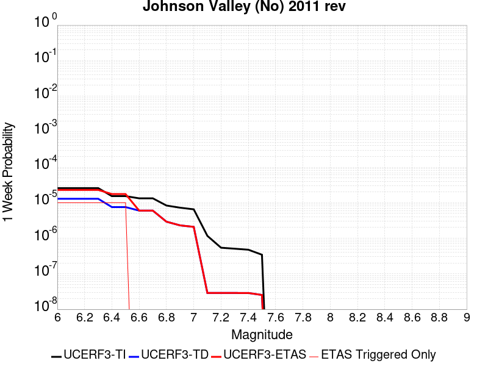 |  | 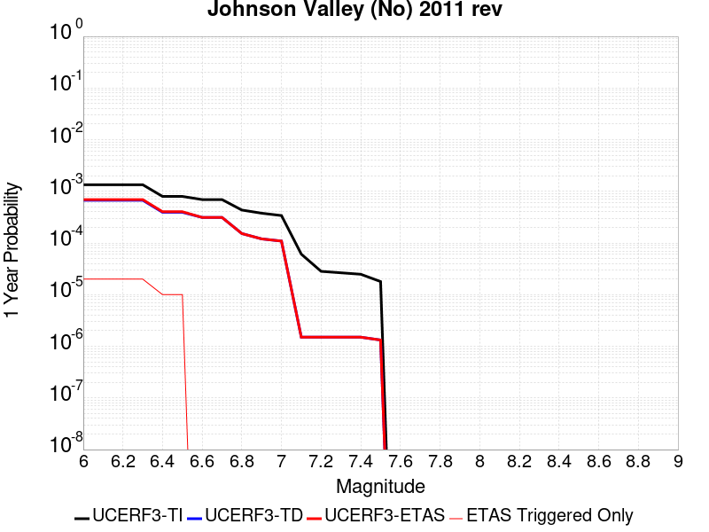 |  |

| Magnitude | 1 wk TI Prob | 1 wk TD Prob | 1 wk ETAS Prob | 1 wk ETAS/TD Gain | 1 wk ETAS Triggered Only | 1 mo TI Prob | 1 mo TD Prob | 1 mo ETAS Prob | 1 mo ETAS/TD Gain | 1 mo ETAS Triggered Only | 1 yr TI Prob | 1 yr TD Prob | 1 yr ETAS Prob | 1 yr ETAS/TD Gain | 1 yr ETAS Triggered Only | 10 yr TI Prob | 10 yr TD Prob | 10 yr ETAS Prob | 10 yr ETAS/TD Gain | 10 yr ETAS Triggered Only |
|-----|-----|-----|-----|-----|-----|-----|-----|-----|-----|-----|-----|-----|-----|-----|-----|-----|-----|-----|-----|-----|
| 6.0 | 2.577707E-5 | 1.2900938E-5 | 3.0322315E-5 | 2.3503962 | 1.7421602E-5 | 1.1046848E-4 | 5.5288787E-5 | 7.270942E-5 | 1.3150845 | 1.7421602E-5 | 0.0013441239 | 6.7297276E-4 | 6.903826E-4 | 1.0258701 | 1.7421602E-5 | 0.013360229 | 0.006713257 | 0.0067305616 | 1.0025777 | 1.7421602E-5 |
| 6.1 | 2.577707E-5 | 1.2900938E-5 | 3.0322315E-5 | 2.3503962 | 1.7421602E-5 | 1.1046848E-4 | 5.5288787E-5 | 7.270942E-5 | 1.3150845 | 1.7421602E-5 | 0.0013441239 | 6.7297276E-4 | 6.903826E-4 | 1.0258701 | 1.7421602E-5 | 0.013360229 | 0.006713257 | 0.0067305616 | 1.0025777 | 1.7421602E-5 |
| 6.2 | 2.577707E-5 | 1.2900938E-5 | 3.0322315E-5 | 2.3503962 | 1.7421602E-5 | 1.1046848E-4 | 5.5288787E-5 | 7.270942E-5 | 1.3150845 | 1.7421602E-5 | 0.0013441239 | 6.7297276E-4 | 6.903826E-4 | 1.0258701 | 1.7421602E-5 | 0.013360229 | 0.006713257 | 0.0067305616 | 1.0025777 | 1.7421602E-5 |
| 6.3 | 2.577707E-5 | 1.2900938E-5 | 3.0322315E-5 | 2.3503962 | 1.7421602E-5 | 1.1046848E-4 | 5.5288787E-5 | 7.270942E-5 | 1.3150845 | 1.7421602E-5 | 0.0013441239 | 6.7297276E-4 | 6.903826E-4 | 1.0258701 | 1.7421602E-5 | 0.013360229 | 0.006713257 | 0.0067305616 | 1.0025777 | 1.7421602E-5 |
| 6.4 | 1.5296591E-5 | 7.536742E-6 | 2.4958214E-5 | 3.3115387 | 1.7421602E-5 | 6.555518E-5 | 3.2300028E-5 | 4.9721068E-5 | 1.5393506 | 1.7421602E-5 | 7.97842E-4 | 3.9320064E-4 | 4.1061538E-4 | 1.0442897 | 1.7421602E-5 | 0.007949836 | 0.0039268904 | 0.003944244 | 1.0044191 | 1.7421602E-5 |
| 6.5 | 1.5296591E-5 | 7.536742E-6 | 2.4958214E-5 | 3.3115387 | 1.7421602E-5 | 6.555518E-5 | 3.2300028E-5 | 4.9721068E-5 | 1.5393506 | 1.7421602E-5 | 7.97842E-4 | 3.9320064E-4 | 4.1061538E-4 | 1.0442897 | 1.7421602E-5 | 0.007949836 | 0.0039268904 | 0.003944244 | 1.0044191 | 1.7421602E-5 |
| 6.6 | 1.3289383E-5 | 5.9917306E-6 | 5.9917306E-6 | 1.0 | 0.0 | 5.6953253E-5 | 2.5678688E-5 | 2.5678688E-5 | 1.0 | 0.0 | 6.9318525E-4 | 3.1261015E-4 | 3.1261015E-4 | 1.0 | 0.0 | 0.0069102696 | 0.0031233684 | 0.0031233684 | 1.0 | 0.0 |
| 6.7 | 1.3289383E-5 | 5.9917306E-6 | 5.9917306E-6 | 1.0 | 0.0 | 5.6953253E-5 | 2.5678688E-5 | 2.5678688E-5 | 1.0 | 0.0 | 6.9318525E-4 | 3.1261015E-4 | 3.1261015E-4 | 1.0 | 0.0 | 0.0069102696 | 0.0031233684 | 0.0031233684 | 1.0 | 0.0 |
| 6.8 | 8.330789E-6 | 2.9211888E-6 | 2.9211888E-6 | 1.0 | 0.0 | 3.570289E-5 | 1.2519352E-5 | 1.2519352E-5 | 1.0 | 0.0 | 4.34596E-4 | 1.5241816E-4 | 1.5241816E-4 | 1.0 | 0.0 | 0.0043374705 | 0.0015236961 | 0.0015236961 | 1.0 | 0.0 |
| 6.9 | 7.2359003E-6 | 2.3013247E-6 | 2.3013247E-6 | 1.0 | 0.0 | 3.1010633E-5 | 9.8628125E-6 | 9.8628125E-6 | 1.0 | 0.0 | 3.7748902E-4 | 1.2007845E-4 | 1.2007845E-4 | 1.0 | 0.0 | 0.0037684843 | 0.0012006586 | 0.0012006586 | 1.0 | 0.0 |
| 7.0 | 6.5149957E-6 | 2.088482E-6 | 2.088482E-6 | 1.0 | 0.0 | 2.792111E-5 | 8.950637E-6 | 8.950637E-6 | 1.0 | 0.0 | 3.398865E-4 | 1.0897385E-4 | 1.0897385E-4 | 1.0 | 0.0 | 0.003393671 | 0.0010897239 | 0.0010897239 | 1.0 | 0.0 |
| 7.1 | 1.1662233E-6 | 2.8802024E-8 | 2.8802024E-8 | 1.0 | 0.0 | 4.9980904E-6 | 1.2343725E-7 | 1.2343725E-7 | 1.0 | 0.0 | 6.0850052E-5 | 1.5028476E-6 | 1.5028476E-6 | 1.0 | 0.0 | 6.083339E-4 | 1.50283895E-5 | 1.50283895E-5 | 1.0 | 0.0 |
| 7.2 | 5.413881E-7 | 2.8802024E-8 | 2.8802024E-8 | 1.0 | 0.0 | 2.3202326E-6 | 1.2343725E-7 | 1.2343725E-7 | 1.0 | 0.0 | 2.8248465E-5 | 1.5028476E-6 | 1.5028476E-6 | 1.0 | 0.0 | 2.8244875E-4 | 1.50283895E-5 | 1.50283895E-5 | 1.0 | 0.0 |
| 7.3 | 5.076821E-7 | 2.8802024E-8 | 2.8802024E-8 | 1.0 | 0.0 | 2.1757785E-6 | 1.2343723E-7 | 1.2343723E-7 | 1.0 | 0.0 | 2.648978E-5 | 1.5028475E-6 | 1.5028475E-6 | 1.0 | 0.0 | 2.6486625E-4 | 1.50283895E-5 | 1.50283895E-5 | 1.0 | 0.0 |
| 7.4 | 4.7568687E-7 | 2.8783948E-8 | 2.8783948E-8 | 1.0 | 0.0 | 2.0386565E-6 | 1.2335977E-7 | 1.2335977E-7 | 1.0 | 0.0 | 2.482036E-5 | 1.5019043E-6 | 1.5019043E-6 | 1.0 | 0.0 | 2.4817587E-4 | 1.5018958E-5 | 1.5018958E-5 | 1.0 | 0.0 |
| 7.5 | 3.435626E-7 | 2.5357679E-8 | 2.5357679E-8 | 1.0 | 0.0 | 1.4724103E-6 | 1.0867576E-7 | 1.0867576E-7 | 1.0 | 0.0 | 1.7926448E-5 | 1.3231268E-6 | 1.3231268E-6 | 1.0 | 0.0 | 1.7925001E-4 | 1.3231205E-5 | 1.3231205E-5 | 1.0 | 0.0 |

## Anacapa-Dume alt 1
*[(top)](#table-of-contents)*

| 1 Week | 1 Month | 1 Year | 10 Year |
|-----|-----|-----|-----|
|  |  |  |  |

| Magnitude | 1 wk TI Prob | 1 wk TD Prob | 1 wk ETAS Prob | 1 wk ETAS/TD Gain | 1 wk ETAS Triggered Only | 1 mo TI Prob | 1 mo TD Prob | 1 mo ETAS Prob | 1 mo ETAS/TD Gain | 1 mo ETAS Triggered Only | 1 yr TI Prob | 1 yr TD Prob | 1 yr ETAS Prob | 1 yr ETAS/TD Gain | 1 yr ETAS Triggered Only | 10 yr TI Prob | 10 yr TD Prob | 10 yr ETAS Prob | 10 yr ETAS/TD Gain | 10 yr ETAS Triggered Only |
|-----|-----|-----|-----|-----|-----|-----|-----|-----|-----|-----|-----|-----|-----|-----|-----|-----|-----|-----|-----|-----|
| 6.0 | 5.1871802E-6 | 5.3673907E-6 | 2.27889E-5 | 4.245806 | 1.7421602E-5 | 2.2230583E-5 | 2.3002905E-5 | 4.0424107E-5 | 1.757348 | 1.7421602E-5 | 2.7062374E-4 | 2.8002524E-4 | 2.9744196E-4 | 1.062197 | 1.7421602E-5 | 0.002702944 | 0.0027968092 | 0.002814182 | 1.0062116 | 1.7421602E-5 |
| 6.1 | 5.1871802E-6 | 5.3673907E-6 | 2.27889E-5 | 4.245806 | 1.7421602E-5 | 2.2230583E-5 | 2.3002905E-5 | 4.0424107E-5 | 1.757348 | 1.7421602E-5 | 2.7062374E-4 | 2.8002524E-4 | 2.9744196E-4 | 1.062197 | 1.7421602E-5 | 0.002702944 | 0.0027968092 | 0.002814182 | 1.0062116 | 1.7421602E-5 |
| 6.2 | 5.1871802E-6 | 5.3673907E-6 | 2.27889E-5 | 4.245806 | 1.7421602E-5 | 2.2230583E-5 | 2.3002905E-5 | 4.0424107E-5 | 1.757348 | 1.7421602E-5 | 2.7062374E-4 | 2.8002524E-4 | 2.9744196E-4 | 1.062197 | 1.7421602E-5 | 0.002702944 | 0.0027968092 | 0.002814182 | 1.0062116 | 1.7421602E-5 |
| 6.3 | 5.1871802E-6 | 5.3673907E-6 | 2.27889E-5 | 4.245806 | 1.7421602E-5 | 2.2230583E-5 | 2.3002905E-5 | 4.0424107E-5 | 1.757348 | 1.7421602E-5 | 2.7062374E-4 | 2.8002524E-4 | 2.9744196E-4 | 1.062197 | 1.7421602E-5 | 0.002702944 | 0.0027968092 | 0.002814182 | 1.0062116 | 1.7421602E-5 |
| 6.4 | 5.1871802E-6 | 5.3673907E-6 | 2.27889E-5 | 4.245806 | 1.7421602E-5 | 2.2230583E-5 | 2.3002905E-5 | 4.0424107E-5 | 1.757348 | 1.7421602E-5 | 2.7062374E-4 | 2.8002524E-4 | 2.9744196E-4 | 1.062197 | 1.7421602E-5 | 0.002702944 | 0.0027968092 | 0.002814182 | 1.0062116 | 1.7421602E-5 |
| 6.5 | 5.1871802E-6 | 5.3673907E-6 | 2.27889E-5 | 4.245806 | 1.7421602E-5 | 2.2230583E-5 | 2.3002905E-5 | 4.0424107E-5 | 1.757348 | 1.7421602E-5 | 2.7062374E-4 | 2.8002524E-4 | 2.9744196E-4 | 1.062197 | 1.7421602E-5 | 0.002702944 | 0.0027968092 | 0.002814182 | 1.0062116 | 1.7421602E-5 |
| 6.6 | 5.1871802E-6 | 5.3673907E-6 | 2.27889E-5 | 4.245806 | 1.7421602E-5 | 2.2230583E-5 | 2.3002905E-5 | 4.0424107E-5 | 1.757348 | 1.7421602E-5 | 2.7062374E-4 | 2.8002524E-4 | 2.9744196E-4 | 1.062197 | 1.7421602E-5 | 0.002702944 | 0.0027968092 | 0.002814182 | 1.0062116 | 1.7421602E-5 |
| 6.7 | 4.7693475E-6 | 4.9366918E-6 | 2.2358208E-5 | 4.5289865 | 1.7421602E-5 | 2.04399E-5 | 2.1157082E-5 | 3.8578317E-5 | 1.8234233 | 1.7421602E-5 | 2.4882736E-4 | 2.5755778E-4 | 2.749749E-4 | 1.0676241 | 1.7421602E-5 | 0.0024854892 | 0.002572669 | 0.0025900456 | 1.0067544 | 1.7421602E-5 |
| 6.8 | 4.753408E-6 | 4.92024E-6 | 2.2341757E-5 | 4.5407863 | 1.7421602E-5 | 2.037159E-5 | 2.1086576E-5 | 3.8507813E-5 | 1.8261765 | 1.7421602E-5 | 2.4799586E-4 | 2.5669957E-4 | 2.741167E-4 | 1.0678502 | 1.7421602E-5 | 0.002477193 | 0.0025641066 | 0.0025814835 | 1.006777 | 1.7421602E-5 |
| 6.9 | 3.800069E-6 | 3.937126E-6 | 2.135866E-5 | 5.424937 | 1.7421602E-5 | 1.6285909E-5 | 1.687329E-5 | 3.4294597E-5 | 2.0324786 | 1.7421602E-5 | 1.9826289E-4 | 2.0541316E-4 | 2.228312E-4 | 1.0847951 | 1.7421602E-5 | 0.001980861 | 0.0020522568 | 0.0020696425 | 1.0084716 | 1.7421602E-5 |
| 7.0 | 3.6671938E-6 | 3.7999182E-6 | 2.1221455E-5 | 5.5847135 | 1.7421602E-5 | 1.571645E-5 | 1.6285263E-5 | 3.3706583E-5 | 2.0697598 | 1.7421602E-5 | 1.9133097E-4 | 1.9825528E-4 | 2.1567343E-4 | 1.0878571 | 1.7421602E-5 | 0.0019116632 | 0.0019808074 | 0.0019981945 | 1.0087777 | 1.7421602E-5 |
| 7.1 | 3.2394885E-6 | 3.3587933E-6 | 2.0780337E-5 | 6.1868463 | 1.7421602E-5 | 1.3883448E-5 | 1.4394749E-5 | 3.18161E-5 | 2.2102575 | 1.7421602E-5 | 1.6901788E-4 | 1.7524208E-4 | 1.9266063E-4 | 1.0993971 | 1.7421602E-5 | 0.0016888938 | 0.0017510501 | 0.0017684413 | 1.0099318 | 1.7421602E-5 |
| 7.2 | 3.0935948E-6 | 3.2079258E-6 | 2.0629474E-5 | 6.4307823 | 1.7421602E-5 | 1.3258196E-5 | 1.3748182E-5 | 3.1169544E-5 | 2.2671757 | 1.7421602E-5 | 1.6140658E-4 | 1.6737137E-4 | 1.8479006E-4 | 1.1040721 | 1.7421602E-5 | 0.001612894 | 0.0016724641 | 0.0016898565 | 1.0103993 | 1.7421602E-5 |
| 7.3 | 2.5604163E-6 | 2.647073E-6 | 2.006863E-5 | 7.581442 | 1.7421602E-5 | 1.0973167E-5 | 1.1344549E-5 | 2.8765955E-5 | 2.5356631 | 1.7421602E-5 | 1.3359012E-4 | 1.3811118E-4 | 1.5553038E-4 | 1.1261245 | 1.7421602E-5 | 0.0013350984 | 0.0013802581 | 0.0013976556 | 1.0126046 | 1.7421602E-5 |
| 7.4 | 2.1429005E-6 | 2.2106028E-6 | 2.2106028E-6 | 1.0 | 0.0 | 9.1838265E-6 | 9.473977E-6 | 9.473977E-6 | 1.0 | 0.0 | 1.11807356E-4 | 1.1533959E-4 | 1.1533959E-4 | 1.0 | 0.0 | 0.0011175112 | 0.0011527999 | 0.0011527999 | 1.0 | 0.0 |
| 7.5 | 1.7237151E-6 | 1.7761449E-6 | 1.7761449E-6 | 1.0 | 0.0 | 7.3873293E-6 | 7.6120277E-6 | 7.6120277E-6 | 1.0 | 0.0 | 8.993702E-5 | 9.267252E-5 | 9.267252E-5 | 1.0 | 0.0 | 8.990063E-4 | 9.2634105E-4 | 9.2634105E-4 | 1.0 | 0.0 |
| 7.6 | 9.541696E-7 | 9.823206E-7 | 9.823206E-7 | 1.0 | 0.0 | 4.089292E-6 | 4.2099387E-6 | 4.2099387E-6 | 1.0 | 0.0 | 4.9785995E-5 | 5.1254807E-5 | 5.1254807E-5 | 1.0 | 0.0 | 4.9774844E-4 | 5.1243114E-4 | 5.1243114E-4 | 1.0 | 0.0 |
| 7.7 | 2.7226676E-7 | 2.7172416E-7 | 2.7172416E-7 | 1.0 | 0.0 | 1.166857E-6 | 1.1645316E-6 | 1.1645316E-6 | 1.0 | 0.0 | 1.4206392E-5 | 1.4178081E-5 | 1.4178081E-5 | 1.0 | 0.0 | 1.4205484E-4 | 1.4177183E-4 | 1.4177183E-4 | 1.0 | 0.0 |
| 7.8 | 4.5017995E-8 | 4.2157676E-8 | 4.2157676E-8 | 1.0 | 0.0 | 1.9293425E-7 | 1.8067574E-7 | 1.8067574E-7 | 1.0 | 0.0 | 2.348972E-6 | 2.1997253E-6 | 2.1997253E-6 | 1.0 | 0.0 | 2.348947E-5 | 2.1997055E-5 | 2.1997055E-5 | 1.0 | 0.0 |
| 7.9 | 8.007447E-10 | 6.1608785E-10 | 6.1608785E-10 | 1.0 | 0.0 | 3.4317629E-9 | 2.6403764E-9 | 2.6403764E-9 | 1.0 | 0.0 | 4.1781714E-8 | 3.2146584E-8 | 3.2146584E-8 | 1.0 | 0.0 | 4.1781706E-7 | 3.214658E-7 | 3.214658E-7 | 1.0 | 0.0 |

## Elsinore (Temecula) rev
*[(top)](#table-of-contents)*

| 1 Week | 1 Month | 1 Year | 10 Year |
|-----|-----|-----|-----|
| 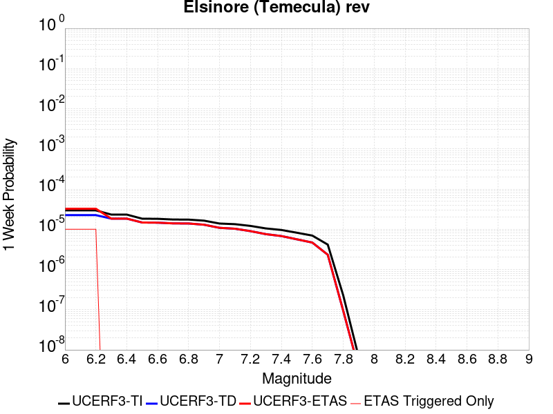 |  |  |  |

| Magnitude | 1 wk TI Prob | 1 wk TD Prob | 1 wk ETAS Prob | 1 wk ETAS/TD Gain | 1 wk ETAS Triggered Only | 1 mo TI Prob | 1 mo TD Prob | 1 mo ETAS Prob | 1 mo ETAS/TD Gain | 1 mo ETAS Triggered Only | 1 yr TI Prob | 1 yr TD Prob | 1 yr ETAS Prob | 1 yr ETAS/TD Gain | 1 yr ETAS Triggered Only | 10 yr TI Prob | 10 yr TD Prob | 10 yr ETAS Prob | 10 yr ETAS/TD Gain | 10 yr ETAS Triggered Only |
|-----|-----|-----|-----|-----|-----|-----|-----|-----|-----|-----|-----|-----|-----|-----|-----|-----|-----|-----|-----|-----|
| 6.0 | 2.9514995E-5 | 2.2517117E-5 | 2.2517117E-5 | 1.0 | 0.0 | 1.264867E-4 | 9.649849E-5 | 9.649849E-5 | 1.0 | 0.0 | 0.0015388876 | 0.0011742581 | 0.0011916591 | 1.0148188 | 1.7421602E-5 | 0.015282745 | 0.011696897 | 0.011714116 | 1.001472 | 1.7421602E-5 |
| 6.1 | 2.9514995E-5 | 2.2517117E-5 | 2.2517117E-5 | 1.0 | 0.0 | 1.264867E-4 | 9.649849E-5 | 9.649849E-5 | 1.0 | 0.0 | 0.0015388876 | 0.0011742581 | 0.0011916591 | 1.0148188 | 1.7421602E-5 | 0.015282745 | 0.011696897 | 0.011714116 | 1.001472 | 1.7421602E-5 |
| 6.2 | 2.9514995E-5 | 2.2517117E-5 | 2.2517117E-5 | 1.0 | 0.0 | 1.264867E-4 | 9.649849E-5 | 9.649849E-5 | 1.0 | 0.0 | 0.0015388876 | 0.0011742581 | 0.0011916591 | 1.0148188 | 1.7421602E-5 | 0.015282745 | 0.011696897 | 0.011714116 | 1.001472 | 1.7421602E-5 |
| 6.3 | 2.3223649E-5 | 1.8406454E-5 | 1.8406454E-5 | 1.0 | 0.0 | 9.952613E-5 | 7.888251E-5 | 7.888251E-5 | 1.0 | 0.0 | 0.001211057 | 9.599888E-4 | 9.773937E-4 | 1.0181303 | 1.7421602E-5 | 0.012044783 | 0.009569948 | 0.009587202 | 1.001803 | 1.7421602E-5 |
| 6.4 | 2.3223649E-5 | 1.8406454E-5 | 1.8406454E-5 | 1.0 | 0.0 | 9.952613E-5 | 7.888251E-5 | 7.888251E-5 | 1.0 | 0.0 | 0.001211057 | 9.599888E-4 | 9.773937E-4 | 1.0181303 | 1.7421602E-5 | 0.012044783 | 0.009569948 | 0.009587202 | 1.001803 | 1.7421602E-5 |
| 6.5 | 1.8338875E-5 | 1.4750118E-5 | 1.4750118E-5 | 1.0 | 0.0 | 7.8592806E-5 | 6.321331E-5 | 6.321331E-5 | 1.0 | 0.0 | 9.5644733E-4 | 7.69359E-4 | 7.867672E-4 | 1.0226269 | 1.7421602E-5 | 0.009523412 | 0.0076739118 | 0.0076911994 | 1.0022528 | 1.7421602E-5 |
| 6.6 | 1.8223333E-5 | 1.4612673E-5 | 1.4612673E-5 | 1.0 | 0.0 | 7.809766E-5 | 6.262429E-5 | 6.262429E-5 | 1.0 | 0.0 | 9.504242E-4 | 7.6219277E-4 | 7.796011E-4 | 1.0228398 | 1.7421602E-5 | 0.009463696 | 0.0076027405 | 0.0076200296 | 1.002274 | 1.7421602E-5 |
| 6.7 | 1.7512752E-5 | 1.402721E-5 | 1.402721E-5 | 1.0 | 0.0 | 7.505249E-5 | 6.011528E-5 | 6.011528E-5 | 1.0 | 0.0 | 9.13381E-4 | 7.3166634E-4 | 7.4907514E-4 | 1.0237935 | 1.7421602E-5 | 0.00909636 | 0.00729892 | 0.0073162145 | 1.0023694 | 1.7421602E-5 |
| 6.8 | 1.7417142E-5 | 1.3951195E-5 | 1.3951195E-5 | 1.0 | 0.0 | 7.4642754E-5 | 5.9789512E-5 | 5.9789512E-5 | 1.0 | 0.0 | 9.083966E-4 | 7.277028E-4 | 7.451117E-4 | 1.0239232 | 1.7421602E-5 | 0.009046922 | 0.0072594886 | 0.0072767837 | 1.0023824 | 1.7421602E-5 |
| 6.9 | 1.6402591E-5 | 1.2988613E-5 | 1.2988613E-5 | 1.0 | 0.0 | 7.0294926E-5 | 5.5664343E-5 | 5.5664343E-5 | 1.0 | 0.0 | 8.5550465E-4 | 6.775103E-4 | 6.949201E-4 | 1.0256968 | 1.7421602E-5 | 0.008522186 | 0.006760169 | 0.006777473 | 1.0025597 | 1.7421602E-5 |
| 7.0 | 1.3912486E-5 | 1.0878233E-5 | 1.0878233E-5 | 1.0 | 0.0 | 5.9623577E-5 | 4.6620182E-5 | 4.6620182E-5 | 1.0 | 0.0 | 7.2567526E-4 | 5.674556E-4 | 5.848673E-4 | 1.0306839 | 1.7421602E-5 | 0.0072331014 | 0.005663986 | 0.005681309 | 1.0030584 | 1.7421602E-5 |
| 7.1 | 1.3405147E-5 | 1.03274215E-5 | 1.03274215E-5 | 1.0 | 0.0 | 5.7449364E-5 | 4.425964E-5 | 4.425964E-5 | 1.0 | 0.0 | 6.9922156E-4 | 5.3873047E-4 | 5.5614265E-4 | 1.0323209 | 1.7421602E-5 | 0.0069702556 | 0.005377577 | 0.005394905 | 1.0032222 | 1.7421602E-5 |
| 7.2 | 1.21402E-5 | 8.996737E-6 | 8.996737E-6 | 1.0 | 0.0 | 5.202839E-5 | 3.8556886E-5 | 3.8556886E-5 | 1.0 | 0.0 | 6.332616E-4 | 4.6933076E-4 | 4.6933076E-4 | 1.0 | 0.0 | 0.0063146 | 0.004684821 | 0.004684821 | 1.0 | 0.0 |
| 7.3 | 1.05047775E-5 | 7.571771E-6 | 7.571771E-6 | 1.0 | 0.0 | 4.5019697E-5 | 3.245005E-5 | 3.245005E-5 | 1.0 | 0.0 | 5.4797693E-4 | 3.950092E-4 | 3.950092E-4 | 1.0 | 0.0 | 0.005466277 | 0.00394346 | 0.00394346 | 1.0 | 0.0 |
| 7.4 | 9.624483E-6 | 6.7868696E-6 | 6.7868696E-6 | 1.0 | 0.0 | 4.124713E-5 | 2.9086266E-5 | 2.9086266E-5 | 1.0 | 0.0 | 5.0206814E-4 | 3.5406914E-4 | 3.5406914E-4 | 1.0 | 0.0 | 0.005009353 | 0.003535204 | 0.003535204 | 1.0 | 0.0 |
| 7.5 | 8.215151E-6 | 5.635538E-6 | 5.635538E-6 | 1.0 | 0.0 | 3.5207315E-5 | 2.4152088E-5 | 2.4152088E-5 | 1.0 | 0.0 | 4.2856473E-4 | 2.9401327E-4 | 2.9401327E-4 | 1.0 | 0.0 | 0.004277392 | 0.002936371 | 0.002936371 | 1.0 | 0.0 |
| 7.6 | 6.975058E-6 | 4.676045E-6 | 4.676045E-6 | 1.0 | 0.0 | 2.9892764E-5 | 2.0040046E-5 | 2.0040046E-5 | 1.0 | 0.0 | 3.6388362E-4 | 2.439614E-4 | 2.439614E-4 | 1.0 | 0.0 | 0.0036328835 | 0.002437052 | 0.002437052 | 1.0 | 0.0 |
| 7.7 | 4.159604E-6 | 2.3269924E-6 | 2.3269924E-6 | 1.0 | 0.0 | 1.7826753E-5 | 9.97279E-6 | 9.97279E-6 | 1.0 | 0.0 | 2.1701909E-4 | 1.21412704E-4 | 1.21412704E-4 | 1.0 | 0.0 | 0.0021680726 | 0.0012135367 | 0.0012135367 | 1.0 | 0.0 |
| 7.8 | 2.2692414E-7 | 9.3854695E-8 | 9.3854695E-8 | 1.0 | 0.0 | 9.725317E-7 | 4.0223435E-7 | 4.0223435E-7 | 1.0 | 0.0 | 1.1840509E-5 | 4.8971956E-6 | 4.8971956E-6 | 1.0 | 0.0 | 1.1839878E-4 | 4.8971204E-5 | 4.8971204E-5 | 1.0 | 0.0 |
| 7.9 | 6.676829E-9 | 3.439853E-9 | 3.439853E-9 | 1.0 | 0.0 | 2.861498E-8 | 1.4742227E-8 | 1.4742227E-8 | 1.0 | 0.0 | 3.4838732E-7 | 1.7948659E-7 | 1.7948659E-7 | 1.0 | 0.0 | 3.4838679E-6 | 1.7948646E-6 | 1.7948646E-6 | 1.0 | 0.0 |

## Clamshell-Sawpit
*[(top)](#table-of-contents)*

| 1 Week | 1 Month | 1 Year | 10 Year |
|-----|-----|-----|-----|
|  |  |  |  |

| Magnitude | 1 wk TI Prob | 1 wk TD Prob | 1 wk ETAS Prob | 1 wk ETAS/TD Gain | 1 wk ETAS Triggered Only | 1 mo TI Prob | 1 mo TD Prob | 1 mo ETAS Prob | 1 mo ETAS/TD Gain | 1 mo ETAS Triggered Only | 1 yr TI Prob | 1 yr TD Prob | 1 yr ETAS Prob | 1 yr ETAS/TD Gain | 1 yr ETAS Triggered Only | 10 yr TI Prob | 10 yr TD Prob | 10 yr ETAS Prob | 10 yr ETAS/TD Gain | 10 yr ETAS Triggered Only |
|-----|-----|-----|-----|-----|-----|-----|-----|-----|-----|-----|-----|-----|-----|-----|-----|-----|-----|-----|-----|-----|
| 6.0 | 3.202998E-6 | 3.0127644E-6 | 3.0127644E-6 | 1.0 | 0.0 | 1.3727062E-5 | 1.2911788E-5 | 1.2911788E-5 | 1.0 | 0.0 | 1.6711417E-4 | 1.5719049E-4 | 1.5719049E-4 | 1.0 | 0.0 | 0.0016698855 | 0.0015708724 | 0.0015882666 | 1.011073 | 1.7421602E-5 |
| 6.1 | 3.202998E-6 | 3.0127644E-6 | 3.0127644E-6 | 1.0 | 0.0 | 1.3727062E-5 | 1.2911788E-5 | 1.2911788E-5 | 1.0 | 0.0 | 1.6711417E-4 | 1.5719049E-4 | 1.5719049E-4 | 1.0 | 0.0 | 0.0016698855 | 0.0015708724 | 0.0015882666 | 1.011073 | 1.7421602E-5 |
| 6.2 | 3.202998E-6 | 3.0127644E-6 | 3.0127644E-6 | 1.0 | 0.0 | 1.3727062E-5 | 1.2911788E-5 | 1.2911788E-5 | 1.0 | 0.0 | 1.6711417E-4 | 1.5719049E-4 | 1.5719049E-4 | 1.0 | 0.0 | 0.0016698855 | 0.0015708724 | 0.0015882666 | 1.011073 | 1.7421602E-5 |
| 6.3 | 3.202998E-6 | 3.0127644E-6 | 3.0127644E-6 | 1.0 | 0.0 | 1.3727062E-5 | 1.2911788E-5 | 1.2911788E-5 | 1.0 | 0.0 | 1.6711417E-4 | 1.5719049E-4 | 1.5719049E-4 | 1.0 | 0.0 | 0.0016698855 | 0.0015708724 | 0.0015882666 | 1.011073 | 1.7421602E-5 |
| 6.4 | 3.202998E-6 | 3.0127644E-6 | 3.0127644E-6 | 1.0 | 0.0 | 1.3727062E-5 | 1.2911788E-5 | 1.2911788E-5 | 1.0 | 0.0 | 1.6711417E-4 | 1.5719049E-4 | 1.5719049E-4 | 1.0 | 0.0 | 0.0016698855 | 0.0015708724 | 0.0015882666 | 1.011073 | 1.7421602E-5 |
| 6.5 | 2.5862723E-6 | 2.380775E-6 | 2.380775E-6 | 1.0 | 0.0 | 1.1083977E-5 | 1.0203283E-5 | 1.0203283E-5 | 1.0 | 0.0 | 1.3493907E-4 | 1.2421819E-4 | 1.2421819E-4 | 1.0 | 0.0 | 0.0013485716 | 0.0012415178 | 0.0012589179 | 1.0140151 | 1.7421602E-5 |
| 6.6 | 2.5862723E-6 | 2.380775E-6 | 2.380775E-6 | 1.0 | 0.0 | 1.1083977E-5 | 1.0203283E-5 | 1.0203283E-5 | 1.0 | 0.0 | 1.3493907E-4 | 1.2421819E-4 | 1.2421819E-4 | 1.0 | 0.0 | 0.0013485716 | 0.0012415178 | 0.0012589179 | 1.0140151 | 1.7421602E-5 |
| 6.7 | 2.5862723E-6 | 2.380775E-6 | 2.380775E-6 | 1.0 | 0.0 | 1.1083977E-5 | 1.0203283E-5 | 1.0203283E-5 | 1.0 | 0.0 | 1.3493907E-4 | 1.2421819E-4 | 1.2421819E-4 | 1.0 | 0.0 | 0.0013485716 | 0.0012415178 | 0.0012589179 | 1.0140151 | 1.7421602E-5 |
| 6.8 | 2.4098806E-6 | 2.1977307E-6 | 2.1977307E-6 | 1.0 | 0.0 | 1.0328019E-5 | 9.4188135E-6 | 9.4188135E-6 | 1.0 | 0.0 | 1.2573638E-4 | 1.1466829E-4 | 1.1466829E-4 | 1.0 | 0.0 | 0.0012566525 | 0.0011461178 | 0.0011635195 | 1.0151831 | 1.7421602E-5 |
| 6.9 | 2.0073985E-6 | 1.7784248E-6 | 1.7784248E-6 | 1.0 | 0.0 | 8.603109E-6 | 7.621799E-6 | 7.621799E-6 | 1.0 | 0.0 | 1.0473781E-4 | 9.279157E-5 | 9.279157E-5 | 1.0 | 0.0 | 0.0010468846 | 9.275401E-4 | 9.275401E-4 | 1.0 | 0.0 |
| 7.0 | 1.8166766E-6 | 1.5807095E-6 | 1.5807095E-6 | 1.0 | 0.0 | 7.785734E-6 | 6.7744522E-6 | 6.7744522E-6 | 1.0 | 0.0 | 9.478718E-5 | 8.247593E-5 | 8.247593E-5 | 1.0 | 0.0 | 9.4746763E-4 | 8.244633E-4 | 8.244633E-4 | 1.0 | 0.0 |
| 7.1 | 1.5471421E-6 | 1.3052961E-6 | 1.3052961E-6 | 1.0 | 0.0 | 6.6305925E-6 | 5.5941146E-6 | 5.5941146E-6 | 1.0 | 0.0 | 8.072447E-5 | 6.8106274E-5 | 6.8106274E-5 | 1.0 | 0.0 | 8.0695155E-4 | 6.808595E-4 | 6.808595E-4 | 1.0 | 0.0 |
| 7.2 | 1.3608037E-6 | 1.1153443E-6 | 1.1153443E-6 | 1.0 | 0.0 | 5.8320024E-6 | 4.7800386E-6 | 4.7800386E-6 | 1.0 | 0.0 | 7.1002316E-5 | 5.8195463E-5 | 5.8195463E-5 | 1.0 | 0.0 | 7.097964E-4 | 5.818069E-4 | 5.818069E-4 | 1.0 | 0.0 |
| 7.3 | 1.0749634E-6 | 8.384254E-7 | 8.384254E-7 | 1.0 | 0.0 | 4.6069777E-6 | 3.593247E-6 | 3.593247E-6 | 1.0 | 0.0 | 5.608851E-5 | 4.374693E-5 | 4.374693E-5 | 1.0 | 0.0 | 5.6074356E-4 | 4.37386E-4 | 4.37386E-4 | 1.0 | 0.0 |
| 7.4 | 8.416856E-7 | 6.200048E-7 | 6.200048E-7 | 1.0 | 0.0 | 3.607219E-6 | 2.6571608E-6 | 2.6571608E-6 | 1.0 | 0.0 | 4.3917007E-5 | 3.2350472E-5 | 3.2350472E-5 | 1.0 | 0.0 | 4.390833E-4 | 3.2345962E-4 | 3.2345962E-4 | 1.0 | 0.0 |
| 7.5 | 6.2779594E-7 | 4.496886E-7 | 4.496886E-7 | 1.0 | 0.0 | 2.6905511E-6 | 1.9272356E-6 | 1.9272356E-6 | 1.0 | 0.0 | 3.275697E-5 | 2.346386E-5 | 2.346386E-5 | 1.0 | 0.0 | 3.275214E-4 | 2.346157E-4 | 2.346157E-4 | 1.0 | 0.0 |
| 7.6 | 4.3822078E-7 | 3.0595405E-7 | 3.0595405E-7 | 1.0 | 0.0 | 1.8780877E-6 | 1.311231E-6 | 1.311231E-6 | 1.0 | 0.0 | 2.2865479E-5 | 1.5964137E-5 | 1.5964137E-5 | 1.0 | 0.0 | 2.2863125E-4 | 1.5963144E-4 | 1.5963144E-4 | 1.0 | 0.0 |
| 7.7 | 1.8704569E-7 | 1.12379205E-7 | 1.12379205E-7 | 1.0 | 0.0 | 8.0162414E-7 | 4.816251E-7 | 4.816251E-7 | 1.0 | 0.0 | 9.75973E-6 | 5.86377E-6 | 5.86377E-6 | 1.0 | 0.0 | 9.7593016E-5 | 5.863622E-5 | 5.863622E-5 | 1.0 | 0.0 |
| 7.8 | 3.5378733E-8 | 2.1838144E-8 | 2.1838144E-8 | 1.0 | 0.0 | 1.5162313E-7 | 9.359204E-8 | 9.359204E-8 | 1.0 | 0.0 | 1.84601E-6 | 1.1394826E-6 | 1.1394826E-6 | 1.0 | 0.0 | 1.8459947E-5 | 1.139477E-5 | 1.139477E-5 | 1.0 | 0.0 |
| 7.9 | 7.504945E-9 | 5.1920326E-9 | 5.1920326E-9 | 1.0 | 0.0 | 3.2164053E-8 | 2.225157E-8 | 2.225157E-8 | 1.0 | 0.0 | 3.9159727E-7 | 2.7091284E-7 | 2.7091284E-7 | 1.0 | 0.0 | 3.915966E-6 | 2.7091257E-6 | 2.7091257E-6 | 1.0 | 0.0 |
| 8.0 | 1.6554036E-10 | 1.4180768E-10 | 1.4180768E-10 | 1.0 | 0.0 | 7.0945894E-10 | 6.077475E-10 | 6.077475E-10 | 1.0 | 0.0 | 8.637662E-9 | 7.3993256E-9 | 7.3993256E-9 | 1.0 | 0.0 | 8.6376616E-8 | 7.3993256E-8 | 7.3993256E-8 | 1.0 | 0.0 |

## Fitzhugh Creek
*[(top)](#table-of-contents)*

| 1 Week | 1 Month | 1 Year | 10 Year |
|-----|-----|-----|-----|
|  |  |  |  |

| Magnitude | 1 wk TI Prob | 1 wk TD Prob | 1 wk ETAS Prob | 1 wk ETAS/TD Gain | 1 wk ETAS Triggered Only | 1 mo TI Prob | 1 mo TD Prob | 1 mo ETAS Prob | 1 mo ETAS/TD Gain | 1 mo ETAS Triggered Only | 1 yr TI Prob | 1 yr TD Prob | 1 yr ETAS Prob | 1 yr ETAS/TD Gain | 1 yr ETAS Triggered Only | 10 yr TI Prob | 10 yr TD Prob | 10 yr ETAS Prob | 10 yr ETAS/TD Gain | 10 yr ETAS Triggered Only |
|-----|-----|-----|-----|-----|-----|-----|-----|-----|-----|-----|-----|-----|-----|-----|-----|-----|-----|-----|-----|-----|
| 6.0 | 6.1090436E-6 | 6.2101562E-6 | 2.363165E-5 | 3.8053231 | 1.7421602E-5 | 2.6181353E-5 | 2.6614709E-5 | 4.403585E-5 | 1.6545681 | 1.7421602E-5 | 3.1871133E-4 | 3.239904E-4 | 3.4140635E-4 | 1.0537546 | 1.7421602E-5 | 0.0031825465 | 0.0032356246 | 0.0032529898 | 1.0053669 | 1.7421602E-5 |
| 6.1 | 2.9741811E-6 | 3.021581E-6 | 2.044313E-5 | 6.765707 | 1.7421602E-5 | 1.2746428E-5 | 1.2949574E-5 | 3.0370951E-5 | 2.3453243 | 1.7421602E-5 | 1.5517672E-4 | 1.576506E-4 | 1.7506945E-4 | 1.1104903 | 1.7421602E-5 | 0.001550684 | 0.0015754806 | 0.0015928748 | 1.0110406 | 1.7421602E-5 |
| 6.2 | 2.9741811E-6 | 3.021581E-6 | 2.044313E-5 | 6.765707 | 1.7421602E-5 | 1.2746428E-5 | 1.2949574E-5 | 3.0370951E-5 | 2.3453243 | 1.7421602E-5 | 1.5517672E-4 | 1.576506E-4 | 1.7506945E-4 | 1.1104903 | 1.7421602E-5 | 0.001550684 | 0.0015754806 | 0.0015928748 | 1.0110406 | 1.7421602E-5 |
| 6.3 | 1.4781198E-6 | 1.5012708E-6 | 1.8922847E-5 | 12.604552 | 1.7421602E-5 | 6.3347834E-6 | 6.4340034E-6 | 2.3855495E-5 | 3.7077217 | 1.7421602E-5 | 7.712326E-5 | 7.833137E-5 | 9.575162E-5 | 1.2223916 | 1.7421602E-5 | 7.70965E-4 | 7.830576E-4 | 8.004655E-4 | 1.0222307 | 1.7421602E-5 |
| 6.4 | 1.4781198E-6 | 1.5012708E-6 | 1.8922847E-5 | 12.604552 | 1.7421602E-5 | 6.3347834E-6 | 6.4340034E-6 | 2.3855495E-5 | 3.7077217 | 1.7421602E-5 | 7.712326E-5 | 7.833137E-5 | 9.575162E-5 | 1.2223916 | 1.7421602E-5 | 7.70965E-4 | 7.830576E-4 | 8.004655E-4 | 1.0222307 | 1.7421602E-5 |
| 6.5 | 9.5176676E-7 | 9.66606E-7 | 1.8388191E-5 | 19.023462 | 1.7421602E-5 | 4.078994E-6 | 4.142591E-6 | 2.1564121E-5 | 5.205467 | 1.7421602E-5 | 4.9660623E-5 | 5.0434985E-5 | 6.785571E-5 | 1.3454095 | 1.7421602E-5 | 4.964952E-4 | 5.042458E-4 | 5.216586E-4 | 1.0345324 | 1.7421602E-5 |
| 6.6 | 6.21145E-7 | 6.3085855E-7 | 1.8052451E-5 | 28.615685 | 1.7421602E-5 | 2.662047E-6 | 2.7036772E-6 | 2.0125233E-5 | 7.443652 | 1.7421602E-5 | 3.2409942E-5 | 3.291684E-5 | 5.033787E-5 | 1.5292437 | 1.7421602E-5 | 3.2405215E-4 | 3.2912623E-4 | 3.4654207E-4 | 1.0529155 | 1.7421602E-5 |
| 6.7 | 2.2377962E-7 | 2.2734636E-7 | 2.2734636E-7 | 1.0 | 0.0 | 9.590551E-7 | 9.743413E-7 | 9.743413E-7 | 1.0 | 0.0 | 1.1676434E-5 | 1.1862574E-5 | 1.1862574E-5 | 1.0 | 0.0 | 1.1675821E-4 | 1.1862254E-4 | 1.1862254E-4 | 1.0 | 0.0 |
| 6.8 | 1.4785022E-7 | 1.5021492E-7 | 1.5021492E-7 | 1.0 | 0.0 | 6.3364365E-7 | 6.4377826E-7 | 6.4377826E-7 | 1.0 | 0.0 | 7.714584E-6 | 7.838E-6 | 7.838E-6 | 1.0 | 0.0 | 7.714316E-5 | 7.838E-5 | 7.838E-5 | 1.0 | 0.0 |

## Puente Hills
*[(top)](#table-of-contents)*

| 1 Week | 1 Month | 1 Year | 10 Year |
|-----|-----|-----|-----|
|  |  |  |  |

| Magnitude | 1 wk TI Prob | 1 wk TD Prob | 1 wk ETAS Prob | 1 wk ETAS/TD Gain | 1 wk ETAS Triggered Only | 1 mo TI Prob | 1 mo TD Prob | 1 mo ETAS Prob | 1 mo ETAS/TD Gain | 1 mo ETAS Triggered Only | 1 yr TI Prob | 1 yr TD Prob | 1 yr ETAS Prob | 1 yr ETAS/TD Gain | 1 yr ETAS Triggered Only | 10 yr TI Prob | 10 yr TD Prob | 10 yr ETAS Prob | 10 yr ETAS/TD Gain | 10 yr ETAS Triggered Only |
|-----|-----|-----|-----|-----|-----|-----|-----|-----|-----|-----|-----|-----|-----|-----|-----|-----|-----|-----|-----|-----|
| 6.0 | 1.2101656E-5 | 8.098625E-6 | 8.098625E-6 | 1.0 | 0.0 | 5.1863204E-5 | 3.4707962E-5 | 3.4707962E-5 | 1.0 | 0.0 | 6.312516E-4 | 4.2249315E-4 | 4.399074E-4 | 1.0412178 | 1.7421602E-5 | 0.0062946146 | 0.0042174594 | 0.0042348076 | 1.0041134 | 1.7421602E-5 |
| 6.1 | 1.2101656E-5 | 8.098625E-6 | 8.098625E-6 | 1.0 | 0.0 | 5.1863204E-5 | 3.4707962E-5 | 3.4707962E-5 | 1.0 | 0.0 | 6.312516E-4 | 4.2249315E-4 | 4.399074E-4 | 1.0412178 | 1.7421602E-5 | 0.0062946146 | 0.0042174594 | 0.0042348076 | 1.0041134 | 1.7421602E-5 |
| 6.2 | 1.2101656E-5 | 8.098625E-6 | 8.098625E-6 | 1.0 | 0.0 | 5.1863204E-5 | 3.4707962E-5 | 3.4707962E-5 | 1.0 | 0.0 | 6.312516E-4 | 4.2249315E-4 | 4.399074E-4 | 1.0412178 | 1.7421602E-5 | 0.0062946146 | 0.0042174594 | 0.0042348076 | 1.0041134 | 1.7421602E-5 |
| 6.3 | 1.2101656E-5 | 8.098625E-6 | 8.098625E-6 | 1.0 | 0.0 | 5.1863204E-5 | 3.4707962E-5 | 3.4707962E-5 | 1.0 | 0.0 | 6.312516E-4 | 4.2249315E-4 | 4.399074E-4 | 1.0412178 | 1.7421602E-5 | 0.0062946146 | 0.0042174594 | 0.0042348076 | 1.0041134 | 1.7421602E-5 |
| 6.4 | 1.2101656E-5 | 8.098625E-6 | 8.098625E-6 | 1.0 | 0.0 | 5.1863204E-5 | 3.4707962E-5 | 3.4707962E-5 | 1.0 | 0.0 | 6.312516E-4 | 4.2249315E-4 | 4.399074E-4 | 1.0412178 | 1.7421602E-5 | 0.0062946146 | 0.0042174594 | 0.0042348076 | 1.0041134 | 1.7421602E-5 |
| 6.5 | 1.2101656E-5 | 8.098625E-6 | 8.098625E-6 | 1.0 | 0.0 | 5.1863204E-5 | 3.4707962E-5 | 3.4707962E-5 | 1.0 | 0.0 | 6.312516E-4 | 4.2249315E-4 | 4.399074E-4 | 1.0412178 | 1.7421602E-5 | 0.0062946146 | 0.0042174594 | 0.0042348076 | 1.0041134 | 1.7421602E-5 |
| 6.6 | 1.0222488E-5 | 6.3991847E-6 | 6.3991847E-6 | 1.0 | 0.0 | 4.3809923E-5 | 2.7424803E-5 | 2.7424803E-5 | 1.0 | 0.0 | 5.332553E-4 | 3.3384826E-4 | 3.3384826E-4 | 1.0 | 0.0 | 0.0053197746 | 0.0033337125 | 0.0033337125 | 1.0 | 0.0 |
| 6.7 | 1.0222488E-5 | 6.3991847E-6 | 6.3991847E-6 | 1.0 | 0.0 | 4.3809923E-5 | 2.7424803E-5 | 2.7424803E-5 | 1.0 | 0.0 | 5.332553E-4 | 3.3384826E-4 | 3.3384826E-4 | 1.0 | 0.0 | 0.0053197746 | 0.0033337125 | 0.0033337125 | 1.0 | 0.0 |
| 6.8 | 8.6367845E-6 | 5.0282533E-6 | 5.0282533E-6 | 1.0 | 0.0 | 3.7014266E-5 | 2.1549482E-5 | 2.1549482E-5 | 1.0 | 0.0 | 4.505555E-4 | 2.623339E-4 | 2.623339E-4 | 1.0 | 0.0 | 0.004496431 | 0.0026202986 | 0.0026202986 | 1.0 | 0.0 |
| 6.9 | 8.066481E-6 | 4.836117E-6 | 4.836117E-6 | 1.0 | 0.0 | 3.4570177E-5 | 2.0726053E-5 | 2.0726053E-5 | 1.0 | 0.0 | 4.2081063E-4 | 2.52311E-4 | 2.52311E-4 | 1.0 | 0.0 | 0.0042001465 | 0.0025202993 | 0.0025202993 | 1.0 | 0.0 |
| 7.0 | 7.393828E-6 | 4.417296E-6 | 4.417296E-6 | 1.0 | 0.0 | 3.168745E-5 | 1.8931134E-5 | 1.8931134E-5 | 1.0 | 0.0 | 3.857264E-4 | 2.3046264E-4 | 2.3046264E-4 | 1.0 | 0.0 | 0.0038505755 | 0.0023022818 | 0.0023022818 | 1.0 | 0.0 |
| 7.1 | 6.4660953E-6 | 3.8044495E-6 | 3.8044495E-6 | 1.0 | 0.0 | 2.7711543E-5 | 1.6304684E-5 | 1.6304684E-5 | 1.0 | 0.0 | 3.373358E-4 | 1.984918E-4 | 1.984918E-4 | 1.0 | 0.0 | 0.0033682417 | 0.001983181 | 0.001983181 | 1.0 | 0.0 |
| 7.2 | 5.143232E-6 | 2.7865456E-6 | 2.7865456E-6 | 1.0 | 0.0 | 2.2042237E-5 | 1.1942284E-5 | 1.1942284E-5 | 1.0 | 0.0 | 2.6833118E-4 | 1.453877E-4 | 1.453877E-4 | 1.0 | 0.0 | 0.002680074 | 0.0014529356 | 0.0014529356 | 1.0 | 0.0 |
| 7.3 | 3.928255E-6 | 2.0913774E-6 | 2.0913774E-6 | 1.0 | 0.0 | 1.683527E-5 | 8.963015E-6 | 8.963015E-6 | 1.0 | 0.0 | 2.0495013E-4 | 1.0911931E-4 | 1.0911931E-4 | 1.0 | 0.0 | 0.002047612 | 0.001090664 | 0.001090664 | 1.0 | 0.0 |
| 7.4 | 2.7894434E-6 | 1.3546753E-6 | 1.3546753E-6 | 1.0 | 0.0 | 1.1954703E-5 | 5.8057385E-6 | 5.8057385E-6 | 1.0 | 0.0 | 1.4553878E-4 | 7.068262E-5 | 7.068262E-5 | 1.0 | 0.0 | 0.001454435 | 7.066058E-4 | 7.066058E-4 | 1.0 | 0.0 |
| 7.5 | 2.041735E-6 | 8.787305E-7 | 8.787305E-7 | 1.0 | 0.0 | 8.750263E-6 | 3.7659825E-6 | 3.7659825E-6 | 1.0 | 0.0 | 1.06529245E-4 | 4.5849905E-5 | 4.5849905E-5 | 1.0 | 0.0 | 0.0010647819 | 4.5840783E-4 | 4.5840783E-4 | 1.0 | 0.0 |
| 7.6 | 1.6959062E-6 | 6.6986263E-7 | 6.6986263E-7 | 1.0 | 0.0 | 7.268149E-6 | 2.8708366E-6 | 2.8708366E-6 | 1.0 | 0.0 | 8.848612E-5 | 3.4951907E-5 | 3.4951907E-5 | 1.0 | 0.0 | 8.84509E-4 | 3.4946698E-4 | 3.4946698E-4 | 1.0 | 0.0 |
| 7.7 | 1.4767965E-6 | 5.407607E-7 | 5.407607E-7 | 1.0 | 0.0 | 6.3291122E-6 | 2.317544E-6 | 2.317544E-6 | 1.0 | 0.0 | 7.705422E-5 | 2.8215758E-5 | 2.8215758E-5 | 1.0 | 0.0 | 7.702751E-4 | 2.8212433E-4 | 2.8212433E-4 | 1.0 | 0.0 |
| 7.8 | 1.8432911E-7 | 7.28201E-8 | 7.28201E-8 | 1.0 | 0.0 | 7.8998164E-7 | 3.1208612E-7 | 3.1208612E-7 | 1.0 | 0.0 | 9.617985E-6 | 3.7996451E-6 | 3.7996451E-6 | 1.0 | 0.0 | 9.617568E-5 | 3.7996128E-5 | 3.7996128E-5 | 1.0 | 0.0 |

## Shoreline
*[(top)](#table-of-contents)*

| 1 Week | 1 Month | 1 Year | 10 Year |
|-----|-----|-----|-----|
|  |  |  |  |

| Magnitude | 1 wk TI Prob | 1 wk TD Prob | 1 wk ETAS Prob | 1 wk ETAS/TD Gain | 1 wk ETAS Triggered Only | 1 mo TI Prob | 1 mo TD Prob | 1 mo ETAS Prob | 1 mo ETAS/TD Gain | 1 mo ETAS Triggered Only | 1 yr TI Prob | 1 yr TD Prob | 1 yr ETAS Prob | 1 yr ETAS/TD Gain | 1 yr ETAS Triggered Only | 10 yr TI Prob | 10 yr TD Prob | 10 yr ETAS Prob | 10 yr ETAS/TD Gain | 10 yr ETAS Triggered Only |
|-----|-----|-----|-----|-----|-----|-----|-----|-----|-----|-----|-----|-----|-----|-----|-----|-----|-----|-----|-----|-----|
| 6.0 | 3.9888673E-6 | 4.047929E-6 | 4.047929E-6 | 1.0 | 0.0 | 1.7095033E-5 | 1.7348184E-5 | 3.4769484E-5 | 2.0042148 | 1.7421602E-5 | 2.0811215E-4 | 2.1119925E-4 | 2.2861718E-4 | 1.0824715 | 1.7421602E-5 | 0.0020791737 | 0.002110534 | 0.0021279189 | 1.0082371 | 1.7421602E-5 |
| 6.1 | 3.9888673E-6 | 4.047929E-6 | 4.047929E-6 | 1.0 | 0.0 | 1.7095033E-5 | 1.7348184E-5 | 3.4769484E-5 | 2.0042148 | 1.7421602E-5 | 2.0811215E-4 | 2.1119925E-4 | 2.2861718E-4 | 1.0824715 | 1.7421602E-5 | 0.0020791737 | 0.002110534 | 0.0021279189 | 1.0082371 | 1.7421602E-5 |
| 6.2 | 1.4039653E-6 | 1.4100891E-6 | 1.4100891E-6 | 1.0 | 0.0 | 6.0169805E-6 | 6.0432253E-6 | 6.0432253E-6 | 1.0 | 0.0 | 7.325427E-5 | 7.357384E-5 | 7.357384E-5 | 1.0 | 0.0 | 7.3230127E-4 | 7.355009E-4 | 7.355009E-4 | 1.0 | 0.0 |
| 6.3 | 1.4039653E-6 | 1.4100891E-6 | 1.4100891E-6 | 1.0 | 0.0 | 6.0169805E-6 | 6.0432253E-6 | 6.0432253E-6 | 1.0 | 0.0 | 7.325427E-5 | 7.357384E-5 | 7.357384E-5 | 1.0 | 0.0 | 7.3230127E-4 | 7.355009E-4 | 7.355009E-4 | 1.0 | 0.0 |
| 6.4 | 1.3314152E-6 | 1.3361605E-6 | 1.3361605E-6 | 1.0 | 0.0 | 5.7060524E-6 | 5.7263896E-6 | 5.7263896E-6 | 1.0 | 0.0 | 6.946897E-5 | 6.971662E-5 | 6.971662E-5 | 1.0 | 0.0 | 6.9447263E-4 | 6.9695286E-4 | 6.9695286E-4 | 1.0 | 0.0 |
| 6.5 | 1.1187026E-6 | 1.120364E-6 | 1.120364E-6 | 1.0 | 0.0 | 4.794431E-6 | 4.8015513E-6 | 4.8015513E-6 | 1.0 | 0.0 | 5.8370628E-5 | 5.8457343E-5 | 5.8457343E-5 | 1.0 | 0.0 | 5.83553E-4 | 5.844222E-4 | 5.844222E-4 | 1.0 | 0.0 |
| 6.6 | 9.793089E-7 | 9.784919E-7 | 9.784919E-7 | 1.0 | 0.0 | 4.1970316E-6 | 4.1935305E-6 | 4.1935305E-6 | 1.0 | 0.0 | 5.1097657E-5 | 5.105505E-5 | 5.105505E-5 | 1.0 | 0.0 | 5.108591E-4 | 5.1043445E-4 | 5.1043445E-4 | 1.0 | 0.0 |
| 6.7 | 8.995986E-7 | 8.9728E-7 | 8.9728E-7 | 1.0 | 0.0 | 3.8554167E-6 | 3.84548E-6 | 3.84548E-6 | 1.0 | 0.0 | 4.693869E-5 | 4.6817724E-5 | 4.6817724E-5 | 1.0 | 0.0 | 4.6928777E-4 | 4.6807955E-4 | 4.6807955E-4 | 1.0 | 0.0 |
| 6.8 | 7.931612E-7 | 7.8804027E-7 | 7.8804027E-7 | 1.0 | 0.0 | 3.3992578E-6 | 3.377311E-6 | 3.377311E-6 | 1.0 | 0.0 | 4.1385178E-5 | 4.1117994E-5 | 4.1117994E-5 | 1.0 | 0.0 | 4.1377472E-4 | 4.1110438E-4 | 4.1110438E-4 | 1.0 | 0.0 |
| 6.9 | 7.1465956E-7 | 7.078006E-7 | 7.078006E-7 | 1.0 | 0.0 | 3.062823E-6 | 3.0334277E-6 | 3.0334277E-6 | 1.0 | 0.0 | 3.7289232E-5 | 3.6931357E-5 | 3.6931357E-5 | 1.0 | 0.0 | 3.7282976E-4 | 3.6925258E-4 | 3.6925258E-4 | 1.0 | 0.0 |
| 7.0 | 6.389046E-7 | 6.299458E-7 | 6.299458E-7 | 1.0 | 0.0 | 2.7381598E-6 | 2.699765E-6 | 2.699765E-6 | 1.0 | 0.0 | 3.3336586E-5 | 3.2869146E-5 | 3.2869146E-5 | 1.0 | 0.0 | 3.3331584E-4 | 3.2864307E-4 | 3.2864307E-4 | 1.0 | 0.0 |
| 7.1 | 5.4300875E-7 | 5.3111313E-7 | 5.3111313E-7 | 1.0 | 0.0 | 2.3271782E-6 | 2.276197E-6 | 2.276197E-6 | 1.0 | 0.0 | 2.8333026E-5 | 2.7712347E-5 | 2.7712347E-5 | 1.0 | 0.0 | 2.8329415E-4 | 2.77089E-4 | 2.77089E-4 | 1.0 | 0.0 |
| 7.2 | 4.6768855E-7 | 4.5348952E-7 | 4.5348952E-7 | 1.0 | 0.0 | 2.0043778E-6 | 1.9435251E-6 | 1.9435251E-6 | 1.0 | 0.0 | 2.4403027E-5 | 2.3662162E-5 | 2.3662162E-5 | 1.0 | 0.0 | 2.4400349E-4 | 2.3659648E-4 | 2.3659648E-4 | 1.0 | 0.0 |
| 7.3 | 4.0966103E-7 | 3.9385662E-7 | 3.9385662E-7 | 1.0 | 0.0 | 1.7556889E-6 | 1.6879559E-6 | 1.6879559E-6 | 1.0 | 0.0 | 2.1375303E-5 | 2.055067E-5 | 2.055067E-5 | 1.0 | 0.0 | 2.1373246E-4 | 2.0548773E-4 | 2.0548773E-4 | 1.0 | 0.0 |
| 7.4 | 3.5105785E-7 | 3.3363975E-7 | 3.3363975E-7 | 1.0 | 0.0 | 1.5045327E-6 | 1.4298838E-6 | 1.4298838E-6 | 1.0 | 0.0 | 1.8317533E-5 | 1.7408696E-5 | 1.7408696E-5 | 1.0 | 0.0 | 1.8316023E-4 | 1.7407336E-4 | 1.7407336E-4 | 1.0 | 0.0 |
| 7.5 | 2.8737534E-7 | 2.6820038E-7 | 2.6820038E-7 | 1.0 | 0.0 | 1.2316079E-6 | 1.1494297E-6 | 1.1494297E-6 | 1.0 | 0.0 | 1.4994724E-5 | 1.3994217E-5 | 1.3994217E-5 | 1.0 | 0.0 | 1.4993713E-4 | 1.3993339E-4 | 1.3993339E-4 | 1.0 | 0.0 |
| 7.6 | 2.0924051E-7 | 1.8778988E-7 | 1.8778988E-7 | 1.0 | 0.0 | 8.967448E-7 | 8.048135E-7 | 8.048135E-7 | 1.0 | 0.0 | 1.0917813E-5 | 9.79856E-6 | 9.79856E-6 | 1.0 | 0.0 | 1.0917276E-4 | 9.798129E-5 | 9.798129E-5 | 1.0 | 0.0 |
| 7.7 | 1.392265E-7 | 1.15433906E-7 | 1.15433906E-7 | 1.0 | 0.0 | 5.9668486E-7 | 4.9471663E-7 | 4.9471663E-7 | 1.0 | 0.0 | 7.2646135E-6 | 6.023158E-6 | 6.023158E-6 | 1.0 | 0.0 | 7.2643765E-5 | 6.0229955E-5 | 6.0229955E-5 | 1.0 | 0.0 |
| 7.8 | 8.1080074E-8 | 5.586722E-8 | 5.586722E-8 | 1.0 | 0.0 | 3.4748598E-7 | 2.394309E-7 | 2.394309E-7 | 1.0 | 0.0 | 4.2306337E-6 | 2.9150672E-6 | 2.9150672E-6 | 1.0 | 0.0 | 4.230553E-5 | 2.9150291E-5 | 2.9150291E-5 | 1.0 | 0.0 |
| 7.9 | 5.0859036E-8 | 2.7244445E-8 | 2.7244445E-8 | 1.0 | 0.0 | 2.1796728E-7 | 1.16761896E-7 | 1.16761896E-7 | 1.0 | 0.0 | 2.6537484E-6 | 1.4215751E-6 | 1.4215751E-6 | 1.0 | 0.0 | 2.6537167E-5 | 1.4215661E-5 | 1.4215661E-5 | 1.0 | 0.0 |
| 8.0 | 3.1760536E-8 | 1.3577206E-8 | 1.3577206E-8 | 1.0 | 0.0 | 1.3611657E-7 | 5.8188025E-8 | 5.8188025E-8 | 1.0 | 0.0 | 1.6572179E-6 | 7.0843896E-7 | 7.0843896E-7 | 1.0 | 0.0 | 1.6572056E-5 | 7.084367E-6 | 7.084367E-6 | 1.0 | 0.0 |
| 8.1 | 1.2947896E-8 | 5.6628693E-9 | 5.6628693E-9 | 1.0 | 0.0 | 5.5490982E-8 | 2.426944E-8 | 2.426944E-8 | 1.0 | 0.0 | 6.756025E-7 | 2.954804E-7 | 2.954804E-7 | 1.0 | 0.0 | 6.7560045E-6 | 2.9548003E-6 | 2.9548003E-6 | 1.0 | 0.0 |

