# Parent Section Magnitude-Probability Distributions

Only fault sections with at least one triggered aftershock are plotted. Sections are sorted by total supraseismogenic trigger rate (decreasing)

## Table Of Contents

* [Garlock (Central)](#garlock-central)
* [Tank Canyon](#tank-canyon)
* [Little Lake](#little-lake)
* [Airport Lake](#airport-lake)
* [Owl Lake](#owl-lake)
* [Panamint Valley](#panamint-valley)
* [Garlock (East)](#garlock-east)
* [Hunter Mountain-Saline Valley](#hunter-mountain-saline-valley)
* [Blackwater](#blackwater)
* [Ash Hill](#ash-hill)
* [Garlock (West)](#garlock-west)
* [Gravel Hills-Harper Lk](#gravel-hills-harper-lk)
* [McLean Lake](#mclean-lake)
* [Goldstone Lake](#goldstone-lake)
* [So Sierra Nevada](#so-sierra-nevada)
* [San Andreas (Mojave S)](#san-andreas-mojave-s)
* [San Andreas (Mojave N)](#san-andreas-mojave-n)
* [Coyote Canyon](#coyote-canyon)
* [Death Valley (So)](#death-valley-so)
* [Lenwood-Lockhart-Old Woman Springs](#lenwood-lockhart-old-woman-springs)
* [Nelson Lake](#nelson-lake)
* [Towne Pass](#towne-pass)
* [San Andreas (San Bernardino N)](#san-andreas-san-bernardino-n)
* [Bicycle Lake](#bicycle-lake)
* [Paradise](#paradise)
* [Garlic Springs](#garlic-springs)
* [Death Valley (Black Mtns Frontal)](#death-valley-black-mtns-frontal)
* [San Andreas (San Bernardino S)](#san-andreas-san-bernardino-s)
* [Helendale-So Lockhart](#helendale-so-lockhart)
* [Coyote Lake](#coyote-lake)
* [San Andreas (Big Bend)](#san-andreas-big-bend)
* [Death Valley (No)](#death-valley-no)
* [Red Pass](#red-pass)
* [San Andreas (Parkfield)](#san-andreas-parkfield)
* [San Jacinto (San Bernardino)](#san-jacinto-san-bernardino)
* [Elsinore (Glen Ivy) rev](#elsinore-glen-ivy-rev)
* [Sierra Nevada  (No Extension)](#sierra-nevada--no-extension)
* [Ludlow](#ludlow)
* [San Andreas (San Gorgonio Pass-Garnet HIll)](#san-andreas-san-gorgonio-pass-garnet-hill)
* [Manix-Afton Hills](#manix-afton-hills)
* [Death Valley (Fish Lake Valley)](#death-valley-fish-lake-valley)
* [San Andreas (Carrizo) rev](#san-andreas-carrizo-rev)
* [San Andreas (Cholame) rev](#san-andreas-cholame-rev)
* [San Jacinto (San Jacinto Valley) rev](#san-jacinto-san-jacinto-valley-rev)
* [Calico-Hidalgo](#calico-hidalgo)
* [San Andreas (Coachella) rev](#san-andreas-coachella-rev)
* [Cady](#cady)
* [San Andreas (Creeping Section) 2011 CFM](#san-andreas-creeping-section-2011-cfm)
* [Brawley (Seismic Zone) alt 1](#brawley-seismic-zone-alt-1)
* [San Jacinto (Stepovers Combined)](#san-jacinto-stepovers-combined)
* [San Andreas (North Branch Mill Creek)](#san-andreas-north-branch-mill-creek)
* [White Wolf (Extension)](#white-wolf-extension)
* [Baker](#baker)
* [Imperial](#imperial)
* [White Mountains](#white-mountains)
* [Lake Isabella (Seismicity)](#lake-isabella-seismicity)
* [San Jacinto (Anza) rev](#san-jacinto-anza-rev)
* [Santa Ynez (East)](#santa-ynez-east)
* [Scodie Lineament](#scodie-lineament)
* [Independence rev 2011](#independence-rev-2011)
* [Dry Mountain](#dry-mountain)
* [Chino alt 1](#chino-alt-1)
* [Santa Ynez (West)](#santa-ynez-west)
* [Mission Creek](#mission-creek)
* [Hunting Creek - Berryessa 2011 CFM](#hunting-creek---berryessa-2011-cfm)
* [Tin Mountain](#tin-mountain)
* [Kern Canyon (North Kern) 2011](#kern-canyon-north-kern-2011)
* [San Jacinto (Lytle Creek connector)](#san-jacinto-lytle-creek-connector)
* [Great Valley 09 (Laguna Seca)](#great-valley-09-laguna-seca)
* [Palos Verdes](#palos-verdes)
* [Coronado Bank alt1](#coronado-bank-alt1)
* [Owens Valley](#owens-valley)
* [Cleghorn Pass](#cleghorn-pass)
* [Camp Rock 2011](#camp-rock-2011)
* [Deep Springs](#deep-springs)
* [Kern Canyon (South Kern) 2011](#kern-canyon-south-kern-2011)
* [Rose Canyon](#rose-canyon)
* [San Jacinto (Coyote Creek)](#san-jacinto-coyote-creek)
* [Santa Rosa Island](#santa-rosa-island)
* [Pisgah-Bullion Mtn-Mesquite Lk](#pisgah-bullion-mtn-mesquite-lk)
* [Cleghorn Lake](#cleghorn-lake)
* [Lost Hills](#lost-hills)
* [Pleito](#pleito)
* [Oceanic - West Huasna](#oceanic---west-huasna)
* [Green Valley 2011 CFM](#green-valley-2011-cfm)
* [Mission Ridge-Arroyo Parida-Santa Ana](#mission-ridge-arroyo-parida-santa-ana)
* [Oak Ridge (Onshore)](#oak-ridge-onshore)
* [Big Pine (Central)](#big-pine-central)
* [San Pedro Basin](#san-pedro-basin)
* [Simi-Santa Rosa](#simi-santa-rosa)
* [Kern Canyon (Lake Isabella) 2011](#kern-canyon-lake-isabella-2011)
* [Pinto Mtn](#pinto-mtn)
* [San Clemente](#san-clemente)
* [Sierra Madre](#sierra-madre)
* [Blue Cut](#blue-cut)
* [Ventura-Pitas Point](#ventura-pitas-point)
* [Whittier alt 1](#whittier-alt-1)
* [San Jacinto (Borrego)](#san-jacinto-borrego)
* [White Wolf](#white-wolf)
* [Channel Islands Thrust](#channel-islands-thrust)
* [San Gabriel](#san-gabriel)
* [Calaveras (So) 2011 CFM](#calaveras-so-2011-cfm)
* [San Andreas (Santa Cruz Mts) 2011 CFM](#san-andreas-santa-cruz-mts-2011-cfm)
* [Santa Susana alt 1](#santa-susana-alt-1)
* [Santa Ynez River](#santa-ynez-river)
* [Cucamonga](#cucamonga)
* [San Jacinto (Clark) rev](#san-jacinto-clark-rev)
* [Santa Cruz Catalina Ridge alt1](#santa-cruz-catalina-ridge-alt1)
* [Cleghorn](#cleghorn)
* [Raymond](#raymond)
* [Bullion Mountains](#bullion-mountains)
* [Elsinore (Stepovers Combined)](#elsinore-stepovers-combined)
* [Great Valley 05 Pittsburg - Kirby Hills alt1](#great-valley-05-pittsburg---kirby-hills-alt1)
* [Concord 2011 CFM](#concord-2011-cfm)
* [Clamshell-Sawpit](#clamshell-sawpit)
* [Monterey Bay-Tularcitos](#monterey-bay-tularcitos)
* [Hunting Creek - Bartlett Springs connector 2011](#hunting-creek---bartlett-springs-connector-2011)
* [Pittville 2011 CFM](#pittville-2011-cfm)
* [San Juan](#san-juan)
* [Jess Valley](#jess-valley)
* [Elysian Park (Upper)](#elysian-park-upper)
* [Red Mountain](#red-mountain)
* [Great Valley 11](#great-valley-11)
* [Santa Susana East (connector)](#santa-susana-east-connector)
* [Northridge](#northridge)
* [Johnson Valley (No) 2011 rev](#johnson-valley-no-2011-rev)
* [Elsinore (Temecula) rev](#elsinore-temecula-rev)
* [San Diego Trough north alt1](#san-diego-trough-north-alt1)
* [Newport-Inglewood (Offshore)](#newport-inglewood-offshore)
* [Calaveras (So) - Paicines extension 2011 CFM](#calaveras-so---paicines-extension-2011-cfm)
* [Sheephole](#sheephole)
* [San Cayetano](#san-cayetano)
* [Hayward (So) 2011 CFM](#hayward-so-2011-cfm)
* [Calaveras (Central) 2011 CFM](#calaveras-central-2011-cfm)
* [Earthquake Valley (So Extension)](#earthquake-valley-so-extension)
* [Great Valley 03a Dunnigan Hills](#great-valley-03a-dunnigan-hills)
* [Elmore Ranch](#elmore-ranch)
* [Round Valley](#round-valley)
* [Rinconada 2011 CFM](#rinconada-2011-cfm)
* [Puente Hills](#puente-hills)
* [Eaton Roughs 2011 CFM](#eaton-roughs-2011-cfm)
* [Davis Creek](#davis-creek)
* [Santa Cruz Island](#santa-cruz-island)
* [Fitzhugh Creek](#fitzhugh-creek)
* [Mono Lake 2011 CFM](#mono-lake-2011-cfm)
* [Malibu Coast (Extension) alt 1](#malibu-coast-extension-alt-1)
* [Shoreline](#shoreline)
* [Breckenridge 2011](#breckenridge-2011)
* [San Luis Range - Oceano 2011 CFM](#san-luis-range---oceano-2011-cfm)
* [Los Alamos 2011 CFM](#los-alamos-2011-cfm)
* [Almanor 2011 CFM](#almanor-2011-cfm)
* [Ortigalita (North)](#ortigalita-north)
* [Yorba Linda](#yorba-linda)
* [Honey Lake 2011 CFM](#honey-lake-2011-cfm)
* [Antelope Valley 2011](#antelope-valley-2011)
* [Little Salmon (Onshore)](#little-salmon-onshore)
* [Great Valley 03 Mysterious Ridge](#great-valley-03-mysterious-ridge)
* [West Tahoe](#west-tahoe)
* [Surprise Valley 2011 CFM](#surprise-valley-2011-cfm)
* [San Gabriel (Extension)](#san-gabriel-extension)
* [Cerro Prieto](#cerro-prieto)
* [Great Valley 10 (Panoche)](#great-valley-10-panoche)
* [Los Alamos extension](#los-alamos-extension)
* [Anaheim](#anaheim)
* [Sierra Madre (San Fernando)](#sierra-madre-san-fernando)
* [Homestead Valley 2011](#homestead-valley-2011)
* [Pine Mtn](#pine-mtn)
* [Big Pine (West)](#big-pine-west)
* [San Luis Range 2011 CFM](#san-luis-range-2011-cfm)
* [San Gregorio (South) 2011 CFM](#san-gregorio-south-2011-cfm)
* [Big Pine (East)](#big-pine-east)
* [San Diego Trough south](#san-diego-trough-south)
* [Malibu Coast alt 1](#malibu-coast-alt-1)
* [Verdugo](#verdugo)
* [Robinson Creek](#robinson-creek)
* [Bartlett Springs 2011 CFM](#bartlett-springs-2011-cfm)
* [Channel Islands Western Deep Ramp](#channel-islands-western-deep-ramp)
* [La Panza 2011](#la-panza-2011)
* [Santa Monica Bay](#santa-monica-bay)
* [Laguna Salada](#laguna-salada)
* [North Frontal  (West)](#north-frontal--west)
* [Anacapa-Dume alt 1](#anacapa-dume-alt-1)

## Garlock (Central)
*[(top)](#table-of-contents)*

| 1 Week | 1 Month | 1 Year | 10 Year |
|-----|-----|-----|-----|
|  |  |  |  |

| Magnitude | 1 wk TI Prob | 1 wk TD Prob | 1 wk ETAS Prob | 1 wk ETAS/TD Gain | 1 wk ETAS Triggered Only | 1 mo TI Prob | 1 mo TD Prob | 1 mo ETAS Prob | 1 mo ETAS/TD Gain | 1 mo ETAS Triggered Only | 1 yr TI Prob | 1 yr TD Prob | 1 yr ETAS Prob | 1 yr ETAS/TD Gain | 1 yr ETAS Triggered Only | 10 yr TI Prob | 10 yr TD Prob | 10 yr ETAS Prob | 10 yr ETAS/TD Gain | 10 yr ETAS Triggered Only |
|-----|-----|-----|-----|-----|-----|-----|-----|-----|-----|-----|-----|-----|-----|-----|-----|-----|-----|-----|-----|-----|
| 6.0 | 5.5131142E-5 | 7.024681E-5 | 0.072425164 | 1031.01 | 0.07236 | 2.3625491E-4 | 3.010234E-4 | 0.08086676 | 268.63947 | 0.08059 | 0.0028726095 | 0.0036588663 | 0.09426613 | 25.763754 | 0.09094 | 0.028357591 | 0.036079824 | 0.12946442 | 3.588277 | 0.09688 |
| 6.1 | 5.5131142E-5 | 7.024681E-5 | 0.072425164 | 1031.01 | 0.07236 | 2.3625491E-4 | 3.010234E-4 | 0.08086676 | 268.63947 | 0.08059 | 0.0028726095 | 0.0036588663 | 0.09426613 | 25.763754 | 0.09094 | 0.028357591 | 0.036079824 | 0.12946442 | 3.588277 | 0.09688 |
| 6.2 | 4.216245E-5 | 5.1661493E-5 | 0.043519415 | 842.3956 | 0.04347 | 1.806837E-4 | 2.2138779E-4 | 0.048960596 | 221.15309 | 0.04875 | 0.0021976046 | 0.0026920962 | 0.05803271 | 21.5567 | 0.05549 | 0.021759989 | 0.026689773 | 0.08430974 | 3.1588778 | 0.0592 |
| 6.3 | 4.216245E-5 | 5.1661493E-5 | 0.043519415 | 842.3956 | 0.04347 | 1.806837E-4 | 2.2138779E-4 | 0.048960596 | 221.15309 | 0.04875 | 0.0021976046 | 0.0026920962 | 0.05803271 | 21.5567 | 0.05549 | 0.021759989 | 0.026689773 | 0.08430974 | 3.1588778 | 0.0592 |
| 6.4 | 3.6858168E-5 | 4.411054E-5 | 0.034012612 | 771.0767 | 0.03397 | 1.5795401E-4 | 1.8903162E-4 | 0.038361814 | 202.93861 | 0.03818 | 0.0019213937 | 0.002299056 | 0.045679092 | 19.86863 | 0.04348 | 0.019048655 | 0.02284894 | 0.06813012 | 2.981763 | 0.04634 |
| 6.5 | 3.39199E-5 | 4.0018083E-5 | 0.030648794 | 765.8736 | 0.03061 | 1.453629E-4 | 1.7149492E-4 | 0.0345356 | 201.37973 | 0.03437 | 0.0017683565 | 0.002085973 | 0.04123414 | 19.767342 | 0.03923 | 0.017543508 | 0.020759864 | 0.061711688 | 2.972644 | 0.04182 |
| 6.6 | 3.3571985E-5 | 3.9472274E-5 | 0.030628264 | 775.9438 | 0.03059 | 1.4387199E-4 | 1.6915603E-4 | 0.03450335 | 203.9735 | 0.03434 | 0.0017502342 | 0.0020575512 | 0.041156936 | 20.002874 | 0.03918 | 0.017365133 | 0.020481179 | 0.061385885 | 2.9971852 | 0.04176 |
| 6.7 | 3.2580007E-5 | 3.8088703E-5 | 0.029556964 | 776.0035 | 0.02952 | 1.3962112E-4 | 1.632272E-4 | 0.033257823 | 203.75172 | 0.0331 | 0.0016985617 | 0.0019855013 | 0.03969049 | 19.99016 | 0.03778 | 0.016856372 | 0.019773813 | 0.059178907 | 2.9927917 | 0.0402 |
| 6.8 | 3.2185937E-5 | 3.7515918E-5 | 0.028896432 | 770.24457 | 0.02886 | 1.3793244E-4 | 1.6077272E-4 | 0.03252557 | 202.30775 | 0.03237 | 0.0016780337 | 0.001955672 | 0.038873333 | 19.877224 | 0.03699 | 0.016654192 | 0.019480614 | 0.05806405 | 2.9806068 | 0.03935 |
| 6.9 | 3.165394E-5 | 3.6720503E-5 | 0.028055692 | 764.0334 | 0.02802 | 1.3565269E-4 | 1.5736422E-4 | 0.03158242 | 200.69632 | 0.03143 | 0.0016503202 | 0.001914247 | 0.037775468 | 19.733852 | 0.03593 | 0.01638118 | 0.019073246 | 0.056564268 | 2.9656339 | 0.03822 |
| 7.0 | 3.0903822E-5 | 3.5625766E-5 | 0.027074663 | 759.9742 | 0.02704 | 1.3243823E-4 | 1.5267303E-4 | 0.030478042 | 199.6295 | 0.03033 | 0.0016112428 | 0.0018572307 | 0.036562655 | 19.686653 | 0.03477 | 0.015996104 | 0.018512413 | 0.054827455 | 2.961659 | 0.037 |
| 7.1 | 3.0069863E-5 | 3.4392073E-5 | 0.025793506 | 749.9841 | 0.02576 | 1.2886449E-4 | 1.4738638E-4 | 0.029003132 | 196.78299 | 0.02886 | 0.0015677959 | 0.0017929734 | 0.034773733 | 19.394451 | 0.03304 | 0.01556781 | 0.017880075 | 0.052421235 | 2.931824 | 0.03517 |
| 7.2 | 2.7957109E-5 | 3.128145E-5 | 0.021410612 | 684.4507 | 0.02138 | 1.1981068E-4 | 1.340566E-4 | 0.024160836 | 180.22862 | 0.02403 | 0.0014577188 | 0.0016309366 | 0.029076101 | 17.827856 | 0.02749 | 0.014481937 | 0.016283695 | 0.04508691 | 2.7688377 | 0.02928 |
| 7.3 | 2.4519275E-5 | 2.6714795E-5 | 0.015086313 | 564.7175 | 0.01506 | 1.0507837E-4 | 1.1448703E-4 | 0.017102541 | 149.3841 | 0.01699 | 0.0012785783 | 0.001393003 | 0.020865839 | 14.979033 | 0.0195 | 0.012712469 | 0.013928054 | 0.03445807 | 2.4740047 | 0.02082 |
| 7.4 | 2.3225532E-5 | 2.51994E-5 | 0.013974848 | 554.5707 | 0.01395 | 9.95342E-5 | 1.0799304E-4 | 0.015826296 | 146.54922 | 0.01572 | 0.0012111551 | 0.0013140367 | 0.01927041 | 14.665048 | 0.01798 | 0.012045753 | 0.013145725 | 0.03202425 | 2.436096 | 0.01913 |
| 7.5 | 2.097765E-5 | 2.2483688E-5 | 0.010942238 | 486.67453 | 0.01092 | 8.9901114E-5 | 9.635517E-5 | 0.012385171 | 128.53665 | 0.01229 | 0.0010939965 | 0.0011725046 | 0.015216019 | 12.977364 | 0.01406 | 0.010886264 | 0.011740365 | 0.026584025 | 2.2643268 | 0.01502 |
| 7.6 | 1.511254E-5 | 1.5991332E-5 | 0.0058158985 | 363.69067 | 0.0058 | 6.476642E-5 | 6.853253E-5 | 0.006658081 | 97.15213 | 0.00659 | 7.882459E-4 | 8.3407195E-4 | 0.008377775 | 10.044427 | 0.00755 | 0.007854558 | 0.008383559 | 0.016306574 | 1.9450659 | 0.00799 |
| 7.7 | 9.934069E-6 | 1.0678794E-5 | 0.0015706621 | 147.08237 | 0.00156 | 4.2573887E-5 | 4.5765457E-5 | 0.0018356836 | 40.11068 | 0.00179 | 5.182138E-4 | 5.570524E-4 | 0.0026059104 | 4.678035 | 0.00205 | 0.00517007 | 0.005627684 | 0.007805359 | 1.3869576 | 0.00219 |
| 7.8 | 6.7562896E-6 | 8.428449E-6 | 0.0010584196 | 125.577034 | 0.00105 | 2.8955206E-5 | 3.6121426E-5 | 0.0012860763 | 35.60425 | 0.00125 | 3.5247262E-4 | 4.3968976E-4 | 0.0018590654 | 4.22813 | 0.00142 | 0.0035191406 | 0.004446654 | 0.005930029 | 1.3335934 | 0.00149 |
| 7.9 | 3.975453E-6 | 5.37103E-6 | 5.9536786E-4 | 110.847984 | 5.9E-4 | 1.7037546E-5 | 2.3018498E-5 | 7.2300236E-4 | 31.409624 | 7.0E-4 | 2.0741238E-4 | 2.8021427E-4 | 0.0010699929 | 3.818481 | 7.9E-4 | 0.002072189 | 0.0028336283 | 0.003671248 | 1.2955997 | 8.4E-4 |
| 8.0 | 1.6729537E-6 | 2.0775144E-6 | 1.8207714E-4 | 87.64182 | 1.8E-4 | 7.169782E-6 | 8.903603E-6 | 2.3890156E-4 | 26.83201 | 2.3E-4 | 8.7288594E-5 | 1.0839601E-4 | 3.6836782E-4 | 3.3983524 | 2.6E-4 | 8.7254314E-4 | 0.0010969337 | 0.0013766267 | 1.254977 | 2.8E-4 |
| 8.1 | 3.6733252E-7 | 3.1489964E-7 | 4.0314888E-5 | 128.02455 | 4.0E-5 | 1.5742813E-6 | 1.3495693E-6 | 5.1349503E-5 | 38.048805 | 5.0E-5 | 1.9166706E-5 | 1.6430899E-5 | 6.6430075E-5 | 4.0429974 | 5.0E-5 | 1.9165053E-4 | 1.6638759E-4 | 2.263776E-4 | 1.3605438 | 6.0E-5 |

## Tank Canyon
*[(top)](#table-of-contents)*

| 1 Week | 1 Month | 1 Year | 10 Year |
|-----|-----|-----|-----|
|  |  |  |  |

| Magnitude | 1 wk TI Prob | 1 wk TD Prob | 1 wk ETAS Prob | 1 wk ETAS/TD Gain | 1 wk ETAS Triggered Only | 1 mo TI Prob | 1 mo TD Prob | 1 mo ETAS Prob | 1 mo ETAS/TD Gain | 1 mo ETAS Triggered Only | 1 yr TI Prob | 1 yr TD Prob | 1 yr ETAS Prob | 1 yr ETAS/TD Gain | 1 yr ETAS Triggered Only | 10 yr TI Prob | 10 yr TD Prob | 10 yr ETAS Prob | 10 yr ETAS/TD Gain | 10 yr ETAS Triggered Only |
|-----|-----|-----|-----|-----|-----|-----|-----|-----|-----|-----|-----|-----|-----|-----|-----|-----|-----|-----|-----|-----|
| 6.0 | 4.8284557E-5 | 5.7964822E-5 | 0.041945536 | 723.63776 | 0.04189 | 2.0691741E-4 | 2.4840087E-4 | 0.048626382 | 195.75769 | 0.04839 | 0.0025163088 | 0.0030207601 | 0.059968214 | 19.852028 | 0.05712 | 0.02488006 | 0.029863637 | 0.09036134 | 3.0257983 | 0.06236 |
| 6.1 | 1.7796336E-5 | 2.0873314E-5 | 0.015420551 | 738.7687 | 0.0154 | 7.626778E-5 | 8.945422E-5 | 0.018097844 | 202.31403 | 0.01801 | 9.281647E-4 | 0.0010885983 | 0.022205586 | 20.398329 | 0.02114 | 0.009242975 | 0.010836744 | 0.0335875 | 3.0994086 | 0.023 |
| 6.2 | 1.7796336E-5 | 2.0873314E-5 | 0.015420551 | 738.7687 | 0.0154 | 7.626778E-5 | 8.945422E-5 | 0.018097844 | 202.31403 | 0.01801 | 9.281647E-4 | 0.0010885983 | 0.022205586 | 20.398329 | 0.02114 | 0.009242975 | 0.010836744 | 0.0335875 | 3.0994086 | 0.023 |
| 6.3 | 1.3515912E-5 | 1.5759564E-5 | 0.011335582 | 719.28265 | 0.01132 | 5.792405E-5 | 6.753938E-5 | 0.013276647 | 196.57639 | 0.01321 | 7.049971E-4 | 8.2200574E-4 | 0.016369216 | 19.913748 | 0.01556 | 0.007027647 | 0.0081922645 | 0.02503316 | 3.055707 | 0.01698 |
| 6.4 | 1.0870146E-5 | 1.2618021E-5 | 0.0083525125 | 661.9511 | 0.00834 | 4.658551E-5 | 5.4076212E-5 | 0.009863546 | 182.40082 | 0.00981 | 5.67031E-4 | 6.581969E-4 | 0.012270548 | 18.642672 | 0.01162 | 0.005655863 | 0.0065644905 | 0.01920099 | 2.924978 | 0.01272 |
| 6.5 | 7.964826E-6 | 9.196094E-6 | 0.005229148 | 568.6271 | 0.00522 | 3.4134522E-5 | 3.9411298E-5 | 0.0061691697 | 156.53304 | 0.00613 | 4.1550855E-4 | 4.7973756E-4 | 0.0077762357 | 16.209352 | 0.0073 | 0.0041473247 | 0.004788321 | 0.012759967 | 2.6648102 | 0.00801 |
| 6.6 | 6.6317E-6 | 7.6122988E-6 | 0.003997582 | 525.14777 | 0.00399 | 2.8421264E-5 | 3.2623782E-5 | 0.0046624728 | 142.91638 | 0.00463 | 3.4597394E-4 | 3.9713128E-4 | 0.005854963 | 14.743142 | 0.00546 | 0.0034543579 | 0.003965368 | 0.009961496 | 2.512124 | 0.00602 |
| 6.7 | 4.793663E-6 | 5.4307857E-6 | 0.0021054193 | 387.68228 | 0.0021 | 2.0544108E-5 | 2.3274613E-5 | 0.0024232187 | 104.11425 | 0.0024 | 2.500958E-4 | 2.8333595E-4 | 0.0031325284 | 11.055881 | 0.00285 | 0.0024981452 | 0.0028304397 | 0.005941609 | 2.0991821 | 0.00312 |
| 6.8 | 4.382823E-6 | 4.9692567E-6 | 0.0019749594 | 397.43558 | 0.00197 | 1.8783392E-5 | 2.1296666E-5 | 0.0022412494 | 105.23945 | 0.00222 | 2.286638E-4 | 2.5926033E-4 | 0.0028885785 | 11.141614 | 0.00263 | 0.0022842865 | 0.002590253 | 0.0054428447 | 2.1012793 | 0.00286 |
| 6.9 | 2.729601E-6 | 3.0735416E-6 | 7.930711E-4 | 258.03168 | 7.9E-4 | 1.1698237E-5 | 1.3172262E-5 | 9.3316013E-4 | 70.84282 | 9.2E-4 | 1.4241673E-4 | 1.6036171E-4 | 0.0013001789 | 8.107789 | 0.00114 | 0.001423255 | 0.0016026258 | 0.0028506226 | 1.7787199 | 0.00125 |
| 7.0 | 1.8987357E-6 | 2.126939E-6 | 3.621262E-4 | 170.25696 | 3.6E-4 | 8.137413E-6 | 9.115425E-6 | 4.091118E-4 | 44.88126 | 4.0E-4 | 9.90685E-5 | 1.1097535E-4 | 6.3091767E-4 | 5.6852055 | 5.2E-4 | 9.902435E-4 | 0.0011092679 | 0.0016686468 | 1.5042775 | 5.6E-4 |
| 7.1 | 1.4928986E-6 | 1.6641272E-6 | 2.0166379E-4 | 121.18292 | 2.0E-4 | 6.398121E-6 | 7.1319573E-6 | 2.4713026E-4 | 34.65111 | 2.4E-4 | 7.789434E-5 | 8.682871E-5 | 3.8680265E-4 | 4.454778 | 3.0E-4 | 7.786704E-4 | 8.6800574E-4 | 0.001187728 | 1.3683412 | 3.2E-4 |
| 7.2 | 1.069082E-6 | 1.1828573E-6 | 7.1182774E-5 | 60.17867 | 7.0E-5 | 4.581772E-6 | 5.0693816E-6 | 9.506893E-5 | 18.753555 | 9.0E-5 | 5.5781646E-5 | 6.171851E-5 | 1.6171233E-4 | 2.6201596 | 1.0E-4 | 5.576765E-4 | 6.170659E-4 | 7.170042E-4 | 1.1619573 | 1.0E-4 |
| 7.3 | 8.776551E-7 | 9.770005E-7 | 3.097697E-5 | 31.706198 | 3.0E-5 | 3.7613736E-6 | 4.1871413E-6 | 5.418693E-5 | 12.941272 | 5.0E-5 | 4.579376E-5 | 5.097777E-5 | 1.1097471E-4 | 2.1769235 | 6.0E-5 | 4.5784327E-4 | 5.097118E-4 | 5.6968123E-4 | 1.1176536 | 6.0E-5 |
| 7.4 | 7.55721E-7 | 8.510244E-7 | 3.0851E-5 | 36.251602 | 3.0E-5 | 3.2388E-6 | 3.6472454E-6 | 4.36471E-5 | 11.967141 | 4.0E-5 | 3.9431678E-5 | 4.4404827E-5 | 9.44026E-5 | 2.1259537 | 5.0E-5 | 3.942468E-4 | 4.440104E-4 | 4.9398816E-4 | 1.11256 | 5.0E-5 |
| 7.5 | 5.587665E-7 | 6.305619E-7 | 3.0630545E-5 | 48.576584 | 3.0E-5 | 2.3947114E-6 | 2.702408E-6 | 4.27023E-5 | 15.801574 | 4.0E-5 | 2.915522E-5 | 3.290182E-5 | 7.2900504E-5 | 2.2156982 | 4.0E-5 | 2.9151395E-4 | 3.290182E-4 | 3.6900502E-4 | 1.1215339 | 4.0E-5 |

## Little Lake
*[(top)](#table-of-contents)*

| 1 Week | 1 Month | 1 Year | 10 Year |
|-----|-----|-----|-----|
|  |  |  |  |

| Magnitude | 1 wk TI Prob | 1 wk TD Prob | 1 wk ETAS Prob | 1 wk ETAS/TD Gain | 1 wk ETAS Triggered Only | 1 mo TI Prob | 1 mo TD Prob | 1 mo ETAS Prob | 1 mo ETAS/TD Gain | 1 mo ETAS Triggered Only | 1 yr TI Prob | 1 yr TD Prob | 1 yr ETAS Prob | 1 yr ETAS/TD Gain | 1 yr ETAS Triggered Only | 10 yr TI Prob | 10 yr TD Prob | 10 yr ETAS Prob | 10 yr ETAS/TD Gain | 10 yr ETAS Triggered Only |
|-----|-----|-----|-----|-----|-----|-----|-----|-----|-----|-----|-----|-----|-----|-----|-----|-----|-----|-----|-----|-----|
| 6.0 | 2.8424427E-5 | 3.120572E-5 | 0.034440134 | 1103.6481 | 0.03441 | 1.2181328E-4 | 1.337327E-4 | 0.038258635 | 286.08286 | 0.03813 | 0.0014820677 | 0.0016271127 | 0.044167783 | 27.14488 | 0.04261 | 0.014722223 | 0.016165402 | 0.06083149 | 3.7630672 | 0.0454 |
| 6.1 | 2.8424427E-5 | 3.120572E-5 | 0.034440134 | 1103.6481 | 0.03441 | 1.2181328E-4 | 1.337327E-4 | 0.038258635 | 286.08286 | 0.03813 | 0.0014820677 | 0.0016271127 | 0.044167783 | 27.14488 | 0.04261 | 0.014722223 | 0.016165402 | 0.06083149 | 3.7630672 | 0.0454 |
| 6.2 | 2.8424427E-5 | 3.120572E-5 | 0.034440134 | 1103.6481 | 0.03441 | 1.2181328E-4 | 1.337327E-4 | 0.038258635 | 286.08286 | 0.03813 | 0.0014820677 | 0.0016271127 | 0.044167783 | 27.14488 | 0.04261 | 0.014722223 | 0.016165402 | 0.06083149 | 3.7630672 | 0.0454 |
| 6.3 | 1.48860645E-5 | 1.6081389E-5 | 0.023485703 | 1460.4275 | 0.02347 | 6.379586E-5 | 6.8918576E-5 | 0.026047127 | 377.94058 | 0.02598 | 7.7643775E-4 | 8.3878887E-4 | 0.029704556 | 35.413628 | 0.02889 | 0.007737305 | 0.008359048 | 0.03884209 | 4.6467123 | 0.03074 |
| 6.4 | 1.48860645E-5 | 1.6081389E-5 | 0.023485703 | 1460.4275 | 0.02347 | 6.379586E-5 | 6.8918576E-5 | 0.026047127 | 377.94058 | 0.02598 | 7.7643775E-4 | 8.3878887E-4 | 0.029704556 | 35.413628 | 0.02889 | 0.007737305 | 0.008359048 | 0.03884209 | 4.6467123 | 0.03074 |
| 6.5 | 1.2797581E-5 | 1.3765565E-5 | 0.021763466 | 1581.0078 | 0.02175 | 5.4845623E-5 | 5.899409E-5 | 0.024127575 | 408.9829 | 0.02407 | 6.675408E-4 | 7.18042E-4 | 0.027438842 | 38.21342 | 0.02674 | 0.006655392 | 0.00715977 | 0.03536636 | 4.9395947 | 0.02841 |
| 6.6 | 9.661896E-6 | 1.0289038E-5 | 0.019040093 | 1850.5222 | 0.01903 | 4.1407468E-5 | 4.409522E-5 | 0.02103317 | 476.9943 | 0.02099 | 5.040193E-4 | 5.367433E-4 | 0.023814242 | 44.368027 | 0.02329 | 0.005028777 | 0.0053560743 | 0.029943673 | 5.5906005 | 0.02472 |
| 6.7 | 7.767871E-6 | 8.199687E-6 | 0.016808063 | 2049.842 | 0.0168 | 3.329045E-5 | 3.5141118E-5 | 0.018544491 | 527.71484 | 0.01851 | 4.0523586E-4 | 4.2777284E-4 | 0.02087902 | 48.808662 | 0.02046 | 0.004044977 | 0.004270846 | 0.02590804 | 6.066255 | 0.02173 |
| 6.8 | 6.4235196E-6 | 6.7357446E-6 | 0.013366646 | 1984.4348 | 0.01336 | 2.752908E-5 | 2.8867229E-5 | 0.0146084465 | 506.0564 | 0.01458 | 3.35115E-4 | 3.5141467E-4 | 0.01646575 | 46.855614 | 0.01612 | 0.003346101 | 0.00350985 | 0.020559797 | 5.8577423 | 0.01711 |
| 6.9 | 3.1283696E-6 | 3.1121804E-6 | 0.008023087 | 2577.9634 | 0.00802 | 1.3407229E-5 | 1.3337856E-5 | 0.008763221 | 657.0187 | 0.00875 | 1.6322079E-4 | 1.6237781E-4 | 0.009850805 | 60.66595 | 0.00969 | 0.0016310095 | 0.00162274 | 0.011886058 | 7.3246846 | 0.01028 |
| 7.0 | 2.290603E-6 | 2.2286815E-6 | 0.004852218 | 2177.1697 | 0.00485 | 9.816834E-6 | 9.551463E-6 | 0.0052395016 | 548.5549 | 0.00523 | 1.19513395E-4 | 1.162839E-4 | 0.0059956 | 51.56002 | 0.00588 | 0.0011944914 | 0.0011623327 | 0.0074150567 | 6.3794613 | 0.00626 |
| 7.1 | 1.293693E-6 | 1.1776827E-6 | 0.002391175 | 2030.4066 | 0.00239 | 5.5443866E-6 | 5.0472063E-6 | 0.0025750343 | 510.19003 | 0.00257 | 6.750081E-5 | 6.14487E-5 | 0.002841278 | 46.23821 | 0.00278 | 6.7480316E-4 | 6.143856E-4 | 0.0035325915 | 5.749796 | 0.00292 |
| 7.2 | 4.715842E-7 | 3.0917857E-7 | 7.030916E-5 | 227.40631 | 7.0E-5 | 2.0210737E-6 | 1.3250503E-6 | 1.0132492E-4 | 76.46873 | 1.0E-4 | 2.4606294E-5 | 1.6132375E-5 | 1.1613076E-4 | 7.1986156 | 1.0E-4 | 2.460357E-4 | 1.6131258E-4 | 2.812932E-4 | 1.7437774 | 1.2E-4 |
| 7.3 | 3.9430947E-7 | 2.3097488E-7 | 7.0230955E-5 | 304.0632 | 7.0E-5 | 1.6898966E-6 | 9.89892E-7 | 8.098981E-5 | 81.81682 | 8.0E-5 | 2.0574296E-5 | 1.2051869E-5 | 9.2050905E-5 | 7.6378946 | 8.0E-5 | 2.0572392E-4 | 1.20512224E-4 | 2.2050017E-4 | 1.8296913 | 1.0E-4 |
| 7.4 | 3.547123E-7 | 1.9679135E-7 | 5.019678E-5 | 255.07616 | 5.0E-5 | 1.5201948E-6 | 8.4339126E-7 | 6.084334E-5 | 72.1413 | 6.0E-5 | 1.8508214E-5 | 1.0268241E-5 | 7.0267626E-5 | 6.8432 | 6.0E-5 | 1.8506673E-4 | 1.02677724E-4 | 1.8266951E-4 | 1.7790568 | 8.0E-5 |
| 7.5 | 2.6354266E-7 | 1.4423138E-7 | 5.0144223E-5 | 347.66513 | 5.0E-5 | 1.129468E-6 | 6.181344E-7 | 5.0618102E-5 | 81.88851 | 5.0E-5 | 1.3751187E-5 | 7.5257603E-6 | 5.7525383E-5 | 7.643797 | 5.0E-5 | 1.3750336E-4 | 7.5255106E-5 | 1.4524984E-4 | 1.9300994 | 7.0E-5 |
| 7.6 | 1.269913E-7 | 7.572556E-8 | 3.0075724E-5 | 397.1674 | 3.0E-5 | 5.4424834E-7 | 3.245381E-7 | 3.0324529E-5 | 93.43905 | 3.0E-5 | 6.6262032E-6 | 3.9512443E-6 | 3.3951124E-5 | 8.592515 | 3.0E-5 | 6.626006E-5 | 3.9511775E-5 | 6.951059E-5 | 1.7592373 | 3.0E-5 |

## Airport Lake
*[(top)](#table-of-contents)*

| 1 Week | 1 Month | 1 Year | 10 Year |
|-----|-----|-----|-----|
|  |  |  |  |

| Magnitude | 1 wk TI Prob | 1 wk TD Prob | 1 wk ETAS Prob | 1 wk ETAS/TD Gain | 1 wk ETAS Triggered Only | 1 mo TI Prob | 1 mo TD Prob | 1 mo ETAS Prob | 1 mo ETAS/TD Gain | 1 mo ETAS Triggered Only | 1 yr TI Prob | 1 yr TD Prob | 1 yr ETAS Prob | 1 yr ETAS/TD Gain | 1 yr ETAS Triggered Only | 10 yr TI Prob | 10 yr TD Prob | 10 yr ETAS Prob | 10 yr ETAS/TD Gain | 10 yr ETAS Triggered Only |
|-----|-----|-----|-----|-----|-----|-----|-----|-----|-----|-----|-----|-----|-----|-----|-----|-----|-----|-----|-----|-----|
| 6.0 | 1.2387061E-5 | 1.3103157E-5 | 0.03161269 | 2412.601 | 0.0316 | 5.3086325E-5 | 5.615534E-5 | 0.034644213 | 616.93536 | 0.03459 | 6.461343E-4 | 6.8350515E-4 | 0.038597573 | 56.47005 | 0.03794 | 0.0064425888 | 0.0068168393 | 0.046534233 | 6.826365 | 0.03999 |
| 6.1 | 1.2387061E-5 | 1.3103157E-5 | 0.03161269 | 2412.601 | 0.0316 | 5.3086325E-5 | 5.615534E-5 | 0.034644213 | 616.93536 | 0.03459 | 6.461343E-4 | 6.8350515E-4 | 0.038597573 | 56.47005 | 0.03794 | 0.0064425888 | 0.0068168393 | 0.046534233 | 6.826365 | 0.03999 |
| 6.2 | 1.2387061E-5 | 1.3103157E-5 | 0.03161269 | 2412.601 | 0.0316 | 5.3086325E-5 | 5.615534E-5 | 0.034644213 | 616.93536 | 0.03459 | 6.461343E-4 | 6.8350515E-4 | 0.038597573 | 56.47005 | 0.03794 | 0.0064425888 | 0.0068168393 | 0.046534233 | 6.826365 | 0.03999 |
| 6.3 | 1.2387061E-5 | 1.3103157E-5 | 0.03161269 | 2412.601 | 0.0316 | 5.3086325E-5 | 5.615534E-5 | 0.034644213 | 616.93536 | 0.03459 | 6.461343E-4 | 6.8350515E-4 | 0.038597573 | 56.47005 | 0.03794 | 0.0064425888 | 0.0068168393 | 0.046534233 | 6.826365 | 0.03999 |
| 6.4 | 1.2387061E-5 | 1.3103157E-5 | 0.03161269 | 2412.601 | 0.0316 | 5.3086325E-5 | 5.615534E-5 | 0.034644213 | 616.93536 | 0.03459 | 6.461343E-4 | 6.8350515E-4 | 0.038597573 | 56.47005 | 0.03794 | 0.0064425888 | 0.0068168393 | 0.046534233 | 6.826365 | 0.03999 |
| 6.5 | 6.9922594E-6 | 7.384925E-6 | 0.024017207 | 3252.1938 | 0.02401 | 2.996648E-5 | 3.1649324E-5 | 0.026420815 | 834.79865 | 0.02639 | 3.6478083E-4 | 3.8526783E-4 | 0.029284129 | 76.009796 | 0.02891 | 0.003641826 | 0.0038465366 | 0.034259103 | 8.90648 | 0.03053 |
| 6.6 | 6.9922594E-6 | 7.384925E-6 | 0.024017207 | 3252.1938 | 0.02401 | 2.996648E-5 | 3.1649324E-5 | 0.026420815 | 834.79865 | 0.02639 | 3.6478083E-4 | 3.8526783E-4 | 0.029284129 | 76.009796 | 0.02891 | 0.003641826 | 0.0038465366 | 0.034259103 | 8.90648 | 0.03053 |
| 6.7 | 5.477277E-6 | 5.7860684E-6 | 0.020325668 | 3512.8635 | 0.02032 | 2.3473833E-5 | 2.4797222E-5 | 0.022354243 | 901.48175 | 0.02233 | 2.8575645E-4 | 3.0186825E-4 | 0.024764482 | 82.037384 | 0.02447 | 0.0028538927 | 0.003014966 | 0.028816938 | 9.557965 | 0.02588 |
| 6.8 | 3.9950432E-6 | 4.2190873E-6 | 0.015534153 | 3681.8755 | 0.01553 | 1.7121502E-5 | 1.8081691E-5 | 0.016997775 | 940.05444 | 0.01698 | 2.0843433E-4 | 2.2012512E-4 | 0.01890601 | 85.887566 | 0.01869 | 0.0020823893 | 0.0021993418 | 0.02187597 | 9.946599 | 0.01972 |
| 6.9 | 2.95695E-6 | 3.1230243E-6 | 0.010783089 | 3452.7715 | 0.01078 | 1.2672582E-5 | 1.3384334E-5 | 0.011833226 | 884.11017 | 0.01182 | 1.5427776E-4 | 1.6294434E-4 | 0.013250811 | 81.32109 | 0.01309 | 0.001541707 | 0.0016284712 | 0.015495852 | 9.515583 | 0.01389 |
| 7.0 | 1.456072E-6 | 1.540812E-6 | 0.0046615335 | 3025.3748 | 0.00466 | 6.2402937E-6 | 6.603469E-6 | 0.0050065704 | 758.1728 | 0.005 | 7.597293E-5 | 8.039528E-5 | 0.005719942 | 71.147736 | 0.00564 | 7.594696E-4 | 8.0376083E-4 | 0.0067789545 | 8.434044 | 0.00598 |
| 7.1 | 6.995192E-7 | 7.4089746E-7 | 0.0022807391 | 3078.3467 | 0.00228 | 2.997936E-6 | 3.1752747E-6 | 0.0024331675 | 766.2857 | 0.00243 | 3.649926E-5 | 3.865897E-5 | 0.0026785568 | 69.28681 | 0.00264 | 3.6493264E-4 | 3.865897E-4 | 0.0031455227 | 8.136592 | 0.00276 |

## Owl Lake
*[(top)](#table-of-contents)*

| 1 Week | 1 Month | 1 Year | 10 Year |
|-----|-----|-----|-----|
|  |  |  |  |

| Magnitude | 1 wk TI Prob | 1 wk TD Prob | 1 wk ETAS Prob | 1 wk ETAS/TD Gain | 1 wk ETAS Triggered Only | 1 mo TI Prob | 1 mo TD Prob | 1 mo ETAS Prob | 1 mo ETAS/TD Gain | 1 mo ETAS Triggered Only | 1 yr TI Prob | 1 yr TD Prob | 1 yr ETAS Prob | 1 yr ETAS/TD Gain | 1 yr ETAS Triggered Only | 10 yr TI Prob | 10 yr TD Prob | 10 yr ETAS Prob | 10 yr ETAS/TD Gain | 10 yr ETAS Triggered Only |
|-----|-----|-----|-----|-----|-----|-----|-----|-----|-----|-----|-----|-----|-----|-----|-----|-----|-----|-----|-----|-----|
| 6.0 | 5.0320643E-5 | 6.635816E-5 | 0.017415207 | 262.4426 | 0.01735 | 2.1564208E-4 | 2.843674E-4 | 0.020368654 | 71.62796 | 0.02009 | 0.0026222812 | 0.0034577388 | 0.027175445 | 7.859311 | 0.0238 | 0.02591553 | 0.034140717 | 0.059021253 | 1.7287643 | 0.02576 |
| 6.1 | 5.0320643E-5 | 6.635816E-5 | 0.017415207 | 262.4426 | 0.01735 | 2.1564208E-4 | 2.843674E-4 | 0.020368654 | 71.62796 | 0.02009 | 0.0026222812 | 0.0034577388 | 0.027175445 | 7.859311 | 0.0238 | 0.02591553 | 0.034140717 | 0.059021253 | 1.7287643 | 0.02576 |
| 6.2 | 2.4125871E-5 | 3.0981035E-5 | 0.013830554 | 446.41998 | 0.0138 | 1.0339249E-4 | 1.3277028E-4 | 0.015820688 | 119.15835 | 0.01569 | 0.0012580766 | 0.001615439 | 0.019985715 | 12.371693 | 0.0184 | 0.012509781 | 0.016070465 | 0.035473555 | 2.2073758 | 0.01972 |
| 6.3 | 1.7433485E-5 | 2.2355514E-5 | 0.012182084 | 544.92523 | 0.01216 | 7.471279E-5 | 9.580672E-5 | 0.013844489 | 144.50436 | 0.01375 | 9.0924866E-4 | 0.0011659743 | 0.017217238 | 14.766395 | 0.01607 | 0.009055373 | 0.011628896 | 0.028539926 | 2.4542248 | 0.01711 |
| 6.4 | 1.7433485E-5 | 2.2355514E-5 | 0.012182084 | 544.92523 | 0.01216 | 7.471279E-5 | 9.580672E-5 | 0.013844489 | 144.50436 | 0.01375 | 9.0924866E-4 | 0.0011659743 | 0.017217238 | 14.766395 | 0.01607 | 0.009055373 | 0.011628896 | 0.028539926 | 2.4542248 | 0.01711 |
| 6.5 | 1.5182742E-5 | 1.9429144E-5 | 0.011769201 | 605.7498 | 0.01175 | 6.506727E-5 | 8.326596E-5 | 0.013342162 | 160.23549 | 0.01326 | 7.919061E-4 | 0.0010134429 | 0.016527705 | 16.308472 | 0.01553 | 0.0078909 | 0.010118429 | 0.026461374 | 2.6151662 | 0.01651 |
| 6.6 | 6.7271576E-6 | 8.547361E-6 | 0.009798463 | 1146.3729 | 0.00979 | 2.8830356E-5 | 3.6631063E-5 | 0.011026229 | 301.0076 | 0.01099 | 3.5095305E-4 | 4.458976E-4 | 0.012980306 | 29.110508 | 0.01254 | 0.0035039932 | 0.004467813 | 0.017569017 | 3.932353 | 0.01316 |
| 6.7 | 6.682835E-6 | 8.479807E-6 | 0.009788397 | 1154.3184 | 0.00978 | 2.8640408E-5 | 3.6341557E-5 | 0.011015942 | 303.12247 | 0.01098 | 3.4864116E-4 | 4.4237426E-4 | 0.012966831 | 29.311901 | 0.01253 | 0.003480947 | 0.0044327388 | 0.01752445 | 3.9534132 | 0.01315 |
| 6.8 | 6.5774975E-6 | 8.32628E-6 | 0.009778245 | 1174.3833 | 0.00977 | 2.8188972E-5 | 3.5683603E-5 | 0.010995292 | 308.1329 | 0.01096 | 3.4314668E-4 | 4.343669E-4 | 0.0129389325 | 29.788027 | 0.01251 | 0.0034261728 | 0.004352885 | 0.01742573 | 4.0032606 | 0.01313 |
| 6.9 | 6.363419E-6 | 7.999454E-6 | 0.009737922 | 1217.3232 | 0.00973 | 2.727151E-5 | 3.428296E-5 | 0.010943909 | 319.22302 | 0.01091 | 3.3198006E-4 | 4.1732067E-4 | 0.012862125 | 30.820724 | 0.01245 | 0.0033148455 | 0.0041828766 | 0.017198207 | 4.1115737 | 0.01307 |
| 7.0 | 6.1342453E-6 | 7.6316555E-6 | 0.009627558 | 1261.5294 | 0.00962 | 2.6289357E-5 | 3.2706717E-5 | 0.010802355 | 330.2794 | 0.01077 | 3.2002592E-4 | 3.9813702E-4 | 0.012703236 | 31.906694 | 0.01231 | 0.0031956544 | 0.003991571 | 0.01686996 | 4.2263966 | 0.01293 |
| 7.1 | 5.842926E-6 | 7.142211E-6 | 0.009087077 | 1272.3059 | 0.00908 | 2.504087E-5 | 3.0609146E-5 | 0.010210298 | 333.57013 | 0.01018 | 3.0482994E-4 | 3.7260808E-4 | 0.011978282 | 32.147137 | 0.01161 | 0.0030441214 | 0.0037370329 | 0.015871515 | 4.2470903 | 0.01218 |
| 7.2 | 4.77173E-6 | 5.358483E-6 | 0.005735328 | 1070.3267 | 0.00573 | 2.045011E-5 | 2.2964748E-5 | 0.006502816 | 283.16513 | 0.00648 | 2.4895166E-4 | 2.79564E-4 | 0.007627509 | 27.283588 | 0.00735 | 0.0024867293 | 0.002808645 | 0.010467075 | 3.7267346 | 0.00768 |
| 7.3 | 3.0494948E-6 | 2.710463E-6 | 0.0013827067 | 510.13675 | 0.00138 | 1.3069198E-5 | 1.1616219E-5 | 0.0015715981 | 135.29343 | 0.00156 | 1.5910587E-4 | 1.4141845E-4 | 0.0018811724 | 13.302171 | 0.00174 | 0.0015899199 | 0.0014232415 | 0.0032306653 | 2.269935 | 0.00181 |
| 7.4 | 2.7263884E-6 | 2.3056762E-6 | 0.0010023033 | 434.71124 | 0.001 | 1.1684469E-5 | 9.881433E-6 | 0.0011098706 | 112.31879 | 0.0011 | 1.4224913E-4 | 1.20299905E-4 | 0.001350152 | 11.223217 | 0.00123 | 0.0014215811 | 0.0012112238 | 0.0024896734 | 2.0555024 | 0.00128 |
| 7.5 | 2.6090431E-6 | 2.1656133E-6 | 8.321638E-4 | 384.26242 | 8.3E-4 | 1.1181565E-5 | 9.281167E-6 | 9.192727E-4 | 99.047104 | 9.1E-4 | 1.3612706E-4 | 1.1299244E-4 | 0.0011328772 | 10.026133 | 0.00102 | 0.001360437 | 0.0011379806 | 0.0021967744 | 1.9304146 | 0.00106 |
| 7.6 | 2.3008756E-6 | 1.8727933E-6 | 6.918715E-4 | 369.43292 | 6.9E-4 | 9.860858E-6 | 8.0262325E-6 | 7.480203E-4 | 93.19693 | 7.4E-4 | 1.20049335E-4 | 9.7715085E-5 | 9.17635E-4 | 9.390924 | 8.2E-4 | 0.001199845 | 9.849932E-4 | 0.0018241658 | 1.8519578 | 8.4E-4 |
| 7.7 | 1.7184348E-6 | 1.3419171E-6 | 2.9134154E-4 | 217.10844 | 2.9E-4 | 7.3646997E-6 | 5.7510606E-6 | 3.0574933E-4 | 53.16399 | 3.0E-4 | 8.966153E-5 | 7.0016955E-5 | 4.2999175E-4 | 6.1412516 | 3.6E-4 | 8.962536E-4 | 7.078345E-4 | 0.0010675797 | 1.5082334 | 3.6E-4 |
| 7.8 | 8.4612907E-7 | 8.4058576E-7 | 1.3084048E-4 | 155.65393 | 1.3E-4 | 3.6262625E-6 | 3.6025056E-6 | 1.3360204E-4 | 37.085865 | 1.3E-4 | 4.4148852E-5 | 4.3859643E-5 | 1.9385306E-4 | 4.4198503 | 1.5E-4 | 4.414008E-4 | 4.4398365E-4 | 5.9391704E-4 | 1.3377002 | 1.5E-4 |
| 7.9 | 2.716738E-7 | 3.768106E-7 | 5.037679E-5 | 133.69261 | 5.0E-5 | 1.1643157E-6 | 1.6149015E-6 | 5.161482E-5 | 31.96159 | 5.0E-5 | 1.4175452E-5 | 1.966126E-5 | 7.966008E-5 | 4.0516267 | 6.0E-5 | 1.4174548E-4 | 1.9836679E-4 | 2.5835488E-4 | 1.30241 | 6.0E-5 |
| 8.0 | 2.1995428E-8 | 3.384878E-8 | 3.384878E-8 | 1.0 | 0.0 | 9.426611E-8 | 1.4506621E-7 | 1.4506621E-7 | 1.0 | 0.0 | 1.1476893E-6 | 1.7661803E-6 | 1.1766163E-5 | 6.6619263 | 1.0E-5 | 1.14768345E-5 | 1.7963059E-5 | 2.7962878E-5 | 1.5566881 | 1.0E-5 |

## Panamint Valley
*[(top)](#table-of-contents)*

| 1 Week | 1 Month | 1 Year | 10 Year |
|-----|-----|-----|-----|
|  |  |  |  |

| Magnitude | 1 wk TI Prob | 1 wk TD Prob | 1 wk ETAS Prob | 1 wk ETAS/TD Gain | 1 wk ETAS Triggered Only | 1 mo TI Prob | 1 mo TD Prob | 1 mo ETAS Prob | 1 mo ETAS/TD Gain | 1 mo ETAS Triggered Only | 1 yr TI Prob | 1 yr TD Prob | 1 yr ETAS Prob | 1 yr ETAS/TD Gain | 1 yr ETAS Triggered Only | 10 yr TI Prob | 10 yr TD Prob | 10 yr ETAS Prob | 10 yr ETAS/TD Gain | 10 yr ETAS Triggered Only |
|-----|-----|-----|-----|-----|-----|-----|-----|-----|-----|-----|-----|-----|-----|-----|-----|-----|-----|-----|-----|-----|
| 6.0 | 3.0211835E-5 | 3.3984514E-5 | 0.014513493 | 427.06195 | 0.01448 | 1.2947287E-4 | 1.4563995E-4 | 0.016643237 | 114.276596 | 0.0165 | 0.0015751923 | 0.0017717537 | 0.021107435 | 11.9133005 | 0.01937 | 0.015640736 | 0.017583137 | 0.03823354 | 2.1744435 | 0.02102 |
| 6.1 | 3.0211835E-5 | 3.3984514E-5 | 0.014513493 | 427.06195 | 0.01448 | 1.2947287E-4 | 1.4563995E-4 | 0.016643237 | 114.276596 | 0.0165 | 0.0015751923 | 0.0017717537 | 0.021107435 | 11.9133005 | 0.01937 | 0.015640736 | 0.017583137 | 0.03823354 | 2.1744435 | 0.02102 |
| 6.2 | 3.0211835E-5 | 3.3984514E-5 | 0.014513493 | 427.06195 | 0.01448 | 1.2947287E-4 | 1.4563995E-4 | 0.016643237 | 114.276596 | 0.0165 | 0.0015751923 | 0.0017717537 | 0.021107435 | 11.9133005 | 0.01937 | 0.015640736 | 0.017583137 | 0.03823354 | 2.1744435 | 0.02102 |
| 6.3 | 2.8573924E-5 | 3.210268E-5 | 0.014001654 | 436.1522 | 0.01397 | 1.2245393E-4 | 1.3757581E-4 | 0.015995394 | 116.26603 | 0.01586 | 0.001489857 | 0.0016737265 | 0.020212645 | 12.076433 | 0.01857 | 0.01479908 | 0.016617801 | 0.036413286 | 2.1912217 | 0.02013 |
| 6.4 | 2.8573924E-5 | 3.210268E-5 | 0.014001654 | 436.1522 | 0.01397 | 1.2245393E-4 | 1.3757581E-4 | 0.015995394 | 116.26603 | 0.01586 | 0.001489857 | 0.0016737265 | 0.020212645 | 12.076433 | 0.01857 | 0.01479908 | 0.016617801 | 0.036413286 | 2.1912217 | 0.02013 |
| 6.5 | 2.7468774E-5 | 3.0828433E-5 | 0.013800404 | 447.6518 | 0.01377 | 1.1771801E-4 | 1.3211532E-4 | 0.015710058 | 118.9117 | 0.01558 | 0.0014322745 | 0.0016073446 | 0.019778091 | 12.304823 | 0.0182 | 0.014230782 | 0.015963677 | 0.03534919 | 2.2143517 | 0.0197 |
| 6.6 | 2.6135967E-5 | 2.925248E-5 | 0.013338863 | 455.99084 | 0.01331 | 1.1200648E-4 | 1.253619E-4 | 0.015173475 | 121.03738 | 0.01505 | 0.0013628257 | 0.0015252391 | 0.018998547 | 12.456111 | 0.0175 | 0.013544982 | 0.015154043 | 0.03383657 | 2.232841 | 0.01897 |
| 6.7 | 2.4498746E-5 | 2.7341335E-5 | 0.012836991 | 469.50858 | 0.01281 | 1.04990395E-4 | 1.1717203E-4 | 0.014595475 | 124.5645 | 0.01448 | 0.0012775084 | 0.0014256609 | 0.01820171 | 12.767208 | 0.0168 | 0.012701893 | 0.014171274 | 0.03211336 | 2.266088 | 0.0182 |
| 6.8 | 2.2244329E-5 | 2.4935423E-5 | 0.01226463 | 491.85568 | 0.01224 | 9.532935E-5 | 1.0686185E-4 | 0.013895388 | 130.03133 | 0.01379 | 0.0011600169 | 0.0013002884 | 0.017199587 | 13.227519 | 0.01592 | 0.011539802 | 0.0129325185 | 0.02991008 | 2.3127806 | 0.0172 |
| 6.9 | 1.9902658E-5 | 2.2290267E-5 | 0.011002045 | 493.58072 | 0.01098 | 8.529431E-5 | 9.552632E-5 | 0.012484343 | 130.69008 | 0.01239 | 0.0010379635 | 0.0011624309 | 0.0154358195 | 13.2789135 | 0.01429 | 0.010331288 | 0.011568608 | 0.026829988 | 2.3192065 | 0.01544 |
| 7.0 | 1.8353881E-5 | 2.0566185E-5 | 0.010420352 | 506.674 | 0.0104 | 7.865712E-5 | 8.813792E-5 | 0.011747111 | 133.281 | 0.01166 | 9.5722964E-4 | 0.0010725686 | 0.014498154 | 13.517227 | 0.01344 | 0.009531168 | 0.010678849 | 0.025033899 | 2.3442507 | 0.01451 |
| 7.1 | 1.7667631E-5 | 1.9772613E-5 | 0.010099573 | 510.78598 | 0.01008 | 7.571623E-5 | 8.473711E-5 | 0.011363781 | 134.10631 | 0.01128 | 9.2145515E-4 | 0.0010312037 | 0.013997818 | 13.574252 | 0.01298 | 0.009176437 | 0.010269073 | 0.0241451 | 2.3512444 | 0.01402 |
| 7.2 | 1.6381597E-5 | 1.8158249E-5 | 0.008987996 | 494.98135 | 0.00897 | 7.020495E-5 | 7.781885E-5 | 0.010097039 | 129.75056 | 0.01002 | 8.544101E-4 | 9.4704994E-4 | 0.012466131 | 13.163118 | 0.01153 | 0.008511325 | 0.009434792 | 0.02176733 | 2.307134 | 0.01245 |
| 7.3 | 1.4520491E-5 | 1.5966476E-5 | 0.0074158483 | 464.46368 | 0.0074 | 6.222919E-5 | 6.842605E-5 | 0.008367858 | 122.290535 | 0.0083 | 7.57377E-4 | 8.327849E-4 | 0.010394815 | 12.481992 | 0.00957 | 0.0075480095 | 0.00829975 | 0.018544015 | 2.2342856 | 0.01033 |
| 7.4 | 1.2852287E-5 | 1.4145411E-5 | 0.007254043 | 512.8195 | 0.00724 | 5.5080065E-5 | 6.062187E-5 | 0.008160131 | 134.60704 | 0.0081 | 6.7039346E-4 | 7.378371E-4 | 0.010050961 | 13.622194 | 0.00932 | 0.0066837464 | 0.0073567946 | 0.01733286 | 2.356034 | 0.01005 |
| 7.5 | 1.1637851E-5 | 1.2836797E-5 | 0.0072027445 | 561.1013 | 0.00719 | 4.987555E-5 | 5.5013777E-5 | 0.008074572 | 146.77365 | 0.00802 | 6.070656E-4 | 6.6960254E-4 | 0.009893422 | 14.775066 | 0.00923 | 0.006054099 | 0.0066787465 | 0.016562292 | 2.4798505 | 0.00995 |
| 7.6 | 3.0068115E-6 | 3.3330316E-6 | 0.0030833227 | 925.08057 | 0.00308 | 1.2886271E-5 | 1.4284384E-5 | 0.003464235 | 242.51904 | 0.00345 | 1.5687906E-4 | 1.7390578E-4 | 0.0041432153 | 23.824484 | 0.00397 | 0.0015676835 | 0.0017391363 | 0.0059418147 | 3.4165318 | 0.00421 |

## Garlock (East)
*[(top)](#table-of-contents)*

| 1 Week | 1 Month | 1 Year | 10 Year |
|-----|-----|-----|-----|
|  |  |  |  |

| Magnitude | 1 wk TI Prob | 1 wk TD Prob | 1 wk ETAS Prob | 1 wk ETAS/TD Gain | 1 wk ETAS Triggered Only | 1 mo TI Prob | 1 mo TD Prob | 1 mo ETAS Prob | 1 mo ETAS/TD Gain | 1 mo ETAS Triggered Only | 1 yr TI Prob | 1 yr TD Prob | 1 yr ETAS Prob | 1 yr ETAS/TD Gain | 1 yr ETAS Triggered Only | 10 yr TI Prob | 10 yr TD Prob | 10 yr ETAS Prob | 10 yr ETAS/TD Gain | 10 yr ETAS Triggered Only |
|-----|-----|-----|-----|-----|-----|-----|-----|-----|-----|-----|-----|-----|-----|-----|-----|-----|-----|-----|-----|-----|
| 6.0 | 4.5092507E-5 | 6.290325E-5 | 0.010872223 | 172.84041 | 0.01081 | 1.9323928E-4 | 2.6956003E-4 | 0.012816177 | 47.5448 | 0.01255 | 0.0023501497 | 0.0032774 | 0.018288042 | 5.5800457 | 0.01506 | 0.023254504 | 0.032351844 | 0.048201922 | 1.489928 | 0.01638 |
| 6.1 | 4.5092507E-5 | 6.290325E-5 | 0.010872223 | 172.84041 | 0.01081 | 1.9323928E-4 | 2.6956003E-4 | 0.012816177 | 47.5448 | 0.01255 | 0.0023501497 | 0.0032774 | 0.018288042 | 5.5800457 | 0.01506 | 0.023254504 | 0.032351844 | 0.048201922 | 1.489928 | 0.01638 |
| 6.2 | 2.6674514E-5 | 3.4509674E-5 | 0.00841422 | 243.82207 | 0.00838 | 1.1431433E-4 | 1.4789042E-4 | 0.009696478 | 65.56529 | 0.00955 | 0.0013908884 | 0.0017991117 | 0.012919069 | 7.1808043 | 0.01114 | 0.01382215 | 0.017890299 | 0.029675616 | 1.6587546 | 0.012 |
| 6.3 | 2.6674514E-5 | 3.4509674E-5 | 0.00841422 | 243.82207 | 0.00838 | 1.1431433E-4 | 1.4789042E-4 | 0.009696478 | 65.56529 | 0.00955 | 0.0013908884 | 0.0017991117 | 0.012919069 | 7.1808043 | 0.01114 | 0.01382215 | 0.017890299 | 0.029675616 | 1.6587546 | 0.012 |
| 6.4 | 2.5312667E-5 | 3.233893E-5 | 0.00835207 | 258.26672 | 0.00832 | 1.0847834E-4 | 1.3858822E-4 | 0.009597277 | 69.25031 | 0.00946 | 0.0013199237 | 0.0016860351 | 0.012707422 | 7.5368667 | 0.01104 | 0.013121112 | 0.016778335 | 0.028459009 | 1.6961759 | 0.01188 |
| 6.5 | 2.5312667E-5 | 3.233893E-5 | 0.00835207 | 258.26672 | 0.00832 | 1.0847834E-4 | 1.3858822E-4 | 0.009597277 | 69.25031 | 0.00946 | 0.0013199237 | 0.0016860351 | 0.012707422 | 7.5368667 | 0.01104 | 0.013121112 | 0.016778335 | 0.028459009 | 1.6961759 | 0.01188 |
| 6.6 | 2.246556E-5 | 2.8133776E-5 | 0.00797791 | 283.57053 | 0.00795 | 9.627742E-5 | 1.20567885E-4 | 0.009119483 | 75.63774 | 0.009 | 0.0011715472 | 0.0014669491 | 0.011951546 | 8.147212 | 0.0105 | 0.011653901 | 0.01461866 | 0.025763324 | 1.7623587 | 0.01131 |
| 6.7 | 2.2241198E-5 | 2.7803519E-5 | 0.0079775825 | 286.92706 | 0.00795 | 9.531594E-5 | 1.1915263E-4 | 0.00911808 | 76.524376 | 0.009 | 0.0011598538 | 0.0014497414 | 0.011934519 | 8.232171 | 0.0105 | 0.011538187 | 0.014448853 | 0.025595438 | 1.7714511 | 0.01131 |
| 6.8 | 1.9528685E-5 | 2.389819E-5 | 0.0075837173 | 317.33438 | 0.00756 | 8.369167E-5 | 1.0241691E-4 | 0.008641542 | 84.37613 | 0.00854 | 0.0010184698 | 0.0012462323 | 0.011153869 | 8.950073 | 0.00992 | 0.010138147 | 0.012436427 | 0.022983607 | 1.8480875 | 0.01068 |
| 6.9 | 1.3318621E-5 | 1.5198884E-5 | 0.006975093 | 458.9214 | 0.00696 | 5.7078556E-5 | 6.513648E-5 | 0.007934623 | 121.81535 | 0.00787 | 6.9470983E-4 | 7.927538E-4 | 0.009865556 | 12.444664 | 0.00908 | 0.0069254204 | 0.007939888 | 0.017622394 | 2.2194765 | 0.00976 |
| 7.0 | 1.1760853E-5 | 1.31077895E-5 | 0.0068130186 | 519.7687 | 0.0068 | 5.0402683E-5 | 5.6175057E-5 | 0.0077457433 | 137.8858 | 0.00769 | 6.134799E-4 | 6.8372174E-4 | 0.0095676435 | 13.993476 | 0.00889 | 0.0061178906 | 0.00685652 | 0.01634104 | 2.3832848 | 0.00955 |
| 7.1 | 1.0064758E-5 | 1.0902931E-5 | 0.006600831 | 605.4181 | 0.00659 | 4.3133965E-5 | 4.672603E-5 | 0.0074763787 | 160.0046 | 0.00743 | 5.2502943E-4 | 5.687444E-4 | 0.009153859 | 16.094856 | 0.00859 | 0.005237907 | 0.0057129986 | 0.014880325 | 2.6046436 | 0.00922 |
| 7.2 | 9.768808E-6 | 1.0498807E-5 | 0.006490431 | 618.2065 | 0.00648 | 4.186565E-5 | 4.499413E-5 | 0.0073346663 | 163.01384 | 0.00729 | 5.095951E-4 | 5.4766936E-4 | 0.008963058 | 16.36582 | 0.00842 | 0.0050842804 | 0.0055032647 | 0.014493515 | 2.6336212 | 0.00904 |
| 7.3 | 9.344516E-6 | 9.944468E-6 | 0.0060098846 | 604.34454 | 0.006 | 4.004731E-5 | 4.261847E-5 | 0.0068023303 | 159.60991 | 0.00676 | 4.8746695E-4 | 5.1875977E-4 | 0.008334703 | 16.066595 | 0.00782 | 0.0048639905 | 0.0052149445 | 0.013541295 | 2.5966327 | 0.00837 |
| 7.4 | 9.023491E-6 | 9.490661E-6 | 0.0054794387 | 577.3506 | 0.00547 | 3.867153E-5 | 4.0673647E-5 | 0.006220422 | 152.93495 | 0.00618 | 4.7072413E-4 | 4.950925E-4 | 0.0075815823 | 15.313467 | 0.00709 | 0.004697283 | 0.0049783974 | 0.01246096 | 2.5030062 | 0.00752 |
| 7.5 | 7.081253E-6 | 7.087672E-6 | 0.0026270691 | 370.65332 | 0.00262 | 3.0347876E-5 | 3.0375388E-5 | 0.0029902854 | 98.44436 | 0.00296 | 3.6942272E-4 | 3.6975832E-4 | 0.003768501 | 10.191795 | 0.0034 | 0.003688092 | 0.0037243143 | 0.0073507577 | 1.9737211 | 0.00364 |
| 7.6 | 6.116396E-6 | 5.959245E-6 | 0.0015359501 | 257.74243 | 0.00153 | 2.6212863E-5 | 2.5539372E-5 | 0.0017554952 | 68.736824 | 0.00173 | 3.1909486E-4 | 3.1089774E-4 | 0.0023202728 | 7.463138 | 0.00201 | 0.0031863707 | 0.0031357552 | 0.005288982 | 1.6866693 | 0.00216 |
| 7.7 | 4.797145E-6 | 4.757281E-6 | 8.447533E-4 | 177.5706 | 8.4E-4 | 2.055903E-5 | 2.0388188E-5 | 9.4036944E-4 | 46.123245 | 9.2E-4 | 2.5027743E-4 | 2.4819805E-4 | 0.001307935 | 5.269723 | 0.00106 | 0.0024999576 | 0.0025093474 | 0.0036764115 | 1.4650867 | 0.00117 |
| 7.8 | 3.4028885E-6 | 3.978462E-6 | 5.239764E-4 | 131.70326 | 5.2E-4 | 1.4583726E-5 | 1.7050439E-5 | 5.970406E-4 | 35.01614 | 5.8E-4 | 1.775424E-4 | 2.0756939E-4 | 8.9742616E-4 | 4.3234997 | 6.9E-4 | 0.0017740062 | 0.0021012232 | 0.0028296893 | 1.3466867 | 7.3E-4 |
| 7.9 | 2.5928412E-6 | 3.3724489E-6 | 4.2337104E-4 | 125.53816 | 4.2E-4 | 1.1112129E-5 | 1.4453272E-5 | 4.8444647E-4 | 33.518116 | 4.7E-4 | 1.3528178E-4 | 1.7595445E-4 | 7.158594E-4 | 4.068436 | 5.4E-4 | 0.0013519945 | 0.0017812408 | 0.0023502256 | 1.3194317 | 5.7E-4 |
| 8.0 | 1.3743648E-6 | 1.6734747E-6 | 1.716732E-4 | 102.58488 | 1.7E-4 | 5.8901214E-6 | 7.1720146E-6 | 1.9717065E-4 | 27.491669 | 1.9E-4 | 7.1709874E-5 | 8.731581E-5 | 2.9729746E-4 | 3.4048526 | 2.1E-4 | 7.1686733E-4 | 8.837234E-4 | 0.0011135201 | 1.2600324 | 2.3E-4 |
| 8.1 | 3.6733252E-7 | 3.1489964E-7 | 4.0314888E-5 | 128.02455 | 4.0E-5 | 1.5742813E-6 | 1.3495693E-6 | 5.1349503E-5 | 38.048805 | 5.0E-5 | 1.9166706E-5 | 1.6430899E-5 | 6.6430075E-5 | 4.0429974 | 5.0E-5 | 1.9165053E-4 | 1.6638759E-4 | 2.263776E-4 | 1.3605438 | 6.0E-5 |

## Hunter Mountain-Saline Valley
*[(top)](#table-of-contents)*

| 1 Week | 1 Month | 1 Year | 10 Year |
|-----|-----|-----|-----|
|  |  |  |  |

| Magnitude | 1 wk TI Prob | 1 wk TD Prob | 1 wk ETAS Prob | 1 wk ETAS/TD Gain | 1 wk ETAS Triggered Only | 1 mo TI Prob | 1 mo TD Prob | 1 mo ETAS Prob | 1 mo ETAS/TD Gain | 1 mo ETAS Triggered Only | 1 yr TI Prob | 1 yr TD Prob | 1 yr ETAS Prob | 1 yr ETAS/TD Gain | 1 yr ETAS Triggered Only | 10 yr TI Prob | 10 yr TD Prob | 10 yr ETAS Prob | 10 yr ETAS/TD Gain | 10 yr ETAS Triggered Only |
|-----|-----|-----|-----|-----|-----|-----|-----|-----|-----|-----|-----|-----|-----|-----|-----|-----|-----|-----|-----|-----|
| 6.0 | 4.5103672E-5 | 5.4570177E-5 | 0.007514163 | 137.69725 | 0.00746 | 1.9328714E-4 | 2.3385242E-4 | 0.0086018955 | 36.783432 | 0.00837 | 0.002350731 | 0.0028435152 | 0.012466075 | 4.3840365 | 0.00965 | 0.023260195 | 0.028091887 | 0.03819973 | 1.3598137 | 0.0104 |
| 6.1 | 4.5103672E-5 | 5.4570177E-5 | 0.007514163 | 137.69725 | 0.00746 | 1.9328714E-4 | 2.3385242E-4 | 0.0086018955 | 36.783432 | 0.00837 | 0.002350731 | 0.0028435152 | 0.012466075 | 4.3840365 | 0.00965 | 0.023260195 | 0.028091887 | 0.03819973 | 1.3598137 | 0.0104 |
| 6.2 | 3.9363465E-5 | 4.706337E-5 | 0.0074767135 | 158.86482 | 0.00743 | 1.6868966E-4 | 2.0168544E-4 | 0.008540004 | 42.34318 | 0.00834 | 0.002051862 | 0.0024528175 | 0.012029271 | 4.9042664 | 0.0096 | 0.020330196 | 0.024273481 | 0.03437225 | 1.4160413 | 0.01035 |
| 6.3 | 3.9363465E-5 | 4.706337E-5 | 0.0074767135 | 158.86482 | 0.00743 | 1.6868966E-4 | 2.0168544E-4 | 0.008540004 | 42.34318 | 0.00834 | 0.002051862 | 0.0024528175 | 0.012029271 | 4.9042664 | 0.0096 | 0.020330196 | 0.024273481 | 0.03437225 | 1.4160413 | 0.01035 |
| 6.4 | 3.2311684E-5 | 3.795099E-5 | 0.0074076713 | 195.19046 | 0.00737 | 1.384713E-4 | 1.6263737E-4 | 0.008441291 | 51.902527 | 0.00828 | 0.0016845843 | 0.0019783843 | 0.01148953 | 5.807532 | 0.00953 | 0.016718714 | 0.019616475 | 0.029694818 | 1.5137693 | 0.01028 |
| 6.5 | 3.2311684E-5 | 3.795099E-5 | 0.0074076713 | 195.19046 | 0.00737 | 1.384713E-4 | 1.6263737E-4 | 0.008441291 | 51.902527 | 0.00828 | 0.0016845843 | 0.0019783843 | 0.01148953 | 5.807532 | 0.00953 | 0.016718714 | 0.019616475 | 0.029694818 | 1.5137693 | 0.01028 |
| 6.6 | 2.9305844E-5 | 3.418183E-5 | 0.0073839305 | 216.01917 | 0.00735 | 1.2559042E-4 | 1.4648569E-4 | 0.008395277 | 57.311245 | 0.00825 | 0.0015279909 | 0.001782067 | 0.011255155 | 6.315787 | 0.00949 | 0.015175272 | 0.01768569 | 0.02774459 | 1.5687591 | 0.01024 |
| 6.7 | 2.7826512E-5 | 3.2344276E-5 | 0.0073821065 | 228.23534 | 0.00735 | 1.19251024E-4 | 1.386113E-4 | 0.008387468 | 60.510708 | 0.00825 | 0.0014509142 | 0.0016863465 | 0.011160343 | 6.6180606 | 0.00949 | 0.014414776 | 0.016743187 | 0.026811736 | 1.6013521 | 0.01024 |
| 6.8 | 2.3389874E-5 | 2.6866714E-5 | 0.0073266705 | 272.70438 | 0.0073 | 1.0023846E-4 | 1.15138246E-4 | 0.008314194 | 72.21053 | 0.0082 | 0.00121972 | 0.001400954 | 0.010817743 | 7.721698 | 0.00943 | 0.01213047 | 0.013927434 | 0.023965653 | 1.7207515 | 0.01018 |
| 6.9 | 2.069209E-5 | 2.3570032E-5 | 0.007323398 | 310.70804 | 0.0073 | 8.867737E-5 | 1.01010715E-4 | 0.008290184 | 82.07232 | 0.00819 | 0.0010791123 | 0.0012291478 | 0.010637569 | 8.654427 | 0.00942 | 0.010738871 | 0.012228523 | 0.022264281 | 1.8206844 | 0.01016 |
| 7.0 | 1.7462342E-5 | 1.9633546E-5 | 0.0072994907 | 371.78668 | 0.00728 | 7.483646E-5 | 8.414118E-5 | 0.008243455 | 97.9717 | 0.00816 | 9.1075303E-4 | 0.0010239601 | 0.010394355 | 10.151134 | 0.00938 | 0.009070295 | 0.0101960525 | 0.02020297 | 1.9814502 | 0.01011 |
| 7.1 | 1.4807709E-5 | 1.6441749E-5 | 0.0072563225 | 441.3352 | 0.00724 | 6.3460066E-5 | 7.046283E-5 | 0.008179891 | 116.088036 | 0.00811 | 7.723524E-4 | 8.575638E-4 | 0.0101795625 | 11.870327 | 0.00933 | 0.007696735 | 0.008545532 | 0.018519564 | 2.1671634 | 0.01006 |
| 7.2 | 1.4180048E-5 | 1.5698337E-5 | 0.007245585 | 461.55112 | 0.00723 | 6.077022E-5 | 6.727694E-5 | 0.008166732 | 121.38976 | 0.0081 | 7.396263E-4 | 8.188051E-4 | 0.010131174 | 12.373119 | 0.00932 | 0.0073716943 | 0.008160833 | 0.018128816 | 2.221442 | 0.01005 |
| 7.3 | 1.3730402E-5 | 1.5172075E-5 | 0.0072450624 | 477.52612 | 0.00723 | 5.8843252E-5 | 6.502165E-5 | 0.008164495 | 125.56579 | 0.0081 | 7.161811E-4 | 7.9136714E-4 | 0.010103991 | 12.767767 | 0.00932 | 0.007138774 | 0.007888422 | 0.017859144 | 2.263969 | 0.01005 |
| 7.4 | 1.2810095E-5 | 1.4109277E-5 | 0.007214008 | 511.29535 | 0.0072 | 5.489925E-5 | 6.0467017E-5 | 0.00811998 | 134.28775 | 0.00806 | 6.681934E-4 | 7.359531E-4 | 0.010009123 | 13.60022 | 0.00928 | 0.006661878 | 0.007338053 | 0.0172746 | 2.3541121 | 0.01001 |
| 7.5 | 1.1595659E-5 | 1.2800664E-5 | 0.0071627093 | 559.5576 | 0.00715 | 4.9694736E-5 | 5.4858923E-5 | 0.008034421 | 146.45605 | 0.00798 | 6.0486543E-4 | 6.6771836E-4 | 0.009851582 | 14.754098 | 0.00919 | 0.006032217 | 0.0066599925 | 0.016503992 | 2.4780798 | 0.00991 |
| 7.6 | 2.997694E-6 | 3.3251579E-6 | 0.003073315 | 924.26135 | 0.00307 | 1.28471975E-5 | 1.425064E-5 | 0.0034542016 | 242.38922 | 0.00344 | 1.564034E-4 | 1.73495E-4 | 0.004132808 | 23.820904 | 0.00396 | 0.0015629337 | 0.001735031 | 0.005927744 | 3.416506 | 0.0042 |

## Blackwater
*[(top)](#table-of-contents)*

| 1 Week | 1 Month | 1 Year | 10 Year |
|-----|-----|-----|-----|
|  |  |  |  |

| Magnitude | 1 wk TI Prob | 1 wk TD Prob | 1 wk ETAS Prob | 1 wk ETAS/TD Gain | 1 wk ETAS Triggered Only | 1 mo TI Prob | 1 mo TD Prob | 1 mo ETAS Prob | 1 mo ETAS/TD Gain | 1 mo ETAS Triggered Only | 1 yr TI Prob | 1 yr TD Prob | 1 yr ETAS Prob | 1 yr ETAS/TD Gain | 1 yr ETAS Triggered Only | 10 yr TI Prob | 10 yr TD Prob | 10 yr ETAS Prob | 10 yr ETAS/TD Gain | 10 yr ETAS Triggered Only |
|-----|-----|-----|-----|-----|-----|-----|-----|-----|-----|-----|-----|-----|-----|-----|-----|-----|-----|-----|-----|-----|
| 6.0 | 3.0708583E-5 | 3.3095846E-5 | 0.004222957 | 127.59779 | 0.00419 | 1.3160157E-4 | 1.4183241E-4 | 0.0052711046 | 37.164318 | 0.00513 | 0.0016010714 | 0.0017255784 | 0.008044655 | 4.662005 | 0.00633 | 0.015895851 | 0.017135633 | 0.023956712 | 1.398064 | 0.00694 |
| 6.1 | 3.0708583E-5 | 3.3095846E-5 | 0.004222957 | 127.59779 | 0.00419 | 1.3160157E-4 | 1.4183241E-4 | 0.0052711046 | 37.164318 | 0.00513 | 0.0016010714 | 0.0017255784 | 0.008044655 | 4.662005 | 0.00633 | 0.015895851 | 0.017135633 | 0.023956712 | 1.398064 | 0.00694 |
| 6.2 | 1.1707779E-5 | 1.2545122E-5 | 0.0013925278 | 111.00153 | 0.00138 | 5.017523E-5 | 5.3763757E-5 | 0.0017336734 | 32.246136 | 0.00168 | 6.107122E-4 | 6.5438676E-4 | 0.0027230321 | 4.161197 | 0.00207 | 0.006090366 | 0.0065255696 | 0.008790691 | 1.3471148 | 0.00228 |
| 6.3 | 1.1707779E-5 | 1.2545122E-5 | 0.0013925278 | 111.00153 | 0.00138 | 5.017523E-5 | 5.3763757E-5 | 0.0017336734 | 32.246136 | 0.00168 | 6.107122E-4 | 6.5438676E-4 | 0.0027230321 | 4.161197 | 0.00207 | 0.006090366 | 0.0065255696 | 0.008790691 | 1.3471148 | 0.00228 |
| 6.4 | 7.929244E-6 | 8.480098E-6 | 8.9847256E-4 | 105.95073 | 8.9E-4 | 3.3982033E-5 | 3.6342793E-5 | 0.0010663053 | 29.340214 | 0.00103 | 4.136527E-4 | 4.423877E-4 | 0.0017717993 | 4.0050826 | 0.00133 | 0.0041288356 | 0.0044154758 | 0.0058789854 | 1.33145 | 0.00147 |
| 6.5 | 5.8832115E-6 | 6.285991E-6 | 5.462826E-4 | 86.90477 | 5.4E-4 | 2.521352E-5 | 2.6939697E-5 | 6.3692324E-4 | 23.642555 | 6.1E-4 | 3.0693135E-4 | 3.27944E-4 | 0.0011676685 | 3.5605729 | 8.4E-4 | 0.0030650778 | 0.0032748538 | 0.0042217425 | 1.2891393 | 9.5E-4 |
| 6.6 | 5.8832115E-6 | 6.285991E-6 | 5.462826E-4 | 86.90477 | 5.4E-4 | 2.521352E-5 | 2.6939697E-5 | 6.3692324E-4 | 23.642555 | 6.1E-4 | 3.0693135E-4 | 3.27944E-4 | 0.0011676685 | 3.5605729 | 8.4E-4 | 0.0030650778 | 0.0032748538 | 0.0042217425 | 1.2891393 | 9.5E-4 |
| 6.7 | 3.0715053E-6 | 3.2814662E-6 | 1.6328094E-4 | 49.758533 | 1.6E-4 | 1.3163528E-5 | 1.4063357E-5 | 1.9406082E-4 | 13.79904 | 1.8E-4 | 1.6025416E-4 | 1.7120909E-4 | 4.8115602E-4 | 2.8103416 | 3.1E-4 | 0.0016013865 | 0.0017108864 | 0.0020902362 | 1.2217271 | 3.8E-4 |
| 6.8 | 2.2722281E-6 | 2.4287538E-6 | 1.2242846E-4 | 50.407936 | 1.2E-4 | 9.738084E-6 | 1.0408908E-5 | 1.4040756E-4 | 13.489173 | 1.3E-4 | 1.1855473E-4 | 1.26722E-4 | 3.5669285E-4 | 2.8147666 | 2.3E-4 | 0.001184915 | 0.0012665876 | 0.0015362456 | 1.2129012 | 2.7E-4 |
| 6.9 | 9.952399E-7 | 1.0653489E-6 | 4.1065305E-5 | 38.546345 | 4.0E-5 | 4.265307E-6 | 4.5657757E-6 | 5.4565546E-5 | 11.950992 | 5.0E-5 | 5.1928873E-5 | 5.5587418E-5 | 1.6558131E-4 | 2.978755 | 1.1E-4 | 5.191674E-4 | 5.557858E-4 | 6.7571906E-4 | 1.2157905 | 1.2E-4 |
| 7.0 | 4.7385504E-7 | 5.0755597E-7 | 5.0755597E-7 | 1.0 | 0.0 | 2.0308057E-6 | 2.1752398E-6 | 1.2175218E-5 | 5.597184 | 1.0E-5 | 2.4724779E-5 | 2.6483543E-5 | 5.648275E-5 | 2.1327488 | 3.0E-5 | 2.4722028E-4 | 2.6483546E-4 | 3.0482485E-4 | 1.1509972 | 4.0E-5 |

## Ash Hill
*[(top)](#table-of-contents)*

| 1 Week | 1 Month | 1 Year | 10 Year |
|-----|-----|-----|-----|
|  |  |  |  |

| Magnitude | 1 wk TI Prob | 1 wk TD Prob | 1 wk ETAS Prob | 1 wk ETAS/TD Gain | 1 wk ETAS Triggered Only | 1 mo TI Prob | 1 mo TD Prob | 1 mo ETAS Prob | 1 mo ETAS/TD Gain | 1 mo ETAS Triggered Only | 1 yr TI Prob | 1 yr TD Prob | 1 yr ETAS Prob | 1 yr ETAS/TD Gain | 1 yr ETAS Triggered Only | 10 yr TI Prob | 10 yr TD Prob | 10 yr ETAS Prob | 10 yr ETAS/TD Gain | 10 yr ETAS Triggered Only |
|-----|-----|-----|-----|-----|-----|-----|-----|-----|-----|-----|-----|-----|-----|-----|-----|-----|-----|-----|-----|-----|
| 6.0 | 2.1545662E-5 | 2.3194447E-5 | 0.004223097 | 182.07362 | 0.0042 | 9.2335285E-5 | 9.940143E-5 | 0.0050989045 | 51.296085 | 0.005 | 0.0011236023 | 0.0012096206 | 0.0072423145 | 5.9872613 | 0.00604 | 0.011179381 | 0.012038348 | 0.018746609 | 1.5572408 | 0.00679 |
| 6.1 | 2.1545662E-5 | 2.3194447E-5 | 0.004223097 | 182.07362 | 0.0042 | 9.2335285E-5 | 9.940143E-5 | 0.0050989045 | 51.296085 | 0.005 | 0.0011236023 | 0.0012096206 | 0.0072423145 | 5.9872613 | 0.00604 | 0.011179381 | 0.012038348 | 0.018746609 | 1.5572408 | 0.00679 |
| 6.2 | 2.1545662E-5 | 2.3194447E-5 | 0.004223097 | 182.07362 | 0.0042 | 9.2335285E-5 | 9.940143E-5 | 0.0050989045 | 51.296085 | 0.005 | 0.0011236023 | 0.0012096206 | 0.0072423145 | 5.9872613 | 0.00604 | 0.011179381 | 0.012038348 | 0.018746609 | 1.5572408 | 0.00679 |
| 6.3 | 1.0025529E-5 | 1.0746934E-5 | 0.0017307284 | 161.04391 | 0.00172 | 4.2965847E-5 | 4.605755E-5 | 0.0021559603 | 46.81014 | 0.00211 | 5.229836E-4 | 5.6061964E-4 | 0.0031691564 | 5.6529527 | 0.00261 | 0.005217545 | 0.0055933665 | 0.008526866 | 1.5244604 | 0.00295 |
| 6.4 | 1.0025529E-5 | 1.0746934E-5 | 0.0017307284 | 161.04391 | 0.00172 | 4.2965847E-5 | 4.605755E-5 | 0.0021559603 | 46.81014 | 0.00211 | 5.229836E-4 | 5.6061964E-4 | 0.0031691564 | 5.6529527 | 0.00261 | 0.005217545 | 0.0055933665 | 0.008526866 | 1.5244604 | 0.00295 |
| 6.5 | 6.9617327E-6 | 7.456634E-6 | 0.001157448 | 155.22394 | 0.00115 | 2.9835655E-5 | 3.195666E-5 | 0.0014019129 | 43.86919 | 0.00137 | 3.6318856E-4 | 3.8901155E-4 | 0.0020783541 | 5.342654 | 0.00169 | 0.0036259557 | 0.0038841602 | 0.005806664 | 1.49496 | 0.00193 |
| 6.6 | 4.9919777E-6 | 5.3466883E-6 | 8.653421E-4 | 161.84637 | 8.6E-4 | 2.1394015E-5 | 2.2914215E-5 | 0.0010628904 | 46.385635 | 0.00104 | 2.60441E-4 | 2.7895154E-4 | 0.0014986112 | 5.372299 | 0.00122 | 0.0026013597 | 0.0027866727 | 0.004162827 | 1.4938343 | 0.00138 |
| 6.7 | 3.6630722E-6 | 3.924624E-6 | 6.9392193E-4 | 176.81235 | 6.9E-4 | 1.5698786E-5 | 1.681974E-5 | 8.3680596E-4 | 49.75142 | 8.2E-4 | 1.9111596E-4 | 2.0476682E-4 | 0.0011545724 | 5.6384735 | 9.5E-4 | 0.0019095168 | 0.0020463446 | 0.0031241344 | 1.5266904 | 0.00108 |
| 6.8 | 2.5599613E-6 | 2.744925E-6 | 4.827436E-4 | 175.86768 | 4.8E-4 | 1.0971216E-5 | 1.1763939E-5 | 5.517576E-4 | 46.90245 | 5.4E-4 | 1.3356637E-4 | 1.4322149E-4 | 8.0312695E-4 | 5.607587 | 6.6E-4 | 0.0013348613 | 0.0014317769 | 0.002180703 | 1.5230746 | 7.5E-4 |
| 6.9 | 1.7684905E-6 | 1.8968707E-6 | 3.2189625E-4 | 169.69858 | 3.2E-4 | 7.579223E-6 | 8.129446E-6 | 3.581266E-4 | 44.053013 | 3.5E-4 | 9.2273134E-5 | 9.8976E-5 | 5.1893445E-4 | 5.243033 | 4.2E-4 | 9.223483E-4 | 9.8976E-4 | 0.0014493047 | 1.4642991 | 4.6E-4 |

## Garlock (West)
*[(top)](#table-of-contents)*

| 1 Week | 1 Month | 1 Year | 10 Year |
|-----|-----|-----|-----|
|  |  |  |  |

| Magnitude | 1 wk TI Prob | 1 wk TD Prob | 1 wk ETAS Prob | 1 wk ETAS/TD Gain | 1 wk ETAS Triggered Only | 1 mo TI Prob | 1 mo TD Prob | 1 mo ETAS Prob | 1 mo ETAS/TD Gain | 1 mo ETAS Triggered Only | 1 yr TI Prob | 1 yr TD Prob | 1 yr ETAS Prob | 1 yr ETAS/TD Gain | 1 yr ETAS Triggered Only | 10 yr TI Prob | 10 yr TD Prob | 10 yr ETAS Prob | 10 yr ETAS/TD Gain | 10 yr ETAS Triggered Only |
|-----|-----|-----|-----|-----|-----|-----|-----|-----|-----|-----|-----|-----|-----|-----|-----|-----|-----|-----|-----|-----|
| 6.0 | 2.5181727E-5 | 2.51973E-5 | 0.004805077 | 190.69809 | 0.00478 | 1.0791722E-4 | 1.0798398E-4 | 0.0055373977 | 51.279808 | 0.00543 | 0.0013131002 | 0.0013139155 | 0.0074658217 | 5.682117 | 0.00616 | 0.013053683 | 0.013141977 | 0.01957629 | 1.4896002 | 0.00652 |
| 6.1 | 2.5077732E-5 | 2.5098372E-5 | 0.0048049786 | 191.44582 | 0.00478 | 1.0747157E-4 | 1.0756004E-4 | 0.005536976 | 51.478004 | 0.00543 | 0.001307681 | 0.0013087603 | 0.007460698 | 5.7005844 | 0.00616 | 0.013000126 | 0.013091032 | 0.019525679 | 1.4915309 | 0.00652 |
| 6.2 | 2.494612E-5 | 2.498005E-5 | 0.004804861 | 192.34792 | 0.00478 | 1.0690756E-4 | 1.0705298E-4 | 0.0055364715 | 51.717117 | 0.00543 | 0.0013008224 | 0.0013025942 | 0.0074545704 | 5.7228646 | 0.00616 | 0.012932341 | 0.013030097 | 0.019465141 | 1.49386 | 0.00652 |
| 6.3 | 2.4733758E-5 | 2.479942E-5 | 0.004804681 | 193.74167 | 0.00478 | 1.0599751E-4 | 1.06278916E-4 | 0.0055357018 | 52.086548 | 0.00543 | 0.0012897556 | 0.0012931811 | 0.0074452152 | 5.757287 | 0.00616 | 0.012822957 | 0.012937066 | 0.019372717 | 1.4974582 | 0.00652 |
| 6.4 | 2.3237335E-5 | 2.317873E-5 | 0.0047830683 | 206.35593 | 0.00476 | 9.958477E-5 | 9.933365E-5 | 0.0055087963 | 55.457504 | 0.00541 | 0.0012117702 | 0.001208719 | 0.0073313094 | 6.065355 | 0.00613 | 0.012051838 | 0.012101916 | 0.018503495 | 1.5289724 | 0.00648 |
| 6.5 | 2.2732203E-5 | 2.2993298E-5 | 0.004782884 | 208.01208 | 0.00476 | 9.742009E-5 | 9.8539E-5 | 0.005508006 | 55.89671 | 0.00541 | 0.0011854442 | 0.0011990548 | 0.0073117167 | 6.0979004 | 0.00612 | 0.011791403 | 0.012006322 | 0.01839864 | 1.5324128 | 0.00647 |
| 6.6 | 2.1319436E-5 | 2.17735E-5 | 0.00478167 | 219.60962 | 0.00476 | 9.136581E-5 | 9.331167E-5 | 0.005502807 | 58.972332 | 0.00541 | 0.001111811 | 0.0011354799 | 0.007238542 | 6.374875 | 0.00611 | 0.011062649 | 0.011377227 | 0.01776373 | 1.5613409 | 0.00646 |
| 6.7 | 1.970802E-5 | 2.0393396E-5 | 0.0047702966 | 233.91379 | 0.00475 | 8.446021E-5 | 8.739735E-5 | 0.0054869256 | 62.781372 | 0.0054 | 0.001027818 | 0.001063545 | 0.0071570575 | 6.7294354 | 0.0061 | 0.010230771 | 0.010664964 | 0.017046176 | 1.5983341 | 0.00645 |
| 6.8 | 1.8744462E-5 | 1.9901045E-5 | 0.0047698063 | 239.6762 | 0.00475 | 8.033094E-5 | 8.5287415E-5 | 0.005484827 | 64.30992 | 0.0054 | 9.775903E-4 | 0.0010378812 | 0.00713155 | 6.8712583 | 0.0061 | 0.009733009 | 0.01041075 | 0.016793601 | 1.6131018 | 0.00645 |
| 6.9 | 1.7559682E-5 | 1.8953415E-5 | 0.0047688633 | 251.60973 | 0.00475 | 7.5253614E-5 | 8.12264E-5 | 0.0054707886 | 67.35235 | 0.00539 | 9.158276E-4 | 9.884841E-4 | 0.007072464 | 7.1548586 | 0.00609 | 0.0091206245 | 0.009921231 | 0.016297339 | 1.642673 | 0.00644 |
| 7.0 | 1.6794445E-5 | 1.8216237E-5 | 0.00474813 | 260.65372 | 0.00473 | 7.197421E-5 | 7.8067256E-5 | 0.005447648 | 69.78147 | 0.00537 | 8.759337E-4 | 9.5005584E-4 | 0.007014289 | 7.3830285 | 0.00607 | 0.008724891 | 0.009540141 | 0.015898893 | 1.6665261 | 0.00642 |
| 7.1 | 1.6337795E-5 | 1.7717046E-5 | 0.0047476334 | 267.96982 | 0.00473 | 7.0017246E-5 | 7.5927994E-5 | 0.0054455204 | 71.719536 | 0.00537 | 8.521265E-4 | 9.240326E-4 | 0.006988424 | 7.5629625 | 0.00607 | 0.008488664 | 0.009281996 | 0.015642406 | 1.6852416 | 0.00642 |
| 7.2 | 1.5780008E-5 | 1.7165687E-5 | 0.0047370847 | 275.96243 | 0.00472 | 6.762685E-5 | 7.356516E-5 | 0.005433171 | 73.85522 | 0.00536 | 8.2304585E-4 | 8.9528906E-4 | 0.006949864 | 7.7627034 | 0.00606 | 0.008200042 | 0.008996838 | 0.015349168 | 1.7060626 | 0.00641 |
| 7.3 | 1.5058865E-5 | 1.6618762E-5 | 0.0047165407 | 283.8082 | 0.0047 | 6.45364E-5 | 7.122133E-5 | 0.005410841 | 75.9722 | 0.00534 | 7.854473E-4 | 8.667759E-4 | 0.006901541 | 7.9623127 | 0.00604 | 0.00782677 | 0.008713539 | 0.0150478585 | 1.7269516 | 0.00639 |
| 7.4 | 1.4887923E-5 | 1.6454731E-5 | 0.0046163793 | 280.55023 | 0.0046 | 6.380382E-5 | 7.051838E-5 | 0.00529015 | 75.018036 | 0.00522 | 7.7653467E-4 | 8.582243E-4 | 0.0067731435 | 7.8920436 | 0.00592 | 0.0077382675 | 0.008628399 | 0.014834385 | 1.7192512 | 0.00626 |
| 7.5 | 1.4509299E-5 | 1.6046748E-5 | 0.00417598 | 260.2384 | 0.00416 | 6.218123E-5 | 6.876997E-5 | 0.004818443 | 70.06609 | 0.00475 | 7.567935E-4 | 8.36954E-4 | 0.006252418 | 7.4704437 | 0.00542 | 0.0075422134 | 0.008416704 | 0.014118308 | 1.6774153 | 0.00575 |
| 7.6 | 1.2756717E-5 | 1.4050848E-5 | 0.0027440125 | 195.2916 | 0.00273 | 5.4670498E-5 | 6.0216535E-5 | 0.0032100268 | 53.308064 | 0.00315 | 6.6541E-4 | 7.328904E-4 | 0.004320259 | 5.8948236 | 0.00359 | 0.006634211 | 0.0073816874 | 0.011143711 | 1.5096427 | 0.00379 |
| 7.7 | 1.0328985E-5 | 1.1460557E-5 | 0.0015714427 | 137.11748 | 0.00156 | 4.4266326E-5 | 4.911575E-5 | 0.0018390279 | 37.44273 | 0.00179 | 5.388092E-4 | 5.978206E-4 | 0.002646595 | 4.4270725 | 0.00205 | 0.0053750467 | 0.006038511 | 0.008215287 | 1.3604822 | 0.00219 |
| 7.8 | 7.0306583E-6 | 8.899601E-6 | 0.0010588903 | 118.981766 | 0.00105 | 3.0131043E-5 | 3.814059E-5 | 0.0012880929 | 33.772232 | 0.00125 | 3.667837E-4 | 4.642629E-4 | 0.0018836036 | 4.057192 | 0.00142 | 0.003661789 | 0.0046952725 | 0.0061782766 | 1.3158505 | 0.00149 |
| 7.9 | 4.060633E-6 | 5.4653938E-6 | 5.9546216E-4 | 108.95137 | 5.9E-4 | 1.7402595E-5 | 2.3422906E-5 | 7.234065E-4 | 30.884575 | 7.0E-4 | 2.11856E-4 | 2.851367E-4 | 0.0010749114 | 3.7698112 | 7.9E-4 | 0.0021165414 | 0.002884201 | 0.0037217783 | 1.2904018 | 8.4E-4 |
| 8.0 | 1.6729537E-6 | 2.0775144E-6 | 1.8207714E-4 | 87.64182 | 1.8E-4 | 7.169782E-6 | 8.903603E-6 | 2.3890156E-4 | 26.83201 | 2.3E-4 | 8.7288594E-5 | 1.0839601E-4 | 3.6836782E-4 | 3.3983524 | 2.6E-4 | 8.7254314E-4 | 0.0010969337 | 0.0013766267 | 1.254977 | 2.8E-4 |
| 8.1 | 3.6733252E-7 | 3.1489964E-7 | 4.0314888E-5 | 128.02455 | 4.0E-5 | 1.5742813E-6 | 1.3495693E-6 | 5.1349503E-5 | 38.048805 | 5.0E-5 | 1.9166706E-5 | 1.6430899E-5 | 6.6430075E-5 | 4.0429974 | 5.0E-5 | 1.9165053E-4 | 1.6638759E-4 | 2.263776E-4 | 1.3605438 | 6.0E-5 |

## Gravel Hills-Harper Lk
*[(top)](#table-of-contents)*

| 1 Week | 1 Month | 1 Year | 10 Year |
|-----|-----|-----|-----|
|  |  |  |  |

| Magnitude | 1 wk TI Prob | 1 wk TD Prob | 1 wk ETAS Prob | 1 wk ETAS/TD Gain | 1 wk ETAS Triggered Only | 1 mo TI Prob | 1 mo TD Prob | 1 mo ETAS Prob | 1 mo ETAS/TD Gain | 1 mo ETAS Triggered Only | 1 yr TI Prob | 1 yr TD Prob | 1 yr ETAS Prob | 1 yr ETAS/TD Gain | 1 yr ETAS Triggered Only | 10 yr TI Prob | 10 yr TD Prob | 10 yr ETAS Prob | 10 yr ETAS/TD Gain | 10 yr ETAS Triggered Only |
|-----|-----|-----|-----|-----|-----|-----|-----|-----|-----|-----|-----|-----|-----|-----|-----|-----|-----|-----|-----|-----|
| 6.0 | 3.0679566E-5 | 3.1464646E-5 | 0.0025713847 | 81.722984 | 0.00254 | 1.3147724E-4 | 1.3484273E-4 | 0.0031444367 | 23.31929 | 0.00301 | 0.0015995599 | 0.0016406906 | 0.005314653 | 3.2392778 | 0.00368 | 0.015880952 | 0.01630734 | 0.020340478 | 1.2473205 | 0.0041 |
| 6.1 | 3.0679566E-5 | 3.1464646E-5 | 0.0025713847 | 81.722984 | 0.00254 | 1.3147724E-4 | 1.3484273E-4 | 0.0031444367 | 23.31929 | 0.00301 | 0.0015995599 | 0.0016406906 | 0.005314653 | 3.2392778 | 0.00368 | 0.015880952 | 0.01630734 | 0.020340478 | 1.2473205 | 0.0041 |
| 6.2 | 1.514536E-5 | 1.3635206E-5 | 6.9362595E-4 | 50.870216 | 6.8E-4 | 6.490707E-5 | 5.843536E-5 | 8.8838686E-4 | 15.202899 | 8.3E-4 | 7.8995706E-4 | 7.1123015E-4 | 0.0017404975 | 2.447165 | 0.00103 | 0.007871548 | 0.0070907404 | 0.008252445 | 1.163834 | 0.00117 |
| 6.3 | 1.514536E-5 | 1.3635206E-5 | 6.9362595E-4 | 50.870216 | 6.8E-4 | 6.490707E-5 | 5.843536E-5 | 8.8838686E-4 | 15.202899 | 8.3E-4 | 7.8995706E-4 | 7.1123015E-4 | 0.0017404975 | 2.447165 | 0.00103 | 0.007871548 | 0.0070907404 | 0.008252445 | 1.163834 | 0.00117 |
| 6.4 | 1.2532521E-5 | 1.06896905E-5 | 4.7068478E-4 | 44.031654 | 4.6E-4 | 5.37097E-5 | 4.581219E-5 | 5.8578746E-4 | 12.786716 | 5.4E-4 | 6.537194E-4 | 5.576265E-4 | 0.0012472417 | 2.2366974 | 6.9E-4 | 0.0065179965 | 0.005562863 | 0.0063584126 | 1.1430109 | 8.0E-4 |
| 6.5 | 1.1094058E-5 | 9.083664E-6 | 3.4908057E-4 | 38.429493 | 3.4E-4 | 4.7545094E-5 | 3.892943E-5 | 4.3891385E-4 | 11.274603 | 4.0E-4 | 5.787078E-4 | 4.7386673E-4 | 9.936204E-4 | 2.096835 | 5.2E-4 | 0.0057720304 | 0.0047289706 | 0.00531618 | 1.1241729 | 5.9E-4 |
| 6.6 | 9.688328E-6 | 7.5316952E-6 | 2.2753004E-4 | 30.209673 | 2.2E-4 | 4.1520743E-5 | 3.227831E-5 | 3.022696E-4 | 9.364481 | 2.7E-4 | 5.053978E-4 | 3.9292008E-4 | 7.327865E-4 | 1.8649759 | 3.4E-4 | 0.0050424994 | 0.0039225104 | 0.0043209414 | 1.1015755 | 4.0E-4 |
| 6.7 | 8.974824E-6 | 6.749413E-6 | 1.8674819E-4 | 27.668806 | 1.8E-4 | 3.8462964E-5 | 2.8925748E-5 | 2.2891996E-4 | 7.9140553 | 2.0E-4 | 4.6818596E-4 | 3.5211627E-4 | 6.020282E-4 | 1.7097428 | 2.5E-4 | 0.004672008 | 0.0035158044 | 0.0038147497 | 1.085029 | 3.0E-4 |
| 6.8 | 7.4780046E-6 | 5.1161933E-6 | 9.5115734E-5 | 18.591114 | 9.0E-5 | 3.20482E-5 | 2.1926366E-5 | 1.21924175E-4 | 5.5606194 | 1.0E-4 | 3.9011694E-4 | 2.669222E-4 | 3.8689017E-4 | 1.4494492 | 1.2E-4 | 0.0038943281 | 0.0026661542 | 0.0028157542 | 1.0561109 | 1.5E-4 |
| 6.9 | 6.3409307E-6 | 3.9074966E-6 | 6.390726E-5 | 16.35504 | 6.0E-5 | 2.7175134E-5 | 1.6746313E-5 | 8.674514E-5 | 5.1799545 | 7.0E-5 | 3.3080703E-4 | 2.0386827E-4 | 2.9384994E-4 | 1.4413716 | 9.0E-5 | 0.0033031502 | 0.0020369107 | 0.0021466867 | 1.0538933 | 1.1E-4 |
| 7.0 | 5.1239335E-6 | 2.6058565E-6 | 2.2605804E-5 | 8.675 | 2.0E-5 | 2.195953E-5 | 1.116791E-5 | 4.1167576E-5 | 3.686238 | 3.0E-5 | 2.6732447E-4 | 1.3596108E-4 | 1.7595563E-4 | 1.2941618 | 4.0E-5 | 0.0026700313 | 0.0013588042 | 0.0014187227 | 1.0440965 | 6.0E-5 |
| 7.1 | 4.438899E-6 | 2.0984728E-6 | 1.2098451E-5 | 5.7653604 | 1.0E-5 | 1.9023713E-5 | 8.993425E-6 | 2.8993245E-5 | 3.223827 | 2.0E-5 | 2.315891E-4 | 1.0948967E-4 | 1.3948638E-4 | 1.2739685 | 3.0E-5 | 0.002313479 | 0.0010943791 | 0.0011343354 | 1.0365103 | 4.0E-5 |
| 7.2 | 3.50367E-6 | 1.2615716E-6 | 1.2615716E-6 | 1.0 | 0.0 | 1.5015643E-5 | 5.4067245E-6 | 1.5406671E-5 | 2.8495386 | 1.0E-5 | 1.8280011E-4 | 6.582497E-5 | 8.582365E-5 | 1.3038161 | 2.0E-5 | 0.0018264982 | 6.580629E-4 | 6.7804975E-4 | 1.0303723 | 2.0E-5 |
| 7.3 | 2.561638E-6 | 7.1191585E-7 | 7.1191585E-7 | 1.0 | 0.0 | 1.0978401E-5 | 3.0510646E-6 | 1.3051034E-5 | 4.2775345 | 1.0E-5 | 1.3365384E-4 | 3.71461E-5 | 4.7145724E-5 | 1.2691972 | 1.0E-5 | 0.0013357349 | 3.7140088E-4 | 3.8139717E-4 | 1.0269151 | 1.0E-5 |
| 7.4 | 2.0368864E-6 | 5.304837E-7 | 5.304837E-7 | 1.0 | 0.0 | 8.729483E-6 | 2.2734996E-6 | 2.2734996E-6 | 1.0 | 0.0 | 1.06276275E-4 | 2.7679513E-5 | 2.7679513E-5 | 1.0 | 0.0 | 0.0010622547 | 2.767612E-4 | 2.767612E-4 | 1.0 | 0.0 |
| 7.5 | 1.1681728E-6 | 3.6030585E-7 | 3.6030585E-7 | 1.0 | 0.0 | 5.0064455E-6 | 1.544167E-6 | 1.544167E-6 | 1.0 | 0.0 | 6.0951766E-5 | 1.8800076E-5 | 1.8800076E-5 | 1.0 | 0.0 | 6.093505E-4 | 1.8798532E-4 | 1.8798532E-4 | 1.0 | 0.0 |
| 7.6 | 1.3154387E-7 | 7.1197384E-8 | 7.1197384E-8 | 1.0 | 0.0 | 5.6375933E-7 | 3.051316E-7 | 3.051316E-7 | 1.0 | 0.0 | 6.863748E-6 | 3.7149728E-6 | 3.7149728E-6 | 1.0 | 0.0 | 6.863536E-5 | 3.7149264E-5 | 3.7149264E-5 | 1.0 | 0.0 |

## McLean Lake
*[(top)](#table-of-contents)*

| 1 Week | 1 Month | 1 Year | 10 Year |
|-----|-----|-----|-----|
|  |  |  |  |

| Magnitude | 1 wk TI Prob | 1 wk TD Prob | 1 wk ETAS Prob | 1 wk ETAS/TD Gain | 1 wk ETAS Triggered Only | 1 mo TI Prob | 1 mo TD Prob | 1 mo ETAS Prob | 1 mo ETAS/TD Gain | 1 mo ETAS Triggered Only | 1 yr TI Prob | 1 yr TD Prob | 1 yr ETAS Prob | 1 yr ETAS/TD Gain | 1 yr ETAS Triggered Only | 10 yr TI Prob | 10 yr TD Prob | 10 yr ETAS Prob | 10 yr ETAS/TD Gain | 10 yr ETAS Triggered Only |
|-----|-----|-----|-----|-----|-----|-----|-----|-----|-----|-----|-----|-----|-----|-----|-----|-----|-----|-----|-----|-----|
| 6.0 | 1.7360222E-5 | 1.8501627E-5 | 0.0020584639 | 111.25853 | 0.00204 | 7.439883E-5 | 7.9290556E-5 | 0.0026290885 | 33.15765 | 0.00255 | 9.0542925E-4 | 9.6498354E-4 | 0.004261799 | 4.416447 | 0.0033 | 0.009017491 | 0.0096127745 | 0.013267303 | 1.3801742 | 0.00369 |
| 6.1 | 9.062689E-6 | 9.592193E-6 | 0.0011195815 | 116.71799 | 0.00111 | 3.8839516E-5 | 4.1108804E-5 | 0.0014010529 | 34.081577 | 0.00136 | 4.727685E-4 | 5.003936E-4 | 0.0023194829 | 4.635317 | 0.00182 | 0.0047176396 | 0.004993552 | 0.0069537144 | 1.3925388 | 0.00197 |
| 6.2 | 9.062689E-6 | 9.592193E-6 | 0.0011195815 | 116.71799 | 0.00111 | 3.8839516E-5 | 4.1108804E-5 | 0.0014010529 | 34.081577 | 0.00136 | 4.727685E-4 | 5.003936E-4 | 0.0023194829 | 4.635317 | 0.00182 | 0.0047176396 | 0.004993552 | 0.0069537144 | 1.3925388 | 0.00197 |
| 6.3 | 7.2575485E-6 | 7.66771E-6 | 8.676611E-4 | 113.1578 | 8.6E-4 | 3.110341E-5 | 3.2861237E-5 | 0.0010828268 | 32.95149 | 0.00105 | 3.786182E-4 | 4.0001926E-4 | 0.0018294472 | 4.573398 | 0.00143 | 0.0037797375 | 0.0039936965 | 0.0055574267 | 1.3915495 | 0.00157 |
| 6.4 | 7.2575485E-6 | 7.66771E-6 | 8.676611E-4 | 113.1578 | 8.6E-4 | 3.110341E-5 | 3.2861237E-5 | 0.0010828268 | 32.95149 | 0.00105 | 3.786182E-4 | 4.0001926E-4 | 0.0018294472 | 4.573398 | 0.00143 | 0.0037797375 | 0.0039936965 | 0.0055574267 | 1.3915495 | 0.00157 |
| 6.5 | 6.06582E-6 | 6.4038773E-6 | 7.063994E-4 | 110.30808 | 7.0E-4 | 2.5996113E-5 | 2.7444936E-5 | 8.6742186E-4 | 31.6059 | 8.4E-4 | 3.164567E-4 | 3.3409733E-4 | 0.0015236997 | 4.560646 | 0.00119 | 0.0031600643 | 0.0033365893 | 0.0046422184 | 1.3913065 | 0.00131 |
| 6.6 | 5.598744E-6 | 5.910262E-6 | 7.0590613E-4 | 119.43736 | 7.0E-4 | 2.3994397E-5 | 2.5329486E-5 | 8.5530843E-4 | 33.767303 | 8.3E-4 | 2.9209262E-4 | 3.0834923E-4 | 0.0014579947 | 4.7283874 | 0.00115 | 0.0029170897 | 0.003079843 | 0.004316024 | 1.4013779 | 0.00124 |
| 6.7 | 5.246996E-6 | 5.539162E-6 | 6.455356E-4 | 116.5403 | 6.4E-4 | 2.2486933E-5 | 2.3739085E-5 | 7.8372104E-4 | 33.013954 | 7.6E-4 | 2.73744E-4 | 2.8899137E-4 | 0.001348685 | 4.6668696 | 0.00106 | 0.0027340704 | 0.0028867796 | 0.00403346 | 1.3972178 | 0.00115 |
| 6.8 | 4.02324E-6 | 4.2469046E-6 | 5.0424476E-4 | 118.732315 | 5.0E-4 | 1.7242342E-5 | 1.8200926E-5 | 6.281898E-4 | 34.514168 | 6.1E-4 | 2.099053E-4 | 2.2157968E-4 | 0.0010513958 | 4.745001 | 8.3E-4 | 0.0020970714 | 0.002214172 | 0.0031121792 | 1.4055725 | 9.0E-4 |
| 6.9 | 6.835972E-7 | 7.1399285E-7 | 7.071394E-5 | 99.04013 | 7.0E-5 | 2.9296991E-6 | 3.0599674E-6 | 9.3059694E-5 | 30.411987 | 9.0E-5 | 3.56685E-5 | 3.7254784E-5 | 1.6724995E-4 | 4.4893546 | 1.3E-4 | 3.5662777E-4 | 3.7251666E-4 | 5.124645E-4 | 1.3756821 | 1.4E-4 |

## Goldstone Lake
*[(top)](#table-of-contents)*

| 1 Week | 1 Month | 1 Year | 10 Year |
|-----|-----|-----|-----|
|  |  |  |  |

| Magnitude | 1 wk TI Prob | 1 wk TD Prob | 1 wk ETAS Prob | 1 wk ETAS/TD Gain | 1 wk ETAS Triggered Only | 1 mo TI Prob | 1 mo TD Prob | 1 mo ETAS Prob | 1 mo ETAS/TD Gain | 1 mo ETAS Triggered Only | 1 yr TI Prob | 1 yr TD Prob | 1 yr ETAS Prob | 1 yr ETAS/TD Gain | 1 yr ETAS Triggered Only | 10 yr TI Prob | 10 yr TD Prob | 10 yr ETAS Prob | 10 yr ETAS/TD Gain | 10 yr ETAS Triggered Only |
|-----|-----|-----|-----|-----|-----|-----|-----|-----|-----|-----|-----|-----|-----|-----|-----|-----|-----|-----|-----|-----|
| 6.0 | 2.671352E-5 | 3.037609E-5 | 0.0018603205 | 61.242924 | 0.00183 | 1.1448149E-4 | 1.3017785E-4 | 0.002449876 | 18.819452 | 0.00232 | 0.001392921 | 0.0015839594 | 0.004479366 | 2.827955 | 0.0029 | 0.013842222 | 0.015746197 | 0.019063132 | 1.21065 | 0.00337 |
| 6.1 | 2.671352E-5 | 3.037609E-5 | 0.0018603205 | 61.242924 | 0.00183 | 1.1448149E-4 | 1.3017785E-4 | 0.002449876 | 18.819452 | 0.00232 | 0.001392921 | 0.0015839594 | 0.004479366 | 2.827955 | 0.0029 | 0.013842222 | 0.015746197 | 0.019063132 | 1.21065 | 0.00337 |
| 6.2 | 1.4197047E-5 | 1.6096245E-5 | 9.960805E-4 | 61.882786 | 9.8E-4 | 6.0843064E-5 | 6.8982634E-5 | 0.0013188964 | 19.119251 | 0.00125 | 7.4051257E-4 | 8.3963864E-4 | 0.0023883372 | 2.8444822 | 0.00155 | 0.007380498 | 0.0083743585 | 0.010139452 | 1.2107736 | 0.00178 |
| 6.3 | 1.4197047E-5 | 1.6096245E-5 | 9.960805E-4 | 61.882786 | 9.8E-4 | 6.0843064E-5 | 6.8982634E-5 | 0.0013188964 | 19.119251 | 0.00125 | 7.4051257E-4 | 8.3963864E-4 | 0.0023883372 | 2.8444822 | 0.00155 | 0.007380498 | 0.0083743585 | 0.010139452 | 1.2107736 | 0.00178 |
| 6.4 | 1.3238931E-5 | 1.500846E-5 | 8.849954E-4 | 58.96644 | 8.7E-4 | 5.6737044E-5 | 6.4320935E-5 | 0.0011742496 | 18.256102 | 0.00111 | 6.9055456E-4 | 7.82924E-4 | 0.0021718359 | 2.7740057 | 0.00139 | 0.006884126 | 0.0078112837 | 0.009408708 | 1.2045021 | 0.00161 |
| 6.5 | 1.3238931E-5 | 1.500846E-5 | 8.849954E-4 | 58.96644 | 8.7E-4 | 5.6737044E-5 | 6.4320935E-5 | 0.0011742496 | 18.256102 | 0.00111 | 6.9055456E-4 | 7.82924E-4 | 0.0021718359 | 2.7740057 | 0.00139 | 0.006884126 | 0.0078112837 | 0.009408708 | 1.2045021 | 0.00161 |
| 6.6 | 1.1328278E-5 | 1.2855166E-5 | 7.728454E-4 | 60.119442 | 7.6E-4 | 4.8548856E-5 | 5.5092944E-5 | 0.0010050406 | 18.242638 | 9.5E-4 | 5.90922E-4 | 6.7064585E-4 | 0.0018498545 | 2.758318 | 0.00118 | 0.0058935313 | 0.0066956086 | 0.008056436 | 1.2032417 | 0.00137 |
| 6.7 | 8.651175E-6 | 9.824565E-6 | 5.2981946E-4 | 53.928036 | 5.2E-4 | 3.707594E-5 | 4.2105108E-5 | 7.2207645E-4 | 17.14938 | 6.8E-4 | 4.5130608E-4 | 5.1259965E-4 | 0.0013821537 | 2.696361 | 8.7E-4 | 0.0045039062 | 0.005123051 | 0.0061577233 | 1.201964 | 0.00104 |
| 6.8 | 1.0215377E-6 | 1.1754702E-6 | 3.1175434E-5 | 26.521671 | 3.0E-5 | 4.378012E-6 | 5.0377203E-6 | 4.503752E-5 | 8.940059 | 4.0E-5 | 5.3300988E-5 | 6.1332634E-5 | 1.11329566E-4 | 1.8151767 | 5.0E-5 | 5.3288206E-4 | 6.1316835E-4 | 6.631377E-4 | 1.0814936 | 5.0E-5 |
| 6.9 | 7.9360774E-7 | 9.2833966E-7 | 2.092832E-5 | 22.54382 | 2.0E-5 | 3.4011714E-6 | 3.9785928E-6 | 2.3978513E-5 | 6.026883 | 2.0E-5 | 4.1408475E-5 | 4.843836E-5 | 7.843691E-5 | 1.6193138 | 3.0E-5 | 4.140076E-4 | 4.8428503E-4 | 5.142705E-4 | 1.061917 | 3.0E-5 |
| 7.0 | 7.4382757E-7 | 8.7473285E-7 | 1.08747245E-5 | 12.432052 | 1.0E-5 | 3.1878285E-6 | 3.74885E-6 | 1.3748812E-5 | 3.6674747 | 1.0E-5 | 3.8811122E-5 | 4.564136E-5 | 5.5640903E-5 | 1.2190895 | 1.0E-5 | 3.8804344E-4 | 4.5632652E-4 | 4.6632194E-4 | 1.0219041 | 1.0E-5 |
| 7.1 | 6.4709513E-7 | 7.7113E-7 | 1.0771122E-5 | 13.967973 | 1.0E-5 | 2.773262E-6 | 3.3048389E-6 | 1.3304806E-5 | 4.025856 | 1.0E-5 | 3.376394E-5 | 4.0235733E-5 | 5.023533E-5 | 1.2485253 | 1.0E-5 | 3.375881E-4 | 4.0229043E-4 | 4.122864E-4 | 1.0248476 | 1.0E-5 |
| 7.2 | 6.356704E-7 | 7.5883594E-7 | 1.07588285E-5 | 14.178069 | 1.0E-5 | 2.7242988E-6 | 3.2521505E-6 | 1.3252118E-5 | 4.0748787 | 1.0E-5 | 3.3167835E-5 | 3.959427E-5 | 4.9593877E-5 | 1.2525518 | 1.0E-5 | 3.3162883E-4 | 3.958781E-4 | 4.0587416E-4 | 1.0252503 | 1.0E-5 |
| 7.3 | 5.7695723E-7 | 6.8965653E-7 | 6.8965653E-7 | 1.0 | 0.0 | 2.4726714E-6 | 2.9556677E-6 | 2.9556677E-6 | 1.0 | 0.0 | 3.0104358E-5 | 3.5984718E-5 | 3.5984718E-5 | 1.0 | 0.0 | 3.0100282E-4 | 3.5979465E-4 | 3.5979465E-4 | 1.0 | 0.0 |
| 7.4 | 5.209647E-7 | 6.193514E-7 | 6.193514E-7 | 1.0 | 0.0 | 2.232704E-6 | 2.6543607E-6 | 2.6543607E-6 | 1.0 | 0.0 | 2.718283E-5 | 3.2316417E-5 | 3.2316417E-5 | 1.0 | 0.0 | 2.7179506E-4 | 3.2312275E-4 | 3.2312275E-4 | 1.0 | 0.0 |
| 7.5 | 4.512955E-7 | 5.348885E-7 | 5.348885E-7 | 1.0 | 0.0 | 1.934122E-6 | 2.2923775E-6 | 2.2923775E-6 | 1.0 | 0.0 | 2.3547682E-5 | 2.7909393E-5 | 2.7909393E-5 | 1.0 | 0.0 | 2.3545188E-4 | 2.7906417E-4 | 2.7906417E-4 | 1.0 | 0.0 |
| 7.6 | 2.21172E-7 | 2.603961E-7 | 2.603961E-7 | 1.0 | 0.0 | 9.478797E-7 | 1.1159829E-6 | 1.1159829E-6 | 1.0 | 0.0 | 1.1540374E-5 | 1.3587036E-5 | 1.3587036E-5 | 1.0 | 0.0 | 1.1539775E-4 | 1.3586486E-4 | 1.3586486E-4 | 1.0 | 0.0 |

## So Sierra Nevada
*[(top)](#table-of-contents)*

| 1 Week | 1 Month | 1 Year | 10 Year |
|-----|-----|-----|-----|
|  |  | 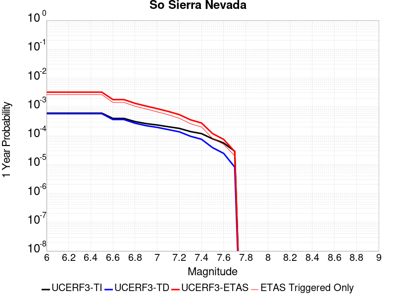 |  |

| Magnitude | 1 wk TI Prob | 1 wk TD Prob | 1 wk ETAS Prob | 1 wk ETAS/TD Gain | 1 wk ETAS Triggered Only | 1 mo TI Prob | 1 mo TD Prob | 1 mo ETAS Prob | 1 mo ETAS/TD Gain | 1 mo ETAS Triggered Only | 1 yr TI Prob | 1 yr TD Prob | 1 yr ETAS Prob | 1 yr ETAS/TD Gain | 1 yr ETAS Triggered Only | 10 yr TI Prob | 10 yr TD Prob | 10 yr ETAS Prob | 10 yr ETAS/TD Gain | 10 yr ETAS Triggered Only |
|-----|-----|-----|-----|-----|-----|-----|-----|-----|-----|-----|-----|-----|-----|-----|-----|-----|-----|-----|-----|-----|
| 6.0 | 1.15488665E-5 | 1.1079643E-5 | 0.0018310595 | 165.26341 | 0.00182 | 4.9494203E-5 | 4.748339E-5 | 0.0022573785 | 47.540382 | 0.00221 | 6.024253E-4 | 5.7796965E-4 | 0.003226438 | 5.5823655 | 0.00265 | 0.006007948 | 0.005765934 | 0.008718809 | 1.5121243 | 0.00297 |
| 6.1 | 1.15488665E-5 | 1.1079643E-5 | 0.0018310595 | 165.26341 | 0.00182 | 4.9494203E-5 | 4.748339E-5 | 0.0022573785 | 47.540382 | 0.00221 | 6.024253E-4 | 5.7796965E-4 | 0.003226438 | 5.5823655 | 0.00265 | 0.006007948 | 0.005765934 | 0.008718809 | 1.5121243 | 0.00297 |
| 6.2 | 1.15488665E-5 | 1.1079643E-5 | 0.0018310595 | 165.26341 | 0.00182 | 4.9494203E-5 | 4.748339E-5 | 0.0022573785 | 47.540382 | 0.00221 | 6.024253E-4 | 5.7796965E-4 | 0.003226438 | 5.5823655 | 0.00265 | 0.006007948 | 0.005765934 | 0.008718809 | 1.5121243 | 0.00297 |
| 6.3 | 1.15488665E-5 | 1.1079643E-5 | 0.0018310595 | 165.26341 | 0.00182 | 4.9494203E-5 | 4.748339E-5 | 0.0022573785 | 47.540382 | 0.00221 | 6.024253E-4 | 5.7796965E-4 | 0.003226438 | 5.5823655 | 0.00265 | 0.006007948 | 0.005765934 | 0.008718809 | 1.5121243 | 0.00297 |
| 6.4 | 1.15488665E-5 | 1.1079643E-5 | 0.0018310595 | 165.26341 | 0.00182 | 4.9494203E-5 | 4.748339E-5 | 0.0022573785 | 47.540382 | 0.00221 | 6.024253E-4 | 5.7796965E-4 | 0.003226438 | 5.5823655 | 0.00265 | 0.006007948 | 0.005765934 | 0.008718809 | 1.5121243 | 0.00297 |
| 6.5 | 1.15488665E-5 | 1.1079643E-5 | 0.0018310595 | 165.26341 | 0.00182 | 4.9494203E-5 | 4.748339E-5 | 0.0022573785 | 47.540382 | 0.00221 | 6.024253E-4 | 5.7796965E-4 | 0.003226438 | 5.5823655 | 0.00265 | 0.006007948 | 0.005765934 | 0.008718809 | 1.5121243 | 0.00297 |
| 6.6 | 7.587044E-6 | 6.935635E-6 | 9.5692906E-4 | 137.97281 | 9.5E-4 | 3.2515498E-5 | 2.9723828E-5 | 0.0012096887 | 40.69761 | 0.00118 | 3.9580427E-4 | 3.6183043E-4 | 0.0017813166 | 4.92307 | 0.00142 | 0.003951 | 0.0036127048 | 0.005167069 | 1.4302495 | 0.00156 |
| 6.7 | 7.587044E-6 | 6.935635E-6 | 9.5692906E-4 | 137.97281 | 9.5E-4 | 3.2515498E-5 | 2.9723828E-5 | 0.0012096887 | 40.69761 | 0.00118 | 3.9580427E-4 | 3.6183043E-4 | 0.0017813166 | 4.92307 | 0.00142 | 0.003951 | 0.0036127048 | 0.005167069 | 1.4302495 | 0.00156 |
| 6.8 | 5.9026956E-6 | 5.1793927E-6 | 7.551755E-4 | 145.80386 | 7.5E-4 | 2.5297022E-5 | 2.2197215E-5 | 9.1217743E-4 | 41.09423 | 8.9E-4 | 3.0794772E-4 | 2.7021873E-4 | 0.001319935 | 4.8846908 | 0.00105 | 0.0030752132 | 0.002699018 | 0.003815995 | 1.4138458 | 0.00112 |
| 6.9 | 5.0118915E-6 | 4.2524252E-6 | 6.042499E-4 | 142.09535 | 6.0E-4 | 2.1479358E-5 | 1.8224557E-5 | 7.282116E-4 | 39.957714 | 7.1E-4 | 2.614798E-4 | 2.2186211E-4 | 0.0010616757 | 4.7852955 | 8.4E-4 | 0.0026117235 | 0.0022164788 | 0.0031244617 | 1.4096512 | 9.1E-4 |
| 7.0 | 4.4924795E-6 | 3.7139177E-6 | 4.7371216E-4 | 127.55053 | 4.7E-4 | 1.925334E-5 | 1.5916696E-5 | 5.7590776E-4 | 36.18262 | 5.6E-4 | 2.3438422E-4 | 1.9376918E-4 | 8.6363935E-4 | 4.457052 | 6.7E-4 | 0.0023413717 | 0.0019360651 | 0.0026746325 | 1.3814785 | 7.4E-4 |
| 7.1 | 3.9118436E-6 | 3.1119775E-6 | 3.531109E-4 | 113.46832 | 3.5E-4 | 1.6764936E-5 | 1.3336982E-5 | 4.4333126E-4 | 33.24075 | 4.3E-4 | 2.0409399E-4 | 1.6236622E-4 | 6.922802E-4 | 4.2636957 | 5.3E-4 | 0.0020390663 | 0.001622532 | 0.002201591 | 1.356886 | 5.8E-4 |
| 7.2 | 3.4200818E-6 | 2.6054543E-6 | 2.6260476E-4 | 100.7904 | 2.6E-4 | 1.4657411E-5 | 1.11661875E-5 | 3.411625E-4 | 30.553177 | 3.3E-4 | 1.7843937E-4 | 1.3594035E-4 | 5.35886E-4 | 3.942067 | 4.0E-4 | 0.0017829615 | 0.0013586218 | 0.0018080104 | 1.330768 | 4.5E-4 |
| 7.3 | 2.6593618E-6 | 1.8284203E-6 | 1.8182809E-4 | 99.44546 | 1.8E-4 | 1.13972155E-5 | 7.836065E-6 | 2.1783441E-4 | 27.798956 | 2.1E-4 | 1.3875226E-4 | 9.540021E-5 | 3.553754E-4 | 3.725101 | 2.6E-4 | 0.0013866565 | 9.5362146E-4 | 0.0012433449 | 1.3038139 | 2.9E-4 |
| 7.4 | 2.2577992E-6 | 1.436438E-6 | 1.3143625E-4 | 91.50151 | 1.3E-4 | 9.676246E-6 | 6.15615E-6 | 1.6615517E-4 | 26.99011 | 1.6E-4 | 1.1780193E-4 | 7.49488E-5 | 2.7493382E-4 | 3.6682882 | 2.0E-4 | 0.001177395 | 7.492603E-4 | 9.6909545E-4 | 1.2934029 | 2.2E-4 |
| 7.5 | 1.489319E-6 | 7.353936E-7 | 6.073535E-5 | 82.5889 | 6.0E-5 | 6.3827797E-6 | 3.1516831E-6 | 7.315146E-5 | 23.210285 | 7.0E-5 | 7.770758E-5 | 3.8371072E-5 | 1.18368E-4 | 3.084824 | 8.0E-5 | 7.7680405E-4 | 3.836449E-4 | 4.8360653E-4 | 1.2605578 | 1.0E-4 |
| 7.6 | 1.0680322E-6 | 4.6596554E-7 | 3.0465952E-5 | 65.382416 | 3.0E-5 | 4.577273E-6 | 1.9969937E-6 | 4.1996915E-5 | 21.03007 | 4.0E-5 | 5.5726876E-5 | 2.4313129E-5 | 7.4311916E-5 | 3.056452 | 5.0E-5 | 5.5712904E-4 | 2.4310495E-4 | 2.930928E-4 | 1.2056224 | 5.0E-5 |
| 7.7 | 5.509146E-7 | 1.5580486E-7 | 1.5580486E-7 | 1.0 | 0.0 | 2.3610605E-6 | 6.677349E-7 | 1.0667728E-5 | 15.975992 | 1.0E-5 | 2.8745531E-5 | 8.129644E-6 | 2.8129482E-5 | 3.4601123 | 2.0E-5 | 2.8741814E-4 | 8.1293576E-5 | 1.0129195E-4 | 1.2460018 | 2.0E-5 |

## San Andreas (Mojave S)
*[(top)](#table-of-contents)*

| 1 Week | 1 Month | 1 Year | 10 Year |
|-----|-----|-----|-----|
|  |  |  |  |

| Magnitude | 1 wk TI Prob | 1 wk TD Prob | 1 wk ETAS Prob | 1 wk ETAS/TD Gain | 1 wk ETAS Triggered Only | 1 mo TI Prob | 1 mo TD Prob | 1 mo ETAS Prob | 1 mo ETAS/TD Gain | 1 mo ETAS Triggered Only | 1 yr TI Prob | 1 yr TD Prob | 1 yr ETAS Prob | 1 yr ETAS/TD Gain | 1 yr ETAS Triggered Only | 10 yr TI Prob | 10 yr TD Prob | 10 yr ETAS Prob | 10 yr ETAS/TD Gain | 10 yr ETAS Triggered Only |
|-----|-----|-----|-----|-----|-----|-----|-----|-----|-----|-----|-----|-----|-----|-----|-----|-----|-----|-----|-----|-----|
| 6.0 | 3.1064058E-4 | 6.7460834E-4 | 0.0024933806 | 3.6960418 | 0.00182 | 0.0013306376 | 0.0028881032 | 0.0050219228 | 1.7388307 | 0.00214 | 0.016080605 | 0.03462235 | 0.036987524 | 1.0683136 | 0.00245 | 0.1496549 | 0.28660452 | 0.28848076 | 1.0065464 | 0.00263 |
| 6.1 | 3.1064058E-4 | 6.7460834E-4 | 0.0024933806 | 3.6960418 | 0.00182 | 0.0013306376 | 0.0028881032 | 0.0050219228 | 1.7388307 | 0.00214 | 0.016080605 | 0.03462235 | 0.036987524 | 1.0683136 | 0.00245 | 0.1496549 | 0.28660452 | 0.28848076 | 1.0065464 | 0.00263 |
| 6.2 | 3.1064058E-4 | 6.7460834E-4 | 0.0024933806 | 3.6960418 | 0.00182 | 0.0013306376 | 0.0028881032 | 0.0050219228 | 1.7388307 | 0.00214 | 0.016080605 | 0.03462235 | 0.036987524 | 1.0683136 | 0.00245 | 0.1496549 | 0.28660452 | 0.28848076 | 1.0065464 | 0.00263 |
| 6.3 | 3.1064058E-4 | 6.7460834E-4 | 0.0024933806 | 3.6960418 | 0.00182 | 0.0013306376 | 0.0028881032 | 0.0050219228 | 1.7388307 | 0.00214 | 0.016080605 | 0.03462235 | 0.036987524 | 1.0683136 | 0.00245 | 0.1496549 | 0.28660452 | 0.28848076 | 1.0065464 | 0.00263 |
| 6.4 | 1.9872203E-4 | 4.3179357E-4 | 0.0020311028 | 4.7038746 | 0.0016 | 8.5138786E-4 | 0.0018492596 | 0.003725783 | 2.014743 | 0.00188 | 0.010316478 | 0.02228844 | 0.024370965 | 1.0934353 | 0.00213 | 0.098504856 | 0.19699748 | 0.19881226 | 1.0092123 | 0.00226 |
| 6.5 | 1.291105E-4 | 2.875267E-4 | 0.0016871241 | 5.867713 | 0.0014 | 5.5321335E-4 | 0.0012316781 | 0.002879646 | 2.3379858 | 0.00165 | 0.006714592 | 0.0148934 | 0.016765103 | 1.1256733 | 0.0019 | 0.065152965 | 0.13803436 | 0.13978414 | 1.0126765 | 0.00203 |
| 6.6 | 1.291105E-4 | 2.875267E-4 | 0.0016871241 | 5.867713 | 0.0014 | 5.5321335E-4 | 0.0012316781 | 0.002879646 | 2.3379858 | 0.00165 | 0.006714592 | 0.0148934 | 0.016765103 | 1.1256733 | 0.0019 | 0.065152965 | 0.13803436 | 0.13978414 | 1.0126765 | 0.00203 |
| 6.7 | 1.08001186E-4 | 2.4333889E-4 | 0.0016130055 | 6.6286387 | 0.00137 | 4.6278012E-4 | 0.0010424647 | 0.0026607758 | 2.5523894 | 0.00162 | 0.0056198016 | 0.012618446 | 0.01446485 | 1.1463257 | 0.00187 | 0.054797906 | 0.119176775 | 0.12093842 | 1.0147818 | 0.002 |
| 6.8 | 1.0624356E-4 | 2.3851555E-4 | 0.0016081887 | 6.7424903 | 0.00137 | 4.5525006E-4 | 0.0010218095 | 0.0026401542 | 2.5838027 | 0.00162 | 0.0055285925 | 0.012369843 | 0.014216712 | 1.1493042 | 0.00187 | 0.053930566 | 0.11712591 | 0.118891664 | 1.0150757 | 0.002 |
| 6.9 | 1.0393785E-4 | 2.3221898E-4 | 0.0015919032 | 6.8551807 | 0.00136 | 4.4537184E-4 | 9.948451E-4 | 0.0026032433 | 2.6167324 | 0.00161 | 0.0054089287 | 0.012045221 | 0.013882817 | 1.1525581 | 0.00186 | 0.05279156 | 0.11442335 | 0.11618565 | 1.0154016 | 0.00199 |
| 7.0 | 1.0155622E-4 | 2.2591476E-4 | 0.0015856075 | 7.01861 | 0.00136 | 4.3516833E-4 | 9.6784724E-4 | 0.002576289 | 2.6618757 | 0.00161 | 0.005285311 | 0.0117200995 | 0.0135583 | 1.1568418 | 0.00186 | 0.05161361 | 0.111683756 | 0.1134515 | 1.0158281 | 0.00199 |
| 7.1 | 9.885595E-5 | 2.1879886E-4 | 0.0015785013 | 7.2143946 | 0.00136 | 4.2359953E-4 | 9.3737274E-4 | 0.0025458636 | 2.7159564 | 0.00161 | 0.0051451353 | 0.011352993 | 0.013191876 | 1.1619735 | 0.00186 | 0.05027629 | 0.1085682 | 0.11034215 | 1.0163395 | 0.00199 |
| 7.2 | 9.6411415E-5 | 2.124288E-4 | 0.0015721399 | 7.400785 | 0.00136 | 4.1312634E-4 | 9.1009185E-4 | 0.0025186266 | 2.7674422 | 0.00161 | 0.005018219 | 0.011024255 | 0.012863751 | 1.1668589 | 0.00186 | 0.049064007 | 0.105758004 | 0.107537545 | 1.0168265 | 0.00199 |
| 7.3 | 9.1180635E-5 | 1.9471257E-4 | 0.0015144555 | 7.777903 | 0.00132 | 3.907156E-4 | 8.342157E-4 | 0.0023829227 | 2.8564827 | 0.00155 | 0.004746591 | 0.01010939 | 0.011891193 | 1.1762522 | 0.0018 | 0.046464786 | 0.09795115 | 0.099692106 | 1.0177737 | 0.00193 |
| 7.4 | 8.887388E-5 | 1.8719878E-4 | 0.0014969535 | 7.9965987 | 0.00131 | 3.8083247E-4 | 8.020339E-4 | 0.0023407987 | 2.9185784 | 0.00154 | 0.0046267817 | 0.00972114 | 0.01149374 | 1.1823448 | 0.00179 | 0.045316286 | 0.09458615 | 0.09632454 | 1.018379 | 0.00192 |
| 7.5 | 8.6750515E-5 | 1.8051457E-4 | 0.001490278 | 8.255722 | 0.00131 | 3.7173493E-4 | 7.7340455E-4 | 0.0023022213 | 2.976736 | 0.00153 | 0.004516484 | 0.009375632 | 0.011138943 | 1.1880739 | 0.00178 | 0.04425787 | 0.091549896 | 0.09328503 | 1.018953 | 0.00191 |
| 7.6 | 8.453092E-5 | 1.7439072E-4 | 0.0014841623 | 8.510557 | 0.00131 | 3.6222505E-4 | 7.471748E-4 | 0.0022760315 | 3.0461836 | 0.00153 | 0.0044011753 | 0.009058985 | 0.01082286 | 1.19471 | 0.00178 | 0.04315024 | 0.08870898 | 0.09044955 | 1.0196211 | 0.00191 |
| 7.7 | 8.259102E-5 | 1.6961215E-4 | 0.00147939 | 8.722194 | 0.00131 | 3.539135E-4 | 7.2670676E-4 | 0.0022555948 | 3.1038585 | 0.00153 | 0.004300386 | 0.008811831 | 0.010576145 | 1.2002212 | 0.00178 | 0.042181134 | 0.08645982 | 0.08819555 | 1.0200756 | 0.0019 |
| 7.8 | 7.444844E-5 | 1.5283503E-4 | 0.0012626654 | 8.261623 | 0.00111 | 3.1902574E-4 | 6.548429E-4 | 0.001983972 | 3.0296915 | 0.00133 | 0.0038772223 | 0.007943616 | 0.009451542 | 1.1898286 | 0.00152 | 0.03810269 | 0.078290746 | 0.0797747 | 1.0189544 | 0.00161 |
| 7.9 | 5.2586525E-5 | 1.00064186E-4 | 7.2000216E-4 | 7.195403 | 6.2E-4 | 2.2535135E-4 | 4.2877605E-4 | 0.0011784545 | 2.748415 | 7.5E-4 | 0.0027402006 | 0.005207864 | 0.006063385 | 1.1642749 | 8.6E-4 | 0.027066574 | 0.052200034 | 0.05308149 | 1.0168861 | 9.3E-4 |
| 8.0 | 3.379877E-5 | 5.4074168E-5 | 2.3406443E-4 | 4.3285813 | 1.8E-4 | 1.4484383E-4 | 2.3172585E-4 | 4.7167024E-4 | 2.0354667 | 2.4E-4 | 0.0017620471 | 0.002817614 | 0.0030968252 | 1.0990949 | 2.8E-4 | 0.017481409 | 0.028834904 | 0.029145675 | 1.0107777 | 3.2E-4 |
| 8.1 | 1.8668277E-5 | 1.9309397E-5 | 5.9308626E-5 | 3.0714903 | 4.0E-5 | 8.000444E-5 | 8.275194E-5 | 1.327478E-4 | 1.6041654 | 5.0E-5 | 9.736188E-4 | 0.0010070398 | 0.0010669794 | 1.0595206 | 6.0E-5 | 0.009693642 | 0.010798888 | 0.010878025 | 1.0073282 | 8.0E-5 |
| 8.2 | 8.541571E-6 | 5.460819E-6 | 5.460819E-6 | 1.0 | 0.0 | 3.660622E-5 | 2.3403301E-5 | 2.3403301E-5 | 1.0 | 0.0 | 4.455896E-4 | 2.84898E-4 | 2.84898E-4 | 1.0 | 0.0 | 0.0044469717 | 0.0032408056 | 0.0032408056 | 1.0 | 0.0 |
| 8.3 | 1.983087E-6 | 7.6599065E-7 | 7.6599065E-7 | 1.0 | 0.0 | 8.498917E-6 | 3.282813E-6 | 3.282813E-6 | 1.0 | 0.0 | 1.034694E-4 | 3.9967534E-5 | 3.9967534E-5 | 1.0 | 0.0 | 0.0010342124 | 4.719687E-4 | 4.719687E-4 | 1.0 | 0.0 |

## San Andreas (Mojave N)
*[(top)](#table-of-contents)*

| 1 Week | 1 Month | 1 Year | 10 Year |
|-----|-----|-----|-----|
|  |  |  |  |

| Magnitude | 1 wk TI Prob | 1 wk TD Prob | 1 wk ETAS Prob | 1 wk ETAS/TD Gain | 1 wk ETAS Triggered Only | 1 mo TI Prob | 1 mo TD Prob | 1 mo ETAS Prob | 1 mo ETAS/TD Gain | 1 mo ETAS Triggered Only | 1 yr TI Prob | 1 yr TD Prob | 1 yr ETAS Prob | 1 yr ETAS/TD Gain | 1 yr ETAS Triggered Only | 10 yr TI Prob | 10 yr TD Prob | 10 yr ETAS Prob | 10 yr ETAS/TD Gain | 10 yr ETAS Triggered Only |
|-----|-----|-----|-----|-----|-----|-----|-----|-----|-----|-----|-----|-----|-----|-----|-----|-----|-----|-----|-----|-----|
| 6.0 | 9.877682E-5 | 1.9400702E-4 | 0.00203365 | 10.482353 | 0.00184 | 4.2326056E-4 | 8.311939E-4 | 0.0029594235 | 3.560449 | 0.00213 | 0.0051410277 | 0.010072956 | 0.012498277 | 1.2407755 | 0.00245 | 0.05023708 | 0.09831428 | 0.10068571 | 1.0241209 | 0.00263 |
| 6.1 | 9.877682E-5 | 1.9400702E-4 | 0.00203365 | 10.482353 | 0.00184 | 4.2326056E-4 | 8.311939E-4 | 0.0029594235 | 3.560449 | 0.00213 | 0.0051410277 | 0.010072956 | 0.012498277 | 1.2407755 | 0.00245 | 0.05023708 | 0.09831428 | 0.10068571 | 1.0241209 | 0.00263 |
| 6.2 | 9.877682E-5 | 1.9400702E-4 | 0.00203365 | 10.482353 | 0.00184 | 4.2326056E-4 | 8.311939E-4 | 0.0029594235 | 3.560449 | 0.00213 | 0.0051410277 | 0.010072956 | 0.012498277 | 1.2407755 | 0.00245 | 0.05023708 | 0.09831428 | 0.10068571 | 1.0241209 | 0.00263 |
| 6.3 | 9.877682E-5 | 1.9400702E-4 | 0.00203365 | 10.482353 | 0.00184 | 4.2326056E-4 | 8.311939E-4 | 0.0029594235 | 3.560449 | 0.00213 | 0.0051410277 | 0.010072956 | 0.012498277 | 1.2407755 | 0.00245 | 0.05023708 | 0.09831428 | 0.10068571 | 1.0241209 | 0.00263 |
| 6.4 | 9.877682E-5 | 1.9400702E-4 | 0.00203365 | 10.482353 | 0.00184 | 4.2326056E-4 | 8.311939E-4 | 0.0029594235 | 3.560449 | 0.00213 | 0.0051410277 | 0.010072956 | 0.012498277 | 1.2407755 | 0.00245 | 0.05023708 | 0.09831428 | 0.10068571 | 1.0241209 | 0.00263 |
| 6.5 | 9.861474E-5 | 1.9374468E-4 | 0.0020333882 | 10.495194 | 0.00184 | 4.2256617E-4 | 8.300703E-4 | 0.0029583022 | 3.5639176 | 0.00213 | 0.0051326132 | 0.010059402 | 0.012484757 | 1.2411032 | 0.00245 | 0.050156746 | 0.098192066 | 0.100563824 | 1.0241542 | 0.00263 |
| 6.6 | 9.861474E-5 | 1.9374468E-4 | 0.0020333882 | 10.495194 | 0.00184 | 4.2256617E-4 | 8.300703E-4 | 0.0029583022 | 3.5639176 | 0.00213 | 0.0051326132 | 0.010059402 | 0.012484757 | 1.2411032 | 0.00245 | 0.050156746 | 0.098192066 | 0.100563824 | 1.0241542 | 0.00263 |
| 6.7 | 9.8552715E-5 | 1.9364421E-4 | 0.002033288 | 10.500122 | 0.00184 | 4.223004E-4 | 8.2964E-4 | 0.0029578728 | 3.5652487 | 0.00213 | 0.0051293927 | 0.010054212 | 0.012479579 | 1.2412289 | 0.00245 | 0.050125998 | 0.098145254 | 0.10051713 | 1.0241671 | 0.00263 |
| 6.8 | 9.8464974E-5 | 1.9349584E-4 | 0.0020331398 | 10.507408 | 0.00184 | 4.219245E-4 | 8.290045E-4 | 0.0029572388 | 3.5672166 | 0.00213 | 0.0051248376 | 0.010046546 | 0.012471933 | 1.2414149 | 0.00245 | 0.05008251 | 0.09807528 | 0.10044734 | 1.0241861 | 0.00263 |
| 6.9 | 9.825824E-5 | 1.9317595E-4 | 0.0020328206 | 10.523155 | 0.00184 | 4.2103877E-4 | 8.276344E-4 | 0.0029558716 | 3.57147 | 0.00213 | 0.0051141046 | 0.010030019 | 0.012455446 | 1.2418168 | 0.00245 | 0.049980022 | 0.09792438 | 0.10029684 | 1.0242275 | 0.00263 |
| 7.0 | 9.781462E-5 | 1.924896E-4 | 0.0020321354 | 10.557117 | 0.00184 | 4.1913814E-4 | 8.246948E-4 | 0.0029529382 | 3.5806437 | 0.00213 | 0.005091073 | 0.009994558 | 0.012420071 | 1.2426834 | 0.00245 | 0.04976007 | 0.09760077 | 0.09997408 | 1.0243165 | 0.00263 |
| 7.1 | 9.7121134E-5 | 1.9150671E-4 | 0.0020311542 | 10.606178 | 0.00184 | 4.1616702E-4 | 8.204851E-4 | 0.0029487375 | 3.5938952 | 0.00213 | 0.005055068 | 0.009943774 | 0.012369412 | 1.2439353 | 0.00245 | 0.04941613 | 0.09713728 | 0.09951181 | 1.024445 | 0.00263 |
| 7.2 | 9.663819E-5 | 1.9081456E-4 | 0.0020304634 | 10.641029 | 0.00184 | 4.1409794E-4 | 8.175206E-4 | 0.0029457794 | 3.603309 | 0.00213 | 0.0050299936 | 0.00990801 | 0.012333736 | 1.2448246 | 0.00245 | 0.049176537 | 0.09681055 | 0.099185936 | 1.0245365 | 0.00263 |
| 7.3 | 9.6277574E-5 | 1.9033969E-4 | 0.0020199914 | 10.612559 | 0.00183 | 4.125529E-4 | 8.154867E-4 | 0.0029337578 | 3.5975544 | 0.00212 | 0.0050112694 | 0.009883473 | 0.012299357 | 1.2444367 | 0.00244 | 0.04899759 | 0.09658401 | 0.09895096 | 1.0245067 | 0.00262 |
| 7.4 | 9.593308E-5 | 1.897375E-4 | 0.0020193902 | 10.643074 | 0.00183 | 4.1107697E-4 | 8.129075E-4 | 0.0029311841 | 3.6058028 | 0.00212 | 0.0049933824 | 0.009852355 | 0.012268316 | 1.2452165 | 0.00244 | 0.04882661 | 0.09630218 | 0.09866987 | 1.0245861 | 0.00262 |
| 7.5 | 9.561707E-5 | 1.8919831E-4 | 0.002008854 | 10.617716 | 0.00182 | 4.0972308E-4 | 8.1059814E-4 | 0.0029188879 | 3.6009061 | 0.00211 | 0.0049769743 | 0.009824493 | 0.012230619 | 1.244911 | 0.00243 | 0.048669744 | 0.09604836 | 0.09840768 | 1.0245638 | 0.00261 |
| 7.6 | 9.418194E-5 | 1.8572104E-4 | 0.0020053831 | 10.797823 | 0.00182 | 4.0357444E-4 | 7.957047E-4 | 0.0029040258 | 3.6496274 | 0.00211 | 0.004902454 | 0.009644784 | 0.012051348 | 1.2495197 | 0.00243 | 0.047957025 | 0.094430685 | 0.096794225 | 1.0250293 | 0.00261 |
| 7.7 | 8.202141E-5 | 1.6021315E-4 | 0.0017699552 | 11.0475025 | 0.00161 | 3.51473E-4 | 6.8644714E-4 | 0.0025451703 | 3.7077441 | 0.00186 | 0.00427079 | 0.008325525 | 0.010447708 | 1.2549008 | 0.00214 | 0.04189639 | 0.08223219 | 0.08435224 | 1.0257812 | 0.00231 |
| 7.8 | 7.2859846E-5 | 1.4516473E-4 | 0.0012550036 | 8.645376 | 0.00111 | 3.1221908E-4 | 6.219862E-4 | 0.001951159 | 3.136981 | 0.00133 | 0.003794643 | 0.0075464295 | 0.009054959 | 1.1998998 | 0.00152 | 0.037304975 | 0.07472468 | 0.07621437 | 1.0199357 | 0.00161 |
| 7.9 | 5.3874453E-5 | 1.0045676E-4 | 7.203945E-4 | 7.1711893 | 6.2E-4 | 2.3087008E-4 | 4.3045796E-4 | 0.0011801351 | 2.7415805 | 7.5E-4 | 0.0028072202 | 0.0052282433 | 0.006083747 | 1.1636312 | 8.6E-4 | 0.02772022 | 0.05242443 | 0.053305674 | 1.0168098 | 9.3E-4 |
| 8.0 | 3.468538E-5 | 5.4260272E-5 | 2.342505E-4 | 4.3171644 | 1.8E-4 | 1.4864317E-4 | 2.325233E-4 | 4.724675E-4 | 2.0319147 | 2.4E-4 | 0.0018082283 | 0.002827298 | 0.0031065063 | 1.0987545 | 2.8E-4 | 0.017935853 | 0.028947512 | 0.029258247 | 1.0107344 | 3.2E-4 |
| 8.1 | 1.9152367E-5 | 1.940263E-5 | 5.9401853E-5 | 3.061536 | 4.0E-5 | 8.207899E-5 | 8.3151484E-5 | 1.3314733E-4 | 1.6012622 | 5.0E-5 | 9.988535E-4 | 0.0010118998 | 0.001071839 | 1.0592344 | 6.0E-5 | 0.009943757 | 0.01085625 | 0.010935382 | 1.007289 | 8.0E-5 |
| 8.2 | 8.643924E-6 | 5.4748625E-6 | 5.4748625E-6 | 1.0 | 0.0 | 3.704486E-5 | 2.3463486E-5 | 2.3463486E-5 | 1.0 | 0.0 | 4.5092785E-4 | 2.8563058E-4 | 2.8563058E-4 | 1.0 | 0.0 | 0.0045001395 | 0.0032487072 | 0.0032487072 | 1.0 | 0.0 |
| 8.3 | 1.983087E-6 | 7.6599065E-7 | 7.6599065E-7 | 1.0 | 0.0 | 8.498917E-6 | 3.282813E-6 | 3.282813E-6 | 1.0 | 0.0 | 1.034694E-4 | 3.9967534E-5 | 3.9967534E-5 | 1.0 | 0.0 | 0.0010342124 | 4.719687E-4 | 4.719687E-4 | 1.0 | 0.0 |

## Coyote Canyon
*[(top)](#table-of-contents)*

| 1 Week | 1 Month | 1 Year | 10 Year |
|-----|-----|-----|-----|
|  |  |  |  |

| Magnitude | 1 wk TI Prob | 1 wk TD Prob | 1 wk ETAS Prob | 1 wk ETAS/TD Gain | 1 wk ETAS Triggered Only | 1 mo TI Prob | 1 mo TD Prob | 1 mo ETAS Prob | 1 mo ETAS/TD Gain | 1 mo ETAS Triggered Only | 1 yr TI Prob | 1 yr TD Prob | 1 yr ETAS Prob | 1 yr ETAS/TD Gain | 1 yr ETAS Triggered Only | 10 yr TI Prob | 10 yr TD Prob | 10 yr ETAS Prob | 10 yr ETAS/TD Gain | 10 yr ETAS Triggered Only |
|-----|-----|-----|-----|-----|-----|-----|-----|-----|-----|-----|-----|-----|-----|-----|-----|-----|-----|-----|-----|-----|
| 6.0 | 3.5090034E-5 | 4.0364324E-5 | 0.0013503114 | 33.45309 | 0.00131 | 1.503772E-4 | 1.7297994E-4 | 0.0017427084 | 10.074627 | 0.00157 | 0.0018293047 | 0.0021042528 | 0.0040002544 | 1.9010334 | 0.0019 | 0.018143194 | 0.020869201 | 0.023013499 | 1.1027493 | 0.00219 |
| 6.1 | 3.5090034E-5 | 4.0364324E-5 | 0.0013503114 | 33.45309 | 0.00131 | 1.503772E-4 | 1.7297994E-4 | 0.0017427084 | 10.074627 | 0.00157 | 0.0018293047 | 0.0021042528 | 0.0040002544 | 1.9010334 | 0.0019 | 0.018143194 | 0.020869201 | 0.023013499 | 1.1027493 | 0.00219 |
| 6.2 | 1.841879E-5 | 2.1059794E-5 | 7.510444E-4 | 35.66248 | 7.3E-4 | 7.8935285E-5 | 9.0253714E-5 | 8.901815E-4 | 9.863102 | 8.0E-4 | 9.606133E-4 | 0.001098387 | 0.0021072775 | 1.9185202 | 0.00101 | 0.0095647145 | 0.010939667 | 0.01213643 | 1.1093967 | 0.00121 |
| 6.3 | 1.841879E-5 | 2.1059794E-5 | 7.510444E-4 | 35.66248 | 7.3E-4 | 7.8935285E-5 | 9.0253714E-5 | 8.901815E-4 | 9.863102 | 8.0E-4 | 9.606133E-4 | 0.001098387 | 0.0021072775 | 1.9185202 | 0.00101 | 0.0095647145 | 0.010939667 | 0.01213643 | 1.1093967 | 0.00121 |
| 6.4 | 1.712201E-5 | 1.9565212E-5 | 7.0955174E-4 | 36.265987 | 6.9E-4 | 7.337798E-5 | 8.3848776E-5 | 8.537842E-4 | 10.182428 | 7.7E-4 | 8.930107E-4 | 0.0010204813 | 0.0019894915 | 1.9495618 | 9.7E-4 | 0.008894307 | 0.010167871 | 0.011316076 | 1.1129248 | 0.00116 |
| 6.5 | 1.4744935E-5 | 1.6836972E-5 | 6.168269E-4 | 36.63526 | 6.0E-4 | 6.3191044E-5 | 7.215698E-5 | 7.5210794E-4 | 10.423218 | 6.8E-4 | 7.6907943E-4 | 8.7825063E-4 | 0.0017075217 | 1.9442306 | 8.3E-4 | 0.007664232 | 0.008756994 | 0.009728412 | 1.1109306 | 9.8E-4 |
| 6.6 | 1.2017839E-5 | 1.37240895E-5 | 5.0371734E-4 | 36.703156 | 4.9E-4 | 5.150401E-5 | 5.88167E-5 | 6.087843E-4 | 10.350536 | 5.5E-4 | 6.268809E-4 | 7.159466E-4 | 0.0013854669 | 1.935154 | 6.7E-4 | 0.0062511545 | 0.0071450938 | 0.007939378 | 1.1111649 | 8.0E-4 |
| 6.7 | 1.00956095E-5 | 1.1533517E-5 | 4.4152857E-4 | 38.282215 | 4.3E-4 | 4.326618E-5 | 4.942891E-5 | 5.294052E-4 | 10.710436 | 4.8E-4 | 5.266384E-4 | 6.017178E-4 | 0.0012013568 | 1.9965452 | 6.0E-4 | 0.005253921 | 0.0060094125 | 0.0067350254 | 1.1207461 | 7.3E-4 |

## Death Valley (So)
*[(top)](#table-of-contents)*

| 1 Week | 1 Month | 1 Year | 10 Year |
|-----|-----|-----|-----|
| 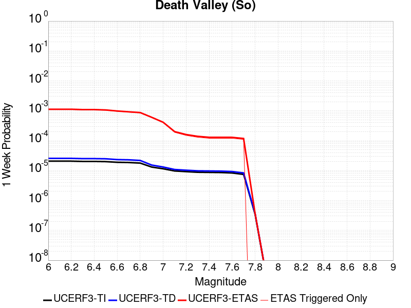 |  |  |  |

| Magnitude | 1 wk TI Prob | 1 wk TD Prob | 1 wk ETAS Prob | 1 wk ETAS/TD Gain | 1 wk ETAS Triggered Only | 1 mo TI Prob | 1 mo TD Prob | 1 mo ETAS Prob | 1 mo ETAS/TD Gain | 1 mo ETAS Triggered Only | 1 yr TI Prob | 1 yr TD Prob | 1 yr ETAS Prob | 1 yr ETAS/TD Gain | 1 yr ETAS Triggered Only | 10 yr TI Prob | 10 yr TD Prob | 10 yr ETAS Prob | 10 yr ETAS/TD Gain | 10 yr ETAS Triggered Only |
|-----|-----|-----|-----|-----|-----|-----|-----|-----|-----|-----|-----|-----|-----|-----|-----|-----|-----|-----|-----|-----|
| 6.0 | 2.0684236E-5 | 2.5617775E-5 | 0.0011255896 | 43.937836 | 0.0011 | 8.864371E-5 | 1.0978594E-4 | 0.0014896344 | 13.568535 | 0.00138 | 0.0010787029 | 0.0013358411 | 0.0030535436 | 2.2858582 | 0.00172 | 0.010734817 | 0.013281397 | 0.015205498 | 1.144872 | 0.00195 |
| 6.1 | 2.0684236E-5 | 2.5617775E-5 | 0.0011255896 | 43.937836 | 0.0011 | 8.864371E-5 | 1.0978594E-4 | 0.0014896344 | 13.568535 | 0.00138 | 0.0010787029 | 0.0013358411 | 0.0030535436 | 2.2858582 | 0.00172 | 0.010734817 | 0.013281397 | 0.015205498 | 1.144872 | 0.00195 |
| 6.2 | 2.0684236E-5 | 2.5617775E-5 | 0.0011255896 | 43.937836 | 0.0011 | 8.864371E-5 | 1.0978594E-4 | 0.0014896344 | 13.568535 | 0.00138 | 0.0010787029 | 0.0013358411 | 0.0030535436 | 2.2858582 | 0.00172 | 0.010734817 | 0.013281397 | 0.015205498 | 1.144872 | 0.00195 |
| 6.3 | 2.0240292E-5 | 2.511786E-5 | 0.001095091 | 43.5981 | 0.00107 | 8.6741224E-5 | 1.07643624E-4 | 0.0014474994 | 13.4471445 | 0.00134 | 0.0010555626 | 0.00130979 | 0.002947642 | 2.2504692 | 0.00164 | 0.010505628 | 0.013023956 | 0.014859731 | 1.1409538 | 0.00186 |
| 6.4 | 2.0240292E-5 | 2.511786E-5 | 0.001095091 | 43.5981 | 0.00107 | 8.6741224E-5 | 1.07643624E-4 | 0.0014474994 | 13.4471445 | 0.00134 | 0.0010555626 | 0.00130979 | 0.002947642 | 2.2504692 | 0.00164 | 0.010505628 | 0.013023956 | 0.014859731 | 1.1409538 | 0.00186 |
| 6.5 | 1.9962767E-5 | 2.4807114E-5 | 0.0010647813 | 42.922417 | 0.00104 | 8.55519E-5 | 1.0631196E-4 | 0.0014061738 | 13.226863 | 0.0013 | 0.0010410968 | 0.0012935963 | 0.0028915266 | 2.235262 | 0.0016 | 0.010362327 | 0.012863902 | 0.014670362 | 1.1404285 | 0.00183 |
| 6.6 | 1.8937297E-5 | 2.3310964E-5 | 9.832886E-4 | 42.181377 | 9.6E-4 | 8.115732E-5 | 9.990039E-5 | 0.0012997806 | 13.010765 | 0.0012 | 9.876423E-4 | 0.0012156231 | 0.0026738483 | 2.1995702 | 0.00146 | 0.009832645 | 0.012092789 | 0.013752473 | 1.1372458 | 0.00168 |
| 6.7 | 1.8621096E-5 | 2.2911607E-5 | 9.2289096E-4 | 40.280502 | 9.0E-4 | 7.980225E-5 | 9.818898E-5 | 0.001228078 | 12.507289 | 0.00113 | 9.711593E-4 | 0.0011948098 | 0.0025831491 | 2.1619751 | 0.00139 | 0.009669261 | 0.011886904 | 0.013448123 | 1.1313394 | 0.00158 |
| 6.8 | 1.7830353E-5 | 2.1805688E-5 | 8.7178714E-4 | 39.979805 | 8.5E-4 | 7.641356E-5 | 9.344968E-5 | 0.0011633497 | 12.448942 | 0.00107 | 9.29938E-4 | 0.00113717 | 0.002455669 | 2.1594563 | 0.00132 | 0.009260561 | 0.011316354 | 0.0127796065 | 1.1293042 | 0.00148 |
| 6.9 | 1.3135183E-5 | 1.5303925E-5 | 6.052949E-4 | 39.551613 | 5.9E-4 | 5.6292425E-5 | 6.558664E-5 | 8.055381E-4 | 12.282046 | 7.4E-4 | 6.8514474E-4 | 7.982312E-4 | 0.0016675368 | 2.0890398 | 8.7E-4 | 0.006830362 | 0.007954649 | 0.008897091 | 1.118477 | 9.5E-4 |
| 7.0 | 1.1507512E-5 | 1.3154199E-5 | 4.1314893E-4 | 31.40814 | 4.0E-4 | 4.9316975E-5 | 5.6373956E-5 | 5.9634354E-4 | 10.578352 | 5.4E-4 | 6.002687E-4 | 6.8614254E-4 | 0.0013456896 | 1.9612392 | 6.6E-4 | 0.0059864987 | 0.0068409415 | 0.007556016 | 1.1045287 | 7.2E-4 |
| 7.1 | 9.715903E-6 | 1.0865278E-5 | 2.0086321E-4 | 18.486708 | 1.9E-4 | 4.1638916E-5 | 4.656467E-5 | 3.3655117E-4 | 7.2276077 | 2.9E-4 | 5.068359E-4 | 5.667817E-4 | 9.265776E-4 | 1.6348052 | 3.6E-4 | 0.0050568148 | 0.0056538144 | 0.0060416097 | 1.0685899 | 3.9E-4 |
| 7.2 | 9.233269E-6 | 1.02863105E-5 | 1.6028476E-4 | 15.582338 | 1.5E-4 | 3.9570554E-5 | 4.4083466E-5 | 2.540742E-4 | 5.7634807 | 2.1E-4 | 4.81665E-4 | 5.3658825E-4 | 7.9644873E-4 | 1.4842829 | 2.6E-4 | 0.0048062233 | 0.0053533576 | 0.005641805 | 1.0538816 | 2.9E-4 |
| 7.3 | 8.8041315E-6 | 9.808164E-6 | 1.3980689E-4 | 14.254134 | 1.3E-4 | 3.7731446E-5 | 4.2034335E-5 | 2.2202676E-4 | 5.2820334 | 1.8E-4 | 4.592835E-4 | 5.1165203E-4 | 7.315395E-4 | 1.4297597 | 2.2E-4 | 0.0045833546 | 0.005105167 | 0.005353891 | 1.04872 | 2.5E-4 |
| 7.4 | 8.708749E-6 | 9.707175E-6 | 1.2970601E-4 | 13.36187 | 1.2E-4 | 3.7322676E-5 | 4.160154E-5 | 2.1159447E-4 | 5.0862174 | 1.7E-4 | 4.5430884E-4 | 5.0638523E-4 | 7.162789E-4 | 1.414494 | 2.1E-4 | 0.004533812 | 0.0050527398 | 0.005291527 | 1.047259 | 2.4E-4 |
| 7.5 | 8.612678E-6 | 9.604817E-6 | 1.2960366E-4 | 13.49361 | 1.2E-4 | 3.6910955E-5 | 4.1162875E-5 | 2.0115629E-4 | 4.8868375 | 1.6E-4 | 4.492982E-4 | 5.01047E-4 | 7.009468E-4 | 1.3989642 | 2.0E-4 | 0.004483909 | 0.0049995985 | 0.0052284487 | 1.0457737 | 2.3E-4 |
| 7.6 | 8.319024E-6 | 9.283916E-6 | 1.2928281E-4 | 13.92546 | 1.2E-4 | 3.5652476E-5 | 3.978763E-5 | 1.9978127E-4 | 5.02119 | 1.6E-4 | 4.3398244E-4 | 4.8431093E-4 | 6.742189E-4 | 1.39212 | 1.9E-4 | 0.0043313587 | 0.0048329784 | 0.005051915 | 1.0453006 | 2.2E-4 |
| 7.7 | 7.4718328E-6 | 8.34517E-6 | 1.1834425E-4 | 14.181168 | 1.1E-4 | 3.2021748E-5 | 3.5764548E-5 | 1.7575955E-4 | 4.914351 | 1.4E-4 | 3.8979502E-4 | 4.353504E-4 | 6.052764E-4 | 1.3903201 | 1.7E-4 | 0.00389112 | 0.0043453807 | 0.004534555 | 1.0435346 | 1.9E-4 |
| 7.8 | 3.4586725E-7 | 3.6482615E-7 | 3.6482615E-7 | 1.0 | 0.0 | 1.4822873E-6 | 1.5635396E-6 | 1.5635396E-6 | 1.0 | 0.0 | 1.80467E-5 | 1.9035933E-5 | 1.9035933E-5 | 1.0 | 0.0 | 1.8045233E-4 | 1.9034347E-4 | 1.9034347E-4 | 1.0 | 0.0 |
| 7.9 | 2.5591178E-9 | 2.6696718E-9 | 2.6696718E-9 | 1.0 | 0.0 | 1.0967647E-8 | 1.14414505E-8 | 1.14414505E-8 | 1.0 | 0.0 | 1.335311E-7 | 1.3929966E-7 | 1.3929966E-7 | 1.0 | 0.0 | 1.3353102E-6 | 1.3929966E-6 | 1.3929966E-6 | 1.0 | 0.0 |

## Lenwood-Lockhart-Old Woman Springs
*[(top)](#table-of-contents)*

| 1 Week | 1 Month | 1 Year | 10 Year |
|-----|-----|-----|-----|
|  |  |  |  |

| Magnitude | 1 wk TI Prob | 1 wk TD Prob | 1 wk ETAS Prob | 1 wk ETAS/TD Gain | 1 wk ETAS Triggered Only | 1 mo TI Prob | 1 mo TD Prob | 1 mo ETAS Prob | 1 mo ETAS/TD Gain | 1 mo ETAS Triggered Only | 1 yr TI Prob | 1 yr TD Prob | 1 yr ETAS Prob | 1 yr ETAS/TD Gain | 1 yr ETAS Triggered Only | 10 yr TI Prob | 10 yr TD Prob | 10 yr ETAS Prob | 10 yr ETAS/TD Gain | 10 yr ETAS Triggered Only |
|-----|-----|-----|-----|-----|-----|-----|-----|-----|-----|-----|-----|-----|-----|-----|-----|-----|-----|-----|-----|-----|
| 6.0 | 3.744542E-5 | 4.396252E-5 | 0.0010739173 | 24.428019 | 0.00103 | 1.604705E-4 | 1.8839816E-4 | 0.0014981513 | 7.952049 | 0.00131 | 0.0019519776 | 0.0022915069 | 0.0038978176 | 1.7009845 | 0.00161 | 0.019349206 | 0.022696787 | 0.024387522 | 1.0744922 | 0.00173 |
| 6.1 | 3.744542E-5 | 4.396252E-5 | 0.0010739173 | 24.428019 | 0.00103 | 1.604705E-4 | 1.8839816E-4 | 0.0014981513 | 7.952049 | 0.00131 | 0.0019519776 | 0.0022915069 | 0.0038978176 | 1.7009845 | 0.00161 | 0.019349206 | 0.022696787 | 0.024387522 | 1.0744922 | 0.00173 |
| 6.2 | 3.744542E-5 | 4.396252E-5 | 0.0010739173 | 24.428019 | 0.00103 | 1.604705E-4 | 1.8839816E-4 | 0.0014981513 | 7.952049 | 0.00131 | 0.0019519776 | 0.0022915069 | 0.0038978176 | 1.7009845 | 0.00161 | 0.019349206 | 0.022696787 | 0.024387522 | 1.0744922 | 0.00173 |
| 6.3 | 2.1079984E-5 | 2.5353434E-5 | 4.7534204E-4 | 18.748625 | 4.5E-4 | 9.0339665E-5 | 1.0865316E-4 | 7.285858E-4 | 6.7056108 | 6.2E-4 | 0.0010993304 | 0.0013220694 | 0.0021309985 | 1.6118659 | 8.1E-4 | 0.010939079 | 0.0131442575 | 0.014002822 | 1.0653186 | 8.7E-4 |
| 6.4 | 2.1079984E-5 | 2.5353434E-5 | 4.7534204E-4 | 18.748625 | 4.5E-4 | 9.0339665E-5 | 1.0865316E-4 | 7.285858E-4 | 6.7056108 | 6.2E-4 | 0.0010993304 | 0.0013220694 | 0.0021309985 | 1.6118659 | 8.1E-4 | 0.010939079 | 0.0131442575 | 0.014002822 | 1.0653186 | 8.7E-4 |
| 6.5 | 1.7397282E-5 | 2.066241E-5 | 3.2065623E-4 | 15.51882 | 3.0E-4 | 7.455765E-5 | 8.8550245E-5 | 4.8851484E-4 | 5.5168095 | 4.0E-4 | 9.073613E-4 | 0.0010775778 | 0.0016269851 | 1.509854 | 5.5E-4 | 0.009036654 | 0.010724821 | 0.011298601 | 1.0535002 | 5.8E-4 |
| 6.6 | 1.52050325E-5 | 1.7679693E-5 | 2.5767545E-4 | 14.574656 | 2.4E-4 | 6.51628E-5 | 7.576796E-5 | 3.9574373E-4 | 5.223101 | 3.2E-4 | 7.9306826E-4 | 9.220924E-4 | 0.001391659 | 1.5092403 | 4.7E-4 | 0.007902439 | 0.009183526 | 0.009678935 | 1.0539453 | 5.0E-4 |
| 6.7 | 1.332523E-5 | 1.5264002E-5 | 2.252608E-4 | 14.757649 | 2.1E-4 | 5.7106878E-5 | 6.5415545E-5 | 3.2539855E-4 | 4.9743304 | 2.6E-4 | 6.950544E-4 | 7.961491E-4 | 0.0011658545 | 1.464367 | 3.7E-4 | 0.006928845 | 0.007933599 | 0.008320505 | 1.048768 | 3.9E-4 |
| 6.8 | 1.1525329E-5 | 1.3030979E-5 | 1.9302864E-4 | 14.813057 | 1.8E-4 | 4.9393333E-5 | 5.584588E-5 | 2.758336E-4 | 4.9391932 | 2.2E-4 | 6.011979E-4 | 6.797157E-4 | 9.994982E-4 | 1.4704651 | 3.2E-4 | 0.00599574 | 0.006776819 | 0.007114515 | 1.049831 | 3.4E-4 |
| 6.9 | 1.0253909E-5 | 1.15144385E-5 | 1.9151237E-4 | 16.632366 | 1.8E-4 | 4.3944583E-5 | 4.9346683E-5 | 2.4933682E-4 | 5.0527573 | 2.0E-4 | 5.3489394E-4 | 6.0063385E-4 | 8.904597E-4 | 1.4825332 | 2.9E-4 | 0.0053360825 | 0.0059904843 | 0.0062986272 | 1.0514387 | 3.1E-4 |
| 7.0 | 8.104563E-6 | 8.991279E-6 | 1.4899002E-4 | 16.570503 | 1.4E-4 | 3.4733377E-5 | 3.8533497E-5 | 1.9852733E-4 | 5.1520715 | 1.6E-4 | 4.2279682E-4 | 4.6904673E-4 | 6.9893885E-4 | 1.4901263 | 2.3E-4 | 0.0042199334 | 0.0046808156 | 0.004909739 | 1.0489067 | 2.3E-4 |
| 7.1 | 6.7986157E-6 | 7.515816E-6 | 1.07515065E-4 | 14.305176 | 1.0E-4 | 2.91366E-5 | 3.2210253E-5 | 1.5220638E-4 | 4.725402 | 1.2E-4 | 3.5468035E-4 | 3.920914E-4 | 5.820169E-4 | 1.4843909 | 1.9E-4 | 0.003541148 | 0.003914213 | 0.0041034687 | 1.048351 | 1.9E-4 |
| 7.2 | 5.6893327E-6 | 6.2800136E-6 | 7.6279575E-5 | 12.146402 | 7.0E-5 | 2.4382627E-5 | 2.6914078E-5 | 1.1691166E-4 | 4.343885 | 9.0E-5 | 2.9681803E-4 | 3.2763163E-4 | 4.7758248E-4 | 1.4576813 | 1.5E-4 | 0.002964219 | 0.0032716845 | 0.003421194 | 1.0456979 | 1.5E-4 |
| 7.3 | 4.253348E-6 | 4.7069107E-6 | 7.470658E-5 | 15.87168 | 7.0E-5 | 1.8228506E-5 | 2.0172329E-5 | 1.0017071E-4 | 4.965749 | 8.0E-5 | 2.2190946E-4 | 2.4557224E-4 | 3.7554032E-4 | 1.5292457 | 1.3E-4 | 0.00221688 | 0.0024531898 | 0.002582871 | 1.0528623 | 1.3E-4 |
| 7.4 | 2.5448119E-6 | 2.852045E-6 | 3.285196E-5 | 11.518738 | 3.0E-5 | 1.0906291E-5 | 1.2223002E-5 | 4.2222637E-5 | 3.4543588 | 3.0E-5 | 1.3277601E-4 | 1.4880655E-4 | 2.0879762E-4 | 1.403148 | 6.0E-5 | 0.001326967 | 0.0014872311 | 0.0015471419 | 1.0402834 | 6.0E-5 |
| 7.5 | 4.3706837E-8 | 4.562909E-8 | 4.562909E-8 | 1.0 | 0.0 | 1.8731501E-7 | 1.9555324E-7 | 1.9555324E-7 | 1.0 | 0.0 | 2.2805577E-6 | 2.3808586E-6 | 2.3808586E-6 | 1.0 | 0.0 | 2.2805343E-5 | 2.3808387E-5 | 2.3808387E-5 | 1.0 | 0.0 |

## Nelson Lake
*[(top)](#table-of-contents)*

| 1 Week | 1 Month | 1 Year | 10 Year |
|-----|-----|-----|-----|
|  |  |  |  |

| Magnitude | 1 wk TI Prob | 1 wk TD Prob | 1 wk ETAS Prob | 1 wk ETAS/TD Gain | 1 wk ETAS Triggered Only | 1 mo TI Prob | 1 mo TD Prob | 1 mo ETAS Prob | 1 mo ETAS/TD Gain | 1 mo ETAS Triggered Only | 1 yr TI Prob | 1 yr TD Prob | 1 yr ETAS Prob | 1 yr ETAS/TD Gain | 1 yr ETAS Triggered Only | 10 yr TI Prob | 10 yr TD Prob | 10 yr ETAS Prob | 10 yr ETAS/TD Gain | 10 yr ETAS Triggered Only |
|-----|-----|-----|-----|-----|-----|-----|-----|-----|-----|-----|-----|-----|-----|-----|-----|-----|-----|-----|-----|-----|
| 6.0 | 9.913453E-6 | 1.0192255E-5 | 9.3018287E-4 | 91.263695 | 9.2E-4 | 4.2485535E-5 | 4.3680422E-5 | 0.001243628 | 28.471062 | 0.0012 | 5.1713863E-4 | 5.316897E-4 | 0.0019909134 | 3.7445025 | 0.00146 | 0.0051593683 | 0.005305204 | 0.0068867686 | 1.2981157 | 0.00159 |
| 6.1 | 9.913453E-6 | 1.0192255E-5 | 9.3018287E-4 | 91.263695 | 9.2E-4 | 4.2485535E-5 | 4.3680422E-5 | 0.001243628 | 28.471062 | 0.0012 | 5.1713863E-4 | 5.316897E-4 | 0.0019909134 | 3.7445025 | 0.00146 | 0.0051593683 | 0.005305204 | 0.0068867686 | 1.2981157 | 0.00159 |
| 6.2 | 4.5596407E-6 | 4.696313E-6 | 3.8469452E-4 | 81.914154 | 3.8E-4 | 1.954117E-5 | 2.0126909E-5 | 5.1011704E-4 | 25.345028 | 4.9E-4 | 2.3788778E-4 | 2.4501883E-4 | 8.8486203E-4 | 3.6114042 | 6.4E-4 | 0.0023763329 | 0.0024476128 | 0.0031259484 | 1.2771417 | 6.8E-4 |
| 6.3 | 4.5596407E-6 | 4.696313E-6 | 3.8469452E-4 | 81.914154 | 3.8E-4 | 1.954117E-5 | 2.0126909E-5 | 5.1011704E-4 | 25.345028 | 4.9E-4 | 2.3788778E-4 | 2.4501883E-4 | 8.8486203E-4 | 3.6114042 | 6.4E-4 | 0.0023763329 | 0.0024476128 | 0.0031259484 | 1.2771417 | 6.8E-4 |
| 6.4 | 3.4025713E-6 | 3.5098972E-6 | 2.7350895E-4 | 77.92506 | 2.7E-4 | 1.4582367E-5 | 1.5042335E-5 | 3.6503706E-4 | 24.267315 | 3.5E-4 | 1.7752586E-4 | 1.8312587E-4 | 6.530398E-4 | 3.5660706 | 4.7E-4 | 0.001773841 | 0.0018298327 | 0.0023388995 | 1.278204 | 5.1E-4 |
| 6.5 | 2.8352947E-6 | 2.927856E-6 | 2.5292713E-4 | 86.38646 | 2.5E-4 | 1.2151207E-5 | 1.2547898E-5 | 3.2254402E-4 | 25.705023 | 3.1E-4 | 1.479309E-4 | 1.5276071E-4 | 5.82695E-4 | 3.81443 | 4.3E-4 | 0.0014783246 | 0.0015266308 | 0.0019859285 | 1.3008571 | 4.6E-4 |
| 6.6 | 2.251518E-6 | 2.3290677E-6 | 2.023286E-4 | 86.87107 | 2.0E-4 | 9.649328E-6 | 9.981683E-6 | 2.599792E-4 | 26.045626 | 2.5E-4 | 1.1747423E-4 | 1.2152085E-4 | 4.9147586E-4 | 4.044375 | 3.7E-4 | 0.0011741214 | 0.0012146058 | 0.001604132 | 1.3207018 | 3.9E-4 |
| 6.7 | 1.8911853E-6 | 1.9591396E-6 | 1.9195877E-4 | 97.981155 | 1.9E-4 | 8.105055E-6 | 8.39629E-6 | 2.3839436E-4 | 28.392824 | 2.3E-4 | 9.867457E-5 | 1.0222061E-4 | 4.4218585E-4 | 4.3257995 | 3.4E-4 | 9.863076E-4 | 0.0010217935 | 0.0013814255 | 1.3519617 | 3.6E-4 |
| 6.8 | 1.4874814E-6 | 1.5438305E-6 | 1.6154359E-4 | 104.63816 | 1.6E-4 | 6.374905E-6 | 6.6164025E-6 | 1.9661515E-4 | 29.716322 | 1.9E-4 | 7.76117E-5 | 8.055224E-5 | 3.605297E-4 | 4.475725 | 2.8E-4 | 7.75846E-4 | 8.0528157E-4 | 0.00110504 | 1.3722405 | 3.0E-4 |
| 6.9 | 6.835972E-7 | 7.1399285E-7 | 7.071394E-5 | 99.04013 | 7.0E-5 | 2.9296991E-6 | 3.0599674E-6 | 9.3059694E-5 | 30.411987 | 9.0E-5 | 3.56685E-5 | 3.7254784E-5 | 1.6724995E-4 | 4.4893546 | 1.3E-4 | 3.5662777E-4 | 3.7251666E-4 | 5.124645E-4 | 1.3756821 | 1.4E-4 |

## Towne Pass
*[(top)](#table-of-contents)*

| 1 Week | 1 Month | 1 Year | 10 Year |
|-----|-----|-----|-----|
|  |  |  |  |

| Magnitude | 1 wk TI Prob | 1 wk TD Prob | 1 wk ETAS Prob | 1 wk ETAS/TD Gain | 1 wk ETAS Triggered Only | 1 mo TI Prob | 1 mo TD Prob | 1 mo ETAS Prob | 1 mo ETAS/TD Gain | 1 mo ETAS Triggered Only | 1 yr TI Prob | 1 yr TD Prob | 1 yr ETAS Prob | 1 yr ETAS/TD Gain | 1 yr ETAS Triggered Only | 10 yr TI Prob | 10 yr TD Prob | 10 yr ETAS Prob | 10 yr ETAS/TD Gain | 10 yr ETAS Triggered Only |
|-----|-----|-----|-----|-----|-----|-----|-----|-----|-----|-----|-----|-----|-----|-----|-----|-----|-----|-----|-----|-----|
| 6.0 | 3.849728E-6 | 3.8945414E-6 | 9.3389093E-4 | 239.79485 | 9.3E-4 | 1.649873E-5 | 1.669081E-5 | 0.0011566718 | 69.29992 | 0.00114 | 2.0085352E-4 | 2.0319603E-4 | 0.0016628994 | 8.18372 | 0.00146 | 0.0020067208 | 0.0020305314 | 0.0036971404 | 1.8207748 | 0.00167 |
| 6.1 | 3.849728E-6 | 3.8945414E-6 | 9.3389093E-4 | 239.79485 | 9.3E-4 | 1.649873E-5 | 1.669081E-5 | 0.0011566718 | 69.29992 | 0.00114 | 2.0085352E-4 | 2.0319603E-4 | 0.0016628994 | 8.18372 | 0.00146 | 0.0020067208 | 0.0020305314 | 0.0036971404 | 1.8207748 | 0.00167 |
| 6.2 | 3.849728E-6 | 3.8945414E-6 | 9.3389093E-4 | 239.79485 | 9.3E-4 | 1.649873E-5 | 1.669081E-5 | 0.0011566718 | 69.29992 | 0.00114 | 2.0085352E-4 | 2.0319603E-4 | 0.0016628994 | 8.18372 | 0.00146 | 0.0020067208 | 0.0020305314 | 0.0036971404 | 1.8207748 | 0.00167 |
| 6.3 | 3.849728E-6 | 3.8945414E-6 | 9.3389093E-4 | 239.79485 | 9.3E-4 | 1.649873E-5 | 1.669081E-5 | 0.0011566718 | 69.29992 | 0.00114 | 2.0085352E-4 | 2.0319603E-4 | 0.0016628994 | 8.18372 | 0.00146 | 0.0020067208 | 0.0020305314 | 0.0036971404 | 1.8207748 | 0.00167 |
| 6.4 | 3.849728E-6 | 3.8945414E-6 | 9.3389093E-4 | 239.79485 | 9.3E-4 | 1.649873E-5 | 1.669081E-5 | 0.0011566718 | 69.29992 | 0.00114 | 2.0085352E-4 | 2.0319603E-4 | 0.0016628994 | 8.18372 | 0.00146 | 0.0020067208 | 0.0020305314 | 0.0036971404 | 1.8207748 | 0.00167 |
| 6.5 | 1.1953545E-6 | 1.203052E-6 | 1.5120287E-4 | 125.68274 | 1.5E-4 | 5.1229376E-6 | 5.1559277E-6 | 2.1515484E-4 | 41.729607 | 2.1E-4 | 6.236998E-5 | 6.277173E-5 | 3.227554E-4 | 5.1417317 | 2.6E-4 | 6.235248E-4 | 6.275517E-4 | 9.373572E-4 | 1.4936732 | 3.1E-4 |
| 6.6 | 1.1953545E-6 | 1.203052E-6 | 1.5120287E-4 | 125.68274 | 1.5E-4 | 5.1229376E-6 | 5.1559277E-6 | 2.1515484E-4 | 41.729607 | 2.1E-4 | 6.236998E-5 | 6.277173E-5 | 3.227554E-4 | 5.1417317 | 2.6E-4 | 6.235248E-4 | 6.275517E-4 | 9.373572E-4 | 1.4936732 | 3.1E-4 |
| 6.7 | 8.375951E-7 | 8.4106705E-7 | 1.1084098E-4 | 131.78613 | 1.1E-4 | 3.5896885E-6 | 3.6045683E-6 | 1.5360402E-4 | 42.61371 | 1.5E-4 | 4.370358E-5 | 4.3884793E-5 | 2.4387601E-4 | 5.557187 | 2.0E-4 | 4.3694986E-4 | 4.38767E-4 | 6.686661E-4 | 1.5239662 | 2.3E-4 |
| 6.8 | 6.38041E-7 | 6.392156E-7 | 7.063917E-5 | 110.50914 | 7.0E-5 | 2.7344586E-6 | 2.7394929E-6 | 1.0273922E-4 | 37.503006 | 1.0E-4 | 3.3291526E-5 | 3.3352855E-5 | 1.8334785E-4 | 5.497216 | 1.5E-4 | 3.3286537E-4 | 3.334823E-4 | 5.134223E-4 | 1.5395788 | 1.8E-4 |
| 6.9 | 5.3460053E-7 | 5.345333E-7 | 4.0534513E-5 | 75.83159 | 4.0E-5 | 2.2911431E-6 | 2.2908553E-6 | 6.229072E-5 | 27.191032 | 6.0E-5 | 2.789431E-5 | 2.789084E-5 | 1.2788805E-4 | 4.5853066 | 1.0E-4 | 2.789081E-4 | 2.7887672E-4 | 4.0884045E-4 | 1.4660258 | 1.3E-4 |
| 7.0 | 3.557783E-7 | 3.5324226E-7 | 1.0353238E-5 | 29.309174 | 1.0E-5 | 1.5247632E-6 | 1.5138945E-6 | 2.1513864E-5 | 14.210939 | 2.0E-5 | 1.8563835E-5 | 1.843152E-5 | 3.843115E-5 | 2.0850778 | 2.0E-5 | 1.8562283E-4 | 1.8430075E-4 | 2.2429337E-4 | 1.2169966 | 4.0E-5 |
| 7.1 | 3.037942E-7 | 3.0002218E-7 | 1.0300019E-5 | 34.33086 | 1.0E-5 | 1.3019744E-6 | 1.2858087E-6 | 2.1285783E-5 | 16.554392 | 2.0E-5 | 1.5851423E-5 | 1.5654618E-5 | 3.5654302E-5 | 2.2775583 | 2.0E-5 | 1.5850292E-4 | 1.5653588E-4 | 1.865312E-4 | 1.1916194 | 3.0E-5 |
| 7.2 | 2.0808248E-7 | 2.0217689E-7 | 1.0202175E-5 | 50.461628 | 1.0E-5 | 8.917818E-7 | 8.6647213E-7 | 2.0866455E-5 | 24.082085 | 2.0E-5 | 1.0857389E-5 | 1.0549252E-5 | 3.054904E-5 | 2.895849 | 2.0E-5 | 1.0856859E-4 | 1.0548797E-4 | 1.354848E-4 | 1.2843626 | 3.0E-5 |
| 7.3 | 1.1162073E-7 | 1.0636894E-7 | 1.0636894E-7 | 1.0 | 0.0 | 4.7837443E-7 | 4.558668E-7 | 1.0455862E-5 | 22.936222 | 1.0E-5 | 5.8241935E-6 | 5.550166E-6 | 1.5550111E-5 | 2.8017378 | 1.0E-5 | 5.8240406E-5 | 5.5500474E-5 | 6.5499924E-5 | 1.1801686 | 1.0E-5 |

## San Andreas (San Bernardino N)
*[(top)](#table-of-contents)*

| 1 Week | 1 Month | 1 Year | 10 Year |
|-----|-----|-----|-----|
|  |  |  |  |

| Magnitude | 1 wk TI Prob | 1 wk TD Prob | 1 wk ETAS Prob | 1 wk ETAS/TD Gain | 1 wk ETAS Triggered Only | 1 mo TI Prob | 1 mo TD Prob | 1 mo ETAS Prob | 1 mo ETAS/TD Gain | 1 mo ETAS Triggered Only | 1 yr TI Prob | 1 yr TD Prob | 1 yr ETAS Prob | 1 yr ETAS/TD Gain | 1 yr ETAS Triggered Only | 10 yr TI Prob | 10 yr TD Prob | 10 yr ETAS Prob | 10 yr ETAS/TD Gain | 10 yr ETAS Triggered Only |
|-----|-----|-----|-----|-----|-----|-----|-----|-----|-----|-----|-----|-----|-----|-----|-----|-----|-----|-----|-----|-----|
| 6.0 | 1.4273766E-4 | 3.1606483E-4 | 0.0012657646 | 4.004762 | 9.5E-4 | 6.115894E-4 | 0.0013538664 | 0.002512296 | 1.8556454 | 0.00116 | 0.0074207084 | 0.016360244 | 0.017638974 | 1.0781609 | 0.0013 | 0.07177748 | 0.15026689 | 0.15144801 | 1.0078602 | 0.00139 |
| 6.1 | 1.4273766E-4 | 3.1606483E-4 | 0.0012657646 | 4.004762 | 9.5E-4 | 6.115894E-4 | 0.0013538664 | 0.002512296 | 1.8556454 | 0.00116 | 0.0074207084 | 0.016360244 | 0.017638974 | 1.0781609 | 0.0013 | 0.07177748 | 0.15026689 | 0.15144801 | 1.0078602 | 0.00139 |
| 6.2 | 1.4273766E-4 | 3.1606483E-4 | 0.0012657646 | 4.004762 | 9.5E-4 | 6.115894E-4 | 0.0013538664 | 0.002512296 | 1.8556454 | 0.00116 | 0.0074207084 | 0.016360244 | 0.017638974 | 1.0781609 | 0.0013 | 0.07177748 | 0.15026689 | 0.15144801 | 1.0078602 | 0.00139 |
| 6.3 | 1.3730655E-4 | 3.0511338E-4 | 0.0012548235 | 4.1126466 | 9.5E-4 | 5.883239E-4 | 0.0013069791 | 0.002465463 | 1.8863828 | 0.00116 | 0.0071393442 | 0.015797773 | 0.017077236 | 1.0809901 | 0.0013 | 0.06914291 | 0.14556676 | 0.14675443 | 1.0081589 | 0.00139 |
| 6.4 | 1.3730655E-4 | 3.0511338E-4 | 0.0012548235 | 4.1126466 | 9.5E-4 | 5.883239E-4 | 0.0013069791 | 0.002465463 | 1.8863828 | 0.00116 | 0.0071393442 | 0.015797773 | 0.017077236 | 1.0809901 | 0.0013 | 0.06914291 | 0.14556676 | 0.14675443 | 1.0081589 | 0.00139 |
| 6.5 | 1.2942807E-4 | 2.8925808E-4 | 0.0012289862 | 4.248753 | 9.4E-4 | 5.545738E-4 | 0.0012390936 | 0.0023876687 | 1.9269477 | 0.00115 | 0.0067310524 | 0.01498286 | 0.016253533 | 1.0848083 | 0.00129 | 0.06530788 | 0.13870941 | 0.139898 | 1.0085689 | 0.00138 |
| 6.6 | 1.1125901E-4 | 2.536472E-4 | 0.0011634164 | 4.5867505 | 9.1E-4 | 4.767372E-4 | 0.0010866089 | 0.0022053919 | 2.0296097 | 0.00112 | 0.005788839 | 0.013149847 | 0.01438341 | 1.0938082 | 0.00125 | 0.056403454 | 0.122999296 | 0.124174476 | 1.0095544 | 0.00134 |
| 6.7 | 1.02209575E-4 | 2.3499702E-4 | 0.0011347855 | 4.828936 | 9.0E-4 | 4.3796748E-4 | 0.0010067427 | 0.0021156252 | 2.1014557 | 0.00111 | 0.0053192247 | 0.012188629 | 0.013413516 | 1.1004941 | 0.00124 | 0.051936906 | 0.114790924 | 0.11596825 | 1.0102563 | 0.00133 |
| 6.8 | 9.610582E-5 | 2.2025521E-4 | 0.001120057 | 5.085269 | 9.0E-4 | 4.1181705E-4 | 9.436101E-4 | 0.0020525628 | 2.1752234 | 0.00111 | 0.0050023515 | 0.011428202 | 0.012654031 | 1.1072636 | 0.00124 | 0.048912346 | 0.1081929 | 0.109379 | 1.0109628 | 0.00133 |
| 6.9 | 9.3877505E-5 | 2.1481077E-4 | 0.0011146175 | 5.188834 | 9.0E-4 | 4.0227012E-4 | 9.2029345E-4 | 0.002029272 | 2.205027 | 0.00111 | 0.0048866454 | 0.011147255 | 0.0123734325 | 1.1099981 | 0.00124 | 0.04780577 | 0.10578323 | 0.10697254 | 1.0112429 | 0.00133 |
| 7.0 | 9.1019785E-5 | 2.0808022E-4 | 0.001107893 | 5.3243546 | 9.0E-4 | 3.900265E-4 | 8.914682E-4 | 0.0020004788 | 2.244027 | 0.00111 | 0.0047382377 | 0.010799837 | 0.012026445 | 1.1135765 | 0.00124 | 0.046384744 | 0.102753714 | 0.10394705 | 1.0116136 | 0.00133 |
| 7.1 | 8.771155E-5 | 1.9982594E-4 | 0.0010996461 | 5.50302 | 9.0E-4 | 3.758525E-4 | 8.5611636E-4 | 0.001965166 | 2.2954428 | 0.00111 | 0.0045664064 | 0.0103736 | 0.0116007365 | 1.1182942 | 0.00124 | 0.044737056 | 0.09906527 | 0.100263506 | 1.0120955 | 0.00133 |
| 7.2 | 8.0830236E-5 | 1.8388197E-4 | 0.0010737183 | 5.839171 | 8.9E-4 | 3.4636928E-4 | 7.8782777E-4 | 0.0018869612 | 2.3951442 | 0.0011 | 0.0042088944 | 0.009549725 | 0.010767979 | 1.1275696 | 0.00123 | 0.041300658 | 0.09179615 | 0.09299498 | 1.0130597 | 0.00132 |
| 7.3 | 7.7668235E-5 | 1.7331762E-4 | 0.0010531651 | 6.0765033 | 8.8E-4 | 3.328214E-4 | 7.425784E-4 | 0.001831769 | 2.4667685 | 0.00109 | 0.0040445733 | 0.009003494 | 0.01021251 | 1.134283 | 0.00122 | 0.03971748 | 0.08706327 | 0.08825921 | 1.0137365 | 0.00131 |
| 7.4 | 7.520177E-5 | 1.6551897E-4 | 0.0010353749 | 6.255325 | 8.7E-4 | 3.2225347E-4 | 7.0917426E-4 | 0.0017884084 | 2.521818 | 0.00108 | 0.0039163795 | 0.008600081 | 0.009799675 | 1.1394863 | 0.00121 | 0.038480744 | 0.08351955 | 0.08471097 | 1.0142652 | 0.0013 |
| 7.5 | 7.274697E-5 | 1.5839566E-4 | 0.0010282579 | 6.491705 | 8.7E-4 | 3.1173544E-4 | 6.78662E-4 | 0.0017479358 | 2.5755618 | 0.00107 | 0.003788775 | 0.008231463 | 0.009421585 | 1.1445822 | 0.0012 | 0.03724827 | 0.08023631 | 0.081422806 | 1.0147876 | 0.00129 |
| 7.6 | 7.1185845E-5 | 1.540943E-4 | 0.0010239603 | 6.6450233 | 8.7E-4 | 3.0504653E-4 | 6.6023704E-4 | 0.0017295306 | 2.61956 | 0.00107 | 0.0037076178 | 0.008008812 | 0.009199201 | 1.148635 | 0.0012 | 0.036463667 | 0.07822598 | 0.07941507 | 1.0152007 | 0.00129 |
| 7.7 | 6.709961E-5 | 1.4318313E-4 | 0.0010130586 | 7.0752645 | 8.7E-4 | 2.8753807E-4 | 6.1349774E-4 | 0.0016828412 | 2.7430277 | 0.00107 | 0.003495157 | 0.0074437927 | 0.00863486 | 1.1600082 | 0.0012 | 0.034406938 | 0.07305469 | 0.07424118 | 1.0162411 | 0.00128 |
| 7.8 | 6.300812E-5 | 1.3202413E-4 | 9.919106E-4 | 7.5131006 | 8.6E-4 | 2.7000686E-4 | 5.65695E-4 | 0.0016250954 | 2.8727412 | 0.00106 | 0.0032823787 | 0.006865616 | 0.008047446 | 1.1721375 | 0.00119 | 0.032343175 | 0.06771354 | 0.06889754 | 1.0174855 | 0.00127 |
| 7.9 | 4.983037E-5 | 9.723488E-5 | 7.171746E-4 | 7.375693 | 6.2E-4 | 2.1354125E-4 | 4.1665437E-4 | 0.0011663418 | 2.799303 | 7.5E-4 | 0.0025967648 | 0.0050609782 | 0.0059166257 | 1.1690676 | 8.6E-4 | 0.025666296 | 0.05064886 | 0.05153176 | 1.0174317 | 9.3E-4 |
| 8.0 | 3.2211527E-5 | 5.3304586E-5 | 2.33295E-4 | 4.3766403 | 1.8E-4 | 1.380421E-4 | 2.2842824E-4 | 4.6837342E-4 | 2.0504181 | 2.4E-4 | 0.0016793669 | 0.0027775685 | 0.003056791 | 1.1005276 | 2.8E-4 | 0.016667323 | 0.028361378 | 0.028672304 | 1.010963 | 3.2E-4 |
| 8.1 | 1.743376E-5 | 1.8824427E-5 | 5.8823673E-5 | 3.1248589 | 4.0E-5 | 7.471398E-5 | 8.067362E-5 | 1.3066959E-4 | 1.6197313 | 5.0E-5 | 9.0926304E-4 | 9.817594E-4 | 0.0010417005 | 1.0610548 | 6.0E-5 | 0.009055517 | 0.010484105 | 0.010563266 | 1.0075506 | 8.0E-5 |
| 8.2 | 7.831616E-6 | 5.1551065E-6 | 5.1551065E-6 | 1.0 | 0.0 | 3.3563636E-5 | 2.2093127E-5 | 2.2093127E-5 | 1.0 | 0.0 | 4.0856065E-4 | 2.6895068E-4 | 2.6895068E-4 | 1.0 | 0.0 | 0.004078103 | 0.0030418145 | 0.0030418145 | 1.0 | 0.0 |
| 8.3 | 1.983087E-6 | 7.6599065E-7 | 7.6599065E-7 | 1.0 | 0.0 | 8.498917E-6 | 3.282813E-6 | 3.282813E-6 | 1.0 | 0.0 | 1.034694E-4 | 3.9967534E-5 | 3.9967534E-5 | 1.0 | 0.0 | 0.0010342124 | 4.719687E-4 | 4.719687E-4 | 1.0 | 0.0 |

## Bicycle Lake
*[(top)](#table-of-contents)*

| 1 Week | 1 Month | 1 Year | 10 Year |
|-----|-----|-----|-----|
|  |  |  |  |

| Magnitude | 1 wk TI Prob | 1 wk TD Prob | 1 wk ETAS Prob | 1 wk ETAS/TD Gain | 1 wk ETAS Triggered Only | 1 mo TI Prob | 1 mo TD Prob | 1 mo ETAS Prob | 1 mo ETAS/TD Gain | 1 mo ETAS Triggered Only | 1 yr TI Prob | 1 yr TD Prob | 1 yr ETAS Prob | 1 yr ETAS/TD Gain | 1 yr ETAS Triggered Only | 10 yr TI Prob | 10 yr TD Prob | 10 yr ETAS Prob | 10 yr ETAS/TD Gain | 10 yr ETAS Triggered Only |
|-----|-----|-----|-----|-----|-----|-----|-----|-----|-----|-----|-----|-----|-----|-----|-----|-----|-----|-----|-----|-----|
| 6.0 | 1.9621975E-5 | 2.2097078E-5 | 6.620829E-4 | 29.962465 | 6.4E-4 | 8.4091465E-5 | 9.4699084E-5 | 8.2462997E-4 | 8.707898 | 7.3E-4 | 0.0010233327 | 0.0011524865 | 0.0020214838 | 1.7540195 | 8.7E-4 | 0.01018633 | 0.011478408 | 0.012496585 | 1.0887038 | 0.00103 |
| 6.1 | 1.9621975E-5 | 2.2097078E-5 | 6.620829E-4 | 29.962465 | 6.4E-4 | 8.4091465E-5 | 9.4699084E-5 | 8.2462997E-4 | 8.707898 | 7.3E-4 | 0.0010233327 | 0.0011524865 | 0.0020214838 | 1.7540195 | 8.7E-4 | 0.01018633 | 0.011478408 | 0.012496585 | 1.0887038 | 0.00103 |
| 6.2 | 9.9971285E-6 | 1.1255639E-5 | 3.7125158E-4 | 32.98361 | 3.6E-4 | 4.2844134E-5 | 4.8237856E-5 | 4.682176E-4 | 9.706434 | 4.2E-4 | 5.2150246E-4 | 5.871896E-4 | 0.0010968902 | 1.8680339 | 5.1E-4 | 0.0052028033 | 0.005861487 | 0.0064877938 | 1.1068512 | 6.3E-4 |
| 6.3 | 9.589428E-6 | 1.0798346E-5 | 3.6079457E-4 | 33.41202 | 3.5E-4 | 4.10969E-5 | 4.62781E-5 | 4.3626004E-4 | 9.426923 | 3.9E-4 | 5.002399E-4 | 5.6334207E-4 | 0.0010230829 | 1.8160955 | 4.6E-4 | 0.0049911533 | 0.0056242296 | 0.0062009674 | 1.1025453 | 5.8E-4 |
| 6.4 | 9.589428E-6 | 1.0798346E-5 | 3.6079457E-4 | 33.41202 | 3.5E-4 | 4.10969E-5 | 4.62781E-5 | 4.3626004E-4 | 9.426923 | 3.9E-4 | 5.002399E-4 | 5.6334207E-4 | 0.0010230829 | 1.8160955 | 4.6E-4 | 0.0049911533 | 0.0056242296 | 0.0062009674 | 1.1025453 | 5.8E-4 |
| 6.5 | 5.557707E-6 | 6.2856016E-6 | 2.2628422E-4 | 36.00041 | 2.2E-4 | 2.3818526E-5 | 2.6938165E-5 | 2.5693196E-4 | 9.537842 | 2.3E-4 | 2.8995197E-4 | 3.2794967E-4 | 5.9786113E-4 | 1.823027 | 2.7E-4 | 0.0028957394 | 0.0032772934 | 0.003616179 | 1.1034042 | 3.4E-4 |
| 6.6 | 4.8742945E-6 | 5.5132896E-6 | 1.855123E-4 | 33.648205 | 1.8E-4 | 2.0889667E-5 | 2.3628318E-5 | 2.0362406E-4 | 8.617798 | 1.8E-4 | 2.54302E-4 | 2.87663E-4 | 4.9760257E-4 | 1.729811 | 2.1E-4 | 0.002540112 | 0.0028754752 | 0.003144699 | 1.0936276 | 2.7E-4 |
| 6.7 | 3.991108E-6 | 4.5159104E-6 | 1.4451527E-4 | 32.00136 | 1.4E-4 | 1.7104636E-5 | 1.9353902E-5 | 1.593512E-4 | 8.233543 | 1.4E-4 | 2.0822904E-4 | 2.3563375E-4 | 4.055937E-4 | 1.7212887 | 1.7E-4 | 0.0020803404 | 0.0023563374 | 0.0025857955 | 1.0973791 | 2.3E-4 |

## Paradise
*[(top)](#table-of-contents)*

| 1 Week | 1 Month | 1 Year | 10 Year |
|-----|-----|-----|-----|
|  |  |  |  |

| Magnitude | 1 wk TI Prob | 1 wk TD Prob | 1 wk ETAS Prob | 1 wk ETAS/TD Gain | 1 wk ETAS Triggered Only | 1 mo TI Prob | 1 mo TD Prob | 1 mo ETAS Prob | 1 mo ETAS/TD Gain | 1 mo ETAS Triggered Only | 1 yr TI Prob | 1 yr TD Prob | 1 yr ETAS Prob | 1 yr ETAS/TD Gain | 1 yr ETAS Triggered Only | 10 yr TI Prob | 10 yr TD Prob | 10 yr ETAS Prob | 10 yr ETAS/TD Gain | 10 yr ETAS Triggered Only |
|-----|-----|-----|-----|-----|-----|-----|-----|-----|-----|-----|-----|-----|-----|-----|-----|-----|-----|-----|-----|-----|
| 6.0 | 1.4851273E-5 | 1.6694692E-5 | 6.266845E-4 | 37.537952 | 6.1E-4 | 6.364676E-5 | 7.154685E-5 | 8.114939E-4 | 11.3421335 | 7.4E-4 | 7.7462377E-4 | 8.707584E-4 | 0.0017599834 | 2.0212076 | 8.9E-4 | 0.0077192914 | 0.008675844 | 0.009726648 | 1.1211183 | 0.00106 |
| 6.1 | 1.4851273E-5 | 1.6694692E-5 | 6.266845E-4 | 37.537952 | 6.1E-4 | 6.364676E-5 | 7.154685E-5 | 8.114939E-4 | 11.3421335 | 7.4E-4 | 7.7462377E-4 | 8.707584E-4 | 0.0017599834 | 2.0212076 | 8.9E-4 | 0.0077192914 | 0.008675844 | 0.009726648 | 1.1211183 | 0.00106 |
| 6.2 | 1.4851273E-5 | 1.6694692E-5 | 6.266845E-4 | 37.537952 | 6.1E-4 | 6.364676E-5 | 7.154685E-5 | 8.114939E-4 | 11.3421335 | 7.4E-4 | 7.7462377E-4 | 8.707584E-4 | 0.0017599834 | 2.0212076 | 8.9E-4 | 0.0077192914 | 0.008675844 | 0.009726648 | 1.1211183 | 0.00106 |
| 6.3 | 1.0426831E-5 | 1.188862E-5 | 3.018852E-4 | 25.392784 | 2.9E-4 | 4.4685654E-5 | 5.0950268E-5 | 4.309309E-4 | 8.457873 | 3.8E-4 | 5.43912E-4 | 6.201489E-4 | 0.0010898574 | 1.7574126 | 4.7E-4 | 0.0054258266 | 0.0061847917 | 0.006721452 | 1.0867709 | 5.4E-4 |
| 6.4 | 1.0426831E-5 | 1.188862E-5 | 3.018852E-4 | 25.392784 | 2.9E-4 | 4.4685654E-5 | 5.0950268E-5 | 4.309309E-4 | 8.457873 | 3.8E-4 | 5.43912E-4 | 6.201489E-4 | 0.0010898574 | 1.7574126 | 4.7E-4 | 0.0054258266 | 0.0061847917 | 0.006721452 | 1.0867709 | 5.4E-4 |
| 6.5 | 9.25027E-6 | 1.06199595E-5 | 2.3061762E-4 | 21.715488 | 2.2E-4 | 3.964341E-5 | 4.551335E-5 | 3.3550014E-4 | 7.371467 | 2.9E-4 | 4.8255164E-4 | 5.53989E-4 | 9.337785E-4 | 1.6855541 | 3.8E-4 | 0.0048150513 | 0.0055265795 | 0.0059641474 | 1.0791752 | 4.4E-4 |
| 6.6 | 7.904275E-6 | 9.159525E-6 | 1.5915815E-4 | 17.376245 | 1.5E-4 | 3.3875025E-5 | 3.9254537E-5 | 2.3924668E-4 | 6.0947523 | 2.0E-4 | 4.1235037E-4 | 4.7782314E-4 | 7.277037E-4 | 1.5229561 | 2.5E-4 | 0.0041158604 | 0.0047683544 | 0.005037067 | 1.0563533 | 2.7E-4 |
| 6.7 | 7.2061953E-6 | 8.407248E-6 | 8.8406574E-5 | 10.515518 | 8.0E-5 | 3.088333E-5 | 3.6030586E-5 | 1.660259E-4 | 4.6079154 | 1.3E-4 | 3.7593965E-4 | 4.3858777E-4 | 6.085132E-4 | 1.3874377 | 1.7E-4 | 0.003753043 | 0.004377591 | 0.004556803 | 1.0409385 | 1.8E-4 |
| 6.8 | 6.6948724E-6 | 7.842166E-6 | 6.78417E-5 | 8.6508875 | 6.0E-5 | 2.8691995E-5 | 3.360887E-5 | 1.3360551E-4 | 3.975305 | 1.0E-4 | 3.4926904E-4 | 4.0911473E-4 | 5.3906156E-4 | 1.3176292 | 1.3E-4 | 0.003487206 | 0.0040839734 | 0.0042234017 | 1.0341403 | 1.4E-4 |
| 6.9 | 6.0421025E-6 | 7.130621E-6 | 5.7130263E-5 | 8.011962 | 5.0E-5 | 2.5894467E-5 | 3.0559466E-5 | 9.055763E-5 | 2.9633253 | 6.0E-5 | 3.1521954E-4 | 3.7200135E-4 | 4.619679E-4 | 1.2418447 | 9.0E-5 | 0.0031477278 | 0.0037141247 | 0.0038137534 | 1.0268242 | 1.0E-4 |
| 7.0 | 4.134091E-6 | 5.0803087E-6 | 3.5080157E-5 | 6.9051228 | 3.0E-5 | 1.7717413E-5 | 2.177258E-5 | 5.1771927E-5 | 2.3778498 | 3.0E-5 | 2.1568815E-4 | 2.6505045E-4 | 3.150372E-4 | 1.1885934 | 5.0E-5 | 0.0021547892 | 0.0026474963 | 0.002697364 | 1.0188358 | 5.0E-5 |
| 7.1 | 3.7674888E-6 | 4.6318696E-6 | 2.4631776E-5 | 5.317891 | 2.0E-5 | 1.6146281E-5 | 1.9850726E-5 | 3.985033E-5 | 2.0074997 | 2.0E-5 | 1.9656324E-4 | 2.4165731E-4 | 2.7165006E-4 | 1.1241127 | 3.0E-5 | 0.0019638946 | 0.002414096 | 0.0024440235 | 1.012397 | 3.0E-5 |
| 7.2 | 3.4065345E-6 | 4.156723E-6 | 2.415664E-5 | 5.8114624 | 2.0E-5 | 1.4599351E-5 | 1.7814415E-5 | 3.7814058E-5 | 2.1226664 | 2.0E-5 | 1.777326E-4 | 2.1687041E-4 | 2.3686608E-4 | 1.092201 | 2.0E-5 | 0.0017759053 | 0.002166736 | 0.0021866926 | 1.0092105 | 2.0E-5 |
| 7.3 | 2.9934936E-6 | 3.6293168E-6 | 3.6293168E-6 | 1.0 | 0.0 | 1.2829195E-5 | 1.555413E-5 | 1.555413E-5 | 1.0 | 0.0 | 1.5618425E-4 | 1.8935655E-4 | 1.8935655E-4 | 1.0 | 0.0 | 0.0015607453 | 0.0018920974 | 0.0018920974 | 1.0 | 0.0 |
| 7.4 | 2.4049796E-6 | 2.8889842E-6 | 2.8889842E-6 | 1.0 | 0.0 | 1.0307015E-5 | 1.238131E-5 | 1.238131E-5 | 1.0 | 0.0 | 1.2548068E-4 | 1.5073347E-4 | 1.5073347E-4 | 1.0 | 0.0 | 0.0012540985 | 0.0015064536 | 0.0015064536 | 1.0 | 0.0 |
| 7.5 | 1.2710091E-6 | 1.5134682E-6 | 1.5134682E-6 | 1.0 | 0.0 | 5.44717E-6 | 6.4862834E-6 | 6.4862834E-6 | 1.0 | 0.0 | 6.631728E-5 | 7.8968886E-5 | 7.8968886E-5 | 1.0 | 0.0 | 6.6297496E-4 | 7.8953087E-4 | 7.8953087E-4 | 1.0 | 0.0 |
| 7.6 | 2.21172E-7 | 2.603961E-7 | 2.603961E-7 | 1.0 | 0.0 | 9.478797E-7 | 1.1159829E-6 | 1.1159829E-6 | 1.0 | 0.0 | 1.1540374E-5 | 1.3587036E-5 | 1.3587036E-5 | 1.0 | 0.0 | 1.1539775E-4 | 1.3586486E-4 | 1.3586486E-4 | 1.0 | 0.0 |

## Garlic Springs
*[(top)](#table-of-contents)*

| 1 Week | 1 Month | 1 Year | 10 Year |
|-----|-----|-----|-----|
|  |  |  |  |

| Magnitude | 1 wk TI Prob | 1 wk TD Prob | 1 wk ETAS Prob | 1 wk ETAS/TD Gain | 1 wk ETAS Triggered Only | 1 mo TI Prob | 1 mo TD Prob | 1 mo ETAS Prob | 1 mo ETAS/TD Gain | 1 mo ETAS Triggered Only | 1 yr TI Prob | 1 yr TD Prob | 1 yr ETAS Prob | 1 yr ETAS/TD Gain | 1 yr ETAS Triggered Only | 10 yr TI Prob | 10 yr TD Prob | 10 yr ETAS Prob | 10 yr ETAS/TD Gain | 10 yr ETAS Triggered Only |
|-----|-----|-----|-----|-----|-----|-----|-----|-----|-----|-----|-----|-----|-----|-----|-----|-----|-----|-----|-----|-----|
| 6.0 | 1.6760017E-5 | 1.8776833E-5 | 4.2876913E-4 | 22.835009 | 4.1E-4 | 7.182667E-5 | 8.0470316E-5 | 5.604317E-4 | 6.9644523 | 4.8E-4 | 8.7413884E-4 | 9.794032E-4 | 0.0015588352 | 1.5916173 | 5.8E-4 | 0.008707083 | 0.009762413 | 0.010475384 | 1.0730323 | 7.2E-4 |
| 6.1 | 9.852767E-6 | 1.09735865E-5 | 2.4097106E-4 | 21.959188 | 2.3E-4 | 4.222546E-5 | 4.702921E-5 | 3.0701698E-4 | 6.5282187 | 2.6E-4 | 5.139737E-4 | 5.7250116E-4 | 8.9231797E-4 | 1.5586308 | 3.2E-4 | 0.005127866 | 0.005717221 | 0.0061248774 | 1.0713031 | 4.1E-4 |
| 6.2 | 9.852767E-6 | 1.09735865E-5 | 2.4097106E-4 | 21.959188 | 2.3E-4 | 4.222546E-5 | 4.702921E-5 | 3.0701698E-4 | 6.5282187 | 2.6E-4 | 5.139737E-4 | 5.7250116E-4 | 8.9231797E-4 | 1.5586308 | 3.2E-4 | 0.005127866 | 0.005717221 | 0.0061248774 | 1.0713031 | 4.1E-4 |
| 6.3 | 4.3167724E-6 | 4.7780286E-6 | 1.2477745E-4 | 26.114841 | 1.2E-4 | 1.8500323E-5 | 2.0477235E-5 | 1.5047457E-4 | 7.3483834 | 1.3E-4 | 2.2521814E-4 | 2.4930484E-4 | 4.0926496E-4 | 1.6416246 | 1.6E-4 | 0.0022499003 | 0.00249251 | 0.0026920114 | 1.0800405 | 2.0E-4 |
| 6.4 | 4.3167724E-6 | 4.7780286E-6 | 1.2477745E-4 | 26.114841 | 1.2E-4 | 1.8500323E-5 | 2.0477235E-5 | 1.5047457E-4 | 7.3483834 | 1.3E-4 | 2.2521814E-4 | 2.4930484E-4 | 4.0926496E-4 | 1.6416246 | 1.6E-4 | 0.0022499003 | 0.00249251 | 0.0026920114 | 1.0800405 | 2.0E-4 |
| 6.5 | 4.3167724E-6 | 4.7780286E-6 | 1.2477745E-4 | 26.114841 | 1.2E-4 | 1.8500323E-5 | 2.0477235E-5 | 1.5047457E-4 | 7.3483834 | 1.3E-4 | 2.2521814E-4 | 2.4930484E-4 | 4.0926496E-4 | 1.6416246 | 1.6E-4 | 0.0022499003 | 0.00249251 | 0.0026920114 | 1.0800405 | 2.0E-4 |
| 6.6 | 4.301311E-6 | 4.760897E-6 | 1.2476032E-4 | 26.205214 | 1.2E-4 | 1.8434059E-5 | 2.0403815E-5 | 1.5040116E-4 | 7.3712277 | 1.3E-4 | 2.2441156E-4 | 2.4841115E-4 | 4.0837142E-4 | 1.6439334 | 1.6E-4 | 0.0022418506 | 0.002483593 | 0.0026830963 | 1.0803285 | 2.0E-4 |
| 6.7 | 3.8599724E-6 | 4.27106E-6 | 1.04270635E-4 | 24.413292 | 1.0E-4 | 1.6542634E-5 | 1.8304541E-5 | 1.1830271E-4 | 6.463025 | 1.0E-4 | 2.0138794E-4 | 2.228578E-4 | 3.4283104E-4 | 1.53834 | 1.2E-4 | 0.0020120554 | 0.002228578 | 0.0023882214 | 1.0716347 | 1.6E-4 |

## Death Valley (Black Mtns Frontal)
*[(top)](#table-of-contents)*

| 1 Week | 1 Month | 1 Year | 10 Year |
|-----|-----|-----|-----|
|  |  |  |  |

| Magnitude | 1 wk TI Prob | 1 wk TD Prob | 1 wk ETAS Prob | 1 wk ETAS/TD Gain | 1 wk ETAS Triggered Only | 1 mo TI Prob | 1 mo TD Prob | 1 mo ETAS Prob | 1 mo ETAS/TD Gain | 1 mo ETAS Triggered Only | 1 yr TI Prob | 1 yr TD Prob | 1 yr ETAS Prob | 1 yr ETAS/TD Gain | 1 yr ETAS Triggered Only | 10 yr TI Prob | 10 yr TD Prob | 10 yr ETAS Prob | 10 yr ETAS/TD Gain | 10 yr ETAS Triggered Only |
|-----|-----|-----|-----|-----|-----|-----|-----|-----|-----|-----|-----|-----|-----|-----|-----|-----|-----|-----|-----|-----|
| 6.0 | 1.6707214E-5 | 1.867027E-5 | 3.7866354E-4 | 20.281633 | 3.6E-4 | 7.160038E-5 | 8.001302E-5 | 5.29977E-4 | 6.6236343 | 4.5E-4 | 8.71386E-4 | 9.737309E-4 | 0.0015431758 | 1.5848074 | 5.7E-4 | 0.00867977 | 0.009695496 | 0.010359 | 1.0684342 | 6.7E-4 |
| 6.1 | 1.6707214E-5 | 1.867027E-5 | 3.7866354E-4 | 20.281633 | 3.6E-4 | 7.160038E-5 | 8.001302E-5 | 5.29977E-4 | 6.6236343 | 4.5E-4 | 8.71386E-4 | 9.737309E-4 | 0.0015431758 | 1.5848074 | 5.7E-4 | 0.00867977 | 0.009695496 | 0.010359 | 1.0684342 | 6.7E-4 |
| 6.2 | 1.6707214E-5 | 1.867027E-5 | 3.7866354E-4 | 20.281633 | 3.6E-4 | 7.160038E-5 | 8.001302E-5 | 5.29977E-4 | 6.6236343 | 4.5E-4 | 8.71386E-4 | 9.737309E-4 | 0.0015431758 | 1.5848074 | 5.7E-4 | 0.00867977 | 0.009695496 | 0.010359 | 1.0684342 | 6.7E-4 |
| 6.3 | 1.6707214E-5 | 1.867027E-5 | 3.7866354E-4 | 20.281633 | 3.6E-4 | 7.160038E-5 | 8.001302E-5 | 5.29977E-4 | 6.6236343 | 4.5E-4 | 8.71386E-4 | 9.737309E-4 | 0.0015431758 | 1.5848074 | 5.7E-4 | 0.00867977 | 0.009695496 | 0.010359 | 1.0684342 | 6.7E-4 |
| 6.4 | 1.5515609E-5 | 1.7338214E-5 | 3.073332E-4 | 17.72577 | 2.9E-4 | 6.649377E-5 | 7.4304546E-5 | 4.542763E-4 | 6.113708 | 3.8E-4 | 8.0926094E-4 | 9.042885E-4 | 0.0013738634 | 1.5192757 | 4.7E-4 | 0.008063202 | 0.009006773 | 0.009561729 | 1.0616155 | 5.6E-4 |
| 6.5 | 1.5515609E-5 | 1.7338214E-5 | 3.073332E-4 | 17.72577 | 2.9E-4 | 6.649377E-5 | 7.4304546E-5 | 4.542763E-4 | 6.113708 | 3.8E-4 | 8.0926094E-4 | 9.042885E-4 | 0.0013738634 | 1.5192757 | 4.7E-4 | 0.008063202 | 0.009006773 | 0.009561729 | 1.0616155 | 5.6E-4 |
| 6.6 | 1.5041828E-5 | 1.6809145E-5 | 2.6680494E-4 | 15.872606 | 2.5E-4 | 6.4463384E-5 | 7.203723E-5 | 3.920142E-4 | 5.4418273 | 3.2E-4 | 7.8455906E-4 | 8.767063E-4 | 0.0012863469 | 1.4672494 | 4.1E-4 | 0.00781795 | 0.008733132 | 0.009228766 | 1.0567533 | 5.0E-4 |
| 6.7 | 1.4634985E-5 | 1.6356016E-5 | 2.4635225E-4 | 15.061873 | 2.3E-4 | 6.271985E-5 | 7.009536E-5 | 3.5007574E-4 | 4.994278 | 2.8E-4 | 7.6334673E-4 | 8.5308263E-4 | 0.001222767 | 1.4333512 | 3.7E-4 | 0.007607299 | 0.008498715 | 0.008925061 | 1.0501659 | 4.3E-4 |
| 6.8 | 1.4209158E-5 | 1.5882048E-5 | 2.3587856E-4 | 14.851898 | 2.2E-4 | 6.089497E-5 | 6.8064175E-5 | 3.380458E-4 | 4.9665747 | 2.7E-4 | 7.4114406E-4 | 8.2837185E-4 | 0.0011880737 | 1.4342275 | 3.6E-4 | 0.007386771 | 0.008253456 | 0.008660072 | 1.0492661 | 4.1E-4 |
| 6.9 | 1.3780098E-5 | 1.5404594E-5 | 2.2540135E-4 | 14.632088 | 2.1E-4 | 5.9056227E-5 | 6.6018045E-5 | 3.2600088E-4 | 4.9380574 | 2.6E-4 | 7.1877235E-4 | 8.0347876E-4 | 0.0011432056 | 1.42282 | 3.4E-4 | 0.0071645193 | 0.008006332 | 0.00838329 | 1.0470824 | 3.8E-4 |
| 7.0 | 1.3585064E-5 | 1.5188155E-5 | 2.1518512E-4 | 14.167956 | 2.0E-4 | 5.8220405E-5 | 6.50905E-5 | 3.1507423E-4 | 4.840556 | 2.5E-4 | 7.086029E-4 | 7.9219416E-4 | 0.0011219328 | 1.4162345 | 3.3E-4 | 0.007063476 | 0.007894293 | 0.008251452 | 1.0452425 | 3.6E-4 |
| 7.1 | 1.3398601E-5 | 1.49813395E-5 | 2.1497834E-4 | 14.349741 | 2.0E-4 | 5.742131E-5 | 6.420419E-5 | 3.1418813E-4 | 4.8935766 | 2.5E-4 | 6.9888023E-4 | 7.8141113E-4 | 0.0011011611 | 1.4091955 | 3.2E-4 | 0.0069668638 | 0.007787224 | 0.008134498 | 1.0445954 | 3.5E-4 |
| 7.2 | 1.3126312E-5 | 1.4679561E-5 | 1.9467692E-4 | 13.261767 | 1.8E-4 | 5.6254412E-5 | 6.291092E-5 | 2.9289644E-4 | 4.655733 | 2.3E-4 | 6.846822E-4 | 7.6567667E-4 | 0.0010554546 | 1.3784599 | 2.9E-4 | 0.006825765 | 0.00763097 | 0.007948528 | 1.0416144 | 3.2E-4 |
| 7.3 | 1.2922429E-5 | 1.4453788E-5 | 1.9445119E-4 | 13.453302 | 1.8E-4 | 5.5380664E-5 | 6.194336E-5 | 2.9192911E-4 | 4.712839 | 2.3E-4 | 6.74051E-4 | 7.53905E-4 | 0.0010336939 | 1.3711196 | 2.8E-4 | 0.006720101 | 0.007514055 | 0.007821726 | 1.040946 | 3.1E-4 |
| 7.4 | 1.2768878E-5 | 1.4283772E-5 | 1.8428134E-4 | 12.901448 | 1.7E-4 | 5.4722615E-5 | 6.1214756E-5 | 2.812013E-4 | 4.5936847 | 2.2E-4 | 6.660441E-4 | 7.4504025E-4 | 0.001014839 | 1.3621266 | 2.7E-4 | 0.0066405144 | 0.0074260035 | 0.0077237757 | 1.0400985 | 3.0E-4 |
| 7.5 | 1.2521929E-5 | 1.40120155E-5 | 1.8400964E-4 | 13.132275 | 1.7E-4 | 5.366431E-5 | 6.005014E-5 | 2.7003753E-4 | 4.4968677 | 2.1E-4 | 6.531671E-4 | 7.3087064E-4 | 9.906807E-4 | 1.3554801 | 2.6E-4 | 0.006512506 | 0.0072852457 | 0.007573133 | 1.0395164 | 2.9E-4 |
| 7.6 | 1.1301089E-5 | 1.2648149E-5 | 1.5264637E-4 | 12.068673 | 1.4E-4 | 4.8432343E-5 | 5.4205255E-5 | 2.341955E-4 | 4.3205314 | 1.8E-4 | 5.895042E-4 | 6.5975444E-4 | 8.796093E-4 | 1.3332374 | 2.2E-4 | 0.0058794282 | 0.00657851 | 0.0068268655 | 1.0377525 | 2.5E-4 |
| 7.7 | 9.189108E-6 | 1.0283358E-5 | 1.3028212E-4 | 12.66922 | 1.2E-4 | 3.93813E-5 | 4.407082E-5 | 1.9406421E-4 | 4.403463 | 1.5E-4 | 4.7936183E-4 | 5.3643517E-4 | 7.2633324E-4 | 1.3540001 | 1.9E-4 | 0.004783291 | 0.005351914 | 0.00556079 | 1.0390283 | 2.1E-4 |
| 7.8 | 3.4586725E-7 | 3.6482615E-7 | 3.6482615E-7 | 1.0 | 0.0 | 1.4822873E-6 | 1.5635396E-6 | 1.5635396E-6 | 1.0 | 0.0 | 1.80467E-5 | 1.9035933E-5 | 1.9035933E-5 | 1.0 | 0.0 | 1.8045233E-4 | 1.9034347E-4 | 1.9034347E-4 | 1.0 | 0.0 |
| 7.9 | 2.5591178E-9 | 2.6696718E-9 | 2.6696718E-9 | 1.0 | 0.0 | 1.0967647E-8 | 1.14414505E-8 | 1.14414505E-8 | 1.0 | 0.0 | 1.335311E-7 | 1.3929966E-7 | 1.3929966E-7 | 1.0 | 0.0 | 1.3353102E-6 | 1.3929966E-6 | 1.3929966E-6 | 1.0 | 0.0 |

## San Andreas (San Bernardino S)
*[(top)](#table-of-contents)*

| 1 Week | 1 Month | 1 Year | 10 Year |
|-----|-----|-----|-----|
|  |  |  |  |

| Magnitude | 1 wk TI Prob | 1 wk TD Prob | 1 wk ETAS Prob | 1 wk ETAS/TD Gain | 1 wk ETAS Triggered Only | 1 mo TI Prob | 1 mo TD Prob | 1 mo ETAS Prob | 1 mo ETAS/TD Gain | 1 mo ETAS Triggered Only | 1 yr TI Prob | 1 yr TD Prob | 1 yr ETAS Prob | 1 yr ETAS/TD Gain | 1 yr ETAS Triggered Only | 10 yr TI Prob | 10 yr TD Prob | 10 yr ETAS Prob | 10 yr ETAS/TD Gain | 10 yr ETAS Triggered Only |
|-----|-----|-----|-----|-----|-----|-----|-----|-----|-----|-----|-----|-----|-----|-----|-----|-----|-----|-----|-----|-----|
| 6.0 | 1.2336002E-4 | 3.0004102E-4 | 6.99921E-4 | 2.332751 | 4.0E-4 | 5.2857865E-4 | 0.0012852824 | 0.0017946269 | 1.39629 | 5.1E-4 | 0.006416472 | 0.015540994 | 0.016121825 | 1.0373741 | 5.9E-4 | 0.06234337 | 0.14283717 | 0.14337718 | 1.0037806 | 6.3E-4 |
| 6.1 | 1.2336002E-4 | 3.0004102E-4 | 6.99921E-4 | 2.332751 | 4.0E-4 | 5.2857865E-4 | 0.0012852824 | 0.0017946269 | 1.39629 | 5.1E-4 | 0.006416472 | 0.015540994 | 0.016121825 | 1.0373741 | 5.9E-4 | 0.06234337 | 0.14283717 | 0.14337718 | 1.0037806 | 6.3E-4 |
| 6.2 | 1.2336002E-4 | 3.0004102E-4 | 6.99921E-4 | 2.332751 | 4.0E-4 | 5.2857865E-4 | 0.0012852824 | 0.0017946269 | 1.39629 | 5.1E-4 | 0.006416472 | 0.015540994 | 0.016121825 | 1.0373741 | 5.9E-4 | 0.06234337 | 0.14283717 | 0.14337718 | 1.0037806 | 6.3E-4 |
| 6.3 | 1.1712257E-4 | 2.8792414E-4 | 6.8780896E-4 | 2.3888547 | 4.0E-4 | 5.018573E-4 | 0.0012334028 | 0.0017427737 | 1.4129802 | 5.1E-4 | 0.006093008 | 0.014918125 | 0.015499324 | 1.0389593 | 5.9E-4 | 0.059286322 | 0.13754563 | 0.13808897 | 1.0039504 | 6.3E-4 |
| 6.4 | 1.1712257E-4 | 2.8792414E-4 | 6.8780896E-4 | 2.3888547 | 4.0E-4 | 5.018573E-4 | 0.0012334028 | 0.0017427737 | 1.4129802 | 5.1E-4 | 0.006093008 | 0.014918125 | 0.015499324 | 1.0389593 | 5.9E-4 | 0.059286322 | 0.13754563 | 0.13808897 | 1.0039504 | 6.3E-4 |
| 6.5 | 1.0689076E-4 | 2.680528E-4 | 6.5794826E-4 | 2.4545472 | 3.9E-4 | 4.5802278E-4 | 0.0011483167 | 0.0016477425 | 1.43492 | 5.0E-4 | 0.0055621783 | 0.01389575 | 0.014467691 | 1.0411594 | 5.8E-4 | 0.05425003 | 0.12879294 | 0.1293331 | 1.0041939 | 6.2E-4 |
| 6.6 | 9.7648895E-5 | 2.50501E-4 | 6.3040585E-4 | 2.5165799 | 3.8E-4 | 4.1842813E-4 | 0.0010731576 | 0.0015626318 | 1.4561064 | 4.9E-4 | 0.005082469 | 0.012991785 | 0.01354451 | 1.0425441 | 5.6E-4 | 0.049677886 | 0.12095292 | 0.121480346 | 1.0043606 | 6.0E-4 |
| 6.7 | 8.757013E-5 | 2.3120902E-4 | 6.111212E-4 | 2.6431544 | 3.8E-4 | 3.7524657E-4 | 9.905418E-4 | 0.0014700664 | 1.4841033 | 4.8E-4 | 0.00455906 | 0.011997245 | 0.012540647 | 1.0452938 | 5.5E-4 | 0.04466656 | 0.11226123 | 0.112776116 | 1.0045866 | 5.8E-4 |
| 6.8 | 8.562978E-5 | 2.2680782E-4 | 6.067216E-4 | 2.6750472 | 3.8E-4 | 3.6693315E-4 | 9.7169366E-4 | 0.0014512272 | 1.4935029 | 4.8E-4 | 0.004458263 | 0.011770263 | 0.01231379 | 1.046178 | 5.5E-4 | 0.043698758 | 0.11027153 | 0.11078757 | 1.0046798 | 5.8E-4 |
| 6.9 | 6.124075E-5 | 1.7065753E-4 | 5.006012E-4 | 2.9333673 | 3.3E-4 | 2.6243398E-4 | 7.311852E-4 | 0.0011408854 | 1.5603235 | 4.1E-4 | 0.0031904527 | 0.008866051 | 0.009331884 | 1.0525413 | 4.7E-4 | 0.031450346 | 0.08418263 | 0.0846497 | 1.0055482 | 5.1E-4 |
| 7.0 | 5.8598747E-5 | 1.649477E-4 | 4.948933E-4 | 3.000304 | 3.3E-4 | 2.5111332E-4 | 7.06728E-4 | 0.0011164383 | 1.5797282 | 4.1E-4 | 0.0030530186 | 0.008570663 | 0.009036635 | 1.0543683 | 4.7E-4 | 0.03011414 | 0.081500374 | 0.08196881 | 1.0057477 | 5.1E-4 |
| 7.1 | 5.613814E-5 | 1.5913323E-4 | 4.8908073E-4 | 3.073404 | 3.3E-4 | 2.4056983E-4 | 6.818221E-4 | 0.0010915425 | 1.60092 | 4.1E-4 | 0.0029250039 | 0.008269769 | 0.008735882 | 1.0563635 | 4.7E-4 | 0.028868021 | 0.07879931 | 0.07926912 | 1.0059621 | 5.1E-4 |
| 7.2 | 4.991222E-5 | 1.4519796E-4 | 4.651515E-4 | 3.2035677 | 3.2E-4 | 2.1389198E-4 | 6.2212895E-4 | 0.0010218801 | 1.6425536 | 4.0E-4 | 0.002601025 | 0.007548217 | 0.008004745 | 1.0604815 | 4.6E-4 | 0.025707912 | 0.07225321 | 0.072717085 | 1.0064201 | 5.0E-4 |
| 7.3 | 4.7410045E-5 | 1.3714004E-4 | 4.5709615E-4 | 3.3330612 | 3.2E-4 | 2.0317009E-4 | 5.8761094E-4 | 9.873759E-4 | 1.6803225 | 4.0E-4 | 0.0024707897 | 0.0071307817 | 0.0075875013 | 1.064049 | 4.6E-4 | 0.024434982 | 0.06853558 | 0.06900131 | 1.0067955 | 5.0E-4 |
| 7.4 | 4.5556746E-5 | 1.3121912E-4 | 4.4117845E-4 | 3.3621507 | 3.1E-4 | 1.952286E-4 | 5.622468E-4 | 9.520275E-4 | 1.6932557 | 3.9E-4 | 0.002374317 | 0.0068239477 | 0.007270877 | 1.0654942 | 4.5E-4 | 0.023491086 | 0.065788016 | 0.06624578 | 1.0069581 | 4.9E-4 |
| 7.5 | 4.3084514E-5 | 1.2357246E-4 | 4.3353415E-4 | 3.5083394 | 3.1E-4 | 1.8463485E-4 | 5.2948913E-4 | 9.192826E-4 | 1.7361691 | 3.9E-4 | 0.0022456115 | 0.0064275465 | 0.0068746544 | 1.0695611 | 4.5E-4 | 0.022230545 | 0.062188786 | 0.06264831 | 1.0073892 | 4.9E-4 |
| 7.6 | 3.408608E-5 | 9.83552E-5 | 4.083247E-4 | 4.1515317 | 3.1E-4 | 1.4607502E-4 | 4.214543E-4 | 8.1128994E-4 | 1.9249773 | 3.9E-4 | 0.0017770125 | 0.0051191594 | 0.0055668554 | 1.087455 | 4.5E-4 | 0.017628696 | 0.050020292 | 0.050485782 | 1.0093061 | 4.9E-4 |
| 7.7 | 2.8315713E-5 | 8.248679E-5 | 3.7246288E-4 | 4.5154243 | 2.9E-4 | 1.2134742E-4 | 3.5346695E-4 | 7.233362E-4 | 2.046404 | 3.7E-4 | 0.0014764034 | 0.0042949775 | 0.0047231307 | 1.099687 | 4.3E-4 | 0.01466633 | 0.0422714 | 0.042721536 | 1.0106486 | 4.7E-4 |
| 7.8 | 2.6222975E-5 | 7.463088E-5 | 3.6460924E-4 | 4.885501 | 2.9E-4 | 1.1237934E-4 | 3.1980744E-4 | 6.896891E-4 | 2.1565762 | 3.7E-4 | 0.0013673597 | 0.0038867102 | 0.0043150387 | 1.1102034 | 4.3E-4 | 0.013589768 | 0.03843674 | 0.038888678 | 1.0117579 | 4.7E-4 |
| 7.9 | 2.1469694E-5 | 5.787864E-5 | 2.9786475E-4 | 5.1463675 | 2.4E-4 | 9.200973E-5 | 2.4802773E-4 | 5.579509E-4 | 2.24955 | 3.1E-4 | 0.0011196428 | 0.0030155594 | 0.0033844437 | 1.122327 | 3.7E-4 | 0.011140184 | 0.030152109 | 0.030549746 | 1.0131878 | 4.1E-4 |
| 8.0 | 1.2420249E-5 | 3.131896E-5 | 9.131708E-5 | 2.9157126 | 6.0E-5 | 5.322855E-5 | 1.342172E-4 | 2.3420379E-4 | 1.7449609 | 1.0E-4 | 6.478649E-4 | 0.0016328706 | 0.0017526747 | 1.0733702 | 1.2E-4 | 0.0064597935 | 0.016522504 | 0.016660191 | 1.0083333 | 1.4E-4 |
| 8.1 | 4.9197724E-6 | 7.822348E-6 | 7.822348E-6 | 1.0 | 0.0 | 2.1084568E-5 | 3.352392E-5 | 3.352392E-5 | 1.0 | 0.0 | 2.566744E-4 | 4.0807744E-4 | 4.1807335E-4 | 1.0244951 | 1.0E-5 | 0.002563781 | 0.0043843705 | 0.0043943264 | 1.0022708 | 1.0E-5 |
| 8.2 | 2.5634774E-6 | 2.9067196E-6 | 2.9067196E-6 | 1.0 | 0.0 | 1.0986286E-5 | 1.2457311E-5 | 1.2457311E-5 | 1.0 | 0.0 | 1.3374983E-4 | 1.5165724E-4 | 1.5165724E-4 | 1.0 | 0.0 | 0.0013366934 | 0.0017049741 | 0.0017049741 | 1.0 | 0.0 |
| 8.3 | 5.2850464E-7 | 3.2088764E-7 | 3.2088764E-7 | 1.0 | 0.0 | 2.2650179E-6 | 1.375232E-6 | 1.375232E-6 | 1.0 | 0.0 | 2.7576245E-5 | 1.6743334E-5 | 1.6743334E-5 | 1.0 | 0.0 | 2.7572823E-4 | 1.9870348E-4 | 1.9870348E-4 | 1.0 | 0.0 |

## Helendale-So Lockhart
*[(top)](#table-of-contents)*

| 1 Week | 1 Month | 1 Year | 10 Year |
|-----|-----|-----|-----|
|  |  |  |  |

| Magnitude | 1 wk TI Prob | 1 wk TD Prob | 1 wk ETAS Prob | 1 wk ETAS/TD Gain | 1 wk ETAS Triggered Only | 1 mo TI Prob | 1 mo TD Prob | 1 mo ETAS Prob | 1 mo ETAS/TD Gain | 1 mo ETAS Triggered Only | 1 yr TI Prob | 1 yr TD Prob | 1 yr ETAS Prob | 1 yr ETAS/TD Gain | 1 yr ETAS Triggered Only | 10 yr TI Prob | 10 yr TD Prob | 10 yr ETAS Prob | 10 yr ETAS/TD Gain | 10 yr ETAS Triggered Only |
|-----|-----|-----|-----|-----|-----|-----|-----|-----|-----|-----|-----|-----|-----|-----|-----|-----|-----|-----|-----|-----|
| 6.0 | 1.7296055E-5 | 1.8103729E-5 | 2.4809956E-4 | 13.704334 | 2.3E-4 | 7.412385E-5 | 7.7585224E-5 | 3.7756196E-4 | 4.866416 | 3.0E-4 | 9.0208417E-4 | 9.4421144E-4 | 0.0013638149 | 1.4443957 | 4.2E-4 | 0.008984311 | 0.009404116 | 0.009909321 | 1.0537215 | 5.1E-4 |
| 6.1 | 1.7296055E-5 | 1.8103729E-5 | 2.4809956E-4 | 13.704334 | 2.3E-4 | 7.412385E-5 | 7.7585224E-5 | 3.7756196E-4 | 4.866416 | 3.0E-4 | 9.0208417E-4 | 9.4421144E-4 | 0.0013638149 | 1.4443957 | 4.2E-4 | 0.008984311 | 0.009404116 | 0.009909321 | 1.0537215 | 5.1E-4 |
| 6.2 | 1.7296055E-5 | 1.8103729E-5 | 2.4809956E-4 | 13.704334 | 2.3E-4 | 7.412385E-5 | 7.7585224E-5 | 3.7756196E-4 | 4.866416 | 3.0E-4 | 9.0208417E-4 | 9.4421144E-4 | 0.0013638149 | 1.4443957 | 4.2E-4 | 0.008984311 | 0.009404116 | 0.009909321 | 1.0537215 | 5.1E-4 |
| 6.3 | 1.0669118E-5 | 1.1135425E-5 | 1.7113364E-4 | 15.368399 | 1.6E-4 | 4.5723988E-5 | 4.772239E-5 | 2.677119E-4 | 5.6097755 | 2.2E-4 | 5.5654737E-4 | 5.80868E-4 | 9.006821E-4 | 1.5505797 | 3.2E-4 | 0.0055515557 | 0.0057937936 | 0.0061417655 | 1.0600594 | 3.5E-4 |
| 6.4 | 1.0669118E-5 | 1.1135425E-5 | 1.7113364E-4 | 15.368399 | 1.6E-4 | 4.5723988E-5 | 4.772239E-5 | 2.677119E-4 | 5.6097755 | 2.2E-4 | 5.5654737E-4 | 5.80868E-4 | 9.006821E-4 | 1.5505797 | 3.2E-4 | 0.0055515557 | 0.0057937936 | 0.0061417655 | 1.0600594 | 3.5E-4 |
| 6.5 | 8.790038E-6 | 9.170197E-6 | 1.4916892E-4 | 16.266708 | 1.4E-4 | 3.767105E-5 | 3.930026E-5 | 2.1929319E-4 | 5.579942 | 1.8E-4 | 4.585485E-4 | 4.7837716E-4 | 7.3825277E-4 | 1.5432442 | 2.6E-4 | 0.0045760344 | 0.004773638 | 0.0050523016 | 1.0583755 | 2.8E-4 |
| 6.6 | 7.396949E-6 | 7.715537E-6 | 1.1771469E-4 | 15.256837 | 1.1E-4 | 3.1700827E-5 | 3.3066175E-5 | 1.7306155E-4 | 5.233794 | 1.4E-4 | 3.858892E-4 | 4.025073E-4 | 6.2241877E-4 | 1.5463539 | 2.2E-4 | 0.003852198 | 0.00401789 | 0.0042469655 | 1.057014 | 2.3E-4 |
| 6.7 | 6.4600285E-6 | 6.738031E-6 | 1.1673729E-4 | 17.325134 | 1.1E-4 | 2.7685543E-5 | 2.887696E-5 | 1.6887292E-4 | 5.848016 | 1.4E-4 | 3.3701936E-4 | 3.5152107E-4 | 5.5145076E-4 | 1.568756 | 2.0E-4 | 0.0033650869 | 0.003509732 | 0.00370903 | 1.0567844 | 2.0E-4 |
| 6.8 | 5.600104E-6 | 5.836009E-6 | 8.583554E-5 | 14.707917 | 8.0E-5 | 2.4000226E-5 | 2.5011232E-5 | 1.2500874E-4 | 4.9981036 | 1.0E-4 | 2.9216358E-4 | 3.044698E-4 | 4.644211E-4 | 1.5253437 | 1.6E-4 | 0.0029177975 | 0.003040588 | 0.0032001017 | 1.0524614 | 1.6E-4 |
| 6.9 | 4.839122E-6 | 5.0395092E-6 | 7.5039155E-5 | 14.890171 | 7.0E-5 | 2.0738931E-5 | 2.159772E-5 | 1.0159599E-4 | 4.704015 | 8.0E-5 | 2.5246723E-4 | 2.6292098E-4 | 3.928868E-4 | 1.4943151 | 1.3E-4 | 0.002521806 | 0.002626147 | 0.0027558054 | 1.0493722 | 1.3E-4 |
| 7.0 | 3.6937633E-6 | 3.845208E-6 | 5.3845015E-5 | 14.003148 | 5.0E-5 | 1.5830317E-5 | 1.647936E-5 | 7.647837E-5 | 4.640858 | 6.0E-5 | 1.9271708E-4 | 2.0061806E-4 | 3.0059798E-4 | 1.4983597 | 1.0E-4 | 0.0019255003 | 0.002004401 | 0.0021042004 | 1.0497903 | 1.0E-4 |
| 7.1 | 2.7858857E-6 | 2.8978538E-6 | 4.2897736E-5 | 14.803279 | 4.0E-5 | 1.1939455E-5 | 1.2419316E-5 | 6.2418694E-5 | 5.0259366 | 5.0E-5 | 1.4535317E-4 | 1.511949E-4 | 2.4118129E-4 | 1.5951682 | 9.0E-5 | 0.0014525814 | 0.0015109418 | 0.0016008058 | 1.0594755 | 9.0E-5 |
| 7.2 | 2.1672065E-6 | 2.2540128E-6 | 4.2253923E-5 | 18.746088 | 4.0E-5 | 9.2879945E-6 | 9.66002E-6 | 5.965954E-5 | 6.175923 | 5.0E-5 | 1.1307546E-4 | 1.1760458E-4 | 1.9759517E-4 | 1.6801656 | 8.0E-5 | 0.0011301794 | 0.0011754417 | 0.0012553476 | 1.0679796 | 8.0E-5 |
| 7.3 | 1.4823496E-6 | 1.5422102E-6 | 4.154215E-5 | 26.936762 | 4.0E-5 | 6.3529114E-6 | 6.6094562E-6 | 5.6609126E-5 | 8.564869 | 5.0E-5 | 7.734395E-5 | 8.046731E-5 | 1.6046087E-4 | 1.9941125 | 8.0E-5 | 7.731704E-4 | 8.0439687E-4 | 8.843325E-4 | 1.0993733 | 8.0E-5 |
| 7.4 | 4.2321457E-7 | 4.4108765E-7 | 1.0441083E-5 | 23.67122 | 1.0E-5 | 1.8137755E-6 | 1.8903745E-6 | 1.1890355E-5 | 6.289947 | 1.0E-5 | 2.2082493E-5 | 2.3015113E-5 | 4.3014654E-5 | 1.8689742 | 2.0E-5 | 2.2080299E-4 | 2.3013182E-4 | 2.5012722E-4 | 1.0868868 | 2.0E-5 |
| 7.5 | 5.6942316E-8 | 5.9415648E-8 | 5.9415648E-8 | 1.0 | 0.0 | 2.440385E-7 | 2.5463845E-7 | 2.5463845E-7 | 1.0 | 0.0 | 2.9711643E-6 | 3.1002196E-6 | 3.1002196E-6 | 1.0 | 0.0 | 2.9711247E-5 | 3.1001844E-5 | 3.1001844E-5 | 1.0 | 0.0 |

## Coyote Lake
*[(top)](#table-of-contents)*

| 1 Week | 1 Month | 1 Year | 10 Year |
|-----|-----|-----|-----|
|  |  |  |  |

| Magnitude | 1 wk TI Prob | 1 wk TD Prob | 1 wk ETAS Prob | 1 wk ETAS/TD Gain | 1 wk ETAS Triggered Only | 1 mo TI Prob | 1 mo TD Prob | 1 mo ETAS Prob | 1 mo ETAS/TD Gain | 1 mo ETAS Triggered Only | 1 yr TI Prob | 1 yr TD Prob | 1 yr ETAS Prob | 1 yr ETAS/TD Gain | 1 yr ETAS Triggered Only | 10 yr TI Prob | 10 yr TD Prob | 10 yr ETAS Prob | 10 yr ETAS/TD Gain | 10 yr ETAS Triggered Only |
|-----|-----|-----|-----|-----|-----|-----|-----|-----|-----|-----|-----|-----|-----|-----|-----|-----|-----|-----|-----|-----|
| 6.0 | 1.980352E-5 | 2.1706745E-5 | 3.0170067E-4 | 13.898936 | 2.8E-4 | 8.486947E-5 | 9.302599E-5 | 3.9299807E-4 | 4.224605 | 3.0E-4 | 0.0010327959 | 0.0011320751 | 0.0015016561 | 1.3264635 | 3.7E-4 | 0.010280091 | 0.011270258 | 0.011715187 | 1.0394781 | 4.5E-4 |
| 6.1 | 1.980352E-5 | 2.1706745E-5 | 3.0170067E-4 | 13.898936 | 2.8E-4 | 8.486947E-5 | 9.302599E-5 | 3.9299807E-4 | 4.224605 | 3.0E-4 | 0.0010327959 | 0.0011320751 | 0.0015016561 | 1.3264635 | 3.7E-4 | 0.010280091 | 0.011270258 | 0.011715187 | 1.0394781 | 4.5E-4 |
| 6.2 | 1.980352E-5 | 2.1706745E-5 | 3.0170067E-4 | 13.898936 | 2.8E-4 | 8.486947E-5 | 9.302599E-5 | 3.9299807E-4 | 4.224605 | 3.0E-4 | 0.0010327959 | 0.0011320751 | 0.0015016561 | 1.3264635 | 3.7E-4 | 0.010280091 | 0.011270258 | 0.011715187 | 1.0394781 | 4.5E-4 |
| 6.3 | 1.5344787E-5 | 1.682067E-5 | 2.468168E-4 | 14.673424 | 2.3E-4 | 6.576172E-5 | 7.2086936E-5 | 3.2206893E-4 | 4.467785 | 2.5E-4 | 8.003548E-4 | 8.773662E-4 | 0.0011970855 | 1.364408 | 3.2E-4 | 0.007974784 | 0.00874507 | 0.009131659 | 1.0442065 | 3.9E-4 |
| 6.4 | 1.5344787E-5 | 1.682067E-5 | 2.468168E-4 | 14.673424 | 2.3E-4 | 6.576172E-5 | 7.2086936E-5 | 3.2206893E-4 | 4.467785 | 2.5E-4 | 8.003548E-4 | 8.773662E-4 | 0.0011970855 | 1.364408 | 3.2E-4 | 0.007974784 | 0.00874507 | 0.009131659 | 1.0442065 | 3.9E-4 |
| 6.5 | 1.4189697E-5 | 1.5557987E-5 | 2.2555472E-4 | 14.497681 | 2.1E-4 | 6.081157E-5 | 6.6675726E-5 | 2.9666038E-4 | 4.4493012 | 2.3E-4 | 7.401293E-4 | 8.115349E-4 | 0.0010813158 | 1.3324329 | 2.7E-4 | 0.0073766913 | 0.008091656 | 0.008418986 | 1.0404527 | 3.3E-4 |
| 6.6 | 1.3469301E-5 | 1.4771577E-5 | 2.1476862E-4 | 14.539315 | 2.0E-4 | 5.7724297E-5 | 6.330556E-5 | 2.8329162E-4 | 4.474988 | 2.2E-4 | 7.025667E-4 | 7.7053264E-4 | 0.0010303323 | 1.3371689 | 2.6E-4 | 0.0070034964 | 0.0076845144 | 0.008002055 | 1.0413222 | 3.2E-4 |
| 6.7 | 1.3027966E-5 | 1.4281745E-5 | 1.9427917E-4 | 13.603322 | 1.8E-4 | 5.5832945E-5 | 6.120638E-5 | 2.5119475E-4 | 4.1040616 | 1.9E-4 | 6.7955407E-4 | 7.4499263E-4 | 9.648287E-4 | 1.295085 | 2.2E-4 | 0.006774798 | 0.0074308286 | 0.0077087483 | 1.0374008 | 2.8E-4 |
| 6.8 | 5.695434E-6 | 6.2244176E-6 | 7.622398E-5 | 12.245962 | 7.0E-5 | 2.4408775E-5 | 2.6675973E-5 | 1.0667384E-4 | 3.9988735 | 8.0E-5 | 2.971363E-4 | 3.2476155E-4 | 4.0473556E-4 | 1.2462546 | 8.0E-5 | 0.0029673933 | 0.0032458105 | 0.0033355183 | 1.0276381 | 9.0E-5 |
| 6.9 | 4.385688E-6 | 4.7930553E-6 | 7.479272E-5 | 15.604393 | 7.0E-5 | 1.879567E-5 | 2.0541665E-5 | 1.0054002E-4 | 4.8944435 | 8.0E-5 | 2.2881327E-4 | 2.5009477E-4 | 3.3007478E-4 | 1.3197987 | 8.0E-5 | 0.002285778 | 0.0025009478 | 0.0025907226 | 1.0358963 | 9.0E-5 |

## San Andreas (Big Bend)
*[(top)](#table-of-contents)*

| 1 Week | 1 Month | 1 Year | 10 Year |
|-----|-----|-----|-----|
|  |  |  |  |

| Magnitude | 1 wk TI Prob | 1 wk TD Prob | 1 wk ETAS Prob | 1 wk ETAS/TD Gain | 1 wk ETAS Triggered Only | 1 mo TI Prob | 1 mo TD Prob | 1 mo ETAS Prob | 1 mo ETAS/TD Gain | 1 mo ETAS Triggered Only | 1 yr TI Prob | 1 yr TD Prob | 1 yr ETAS Prob | 1 yr ETAS/TD Gain | 1 yr ETAS Triggered Only | 10 yr TI Prob | 10 yr TD Prob | 10 yr ETAS Prob | 10 yr ETAS/TD Gain | 10 yr ETAS Triggered Only |
|-----|-----|-----|-----|-----|-----|-----|-----|-----|-----|-----|-----|-----|-----|-----|-----|-----|-----|-----|-----|-----|
| 6.0 | 1.0179969E-4 | 2.0072258E-4 | 4.1068043E-4 | 2.04601 | 2.1E-4 | 4.362114E-4 | 8.599571E-4 | 0.0011497077 | 1.3369361 | 2.9E-4 | 0.0052979486 | 0.010419999 | 0.010805935 | 1.037038 | 3.9E-4 | 0.051734097 | 0.10144902 | 0.10185337 | 1.0039858 | 4.5E-4 |
| 6.1 | 1.0179969E-4 | 2.0072258E-4 | 4.1068043E-4 | 2.04601 | 2.1E-4 | 4.362114E-4 | 8.599571E-4 | 0.0011497077 | 1.3369361 | 2.9E-4 | 0.0052979486 | 0.010419999 | 0.010805935 | 1.037038 | 3.9E-4 | 0.051734097 | 0.10144902 | 0.10185337 | 1.0039858 | 4.5E-4 |
| 6.2 | 1.0179969E-4 | 2.0072258E-4 | 4.1068043E-4 | 2.04601 | 2.1E-4 | 4.362114E-4 | 8.599571E-4 | 0.0011497077 | 1.3369361 | 2.9E-4 | 0.0052979486 | 0.010419999 | 0.010805935 | 1.037038 | 3.9E-4 | 0.051734097 | 0.10144902 | 0.10185337 | 1.0039858 | 4.5E-4 |
| 6.3 | 1.0179969E-4 | 2.0072258E-4 | 4.1068043E-4 | 2.04601 | 2.1E-4 | 4.362114E-4 | 8.599571E-4 | 0.0011497077 | 1.3369361 | 2.9E-4 | 0.0052979486 | 0.010419999 | 0.010805935 | 1.037038 | 3.9E-4 | 0.051734097 | 0.10144902 | 0.10185337 | 1.0039858 | 4.5E-4 |
| 6.4 | 9.1639464E-5 | 1.8429532E-4 | 3.2426952E-4 | 1.7595103 | 1.4E-4 | 3.9268145E-4 | 7.895982E-4 | 9.494719E-4 | 1.2024747 | 1.6E-4 | 0.0047704205 | 0.009571102 | 0.009808805 | 1.0248355 | 2.4E-4 | 0.046693064 | 0.09377527 | 0.09402902 | 1.0027058 | 2.8E-4 |
| 6.5 | 9.1639464E-5 | 1.8429532E-4 | 3.2426952E-4 | 1.7595103 | 1.4E-4 | 3.9268145E-4 | 7.895982E-4 | 9.494719E-4 | 1.2024747 | 1.6E-4 | 0.0047704205 | 0.009571102 | 0.009808805 | 1.0248355 | 2.4E-4 | 0.046693064 | 0.09377527 | 0.09402902 | 1.0027058 | 2.8E-4 |
| 6.6 | 9.042622E-5 | 1.823659E-4 | 3.2234038E-4 | 1.7675474 | 1.4E-4 | 3.8748336E-4 | 7.8133424E-4 | 9.4120926E-4 | 1.2046179 | 1.6E-4 | 0.0047074095 | 0.009471365 | 0.009699186 | 1.0240537 | 2.3E-4 | 0.046089325 | 0.092869274 | 0.093114205 | 1.0026373 | 2.7E-4 |
| 6.7 | 8.9836685E-5 | 1.8150927E-4 | 3.1148567E-4 | 1.7160869 | 1.3E-4 | 3.8495753E-4 | 7.776651E-4 | 9.275485E-4 | 1.1927351 | 1.5E-4 | 0.00467679 | 0.00942708 | 0.009645007 | 1.0231171 | 2.2E-4 | 0.045795817 | 0.09246355 | 0.092699505 | 1.0025519 | 2.6E-4 |
| 6.8 | 8.9471854E-5 | 1.8097709E-4 | 3.1095356E-4 | 1.7181929 | 1.3E-4 | 3.8339442E-4 | 7.7538576E-4 | 9.2526944E-4 | 1.1933022 | 1.5E-4 | 0.004657841 | 0.009399569 | 0.009617501 | 1.0231854 | 2.2E-4 | 0.04561414 | 0.092210755 | 0.09244678 | 1.0025597 | 2.6E-4 |
| 6.9 | 8.858234E-5 | 1.7979681E-4 | 3.0977343E-4 | 1.7229084 | 1.3E-4 | 3.7958333E-4 | 7.703304E-4 | 9.2021486E-4 | 1.1945716 | 1.5E-4 | 0.004611638 | 0.009338548 | 0.009556495 | 1.0233383 | 2.2E-4 | 0.04517103 | 0.09165087 | 0.09188704 | 1.0025768 | 2.6E-4 |
| 7.0 | 8.7433385E-5 | 1.7818481E-4 | 2.881652E-4 | 1.6172266 | 1.1E-4 | 3.746607E-4 | 7.634259E-4 | 8.9332665E-4 | 1.170155 | 1.3E-4 | 0.004551957 | 0.009255203 | 0.009453353 | 1.0214095 | 2.0E-4 | 0.044598386 | 0.09088532 | 0.0911035 | 1.0024006 | 2.4E-4 |
| 7.1 | 8.684964E-5 | 1.7730435E-4 | 2.8728484E-4 | 1.6202922 | 1.1E-4 | 3.7215967E-4 | 7.596547E-4 | 8.8955596E-4 | 1.1710004 | 1.3E-4 | 0.0045216335 | 0.009209678 | 0.009397928 | 1.0204405 | 1.9E-4 | 0.04430731 | 0.09046686 | 0.090676054 | 1.0023124 | 2.3E-4 |
| 7.2 | 8.606521E-5 | 1.762105E-4 | 2.8619112E-4 | 1.6241434 | 1.1E-4 | 3.6879873E-4 | 7.549695E-4 | 8.8487135E-4 | 1.1720624 | 1.3E-4 | 0.0044808835 | 0.0091531165 | 0.009341377 | 1.020568 | 1.9E-4 | 0.043916024 | 0.089947365 | 0.09015668 | 1.0023271 | 2.3E-4 |
| 7.3 | 8.568266E-5 | 1.7563057E-4 | 2.75613E-4 | 1.5692769 | 1.0E-4 | 3.6715972E-4 | 7.524855E-4 | 8.723952E-4 | 1.1593515 | 1.2E-4 | 0.0044610105 | 0.009123127 | 0.009301485 | 1.0195501 | 1.8E-4 | 0.043725148 | 0.08966853 | 0.0898688 | 1.0022335 | 2.2E-4 |
| 7.4 | 8.5432206E-5 | 1.7525644E-4 | 2.752389E-4 | 1.5704924 | 1.0E-4 | 3.6608664E-4 | 7.50883E-4 | 8.707929E-4 | 1.1596918 | 1.2E-4 | 0.004447999 | 0.009103781 | 0.009282142 | 1.019592 | 1.8E-4 | 0.043600157 | 0.08948871 | 0.089689024 | 1.0022384 | 2.2E-4 |
| 7.5 | 8.4791965E-5 | 1.7394972E-4 | 2.539358E-4 | 1.459823 | 8.0E-5 | 3.633435E-4 | 7.4528606E-4 | 8.452115E-4 | 1.1340767 | 1.0E-4 | 0.0044147377 | 0.009036204 | 0.009194759 | 1.0175465 | 1.6E-4 | 0.043280575 | 0.088866346 | 0.08904857 | 1.0020505 | 2.0E-4 |
| 7.6 | 8.241105E-5 | 1.6840403E-4 | 2.4839057E-4 | 1.474968 | 8.0E-5 | 3.531424E-4 | 7.215321E-4 | 8.2146E-4 | 1.138494 | 1.0E-4 | 0.0042910352 | 0.008749358 | 0.008907959 | 1.0181271 | 1.6E-4 | 0.042091176 | 0.086243294 | 0.08642604 | 1.0021191 | 2.0E-4 |
| 7.7 | 7.00432E-5 | 1.42045E-4 | 2.0203648E-4 | 1.4223413 | 6.0E-5 | 3.001506E-4 | 6.0862233E-4 | 6.8857364E-4 | 1.1313645 | 8.0E-5 | 0.0036482112 | 0.0073848404 | 0.0074841017 | 1.0134412 | 1.0E-4 | 0.035888977 | 0.07351733 | 0.07363777 | 1.0016383 | 1.3E-4 |
| 7.8 | 6.415362E-5 | 1.2968935E-4 | 1.8968155E-4 | 1.462584 | 6.0E-5 | 2.749151E-4 | 5.556931E-4 | 6.3564867E-4 | 1.1438843 | 8.0E-5 | 0.0033419547 | 0.0067446055 | 0.006843931 | 1.0147266 | 1.0E-4 | 0.03292141 | 0.06725231 | 0.06736424 | 1.0016643 | 1.2E-4 |
| 7.9 | 4.939911E-5 | 9.3411545E-5 | 1.2340874E-4 | 1.3211294 | 3.0E-5 | 2.116933E-4 | 4.0027377E-4 | 4.5025375E-4 | 1.1248645 | 5.0E-5 | 0.0025743195 | 0.004862453 | 0.0049321125 | 1.014326 | 7.0E-5 | 0.025447013 | 0.048914436 | 0.049000036 | 1.00175 | 9.0E-5 |
| 8.0 | 3.344983E-5 | 5.222685E-5 | 5.222685E-5 | 1.0 | 0.0 | 1.4334853E-4 | 2.2381016E-4 | 2.3380792E-4 | 1.0446707 | 1.0E-5 | 0.0017438711 | 0.0027214854 | 0.0027414311 | 1.007329 | 2.0E-5 | 0.017302496 | 0.027922187 | 0.027961072 | 1.0013926 | 4.0E-5 |
| 8.1 | 1.9104898E-5 | 1.9173063E-5 | 1.9173063E-5 | 1.0 | 0.0 | 8.1875565E-5 | 8.216769E-5 | 8.216769E-5 | 1.0 | 0.0 | 9.963791E-4 | 9.999331E-4 | 0.0010099232 | 1.0099907 | 1.0E-5 | 0.009919235 | 0.010749801 | 0.010769586 | 1.0018405 | 2.0E-5 |
| 8.2 | 8.643924E-6 | 5.4748625E-6 | 5.4748625E-6 | 1.0 | 0.0 | 3.704486E-5 | 2.3463486E-5 | 2.3463486E-5 | 1.0 | 0.0 | 4.5092785E-4 | 2.8563058E-4 | 2.8563058E-4 | 1.0 | 0.0 | 0.0045001395 | 0.0032487072 | 0.0032487072 | 1.0 | 0.0 |
| 8.3 | 1.983087E-6 | 7.6599065E-7 | 7.6599065E-7 | 1.0 | 0.0 | 8.498917E-6 | 3.282813E-6 | 3.282813E-6 | 1.0 | 0.0 | 1.034694E-4 | 3.9967534E-5 | 3.9967534E-5 | 1.0 | 0.0 | 0.0010342124 | 4.719687E-4 | 4.719687E-4 | 1.0 | 0.0 |

## Death Valley (No)
*[(top)](#table-of-contents)*

| 1 Week | 1 Month | 1 Year | 10 Year |
|-----|-----|-----|-----|
|  |  |  |  |

| Magnitude | 1 wk TI Prob | 1 wk TD Prob | 1 wk ETAS Prob | 1 wk ETAS/TD Gain | 1 wk ETAS Triggered Only | 1 mo TI Prob | 1 mo TD Prob | 1 mo ETAS Prob | 1 mo ETAS/TD Gain | 1 mo ETAS Triggered Only | 1 yr TI Prob | 1 yr TD Prob | 1 yr ETAS Prob | 1 yr ETAS/TD Gain | 1 yr ETAS Triggered Only | 10 yr TI Prob | 10 yr TD Prob | 10 yr ETAS Prob | 10 yr ETAS/TD Gain | 10 yr ETAS Triggered Only |
|-----|-----|-----|-----|-----|-----|-----|-----|-----|-----|-----|-----|-----|-----|-----|-----|-----|-----|-----|-----|-----|
| 6.0 | 2.0074807E-5 | 2.2500084E-5 | 2.3249535E-4 | 10.333089 | 2.1E-4 | 8.603206E-5 | 9.642541E-5 | 3.5640033E-4 | 3.6961248 | 2.6E-4 | 0.001046937 | 0.0011733545 | 0.001492979 | 1.2724024 | 3.2E-4 | 0.010420183 | 0.011672506 | 0.012028304 | 1.0304817 | 3.6E-4 |
| 6.1 | 2.0074807E-5 | 2.2500084E-5 | 2.3249535E-4 | 10.333089 | 2.1E-4 | 8.603206E-5 | 9.642541E-5 | 3.5640033E-4 | 3.6961248 | 2.6E-4 | 0.001046937 | 0.0011733545 | 0.001492979 | 1.2724024 | 3.2E-4 | 0.010420183 | 0.011672506 | 0.012028304 | 1.0304817 | 3.6E-4 |
| 6.2 | 2.0074807E-5 | 2.2500084E-5 | 2.3249535E-4 | 10.333089 | 2.1E-4 | 8.603206E-5 | 9.642541E-5 | 3.5640033E-4 | 3.6961248 | 2.6E-4 | 0.001046937 | 0.0011733545 | 0.001492979 | 1.2724024 | 3.2E-4 | 0.010420183 | 0.011672506 | 0.012028304 | 1.0304817 | 3.6E-4 |
| 6.3 | 1.9050609E-5 | 2.1336948E-5 | 2.2133268E-4 | 10.373212 | 2.0E-4 | 8.164292E-5 | 9.1440896E-5 | 3.4141802E-4 | 3.7337565 | 2.5E-4 | 9.935491E-4 | 0.001112731 | 0.0014223862 | 1.2782838 | 3.1E-4 | 0.009891188 | 0.011072419 | 0.011418544 | 1.0312601 | 3.5E-4 |
| 6.4 | 1.9050609E-5 | 2.1336948E-5 | 2.2133268E-4 | 10.373212 | 2.0E-4 | 8.164292E-5 | 9.1440896E-5 | 3.4141802E-4 | 3.7337565 | 2.5E-4 | 9.935491E-4 | 0.001112731 | 0.0014223862 | 1.2782838 | 3.1E-4 | 0.009891188 | 0.011072419 | 0.011418544 | 1.0312601 | 3.5E-4 |
| 6.5 | 1.8367004E-5 | 2.0561009E-5 | 2.2055689E-4 | 10.72695 | 2.0E-4 | 7.8713354E-5 | 8.811567E-5 | 3.3809364E-4 | 3.8369298 | 2.5E-4 | 9.5791375E-4 | 0.0010722869 | 0.0013819544 | 1.2887918 | 3.1E-4 | 0.009537951 | 0.0106719155 | 0.01101818 | 1.0324464 | 3.5E-4 |
| 6.6 | 1.779439E-5 | 1.9910927E-5 | 2.0990714E-4 | 10.542309 | 1.9E-4 | 7.625944E-5 | 8.53298E-5 | 3.2530932E-4 | 3.8123767 | 2.4E-4 | 9.280632E-4 | 0.0010384015 | 0.0013380899 | 1.2886056 | 3.0E-4 | 0.009241969 | 0.010336253 | 0.010672738 | 1.0325539 | 3.4E-4 |
| 6.7 | 1.7025437E-5 | 1.9043426E-5 | 2.090398E-4 | 10.977007 | 1.9E-4 | 7.296412E-5 | 8.161216E-5 | 3.2159258E-4 | 3.940498 | 2.4E-4 | 8.87976E-4 | 9.931813E-4 | 0.0012928833 | 1.3017596 | 3.0E-4 | 0.008844362 | 0.009888145 | 0.010224783 | 1.0340446 | 3.4E-4 |
| 6.8 | 1.6545107E-5 | 1.8512545E-5 | 2.0850902E-4 | 11.263121 | 1.9E-4 | 7.090568E-5 | 7.93371E-5 | 3.1931806E-4 | 4.0248265 | 2.4E-4 | 8.629347E-4 | 9.655073E-4 | 0.0012652177 | 1.3104175 | 3.0E-4 | 0.008595915 | 0.009613829 | 0.0099505605 | 1.0350257 | 3.4E-4 |
| 6.9 | 1.615478E-5 | 1.8087594E-5 | 1.9808434E-4 | 10.951392 | 1.8E-4 | 6.9232934E-5 | 7.751599E-5 | 3.0749815E-4 | 3.9668996 | 2.3E-4 | 8.4258494E-4 | 9.433546E-4 | 0.0012230905 | 1.2965331 | 2.8E-4 | 0.008393973 | 0.009394196 | 0.009711189 | 1.0337436 | 3.2E-4 |
| 7.0 | 1.5894311E-5 | 1.780555E-5 | 1.9780235E-4 | 11.109028 | 1.8E-4 | 6.81167E-5 | 7.6307304E-5 | 3.0628976E-4 | 4.0138984 | 2.3E-4 | 8.2900526E-4 | 9.286515E-4 | 0.0012083915 | 1.3012325 | 2.8E-4 | 0.008259195 | 0.009248397 | 0.009565438 | 1.0342805 | 3.2E-4 |
| 7.1 | 1.5602263E-5 | 1.7483504E-5 | 1.9748036E-4 | 11.295239 | 1.8E-4 | 6.6865134E-5 | 7.492718E-5 | 3.0490995E-4 | 4.069417 | 2.3E-4 | 8.137789E-4 | 9.118627E-4 | 0.0011916074 | 1.3067838 | 2.8E-4 | 0.008108052 | 0.009081894 | 0.0093989875 | 1.034915 | 3.2E-4 |
| 7.2 | 1.5323829E-5 | 1.717063E-5 | 1.9716754E-4 | 11.482837 | 1.8E-4 | 6.56719E-5 | 7.358637E-5 | 2.935702E-4 | 3.989464 | 2.2E-4 | 7.99262E-4 | 8.9555193E-4 | 0.0011653102 | 1.30122 | 2.7E-4 | 0.007963934 | 0.008920107 | 0.009227341 | 1.0344429 | 3.1E-4 |
| 7.3 | 1.4556212E-5 | 1.6302456E-5 | 1.8629969E-4 | 11.427707 | 1.7E-4 | 6.238227E-5 | 6.9865826E-5 | 2.7985114E-4 | 4.0055513 | 2.1E-4 | 7.592395E-4 | 8.5029035E-4 | 0.0011100692 | 1.3055179 | 2.6E-4 | 0.0075665074 | 0.008471014 | 0.008768473 | 1.0351149 | 3.0E-4 |
| 7.4 | 1.411725E-5 | 1.580796E-5 | 1.8580527E-4 | 11.753906 | 1.7E-4 | 6.0501097E-5 | 6.7746674E-5 | 2.7773244E-4 | 4.099573 | 2.1E-4 | 7.363519E-4 | 8.245094E-4 | 0.0010842951 | 1.315079 | 2.6E-4 | 0.0073391674 | 0.008215138 | 0.008512674 | 1.0362179 | 3.0E-4 |
| 7.5 | 1.3503312E-5 | 1.5126289E-5 | 1.8512372E-4 | 12.238542 | 1.7E-4 | 5.7870053E-5 | 6.482538E-5 | 2.7481175E-4 | 4.239262 | 2.1E-4 | 7.043401E-4 | 7.8896893E-4 | 0.0010487639 | 1.3292841 | 2.6E-4 | 0.007021119 | 0.007862304 | 0.008159946 | 1.0378567 | 3.0E-4 |
| 7.6 | 1.1279839E-5 | 1.2626327E-5 | 1.5262456E-4 | 12.087804 | 1.4E-4 | 4.834127E-5 | 5.4111737E-5 | 2.34102E-4 | 4.32627 | 1.8E-4 | 5.88396E-4 | 6.5861654E-4 | 8.7847165E-4 | 1.3338135 | 2.2E-4 | 0.005868405 | 0.006567199 | 0.006815557 | 1.037818 | 2.5E-4 |
| 7.7 | 9.189108E-6 | 1.0283358E-5 | 1.3028212E-4 | 12.66922 | 1.2E-4 | 3.93813E-5 | 4.407082E-5 | 1.9406421E-4 | 4.403463 | 1.5E-4 | 4.7936183E-4 | 5.3643517E-4 | 7.2633324E-4 | 1.3540001 | 1.9E-4 | 0.004783291 | 0.005351914 | 0.00556079 | 1.0390283 | 2.1E-4 |
| 7.8 | 3.4586725E-7 | 3.6482615E-7 | 3.6482615E-7 | 1.0 | 0.0 | 1.4822873E-6 | 1.5635396E-6 | 1.5635396E-6 | 1.0 | 0.0 | 1.80467E-5 | 1.9035933E-5 | 1.9035933E-5 | 1.0 | 0.0 | 1.8045233E-4 | 1.9034347E-4 | 1.9034347E-4 | 1.0 | 0.0 |
| 7.9 | 2.5591178E-9 | 2.6696718E-9 | 2.6696718E-9 | 1.0 | 0.0 | 1.0967647E-8 | 1.14414505E-8 | 1.14414505E-8 | 1.0 | 0.0 | 1.335311E-7 | 1.3929966E-7 | 1.3929966E-7 | 1.0 | 0.0 | 1.3353102E-6 | 1.3929966E-6 | 1.3929966E-6 | 1.0 | 0.0 |

## Red Pass
*[(top)](#table-of-contents)*

| 1 Week | 1 Month | 1 Year | 10 Year |
|-----|-----|-----|-----|
|  |  |  |  |

| Magnitude | 1 wk TI Prob | 1 wk TD Prob | 1 wk ETAS Prob | 1 wk ETAS/TD Gain | 1 wk ETAS Triggered Only | 1 mo TI Prob | 1 mo TD Prob | 1 mo ETAS Prob | 1 mo ETAS/TD Gain | 1 mo ETAS Triggered Only | 1 yr TI Prob | 1 yr TD Prob | 1 yr ETAS Prob | 1 yr ETAS/TD Gain | 1 yr ETAS Triggered Only | 10 yr TI Prob | 10 yr TD Prob | 10 yr ETAS Prob | 10 yr ETAS/TD Gain | 10 yr ETAS Triggered Only |
|-----|-----|-----|-----|-----|-----|-----|-----|-----|-----|-----|-----|-----|-----|-----|-----|-----|-----|-----|-----|-----|
| 6.0 | 8.258278E-6 | 8.551265E-6 | 1.4855007E-4 | 17.371706 | 1.4E-4 | 3.539214E-5 | 3.6647863E-5 | 2.0664163E-4 | 5.638572 | 1.7E-4 | 4.308141E-4 | 4.4611428E-4 | 6.860072E-4 | 1.5377388 | 2.4E-4 | 0.0042997985 | 0.004453945 | 0.0047326977 | 1.0625856 | 2.8E-4 |
| 6.1 | 3.649988E-6 | 3.7753161E-6 | 9.377498E-5 | 24.838974 | 9.0E-5 | 1.5642712E-5 | 1.6179853E-5 | 1.2617807E-4 | 7.7984686 | 1.1E-4 | 1.9043336E-4 | 1.9697666E-4 | 3.1695302E-4 | 1.6090893 | 1.2E-4 | 0.0019027026 | 0.001968488 | 0.002098232 | 1.0659106 | 1.3E-4 |
| 6.2 | 3.649988E-6 | 3.7753161E-6 | 9.377498E-5 | 24.838974 | 9.0E-5 | 1.5642712E-5 | 1.6179853E-5 | 1.2617807E-4 | 7.7984686 | 1.1E-4 | 1.9043336E-4 | 1.9697666E-4 | 3.1695302E-4 | 1.6090893 | 1.2E-4 | 0.0019027026 | 0.001968488 | 0.002098232 | 1.0659106 | 1.3E-4 |
| 6.3 | 1.3924937E-6 | 1.4411166E-6 | 2.1441088E-5 | 14.878107 | 2.0E-5 | 5.9678164E-6 | 6.1762075E-6 | 2.6176083E-5 | 4.238213 | 2.0E-5 | 7.265574E-5 | 7.519415E-5 | 9.519264E-5 | 1.2659582 | 2.0E-5 | 7.263199E-4 | 7.518258E-4 | 7.7181077E-4 | 1.0265819 | 2.0E-5 |
| 6.4 | 1.3924937E-6 | 1.4411166E-6 | 2.1441088E-5 | 14.878107 | 2.0E-5 | 5.9678164E-6 | 6.1762075E-6 | 2.6176083E-5 | 4.238213 | 2.0E-5 | 7.265574E-5 | 7.519415E-5 | 9.519264E-5 | 1.2659582 | 2.0E-5 | 7.263199E-4 | 7.518258E-4 | 7.7181077E-4 | 1.0265819 | 2.0E-5 |
| 6.5 | 9.876812E-7 | 1.0221912E-6 | 2.1022171E-5 | 20.56579 | 2.0E-5 | 4.2329125E-6 | 4.3808195E-6 | 2.4380732E-5 | 5.5653358 | 2.0E-5 | 5.153449E-5 | 5.3336476E-5 | 7.333541E-5 | 1.3749579 | 2.0E-5 | 5.1522546E-4 | 5.333648E-4 | 5.533541E-4 | 1.0374777 | 2.0E-5 |

## San Andreas (Parkfield)
*[(top)](#table-of-contents)*

| 1 Week | 1 Month | 1 Year | 10 Year |
|-----|-----|-----|-----|
|  |  |  |  |

| Magnitude | 1 wk TI Prob | 1 wk TD Prob | 1 wk ETAS Prob | 1 wk ETAS/TD Gain | 1 wk ETAS Triggered Only | 1 mo TI Prob | 1 mo TD Prob | 1 mo ETAS Prob | 1 mo ETAS/TD Gain | 1 mo ETAS Triggered Only | 1 yr TI Prob | 1 yr TD Prob | 1 yr ETAS Prob | 1 yr ETAS/TD Gain | 1 yr ETAS Triggered Only | 10 yr TI Prob | 10 yr TD Prob | 10 yr ETAS Prob | 10 yr ETAS/TD Gain | 10 yr ETAS Triggered Only |
|-----|-----|-----|-----|-----|-----|-----|-----|-----|-----|-----|-----|-----|-----|-----|-----|-----|-----|-----|-----|-----|
| 6.0 | 5.556969E-4 | 7.7782426E-4 | 9.376998E-4 | 1.205542 | 1.6E-4 | 0.0023793848 | 0.0033298214 | 0.0034992553 | 1.0508838 | 1.7E-4 | 0.028586963 | 0.040191233 | 0.040431183 | 1.0059702 | 2.5E-4 | 0.25176284 | 0.33716413 | 0.33734974 | 1.0005505 | 2.8E-4 |
| 6.1 | 1.925858E-4 | 3.0276453E-4 | 3.7274332E-4 | 1.2311327 | 7.0E-5 | 8.2510663E-4 | 0.0012970108 | 0.00136692 | 1.0539002 | 7.0E-5 | 0.0099994885 | 0.015778083 | 0.01589619 | 1.0074855 | 1.2E-4 | 0.095613256 | 0.1497237 | 0.14985123 | 1.0008519 | 1.5E-4 |
| 6.2 | 9.4306815E-5 | 1.8242796E-4 | 2.524152E-4 | 1.3836432 | 7.0E-5 | 4.0410945E-4 | 7.816011E-4 | 8.5154636E-4 | 1.0894897 | 7.0E-5 | 0.0049089384 | 0.009474681 | 0.009593544 | 1.0125453 | 1.2E-4 | 0.048019063 | 0.09185409 | 0.09199031 | 1.0014831 | 1.5E-4 |
| 6.3 | 9.283051E-5 | 1.7939322E-4 | 2.4938065E-4 | 1.3901343 | 7.0E-5 | 3.9778434E-4 | 7.686027E-4 | 8.3854893E-4 | 1.0910044 | 7.0E-5 | 0.0048322747 | 0.009317789 | 0.009436671 | 1.0127586 | 1.2E-4 | 0.047285385 | 0.09050704 | 0.09064346 | 1.0015073 | 1.5E-4 |
| 6.4 | 9.138826E-5 | 1.770153E-4 | 2.4700293E-4 | 1.395376 | 7.0E-5 | 3.916052E-4 | 7.5841765E-4 | 8.283646E-4 | 1.0922275 | 7.0E-5 | 0.0047573745 | 0.00919484 | 0.009313736 | 1.0129308 | 1.2E-4 | 0.046568092 | 0.08940927 | 0.08954586 | 1.0015277 | 1.5E-4 |
| 6.5 | 9.000255E-5 | 1.7459576E-4 | 2.4458353E-4 | 1.4008561 | 7.0E-5 | 3.8566816E-4 | 7.480541E-4 | 8.1800175E-4 | 1.0935061 | 7.0E-5 | 0.0046854047 | 0.009069731 | 0.009188644 | 1.0131109 | 1.2E-4 | 0.045878403 | 0.088295065 | 0.08843182 | 1.0015489 | 1.5E-4 |
| 6.6 | 8.8109264E-5 | 1.7140752E-4 | 2.4139552E-4 | 1.4083135 | 7.0E-5 | 3.7755648E-4 | 7.3439797E-4 | 8.043466E-4 | 1.0952462 | 7.0E-5 | 0.0045870654 | 0.008904854 | 0.009023786 | 1.0133559 | 1.2E-4 | 0.04493529 | 0.0868267 | 0.08696367 | 1.0015776 | 1.5E-4 |
| 6.7 | 8.738073E-5 | 1.7007832E-4 | 2.3006812E-4 | 1.3527186 | 6.0E-5 | 3.7443507E-4 | 7.287046E-4 | 7.886609E-4 | 1.0822779 | 6.0E-5 | 0.0045492216 | 0.008836143 | 0.008945171 | 1.0123389 | 1.1E-4 | 0.04457213 | 0.08622707 | 0.08635499 | 1.0014837 | 1.4E-4 |
| 6.8 | 8.710195E-5 | 1.6953335E-4 | 2.2952317E-4 | 1.3538526 | 6.0E-5 | 3.7324068E-4 | 7.263703E-4 | 7.863267E-4 | 1.0825425 | 6.0E-5 | 0.0045347405 | 0.008807961 | 0.008916992 | 1.0123787 | 1.1E-4 | 0.04443313 | 0.08597467 | 0.086102635 | 1.0014883 | 1.4E-4 |
| 6.9 | 8.6801556E-5 | 1.689429E-4 | 2.2893277E-4 | 1.3550895 | 6.0E-5 | 3.7195362E-4 | 7.2384125E-4 | 7.837978E-4 | 1.0828311 | 6.0E-5 | 0.0045191357 | 0.008777418 | 0.008886453 | 1.0124222 | 1.1E-4 | 0.044283327 | 0.085700735 | 0.08582874 | 1.0014936 | 1.4E-4 |
| 7.0 | 8.5571606E-5 | 1.6647128E-4 | 2.2646128E-4 | 1.3603625 | 6.0E-5 | 3.6668387E-4 | 7.132544E-4 | 7.732116E-4 | 1.0840615 | 6.0E-5 | 0.004455241 | 0.008649553 | 0.008758602 | 1.0126075 | 1.1E-4 | 0.043669727 | 0.08454914 | 0.0846773 | 1.0015159 | 1.4E-4 |
| 7.1 | 7.82589E-5 | 1.5128135E-4 | 2.1127227E-4 | 1.396552 | 6.0E-5 | 3.3535215E-4 | 6.481883E-4 | 7.081494E-4 | 1.0925057 | 6.0E-5 | 0.0040752706 | 0.007863307 | 0.007972442 | 1.0138791 | 1.1E-4 | 0.040013418 | 0.07746111 | 0.077590264 | 1.0016674 | 1.4E-4 |
| 7.2 | 7.690929E-5 | 1.4865391E-4 | 2.08645E-4 | 1.4035621 | 6.0E-5 | 3.2956956E-4 | 6.369334E-4 | 6.968952E-4 | 1.0941414 | 6.0E-5 | 0.004005129 | 0.007727258 | 0.007836408 | 1.0141253 | 1.1E-4 | 0.0393371 | 0.07623427 | 0.0763636 | 1.0016965 | 1.4E-4 |
| 7.3 | 7.5543794E-5 | 1.4561978E-4 | 2.0561104E-4 | 1.4119719 | 6.0E-5 | 3.2371894E-4 | 6.2393624E-4 | 6.838988E-4 | 1.0961037 | 6.0E-5 | 0.003934157 | 0.007570127 | 0.00766937 | 1.0131098 | 1.0E-4 | 0.038652334 | 0.074797355 | 0.07491763 | 1.001608 | 1.3E-4 |
| 7.4 | 7.4214564E-5 | 1.4262961E-4 | 2.0262106E-4 | 1.42061 | 6.0E-5 | 3.1802364E-4 | 6.111273E-4 | 6.710906E-4 | 1.0981193 | 6.0E-5 | 0.003865065 | 0.00741525 | 0.0075145084 | 1.0133858 | 1.0E-4 | 0.03798529 | 0.07337123 | 0.07349169 | 1.0016419 | 1.3E-4 |
| 7.5 | 6.149578E-5 | 1.11907226E-4 | 1.7190051E-4 | 1.5360984 | 6.0E-5 | 2.6352672E-4 | 4.7951436E-4 | 5.394856E-4 | 1.1250666 | 6.0E-5 | 0.0032037178 | 0.0058224914 | 0.005921909 | 1.0170748 | 1.0E-4 | 0.03157923 | 0.058557566 | 0.058679953 | 1.0020901 | 1.3E-4 |
| 7.6 | 6.0643448E-5 | 1.10193796E-4 | 1.7018718E-4 | 1.5444353 | 6.0E-5 | 2.598746E-4 | 4.7217376E-4 | 5.3214544E-4 | 1.1270119 | 6.0E-5 | 0.0031593828 | 0.0057335934 | 0.0058330204 | 1.017341 | 1.0E-4 | 0.031148417 | 0.057718582 | 0.057841077 | 1.0021223 | 1.3E-4 |
| 7.7 | 5.1652263E-5 | 9.174698E-5 | 1.4174239E-4 | 1.5449271 | 5.0E-5 | 2.2134806E-4 | 3.931421E-4 | 4.4312247E-4 | 1.1271305 | 5.0E-5 | 0.002691582 | 0.0047760103 | 0.0048357234 | 1.0125028 | 6.0E-5 | 0.026592141 | 0.04853623 | 0.04862186 | 1.0017643 | 9.0E-5 |
| 7.8 | 4.8090482E-5 | 8.559635E-5 | 1.3559207E-4 | 1.584087 | 5.0E-5 | 2.060858E-4 | 3.6678996E-4 | 4.1677163E-4 | 1.1362678 | 5.0E-5 | 0.0025062072 | 0.0044565317 | 0.0045162644 | 1.0134034 | 6.0E-5 | 0.024781305 | 0.04530245 | 0.045378827 | 1.0016859 | 8.0E-5 |
| 7.9 | 3.970278E-5 | 6.750426E-5 | 8.750291E-5 | 1.2962576 | 2.0E-5 | 1.7014367E-4 | 2.892719E-4 | 3.0926612E-4 | 1.0691191 | 2.0E-5 | 0.002069531 | 0.0035162016 | 0.0035460962 | 1.0085019 | 3.0E-5 | 0.020503636 | 0.035881363 | 0.035929568 | 1.0013435 | 5.0E-5 |
| 8.0 | 2.8982335E-5 | 4.069796E-5 | 4.069796E-5 | 1.0 | 0.0 | 1.2420409E-4 | 1.7440817E-4 | 1.7440817E-4 | 1.0 | 0.0 | 0.0015111357 | 0.0021213528 | 0.0021313315 | 1.004704 | 1.0E-5 | 0.015009012 | 0.022010697 | 0.022040036 | 1.001333 | 3.0E-5 |
| 8.1 | 1.8836186E-5 | 1.8681134E-5 | 1.8681134E-5 | 1.0 | 0.0 | 8.0724014E-5 | 8.005955E-5 | 8.005955E-5 | 1.0 | 0.0 | 9.823717E-4 | 9.742898E-4 | 9.8428E-4 | 1.0102539 | 1.0E-5 | 0.009780403 | 0.010488115 | 0.010507906 | 1.001887 | 2.0E-5 |
| 8.2 | 8.643924E-6 | 5.4748625E-6 | 5.4748625E-6 | 1.0 | 0.0 | 3.704486E-5 | 2.3463486E-5 | 2.3463486E-5 | 1.0 | 0.0 | 4.5092785E-4 | 2.8563058E-4 | 2.8563058E-4 | 1.0 | 0.0 | 0.0045001395 | 0.0032487072 | 0.0032487072 | 1.0 | 0.0 |
| 8.3 | 1.983087E-6 | 7.6599065E-7 | 7.6599065E-7 | 1.0 | 0.0 | 8.498917E-6 | 3.282813E-6 | 3.282813E-6 | 1.0 | 0.0 | 1.034694E-4 | 3.9967534E-5 | 3.9967534E-5 | 1.0 | 0.0 | 0.0010342124 | 4.719687E-4 | 4.719687E-4 | 1.0 | 0.0 |

## San Jacinto (San Bernardino)
*[(top)](#table-of-contents)*

| 1 Week | 1 Month | 1 Year | 10 Year |
|-----|-----|-----|-----|
|  |  |  |  |

| Magnitude | 1 wk TI Prob | 1 wk TD Prob | 1 wk ETAS Prob | 1 wk ETAS/TD Gain | 1 wk ETAS Triggered Only | 1 mo TI Prob | 1 mo TD Prob | 1 mo ETAS Prob | 1 mo ETAS/TD Gain | 1 mo ETAS Triggered Only | 1 yr TI Prob | 1 yr TD Prob | 1 yr ETAS Prob | 1 yr ETAS/TD Gain | 1 yr ETAS Triggered Only | 10 yr TI Prob | 10 yr TD Prob | 10 yr ETAS Prob | 10 yr ETAS/TD Gain | 10 yr ETAS Triggered Only |
|-----|-----|-----|-----|-----|-----|-----|-----|-----|-----|-----|-----|-----|-----|-----|-----|-----|-----|-----|-----|-----|
| 6.0 | 3.409352E-5 | 3.5986508E-5 | 2.2597967E-4 | 6.2795663 | 1.9E-4 | 1.461069E-4 | 1.542188E-4 | 3.7418486E-4 | 2.4263246 | 2.2E-4 | 0.0017774 | 0.0018759987 | 0.0021155486 | 1.1276919 | 2.4E-4 | 0.01763251 | 0.019349935 | 0.019595098 | 1.0126699 | 2.5E-4 |
| 6.1 | 3.409352E-5 | 3.5986508E-5 | 2.2597967E-4 | 6.2795663 | 1.9E-4 | 1.461069E-4 | 1.542188E-4 | 3.7418486E-4 | 2.4263246 | 2.2E-4 | 0.0017774 | 0.0018759987 | 0.0021155486 | 1.1276919 | 2.4E-4 | 0.01763251 | 0.019349935 | 0.019595098 | 1.0126699 | 2.5E-4 |
| 6.2 | 3.409352E-5 | 3.5986508E-5 | 2.2597967E-4 | 6.2795663 | 1.9E-4 | 1.461069E-4 | 1.542188E-4 | 3.7418486E-4 | 2.4263246 | 2.2E-4 | 0.0017774 | 0.0018759987 | 0.0021155486 | 1.1276919 | 2.4E-4 | 0.01763251 | 0.019349935 | 0.019595098 | 1.0126699 | 2.5E-4 |
| 6.3 | 3.409352E-5 | 3.5986508E-5 | 2.2597967E-4 | 6.2795663 | 1.9E-4 | 1.461069E-4 | 1.542188E-4 | 3.7418486E-4 | 2.4263246 | 2.2E-4 | 0.0017774 | 0.0018759987 | 0.0021155486 | 1.1276919 | 2.4E-4 | 0.01763251 | 0.019349935 | 0.019595098 | 1.0126699 | 2.5E-4 |
| 6.4 | 3.400795E-5 | 3.5879173E-5 | 2.2587235E-4 | 6.2953615 | 1.9E-4 | 1.4574021E-4 | 1.5375883E-4 | 3.73725E-4 | 2.430592 | 2.2E-4 | 0.0017729428 | 0.0018704084 | 0.0021099595 | 1.1280742 | 2.4E-4 | 0.017588645 | 0.019295016 | 0.019540193 | 1.0127068 | 2.5E-4 |
| 6.5 | 3.341482E-5 | 3.5139812E-5 | 2.2513313E-4 | 6.4067826 | 1.9E-4 | 1.4319851E-4 | 1.5059051E-4 | 3.7055736E-4 | 2.4606955 | 2.2E-4 | 0.0017420477 | 0.0018318989 | 0.0020714593 | 1.1307716 | 2.4E-4 | 0.017284546 | 0.018916558 | 0.01916183 | 1.0129659 | 2.5E-4 |
| 6.6 | 3.3364955E-5 | 3.5077028E-5 | 2.1507072E-4 | 6.1313834 | 1.8E-4 | 1.4298483E-4 | 1.5032147E-4 | 3.602899E-4 | 2.396796 | 2.1E-4 | 0.0017394501 | 0.001828629 | 0.0020582085 | 1.1255473 | 2.3E-4 | 0.017258976 | 0.018884424 | 0.01911989 | 1.0124689 | 2.4E-4 |
| 6.7 | 3.335922E-5 | 3.5066805E-5 | 2.1506049E-4 | 6.1328797 | 1.8E-4 | 1.4296026E-4 | 1.5027766E-4 | 3.602461E-4 | 2.3972034 | 2.1E-4 | 0.0017391514 | 0.0018280965 | 0.002057676 | 1.1255839 | 2.3E-4 | 0.017256035 | 0.018879214 | 0.019114684 | 1.0124724 | 2.4E-4 |
| 6.8 | 3.327683E-5 | 3.496087E-5 | 2.1495458E-4 | 6.148433 | 1.8E-4 | 1.4260718E-4 | 1.498237E-4 | 3.5979223E-4 | 2.4014373 | 2.1E-4 | 0.0017348597 | 0.0018225788 | 0.0020521595 | 1.1259648 | 2.3E-4 | 0.017213784 | 0.018824987 | 0.019060468 | 1.012509 | 2.4E-4 |
| 6.9 | 3.3235785E-5 | 3.4901823E-5 | 2.1489554E-4 | 6.1571436 | 1.8E-4 | 1.4243131E-4 | 1.4957068E-4 | 3.5953926E-4 | 2.4038086 | 2.1E-4 | 0.0017327217 | 0.0018195034 | 0.002049085 | 1.1261781 | 2.3E-4 | 0.017192734 | 0.018794855 | 0.019030344 | 1.0125295 | 2.4E-4 |
| 7.0 | 3.3197095E-5 | 3.4841752E-5 | 2.1483548E-4 | 6.166035 | 1.8E-4 | 1.422655E-4 | 1.4931326E-4 | 3.592819E-4 | 2.406229 | 2.1E-4 | 0.0017307063 | 0.0018163746 | 0.002045957 | 1.1263958 | 2.3E-4 | 0.017172894 | 0.018764233 | 0.01899973 | 1.0125502 | 2.4E-4 |
| 7.1 | 3.3129716E-5 | 3.4721965E-5 | 2.1471572E-4 | 6.1838584 | 1.8E-4 | 1.4197677E-4 | 1.4879994E-4 | 3.5876868E-4 | 2.4110808 | 2.1E-4 | 0.0017271966 | 0.0018101353 | 0.002039719 | 1.1268324 | 2.3E-4 | 0.017138338 | 0.018703312 | 0.018938823 | 1.012592 | 2.4E-4 |
| 7.2 | 3.3034008E-5 | 3.458941E-5 | 2.1458318E-4 | 6.2037244 | 1.8E-4 | 1.4156665E-4 | 1.4823192E-4 | 3.582008E-4 | 2.416489 | 2.1E-4 | 0.0017222111 | 0.0018032312 | 0.0020328164 | 1.1273189 | 2.3E-4 | 0.017089253 | 0.018635705 | 0.018871233 | 1.0126384 | 2.4E-4 |
| 7.3 | 3.2956614E-5 | 3.445717E-5 | 2.1445096E-4 | 6.2236967 | 1.8E-4 | 1.4123498E-4 | 1.4766524E-4 | 3.576342E-4 | 2.4219258 | 2.1E-4 | 0.0017181796 | 0.0017963431 | 0.00202593 | 1.1278079 | 2.3E-4 | 0.017049557 | 0.018568452 | 0.018803997 | 1.0126852 | 2.4E-4 |
| 7.4 | 3.2915937E-5 | 3.4378863E-5 | 2.1437267E-4 | 6.2355947 | 1.8E-4 | 1.4106068E-4 | 1.4732967E-4 | 3.5729873E-4 | 2.4251647 | 2.1E-4 | 0.0017160608 | 0.0017922645 | 0.0020218522 | 1.1280993 | 2.3E-4 | 0.017028693 | 0.018528719 | 0.018764272 | 1.0127128 | 2.4E-4 |
| 7.5 | 3.281791E-5 | 3.4243778E-5 | 2.1423762E-4 | 6.256249 | 1.8E-4 | 1.406406E-4 | 1.4675081E-4 | 3.5671997E-4 | 2.4307873 | 2.1E-4 | 0.0017109542 | 0.0017852283 | 0.0020148177 | 1.128605 | 2.3E-4 | 0.016978411 | 0.018459605 | 0.018695176 | 1.0127614 | 2.4E-4 |
| 7.6 | 3.2521442E-5 | 3.396873E-5 | 2.1396262E-4 | 6.298811 | 1.8E-4 | 1.3937015E-4 | 1.4557215E-4 | 3.555416E-4 | 2.4423735 | 2.1E-4 | 0.0016955109 | 0.0017709016 | 0.0020004944 | 1.1296474 | 2.3E-4 | 0.016826328 | 0.018317232 | 0.018552836 | 1.0128624 | 2.4E-4 |
| 7.7 | 3.0287873E-5 | 3.245276E-5 | 2.1244692E-4 | 6.5463433 | 1.8E-4 | 1.297987E-4 | 1.3907586E-4 | 3.4904666E-4 | 2.5097573 | 2.1E-4 | 0.0015791537 | 0.0016919347 | 0.0019215455 | 1.135709 | 2.3E-4 | 0.01567979 | 0.01752809 | 0.017763883 | 1.0134523 | 2.4E-4 |
| 7.8 | 2.6316151E-5 | 2.9663592E-5 | 1.9965855E-4 | 6.730761 | 1.7E-4 | 1.1277862E-4 | 1.2712348E-4 | 3.2709807E-4 | 2.5730734 | 2.0E-4 | 0.0013722149 | 0.0015466306 | 0.0017662903 | 1.1420248 | 2.2E-4 | 0.013637724 | 0.016069634 | 0.016295938 | 1.0140827 | 2.3E-4 |
| 7.9 | 2.0761147E-5 | 2.34181E-5 | 1.8341435E-4 | 7.8321614 | 1.6E-4 | 8.897331E-5 | 1.0035944E-4 | 2.8034137E-4 | 2.7933733 | 1.8E-4 | 0.0010827117 | 0.0012211921 | 0.00141096 | 1.1553956 | 1.9E-4 | 0.010774517 | 0.012793174 | 0.012990615 | 1.0154333 | 2.0E-4 |
| 8.0 | 1.5738568E-5 | 1.6033575E-5 | 9.6032294E-5 | 5.9894495 | 8.0E-5 | 6.744926E-5 | 6.871352E-5 | 1.5870733E-4 | 2.309696 | 9.0E-5 | 8.2088535E-4 | 8.3626667E-4 | 9.3618303E-4 | 1.1194791 | 1.0E-4 | 0.008178596 | 0.008865921 | 0.008974945 | 1.012297 | 1.1E-4 |
| 8.1 | 1.0105832E-5 | 8.3304985E-6 | 4.8330166E-5 | 5.801594 | 4.0E-5 | 4.3309992E-5 | 3.570165E-5 | 8.569987E-5 | 2.4004455 | 5.0E-5 | 5.2717153E-4 | 4.345814E-4 | 4.8455968E-4 | 1.1150032 | 5.0E-5 | 0.005259227 | 0.004677232 | 0.004736951 | 1.0127681 | 6.0E-5 |
| 8.2 | 4.189207E-6 | 1.5784357E-6 | 1.5784357E-6 | 1.0 | 0.0 | 1.7953622E-5 | 6.7647065E-6 | 6.7647065E-6 | 1.0 | 0.0 | 2.1856341E-4 | 8.235722E-5 | 8.235722E-5 | 1.0 | 0.0 | 0.0021834858 | 9.565867E-4 | 9.565867E-4 | 1.0 | 0.0 |
| 8.3 | 1.2758221E-6 | 3.6149942E-7 | 3.6149942E-7 | 1.0 | 0.0 | 5.4677976E-6 | 1.5492824E-6 | 1.5492824E-6 | 1.0 | 0.0 | 6.65684E-5 | 1.8862354E-5 | 1.8862354E-5 | 1.0 | 0.0 | 6.6548464E-4 | 2.2751294E-4 | 2.2751294E-4 | 1.0 | 0.0 |

## Elsinore (Glen Ivy) rev
*[(top)](#table-of-contents)*

| 1 Week | 1 Month | 1 Year | 10 Year |
|-----|-----|-----|-----|
|  |  |  |  |

| Magnitude | 1 wk TI Prob | 1 wk TD Prob | 1 wk ETAS Prob | 1 wk ETAS/TD Gain | 1 wk ETAS Triggered Only | 1 mo TI Prob | 1 mo TD Prob | 1 mo ETAS Prob | 1 mo ETAS/TD Gain | 1 mo ETAS Triggered Only | 1 yr TI Prob | 1 yr TD Prob | 1 yr ETAS Prob | 1 yr ETAS/TD Gain | 1 yr ETAS Triggered Only | 10 yr TI Prob | 10 yr TD Prob | 10 yr ETAS Prob | 10 yr ETAS/TD Gain | 10 yr ETAS Triggered Only |
|-----|-----|-----|-----|-----|-----|-----|-----|-----|-----|-----|-----|-----|-----|-----|-----|-----|-----|-----|-----|-----|
| 6.0 | 1.6204086E-4 | 2.9360707E-4 | 4.3356596E-4 | 1.4766878 | 1.4E-4 | 6.94276E-4 | 0.0012578638 | 0.0014176626 | 1.1270398 | 1.6E-4 | 0.008420097 | 0.015234485 | 0.015431438 | 1.0129281 | 2.0E-4 | 0.081081145 | 0.13969168 | 0.13987234 | 1.0012933 | 2.1E-4 |
| 6.1 | 1.6204086E-4 | 2.9360707E-4 | 4.3356596E-4 | 1.4766878 | 1.4E-4 | 6.94276E-4 | 0.0012578638 | 0.0014176626 | 1.1270398 | 1.6E-4 | 0.008420097 | 0.015234485 | 0.015431438 | 1.0129281 | 2.0E-4 | 0.081081145 | 0.13969168 | 0.13987234 | 1.0012933 | 2.1E-4 |
| 6.2 | 1.6204086E-4 | 2.9360707E-4 | 4.3356596E-4 | 1.4766878 | 1.4E-4 | 6.94276E-4 | 0.0012578638 | 0.0014176626 | 1.1270398 | 1.6E-4 | 0.008420097 | 0.015234485 | 0.015431438 | 1.0129281 | 2.0E-4 | 0.081081145 | 0.13969168 | 0.13987234 | 1.0012933 | 2.1E-4 |
| 6.3 | 1.0111737E-4 | 1.7703383E-4 | 2.4702144E-4 | 1.3953347 | 7.0E-5 | 4.332882E-4 | 7.5861247E-4 | 8.585366E-4 | 1.1317196 | 1.0E-4 | 0.005262531 | 0.009217682 | 0.009346484 | 1.0139734 | 1.3E-4 | 0.0513964 | 0.0870191 | 0.087146915 | 1.0014689 | 1.4E-4 |
| 6.4 | 1.0111737E-4 | 1.7703383E-4 | 2.4702144E-4 | 1.3953347 | 7.0E-5 | 4.332882E-4 | 7.5861247E-4 | 8.585366E-4 | 1.1317196 | 1.0E-4 | 0.005262531 | 0.009217682 | 0.009346484 | 1.0139734 | 1.3E-4 | 0.0513964 | 0.0870191 | 0.087146915 | 1.0014689 | 1.4E-4 |
| 6.5 | 3.6624708E-5 | 4.6391084E-5 | 6.639015E-5 | 1.4310974 | 2.0E-5 | 1.569536E-4 | 1.9880582E-4 | 2.3879787E-4 | 1.2011614 | 4.0E-5 | 0.001909235 | 0.0024181372 | 0.002477992 | 1.0247525 | 6.0E-5 | 0.01892915 | 0.023739954 | 0.023808293 | 1.0028787 | 7.0E-5 |
| 6.6 | 2.5051324E-5 | 2.614772E-5 | 2.614772E-5 | 1.0 | 0.0 | 1.073584E-4 | 1.12057096E-4 | 1.2205597E-4 | 1.0892302 | 1.0E-5 | 0.0013063047 | 0.0013634858 | 0.0013834585 | 1.0146483 | 2.0E-5 | 0.012986525 | 0.013564618 | 0.013594211 | 1.0021816 | 3.0E-5 |
| 6.7 | 2.2189772E-5 | 2.2072849E-5 | 2.2072849E-5 | 1.0 | 0.0 | 9.509556E-5 | 9.4594696E-5 | 9.4594696E-5 | 1.0 | 0.0 | 0.0011571734 | 0.0011511183 | 0.0011611069 | 1.0086772 | 1.0E-5 | 0.011511663 | 0.011465415 | 0.0114753 | 1.0008622 | 1.0E-5 |
| 6.8 | 1.6654378E-5 | 1.4437705E-5 | 1.4437705E-5 | 1.0 | 0.0 | 7.137396E-5 | 6.187444E-5 | 6.187444E-5 | 1.0 | 0.0 | 8.686314E-4 | 7.530661E-4 | 7.6305855E-4 | 1.0132691 | 1.0E-5 | 0.008652439 | 0.00751048 | 0.007520405 | 1.0013214 | 1.0E-5 |
| 6.9 | 1.5042909E-5 | 1.2332022E-5 | 1.2332022E-5 | 1.0 | 0.0 | 6.446802E-5 | 5.285047E-5 | 5.285047E-5 | 1.0 | 0.0 | 7.8461546E-4 | 6.4326765E-4 | 6.532612E-4 | 1.0155356 | 1.0E-5 | 0.007818509 | 0.00641828 | 0.0064282157 | 1.001548 | 1.0E-5 |
| 7.0 | 1.4361385E-5 | 1.1451324E-5 | 1.1451324E-5 | 1.0 | 0.0 | 6.154734E-5 | 4.9076196E-5 | 4.9076196E-5 | 1.0 | 0.0 | 7.490812E-4 | 5.973418E-4 | 6.073358E-4 | 1.0167308 | 1.0E-5 | 0.007465612 | 0.0059613534 | 0.005971294 | 1.0016675 | 1.0E-5 |
| 7.1 | 1.3265571E-5 | 1.0244926E-5 | 1.0244926E-5 | 1.0 | 0.0 | 5.6851208E-5 | 4.39061E-5 | 4.39061E-5 | 1.0 | 0.0 | 6.919436E-4 | 5.344282E-4 | 5.4442283E-4 | 1.0187016 | 1.0E-5 | 0.006897931 | 0.0053347866 | 0.005344733 | 1.0018644 | 1.0E-5 |
| 7.2 | 1.1596403E-5 | 8.505067E-6 | 8.505067E-6 | 1.0 | 0.0 | 4.9697923E-5 | 3.6449786E-5 | 3.6449786E-5 | 1.0 | 0.0 | 6.049042E-4 | 4.436875E-4 | 4.436875E-4 | 1.0 | 0.0 | 0.006032603 | 0.0044294316 | 0.0044294316 | 1.0 | 0.0 |
| 7.3 | 1.0150827E-5 | 7.2387597E-6 | 7.2387597E-6 | 1.0 | 0.0 | 4.3502816E-5 | 3.1022897E-5 | 3.1022897E-5 | 1.0 | 0.0 | 5.2951806E-4 | 3.7763975E-4 | 3.7763975E-4 | 1.0 | 0.0 | 0.005282581 | 0.0037703665 | 0.0037703665 | 1.0 | 0.0 |
| 7.4 | 9.080705E-6 | 6.352519E-6 | 6.352519E-6 | 1.0 | 0.0 | 3.8916725E-5 | 2.7224805E-5 | 2.7224805E-5 | 1.0 | 0.0 | 4.7370812E-4 | 3.3141294E-4 | 3.3141294E-4 | 1.0 | 0.0 | 0.004726996 | 0.0033093381 | 0.0033093381 | 1.0 | 0.0 |
| 7.5 | 7.671649E-6 | 5.2256332E-6 | 5.2256332E-6 | 1.0 | 0.0 | 3.287808E-5 | 2.2395385E-5 | 2.2395385E-5 | 1.0 | 0.0 | 4.0021708E-4 | 2.7263095E-4 | 2.7263095E-4 | 1.0 | 0.0 | 0.0039949706 | 0.00272309 | 0.00272309 | 1.0 | 0.0 |
| 7.6 | 6.990086E-6 | 4.687545E-6 | 4.687545E-6 | 1.0 | 0.0 | 2.9957167E-5 | 2.008933E-5 | 2.008933E-5 | 1.0 | 0.0 | 3.6466747E-4 | 2.445613E-4 | 2.445613E-4 | 1.0 | 0.0 | 0.0036406964 | 0.002443038 | 0.002443038 | 1.0 | 0.0 |
| 7.7 | 4.163505E-6 | 2.3295343E-6 | 2.3295343E-6 | 1.0 | 0.0 | 1.7843471E-5 | 9.983683E-6 | 9.983683E-6 | 1.0 | 0.0 | 2.172226E-4 | 1.21545316E-4 | 1.21545316E-4 | 1.0 | 0.0 | 0.0021701038 | 0.0012148614 | 0.0012148614 | 1.0 | 0.0 |
| 7.8 | 2.2692414E-7 | 9.3854695E-8 | 9.3854695E-8 | 1.0 | 0.0 | 9.725317E-7 | 4.0223435E-7 | 4.0223435E-7 | 1.0 | 0.0 | 1.1840509E-5 | 4.8971956E-6 | 4.8971956E-6 | 1.0 | 0.0 | 1.1839878E-4 | 4.8971204E-5 | 4.8971204E-5 | 1.0 | 0.0 |
| 7.9 | 6.676829E-9 | 3.439853E-9 | 3.439853E-9 | 1.0 | 0.0 | 2.861498E-8 | 1.4742227E-8 | 1.4742227E-8 | 1.0 | 0.0 | 3.4838732E-7 | 1.7948659E-7 | 1.7948659E-7 | 1.0 | 0.0 | 3.4838679E-6 | 1.7948646E-6 | 1.7948646E-6 | 1.0 | 0.0 |

## Sierra Nevada  (No Extension)
*[(top)](#table-of-contents)*

| 1 Week | 1 Month | 1 Year | 10 Year |
|-----|-----|-----|-----|
|  |  |  |  |

| Magnitude | 1 wk TI Prob | 1 wk TD Prob | 1 wk ETAS Prob | 1 wk ETAS/TD Gain | 1 wk ETAS Triggered Only | 1 mo TI Prob | 1 mo TD Prob | 1 mo ETAS Prob | 1 mo ETAS/TD Gain | 1 mo ETAS Triggered Only | 1 yr TI Prob | 1 yr TD Prob | 1 yr ETAS Prob | 1 yr ETAS/TD Gain | 1 yr ETAS Triggered Only | 10 yr TI Prob | 10 yr TD Prob | 10 yr ETAS Prob | 10 yr ETAS/TD Gain | 10 yr ETAS Triggered Only |
|-----|-----|-----|-----|-----|-----|-----|-----|-----|-----|-----|-----|-----|-----|-----|-----|-----|-----|-----|-----|-----|
| 6.0 | 7.7690465E-6 | 6.976322E-6 | 1.2697549E-4 | 18.200922 | 1.2E-4 | 3.329549E-5 | 2.9898381E-5 | 1.898936E-4 | 6.3513002 | 1.6E-4 | 4.0529718E-4 | 3.6398784E-4 | 5.6391506E-4 | 1.549269 | 2.0E-4 | 0.004045588 | 0.0036374326 | 0.0038566324 | 1.0602622 | 2.2E-4 |
| 6.1 | 7.7690465E-6 | 6.976322E-6 | 1.2697549E-4 | 18.200922 | 1.2E-4 | 3.329549E-5 | 2.9898381E-5 | 1.898936E-4 | 6.3513002 | 1.6E-4 | 4.0529718E-4 | 3.6398784E-4 | 5.6391506E-4 | 1.549269 | 2.0E-4 | 0.004045588 | 0.0036374326 | 0.0038566324 | 1.0602622 | 2.2E-4 |
| 6.2 | 7.7690465E-6 | 6.976322E-6 | 1.2697549E-4 | 18.200922 | 1.2E-4 | 3.329549E-5 | 2.9898381E-5 | 1.898936E-4 | 6.3513002 | 1.6E-4 | 4.0529718E-4 | 3.6398784E-4 | 5.6391506E-4 | 1.549269 | 2.0E-4 | 0.004045588 | 0.0036374326 | 0.0038566324 | 1.0602622 | 2.2E-4 |
| 6.3 | 7.7690465E-6 | 6.976322E-6 | 1.2697549E-4 | 18.200922 | 1.2E-4 | 3.329549E-5 | 2.9898381E-5 | 1.898936E-4 | 6.3513002 | 1.6E-4 | 4.0529718E-4 | 3.6398784E-4 | 5.6391506E-4 | 1.549269 | 2.0E-4 | 0.004045588 | 0.0036374326 | 0.0038566324 | 1.0602622 | 2.2E-4 |
| 6.4 | 7.7690465E-6 | 6.976322E-6 | 1.2697549E-4 | 18.200922 | 1.2E-4 | 3.329549E-5 | 2.9898381E-5 | 1.898936E-4 | 6.3513002 | 1.6E-4 | 4.0529718E-4 | 3.6398784E-4 | 5.6391506E-4 | 1.549269 | 2.0E-4 | 0.004045588 | 0.0036374326 | 0.0038566324 | 1.0602622 | 2.2E-4 |
| 6.5 | 7.7690465E-6 | 6.976322E-6 | 1.2697549E-4 | 18.200922 | 1.2E-4 | 3.329549E-5 | 2.9898381E-5 | 1.898936E-4 | 6.3513002 | 1.6E-4 | 4.0529718E-4 | 3.6398784E-4 | 5.6391506E-4 | 1.549269 | 2.0E-4 | 0.004045588 | 0.0036374326 | 0.0038566324 | 1.0602622 | 2.2E-4 |
| 6.6 | 2.653E-6 | 1.614854E-6 | 8.161472E-5 | 50.54 | 8.0E-5 | 1.136995E-5 | 6.9207845E-6 | 1.06920095E-4 | 15.449129 | 1.0E-4 | 1.3842035E-4 | 8.425733E-5 | 2.1424638E-4 | 2.5427625 | 1.3E-4 | 0.0013833415 | 8.422573E-4 | 9.92131E-4 | 1.1779429 | 1.5E-4 |
| 6.7 | 2.5902466E-6 | 1.5501876E-6 | 8.155006E-5 | 52.60658 | 8.0E-5 | 1.11010095E-5 | 6.643644E-6 | 1.0664298E-4 | 16.05188 | 1.0E-4 | 1.351464E-4 | 8.0883394E-5 | 2.1087288E-4 | 2.607122 | 1.3E-4 | 0.0013506424 | 8.0854254E-4 | 9.5842127E-4 | 1.185369 | 1.5E-4 |
| 6.8 | 2.5853892E-6 | 1.5469877E-6 | 8.154687E-5 | 52.71332 | 8.0E-5 | 1.1080193E-5 | 6.629931E-6 | 1.0662927E-4 | 16.083014 | 1.0E-4 | 1.34893E-4 | 8.071645E-5 | 2.1070596E-4 | 2.6104462 | 1.3E-4 | 0.0013481114 | 8.068743E-4 | 9.5675327E-4 | 1.1857525 | 1.5E-4 |
| 6.9 | 2.458257E-6 | 1.4220619E-6 | 8.1421946E-5 | 57.25626 | 8.0E-5 | 1.0535345E-5 | 6.094537E-6 | 1.06093925E-4 | 17.408037 | 1.0E-4 | 1.2826028E-4 | 7.4198484E-5 | 2.0418884E-4 | 2.7519274 | 1.3E-4 | 0.0012818627 | 7.4173906E-4 | 8.916278E-4 | 1.2020775 | 1.5E-4 |
| 7.0 | 2.4341468E-6 | 1.3990258E-6 | 8.139892E-5 | 58.182568 | 8.0E-5 | 1.0432016E-5 | 5.9958115E-6 | 1.0599521E-4 | 17.67821 | 1.0E-4 | 1.270024E-4 | 7.2996576E-5 | 2.0298708E-4 | 2.7807755 | 1.3E-4 | 0.0012692984 | 7.297279E-4 | 8.7961846E-4 | 1.2054061 | 1.5E-4 |
| 7.1 | 2.3652476E-6 | 1.3339754E-6 | 8.133387E-5 | 60.97104 | 8.0E-5 | 1.0136736E-5 | 5.717025E-6 | 1.05716455E-4 | 18.491514 | 1.0E-4 | 1.2340778E-4 | 6.9602575E-5 | 1.9959353E-4 | 2.867617 | 1.3E-4 | 0.0012333926 | 6.9580943E-4 | 8.457051E-4 | 1.2154262 | 1.5E-4 |
| 7.2 | 2.272158E-6 | 1.2502821E-6 | 8.125018E-5 | 64.98548 | 8.0E-5 | 9.737784E-6 | 5.3583412E-6 | 1.053578E-4 | 19.662392 | 1.0E-4 | 1.1855107E-4 | 6.5235865E-5 | 1.9522739E-4 | 2.9926388 | 1.3E-4 | 0.0011848784 | 6.5216864E-4 | 8.0207083E-4 | 1.2298518 | 1.5E-4 |
| 7.3 | 2.1382127E-6 | 1.1419703E-6 | 8.114188E-5 | 71.05428 | 8.0E-5 | 9.163737E-6 | 4.8941492E-6 | 1.0489366E-4 | 21.43246 | 1.0E-4 | 1.1156279E-4 | 5.958465E-5 | 1.8957691E-4 | 3.18164 | 1.3E-4 | 0.001115068 | 5.956879E-4 | 7.455986E-4 | 1.2516598 | 1.5E-4 |
| 7.4 | 1.9048055E-6 | 9.575242E-7 | 6.0957467E-5 | 63.661537 | 6.0E-5 | 8.163426E-6 | 4.1036687E-6 | 8.410334E-5 | 20.49467 | 8.0E-5 | 9.9385186E-5 | 4.996103E-5 | 1.5995554E-4 | 3.201606 | 1.1E-4 | 9.934074E-4 | 4.994987E-4 | 6.294337E-4 | 1.260131 | 1.3E-4 |
| 7.5 | 1.5373403E-6 | 7.560042E-7 | 6.075596E-5 | 80.36458 | 6.0E-5 | 6.5885843E-6 | 3.2400142E-6 | 7.323979E-5 | 22.604774 | 7.0E-5 | 8.021306E-5 | 3.9446462E-5 | 1.19443306E-4 | 3.0279853 | 8.0E-5 | 8.0184115E-4 | 3.943951E-4 | 4.943556E-4 | 1.2534529 | 1.0E-4 |
| 7.6 | 1.0680322E-6 | 4.6596554E-7 | 3.0465952E-5 | 65.382416 | 3.0E-5 | 4.577273E-6 | 1.9969937E-6 | 4.1996915E-5 | 21.03007 | 4.0E-5 | 5.5726876E-5 | 2.4313129E-5 | 7.4311916E-5 | 3.056452 | 5.0E-5 | 5.5712904E-4 | 2.4310495E-4 | 2.930928E-4 | 1.2056224 | 5.0E-5 |
| 7.7 | 5.509146E-7 | 1.5580486E-7 | 1.5580486E-7 | 1.0 | 0.0 | 2.3610605E-6 | 6.677349E-7 | 1.0667728E-5 | 15.975992 | 1.0E-5 | 2.8745531E-5 | 8.129644E-6 | 2.8129482E-5 | 3.4601123 | 2.0E-5 | 2.8741814E-4 | 8.1293576E-5 | 1.0129195E-4 | 1.2460018 | 2.0E-5 |

## Ludlow
*[(top)](#table-of-contents)*

| 1 Week | 1 Month | 1 Year | 10 Year |
|-----|-----|-----|-----|
|  |  |  |  |

| Magnitude | 1 wk TI Prob | 1 wk TD Prob | 1 wk ETAS Prob | 1 wk ETAS/TD Gain | 1 wk ETAS Triggered Only | 1 mo TI Prob | 1 mo TD Prob | 1 mo ETAS Prob | 1 mo ETAS/TD Gain | 1 mo ETAS Triggered Only | 1 yr TI Prob | 1 yr TD Prob | 1 yr ETAS Prob | 1 yr ETAS/TD Gain | 1 yr ETAS Triggered Only | 10 yr TI Prob | 10 yr TD Prob | 10 yr ETAS Prob | 10 yr ETAS/TD Gain | 10 yr ETAS Triggered Only |
|-----|-----|-----|-----|-----|-----|-----|-----|-----|-----|-----|-----|-----|-----|-----|-----|-----|-----|-----|-----|-----|
| 6.0 | 2.2407607E-5 | 2.3657254E-5 | 1.5365418E-4 | 6.495013 | 1.3E-4 | 9.602906E-5 | 1.0138454E-4 | 2.4137035E-4 | 2.3807411 | 1.4E-4 | 0.0011685267 | 0.001233702 | 0.0014234675 | 1.153818 | 1.9E-4 | 0.011624013 | 0.012273042 | 0.012490342 | 1.0177054 | 2.2E-4 |
| 6.1 | 2.2407607E-5 | 2.3657254E-5 | 1.5365418E-4 | 6.495013 | 1.3E-4 | 9.602906E-5 | 1.0138454E-4 | 2.4137035E-4 | 2.3807411 | 1.4E-4 | 0.0011685267 | 0.001233702 | 0.0014234675 | 1.153818 | 1.9E-4 | 0.011624013 | 0.012273042 | 0.012490342 | 1.0177054 | 2.2E-4 |
| 6.2 | 1.0781252E-5 | 1.1365663E-5 | 7.136498E-5 | 6.2789984 | 6.0E-5 | 4.620455E-5 | 4.8709102E-5 | 1.08706176E-4 | 2.2317426 | 6.0E-5 | 5.623952E-4 | 5.9287593E-4 | 6.928167E-4 | 1.1685693 | 1.0E-4 | 0.00560974 | 0.0059133614 | 0.0060326518 | 1.0201731 | 1.2E-4 |
| 6.3 | 1.0781252E-5 | 1.1365663E-5 | 7.136498E-5 | 6.2789984 | 6.0E-5 | 4.620455E-5 | 4.8709102E-5 | 1.08706176E-4 | 2.2317426 | 6.0E-5 | 5.623952E-4 | 5.9287593E-4 | 6.928167E-4 | 1.1685693 | 1.0E-4 | 0.00560974 | 0.0059133614 | 0.0060326518 | 1.0201731 | 1.2E-4 |
| 6.4 | 7.814439E-6 | 8.237729E-6 | 5.8237318E-5 | 7.0695844 | 5.0E-5 | 3.3490025E-5 | 3.530408E-5 | 8.5302316E-5 | 2.4162169 | 5.0E-5 | 4.0766477E-4 | 4.2974384E-4 | 5.197052E-4 | 1.2093371 | 9.0E-5 | 0.0040691774 | 0.0042892746 | 0.0043888455 | 1.023214 | 1.0E-4 |
| 6.5 | 6.4986366E-6 | 6.85092E-6 | 4.6850644E-5 | 6.838592 | 4.0E-5 | 2.7851002E-5 | 2.9360759E-5 | 6.935959E-5 | 2.3623226 | 4.0E-5 | 3.390332E-4 | 3.5740953E-4 | 4.3738095E-4 | 1.2237529 | 8.0E-5 | 0.003385164 | 0.0035684432 | 0.0036481577 | 1.0223387 | 8.0E-5 |
| 6.6 | 5.582177E-6 | 5.8860055E-6 | 4.588577E-5 | 7.79574 | 4.0E-5 | 2.3923398E-5 | 2.5225498E-5 | 6.522449E-5 | 2.5856571 | 4.0E-5 | 2.9122844E-4 | 3.0707786E-4 | 3.870533E-4 | 1.2604402 | 8.0E-5 | 0.0029084706 | 0.003066609 | 0.0031463634 | 1.0260074 | 8.0E-5 |
| 6.7 | 4.6858763E-6 | 4.940427E-6 | 4.494023E-5 | 9.096426 | 4.0E-5 | 2.0082172E-5 | 2.1173091E-5 | 6.117224E-5 | 2.8891504 | 4.0E-5 | 2.4447302E-4 | 2.5775246E-4 | 3.277344E-4 | 1.2715085 | 7.0E-5 | 0.0024420423 | 0.0025745912 | 0.002644411 | 1.0271188 | 7.0E-5 |
| 6.8 | 3.5584908E-6 | 3.7520183E-6 | 2.3751943E-5 | 6.3304443 | 2.0E-5 | 1.5250586E-5 | 1.6079981E-5 | 3.607966E-5 | 2.2437625 | 2.0E-5 | 1.8566006E-4 | 1.957566E-4 | 2.2575073E-4 | 1.1532215 | 3.0E-5 | 0.0018550502 | 0.0019558826 | 0.001985824 | 1.0153084 | 3.0E-5 |
| 6.9 | 2.532834E-6 | 2.6710034E-6 | 1.26709765E-5 | 4.7439013 | 1.0E-5 | 1.0854958E-5 | 1.1447109E-5 | 2.1446995E-5 | 1.8735731 | 1.0E-5 | 1.3215111E-4 | 1.3935992E-4 | 1.4935853E-4 | 1.0717466 | 1.0E-5 | 0.0013207254 | 0.0013927529 | 0.001402739 | 1.0071701 | 1.0E-5 |
| 7.0 | 1.7083285E-6 | 1.8019439E-6 | 1.8019439E-6 | 1.0 | 0.0 | 7.3213873E-6 | 7.722595E-6 | 7.722595E-6 | 1.0 | 0.0 | 8.913424E-5 | 9.40187E-5 | 9.40187E-5 | 1.0 | 0.0 | 8.9098496E-4 | 9.3980576E-4 | 9.3980576E-4 | 1.0 | 0.0 |
| 7.1 | 1.0905424E-6 | 1.1497619E-6 | 1.1497619E-6 | 1.0 | 0.0 | 4.6737446E-6 | 4.9275427E-6 | 4.9275427E-6 | 1.0 | 0.0 | 5.6901354E-5 | 5.999128E-5 | 5.999128E-5 | 1.0 | 0.0 | 5.6886784E-4 | 5.997606E-4 | 5.997606E-4 | 1.0 | 0.0 |
| 7.2 | 6.06668E-7 | 6.387277E-7 | 6.387277E-7 | 1.0 | 0.0 | 2.600003E-6 | 2.7374022E-6 | 2.7374022E-6 | 1.0 | 0.0 | 3.1654577E-5 | 3.3327433E-5 | 3.3327433E-5 | 1.0 | 0.0 | 3.1650066E-4 | 3.3323118E-4 | 3.3323118E-4 | 1.0 | 0.0 |

## San Andreas (San Gorgonio Pass-Garnet HIll)
*[(top)](#table-of-contents)*

| 1 Week | 1 Month | 1 Year | 10 Year |
|-----|-----|-----|-----|
|  |  |  |  |

| Magnitude | 1 wk TI Prob | 1 wk TD Prob | 1 wk ETAS Prob | 1 wk ETAS/TD Gain | 1 wk ETAS Triggered Only | 1 mo TI Prob | 1 mo TD Prob | 1 mo ETAS Prob | 1 mo ETAS/TD Gain | 1 mo ETAS Triggered Only | 1 yr TI Prob | 1 yr TD Prob | 1 yr ETAS Prob | 1 yr ETAS/TD Gain | 1 yr ETAS Triggered Only | 10 yr TI Prob | 10 yr TD Prob | 10 yr ETAS Prob | 10 yr ETAS/TD Gain | 10 yr ETAS Triggered Only |
|-----|-----|-----|-----|-----|-----|-----|-----|-----|-----|-----|-----|-----|-----|-----|-----|-----|-----|-----|-----|-----|
| 6.0 | 8.31567E-5 | 2.3382473E-4 | 3.238037E-4 | 1.3848137 | 9.0E-5 | 3.5633717E-4 | 0.0010017233 | 0.0011615631 | 1.1595647 | 1.6E-4 | 0.004329778 | 0.012127888 | 0.012325463 | 1.0162909 | 2.0E-4 | 0.042463828 | 0.11257892 | 0.11277415 | 1.0017341 | 2.2E-4 |
| 6.1 | 8.31567E-5 | 2.3382473E-4 | 3.238037E-4 | 1.3848137 | 9.0E-5 | 3.5633717E-4 | 0.0010017233 | 0.0011615631 | 1.1595647 | 1.6E-4 | 0.004329778 | 0.012127888 | 0.012325463 | 1.0162909 | 2.0E-4 | 0.042463828 | 0.11257892 | 0.11277415 | 1.0017341 | 2.2E-4 |
| 6.2 | 8.31567E-5 | 2.3382473E-4 | 3.238037E-4 | 1.3848137 | 9.0E-5 | 3.5633717E-4 | 0.0010017233 | 0.0011615631 | 1.1595647 | 1.6E-4 | 0.004329778 | 0.012127888 | 0.012325463 | 1.0162909 | 2.0E-4 | 0.042463828 | 0.11257892 | 0.11277415 | 1.0017341 | 2.2E-4 |
| 6.3 | 8.31567E-5 | 2.3382473E-4 | 3.238037E-4 | 1.3848137 | 9.0E-5 | 3.5633717E-4 | 0.0010017233 | 0.0011615631 | 1.1595647 | 1.6E-4 | 0.004329778 | 0.012127888 | 0.012325463 | 1.0162909 | 2.0E-4 | 0.042463828 | 0.11257892 | 0.11277415 | 1.0017341 | 2.2E-4 |
| 6.4 | 8.059055E-5 | 2.2940808E-4 | 3.0938972E-4 | 1.3486435 | 8.0E-5 | 3.4534236E-4 | 9.828096E-4 | 0.001122672 | 1.1423087 | 1.4E-4 | 0.0041964394 | 0.011900152 | 0.01207801 | 1.0149459 | 1.8E-4 | 0.041180745 | 0.11056015 | 0.11073803 | 1.001609 | 2.0E-4 |
| 6.5 | 8.059055E-5 | 2.2940808E-4 | 3.0938972E-4 | 1.3486435 | 8.0E-5 | 3.4534236E-4 | 9.828096E-4 | 0.001122672 | 1.1423087 | 1.4E-4 | 0.0041964394 | 0.011900152 | 0.01207801 | 1.0149459 | 1.8E-4 | 0.041180745 | 0.11056015 | 0.11073803 | 1.001609 | 2.0E-4 |
| 6.6 | 7.619237E-5 | 2.218517E-4 | 3.0183396E-4 | 1.3605212 | 8.0E-5 | 3.2649786E-4 | 9.5044886E-4 | 0.0010903159 | 1.1471589 | 1.4E-4 | 0.0039678677 | 0.01151087 | 0.011688799 | 1.0154574 | 1.8E-4 | 0.03897764 | 0.10709683 | 0.10727541 | 1.0016675 | 2.0E-4 |
| 6.7 | 7.440636E-5 | 2.1860997E-4 | 2.9859247E-4 | 1.3658686 | 8.0E-5 | 3.188454E-4 | 9.3656575E-4 | 0.0010764346 | 1.1493423 | 1.4E-4 | 0.0038750346 | 0.011343609 | 0.011521567 | 1.015688 | 1.8E-4 | 0.038081564 | 0.105605274 | 0.105784155 | 1.0016938 | 2.0E-4 |
| 6.8 | 7.3735864E-5 | 2.1708169E-4 | 2.970643E-4 | 1.3684449 | 8.0E-5 | 3.1597257E-4 | 9.3002064E-4 | 0.0010698905 | 1.1503943 | 1.4E-4 | 0.0038401815 | 0.011264749 | 0.011442721 | 1.015799 | 1.8E-4 | 0.03774495 | 0.10490683 | 0.10508584 | 1.0017065 | 2.0E-4 |
| 6.9 | 7.27575E-5 | 2.1477141E-4 | 2.9475422E-4 | 1.372409 | 8.0E-5 | 3.117806E-4 | 9.201265E-4 | 0.0010599977 | 1.152013 | 1.4E-4 | 0.003789323 | 0.011145527 | 0.01132352 | 1.01597 | 1.8E-4 | 0.037253562 | 0.103854746 | 0.10403397 | 1.0017258 | 2.0E-4 |
| 7.0 | 7.102591E-5 | 2.1061185E-4 | 2.90595E-4 | 1.3797656 | 8.0E-5 | 3.0436125E-4 | 9.023122E-4 | 0.0010421858 | 1.1550169 | 1.4E-4 | 0.003699303 | 0.010930831 | 0.011108863 | 1.0162872 | 1.8E-4 | 0.03638325 | 0.10195695 | 0.10213655 | 1.0017616 | 2.0E-4 |
| 7.1 | 7.028513E-5 | 2.0896831E-4 | 2.889516E-4 | 1.3827531 | 8.0E-5 | 3.0118722E-4 | 8.9527335E-4 | 0.001035148 | 1.1562368 | 1.4E-4 | 0.0036607897 | 0.010845989 | 0.011024037 | 1.016416 | 1.8E-4 | 0.036010686 | 0.101199985 | 0.101379745 | 1.0017763 | 2.0E-4 |
| 7.2 | 6.8498244E-5 | 2.0504706E-4 | 2.8503066E-4 | 1.3900744 | 8.0E-5 | 2.9353087E-4 | 8.784794E-4 | 0.0010183564 | 1.1592263 | 1.4E-4 | 0.003567883 | 0.010643536 | 0.01082162 | 1.0167316 | 1.8E-4 | 0.035111405 | 0.09939202 | 0.099572144 | 1.0018122 | 2.0E-4 |
| 7.3 | 6.622592E-5 | 1.9732013E-4 | 2.5730827E-4 | 1.3040144 | 6.0E-5 | 2.8379448E-4 | 8.453858E-4 | 9.6528436E-4 | 1.141827 | 1.2E-4 | 0.0034497243 | 0.0102444785 | 0.01040284 | 1.0154582 | 1.6E-4 | 0.033966612 | 0.095888525 | 0.09605127 | 1.0016972 | 1.8E-4 |
| 7.4 | 5.1050705E-5 | 1.4689034E-4 | 2.0688152E-4 | 1.408408 | 6.0E-5 | 2.1877038E-4 | 6.29379E-4 | 7.493035E-4 | 1.1905441 | 1.2E-4 | 0.002660276 | 0.0076359594 | 0.007794738 | 1.0207934 | 1.6E-4 | 0.02628654 | 0.07286301 | 0.0730299 | 1.0022904 | 1.8E-4 |
| 7.5 | 3.9302922E-5 | 1.1129847E-4 | 1.7129179E-4 | 1.539031 | 6.0E-5 | 1.6843023E-4 | 4.7690657E-4 | 5.968493E-4 | 1.2515016 | 1.2E-4 | 0.0020487092 | 0.005790949 | 0.005950022 | 1.0274693 | 1.6E-4 | 0.020299247 | 0.05600951 | 0.05617943 | 1.0030338 | 1.8E-4 |
| 7.6 | 2.9851626E-5 | 8.4949745E-5 | 1.4494464E-4 | 1.7062399 | 6.0E-5 | 1.2792926E-4 | 3.6401965E-4 | 4.8397598E-4 | 1.3295325 | 1.2E-4 | 0.0015564259 | 0.0044229585 | 0.004582251 | 1.0360149 | 1.6E-4 | 0.0154556995 | 0.04319374 | 0.043365963 | 1.0039873 | 1.8E-4 |
| 7.7 | 2.1135214E-5 | 6.3529005E-5 | 1.0352646E-4 | 1.6295937 | 4.0E-5 | 9.0576345E-5 | 2.7223877E-4 | 3.7221154E-4 | 1.3672246 | 1.0E-4 | 0.0011022091 | 0.0033094748 | 0.0034490116 | 1.0421628 | 1.4E-4 | 0.010967582 | 0.032582592 | 0.03273738 | 1.0047506 | 1.6E-4 |
| 7.8 | 1.883379E-5 | 5.564028E-5 | 9.563805E-5 | 1.7188636 | 4.0E-5 | 8.0713755E-5 | 2.3843657E-4 | 3.384127E-4 | 1.4192988 | 1.0E-4 | 9.822468E-4 | 0.0028991038 | 0.003038698 | 1.0481508 | 1.4E-4 | 0.0097791655 | 0.028695205 | 0.028850615 | 1.0054158 | 1.6E-4 |
| 7.9 | 1.5156185E-5 | 4.1658426E-5 | 8.165676E-5 | 1.9601499 | 4.0E-5 | 6.495346E-5 | 1.785239E-4 | 2.7850605E-4 | 1.560049 | 1.0E-4 | 7.9052144E-4 | 0.0021713632 | 0.0023110593 | 1.0643356 | 1.4E-4 | 0.007877152 | 0.021759422 | 0.021915942 | 1.0071931 | 1.6E-4 |
| 8.0 | 1.1405907E-5 | 2.9974231E-5 | 4.997363E-5 | 1.6672198 | 2.0E-5 | 4.8881542E-5 | 1.2845467E-4 | 1.7844824E-4 | 1.3891923 | 5.0E-5 | 5.9497025E-4 | 0.0015628147 | 0.0016327052 | 1.044721 | 7.0E-5 | 0.005933798 | 0.015772851 | 0.015851589 | 1.004992 | 8.0E-5 |
| 8.1 | 4.3511436E-6 | 7.369219E-6 | 7.369219E-6 | 1.0 | 0.0 | 1.8647626E-5 | 3.1581985E-5 | 3.1581985E-5 | 1.0 | 0.0 | 2.2701119E-4 | 3.8444297E-4 | 3.9443912E-4 | 1.0260017 | 1.0E-5 | 0.0022677942 | 0.0041163345 | 0.0041262936 | 1.0024194 | 1.0E-5 |
| 8.2 | 2.3042528E-6 | 2.7329415E-6 | 2.7329415E-6 | 1.0 | 0.0 | 9.875332E-6 | 1.1712554E-5 | 1.1712554E-5 | 1.0 | 0.0 | 1.2022553E-4 | 1.4259106E-4 | 1.4259106E-4 | 1.0 | 0.0 | 0.0012016051 | 0.0015979785 | 0.0015979785 | 1.0 | 0.0 |
| 8.3 | 5.202968E-7 | 3.1598344E-7 | 3.1598344E-7 | 1.0 | 0.0 | 2.2298414E-6 | 1.3542141E-6 | 1.3542141E-6 | 1.0 | 0.0 | 2.714798E-5 | 1.6487444E-5 | 1.6487444E-5 | 1.0 | 0.0 | 2.7144665E-4 | 1.9563142E-4 | 1.9563142E-4 | 1.0 | 0.0 |

## Manix-Afton Hills
*[(top)](#table-of-contents)*

| 1 Week | 1 Month | 1 Year | 10 Year |
|-----|-----|-----|-----|
|  |  |  |  |

| Magnitude | 1 wk TI Prob | 1 wk TD Prob | 1 wk ETAS Prob | 1 wk ETAS/TD Gain | 1 wk ETAS Triggered Only | 1 mo TI Prob | 1 mo TD Prob | 1 mo ETAS Prob | 1 mo ETAS/TD Gain | 1 mo ETAS Triggered Only | 1 yr TI Prob | 1 yr TD Prob | 1 yr ETAS Prob | 1 yr ETAS/TD Gain | 1 yr ETAS Triggered Only | 10 yr TI Prob | 10 yr TD Prob | 10 yr ETAS Prob | 10 yr ETAS/TD Gain | 10 yr ETAS Triggered Only |
|-----|-----|-----|-----|-----|-----|-----|-----|-----|-----|-----|-----|-----|-----|-----|-----|-----|-----|-----|-----|-----|
| 6.0 | 1.3783202E-5 | 1.47110895E-5 | 1.3470932E-4 | 9.156991 | 1.2E-4 | 5.906953E-5 | 6.30461E-5 | 2.0303727E-4 | 3.2204573 | 1.4E-4 | 7.189342E-4 | 7.6733343E-4 | 9.2721067E-4 | 1.2083544 | 1.6E-4 | 0.0071661277 | 0.007648596 | 0.007856989 | 1.027246 | 2.1E-4 |
| 6.1 | 1.3783202E-5 | 1.47110895E-5 | 1.3470932E-4 | 9.156991 | 1.2E-4 | 5.906953E-5 | 6.30461E-5 | 2.0303727E-4 | 3.2204573 | 1.4E-4 | 7.189342E-4 | 7.6733343E-4 | 9.2721067E-4 | 1.2083544 | 1.6E-4 | 0.0071661277 | 0.007648596 | 0.007856989 | 1.027246 | 2.1E-4 |
| 6.2 | 1.3783202E-5 | 1.47110895E-5 | 1.3470932E-4 | 9.156991 | 1.2E-4 | 5.906953E-5 | 6.30461E-5 | 2.0303727E-4 | 3.2204573 | 1.4E-4 | 7.189342E-4 | 7.6733343E-4 | 9.2721067E-4 | 1.2083544 | 1.6E-4 | 0.0071661277 | 0.007648596 | 0.007856989 | 1.027246 | 2.1E-4 |
| 6.3 | 1.10494875E-5 | 1.1793136E-5 | 7.179243E-5 | 6.0876455 | 6.0E-5 | 4.7354086E-5 | 5.054109E-5 | 1.3053704E-4 | 2.5827906 | 8.0E-5 | 5.763835E-4 | 6.151744E-4 | 6.951252E-4 | 1.1299645 | 8.0E-5 | 0.005748908 | 0.0061357557 | 0.0062450804 | 1.0178177 | 1.1E-4 |
| 6.4 | 1.10494875E-5 | 1.1793136E-5 | 7.179243E-5 | 6.0876455 | 6.0E-5 | 4.7354086E-5 | 5.054109E-5 | 1.3053704E-4 | 2.5827906 | 8.0E-5 | 5.763835E-4 | 6.151744E-4 | 6.951252E-4 | 1.1299645 | 8.0E-5 | 0.005748908 | 0.0061357557 | 0.0062450804 | 1.0178177 | 1.1E-4 |
| 6.5 | 9.788949E-6 | 1.045432E-5 | 7.0453694E-5 | 6.7391944 | 6.0E-5 | 4.1951964E-5 | 4.480351E-5 | 1.2479993E-4 | 2.7854943 | 8.0E-5 | 5.1064545E-4 | 5.453555E-4 | 6.2531186E-4 | 1.1466134 | 8.0E-5 | 0.0050947363 | 0.0054410985 | 0.0055405544 | 1.0182786 | 1.0E-4 |
| 6.6 | 8.810006E-6 | 9.4136285E-6 | 5.9413156E-5 | 6.3113985 | 5.0E-5 | 3.775662E-5 | 4.0343548E-5 | 1.1034072E-4 | 2.7350278 | 7.0E-5 | 4.5958988E-4 | 4.9108086E-4 | 5.610465E-4 | 1.1424727 | 7.0E-5 | 0.0045864056 | 0.004900839 | 0.004990398 | 1.0182742 | 9.0E-5 |
| 6.7 | 8.80128E-6 | 9.404108E-6 | 5.940364E-5 | 6.3167753 | 5.0E-5 | 3.7719226E-5 | 4.0302748E-5 | 1.1029992E-4 | 2.7367842 | 7.0E-5 | 4.591348E-4 | 4.9058435E-4 | 5.6055E-4 | 1.142617 | 7.0E-5 | 0.004581874 | 0.0048958957 | 0.0049854554 | 1.0182928 | 9.0E-5 |
| 6.8 | 6.8994877E-6 | 7.380076E-6 | 3.7379854E-5 | 5.0649686 | 3.0E-5 | 2.9568899E-5 | 3.162856E-5 | 8.1626975E-5 | 2.5807998 | 5.0E-5 | 3.5994186E-4 | 3.8501783E-4 | 4.349986E-4 | 1.1298141 | 5.0E-5 | 0.003593594 | 0.0038443129 | 0.003904082 | 1.0155475 | 6.0E-5 |
| 6.9 | 4.9328037E-6 | 5.2709615E-6 | 1.5270909E-5 | 2.897177 | 1.0E-5 | 2.1140417E-5 | 2.2589675E-5 | 5.2588995E-5 | 2.3280103 | 3.0E-5 | 2.5735417E-4 | 2.7500073E-4 | 3.0499249E-4 | 1.1090606 | 3.0E-5 | 0.0025705635 | 0.0027472095 | 0.0027870997 | 1.0145203 | 4.0E-5 |
| 7.0 | 3.347973E-6 | 3.59003E-6 | 1.35899945E-5 | 3.7854822 | 1.0E-5 | 1.4348378E-5 | 1.5385775E-5 | 3.5385467E-5 | 2.299882 | 2.0E-5 | 1.746775E-4 | 1.8730981E-4 | 2.0730606E-4 | 1.106755 | 2.0E-5 | 0.0017454025 | 0.0018719219 | 0.0019018658 | 1.0159963 | 3.0E-5 |
| 7.1 | 1.2073567E-6 | 1.293482E-6 | 1.293482E-6 | 1.0 | 0.0 | 5.1743755E-6 | 5.543492E-6 | 1.5543437E-5 | 2.8039072 | 1.0E-5 | 6.29962E-5 | 6.749156E-5 | 7.7490884E-5 | 1.1481566 | 1.0E-5 | 6.297835E-4 | 6.7487074E-4 | 6.84864E-4 | 1.0148077 | 1.0E-5 |

## Death Valley (Fish Lake Valley)
*[(top)](#table-of-contents)*

| 1 Week | 1 Month | 1 Year | 10 Year |
|-----|-----|-----|-----|
|  |  |  |  |

| Magnitude | 1 wk TI Prob | 1 wk TD Prob | 1 wk ETAS Prob | 1 wk ETAS/TD Gain | 1 wk ETAS Triggered Only | 1 mo TI Prob | 1 mo TD Prob | 1 mo ETAS Prob | 1 mo ETAS/TD Gain | 1 mo ETAS Triggered Only | 1 yr TI Prob | 1 yr TD Prob | 1 yr ETAS Prob | 1 yr ETAS/TD Gain | 1 yr ETAS Triggered Only | 10 yr TI Prob | 10 yr TD Prob | 10 yr ETAS Prob | 10 yr ETAS/TD Gain | 10 yr ETAS Triggered Only |
|-----|-----|-----|-----|-----|-----|-----|-----|-----|-----|-----|-----|-----|-----|-----|-----|-----|-----|-----|-----|-----|
| 6.0 | 3.872328E-5 | 4.7267473E-5 | 1.4726275E-4 | 3.1155198 | 1.0E-4 | 1.6594635E-4 | 2.0256084E-4 | 3.425325E-4 | 1.6910104 | 1.4E-4 | 0.0020185246 | 0.002463534 | 0.0026430907 | 1.0728858 | 1.8E-4 | 0.02000288 | 0.024388181 | 0.024593059 | 1.0084007 | 2.1E-4 |
| 6.1 | 3.872328E-5 | 4.7267473E-5 | 1.4726275E-4 | 3.1155198 | 1.0E-4 | 1.6594635E-4 | 2.0256084E-4 | 3.425325E-4 | 1.6910104 | 1.4E-4 | 0.0020185246 | 0.002463534 | 0.0026430907 | 1.0728858 | 1.8E-4 | 0.02000288 | 0.024388181 | 0.024593059 | 1.0084007 | 2.1E-4 |
| 6.2 | 3.872328E-5 | 4.7267473E-5 | 1.4726275E-4 | 3.1155198 | 1.0E-4 | 1.6594635E-4 | 2.0256084E-4 | 3.425325E-4 | 1.6910104 | 1.4E-4 | 0.0020185246 | 0.002463534 | 0.0026430907 | 1.0728858 | 1.8E-4 | 0.02000288 | 0.024388181 | 0.024593059 | 1.0084007 | 2.1E-4 |
| 6.3 | 2.8356371E-5 | 3.3609853E-5 | 1.3360649E-4 | 3.975218 | 1.0E-4 | 1.2152165E-4 | 1.4403471E-4 | 2.8401456E-4 | 1.9718479 | 1.4E-4 | 0.0014785219 | 0.0017522911 | 0.0019319757 | 1.1025426 | 1.8E-4 | 0.014687235 | 0.017391782 | 0.01759813 | 1.0118647 | 2.1E-4 |
| 6.4 | 2.8356371E-5 | 3.3609853E-5 | 1.3360649E-4 | 3.975218 | 1.0E-4 | 1.2152165E-4 | 1.4403471E-4 | 2.8401456E-4 | 1.9718479 | 1.4E-4 | 0.0014785219 | 0.0017522911 | 0.0019319757 | 1.1025426 | 1.8E-4 | 0.014687235 | 0.017391782 | 0.01759813 | 1.0118647 | 2.1E-4 |
| 6.5 | 2.4448687E-5 | 2.8607552E-5 | 1.2860469E-4 | 4.4954805 | 1.0E-4 | 1.0477588E-4 | 1.2259831E-4 | 2.6258116E-4 | 2.1418006 | 1.4E-4 | 0.0012748998 | 0.0014916632 | 0.0016713946 | 1.1204907 | 1.8E-4 | 0.012676105 | 0.014821377 | 0.015028264 | 1.0139587 | 2.1E-4 |
| 6.6 | 2.1298161E-5 | 2.4660083E-5 | 1.2465761E-4 | 5.055036 | 1.0E-4 | 9.127464E-5 | 1.0568198E-4 | 2.3566824E-4 | 2.2299757 | 1.3E-4 | 0.0011107022 | 0.0012859525 | 0.0014557339 | 1.1320277 | 1.7E-4 | 0.011051672 | 0.012788526 | 0.012985968 | 1.015439 | 2.0E-4 |
| 6.7 | 1.8959729E-5 | 2.1781025E-5 | 1.21778845E-4 | 5.591052 | 1.0E-4 | 8.125345E-5 | 9.334405E-5 | 2.2333192E-4 | 2.3925672 | 1.3E-4 | 9.888117E-4 | 0.001135897 | 0.0013057039 | 1.1494914 | 1.7E-4 | 0.009844234 | 0.01130357 | 0.011501309 | 1.0174935 | 2.0E-4 |
| 6.8 | 1.6691629E-5 | 1.9018353E-5 | 1.1901645E-4 | 6.257979 | 1.0E-4 | 7.153359E-5 | 8.150477E-5 | 2.1149417E-4 | 2.5948687 | 1.3E-4 | 8.7057345E-4 | 9.918857E-4 | 0.0011617171 | 1.1712207 | 1.7E-4 | 0.008671708 | 0.009876343 | 0.010074369 | 1.0200504 | 2.0E-4 |
| 6.9 | 1.450505E-5 | 1.638954E-5 | 1.163879E-4 | 7.1013527 | 1.0E-4 | 6.216302E-5 | 7.0239046E-5 | 2.0022992E-4 | 2.8506925 | 1.3E-4 | 7.5657194E-4 | 8.5483363E-4 | 0.0010246884 | 1.1986991 | 1.7E-4 | 0.007540013 | 0.008516385 | 0.008714682 | 1.0232842 | 2.0E-4 |
| 7.0 | 1.2940855E-5 | 1.4537972E-5 | 1.1453652E-4 | 7.8784385 | 1.0E-4 | 5.545963E-5 | 6.230414E-5 | 1.9229604E-4 | 3.0864089 | 1.3E-4 | 6.750118E-4 | 7.5829466E-4 | 9.281658E-4 | 1.2240173 | 1.7E-4 | 0.006729651 | 0.0075576897 | 0.0077561783 | 1.0262631 | 2.0E-4 |
| 7.1 | 1.2544658E-5 | 1.4078208E-5 | 1.140768E-4 | 8.103077 | 1.0E-4 | 5.3761712E-5 | 6.0333812E-5 | 1.9032597E-4 | 3.1545491 | 1.3E-4 | 6.5435225E-4 | 7.343222E-4 | 9.0419734E-4 | 1.231336 | 1.7E-4 | 0.006524288 | 0.007319551 | 0.007518087 | 1.027124 | 2.0E-4 |
| 7.2 | 1.2489416E-5 | 1.4015674E-5 | 1.1401427E-4 | 8.134769 | 1.0E-4 | 5.3524967E-5 | 6.0065824E-5 | 1.9005801E-4 | 3.1641624 | 1.3E-4 | 6.514716E-4 | 7.310616E-4 | 9.0093736E-4 | 1.2323686 | 1.7E-4 | 0.006495651 | 0.0072871596 | 0.007485702 | 1.0272455 | 2.0E-4 |
| 7.3 | 1.2368307E-5 | 1.3879812E-5 | 1.1387842E-4 | 8.204608 | 1.0E-4 | 5.3005948E-5 | 5.9483587E-5 | 1.8947585E-4 | 3.1853468 | 1.3E-4 | 6.451563E-4 | 7.2397763E-4 | 8.9385454E-4 | 1.2346439 | 1.7E-4 | 0.0064328653 | 0.007216782 | 0.0074153384 | 1.0275131 | 2.0E-4 |
| 7.4 | 1.2161707E-5 | 1.36478675E-5 | 1.136465E-4 | 8.327052 | 1.0E-4 | 5.212056E-5 | 5.8489582E-5 | 1.8848198E-4 | 3.222488 | 1.3E-4 | 6.3438306E-4 | 7.118836E-4 | 8.817626E-4 | 1.238633 | 1.7E-4 | 0.006325751 | 0.0070966207 | 0.007295201 | 1.0279825 | 2.0E-4 |
| 7.5 | 1.1707948E-5 | 1.3145515E-5 | 1.13144204E-4 | 8.607058 | 1.0E-4 | 5.0175953E-5 | 5.6336736E-5 | 1.8632942E-4 | 3.3074229 | 1.3E-4 | 6.10721E-4 | 6.856895E-4 | 8.5557293E-4 | 1.2477556 | 1.7E-4 | 0.0060904534 | 0.006836321 | 0.007034954 | 1.0290555 | 2.0E-4 |
| 7.6 | 1.0319538E-5 | 1.1579622E-5 | 1.1157846E-4 | 9.63576 | 1.0E-4 | 4.4225842E-5 | 4.9626036E-5 | 1.7961959E-4 | 3.6194625 | 1.3E-4 | 5.383166E-4 | 6.040347E-4 | 7.73932E-4 | 1.2812707 | 1.7E-4 | 0.0053701443 | 0.0060244603 | 0.0062133158 | 1.0313481 | 1.9E-4 |
| 7.7 | 8.937764E-6 | 1.0022779E-5 | 1.00021876E-4 | 9.979455 | 9.0E-5 | 3.830414E-5 | 4.295409E-5 | 1.6294894E-4 | 3.7935605 | 1.2E-4 | 4.6625308E-4 | 5.228456E-4 | 6.8276195E-4 | 1.3058577 | 1.6E-4 | 0.0046527605 | 0.005216664 | 0.0053957254 | 1.0343248 | 1.8E-4 |
| 7.8 | 3.108007E-7 | 3.284654E-7 | 3.284654E-7 | 1.0 | 0.0 | 1.3320023E-6 | 1.407708E-6 | 1.407708E-6 | 1.0 | 0.0 | 1.6217007E-5 | 1.7138715E-5 | 1.7138715E-5 | 1.0 | 0.0 | 1.6215823E-4 | 1.7137431E-4 | 1.7137431E-4 | 1.0 | 0.0 |
| 7.9 | 2.5591178E-9 | 2.6696718E-9 | 2.6696718E-9 | 1.0 | 0.0 | 1.0967647E-8 | 1.14414505E-8 | 1.14414505E-8 | 1.0 | 0.0 | 1.335311E-7 | 1.3929966E-7 | 1.3929966E-7 | 1.0 | 0.0 | 1.3353102E-6 | 1.3929966E-6 | 1.3929966E-6 | 1.0 | 0.0 |

## San Andreas (Carrizo) rev
*[(top)](#table-of-contents)*

| 1 Week | 1 Month | 1 Year | 10 Year |
|-----|-----|-----|-----|
|  |  |  |  |

| Magnitude | 1 wk TI Prob | 1 wk TD Prob | 1 wk ETAS Prob | 1 wk ETAS/TD Gain | 1 wk ETAS Triggered Only | 1 mo TI Prob | 1 mo TD Prob | 1 mo ETAS Prob | 1 mo ETAS/TD Gain | 1 mo ETAS Triggered Only | 1 yr TI Prob | 1 yr TD Prob | 1 yr ETAS Prob | 1 yr ETAS/TD Gain | 1 yr ETAS Triggered Only | 10 yr TI Prob | 10 yr TD Prob | 10 yr ETAS Prob | 10 yr ETAS/TD Gain | 10 yr ETAS Triggered Only |
|-----|-----|-----|-----|-----|-----|-----|-----|-----|-----|-----|-----|-----|-----|-----|-----|-----|-----|-----|-----|-----|
| 6.0 | 1.1674632E-4 | 2.432302E-4 | 3.4320587E-4 | 1.4110332 | 1.0E-4 | 5.002454E-4 | 0.0010420004 | 0.0011518857 | 1.1054562 | 1.1E-4 | 0.006073493 | 0.012613042 | 0.012790772 | 1.0140909 | 1.8E-4 | 0.0591016 | 0.12061418 | 0.12079885 | 1.0015311 | 2.1E-4 |
| 6.1 | 1.1674632E-4 | 2.432302E-4 | 3.4320587E-4 | 1.4110332 | 1.0E-4 | 5.002454E-4 | 0.0010420004 | 0.0011518857 | 1.1054562 | 1.1E-4 | 0.006073493 | 0.012613042 | 0.012790772 | 1.0140909 | 1.8E-4 | 0.0591016 | 0.12061418 | 0.12079885 | 1.0015311 | 2.1E-4 |
| 6.2 | 1.1674632E-4 | 2.432302E-4 | 3.4320587E-4 | 1.4110332 | 1.0E-4 | 5.002454E-4 | 0.0010420004 | 0.0011518857 | 1.1054562 | 1.1E-4 | 0.006073493 | 0.012613042 | 0.012790772 | 1.0140909 | 1.8E-4 | 0.0591016 | 0.12061418 | 0.12079885 | 1.0015311 | 2.1E-4 |
| 6.3 | 1.1674632E-4 | 2.432302E-4 | 3.4320587E-4 | 1.4110332 | 1.0E-4 | 5.002454E-4 | 0.0010420004 | 0.0011518857 | 1.1054562 | 1.1E-4 | 0.006073493 | 0.012613042 | 0.012790772 | 1.0140909 | 1.8E-4 | 0.0591016 | 0.12061418 | 0.12079885 | 1.0015311 | 2.1E-4 |
| 6.4 | 1.1674632E-4 | 2.432302E-4 | 3.4320587E-4 | 1.4110332 | 1.0E-4 | 5.002454E-4 | 0.0010420004 | 0.0011518857 | 1.1054562 | 1.1E-4 | 0.006073493 | 0.012613042 | 0.012790772 | 1.0140909 | 1.8E-4 | 0.0591016 | 0.12061418 | 0.12079885 | 1.0015311 | 2.1E-4 |
| 6.5 | 1.13136164E-4 | 2.3643032E-4 | 3.3640667E-4 | 1.4228576 | 1.0E-4 | 4.847792E-4 | 0.0010128808 | 0.0011227694 | 1.1084912 | 1.1E-4 | 0.0058862255 | 0.012262545 | 0.012440337 | 1.0144988 | 1.8E-4 | 0.057327334 | 0.117585555 | 0.11777086 | 1.001576 | 2.1E-4 |
| 6.6 | 1.13136164E-4 | 2.3643032E-4 | 3.3640667E-4 | 1.4228576 | 1.0E-4 | 4.847792E-4 | 0.0010128808 | 0.0011227694 | 1.1084912 | 1.1E-4 | 0.0058862255 | 0.012262545 | 0.012440337 | 1.0144988 | 1.8E-4 | 0.057327334 | 0.117585555 | 0.11777086 | 1.001576 | 2.1E-4 |
| 6.7 | 1.1149675E-4 | 2.3334254E-4 | 3.333192E-4 | 1.4284545 | 1.0E-4 | 4.777557E-4 | 9.996577E-4 | 0.0011095477 | 1.1099277 | 1.1E-4 | 0.0058011734 | 0.012103349 | 0.01228117 | 1.014692 | 1.8E-4 | 0.05652051 | 0.1162071 | 0.116392694 | 1.0015972 | 2.1E-4 |
| 6.8 | 1.1103589E-4 | 2.3236412E-4 | 3.323409E-4 | 1.430259 | 1.0E-4 | 4.7578133E-4 | 9.954676E-4 | 0.0011053582 | 1.1103908 | 1.1E-4 | 0.005777263 | 0.012052901 | 0.012230732 | 1.0147542 | 1.8E-4 | 0.056293584 | 0.1157674 | 0.11595309 | 1.001604 | 2.1E-4 |
| 6.9 | 1.1053259E-4 | 2.3128795E-4 | 3.3126483E-4 | 1.4322615 | 1.0E-4 | 4.7362508E-4 | 9.90859E-4 | 0.00110075 | 1.1109048 | 1.1E-4 | 0.0057511497 | 0.01199741 | 0.012175251 | 1.0148232 | 1.8E-4 | 0.05604569 | 0.11528359 | 0.11546939 | 1.0016116 | 2.1E-4 |
| 7.0 | 1.1005377E-4 | 2.3029637E-4 | 3.3027335E-4 | 1.434123 | 1.0E-4 | 4.7157376E-4 | 9.866126E-4 | 0.0010965042 | 1.1113826 | 1.1E-4 | 0.0057263062 | 0.011946279 | 0.012124129 | 1.0148875 | 1.8E-4 | 0.055809796 | 0.11483591 | 0.115021795 | 1.0016187 | 2.1E-4 |
| 7.1 | 1.0308142E-4 | 2.1539345E-4 | 3.153719E-4 | 1.4641666 | 1.0E-4 | 4.417027E-4 | 9.227892E-4 | 0.0010326877 | 1.1190938 | 1.1E-4 | 0.0053644776 | 0.011177397 | 0.011355386 | 1.015924 | 1.8E-4 | 0.052368138 | 0.108092256 | 0.108279556 | 1.0017328 | 2.1E-4 |
| 7.2 | 1.0027479E-4 | 2.094724E-4 | 3.0945145E-4 | 1.4772898 | 1.0E-4 | 4.296783E-4 | 8.9743105E-4 | 0.0010073324 | 1.122462 | 1.1E-4 | 0.0052187922 | 0.010871782 | 0.011049826 | 1.0163766 | 1.8E-4 | 0.050979212 | 0.10539625 | 0.105584115 | 1.0017825 | 2.1E-4 |
| 7.3 | 9.816942E-5 | 2.0422463E-4 | 3.042042E-4 | 1.4895569 | 1.0E-4 | 4.2065824E-4 | 8.7495585E-4 | 9.848597E-4 | 1.1256106 | 1.1E-4 | 0.005109493 | 0.010600842 | 0.010769039 | 1.0158665 | 1.7E-4 | 0.049935985 | 0.102979995 | 0.103159405 | 1.0017421 | 2.0E-4 |
| 7.4 | 9.5634205E-5 | 1.9791997E-4 | 2.9790017E-4 | 1.5051547 | 1.0E-4 | 4.0979648E-4 | 8.479536E-4 | 9.578603E-4 | 1.1296141 | 1.1E-4 | 0.0049778637 | 0.010275229 | 0.010443482 | 1.0163746 | 1.7E-4 | 0.048678253 | 0.10006632 | 0.1002463 | 1.0017986 | 2.0E-4 |
| 7.5 | 8.052417E-5 | 1.611261E-4 | 2.411132E-4 | 1.4964255 | 8.0E-5 | 3.4505792E-4 | 6.903579E-4 | 7.802957E-4 | 1.1302772 | 9.0E-5 | 0.0041929903 | 0.008372796 | 0.00852154 | 1.0177652 | 1.5E-4 | 0.04114753 | 0.08281049 | 0.08297559 | 1.0019937 | 1.8E-4 |
| 7.6 | 7.897024E-5 | 1.5765853E-4 | 2.3764592E-4 | 1.5073458 | 8.0E-5 | 3.384E-4 | 6.755046E-4 | 7.6544384E-4 | 1.1331438 | 9.0E-5 | 0.0041122385 | 0.008193332 | 0.008342103 | 1.0181576 | 1.5E-4 | 0.040369697 | 0.08115171 | 0.0813171 | 1.0020381 | 1.8E-4 |
| 7.7 | 6.707427E-5 | 1.3276102E-4 | 1.9275307E-4 | 1.4518799 | 6.0E-5 | 2.8742946E-4 | 5.688518E-4 | 6.3881197E-4 | 1.1229849 | 7.0E-5 | 0.003493839 | 0.00690381 | 0.0069931885 | 1.0129462 | 9.0E-5 | 0.034394164 | 0.069048055 | 0.06915977 | 1.0016179 | 1.2E-4 |
| 7.8 | 6.147705E-5 | 1.2197486E-4 | 1.8196754E-4 | 1.4918447 | 6.0E-5 | 2.6344648E-4 | 5.226447E-4 | 5.926081E-4 | 1.1338642 | 7.0E-5 | 0.0032027436 | 0.006344659 | 0.006434088 | 1.0140952 | 9.0E-5 | 0.031569764 | 0.06351457 | 0.06361758 | 1.0016218 | 1.1E-4 |
| 7.9 | 4.7636717E-5 | 8.87977E-5 | 1.1879503E-4 | 1.3378166 | 3.0E-5 | 2.0414138E-4 | 3.8050607E-4 | 4.2049086E-4 | 1.1050831 | 4.0E-5 | 0.0024825884 | 0.0046228287 | 0.004682551 | 1.0129191 | 6.0E-5 | 0.024550365 | 0.046628095 | 0.046704363 | 1.0016357 | 8.0E-5 |
| 8.0 | 3.3554235E-5 | 5.2136907E-5 | 5.2136907E-5 | 1.0 | 0.0 | 1.4379594E-4 | 2.2342477E-4 | 2.3342253E-4 | 1.0447478 | 1.0E-5 | 0.0017493097 | 0.002716805 | 0.0027367508 | 1.0073416 | 2.0E-5 | 0.017356034 | 0.027880952 | 0.027919838 | 1.0013946 | 4.0E-5 |
| 8.1 | 1.9175432E-5 | 1.9184976E-5 | 1.9184976E-5 | 1.0 | 0.0 | 8.217783E-5 | 8.2218736E-5 | 8.2218736E-5 | 1.0 | 0.0 | 0.0010000558 | 0.0010005541 | 0.001010544 | 1.0099845 | 1.0E-5 | 0.009955673 | 0.0107580265 | 0.0107778115 | 1.001839 | 2.0E-5 |
| 8.2 | 8.643924E-6 | 5.4748625E-6 | 5.4748625E-6 | 1.0 | 0.0 | 3.704486E-5 | 2.3463486E-5 | 2.3463486E-5 | 1.0 | 0.0 | 4.5092785E-4 | 2.8563058E-4 | 2.8563058E-4 | 1.0 | 0.0 | 0.0045001395 | 0.0032487072 | 0.0032487072 | 1.0 | 0.0 |
| 8.3 | 1.983087E-6 | 7.6599065E-7 | 7.6599065E-7 | 1.0 | 0.0 | 8.498917E-6 | 3.282813E-6 | 3.282813E-6 | 1.0 | 0.0 | 1.034694E-4 | 3.9967534E-5 | 3.9967534E-5 | 1.0 | 0.0 | 0.0010342124 | 4.719687E-4 | 4.719687E-4 | 1.0 | 0.0 |

## San Andreas (Cholame) rev
*[(top)](#table-of-contents)*

| 1 Week | 1 Month | 1 Year | 10 Year |
|-----|-----|-----|-----|
|  |  |  |  |

| Magnitude | 1 wk TI Prob | 1 wk TD Prob | 1 wk ETAS Prob | 1 wk ETAS/TD Gain | 1 wk ETAS Triggered Only | 1 mo TI Prob | 1 mo TD Prob | 1 mo ETAS Prob | 1 mo ETAS/TD Gain | 1 mo ETAS Triggered Only | 1 yr TI Prob | 1 yr TD Prob | 1 yr ETAS Prob | 1 yr ETAS/TD Gain | 1 yr ETAS Triggered Only | 10 yr TI Prob | 10 yr TD Prob | 10 yr ETAS Prob | 10 yr ETAS/TD Gain | 10 yr ETAS Triggered Only |
|-----|-----|-----|-----|-----|-----|-----|-----|-----|-----|-----|-----|-----|-----|-----|-----|-----|-----|-----|-----|-----|
| 6.0 | 1.2302514E-4 | 2.5204287E-4 | 3.320227E-4 | 1.3173263 | 8.0E-5 | 5.27144E-4 | 0.0010797381 | 0.001169641 | 1.0832635 | 9.0E-5 | 0.0063991086 | 0.0130670825 | 0.013224992 | 1.0120845 | 1.6E-4 | 0.06217949 | 0.12439073 | 0.12455709 | 1.0013374 | 1.9E-4 |
| 6.1 | 1.2302514E-4 | 2.5204287E-4 | 3.320227E-4 | 1.3173263 | 8.0E-5 | 5.27144E-4 | 0.0010797381 | 0.001169641 | 1.0832635 | 9.0E-5 | 0.0063991086 | 0.0130670825 | 0.013224992 | 1.0120845 | 1.6E-4 | 0.06217949 | 0.12439073 | 0.12455709 | 1.0013374 | 1.9E-4 |
| 6.2 | 1.2203569E-4 | 2.5021084E-4 | 3.3019081E-4 | 1.3196504 | 8.0E-5 | 5.2290526E-4 | 0.0010718931 | 0.0011617966 | 1.0838736 | 9.0E-5 | 0.006347804 | 0.01297271 | 0.013130634 | 1.0121735 | 1.6E-4 | 0.061695136 | 0.12357691 | 0.12374343 | 1.0013475 | 1.9E-4 |
| 6.3 | 1.2142645E-4 | 2.4907055E-4 | 3.2905064E-4 | 1.3211141 | 8.0E-5 | 5.202953E-4 | 0.0010670102 | 0.0011569142 | 1.0842578 | 9.0E-5 | 0.006316212 | 0.012913967 | 0.0130719 | 1.0122297 | 1.6E-4 | 0.06139677 | 0.12307103 | 0.12323765 | 1.0013539 | 1.9E-4 |
| 6.4 | 1.1865206E-4 | 2.44126E-4 | 3.2410648E-4 | 1.3276197 | 8.0E-5 | 5.0840975E-4 | 0.0010458364 | 0.0011357423 | 1.0859655 | 9.0E-5 | 0.006172335 | 0.012659196 | 0.0128171705 | 1.0124791 | 1.6E-4 | 0.060036868 | 0.1208638 | 0.12103084 | 1.001382 | 1.9E-4 |
| 6.5 | 1.17443946E-4 | 2.4205919E-4 | 3.2203982E-4 | 1.3304176 | 8.0E-5 | 5.032341E-4 | 0.0010369857 | 0.0011268923 | 1.0867 | 9.0E-5 | 0.006109677 | 0.012552682 | 0.012710674 | 1.0125862 | 1.6E-4 | 0.059444077 | 0.11993805 | 0.12010527 | 1.0013942 | 1.9E-4 |
| 6.6 | 1.13579066E-4 | 2.3514954E-4 | 3.1513072E-4 | 1.340129 | 8.0E-5 | 4.866766E-4 | 0.001007396 | 0.0010973053 | 1.0892493 | 9.0E-5 | 0.0059092017 | 0.012196515 | 0.012354563 | 1.0129585 | 1.6E-4 | 0.057545185 | 0.11685214 | 0.117019944 | 1.001436 | 1.9E-4 |
| 6.7 | 1.1271412E-4 | 2.3359268E-4 | 3.13574E-4 | 1.3423965 | 8.0E-5 | 4.829711E-4 | 0.0010007289 | 0.0010906389 | 1.0898445 | 9.0E-5 | 0.005864331 | 0.012116249 | 0.01227431 | 1.0130454 | 1.6E-4 | 0.057119697 | 0.116155714 | 0.11632364 | 1.0014458 | 1.9E-4 |
| 6.8 | 1.1217975E-4 | 2.3247694E-4 | 3.1245835E-4 | 1.3440402 | 8.0E-5 | 4.8068175E-4 | 9.959509E-4 | 0.0010858612 | 1.0902759 | 9.0E-5 | 0.005836608 | 0.012058721 | 0.0122167915 | 1.0131084 | 1.6E-4 | 0.056856725 | 0.11565396 | 0.115821995 | 1.0014528 | 1.9E-4 |
| 6.9 | 1.1146753E-4 | 2.3096445E-4 | 3.1094596E-4 | 1.3462937 | 8.0E-5 | 4.7763053E-4 | 9.894737E-4 | 0.0010793846 | 1.0908674 | 9.0E-5 | 0.0057996577 | 0.011980731 | 0.012138815 | 1.0131948 | 1.6E-4 | 0.056506127 | 0.11497439 | 0.11514255 | 1.0014626 | 1.9E-4 |
| 7.0 | 1.0965793E-4 | 2.2719789E-4 | 3.0717973E-4 | 1.352036 | 8.0E-5 | 4.698779E-4 | 9.733434E-4 | 0.0010632558 | 1.0923748 | 9.0E-5 | 0.005705768 | 0.011786487 | 0.011944601 | 1.0134149 | 1.6E-4 | 0.055614736 | 0.11327597 | 0.11344444 | 1.0014874 | 1.9E-4 |
| 7.1 | 9.927982E-5 | 2.0538924E-4 | 2.853728E-4 | 1.3894243 | 8.0E-5 | 4.2541555E-4 | 8.7994366E-4 | 9.698644E-4 | 1.1021893 | 9.0E-5 | 0.0051671406 | 0.010660981 | 0.010819275 | 1.014848 | 1.6E-4 | 0.05048634 | 0.1033706 | 0.10354096 | 1.0016481 | 1.9E-4 |
| 7.2 | 9.696786E-5 | 2.0043184E-4 | 2.804158E-4 | 1.3990582 | 8.0E-5 | 4.1551032E-4 | 8.5871184E-4 | 9.486345E-4 | 1.1047182 | 9.0E-5 | 0.00504711 | 0.010404981 | 0.010563316 | 1.0152173 | 1.6E-4 | 0.04934009 | 0.1011086 | 0.10127939 | 1.0016892 | 1.9E-4 |
| 7.3 | 9.4727984E-5 | 1.9472468E-4 | 2.747091E-4 | 1.4107565 | 8.0E-5 | 4.0591392E-4 | 8.3426846E-4 | 9.2419336E-4 | 1.1077889 | 9.0E-5 | 0.0049308087 | 0.010110183 | 0.010258666 | 1.0146866 | 1.5E-4 | 0.048228268 | 0.09847952 | 0.09864179 | 1.0016478 | 1.8E-4 |
| 7.4 | 9.220358E-5 | 1.8843076E-4 | 2.684157E-4 | 1.4244791 | 8.0E-5 | 3.9509835E-4 | 8.073114E-4 | 8.9723873E-4 | 1.1113912 | 9.0E-5 | 0.004799717 | 0.009784967 | 0.009933499 | 1.0151796 | 1.5E-4 | 0.046973653 | 0.095557496 | 0.0957203 | 1.0017037 | 1.8E-4 |
| 7.5 | 7.71631E-5 | 1.5177966E-4 | 2.2176903E-4 | 1.4611249 | 7.0E-5 | 3.306571E-4 | 6.503223E-4 | 7.302703E-4 | 1.1229359 | 8.0E-5 | 0.0040183207 | 0.007889002 | 0.008027897 | 1.0176063 | 1.4E-4 | 0.03946433 | 0.07828531 | 0.078442 | 1.0020015 | 1.7E-4 |
| 7.6 | 7.5634416E-5 | 1.483744E-4 | 2.18364E-4 | 1.4717095 | 7.0E-5 | 3.241072E-4 | 6.3573546E-4 | 7.156846E-4 | 1.1257585 | 8.0E-5 | 0.0039388672 | 0.0077126776 | 0.007851598 | 1.0180119 | 1.4E-4 | 0.038697794 | 0.07664872 | 0.07680569 | 1.0020479 | 1.7E-4 |
| 7.7 | 6.3783E-5 | 1.235872E-4 | 1.7358102E-4 | 1.4045227 | 5.0E-5 | 2.7332708E-4 | 5.29552E-4 | 5.895202E-4 | 1.1132433 | 6.0E-5 | 0.0033226798 | 0.0064282627 | 0.0065077483 | 1.012365 | 8.0E-5 | 0.032734364 | 0.06454029 | 0.0646432 | 1.0015943 | 1.1E-4 |
| 7.8 | 5.863422E-5 | 1.1416107E-4 | 1.6415537E-4 | 1.4379276 | 5.0E-5 | 2.512653E-4 | 4.8917E-4 | 5.491407E-4 | 1.1225967 | 6.0E-5 | 0.003054864 | 0.0059394026 | 0.0060189273 | 1.0133893 | 8.0E-5 | 0.030132094 | 0.059659187 | 0.05975322 | 1.0015762 | 1.0E-4 |
| 7.9 | 4.595283E-5 | 8.426331E-5 | 1.0426163E-4 | 1.2373313 | 2.0E-5 | 1.9692584E-4 | 3.610785E-4 | 3.9106768E-4 | 1.0830544 | 3.0E-5 | 0.0023949358 | 0.0043872762 | 0.004437057 | 1.0113466 | 5.0E-5 | 0.023692891 | 0.044362005 | 0.0444289 | 1.0015079 | 7.0E-5 |
| 8.0 | 3.2950178E-5 | 5.0772942E-5 | 5.0772942E-5 | 1.0 | 0.0 | 1.412074E-4 | 2.1758018E-4 | 2.2757801E-4 | 1.04595 | 1.0E-5 | 0.0017178444 | 0.0026458222 | 0.0026657695 | 1.007539 | 2.0E-5 | 0.017046256 | 0.027180137 | 0.02721905 | 1.0014317 | 4.0E-5 |
| 8.1 | 1.9177472E-5 | 1.9185145E-5 | 1.9185145E-5 | 1.0 | 0.0 | 8.218658E-5 | 8.221946E-5 | 8.221946E-5 | 1.0 | 0.0 | 0.0010001622 | 0.0010005629 | 0.0010105529 | 1.0099844 | 1.0E-5 | 0.009956728 | 0.010758142 | 0.010777927 | 1.001839 | 2.0E-5 |
| 8.2 | 8.643924E-6 | 5.4748625E-6 | 5.4748625E-6 | 1.0 | 0.0 | 3.704486E-5 | 2.3463486E-5 | 2.3463486E-5 | 1.0 | 0.0 | 4.5092785E-4 | 2.8563058E-4 | 2.8563058E-4 | 1.0 | 0.0 | 0.0045001395 | 0.0032487072 | 0.0032487072 | 1.0 | 0.0 |
| 8.3 | 1.983087E-6 | 7.6599065E-7 | 7.6599065E-7 | 1.0 | 0.0 | 8.498917E-6 | 3.282813E-6 | 3.282813E-6 | 1.0 | 0.0 | 1.034694E-4 | 3.9967534E-5 | 3.9967534E-5 | 1.0 | 0.0 | 0.0010342124 | 4.719687E-4 | 4.719687E-4 | 1.0 | 0.0 |

## San Jacinto (San Jacinto Valley) rev
*[(top)](#table-of-contents)*

| 1 Week | 1 Month | 1 Year | 10 Year |
|-----|-----|-----|-----|
|  |  |  |  |

| Magnitude | 1 wk TI Prob | 1 wk TD Prob | 1 wk ETAS Prob | 1 wk ETAS/TD Gain | 1 wk ETAS Triggered Only | 1 mo TI Prob | 1 mo TD Prob | 1 mo ETAS Prob | 1 mo ETAS/TD Gain | 1 mo ETAS Triggered Only | 1 yr TI Prob | 1 yr TD Prob | 1 yr ETAS Prob | 1 yr ETAS/TD Gain | 1 yr ETAS Triggered Only | 10 yr TI Prob | 10 yr TD Prob | 10 yr ETAS Prob | 10 yr ETAS/TD Gain | 10 yr ETAS Triggered Only |
|-----|-----|-----|-----|-----|-----|-----|-----|-----|-----|-----|-----|-----|-----|-----|-----|-----|-----|-----|-----|-----|
| 6.0 | 3.652694E-5 | 3.4402394E-5 | 1.6439792E-4 | 4.778677 | 1.3E-4 | 1.5653463E-4 | 1.474305E-4 | 2.9740838E-4 | 2.0172784 | 1.5E-4 | 0.0019041431 | 0.00179349 | 0.001953203 | 1.0890515 | 1.6E-4 | 0.018879099 | 0.018526595 | 0.018693445 | 1.009006 | 1.7E-4 |
| 6.1 | 3.652694E-5 | 3.4402394E-5 | 1.6439792E-4 | 4.778677 | 1.3E-4 | 1.5653463E-4 | 1.474305E-4 | 2.9740838E-4 | 2.0172784 | 1.5E-4 | 0.0019041431 | 0.00179349 | 0.001953203 | 1.0890515 | 1.6E-4 | 0.018879099 | 0.018526595 | 0.018693445 | 1.009006 | 1.7E-4 |
| 6.2 | 3.652694E-5 | 3.4402394E-5 | 1.6439792E-4 | 4.778677 | 1.3E-4 | 1.5653463E-4 | 1.474305E-4 | 2.9740838E-4 | 2.0172784 | 1.5E-4 | 0.0019041431 | 0.00179349 | 0.001953203 | 1.0890515 | 1.6E-4 | 0.018879099 | 0.018526595 | 0.018693445 | 1.009006 | 1.7E-4 |
| 6.3 | 3.652694E-5 | 3.4402394E-5 | 1.6439792E-4 | 4.778677 | 1.3E-4 | 1.5653463E-4 | 1.474305E-4 | 2.9740838E-4 | 2.0172784 | 1.5E-4 | 0.0019041431 | 0.00179349 | 0.001953203 | 1.0890515 | 1.6E-4 | 0.018879099 | 0.018526595 | 0.018693445 | 1.009006 | 1.7E-4 |
| 6.4 | 3.646941E-5 | 3.432397E-5 | 1.6431951E-4 | 4.7873106 | 1.3E-4 | 1.5628811E-4 | 1.4709444E-4 | 2.9707237E-4 | 2.019603 | 1.5E-4 | 0.0019011468 | 0.0017894056 | 0.0019491194 | 1.0892552 | 1.6E-4 | 0.018849645 | 0.018486476 | 0.018653333 | 1.0090259 | 1.7E-4 |
| 6.5 | 3.646941E-5 | 3.432397E-5 | 1.6431951E-4 | 4.7873106 | 1.3E-4 | 1.5628811E-4 | 1.4709444E-4 | 2.9707237E-4 | 2.019603 | 1.5E-4 | 0.0019011468 | 0.0017894056 | 0.0019491194 | 1.0892552 | 1.6E-4 | 0.018849645 | 0.018486476 | 0.018653333 | 1.0090259 | 1.7E-4 |
| 6.6 | 3.6442503E-5 | 3.4287354E-5 | 1.642829E-4 | 4.791355 | 1.3E-4 | 1.561728E-4 | 1.4693754E-4 | 2.969155E-4 | 2.0206919 | 1.5E-4 | 0.0018997455 | 0.0017874985 | 0.0019472125 | 1.0893506 | 1.6E-4 | 0.018835869 | 0.018467745 | 0.018634606 | 1.0090352 | 1.7E-4 |
| 6.7 | 3.6432113E-5 | 3.4272925E-5 | 1.6426847E-4 | 4.7929516 | 1.3E-4 | 1.5612828E-4 | 1.4687571E-4 | 2.968537E-4 | 2.0211217 | 1.5E-4 | 0.0018992044 | 0.0017867472 | 0.0019464614 | 1.0893883 | 1.6E-4 | 0.018830549 | 0.018460369 | 0.01862723 | 1.0090389 | 1.7E-4 |
| 6.8 | 3.6409598E-5 | 3.424198E-5 | 1.6423753E-4 | 4.796379 | 1.3E-4 | 1.560318E-4 | 1.4674311E-4 | 2.967211E-4 | 2.0220444 | 1.5E-4 | 0.0018980318 | 0.0017851355 | 0.0019448498 | 1.0894691 | 1.6E-4 | 0.018819023 | 0.018444523 | 0.018611388 | 1.0090468 | 1.7E-4 |
| 6.9 | 3.638078E-5 | 3.4202407E-5 | 1.6419796E-4 | 4.800772 | 1.3E-4 | 1.5590832E-4 | 1.4657351E-4 | 2.9655153E-4 | 2.0232272 | 1.5E-4 | 0.0018965311 | 0.001783074 | 0.0019427887 | 1.0895727 | 1.6E-4 | 0.018804269 | 0.018424258 | 0.018591125 | 1.0090569 | 1.7E-4 |
| 7.0 | 3.6294874E-5 | 3.408442E-5 | 1.6407999E-4 | 4.8139296 | 1.3E-4 | 1.5554018E-4 | 1.4606792E-4 | 2.96046E-4 | 2.0267696 | 1.5E-4 | 0.0018920569 | 0.001776929 | 0.0019366447 | 1.089883 | 1.6E-4 | 0.018760284 | 0.018363839 | 0.018530717 | 1.0090873 | 1.7E-4 |
| 7.1 | 3.6260717E-5 | 3.4040702E-5 | 1.6403628E-4 | 4.8188276 | 1.3E-4 | 1.5539382E-4 | 1.4588058E-4 | 2.9585868E-4 | 2.0280883 | 1.5E-4 | 0.001890278 | 0.0017746518 | 0.0019343679 | 1.0899985 | 1.6E-4 | 0.018742796 | 0.018341439 | 0.01850832 | 1.0090986 | 1.7E-4 |
| 7.2 | 3.6210204E-5 | 3.397492E-5 | 1.639705E-4 | 4.826222 | 1.3E-4 | 1.5517735E-4 | 1.455987E-4 | 2.9557684E-4 | 2.0300791 | 1.5E-4 | 0.001887647 | 0.0017712255 | 0.0019309421 | 1.0901729 | 1.6E-4 | 0.01871693 | 0.01830772 | 0.018474607 | 1.0091157 | 1.7E-4 |
| 7.3 | 3.6119454E-5 | 3.386321E-5 | 1.638588E-4 | 4.838845 | 1.3E-4 | 1.5478847E-4 | 1.4511998E-4 | 2.950982E-4 | 2.0334775 | 1.5E-4 | 0.0018829206 | 0.0017654065 | 0.0019251241 | 1.0904707 | 1.6E-4 | 0.018670462 | 0.018250274 | 0.01841717 | 1.0091449 | 1.7E-4 |
| 7.4 | 3.607848E-5 | 3.381071E-5 | 1.6380631E-4 | 4.8448057 | 1.3E-4 | 1.5461289E-4 | 1.44895E-4 | 2.9487326E-4 | 2.0350823 | 1.5E-4 | 0.0018807866 | 0.0017626719 | 0.0019223898 | 1.0906113 | 1.6E-4 | 0.018649481 | 0.018223269 | 0.018390171 | 1.0091587 | 1.7E-4 |
| 7.5 | 3.5856774E-5 | 3.3620483E-5 | 1.6361612E-4 | 4.8665605 | 1.3E-4 | 1.5366284E-4 | 1.4407984E-4 | 2.9405823E-4 | 2.0409396 | 1.5E-4 | 0.0018692396 | 0.0017527633 | 0.0019124828 | 1.0911244 | 1.6E-4 | 0.018535944 | 0.018124366 | 0.018291285 | 1.0092096 | 1.7E-4 |
| 7.6 | 3.286655E-5 | 3.2143445E-5 | 1.6213927E-4 | 5.0442405 | 1.3E-4 | 1.4084904E-4 | 1.3775036E-4 | 2.877297E-4 | 2.0887764 | 1.5E-4 | 0.001713488 | 0.0016758227 | 0.0018355545 | 1.0953155 | 1.6E-4 | 0.017003361 | 0.017344031 | 0.017511083 | 1.0096316 | 1.7E-4 |
| 7.7 | 2.8882527E-5 | 2.9236293E-5 | 1.592325E-4 | 5.4463983 | 1.3E-4 | 1.237764E-4 | 1.2529238E-4 | 2.752736E-4 | 2.1970496 | 1.5E-4 | 0.0015059357 | 0.0015243685 | 0.0016841246 | 1.1048015 | 1.6E-4 | 0.014957713 | 0.015830461 | 0.01599777 | 1.0105687 | 1.7E-4 |
| 7.8 | 2.4950225E-5 | 2.6527203E-5 | 1.4652402E-4 | 5.523538 | 1.2E-4 | 1.0692515E-4 | 1.1368306E-4 | 2.5366715E-4 | 2.231354 | 1.4E-4 | 0.0013010362 | 0.0013832134 | 0.001533006 | 1.1082932 | 1.5E-4 | 0.012934455 | 0.014411755 | 0.014569449 | 1.0109421 | 1.6E-4 |
| 7.9 | 1.9881603E-5 | 2.1507445E-5 | 1.4150486E-4 | 6.5793433 | 1.2E-4 | 8.520408E-5 | 9.217151E-5 | 2.321586E-4 | 2.5187674 | 1.4E-4 | 0.001036866 | 0.0011216112 | 0.001271443 | 1.1335862 | 1.5E-4 | 0.010320415 | 0.011777027 | 0.011935142 | 1.0134258 | 1.6E-4 |
| 8.0 | 1.563292E-5 | 1.5937347E-5 | 9.593607E-5 | 6.0195765 | 8.0E-5 | 6.6996516E-5 | 6.8301124E-5 | 1.5829498E-4 | 2.3176043 | 9.0E-5 | 8.153773E-4 | 8.3124964E-4 | 9.311665E-4 | 1.1202008 | 1.0E-4 | 0.00812392 | 0.008810506 | 0.008919537 | 1.0123751 | 1.1E-4 |
| 8.1 | 1.0045313E-5 | 8.301802E-6 | 4.830147E-5 | 5.8181906 | 4.0E-5 | 4.305063E-5 | 3.5578672E-5 | 8.5576896E-5 | 2.4052863 | 5.0E-5 | 5.2401534E-4 | 4.3308473E-4 | 4.8306308E-4 | 1.1154008 | 5.0E-5 | 0.0052278144 | 0.0046591135 | 0.004718834 | 1.012818 | 6.0E-5 |
| 8.2 | 4.1554413E-6 | 1.5655598E-6 | 1.5655598E-6 | 1.0 | 0.0 | 1.7808914E-5 | 6.709525E-6 | 6.709525E-6 | 1.0 | 0.0 | 2.1680194E-4 | 8.168544E-5 | 8.168544E-5 | 1.0 | 0.0 | 0.0021659054 | 9.482903E-4 | 9.482903E-4 | 1.0 | 0.0 |
| 8.3 | 1.2758221E-6 | 3.6149942E-7 | 3.6149942E-7 | 1.0 | 0.0 | 5.4677976E-6 | 1.5492824E-6 | 1.5492824E-6 | 1.0 | 0.0 | 6.65684E-5 | 1.8862354E-5 | 1.8862354E-5 | 1.0 | 0.0 | 6.6548464E-4 | 2.2751294E-4 | 2.2751294E-4 | 1.0 | 0.0 |

## Calico-Hidalgo
*[(top)](#table-of-contents)*

| 1 Week | 1 Month | 1 Year | 10 Year |
|-----|-----|-----|-----|
|  |  |  |  |

| Magnitude | 1 wk TI Prob | 1 wk TD Prob | 1 wk ETAS Prob | 1 wk ETAS/TD Gain | 1 wk ETAS Triggered Only | 1 mo TI Prob | 1 mo TD Prob | 1 mo ETAS Prob | 1 mo ETAS/TD Gain | 1 mo ETAS Triggered Only | 1 yr TI Prob | 1 yr TD Prob | 1 yr ETAS Prob | 1 yr ETAS/TD Gain | 1 yr ETAS Triggered Only | 10 yr TI Prob | 10 yr TD Prob | 10 yr ETAS Prob | 10 yr ETAS/TD Gain | 10 yr ETAS Triggered Only |
|-----|-----|-----|-----|-----|-----|-----|-----|-----|-----|-----|-----|-----|-----|-----|-----|-----|-----|-----|-----|-----|
| 6.0 | 4.0906612E-5 | 5.0703686E-5 | 1.4069912E-4 | 2.7749288 | 9.0E-5 | 1.7530227E-4 | 2.172857E-4 | 3.1726397E-4 | 1.4601235 | 1.0E-4 | 0.0021322158 | 0.002642648 | 0.002782278 | 1.0528371 | 1.4E-4 | 0.02111873 | 0.026152607 | 0.026298685 | 1.0055856 | 1.5E-4 |
| 6.1 | 4.0906612E-5 | 5.0703686E-5 | 1.4069912E-4 | 2.7749288 | 9.0E-5 | 1.7530227E-4 | 2.172857E-4 | 3.1726397E-4 | 1.4601235 | 1.0E-4 | 0.0021322158 | 0.002642648 | 0.002782278 | 1.0528371 | 1.4E-4 | 0.02111873 | 0.026152607 | 0.026298685 | 1.0055856 | 1.5E-4 |
| 6.2 | 4.0906612E-5 | 5.0703686E-5 | 1.4069912E-4 | 2.7749288 | 9.0E-5 | 1.7530227E-4 | 2.172857E-4 | 3.1726397E-4 | 1.4601235 | 1.0E-4 | 0.0021322158 | 0.002642648 | 0.002782278 | 1.0528371 | 1.4E-4 | 0.02111873 | 0.026152607 | 0.026298685 | 1.0055856 | 1.5E-4 |
| 6.3 | 2.4242801E-5 | 3.0090669E-5 | 6.0089766E-5 | 1.9969568 | 3.0E-5 | 1.0389358E-4 | 1.2895382E-4 | 1.6894867E-4 | 1.3101486 | 4.0E-5 | 0.0012641704 | 0.0015689151 | 0.0016487896 | 1.0509106 | 8.0E-5 | 0.01257003 | 0.01558206 | 0.015670657 | 1.0056859 | 9.0E-5 |
| 6.4 | 2.4242801E-5 | 3.0090669E-5 | 6.0089766E-5 | 1.9969568 | 3.0E-5 | 1.0389358E-4 | 1.2895382E-4 | 1.6894867E-4 | 1.3101486 | 4.0E-5 | 0.0012641704 | 0.0015689151 | 0.0016487896 | 1.0509106 | 8.0E-5 | 0.01257003 | 0.01558206 | 0.015670657 | 1.0056859 | 9.0E-5 |
| 6.5 | 2.0286952E-5 | 2.5315738E-5 | 5.531498E-5 | 2.1850035 | 3.0E-5 | 8.694118E-5 | 1.0849161E-4 | 1.4848726E-4 | 1.3686521 | 4.0E-5 | 0.0010579949 | 0.001320102 | 0.0013900097 | 1.0529562 | 7.0E-5 | 0.010529719 | 0.013124538 | 0.013203488 | 1.0060154 | 8.0E-5 |
| 6.6 | 2.0269223E-5 | 2.5296687E-5 | 5.5295928E-5 | 2.185896 | 3.0E-5 | 8.6865206E-5 | 1.08409964E-4 | 1.4840563E-4 | 1.3689297 | 4.0E-5 | 0.0010570707 | 0.0013191093 | 0.001389017 | 1.0529962 | 7.0E-5 | 0.010520565 | 0.013114728 | 0.013193678 | 1.0060201 | 8.0E-5 |
| 6.7 | 1.799852E-5 | 2.25406E-5 | 5.2539923E-5 | 2.3309016 | 3.0E-5 | 7.713423E-5 | 9.659908E-5 | 1.3659522E-4 | 1.4140426 | 4.0E-5 | 9.3870464E-4 | 0.0011754738 | 0.0012453916 | 1.0594804 | 7.0E-5 | 0.009347493 | 0.011694173 | 0.011773238 | 1.006761 | 8.0E-5 |
| 6.8 | 1.7458793E-5 | 2.184212E-5 | 5.1841464E-5 | 2.3734632 | 3.0E-5 | 7.4821255E-5 | 9.3605806E-5 | 1.3360207E-4 | 1.4272839 | 4.0E-5 | 9.10568E-4 | 0.0011390693 | 0.0012089896 | 1.0613837 | 7.0E-5 | 0.009068459 | 0.011333893 | 0.011412987 | 1.0069785 | 8.0E-5 |
| 6.9 | 1.542884E-5 | 1.9025927E-5 | 4.9025355E-5 | 2.5767658 | 3.0E-5 | 6.612192E-5 | 8.153721E-5 | 1.2153395E-4 | 1.4905336 | 4.0E-5 | 8.04737E-4 | 9.922766E-4 | 0.0010622072 | 1.0704749 | 7.0E-5 | 0.008018291 | 0.009879857 | 0.009949166 | 1.0070151 | 7.0E-5 |
| 7.0 | 1.468253E-5 | 1.8030598E-5 | 4.803006E-5 | 2.6638083 | 3.0E-5 | 6.292361E-5 | 7.7271776E-5 | 1.1726869E-4 | 1.5176134 | 4.0E-5 | 7.658257E-4 | 9.4039086E-4 | 0.001010325 | 1.0743672 | 7.0E-5 | 0.0076319184 | 0.009365481 | 0.009434826 | 1.0074042 | 7.0E-5 |
| 7.1 | 1.3139281E-5 | 1.6200942E-5 | 3.6200618E-5 | 2.234476 | 2.0E-5 | 5.6309986E-5 | 6.943083E-5 | 9.9428755E-5 | 1.4320546 | 3.0E-5 | 6.853584E-4 | 8.4500515E-4 | 8.9496287E-4 | 1.0591213 | 5.0E-5 | 0.0068324856 | 0.0084192185 | 0.008468797 | 1.0058888 | 5.0E-5 |
| 7.2 | 1.1127404E-5 | 1.3866597E-5 | 3.386632E-5 | 2.4422948 | 2.0E-5 | 4.7688E-5 | 5.942698E-5 | 7.9425794E-5 | 1.3365275 | 2.0E-5 | 5.8044674E-4 | 7.232942E-4 | 7.532725E-4 | 1.0414469 | 3.0E-5 | 0.0057893298 | 0.0072105085 | 0.007240292 | 1.0041306 | 3.0E-5 |
| 7.3 | 9.808154E-6 | 1.2176215E-5 | 1.2176215E-5 | 1.0 | 0.0 | 4.2034266E-5 | 5.2182797E-5 | 5.2182797E-5 | 1.0 | 0.0 | 5.11647E-4 | 6.3515105E-4 | 6.4514467E-4 | 1.0157343 | 1.0E-5 | 0.0051047057 | 0.006334433 | 0.0063443696 | 1.0015687 | 1.0E-5 |
| 7.4 | 7.942452E-6 | 9.792144E-6 | 9.792144E-6 | 1.0 | 0.0 | 3.4038632E-5 | 4.1965708E-5 | 4.1965708E-5 | 1.0 | 0.0 | 4.1434157E-4 | 5.1082217E-4 | 5.2081706E-4 | 1.0195663 | 1.0E-5 | 0.0041356985 | 0.005097421 | 0.00510737 | 1.0019518 | 1.0E-5 |
| 7.5 | 4.7121216E-6 | 5.772836E-6 | 5.772836E-6 | 1.0 | 0.0 | 2.019465E-5 | 2.4740535E-5 | 2.4740535E-5 | 1.0 | 0.0 | 2.4584212E-4 | 3.0118204E-4 | 3.0118204E-4 | 1.0 | 0.0 | 0.0024557032 | 0.0030084911 | 0.0030084911 | 1.0 | 0.0 |
| 7.6 | 2.21172E-7 | 2.603961E-7 | 2.603961E-7 | 1.0 | 0.0 | 9.478797E-7 | 1.1159829E-6 | 1.1159829E-6 | 1.0 | 0.0 | 1.1540374E-5 | 1.3587036E-5 | 1.3587036E-5 | 1.0 | 0.0 | 1.1539775E-4 | 1.3586486E-4 | 1.3586486E-4 | 1.0 | 0.0 |

## San Andreas (Coachella) rev
*[(top)](#table-of-contents)*

| 1 Week | 1 Month | 1 Year | 10 Year |
|-----|-----|-----|-----|
| 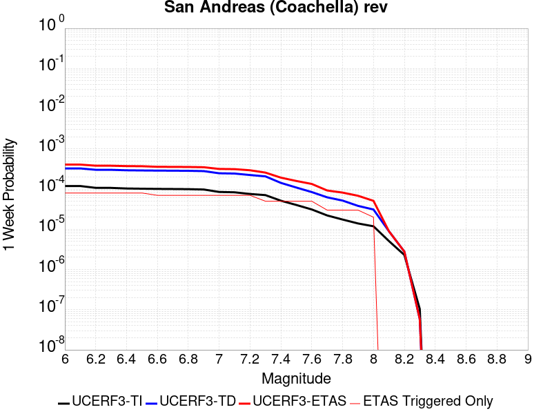 |  |  |  |

| Magnitude | 1 wk TI Prob | 1 wk TD Prob | 1 wk ETAS Prob | 1 wk ETAS/TD Gain | 1 wk ETAS Triggered Only | 1 mo TI Prob | 1 mo TD Prob | 1 mo ETAS Prob | 1 mo ETAS/TD Gain | 1 mo ETAS Triggered Only | 1 yr TI Prob | 1 yr TD Prob | 1 yr ETAS Prob | 1 yr ETAS/TD Gain | 1 yr ETAS Triggered Only | 10 yr TI Prob | 10 yr TD Prob | 10 yr ETAS Prob | 10 yr ETAS/TD Gain | 10 yr ETAS Triggered Only |
|-----|-----|-----|-----|-----|-----|-----|-----|-----|-----|-----|-----|-----|-----|-----|-----|-----|-----|-----|-----|-----|
| 6.0 | 1.1925945E-4 | 3.2729402E-4 | 4.0726783E-4 | 1.2443485 | 8.0E-5 | 5.110118E-4 | 0.0014019393 | 0.0015317571 | 1.0925987 | 1.3E-4 | 0.0062038354 | 0.016936364 | 0.017073993 | 1.0081263 | 1.4E-4 | 0.060334753 | 0.15265316 | 0.15278025 | 1.0008327 | 1.5E-4 |
| 6.1 | 1.1925945E-4 | 3.2729402E-4 | 4.0726783E-4 | 1.2443485 | 8.0E-5 | 5.110118E-4 | 0.0014019393 | 0.0015317571 | 1.0925987 | 1.3E-4 | 0.0062038354 | 0.016936364 | 0.017073993 | 1.0081263 | 1.4E-4 | 0.060334753 | 0.15265316 | 0.15278025 | 1.0008327 | 1.5E-4 |
| 6.2 | 1.07432395E-4 | 3.0230157E-4 | 3.822774E-4 | 1.2645564 | 8.0E-5 | 4.603433E-4 | 0.0012949388 | 0.0014247705 | 1.1002609 | 1.3E-4 | 0.005590286 | 0.015653009 | 0.015790816 | 1.008804 | 1.4E-4 | 0.05451731 | 0.14182423 | 0.14195296 | 1.0009077 | 1.5E-4 |
| 6.3 | 1.0718766E-4 | 3.0175463E-4 | 3.8173047E-4 | 1.2650361 | 8.0E-5 | 4.592948E-4 | 0.0012925972 | 0.0014224291 | 1.1004428 | 1.3E-4 | 0.005577586 | 0.015624908 | 0.01576272 | 1.00882 | 1.4E-4 | 0.054396555 | 0.14159249 | 0.14172125 | 1.0009093 | 1.5E-4 |
| 6.4 | 1.0355944E-4 | 2.9383553E-4 | 3.73812E-4 | 1.2721812 | 8.0E-5 | 4.4375064E-4 | 0.0012586913 | 0.0013885277 | 1.1031519 | 1.3E-4 | 0.0053892885 | 0.015217941 | 0.015355811 | 1.0090597 | 1.4E-4 | 0.052604496 | 0.13815255 | 0.13828184 | 1.0009358 | 1.5E-4 |
| 6.5 | 1.0227914E-4 | 2.9102986E-4 | 3.7100658E-4 | 1.2748059 | 8.0E-5 | 4.382655E-4 | 0.0012466786 | 0.0013765165 | 1.1041471 | 1.3E-4 | 0.0053228354 | 0.01507372 | 0.01521161 | 1.0091476 | 1.4E-4 | 0.051971316 | 0.13693172 | 0.13706118 | 1.0009454 | 1.5E-4 |
| 6.6 | 1.0116757E-4 | 2.8868738E-4 | 3.5866717E-4 | 1.2424068 | 7.0E-5 | 4.3350324E-4 | 0.0012366489 | 0.0013565006 | 1.0969164 | 1.2E-4 | 0.0052651367 | 0.01495329 | 0.015081347 | 1.0085638 | 1.3E-4 | 0.051421247 | 0.1359099 | 0.13603087 | 1.0008901 | 1.4E-4 |
| 6.7 | 1.0050676E-4 | 2.8727303E-4 | 3.572529E-4 | 1.2436006 | 7.0E-5 | 4.3067214E-4 | 0.0012305931 | 0.0013504454 | 1.097394 | 1.2E-4 | 0.005230834 | 0.014880571 | 0.015008636 | 1.0086062 | 1.3E-4 | 0.051094085 | 0.13529462 | 0.13541567 | 1.0008948 | 1.4E-4 |
| 6.8 | 9.976819E-5 | 2.853096E-4 | 3.552896E-4 | 1.2452775 | 7.0E-5 | 4.2750788E-4 | 0.0012221863 | 0.0013420397 | 1.0980647 | 1.2E-4 | 0.0051924936 | 0.0147796115 | 0.01490769 | 1.0086659 | 1.3E-4 | 0.050728295 | 0.13444631 | 0.13456748 | 1.0009013 | 1.4E-4 |
| 6.9 | 9.77719E-5 | 2.8027873E-4 | 3.5025913E-4 | 1.2496814 | 7.0E-5 | 4.1895514E-4 | 0.0012006456 | 0.0013205014 | 1.0998262 | 1.2E-4 | 0.0050888555 | 0.014520878 | 0.01464899 | 1.0088227 | 1.3E-4 | 0.049738888 | 0.1322748 | 0.1323963 | 1.0009184 | 1.4E-4 |
| 7.0 | 8.500761E-5 | 2.4762485E-4 | 3.176075E-4 | 1.2826157 | 7.0E-5 | 3.6426744E-4 | 0.001060821 | 0.0011806937 | 1.1129999 | 1.2E-4 | 0.0044259406 | 0.012839786 | 0.012968116 | 1.0099947 | 1.3E-4 | 0.04338823 | 0.11813272 | 0.11825618 | 1.0010451 | 1.4E-4 |
| 7.1 | 8.319876E-5 | 2.4365232E-4 | 3.1363528E-4 | 1.2872247 | 7.0E-5 | 3.5651738E-4 | 0.0010438096 | 0.0011636843 | 1.1148435 | 1.2E-4 | 0.004331963 | 0.012635092 | 0.01276345 | 1.0101588 | 1.3E-4 | 0.042484846 | 0.116353 | 0.116476715 | 1.0010632 | 1.4E-4 |
| 7.2 | 7.563917E-5 | 2.2413683E-4 | 2.9412116E-4 | 1.3122392 | 7.0E-5 | 3.2412758E-4 | 9.602359E-4 | 0.0010801207 | 1.1248493 | 1.2E-4 | 0.0039391145 | 0.011628893 | 0.011757382 | 1.011049 | 1.3E-4 | 0.03870018 | 0.10775925 | 0.10788416 | 1.0011592 | 1.4E-4 |
| 7.3 | 7.082985E-5 | 2.0729867E-4 | 2.572883E-4 | 1.2411479 | 5.0E-5 | 3.0352117E-4 | 8.881233E-4 | 9.880344E-4 | 1.112497 | 1.0E-4 | 0.0036891096 | 0.010759917 | 0.010868734 | 1.0101131 | 1.1E-4 | 0.03628465 | 0.100282 | 0.100389965 | 1.0010766 | 1.2E-4 |
| 7.4 | 5.146215E-5 | 1.4273795E-4 | 1.927308E-4 | 1.3502423 | 5.0E-5 | 2.2053342E-4 | 6.115915E-4 | 7.1153033E-4 | 1.1634078 | 1.0E-4 | 0.0026816884 | 0.0074208933 | 0.007530077 | 1.014713 | 1.1E-4 | 0.02649557 | 0.070849575 | 0.07096107 | 1.0015737 | 1.2E-4 |
| 7.5 | 4.0285166E-5 | 1.09416E-4 | 1.5941053E-4 | 1.4569216 | 5.0E-5 | 1.7263928E-4 | 4.6884175E-4 | 5.687949E-4 | 1.2131916 | 1.0E-4 | 0.002099857 | 0.0056932783 | 0.005802652 | 1.019211 | 1.1E-4 | 0.020801254 | 0.055011146 | 0.055124547 | 1.0020614 | 1.2E-4 |
| 7.6 | 3.1168736E-5 | 8.4389096E-5 | 1.3438487E-4 | 1.5924436 | 5.0E-5 | 1.3357346E-4 | 3.6161754E-4 | 4.615814E-4 | 1.2764353 | 1.0E-4 | 0.0016250437 | 0.0043938323 | 0.004503349 | 1.0249251 | 1.1E-4 | 0.016132116 | 0.04281005 | 0.04292491 | 1.002683 | 1.2E-4 |
| 7.7 | 2.2100989E-5 | 6.238755E-5 | 9.238568E-5 | 1.4808352 | 3.0E-5 | 9.4715084E-5 | 2.6734784E-4 | 3.4732648E-4 | 1.2991556 | 8.0E-5 | 0.001152546 | 0.0032501083 | 0.003339816 | 1.0276014 | 9.0E-5 | 0.011465867 | 0.0319002 | 0.03199701 | 1.0030348 | 1.0E-4 |
| 7.8 | 1.7484861E-5 | 5.179572E-5 | 8.179416E-5 | 1.5791684 | 3.0E-5 | 7.493296E-5 | 2.2196278E-4 | 3.0194502E-4 | 1.3603408 | 8.0E-5 | 9.1192697E-4 | 0.0026990508 | 0.0027888077 | 1.0332551 | 9.0E-5 | 0.009081938 | 0.026640115 | 0.026737452 | 1.0036538 | 1.0E-4 |
| 7.9 | 1.3967285E-5 | 3.822255E-5 | 6.822141E-5 | 1.7848469 | 3.0E-5 | 5.985842E-5 | 1.6380067E-4 | 2.4378755E-4 | 1.4883186 | 8.0E-5 | 7.2853256E-4 | 0.00199245 | 0.0020822708 | 1.0450805 | 9.0E-5 | 0.0072614877 | 0.019909438 | 0.020007446 | 1.0049227 | 1.0E-4 |
| 8.0 | 1.1887396E-5 | 3.106521E-5 | 5.1064588E-5 | 1.643787 | 2.0E-5 | 5.094499E-5 | 1.3312983E-4 | 1.9312184E-4 | 1.4506279 | 6.0E-5 | 6.200787E-4 | 0.0016196516 | 0.0016895381 | 1.0431491 | 7.0E-5 | 0.006183513 | 0.016279267 | 0.016357966 | 1.0048342 | 8.0E-5 |
| 8.1 | 5.100864E-6 | 8.973418E-6 | 8.973418E-6 | 1.0 | 0.0 | 2.1860664E-5 | 3.8456936E-5 | 3.8456936E-5 | 1.0 | 0.0 | 2.6612106E-4 | 4.6811273E-4 | 4.7810806E-4 | 1.0213524 | 1.0E-5 | 0.002658026 | 0.004917731 | 0.0049376325 | 1.0040469 | 2.0E-5 |
| 8.2 | 2.3004484E-6 | 2.7864487E-6 | 2.7864487E-6 | 1.0 | 0.0 | 9.859027E-6 | 1.1941868E-5 | 1.1941868E-5 | 1.0 | 0.0 | 1.2002704E-4 | 1.4538258E-4 | 1.4538258E-4 | 1.0 | 0.0 | 0.0011996223 | 0.0015973912 | 0.0015973912 | 1.0 | 0.0 |
| 8.3 | 1.0424446E-7 | 5.8161504E-8 | 5.8161504E-8 | 1.0 | 0.0 | 4.4676187E-7 | 2.4926356E-7 | 2.4926356E-7 | 1.0 | 0.0 | 5.439312E-6 | 3.03478E-6 | 3.03478E-6 | 1.0 | 0.0 | 5.4391792E-5 | 3.190716E-5 | 3.190716E-5 | 1.0 | 0.0 |

## Cady
*[(top)](#table-of-contents)*

| 1 Week | 1 Month | 1 Year | 10 Year |
|-----|-----|-----|-----|
|  |  |  |  |

| Magnitude | 1 wk TI Prob | 1 wk TD Prob | 1 wk ETAS Prob | 1 wk ETAS/TD Gain | 1 wk ETAS Triggered Only | 1 mo TI Prob | 1 mo TD Prob | 1 mo ETAS Prob | 1 mo ETAS/TD Gain | 1 mo ETAS Triggered Only | 1 yr TI Prob | 1 yr TD Prob | 1 yr ETAS Prob | 1 yr ETAS/TD Gain | 1 yr ETAS Triggered Only | 10 yr TI Prob | 10 yr TD Prob | 10 yr ETAS Prob | 10 yr ETAS/TD Gain | 10 yr ETAS Triggered Only |
|-----|-----|-----|-----|-----|-----|-----|-----|-----|-----|-----|-----|-----|-----|-----|-----|-----|-----|-----|-----|-----|
| 6.0 | 1.9892565E-5 | 2.1858728E-5 | 9.18572E-5 | 4.202312 | 7.0E-5 | 8.525106E-5 | 9.3677416E-5 | 1.9366805E-4 | 2.067393 | 1.0E-4 | 0.0010374374 | 0.0011400167 | 0.0012498914 | 1.0963798 | 1.1E-4 | 0.010326075 | 0.011350701 | 0.011498998 | 1.0130651 | 1.5E-4 |
| 6.1 | 1.9892565E-5 | 2.1858728E-5 | 9.18572E-5 | 4.202312 | 7.0E-5 | 8.525106E-5 | 9.3677416E-5 | 1.9366805E-4 | 2.067393 | 1.0E-4 | 0.0010374374 | 0.0011400167 | 0.0012498914 | 1.0963798 | 1.1E-4 | 0.010326075 | 0.011350701 | 0.011498998 | 1.0130651 | 1.5E-4 |
| 6.2 | 1.9892565E-5 | 2.1858728E-5 | 9.18572E-5 | 4.202312 | 7.0E-5 | 8.525106E-5 | 9.3677416E-5 | 1.9366805E-4 | 2.067393 | 1.0E-4 | 0.0010374374 | 0.0011400167 | 0.0012498914 | 1.0963798 | 1.1E-4 | 0.010326075 | 0.011350701 | 0.011498998 | 1.0130651 | 1.5E-4 |
| 6.3 | 1.1117327E-5 | 1.2176583E-5 | 3.217634E-5 | 2.6424768 | 2.0E-5 | 4.764482E-5 | 5.2184492E-5 | 1.0218188E-4 | 1.9580891 | 5.0E-5 | 5.7992124E-4 | 6.351925E-4 | 6.9515436E-4 | 1.0943996 | 6.0E-5 | 0.0057841022 | 0.0063368753 | 0.006426305 | 1.0141126 | 9.0E-5 |
| 6.4 | 1.1117327E-5 | 1.2176583E-5 | 3.217634E-5 | 2.6424768 | 2.0E-5 | 4.764482E-5 | 5.2184492E-5 | 1.0218188E-4 | 1.9580891 | 5.0E-5 | 5.7992124E-4 | 6.351925E-4 | 6.9515436E-4 | 1.0943996 | 6.0E-5 | 0.0057841022 | 0.0063368753 | 0.006426305 | 1.0141126 | 9.0E-5 |
| 6.5 | 6.103093E-6 | 6.672021E-6 | 6.672021E-6 | 1.0 | 0.0 | 2.615585E-5 | 2.8594131E-5 | 3.8593847E-5 | 1.3497121 | 1.0E-5 | 3.1840094E-4 | 3.480905E-4 | 3.58087E-4 | 1.0287181 | 1.0E-5 | 0.0031794512 | 0.0034766865 | 0.003496617 | 1.0057327 | 2.0E-5 |
| 6.6 | 5.817237E-6 | 6.3656585E-6 | 6.3656585E-6 | 1.0 | 0.0 | 2.4930776E-5 | 2.728118E-5 | 3.7280905E-5 | 1.366543 | 1.0E-5 | 3.034899E-4 | 3.3211018E-4 | 3.4210685E-4 | 1.0301005 | 1.0E-5 | 0.0030307577 | 0.0033173605 | 0.0033372943 | 1.0060089 | 2.0E-5 |
| 6.7 | 4.8846314E-6 | 5.3405684E-6 | 5.3405684E-6 | 1.0 | 0.0 | 2.0933967E-5 | 2.2888014E-5 | 2.2888014E-5 | 1.0 | 0.0 | 2.5484123E-4 | 2.7863772E-4 | 2.7863772E-4 | 1.0 | 0.0 | 0.0025454918 | 0.0027840391 | 0.0027940113 | 1.0035819 | 1.0E-5 |
| 6.8 | 1.7788773E-6 | 1.9399079E-6 | 1.9399079E-6 | 1.0 | 0.0 | 7.6237375E-6 | 8.313874E-6 | 8.313874E-6 | 1.0 | 0.0 | 9.281505E-5 | 1.01218284E-4 | 1.01218284E-4 | 1.0 | 0.0 | 9.2776294E-4 | 0.0010118765 | 0.0010118765 | 1.0 | 0.0 |
| 6.9 | 7.5455404E-7 | 8.297092E-7 | 8.297092E-7 | 1.0 | 0.0 | 3.233799E-6 | 3.5558937E-6 | 3.5558937E-6 | 1.0 | 0.0 | 3.937079E-5 | 4.3292483E-5 | 4.3292483E-5 | 1.0 | 0.0 | 3.9363815E-4 | 4.3287344E-4 | 4.3287344E-4 | 1.0 | 0.0 |
| 7.0 | 6.8578805E-7 | 7.541816E-7 | 7.541816E-7 | 1.0 | 0.0 | 2.9390883E-6 | 3.2322048E-6 | 3.2322048E-6 | 1.0 | 0.0 | 3.578281E-5 | 3.9351715E-5 | 3.9351715E-5 | 1.0 | 0.0 | 3.577705E-4 | 3.9347992E-4 | 3.9347992E-4 | 1.0 | 0.0 |

## San Andreas (Creeping Section) 2011 CFM
*[(top)](#table-of-contents)*

| 1 Week | 1 Month | 1 Year | 10 Year |
|-----|-----|-----|-----|
|  |  |  |  |

| Magnitude | 1 wk TI Prob | 1 wk TD Prob | 1 wk ETAS Prob | 1 wk ETAS/TD Gain | 1 wk ETAS Triggered Only | 1 mo TI Prob | 1 mo TD Prob | 1 mo ETAS Prob | 1 mo ETAS/TD Gain | 1 mo ETAS Triggered Only | 1 yr TI Prob | 1 yr TD Prob | 1 yr ETAS Prob | 1 yr ETAS/TD Gain | 1 yr ETAS Triggered Only | 10 yr TI Prob | 10 yr TD Prob | 10 yr ETAS Prob | 10 yr ETAS/TD Gain | 10 yr ETAS Triggered Only |
|-----|-----|-----|-----|-----|-----|-----|-----|-----|-----|-----|-----|-----|-----|-----|-----|-----|-----|-----|-----|-----|
| 6.0 | 5.986481E-4 | 0.001228691 | 0.0012886173 | 1.0487725 | 6.0E-5 | 0.0025631124 | 0.005246795 | 0.00530648 | 1.0113755 | 6.0E-5 | 0.030762846 | 0.061203245 | 0.061297126 | 1.0015339 | 1.0E-4 | 0.26835477 | 0.425928 | 0.4259969 | 1.0001618 | 1.2E-4 |
| 6.1 | 5.015945E-4 | 0.0010230356 | 0.0010829743 | 1.058589 | 6.0E-5 | 0.00214792 | 0.004369436 | 0.0044291737 | 1.0136718 | 6.0E-5 | 0.025839351 | 0.051246606 | 0.051331993 | 1.0016662 | 9.0E-5 | 0.23032776 | 0.37284943 | 0.37291843 | 1.000185 | 1.1E-4 |
| 6.2 | 4.073338E-4 | 8.1157376E-4 | 8.6153316E-4 | 1.0615587 | 5.0E-5 | 0.0017445484 | 0.0034683137 | 0.0035181402 | 1.0143663 | 5.0E-5 | 0.021034058 | 0.04093177 | 0.041008495 | 1.0018744 | 8.0E-5 | 0.19150782 | 0.31302592 | 0.31308773 | 1.0001975 | 9.0E-5 |
| 6.3 | 3.464099E-4 | 6.7455834E-4 | 7.1453134E-4 | 1.0592581 | 4.0E-5 | 0.0014837692 | 0.0028832308 | 0.0029231156 | 1.0138333 | 4.0E-5 | 0.017915873 | 0.034187846 | 0.034255452 | 1.0019776 | 7.0E-5 | 0.16538359 | 0.27130842 | 0.27136672 | 1.0002148 | 8.0E-5 |
| 6.4 | 2.935057E-4 | 5.5516965E-4 | 5.85153E-4 | 1.0540075 | 3.0E-5 | 0.0012572751 | 0.0023727308 | 0.0024026597 | 1.0126137 | 3.0E-5 | 0.015200248 | 0.02826279 | 0.028321095 | 1.0020629 | 6.0E-5 | 0.14201577 | 0.23297668 | 0.23303036 | 1.0002304 | 7.0E-5 |
| 6.5 | 2.3409708E-4 | 4.2132285E-4 | 4.5131022E-4 | 1.0711743 | 3.0E-5 | 0.0010028875 | 0.0018017791 | 0.0018317251 | 1.0166202 | 3.0E-5 | 0.012141965 | 0.021586355 | 0.02164506 | 1.0027195 | 6.0E-5 | 0.11499573 | 0.1868149 | 0.18687184 | 1.0003047 | 7.0E-5 |
| 6.6 | 1.5842178E-4 | 2.5068692E-4 | 2.806794E-4 | 1.1196412 | 3.0E-5 | 6.7877385E-4 | 0.0010739256 | 0.0011038934 | 1.0279049 | 3.0E-5 | 0.0082328 | 0.012995283 | 0.013054503 | 1.004557 | 6.0E-5 | 0.07934396 | 0.12313759 | 0.12319897 | 1.0004984 | 7.0E-5 |
| 6.7 | 1.5616413E-4 | 2.4605254E-4 | 2.7604518E-4 | 1.1218952 | 3.0E-5 | 6.691031E-4 | 0.0010540807 | 0.001084049 | 1.0284308 | 3.0E-5 | 0.0081159435 | 0.012757154 | 0.012816388 | 1.0046432 | 6.0E-5 | 0.0782586 | 0.12116472 | 0.121226236 | 1.0005077 | 7.0E-5 |
| 6.8 | 1.5538467E-4 | 2.442914E-4 | 2.742841E-4 | 1.1227741 | 3.0E-5 | 6.6576427E-4 | 0.001046539 | 0.0010765076 | 1.0286359 | 3.0E-5 | 0.008075596 | 0.012666538 | 0.012725778 | 1.0046769 | 6.0E-5 | 0.07788358 | 0.12039561 | 0.12045718 | 1.0005114 | 7.0E-5 |
| 6.9 | 1.5153569E-4 | 2.3538464E-4 | 2.6537757E-4 | 1.127421 | 3.0E-5 | 6.49277E-4 | 0.0010084033 | 0.0010383731 | 1.02972 | 3.0E-5 | 0.007876333 | 0.012208726 | 0.012267994 | 1.0048546 | 6.0E-5 | 0.07602952 | 0.11646574 | 0.11652759 | 1.0005311 | 7.0E-5 |
| 7.0 | 1.4588932E-4 | 2.2395732E-4 | 2.539506E-4 | 1.1339241 | 3.0E-5 | 6.250901E-4 | 9.59466E-4 | 9.894372E-4 | 1.0312374 | 3.0E-5 | 0.0075839474 | 0.011619428 | 0.011678731 | 1.0051037 | 6.0E-5 | 0.073302895 | 0.11131206 | 0.111374274 | 1.0005589 | 7.0E-5 |
| 7.1 | 1.1565079E-4 | 1.6281323E-4 | 1.9280834E-4 | 1.1842302 | 3.0E-5 | 4.955521E-4 | 6.9758523E-4 | 7.275643E-4 | 1.0429755 | 3.0E-5 | 0.006016669 | 0.008460228 | 0.00851972 | 1.007032 | 6.0E-5 | 0.058563538 | 0.08366478 | 0.08372893 | 1.0007666 | 7.0E-5 |
| 7.2 | 1.0393792E-4 | 1.4615392E-4 | 1.7614954E-4 | 1.2052331 | 3.0E-5 | 4.4537216E-4 | 6.262243E-4 | 6.562055E-4 | 1.0478761 | 3.0E-5 | 0.005408933 | 0.0075977976 | 0.0076573417 | 1.007837 | 6.0E-5 | 0.052791595 | 0.07561503 | 0.07567974 | 1.0008557 | 7.0E-5 |
| 7.3 | 9.332884E-5 | 1.2780601E-4 | 1.5780216E-4 | 1.2347008 | 3.0E-5 | 3.999194E-4 | 5.4762565E-4 | 5.7760923E-4 | 1.054752 | 3.0E-5 | 0.0048581534 | 0.0066470946 | 0.006696762 | 1.007472 | 5.0E-5 | 0.047533102 | 0.06647954 | 0.066535555 | 1.0008426 | 6.0E-5 |
| 7.4 | 8.670252E-5 | 1.1702972E-4 | 1.470262E-4 | 1.2563151 | 3.0E-5 | 3.715293E-4 | 5.014601E-4 | 5.314451E-4 | 1.0597953 | 3.0E-5 | 0.004513991 | 0.0060883067 | 0.006138002 | 1.0081625 | 5.0E-5 | 0.044233937 | 0.061148684 | 0.061205015 | 1.0009212 | 6.0E-5 |
| 7.5 | 7.3036405E-5 | 9.005699E-5 | 1.2005428E-4 | 1.3330925 | 3.0E-5 | 3.129756E-4 | 3.859015E-4 | 4.1588992E-4 | 1.07771 | 3.0E-5 | 0.0038038217 | 0.0046882504 | 0.004738016 | 1.010615 | 5.0E-5 | 0.03739367 | 0.047875606 | 0.047932733 | 1.0011933 | 6.0E-5 |
| 7.6 | 6.3935775E-5 | 8.280209E-5 | 1.1279961E-4 | 1.3622797 | 3.0E-5 | 2.7398168E-4 | 3.5481792E-4 | 3.8480727E-4 | 1.0845205 | 3.0E-5 | 0.0033306254 | 0.00431137 | 0.0043611545 | 1.0115472 | 5.0E-5 | 0.032811474 | 0.043990135 | 0.044047497 | 1.0013039 | 6.0E-5 |
| 7.7 | 5.5050095E-5 | 6.661729E-5 | 8.661596E-5 | 1.3002024 | 2.0E-5 | 2.3590765E-4 | 2.8547147E-4 | 3.0546574E-4 | 1.0700395 | 2.0E-5 | 0.0028683927 | 0.0034700802 | 0.003499976 | 1.0086154 | 3.0E-5 | 0.0283165 | 0.03579509 | 0.035833657 | 1.0010774 | 4.0E-5 |
| 7.8 | 5.027131E-5 | 6.1627725E-5 | 8.162649E-5 | 1.3245093 | 2.0E-5 | 2.1543067E-4 | 2.640921E-4 | 2.840868E-4 | 1.0757111 | 2.0E-5 | 0.0026197135 | 0.003210584 | 0.0032404875 | 1.0093141 | 3.0E-5 | 0.025890453 | 0.03312572 | 0.033164393 | 1.0011675 | 4.0E-5 |
| 7.9 | 3.7271806E-5 | 5.0224386E-5 | 5.0224386E-5 | 1.0 | 0.0 | 1.5972654E-4 | 2.1522962E-4 | 2.1522962E-4 | 1.0 | 0.0 | 0.0019429359 | 0.0026172737 | 0.0026272475 | 1.0038108 | 1.0E-5 | 0.019260362 | 0.027066687 | 0.027086146 | 1.000719 | 2.0E-5 |
| 8.0 | 2.7310243E-5 | 3.1428404E-5 | 3.1428404E-5 | 1.0 | 0.0 | 1.17038646E-4 | 1.3468621E-4 | 1.3468621E-4 | 1.0 | 0.0 | 0.0014240141 | 0.0016385721 | 0.0016485556 | 1.0060929 | 1.0E-5 | 0.014149235 | 0.01721387 | 0.017233524 | 1.0011419 | 2.0E-5 |
| 8.1 | 1.7940547E-5 | 1.7400796E-5 | 1.7400796E-5 | 1.0 | 0.0 | 7.688579E-5 | 7.457271E-5 | 7.457271E-5 | 1.0 | 0.0 | 9.3568244E-4 | 9.075451E-4 | 9.1753603E-4 | 1.0110087 | 1.0E-5 | 0.009317525 | 0.009799073 | 0.009818878 | 1.002021 | 2.0E-5 |
| 8.2 | 8.643924E-6 | 5.4748625E-6 | 5.4748625E-6 | 1.0 | 0.0 | 3.704486E-5 | 2.3463486E-5 | 2.3463486E-5 | 1.0 | 0.0 | 4.5092785E-4 | 2.8563058E-4 | 2.8563058E-4 | 1.0 | 0.0 | 0.0045001395 | 0.0032487072 | 0.0032487072 | 1.0 | 0.0 |
| 8.3 | 1.983087E-6 | 7.6599065E-7 | 7.6599065E-7 | 1.0 | 0.0 | 8.498917E-6 | 3.282813E-6 | 3.282813E-6 | 1.0 | 0.0 | 1.034694E-4 | 3.9967534E-5 | 3.9967534E-5 | 1.0 | 0.0 | 0.0010342124 | 4.719687E-4 | 4.719687E-4 | 1.0 | 0.0 |

## Brawley (Seismic Zone) alt 1
*[(top)](#table-of-contents)*

| 1 Week | 1 Month | 1 Year | 10 Year |
|-----|-----|-----|-----|
|  |  |  |  |

| Magnitude | 1 wk TI Prob | 1 wk TD Prob | 1 wk ETAS Prob | 1 wk ETAS/TD Gain | 1 wk ETAS Triggered Only | 1 mo TI Prob | 1 mo TD Prob | 1 mo ETAS Prob | 1 mo ETAS/TD Gain | 1 mo ETAS Triggered Only | 1 yr TI Prob | 1 yr TD Prob | 1 yr ETAS Prob | 1 yr ETAS/TD Gain | 1 yr ETAS Triggered Only | 10 yr TI Prob | 10 yr TD Prob | 10 yr ETAS Prob | 10 yr ETAS/TD Gain | 10 yr ETAS Triggered Only |
|-----|-----|-----|-----|-----|-----|-----|-----|-----|-----|-----|-----|-----|-----|-----|-----|-----|-----|-----|-----|-----|
| 6.0 | 2.2521618E-4 | 4.7632487E-4 | 5.66282E-4 | 1.1888567 | 9.0E-5 | 9.6485513E-4 | 0.0020398323 | 0.0021595876 | 1.0587083 | 1.2E-4 | 0.011683988 | 0.024546238 | 0.024673047 | 1.0051662 | 1.3E-4 | 0.11088423 | 0.21350002 | 0.21361013 | 1.0005157 | 1.4E-4 |
| 6.1 | 2.2521618E-4 | 4.7632487E-4 | 5.66282E-4 | 1.1888567 | 9.0E-5 | 9.6485513E-4 | 0.0020398323 | 0.0021595876 | 1.0587083 | 1.2E-4 | 0.011683988 | 0.024546238 | 0.024673047 | 1.0051662 | 1.3E-4 | 0.11088423 | 0.21350002 | 0.21361013 | 1.0005157 | 1.4E-4 |
| 6.2 | 2.198148E-4 | 4.6717093E-4 | 5.5712886E-4 | 1.192559 | 9.0E-5 | 9.417233E-4 | 0.0020006616 | 0.0021204215 | 1.0598601 | 1.2E-4 | 0.011405343 | 0.024080504 | 0.024207372 | 1.0052686 | 1.3E-4 | 0.10837428 | 0.20993657 | 0.21004719 | 1.0005269 | 1.4E-4 |
| 6.3 | 2.1704129E-4 | 4.615278E-4 | 5.514862E-4 | 1.1949145 | 9.0E-5 | 9.298453E-4 | 0.0019765133 | 0.0020962763 | 1.060593 | 1.2E-4 | 0.011262234 | 0.02379366 | 0.023920568 | 1.0053337 | 1.3E-4 | 0.107082725 | 0.20782755 | 0.20793845 | 1.0005336 | 1.4E-4 |
| 6.4 | 1.876142E-4 | 4.00449E-4 | 4.70421E-4 | 1.1747338 | 7.0E-5 | 8.038131E-4 | 0.0017150956 | 0.0018149241 | 1.0582058 | 1.0E-4 | 0.00974259 | 0.020680401 | 0.020788126 | 1.0052091 | 1.1E-4 | 0.093263686 | 0.18457815 | 0.184676 | 1.0005301 | 1.2E-4 |
| 6.5 | 1.7390939E-4 | 3.7477075E-4 | 4.447445E-4 | 1.1867108 | 7.0E-5 | 7.45113E-4 | 0.0016051838 | 0.0017050233 | 1.0621982 | 1.0E-4 | 0.009034078 | 0.019368723 | 0.019476593 | 1.0055692 | 1.1E-4 | 0.086755216 | 0.17440031 | 0.17449939 | 1.000568 | 1.2E-4 |
| 6.6 | 1.591791E-4 | 3.4891962E-4 | 4.088987E-4 | 1.1718993 | 6.0E-5 | 6.8201777E-4 | 0.0014945229 | 0.0015744034 | 1.0534488 | 8.0E-5 | 0.008271996 | 0.018045569 | 0.018133946 | 1.0048974 | 9.0E-5 | 0.07970774 | 0.16380852 | 0.16389215 | 1.0005105 | 1.0E-4 |
| 6.7 | 1.4268003E-4 | 3.20582E-4 | 3.8056276E-4 | 1.1870996 | 6.0E-5 | 6.1134255E-4 | 0.0013732077 | 0.0014530978 | 1.0581777 | 8.0E-5 | 0.007417723 | 0.016592601 | 0.016681109 | 1.0053341 | 9.0E-5 | 0.07174956 | 0.15193306 | 0.15201788 | 1.0005581 | 1.0E-4 |
| 6.8 | 1.239713E-4 | 2.9053655E-4 | 3.5051914E-4 | 1.2064545 | 6.0E-5 | 5.3119735E-4 | 0.0012445687 | 0.0013244691 | 1.0641993 | 8.0E-5 | 0.0064481674 | 0.015048777 | 0.015137423 | 1.0058906 | 9.0E-5 | 0.06264243 | 0.13837762 | 0.1384638 | 1.0006226 | 1.0E-4 |
| 6.9 | 1.0180238E-4 | 2.625439E-4 | 3.0253342E-4 | 1.1523155 | 4.0E-5 | 4.3622297E-4 | 0.0011247073 | 0.0011846398 | 1.0532873 | 6.0E-5 | 0.005298089 | 0.013608336 | 0.013677384 | 1.0050739 | 7.0E-5 | 0.05173543 | 0.124961674 | 0.12503168 | 1.0005602 | 8.0E-5 |
| 7.0 | 7.6619996E-5 | 2.23993E-4 | 2.6398405E-4 | 1.178537 | 4.0E-5 | 3.283301E-4 | 9.5962E-4 | 0.0010195625 | 1.0624647 | 6.0E-5 | 0.0039900932 | 0.011621496 | 0.011690682 | 1.0059533 | 7.0E-5 | 0.039192066 | 0.107266866 | 0.10733829 | 1.0006658 | 8.0E-5 |
| 7.1 | 7.5127435E-5 | 2.2082464E-4 | 2.608158E-4 | 1.1810992 | 4.0E-5 | 3.2193496E-4 | 9.4605127E-4 | 0.0010059945 | 1.0633615 | 6.0E-5 | 0.0039125155 | 0.011458045 | 0.011527242 | 1.0060393 | 7.0E-5 | 0.038443442 | 0.10583085 | 0.10590238 | 1.0006759 | 8.0E-5 |
| 7.2 | 6.788582E-5 | 2.0210193E-4 | 2.4209385E-4 | 1.1978799 | 4.0E-5 | 2.9090676E-4 | 8.6586666E-4 | 9.2581473E-4 | 1.0692347 | 6.0E-5 | 0.0035360386 | 0.0104916105 | 0.010560876 | 1.006602 | 7.0E-5 | 0.034803 | 0.09750131 | 0.09757351 | 1.0007405 | 8.0E-5 |
| 7.3 | 6.399602E-5 | 1.8841137E-4 | 2.1840572E-4 | 1.159196 | 3.0E-5 | 2.7423984E-4 | 8.072303E-4 | 8.5718994E-4 | 1.0618902 | 5.0E-5 | 0.0033337586 | 0.009784332 | 0.009843744 | 1.0060723 | 6.0E-5 | 0.03284188 | 0.09139617 | 0.091459766 | 1.000696 | 7.0E-5 |
| 7.4 | 4.506759E-5 | 1.2529209E-4 | 1.5528833E-4 | 1.2394105 | 3.0E-5 | 1.9313251E-4 | 5.368565E-4 | 5.868296E-4 | 1.0930848 | 5.0E-5 | 0.0023488526 | 0.0065168133 | 0.0065764226 | 1.0091469 | 6.0E-5 | 0.023241805 | 0.062363707 | 0.06242934 | 1.0010525 | 7.0E-5 |
| 7.5 | 3.43289E-5 | 9.33541E-5 | 1.233513E-4 | 1.3213271 | 3.0E-5 | 1.4711556E-4 | 4.00028E-4 | 4.5000797E-4 | 1.1249412 | 5.0E-5 | 0.0017896603 | 0.0048595266 | 0.004919235 | 1.0122869 | 6.0E-5 | 0.01775316 | 0.04705519 | 0.047121897 | 1.0014176 | 7.0E-5 |
| 7.6 | 2.5980507E-5 | 7.053101E-5 | 1.00528894E-4 | 1.4253148 | 3.0E-5 | 1.1134028E-4 | 3.0224086E-4 | 3.5222576E-4 | 1.165381 | 5.0E-5 | 0.001354725 | 0.003673598 | 0.0037333774 | 1.0162728 | 6.0E-5 | 0.013464959 | 0.035840835 | 0.035908327 | 1.001883 | 7.0E-5 |
| 7.7 | 1.7292105E-5 | 4.9407296E-5 | 5.9406804E-5 | 1.2023892 | 1.0E-5 | 7.4106916E-5 | 2.117284E-4 | 2.4172205E-4 | 1.1416609 | 3.0E-5 | 9.018782E-4 | 0.0025747516 | 0.0026146488 | 1.0154954 | 4.0E-5 | 0.008982267 | 0.025290398 | 0.025339134 | 1.001927 | 5.0E-5 |
| 7.8 | 1.2927471E-5 | 3.9693266E-5 | 4.969287E-5 | 1.2519219 | 1.0E-5 | 5.5402274E-5 | 1.7010293E-4 | 2.0009783E-4 | 1.1763338 | 3.0E-5 | 6.743139E-4 | 0.0020690386 | 0.0021089558 | 1.0192926 | 4.0E-5 | 0.0067227143 | 0.020431727 | 0.020480705 | 1.0023972 | 5.0E-5 |
| 7.9 | 1.0200774E-5 | 2.874569E-5 | 3.8745402E-5 | 1.3478682 | 1.0E-5 | 4.371687E-5 | 1.2319001E-4 | 1.5318631E-4 | 1.2434963 | 3.0E-5 | 5.321229E-4 | 0.0014988075 | 0.0015387476 | 1.0266479 | 4.0E-5 | 0.005308505 | 0.014991644 | 0.015040894 | 1.0032852 | 5.0E-5 |
| 8.0 | 8.650396E-6 | 2.3277367E-5 | 2.3277367E-5 | 1.0 | 0.0 | 3.70726E-5 | 9.975634E-5 | 1.0975534E-4 | 1.1002343 | 1.0E-5 | 4.5126543E-4 | 0.0012138576 | 0.0012338333 | 1.0164564 | 2.0E-5 | 0.0045035016 | 0.012211097 | 0.01224073 | 1.0024267 | 3.0E-5 |
| 8.1 | 3.9368224E-6 | 7.3279825E-6 | 7.3279825E-6 | 1.0 | 0.0 | 1.6871985E-5 | 3.140526E-5 | 3.140526E-5 | 1.0 | 0.0 | 2.0539707E-4 | 3.8229208E-4 | 3.9228826E-4 | 1.026148 | 1.0E-5 | 0.0020520731 | 0.004001185 | 0.0040211044 | 1.0049785 | 2.0E-5 |
| 8.2 | 1.7101195E-6 | 2.217876E-6 | 2.217876E-6 | 1.0 | 0.0 | 7.329063E-6 | 9.505149E-6 | 9.505149E-6 | 1.0 | 0.0 | 8.922769E-5 | 1.1571907E-4 | 1.1571907E-4 | 1.0 | 0.0 | 8.9191867E-4 | 0.0012666774 | 0.0012666774 | 1.0 | 0.0 |
| 8.3 | 3.0346666E-8 | 1.721586E-8 | 1.721586E-8 | 1.0 | 0.0 | 1.3005713E-7 | 7.378226E-8 | 7.378226E-8 | 1.0 | 0.0 | 1.5834444E-6 | 8.9829894E-7 | 8.9829894E-7 | 1.0 | 0.0 | 1.5834332E-5 | 9.367729E-6 | 9.367729E-6 | 1.0 | 0.0 |

## San Jacinto (Stepovers Combined)
*[(top)](#table-of-contents)*

| 1 Week | 1 Month | 1 Year | 10 Year |
|-----|-----|-----|-----|
|  |  |  |  |

| Magnitude | 1 wk TI Prob | 1 wk TD Prob | 1 wk ETAS Prob | 1 wk ETAS/TD Gain | 1 wk ETAS Triggered Only | 1 mo TI Prob | 1 mo TD Prob | 1 mo ETAS Prob | 1 mo ETAS/TD Gain | 1 mo ETAS Triggered Only | 1 yr TI Prob | 1 yr TD Prob | 1 yr ETAS Prob | 1 yr ETAS/TD Gain | 1 yr ETAS Triggered Only | 10 yr TI Prob | 10 yr TD Prob | 10 yr ETAS Prob | 10 yr ETAS/TD Gain | 10 yr ETAS Triggered Only |
|-----|-----|-----|-----|-----|-----|-----|-----|-----|-----|-----|-----|-----|-----|-----|-----|-----|-----|-----|-----|-----|
| 6.0 | 4.0667746E-5 | 3.5272755E-5 | 1.4526887E-4 | 4.118444 | 1.1E-4 | 1.742787E-4 | 1.5116022E-4 | 2.7114208E-4 | 1.7937397 | 1.2E-4 | 0.0021197782 | 0.0018388226 | 0.0019685836 | 1.0705674 | 1.3E-4 | 0.020996714 | 0.018986892 | 0.019124234 | 1.0072335 | 1.4E-4 |
| 6.1 | 4.0667746E-5 | 3.5272755E-5 | 1.4526887E-4 | 4.118444 | 1.1E-4 | 1.742787E-4 | 1.5116022E-4 | 2.7114208E-4 | 1.7937397 | 1.2E-4 | 0.0021197782 | 0.0018388226 | 0.0019685836 | 1.0705674 | 1.3E-4 | 0.020996714 | 0.018986892 | 0.019124234 | 1.0072335 | 1.4E-4 |
| 6.2 | 4.0667746E-5 | 3.5272755E-5 | 1.4526887E-4 | 4.118444 | 1.1E-4 | 1.742787E-4 | 1.5116022E-4 | 2.7114208E-4 | 1.7937397 | 1.2E-4 | 0.0021197782 | 0.0018388226 | 0.0019685836 | 1.0705674 | 1.3E-4 | 0.020996714 | 0.018986892 | 0.019124234 | 1.0072335 | 1.4E-4 |
| 6.3 | 4.0667746E-5 | 3.5272755E-5 | 1.4526887E-4 | 4.118444 | 1.1E-4 | 1.742787E-4 | 1.5116022E-4 | 2.7114208E-4 | 1.7937397 | 1.2E-4 | 0.0021197782 | 0.0018388226 | 0.0019685836 | 1.0705674 | 1.3E-4 | 0.020996714 | 0.018986892 | 0.019124234 | 1.0072335 | 1.4E-4 |
| 6.4 | 4.0577226E-5 | 3.5144654E-5 | 1.4514079E-4 | 4.1298113 | 1.1E-4 | 1.738908E-4 | 1.5061127E-4 | 2.705932E-4 | 1.7966331 | 1.2E-4 | 0.0021150648 | 0.0018321523 | 0.0019619141 | 1.0708247 | 1.3E-4 | 0.020950472 | 0.018921461 | 0.01905881 | 1.007259 | 1.4E-4 |
| 6.5 | 4.0577226E-5 | 3.5144654E-5 | 1.4514079E-4 | 4.1298113 | 1.1E-4 | 1.738908E-4 | 1.5061127E-4 | 2.705932E-4 | 1.7966331 | 1.2E-4 | 0.0021150648 | 0.0018321523 | 0.0019619141 | 1.0708247 | 1.3E-4 | 0.020950472 | 0.018921461 | 0.01905881 | 1.007259 | 1.4E-4 |
| 6.6 | 4.053861E-5 | 3.509E-5 | 1.4508615E-4 | 4.134686 | 1.1E-4 | 1.7372532E-4 | 1.5037706E-4 | 2.70359E-4 | 1.797874 | 1.2E-4 | 0.0021130538 | 0.0018293057 | 0.0019590678 | 1.0709352 | 1.3E-4 | 0.020930743 | 0.018893538 | 0.019030893 | 1.00727 | 1.4E-4 |
| 6.7 | 4.0516545E-5 | 3.5059067E-5 | 1.4505521E-4 | 4.137452 | 1.1E-4 | 1.7363077E-4 | 1.5024451E-4 | 2.7022648E-4 | 1.798578 | 1.2E-4 | 0.002111905 | 0.001827695 | 0.0019574575 | 1.0709978 | 1.3E-4 | 0.020919468 | 0.018877735 | 0.019015092 | 1.0072762 | 1.4E-4 |
| 6.8 | 4.049434E-5 | 3.5030633E-5 | 1.4502677E-4 | 4.139999 | 1.1E-4 | 1.7353562E-4 | 1.5012265E-4 | 2.7010465E-4 | 1.7992264 | 1.2E-4 | 0.0021107488 | 0.0018262138 | 0.0019559765 | 1.0710555 | 1.3E-4 | 0.020908125 | 0.018863149 | 0.019000508 | 1.0072819 | 1.4E-4 |
| 6.9 | 4.046386E-5 | 3.499319E-5 | 1.4498935E-4 | 4.1433587 | 1.1E-4 | 1.73405E-4 | 1.4996222E-4 | 2.6994423E-4 | 1.8000816 | 1.2E-4 | 0.0021091616 | 0.0018242638 | 0.0019540268 | 1.0711316 | 1.3E-4 | 0.020892553 | 0.01884392 | 0.018981284 | 1.0072894 | 1.4E-4 |
| 7.0 | 4.036382E-5 | 3.487376E-5 | 1.4486992E-4 | 4.1541243 | 1.1E-4 | 1.7297632E-4 | 1.4945042E-4 | 2.694325E-4 | 1.8028219 | 1.2E-4 | 0.0021039525 | 0.0018180435 | 0.0019478073 | 1.0713755 | 1.3E-4 | 0.02084144 | 0.018782536 | 0.018919906 | 1.0073137 | 1.4E-4 |
| 7.1 | 4.0343282E-5 | 3.4852223E-5 | 1.4484838E-4 | 4.1560736 | 1.1E-4 | 1.7288832E-4 | 1.4935812E-4 | 2.693402E-4 | 1.803318 | 1.2E-4 | 0.002102883 | 0.0018169218 | 0.0019466856 | 1.0714196 | 1.3E-4 | 0.020830948 | 0.018771412 | 0.018908784 | 1.0073181 | 1.4E-4 |
| 7.2 | 4.0257353E-5 | 3.4756722E-5 | 1.4475289E-4 | 4.1647453 | 1.1E-4 | 1.725201E-4 | 1.489489E-4 | 2.68931E-4 | 1.8055254 | 1.2E-4 | 0.0020984085 | 0.0018119477 | 0.0019417121 | 1.071616 | 1.3E-4 | 0.020787042 | 0.018722152 | 0.018859532 | 1.0073378 | 1.4E-4 |
| 7.3 | 3.9940667E-5 | 3.4584376E-5 | 1.4458057E-4 | 4.1805167 | 1.1E-4 | 1.7116306E-4 | 1.4821035E-4 | 2.6819258E-4 | 1.80954 | 1.2E-4 | 0.0020819185 | 0.0018029709 | 0.0019327365 | 1.0719732 | 1.3E-4 | 0.020625217 | 0.018630784 | 0.018768176 | 1.0073744 | 1.4E-4 |
| 7.4 | 3.9721202E-5 | 3.4469766E-5 | 1.4446597E-4 | 4.1910925 | 1.1E-4 | 1.7022261E-4 | 1.4771923E-4 | 2.6770149E-4 | 1.8122319 | 1.2E-4 | 0.0020704903 | 0.0017970012 | 0.0019267676 | 1.0722127 | 1.3E-4 | 0.020513052 | 0.018569905 | 0.018707307 | 1.0073991 | 1.4E-4 |
| 7.5 | 3.7036873E-5 | 3.3537188E-5 | 1.435335E-4 | 4.2798314 | 1.1E-4 | 1.5871979E-4 | 1.437229E-4 | 2.6370565E-4 | 1.83482 | 1.2E-4 | 0.0019307006 | 0.0017484248 | 0.0018781975 | 1.0742227 | 1.3E-4 | 0.019140124 | 0.018071463 | 0.018208934 | 1.007607 | 1.4E-4 |
| 7.6 | 3.2940967E-5 | 3.1317984E-5 | 1.4131454E-4 | 4.5122485 | 1.1E-4 | 1.4116794E-4 | 1.3421304E-4 | 2.5419693E-4 | 1.8939809 | 1.2E-4 | 0.0017173645 | 0.0016328214 | 0.0017626091 | 1.0794868 | 1.3E-4 | 0.01704153 | 0.016904354 | 0.017041987 | 1.0081419 | 1.4E-4 |
| 7.7 | 2.8236149E-5 | 2.7883889E-5 | 1.3788082E-4 | 4.9448204 | 1.1E-4 | 1.2100645E-4 | 1.19496915E-4 | 2.3948257E-4 | 2.00409 | 1.2E-4 | 0.0014722579 | 0.001453905 | 0.001583716 | 1.0892844 | 1.3E-4 | 0.014625421 | 0.015115095 | 0.0152529795 | 1.0091223 | 1.4E-4 |
| 7.8 | 2.4329287E-5 | 2.5207537E-5 | 1.2520501E-4 | 4.9669676 | 1.0E-4 | 1.042642E-4 | 1.0802783E-4 | 2.1801595E-4 | 2.018146 | 1.1E-4 | 0.0012686774 | 0.0013144462 | 0.0014342885 | 1.0911732 | 1.2E-4 | 0.012614589 | 0.013712396 | 0.013840613 | 1.0093504 | 1.3E-4 |
| 7.9 | 1.9370926E-5 | 2.0421452E-5 | 1.2041941E-4 | 5.8967113 | 1.0E-4 | 8.301561E-5 | 8.7517576E-5 | 1.9750795E-4 | 2.2567804 | 1.1E-4 | 0.0010102465 | 0.0010650064 | 0.0011848786 | 1.1125554 | 1.2E-4 | 0.0100566605 | 0.011199483 | 0.011328027 | 1.0114777 | 1.3E-4 |
| 8.0 | 1.5583017E-5 | 1.588647E-5 | 9.5885196E-5 | 6.035652 | 8.0E-5 | 6.6782646E-5 | 6.808309E-5 | 1.5807696E-4 | 2.321824 | 9.0E-5 | 8.127754E-4 | 8.285971E-4 | 9.2851423E-4 | 1.1205859 | 1.0E-4 | 0.008098091 | 0.008781809 | 0.008890844 | 1.0124159 | 1.1E-4 |
| 8.1 | 1.0024873E-5 | 8.292404E-6 | 4.8292073E-5 | 5.823652 | 4.0E-5 | 4.2963035E-5 | 3.5538393E-5 | 8.5536616E-5 | 2.4068792 | 5.0E-5 | 5.229494E-4 | 4.3259456E-4 | 4.825729E-4 | 1.1155317 | 5.0E-5 | 0.0052172043 | 0.0046534105 | 0.0047131316 | 1.0128337 | 6.0E-5 |
| 8.2 | 4.142796E-6 | 1.5610041E-6 | 1.5610041E-6 | 1.0 | 0.0 | 1.775472E-5 | 6.69E-6 | 6.69E-6 | 1.0 | 0.0 | 2.1614227E-4 | 8.144774E-5 | 8.144774E-5 | 1.0 | 0.0 | 0.0021593217 | 9.454649E-4 | 9.454649E-4 | 1.0 | 0.0 |
| 8.3 | 1.2750878E-6 | 3.612133E-7 | 3.612133E-7 | 1.0 | 0.0 | 5.4646503E-6 | 1.548056E-6 | 1.548056E-6 | 1.0 | 0.0 | 6.653009E-5 | 1.8847424E-5 | 1.8847424E-5 | 1.0 | 0.0 | 6.6510175E-4 | 2.2734253E-4 | 2.2734253E-4 | 1.0 | 0.0 |

## San Andreas (North Branch Mill Creek)
*[(top)](#table-of-contents)*

| 1 Week | 1 Month | 1 Year | 10 Year |
|-----|-----|-----|-----|
|  |  |  |  |

| Magnitude | 1 wk TI Prob | 1 wk TD Prob | 1 wk ETAS Prob | 1 wk ETAS/TD Gain | 1 wk ETAS Triggered Only | 1 mo TI Prob | 1 mo TD Prob | 1 mo ETAS Prob | 1 mo ETAS/TD Gain | 1 mo ETAS Triggered Only | 1 yr TI Prob | 1 yr TD Prob | 1 yr ETAS Prob | 1 yr ETAS/TD Gain | 1 yr ETAS Triggered Only | 10 yr TI Prob | 10 yr TD Prob | 10 yr ETAS Prob | 10 yr ETAS/TD Gain | 10 yr ETAS Triggered Only |
|-----|-----|-----|-----|-----|-----|-----|-----|-----|-----|-----|-----|-----|-----|-----|-----|-----|-----|-----|-----|-----|
| 6.0 | 1.3461156E-5 | 2.3499893E-5 | 1.2349755E-4 | 5.2552385 | 1.0E-4 | 5.7689394E-5 | 1.00709956E-4 | 2.2069787E-4 | 2.1914206 | 1.2E-4 | 7.02142E-4 | 0.0012254574 | 0.0013552981 | 1.1059529 | 1.3E-4 | 0.0069992766 | 0.01222957 | 0.012367858 | 1.0113077 | 1.4E-4 |
| 6.1 | 1.3461156E-5 | 2.3499893E-5 | 1.2349755E-4 | 5.2552385 | 1.0E-4 | 5.7689394E-5 | 1.00709956E-4 | 2.2069787E-4 | 2.1914206 | 1.2E-4 | 7.02142E-4 | 0.0012254574 | 0.0013552981 | 1.1059529 | 1.3E-4 | 0.0069992766 | 0.01222957 | 0.012367858 | 1.0113077 | 1.4E-4 |
| 6.2 | 1.3461156E-5 | 2.3499893E-5 | 1.2349755E-4 | 5.2552385 | 1.0E-4 | 5.7689394E-5 | 1.00709956E-4 | 2.2069787E-4 | 2.1914206 | 1.2E-4 | 7.02142E-4 | 0.0012254574 | 0.0013552981 | 1.1059529 | 1.3E-4 | 0.0069992766 | 0.01222957 | 0.012367858 | 1.0113077 | 1.4E-4 |
| 6.3 | 1.3461156E-5 | 2.3499893E-5 | 1.2349755E-4 | 5.2552385 | 1.0E-4 | 5.7689394E-5 | 1.00709956E-4 | 2.2069787E-4 | 2.1914206 | 1.2E-4 | 7.02142E-4 | 0.0012254574 | 0.0013552981 | 1.1059529 | 1.3E-4 | 0.0069992766 | 0.01222957 | 0.012367858 | 1.0113077 | 1.4E-4 |
| 6.4 | 1.3461156E-5 | 2.3499893E-5 | 1.2349755E-4 | 5.2552385 | 1.0E-4 | 5.7689394E-5 | 1.00709956E-4 | 2.2069787E-4 | 2.1914206 | 1.2E-4 | 7.02142E-4 | 0.0012254574 | 0.0013552981 | 1.1059529 | 1.3E-4 | 0.0069992766 | 0.01222957 | 0.012367858 | 1.0113077 | 1.4E-4 |
| 6.5 | 1.3450706E-5 | 2.3488852E-5 | 1.234865E-4 | 5.2572384 | 1.0E-4 | 5.764461E-5 | 1.0066265E-4 | 2.2065056E-4 | 2.1919806 | 1.2E-4 | 7.0159714E-4 | 0.001224882 | 0.0013547228 | 1.1060027 | 1.3E-4 | 0.006993862 | 0.01222388 | 0.012362168 | 1.011313 | 1.4E-4 |
| 6.6 | 1.3074523E-5 | 2.3103135E-5 | 1.2310082E-4 | 5.3283167 | 1.0E-4 | 5.6032466E-5 | 9.9009696E-5 | 2.1899781E-4 | 2.2118824 | 1.2E-4 | 6.8198174E-4 | 0.0012047797 | 0.0013346231 | 1.1077735 | 1.3E-4 | 0.006798926 | 0.012025044 | 0.012163361 | 1.0115024 | 1.4E-4 |
| 6.7 | 1.3050216E-5 | 2.3078432E-5 | 1.2307613E-4 | 5.33295 | 1.0E-4 | 5.59283E-5 | 9.890384E-5 | 2.1889196E-4 | 2.2131798 | 1.2E-4 | 6.8071426E-4 | 0.0012034923 | 0.0013333358 | 1.1078889 | 1.3E-4 | 0.0067863287 | 0.012012309 | 0.012150628 | 1.0115147 | 1.4E-4 |
| 6.8 | 1.29049395E-5 | 2.292684E-5 | 1.2292455E-4 | 5.3616 | 1.0E-4 | 5.530571E-5 | 9.825421E-5 | 2.1824242E-4 | 2.2212017 | 1.2E-4 | 6.73139E-4 | 0.0011955918 | 0.0013254363 | 1.1086028 | 1.3E-4 | 0.0067110364 | 0.011934154 | 0.012072483 | 1.0115911 | 1.4E-4 |
| 6.9 | 1.2867369E-5 | 2.2886245E-5 | 1.2288395E-4 | 5.3693366 | 1.0E-4 | 5.51447E-5 | 9.8080236E-5 | 2.1806847E-4 | 2.2233682 | 1.2E-4 | 6.711799E-4 | 0.0011934759 | 0.0013233208 | 1.1087955 | 1.3E-4 | 0.006691564 | 0.011913223 | 0.012051555 | 1.0116117 | 1.4E-4 |
| 7.0 | 1.2495996E-5 | 2.2286325E-5 | 1.222841E-4 | 5.4869566 | 1.0E-4 | 5.3553173E-5 | 9.550934E-5 | 2.1549789E-4 | 2.2563016 | 1.2E-4 | 6.518148E-4 | 0.0011622087 | 0.0012920577 | 1.1117259 | 1.3E-4 | 0.0064990623 | 0.0116038285 | 0.011742204 | 1.011925 | 1.4E-4 |
| 7.1 | 1.2452067E-5 | 2.2231397E-5 | 1.2222918E-4 | 5.4980426 | 1.0E-4 | 5.3364907E-5 | 9.527396E-5 | 2.1526252E-4 | 2.2594056 | 1.2E-4 | 6.4952404E-4 | 0.0011593461 | 0.0012891953 | 1.1120021 | 1.3E-4 | 0.0064762887 | 0.0115755 | 0.011713879 | 1.0119545 | 1.4E-4 |
| 7.2 | 1.2002777E-5 | 2.1609963E-5 | 1.216078E-4 | 5.627395 | 1.0E-4 | 5.143946E-5 | 9.2610855E-5 | 2.1259974E-4 | 2.2956245 | 1.2E-4 | 6.2609545E-4 | 0.0011269567 | 0.0012568102 | 1.115225 | 1.3E-4 | 0.006243344 | 0.011254923 | 0.011393348 | 1.012299 | 1.4E-4 |
| 7.3 | 1.1923425E-5 | 2.1479793E-5 | 1.2147764E-4 | 5.6554384 | 1.0E-4 | 5.109939E-5 | 9.205302E-5 | 2.1204198E-4 | 2.3034766 | 1.2E-4 | 6.219575E-4 | 0.001120172 | 0.0012500264 | 1.1159236 | 1.3E-4 | 0.0062021962 | 0.011187789 | 0.011326223 | 1.0123737 | 1.4E-4 |
| 7.4 | 1.16105175E-5 | 2.0853771E-5 | 1.20851684E-4 | 5.7951956 | 1.0E-4 | 4.975841E-5 | 8.937026E-5 | 2.0935954E-4 | 2.3426085 | 1.2E-4 | 6.0564023E-4 | 0.0010875424 | 0.001217401 | 1.1194056 | 1.3E-4 | 0.006039923 | 0.010865397 | 0.011003875 | 1.0127449 | 1.4E-4 |
| 7.5 | 1.1037265E-5 | 1.9553907E-5 | 1.1955195E-4 | 6.1139674 | 1.0E-4 | 4.7301706E-5 | 8.379978E-5 | 1.9379056E-4 | 2.3125427 | 1.1E-4 | 5.757461E-4 | 0.0010197869 | 0.0011396646 | 1.1175517 | 1.2E-4 | 0.005742567 | 0.010194898 | 0.010323572 | 1.0126215 | 1.3E-4 |
| 7.6 | 1.0720915E-5 | 1.899582E-5 | 1.1899392E-4 | 6.2642164 | 1.0E-4 | 4.5945973E-5 | 8.140812E-5 | 1.9139917E-4 | 2.3511064 | 1.1E-4 | 5.592486E-4 | 9.906954E-4 | 0.0011105766 | 1.1210071 | 1.2E-4 | 0.005578433 | 0.009906623 | 0.010035334 | 1.0129925 | 1.3E-4 |
| 7.7 | 9.276279E-6 | 1.6441649E-5 | 1.1644E-4 | 7.082015 | 1.0E-4 | 3.9754876E-5 | 7.0462316E-5 | 1.8045456E-4 | 2.5610082 | 1.1E-4 | 4.839081E-4 | 8.575427E-4 | 9.774398E-4 | 1.1398147 | 1.2E-4 | 0.0048285574 | 0.008586041 | 0.008714925 | 1.0150108 | 1.3E-4 |
| 7.8 | 5.8346777E-6 | 1.1155013E-5 | 1.11153895E-4 | 9.964479 | 1.0E-4 | 2.5005522E-5 | 4.7806327E-5 | 1.5780107E-4 | 3.3008409 | 1.1E-4 | 3.043997E-4 | 5.818867E-4 | 7.0181687E-4 | 1.2061057 | 1.2E-4 | 0.0030398308 | 0.0058469265 | 0.0059761666 | 1.0221039 | 1.3E-4 |
| 7.9 | 4.690204E-6 | 8.509093E-6 | 1.0850824E-4 | 12.752033 | 1.0E-4 | 2.0100719E-5 | 3.6467034E-5 | 1.4646302E-4 | 4.016313 | 1.1E-4 | 2.4469878E-4 | 4.4389578E-4 | 5.6384254E-4 | 1.2702137 | 1.2E-4 | 0.002444295 | 0.0044707474 | 0.004600166 | 1.028948 | 1.3E-4 |
| 8.0 | 2.9570454E-6 | 4.846947E-6 | 4.4846754E-5 | 9.252578 | 4.0E-5 | 1.267299E-5 | 2.0772464E-5 | 7.077143E-5 | 3.4069827 | 5.0E-5 | 1.5428272E-4 | 2.5287544E-4 | 3.1286024E-4 | 1.237211 | 6.0E-5 | 0.0015417566 | 0.002549644 | 0.0026194656 | 1.0273848 | 7.0E-5 |
| 8.1 | 1.6376824E-6 | 2.1968929E-6 | 2.1968929E-6 | 1.0 | 0.0 | 7.01862E-6 | 9.41522E-6 | 9.41522E-6 | 1.0 | 0.0 | 8.544835E-5 | 1.14624294E-4 | 1.14624294E-4 | 1.0 | 0.0 | 8.54155E-4 | 0.0011606582 | 0.0011706466 | 1.0086058 | 1.0E-5 |
| 8.2 | 6.9631557E-7 | 4.5360213E-7 | 4.5360213E-7 | 1.0 | 0.0 | 2.984206E-6 | 1.9440076E-6 | 1.9440076E-6 | 1.0 | 0.0 | 3.63321E-5 | 2.3668037E-5 | 2.3668037E-5 | 1.0 | 0.0 | 3.6326164E-4 | 2.451564E-4 | 2.451564E-4 | 1.0 | 0.0 |
| 8.3 | 1.7876137E-7 | 8.360375E-8 | 8.360375E-8 | 1.0 | 0.0 | 7.661199E-7 | 3.5830175E-7 | 3.5830175E-7 | 1.0 | 0.0 | 9.32747E-6 | 4.3623154E-6 | 4.3623154E-6 | 1.0 | 0.0 | 9.3270784E-5 | 4.5817014E-5 | 4.5817014E-5 | 1.0 | 0.0 |

## White Wolf (Extension)
*[(top)](#table-of-contents)*

| 1 Week | 1 Month | 1 Year | 10 Year |
|-----|-----|-----|-----|
|  |  |  |  |

| Magnitude | 1 wk TI Prob | 1 wk TD Prob | 1 wk ETAS Prob | 1 wk ETAS/TD Gain | 1 wk ETAS Triggered Only | 1 mo TI Prob | 1 mo TD Prob | 1 mo ETAS Prob | 1 mo ETAS/TD Gain | 1 mo ETAS Triggered Only | 1 yr TI Prob | 1 yr TD Prob | 1 yr ETAS Prob | 1 yr ETAS/TD Gain | 1 yr ETAS Triggered Only | 10 yr TI Prob | 10 yr TD Prob | 10 yr ETAS Prob | 10 yr ETAS/TD Gain | 10 yr ETAS Triggered Only |
|-----|-----|-----|-----|-----|-----|-----|-----|-----|-----|-----|-----|-----|-----|-----|-----|-----|-----|-----|-----|-----|
| 6.0 | 8.222555E-6 | 6.0666657E-6 | 1.16065996E-4 | 19.131762 | 1.1E-4 | 3.5239045E-5 | 2.5999774E-5 | 1.559964E-4 | 5.9999137 | 1.3E-4 | 4.289509E-4 | 3.1650788E-4 | 4.4646676E-4 | 1.4106022 | 1.3E-4 | 0.0042812387 | 0.003161223 | 0.003290812 | 1.0409933 | 1.3E-4 |
| 6.1 | 8.222555E-6 | 6.0666657E-6 | 1.16065996E-4 | 19.131762 | 1.1E-4 | 3.5239045E-5 | 2.5999774E-5 | 1.559964E-4 | 5.9999137 | 1.3E-4 | 4.289509E-4 | 3.1650788E-4 | 4.4646676E-4 | 1.4106022 | 1.3E-4 | 0.0042812387 | 0.003161223 | 0.003290812 | 1.0409933 | 1.3E-4 |
| 6.2 | 8.222555E-6 | 6.0666657E-6 | 1.16065996E-4 | 19.131762 | 1.1E-4 | 3.5239045E-5 | 2.5999774E-5 | 1.559964E-4 | 5.9999137 | 1.3E-4 | 4.289509E-4 | 3.1650788E-4 | 4.4646676E-4 | 1.4106022 | 1.3E-4 | 0.0042812387 | 0.003161223 | 0.003290812 | 1.0409933 | 1.3E-4 |
| 6.3 | 8.222555E-6 | 6.0666657E-6 | 1.16065996E-4 | 19.131762 | 1.1E-4 | 3.5239045E-5 | 2.5999774E-5 | 1.559964E-4 | 5.9999137 | 1.3E-4 | 4.289509E-4 | 3.1650788E-4 | 4.4646676E-4 | 1.4106022 | 1.3E-4 | 0.0042812387 | 0.003161223 | 0.003290812 | 1.0409933 | 1.3E-4 |
| 6.4 | 5.821773E-6 | 3.5571766E-6 | 5.3557E-5 | 15.056042 | 5.0E-5 | 2.4950215E-5 | 1.5244959E-5 | 7.524405E-5 | 4.935667 | 6.0E-5 | 3.0372653E-4 | 1.8559267E-4 | 2.4558153E-4 | 1.3232286 | 6.0E-5 | 0.0030331176 | 0.001854485 | 0.0019143738 | 1.032294 | 6.0E-5 |
| 6.5 | 5.766023E-6 | 3.4991106E-6 | 5.3498934E-5 | 15.289295 | 5.0E-5 | 2.4711293E-5 | 1.4996108E-5 | 7.499521E-5 | 5.000978 | 6.0E-5 | 3.0081844E-4 | 1.8256342E-4 | 2.4255247E-4 | 1.3285929 | 6.0E-5 | 0.0030041158 | 0.0018242426 | 0.0018841331 | 1.0328304 | 6.0E-5 |
| 6.6 | 4.643576E-6 | 2.332624E-6 | 5.2332507E-5 | 22.435038 | 5.0E-5 | 1.9900888E-5 | 9.996925E-6 | 6.999633E-5 | 7.0017858 | 6.0E-5 | 2.4226638E-4 | 1.2170619E-4 | 1.8169888E-4 | 1.4929305 | 6.0E-5 | 0.0024200242 | 0.0012164378 | 0.0012763648 | 1.0492643 | 6.0E-5 |
| 6.7 | 3.9529173E-6 | 1.6483477E-6 | 4.1648284E-5 | 25.266684 | 4.0E-5 | 1.6940963E-5 | 7.0643296E-6 | 5.7063975E-5 | 8.077763 | 5.0E-5 | 2.0623671E-4 | 8.6005006E-5 | 1.360007E-4 | 1.5813115 | 5.0E-5 | 0.002060454 | 8.597357E-4 | 9.096927E-4 | 1.0581074 | 5.0E-5 |
| 6.8 | 3.4377522E-6 | 1.2245237E-6 | 3.122449E-5 | 25.499292 | 3.0E-5 | 1.473314E-5 | 5.2479486E-6 | 4.524774E-5 | 8.621985 | 4.0E-5 | 1.7936122E-4 | 6.3891996E-5 | 1.0388944E-4 | 1.6260165 | 4.0E-5 | 0.0017921652 | 6.387454E-4 | 6.787198E-4 | 1.0625827 | 4.0E-5 |
| 6.9 | 3.1367306E-6 | 1.0033783E-6 | 3.1003347E-5 | 30.89896 | 3.0E-5 | 1.3443062E-5 | 4.3001864E-6 | 4.4300014E-5 | 10.301883 | 4.0E-5 | 1.63657E-4 | 5.235359E-5 | 9.2351496E-5 | 1.7639955 | 4.0E-5 | 0.0016353652 | 5.2342017E-4 | 5.633992E-4 | 1.0763805 | 4.0E-5 |
| 7.0 | 2.8298145E-6 | 7.4286646E-7 | 1.0742859E-5 | 14.461359 | 1.0E-5 | 1.2127721E-5 | 3.1837099E-6 | 2.3183646E-5 | 7.2819595 | 2.0E-5 | 1.47645E-4 | 3.8761027E-5 | 5.876025E-5 | 1.5159621 | 2.0E-5 | 0.0014754693 | 3.8754768E-4 | 4.0753992E-4 | 1.0515865 | 2.0E-5 |
| 7.1 | 2.4091064E-6 | 5.4227525E-7 | 1.054227E-5 | 19.440811 | 1.0E-5 | 1.03247E-5 | 2.3240348E-6 | 2.2323988E-5 | 9.605703 | 2.0E-5 | 1.2569598E-4 | 2.8294799E-5 | 4.829423E-5 | 1.7068237 | 2.0E-5 | 0.001256249 | 2.8291598E-4 | 3.0291034E-4 | 1.0706724 | 2.0E-5 |
| 7.2 | 1.3875518E-6 | 1.0743063E-7 | 1.0107429E-5 | 94.08331 | 1.0E-5 | 5.9466374E-6 | 4.6041689E-7 | 2.0460408E-5 | 44.438873 | 2.0E-5 | 7.23979E-5 | 5.6055624E-6 | 2.560545E-5 | 4.5678644 | 2.0E-5 | 7.2374323E-4 | 5.6054323E-5 | 7.6053206E-5 | 1.3567767 | 2.0E-5 |
| 7.3 | 7.056077E-7 | 5.002034E-8 | 1.005002E-5 | 200.91867 | 1.0E-5 | 3.0240296E-6 | 2.1437286E-7 | 2.021437E-5 | 94.29537 | 2.0E-5 | 3.681694E-5 | 2.609987E-6 | 2.2609935E-5 | 8.662853 | 2.0E-5 | 3.681084E-4 | 2.609961E-5 | 4.609909E-5 | 1.766275 | 2.0E-5 |
| 7.4 | 5.9334678E-8 | 4.8683537E-9 | 4.8683537E-9 | 1.0 | 0.0 | 2.5429145E-7 | 2.0864372E-8 | 2.0864372E-8 | 1.0 | 0.0 | 3.095994E-6 | 2.5402372E-7 | 2.5402372E-7 | 1.0 | 0.0 | 3.095951E-5 | 2.5402353E-6 | 2.5402353E-6 | 1.0 | 0.0 |

## Baker
*[(top)](#table-of-contents)*

| 1 Week | 1 Month | 1 Year | 10 Year |
|-----|-----|-----|-----|
|  |  |  | 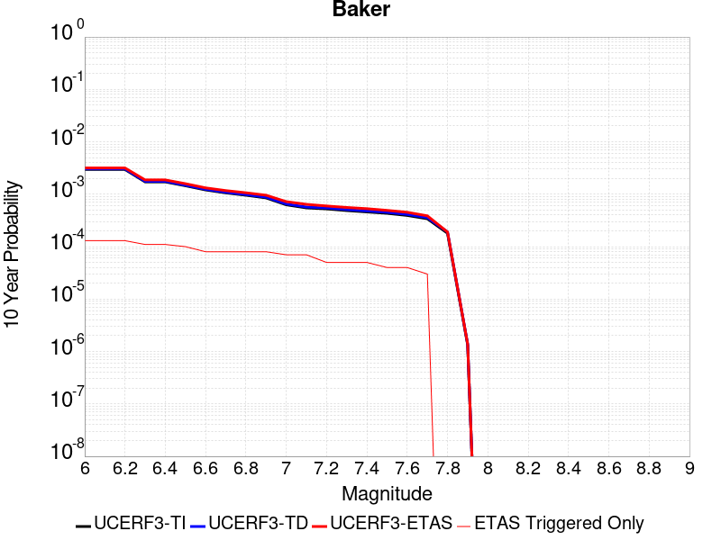 |

| Magnitude | 1 wk TI Prob | 1 wk TD Prob | 1 wk ETAS Prob | 1 wk ETAS/TD Gain | 1 wk ETAS Triggered Only | 1 mo TI Prob | 1 mo TD Prob | 1 mo ETAS Prob | 1 mo ETAS/TD Gain | 1 mo ETAS Triggered Only | 1 yr TI Prob | 1 yr TD Prob | 1 yr ETAS Prob | 1 yr ETAS/TD Gain | 1 yr ETAS Triggered Only | 10 yr TI Prob | 10 yr TD Prob | 10 yr ETAS Prob | 10 yr ETAS/TD Gain | 10 yr ETAS Triggered Only |
|-----|-----|-----|-----|-----|-----|-----|-----|-----|-----|-----|-----|-----|-----|-----|-----|-----|-----|-----|-----|-----|
| 6.0 | 5.695525E-6 | 5.8348373E-6 | 9.5834315E-5 | 16.424505 | 9.0E-5 | 2.4409164E-5 | 2.5006228E-5 | 1.5500297E-4 | 6.198575 | 1.3E-4 | 2.9714106E-4 | 3.044123E-4 | 4.3437272E-4 | 1.4269224 | 1.3E-4 | 0.0029674405 | 0.0030403486 | 0.0031699534 | 1.0426283 | 1.3E-4 |
| 6.1 | 5.695525E-6 | 5.8348373E-6 | 9.5834315E-5 | 16.424505 | 9.0E-5 | 2.4409164E-5 | 2.5006228E-5 | 1.5500297E-4 | 6.198575 | 1.3E-4 | 2.9714106E-4 | 3.044123E-4 | 4.3437272E-4 | 1.4269224 | 1.3E-4 | 0.0029674405 | 0.0030403486 | 0.0031699534 | 1.0426283 | 1.3E-4 |
| 6.2 | 5.695525E-6 | 5.8348373E-6 | 9.5834315E-5 | 16.424505 | 9.0E-5 | 2.4409164E-5 | 2.5006228E-5 | 1.5500297E-4 | 6.198575 | 1.3E-4 | 2.9714106E-4 | 3.044123E-4 | 4.3437272E-4 | 1.4269224 | 1.3E-4 | 0.0029674405 | 0.0030403486 | 0.0031699534 | 1.0426283 | 1.3E-4 |
| 6.3 | 3.2995713E-6 | 3.383667E-6 | 7.338343E-5 | 21.687544 | 7.0E-5 | 1.4140943E-5 | 1.4501353E-5 | 1.2449975E-4 | 8.585389 | 1.1E-4 | 1.7215237E-4 | 1.7654014E-4 | 2.8652072E-4 | 1.6229777 | 1.1E-4 | 0.0017201907 | 0.001764046 | 0.001873852 | 1.0622467 | 1.1E-4 |
| 6.4 | 3.2995713E-6 | 3.383667E-6 | 7.338343E-5 | 21.687544 | 7.0E-5 | 1.4140943E-5 | 1.4501353E-5 | 1.2449975E-4 | 8.585389 | 1.1E-4 | 1.7215237E-4 | 1.7654014E-4 | 2.8652072E-4 | 1.6229777 | 1.1E-4 | 0.0017201907 | 0.001764046 | 0.001873852 | 1.0622467 | 1.1E-4 |
| 6.5 | 2.782202E-6 | 2.8558404E-6 | 6.2855666E-5 | 22.009518 | 6.0E-5 | 1.1923668E-5 | 1.223926E-5 | 1.12238034E-4 | 9.170328 | 1.0E-4 | 1.4516099E-4 | 1.4900314E-4 | 2.4898825E-4 | 1.6710268 | 1.0E-4 | 0.001450662 | 0.0014890651 | 0.0015889162 | 1.0670562 | 1.0E-4 |
| 6.6 | 2.3163404E-6 | 2.38092E-6 | 4.2380823E-5 | 17.800188 | 4.0E-5 | 9.927136E-6 | 1.0203904E-5 | 9.020309E-5 | 8.840056 | 8.0E-5 | 1.20856166E-4 | 1.2422565E-4 | 2.0421571E-4 | 1.6439093 | 8.0E-5 | 0.0012079047 | 0.0012415823 | 0.0013214829 | 1.064354 | 8.0E-5 |
| 6.7 | 2.037056E-6 | 2.0965003E-6 | 4.2096417E-5 | 20.079374 | 4.0E-5 | 8.7302105E-6 | 8.984972E-6 | 8.8984256E-5 | 9.903676 | 8.0E-5 | 1.0628513E-4 | 1.093867E-4 | 1.8937796E-4 | 1.7312703 | 8.0E-5 | 0.0010623431 | 0.0010933448 | 0.0011732572 | 1.07309 | 8.0E-5 |
| 6.8 | 1.8356744E-6 | 1.8915287E-6 | 4.1891453E-5 | 22.146877 | 4.0E-5 | 7.867153E-6 | 8.106527E-6 | 8.810588E-5 | 10.868511 | 8.0E-5 | 9.577837E-5 | 9.869264E-5 | 1.7868474E-4 | 1.8105174 | 8.0E-5 | 9.57371E-4 | 9.86502E-4 | 0.0010664231 | 1.0810146 | 8.0E-5 |
| 6.9 | 1.6310546E-6 | 1.6832072E-6 | 4.168314E-5 | 24.764116 | 4.0E-5 | 6.9902153E-6 | 7.213726E-6 | 8.721315E-5 | 12.08989 | 8.0E-5 | 8.510255E-5 | 8.782368E-5 | 1.6781666E-4 | 1.910836 | 8.0E-5 | 8.5069967E-4 | 8.7790104E-4 | 9.578308E-4 | 1.0910465 | 8.0E-5 |
| 7.0 | 1.2058036E-6 | 1.2508665E-6 | 3.1250827E-5 | 24.983343 | 3.0E-5 | 5.1677193E-6 | 5.3608455E-6 | 7.536047E-5 | 14.057571 | 7.0E-5 | 6.291517E-5 | 6.5266366E-5 | 1.352618E-4 | 2.072458 | 7.0E-5 | 6.289736E-4 | 6.524743E-4 | 7.224286E-4 | 1.107214 | 7.0E-5 |
| 7.1 | 1.052382E-6 | 1.0951609E-6 | 3.109513E-5 | 28.393206 | 3.0E-5 | 4.5102006E-6 | 4.693538E-6 | 7.469321E-5 | 15.914052 | 7.0E-5 | 5.491031E-5 | 5.7142337E-5 | 1.2713834E-4 | 2.2249413 | 7.0E-5 | 5.4896745E-4 | 5.7127734E-4 | 6.412373E-4 | 1.1224624 | 7.0E-5 |
| 7.2 | 1.0067454E-6 | 1.0487711E-6 | 3.104874E-5 | 29.604877 | 3.0E-5 | 4.3146156E-6 | 4.4947255E-6 | 5.44945E-5 | 12.1241 | 5.0E-5 | 5.252918E-5 | 5.4721917E-5 | 1.0471918E-4 | 1.9136606 | 5.0E-5 | 5.251676E-4 | 5.470853E-4 | 5.970579E-4 | 1.0913434 | 5.0E-5 |
| 7.3 | 9.3596316E-7 | 9.767723E-7 | 3.0976742E-5 | 31.713371 | 3.0E-5 | 4.0112645E-6 | 4.1861604E-6 | 5.418595E-5 | 12.944069 | 5.0E-5 | 4.8836053E-5 | 5.096532E-5 | 1.00962774E-4 | 1.9810092 | 5.0E-5 | 4.8825322E-4 | 5.095371E-4 | 5.5951165E-4 | 1.0980783 | 5.0E-5 |
| 7.4 | 8.8117395E-7 | 9.2076635E-7 | 3.092074E-5 | 33.581528 | 3.0E-5 | 3.7764542E-6 | 3.9461356E-6 | 5.394594E-5 | 13.670574 | 5.0E-5 | 4.5977362E-5 | 4.8043148E-5 | 9.804075E-5 | 2.0406811 | 5.0E-5 | 4.596785E-4 | 4.8032837E-4 | 5.303044E-4 | 1.1040455 | 5.0E-5 |
| 7.5 | 8.292386E-7 | 8.6745956E-7 | 3.0867435E-5 | 35.583714 | 3.0E-5 | 3.5538749E-6 | 3.7176785E-6 | 4.371753E-5 | 11.759362 | 4.0E-5 | 4.326757E-5 | 4.5261804E-5 | 8.525999E-5 | 1.8837074 | 4.0E-5 | 4.3259145E-4 | 4.5252658E-4 | 4.925085E-4 | 1.0883526 | 4.0E-5 |
| 7.6 | 7.553842E-7 | 7.9144706E-7 | 3.0791423E-5 | 38.905224 | 3.0E-5 | 3.2373566E-6 | 3.3919116E-6 | 4.3391778E-5 | 12.79272 | 4.0E-5 | 3.9414106E-5 | 4.129575E-5 | 8.129409E-5 | 1.9685827 | 4.0E-5 | 3.9407116E-4 | 4.1288146E-4 | 4.5286494E-4 | 1.0968401 | 4.0E-5 |
| 7.7 | 6.5285366E-7 | 6.852797E-7 | 3.068526E-5 | 44.777718 | 3.0E-5 | 2.797941E-6 | 2.9369096E-6 | 3.2936823E-5 | 11.214789 | 3.0E-5 | 3.40644E-5 | 3.5756293E-5 | 6.575522E-5 | 1.838983 | 3.0E-5 | 3.405918E-4 | 3.5750607E-4 | 3.8749535E-4 | 1.0838847 | 3.0E-5 |
| 7.8 | 3.4586725E-7 | 3.6482615E-7 | 3.6482615E-7 | 1.0 | 0.0 | 1.4822873E-6 | 1.5635396E-6 | 1.5635396E-6 | 1.0 | 0.0 | 1.80467E-5 | 1.9035933E-5 | 1.9035933E-5 | 1.0 | 0.0 | 1.8045233E-4 | 1.9034347E-4 | 1.9034347E-4 | 1.0 | 0.0 |
| 7.9 | 2.5591178E-9 | 2.6696718E-9 | 2.6696718E-9 | 1.0 | 0.0 | 1.0967647E-8 | 1.14414505E-8 | 1.14414505E-8 | 1.0 | 0.0 | 1.335311E-7 | 1.3929966E-7 | 1.3929966E-7 | 1.0 | 0.0 | 1.3353102E-6 | 1.3929966E-6 | 1.3929966E-6 | 1.0 | 0.0 |

## Imperial
*[(top)](#table-of-contents)*

| 1 Week | 1 Month | 1 Year | 10 Year |
|-----|-----|-----|-----|
|  |  | 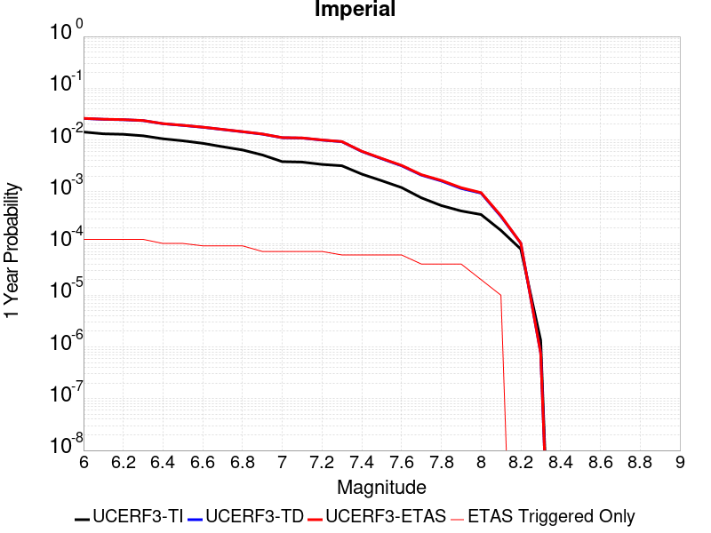 |  |

| Magnitude | 1 wk TI Prob | 1 wk TD Prob | 1 wk ETAS Prob | 1 wk ETAS/TD Gain | 1 wk ETAS Triggered Only | 1 mo TI Prob | 1 mo TD Prob | 1 mo ETAS Prob | 1 mo ETAS/TD Gain | 1 mo ETAS Triggered Only | 1 yr TI Prob | 1 yr TD Prob | 1 yr ETAS Prob | 1 yr ETAS/TD Gain | 1 yr ETAS Triggered Only | 10 yr TI Prob | 10 yr TD Prob | 10 yr ETAS Prob | 10 yr ETAS/TD Gain | 10 yr ETAS Triggered Only |
|-----|-----|-----|-----|-----|-----|-----|-----|-----|-----|-----|-----|-----|-----|-----|-----|-----|-----|-----|-----|-----|
| 6.0 | 2.7496446E-4 | 5.0552754E-4 | 5.854871E-4 | 1.1581706 | 8.0E-5 | 0.0011778869 | 0.002164787 | 0.0022745489 | 1.0507033 | 1.1E-4 | 0.0142467655 | 0.026038699 | 0.026155574 | 1.0044885 | 1.2E-4 | 0.13367249 | 0.2280438 | 0.22813642 | 1.0004063 | 1.2E-4 |
| 6.1 | 2.5356023E-4 | 4.8656776E-4 | 5.665288E-4 | 1.1643369 | 8.0E-5 | 0.001086234 | 0.0020836622 | 0.002193433 | 1.0526817 | 1.1E-4 | 0.013144928 | 0.025071215 | 0.025188206 | 1.0046663 | 1.2E-4 | 0.123940155 | 0.21947981 | 0.21957347 | 1.0004268 | 1.2E-4 |
| 6.2 | 2.4820742E-4 | 4.7752203E-4 | 5.574838E-4 | 1.1674515 | 8.0E-5 | 0.0010633124 | 0.0020449557 | 0.0021547307 | 1.0536809 | 1.1E-4 | 0.01286919 | 0.024611235 | 0.024728281 | 1.0047559 | 1.2E-4 | 0.12148927 | 0.21598552 | 0.21607961 | 1.0004356 | 1.2E-4 |
| 6.3 | 2.3205351E-4 | 4.5890483E-4 | 5.3886813E-4 | 1.1742481 | 8.0E-5 | 9.94136E-4 | 0.0019652895 | 0.0020750733 | 1.0558614 | 1.1E-4 | 0.012036599 | 0.02366133 | 0.02377849 | 1.0049516 | 1.2E-4 | 0.11405133 | 0.20793462 | 0.20802966 | 1.000457 | 1.2E-4 |
| 6.4 | 2.0304754E-4 | 3.987652E-4 | 4.5874127E-4 | 1.1504045 | 6.0E-5 | 8.6991355E-4 | 0.0017078889 | 0.0017977352 | 1.0526066 | 9.0E-5 | 0.010539869 | 0.020595672 | 0.020693611 | 1.0047554 | 1.0E-4 | 0.100537635 | 0.1850669 | 0.18514839 | 1.0004404 | 1.0E-4 |
| 6.5 | 1.854992E-4 | 3.6988858E-4 | 4.298664E-4 | 1.162151 | 6.0E-5 | 7.9475436E-4 | 0.0015842861 | 0.0016741435 | 1.0567179 | 9.0E-5 | 0.009633281 | 0.01911948 | 0.01921757 | 1.0051303 | 1.0E-4 | 0.0922623 | 0.173298 | 0.17338067 | 1.0004771 | 1.0E-4 |
| 6.6 | 1.6586106E-4 | 3.403506E-4 | 4.003302E-4 | 1.1762288 | 6.0E-5 | 7.106394E-4 | 0.0014578402 | 0.0015377236 | 1.0547957 | 8.0E-5 | 0.008617763 | 0.01760642 | 0.017694835 | 1.0050218 | 9.0E-5 | 0.08291132 | 0.16077545 | 0.16085097 | 1.0004698 | 9.0E-5 |
| 6.7 | 1.4224656E-4 | 3.076692E-4 | 3.6765073E-4 | 1.1949546 | 6.0E-5 | 6.094856E-4 | 0.001317924 | 0.0013978187 | 1.0606215 | 8.0E-5 | 0.0073952693 | 0.015929576 | 0.016018143 | 1.0055599 | 9.0E-5 | 0.07153955 | 0.14648417 | 0.14656098 | 1.0005244 | 9.0E-5 |
| 6.8 | 1.2317259E-4 | 2.779122E-4 | 3.378955E-4 | 1.2158356 | 6.0E-5 | 5.2777573E-4 | 0.0011905148 | 0.0012704195 | 1.0671178 | 8.0E-5 | 0.0064067547 | 0.0143995695 | 0.014488273 | 1.0061601 | 9.0E-5 | 0.06225166 | 0.13293684 | 0.13301487 | 1.000587 | 9.0E-5 |
| 6.9 | 9.859898E-5 | 2.5014306E-4 | 2.9013306E-4 | 1.1598685 | 4.0E-5 | 4.2249862E-4 | 0.0010716055 | 0.0011315412 | 1.0559307 | 6.0E-5 | 0.0051317946 | 0.012969712 | 0.013038804 | 1.0053272 | 7.0E-5 | 0.05014893 | 0.11940631 | 0.11946796 | 1.0005162 | 7.0E-5 |
| 7.0 | 7.3191884E-5 | 2.1266776E-4 | 2.5265926E-4 | 1.1880468 | 4.0E-5 | 3.136418E-4 | 9.1111806E-4 | 9.710634E-4 | 1.0657932 | 6.0E-5 | 0.003811904 | 0.011037128 | 0.011106355 | 1.0062722 | 7.0E-5 | 0.037471764 | 0.10206493 | 0.10212778 | 1.0006158 | 7.0E-5 |
| 7.1 | 7.1760296E-5 | 2.0968143E-4 | 2.4967303E-4 | 1.1907256 | 4.0E-5 | 3.0750787E-4 | 8.983284E-4 | 9.5827447E-4 | 1.0667307 | 6.0E-5 | 0.003737482 | 0.010882978 | 0.010952217 | 1.0063621 | 7.0E-5 | 0.03675245 | 0.10070146 | 0.10076441 | 1.0006251 | 7.0E-5 |
| 7.2 | 6.46614E-5 | 1.9136685E-4 | 2.3135921E-4 | 1.2089826 | 4.0E-5 | 2.7709085E-4 | 8.1988896E-4 | 8.7983976E-4 | 1.0731206 | 6.0E-5 | 0.0033683628 | 0.0099370815 | 0.010006386 | 1.0069743 | 7.0E-5 | 0.033177625 | 0.09250898 | 0.0925725 | 1.0006866 | 7.0E-5 |
| 7.3 | 6.088115E-5 | 1.78084E-4 | 2.0807865E-4 | 1.1684299 | 3.0E-5 | 2.6089314E-4 | 7.6299673E-4 | 8.129586E-4 | 1.0654811 | 5.0E-5 | 0.0031717476 | 0.009250494 | 0.009309938 | 1.0064261 | 6.0E-5 | 0.031268585 | 0.08655989 | 0.0866147 | 1.0006331 | 6.0E-5 |
| 7.4 | 4.199346E-5 | 1.1510366E-4 | 1.4510022E-4 | 1.2606046 | 3.0E-5 | 1.7995955E-4 | 4.9320905E-4 | 5.4318435E-4 | 1.101327 | 5.0E-5 | 0.0021888057 | 0.0059884563 | 0.006048097 | 1.0099592 | 6.0E-5 | 0.02167372 | 0.057439793 | 0.057496347 | 1.0009845 | 6.0E-5 |
| 7.5 | 3.130448E-5 | 8.33328E-5 | 1.133303E-4 | 1.3599724 | 3.0E-5 | 1.3415517E-4 | 3.57092E-4 | 4.0707414E-4 | 1.13997 | 5.0E-5 | 0.0016321153 | 0.004338988 | 0.004398728 | 1.0137681 | 6.0E-5 | 0.016201803 | 0.04213201 | 0.04218948 | 1.0013641 | 6.0E-5 |
| 7.6 | 2.3074248E-5 | 6.0844646E-5 | 9.084282E-5 | 1.493029 | 3.0E-5 | 9.888588E-5 | 2.6073685E-4 | 3.1072382E-4 | 1.1917143 | 5.0E-5 | 0.0012032706 | 0.0031698733 | 0.0032296833 | 1.0188682 | 6.0E-5 | 0.011967761 | 0.031026395 | 0.031084534 | 1.0018739 | 6.0E-5 |
| 7.7 | 1.45864815E-5 | 4.0124698E-5 | 5.0124298E-5 | 1.2492131 | 1.0E-5 | 6.2511994E-5 | 1.7195169E-4 | 2.0194653E-4 | 1.1744376 | 3.0E-5 | 7.608177E-4 | 0.0020915072 | 0.0021314234 | 1.0190849 | 4.0E-5 | 0.007582182 | 0.020627763 | 0.020666938 | 1.0018991 | 4.0E-5 |
| 7.8 | 1.0352979E-5 | 3.0960902E-5 | 4.0960593E-5 | 1.322978 | 1.0E-5 | 4.4369157E-5 | 1.3268284E-4 | 1.6267886E-4 | 1.2260731 | 3.0E-5 | 5.400606E-4 | 0.0016142189 | 0.0016541544 | 1.0247397 | 4.0E-5 | 0.0053875 | 0.016016833 | 0.016056193 | 1.0024574 | 4.0E-5 |
| 7.9 | 8.137906E-6 | 2.2149103E-5 | 3.214888E-5 | 1.4514756 | 1.0E-5 | 3.4876273E-5 | 9.492128E-5 | 1.2491843E-4 | 1.3160213 | 3.0E-5 | 4.2453592E-4 | 0.0011550548 | 0.0011950086 | 1.0345904 | 4.0E-5 | 0.004237258 | 0.011617903 | 0.011657438 | 1.003403 | 4.0E-5 |
| 8.0 | 6.93792E-6 | 1.8008766E-5 | 1.8008766E-5 | 1.0 | 0.0 | 2.9733603E-5 | 7.717814E-5 | 8.7177374E-5 | 1.1295604 | 1.0E-5 | 3.6194647E-4 | 9.3923963E-4 | 9.592208E-4 | 1.0212739 | 2.0E-5 | 0.0036135751 | 0.00950155 | 0.0095213605 | 1.002085 | 2.0E-5 |
| 8.1 | 3.4286315E-6 | 6.379872E-6 | 6.379872E-6 | 1.0 | 0.0 | 1.4694053E-5 | 2.7342023E-5 | 2.7342023E-5 | 1.0 | 0.0 | 1.7888541E-4 | 3.328384E-4 | 3.4283506E-4 | 1.0300347 | 1.0E-5 | 0.0017874148 | 0.003486031 | 0.003495996 | 1.0028586 | 1.0E-5 |
| 8.2 | 1.4906886E-6 | 1.9366646E-6 | 1.9366646E-6 | 1.0 | 0.0 | 6.3886496E-6 | 8.299965E-6 | 8.299965E-6 | 1.0 | 0.0 | 7.7779034E-5 | 1.0104742E-4 | 1.0104742E-4 | 1.0 | 0.0 | 7.775182E-4 | 0.0011075331 | 0.0011075331 | 1.0 | 0.0 |
| 8.3 | 2.5758007E-8 | 1.4500102E-8 | 1.4500102E-8 | 1.0 | 0.0 | 1.10391454E-7 | 6.214329E-8 | 6.214329E-8 | 1.0 | 0.0 | 1.3440151E-6 | 7.565946E-7 | 7.565946E-7 | 1.0 | 0.0 | 1.344007E-5 | 7.887763E-6 | 7.887763E-6 | 1.0 | 0.0 |

## White Mountains
*[(top)](#table-of-contents)*

| 1 Week | 1 Month | 1 Year | 10 Year |
|-----|-----|-----|-----|
|  |  |  |  |

| Magnitude | 1 wk TI Prob | 1 wk TD Prob | 1 wk ETAS Prob | 1 wk ETAS/TD Gain | 1 wk ETAS Triggered Only | 1 mo TI Prob | 1 mo TD Prob | 1 mo ETAS Prob | 1 mo ETAS/TD Gain | 1 mo ETAS Triggered Only | 1 yr TI Prob | 1 yr TD Prob | 1 yr ETAS Prob | 1 yr ETAS/TD Gain | 1 yr ETAS Triggered Only | 10 yr TI Prob | 10 yr TD Prob | 10 yr ETAS Prob | 10 yr ETAS/TD Gain | 10 yr ETAS Triggered Only |
|-----|-----|-----|-----|-----|-----|-----|-----|-----|-----|-----|-----|-----|-----|-----|-----|-----|-----|-----|-----|-----|
| 6.0 | 3.503579E-5 | 3.378405E-5 | 9.378202E-5 | 2.7759259 | 6.0E-5 | 1.5014476E-4 | 1.4478143E-4 | 2.347684E-4 | 1.6215366 | 9.0E-5 | 0.0018264796 | 0.0017614096 | 0.001851251 | 1.0510055 | 9.0E-5 | 0.018115403 | 0.017486818 | 0.01760472 | 1.0067424 | 1.2E-4 |
| 6.1 | 3.503579E-5 | 3.378405E-5 | 9.378202E-5 | 2.7759259 | 6.0E-5 | 1.5014476E-4 | 1.4478143E-4 | 2.347684E-4 | 1.6215366 | 9.0E-5 | 0.0018264796 | 0.0017614096 | 0.001851251 | 1.0510055 | 9.0E-5 | 0.018115403 | 0.017486818 | 0.01760472 | 1.0067424 | 1.2E-4 |
| 6.2 | 3.503579E-5 | 3.378405E-5 | 9.378202E-5 | 2.7759259 | 6.0E-5 | 1.5014476E-4 | 1.4478143E-4 | 2.347684E-4 | 1.6215366 | 9.0E-5 | 0.0018264796 | 0.0017614096 | 0.001851251 | 1.0510055 | 9.0E-5 | 0.018115403 | 0.017486818 | 0.01760472 | 1.0067424 | 1.2E-4 |
| 6.3 | 1.7818425E-5 | 1.5916074E-5 | 2.5915915E-5 | 1.6282856 | 1.0E-5 | 7.636245E-5 | 6.821004E-5 | 8.8208675E-5 | 1.2931919 | 2.0E-5 | 9.293162E-4 | 8.301551E-4 | 8.5013855E-4 | 1.0240719 | 2.0E-5 | 0.009254395 | 0.008271999 | 0.008301751 | 1.0035967 | 3.0E-5 |
| 6.4 | 1.7818425E-5 | 1.5916074E-5 | 2.5915915E-5 | 1.6282856 | 1.0E-5 | 7.636245E-5 | 6.821004E-5 | 8.8208675E-5 | 1.2931919 | 2.0E-5 | 9.293162E-4 | 8.301551E-4 | 8.5013855E-4 | 1.0240719 | 2.0E-5 | 0.009254395 | 0.008271999 | 0.008301751 | 1.0035967 | 3.0E-5 |
| 6.5 | 1.3397557E-5 | 1.13362685E-5 | 2.1336155E-5 | 1.8821145 | 1.0E-5 | 5.741684E-5 | 4.858314E-5 | 5.8582656E-5 | 1.2058227 | 1.0E-5 | 6.988258E-4 | 5.913462E-4 | 6.0134026E-4 | 1.0169005 | 1.0E-5 | 0.006966323 | 0.005898432 | 0.005908373 | 1.0016854 | 1.0E-5 |
| 6.6 | 1.0818695E-5 | 8.625366E-6 | 8.625366E-6 | 1.0 | 0.0 | 4.6365014E-5 | 3.6965357E-5 | 3.6965357E-5 | 1.0 | 0.0 | 5.6434784E-4 | 4.4996463E-4 | 4.4996463E-4 | 1.0 | 0.0 | 0.005629168 | 0.004490972 | 0.004490972 | 1.0 | 0.0 |
| 6.7 | 9.067908E-6 | 6.802442E-6 | 6.802442E-6 | 1.0 | 0.0 | 3.8861883E-5 | 2.9153016E-5 | 2.9153016E-5 | 1.0 | 0.0 | 4.7304068E-4 | 3.5488335E-4 | 3.5488335E-4 | 1.0 | 0.0 | 0.00472035 | 0.0035434833 | 0.0035434833 | 1.0 | 0.0 |
| 6.8 | 7.295947E-6 | 4.936391E-6 | 4.936391E-6 | 1.0 | 0.0 | 3.126797E-5 | 2.1155796E-5 | 2.1155796E-5 | 1.0 | 0.0 | 3.8062103E-4 | 2.575425E-4 | 2.575425E-4 | 1.0 | 0.0 | 0.0037996976 | 0.0025725532 | 0.0025725532 | 1.0 | 0.0 |
| 6.9 | 6.2243444E-6 | 3.832213E-6 | 3.832213E-6 | 1.0 | 0.0 | 2.6675489E-5 | 1.642367E-5 | 1.642367E-5 | 1.0 | 0.0 | 3.2472567E-4 | 1.9994036E-4 | 1.9994036E-4 | 1.0 | 0.0 | 0.0032425157 | 0.0019976576 | 0.0019976576 | 1.0 | 0.0 |
| 7.0 | 4.9878413E-6 | 2.6795342E-6 | 2.6795342E-6 | 1.0 | 0.0 | 2.1376287E-5 | 1.14836685E-5 | 1.14836685E-5 | 1.0 | 0.0 | 2.602252E-4 | 1.3980496E-4 | 1.3980496E-4 | 1.0 | 0.0 | 0.002599207 | 0.0013971963 | 0.0013971963 | 1.0 | 0.0 |
| 7.1 | 4.0252844E-6 | 1.8857575E-6 | 1.8857575E-6 | 1.0 | 0.0 | 1.7251105E-5 | 8.081794E-6 | 8.081794E-6 | 1.0 | 0.0 | 2.1001195E-4 | 9.8391516E-5 | 9.8391516E-5 | 1.0 | 0.0 | 0.0020981359 | 9.834924E-4 | 9.834924E-4 | 1.0 | 0.0 |
| 7.2 | 3.3284066E-6 | 1.281964E-6 | 1.281964E-6 | 1.0 | 0.0 | 1.4264522E-5 | 5.494121E-6 | 5.494121E-6 | 1.0 | 0.0 | 1.736567E-4 | 6.688897E-5 | 6.688897E-5 | 1.0 | 0.0 | 0.0017352107 | 6.6869846E-4 | 6.6869846E-4 | 1.0 | 0.0 |
| 7.3 | 2.458226E-6 | 6.05722E-7 | 6.05722E-7 | 1.0 | 0.0 | 1.0535211E-5 | 2.5959491E-6 | 2.5959491E-6 | 1.0 | 0.0 | 1.2825865E-4 | 3.1605257E-5 | 3.1605257E-5 | 1.0 | 0.0 | 0.0012818464 | 3.160114E-4 | 3.160114E-4 | 1.0 | 0.0 |
| 7.4 | 1.965953E-6 | 3.1089303E-7 | 3.1089303E-7 | 1.0 | 0.0 | 8.425486E-6 | 1.332398E-6 | 1.332398E-6 | 1.0 | 0.0 | 1.0257547E-4 | 1.6221828E-5 | 1.6221828E-5 | 1.0 | 0.0 | 0.0010252813 | 1.6220656E-4 | 1.6220656E-4 | 1.0 | 0.0 |
| 7.5 | 1.2014192E-6 | 1.8244253E-7 | 1.8244253E-7 | 1.0 | 0.0 | 5.148929E-6 | 7.8189635E-7 | 7.8189635E-7 | 1.0 | 0.0 | 6.2686406E-5 | 9.519547E-6 | 9.519547E-6 | 1.0 | 0.0 | 6.266873E-4 | 9.519148E-5 | 9.519148E-5 | 1.0 | 0.0 |
| 7.6 | 2.5612175E-7 | 4.8946475E-8 | 4.8946475E-8 | 1.0 | 0.0 | 1.0976642E-6 | 2.0977059E-7 | 2.0977059E-7 | 1.0 | 0.0 | 1.3363979E-5 | 2.5539543E-6 | 2.5539543E-6 | 1.0 | 0.0 | 1.3363175E-4 | 2.5539286E-5 | 2.5539286E-5 | 1.0 | 0.0 |

## Lake Isabella (Seismicity)
*[(top)](#table-of-contents)*

| 1 Week | 1 Month | 1 Year | 10 Year |
|-----|-----|-----|-----|
|  |  |  |  |

| Magnitude | 1 wk TI Prob | 1 wk TD Prob | 1 wk ETAS Prob | 1 wk ETAS/TD Gain | 1 wk ETAS Triggered Only | 1 mo TI Prob | 1 mo TD Prob | 1 mo ETAS Prob | 1 mo ETAS/TD Gain | 1 mo ETAS Triggered Only | 1 yr TI Prob | 1 yr TD Prob | 1 yr ETAS Prob | 1 yr ETAS/TD Gain | 1 yr ETAS Triggered Only | 10 yr TI Prob | 10 yr TD Prob | 10 yr ETAS Prob | 10 yr ETAS/TD Gain | 10 yr ETAS Triggered Only |
|-----|-----|-----|-----|-----|-----|-----|-----|-----|-----|-----|-----|-----|-----|-----|-----|-----|-----|-----|-----|-----|
| 6.0 | 9.431637E-6 | 9.741651E-6 | 9.974078E-5 | 10.238589 | 9.0E-5 | 4.0420677E-5 | 4.1749343E-5 | 1.3174559E-4 | 3.1556327 | 9.0E-5 | 4.920106E-4 | 5.0819275E-4 | 6.1813684E-4 | 1.2163433 | 1.1E-4 | 0.004909227 | 0.005071599 | 0.0051909904 | 1.0235412 | 1.2E-4 |
| 6.1 | 9.431637E-6 | 9.741651E-6 | 9.974078E-5 | 10.238589 | 9.0E-5 | 4.0420677E-5 | 4.1749343E-5 | 1.3174559E-4 | 3.1556327 | 9.0E-5 | 4.920106E-4 | 5.0819275E-4 | 6.1813684E-4 | 1.2163433 | 1.1E-4 | 0.004909227 | 0.005071599 | 0.0051909904 | 1.0235412 | 1.2E-4 |
| 6.2 | 9.431637E-6 | 9.741651E-6 | 9.974078E-5 | 10.238589 | 9.0E-5 | 4.0420677E-5 | 4.1749343E-5 | 1.3174559E-4 | 3.1556327 | 9.0E-5 | 4.920106E-4 | 5.0819275E-4 | 6.1813684E-4 | 1.2163433 | 1.1E-4 | 0.004909227 | 0.005071599 | 0.0051909904 | 1.0235412 | 1.2E-4 |
| 6.3 | 9.431637E-6 | 9.741651E-6 | 9.974078E-5 | 10.238589 | 9.0E-5 | 4.0420677E-5 | 4.1749343E-5 | 1.3174559E-4 | 3.1556327 | 9.0E-5 | 4.920106E-4 | 5.0819275E-4 | 6.1813684E-4 | 1.2163433 | 1.1E-4 | 0.004909227 | 0.005071599 | 0.0051909904 | 1.0235412 | 1.2E-4 |
| 6.4 | 5.144063E-6 | 5.3000763E-6 | 5.529981E-5 | 10.433777 | 5.0E-5 | 2.2045799E-5 | 2.2714434E-5 | 7.27133E-5 | 3.2011936 | 5.0E-5 | 2.6837454E-4 | 2.765166E-4 | 3.4649723E-4 | 1.2530794 | 7.0E-5 | 0.0026805066 | 0.0027620657 | 0.0028418447 | 1.0288838 | 8.0E-5 |
| 6.5 | 5.144063E-6 | 5.3000763E-6 | 5.529981E-5 | 10.433777 | 5.0E-5 | 2.2045799E-5 | 2.2714434E-5 | 7.27133E-5 | 3.2011936 | 5.0E-5 | 2.6837454E-4 | 2.765166E-4 | 3.4649723E-4 | 1.2530794 | 7.0E-5 | 0.0026805066 | 0.0027620657 | 0.0028418447 | 1.0288838 | 8.0E-5 |
| 6.6 | 3.4009804E-6 | 3.498786E-6 | 3.349868E-5 | 9.574372 | 3.0E-5 | 1.4575549E-5 | 1.4994721E-5 | 4.499427E-5 | 3.0006742 | 3.0E-5 | 1.7744285E-4 | 1.8254704E-4 | 2.325379E-4 | 1.273852 | 5.0E-5 | 0.0017730123 | 0.0018241286 | 0.0018840191 | 1.0328324 | 6.0E-5 |
| 6.7 | 3.3880428E-6 | 3.4856528E-6 | 3.3485547E-5 | 9.606679 | 3.0E-5 | 1.4520103E-5 | 1.4938435E-5 | 4.4937988E-5 | 3.0082123 | 3.0E-5 | 1.767679E-4 | 1.8186188E-4 | 2.3185278E-4 | 1.274884 | 5.0E-5 | 0.0017662736 | 0.0018172882 | 0.0018771791 | 1.0329562 | 6.0E-5 |
| 6.8 | 2.6582E-6 | 2.7337003E-6 | 2.2733646E-5 | 8.3160715 | 2.0E-5 | 1.1392236E-5 | 1.1715813E-5 | 3.171558E-5 | 2.7070744 | 2.0E-5 | 1.3869164E-4 | 1.4263204E-4 | 1.8262633E-4 | 1.280402 | 4.0E-5 | 0.0013860512 | 0.0014255369 | 0.00146548 | 1.0280195 | 4.0E-5 |
| 6.9 | 2.406011E-6 | 2.4743288E-6 | 2.247428E-5 | 9.08298 | 2.0E-5 | 1.0311434E-5 | 1.0604231E-5 | 3.060402E-5 | 2.8860197 | 2.0E-5 | 1.2553448E-4 | 1.2910018E-4 | 1.6909502E-4 | 1.3097969 | 4.0E-5 | 0.0012546359 | 0.0012903814 | 0.0013303298 | 1.0309585 | 4.0E-5 |
| 7.0 | 1.6953097E-6 | 1.7429371E-6 | 2.1742902E-5 | 12.474863 | 2.0E-5 | 7.265593E-6 | 7.469715E-6 | 2.7469567E-5 | 3.6774583 | 2.0E-5 | 8.8455E-5 | 9.094104E-5 | 1.3093739E-4 | 1.4398054 | 4.0E-5 | 8.84198E-4 | 9.09141E-4 | 9.491046E-4 | 1.0439576 | 4.0E-5 |
| 7.1 | 3.5013824E-7 | 3.5714822E-7 | 3.5714822E-7 | 1.0 | 0.0 | 1.5005916E-6 | 1.5306344E-6 | 1.5306344E-6 | 1.0 | 0.0 | 1.826955E-5 | 1.8635317E-5 | 2.8635131E-5 | 1.5366055 | 1.0E-5 | 1.8268047E-4 | 1.863378E-4 | 1.9633592E-4 | 1.053656 | 1.0E-5 |
| 7.2 | 2.2321095E-7 | 2.2750574E-7 | 2.2750574E-7 | 1.0 | 0.0 | 9.56618E-7 | 9.750242E-7 | 9.750242E-7 | 1.0 | 0.0 | 1.1646762E-5 | 1.1870856E-5 | 2.1870737E-5 | 1.8423892 | 1.0E-5 | 1.1646151E-4 | 1.1870232E-4 | 1.2870114E-4 | 1.0842344 | 1.0E-5 |
| 7.3 | 1.5760406E-7 | 1.6060922E-7 | 1.6060922E-7 | 1.0 | 0.0 | 6.7544585E-7 | 6.8832503E-7 | 6.8832503E-7 | 1.0 | 0.0 | 8.223522E-6 | 8.380326E-6 | 1.8380242E-5 | 2.193261 | 1.0E-5 | 8.2232174E-5 | 8.3800165E-5 | 9.3799325E-5 | 1.1193215 | 1.0E-5 |
| 7.4 | 1.1216497E-7 | 1.1431706E-7 | 1.1431706E-7 | 1.0 | 0.0 | 4.8070694E-7 | 4.899302E-7 | 4.899302E-7 | 1.0 | 0.0 | 5.852591E-6 | 5.964884E-6 | 1.5964824E-5 | 2.6764686 | 1.0E-5 | 5.8524372E-5 | 5.9647282E-5 | 6.964669E-5 | 1.1676422 | 1.0E-5 |
| 7.5 | 4.885185E-8 | 4.9787737E-8 | 4.9787737E-8 | 1.0 | 0.0 | 2.0936506E-7 | 2.13376E-7 | 2.13376E-7 | 1.0 | 0.0 | 2.5490165E-6 | 2.59785E-6 | 2.59785E-6 | 1.0 | 0.0 | 2.5489873E-5 | 2.5978214E-5 | 2.5978214E-5 | 1.0 | 0.0 |
| 7.6 | 1.504641E-9 | 1.5317903E-9 | 1.5317903E-9 | 1.0 | 0.0 | 6.4484613E-9 | 6.5648154E-9 | 6.5648154E-9 | 1.0 | 0.0 | 7.851001E-8 | 7.992663E-8 | 7.992663E-8 | 1.0 | 0.0 | 7.8509987E-7 | 7.992663E-7 | 7.992663E-7 | 1.0 | 0.0 |

## San Jacinto (Anza) rev
*[(top)](#table-of-contents)*

| 1 Week | 1 Month | 1 Year | 10 Year |
|-----|-----|-----|-----|
|  |  |  |  |

| Magnitude | 1 wk TI Prob | 1 wk TD Prob | 1 wk ETAS Prob | 1 wk ETAS/TD Gain | 1 wk ETAS Triggered Only | 1 mo TI Prob | 1 mo TD Prob | 1 mo ETAS Prob | 1 mo ETAS/TD Gain | 1 mo ETAS Triggered Only | 1 yr TI Prob | 1 yr TD Prob | 1 yr ETAS Prob | 1 yr ETAS/TD Gain | 1 yr ETAS Triggered Only | 10 yr TI Prob | 10 yr TD Prob | 10 yr ETAS Prob | 10 yr ETAS/TD Gain | 10 yr ETAS Triggered Only |
|-----|-----|-----|-----|-----|-----|-----|-----|-----|-----|-----|-----|-----|-----|-----|-----|-----|-----|-----|-----|-----|
| 6.0 | 6.3015636E-5 | 4.3302647E-5 | 1.2329918E-4 | 2.847382 | 8.0E-5 | 2.7003905E-4 | 1.8556965E-4 | 2.7555294E-4 | 1.4849031 | 9.0E-5 | 0.0032827691 | 0.0022569813 | 0.0023567555 | 1.044207 | 1.0E-4 | 0.032346968 | 0.023296192 | 0.02340363 | 1.0046118 | 1.1E-4 |
| 6.1 | 6.3015636E-5 | 4.3302647E-5 | 1.2329918E-4 | 2.847382 | 8.0E-5 | 2.7003905E-4 | 1.8556965E-4 | 2.7555294E-4 | 1.4849031 | 9.0E-5 | 0.0032827691 | 0.0022569813 | 0.0023567555 | 1.044207 | 1.0E-4 | 0.032346968 | 0.023296192 | 0.02340363 | 1.0046118 | 1.1E-4 |
| 6.2 | 6.3015636E-5 | 4.3302647E-5 | 1.2329918E-4 | 2.847382 | 8.0E-5 | 2.7003905E-4 | 1.8556965E-4 | 2.7555294E-4 | 1.4849031 | 9.0E-5 | 0.0032827691 | 0.0022569813 | 0.0023567555 | 1.044207 | 1.0E-4 | 0.032346968 | 0.023296192 | 0.02340363 | 1.0046118 | 1.1E-4 |
| 6.3 | 6.3015636E-5 | 4.3302647E-5 | 1.2329918E-4 | 2.847382 | 8.0E-5 | 2.7003905E-4 | 1.8556965E-4 | 2.7555294E-4 | 1.4849031 | 9.0E-5 | 0.0032827691 | 0.0022569813 | 0.0023567555 | 1.044207 | 1.0E-4 | 0.032346968 | 0.023296192 | 0.02340363 | 1.0046118 | 1.1E-4 |
| 6.4 | 6.3015636E-5 | 4.3302647E-5 | 1.2329918E-4 | 2.847382 | 8.0E-5 | 2.7003905E-4 | 1.8556965E-4 | 2.7555294E-4 | 1.4849031 | 9.0E-5 | 0.0032827691 | 0.0022569813 | 0.0023567555 | 1.044207 | 1.0E-4 | 0.032346968 | 0.023296192 | 0.02340363 | 1.0046118 | 1.1E-4 |
| 6.5 | 5.811017E-5 | 4.0082516E-5 | 1.1007971E-4 | 2.7463274 | 7.0E-5 | 2.4901982E-4 | 1.7177092E-4 | 2.5175718E-4 | 1.4656565 | 8.0E-5 | 0.0030276014 | 0.002089311 | 0.0021791228 | 1.0429864 | 9.0E-5 | 0.02986684 | 0.021593736 | 0.021691578 | 1.004531 | 1.0E-4 |
| 6.6 | 5.811017E-5 | 4.0082516E-5 | 1.1007971E-4 | 2.7463274 | 7.0E-5 | 2.4901982E-4 | 1.7177092E-4 | 2.5175718E-4 | 1.4656565 | 8.0E-5 | 0.0030276014 | 0.002089311 | 0.0021791228 | 1.0429864 | 9.0E-5 | 0.02986684 | 0.021593736 | 0.021691578 | 1.004531 | 1.0E-4 |
| 6.7 | 5.712442E-5 | 3.9505223E-5 | 1.09502456E-4 | 2.7718475 | 7.0E-5 | 2.4479596E-4 | 1.6929714E-4 | 2.492836E-4 | 1.4724619 | 8.0E-5 | 0.0029763177 | 0.0020592497 | 0.0021490643 | 1.0436152 | 9.0E-5 | 0.029367693 | 0.021285562 | 0.021383433 | 1.004598 | 1.0E-4 |
| 6.8 | 5.6967532E-5 | 3.9361643E-5 | 1.0935889E-4 | 2.778311 | 7.0E-5 | 2.4412372E-4 | 1.6868189E-4 | 2.486684E-4 | 1.4741855 | 8.0E-5 | 0.0029681553 | 0.002051773 | 0.0021415884 | 1.0437745 | 9.0E-5 | 0.029288229 | 0.021210281 | 0.02130816 | 1.0046147 | 1.0E-4 |
| 6.9 | 5.6211324E-5 | 3.9066435E-5 | 1.090637E-4 | 2.7917495 | 7.0E-5 | 2.4088343E-4 | 1.6741687E-4 | 2.4740348E-4 | 1.4777691 | 8.0E-5 | 0.0029288116 | 0.0020364004 | 0.0021262171 | 1.0441056 | 9.0E-5 | 0.028905109 | 0.021049714 | 0.021147609 | 1.0046507 | 1.0E-4 |
| 7.0 | 5.4383527E-5 | 3.792697E-5 | 1.07924316E-4 | 2.8455822 | 7.0E-5 | 2.3305144E-4 | 1.6253405E-4 | 2.4252106E-4 | 1.4921246 | 8.0E-5 | 0.0028337094 | 0.001977061 | 0.002066883 | 1.0454321 | 9.0E-5 | 0.027978465 | 0.020440677 | 0.020538632 | 1.0047922 | 1.0E-4 |
| 7.1 | 5.1393665E-5 | 3.6389913E-5 | 1.06387364E-4 | 2.92354 | 7.0E-5 | 2.2023996E-4 | 1.5594746E-4 | 2.3593499E-4 | 1.5129132 | 8.0E-5 | 0.0026781242 | 0.0018970112 | 0.0019868405 | 1.047353 | 9.0E-5 | 0.026460782 | 0.019614287 | 0.019712325 | 1.0049983 | 1.0E-4 |
| 7.2 | 4.785222E-5 | 3.4741795E-5 | 1.0473937E-4 | 3.014794 | 7.0E-5 | 2.0506482E-4 | 1.4888494E-4 | 2.2887302E-4 | 1.5372477 | 8.0E-5 | 0.0024938055 | 0.0018111705 | 0.0019010075 | 1.0496017 | 9.0E-5 | 0.024660049 | 0.018728992 | 0.018827118 | 1.0052394 | 1.0E-4 |
| 7.3 | 4.2143256E-5 | 3.383628E-5 | 1.0383391E-4 | 3.0687153 | 7.0E-5 | 1.8060145E-4 | 1.4500458E-4 | 2.2499298E-4 | 1.5516267 | 8.0E-5 | 0.002196605 | 0.0017640047 | 0.0018538459 | 1.0509303 | 9.0E-5 | 0.02175019 | 0.01823724 | 0.018335417 | 1.0053833 | 1.0E-4 |
| 7.4 | 4.0264713E-5 | 3.347446E-5 | 1.0347212E-4 | 3.0910764 | 7.0E-5 | 1.7255165E-4 | 1.4345412E-4 | 2.2344264E-4 | 1.5575897 | 8.0E-5 | 0.002098792 | 0.0017451581 | 0.001835001 | 1.0514812 | 9.0E-5 | 0.020790804 | 0.018041821 | 0.018140016 | 1.0054426 | 1.0E-4 |
| 7.5 | 3.694492E-5 | 3.218847E-5 | 1.0218621E-4 | 3.1746218 | 7.0E-5 | 1.5832575E-4 | 1.379433E-4 | 2.1793226E-4 | 1.5798684 | 8.0E-5 | 0.0019259118 | 0.001678169 | 0.0017680179 | 1.0535399 | 9.0E-5 | 0.01909306 | 0.01735827 | 0.017456535 | 1.0056609 | 1.0E-4 |
| 7.6 | 3.200565E-5 | 2.9504106E-5 | 9.950204E-5 | 3.372481 | 7.0E-5 | 1.3715986E-4 | 1.2644005E-4 | 2.0642993E-4 | 1.632631 | 8.0E-5 | 0.001668642 | 0.0015383229 | 0.0016281845 | 1.0584153 | 9.0E-5 | 0.01656168 | 0.0159463 | 0.016044706 | 1.006171 | 1.0E-4 |
| 7.7 | 2.731642E-5 | 2.6092788E-5 | 9.609096E-5 | 3.6826637 | 7.0E-5 | 1.1706512E-4 | 1.1182144E-4 | 1.918125E-4 | 1.7153462 | 8.0E-5 | 0.001424336 | 0.0013605768 | 0.0014504544 | 1.0660584 | 9.0E-5 | 0.014152412 | 0.014167004 | 0.014265588 | 1.0069586 | 1.0E-4 |
| 7.8 | 2.3466424E-5 | 2.3504817E-5 | 8.350341E-5 | 3.5526083 | 6.0E-5 | 1.0056651E-4 | 1.0073105E-4 | 1.70724E-4 | 1.6948498 | 7.0E-5 | 0.0012237094 | 0.0012257113 | 0.0013056133 | 1.0651882 | 8.0E-5 | 0.012169928 | 0.012808893 | 0.01289774 | 1.0069363 | 9.0E-5 |
| 7.9 | 1.8611925E-5 | 1.8908117E-5 | 7.890698E-5 | 4.1731806 | 6.0E-5 | 7.9762955E-5 | 8.1032274E-5 | 1.510266E-4 | 1.8637834 | 7.0E-5 | 9.7068126E-4 | 9.861222E-4 | 0.0010660433 | 1.0810459 | 8.0E-5 | 0.0096645225 | 0.010393824 | 0.010482889 | 1.008569 | 9.0E-5 |
| 8.0 | 1.5460775E-5 | 1.5740965E-5 | 7.574002E-5 | 4.8116503 | 6.0E-5 | 6.6258784E-5 | 6.7459536E-5 | 1.3745482E-4 | 2.037589 | 7.0E-5 | 8.0640207E-4 | 8.21011E-4 | 9.009454E-4 | 1.0973608 | 8.0E-5 | 0.008034821 | 0.0087028835 | 0.0087921005 | 1.0102514 | 9.0E-5 |
| 8.1 | 9.983884E-6 | 8.269952E-6 | 4.826962E-5 | 5.8367476 | 4.0E-5 | 4.2787375E-5 | 3.544217E-5 | 8.54404E-5 | 2.410699 | 5.0E-5 | 5.2081177E-4 | 4.314235E-4 | 4.8140195E-4 | 1.1158454 | 5.0E-5 | 0.0051959283 | 0.004640022 | 0.004699744 | 1.012871 | 6.0E-5 |
| 8.2 | 4.1226E-6 | 1.5529788E-6 | 1.5529788E-6 | 1.0 | 0.0 | 1.7668166E-5 | 6.6556063E-6 | 6.6556063E-6 | 1.0 | 0.0 | 2.1508869E-4 | 8.102902E-5 | 8.102902E-5 | 1.0 | 0.0 | 0.0021488064 | 9.4050163E-4 | 9.4050163E-4 | 1.0 | 0.0 |
| 8.3 | 1.2750878E-6 | 3.612133E-7 | 3.612133E-7 | 1.0 | 0.0 | 5.4646503E-6 | 1.548056E-6 | 1.548056E-6 | 1.0 | 0.0 | 6.653009E-5 | 1.8847424E-5 | 1.8847424E-5 | 1.0 | 0.0 | 6.6510175E-4 | 2.2734253E-4 | 2.2734253E-4 | 1.0 | 0.0 |

## Santa Ynez (East)
*[(top)](#table-of-contents)*

| 1 Week | 1 Month | 1 Year | 10 Year |
|-----|-----|-----|-----|
|  |  |  |  |

| Magnitude | 1 wk TI Prob | 1 wk TD Prob | 1 wk ETAS Prob | 1 wk ETAS/TD Gain | 1 wk ETAS Triggered Only | 1 mo TI Prob | 1 mo TD Prob | 1 mo ETAS Prob | 1 mo ETAS/TD Gain | 1 mo ETAS Triggered Only | 1 yr TI Prob | 1 yr TD Prob | 1 yr ETAS Prob | 1 yr ETAS/TD Gain | 1 yr ETAS Triggered Only | 10 yr TI Prob | 10 yr TD Prob | 10 yr ETAS Prob | 10 yr ETAS/TD Gain | 10 yr ETAS Triggered Only |
|-----|-----|-----|-----|-----|-----|-----|-----|-----|-----|-----|-----|-----|-----|-----|-----|-----|-----|-----|-----|-----|
| 6.0 | 3.2269712E-5 | 3.67505E-5 | 8.674867E-5 | 2.3604755 | 5.0E-5 | 1.3829143E-4 | 1.5749598E-4 | 2.1748652E-4 | 1.3809022 | 6.0E-5 | 0.0016823979 | 0.0019164166 | 0.0019962634 | 1.0416646 | 8.0E-5 | 0.016697178 | 0.019056441 | 0.019144727 | 1.0046328 | 9.0E-5 |
| 6.1 | 3.2269712E-5 | 3.67505E-5 | 8.674867E-5 | 2.3604755 | 5.0E-5 | 1.3829143E-4 | 1.5749598E-4 | 2.1748652E-4 | 1.3809022 | 6.0E-5 | 0.0016823979 | 0.0019164166 | 0.0019962634 | 1.0416646 | 8.0E-5 | 0.016697178 | 0.019056441 | 0.019144727 | 1.0046328 | 9.0E-5 |
| 6.2 | 3.2269712E-5 | 3.67505E-5 | 8.674867E-5 | 2.3604755 | 5.0E-5 | 1.3829143E-4 | 1.5749598E-4 | 2.1748652E-4 | 1.3809022 | 6.0E-5 | 0.0016823979 | 0.0019164166 | 0.0019962634 | 1.0416646 | 8.0E-5 | 0.016697178 | 0.019056441 | 0.019144727 | 1.0046328 | 9.0E-5 |
| 6.3 | 3.2269712E-5 | 3.67505E-5 | 8.674867E-5 | 2.3604755 | 5.0E-5 | 1.3829143E-4 | 1.5749598E-4 | 2.1748652E-4 | 1.3809022 | 6.0E-5 | 0.0016823979 | 0.0019164166 | 0.0019962634 | 1.0416646 | 8.0E-5 | 0.016697178 | 0.019056441 | 0.019144727 | 1.0046328 | 9.0E-5 |
| 6.4 | 1.4404779E-5 | 1.4849382E-5 | 4.4848937E-5 | 3.020256 | 3.0E-5 | 6.1733306E-5 | 6.363868E-5 | 9.363678E-5 | 1.4713814 | 3.0E-5 | 7.513438E-4 | 7.745306E-4 | 8.144996E-4 | 1.0516042 | 4.0E-5 | 0.0074880854 | 0.007718862 | 0.007758553 | 1.0051421 | 4.0E-5 |
| 6.5 | 1.4404779E-5 | 1.4849382E-5 | 4.4848937E-5 | 3.020256 | 3.0E-5 | 6.1733306E-5 | 6.363868E-5 | 9.363678E-5 | 1.4713814 | 3.0E-5 | 7.513438E-4 | 7.745306E-4 | 8.144996E-4 | 1.0516042 | 4.0E-5 | 0.0074880854 | 0.007718862 | 0.007758553 | 1.0051421 | 4.0E-5 |
| 6.6 | 1.280208E-5 | 1.3011947E-5 | 3.3011685E-5 | 2.537029 | 2.0E-5 | 5.4864904E-5 | 5.5764307E-5 | 7.576319E-5 | 1.3586323 | 2.0E-5 | 6.6777546E-4 | 6.787207E-4 | 7.0870033E-4 | 1.0441709 | 3.0E-5 | 0.006657724 | 0.0067666885 | 0.0067964857 | 1.0044035 | 3.0E-5 |
| 6.7 | 1.2457027E-5 | 1.2628468E-5 | 3.2628213E-5 | 2.5837035 | 2.0E-5 | 5.3386164E-5 | 5.412089E-5 | 7.411981E-5 | 1.369523 | 2.0E-5 | 6.497827E-4 | 6.587243E-4 | 6.8870455E-4 | 1.0455126 | 3.0E-5 | 0.00647886 | 0.006567915 | 0.0065977178 | 1.0045377 | 3.0E-5 |
| 6.8 | 1.2095134E-5 | 1.2230915E-5 | 3.223067E-5 | 2.6351807 | 2.0E-5 | 5.1835254E-5 | 5.241716E-5 | 7.2416115E-5 | 1.3815345 | 2.0E-5 | 6.309115E-4 | 6.379937E-4 | 6.679745E-4 | 1.0469924 | 3.0E-5 | 0.0062912325 | 0.006361809 | 0.0063916184 | 1.0046856 | 3.0E-5 |
| 6.9 | 1.1104036E-5 | 1.1157347E-5 | 3.1157124E-5 | 2.7925208 | 2.0E-5 | 4.758786E-5 | 4.781633E-5 | 6.7815374E-5 | 1.4182471 | 2.0E-5 | 5.7922816E-4 | 5.820096E-4 | 6.1199215E-4 | 1.0515156 | 3.0E-5 | 0.005777207 | 0.0058049993 | 0.005834825 | 1.0051379 | 3.0E-5 |
| 7.0 | 1.0577444E-5 | 1.058168E-5 | 3.058147E-5 | 2.890039 | 2.0E-5 | 4.5331115E-5 | 4.5349276E-5 | 6.534837E-5 | 1.4410014 | 2.0E-5 | 5.5176654E-4 | 5.519888E-4 | 5.8197224E-4 | 1.0543189 | 3.0E-5 | 0.0055039856 | 0.0055063153 | 0.00553615 | 1.0054183 | 3.0E-5 |
| 7.1 | 1.0021775E-5 | 9.980988E-6 | 1.9980887E-5 | 2.001895 | 1.0E-5 | 4.294976E-5 | 4.2774966E-5 | 5.277454E-5 | 1.2337716 | 1.0E-5 | 5.2278786E-4 | 5.2066194E-4 | 5.4065156E-4 | 1.0383927 | 2.0E-5 | 0.0052155964 | 0.0051945536 | 0.0052144495 | 1.0038302 | 2.0E-5 |
| 7.2 | 8.874109E-6 | 8.748793E-6 | 1.8748706E-5 | 2.1430047 | 1.0E-5 | 3.8031343E-5 | 3.7494297E-5 | 4.7493922E-5 | 1.2666973 | 1.0E-5 | 4.629332E-4 | 4.5639853E-4 | 4.763894E-4 | 1.0438013 | 2.0E-5 | 0.0046197 | 0.0045547304 | 0.0045746393 | 1.004371 | 2.0E-5 |
| 7.3 | 7.5504267E-6 | 7.5051175E-6 | 1.7505043E-5 | 2.3324142 | 1.0E-5 | 3.235857E-5 | 3.21644E-5 | 4.2164076E-5 | 1.3108927 | 1.0E-5 | 3.9389438E-4 | 3.915322E-4 | 4.1152438E-4 | 1.0510614 | 2.0E-5 | 0.0039319694 | 0.003908531 | 0.0039284527 | 1.005097 | 2.0E-5 |
| 7.4 | 6.309394E-6 | 6.1831556E-6 | 1.6183094E-5 | 2.6172872 | 1.0E-5 | 2.703998E-5 | 2.6498974E-5 | 3.649871E-5 | 1.3773631 | 1.0E-5 | 3.2916202E-4 | 3.225782E-4 | 3.4257176E-4 | 1.0619805 | 2.0E-5 | 0.003286749 | 0.003221197 | 0.0032411327 | 1.0061889 | 2.0E-5 |
| 7.5 | 4.6103073E-6 | 4.4408903E-6 | 1.4440846E-5 | 3.2517908 | 1.0E-5 | 1.975831E-5 | 1.9032252E-5 | 2.9032062E-5 | 1.5254139 | 1.0E-5 | 2.4053088E-4 | 2.3169373E-4 | 2.5168908E-4 | 1.0863008 | 2.0E-5 | 0.002402707 | 0.002314591 | 0.002334545 | 1.0086209 | 2.0E-5 |
| 7.6 | 1.2858658E-6 | 1.3008173E-6 | 1.3008173E-6 | 1.0 | 0.0 | 5.5108417E-6 | 5.5749197E-6 | 5.5749197E-6 | 1.0 | 0.0 | 6.7092435E-5 | 6.78726E-5 | 6.78726E-5 | 1.0 | 0.0 | 6.707218E-4 | 6.785256E-4 | 6.785256E-4 | 1.0 | 0.0 |
| 7.7 | 5.3302307E-7 | 5.612138E-7 | 5.612138E-7 | 1.0 | 0.0 | 2.2843826E-6 | 2.4052001E-6 | 2.4052001E-6 | 1.0 | 0.0 | 2.7812002E-5 | 2.9282954E-5 | 2.9282954E-5 | 1.0 | 0.0 | 2.7808524E-4 | 2.9279452E-4 | 2.9279452E-4 | 1.0 | 0.0 |
| 7.8 | 4.613933E-8 | 4.80301E-8 | 4.80301E-8 | 1.0 | 0.0 | 1.9773998E-7 | 2.0584326E-7 | 2.0584326E-7 | 1.0 | 0.0 | 2.4074816E-6 | 2.5061388E-6 | 2.5061388E-6 | 1.0 | 0.0 | 2.4074554E-5 | 2.5061116E-5 | 2.5061116E-5 | 1.0 | 0.0 |

## Scodie Lineament
*[(top)](#table-of-contents)*

| 1 Week | 1 Month | 1 Year | 10 Year |
|-----|-----|-----|-----|
|  |  |  |  |

| Magnitude | 1 wk TI Prob | 1 wk TD Prob | 1 wk ETAS Prob | 1 wk ETAS/TD Gain | 1 wk ETAS Triggered Only | 1 mo TI Prob | 1 mo TD Prob | 1 mo ETAS Prob | 1 mo ETAS/TD Gain | 1 mo ETAS Triggered Only | 1 yr TI Prob | 1 yr TD Prob | 1 yr ETAS Prob | 1 yr ETAS/TD Gain | 1 yr ETAS Triggered Only | 10 yr TI Prob | 10 yr TD Prob | 10 yr ETAS Prob | 10 yr ETAS/TD Gain | 10 yr ETAS Triggered Only |
|-----|-----|-----|-----|-----|-----|-----|-----|-----|-----|-----|-----|-----|-----|-----|-----|-----|-----|-----|-----|-----|
| 6.0 | 3.2919327E-6 | 3.0133422E-6 | 7.301313E-5 | 24.22995 | 7.0E-5 | 1.4108206E-5 | 1.2914278E-5 | 1.02913116E-4 | 7.9689407 | 9.0E-5 | 1.7175387E-4 | 1.5722317E-4 | 2.5720743E-4 | 1.6359386 | 1.0E-4 | 0.0017162118 | 0.0015714309 | 0.0016712737 | 1.0635363 | 1.0E-4 |
| 6.1 | 1.8663811E-6 | 1.5490499E-6 | 2.1549018E-5 | 13.911119 | 2.0E-5 | 7.998751E-6 | 6.6387715E-6 | 3.6638572E-5 | 5.5188785 | 3.0E-5 | 9.738045E-5 | 8.082454E-5 | 1.1082212E-4 | 1.3711444 | 3.0E-5 | 9.7337784E-4 | 8.080003E-4 | 8.37976E-4 | 1.0370986 | 3.0E-5 |
| 6.2 | 1.8663811E-6 | 1.5490499E-6 | 2.1549018E-5 | 13.911119 | 2.0E-5 | 7.998751E-6 | 6.6387715E-6 | 3.6638572E-5 | 5.5188785 | 3.0E-5 | 9.738045E-5 | 8.082454E-5 | 1.1082212E-4 | 1.3711444 | 3.0E-5 | 9.7337784E-4 | 8.080003E-4 | 8.37976E-4 | 1.0370986 | 3.0E-5 |
| 6.3 | 1.8663811E-6 | 1.5490499E-6 | 2.1549018E-5 | 13.911119 | 2.0E-5 | 7.998751E-6 | 6.6387715E-6 | 3.6638572E-5 | 5.5188785 | 3.0E-5 | 9.738045E-5 | 8.082454E-5 | 1.1082212E-4 | 1.3711444 | 3.0E-5 | 9.7337784E-4 | 8.080003E-4 | 8.37976E-4 | 1.0370986 | 3.0E-5 |
| 6.4 | 1.8663811E-6 | 1.5490499E-6 | 2.1549018E-5 | 13.911119 | 2.0E-5 | 7.998751E-6 | 6.6387715E-6 | 3.6638572E-5 | 5.5188785 | 3.0E-5 | 9.738045E-5 | 8.082454E-5 | 1.1082212E-4 | 1.3711444 | 3.0E-5 | 9.7337784E-4 | 8.080003E-4 | 8.37976E-4 | 1.0370986 | 3.0E-5 |
| 6.5 | 1.8106311E-6 | 1.4909839E-6 | 2.1490954E-5 | 14.41394 | 2.0E-5 | 7.759824E-6 | 6.3899183E-6 | 3.6389727E-5 | 5.6948657 | 3.0E-5 | 9.447177E-5 | 7.7794975E-5 | 1.0779264E-4 | 1.385599 | 3.0E-5 | 9.4431615E-4 | 7.7772606E-4 | 8.077027E-4 | 1.0385439 | 3.0E-5 |
| 6.6 | 1.2414679E-6 | 8.997558E-7 | 2.0899737E-5 | 23.228235 | 2.0E-5 | 5.320566E-6 | 3.856091E-6 | 3.3855977E-5 | 8.779869 | 3.0E-5 | 6.477596E-5 | 4.6946985E-5 | 7.694557E-5 | 1.6389887 | 3.0E-5 | 6.475708E-4 | 4.693793E-4 | 4.993652E-4 | 1.0638841 | 3.0E-5 |
| 6.7 | 1.1062215E-6 | 7.594311E-7 | 1.0759423E-5 | 14.167742 | 1.0E-5 | 4.7409408E-6 | 3.2547011E-6 | 2.3254635E-5 | 7.1449375 | 2.0E-5 | 5.7719422E-5 | 3.9625334E-5 | 5.9624545E-5 | 1.5047076 | 2.0E-5 | 5.770443E-4 | 3.961897E-4 | 4.1618178E-4 | 1.0504608 | 2.0E-5 |
| 6.8 | 1.0006736E-6 | 6.500397E-7 | 1.0650033E-5 | 16.383667 | 1.0E-5 | 4.288594E-6 | 2.7858816E-6 | 2.2785825E-5 | 8.179036 | 2.0E-5 | 5.221238E-5 | 3.3917644E-5 | 5.3916967E-5 | 1.5896436 | 2.0E-5 | 5.220012E-4 | 3.3913075E-4 | 3.5912395E-4 | 1.0589544 | 2.0E-5 |
| 6.9 | 9.167364E-7 | 5.631625E-7 | 1.0563157E-5 | 18.756855 | 1.0E-5 | 3.9288643E-6 | 2.4135516E-6 | 2.2413504E-5 | 9.286524 | 2.0E-5 | 4.7832873E-5 | 2.9384651E-5 | 4.9384063E-5 | 1.6806074 | 2.0E-5 | 4.782258E-4 | 2.9381333E-4 | 3.1380745E-4 | 1.0680504 | 2.0E-5 |
| 7.0 | 7.6987664E-7 | 4.113383E-7 | 1.0411334E-5 | 25.31088 | 1.0E-5 | 3.2994672E-6 | 1.7628774E-6 | 2.1762842E-5 | 12.345068 | 2.0E-5 | 4.0170275E-5 | 2.1462862E-5 | 4.146243E-5 | 1.9318222 | 2.0E-5 | 4.0163012E-4 | 2.1461173E-4 | 2.3460745E-4 | 1.0931716 | 2.0E-5 |
| 7.1 | 7.1038727E-7 | 3.5211494E-7 | 1.03521115E-5 | 29.399809 | 1.0E-5 | 3.0445133E-6 | 1.5090633E-6 | 2.1509033E-5 | 14.253235 | 2.0E-5 | 3.706632E-5 | 1.8372726E-5 | 3.837236E-5 | 2.08855 | 2.0E-5 | 3.7060137E-4 | 1.8371557E-4 | 2.037119E-4 | 1.1088439 | 2.0E-5 |
| 7.2 | 2.0799602E-7 | 3.1186854E-8 | 1.0031186E-5 | 321.64792 | 1.0E-5 | 8.914113E-7 | 1.3365793E-7 | 2.0133655E-5 | 150.63568 | 2.0E-5 | 1.0852878E-5 | 1.6272843E-6 | 2.1627251E-5 | 13.290396 | 2.0E-5 | 1.08523476E-4 | 1.627273E-5 | 3.6272406E-5 | 2.2290301 | 2.0E-5 |
| 7.3 | 1.5048182E-7 | 1.5945696E-8 | 1.0015946E-5 | 628.1284 | 1.0E-5 | 6.449219E-7 | 6.83387E-8 | 2.0068337E-5 | 293.65994 | 2.0E-5 | 7.851896E-6 | 8.320234E-7 | 2.0832007E-5 | 25.037767 | 2.0E-5 | 7.851618E-5 | 8.320206E-6 | 2.8320039E-5 | 3.4037669 | 2.0E-5 |
| 7.4 | 5.9334678E-8 | 4.8683537E-9 | 4.8683537E-9 | 1.0 | 0.0 | 2.5429145E-7 | 2.0864372E-8 | 2.0864372E-8 | 1.0 | 0.0 | 3.095994E-6 | 2.5402372E-7 | 2.5402372E-7 | 1.0 | 0.0 | 3.095951E-5 | 2.5402353E-6 | 2.5402353E-6 | 1.0 | 0.0 |

## Independence rev 2011
*[(top)](#table-of-contents)*

| 1 Week | 1 Month | 1 Year | 10 Year |
|-----|-----|-----|-----|
|  |  |  |  |

| Magnitude | 1 wk TI Prob | 1 wk TD Prob | 1 wk ETAS Prob | 1 wk ETAS/TD Gain | 1 wk ETAS Triggered Only | 1 mo TI Prob | 1 mo TD Prob | 1 mo ETAS Prob | 1 mo ETAS/TD Gain | 1 mo ETAS Triggered Only | 1 yr TI Prob | 1 yr TD Prob | 1 yr ETAS Prob | 1 yr ETAS/TD Gain | 1 yr ETAS Triggered Only | 10 yr TI Prob | 10 yr TD Prob | 10 yr ETAS Prob | 10 yr ETAS/TD Gain | 10 yr ETAS Triggered Only |
|-----|-----|-----|-----|-----|-----|-----|-----|-----|-----|-----|-----|-----|-----|-----|-----|-----|-----|-----|-----|-----|
| 6.0 | 4.422171E-6 | 4.326227E-6 | 4.4326054E-5 | 10.245892 | 4.0E-5 | 1.8952025E-5 | 1.8540857E-5 | 6.853993E-5 | 3.6966968 | 5.0E-5 | 2.3071647E-4 | 2.2571455E-4 | 2.9569876E-4 | 1.3100562 | 7.0E-5 | 0.0023047708 | 0.0022551466 | 0.0023449436 | 1.0398188 | 9.0E-5 |
| 6.1 | 4.422171E-6 | 4.326227E-6 | 4.4326054E-5 | 10.245892 | 4.0E-5 | 1.8952025E-5 | 1.8540857E-5 | 6.853993E-5 | 3.6966968 | 5.0E-5 | 2.3071647E-4 | 2.2571455E-4 | 2.9569876E-4 | 1.3100562 | 7.0E-5 | 0.0023047708 | 0.0022551466 | 0.0023449436 | 1.0398188 | 9.0E-5 |
| 6.2 | 4.422171E-6 | 4.326227E-6 | 4.4326054E-5 | 10.245892 | 4.0E-5 | 1.8952025E-5 | 1.8540857E-5 | 6.853993E-5 | 3.6966968 | 5.0E-5 | 2.3071647E-4 | 2.2571455E-4 | 2.9569876E-4 | 1.3100562 | 7.0E-5 | 0.0023047708 | 0.0022551466 | 0.0023449436 | 1.0398188 | 9.0E-5 |
| 6.3 | 4.422171E-6 | 4.326227E-6 | 4.4326054E-5 | 10.245892 | 4.0E-5 | 1.8952025E-5 | 1.8540857E-5 | 6.853993E-5 | 3.6966968 | 5.0E-5 | 2.3071647E-4 | 2.2571455E-4 | 2.9569876E-4 | 1.3100562 | 7.0E-5 | 0.0023047708 | 0.0022551466 | 0.0023449436 | 1.0398188 | 9.0E-5 |
| 6.4 | 4.422171E-6 | 4.326227E-6 | 4.4326054E-5 | 10.245892 | 4.0E-5 | 1.8952025E-5 | 1.8540857E-5 | 6.853993E-5 | 3.6966968 | 5.0E-5 | 2.3071647E-4 | 2.2571455E-4 | 2.9569876E-4 | 1.3100562 | 7.0E-5 | 0.0023047708 | 0.0022551466 | 0.0023449436 | 1.0398188 | 9.0E-5 |
| 6.5 | 4.422171E-6 | 4.326227E-6 | 4.4326054E-5 | 10.245892 | 4.0E-5 | 1.8952025E-5 | 1.8540857E-5 | 6.853993E-5 | 3.6966968 | 5.0E-5 | 2.3071647E-4 | 2.2571455E-4 | 2.9569876E-4 | 1.3100562 | 7.0E-5 | 0.0023047708 | 0.0022551466 | 0.0023449436 | 1.0398188 | 9.0E-5 |
| 6.6 | 2.663744E-6 | 2.5319862E-6 | 4.2531887E-5 | 16.797834 | 4.0E-5 | 1.1415996E-5 | 1.0851327E-5 | 6.0850783E-5 | 5.6076813 | 5.0E-5 | 1.3898089E-4 | 1.3210738E-4 | 2.0209813E-4 | 1.529802 | 7.0E-5 | 0.0013889399 | 0.0013203367 | 0.001410218 | 1.0680745 | 9.0E-5 |
| 6.7 | 2.663744E-6 | 2.5319862E-6 | 4.2531887E-5 | 16.797834 | 4.0E-5 | 1.1415996E-5 | 1.0851327E-5 | 6.0850783E-5 | 5.6076813 | 5.0E-5 | 1.3898089E-4 | 1.3210738E-4 | 2.0209813E-4 | 1.529802 | 7.0E-5 | 0.0013889399 | 0.0013203367 | 0.001410218 | 1.0680745 | 9.0E-5 |
| 6.8 | 1.9716529E-6 | 1.8322585E-6 | 4.1832183E-5 | 22.830942 | 4.0E-5 | 8.449913E-6 | 7.852514E-6 | 5.785212E-5 | 7.367338 | 5.0E-5 | 1.0287284E-4 | 9.5600284E-5 | 1.6559359E-4 | 1.7321454 | 7.0E-5 | 0.0010282523 | 9.556045E-4 | 0.0010455184 | 1.0940912 | 9.0E-5 |
| 6.9 | 1.8788617E-6 | 1.7429993E-6 | 4.174293E-5 | 23.948908 | 4.0E-5 | 8.0522395E-6 | 7.4699765E-6 | 5.7469602E-5 | 7.693412 | 5.0E-5 | 9.80316E-5 | 9.0943286E-5 | 1.6093692E-4 | 1.7696404 | 7.0E-5 | 9.798837E-4 | 9.0907275E-4 | 9.98991E-4 | 1.098912 | 9.0E-5 |
| 7.0 | 1.5045488E-6 | 1.3849503E-6 | 3.138491E-5 | 22.661396 | 3.0E-5 | 6.44805E-6 | 5.9354884E-6 | 4.5935252E-5 | 7.739085 | 4.0E-5 | 7.8502184E-5 | 7.226223E-5 | 1.3225789E-4 | 1.8302493 | 6.0E-5 | 7.8474457E-4 | 7.2239246E-4 | 8.0233463E-4 | 1.1106632 | 8.0E-5 |
| 7.1 | 1.272341E-6 | 1.1625096E-6 | 3.1162475E-5 | 26.806206 | 3.0E-5 | 5.4528787E-6 | 4.982175E-6 | 4.4981974E-5 | 9.028582 | 4.0E-5 | 6.6386776E-5 | 6.0656326E-5 | 1.2065269E-4 | 1.9891196 | 6.0E-5 | 6.636695E-4 | 6.064009E-4 | 6.863524E-4 | 1.131846 | 8.0E-5 |
| 7.2 | 1.0416892E-6 | 9.4098806E-7 | 3.094096E-5 | 32.88135 | 3.0E-5 | 4.464375E-6 | 4.0328E-6 | 4.403264E-5 | 10.918628 | 4.0E-5 | 5.4352407E-5 | 4.909825E-5 | 1.090953E-4 | 2.2219794 | 6.0E-5 | 5.4339116E-4 | 4.9087586E-4 | 5.708366E-4 | 1.162894 | 8.0E-5 |
| 7.3 | 7.9450155E-7 | 7.235002E-7 | 3.0723477E-5 | 42.46506 | 3.0E-5 | 3.4050022E-6 | 3.1007114E-6 | 4.3100586E-5 | 13.900226 | 4.0E-5 | 4.1455114E-5 | 3.775052E-5 | 9.7748256E-5 | 2.589322 | 6.0E-5 | 4.144738E-4 | 3.7744216E-4 | 4.4741575E-4 | 1.1853889 | 7.0E-5 |
| 7.4 | 5.3893444E-7 | 5.019512E-7 | 3.0501937E-5 | 60.766735 | 3.0E-5 | 2.309717E-6 | 2.1512178E-6 | 4.2151132E-5 | 19.59408 | 4.0E-5 | 2.8120441E-5 | 2.6190766E-5 | 8.61892E-5 | 3.2908237 | 6.0E-5 | 2.8116882E-4 | 2.6187726E-4 | 3.3185893E-4 | 1.2672307 | 7.0E-5 |
| 7.5 | 3.8852085E-7 | 3.682554E-7 | 3.0368245E-5 | 82.46517 | 3.0E-5 | 1.6650882E-6 | 1.5782365E-6 | 4.1578172E-5 | 26.344706 | 4.0E-5 | 2.027226E-5 | 1.9214862E-5 | 6.92139E-5 | 3.6021025 | 5.0E-5 | 2.0270412E-4 | 1.9213221E-4 | 2.521207E-4 | 1.312225 | 6.0E-5 |
| 7.6 | 2.414929E-7 | 2.345755E-7 | 2.0234571E-5 | 86.260376 | 2.0E-5 | 1.0349692E-6 | 1.0053232E-6 | 3.1005293E-5 | 30.84112 | 3.0E-5 | 1.2600677E-5 | 1.2239742E-5 | 5.223925E-5 | 4.2680025 | 4.0E-5 | 1.2599962E-4 | 1.223908E-4 | 1.6238591E-4 | 1.326782 | 4.0E-5 |
| 7.7 | 6.8298014E-8 | 6.85897E-8 | 6.85897E-8 | 1.0 | 0.0 | 2.9270575E-7 | 2.9395582E-7 | 1.0293953E-5 | 35.018707 | 1.0E-5 | 3.5636867E-6 | 3.5789067E-6 | 2.3578836E-5 | 6.588279 | 2.0E-5 | 3.5636294E-5 | 3.5788536E-5 | 5.5787823E-5 | 1.5588181 | 2.0E-5 |

## Dry Mountain
*[(top)](#table-of-contents)*

| 1 Week | 1 Month | 1 Year | 10 Year |
|-----|-----|-----|-----|
|  |  |  |  |

| Magnitude | 1 wk TI Prob | 1 wk TD Prob | 1 wk ETAS Prob | 1 wk ETAS/TD Gain | 1 wk ETAS Triggered Only | 1 mo TI Prob | 1 mo TD Prob | 1 mo ETAS Prob | 1 mo ETAS/TD Gain | 1 mo ETAS Triggered Only | 1 yr TI Prob | 1 yr TD Prob | 1 yr ETAS Prob | 1 yr ETAS/TD Gain | 1 yr ETAS Triggered Only | 10 yr TI Prob | 10 yr TD Prob | 10 yr ETAS Prob | 10 yr ETAS/TD Gain | 10 yr ETAS Triggered Only |
|-----|-----|-----|-----|-----|-----|-----|-----|-----|-----|-----|-----|-----|-----|-----|-----|-----|-----|-----|-----|-----|
| 6.0 | 6.222801E-6 | 6.439381E-6 | 7.643893E-5 | 11.87054 | 7.0E-5 | 2.6668875E-5 | 2.7597147E-5 | 1.0759494E-4 | 3.8987706 | 8.0E-5 | 3.2464517E-4 | 3.3595937E-4 | 4.2592915E-4 | 1.2677995 | 9.0E-5 | 0.0032417132 | 0.0033560768 | 0.0034457748 | 1.0267271 | 9.0E-5 |
| 6.1 | 6.222801E-6 | 6.439381E-6 | 7.643893E-5 | 11.87054 | 7.0E-5 | 2.6668875E-5 | 2.7597147E-5 | 1.0759494E-4 | 3.8987706 | 8.0E-5 | 3.2464517E-4 | 3.3595937E-4 | 4.2592915E-4 | 1.2677995 | 9.0E-5 | 0.0032417132 | 0.0033560768 | 0.0034457748 | 1.0267271 | 9.0E-5 |
| 6.2 | 6.222801E-6 | 6.439381E-6 | 7.643893E-5 | 11.87054 | 7.0E-5 | 2.6668875E-5 | 2.7597147E-5 | 1.0759494E-4 | 3.8987706 | 8.0E-5 | 3.2464517E-4 | 3.3595937E-4 | 4.2592915E-4 | 1.2677995 | 9.0E-5 | 0.0032417132 | 0.0033560768 | 0.0034457748 | 1.0267271 | 9.0E-5 |
| 6.3 | 6.222801E-6 | 6.439381E-6 | 7.643893E-5 | 11.87054 | 7.0E-5 | 2.6668875E-5 | 2.7597147E-5 | 1.0759494E-4 | 3.8987706 | 8.0E-5 | 3.2464517E-4 | 3.3595937E-4 | 4.2592915E-4 | 1.2677995 | 9.0E-5 | 0.0032417132 | 0.0033560768 | 0.0034457748 | 1.0267271 | 9.0E-5 |
| 6.4 | 6.222801E-6 | 6.439381E-6 | 7.643893E-5 | 11.87054 | 7.0E-5 | 2.6668875E-5 | 2.7597147E-5 | 1.0759494E-4 | 3.8987706 | 8.0E-5 | 3.2464517E-4 | 3.3595937E-4 | 4.2592915E-4 | 1.2677995 | 9.0E-5 | 0.0032417132 | 0.0033560768 | 0.0034457748 | 1.0267271 | 9.0E-5 |
| 6.5 | 2.8528623E-6 | 2.9521684E-6 | 3.295208E-5 | 11.161992 | 3.0E-5 | 1.22264955E-5 | 1.2652138E-5 | 4.2651758E-5 | 3.3711107 | 3.0E-5 | 1.4884741E-4 | 1.540376E-4 | 1.9403143E-4 | 1.2596369 | 4.0E-5 | 0.0014874774 | 0.0015401616 | 0.0015801 | 1.0259314 | 4.0E-5 |
| 6.6 | 2.8528623E-6 | 2.9521684E-6 | 3.295208E-5 | 11.161992 | 3.0E-5 | 1.22264955E-5 | 1.2652138E-5 | 4.2651758E-5 | 3.3711107 | 3.0E-5 | 1.4884741E-4 | 1.540376E-4 | 1.9403143E-4 | 1.2596369 | 4.0E-5 | 0.0014874774 | 0.0015401616 | 0.0015801 | 1.0259314 | 4.0E-5 |
| 6.7 | 2.541E-6 | 2.6293578E-6 | 2.2629305E-5 | 8.6064 | 2.0E-5 | 1.0889954E-5 | 1.1268677E-5 | 3.126845E-5 | 2.7748113 | 2.0E-5 | 1.3257713E-4 | 1.3719614E-4 | 1.6719202E-4 | 1.2186351 | 3.0E-5 | 0.0013249806 | 0.0013719613 | 0.0014019202 | 1.0218365 | 3.0E-5 |

## Chino alt 1
*[(top)](#table-of-contents)*

| 1 Week | 1 Month | 1 Year | 10 Year |
|-----|-----|-----|-----|
|  |  |  |  |

| Magnitude | 1 wk TI Prob | 1 wk TD Prob | 1 wk ETAS Prob | 1 wk ETAS/TD Gain | 1 wk ETAS Triggered Only | 1 mo TI Prob | 1 mo TD Prob | 1 mo ETAS Prob | 1 mo ETAS/TD Gain | 1 mo ETAS Triggered Only | 1 yr TI Prob | 1 yr TD Prob | 1 yr ETAS Prob | 1 yr ETAS/TD Gain | 1 yr ETAS Triggered Only | 10 yr TI Prob | 10 yr TD Prob | 10 yr ETAS Prob | 10 yr ETAS/TD Gain | 10 yr ETAS Triggered Only |
|-----|-----|-----|-----|-----|-----|-----|-----|-----|-----|-----|-----|-----|-----|-----|-----|-----|-----|-----|-----|-----|
| 6.0 | 3.939946E-5 | 4.8948554E-5 | 1.1894513E-4 | 2.430003 | 7.0E-5 | 1.6884391E-4 | 2.097656E-4 | 2.897488E-4 | 1.3812981 | 8.0E-5 | 0.0020537362 | 0.0025513945 | 0.0026311905 | 1.0312754 | 8.0E-5 | 0.020348595 | 0.025277847 | 0.025355825 | 1.0030848 | 8.0E-5 |
| 6.1 | 2.1505624E-5 | 2.6879026E-5 | 4.687849E-5 | 1.7440546 | 2.0E-5 | 9.2163704E-5 | 1.1519137E-4 | 1.3518907E-4 | 1.1736041 | 2.0E-5 | 0.0011215154 | 0.001401664 | 0.001421636 | 1.0142487 | 2.0E-5 | 0.011158722 | 0.013945141 | 0.013964863 | 1.0014142 | 2.0E-5 |
| 6.2 | 2.1505624E-5 | 2.6879026E-5 | 4.687849E-5 | 1.7440546 | 2.0E-5 | 9.2163704E-5 | 1.1519137E-4 | 1.3518907E-4 | 1.1736041 | 2.0E-5 | 0.0011215154 | 0.001401664 | 0.001421636 | 1.0142487 | 2.0E-5 | 0.011158722 | 0.013945141 | 0.013964863 | 1.0014142 | 2.0E-5 |
| 6.3 | 1.4290785E-5 | 1.8165128E-5 | 1.8165128E-5 | 1.0 | 0.0 | 6.1244784E-5 | 7.784848E-5 | 7.784848E-5 | 1.0 | 0.0 | 7.454001E-4 | 9.4743853E-4 | 9.4743853E-4 | 1.0 | 0.0 | 0.007429048 | 0.0094444575 | 0.0094444575 | 1.0 | 0.0 |
| 6.4 | 1.4290785E-5 | 1.8165128E-5 | 1.8165128E-5 | 1.0 | 0.0 | 6.1244784E-5 | 7.784848E-5 | 7.784848E-5 | 1.0 | 0.0 | 7.454001E-4 | 9.4743853E-4 | 9.4743853E-4 | 1.0 | 0.0 | 0.007429048 | 0.0094444575 | 0.0094444575 | 1.0 | 0.0 |
| 6.5 | 1.3017944E-5 | 1.6652088E-5 | 1.6652088E-5 | 1.0 | 0.0 | 5.5789995E-5 | 7.136439E-5 | 7.136439E-5 | 1.0 | 0.0 | 6.790315E-4 | 8.685589E-4 | 8.685589E-4 | 1.0 | 0.0 | 0.0067696036 | 0.008661949 | 0.008661949 | 1.0 | 0.0 |
| 6.6 | 9.470016E-6 | 1.2039424E-5 | 1.2039424E-5 | 1.0 | 0.0 | 4.058515E-5 | 5.1596704E-5 | 5.1596704E-5 | 1.0 | 0.0 | 4.940122E-4 | 6.280428E-4 | 6.280428E-4 | 1.0 | 0.0 | 0.004929154 | 0.0062718987 | 0.0062718987 | 1.0 | 0.0 |
| 6.7 | 8.314155E-6 | 1.0407736E-5 | 1.0407736E-5 | 1.0 | 0.0 | 3.5631605E-5 | 4.4604003E-5 | 4.4604003E-5 | 1.0 | 0.0 | 4.3372845E-4 | 5.429507E-4 | 5.429507E-4 | 1.0 | 0.0 | 0.004328829 | 0.005425775 | 0.005425775 | 1.0 | 0.0 |
| 6.8 | 3.4856364E-6 | 3.8133708E-6 | 3.8133708E-6 | 1.0 | 0.0 | 1.4938357E-5 | 1.6342927E-5 | 1.6342927E-5 | 1.0 | 0.0 | 1.8185932E-4 | 1.9895904E-4 | 1.9895904E-4 | 1.0 | 0.0 | 0.0018171056 | 0.0019894864 | 0.0019894864 | 1.0 | 0.0 |
| 6.9 | 2.2645952E-6 | 2.1529022E-6 | 2.1529022E-6 | 1.0 | 0.0 | 9.705372E-6 | 9.226692E-6 | 9.226692E-6 | 1.0 | 0.0 | 1.18156495E-4 | 1.123294E-4 | 1.123294E-4 | 1.0 | 0.0 | 0.0011809369 | 0.0011233423 | 0.0011233423 | 1.0 | 0.0 |
| 7.0 | 1.7864003E-6 | 1.5430785E-6 | 1.5430785E-6 | 1.0 | 0.0 | 7.655979E-6 | 6.613177E-6 | 6.613177E-6 | 1.0 | 0.0 | 9.3207556E-5 | 8.051251E-5 | 8.051251E-5 | 1.0 | 0.0 | 9.316847E-4 | 8.0528046E-4 | 8.0528046E-4 | 1.0 | 0.0 |
| 7.1 | 1.7315456E-6 | 1.4733511E-6 | 1.4733511E-6 | 1.0 | 0.0 | 7.420889E-6 | 6.3143466E-6 | 6.3143466E-6 | 1.0 | 0.0 | 9.034557E-5 | 7.6874516E-5 | 7.6874516E-5 | 1.0 | 0.0 | 9.0308854E-4 | 7.6891703E-4 | 7.6891703E-4 | 1.0 | 0.0 |
| 7.2 | 1.6008337E-6 | 1.3574215E-6 | 1.3574215E-6 | 1.0 | 0.0 | 6.860698E-6 | 5.817508E-6 | 5.817508E-6 | 1.0 | 0.0 | 8.352579E-5 | 7.082591E-5 | 7.082591E-5 | 1.0 | 0.0 | 8.34944E-4 | 7.0845755E-4 | 7.0845755E-4 | 1.0 | 0.0 |
| 7.3 | 1.3320939E-6 | 1.121782E-6 | 1.121782E-6 | 1.0 | 0.0 | 5.7089615E-6 | 4.807629E-6 | 4.807629E-6 | 1.0 | 0.0 | 6.9504385E-5 | 5.8531357E-5 | 5.8531357E-5 | 1.0 | 0.0 | 6.9482654E-4 | 5.8530393E-4 | 5.8530393E-4 | 1.0 | 0.0 |
| 7.4 | 1.114294E-6 | 9.237111E-7 | 9.237111E-7 | 1.0 | 0.0 | 4.775537E-6 | 3.958756E-6 | 3.958756E-6 | 1.0 | 0.0 | 5.8140613E-5 | 4.8196827E-5 | 4.8196827E-5 | 1.0 | 0.0 | 5.81254E-4 | 4.8188053E-4 | 4.8188053E-4 | 1.0 | 0.0 |
| 7.5 | 9.354081E-7 | 7.6234323E-7 | 7.6234323E-7 | 1.0 | 0.0 | 4.0088858E-6 | 3.2671815E-6 | 3.2671815E-6 | 1.0 | 0.0 | 4.8807087E-5 | 3.9777242E-5 | 3.9777242E-5 | 1.0 | 0.0 | 4.879637E-4 | 3.977046E-4 | 3.977046E-4 | 1.0 | 0.0 |
| 7.6 | 8.521771E-7 | 6.88071E-7 | 6.88071E-7 | 1.0 | 0.0 | 3.6521824E-6 | 2.9488726E-6 | 2.9488726E-6 | 1.0 | 0.0 | 4.4464414E-5 | 3.5901965E-5 | 3.5901965E-5 | 1.0 | 0.0 | 4.4455516E-4 | 3.589648E-4 | 3.589648E-4 | 1.0 | 0.0 |
| 7.7 | 2.1803626E-7 | 1.418649E-7 | 1.418649E-7 | 1.0 | 0.0 | 9.344408E-7 | 6.079923E-7 | 6.079923E-7 | 1.0 | 0.0 | 1.1376757E-5 | 7.4022914E-6 | 7.4022914E-6 | 1.0 | 0.0 | 1.13761744E-4 | 7.402141E-5 | 7.402141E-5 | 1.0 | 0.0 |

## Santa Ynez (West)
*[(top)](#table-of-contents)*

| 1 Week | 1 Month | 1 Year | 10 Year |
|-----|-----|-----|-----|
|  |  |  | 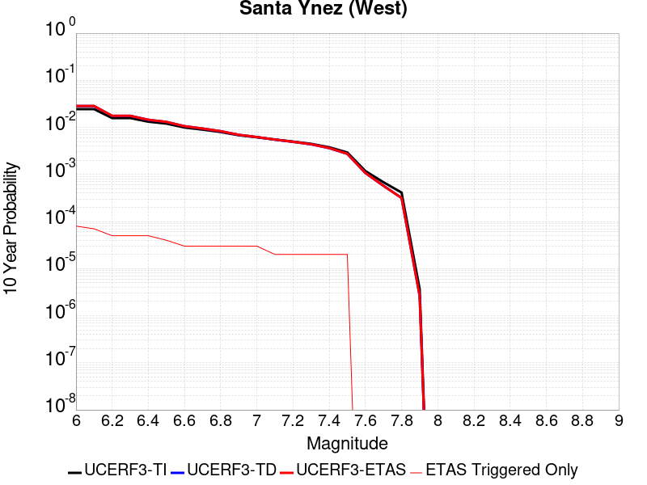 |

| Magnitude | 1 wk TI Prob | 1 wk TD Prob | 1 wk ETAS Prob | 1 wk ETAS/TD Gain | 1 wk ETAS Triggered Only | 1 mo TI Prob | 1 mo TD Prob | 1 mo ETAS Prob | 1 mo ETAS/TD Gain | 1 mo ETAS Triggered Only | 1 yr TI Prob | 1 yr TD Prob | 1 yr ETAS Prob | 1 yr ETAS/TD Gain | 1 yr ETAS Triggered Only | 10 yr TI Prob | 10 yr TD Prob | 10 yr ETAS Prob | 10 yr ETAS/TD Gain | 10 yr ETAS Triggered Only |
|-----|-----|-----|-----|-----|-----|-----|-----|-----|-----|-----|-----|-----|-----|-----|-----|-----|-----|-----|-----|-----|
| 6.0 | 4.7352758E-5 | 5.4972126E-5 | 9.4969924E-5 | 1.7276015 | 4.0E-5 | 2.0292461E-4 | 2.3557522E-4 | 2.9556107E-4 | 1.2546357 | 6.0E-5 | 0.0024678076 | 0.0028645284 | 0.0029343278 | 1.0243669 | 7.0E-5 | 0.024405818 | 0.028304417 | 0.028382152 | 1.0027465 | 8.0E-5 |
| 6.1 | 4.7352758E-5 | 5.4972126E-5 | 9.4969924E-5 | 1.7276015 | 4.0E-5 | 2.0292461E-4 | 2.3557522E-4 | 2.8556344E-4 | 1.2121965 | 5.0E-5 | 0.0024678076 | 0.0028645284 | 0.0029243564 | 1.0208858 | 6.0E-5 | 0.024405818 | 0.028304417 | 0.028372437 | 1.0024031 | 7.0E-5 |
| 6.2 | 3.0415853E-5 | 3.392511E-5 | 6.392409E-5 | 1.8842708 | 3.0E-5 | 1.3034715E-4 | 1.4538545E-4 | 1.7538108E-4 | 1.206318 | 3.0E-5 | 0.0015858212 | 0.0017686661 | 0.0018085954 | 1.0225759 | 4.0E-5 | 0.015745522 | 0.017549807 | 0.017598929 | 1.002799 | 5.0E-5 |
| 6.3 | 3.0415853E-5 | 3.392511E-5 | 6.392409E-5 | 1.8842708 | 3.0E-5 | 1.3034715E-4 | 1.4538545E-4 | 1.7538108E-4 | 1.206318 | 3.0E-5 | 0.0015858212 | 0.0017686661 | 0.0018085954 | 1.0225759 | 4.0E-5 | 0.015745522 | 0.017549807 | 0.017598929 | 1.002799 | 5.0E-5 |
| 6.4 | 2.5452082E-5 | 2.7912422E-5 | 5.7911584E-5 | 2.0747602 | 3.0E-5 | 1.09075794E-4 | 1.196193E-4 | 1.496157E-4 | 1.2507657 | 3.0E-5 | 0.0013271887 | 0.0014554089 | 0.0014953506 | 1.0274436 | 4.0E-5 | 0.013192902 | 0.014460951 | 0.014510228 | 1.0034076 | 5.0E-5 |
| 6.5 | 2.3143784E-5 | 2.5128256E-5 | 4.5127756E-5 | 1.7958968 | 2.0E-5 | 9.9183875E-5 | 1.0768817E-4 | 1.2768601E-4 | 1.1857014 | 2.0E-5 | 0.0012068948 | 0.0013103267 | 0.0013402874 | 1.022865 | 3.0E-5 | 0.012003611 | 0.01302768 | 0.013067159 | 1.0030304 | 4.0E-5 |
| 6.6 | 1.9118515E-5 | 2.035434E-5 | 4.0353934E-5 | 1.9825715 | 2.0E-5 | 8.193392E-5 | 8.7230015E-5 | 1.0722827E-4 | 1.2292589 | 2.0E-5 | 9.97089E-4 | 0.001061516 | 0.0010914841 | 1.0282315 | 3.0E-5 | 0.00992627 | 0.010565365 | 0.010595048 | 1.0028095 | 3.0E-5 |
| 6.7 | 1.722807E-5 | 1.8146347E-5 | 3.8145983E-5 | 2.1021302 | 2.0E-5 | 7.3832496E-5 | 7.776777E-5 | 9.776622E-5 | 1.2571559 | 2.0E-5 | 8.985399E-4 | 9.464169E-4 | 9.763885E-4 | 1.0316685 | 3.0E-5 | 0.008949154 | 0.0094245095 | 0.009454227 | 1.0031532 | 3.0E-5 |
| 6.8 | 1.5317364E-5 | 1.5926486E-5 | 3.5926165E-5 | 2.25575 | 2.0E-5 | 6.56442E-5 | 6.82546E-5 | 8.825324E-5 | 1.2930006 | 2.0E-5 | 7.98925E-4 | 8.306873E-4 | 8.606623E-4 | 1.0360847 | 3.0E-5 | 0.007960589 | 0.00827631 | 0.008306061 | 1.0035948 | 3.0E-5 |
| 6.9 | 1.3071226E-5 | 1.3329624E-5 | 3.3329357E-5 | 2.5003974 | 2.0E-5 | 5.6018336E-5 | 5.7125722E-5 | 7.7124576E-5 | 1.350085 | 2.0E-5 | 6.8180985E-4 | 6.9528597E-4 | 7.252651E-4 | 1.0431178 | 3.0E-5 | 0.0067972173 | 0.006931367 | 0.006961159 | 1.0042981 | 3.0E-5 |
| 7.0 | 1.1836986E-5 | 1.19327815E-5 | 3.1932545E-5 | 2.6760352 | 2.0E-5 | 5.0728955E-5 | 5.11395E-5 | 7.113848E-5 | 1.3910671 | 2.0E-5 | 6.1745E-4 | 6.2244723E-4 | 6.5242854E-4 | 1.0481669 | 3.0E-5 | 0.006157372 | 0.006207231 | 0.006237045 | 1.0048031 | 3.0E-5 |
| 7.1 | 1.0597169E-5 | 1.0542201E-5 | 2.0542097E-5 | 1.9485586 | 1.0E-5 | 4.541565E-5 | 4.5180084E-5 | 5.5179633E-5 | 1.2213265 | 1.0E-5 | 5.5279525E-4 | 5.4992986E-4 | 5.6991883E-4 | 1.0363482 | 2.0E-5 | 0.0055142213 | 0.005485821 | 0.0055057113 | 1.0036258 | 2.0E-5 |
| 7.2 | 9.59113E-6 | 9.459144E-6 | 1.945905E-5 | 2.057168 | 1.0E-5 | 4.11042E-5 | 4.0538565E-5 | 5.0538158E-5 | 1.2466687 | 1.0E-5 | 5.0032866E-4 | 4.934463E-4 | 5.1343645E-4 | 1.0405113 | 2.0E-5 | 0.004992037 | 0.0049236254 | 0.004943527 | 1.004042 | 2.0E-5 |
| 7.3 | 8.586084E-6 | 8.379583E-6 | 1.83795E-5 | 2.1933668 | 1.0E-5 | 3.679698E-5 | 3.5912013E-5 | 4.5911653E-5 | 1.2784483 | 1.0E-5 | 4.4791115E-4 | 4.3714207E-4 | 4.571333E-4 | 1.0457317 | 2.0E-5 | 0.004470094 | 0.004362933 | 0.0043828455 | 1.004564 | 2.0E-5 |
| 7.4 | 7.2622997E-6 | 6.9515427E-6 | 1.6951473E-5 | 2.4385197 | 1.0E-5 | 3.112377E-5 | 2.979199E-5 | 3.9791692E-5 | 1.3356507 | 1.0E-5 | 3.78866E-4 | 3.626581E-4 | 3.8265085E-4 | 1.0551283 | 2.0E-5 | 0.0037822074 | 0.0036207628 | 0.0036406906 | 1.0055037 | 2.0E-5 |
| 7.5 | 5.627296E-6 | 5.251588E-6 | 1.5251535E-5 | 2.904176 | 1.0E-5 | 2.411676E-5 | 2.2506614E-5 | 3.250639E-5 | 1.4443039 | 1.0E-5 | 2.9358198E-4 | 2.739843E-4 | 2.939788E-4 | 1.0729768 | 2.0E-5 | 0.0029319443 | 0.002736537 | 0.0027564822 | 1.0072885 | 2.0E-5 |
| 7.6 | 2.265244E-6 | 2.0608625E-6 | 2.0608625E-6 | 1.0 | 0.0 | 9.708152E-6 | 8.832238E-6 | 8.832238E-6 | 1.0 | 0.0 | 1.18190335E-4 | 1.0752728E-4 | 1.0752728E-4 | 1.0 | 0.0 | 0.001181275 | 0.0010747612 | 0.0010747612 | 1.0 | 0.0 |
| 7.7 | 1.3099874E-6 | 1.1016252E-6 | 1.1016252E-6 | 1.0 | 0.0 | 5.61422E-6 | 4.7212425E-6 | 4.7212425E-6 | 1.0 | 0.0 | 6.8350986E-5 | 5.7479636E-5 | 5.7479636E-5 | 1.0 | 0.0 | 6.832996E-4 | 5.7465007E-4 | 5.7465007E-4 | 1.0 | 0.0 |
| 7.8 | 7.903951E-7 | 6.0711415E-7 | 6.0711415E-7 | 1.0 | 0.0 | 3.3874032E-6 | 2.6019152E-6 | 2.6019152E-6 | 1.0 | 0.0 | 4.1240855E-5 | 3.167787E-5 | 3.167787E-5 | 1.0 | 0.0 | 4.12332E-4 | 3.167349E-4 | 3.167349E-4 | 1.0 | 0.0 |
| 7.9 | 7.0753297E-9 | 5.0899476E-9 | 5.0899476E-9 | 1.0 | 0.0 | 3.032284E-8 | 2.181406E-8 | 2.181406E-8 | 1.0 | 0.0 | 3.6918053E-7 | 2.6558615E-7 | 2.6558615E-7 | 1.0 | 0.0 | 3.691799E-6 | 2.6558594E-6 | 2.6558594E-6 | 1.0 | 0.0 |

## Mission Creek
*[(top)](#table-of-contents)*

| 1 Week | 1 Month | 1 Year | 10 Year |
|-----|-----|-----|-----|
|  |  |  |  |

| Magnitude | 1 wk TI Prob | 1 wk TD Prob | 1 wk ETAS Prob | 1 wk ETAS/TD Gain | 1 wk ETAS Triggered Only | 1 mo TI Prob | 1 mo TD Prob | 1 mo ETAS Prob | 1 mo ETAS/TD Gain | 1 mo ETAS Triggered Only | 1 yr TI Prob | 1 yr TD Prob | 1 yr ETAS Prob | 1 yr ETAS/TD Gain | 1 yr ETAS Triggered Only | 10 yr TI Prob | 10 yr TD Prob | 10 yr ETAS Prob | 10 yr ETAS/TD Gain | 10 yr ETAS Triggered Only |
|-----|-----|-----|-----|-----|-----|-----|-----|-----|-----|-----|-----|-----|-----|-----|-----|-----|-----|-----|-----|-----|
| 6.0 | 1.1549387E-5 | 1.632237E-5 | 7.632139E-5 | 4.6758766 | 6.0E-5 | 4.9496433E-5 | 6.9951224E-5 | 1.3994632E-4 | 2.0006273 | 7.0E-5 | 6.0245243E-4 | 8.513384E-4 | 9.212788E-4 | 1.0821534 | 7.0E-5 | 0.006008218 | 0.008509998 | 0.008589317 | 1.0093207 | 8.0E-5 |
| 6.1 | 1.1549387E-5 | 1.632237E-5 | 7.632139E-5 | 4.6758766 | 6.0E-5 | 4.9496433E-5 | 6.9951224E-5 | 1.3994632E-4 | 2.0006273 | 7.0E-5 | 6.0245243E-4 | 8.513384E-4 | 9.212788E-4 | 1.0821534 | 7.0E-5 | 0.006008218 | 0.008509998 | 0.008589317 | 1.0093207 | 8.0E-5 |
| 6.2 | 1.1549387E-5 | 1.632237E-5 | 7.632139E-5 | 4.6758766 | 6.0E-5 | 4.9496433E-5 | 6.9951224E-5 | 1.3994632E-4 | 2.0006273 | 7.0E-5 | 6.0245243E-4 | 8.513384E-4 | 9.212788E-4 | 1.0821534 | 7.0E-5 | 0.006008218 | 0.008509998 | 0.008589317 | 1.0093207 | 8.0E-5 |
| 6.3 | 1.1549387E-5 | 1.632237E-5 | 7.632139E-5 | 4.6758766 | 6.0E-5 | 4.9496433E-5 | 6.9951224E-5 | 1.3994632E-4 | 2.0006273 | 7.0E-5 | 6.0245243E-4 | 8.513384E-4 | 9.212788E-4 | 1.0821534 | 7.0E-5 | 0.006008218 | 0.008509998 | 0.008589317 | 1.0093207 | 8.0E-5 |
| 6.4 | 1.1549387E-5 | 1.632237E-5 | 7.632139E-5 | 4.6758766 | 6.0E-5 | 4.9496433E-5 | 6.9951224E-5 | 1.3994632E-4 | 2.0006273 | 7.0E-5 | 6.0245243E-4 | 8.513384E-4 | 9.212788E-4 | 1.0821534 | 7.0E-5 | 0.006008218 | 0.008509998 | 0.008589317 | 1.0093207 | 8.0E-5 |
| 6.5 | 1.1549387E-5 | 1.632237E-5 | 7.632139E-5 | 4.6758766 | 6.0E-5 | 4.9496433E-5 | 6.9951224E-5 | 1.3994632E-4 | 2.0006273 | 7.0E-5 | 6.0245243E-4 | 8.513384E-4 | 9.212788E-4 | 1.0821534 | 7.0E-5 | 0.006008218 | 0.008509998 | 0.008589317 | 1.0093207 | 8.0E-5 |
| 6.6 | 9.202681E-6 | 1.3845646E-5 | 7.3844814E-5 | 5.333432 | 6.0E-5 | 3.9439463E-5 | 5.9337188E-5 | 1.2933303E-4 | 2.1796286 | 7.0E-5 | 4.800697E-4 | 7.221998E-4 | 7.921493E-4 | 1.0968561 | 7.0E-5 | 0.004790339 | 0.0072271815 | 0.0073066032 | 1.0109893 | 8.0E-5 |
| 6.7 | 9.019164E-6 | 1.3651316E-5 | 7.3650495E-5 | 5.3951206 | 6.0E-5 | 3.8652986E-5 | 5.8504378E-5 | 1.2850028E-4 | 2.1964216 | 7.0E-5 | 4.7049852E-4 | 7.12067E-4 | 7.820172E-4 | 1.0982354 | 7.0E-5 | 0.004695036 | 0.007126506 | 0.0072059357 | 1.0111457 | 8.0E-5 |
| 6.8 | 8.673558E-6 | 1.3273427E-5 | 7.327263E-5 | 5.52025 | 6.0E-5 | 3.717186E-5 | 5.6884925E-5 | 1.2688094E-4 | 2.2304845 | 7.0E-5 | 4.524734E-4 | 6.923627E-4 | 7.6231424E-4 | 1.1010331 | 7.0E-5 | 0.0045155324 | 0.006930694 | 0.0070101395 | 1.0114628 | 8.0E-5 |
| 6.9 | 7.002255E-6 | 1.1477657E-5 | 7.147697E-5 | 6.227488 | 6.0E-5 | 3.000932E-5 | 4.9189068E-5 | 1.1918563E-4 | 2.4230103 | 7.0E-5 | 3.653022E-4 | 5.9871917E-4 | 6.6867727E-4 | 1.1168462 | 7.0E-5 | 0.0036470229 | 0.005999517 | 0.006079037 | 1.0132544 | 8.0E-5 |
| 7.0 | 5.84644E-6 | 9.67498E-6 | 6.96744E-5 | 7.2015033 | 6.0E-5 | 2.5055931E-5 | 4.1463565E-5 | 1.11460664E-4 | 2.6881592 | 7.0E-5 | 3.0501327E-4 | 5.047066E-4 | 5.746712E-4 | 1.1386244 | 7.0E-5 | 0.0030459496 | 0.0050638523 | 0.0051434473 | 1.0157182 | 8.0E-5 |
| 7.1 | 5.54703E-6 | 9.329456E-6 | 6.93289E-5 | 7.4311833 | 6.0E-5 | 2.377277E-5 | 3.9982795E-5 | 1.0998E-4 | 2.750683 | 7.0E-5 | 2.8939504E-4 | 4.8668624E-4 | 5.566522E-4 | 1.1437598 | 7.0E-5 | 0.0028901845 | 0.004884446 | 0.0049640555 | 1.0162985 | 8.0E-5 |
| 7.2 | 4.384709E-6 | 7.68157E-6 | 6.768111E-5 | 8.8108425 | 6.0E-5 | 1.8791474E-5 | 3.2920623E-5 | 1.0291832E-4 | 3.1262567 | 7.0E-5 | 2.2876218E-4 | 4.0073853E-4 | 4.7071048E-4 | 1.1746075 | 7.0E-5 | 0.0022852682 | 0.004028366 | 0.0041080434 | 1.0197792 | 8.0E-5 |
| 7.3 | 3.7888456E-6 | 6.915452E-6 | 6.691504E-5 | 9.676163 | 6.0E-5 | 1.623781E-5 | 2.9637333E-5 | 9.963526E-5 | 3.361816 | 7.0E-5 | 1.9767738E-4 | 3.6077813E-4 | 4.3075287E-4 | 1.1939551 | 7.0E-5 | 0.0019750162 | 0.0036301152 | 0.0037098248 | 1.0219579 | 8.0E-5 |
| 7.4 | 2.1982462E-6 | 5.0237763E-6 | 5.5023524E-5 | 10.952622 | 5.0E-5 | 9.421021E-6 | 2.1530293E-5 | 8.1529004E-5 | 3.786711 | 6.0E-5 | 1.1469489E-4 | 2.621E-4 | 3.2208426E-4 | 1.2288603 | 6.0E-5 | 0.0011463572 | 0.0026458844 | 0.0027156994 | 1.0263861 | 7.0E-5 |
| 7.5 | 2.051923E-6 | 4.615016E-6 | 5.4614786E-5 | 11.834148 | 5.0E-5 | 8.793926E-6 | 1.9778492E-5 | 7.97773E-5 | 4.0335383 | 6.0E-5 | 1.0706078E-4 | 2.4077666E-4 | 3.007622E-4 | 1.2491336 | 6.0E-5 | 0.0010700922 | 0.0024335422 | 0.0025033718 | 1.0286946 | 7.0E-5 |
| 7.6 | 1.8733427E-6 | 4.1233748E-6 | 5.4123168E-5 | 13.125939 | 5.0E-5 | 8.028587E-6 | 1.7671488E-5 | 7.7670426E-5 | 4.39524 | 6.0E-5 | 9.774366E-5 | 2.151292E-4 | 2.751163E-4 | 1.2788422 | 6.0E-5 | 9.770069E-4 | 0.0021780801 | 0.0022479277 | 1.0320684 | 7.0E-5 |
| 7.7 | 1.8411953E-6 | 4.0430496E-6 | 5.404285E-5 | 13.366853 | 5.0E-5 | 7.890813E-6 | 1.732724E-5 | 7.73262E-5 | 4.4626956 | 6.0E-5 | 9.606641E-5 | 2.1093882E-4 | 2.7092616E-4 | 1.2843827 | 6.0E-5 | 9.6024893E-4 | 0.0021363653 | 0.0022062156 | 1.0326959 | 7.0E-5 |
| 7.8 | 1.7194251E-6 | 3.7104276E-6 | 5.3710242E-5 | 14.475486 | 5.0E-5 | 7.368944E-6 | 1.5901736E-5 | 7.590078E-5 | 4.773113 | 6.0E-5 | 8.97132E-5 | 1.9358651E-4 | 2.535749E-4 | 1.309879 | 6.0E-5 | 8.967699E-4 | 0.0019623525 | 0.002032215 | 1.0356015 | 7.0E-5 |
| 7.9 | 1.4035052E-6 | 2.9500632E-6 | 5.2949916E-5 | 17.94874 | 5.0E-5 | 6.0150082E-6 | 1.2643067E-5 | 7.264231E-5 | 5.745624 | 6.0E-5 | 7.3230265E-5 | 1.5391852E-4 | 2.1390928E-4 | 1.3897567 | 6.0E-5 | 7.3206134E-4 | 0.0015631086 | 0.0016329993 | 1.0447125 | 7.0E-5 |
| 8.0 | 3.9318823E-7 | 5.528522E-7 | 4.055283E-5 | 73.35203 | 4.0E-5 | 1.6850913E-6 | 2.3693647E-6 | 5.2369247E-5 | 22.102654 | 5.0E-5 | 2.0515794E-5 | 2.8846638E-5 | 7.8845194E-5 | 2.7332542 | 5.0E-5 | 2.0513899E-4 | 2.9899E-4 | 3.5897206E-4 | 1.2006156 | 6.0E-5 |
| 8.1 | 1.596793E-7 | 1.1380002E-7 | 1.1380002E-7 | 1.0 | 0.0 | 6.8433974E-7 | 4.877143E-7 | 4.877143E-7 | 1.0 | 0.0 | 8.331805E-6 | 5.937906E-6 | 5.937906E-6 | 1.0 | 0.0 | 8.331492E-5 | 6.549966E-5 | 6.549966E-5 | 1.0 | 0.0 |
| 8.2 | 4.9003038E-8 | 2.5444924E-8 | 2.5444924E-8 | 1.0 | 0.0 | 2.10013E-7 | 1.0904967E-7 | 1.0904967E-7 | 1.0 | 0.0 | 2.5569052E-6 | 1.327679E-6 | 1.327679E-6 | 1.0 | 0.0 | 2.556876E-5 | 1.495635E-5 | 1.495635E-5 | 1.0 | 0.0 |

## Hunting Creek - Berryessa 2011 CFM
*[(top)](#table-of-contents)*

| 1 Week | 1 Month | 1 Year | 10 Year |
|-----|-----|-----|-----|
|  |  |  |  |

| Magnitude | 1 wk TI Prob | 1 wk TD Prob | 1 wk ETAS Prob | 1 wk ETAS/TD Gain | 1 wk ETAS Triggered Only | 1 mo TI Prob | 1 mo TD Prob | 1 mo ETAS Prob | 1 mo ETAS/TD Gain | 1 mo ETAS Triggered Only | 1 yr TI Prob | 1 yr TD Prob | 1 yr ETAS Prob | 1 yr ETAS/TD Gain | 1 yr ETAS Triggered Only | 10 yr TI Prob | 10 yr TD Prob | 10 yr ETAS Prob | 10 yr ETAS/TD Gain | 10 yr ETAS Triggered Only |
|-----|-----|-----|-----|-----|-----|-----|-----|-----|-----|-----|-----|-----|-----|-----|-----|-----|-----|-----|-----|-----|
| 6.0 | 1.1270982E-4 | 2.0012174E-4 | 2.4011373E-4 | 1.1998383 | 4.0E-5 | 4.8295266E-4 | 8.5739547E-4 | 9.073526E-4 | 1.0582662 | 5.0E-5 | 0.0058641075 | 0.010386313 | 0.010455586 | 1.0066696 | 7.0E-5 | 0.057117578 | 0.09803703 | 0.09810016 | 1.000644 | 7.0E-5 |
| 6.1 | 1.1239393E-4 | 1.9960315E-4 | 2.2959715E-4 | 1.1502682 | 3.0E-5 | 4.8159933E-4 | 8.551744E-4 | 8.851487E-4 | 1.0350505 | 3.0E-5 | 0.0058477195 | 0.010359551 | 0.010409033 | 1.0047765 | 5.0E-5 | 0.056962132 | 0.09779551 | 0.097840615 | 1.0004612 | 5.0E-5 |
| 6.2 | 7.596265E-5 | 1.2940196E-4 | 1.5939809E-4 | 1.2318057 | 3.0E-5 | 3.2551357E-4 | 5.5444165E-4 | 5.84425E-4 | 1.0540785 | 3.0E-5 | 0.0039559277 | 0.0067210156 | 0.0067706797 | 1.0073893 | 5.0E-5 | 0.038862433 | 0.0645915 | 0.064638264 | 1.0007241 | 5.0E-5 |
| 6.3 | 6.78794E-5 | 1.145119E-4 | 1.4450846E-4 | 1.2619514 | 3.0E-5 | 2.9087928E-4 | 4.906513E-4 | 5.2063656E-4 | 1.0611132 | 3.0E-5 | 0.003535705 | 0.005952679 | 0.0060023814 | 1.0083495 | 5.0E-5 | 0.034799766 | 0.057465393 | 0.057512518 | 1.00082 | 5.0E-5 |
| 6.4 | 6.2165134E-5 | 1.0436625E-4 | 1.2436416E-4 | 1.1916128 | 2.0E-5 | 2.6639478E-4 | 4.4721062E-4 | 4.672017E-4 | 1.0447017 | 2.0E-5 | 0.0032385332 | 0.005427573 | 0.0054673557 | 1.0073298 | 4.0E-5 | 0.03191742 | 0.052550517 | 0.052588414 | 1.0007212 | 4.0E-5 |
| 6.5 | 5.4368087E-5 | 9.071415E-5 | 1.1071233E-4 | 1.2204528 | 2.0E-5 | 2.3298527E-4 | 3.8872007E-4 | 4.087123E-4 | 1.051431 | 2.0E-5 | 0.0028329059 | 0.0047198683 | 0.0047596795 | 1.0084348 | 4.0E-5 | 0.027970633 | 0.045880128 | 0.045918293 | 1.0008318 | 4.0E-5 |
| 6.6 | 4.729947E-5 | 7.847572E-5 | 9.847416E-5 | 1.2548358 | 2.0E-5 | 2.0269625E-4 | 3.362842E-4 | 3.5627748E-4 | 1.0594535 | 2.0E-5 | 0.002465034 | 0.0040849647 | 0.0041248016 | 1.009752 | 4.0E-5 | 0.02437869 | 0.03985155 | 0.039889954 | 1.0009637 | 4.0E-5 |
| 6.7 | 3.6875328E-5 | 6.0451803E-5 | 7.04512E-5 | 1.165411 | 1.0E-5 | 1.5802756E-4 | 2.59056E-4 | 2.690534E-4 | 1.0385917 | 1.0E-5 | 0.0019222875 | 0.0031482063 | 0.0031681433 | 1.0063329 | 2.0E-5 | 0.019057442 | 0.03089237 | 0.030911753 | 1.0006274 | 2.0E-5 |
| 6.8 | 2.0292036E-5 | 2.8976308E-5 | 2.8976308E-5 | 1.0 | 0.0 | 8.6962966E-5 | 1.2417832E-4 | 1.2417832E-4 | 1.0 | 0.0 | 0.0010582599 | 0.0015108072 | 0.0015207921 | 1.006609 | 1.0E-5 | 0.010532344 | 0.014978523 | 0.014988373 | 1.0006577 | 1.0E-5 |
| 6.9 | 1.7871042E-5 | 2.4472254E-5 | 2.4472254E-5 | 1.0 | 0.0 | 7.658793E-5 | 1.048769E-4 | 1.048769E-4 | 1.0 | 0.0 | 9.320591E-4 | 0.0012761299 | 0.0012861171 | 1.0078262 | 1.0E-5 | 0.009281595 | 0.012679775 | 0.012689648 | 1.0007787 | 1.0E-5 |
| 7.0 | 1.6415532E-5 | 2.1906277E-5 | 2.1906277E-5 | 1.0 | 0.0 | 7.035038E-5 | 9.3880684E-5 | 9.3880684E-5 | 1.0 | 0.0 | 8.561793E-4 | 0.0011424015 | 0.00115239 | 1.0087435 | 1.0E-5 | 0.008528882 | 0.01136452 | 0.011374406 | 1.00087 | 1.0E-5 |
| 7.1 | 1.5409885E-5 | 2.0346342E-5 | 2.0346342E-5 | 1.0 | 0.0 | 6.6040695E-5 | 8.7195716E-5 | 8.7195716E-5 | 1.0 | 0.0 | 8.0374884E-4 | 0.0010610938 | 0.0010710831 | 1.0094142 | 1.0E-5 | 0.00800848 | 0.010560595 | 0.01057049 | 1.0009369 | 1.0E-5 |
| 7.2 | 1.4497423E-5 | 1.9054964E-5 | 1.9054964E-5 | 1.0 | 0.0 | 6.213033E-5 | 8.166159E-5 | 8.166159E-5 | 1.0 | 0.0 | 7.5617427E-4 | 9.937795E-4 | 0.0010037696 | 1.0100526 | 1.0E-5 | 0.0075360634 | 0.009893929 | 0.00990383 | 1.0010008 | 1.0E-5 |
| 7.3 | 1.3615175E-5 | 1.7826127E-5 | 1.7826127E-5 | 1.0 | 0.0 | 5.8349444E-5 | 7.639547E-5 | 7.639547E-5 | 1.0 | 0.0 | 7.101729E-4 | 9.297209E-4 | 9.397116E-4 | 1.0107459 | 1.0E-5 | 0.0070790765 | 0.009258823 | 0.00926873 | 1.00107 | 1.0E-5 |
| 7.4 | 1.2252825E-5 | 1.602625E-5 | 1.602625E-5 | 1.0 | 0.0 | 5.251105E-5 | 6.868213E-5 | 6.868213E-5 | 1.0 | 0.0 | 6.391345E-4 | 8.35887E-4 | 8.458786E-4 | 1.0119534 | 1.0E-5 | 0.0063729943 | 0.008327872 | 0.008337788 | 1.0011908 | 1.0E-5 |
| 7.5 | 1.0913301E-5 | 1.4241117E-5 | 1.4241117E-5 | 1.0 | 0.0 | 4.6770452E-5 | 6.1031948E-5 | 6.1031948E-5 | 1.0 | 0.0 | 5.6928146E-4 | 7.4281334E-4 | 7.528059E-4 | 1.0134523 | 1.0E-5 | 0.0056782532 | 0.0074036797 | 0.007413605 | 1.0013406 | 1.0E-5 |
| 7.6 | 8.623192E-6 | 1.12346415E-5 | 1.12346415E-5 | 1.0 | 0.0 | 3.6956015E-5 | 4.814759E-5 | 4.814759E-5 | 1.0 | 0.0 | 4.4984656E-4 | 5.8604183E-4 | 5.9603597E-4 | 1.0170536 | 1.0E-5 | 0.00448937 | 0.0058452785 | 0.00585522 | 1.0017008 | 1.0E-5 |
| 7.7 | 2.0993634E-6 | 2.662584E-6 | 2.662584E-6 | 1.0 | 0.0 | 8.997241E-6 | 1.1411025E-5 | 1.1411025E-5 | 1.0 | 0.0 | 1.09535904E-4 | 1.3892044E-4 | 1.3892044E-4 | 1.0 | 0.0 | 0.0010948193 | 0.0013883426 | 0.0013883426 | 1.0 | 0.0 |
| 7.8 | 1.8428308E-7 | 2.167437E-7 | 2.167437E-7 | 1.0 | 0.0 | 7.897844E-7 | 9.289013E-7 | 9.289013E-7 | 1.0 | 0.0 | 9.615583E-6 | 1.1309318E-5 | 1.1309318E-5 | 1.0 | 0.0 | 9.615166E-5 | 1.13086026E-4 | 1.13086026E-4 | 1.0 | 0.0 |

## Tin Mountain
*[(top)](#table-of-contents)*

| 1 Week | 1 Month | 1 Year | 10 Year |
|-----|-----|-----|-----|
|  |  |  |  |

| Magnitude | 1 wk TI Prob | 1 wk TD Prob | 1 wk ETAS Prob | 1 wk ETAS/TD Gain | 1 wk ETAS Triggered Only | 1 mo TI Prob | 1 mo TD Prob | 1 mo ETAS Prob | 1 mo ETAS/TD Gain | 1 mo ETAS Triggered Only | 1 yr TI Prob | 1 yr TD Prob | 1 yr ETAS Prob | 1 yr ETAS/TD Gain | 1 yr ETAS Triggered Only | 10 yr TI Prob | 10 yr TD Prob | 10 yr ETAS Prob | 10 yr ETAS/TD Gain | 10 yr ETAS Triggered Only |
|-----|-----|-----|-----|-----|-----|-----|-----|-----|-----|-----|-----|-----|-----|-----|-----|-----|-----|-----|-----|-----|
| 6.0 | 4.083776E-6 | 4.1815365E-6 | 5.4181328E-5 | 12.957276 | 5.0E-5 | 1.750178E-5 | 1.792077E-5 | 6.791987E-5 | 3.7900088 | 5.0E-5 | 2.1306332E-4 | 2.1816725E-4 | 2.7815416E-4 | 1.2749584 | 6.0E-5 | 0.0021285915 | 0.0021798965 | 0.0022497438 | 1.0320417 | 7.0E-5 |
| 6.1 | 4.083776E-6 | 4.1815365E-6 | 5.4181328E-5 | 12.957276 | 5.0E-5 | 1.750178E-5 | 1.792077E-5 | 6.791987E-5 | 3.7900088 | 5.0E-5 | 2.1306332E-4 | 2.1816725E-4 | 2.7815416E-4 | 1.2749584 | 6.0E-5 | 0.0021285915 | 0.0021798965 | 0.0022497438 | 1.0320417 | 7.0E-5 |
| 6.2 | 4.083776E-6 | 4.1815365E-6 | 5.4181328E-5 | 12.957276 | 5.0E-5 | 1.750178E-5 | 1.792077E-5 | 6.791987E-5 | 3.7900088 | 5.0E-5 | 2.1306332E-4 | 2.1816725E-4 | 2.7815416E-4 | 1.2749584 | 6.0E-5 | 0.0021285915 | 0.0021798965 | 0.0022497438 | 1.0320417 | 7.0E-5 |
| 6.3 | 4.083776E-6 | 4.1815365E-6 | 5.4181328E-5 | 12.957276 | 5.0E-5 | 1.750178E-5 | 1.792077E-5 | 6.791987E-5 | 3.7900088 | 5.0E-5 | 2.1306332E-4 | 2.1816725E-4 | 2.7815416E-4 | 1.2749584 | 6.0E-5 | 0.0021285915 | 0.0021798965 | 0.0022497438 | 1.0320417 | 7.0E-5 |
| 6.4 | 4.083776E-6 | 4.1815365E-6 | 5.4181328E-5 | 12.957276 | 5.0E-5 | 1.750178E-5 | 1.792077E-5 | 6.791987E-5 | 3.7900088 | 5.0E-5 | 2.1306332E-4 | 2.1816725E-4 | 2.7815416E-4 | 1.2749584 | 6.0E-5 | 0.0021285915 | 0.0021798965 | 0.0022497438 | 1.0320417 | 7.0E-5 |
| 6.5 | 2.3143427E-6 | 2.3731573E-6 | 3.2373086E-5 | 13.641357 | 3.0E-5 | 9.9185745E-6 | 1.0170638E-5 | 4.0170333E-5 | 3.9496374 | 3.0E-5 | 1.2075195E-4 | 1.2382126E-4 | 1.6381631E-4 | 1.3230063 | 4.0E-5 | 0.0012068636 | 0.0012375986 | 0.0012775491 | 1.0322807 | 4.0E-5 |
| 6.6 | 2.3143427E-6 | 2.3731573E-6 | 3.2373086E-5 | 13.641357 | 3.0E-5 | 9.9185745E-6 | 1.0170638E-5 | 4.0170333E-5 | 3.9496374 | 3.0E-5 | 1.2075195E-4 | 1.2382126E-4 | 1.6381631E-4 | 1.3230063 | 4.0E-5 | 0.0012068636 | 0.0012375986 | 0.0012775491 | 1.0322807 | 4.0E-5 |
| 6.7 | 1.7029532E-6 | 1.7497915E-6 | 3.174974E-5 | 18.14487 | 3.0E-5 | 7.2983503E-6 | 7.499088E-6 | 3.7498863E-5 | 5.0004563 | 3.0E-5 | 8.885379E-5 | 9.1298105E-5 | 1.3129445E-4 | 1.4380852 | 4.0E-5 | 8.881827E-4 | 9.1265864E-4 | 9.526221E-4 | 1.043788 | 4.0E-5 |
| 6.8 | 1.2914646E-6 | 1.3299378E-6 | 2.1329912E-5 | 16.038277 | 2.0E-5 | 5.534837E-6 | 5.6997237E-6 | 2.569961E-5 | 4.508922 | 2.0E-5 | 6.738455E-5 | 6.939237E-5 | 9.939029E-5 | 1.4322942 | 3.0E-5 | 6.736412E-4 | 6.9375033E-4 | 7.2372955E-4 | 1.0432132 | 3.0E-5 |
| 6.9 | 5.8708974E-7 | 6.1169936E-7 | 6.1169936E-7 | 1.0 | 0.0 | 2.5160964E-6 | 2.6215664E-6 | 2.6215664E-6 | 1.0 | 0.0 | 3.0633044E-5 | 3.1917145E-5 | 3.1917145E-5 | 1.0 | 0.0 | 3.0628822E-4 | 3.191297E-4 | 3.191297E-4 | 1.0 | 0.0 |
| 7.0 | 4.6248786E-7 | 4.832015E-7 | 4.832015E-7 | 1.0 | 0.0 | 1.9820893E-6 | 2.0708624E-6 | 2.0708624E-6 | 1.0 | 0.0 | 2.413167E-5 | 2.5212494E-5 | 2.5212494E-5 | 1.0 | 0.0 | 2.412905E-4 | 2.5210003E-4 | 2.5210003E-4 | 1.0 | 0.0 |
| 7.1 | 3.804606E-7 | 3.987147E-7 | 3.987147E-7 | 1.0 | 0.0 | 1.6305444E-6 | 1.7087764E-6 | 1.7087764E-6 | 1.0 | 0.0 | 1.9851697E-5 | 2.0804187E-5 | 2.0804187E-5 | 1.0 | 0.0 | 1.9849923E-4 | 2.0802575E-4 | 2.0802575E-4 | 1.0 | 0.0 |
| 7.2 | 3.5864858E-7 | 3.7616863E-7 | 3.7616863E-7 | 1.0 | 0.0 | 1.5370645E-6 | 1.6121504E-6 | 1.6121504E-6 | 1.0 | 0.0 | 1.87136E-5 | 1.9627789E-5 | 1.9627789E-5 | 1.0 | 0.0 | 1.8712023E-4 | 1.9626386E-4 | 1.9626386E-4 | 1.0 | 0.0 |
| 7.3 | 3.342063E-7 | 3.506347E-7 | 3.506347E-7 | 1.0 | 0.0 | 1.4323119E-6 | 1.5027196E-6 | 1.5027196E-6 | 1.0 | 0.0 | 1.7438259E-5 | 1.829549E-5 | 1.829549E-5 | 1.0 | 0.0 | 1.743689E-4 | 1.8294314E-4 | 1.8294314E-4 | 1.0 | 0.0 |
| 7.4 | 2.971242E-7 | 3.1165817E-7 | 3.1165817E-7 | 1.0 | 0.0 | 1.2733886E-6 | 1.3356774E-6 | 1.3356774E-6 | 1.0 | 0.0 | 1.5503398E-5 | 1.6261785E-5 | 1.6261785E-5 | 1.0 | 0.0 | 1.5502315E-4 | 1.6260923E-4 | 1.6260923E-4 | 1.0 | 0.0 |
| 7.5 | 1.4326713E-7 | 1.5012525E-7 | 1.5012525E-7 | 1.0 | 0.0 | 6.140018E-7 | 6.433939E-7 | 6.433939E-7 | 1.0 | 0.0 | 7.4754466E-6 | 7.8333205E-6 | 7.8333205E-6 | 1.0 | 0.0 | 7.475195E-5 | 7.833321E-5 | 7.833321E-5 | 1.0 | 0.0 |

## Kern Canyon (North Kern) 2011
*[(top)](#table-of-contents)*

| 1 Week | 1 Month | 1 Year | 10 Year |
|-----|-----|-----|-----|
|  |  |  |  |

| Magnitude | 1 wk TI Prob | 1 wk TD Prob | 1 wk ETAS Prob | 1 wk ETAS/TD Gain | 1 wk ETAS Triggered Only | 1 mo TI Prob | 1 mo TD Prob | 1 mo ETAS Prob | 1 mo ETAS/TD Gain | 1 mo ETAS Triggered Only | 1 yr TI Prob | 1 yr TD Prob | 1 yr ETAS Prob | 1 yr ETAS/TD Gain | 1 yr ETAS Triggered Only | 10 yr TI Prob | 10 yr TD Prob | 10 yr ETAS Prob | 10 yr ETAS/TD Gain | 10 yr ETAS Triggered Only |
|-----|-----|-----|-----|-----|-----|-----|-----|-----|-----|-----|-----|-----|-----|-----|-----|-----|-----|-----|-----|-----|
| 6.0 | 6.6264497E-6 | 6.75733E-6 | 2.6757194E-5 | 3.959729 | 2.0E-5 | 2.8398761E-5 | 2.895971E-5 | 6.895855E-5 | 2.3811893 | 4.0E-5 | 3.4570007E-4 | 3.5253543E-4 | 4.2251076E-4 | 1.1984916 | 7.0E-5 | 0.0034516277 | 0.0035205502 | 0.0035903037 | 1.0198133 | 7.0E-5 |
| 6.1 | 6.6264497E-6 | 6.75733E-6 | 2.6757194E-5 | 3.959729 | 2.0E-5 | 2.8398761E-5 | 2.895971E-5 | 6.895855E-5 | 2.3811893 | 4.0E-5 | 3.4570007E-4 | 3.5253543E-4 | 4.2251076E-4 | 1.1984916 | 7.0E-5 | 0.0034516277 | 0.0035205502 | 0.0035903037 | 1.0198133 | 7.0E-5 |
| 6.2 | 6.6264497E-6 | 6.75733E-6 | 2.6757194E-5 | 3.959729 | 2.0E-5 | 2.8398761E-5 | 2.895971E-5 | 6.895855E-5 | 2.3811893 | 4.0E-5 | 3.4570007E-4 | 3.5253543E-4 | 4.2251076E-4 | 1.1984916 | 7.0E-5 | 0.0034516277 | 0.0035205502 | 0.0035903037 | 1.0198133 | 7.0E-5 |
| 6.3 | 6.6264497E-6 | 6.75733E-6 | 2.6757194E-5 | 3.959729 | 2.0E-5 | 2.8398761E-5 | 2.895971E-5 | 6.895855E-5 | 2.3811893 | 4.0E-5 | 3.4570007E-4 | 3.5253543E-4 | 4.2251076E-4 | 1.1984916 | 7.0E-5 | 0.0034516277 | 0.0035205502 | 0.0035903037 | 1.0198133 | 7.0E-5 |
| 6.4 | 6.6264497E-6 | 6.75733E-6 | 2.6757194E-5 | 3.959729 | 2.0E-5 | 2.8398761E-5 | 2.895971E-5 | 6.895855E-5 | 2.3811893 | 4.0E-5 | 3.4570007E-4 | 3.5253543E-4 | 4.2251076E-4 | 1.1984916 | 7.0E-5 | 0.0034516277 | 0.0035205502 | 0.0035903037 | 1.0198133 | 7.0E-5 |
| 6.5 | 3.2162225E-6 | 3.2570915E-6 | 1.32570585E-5 | 4.070214 | 1.0E-5 | 1.3783738E-5 | 1.3958893E-5 | 3.3958615E-5 | 2.4327583 | 2.0E-5 | 1.6780409E-4 | 1.6993708E-4 | 2.0993028E-4 | 1.2353412 | 4.0E-5 | 0.0016767744 | 0.001698151 | 0.0017380831 | 1.023515 | 4.0E-5 |
| 6.6 | 3.2162225E-6 | 3.2570915E-6 | 1.32570585E-5 | 4.070214 | 1.0E-5 | 1.3783738E-5 | 1.3958893E-5 | 3.3958615E-5 | 2.4327583 | 2.0E-5 | 1.6780409E-4 | 1.6993708E-4 | 2.0993028E-4 | 1.2353412 | 4.0E-5 | 0.0016767744 | 0.001698151 | 0.0017380831 | 1.023515 | 4.0E-5 |
| 6.7 | 2.1908265E-6 | 2.2071222E-6 | 1.22071E-5 | 5.530777 | 1.0E-5 | 9.389223E-6 | 9.459061E-6 | 2.9458872E-5 | 3.1143546 | 2.0E-5 | 1.1430779E-4 | 1.1515819E-4 | 1.5515358E-4 | 1.3473083 | 4.0E-5 | 0.0011424901 | 0.0011510046 | 0.0011909585 | 1.0347122 | 4.0E-5 |
| 6.8 | 1.7303895E-6 | 1.7365529E-6 | 1.1736535E-5 | 6.758525 | 1.0E-5 | 7.415934E-6 | 7.4423488E-6 | 2.74422E-5 | 3.6873035 | 2.0E-5 | 9.028525E-5 | 9.0606925E-5 | 1.3060331E-4 | 1.4414274 | 4.0E-5 | 9.024858E-4 | 9.057096E-4 | 9.456734E-4 | 1.0441242 | 4.0E-5 |
| 6.9 | 1.3700314E-6 | 1.3688622E-6 | 1.1368848E-5 | 8.305327 | 1.0E-5 | 5.87155E-6 | 5.8665396E-6 | 2.5866422E-5 | 4.409145 | 2.0E-5 | 7.148377E-5 | 7.142282E-5 | 1.1141996E-4 | 1.5600051 | 4.0E-5 | 7.146078E-4 | 7.140032E-4 | 7.539747E-4 | 1.0559821 | 4.0E-5 |
| 7.0 | 1.1467797E-6 | 1.1413804E-6 | 1.1141369E-5 | 9.761311 | 1.0E-5 | 4.9147607E-6 | 4.8916213E-6 | 2.4891524E-5 | 5.088604 | 2.0E-5 | 5.983557E-5 | 5.9553895E-5 | 9.9551515E-5 | 1.6716205 | 4.0E-5 | 5.981946E-4 | 5.953825E-4 | 6.353587E-4 | 1.0671437 | 4.0E-5 |
| 7.1 | 9.3952065E-7 | 9.3026904E-7 | 1.093026E-5 | 11.749569 | 1.0E-5 | 4.026511E-6 | 3.9868614E-6 | 2.3986782E-5 | 6.0164576 | 2.0E-5 | 4.9021666E-5 | 4.8538972E-5 | 7.8537516E-5 | 1.6180301 | 3.0E-5 | 4.901085E-4 | 4.8528548E-4 | 5.152709E-4 | 1.0617893 | 3.0E-5 |
| 7.2 | 6.858055E-7 | 6.7193E-7 | 1.06719235E-5 | 15.882492 | 1.0E-5 | 2.939163E-6 | 2.879697E-6 | 1.2879668E-5 | 4.4725776 | 1.0E-5 | 3.5783723E-5 | 3.5059755E-5 | 5.5059056E-5 | 1.5704346 | 2.0E-5 | 3.5777962E-4 | 3.5054312E-4 | 3.7053612E-4 | 1.0570344 | 2.0E-5 |
| 7.3 | 5.1101983E-7 | 4.9393E-7 | 1.0493925E-5 | 21.245775 | 1.0E-5 | 2.1900833E-6 | 2.116841E-6 | 1.211682E-5 | 5.7240105 | 1.0E-5 | 2.6663936E-5 | 2.5772239E-5 | 4.5771725E-5 | 1.7760088 | 2.0E-5 | 2.6660739E-4 | 2.57693E-4 | 2.7768782E-4 | 1.0775918 | 2.0E-5 |
| 7.4 | 3.4999414E-7 | 3.2995905E-7 | 1.0329955E-5 | 31.306782 | 1.0E-5 | 1.499974E-6 | 1.4141094E-6 | 1.1414096E-5 | 8.071578 | 1.0E-5 | 1.8262032E-5 | 1.721665E-5 | 3.7216305E-5 | 2.1616461 | 2.0E-5 | 1.826053E-4 | 1.7215339E-4 | 1.9214995E-4 | 1.1161555 | 2.0E-5 |
| 7.5 | 1.7021522E-7 | 1.4750044E-7 | 1.4750044E-7 | 1.0 | 0.0 | 7.2949354E-7 | 6.321446E-7 | 6.321446E-7 | 1.0 | 0.0 | 8.881548E-6 | 7.696334E-6 | 7.696334E-6 | 1.0 | 0.0 | 8.8811925E-5 | 7.696076E-5 | 7.696076E-5 | 1.0 | 0.0 |
| 7.6 | 2.572245E-8 | 1.7352555E-8 | 1.7352555E-8 | 1.0 | 0.0 | 1.10239064E-7 | 7.436809E-8 | 7.436809E-8 | 1.0 | 0.0 | 1.3421597E-6 | 9.054312E-7 | 9.054312E-7 | 1.0 | 0.0 | 1.3421517E-5 | 9.05428E-6 | 9.05428E-6 | 1.0 | 0.0 |

## San Jacinto (Lytle Creek connector)
*[(top)](#table-of-contents)*

| 1 Week | 1 Month | 1 Year | 10 Year |
|-----|-----|-----|-----|
|  |  |  |  |

| Magnitude | 1 wk TI Prob | 1 wk TD Prob | 1 wk ETAS Prob | 1 wk ETAS/TD Gain | 1 wk ETAS Triggered Only | 1 mo TI Prob | 1 mo TD Prob | 1 mo ETAS Prob | 1 mo ETAS/TD Gain | 1 mo ETAS Triggered Only | 1 yr TI Prob | 1 yr TD Prob | 1 yr ETAS Prob | 1 yr ETAS/TD Gain | 1 yr ETAS Triggered Only | 10 yr TI Prob | 10 yr TD Prob | 10 yr ETAS Prob | 10 yr ETAS/TD Gain | 10 yr ETAS Triggered Only |
|-----|-----|-----|-----|-----|-----|-----|-----|-----|-----|-----|-----|-----|-----|-----|-----|-----|-----|-----|-----|-----|
| 6.0 | 6.693995E-6 | 6.660216E-6 | 4.665995E-5 | 7.005771 | 4.0E-5 | 2.8688235E-5 | 2.854347E-5 | 8.854176E-5 | 3.101997 | 6.0E-5 | 3.492233E-4 | 3.4746144E-4 | 4.074406E-4 | 1.172621 | 6.0E-5 | 0.00348675 | 0.0035493854 | 0.0036191368 | 1.0196518 | 7.0E-5 |
| 6.1 | 6.693995E-6 | 6.660216E-6 | 4.665995E-5 | 7.005771 | 4.0E-5 | 2.8688235E-5 | 2.854347E-5 | 8.854176E-5 | 3.101997 | 6.0E-5 | 3.492233E-4 | 3.4746144E-4 | 4.074406E-4 | 1.172621 | 6.0E-5 | 0.00348675 | 0.0035493854 | 0.0036191368 | 1.0196518 | 7.0E-5 |
| 6.2 | 6.693995E-6 | 6.660216E-6 | 4.665995E-5 | 7.005771 | 4.0E-5 | 2.8688235E-5 | 2.854347E-5 | 8.854176E-5 | 3.101997 | 6.0E-5 | 3.492233E-4 | 3.4746144E-4 | 4.074406E-4 | 1.172621 | 6.0E-5 | 0.00348675 | 0.0035493854 | 0.0036191368 | 1.0196518 | 7.0E-5 |
| 6.3 | 6.693995E-6 | 6.660216E-6 | 4.665995E-5 | 7.005771 | 4.0E-5 | 2.8688235E-5 | 2.854347E-5 | 8.854176E-5 | 3.101997 | 6.0E-5 | 3.492233E-4 | 3.4746144E-4 | 4.074406E-4 | 1.172621 | 6.0E-5 | 0.00348675 | 0.0035493854 | 0.0036191368 | 1.0196518 | 7.0E-5 |
| 6.4 | 6.693995E-6 | 6.660216E-6 | 4.665995E-5 | 7.005771 | 4.0E-5 | 2.8688235E-5 | 2.854347E-5 | 8.854176E-5 | 3.101997 | 6.0E-5 | 3.492233E-4 | 3.4746144E-4 | 4.074406E-4 | 1.172621 | 6.0E-5 | 0.00348675 | 0.0035493854 | 0.0036191368 | 1.0196518 | 7.0E-5 |
| 6.5 | 6.6561875E-6 | 6.6204343E-6 | 4.662017E-5 | 7.0418596 | 4.0E-5 | 2.8526205E-5 | 2.837298E-5 | 8.837128E-5 | 3.1146278 | 6.0E-5 | 3.472512E-4 | 3.4538636E-4 | 4.0536566E-4 | 1.1736585 | 6.0E-5 | 0.0034670907 | 0.003528701 | 0.0035984537 | 1.0197673 | 7.0E-5 |
| 6.6 | 6.6561875E-6 | 6.6204343E-6 | 4.662017E-5 | 7.0418596 | 4.0E-5 | 2.8526205E-5 | 2.837298E-5 | 8.837128E-5 | 3.1146278 | 6.0E-5 | 3.472512E-4 | 3.4538636E-4 | 4.0536566E-4 | 1.1736585 | 6.0E-5 | 0.0034670907 | 0.003528701 | 0.0035984537 | 1.0197673 | 7.0E-5 |
| 6.7 | 6.5802237E-6 | 6.539611E-6 | 4.653935E-5 | 7.116532 | 4.0E-5 | 2.8200653E-5 | 2.8026603E-5 | 8.802492E-5 | 3.140763 | 6.0E-5 | 3.4328885E-4 | 3.4117055E-4 | 4.011501E-4 | 1.1758051 | 6.0E-5 | 0.0034275902 | 0.0034866752 | 0.0035564313 | 1.0200064 | 7.0E-5 |
| 6.8 | 6.575632E-6 | 6.5341005E-6 | 4.6533838E-5 | 7.12169 | 4.0E-5 | 2.8180975E-5 | 2.8002989E-5 | 8.800131E-5 | 3.1425683 | 6.0E-5 | 3.4304935E-4 | 3.4088313E-4 | 4.0086266E-4 | 1.1759534 | 6.0E-5 | 0.0034252026 | 0.00348381 | 0.003553566 | 1.020023 | 7.0E-5 |
| 6.9 | 6.570433E-6 | 6.525495E-6 | 4.6525234E-5 | 7.1297636 | 4.0E-5 | 2.8158694E-5 | 2.7966107E-5 | 8.796443E-5 | 3.145394 | 6.0E-5 | 3.4277816E-4 | 3.4043423E-4 | 4.004138E-4 | 1.1761855 | 6.0E-5 | 0.0034224992 | 0.0034793352 | 0.0035490918 | 1.0200487 | 7.0E-5 |
| 7.0 | 6.5643826E-6 | 6.515616E-6 | 4.6515353E-5 | 7.139057 | 4.0E-5 | 2.8132765E-5 | 2.792377E-5 | 8.79221E-5 | 3.148647 | 6.0E-5 | 3.424626E-4 | 3.3991894E-4 | 3.9989853E-4 | 1.1764526 | 6.0E-5 | 0.0034193532 | 0.0034741985 | 0.0035439553 | 1.0200785 | 7.0E-5 |
| 7.1 | 6.557402E-6 | 6.5043278E-6 | 4.650407E-5 | 7.1497116 | 4.0E-5 | 2.8102848E-5 | 2.7875392E-5 | 8.787372E-5 | 3.152376 | 6.0E-5 | 3.4209844E-4 | 3.3933012E-4 | 3.9930976E-4 | 1.176759 | 6.0E-5 | 0.0034157229 | 0.0034683298 | 0.003538087 | 1.0201126 | 7.0E-5 |
| 7.2 | 6.546394E-6 | 6.4862943E-6 | 4.6486035E-5 | 7.166809 | 4.0E-5 | 2.8055672E-5 | 2.7798109E-5 | 8.779644E-5 | 3.1583602 | 6.0E-5 | 3.4152428E-4 | 3.3838948E-4 | 3.983692E-4 | 1.1772505 | 6.0E-5 | 0.0034099987 | 0.0034589572 | 0.0035287149 | 1.0201674 | 7.0E-5 |
| 7.3 | 6.5364216E-6 | 6.4670803E-6 | 4.6466823E-5 | 7.185131 | 4.0E-5 | 2.8012933E-5 | 2.7715765E-5 | 8.77141E-5 | 3.164773 | 6.0E-5 | 3.4100408E-4 | 3.3738726E-4 | 3.9736702E-4 | 1.1777772 | 6.0E-5 | 0.003404813 | 0.0034489788 | 0.0035187374 | 1.0202259 | 7.0E-5 |
| 7.4 | 6.5269523E-6 | 6.4481674E-6 | 4.644791E-5 | 7.203273 | 4.0E-5 | 2.7972354E-5 | 2.7634711E-5 | 8.763305E-5 | 3.1711226 | 6.0E-5 | 3.4051016E-4 | 3.3640073E-4 | 3.9638055E-4 | 1.1782987 | 6.0E-5 | 0.0033998888 | 0.003439161 | 0.00350892 | 1.0202838 | 7.0E-5 |
| 7.5 | 6.5111835E-6 | 6.424442E-6 | 4.6424186E-5 | 7.226182 | 4.0E-5 | 2.7904773E-5 | 2.7533031E-5 | 8.753138E-5 | 3.1791406 | 6.0E-5 | 3.3968766E-4 | 3.3516317E-4 | 3.9514306E-4 | 1.1789572 | 6.0E-5 | 0.0033916887 | 0.003426834 | 0.0034965943 | 1.020357 | 7.0E-5 |
| 7.6 | 6.4768806E-6 | 6.383551E-6 | 4.6383295E-5 | 7.2660646 | 4.0E-5 | 2.7757764E-5 | 2.735779E-5 | 8.735615E-5 | 3.1930997 | 6.0E-5 | 3.3789838E-4 | 3.3303024E-4 | 3.9301027E-4 | 1.1801038 | 6.0E-5 | 0.0033738504 | 0.0034055663 | 0.0034753277 | 1.0204846 | 7.0E-5 |
| 7.7 | 6.1655364E-6 | 6.1760365E-6 | 4.6175788E-5 | 7.4766054 | 4.0E-5 | 2.642346E-5 | 2.646846E-5 | 8.646687E-5 | 3.266789 | 6.0E-5 | 3.2165812E-4 | 3.2220592E-4 | 3.8218658E-4 | 1.1861563 | 6.0E-5 | 0.0032119295 | 0.0032971818 | 0.003366951 | 1.0211602 | 7.0E-5 |
| 7.8 | 5.5043524E-6 | 5.737097E-6 | 4.5736866E-5 | 7.9721274 | 4.0E-5 | 2.3589868E-5 | 2.4587327E-5 | 8.458585E-5 | 3.4402215 | 6.0E-5 | 2.871688E-4 | 2.9930964E-4 | 3.5929168E-4 | 1.2004013 | 6.0E-5 | 0.0028679797 | 0.0030672832 | 0.0031370686 | 1.0227515 | 7.0E-5 |
| 7.9 | 3.889249E-6 | 4.076761E-6 | 4.4076598E-5 | 10.811671 | 4.0E-5 | 1.6668104E-5 | 1.7471715E-5 | 7.7470664E-5 | 4.4340615 | 6.0E-5 | 2.0291525E-4 | 2.1269741E-4 | 2.7268464E-4 | 1.2820308 | 6.0E-5 | 0.0020273007 | 0.0021943315 | 0.002264178 | 1.0318304 | 7.0E-5 |
| 8.0 | 2.668535E-6 | 2.5315155E-6 | 3.253144E-5 | 12.850579 | 3.0E-5 | 1.1436528E-5 | 1.0849307E-5 | 5.0848874E-5 | 4.6868315 | 4.0E-5 | 1.3923083E-4 | 1.3208234E-4 | 1.7207705E-4 | 1.3028014 | 4.0E-5 | 0.0013914363 | 0.0013757964 | 0.0014257275 | 1.0362926 | 5.0E-5 |
| 8.1 | 1.5911459E-6 | 1.218661E-6 | 2.1218637E-5 | 17.411434 | 2.0E-5 | 6.8191785E-6 | 5.2228224E-6 | 3.5222667E-5 | 6.7439904 | 3.0E-5 | 8.3020335E-5 | 6.3586034E-5 | 9.358412E-5 | 1.4717717 | 3.0E-5 | 8.298933E-4 | 6.6932244E-4 | 7.092957E-4 | 1.059722 | 4.0E-5 |
| 8.2 | 6.1294963E-7 | 2.1812275E-7 | 2.1812275E-7 | 1.0 | 0.0 | 2.6269242E-6 | 9.3481145E-7 | 9.3481145E-7 | 1.0 | 0.0 | 3.1982334E-5 | 1.138127E-5 | 1.138127E-5 | 1.0 | 0.0 | 3.1977732E-4 | 1.2784546E-4 | 1.2784546E-4 | 1.0 | 0.0 |
| 8.3 | 1.762871E-7 | 4.7546838E-8 | 4.7546838E-8 | 1.0 | 0.0 | 7.5551594E-7 | 2.0377215E-7 | 2.0377215E-7 | 1.0 | 0.0 | 9.1983675E-6 | 2.480923E-6 | 2.480923E-6 | 1.0 | 0.0 | 9.197987E-5 | 2.868753E-5 | 2.868753E-5 | 1.0 | 0.0 |

## Great Valley 09 (Laguna Seca)
*[(top)](#table-of-contents)*

| 1 Week | 1 Month | 1 Year | 10 Year |
|-----|-----|-----|-----|
|  |  |  |  |

| Magnitude | 1 wk TI Prob | 1 wk TD Prob | 1 wk ETAS Prob | 1 wk ETAS/TD Gain | 1 wk ETAS Triggered Only | 1 mo TI Prob | 1 mo TD Prob | 1 mo ETAS Prob | 1 mo ETAS/TD Gain | 1 mo ETAS Triggered Only | 1 yr TI Prob | 1 yr TD Prob | 1 yr ETAS Prob | 1 yr ETAS/TD Gain | 1 yr ETAS Triggered Only | 10 yr TI Prob | 10 yr TD Prob | 10 yr ETAS Prob | 10 yr ETAS/TD Gain | 10 yr ETAS Triggered Only |
|-----|-----|-----|-----|-----|-----|-----|-----|-----|-----|-----|-----|-----|-----|-----|-----|-----|-----|-----|-----|-----|
| 6.0 | 5.4353277E-5 | 7.05022E-5 | 1.1049938E-4 | 1.5673182 | 4.0E-5 | 2.3292181E-4 | 3.0211566E-4 | 3.421036E-4 | 1.1323596 | 4.0E-5 | 0.0028321352 | 0.0036721937 | 0.0037319735 | 1.016279 | 6.0E-5 | 0.02796312 | 0.03611547 | 0.036173303 | 1.0016013 | 6.0E-5 |
| 6.1 | 4.5578287E-5 | 5.822118E-5 | 8.8219436E-5 | 1.5152464 | 3.0E-5 | 1.953209E-4 | 2.4949326E-4 | 2.7948577E-4 | 1.1202137 | 3.0E-5 | 0.0023754383 | 0.003033432 | 0.0030733107 | 1.0131464 | 4.0E-5 | 0.023502063 | 0.029919548 | 0.029968051 | 1.0016211 | 5.0E-5 |
| 6.2 | 2.8536782E-5 | 3.4737273E-5 | 6.473623E-5 | 1.8635956 | 3.0E-5 | 1.2229476E-4 | 1.4886224E-4 | 1.7885776E-4 | 1.2014986 | 3.0E-5 | 0.0014879217 | 0.001810813 | 0.0018507405 | 1.0220495 | 4.0E-5 | 0.014779986 | 0.017958116 | 0.018007219 | 1.0027343 | 5.0E-5 |
| 6.3 | 2.3698774E-5 | 2.8213295E-5 | 5.821245E-5 | 2.0632985 | 3.0E-5 | 1.01562226E-4 | 1.20905075E-4 | 1.5090145E-4 | 1.2480985 | 3.0E-5 | 0.0012358186 | 0.0014710218 | 0.0015009777 | 1.020364 | 3.0E-5 | 0.012289686 | 0.014611342 | 0.014650757 | 1.0026976 | 4.0E-5 |
| 6.4 | 1.9191197E-5 | 2.2123184E-5 | 3.2122964E-5 | 1.4520046 | 1.0E-5 | 8.2245395E-5 | 9.4806666E-5 | 1.0480572E-4 | 1.1054678 | 1.0E-5 | 0.0010008777 | 0.0011536429 | 0.0011636313 | 1.0086582 | 1.0E-5 | 0.009963818 | 0.011476948 | 0.011486833 | 1.0008613 | 1.0E-5 |
| 6.5 | 1.5203241E-5 | 1.6802203E-5 | 2.6802036E-5 | 1.59515 | 1.0E-5 | 6.5155116E-5 | 7.200386E-5 | 8.200314E-5 | 1.1388714 | 1.0E-5 | 7.9297484E-4 | 8.7626575E-4 | 8.8625704E-4 | 1.011402 | 1.0E-5 | 0.007901512 | 0.0087295165 | 0.0087394295 | 1.0011356 | 1.0E-5 |
| 6.6 | 1.0984925E-5 | 1.1242595E-5 | 2.1242482E-5 | 1.8894644 | 1.0E-5 | 4.70774E-5 | 4.8181686E-5 | 5.8181202E-5 | 1.2075378 | 1.0E-5 | 5.730166E-4 | 5.8645656E-4 | 5.9645064E-4 | 1.0170416 | 1.0E-5 | 0.005715413 | 0.0058494853 | 0.0058594267 | 1.0016996 | 1.0E-5 |
| 6.7 | 9.134616E-6 | 9.019894E-6 | 1.9019804E-5 | 2.1086504 | 1.0E-5 | 3.9147766E-5 | 3.865613E-5 | 4.8655744E-5 | 1.2586812 | 1.0E-5 | 4.7651984E-4 | 4.7053912E-4 | 4.8053442E-4 | 1.0212423 | 1.0E-5 | 0.004754993 | 0.0046956735 | 0.0047056265 | 1.0021197 | 1.0E-5 |
| 6.8 | 7.785589E-6 | 7.4519444E-6 | 1.745187E-5 | 2.3419216 | 1.0E-5 | 3.3366385E-5 | 3.1936524E-5 | 4.1936204E-5 | 1.3131111 | 1.0E-5 | 4.0616E-4 | 3.8875983E-4 | 3.9875595E-4 | 1.0257128 | 1.0E-5 | 0.0040541845 | 0.0038810016 | 0.0038909628 | 1.0025667 | 1.0E-5 |
| 6.9 | 5.579095E-6 | 4.898492E-6 | 4.898492E-6 | 1.0 | 0.0 | 2.3910188E-5 | 2.0993377E-5 | 2.0993377E-5 | 1.0 | 0.0 | 2.9106764E-4 | 2.5556577E-4 | 2.5556577E-4 | 1.0 | 0.0 | 0.002906867 | 0.002552856 | 0.002552856 | 1.0 | 0.0 |
| 7.0 | 2.6816688E-6 | 1.5216126E-6 | 1.5216126E-6 | 1.0 | 0.0 | 1.1492816E-5 | 6.521181E-6 | 6.521181E-6 | 1.0 | 0.0 | 1.3991605E-4 | 7.939258E-5 | 7.939258E-5 | 1.0 | 0.0 | 0.0013982799 | 7.9365086E-4 | 7.9365086E-4 | 1.0 | 0.0 |
| 7.1 | 1.9951021E-6 | 7.453827E-7 | 7.453827E-7 | 1.0 | 0.0 | 8.55041E-6 | 3.1944935E-6 | 3.1944935E-6 | 1.0 | 0.0 | 1.0409627E-4 | 3.8892307E-5 | 3.8892307E-5 | 1.0 | 0.0 | 0.0010404752 | 3.8885913E-4 | 3.8885913E-4 | 1.0 | 0.0 |
| 7.2 | 1.9951021E-6 | 7.453827E-7 | 7.453827E-7 | 1.0 | 0.0 | 8.55041E-6 | 3.1944935E-6 | 3.1944935E-6 | 1.0 | 0.0 | 1.0409627E-4 | 3.8892307E-5 | 3.8892307E-5 | 1.0 | 0.0 | 0.0010404752 | 3.8885913E-4 | 3.8885913E-4 | 1.0 | 0.0 |
| 7.3 | 1.7087556E-6 | 6.578881E-7 | 6.578881E-7 | 1.0 | 0.0 | 7.3232177E-6 | 2.8195177E-6 | 2.8195177E-6 | 1.0 | 0.0 | 8.915652E-5 | 3.4327128E-5 | 3.4327128E-5 | 1.0 | 0.0 | 8.9120766E-4 | 3.432223E-4 | 3.432223E-4 | 1.0 | 0.0 |
| 7.4 | 1.3804846E-6 | 6.073852E-7 | 6.073852E-7 | 1.0 | 0.0 | 5.916349E-6 | 2.6030768E-6 | 2.6030768E-6 | 1.0 | 0.0 | 7.2029165E-5 | 3.169204E-5 | 3.169204E-5 | 1.0 | 0.0 | 7.200583E-4 | 3.1687922E-4 | 3.1687922E-4 | 1.0 | 0.0 |
| 7.5 | 1.3804846E-6 | 6.073852E-7 | 6.073852E-7 | 1.0 | 0.0 | 5.916349E-6 | 2.6030768E-6 | 2.6030768E-6 | 1.0 | 0.0 | 7.2029165E-5 | 3.169204E-5 | 3.169204E-5 | 1.0 | 0.0 | 7.200583E-4 | 3.1687922E-4 | 3.1687922E-4 | 1.0 | 0.0 |

## Palos Verdes
*[(top)](#table-of-contents)*

| 1 Week | 1 Month | 1 Year | 10 Year |
|-----|-----|-----|-----|
|  |  |  |  |

| Magnitude | 1 wk TI Prob | 1 wk TD Prob | 1 wk ETAS Prob | 1 wk ETAS/TD Gain | 1 wk ETAS Triggered Only | 1 mo TI Prob | 1 mo TD Prob | 1 mo ETAS Prob | 1 mo ETAS/TD Gain | 1 mo ETAS Triggered Only | 1 yr TI Prob | 1 yr TD Prob | 1 yr ETAS Prob | 1 yr ETAS/TD Gain | 1 yr ETAS Triggered Only | 10 yr TI Prob | 10 yr TD Prob | 10 yr ETAS Prob | 10 yr ETAS/TD Gain | 10 yr ETAS Triggered Only |
|-----|-----|-----|-----|-----|-----|-----|-----|-----|-----|-----|-----|-----|-----|-----|-----|-----|-----|-----|-----|-----|
| 6.0 | 6.126063E-5 | 7.622612E-5 | 9.62246E-5 | 1.2623572 | 2.0E-5 | 2.6251914E-4 | 3.2664582E-4 | 3.56636E-4 | 1.0918126 | 3.0E-5 | 0.0031914865 | 0.003970174 | 0.004010015 | 1.0100352 | 4.0E-5 | 0.031460393 | 0.039048895 | 0.039096944 | 1.0012305 | 5.0E-5 |
| 6.1 | 6.126063E-5 | 7.622612E-5 | 9.62246E-5 | 1.2623572 | 2.0E-5 | 2.6251914E-4 | 3.2664582E-4 | 3.56636E-4 | 1.0918126 | 3.0E-5 | 0.0031914865 | 0.003970174 | 0.004010015 | 1.0100352 | 4.0E-5 | 0.031460393 | 0.039048895 | 0.039096944 | 1.0012305 | 5.0E-5 |
| 6.2 | 6.126063E-5 | 7.622612E-5 | 9.62246E-5 | 1.2623572 | 2.0E-5 | 2.6251914E-4 | 3.2664582E-4 | 3.56636E-4 | 1.0918126 | 3.0E-5 | 0.0031914865 | 0.003970174 | 0.004010015 | 1.0100352 | 4.0E-5 | 0.031460393 | 0.039048895 | 0.039096944 | 1.0012305 | 5.0E-5 |
| 6.3 | 4.0838047E-5 | 4.9749437E-5 | 6.974844E-5 | 1.4019946 | 2.0E-5 | 1.7500846E-4 | 2.1319572E-4 | 2.3319144E-4 | 1.0937905 | 2.0E-5 | 0.0021286458 | 0.0025927818 | 0.00261273 | 1.0076938 | 2.0E-5 | 0.021083709 | 0.025646681 | 0.025675911 | 1.0011398 | 3.0E-5 |
| 6.4 | 4.0838047E-5 | 4.9749437E-5 | 6.974844E-5 | 1.4019946 | 2.0E-5 | 1.7500846E-4 | 2.1319572E-4 | 2.3319144E-4 | 1.0937905 | 2.0E-5 | 0.0021286458 | 0.0025927818 | 0.00261273 | 1.0076938 | 2.0E-5 | 0.021083709 | 0.025646681 | 0.025675911 | 1.0011398 | 3.0E-5 |
| 6.5 | 3.0512005E-5 | 3.656162E-5 | 4.6561257E-5 | 1.2735008 | 1.0E-5 | 1.3075917E-4 | 1.5668393E-4 | 1.6668237E-4 | 1.0638127 | 1.0E-5 | 0.0015908304 | 0.0019060767 | 0.0019160575 | 1.0052364 | 1.0E-5 | 0.015794903 | 0.018909154 | 0.018928776 | 1.0010377 | 2.0E-5 |
| 6.6 | 2.9255087E-5 | 3.515442E-5 | 4.515407E-5 | 1.2844492 | 1.0E-5 | 1.2537291E-4 | 1.5065377E-4 | 1.6065226E-4 | 1.0663674 | 1.0E-5 | 0.0015253464 | 0.0018327828 | 0.0018427644 | 1.0054462 | 1.0E-5 | 0.015149189 | 0.018188225 | 0.018207861 | 1.0010796 | 2.0E-5 |
| 6.7 | 2.287198E-5 | 2.7248278E-5 | 3.7248006E-5 | 1.3669857 | 1.0E-5 | 9.801909E-5 | 1.16773626E-4 | 1.2677246E-4 | 1.0856258 | 1.0E-5 | 0.001192729 | 0.0014208833 | 0.0014308691 | 1.0070279 | 1.0E-5 | 0.011863477 | 0.014127217 | 0.014137076 | 1.0006979 | 1.0E-5 |
| 6.8 | 2.1325764E-5 | 2.5431877E-5 | 3.543162E-5 | 1.3931973 | 1.0E-5 | 9.139293E-5 | 1.0898971E-4 | 1.18988624E-4 | 1.0917418 | 1.0E-5 | 0.001112141 | 0.0013262323 | 0.001336219 | 1.0075302 | 1.0E-5 | 0.011065915 | 0.013192211 | 0.01320208 | 1.000748 | 1.0E-5 |
| 6.9 | 1.9009392E-5 | 2.2613547E-5 | 3.2613323E-5 | 1.4422028 | 1.0E-5 | 8.1466285E-5 | 9.6912096E-5 | 1.0691113E-4 | 1.1031762 | 1.0E-5 | 9.914007E-4 | 0.0011793535 | 0.0011893417 | 1.0084692 | 1.0E-5 | 0.009869894 | 0.011739632 | 0.011749515 | 1.0008419 | 1.0E-5 |
| 7.0 | 1.7098473E-5 | 2.0319356E-5 | 3.0319152E-5 | 1.4921316 | 1.0E-5 | 7.3277115E-5 | 8.708052E-5 | 9.7079654E-5 | 1.1148262 | 1.0E-5 | 8.917837E-4 | 0.001059775 | 0.0010697644 | 1.009426 | 1.0E-5 | 0.008882134 | 0.010555646 | 0.010565541 | 1.0009373 | 1.0E-5 |
| 7.1 | 1.5982785E-5 | 1.899476E-5 | 2.8994571E-5 | 1.526451 | 1.0E-5 | 6.849585E-5 | 8.1404054E-5 | 9.1403235E-5 | 1.122834 | 1.0E-5 | 8.336179E-4 | 9.907284E-4 | 0.0010007184 | 1.0100836 | 1.0E-5 | 0.008304977 | 0.009871479 | 0.009881381 | 1.001003 | 1.0E-5 |
| 7.2 | 1.4468002E-5 | 1.7197237E-5 | 2.7197064E-5 | 1.5814788 | 1.0E-5 | 6.200425E-5 | 7.370083E-5 | 8.370009E-5 | 1.1356736 | 1.0E-5 | 7.546402E-4 | 8.970222E-4 | 9.0701325E-4 | 1.011138 | 1.0E-5 | 0.007520827 | 0.008942284 | 0.008952194 | 1.0011083 | 1.0E-5 |
| 7.3 | 5.288233E-6 | 6.2036747E-6 | 1.6203612E-5 | 2.6119378 | 1.0E-5 | 2.2663658E-5 | 2.6587102E-5 | 3.6586836E-5 | 1.3761122 | 1.0E-5 | 2.7589512E-4 | 3.236848E-4 | 3.3368156E-4 | 1.0308843 | 1.0E-5 | 0.0027555283 | 0.0032355562 | 0.003245524 | 1.0030806 | 1.0E-5 |
| 7.4 | 8.279556E-7 | 8.408347E-7 | 1.0840827E-5 | 12.892935 | 1.0E-5 | 3.5483763E-6 | 3.6035726E-6 | 1.3603537E-5 | 3.775014 | 1.0E-5 | 4.3200624E-5 | 4.3872686E-5 | 5.387225E-5 | 1.2279222 | 1.0E-5 | 4.3192226E-4 | 4.3864746E-4 | 4.4864308E-4 | 1.0227873 | 1.0E-5 |
| 7.5 | 6.559831E-7 | 6.667229E-7 | 6.667229E-7 | 1.0 | 0.0 | 2.8113532E-6 | 2.857381E-6 | 2.857381E-6 | 1.0 | 0.0 | 3.4227687E-5 | 3.4788125E-5 | 3.4788125E-5 | 1.0 | 0.0 | 3.4222414E-4 | 3.4783344E-4 | 3.4783344E-4 | 1.0 | 0.0 |
| 7.6 | 3.5018968E-7 | 3.5620027E-7 | 3.5620027E-7 | 1.0 | 0.0 | 1.500812E-6 | 1.526572E-6 | 1.526572E-6 | 1.0 | 0.0 | 1.8272232E-5 | 1.8585903E-5 | 1.8585903E-5 | 1.0 | 0.0 | 1.8270731E-4 | 1.8584808E-4 | 1.8584808E-4 | 1.0 | 0.0 |
| 7.7 | 1.1986104E-7 | 1.2198376E-7 | 1.2198376E-7 | 1.0 | 0.0 | 5.1369005E-7 | 5.2278745E-7 | 5.2278745E-7 | 1.0 | 0.0 | 6.2541585E-6 | 6.364919E-6 | 6.364919E-6 | 1.0 | 0.0 | 6.2539824E-5 | 6.364741E-5 | 6.364741E-5 | 1.0 | 0.0 |
| 7.8 | 3.0445005E-8 | 3.1027582E-8 | 3.1027582E-8 | 1.0 | 0.0 | 1.3047858E-7 | 1.3297536E-7 | 1.3297536E-7 | 1.0 | 0.0 | 1.5885756E-6 | 1.6189739E-6 | 1.6189739E-6 | 1.0 | 0.0 | 1.5885644E-5 | 1.6189642E-5 | 1.6189642E-5 | 1.0 | 0.0 |

## Coronado Bank alt1
*[(top)](#table-of-contents)*

| 1 Week | 1 Month | 1 Year | 10 Year |
|-----|-----|-----|-----|
|  |  |  |  |

| Magnitude | 1 wk TI Prob | 1 wk TD Prob | 1 wk ETAS Prob | 1 wk ETAS/TD Gain | 1 wk ETAS Triggered Only | 1 mo TI Prob | 1 mo TD Prob | 1 mo ETAS Prob | 1 mo ETAS/TD Gain | 1 mo ETAS Triggered Only | 1 yr TI Prob | 1 yr TD Prob | 1 yr ETAS Prob | 1 yr ETAS/TD Gain | 1 yr ETAS Triggered Only | 10 yr TI Prob | 10 yr TD Prob | 10 yr ETAS Prob | 10 yr ETAS/TD Gain | 10 yr ETAS Triggered Only |
|-----|-----|-----|-----|-----|-----|-----|-----|-----|-----|-----|-----|-----|-----|-----|-----|-----|-----|-----|-----|-----|
| 6.0 | 7.533492E-5 | 9.394913E-5 | 1.3394537E-4 | 1.4257224 | 4.0E-5 | 3.22824E-4 | 4.0258127E-4 | 4.4256516E-4 | 1.0993189 | 4.0E-5 | 0.0039233007 | 0.0048909658 | 0.004940721 | 1.010173 | 5.0E-5 | 0.03854755 | 0.04790356 | 0.047960687 | 1.0011926 | 6.0E-5 |
| 6.1 | 4.1807285E-5 | 5.049283E-5 | 6.0492326E-5 | 1.1980379 | 1.0E-5 | 1.7916178E-4 | 2.1638049E-4 | 2.2637832E-4 | 1.0462049 | 1.0E-5 | 0.0021791123 | 0.0026313474 | 0.0026512947 | 1.0075806 | 2.0E-5 | 0.021578677 | 0.026011046 | 0.026030527 | 1.0007489 | 2.0E-5 |
| 6.2 | 4.1807285E-5 | 5.049283E-5 | 6.0492326E-5 | 1.1980379 | 1.0E-5 | 1.7916178E-4 | 2.1638049E-4 | 2.2637832E-4 | 1.0462049 | 1.0E-5 | 0.0021791123 | 0.0026313474 | 0.0026512947 | 1.0075806 | 2.0E-5 | 0.021578677 | 0.026011046 | 0.026030527 | 1.0007489 | 2.0E-5 |
| 6.3 | 3.1793104E-5 | 3.7711117E-5 | 4.771074E-5 | 1.2651638 | 1.0E-5 | 1.3624904E-4 | 1.6160926E-4 | 1.7160765E-4 | 1.0618676 | 1.0E-5 | 0.0016575698 | 0.001965848 | 0.0019758283 | 1.0050769 | 1.0E-5 | 0.016452603 | 0.019488465 | 0.01949827 | 1.0005032 | 1.0E-5 |
| 6.4 | 2.9878007E-5 | 3.5335794E-5 | 4.533544E-5 | 1.2829891 | 1.0E-5 | 1.2804232E-4 | 1.5143053E-4 | 1.6142902E-4 | 1.0660269 | 1.0E-5 | 0.0015578003 | 0.0018421387 | 0.0018521203 | 1.0054184 | 1.0E-5 | 0.015469253 | 0.01827244 | 0.018282259 | 1.0005373 | 1.0E-5 |
| 6.5 | 2.4512565E-5 | 2.8764043E-5 | 3.8763756E-5 | 1.3476462 | 1.0E-5 | 1.0504962E-4 | 1.2326881E-4 | 1.3326757E-4 | 1.0811136 | 1.0E-5 | 0.0012782287 | 0.0014997921 | 0.0015097772 | 1.0066576 | 1.0E-5 | 0.012709012 | 0.014899683 | 0.014909534 | 1.0006611 | 1.0E-5 |
| 6.6 | 2.1317413E-5 | 2.490667E-5 | 3.490642E-5 | 1.4014889 | 1.0E-5 | 9.135714E-5 | 1.0673863E-4 | 1.1673757E-4 | 1.0936768 | 1.0E-5 | 0.0011117056 | 0.0012987906 | 0.0013087775 | 1.0076895 | 1.0E-5 | 0.011061605 | 0.012914404 | 0.012924275 | 1.0007644 | 1.0E-5 |
| 6.7 | 1.8585655E-5 | 2.163488E-5 | 3.1634663E-5 | 1.4622066 | 1.0E-5 | 7.9650374E-5 | 9.271773E-5 | 1.02716804E-4 | 1.1078442 | 1.0E-5 | 9.6931186E-4 | 0.0011282742 | 0.001138263 | 1.0088531 | 1.0E-5 | 0.0096509475 | 0.011227623 | 0.01123751 | 1.0008807 | 1.0E-5 |
| 6.8 | 1.5862879E-5 | 1.8419474E-5 | 2.841929E-5 | 1.5428936 | 1.0E-5 | 6.798199E-5 | 7.893833E-5 | 8.893754E-5 | 1.1266712 | 1.0E-5 | 8.273665E-4 | 9.6066965E-4 | 9.7066E-4 | 1.0103995 | 1.0E-5 | 0.008242928 | 0.00956715 | 0.0095770545 | 1.0010352 | 1.0E-5 |
| 6.9 | 1.3021509E-5 | 1.5095265E-5 | 2.5095114E-5 | 1.6624494 | 1.0E-5 | 5.5805274E-5 | 6.469249E-5 | 7.4691845E-5 | 1.1545675 | 1.0E-5 | 6.792174E-4 | 7.8736455E-4 | 7.9735665E-4 | 1.0126905 | 1.0E-5 | 0.006771452 | 0.007847573 | 0.007857494 | 1.0012643 | 1.0E-5 |
| 7.0 | 1.0974371E-5 | 1.2720104E-5 | 2.2719976E-5 | 1.7861471 | 1.0E-5 | 4.7032172E-5 | 5.451369E-5 | 6.4513144E-5 | 1.1834302 | 1.0E-5 | 5.7246623E-4 | 6.6351966E-4 | 6.73513E-4 | 1.0150611 | 1.0E-5 | 0.0057099373 | 0.006617135 | 0.0066270684 | 1.0015012 | 1.0E-5 |
| 7.1 | 8.766221E-6 | 1.01638325E-5 | 2.016373E-5 | 1.9838709 | 1.0E-5 | 3.7568978E-5 | 4.355865E-5 | 5.3558215E-5 | 1.2295655 | 1.0E-5 | 4.573063E-4 | 5.3021475E-4 | 5.402094E-4 | 1.0188503 | 1.0E-5 | 0.0045636636 | 0.0052911965 | 0.0053011435 | 1.0018799 | 1.0E-5 |
| 7.2 | 8.026024E-7 | 8.331765E-7 | 8.331765E-7 | 1.0 | 0.0 | 3.43972E-6 | 3.5707515E-6 | 3.5707515E-6 | 1.0 | 0.0 | 4.1877785E-5 | 4.3473043E-5 | 4.3473043E-5 | 1.0 | 0.0 | 4.1869894E-4 | 4.3464647E-4 | 4.3464647E-4 | 1.0 | 0.0 |
| 7.3 | 3.7293114E-7 | 3.7000953E-7 | 3.7000953E-7 | 1.0 | 0.0 | 1.5982754E-6 | 1.5857541E-6 | 1.5857541E-6 | 1.0 | 0.0 | 1.9458828E-5 | 1.9306386E-5 | 1.9306386E-5 | 1.0 | 0.0 | 1.9457124E-4 | 1.9304715E-4 | 1.9304715E-4 | 1.0 | 0.0 |
| 7.4 | 2.0557036E-7 | 1.9674363E-7 | 1.9674363E-7 | 1.0 | 0.0 | 8.810155E-7 | 8.431867E-7 | 8.431867E-7 | 1.0 | 0.0 | 1.0726311E-5 | 1.026575E-5 | 1.026575E-5 | 1.0 | 0.0 | 1.0725793E-4 | 1.0265279E-4 | 1.0265279E-4 | 1.0 | 0.0 |
| 7.5 | 6.845446E-8 | 6.279369E-8 | 6.279369E-8 | 1.0 | 0.0 | 2.9337625E-7 | 2.691158E-7 | 2.691158E-7 | 1.0 | 0.0 | 3.5718497E-6 | 3.2764797E-6 | 3.2764797E-6 | 1.0 | 0.0 | 3.5717923E-5 | 3.2764325E-5 | 3.2764325E-5 | 1.0 | 0.0 |
| 7.6 | 6.0975145E-9 | 5.53185E-9 | 5.53185E-9 | 1.0 | 0.0 | 2.6132206E-8 | 2.370793E-8 | 2.370793E-8 | 1.0 | 0.0 | 3.1815955E-7 | 2.88644E-7 | 2.88644E-7 | 1.0 | 0.0 | 3.181591E-6 | 2.8864374E-6 | 2.8864374E-6 | 1.0 | 0.0 |

## Owens Valley
*[(top)](#table-of-contents)*

| 1 Week | 1 Month | 1 Year | 10 Year |
|-----|-----|-----|-----|
|  |  |  |  |

| Magnitude | 1 wk TI Prob | 1 wk TD Prob | 1 wk ETAS Prob | 1 wk ETAS/TD Gain | 1 wk ETAS Triggered Only | 1 mo TI Prob | 1 mo TD Prob | 1 mo ETAS Prob | 1 mo ETAS/TD Gain | 1 mo ETAS Triggered Only | 1 yr TI Prob | 1 yr TD Prob | 1 yr ETAS Prob | 1 yr ETAS/TD Gain | 1 yr ETAS Triggered Only | 10 yr TI Prob | 10 yr TD Prob | 10 yr ETAS Prob | 10 yr ETAS/TD Gain | 10 yr ETAS Triggered Only |
|-----|-----|-----|-----|-----|-----|-----|-----|-----|-----|-----|-----|-----|-----|-----|-----|-----|-----|-----|-----|-----|
| 6.0 | 4.83821E-5 | 3.626567E-6 | 3.3626457E-5 | 9.272256 | 3.0E-5 | 2.0733538E-4 | 1.5542342E-5 | 5.554172E-5 | 3.5735745 | 4.0E-5 | 0.002521386 | 1.8921259E-4 | 2.3920313E-4 | 1.2642031 | 5.0E-5 | 0.024929691 | 0.001925011 | 0.0019848954 | 1.0311086 | 6.0E-5 |
| 6.1 | 4.83821E-5 | 3.626567E-6 | 3.3626457E-5 | 9.272256 | 3.0E-5 | 2.0733538E-4 | 1.5542342E-5 | 5.554172E-5 | 3.5735745 | 4.0E-5 | 0.002521386 | 1.8921259E-4 | 2.3920313E-4 | 1.2642031 | 5.0E-5 | 0.024929691 | 0.001925011 | 0.0019848954 | 1.0311086 | 6.0E-5 |
| 6.2 | 4.83821E-5 | 3.626567E-6 | 3.3626457E-5 | 9.272256 | 3.0E-5 | 2.0733538E-4 | 1.5542342E-5 | 5.554172E-5 | 3.5735745 | 4.0E-5 | 0.002521386 | 1.8921259E-4 | 2.3920313E-4 | 1.2642031 | 5.0E-5 | 0.024929691 | 0.001925011 | 0.0019848954 | 1.0311086 | 6.0E-5 |
| 6.3 | 3.953008E-5 | 3.1553948E-6 | 3.3155302E-5 | 10.507497 | 3.0E-5 | 1.6940363E-4 | 1.3523055E-5 | 5.3522515E-5 | 3.9578717 | 4.0E-5 | 0.002060538 | 1.6463149E-4 | 2.046249E-4 | 1.2429268 | 4.0E-5 | 0.020415364 | 0.0016592 | 0.001709117 | 1.030085 | 5.0E-5 |
| 6.4 | 3.953008E-5 | 3.1553948E-6 | 3.3155302E-5 | 10.507497 | 3.0E-5 | 1.6940363E-4 | 1.3523055E-5 | 5.3522515E-5 | 3.9578717 | 4.0E-5 | 0.002060538 | 1.6463149E-4 | 2.046249E-4 | 1.2429268 | 4.0E-5 | 0.020415364 | 0.0016592 | 0.001709117 | 1.030085 | 5.0E-5 |
| 6.5 | 3.457342E-5 | 2.9715961E-6 | 3.2971508E-5 | 11.095554 | 3.0E-5 | 1.4816338E-4 | 1.2735354E-5 | 5.2734846E-5 | 4.140823 | 4.0E-5 | 0.0018023965 | 1.550426E-4 | 1.950364E-4 | 1.2579536 | 4.0E-5 | 0.017878477 | 0.001555719 | 0.0016056412 | 1.0320895 | 5.0E-5 |
| 6.6 | 3.1127765E-5 | 2.8744932E-6 | 3.2874406E-5 | 11.436592 | 3.0E-5 | 1.3339789E-4 | 1.2319203E-5 | 5.231871E-5 | 4.2469234 | 4.0E-5 | 0.0016229092 | 1.4997667E-4 | 1.8997065E-4 | 1.2666682 | 4.0E-5 | 0.016111081 | 0.0015012559 | 0.0015511808 | 1.0332555 | 5.0E-5 |
| 6.7 | 2.806885E-5 | 2.8104134E-6 | 3.281033E-5 | 11.674556 | 3.0E-5 | 1.2028952E-4 | 1.20445775E-5 | 5.2044095E-5 | 4.3209567 | 4.0E-5 | 0.001463541 | 1.4663354E-4 | 1.8662767E-4 | 1.2727488 | 4.0E-5 | 0.014539397 | 0.0014657511 | 0.0015156778 | 1.0340621 | 5.0E-5 |
| 6.8 | 2.524524E-5 | 2.2353688E-6 | 3.22353E-5 | 14.420574 | 3.0E-5 | 1.0818939E-4 | 9.580118E-6 | 4.9579736E-5 | 5.175274 | 4.0E-5 | 0.0013164099 | 1.16632E-4 | 1.5662733E-4 | 1.3429191 | 4.0E-5 | 0.01308639 | 0.0011659812 | 0.0012159229 | 1.0428324 | 5.0E-5 |
| 6.9 | 2.2704568E-5 | 1.6081682E-6 | 3.160812E-5 | 19.654736 | 3.0E-5 | 9.730166E-5 | 6.8921313E-6 | 4.6891855E-5 | 6.80368 | 4.0E-5 | 0.0011840039 | 8.390849E-5 | 1.2390513E-4 | 1.4766698 | 4.0E-5 | 0.011777153 | 8.3897985E-4 | 8.889379E-4 | 1.0595462 | 5.0E-5 |
| 7.0 | 2.0871712E-5 | 1.5395453E-6 | 3.15395E-5 | 20.486242 | 3.0E-5 | 8.944713E-5 | 6.598035E-6 | 4.6597772E-5 | 7.0623713 | 4.0E-5 | 0.0010884746 | 8.032813E-5 | 1.2032491E-4 | 1.4979175 | 4.0E-5 | 0.010831586 | 8.0316263E-4 | 8.5312244E-4 | 1.0622039 | 5.0E-5 |
| 7.1 | 1.944928E-5 | 1.3864178E-6 | 3.1386375E-5 | 22.63847 | 3.0E-5 | 8.335139E-5 | 5.941777E-6 | 4.594154E-5 | 7.7319527 | 4.0E-5 | 0.0010143308 | 7.233874E-5 | 1.1233585E-4 | 1.552914 | 4.0E-5 | 0.010097133 | 7.2330976E-4 | 7.732736E-4 | 1.0690767 | 5.0E-5 |
| 7.2 | 1.7876306E-5 | 1.2489141E-6 | 3.1248877E-5 | 25.020838 | 3.0E-5 | 7.6610486E-5 | 5.352478E-6 | 4.5352263E-5 | 8.473134 | 4.0E-5 | 9.3233347E-4 | 6.516448E-5 | 1.05161875E-4 | 1.6137913 | 4.0E-5 | 0.009284316 | 6.5159105E-4 | 7.015585E-4 | 1.0766852 | 5.0E-5 |
| 7.3 | 1.2618672E-5 | 1.1115209E-6 | 3.111149E-5 | 27.990017 | 3.0E-5 | 5.40789E-5 | 4.763652E-6 | 4.4763463E-5 | 9.396878 | 4.0E-5 | 6.582117E-4 | 5.799593E-5 | 9.799361E-5 | 1.6896635 | 4.0E-5 | 0.0065626553 | 5.7994033E-4 | 6.299113E-4 | 1.0861658 | 5.0E-5 |
| 7.4 | 7.4874442E-6 | 8.5486437E-7 | 3.0854837E-5 | 36.093254 | 3.0E-5 | 3.208865E-5 | 3.6636993E-6 | 4.3663553E-5 | 11.917887 | 4.0E-5 | 3.906093E-4 | 4.4604632E-5 | 8.460285E-5 | 1.8967278 | 4.0E-5 | 0.003899234 | 4.4604883E-4 | 4.9602654E-4 | 1.1120454 | 5.0E-5 |
| 7.5 | 2.4734156E-6 | 6.068616E-7 | 3.0606843E-5 | 50.43464 | 3.0E-5 | 1.060031E-5 | 2.6008327E-6 | 3.2600754E-5 | 12.534738 | 3.0E-5 | 1.2905113E-4 | 3.166468E-5 | 6.166373E-5 | 1.9473978 | 3.0E-5 | 0.0012897621 | 3.1660203E-4 | 3.5658936E-4 | 1.1263015 | 4.0E-5 |
| 7.6 | 1.1328841E-6 | 3.196531E-7 | 1.031965E-5 | 32.283905 | 1.0E-5 | 4.8552088E-6 | 1.3699412E-6 | 1.1369927E-5 | 8.299574 | 1.0E-5 | 5.9110564E-5 | 1.6678909E-5 | 2.6678741E-5 | 1.5995497 | 1.0E-5 | 5.9094845E-4 | 1.6677675E-4 | 1.7677508E-4 | 1.0599504 | 1.0E-5 |
| 7.7 | 4.8613185E-7 | 8.964689E-8 | 8.964689E-8 | 1.0 | 0.0 | 2.0834207E-6 | 3.8420092E-7 | 3.8420092E-7 | 1.0 | 0.0 | 2.536535E-5 | 4.6776368E-6 | 4.6776368E-6 | 1.0 | 0.0 | 2.5362454E-4 | 4.677545E-5 | 4.677545E-5 | 1.0 | 0.0 |

## Cleghorn Pass
*[(top)](#table-of-contents)*

| 1 Week | 1 Month | 1 Year | 10 Year |
|-----|-----|-----|-----|
|  |  |  |  |

| Magnitude | 1 wk TI Prob | 1 wk TD Prob | 1 wk ETAS Prob | 1 wk ETAS/TD Gain | 1 wk ETAS Triggered Only | 1 mo TI Prob | 1 mo TD Prob | 1 mo ETAS Prob | 1 mo ETAS/TD Gain | 1 mo ETAS Triggered Only | 1 yr TI Prob | 1 yr TD Prob | 1 yr ETAS Prob | 1 yr ETAS/TD Gain | 1 yr ETAS Triggered Only | 10 yr TI Prob | 10 yr TD Prob | 10 yr ETAS Prob | 10 yr ETAS/TD Gain | 10 yr ETAS Triggered Only |
|-----|-----|-----|-----|-----|-----|-----|-----|-----|-----|-----|-----|-----|-----|-----|-----|-----|-----|-----|-----|-----|
| 6.0 | 1.0522846E-5 | 1.1040642E-5 | 3.104042E-5 | 2.8114688 | 2.0E-5 | 4.509713E-5 | 4.7316473E-5 | 6.731553E-5 | 1.4226657 | 2.0E-5 | 5.4891926E-4 | 5.759784E-4 | 6.159554E-4 | 1.069407 | 4.0E-5 | 0.0054756533 | 0.005750022 | 0.005809677 | 1.0103748 | 6.0E-5 |
| 6.1 | 1.0522846E-5 | 1.1040642E-5 | 3.104042E-5 | 2.8114688 | 2.0E-5 | 4.509713E-5 | 4.7316473E-5 | 6.731553E-5 | 1.4226657 | 2.0E-5 | 5.4891926E-4 | 5.759784E-4 | 6.159554E-4 | 1.069407 | 4.0E-5 | 0.0054756533 | 0.005750022 | 0.005809677 | 1.0103748 | 6.0E-5 |
| 6.2 | 2.1045846E-6 | 2.2082024E-6 | 2.2082024E-6 | 1.0 | 0.0 | 9.019617E-6 | 9.463714E-6 | 9.463714E-6 | 1.0 | 0.0 | 1.098083E-4 | 1.1521882E-4 | 1.1521882E-4 | 1.0 | 0.0 | 0.0010975406 | 0.0011520023 | 0.0011520023 | 1.0 | 0.0 |
| 6.3 | 2.1045846E-6 | 2.2082024E-6 | 2.2082024E-6 | 1.0 | 0.0 | 9.019617E-6 | 9.463714E-6 | 9.463714E-6 | 1.0 | 0.0 | 1.098083E-4 | 1.1521882E-4 | 1.1521882E-4 | 1.0 | 0.0 | 0.0010975406 | 0.0011520023 | 0.0011520023 | 1.0 | 0.0 |
| 6.4 | 1.7259927E-6 | 1.810877E-6 | 1.810877E-6 | 1.0 | 0.0 | 7.3970905E-6 | 7.760902E-6 | 7.760902E-6 | 1.0 | 0.0 | 9.005586E-5 | 9.4488976E-5 | 9.4488976E-5 | 1.0 | 0.0 | 9.001937E-4 | 9.448898E-4 | 9.448898E-4 | 1.0 | 0.0 |

## Camp Rock 2011
*[(top)](#table-of-contents)*

| 1 Week | 1 Month | 1 Year | 10 Year |
|-----|-----|-----|-----|
|  |  |  |  |

| Magnitude | 1 wk TI Prob | 1 wk TD Prob | 1 wk ETAS Prob | 1 wk ETAS/TD Gain | 1 wk ETAS Triggered Only | 1 mo TI Prob | 1 mo TD Prob | 1 mo ETAS Prob | 1 mo ETAS/TD Gain | 1 mo ETAS Triggered Only | 1 yr TI Prob | 1 yr TD Prob | 1 yr ETAS Prob | 1 yr ETAS/TD Gain | 1 yr ETAS Triggered Only | 10 yr TI Prob | 10 yr TD Prob | 10 yr ETAS Prob | 10 yr ETAS/TD Gain | 10 yr ETAS Triggered Only |
|-----|-----|-----|-----|-----|-----|-----|-----|-----|-----|-----|-----|-----|-----|-----|-----|-----|-----|-----|-----|-----|
| 6.0 | 1.6710783E-5 | 4.25026E-6 | 2.4250176E-5 | 5.705574 | 2.0E-5 | 7.161568E-5 | 1.8215276E-5 | 4.821473E-5 | 2.6469393 | 3.0E-5 | 8.7157206E-4 | 2.2174895E-4 | 2.617401E-4 | 1.1803442 | 4.0E-5 | 0.008681616 | 0.0022153298 | 0.0022751968 | 1.027024 | 6.0E-5 |
| 6.1 | 1.6710783E-5 | 4.25026E-6 | 2.4250176E-5 | 5.705574 | 2.0E-5 | 7.161568E-5 | 1.8215276E-5 | 4.821473E-5 | 2.6469393 | 3.0E-5 | 8.7157206E-4 | 2.2174895E-4 | 2.617401E-4 | 1.1803442 | 4.0E-5 | 0.008681616 | 0.0022153298 | 0.0022751968 | 1.027024 | 6.0E-5 |
| 6.2 | 1.6710783E-5 | 4.25026E-6 | 2.4250176E-5 | 5.705574 | 2.0E-5 | 7.161568E-5 | 1.8215276E-5 | 4.821473E-5 | 2.6469393 | 3.0E-5 | 8.7157206E-4 | 2.2174895E-4 | 2.617401E-4 | 1.1803442 | 4.0E-5 | 0.008681616 | 0.0022153298 | 0.0022751968 | 1.027024 | 6.0E-5 |
| 6.3 | 1.6710783E-5 | 4.25026E-6 | 2.4250176E-5 | 5.705574 | 2.0E-5 | 7.161568E-5 | 1.8215276E-5 | 4.821473E-5 | 2.6469393 | 3.0E-5 | 8.7157206E-4 | 2.2174895E-4 | 2.617401E-4 | 1.1803442 | 4.0E-5 | 0.008681616 | 0.0022153298 | 0.0022751968 | 1.027024 | 6.0E-5 |
| 6.4 | 7.982846E-6 | 3.6820884E-6 | 2.3682014E-5 | 6.43168 | 2.0E-5 | 3.421175E-5 | 1.5780286E-5 | 4.5779812E-5 | 2.9010763 | 3.0E-5 | 4.1644843E-4 | 1.9210839E-4 | 2.321007E-4 | 1.2081758 | 4.0E-5 | 0.0041566887 | 0.001919458 | 0.001979343 | 1.0311989 | 6.0E-5 |
| 6.5 | 7.982846E-6 | 3.6820884E-6 | 2.3682014E-5 | 6.43168 | 2.0E-5 | 3.421175E-5 | 1.5780286E-5 | 4.5779812E-5 | 2.9010763 | 3.0E-5 | 4.1644843E-4 | 1.9210839E-4 | 2.321007E-4 | 1.2081758 | 4.0E-5 | 0.0041566887 | 0.001919458 | 0.001979343 | 1.0311989 | 6.0E-5 |
| 6.6 | 7.048869E-6 | 3.4243571E-6 | 2.3424289E-5 | 6.8404922 | 2.0E-5 | 3.0209088E-5 | 1.4675736E-5 | 4.4675297E-5 | 3.0441606 | 3.0E-5 | 3.677336E-4 | 1.7866275E-4 | 2.1865561E-4 | 1.2238455 | 4.0E-5 | 0.0036712566 | 0.0017852228 | 0.0018451157 | 1.0335493 | 6.0E-5 |
| 6.7 | 6.987307E-6 | 3.3623348E-6 | 2.3362267E-5 | 6.948228 | 2.0E-5 | 2.9945259E-5 | 1.4409929E-5 | 4.4409495E-5 | 3.081868 | 3.0E-5 | 3.6452254E-4 | 1.7542706E-4 | 2.1542005E-4 | 1.227975 | 4.0E-5 | 0.0036392517 | 0.001752917 | 0.0018128118 | 1.0341687 | 6.0E-5 |
| 6.8 | 6.3737602E-6 | 3.1179077E-6 | 2.3117846E-5 | 7.4145384 | 2.0E-5 | 2.731583E-5 | 1.3362394E-5 | 4.3361993E-5 | 3.2450767 | 3.0E-5 | 3.3251947E-4 | 1.626753E-4 | 2.0266879E-4 | 1.2458487 | 4.0E-5 | 0.0033202237 | 0.0016255907 | 0.0016854932 | 1.0368496 | 6.0E-5 |
| 6.9 | 6.112211E-6 | 2.9331156E-6 | 2.2933056E-5 | 7.818668 | 2.0E-5 | 2.6194928E-5 | 1.2570436E-5 | 4.257006E-5 | 3.386522 | 3.0E-5 | 3.1887658E-4 | 1.5303459E-4 | 1.9302848E-4 | 1.2613388 | 4.0E-5 | 0.003184194 | 0.0015293199 | 0.001589228 | 1.0391731 | 6.0E-5 |
| 7.0 | 5.5140117E-6 | 2.641923E-6 | 2.264187E-5 | 8.570224 | 2.0E-5 | 2.3631264E-5 | 1.132248E-5 | 4.132214E-5 | 3.6495664 | 3.0E-5 | 2.8767265E-4 | 1.3784273E-4 | 1.7783721E-4 | 1.2901458 | 4.0E-5 | 0.0028730053 | 0.0013775975 | 0.0014375148 | 1.0434941 | 6.0E-5 |
| 7.1 | 4.8151105E-6 | 2.1342705E-6 | 1.2134249E-5 | 5.685432 | 1.0E-5 | 2.0636026E-5 | 9.146843E-6 | 2.9146659E-5 | 3.186527 | 2.0E-5 | 2.5121463E-4 | 1.1135734E-4 | 1.41354E-4 | 1.2693729 | 3.0E-5 | 0.0025093083 | 0.0011130372 | 0.0011529927 | 1.0358977 | 4.0E-5 |
| 7.2 | 3.818335E-6 | 1.2937425E-6 | 1.2937425E-6 | 1.0 | 0.0 | 1.6364189E-5 | 5.5445994E-6 | 1.5544543E-5 | 2.803547 | 1.0E-5 | 1.9921579E-4 | 6.750349E-5 | 8.7502136E-5 | 1.296261 | 2.0E-5 | 0.0019903728 | 6.748381E-4 | 6.9482456E-4 | 1.0296167 | 2.0E-5 |
| 7.3 | 2.7166698E-6 | 7.3835776E-7 | 7.3835776E-7 | 1.0 | 0.0 | 1.1642818E-5 | 3.1643867E-6 | 1.3164355E-5 | 4.16016 | 1.0E-5 | 1.4174209E-4 | 3.8525748E-5 | 4.8525362E-5 | 1.2595567 | 1.0E-5 | 0.0014165172 | 3.851927E-4 | 3.9518884E-4 | 1.025951 | 1.0E-5 |
| 7.4 | 2.0893426E-6 | 5.4618386E-7 | 5.4618386E-7 | 1.0 | 0.0 | 8.954295E-6 | 2.3407858E-6 | 2.3407858E-6 | 1.0 | 0.0 | 1.0901308E-4 | 2.84987E-5 | 2.84987E-5 | 1.0 | 0.0 | 0.0010895962 | 2.84951E-4 | 2.84951E-4 | 1.0 | 0.0 |
| 7.5 | 1.1681728E-6 | 3.6030585E-7 | 3.6030585E-7 | 1.0 | 0.0 | 5.0064455E-6 | 1.544167E-6 | 1.544167E-6 | 1.0 | 0.0 | 6.0951766E-5 | 1.8800076E-5 | 1.8800076E-5 | 1.0 | 0.0 | 6.093505E-4 | 1.8798532E-4 | 1.8798532E-4 | 1.0 | 0.0 |
| 7.6 | 1.3154387E-7 | 7.1197384E-8 | 7.1197384E-8 | 1.0 | 0.0 | 5.6375933E-7 | 3.051316E-7 | 3.051316E-7 | 1.0 | 0.0 | 6.863748E-6 | 3.7149728E-6 | 3.7149728E-6 | 1.0 | 0.0 | 6.863536E-5 | 3.7149264E-5 | 3.7149264E-5 | 1.0 | 0.0 |

## Deep Springs
*[(top)](#table-of-contents)*

| 1 Week | 1 Month | 1 Year | 10 Year |
|-----|-----|-----|-----|
|  |  |  |  |

| Magnitude | 1 wk TI Prob | 1 wk TD Prob | 1 wk ETAS Prob | 1 wk ETAS/TD Gain | 1 wk ETAS Triggered Only | 1 mo TI Prob | 1 mo TD Prob | 1 mo ETAS Prob | 1 mo ETAS/TD Gain | 1 mo ETAS Triggered Only | 1 yr TI Prob | 1 yr TD Prob | 1 yr ETAS Prob | 1 yr ETAS/TD Gain | 1 yr ETAS Triggered Only | 10 yr TI Prob | 10 yr TD Prob | 10 yr ETAS Prob | 10 yr ETAS/TD Gain | 10 yr ETAS Triggered Only |
|-----|-----|-----|-----|-----|-----|-----|-----|-----|-----|-----|-----|-----|-----|-----|-----|-----|-----|-----|-----|-----|
| 6.0 | 1.9810619E-5 | 2.311252E-5 | 6.31116E-5 | 2.7306237 | 4.0E-5 | 8.489989E-5 | 9.905276E-5 | 1.390488E-4 | 1.4037852 | 4.0E-5 | 0.001033166 | 0.0012058079 | 0.0012657356 | 1.0496992 | 6.0E-5 | 0.010283757 | 0.012042425 | 0.012101702 | 1.0049224 | 6.0E-5 |
| 6.1 | 1.9810619E-5 | 2.311252E-5 | 6.31116E-5 | 2.7306237 | 4.0E-5 | 8.489989E-5 | 9.905276E-5 | 1.390488E-4 | 1.4037852 | 4.0E-5 | 0.001033166 | 0.0012058079 | 0.0012657356 | 1.0496992 | 6.0E-5 | 0.010283757 | 0.012042425 | 0.012101702 | 1.0049224 | 6.0E-5 |
| 6.2 | 1.9810619E-5 | 2.311252E-5 | 6.31116E-5 | 2.7306237 | 4.0E-5 | 8.489989E-5 | 9.905276E-5 | 1.390488E-4 | 1.4037852 | 4.0E-5 | 0.001033166 | 0.0012058079 | 0.0012657356 | 1.0496992 | 6.0E-5 | 0.010283757 | 0.012042425 | 0.012101702 | 1.0049224 | 6.0E-5 |
| 6.3 | 1.9810619E-5 | 2.311252E-5 | 6.31116E-5 | 2.7306237 | 4.0E-5 | 8.489989E-5 | 9.905276E-5 | 1.390488E-4 | 1.4037852 | 4.0E-5 | 0.001033166 | 0.0012058079 | 0.0012657356 | 1.0496992 | 6.0E-5 | 0.010283757 | 0.012042425 | 0.012101702 | 1.0049224 | 6.0E-5 |
| 6.4 | 1.9810619E-5 | 2.311252E-5 | 6.31116E-5 | 2.7306237 | 4.0E-5 | 8.489989E-5 | 9.905276E-5 | 1.390488E-4 | 1.4037852 | 4.0E-5 | 0.001033166 | 0.0012058079 | 0.0012657356 | 1.0496992 | 6.0E-5 | 0.010283757 | 0.012042425 | 0.012101702 | 1.0049224 | 6.0E-5 |
| 6.5 | 1.7190405E-5 | 2.0050555E-5 | 6.0049755E-5 | 2.9949172 | 4.0E-5 | 7.367108E-5 | 8.593095E-5 | 1.2592752E-4 | 1.46545 | 4.0E-5 | 8.9657627E-4 | 0.0010462094 | 0.0011061466 | 1.05729 | 6.0E-5 | 0.008929676 | 0.010462056 | 0.010521429 | 1.005675 | 6.0E-5 |
| 6.6 | 1.7190405E-5 | 2.0050555E-5 | 6.0049755E-5 | 2.9949172 | 4.0E-5 | 7.367108E-5 | 8.593095E-5 | 1.2592752E-4 | 1.46545 | 4.0E-5 | 8.9657627E-4 | 0.0010462094 | 0.0011061466 | 1.05729 | 6.0E-5 | 0.008929676 | 0.010462056 | 0.010521429 | 1.005675 | 6.0E-5 |

## Kern Canyon (South Kern) 2011
*[(top)](#table-of-contents)*

| 1 Week | 1 Month | 1 Year | 10 Year |
|-----|-----|-----|-----|
|  |  |  |  |

| Magnitude | 1 wk TI Prob | 1 wk TD Prob | 1 wk ETAS Prob | 1 wk ETAS/TD Gain | 1 wk ETAS Triggered Only | 1 mo TI Prob | 1 mo TD Prob | 1 mo ETAS Prob | 1 mo ETAS/TD Gain | 1 mo ETAS Triggered Only | 1 yr TI Prob | 1 yr TD Prob | 1 yr ETAS Prob | 1 yr ETAS/TD Gain | 1 yr ETAS Triggered Only | 10 yr TI Prob | 10 yr TD Prob | 10 yr ETAS Prob | 10 yr ETAS/TD Gain | 10 yr ETAS Triggered Only |
|-----|-----|-----|-----|-----|-----|-----|-----|-----|-----|-----|-----|-----|-----|-----|-----|-----|-----|-----|-----|-----|
| 6.0 | 4.105075E-6 | 4.1137264E-6 | 3.4113604E-5 | 8.292628 | 3.0E-5 | 1.7593058E-5 | 1.763014E-5 | 5.7629437E-5 | 3.2688017 | 4.0E-5 | 2.1417443E-4 | 2.1462646E-4 | 2.746136E-4 | 1.2794955 | 6.0E-5 | 0.0021396813 | 0.0021442557 | 0.0022041271 | 1.0279218 | 6.0E-5 |
| 6.1 | 4.105075E-6 | 4.1137264E-6 | 3.4113604E-5 | 8.292628 | 3.0E-5 | 1.7593058E-5 | 1.763014E-5 | 5.7629437E-5 | 3.2688017 | 4.0E-5 | 2.1417443E-4 | 2.1462646E-4 | 2.746136E-4 | 1.2794955 | 6.0E-5 | 0.0021396813 | 0.0021442557 | 0.0022041271 | 1.0279218 | 6.0E-5 |
| 6.2 | 4.105075E-6 | 4.1137264E-6 | 3.4113604E-5 | 8.292628 | 3.0E-5 | 1.7593058E-5 | 1.763014E-5 | 5.7629437E-5 | 3.2688017 | 4.0E-5 | 2.1417443E-4 | 2.1462646E-4 | 2.746136E-4 | 1.2794955 | 6.0E-5 | 0.0021396813 | 0.0021442557 | 0.0022041271 | 1.0279218 | 6.0E-5 |
| 6.3 | 4.105075E-6 | 4.1137264E-6 | 3.4113604E-5 | 8.292628 | 3.0E-5 | 1.7593058E-5 | 1.763014E-5 | 5.7629437E-5 | 3.2688017 | 4.0E-5 | 2.1417443E-4 | 2.1462646E-4 | 2.746136E-4 | 1.2794955 | 6.0E-5 | 0.0021396813 | 0.0021442557 | 0.0022041271 | 1.0279218 | 6.0E-5 |
| 6.4 | 4.105075E-6 | 4.1137264E-6 | 3.4113604E-5 | 8.292628 | 3.0E-5 | 1.7593058E-5 | 1.763014E-5 | 5.7629437E-5 | 3.2688017 | 4.0E-5 | 2.1417443E-4 | 2.1462646E-4 | 2.746136E-4 | 1.2794955 | 6.0E-5 | 0.0021396813 | 0.0021442557 | 0.0022041271 | 1.0279218 | 6.0E-5 |
| 6.5 | 2.9849807E-6 | 2.9731548E-6 | 3.2973065E-5 | 11.090262 | 3.0E-5 | 1.2792712E-5 | 1.274203E-5 | 5.274152E-5 | 4.1391773 | 4.0E-5 | 1.5574014E-4 | 1.5512333E-4 | 2.1511402E-4 | 1.386729 | 6.0E-5 | 0.0015563103 | 0.0015501656 | 0.0016100726 | 1.0386455 | 6.0E-5 |
| 6.6 | 2.9849807E-6 | 2.9731548E-6 | 3.2973065E-5 | 11.090262 | 3.0E-5 | 1.2792712E-5 | 1.274203E-5 | 5.274152E-5 | 4.1391773 | 4.0E-5 | 1.5574014E-4 | 1.5512333E-4 | 2.1511402E-4 | 1.386729 | 6.0E-5 | 0.0015563103 | 0.0015501656 | 0.0016100726 | 1.0386455 | 6.0E-5 |
| 6.7 | 2.6756725E-6 | 2.6582206E-6 | 2.2658167E-5 | 8.523809 | 2.0E-5 | 1.1467117E-5 | 1.1392325E-5 | 4.1391984E-5 | 3.6333218 | 3.0E-5 | 1.396032E-4 | 1.3869285E-4 | 1.8868591E-4 | 1.3604589 | 5.0E-5 | 0.0013951553 | 0.0013860738 | 0.0014360045 | 1.0360231 | 5.0E-5 |
| 6.8 | 2.3283721E-6 | 2.3047787E-6 | 2.2304732E-5 | 9.677602 | 2.0E-5 | 9.9787E-6 | 9.877586E-6 | 3.987729E-5 | 4.037149 | 3.0E-5 | 1.214839E-4 | 1.20253055E-4 | 1.7024705E-4 | 1.4157399 | 5.0E-5 | 0.001214175 | 0.0012018873 | 0.0012518272 | 1.0415512 | 5.0E-5 |
| 6.9 | 2.0972677E-6 | 2.0696411E-6 | 2.20696E-5 | 10.663491 | 2.0E-5 | 8.988259E-6 | 8.869861E-6 | 3.8869595E-5 | 4.3822103 | 3.0E-5 | 1.0942656E-4 | 1.0798526E-4 | 1.5797986E-4 | 1.4629762 | 5.0E-5 | 0.0010937268 | 0.0010793337 | 0.0011292797 | 1.0462749 | 5.0E-5 |
| 7.0 | 1.7132242E-6 | 1.6787036E-6 | 1.1678687E-5 | 6.956968 | 1.0E-5 | 7.3423685E-6 | 7.194424E-6 | 2.719428E-5 | 3.7799106 | 2.0E-5 | 8.938967E-5 | 8.758863E-5 | 1.2758512E-4 | 1.4566402 | 4.0E-5 | 8.935372E-4 | 8.7554497E-4 | 9.1550994E-4 | 1.0456458 | 4.0E-5 |
| 7.1 | 1.4215541E-6 | 1.3815752E-6 | 1.1381561E-5 | 8.238105 | 1.0E-5 | 6.0923603E-6 | 5.9210233E-6 | 2.5920905E-5 | 4.3777747 | 2.0E-5 | 7.417196E-5 | 7.20861E-5 | 1.0208394E-4 | 1.416139 | 3.0E-5 | 7.414721E-4 | 7.206299E-4 | 7.506083E-4 | 1.0416002 | 3.0E-5 |
| 7.2 | 9.097853E-7 | 8.6037755E-7 | 1.0860369E-5 | 12.622794 | 1.0E-5 | 3.899074E-6 | 3.6873273E-6 | 1.368729E-5 | 3.7119815 | 1.0E-5 | 4.7470192E-5 | 4.4892295E-5 | 6.48914E-5 | 1.4454907 | 2.0E-5 | 4.7460053E-4 | 4.4883334E-4 | 4.6882438E-4 | 1.0445399 | 2.0E-5 |
| 7.3 | 6.144169E-7 | 5.628206E-7 | 1.0562815E-5 | 18.767641 | 1.0E-5 | 2.6332125E-6 | 2.4120861E-6 | 1.24120625E-5 | 5.1457787 | 1.0E-5 | 3.205889E-5 | 2.9366758E-5 | 4.9366172E-5 | 1.6810222 | 2.0E-5 | 3.2054266E-4 | 2.936293E-4 | 3.1362343E-4 | 1.0680931 | 2.0E-5 |
| 7.4 | 4.049844E-7 | 3.5728314E-7 | 1.0357279E-5 | 28.988997 | 1.0E-5 | 1.7356463E-6 | 1.5312125E-6 | 1.1531197E-5 | 7.530762 | 1.0E-5 | 2.1131287E-5 | 1.8642357E-5 | 3.864198E-5 | 2.072806 | 2.0E-5 | 2.1129279E-4 | 1.8640817E-4 | 2.0640444E-4 | 1.1072714 | 2.0E-5 |
| 7.5 | 1.9871162E-7 | 1.583044E-7 | 1.583044E-7 | 1.0 | 0.0 | 8.5162094E-7 | 6.7844724E-7 | 6.7844724E-7 | 1.0 | 0.0 | 1.0368436E-5 | 8.260065E-6 | 8.260065E-6 | 1.0 | 0.0 | 1.0367952E-4 | 8.259767E-5 | 8.259767E-5 | 1.0 | 0.0 |
| 7.6 | 2.572245E-8 | 1.7352555E-8 | 1.7352555E-8 | 1.0 | 0.0 | 1.10239064E-7 | 7.436809E-8 | 7.436809E-8 | 1.0 | 0.0 | 1.3421597E-6 | 9.054312E-7 | 9.054312E-7 | 1.0 | 0.0 | 1.3421517E-5 | 9.05428E-6 | 9.05428E-6 | 1.0 | 0.0 |

## Rose Canyon
*[(top)](#table-of-contents)*

| 1 Week | 1 Month | 1 Year | 10 Year |
|-----|-----|-----|-----|
|  |  |  |  |

| Magnitude | 1 wk TI Prob | 1 wk TD Prob | 1 wk ETAS Prob | 1 wk ETAS/TD Gain | 1 wk ETAS Triggered Only | 1 mo TI Prob | 1 mo TD Prob | 1 mo ETAS Prob | 1 mo ETAS/TD Gain | 1 mo ETAS Triggered Only | 1 yr TI Prob | 1 yr TD Prob | 1 yr ETAS Prob | 1 yr ETAS/TD Gain | 1 yr ETAS Triggered Only | 10 yr TI Prob | 10 yr TD Prob | 10 yr ETAS Prob | 10 yr ETAS/TD Gain | 10 yr ETAS Triggered Only |
|-----|-----|-----|-----|-----|-----|-----|-----|-----|-----|-----|-----|-----|-----|-----|-----|-----|-----|-----|-----|-----|
| 6.0 | 4.5923203E-5 | 4.9714225E-5 | 8.971224E-5 | 1.8045586 | 4.0E-5 | 1.9679888E-4 | 2.1304491E-4 | 2.6303428E-4 | 1.2346423 | 5.0E-5 | 0.0023933933 | 0.0025909345 | 0.002650779 | 1.0230976 | 6.0E-5 | 0.023677798 | 0.02563999 | 0.025698453 | 1.0022801 | 6.0E-5 |
| 6.1 | 4.5923203E-5 | 4.9714225E-5 | 6.9713235E-5 | 1.4022794 | 2.0E-5 | 1.9679888E-4 | 2.1304491E-4 | 2.3304066E-4 | 1.0938569 | 2.0E-5 | 0.0023933933 | 0.0025909345 | 0.0026208567 | 1.0115489 | 3.0E-5 | 0.023677798 | 0.02563999 | 0.02566922 | 1.00114 | 3.0E-5 |
| 6.2 | 2.8844734E-5 | 2.9668723E-5 | 3.9668426E-5 | 1.3370453 | 1.0E-5 | 1.2361443E-4 | 1.2714567E-4 | 1.371444E-4 | 1.07864 | 1.0E-5 | 0.0015039665 | 0.0015468939 | 0.0015668629 | 1.0129092 | 2.0E-5 | 0.0149382865 | 0.015374276 | 0.015393969 | 1.0012809 | 2.0E-5 |
| 6.3 | 2.3171577E-5 | 2.3161238E-5 | 2.3161238E-5 | 1.0 | 0.0 | 9.9302975E-5 | 9.9258745E-5 | 9.9258745E-5 | 1.0 | 0.0 | 0.0012083431 | 0.0012078186 | 0.0012178066 | 1.0082694 | 1.0E-5 | 0.012017938 | 0.012022437 | 0.012032316 | 1.0008218 | 1.0E-5 |
| 6.4 | 2.0066604E-5 | 1.9667024E-5 | 1.9667024E-5 | 1.0 | 0.0 | 8.599689E-5 | 8.4284584E-5 | 8.4284584E-5 | 1.0 | 0.0 | 0.0010465092 | 0.0010256917 | 0.0010356815 | 1.0097395 | 1.0E-5 | 0.010415946 | 0.010217559 | 0.010227457 | 1.0009687 | 1.0E-5 |
| 6.5 | 1.776989E-5 | 1.7113807E-5 | 1.7113807E-5 | 1.0 | 0.0 | 7.615444E-5 | 7.334287E-5 | 7.334287E-5 | 1.0 | 0.0 | 9.267859E-4 | 8.925905E-4 | 9.025816E-4 | 1.0111934 | 1.0E-5 | 0.009229303 | 0.008896211 | 0.008906122 | 1.0011141 | 1.0E-5 |
| 6.6 | 1.5227364E-5 | 1.433926E-5 | 1.433926E-5 | 1.0 | 0.0 | 6.52585E-5 | 6.1452556E-5 | 6.1452556E-5 | 1.0 | 0.0 | 7.942326E-4 | 7.479332E-4 | 7.5792574E-4 | 1.0133601 | 1.0E-5 | 0.007914 | 0.007458359 | 0.0074682846 | 1.0013307 | 1.0E-5 |
| 6.7 | 1.2703898E-5 | 1.1673274E-5 | 1.1673274E-5 | 1.0 | 0.0 | 5.4444143E-5 | 5.0027378E-5 | 5.0027378E-5 | 1.0 | 0.0 | 6.626558E-4 | 6.089174E-4 | 6.189113E-4 | 1.0164126 | 1.0E-5 | 0.006606833 | 0.0060750856 | 0.006085025 | 1.001636 | 1.0E-5 |
| 6.8 | 1.1554917E-5 | 1.0609337E-5 | 1.0609337E-5 | 1.0 | 0.0 | 4.9520135E-5 | 4.546782E-5 | 4.546782E-5 | 1.0 | 0.0 | 6.0274085E-4 | 5.5343413E-4 | 5.6342856E-4 | 1.018059 | 1.0E-5 | 0.0060110865 | 0.0055225673 | 0.005532512 | 1.0018008 | 1.0E-5 |
| 6.9 | 8.732078E-6 | 7.881357E-6 | 7.881357E-6 | 1.0 | 0.0 | 3.7422655E-5 | 3.3776825E-5 | 3.3776825E-5 | 1.0 | 0.0 | 4.5552556E-4 | 4.111582E-4 | 4.2115408E-4 | 1.0243115 | 1.0E-5 | 0.0045459294 | 0.0041048084 | 0.0041147675 | 1.0024261 | 1.0E-5 |
| 7.0 | 5.9337494E-6 | 5.1074853E-6 | 5.1074853E-6 | 1.0 | 0.0 | 2.5430107E-5 | 2.188904E-5 | 2.188904E-5 | 1.0 | 0.0 | 3.0956755E-4 | 2.664666E-4 | 2.7646395E-4 | 1.0375181 | 1.0E-5 | 0.0030913667 | 0.0026614866 | 0.00267146 | 1.0037473 | 1.0E-5 |
| 7.1 | 5.013409E-6 | 4.1773833E-6 | 4.1773833E-6 | 1.0 | 0.0 | 2.1485863E-5 | 1.7902948E-5 | 1.7902948E-5 | 1.0 | 0.0 | 2.6155898E-4 | 2.179467E-4 | 2.179467E-4 | 1.0 | 0.0 | 0.0026125133 | 0.0021773411 | 0.0021773411 | 1.0 | 0.0 |
| 7.2 | 4.120763E-6 | 3.2821383E-6 | 3.2821383E-6 | 1.0 | 0.0 | 1.7660293E-5 | 1.4066231E-5 | 1.4066231E-5 | 1.0 | 0.0 | 2.1499286E-4 | 1.7124301E-4 | 1.7124301E-4 | 1.0 | 0.0 | 0.0021478499 | 0.00171112 | 0.00171112 | 1.0 | 0.0 |
| 7.3 | 3.2081239E-6 | 2.4405372E-6 | 2.4405372E-6 | 1.0 | 0.0 | 1.374903E-5 | 1.0459404E-5 | 1.0459404E-5 | 1.0 | 0.0 | 1.6738157E-4 | 1.2733586E-4 | 1.2733586E-4 | 1.0 | 0.0 | 0.0016725556 | 0.001272636 | 0.001272636 | 1.0 | 0.0 |
| 7.4 | 2.4194755E-6 | 1.7680634E-6 | 1.7680634E-6 | 1.0 | 0.0 | 1.0369139E-5 | 7.577393E-6 | 7.577393E-6 | 1.0 | 0.0 | 1.2623696E-4 | 9.2250906E-5 | 9.2250906E-5 | 1.0 | 0.0 | 0.0012616527 | 9.2213147E-4 | 9.2213147E-4 | 1.0 | 0.0 |
| 7.5 | 1.3842889E-6 | 9.3786275E-7 | 9.3786275E-7 | 1.0 | 0.0 | 5.9326535E-6 | 4.019406E-6 | 4.019406E-6 | 1.0 | 0.0 | 7.222766E-5 | 4.8935202E-5 | 4.8935202E-5 | 1.0 | 0.0 | 7.220419E-4 | 4.892478E-4 | 4.892478E-4 | 1.0 | 0.0 |
| 7.6 | 1.0021575E-6 | 6.411463E-7 | 6.411463E-7 | 1.0 | 0.0 | 4.2949537E-6 | 2.7477672E-6 | 2.7477672E-6 | 1.0 | 0.0 | 5.2289808E-5 | 3.3453573E-5 | 3.3453573E-5 | 1.0 | 0.0 | 5.2277505E-4 | 3.344875E-4 | 3.344875E-4 | 1.0 | 0.0 |
| 7.7 | 8.7620116E-8 | 6.4492404E-8 | 6.4492404E-8 | 1.0 | 0.0 | 3.7551473E-7 | 2.76396E-7 | 2.76396E-7 | 1.0 | 0.0 | 4.5718825E-6 | 3.3651165E-6 | 3.3651165E-6 | 1.0 | 0.0 | 4.5717883E-5 | 3.3650686E-5 | 3.3650686E-5 | 1.0 | 0.0 |

## San Jacinto (Coyote Creek)
*[(top)](#table-of-contents)*

| 1 Week | 1 Month | 1 Year | 10 Year |
|-----|-----|-----|-----|
|  |  |  | 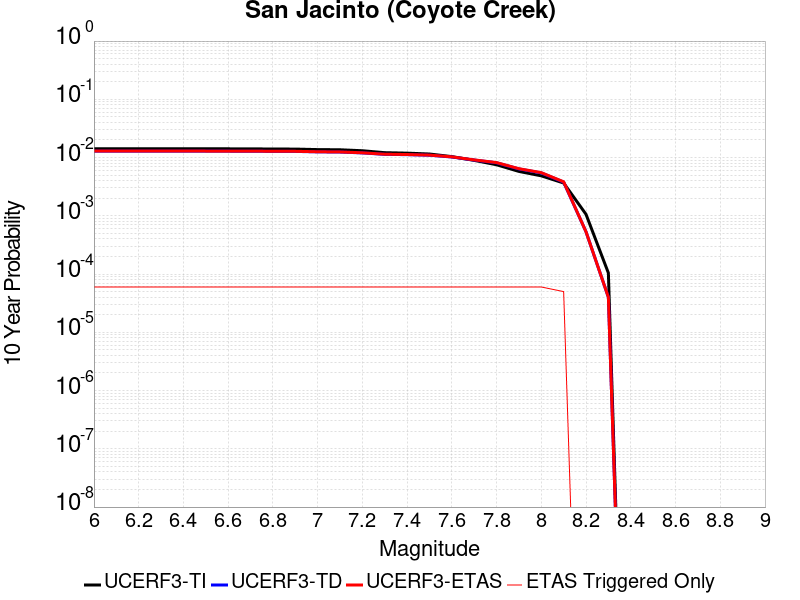 |

| Magnitude | 1 wk TI Prob | 1 wk TD Prob | 1 wk ETAS Prob | 1 wk ETAS/TD Gain | 1 wk ETAS Triggered Only | 1 mo TI Prob | 1 mo TD Prob | 1 mo ETAS Prob | 1 mo ETAS/TD Gain | 1 mo ETAS Triggered Only | 1 yr TI Prob | 1 yr TD Prob | 1 yr ETAS Prob | 1 yr ETAS/TD Gain | 1 yr ETAS Triggered Only | 10 yr TI Prob | 10 yr TD Prob | 10 yr ETAS Prob | 10 yr ETAS/TD Gain | 10 yr ETAS Triggered Only |
|-----|-----|-----|-----|-----|-----|-----|-----|-----|-----|-----|-----|-----|-----|-----|-----|-----|-----|-----|-----|-----|
| 6.0 | 2.7374346E-5 | 2.4145214E-5 | 6.4144246E-5 | 2.656603 | 4.0E-5 | 1.1731335E-4 | 1.034754E-4 | 1.5347023E-4 | 1.4831567 | 5.0E-5 | 0.0014273542 | 0.0012590875 | 0.0013090245 | 1.0396613 | 5.0E-5 | 0.01418221 | 0.012928318 | 0.012987542 | 1.004581 | 6.0E-5 |
| 6.1 | 2.7374346E-5 | 2.4145214E-5 | 6.4144246E-5 | 2.656603 | 4.0E-5 | 1.1731335E-4 | 1.034754E-4 | 1.5347023E-4 | 1.4831567 | 5.0E-5 | 0.0014273542 | 0.0012590875 | 0.0013090245 | 1.0396613 | 5.0E-5 | 0.01418221 | 0.012928318 | 0.012987542 | 1.004581 | 6.0E-5 |
| 6.2 | 2.7374346E-5 | 2.4145214E-5 | 6.4144246E-5 | 2.656603 | 4.0E-5 | 1.1731335E-4 | 1.034754E-4 | 1.5347023E-4 | 1.4831567 | 5.0E-5 | 0.0014273542 | 0.0012590875 | 0.0013090245 | 1.0396613 | 5.0E-5 | 0.01418221 | 0.012928318 | 0.012987542 | 1.004581 | 6.0E-5 |
| 6.3 | 2.7374346E-5 | 2.4145214E-5 | 6.4144246E-5 | 2.656603 | 4.0E-5 | 1.1731335E-4 | 1.034754E-4 | 1.5347023E-4 | 1.4831567 | 5.0E-5 | 0.0014273542 | 0.0012590875 | 0.0013090245 | 1.0396613 | 5.0E-5 | 0.01418221 | 0.012928318 | 0.012987542 | 1.004581 | 6.0E-5 |
| 6.4 | 2.7374346E-5 | 2.4145214E-5 | 6.4144246E-5 | 2.656603 | 4.0E-5 | 1.1731335E-4 | 1.034754E-4 | 1.5347023E-4 | 1.4831567 | 5.0E-5 | 0.0014273542 | 0.0012590875 | 0.0013090245 | 1.0396613 | 5.0E-5 | 0.01418221 | 0.012928318 | 0.012987542 | 1.004581 | 6.0E-5 |
| 6.5 | 2.7282445E-5 | 2.4031293E-5 | 6.403033E-5 | 2.6644564 | 4.0E-5 | 1.16919524E-4 | 1.029872E-4 | 1.5298206E-4 | 1.4854472 | 5.0E-5 | 0.0014225657 | 0.0012531505 | 0.0013030879 | 1.0398494 | 5.0E-5 | 0.014134934 | 0.012869646 | 0.012928873 | 1.0046021 | 6.0E-5 |
| 6.6 | 2.7282445E-5 | 2.4031293E-5 | 6.403033E-5 | 2.6644564 | 4.0E-5 | 1.16919524E-4 | 1.029872E-4 | 1.5298206E-4 | 1.4854472 | 5.0E-5 | 0.0014225657 | 0.0012531505 | 0.0013030879 | 1.0398494 | 5.0E-5 | 0.014134934 | 0.012869646 | 0.012928873 | 1.0046021 | 6.0E-5 |
| 6.7 | 2.7216198E-5 | 2.3956412E-5 | 6.395546E-5 | 2.6696591 | 4.0E-5 | 1.1663563E-4 | 1.02666316E-4 | 1.5266119E-4 | 1.4869647 | 5.0E-5 | 0.0014191137 | 0.0012492483 | 0.0012991859 | 1.0399741 | 5.0E-5 | 0.014100855 | 0.0128310565 | 0.012890287 | 1.0046161 | 6.0E-5 |
| 6.8 | 2.7078617E-5 | 2.387363E-5 | 6.387268E-5 | 2.675449 | 4.0E-5 | 1.1604605E-4 | 1.0231156E-4 | 1.5230644E-4 | 1.4886533 | 5.0E-5 | 0.001411945 | 0.0012449342 | 0.0012948719 | 1.0401127 | 5.0E-5 | 0.014030075 | 0.012788199 | 0.012847432 | 1.0046319 | 6.0E-5 |
| 6.9 | 2.6982952E-5 | 2.3793142E-5 | 6.379219E-5 | 2.6811168 | 4.0E-5 | 1.15636096E-4 | 1.0196664E-4 | 1.5196153E-4 | 1.4903065 | 5.0E-5 | 0.0014069602 | 0.0012407395 | 0.0012906775 | 1.0402485 | 5.0E-5 | 0.013980856 | 0.012746515 | 0.01280575 | 1.0046471 | 6.0E-5 |
| 7.0 | 2.6449972E-5 | 2.3370165E-5 | 6.336923E-5 | 2.711544 | 4.0E-5 | 1.1335209E-4 | 1.00154015E-4 | 1.50149E-4 | 1.4991812 | 5.0E-5 | 0.001379188 | 0.0012186957 | 0.0012686347 | 1.0409775 | 5.0E-5 | 0.0137065975 | 0.0125278765 | 0.012587125 | 1.0047293 | 6.0E-5 |
| 7.1 | 2.6257849E-5 | 2.3196202E-5 | 6.319527E-5 | 2.7243803 | 4.0E-5 | 1.1252879E-4 | 9.940852E-5 | 1.4940355E-4 | 1.502925 | 5.0E-5 | 0.0013691769 | 0.0012096294 | 0.0012595688 | 1.0412849 | 5.0E-5 | 0.013607717 | 0.012437741 | 0.012496995 | 1.0047641 | 6.0E-5 |
| 7.2 | 2.5270041E-5 | 2.2390966E-5 | 6.239007E-5 | 2.7863948 | 4.0E-5 | 1.0829568E-4 | 9.595777E-5 | 1.4595297E-4 | 1.5210125 | 5.0E-5 | 0.0013177024 | 0.0011676621 | 0.0012176037 | 1.0427706 | 5.0E-5 | 0.013099162 | 0.012018777 | 0.012078056 | 1.0049322 | 6.0E-5 |
| 7.3 | 2.339701E-5 | 2.1122814E-5 | 6.112197E-5 | 2.893647 | 4.0E-5 | 1.0026905E-4 | 9.0523215E-5 | 1.4051869E-4 | 1.5522945 | 5.0E-5 | 0.001220092 | 0.0011015651 | 0.0011515099 | 1.04534 | 5.0E-5 | 0.012134149 | 0.011357696 | 0.0114170145 | 1.0052228 | 6.0E-5 |
| 7.4 | 2.296333E-5 | 2.0853171E-5 | 6.0852337E-5 | 2.9181335 | 4.0E-5 | 9.841056E-5 | 8.936768E-5 | 1.3936321E-4 | 1.5594364 | 5.0E-5 | 0.0011974899 | 0.0010875105 | 0.001137456 | 1.0459266 | 5.0E-5 | 0.011910575 | 0.01121681 | 0.011276136 | 1.0052891 | 6.0E-5 |
| 7.5 | 2.2188895E-5 | 2.0376096E-5 | 6.037528E-5 | 2.9630446 | 4.0E-5 | 9.50918E-5 | 8.732321E-5 | 1.3731884E-4 | 1.5725354 | 5.0E-5 | 0.0011571277 | 0.0010626436 | 0.0011125904 | 1.0470024 | 5.0E-5 | 0.011511209 | 0.010966429 | 0.011025771 | 1.0054113 | 6.0E-5 |
| 7.6 | 2.0013189E-5 | 1.8962366E-5 | 5.8961607E-5 | 3.1094015 | 4.0E-5 | 8.5767984E-5 | 8.1264756E-5 | 1.3126069E-4 | 1.6152228 | 5.0E-5 | 0.001043725 | 9.889511E-4 | 0.0010389016 | 1.0505086 | 5.0E-5 | 0.010388365 | 0.010224434 | 0.01028382 | 1.0058084 | 6.0E-5 |
| 7.7 | 1.7230794E-5 | 1.674371E-5 | 5.674304E-5 | 3.3889167 | 4.0E-5 | 7.384417E-5 | 7.175679E-5 | 1.217532E-4 | 1.6967481 | 5.0E-5 | 8.986819E-4 | 8.7328954E-4 | 9.2324585E-4 | 1.0572047 | 5.0E-5 | 0.008950562 | 0.009062956 | 0.009122413 | 1.0065603 | 6.0E-5 |
| 7.8 | 1.4478809E-5 | 1.4990978E-5 | 5.4990378E-5 | 3.6682315 | 4.0E-5 | 6.205057E-5 | 6.424547E-5 | 1.14242255E-4 | 1.7782149 | 5.0E-5 | 7.552038E-4 | 7.819085E-4 | 8.3186943E-4 | 1.0638961 | 5.0E-5 | 0.0075264242 | 0.008141387 | 0.008200899 | 1.0073098 | 6.0E-5 |
| 7.9 | 1.1114467E-5 | 1.1645102E-5 | 5.1644638E-5 | 4.4348807 | 4.0E-5 | 4.7632562E-5 | 4.990663E-5 | 9.990414E-5 | 2.0018208 | 5.0E-5 | 5.797721E-4 | 6.074444E-4 | 6.57414E-4 | 1.082262 | 5.0E-5 | 0.0057826187 | 0.0063803247 | 0.006439942 | 1.0093439 | 6.0E-5 |
| 8.0 | 9.327402E-6 | 9.899186E-6 | 4.989879E-5 | 5.040696 | 4.0E-5 | 3.9973966E-5 | 4.2424395E-5 | 9.242228E-5 | 2.178517 | 5.0E-5 | 4.8657437E-4 | 5.1639514E-4 | 5.6636933E-4 | 1.096775 | 5.0E-5 | 0.0048551033 | 0.0054499684 | 0.0055096415 | 1.0109493 | 6.0E-5 |
| 8.1 | 7.0235833E-6 | 6.827495E-6 | 3.682729E-5 | 5.393968 | 3.0E-5 | 3.0100724E-5 | 2.9260367E-5 | 6.92592E-5 | 2.3669968 | 4.0E-5 | 3.664147E-4 | 3.5618723E-4 | 3.9617298E-4 | 1.1122605 | 4.0E-5 | 0.003658111 | 0.0037876023 | 0.003837413 | 1.0131509 | 5.0E-5 |
| 8.2 | 2.0358202E-6 | 8.994527E-7 | 8.994527E-7 | 1.0 | 0.0 | 8.724915E-6 | 3.854792E-6 | 3.854792E-6 | 1.0 | 0.0 | 1.06220665E-4 | 4.69311E-5 | 4.69311E-5 | 1.0 | 0.0 | 0.001061699 | 5.3254166E-4 | 5.3254166E-4 | 1.0 | 0.0 |
| 8.3 | 2.0051264E-7 | 6.617272E-8 | 6.617272E-8 | 1.0 | 0.0 | 8.5933965E-7 | 2.8359733E-7 | 2.8359733E-7 | 1.0 | 0.0 | 1.046241E-5 | 3.4527925E-6 | 3.4527925E-6 | 1.0 | 0.0 | 1.0461917E-4 | 4.01389E-5 | 4.01389E-5 | 1.0 | 0.0 |

## Santa Rosa Island
*[(top)](#table-of-contents)*

| 1 Week | 1 Month | 1 Year | 10 Year |
|-----|-----|-----|-----|
|  |  |  |  |

| Magnitude | 1 wk TI Prob | 1 wk TD Prob | 1 wk ETAS Prob | 1 wk ETAS/TD Gain | 1 wk ETAS Triggered Only | 1 mo TI Prob | 1 mo TD Prob | 1 mo ETAS Prob | 1 mo ETAS/TD Gain | 1 mo ETAS Triggered Only | 1 yr TI Prob | 1 yr TD Prob | 1 yr ETAS Prob | 1 yr ETAS/TD Gain | 1 yr ETAS Triggered Only | 10 yr TI Prob | 10 yr TD Prob | 10 yr ETAS Prob | 10 yr ETAS/TD Gain | 10 yr ETAS Triggered Only |
|-----|-----|-----|-----|-----|-----|-----|-----|-----|-----|-----|-----|-----|-----|-----|-----|-----|-----|-----|-----|-----|
| 6.0 | 4.1143165E-5 | 4.7091133E-5 | 8.708925E-5 | 1.8493768 | 4.0E-5 | 1.7631594E-4 | 2.0180465E-4 | 2.4179657E-4 | 1.1981715 | 4.0E-5 | 0.002144533 | 0.0024544 | 0.0025142527 | 1.0243859 | 6.0E-5 | 0.021239553 | 0.024293551 | 0.024352094 | 1.0024098 | 6.0E-5 |
| 6.1 | 2.1061249E-5 | 2.3864959E-5 | 4.3864482E-5 | 1.8380288 | 2.0E-5 | 9.0259375E-5 | 1.0227455E-4 | 1.2227251E-4 | 1.1955321 | 2.0E-5 | 0.0010983539 | 0.0012445104 | 0.0012644854 | 1.0160506 | 2.0E-5 | 0.01092941 | 0.012378449 | 0.012398201 | 1.0015957 | 2.0E-5 |
| 6.2 | 2.1061249E-5 | 2.3864959E-5 | 4.3864482E-5 | 1.8380288 | 2.0E-5 | 9.0259375E-5 | 1.0227455E-4 | 1.2227251E-4 | 1.1955321 | 2.0E-5 | 0.0010983539 | 0.0012445104 | 0.0012644854 | 1.0160506 | 2.0E-5 | 0.01092941 | 0.012378449 | 0.012398201 | 1.0015957 | 2.0E-5 |
| 6.3 | 1.5158236E-5 | 1.7074419E-5 | 3.7074078E-5 | 2.1713228 | 2.0E-5 | 6.496225E-5 | 7.3174095E-5 | 9.317263E-5 | 1.2733008 | 2.0E-5 | 7.906284E-4 | 8.905424E-4 | 9.105246E-4 | 1.0224382 | 2.0E-5 | 0.007878214 | 0.008870989 | 0.008890812 | 1.0022346 | 2.0E-5 |
| 6.4 | 1.2341918E-5 | 1.3852917E-5 | 2.3852777E-5 | 1.7218597 | 1.0E-5 | 5.2892858E-5 | 5.9368336E-5 | 6.936774E-5 | 1.16843 | 1.0E-5 | 6.437803E-4 | 7.225779E-4 | 7.325707E-4 | 1.0138294 | 1.0E-5 | 0.006419184 | 0.007203121 | 0.007213049 | 1.0013783 | 1.0E-5 |
| 6.5 | 9.061158E-6 | 1.0117031E-5 | 2.011693E-5 | 1.9884223 | 1.0E-5 | 3.883296E-5 | 4.3358013E-5 | 5.335758E-5 | 1.2306279 | 1.0E-5 | 4.726887E-4 | 5.277613E-4 | 5.37756E-4 | 1.018938 | 1.0E-5 | 0.004716845 | 0.0052656173 | 0.0052755647 | 1.0018891 | 1.0E-5 |
| 6.6 | 7.5461685E-6 | 8.400733E-6 | 1.840065E-5 | 2.1903622 | 1.0E-5 | 3.2340322E-5 | 3.600267E-5 | 4.600231E-5 | 1.2777472 | 1.0E-5 | 3.936723E-4 | 4.3824865E-4 | 4.4824427E-4 | 1.0228081 | 1.0E-5 | 0.003929756 | 0.0043742736 | 0.00438423 | 1.0022761 | 1.0E-5 |
| 6.7 | 5.5023775E-6 | 6.087381E-6 | 6.087381E-6 | 1.0 | 0.0 | 2.3581404E-5 | 2.6088532E-5 | 2.6088532E-5 | 1.0 | 0.0 | 2.8706578E-4 | 3.1758484E-4 | 3.1758484E-4 | 1.0 | 0.0 | 0.0028669522 | 0.0031716314 | 0.0031716314 | 1.0 | 0.0 |
| 6.8 | 3.7351679E-6 | 4.0831405E-6 | 4.0831405E-6 | 1.0 | 0.0 | 1.6007763E-5 | 1.749907E-5 | 1.749907E-5 | 1.0 | 0.0 | 1.948771E-4 | 2.1303284E-4 | 2.1303284E-4 | 1.0 | 0.0 | 0.0019470629 | 0.0021285315 | 0.0021285315 | 1.0 | 0.0 |
| 6.9 | 2.456366E-6 | 2.6292705E-6 | 2.6292705E-6 | 1.0 | 0.0 | 1.0527241E-5 | 1.1268254E-5 | 1.1268254E-5 | 1.0 | 0.0 | 1.2816161E-4 | 1.3718237E-4 | 1.3718237E-4 | 1.0 | 0.0 | 0.0012808773 | 0.0013709799 | 0.0013709799 | 1.0 | 0.0 |
| 7.0 | 2.3245157E-6 | 2.4827782E-6 | 2.4827782E-6 | 1.0 | 0.0 | 9.962172E-6 | 1.0640435E-5 | 1.0640435E-5 | 1.0 | 0.0 | 1.2128269E-4 | 1.2953962E-4 | 1.2953962E-4 | 1.0 | 0.0 | 0.0012121652 | 0.0012946434 | 0.0012946434 | 1.0 | 0.0 |
| 7.1 | 2.2248344E-6 | 2.37325E-6 | 2.37325E-6 | 1.0 | 0.0 | 9.53497E-6 | 1.0171032E-5 | 1.0171032E-5 | 1.0 | 0.0 | 1.1608207E-4 | 1.2382529E-4 | 1.2382529E-4 | 1.0 | 0.0 | 0.0011602144 | 0.001237565 | 0.001237565 | 1.0 | 0.0 |
| 7.2 | 2.1350402E-6 | 2.276154E-6 | 2.276154E-6 | 1.0 | 0.0 | 9.150141E-6 | 9.754909E-6 | 9.754909E-6 | 1.0 | 0.0 | 1.1139726E-4 | 1.1875956E-4 | 1.1875956E-4 | 1.0 | 0.0 | 0.0011134144 | 0.0011869629 | 0.0011869629 | 1.0 | 0.0 |
| 7.3 | 1.9793572E-6 | 2.108719E-6 | 2.108719E-6 | 1.0 | 0.0 | 8.482932E-6 | 9.037336E-6 | 9.037336E-6 | 1.0 | 0.0 | 1.032748E-4 | 1.10024026E-4 | 1.10024026E-4 | 1.0 | 0.0 | 0.0010322682 | 0.0010996973 | 0.0010996973 | 1.0 | 0.0 |
| 7.4 | 1.6951194E-6 | 1.8045733E-6 | 1.8045733E-6 | 1.0 | 0.0 | 7.264777E-6 | 7.733863E-6 | 7.733863E-6 | 1.0 | 0.0 | 8.844508E-5 | 9.415573E-5 | 9.415573E-5 | 1.0 | 0.0 | 8.840988E-4 | 9.4116E-4 | 9.4116E-4 | 1.0 | 0.0 |
| 7.5 | 8.987207E-7 | 9.5122147E-7 | 9.5122147E-7 | 1.0 | 0.0 | 3.8516546E-6 | 4.076657E-6 | 4.076657E-6 | 1.0 | 0.0 | 4.6892885E-5 | 4.963218E-5 | 4.963218E-5 | 1.0 | 0.0 | 4.688299E-4 | 4.9621216E-4 | 4.9621216E-4 | 1.0 | 0.0 |
| 7.6 | 3.8783037E-7 | 4.052932E-7 | 4.052932E-7 | 1.0 | 0.0 | 1.6621291E-6 | 1.7369698E-6 | 1.7369698E-6 | 1.0 | 0.0 | 2.0236233E-5 | 2.1147409E-5 | 2.1147409E-5 | 1.0 | 0.0 | 2.023439E-4 | 2.1145462E-4 | 2.1145462E-4 | 1.0 | 0.0 |
| 7.7 | 6.181804E-8 | 6.339035E-8 | 6.339035E-8 | 1.0 | 0.0 | 2.6493444E-7 | 2.7167292E-7 | 2.7167292E-7 | 1.0 | 0.0 | 3.225572E-6 | 3.3076128E-6 | 3.3076128E-6 | 1.0 | 0.0 | 3.225525E-5 | 3.307564E-5 | 3.307564E-5 | 1.0 | 0.0 |
| 7.8 | 1.3704449E-9 | 1.3964153E-9 | 1.3964153E-9 | 1.0 | 0.0 | 5.873335E-9 | 5.984637E-9 | 5.984637E-9 | 1.0 | 0.0 | 7.1507856E-8 | 7.286295E-8 | 7.286295E-8 | 1.0 | 0.0 | 7.1507833E-7 | 7.286294E-7 | 7.286294E-7 | 1.0 | 0.0 |

## Pisgah-Bullion Mtn-Mesquite Lk
*[(top)](#table-of-contents)*

| 1 Week | 1 Month | 1 Year | 10 Year |
|-----|-----|-----|-----|
|  |  | 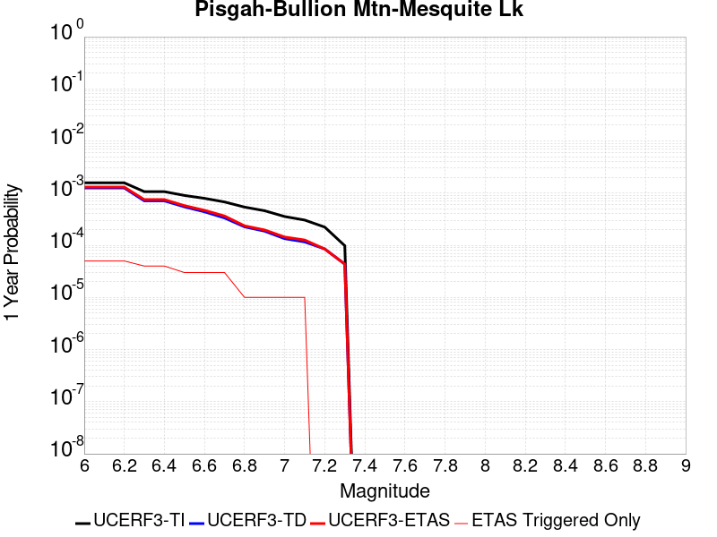 |  |

| Magnitude | 1 wk TI Prob | 1 wk TD Prob | 1 wk ETAS Prob | 1 wk ETAS/TD Gain | 1 wk ETAS Triggered Only | 1 mo TI Prob | 1 mo TD Prob | 1 mo ETAS Prob | 1 mo ETAS/TD Gain | 1 mo ETAS Triggered Only | 1 yr TI Prob | 1 yr TD Prob | 1 yr ETAS Prob | 1 yr ETAS/TD Gain | 1 yr ETAS Triggered Only | 10 yr TI Prob | 10 yr TD Prob | 10 yr ETAS Prob | 10 yr ETAS/TD Gain | 10 yr ETAS Triggered Only |
|-----|-----|-----|-----|-----|-----|-----|-----|-----|-----|-----|-----|-----|-----|-----|-----|-----|-----|-----|-----|-----|
| 6.0 | 3.0240792E-5 | 2.4091114E-5 | 5.4090393E-5 | 2.2452424 | 3.0E-5 | 1.2959696E-4 | 1.03244114E-4 | 1.3324102E-4 | 1.2905434 | 3.0E-5 | 0.0015767008 | 0.0012563728 | 0.00130631 | 1.0397471 | 5.0E-5 | 0.015655609 | 0.012502721 | 0.01256197 | 1.0047389 | 6.0E-5 |
| 6.1 | 3.0240792E-5 | 2.4091114E-5 | 5.4090393E-5 | 2.2452424 | 3.0E-5 | 1.2959696E-4 | 1.03244114E-4 | 1.3324102E-4 | 1.2905434 | 3.0E-5 | 0.0015767008 | 0.0012563728 | 0.00130631 | 1.0397471 | 5.0E-5 | 0.015655609 | 0.012502721 | 0.01256197 | 1.0047389 | 6.0E-5 |
| 6.2 | 3.0240792E-5 | 2.4091114E-5 | 5.4090393E-5 | 2.2452424 | 3.0E-5 | 1.2959696E-4 | 1.03244114E-4 | 1.3324102E-4 | 1.2905434 | 3.0E-5 | 0.0015767008 | 0.0012563728 | 0.00130631 | 1.0397471 | 5.0E-5 | 0.015655609 | 0.012502721 | 0.01256197 | 1.0047389 | 6.0E-5 |
| 6.3 | 2.0498217E-5 | 1.36380695E-5 | 4.363766E-5 | 3.1996949 | 3.0E-5 | 8.784654E-5 | 5.844765E-5 | 8.84459E-5 | 1.5132499 | 3.0E-5 | 0.0010690069 | 7.1138405E-4 | 7.513556E-4 | 1.0561885 | 4.0E-5 | 0.01063879 | 0.0070926943 | 0.00714234 | 1.0069995 | 5.0E-5 |
| 6.4 | 2.0498217E-5 | 1.36380695E-5 | 4.363766E-5 | 3.1996949 | 3.0E-5 | 8.784654E-5 | 5.844765E-5 | 8.84459E-5 | 1.5132499 | 3.0E-5 | 0.0010690069 | 7.1138405E-4 | 7.513556E-4 | 1.0561885 | 4.0E-5 | 0.01063879 | 0.0070926943 | 0.00714234 | 1.0069995 | 5.0E-5 |
| 6.5 | 1.7316182E-5 | 1.0477042E-5 | 4.0476727E-5 | 3.8633735 | 3.0E-5 | 7.42101E-5 | 4.4900895E-5 | 7.489955E-5 | 1.6681081 | 3.0E-5 | 9.0313336E-4 | 5.465413E-4 | 5.765249E-4 | 1.0548606 | 3.0E-5 | 0.008994718 | 0.0054529672 | 0.0054828036 | 1.0054716 | 3.0E-5 |
| 6.6 | 1.5251077E-5 | 8.414273E-6 | 3.8414022E-5 | 4.5653405 | 3.0E-5 | 6.536012E-5 | 3.6060712E-5 | 6.605963E-5 | 1.8319004 | 3.0E-5 | 7.9546886E-4 | 4.3895794E-4 | 4.6894478E-4 | 1.0683137 | 3.0E-5 | 0.007926274 | 0.0043816264 | 0.004411495 | 1.0068167 | 3.0E-5 |
| 6.7 | 1.2997425E-5 | 6.4114965E-6 | 3.6411304E-5 | 5.6790648 | 3.0E-5 | 5.570206E-5 | 2.7477578E-5 | 5.7476755E-5 | 2.0917692 | 3.0E-5 | 6.7796157E-4 | 3.3449283E-4 | 3.6448278E-4 | 1.089658 | 3.0E-5 | 0.0067589693 | 0.0033403537 | 0.0033702536 | 1.0089511 | 3.0E-5 |
| 6.8 | 1.035386E-5 | 4.3332193E-6 | 1.4333176E-5 | 3.307743 | 1.0E-5 | 4.437293E-5 | 1.8570812E-5 | 2.8570626E-5 | 1.5384694 | 1.0E-5 | 5.401065E-4 | 2.2607706E-4 | 2.360748E-4 | 1.0442227 | 1.0E-5 | 0.0053879567 | 0.0022585576 | 0.0022685349 | 1.0044177 | 1.0E-5 |
| 6.9 | 8.816252E-6 | 3.580638E-6 | 1.3580602E-5 | 3.7927885 | 1.0E-5 | 3.778339E-5 | 1.5345504E-5 | 2.534535E-5 | 1.6516467 | 1.0E-5 | 4.5991567E-4 | 1.8681608E-4 | 1.968142E-4 | 1.0535185 | 1.0E-5 | 0.00458965 | 0.0018666488 | 0.0018766301 | 1.0053473 | 1.0E-5 |
| 7.0 | 6.8232207E-6 | 2.5675843E-6 | 1.2567559E-5 | 4.8947015 | 1.0E-5 | 2.9242048E-5 | 1.1003888E-5 | 2.1003778E-5 | 1.9087597 | 1.0E-5 | 3.5596377E-4 | 1.3396442E-4 | 1.4396307E-4 | 1.0746367 | 1.0E-5 | 0.0035539411 | 0.0013388677 | 0.0013488543 | 1.007459 | 1.0E-5 |
| 7.1 | 5.837013E-6 | 2.22738E-6 | 1.2227358E-5 | 5.4895697 | 1.0E-5 | 2.501553E-5 | 9.545881E-6 | 1.9545785E-5 | 2.0475621 | 1.0E-5 | 3.045215E-4 | 1.16215204E-4 | 1.2621404E-4 | 1.0860373 | 1.0E-5 | 0.0030410455 | 0.0011615733 | 0.0011715617 | 1.008599 | 1.0E-5 |
| 7.2 | 4.278052E-6 | 1.6275711E-6 | 1.6275711E-6 | 1.0 | 0.0 | 1.833438E-5 | 6.9752873E-6 | 6.9752873E-6 | 1.0 | 0.0 | 2.231982E-4 | 8.492105E-5 | 8.492105E-5 | 1.0 | 0.0 | 0.0022297418 | 8.489092E-4 | 8.489092E-4 | 1.0 | 0.0 |
| 7.3 | 1.8803692E-6 | 8.344926E-7 | 8.344926E-7 | 1.0 | 0.0 | 8.0587E-6 | 3.5763926E-6 | 3.5763926E-6 | 1.0 | 0.0 | 9.811026E-5 | 4.354186E-5 | 4.354186E-5 | 1.0 | 0.0 | 9.806695E-4 | 4.3534773E-4 | 4.3534773E-4 | 1.0 | 0.0 |

## Cleghorn Lake
*[(top)](#table-of-contents)*

| 1 Week | 1 Month | 1 Year | 10 Year |
|-----|-----|-----|-----|
|  |  | 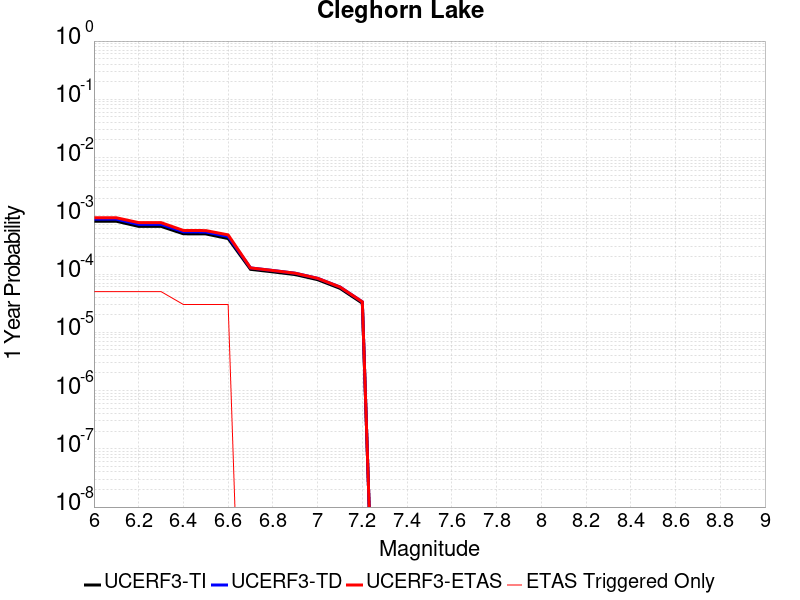 |  |

| Magnitude | 1 wk TI Prob | 1 wk TD Prob | 1 wk ETAS Prob | 1 wk ETAS/TD Gain | 1 wk ETAS Triggered Only | 1 mo TI Prob | 1 mo TD Prob | 1 mo ETAS Prob | 1 mo ETAS/TD Gain | 1 mo ETAS Triggered Only | 1 yr TI Prob | 1 yr TD Prob | 1 yr ETAS Prob | 1 yr ETAS/TD Gain | 1 yr ETAS Triggered Only | 10 yr TI Prob | 10 yr TD Prob | 10 yr ETAS Prob | 10 yr ETAS/TD Gain | 10 yr ETAS Triggered Only |
|-----|-----|-----|-----|-----|-----|-----|-----|-----|-----|-----|-----|-----|-----|-----|-----|-----|-----|-----|-----|-----|
| 6.0 | 1.5467183E-5 | 1.6794203E-5 | 4.67937E-5 | 2.7863007 | 3.0E-5 | 6.6286244E-5 | 7.197348E-5 | 1.2196988E-4 | 1.6946503 | 5.0E-5 | 8.067362E-4 | 8.759797E-4 | 9.259359E-4 | 1.0570289 | 5.0E-5 | 0.008038137 | 0.008730696 | 0.008790172 | 1.0068123 | 6.0E-5 |
| 6.1 | 1.5467183E-5 | 1.6794203E-5 | 4.67937E-5 | 2.7863007 | 3.0E-5 | 6.6286244E-5 | 7.197348E-5 | 1.2196988E-4 | 1.6946503 | 5.0E-5 | 8.067362E-4 | 8.759797E-4 | 9.259359E-4 | 1.0570289 | 5.0E-5 | 0.008038137 | 0.008730696 | 0.008790172 | 1.0068123 | 6.0E-5 |
| 6.2 | 1.2624631E-5 | 1.3681544E-5 | 4.3681135E-5 | 3.192705 | 3.0E-5 | 5.410444E-5 | 5.863415E-5 | 1.0863122E-4 | 1.8526955 | 5.0E-5 | 6.585225E-4 | 7.1368564E-4 | 7.6364994E-4 | 1.0700089 | 5.0E-5 | 0.0065657445 | 0.0071187317 | 0.0071783047 | 1.0083685 | 6.0E-5 |
| 6.3 | 1.2624631E-5 | 1.3681544E-5 | 4.3681135E-5 | 3.192705 | 3.0E-5 | 5.410444E-5 | 5.863415E-5 | 1.0863122E-4 | 1.8526955 | 5.0E-5 | 6.585225E-4 | 7.1368564E-4 | 7.6364994E-4 | 1.0700089 | 5.0E-5 | 0.0065657445 | 0.0071187317 | 0.0071783047 | 1.0083685 | 6.0E-5 |
| 6.4 | 9.417684E-6 | 1.0170118E-5 | 3.0169915E-5 | 2.9665256 | 2.0E-5 | 4.036088E-5 | 4.3585722E-5 | 7.3584415E-5 | 1.6882688 | 3.0E-5 | 4.912829E-4 | 5.3056807E-4 | 5.605521E-4 | 1.0565132 | 3.0E-5 | 0.004901982 | 0.005297049 | 0.0053368374 | 1.0075114 | 4.0E-5 |
| 6.5 | 9.368219E-6 | 1.0117545E-5 | 3.0117342E-5 | 2.9767442 | 2.0E-5 | 4.014889E-5 | 4.3360415E-5 | 7.3359115E-5 | 1.6918453 | 3.0E-5 | 4.8870314E-4 | 5.2782625E-4 | 5.578104E-4 | 1.0568069 | 3.0E-5 | 0.004876298 | 0.0052697617 | 0.0053095506 | 1.0075505 | 4.0E-5 |
| 6.6 | 7.803798E-6 | 8.441831E-6 | 2.8441662E-5 | 3.3691342 | 2.0E-5 | 3.3444423E-5 | 3.6179E-5 | 6.617791E-5 | 1.8291804 | 3.0E-5 | 4.0710976E-4 | 4.4043022E-4 | 4.70417E-4 | 1.0680852 | 3.0E-5 | 0.0040636472 | 0.0043994905 | 0.0044293585 | 1.006789 | 3.0E-5 |
| 6.7 | 2.3108669E-6 | 2.4438336E-6 | 2.4438336E-6 | 1.0 | 0.0 | 9.903678E-6 | 1.0473532E-5 | 1.0473532E-5 | 1.0 | 0.0 | 1.205706E-4 | 1.2750797E-4 | 1.2750797E-4 | 1.0 | 0.0 | 0.001205052 | 0.0012743667 | 0.0012743667 | 1.0 | 0.0 |
| 6.8 | 2.0882828E-6 | 2.2062823E-6 | 2.2062823E-6 | 1.0 | 0.0 | 8.949753E-6 | 9.455462E-6 | 9.455462E-6 | 1.0 | 0.0 | 1.08957785E-4 | 1.1511434E-4 | 1.1511434E-4 | 1.0 | 0.0 | 0.0010890438 | 0.0011505639 | 0.0011505639 | 1.0 | 0.0 |
| 6.9 | 1.876935E-6 | 1.981051E-6 | 1.981051E-6 | 1.0 | 0.0 | 8.043982E-6 | 8.490192E-6 | 8.490192E-6 | 1.0 | 0.0 | 9.7931086E-5 | 1.03363345E-4 | 1.03363345E-4 | 1.0 | 0.0 | 9.788794E-4 | 0.0010331686 | 0.0010331686 | 1.0 | 0.0 |
| 7.0 | 1.5357559E-6 | 1.6202807E-6 | 1.6202807E-6 | 1.0 | 0.0 | 6.5817944E-6 | 6.9440425E-6 | 6.9440425E-6 | 1.0 | 0.0 | 8.01304E-5 | 8.454057E-5 | 8.454057E-5 | 1.0 | 0.0 | 8.010151E-4 | 8.450965E-4 | 8.450965E-4 | 1.0 | 0.0 |
| 7.1 | 1.0905424E-6 | 1.1497619E-6 | 1.1497619E-6 | 1.0 | 0.0 | 4.6737446E-6 | 4.9275427E-6 | 4.9275427E-6 | 1.0 | 0.0 | 5.6901354E-5 | 5.999128E-5 | 5.999128E-5 | 1.0 | 0.0 | 5.6886784E-4 | 5.997606E-4 | 5.997606E-4 | 1.0 | 0.0 |
| 7.2 | 6.06668E-7 | 6.387277E-7 | 6.387277E-7 | 1.0 | 0.0 | 2.600003E-6 | 2.7374022E-6 | 2.7374022E-6 | 1.0 | 0.0 | 3.1654577E-5 | 3.3327433E-5 | 3.3327433E-5 | 1.0 | 0.0 | 3.1650066E-4 | 3.3323118E-4 | 3.3323118E-4 | 1.0 | 0.0 |

## Lost Hills
*[(top)](#table-of-contents)*

| 1 Week | 1 Month | 1 Year | 10 Year |
|-----|-----|-----|-----|
|  | 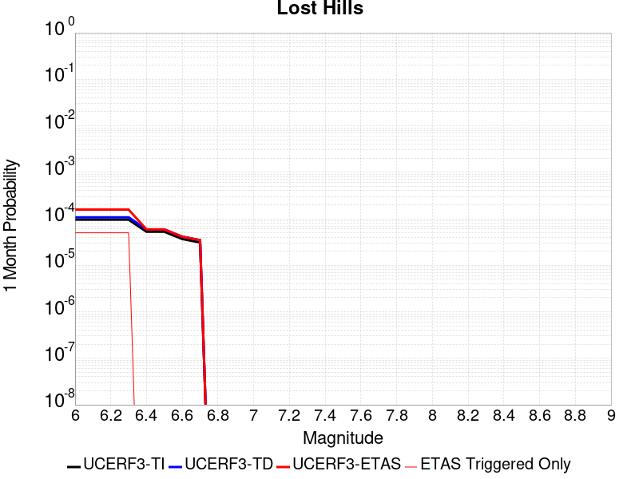 |  |  |

| Magnitude | 1 wk TI Prob | 1 wk TD Prob | 1 wk ETAS Prob | 1 wk ETAS/TD Gain | 1 wk ETAS Triggered Only | 1 mo TI Prob | 1 mo TD Prob | 1 mo ETAS Prob | 1 mo ETAS/TD Gain | 1 mo ETAS Triggered Only | 1 yr TI Prob | 1 yr TD Prob | 1 yr ETAS Prob | 1 yr ETAS/TD Gain | 1 yr ETAS Triggered Only | 10 yr TI Prob | 10 yr TD Prob | 10 yr ETAS Prob | 10 yr ETAS/TD Gain | 10 yr ETAS Triggered Only |
|-----|-----|-----|-----|-----|-----|-----|-----|-----|-----|-----|-----|-----|-----|-----|-----|-----|-----|-----|-----|-----|
| 6.0 | 2.233523E-5 | 2.5106583E-5 | 4.510608E-5 | 1.7965839 | 2.0E-5 | 9.571891E-5 | 1.0759615E-4 | 1.5759077E-4 | 1.4646506 | 5.0E-5 | 0.0011647546 | 0.001309364 | 0.0013592986 | 1.0381365 | 5.0E-5 | 0.011586686 | 0.013033091 | 0.013082439 | 1.0037864 | 5.0E-5 |
| 6.1 | 2.233523E-5 | 2.5106583E-5 | 4.510608E-5 | 1.7965839 | 2.0E-5 | 9.571891E-5 | 1.0759615E-4 | 1.5759077E-4 | 1.4646506 | 5.0E-5 | 0.0011647546 | 0.001309364 | 0.0013592986 | 1.0381365 | 5.0E-5 | 0.011586686 | 0.013033091 | 0.013082439 | 1.0037864 | 5.0E-5 |
| 6.2 | 2.233523E-5 | 2.5106583E-5 | 4.510608E-5 | 1.7965839 | 2.0E-5 | 9.571891E-5 | 1.0759615E-4 | 1.5759077E-4 | 1.4646506 | 5.0E-5 | 0.0011647546 | 0.001309364 | 0.0013592986 | 1.0381365 | 5.0E-5 | 0.011586686 | 0.013033091 | 0.013082439 | 1.0037864 | 5.0E-5 |
| 6.3 | 2.233523E-5 | 2.5106583E-5 | 4.510608E-5 | 1.7965839 | 2.0E-5 | 9.571891E-5 | 1.0759615E-4 | 1.5759077E-4 | 1.4646506 | 5.0E-5 | 0.0011647546 | 0.001309364 | 0.0013592986 | 1.0381365 | 5.0E-5 | 0.011586686 | 0.013033091 | 0.013082439 | 1.0037864 | 5.0E-5 |
| 6.4 | 1.2288092E-5 | 1.3781108E-5 | 1.3781108E-5 | 1.0 | 0.0 | 5.2662188E-5 | 5.906108E-5 | 5.906108E-5 | 1.0 | 0.0 | 6.409735E-4 | 7.189252E-4 | 7.189252E-4 | 1.0 | 0.0 | 0.006391279 | 0.0071752006 | 0.0071752006 | 1.0 | 0.0 |
| 6.5 | 1.2288092E-5 | 1.3781108E-5 | 1.3781108E-5 | 1.0 | 0.0 | 5.2662188E-5 | 5.906108E-5 | 5.906108E-5 | 1.0 | 0.0 | 6.409735E-4 | 7.189252E-4 | 7.189252E-4 | 1.0 | 0.0 | 0.006391279 | 0.0071752006 | 0.0071752006 | 1.0 | 0.0 |
| 6.6 | 8.58281E-6 | 9.63377E-6 | 9.63377E-6 | 1.0 | 0.0 | 3.6782953E-5 | 4.12874E-5 | 4.12874E-5 | 1.0 | 0.0 | 4.4774043E-4 | 5.026414E-4 | 5.026414E-4 | 1.0 | 0.0 | 0.0044683935 | 0.005023205 | 0.005023205 | 1.0 | 0.0 |
| 6.7 | 7.205685E-6 | 8.088302E-6 | 8.088302E-6 | 1.0 | 0.0 | 3.088114E-5 | 3.466415E-5 | 3.466415E-5 | 1.0 | 0.0 | 3.7591302E-4 | 4.2203604E-4 | 4.2203604E-4 | 1.0 | 0.0 | 0.0037527776 | 0.0042203604 | 0.0042203604 | 1.0 | 0.0 |

## Pleito
*[(top)](#table-of-contents)*

| 1 Week | 1 Month | 1 Year | 10 Year |
|-----|-----|-----|-----|
|  |  |  |  |

| Magnitude | 1 wk TI Prob | 1 wk TD Prob | 1 wk ETAS Prob | 1 wk ETAS/TD Gain | 1 wk ETAS Triggered Only | 1 mo TI Prob | 1 mo TD Prob | 1 mo ETAS Prob | 1 mo ETAS/TD Gain | 1 mo ETAS Triggered Only | 1 yr TI Prob | 1 yr TD Prob | 1 yr ETAS Prob | 1 yr ETAS/TD Gain | 1 yr ETAS Triggered Only | 10 yr TI Prob | 10 yr TD Prob | 10 yr ETAS Prob | 10 yr ETAS/TD Gain | 10 yr ETAS Triggered Only |
|-----|-----|-----|-----|-----|-----|-----|-----|-----|-----|-----|-----|-----|-----|-----|-----|-----|-----|-----|-----|-----|
| 6.0 | 1.6763008E-5 | 2.4763838E-5 | 5.4763095E-5 | 2.2114139 | 3.0E-5 | 7.183948E-5 | 1.0612683E-4 | 1.3612365E-4 | 1.2826506 | 3.0E-5 | 8.742947E-4 | 0.0012914003 | 0.0013313487 | 1.0309341 | 4.0E-5 | 0.00870863 | 0.0129538905 | 0.013003242 | 1.0038098 | 5.0E-5 |
| 6.1 | 1.6763008E-5 | 2.4763838E-5 | 5.4763095E-5 | 2.2114139 | 3.0E-5 | 7.183948E-5 | 1.0612683E-4 | 1.3612365E-4 | 1.2826506 | 3.0E-5 | 8.742947E-4 | 0.0012914003 | 0.0013313487 | 1.0309341 | 4.0E-5 | 0.00870863 | 0.0129538905 | 0.013003242 | 1.0038098 | 5.0E-5 |
| 6.2 | 1.6763008E-5 | 2.4763838E-5 | 5.4763095E-5 | 2.2114139 | 3.0E-5 | 7.183948E-5 | 1.0612683E-4 | 1.3612365E-4 | 1.2826506 | 3.0E-5 | 8.742947E-4 | 0.0012914003 | 0.0013313487 | 1.0309341 | 4.0E-5 | 0.00870863 | 0.0129538905 | 0.013003242 | 1.0038098 | 5.0E-5 |
| 6.3 | 1.6763008E-5 | 2.4763838E-5 | 5.4763095E-5 | 2.2114139 | 3.0E-5 | 7.183948E-5 | 1.0612683E-4 | 1.3612365E-4 | 1.2826506 | 3.0E-5 | 8.742947E-4 | 0.0012914003 | 0.0013313487 | 1.0309341 | 4.0E-5 | 0.00870863 | 0.0129538905 | 0.013003242 | 1.0038098 | 5.0E-5 |
| 6.4 | 1.6763008E-5 | 2.4763838E-5 | 5.4763095E-5 | 2.2114139 | 3.0E-5 | 7.183948E-5 | 1.0612683E-4 | 1.3612365E-4 | 1.2826506 | 3.0E-5 | 8.742947E-4 | 0.0012914003 | 0.0013313487 | 1.0309341 | 4.0E-5 | 0.00870863 | 0.0129538905 | 0.013003242 | 1.0038098 | 5.0E-5 |
| 6.5 | 1.6763008E-5 | 2.4763838E-5 | 5.4763095E-5 | 2.2114139 | 3.0E-5 | 7.183948E-5 | 1.0612683E-4 | 1.3612365E-4 | 1.2826506 | 3.0E-5 | 8.742947E-4 | 0.0012914003 | 0.0013313487 | 1.0309341 | 4.0E-5 | 0.00870863 | 0.0129538905 | 0.013003242 | 1.0038098 | 5.0E-5 |
| 6.6 | 9.910213E-6 | 1.7214623E-5 | 3.721428E-5 | 2.161783 | 2.0E-5 | 4.247165E-5 | 7.377489E-5 | 9.3773415E-5 | 1.2710749 | 2.0E-5 | 5.169696E-4 | 8.978429E-4 | 9.2781597E-4 | 1.0333834 | 3.0E-5 | 0.0051576863 | 0.009050702 | 0.00909034 | 1.0043795 | 4.0E-5 |
| 6.7 | 9.910213E-6 | 1.7214623E-5 | 3.721428E-5 | 2.161783 | 2.0E-5 | 4.247165E-5 | 7.377489E-5 | 9.3773415E-5 | 1.2710749 | 2.0E-5 | 5.169696E-4 | 8.978429E-4 | 9.2781597E-4 | 1.0333834 | 3.0E-5 | 0.0051576863 | 0.009050702 | 0.00909034 | 1.0043795 | 4.0E-5 |
| 6.8 | 8.300162E-6 | 1.5474232E-5 | 3.5473924E-5 | 2.2924511 | 2.0E-5 | 3.557164E-5 | 6.631646E-5 | 8.6315136E-5 | 1.3015642 | 2.0E-5 | 4.3299864E-4 | 8.071053E-4 | 8.3708105E-4 | 1.0371399 | 3.0E-5 | 0.004321559 | 0.008150139 | 0.008189813 | 1.0048679 | 4.0E-5 |
| 6.9 | 8.183114E-6 | 1.5345448E-5 | 3.534514E-5 | 2.3032982 | 2.0E-5 | 3.5070017E-5 | 6.576455E-5 | 8.576324E-5 | 1.3040951 | 2.0E-5 | 4.2689382E-4 | 8.003907E-4 | 8.3036674E-4 | 1.0374517 | 3.0E-5 | 0.0042607468 | 0.008083483 | 0.00812316 | 1.0049083 | 4.0E-5 |
| 7.0 | 7.1748823E-6 | 1.413244E-5 | 1.413244E-5 | 1.0 | 0.0 | 3.0749135E-5 | 6.0566195E-5 | 6.0566195E-5 | 1.0 | 0.0 | 3.743064E-4 | 7.371445E-4 | 7.471371E-4 | 1.0135559 | 1.0E-5 | 0.0037367654 | 0.007454939 | 0.0074747903 | 1.0026628 | 2.0E-5 |
| 7.1 | 7.1671807E-6 | 1.412281E-5 | 1.412281E-5 | 1.0 | 0.0 | 3.0716128E-5 | 6.052493E-5 | 6.052493E-5 | 1.0 | 0.0 | 3.7390468E-4 | 7.366424E-4 | 7.46635E-4 | 1.0135651 | 1.0E-5 | 0.0037327618 | 0.0074499524 | 0.007469803 | 1.0026646 | 2.0E-5 |
| 7.2 | 7.0649667E-6 | 1.39701015E-5 | 1.39701015E-5 | 1.0 | 0.0 | 3.0278077E-5 | 5.9870494E-5 | 5.9870494E-5 | 1.0 | 0.0 | 3.6857324E-4 | 7.2868E-4 | 7.386727E-4 | 1.0137135 | 1.0E-5 | 0.0036796255 | 0.0073707094 | 0.007390562 | 1.0026934 | 2.0E-5 |
| 7.3 | 7.02082E-6 | 1.3913556E-5 | 1.3913556E-5 | 1.0 | 0.0 | 3.008888E-5 | 5.9628168E-5 | 5.9628168E-5 | 1.0 | 0.0 | 3.6627054E-4 | 7.2573166E-4 | 7.357244E-4 | 1.0137691 | 1.0E-5 | 0.0036566744 | 0.007341209 | 0.007361062 | 1.0027044 | 2.0E-5 |
| 7.4 | 6.987146E-6 | 1.3873118E-5 | 1.3873118E-5 | 1.0 | 0.0 | 2.9944567E-5 | 5.945487E-5 | 5.945487E-5 | 1.0 | 0.0 | 3.6451413E-4 | 7.2362315E-4 | 7.336159E-4 | 1.0138093 | 1.0E-5 | 0.0036391679 | 0.007320144 | 0.0073399977 | 1.0027121 | 2.0E-5 |
| 7.5 | 6.9494554E-6 | 1.3830024E-5 | 1.3830024E-5 | 1.0 | 0.0 | 2.9783041E-5 | 5.9270187E-5 | 5.9270187E-5 | 1.0 | 0.0 | 3.625482E-4 | 7.2137616E-4 | 7.313689E-4 | 1.0138524 | 1.0E-5 | 0.0036195726 | 0.0072977724 | 0.007317627 | 1.0027206 | 2.0E-5 |
| 7.6 | 6.92694E-6 | 1.3789138E-5 | 1.3789138E-5 | 1.0 | 0.0 | 2.9686547E-5 | 5.909497E-5 | 5.909497E-5 | 1.0 | 0.0 | 3.6137376E-4 | 7.1924424E-4 | 7.292371E-4 | 1.0138935 | 1.0E-5 | 0.0036078666 | 0.0072765257 | 0.00729638 | 1.0027286 | 2.0E-5 |
| 7.7 | 6.395867E-6 | 1.2668219E-5 | 1.2668219E-5 | 1.0 | 0.0 | 2.741057E-5 | 5.429124E-5 | 5.429124E-5 | 1.0 | 0.0 | 3.336726E-4 | 6.6079566E-4 | 6.707891E-4 | 1.0151232 | 1.0E-5 | 0.0033317201 | 0.0066951844 | 0.0067150504 | 1.0029672 | 2.0E-5 |
| 7.8 | 5.8664327E-6 | 1.153586E-5 | 1.153586E-5 | 1.0 | 0.0 | 2.5141611E-5 | 4.9438466E-5 | 4.9438466E-5 | 1.0 | 0.0 | 3.060561E-4 | 6.017473E-4 | 6.1174127E-4 | 1.0166082 | 1.0E-5 | 0.0030563495 | 0.0061006667 | 0.0061205444 | 1.0032583 | 2.0E-5 |
| 7.9 | 3.7167474E-6 | 7.1140853E-6 | 7.1140853E-6 | 1.0 | 0.0 | 1.592882E-5 | 3.0488582E-5 | 3.0488582E-5 | 1.0 | 0.0 | 1.9391612E-4 | 3.7113542E-4 | 3.811317E-4 | 1.0269344 | 1.0E-5 | 0.0019374699 | 0.0037674906 | 0.0037874153 | 1.0052886 | 2.0E-5 |
| 8.0 | 1.0903841E-6 | 1.2879392E-6 | 1.2879392E-6 | 1.0 | 0.0 | 4.6730665E-6 | 5.5197274E-6 | 5.5197274E-6 | 1.0 | 0.0 | 5.68931E-5 | 6.720063E-5 | 6.720063E-5 | 1.0 | 0.0 | 5.6878536E-4 | 6.941948E-4 | 7.041879E-4 | 1.0143952 | 1.0E-5 |
| 8.1 | 2.6894583E-7 | 1.1060341E-7 | 1.1060341E-7 | 1.0 | 0.0 | 1.1526245E-6 | 4.740145E-7 | 4.740145E-7 | 1.0 | 0.0 | 1.4033113E-5 | 5.7711113E-6 | 5.7711113E-6 | 1.0 | 0.0 | 1.4032227E-4 | 6.456908E-5 | 6.456908E-5 | 1.0 | 0.0 |
| 8.2 | 5.2967013E-9 | 2.4578228E-9 | 2.4578228E-9 | 1.0 | 0.0 | 2.2700148E-8 | 1.0533527E-8 | 1.0533527E-8 | 1.0 | 0.0 | 2.7637427E-7 | 1.2824569E-7 | 1.2824569E-7 | 1.0 | 0.0 | 2.7637393E-6 | 1.4592787E-6 | 1.4592787E-6 | 1.0 | 0.0 |

## Oceanic - West Huasna
*[(top)](#table-of-contents)*

| 1 Week | 1 Month | 1 Year | 10 Year |
|-----|-----|-----|-----|
|  |  |  |  |

| Magnitude | 1 wk TI Prob | 1 wk TD Prob | 1 wk ETAS Prob | 1 wk ETAS/TD Gain | 1 wk ETAS Triggered Only | 1 mo TI Prob | 1 mo TD Prob | 1 mo ETAS Prob | 1 mo ETAS/TD Gain | 1 mo ETAS Triggered Only | 1 yr TI Prob | 1 yr TD Prob | 1 yr ETAS Prob | 1 yr ETAS/TD Gain | 1 yr ETAS Triggered Only | 10 yr TI Prob | 10 yr TD Prob | 10 yr ETAS Prob | 10 yr ETAS/TD Gain | 10 yr ETAS Triggered Only |
|-----|-----|-----|-----|-----|-----|-----|-----|-----|-----|-----|-----|-----|-----|-----|-----|-----|-----|-----|-----|-----|
| 6.0 | 3.195567E-5 | 2.7926868E-5 | 7.792547E-5 | 2.7903404 | 5.0E-5 | 1.3694567E-4 | 1.1968133E-4 | 1.6967535E-4 | 1.4177262 | 5.0E-5 | 0.0016660384 | 0.0014561893 | 0.0015061166 | 1.0342861 | 5.0E-5 | 0.016536033 | 0.014471028 | 0.014520304 | 1.0034052 | 5.0E-5 |
| 6.1 | 2.1156782E-5 | 1.7573486E-5 | 3.7573136E-5 | 2.1380582 | 2.0E-5 | 9.066878E-5 | 7.531282E-5 | 9.531131E-5 | 1.265539 | 2.0E-5 | 0.0011033333 | 9.165572E-4 | 9.365389E-4 | 1.0218008 | 2.0E-5 | 0.010978713 | 0.009128777 | 0.009148595 | 1.0021709 | 2.0E-5 |
| 6.2 | 1.6195117E-5 | 1.3327152E-5 | 3.3326887E-5 | 2.5006757 | 2.0E-5 | 6.9405796E-5 | 5.7115132E-5 | 7.711399E-5 | 1.3501499 | 2.0E-5 | 8.44688E-4 | 6.9515745E-4 | 7.151436E-4 | 1.0287504 | 2.0E-5 | 0.008414844 | 0.006930123 | 0.0069499845 | 1.0028659 | 2.0E-5 |
| 6.3 | 1.3559345E-5 | 1.1179142E-5 | 2.117903E-5 | 1.894513 | 1.0E-5 | 5.811018E-5 | 4.7909736E-5 | 5.790926E-5 | 1.2087158 | 1.0E-5 | 7.072618E-4 | 5.831459E-4 | 5.931401E-4 | 1.0171384 | 1.0E-5 | 0.0070501505 | 0.0058162753 | 0.005826217 | 1.0017093 | 1.0E-5 |
| 6.4 | 1.2120619E-5 | 1.0000977E-5 | 2.0000878E-5 | 1.9998922 | 1.0E-5 | 5.1944477E-5 | 4.2860633E-5 | 5.2860203E-5 | 1.2333044 | 1.0E-5 | 6.322405E-4 | 5.2170374E-4 | 5.316985E-4 | 1.019158 | 1.0E-5 | 0.006304447 | 0.0052048573 | 0.0052148052 | 1.0019113 | 1.0E-5 |
| 6.5 | 1.13511915E-5 | 9.3674735E-6 | 1.936738E-5 | 2.0675137 | 1.0E-5 | 4.8647056E-5 | 4.01457E-5 | 5.01453E-5 | 1.2490827 | 1.0E-5 | 5.9211696E-4 | 4.886647E-4 | 4.9865985E-4 | 1.0204539 | 1.0E-5 | 0.0059054173 | 0.0048759608 | 0.004885912 | 1.0020409 | 1.0E-5 |
| 6.6 | 9.850605E-6 | 8.135418E-6 | 8.135418E-6 | 1.0 | 0.0 | 4.2216197E-5 | 3.4865614E-5 | 3.4865614E-5 | 1.0 | 0.0 | 5.1386096E-4 | 4.2440637E-4 | 4.2440637E-4 | 1.0 | 0.0 | 0.0051267436 | 0.004235991 | 0.004235991 | 1.0 | 0.0 |
| 6.7 | 8.8558645E-6 | 7.318433E-6 | 7.318433E-6 | 1.0 | 0.0 | 3.7953152E-5 | 3.1364336E-5 | 3.1364336E-5 | 1.0 | 0.0 | 4.6198163E-4 | 3.8179406E-4 | 3.8179406E-4 | 1.0 | 0.0 | 0.004610224 | 0.0038114067 | 0.0038114067 | 1.0 | 0.0 |
| 6.8 | 7.67136E-6 | 6.391756E-6 | 6.391756E-6 | 1.0 | 0.0 | 3.2876844E-5 | 2.7392953E-5 | 2.7392953E-5 | 1.0 | 0.0 | 4.0020206E-4 | 3.3345833E-4 | 3.3345833E-4 | 1.0 | 0.0 | 0.003994821 | 0.0033296007 | 0.0033296007 | 1.0 | 0.0 |
| 6.9 | 6.534529E-6 | 5.4583297E-6 | 5.4583297E-6 | 1.0 | 0.0 | 2.8004823E-5 | 2.3392633E-5 | 2.3392633E-5 | 1.0 | 0.0 | 3.4090536E-4 | 2.847682E-4 | 2.847682E-4 | 1.0 | 0.0 | 0.0034038287 | 0.0028440498 | 0.0028440498 | 1.0 | 0.0 |
| 7.0 | 5.460525E-6 | 4.5699517E-6 | 4.5699517E-6 | 1.0 | 0.0 | 2.3402039E-5 | 1.958536E-5 | 1.958536E-5 | 1.0 | 0.0 | 2.8488258E-4 | 2.3842578E-4 | 2.3842578E-4 | 1.0 | 0.0 | 0.0028451765 | 0.0023817138 | 0.0023817138 | 1.0 | 0.0 |
| 7.1 | 4.4825083E-6 | 3.7524428E-6 | 3.7524428E-6 | 1.0 | 0.0 | 1.9210609E-5 | 1.60818E-5 | 1.60818E-5 | 1.0 | 0.0 | 2.3386406E-4 | 1.9577841E-4 | 1.9577841E-4 | 1.0 | 0.0 | 0.002336181 | 0.0019560715 | 0.0019560715 | 1.0 | 0.0 |
| 7.2 | 2.821708E-6 | 2.4249334E-6 | 2.4249334E-6 | 1.0 | 0.0 | 1.2092979E-5 | 1.039253E-5 | 1.039253E-5 | 1.0 | 0.0 | 1.4722206E-4 | 1.2652173E-4 | 1.2652173E-4 | 1.0 | 0.0 | 0.0014712457 | 0.0012644994 | 0.0012644994 | 1.0 | 0.0 |
| 7.3 | 2.0644757E-6 | 1.7687412E-6 | 1.7687412E-6 | 1.0 | 0.0 | 8.847723E-6 | 7.5802973E-6 | 7.5802973E-6 | 1.0 | 0.0 | 1.0771569E-4 | 9.228622E-5 | 9.228622E-5 | 1.0 | 0.0 | 0.001076635 | 9.2248066E-4 | 9.2248066E-4 | 1.0 | 0.0 |
| 7.4 | 1.6980367E-6 | 1.4379892E-6 | 1.4379892E-6 | 1.0 | 0.0 | 7.27728E-6 | 6.162796E-6 | 6.162796E-6 | 1.0 | 0.0 | 8.8597284E-5 | 7.5029464E-5 | 7.5029464E-5 | 1.0 | 0.0 | 8.8561967E-4 | 7.500429E-4 | 7.500429E-4 | 1.0 | 0.0 |
| 7.5 | 1.3637683E-6 | 1.1302635E-6 | 1.1302635E-6 | 1.0 | 0.0 | 5.844708E-6 | 4.8439774E-6 | 4.8439774E-6 | 1.0 | 0.0 | 7.1156996E-5 | 5.897383E-5 | 5.897383E-5 | 1.0 | 0.0 | 7.1134215E-4 | 5.895833E-4 | 5.895833E-4 | 1.0 | 0.0 |
| 7.6 | 9.802994E-7 | 7.677247E-7 | 7.677247E-7 | 1.0 | 0.0 | 4.2012766E-6 | 3.2902446E-6 | 3.2902446E-6 | 1.0 | 0.0 | 5.1149345E-5 | 4.0057992E-5 | 4.0057992E-5 | 1.0 | 0.0 | 5.113757E-4 | 4.0050913E-4 | 4.0050913E-4 | 1.0 | 0.0 |
| 7.7 | 5.986191E-7 | 4.0050548E-7 | 4.0050548E-7 | 1.0 | 0.0 | 2.5655079E-6 | 1.7164509E-6 | 1.7164509E-6 | 1.0 | 0.0 | 3.1234613E-5 | 2.089759E-5 | 2.089759E-5 | 1.0 | 0.0 | 3.123022E-4 | 2.089576E-4 | 2.089576E-4 | 1.0 | 0.0 |
| 7.8 | 2.9189815E-7 | 1.5285792E-7 | 1.5285792E-7 | 1.0 | 0.0 | 1.2509914E-6 | 6.5510517E-7 | 6.5510517E-7 | 1.0 | 0.0 | 1.5230714E-5 | 7.9758765E-6 | 7.9758765E-6 | 1.0 | 0.0 | 1.522967E-4 | 7.9757214E-5 | 7.9757214E-5 | 1.0 | 0.0 |
| 7.9 | 1.2057845E-7 | 4.621248E-8 | 4.621248E-8 | 1.0 | 0.0 | 5.1676466E-7 | 1.9805347E-7 | 1.9805347E-7 | 1.0 | 0.0 | 6.2915915E-6 | 2.4112983E-6 | 2.4112983E-6 | 1.0 | 0.0 | 6.2914136E-5 | 2.4114026E-5 | 2.4114026E-5 | 1.0 | 0.0 |
| 8.0 | 3.3806387E-9 | 9.011393E-10 | 9.011393E-10 | 1.0 | 0.0 | 1.4488451E-8 | 3.8620254E-9 | 3.8620254E-9 | 1.0 | 0.0 | 1.7639688E-7 | 4.702016E-8 | 4.702016E-8 | 1.0 | 0.0 | 1.7639674E-6 | 4.7129527E-7 | 4.7129527E-7 | 1.0 | 0.0 |

## Green Valley 2011 CFM
*[(top)](#table-of-contents)*

| 1 Week | 1 Month | 1 Year | 10 Year |
|-----|-----|-----|-----|
|  |  |  |  |

| Magnitude | 1 wk TI Prob | 1 wk TD Prob | 1 wk ETAS Prob | 1 wk ETAS/TD Gain | 1 wk ETAS Triggered Only | 1 mo TI Prob | 1 mo TD Prob | 1 mo ETAS Prob | 1 mo ETAS/TD Gain | 1 mo ETAS Triggered Only | 1 yr TI Prob | 1 yr TD Prob | 1 yr ETAS Prob | 1 yr ETAS/TD Gain | 1 yr ETAS Triggered Only | 10 yr TI Prob | 10 yr TD Prob | 10 yr ETAS Prob | 10 yr ETAS/TD Gain | 10 yr ETAS Triggered Only |
|-----|-----|-----|-----|-----|-----|-----|-----|-----|-----|-----|-----|-----|-----|-----|-----|-----|-----|-----|-----|-----|
| 6.0 | 9.9629346E-5 | 1.7305532E-4 | 2.0305013E-4 | 1.173325 | 3.0E-5 | 4.2691303E-4 | 7.4143766E-4 | 7.81408E-4 | 1.0539093 | 4.0E-5 | 0.0051852856 | 0.008986705 | 0.009036256 | 1.0055138 | 5.0E-5 | 0.050659515 | 0.085522056 | 0.08556778 | 1.0005347 | 5.0E-5 |
| 6.1 | 9.88615E-5 | 1.7152846E-4 | 2.0152332E-4 | 1.1748681 | 3.0E-5 | 4.2362334E-4 | 7.348976E-4 | 7.7486824E-4 | 1.0543894 | 4.0E-5 | 0.0051454236 | 0.0089077335 | 0.008957288 | 1.0055631 | 5.0E-5 | 0.050279044 | 0.084809676 | 0.08485544 | 1.0005395 | 5.0E-5 |
| 6.2 | 9.696895E-5 | 1.6791887E-4 | 1.9791383E-4 | 1.1786277 | 3.0E-5 | 4.15515E-4 | 7.194366E-4 | 7.594078E-4 | 1.055559 | 4.0E-5 | 0.0050471667 | 0.008721114 | 0.008770678 | 1.0056832 | 5.0E-5 | 0.04934063 | 0.0831186 | 0.083164446 | 1.0005516 | 5.0E-5 |
| 6.3 | 9.275224E-5 | 1.5971228E-4 | 1.8970748E-4 | 1.1878078 | 3.0E-5 | 3.9744904E-4 | 6.842841E-4 | 7.2425674E-4 | 1.0584153 | 4.0E-5 | 0.0048282105 | 0.008296439 | 0.008346024 | 1.0059767 | 5.0E-5 | 0.047246475 | 0.07925707 | 0.07930311 | 1.0005809 | 5.0E-5 |
| 6.4 | 8.391499E-5 | 1.4367796E-4 | 1.6367508E-4 | 1.1391802 | 2.0E-5 | 3.595861E-4 | 6.156248E-4 | 6.456063E-4 | 1.0487009 | 3.0E-5 | 0.004369175 | 0.0074670846 | 0.007506786 | 1.0053169 | 4.0E-5 | 0.04284265 | 0.071630865 | 0.071668 | 1.0005184 | 4.0E-5 |
| 6.5 | 5.9519385E-5 | 9.9340905E-5 | 1.1933892E-4 | 1.2013069 | 2.0E-5 | 2.5505814E-4 | 4.2568138E-4 | 4.5566863E-4 | 1.0704453 | 3.0E-5 | 0.0031009112 | 0.005168295 | 0.005208088 | 1.0076995 | 4.0E-5 | 0.030579966 | 0.050145864 | 0.05018386 | 1.0007577 | 4.0E-5 |
| 6.6 | 4.5361558E-5 | 7.402609E-5 | 9.402461E-5 | 1.2701551 | 2.0E-5 | 1.9439218E-4 | 3.1721895E-4 | 3.372126E-4 | 1.063028 | 2.0E-5 | 0.0023641558 | 0.0038539418 | 0.003883826 | 1.0077542 | 3.0E-5 | 0.023391623 | 0.037665963 | 0.037694834 | 1.0007665 | 3.0E-5 |
| 6.7 | 3.8808106E-5 | 6.2651976E-5 | 7.2651346E-5 | 1.1596019 | 1.0E-5 | 1.6630985E-4 | 2.6848342E-4 | 2.7848073E-4 | 1.0372362 | 1.0E-5 | 0.0020229418 | 0.0032626586 | 0.003272626 | 1.003055 | 1.0E-5 | 0.020046256 | 0.032005914 | 0.032015596 | 1.0003024 | 1.0E-5 |
| 6.8 | 2.2284667E-5 | 3.1285235E-5 | 3.1285235E-5 | 1.0 | 0.0 | 9.550222E-5 | 1.3407279E-4 | 1.3407279E-4 | 1.0 | 0.0 | 0.0011621192 | 0.0016311078 | 0.0016311078 | 1.0 | 0.0 | 0.011560607 | 0.016165998 | 0.016165998 | 1.0 | 0.0 |
| 6.9 | 1.8050168E-5 | 2.4448054E-5 | 2.4448054E-5 | 1.0 | 0.0 | 7.735557E-5 | 1.047732E-4 | 1.047732E-4 | 1.0 | 0.0 | 9.4139716E-4 | 0.0012748708 | 0.0012748708 | 1.0 | 0.0 | 0.009374191 | 0.012667833 | 0.012667833 | 1.0 | 0.0 |
| 7.0 | 1.4763166E-5 | 1.9582854E-5 | 1.9582854E-5 | 1.0 | 0.0 | 6.326917E-5 | 8.3923835E-5 | 8.3923835E-5 | 1.0 | 0.0 | 7.7002996E-4 | 0.0010212966 | 0.0010212966 | 1.0 | 0.0 | 0.007673672 | 0.010165343 | 0.010165343 | 1.0 | 0.0 |
| 7.1 | 1.2399713E-5 | 1.6303715E-5 | 1.6303715E-5 | 1.0 | 0.0 | 5.3140546E-5 | 6.98712E-5 | 6.98712E-5 | 1.0 | 0.0 | 6.467941E-4 | 8.503518E-4 | 8.503518E-4 | 1.0 | 0.0 | 0.006449148 | 0.008471259 | 0.008471259 | 1.0 | 0.0 |
| 7.2 | 1.0584195E-5 | 1.3921742E-5 | 1.3921742E-5 | 1.0 | 0.0 | 4.5360044E-5 | 5.9663253E-5 | 5.9663253E-5 | 1.0 | 0.0 | 5.521186E-4 | 7.261596E-4 | 7.261596E-4 | 1.0 | 0.0 | 0.0055074887 | 0.007238285 | 0.007238285 | 1.0 | 0.0 |
| 7.3 | 7.998173E-6 | 1.054402E-5 | 1.054402E-5 | 1.0 | 0.0 | 3.4277433E-5 | 4.518788E-5 | 4.518788E-5 | 1.0 | 0.0 | 4.1724785E-4 | 5.500247E-4 | 5.500247E-4 | 1.0 | 0.0 | 0.004164653 | 0.0054868995 | 0.0054868995 | 1.0 | 0.0 |
| 7.4 | 6.7571127E-6 | 8.932697E-6 | 8.932697E-6 | 1.0 | 0.0 | 2.8958733E-5 | 3.828243E-5 | 3.828243E-5 | 1.0 | 0.0 | 3.5251552E-4 | 4.6598984E-4 | 4.6598984E-4 | 1.0 | 0.0 | 0.0035195686 | 0.0046503306 | 0.0046503306 | 1.0 | 0.0 |
| 7.5 | 5.69878E-6 | 7.516314E-6 | 7.516314E-6 | 1.0 | 0.0 | 2.4423114E-5 | 3.221238E-5 | 3.221238E-5 | 1.0 | 0.0 | 2.9731085E-4 | 3.9211605E-4 | 3.9211605E-4 | 1.0 | 0.0 | 0.002969134 | 0.0039143935 | 0.0039143935 | 1.0 | 0.0 |
| 7.6 | 4.503664E-6 | 5.9356807E-6 | 5.9356807E-6 | 1.0 | 0.0 | 1.9301275E-5 | 2.5438389E-5 | 2.5438389E-5 | 1.0 | 0.0 | 2.3496768E-4 | 3.096692E-4 | 3.096692E-4 | 1.0 | 0.0 | 0.002347194 | 0.003092502 | 0.003092502 | 1.0 | 0.0 |
| 7.7 | 1.0873546E-6 | 1.4106979E-6 | 1.4106979E-6 | 1.0 | 0.0 | 4.6600826E-6 | 6.045834E-6 | 6.045834E-6 | 1.0 | 0.0 | 5.6735033E-5 | 7.360557E-5 | 7.360557E-5 | 1.0 | 0.0 | 5.672055E-4 | 7.35814E-4 | 7.35814E-4 | 1.0 | 0.0 |
| 7.8 | 4.9373917E-8 | 6.1777136E-8 | 6.1777136E-8 | 1.0 | 0.0 | 2.1160248E-7 | 2.6475914E-7 | 2.6475914E-7 | 1.0 | 0.0 | 2.5762572E-6 | 3.223439E-6 | 3.223439E-6 | 1.0 | 0.0 | 2.5762274E-5 | 3.2232296E-5 | 3.2232296E-5 | 1.0 | 0.0 |

## Mission Ridge-Arroyo Parida-Santa Ana
*[(top)](#table-of-contents)*

| 1 Week | 1 Month | 1 Year | 10 Year |
|-----|-----|-----|-----|
|  |  |  |  |

| Magnitude | 1 wk TI Prob | 1 wk TD Prob | 1 wk ETAS Prob | 1 wk ETAS/TD Gain | 1 wk ETAS Triggered Only | 1 mo TI Prob | 1 mo TD Prob | 1 mo ETAS Prob | 1 mo ETAS/TD Gain | 1 mo ETAS Triggered Only | 1 yr TI Prob | 1 yr TD Prob | 1 yr ETAS Prob | 1 yr ETAS/TD Gain | 1 yr ETAS Triggered Only | 10 yr TI Prob | 10 yr TD Prob | 10 yr ETAS Prob | 10 yr ETAS/TD Gain | 10 yr ETAS Triggered Only |
|-----|-----|-----|-----|-----|-----|-----|-----|-----|-----|-----|-----|-----|-----|-----|-----|-----|-----|-----|-----|-----|
| 6.0 | 4.169034E-5 | 4.7138263E-5 | 7.713685E-5 | 1.6363957 | 3.0E-5 | 1.7866064E-4 | 2.0201034E-4 | 2.3200428E-4 | 1.1484772 | 3.0E-5 | 0.0021730233 | 0.00245745 | 0.0024873763 | 1.0121778 | 3.0E-5 | 0.021518968 | 0.024384614 | 0.024433395 | 1.0020005 | 5.0E-5 |
| 6.1 | 1.73813E-5 | 1.6854226E-5 | 1.6854226E-5 | 1.0 | 0.0 | 7.4489166E-5 | 7.223046E-5 | 7.223046E-5 | 1.0 | 0.0 | 9.065282E-4 | 8.790618E-4 | 8.790618E-4 | 1.0 | 0.0 | 0.009028391 | 0.008756988 | 0.008756988 | 1.0 | 0.0 |
| 6.2 | 1.4622182E-5 | 1.367329E-5 | 1.367329E-5 | 1.0 | 0.0 | 6.2664985E-5 | 5.8598518E-5 | 5.8598518E-5 | 1.0 | 0.0 | 7.6267915E-4 | 7.132073E-4 | 7.132073E-4 | 1.0 | 0.0 | 0.007600669 | 0.007109627 | 0.007109627 | 1.0 | 0.0 |
| 6.3 | 1.3552434E-5 | 1.2482201E-5 | 1.2482201E-5 | 1.0 | 0.0 | 5.8080568E-5 | 5.3494066E-5 | 5.3494066E-5 | 1.0 | 0.0 | 7.069015E-4 | 6.510988E-4 | 6.510988E-4 | 1.0 | 0.0 | 0.00704657 | 0.006492275 | 0.006492275 | 1.0 | 0.0 |
| 6.4 | 1.30977305E-5 | 1.1979156E-5 | 1.1979156E-5 | 1.0 | 0.0 | 5.613192E-5 | 5.1338247E-5 | 5.1338247E-5 | 1.0 | 0.0 | 6.831918E-4 | 6.248669E-4 | 6.248669E-4 | 1.0 | 0.0 | 0.006810953 | 0.0062314444 | 0.0062314444 | 1.0 | 0.0 |
| 6.5 | 1.225205E-5 | 1.1048803E-5 | 1.1048803E-5 | 1.0 | 0.0 | 5.2507727E-5 | 4.7351168E-5 | 4.7351168E-5 | 1.0 | 0.0 | 6.3909404E-4 | 5.7635066E-4 | 5.7635066E-4 | 1.0 | 0.0 | 0.006372592 | 0.005748869 | 0.005748869 | 1.0 | 0.0 |
| 6.6 | 1.1352241E-5 | 1.0063535E-5 | 1.0063535E-5 | 1.0 | 0.0 | 4.8651553E-5 | 4.3128734E-5 | 4.3128734E-5 | 1.0 | 0.0 | 5.921717E-4 | 5.2496797E-4 | 5.2496797E-4 | 1.0 | 0.0 | 0.0059059616 | 0.0052375244 | 0.0052375244 | 1.0 | 0.0 |
| 6.7 | 1.0864116E-5 | 9.517027E-6 | 9.517027E-6 | 1.0 | 0.0 | 4.6559664E-5 | 4.0786632E-5 | 4.0786632E-5 | 1.0 | 0.0 | 5.667165E-4 | 4.964661E-4 | 4.964661E-4 | 1.0 | 0.0 | 0.005652734 | 0.004953804 | 0.004953804 | 1.0 | 0.0 |
| 6.8 | 1.0666365E-5 | 9.299779E-6 | 9.299779E-6 | 1.0 | 0.0 | 4.571219E-5 | 3.9855597E-5 | 3.9855597E-5 | 1.0 | 0.0 | 5.564038E-4 | 4.8513585E-4 | 4.8513585E-4 | 1.0 | 0.0 | 0.005550127 | 0.0048410003 | 0.0048410003 | 1.0 | 0.0 |
| 6.9 | 1.0038665E-5 | 8.592046E-6 | 8.592046E-6 | 1.0 | 0.0 | 4.302214E-5 | 3.682254E-5 | 3.682254E-5 | 1.0 | 0.0 | 5.236687E-4 | 4.4822405E-4 | 4.4822405E-4 | 1.0 | 0.0 | 0.005224364 | 0.004473411 | 0.004473411 | 1.0 | 0.0 |
| 7.0 | 9.5379955E-6 | 8.025073E-6 | 8.025073E-6 | 1.0 | 0.0 | 4.0876483E-5 | 3.4392728E-5 | 3.4392728E-5 | 1.0 | 0.0 | 4.975576E-4 | 4.1865272E-4 | 4.1865272E-4 | 1.0 | 0.0 | 0.00496445 | 0.0041788397 | 0.0041788397 | 1.0 | 0.0 |
| 7.1 | 9.207389E-6 | 7.652375E-6 | 7.652375E-6 | 1.0 | 0.0 | 3.945964E-5 | 3.279549E-5 | 3.279549E-5 | 1.0 | 0.0 | 4.803152E-4 | 3.9921363E-4 | 3.9921363E-4 | 1.0 | 0.0 | 0.004792784 | 0.003985161 | 0.003985161 | 1.0 | 0.0 |
| 7.2 | 7.638091E-6 | 5.9311183E-6 | 5.9311183E-6 | 1.0 | 0.0 | 3.2734264E-5 | 2.541883E-5 | 2.541883E-5 | 1.0 | 0.0 | 3.984668E-4 | 3.0943064E-4 | 3.0943064E-4 | 1.0 | 0.0 | 0.0039775306 | 0.0030900547 | 0.0030900547 | 1.0 | 0.0 |
| 7.3 | 7.2500147E-6 | 5.5961527E-6 | 5.5961527E-6 | 1.0 | 0.0 | 3.1071122E-5 | 2.3983293E-5 | 2.3983293E-5 | 1.0 | 0.0 | 3.7822526E-4 | 2.9195778E-4 | 2.9195778E-4 | 1.0 | 0.0 | 0.0037758215 | 0.0029157975 | 0.0029157975 | 1.0 | 0.0 |
| 7.4 | 6.3899715E-6 | 4.9184964E-6 | 4.9184964E-6 | 1.0 | 0.0 | 2.7385306E-5 | 2.10791E-5 | 2.10791E-5 | 1.0 | 0.0 | 3.3336508E-4 | 2.5660804E-4 | 2.5660804E-4 | 1.0 | 0.0 | 0.0033286542 | 0.0025631618 | 0.0025631618 | 1.0 | 0.0 |
| 7.5 | 5.379025E-6 | 4.0838527E-6 | 4.0838527E-6 | 1.0 | 0.0 | 2.305276E-5 | 1.7502109E-5 | 1.7502109E-5 | 1.0 | 0.0 | 2.806312E-4 | 2.1306744E-4 | 2.1306744E-4 | 1.0 | 0.0 | 0.0028027708 | 0.002128643 | 0.002128643 | 1.0 | 0.0 |
| 7.6 | 4.1270696E-6 | 3.0883439E-6 | 3.0883439E-6 | 1.0 | 0.0 | 1.768732E-5 | 1.3235693E-5 | 1.3235693E-5 | 1.0 | 0.0 | 2.1532185E-4 | 1.6113273E-4 | 1.6113273E-4 | 1.0 | 0.0 | 0.0021511333 | 0.001610167 | 0.001610167 | 1.0 | 0.0 |
| 7.7 | 2.5406805E-6 | 1.8282013E-6 | 1.8282013E-6 | 1.0 | 0.0 | 1.0888585E-5 | 7.835125E-6 | 7.835125E-6 | 1.0 | 0.0 | 1.3256045E-4 | 9.538854E-5 | 9.538854E-5 | 1.0 | 0.0 | 0.0013248142 | 9.534821E-4 | 9.534821E-4 | 1.0 | 0.0 |
| 7.8 | 4.8608285E-7 | 3.5098864E-7 | 3.5098864E-7 | 1.0 | 0.0 | 2.0832106E-6 | 1.5042363E-6 | 1.5042363E-6 | 1.0 | 0.0 | 2.5362791E-5 | 1.8313924E-5 | 1.8313924E-5 | 1.0 | 0.0 | 2.5359896E-4 | 1.8312426E-4 | 1.8312426E-4 | 1.0 | 0.0 |
| 7.9 | 2.0472514E-8 | 1.2688783E-8 | 1.2688783E-8 | 1.0 | 0.0 | 8.7739345E-8 | 5.43805E-8 | 5.43805E-8 | 1.0 | 0.0 | 1.068226E-6 | 6.6208236E-7 | 6.6208236E-7 | 1.0 | 0.0 | 1.0682209E-5 | 6.620805E-6 | 6.620805E-6 | 1.0 | 0.0 |
| 8.0 | 4.443582E-9 | 2.0321211E-9 | 2.0321211E-9 | 1.0 | 0.0 | 1.9043922E-8 | 8.70909E-9 | 8.70909E-9 | 1.0 | 0.0 | 2.3185973E-7 | 1.0603316E-7 | 1.0603316E-7 | 1.0 | 0.0 | 2.3185949E-6 | 1.0603312E-6 | 1.0603312E-6 | 1.0 | 0.0 |

## Oak Ridge (Onshore)
*[(top)](#table-of-contents)*

| 1 Week | 1 Month | 1 Year | 10 Year |
|-----|-----|-----|-----|
|  |  |  |  |

| Magnitude | 1 wk TI Prob | 1 wk TD Prob | 1 wk ETAS Prob | 1 wk ETAS/TD Gain | 1 wk ETAS Triggered Only | 1 mo TI Prob | 1 mo TD Prob | 1 mo ETAS Prob | 1 mo ETAS/TD Gain | 1 mo ETAS Triggered Only | 1 yr TI Prob | 1 yr TD Prob | 1 yr ETAS Prob | 1 yr ETAS/TD Gain | 1 yr ETAS Triggered Only | 10 yr TI Prob | 10 yr TD Prob | 10 yr ETAS Prob | 10 yr ETAS/TD Gain | 10 yr ETAS Triggered Only |
|-----|-----|-----|-----|-----|-----|-----|-----|-----|-----|-----|-----|-----|-----|-----|-----|-----|-----|-----|-----|-----|
| 6.0 | 3.155064E-5 | 2.9525974E-5 | 4.9525384E-5 | 1.6773497 | 2.0E-5 | 1.3521002E-4 | 1.2653397E-4 | 1.5653016E-4 | 1.2370605 | 3.0E-5 | 0.001644939 | 0.0015395004 | 0.0015894235 | 1.032428 | 5.0E-5 | 0.01632816 | 0.015292859 | 0.015342094 | 1.0032195 | 5.0E-5 |
| 6.1 | 3.155064E-5 | 2.9525974E-5 | 4.9525384E-5 | 1.6773497 | 2.0E-5 | 1.3521002E-4 | 1.2653397E-4 | 1.5653016E-4 | 1.2370605 | 3.0E-5 | 0.001644939 | 0.0015395004 | 0.0015894235 | 1.032428 | 5.0E-5 | 0.01632816 | 0.015292859 | 0.015342094 | 1.0032195 | 5.0E-5 |
| 6.2 | 3.155064E-5 | 2.9525974E-5 | 4.9525384E-5 | 1.6773497 | 2.0E-5 | 1.3521002E-4 | 1.2653397E-4 | 1.5653016E-4 | 1.2370605 | 3.0E-5 | 0.001644939 | 0.0015395004 | 0.0015894235 | 1.032428 | 5.0E-5 | 0.01632816 | 0.015292859 | 0.015342094 | 1.0032195 | 5.0E-5 |
| 6.3 | 3.155064E-5 | 2.9525974E-5 | 4.9525384E-5 | 1.6773497 | 2.0E-5 | 1.3521002E-4 | 1.2653397E-4 | 1.5653016E-4 | 1.2370605 | 3.0E-5 | 0.001644939 | 0.0015395004 | 0.0015894235 | 1.032428 | 5.0E-5 | 0.01632816 | 0.015292859 | 0.015342094 | 1.0032195 | 5.0E-5 |
| 6.4 | 3.155064E-5 | 2.9525974E-5 | 4.9525384E-5 | 1.6773497 | 2.0E-5 | 1.3521002E-4 | 1.2653397E-4 | 1.5653016E-4 | 1.2370605 | 3.0E-5 | 0.001644939 | 0.0015395004 | 0.0015894235 | 1.032428 | 5.0E-5 | 0.01632816 | 0.015292859 | 0.015342094 | 1.0032195 | 5.0E-5 |
| 6.5 | 3.155064E-5 | 2.9525974E-5 | 4.9525384E-5 | 1.6773497 | 2.0E-5 | 1.3521002E-4 | 1.2653397E-4 | 1.5653016E-4 | 1.2370605 | 3.0E-5 | 0.001644939 | 0.0015395004 | 0.0015894235 | 1.032428 | 5.0E-5 | 0.01632816 | 0.015292859 | 0.015342094 | 1.0032195 | 5.0E-5 |
| 6.6 | 3.155064E-5 | 2.9525974E-5 | 4.9525384E-5 | 1.6773497 | 2.0E-5 | 1.3521002E-4 | 1.2653397E-4 | 1.5653016E-4 | 1.2370605 | 3.0E-5 | 0.001644939 | 0.0015395004 | 0.0015894235 | 1.032428 | 5.0E-5 | 0.01632816 | 0.015292859 | 0.015342094 | 1.0032195 | 5.0E-5 |
| 6.7 | 3.098897E-5 | 2.8864175E-5 | 4.8863596E-5 | 1.6928805 | 2.0E-5 | 1.328031E-4 | 1.2369796E-4 | 1.5369424E-4 | 1.2424963 | 3.0E-5 | 0.0016156785 | 0.0015050198 | 0.0015549446 | 1.0331721 | 5.0E-5 | 0.016039822 | 0.014952714 | 0.015001966 | 1.0032939 | 5.0E-5 |
| 6.8 | 3.0449872E-5 | 2.8239372E-5 | 4.8238806E-5 | 1.7082111 | 2.0E-5 | 1.3049292E-4 | 1.2102048E-4 | 1.5101685E-4 | 1.247862 | 3.0E-5 | 0.0015875935 | 0.0014724657 | 0.001522392 | 1.0339067 | 5.0E-5 | 0.015762992 | 0.014631462 | 0.01468073 | 1.0033673 | 5.0E-5 |
| 6.9 | 2.697928E-5 | 2.4219773E-5 | 4.421929E-5 | 1.8257515 | 2.0E-5 | 1.15620365E-4 | 1.0379502E-4 | 1.3379191E-4 | 1.2890012 | 3.0E-5 | 0.0014067689 | 0.0012629933 | 0.0013129301 | 1.0395385 | 5.0E-5 | 0.0139789665 | 0.01256087 | 0.012610242 | 1.0039306 | 5.0E-5 |
| 7.0 | 2.4893961E-5 | 2.1862043E-5 | 4.1861604E-5 | 1.9148077 | 2.0E-5 | 1.0668404E-4 | 9.3691204E-5 | 1.2368838E-4 | 1.3201709 | 3.0E-5 | 0.0012981043 | 0.0011401111 | 0.0011900541 | 1.0438054 | 5.0E-5 | 0.012905477 | 0.011344905 | 0.011394338 | 1.0043572 | 5.0E-5 |
| 7.1 | 2.0945363E-5 | 1.7354487E-5 | 2.7354314E-5 | 1.5762099 | 1.0E-5 | 8.976275E-5 | 7.437428E-5 | 9.4372794E-5 | 1.2688901 | 2.0E-5 | 0.0010923136 | 9.051354E-4 | 9.450992E-4 | 1.0441523 | 4.0E-5 | 0.0108696 | 0.009015423 | 0.009055062 | 1.0043968 | 4.0E-5 |
| 7.2 | 2.0439404E-5 | 1.6809423E-5 | 2.6809255E-5 | 1.5948944 | 1.0E-5 | 8.7594504E-5 | 7.203843E-5 | 9.2036986E-5 | 1.2776096 | 2.0E-5 | 0.0010659413 | 8.767196E-4 | 9.066933E-4 | 1.0341885 | 3.0E-5 | 0.010608427 | 0.008733526 | 0.008763264 | 1.0034051 | 3.0E-5 |
| 7.3 | 1.8463334E-5 | 1.5381811E-5 | 2.5381656E-5 | 1.6501086 | 1.0E-5 | 7.912617E-5 | 6.59204E-5 | 8.5919084E-5 | 1.3033762 | 2.0E-5 | 9.6293533E-4 | 8.0228975E-4 | 8.3226565E-4 | 1.0373629 | 3.0E-5 | 0.009587734 | 0.007994797 | 0.0080245575 | 1.0037224 | 3.0E-5 |
| 7.4 | 1.763139E-5 | 1.451684E-5 | 2.4516694E-5 | 1.6888452 | 1.0E-5 | 7.556091E-5 | 6.221356E-5 | 8.221232E-5 | 1.3214533 | 2.0E-5 | 9.1956573E-4 | 7.571909E-4 | 7.8716816E-4 | 1.0395901 | 3.0E-5 | 0.009157699 | 0.007546914 | 0.0075766873 | 1.0039451 | 3.0E-5 |
| 7.5 | 1.3594944E-5 | 1.1163356E-5 | 1.1163356E-5 | 1.0 | 0.0 | 5.8262744E-5 | 4.784209E-5 | 4.784209E-5 | 1.0 | 0.0 | 7.0911803E-4 | 5.8232434E-4 | 5.923185E-4 | 1.0171626 | 1.0E-5 | 0.007068595 | 0.0058082556 | 0.0058181975 | 1.0017117 | 1.0E-5 |
| 7.6 | 6.9889534E-6 | 5.6367144E-6 | 5.6367144E-6 | 1.0 | 0.0 | 2.9952313E-5 | 2.4157125E-5 | 2.4157125E-5 | 1.0 | 0.0 | 3.646084E-4 | 2.9407372E-4 | 2.9407372E-4 | 1.0 | 0.0 | 0.0036401073 | 0.0029368899 | 0.0029368899 | 1.0 | 0.0 |
| 7.7 | 4.0824193E-6 | 3.2832586E-6 | 3.2832586E-6 | 1.0 | 0.0 | 1.7495966E-5 | 1.4071033E-5 | 1.4071033E-5 | 1.0 | 0.0 | 2.1299256E-4 | 1.713015E-4 | 1.713015E-4 | 1.0 | 0.0 | 0.0021278851 | 0.0017117079 | 0.0017117079 | 1.0 | 0.0 |
| 7.8 | 1.7023609E-6 | 1.4370495E-6 | 1.4370495E-6 | 1.0 | 0.0 | 7.295812E-6 | 6.1587693E-6 | 6.1587693E-6 | 1.0 | 0.0 | 8.882289E-5 | 7.498047E-5 | 7.498047E-5 | 1.0 | 0.0 | 8.8787393E-4 | 7.495545E-4 | 7.495545E-4 | 1.0 | 0.0 |
| 7.9 | 2.721225E-7 | 2.2616497E-7 | 2.2616497E-7 | 1.0 | 0.0 | 1.1662388E-6 | 9.692781E-7 | 9.692781E-7 | 1.0 | 0.0 | 1.4198865E-5 | 1.1800899E-5 | 1.1800899E-5 | 1.0 | 0.0 | 1.4197957E-4 | 1.1800301E-4 | 1.1800301E-4 | 1.0 | 0.0 |
| 8.0 | 9.364255E-9 | 5.1206666E-9 | 5.1206666E-9 | 1.0 | 0.0 | 4.0132523E-8 | 2.1945715E-8 | 2.1945715E-8 | 1.0 | 0.0 | 4.8861335E-7 | 2.6718905E-7 | 2.6718905E-7 | 1.0 | 0.0 | 4.8861225E-6 | 2.6718876E-6 | 2.6718876E-6 | 1.0 | 0.0 |

## Big Pine (Central)
*[(top)](#table-of-contents)*

| 1 Week | 1 Month | 1 Year | 10 Year |
|-----|-----|-----|-----|
|  |  |  |  |

| Magnitude | 1 wk TI Prob | 1 wk TD Prob | 1 wk ETAS Prob | 1 wk ETAS/TD Gain | 1 wk ETAS Triggered Only | 1 mo TI Prob | 1 mo TD Prob | 1 mo ETAS Prob | 1 mo ETAS/TD Gain | 1 mo ETAS Triggered Only | 1 yr TI Prob | 1 yr TD Prob | 1 yr ETAS Prob | 1 yr ETAS/TD Gain | 1 yr ETAS Triggered Only | 10 yr TI Prob | 10 yr TD Prob | 10 yr ETAS Prob | 10 yr ETAS/TD Gain | 10 yr ETAS Triggered Only |
|-----|-----|-----|-----|-----|-----|-----|-----|-----|-----|-----|-----|-----|-----|-----|-----|-----|-----|-----|-----|-----|
| 6.0 | 1.2706755E-5 | 1.4250529E-5 | 3.4250243E-5 | 2.4034367 | 2.0E-5 | 5.4456385E-5 | 6.107247E-5 | 8.1071244E-5 | 1.3274598 | 2.0E-5 | 6.628048E-4 | 7.433402E-4 | 7.93303E-4 | 1.0672139 | 5.0E-5 | 0.006608314 | 0.0074135666 | 0.0074631963 | 1.0066944 | 5.0E-5 |
| 6.1 | 8.342579E-6 | 9.510762E-6 | 1.9510666E-5 | 2.0514305 | 1.0E-5 | 3.5753423E-5 | 4.0759893E-5 | 5.0759485E-5 | 1.2453293 | 1.0E-5 | 4.3521097E-4 | 4.961604E-4 | 5.261455E-4 | 1.0604343 | 3.0E-5 | 0.0043435963 | 0.0049540824 | 0.0049839336 | 1.0060256 | 3.0E-5 |
| 6.2 | 6.923899E-6 | 7.967147E-6 | 1.7967068E-5 | 2.2551444 | 1.0E-5 | 2.9673516E-5 | 3.4144578E-5 | 4.414424E-5 | 1.2928623 | 1.0E-5 | 3.6121515E-4 | 4.156502E-4 | 4.3564188E-4 | 1.0480974 | 2.0E-5 | 0.003606286 | 0.0041520367 | 0.0041719535 | 1.0047969 | 2.0E-5 |
| 6.3 | 2.728396E-6 | 3.4242908E-6 | 3.4242908E-6 | 1.0 | 0.0 | 1.1693074E-5 | 1.4675454E-5 | 1.4675454E-5 | 1.0 | 0.0 | 1.4235388E-4 | 1.7865987E-4 | 1.7865987E-4 | 1.0 | 0.0 | 0.0014226272 | 0.0017866704 | 0.0017866704 | 1.0 | 0.0 |
| 6.4 | 2.7136944E-6 | 3.408584E-6 | 3.408584E-6 | 1.0 | 0.0 | 1.1630066E-5 | 1.4608141E-5 | 1.4608141E-5 | 1.0 | 0.0 | 1.4158686E-4 | 1.7784047E-4 | 1.7784047E-4 | 1.0 | 0.0 | 0.0014149669 | 0.0017784894 | 0.0017784894 | 1.0 | 0.0 |
| 6.5 | 2.6971882E-6 | 3.3909291E-6 | 3.3909291E-6 | 1.0 | 0.0 | 1.1559327E-5 | 1.45324775E-5 | 1.45324775E-5 | 1.0 | 0.0 | 1.4072572E-4 | 1.7691942E-4 | 1.7691942E-4 | 1.0 | 0.0 | 0.0014063664 | 0.0017692937 | 0.0017692937 | 1.0 | 0.0 |
| 6.6 | 2.669092E-6 | 3.3609497E-6 | 3.3609497E-6 | 1.0 | 0.0 | 1.1438916E-5 | 1.4403995E-5 | 1.4403995E-5 | 1.0 | 0.0 | 1.3925991E-4 | 1.753554E-4 | 1.753554E-4 | 1.0 | 0.0 | 0.0013917267 | 0.0017536782 | 0.0017536782 | 1.0 | 0.0 |
| 6.7 | 2.6408059E-6 | 3.3309752E-6 | 3.3309752E-6 | 1.0 | 0.0 | 1.1317691E-5 | 1.4275535E-5 | 1.4275535E-5 | 1.0 | 0.0 | 1.3778417E-4 | 1.7379165E-4 | 1.7379165E-4 | 1.0 | 0.0 | 0.0013769877 | 0.0017380653 | 0.0017380653 | 1.0 | 0.0 |
| 6.8 | 2.1786943E-6 | 2.8544325E-6 | 2.8544325E-6 | 1.0 | 0.0 | 9.337228E-6 | 1.2233229E-5 | 1.2233229E-5 | 1.0 | 0.0 | 1.1367482E-4 | 1.4893012E-4 | 1.4893012E-4 | 1.0 | 0.0 | 0.0011361669 | 0.0014897975 | 0.0014897975 | 1.0 | 0.0 |
| 6.9 | 1.4411696E-6 | 2.068499E-6 | 2.068499E-6 | 1.0 | 0.0 | 6.1764263E-6 | 8.864968E-6 | 8.864968E-6 | 1.0 | 0.0 | 7.51954E-5 | 1.079259E-4 | 1.079259E-4 | 1.0 | 0.0 | 7.5169955E-4 | 0.0010801847 | 0.0010801847 | 1.0 | 0.0 |
| 7.0 | 1.0073411E-6 | 1.554261E-6 | 1.554261E-6 | 1.0 | 0.0 | 4.317169E-6 | 6.6611024E-6 | 6.6611024E-6 | 1.0 | 0.0 | 5.2560266E-5 | 8.1096056E-5 | 8.1096056E-5 | 1.0 | 0.0 | 5.2547833E-4 | 8.1210316E-4 | 8.1210316E-4 | 1.0 | 0.0 |
| 7.1 | 8.947104E-7 | 1.4302494E-6 | 1.4302494E-6 | 1.0 | 0.0 | 3.834468E-6 | 6.129627E-6 | 6.129627E-6 | 1.0 | 0.0 | 4.6683643E-5 | 7.46258E-5 | 7.46258E-5 | 1.0 | 0.0 | 4.6673836E-4 | 7.474457E-4 | 7.474457E-4 | 1.0 | 0.0 |
| 7.2 | 5.215166E-7 | 1.0111678E-6 | 1.0111678E-6 | 1.0 | 0.0 | 2.2350691E-6 | 4.3335694E-6 | 4.3335694E-6 | 1.0 | 0.0 | 2.7211627E-5 | 5.2759973E-5 | 5.2759973E-5 | 1.0 | 0.0 | 2.7208295E-4 | 5.2890263E-4 | 5.2890263E-4 | 1.0 | 0.0 |
| 7.3 | 4.4024807E-7 | 9.219589E-7 | 9.219589E-7 | 1.0 | 0.0 | 1.8867761E-6 | 3.9512465E-6 | 3.9512465E-6 | 1.0 | 0.0 | 2.2971257E-5 | 4.810541E-5 | 4.810541E-5 | 1.0 | 0.0 | 2.2968883E-4 | 4.8237795E-4 | 4.8237795E-4 | 1.0 | 0.0 |
| 7.4 | 3.6130905E-7 | 8.358523E-7 | 8.358523E-7 | 1.0 | 0.0 | 1.5484665E-6 | 3.5822195E-6 | 3.5822195E-6 | 1.0 | 0.0 | 1.8852415E-5 | 4.3612687E-5 | 4.3612687E-5 | 1.0 | 0.0 | 1.8850817E-4 | 4.374597E-4 | 4.374597E-4 | 1.0 | 0.0 |
| 7.5 | 3.408184E-7 | 8.108147E-7 | 8.108147E-7 | 1.0 | 0.0 | 1.4606494E-6 | 3.4749157E-6 | 3.4749157E-6 | 1.0 | 0.0 | 1.7783263E-5 | 4.2306317E-5 | 4.2306317E-5 | 1.0 | 0.0 | 1.778184E-4 | 4.2437963E-4 | 4.2437963E-4 | 1.0 | 0.0 |
| 7.6 | 3.1428627E-7 | 7.7316E-7 | 7.7316E-7 | 1.0 | 0.0 | 1.3469405E-6 | 3.3135389E-6 | 3.3135389E-6 | 1.0 | 0.0 | 1.6398877E-5 | 4.0341627E-5 | 4.0341627E-5 | 1.0 | 0.0 | 1.6397667E-4 | 4.0471106E-4 | 4.0471106E-4 | 1.0 | 0.0 |
| 7.7 | 1.7972785E-7 | 5.077752E-7 | 5.077752E-7 | 1.0 | 0.0 | 7.70262E-7 | 2.1761778E-6 | 2.1761778E-6 | 1.0 | 0.0 | 9.377899E-6 | 2.6494654E-5 | 2.6494654E-5 | 1.0 | 0.0 | 9.377503E-5 | 2.662899E-4 | 2.662899E-4 | 1.0 | 0.0 |
| 7.8 | 4.9230927E-8 | 1.198079E-7 | 1.198079E-7 | 1.0 | 0.0 | 2.1098968E-7 | 5.134623E-7 | 5.134623E-7 | 1.0 | 0.0 | 2.5687964E-6 | 6.2513873E-6 | 6.2513873E-6 | 1.0 | 0.0 | 2.5687666E-5 | 6.295415E-5 | 6.295415E-5 | 1.0 | 0.0 |
| 7.9 | 3.6805972E-9 | 4.105293E-9 | 4.105293E-9 | 1.0 | 0.0 | 1.5773987E-8 | 1.7594115E-8 | 1.7594115E-8 | 1.0 | 0.0 | 1.9204828E-7 | 2.1420831E-7 | 2.1420831E-7 | 1.0 | 0.0 | 1.920481E-6 | 2.1900614E-6 | 2.1900614E-6 | 1.0 | 0.0 |

## San Pedro Basin
*[(top)](#table-of-contents)*

| 1 Week | 1 Month | 1 Year | 10 Year |
|-----|-----|-----|-----|
|  |  |  |  |

| Magnitude | 1 wk TI Prob | 1 wk TD Prob | 1 wk ETAS Prob | 1 wk ETAS/TD Gain | 1 wk ETAS Triggered Only | 1 mo TI Prob | 1 mo TD Prob | 1 mo ETAS Prob | 1 mo ETAS/TD Gain | 1 mo ETAS Triggered Only | 1 yr TI Prob | 1 yr TD Prob | 1 yr ETAS Prob | 1 yr ETAS/TD Gain | 1 yr ETAS Triggered Only | 10 yr TI Prob | 10 yr TD Prob | 10 yr ETAS Prob | 10 yr ETAS/TD Gain | 10 yr ETAS Triggered Only |
|-----|-----|-----|-----|-----|-----|-----|-----|-----|-----|-----|-----|-----|-----|-----|-----|-----|-----|-----|-----|-----|
| 6.0 | 5.3449043E-5 | 6.336954E-5 | 9.3367635E-5 | 1.4733835 | 3.0E-5 | 2.2904722E-4 | 2.715589E-4 | 3.0155078E-4 | 1.1104432 | 3.0E-5 | 0.0027850836 | 0.0033018254 | 0.0033416932 | 1.0120745 | 4.0E-5 | 0.027504366 | 0.03258945 | 0.03263782 | 1.0014843 | 5.0E-5 |
| 6.1 | 5.3449043E-5 | 6.336954E-5 | 9.3367635E-5 | 1.4733835 | 3.0E-5 | 2.2904722E-4 | 2.715589E-4 | 3.0155078E-4 | 1.1104432 | 3.0E-5 | 0.0027850836 | 0.0033018254 | 0.0033416932 | 1.0120745 | 4.0E-5 | 0.027504366 | 0.03258945 | 0.03263782 | 1.0014843 | 5.0E-5 |
| 6.2 | 2.3189454E-5 | 2.6642796E-5 | 3.664253E-5 | 1.375326 | 1.0E-5 | 9.9379584E-5 | 1.14178685E-4 | 1.2417755E-4 | 1.087572 | 1.0E-5 | 0.0012092749 | 0.0013892864 | 0.0014092586 | 1.0143759 | 2.0E-5 | 0.012027155 | 0.013810883 | 0.013830608 | 1.0014281 | 2.0E-5 |
| 6.3 | 2.3189454E-5 | 2.6642796E-5 | 3.664253E-5 | 1.375326 | 1.0E-5 | 9.9379584E-5 | 1.14178685E-4 | 1.2417755E-4 | 1.087572 | 1.0E-5 | 0.0012092749 | 0.0013892864 | 0.0014092586 | 1.0143759 | 2.0E-5 | 0.012027155 | 0.013810883 | 0.013830608 | 1.0014281 | 2.0E-5 |
| 6.4 | 1.966056E-5 | 2.2463413E-5 | 3.2463187E-5 | 1.4451584 | 1.0E-5 | 8.425682E-5 | 9.626844E-5 | 1.0626748E-4 | 1.1038662 | 1.0E-5 | 0.001025344 | 0.0011714783 | 0.0011914549 | 1.0170524 | 2.0E-5 | 0.010206259 | 0.011657117 | 0.011676883 | 1.0016956 | 2.0E-5 |
| 6.5 | 1.7342953E-5 | 1.9745148E-5 | 2.9744951E-5 | 1.5064435 | 1.0E-5 | 7.4324824E-5 | 8.4619525E-5 | 9.4618685E-5 | 1.1181661 | 1.0E-5 | 9.04529E-4 | 0.0010297928 | 0.0010397824 | 1.0097007 | 1.0E-5 | 0.009008561 | 0.010253931 | 0.010263829 | 1.0009652 | 1.0E-5 |
| 6.6 | 1.439804E-5 | 1.6322716E-5 | 2.6322552E-5 | 1.6126331 | 1.0E-5 | 6.170443E-5 | 6.99528E-5 | 7.99521E-5 | 1.1429435 | 1.0E-5 | 7.509924E-4 | 8.513747E-4 | 8.6136616E-4 | 1.0117357 | 1.0E-5 | 0.0074845953 | 0.008484332 | 0.008494248 | 1.0011686 | 1.0E-5 |
| 6.7 | 1.2634884E-5 | 1.4285297E-5 | 2.4285155E-5 | 1.7000104 | 1.0E-5 | 5.414838E-5 | 6.1221435E-5 | 7.122083E-5 | 1.1633315 | 1.0E-5 | 6.590571E-4 | 7.4514654E-4 | 7.551391E-4 | 1.0134102 | 1.0E-5 | 0.006571059 | 0.007429501 | 0.007439427 | 1.001336 | 1.0E-5 |
| 6.8 | 1.146091E-5 | 1.2933192E-5 | 2.2933062E-5 | 1.7731943 | 1.0E-5 | 4.911726E-5 | 5.5426954E-5 | 6.54264E-5 | 1.1804076 | 1.0E-5 | 5.9783855E-4 | 6.7464396E-4 | 6.846372E-4 | 1.0148126 | 1.0E-5 | 0.0059623276 | 0.006728899 | 0.0067388318 | 1.0014762 | 1.0E-5 |
| 6.9 | 9.109035E-6 | 1.0235011E-5 | 2.023491E-5 | 1.9770285 | 1.0E-5 | 3.9038136E-5 | 4.3863754E-5 | 5.3863318E-5 | 1.2279687 | 1.0E-5 | 4.7518566E-4 | 5.3393835E-4 | 5.43933E-4 | 1.0187187 | 1.0E-5 | 0.0047417083 | 0.005329309 | 0.0053392556 | 1.0018665 | 1.0E-5 |
| 7.0 | 5.9351028E-6 | 6.583964E-6 | 1.6583897E-5 | 2.5188317 | 1.0E-5 | 2.5435906E-5 | 2.8216817E-5 | 3.8216534E-5 | 1.3543886 | 1.0E-5 | 3.0963816E-4 | 3.435092E-4 | 3.5350578E-4 | 1.0291013 | 1.0E-5 | 0.0030920706 | 0.0034320992 | 0.0034420649 | 1.0029037 | 1.0E-5 |
| 7.1 | 2.1557585E-6 | 2.209648E-6 | 1.2209626E-5 | 5.5255976 | 1.0E-5 | 9.238933E-6 | 9.469887E-6 | 1.9469793E-5 | 2.0559688 | 1.0E-5 | 1.1247819E-4 | 1.1528993E-4 | 1.2528877E-4 | 1.0867279 | 1.0E-5 | 0.0011242128 | 0.0011523166 | 0.001162305 | 1.0086682 | 1.0E-5 |
| 7.2 | 2.1251979E-6 | 2.1779945E-6 | 1.2177972E-5 | 5.59137 | 1.0E-5 | 9.107958E-6 | 9.334229E-6 | 1.9334137E-5 | 2.0713158 | 1.0E-5 | 1.1088375E-4 | 1.1363847E-4 | 1.2363734E-4 | 1.0879884 | 1.0E-5 | 0.0011082845 | 0.0011358189 | 0.0011458076 | 1.0087942 | 1.0E-5 |
| 7.3 | 1.7145798E-6 | 1.7442874E-6 | 1.174427E-5 | 6.7329903 | 1.0E-5 | 7.3481783E-6 | 7.4754967E-6 | 1.7475422E-5 | 2.3376937 | 1.0E-5 | 8.94604E-5 | 9.1010465E-5 | 1.0100955E-4 | 1.1098675 | 1.0E-5 | 8.9424395E-4 | 9.0974104E-4 | 9.197319E-4 | 1.0109822 | 1.0E-5 |
| 7.4 | 1.4467993E-6 | 1.4641868E-6 | 1.4641868E-6 | 1.0 | 0.0 | 6.200554E-6 | 6.2750714E-6 | 6.2750714E-6 | 1.0 | 0.0 | 7.548913E-5 | 7.639639E-5 | 7.639639E-5 | 1.0 | 0.0 | 7.546349E-4 | 7.6370855E-4 | 7.6370855E-4 | 1.0 | 0.0 |
| 7.5 | 1.2803735E-6 | 1.2931497E-6 | 1.2931497E-6 | 1.0 | 0.0 | 5.487303E-6 | 5.5420587E-6 | 5.5420587E-6 | 1.0 | 0.0 | 6.680587E-5 | 6.7472545E-5 | 6.7472545E-5 | 1.0 | 0.0 | 6.678579E-4 | 6.7452766E-4 | 6.7452766E-4 | 1.0 | 0.0 |
| 7.6 | 6.755009E-7 | 6.769465E-7 | 6.769465E-7 | 1.0 | 0.0 | 2.8950008E-6 | 2.9011965E-6 | 2.9011965E-6 | 1.0 | 0.0 | 3.5246063E-5 | 3.5321555E-5 | 3.5321555E-5 | 1.0 | 0.0 | 3.5240475E-4 | 3.5316512E-4 | 3.5316512E-4 | 1.0 | 0.0 |
| 7.7 | 6.211885E-8 | 4.569953E-8 | 4.569953E-8 | 1.0 | 0.0 | 2.6622362E-7 | 1.9585512E-7 | 1.9585512E-7 | 1.0 | 0.0 | 3.2412677E-6 | 2.3845337E-6 | 2.3845337E-6 | 1.0 | 0.0 | 3.2412205E-5 | 2.3845101E-5 | 2.3845101E-5 | 1.0 | 0.0 |
| 7.8 | 2.6580573E-9 | 1.5138163E-9 | 1.5138163E-9 | 1.0 | 0.0 | 1.1391674E-8 | 6.487784E-9 | 6.487784E-9 | 1.0 | 0.0 | 1.3869362E-7 | 7.898877E-8 | 7.898877E-8 | 1.0 | 0.0 | 1.3869354E-6 | 7.898877E-7 | 7.898877E-7 | 1.0 | 0.0 |

## Simi-Santa Rosa
*[(top)](#table-of-contents)*

| 1 Week | 1 Month | 1 Year | 10 Year |
|-----|-----|-----|-----|
|  |  |  |  |

| Magnitude | 1 wk TI Prob | 1 wk TD Prob | 1 wk ETAS Prob | 1 wk ETAS/TD Gain | 1 wk ETAS Triggered Only | 1 mo TI Prob | 1 mo TD Prob | 1 mo ETAS Prob | 1 mo ETAS/TD Gain | 1 mo ETAS Triggered Only | 1 yr TI Prob | 1 yr TD Prob | 1 yr ETAS Prob | 1 yr ETAS/TD Gain | 1 yr ETAS Triggered Only | 10 yr TI Prob | 10 yr TD Prob | 10 yr ETAS Prob | 10 yr ETAS/TD Gain | 10 yr ETAS Triggered Only |
|-----|-----|-----|-----|-----|-----|-----|-----|-----|-----|-----|-----|-----|-----|-----|-----|-----|-----|-----|-----|-----|
| 6.0 | 2.198912E-5 | 2.2275442E-5 | 5.2274772E-5 | 2.3467445 | 3.0E-5 | 9.4235686E-5 | 9.5462936E-5 | 1.3545912E-4 | 1.4189708 | 4.0E-5 | 0.0011467156 | 0.0011616853 | 0.0012116273 | 1.0429909 | 5.0E-5 | 0.011408163 | 0.011560575 | 0.011609997 | 1.0042751 | 5.0E-5 |
| 6.1 | 2.198912E-5 | 2.2275442E-5 | 5.2274772E-5 | 2.3467445 | 3.0E-5 | 9.4235686E-5 | 9.5462936E-5 | 1.3545912E-4 | 1.4189708 | 4.0E-5 | 0.0011467156 | 0.0011616853 | 0.0012116273 | 1.0429909 | 5.0E-5 | 0.011408163 | 0.011560575 | 0.011609997 | 1.0042751 | 5.0E-5 |
| 6.2 | 1.69983E-5 | 1.6668559E-5 | 2.6668393E-5 | 1.5999218 | 1.0E-5 | 7.284782E-5 | 7.143489E-5 | 8.143418E-5 | 1.1399776 | 1.0E-5 | 8.865613E-4 | 8.6940196E-4 | 8.7939325E-4 | 1.0114921 | 1.0E-5 | 0.008830327 | 0.008662928 | 0.008672841 | 1.0011443 | 1.0E-5 |
| 6.3 | 1.69983E-5 | 1.6668559E-5 | 2.6668393E-5 | 1.5999218 | 1.0E-5 | 7.284782E-5 | 7.143489E-5 | 8.143418E-5 | 1.1399776 | 1.0E-5 | 8.865613E-4 | 8.6940196E-4 | 8.7939325E-4 | 1.0114921 | 1.0E-5 | 0.008830327 | 0.008662928 | 0.008672841 | 1.0011443 | 1.0E-5 |
| 6.4 | 1.4666188E-5 | 1.4052543E-5 | 2.4052402E-5 | 1.711605 | 1.0E-5 | 6.285358E-5 | 6.0223934E-5 | 7.022333E-5 | 1.166037 | 1.0E-5 | 7.6497364E-4 | 7.3300465E-4 | 7.429973E-4 | 1.0136325 | 1.0E-5 | 0.0076234564 | 0.007308344 | 0.007318271 | 1.0013583 | 1.0E-5 |
| 6.5 | 1.4666188E-5 | 1.4052543E-5 | 2.4052402E-5 | 1.711605 | 1.0E-5 | 6.285358E-5 | 6.0223934E-5 | 7.022333E-5 | 1.166037 | 1.0E-5 | 7.6497364E-4 | 7.3300465E-4 | 7.429973E-4 | 1.0136325 | 1.0E-5 | 0.0076234564 | 0.007308344 | 0.007318271 | 1.0013583 | 1.0E-5 |
| 6.6 | 1.4377586E-5 | 1.3729583E-5 | 2.3729444E-5 | 1.7283443 | 1.0E-5 | 6.1616774E-5 | 5.883988E-5 | 6.883929E-5 | 1.1699427 | 1.0E-5 | 7.4992597E-4 | 7.1616494E-4 | 7.261578E-4 | 1.0139532 | 1.0E-5 | 0.007474003 | 0.0071410383 | 0.007150967 | 1.0013903 | 1.0E-5 |
| 6.7 | 1.3881404E-5 | 1.320755E-5 | 2.3207418E-5 | 1.7571326 | 1.0E-5 | 5.9490372E-5 | 5.66027E-5 | 6.660214E-5 | 1.1766601 | 1.0E-5 | 7.240546E-4 | 6.8894465E-4 | 6.989378E-4 | 1.0145049 | 1.0E-5 | 0.007217 | 0.006870538 | 0.0068804696 | 1.0014455 | 1.0E-5 |
| 6.8 | 1.0176516E-5 | 9.154151E-6 | 1.9154058E-5 | 2.0923908 | 1.0E-5 | 4.3612912E-5 | 3.9231574E-5 | 4.9231185E-5 | 1.2548867 | 1.0E-5 | 5.308578E-4 | 4.7755634E-4 | 4.8755156E-4 | 1.0209299 | 1.0E-5 | 0.0052959146 | 0.004766934 | 0.0047768867 | 1.0020878 | 1.0E-5 |
| 6.9 | 9.699797E-6 | 8.774719E-6 | 1.8774632E-5 | 2.1396275 | 1.0E-5 | 4.15699E-5 | 3.7605492E-5 | 4.7605117E-5 | 1.2659086 | 1.0E-5 | 5.05996E-4 | 4.577671E-4 | 4.6776255E-4 | 1.0218352 | 1.0E-5 | 0.005048454 | 0.0045698597 | 0.004579814 | 1.0021782 | 1.0E-5 |
| 7.0 | 7.4049476E-6 | 6.559333E-6 | 1.6559268E-5 | 2.5245352 | 1.0E-5 | 3.1735104E-5 | 2.8111197E-5 | 3.8110917E-5 | 1.3557202 | 1.0E-5 | 3.8630638E-4 | 3.422127E-4 | 3.522093E-4 | 1.0292116 | 1.0E-5 | 0.0038563553 | 0.0034180996 | 0.0034280655 | 1.0029156 | 1.0E-5 |
| 7.1 | 3.873439E-6 | 2.7595095E-6 | 2.7595095E-6 | 1.0 | 0.0 | 1.6600346E-5 | 1.1826417E-5 | 1.1826417E-5 | 1.0 | 0.0 | 2.0209046E-4 | 1.4397735E-4 | 1.4397735E-4 | 1.0 | 0.0 | 0.0020190678 | 0.0014388643 | 0.0014388643 | 1.0 | 0.0 |
| 7.2 | 3.417706E-6 | 2.3676484E-6 | 2.3676484E-6 | 1.0 | 0.0 | 1.4647229E-5 | 1.0147027E-5 | 1.0147027E-5 | 1.0 | 0.0 | 1.7831543E-4 | 1.2353327E-4 | 1.2353327E-4 | 1.0 | 0.0 | 0.0017817242 | 0.0012346683 | 0.0012346683 | 1.0 | 0.0 |
| 7.3 | 1.90225E-6 | 1.4073753E-6 | 1.4073753E-6 | 1.0 | 0.0 | 8.152474E-6 | 6.0315947E-6 | 6.0315947E-6 | 1.0 | 0.0 | 9.9251854E-5 | 7.343221E-5 | 7.343221E-5 | 1.0 | 0.0 | 9.920754E-4 | 7.340817E-4 | 7.340817E-4 | 1.0 | 0.0 |
| 7.4 | 1.5170556E-6 | 1.1024773E-6 | 1.1024773E-6 | 1.0 | 0.0 | 6.5016507E-6 | 4.724894E-6 | 4.724894E-6 | 1.0 | 0.0 | 7.915472E-5 | 5.7524077E-5 | 5.7524077E-5 | 1.0 | 0.0 | 7.9126534E-4 | 5.7509297E-4 | 5.7509297E-4 | 1.0 | 0.0 |
| 7.5 | 1.178732E-6 | 8.535102E-7 | 8.535102E-7 | 1.0 | 0.0 | 5.0516987E-6 | 3.6578958E-6 | 3.6578958E-6 | 1.0 | 0.0 | 6.1502695E-5 | 4.453398E-5 | 4.453398E-5 | 1.0 | 0.0 | 6.148568E-4 | 4.452515E-4 | 4.452515E-4 | 1.0 | 0.0 |
| 7.6 | 6.8722386E-7 | 4.793198E-7 | 4.793198E-7 | 1.0 | 0.0 | 2.9452417E-6 | 2.054226E-6 | 2.054226E-6 | 1.0 | 0.0 | 3.5857727E-5 | 2.5009915E-5 | 2.5009915E-5 | 1.0 | 0.0 | 3.5851944E-4 | 2.5007114E-4 | 2.5007114E-4 | 1.0 | 0.0 |
| 7.7 | 5.5126515E-7 | 3.6731157E-7 | 3.6731157E-7 | 1.0 | 0.0 | 2.3625628E-6 | 1.5741915E-6 | 1.5741915E-6 | 1.0 | 0.0 | 2.8763823E-5 | 1.9165615E-5 | 1.9165615E-5 | 1.0 | 0.0 | 2.87601E-4 | 1.9163972E-4 | 1.9163972E-4 | 1.0 | 0.0 |
| 7.8 | 3.3860243E-7 | 2.0075942E-7 | 2.0075942E-7 | 1.0 | 0.0 | 1.4511525E-6 | 8.6039717E-7 | 8.6039717E-7 | 1.0 | 0.0 | 1.7667637E-5 | 1.0475286E-5 | 1.0475286E-5 | 1.0 | 0.0 | 1.7666233E-4 | 1.04747975E-4 | 1.04747975E-4 | 1.0 | 0.0 |
| 7.9 | 2.7955386E-7 | 1.4649108E-7 | 1.4649108E-7 | 1.0 | 0.0 | 1.1980875E-6 | 6.278188E-7 | 6.278188E-7 | 1.0 | 0.0 | 1.4586617E-5 | 7.643667E-6 | 7.643667E-6 | 1.0 | 0.0 | 1.458566E-4 | 7.643409E-5 | 7.643409E-5 | 1.0 | 0.0 |
| 8.0 | 5.6259015E-8 | 3.3355324E-8 | 3.3355324E-8 | 1.0 | 0.0 | 2.4111003E-7 | 1.4295138E-7 | 1.4295138E-7 | 1.0 | 0.0 | 2.9355108E-6 | 1.7404317E-6 | 1.7404317E-6 | 1.0 | 0.0 | 2.935472E-5 | 1.7404194E-5 | 1.7404194E-5 | 1.0 | 0.0 |

## Kern Canyon (Lake Isabella) 2011
*[(top)](#table-of-contents)*

| 1 Week | 1 Month | 1 Year | 10 Year |
|-----|-----|-----|-----|
|  |  |  |  |

| Magnitude | 1 wk TI Prob | 1 wk TD Prob | 1 wk ETAS Prob | 1 wk ETAS/TD Gain | 1 wk ETAS Triggered Only | 1 mo TI Prob | 1 mo TD Prob | 1 mo ETAS Prob | 1 mo ETAS/TD Gain | 1 mo ETAS Triggered Only | 1 yr TI Prob | 1 yr TD Prob | 1 yr ETAS Prob | 1 yr ETAS/TD Gain | 1 yr ETAS Triggered Only | 10 yr TI Prob | 10 yr TD Prob | 10 yr ETAS Prob | 10 yr ETAS/TD Gain | 10 yr ETAS Triggered Only |
|-----|-----|-----|-----|-----|-----|-----|-----|-----|-----|-----|-----|-----|-----|-----|-----|-----|-----|-----|-----|-----|
| 6.0 | 4.2387383E-6 | 4.001639E-6 | 4.4001477E-5 | 10.995865 | 4.0E-5 | 1.8165894E-5 | 1.7149778E-5 | 5.7149093E-5 | 3.3323517 | 4.0E-5 | 2.2114732E-4 | 2.087804E-4 | 2.5876996E-4 | 1.239436 | 5.0E-5 | 0.0022092736 | 0.0020860266 | 0.0021359222 | 1.023919 | 5.0E-5 |
| 6.1 | 4.2387383E-6 | 4.001639E-6 | 4.4001477E-5 | 10.995865 | 4.0E-5 | 1.8165894E-5 | 1.7149778E-5 | 5.7149093E-5 | 3.3323517 | 4.0E-5 | 2.2114732E-4 | 2.087804E-4 | 2.5876996E-4 | 1.239436 | 5.0E-5 | 0.0022092736 | 0.0020860266 | 0.0021359222 | 1.023919 | 5.0E-5 |
| 6.2 | 4.2387383E-6 | 4.001639E-6 | 4.4001477E-5 | 10.995865 | 4.0E-5 | 1.8165894E-5 | 1.7149778E-5 | 5.7149093E-5 | 3.3323517 | 4.0E-5 | 2.2114732E-4 | 2.087804E-4 | 2.5876996E-4 | 1.239436 | 5.0E-5 | 0.0022092736 | 0.0020860266 | 0.0021359222 | 1.023919 | 5.0E-5 |
| 6.3 | 4.2387383E-6 | 4.001639E-6 | 4.4001477E-5 | 10.995865 | 4.0E-5 | 1.8165894E-5 | 1.7149778E-5 | 5.7149093E-5 | 3.3323517 | 4.0E-5 | 2.2114732E-4 | 2.087804E-4 | 2.5876996E-4 | 1.239436 | 5.0E-5 | 0.0022092736 | 0.0020860266 | 0.0021359222 | 1.023919 | 5.0E-5 |
| 6.4 | 4.2387383E-6 | 4.001639E-6 | 4.4001477E-5 | 10.995865 | 4.0E-5 | 1.8165894E-5 | 1.7149778E-5 | 5.7149093E-5 | 3.3323517 | 4.0E-5 | 2.2114732E-4 | 2.087804E-4 | 2.5876996E-4 | 1.239436 | 5.0E-5 | 0.0022092736 | 0.0020860266 | 0.0021359222 | 1.023919 | 5.0E-5 |
| 6.5 | 2.7857532E-6 | 2.517867E-6 | 2.2517817E-5 | 8.943212 | 2.0E-5 | 1.1938888E-5 | 1.0790815E-5 | 3.07906E-5 | 2.853408 | 2.0E-5 | 1.4534626E-4 | 1.3137059E-4 | 1.6136665E-4 | 1.2283316 | 3.0E-5 | 0.0014525123 | 0.001312962 | 0.0013429226 | 1.022819 | 3.0E-5 |
| 6.6 | 2.2233348E-6 | 1.9441236E-6 | 2.1944084E-5 | 11.287392 | 2.0E-5 | 9.528543E-6 | 8.331932E-6 | 2.8331766E-5 | 3.4003837 | 2.0E-5 | 1.1600384E-4 | 1.01436635E-4 | 1.2143461E-4 | 1.1971474 | 2.0E-5 | 0.001159433 | 0.001013912 | 0.0010338917 | 1.0197055 | 2.0E-5 |
| 6.7 | 2.1635126E-6 | 1.8835036E-6 | 2.1883467E-5 | 11.618489 | 2.0E-5 | 9.272164E-6 | 8.072134E-6 | 2.8071972E-5 | 3.4776397 | 2.0E-5 | 1.1288274E-4 | 9.827388E-5 | 1.1827191E-4 | 1.2034929 | 2.0E-5 | 0.0011282542 | 9.823124E-4 | 0.0010022927 | 1.0203401 | 2.0E-5 |
| 6.8 | 1.8685711E-6 | 1.5831425E-6 | 2.1583111E-5 | 13.633081 | 2.0E-5 | 8.008137E-6 | 6.784879E-6 | 2.6784743E-5 | 3.9477112 | 2.0E-5 | 9.74947E-5 | 8.260282E-5 | 1.0260117E-4 | 1.2421025 | 2.0E-5 | 9.745194E-4 | 8.2572614E-4 | 8.457096E-4 | 1.0242012 | 2.0E-5 |
| 6.9 | 1.5815071E-6 | 1.3064928E-6 | 1.130648E-5 | 8.65407 | 1.0E-5 | 6.77787E-6 | 5.599243E-6 | 1.5599187E-5 | 2.7859457 | 1.0E-5 | 8.251744E-5 | 6.816868E-5 | 7.8168E-5 | 1.1466849 | 1.0E-5 | 8.248681E-4 | 6.8148033E-4 | 6.9147354E-4 | 1.0146639 | 1.0E-5 |
| 7.0 | 1.3772564E-6 | 1.1210718E-6 | 1.112106E-5 | 9.920025 | 1.0E-5 | 5.9025137E-6 | 4.8045845E-6 | 1.48045365E-5 | 3.0813353 | 1.0E-5 | 7.186073E-5 | 5.8494268E-5 | 6.849368E-5 | 1.170947 | 1.0E-5 | 7.18375E-4 | 5.847908E-4 | 5.947849E-4 | 1.0170901 | 1.0E-5 |
| 7.1 | 1.0916998E-6 | 8.763777E-7 | 1.0876369E-5 | 12.410595 | 1.0E-5 | 4.678705E-6 | 3.7558991E-6 | 1.3755862E-5 | 3.6624682 | 1.0E-5 | 5.6961744E-5 | 4.5727127E-5 | 5.572667E-5 | 1.2186786 | 1.0E-5 | 5.6947145E-4 | 4.571785E-4 | 4.6717393E-4 | 1.0218633 | 1.0E-5 |
| 7.2 | 7.6277024E-7 | 5.901454E-7 | 1.059014E-5 | 17.944965 | 1.0E-5 | 3.2690114E-6 | 2.5291922E-6 | 1.2529167E-5 | 4.953821 | 1.0E-5 | 3.9799485E-5 | 3.0792486E-5 | 4.079218E-5 | 1.3247446 | 1.0E-5 | 3.9792358E-4 | 3.0788282E-4 | 3.1787975E-4 | 1.0324699 | 1.0E-5 |
| 7.3 | 5.3265916E-7 | 4.3824414E-7 | 1.043824E-5 | 23.818321 | 1.0E-5 | 2.282823E-6 | 1.878188E-6 | 1.1878169E-5 | 6.3242707 | 1.0E-5 | 2.7793016E-5 | 2.2866701E-5 | 3.2866472E-5 | 1.4373071 | 1.0E-5 | 2.778954E-4 | 2.2864387E-4 | 2.3864159E-4 | 1.0437261 | 1.0E-5 |
| 7.4 | 3.4946007E-7 | 3.006571E-7 | 1.0300654E-5 | 34.26047 | 1.0E-5 | 1.497685E-6 | 1.2885298E-6 | 1.1288517E-5 | 8.760773 | 1.0E-5 | 1.8234163E-5 | 1.568774E-5 | 2.5687583E-5 | 1.6374304 | 1.0E-5 | 1.8232666E-4 | 1.5686655E-4 | 1.6686496E-4 | 1.0637385 | 1.0E-5 |
| 7.5 | 1.8317026E-7 | 1.4244812E-7 | 1.4244812E-7 | 1.0 | 0.0 | 7.850152E-7 | 6.104918E-7 | 6.104918E-7 | 1.0 | 0.0 | 9.557518E-6 | 7.432713E-6 | 7.432713E-6 | 1.0 | 0.0 | 9.5571064E-5 | 7.432472E-5 | 7.432472E-5 | 1.0 | 0.0 |
| 7.6 | 2.572245E-8 | 1.7352555E-8 | 1.7352555E-8 | 1.0 | 0.0 | 1.10239064E-7 | 7.436809E-8 | 7.436809E-8 | 1.0 | 0.0 | 1.3421597E-6 | 9.054312E-7 | 9.054312E-7 | 1.0 | 0.0 | 1.3421517E-5 | 9.05428E-6 | 9.05428E-6 | 1.0 | 0.0 |

## Pinto Mtn
*[(top)](#table-of-contents)*

| 1 Week | 1 Month | 1 Year | 10 Year |
|-----|-----|-----|-----|
|  |  |  |  |

| Magnitude | 1 wk TI Prob | 1 wk TD Prob | 1 wk ETAS Prob | 1 wk ETAS/TD Gain | 1 wk ETAS Triggered Only | 1 mo TI Prob | 1 mo TD Prob | 1 mo ETAS Prob | 1 mo ETAS/TD Gain | 1 mo ETAS Triggered Only | 1 yr TI Prob | 1 yr TD Prob | 1 yr ETAS Prob | 1 yr ETAS/TD Gain | 1 yr ETAS Triggered Only | 10 yr TI Prob | 10 yr TD Prob | 10 yr ETAS Prob | 10 yr ETAS/TD Gain | 10 yr ETAS Triggered Only |
|-----|-----|-----|-----|-----|-----|-----|-----|-----|-----|-----|-----|-----|-----|-----|-----|-----|-----|-----|-----|-----|
| 6.0 | 4.4194956E-5 | 4.785362E-5 | 6.785266E-5 | 1.4179212 | 2.0E-5 | 1.893932E-4 | 2.0507174E-4 | 2.350656E-4 | 1.1462603 | 3.0E-5 | 0.0023034236 | 0.0024940541 | 0.0025339543 | 1.0159981 | 4.0E-5 | 0.022796938 | 0.024678145 | 0.024717158 | 1.0015808 | 4.0E-5 |
| 6.1 | 4.4194956E-5 | 4.785362E-5 | 6.785266E-5 | 1.4179212 | 2.0E-5 | 1.893932E-4 | 2.0507174E-4 | 2.350656E-4 | 1.1462603 | 3.0E-5 | 0.0023034236 | 0.0024940541 | 0.0025339543 | 1.0159981 | 4.0E-5 | 0.022796938 | 0.024678145 | 0.024717158 | 1.0015808 | 4.0E-5 |
| 6.2 | 4.4194956E-5 | 4.785362E-5 | 6.785266E-5 | 1.4179212 | 2.0E-5 | 1.893932E-4 | 2.0507174E-4 | 2.350656E-4 | 1.1462603 | 3.0E-5 | 0.0023034236 | 0.0024940541 | 0.0025339543 | 1.0159981 | 4.0E-5 | 0.022796938 | 0.024678145 | 0.024717158 | 1.0015808 | 4.0E-5 |
| 6.3 | 4.4194956E-5 | 4.785362E-5 | 6.785266E-5 | 1.4179212 | 2.0E-5 | 1.893932E-4 | 2.0507174E-4 | 2.350656E-4 | 1.1462603 | 3.0E-5 | 0.0023034236 | 0.0024940541 | 0.0025339543 | 1.0159981 | 4.0E-5 | 0.022796938 | 0.024678145 | 0.024717158 | 1.0015808 | 4.0E-5 |
| 6.4 | 3.729929E-5 | 3.9603186E-5 | 4.960279E-5 | 1.2524949 | 1.0E-5 | 1.5984432E-4 | 1.6971743E-4 | 1.8971403E-4 | 1.1178229 | 2.0E-5 | 0.0019443673 | 0.002064445 | 0.0020943831 | 1.0145018 | 3.0E-5 | 0.019274427 | 0.02046269 | 0.020492077 | 1.0014361 | 3.0E-5 |
| 6.5 | 3.729929E-5 | 3.9603186E-5 | 4.960279E-5 | 1.2524949 | 1.0E-5 | 1.5984432E-4 | 1.6971743E-4 | 1.8971403E-4 | 1.1178229 | 2.0E-5 | 0.0019443673 | 0.002064445 | 0.0020943831 | 1.0145018 | 3.0E-5 | 0.019274427 | 0.02046269 | 0.020492077 | 1.0014361 | 3.0E-5 |
| 6.6 | 3.0204548E-5 | 3.1205298E-5 | 4.1204985E-5 | 1.3204484 | 1.0E-5 | 1.2944164E-4 | 1.3373033E-4 | 1.4372899E-4 | 1.0747674 | 1.0E-5 | 0.0015748127 | 0.0016269855 | 0.0016469529 | 1.0122727 | 2.0E-5 | 0.015636992 | 0.01615461 | 0.016174287 | 1.0012181 | 2.0E-5 |
| 6.7 | 2.9857754E-5 | 3.081468E-5 | 4.0814375E-5 | 1.3245106 | 1.0E-5 | 1.2795553E-4 | 1.3205643E-4 | 1.4205511E-4 | 1.0757152 | 1.0E-5 | 0.0015567453 | 0.001606636 | 0.0016266038 | 1.0124284 | 2.0E-5 | 0.015458848 | 0.01595405 | 0.01597373 | 1.0012336 | 2.0E-5 |
| 6.8 | 2.4819734E-5 | 2.5009364E-5 | 3.5009114E-5 | 1.3998402 | 1.0E-5 | 1.0636595E-4 | 1.07178705E-4 | 1.1717763E-4 | 1.0932921 | 1.0E-5 | 0.0012942362 | 0.0013041412 | 0.0013241152 | 1.0153158 | 2.0E-5 | 0.012867244 | 0.0129672475 | 0.012986988 | 1.0015223 | 2.0E-5 |
| 6.9 | 2.331124E-5 | 2.3337643E-5 | 3.333741E-5 | 1.4284823 | 1.0E-5 | 9.990149E-5 | 1.00014746E-4 | 1.10013745E-4 | 1.0999752 | 1.0E-5 | 0.001215622 | 0.0012170197 | 0.0012369953 | 1.0164136 | 2.0E-5 | 0.012089936 | 0.012105742 | 0.012125499 | 1.0016321 | 2.0E-5 |
| 7.0 | 2.1818534E-5 | 2.1760772E-5 | 3.1760555E-5 | 1.4595325 | 1.0E-5 | 9.3504656E-5 | 9.325723E-5 | 1.032563E-4 | 1.1072203 | 1.0E-5 | 0.0011378246 | 0.0011348352 | 0.0011548125 | 1.0176038 | 2.0E-5 | 0.011320163 | 0.011292503 | 0.011312278 | 1.0017511 | 2.0E-5 |
| 7.1 | 2.066081E-5 | 2.0540418E-5 | 3.0540214E-5 | 1.486835 | 1.0E-5 | 8.854332E-5 | 8.8027504E-5 | 9.802662E-5 | 1.1135908 | 1.0E-5 | 0.0010774818 | 0.0010712275 | 0.001091206 | 1.0186502 | 2.0E-5 | 0.010722724 | 0.010662688 | 0.010682475 | 1.0018557 | 2.0E-5 |
| 7.2 | 1.8990233E-5 | 1.9053701E-5 | 2.9053512E-5 | 1.5248224 | 1.0E-5 | 8.138417E-5 | 8.1656275E-5 | 9.1655456E-5 | 1.1224545 | 1.0E-5 | 9.904018E-4 | 9.937311E-4 | 0.0010137112 | 1.0201062 | 2.0E-5 | 0.009859995 | 0.009894874 | 0.009914676 | 1.0020013 | 2.0E-5 |
| 7.3 | 1.3335872E-5 | 1.4906372E-5 | 2.4906223E-5 | 1.6708441 | 1.0E-5 | 5.7152483E-5 | 6.388296E-5 | 7.388232E-5 | 1.1565263 | 1.0E-5 | 6.956093E-4 | 7.775102E-4 | 7.9749466E-4 | 1.0257032 | 2.0E-5 | 0.006934359 | 0.0077491994 | 0.0077690445 | 1.0025609 | 2.0E-5 |
| 7.4 | 9.414066E-6 | 1.186061E-5 | 1.186061E-5 | 1.0 | 0.0 | 4.0345374E-5 | 5.0830247E-5 | 5.0830247E-5 | 1.0 | 0.0 | 4.910942E-4 | 6.1869196E-4 | 6.286858E-4 | 1.0161531 | 1.0E-5 | 0.0049001034 | 0.006170644 | 0.006180582 | 1.0016105 | 1.0E-5 |
| 7.5 | 7.2101157E-6 | 9.157893E-6 | 9.157893E-6 | 1.0 | 0.0 | 3.090013E-5 | 3.924757E-5 | 3.924757E-5 | 1.0 | 0.0 | 3.7614413E-4 | 4.7774217E-4 | 4.7774217E-4 | 1.0 | 0.0 | 0.0037550807 | 0.004767927 | 0.004767927 | 1.0 | 0.0 |
| 7.6 | 3.296375E-6 | 4.5453176E-6 | 4.5453176E-6 | 1.0 | 0.0 | 1.4127245E-5 | 1.9479796E-5 | 1.9479796E-5 | 1.0 | 0.0 | 1.7198564E-4 | 2.3714209E-4 | 2.3714209E-4 | 1.0 | 0.0 | 0.0017185259 | 0.0023690276 | 0.0023690276 | 1.0 | 0.0 |
| 7.7 | 2.5741092E-6 | 3.584251E-6 | 3.584251E-6 | 1.0 | 0.0 | 1.103185E-5 | 1.5360993E-5 | 1.5360993E-5 | 1.0 | 0.0 | 1.3430449E-4 | 1.8700535E-4 | 1.8700535E-4 | 1.0 | 0.0 | 0.0013422335 | 0.0018686098 | 0.0018686098 | 1.0 | 0.0 |

## San Clemente
*[(top)](#table-of-contents)*

| 1 Week | 1 Month | 1 Year | 10 Year |
|-----|-----|-----|-----|
|  |  |  |  |

| Magnitude | 1 wk TI Prob | 1 wk TD Prob | 1 wk ETAS Prob | 1 wk ETAS/TD Gain | 1 wk ETAS Triggered Only | 1 mo TI Prob | 1 mo TD Prob | 1 mo ETAS Prob | 1 mo ETAS/TD Gain | 1 mo ETAS Triggered Only | 1 yr TI Prob | 1 yr TD Prob | 1 yr ETAS Prob | 1 yr ETAS/TD Gain | 1 yr ETAS Triggered Only | 10 yr TI Prob | 10 yr TD Prob | 10 yr ETAS Prob | 10 yr ETAS/TD Gain | 10 yr ETAS Triggered Only |
|-----|-----|-----|-----|-----|-----|-----|-----|-----|-----|-----|-----|-----|-----|-----|-----|-----|-----|-----|-----|-----|
| 6.0 | 6.681379E-5 | 8.163422E-5 | 1.0163259E-4 | 1.2449753 | 2.0E-5 | 2.8631336E-4 | 3.498173E-4 | 3.6981032E-4 | 1.0571527 | 2.0E-5 | 0.003480294 | 0.0042512873 | 0.0042712027 | 1.0046844 | 2.0E-5 | 0.03426291 | 0.041755714 | 0.041794043 | 1.0009179 | 4.0E-5 |
| 6.1 | 6.681379E-5 | 8.163422E-5 | 9.163341E-5 | 1.1224877 | 1.0E-5 | 2.8631336E-4 | 3.498173E-4 | 3.598138E-4 | 1.0285764 | 1.0E-5 | 0.003480294 | 0.0042512873 | 0.004261245 | 1.0023422 | 1.0E-5 | 0.03426291 | 0.041755714 | 0.04177488 | 1.000459 | 2.0E-5 |
| 6.2 | 3.9400576E-5 | 4.6451984E-5 | 5.645152E-5 | 1.2152661 | 1.0E-5 | 1.6884868E-4 | 1.9906509E-4 | 2.090631E-4 | 1.0502248 | 1.0E-5 | 0.0020537945 | 0.002420985 | 0.0024309605 | 1.0041206 | 1.0E-5 | 0.020349167 | 0.02395286 | 0.02396262 | 1.0004075 | 1.0E-5 |
| 6.3 | 3.2590255E-5 | 3.7929087E-5 | 4.792871E-5 | 1.2636399 | 1.0E-5 | 1.3966505E-4 | 1.6254328E-4 | 1.7254165E-4 | 1.0615121 | 1.0E-5 | 0.0016990956 | 0.0019771985 | 0.0019871786 | 1.0050477 | 1.0E-5 | 0.01686163 | 0.019599866 | 0.01960967 | 1.0005002 | 1.0E-5 |
| 6.4 | 2.9454652E-5 | 3.4097775E-5 | 4.4097436E-5 | 1.2932643 | 1.0E-5 | 1.2622811E-4 | 1.4612528E-4 | 1.5612383E-4 | 1.0684245 | 1.0E-5 | 0.0015357438 | 0.0017776482 | 0.0017876304 | 1.0056154 | 1.0E-5 | 0.015251739 | 0.017637458 | 0.017647281 | 1.000557 | 1.0E-5 |
| 6.5 | 2.790836E-5 | 3.2247463E-5 | 4.224714E-5 | 1.310092 | 1.0E-5 | 1.1960178E-4 | 1.3819622E-4 | 1.4819484E-4 | 1.0723509 | 1.0E-5 | 0.001455179 | 0.0016812651 | 0.0016912483 | 1.0059379 | 1.0E-5 | 0.014456868 | 0.016688475 | 0.016698308 | 1.0005893 | 1.0E-5 |
| 6.6 | 2.2492153E-5 | 2.5762707E-5 | 3.576245E-5 | 1.388148 | 1.0E-5 | 9.639138E-5 | 1.1040701E-4 | 1.2040591E-4 | 1.090564 | 1.0E-5 | 0.0011729331 | 0.0013433908 | 0.0013533774 | 1.0074339 | 1.0E-5 | 0.011667615 | 0.013354415 | 0.0133642815 | 1.0007389 | 1.0E-5 |
| 6.7 | 1.9862755E-5 | 2.2666423E-5 | 2.2666423E-5 | 1.0 | 0.0 | 8.512331E-5 | 9.713826E-5 | 9.713826E-5 | 1.0 | 0.0 | 0.0010358836 | 0.0011820279 | 0.0011820279 | 1.0 | 0.0 | 0.010310682 | 0.011758701 | 0.011758701 | 1.0 | 0.0 |
| 6.8 | 1.6697575E-5 | 1.897771E-5 | 1.897771E-5 | 1.0 | 0.0 | 7.155907E-5 | 8.133056E-5 | 8.133056E-5 | 1.0 | 0.0 | 8.7088346E-4 | 9.897591E-4 | 9.897591E-4 | 1.0 | 0.0 | 0.008674784 | 0.0098545365 | 0.0098545365 | 1.0 | 0.0 |
| 6.9 | 1.5218415E-5 | 1.72694E-5 | 1.72694E-5 | 1.0 | 0.0 | 6.522015E-5 | 7.4009666E-5 | 7.4009666E-5 | 1.0 | 0.0 | 7.93766E-4 | 9.00704E-4 | 9.00704E-4 | 1.0 | 0.0 | 0.007909367 | 0.008971481 | 0.008971481 | 1.0 | 0.0 |
| 7.0 | 1.2392958E-5 | 1.4033016E-5 | 1.4033016E-5 | 1.0 | 0.0 | 5.3111595E-5 | 6.014015E-5 | 6.014015E-5 | 1.0 | 0.0 | 6.4644177E-4 | 7.319679E-4 | 7.319679E-4 | 1.0 | 0.0 | 0.0064456454 | 0.0072963564 | 0.0072963564 | 1.0 | 0.0 |
| 7.1 | 1.0934128E-5 | 1.2375138E-5 | 1.2375138E-5 | 1.0 | 0.0 | 4.6859706E-5 | 5.303527E-5 | 5.303527E-5 | 1.0 | 0.0 | 5.7036756E-4 | 6.455204E-4 | 6.455204E-4 | 1.0 | 0.0 | 0.0056890585 | 0.0064371997 | 0.0064371997 | 1.0 | 0.0 |
| 7.2 | 9.5798805E-6 | 1.0844935E-5 | 1.0844935E-5 | 1.0 | 0.0 | 4.1055984E-5 | 4.6477508E-5 | 4.6477508E-5 | 1.0 | 0.0 | 4.9974193E-4 | 5.657239E-4 | 5.657239E-4 | 1.0 | 0.0 | 0.0049861963 | 0.0056435615 | 0.0056435615 | 1.0 | 0.0 |
| 7.3 | 8.0167365E-6 | 9.083918E-6 | 9.083918E-6 | 1.0 | 0.0 | 3.4356988E-5 | 3.8930535E-5 | 3.8930535E-5 | 1.0 | 0.0 | 4.1821605E-4 | 4.7388324E-4 | 4.7388324E-4 | 1.0 | 0.0 | 0.0041742986 | 0.0047294297 | 0.0047294297 | 1.0 | 0.0 |
| 7.4 | 2.9581017E-6 | 3.3623792E-6 | 3.3623792E-6 | 1.0 | 0.0 | 1.2677518E-5 | 1.4410146E-5 | 1.4410146E-5 | 1.0 | 0.0 | 1.5433785E-4 | 1.7543444E-4 | 1.7543444E-4 | 1.0 | 0.0 | 0.001542307 | 0.0017534546 | 0.0017534546 | 1.0 | 0.0 |

## Sierra Madre
*[(top)](#table-of-contents)*

| 1 Week | 1 Month | 1 Year | 10 Year |
|-----|-----|-----|-----|
|  |  |  |  |

| Magnitude | 1 wk TI Prob | 1 wk TD Prob | 1 wk ETAS Prob | 1 wk ETAS/TD Gain | 1 wk ETAS Triggered Only | 1 mo TI Prob | 1 mo TD Prob | 1 mo ETAS Prob | 1 mo ETAS/TD Gain | 1 mo ETAS Triggered Only | 1 yr TI Prob | 1 yr TD Prob | 1 yr ETAS Prob | 1 yr ETAS/TD Gain | 1 yr ETAS Triggered Only | 10 yr TI Prob | 10 yr TD Prob | 10 yr ETAS Prob | 10 yr ETAS/TD Gain | 10 yr ETAS Triggered Only |
|-----|-----|-----|-----|-----|-----|-----|-----|-----|-----|-----|-----|-----|-----|-----|-----|-----|-----|-----|-----|-----|
| 6.0 | 1.3379373E-5 | 1.10007395E-5 | 4.100041E-5 | 3.7270594 | 3.0E-5 | 5.7338908E-5 | 4.7145186E-5 | 7.714377E-5 | 1.6363022 | 3.0E-5 | 6.978776E-4 | 5.738429E-4 | 6.038257E-4 | 1.0522491 | 3.0E-5 | 0.0069569005 | 0.0057239756 | 0.005763747 | 1.0069481 | 4.0E-5 |
| 6.1 | 1.3379373E-5 | 1.10007395E-5 | 4.100041E-5 | 3.7270594 | 3.0E-5 | 5.7338908E-5 | 4.7145186E-5 | 7.714377E-5 | 1.6363022 | 3.0E-5 | 6.978776E-4 | 5.738429E-4 | 6.038257E-4 | 1.0522491 | 3.0E-5 | 0.0069569005 | 0.0057239756 | 0.005763747 | 1.0069481 | 4.0E-5 |
| 6.2 | 1.3379373E-5 | 1.10007395E-5 | 4.100041E-5 | 3.7270594 | 3.0E-5 | 5.7338908E-5 | 4.7145186E-5 | 7.714377E-5 | 1.6363022 | 3.0E-5 | 6.978776E-4 | 5.738429E-4 | 6.038257E-4 | 1.0522491 | 3.0E-5 | 0.0069569005 | 0.0057239756 | 0.005763747 | 1.0069481 | 4.0E-5 |
| 6.3 | 1.3379373E-5 | 1.10007395E-5 | 4.100041E-5 | 3.7270594 | 3.0E-5 | 5.7338908E-5 | 4.7145186E-5 | 7.714377E-5 | 1.6363022 | 3.0E-5 | 6.978776E-4 | 5.738429E-4 | 6.038257E-4 | 1.0522491 | 3.0E-5 | 0.0069569005 | 0.0057239756 | 0.005763747 | 1.0069481 | 4.0E-5 |
| 6.4 | 1.3379373E-5 | 1.10007395E-5 | 4.100041E-5 | 3.7270594 | 3.0E-5 | 5.7338908E-5 | 4.7145186E-5 | 7.714377E-5 | 1.6363022 | 3.0E-5 | 6.978776E-4 | 5.738429E-4 | 6.038257E-4 | 1.0522491 | 3.0E-5 | 0.0069569005 | 0.0057239756 | 0.005763747 | 1.0069481 | 4.0E-5 |
| 6.5 | 1.26563245E-5 | 1.0230196E-5 | 3.022999E-5 | 2.9549768 | 2.0E-5 | 5.4240263E-5 | 4.3842967E-5 | 6.384209E-5 | 1.4561535 | 2.0E-5 | 6.601751E-4 | 5.336584E-4 | 5.5364775E-4 | 1.0374571 | 2.0E-5 | 0.006582173 | 0.0053240913 | 0.0053539313 | 1.0056047 | 3.0E-5 |
| 6.6 | 1.26563245E-5 | 1.0230196E-5 | 3.022999E-5 | 2.9549768 | 2.0E-5 | 5.4240263E-5 | 4.3842967E-5 | 6.384209E-5 | 1.4561535 | 2.0E-5 | 6.601751E-4 | 5.336584E-4 | 5.5364775E-4 | 1.0374571 | 2.0E-5 | 0.006582173 | 0.0053240913 | 0.0053539313 | 1.0056047 | 3.0E-5 |
| 6.7 | 1.2502474E-5 | 1.006634E-5 | 3.0066138E-5 | 2.9867995 | 2.0E-5 | 5.3580934E-5 | 4.314075E-5 | 6.313989E-5 | 1.4635788 | 2.0E-5 | 6.521526E-4 | 5.251131E-4 | 5.451026E-4 | 1.038067 | 2.0E-5 | 0.0065024206 | 0.0052390425 | 0.0052688853 | 1.0056963 | 3.0E-5 |
| 6.8 | 1.2454966E-5 | 1.0018625E-5 | 3.0018426E-5 | 2.9962618 | 2.0E-5 | 5.3377335E-5 | 4.2936266E-5 | 6.293541E-5 | 1.4657867 | 2.0E-5 | 6.4967526E-4 | 5.226247E-4 | 5.4261426E-4 | 1.0382484 | 2.0E-5 | 0.006477792 | 0.0052142753 | 0.005244119 | 1.0057235 | 3.0E-5 |
| 6.9 | 1.2225574E-5 | 9.792602E-6 | 2.9792407E-5 | 3.0423381 | 2.0E-5 | 5.2394265E-5 | 4.1967625E-5 | 6.1966784E-5 | 1.4765378 | 2.0E-5 | 6.3771347E-4 | 5.108371E-4 | 5.3082686E-4 | 1.0391314 | 2.0E-5 | 0.006358865 | 0.0050969445 | 0.0051168427 | 1.0039039 | 2.0E-5 |
| 7.0 | 1.182946E-5 | 9.399144E-6 | 2.9398956E-5 | 3.1278334 | 2.0E-5 | 5.06967E-5 | 4.0281426E-5 | 6.028062E-5 | 1.4964868 | 2.0E-5 | 6.1705755E-4 | 4.9031706E-4 | 5.1030726E-4 | 1.0407699 | 2.0E-5 | 0.006153469 | 0.004892664 | 0.0049125664 | 1.0040678 | 2.0E-5 |
| 7.1 | 1.14369095E-5 | 8.986159E-6 | 1.898607E-5 | 2.1128125 | 1.0E-5 | 4.9014405E-5 | 3.8511545E-5 | 4.8511163E-5 | 1.2596524 | 1.0E-5 | 5.9658696E-4 | 4.687782E-4 | 4.787735E-4 | 1.021322 | 1.0E-5 | 0.005949879 | 0.004678199 | 0.0046881526 | 1.0021275 | 1.0E-5 |
| 7.2 | 1.0836419E-5 | 8.3995565E-6 | 1.8399473E-5 | 2.190529 | 1.0E-5 | 4.644097E-5 | 3.5997607E-5 | 4.599725E-5 | 1.2777863 | 1.0E-5 | 5.652721E-4 | 4.3818366E-4 | 4.481793E-4 | 1.0228115 | 1.0E-5 | 0.0056383642 | 0.004373494 | 0.0043834504 | 1.0022765 | 1.0E-5 |
| 7.3 | 1.0403439E-5 | 8.02082E-6 | 1.8020739E-5 | 2.2467453 | 1.0E-5 | 4.4585406E-5 | 3.4374494E-5 | 4.4374152E-5 | 1.2909033 | 1.0E-5 | 5.426921E-4 | 4.1843E-4 | 4.2842582E-4 | 1.0238888 | 1.0E-5 | 0.005413687 | 0.004176717 | 0.004186675 | 1.0023842 | 1.0E-5 |
| 7.4 | 9.768864E-6 | 7.414448E-6 | 1.7414373E-5 | 2.348708 | 1.0E-5 | 4.186589E-5 | 3.1775824E-5 | 4.1775507E-5 | 1.3146946 | 1.0E-5 | 5.09598E-4 | 3.868029E-4 | 3.96799E-4 | 1.0258429 | 1.0E-5 | 0.0050843097 | 0.0038615882 | 0.0038715496 | 1.0025796 | 1.0E-5 |
| 7.5 | 8.687089E-6 | 6.4501564E-6 | 1.6450093E-5 | 2.55034 | 1.0E-5 | 3.722985E-5 | 2.764324E-5 | 3.7642963E-5 | 1.3617421 | 1.0E-5 | 4.5317915E-4 | 3.3650533E-4 | 3.4650197E-4 | 1.0297072 | 1.0E-5 | 0.004522561 | 0.0033602451 | 0.0033702117 | 1.0029659 | 1.0E-5 |
| 7.6 | 6.3506063E-6 | 4.4303215E-6 | 4.4303215E-6 | 1.0 | 0.0 | 2.72166E-5 | 1.8986955E-5 | 1.8986955E-5 | 1.0 | 0.0 | 3.3131172E-4 | 2.3114192E-4 | 2.3114192E-4 | 1.0 | 0.0 | 0.003308182 | 0.0023092402 | 0.0023092402 | 1.0 | 0.0 |
| 7.7 | 4.62223E-6 | 2.932967E-6 | 2.932967E-6 | 1.0 | 0.0 | 1.9809406E-5 | 1.2569798E-5 | 1.2569798E-5 | 1.0 | 0.0 | 2.4115283E-4 | 1.5302657E-4 | 1.5302657E-4 | 1.0 | 0.0 | 0.0024089129 | 0.001529413 | 0.001529413 | 1.0 | 0.0 |
| 7.8 | 3.2145008E-6 | 1.9494332E-6 | 1.9494332E-6 | 1.0 | 0.0 | 1.3776359E-5 | 8.3546865E-6 | 8.3546865E-6 | 1.0 | 0.0 | 1.6771426E-4 | 1.0171358E-4 | 1.0171358E-4 | 1.0 | 0.0 | 0.0016758774 | 0.0010168145 | 0.0010168145 | 1.0 | 0.0 |
| 7.9 | 1.0391769E-6 | 5.6026335E-7 | 5.6026335E-7 | 1.0 | 0.0 | 4.4536077E-6 | 2.4011265E-6 | 2.4011265E-6 | 1.0 | 0.0 | 5.4221324E-5 | 2.9233326E-5 | 2.9233326E-5 | 1.0 | 0.0 | 5.4208096E-4 | 2.9229524E-4 | 2.9229524E-4 | 1.0 | 0.0 |
| 8.0 | 1.210983E-7 | 6.613821E-8 | 6.613821E-8 | 1.0 | 0.0 | 5.1899264E-7 | 2.8344945E-7 | 2.8344945E-7 | 1.0 | 0.0 | 6.3187167E-6 | 3.4509917E-6 | 3.4509917E-6 | 1.0 | 0.0 | 6.318537E-5 | 3.45094E-5 | 3.45094E-5 | 1.0 | 0.0 |

## Blue Cut
*[(top)](#table-of-contents)*

| 1 Week | 1 Month | 1 Year | 10 Year |
|-----|-----|-----|-----|
|  |  |  |  |

| Magnitude | 1 wk TI Prob | 1 wk TD Prob | 1 wk ETAS Prob | 1 wk ETAS/TD Gain | 1 wk ETAS Triggered Only | 1 mo TI Prob | 1 mo TD Prob | 1 mo ETAS Prob | 1 mo ETAS/TD Gain | 1 mo ETAS Triggered Only | 1 yr TI Prob | 1 yr TD Prob | 1 yr ETAS Prob | 1 yr ETAS/TD Gain | 1 yr ETAS Triggered Only | 10 yr TI Prob | 10 yr TD Prob | 10 yr ETAS Prob | 10 yr ETAS/TD Gain | 10 yr ETAS Triggered Only |
|-----|-----|-----|-----|-----|-----|-----|-----|-----|-----|-----|-----|-----|-----|-----|-----|-----|-----|-----|-----|-----|
| 6.0 | 2.1227985E-5 | 2.2719574E-5 | 4.271912E-5 | 1.8802782 | 2.0E-5 | 9.097391E-5 | 9.73663E-5 | 1.2736338E-4 | 1.3080848 | 3.0E-5 | 0.0011070445 | 0.0011848481 | 0.0012248007 | 1.0337197 | 4.0E-5 | 0.011015458 | 0.011791152 | 0.01183068 | 1.0033524 | 4.0E-5 |
| 6.1 | 2.1227985E-5 | 2.2719574E-5 | 4.271912E-5 | 1.8802782 | 2.0E-5 | 9.097391E-5 | 9.73663E-5 | 1.2736338E-4 | 1.3080848 | 3.0E-5 | 0.0011070445 | 0.0011848481 | 0.0012248007 | 1.0337197 | 4.0E-5 | 0.011015458 | 0.011791152 | 0.01183068 | 1.0033524 | 4.0E-5 |
| 6.2 | 2.1227985E-5 | 2.2719574E-5 | 4.271912E-5 | 1.8802782 | 2.0E-5 | 9.097391E-5 | 9.73663E-5 | 1.2736338E-4 | 1.3080848 | 3.0E-5 | 0.0011070445 | 0.0011848481 | 0.0012248007 | 1.0337197 | 4.0E-5 | 0.011015458 | 0.011791152 | 0.01183068 | 1.0033524 | 4.0E-5 |
| 6.3 | 1.1613981E-5 | 1.2353542E-5 | 2.2353419E-5 | 1.8094745 | 1.0E-5 | 4.9773254E-5 | 5.2942745E-5 | 6.2942214E-5 | 1.1888733 | 1.0E-5 | 6.0582085E-4 | 6.443998E-4 | 6.5439334E-4 | 1.0155083 | 1.0E-5 | 0.0060417196 | 0.0064265593 | 0.006436495 | 1.001546 | 1.0E-5 |
| 6.4 | 1.1613981E-5 | 1.2353542E-5 | 2.2353419E-5 | 1.8094745 | 1.0E-5 | 4.9773254E-5 | 5.2942745E-5 | 6.2942214E-5 | 1.1888733 | 1.0E-5 | 6.0582085E-4 | 6.443998E-4 | 6.5439334E-4 | 1.0155083 | 1.0E-5 | 0.0060417196 | 0.0064265593 | 0.006436495 | 1.001546 | 1.0E-5 |
| 6.5 | 8.931326E-6 | 9.4816E-6 | 1.9481506E-5 | 2.0546644 | 1.0E-5 | 3.8276554E-5 | 4.0634844E-5 | 5.063444E-5 | 1.2460842 | 1.0E-5 | 4.6591737E-4 | 4.946261E-4 | 5.0462113E-4 | 1.0202073 | 1.0E-5 | 0.0046494175 | 0.004936161 | 0.0049461117 | 1.0020158 | 1.0E-5 |
| 6.6 | 7.345353E-6 | 7.79028E-6 | 1.7790202E-5 | 2.283641 | 1.0E-5 | 3.1479703E-5 | 3.338653E-5 | 4.3386193E-5 | 1.299512 | 1.0E-5 | 3.83198E-4 | 4.064132E-4 | 4.164091E-4 | 1.0245955 | 1.0E-5 | 0.0038253788 | 0.0040574907 | 0.0040674503 | 1.0024545 | 1.0E-5 |
| 6.7 | 6.2775666E-6 | 6.655149E-6 | 1.6655082E-5 | 2.502586 | 1.0E-5 | 2.690358E-5 | 2.8521798E-5 | 3.8521513E-5 | 1.350599 | 1.0E-5 | 3.2750185E-4 | 3.472051E-4 | 3.572016E-4 | 1.0287914 | 1.0E-5 | 0.0032701963 | 0.003467367 | 0.0034773324 | 1.002874 | 1.0E-5 |
| 6.8 | 5.5234095E-6 | 5.8551113E-6 | 1.5855052E-5 | 2.7078996 | 1.0E-5 | 2.367154E-5 | 2.5093133E-5 | 3.5092882E-5 | 1.3985054 | 1.0E-5 | 2.8816288E-4 | 3.0547334E-4 | 3.154703E-4 | 1.032726 | 1.0E-5 | 0.002877895 | 0.0030512505 | 0.00306122 | 1.0032673 | 1.0E-5 |
| 6.9 | 4.7780054E-6 | 5.0654203E-6 | 1.506537E-5 | 2.9741597 | 1.0E-5 | 2.0477004E-5 | 2.1708804E-5 | 3.1708587E-5 | 1.4606326 | 1.0E-5 | 2.4927902E-4 | 2.642797E-4 | 2.7427703E-4 | 1.0378287 | 1.0E-5 | 0.0024899957 | 0.002640346 | 0.0026503198 | 1.0037774 | 1.0E-5 |
| 7.0 | 3.883171E-6 | 4.118487E-6 | 1.41184455E-5 | 3.428066 | 1.0E-5 | 1.6642054E-5 | 1.7650578E-5 | 2.7650402E-5 | 1.5665437 | 1.0E-5 | 2.0259817E-4 | 2.1488148E-4 | 2.2487935E-4 | 1.0465273 | 1.0E-5 | 0.0020241356 | 0.0021474129 | 0.0021573913 | 1.0046468 | 1.0E-5 |
| 7.1 | 2.8358215E-6 | 3.0097158E-6 | 1.3009686E-5 | 4.3225627 | 1.0E-5 | 1.2153464E-5 | 1.2898756E-5 | 2.2898626E-5 | 1.7752585 | 1.0E-5 | 1.4795837E-4 | 1.5703762E-4 | 1.6703604E-4 | 1.063669 | 1.0E-5 | 0.001478599 | 0.0015699116 | 0.001579896 | 1.0063598 | 1.0E-5 |

## Ventura-Pitas Point
*[(top)](#table-of-contents)*

| 1 Week | 1 Month | 1 Year | 10 Year |
|-----|-----|-----|-----|
|  |  |  |  |

| Magnitude | 1 wk TI Prob | 1 wk TD Prob | 1 wk ETAS Prob | 1 wk ETAS/TD Gain | 1 wk ETAS Triggered Only | 1 mo TI Prob | 1 mo TD Prob | 1 mo ETAS Prob | 1 mo ETAS/TD Gain | 1 mo ETAS Triggered Only | 1 yr TI Prob | 1 yr TD Prob | 1 yr ETAS Prob | 1 yr ETAS/TD Gain | 1 yr ETAS Triggered Only | 10 yr TI Prob | 10 yr TD Prob | 10 yr ETAS Prob | 10 yr ETAS/TD Gain | 10 yr ETAS Triggered Only |
|-----|-----|-----|-----|-----|-----|-----|-----|-----|-----|-----|-----|-----|-----|-----|-----|-----|-----|-----|-----|-----|
| 6.0 | 3.3179622E-5 | 3.3735185E-5 | 5.3734508E-5 | 1.5928328 | 2.0E-5 | 1.4219063E-4 | 1.445728E-4 | 1.6456991E-4 | 1.1383187 | 2.0E-5 | 0.0017297962 | 0.0017590096 | 0.0017989392 | 1.0227001 | 4.0E-5 | 0.017163932 | 0.0174764 | 0.017515702 | 1.0022488 | 4.0E-5 |
| 6.1 | 3.3179622E-5 | 3.3735185E-5 | 5.3734508E-5 | 1.5928328 | 2.0E-5 | 1.4219063E-4 | 1.445728E-4 | 1.6456991E-4 | 1.1383187 | 2.0E-5 | 0.0017297962 | 0.0017590096 | 0.0017989392 | 1.0227001 | 4.0E-5 | 0.017163932 | 0.0174764 | 0.017515702 | 1.0022488 | 4.0E-5 |
| 6.2 | 3.3179622E-5 | 3.3735185E-5 | 5.3734508E-5 | 1.5928328 | 2.0E-5 | 1.4219063E-4 | 1.445728E-4 | 1.6456991E-4 | 1.1383187 | 2.0E-5 | 0.0017297962 | 0.0017590096 | 0.0017989392 | 1.0227001 | 4.0E-5 | 0.017163932 | 0.0174764 | 0.017515702 | 1.0022488 | 4.0E-5 |
| 6.3 | 3.3179622E-5 | 3.3735185E-5 | 5.3734508E-5 | 1.5928328 | 2.0E-5 | 1.4219063E-4 | 1.445728E-4 | 1.6456991E-4 | 1.1383187 | 2.0E-5 | 0.0017297962 | 0.0017590096 | 0.0017989392 | 1.0227001 | 4.0E-5 | 0.017163932 | 0.0174764 | 0.017515702 | 1.0022488 | 4.0E-5 |
| 6.4 | 1.8754668E-5 | 1.701961E-5 | 2.701944E-5 | 1.5875475 | 1.0E-5 | 8.037467E-5 | 7.293928E-5 | 8.293855E-5 | 1.1370903 | 1.0E-5 | 9.781223E-4 | 8.8769704E-4 | 9.176704E-4 | 1.0337653 | 3.0E-5 | 0.009738282 | 0.008843848 | 0.008873583 | 1.0033622 | 3.0E-5 |
| 6.5 | 1.8754668E-5 | 1.701961E-5 | 2.701944E-5 | 1.5875475 | 1.0E-5 | 8.037467E-5 | 7.293928E-5 | 8.293855E-5 | 1.1370903 | 1.0E-5 | 9.781223E-4 | 8.8769704E-4 | 9.176704E-4 | 1.0337653 | 3.0E-5 | 0.009738282 | 0.008843848 | 0.008873583 | 1.0033622 | 3.0E-5 |
| 6.6 | 1.4361558E-5 | 1.2122275E-5 | 2.2122154E-5 | 1.8249177 | 1.0E-5 | 6.154808E-5 | 5.1951585E-5 | 6.195107E-5 | 1.1924769 | 1.0E-5 | 7.490902E-4 | 6.3232926E-4 | 6.623103E-4 | 1.0474136 | 3.0E-5 | 0.0074657016 | 0.0063055577 | 0.0063353684 | 1.0047277 | 3.0E-5 |
| 6.7 | 1.4361558E-5 | 1.2122275E-5 | 2.2122154E-5 | 1.8249177 | 1.0E-5 | 6.154808E-5 | 5.1951585E-5 | 6.195107E-5 | 1.1924769 | 1.0E-5 | 7.490902E-4 | 6.3232926E-4 | 6.623103E-4 | 1.0474136 | 3.0E-5 | 0.0074657016 | 0.0063055577 | 0.0063353684 | 1.0047277 | 3.0E-5 |
| 6.8 | 1.3663846E-5 | 1.13444175E-5 | 1.13444175E-5 | 1.0 | 0.0 | 5.8558027E-5 | 4.861804E-5 | 4.861804E-5 | 1.0 | 0.0 | 7.127108E-4 | 5.917658E-4 | 6.1175396E-4 | 1.0337771 | 2.0E-5 | 0.007104293 | 0.005902116 | 0.005921998 | 1.0033686 | 2.0E-5 |
| 6.9 | 1.3644157E-5 | 1.1322519E-5 | 1.1322519E-5 | 1.0 | 0.0 | 5.8473648E-5 | 4.8524187E-5 | 4.8524187E-5 | 1.0 | 0.0 | 7.116841E-4 | 5.9062376E-4 | 6.10612E-4 | 1.0338424 | 2.0E-5 | 0.007094092 | 0.0058907564 | 0.0059106387 | 1.0033752 | 2.0E-5 |
| 7.0 | 1.3568845E-5 | 1.1242086E-5 | 1.1242086E-5 | 1.0 | 0.0 | 5.8150898E-5 | 4.817949E-5 | 4.817949E-5 | 1.0 | 0.0 | 7.077572E-4 | 5.864293E-4 | 6.064176E-4 | 1.0340847 | 2.0E-5 | 0.007055073 | 0.0058490336 | 0.0058689164 | 1.0033994 | 2.0E-5 |
| 7.1 | 1.306572E-5 | 1.072054E-5 | 1.072054E-5 | 1.0 | 0.0 | 5.599474E-5 | 4.5944373E-5 | 4.5944373E-5 | 1.0 | 0.0 | 6.815227E-4 | 5.5923103E-4 | 5.7921984E-4 | 1.0357434 | 2.0E-5 | 0.0067943637 | 0.0055784425 | 0.005598331 | 1.0035652 | 2.0E-5 |
| 7.2 | 1.232604E-5 | 9.995143E-6 | 9.995143E-6 | 1.0 | 0.0 | 5.2824813E-5 | 4.2835632E-5 | 4.2835632E-5 | 1.0 | 0.0 | 6.429523E-4 | 5.214008E-4 | 5.313956E-4 | 1.0191691 | 1.0E-5 | 0.0064109527 | 0.005201967 | 0.005211915 | 1.0019124 | 1.0E-5 |
| 7.3 | 1.0917261E-5 | 8.84384E-6 | 8.84384E-6 | 1.0 | 0.0 | 4.678742E-5 | 3.790163E-5 | 3.790163E-5 | 1.0 | 0.0 | 5.69488E-4 | 4.6135622E-4 | 4.713516E-4 | 1.0216652 | 1.0E-5 | 0.0056803077 | 0.00460415 | 0.004614104 | 1.002162 | 1.0E-5 |
| 7.4 | 1.039959E-5 | 8.423562E-6 | 8.423562E-6 | 1.0 | 0.0 | 4.456891E-5 | 3.610049E-5 | 3.610049E-5 | 1.0 | 0.0 | 5.424914E-4 | 4.3943635E-4 | 4.4943194E-4 | 1.0227464 | 1.0E-5 | 0.0054116896 | 0.004385836 | 0.004395792 | 1.0022701 | 1.0E-5 |
| 7.5 | 9.015877E-6 | 7.2975445E-6 | 7.2975445E-6 | 1.0 | 0.0 | 3.86389E-5 | 3.1274823E-5 | 3.1274823E-5 | 1.0 | 0.0 | 4.7032707E-4 | 3.8070587E-4 | 3.9070204E-4 | 1.026257 | 1.0E-5 | 0.004693329 | 0.0038006818 | 0.0038106437 | 1.002621 | 1.0E-5 |
| 7.6 | 4.900162E-6 | 3.8741155E-6 | 3.8741155E-6 | 1.0 | 0.0 | 2.1000526E-5 | 1.6603248E-5 | 1.6603248E-5 | 1.0 | 0.0 | 2.556514E-4 | 2.0212591E-4 | 2.0212591E-4 | 1.0 | 0.0 | 0.0025535747 | 0.0020194345 | 0.0020194345 | 1.0 | 0.0 |
| 7.7 | 3.8850626E-6 | 3.1267302E-6 | 3.1267302E-6 | 1.0 | 0.0 | 1.6650163E-5 | 1.3400205E-5 | 1.3400205E-5 | 1.0 | 0.0 | 2.0269687E-4 | 1.6313537E-4 | 1.6313537E-4 | 1.0 | 0.0 | 0.002025121 | 0.0016301654 | 0.0016301654 | 1.0 | 0.0 |
| 7.8 | 2.4654719E-6 | 2.029875E-6 | 2.029875E-6 | 1.0 | 0.0 | 1.0566265E-5 | 8.699436E-6 | 8.699436E-6 | 1.0 | 0.0 | 1.2863669E-4 | 1.0591053E-4 | 1.0591053E-4 | 1.0 | 0.0 | 0.0012856225 | 0.0010586053 | 0.0010586053 | 1.0 | 0.0 |
| 7.9 | 4.095894E-7 | 3.2764765E-7 | 3.2764765E-7 | 1.0 | 0.0 | 1.7553821E-6 | 1.4042034E-6 | 1.4042034E-6 | 1.0 | 0.0 | 2.1371567E-5 | 1.7096047E-5 | 1.7096047E-5 | 1.0 | 0.0 | 2.1369511E-4 | 1.7094762E-4 | 1.7094762E-4 | 1.0 | 0.0 |
| 8.0 | 7.791402E-9 | 5.683497E-9 | 5.683497E-9 | 1.0 | 0.0 | 3.3391725E-8 | 2.4357844E-8 | 2.4357844E-8 | 1.0 | 0.0 | 4.0654416E-7 | 2.9655675E-7 | 2.9655675E-7 | 1.0 | 0.0 | 4.065434E-6 | 2.9655655E-6 | 2.9655655E-6 | 1.0 | 0.0 |

## Whittier alt 1
*[(top)](#table-of-contents)*

| 1 Week | 1 Month | 1 Year | 10 Year |
|-----|-----|-----|-----|
|  |  |  |  |

| Magnitude | 1 wk TI Prob | 1 wk TD Prob | 1 wk ETAS Prob | 1 wk ETAS/TD Gain | 1 wk ETAS Triggered Only | 1 mo TI Prob | 1 mo TD Prob | 1 mo ETAS Prob | 1 mo ETAS/TD Gain | 1 mo ETAS Triggered Only | 1 yr TI Prob | 1 yr TD Prob | 1 yr ETAS Prob | 1 yr ETAS/TD Gain | 1 yr ETAS Triggered Only | 10 yr TI Prob | 10 yr TD Prob | 10 yr ETAS Prob | 10 yr ETAS/TD Gain | 10 yr ETAS Triggered Only |
|-----|-----|-----|-----|-----|-----|-----|-----|-----|-----|-----|-----|-----|-----|-----|-----|-----|-----|-----|-----|-----|
| 6.0 | 4.2554693E-5 | 4.725218E-5 | 6.725123E-5 | 1.4232409 | 2.0E-5 | 1.8236451E-4 | 2.0249544E-4 | 2.3248936E-4 | 1.1481215 | 3.0E-5 | 0.002218027 | 0.0024629154 | 0.0025028167 | 1.0162009 | 4.0E-5 | 0.02196019 | 0.024390234 | 0.02442926 | 1.0016 | 4.0E-5 |
| 6.1 | 4.2554693E-5 | 4.725218E-5 | 6.725123E-5 | 1.4232409 | 2.0E-5 | 1.8236451E-4 | 2.0249544E-4 | 2.3248936E-4 | 1.1481215 | 3.0E-5 | 0.002218027 | 0.0024629154 | 0.0025028167 | 1.0162009 | 4.0E-5 | 0.02196019 | 0.024390234 | 0.02442926 | 1.0016 | 4.0E-5 |
| 6.2 | 4.2554693E-5 | 4.725218E-5 | 6.725123E-5 | 1.4232409 | 2.0E-5 | 1.8236451E-4 | 2.0249544E-4 | 2.3248936E-4 | 1.1481215 | 3.0E-5 | 0.002218027 | 0.0024629154 | 0.0025028167 | 1.0162009 | 4.0E-5 | 0.02196019 | 0.024390234 | 0.02442926 | 1.0016 | 4.0E-5 |
| 6.3 | 1.9617712E-5 | 1.8268593E-5 | 2.8268409E-5 | 1.5473776 | 1.0E-5 | 8.40732E-5 | 7.829172E-5 | 8.829094E-5 | 1.1277174 | 1.0E-5 | 0.0010231105 | 9.52804E-4 | 9.7278494E-4 | 1.0209707 | 2.0E-5 | 0.01018413 | 0.009490474 | 0.009510284 | 1.0020874 | 2.0E-5 |
| 6.4 | 1.5611336E-5 | 1.3604271E-5 | 1.3604271E-5 | 1.0 | 0.0 | 6.690401E-5 | 5.8302747E-5 | 5.8302747E-5 | 1.0 | 0.0 | 8.142519E-4 | 7.0961076E-4 | 7.196037E-4 | 1.0140822 | 1.0E-5 | 0.008112748 | 0.0070754145 | 0.007085344 | 1.0014033 | 1.0E-5 |
| 6.5 | 1.5150166E-5 | 1.3100925E-5 | 1.3100925E-5 | 1.0 | 0.0 | 6.492767E-5 | 5.6145647E-5 | 5.6145647E-5 | 1.0 | 0.0 | 7.9020765E-4 | 6.8336475E-4 | 6.933579E-4 | 1.0146235 | 1.0E-5 | 0.007874036 | 0.0068145846 | 0.0068245167 | 1.0014575 | 1.0E-5 |
| 6.6 | 1.295588E-5 | 1.0380725E-5 | 1.0380725E-5 | 1.0 | 0.0 | 5.552402E-5 | 4.4488075E-5 | 4.4488075E-5 | 1.0 | 0.0 | 6.7579525E-4 | 5.4150965E-4 | 5.4150965E-4 | 1.0 | 0.0 | 0.006737438 | 0.0054033357 | 0.0054033357 | 1.0 | 0.0 |
| 6.7 | 1.2542085E-5 | 9.899369E-6 | 9.899369E-6 | 1.0 | 0.0 | 5.3750682E-5 | 4.242519E-5 | 4.242519E-5 | 1.0 | 0.0 | 6.542181E-4 | 5.164061E-4 | 5.164061E-4 | 1.0 | 0.0 | 0.006522954 | 0.0051534795 | 0.0051534795 | 1.0 | 0.0 |
| 6.8 | 1.2195878E-5 | 9.495415E-6 | 9.495415E-6 | 1.0 | 0.0 | 5.2267E-5 | 4.069401E-5 | 4.069401E-5 | 1.0 | 0.0 | 6.36165E-4 | 4.9533875E-4 | 4.9533875E-4 | 1.0 | 0.0 | 0.0063434686 | 0.004943688 | 0.004943688 | 1.0 | 0.0 |
| 6.9 | 1.1580298E-5 | 8.772933E-6 | 8.772933E-6 | 1.0 | 0.0 | 4.9628903E-5 | 3.7597754E-5 | 3.7597754E-5 | 1.0 | 0.0 | 6.040644E-4 | 4.5765814E-4 | 4.5765814E-4 | 1.0 | 0.0 | 0.00602425 | 0.0045684157 | 0.0045684157 | 1.0 | 0.0 |
| 7.0 | 1.0964795E-5 | 8.083994E-6 | 8.083994E-6 | 1.0 | 0.0 | 4.6991136E-5 | 3.4645236E-5 | 3.4645236E-5 | 1.0 | 0.0 | 5.7196687E-4 | 4.2172565E-4 | 4.2172565E-4 | 1.0 | 0.0 | 0.0057049696 | 0.004210462 | 0.004210462 | 1.0 | 0.0 |
| 7.1 | 1.0230601E-5 | 7.3266697E-6 | 7.3266697E-6 | 1.0 | 0.0 | 4.3844695E-5 | 3.1399642E-5 | 3.1399642E-5 | 1.0 | 0.0 | 5.336784E-4 | 3.8222488E-4 | 3.8222488E-4 | 1.0 | 0.0 | 0.005323986 | 0.0038168381 | 0.0038168381 | 1.0 | 0.0 |
| 7.2 | 9.40865E-6 | 6.543289E-6 | 6.543289E-6 | 1.0 | 0.0 | 4.032216E-5 | 2.8042374E-5 | 2.8042374E-5 | 1.0 | 0.0 | 4.908117E-4 | 3.4136363E-4 | 3.4136363E-4 | 1.0 | 0.0 | 0.0048972913 | 0.003409485 | 0.003409485 | 1.0 | 0.0 |
| 7.3 | 8.237384E-6 | 5.5977525E-6 | 5.5977525E-6 | 1.0 | 0.0 | 3.5302593E-5 | 2.3990153E-5 | 2.3990153E-5 | 1.0 | 0.0 | 4.2972428E-4 | 2.92042E-4 | 2.92042E-4 | 1.0 | 0.0 | 0.0042889426 | 0.002916903 | 0.002916903 | 1.0 | 0.0 |
| 7.4 | 7.5316966E-6 | 5.027819E-6 | 5.027819E-6 | 1.0 | 0.0 | 3.2278298E-5 | 2.1547625E-5 | 2.1547625E-5 | 1.0 | 0.0 | 3.9291743E-4 | 2.6231175E-4 | 2.6231175E-4 | 1.0 | 0.0 | 0.0039222343 | 0.0026201333 | 0.0026201333 | 1.0 | 0.0 |
| 7.5 | 6.149649E-6 | 3.933841E-6 | 3.933841E-6 | 1.0 | 0.0 | 2.6355372E-5 | 1.6859214E-5 | 1.6859214E-5 | 1.0 | 0.0 | 3.208294E-4 | 2.052425E-4 | 2.052425E-4 | 1.0 | 0.0 | 0.003203666 | 0.0020506186 | 0.0020506186 | 1.0 | 0.0 |
| 7.6 | 5.457711E-6 | 3.3953788E-6 | 3.3953788E-6 | 1.0 | 0.0 | 2.338998E-5 | 1.4551547E-5 | 1.4551547E-5 | 1.0 | 0.0 | 2.8473578E-4 | 1.771515E-4 | 1.771515E-4 | 1.0 | 0.0 | 0.0028437122 | 0.0017701836 | 0.0017701836 | 1.0 | 0.0 |
| 7.7 | 4.1676276E-6 | 2.3331952E-6 | 2.3331952E-6 | 1.0 | 0.0 | 1.7861139E-5 | 9.999374E-6 | 9.999374E-6 | 1.0 | 0.0 | 2.1743766E-4 | 1.2173632E-4 | 1.2173632E-4 | 1.0 | 0.0 | 0.0021722503 | 0.0012167693 | 0.0012167693 | 1.0 | 0.0 |
| 7.8 | 2.2692414E-7 | 9.3854695E-8 | 9.3854695E-8 | 1.0 | 0.0 | 9.725317E-7 | 4.0223435E-7 | 4.0223435E-7 | 1.0 | 0.0 | 1.1840509E-5 | 4.8971956E-6 | 4.8971956E-6 | 1.0 | 0.0 | 1.1839878E-4 | 4.8971204E-5 | 4.8971204E-5 | 1.0 | 0.0 |
| 7.9 | 6.676829E-9 | 3.439853E-9 | 3.439853E-9 | 1.0 | 0.0 | 2.861498E-8 | 1.4742227E-8 | 1.4742227E-8 | 1.0 | 0.0 | 3.4838732E-7 | 1.7948659E-7 | 1.7948659E-7 | 1.0 | 0.0 | 3.4838679E-6 | 1.7948646E-6 | 1.7948646E-6 | 1.0 | 0.0 |

## San Jacinto (Borrego)
*[(top)](#table-of-contents)*

| 1 Week | 1 Month | 1 Year | 10 Year |
|-----|-----|-----|-----|
|  |  |  |  |

| Magnitude | 1 wk TI Prob | 1 wk TD Prob | 1 wk ETAS Prob | 1 wk ETAS/TD Gain | 1 wk ETAS Triggered Only | 1 mo TI Prob | 1 mo TD Prob | 1 mo ETAS Prob | 1 mo ETAS/TD Gain | 1 mo ETAS Triggered Only | 1 yr TI Prob | 1 yr TD Prob | 1 yr ETAS Prob | 1 yr ETAS/TD Gain | 1 yr ETAS Triggered Only | 10 yr TI Prob | 10 yr TD Prob | 10 yr ETAS Prob | 10 yr ETAS/TD Gain | 10 yr ETAS Triggered Only |
|-----|-----|-----|-----|-----|-----|-----|-----|-----|-----|-----|-----|-----|-----|-----|-----|-----|-----|-----|-----|-----|
| 6.0 | 3.543992E-5 | 2.7926513E-5 | 4.7925954E-5 | 1.7161453 | 2.0E-5 | 1.5187653E-4 | 1.1967963E-4 | 1.4967604E-4 | 1.2506392 | 3.0E-5 | 0.0018475284 | 0.0014561379 | 0.0014860942 | 1.0205724 | 3.0E-5 | 0.018322436 | 0.014869647 | 0.014909052 | 1.00265 | 4.0E-5 |
| 6.1 | 3.542281E-5 | 2.7926513E-5 | 4.7925954E-5 | 1.7161453 | 2.0E-5 | 1.5180321E-4 | 1.1967963E-4 | 1.4967604E-4 | 1.2506392 | 3.0E-5 | 0.0018466372 | 0.0014561379 | 0.0014860942 | 1.0205724 | 3.0E-5 | 0.018313672 | 0.014869647 | 0.014909052 | 1.00265 | 4.0E-5 |
| 6.2 | 3.4688688E-5 | 2.7926511E-5 | 4.7925954E-5 | 1.7161454 | 2.0E-5 | 1.4865733E-4 | 1.1967963E-4 | 1.4967604E-4 | 1.2506392 | 3.0E-5 | 0.0018084005 | 0.0014561379 | 0.0014860941 | 1.0205724 | 3.0E-5 | 0.017937548 | 0.014869647 | 0.014909052 | 1.00265 | 4.0E-5 |
| 6.3 | 3.2087122E-5 | 2.7771865E-5 | 4.7771307E-5 | 1.7201333 | 2.0E-5 | 1.3750899E-4 | 1.1901691E-4 | 1.4901334E-4 | 1.252035 | 3.0E-5 | 0.0016728862 | 0.00144808 | 0.0014780365 | 1.0206871 | 3.0E-5 | 0.016603488 | 0.014790683 | 0.014830091 | 1.0026644 | 4.0E-5 |
| 6.4 | 3.1828724E-5 | 2.7738852E-5 | 4.7738296E-5 | 1.7209904 | 2.0E-5 | 1.364017E-4 | 1.1887544E-4 | 1.4887187E-4 | 1.252335 | 3.0E-5 | 0.0016594254 | 0.0014463598 | 0.0014763165 | 1.0207118 | 3.0E-5 | 0.016470885 | 0.014773762 | 0.014813171 | 1.0026675 | 4.0E-5 |
| 6.5 | 3.1563577E-5 | 2.747857E-5 | 4.747802E-5 | 1.7278199 | 2.0E-5 | 1.3526545E-4 | 1.1776006E-4 | 1.4775652E-4 | 1.2547253 | 3.0E-5 | 0.0016456128 | 0.0014327979 | 0.0014627549 | 1.020908 | 3.0E-5 | 0.0163348 | 0.014640348 | 0.014679763 | 1.0026922 | 4.0E-5 |
| 6.6 | 3.1467625E-5 | 2.7322796E-5 | 4.732225E-5 | 1.7319695 | 2.0E-5 | 1.3485427E-4 | 1.1709251E-4 | 1.47089E-4 | 1.2561777 | 3.0E-5 | 0.0016406142 | 0.0014246812 | 0.0014546384 | 1.0210273 | 3.0E-5 | 0.016285548 | 0.014560594 | 0.014600012 | 1.0027071 | 4.0E-5 |
| 6.7 | 3.1223695E-5 | 2.6940816E-5 | 4.6940277E-5 | 1.7423481 | 2.0E-5 | 1.3380898E-4 | 1.15455594E-4 | 1.4545213E-4 | 1.2598102 | 3.0E-5 | 0.0016279068 | 0.0014047775 | 0.0014347354 | 1.0213257 | 3.0E-5 | 0.01616033 | 0.014364966 | 0.014404392 | 1.0027446 | 4.0E-5 |
| 6.8 | 3.1015585E-5 | 2.6761822E-5 | 4.6761288E-5 | 1.7473133 | 2.0E-5 | 1.3291716E-4 | 1.1468855E-4 | 1.4468511E-4 | 1.261548 | 3.0E-5 | 0.001617065 | 0.0013954508 | 0.001425409 | 1.0214684 | 3.0E-5 | 0.016053487 | 0.014272246 | 0.014311675 | 1.0027627 | 4.0E-5 |
| 6.9 | 2.6641965E-5 | 2.2184247E-5 | 4.21838E-5 | 1.9015206 | 2.0E-5 | 1.1417485E-4 | 9.50719E-5 | 1.2506905E-4 | 1.3155206 | 3.0E-5 | 0.0013891924 | 0.0011568897 | 0.0011868549 | 1.0259016 | 3.0E-5 | 0.0138054015 | 0.011882438 | 0.011921964 | 1.0033263 | 4.0E-5 |
| 7.0 | 2.3854353E-5 | 2.0479023E-5 | 4.0478615E-5 | 1.9765891 | 2.0E-5 | 1.02228936E-4 | 8.77643E-5 | 1.1776167E-4 | 1.3417946 | 3.0E-5 | 0.0012439266 | 0.0010680092 | 0.0010979772 | 1.0280596 | 3.0E-5 | 0.012369866 | 0.0109828 | 0.011022361 | 1.003602 | 4.0E-5 |
| 7.1 | 2.3672901E-5 | 2.031551E-5 | 4.0315106E-5 | 1.9844495 | 2.0E-5 | 1.0145135E-4 | 8.7063585E-5 | 1.1706097E-4 | 1.3445457 | 3.0E-5 | 0.0012344702 | 0.0010594862 | 0.0010894544 | 1.0282856 | 3.0E-5 | 0.0122763505 | 0.010897976 | 0.01093754 | 1.0036304 | 4.0E-5 |
| 7.2 | 2.2717244E-5 | 1.9542893E-5 | 3.95425E-5 | 2.02337 | 2.0E-5 | 9.735599E-5 | 8.375258E-5 | 1.13750066E-4 | 1.3581679 | 3.0E-5 | 0.0011846646 | 0.001019213 | 0.0010491824 | 1.0294045 | 3.0E-5 | 0.01178369 | 0.010495341 | 0.010534922 | 1.0037712 | 4.0E-5 |
| 7.3 | 2.1016205E-5 | 1.8384526E-5 | 3.8384158E-5 | 2.0878515 | 2.0E-5 | 9.006634E-5 | 7.878846E-5 | 1.0878609E-4 | 1.3807365 | 3.0E-5 | 0.001096006 | 9.5882936E-4 | 9.888005E-4 | 1.0312581 | 3.0E-5 | 0.010906163 | 0.009890967 | 0.009930572 | 1.0040041 | 4.0E-5 |
| 7.4 | 2.0683625E-5 | 1.8187047E-5 | 3.8186685E-5 | 2.0996637 | 2.0E-5 | 8.86411E-5 | 7.794217E-5 | 1.0793983E-4 | 1.3848708 | 3.0E-5 | 0.001078671 | 9.485349E-4 | 9.785064E-4 | 1.0315977 | 3.0E-5 | 0.010734501 | 0.009787692 | 0.009827301 | 1.0040468 | 4.0E-5 |
| 7.5 | 1.9993966E-5 | 1.7782075E-5 | 3.778172E-5 | 2.1247082 | 2.0E-5 | 8.568561E-5 | 7.620667E-5 | 1.0620439E-4 | 1.3936363 | 3.0E-5 | 0.001042723 | 9.2742336E-4 | 9.5739553E-4 | 1.0323176 | 3.0E-5 | 0.010378438 | 0.009574614 | 0.009614231 | 1.0041378 | 4.0E-5 |
| 7.6 | 1.788966E-5 | 1.6435291E-5 | 3.643496E-5 | 2.2168736 | 2.0E-5 | 7.666772E-5 | 7.043507E-5 | 1.0043295E-4 | 1.4258943 | 3.0E-5 | 9.3302975E-4 | 8.572113E-4 | 8.871856E-4 | 1.0349672 | 3.0E-5 | 0.00929122 | 0.008866487 | 0.008906132 | 1.0044714 | 4.0E-5 |
| 7.7 | 1.5125781E-5 | 1.4237377E-5 | 3.423709E-5 | 2.4047332 | 2.0E-5 | 6.4823165E-5 | 6.1015908E-5 | 9.101408E-5 | 1.4916451 | 3.0E-5 | 7.889362E-4 | 7.426163E-4 | 7.72594E-4 | 1.0403677 | 3.0E-5 | 0.007861412 | 0.0077142045 | 0.0077538956 | 1.0051452 | 4.0E-5 |
| 7.8 | 1.250089E-5 | 1.26304985E-5 | 3.2630247E-5 | 2.583449 | 2.0E-5 | 5.3574146E-5 | 5.412959E-5 | 8.412796E-5 | 1.5541955 | 3.0E-5 | 6.5207E-4 | 6.588291E-4 | 6.888093E-4 | 1.0455053 | 3.0E-5 | 0.006501599 | 0.0068677636 | 0.006907489 | 1.0057843 | 4.0E-5 |
| 7.9 | 9.561E-6 | 9.754616E-6 | 2.9754421E-5 | 3.0502913 | 2.0E-5 | 4.0975072E-5 | 4.1804833E-5 | 7.180358E-5 | 1.7175903 | 3.0E-5 | 4.987573E-4 | 5.088555E-4 | 5.3884025E-4 | 1.0589259 | 3.0E-5 | 0.0049763937 | 0.0053523467 | 0.0053921323 | 1.0074334 | 4.0E-5 |
| 8.0 | 8.01699E-6 | 8.293488E-6 | 2.8293322E-5 | 3.4115107 | 2.0E-5 | 3.4358076E-5 | 3.554304E-5 | 6.554197E-5 | 1.8440171 | 3.0E-5 | 4.1822926E-4 | 4.3265108E-4 | 4.626381E-4 | 1.06931 | 3.0E-5 | 0.0041744304 | 0.004573375 | 0.0046131923 | 1.0087063 | 4.0E-5 |
| 8.1 | 6.541947E-6 | 6.4622354E-6 | 2.6462107E-5 | 4.0948844 | 2.0E-5 | 2.8036617E-5 | 2.7695003E-5 | 5.769417E-5 | 2.0831978 | 3.0E-5 | 3.4129233E-4 | 3.37135E-4 | 3.6712489E-4 | 1.0889552 | 3.0E-5 | 0.0034076865 | 0.0035806994 | 0.0036205563 | 1.011131 | 4.0E-5 |
| 8.2 | 1.7968189E-6 | 7.9713476E-7 | 7.9713476E-7 | 1.0 | 0.0 | 7.70063E-6 | 3.4162877E-6 | 3.4162877E-6 | 1.0 | 0.0 | 9.3751136E-5 | 4.159253E-5 | 4.159253E-5 | 1.0 | 0.0 | 9.371159E-4 | 4.712058E-4 | 4.712058E-4 | 1.0 | 0.0 |
| 8.3 | 1.5167889E-7 | 4.897714E-8 | 4.897714E-8 | 1.0 | 0.0 | 6.500522E-7 | 2.09902E-7 | 2.09902E-7 | 1.0 | 0.0 | 7.9143565E-6 | 2.5555544E-6 | 2.5555544E-6 | 1.0 | 0.0 | 7.914075E-5 | 2.969505E-5 | 2.969505E-5 | 1.0 | 0.0 |

## White Wolf
*[(top)](#table-of-contents)*

| 1 Week | 1 Month | 1 Year | 10 Year |
|-----|-----|-----|-----|
|  |  |  |  |

| Magnitude | 1 wk TI Prob | 1 wk TD Prob | 1 wk ETAS Prob | 1 wk ETAS/TD Gain | 1 wk ETAS Triggered Only | 1 mo TI Prob | 1 mo TD Prob | 1 mo ETAS Prob | 1 mo ETAS/TD Gain | 1 mo ETAS Triggered Only | 1 yr TI Prob | 1 yr TD Prob | 1 yr ETAS Prob | 1 yr ETAS/TD Gain | 1 yr ETAS Triggered Only | 10 yr TI Prob | 10 yr TD Prob | 10 yr ETAS Prob | 10 yr ETAS/TD Gain | 10 yr ETAS Triggered Only |
|-----|-----|-----|-----|-----|-----|-----|-----|-----|-----|-----|-----|-----|-----|-----|-----|-----|-----|-----|-----|-----|
| 6.0 | 2.0037822E-5 | 1.0469162E-6 | 2.1046895E-5 | 20.103706 | 2.0E-5 | 8.587355E-5 | 4.486776E-6 | 3.4486642E-5 | 7.6862855 | 3.0E-5 | 0.001045009 | 5.4625183E-5 | 8.462354E-5 | 1.5491673 | 3.0E-5 | 0.010401085 | 5.461226E-4 | 5.7610625E-4 | 1.0549027 | 3.0E-5 |
| 6.1 | 2.0037822E-5 | 1.0469162E-6 | 2.1046895E-5 | 20.103706 | 2.0E-5 | 8.587355E-5 | 4.486776E-6 | 3.4486642E-5 | 7.6862855 | 3.0E-5 | 0.001045009 | 5.4625183E-5 | 8.462354E-5 | 1.5491673 | 3.0E-5 | 0.010401085 | 5.461226E-4 | 5.7610625E-4 | 1.0549027 | 3.0E-5 |
| 6.2 | 2.0037822E-5 | 1.0469162E-6 | 2.1046895E-5 | 20.103706 | 2.0E-5 | 8.587355E-5 | 4.486776E-6 | 3.4486642E-5 | 7.6862855 | 3.0E-5 | 0.001045009 | 5.4625183E-5 | 8.462354E-5 | 1.5491673 | 3.0E-5 | 0.010401085 | 5.461226E-4 | 5.7610625E-4 | 1.0549027 | 3.0E-5 |
| 6.3 | 2.0037822E-5 | 1.0469162E-6 | 2.1046895E-5 | 20.103706 | 2.0E-5 | 8.587355E-5 | 4.486776E-6 | 3.4486642E-5 | 7.6862855 | 3.0E-5 | 0.001045009 | 5.4625183E-5 | 8.462354E-5 | 1.5491673 | 3.0E-5 | 0.010401085 | 5.461226E-4 | 5.7610625E-4 | 1.0549027 | 3.0E-5 |
| 6.4 | 1.132487E-5 | 1.0469162E-6 | 2.1046895E-5 | 20.103706 | 2.0E-5 | 4.8534253E-5 | 4.486776E-6 | 3.4486642E-5 | 7.6862855 | 3.0E-5 | 5.907443E-4 | 5.4625183E-5 | 8.462354E-5 | 1.5491673 | 3.0E-5 | 0.005891764 | 5.461226E-4 | 5.7610625E-4 | 1.0549027 | 3.0E-5 |
| 6.5 | 1.132487E-5 | 1.0469162E-6 | 2.1046895E-5 | 20.103706 | 2.0E-5 | 4.8534253E-5 | 4.486776E-6 | 3.4486642E-5 | 7.6862855 | 3.0E-5 | 5.907443E-4 | 5.4625183E-5 | 8.462354E-5 | 1.5491673 | 3.0E-5 | 0.005891764 | 5.461226E-4 | 5.7610625E-4 | 1.0549027 | 3.0E-5 |
| 6.6 | 9.347473E-6 | 1.0469162E-6 | 2.1046895E-5 | 20.103706 | 2.0E-5 | 4.0059982E-5 | 4.486776E-6 | 3.4486642E-5 | 7.6862855 | 3.0E-5 | 4.8762115E-4 | 5.4625183E-5 | 8.462354E-5 | 1.5491673 | 3.0E-5 | 0.0048655253 | 5.461226E-4 | 5.7610625E-4 | 1.0549027 | 3.0E-5 |
| 6.7 | 7.842647E-6 | 1.0048342E-6 | 2.1004815E-5 | 20.90376 | 2.0E-5 | 3.361091E-5 | 4.3064256E-6 | 3.4306297E-5 | 7.9663043 | 3.0E-5 | 4.0913603E-4 | 5.2429517E-5 | 8.242795E-5 | 1.5721668 | 3.0E-5 | 0.004083836 | 5.2417646E-4 | 5.5416074E-4 | 1.0572026 | 3.0E-5 |
| 6.8 | 6.26597E-6 | 9.734822E-7 | 2.0973463E-5 | 21.544783 | 2.0E-5 | 2.685388E-5 | 4.17206E-6 | 3.4171935E-5 | 8.190662 | 3.0E-5 | 3.2689696E-4 | 5.0793697E-5 | 8.0792175E-5 | 1.5905944 | 3.0E-5 | 0.003264165 | 5.078258E-4 | 5.3781056E-4 | 1.0590454 | 3.0E-5 |
| 6.9 | 5.258436E-6 | 9.183254E-7 | 2.0918307E-5 | 22.778753 | 2.0E-5 | 2.2535958E-5 | 3.9356746E-6 | 3.3935557E-5 | 8.622552 | 3.0E-5 | 2.7434074E-4 | 4.7915833E-5 | 7.7914396E-5 | 1.6260679 | 3.0E-5 | 0.0027400232 | 4.790598E-4 | 5.0904544E-4 | 1.0625926 | 3.0E-5 |
| 7.0 | 4.675028E-6 | 8.6611794E-7 | 1.086611E-5 | 12.545761 | 1.0E-5 | 2.003568E-5 | 3.7119291E-6 | 2.3711855E-5 | 6.388014 | 2.0E-5 | 2.4390711E-4 | 4.5191846E-5 | 6.519094E-5 | 1.4425377 | 2.0E-5 | 0.0024363957 | 4.518313E-4 | 4.7182225E-4 | 1.0442443 | 2.0E-5 |
| 7.1 | 2.8270078E-6 | 6.8741696E-7 | 1.068741E-5 | 15.547201 | 1.0E-5 | 1.2115692E-5 | 2.9460696E-6 | 2.2946011E-5 | 7.788686 | 2.0E-5 | 1.4749856E-4 | 3.5867848E-5 | 5.586713E-5 | 1.5575825 | 2.0E-5 | 0.001474007 | 3.586247E-4 | 3.7861752E-4 | 1.0557486 | 2.0E-5 |
| 7.2 | 1.6881406E-6 | 2.2706382E-7 | 1.02270615E-5 | 45.04047 | 1.0E-5 | 7.2348685E-6 | 9.731303E-7 | 2.0973112E-5 | 21.552212 | 2.0E-5 | 8.808096E-5 | 1.1847799E-5 | 3.184756E-5 | 2.6880572 | 2.0E-5 | 8.8046055E-4 | 1.1847183E-4 | 1.3846946E-4 | 1.1687965 | 2.0E-5 |
| 7.3 | 9.086107E-7 | 1.5266386E-7 | 1.0152662E-5 | 66.50338 | 1.0E-5 | 3.8940398E-6 | 6.5427355E-7 | 2.065426E-5 | 31.568235 | 2.0E-5 | 4.7408903E-5 | 7.965752E-6 | 2.7965592E-5 | 3.5107286 | 2.0E-5 | 4.739879E-4 | 7.965475E-5 | 9.965315E-5 | 1.2510636 | 2.0E-5 |
| 7.4 | 1.9717383E-7 | 9.003913E-8 | 9.003913E-8 | 1.0 | 0.0 | 8.450304E-7 | 3.8588192E-7 | 3.8588192E-7 | 1.0 | 0.0 | 1.0288197E-5 | 4.6981027E-6 | 4.6981027E-6 | 1.0 | 0.0 | 1.028772E-4 | 4.6980065E-5 | 4.6980065E-5 | 1.0 | 0.0 |
| 7.5 | 1.086975E-7 | 6.6597195E-8 | 6.6597195E-8 | 1.0 | 0.0 | 4.6584634E-7 | 2.8541652E-7 | 2.8541652E-7 | 1.0 | 0.0 | 5.6716644E-6 | 3.474941E-6 | 3.474941E-6 | 1.0 | 0.0 | 5.6715195E-5 | 3.474889E-5 | 3.474889E-5 | 1.0 | 0.0 |
| 7.6 | 2.4217808E-8 | 1.5820765E-8 | 1.5820765E-8 | 1.0 | 0.0 | 1.03790605E-7 | 6.780328E-8 | 6.780328E-8 | 1.0 | 0.0 | 1.2636499E-6 | 8.255046E-7 | 8.255046E-7 | 1.0 | 0.0 | 1.2636427E-5 | 8.2550205E-6 | 8.2550205E-6 | 1.0 | 0.0 |

## Channel Islands Thrust
*[(top)](#table-of-contents)*

| 1 Week | 1 Month | 1 Year | 10 Year |
|-----|-----|-----|-----|
|  |  |  |  |

| Magnitude | 1 wk TI Prob | 1 wk TD Prob | 1 wk ETAS Prob | 1 wk ETAS/TD Gain | 1 wk ETAS Triggered Only | 1 mo TI Prob | 1 mo TD Prob | 1 mo ETAS Prob | 1 mo ETAS/TD Gain | 1 mo ETAS Triggered Only | 1 yr TI Prob | 1 yr TD Prob | 1 yr ETAS Prob | 1 yr ETAS/TD Gain | 1 yr ETAS Triggered Only | 10 yr TI Prob | 10 yr TD Prob | 10 yr ETAS Prob | 10 yr ETAS/TD Gain | 10 yr ETAS Triggered Only |
|-----|-----|-----|-----|-----|-----|-----|-----|-----|-----|-----|-----|-----|-----|-----|-----|-----|-----|-----|-----|-----|
| 6.0 | 2.2156251E-5 | 2.4092022E-5 | 3.409178E-5 | 1.4150652 | 1.0E-5 | 9.495191E-5 | 1.03248036E-4 | 1.13247006E-4 | 1.0968442 | 1.0E-5 | 0.0011554264 | 0.0012564264 | 0.0012764013 | 1.0158981 | 2.0E-5 | 0.011494373 | 0.0125038205 | 0.012533446 | 1.0023693 | 3.0E-5 |
| 6.1 | 2.2156251E-5 | 2.4092022E-5 | 3.409178E-5 | 1.4150652 | 1.0E-5 | 9.495191E-5 | 1.03248036E-4 | 1.13247006E-4 | 1.0968442 | 1.0E-5 | 0.0011554264 | 0.0012564264 | 0.0012764013 | 1.0158981 | 2.0E-5 | 0.011494373 | 0.0125038205 | 0.012533446 | 1.0023693 | 3.0E-5 |
| 6.2 | 2.2156251E-5 | 2.4092022E-5 | 3.409178E-5 | 1.4150652 | 1.0E-5 | 9.495191E-5 | 1.03248036E-4 | 1.13247006E-4 | 1.0968442 | 1.0E-5 | 0.0011554264 | 0.0012564264 | 0.0012764013 | 1.0158981 | 2.0E-5 | 0.011494373 | 0.0125038205 | 0.012533446 | 1.0023693 | 3.0E-5 |
| 6.3 | 2.2156251E-5 | 2.4092022E-5 | 3.409178E-5 | 1.4150652 | 1.0E-5 | 9.495191E-5 | 1.03248036E-4 | 1.13247006E-4 | 1.0968442 | 1.0E-5 | 0.0011554264 | 0.0012564264 | 0.0012764013 | 1.0158981 | 2.0E-5 | 0.011494373 | 0.0125038205 | 0.012533446 | 1.0023693 | 3.0E-5 |
| 6.4 | 2.2156251E-5 | 2.4092022E-5 | 3.409178E-5 | 1.4150652 | 1.0E-5 | 9.495191E-5 | 1.03248036E-4 | 1.13247006E-4 | 1.0968442 | 1.0E-5 | 0.0011554264 | 0.0012564264 | 0.0012764013 | 1.0158981 | 2.0E-5 | 0.011494373 | 0.0125038205 | 0.012533446 | 1.0023693 | 3.0E-5 |
| 6.5 | 2.2156251E-5 | 2.4092022E-5 | 3.409178E-5 | 1.4150652 | 1.0E-5 | 9.495191E-5 | 1.03248036E-4 | 1.13247006E-4 | 1.0968442 | 1.0E-5 | 0.0011554264 | 0.0012564264 | 0.0012764013 | 1.0158981 | 2.0E-5 | 0.011494373 | 0.0125038205 | 0.012533446 | 1.0023693 | 3.0E-5 |
| 6.6 | 2.2156251E-5 | 2.4092022E-5 | 3.409178E-5 | 1.4150652 | 1.0E-5 | 9.495191E-5 | 1.03248036E-4 | 1.13247006E-4 | 1.0968442 | 1.0E-5 | 0.0011554264 | 0.0012564264 | 0.0012764013 | 1.0158981 | 2.0E-5 | 0.011494373 | 0.0125038205 | 0.012533446 | 1.0023693 | 3.0E-5 |
| 6.7 | 1.0601296E-5 | 1.1379544E-5 | 1.1379544E-5 | 1.0 | 0.0 | 4.5433335E-5 | 4.876859E-5 | 4.876859E-5 | 1.0 | 0.0 | 5.5301044E-4 | 5.936007E-4 | 5.936007E-4 | 1.0 | 0.0 | 0.005516363 | 0.005920653 | 0.005930594 | 1.001679 | 1.0E-5 |
| 6.8 | 1.0246747E-5 | 1.0996669E-5 | 1.0996669E-5 | 1.0 | 0.0 | 4.391389E-5 | 4.7127756E-5 | 4.7127756E-5 | 1.0 | 0.0 | 5.345204E-4 | 5.7363417E-4 | 5.7363417E-4 | 1.0 | 0.0 | 0.0053323656 | 0.005722025 | 0.0057319677 | 1.0017376 | 1.0E-5 |
| 6.9 | 9.049551E-6 | 9.699645E-6 | 9.699645E-6 | 1.0 | 0.0 | 3.878322E-5 | 4.1569267E-5 | 4.1569267E-5 | 1.0 | 0.0 | 4.7208337E-4 | 5.059924E-4 | 5.059924E-4 | 1.0 | 0.0 | 0.0047108172 | 0.0050488203 | 0.0050488203 | 1.0 | 0.0 |
| 7.0 | 8.6542195E-6 | 9.274603E-6 | 9.274603E-6 | 1.0 | 0.0 | 3.7088983E-5 | 3.9747716E-5 | 3.9747716E-5 | 1.0 | 0.0 | 4.5146482E-4 | 4.8382508E-4 | 4.8382508E-4 | 1.0 | 0.0 | 0.004505487 | 0.004828129 | 0.004828129 | 1.0 | 0.0 |
| 7.1 | 8.391028E-6 | 8.992924E-6 | 8.992924E-6 | 1.0 | 0.0 | 3.5961057E-5 | 3.854056E-5 | 3.854056E-5 | 1.0 | 0.0 | 4.3773788E-4 | 4.6913436E-4 | 4.6913436E-4 | 1.0 | 0.0 | 0.004368766 | 0.0046818503 | 0.0046818503 | 1.0 | 0.0 |
| 7.2 | 5.965188E-6 | 6.3716952E-6 | 6.3716952E-6 | 1.0 | 0.0 | 2.556484E-5 | 2.7306982E-5 | 2.7306982E-5 | 1.0 | 0.0 | 3.1120746E-4 | 3.3241234E-4 | 3.3241234E-4 | 1.0 | 0.0 | 0.00310772 | 0.0033192092 | 0.0033192092 | 1.0 | 0.0 |
| 7.3 | 4.877518E-6 | 5.2060063E-6 | 5.2060063E-6 | 1.0 | 0.0 | 2.0903482E-5 | 2.2311267E-5 | 2.2311267E-5 | 1.0 | 0.0 | 2.5447016E-4 | 2.716063E-4 | 2.716063E-4 | 1.0 | 0.0 | 0.0025417898 | 0.0027127895 | 0.0027127895 | 1.0 | 0.0 |
| 7.4 | 3.8829853E-6 | 4.141863E-6 | 4.141863E-6 | 1.0 | 0.0 | 1.664126E-5 | 1.7750723E-5 | 1.7750723E-5 | 1.0 | 0.0 | 2.0258849E-4 | 2.1609402E-4 | 2.1609402E-4 | 1.0 | 0.0 | 0.002024039 | 0.0021588807 | 0.0021588807 | 1.0 | 0.0 |
| 7.5 | 1.3489616E-6 | 1.4277903E-6 | 1.4277903E-6 | 1.0 | 0.0 | 5.7812517E-6 | 6.119087E-6 | 6.119087E-6 | 1.0 | 0.0 | 7.038446E-5 | 7.449738E-5 | 7.449738E-5 | 1.0 | 0.0 | 7.036218E-4 | 7.44728E-4 | 7.44728E-4 | 1.0 | 0.0 |
| 7.6 | 6.058192E-7 | 6.353778E-7 | 6.353778E-7 | 1.0 | 0.0 | 2.5963652E-6 | 2.7230449E-6 | 2.7230449E-6 | 1.0 | 0.0 | 3.161029E-5 | 3.3152584E-5 | 3.3152584E-5 | 1.0 | 0.0 | 3.1605794E-4 | 3.31478E-4 | 3.31478E-4 | 1.0 | 0.0 |
| 7.7 | 2.2170494E-7 | 2.2607902E-7 | 2.2607902E-7 | 1.0 | 0.0 | 9.5016367E-7 | 9.689098E-7 | 9.689098E-7 | 1.0 | 0.0 | 1.1568181E-5 | 1.1796425E-5 | 1.1796425E-5 | 1.0 | 0.0 | 1.1567579E-4 | 1.1795909E-4 | 1.1795909E-4 | 1.0 | 0.0 |
| 7.8 | 2.1613102E-8 | 1.5466682E-8 | 1.5466682E-8 | 1.0 | 0.0 | 9.262757E-8 | 6.628578E-8 | 6.628578E-8 | 1.0 | 0.0 | 1.1277401E-6 | 8.070291E-7 | 8.070291E-7 | 1.0 | 0.0 | 1.1277344E-5 | 8.070269E-6 | 8.070269E-6 | 1.0 | 0.0 |

## San Gabriel
*[(top)](#table-of-contents)*

| 1 Week | 1 Month | 1 Year | 10 Year |
|-----|-----|-----|-----|
|  |  |  |  |

| Magnitude | 1 wk TI Prob | 1 wk TD Prob | 1 wk ETAS Prob | 1 wk ETAS/TD Gain | 1 wk ETAS Triggered Only | 1 mo TI Prob | 1 mo TD Prob | 1 mo ETAS Prob | 1 mo ETAS/TD Gain | 1 mo ETAS Triggered Only | 1 yr TI Prob | 1 yr TD Prob | 1 yr ETAS Prob | 1 yr ETAS/TD Gain | 1 yr ETAS Triggered Only | 10 yr TI Prob | 10 yr TD Prob | 10 yr ETAS Prob | 10 yr ETAS/TD Gain | 10 yr ETAS Triggered Only |
|-----|-----|-----|-----|-----|-----|-----|-----|-----|-----|-----|-----|-----|-----|-----|-----|-----|-----|-----|-----|-----|
| 6.0 | 1.083775E-5 | 1.19851875E-5 | 3.198495E-5 | 2.6687064 | 2.0E-5 | 4.6446676E-5 | 5.1364143E-5 | 7.1363116E-5 | 1.3893567 | 2.0E-5 | 5.653415E-4 | 6.251903E-4 | 6.551716E-4 | 1.0479554 | 3.0E-5 | 0.0056390543 | 0.006246409 | 0.0062762215 | 1.0047728 | 3.0E-5 |
| 6.1 | 1.083775E-5 | 1.19851875E-5 | 3.198495E-5 | 2.6687064 | 2.0E-5 | 4.6446676E-5 | 5.1364143E-5 | 7.1363116E-5 | 1.3893567 | 2.0E-5 | 5.653415E-4 | 6.251903E-4 | 6.551716E-4 | 1.0479554 | 3.0E-5 | 0.0056390543 | 0.006246409 | 0.0062762215 | 1.0047728 | 3.0E-5 |
| 6.2 | 1.083775E-5 | 1.19851875E-5 | 3.198495E-5 | 2.6687064 | 2.0E-5 | 4.6446676E-5 | 5.1364143E-5 | 7.1363116E-5 | 1.3893567 | 2.0E-5 | 5.653415E-4 | 6.251903E-4 | 6.551716E-4 | 1.0479554 | 3.0E-5 | 0.0056390543 | 0.006246409 | 0.0062762215 | 1.0047728 | 3.0E-5 |
| 6.3 | 1.083775E-5 | 1.19851875E-5 | 3.198495E-5 | 2.6687064 | 2.0E-5 | 4.6446676E-5 | 5.1364143E-5 | 7.1363116E-5 | 1.3893567 | 2.0E-5 | 5.653415E-4 | 6.251903E-4 | 6.551716E-4 | 1.0479554 | 3.0E-5 | 0.0056390543 | 0.006246409 | 0.0062762215 | 1.0047728 | 3.0E-5 |
| 6.4 | 1.083775E-5 | 1.19851875E-5 | 3.198495E-5 | 2.6687064 | 2.0E-5 | 4.6446676E-5 | 5.1364143E-5 | 7.1363116E-5 | 1.3893567 | 2.0E-5 | 5.653415E-4 | 6.251903E-4 | 6.551716E-4 | 1.0479554 | 3.0E-5 | 0.0056390543 | 0.006246409 | 0.0062762215 | 1.0047728 | 3.0E-5 |
| 6.5 | 6.7317824E-6 | 7.716944E-6 | 2.7716791E-5 | 3.5916793 | 2.0E-5 | 2.8850178E-5 | 3.3072207E-5 | 5.3071544E-5 | 1.6047174 | 2.0E-5 | 3.511943E-4 | 4.0258077E-4 | 4.325687E-4 | 1.0744892 | 3.0E-5 | 0.003506398 | 0.0040296097 | 0.004059489 | 1.0074149 | 3.0E-5 |
| 6.6 | 6.7317824E-6 | 7.716944E-6 | 2.7716791E-5 | 3.5916793 | 2.0E-5 | 2.8850178E-5 | 3.3072207E-5 | 5.3071544E-5 | 1.6047174 | 2.0E-5 | 3.511943E-4 | 4.0258077E-4 | 4.325687E-4 | 1.0744892 | 3.0E-5 | 0.003506398 | 0.0040296097 | 0.004059489 | 1.0074149 | 3.0E-5 |
| 6.7 | 6.274881E-6 | 7.2458647E-6 | 2.724572E-5 | 3.760175 | 2.0E-5 | 2.6892068E-5 | 3.1053343E-5 | 5.105272E-5 | 1.6440331 | 2.0E-5 | 3.2736175E-4 | 3.780098E-4 | 4.0799848E-4 | 1.0793331 | 3.0E-5 | 0.0032687993 | 0.0037847564 | 0.0038146428 | 1.0078965 | 3.0E-5 |
| 6.8 | 5.996209E-6 | 6.958585E-6 | 2.6958445E-5 | 3.8741276 | 2.0E-5 | 2.5697784E-5 | 2.9822171E-5 | 4.9821574E-5 | 1.670622 | 2.0E-5 | 3.128256E-4 | 3.6302538E-4 | 3.930145E-4 | 1.0826088 | 3.0E-5 | 0.003123856 | 0.0036354093 | 0.0036653003 | 1.0082222 | 3.0E-5 |
| 6.9 | 5.686331E-6 | 6.6236316E-6 | 2.6623498E-5 | 4.0194716 | 2.0E-5 | 2.4369761E-5 | 2.8386688E-5 | 4.8386122E-5 | 1.7045356 | 2.0E-5 | 2.9666146E-4 | 3.4555403E-4 | 3.7554366E-4 | 1.0867871 | 3.0E-5 | 0.0029626573 | 0.0034612515 | 0.0034911477 | 1.0086374 | 3.0E-5 |
| 7.0 | 5.2329838E-6 | 6.147514E-6 | 2.614739E-5 | 4.2533274 | 2.0E-5 | 2.242688E-5 | 2.6346226E-5 | 4.63457E-5 | 1.759102 | 2.0E-5 | 2.7301308E-4 | 3.2071886E-4 | 3.5070925E-4 | 1.0935099 | 3.0E-5 | 0.002726779 | 0.0032136322 | 0.0032435358 | 1.0093052 | 3.0E-5 |
| 7.1 | 5.135671E-6 | 6.03764E-6 | 2.603752E-5 | 4.3125324 | 2.0E-5 | 2.2009834E-5 | 2.5875348E-5 | 4.587483E-5 | 1.7729164 | 2.0E-5 | 2.6793676E-4 | 3.1498758E-4 | 3.4497812E-4 | 1.0952119 | 3.0E-5 | 0.0026761394 | 0.0031564834 | 0.0031863886 | 1.0094743 | 3.0E-5 |
| 7.2 | 4.989062E-6 | 5.87102E-6 | 2.5870902E-5 | 4.406543 | 2.0E-5 | 2.1381518E-5 | 2.5161276E-5 | 4.5160774E-5 | 1.7948523 | 2.0E-5 | 2.6028889E-4 | 3.0629625E-4 | 3.3628705E-4 | 1.0979143 | 3.0E-5 | 0.0025998424 | 0.003069813 | 0.0030997207 | 1.0097426 | 3.0E-5 |
| 7.3 | 4.8219395E-6 | 5.702574E-6 | 1.5702517E-5 | 2.753584 | 1.0E-5 | 2.0665291E-5 | 2.443938E-5 | 3.4439134E-5 | 1.4091657 | 1.0E-5 | 2.5157086E-4 | 2.9750957E-4 | 3.175036E-4 | 1.0672047 | 2.0E-5 | 0.0025128627 | 0.0029821852 | 0.0030021255 | 1.0066864 | 2.0E-5 |
| 7.4 | 4.7118383E-6 | 5.5911332E-6 | 1.5591077E-5 | 2.7885363 | 1.0E-5 | 2.0193436E-5 | 2.3961782E-5 | 3.3961544E-5 | 1.4173212 | 1.0E-5 | 2.4582737E-4 | 2.916964E-4 | 3.1169056E-4 | 1.0685444 | 2.0E-5 | 0.002455556 | 0.0029242067 | 0.0029441481 | 1.0068195 | 2.0E-5 |
| 7.5 | 4.5506545E-6 | 5.4365014E-6 | 5.4365014E-6 | 1.0 | 0.0 | 1.9502659E-5 | 2.3299088E-5 | 2.3299088E-5 | 1.0 | 0.0 | 2.37419E-4 | 2.8363022E-4 | 2.9362738E-4 | 1.0352472 | 1.0E-5 | 0.002371655 | 0.002843753 | 0.0028537244 | 1.0035064 | 1.0E-5 |
| 7.6 | 4.343636E-6 | 5.2293817E-6 | 5.2293817E-6 | 1.0 | 0.0 | 1.861545E-5 | 2.2411448E-5 | 2.2411448E-5 | 1.0 | 0.0 | 2.2661954E-4 | 2.7282597E-4 | 2.8282322E-4 | 1.0366434 | 1.0E-5 | 0.0022638857 | 0.0027359722 | 0.002745945 | 1.0036451 | 1.0E-5 |
| 7.7 | 2.936235E-6 | 2.7440458E-6 | 2.7440458E-6 | 1.0 | 0.0 | 1.2583803E-5 | 1.1760143E-5 | 1.1760143E-5 | 1.0 | 0.0 | 1.5319703E-4 | 1.4317037E-4 | 1.4317037E-4 | 1.0 | 0.0 | 0.0015309147 | 0.0014380751 | 0.0014380751 | 1.0 | 0.0 |
| 7.8 | 1.4541639E-6 | 9.1237047E-7 | 9.1237047E-7 | 1.0 | 0.0 | 6.232116E-6 | 3.9101533E-6 | 3.9101533E-6 | 1.0 | 0.0 | 7.587337E-5 | 4.7605077E-5 | 4.7605077E-5 | 1.0 | 0.0 | 7.584747E-4 | 4.8085177E-4 | 4.8085177E-4 | 1.0 | 0.0 |
| 7.9 | 8.098958E-7 | 2.41753E-7 | 2.41753E-7 | 1.0 | 0.0 | 3.4709774E-6 | 1.0360839E-6 | 1.0360839E-6 | 1.0 | 0.0 | 4.225833E-5 | 1.2614248E-5 | 1.2614248E-5 | 1.0 | 0.0 | 4.2250296E-4 | 1.2921814E-4 | 1.2921814E-4 | 1.0 | 0.0 |
| 8.0 | 5.2473234E-7 | 7.6792055E-8 | 7.6792055E-8 | 1.0 | 0.0 | 2.248851E-6 | 3.2910876E-7 | 3.2910876E-7 | 1.0 | 0.0 | 2.7379416E-5 | 4.0068917E-6 | 4.0068917E-6 | 1.0 | 0.0 | 2.7376044E-4 | 4.21918E-5 | 4.21918E-5 | 1.0 | 0.0 |
| 8.1 | 3.3162388E-7 | 4.1496126E-8 | 4.1496126E-8 | 1.0 | 0.0 | 1.4212444E-6 | 1.7784053E-7 | 1.7784053E-7 | 1.0 | 0.0 | 1.7303513E-5 | 2.1652063E-6 | 2.1652063E-6 | 1.0 | 0.0 | 1.7302166E-4 | 2.2965523E-5 | 2.2965523E-5 | 1.0 | 0.0 |
| 8.2 | 1.0235345E-7 | 1.4043474E-8 | 1.4043474E-8 | 1.0 | 0.0 | 4.3865757E-7 | 6.0186316E-8 | 6.0186316E-8 | 1.0 | 0.0 | 5.340643E-6 | 7.327681E-7 | 7.327681E-7 | 1.0 | 0.0 | 5.3405143E-5 | 7.9273705E-6 | 7.9273705E-6 | 1.0 | 0.0 |

## Calaveras (So) 2011 CFM
*[(top)](#table-of-contents)*

| 1 Week | 1 Month | 1 Year | 10 Year |
|-----|-----|-----|-----|
|  |  |  |  |

| Magnitude | 1 wk TI Prob | 1 wk TD Prob | 1 wk ETAS Prob | 1 wk ETAS/TD Gain | 1 wk ETAS Triggered Only | 1 mo TI Prob | 1 mo TD Prob | 1 mo ETAS Prob | 1 mo ETAS/TD Gain | 1 mo ETAS Triggered Only | 1 yr TI Prob | 1 yr TD Prob | 1 yr ETAS Prob | 1 yr ETAS/TD Gain | 1 yr ETAS Triggered Only | 10 yr TI Prob | 10 yr TD Prob | 10 yr ETAS Prob | 10 yr ETAS/TD Gain | 10 yr ETAS Triggered Only |
|-----|-----|-----|-----|-----|-----|-----|-----|-----|-----|-----|-----|-----|-----|-----|-----|-----|-----|-----|-----|-----|
| 6.0 | 1.5950744E-4 | 3.071188E-4 | 3.071188E-4 | 1.0 | 0.0 | 6.834242E-4 | 0.0013155643 | 0.0013155643 | 1.0 | 0.0 | 0.00828899 | 0.01585904 | 0.015878722 | 1.0012411 | 2.0E-5 | 0.079865426 | 0.14440064 | 0.14442632 | 1.0001777 | 3.0E-5 |
| 6.1 | 1.3584697E-4 | 2.6036944E-4 | 2.6036944E-4 | 1.0 | 0.0 | 5.8207137E-4 | 0.0011153965 | 0.0011153965 | 1.0 | 0.0 | 0.007063716 | 0.013462106 | 0.013481837 | 1.0014657 | 2.0E-5 | 0.06843361 | 0.12402854 | 0.12405483 | 1.0002118 | 3.0E-5 |
| 6.2 | 1.14676266E-4 | 2.1726108E-4 | 2.1726108E-4 | 1.0 | 0.0 | 4.9137714E-4 | 9.307893E-4 | 9.307893E-4 | 1.0 | 0.0 | 0.0059661185 | 0.011245592 | 0.011265366 | 1.0017585 | 2.0E-5 | 0.058084648 | 0.105019294 | 0.10504614 | 1.0002557 | 3.0E-5 |
| 6.3 | 8.691518E-5 | 1.5987165E-4 | 1.5987165E-4 | 1.0 | 0.0 | 3.7244044E-4 | 6.8496726E-4 | 6.8496726E-4 | 1.0 | 0.0 | 0.004525038 | 0.008300893 | 0.008310811 | 1.0011947 | 1.0E-5 | 0.044339992 | 0.0793347 | 0.07935312 | 1.0002321 | 2.0E-5 |
| 6.4 | 8.50982E-5 | 1.5693568E-4 | 1.5693568E-4 | 1.0 | 0.0 | 3.646556E-4 | 6.7239115E-4 | 6.7239115E-4 | 1.0 | 0.0 | 0.0044306475 | 0.008148931 | 0.008158849 | 1.0012171 | 1.0E-5 | 0.04343345 | 0.077940844 | 0.077959284 | 1.0002366 | 2.0E-5 |
| 6.5 | 8.4062965E-5 | 1.5518135E-4 | 1.5518135E-4 | 1.0 | 0.0 | 3.602201E-4 | 6.648764E-4 | 6.648764E-4 | 1.0 | 0.0 | 0.004376863 | 0.008058134 | 0.008068052 | 1.001231 | 1.0E-5 | 0.042916555 | 0.077112116 | 0.07713057 | 1.0002394 | 2.0E-5 |
| 6.6 | 8.194716E-5 | 1.5154095E-4 | 1.5154095E-4 | 1.0 | 0.0 | 3.5115483E-4 | 6.492825E-4 | 6.492825E-4 | 1.0 | 0.0 | 0.0042669317 | 0.007869979 | 0.007879901 | 1.0012606 | 1.0E-5 | 0.04185927 | 0.07539739 | 0.07541588 | 1.0002452 | 2.0E-5 |
| 6.7 | 8.012326E-5 | 1.4821833E-4 | 1.4821833E-4 | 1.0 | 0.0 | 3.433402E-4 | 6.350497E-4 | 6.350497E-4 | 1.0 | 0.0 | 0.004172157 | 0.007698474 | 0.007708397 | 1.001289 | 1.0E-5 | 0.040946912 | 0.073839515 | 0.07385804 | 1.0002508 | 2.0E-5 |
| 6.8 | 7.119773E-5 | 1.2880519E-4 | 1.2880519E-4 | 1.0 | 0.0 | 3.0509746E-4 | 5.519001E-4 | 5.519001E-4 | 1.0 | 0.0 | 0.0037082357 | 0.0066958875 | 0.0067058206 | 1.0014834 | 1.0E-5 | 0.036469642 | 0.06468402 | 0.06470272 | 1.0002892 | 2.0E-5 |
| 6.9 | 5.7343088E-5 | 9.9189E-5 | 9.9189E-5 | 1.0 | 0.0 | 2.4573295E-4 | 4.2502693E-4 | 4.2502693E-4 | 1.0 | 0.0 | 0.0029876942 | 0.0051625078 | 0.0051625078 | 1.0 | 0.0 | 0.02947844 | 0.050509132 | 0.05051863 | 1.000188 | 1.0E-5 |
| 7.0 | 4.8746577E-5 | 8.284751E-5 | 8.284751E-5 | 1.0 | 0.0 | 2.0889717E-4 | 3.550128E-4 | 3.550128E-4 | 1.0 | 0.0 | 0.0025403565 | 0.004313781 | 0.004313781 | 1.0 | 0.0 | 0.025115121 | 0.04248505 | 0.042494625 | 1.0002254 | 1.0E-5 |
| 7.1 | 4.2998014E-5 | 7.264914E-5 | 7.264914E-5 | 1.0 | 0.0 | 1.8426418E-4 | 3.1131663E-4 | 3.1131663E-4 | 1.0 | 0.0 | 0.002241108 | 0.0037837527 | 0.0037837527 | 1.0 | 0.0 | 0.022186412 | 0.037423246 | 0.037432868 | 1.0002573 | 1.0E-5 |
| 7.2 | 3.221292E-5 | 5.390566E-5 | 5.390566E-5 | 1.0 | 0.0 | 1.3804805E-4 | 2.3100396E-4 | 2.3100396E-4 | 1.0 | 0.0 | 0.0016794393 | 0.0028088738 | 0.0028088738 | 1.0 | 0.0 | 0.016668037 | 0.028035998 | 0.028045718 | 1.0003467 | 1.0E-5 |
| 7.3 | 2.3756531E-5 | 3.9471706E-5 | 3.9471706E-5 | 1.0 | 0.0 | 1.0180973E-4 | 1.6915359E-4 | 1.6915359E-4 | 1.0 | 0.0 | 0.0012388286 | 0.0020575167 | 0.0020575167 | 1.0 | 0.0 | 0.012319452 | 0.02064345 | 0.020653244 | 1.0004745 | 1.0E-5 |
| 7.4 | 1.5997684E-5 | 2.734085E-5 | 2.734085E-5 | 1.0 | 0.0 | 6.8559704E-5 | 1.1716982E-4 | 1.1716982E-4 | 1.0 | 0.0 | 8.343947E-4 | 0.0014256114 | 0.0014256114 | 1.0 | 0.0 | 0.008312687 | 0.014376549 | 0.014386405 | 1.0006856 | 1.0E-5 |
| 7.5 | 1.3814293E-5 | 2.4782603E-5 | 2.4782603E-5 | 1.0 | 0.0 | 5.9202768E-5 | 1.0620684E-4 | 1.0620684E-4 | 1.0 | 0.0 | 7.205553E-4 | 0.0012923037 | 0.0012923037 | 1.0 | 0.0 | 0.007182234 | 0.013055766 | 0.013065635 | 1.0007559 | 1.0E-5 |
| 7.6 | 8.817309E-6 | 1.6429829E-5 | 1.6429829E-5 | 1.0 | 0.0 | 3.7787922E-5 | 7.041166E-5 | 7.041166E-5 | 1.0 | 0.0 | 4.5997082E-4 | 8.5692614E-4 | 8.5692614E-4 | 1.0 | 0.0 | 0.004590199 | 0.008719863 | 0.008729776 | 1.0011368 | 1.0E-5 |
| 7.7 | 4.0352206E-6 | 7.706877E-6 | 7.706877E-6 | 1.0 | 0.0 | 1.7293689E-5 | 3.3029053E-5 | 3.3029053E-5 | 1.0 | 0.0 | 2.1053031E-4 | 4.020546E-4 | 4.020546E-4 | 1.0 | 0.0 | 0.0021033096 | 0.0041649863 | 0.0041749445 | 1.002391 | 1.0E-5 |
| 7.8 | 3.413169E-6 | 6.7868646E-6 | 6.7868646E-6 | 1.0 | 0.0 | 1.4627784E-5 | 2.9086239E-5 | 2.9086239E-5 | 1.0 | 0.0 | 1.7807873E-4 | 3.5406748E-4 | 3.5406748E-4 | 1.0 | 0.0 | 0.0017793609 | 0.0036663096 | 0.003676273 | 1.0027175 | 1.0E-5 |
| 7.9 | 2.4740732E-6 | 5.278809E-6 | 5.278809E-6 | 1.0 | 0.0 | 1.06031275E-5 | 2.2623271E-5 | 2.2623271E-5 | 1.0 | 0.0 | 1.2908543E-4 | 2.7540355E-4 | 2.7540355E-4 | 1.0 | 0.0 | 0.0012901047 | 0.002834638 | 0.0028446098 | 1.0035177 | 1.0E-5 |
| 8.0 | 1.5231818E-6 | 3.2887135E-6 | 3.2887135E-6 | 1.0 | 0.0 | 6.527906E-6 | 1.409441E-5 | 1.409441E-5 | 1.0 | 0.0 | 7.9474354E-5 | 1.7158597E-4 | 1.7158597E-4 | 1.0 | 0.0 | 7.944594E-4 | 0.001756374 | 0.0017663564 | 1.0056835 | 1.0E-5 |
| 8.1 | 1.0104524E-6 | 2.0456548E-6 | 2.0456548E-6 | 1.0 | 0.0 | 4.330503E-6 | 8.767062E-6 | 8.767062E-6 | 1.0 | 0.0 | 5.2722597E-5 | 1.06733794E-4 | 1.06733794E-4 | 1.0 | 0.0 | 5.271009E-4 | 0.0010929212 | 0.0011029104 | 1.0091398 | 1.0E-5 |

## San Andreas (Santa Cruz Mts) 2011 CFM
*[(top)](#table-of-contents)*

| 1 Week | 1 Month | 1 Year | 10 Year |
|-----|-----|-----|-----|
|  |  |  | 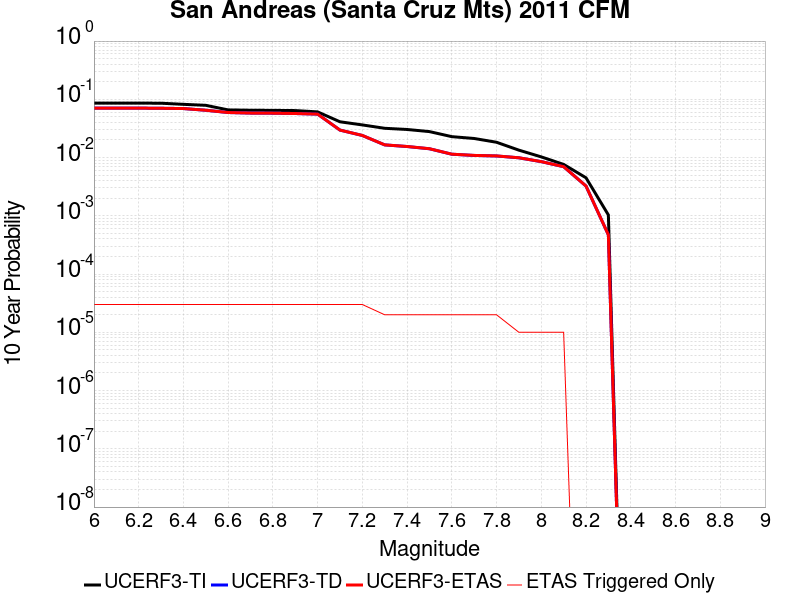 |

| Magnitude | 1 wk TI Prob | 1 wk TD Prob | 1 wk ETAS Prob | 1 wk ETAS/TD Gain | 1 wk ETAS Triggered Only | 1 mo TI Prob | 1 mo TD Prob | 1 mo ETAS Prob | 1 mo ETAS/TD Gain | 1 mo ETAS Triggered Only | 1 yr TI Prob | 1 yr TD Prob | 1 yr ETAS Prob | 1 yr ETAS/TD Gain | 1 yr ETAS Triggered Only | 10 yr TI Prob | 10 yr TD Prob | 10 yr ETAS Prob | 10 yr ETAS/TD Gain | 10 yr ETAS Triggered Only |
|-----|-----|-----|-----|-----|-----|-----|-----|-----|-----|-----|-----|-----|-----|-----|-----|-----|-----|-----|-----|-----|
| 6.0 | 1.7221631E-4 | 1.3793171E-4 | 1.4793033E-4 | 1.0724896 | 1.0E-5 | 7.378611E-4 | 5.9100403E-4 | 6.009981E-4 | 1.0169103 | 1.0E-5 | 0.008946515 | 0.007172124 | 0.0072019086 | 1.0041529 | 3.0E-5 | 0.08594794 | 0.0705551 | 0.07058298 | 1.0003952 | 3.0E-5 |
| 6.1 | 1.7221631E-4 | 1.3793171E-4 | 1.4793033E-4 | 1.0724896 | 1.0E-5 | 7.378611E-4 | 5.9100403E-4 | 6.009981E-4 | 1.0169103 | 1.0E-5 | 0.008946515 | 0.007172124 | 0.0072019086 | 1.0041529 | 3.0E-5 | 0.08594794 | 0.0705551 | 0.07058298 | 1.0003952 | 3.0E-5 |
| 6.2 | 1.7221631E-4 | 1.3793171E-4 | 1.4793033E-4 | 1.0724896 | 1.0E-5 | 7.378611E-4 | 5.9100403E-4 | 6.009981E-4 | 1.0169103 | 1.0E-5 | 0.008946515 | 0.007172124 | 0.0072019086 | 1.0041529 | 3.0E-5 | 0.08594794 | 0.0705551 | 0.07058298 | 1.0003952 | 3.0E-5 |
| 6.3 | 1.716926E-4 | 1.3712609E-4 | 1.4712471E-4 | 1.0729156 | 1.0E-5 | 7.3561794E-4 | 5.875529E-4 | 5.97547E-4 | 1.0170097 | 1.0E-5 | 0.008919428 | 0.0071303817 | 0.0071601677 | 1.0041773 | 3.0E-5 | 0.08569809 | 0.070167266 | 0.07019516 | 1.0003976 | 3.0E-5 |
| 6.4 | 1.6392978E-4 | 1.3588481E-4 | 1.4588344E-4 | 1.0735817 | 1.0E-5 | 7.02367E-4 | 5.822355E-4 | 5.922297E-4 | 1.0171652 | 1.0E-5 | 0.008517839 | 0.007066063 | 0.007095851 | 1.0042156 | 3.0E-5 | 0.08198654 | 0.06940135 | 0.06942927 | 1.0004022 | 3.0E-5 |
| 6.5 | 1.5742714E-4 | 1.2648388E-4 | 1.364826E-4 | 1.0790515 | 1.0E-5 | 6.745133E-4 | 5.4196286E-4 | 5.519574E-4 | 1.0184414 | 1.0E-5 | 0.00818132 | 0.0065787593 | 0.0066085616 | 1.0045301 | 3.0E-5 | 0.078865945 | 0.06486309 | 0.06489115 | 1.0004325 | 3.0E-5 |
| 6.6 | 1.3038084E-4 | 1.1588213E-4 | 1.2588098E-4 | 1.0862846 | 1.0E-5 | 5.5865536E-4 | 4.9654447E-4 | 5.065395E-4 | 1.0201292 | 1.0E-5 | 0.006780438 | 0.0060289134 | 0.0060587325 | 1.004946 | 3.0E-5 | 0.0657725 | 0.05932738 | 0.059355598 | 1.0004756 | 3.0E-5 |
| 6.7 | 1.2867592E-4 | 1.1314701E-4 | 1.2314587E-4 | 1.0883706 | 1.0E-5 | 5.5135164E-4 | 4.8482692E-4 | 4.9482204E-4 | 1.0206159 | 1.0E-5 | 0.0066920654 | 0.00588703 | 0.005916854 | 1.0050659 | 3.0E-5 | 0.06494093 | 0.058038417 | 0.058066677 | 1.0004869 | 3.0E-5 |
| 6.8 | 1.2801298E-4 | 1.1252261E-4 | 1.2252148E-4 | 1.088861 | 1.0E-5 | 5.485117E-4 | 4.8215193E-4 | 4.921471E-4 | 1.0207304 | 1.0E-5 | 0.0066577005 | 0.0058546383 | 0.0058844625 | 1.0050942 | 3.0E-5 | 0.06461738 | 0.057752274 | 0.057780538 | 1.0004895 | 3.0E-5 |
| 6.9 | 1.269149E-4 | 1.1094465E-4 | 1.2094354E-4 | 1.0901251 | 1.0E-5 | 5.4380763E-4 | 4.7539172E-4 | 4.8538696E-4 | 1.0210253 | 1.0E-5 | 0.006600777 | 0.005772772 | 0.005802599 | 1.0051668 | 3.0E-5 | 0.06408122 | 0.0570241 | 0.057052385 | 1.0004961 | 3.0E-5 |
| 7.0 | 1.2030331E-4 | 1.0824504E-4 | 1.1824395E-4 | 1.092373 | 1.0E-5 | 5.154837E-4 | 4.638261E-4 | 4.7382145E-4 | 1.0215498 | 1.0E-5 | 0.006257969 | 0.0056326967 | 0.0056625274 | 1.005296 | 3.0E-5 | 0.06084648 | 0.055696685 | 0.055725016 | 1.0005087 | 3.0E-5 |
| 7.1 | 8.049617E-5 | 5.3926604E-5 | 6.392606E-5 | 1.1854272 | 1.0E-5 | 3.4493793E-4 | 2.3109373E-4 | 2.4109142E-4 | 1.0432625 | 1.0E-5 | 0.0041915346 | 0.0028099709 | 0.0028398866 | 1.0106462 | 3.0E-5 | 0.041133516 | 0.029618956 | 0.029648067 | 1.0009829 | 3.0E-5 |
| 7.2 | 7.093979E-5 | 4.2937932E-5 | 5.2937503E-5 | 1.2328843 | 1.0E-5 | 3.0399222E-4 | 1.8400686E-4 | 1.9400501E-4 | 1.0543358 | 1.0E-5 | 0.0036948253 | 0.0022380045 | 0.0022679374 | 1.0133748 | 3.0E-5 | 0.03633994 | 0.023941692 | 0.023970973 | 1.0012231 | 3.0E-5 |
| 7.3 | 6.193693E-5 | 2.8894141E-5 | 3.8893853E-5 | 1.3460809 | 1.0E-5 | 2.6541698E-4 | 1.2382616E-4 | 1.3382493E-4 | 1.0807483 | 1.0E-5 | 0.0032266637 | 0.0015065427 | 0.0015265126 | 1.0132555 | 2.0E-5 | 0.031802133 | 0.016499156 | 0.016518826 | 1.0011922 | 2.0E-5 |
| 7.4 | 5.906492E-5 | 2.702346E-5 | 3.702319E-5 | 1.3700389 | 1.0E-5 | 2.5311083E-4 | 1.1580969E-4 | 1.2580854E-4 | 1.0863385 | 1.0E-5 | 0.0030772698 | 0.0014090725 | 0.0014290443 | 1.0141737 | 2.0E-5 | 0.030350044 | 0.015471023 | 0.015490713 | 1.0012728 | 2.0E-5 |
| 7.5 | 5.424296E-5 | 2.4678277E-5 | 3.467803E-5 | 1.4052047 | 1.0E-5 | 2.324491E-4 | 1.05759755E-4 | 1.157587E-4 | 1.0945439 | 1.0E-5 | 0.002826395 | 0.0012868657 | 0.00130684 | 1.0155216 | 2.0E-5 | 0.027907165 | 0.014163188 | 0.014182904 | 1.0013921 | 2.0E-5 |
| 7.6 | 4.43084E-5 | 1.990431E-5 | 2.9904111E-5 | 1.5023937 | 1.0E-5 | 1.8987931E-4 | 8.53014E-5 | 9.5300544E-5 | 1.1172214 | 1.0E-5 | 0.0023093296 | 0.0010380499 | 0.0010580292 | 1.0192469 | 2.0E-5 | 0.022854783 | 0.011412679 | 0.011432451 | 1.0017325 | 2.0E-5 |
| 7.7 | 4.118098E-5 | 1.8936442E-5 | 2.8936252E-5 | 1.5280724 | 1.0E-5 | 1.7647797E-4 | 8.115366E-5 | 9.115285E-5 | 1.123213 | 1.0E-5 | 0.002146502 | 9.875982E-4 | 0.0010075785 | 1.0202311 | 2.0E-5 | 0.021258866 | 0.010870468 | 0.01089025 | 1.0018198 | 2.0E-5 |
| 7.8 | 3.5408906E-5 | 1.856446E-5 | 2.8564275E-5 | 1.5386536 | 1.0E-5 | 1.5174363E-4 | 7.955955E-5 | 8.955875E-5 | 1.125682 | 1.0E-5 | 0.0018459131 | 9.682073E-4 | 9.88188E-4 | 1.0206367 | 2.0E-5 | 0.018306552 | 0.010652021 | 0.010671807 | 1.0018575 | 2.0E-5 |
| 7.9 | 2.5860836E-5 | 1.7315993E-5 | 1.7315993E-5 | 1.0 | 0.0 | 1.10827445E-4 | 7.420929E-5 | 7.420929E-5 | 1.0 | 0.0 | 0.001348489 | 9.031238E-4 | 9.131148E-4 | 1.0110626 | 1.0E-5 | 0.013403354 | 0.009907599 | 0.0099174995 | 1.0009993 | 1.0E-5 |
| 8.0 | 1.9777332E-5 | 1.4839596E-5 | 1.4839596E-5 | 1.0 | 0.0 | 8.4757245E-5 | 6.3596715E-5 | 6.3596715E-5 | 1.0 | 0.0 | 0.0010314309 | 7.740152E-4 | 7.840074E-4 | 1.0129097 | 1.0E-5 | 0.010266567 | 0.008508967 | 0.008518882 | 1.0011653 | 1.0E-5 |
| 8.1 | 1.468494E-5 | 1.2107374E-5 | 1.2107374E-5 | 1.0 | 0.0 | 6.293394E-5 | 5.1887713E-5 | 5.1887713E-5 | 1.0 | 0.0 | 7.6595135E-4 | 6.3155E-4 | 6.4154365E-4 | 1.0158241 | 1.0E-5 | 0.0076331664 | 0.006969149 | 0.0069790795 | 1.0014249 | 1.0E-5 |
| 8.2 | 8.63836E-6 | 5.469061E-6 | 5.469061E-6 | 1.0 | 0.0 | 3.7021015E-5 | 2.3438623E-5 | 2.3438623E-5 | 1.0 | 0.0 | 4.5063766E-4 | 2.8532793E-4 | 2.8532793E-4 | 1.0 | 0.0 | 0.004497249 | 0.00324569 | 0.00324569 | 1.0 | 0.0 |
| 8.3 | 1.983087E-6 | 7.6599065E-7 | 7.6599065E-7 | 1.0 | 0.0 | 8.498917E-6 | 3.282813E-6 | 3.282813E-6 | 1.0 | 0.0 | 1.034694E-4 | 3.9967534E-5 | 3.9967534E-5 | 1.0 | 0.0 | 0.0010342124 | 4.719687E-4 | 4.719687E-4 | 1.0 | 0.0 |

## Santa Susana alt 1
*[(top)](#table-of-contents)*

| 1 Week | 1 Month | 1 Year | 10 Year |
|-----|-----|-----|-----|
|  |  |  |  |

| Magnitude | 1 wk TI Prob | 1 wk TD Prob | 1 wk ETAS Prob | 1 wk ETAS/TD Gain | 1 wk ETAS Triggered Only | 1 mo TI Prob | 1 mo TD Prob | 1 mo ETAS Prob | 1 mo ETAS/TD Gain | 1 mo ETAS Triggered Only | 1 yr TI Prob | 1 yr TD Prob | 1 yr ETAS Prob | 1 yr ETAS/TD Gain | 1 yr ETAS Triggered Only | 10 yr TI Prob | 10 yr TD Prob | 10 yr ETAS Prob | 10 yr ETAS/TD Gain | 10 yr ETAS Triggered Only |
|-----|-----|-----|-----|-----|-----|-----|-----|-----|-----|-----|-----|-----|-----|-----|-----|-----|-----|-----|-----|-----|
| 6.0 | 2.674877E-5 | 2.7198023E-5 | 3.719775E-5 | 1.3676637 | 1.0E-5 | 1.1463255E-4 | 1.1655839E-4 | 1.3655606E-4 | 1.1715678 | 2.0E-5 | 0.0013947578 | 0.0014182882 | 0.0014482456 | 1.0211222 | 3.0E-5 | 0.013860362 | 0.014104128 | 0.014133705 | 1.002097 | 3.0E-5 |
| 6.1 | 2.674877E-5 | 2.7198023E-5 | 3.719775E-5 | 1.3676637 | 1.0E-5 | 1.1463255E-4 | 1.1655839E-4 | 1.3655606E-4 | 1.1715678 | 2.0E-5 | 0.0013947578 | 0.0014182882 | 0.0014482456 | 1.0211222 | 3.0E-5 | 0.013860362 | 0.014104128 | 0.014133705 | 1.002097 | 3.0E-5 |
| 6.2 | 2.674877E-5 | 2.7198023E-5 | 3.719775E-5 | 1.3676637 | 1.0E-5 | 1.1463255E-4 | 1.1655839E-4 | 1.3655606E-4 | 1.1715678 | 2.0E-5 | 0.0013947578 | 0.0014182882 | 0.0014482456 | 1.0211222 | 3.0E-5 | 0.013860362 | 0.014104128 | 0.014133705 | 1.002097 | 3.0E-5 |
| 6.3 | 2.674877E-5 | 2.7198023E-5 | 3.719775E-5 | 1.3676637 | 1.0E-5 | 1.1463255E-4 | 1.1655839E-4 | 1.3655606E-4 | 1.1715678 | 2.0E-5 | 0.0013947578 | 0.0014182882 | 0.0014482456 | 1.0211222 | 3.0E-5 | 0.013860362 | 0.014104128 | 0.014133705 | 1.002097 | 3.0E-5 |
| 6.4 | 2.674877E-5 | 2.7198023E-5 | 3.719775E-5 | 1.3676637 | 1.0E-5 | 1.1463255E-4 | 1.1655839E-4 | 1.3655606E-4 | 1.1715678 | 2.0E-5 | 0.0013947578 | 0.0014182882 | 0.0014482456 | 1.0211222 | 3.0E-5 | 0.013860362 | 0.014104128 | 0.014133705 | 1.002097 | 3.0E-5 |
| 6.5 | 2.674877E-5 | 2.7198023E-5 | 3.719775E-5 | 1.3676637 | 1.0E-5 | 1.1463255E-4 | 1.1655839E-4 | 1.3655606E-4 | 1.1715678 | 2.0E-5 | 0.0013947578 | 0.0014182882 | 0.0014482456 | 1.0211222 | 3.0E-5 | 0.013860362 | 0.014104128 | 0.014133705 | 1.002097 | 3.0E-5 |
| 6.6 | 2.6647976E-5 | 2.7074359E-5 | 3.707409E-5 | 1.3693432 | 1.0E-5 | 1.14200615E-4 | 1.1602845E-4 | 1.3602612E-4 | 1.1723515 | 2.0E-5 | 0.0013895056 | 0.0014118447 | 0.0014418025 | 1.0212188 | 3.0E-5 | 0.013808494 | 0.014040513 | 0.014070092 | 1.0021067 | 3.0E-5 |
| 6.7 | 2.6647976E-5 | 2.7074359E-5 | 3.707409E-5 | 1.3693432 | 1.0E-5 | 1.14200615E-4 | 1.1602845E-4 | 1.3602612E-4 | 1.1723515 | 2.0E-5 | 0.0013895056 | 0.0014118447 | 0.0014418025 | 1.0212188 | 3.0E-5 | 0.013808494 | 0.014040513 | 0.014070092 | 1.0021067 | 3.0E-5 |
| 6.8 | 1.9073179E-5 | 1.7637283E-5 | 2.7637108E-5 | 1.5669707 | 1.0E-5 | 8.1739636E-5 | 7.558627E-5 | 9.558476E-5 | 1.2645783 | 2.0E-5 | 9.947256E-4 | 9.198925E-4 | 9.498649E-4 | 1.0325825 | 3.0E-5 | 0.009902848 | 0.009163101 | 0.009192826 | 1.003244 | 3.0E-5 |
| 6.9 | 1.9041876E-5 | 1.7619415E-5 | 2.7619239E-5 | 1.5675458 | 1.0E-5 | 8.160549E-5 | 7.55097E-5 | 9.5508185E-5 | 1.2648467 | 2.0E-5 | 9.930939E-4 | 9.1896096E-4 | 9.4893336E-4 | 1.0326155 | 3.0E-5 | 0.0098866755 | 0.0091538625 | 0.009183588 | 1.0032473 | 3.0E-5 |
| 7.0 | 1.5917482E-5 | 1.3863864E-5 | 2.3863726E-5 | 1.7212896 | 1.0E-5 | 6.8215995E-5 | 5.9415237E-5 | 7.941405E-5 | 1.336594 | 2.0E-5 | 8.302132E-4 | 7.231451E-4 | 7.531234E-4 | 1.0414555 | 3.0E-5 | 0.008271185 | 0.0072088144 | 0.007238598 | 1.0041316 | 3.0E-5 |
| 7.1 | 1.577788E-5 | 1.3743872E-5 | 2.3743734E-5 | 1.727587 | 1.0E-5 | 6.761774E-5 | 5.8901005E-5 | 7.889983E-5 | 1.3395327 | 2.0E-5 | 8.2293496E-4 | 7.1688846E-4 | 7.468669E-4 | 1.0418175 | 3.0E-5 | 0.008198941 | 0.007146652 | 0.0071764374 | 1.0041678 | 3.0E-5 |
| 7.2 | 1.5416446E-5 | 1.3469944E-5 | 2.346981E-5 | 1.7423836 | 1.0E-5 | 6.606882E-5 | 5.772708E-5 | 7.772593E-5 | 1.3464378 | 2.0E-5 | 8.0409093E-4 | 7.026052E-4 | 7.325841E-4 | 1.0426682 | 3.0E-5 | 0.008011877 | 0.0070047234 | 0.007034513 | 1.0042528 | 3.0E-5 |
| 7.3 | 1.4534083E-5 | 1.2717879E-5 | 2.2717752E-5 | 1.7862847 | 1.0E-5 | 6.228744E-5 | 5.4504082E-5 | 7.450299E-5 | 1.366925 | 2.0E-5 | 7.580857E-4 | 6.633896E-4 | 6.933697E-4 | 1.0451922 | 3.0E-5 | 0.007555048 | 0.0066149444 | 0.006644746 | 1.0045052 | 3.0E-5 |
| 7.4 | 1.2858995E-5 | 1.1229652E-5 | 2.122954E-5 | 1.8904896 | 1.0E-5 | 5.5108816E-5 | 4.8126214E-5 | 6.812525E-5 | 1.4155539 | 2.0E-5 | 6.7074323E-4 | 5.857831E-4 | 6.157655E-4 | 1.0511835 | 3.0E-5 | 0.0066872234 | 0.005843165 | 0.0058729895 | 1.0051042 | 3.0E-5 |
| 7.5 | 8.827668E-6 | 7.805457E-6 | 7.805457E-6 | 1.0 | 0.0 | 3.7832317E-5 | 3.3451546E-5 | 3.3451546E-5 | 1.0 | 0.0 | 4.605111E-4 | 4.071989E-4 | 4.1719482E-4 | 1.024548 | 1.0E-5 | 0.0045955796 | 0.0040647765 | 0.004074736 | 1.0024501 | 1.0E-5 |
| 7.6 | 3.2533426E-6 | 2.871988E-6 | 2.871988E-6 | 1.0 | 0.0 | 1.3942822E-5 | 1.2308465E-5 | 1.2308465E-5 | 1.0 | 0.0 | 1.6974064E-4 | 1.4984563E-4 | 1.4984563E-4 | 1.0 | 0.0 | 0.0016961104 | 0.0014974826 | 0.0014974826 | 1.0 | 0.0 |
| 7.7 | 1.2751709E-6 | 1.1491089E-6 | 1.1491089E-6 | 1.0 | 0.0 | 5.4650063E-6 | 4.9247437E-6 | 4.9247437E-6 | 1.0 | 0.0 | 6.653442E-5 | 5.9957198E-5 | 5.9957198E-5 | 1.0 | 0.0 | 6.6514505E-4 | 5.994191E-4 | 5.994191E-4 | 1.0 | 0.0 |
| 7.8 | 3.067544E-7 | 3.2400436E-7 | 3.2400436E-7 | 1.0 | 0.0 | 1.3146611E-6 | 1.3885895E-6 | 1.3885895E-6 | 1.0 | 0.0 | 1.600588E-5 | 1.6905957E-5 | 1.6905957E-5 | 1.0 | 0.0 | 1.6004729E-4 | 1.6904772E-4 | 1.6904772E-4 | 1.0 | 0.0 |
| 7.9 | 7.622999E-8 | 8.087964E-8 | 8.087964E-8 | 1.0 | 0.0 | 3.2669993E-7 | 3.4662696E-7 | 3.4662696E-7 | 1.0 | 0.0 | 3.977564E-6 | 4.2201773E-6 | 4.2201773E-6 | 1.0 | 0.0 | 3.977493E-5 | 4.220118E-5 | 4.220118E-5 | 1.0 | 0.0 |

## Santa Ynez River
*[(top)](#table-of-contents)*

| 1 Week | 1 Month | 1 Year | 10 Year |
|-----|-----|-----|-----|
|  |  |  |  |

| Magnitude | 1 wk TI Prob | 1 wk TD Prob | 1 wk ETAS Prob | 1 wk ETAS/TD Gain | 1 wk ETAS Triggered Only | 1 mo TI Prob | 1 mo TD Prob | 1 mo ETAS Prob | 1 mo ETAS/TD Gain | 1 mo ETAS Triggered Only | 1 yr TI Prob | 1 yr TD Prob | 1 yr ETAS Prob | 1 yr ETAS/TD Gain | 1 yr ETAS Triggered Only | 10 yr TI Prob | 10 yr TD Prob | 10 yr ETAS Prob | 10 yr ETAS/TD Gain | 10 yr ETAS Triggered Only |
|-----|-----|-----|-----|-----|-----|-----|-----|-----|-----|-----|-----|-----|-----|-----|-----|-----|-----|-----|-----|-----|
| 6.0 | 1.6396456E-5 | 1.7209435E-5 | 2.7209264E-5 | 1.5810666 | 1.0E-5 | 7.026863E-5 | 7.375284E-5 | 9.375136E-5 | 1.271156 | 2.0E-5 | 8.551848E-4 | 8.976064E-4 | 9.175885E-4 | 1.0222615 | 2.0E-5 | 0.0085190125 | 0.008943358 | 0.00897309 | 1.0033244 | 3.0E-5 |
| 6.1 | 1.6396456E-5 | 1.7209435E-5 | 2.7209264E-5 | 1.5810666 | 1.0E-5 | 7.026863E-5 | 7.375284E-5 | 9.375136E-5 | 1.271156 | 2.0E-5 | 8.551848E-4 | 8.976064E-4 | 9.175885E-4 | 1.0222615 | 2.0E-5 | 0.0085190125 | 0.008943358 | 0.00897309 | 1.0033244 | 3.0E-5 |
| 6.2 | 1.6396456E-5 | 1.7209435E-5 | 2.7209264E-5 | 1.5810666 | 1.0E-5 | 7.026863E-5 | 7.375284E-5 | 9.375136E-5 | 1.271156 | 2.0E-5 | 8.551848E-4 | 8.976064E-4 | 9.175885E-4 | 1.0222615 | 2.0E-5 | 0.0085190125 | 0.008943358 | 0.00897309 | 1.0033244 | 3.0E-5 |
| 6.3 | 9.736976E-6 | 1.012233E-5 | 2.0122228E-5 | 1.9879048 | 1.0E-5 | 4.172923E-5 | 4.338072E-5 | 5.338029E-5 | 1.2305071 | 1.0E-5 | 5.0793495E-4 | 5.280373E-4 | 5.3803204E-4 | 1.018928 | 1.0E-5 | 0.005067755 | 0.005268332 | 0.0052882265 | 1.0037763 | 2.0E-5 |
| 6.4 | 9.736976E-6 | 1.012233E-5 | 2.0122228E-5 | 1.9879048 | 1.0E-5 | 4.172923E-5 | 4.338072E-5 | 5.338029E-5 | 1.2305071 | 1.0E-5 | 5.0793495E-4 | 5.280373E-4 | 5.3803204E-4 | 1.018928 | 1.0E-5 | 0.005067755 | 0.005268332 | 0.0052882265 | 1.0037763 | 2.0E-5 |
| 6.5 | 7.081964E-6 | 7.3298966E-6 | 7.3298966E-6 | 1.0 | 0.0 | 3.035092E-5 | 3.1413474E-5 | 3.1413474E-5 | 1.0 | 0.0 | 3.694598E-4 | 3.8239348E-4 | 3.8239348E-4 | 1.0 | 0.0 | 0.0036884616 | 0.0038175168 | 0.0038175168 | 1.0 | 0.0 |
| 6.6 | 5.873247E-6 | 6.059743E-6 | 6.059743E-6 | 1.0 | 0.0 | 2.5170815E-5 | 2.5970074E-5 | 2.5970074E-5 | 1.0 | 0.0 | 3.064116E-4 | 3.1614062E-4 | 3.1614062E-4 | 1.0 | 0.0 | 0.0030598943 | 0.0031569963 | 0.0031569963 | 1.0 | 0.0 |
| 6.7 | 4.973277E-6 | 5.115901E-6 | 5.115901E-6 | 1.0 | 0.0 | 2.1313872E-5 | 2.1925109E-5 | 2.1925109E-5 | 1.0 | 0.0 | 2.5946548E-4 | 2.66906E-4 | 2.66906E-4 | 1.0 | 0.0 | 0.0025916274 | 0.0026659032 | 0.0026659032 | 1.0 | 0.0 |
| 6.8 | 4.396492E-6 | 4.5109778E-6 | 4.5109778E-6 | 1.0 | 0.0 | 1.884197E-5 | 1.9332621E-5 | 1.9332621E-5 | 1.0 | 0.0 | 2.2937685E-4 | 2.3534958E-4 | 2.3534958E-4 | 1.0 | 0.0 | 0.0022914023 | 0.0023510386 | 0.0023510386 | 1.0 | 0.0 |
| 6.9 | 3.5255632E-6 | 3.6013332E-6 | 3.6013332E-6 | 1.0 | 0.0 | 1.5109469E-5 | 1.5434196E-5 | 1.5434196E-5 | 1.0 | 0.0 | 1.8394225E-4 | 1.8789528E-4 | 1.8789528E-4 | 1.0 | 0.0 | 0.0018379007 | 0.0018773803 | 0.0018773803 | 1.0 | 0.0 |
| 7.0 | 3.211603E-6 | 3.273654E-6 | 3.273654E-6 | 1.0 | 0.0 | 1.376394E-5 | 1.4029872E-5 | 1.4029872E-5 | 1.0 | 0.0 | 1.6756308E-4 | 1.7080043E-4 | 1.7080043E-4 | 1.0 | 0.0 | 0.0016743679 | 0.0017067058 | 0.0017067058 | 1.0 | 0.0 |
| 7.1 | 2.5094619E-6 | 2.5409204E-6 | 2.5409204E-6 | 1.0 | 0.0 | 1.0754793E-5 | 1.0889614E-5 | 1.0889614E-5 | 1.0 | 0.0 | 1.3093173E-4 | 1.3257304E-4 | 1.3257304E-4 | 1.0 | 0.0 | 0.0013085462 | 0.0013249456 | 0.0013249456 | 1.0 | 0.0 |
| 7.2 | 2.0515774E-6 | 2.0619375E-6 | 2.0619375E-6 | 1.0 | 0.0 | 8.792445E-6 | 8.836846E-6 | 8.836846E-6 | 1.0 | 0.0 | 1.0704277E-4 | 1.0758333E-4 | 1.0758333E-4 | 1.0 | 0.0 | 0.0010699122 | 0.0010753168 | 0.0010753168 | 1.0 | 0.0 |
| 7.3 | 1.6845745E-6 | 1.6773907E-6 | 1.6773907E-6 | 1.0 | 0.0 | 7.219585E-6 | 7.1887976E-6 | 7.1887976E-6 | 1.0 | 0.0 | 8.78949E-5 | 8.752012E-5 | 8.752012E-5 | 1.0 | 0.0 | 8.7860145E-4 | 8.7485946E-4 | 8.7485946E-4 | 1.0 | 0.0 |
| 7.4 | 1.3600285E-6 | 1.3333357E-6 | 1.3333357E-6 | 1.0 | 0.0 | 5.82868E-6 | 5.714284E-6 | 5.714284E-6 | 1.0 | 0.0 | 7.096187E-5 | 6.956921E-5 | 6.956921E-5 | 1.0 | 0.0 | 7.0939213E-4 | 6.954765E-4 | 6.954765E-4 | 1.0 | 0.0 |
| 7.5 | 9.735342E-7 | 9.290103E-7 | 9.290103E-7 | 1.0 | 0.0 | 4.172283E-6 | 3.9814668E-6 | 3.9814668E-6 | 1.0 | 0.0 | 5.079636E-5 | 4.8473295E-5 | 4.8473295E-5 | 1.0 | 0.0 | 5.0784746E-4 | 4.8462892E-4 | 4.8462892E-4 | 1.0 | 0.0 |
| 7.6 | 5.067187E-7 | 4.77857E-7 | 4.77857E-7 | 1.0 | 0.0 | 2.1716498E-6 | 2.047957E-6 | 2.047957E-6 | 1.0 | 0.0 | 2.6439517E-5 | 2.4933597E-5 | 2.4933597E-5 | 1.0 | 0.0 | 2.643637E-4 | 2.4930874E-4 | 2.4930874E-4 | 1.0 | 0.0 |
| 7.7 | 2.769089E-7 | 2.5759124E-7 | 2.5759124E-7 | 1.0 | 0.0 | 1.1867519E-6 | 1.1039621E-6 | 1.1039621E-6 | 1.0 | 0.0 | 1.4448608E-5 | 1.34406555E-5 | 1.34406555E-5 | 1.0 | 0.0 | 1.444767E-4 | 1.3439846E-4 | 1.3439846E-4 | 1.0 | 0.0 |
| 7.8 | 1.7044663E-7 | 1.5449015E-7 | 1.5449015E-7 | 1.0 | 0.0 | 7.3048534E-7 | 6.621005E-7 | 6.621005E-7 | 1.0 | 0.0 | 8.893623E-6 | 8.061043E-6 | 8.061043E-6 | 1.0 | 0.0 | 8.893267E-5 | 8.060753E-5 | 8.060753E-5 | 1.0 | 0.0 |
| 7.9 | 4.8344287E-8 | 4.0910923E-8 | 4.0910923E-8 | 1.0 | 0.0 | 2.0718979E-7 | 1.7533252E-7 | 1.7533252E-7 | 1.0 | 0.0 | 2.5225327E-6 | 2.1346711E-6 | 2.1346711E-6 | 1.0 | 0.0 | 2.5225041E-5 | 2.1346512E-5 | 2.1346512E-5 | 1.0 | 0.0 |

## Cucamonga
*[(top)](#table-of-contents)*

| 1 Week | 1 Month | 1 Year | 10 Year |
|-----|-----|-----|-----|
|  |  |  |  |

| Magnitude | 1 wk TI Prob | 1 wk TD Prob | 1 wk ETAS Prob | 1 wk ETAS/TD Gain | 1 wk ETAS Triggered Only | 1 mo TI Prob | 1 mo TD Prob | 1 mo ETAS Prob | 1 mo ETAS/TD Gain | 1 mo ETAS Triggered Only | 1 yr TI Prob | 1 yr TD Prob | 1 yr ETAS Prob | 1 yr ETAS/TD Gain | 1 yr ETAS Triggered Only | 10 yr TI Prob | 10 yr TD Prob | 10 yr ETAS Prob | 10 yr ETAS/TD Gain | 10 yr ETAS Triggered Only |
|-----|-----|-----|-----|-----|-----|-----|-----|-----|-----|-----|-----|-----|-----|-----|-----|-----|-----|-----|-----|-----|
| 6.0 | 1.1848348E-5 | 1.1737008E-5 | 3.1736774E-5 | 2.7039917 | 2.0E-5 | 5.0777642E-5 | 5.030051E-5 | 7.02995E-5 | 1.3975903 | 2.0E-5 | 6.180424E-4 | 6.1223935E-4 | 6.322271E-4 | 1.032647 | 2.0E-5 | 0.0061632637 | 0.0061067017 | 0.0061365184 | 1.0048827 | 3.0E-5 |
| 6.1 | 1.1848348E-5 | 1.1737008E-5 | 3.1736774E-5 | 2.7039917 | 2.0E-5 | 5.0777642E-5 | 5.030051E-5 | 7.02995E-5 | 1.3975903 | 2.0E-5 | 6.180424E-4 | 6.1223935E-4 | 6.322271E-4 | 1.032647 | 2.0E-5 | 0.0061632637 | 0.0061067017 | 0.0061365184 | 1.0048827 | 3.0E-5 |
| 6.2 | 1.1848348E-5 | 1.1737008E-5 | 3.1736774E-5 | 2.7039917 | 2.0E-5 | 5.0777642E-5 | 5.030051E-5 | 7.02995E-5 | 1.3975903 | 2.0E-5 | 6.180424E-4 | 6.1223935E-4 | 6.322271E-4 | 1.032647 | 2.0E-5 | 0.0061632637 | 0.0061067017 | 0.0061365184 | 1.0048827 | 3.0E-5 |
| 6.3 | 1.1848348E-5 | 1.1737008E-5 | 3.1736774E-5 | 2.7039917 | 2.0E-5 | 5.0777642E-5 | 5.030051E-5 | 7.02995E-5 | 1.3975903 | 2.0E-5 | 6.180424E-4 | 6.1223935E-4 | 6.322271E-4 | 1.032647 | 2.0E-5 | 0.0061632637 | 0.0061067017 | 0.0061365184 | 1.0048827 | 3.0E-5 |
| 6.4 | 1.1848348E-5 | 1.1737008E-5 | 3.1736774E-5 | 2.7039917 | 2.0E-5 | 5.0777642E-5 | 5.030051E-5 | 7.02995E-5 | 1.3975903 | 2.0E-5 | 6.180424E-4 | 6.1223935E-4 | 6.322271E-4 | 1.032647 | 2.0E-5 | 0.0061632637 | 0.0061067017 | 0.0061365184 | 1.0048827 | 3.0E-5 |
| 6.5 | 1.16988695E-5 | 1.15760395E-5 | 3.1575808E-5 | 2.7276866 | 2.0E-5 | 5.013705E-5 | 4.9610666E-5 | 6.9609676E-5 | 1.4031191 | 2.0E-5 | 6.102476E-4 | 6.0384517E-4 | 6.238331E-4 | 1.0331011 | 2.0E-5 | 0.006085745 | 0.006023216 | 0.0060530356 | 1.0049508 | 3.0E-5 |
| 6.6 | 1.16988695E-5 | 1.15760395E-5 | 3.1575808E-5 | 2.7276866 | 2.0E-5 | 5.013705E-5 | 4.9610666E-5 | 6.9609676E-5 | 1.4031191 | 2.0E-5 | 6.102476E-4 | 6.0384517E-4 | 6.238331E-4 | 1.0331011 | 2.0E-5 | 0.006085745 | 0.006023216 | 0.0060530356 | 1.0049508 | 3.0E-5 |
| 6.7 | 1.1397107E-5 | 1.11149475E-5 | 3.1114727E-5 | 2.7993586 | 2.0E-5 | 4.884383E-5 | 4.7634636E-5 | 6.763368E-5 | 1.4198426 | 2.0E-5 | 5.9451134E-4 | 5.797998E-4 | 5.9978827E-4 | 1.0344746 | 2.0E-5 | 0.005929234 | 0.0057840226 | 0.0058039073 | 1.0034378 | 2.0E-5 |
| 6.8 | 1.058387E-5 | 9.784992E-6 | 2.9784796E-5 | 3.0439267 | 2.0E-5 | 4.5358654E-5 | 4.193501E-5 | 6.193417E-5 | 1.4769084 | 2.0E-5 | 5.521017E-4 | 5.1044027E-4 | 5.3043006E-4 | 1.0391619 | 2.0E-5 | 0.00550732 | 0.0050936877 | 0.005113586 | 1.0039064 | 2.0E-5 |
| 6.9 | 9.690046E-6 | 8.57948E-6 | 2.8579308E-5 | 3.3311236 | 2.0E-5 | 4.1528107E-5 | 3.6768684E-5 | 5.676795E-5 | 1.5439211 | 2.0E-5 | 5.054874E-4 | 4.475672E-4 | 4.6755825E-4 | 1.044666 | 2.0E-5 | 0.005043391 | 0.004467594 | 0.0044875047 | 1.0044566 | 2.0E-5 |
| 7.0 | 9.381461E-6 | 8.187101E-6 | 2.8186938E-5 | 3.442847 | 2.0E-5 | 4.020564E-5 | 3.5087105E-5 | 5.5086406E-5 | 1.5699899 | 2.0E-5 | 4.893937E-4 | 4.2710215E-4 | 4.470936E-4 | 1.0468072 | 2.0E-5 | 0.0048831734 | 0.0042637475 | 0.0042836624 | 1.0046707 | 2.0E-5 |
| 7.1 | 8.946492E-6 | 7.781886E-6 | 1.7781807E-5 | 2.2850256 | 1.0E-5 | 3.8341543E-5 | 3.3350516E-5 | 4.335018E-5 | 1.2998354 | 1.0E-5 | 4.667083E-4 | 4.0596718E-4 | 4.1596312E-4 | 1.0246226 | 1.0E-5 | 0.0046572937 | 0.004053192 | 0.004063152 | 1.0024571 | 1.0E-5 |
| 7.2 | 8.251016E-6 | 6.9752796E-6 | 1.697521E-5 | 2.4336243 | 1.0E-5 | 3.5361016E-5 | 2.9893714E-5 | 3.9893417E-5 | 1.3345085 | 1.0E-5 | 4.3043532E-4 | 3.6389544E-4 | 3.738918E-4 | 1.0274705 | 1.0E-5 | 0.0042960253 | 0.0036339292 | 0.0036438927 | 1.0027418 | 1.0E-5 |
| 7.3 | 7.717881E-6 | 6.4863502E-6 | 1.6486285E-5 | 2.541689 | 1.0E-5 | 3.3076216E-5 | 2.7798349E-5 | 3.7798072E-5 | 1.3597236 | 1.0E-5 | 4.026285E-4 | 3.3839257E-4 | 3.4838918E-4 | 1.0295415 | 1.0E-5 | 0.004018998 | 0.00337971 | 0.0033896763 | 1.0029489 | 1.0E-5 |
| 7.4 | 7.275623E-6 | 6.031997E-6 | 1.6031938E-5 | 2.6578157 | 1.0E-5 | 3.118087E-5 | 2.585116E-5 | 3.5850902E-5 | 1.3868198 | 1.0E-5 | 3.7956095E-4 | 3.1469265E-4 | 3.246895E-4 | 1.031767 | 1.0E-5 | 0.0037891332 | 0.0031434062 | 0.003153375 | 1.0031712 | 1.0E-5 |
| 7.5 | 6.5109502E-6 | 5.1006014E-6 | 1.5100551E-5 | 2.9605432 | 1.0E-5 | 2.7903774E-5 | 2.1859538E-5 | 3.185932E-5 | 1.4574562 | 1.0E-5 | 3.3967546E-4 | 2.661075E-4 | 2.7610484E-4 | 1.0375688 | 1.0E-5 | 0.0033915674 | 0.002658813 | 0.0026687866 | 1.003751 | 1.0E-5 |
| 7.6 | 5.4495326E-6 | 3.90857E-6 | 3.90857E-6 | 1.0 | 0.0 | 2.335493E-5 | 1.6750908E-5 | 1.6750908E-5 | 1.0 | 0.0 | 2.8430918E-4 | 2.0392328E-4 | 2.0392328E-4 | 1.0 | 0.0 | 0.0028394572 | 0.002038282 | 0.002038282 | 1.0 | 0.0 |
| 7.7 | 4.7997164E-6 | 3.2002547E-6 | 3.2002547E-6 | 1.0 | 0.0 | 2.057005E-5 | 1.3715306E-5 | 1.3715306E-5 | 1.0 | 0.0 | 2.504116E-4 | 1.6697108E-4 | 1.6697108E-4 | 1.0 | 0.0 | 0.002501296 | 0.0016693877 | 0.0016693877 | 1.0 | 0.0 |
| 7.8 | 3.3941733E-6 | 2.0641899E-6 | 2.0641899E-6 | 1.0 | 0.0 | 1.4546376E-5 | 8.846498E-6 | 8.846498E-6 | 1.0 | 0.0 | 1.7708774E-4 | 1.07700806E-4 | 1.07700806E-4 | 1.0 | 0.0 | 0.0017694668 | 0.001076723 | 0.001076723 | 1.0 | 0.0 |
| 7.9 | 9.750552E-7 | 5.155946E-7 | 5.155946E-7 | 1.0 | 0.0 | 4.178801E-6 | 2.2096892E-6 | 2.2096892E-6 | 1.0 | 0.0 | 5.0875715E-5 | 2.690264E-5 | 2.690264E-5 | 1.0 | 0.0 | 5.086407E-4 | 2.6899425E-4 | 2.6899425E-4 | 1.0 | 0.0 |
| 8.0 | 1.133857E-7 | 6.053707E-8 | 6.053707E-8 | 1.0 | 0.0 | 4.8593864E-7 | 2.5944456E-7 | 2.5944456E-7 | 1.0 | 0.0 | 5.9162867E-6 | 3.158733E-6 | 3.158733E-6 | 1.0 | 0.0 | 5.916129E-5 | 3.1586897E-5 | 3.1586897E-5 | 1.0 | 0.0 |

## San Jacinto (Clark) rev
*[(top)](#table-of-contents)*

| 1 Week | 1 Month | 1 Year | 10 Year |
|-----|-----|-----|-----|
|  |  |  |  |

| Magnitude | 1 wk TI Prob | 1 wk TD Prob | 1 wk ETAS Prob | 1 wk ETAS/TD Gain | 1 wk ETAS Triggered Only | 1 mo TI Prob | 1 mo TD Prob | 1 mo ETAS Prob | 1 mo ETAS/TD Gain | 1 mo ETAS Triggered Only | 1 yr TI Prob | 1 yr TD Prob | 1 yr ETAS Prob | 1 yr ETAS/TD Gain | 1 yr ETAS Triggered Only | 10 yr TI Prob | 10 yr TD Prob | 10 yr ETAS Prob | 10 yr ETAS/TD Gain | 10 yr ETAS Triggered Only |
|-----|-----|-----|-----|-----|-----|-----|-----|-----|-----|-----|-----|-----|-----|-----|-----|-----|-----|-----|-----|-----|
| 6.0 | 4.482615E-5 | 2.1154196E-5 | 4.1153773E-5 | 1.945419 | 2.0E-5 | 1.9209793E-4 | 9.065773E-5 | 1.1065592E-4 | 1.22059 | 2.0E-5 | 0.0023362834 | 0.0011032083 | 0.0011331752 | 1.0271634 | 3.0E-5 | 0.02311874 | 0.011503847 | 0.011533502 | 1.0025778 | 3.0E-5 |
| 6.1 | 4.482615E-5 | 2.1154196E-5 | 4.1153773E-5 | 1.945419 | 2.0E-5 | 1.9209793E-4 | 9.065773E-5 | 1.1065592E-4 | 1.22059 | 2.0E-5 | 0.0023362834 | 0.0011032083 | 0.0011331752 | 1.0271634 | 3.0E-5 | 0.02311874 | 0.011503847 | 0.011533502 | 1.0025778 | 3.0E-5 |
| 6.2 | 4.482615E-5 | 2.1154196E-5 | 4.1153773E-5 | 1.945419 | 2.0E-5 | 1.9209793E-4 | 9.065773E-5 | 1.1065592E-4 | 1.22059 | 2.0E-5 | 0.0023362834 | 0.0011032083 | 0.0011331752 | 1.0271634 | 3.0E-5 | 0.02311874 | 0.011503847 | 0.011533502 | 1.0025778 | 3.0E-5 |
| 6.3 | 4.482615E-5 | 2.1154196E-5 | 4.1153773E-5 | 1.945419 | 2.0E-5 | 1.9209793E-4 | 9.065773E-5 | 1.1065592E-4 | 1.22059 | 2.0E-5 | 0.0023362834 | 0.0011032083 | 0.0011331752 | 1.0271634 | 3.0E-5 | 0.02311874 | 0.011503847 | 0.011533502 | 1.0025778 | 3.0E-5 |
| 6.4 | 4.482615E-5 | 2.1154196E-5 | 4.1153773E-5 | 1.945419 | 2.0E-5 | 1.9209793E-4 | 9.065773E-5 | 1.1065592E-4 | 1.22059 | 2.0E-5 | 0.0023362834 | 0.0011032083 | 0.0011331752 | 1.0271634 | 3.0E-5 | 0.02311874 | 0.011503847 | 0.011533502 | 1.0025778 | 3.0E-5 |
| 6.5 | 3.7294863E-5 | 1.7356087E-5 | 3.735574E-5 | 2.1523135 | 2.0E-5 | 1.5982533E-4 | 7.438113E-5 | 9.437965E-5 | 1.2688653 | 2.0E-5 | 0.0019441366 | 9.052186E-4 | 9.351914E-4 | 1.0331112 | 3.0E-5 | 0.01927216 | 0.0094941035 | 0.009523818 | 1.0031298 | 3.0E-5 |
| 6.6 | 3.7294863E-5 | 1.7356087E-5 | 3.735574E-5 | 2.1523135 | 2.0E-5 | 1.5982533E-4 | 7.438113E-5 | 9.437965E-5 | 1.2688653 | 2.0E-5 | 0.0019441366 | 9.052186E-4 | 9.351914E-4 | 1.0331112 | 3.0E-5 | 0.01927216 | 0.0094941035 | 0.009523818 | 1.0031298 | 3.0E-5 |
| 6.7 | 3.6039248E-5 | 1.6604314E-5 | 3.6603982E-5 | 2.2044864 | 2.0E-5 | 1.5444479E-4 | 7.1159426E-5 | 9.1158E-5 | 1.281039 | 2.0E-5 | 0.0018787434 | 8.6602574E-4 | 8.959998E-4 | 1.034611 | 3.0E-5 | 0.01862939 | 0.009096047 | 0.009125774 | 1.0032681 | 3.0E-5 |
| 6.8 | 3.5031844E-5 | 1.6232942E-5 | 3.6232617E-5 | 2.2320426 | 2.0E-5 | 1.5012783E-4 | 6.956792E-5 | 8.956653E-5 | 1.2874688 | 2.0E-5 | 0.0018262739 | 8.4666436E-4 | 8.766389E-4 | 1.0354031 | 3.0E-5 | 0.01811338 | 0.008895969 | 0.008925702 | 1.0033423 | 3.0E-5 |
| 6.9 | 3.435112E-5 | 1.6063195E-5 | 3.6062873E-5 | 2.2450624 | 2.0E-5 | 1.4721078E-4 | 6.884047E-5 | 8.883909E-5 | 1.2905068 | 2.0E-5 | 0.0017908178 | 8.3781447E-4 | 8.677894E-4 | 1.0357774 | 3.0E-5 | 0.017764548 | 0.008804181 | 0.008833916 | 1.0033774 | 3.0E-5 |
| 7.0 | 2.8959772E-5 | 1.4336745E-5 | 3.433646E-5 | 2.394997 | 2.0E-5 | 1.241074E-4 | 6.144176E-5 | 8.1440536E-5 | 1.3254915 | 2.0E-5 | 0.0015099603 | 7.477995E-4 | 7.7777705E-4 | 1.0400877 | 3.0E-5 | 0.014997416 | 0.007868037 | 0.007897801 | 1.0037829 | 3.0E-5 |
| 7.1 | 2.6002877E-5 | 1.2829002E-5 | 3.2828746E-5 | 2.5589478 | 2.0E-5 | 1.11436144E-4 | 5.498029E-5 | 7.497919E-5 | 1.3637468 | 2.0E-5 | 0.0013558907 | 6.691816E-4 | 6.991615E-4 | 1.0448009 | 3.0E-5 | 0.013476475 | 0.0070465137 | 0.0070763025 | 1.0042274 | 3.0E-5 |
| 7.2 | 2.2544838E-5 | 1.1262543E-5 | 3.126232E-5 | 2.7757778 | 2.0E-5 | 9.661716E-5 | 4.8267157E-5 | 6.826619E-5 | 1.4143404 | 2.0E-5 | 0.001175679 | 5.874956E-4 | 6.1747804E-4 | 1.0510342 | 3.0E-5 | 0.011694785 | 0.0061927503 | 0.0062225643 | 1.0048144 | 3.0E-5 |
| 7.3 | 1.75334E-5 | 1.0811715E-5 | 3.0811498E-5 | 2.8498254 | 2.0E-5 | 7.514098E-5 | 4.6335106E-5 | 6.633418E-5 | 1.4316182 | 2.0E-5 | 9.144575E-4 | 5.6398526E-4 | 5.939684E-4 | 1.0531629 | 3.0E-5 | 0.009107036 | 0.0059337732 | 0.0059635956 | 1.0050259 | 3.0E-5 |
| 7.4 | 1.5924552E-5 | 1.0611516E-5 | 3.0611303E-5 | 2.8847249 | 2.0E-5 | 6.82463E-5 | 4.547714E-5 | 6.547623E-5 | 1.4397614 | 2.0E-5 | 8.305819E-4 | 5.535449E-4 | 5.835283E-4 | 1.0541662 | 3.0E-5 | 0.008274844 | 0.0058210334 | 0.0058508585 | 1.0051237 | 3.0E-5 |
| 7.5 | 1.3428931E-5 | 9.8519E-6 | 2.9851702E-5 | 3.0300453 | 2.0E-5 | 5.7551293E-5 | 4.2221753E-5 | 6.2220905E-5 | 1.4736695 | 2.0E-5 | 7.004617E-4 | 5.1392964E-4 | 5.439142E-4 | 1.0583438 | 3.0E-5 | 0.006982579 | 0.0054066023 | 0.0054364405 | 1.0055188 | 3.0E-5 |
| 7.6 | 1.0688787E-5 | 8.614839E-6 | 2.8614668E-5 | 3.3215554 | 2.0E-5 | 4.5808283E-5 | 3.692022E-5 | 5.691948E-5 | 1.5416886 | 2.0E-5 | 5.5757316E-4 | 4.4941145E-4 | 4.7939798E-4 | 1.066724 | 3.0E-5 | 0.005561762 | 0.0047416524 | 0.00477151 | 1.0062969 | 3.0E-5 |
| 7.7 | 8.81236E-6 | 7.4680274E-6 | 2.7467879E-5 | 3.6780634 | 2.0E-5 | 3.776671E-5 | 3.2005442E-5 | 5.20048E-5 | 1.6248738 | 2.0E-5 | 4.597127E-4 | 3.8959677E-4 | 4.195851E-4 | 1.0769727 | 3.0E-5 | 0.0045876284 | 0.0041346536 | 0.0041645295 | 1.0072258 | 3.0E-5 |
| 7.8 | 7.780431E-6 | 6.696579E-6 | 1.6696513E-5 | 2.4932897 | 1.0E-5 | 3.3344273E-5 | 2.8699309E-5 | 3.869902E-5 | 1.3484304 | 1.0E-5 | 4.0589093E-4 | 3.4935825E-4 | 3.6935127E-4 | 1.0572278 | 2.0E-5 | 0.0040515037 | 0.0037227906 | 0.0037427163 | 1.0053523 | 2.0E-5 |
| 7.9 | 6.5437994E-6 | 5.780382E-6 | 1.5780324E-5 | 2.7299795 | 1.0E-5 | 2.8044553E-5 | 2.477283E-5 | 3.4772584E-5 | 1.403658 | 1.0E-5 | 3.4138895E-4 | 3.0156763E-4 | 3.2156162E-4 | 1.0663002 | 2.0E-5 | 0.0034086495 | 0.0032344845 | 0.00325442 | 1.0061634 | 2.0E-5 |
| 8.0 | 5.4488164E-6 | 4.8133406E-6 | 1.4813292E-5 | 3.0775492 | 1.0E-5 | 2.3351862E-5 | 2.062844E-5 | 3.0628235E-5 | 1.4847577 | 1.0E-5 | 2.8427184E-4 | 2.5112246E-4 | 2.7111746E-4 | 1.0796224 | 2.0E-5 | 0.0028390845 | 0.002710839 | 0.0027307847 | 1.0073578 | 2.0E-5 |
| 8.1 | 2.8397242E-6 | 1.3670389E-6 | 1.1367025E-5 | 8.315071 | 1.0E-5 | 1.217019E-5 | 5.858725E-6 | 1.5858666E-5 | 2.706846 | 1.0E-5 | 1.4816198E-4 | 7.132765E-5 | 8.132694E-5 | 1.1401881 | 1.0E-5 | 0.0014806325 | 8.115382E-4 | 8.2153006E-4 | 1.0123123 | 1.0E-5 |
| 8.2 | 2.030244E-6 | 6.318974E-7 | 6.318974E-7 | 1.0 | 0.0 | 8.701017E-6 | 2.708129E-6 | 2.708129E-6 | 1.0 | 0.0 | 1.05929736E-4 | 3.2970976E-5 | 3.2970976E-5 | 1.0 | 0.0 | 0.0010587925 | 3.9486602E-4 | 3.9486602E-4 | 1.0 | 0.0 |
| 8.3 | 1.0659804E-6 | 2.9250086E-7 | 2.9250086E-7 | 1.0 | 0.0 | 4.568479E-6 | 1.2535745E-6 | 1.2535745E-6 | 1.0 | 0.0 | 5.5619817E-5 | 1.5262167E-5 | 1.5262167E-5 | 1.0 | 0.0 | 5.5605895E-4 | 1.8566217E-4 | 1.8566217E-4 | 1.0 | 0.0 |

## Santa Cruz Catalina Ridge alt1
*[(top)](#table-of-contents)*

| 1 Week | 1 Month | 1 Year | 10 Year |
|-----|-----|-----|-----|
|  |  |  |  |

| Magnitude | 1 wk TI Prob | 1 wk TD Prob | 1 wk ETAS Prob | 1 wk ETAS/TD Gain | 1 wk ETAS Triggered Only | 1 mo TI Prob | 1 mo TD Prob | 1 mo ETAS Prob | 1 mo ETAS/TD Gain | 1 mo ETAS Triggered Only | 1 yr TI Prob | 1 yr TD Prob | 1 yr ETAS Prob | 1 yr ETAS/TD Gain | 1 yr ETAS Triggered Only | 10 yr TI Prob | 10 yr TD Prob | 10 yr ETAS Prob | 10 yr ETAS/TD Gain | 10 yr ETAS Triggered Only |
|-----|-----|-----|-----|-----|-----|-----|-----|-----|-----|-----|-----|-----|-----|-----|-----|-----|-----|-----|-----|-----|
| 6.0 | 3.2833184E-5 | 3.65584E-5 | 6.65573E-5 | 1.8205749 | 3.0E-5 | 1.4070606E-4 | 1.5667039E-4 | 1.8666568E-4 | 1.1914548 | 3.0E-5 | 0.00171175 | 0.0019059596 | 0.0019359024 | 1.0157101 | 3.0E-5 | 0.016986247 | 0.018913029 | 0.018942462 | 1.0015562 | 3.0E-5 |
| 6.1 | 1.9835548E-5 | 2.1659505E-5 | 5.1658855E-5 | 2.3850431 | 3.0E-5 | 8.500672E-5 | 9.282326E-5 | 1.2282048E-4 | 1.3231648 | 3.0E-5 | 0.0010344655 | 0.0011295575 | 0.0011595236 | 1.0265291 | 3.0E-5 | 0.010296632 | 0.011240295 | 0.011269959 | 1.0026389 | 3.0E-5 |
| 6.2 | 1.9835548E-5 | 2.1659505E-5 | 5.1658855E-5 | 2.3850431 | 3.0E-5 | 8.500672E-5 | 9.282326E-5 | 1.2282048E-4 | 1.3231648 | 3.0E-5 | 0.0010344655 | 0.0011295575 | 0.0011595236 | 1.0265291 | 3.0E-5 | 0.010296632 | 0.011240295 | 0.011269959 | 1.0026389 | 3.0E-5 |
| 6.3 | 1.5728183E-5 | 1.703395E-5 | 3.703361E-5 | 2.174106 | 2.0E-5 | 6.7404755E-5 | 7.300063E-5 | 9.299917E-5 | 1.2739502 | 2.0E-5 | 8.2034385E-4 | 8.884264E-4 | 9.084086E-4 | 1.0224917 | 2.0E-5 | 0.008173222 | 0.008849427 | 0.00886925 | 1.0022401 | 2.0E-5 |
| 6.4 | 1.5728183E-5 | 1.703395E-5 | 3.703361E-5 | 2.174106 | 2.0E-5 | 6.7404755E-5 | 7.300063E-5 | 9.299917E-5 | 1.2739502 | 2.0E-5 | 8.2034385E-4 | 8.884264E-4 | 9.084086E-4 | 1.0224917 | 2.0E-5 | 0.008173222 | 0.008849427 | 0.00886925 | 1.0022401 | 2.0E-5 |
| 6.5 | 1.3707734E-5 | 1.4794522E-5 | 3.4794226E-5 | 2.3518317 | 2.0E-5 | 5.8746107E-5 | 6.3403575E-5 | 8.34023E-5 | 1.3154197 | 2.0E-5 | 7.1499916E-4 | 7.716686E-4 | 7.916532E-4 | 1.0258979 | 2.0E-5 | 0.0071270303 | 0.0076902895 | 0.007710136 | 1.0025806 | 2.0E-5 |
| 6.6 | 1.2539813E-5 | 1.3510219E-5 | 3.350995E-5 | 2.480341 | 2.0E-5 | 5.3740947E-5 | 5.789967E-5 | 7.789851E-5 | 1.3454051 | 2.0E-5 | 6.540996E-4 | 7.0470315E-4 | 7.2468905E-4 | 1.0283607 | 2.0E-5 | 0.0065217763 | 0.0070249885 | 0.007044848 | 1.0028269 | 2.0E-5 |
| 6.7 | 1.1504083E-5 | 1.2377375E-5 | 3.2377127E-5 | 2.6158316 | 2.0E-5 | 4.930228E-5 | 5.3044827E-5 | 7.304377E-5 | 1.3770196 | 2.0E-5 | 6.0008996E-4 | 6.456314E-4 | 6.6561846E-4 | 1.0309575 | 2.0E-5 | 0.005984721 | 0.006437786 | 0.006457657 | 1.0030867 | 2.0E-5 |
| 6.8 | 1.012739E-5 | 1.0877071E-5 | 2.0876963E-5 | 1.9193552 | 1.0E-5 | 4.340238E-5 | 4.6615194E-5 | 5.661473E-5 | 1.2145123 | 1.0E-5 | 5.282958E-4 | 5.673937E-4 | 5.7738804E-4 | 1.0176145 | 1.0E-5 | 0.0052704164 | 0.0056596193 | 0.005669563 | 1.0017569 | 1.0E-5 |
| 6.9 | 8.9607865E-6 | 9.609117E-6 | 1.960902E-5 | 2.0406682 | 1.0E-5 | 3.8402806E-5 | 4.1181287E-5 | 5.1180876E-5 | 1.2428187 | 1.0E-5 | 4.6745385E-4 | 5.012679E-4 | 5.1126286E-4 | 1.0199394 | 1.0E-5 | 0.0046647177 | 0.005001492 | 0.0050114417 | 1.0019894 | 1.0E-5 |
| 7.0 | 8.046829E-6 | 8.619746E-6 | 1.861966E-5 | 2.160117 | 1.0E-5 | 3.4485955E-5 | 3.694125E-5 | 4.694088E-5 | 1.2706901 | 1.0E-5 | 4.1978562E-4 | 4.496677E-4 | 4.5966322E-4 | 1.0222286 | 1.0E-5 | 0.004189935 | 0.0044876686 | 0.004497624 | 1.0022184 | 1.0E-5 |
| 7.1 | 7.136131E-6 | 7.637656E-6 | 7.637656E-6 | 1.0 | 0.0 | 3.0583058E-5 | 3.2732405E-5 | 3.2732405E-5 | 1.0 | 0.0 | 3.7228514E-4 | 3.9844486E-4 | 3.9844486E-4 | 1.0 | 0.0 | 0.0037166206 | 0.003977381 | 0.003977381 | 1.0 | 0.0 |
| 7.2 | 6.362014E-6 | 6.8049585E-6 | 6.8049585E-6 | 1.0 | 0.0 | 2.726549E-5 | 2.9163786E-5 | 2.9163786E-5 | 1.0 | 0.0 | 3.3190678E-4 | 3.550119E-4 | 3.550119E-4 | 1.0 | 0.0 | 0.0033141149 | 0.003544516 | 0.003544516 | 1.0 | 0.0 |
| 7.3 | 5.004101E-6 | 5.351715E-6 | 5.351715E-6 | 1.0 | 0.0 | 2.1445969E-5 | 2.2935723E-5 | 2.2935723E-5 | 1.0 | 0.0 | 2.6107338E-4 | 2.792072E-4 | 2.792072E-4 | 1.0 | 0.0 | 0.002607669 | 0.0027886187 | 0.0027886187 | 1.0 | 0.0 |
| 7.4 | 3.4901443E-6 | 3.7320526E-6 | 3.7320526E-6 | 1.0 | 0.0 | 1.4957676E-5 | 1.5994416E-5 | 1.5994416E-5 | 1.0 | 0.0 | 1.8209449E-4 | 1.9471499E-4 | 1.9471499E-4 | 1.0 | 0.0 | 0.0018194534 | 0.0019454823 | 0.0019454823 | 1.0 | 0.0 |
| 7.5 | 1.1215045E-6 | 1.189387E-6 | 1.189387E-6 | 1.0 | 0.0 | 4.806439E-6 | 5.097363E-6 | 5.097363E-6 | 1.0 | 0.0 | 5.851682E-5 | 6.205866E-5 | 6.205866E-5 | 1.0 | 0.0 | 5.850142E-4 | 6.2041637E-4 | 6.2041637E-4 | 1.0 | 0.0 |
| 7.6 | 2.8599047E-7 | 2.9951994E-7 | 2.9951994E-7 | 1.0 | 0.0 | 1.2256729E-6 | 1.2836562E-6 | 1.2836562E-6 | 1.0 | 0.0 | 1.4922465E-5 | 1.5628404E-5 | 1.5628404E-5 | 1.0 | 0.0 | 1.4921463E-4 | 1.5627318E-4 | 1.5627318E-4 | 1.0 | 0.0 |
| 7.7 | 2.0781519E-7 | 2.1744323E-7 | 2.1744323E-7 | 1.0 | 0.0 | 8.906362E-7 | 9.3189925E-7 | 9.3189925E-7 | 1.0 | 0.0 | 1.08434415E-5 | 1.13458145E-5 | 1.13458145E-5 | 1.0 | 0.0 | 1.0842913E-4 | 1.1345245E-4 | 1.1345245E-4 | 1.0 | 0.0 |
| 7.8 | 3.614776E-8 | 3.764102E-8 | 3.764102E-8 | 1.0 | 0.0 | 1.5491896E-7 | 1.6131864E-7 | 1.6131864E-7 | 1.0 | 0.0 | 1.8861368E-6 | 1.9640527E-6 | 1.9640527E-6 | 1.0 | 0.0 | 1.8861208E-5 | 1.9640367E-5 | 1.9640367E-5 | 1.0 | 0.0 |

## Cleghorn
*[(top)](#table-of-contents)*

| 1 Week | 1 Month | 1 Year | 10 Year |
|-----|-----|-----|-----|
|  |  |  |  |

| Magnitude | 1 wk TI Prob | 1 wk TD Prob | 1 wk ETAS Prob | 1 wk ETAS/TD Gain | 1 wk ETAS Triggered Only | 1 mo TI Prob | 1 mo TD Prob | 1 mo ETAS Prob | 1 mo ETAS/TD Gain | 1 mo ETAS Triggered Only | 1 yr TI Prob | 1 yr TD Prob | 1 yr ETAS Prob | 1 yr ETAS/TD Gain | 1 yr ETAS Triggered Only | 10 yr TI Prob | 10 yr TD Prob | 10 yr ETAS Prob | 10 yr ETAS/TD Gain | 10 yr ETAS Triggered Only |
|-----|-----|-----|-----|-----|-----|-----|-----|-----|-----|-----|-----|-----|-----|-----|-----|-----|-----|-----|-----|-----|
| 6.0 | 7.9267165E-6 | 9.831582E-6 | 1.9831485E-5 | 2.0171201 | 1.0E-5 | 3.39712E-5 | 4.2134732E-5 | 6.213389E-5 | 1.4746478 | 2.0E-5 | 4.1352084E-4 | 5.128803E-4 | 5.4286484E-4 | 1.0584632 | 3.0E-5 | 0.004127522 | 0.0051320773 | 0.0051619234 | 1.0058156 | 3.0E-5 |
| 6.1 | 7.9267165E-6 | 9.831582E-6 | 1.9831485E-5 | 2.0171201 | 1.0E-5 | 3.39712E-5 | 4.2134732E-5 | 6.213389E-5 | 1.4746478 | 2.0E-5 | 4.1352084E-4 | 5.128803E-4 | 5.4286484E-4 | 1.0584632 | 3.0E-5 | 0.004127522 | 0.0051320773 | 0.0051619234 | 1.0058156 | 3.0E-5 |
| 6.2 | 7.9267165E-6 | 9.831582E-6 | 1.9831485E-5 | 2.0171201 | 1.0E-5 | 3.39712E-5 | 4.2134732E-5 | 6.213389E-5 | 1.4746478 | 2.0E-5 | 4.1352084E-4 | 5.128803E-4 | 5.4286484E-4 | 1.0584632 | 3.0E-5 | 0.004127522 | 0.0051320773 | 0.0051619234 | 1.0058156 | 3.0E-5 |
| 6.3 | 7.9267165E-6 | 9.831582E-6 | 1.9831485E-5 | 2.0171201 | 1.0E-5 | 3.39712E-5 | 4.2134732E-5 | 6.213389E-5 | 1.4746478 | 2.0E-5 | 4.1352084E-4 | 5.128803E-4 | 5.4286484E-4 | 1.0584632 | 3.0E-5 | 0.004127522 | 0.0051320773 | 0.0051619234 | 1.0058156 | 3.0E-5 |
| 6.4 | 4.3445207E-6 | 6.0914435E-6 | 1.6091382E-5 | 2.641637 | 1.0E-5 | 1.8619241E-5 | 2.610593E-5 | 4.6105408E-5 | 1.7660894 | 2.0E-5 | 2.2666567E-4 | 3.1779436E-4 | 3.4778484E-4 | 1.0943707 | 3.0E-5 | 0.0022643462 | 0.0031875873 | 0.0032174916 | 1.0093815 | 3.0E-5 |
| 6.5 | 4.3445207E-6 | 6.0914435E-6 | 1.6091382E-5 | 2.641637 | 1.0E-5 | 1.8619241E-5 | 2.610593E-5 | 4.6105408E-5 | 1.7660894 | 2.0E-5 | 2.2666567E-4 | 3.1779436E-4 | 3.4778484E-4 | 1.0943707 | 3.0E-5 | 0.0022643462 | 0.0031875873 | 0.0032174916 | 1.0093815 | 3.0E-5 |
| 6.6 | 4.040109E-6 | 5.773851E-6 | 1.5773794E-5 | 2.7319362 | 1.0E-5 | 1.7314638E-5 | 2.4744846E-5 | 3.47446E-5 | 1.4041145 | 1.0E-5 | 2.1078532E-4 | 3.012278E-4 | 3.2122177E-4 | 1.0663749 | 2.0E-5 | 0.002105855 | 0.003022377 | 0.0030423165 | 1.0065973 | 2.0E-5 |
| 6.7 | 3.3632055E-6 | 5.067348E-6 | 1.5067298E-5 | 2.973409 | 1.0E-5 | 1.4413658E-5 | 2.1717027E-5 | 3.171681E-5 | 1.4604582 | 1.0E-5 | 1.7547216E-4 | 2.6437303E-4 | 2.743704E-4 | 1.0378153 | 1.0E-5 | 0.0017533366 | 0.0026547113 | 0.0026646846 | 1.0037569 | 1.0E-5 |
| 6.8 | 3.2902772E-6 | 4.9892556E-6 | 1.4989206E-5 | 3.004297 | 1.0E-5 | 1.4101111E-5 | 2.1382351E-5 | 3.1382137E-5 | 1.4676654 | 1.0E-5 | 1.716675E-4 | 2.6029933E-4 | 2.7029673E-4 | 1.0384073 | 1.0E-5 | 0.0017153495 | 0.0026140702 | 0.002624044 | 1.0038154 | 1.0E-5 |
| 6.9 | 3.031547E-6 | 4.6910186E-6 | 1.46909715E-5 | 3.1317232 | 1.0E-5 | 1.299228E-5 | 2.0104211E-5 | 3.010401E-5 | 1.4973983 | 1.0E-5 | 1.5816953E-4 | 2.4474156E-4 | 2.547391E-4 | 1.0408494 | 1.0E-5 | 0.00158057 | 0.0024588439 | 0.0024688193 | 1.0040569 | 1.0E-5 |
| 7.0 | 2.8259715E-6 | 4.3705895E-6 | 1.4370546E-5 | 3.288011 | 1.0E-5 | 1.211125E-5 | 1.8730963E-5 | 2.8730776E-5 | 1.5338653 | 1.0E-5 | 1.4744449E-4 | 2.2802586E-4 | 2.3802358E-4 | 1.0438447 | 1.0E-5 | 0.001473467 | 0.0022920412 | 0.0023020182 | 1.0043529 | 1.0E-5 |
| 7.1 | 2.5962665E-6 | 4.0658106E-6 | 1.406577E-5 | 3.4595242 | 1.0E-5 | 1.1126809E-5 | 1.7424789E-5 | 2.7424614E-5 | 1.5738851 | 1.0E-5 | 1.3546048E-4 | 2.1212637E-4 | 2.2212425E-4 | 1.0471317 | 1.0E-5 | 0.0013537793 | 0.002133366 | 0.0021433446 | 1.0046774 | 1.0E-5 |
| 7.2 | 2.3247253E-6 | 3.6763672E-6 | 1.367633E-5 | 3.7200665 | 1.0E-5 | 9.96307E-6 | 1.5755764E-5 | 2.5755608E-5 | 1.6346784 | 1.0E-5 | 1.21293626E-4 | 1.9180974E-4 | 2.0180782E-4 | 1.052125 | 1.0E-5 | 0.0012122744 | 0.0019305905 | 0.0019405711 | 1.0051697 | 1.0E-5 |
| 7.3 | 2.056928E-6 | 3.2350938E-6 | 1.32350615E-5 | 4.0910907 | 1.0E-5 | 8.815376E-6 | 1.3864615E-5 | 2.3864475E-5 | 1.7212505 | 1.0E-5 | 1.0732192E-4 | 1.6878877E-4 | 1.7878707E-4 | 1.0592357 | 1.0E-5 | 0.001072701 | 0.0017008206 | 0.0017108036 | 1.0058695 | 1.0E-5 |
| 7.4 | 1.8055999E-6 | 2.8255042E-6 | 1.2825476E-5 | 4.539181 | 1.0E-5 | 7.738263E-6 | 1.2109249E-5 | 2.2109127E-5 | 1.8258051 | 1.0E-5 | 9.4209274E-5 | 1.4742027E-4 | 1.5741879E-4 | 1.0678233 | 1.0E-5 | 9.4169343E-4 | 0.0014875771 | 0.0014975623 | 1.0067123 | 1.0E-5 |
| 7.5 | 1.4683443E-6 | 2.4247483E-6 | 1.2424724E-5 | 5.1241293 | 1.0E-5 | 6.292889E-6 | 1.0391738E-5 | 2.0391633E-5 | 1.9622929 | 1.0E-5 | 7.661323E-5 | 1.2651215E-4 | 1.3651089E-4 | 1.0790337 | 1.0E-5 | 7.658682E-4 | 0.0012787961 | 0.0012887834 | 1.0078099 | 1.0E-5 |
| 7.6 | 9.804088E-7 | 1.900266E-6 | 1.900266E-6 | 1.0 | 0.0 | 4.201745E-6 | 8.143972E-6 | 8.143972E-6 | 1.0 | 0.0 | 5.1155046E-5 | 9.91484E-5 | 9.91484E-5 | 1.0 | 0.0 | 5.114327E-4 | 0.001005471 | 0.001005471 | 1.0 | 0.0 |
| 7.7 | 7.3434086E-7 | 1.6284146E-6 | 1.6284146E-6 | 1.0 | 0.0 | 3.1471714E-6 | 6.978901E-6 | 6.978901E-6 | 1.0 | 0.0 | 3.831614E-5 | 8.4964835E-5 | 8.4964835E-5 | 1.0 | 0.0 | 3.8309532E-4 | 8.6378685E-4 | 8.6378685E-4 | 1.0 | 0.0 |
| 7.8 | 6.434184E-7 | 1.5220047E-6 | 1.5220047E-6 | 1.0 | 0.0 | 2.7575045E-6 | 6.5228614E-6 | 6.5228614E-6 | 1.0 | 0.0 | 3.35721E-5 | 7.941297E-5 | 7.941297E-5 | 1.0 | 0.0 | 3.3567028E-4 | 8.079678E-4 | 8.079678E-4 | 1.0 | 0.0 |
| 7.9 | 3.4943926E-7 | 7.574459E-7 | 7.574459E-7 | 1.0 | 0.0 | 1.497596E-6 | 3.2461926E-6 | 3.2461926E-6 | 1.0 | 0.0 | 1.8233079E-5 | 3.952169E-5 | 3.952169E-5 | 1.0 | 0.0 | 1.8231584E-4 | 4.040099E-4 | 4.040099E-4 | 1.0 | 0.0 |
| 8.0 | 6.717524E-8 | 5.838828E-8 | 5.838828E-8 | 1.0 | 0.0 | 2.8789387E-7 | 2.5023547E-7 | 2.5023547E-7 | 1.0 | 0.0 | 3.505102E-6 | 3.0466126E-6 | 3.0466126E-6 | 1.0 | 0.0 | 3.5050467E-5 | 3.273506E-5 | 3.273506E-5 | 1.0 | 0.0 |
| 8.1 | 3.1984914E-8 | 1.2956093E-8 | 1.2956093E-8 | 1.0 | 0.0 | 1.370782E-7 | 5.552611E-8 | 5.552611E-8 | 1.0 | 0.0 | 1.6689258E-6 | 6.760302E-7 | 6.760302E-7 | 1.0 | 0.0 | 1.6689133E-5 | 7.74454E-6 | 7.74454E-6 | 1.0 | 0.0 |
| 8.2 | 1.21887656E-8 | 3.6495305E-9 | 3.6495305E-9 | 1.0 | 0.0 | 5.2237567E-8 | 1.5640845E-8 | 1.5640845E-8 | 1.0 | 0.0 | 6.359922E-7 | 1.9042727E-7 | 1.9042727E-7 | 1.0 | 0.0 | 6.3599036E-6 | 2.2470974E-6 | 2.2470974E-6 | 1.0 | 0.0 |

## Raymond
*[(top)](#table-of-contents)*

| 1 Week | 1 Month | 1 Year | 10 Year |
|-----|-----|-----|-----|
|  |  |  |  |

| Magnitude | 1 wk TI Prob | 1 wk TD Prob | 1 wk ETAS Prob | 1 wk ETAS/TD Gain | 1 wk ETAS Triggered Only | 1 mo TI Prob | 1 mo TD Prob | 1 mo ETAS Prob | 1 mo ETAS/TD Gain | 1 mo ETAS Triggered Only | 1 yr TI Prob | 1 yr TD Prob | 1 yr ETAS Prob | 1 yr ETAS/TD Gain | 1 yr ETAS Triggered Only | 10 yr TI Prob | 10 yr TD Prob | 10 yr ETAS Prob | 10 yr ETAS/TD Gain | 10 yr ETAS Triggered Only |
|-----|-----|-----|-----|-----|-----|-----|-----|-----|-----|-----|-----|-----|-----|-----|-----|-----|-----|-----|-----|-----|
| 6.0 | 1.5157413E-5 | 1.5810128E-5 | 2.580997E-5 | 1.632496 | 1.0E-5 | 6.4958724E-5 | 6.7756075E-5 | 8.775472E-5 | 1.2951565 | 2.0E-5 | 7.905855E-4 | 8.2464307E-4 | 8.546183E-4 | 1.0363494 | 3.0E-5 | 0.007877788 | 0.008218348 | 0.008248102 | 1.0036204 | 3.0E-5 |
| 6.1 | 1.5157413E-5 | 1.5810128E-5 | 2.580997E-5 | 1.632496 | 1.0E-5 | 6.4958724E-5 | 6.7756075E-5 | 8.775472E-5 | 1.2951565 | 2.0E-5 | 7.905855E-4 | 8.2464307E-4 | 8.546183E-4 | 1.0363494 | 3.0E-5 | 0.007877788 | 0.008218348 | 0.008248102 | 1.0036204 | 3.0E-5 |
| 6.2 | 1.5157413E-5 | 1.5810128E-5 | 2.580997E-5 | 1.632496 | 1.0E-5 | 6.4958724E-5 | 6.7756075E-5 | 8.775472E-5 | 1.2951565 | 2.0E-5 | 7.905855E-4 | 8.2464307E-4 | 8.546183E-4 | 1.0363494 | 3.0E-5 | 0.007877788 | 0.008218348 | 0.008248102 | 1.0036204 | 3.0E-5 |
| 6.3 | 1.5157413E-5 | 1.5810128E-5 | 2.580997E-5 | 1.632496 | 1.0E-5 | 6.4958724E-5 | 6.7756075E-5 | 8.775472E-5 | 1.2951565 | 2.0E-5 | 7.905855E-4 | 8.2464307E-4 | 8.546183E-4 | 1.0363494 | 3.0E-5 | 0.007877788 | 0.008218348 | 0.008248102 | 1.0036204 | 3.0E-5 |
| 6.4 | 1.3941944E-5 | 1.445469E-5 | 1.445469E-5 | 1.0 | 0.0 | 5.9749822E-5 | 6.1947336E-5 | 7.194671E-5 | 1.1614175 | 1.0E-5 | 7.2721124E-4 | 7.5397117E-4 | 7.639636E-4 | 1.0132531 | 1.0E-5 | 0.007248361 | 0.0075164647 | 0.00752639 | 1.0013204 | 1.0E-5 |
| 6.5 | 1.3941944E-5 | 1.445469E-5 | 1.445469E-5 | 1.0 | 0.0 | 5.9749822E-5 | 6.1947336E-5 | 7.194671E-5 | 1.1614175 | 1.0E-5 | 7.2721124E-4 | 7.5397117E-4 | 7.639636E-4 | 1.0132531 | 1.0E-5 | 0.007248361 | 0.0075164647 | 0.00752639 | 1.0013204 | 1.0E-5 |
| 6.6 | 1.0542609E-5 | 1.0671113E-5 | 1.0671113E-5 | 1.0 | 0.0 | 4.5181827E-5 | 4.573257E-5 | 5.573211E-5 | 1.2186525 | 1.0E-5 | 5.499499E-4 | 5.5665727E-4 | 5.666517E-4 | 1.0179543 | 1.0E-5 | 0.005485909 | 0.00555319 | 0.005563135 | 1.0017908 | 1.0E-5 |
| 6.7 | 1.0542609E-5 | 1.0671113E-5 | 1.0671113E-5 | 1.0 | 0.0 | 4.5181827E-5 | 4.573257E-5 | 5.573211E-5 | 1.2186525 | 1.0E-5 | 5.499499E-4 | 5.5665727E-4 | 5.666517E-4 | 1.0179543 | 1.0E-5 | 0.005485909 | 0.00555319 | 0.005563135 | 1.0017908 | 1.0E-5 |
| 6.8 | 1.0079132E-5 | 1.0176646E-5 | 1.0176646E-5 | 1.0 | 0.0 | 4.3195567E-5 | 4.3613498E-5 | 5.361306E-5 | 1.2292768 | 1.0E-5 | 5.257791E-4 | 5.3087034E-4 | 5.40865E-4 | 1.018827 | 1.0E-5 | 0.0052453685 | 0.005296571 | 0.005306518 | 1.001878 | 1.0E-5 |
| 6.9 | 7.721598E-6 | 7.5489047E-6 | 7.5489047E-6 | 1.0 | 0.0 | 3.3092143E-5 | 3.2352054E-5 | 4.235173E-5 | 1.3090894 | 1.0E-5 | 4.0282236E-4 | 3.9381627E-4 | 4.0381236E-4 | 1.0253825 | 1.0E-5 | 0.0040209293 | 0.0039313175 | 0.0039412784 | 1.0025337 | 1.0E-5 |
| 7.0 | 7.137566E-6 | 6.9113057E-6 | 6.9113057E-6 | 1.0 | 0.0 | 3.058921E-5 | 2.961955E-5 | 3.9619255E-5 | 1.3376049 | 1.0E-5 | 3.7236E-4 | 3.6055944E-4 | 3.7055582E-4 | 1.0277246 | 1.0E-5 | 0.0037173668 | 0.0035998628 | 0.0036098268 | 1.0027679 | 1.0E-5 |
| 7.1 | 5.654976E-6 | 5.29954E-6 | 5.29954E-6 | 1.0 | 0.0 | 2.4235387E-5 | 2.2712118E-5 | 3.271189E-5 | 1.4402835 | 1.0E-5 | 2.9502588E-4 | 2.7648517E-4 | 2.8648242E-4 | 1.0361583 | 1.0E-5 | 0.0029463451 | 0.002761443 | 0.0027714153 | 1.0036113 | 1.0E-5 |
| 7.2 | 4.9358455E-6 | 4.5266574E-6 | 4.5266574E-6 | 1.0 | 0.0 | 2.1153453E-5 | 1.9399817E-5 | 2.9399624E-5 | 1.5154588 | 1.0E-5 | 2.5751285E-4 | 2.3616731E-4 | 2.4616494E-4 | 1.0423329 | 1.0E-5 | 0.0025721465 | 0.0023591854 | 0.002369162 | 1.0042287 | 1.0E-5 |
| 7.3 | 4.2368597E-6 | 3.8056164E-6 | 3.8056164E-6 | 1.0 | 0.0 | 1.8157843E-5 | 1.6309683E-5 | 2.630952E-5 | 1.6131227 | 1.0E-5 | 2.2104931E-4 | 1.9855241E-4 | 2.0855042E-4 | 1.0503545 | 1.0E-5 | 0.0022082955 | 0.0019837688 | 0.001993749 | 1.0050309 | 1.0E-5 |
| 7.4 | 3.4999923E-6 | 3.043744E-6 | 3.043744E-6 | 1.0 | 0.0 | 1.49998805E-5 | 1.3044552E-5 | 2.3044422E-5 | 1.7665935 | 1.0E-5 | 1.8260824E-4 | 1.5880594E-4 | 1.6880434E-4 | 1.0629599 | 1.0E-5 | 0.0018245826 | 0.0015869403 | 0.0015969244 | 1.0062914 | 1.0E-5 |
| 7.5 | 2.738017E-6 | 2.3020468E-6 | 2.3020468E-6 | 1.0 | 0.0 | 1.1734306E-5 | 9.865878E-6 | 9.865878E-6 | 1.0 | 0.0 | 1.428558E-4 | 1.2011051E-4 | 1.2011051E-4 | 1.0 | 0.0 | 0.0014276401 | 0.0012004703 | 0.0012004703 | 1.0 | 0.0 |
| 7.6 | 1.8186392E-6 | 1.442312E-6 | 1.442312E-6 | 1.0 | 0.0 | 7.794145E-6 | 6.181323E-6 | 6.181323E-6 | 1.0 | 0.0 | 9.488958E-5 | 7.5255055E-5 | 7.5255055E-5 | 1.0 | 0.0 | 9.4849075E-4 | 7.523072E-4 | 7.523072E-4 | 1.0 | 0.0 |
| 7.7 | 1.0660348E-6 | 7.6438056E-7 | 7.6438056E-7 | 1.0 | 0.0 | 4.5687125E-6 | 3.2759126E-6 | 3.2759126E-6 | 1.0 | 0.0 | 5.5622655E-5 | 3.9883522E-5 | 3.9883522E-5 | 1.0 | 0.0 | 5.5608735E-4 | 3.9877277E-4 | 3.9877277E-4 | 1.0 | 0.0 |
| 7.8 | 6.913602E-7 | 4.3204133E-7 | 4.3204133E-7 | 1.0 | 0.0 | 2.962969E-6 | 1.8516045E-6 | 1.8516045E-6 | 1.0 | 0.0 | 3.607355E-5 | 2.2543056E-5 | 2.2543056E-5 | 1.0 | 0.0 | 3.6067693E-4 | 2.2541556E-4 | 2.2541556E-4 | 1.0 | 0.0 |
| 7.9 | 7.425201E-8 | 5.3222113E-8 | 5.3222113E-8 | 1.0 | 0.0 | 3.1822285E-7 | 2.2809476E-7 | 2.2809476E-7 | 1.0 | 0.0 | 3.874356E-6 | 2.7770516E-6 | 2.7770516E-6 | 1.0 | 0.0 | 3.8742884E-5 | 2.7770298E-5 | 2.7770298E-5 | 1.0 | 0.0 |

## Bullion Mountains
*[(top)](#table-of-contents)*

| 1 Week | 1 Month | 1 Year | 10 Year |
|-----|-----|-----|-----|
|  | 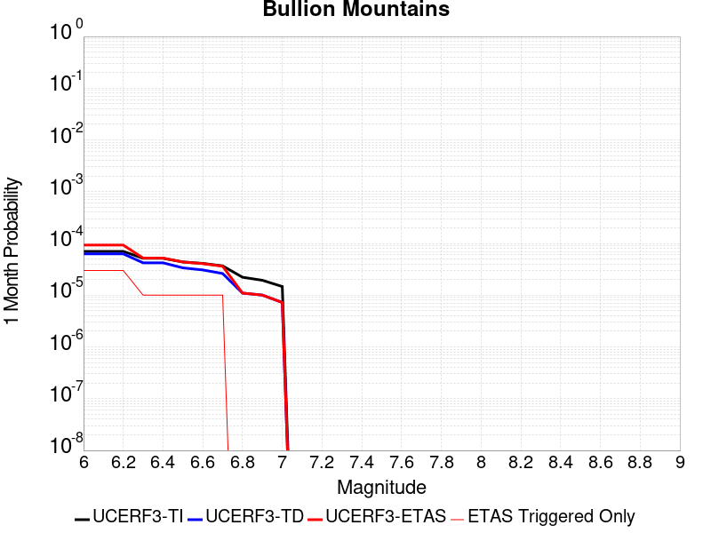 |  |  |

| Magnitude | 1 wk TI Prob | 1 wk TD Prob | 1 wk ETAS Prob | 1 wk ETAS/TD Gain | 1 wk ETAS Triggered Only | 1 mo TI Prob | 1 mo TD Prob | 1 mo ETAS Prob | 1 mo ETAS/TD Gain | 1 mo ETAS Triggered Only | 1 yr TI Prob | 1 yr TD Prob | 1 yr ETAS Prob | 1 yr ETAS/TD Gain | 1 yr ETAS Triggered Only | 10 yr TI Prob | 10 yr TD Prob | 10 yr ETAS Prob | 10 yr ETAS/TD Gain | 10 yr ETAS Triggered Only |
|-----|-----|-----|-----|-----|-----|-----|-----|-----|-----|-----|-----|-----|-----|-----|-----|-----|-----|-----|-----|-----|
| 6.0 | 1.6420427E-5 | 1.4692089E-5 | 4.469165E-5 | 3.0418851 | 3.0E-5 | 7.037136E-5 | 6.296479E-5 | 9.29629E-5 | 1.4764267 | 3.0E-5 | 8.5643446E-4 | 7.663651E-4 | 7.963421E-4 | 1.0391158 | 3.0E-5 | 0.008531413 | 0.007641016 | 0.0076707867 | 1.0038962 | 3.0E-5 |
| 6.1 | 1.6420427E-5 | 1.4692089E-5 | 4.469165E-5 | 3.0418851 | 3.0E-5 | 7.037136E-5 | 6.296479E-5 | 9.29629E-5 | 1.4764267 | 3.0E-5 | 8.5643446E-4 | 7.663651E-4 | 7.963421E-4 | 1.0391158 | 3.0E-5 | 0.008531413 | 0.007641016 | 0.0076707867 | 1.0038962 | 3.0E-5 |
| 6.2 | 1.6420427E-5 | 1.4692089E-5 | 4.469165E-5 | 3.0418851 | 3.0E-5 | 7.037136E-5 | 6.296479E-5 | 9.29629E-5 | 1.4764267 | 3.0E-5 | 8.5643446E-4 | 7.663651E-4 | 7.963421E-4 | 1.0391158 | 3.0E-5 | 0.008531413 | 0.007641016 | 0.0076707867 | 1.0038962 | 3.0E-5 |
| 6.3 | 1.2046778E-5 | 9.862335E-6 | 1.9862237E-5 | 2.0139487 | 1.0E-5 | 5.1628023E-5 | 4.2266598E-5 | 5.2266172E-5 | 1.2365835 | 1.0E-5 | 6.283899E-4 | 5.144975E-4 | 5.2449235E-4 | 1.0194265 | 1.0E-5 | 0.0062661595 | 0.005135345 | 0.0051452937 | 1.0019373 | 1.0E-5 |
| 6.4 | 1.2046778E-5 | 9.862335E-6 | 1.9862237E-5 | 2.0139487 | 1.0E-5 | 5.1628023E-5 | 4.2266598E-5 | 5.2266172E-5 | 1.2365835 | 1.0E-5 | 6.283899E-4 | 5.144975E-4 | 5.2449235E-4 | 1.0194265 | 1.0E-5 | 0.0062661595 | 0.005135345 | 0.0051452937 | 1.0019373 | 1.0E-5 |
| 6.5 | 1.0244343E-5 | 7.879458E-6 | 1.787938E-5 | 2.2691128 | 1.0E-5 | 4.390359E-5 | 3.3768785E-5 | 4.376845E-5 | 1.2961215 | 1.0E-5 | 5.343951E-4 | 4.110781E-4 | 4.21074E-4 | 1.0243163 | 1.0E-5 | 0.005331118 | 0.004105208 | 0.004115167 | 1.0024259 | 1.0E-5 |
| 6.6 | 9.605408E-6 | 7.1774966E-6 | 1.7177425E-5 | 2.3932335 | 1.0E-5 | 4.1165385E-5 | 3.076045E-5 | 4.0760144E-5 | 1.3250828 | 1.0E-5 | 5.010733E-4 | 3.744645E-4 | 3.8446073E-4 | 1.0266948 | 1.0E-5 | 0.00499945 | 0.003740332 | 0.0037502947 | 1.0026636 | 1.0E-5 |
| 6.7 | 8.60418E-6 | 6.1240044E-6 | 1.6123944E-5 | 2.6329083 | 1.0E-5 | 3.687454E-5 | 2.624558E-5 | 3.6245317E-5 | 1.3810066 | 1.0E-5 | 4.48855E-4 | 3.1951256E-4 | 3.2950938E-4 | 1.0312877 | 1.0E-5 | 0.004479495 | 0.0031924439 | 0.0032024118 | 1.0031224 | 1.0E-5 |
| 6.8 | 5.187994E-6 | 2.5631666E-6 | 2.5631666E-6 | 1.0 | 0.0 | 2.223407E-5 | 1.0984976E-5 | 1.0984976E-5 | 1.0 | 0.0 | 2.7066618E-4 | 1.3373788E-4 | 1.3373788E-4 | 1.0 | 0.0 | 0.0027033675 | 0.0013369655 | 0.0013369655 | 1.0 | 0.0 |
| 6.9 | 4.5302368E-6 | 2.3443165E-6 | 2.3443165E-6 | 1.0 | 0.0 | 1.9415156E-5 | 1.0047055E-5 | 1.0047055E-5 | 1.0 | 0.0 | 2.3635388E-4 | 1.2232E-4 | 1.2232E-4 | 1.0 | 0.0 | 0.0023610266 | 0.0012229157 | 0.0012229157 | 1.0 | 0.0 |
| 7.0 | 3.431668E-6 | 1.6882402E-6 | 1.6882402E-6 | 1.0 | 0.0 | 1.4707065E-5 | 7.235315E-6 | 7.235315E-6 | 1.0 | 0.0 | 1.7904381E-4 | 8.808996E-5 | 8.808996E-5 | 1.0 | 0.0 | 0.0017889962 | 8.808996E-4 | 8.808996E-4 | 1.0 | 0.0 |

## Elsinore (Stepovers Combined)
*[(top)](#table-of-contents)*

| 1 Week | 1 Month | 1 Year | 10 Year |
|-----|-----|-----|-----|
|  |  |  |  |

| Magnitude | 1 wk TI Prob | 1 wk TD Prob | 1 wk ETAS Prob | 1 wk ETAS/TD Gain | 1 wk ETAS Triggered Only | 1 mo TI Prob | 1 mo TD Prob | 1 mo ETAS Prob | 1 mo ETAS/TD Gain | 1 mo ETAS Triggered Only | 1 yr TI Prob | 1 yr TD Prob | 1 yr ETAS Prob | 1 yr ETAS/TD Gain | 1 yr ETAS Triggered Only | 10 yr TI Prob | 10 yr TD Prob | 10 yr ETAS Prob | 10 yr ETAS/TD Gain | 10 yr ETAS Triggered Only |
|-----|-----|-----|-----|-----|-----|-----|-----|-----|-----|-----|-----|-----|-----|-----|-----|-----|-----|-----|-----|-----|
| 6.0 | 2.144392E-5 | 1.9760193E-5 | 1.9760193E-5 | 1.0 | 0.0 | 9.189928E-5 | 8.468392E-5 | 9.468307E-5 | 1.1180762 | 1.0E-5 | 0.0011182994 | 0.0010305607 | 0.0010505401 | 1.0193869 | 2.0E-5 | 0.011126885 | 0.010264917 | 0.01029461 | 1.0028926 | 3.0E-5 |
| 6.1 | 2.144392E-5 | 1.9760193E-5 | 1.9760193E-5 | 1.0 | 0.0 | 9.189928E-5 | 8.468392E-5 | 9.468307E-5 | 1.1180762 | 1.0E-5 | 0.0011182994 | 0.0010305607 | 0.0010505401 | 1.0193869 | 2.0E-5 | 0.011126885 | 0.010264917 | 0.01029461 | 1.0028926 | 3.0E-5 |
| 6.2 | 2.144392E-5 | 1.9760193E-5 | 1.9760193E-5 | 1.0 | 0.0 | 9.189928E-5 | 8.468392E-5 | 9.468307E-5 | 1.1180762 | 1.0E-5 | 0.0011182994 | 0.0010305607 | 0.0010505401 | 1.0193869 | 2.0E-5 | 0.011126885 | 0.010264917 | 0.01029461 | 1.0028926 | 3.0E-5 |
| 6.3 | 1.9751555E-5 | 1.7741453E-5 | 1.7741453E-5 | 1.0 | 0.0 | 8.4646774E-5 | 7.603267E-5 | 8.603191E-5 | 1.1315124 | 1.0E-5 | 0.0010300872 | 9.253213E-4 | 9.453028E-4 | 1.0215942 | 2.0E-5 | 0.010253254 | 0.009221276 | 0.009250999 | 1.0032233 | 3.0E-5 |
| 6.4 | 1.9751555E-5 | 1.7741453E-5 | 1.7741453E-5 | 1.0 | 0.0 | 8.4646774E-5 | 7.603267E-5 | 8.603191E-5 | 1.1315124 | 1.0E-5 | 0.0010300872 | 9.253213E-4 | 9.453028E-4 | 1.0215942 | 2.0E-5 | 0.010253254 | 0.009221276 | 0.009250999 | 1.0032233 | 3.0E-5 |
| 6.5 | 1.9751555E-5 | 1.7741453E-5 | 1.7741453E-5 | 1.0 | 0.0 | 8.4646774E-5 | 7.603267E-5 | 8.603191E-5 | 1.1315124 | 1.0E-5 | 0.0010300872 | 9.253213E-4 | 9.453028E-4 | 1.0215942 | 2.0E-5 | 0.010253254 | 0.009221276 | 0.009250999 | 1.0032233 | 3.0E-5 |
| 6.6 | 1.9188685E-5 | 1.7003393E-5 | 1.7003393E-5 | 1.0 | 0.0 | 8.2234634E-5 | 7.286974E-5 | 8.286901E-5 | 1.1372212 | 1.0E-5 | 0.0010007467 | 8.868442E-4 | 9.068264E-4 | 1.0225319 | 2.0E-5 | 0.00996252 | 0.0088398475 | 0.008869582 | 1.0033637 | 3.0E-5 |
| 6.7 | 1.7608272E-5 | 1.4732616E-5 | 1.4732616E-5 | 1.0 | 0.0 | 7.546184E-5 | 6.3138315E-5 | 6.3138315E-5 | 1.0 | 0.0 | 9.183606E-4 | 7.684476E-4 | 7.784399E-4 | 1.0130032 | 1.0E-5 | 0.009145746 | 0.00766491 | 0.0076748333 | 1.0012946 | 1.0E-5 |
| 6.8 | 1.697165E-5 | 1.3783365E-5 | 1.3783365E-5 | 1.0 | 0.0 | 7.273361E-5 | 5.9070277E-5 | 5.9070277E-5 | 1.0 | 0.0 | 8.8517193E-4 | 7.18952E-4 | 7.289448E-4 | 1.0138991 | 1.0E-5 | 0.008816543 | 0.007172675 | 0.0071826032 | 1.0013841 | 1.0E-5 |
| 6.9 | 1.600365E-5 | 1.2846671E-5 | 1.2846671E-5 | 1.0 | 0.0 | 6.858527E-5 | 5.5056043E-5 | 5.5056043E-5 | 1.0 | 0.0 | 8.347058E-4 | 6.7010894E-4 | 6.8010227E-4 | 1.014913 | 1.0E-5 | 0.008315775 | 0.0066867657 | 0.006696699 | 1.0014855 | 1.0E-5 |
| 7.0 | 1.3314581E-5 | 1.0447548E-5 | 1.0447548E-5 | 1.0 | 0.0 | 5.7061243E-5 | 4.4774453E-5 | 4.4774453E-5 | 1.0 | 0.0 | 6.944992E-4 | 5.449953E-4 | 5.5498985E-4 | 1.0183388 | 1.0E-5 | 0.006923327 | 0.0054405155 | 0.005450461 | 1.0018281 | 1.0E-5 |
| 7.1 | 1.2865345E-5 | 9.937536E-6 | 9.937536E-6 | 1.0 | 0.0 | 5.5136024E-5 | 4.258876E-5 | 4.258876E-5 | 1.0 | 0.0 | 6.710743E-4 | 5.183973E-4 | 5.2839215E-4 | 1.0192802 | 1.0E-5 | 0.0066905143 | 0.0051752133 | 0.0051851617 | 1.0019222 | 1.0E-5 |
| 7.2 | 1.1650051E-5 | 8.633809E-6 | 8.633809E-6 | 1.0 | 0.0 | 4.9927836E-5 | 3.7001522E-5 | 3.7001522E-5 | 1.0 | 0.0 | 6.0770183E-4 | 4.504022E-4 | 4.504022E-4 | 1.0 | 0.0 | 0.0060604266 | 0.0044963174 | 0.0044963174 | 1.0 | 0.0 |
| 7.3 | 1.0008533E-5 | 7.2010425E-6 | 7.2010425E-6 | 1.0 | 0.0 | 4.2893007E-5 | 3.0861254E-5 | 3.0861254E-5 | 1.0 | 0.0 | 5.220972E-4 | 3.7567242E-4 | 3.7567242E-4 | 1.0 | 0.0 | 0.005208723 | 0.003750761 | 0.003750761 | 1.0 | 0.0 |
| 7.4 | 9.116759E-6 | 6.410068E-6 | 6.410068E-6 | 1.0 | 0.0 | 3.907124E-5 | 2.747144E-5 | 2.747144E-5 | 1.0 | 0.0 | 4.7558855E-4 | 3.3441483E-4 | 3.3441483E-4 | 1.0 | 0.0 | 0.00474572 | 0.0033392678 | 0.0033392678 | 1.0 | 0.0 |
| 7.5 | 7.870524E-6 | 5.3825365E-6 | 5.3825365E-6 | 1.0 | 0.0 | 3.3730383E-5 | 2.3067816E-5 | 2.3067816E-5 | 1.0 | 0.0 | 4.1059E-4 | 2.8081573E-4 | 2.8081573E-4 | 1.0 | 0.0 | 0.0040983222 | 0.0028047354 | 0.0028047354 | 1.0 | 0.0 |
| 7.6 | 6.9774537E-6 | 4.6776067E-6 | 4.6776067E-6 | 1.0 | 0.0 | 2.990303E-5 | 2.0046738E-5 | 2.0046738E-5 | 1.0 | 0.0 | 3.640086E-4 | 2.4404288E-4 | 2.4404288E-4 | 1.0 | 0.0 | 0.003634129 | 0.0024378651 | 0.0024378651 | 1.0 | 0.0 |
| 7.7 | 4.1616954E-6 | 2.32834E-6 | 2.32834E-6 | 1.0 | 0.0 | 1.7835715E-5 | 9.978567E-6 | 9.978567E-6 | 1.0 | 0.0 | 2.171282E-4 | 1.2148302E-4 | 1.2148302E-4 | 1.0 | 0.0 | 0.0021691616 | 0.0012142392 | 0.0012142392 | 1.0 | 0.0 |
| 7.8 | 2.2692414E-7 | 9.3854695E-8 | 9.3854695E-8 | 1.0 | 0.0 | 9.725317E-7 | 4.0223435E-7 | 4.0223435E-7 | 1.0 | 0.0 | 1.1840509E-5 | 4.8971956E-6 | 4.8971956E-6 | 1.0 | 0.0 | 1.1839878E-4 | 4.8971204E-5 | 4.8971204E-5 | 1.0 | 0.0 |
| 7.9 | 6.676829E-9 | 3.439853E-9 | 3.439853E-9 | 1.0 | 0.0 | 2.861498E-8 | 1.4742227E-8 | 1.4742227E-8 | 1.0 | 0.0 | 3.4838732E-7 | 1.7948659E-7 | 1.7948659E-7 | 1.0 | 0.0 | 3.4838679E-6 | 1.7948646E-6 | 1.7948646E-6 | 1.0 | 0.0 |

## Great Valley 05 Pittsburg - Kirby Hills alt1
*[(top)](#table-of-contents)*

| 1 Week | 1 Month | 1 Year | 10 Year |
|-----|-----|-----|-----|
|  |  |  |  |

| Magnitude | 1 wk TI Prob | 1 wk TD Prob | 1 wk ETAS Prob | 1 wk ETAS/TD Gain | 1 wk ETAS Triggered Only | 1 mo TI Prob | 1 mo TD Prob | 1 mo ETAS Prob | 1 mo ETAS/TD Gain | 1 mo ETAS Triggered Only | 1 yr TI Prob | 1 yr TD Prob | 1 yr ETAS Prob | 1 yr ETAS/TD Gain | 1 yr ETAS Triggered Only | 10 yr TI Prob | 10 yr TD Prob | 10 yr ETAS Prob | 10 yr ETAS/TD Gain | 10 yr ETAS Triggered Only |
|-----|-----|-----|-----|-----|-----|-----|-----|-----|-----|-----|-----|-----|-----|-----|-----|-----|-----|-----|-----|-----|
| 6.0 | 4.187212E-5 | 5.3442072E-5 | 6.344154E-5 | 1.1871085 | 1.0E-5 | 1.794396E-4 | 2.290231E-4 | 2.3902081E-4 | 1.0436537 | 1.0E-5 | 0.002182488 | 0.0027857882 | 0.0028057324 | 1.0071594 | 2.0E-5 | 0.021611776 | 0.02760304 | 0.027622487 | 1.0007045 | 2.0E-5 |
| 6.1 | 4.187212E-5 | 5.3442072E-5 | 6.344154E-5 | 1.1871085 | 1.0E-5 | 1.794396E-4 | 2.290231E-4 | 2.3902081E-4 | 1.0436537 | 1.0E-5 | 0.002182488 | 0.0027857882 | 0.0028057324 | 1.0071594 | 2.0E-5 | 0.021611776 | 0.02760304 | 0.027622487 | 1.0007045 | 2.0E-5 |
| 6.2 | 1.7353306E-5 | 2.2154374E-5 | 2.2154374E-5 | 1.0 | 0.0 | 7.436919E-5 | 9.494618E-5 | 9.494618E-5 | 1.0 | 0.0 | 9.050688E-4 | 0.0011557543 | 0.0011557543 | 1.0 | 0.0 | 0.009013915 | 0.011535114 | 0.011535114 | 1.0 | 0.0 |
| 6.3 | 1.7353306E-5 | 2.2154374E-5 | 2.2154374E-5 | 1.0 | 0.0 | 7.436919E-5 | 9.494618E-5 | 9.494618E-5 | 1.0 | 0.0 | 9.050688E-4 | 0.0011557543 | 0.0011557543 | 1.0 | 0.0 | 0.009013915 | 0.011535114 | 0.011535114 | 1.0 | 0.0 |
| 6.4 | 1.4028824E-5 | 1.7900597E-5 | 1.7900597E-5 | 1.0 | 0.0 | 6.0122147E-5 | 7.671684E-5 | 7.671684E-5 | 1.0 | 0.0 | 7.3174125E-4 | 9.340275E-4 | 9.340275E-4 | 1.0 | 0.0 | 0.0072933645 | 0.009338138 | 0.009338138 | 1.0 | 0.0 |

## Concord 2011 CFM
*[(top)](#table-of-contents)*

| 1 Week | 1 Month | 1 Year | 10 Year |
|-----|-----|-----|-----|
|  |  |  |  |

| Magnitude | 1 wk TI Prob | 1 wk TD Prob | 1 wk ETAS Prob | 1 wk ETAS/TD Gain | 1 wk ETAS Triggered Only | 1 mo TI Prob | 1 mo TD Prob | 1 mo ETAS Prob | 1 mo ETAS/TD Gain | 1 mo ETAS Triggered Only | 1 yr TI Prob | 1 yr TD Prob | 1 yr ETAS Prob | 1 yr ETAS/TD Gain | 1 yr ETAS Triggered Only | 10 yr TI Prob | 10 yr TD Prob | 10 yr ETAS Prob | 10 yr ETAS/TD Gain | 10 yr ETAS Triggered Only |
|-----|-----|-----|-----|-----|-----|-----|-----|-----|-----|-----|-----|-----|-----|-----|-----|-----|-----|-----|-----|-----|
| 6.0 | 5.7865112E-5 | 9.759152E-5 | 1.0759054E-4 | 1.1024579 | 1.0E-5 | 2.4796976E-4 | 4.1818706E-4 | 4.3817871E-4 | 1.0478054 | 2.0E-5 | 0.0030148525 | 0.005079467 | 0.0050993655 | 1.0039175 | 2.0E-5 | 0.029742775 | 0.049248982 | 0.049267996 | 1.0003861 | 2.0E-5 |
| 6.1 | 5.7865112E-5 | 9.759152E-5 | 1.0759054E-4 | 1.1024579 | 1.0E-5 | 2.4796976E-4 | 4.1818706E-4 | 4.3817871E-4 | 1.0478054 | 2.0E-5 | 0.0030148525 | 0.005079467 | 0.0050993655 | 1.0039175 | 2.0E-5 | 0.029742775 | 0.049248982 | 0.049267996 | 1.0003861 | 2.0E-5 |
| 6.2 | 5.6789337E-5 | 9.5795076E-5 | 1.0579412E-4 | 1.1043795 | 1.0E-5 | 2.4336016E-4 | 4.104905E-4 | 4.3048227E-4 | 1.0487022 | 2.0E-5 | 0.0029588845 | 0.0049861916 | 0.0050060917 | 1.0039911 | 2.0E-5 | 0.029197963 | 0.04836556 | 0.048384592 | 1.0003935 | 2.0E-5 |
| 6.3 | 5.203322E-5 | 8.803056E-5 | 9.8029675E-5 | 1.1135869 | 1.0E-5 | 2.2298045E-4 | 3.7722368E-4 | 3.9721612E-4 | 1.0529989 | 2.0E-5 | 0.0027114071 | 0.0045838105 | 0.0046037184 | 1.0043432 | 2.0E-5 | 0.026785625 | 0.04453672 | 0.044555828 | 1.000429 | 2.0E-5 |
| 6.4 | 4.7120942E-5 | 7.897404E-5 | 8.897325E-5 | 1.1266139 | 1.0E-5 | 2.0193127E-4 | 3.3842045E-4 | 3.5841367E-4 | 1.0590781 | 2.0E-5 | 0.0024557412 | 0.00411323 | 0.0041331477 | 1.0048424 | 2.0E-5 | 0.024287801 | 0.040065527 | 0.040084727 | 1.0004792 | 2.0E-5 |
| 6.5 | 2.9598437E-5 | 4.667486E-5 | 5.667439E-5 | 1.214238 | 1.0E-5 | 1.2684427E-4 | 2.0002096E-4 | 2.2001695E-4 | 1.0999695 | 2.0E-5 | 0.001543235 | 0.0024327459 | 0.0024526971 | 1.0082011 | 2.0E-5 | 0.015325619 | 0.023909973 | 0.023929495 | 1.0008165 | 2.0E-5 |
| 6.6 | 2.0443718E-5 | 2.998433E-5 | 3.9984032E-5 | 1.3334975 | 1.0E-5 | 8.7613E-5 | 1.2849816E-4 | 1.3849686E-4 | 1.0778121 | 1.0E-5 | 0.0010661662 | 0.0015633785 | 0.0015733629 | 1.0063864 | 1.0E-5 | 0.010610655 | 0.015466996 | 0.0154768415 | 1.0006366 | 1.0E-5 |
| 6.7 | 1.798539E-5 | 2.5557381E-5 | 2.5557381E-5 | 1.0 | 0.0 | 7.7077966E-5 | 1.0952716E-4 | 1.0952716E-4 | 1.0 | 0.0 | 9.380202E-4 | 0.001332699 | 0.001332699 | 1.0 | 0.0 | 0.009340706 | 0.013217433 | 0.013217433 | 1.0 | 0.0 |
| 6.8 | 1.613555E-5 | 2.1959211E-5 | 2.1959211E-5 | 1.0 | 0.0 | 6.915052E-5 | 9.4107585E-5 | 9.4107585E-5 | 1.0 | 0.0 | 8.4158237E-4 | 0.0011451716 | 0.0011451716 | 1.0 | 0.0 | 0.008384023 | 0.0113782035 | 0.0113782035 | 1.0 | 0.0 |
| 6.9 | 1.2916435E-5 | 1.7081054E-5 | 1.7081054E-5 | 1.0 | 0.0 | 5.5354973E-5 | 7.32025E-5 | 7.32025E-5 | 1.0 | 0.0 | 6.7373837E-4 | 8.908818E-4 | 8.908818E-4 | 1.0 | 0.0 | 0.006716994 | 0.008867139 | 0.008867139 | 1.0 | 0.0 |
| 7.0 | 9.81129E-6 | 1.2630829E-5 | 1.2630829E-5 | 1.0 | 0.0 | 4.2047708E-5 | 5.413101E-5 | 5.413101E-5 | 1.0 | 0.0 | 5.118106E-4 | 6.588474E-4 | 6.588474E-4 | 1.0 | 0.0 | 0.005106334 | 0.006569153 | 0.006569153 | 1.0 | 0.0 |
| 7.1 | 8.0889195E-6 | 1.0418261E-5 | 1.0418261E-5 | 1.0 | 0.0 | 3.4666336E-5 | 4.4648932E-5 | 4.4648932E-5 | 1.0 | 0.0 | 4.219809E-4 | 5.434662E-4 | 5.434662E-4 | 1.0 | 0.0 | 0.004211805 | 0.0054215975 | 0.0054215975 | 1.0 | 0.0 |
| 7.2 | 6.267438E-6 | 8.115699E-6 | 8.115699E-6 | 1.0 | 0.0 | 2.6860173E-5 | 3.4781104E-5 | 3.4781104E-5 | 1.0 | 0.0 | 3.2697353E-4 | 4.233784E-4 | 4.233784E-4 | 1.0 | 0.0 | 0.0032649285 | 0.004225969 | 0.004225969 | 1.0 | 0.0 |
| 7.3 | 3.6761196E-6 | 4.8401653E-6 | 4.8401653E-6 | 1.0 | 0.0 | 1.5754704E-5 | 2.0743402E-5 | 2.0743402E-5 | 1.0 | 0.0 | 1.9179663E-4 | 2.5252186E-4 | 2.5252186E-4 | 1.0 | 0.0 | 0.0019163118 | 0.002522487 | 0.002522487 | 1.0 | 0.0 |
| 7.4 | 2.8044356E-6 | 3.7096036E-6 | 3.7096036E-6 | 1.0 | 0.0 | 1.2018954E-5 | 1.5898204E-5 | 1.5898204E-5 | 1.0 | 0.0 | 1.4632095E-4 | 1.9354356E-4 | 1.9354356E-4 | 1.0 | 0.0 | 0.0014622464 | 0.0019338481 | 0.0019338481 | 1.0 | 0.0 |
| 7.5 | 2.4578699E-6 | 3.2447442E-6 | 3.2447442E-6 | 1.0 | 0.0 | 1.0533685E-5 | 1.3905973E-5 | 1.3905973E-5 | 1.0 | 0.0 | 1.2824008E-4 | 1.6929218E-4 | 1.6929218E-4 | 1.0 | 0.0 | 0.0012816609 | 0.001691713 | 0.001691713 | 1.0 | 0.0 |
| 7.6 | 1.7713267E-6 | 2.3351192E-6 | 2.3351192E-6 | 1.0 | 0.0 | 7.591378E-6 | 1.0007616E-5 | 1.0007616E-5 | 1.0 | 0.0 | 9.2421105E-5 | 1.21836E-4 | 1.21836E-4 | 1.0 | 0.0 | 9.2382677E-4 | 0.0012177454 | 0.0012177454 | 1.0 | 0.0 |
| 7.7 | 5.1912366E-7 | 6.8290143E-7 | 6.8290143E-7 | 1.0 | 0.0 | 2.2248137E-6 | 2.9267171E-6 | 2.9267171E-6 | 1.0 | 0.0 | 2.708677E-5 | 3.5632213E-5 | 3.5632213E-5 | 1.0 | 0.0 | 2.708347E-4 | 3.5627294E-4 | 3.5627294E-4 | 1.0 | 0.0 |

## Clamshell-Sawpit
*[(top)](#table-of-contents)*

| 1 Week | 1 Month | 1 Year | 10 Year |
|-----|-----|-----|-----|
|  |  |  |  |

| Magnitude | 1 wk TI Prob | 1 wk TD Prob | 1 wk ETAS Prob | 1 wk ETAS/TD Gain | 1 wk ETAS Triggered Only | 1 mo TI Prob | 1 mo TD Prob | 1 mo ETAS Prob | 1 mo ETAS/TD Gain | 1 mo ETAS Triggered Only | 1 yr TI Prob | 1 yr TD Prob | 1 yr ETAS Prob | 1 yr ETAS/TD Gain | 1 yr ETAS Triggered Only | 10 yr TI Prob | 10 yr TD Prob | 10 yr ETAS Prob | 10 yr ETAS/TD Gain | 10 yr ETAS Triggered Only |
|-----|-----|-----|-----|-----|-----|-----|-----|-----|-----|-----|-----|-----|-----|-----|-----|-----|-----|-----|-----|-----|
| 6.0 | 3.202998E-6 | 3.0127644E-6 | 1.3012735E-5 | 4.319201 | 1.0E-5 | 1.3727062E-5 | 1.2911788E-5 | 2.2911658E-5 | 1.774476 | 1.0E-5 | 1.6711417E-4 | 1.5719049E-4 | 1.671889E-4 | 1.0636071 | 1.0E-5 | 0.0016698855 | 0.0015708724 | 0.0015908409 | 1.0127118 | 2.0E-5 |
| 6.1 | 3.202998E-6 | 3.0127644E-6 | 1.3012735E-5 | 4.319201 | 1.0E-5 | 1.3727062E-5 | 1.2911788E-5 | 2.2911658E-5 | 1.774476 | 1.0E-5 | 1.6711417E-4 | 1.5719049E-4 | 1.671889E-4 | 1.0636071 | 1.0E-5 | 0.0016698855 | 0.0015708724 | 0.0015908409 | 1.0127118 | 2.0E-5 |
| 6.2 | 3.202998E-6 | 3.0127644E-6 | 1.3012735E-5 | 4.319201 | 1.0E-5 | 1.3727062E-5 | 1.2911788E-5 | 2.2911658E-5 | 1.774476 | 1.0E-5 | 1.6711417E-4 | 1.5719049E-4 | 1.671889E-4 | 1.0636071 | 1.0E-5 | 0.0016698855 | 0.0015708724 | 0.0015908409 | 1.0127118 | 2.0E-5 |
| 6.3 | 3.202998E-6 | 3.0127644E-6 | 1.3012735E-5 | 4.319201 | 1.0E-5 | 1.3727062E-5 | 1.2911788E-5 | 2.2911658E-5 | 1.774476 | 1.0E-5 | 1.6711417E-4 | 1.5719049E-4 | 1.671889E-4 | 1.0636071 | 1.0E-5 | 0.0016698855 | 0.0015708724 | 0.0015908409 | 1.0127118 | 2.0E-5 |
| 6.4 | 3.202998E-6 | 3.0127644E-6 | 1.3012735E-5 | 4.319201 | 1.0E-5 | 1.3727062E-5 | 1.2911788E-5 | 2.2911658E-5 | 1.774476 | 1.0E-5 | 1.6711417E-4 | 1.5719049E-4 | 1.671889E-4 | 1.0636071 | 1.0E-5 | 0.0016698855 | 0.0015708724 | 0.0015908409 | 1.0127118 | 2.0E-5 |
| 6.5 | 2.5862723E-6 | 2.380775E-6 | 2.380775E-6 | 1.0 | 0.0 | 1.1083977E-5 | 1.0203283E-5 | 1.0203283E-5 | 1.0 | 0.0 | 1.3493907E-4 | 1.2421819E-4 | 1.2421819E-4 | 1.0 | 0.0 | 0.0013485716 | 0.0012415178 | 0.0012515055 | 1.0080446 | 1.0E-5 |
| 6.6 | 2.5862723E-6 | 2.380775E-6 | 2.380775E-6 | 1.0 | 0.0 | 1.1083977E-5 | 1.0203283E-5 | 1.0203283E-5 | 1.0 | 0.0 | 1.3493907E-4 | 1.2421819E-4 | 1.2421819E-4 | 1.0 | 0.0 | 0.0013485716 | 0.0012415178 | 0.0012515055 | 1.0080446 | 1.0E-5 |
| 6.7 | 2.5862723E-6 | 2.380775E-6 | 2.380775E-6 | 1.0 | 0.0 | 1.1083977E-5 | 1.0203283E-5 | 1.0203283E-5 | 1.0 | 0.0 | 1.3493907E-4 | 1.2421819E-4 | 1.2421819E-4 | 1.0 | 0.0 | 0.0013485716 | 0.0012415178 | 0.0012515055 | 1.0080446 | 1.0E-5 |
| 6.8 | 2.4098806E-6 | 2.1977307E-6 | 2.1977307E-6 | 1.0 | 0.0 | 1.0328019E-5 | 9.4188135E-6 | 9.4188135E-6 | 1.0 | 0.0 | 1.2573638E-4 | 1.1466829E-4 | 1.1466829E-4 | 1.0 | 0.0 | 0.0012566525 | 0.0011461178 | 0.0011561064 | 1.0087152 | 1.0E-5 |
| 6.9 | 2.0073985E-6 | 1.7784248E-6 | 1.7784248E-6 | 1.0 | 0.0 | 8.603109E-6 | 7.621799E-6 | 7.621799E-6 | 1.0 | 0.0 | 1.0473781E-4 | 9.279157E-5 | 9.279157E-5 | 1.0 | 0.0 | 0.0010468846 | 9.275401E-4 | 9.275401E-4 | 1.0 | 0.0 |
| 7.0 | 1.8166766E-6 | 1.5807095E-6 | 1.5807095E-6 | 1.0 | 0.0 | 7.785734E-6 | 6.7744522E-6 | 6.7744522E-6 | 1.0 | 0.0 | 9.478718E-5 | 8.247593E-5 | 8.247593E-5 | 1.0 | 0.0 | 9.4746763E-4 | 8.244633E-4 | 8.244633E-4 | 1.0 | 0.0 |
| 7.1 | 1.5471421E-6 | 1.3052961E-6 | 1.3052961E-6 | 1.0 | 0.0 | 6.6305925E-6 | 5.5941146E-6 | 5.5941146E-6 | 1.0 | 0.0 | 8.072447E-5 | 6.8106274E-5 | 6.8106274E-5 | 1.0 | 0.0 | 8.0695155E-4 | 6.808595E-4 | 6.808595E-4 | 1.0 | 0.0 |
| 7.2 | 1.3608037E-6 | 1.1153443E-6 | 1.1153443E-6 | 1.0 | 0.0 | 5.8320024E-6 | 4.7800386E-6 | 4.7800386E-6 | 1.0 | 0.0 | 7.1002316E-5 | 5.8195463E-5 | 5.8195463E-5 | 1.0 | 0.0 | 7.097964E-4 | 5.818069E-4 | 5.818069E-4 | 1.0 | 0.0 |
| 7.3 | 1.0749634E-6 | 8.384254E-7 | 8.384254E-7 | 1.0 | 0.0 | 4.6069777E-6 | 3.593247E-6 | 3.593247E-6 | 1.0 | 0.0 | 5.608851E-5 | 4.374693E-5 | 4.374693E-5 | 1.0 | 0.0 | 5.6074356E-4 | 4.37386E-4 | 4.37386E-4 | 1.0 | 0.0 |
| 7.4 | 8.416856E-7 | 6.200048E-7 | 6.200048E-7 | 1.0 | 0.0 | 3.607219E-6 | 2.6571608E-6 | 2.6571608E-6 | 1.0 | 0.0 | 4.3917007E-5 | 3.2350472E-5 | 3.2350472E-5 | 1.0 | 0.0 | 4.390833E-4 | 3.2345962E-4 | 3.2345962E-4 | 1.0 | 0.0 |
| 7.5 | 6.2779594E-7 | 4.496886E-7 | 4.496886E-7 | 1.0 | 0.0 | 2.6905511E-6 | 1.9272356E-6 | 1.9272356E-6 | 1.0 | 0.0 | 3.275697E-5 | 2.346386E-5 | 2.346386E-5 | 1.0 | 0.0 | 3.275214E-4 | 2.346157E-4 | 2.346157E-4 | 1.0 | 0.0 |
| 7.6 | 4.3822078E-7 | 3.0595405E-7 | 3.0595405E-7 | 1.0 | 0.0 | 1.8780877E-6 | 1.311231E-6 | 1.311231E-6 | 1.0 | 0.0 | 2.2865479E-5 | 1.5964137E-5 | 1.5964137E-5 | 1.0 | 0.0 | 2.2863125E-4 | 1.5963144E-4 | 1.5963144E-4 | 1.0 | 0.0 |
| 7.7 | 1.8704569E-7 | 1.12379205E-7 | 1.12379205E-7 | 1.0 | 0.0 | 8.0162414E-7 | 4.816251E-7 | 4.816251E-7 | 1.0 | 0.0 | 9.75973E-6 | 5.86377E-6 | 5.86377E-6 | 1.0 | 0.0 | 9.7593016E-5 | 5.863622E-5 | 5.863622E-5 | 1.0 | 0.0 |
| 7.8 | 3.5378733E-8 | 2.1838144E-8 | 2.1838144E-8 | 1.0 | 0.0 | 1.5162313E-7 | 9.359204E-8 | 9.359204E-8 | 1.0 | 0.0 | 1.84601E-6 | 1.1394826E-6 | 1.1394826E-6 | 1.0 | 0.0 | 1.8459947E-5 | 1.139477E-5 | 1.139477E-5 | 1.0 | 0.0 |
| 7.9 | 7.504945E-9 | 5.1920326E-9 | 5.1920326E-9 | 1.0 | 0.0 | 3.2164053E-8 | 2.225157E-8 | 2.225157E-8 | 1.0 | 0.0 | 3.9159727E-7 | 2.7091284E-7 | 2.7091284E-7 | 1.0 | 0.0 | 3.915966E-6 | 2.7091257E-6 | 2.7091257E-6 | 1.0 | 0.0 |
| 8.0 | 1.6554036E-10 | 1.4180768E-10 | 1.4180768E-10 | 1.0 | 0.0 | 7.0945894E-10 | 6.077475E-10 | 6.077475E-10 | 1.0 | 0.0 | 8.637662E-9 | 7.3993256E-9 | 7.3993256E-9 | 1.0 | 0.0 | 8.6376616E-8 | 7.3993256E-8 | 7.3993256E-8 | 1.0 | 0.0 |

## Monterey Bay-Tularcitos
*[(top)](#table-of-contents)*

| 1 Week | 1 Month | 1 Year | 10 Year |
|-----|-----|-----|-----|
|  |  |  |  |

| Magnitude | 1 wk TI Prob | 1 wk TD Prob | 1 wk ETAS Prob | 1 wk ETAS/TD Gain | 1 wk ETAS Triggered Only | 1 mo TI Prob | 1 mo TD Prob | 1 mo ETAS Prob | 1 mo ETAS/TD Gain | 1 mo ETAS Triggered Only | 1 yr TI Prob | 1 yr TD Prob | 1 yr ETAS Prob | 1 yr ETAS/TD Gain | 1 yr ETAS Triggered Only | 10 yr TI Prob | 10 yr TD Prob | 10 yr ETAS Prob | 10 yr ETAS/TD Gain | 10 yr ETAS Triggered Only |
|-----|-----|-----|-----|-----|-----|-----|-----|-----|-----|-----|-----|-----|-----|-----|-----|-----|-----|-----|-----|-----|
| 6.0 | 3.0131365E-5 | 3.279877E-5 | 4.279844E-5 | 1.3048794 | 1.0E-5 | 1.2912804E-4 | 1.4055918E-4 | 1.5055778E-4 | 1.0711344 | 1.0E-5 | 0.001571 | 0.0017100703 | 0.001730036 | 1.0116755 | 2.0E-5 | 0.015599402 | 0.016979916 | 0.016999578 | 1.0011579 | 2.0E-5 |
| 6.1 | 3.0131365E-5 | 3.279877E-5 | 4.279844E-5 | 1.3048794 | 1.0E-5 | 1.2912804E-4 | 1.4055918E-4 | 1.5055778E-4 | 1.0711344 | 1.0E-5 | 0.001571 | 0.0017100703 | 0.001730036 | 1.0116755 | 2.0E-5 | 0.015599402 | 0.016979916 | 0.016999578 | 1.0011579 | 2.0E-5 |
| 6.2 | 3.0131365E-5 | 3.279877E-5 | 4.279844E-5 | 1.3048794 | 1.0E-5 | 1.2912804E-4 | 1.4055918E-4 | 1.5055778E-4 | 1.0711344 | 1.0E-5 | 0.001571 | 0.0017100703 | 0.001730036 | 1.0116755 | 2.0E-5 | 0.015599402 | 0.016979916 | 0.016999578 | 1.0011579 | 2.0E-5 |
| 6.3 | 1.6998249E-5 | 1.8330798E-5 | 2.8330614E-5 | 1.54552 | 1.0E-5 | 7.28476E-5 | 7.85583E-5 | 8.8557514E-5 | 1.127284 | 1.0E-5 | 8.865586E-4 | 9.5604634E-4 | 9.6603675E-4 | 1.0104498 | 1.0E-5 | 0.0088303005 | 0.009521258 | 0.009531163 | 1.0010403 | 1.0E-5 |
| 6.4 | 1.6998249E-5 | 1.8330798E-5 | 2.8330614E-5 | 1.54552 | 1.0E-5 | 7.28476E-5 | 7.85583E-5 | 8.8557514E-5 | 1.127284 | 1.0E-5 | 8.865586E-4 | 9.5604634E-4 | 9.6603675E-4 | 1.0104498 | 1.0E-5 | 0.0088303005 | 0.009521258 | 0.009531163 | 1.0010403 | 1.0E-5 |
| 6.5 | 1.27470785E-5 | 1.3693312E-5 | 2.3693176E-5 | 1.7302735 | 1.0E-5 | 5.4629192E-5 | 5.8684363E-5 | 6.8683774E-5 | 1.1703931 | 1.0E-5 | 6.649074E-4 | 7.1425823E-4 | 7.242511E-4 | 1.0139905 | 1.0E-5 | 0.0066292146 | 0.007120678 | 0.007130607 | 1.0013944 | 1.0E-5 |
| 6.6 | 1.2739422E-5 | 1.36854E-5 | 2.3685263E-5 | 1.7306957 | 1.0E-5 | 5.4596385E-5 | 5.8650454E-5 | 6.864987E-5 | 1.1704917 | 1.0E-5 | 6.645082E-4 | 7.1384566E-4 | 7.238385E-4 | 1.0139986 | 1.0E-5 | 0.0066252467 | 0.007116579 | 0.007126508 | 1.0013952 | 1.0E-5 |
| 6.7 | 1.0160109E-5 | 1.0885755E-5 | 2.0885645E-5 | 1.9186218 | 1.0E-5 | 4.35426E-5 | 4.665244E-5 | 5.6651974E-5 | 1.214341 | 1.0E-5 | 5.300022E-4 | 5.6785246E-4 | 5.778468E-4 | 1.0176002 | 1.0E-5 | 0.005287399 | 0.0056647263 | 0.0056746695 | 1.0017554 | 1.0E-5 |
| 6.8 | 8.349859E-6 | 8.932587E-6 | 1.8932498E-5 | 2.1194866 | 1.0E-5 | 3.578462E-5 | 3.8281985E-5 | 4.8281603E-5 | 1.2612095 | 1.0E-5 | 4.3559066E-4 | 4.6598914E-4 | 4.759845E-4 | 1.0214497 | 1.0E-5 | 0.004347378 | 0.004650685 | 0.0046606385 | 1.0021402 | 1.0E-5 |
| 6.9 | 5.193639E-6 | 5.53643E-6 | 1.5536374E-5 | 2.8062081 | 1.0E-5 | 2.2258262E-5 | 2.372736E-5 | 3.3727123E-5 | 1.4214444 | 1.0E-5 | 2.7096065E-4 | 2.8884556E-4 | 2.9884267E-4 | 1.0346106 | 1.0E-5 | 0.0027063051 | 0.0028850222 | 0.0028949934 | 1.0034562 | 1.0E-5 |
| 7.0 | 4.359381E-6 | 4.643366E-6 | 1.4643319E-5 | 3.1536002 | 1.0E-5 | 1.8682927E-5 | 1.9900004E-5 | 2.9899806E-5 | 1.5025024 | 1.0E-5 | 2.274409E-4 | 2.422586E-4 | 2.5225617E-4 | 1.0412682 | 1.0E-5 | 0.0022720827 | 0.002420238 | 0.0024302138 | 1.0041218 | 1.0E-5 |
| 7.1 | 3.0398533E-6 | 3.2310427E-6 | 1.3231011E-5 | 4.0949664 | 1.0E-5 | 1.3027877E-5 | 1.3847267E-5 | 2.3847128E-5 | 1.7221541 | 1.0E-5 | 1.5860285E-4 | 1.6858005E-4 | 1.7857837E-4 | 1.059309 | 1.0E-5 | 0.001584897 | 0.0016847793 | 0.0016947625 | 1.0059255 | 1.0E-5 |
| 7.2 | 1.642335E-6 | 1.7333153E-6 | 1.1733298E-5 | 6.7692804 | 1.0E-5 | 7.0385595E-6 | 7.428485E-6 | 1.742841E-5 | 2.3461595 | 1.0E-5 | 8.569109E-5 | 9.044012E-5 | 1.0043921E-4 | 1.1105604 | 1.0E-5 | 8.5658056E-4 | 9.042358E-4 | 9.1422675E-4 | 1.011049 | 1.0E-5 |
| 7.3 | 3.356842E-7 | 3.2952389E-7 | 3.2952389E-7 | 1.0 | 0.0 | 1.4386458E-6 | 1.4122444E-6 | 1.4122444E-6 | 1.0 | 0.0 | 1.7515373E-5 | 1.7193941E-5 | 1.7193941E-5 | 1.0 | 0.0 | 1.7513991E-4 | 1.719262E-4 | 1.719262E-4 | 1.0 | 0.0 |
| 7.4 | 2.1973483E-7 | 2.1006413E-7 | 2.1006413E-7 | 1.0 | 0.0 | 9.417204E-7 | 9.0027453E-7 | 9.0027453E-7 | 1.0 | 0.0 | 1.1465385E-5 | 1.0960787E-5 | 1.0960787E-5 | 1.0 | 0.0 | 1.1464794E-4 | 1.096025E-4 | 1.096025E-4 | 1.0 | 0.0 |
| 7.5 | 1.1944135E-7 | 1.0696043E-7 | 1.0696043E-7 | 1.0 | 0.0 | 5.118914E-7 | 4.5840173E-7 | 4.5840173E-7 | 1.0 | 0.0 | 6.23226E-6 | 5.581027E-6 | 5.581027E-6 | 1.0 | 0.0 | 6.2320854E-5 | 5.5808883E-5 | 5.5808883E-5 | 1.0 | 0.0 |
| 7.6 | 4.636058E-8 | 3.336489E-8 | 3.336489E-8 | 1.0 | 0.0 | 1.9868818E-7 | 1.4299238E-7 | 1.4299238E-7 | 1.0 | 0.0 | 2.419026E-6 | 1.7409308E-6 | 1.7409308E-6 | 1.0 | 0.0 | 2.4189996E-5 | 1.7409173E-5 | 1.7409173E-5 | 1.0 | 0.0 |
| 7.7 | 1.8588572E-8 | 8.003744E-9 | 8.003744E-9 | 1.0 | 0.0 | 7.9665305E-8 | 3.430176E-8 | 3.430176E-8 | 1.0 | 0.0 | 9.699246E-7 | 4.1762385E-7 | 4.1762385E-7 | 1.0 | 0.0 | 9.699204E-6 | 4.176231E-6 | 4.176231E-6 | 1.0 | 0.0 |
| 7.8 | 2.7960154E-9 | 7.6099427E-10 | 7.6099427E-10 | 1.0 | 0.0 | 1.1982923E-8 | 3.2614043E-9 | 3.2614043E-9 | 1.0 | 0.0 | 1.4589209E-7 | 3.9707597E-8 | 3.9707597E-8 | 1.0 | 0.0 | 1.4589199E-6 | 3.9707595E-7 | 3.9707595E-7 | 1.0 | 0.0 |

## Hunting Creek - Bartlett Springs connector 2011
*[(top)](#table-of-contents)*

| 1 Week | 1 Month | 1 Year | 10 Year |
|-----|-----|-----|-----|
|  |  |  |  |

| Magnitude | 1 wk TI Prob | 1 wk TD Prob | 1 wk ETAS Prob | 1 wk ETAS/TD Gain | 1 wk ETAS Triggered Only | 1 mo TI Prob | 1 mo TD Prob | 1 mo ETAS Prob | 1 mo ETAS/TD Gain | 1 mo ETAS Triggered Only | 1 yr TI Prob | 1 yr TD Prob | 1 yr ETAS Prob | 1 yr ETAS/TD Gain | 1 yr ETAS Triggered Only | 10 yr TI Prob | 10 yr TD Prob | 10 yr ETAS Prob | 10 yr ETAS/TD Gain | 10 yr ETAS Triggered Only |
|-----|-----|-----|-----|-----|-----|-----|-----|-----|-----|-----|-----|-----|-----|-----|-----|-----|-----|-----|-----|-----|
| 6.0 | 4.940016E-5 | 6.786822E-5 | 7.786754E-5 | 1.1473343 | 1.0E-5 | 2.1169778E-4 | 2.9083234E-4 | 3.0082942E-4 | 1.0343741 | 1.0E-5 | 0.002574374 | 0.003535177 | 0.0035551065 | 1.0056374 | 2.0E-5 | 0.025447546 | 0.034773834 | 0.03479314 | 1.0005552 | 2.0E-5 |
| 6.1 | 4.940016E-5 | 6.786822E-5 | 7.786754E-5 | 1.1473343 | 1.0E-5 | 2.1169778E-4 | 2.9083234E-4 | 3.0082942E-4 | 1.0343741 | 1.0E-5 | 0.002574374 | 0.003535177 | 0.0035551065 | 1.0056374 | 2.0E-5 | 0.025447546 | 0.034773834 | 0.03479314 | 1.0005552 | 2.0E-5 |
| 6.2 | 4.472471E-5 | 6.1002804E-5 | 7.100219E-5 | 1.163917 | 1.0E-5 | 1.9166325E-4 | 2.6141506E-4 | 2.7141246E-4 | 1.0382433 | 1.0E-5 | 0.0023310026 | 0.003178107 | 0.0031980434 | 1.006273 | 2.0E-5 | 0.02306703 | 0.031316914 | 0.031336285 | 1.0006186 | 2.0E-5 |
| 6.3 | 4.472471E-5 | 6.1002804E-5 | 7.100219E-5 | 1.163917 | 1.0E-5 | 1.9166325E-4 | 2.6141506E-4 | 2.7141246E-4 | 1.0382433 | 1.0E-5 | 0.0023310026 | 0.003178107 | 0.0031980434 | 1.006273 | 2.0E-5 | 0.02306703 | 0.031316914 | 0.031336285 | 1.0006186 | 2.0E-5 |
| 6.4 | 4.0001003E-5 | 5.4103755E-5 | 6.410322E-5 | 1.18482 | 1.0E-5 | 1.714216E-4 | 2.31853E-4 | 2.4185069E-4 | 1.0431207 | 1.0E-5 | 0.0020850603 | 0.0028191248 | 0.0028390684 | 1.0070744 | 2.0E-5 | 0.02065605 | 0.027828315 | 0.02784776 | 1.0006987 | 2.0E-5 |
| 6.5 | 3.8033053E-5 | 5.1266547E-5 | 6.126603E-5 | 1.1950489 | 1.0E-5 | 1.6298861E-4 | 2.1969559E-4 | 2.2969338E-4 | 1.0455076 | 1.0E-5 | 0.0019825802 | 0.0026714746 | 0.0026914212 | 1.0074666 | 2.0E-5 | 0.019649856 | 0.026390454 | 0.026409926 | 1.0007379 | 2.0E-5 |
| 6.6 | 3.653754E-5 | 4.913017E-5 | 4.913017E-5 | 1.0 | 0.0 | 1.5658008E-4 | 2.1054115E-4 | 2.1054115E-4 | 1.0 | 0.0 | 0.0019046954 | 0.0025602852 | 0.0025702596 | 1.0038958 | 1.0E-5 | 0.018884527 | 0.025306415 | 0.02531616 | 1.0003852 | 1.0E-5 |
| 6.7 | 3.372024E-5 | 4.514011E-5 | 4.514011E-5 | 1.0 | 0.0 | 1.4450731E-4 | 1.9344354E-4 | 1.9344354E-4 | 1.0 | 0.0 | 0.0017579567 | 0.002352639 | 0.0023626157 | 1.0042405 | 1.0E-5 | 0.017441148 | 0.023278099 | 0.023287866 | 1.0004196 | 1.0E-5 |
| 6.8 | 2.9650024E-5 | 3.9411374E-5 | 3.9411374E-5 | 1.0 | 0.0 | 1.2706534E-4 | 1.6889503E-4 | 1.6889503E-4 | 1.0 | 0.0 | 0.0015459227 | 0.0020543463 | 0.0020643256 | 1.0048578 | 1.0E-5 | 0.015352124 | 0.020351216 | 0.020361012 | 1.0004814 | 1.0E-5 |
| 6.9 | 2.860775E-5 | 3.7812544E-5 | 3.7812544E-5 | 1.0 | 0.0 | 1.2259888E-4 | 1.6204377E-4 | 1.6204377E-4 | 1.0 | 0.0 | 0.0014916194 | 0.001971107 | 0.0019810873 | 1.0050633 | 1.0E-5 | 0.014816469 | 0.01953584 | 0.019545645 | 1.0005019 | 1.0E-5 |
| 7.0 | 2.6696067E-5 | 3.506726E-5 | 3.506726E-5 | 1.0 | 0.0 | 1.144067E-4 | 1.5027967E-4 | 1.5027967E-4 | 1.0 | 0.0 | 0.0013920115 | 0.0018281302 | 0.001838112 | 1.00546 | 1.0E-5 | 0.013833242 | 0.018131364 | 0.018141182 | 1.0005416 | 1.0E-5 |
| 7.1 | 2.456087E-5 | 3.2013093E-5 | 3.2013093E-5 | 1.0 | 0.0 | 1.0525662E-4 | 1.371918E-4 | 1.371918E-4 | 1.0 | 0.0 | 0.001280746 | 0.0016690396 | 0.0016790229 | 1.0059814 | 1.0E-5 | 0.012733897 | 0.016566366 | 0.0165762 | 1.0005937 | 1.0E-5 |
| 7.2 | 2.295761E-5 | 2.9822932E-5 | 2.9822932E-5 | 1.0 | 0.0 | 9.8386045E-5 | 1.2780636E-4 | 1.2780636E-4 | 1.0 | 0.0 | 0.0011971919 | 0.001554941 | 0.0015649254 | 1.0064211 | 1.0E-5 | 0.011907627 | 0.015442089 | 0.015451935 | 1.0006375 | 1.0E-5 |
| 7.3 | 2.1256936E-5 | 2.7541912E-5 | 2.7541912E-5 | 1.0 | 0.0 | 9.109797E-5 | 1.1803147E-4 | 1.1803147E-4 | 1.0 | 0.0 | 0.0011085535 | 0.0014360948 | 0.0014460804 | 1.0069534 | 1.0E-5 | 0.011030397 | 0.014269472 | 0.014279329 | 1.0006908 | 1.0E-5 |
| 7.4 | 1.8784336E-5 | 2.4306766E-5 | 2.4306766E-5 | 1.0 | 0.0 | 8.050181E-5 | 1.0416774E-4 | 1.0416774E-4 | 1.0 | 0.0 | 9.796688E-4 | 0.001267512 | 0.0012774993 | 1.0078795 | 1.0E-5 | 0.009753612 | 0.012603902 | 0.012613776 | 1.0007834 | 1.0E-5 |
| 7.5 | 1.7248298E-5 | 2.2268887E-5 | 2.2268887E-5 | 1.0 | 0.0 | 7.391918E-5 | 9.543464E-5 | 9.543464E-5 | 1.0 | 0.0 | 8.9959445E-4 | 0.0011613049 | 0.0011712933 | 1.008601 | 1.0E-5 | 0.008959615 | 0.01155334 | 0.011563224 | 1.0008556 | 1.0E-5 |
| 7.6 | 1.0653709E-5 | 1.3722118E-5 | 1.3722118E-5 | 1.0 | 0.0 | 4.5657955E-5 | 5.8807767E-5 | 5.8807767E-5 | 1.0 | 0.0 | 5.557438E-4 | 7.157521E-4 | 7.257449E-4 | 1.0139613 | 1.0E-5 | 0.0055435603 | 0.0071348166 | 0.007144745 | 1.0013915 | 1.0E-5 |
| 7.7 | 3.286316E-6 | 4.0903437E-6 | 4.0903437E-6 | 1.0 | 0.0 | 1.4084137E-5 | 1.7529928E-5 | 1.7529928E-5 | 1.0 | 0.0 | 1.7146087E-4 | 2.1340612E-4 | 2.1340612E-4 | 1.0 | 0.0 | 0.0017132863 | 0.0021320276 | 0.0021320276 | 1.0 | 0.0 |
| 7.8 | 5.1855085E-7 | 5.9720696E-7 | 5.9720696E-7 | 1.0 | 0.0 | 2.222359E-6 | 2.5594559E-6 | 2.5594559E-6 | 1.0 | 0.0 | 2.7056883E-5 | 3.116094E-5 | 3.116094E-5 | 1.0 | 0.0 | 2.705359E-4 | 3.1156495E-4 | 3.1156495E-4 | 1.0 | 0.0 |

## Pittville 2011 CFM
*[(top)](#table-of-contents)*

| 1 Week | 1 Month | 1 Year | 10 Year |
|-----|-----|-----|-----|
|  |  |  |  |

| Magnitude | 1 wk TI Prob | 1 wk TD Prob | 1 wk ETAS Prob | 1 wk ETAS/TD Gain | 1 wk ETAS Triggered Only | 1 mo TI Prob | 1 mo TD Prob | 1 mo ETAS Prob | 1 mo ETAS/TD Gain | 1 mo ETAS Triggered Only | 1 yr TI Prob | 1 yr TD Prob | 1 yr ETAS Prob | 1 yr ETAS/TD Gain | 1 yr ETAS Triggered Only | 10 yr TI Prob | 10 yr TD Prob | 10 yr ETAS Prob | 10 yr ETAS/TD Gain | 10 yr ETAS Triggered Only |
|-----|-----|-----|-----|-----|-----|-----|-----|-----|-----|-----|-----|-----|-----|-----|-----|-----|-----|-----|-----|-----|
| 6.0 | 2.5031832E-5 | 2.7056969E-5 | 3.70567E-5 | 1.3695805 | 1.0E-5 | 1.0727487E-4 | 1.1595384E-4 | 1.2595268E-4 | 1.0862312 | 1.0E-5 | 0.001305289 | 0.0014109211 | 0.001420907 | 1.0070776 | 1.0E-5 | 0.012976485 | 0.014029415 | 0.014039275 | 1.0007027 | 1.0E-5 |
| 6.1 | 1.2540113E-5 | 1.3513067E-5 | 2.3512932E-5 | 1.7400144 | 1.0E-5 | 5.3742235E-5 | 5.7911984E-5 | 6.79114E-5 | 1.1726658 | 1.0E-5 | 6.541153E-4 | 7.048728E-4 | 7.1486575E-4 | 1.014177 | 1.0E-5 | 0.0065219323 | 0.0070286044 | 0.007038534 | 1.0014127 | 1.0E-5 |
| 6.2 | 6.603218E-6 | 7.107189E-6 | 1.7107119E-5 | 2.407016 | 1.0E-5 | 2.8299199E-5 | 3.0459063E-5 | 4.045876E-5 | 1.3282995 | 1.0E-5 | 3.4448825E-4 | 3.7078248E-4 | 3.8077877E-4 | 1.02696 | 1.0E-5 | 0.0034395473 | 0.0037022792 | 0.0037122422 | 1.002691 | 1.0E-5 |
| 6.3 | 6.603218E-6 | 7.107189E-6 | 1.7107119E-5 | 2.407016 | 1.0E-5 | 2.8299199E-5 | 3.0459063E-5 | 4.045876E-5 | 1.3282995 | 1.0E-5 | 3.4448825E-4 | 3.7078248E-4 | 3.8077877E-4 | 1.02696 | 1.0E-5 | 0.0034395473 | 0.0037022792 | 0.0037122422 | 1.002691 | 1.0E-5 |
| 6.4 | 3.9389015E-6 | 4.239175E-6 | 4.239175E-6 | 1.0 | 0.0 | 1.6880897E-5 | 1.8167784E-5 | 1.8167784E-5 | 1.0 | 0.0 | 2.0550552E-4 | 2.2117342E-4 | 2.2117342E-4 | 1.0 | 0.0 | 0.0020531558 | 0.002209838 | 0.002209838 | 1.0 | 0.0 |
| 6.5 | 2.4533072E-6 | 2.6412686E-6 | 2.6412686E-6 | 1.0 | 0.0 | 1.0514132E-5 | 1.1319685E-5 | 1.1319685E-5 | 1.0 | 0.0 | 1.2800204E-4 | 1.3781038E-4 | 1.3781038E-4 | 1.0 | 0.0 | 0.0012792832 | 0.0013774394 | 0.0013774394 | 1.0 | 0.0 |
| 6.6 | 1.3482367E-6 | 1.452993E-6 | 1.452993E-6 | 1.0 | 0.0 | 5.778144E-6 | 6.2271047E-6 | 6.2271047E-6 | 1.0 | 0.0 | 7.0346636E-5 | 7.58135E-5 | 7.58135E-5 | 1.0 | 0.0 | 7.032437E-4 | 7.5798744E-4 | 7.5798744E-4 | 1.0 | 0.0 |

## San Juan
*[(top)](#table-of-contents)*

| 1 Week | 1 Month | 1 Year | 10 Year |
|-----|-----|-----|-----|
|  |  |  |  |

| Magnitude | 1 wk TI Prob | 1 wk TD Prob | 1 wk ETAS Prob | 1 wk ETAS/TD Gain | 1 wk ETAS Triggered Only | 1 mo TI Prob | 1 mo TD Prob | 1 mo ETAS Prob | 1 mo ETAS/TD Gain | 1 mo ETAS Triggered Only | 1 yr TI Prob | 1 yr TD Prob | 1 yr ETAS Prob | 1 yr ETAS/TD Gain | 1 yr ETAS Triggered Only | 10 yr TI Prob | 10 yr TD Prob | 10 yr ETAS Prob | 10 yr ETAS/TD Gain | 10 yr ETAS Triggered Only |
|-----|-----|-----|-----|-----|-----|-----|-----|-----|-----|-----|-----|-----|-----|-----|-----|-----|-----|-----|-----|-----|
| 6.0 | 8.682808E-6 | 8.7491635E-6 | 2.874899E-5 | 3.2859128 | 2.0E-5 | 3.72115E-5 | 3.74959E-5 | 5.7495152E-5 | 1.5333716 | 2.0E-5 | 4.5295584E-4 | 4.564218E-4 | 4.7641268E-4 | 1.0437992 | 2.0E-5 | 0.004520337 | 0.004555385 | 0.004575294 | 1.0043705 | 2.0E-5 |
| 6.1 | 8.682808E-6 | 8.7491635E-6 | 2.874899E-5 | 3.2859128 | 2.0E-5 | 3.72115E-5 | 3.74959E-5 | 5.7495152E-5 | 1.5333716 | 2.0E-5 | 4.5295584E-4 | 4.564218E-4 | 4.7641268E-4 | 1.0437992 | 2.0E-5 | 0.004520337 | 0.004555385 | 0.004575294 | 1.0043705 | 2.0E-5 |
| 6.2 | 8.682808E-6 | 8.7491635E-6 | 2.874899E-5 | 3.2859128 | 2.0E-5 | 3.72115E-5 | 3.74959E-5 | 5.7495152E-5 | 1.5333716 | 2.0E-5 | 4.5295584E-4 | 4.564218E-4 | 4.7641268E-4 | 1.0437992 | 2.0E-5 | 0.004520337 | 0.004555385 | 0.004575294 | 1.0043705 | 2.0E-5 |
| 6.3 | 6.3054235E-6 | 6.2825848E-6 | 1.6282522E-5 | 2.5916915 | 1.0E-5 | 2.7022963E-5 | 2.6925094E-5 | 3.6924826E-5 | 1.3713907 | 1.0E-5 | 3.2895492E-4 | 3.2776513E-4 | 3.3776183E-4 | 1.0304997 | 1.0E-5 | 0.003284684 | 0.003273017 | 0.0032829843 | 1.0030453 | 1.0E-5 |
| 6.4 | 6.1490473E-6 | 6.1144656E-6 | 1.6114405E-5 | 2.6354558 | 1.0E-5 | 2.6352795E-5 | 2.6204598E-5 | 3.6204336E-5 | 1.3816024 | 1.0E-5 | 3.2079802E-4 | 3.1899565E-4 | 3.2899246E-4 | 1.0313383 | 1.0E-5 | 0.0032033534 | 0.0031855737 | 0.003195542 | 1.0031291 | 1.0E-5 |
| 6.5 | 5.204848E-6 | 5.137233E-6 | 1.5137182E-5 | 2.946563 | 1.0E-5 | 2.23063E-5 | 2.2016533E-5 | 3.2016313E-5 | 1.4541941 | 1.0E-5 | 2.7154534E-4 | 2.6801927E-4 | 2.780166E-4 | 1.0373007 | 1.0E-5 | 0.0027121378 | 0.0026771144 | 0.0026870877 | 1.0037254 | 1.0E-5 |
| 6.6 | 4.5179986E-6 | 4.4150297E-6 | 1.4414985E-5 | 3.2649803 | 1.0E-5 | 1.9362706E-5 | 1.8921424E-5 | 2.8921235E-5 | 1.5284915 | 1.0E-5 | 2.3571544E-4 | 2.3034477E-4 | 2.4034247E-4 | 1.0434031 | 1.0E-5 | 0.0023546559 | 0.0023011973 | 0.0023111743 | 1.0043355 | 1.0E-5 |
| 6.7 | 3.9442616E-6 | 3.819828E-6 | 3.819828E-6 | 1.0 | 0.0 | 1.6903869E-5 | 1.6370592E-5 | 1.6370592E-5 | 1.0 | 0.0 | 2.0578515E-4 | 1.992944E-4 | 1.992944E-4 | 1.0 | 0.0 | 0.002055947 | 0.0019912818 | 0.0019912818 | 1.0 | 0.0 |
| 6.8 | 3.4536245E-6 | 3.3163353E-6 | 3.3163353E-6 | 1.0 | 0.0 | 1.4801163E-5 | 1.4212792E-5 | 1.4212792E-5 | 1.0 | 0.0 | 1.8018926E-4 | 1.7302761E-4 | 1.7302761E-4 | 1.0 | 0.0 | 0.0018004322 | 0.0017290477 | 0.0017290477 | 1.0 | 0.0 |
| 6.9 | 3.059865E-6 | 2.9120315E-6 | 2.9120315E-6 | 1.0 | 0.0 | 1.3113641E-5 | 1.2480078E-5 | 1.2480078E-5 | 1.0 | 0.0 | 1.596469E-4 | 1.5193493E-4 | 1.5193493E-4 | 1.0 | 0.0 | 0.0015953224 | 0.0015184252 | 0.0015184252 | 1.0 | 0.0 |
| 7.0 | 2.6504351E-6 | 2.4920002E-6 | 2.4920002E-6 | 1.0 | 0.0 | 1.1358958E-5 | 1.0679961E-5 | 1.0679961E-5 | 1.0 | 0.0 | 1.3828653E-4 | 1.300213E-4 | 1.300213E-4 | 1.0 | 0.0 | 0.0013820052 | 0.0012995641 | 0.0012995641 | 1.0 | 0.0 |
| 7.1 | 2.2039317E-6 | 2.0338296E-6 | 2.0338296E-6 | 1.0 | 0.0 | 9.445387E-6 | 8.716386E-6 | 8.716386E-6 | 1.0 | 0.0 | 1.1499152E-4 | 1.0611736E-4 | 1.0611736E-4 | 1.0 | 0.0 | 0.0011493203 | 0.0010607769 | 0.0010607769 | 1.0 | 0.0 |
| 7.2 | 1.0786707E-6 | 8.7701903E-7 | 8.7701903E-7 | 1.0 | 0.0 | 4.622866E-6 | 3.7586476E-6 | 3.7586476E-6 | 1.0 | 0.0 | 5.628194E-5 | 4.5760586E-5 | 4.5760586E-5 | 1.0 | 0.0 | 5.6267687E-4 | 4.5757066E-4 | 4.5757066E-4 | 1.0 | 0.0 |
| 7.3 | 6.846433E-7 | 4.868805E-7 | 4.868805E-7 | 1.0 | 0.0 | 2.9341822E-6 | 2.086629E-6 | 2.086629E-6 | 1.0 | 0.0 | 3.5723086E-5 | 2.5404412E-5 | 2.5404412E-5 | 1.0 | 0.0 | 3.571734E-4 | 2.540486E-4 | 2.540486E-4 | 1.0 | 0.0 |
| 7.4 | 5.23043E-7 | 3.2628162E-7 | 3.2628162E-7 | 1.0 | 0.0 | 2.2416111E-6 | 1.398349E-6 | 1.398349E-6 | 1.0 | 0.0 | 2.7291273E-5 | 1.7024766E-5 | 1.7024766E-5 | 1.0 | 0.0 | 2.7287923E-4 | 1.7026656E-4 | 1.7026656E-4 | 1.0 | 0.0 |
| 7.5 | 4.648444E-7 | 2.7234944E-7 | 2.7234944E-7 | 1.0 | 0.0 | 1.9921886E-6 | 1.1672114E-6 | 1.1672114E-6 | 1.0 | 0.0 | 2.4254627E-5 | 1.42107065E-5 | 1.42107065E-5 | 1.0 | 0.0 | 2.425198E-4 | 1.421276E-4 | 1.421276E-4 | 1.0 | 0.0 |
| 7.6 | 3.9906567E-7 | 2.2083314E-7 | 2.2083314E-7 | 1.0 | 0.0 | 1.7102802E-6 | 9.464274E-7 | 9.464274E-7 | 1.0 | 0.0 | 2.0822463E-5 | 1.1522693E-5 | 1.1522693E-5 | 1.0 | 0.0 | 2.0820512E-4 | 1.15245566E-4 | 1.15245566E-4 | 1.0 | 0.0 |
| 7.7 | 1.8784601E-7 | 5.3666906E-8 | 5.3666906E-8 | 1.0 | 0.0 | 8.0505407E-7 | 2.30001E-7 | 2.30001E-7 | 1.0 | 0.0 | 9.80149E-6 | 2.8002585E-6 | 2.8002585E-6 | 1.0 | 0.0 | 9.801057E-5 | 2.8011282E-5 | 2.8011282E-5 | 1.0 | 0.0 |
| 7.8 | 1.00154914E-7 | 1.2415832E-8 | 1.2415832E-8 | 1.0 | 0.0 | 4.2923529E-7 | 5.3210716E-8 | 5.3210716E-8 | 1.0 | 0.0 | 5.225927E-6 | 6.4784024E-7 | 6.4784024E-7 | 1.0 | 0.0 | 5.225804E-5 | 6.484273E-6 | 6.484273E-6 | 1.0 | 0.0 |
| 7.9 | 6.171429E-8 | 4.2966155E-9 | 4.2966155E-9 | 1.0 | 0.0 | 2.6448978E-7 | 1.8414067E-8 | 1.8414067E-8 | 1.0 | 0.0 | 3.2201583E-6 | 2.2419121E-7 | 2.2419121E-7 | 1.0 | 0.0 | 3.2201115E-5 | 2.2472002E-6 | 2.2472002E-6 | 1.0 | 0.0 |
| 8.0 | 1.3974572E-8 | 3.3788217E-10 | 3.3788217E-10 | 1.0 | 0.0 | 5.989102E-8 | 1.448067E-9 | 1.448067E-9 | 1.0 | 0.0 | 7.2917294E-7 | 1.763022E-8 | 1.763022E-8 | 1.0 | 0.0 | 7.2917055E-6 | 1.8060365E-7 | 1.8060365E-7 | 1.0 | 0.0 |
| 8.1 | 1.8403477E-9 | 1.1302803E-10 | 1.1302803E-10 | 1.0 | 0.0 | 7.887204E-9 | 4.844063E-10 | 4.844063E-10 | 1.0 | 0.0 | 9.602671E-8 | 5.8976446E-9 | 5.8976446E-9 | 1.0 | 0.0 | 9.602667E-7 | 6.021993E-8 | 6.021993E-8 | 1.0 | 0.0 |

## Jess Valley
*[(top)](#table-of-contents)*

| 1 Week | 1 Month | 1 Year | 10 Year |
|-----|-----|-----|-----|
|  | 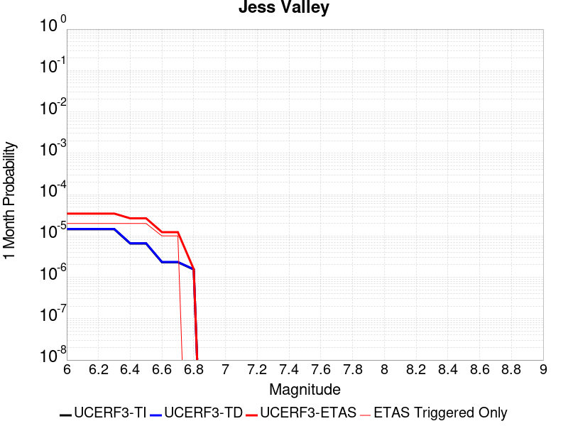 |  |  |

| Magnitude | 1 wk TI Prob | 1 wk TD Prob | 1 wk ETAS Prob | 1 wk ETAS/TD Gain | 1 wk ETAS Triggered Only | 1 mo TI Prob | 1 mo TD Prob | 1 mo ETAS Prob | 1 mo ETAS/TD Gain | 1 mo ETAS Triggered Only | 1 yr TI Prob | 1 yr TD Prob | 1 yr ETAS Prob | 1 yr ETAS/TD Gain | 1 yr ETAS Triggered Only | 10 yr TI Prob | 10 yr TD Prob | 10 yr ETAS Prob | 10 yr ETAS/TD Gain | 10 yr ETAS Triggered Only |
|-----|-----|-----|-----|-----|-----|-----|-----|-----|-----|-----|-----|-----|-----|-----|-----|-----|-----|-----|-----|-----|
| 6.0 | 3.3861274E-6 | 3.4340592E-6 | 2.3433991E-5 | 6.8239913 | 2.0E-5 | 1.4511894E-5 | 1.471733E-5 | 3.4717035E-5 | 2.3589222 | 2.0E-5 | 1.7666799E-4 | 1.7917156E-4 | 1.9916799E-4 | 1.1116048 | 2.0E-5 | 0.001765276 | 0.0017905476 | 0.0018105118 | 1.0111498 | 2.0E-5 |
| 6.1 | 3.3861274E-6 | 3.4340592E-6 | 2.3433991E-5 | 6.8239913 | 2.0E-5 | 1.4511894E-5 | 1.471733E-5 | 3.4717035E-5 | 2.3589222 | 2.0E-5 | 1.7666799E-4 | 1.7917156E-4 | 1.9916799E-4 | 1.1116048 | 2.0E-5 | 0.001765276 | 0.0017905476 | 0.0018105118 | 1.0111498 | 2.0E-5 |
| 6.2 | 3.3861274E-6 | 3.4340592E-6 | 2.3433991E-5 | 6.8239913 | 2.0E-5 | 1.4511894E-5 | 1.471733E-5 | 3.4717035E-5 | 2.3589222 | 2.0E-5 | 1.7666799E-4 | 1.7917156E-4 | 1.9916799E-4 | 1.1116048 | 2.0E-5 | 0.001765276 | 0.0017905476 | 0.0018105118 | 1.0111498 | 2.0E-5 |
| 6.3 | 3.3861274E-6 | 3.4340592E-6 | 2.3433991E-5 | 6.8239913 | 2.0E-5 | 1.4511894E-5 | 1.471733E-5 | 3.4717035E-5 | 2.3589222 | 2.0E-5 | 1.7666799E-4 | 1.7917156E-4 | 1.9916799E-4 | 1.1116048 | 2.0E-5 | 0.001765276 | 0.0017905476 | 0.0018105118 | 1.0111498 | 2.0E-5 |
| 6.4 | 1.5291708E-6 | 1.5502784E-6 | 2.1550248E-5 | 13.900888 | 2.0E-5 | 6.553573E-6 | 6.644038E-6 | 2.6643906E-5 | 4.0101976 | 2.0E-5 | 7.978683E-5 | 8.088895E-5 | 1.0088734E-4 | 1.2472326 | 2.0E-5 | 7.975819E-4 | 8.086733E-4 | 8.286572E-4 | 1.0247118 | 2.0E-5 |
| 6.5 | 1.5291708E-6 | 1.5502784E-6 | 2.1550248E-5 | 13.900888 | 2.0E-5 | 6.553573E-6 | 6.644038E-6 | 2.6643906E-5 | 4.0101976 | 2.0E-5 | 7.978683E-5 | 8.088895E-5 | 1.0088734E-4 | 1.2472326 | 2.0E-5 | 7.975819E-4 | 8.086733E-4 | 8.286572E-4 | 1.0247118 | 2.0E-5 |
| 6.6 | 5.396423E-7 | 5.4719953E-7 | 1.05471945E-5 | 19.274858 | 1.0E-5 | 2.312751E-6 | 2.3451398E-6 | 1.2345116E-5 | 5.264128 | 1.0E-5 | 2.8157378E-5 | 2.855189E-5 | 3.8551607E-5 | 1.3502295 | 1.0E-5 | 2.8153812E-4 | 2.8550063E-4 | 2.954978E-4 | 1.0350162 | 1.0E-5 |
| 6.7 | 5.396423E-7 | 5.4719953E-7 | 1.05471945E-5 | 19.274858 | 1.0E-5 | 2.312751E-6 | 2.3451398E-6 | 1.2345116E-5 | 5.264128 | 1.0E-5 | 2.8157378E-5 | 2.855189E-5 | 3.8551607E-5 | 1.3502295 | 1.0E-5 | 2.8153812E-4 | 2.8550063E-4 | 2.954978E-4 | 1.0350162 | 1.0E-5 |
| 6.8 | 3.6058395E-7 | 3.6563068E-7 | 3.6563068E-7 | 1.0 | 0.0 | 1.5453588E-6 | 1.5669885E-6 | 1.5669885E-6 | 1.0 | 0.0 | 1.8814582E-5 | 1.9078087E-5 | 1.9078087E-5 | 1.0 | 0.0 | 1.8812988E-4 | 1.9078086E-4 | 1.9078086E-4 | 1.0 | 0.0 |

## Elysian Park (Upper)
*[(top)](#table-of-contents)*

| 1 Week | 1 Month | 1 Year | 10 Year |
|-----|-----|-----|-----|
|  |  |  |  |

| Magnitude | 1 wk TI Prob | 1 wk TD Prob | 1 wk ETAS Prob | 1 wk ETAS/TD Gain | 1 wk ETAS Triggered Only | 1 mo TI Prob | 1 mo TD Prob | 1 mo ETAS Prob | 1 mo ETAS/TD Gain | 1 mo ETAS Triggered Only | 1 yr TI Prob | 1 yr TD Prob | 1 yr ETAS Prob | 1 yr ETAS/TD Gain | 1 yr ETAS Triggered Only | 10 yr TI Prob | 10 yr TD Prob | 10 yr ETAS Prob | 10 yr ETAS/TD Gain | 10 yr ETAS Triggered Only |
|-----|-----|-----|-----|-----|-----|-----|-----|-----|-----|-----|-----|-----|-----|-----|-----|-----|-----|-----|-----|-----|
| 6.0 | 3.1876025E-5 | 3.7035516E-5 | 4.7035144E-5 | 1.270001 | 1.0E-5 | 1.3660437E-4 | 1.587167E-4 | 1.6871512E-4 | 1.0629953 | 1.0E-5 | 0.0016618895 | 0.0019311075 | 0.0019510689 | 1.0103368 | 2.0E-5 | 0.016495159 | 0.019189782 | 0.0192094 | 1.0010222 | 2.0E-5 |
| 6.1 | 3.1876025E-5 | 3.7035516E-5 | 4.7035144E-5 | 1.270001 | 1.0E-5 | 1.3660437E-4 | 1.587167E-4 | 1.6871512E-4 | 1.0629953 | 1.0E-5 | 0.0016618895 | 0.0019311075 | 0.0019510689 | 1.0103368 | 2.0E-5 | 0.016495159 | 0.019189782 | 0.0192094 | 1.0010222 | 2.0E-5 |
| 6.2 | 3.1876025E-5 | 3.7035516E-5 | 4.7035144E-5 | 1.270001 | 1.0E-5 | 1.3660437E-4 | 1.587167E-4 | 1.6871512E-4 | 1.0629953 | 1.0E-5 | 0.0016618895 | 0.0019311075 | 0.0019510689 | 1.0103368 | 2.0E-5 | 0.016495159 | 0.019189782 | 0.0192094 | 1.0010222 | 2.0E-5 |
| 6.3 | 3.1876025E-5 | 3.7035516E-5 | 4.7035144E-5 | 1.270001 | 1.0E-5 | 1.3660437E-4 | 1.587167E-4 | 1.6871512E-4 | 1.0629953 | 1.0E-5 | 0.0016618895 | 0.0019311075 | 0.0019510689 | 1.0103368 | 2.0E-5 | 0.016495159 | 0.019189782 | 0.0192094 | 1.0010222 | 2.0E-5 |
| 6.4 | 1.9273462E-5 | 2.1202266E-5 | 2.1202266E-5 | 1.0 | 0.0 | 8.259794E-5 | 9.086466E-5 | 9.086466E-5 | 1.0 | 0.0 | 0.001005166 | 0.0011058892 | 0.0011158782 | 1.0090325 | 1.0E-5 | 0.010006315 | 0.011020724 | 0.011030613 | 1.0008974 | 1.0E-5 |
| 6.5 | 1.9273462E-5 | 2.1202266E-5 | 2.1202266E-5 | 1.0 | 0.0 | 8.259794E-5 | 9.086466E-5 | 9.086466E-5 | 1.0 | 0.0 | 0.001005166 | 0.0011058892 | 0.0011158782 | 1.0090325 | 1.0E-5 | 0.010006315 | 0.011020724 | 0.011030613 | 1.0008974 | 1.0E-5 |
| 6.6 | 9.813258E-6 | 9.665599E-6 | 9.665599E-6 | 1.0 | 0.0 | 4.205614E-5 | 4.1423376E-5 | 4.1423376E-5 | 1.0 | 0.0 | 5.119132E-4 | 5.0422014E-4 | 5.0422014E-4 | 1.0 | 0.0 | 0.005107356 | 0.0050314846 | 0.0050314846 | 1.0 | 0.0 |
| 6.7 | 9.801478E-6 | 9.653168E-6 | 9.653168E-6 | 1.0 | 0.0 | 4.2005657E-5 | 4.1370105E-5 | 4.1370105E-5 | 1.0 | 0.0 | 5.112989E-4 | 5.035719E-4 | 5.035719E-4 | 1.0 | 0.0 | 0.0051012407 | 0.0050250315 | 0.0050250315 | 1.0 | 0.0 |
| 6.8 | 8.102489E-6 | 7.773004E-6 | 7.773004E-6 | 1.0 | 0.0 | 3.4724493E-5 | 3.3312477E-5 | 3.3312477E-5 | 1.0 | 0.0 | 4.2268867E-4 | 4.055089E-4 | 4.055089E-4 | 1.0 | 0.0 | 0.004218856 | 0.0040481836 | 0.0040481836 | 1.0 | 0.0 |
| 6.9 | 6.08275E-6 | 5.4814514E-6 | 5.4814514E-6 | 1.0 | 0.0 | 2.6068668E-5 | 2.3491726E-5 | 2.3491726E-5 | 1.0 | 0.0 | 3.173398E-4 | 2.85975E-4 | 2.85975E-4 | 1.0 | 0.0 | 0.0031688702 | 0.0028561477 | 0.0028561477 | 1.0 | 0.0 |
| 7.0 | 5.5995934E-6 | 4.98278E-6 | 4.98278E-6 | 1.0 | 0.0 | 2.3998036E-5 | 2.13546E-5 | 2.13546E-5 | 1.0 | 0.0 | 2.9213692E-4 | 2.599619E-4 | 2.599619E-4 | 1.0 | 0.0 | 0.0029175316 | 0.0025966454 | 0.0025966454 | 1.0 | 0.0 |
| 7.1 | 4.709881E-6 | 4.0874015E-6 | 4.0874015E-6 | 1.0 | 0.0 | 2.0185047E-5 | 1.7517319E-5 | 1.7517319E-5 | 1.0 | 0.0 | 2.4572524E-4 | 2.132529E-4 | 2.132529E-4 | 1.0 | 0.0 | 0.002454537 | 0.002130524 | 0.002130524 | 1.0 | 0.0 |
| 7.2 | 3.6063436E-6 | 2.9779544E-6 | 2.9779544E-6 | 1.0 | 0.0 | 1.5455667E-5 | 1.27626E-5 | 1.27626E-5 | 1.0 | 0.0 | 1.881565E-4 | 1.5537368E-4 | 1.5537368E-4 | 1.0 | 0.0 | 0.0018799726 | 0.0015526618 | 0.0015526618 | 1.0 | 0.0 |
| 7.3 | 2.471135E-6 | 2.0954615E-6 | 2.0954615E-6 | 1.0 | 0.0 | 1.0590536E-5 | 8.980519E-6 | 8.980519E-6 | 1.0 | 0.0 | 1.2893214E-4 | 1.093324E-4 | 1.093324E-4 | 1.0 | 0.0 | 0.0012885736 | 0.0010927934 | 0.0010927934 | 1.0 | 0.0 |
| 7.4 | 1.163943E-6 | 1.0275091E-6 | 1.0275091E-6 | 1.0 | 0.0 | 4.988318E-6 | 4.4036033E-6 | 4.4036033E-6 | 1.0 | 0.0 | 6.0731076E-5 | 5.3612584E-5 | 5.3612584E-5 | 1.0 | 0.0 | 6.071448E-4 | 5.359995E-4 | 5.359995E-4 | 1.0 | 0.0 |
| 7.5 | 4.99459E-7 | 4.917604E-7 | 4.917604E-7 | 1.0 | 0.0 | 2.140537E-6 | 2.1075427E-6 | 2.1075427E-6 | 1.0 | 0.0 | 2.6060725E-5 | 2.5659048E-5 | 2.5659048E-5 | 1.0 | 0.0 | 2.605767E-4 | 2.5656243E-4 | 2.5656243E-4 | 1.0 | 0.0 |
| 7.6 | 2.4667852E-7 | 2.4778336E-7 | 2.4778336E-7 | 1.0 | 0.0 | 1.0571932E-6 | 1.0619283E-6 | 1.0619283E-6 | 1.0 | 0.0 | 1.2871251E-5 | 1.2928905E-5 | 1.2928905E-5 | 1.0 | 0.0 | 1.2870505E-4 | 1.2928189E-4 | 1.2928189E-4 | 1.0 | 0.0 |
| 7.7 | 8.2312795E-8 | 7.3864456E-8 | 7.3864456E-8 | 1.0 | 0.0 | 3.527691E-7 | 3.165619E-7 | 3.165619E-7 | 1.0 | 0.0 | 4.294955E-6 | 3.8541357E-6 | 3.8541357E-6 | 1.0 | 0.0 | 4.2948723E-5 | 3.8540802E-5 | 3.8540802E-5 | 1.0 | 0.0 |
| 7.8 | 2.7819295E-8 | 1.7566023E-8 | 1.7566023E-8 | 1.0 | 0.0 | 1.1922555E-7 | 7.5282955E-8 | 7.5282955E-8 | 1.0 | 0.0 | 1.45157E-6 | 9.165697E-7 | 9.165697E-7 | 1.0 | 0.0 | 1.45156055E-5 | 9.165675E-6 | 9.165675E-6 | 1.0 | 0.0 |

## Red Mountain
*[(top)](#table-of-contents)*

| 1 Week | 1 Month | 1 Year | 10 Year |
|-----|-----|-----|-----|
|  |  |  |  |

| Magnitude | 1 wk TI Prob | 1 wk TD Prob | 1 wk ETAS Prob | 1 wk ETAS/TD Gain | 1 wk ETAS Triggered Only | 1 mo TI Prob | 1 mo TD Prob | 1 mo ETAS Prob | 1 mo ETAS/TD Gain | 1 mo ETAS Triggered Only | 1 yr TI Prob | 1 yr TD Prob | 1 yr ETAS Prob | 1 yr ETAS/TD Gain | 1 yr ETAS Triggered Only | 10 yr TI Prob | 10 yr TD Prob | 10 yr ETAS Prob | 10 yr ETAS/TD Gain | 10 yr ETAS Triggered Only |
|-----|-----|-----|-----|-----|-----|-----|-----|-----|-----|-----|-----|-----|-----|-----|-----|-----|-----|-----|-----|-----|
| 6.0 | 4.1810763E-5 | 4.7589947E-5 | 5.758947E-5 | 1.2101184 | 1.0E-5 | 1.7917668E-4 | 2.039419E-4 | 2.1393986E-4 | 1.0490236 | 1.0E-5 | 0.0021792934 | 0.0024803306 | 0.0024903058 | 1.0040218 | 1.0E-5 | 0.021580452 | 0.024544092 | 0.024563601 | 1.0007949 | 2.0E-5 |
| 6.1 | 4.1810763E-5 | 4.7589947E-5 | 5.758947E-5 | 1.2101184 | 1.0E-5 | 1.7917668E-4 | 2.039419E-4 | 2.1393986E-4 | 1.0490236 | 1.0E-5 | 0.0021792934 | 0.0024803306 | 0.0024903058 | 1.0040218 | 1.0E-5 | 0.021580452 | 0.024544092 | 0.024563601 | 1.0007949 | 2.0E-5 |
| 6.2 | 4.1810763E-5 | 4.7589947E-5 | 5.758947E-5 | 1.2101184 | 1.0E-5 | 1.7917668E-4 | 2.039419E-4 | 2.1393986E-4 | 1.0490236 | 1.0E-5 | 0.0021792934 | 0.0024803306 | 0.0024903058 | 1.0040218 | 1.0E-5 | 0.021580452 | 0.024544092 | 0.024563601 | 1.0007949 | 2.0E-5 |
| 6.3 | 4.1810763E-5 | 4.7589947E-5 | 5.758947E-5 | 1.2101184 | 1.0E-5 | 1.7917668E-4 | 2.039419E-4 | 2.1393986E-4 | 1.0490236 | 1.0E-5 | 0.0021792934 | 0.0024803306 | 0.0024903058 | 1.0040218 | 1.0E-5 | 0.021580452 | 0.024544092 | 0.024563601 | 1.0007949 | 2.0E-5 |
| 6.4 | 4.1810763E-5 | 4.7589947E-5 | 5.758947E-5 | 1.2101184 | 1.0E-5 | 1.7917668E-4 | 2.039419E-4 | 2.1393986E-4 | 1.0490236 | 1.0E-5 | 0.0021792934 | 0.0024803306 | 0.0024903058 | 1.0040218 | 1.0E-5 | 0.021580452 | 0.024544092 | 0.024563601 | 1.0007949 | 2.0E-5 |
| 6.5 | 3.154503E-5 | 3.5359728E-5 | 4.5359375E-5 | 1.2827976 | 1.0E-5 | 1.3518598E-4 | 1.5153342E-4 | 1.6153189E-4 | 1.0659821 | 1.0E-5 | 0.0016446467 | 0.0018434501 | 0.0018534317 | 1.0054146 | 1.0E-5 | 0.01632528 | 0.018291233 | 0.018310867 | 1.0010734 | 2.0E-5 |
| 6.6 | 3.1535834E-5 | 3.534911E-5 | 4.5348756E-5 | 1.2828826 | 1.0E-5 | 1.3514658E-4 | 1.5148791E-4 | 1.6148639E-4 | 1.0660019 | 1.0E-5 | 0.0016441676 | 0.001842897 | 0.0018528787 | 1.0054163 | 1.0E-5 | 0.01632056 | 0.018285794 | 0.018305428 | 1.0010737 | 2.0E-5 |
| 6.7 | 2.8267326E-5 | 3.146934E-5 | 4.1469026E-5 | 1.3177596 | 1.0E-5 | 1.2114006E-4 | 1.348621E-4 | 1.4486075E-4 | 1.0741398 | 1.0E-5 | 0.0014738824 | 0.0016407946 | 0.0016507781 | 1.0060846 | 1.0E-5 | 0.014641452 | 0.016295563 | 0.016315237 | 1.0012074 | 2.0E-5 |
| 6.8 | 2.8212884E-5 | 3.1407224E-5 | 4.140691E-5 | 1.3183881 | 1.0E-5 | 1.20906756E-4 | 1.3459593E-4 | 1.4459458E-4 | 1.0742865 | 1.0E-5 | 0.0014710457 | 0.0016375587 | 0.0016475423 | 1.0060966 | 1.0E-5 | 0.014613459 | 0.01626368 | 0.016283354 | 1.0012097 | 2.0E-5 |
| 6.9 | 2.4227871E-5 | 2.6706979E-5 | 3.670671E-5 | 1.374424 | 1.0E-5 | 1.03829596E-4 | 1.14453884E-4 | 1.2445274E-4 | 1.0873615 | 1.0E-5 | 0.0012633923 | 0.0013926612 | 0.0014026472 | 1.0071704 | 1.0E-5 | 0.012562336 | 0.013847026 | 0.013866749 | 1.0014243 | 2.0E-5 |
| 7.0 | 2.348524E-5 | 2.5835763E-5 | 3.5835503E-5 | 1.3870504 | 1.0E-5 | 1.0064714E-4 | 1.1072042E-4 | 1.2071932E-4 | 1.0903076 | 1.0E-5 | 0.0012246901 | 0.0013472632 | 0.0013572498 | 1.0074124 | 1.0E-5 | 0.012179627 | 0.01339859 | 0.0134183215 | 1.0014727 | 2.0E-5 |
| 7.1 | 2.2311642E-5 | 2.4462828E-5 | 3.4462584E-5 | 1.4087734 | 1.0E-5 | 9.561782E-5 | 1.048369E-4 | 1.1483586E-4 | 1.0953763 | 1.0E-5 | 0.0011635252 | 0.0012757168 | 0.001285704 | 1.0078287 | 1.0E-5 | 0.01157452 | 0.012691451 | 0.012711198 | 1.0015559 | 2.0E-5 |
| 7.2 | 1.6533986E-5 | 1.7670347E-5 | 2.767017E-5 | 1.5659099 | 1.0E-5 | 7.085802E-5 | 7.572822E-5 | 8.572746E-5 | 1.1320412 | 1.0E-5 | 8.623549E-4 | 9.216645E-4 | 9.316553E-4 | 1.0108399 | 1.0E-5 | 0.008590161 | 0.009184699 | 0.009194607 | 1.0010787 | 1.0E-5 |
| 7.3 | 1.4703092E-5 | 1.555952E-5 | 2.5559366E-5 | 1.6426833 | 1.0E-5 | 6.301173E-5 | 6.66823E-5 | 7.668164E-5 | 1.1499548 | 1.0E-5 | 7.668978E-4 | 8.1161625E-4 | 8.216081E-4 | 1.0123111 | 1.0E-5 | 0.0076425658 | 0.008092596 | 0.008102515 | 1.0012257 | 1.0E-5 |
| 7.4 | 6.1331984E-6 | 5.528872E-6 | 5.528872E-6 | 1.0 | 0.0 | 2.6284872E-5 | 2.3694953E-5 | 2.3694953E-5 | 1.0 | 0.0 | 3.199713E-4 | 2.8844838E-4 | 2.8844838E-4 | 1.0 | 0.0 | 0.0031951098 | 0.0028807942 | 0.0028807942 | 1.0 | 0.0 |
| 7.5 | 5.954766E-6 | 5.3385015E-6 | 5.3385015E-6 | 1.0 | 0.0 | 2.5520176E-5 | 2.2879094E-5 | 2.2879094E-5 | 1.0 | 0.0 | 3.1066386E-4 | 2.785179E-4 | 2.785179E-4 | 1.0 | 0.0 | 0.003102299 | 0.0027817423 | 0.0027817423 | 1.0 | 0.0 |
| 7.6 | 4.9726646E-6 | 4.315295E-6 | 4.315295E-6 | 1.0 | 0.0 | 2.1311245E-5 | 1.8493993E-5 | 1.8493993E-5 | 1.0 | 0.0 | 2.5943352E-4 | 2.2514143E-4 | 2.2514143E-4 | 1.0 | 0.0 | 0.0025913084 | 0.002249168 | 0.002249168 | 1.0 | 0.0 |
| 7.7 | 3.3613894E-6 | 2.8526642E-6 | 2.8526642E-6 | 1.0 | 0.0 | 1.4405875E-5 | 1.2225649E-5 | 1.2225649E-5 | 1.0 | 0.0 | 1.7537741E-4 | 1.4883737E-4 | 1.4883737E-4 | 1.0 | 0.0 | 0.0017523908 | 0.0014874031 | 0.0014874031 | 1.0 | 0.0 |
| 7.8 | 1.1828961E-6 | 1.0122756E-6 | 1.0122756E-6 | 1.0 | 0.0 | 5.069545E-6 | 4.338317E-6 | 4.338317E-6 | 1.0 | 0.0 | 6.171996E-5 | 5.281776E-5 | 5.281776E-5 | 1.0 | 0.0 | 6.170282E-4 | 5.2805495E-4 | 5.2805495E-4 | 1.0 | 0.0 |
| 7.9 | 2.2967266E-7 | 1.8618952E-7 | 1.8618952E-7 | 1.0 | 0.0 | 9.843111E-7 | 7.9795484E-7 | 7.9795484E-7 | 1.0 | 0.0 | 1.19839215E-5 | 9.7150605E-6 | 9.7150605E-6 | 1.0 | 0.0 | 1.1983275E-4 | 9.714664E-5 | 9.714664E-5 | 1.0 | 0.0 |

## Great Valley 11
*[(top)](#table-of-contents)*

| 1 Week | 1 Month | 1 Year | 10 Year |
|-----|-----|-----|-----|
|  |  |  |  |

| Magnitude | 1 wk TI Prob | 1 wk TD Prob | 1 wk ETAS Prob | 1 wk ETAS/TD Gain | 1 wk ETAS Triggered Only | 1 mo TI Prob | 1 mo TD Prob | 1 mo ETAS Prob | 1 mo ETAS/TD Gain | 1 mo ETAS Triggered Only | 1 yr TI Prob | 1 yr TD Prob | 1 yr ETAS Prob | 1 yr ETAS/TD Gain | 1 yr ETAS Triggered Only | 10 yr TI Prob | 10 yr TD Prob | 10 yr ETAS Prob | 10 yr ETAS/TD Gain | 10 yr ETAS Triggered Only |
|-----|-----|-----|-----|-----|-----|-----|-----|-----|-----|-----|-----|-----|-----|-----|-----|-----|-----|-----|-----|-----|
| 6.0 | 2.8099583E-5 | 2.9832152E-5 | 4.9831553E-5 | 1.6703976 | 2.0E-5 | 1.20421224E-4 | 1.278462E-4 | 1.4784365E-4 | 1.156418 | 2.0E-5 | 0.0014651422 | 0.0015554909 | 0.0015754598 | 1.0128376 | 2.0E-5 | 0.0145552 | 0.01545356 | 0.015473251 | 1.0012742 | 2.0E-5 |
| 6.1 | 2.483194E-5 | 2.590715E-5 | 4.5906632E-5 | 1.7719676 | 2.0E-5 | 1.0641825E-4 | 1.11026246E-4 | 1.3102402E-4 | 1.1801176 | 2.0E-5 | 0.0012948721 | 0.0013509706 | 0.0013709435 | 1.0147842 | 2.0E-5 | 0.012873529 | 0.013433994 | 0.013453725 | 1.0014688 | 2.0E-5 |
| 6.2 | 2.483194E-5 | 2.590715E-5 | 4.5906632E-5 | 1.7719676 | 2.0E-5 | 1.0641825E-4 | 1.11026246E-4 | 1.3102402E-4 | 1.1801176 | 2.0E-5 | 0.0012948721 | 0.0013509706 | 0.0013709435 | 1.0147842 | 2.0E-5 | 0.012873529 | 0.013433994 | 0.013453725 | 1.0014688 | 2.0E-5 |
| 6.3 | 2.0257901E-5 | 2.0398922E-5 | 3.0398718E-5 | 1.490212 | 1.0E-5 | 8.681669E-5 | 8.742122E-5 | 9.742035E-5 | 1.1143787 | 1.0E-5 | 0.0010564806 | 0.0010638756 | 0.001073865 | 1.0093896 | 1.0E-5 | 0.01051472 | 0.010592012 | 0.010601905 | 1.0009341 | 1.0E-5 |
| 6.4 | 1.8054898E-5 | 1.7780874E-5 | 2.7780698E-5 | 1.562392 | 1.0E-5 | 7.737584E-5 | 7.62017E-5 | 8.620094E-5 | 1.1312207 | 1.0E-5 | 9.416436E-4 | 9.2739856E-4 | 9.373893E-4 | 1.0107728 | 1.0E-5 | 0.009376635 | 0.009239036 | 0.009248943 | 1.0010724 | 1.0E-5 |
| 6.5 | 1.34804895E-5 | 1.2321055E-5 | 2.2320932E-5 | 1.8116088 | 1.0E-5 | 5.777225E-5 | 5.2803476E-5 | 6.2802945E-5 | 1.1893715 | 1.0E-5 | 7.031501E-4 | 6.4269686E-4 | 6.526904E-4 | 1.0155494 | 1.0E-5 | 0.007009294 | 0.0064088185 | 0.0064187543 | 1.0015503 | 1.0E-5 |
| 6.6 | 1.294883E-5 | 1.1732312E-5 | 2.1732194E-5 | 1.852337 | 1.0E-5 | 5.5493805E-5 | 5.028039E-5 | 6.0279886E-5 | 1.1988747 | 1.0E-5 | 6.754276E-4 | 6.1199587E-4 | 6.219898E-4 | 1.01633 | 1.0E-5 | 0.006733784 | 0.0061035305 | 0.0061134696 | 1.0016284 | 1.0E-5 |
| 6.7 | 1.1272237E-5 | 9.811886E-6 | 1.9811787E-5 | 2.0191622 | 1.0E-5 | 4.8308695E-5 | 4.2050277E-5 | 5.2049858E-5 | 1.2378006 | 1.0E-5 | 5.879996E-4 | 5.118446E-4 | 5.218395E-4 | 1.0195272 | 1.0E-5 | 0.005864462 | 0.0051069413 | 0.00511689 | 1.0019481 | 1.0E-5 |
| 6.8 | 9.8337505E-6 | 8.19377E-6 | 1.8193688E-5 | 2.2204294 | 1.0E-5 | 4.2143965E-5 | 3.5115696E-5 | 4.5115343E-5 | 1.284763 | 1.0E-5 | 5.1298196E-4 | 4.2745177E-4 | 4.374475E-4 | 1.0233845 | 1.0E-5 | 0.005117994 | 0.0042665056 | 0.0042764633 | 1.0023339 | 1.0E-5 |
| 6.9 | 7.4224813E-6 | 5.4131347E-6 | 5.4131347E-6 | 1.0 | 0.0 | 3.1810247E-5 | 2.319895E-5 | 2.319895E-5 | 1.0 | 0.0 | 3.872209E-4 | 2.8241202E-4 | 2.8241202E-4 | 1.0 | 0.0 | 0.0038654688 | 0.0028206722 | 0.0028206722 | 1.0 | 0.0 |
| 7.0 | 4.4628923E-6 | 2.0110795E-6 | 2.0110795E-6 | 1.0 | 0.0 | 1.912654E-5 | 8.618884E-6 | 8.618884E-6 | 1.0 | 0.0 | 2.3284076E-4 | 1.04929975E-4 | 1.04929975E-4 | 1.0 | 0.0 | 0.0023259693 | 0.0010488159 | 0.0010488159 | 1.0 | 0.0 |
| 7.1 | 3.5546527E-6 | 1.1855836E-6 | 1.1855836E-6 | 1.0 | 0.0 | 1.5234136E-5 | 5.081063E-6 | 5.081063E-6 | 1.0 | 0.0 | 1.8545982E-4 | 6.186026E-5 | 6.186026E-5 | 1.0 | 0.0 | 0.0018530512 | 6.1843713E-4 | 6.1843713E-4 | 1.0 | 0.0 |
| 7.2 | 3.2039936E-6 | 1.1254128E-6 | 1.1254128E-6 | 1.0 | 0.0 | 1.3731329E-5 | 4.823189E-6 | 4.823189E-6 | 1.0 | 0.0 | 1.671661E-4 | 5.8720816E-5 | 5.8720816E-5 | 1.0 | 0.0 | 0.0016704041 | 5.870597E-4 | 5.870597E-4 | 1.0 | 0.0 |
| 7.3 | 2.8120473E-6 | 1.0305612E-6 | 1.0305612E-6 | 1.0 | 0.0 | 1.2051575E-5 | 4.4166836E-6 | 4.4166836E-6 | 1.0 | 0.0 | 1.4671806E-4 | 5.3771862E-5 | 5.3771862E-5 | 1.0 | 0.0 | 0.0014662122 | 5.3759513E-4 | 5.3759513E-4 | 1.0 | 0.0 |
| 7.4 | 2.4837766E-6 | 9.800582E-7 | 9.800582E-7 | 1.0 | 0.0 | 1.0644713E-5 | 4.200243E-6 | 4.200243E-6 | 1.0 | 0.0 | 1.2959167E-4 | 5.1136827E-5 | 5.1136827E-5 | 1.0 | 0.0 | 0.0012951613 | 5.112572E-4 | 5.112572E-4 | 1.0 | 0.0 |
| 7.5 | 1.5002679E-6 | 6.546144E-7 | 6.546144E-7 | 1.0 | 0.0 | 6.4297037E-6 | 2.8054874E-6 | 2.8054874E-6 | 1.0 | 0.0 | 7.827883E-5 | 3.4156317E-5 | 3.4156317E-5 | 1.0 | 0.0 | 7.825126E-4 | 3.4151482E-4 | 3.4151482E-4 | 1.0 | 0.0 |

## Santa Susana East (connector)
*[(top)](#table-of-contents)*

| 1 Week | 1 Month | 1 Year | 10 Year |
|-----|-----|-----|-----|
|  |  |  |  |

| Magnitude | 1 wk TI Prob | 1 wk TD Prob | 1 wk ETAS Prob | 1 wk ETAS/TD Gain | 1 wk ETAS Triggered Only | 1 mo TI Prob | 1 mo TD Prob | 1 mo ETAS Prob | 1 mo ETAS/TD Gain | 1 mo ETAS Triggered Only | 1 yr TI Prob | 1 yr TD Prob | 1 yr ETAS Prob | 1 yr ETAS/TD Gain | 1 yr ETAS Triggered Only | 10 yr TI Prob | 10 yr TD Prob | 10 yr ETAS Prob | 10 yr ETAS/TD Gain | 10 yr ETAS Triggered Only |
|-----|-----|-----|-----|-----|-----|-----|-----|-----|-----|-----|-----|-----|-----|-----|-----|-----|-----|-----|-----|-----|
| 6.0 | 2.858397E-5 | 3.202091E-5 | 5.202027E-5 | 1.6245718 | 2.0E-5 | 1.2249697E-4 | 1.3722685E-4 | 1.572241E-4 | 1.145724 | 2.0E-5 | 0.0014903803 | 0.0016697381 | 0.0016897047 | 1.0119579 | 2.0E-5 | 0.014804244 | 0.016599052 | 0.01661872 | 1.0011849 | 2.0E-5 |
| 6.1 | 2.858397E-5 | 3.202091E-5 | 5.202027E-5 | 1.6245718 | 2.0E-5 | 1.2249697E-4 | 1.3722685E-4 | 1.572241E-4 | 1.145724 | 2.0E-5 | 0.0014903803 | 0.0016697381 | 0.0016897047 | 1.0119579 | 2.0E-5 | 0.014804244 | 0.016599052 | 0.01661872 | 1.0011849 | 2.0E-5 |
| 6.2 | 2.858397E-5 | 3.202091E-5 | 5.202027E-5 | 1.6245718 | 2.0E-5 | 1.2249697E-4 | 1.3722685E-4 | 1.572241E-4 | 1.145724 | 2.0E-5 | 0.0014903803 | 0.0016697381 | 0.0016897047 | 1.0119579 | 2.0E-5 | 0.014804244 | 0.016599052 | 0.01661872 | 1.0011849 | 2.0E-5 |
| 6.3 | 1.943582E-5 | 2.036718E-5 | 3.0366977E-5 | 1.490976 | 1.0E-5 | 8.329371E-5 | 8.7285625E-5 | 9.7284756E-5 | 1.1145564 | 1.0E-5 | 0.001013629 | 0.0010622967 | 0.001072286 | 1.0094036 | 1.0E-5 | 0.010090181 | 0.010583619 | 0.010593513 | 1.0009348 | 1.0E-5 |
| 6.4 | 1.943582E-5 | 2.036718E-5 | 3.0366977E-5 | 1.490976 | 1.0E-5 | 8.329371E-5 | 8.7285625E-5 | 9.7284756E-5 | 1.1145564 | 1.0E-5 | 0.001013629 | 0.0010622967 | 0.001072286 | 1.0094036 | 1.0E-5 | 0.010090181 | 0.010583619 | 0.010593513 | 1.0009348 | 1.0E-5 |
| 6.5 | 1.943582E-5 | 2.036718E-5 | 3.0366977E-5 | 1.490976 | 1.0E-5 | 8.329371E-5 | 8.7285625E-5 | 9.7284756E-5 | 1.1145564 | 1.0E-5 | 0.001013629 | 0.0010622967 | 0.001072286 | 1.0094036 | 1.0E-5 | 0.010090181 | 0.010583619 | 0.010593513 | 1.0009348 | 1.0E-5 |
| 6.6 | 1.943582E-5 | 2.036718E-5 | 3.0366977E-5 | 1.490976 | 1.0E-5 | 8.329371E-5 | 8.7285625E-5 | 9.7284756E-5 | 1.1145564 | 1.0E-5 | 0.001013629 | 0.0010622967 | 0.001072286 | 1.0094036 | 1.0E-5 | 0.010090181 | 0.010583619 | 0.010593513 | 1.0009348 | 1.0E-5 |
| 6.7 | 1.9404439E-5 | 2.03546E-5 | 3.0354397E-5 | 1.4912794 | 1.0E-5 | 8.3159226E-5 | 8.723172E-5 | 9.723085E-5 | 1.1146272 | 1.0E-5 | 0.0010119933 | 0.0010616409 | 0.0010716304 | 1.0094094 | 1.0E-5 | 0.010073971 | 0.010577125 | 0.010587019 | 1.0009354 | 1.0E-5 |
| 6.8 | 1.2217526E-5 | 1.1592998E-5 | 2.1592881E-5 | 1.8625797 | 1.0E-5 | 5.2359774E-5 | 4.9683425E-5 | 5.9682927E-5 | 1.2012644 | 1.0E-5 | 6.372938E-4 | 6.0474465E-4 | 6.147386E-4 | 1.0165259 | 1.0E-5 | 0.0063546924 | 0.006033037 | 0.0060429764 | 1.0016476 | 1.0E-5 |
| 6.9 | 1.2217526E-5 | 1.1592998E-5 | 2.1592881E-5 | 1.8625797 | 1.0E-5 | 5.2359774E-5 | 4.9683425E-5 | 5.9682927E-5 | 1.2012644 | 1.0E-5 | 6.372938E-4 | 6.0474465E-4 | 6.147386E-4 | 1.0165259 | 1.0E-5 | 0.0063546924 | 0.006033037 | 0.0060429764 | 1.0016476 | 1.0E-5 |
| 7.0 | 9.276017E-6 | 8.059113E-6 | 1.8059032E-5 | 2.2408214 | 1.0E-5 | 3.9753755E-5 | 3.4538618E-5 | 4.4538272E-5 | 1.289521 | 1.0E-5 | 4.8389446E-4 | 4.2042998E-4 | 4.3042577E-4 | 1.0237752 | 1.0E-5 | 0.0048284214 | 0.0041970722 | 0.0042070304 | 1.0023726 | 1.0E-5 |
| 7.1 | 9.130355E-6 | 7.942286E-6 | 1.7942208E-5 | 2.2590733 | 1.0E-5 | 3.9129503E-5 | 3.4037945E-5 | 4.4037606E-5 | 1.2937797 | 1.0E-5 | 4.7629757E-4 | 4.1433662E-4 | 4.2433248E-4 | 1.024125 | 1.0E-5 | 0.00475278 | 0.004136367 | 0.0041463254 | 1.0024076 | 1.0E-5 |
| 7.2 | 8.851015E-6 | 7.741445E-6 | 1.7741368E-5 | 2.2917385 | 1.0E-5 | 3.7932372E-5 | 3.317722E-5 | 4.317689E-5 | 1.3014016 | 1.0E-5 | 4.6172875E-4 | 4.038612E-4 | 4.1385717E-4 | 1.024751 | 1.0E-5 | 0.0046077054 | 0.0040319953 | 0.0040419553 | 1.0024701 | 1.0E-5 |
| 7.3 | 8.573006E-6 | 7.550166E-6 | 1.755009E-5 | 2.324464 | 1.0E-5 | 3.6740938E-5 | 3.2357475E-5 | 4.235715E-5 | 1.3090376 | 1.0E-5 | 4.472291E-4 | 3.9388443E-4 | 4.038805E-4 | 1.0253781 | 1.0E-5 | 0.004463301 | 0.0039325804 | 0.0039425413 | 1.0025328 | 1.0E-5 |
| 7.4 | 7.852282E-6 | 6.817687E-6 | 1.681762E-5 | 2.4667633 | 1.0E-5 | 3.36522E-5 | 2.9218349E-5 | 3.9218055E-5 | 1.3422407 | 1.0E-5 | 4.096385E-4 | 3.5567835E-4 | 3.656748E-4 | 1.0281053 | 1.0E-5 | 0.0040888423 | 0.0035517553 | 0.0035617198 | 1.0028055 | 1.0E-5 |
| 7.5 | 4.8869324E-6 | 4.279055E-6 | 4.279055E-6 | 1.0 | 0.0 | 2.0943828E-5 | 1.8338687E-5 | 1.8338687E-5 | 1.0 | 0.0 | 2.5496128E-4 | 2.232523E-4 | 2.232523E-4 | 1.0 | 0.0 | 0.0025466895 | 0.0022304445 | 0.0022304445 | 1.0 | 0.0 |
| 7.6 | 1.3894544E-6 | 1.1568179E-6 | 1.1568179E-6 | 1.0 | 0.0 | 5.954791E-6 | 4.957783E-6 | 4.957783E-6 | 1.0 | 0.0 | 7.249717E-5 | 6.0359558E-5 | 6.0359558E-5 | 1.0 | 0.0 | 7.247352E-4 | 6.0345343E-4 | 6.0345343E-4 | 1.0 | 0.0 |
| 7.7 | 2.9924632E-7 | 2.371928E-7 | 2.371928E-7 | 1.0 | 0.0 | 1.2824837E-6 | 1.0165402E-6 | 1.0165402E-6 | 1.0 | 0.0 | 1.5614127E-5 | 1.2376314E-5 | 1.2376314E-5 | 1.0 | 0.0 | 1.5613029E-4 | 1.2375697E-4 | 1.2375697E-4 | 1.0 | 0.0 |
| 7.8 | 4.8188564E-8 | 2.6323061E-8 | 2.6323061E-8 | 1.0 | 0.0 | 2.065224E-7 | 1.1281311E-7 | 1.1281311E-7 | 1.0 | 0.0 | 2.5144072E-6 | 1.3734989E-6 | 1.3734989E-6 | 1.0 | 0.0 | 2.5143789E-5 | 1.3734912E-5 | 1.3734912E-5 | 1.0 | 0.0 |
| 7.9 | 2.6127251E-9 | 2.7681102E-9 | 2.7681102E-9 | 1.0 | 0.0 | 1.1197393E-8 | 1.186333E-8 | 1.186333E-8 | 1.0 | 0.0 | 1.3632825E-7 | 1.4443603E-7 | 1.4443603E-7 | 1.0 | 0.0 | 1.3632817E-6 | 1.4443604E-6 | 1.4443604E-6 | 1.0 | 0.0 |

## Northridge
*[(top)](#table-of-contents)*

| 1 Week | 1 Month | 1 Year | 10 Year |
|-----|-----|-----|-----|
|  |  |  |  |

| Magnitude | 1 wk TI Prob | 1 wk TD Prob | 1 wk ETAS Prob | 1 wk ETAS/TD Gain | 1 wk ETAS Triggered Only | 1 mo TI Prob | 1 mo TD Prob | 1 mo ETAS Prob | 1 mo ETAS/TD Gain | 1 mo ETAS Triggered Only | 1 yr TI Prob | 1 yr TD Prob | 1 yr ETAS Prob | 1 yr ETAS/TD Gain | 1 yr ETAS Triggered Only | 10 yr TI Prob | 10 yr TD Prob | 10 yr ETAS Prob | 10 yr ETAS/TD Gain | 10 yr ETAS Triggered Only |
|-----|-----|-----|-----|-----|-----|-----|-----|-----|-----|-----|-----|-----|-----|-----|-----|-----|-----|-----|-----|-----|
| 6.0 | 1.8340852E-5 | 7.5880193E-6 | 7.5880193E-6 | 1.0 | 0.0 | 7.860128E-5 | 3.251969E-5 | 4.2519365E-5 | 1.307496 | 1.0E-5 | 9.565505E-4 | 3.958575E-4 | 4.158496E-4 | 1.0505033 | 2.0E-5 | 0.009524435 | 0.003951746 | 0.003971667 | 1.005041 | 2.0E-5 |
| 6.1 | 1.8340852E-5 | 7.5880193E-6 | 7.5880193E-6 | 1.0 | 0.0 | 7.860128E-5 | 3.251969E-5 | 4.2519365E-5 | 1.307496 | 1.0E-5 | 9.565505E-4 | 3.958575E-4 | 4.158496E-4 | 1.0505033 | 2.0E-5 | 0.009524435 | 0.003951746 | 0.003971667 | 1.005041 | 2.0E-5 |
| 6.2 | 1.8340852E-5 | 7.5880193E-6 | 7.5880193E-6 | 1.0 | 0.0 | 7.860128E-5 | 3.251969E-5 | 4.2519365E-5 | 1.307496 | 1.0E-5 | 9.565505E-4 | 3.958575E-4 | 4.158496E-4 | 1.0505033 | 2.0E-5 | 0.009524435 | 0.003951746 | 0.003971667 | 1.005041 | 2.0E-5 |
| 6.3 | 1.8340852E-5 | 7.5880193E-6 | 7.5880193E-6 | 1.0 | 0.0 | 7.860128E-5 | 3.251969E-5 | 4.2519365E-5 | 1.307496 | 1.0E-5 | 9.565505E-4 | 3.958575E-4 | 4.158496E-4 | 1.0505033 | 2.0E-5 | 0.009524435 | 0.003951746 | 0.003971667 | 1.005041 | 2.0E-5 |
| 6.4 | 1.7361892E-5 | 7.5880193E-6 | 7.5880193E-6 | 1.0 | 0.0 | 7.440598E-5 | 3.251969E-5 | 4.2519365E-5 | 1.307496 | 1.0E-5 | 9.055163E-4 | 3.958575E-4 | 4.158496E-4 | 1.0505033 | 2.0E-5 | 0.009018354 | 0.003951746 | 0.003971667 | 1.005041 | 2.0E-5 |
| 6.5 | 1.7361892E-5 | 7.5880193E-6 | 7.5880193E-6 | 1.0 | 0.0 | 7.440598E-5 | 3.251969E-5 | 4.2519365E-5 | 1.307496 | 1.0E-5 | 9.055163E-4 | 3.958575E-4 | 4.158496E-4 | 1.0505033 | 2.0E-5 | 0.009018354 | 0.003951746 | 0.003971667 | 1.005041 | 2.0E-5 |
| 6.6 | 1.5458201E-5 | 7.5880193E-6 | 7.5880193E-6 | 1.0 | 0.0 | 6.624775E-5 | 3.251969E-5 | 4.2519365E-5 | 1.307496 | 1.0E-5 | 8.0626784E-4 | 3.958575E-4 | 4.158496E-4 | 1.0505033 | 2.0E-5 | 0.008033488 | 0.003951746 | 0.003971667 | 1.005041 | 2.0E-5 |
| 6.7 | 1.2538368E-5 | 6.381603E-6 | 6.381603E-6 | 1.0 | 0.0 | 5.3734755E-5 | 2.7349442E-5 | 3.7349168E-5 | 1.3656281 | 1.0E-5 | 6.5402425E-4 | 3.3292902E-4 | 3.5292236E-4 | 1.0600529 | 2.0E-5 | 0.0065210275 | 0.0033243506 | 0.0033442841 | 1.0059962 | 2.0E-5 |
| 6.8 | 1.1438097E-5 | 6.3502566E-6 | 6.3502566E-6 | 1.0 | 0.0 | 4.9019498E-5 | 2.7215105E-5 | 3.721483E-5 | 1.367433 | 1.0E-5 | 5.9664896E-4 | 3.3129397E-4 | 3.5128734E-4 | 1.0603493 | 2.0E-5 | 0.005950495 | 0.0033080487 | 0.0033279825 | 1.0060259 | 2.0E-5 |
| 6.9 | 1.1204891E-5 | 6.2867084E-6 | 6.2867084E-6 | 1.0 | 0.0 | 4.8020076E-5 | 2.694276E-5 | 3.6942492E-5 | 1.3711472 | 1.0E-5 | 5.8448757E-4 | 3.2797916E-4 | 3.4797261E-4 | 1.0609595 | 2.0E-5 | 0.0058295266 | 0.0032749989 | 0.0032949334 | 1.0060868 | 2.0E-5 |
| 7.0 | 1.061046E-5 | 6.115359E-6 | 6.115359E-6 | 1.0 | 0.0 | 4.5472607E-5 | 2.6208421E-5 | 3.620816E-5 | 1.3815467 | 1.0E-5 | 5.534883E-4 | 3.1904122E-4 | 3.3903486E-4 | 1.0626678 | 2.0E-5 | 0.0055211177 | 0.0031858785 | 0.0032058149 | 1.0062577 | 2.0E-5 |
| 7.1 | 1.0266979E-5 | 6.004274E-6 | 6.004274E-6 | 1.0 | 0.0 | 4.40006E-5 | 2.5732352E-5 | 3.5732093E-5 | 1.3886058 | 1.0E-5 | 5.355756E-4 | 3.1324677E-4 | 3.332405E-4 | 1.0638274 | 2.0E-5 | 0.0053428668 | 0.003128098 | 0.0031480356 | 1.0063736 | 2.0E-5 |
| 7.2 | 9.91273E-6 | 5.819984E-6 | 5.819984E-6 | 1.0 | 0.0 | 4.248244E-5 | 2.4942554E-5 | 3.4942303E-5 | 1.4009112 | 1.0E-5 | 5.171009E-4 | 3.036337E-4 | 3.236276E-4 | 1.0658488 | 2.0E-5 | 0.0051589934 | 0.0030322333 | 0.0030521727 | 1.0065758 | 2.0E-5 |
| 7.3 | 8.4959265E-6 | 5.193062E-6 | 5.193062E-6 | 1.0 | 0.0 | 3.6410605E-5 | 2.225579E-5 | 3.2255568E-5 | 1.4493113 | 1.0E-5 | 4.4320893E-4 | 2.709308E-4 | 2.9092538E-4 | 1.0737996 | 2.0E-5 | 0.00442326 | 0.0027060313 | 0.0027259772 | 1.007371 | 2.0E-5 |
| 7.4 | 8.0847185E-6 | 4.9819355E-6 | 4.9819355E-6 | 1.0 | 0.0 | 3.4648332E-5 | 2.135098E-5 | 3.1350766E-5 | 1.4683526 | 1.0E-5 | 4.2176177E-4 | 2.599174E-4 | 2.799122E-4 | 1.0769275 | 2.0E-5 | 0.0042096223 | 0.00259616 | 0.002616108 | 1.0076836 | 2.0E-5 |
| 7.5 | 6.8220684E-6 | 4.2533075E-6 | 4.2533075E-6 | 1.0 | 0.0 | 2.9237108E-5 | 1.8228335E-5 | 1.8228335E-5 | 1.0 | 0.0 | 3.5590364E-4 | 2.2190758E-4 | 2.3190536E-4 | 1.0450538 | 1.0E-5 | 0.0035533418 | 0.002216881 | 0.0022268586 | 1.0045009 | 1.0E-5 |
| 7.6 | 4.4224143E-6 | 2.8999582E-6 | 2.8999582E-6 | 1.0 | 0.0 | 1.8953066E-5 | 1.2428334E-5 | 1.2428334E-5 | 1.0 | 0.0 | 2.3072914E-4 | 1.5130457E-4 | 1.5130457E-4 | 1.0 | 0.0 | 0.0023048974 | 0.0015120271 | 0.0015120271 | 1.0 | 0.0 |
| 7.7 | 2.5297056E-6 | 1.6045905E-6 | 1.6045905E-6 | 1.0 | 0.0 | 1.0841551E-5 | 6.8767986E-6 | 6.8767986E-6 | 1.0 | 0.0 | 1.319879E-4 | 8.3721854E-5 | 8.3721854E-5 | 1.0 | 0.0 | 0.0013190953 | 8.369078E-4 | 8.369078E-4 | 1.0 | 0.0 |
| 7.8 | 1.2508156E-6 | 8.780076E-7 | 8.780076E-7 | 1.0 | 0.0 | 5.3606273E-6 | 3.7628845E-6 | 3.7628845E-6 | 1.0 | 0.0 | 6.526368E-5 | 4.581217E-5 | 4.581217E-5 | 1.0 | 0.0 | 6.524452E-4 | 4.5802852E-4 | 4.5802852E-4 | 1.0 | 0.0 |
| 7.9 | 2.262199E-7 | 1.4664671E-7 | 1.4664671E-7 | 1.0 | 0.0 | 9.695135E-7 | 6.284858E-7 | 6.284858E-7 | 1.0 | 0.0 | 1.1803763E-5 | 7.651788E-6 | 7.651788E-6 | 1.0 | 0.0 | 1.1803136E-4 | 7.651533E-5 | 7.651533E-5 | 1.0 | 0.0 |
| 8.0 | 2.865362E-9 | 1.2753101E-9 | 1.2753101E-9 | 1.0 | 0.0 | 1.2280123E-8 | 5.4656146E-9 | 5.4656146E-9 | 1.0 | 0.0 | 1.4951048E-7 | 6.654386E-8 | 6.654386E-8 | 1.0 | 0.0 | 1.4951038E-6 | 6.654386E-7 | 6.654386E-7 | 1.0 | 0.0 |

## Johnson Valley (No) 2011 rev
*[(top)](#table-of-contents)*

| 1 Week | 1 Month | 1 Year | 10 Year |
|-----|-----|-----|-----|
|  |  |  |  |

| Magnitude | 1 wk TI Prob | 1 wk TD Prob | 1 wk ETAS Prob | 1 wk ETAS/TD Gain | 1 wk ETAS Triggered Only | 1 mo TI Prob | 1 mo TD Prob | 1 mo ETAS Prob | 1 mo ETAS/TD Gain | 1 mo ETAS Triggered Only | 1 yr TI Prob | 1 yr TD Prob | 1 yr ETAS Prob | 1 yr ETAS/TD Gain | 1 yr ETAS Triggered Only | 10 yr TI Prob | 10 yr TD Prob | 10 yr ETAS Prob | 10 yr ETAS/TD Gain | 10 yr ETAS Triggered Only |
|-----|-----|-----|-----|-----|-----|-----|-----|-----|-----|-----|-----|-----|-----|-----|-----|-----|-----|-----|-----|-----|
| 6.0 | 2.577707E-5 | 1.2900938E-5 | 2.290081E-5 | 1.7751274 | 1.0E-5 | 1.1046848E-4 | 5.5288787E-5 | 6.528823E-5 | 1.1808585 | 1.0E-5 | 0.0013441239 | 6.7297276E-4 | 6.929593E-4 | 1.0296988 | 2.0E-5 | 0.013360229 | 0.006713257 | 0.0067331227 | 1.0029591 | 2.0E-5 |
| 6.1 | 2.577707E-5 | 1.2900938E-5 | 2.290081E-5 | 1.7751274 | 1.0E-5 | 1.1046848E-4 | 5.5288787E-5 | 6.528823E-5 | 1.1808585 | 1.0E-5 | 0.0013441239 | 6.7297276E-4 | 6.929593E-4 | 1.0296988 | 2.0E-5 | 0.013360229 | 0.006713257 | 0.0067331227 | 1.0029591 | 2.0E-5 |
| 6.2 | 2.577707E-5 | 1.2900938E-5 | 2.290081E-5 | 1.7751274 | 1.0E-5 | 1.1046848E-4 | 5.5288787E-5 | 6.528823E-5 | 1.1808585 | 1.0E-5 | 0.0013441239 | 6.7297276E-4 | 6.929593E-4 | 1.0296988 | 2.0E-5 | 0.013360229 | 0.006713257 | 0.0067331227 | 1.0029591 | 2.0E-5 |
| 6.3 | 2.577707E-5 | 1.2900938E-5 | 2.290081E-5 | 1.7751274 | 1.0E-5 | 1.1046848E-4 | 5.5288787E-5 | 6.528823E-5 | 1.1808585 | 1.0E-5 | 0.0013441239 | 6.7297276E-4 | 6.929593E-4 | 1.0296988 | 2.0E-5 | 0.013360229 | 0.006713257 | 0.0067331227 | 1.0029591 | 2.0E-5 |
| 6.4 | 1.5296591E-5 | 7.536742E-6 | 1.7536666E-5 | 2.3268232 | 1.0E-5 | 6.555518E-5 | 3.2300028E-5 | 4.2299707E-5 | 1.3095872 | 1.0E-5 | 7.97842E-4 | 3.9320064E-4 | 4.031967E-4 | 1.0254223 | 1.0E-5 | 0.007949836 | 0.0039268904 | 0.0039368514 | 1.0025365 | 1.0E-5 |
| 6.5 | 1.5296591E-5 | 7.536742E-6 | 1.7536666E-5 | 2.3268232 | 1.0E-5 | 6.555518E-5 | 3.2300028E-5 | 4.2299707E-5 | 1.3095872 | 1.0E-5 | 7.97842E-4 | 3.9320064E-4 | 4.031967E-4 | 1.0254223 | 1.0E-5 | 0.007949836 | 0.0039268904 | 0.0039368514 | 1.0025365 | 1.0E-5 |
| 6.6 | 1.3289383E-5 | 5.9917306E-6 | 5.9917306E-6 | 1.0 | 0.0 | 5.6953253E-5 | 2.5678688E-5 | 2.5678688E-5 | 1.0 | 0.0 | 6.9318525E-4 | 3.1261015E-4 | 3.1261015E-4 | 1.0 | 0.0 | 0.0069102696 | 0.0031233684 | 0.0031233684 | 1.0 | 0.0 |
| 6.7 | 1.3289383E-5 | 5.9917306E-6 | 5.9917306E-6 | 1.0 | 0.0 | 5.6953253E-5 | 2.5678688E-5 | 2.5678688E-5 | 1.0 | 0.0 | 6.9318525E-4 | 3.1261015E-4 | 3.1261015E-4 | 1.0 | 0.0 | 0.0069102696 | 0.0031233684 | 0.0031233684 | 1.0 | 0.0 |
| 6.8 | 8.330789E-6 | 2.9211888E-6 | 2.9211888E-6 | 1.0 | 0.0 | 3.570289E-5 | 1.2519352E-5 | 1.2519352E-5 | 1.0 | 0.0 | 4.34596E-4 | 1.5241816E-4 | 1.5241816E-4 | 1.0 | 0.0 | 0.0043374705 | 0.0015236961 | 0.0015236961 | 1.0 | 0.0 |
| 6.9 | 7.2359003E-6 | 2.3013247E-6 | 2.3013247E-6 | 1.0 | 0.0 | 3.1010633E-5 | 9.8628125E-6 | 9.8628125E-6 | 1.0 | 0.0 | 3.7748902E-4 | 1.2007845E-4 | 1.2007845E-4 | 1.0 | 0.0 | 0.0037684843 | 0.0012006586 | 0.0012006586 | 1.0 | 0.0 |
| 7.0 | 6.5149957E-6 | 2.088482E-6 | 2.088482E-6 | 1.0 | 0.0 | 2.792111E-5 | 8.950637E-6 | 8.950637E-6 | 1.0 | 0.0 | 3.398865E-4 | 1.0897385E-4 | 1.0897385E-4 | 1.0 | 0.0 | 0.003393671 | 0.0010897239 | 0.0010897239 | 1.0 | 0.0 |
| 7.1 | 1.1662233E-6 | 2.8802024E-8 | 2.8802024E-8 | 1.0 | 0.0 | 4.9980904E-6 | 1.2343725E-7 | 1.2343725E-7 | 1.0 | 0.0 | 6.0850052E-5 | 1.5028476E-6 | 1.5028476E-6 | 1.0 | 0.0 | 6.083339E-4 | 1.50283895E-5 | 1.50283895E-5 | 1.0 | 0.0 |
| 7.2 | 5.413881E-7 | 2.8802024E-8 | 2.8802024E-8 | 1.0 | 0.0 | 2.3202326E-6 | 1.2343725E-7 | 1.2343725E-7 | 1.0 | 0.0 | 2.8248465E-5 | 1.5028476E-6 | 1.5028476E-6 | 1.0 | 0.0 | 2.8244875E-4 | 1.50283895E-5 | 1.50283895E-5 | 1.0 | 0.0 |
| 7.3 | 5.076821E-7 | 2.8802024E-8 | 2.8802024E-8 | 1.0 | 0.0 | 2.1757785E-6 | 1.2343723E-7 | 1.2343723E-7 | 1.0 | 0.0 | 2.648978E-5 | 1.5028475E-6 | 1.5028475E-6 | 1.0 | 0.0 | 2.6486625E-4 | 1.50283895E-5 | 1.50283895E-5 | 1.0 | 0.0 |
| 7.4 | 4.7568687E-7 | 2.8783948E-8 | 2.8783948E-8 | 1.0 | 0.0 | 2.0386565E-6 | 1.2335977E-7 | 1.2335977E-7 | 1.0 | 0.0 | 2.482036E-5 | 1.5019043E-6 | 1.5019043E-6 | 1.0 | 0.0 | 2.4817587E-4 | 1.5018958E-5 | 1.5018958E-5 | 1.0 | 0.0 |
| 7.5 | 3.435626E-7 | 2.5357679E-8 | 2.5357679E-8 | 1.0 | 0.0 | 1.4724103E-6 | 1.0867576E-7 | 1.0867576E-7 | 1.0 | 0.0 | 1.7926448E-5 | 1.3231268E-6 | 1.3231268E-6 | 1.0 | 0.0 | 1.7925001E-4 | 1.3231205E-5 | 1.3231205E-5 | 1.0 | 0.0 |

## Elsinore (Temecula) rev
*[(top)](#table-of-contents)*

| 1 Week | 1 Month | 1 Year | 10 Year |
|-----|-----|-----|-----|
|  |  |  |  |

| Magnitude | 1 wk TI Prob | 1 wk TD Prob | 1 wk ETAS Prob | 1 wk ETAS/TD Gain | 1 wk ETAS Triggered Only | 1 mo TI Prob | 1 mo TD Prob | 1 mo ETAS Prob | 1 mo ETAS/TD Gain | 1 mo ETAS Triggered Only | 1 yr TI Prob | 1 yr TD Prob | 1 yr ETAS Prob | 1 yr ETAS/TD Gain | 1 yr ETAS Triggered Only | 10 yr TI Prob | 10 yr TD Prob | 10 yr ETAS Prob | 10 yr ETAS/TD Gain | 10 yr ETAS Triggered Only |
|-----|-----|-----|-----|-----|-----|-----|-----|-----|-----|-----|-----|-----|-----|-----|-----|-----|-----|-----|-----|-----|
| 6.0 | 2.9514995E-5 | 2.2517117E-5 | 3.251689E-5 | 1.4440966 | 1.0E-5 | 1.264867E-4 | 9.649849E-5 | 1.0649752E-4 | 1.1036186 | 1.0E-5 | 0.0015388876 | 0.0011742581 | 0.0011942346 | 1.017012 | 2.0E-5 | 0.015282745 | 0.011696897 | 0.011716664 | 1.0016899 | 2.0E-5 |
| 6.1 | 2.9514995E-5 | 2.2517117E-5 | 3.251689E-5 | 1.4440966 | 1.0E-5 | 1.264867E-4 | 9.649849E-5 | 1.0649752E-4 | 1.1036186 | 1.0E-5 | 0.0015388876 | 0.0011742581 | 0.0011942346 | 1.017012 | 2.0E-5 | 0.015282745 | 0.011696897 | 0.011716664 | 1.0016899 | 2.0E-5 |
| 6.2 | 2.9514995E-5 | 2.2517117E-5 | 3.251689E-5 | 1.4440966 | 1.0E-5 | 1.264867E-4 | 9.649849E-5 | 1.0649752E-4 | 1.1036186 | 1.0E-5 | 0.0015388876 | 0.0011742581 | 0.0011942346 | 1.017012 | 2.0E-5 | 0.015282745 | 0.011696897 | 0.011716664 | 1.0016899 | 2.0E-5 |
| 6.3 | 2.3223649E-5 | 1.8406454E-5 | 1.8406454E-5 | 1.0 | 0.0 | 9.952613E-5 | 7.888251E-5 | 7.888251E-5 | 1.0 | 0.0 | 0.001211057 | 9.599888E-4 | 9.6997916E-4 | 1.0104067 | 1.0E-5 | 0.012044783 | 0.009569948 | 0.009579852 | 1.001035 | 1.0E-5 |
| 6.4 | 2.3223649E-5 | 1.8406454E-5 | 1.8406454E-5 | 1.0 | 0.0 | 9.952613E-5 | 7.888251E-5 | 7.888251E-5 | 1.0 | 0.0 | 0.001211057 | 9.599888E-4 | 9.6997916E-4 | 1.0104067 | 1.0E-5 | 0.012044783 | 0.009569948 | 0.009579852 | 1.001035 | 1.0E-5 |
| 6.5 | 1.8338875E-5 | 1.4750118E-5 | 1.4750118E-5 | 1.0 | 0.0 | 7.8592806E-5 | 6.321331E-5 | 6.321331E-5 | 1.0 | 0.0 | 9.5644733E-4 | 7.69359E-4 | 7.7935134E-4 | 1.0129879 | 1.0E-5 | 0.009523412 | 0.0076739118 | 0.007683835 | 1.0012931 | 1.0E-5 |
| 6.6 | 1.8223333E-5 | 1.4612673E-5 | 1.4612673E-5 | 1.0 | 0.0 | 7.809766E-5 | 6.262429E-5 | 6.262429E-5 | 1.0 | 0.0 | 9.504242E-4 | 7.6219277E-4 | 7.7218516E-4 | 1.01311 | 1.0E-5 | 0.009463696 | 0.0076027405 | 0.0076126647 | 1.0013053 | 1.0E-5 |
| 6.7 | 1.7512752E-5 | 1.402721E-5 | 1.402721E-5 | 1.0 | 0.0 | 7.505249E-5 | 6.011528E-5 | 6.011528E-5 | 1.0 | 0.0 | 9.13381E-4 | 7.3166634E-4 | 7.41659E-4 | 1.0136575 | 1.0E-5 | 0.00909636 | 0.00729892 | 0.007308847 | 1.00136 | 1.0E-5 |
| 6.8 | 1.7417142E-5 | 1.3951195E-5 | 1.3951195E-5 | 1.0 | 0.0 | 7.4642754E-5 | 5.9789512E-5 | 5.9789512E-5 | 1.0 | 0.0 | 9.083966E-4 | 7.277028E-4 | 7.376955E-4 | 1.0137318 | 1.0E-5 | 0.009046922 | 0.0072594886 | 0.007269416 | 1.0013674 | 1.0E-5 |
| 6.9 | 1.6402591E-5 | 1.2988613E-5 | 1.2988613E-5 | 1.0 | 0.0 | 7.0294926E-5 | 5.5664343E-5 | 5.5664343E-5 | 1.0 | 0.0 | 8.5550465E-4 | 6.775103E-4 | 6.8750355E-4 | 1.0147499 | 1.0E-5 | 0.008522186 | 0.006760169 | 0.0067701014 | 1.0014693 | 1.0E-5 |
| 7.0 | 1.3912486E-5 | 1.0878233E-5 | 1.0878233E-5 | 1.0 | 0.0 | 5.9623577E-5 | 4.6620182E-5 | 4.6620182E-5 | 1.0 | 0.0 | 7.2567526E-4 | 5.674556E-4 | 5.7745E-4 | 1.0176126 | 1.0E-5 | 0.0072331014 | 0.005663986 | 0.005673929 | 1.0017556 | 1.0E-5 |
| 7.1 | 1.3405147E-5 | 1.03274215E-5 | 1.03274215E-5 | 1.0 | 0.0 | 5.7449364E-5 | 4.425964E-5 | 4.425964E-5 | 1.0 | 0.0 | 6.9922156E-4 | 5.3873047E-4 | 5.487251E-4 | 1.0185522 | 1.0E-5 | 0.0069702556 | 0.005377577 | 0.005387523 | 1.0018495 | 1.0E-5 |
| 7.2 | 1.21402E-5 | 8.996737E-6 | 8.996737E-6 | 1.0 | 0.0 | 5.202839E-5 | 3.8556886E-5 | 3.8556886E-5 | 1.0 | 0.0 | 6.332616E-4 | 4.6933076E-4 | 4.6933076E-4 | 1.0 | 0.0 | 0.0063146 | 0.004684821 | 0.004684821 | 1.0 | 0.0 |
| 7.3 | 1.05047775E-5 | 7.571771E-6 | 7.571771E-6 | 1.0 | 0.0 | 4.5019697E-5 | 3.245005E-5 | 3.245005E-5 | 1.0 | 0.0 | 5.4797693E-4 | 3.950092E-4 | 3.950092E-4 | 1.0 | 0.0 | 0.005466277 | 0.00394346 | 0.00394346 | 1.0 | 0.0 |
| 7.4 | 9.624483E-6 | 6.7868696E-6 | 6.7868696E-6 | 1.0 | 0.0 | 4.124713E-5 | 2.9086266E-5 | 2.9086266E-5 | 1.0 | 0.0 | 5.0206814E-4 | 3.5406914E-4 | 3.5406914E-4 | 1.0 | 0.0 | 0.005009353 | 0.003535204 | 0.003535204 | 1.0 | 0.0 |
| 7.5 | 8.215151E-6 | 5.635538E-6 | 5.635538E-6 | 1.0 | 0.0 | 3.5207315E-5 | 2.4152088E-5 | 2.4152088E-5 | 1.0 | 0.0 | 4.2856473E-4 | 2.9401327E-4 | 2.9401327E-4 | 1.0 | 0.0 | 0.004277392 | 0.002936371 | 0.002936371 | 1.0 | 0.0 |
| 7.6 | 6.975058E-6 | 4.676045E-6 | 4.676045E-6 | 1.0 | 0.0 | 2.9892764E-5 | 2.0040046E-5 | 2.0040046E-5 | 1.0 | 0.0 | 3.6388362E-4 | 2.439614E-4 | 2.439614E-4 | 1.0 | 0.0 | 0.0036328835 | 0.002437052 | 0.002437052 | 1.0 | 0.0 |
| 7.7 | 4.159604E-6 | 2.3269924E-6 | 2.3269924E-6 | 1.0 | 0.0 | 1.7826753E-5 | 9.97279E-6 | 9.97279E-6 | 1.0 | 0.0 | 2.1701909E-4 | 1.21412704E-4 | 1.21412704E-4 | 1.0 | 0.0 | 0.0021680726 | 0.0012135367 | 0.0012135367 | 1.0 | 0.0 |
| 7.8 | 2.2692414E-7 | 9.3854695E-8 | 9.3854695E-8 | 1.0 | 0.0 | 9.725317E-7 | 4.0223435E-7 | 4.0223435E-7 | 1.0 | 0.0 | 1.1840509E-5 | 4.8971956E-6 | 4.8971956E-6 | 1.0 | 0.0 | 1.1839878E-4 | 4.8971204E-5 | 4.8971204E-5 | 1.0 | 0.0 |
| 7.9 | 6.676829E-9 | 3.439853E-9 | 3.439853E-9 | 1.0 | 0.0 | 2.861498E-8 | 1.4742227E-8 | 1.4742227E-8 | 1.0 | 0.0 | 3.4838732E-7 | 1.7948659E-7 | 1.7948659E-7 | 1.0 | 0.0 | 3.4838679E-6 | 1.7948646E-6 | 1.7948646E-6 | 1.0 | 0.0 |

## San Diego Trough north alt1
*[(top)](#table-of-contents)*

| 1 Week | 1 Month | 1 Year | 10 Year |
|-----|-----|-----|-----|
|  |  |  |  |

| Magnitude | 1 wk TI Prob | 1 wk TD Prob | 1 wk ETAS Prob | 1 wk ETAS/TD Gain | 1 wk ETAS Triggered Only | 1 mo TI Prob | 1 mo TD Prob | 1 mo ETAS Prob | 1 mo ETAS/TD Gain | 1 mo ETAS Triggered Only | 1 yr TI Prob | 1 yr TD Prob | 1 yr ETAS Prob | 1 yr ETAS/TD Gain | 1 yr ETAS Triggered Only | 10 yr TI Prob | 10 yr TD Prob | 10 yr ETAS Prob | 10 yr ETAS/TD Gain | 10 yr ETAS Triggered Only |
|-----|-----|-----|-----|-----|-----|-----|-----|-----|-----|-----|-----|-----|-----|-----|-----|-----|-----|-----|-----|-----|
| 6.0 | 7.329252E-5 | 8.821093E-5 | 1.0820917E-4 | 1.2267092 | 2.0E-5 | 3.14073E-4 | 3.7799572E-4 | 3.9798816E-4 | 1.0528907 | 2.0E-5 | 0.0038171355 | 0.004593027 | 0.0046129352 | 1.0043344 | 2.0E-5 | 0.03752231 | 0.045044992 | 0.045064088 | 1.000424 | 2.0E-5 |
| 6.1 | 3.7940346E-5 | 4.4885E-5 | 5.4884553E-5 | 1.2227815 | 1.0E-5 | 1.6259136E-4 | 1.9235066E-4 | 2.0234875E-4 | 1.0519783 | 1.0E-5 | 0.0019777524 | 0.0023394432 | 0.0023494198 | 1.0042645 | 1.0E-5 | 0.019602431 | 0.023156688 | 0.023166455 | 1.0004219 | 1.0E-5 |
| 6.2 | 2.8645263E-5 | 3.329678E-5 | 4.3296448E-5 | 1.3003193 | 1.0E-5 | 1.2275964E-4 | 1.4269284E-4 | 1.5269141E-4 | 1.0700706 | 1.0E-5 | 0.0014935739 | 0.0017359189 | 0.0017459015 | 1.0057507 | 1.0E-5 | 0.0148357535 | 0.017226247 | 0.017236074 | 1.0005705 | 1.0E-5 |
| 6.3 | 2.8645263E-5 | 3.329678E-5 | 4.3296448E-5 | 1.3003193 | 1.0E-5 | 1.2275964E-4 | 1.4269284E-4 | 1.5269141E-4 | 1.0700706 | 1.0E-5 | 0.0014935739 | 0.0017359189 | 0.0017459015 | 1.0057507 | 1.0E-5 | 0.0148357535 | 0.017226247 | 0.017236074 | 1.0005705 | 1.0E-5 |
| 6.4 | 2.2204576E-5 | 2.5448318E-5 | 3.5448065E-5 | 1.3929433 | 1.0E-5 | 9.5159E-5 | 1.0905972E-4 | 1.19058626E-4 | 1.0916829 | 1.0E-5 | 0.001157945 | 0.0013270034 | 0.00133699 | 1.0075258 | 1.0E-5 | 0.011519298 | 0.013191955 | 0.0132018225 | 1.000748 | 1.0E-5 |
| 6.5 | 2.1004838E-5 | 2.4024694E-5 | 3.4024455E-5 | 1.4162284 | 1.0E-5 | 9.0017624E-5 | 1.0295896E-4 | 1.1295793E-4 | 1.0971161 | 1.0E-5 | 0.0010954136 | 0.0012528138 | 0.0012628014 | 1.007972 | 1.0E-5 | 0.010900296 | 0.012458589 | 0.012468464 | 1.0007926 | 1.0E-5 |
| 6.6 | 1.820557E-5 | 2.0704787E-5 | 3.0704578E-5 | 1.4829701 | 1.0E-5 | 7.802154E-5 | 8.873181E-5 | 9.8730925E-5 | 1.1126891 | 1.0E-5 | 9.4949827E-4 | 0.0010797799 | 0.0010897691 | 1.0092511 | 1.0E-5 | 0.009454516 | 0.010746004 | 0.010755897 | 1.0009205 | 1.0E-5 |
| 6.7 | 1.5884485E-5 | 1.7983646E-5 | 2.7983466E-5 | 1.5560508 | 1.0E-5 | 6.807459E-5 | 7.707051E-5 | 8.706974E-5 | 1.1297413 | 1.0E-5 | 8.284929E-4 | 9.3793223E-4 | 9.479229E-4 | 1.0106517 | 1.0E-5 | 0.008254109 | 0.009340104 | 0.00935001 | 1.0010606 | 1.0E-5 |
| 6.8 | 1.4331171E-5 | 1.6201066E-5 | 2.6200903E-5 | 1.6172334 | 1.0E-5 | 6.141786E-5 | 6.94313E-5 | 7.94306E-5 | 1.1440172 | 1.0E-5 | 7.4750587E-4 | 8.450002E-4 | 8.549917E-4 | 1.0118244 | 1.0E-5 | 0.0074499645 | 0.008418139 | 0.008428055 | 1.0011779 | 1.0E-5 |
| 6.9 | 1.2574203E-5 | 1.4205835E-5 | 1.4205835E-5 | 1.0 | 0.0 | 5.3888325E-5 | 6.0880735E-5 | 6.0880735E-5 | 1.0 | 0.0 | 6.558929E-4 | 7.409723E-4 | 7.409723E-4 | 1.0 | 0.0 | 0.0065396037 | 0.007385203 | 0.007385203 | 1.0 | 0.0 |
| 7.0 | 1.0883844E-5 | 1.2289262E-5 | 1.2289262E-5 | 1.0 | 0.0 | 4.664421E-5 | 5.2667205E-5 | 5.2667205E-5 | 1.0 | 0.0 | 5.677453E-4 | 6.4103556E-4 | 6.4103556E-4 | 1.0 | 0.0 | 0.00566297 | 0.006391993 | 0.006391993 | 1.0 | 0.0 |
| 7.1 | 9.393088E-6 | 1.060702E-5 | 1.060702E-5 | 1.0 | 0.0 | 4.025547E-5 | 4.545787E-5 | 4.545787E-5 | 1.0 | 0.0 | 4.900001E-4 | 5.533098E-4 | 5.533098E-4 | 1.0 | 0.0 | 0.0048892107 | 0.005519418 | 0.005519418 | 1.0 | 0.0 |
| 7.2 | 8.190791E-6 | 9.258625E-6 | 9.258625E-6 | 1.0 | 0.0 | 3.510292E-5 | 3.9679224E-5 | 3.9679224E-5 | 1.0 | 0.0 | 4.2729423E-4 | 4.8298817E-4 | 4.8298817E-4 | 1.0 | 0.0 | 0.0042647356 | 0.004819465 | 0.004819465 | 1.0 | 0.0 |
| 7.3 | 6.268162E-6 | 7.089716E-6 | 7.089716E-6 | 1.0 | 0.0 | 2.6863276E-5 | 3.0384144E-5 | 3.0384144E-5 | 1.0 | 0.0 | 3.2701128E-4 | 3.6986457E-4 | 3.6986457E-4 | 1.0 | 0.0 | 0.003265305 | 0.003692536 | 0.003692536 | 1.0 | 0.0 |
| 7.4 | 4.985186E-6 | 5.6426816E-6 | 5.6426816E-6 | 1.0 | 0.0 | 2.1364907E-5 | 2.4182698E-5 | 2.4182698E-5 | 1.0 | 0.0 | 2.600867E-4 | 2.9438498E-4 | 2.9438498E-4 | 1.0 | 0.0 | 0.002597825 | 0.0029399914 | 0.0029399914 | 1.0 | 0.0 |
| 7.5 | 1.7489613E-6 | 1.969678E-6 | 1.969678E-6 | 1.0 | 0.0 | 7.495527E-6 | 8.4414505E-6 | 8.4414505E-6 | 1.0 | 0.0 | 9.125422E-5 | 1.02770035E-4 | 1.02770035E-4 | 1.0 | 0.0 | 9.1216754E-4 | 0.0010272472 | 0.0010272472 | 1.0 | 0.0 |
| 7.6 | 1.6988751E-7 | 1.7533823E-7 | 1.7533823E-7 | 1.0 | 0.0 | 7.2808916E-7 | 7.5144936E-7 | 7.5144936E-7 | 1.0 | 0.0 | 8.864449E-6 | 9.14886E-6 | 9.14886E-6 | 1.0 | 0.0 | 8.8640954E-5 | 9.1485024E-5 | 9.1485024E-5 | 1.0 | 0.0 |

## Newport-Inglewood (Offshore)
*[(top)](#table-of-contents)*

| 1 Week | 1 Month | 1 Year | 10 Year |
|-----|-----|-----|-----|
|  |  |  |  |

| Magnitude | 1 wk TI Prob | 1 wk TD Prob | 1 wk ETAS Prob | 1 wk ETAS/TD Gain | 1 wk ETAS Triggered Only | 1 mo TI Prob | 1 mo TD Prob | 1 mo ETAS Prob | 1 mo ETAS/TD Gain | 1 mo ETAS Triggered Only | 1 yr TI Prob | 1 yr TD Prob | 1 yr ETAS Prob | 1 yr ETAS/TD Gain | 1 yr ETAS Triggered Only | 10 yr TI Prob | 10 yr TD Prob | 10 yr ETAS Prob | 10 yr ETAS/TD Gain | 10 yr ETAS Triggered Only |
|-----|-----|-----|-----|-----|-----|-----|-----|-----|-----|-----|-----|-----|-----|-----|-----|-----|-----|-----|-----|-----|
| 6.0 | 1.9626508E-5 | 1.8965357E-5 | 2.8965167E-5 | 1.5272672 | 1.0E-5 | 8.411089E-5 | 8.1277634E-5 | 9.127682E-5 | 1.1230251 | 1.0E-5 | 0.001023569 | 9.891186E-4 | 0.0010090988 | 1.0202 | 2.0E-5 | 0.010188672 | 0.009848503 | 0.009868307 | 1.0020108 | 2.0E-5 |
| 6.1 | 1.331886E-5 | 1.2218092E-5 | 2.221797E-5 | 1.8184484 | 1.0E-5 | 5.707958E-5 | 5.2362207E-5 | 6.236169E-5 | 1.1909674 | 1.0E-5 | 6.947222E-4 | 6.3732493E-4 | 6.5731216E-4 | 1.0313612 | 2.0E-5 | 0.006925544 | 0.006355149 | 0.0063750218 | 1.0031271 | 2.0E-5 |
| 6.2 | 1.2250852E-5 | 1.1076029E-5 | 1.1076029E-5 | 1.0 | 0.0 | 5.2502597E-5 | 4.7467838E-5 | 4.7467838E-5 | 1.0 | 0.0 | 6.3903164E-4 | 5.777687E-4 | 5.877629E-4 | 1.017298 | 1.0E-5 | 0.006371971 | 0.0057627866 | 0.005772729 | 1.0017253 | 1.0E-5 |
| 6.3 | 1.2106258E-5 | 1.0918891E-5 | 1.0918891E-5 | 1.0 | 0.0 | 5.1882926E-5 | 4.6794412E-5 | 4.6794412E-5 | 1.0 | 0.0 | 6.3149154E-4 | 5.69574E-4 | 5.795683E-4 | 1.017547 | 1.0E-5 | 0.0062970007 | 0.005681259 | 0.0056912024 | 1.0017502 | 1.0E-5 |
| 6.4 | 1.1348758E-5 | 1.0109362E-5 | 1.0109362E-5 | 1.0 | 0.0 | 4.8636626E-5 | 4.3325123E-5 | 4.3325123E-5 | 1.0 | 0.0 | 5.919901E-4 | 5.273565E-4 | 5.3735124E-4 | 1.0189525 | 1.0E-5 | 0.005904155 | 0.0052611465 | 0.005271094 | 1.0018908 | 1.0E-5 |
| 6.5 | 1.100837E-5 | 9.7433895E-6 | 9.7433895E-6 | 1.0 | 0.0 | 4.7177873E-5 | 4.1756717E-5 | 4.1756717E-5 | 1.0 | 0.0 | 5.7423924E-4 | 5.082702E-4 | 5.182651E-4 | 1.0196645 | 1.0E-5 | 0.005727576 | 0.0050711688 | 0.005081118 | 1.001962 | 1.0E-5 |
| 6.6 | 1.0634696E-5 | 9.345544E-6 | 9.345544E-6 | 1.0 | 0.0 | 4.557647E-5 | 4.0051716E-5 | 4.0051716E-5 | 1.0 | 0.0 | 5.5475225E-4 | 4.8752132E-4 | 4.975164E-4 | 1.020502 | 1.0E-5 | 0.0055336943 | 0.0048646047 | 0.004874556 | 1.0020456 | 1.0E-5 |
| 6.7 | 9.9780855E-6 | 8.667911E-6 | 8.667911E-6 | 1.0 | 0.0 | 4.276252E-5 | 3.7147664E-5 | 3.7147664E-5 | 1.0 | 0.0 | 5.205093E-4 | 4.5217964E-4 | 4.621751E-4 | 1.0221051 | 1.0E-5 | 0.0051929182 | 0.004512675 | 0.0045226295 | 1.002206 | 1.0E-5 |
| 6.8 | 9.59546E-6 | 8.27295E-6 | 8.27295E-6 | 1.0 | 0.0 | 4.1122752E-5 | 3.5455025E-5 | 3.5455025E-5 | 1.0 | 0.0 | 5.0055445E-4 | 4.315801E-4 | 4.4157577E-4 | 1.0231607 | 1.0E-5 | 0.004994285 | 0.004307495 | 0.004317452 | 1.0023116 | 1.0E-5 |
| 6.9 | 9.000614E-6 | 7.70684E-6 | 7.70684E-6 | 1.0 | 0.0 | 3.857349E-5 | 3.30289E-5 | 3.30289E-5 | 1.0 | 0.0 | 4.6953102E-4 | 4.0205332E-4 | 4.120493E-4 | 1.0248623 | 1.0E-5 | 0.004685402 | 0.0040133307 | 0.0040232907 | 1.0024817 | 1.0E-5 |
| 7.0 | 7.4070194E-6 | 6.148904E-6 | 6.148904E-6 | 1.0 | 0.0 | 3.1743984E-5 | 2.635218E-5 | 2.635218E-5 | 1.0 | 0.0 | 3.8641447E-4 | 3.207907E-4 | 3.307875E-4 | 1.031163 | 1.0E-5 | 0.0038574322 | 0.0032032963 | 0.0032132643 | 1.0031118 | 1.0E-5 |
| 7.1 | 6.299615E-6 | 5.0565927E-6 | 5.0565927E-6 | 1.0 | 0.0 | 2.699807E-5 | 2.1670932E-5 | 2.1670932E-5 | 1.0 | 0.0 | 3.2865192E-4 | 2.638118E-4 | 2.638118E-4 | 1.0 | 0.0 | 0.003281663 | 0.002635001 | 0.002635001 | 1.0 | 0.0 |
| 7.2 | 5.096653E-6 | 3.892769E-6 | 3.892769E-6 | 1.0 | 0.0 | 2.1842614E-5 | 1.668319E-5 | 1.668319E-5 | 1.0 | 0.0 | 2.6590136E-4 | 2.0309901E-4 | 2.0309901E-4 | 1.0 | 0.0 | 0.0026558342 | 0.0020291451 | 0.0020291451 | 1.0 | 0.0 |
| 7.3 | 3.9753018E-6 | 2.9099103E-6 | 2.9099103E-6 | 1.0 | 0.0 | 1.7036897E-5 | 1.2470985E-5 | 1.2470985E-5 | 1.0 | 0.0 | 2.0740448E-4 | 1.5182374E-4 | 1.5182374E-4 | 1.0 | 0.0 | 0.00207211 | 0.0015172083 | 0.0015172083 | 1.0 | 0.0 |
| 7.4 | 3.0568392E-6 | 2.1449955E-6 | 2.1449955E-6 | 1.0 | 0.0 | 1.3100675E-5 | 9.192806E-6 | 9.192806E-6 | 1.0 | 0.0 | 1.5948903E-4 | 1.1191672E-4 | 1.1191672E-4 | 1.0 | 0.0 | 0.0015937461 | 0.0011186098 | 0.0011186098 | 1.0 | 0.0 |
| 7.5 | 1.7279019E-6 | 1.1469883E-6 | 1.1469883E-6 | 1.0 | 0.0 | 7.405273E-6 | 4.915655E-6 | 4.915655E-6 | 1.0 | 0.0 | 9.015547E-5 | 5.9846494E-5 | 5.9846494E-5 | 1.0 | 0.0 | 9.01189E-4 | 5.9830764E-4 | 5.9830764E-4 | 1.0 | 0.0 |
| 7.6 | 1.1156416E-6 | 7.223012E-7 | 7.223012E-7 | 1.0 | 0.0 | 4.7813123E-6 | 3.095573E-6 | 3.095573E-6 | 1.0 | 0.0 | 5.821092E-5 | 3.7687976E-5 | 3.7687976E-5 | 1.0 | 0.0 | 5.8195676E-4 | 3.7681818E-4 | 3.7681818E-4 | 1.0 | 0.0 |
| 7.7 | 9.117973E-8 | 6.734145E-8 | 6.734145E-8 | 1.0 | 0.0 | 3.907702E-7 | 2.886062E-7 | 2.886062E-7 | 1.0 | 0.0 | 4.757617E-6 | 3.513775E-6 | 3.513775E-6 | 1.0 | 0.0 | 4.7575148E-5 | 3.5137225E-5 | 3.5137225E-5 | 1.0 | 0.0 |

## Calaveras (So) - Paicines extension 2011 CFM
*[(top)](#table-of-contents)*

| 1 Week | 1 Month | 1 Year | 10 Year |
|-----|-----|-----|-----|
|  |  |  |  |

| Magnitude | 1 wk TI Prob | 1 wk TD Prob | 1 wk ETAS Prob | 1 wk ETAS/TD Gain | 1 wk ETAS Triggered Only | 1 mo TI Prob | 1 mo TD Prob | 1 mo ETAS Prob | 1 mo ETAS/TD Gain | 1 mo ETAS Triggered Only | 1 yr TI Prob | 1 yr TD Prob | 1 yr ETAS Prob | 1 yr ETAS/TD Gain | 1 yr ETAS Triggered Only | 10 yr TI Prob | 10 yr TD Prob | 10 yr ETAS Prob | 10 yr ETAS/TD Gain | 10 yr ETAS Triggered Only |
|-----|-----|-----|-----|-----|-----|-----|-----|-----|-----|-----|-----|-----|-----|-----|-----|-----|-----|-----|-----|-----|
| 6.0 | 1.5183659E-4 | 3.0533716E-4 | 3.0533716E-4 | 1.0 | 0.0 | 6.5056595E-4 | 0.0013069661 | 0.0013069661 | 1.0 | 0.0 | 0.007891912 | 0.01569571 | 0.015705554 | 1.0006272 | 1.0E-5 | 0.076174594 | 0.13848671 | 0.13850395 | 1.0001245 | 2.0E-5 |
| 6.1 | 1.5024997E-4 | 3.0227835E-4 | 3.0227835E-4 | 1.0 | 0.0 | 6.437695E-4 | 0.00129387 | 0.00129387 | 1.0 | 0.0 | 0.0078097614 | 0.015539104 | 0.015548949 | 1.0006335 | 1.0E-5 | 0.075409345 | 0.13715632 | 0.13717358 | 1.0001258 | 2.0E-5 |
| 6.2 | 1.2743923E-4 | 2.5306802E-4 | 2.5306802E-4 | 1.0 | 0.0 | 5.460538E-4 | 0.0010841049 | 0.0010841049 | 1.0 | 0.0 | 0.0066279583 | 0.013046704 | 0.013056573 | 1.0007565 | 1.0E-5 | 0.064337276 | 0.11725405 | 0.1172717 | 1.0001506 | 2.0E-5 |
| 6.3 | 1.1525114E-4 | 2.2595265E-4 | 2.2595265E-4 | 1.0 | 0.0 | 4.9383997E-4 | 9.6799526E-4 | 9.6799526E-4 | 1.0 | 0.0 | 0.0059959386 | 0.011667927 | 0.01167781 | 1.0008471 | 1.0E-5 | 0.058367174 | 0.10637007 | 0.10638794 | 1.000168 | 2.0E-5 |
| 6.4 | 1.07200925E-4 | 2.0836305E-4 | 2.0836305E-4 | 1.0 | 0.0 | 4.5935164E-4 | 8.926636E-4 | 8.926636E-4 | 1.0 | 0.0 | 0.0055782744 | 0.010772766 | 0.010782657 | 1.0009183 | 1.0E-5 | 0.0544031 | 0.09919256 | 0.099210575 | 1.0001817 | 2.0E-5 |
| 6.5 | 9.69631E-5 | 1.8729115E-4 | 1.8729115E-4 | 1.0 | 0.0 | 4.1548995E-4 | 8.024135E-4 | 8.024135E-4 | 1.0 | 0.0 | 0.0050468626 | 0.009694662 | 0.009704566 | 1.0010215 | 1.0E-5 | 0.04933773 | 0.090084255 | 0.09010246 | 1.0002021 | 2.0E-5 |
| 6.6 | 8.0552316E-5 | 1.5070537E-4 | 1.5070537E-4 | 1.0 | 0.0 | 3.4517853E-4 | 6.456994E-4 | 6.456994E-4 | 1.0 | 0.0 | 0.0041944524 | 0.007826256 | 0.007836178 | 1.0012678 | 1.0E-5 | 0.04116161 | 0.074854024 | 0.07487253 | 1.0002472 | 2.0E-5 |
| 6.7 | 7.815757E-5 | 1.4610609E-4 | 1.4610609E-4 | 1.0 | 0.0 | 3.34918E-4 | 6.260017E-4 | 6.260017E-4 | 1.0 | 0.0 | 0.004070005 | 0.0075890915 | 0.0075990157 | 1.0013077 | 1.0E-5 | 0.039962657 | 0.072703585 | 0.07272213 | 1.0002551 | 2.0E-5 |
| 6.8 | 6.965264E-5 | 1.2721405E-4 | 1.2721405E-4 | 1.0 | 0.0 | 2.9847719E-4 | 5.450839E-4 | 5.450839E-4 | 1.0 | 0.0 | 0.0036279052 | 0.00661342 | 0.0066233533 | 1.001502 | 1.0E-5 | 0.03569247 | 0.06379891 | 0.063817635 | 1.0002935 | 2.0E-5 |
| 6.9 | 5.8000453E-5 | 1.01435086E-4 | 1.01435086E-4 | 1.0 | 0.0 | 2.4854968E-4 | 4.3464993E-4 | 4.3464993E-4 | 1.0 | 0.0 | 0.0030218933 | 0.0052791284 | 0.0052791284 | 1.0 | 0.0 | 0.029811295 | 0.051501602 | 0.051511087 | 1.0001842 | 1.0E-5 |
| 7.0 | 4.9865852E-5 | 8.567692E-5 | 8.567692E-5 | 1.0 | 0.0 | 2.1369329E-4 | 3.671356E-4 | 3.671356E-4 | 1.0 | 0.0 | 0.0025986114 | 0.0044608037 | 0.0044608037 | 1.0 | 0.0 | 0.025684336 | 0.043781694 | 0.043791257 | 1.0002184 | 1.0E-5 |
| 7.1 | 4.283875E-5 | 7.112159E-5 | 7.112159E-5 | 1.0 | 0.0 | 1.8358172E-4 | 3.047715E-4 | 3.047715E-4 | 1.0 | 0.0 | 0.0022328163 | 0.003704336 | 0.003704336 | 1.0 | 0.0 | 0.022105146 | 0.03673583 | 0.036745463 | 1.0002623 | 1.0E-5 |
| 7.2 | 3.450115E-5 | 5.5776054E-5 | 5.5776054E-5 | 1.0 | 0.0 | 1.478537E-4 | 2.390185E-4 | 2.390185E-4 | 1.0 | 0.0 | 0.0017986323 | 0.0029061958 | 0.0029061958 | 1.0 | 0.0 | 0.017841442 | 0.029079199 | 0.029088907 | 1.0003339 | 1.0E-5 |
| 7.3 | 2.5709045E-5 | 4.0588155E-5 | 4.0588155E-5 | 1.0 | 0.0 | 1.1017697E-4 | 1.7393773E-4 | 1.7393773E-4 | 1.0 | 0.0 | 0.0013405791 | 0.002115652 | 0.002115652 | 1.0 | 0.0 | 0.013325208 | 0.021297242 | 0.021307029 | 1.0004596 | 1.0E-5 |
| 7.4 | 1.8003093E-5 | 2.8509934E-5 | 2.8509934E-5 | 1.0 | 0.0 | 7.715383E-5 | 1.2217973E-4 | 1.2217973E-4 | 1.0 | 0.0 | 9.3894306E-4 | 0.0014865254 | 0.0014865254 | 1.0 | 0.0 | 0.009349857 | 0.015052196 | 0.015062045 | 1.0006543 | 1.0E-5 |
| 7.5 | 1.5595824E-5 | 2.5822499E-5 | 2.5822499E-5 | 1.0 | 0.0 | 6.683753E-5 | 1.1066317E-4 | 1.1066317E-4 | 1.0 | 0.0 | 8.134431E-4 | 0.0013464936 | 0.0013464936 | 1.0 | 0.0 | 0.008104719 | 0.01365213 | 0.013661994 | 1.0007225 | 1.0E-5 |
| 7.6 | 1.1110309E-5 | 1.9222098E-5 | 1.9222098E-5 | 1.0 | 0.0 | 4.761474E-5 | 8.2377825E-5 | 8.2377825E-5 | 1.0 | 0.0 | 5.795553E-4 | 0.0010024898 | 0.0010024898 | 1.0 | 0.0 | 0.0057804612 | 0.010203943 | 0.010213841 | 1.00097 | 1.0E-5 |
| 7.7 | 6.2140443E-6 | 1.0437076E-5 | 1.0437076E-5 | 1.0 | 0.0 | 2.6631347E-5 | 4.4729557E-5 | 4.4729557E-5 | 1.0 | 0.0 | 3.241884E-4 | 5.444464E-4 | 5.444464E-4 | 1.0 | 0.0 | 0.0032371588 | 0.005619835 | 0.005629779 | 1.0017694 | 1.0E-5 |
| 7.8 | 5.305533E-6 | 9.433038E-6 | 9.433038E-6 | 1.0 | 0.0 | 2.27378E-5 | 4.042668E-5 | 4.042668E-5 | 1.0 | 0.0 | 2.7679754E-4 | 4.920837E-4 | 4.920837E-4 | 1.0 | 0.0 | 0.0027645302 | 0.005074324 | 0.0050842734 | 1.0019608 | 1.0E-5 |
| 7.9 | 3.363505E-6 | 7.3848937E-6 | 7.3848937E-6 | 1.0 | 0.0 | 1.4414942E-5 | 3.164916E-5 | 3.164916E-5 | 1.0 | 0.0 | 1.7548777E-4 | 3.8526047E-4 | 3.8526047E-4 | 1.0 | 0.0 | 0.0017534926 | 0.003948527 | 0.0039584874 | 1.0025226 | 1.0E-5 |
| 8.0 | 2.0271132E-6 | 4.413104E-6 | 4.413104E-6 | 1.0 | 0.0 | 8.687599E-6 | 1.8913164E-5 | 1.8913164E-5 | 1.0 | 0.0 | 1.05766376E-4 | 2.302435E-4 | 2.302435E-4 | 1.0 | 0.0 | 0.0010571606 | 0.002351099 | 0.0023610755 | 1.0042434 | 1.0E-5 |
| 8.1 | 1.2206116E-6 | 2.3751331E-6 | 2.3751331E-6 | 1.0 | 0.0 | 5.2311816E-6 | 1.0179103E-5 | 1.0179103E-5 | 1.0 | 0.0 | 6.3687774E-5 | 1.2392356E-4 | 1.2392356E-4 | 1.0 | 0.0 | 6.366953E-4 | 0.0012705477 | 0.001280535 | 1.0078607 | 1.0E-5 |

## Sheephole
*[(top)](#table-of-contents)*

| 1 Week | 1 Month | 1 Year | 10 Year |
|-----|-----|-----|-----|
|  |  |  |  |

| Magnitude | 1 wk TI Prob | 1 wk TD Prob | 1 wk ETAS Prob | 1 wk ETAS/TD Gain | 1 wk ETAS Triggered Only | 1 mo TI Prob | 1 mo TD Prob | 1 mo ETAS Prob | 1 mo ETAS/TD Gain | 1 mo ETAS Triggered Only | 1 yr TI Prob | 1 yr TD Prob | 1 yr ETAS Prob | 1 yr ETAS/TD Gain | 1 yr ETAS Triggered Only | 10 yr TI Prob | 10 yr TD Prob | 10 yr ETAS Prob | 10 yr ETAS/TD Gain | 10 yr ETAS Triggered Only |
|-----|-----|-----|-----|-----|-----|-----|-----|-----|-----|-----|-----|-----|-----|-----|-----|-----|-----|-----|-----|-----|
| 6.0 | 4.5579695E-6 | 4.7412627E-6 | 1.4741215E-5 | 3.1091328 | 1.0E-5 | 1.9534009E-5 | 2.031957E-5 | 3.0319366E-5 | 1.4921265 | 1.0E-5 | 2.3780059E-4 | 2.473682E-4 | 2.5736575E-4 | 1.0404155 | 1.0E-5 | 0.0023754628 | 0.002471473 | 0.0024914236 | 1.0080724 | 2.0E-5 |
| 6.1 | 4.5579695E-6 | 4.7412627E-6 | 1.4741215E-5 | 3.1091328 | 1.0E-5 | 1.9534009E-5 | 2.031957E-5 | 3.0319366E-5 | 1.4921265 | 1.0E-5 | 2.3780059E-4 | 2.473682E-4 | 2.5736575E-4 | 1.0404155 | 1.0E-5 | 0.0023754628 | 0.002471473 | 0.0024914236 | 1.0080724 | 2.0E-5 |
| 6.2 | 2.6677674E-6 | 2.7873941E-6 | 2.7873941E-6 | 1.0 | 0.0 | 1.1433239E-5 | 1.1945926E-5 | 1.1945926E-5 | 1.0 | 0.0 | 1.3919079E-4 | 1.4543302E-4 | 1.4543302E-4 | 1.0 | 0.0 | 0.0013910364 | 0.0014534844 | 0.0014634698 | 1.00687 | 1.0E-5 |
| 6.3 | 2.6677674E-6 | 2.7873941E-6 | 2.7873941E-6 | 1.0 | 0.0 | 1.1433239E-5 | 1.1945926E-5 | 1.1945926E-5 | 1.0 | 0.0 | 1.3919079E-4 | 1.4543302E-4 | 1.4543302E-4 | 1.0 | 0.0 | 0.0013910364 | 0.0014534844 | 0.0014634698 | 1.00687 | 1.0E-5 |
| 6.4 | 2.2159759E-6 | 2.3228788E-6 | 2.3228788E-6 | 1.0 | 0.0 | 9.497005E-6 | 9.955161E-6 | 9.955161E-6 | 1.0 | 0.0 | 1.156199E-4 | 1.2119815E-4 | 1.2119815E-4 | 1.0 | 0.0 | 0.0011555976 | 0.0012113999 | 0.0012113999 | 1.0 | 0.0 |
| 6.5 | 2.1986082E-6 | 2.304759E-6 | 2.304759E-6 | 1.0 | 0.0 | 9.4225725E-6 | 9.877506E-6 | 9.877506E-6 | 1.0 | 0.0 | 1.1471378E-4 | 1.2025281E-4 | 1.2025281E-4 | 1.0 | 0.0 | 0.0011465458 | 0.0012019566 | 0.0012019566 | 1.0 | 0.0 |
| 6.6 | 1.5232331E-6 | 1.6018919E-6 | 1.6018919E-6 | 1.0 | 0.0 | 6.5281256E-6 | 6.865234E-6 | 6.865234E-6 | 1.0 | 0.0 | 7.947703E-5 | 8.35812E-5 | 8.35812E-5 | 1.0 | 0.0 | 7.9448614E-4 | 8.3551643E-4 | 8.3551643E-4 | 1.0 | 0.0 |
| 6.7 | 1.3137362E-6 | 1.382819E-6 | 1.382819E-6 | 1.0 | 0.0 | 5.6302856E-6 | 5.926355E-6 | 5.926355E-6 | 1.0 | 0.0 | 6.854657E-5 | 7.215112E-5 | 7.215112E-5 | 1.0 | 0.0 | 6.8525434E-4 | 7.212908E-4 | 7.212908E-4 | 1.0 | 0.0 |
| 6.8 | 1.2275751E-6 | 1.2922847E-6 | 1.2922847E-6 | 1.0 | 0.0 | 5.2610258E-6 | 5.5383516E-6 | 5.5383516E-6 | 1.0 | 0.0 | 6.4051106E-5 | 6.7427485E-5 | 6.7427485E-5 | 1.0 | 0.0 | 6.4032647E-4 | 6.740836E-4 | 6.740836E-4 | 1.0 | 0.0 |
| 6.9 | 1.1837088E-6 | 1.246102E-6 | 1.246102E-6 | 1.0 | 0.0 | 5.0730278E-6 | 5.340427E-6 | 5.340427E-6 | 1.0 | 0.0 | 6.176237E-5 | 6.501789E-5 | 6.501789E-5 | 1.0 | 0.0 | 6.17452E-4 | 6.5000186E-4 | 6.5000186E-4 | 1.0 | 0.0 |
| 7.0 | 9.849371E-7 | 1.0366288E-6 | 1.0366288E-6 | 1.0 | 0.0 | 4.2211523E-6 | 4.442688E-6 | 4.442688E-6 | 1.0 | 0.0 | 5.1391315E-5 | 5.4088487E-5 | 5.4088487E-5 | 1.0 | 0.0 | 5.137943E-4 | 5.407633E-4 | 5.407633E-4 | 1.0 | 0.0 |
| 7.1 | 8.1643645E-7 | 8.591669E-7 | 8.591669E-7 | 1.0 | 0.0 | 3.4990085E-6 | 3.682139E-6 | 3.682139E-6 | 1.0 | 0.0 | 4.2599597E-5 | 4.482921E-5 | 4.482921E-5 | 1.0 | 0.0 | 4.259143E-4 | 4.4821028E-4 | 4.4821028E-4 | 1.0 | 0.0 |
| 7.2 | 5.7295756E-7 | 6.029502E-7 | 6.029502E-7 | 1.0 | 0.0 | 2.45553E-6 | 2.58407E-6 | 2.58407E-6 | 1.0 | 0.0 | 2.9895667E-5 | 3.1460666E-5 | 3.1460666E-5 | 1.0 | 0.0 | 2.9891645E-4 | 3.145688E-4 | 3.145688E-4 | 1.0 | 0.0 |

## San Cayetano
*[(top)](#table-of-contents)*

| 1 Week | 1 Month | 1 Year | 10 Year |
|-----|-----|-----|-----|
|  |  |  |  |

| Magnitude | 1 wk TI Prob | 1 wk TD Prob | 1 wk ETAS Prob | 1 wk ETAS/TD Gain | 1 wk ETAS Triggered Only | 1 mo TI Prob | 1 mo TD Prob | 1 mo ETAS Prob | 1 mo ETAS/TD Gain | 1 mo ETAS Triggered Only | 1 yr TI Prob | 1 yr TD Prob | 1 yr ETAS Prob | 1 yr ETAS/TD Gain | 1 yr ETAS Triggered Only | 10 yr TI Prob | 10 yr TD Prob | 10 yr ETAS Prob | 10 yr ETAS/TD Gain | 10 yr ETAS Triggered Only |
|-----|-----|-----|-----|-----|-----|-----|-----|-----|-----|-----|-----|-----|-----|-----|-----|-----|-----|-----|-----|-----|
| 6.0 | 2.3476267E-5 | 1.816928E-5 | 2.8169097E-5 | 1.5503696 | 1.0E-5 | 1.0060869E-4 | 7.786603E-5 | 8.786526E-5 | 1.1284157 | 1.0E-5 | 0.0012242225 | 9.476103E-4 | 9.6759136E-4 | 1.0210857 | 2.0E-5 | 0.012175002 | 0.009436584 | 0.009456395 | 1.0020994 | 2.0E-5 |
| 6.1 | 2.3476267E-5 | 1.816928E-5 | 2.8169097E-5 | 1.5503696 | 1.0E-5 | 1.0060869E-4 | 7.786603E-5 | 8.786526E-5 | 1.1284157 | 1.0E-5 | 0.0012242225 | 9.476103E-4 | 9.6759136E-4 | 1.0210857 | 2.0E-5 | 0.012175002 | 0.009436584 | 0.009456395 | 1.0020994 | 2.0E-5 |
| 6.2 | 2.3476267E-5 | 1.816928E-5 | 2.8169097E-5 | 1.5503696 | 1.0E-5 | 1.0060869E-4 | 7.786603E-5 | 8.786526E-5 | 1.1284157 | 1.0E-5 | 0.0012242225 | 9.476103E-4 | 9.6759136E-4 | 1.0210857 | 2.0E-5 | 0.012175002 | 0.009436584 | 0.009456395 | 1.0020994 | 2.0E-5 |
| 6.3 | 2.3476267E-5 | 1.816928E-5 | 2.8169097E-5 | 1.5503696 | 1.0E-5 | 1.0060869E-4 | 7.786603E-5 | 8.786526E-5 | 1.1284157 | 1.0E-5 | 0.0012242225 | 9.476103E-4 | 9.6759136E-4 | 1.0210857 | 2.0E-5 | 0.012175002 | 0.009436584 | 0.009456395 | 1.0020994 | 2.0E-5 |
| 6.4 | 2.3476267E-5 | 1.816928E-5 | 2.8169097E-5 | 1.5503696 | 1.0E-5 | 1.0060869E-4 | 7.786603E-5 | 8.786526E-5 | 1.1284157 | 1.0E-5 | 0.0012242225 | 9.476103E-4 | 9.6759136E-4 | 1.0210857 | 2.0E-5 | 0.012175002 | 0.009436584 | 0.009456395 | 1.0020994 | 2.0E-5 |
| 6.5 | 2.3476267E-5 | 1.816928E-5 | 2.8169097E-5 | 1.5503696 | 1.0E-5 | 1.0060869E-4 | 7.786603E-5 | 8.786526E-5 | 1.1284157 | 1.0E-5 | 0.0012242225 | 9.476103E-4 | 9.6759136E-4 | 1.0210857 | 2.0E-5 | 0.012175002 | 0.009436584 | 0.009456395 | 1.0020994 | 2.0E-5 |
| 6.6 | 2.3476267E-5 | 1.816928E-5 | 2.8169097E-5 | 1.5503696 | 1.0E-5 | 1.0060869E-4 | 7.786603E-5 | 8.786526E-5 | 1.1284157 | 1.0E-5 | 0.0012242225 | 9.476103E-4 | 9.6759136E-4 | 1.0210857 | 2.0E-5 | 0.012175002 | 0.009436584 | 0.009456395 | 1.0020994 | 2.0E-5 |
| 6.7 | 2.3476267E-5 | 1.816928E-5 | 2.8169097E-5 | 1.5503696 | 1.0E-5 | 1.0060869E-4 | 7.786603E-5 | 8.786526E-5 | 1.1284157 | 1.0E-5 | 0.0012242225 | 9.476103E-4 | 9.6759136E-4 | 1.0210857 | 2.0E-5 | 0.012175002 | 0.009436584 | 0.009456395 | 1.0020994 | 2.0E-5 |
| 6.8 | 2.3241924E-5 | 1.7936987E-5 | 2.7936809E-5 | 1.5574973 | 1.0E-5 | 9.960445E-5 | 7.687056E-5 | 8.686979E-5 | 1.1300788 | 1.0E-5 | 0.0012120095 | 9.3550084E-4 | 9.5548213E-4 | 1.021359 | 2.0E-5 | 0.012054204 | 0.009316482 | 0.009336296 | 1.0021267 | 2.0E-5 |
| 6.9 | 2.2761007E-5 | 1.7432423E-5 | 2.7432248E-5 | 1.5736337 | 1.0E-5 | 9.7543525E-5 | 7.470827E-5 | 8.470752E-5 | 1.133844 | 1.0E-5 | 0.0011869454 | 9.09197E-4 | 9.2917884E-4 | 1.0219774 | 2.0E-5 | 0.011806256 | 0.009055603 | 0.009075422 | 1.0021886 | 2.0E-5 |
| 7.0 | 2.240283E-5 | 1.7066168E-5 | 2.7065998E-5 | 1.5859447 | 1.0E-5 | 9.600859E-5 | 7.313869E-5 | 8.313796E-5 | 1.1367165 | 1.0E-5 | 0.0011682777 | 8.9010317E-4 | 9.100854E-4 | 1.0224493 | 2.0E-5 | 0.011621549 | 0.008866196 | 0.008886018 | 1.0022358 | 2.0E-5 |
| 7.1 | 2.1871154E-5 | 1.6586018E-5 | 2.6585853E-5 | 1.6029074 | 1.0E-5 | 9.373015E-5 | 7.108101E-5 | 8.10803E-5 | 1.1406746 | 1.0E-5 | 0.0011405671 | 8.6507114E-4 | 8.850538E-4 | 1.0230995 | 2.0E-5 | 0.011347309 | 0.008617838 | 0.008637666 | 1.0023007 | 2.0E-5 |
| 7.2 | 2.0714133E-5 | 1.5564561E-5 | 2.5564404E-5 | 1.6424752 | 1.0E-5 | 8.8771834E-5 | 6.670357E-5 | 7.6702905E-5 | 1.149907 | 1.0E-5 | 0.0010802611 | 8.1181666E-4 | 8.3180045E-4 | 1.0246161 | 2.0E-5 | 0.010750249 | 0.008089285 | 0.008109123 | 1.0024524 | 2.0E-5 |
| 7.3 | 1.8408395E-5 | 1.3996864E-5 | 2.3996725E-5 | 1.7144357 | 1.0E-5 | 7.8890735E-5 | 5.99852E-5 | 6.99846E-5 | 1.1666977 | 1.0E-5 | 9.600714E-4 | 7.300781E-4 | 7.500635E-4 | 1.0273744 | 2.0E-5 | 0.009559342 | 0.0072775153 | 0.0072973697 | 1.0027282 | 2.0E-5 |
| 7.4 | 1.6856795E-5 | 1.28500815E-5 | 2.2849952E-5 | 1.7781953 | 1.0E-5 | 7.2241404E-5 | 5.5070628E-5 | 6.507008E-5 | 1.181575 | 1.0E-5 | 8.7918417E-4 | 6.7028153E-4 | 6.902681E-4 | 1.0298182 | 2.0E-5 | 0.00875714 | 0.0066832784 | 0.006703145 | 1.0029726 | 2.0E-5 |
| 7.5 | 1.2822778E-5 | 9.577542E-6 | 1.9577446E-5 | 2.0440993 | 1.0E-5 | 5.495361E-5 | 4.1045972E-5 | 5.104556E-5 | 1.2436193 | 1.0E-5 | 6.688548E-4 | 4.996217E-4 | 5.196117E-4 | 1.0400103 | 2.0E-5 | 0.006668452 | 0.0049851555 | 0.0050050556 | 1.003992 | 2.0E-5 |
| 7.6 | 5.6272684E-6 | 3.854903E-6 | 3.854903E-6 | 1.0 | 0.0 | 2.4116642E-5 | 1.652091E-5 | 1.652091E-5 | 1.0 | 0.0 | 2.9358055E-4 | 2.0112359E-4 | 2.0112359E-4 | 1.0 | 0.0 | 0.0029319301 | 0.0020094267 | 0.0020094267 | 1.0 | 0.0 |
| 7.7 | 3.5261346E-6 | 2.3407013E-6 | 2.3407013E-6 | 1.0 | 0.0 | 1.5111918E-5 | 1.0031539E-5 | 1.0031539E-5 | 1.0 | 0.0 | 1.8397206E-4 | 1.2212721E-4 | 1.2212721E-4 | 1.0 | 0.0 | 0.0018381984 | 0.0012206084 | 0.0012206084 | 1.0 | 0.0 |
| 7.8 | 1.4826929E-6 | 1.056428E-6 | 1.056428E-6 | 1.0 | 0.0 | 6.354383E-6 | 4.5275406E-6 | 4.5275406E-6 | 1.0 | 0.0 | 7.736187E-5 | 5.5121433E-5 | 5.5121433E-5 | 1.0 | 0.0 | 7.733494E-4 | 5.5107963E-4 | 5.5107963E-4 | 1.0 | 0.0 |
| 7.9 | 2.7568166E-7 | 1.6978244E-7 | 1.6978244E-7 | 1.0 | 0.0 | 1.1814923E-6 | 7.2763885E-7 | 7.2763885E-7 | 1.0 | 0.0 | 1.4384574E-5 | 8.858967E-6 | 8.858967E-6 | 1.0 | 0.0 | 1.4383643E-4 | 8.8586174E-5 | 8.8586174E-5 | 1.0 | 0.0 |
| 8.0 | 5.407832E-8 | 2.6887697E-8 | 2.6887697E-8 | 1.0 | 0.0 | 2.3176422E-7 | 1.15232986E-7 | 1.15232986E-7 | 1.0 | 0.0 | 2.8217257E-6 | 1.4029607E-6 | 1.4029607E-6 | 1.0 | 0.0 | 2.8216898E-5 | 1.4029522E-5 | 1.4029522E-5 | 1.0 | 0.0 |

## Hayward (So) 2011 CFM
*[(top)](#table-of-contents)*

| 1 Week | 1 Month | 1 Year | 10 Year |
|-----|-----|-----|-----|
|  |  |  |  |

| Magnitude | 1 wk TI Prob | 1 wk TD Prob | 1 wk ETAS Prob | 1 wk ETAS/TD Gain | 1 wk ETAS Triggered Only | 1 mo TI Prob | 1 mo TD Prob | 1 mo ETAS Prob | 1 mo ETAS/TD Gain | 1 mo ETAS Triggered Only | 1 yr TI Prob | 1 yr TD Prob | 1 yr ETAS Prob | 1 yr ETAS/TD Gain | 1 yr ETAS Triggered Only | 10 yr TI Prob | 10 yr TD Prob | 10 yr ETAS Prob | 10 yr ETAS/TD Gain | 10 yr ETAS Triggered Only |
|-----|-----|-----|-----|-----|-----|-----|-----|-----|-----|-----|-----|-----|-----|-----|-----|-----|-----|-----|-----|-----|
| 6.0 | 1.8091932E-4 | 3.570541E-4 | 3.570541E-4 | 1.0 | 0.0 | 7.751381E-4 | 0.0015293444 | 0.0015293444 | 1.0 | 0.0 | 0.00939654 | 0.018463207 | 0.018473024 | 1.0005317 | 1.0E-5 | 0.090090066 | 0.16673161 | 0.16674827 | 1.0000999 | 2.0E-5 |
| 6.1 | 1.8091932E-4 | 3.570541E-4 | 3.570541E-4 | 1.0 | 0.0 | 7.751381E-4 | 0.0015293444 | 0.0015293444 | 1.0 | 0.0 | 0.00939654 | 0.018463207 | 0.018473024 | 1.0005317 | 1.0E-5 | 0.090090066 | 0.16673161 | 0.16674827 | 1.0000999 | 2.0E-5 |
| 6.2 | 1.8091932E-4 | 3.570541E-4 | 3.570541E-4 | 1.0 | 0.0 | 7.751381E-4 | 0.0015293444 | 0.0015293444 | 1.0 | 0.0 | 0.00939654 | 0.018463207 | 0.018473024 | 1.0005317 | 1.0E-5 | 0.090090066 | 0.16673161 | 0.16674827 | 1.0000999 | 2.0E-5 |
| 6.3 | 1.7322872E-4 | 3.426234E-4 | 3.426234E-4 | 1.0 | 0.0 | 7.4219756E-4 | 0.0014675693 | 0.0014675693 | 1.0 | 0.0 | 0.0089988755 | 0.017723544 | 0.017733367 | 1.0005542 | 1.0E-5 | 0.08643075 | 0.16066726 | 0.16068403 | 1.0001044 | 2.0E-5 |
| 6.4 | 1.6334097E-4 | 3.234411E-4 | 3.234411E-4 | 1.0 | 0.0 | 6.998449E-4 | 0.0013854484 | 0.0013854484 | 1.0 | 0.0 | 0.008487372 | 0.016739385 | 0.016749218 | 1.0005873 | 1.0E-5 | 0.081704415 | 0.15255594 | 0.15257289 | 1.0001111 | 2.0E-5 |
| 6.5 | 1.5600289E-4 | 3.1018828E-4 | 3.1018828E-4 | 1.0 | 0.0 | 6.684125E-4 | 0.0013287093 | 0.0013287093 | 1.0 | 0.0 | 0.008107598 | 0.016058935 | 0.016068773 | 1.0006127 | 1.0E-5 | 0.078181036 | 0.14683272 | 0.14684978 | 1.0001162 | 2.0E-5 |
| 6.6 | 1.4046066E-4 | 2.8032906E-4 | 2.8032906E-4 | 1.0 | 0.0 | 6.018354E-4 | 0.0012008639 | 0.0012008639 | 1.0 | 0.0 | 0.0073027555 | 0.014524006 | 0.014533861 | 1.0006785 | 1.0E-5 | 0.07067384 | 0.13391982 | 0.13393715 | 1.0001293 | 2.0E-5 |
| 6.7 | 1.14696966E-4 | 2.3271477E-4 | 2.3271477E-4 | 1.0 | 0.0 | 4.914658E-4 | 9.969729E-4 | 9.969729E-4 | 1.0 | 0.0 | 0.0059671924 | 0.012071652 | 0.012081532 | 1.0008184 | 1.0E-5 | 0.058094822 | 0.11274672 | 0.11276447 | 1.0001574 | 2.0E-5 |
| 6.8 | 9.3874296E-5 | 1.8861453E-4 | 1.8861453E-4 | 1.0 | 0.0 | 4.0225635E-4 | 8.0810126E-4 | 8.0810126E-4 | 1.0 | 0.0 | 0.0048864787 | 0.009794984 | 0.009794984 | 1.0 | 0.0 | 0.047804173 | 0.09259856 | 0.09260763 | 1.000098 | 1.0E-5 |
| 6.9 | 5.551852E-5 | 1.072948E-4 | 1.072948E-4 | 1.0 | 0.0 | 2.3791482E-4 | 4.5975443E-4 | 4.5975443E-4 | 1.0 | 0.0 | 0.0028927654 | 0.0055832625 | 0.0055832625 | 1.0 | 0.0 | 0.028553981 | 0.054245494 | 0.05425495 | 1.0001744 | 1.0E-5 |
| 7.0 | 4.2662363E-5 | 8.2464416E-5 | 8.2464416E-5 | 1.0 | 0.0 | 1.8282588E-4 | 3.5337146E-4 | 3.5337146E-4 | 1.0 | 0.0 | 0.0022236328 | 0.0042938837 | 0.0042938837 | 1.0 | 0.0 | 0.022015138 | 0.042064495 | 0.042074073 | 1.0002277 | 1.0E-5 |
| 7.1 | 3.305886E-5 | 6.3019055E-5 | 6.3019055E-5 | 1.0 | 0.0 | 1.4167312E-4 | 2.700538E-4 | 2.700538E-4 | 1.0 | 0.0 | 0.0017235056 | 0.0032829668 | 0.0032829668 | 1.0 | 0.0 | 0.017101998 | 0.032452874 | 0.03246255 | 1.0002981 | 1.0E-5 |
| 7.2 | 2.9856887E-5 | 5.7013647E-5 | 5.7013647E-5 | 1.0 | 0.0 | 1.2795182E-4 | 2.4432142E-4 | 2.4432142E-4 | 1.0 | 0.0 | 0.0015567001 | 0.0029705726 | 0.0029705726 | 1.0 | 0.0 | 0.015458403 | 0.029453589 | 0.029463293 | 1.0003295 | 1.0E-5 |
| 7.3 | 2.4559737E-5 | 4.599088E-5 | 4.599088E-5 | 1.0 | 0.0 | 1.0525176E-4 | 1.9708896E-4 | 1.9708896E-4 | 1.0 | 0.0 | 0.0012806869 | 0.0023969305 | 0.0023969305 | 1.0 | 0.0 | 0.012733313 | 0.023857482 | 0.023867244 | 1.0004091 | 1.0E-5 |
| 7.4 | 1.9002231E-5 | 3.5049303E-5 | 3.5049303E-5 | 1.0 | 0.0 | 8.143559E-5 | 1.502027E-4 | 1.502027E-4 | 1.0 | 0.0 | 9.910273E-4 | 0.0018271938 | 0.0018271938 | 1.0 | 0.0 | 0.009866194 | 0.018258283 | 0.018268099 | 1.0005378 | 1.0E-5 |
| 7.5 | 1.2783333E-5 | 2.3330069E-5 | 2.3330069E-5 | 1.0 | 0.0 | 5.4784563E-5 | 9.998221E-5 | 9.998221E-5 | 1.0 | 0.0 | 6.667979E-4 | 0.0012166094 | 0.0012166094 | 1.0 | 0.0 | 0.006648007 | 0.012209582 | 0.01221946 | 1.0008091 | 1.0E-5 |
| 7.6 | 4.8149627E-6 | 8.887544E-6 | 8.887544E-6 | 1.0 | 0.0 | 2.063539E-5 | 3.8088925E-5 | 3.8088925E-5 | 1.0 | 0.0 | 2.5120692E-4 | 4.636352E-4 | 4.636352E-4 | 1.0 | 0.0 | 0.0025092314 | 0.0046812436 | 0.0046911966 | 1.0021262 | 1.0E-5 |
| 7.7 | 6.0838227E-7 | 1.2056693E-6 | 1.2056693E-6 | 1.0 | 0.0 | 2.6073499E-6 | 5.1671436E-6 | 5.1671436E-6 | 1.0 | 0.0 | 3.174402E-5 | 6.290816E-5 | 6.290816E-5 | 1.0 | 0.0 | 3.1739488E-4 | 6.5293367E-4 | 6.629271E-4 | 1.0153055 | 1.0E-5 |
| 7.8 | 4.5542808E-7 | 9.792182E-7 | 9.792182E-7 | 1.0 | 0.0 | 1.9518332E-6 | 4.1966427E-6 | 4.1966427E-6 | 1.0 | 0.0 | 2.376331E-5 | 5.1092928E-5 | 5.1092928E-5 | 1.0 | 0.0 | 2.3760769E-4 | 5.321372E-4 | 5.4213183E-4 | 1.0187821 | 1.0E-5 |
| 7.9 | 3.3016747E-7 | 7.386335E-7 | 7.386335E-7 | 1.0 | 0.0 | 1.4150027E-6 | 3.1655684E-6 | 3.1655684E-6 | 1.0 | 0.0 | 1.7227521E-5 | 3.8540114E-5 | 3.8540114E-5 | 1.0 | 0.0 | 1.7226185E-4 | 3.9930744E-4 | 4.0930344E-4 | 1.0250334 | 1.0E-5 |
| 8.0 | 2.347038E-7 | 5.4714894E-7 | 5.4714894E-7 | 1.0 | 0.0 | 1.0058731E-6 | 2.344922E-6 | 2.344922E-6 | 1.0 | 0.0 | 1.2246436E-5 | 2.8549053E-5 | 2.8549053E-5 | 1.0 | 0.0 | 1.2245761E-4 | 2.9355253E-4 | 3.035496E-4 | 1.0340555 | 1.0E-5 |
| 8.1 | 1.18822804E-7 | 2.6058973E-7 | 2.6058973E-7 | 1.0 | 0.0 | 5.092405E-7 | 1.1168127E-6 | 1.1168127E-6 | 1.0 | 0.0 | 6.1999854E-6 | 1.359711E-5 | 1.359711E-5 | 1.0 | 0.0 | 6.199812E-5 | 1.3917852E-4 | 1.4917713E-4 | 1.0718402 | 1.0E-5 |

## Calaveras (Central) 2011 CFM
*[(top)](#table-of-contents)*

| 1 Week | 1 Month | 1 Year | 10 Year |
|-----|-----|-----|-----|
|  |  |  |  |

| Magnitude | 1 wk TI Prob | 1 wk TD Prob | 1 wk ETAS Prob | 1 wk ETAS/TD Gain | 1 wk ETAS Triggered Only | 1 mo TI Prob | 1 mo TD Prob | 1 mo ETAS Prob | 1 mo ETAS/TD Gain | 1 mo ETAS Triggered Only | 1 yr TI Prob | 1 yr TD Prob | 1 yr ETAS Prob | 1 yr ETAS/TD Gain | 1 yr ETAS Triggered Only | 10 yr TI Prob | 10 yr TD Prob | 10 yr ETAS Prob | 10 yr ETAS/TD Gain | 10 yr ETAS Triggered Only |
|-----|-----|-----|-----|-----|-----|-----|-----|-----|-----|-----|-----|-----|-----|-----|-----|-----|-----|-----|-----|-----|
| 6.0 | 1.5010907E-4 | 2.481574E-4 | 2.481574E-4 | 1.0 | 0.0 | 6.4316596E-4 | 0.0010621005 | 0.0010621005 | 1.0 | 0.0 | 0.0078024664 | 0.012850073 | 0.012850073 | 1.0 | 0.0 | 0.07534136 | 0.120401435 | 0.12041023 | 1.0000731 | 1.0E-5 |
| 6.1 | 1.4521465E-4 | 2.397987E-4 | 2.397987E-4 | 1.0 | 0.0 | 6.222001E-4 | 0.0010263061 | 0.0010263061 | 1.0 | 0.0 | 0.0075490056 | 0.012419341 | 0.012419341 | 1.0 | 0.0 | 0.07297657 | 0.11667323 | 0.11668206 | 1.0000757 | 1.0E-5 |
| 6.2 | 1.429998E-4 | 2.3911126E-4 | 2.3911126E-4 | 1.0 | 0.0 | 6.127123E-4 | 0.0010233623 | 0.0010233623 | 1.0 | 0.0 | 0.007434286 | 0.01238394 | 0.01238394 | 1.0 | 0.0 | 0.07190444 | 0.1163272 | 0.11633603 | 1.0000759 | 1.0E-5 |
| 6.3 | 1.3536277E-4 | 2.3242626E-4 | 2.3242626E-4 | 1.0 | 0.0 | 5.799972E-4 | 9.947343E-4 | 9.947343E-4 | 1.0 | 0.0 | 0.0070386264 | 0.012040132 | 0.012040132 | 1.0 | 0.0 | 0.0681982 | 0.11323977 | 0.113248646 | 1.0000783 | 1.0E-5 |
| 6.4 | 1.2993296E-4 | 2.2666177E-4 | 2.2666177E-4 | 1.0 | 0.0 | 5.5673666E-4 | 9.700479E-4 | 9.700479E-4 | 1.0 | 0.0 | 0.006757223 | 0.011742937 | 0.011742937 | 1.0 | 0.0 | 0.06555412 | 0.11051771 | 0.11052661 | 1.0000805 | 1.0E-5 |
| 6.5 | 1.0498927E-4 | 1.7981697E-4 | 1.7981697E-4 | 1.0 | 0.0 | 4.498764E-4 | 7.704157E-4 | 7.704157E-4 | 1.0 | 0.0 | 0.005463498 | 0.00933924 | 0.00933924 | 1.0 | 0.0 | 0.053311124 | 0.089199215 | 0.08920832 | 1.0001022 | 1.0E-5 |
| 6.6 | 1.0157505E-4 | 1.7469203E-4 | 1.7469203E-4 | 1.0 | 0.0 | 4.35249E-4 | 7.484645E-4 | 7.484645E-4 | 1.0 | 0.0 | 0.0052862884 | 0.009074297 | 0.009074297 | 1.0 | 0.0 | 0.05162293 | 0.08677671 | 0.086785845 | 1.0001053 | 1.0E-5 |
| 6.7 | 9.660386E-5 | 1.6728524E-4 | 1.6728524E-4 | 1.0 | 0.0 | 4.1395082E-4 | 7.1673887E-4 | 7.1673887E-4 | 1.0 | 0.0 | 0.0050282106 | 0.008691208 | 0.008691208 | 1.0 | 0.0 | 0.049159497 | 0.083266065 | 0.08327523 | 1.0001101 | 1.0E-5 |
| 6.8 | 9.089927E-5 | 1.5643016E-4 | 1.5643016E-4 | 1.0 | 0.0 | 3.8951015E-4 | 6.702439E-4 | 6.702439E-4 | 1.0 | 0.0 | 0.0047319788 | 0.008129478 | 0.008129478 | 1.0 | 0.0 | 0.046324775 | 0.078159414 | 0.07816863 | 1.0001179 | 1.0E-5 |
| 6.9 | 7.353187E-5 | 1.2295354E-4 | 1.2295354E-4 | 1.0 | 0.0 | 3.150985E-4 | 5.2683795E-4 | 5.2683795E-4 | 1.0 | 0.0 | 0.0038295772 | 0.006395508 | 0.006395508 | 1.0 | 0.0 | 0.037642512 | 0.062187865 | 0.062197242 | 1.0001508 | 1.0E-5 |
| 7.0 | 5.746064E-5 | 9.3887444E-5 | 9.3887444E-5 | 1.0 | 0.0 | 2.4623662E-4 | 4.0231308E-4 | 4.0231308E-4 | 1.0 | 0.0 | 0.0029938098 | 0.004887232 | 0.004887232 | 1.0 | 0.0 | 0.02953797 | 0.04798685 | 0.047996372 | 1.0001984 | 1.0E-5 |
| 7.1 | 4.9557195E-5 | 8.052461E-5 | 8.052461E-5 | 1.0 | 0.0 | 2.123707E-4 | 3.4506017E-4 | 3.4506017E-4 | 1.0 | 0.0 | 0.0025825473 | 0.0041930773 | 0.0041930773 | 1.0 | 0.0 | 0.0255274 | 0.041373078 | 0.041382667 | 1.0002317 | 1.0E-5 |
| 7.2 | 3.687595E-5 | 5.9524526E-5 | 5.9524526E-5 | 1.0 | 0.0 | 1.5803022E-4 | 2.5508032E-4 | 2.5508032E-4 | 1.0 | 0.0 | 0.0019223199 | 0.0031012094 | 0.0031012094 | 1.0 | 0.0 | 0.01905776 | 0.030883716 | 0.030893408 | 1.0003138 | 1.0E-5 |
| 7.3 | 2.5846984E-5 | 4.247213E-5 | 4.247213E-5 | 1.0 | 0.0 | 1.1076809E-4 | 1.8201082E-4 | 1.8201082E-4 | 1.0 | 0.0 | 0.0013477671 | 0.002213747 | 0.002213747 | 1.0 | 0.0 | 0.013396223 | 0.02217554 | 0.022185316 | 1.000441 | 1.0E-5 |
| 7.4 | 1.7747854E-5 | 2.9936204E-5 | 2.9936204E-5 | 1.0 | 0.0 | 7.6060016E-5 | 1.2829172E-4 | 1.2829172E-4 | 1.0 | 0.0 | 9.2563726E-4 | 0.0015608355 | 0.0015608355 | 1.0 | 0.0 | 0.009217911 | 0.015709236 | 0.015719078 | 1.0006266 | 1.0E-5 |
| 7.5 | 1.4883479E-5 | 2.6243379E-5 | 2.6243379E-5 | 1.0 | 0.0 | 6.378478E-5 | 1.1246678E-4 | 1.1246678E-4 | 1.0 | 0.0 | 7.76303E-4 | 0.0013684258 | 0.0013684258 | 1.0 | 0.0 | 0.0077359667 | 0.013802425 | 0.013812287 | 1.0007145 | 1.0E-5 |
| 7.6 | 8.166975E-6 | 1.4963478E-5 | 1.4963478E-5 | 1.0 | 0.0 | 3.5000852E-5 | 6.412763E-5 | 6.412763E-5 | 1.0 | 0.0 | 4.2605202E-4 | 7.804755E-4 | 7.804755E-4 | 1.0 | 0.0 | 0.004252361 | 0.00793984 | 0.00794976 | 1.0012494 | 1.0E-5 |
| 7.7 | 3.3858064E-6 | 6.253914E-6 | 6.253914E-6 | 1.0 | 0.0 | 1.4510518E-5 | 2.6802214E-5 | 2.6802214E-5 | 1.0 | 0.0 | 1.7665124E-4 | 3.2626814E-4 | 3.2626814E-4 | 1.0 | 0.0 | 0.0017651088 | 0.0033882293 | 0.0033981954 | 1.0029414 | 1.0E-5 |
| 7.8 | 2.7721615E-6 | 5.3663807E-6 | 5.3663807E-6 | 1.0 | 0.0 | 1.1880637E-5 | 2.2998573E-5 | 2.2998573E-5 | 1.0 | 0.0 | 1.4463716E-4 | 2.799717E-4 | 2.799717E-4 | 1.0 | 0.0 | 0.0014454306 | 0.0029074624 | 0.0029174334 | 1.0034294 | 1.0E-5 |
| 7.9 | 1.9736292E-6 | 4.1284193E-6 | 4.1284193E-6 | 1.0 | 0.0 | 8.4583835E-6 | 1.7693106E-5 | 1.7693106E-5 | 1.0 | 0.0 | 1.0297595E-4 | 2.1539231E-4 | 2.1539231E-4 | 1.0 | 0.0 | 0.0010292825 | 0.0022236116 | 0.0022335893 | 1.0044872 | 1.0E-5 |
| 8.0 | 1.1767289E-6 | 2.5544743E-6 | 2.5544743E-6 | 1.0 | 0.0 | 5.0431145E-6 | 1.0947701E-5 | 1.0947701E-5 | 1.0 | 0.0 | 6.139818E-5 | 1.3328013E-4 | 1.3328013E-4 | 1.0 | 0.0 | 6.1381224E-4 | 0.0013660848 | 0.0013760711 | 1.0073102 | 1.0E-5 |
| 8.1 | 7.5112825E-7 | 1.5409794E-6 | 1.5409794E-6 | 1.0 | 0.0 | 3.2191172E-6 | 6.6041807E-6 | 6.6041807E-6 | 1.0 | 0.0 | 3.9192048E-5 | 8.0402955E-5 | 8.0402955E-5 | 1.0 | 0.0 | 3.9185135E-4 | 8.235564E-4 | 8.3354814E-4 | 1.0121324 | 1.0E-5 |

## Earthquake Valley (So Extension)
*[(top)](#table-of-contents)*

| 1 Week | 1 Month | 1 Year | 10 Year |
|-----|-----|-----|-----|
|  |  |  |  |

| Magnitude | 1 wk TI Prob | 1 wk TD Prob | 1 wk ETAS Prob | 1 wk ETAS/TD Gain | 1 wk ETAS Triggered Only | 1 mo TI Prob | 1 mo TD Prob | 1 mo ETAS Prob | 1 mo ETAS/TD Gain | 1 mo ETAS Triggered Only | 1 yr TI Prob | 1 yr TD Prob | 1 yr ETAS Prob | 1 yr ETAS/TD Gain | 1 yr ETAS Triggered Only | 10 yr TI Prob | 10 yr TD Prob | 10 yr ETAS Prob | 10 yr ETAS/TD Gain | 10 yr ETAS Triggered Only |
|-----|-----|-----|-----|-----|-----|-----|-----|-----|-----|-----|-----|-----|-----|-----|-----|-----|-----|-----|-----|-----|
| 6.0 | 3.0194888E-5 | 3.7072114E-5 | 3.7072114E-5 | 1.0 | 0.0 | 1.2940024E-4 | 1.5887388E-4 | 1.6887228E-4 | 1.062933 | 1.0E-5 | 0.0015743093 | 0.0019331174 | 0.001943098 | 1.005163 | 1.0E-5 | 0.01563203 | 0.019213019 | 0.019222826 | 1.0005105 | 1.0E-5 |
| 6.1 | 3.0194888E-5 | 3.7072114E-5 | 3.7072114E-5 | 1.0 | 0.0 | 1.2940024E-4 | 1.5887388E-4 | 1.6887228E-4 | 1.062933 | 1.0E-5 | 0.0015743093 | 0.0019331174 | 0.001943098 | 1.005163 | 1.0E-5 | 0.01563203 | 0.019213019 | 0.019222826 | 1.0005105 | 1.0E-5 |
| 6.2 | 3.0194888E-5 | 3.7072114E-5 | 3.7072114E-5 | 1.0 | 0.0 | 1.2940024E-4 | 1.5887388E-4 | 1.6887228E-4 | 1.062933 | 1.0E-5 | 0.0015743093 | 0.0019331174 | 0.001943098 | 1.005163 | 1.0E-5 | 0.01563203 | 0.019213019 | 0.019222826 | 1.0005105 | 1.0E-5 |
| 6.3 | 1.5795305E-5 | 1.844658E-5 | 1.844658E-5 | 1.0 | 0.0 | 6.769241E-5 | 7.9055004E-5 | 7.9055004E-5 | 1.0 | 0.0 | 8.238434E-4 | 9.6218096E-4 | 9.6218096E-4 | 1.0 | 0.0 | 0.008207959 | 0.009591061 | 0.009591061 | 1.0 | 0.0 |
| 6.4 | 1.5795305E-5 | 1.844658E-5 | 1.844658E-5 | 1.0 | 0.0 | 6.769241E-5 | 7.9055004E-5 | 7.9055004E-5 | 1.0 | 0.0 | 8.238434E-4 | 9.6218096E-4 | 9.6218096E-4 | 1.0 | 0.0 | 0.008207959 | 0.009591061 | 0.009591061 | 1.0 | 0.0 |
| 6.5 | 1.5795305E-5 | 1.844658E-5 | 1.844658E-5 | 1.0 | 0.0 | 6.769241E-5 | 7.9055004E-5 | 7.9055004E-5 | 1.0 | 0.0 | 8.238434E-4 | 9.6218096E-4 | 9.6218096E-4 | 1.0 | 0.0 | 0.008207959 | 0.009591061 | 0.009591061 | 1.0 | 0.0 |
| 6.6 | 1.5795305E-5 | 1.844658E-5 | 1.844658E-5 | 1.0 | 0.0 | 6.769241E-5 | 7.9055004E-5 | 7.9055004E-5 | 1.0 | 0.0 | 8.238434E-4 | 9.6218096E-4 | 9.6218096E-4 | 1.0 | 0.0 | 0.008207959 | 0.009591061 | 0.009591061 | 1.0 | 0.0 |
| 6.7 | 1.1363076E-5 | 1.3138294E-5 | 1.3138294E-5 | 1.0 | 0.0 | 4.8697988E-5 | 5.6306188E-5 | 5.6306188E-5 | 1.0 | 0.0 | 5.927367E-4 | 6.8538834E-4 | 6.8538834E-4 | 1.0 | 0.0 | 0.0059115817 | 0.0068402183 | 0.0068402183 | 1.0 | 0.0 |
| 6.8 | 1.0049611E-5 | 1.1594334E-5 | 1.1594334E-5 | 1.0 | 0.0 | 4.306905E-5 | 4.9689468E-5 | 4.9689468E-5 | 1.0 | 0.0 | 5.242395E-4 | 6.048745E-4 | 6.048745E-4 | 1.0 | 0.0 | 0.0052300454 | 0.006039458 | 0.006039458 | 1.0 | 0.0 |
| 6.9 | 1.0049611E-5 | 1.1594334E-5 | 1.1594334E-5 | 1.0 | 0.0 | 4.306905E-5 | 4.9689468E-5 | 4.9689468E-5 | 1.0 | 0.0 | 5.242395E-4 | 6.048745E-4 | 6.048745E-4 | 1.0 | 0.0 | 0.0052300454 | 0.006039458 | 0.006039458 | 1.0 | 0.0 |
| 7.0 | 1.0049611E-5 | 1.1594334E-5 | 1.1594334E-5 | 1.0 | 0.0 | 4.306905E-5 | 4.9689468E-5 | 4.9689468E-5 | 1.0 | 0.0 | 5.242395E-4 | 6.048745E-4 | 6.048745E-4 | 1.0 | 0.0 | 0.0052300454 | 0.006039458 | 0.006039458 | 1.0 | 0.0 |
| 7.1 | 8.140254E-6 | 9.383458E-6 | 9.383458E-6 | 1.0 | 0.0 | 3.4886336E-5 | 4.0214578E-5 | 4.0214578E-5 | 1.0 | 0.0 | 4.2465836E-4 | 4.8956956E-4 | 4.8956956E-4 | 1.0 | 0.0 | 0.0042384774 | 0.0048914864 | 0.0048914864 | 1.0 | 0.0 |
| 7.2 | 1.673835E-7 | 1.4154125E-7 | 1.4154125E-7 | 1.0 | 0.0 | 7.173577E-7 | 6.066052E-7 | 6.066052E-7 | 1.0 | 0.0 | 8.733795E-6 | 7.385397E-6 | 7.385397E-6 | 1.0 | 0.0 | 8.733451E-5 | 7.385187E-5 | 7.385187E-5 | 1.0 | 0.0 |
| 7.3 | 1.6632116E-7 | 1.4052354E-7 | 1.4052354E-7 | 1.0 | 0.0 | 7.1280476E-7 | 6.0224363E-7 | 6.0224363E-7 | 1.0 | 0.0 | 8.678364E-6 | 7.332295E-6 | 7.332295E-6 | 1.0 | 0.0 | 8.6780245E-5 | 7.332089E-5 | 7.332089E-5 | 1.0 | 0.0 |
| 7.4 | 1.6569169E-7 | 1.3996983E-7 | 1.3996983E-7 | 1.0 | 0.0 | 7.1010703E-7 | 5.9987053E-7 | 5.9987053E-7 | 1.0 | 0.0 | 8.645519E-6 | 7.303403E-6 | 7.303403E-6 | 1.0 | 0.0 | 8.645182E-5 | 7.303199E-5 | 7.303199E-5 | 1.0 | 0.0 |
| 7.5 | 1.1764555E-7 | 1.0095917E-7 | 1.0095917E-7 | 1.0 | 0.0 | 5.041951E-7 | 4.326821E-7 | 4.326821E-7 | 1.0 | 0.0 | 6.138558E-6 | 5.267894E-6 | 5.267894E-6 | 1.0 | 0.0 | 6.1383886E-5 | 5.2677904E-5 | 5.2677904E-5 | 1.0 | 0.0 |
| 7.6 | 1.07927605E-7 | 9.260736E-8 | 9.260736E-8 | 1.0 | 0.0 | 4.6254678E-7 | 3.9688865E-7 | 3.9688865E-7 | 1.0 | 0.0 | 5.6314925E-6 | 4.832111E-6 | 4.832111E-6 | 1.0 | 0.0 | 5.63135E-5 | 4.8320264E-5 | 4.8320264E-5 | 1.0 | 0.0 |
| 7.7 | 2.1826905E-8 | 1.1180516E-8 | 1.1180516E-8 | 1.0 | 0.0 | 9.3543875E-8 | 4.7916494E-8 | 4.7916494E-8 | 1.0 | 0.0 | 1.1388961E-6 | 5.833832E-7 | 5.833832E-7 | 1.0 | 0.0 | 1.1388902E-5 | 5.8338223E-6 | 5.8338223E-6 | 1.0 | 0.0 |
| 7.8 | 2.6169649E-9 | 1.1969472E-9 | 1.1969472E-9 | 1.0 | 0.0 | 1.1215564E-8 | 5.1297735E-9 | 5.1297735E-9 | 1.0 | 0.0 | 1.3654947E-7 | 6.2454994E-8 | 6.2454994E-8 | 1.0 | 0.0 | 1.365494E-6 | 6.245499E-7 | 6.245499E-7 | 1.0 | 0.0 |

## Great Valley 03a Dunnigan Hills
*[(top)](#table-of-contents)*

| 1 Week | 1 Month | 1 Year | 10 Year |
|-----|-----|-----|-----|
| 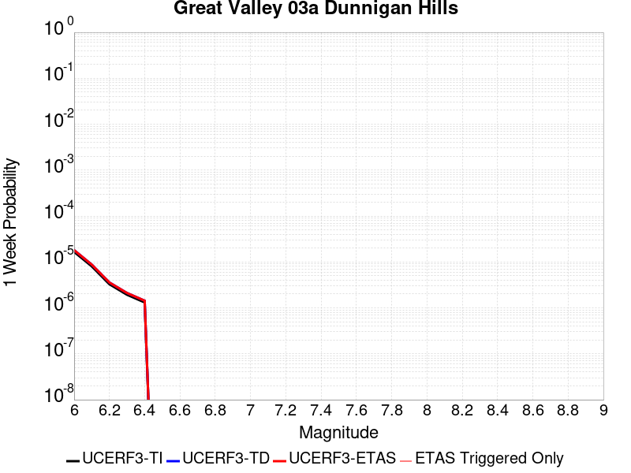 |  |  |  |

| Magnitude | 1 wk TI Prob | 1 wk TD Prob | 1 wk ETAS Prob | 1 wk ETAS/TD Gain | 1 wk ETAS Triggered Only | 1 mo TI Prob | 1 mo TD Prob | 1 mo ETAS Prob | 1 mo ETAS/TD Gain | 1 mo ETAS Triggered Only | 1 yr TI Prob | 1 yr TD Prob | 1 yr ETAS Prob | 1 yr ETAS/TD Gain | 1 yr ETAS Triggered Only | 10 yr TI Prob | 10 yr TD Prob | 10 yr ETAS Prob | 10 yr ETAS/TD Gain | 10 yr ETAS Triggered Only |
|-----|-----|-----|-----|-----|-----|-----|-----|-----|-----|-----|-----|-----|-----|-----|-----|-----|-----|-----|-----|-----|
| 6.0 | 1.6591328E-5 | 1.8107954E-5 | 1.8107954E-5 | 1.0 | 0.0 | 7.110376E-5 | 7.7603596E-5 | 8.760282E-5 | 1.12885 | 1.0E-5 | 8.6534437E-4 | 9.444834E-4 | 9.54474E-4 | 1.0105778 | 1.0E-5 | 0.008619824 | 0.009411525 | 0.0094214305 | 1.0010525 | 1.0E-5 |
| 6.1 | 8.041125E-6 | 8.769726E-6 | 8.769726E-6 | 1.0 | 0.0 | 3.4461507E-5 | 3.7584115E-5 | 3.7584115E-5 | 1.0 | 0.0 | 4.194881E-4 | 4.5751085E-4 | 4.5751085E-4 | 1.0 | 0.0 | 0.004186971 | 0.004567687 | 0.004567687 | 1.0 | 0.0 |
| 6.2 | 3.2807004E-6 | 3.5795688E-6 | 3.5795688E-6 | 1.0 | 0.0 | 1.4060069E-5 | 1.5340942E-5 | 1.5340942E-5 | 1.0 | 0.0 | 1.7116789E-4 | 1.8676413E-4 | 1.8676413E-4 | 1.0 | 0.0 | 0.0017103611 | 0.0018664796 | 0.0018664796 | 1.0 | 0.0 |
| 6.3 | 1.9339366E-6 | 2.1103806E-6 | 2.1103806E-6 | 1.0 | 0.0 | 8.288273E-6 | 9.044474E-6 | 9.044474E-6 | 1.0 | 0.0 | 1.00905054E-4 | 1.1011375E-4 | 1.1011375E-4 | 1.0 | 0.0 | 0.0010085925 | 0.0011008718 | 0.0011008718 | 1.0 | 0.0 |
| 6.4 | 1.3142635E-6 | 1.4339867E-6 | 1.4339867E-6 | 1.0 | 0.0 | 5.6325457E-6 | 6.145657E-6 | 6.145657E-6 | 1.0 | 0.0 | 6.857408E-5 | 7.482337E-5 | 7.482337E-5 | 1.0 | 0.0 | 6.8552926E-4 | 7.4823375E-4 | 7.4823375E-4 | 1.0 | 0.0 |

## Elmore Ranch
*[(top)](#table-of-contents)*

| 1 Week | 1 Month | 1 Year | 10 Year |
|-----|-----|-----|-----|
|  |  |  |  |

| Magnitude | 1 wk TI Prob | 1 wk TD Prob | 1 wk ETAS Prob | 1 wk ETAS/TD Gain | 1 wk ETAS Triggered Only | 1 mo TI Prob | 1 mo TD Prob | 1 mo ETAS Prob | 1 mo ETAS/TD Gain | 1 mo ETAS Triggered Only | 1 yr TI Prob | 1 yr TD Prob | 1 yr ETAS Prob | 1 yr ETAS/TD Gain | 1 yr ETAS Triggered Only | 10 yr TI Prob | 10 yr TD Prob | 10 yr ETAS Prob | 10 yr ETAS/TD Gain | 10 yr ETAS Triggered Only |
|-----|-----|-----|-----|-----|-----|-----|-----|-----|-----|-----|-----|-----|-----|-----|-----|-----|-----|-----|-----|-----|
| 6.0 | 9.102099E-5 | 8.952015E-5 | 9.951925E-5 | 1.1116967 | 1.0E-5 | 3.9003167E-4 | 3.8361453E-4 | 3.9361068E-4 | 1.0260578 | 1.0E-5 | 0.0047383 | 0.004662009 | 0.0046719625 | 1.002135 | 1.0E-5 | 0.046385348 | 0.045870975 | 0.045880515 | 1.000208 | 1.0E-5 |
| 6.1 | 3.8306698E-5 | 4.1498504E-5 | 4.1498504E-5 | 1.0 | 0.0 | 1.6416123E-4 | 1.7784268E-4 | 1.7784268E-4 | 1.0 | 0.0 | 0.0019968306 | 0.0021631396 | 0.0021631396 | 1.0 | 0.0 | 0.019789828 | 0.021628205 | 0.021628205 | 1.0 | 0.0 |
| 6.2 | 3.8306698E-5 | 4.1498504E-5 | 4.1498504E-5 | 1.0 | 0.0 | 1.6416123E-4 | 1.7784268E-4 | 1.7784268E-4 | 1.0 | 0.0 | 0.0019968306 | 0.0021631396 | 0.0021631396 | 1.0 | 0.0 | 0.019789828 | 0.021628205 | 0.021628205 | 1.0 | 0.0 |
| 6.3 | 3.3197924E-5 | 3.6554302E-5 | 3.6554302E-5 | 1.0 | 0.0 | 1.4226905E-4 | 1.5665586E-4 | 1.5665586E-4 | 1.0 | 0.0 | 0.0017307495 | 0.001905917 | 0.001905917 | 1.0 | 0.0 | 0.017173318 | 0.01908996 | 0.01908996 | 1.0 | 0.0 |
| 6.4 | 2.5148964E-5 | 2.7420487E-5 | 2.7420487E-5 | 1.0 | 0.0 | 1.0777682E-4 | 1.17514726E-4 | 1.17514726E-4 | 1.0 | 0.0 | 0.0013113929 | 0.0014304507 | 0.0014304507 | 1.0 | 0.0 | 0.01303681 | 0.014387194 | 0.014387194 | 1.0 | 0.0 |
| 6.5 | 2.5148964E-5 | 2.7420487E-5 | 2.7420487E-5 | 1.0 | 0.0 | 1.0777682E-4 | 1.17514726E-4 | 1.17514726E-4 | 1.0 | 0.0 | 0.0013113929 | 0.0014304507 | 0.0014304507 | 1.0 | 0.0 | 0.01303681 | 0.014387194 | 0.014387194 | 1.0 | 0.0 |

## Round Valley
*[(top)](#table-of-contents)*

| 1 Week | 1 Month | 1 Year | 10 Year |
|-----|-----|-----|-----|
|  |  |  |  |

| Magnitude | 1 wk TI Prob | 1 wk TD Prob | 1 wk ETAS Prob | 1 wk ETAS/TD Gain | 1 wk ETAS Triggered Only | 1 mo TI Prob | 1 mo TD Prob | 1 mo ETAS Prob | 1 mo ETAS/TD Gain | 1 mo ETAS Triggered Only | 1 yr TI Prob | 1 yr TD Prob | 1 yr ETAS Prob | 1 yr ETAS/TD Gain | 1 yr ETAS Triggered Only | 10 yr TI Prob | 10 yr TD Prob | 10 yr ETAS Prob | 10 yr ETAS/TD Gain | 10 yr ETAS Triggered Only |
|-----|-----|-----|-----|-----|-----|-----|-----|-----|-----|-----|-----|-----|-----|-----|-----|-----|-----|-----|-----|-----|
| 6.0 | 1.588152E-5 | 1.3670716E-5 | 2.3670578E-5 | 1.7314806 | 1.0E-5 | 6.806188E-5 | 5.8587688E-5 | 6.85871E-5 | 1.1706743 | 1.0E-5 | 8.283384E-4 | 7.13111E-4 | 7.231039E-4 | 1.014013 | 1.0E-5 | 0.008252576 | 0.0071121147 | 0.007122044 | 1.0013961 | 1.0E-5 |
| 6.1 | 1.588152E-5 | 1.3670716E-5 | 2.3670578E-5 | 1.7314806 | 1.0E-5 | 6.806188E-5 | 5.8587688E-5 | 6.85871E-5 | 1.1706743 | 1.0E-5 | 8.283384E-4 | 7.13111E-4 | 7.231039E-4 | 1.014013 | 1.0E-5 | 0.008252576 | 0.0071121147 | 0.007122044 | 1.0013961 | 1.0E-5 |
| 6.2 | 1.588152E-5 | 1.3670716E-5 | 2.3670578E-5 | 1.7314806 | 1.0E-5 | 6.806188E-5 | 5.8587688E-5 | 6.85871E-5 | 1.1706743 | 1.0E-5 | 8.283384E-4 | 7.13111E-4 | 7.231039E-4 | 1.014013 | 1.0E-5 | 0.008252576 | 0.0071121147 | 0.007122044 | 1.0013961 | 1.0E-5 |
| 6.3 | 1.588152E-5 | 1.3670716E-5 | 2.3670578E-5 | 1.7314806 | 1.0E-5 | 6.806188E-5 | 5.8587688E-5 | 6.85871E-5 | 1.1706743 | 1.0E-5 | 8.283384E-4 | 7.13111E-4 | 7.231039E-4 | 1.014013 | 1.0E-5 | 0.008252576 | 0.0071121147 | 0.007122044 | 1.0013961 | 1.0E-5 |
| 6.4 | 1.588152E-5 | 1.3670716E-5 | 2.3670578E-5 | 1.7314806 | 1.0E-5 | 6.806188E-5 | 5.8587688E-5 | 6.85871E-5 | 1.1706743 | 1.0E-5 | 8.283384E-4 | 7.13111E-4 | 7.231039E-4 | 1.014013 | 1.0E-5 | 0.008252576 | 0.0071121147 | 0.007122044 | 1.0013961 | 1.0E-5 |
| 6.5 | 1.0646776E-5 | 7.953037E-6 | 7.953037E-6 | 1.0 | 0.0 | 4.5628243E-5 | 3.408405E-5 | 3.408405E-5 | 1.0 | 0.0 | 5.553823E-4 | 4.1490266E-4 | 4.1490266E-4 | 1.0 | 0.0 | 0.005539963 | 0.0041421093 | 0.0041421093 | 1.0 | 0.0 |
| 6.6 | 8.632956E-6 | 5.768742E-6 | 5.768742E-6 | 1.0 | 0.0 | 3.6997862E-5 | 2.4722967E-5 | 2.4722967E-5 | 1.0 | 0.0 | 4.5035584E-4 | 3.009644E-4 | 3.009644E-4 | 1.0 | 0.0 | 0.0044944426 | 0.003005946 | 0.003005946 | 1.0 | 0.0 |
| 6.7 | 8.632956E-6 | 5.768742E-6 | 5.768742E-6 | 1.0 | 0.0 | 3.6997862E-5 | 2.4722967E-5 | 2.4722967E-5 | 1.0 | 0.0 | 4.5035584E-4 | 3.009644E-4 | 3.009644E-4 | 1.0 | 0.0 | 0.0044944426 | 0.003005946 | 0.003005946 | 1.0 | 0.0 |
| 6.8 | 7.143895E-6 | 4.2018346E-6 | 4.2018346E-6 | 1.0 | 0.0 | 3.0616335E-5 | 1.8007748E-5 | 1.8007748E-5 | 1.0 | 0.0 | 3.726901E-4 | 2.1922393E-4 | 2.1922393E-4 | 1.0 | 0.0 | 0.0037206567 | 0.0021902416 | 0.0021902416 | 1.0 | 0.0 |
| 6.9 | 6.5120694E-6 | 3.6644687E-6 | 3.6644687E-6 | 1.0 | 0.0 | 2.790857E-5 | 1.570478E-5 | 1.570478E-5 | 1.0 | 0.0 | 3.3973387E-4 | 1.9119044E-4 | 1.9119044E-4 | 1.0 | 0.0 | 0.0033921495 | 0.0019104085 | 0.0019104085 | 1.0 | 0.0 |
| 7.0 | 5.0614435E-6 | 2.6836676E-6 | 2.6836676E-6 | 1.0 | 0.0 | 2.169172E-5 | 1.1501388E-5 | 1.1501388E-5 | 1.0 | 0.0 | 2.6406467E-4 | 1.4002144E-4 | 1.4002144E-4 | 1.0 | 0.0 | 0.0026375111 | 0.0013994334 | 0.0013994334 | 1.0 | 0.0 |
| 7.1 | 4.41728E-6 | 2.3575074E-6 | 2.3575074E-6 | 1.0 | 0.0 | 1.8931061E-5 | 1.0103569E-5 | 1.0103569E-5 | 1.0 | 0.0 | 2.304613E-4 | 1.23005E-4 | 1.23005E-4 | 1.0 | 0.0 | 0.0023022245 | 0.0012294657 | 0.0012294657 | 1.0 | 0.0 |
| 7.2 | 2.535495E-6 | 1.1208391E-6 | 1.1208391E-6 | 1.0 | 0.0 | 1.0866362E-5 | 4.8035904E-6 | 4.8035904E-6 | 1.0 | 0.0 | 1.3228992E-4 | 5.8482667E-5 | 5.8482667E-5 | 1.0 | 0.0 | 0.0013221119 | 5.84724E-4 | 5.84724E-4 | 1.0 | 0.0 |
| 7.3 | 7.900015E-7 | 4.0889498E-7 | 4.0889498E-7 | 1.0 | 0.0 | 3.3857161E-6 | 1.752407E-6 | 1.752407E-6 | 1.0 | 0.0 | 4.1220315E-5 | 2.1335554E-5 | 2.1335554E-5 | 1.0 | 0.0 | 4.121267E-4 | 2.1335555E-4 | 2.1335555E-4 | 1.0 | 0.0 |

## Rinconada 2011 CFM
*[(top)](#table-of-contents)*

| 1 Week | 1 Month | 1 Year | 10 Year |
|-----|-----|-----|-----|
|  |  |  |  |

| Magnitude | 1 wk TI Prob | 1 wk TD Prob | 1 wk ETAS Prob | 1 wk ETAS/TD Gain | 1 wk ETAS Triggered Only | 1 mo TI Prob | 1 mo TD Prob | 1 mo ETAS Prob | 1 mo ETAS/TD Gain | 1 mo ETAS Triggered Only | 1 yr TI Prob | 1 yr TD Prob | 1 yr ETAS Prob | 1 yr ETAS/TD Gain | 1 yr ETAS Triggered Only | 10 yr TI Prob | 10 yr TD Prob | 10 yr ETAS Prob | 10 yr ETAS/TD Gain | 10 yr ETAS Triggered Only |
|-----|-----|-----|-----|-----|-----|-----|-----|-----|-----|-----|-----|-----|-----|-----|-----|-----|-----|-----|-----|-----|
| 6.0 | 1.5752368E-5 | 1.6274716E-5 | 2.6274553E-5 | 1.6144401 | 1.0E-5 | 6.75084E-5 | 6.974694E-5 | 7.9746234E-5 | 1.1433655 | 1.0E-5 | 8.2160486E-4 | 8.488412E-4 | 8.5883273E-4 | 1.0117707 | 1.0E-5 | 0.008185739 | 0.00845637 | 0.008466286 | 1.0011725 | 1.0E-5 |
| 6.1 | 1.0966133E-5 | 1.1323029E-5 | 2.1322916E-5 | 1.8831459 | 1.0E-5 | 4.6996865E-5 | 4.852637E-5 | 5.8525882E-5 | 1.2060635 | 1.0E-5 | 5.720366E-4 | 5.906491E-4 | 6.006432E-4 | 1.0169206 | 1.0E-5 | 0.0057056635 | 0.0058908886 | 0.00590083 | 1.0016875 | 1.0E-5 |
| 6.2 | 1.0966133E-5 | 1.1323029E-5 | 2.1322916E-5 | 1.8831459 | 1.0E-5 | 4.6996865E-5 | 4.852637E-5 | 5.8525882E-5 | 1.2060635 | 1.0E-5 | 5.720366E-4 | 5.906491E-4 | 6.006432E-4 | 1.0169206 | 1.0E-5 | 0.0057056635 | 0.0058908886 | 0.00590083 | 1.0016875 | 1.0E-5 |
| 6.3 | 8.926149E-6 | 9.212771E-6 | 1.9212679E-5 | 2.0854397 | 1.0E-5 | 3.8254362E-5 | 3.948271E-5 | 4.9482314E-5 | 1.2532654 | 1.0E-5 | 4.6564735E-4 | 4.805963E-4 | 4.905915E-4 | 1.0207975 | 1.0E-5 | 0.0046467283 | 0.0047956146 | 0.0048055663 | 1.0020752 | 1.0E-5 |
| 6.4 | 7.676955E-6 | 7.920191E-6 | 7.920191E-6 | 1.0 | 0.0 | 3.290082E-5 | 3.3943234E-5 | 3.3943234E-5 | 1.0 | 0.0 | 4.0049385E-4 | 4.1318068E-4 | 4.1318068E-4 | 1.0 | 0.0 | 0.0039977287 | 0.004124151 | 0.004124151 | 1.0 | 0.0 |
| 6.5 | 6.1671026E-6 | 6.3589546E-6 | 6.3589546E-6 | 1.0 | 0.0 | 2.6430173E-5 | 2.725238E-5 | 2.725238E-5 | 1.0 | 0.0 | 3.2173982E-4 | 3.317473E-4 | 3.317473E-4 | 1.0 | 0.0 | 0.003212744 | 0.0033125326 | 0.0033125326 | 1.0 | 0.0 |
| 6.6 | 5.553456E-6 | 5.7248126E-6 | 5.7248126E-6 | 1.0 | 0.0 | 2.3800309E-5 | 2.453468E-5 | 2.453468E-5 | 1.0 | 0.0 | 2.897302E-4 | 2.9866883E-4 | 2.9866883E-4 | 1.0 | 0.0 | 0.0028935277 | 0.002982683 | 0.002982683 | 1.0 | 0.0 |
| 6.7 | 4.787857E-6 | 4.9333094E-6 | 4.9333094E-6 | 1.0 | 0.0 | 2.0519226E-5 | 2.1142583E-5 | 2.1142583E-5 | 1.0 | 0.0 | 2.4979294E-4 | 2.573806E-4 | 2.573806E-4 | 1.0 | 0.0 | 0.0024951235 | 0.0025708308 | 0.0025708308 | 1.0 | 0.0 |
| 6.8 | 3.9955166E-6 | 4.1134763E-6 | 4.1134763E-6 | 1.0 | 0.0 | 1.7123532E-5 | 1.7629065E-5 | 1.7629065E-5 | 1.0 | 0.0 | 2.0845905E-4 | 2.1461274E-4 | 2.1461274E-4 | 1.0 | 0.0 | 0.002082636 | 0.0021440585 | 0.0021440585 | 1.0 | 0.0 |
| 6.9 | 3.4250072E-6 | 3.5224464E-6 | 3.5224464E-6 | 1.0 | 0.0 | 1.46785205E-5 | 1.5096111E-5 | 1.5096111E-5 | 1.0 | 0.0 | 1.7869633E-4 | 1.8377967E-4 | 1.8377967E-4 | 1.0 | 0.0 | 0.001785527 | 0.0018362794 | 0.0018362794 | 1.0 | 0.0 |
| 7.0 | 2.7712713E-6 | 2.8467E-6 | 2.8467E-6 | 1.0 | 0.0 | 1.1876823E-5 | 1.2200086E-5 | 1.2200086E-5 | 1.0 | 0.0 | 1.4459073E-4 | 1.4852593E-4 | 1.4852593E-4 | 1.0 | 0.0 | 0.0014449668 | 0.0014842682 | 0.0014842682 | 1.0 | 0.0 |
| 7.1 | 2.227358E-6 | 2.2856984E-6 | 2.2856984E-6 | 1.0 | 0.0 | 9.545785E-6 | 9.795814E-6 | 9.795814E-6 | 1.0 | 0.0 | 1.16213734E-4 | 1.19257515E-4 | 1.19257515E-4 | 1.0 | 0.0 | 0.0011615298 | 0.0011919362 | 0.0011919362 | 1.0 | 0.0 |
| 7.2 | 1.581796E-6 | 1.6209011E-6 | 1.6209011E-6 | 1.0 | 0.0 | 6.779108E-6 | 6.9467005E-6 | 6.9467005E-6 | 1.0 | 0.0 | 8.253252E-5 | 8.457281E-5 | 8.457281E-5 | 1.0 | 0.0 | 8.250187E-4 | 8.454067E-4 | 8.454067E-4 | 1.0 | 0.0 |
| 7.3 | 1.0306567E-6 | 1.0546477E-6 | 1.0546477E-6 | 1.0 | 0.0 | 4.4170924E-6 | 4.519911E-6 | 4.519911E-6 | 1.0 | 0.0 | 5.3776774E-5 | 5.5028526E-5 | 5.5028526E-5 | 1.0 | 0.0 | 5.376376E-4 | 5.5014924E-4 | 5.5014924E-4 | 1.0 | 0.0 |
| 7.4 | 6.535541E-7 | 6.682742E-7 | 6.682742E-7 | 1.0 | 0.0 | 2.800943E-6 | 2.864029E-6 | 2.864029E-6 | 1.0 | 0.0 | 3.4100947E-5 | 3.4868997E-5 | 3.4868997E-5 | 1.0 | 0.0 | 3.4095717E-4 | 3.4863537E-4 | 3.4863537E-4 | 1.0 | 0.0 |
| 7.5 | 3.2656962E-7 | 3.3316687E-7 | 3.3316687E-7 | 1.0 | 0.0 | 1.3995833E-6 | 1.4278572E-6 | 1.4278572E-6 | 1.0 | 0.0 | 1.7039794E-5 | 1.7384024E-5 | 1.7384024E-5 | 1.0 | 0.0 | 1.7038487E-4 | 1.7382667E-4 | 1.7382667E-4 | 1.0 | 0.0 |
| 7.6 | 9.754343E-8 | 9.82099E-8 | 9.82099E-8 | 1.0 | 0.0 | 4.180432E-7 | 4.208995E-7 | 4.208995E-7 | 1.0 | 0.0 | 5.089664E-6 | 5.1244397E-6 | 5.1244397E-6 | 1.0 | 0.0 | 5.0895473E-5 | 5.1243223E-5 | 5.1243223E-5 | 1.0 | 0.0 |
| 7.7 | 6.0001453E-9 | 5.8490435E-9 | 5.8490435E-9 | 1.0 | 0.0 | 2.5714908E-8 | 2.506733E-8 | 2.506733E-8 | 1.0 | 0.0 | 3.1307894E-7 | 3.051947E-7 | 3.051947E-7 | 1.0 | 0.0 | 3.1307852E-6 | 3.051943E-6 | 3.051943E-6 | 1.0 | 0.0 |
| 7.8 | 7.400003E-11 | 7.4654505E-11 | 7.4654505E-11 | 1.0 | 0.0 | 3.171432E-10 | 3.1994773E-10 | 3.1994773E-10 | 1.0 | 0.0 | 3.861218E-9 | 3.895363E-9 | 3.895363E-9 | 1.0 | 0.0 | 3.861218E-8 | 3.895363E-8 | 3.895363E-8 | 1.0 | 0.0 |

## Puente Hills
*[(top)](#table-of-contents)*

| 1 Week | 1 Month | 1 Year | 10 Year |
|-----|-----|-----|-----|
|  |  |  |  |

| Magnitude | 1 wk TI Prob | 1 wk TD Prob | 1 wk ETAS Prob | 1 wk ETAS/TD Gain | 1 wk ETAS Triggered Only | 1 mo TI Prob | 1 mo TD Prob | 1 mo ETAS Prob | 1 mo ETAS/TD Gain | 1 mo ETAS Triggered Only | 1 yr TI Prob | 1 yr TD Prob | 1 yr ETAS Prob | 1 yr ETAS/TD Gain | 1 yr ETAS Triggered Only | 10 yr TI Prob | 10 yr TD Prob | 10 yr ETAS Prob | 10 yr ETAS/TD Gain | 10 yr ETAS Triggered Only |
|-----|-----|-----|-----|-----|-----|-----|-----|-----|-----|-----|-----|-----|-----|-----|-----|-----|-----|-----|-----|-----|
| 6.0 | 1.2101656E-5 | 8.098625E-6 | 8.098625E-6 | 1.0 | 0.0 | 5.1863204E-5 | 3.4707962E-5 | 3.4707962E-5 | 1.0 | 0.0 | 6.312516E-4 | 4.2249315E-4 | 4.3248892E-4 | 1.023659 | 1.0E-5 | 0.0062946146 | 0.0042174594 | 0.004227417 | 1.002361 | 1.0E-5 |
| 6.1 | 1.2101656E-5 | 8.098625E-6 | 8.098625E-6 | 1.0 | 0.0 | 5.1863204E-5 | 3.4707962E-5 | 3.4707962E-5 | 1.0 | 0.0 | 6.312516E-4 | 4.2249315E-4 | 4.3248892E-4 | 1.023659 | 1.0E-5 | 0.0062946146 | 0.0042174594 | 0.004227417 | 1.002361 | 1.0E-5 |
| 6.2 | 1.2101656E-5 | 8.098625E-6 | 8.098625E-6 | 1.0 | 0.0 | 5.1863204E-5 | 3.4707962E-5 | 3.4707962E-5 | 1.0 | 0.0 | 6.312516E-4 | 4.2249315E-4 | 4.3248892E-4 | 1.023659 | 1.0E-5 | 0.0062946146 | 0.0042174594 | 0.004227417 | 1.002361 | 1.0E-5 |
| 6.3 | 1.2101656E-5 | 8.098625E-6 | 8.098625E-6 | 1.0 | 0.0 | 5.1863204E-5 | 3.4707962E-5 | 3.4707962E-5 | 1.0 | 0.0 | 6.312516E-4 | 4.2249315E-4 | 4.3248892E-4 | 1.023659 | 1.0E-5 | 0.0062946146 | 0.0042174594 | 0.004227417 | 1.002361 | 1.0E-5 |
| 6.4 | 1.2101656E-5 | 8.098625E-6 | 8.098625E-6 | 1.0 | 0.0 | 5.1863204E-5 | 3.4707962E-5 | 3.4707962E-5 | 1.0 | 0.0 | 6.312516E-4 | 4.2249315E-4 | 4.3248892E-4 | 1.023659 | 1.0E-5 | 0.0062946146 | 0.0042174594 | 0.004227417 | 1.002361 | 1.0E-5 |
| 6.5 | 1.2101656E-5 | 8.098625E-6 | 8.098625E-6 | 1.0 | 0.0 | 5.1863204E-5 | 3.4707962E-5 | 3.4707962E-5 | 1.0 | 0.0 | 6.312516E-4 | 4.2249315E-4 | 4.3248892E-4 | 1.023659 | 1.0E-5 | 0.0062946146 | 0.0042174594 | 0.004227417 | 1.002361 | 1.0E-5 |
| 6.6 | 1.0222488E-5 | 6.3991847E-6 | 6.3991847E-6 | 1.0 | 0.0 | 4.3809923E-5 | 2.7424803E-5 | 2.7424803E-5 | 1.0 | 0.0 | 5.332553E-4 | 3.3384826E-4 | 3.3384826E-4 | 1.0 | 0.0 | 0.0053197746 | 0.0033337125 | 0.0033337125 | 1.0 | 0.0 |
| 6.7 | 1.0222488E-5 | 6.3991847E-6 | 6.3991847E-6 | 1.0 | 0.0 | 4.3809923E-5 | 2.7424803E-5 | 2.7424803E-5 | 1.0 | 0.0 | 5.332553E-4 | 3.3384826E-4 | 3.3384826E-4 | 1.0 | 0.0 | 0.0053197746 | 0.0033337125 | 0.0033337125 | 1.0 | 0.0 |
| 6.8 | 8.6367845E-6 | 5.0282533E-6 | 5.0282533E-6 | 1.0 | 0.0 | 3.7014266E-5 | 2.1549482E-5 | 2.1549482E-5 | 1.0 | 0.0 | 4.505555E-4 | 2.623339E-4 | 2.623339E-4 | 1.0 | 0.0 | 0.004496431 | 0.0026202986 | 0.0026202986 | 1.0 | 0.0 |
| 6.9 | 8.066481E-6 | 4.836117E-6 | 4.836117E-6 | 1.0 | 0.0 | 3.4570177E-5 | 2.0726053E-5 | 2.0726053E-5 | 1.0 | 0.0 | 4.2081063E-4 | 2.52311E-4 | 2.52311E-4 | 1.0 | 0.0 | 0.0042001465 | 0.0025202993 | 0.0025202993 | 1.0 | 0.0 |
| 7.0 | 7.393828E-6 | 4.417296E-6 | 4.417296E-6 | 1.0 | 0.0 | 3.168745E-5 | 1.8931134E-5 | 1.8931134E-5 | 1.0 | 0.0 | 3.857264E-4 | 2.3046264E-4 | 2.3046264E-4 | 1.0 | 0.0 | 0.0038505755 | 0.0023022818 | 0.0023022818 | 1.0 | 0.0 |
| 7.1 | 6.4660953E-6 | 3.8044495E-6 | 3.8044495E-6 | 1.0 | 0.0 | 2.7711543E-5 | 1.6304684E-5 | 1.6304684E-5 | 1.0 | 0.0 | 3.373358E-4 | 1.984918E-4 | 1.984918E-4 | 1.0 | 0.0 | 0.0033682417 | 0.001983181 | 0.001983181 | 1.0 | 0.0 |
| 7.2 | 5.143232E-6 | 2.7865456E-6 | 2.7865456E-6 | 1.0 | 0.0 | 2.2042237E-5 | 1.1942284E-5 | 1.1942284E-5 | 1.0 | 0.0 | 2.6833118E-4 | 1.453877E-4 | 1.453877E-4 | 1.0 | 0.0 | 0.002680074 | 0.0014529356 | 0.0014529356 | 1.0 | 0.0 |
| 7.3 | 3.928255E-6 | 2.0913774E-6 | 2.0913774E-6 | 1.0 | 0.0 | 1.683527E-5 | 8.963015E-6 | 8.963015E-6 | 1.0 | 0.0 | 2.0495013E-4 | 1.0911931E-4 | 1.0911931E-4 | 1.0 | 0.0 | 0.002047612 | 0.001090664 | 0.001090664 | 1.0 | 0.0 |
| 7.4 | 2.7894434E-6 | 1.3546753E-6 | 1.3546753E-6 | 1.0 | 0.0 | 1.1954703E-5 | 5.8057385E-6 | 5.8057385E-6 | 1.0 | 0.0 | 1.4553878E-4 | 7.068262E-5 | 7.068262E-5 | 1.0 | 0.0 | 0.001454435 | 7.066058E-4 | 7.066058E-4 | 1.0 | 0.0 |
| 7.5 | 2.041735E-6 | 8.787305E-7 | 8.787305E-7 | 1.0 | 0.0 | 8.750263E-6 | 3.7659825E-6 | 3.7659825E-6 | 1.0 | 0.0 | 1.06529245E-4 | 4.5849905E-5 | 4.5849905E-5 | 1.0 | 0.0 | 0.0010647819 | 4.5840783E-4 | 4.5840783E-4 | 1.0 | 0.0 |
| 7.6 | 1.6959062E-6 | 6.6986263E-7 | 6.6986263E-7 | 1.0 | 0.0 | 7.268149E-6 | 2.8708366E-6 | 2.8708366E-6 | 1.0 | 0.0 | 8.848612E-5 | 3.4951907E-5 | 3.4951907E-5 | 1.0 | 0.0 | 8.84509E-4 | 3.4946698E-4 | 3.4946698E-4 | 1.0 | 0.0 |
| 7.7 | 1.4767965E-6 | 5.407607E-7 | 5.407607E-7 | 1.0 | 0.0 | 6.3291122E-6 | 2.317544E-6 | 2.317544E-6 | 1.0 | 0.0 | 7.705422E-5 | 2.8215758E-5 | 2.8215758E-5 | 1.0 | 0.0 | 7.702751E-4 | 2.8212433E-4 | 2.8212433E-4 | 1.0 | 0.0 |
| 7.8 | 1.8432911E-7 | 7.28201E-8 | 7.28201E-8 | 1.0 | 0.0 | 7.8998164E-7 | 3.1208612E-7 | 3.1208612E-7 | 1.0 | 0.0 | 9.617985E-6 | 3.7996451E-6 | 3.7996451E-6 | 1.0 | 0.0 | 9.617568E-5 | 3.7996128E-5 | 3.7996128E-5 | 1.0 | 0.0 |

## Eaton Roughs 2011 CFM
*[(top)](#table-of-contents)*

| 1 Week | 1 Month | 1 Year | 10 Year |
|-----|-----|-----|-----|
|  |  |  |  |

| Magnitude | 1 wk TI Prob | 1 wk TD Prob | 1 wk ETAS Prob | 1 wk ETAS/TD Gain | 1 wk ETAS Triggered Only | 1 mo TI Prob | 1 mo TD Prob | 1 mo ETAS Prob | 1 mo ETAS/TD Gain | 1 mo ETAS Triggered Only | 1 yr TI Prob | 1 yr TD Prob | 1 yr ETAS Prob | 1 yr ETAS/TD Gain | 1 yr ETAS Triggered Only | 10 yr TI Prob | 10 yr TD Prob | 10 yr ETAS Prob | 10 yr ETAS/TD Gain | 10 yr ETAS Triggered Only |
|-----|-----|-----|-----|-----|-----|-----|-----|-----|-----|-----|-----|-----|-----|-----|-----|-----|-----|-----|-----|-----|
| 6.0 | 6.8044945E-5 | 8.843646E-5 | 8.843646E-5 | 1.0 | 0.0 | 2.9158857E-4 | 3.7896493E-4 | 3.7896493E-4 | 1.0 | 0.0 | 0.0035443127 | 0.0046050907 | 0.0046150447 | 1.0021615 | 1.0E-5 | 0.03488314 | 0.04516335 | 0.045172896 | 1.0002115 | 1.0E-5 |
| 6.1 | 6.8044945E-5 | 8.843646E-5 | 8.843646E-5 | 1.0 | 0.0 | 2.9158857E-4 | 3.7896493E-4 | 3.7896493E-4 | 1.0 | 0.0 | 0.0035443127 | 0.0046050907 | 0.0046150447 | 1.0021615 | 1.0E-5 | 0.03488314 | 0.04516335 | 0.045172896 | 1.0002115 | 1.0E-5 |
| 6.2 | 6.8044945E-5 | 8.843646E-5 | 8.843646E-5 | 1.0 | 0.0 | 2.9158857E-4 | 3.7896493E-4 | 3.7896493E-4 | 1.0 | 0.0 | 0.0035443127 | 0.0046050907 | 0.0046150447 | 1.0021615 | 1.0E-5 | 0.03488314 | 0.04516335 | 0.045172896 | 1.0002115 | 1.0E-5 |
| 6.3 | 6.8044945E-5 | 8.843646E-5 | 8.843646E-5 | 1.0 | 0.0 | 2.9158857E-4 | 3.7896493E-4 | 3.7896493E-4 | 1.0 | 0.0 | 0.0035443127 | 0.0046050907 | 0.0046150447 | 1.0021615 | 1.0E-5 | 0.03488314 | 0.04516335 | 0.045172896 | 1.0002115 | 1.0E-5 |
| 6.4 | 4.5830013E-5 | 5.715427E-5 | 5.715427E-5 | 1.0 | 0.0 | 1.9639956E-4 | 2.4492692E-4 | 2.4492692E-4 | 1.0 | 0.0 | 0.0023885423 | 0.0029784471 | 0.0029784471 | 1.0 | 0.0 | 0.023630321 | 0.029421588 | 0.029421588 | 1.0 | 0.0 |
| 6.5 | 4.5830013E-5 | 5.715427E-5 | 5.715427E-5 | 1.0 | 0.0 | 1.9639956E-4 | 2.4492692E-4 | 2.4492692E-4 | 1.0 | 0.0 | 0.0023885423 | 0.0029784471 | 0.0029784471 | 1.0 | 0.0 | 0.023630321 | 0.029421588 | 0.029421588 | 1.0 | 0.0 |
| 6.6 | 3.222194E-5 | 3.8261504E-5 | 3.8261504E-5 | 1.0 | 0.0 | 1.3808672E-4 | 1.639682E-4 | 1.639682E-4 | 1.0 | 0.0 | 0.0016799092 | 0.001994599 | 0.001994599 | 1.0 | 0.0 | 0.016672665 | 0.019776601 | 0.019776601 | 1.0 | 0.0 |
| 6.7 | 2.4155654E-5 | 2.7786238E-5 | 2.7786238E-5 | 1.0 | 0.0 | 1.0352012E-4 | 1.1907848E-4 | 1.1907848E-4 | 1.0 | 0.0 | 0.0012596287 | 0.0014488247 | 0.0014488247 | 1.0 | 0.0 | 0.012525126 | 0.014394943 | 0.014394943 | 1.0 | 0.0 |
| 6.8 | 2.1814667E-5 | 2.4940868E-5 | 2.4940868E-5 | 1.0 | 0.0 | 9.348808E-5 | 1.06885076E-4 | 1.06885076E-4 | 1.0 | 0.0 | 0.001137623 | 0.0013005526 | 0.0013005526 | 1.0 | 0.0 | 0.011318169 | 0.012930038 | 0.012930038 | 1.0 | 0.0 |
| 6.9 | 2.0700467E-5 | 2.3628932E-5 | 2.3628932E-5 | 1.0 | 0.0 | 8.871327E-5 | 1.01262944E-4 | 1.01262944E-4 | 1.0 | 0.0 | 0.0010795488 | 0.0012321823 | 0.0012321823 | 1.0 | 0.0 | 0.010743194 | 0.012254035 | 0.012254035 | 1.0 | 0.0 |
| 7.0 | 2.0104066E-5 | 2.29365E-5 | 2.29365E-5 | 1.0 | 0.0 | 8.615744E-5 | 9.82956E-5 | 9.82956E-5 | 1.0 | 0.0 | 0.0010484619 | 0.0011960949 | 0.0011960949 | 1.0 | 0.0 | 0.010435291 | 0.011897073 | 0.011897073 | 1.0 | 0.0 |
| 7.1 | 1.8225232E-5 | 2.0773046E-5 | 2.0773046E-5 | 1.0 | 0.0 | 7.81058E-5 | 8.902431E-5 | 8.902431E-5 | 1.0 | 0.0 | 9.5052324E-4 | 0.0010833336 | 0.0010833336 | 1.0 | 0.0 | 0.009464677 | 0.010780825 | 0.010780825 | 1.0 | 0.0 |
| 7.2 | 1.7526572E-5 | 1.9993488E-5 | 1.9993488E-5 | 1.0 | 0.0 | 7.511172E-5 | 8.5683576E-5 | 8.5683576E-5 | 1.0 | 0.0 | 9.141015E-4 | 0.0010426997 | 0.0010426997 | 1.0 | 0.0 | 0.009103506 | 0.010378351 | 0.010378351 | 1.0 | 0.0 |
| 7.3 | 1.5727232E-5 | 1.8021507E-5 | 1.8021507E-5 | 1.0 | 0.0 | 6.740067E-5 | 7.723275E-5 | 7.723275E-5 | 1.0 | 0.0 | 8.2029426E-4 | 9.399043E-4 | 9.399043E-4 | 1.0 | 0.0 | 0.008172729 | 0.009359511 | 0.009359511 | 1.0 | 0.0 |
| 7.4 | 1.4457361E-5 | 1.6598358E-5 | 1.6598358E-5 | 1.0 | 0.0 | 6.195865E-5 | 7.113389E-5 | 7.113389E-5 | 1.0 | 0.0 | 7.540854E-4 | 8.657119E-4 | 8.657119E-4 | 1.0 | 0.0 | 0.007515317 | 0.008623555 | 0.008623555 | 1.0 | 0.0 |
| 7.5 | 1.33280955E-5 | 1.5345435E-5 | 1.5345435E-5 | 1.0 | 0.0 | 5.711916E-5 | 6.57645E-5 | 6.57645E-5 | 1.0 | 0.0 | 6.9520384E-4 | 8.0038945E-4 | 8.0038945E-4 | 1.0 | 0.0 | 0.00693033 | 0.007975209 | 0.007975209 | 1.0 | 0.0 |
| 7.6 | 1.0699478E-5 | 1.2387815E-5 | 1.2387815E-5 | 1.0 | 0.0 | 4.5854096E-5 | 5.308956E-5 | 5.308956E-5 | 1.0 | 0.0 | 5.581306E-4 | 6.4617425E-4 | 6.4617425E-4 | 1.0 | 0.0 | 0.005567309 | 0.0064430353 | 0.0064430353 | 1.0 | 0.0 |
| 7.7 | 5.9390236E-6 | 6.852951E-6 | 6.852951E-6 | 1.0 | 0.0 | 2.545271E-5 | 2.9369461E-5 | 2.9369461E-5 | 1.0 | 0.0 | 3.0984267E-4 | 3.5751477E-4 | 3.5751477E-4 | 1.0 | 0.0 | 0.0030941102 | 0.0035694204 | 0.0035694204 | 1.0 | 0.0 |
| 7.8 | 2.1622036E-6 | 2.3296996E-6 | 2.3296996E-6 | 1.0 | 0.0 | 9.266554E-6 | 9.984388E-6 | 9.984388E-6 | 1.0 | 0.0 | 1.1281446E-4 | 1.21553225E-4 | 1.21553225E-4 | 1.0 | 0.0 | 0.001127572 | 0.001214873 | 0.001214873 | 1.0 | 0.0 |
| 7.9 | 4.9586197E-7 | 5.2189216E-7 | 5.2189216E-7 | 1.0 | 0.0 | 2.125121E-6 | 2.2366787E-6 | 2.2366787E-6 | 1.0 | 0.0 | 2.5873042E-5 | 2.7231245E-5 | 2.7231245E-5 | 1.0 | 0.0 | 2.5870028E-4 | 2.7228118E-4 | 2.7228118E-4 | 1.0 | 0.0 |

## Davis Creek
*[(top)](#table-of-contents)*

| 1 Week | 1 Month | 1 Year | 10 Year |
|-----|-----|-----|-----|
|  |  |  |  |

| Magnitude | 1 wk TI Prob | 1 wk TD Prob | 1 wk ETAS Prob | 1 wk ETAS/TD Gain | 1 wk ETAS Triggered Only | 1 mo TI Prob | 1 mo TD Prob | 1 mo ETAS Prob | 1 mo ETAS/TD Gain | 1 mo ETAS Triggered Only | 1 yr TI Prob | 1 yr TD Prob | 1 yr ETAS Prob | 1 yr ETAS/TD Gain | 1 yr ETAS Triggered Only | 10 yr TI Prob | 10 yr TD Prob | 10 yr ETAS Prob | 10 yr ETAS/TD Gain | 10 yr ETAS Triggered Only |
|-----|-----|-----|-----|-----|-----|-----|-----|-----|-----|-----|-----|-----|-----|-----|-----|-----|-----|-----|-----|-----|
| 6.0 | 2.331472E-5 | 2.5417214E-5 | 2.5417214E-5 | 1.0 | 0.0 | 9.99164E-5 | 1.0892704E-4 | 1.0892704E-4 | 1.0 | 0.0 | 0.0012158032 | 0.0013254983 | 0.0013354851 | 1.0075344 | 1.0E-5 | 0.01209173 | 0.013187704 | 0.013197572 | 1.0007483 | 1.0E-5 |
| 6.1 | 1.0407654E-5 | 1.1316986E-5 | 1.1316986E-5 | 1.0 | 0.0 | 4.4603472E-5 | 4.8500624E-5 | 4.8500624E-5 | 1.0 | 0.0 | 5.4291193E-4 | 5.9036224E-4 | 5.9036224E-4 | 1.0 | 0.0 | 0.0054158745 | 0.005890611 | 0.005890611 | 1.0 | 0.0 |
| 6.2 | 1.0407654E-5 | 1.1316986E-5 | 1.1316986E-5 | 1.0 | 0.0 | 4.4603472E-5 | 4.8500624E-5 | 4.8500624E-5 | 1.0 | 0.0 | 5.4291193E-4 | 5.9036224E-4 | 5.9036224E-4 | 1.0 | 0.0 | 0.0054158745 | 0.005890611 | 0.005890611 | 1.0 | 0.0 |
| 6.3 | 5.1323277E-6 | 5.568556E-6 | 5.568556E-6 | 1.0 | 0.0 | 2.1995505E-5 | 2.386507E-5 | 2.386507E-5 | 1.0 | 0.0 | 2.6776237E-4 | 2.905271E-4 | 2.905271E-4 | 1.0 | 0.0 | 0.0026743996 | 0.0029023192 | 0.0029023192 | 1.0 | 0.0 |
| 6.4 | 2.4985154E-6 | 2.704538E-6 | 2.704538E-6 | 1.0 | 0.0 | 1.07078795E-5 | 1.1590847E-5 | 1.1590847E-5 | 1.0 | 0.0 | 1.3036063E-4 | 1.4111304E-4 | 1.4111304E-4 | 1.0 | 0.0 | 0.0013028418 | 0.001410589 | 0.001410589 | 1.0 | 0.0 |
| 6.5 | 2.4846438E-6 | 2.6904722E-6 | 2.6904722E-6 | 1.0 | 0.0 | 1.064843E-5 | 1.1530565E-5 | 1.1530565E-5 | 1.0 | 0.0 | 1.2963692E-4 | 1.403792E-4 | 1.403792E-4 | 1.0 | 0.0 | 0.0012956132 | 0.0014032599 | 0.0014032599 | 1.0 | 0.0 |
| 6.6 | 2.072566E-7 | 2.1018087E-7 | 2.1018087E-7 | 1.0 | 0.0 | 8.882423E-7 | 9.0077486E-7 | 9.0077486E-7 | 1.0 | 0.0 | 1.0814296E-5 | 1.0966881E-5 | 1.0966881E-5 | 1.0 | 0.0 | 1.081377E-4 | 1.09663575E-4 | 1.09663575E-4 | 1.0 | 0.0 |
| 6.7 | 1.7544528E-7 | 1.7790826E-7 | 1.7790826E-7 | 1.0 | 0.0 | 7.5190815E-7 | 7.6246374E-7 | 7.6246374E-7 | 1.0 | 0.0 | 9.154443E-6 | 9.282958E-6 | 9.282958E-6 | 1.0 | 0.0 | 9.1540656E-5 | 9.282586E-5 | 9.282586E-5 | 1.0 | 0.0 |
| 6.8 | 1.2320395E-7 | 1.2481138E-7 | 1.2481138E-7 | 1.0 | 0.0 | 5.280168E-7 | 5.349058E-7 | 5.349058E-7 | 1.0 | 0.0 | 6.428586E-6 | 6.5124595E-6 | 6.5124595E-6 | 1.0 | 0.0 | 6.4284E-5 | 6.5122804E-5 | 6.5122804E-5 | 1.0 | 0.0 |
| 6.9 | 6.399997E-8 | 6.486058E-8 | 6.486058E-8 | 1.0 | 0.0 | 2.7428555E-7 | 2.7797387E-7 | 2.7797387E-7 | 1.0 | 0.0 | 3.3394215E-6 | 3.3843273E-6 | 3.3843273E-6 | 1.0 | 0.0 | 3.3393713E-5 | 3.384282E-5 | 3.384282E-5 | 1.0 | 0.0 |
| 7.0 | 6.4455685E-9 | 6.535264E-9 | 6.535264E-9 | 1.0 | 0.0 | 2.7623864E-8 | 2.8008275E-8 | 2.8008275E-8 | 1.0 | 0.0 | 3.3632048E-7 | 3.4100074E-7 | 3.4100074E-7 | 1.0 | 0.0 | 3.3631998E-6 | 3.4100074E-6 | 3.4100074E-6 | 1.0 | 0.0 |

## Santa Cruz Island
*[(top)](#table-of-contents)*

| 1 Week | 1 Month | 1 Year | 10 Year |
|-----|-----|-----|-----|
|  |  |  |  |

| Magnitude | 1 wk TI Prob | 1 wk TD Prob | 1 wk ETAS Prob | 1 wk ETAS/TD Gain | 1 wk ETAS Triggered Only | 1 mo TI Prob | 1 mo TD Prob | 1 mo ETAS Prob | 1 mo ETAS/TD Gain | 1 mo ETAS Triggered Only | 1 yr TI Prob | 1 yr TD Prob | 1 yr ETAS Prob | 1 yr ETAS/TD Gain | 1 yr ETAS Triggered Only | 10 yr TI Prob | 10 yr TD Prob | 10 yr ETAS Prob | 10 yr ETAS/TD Gain | 10 yr ETAS Triggered Only |
|-----|-----|-----|-----|-----|-----|-----|-----|-----|-----|-----|-----|-----|-----|-----|-----|-----|-----|-----|-----|-----|
| 6.0 | 2.9164563E-5 | 3.1599742E-5 | 4.159943E-5 | 1.3164482 | 1.0E-5 | 1.2498499E-4 | 1.3542121E-4 | 1.4541985E-4 | 1.0738337 | 1.0E-5 | 0.0015206301 | 0.0016476426 | 0.001657626 | 1.0060593 | 1.0E-5 | 0.015102667 | 0.016368 | 0.016377835 | 1.0006009 | 1.0E-5 |
| 6.1 | 2.9164563E-5 | 3.1599742E-5 | 4.159943E-5 | 1.3164482 | 1.0E-5 | 1.2498499E-4 | 1.3542121E-4 | 1.4541985E-4 | 1.0738337 | 1.0E-5 | 0.0015206301 | 0.0016476426 | 0.001657626 | 1.0060593 | 1.0E-5 | 0.015102667 | 0.016368 | 0.016377835 | 1.0006009 | 1.0E-5 |
| 6.2 | 2.9164563E-5 | 3.1599742E-5 | 4.159943E-5 | 1.3164482 | 1.0E-5 | 1.2498499E-4 | 1.3542121E-4 | 1.4541985E-4 | 1.0738337 | 1.0E-5 | 0.0015206301 | 0.0016476426 | 0.001657626 | 1.0060593 | 1.0E-5 | 0.015102667 | 0.016368 | 0.016377835 | 1.0006009 | 1.0E-5 |
| 6.3 | 1.6635553E-5 | 1.780436E-5 | 2.780418E-5 | 1.5616503 | 1.0E-5 | 7.1293274E-5 | 7.630226E-5 | 8.63015E-5 | 1.1310477 | 1.0E-5 | 8.6765E-4 | 9.2860236E-4 | 9.385931E-4 | 1.0107589 | 1.0E-5 | 0.008642701 | 0.009249094 | 0.009259001 | 1.0010712 | 1.0E-5 |
| 6.4 | 1.6635553E-5 | 1.780436E-5 | 2.780418E-5 | 1.5616503 | 1.0E-5 | 7.1293274E-5 | 7.630226E-5 | 8.63015E-5 | 1.1310477 | 1.0E-5 | 8.6765E-4 | 9.2860236E-4 | 9.385931E-4 | 1.0107589 | 1.0E-5 | 0.008642701 | 0.009249094 | 0.009259001 | 1.0010712 | 1.0E-5 |
| 6.5 | 1.2238748E-5 | 1.3042995E-5 | 2.3042865E-5 | 1.766685 | 1.0E-5 | 5.2450723E-5 | 5.5897377E-5 | 6.589681E-5 | 1.1788893 | 1.0E-5 | 6.3840044E-4 | 6.8034173E-4 | 6.9033494E-4 | 1.0146885 | 1.0E-5 | 0.0063656955 | 0.0067829876 | 0.00679292 | 1.0014642 | 1.0E-5 |
| 6.6 | 1.0489767E-5 | 1.1156636E-5 | 2.1156524E-5 | 1.8963176 | 1.0E-5 | 4.495537E-5 | 4.781329E-5 | 5.7812813E-5 | 1.2091368 | 1.0E-5 | 5.4719415E-4 | 5.819735E-4 | 5.919677E-4 | 1.0171729 | 1.0E-5 | 0.005458487 | 0.0058047357 | 0.0058146776 | 1.0017127 | 1.0E-5 |
| 6.7 | 8.699222E-6 | 9.236782E-6 | 1.923669E-5 | 2.0826182 | 1.0E-5 | 3.7281847E-5 | 3.958561E-5 | 4.9585215E-5 | 1.252607 | 1.0E-5 | 4.5381195E-4 | 4.8184878E-4 | 4.9184397E-4 | 1.0207434 | 1.0E-5 | 0.0045288634 | 0.004808108 | 0.00481806 | 1.0020698 | 1.0E-5 |
| 6.8 | 8.307732E-6 | 8.8169045E-6 | 1.8816816E-5 | 2.134175 | 1.0E-5 | 3.560408E-5 | 3.7786187E-5 | 4.778581E-5 | 1.264637 | 1.0E-5 | 4.3339343E-4 | 4.5995016E-4 | 4.6994555E-4 | 1.0217315 | 1.0E-5 | 0.004325492 | 0.0045900354 | 0.0045999894 | 1.0021687 | 1.0E-5 |
| 6.9 | 8.073121E-6 | 8.564939E-6 | 1.8564853E-5 | 2.1675406 | 1.0E-5 | 3.459863E-5 | 3.6706366E-5 | 4.6706E-5 | 1.2724223 | 1.0E-5 | 4.2115687E-4 | 4.468088E-4 | 4.5680432E-4 | 1.0223709 | 1.0E-5 | 0.004203596 | 0.004459156 | 0.0044691116 | 1.0022326 | 1.0E-5 |
| 7.0 | 7.617019E-6 | 8.074664E-6 | 1.8074583E-5 | 2.2384317 | 1.0E-5 | 3.264396E-5 | 3.4605247E-5 | 4.46049E-5 | 1.2889636 | 1.0E-5 | 3.9736772E-4 | 4.212378E-4 | 4.312336E-4 | 1.0237296 | 1.0E-5 | 0.003966579 | 0.0042044413 | 0.004214399 | 1.0023685 | 1.0E-5 |
| 7.1 | 7.1224836E-6 | 7.545788E-6 | 7.545788E-6 | 1.0 | 0.0 | 3.052457E-5 | 3.2338692E-5 | 3.2338692E-5 | 1.0 | 0.0 | 3.715733E-4 | 3.936528E-4 | 3.936528E-4 | 1.0 | 0.0 | 0.003709526 | 0.003929598 | 0.003929598 | 1.0 | 0.0 |
| 7.2 | 6.441115E-6 | 6.8273835E-6 | 6.8273835E-6 | 1.0 | 0.0 | 2.7604487E-5 | 2.9259887E-5 | 2.9259887E-5 | 1.0 | 0.0 | 3.360328E-4 | 3.5618112E-4 | 3.5618112E-4 | 1.0 | 0.0 | 0.0033552512 | 0.003556131 | 0.003556131 | 1.0 | 0.0 |
| 7.3 | 5.494274E-6 | 5.8199944E-6 | 5.8199944E-6 | 1.0 | 0.0 | 2.3546674E-5 | 2.4942596E-5 | 2.4942596E-5 | 1.0 | 0.0 | 2.8664304E-4 | 3.0363398E-4 | 3.0363398E-4 | 1.0 | 0.0 | 0.002862736 | 0.0030322142 | 0.0030322142 | 1.0 | 0.0 |
| 7.4 | 4.0802624E-6 | 4.312256E-6 | 4.312256E-6 | 1.0 | 0.0 | 1.7486722E-5 | 1.8480967E-5 | 1.8480967E-5 | 1.0 | 0.0 | 2.1288003E-4 | 2.2498262E-4 | 2.2498262E-4 | 1.0 | 0.0 | 0.0021267622 | 0.0022475575 | 0.0022475575 | 1.0 | 0.0 |
| 7.5 | 2.3584746E-6 | 2.4753094E-6 | 2.4753094E-6 | 1.0 | 0.0 | 1.0107709E-5 | 1.0608426E-5 | 1.0608426E-5 | 1.0 | 0.0 | 1.2305441E-4 | 1.2915E-4 | 1.2915E-4 | 1.0 | 0.0 | 0.0012298629 | 0.0012907543 | 0.0012907543 | 1.0 | 0.0 |
| 7.6 | 9.4981914E-7 | 9.86093E-7 | 9.86093E-7 | 1.0 | 0.0 | 4.0706473E-6 | 4.2261063E-6 | 4.2261063E-6 | 1.0 | 0.0 | 4.9559E-5 | 5.145164E-5 | 5.145164E-5 | 1.0 | 0.0 | 4.954795E-4 | 5.1439856E-4 | 5.1439856E-4 | 1.0 | 0.0 |
| 7.7 | 2.6013532E-7 | 2.6416603E-7 | 2.6416603E-7 | 1.0 | 0.0 | 1.1148652E-6 | 1.1321397E-6 | 1.1321397E-6 | 1.0 | 0.0 | 1.3573399E-5 | 1.3783714E-5 | 1.3783714E-5 | 1.0 | 0.0 | 1.357257E-4 | 1.3782867E-4 | 1.3782867E-4 | 1.0 | 0.0 |
| 7.8 | 4.1522263E-8 | 3.965679E-8 | 3.965679E-8 | 1.0 | 0.0 | 1.7795254E-7 | 1.6995766E-7 | 1.6995766E-7 | 1.0 | 0.0 | 2.16657E-6 | 2.0692328E-6 | 2.0692328E-6 | 1.0 | 0.0 | 2.1665488E-5 | 2.0692156E-5 | 2.0692156E-5 | 1.0 | 0.0 |
| 7.9 | 7.7242046E-10 | 5.9468175E-10 | 5.9468175E-10 | 1.0 | 0.0 | 3.3103735E-9 | 2.5486364E-9 | 2.5486364E-9 | 1.0 | 0.0 | 4.0303796E-8 | 3.1029646E-8 | 3.1029646E-8 | 1.0 | 0.0 | 4.030379E-7 | 3.1029643E-7 | 3.1029643E-7 | 1.0 | 0.0 |

## Fitzhugh Creek
*[(top)](#table-of-contents)*

| 1 Week | 1 Month | 1 Year | 10 Year |
|-----|-----|-----|-----|
|  |  |  |  |

| Magnitude | 1 wk TI Prob | 1 wk TD Prob | 1 wk ETAS Prob | 1 wk ETAS/TD Gain | 1 wk ETAS Triggered Only | 1 mo TI Prob | 1 mo TD Prob | 1 mo ETAS Prob | 1 mo ETAS/TD Gain | 1 mo ETAS Triggered Only | 1 yr TI Prob | 1 yr TD Prob | 1 yr ETAS Prob | 1 yr ETAS/TD Gain | 1 yr ETAS Triggered Only | 10 yr TI Prob | 10 yr TD Prob | 10 yr ETAS Prob | 10 yr ETAS/TD Gain | 10 yr ETAS Triggered Only |
|-----|-----|-----|-----|-----|-----|-----|-----|-----|-----|-----|-----|-----|-----|-----|-----|-----|-----|-----|-----|-----|
| 6.0 | 6.1090436E-6 | 6.2101562E-6 | 1.6210093E-5 | 2.6102555 | 1.0E-5 | 2.6181353E-5 | 2.6614709E-5 | 3.661444E-5 | 1.375722 | 1.0E-5 | 3.1871133E-4 | 3.239904E-4 | 3.3398715E-4 | 1.0308551 | 1.0E-5 | 0.0031825465 | 0.0032356246 | 0.0032455921 | 1.0030806 | 1.0E-5 |
| 6.1 | 2.9741811E-6 | 3.021581E-6 | 1.302155E-5 | 4.309516 | 1.0E-5 | 1.2746428E-5 | 1.2949574E-5 | 2.2949444E-5 | 1.7722162 | 1.0E-5 | 1.5517672E-4 | 1.576506E-4 | 1.6764902E-4 | 1.0634214 | 1.0E-5 | 0.001550684 | 0.0015754806 | 0.0015854648 | 1.0063373 | 1.0E-5 |
| 6.2 | 2.9741811E-6 | 3.021581E-6 | 1.302155E-5 | 4.309516 | 1.0E-5 | 1.2746428E-5 | 1.2949574E-5 | 2.2949444E-5 | 1.7722162 | 1.0E-5 | 1.5517672E-4 | 1.576506E-4 | 1.6764902E-4 | 1.0634214 | 1.0E-5 | 0.001550684 | 0.0015754806 | 0.0015854648 | 1.0063373 | 1.0E-5 |
| 6.3 | 1.4781198E-6 | 1.5012708E-6 | 1.1501256E-5 | 7.661013 | 1.0E-5 | 6.3347834E-6 | 6.4340034E-6 | 1.6433938E-5 | 2.5542324 | 1.0E-5 | 7.712326E-5 | 7.833137E-5 | 8.833059E-5 | 1.1276528 | 1.0E-5 | 7.70965E-4 | 7.830576E-4 | 7.9304975E-4 | 1.0127604 | 1.0E-5 |
| 6.4 | 1.4781198E-6 | 1.5012708E-6 | 1.1501256E-5 | 7.661013 | 1.0E-5 | 6.3347834E-6 | 6.4340034E-6 | 1.6433938E-5 | 2.5542324 | 1.0E-5 | 7.712326E-5 | 7.833137E-5 | 8.833059E-5 | 1.1276528 | 1.0E-5 | 7.70965E-4 | 7.830576E-4 | 7.9304975E-4 | 1.0127604 | 1.0E-5 |
| 6.5 | 9.5176676E-7 | 9.66606E-7 | 1.0966596E-5 | 11.345468 | 1.0E-5 | 4.078994E-6 | 4.142591E-6 | 1.414255E-5 | 3.413938 | 1.0E-5 | 4.9660623E-5 | 5.0434985E-5 | 6.043448E-5 | 1.1982651 | 1.0E-5 | 4.964952E-4 | 5.042458E-4 | 5.1424076E-4 | 1.0198216 | 1.0E-5 |
| 6.6 | 6.21145E-7 | 6.3085855E-7 | 1.0630853E-5 | 16.851402 | 1.0E-5 | 2.662047E-6 | 2.7036772E-6 | 1.270365E-5 | 4.6986566 | 1.0E-5 | 3.2409942E-5 | 3.291684E-5 | 4.2916512E-5 | 1.3037859 | 1.0E-5 | 3.2405215E-4 | 3.2912623E-4 | 3.3912293E-4 | 1.0303735 | 1.0E-5 |
| 6.7 | 2.2377962E-7 | 2.2734636E-7 | 2.2734636E-7 | 1.0 | 0.0 | 9.590551E-7 | 9.743413E-7 | 9.743413E-7 | 1.0 | 0.0 | 1.1676434E-5 | 1.1862574E-5 | 1.1862574E-5 | 1.0 | 0.0 | 1.1675821E-4 | 1.1862254E-4 | 1.1862254E-4 | 1.0 | 0.0 |
| 6.8 | 1.4785022E-7 | 1.5021492E-7 | 1.5021492E-7 | 1.0 | 0.0 | 6.3364365E-7 | 6.4377826E-7 | 6.4377826E-7 | 1.0 | 0.0 | 7.714584E-6 | 7.838E-6 | 7.838E-6 | 1.0 | 0.0 | 7.714316E-5 | 7.838E-5 | 7.838E-5 | 1.0 | 0.0 |

## Mono Lake 2011 CFM
*[(top)](#table-of-contents)*

| 1 Week | 1 Month | 1 Year | 10 Year |
|-----|-----|-----|-----|
|  |  |  |  |

| Magnitude | 1 wk TI Prob | 1 wk TD Prob | 1 wk ETAS Prob | 1 wk ETAS/TD Gain | 1 wk ETAS Triggered Only | 1 mo TI Prob | 1 mo TD Prob | 1 mo ETAS Prob | 1 mo ETAS/TD Gain | 1 mo ETAS Triggered Only | 1 yr TI Prob | 1 yr TD Prob | 1 yr ETAS Prob | 1 yr ETAS/TD Gain | 1 yr ETAS Triggered Only | 10 yr TI Prob | 10 yr TD Prob | 10 yr ETAS Prob | 10 yr ETAS/TD Gain | 10 yr ETAS Triggered Only |
|-----|-----|-----|-----|-----|-----|-----|-----|-----|-----|-----|-----|-----|-----|-----|-----|-----|-----|-----|-----|-----|
| 6.0 | 2.0341662E-5 | 2.3828166E-5 | 3.3827928E-5 | 1.4196614 | 1.0E-5 | 8.717564E-5 | 1.0211971E-4 | 1.12118694E-4 | 1.0979143 | 1.0E-5 | 0.0010608466 | 0.0012431298 | 0.0012531173 | 1.0080342 | 1.0E-5 | 0.010557966 | 0.012413835 | 0.012423711 | 1.0007956 | 1.0E-5 |
| 6.1 | 2.0341662E-5 | 2.3828166E-5 | 3.3827928E-5 | 1.4196614 | 1.0E-5 | 8.717564E-5 | 1.0211971E-4 | 1.12118694E-4 | 1.0979143 | 1.0E-5 | 0.0010608466 | 0.0012431298 | 0.0012531173 | 1.0080342 | 1.0E-5 | 0.010557966 | 0.012413835 | 0.012423711 | 1.0007956 | 1.0E-5 |
| 6.2 | 2.0341662E-5 | 2.3828166E-5 | 3.3827928E-5 | 1.4196614 | 1.0E-5 | 8.717564E-5 | 1.0211971E-4 | 1.12118694E-4 | 1.0979143 | 1.0E-5 | 0.0010608466 | 0.0012431298 | 0.0012531173 | 1.0080342 | 1.0E-5 | 0.010557966 | 0.012413835 | 0.012423711 | 1.0007956 | 1.0E-5 |
| 6.3 | 2.0341662E-5 | 2.3828166E-5 | 3.3827928E-5 | 1.4196614 | 1.0E-5 | 8.717564E-5 | 1.0211971E-4 | 1.12118694E-4 | 1.0979143 | 1.0E-5 | 0.0010608466 | 0.0012431298 | 0.0012531173 | 1.0080342 | 1.0E-5 | 0.010557966 | 0.012413835 | 0.012423711 | 1.0007956 | 1.0E-5 |
| 6.4 | 1.749821E-5 | 2.0490985E-5 | 3.049078E-5 | 1.4880095 | 1.0E-5 | 7.499018E-5 | 8.781851E-5 | 9.781763E-5 | 1.1138612 | 1.0E-5 | 9.1262296E-4 | 0.0010691903 | 0.0010791797 | 1.0093429 | 1.0E-5 | 0.009088841 | 0.010691865 | 0.010701758 | 1.0009253 | 1.0E-5 |
| 6.5 | 1.749821E-5 | 2.0490985E-5 | 3.049078E-5 | 1.4880095 | 1.0E-5 | 7.499018E-5 | 8.781851E-5 | 9.781763E-5 | 1.1138612 | 1.0E-5 | 9.1262296E-4 | 0.0010691903 | 0.0010791797 | 1.0093429 | 1.0E-5 | 0.009088841 | 0.010691865 | 0.010701758 | 1.0009253 | 1.0E-5 |

## Malibu Coast (Extension) alt 1
*[(top)](#table-of-contents)*

| 1 Week | 1 Month | 1 Year | 10 Year |
|-----|-----|-----|-----|
|  |  |  |  |

| Magnitude | 1 wk TI Prob | 1 wk TD Prob | 1 wk ETAS Prob | 1 wk ETAS/TD Gain | 1 wk ETAS Triggered Only | 1 mo TI Prob | 1 mo TD Prob | 1 mo ETAS Prob | 1 mo ETAS/TD Gain | 1 mo ETAS Triggered Only | 1 yr TI Prob | 1 yr TD Prob | 1 yr ETAS Prob | 1 yr ETAS/TD Gain | 1 yr ETAS Triggered Only | 10 yr TI Prob | 10 yr TD Prob | 10 yr ETAS Prob | 10 yr ETAS/TD Gain | 10 yr ETAS Triggered Only |
|-----|-----|-----|-----|-----|-----|-----|-----|-----|-----|-----|-----|-----|-----|-----|-----|-----|-----|-----|-----|-----|
| 6.0 | 8.930738E-6 | 9.329276E-6 | 9.329276E-6 | 1.0 | 0.0 | 3.827403E-5 | 3.998201E-5 | 3.998201E-5 | 1.0 | 0.0 | 4.6588664E-4 | 4.8667393E-4 | 4.8667393E-4 | 1.0 | 0.0 | 0.0046491115 | 0.004856264 | 0.0048662154 | 1.0020492 | 1.0E-5 |
| 6.1 | 7.199952E-6 | 7.5302964E-6 | 7.5302964E-6 | 1.0 | 0.0 | 3.0856572E-5 | 3.2272303E-5 | 3.2272303E-5 | 1.0 | 0.0 | 3.75614E-4 | 3.9284505E-4 | 3.9284505E-4 | 1.0 | 0.0 | 0.0037497976 | 0.003921572 | 0.003931533 | 1.00254 | 1.0E-5 |
| 6.2 | 6.3721413E-6 | 6.6667917E-6 | 6.6667917E-6 | 1.0 | 0.0 | 2.7308892E-5 | 2.8571652E-5 | 2.8571652E-5 | 1.0 | 0.0 | 3.3243504E-4 | 3.4780471E-4 | 3.4780471E-4 | 1.0 | 0.0 | 0.0033193815 | 0.0034726437 | 0.003482609 | 1.0028696 | 1.0E-5 |
| 6.3 | 6.016345E-6 | 6.295158E-6 | 6.295158E-6 | 1.0 | 0.0 | 2.578408E-5 | 2.6978973E-5 | 2.6978973E-5 | 1.0 | 0.0 | 3.1387596E-4 | 3.2841982E-4 | 3.2841982E-4 | 1.0 | 0.0 | 0.00313433 | 0.0032793807 | 0.003289348 | 1.0030394 | 1.0E-5 |
| 6.4 | 5.8104883E-6 | 6.0795446E-6 | 6.0795446E-6 | 1.0 | 0.0 | 2.4901856E-5 | 2.6054933E-5 | 2.6054933E-5 | 1.0 | 0.0 | 3.031379E-4 | 3.1717293E-4 | 3.1717293E-4 | 1.0 | 0.0 | 0.0030272473 | 0.0031672374 | 0.0031772056 | 1.0031474 | 1.0E-5 |
| 6.5 | 5.476925E-6 | 5.7275133E-6 | 5.7275133E-6 | 1.0 | 0.0 | 2.3472323E-5 | 2.4546256E-5 | 2.4546256E-5 | 1.0 | 0.0 | 2.8573806E-4 | 2.9880996E-4 | 2.9880996E-4 | 1.0 | 0.0 | 0.0028537093 | 0.002984114 | 0.002994084 | 1.0033411 | 1.0E-5 |
| 6.6 | 5.222387E-6 | 5.45858E-6 | 5.45858E-6 | 1.0 | 0.0 | 2.2381464E-5 | 2.3393704E-5 | 2.3393704E-5 | 1.0 | 0.0 | 2.7246025E-4 | 2.8478142E-4 | 2.8478142E-4 | 1.0 | 0.0 | 0.0027212645 | 0.0028441956 | 0.002854167 | 1.003506 | 1.0E-5 |
| 6.7 | 5.0337076E-6 | 5.259103E-6 | 5.259103E-6 | 1.0 | 0.0 | 2.1572854E-5 | 2.253882E-5 | 2.253882E-5 | 1.0 | 0.0 | 2.6261783E-4 | 2.7437587E-4 | 2.7437587E-4 | 1.0 | 0.0 | 0.002623077 | 0.002740401 | 0.0027503737 | 1.0036391 | 1.0E-5 |
| 6.8 | 4.5675624E-6 | 4.7587164E-6 | 4.7587164E-6 | 1.0 | 0.0 | 1.9575122E-5 | 2.039434E-5 | 2.039434E-5 | 1.0 | 0.0 | 2.3830103E-4 | 2.48273E-4 | 2.48273E-4 | 1.0 | 0.0 | 0.0023804565 | 0.002479976 | 0.0024899512 | 1.0040222 | 1.0E-5 |
| 6.9 | 4.2802412E-6 | 4.4520207E-6 | 4.4520207E-6 | 1.0 | 0.0 | 1.8343762E-5 | 1.907995E-5 | 1.907995E-5 | 1.0 | 0.0 | 2.2331243E-4 | 2.3227377E-4 | 2.3227377E-4 | 1.0 | 0.0 | 0.0022308815 | 0.0023203269 | 0.0023203269 | 1.0 | 0.0 |
| 7.0 | 3.9794063E-6 | 4.130099E-6 | 4.130099E-6 | 1.0 | 0.0 | 1.7054486E-5 | 1.7700306E-5 | 1.7700306E-5 | 1.0 | 0.0 | 2.0761859E-4 | 2.1548003E-4 | 2.1548003E-4 | 1.0 | 0.0 | 0.0020742472 | 0.0021527244 | 0.0021527244 | 1.0 | 0.0 |
| 7.1 | 3.7730424E-6 | 3.911217E-6 | 3.911217E-6 | 1.0 | 0.0 | 1.6170083E-5 | 1.6762251E-5 | 1.6762251E-5 | 1.0 | 0.0 | 1.9685295E-4 | 2.0406142E-4 | 2.0406142E-4 | 1.0 | 0.0 | 0.0019667868 | 0.0020387534 | 0.0020387534 | 1.0 | 0.0 |
| 7.2 | 3.424985E-6 | 3.541337E-6 | 3.541337E-6 | 1.0 | 0.0 | 1.4678424E-5 | 1.5177071E-5 | 1.5177071E-5 | 1.0 | 0.0 | 1.7869516E-4 | 1.8476529E-4 | 1.8476529E-4 | 1.0 | 0.0 | 0.0017855153 | 0.0018461287 | 0.0018461287 | 1.0 | 0.0 |
| 7.3 | 2.6966375E-6 | 2.7596534E-6 | 2.7596534E-6 | 1.0 | 0.0 | 1.15569665E-5 | 1.1827032E-5 | 1.1827032E-5 | 1.0 | 0.0 | 1.4069698E-4 | 1.4398464E-4 | 1.4398464E-4 | 1.0 | 0.0 | 0.0014060794 | 0.0014389176 | 0.0014389176 | 1.0 | 0.0 |
| 7.4 | 2.215957E-6 | 2.249378E-6 | 2.249378E-6 | 1.0 | 0.0 | 9.496924E-6 | 9.640156E-6 | 9.640156E-6 | 1.0 | 0.0 | 1.1561892E-4 | 1.17362615E-4 | 1.17362615E-4 | 1.0 | 0.0 | 0.0011555878 | 0.0011730101 | 0.0011730101 | 1.0 | 0.0 |
| 7.5 | 1.2040218E-6 | 1.2219067E-6 | 1.2219067E-6 | 1.0 | 0.0 | 5.160083E-6 | 5.2367322E-6 | 5.2367322E-6 | 1.0 | 0.0 | 6.2822204E-5 | 6.375537E-5 | 6.375537E-5 | 1.0 | 0.0 | 6.280445E-4 | 6.3737266E-4 | 6.3737266E-4 | 1.0 | 0.0 |
| 7.6 | 6.6157446E-7 | 6.678975E-7 | 6.678975E-7 | 1.0 | 0.0 | 2.835316E-6 | 2.8624147E-6 | 2.8624147E-6 | 1.0 | 0.0 | 3.4519428E-5 | 3.484936E-5 | 3.484936E-5 | 1.0 | 0.0 | 3.4514067E-4 | 3.4844046E-4 | 3.4844046E-4 | 1.0 | 0.0 |
| 7.7 | 2.6012302E-7 | 2.4357593E-7 | 2.4357593E-7 | 1.0 | 0.0 | 1.1148124E-6 | 1.0438964E-6 | 1.0438964E-6 | 1.0 | 0.0 | 1.3572758E-5 | 1.2709375E-5 | 1.2709375E-5 | 1.0 | 0.0 | 1.3571928E-4 | 1.2708755E-4 | 1.2708755E-4 | 1.0 | 0.0 |
| 7.8 | 2.8323132E-8 | 2.0266649E-8 | 2.0266649E-8 | 1.0 | 0.0 | 1.2138484E-7 | 8.685707E-8 | 8.685707E-8 | 1.0 | 0.0 | 1.4778595E-6 | 1.0574844E-6 | 1.0574844E-6 | 1.0 | 0.0 | 1.4778497E-5 | 1.0574801E-5 | 1.0574801E-5 | 1.0 | 0.0 |

## Shoreline
*[(top)](#table-of-contents)*

| 1 Week | 1 Month | 1 Year | 10 Year |
|-----|-----|-----|-----|
|  |  |  |  |

| Magnitude | 1 wk TI Prob | 1 wk TD Prob | 1 wk ETAS Prob | 1 wk ETAS/TD Gain | 1 wk ETAS Triggered Only | 1 mo TI Prob | 1 mo TD Prob | 1 mo ETAS Prob | 1 mo ETAS/TD Gain | 1 mo ETAS Triggered Only | 1 yr TI Prob | 1 yr TD Prob | 1 yr ETAS Prob | 1 yr ETAS/TD Gain | 1 yr ETAS Triggered Only | 10 yr TI Prob | 10 yr TD Prob | 10 yr ETAS Prob | 10 yr ETAS/TD Gain | 10 yr ETAS Triggered Only |
|-----|-----|-----|-----|-----|-----|-----|-----|-----|-----|-----|-----|-----|-----|-----|-----|-----|-----|-----|-----|-----|
| 6.0 | 3.9888673E-6 | 4.047929E-6 | 4.047929E-6 | 1.0 | 0.0 | 1.7095033E-5 | 1.7348184E-5 | 2.734801E-5 | 1.5764192 | 1.0E-5 | 2.0811215E-4 | 2.1119925E-4 | 2.2119714E-4 | 1.0473386 | 1.0E-5 | 0.0020791737 | 0.002110534 | 0.002120513 | 1.0047281 | 1.0E-5 |
| 6.1 | 3.9888673E-6 | 4.047929E-6 | 4.047929E-6 | 1.0 | 0.0 | 1.7095033E-5 | 1.7348184E-5 | 2.734801E-5 | 1.5764192 | 1.0E-5 | 2.0811215E-4 | 2.1119925E-4 | 2.2119714E-4 | 1.0473386 | 1.0E-5 | 0.0020791737 | 0.002110534 | 0.002120513 | 1.0047281 | 1.0E-5 |
| 6.2 | 1.4039653E-6 | 1.4100891E-6 | 1.4100891E-6 | 1.0 | 0.0 | 6.0169805E-6 | 6.0432253E-6 | 6.0432253E-6 | 1.0 | 0.0 | 7.325427E-5 | 7.357384E-5 | 7.357384E-5 | 1.0 | 0.0 | 7.3230127E-4 | 7.355009E-4 | 7.355009E-4 | 1.0 | 0.0 |
| 6.3 | 1.4039653E-6 | 1.4100891E-6 | 1.4100891E-6 | 1.0 | 0.0 | 6.0169805E-6 | 6.0432253E-6 | 6.0432253E-6 | 1.0 | 0.0 | 7.325427E-5 | 7.357384E-5 | 7.357384E-5 | 1.0 | 0.0 | 7.3230127E-4 | 7.355009E-4 | 7.355009E-4 | 1.0 | 0.0 |
| 6.4 | 1.3314152E-6 | 1.3361605E-6 | 1.3361605E-6 | 1.0 | 0.0 | 5.7060524E-6 | 5.7263896E-6 | 5.7263896E-6 | 1.0 | 0.0 | 6.946897E-5 | 6.971662E-5 | 6.971662E-5 | 1.0 | 0.0 | 6.9447263E-4 | 6.9695286E-4 | 6.9695286E-4 | 1.0 | 0.0 |
| 6.5 | 1.1187026E-6 | 1.120364E-6 | 1.120364E-6 | 1.0 | 0.0 | 4.794431E-6 | 4.8015513E-6 | 4.8015513E-6 | 1.0 | 0.0 | 5.8370628E-5 | 5.8457343E-5 | 5.8457343E-5 | 1.0 | 0.0 | 5.83553E-4 | 5.844222E-4 | 5.844222E-4 | 1.0 | 0.0 |
| 6.6 | 9.793089E-7 | 9.784919E-7 | 9.784919E-7 | 1.0 | 0.0 | 4.1970316E-6 | 4.1935305E-6 | 4.1935305E-6 | 1.0 | 0.0 | 5.1097657E-5 | 5.105505E-5 | 5.105505E-5 | 1.0 | 0.0 | 5.108591E-4 | 5.1043445E-4 | 5.1043445E-4 | 1.0 | 0.0 |
| 6.7 | 8.995986E-7 | 8.9728E-7 | 8.9728E-7 | 1.0 | 0.0 | 3.8554167E-6 | 3.84548E-6 | 3.84548E-6 | 1.0 | 0.0 | 4.693869E-5 | 4.6817724E-5 | 4.6817724E-5 | 1.0 | 0.0 | 4.6928777E-4 | 4.6807955E-4 | 4.6807955E-4 | 1.0 | 0.0 |
| 6.8 | 7.931612E-7 | 7.8804027E-7 | 7.8804027E-7 | 1.0 | 0.0 | 3.3992578E-6 | 3.377311E-6 | 3.377311E-6 | 1.0 | 0.0 | 4.1385178E-5 | 4.1117994E-5 | 4.1117994E-5 | 1.0 | 0.0 | 4.1377472E-4 | 4.1110438E-4 | 4.1110438E-4 | 1.0 | 0.0 |
| 6.9 | 7.1465956E-7 | 7.078006E-7 | 7.078006E-7 | 1.0 | 0.0 | 3.062823E-6 | 3.0334277E-6 | 3.0334277E-6 | 1.0 | 0.0 | 3.7289232E-5 | 3.6931357E-5 | 3.6931357E-5 | 1.0 | 0.0 | 3.7282976E-4 | 3.6925258E-4 | 3.6925258E-4 | 1.0 | 0.0 |
| 7.0 | 6.389046E-7 | 6.299458E-7 | 6.299458E-7 | 1.0 | 0.0 | 2.7381598E-6 | 2.699765E-6 | 2.699765E-6 | 1.0 | 0.0 | 3.3336586E-5 | 3.2869146E-5 | 3.2869146E-5 | 1.0 | 0.0 | 3.3331584E-4 | 3.2864307E-4 | 3.2864307E-4 | 1.0 | 0.0 |
| 7.1 | 5.4300875E-7 | 5.3111313E-7 | 5.3111313E-7 | 1.0 | 0.0 | 2.3271782E-6 | 2.276197E-6 | 2.276197E-6 | 1.0 | 0.0 | 2.8333026E-5 | 2.7712347E-5 | 2.7712347E-5 | 1.0 | 0.0 | 2.8329415E-4 | 2.77089E-4 | 2.77089E-4 | 1.0 | 0.0 |
| 7.2 | 4.6768855E-7 | 4.5348952E-7 | 4.5348952E-7 | 1.0 | 0.0 | 2.0043778E-6 | 1.9435251E-6 | 1.9435251E-6 | 1.0 | 0.0 | 2.4403027E-5 | 2.3662162E-5 | 2.3662162E-5 | 1.0 | 0.0 | 2.4400349E-4 | 2.3659648E-4 | 2.3659648E-4 | 1.0 | 0.0 |
| 7.3 | 4.0966103E-7 | 3.9385662E-7 | 3.9385662E-7 | 1.0 | 0.0 | 1.7556889E-6 | 1.6879559E-6 | 1.6879559E-6 | 1.0 | 0.0 | 2.1375303E-5 | 2.055067E-5 | 2.055067E-5 | 1.0 | 0.0 | 2.1373246E-4 | 2.0548773E-4 | 2.0548773E-4 | 1.0 | 0.0 |
| 7.4 | 3.5105785E-7 | 3.3363975E-7 | 3.3363975E-7 | 1.0 | 0.0 | 1.5045327E-6 | 1.4298838E-6 | 1.4298838E-6 | 1.0 | 0.0 | 1.8317533E-5 | 1.7408696E-5 | 1.7408696E-5 | 1.0 | 0.0 | 1.8316023E-4 | 1.7407336E-4 | 1.7407336E-4 | 1.0 | 0.0 |
| 7.5 | 2.8737534E-7 | 2.6820038E-7 | 2.6820038E-7 | 1.0 | 0.0 | 1.2316079E-6 | 1.1494297E-6 | 1.1494297E-6 | 1.0 | 0.0 | 1.4994724E-5 | 1.3994217E-5 | 1.3994217E-5 | 1.0 | 0.0 | 1.4993713E-4 | 1.3993339E-4 | 1.3993339E-4 | 1.0 | 0.0 |
| 7.6 | 2.0924051E-7 | 1.8778988E-7 | 1.8778988E-7 | 1.0 | 0.0 | 8.967448E-7 | 8.048135E-7 | 8.048135E-7 | 1.0 | 0.0 | 1.0917813E-5 | 9.79856E-6 | 9.79856E-6 | 1.0 | 0.0 | 1.0917276E-4 | 9.798129E-5 | 9.798129E-5 | 1.0 | 0.0 |
| 7.7 | 1.392265E-7 | 1.15433906E-7 | 1.15433906E-7 | 1.0 | 0.0 | 5.9668486E-7 | 4.9471663E-7 | 4.9471663E-7 | 1.0 | 0.0 | 7.2646135E-6 | 6.023158E-6 | 6.023158E-6 | 1.0 | 0.0 | 7.2643765E-5 | 6.0229955E-5 | 6.0229955E-5 | 1.0 | 0.0 |
| 7.8 | 8.1080074E-8 | 5.586722E-8 | 5.586722E-8 | 1.0 | 0.0 | 3.4748598E-7 | 2.394309E-7 | 2.394309E-7 | 1.0 | 0.0 | 4.2306337E-6 | 2.9150672E-6 | 2.9150672E-6 | 1.0 | 0.0 | 4.230553E-5 | 2.9150291E-5 | 2.9150291E-5 | 1.0 | 0.0 |
| 7.9 | 5.0859036E-8 | 2.7244445E-8 | 2.7244445E-8 | 1.0 | 0.0 | 2.1796728E-7 | 1.16761896E-7 | 1.16761896E-7 | 1.0 | 0.0 | 2.6537484E-6 | 1.4215751E-6 | 1.4215751E-6 | 1.0 | 0.0 | 2.6537167E-5 | 1.4215661E-5 | 1.4215661E-5 | 1.0 | 0.0 |
| 8.0 | 3.1760536E-8 | 1.3577206E-8 | 1.3577206E-8 | 1.0 | 0.0 | 1.3611657E-7 | 5.8188025E-8 | 5.8188025E-8 | 1.0 | 0.0 | 1.6572179E-6 | 7.0843896E-7 | 7.0843896E-7 | 1.0 | 0.0 | 1.6572056E-5 | 7.084367E-6 | 7.084367E-6 | 1.0 | 0.0 |
| 8.1 | 1.2947896E-8 | 5.6628693E-9 | 5.6628693E-9 | 1.0 | 0.0 | 5.5490982E-8 | 2.426944E-8 | 2.426944E-8 | 1.0 | 0.0 | 6.756025E-7 | 2.954804E-7 | 2.954804E-7 | 1.0 | 0.0 | 6.7560045E-6 | 2.9548003E-6 | 2.9548003E-6 | 1.0 | 0.0 |

## Breckenridge 2011
*[(top)](#table-of-contents)*

| 1 Week | 1 Month | 1 Year | 10 Year |
|-----|-----|-----|-----|
|  |  |  |  |

| Magnitude | 1 wk TI Prob | 1 wk TD Prob | 1 wk ETAS Prob | 1 wk ETAS/TD Gain | 1 wk ETAS Triggered Only | 1 mo TI Prob | 1 mo TD Prob | 1 mo ETAS Prob | 1 mo ETAS/TD Gain | 1 mo ETAS Triggered Only | 1 yr TI Prob | 1 yr TD Prob | 1 yr ETAS Prob | 1 yr ETAS/TD Gain | 1 yr ETAS Triggered Only | 10 yr TI Prob | 10 yr TD Prob | 10 yr ETAS Prob | 10 yr ETAS/TD Gain | 10 yr ETAS Triggered Only |
|-----|-----|-----|-----|-----|-----|-----|-----|-----|-----|-----|-----|-----|-----|-----|-----|-----|-----|-----|-----|-----|
| 6.0 | 1.1490393E-6 | 6.7380773E-7 | 6.7380773E-7 | 1.0 | 0.0 | 4.924445E-6 | 2.8877444E-6 | 2.8877444E-6 | 1.0 | 0.0 | 5.995347E-5 | 3.515774E-5 | 4.515739E-5 | 1.2844224 | 1.0E-5 | 5.9937296E-4 | 3.5152383E-4 | 3.6152033E-4 | 1.0284376 | 1.0E-5 |
| 6.1 | 1.1490393E-6 | 6.7380773E-7 | 6.7380773E-7 | 1.0 | 0.0 | 4.924445E-6 | 2.8877444E-6 | 2.8877444E-6 | 1.0 | 0.0 | 5.995347E-5 | 3.515774E-5 | 4.515739E-5 | 1.2844224 | 1.0E-5 | 5.9937296E-4 | 3.5152383E-4 | 3.6152033E-4 | 1.0284376 | 1.0E-5 |
| 6.2 | 1.1490393E-6 | 6.7380773E-7 | 6.7380773E-7 | 1.0 | 0.0 | 4.924445E-6 | 2.8877444E-6 | 2.8877444E-6 | 1.0 | 0.0 | 5.995347E-5 | 3.515774E-5 | 4.515739E-5 | 1.2844224 | 1.0E-5 | 5.9937296E-4 | 3.5152383E-4 | 3.6152033E-4 | 1.0284376 | 1.0E-5 |
| 6.3 | 1.064617E-6 | 5.886475E-7 | 5.886475E-7 | 1.0 | 0.0 | 4.5626366E-6 | 2.5227728E-6 | 2.5227728E-6 | 1.0 | 0.0 | 5.5548684E-5 | 3.0714335E-5 | 4.071403E-5 | 1.3255708 | 1.0E-5 | 5.55348E-4 | 3.0710208E-4 | 3.17099E-4 | 1.0325525 | 1.0E-5 |
| 6.4 | 1.064617E-6 | 5.886475E-7 | 5.886475E-7 | 1.0 | 0.0 | 4.5626366E-6 | 2.5227728E-6 | 2.5227728E-6 | 1.0 | 0.0 | 5.5548684E-5 | 3.0714335E-5 | 4.071403E-5 | 1.3255708 | 1.0E-5 | 5.55348E-4 | 3.0710208E-4 | 3.17099E-4 | 1.0325525 | 1.0E-5 |
| 6.5 | 1.064617E-6 | 5.886475E-7 | 5.886475E-7 | 1.0 | 0.0 | 4.5626366E-6 | 2.5227728E-6 | 2.5227728E-6 | 1.0 | 0.0 | 5.5548684E-5 | 3.0714335E-5 | 4.071403E-5 | 1.3255708 | 1.0E-5 | 5.55348E-4 | 3.0710208E-4 | 3.17099E-4 | 1.0325525 | 1.0E-5 |
| 6.6 | 1.064617E-6 | 5.886475E-7 | 5.886475E-7 | 1.0 | 0.0 | 4.5626366E-6 | 2.5227728E-6 | 2.5227728E-6 | 1.0 | 0.0 | 5.5548684E-5 | 3.0714335E-5 | 4.071403E-5 | 1.3255708 | 1.0E-5 | 5.55348E-4 | 3.0710208E-4 | 3.17099E-4 | 1.0325525 | 1.0E-5 |
| 6.7 | 9.4219524E-7 | 4.954078E-7 | 4.954078E-7 | 1.0 | 0.0 | 4.037973E-6 | 2.1231745E-6 | 2.1231745E-6 | 1.0 | 0.0 | 4.916122E-5 | 2.5849351E-5 | 3.584909E-5 | 1.3868469 | 1.0E-5 | 4.9150345E-4 | 2.5846408E-4 | 2.684615E-4 | 1.0386801 | 1.0E-5 |
| 6.8 | 8.556422E-7 | 4.311975E-7 | 4.311975E-7 | 1.0 | 0.0 | 3.667033E-6 | 1.847988E-6 | 1.847988E-6 | 1.0 | 0.0 | 4.464521E-5 | 2.2499025E-5 | 3.24988E-5 | 1.4444537 | 1.0E-5 | 4.4636242E-4 | 2.2496787E-4 | 2.3496563E-4 | 1.0444407 | 1.0E-5 |
| 6.9 | 7.7357794E-7 | 3.8420345E-7 | 3.8420345E-7 | 1.0 | 0.0 | 3.3153299E-6 | 1.6465851E-6 | 1.6465851E-6 | 1.0 | 0.0 | 4.0363393E-5 | 2.0046993E-5 | 3.0046793E-5 | 1.4988179 | 1.0E-5 | 4.035606E-4 | 2.0045215E-4 | 2.1045015E-4 | 1.0498772 | 1.0E-5 |
| 7.0 | 6.8172454E-7 | 3.3471417E-7 | 3.3471417E-7 | 1.0 | 0.0 | 2.9216735E-6 | 1.4344886E-6 | 1.4344886E-6 | 1.0 | 0.0 | 3.5570793E-5 | 1.7464761E-5 | 2.7464586E-5 | 1.5725715 | 1.0E-5 | 3.55651E-4 | 1.746341E-4 | 1.8463236E-4 | 1.0572525 | 1.0E-5 |
| 7.1 | 5.5936397E-7 | 2.890966E-7 | 2.890966E-7 | 1.0 | 0.0 | 2.397272E-6 | 1.2389849E-6 | 1.2389849E-6 | 1.0 | 0.0 | 2.9186394E-5 | 1.5084538E-5 | 2.5084388E-5 | 1.6629205 | 1.0E-5 | 2.9182562E-4 | 1.5083532E-4 | 1.608338E-4 | 1.0662875 | 1.0E-5 |
| 7.2 | 3.8420822E-7 | 2.0468339E-7 | 2.0468339E-7 | 1.0 | 0.0 | 1.6466057E-6 | 8.7721423E-7 | 8.7721423E-7 | 1.0 | 0.0 | 2.004724E-5 | 1.0680032E-5 | 2.0679925E-5 | 1.9363168 | 1.0E-5 | 2.004543E-4 | 1.0679527E-4 | 1.167942E-4 | 1.0936271 | 1.0E-5 |
| 7.3 | 2.6405158E-7 | 1.647323E-7 | 1.647323E-7 | 1.0 | 0.0 | 1.1316491E-6 | 7.059954E-7 | 7.059954E-7 | 1.0 | 0.0 | 1.37777415E-5 | 8.595461E-6 | 1.8595374E-5 | 2.163395 | 1.0E-5 | 1.3776887E-4 | 8.5951346E-5 | 9.595048E-5 | 1.1163349 | 1.0E-5 |
| 7.4 | 1.792114E-7 | 1.2725314E-7 | 1.2725314E-7 | 1.0 | 0.0 | 7.6804866E-7 | 5.4537054E-7 | 5.4537054E-7 | 1.0 | 0.0 | 9.3509525E-6 | 6.6398666E-6 | 1.66398E-5 | 2.5060444 | 1.0E-5 | 9.350559E-5 | 6.639673E-5 | 7.639606E-5 | 1.1505998 | 1.0E-5 |
| 7.5 | 1.3548703E-7 | 9.3854034E-8 | 9.3854034E-8 | 1.0 | 0.0 | 5.8065854E-7 | 4.022315E-7 | 4.022315E-7 | 1.0 | 0.0 | 7.0694946E-6 | 4.897158E-6 | 4.897158E-6 | 1.0 | 0.0 | 7.0692695E-5 | 4.8970534E-5 | 4.8970534E-5 | 1.0 | 0.0 |
| 7.6 | 2.572245E-8 | 1.7352555E-8 | 1.7352555E-8 | 1.0 | 0.0 | 1.10239064E-7 | 7.436809E-8 | 7.436809E-8 | 1.0 | 0.0 | 1.3421597E-6 | 9.054312E-7 | 9.054312E-7 | 1.0 | 0.0 | 1.3421517E-5 | 9.05428E-6 | 9.05428E-6 | 1.0 | 0.0 |

## San Luis Range - Oceano 2011 CFM
*[(top)](#table-of-contents)*

| 1 Week | 1 Month | 1 Year | 10 Year |
|-----|-----|-----|-----|
|  |  |  |  |

| Magnitude | 1 wk TI Prob | 1 wk TD Prob | 1 wk ETAS Prob | 1 wk ETAS/TD Gain | 1 wk ETAS Triggered Only | 1 mo TI Prob | 1 mo TD Prob | 1 mo ETAS Prob | 1 mo ETAS/TD Gain | 1 mo ETAS Triggered Only | 1 yr TI Prob | 1 yr TD Prob | 1 yr ETAS Prob | 1 yr ETAS/TD Gain | 1 yr ETAS Triggered Only | 10 yr TI Prob | 10 yr TD Prob | 10 yr ETAS Prob | 10 yr ETAS/TD Gain | 10 yr ETAS Triggered Only |
|-----|-----|-----|-----|-----|-----|-----|-----|-----|-----|-----|-----|-----|-----|-----|-----|-----|-----|-----|-----|-----|
| 6.0 | 1.6025788E-6 | 1.620119E-6 | 1.1620103E-5 | 7.172376 | 1.0E-5 | 6.8681766E-6 | 6.943351E-6 | 1.694328E-5 | 2.4402168 | 1.0E-5 | 8.361684E-5 | 8.453243E-5 | 9.4531584E-5 | 1.1182878 | 1.0E-5 | 8.3585386E-4 | 8.4504357E-4 | 8.5503515E-4 | 1.0118237 | 1.0E-5 |
| 6.1 | 1.6025788E-6 | 1.620119E-6 | 1.1620103E-5 | 7.172376 | 1.0E-5 | 6.8681766E-6 | 6.943351E-6 | 1.694328E-5 | 2.4402168 | 1.0E-5 | 8.361684E-5 | 8.453243E-5 | 9.4531584E-5 | 1.1182878 | 1.0E-5 | 8.3585386E-4 | 8.4504357E-4 | 8.5503515E-4 | 1.0118237 | 1.0E-5 |
| 6.2 | 1.6025788E-6 | 1.620119E-6 | 1.1620103E-5 | 7.172376 | 1.0E-5 | 6.8681766E-6 | 6.943351E-6 | 1.694328E-5 | 2.4402168 | 1.0E-5 | 8.361684E-5 | 8.453243E-5 | 9.4531584E-5 | 1.1182878 | 1.0E-5 | 8.3585386E-4 | 8.4504357E-4 | 8.5503515E-4 | 1.0118237 | 1.0E-5 |
| 6.3 | 1.6025788E-6 | 1.620119E-6 | 1.1620103E-5 | 7.172376 | 1.0E-5 | 6.8681766E-6 | 6.943351E-6 | 1.694328E-5 | 2.4402168 | 1.0E-5 | 8.361684E-5 | 8.453243E-5 | 9.4531584E-5 | 1.1182878 | 1.0E-5 | 8.3585386E-4 | 8.4504357E-4 | 8.5503515E-4 | 1.0118237 | 1.0E-5 |
| 6.4 | 1.1621186E-6 | 1.1749894E-6 | 1.1174978E-5 | 9.510705 | 1.0E-5 | 4.980499E-6 | 5.0356607E-6 | 1.503561E-5 | 2.9858267 | 1.0E-5 | 6.0635884E-5 | 6.130771E-5 | 7.1307106E-5 | 1.1631016 | 1.0E-5 | 6.0619344E-4 | 6.1293464E-4 | 6.229285E-4 | 1.016305 | 1.0E-5 |
| 6.5 | 1.1621186E-6 | 1.1749894E-6 | 1.1174978E-5 | 9.510705 | 1.0E-5 | 4.980499E-6 | 5.0356607E-6 | 1.503561E-5 | 2.9858267 | 1.0E-5 | 6.0635884E-5 | 6.130771E-5 | 7.1307106E-5 | 1.1631016 | 1.0E-5 | 6.0619344E-4 | 6.1293464E-4 | 6.229285E-4 | 1.016305 | 1.0E-5 |
| 6.6 | 7.164729E-7 | 7.2485784E-7 | 1.0724851E-5 | 14.795799 | 1.0E-5 | 3.0705946E-6 | 3.10653E-6 | 1.3106499E-5 | 4.2190156 | 1.0E-5 | 3.738385E-5 | 3.7821363E-5 | 4.7820984E-5 | 1.2643908 | 1.0E-5 | 3.737756E-4 | 3.7815105E-4 | 3.8814725E-4 | 1.0264344 | 1.0E-5 |
| 6.7 | 7.164729E-7 | 7.2485784E-7 | 1.0724851E-5 | 14.795799 | 1.0E-5 | 3.0705946E-6 | 3.10653E-6 | 1.3106499E-5 | 4.2190156 | 1.0E-5 | 3.738385E-5 | 3.7821363E-5 | 4.7820984E-5 | 1.2643908 | 1.0E-5 | 3.737756E-4 | 3.7815105E-4 | 3.8814725E-4 | 1.0264344 | 1.0E-5 |
| 6.8 | 6.700177E-7 | 6.7774397E-7 | 1.0677737E-5 | 15.754825 | 1.0E-5 | 2.8715012E-6 | 2.904614E-6 | 1.2904585E-5 | 4.4427886 | 1.0E-5 | 3.495997E-5 | 3.536312E-5 | 4.536276E-5 | 1.2827705 | 1.0E-5 | 3.495447E-4 | 3.5357653E-4 | 3.63573E-4 | 1.0282724 | 1.0E-5 |
| 6.9 | 5.657865E-7 | 5.7217864E-7 | 5.7217864E-7 | 1.0 | 0.0 | 2.424797E-6 | 2.452192E-6 | 2.452192E-6 | 1.0 | 0.0 | 2.9521503E-5 | 2.9855039E-5 | 2.9855039E-5 | 1.0 | 0.0 | 2.9517582E-4 | 2.9851135E-4 | 2.9851135E-4 | 1.0 | 0.0 |
| 7.0 | 4.608413E-7 | 4.660169E-7 | 4.660169E-7 | 1.0 | 0.0 | 1.9750328E-6 | 1.9972138E-6 | 1.9972138E-6 | 1.0 | 0.0 | 2.4045758E-5 | 2.431581E-5 | 2.431581E-5 | 1.0 | 0.0 | 2.4043156E-4 | 2.4313178E-4 | 2.4313178E-4 | 1.0 | 0.0 |
| 7.1 | 3.9177846E-7 | 3.9621602E-7 | 3.9621602E-7 | 1.0 | 0.0 | 1.6790494E-6 | 1.6980675E-6 | 1.6980675E-6 | 1.0 | 0.0 | 2.0442236E-5 | 2.0673779E-5 | 2.0673779E-5 | 1.0 | 0.0 | 2.0440355E-4 | 2.067187E-4 | 2.067187E-4 | 1.0 | 0.0 |
| 7.2 | 3.3974752E-7 | 3.436653E-7 | 3.436653E-7 | 1.0 | 0.0 | 1.45606E-6 | 1.4728505E-6 | 1.4728505E-6 | 1.0 | 0.0 | 1.7727387E-5 | 1.7931809E-5 | 1.7931809E-5 | 1.0 | 0.0 | 1.7725973E-4 | 1.7930372E-4 | 1.7930372E-4 | 1.0 | 0.0 |
| 7.3 | 2.8900928E-7 | 2.923402E-7 | 2.923402E-7 | 1.0 | 0.0 | 1.2386106E-6 | 1.2528859E-6 | 1.2528859E-6 | 1.0 | 0.0 | 1.5079979E-5 | 1.525378E-5 | 1.525378E-5 | 1.0 | 0.0 | 1.5078956E-4 | 1.5252741E-4 | 1.5252741E-4 | 1.0 | 0.0 |
| 7.4 | 2.1881527E-7 | 2.2139594E-7 | 2.2139594E-7 | 1.0 | 0.0 | 9.3777936E-7 | 9.488394E-7 | 9.488394E-7 | 1.0 | 0.0 | 1.14174045E-5 | 1.1552059E-5 | 1.1552059E-5 | 1.0 | 0.0 | 1.1416818E-4 | 1.1551464E-4 | 1.1551464E-4 | 1.0 | 0.0 |
| 7.5 | 1.356398E-7 | 1.3718639E-7 | 1.3718639E-7 | 1.0 | 0.0 | 5.813133E-7 | 5.8794154E-7 | 5.8794154E-7 | 1.0 | 0.0 | 7.0774663E-6 | 7.158165E-6 | 7.158165E-6 | 1.0 | 0.0 | 7.077241E-5 | 7.157937E-5 | 7.157937E-5 | 1.0 | 0.0 |
| 7.6 | 5.9269272E-8 | 6.001364E-8 | 6.001364E-8 | 1.0 | 0.0 | 2.5401116E-7 | 2.572013E-7 | 2.572013E-7 | 1.0 | 0.0 | 3.0925814E-6 | 3.1314214E-6 | 3.1314214E-6 | 1.0 | 0.0 | 3.0925385E-5 | 3.1313786E-5 | 3.1313786E-5 | 1.0 | 0.0 |
| 7.7 | 5.946232E-9 | 6.036928E-9 | 6.036928E-9 | 1.0 | 0.0 | 2.5483851E-8 | 2.5872547E-8 | 2.5872547E-8 | 1.0 | 0.0 | 3.1026585E-7 | 3.1499823E-7 | 3.1499823E-7 | 1.0 | 0.0 | 3.102654E-6 | 3.1499787E-6 | 3.1499787E-6 | 1.0 | 0.0 |

## Los Alamos 2011 CFM
*[(top)](#table-of-contents)*

| 1 Week | 1 Month | 1 Year | 10 Year |
|-----|-----|-----|-----|
|  |  | 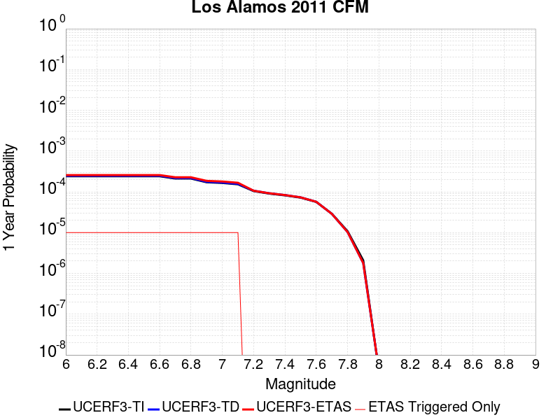 |  |

| Magnitude | 1 wk TI Prob | 1 wk TD Prob | 1 wk ETAS Prob | 1 wk ETAS/TD Gain | 1 wk ETAS Triggered Only | 1 mo TI Prob | 1 mo TD Prob | 1 mo ETAS Prob | 1 mo ETAS/TD Gain | 1 mo ETAS Triggered Only | 1 yr TI Prob | 1 yr TD Prob | 1 yr ETAS Prob | 1 yr ETAS/TD Gain | 1 yr ETAS Triggered Only | 10 yr TI Prob | 10 yr TD Prob | 10 yr ETAS Prob | 10 yr ETAS/TD Gain | 10 yr ETAS Triggered Only |
|-----|-----|-----|-----|-----|-----|-----|-----|-----|-----|-----|-----|-----|-----|-----|-----|-----|-----|-----|-----|-----|
| 6.0 | 4.6284417E-6 | 4.751731E-6 | 1.4751684E-5 | 3.1044862 | 1.0E-5 | 1.9836029E-5 | 2.0364414E-5 | 3.036421E-5 | 1.4910427 | 1.0E-5 | 2.4147688E-4 | 2.4791027E-4 | 2.579078E-4 | 1.0403272 | 1.0E-5 | 0.0024121467 | 0.0024765113 | 0.0024864867 | 1.004028 | 1.0E-5 |
| 6.1 | 4.6284417E-6 | 4.751731E-6 | 1.4751684E-5 | 3.1044862 | 1.0E-5 | 1.9836029E-5 | 2.0364414E-5 | 3.036421E-5 | 1.4910427 | 1.0E-5 | 2.4147688E-4 | 2.4791027E-4 | 2.579078E-4 | 1.0403272 | 1.0E-5 | 0.0024121467 | 0.0024765113 | 0.0024864867 | 1.004028 | 1.0E-5 |
| 6.2 | 4.6284417E-6 | 4.751731E-6 | 1.4751684E-5 | 3.1044862 | 1.0E-5 | 1.9836029E-5 | 2.0364414E-5 | 3.036421E-5 | 1.4910427 | 1.0E-5 | 2.4147688E-4 | 2.4791027E-4 | 2.579078E-4 | 1.0403272 | 1.0E-5 | 0.0024121467 | 0.0024765113 | 0.0024864867 | 1.004028 | 1.0E-5 |
| 6.3 | 4.6284417E-6 | 4.751731E-6 | 1.4751684E-5 | 3.1044862 | 1.0E-5 | 1.9836029E-5 | 2.0364414E-5 | 3.036421E-5 | 1.4910427 | 1.0E-5 | 2.4147688E-4 | 2.4791027E-4 | 2.579078E-4 | 1.0403272 | 1.0E-5 | 0.0024121467 | 0.0024765113 | 0.0024864867 | 1.004028 | 1.0E-5 |
| 6.4 | 4.6284417E-6 | 4.751731E-6 | 1.4751684E-5 | 3.1044862 | 1.0E-5 | 1.9836029E-5 | 2.0364414E-5 | 3.036421E-5 | 1.4910427 | 1.0E-5 | 2.4147688E-4 | 2.4791027E-4 | 2.579078E-4 | 1.0403272 | 1.0E-5 | 0.0024121467 | 0.0024765113 | 0.0024864867 | 1.004028 | 1.0E-5 |
| 6.5 | 4.6284417E-6 | 4.751731E-6 | 1.4751684E-5 | 3.1044862 | 1.0E-5 | 1.9836029E-5 | 2.0364414E-5 | 3.036421E-5 | 1.4910427 | 1.0E-5 | 2.4147688E-4 | 2.4791027E-4 | 2.579078E-4 | 1.0403272 | 1.0E-5 | 0.0024121467 | 0.0024765113 | 0.0024864867 | 1.004028 | 1.0E-5 |
| 6.6 | 4.6284417E-6 | 4.751731E-6 | 1.4751684E-5 | 3.1044862 | 1.0E-5 | 1.9836029E-5 | 2.0364414E-5 | 3.036421E-5 | 1.4910427 | 1.0E-5 | 2.4147688E-4 | 2.4791027E-4 | 2.579078E-4 | 1.0403272 | 1.0E-5 | 0.0024121467 | 0.0024765113 | 0.0024864867 | 1.004028 | 1.0E-5 |
| 6.7 | 4.062321E-6 | 4.166349E-6 | 1.4166307E-5 | 3.4001732 | 1.0E-5 | 1.7409831E-5 | 1.7855667E-5 | 2.7855489E-5 | 1.5600363 | 1.0E-5 | 2.1194408E-4 | 2.1737257E-4 | 2.273704E-4 | 1.0459939 | 1.0E-5 | 0.0021174205 | 0.0021717492 | 0.0021817274 | 1.0045946 | 1.0E-5 |
| 6.8 | 4.062321E-6 | 4.166349E-6 | 1.4166307E-5 | 3.4001732 | 1.0E-5 | 1.7409831E-5 | 1.7855667E-5 | 2.7855489E-5 | 1.5600363 | 1.0E-5 | 2.1194408E-4 | 2.1737257E-4 | 2.273704E-4 | 1.0459939 | 1.0E-5 | 0.0021174205 | 0.0021717492 | 0.0021817274 | 1.0045946 | 1.0E-5 |
| 6.9 | 3.2936077E-6 | 3.372958E-6 | 1.33729245E-5 | 3.964747 | 1.0E-5 | 1.4115385E-5 | 1.4455459E-5 | 2.4455314E-5 | 1.6917702 | 1.0E-5 | 1.7184127E-4 | 1.7598194E-4 | 1.8598019E-4 | 1.056814 | 1.0E-5 | 0.0017170844 | 0.0017585184 | 0.0017685008 | 1.0056766 | 1.0E-5 |
| 7.0 | 3.1687898E-6 | 3.2448156E-6 | 1.3244783E-5 | 4.081829 | 1.0E-5 | 1.3580457E-5 | 1.3906283E-5 | 2.3906145E-5 | 1.7190894 | 1.0E-5 | 1.6532952E-4 | 1.6929678E-4 | 1.7929508E-4 | 1.0590578 | 1.0E-5 | 0.0016520657 | 0.0016917696 | 0.0017017527 | 1.005901 | 1.0E-5 |
| 7.1 | 2.9379228E-6 | 3.0073259E-6 | 1.3007296E-5 | 4.3252034 | 1.0E-5 | 1.25910365E-5 | 1.288848E-5 | 2.2888351E-5 | 1.7758766 | 1.0E-5 | 1.5328509E-4 | 1.5690686E-4 | 1.6690529E-4 | 1.0637221 | 1.0E-5 | 0.001531794 | 0.0015680499 | 0.0015780343 | 1.0063673 | 1.0E-5 |
| 7.2 | 2.0020686E-6 | 2.0416298E-6 | 2.0416298E-6 | 1.0 | 0.0 | 8.580266E-6 | 8.749813E-6 | 8.749813E-6 | 1.0 | 0.0 | 1.0445973E-4 | 1.0652381E-4 | 1.0652381E-4 | 1.0 | 0.0 | 0.0010441064 | 0.001064732 | 0.001064732 | 1.0 | 0.0 |
| 7.3 | 1.7364243E-6 | 1.7678802E-6 | 1.7678802E-6 | 1.0 | 0.0 | 7.441797E-6 | 7.576608E-6 | 7.576608E-6 | 1.0 | 0.0 | 9.0600115E-5 | 9.2241324E-5 | 9.2241324E-5 | 1.0 | 0.0 | 9.0563187E-4 | 9.2203356E-4 | 9.2203356E-4 | 1.0 | 0.0 |
| 7.4 | 1.5718434E-6 | 1.5983177E-6 | 1.5983177E-6 | 1.0 | 0.0 | 6.7364545E-6 | 6.849915E-6 | 6.849915E-6 | 1.0 | 0.0 | 8.201325E-5 | 8.339455E-5 | 8.339455E-5 | 1.0 | 0.0 | 8.198299E-4 | 8.3363557E-4 | 8.3363557E-4 | 1.0 | 0.0 |
| 7.5 | 1.3841119E-6 | 1.4042793E-6 | 1.4042793E-6 | 1.0 | 0.0 | 5.9318945E-6 | 6.0183256E-6 | 6.0183256E-6 | 1.0 | 0.0 | 7.221842E-5 | 7.327068E-5 | 7.327068E-5 | 1.0 | 0.0 | 7.2194956E-4 | 7.324681E-4 | 7.324681E-4 | 1.0 | 0.0 |
| 7.6 | 1.0843726E-6 | 1.093442E-6 | 1.093442E-6 | 1.0 | 0.0 | 4.647303E-6 | 4.6861724E-6 | 4.6861724E-6 | 1.0 | 0.0 | 5.6579443E-5 | 5.705268E-5 | 5.705268E-5 | 1.0 | 0.0 | 5.656504E-4 | 5.703829E-4 | 5.703829E-4 | 1.0 | 0.0 |
| 7.7 | 5.544814E-7 | 5.5018705E-7 | 5.5018705E-7 | 1.0 | 0.0 | 2.3763469E-6 | 2.3579425E-6 | 2.3579425E-6 | 1.0 | 0.0 | 2.8931638E-5 | 2.8707573E-5 | 2.8707573E-5 | 1.0 | 0.0 | 2.8927872E-4 | 2.870388E-4 | 2.870388E-4 | 1.0 | 0.0 |
| 7.8 | 2.0707465E-7 | 1.977846E-7 | 1.977846E-7 | 1.0 | 0.0 | 8.874625E-7 | 8.4764804E-7 | 8.4764804E-7 | 1.0 | 0.0 | 1.08048025E-5 | 1.0320066E-5 | 1.0320066E-5 | 1.0 | 0.0 | 1.0804277E-4 | 1.0319592E-4 | 1.0319592E-4 | 1.0 | 0.0 |
| 7.9 | 3.9821284E-8 | 3.433109E-8 | 3.433109E-8 | 1.0 | 0.0 | 1.7066264E-7 | 1.4713324E-7 | 1.4713324E-7 | 1.0 | 0.0 | 2.0778157E-6 | 1.7913457E-6 | 1.7913457E-6 | 1.0 | 0.0 | 2.0777963E-5 | 1.7913319E-5 | 1.7913319E-5 | 1.0 | 0.0 |
| 8.0 | 7.880441E-11 | 8.2353124E-11 | 8.2353124E-11 | 1.0 | 0.0 | 3.3773329E-10 | 3.52942E-10 | 3.52942E-10 | 1.0 | 0.0 | 4.1119033E-9 | 4.2970694E-9 | 4.2970694E-9 | 1.0 | 0.0 | 4.1119034E-8 | 4.2970694E-8 | 4.2970694E-8 | 1.0 | 0.0 |

## Almanor 2011 CFM
*[(top)](#table-of-contents)*

| 1 Week | 1 Month | 1 Year | 10 Year |
|-----|-----|-----|-----|
|  |  |  |  |

| Magnitude | 1 wk TI Prob | 1 wk TD Prob | 1 wk ETAS Prob | 1 wk ETAS/TD Gain | 1 wk ETAS Triggered Only | 1 mo TI Prob | 1 mo TD Prob | 1 mo ETAS Prob | 1 mo ETAS/TD Gain | 1 mo ETAS Triggered Only | 1 yr TI Prob | 1 yr TD Prob | 1 yr ETAS Prob | 1 yr ETAS/TD Gain | 1 yr ETAS Triggered Only | 10 yr TI Prob | 10 yr TD Prob | 10 yr ETAS Prob | 10 yr ETAS/TD Gain | 10 yr ETAS Triggered Only |
|-----|-----|-----|-----|-----|-----|-----|-----|-----|-----|-----|-----|-----|-----|-----|-----|-----|-----|-----|-----|-----|
| 6.0 | 6.1479834E-5 | 8.32787E-5 | 9.3277864E-5 | 1.1200687 | 1.0E-5 | 2.6345838E-4 | 3.5686578E-4 | 3.668622E-4 | 1.0280118 | 1.0E-5 | 0.0032028882 | 0.0043366123 | 0.004346569 | 1.002296 | 1.0E-5 | 0.031571172 | 0.04258577 | 0.042595346 | 1.0002248 | 1.0E-5 |
| 6.1 | 4.4387216E-5 | 5.9770442E-5 | 5.9770442E-5 | 1.0 | 0.0 | 1.9021705E-4 | 2.561381E-4 | 2.561381E-4 | 1.0 | 0.0 | 0.0023134327 | 0.003114426 | 0.003114426 | 1.0 | 0.0 | 0.022894967 | 0.030755036 | 0.030755036 | 1.0 | 0.0 |
| 6.2 | 4.4387216E-5 | 5.9770442E-5 | 5.9770442E-5 | 1.0 | 0.0 | 1.9021705E-4 | 2.561381E-4 | 2.561381E-4 | 1.0 | 0.0 | 0.0023134327 | 0.003114426 | 0.003114426 | 1.0 | 0.0 | 0.022894967 | 0.030755036 | 0.030755036 | 1.0 | 0.0 |
| 6.3 | 2.9523822E-5 | 3.954719E-5 | 3.954719E-5 | 1.0 | 0.0 | 1.2652454E-4 | 1.6947983E-4 | 1.6947983E-4 | 1.0 | 0.0 | 0.0015393476 | 0.0020618725 | 0.0020618725 | 1.0 | 0.0 | 0.015287281 | 0.020460794 | 0.020460794 | 1.0 | 0.0 |
| 6.4 | 2.0512744E-5 | 2.7431617E-5 | 2.7431617E-5 | 1.0 | 0.0 | 8.79088E-5 | 1.175612E-4 | 1.175612E-4 | 1.0 | 0.0 | 0.001069764 | 0.0014307408 | 0.0014307408 | 1.0 | 0.0 | 0.010646289 | 0.014244413 | 0.014244413 | 1.0 | 0.0 |
| 6.5 | 1.6750226E-5 | 2.23913E-5 | 2.23913E-5 | 1.0 | 0.0 | 7.178471E-5 | 9.596152E-5 | 9.596152E-5 | 1.0 | 0.0 | 8.7362836E-4 | 0.0011680633 | 0.0011680633 | 1.0 | 0.0 | 0.008702018 | 0.011649038 | 0.011649038 | 1.0 | 0.0 |
| 6.6 | 1.4745303E-5 | 1.9707952E-5 | 1.9707952E-5 | 1.0 | 0.0 | 6.319262E-5 | 8.446223E-5 | 8.446223E-5 | 1.0 | 0.0 | 7.690986E-4 | 0.0010281964 | 0.0010281964 | 1.0 | 0.0 | 0.0076644225 | 0.010264971 | 0.010264971 | 1.0 | 0.0 |
| 6.7 | 9.951145E-7 | 1.1616347E-6 | 1.1616347E-6 | 1.0 | 0.0 | 4.26477E-6 | 4.9784257E-6 | 4.9784257E-6 | 1.0 | 0.0 | 5.1922336E-5 | 6.0610826E-5 | 6.0610826E-5 | 1.0 | 0.0 | 5.1910203E-4 | 6.059602E-4 | 6.059602E-4 | 1.0 | 0.0 |
| 6.8 | 5.866312E-7 | 6.849384E-7 | 6.849384E-7 | 1.0 | 0.0 | 2.5141312E-6 | 2.9354478E-6 | 2.9354478E-6 | 1.0 | 0.0 | 3.0609117E-5 | 3.5738623E-5 | 3.5738623E-5 | 1.0 | 0.0 | 3.06049E-4 | 3.5734157E-4 | 3.5734157E-4 | 1.0 | 0.0 |

## Ortigalita (North)
*[(top)](#table-of-contents)*

| 1 Week | 1 Month | 1 Year | 10 Year |
|-----|-----|-----|-----|
|  |  |  |  |

| Magnitude | 1 wk TI Prob | 1 wk TD Prob | 1 wk ETAS Prob | 1 wk ETAS/TD Gain | 1 wk ETAS Triggered Only | 1 mo TI Prob | 1 mo TD Prob | 1 mo ETAS Prob | 1 mo ETAS/TD Gain | 1 mo ETAS Triggered Only | 1 yr TI Prob | 1 yr TD Prob | 1 yr ETAS Prob | 1 yr ETAS/TD Gain | 1 yr ETAS Triggered Only | 10 yr TI Prob | 10 yr TD Prob | 10 yr ETAS Prob | 10 yr ETAS/TD Gain | 10 yr ETAS Triggered Only |
|-----|-----|-----|-----|-----|-----|-----|-----|-----|-----|-----|-----|-----|-----|-----|-----|-----|-----|-----|-----|-----|
| 6.0 | 7.711876E-5 | 1.05064966E-4 | 1.15063915E-4 | 1.0951692 | 1.0E-5 | 3.3046713E-4 | 4.502116E-4 | 4.6020708E-4 | 1.0222018 | 1.0E-5 | 0.004016016 | 0.0054681194 | 0.005478065 | 1.0018188 | 1.0E-5 | 0.039442103 | 0.053454787 | 0.053464253 | 1.000177 | 1.0E-5 |
| 6.1 | 4.607858E-5 | 6.0239203E-5 | 7.02386E-5 | 1.1659949 | 1.0E-5 | 1.9746469E-4 | 2.5814527E-4 | 2.6814267E-4 | 1.0387279 | 1.0E-5 | 0.0024014818 | 0.0031387596 | 0.0031487283 | 1.003176 | 1.0E-5 | 0.023756953 | 0.030975068 | 0.03098476 | 1.0003128 | 1.0E-5 |
| 6.2 | 4.607858E-5 | 6.0239203E-5 | 7.02386E-5 | 1.1659949 | 1.0E-5 | 1.9746469E-4 | 2.5814527E-4 | 2.6814267E-4 | 1.0387279 | 1.0E-5 | 0.0024014818 | 0.0031387596 | 0.0031487283 | 1.003176 | 1.0E-5 | 0.023756953 | 0.030975068 | 0.03098476 | 1.0003128 | 1.0E-5 |
| 6.3 | 3.327423E-5 | 4.2475127E-5 | 4.2475127E-5 | 1.0 | 0.0 | 1.4259605E-4 | 1.8202531E-4 | 1.8202531E-4 | 1.0 | 0.0 | 0.0017347244 | 0.002214197 | 0.002214197 | 1.0 | 0.0 | 0.017212452 | 0.021945644 | 0.021945644 | 1.0 | 0.0 |
| 6.4 | 2.7732503E-5 | 3.4998593E-5 | 3.4998593E-5 | 1.0 | 0.0 | 1.1884817E-4 | 1.4998685E-4 | 1.4998685E-4 | 1.0 | 0.0 | 0.001446016 | 0.0018248095 | 0.0018248095 | 1.0 | 0.0 | 0.014366428 | 0.018121224 | 0.018121224 | 1.0 | 0.0 |
| 6.5 | 2.7689714E-5 | 3.4948407E-5 | 3.4948407E-5 | 1.0 | 0.0 | 1.186648E-4 | 1.497718E-4 | 1.497718E-4 | 1.0 | 0.0 | 0.0014437864 | 0.0018221956 | 0.0018221956 | 1.0 | 0.0 | 0.014344421 | 0.01809551 | 0.01809551 | 1.0 | 0.0 |
| 6.6 | 2.2976905E-5 | 2.8718265E-5 | 2.8718265E-5 | 1.0 | 0.0 | 9.846873E-5 | 1.230739E-4 | 1.230739E-4 | 1.0 | 0.0 | 0.0011981975 | 0.0014976363 | 0.0014976363 | 1.0 | 0.0 | 0.011917574 | 0.014898697 | 0.014898697 | 1.0 | 0.0 |
| 6.7 | 1.9871539E-5 | 2.4904411E-5 | 2.4904411E-5 | 1.0 | 0.0 | 8.516096E-5 | 1.0673023E-4 | 1.0673023E-4 | 1.0 | 0.0 | 0.0010363415 | 0.0012989145 | 0.0012989145 | 1.0 | 0.0 | 0.010315218 | 0.012936919 | 0.012936919 | 1.0 | 0.0 |
| 6.8 | 6.5640475E-6 | 7.6054926E-6 | 7.6054926E-6 | 1.0 | 0.0 | 2.813133E-5 | 3.2594577E-5 | 3.2594577E-5 | 1.0 | 0.0 | 3.424451E-4 | 3.9676955E-4 | 3.9676955E-4 | 1.0 | 0.0 | 0.0034191788 | 0.003960899 | 0.003960899 | 1.0 | 0.0 |
| 6.9 | 5.6219683E-6 | 6.5018376E-6 | 6.5018376E-6 | 1.0 | 0.0 | 2.4093928E-5 | 2.7864735E-5 | 2.7864735E-5 | 1.0 | 0.0 | 2.933041E-4 | 3.3920293E-4 | 3.3920293E-4 | 1.0 | 0.0 | 0.0029291727 | 0.003387109 | 0.003387109 | 1.0 | 0.0 |
| 7.0 | 3.875591E-6 | 4.4847548E-6 | 4.4847548E-6 | 1.0 | 0.0 | 1.6609569E-5 | 1.9220248E-5 | 1.9220248E-5 | 1.0 | 0.0 | 2.0220275E-4 | 2.339835E-4 | 2.339835E-4 | 1.0 | 0.0 | 0.0020201886 | 0.0023375798 | 0.0023375798 | 1.0 | 0.0 |
| 7.1 | 1.6017933E-6 | 1.8570418E-6 | 1.8570418E-6 | 1.0 | 0.0 | 6.8648105E-6 | 7.958732E-6 | 7.958732E-6 | 1.0 | 0.0 | 8.357586E-5 | 9.689432E-5 | 9.689432E-5 | 1.0 | 0.0 | 8.3544437E-4 | 9.686254E-4 | 9.686254E-4 | 1.0 | 0.0 |

## Yorba Linda
*[(top)](#table-of-contents)*

| 1 Week | 1 Month | 1 Year | 10 Year |
|-----|-----|-----|-----|
|  |  |  |  |

| Magnitude | 1 wk TI Prob | 1 wk TD Prob | 1 wk ETAS Prob | 1 wk ETAS/TD Gain | 1 wk ETAS Triggered Only | 1 mo TI Prob | 1 mo TD Prob | 1 mo ETAS Prob | 1 mo ETAS/TD Gain | 1 mo ETAS Triggered Only | 1 yr TI Prob | 1 yr TD Prob | 1 yr ETAS Prob | 1 yr ETAS/TD Gain | 1 yr ETAS Triggered Only | 10 yr TI Prob | 10 yr TD Prob | 10 yr ETAS Prob | 10 yr ETAS/TD Gain | 10 yr ETAS Triggered Only |
|-----|-----|-----|-----|-----|-----|-----|-----|-----|-----|-----|-----|-----|-----|-----|-----|-----|-----|-----|-----|-----|
| 6.0 | 1.9346849E-6 | 1.6909235E-6 | 1.6909235E-6 | 1.0 | 0.0 | 8.29148E-6 | 7.2468E-6 | 1.7246728E-5 | 2.3799093 | 1.0E-5 | 1.009441E-4 | 8.822717E-5 | 9.8226286E-5 | 1.1133338 | 1.0E-5 | 0.0010089825 | 8.820145E-4 | 8.920057E-4 | 1.0113276 | 1.0E-5 |
| 6.1 | 1.9346849E-6 | 1.6909235E-6 | 1.6909235E-6 | 1.0 | 0.0 | 8.29148E-6 | 7.2468E-6 | 1.7246728E-5 | 2.3799093 | 1.0E-5 | 1.009441E-4 | 8.822717E-5 | 9.8226286E-5 | 1.1133338 | 1.0E-5 | 0.0010089825 | 8.820145E-4 | 8.920057E-4 | 1.0113276 | 1.0E-5 |
| 6.2 | 1.9346849E-6 | 1.6909235E-6 | 1.6909235E-6 | 1.0 | 0.0 | 8.29148E-6 | 7.2468E-6 | 1.7246728E-5 | 2.3799093 | 1.0E-5 | 1.009441E-4 | 8.822717E-5 | 9.8226286E-5 | 1.1133338 | 1.0E-5 | 0.0010089825 | 8.820145E-4 | 8.920057E-4 | 1.0113276 | 1.0E-5 |
| 6.3 | 1.1028608E-6 | 8.481986E-7 | 8.481986E-7 | 1.0 | 0.0 | 4.7265376E-6 | 3.6351323E-6 | 3.6351323E-6 | 1.0 | 0.0 | 5.754407E-5 | 4.4256903E-5 | 4.4256903E-5 | 1.0 | 0.0 | 5.7529175E-4 | 4.4248742E-4 | 4.4248742E-4 | 1.0 | 0.0 |
| 6.4 | 1.1028608E-6 | 8.481986E-7 | 8.481986E-7 | 1.0 | 0.0 | 4.7265376E-6 | 3.6351323E-6 | 3.6351323E-6 | 1.0 | 0.0 | 5.754407E-5 | 4.4256903E-5 | 4.4256903E-5 | 1.0 | 0.0 | 5.7529175E-4 | 4.4248742E-4 | 4.4248742E-4 | 1.0 | 0.0 |
| 6.5 | 8.4451364E-7 | 5.8692325E-7 | 5.8692325E-7 | 1.0 | 0.0 | 3.619339E-6 | 2.5153831E-6 | 2.5153831E-6 | 1.0 | 0.0 | 4.406456E-5 | 3.0624382E-5 | 3.0624382E-5 | 1.0 | 0.0 | 4.4055824E-4 | 3.0620373E-4 | 3.0620373E-4 | 1.0 | 0.0 |
| 6.6 | 8.422957E-7 | 5.8447665E-7 | 5.8447665E-7 | 1.0 | 0.0 | 3.6098338E-6 | 2.5048976E-6 | 2.5048976E-6 | 1.0 | 0.0 | 4.3948843E-5 | 3.0496723E-5 | 3.0496723E-5 | 1.0 | 0.0 | 4.394015E-4 | 3.0492753E-4 | 3.0492753E-4 | 1.0 | 0.0 |
| 6.7 | 8.4119705E-7 | 5.832608E-7 | 5.832608E-7 | 1.0 | 0.0 | 3.6051254E-6 | 2.499687E-6 | 2.499687E-6 | 1.0 | 0.0 | 4.3891516E-5 | 3.0433286E-5 | 3.0433286E-5 | 1.0 | 0.0 | 4.388285E-4 | 3.0429332E-4 | 3.0429332E-4 | 1.0 | 0.0 |
| 6.8 | 7.5919155E-7 | 4.995118E-7 | 4.995118E-7 | 1.0 | 0.0 | 3.253674E-6 | 2.1407632E-6 | 2.1407632E-6 | 1.0 | 0.0 | 3.961276E-5 | 2.6063499E-5 | 2.6063499E-5 | 1.0 | 0.0 | 3.9605703E-4 | 2.6060612E-4 | 2.6060612E-4 | 1.0 | 0.0 |
| 6.9 | 7.5804564E-7 | 4.981302E-7 | 4.981302E-7 | 1.0 | 0.0 | 3.248763E-6 | 2.134842E-6 | 2.134842E-6 | 1.0 | 0.0 | 3.955297E-5 | 2.5991409E-5 | 2.5991409E-5 | 1.0 | 0.0 | 3.9545933E-4 | 2.598854E-4 | 2.598854E-4 | 1.0 | 0.0 |
| 7.0 | 7.539293E-7 | 4.943436E-7 | 4.943436E-7 | 1.0 | 0.0 | 3.2311218E-6 | 2.118614E-6 | 2.118614E-6 | 1.0 | 0.0 | 3.9338196E-5 | 2.5793837E-5 | 2.5793837E-5 | 1.0 | 0.0 | 3.9331234E-4 | 2.5791014E-4 | 2.5791014E-4 | 1.0 | 0.0 |
| 7.1 | 6.0900885E-7 | 3.781838E-7 | 3.781838E-7 | 1.0 | 0.0 | 2.6100352E-6 | 1.6207867E-6 | 1.6207867E-6 | 1.0 | 0.0 | 3.1776715E-5 | 1.9732903E-5 | 1.9732903E-5 | 1.0 | 0.0 | 3.1772171E-4 | 1.9731186E-4 | 1.9731186E-4 | 1.0 | 0.0 |
| 7.2 | 5.849925E-7 | 3.5880063E-7 | 3.5880063E-7 | 1.0 | 0.0 | 2.5071083E-6 | 1.5377161E-6 | 1.5377161E-6 | 1.0 | 0.0 | 3.0523614E-5 | 1.8721537E-5 | 1.8721537E-5 | 1.0 | 0.0 | 3.0519423E-4 | 1.8719993E-4 | 1.8719993E-4 | 1.0 | 0.0 |
| 7.3 | 4.89808E-7 | 3.038045E-7 | 3.038045E-7 | 1.0 | 0.0 | 2.0991754E-6 | 1.3020187E-6 | 1.3020187E-6 | 1.0 | 0.0 | 2.5557161E-5 | 1.5851965E-5 | 1.5851965E-5 | 1.0 | 0.0 | 2.5554223E-4 | 1.5850857E-4 | 1.5850857E-4 | 1.0 | 0.0 |
| 7.4 | 3.8700415E-7 | 2.4723E-7 | 2.4723E-7 | 1.0 | 0.0 | 1.6585881E-6 | 1.0595568E-6 | 1.0595568E-6 | 1.0 | 0.0 | 2.0193123E-5 | 1.2900028E-5 | 1.2900028E-5 | 1.0 | 0.0 | 2.0191289E-4 | 1.2899292E-4 | 1.2899292E-4 | 1.0 | 0.0 |
| 7.5 | 2.900565E-7 | 1.8637812E-7 | 1.8637812E-7 | 1.0 | 0.0 | 1.2430987E-6 | 7.987631E-7 | 7.987631E-7 | 1.0 | 0.0 | 1.5134622E-5 | 9.7248985E-6 | 9.7248985E-6 | 1.0 | 0.0 | 1.5133592E-4 | 9.724481E-5 | 9.724481E-5 | 1.0 | 0.0 |
| 7.6 | 2.2770318E-7 | 1.4814457E-7 | 1.4814457E-7 | 1.0 | 0.0 | 9.758704E-7 | 6.349051E-7 | 6.349051E-7 | 1.0 | 0.0 | 1.1881158E-5 | 7.729943E-6 | 7.729943E-6 | 1.0 | 0.0 | 1.1880523E-4 | 7.729679E-5 | 7.729679E-5 | 1.0 | 0.0 |
| 7.7 | 1.5017194E-7 | 8.735719E-8 | 8.735719E-8 | 1.0 | 0.0 | 6.4359386E-7 | 3.743879E-7 | 3.743879E-7 | 1.0 | 0.0 | 7.835727E-6 | 4.5581633E-6 | 4.5581633E-6 | 1.0 | 0.0 | 7.835451E-5 | 4.5580728E-5 | 4.5580728E-5 | 1.0 | 0.0 |
| 7.8 | 3.895753E-8 | 1.8533399E-8 | 1.8533399E-8 | 1.0 | 0.0 | 1.6696083E-7 | 7.9428844E-8 | 7.9428844E-8 | 1.0 | 0.0 | 2.0327461E-6 | 9.670458E-7 | 9.670458E-7 | 1.0 | 0.0 | 2.0327276E-5 | 9.670418E-6 | 9.670418E-6 | 1.0 | 0.0 |
| 7.9 | 6.648505E-9 | 3.4184469E-9 | 3.4184469E-9 | 1.0 | 0.0 | 2.8493591E-8 | 1.4650486E-8 | 1.4650486E-8 | 1.0 | 0.0 | 3.4690942E-7 | 1.7836966E-7 | 1.7836966E-7 | 1.0 | 0.0 | 3.4690888E-6 | 1.7836953E-6 | 1.7836953E-6 | 1.0 | 0.0 |

## Honey Lake 2011 CFM
*[(top)](#table-of-contents)*

| 1 Week | 1 Month | 1 Year | 10 Year |
|-----|-----|-----|-----|
|  | 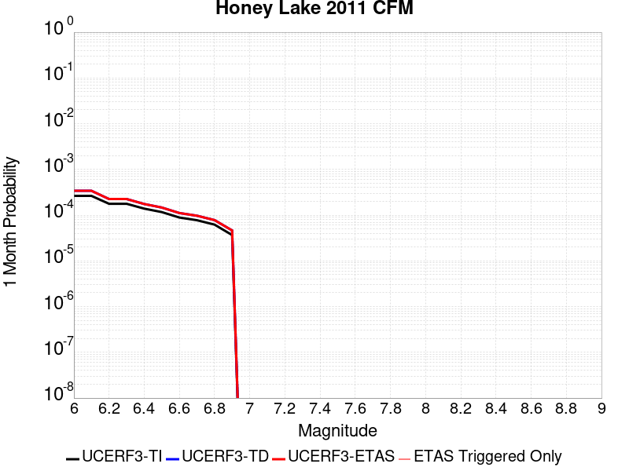 |  |  |

| Magnitude | 1 wk TI Prob | 1 wk TD Prob | 1 wk ETAS Prob | 1 wk ETAS/TD Gain | 1 wk ETAS Triggered Only | 1 mo TI Prob | 1 mo TD Prob | 1 mo ETAS Prob | 1 mo ETAS/TD Gain | 1 mo ETAS Triggered Only | 1 yr TI Prob | 1 yr TD Prob | 1 yr ETAS Prob | 1 yr ETAS/TD Gain | 1 yr ETAS Triggered Only | 10 yr TI Prob | 10 yr TD Prob | 10 yr ETAS Prob | 10 yr ETAS/TD Gain | 10 yr ETAS Triggered Only |
|-----|-----|-----|-----|-----|-----|-----|-----|-----|-----|-----|-----|-----|-----|-----|-----|-----|-----|-----|-----|-----|
| 6.0 | 6.155506E-5 | 7.954667E-5 | 7.954667E-5 | 1.0 | 0.0 | 2.6378073E-4 | 3.40873E-4 | 3.40873E-4 | 1.0 | 0.0 | 0.0032068014 | 0.0041427943 | 0.0041427943 | 1.0 | 0.0 | 0.03160919 | 0.040702924 | 0.040712517 | 1.0002357 | 1.0E-5 |
| 6.1 | 6.155506E-5 | 7.954667E-5 | 7.954667E-5 | 1.0 | 0.0 | 2.6378073E-4 | 3.40873E-4 | 3.40873E-4 | 1.0 | 0.0 | 0.0032068014 | 0.0041427943 | 0.0041427943 | 1.0 | 0.0 | 0.03160919 | 0.040702924 | 0.040712517 | 1.0002357 | 1.0E-5 |
| 6.2 | 4.1335024E-5 | 5.257629E-5 | 5.257629E-5 | 1.0 | 0.0 | 1.7713808E-4 | 2.253086E-4 | 2.253086E-4 | 1.0 | 0.0 | 0.0021545228 | 0.0027398595 | 0.0027398595 | 1.0 | 0.0 | 0.021337535 | 0.027076708 | 0.027076708 | 1.0 | 0.0 |
| 6.3 | 4.1335024E-5 | 5.257629E-5 | 5.257629E-5 | 1.0 | 0.0 | 1.7713808E-4 | 2.253086E-4 | 2.253086E-4 | 1.0 | 0.0 | 0.0021545228 | 0.0027398595 | 0.0027398595 | 1.0 | 0.0 | 0.021337535 | 0.027076708 | 0.027076708 | 1.0 | 0.0 |
| 6.4 | 3.2393702E-5 | 4.0887444E-5 | 4.0887444E-5 | 1.0 | 0.0 | 1.3882275E-4 | 1.7522085E-4 | 1.7522085E-4 | 1.0 | 0.0 | 0.0016888566 | 0.002131335 | 0.002131335 | 1.0 | 0.0 | 0.016760793 | 0.02111982 | 0.02111982 | 1.0 | 0.0 |
| 6.5 | 2.7205504E-5 | 3.4211684E-5 | 3.4211684E-5 | 1.0 | 0.0 | 1.1658981E-4 | 1.4661385E-4 | 1.4661385E-4 | 1.0 | 0.0 | 0.0014185566 | 0.0017836588 | 0.0017836588 | 1.0 | 0.0 | 0.014095354 | 0.017702932 | 0.017702932 | 1.0 | 0.0 |
| 6.6 | 2.069265E-5 | 2.5955307E-5 | 2.5955307E-5 | 1.0 | 0.0 | 8.867977E-5 | 1.1123277E-4 | 1.1123277E-4 | 1.0 | 0.0 | 0.0010791414 | 0.0013535038 | 0.0013535038 | 1.0 | 0.0 | 0.010739161 | 0.013461002 | 0.013461002 | 1.0 | 0.0 |
| 6.7 | 1.8060919E-5 | 2.2656828E-5 | 2.2656828E-5 | 1.0 | 0.0 | 7.7401644E-5 | 9.709754E-5 | 9.709754E-5 | 1.0 | 0.0 | 9.419576E-4 | 0.0011816026 | 0.0011816026 | 1.0 | 0.0 | 0.009379748 | 0.011761238 | 0.011761238 | 1.0 | 0.0 |
| 6.8 | 1.4474663E-5 | 1.818127E-5 | 1.818127E-5 | 1.0 | 0.0 | 6.203279E-5 | 7.791784E-5 | 7.791784E-5 | 1.0 | 0.0 | 7.5498753E-4 | 9.483136E-4 | 9.483136E-4 | 1.0 | 0.0 | 0.007524277 | 0.009450192 | 0.009450192 | 1.0 | 0.0 |
| 6.9 | 8.564552E-6 | 1.0802308E-5 | 1.0802308E-5 | 1.0 | 0.0 | 3.6704707E-5 | 4.6295158E-5 | 4.6295158E-5 | 1.0 | 0.0 | 4.4678818E-4 | 5.635644E-4 | 5.635644E-4 | 1.0 | 0.0 | 0.0044589094 | 0.0056278477 | 0.0056278477 | 1.0 | 0.0 |

## Antelope Valley 2011
*[(top)](#table-of-contents)*

| 1 Week | 1 Month | 1 Year | 10 Year |
|-----|-----|-----|-----|
|  |  |  |  |

| Magnitude | 1 wk TI Prob | 1 wk TD Prob | 1 wk ETAS Prob | 1 wk ETAS/TD Gain | 1 wk ETAS Triggered Only | 1 mo TI Prob | 1 mo TD Prob | 1 mo ETAS Prob | 1 mo ETAS/TD Gain | 1 mo ETAS Triggered Only | 1 yr TI Prob | 1 yr TD Prob | 1 yr ETAS Prob | 1 yr ETAS/TD Gain | 1 yr ETAS Triggered Only | 10 yr TI Prob | 10 yr TD Prob | 10 yr ETAS Prob | 10 yr ETAS/TD Gain | 10 yr ETAS Triggered Only |
|-----|-----|-----|-----|-----|-----|-----|-----|-----|-----|-----|-----|-----|-----|-----|-----|-----|-----|-----|-----|-----|
| 6.0 | 3.1646934E-5 | 3.6904403E-5 | 3.6904403E-5 | 1.0 | 0.0 | 1.3562266E-4 | 1.5815363E-4 | 1.5815363E-4 | 1.0 | 0.0 | 0.0016499552 | 0.0019240845 | 0.0019340653 | 1.0051873 | 1.0E-5 | 0.016377583 | 0.019100651 | 0.01911046 | 1.0005136 | 1.0E-5 |
| 6.1 | 3.1646934E-5 | 3.6904403E-5 | 3.6904403E-5 | 1.0 | 0.0 | 1.3562266E-4 | 1.5815363E-4 | 1.5815363E-4 | 1.0 | 0.0 | 0.0016499552 | 0.0019240845 | 0.0019340653 | 1.0051873 | 1.0E-5 | 0.016377583 | 0.019100651 | 0.01911046 | 1.0005136 | 1.0E-5 |
| 6.2 | 3.1646934E-5 | 3.6904403E-5 | 3.6904403E-5 | 1.0 | 0.0 | 1.3562266E-4 | 1.5815363E-4 | 1.5815363E-4 | 1.0 | 0.0 | 0.0016499552 | 0.0019240845 | 0.0019340653 | 1.0051873 | 1.0E-5 | 0.016377583 | 0.019100651 | 0.01911046 | 1.0005136 | 1.0E-5 |
| 6.3 | 3.1646934E-5 | 3.6904403E-5 | 3.6904403E-5 | 1.0 | 0.0 | 1.3562266E-4 | 1.5815363E-4 | 1.5815363E-4 | 1.0 | 0.0 | 0.0016499552 | 0.0019240845 | 0.0019340653 | 1.0051873 | 1.0E-5 | 0.016377583 | 0.019100651 | 0.01911046 | 1.0005136 | 1.0E-5 |
| 6.4 | 3.1646934E-5 | 3.6904403E-5 | 3.6904403E-5 | 1.0 | 0.0 | 1.3562266E-4 | 1.5815363E-4 | 1.5815363E-4 | 1.0 | 0.0 | 0.0016499552 | 0.0019240845 | 0.0019340653 | 1.0051873 | 1.0E-5 | 0.016377583 | 0.019100651 | 0.01911046 | 1.0005136 | 1.0E-5 |
| 6.5 | 1.8034107E-5 | 2.0940959E-5 | 2.0940959E-5 | 1.0 | 0.0 | 7.7286735E-5 | 8.974457E-5 | 8.974457E-5 | 1.0 | 0.0 | 9.405598E-4 | 0.0010922146 | 0.0010922146 | 1.0 | 0.0 | 0.009365888 | 0.010880542 | 0.010880542 | 1.0 | 0.0 |
| 6.6 | 1.8034107E-5 | 2.0940959E-5 | 2.0940959E-5 | 1.0 | 0.0 | 7.7286735E-5 | 8.974457E-5 | 8.974457E-5 | 1.0 | 0.0 | 9.405598E-4 | 0.0010922146 | 0.0010922146 | 1.0 | 0.0 | 0.009365888 | 0.010880542 | 0.010880542 | 1.0 | 0.0 |
| 6.7 | 1.3567667E-5 | 1.5749509E-5 | 1.5749509E-5 | 1.0 | 0.0 | 5.814585E-5 | 6.749675E-5 | 6.749675E-5 | 1.0 | 0.0 | 7.076958E-4 | 8.2156935E-4 | 8.2156935E-4 | 1.0 | 0.0 | 0.007054463 | 0.008195754 | 0.008195754 | 1.0 | 0.0 |
| 6.8 | 9.867387E-6 | 1.1467935E-5 | 1.1467935E-5 | 1.0 | 0.0 | 4.2288117E-5 | 4.91479E-5 | 4.91479E-5 | 1.0 | 0.0 | 5.1473617E-4 | 5.9830636E-4 | 5.9830636E-4 | 1.0 | 0.0 | 0.005135455 | 0.005976268 | 0.005976268 | 1.0 | 0.0 |
| 6.9 | 7.273233E-6 | 8.454864E-6 | 8.454864E-6 | 1.0 | 0.0 | 3.1170628E-5 | 3.623513E-5 | 3.623513E-5 | 1.0 | 0.0 | 3.794363E-4 | 4.411627E-4 | 4.411627E-4 | 1.0 | 0.0 | 0.0037878908 | 0.004411627 | 0.004411627 | 1.0 | 0.0 |

## Little Salmon (Onshore)
*[(top)](#table-of-contents)*

| 1 Week | 1 Month | 1 Year | 10 Year |
|-----|-----|-----|-----|
|  |  |  |  |

| Magnitude | 1 wk TI Prob | 1 wk TD Prob | 1 wk ETAS Prob | 1 wk ETAS/TD Gain | 1 wk ETAS Triggered Only | 1 mo TI Prob | 1 mo TD Prob | 1 mo ETAS Prob | 1 mo ETAS/TD Gain | 1 mo ETAS Triggered Only | 1 yr TI Prob | 1 yr TD Prob | 1 yr ETAS Prob | 1 yr ETAS/TD Gain | 1 yr ETAS Triggered Only | 10 yr TI Prob | 10 yr TD Prob | 10 yr ETAS Prob | 10 yr ETAS/TD Gain | 10 yr ETAS Triggered Only |
|-----|-----|-----|-----|-----|-----|-----|-----|-----|-----|-----|-----|-----|-----|-----|-----|-----|-----|-----|-----|-----|
| 6.0 | 4.1582247E-5 | 5.1824976E-5 | 6.182446E-5 | 1.1929471 | 1.0E-5 | 1.7819746E-4 | 2.220928E-4 | 2.3209058E-4 | 1.0450162 | 1.0E-5 | 0.0021673953 | 0.0027014539 | 0.002711427 | 1.0036917 | 1.0E-5 | 0.021463778 | 0.026869582 | 0.026879312 | 1.0003622 | 1.0E-5 |
| 6.1 | 4.1582247E-5 | 5.1824976E-5 | 6.182446E-5 | 1.1929471 | 1.0E-5 | 1.7819746E-4 | 2.220928E-4 | 2.3209058E-4 | 1.0450162 | 1.0E-5 | 0.0021673953 | 0.0027014539 | 0.002711427 | 1.0036917 | 1.0E-5 | 0.021463778 | 0.026869582 | 0.026879312 | 1.0003622 | 1.0E-5 |
| 6.2 | 4.1582247E-5 | 5.1824976E-5 | 6.182446E-5 | 1.1929471 | 1.0E-5 | 1.7819746E-4 | 2.220928E-4 | 2.3209058E-4 | 1.0450162 | 1.0E-5 | 0.0021673953 | 0.0027014539 | 0.002711427 | 1.0036917 | 1.0E-5 | 0.021463778 | 0.026869582 | 0.026879312 | 1.0003622 | 1.0E-5 |
| 6.3 | 4.1582247E-5 | 5.1824976E-5 | 6.182446E-5 | 1.1929471 | 1.0E-5 | 1.7819746E-4 | 2.220928E-4 | 2.3209058E-4 | 1.0450162 | 1.0E-5 | 0.0021673953 | 0.0027014539 | 0.002711427 | 1.0036917 | 1.0E-5 | 0.021463778 | 0.026869582 | 0.026879312 | 1.0003622 | 1.0E-5 |
| 6.4 | 4.1582247E-5 | 5.1824976E-5 | 6.182446E-5 | 1.1929471 | 1.0E-5 | 1.7819746E-4 | 2.220928E-4 | 2.3209058E-4 | 1.0450162 | 1.0E-5 | 0.0021673953 | 0.0027014539 | 0.002711427 | 1.0036917 | 1.0E-5 | 0.021463778 | 0.026869582 | 0.026879312 | 1.0003622 | 1.0E-5 |
| 6.5 | 4.1582247E-5 | 5.1824976E-5 | 6.182446E-5 | 1.1929471 | 1.0E-5 | 1.7819746E-4 | 2.220928E-4 | 2.3209058E-4 | 1.0450162 | 1.0E-5 | 0.0021673953 | 0.0027014539 | 0.002711427 | 1.0036917 | 1.0E-5 | 0.021463778 | 0.026869582 | 0.026879312 | 1.0003622 | 1.0E-5 |
| 6.6 | 4.1582247E-5 | 5.1824976E-5 | 6.182446E-5 | 1.1929471 | 1.0E-5 | 1.7819746E-4 | 2.220928E-4 | 2.3209058E-4 | 1.0450162 | 1.0E-5 | 0.0021673953 | 0.0027014539 | 0.002711427 | 1.0036917 | 1.0E-5 | 0.021463778 | 0.026869582 | 0.026879312 | 1.0003622 | 1.0E-5 |
| 6.7 | 4.1582247E-5 | 5.1824976E-5 | 6.182446E-5 | 1.1929471 | 1.0E-5 | 1.7819746E-4 | 2.220928E-4 | 2.3209058E-4 | 1.0450162 | 1.0E-5 | 0.0021673953 | 0.0027014539 | 0.002711427 | 1.0036917 | 1.0E-5 | 0.021463778 | 0.026869582 | 0.026879312 | 1.0003622 | 1.0E-5 |
| 6.8 | 3.4607925E-5 | 4.0949457E-5 | 4.0949457E-5 | 1.0 | 0.0 | 1.4831126E-4 | 1.7549012E-4 | 1.7549012E-4 | 1.0 | 0.0 | 0.001804194 | 0.0021352505 | 0.0021352505 | 1.0 | 0.0 | 0.01789616 | 0.021304231 | 0.021304231 | 1.0 | 0.0 |
| 6.9 | 3.4607925E-5 | 4.0949457E-5 | 4.0949457E-5 | 1.0 | 0.0 | 1.4831126E-4 | 1.7549012E-4 | 1.7549012E-4 | 1.0 | 0.0 | 0.001804194 | 0.0021352505 | 0.0021352505 | 1.0 | 0.0 | 0.01789616 | 0.021304231 | 0.021304231 | 1.0 | 0.0 |
| 7.0 | 1.8411014E-5 | 1.7285138E-5 | 1.7285138E-5 | 1.0 | 0.0 | 7.8901954E-5 | 7.407736E-5 | 7.407736E-5 | 1.0 | 0.0 | 9.6020795E-4 | 9.015722E-4 | 9.015722E-4 | 1.0 | 0.0 | 0.009560696 | 0.00900614 | 0.00900614 | 1.0 | 0.0 |
| 7.1 | 1.6183103E-5 | 1.4205674E-5 | 1.4205674E-5 | 1.0 | 0.0 | 6.935431E-5 | 6.0880306E-5 | 6.0880306E-5 | 1.0 | 0.0 | 8.440616E-4 | 7.4101315E-4 | 7.4101315E-4 | 1.0 | 0.0 | 0.008408628 | 0.0074118357 | 0.0074118357 | 1.0 | 0.0 |
| 7.2 | 1.4868988E-5 | 1.2585626E-5 | 1.2585626E-5 | 1.0 | 0.0 | 6.372268E-5 | 5.3937536E-5 | 5.3937536E-5 | 1.0 | 0.0 | 7.755474E-4 | 6.565367E-4 | 6.565367E-4 | 1.0 | 0.0 | 0.0077284635 | 0.006571851 | 0.006571851 | 1.0 | 0.0 |
| 7.3 | 9.3599865E-6 | 7.694645E-6 | 7.694645E-6 | 1.0 | 0.0 | 4.011361E-5 | 3.2976837E-5 | 3.2976837E-5 | 1.0 | 0.0 | 4.8827377E-4 | 4.014547E-4 | 4.014547E-4 | 1.0 | 0.0 | 0.004872023 | 0.0040239627 | 0.0040239627 | 1.0 | 0.0 |
| 7.4 | 5.941556E-6 | 4.9509595E-6 | 4.9509595E-6 | 1.0 | 0.0 | 2.5463563E-5 | 2.1218399E-5 | 2.1218399E-5 | 1.0 | 0.0 | 3.0997477E-4 | 2.5833398E-4 | 2.5833398E-4 | 1.0 | 0.0 | 0.0030954275 | 0.002591868 | 0.002591868 | 1.0 | 0.0 |

## Great Valley 03 Mysterious Ridge
*[(top)](#table-of-contents)*

| 1 Week | 1 Month | 1 Year | 10 Year |
|-----|-----|-----|-----|
|  |  |  |  |

| Magnitude | 1 wk TI Prob | 1 wk TD Prob | 1 wk ETAS Prob | 1 wk ETAS/TD Gain | 1 wk ETAS Triggered Only | 1 mo TI Prob | 1 mo TD Prob | 1 mo ETAS Prob | 1 mo ETAS/TD Gain | 1 mo ETAS Triggered Only | 1 yr TI Prob | 1 yr TD Prob | 1 yr ETAS Prob | 1 yr ETAS/TD Gain | 1 yr ETAS Triggered Only | 10 yr TI Prob | 10 yr TD Prob | 10 yr ETAS Prob | 10 yr ETAS/TD Gain | 10 yr ETAS Triggered Only |
|-----|-----|-----|-----|-----|-----|-----|-----|-----|-----|-----|-----|-----|-----|-----|-----|-----|-----|-----|-----|-----|
| 6.0 | 3.1182444E-5 | 3.603423E-5 | 4.603387E-5 | 1.277504 | 1.0E-5 | 1.336322E-4 | 1.544242E-4 | 1.6442266E-4 | 1.0647467 | 1.0E-5 | 0.0016257578 | 0.0018786696 | 0.0018886508 | 1.0053129 | 1.0E-5 | 0.016139153 | 0.018646652 | 0.018656464 | 1.0005263 | 1.0E-5 |
| 6.1 | 3.1182444E-5 | 3.603423E-5 | 4.603387E-5 | 1.277504 | 1.0E-5 | 1.336322E-4 | 1.544242E-4 | 1.6442266E-4 | 1.0647467 | 1.0E-5 | 0.0016257578 | 0.0018786696 | 0.0018886508 | 1.0053129 | 1.0E-5 | 0.016139153 | 0.018646652 | 0.018656464 | 1.0005263 | 1.0E-5 |
| 6.2 | 3.1182444E-5 | 3.603423E-5 | 4.603387E-5 | 1.277504 | 1.0E-5 | 1.336322E-4 | 1.544242E-4 | 1.6442266E-4 | 1.0647467 | 1.0E-5 | 0.0016257578 | 0.0018786696 | 0.0018886508 | 1.0053129 | 1.0E-5 | 0.016139153 | 0.018646652 | 0.018656464 | 1.0005263 | 1.0E-5 |
| 6.3 | 2.106934E-5 | 2.3850307E-5 | 3.385007E-5 | 1.4192718 | 1.0E-5 | 9.0294045E-5 | 1.0221177E-4 | 1.1221076E-4 | 1.0978261 | 1.0E-5 | 0.0010987755 | 0.0012437489 | 0.0012537364 | 1.0080302 | 1.0E-5 | 0.010933585 | 0.012371127 | 0.012381003 | 1.0007983 | 1.0E-5 |
| 6.4 | 2.106934E-5 | 2.3850307E-5 | 3.385007E-5 | 1.4192718 | 1.0E-5 | 9.0294045E-5 | 1.0221177E-4 | 1.1221076E-4 | 1.0978261 | 1.0E-5 | 0.0010987755 | 0.0012437489 | 0.0012537364 | 1.0080302 | 1.0E-5 | 0.010933585 | 0.012371127 | 0.012381003 | 1.0007983 | 1.0E-5 |
| 6.5 | 1.9389783E-5 | 2.1884984E-5 | 3.1884763E-5 | 1.4569243 | 1.0E-5 | 8.309642E-5 | 9.3789575E-5 | 1.0378863E-4 | 1.1066116 | 1.0E-5 | 0.0010112294 | 0.0011413174 | 0.001151306 | 1.0087517 | 1.0E-5 | 0.010066401 | 0.011357434 | 0.01136732 | 1.0008705 | 1.0E-5 |
| 6.6 | 1.9370193E-5 | 2.1864906E-5 | 3.1864685E-5 | 1.4573439 | 1.0E-5 | 8.301247E-5 | 9.370353E-5 | 1.0370259E-4 | 1.1067096 | 1.0E-5 | 0.0010102082 | 0.001140271 | 0.0011502595 | 1.0087599 | 1.0E-5 | 0.010056281 | 0.011347076 | 0.011356962 | 1.0008713 | 1.0E-5 |
| 6.7 | 1.6723505E-5 | 1.8799281E-5 | 1.8799281E-5 | 1.0 | 0.0 | 7.16702E-5 | 8.056597E-5 | 8.056597E-5 | 1.0 | 0.0 | 8.722353E-4 | 9.804688E-4 | 9.804688E-4 | 1.0 | 0.0 | 0.008688197 | 0.009763439 | 0.009763439 | 1.0 | 0.0 |
| 6.8 | 1.426937E-5 | 1.599721E-5 | 1.599721E-5 | 1.0 | 0.0 | 6.115301E-5 | 6.855775E-5 | 6.855775E-5 | 1.0 | 0.0 | 7.4428355E-4 | 8.343854E-4 | 8.343854E-4 | 1.0 | 0.0 | 0.007417957 | 0.008314005 | 0.008314005 | 1.0 | 0.0 |
| 6.9 | 1.2469891E-5 | 1.3956928E-5 | 1.3956928E-5 | 1.0 | 0.0 | 5.3441294E-5 | 5.9814105E-5 | 5.9814105E-5 | 1.0 | 0.0 | 6.504535E-4 | 7.280055E-4 | 7.280055E-4 | 1.0 | 0.0 | 0.006485529 | 0.00725743 | 0.00725743 | 1.0 | 0.0 |
| 7.0 | 8.7746275E-6 | 9.791734E-6 | 9.791734E-6 | 1.0 | 0.0 | 3.7605005E-5 | 4.196394E-5 | 4.196394E-5 | 1.0 | 0.0 | 4.5774475E-4 | 5.1079853E-4 | 5.1079853E-4 | 1.0 | 0.0 | 0.00456803 | 0.005096977 | 0.005096977 | 1.0 | 0.0 |
| 7.1 | 6.1067153E-6 | 6.813725E-6 | 6.813725E-6 | 1.0 | 0.0 | 2.6171374E-5 | 2.9201385E-5 | 2.9201385E-5 | 1.0 | 0.0 | 3.1858988E-4 | 3.5547445E-4 | 3.5547445E-4 | 1.0 | 0.0 | 0.0031813353 | 0.003549609 | 0.003549609 | 1.0 | 0.0 |
| 7.2 | 2.939283E-6 | 3.2741057E-6 | 3.2741057E-6 | 1.0 | 0.0 | 1.2596866E-5 | 1.4031816E-5 | 1.4031816E-5 | 1.0 | 0.0 | 1.5335606E-4 | 1.7082572E-4 | 1.7082572E-4 | 1.0 | 0.0 | 0.0015325027 | 0.001707116 | 0.001707116 | 1.0 | 0.0 |
| 7.3 | 7.2387763E-7 | 8.008505E-7 | 8.008505E-7 | 1.0 | 0.0 | 3.102329E-6 | 3.4322145E-6 | 3.4322145E-6 | 1.0 | 0.0 | 3.77702E-5 | 4.178687E-5 | 4.178687E-5 | 1.0 | 0.0 | 3.7763783E-4 | 4.1783508E-4 | 4.1783508E-4 | 1.0 | 0.0 |
| 7.4 | 3.112171E-8 | 3.2068368E-8 | 3.2068368E-8 | 1.0 | 0.0 | 1.3337875E-7 | 1.3743585E-7 | 1.3743585E-7 | 1.0 | 0.0 | 1.6238852E-6 | 1.6732803E-6 | 1.6732803E-6 | 1.0 | 0.0 | 1.6238733E-5 | 1.6732685E-5 | 1.6732685E-5 | 1.0 | 0.0 |

## West Tahoe
*[(top)](#table-of-contents)*

| 1 Week | 1 Month | 1 Year | 10 Year |
|-----|-----|-----|-----|
|  |  |  | 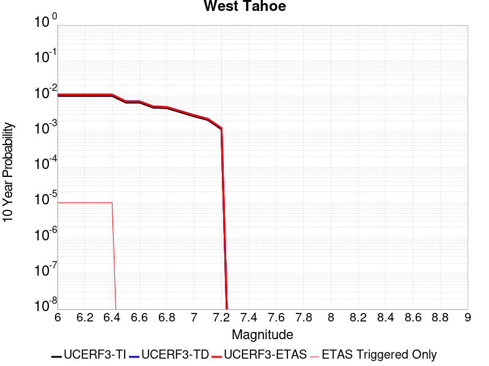 |

| Magnitude | 1 wk TI Prob | 1 wk TD Prob | 1 wk ETAS Prob | 1 wk ETAS/TD Gain | 1 wk ETAS Triggered Only | 1 mo TI Prob | 1 mo TD Prob | 1 mo ETAS Prob | 1 mo ETAS/TD Gain | 1 mo ETAS Triggered Only | 1 yr TI Prob | 1 yr TD Prob | 1 yr ETAS Prob | 1 yr ETAS/TD Gain | 1 yr ETAS Triggered Only | 10 yr TI Prob | 10 yr TD Prob | 10 yr ETAS Prob | 10 yr ETAS/TD Gain | 10 yr ETAS Triggered Only |
|-----|-----|-----|-----|-----|-----|-----|-----|-----|-----|-----|-----|-----|-----|-----|-----|-----|-----|-----|-----|-----|
| 6.0 | 1.952444E-5 | 2.118317E-5 | 3.1182957E-5 | 1.4720628 | 1.0E-5 | 8.367348E-5 | 9.078217E-5 | 1.0078125E-4 | 1.1101438 | 1.0E-5 | 0.0010182485 | 0.0011047672 | 0.0011147561 | 1.0090417 | 1.0E-5 | 0.010135954 | 0.010998235 | 0.011008126 | 1.0008992 | 1.0E-5 |
| 6.1 | 1.952444E-5 | 2.118317E-5 | 3.1182957E-5 | 1.4720628 | 1.0E-5 | 8.367348E-5 | 9.078217E-5 | 1.0078125E-4 | 1.1101438 | 1.0E-5 | 0.0010182485 | 0.0011047672 | 0.0011147561 | 1.0090417 | 1.0E-5 | 0.010135954 | 0.010998235 | 0.011008126 | 1.0008992 | 1.0E-5 |
| 6.2 | 1.952444E-5 | 2.118317E-5 | 3.1182957E-5 | 1.4720628 | 1.0E-5 | 8.367348E-5 | 9.078217E-5 | 1.0078125E-4 | 1.1101438 | 1.0E-5 | 0.0010182485 | 0.0011047672 | 0.0011147561 | 1.0090417 | 1.0E-5 | 0.010135954 | 0.010998235 | 0.011008126 | 1.0008992 | 1.0E-5 |
| 6.3 | 1.952444E-5 | 2.118317E-5 | 3.1182957E-5 | 1.4720628 | 1.0E-5 | 8.367348E-5 | 9.078217E-5 | 1.0078125E-4 | 1.1101438 | 1.0E-5 | 0.0010182485 | 0.0011047672 | 0.0011147561 | 1.0090417 | 1.0E-5 | 0.010135954 | 0.010998235 | 0.011008126 | 1.0008992 | 1.0E-5 |
| 6.4 | 1.952444E-5 | 2.118317E-5 | 3.1182957E-5 | 1.4720628 | 1.0E-5 | 8.367348E-5 | 9.078217E-5 | 1.0078125E-4 | 1.1101438 | 1.0E-5 | 0.0010182485 | 0.0011047672 | 0.0011147561 | 1.0090417 | 1.0E-5 | 0.010135954 | 0.010998235 | 0.011008126 | 1.0008992 | 1.0E-5 |
| 6.5 | 1.2685271E-5 | 1.3690627E-5 | 1.3690627E-5 | 1.0 | 0.0 | 5.4364315E-5 | 5.8672893E-5 | 5.8672893E-5 | 1.0 | 0.0 | 6.616845E-4 | 7.141248E-4 | 7.141248E-4 | 1.0 | 0.0 | 0.0065971776 | 0.00711995 | 0.00711995 | 1.0 | 0.0 |
| 6.6 | 1.2685271E-5 | 1.3690627E-5 | 1.3690627E-5 | 1.0 | 0.0 | 5.4364315E-5 | 5.8672893E-5 | 5.8672893E-5 | 1.0 | 0.0 | 6.616845E-4 | 7.141248E-4 | 7.141248E-4 | 1.0 | 0.0 | 0.0065971776 | 0.00711995 | 0.00711995 | 1.0 | 0.0 |
| 6.7 | 9.117886E-6 | 9.809846E-6 | 9.809846E-6 | 1.0 | 0.0 | 3.9076072E-5 | 4.2041564E-5 | 4.2041564E-5 | 1.0 | 0.0 | 4.756473E-4 | 5.11743E-4 | 5.11743E-4 | 1.0 | 0.0 | 0.0047463053 | 0.0051063634 | 0.0051063634 | 1.0 | 0.0 |
| 6.8 | 8.786828E-6 | 9.457863E-6 | 9.457863E-6 | 1.0 | 0.0 | 3.7657293E-5 | 4.053311E-5 | 4.053311E-5 | 1.0 | 0.0 | 4.5838108E-4 | 4.933859E-4 | 4.933859E-4 | 1.0 | 0.0 | 0.0045743673 | 0.0049236063 | 0.0049236063 | 1.0 | 0.0 |
| 6.9 | 6.7562123E-6 | 7.2638086E-6 | 7.2638086E-6 | 1.0 | 0.0 | 2.8954875E-5 | 3.1130265E-5 | 3.1130265E-5 | 1.0 | 0.0 | 3.5246857E-4 | 3.789498E-4 | 3.789498E-4 | 1.0 | 0.0 | 0.0035191004 | 0.0037835082 | 0.0037835082 | 1.0 | 0.0 |
| 7.0 | 5.1792854E-6 | 5.567338E-6 | 5.567338E-6 | 1.0 | 0.0 | 2.2196748E-5 | 2.3859824E-5 | 2.3859824E-5 | 1.0 | 0.0 | 2.702119E-4 | 2.9045844E-4 | 2.9045844E-4 | 1.0 | 0.0 | 0.0026988357 | 0.0029011632 | 0.0029011632 | 1.0 | 0.0 |
| 7.1 | 4.090765E-6 | 4.3974223E-6 | 4.3974223E-6 | 1.0 | 0.0 | 1.7531731E-5 | 1.884598E-5 | 1.884598E-5 | 1.0 | 0.0 | 2.134279E-4 | 2.2942905E-4 | 2.2942905E-4 | 1.0 | 0.0 | 0.0021322304 | 0.0022922563 | 0.0022922563 | 1.0 | 0.0 |
| 7.2 | 2.2356758E-6 | 2.4023684E-6 | 2.4023684E-6 | 1.0 | 0.0 | 9.581432E-6 | 1.0295834E-5 | 1.0295834E-5 | 1.0 | 0.0 | 1.1664769E-4 | 1.2534647E-4 | 1.2534647E-4 | 1.0 | 0.0 | 0.0011658648 | 0.0012529434 | 0.0012529434 | 1.0 | 0.0 |

## Surprise Valley 2011 CFM
*[(top)](#table-of-contents)*

| 1 Week | 1 Month | 1 Year | 10 Year |
|-----|-----|-----|-----|
|  |  |  |  |

| Magnitude | 1 wk TI Prob | 1 wk TD Prob | 1 wk ETAS Prob | 1 wk ETAS/TD Gain | 1 wk ETAS Triggered Only | 1 mo TI Prob | 1 mo TD Prob | 1 mo ETAS Prob | 1 mo ETAS/TD Gain | 1 mo ETAS Triggered Only | 1 yr TI Prob | 1 yr TD Prob | 1 yr ETAS Prob | 1 yr ETAS/TD Gain | 1 yr ETAS Triggered Only | 10 yr TI Prob | 10 yr TD Prob | 10 yr ETAS Prob | 10 yr ETAS/TD Gain | 10 yr ETAS Triggered Only |
|-----|-----|-----|-----|-----|-----|-----|-----|-----|-----|-----|-----|-----|-----|-----|-----|-----|-----|-----|-----|-----|
| 6.0 | 4.0396248E-5 | 4.485131E-5 | 5.485086E-5 | 1.2229489 | 1.0E-5 | 1.7311527E-4 | 1.9220692E-4 | 2.02205E-4 | 1.0520172 | 1.0E-5 | 0.002105641 | 0.0023378176 | 0.0023477944 | 1.0042675 | 1.0E-5 | 0.020858008 | 0.023153966 | 0.023163734 | 1.0004219 | 1.0E-5 |
| 6.1 | 4.0396248E-5 | 4.485131E-5 | 5.485086E-5 | 1.2229489 | 1.0E-5 | 1.7311527E-4 | 1.9220692E-4 | 2.02205E-4 | 1.0520172 | 1.0E-5 | 0.002105641 | 0.0023378176 | 0.0023477944 | 1.0042675 | 1.0E-5 | 0.020858008 | 0.023153966 | 0.023163734 | 1.0004219 | 1.0E-5 |
| 6.2 | 2.2295266E-5 | 2.440125E-5 | 2.440125E-5 | 1.0 | 0.0 | 9.554764E-5 | 1.0457276E-4 | 1.0457276E-4 | 1.0 | 0.0 | 0.0011626717 | 0.0012724606 | 0.0012724606 | 1.0 | 0.0 | 0.011566074 | 0.012654981 | 0.012654981 | 1.0 | 0.0 |
| 6.3 | 1.572643E-5 | 1.7096807E-5 | 1.7096807E-5 | 1.0 | 0.0 | 6.7397246E-5 | 7.327003E-5 | 7.327003E-5 | 1.0 | 0.0 | 8.202525E-4 | 8.91708E-4 | 8.91708E-4 | 1.0 | 0.0 | 0.008172315 | 0.008882407 | 0.008882407 | 1.0 | 0.0 |
| 6.4 | 1.5714395E-5 | 1.7084629E-5 | 1.7084629E-5 | 1.0 | 0.0 | 6.734567E-5 | 7.3217845E-5 | 7.3217845E-5 | 1.0 | 0.0 | 8.1962504E-4 | 8.9107314E-4 | 8.9107314E-4 | 1.0 | 0.0 | 0.008166086 | 0.008876109 | 0.008876109 | 1.0 | 0.0 |
| 6.5 | 1.2733495E-5 | 1.38016E-5 | 1.38016E-5 | 1.0 | 0.0 | 5.457098E-5 | 5.9148413E-5 | 5.9148413E-5 | 1.0 | 0.0 | 6.641992E-4 | 7.1990065E-4 | 7.1990065E-4 | 1.0 | 0.0 | 0.0066221743 | 0.0071763797 | 0.0071763797 | 1.0 | 0.0 |
| 6.6 | 1.0983784E-5 | 1.1886554E-5 | 1.1886554E-5 | 1.0 | 0.0 | 4.7072506E-5 | 5.094141E-5 | 5.094141E-5 | 1.0 | 0.0 | 5.7295704E-4 | 6.200405E-4 | 6.200405E-4 | 1.0 | 0.0 | 0.0057148207 | 0.0061836545 | 0.0061836545 | 1.0 | 0.0 |
| 6.7 | 9.104806E-6 | 9.839491E-6 | 9.839491E-6 | 1.0 | 0.0 | 3.902001E-5 | 4.2168587E-5 | 4.2168587E-5 | 1.0 | 0.0 | 4.7496508E-4 | 5.132855E-4 | 5.132855E-4 | 1.0 | 0.0 | 0.004739512 | 0.005121397 | 0.005121397 | 1.0 | 0.0 |
| 6.8 | 6.2162403E-6 | 6.7041337E-6 | 6.7041337E-6 | 1.0 | 0.0 | 2.6640759E-5 | 2.8731698E-5 | 2.8731698E-5 | 1.0 | 0.0 | 3.2430296E-4 | 3.497545E-4 | 3.497545E-4 | 1.0 | 0.0 | 0.003238301 | 0.0034922638 | 0.0034922638 | 1.0 | 0.0 |
| 6.9 | 4.1792696E-6 | 4.50323E-6 | 4.50323E-6 | 1.0 | 0.0 | 1.7911032E-5 | 1.9299423E-5 | 1.9299423E-5 | 1.0 | 0.0 | 2.1804498E-4 | 2.3494668E-4 | 2.3494668E-4 | 1.0 | 0.0 | 0.0021783116 | 0.0023471361 | 0.0023471361 | 1.0 | 0.0 |
| 7.0 | 2.7478413E-6 | 2.9622424E-6 | 2.9622424E-6 | 1.0 | 0.0 | 1.177641E-5 | 1.269527E-5 | 1.269527E-5 | 1.0 | 0.0 | 1.4336836E-4 | 1.545552E-4 | 1.545552E-4 | 1.0 | 0.0 | 0.001432759 | 0.0015445995 | 0.0015445995 | 1.0 | 0.0 |
| 7.1 | 8.128648E-7 | 8.724922E-7 | 8.724922E-7 | 1.0 | 0.0 | 3.4837017E-6 | 3.7392501E-6 | 3.7392501E-6 | 1.0 | 0.0 | 4.2413245E-5 | 4.552502E-5 | 4.552502E-5 | 1.0 | 0.0 | 4.2405148E-4 | 4.5521575E-4 | 4.5521575E-4 | 1.0 | 0.0 |
| 7.2 | 4.8641045E-8 | 4.9402068E-8 | 4.9402068E-8 | 1.0 | 0.0 | 2.084616E-7 | 2.1172312E-7 | 2.1172312E-7 | 1.0 | 0.0 | 2.538017E-6 | 2.577726E-6 | 2.577726E-6 | 1.0 | 0.0 | 2.537988E-5 | 2.5776973E-5 | 2.5776973E-5 | 1.0 | 0.0 |
| 7.3 | 5.3911844E-9 | 5.4758145E-9 | 5.4758145E-9 | 1.0 | 0.0 | 2.3105075E-8 | 2.3467775E-8 | 2.3467775E-8 | 1.0 | 0.0 | 2.8130427E-7 | 2.8572015E-7 | 2.8572015E-7 | 1.0 | 0.0 | 2.8130391E-6 | 2.8571992E-6 | 2.8571992E-6 | 1.0 | 0.0 |

## San Gabriel (Extension)
*[(top)](#table-of-contents)*

| 1 Week | 1 Month | 1 Year | 10 Year |
|-----|-----|-----|-----|
|  |  |  |  |

| Magnitude | 1 wk TI Prob | 1 wk TD Prob | 1 wk ETAS Prob | 1 wk ETAS/TD Gain | 1 wk ETAS Triggered Only | 1 mo TI Prob | 1 mo TD Prob | 1 mo ETAS Prob | 1 mo ETAS/TD Gain | 1 mo ETAS Triggered Only | 1 yr TI Prob | 1 yr TD Prob | 1 yr ETAS Prob | 1 yr ETAS/TD Gain | 1 yr ETAS Triggered Only | 10 yr TI Prob | 10 yr TD Prob | 10 yr ETAS Prob | 10 yr ETAS/TD Gain | 10 yr ETAS Triggered Only |
|-----|-----|-----|-----|-----|-----|-----|-----|-----|-----|-----|-----|-----|-----|-----|-----|-----|-----|-----|-----|-----|
| 6.0 | 5.6486106E-6 | 5.7168304E-6 | 1.5716772E-5 | 2.749211 | 1.0E-5 | 2.4208108E-5 | 2.450048E-5 | 3.4500234E-5 | 1.4081453 | 1.0E-5 | 2.9469383E-4 | 2.9825376E-4 | 3.0825078E-4 | 1.0335186 | 1.0E-5 | 0.0029430336 | 0.0029786653 | 0.0029886353 | 1.0033472 | 1.0E-5 |
| 6.1 | 5.6486106E-6 | 5.7168304E-6 | 1.5716772E-5 | 2.749211 | 1.0E-5 | 2.4208108E-5 | 2.450048E-5 | 3.4500234E-5 | 1.4081453 | 1.0E-5 | 2.9469383E-4 | 2.9825376E-4 | 3.0825078E-4 | 1.0335186 | 1.0E-5 | 0.0029430336 | 0.0029786653 | 0.0029886353 | 1.0033472 | 1.0E-5 |
| 6.2 | 5.6486106E-6 | 5.7168304E-6 | 1.5716772E-5 | 2.749211 | 1.0E-5 | 2.4208108E-5 | 2.450048E-5 | 3.4500234E-5 | 1.4081453 | 1.0E-5 | 2.9469383E-4 | 2.9825376E-4 | 3.0825078E-4 | 1.0335186 | 1.0E-5 | 0.0029430336 | 0.0029786653 | 0.0029886353 | 1.0033472 | 1.0E-5 |
| 6.3 | 5.6486106E-6 | 5.7168304E-6 | 1.5716772E-5 | 2.749211 | 1.0E-5 | 2.4208108E-5 | 2.450048E-5 | 3.4500234E-5 | 1.4081453 | 1.0E-5 | 2.9469383E-4 | 2.9825376E-4 | 3.0825078E-4 | 1.0335186 | 1.0E-5 | 0.0029430336 | 0.0029786653 | 0.0029886353 | 1.0033472 | 1.0E-5 |
| 6.4 | 5.6486106E-6 | 5.7168304E-6 | 1.5716772E-5 | 2.749211 | 1.0E-5 | 2.4208108E-5 | 2.450048E-5 | 3.4500234E-5 | 1.4081453 | 1.0E-5 | 2.9469383E-4 | 2.9825376E-4 | 3.0825078E-4 | 1.0335186 | 1.0E-5 | 0.0029430336 | 0.0029786653 | 0.0029886353 | 1.0033472 | 1.0E-5 |
| 6.5 | 4.7134554E-6 | 4.7542544E-6 | 4.7542544E-6 | 1.0 | 0.0 | 2.0200367E-5 | 2.0375222E-5 | 2.0375222E-5 | 1.0 | 0.0 | 2.459117E-4 | 2.4804095E-4 | 2.4804095E-4 | 1.0 | 0.0 | 0.0024563975 | 0.002477729 | 0.002477729 | 1.0 | 0.0 |
| 6.6 | 4.7134554E-6 | 4.7542544E-6 | 4.7542544E-6 | 1.0 | 0.0 | 2.0200367E-5 | 2.0375222E-5 | 2.0375222E-5 | 1.0 | 0.0 | 2.459117E-4 | 2.4804095E-4 | 2.4804095E-4 | 1.0 | 0.0 | 0.0024563975 | 0.002477729 | 0.002477729 | 1.0 | 0.0 |
| 6.7 | 4.2468837E-6 | 4.2740717E-6 | 4.2740717E-6 | 1.0 | 0.0 | 1.8200803E-5 | 1.8317325E-5 | 1.8317325E-5 | 1.0 | 0.0 | 2.2157225E-4 | 2.2299135E-4 | 2.2299135E-4 | 1.0 | 0.0 | 0.0022135144 | 0.0022277518 | 0.0022277518 | 1.0 | 0.0 |
| 6.8 | 4.1180615E-6 | 4.1414614E-6 | 4.1414614E-6 | 1.0 | 0.0 | 1.7648716E-5 | 1.7749004E-5 | 1.7749004E-5 | 1.0 | 0.0 | 2.1485193E-4 | 2.160734E-4 | 2.160734E-4 | 1.0 | 0.0 | 0.0021464431 | 0.0021587082 | 0.0021587082 | 1.0 | 0.0 |
| 6.9 | 3.863861E-6 | 3.8797766E-6 | 3.8797766E-6 | 1.0 | 0.0 | 1.65593E-5 | 1.6627511E-5 | 1.6627511E-5 | 1.0 | 0.0 | 2.0159081E-4 | 2.0242184E-4 | 2.0242184E-4 | 1.0 | 0.0 | 0.0020140803 | 0.002022446 | 0.002022446 | 1.0 | 0.0 |
| 7.0 | 3.6947372E-6 | 3.705676E-6 | 3.705676E-6 | 1.0 | 0.0 | 1.5834492E-5 | 1.5881375E-5 | 1.5881375E-5 | 1.0 | 0.0 | 1.9276788E-4 | 1.9333926E-4 | 1.9333926E-4 | 1.0 | 0.0 | 0.0019260074 | 0.0019317807 | 0.0019317807 | 1.0 | 0.0 |
| 7.1 | 3.5686835E-6 | 3.5728963E-6 | 3.5728963E-6 | 1.0 | 0.0 | 1.5294268E-5 | 1.5312327E-5 | 1.5312327E-5 | 1.0 | 0.0 | 1.861918E-4 | 1.8641229E-4 | 1.8641229E-4 | 1.0 | 0.0 | 0.0018603588 | 0.0018626289 | 0.0018626289 | 1.0 | 0.0 |
| 7.2 | 2.8023446E-6 | 2.7767885E-6 | 2.7767885E-6 | 1.0 | 0.0 | 1.2009994E-5 | 1.1900468E-5 | 1.1900468E-5 | 1.0 | 0.0 | 1.4621185E-4 | 1.4487868E-4 | 1.4487868E-4 | 1.0 | 0.0 | 0.001461157 | 0.0014478569 | 0.0014478569 | 1.0 | 0.0 |
| 7.3 | 2.5843012E-6 | 2.5459642E-6 | 2.5459642E-6 | 1.0 | 0.0 | 1.1075529E-5 | 1.0911231E-5 | 1.0911231E-5 | 1.0 | 0.0 | 1.3483623E-4 | 1.3283623E-4 | 1.3283623E-4 | 1.0 | 0.0 | 0.0013475444 | 0.0013275818 | 0.0013275818 | 1.0 | 0.0 |
| 7.4 | 2.4464468E-6 | 2.396665E-6 | 2.396665E-6 | 1.0 | 0.0 | 1.04847295E-5 | 1.0271382E-5 | 1.0271382E-5 | 1.0 | 0.0 | 1.276441E-4 | 1.25047E-4 | 1.25047E-4 | 1.0 | 0.0 | 0.0012757082 | 0.0012497796 | 0.0012497796 | 1.0 | 0.0 |
| 7.5 | 2.0420266E-6 | 1.8910426E-6 | 1.8910426E-6 | 1.0 | 0.0 | 8.751514E-6 | 8.104444E-6 | 8.104444E-6 | 1.0 | 0.0 | 1.0654447E-4 | 9.8667166E-5 | 9.8667166E-5 | 1.0 | 0.0 | 0.001064934 | 9.862408E-4 | 9.862408E-4 | 1.0 | 0.0 |
| 7.6 | 1.8326596E-6 | 1.6398341E-6 | 1.6398341E-6 | 1.0 | 0.0 | 7.854232E-6 | 7.0278415E-6 | 7.0278415E-6 | 1.0 | 0.0 | 9.562107E-5 | 8.5560634E-5 | 8.5560634E-5 | 1.0 | 0.0 | 9.5579936E-4 | 8.5528276E-4 | 8.5528276E-4 | 1.0 | 0.0 |
| 7.7 | 1.4786998E-6 | 1.2523838E-6 | 1.2523838E-6 | 1.0 | 0.0 | 6.3372695E-6 | 5.367348E-6 | 5.367348E-6 | 1.0 | 0.0 | 7.715353E-5 | 6.534551E-5 | 6.534551E-5 | 1.0 | 0.0 | 7.7126746E-4 | 6.532707E-4 | 6.532707E-4 | 1.0 | 0.0 |
| 7.8 | 7.6975533E-7 | 6.0693884E-7 | 6.0693884E-7 | 1.0 | 0.0 | 3.2989474E-6 | 2.601164E-6 | 2.601164E-6 | 1.0 | 0.0 | 4.0163945E-5 | 3.166871E-5 | 3.166871E-5 | 1.0 | 0.0 | 4.0156685E-4 | 3.1664805E-4 | 3.1664805E-4 | 1.0 | 0.0 |
| 7.9 | 1.7645915E-7 | 9.213256E-8 | 9.213256E-8 | 1.0 | 0.0 | 7.562533E-7 | 3.9485377E-7 | 3.9485377E-7 | 1.0 | 0.0 | 9.207345E-6 | 4.807334E-6 | 4.807334E-6 | 1.0 | 0.0 | 9.206964E-5 | 4.807699E-5 | 4.807699E-5 | 1.0 | 0.0 |
| 8.0 | 1.0463461E-7 | 2.4949307E-8 | 2.4949307E-8 | 1.0 | 0.0 | 4.4843398E-7 | 1.0692559E-7 | 1.0692559E-7 | 1.0 | 0.0 | 5.45967E-6 | 1.3018183E-6 | 1.3018183E-6 | 1.0 | 0.0 | 5.459536E-5 | 1.3022789E-5 | 1.3022789E-5 | 1.0 | 0.0 |
| 8.1 | 7.875717E-8 | 1.3866874E-8 | 1.3866874E-8 | 1.0 | 0.0 | 3.3753068E-7 | 5.942946E-8 | 5.942946E-8 | 1.0 | 0.0 | 4.109428E-6 | 7.235534E-7 | 7.235534E-7 | 1.0 | 0.0 | 4.109352E-5 | 7.2401926E-6 | 7.2401926E-6 | 1.0 | 0.0 |
| 8.2 | 1.33163E-8 | 1.7733891E-9 | 1.7733891E-9 | 1.0 | 0.0 | 5.7069855E-8 | 7.600239E-9 | 7.600239E-9 | 1.0 | 0.0 | 6.9482525E-7 | 9.25329E-8 | 9.25329E-8 | 1.0 | 0.0 | 6.9482307E-6 | 9.272953E-7 | 9.272953E-7 | 1.0 | 0.0 |

## Cerro Prieto
*[(top)](#table-of-contents)*

| 1 Week | 1 Month | 1 Year | 10 Year |
|-----|-----|-----|-----|
|  |  |  |  |

| Magnitude | 1 wk TI Prob | 1 wk TD Prob | 1 wk ETAS Prob | 1 wk ETAS/TD Gain | 1 wk ETAS Triggered Only | 1 mo TI Prob | 1 mo TD Prob | 1 mo ETAS Prob | 1 mo ETAS/TD Gain | 1 mo ETAS Triggered Only | 1 yr TI Prob | 1 yr TD Prob | 1 yr ETAS Prob | 1 yr ETAS/TD Gain | 1 yr ETAS Triggered Only | 10 yr TI Prob | 10 yr TD Prob | 10 yr ETAS Prob | 10 yr ETAS/TD Gain | 10 yr ETAS Triggered Only |
|-----|-----|-----|-----|-----|-----|-----|-----|-----|-----|-----|-----|-----|-----|-----|-----|-----|-----|-----|-----|-----|
| 6.0 | 2.9101528E-4 | 5.964804E-4 | 6.064744E-4 | 1.016755 | 1.0E-5 | 0.0012466122 | 0.002554082 | 0.0025640565 | 1.0039053 | 1.0E-5 | 0.015072231 | 0.03064807 | 0.030657765 | 1.0003163 | 1.0E-5 | 0.14089979 | 0.25397858 | 0.25398603 | 1.0000293 | 1.0E-5 |
| 6.1 | 2.9101528E-4 | 5.964804E-4 | 6.064744E-4 | 1.016755 | 1.0E-5 | 0.0012466122 | 0.002554082 | 0.0025640565 | 1.0039053 | 1.0E-5 | 0.015072231 | 0.03064807 | 0.030657765 | 1.0003163 | 1.0E-5 | 0.14089979 | 0.25397858 | 0.25398603 | 1.0000293 | 1.0E-5 |
| 6.2 | 2.9101528E-4 | 5.964804E-4 | 6.064744E-4 | 1.016755 | 1.0E-5 | 0.0012466122 | 0.002554082 | 0.0025640565 | 1.0039053 | 1.0E-5 | 0.015072231 | 0.03064807 | 0.030657765 | 1.0003163 | 1.0E-5 | 0.14089979 | 0.25397858 | 0.25398603 | 1.0000293 | 1.0E-5 |
| 6.3 | 2.9101528E-4 | 5.964804E-4 | 6.064744E-4 | 1.016755 | 1.0E-5 | 0.0012466122 | 0.002554082 | 0.0025640565 | 1.0039053 | 1.0E-5 | 0.015072231 | 0.03064807 | 0.030657765 | 1.0003163 | 1.0E-5 | 0.14089979 | 0.25397858 | 0.25398603 | 1.0000293 | 1.0E-5 |
| 6.4 | 2.508648E-4 | 5.1397446E-4 | 5.239693E-4 | 1.0194463 | 1.0E-5 | 0.0010746918 | 0.0022010866 | 0.0022110646 | 1.0045332 | 1.0E-5 | 0.013006088 | 0.026471792 | 0.026481528 | 1.0003678 | 1.0E-5 | 0.12270685 | 0.22440416 | 0.2244119 | 1.0000346 | 1.0E-5 |
| 6.5 | 2.508648E-4 | 5.1397446E-4 | 5.239693E-4 | 1.0194463 | 1.0E-5 | 0.0010746918 | 0.0022010866 | 0.0022110646 | 1.0045332 | 1.0E-5 | 0.013006088 | 0.026471792 | 0.026481528 | 1.0003678 | 1.0E-5 | 0.12270685 | 0.22440416 | 0.2244119 | 1.0000346 | 1.0E-5 |
| 6.6 | 2.294914E-4 | 4.7116808E-4 | 4.8116336E-4 | 1.0212139 | 1.0E-5 | 9.831638E-4 | 0.0020179166 | 0.0020278965 | 1.0049456 | 1.0E-5 | 0.011904482 | 0.02429866 | 0.024308417 | 1.0004015 | 1.0E-5 | 0.11286586 | 0.20858558 | 0.20859349 | 1.0000379 | 1.0E-5 |
| 6.7 | 1.9621674E-4 | 4.0419117E-4 | 4.1418715E-4 | 1.0247308 | 1.0E-5 | 8.4065786E-4 | 0.0017312564 | 0.001741239 | 1.0057662 | 1.0E-5 | 0.010187071 | 0.020884845 | 0.020894635 | 1.0004689 | 1.0E-5 | 0.09732539 | 0.18290249 | 0.18291067 | 1.0000447 | 1.0E-5 |
| 6.8 | 1.5476145E-4 | 3.056516E-4 | 3.1564853E-4 | 1.032707 | 1.0E-5 | 6.6309475E-4 | 0.00130938 | 0.0013193669 | 1.0076272 | 1.0E-5 | 0.008043335 | 0.015836509 | 0.01584635 | 1.0006214 | 1.0E-5 | 0.07758363 | 0.14336355 | 0.14337212 | 1.0000597 | 1.0E-5 |
| 6.9 | 1.20509176E-4 | 2.2582515E-4 | 2.358229E-4 | 1.0442721 | 1.0E-5 | 5.1636563E-4 | 9.6752634E-4 | 9.775166E-4 | 1.0103257 | 1.0E-5 | 0.006268645 | 0.011726342 | 0.011736225 | 1.0008428 | 1.0E-5 | 0.060947374 | 0.109451205 | 0.10946011 | 1.0000814 | 1.0E-5 |
| 7.0 | 9.3269155E-5 | 1.6716642E-4 | 1.6716642E-4 | 1.0 | 0.0 | 3.9966372E-4 | 7.162739E-4 | 7.162739E-4 | 1.0 | 0.0 | 0.0048550544 | 0.008693418 | 0.008693418 | 1.0 | 0.0 | 0.04750344 | 0.08315912 | 0.08315912 | 1.0 | 0.0 |
| 7.1 | 5.029709E-5 | 8.1718936E-5 | 8.1718936E-5 | 1.0 | 0.0 | 2.1554115E-4 | 3.5019626E-4 | 3.5019626E-4 | 1.0 | 0.0 | 0.0026210553 | 0.0042587193 | 0.0042587193 | 1.0 | 0.0 | 0.025903556 | 0.042365108 | 0.042365108 | 1.0 | 0.0 |
| 7.2 | 6.5445185E-8 | 6.814903E-8 | 6.814903E-8 | 1.0 | 0.0 | 2.8047933E-7 | 2.9206726E-7 | 2.9206726E-7 | 1.0 | 0.0 | 3.4148304E-6 | 3.555919E-6 | 3.555919E-6 | 1.0 | 0.0 | 3.414778E-5 | 3.5559187E-5 | 3.5559187E-5 | 1.0 | 0.0 |

## Great Valley 10 (Panoche)
*[(top)](#table-of-contents)*

| 1 Week | 1 Month | 1 Year | 10 Year |
|-----|-----|-----|-----|
| 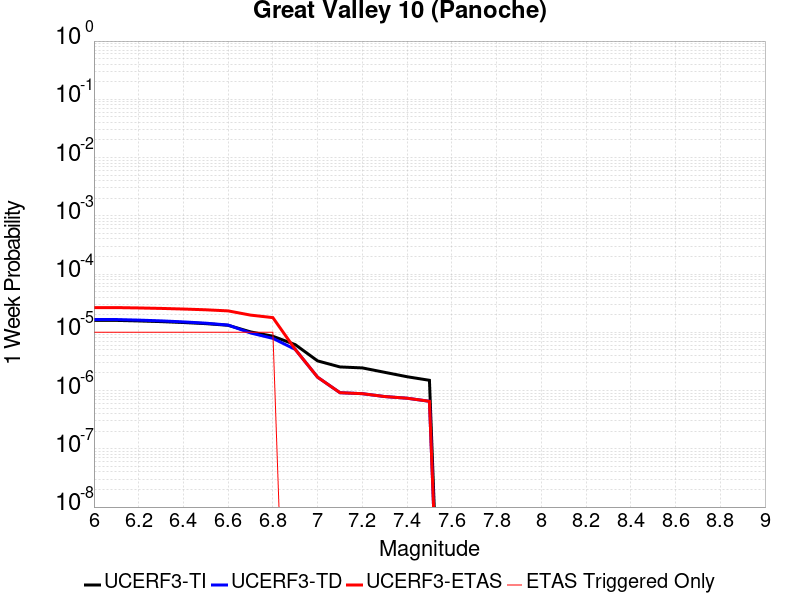 |  |  |  |

| Magnitude | 1 wk TI Prob | 1 wk TD Prob | 1 wk ETAS Prob | 1 wk ETAS/TD Gain | 1 wk ETAS Triggered Only | 1 mo TI Prob | 1 mo TD Prob | 1 mo ETAS Prob | 1 mo ETAS/TD Gain | 1 mo ETAS Triggered Only | 1 yr TI Prob | 1 yr TD Prob | 1 yr ETAS Prob | 1 yr ETAS/TD Gain | 1 yr ETAS Triggered Only | 10 yr TI Prob | 10 yr TD Prob | 10 yr ETAS Prob | 10 yr ETAS/TD Gain | 10 yr ETAS Triggered Only |
|-----|-----|-----|-----|-----|-----|-----|-----|-----|-----|-----|-----|-----|-----|-----|-----|-----|-----|-----|-----|-----|
| 6.0 | 1.6014626E-5 | 1.6575399E-5 | 2.6575233E-5 | 1.6032938 | 1.0E-5 | 6.863231E-5 | 7.103552E-5 | 8.1034814E-5 | 1.1407646 | 1.0E-5 | 8.35278E-4 | 8.645185E-4 | 8.7450986E-4 | 1.0115571 | 1.0E-5 | 0.008321454 | 0.008612172 | 0.008622086 | 1.0011512 | 1.0E-5 |
| 6.1 | 1.6014626E-5 | 1.6575399E-5 | 2.6575233E-5 | 1.6032938 | 1.0E-5 | 6.863231E-5 | 7.103552E-5 | 8.1034814E-5 | 1.1407646 | 1.0E-5 | 8.35278E-4 | 8.645185E-4 | 8.7450986E-4 | 1.0115571 | 1.0E-5 | 0.008321454 | 0.008612172 | 0.008622086 | 1.0011512 | 1.0E-5 |
| 6.2 | 1.56782E-5 | 1.6198446E-5 | 2.6198284E-5 | 1.6173332 | 1.0E-5 | 6.719056E-5 | 6.94201E-5 | 7.9419406E-5 | 1.1440405 | 1.0E-5 | 8.17738E-4 | 8.4486604E-4 | 8.548576E-4 | 1.0118262 | 1.0E-5 | 0.008147354 | 0.008417147 | 0.008427063 | 1.001178 | 1.0E-5 |
| 6.3 | 1.5263338E-5 | 1.5723514E-5 | 2.5723357E-5 | 1.6359801 | 1.0E-5 | 6.541267E-5 | 6.738478E-5 | 7.738411E-5 | 1.1483915 | 1.0E-5 | 7.961082E-4 | 8.201049E-4 | 8.300967E-4 | 1.0121835 | 1.0E-5 | 0.007932622 | 0.008171377 | 0.008181295 | 1.0012138 | 1.0E-5 |
| 6.4 | 1.4720723E-5 | 1.5099376E-5 | 2.5099225E-5 | 1.662269 | 1.0E-5 | 6.308728E-5 | 6.471004E-5 | 7.470939E-5 | 1.1545255 | 1.0E-5 | 7.67817E-4 | 7.8756385E-4 | 7.9755596E-4 | 1.0126873 | 1.0E-5 | 0.007651695 | 0.007848303 | 0.007858224 | 1.0012642 | 1.0E-5 |
| 6.5 | 1.408264E-5 | 1.4355969E-5 | 2.4355826E-5 | 1.6965643 | 1.0E-5 | 6.0352773E-5 | 6.1524166E-5 | 7.152355E-5 | 1.1625278 | 1.0E-5 | 7.3454727E-4 | 7.488031E-4 | 7.587956E-4 | 1.0133446 | 1.0E-5 | 0.0073212404 | 0.0074633555 | 0.007473281 | 1.0013299 | 1.0E-5 |
| 6.6 | 1.3197086E-5 | 1.3321889E-5 | 2.3321756E-5 | 1.7506343 | 1.0E-5 | 5.6557717E-5 | 5.709259E-5 | 6.709202E-5 | 1.1751441 | 1.0E-5 | 6.8837265E-4 | 6.9488434E-4 | 7.0487737E-4 | 1.0143809 | 1.0E-5 | 0.006862442 | 0.0069276537 | 0.0069375844 | 1.0014335 | 1.0E-5 |
| 6.7 | 1.017583E-5 | 9.745382E-6 | 1.9745285E-5 | 2.026117 | 1.0E-5 | 4.360997E-5 | 4.176527E-5 | 5.176485E-5 | 1.2394234 | 1.0E-5 | 5.30822E-4 | 5.0837593E-4 | 5.183708E-4 | 1.0196605 | 1.0E-5 | 0.0052955584 | 0.005072382 | 0.005082331 | 1.0019615 | 1.0E-5 |
| 6.8 | 8.557912E-6 | 7.872707E-6 | 1.787263E-5 | 2.270201 | 1.0E-5 | 3.667625E-5 | 3.373975E-5 | 4.3739412E-5 | 1.2963763 | 1.0E-5 | 4.4644187E-4 | 4.1070607E-4 | 4.2070195E-4 | 1.0243384 | 1.0E-5 | 0.0044554602 | 0.004099677 | 0.004109636 | 1.0024292 | 1.0E-5 |
| 6.9 | 6.14664E-6 | 5.092071E-6 | 5.092071E-6 | 1.0 | 0.0 | 2.6342475E-5 | 2.1822989E-5 | 2.1822989E-5 | 1.0 | 0.0 | 3.2067244E-4 | 2.6566387E-4 | 2.6566387E-4 | 1.0 | 0.0 | 0.003202101 | 0.002653601 | 0.002653601 | 1.0 | 0.0 |
| 7.0 | 3.2310581E-6 | 1.6951219E-6 | 1.6951219E-6 | 1.0 | 0.0 | 1.3847319E-5 | 7.264788E-6 | 7.264788E-6 | 1.0 | 0.0 | 1.6857806E-4 | 8.8445304E-5 | 8.8445304E-5 | 1.0 | 0.0 | 0.0016845023 | 8.841104E-4 | 8.841104E-4 | 1.0 | 0.0 |
| 7.1 | 2.544492E-6 | 9.1889206E-7 | 9.1889206E-7 | 1.0 | 0.0 | 1.090492E-5 | 3.938103E-6 | 3.938103E-6 | 1.0 | 0.0 | 1.327593E-4 | 4.79454E-5 | 4.79454E-5 | 1.0 | 0.0 | 0.0013268003 | 4.793553E-4 | 4.793553E-4 | 1.0 | 0.0 |
| 7.2 | 2.4479045E-6 | 8.841304E-7 | 8.841304E-7 | 1.0 | 0.0 | 1.0490977E-5 | 3.789125E-6 | 3.789125E-6 | 1.0 | 0.0 | 1.2772017E-4 | 4.6131667E-5 | 4.6131667E-5 | 1.0 | 0.0 | 0.0012764678 | 4.6122566E-4 | 4.6122566E-4 | 1.0 | 0.0 |
| 7.3 | 2.0559578E-6 | 7.892787E-7 | 7.892787E-7 | 1.0 | 0.0 | 8.811218E-6 | 3.3826188E-6 | 3.3826188E-6 | 1.0 | 0.0 | 1.072713E-4 | 4.1182655E-5 | 4.1182655E-5 | 1.0 | 0.0 | 0.0010721954 | 4.1175485E-4 | 4.1175485E-4 | 1.0 | 0.0 |
| 7.4 | 1.727687E-6 | 7.387757E-7 | 7.387757E-7 | 1.0 | 0.0 | 7.404352E-6 | 3.1661782E-6 | 3.1661782E-6 | 1.0 | 0.0 | 9.0144255E-5 | 3.8547583E-5 | 3.8547583E-5 | 1.0 | 0.0 | 9.0107694E-4 | 3.854136E-4 | 3.854136E-4 | 1.0 | 0.0 |
| 7.5 | 1.5002679E-6 | 6.546144E-7 | 6.546144E-7 | 1.0 | 0.0 | 6.4297037E-6 | 2.8054874E-6 | 2.8054874E-6 | 1.0 | 0.0 | 7.827883E-5 | 3.4156317E-5 | 3.4156317E-5 | 1.0 | 0.0 | 7.825126E-4 | 3.4151482E-4 | 3.4151482E-4 | 1.0 | 0.0 |

## Los Alamos extension
*[(top)](#table-of-contents)*

| 1 Week | 1 Month | 1 Year | 10 Year |
|-----|-----|-----|-----|
|  |  |  |  |

| Magnitude | 1 wk TI Prob | 1 wk TD Prob | 1 wk ETAS Prob | 1 wk ETAS/TD Gain | 1 wk ETAS Triggered Only | 1 mo TI Prob | 1 mo TD Prob | 1 mo ETAS Prob | 1 mo ETAS/TD Gain | 1 mo ETAS Triggered Only | 1 yr TI Prob | 1 yr TD Prob | 1 yr ETAS Prob | 1 yr ETAS/TD Gain | 1 yr ETAS Triggered Only | 10 yr TI Prob | 10 yr TD Prob | 10 yr ETAS Prob | 10 yr ETAS/TD Gain | 10 yr ETAS Triggered Only |
|-----|-----|-----|-----|-----|-----|-----|-----|-----|-----|-----|-----|-----|-----|-----|-----|-----|-----|-----|-----|-----|
| 6.0 | 4.0146506E-6 | 4.0861596E-6 | 1.4086118E-5 | 3.4472756 | 1.0E-5 | 1.7205533E-5 | 1.7512002E-5 | 2.7511827E-5 | 1.5710269 | 1.0E-5 | 2.0945723E-4 | 2.1318886E-4 | 2.2318673E-4 | 1.0468968 | 1.0E-5 | 0.0020925992 | 0.0021299527 | 0.0021399313 | 1.0046849 | 1.0E-5 |
| 6.1 | 4.0146506E-6 | 4.0861596E-6 | 1.4086118E-5 | 3.4472756 | 1.0E-5 | 1.7205533E-5 | 1.7512002E-5 | 2.7511827E-5 | 1.5710269 | 1.0E-5 | 2.0945723E-4 | 2.1318886E-4 | 2.2318673E-4 | 1.0468968 | 1.0E-5 | 0.0020925992 | 0.0021299527 | 0.0021399313 | 1.0046849 | 1.0E-5 |
| 6.2 | 4.0146506E-6 | 4.0861596E-6 | 1.4086118E-5 | 3.4472756 | 1.0E-5 | 1.7205533E-5 | 1.7512002E-5 | 2.7511827E-5 | 1.5710269 | 1.0E-5 | 2.0945723E-4 | 2.1318886E-4 | 2.2318673E-4 | 1.0468968 | 1.0E-5 | 0.0020925992 | 0.0021299527 | 0.0021399313 | 1.0046849 | 1.0E-5 |
| 6.3 | 4.0146506E-6 | 4.0861596E-6 | 1.4086118E-5 | 3.4472756 | 1.0E-5 | 1.7205533E-5 | 1.7512002E-5 | 2.7511827E-5 | 1.5710269 | 1.0E-5 | 2.0945723E-4 | 2.1318886E-4 | 2.2318673E-4 | 1.0468968 | 1.0E-5 | 0.0020925992 | 0.0021299527 | 0.0021399313 | 1.0046849 | 1.0E-5 |
| 6.4 | 4.0146506E-6 | 4.0861596E-6 | 1.4086118E-5 | 3.4472756 | 1.0E-5 | 1.7205533E-5 | 1.7512002E-5 | 2.7511827E-5 | 1.5710269 | 1.0E-5 | 2.0945723E-4 | 2.1318886E-4 | 2.2318673E-4 | 1.0468968 | 1.0E-5 | 0.0020925992 | 0.0021299527 | 0.0021399313 | 1.0046849 | 1.0E-5 |
| 6.5 | 4.0146506E-6 | 4.0861596E-6 | 1.4086118E-5 | 3.4472756 | 1.0E-5 | 1.7205533E-5 | 1.7512002E-5 | 2.7511827E-5 | 1.5710269 | 1.0E-5 | 2.0945723E-4 | 2.1318886E-4 | 2.2318673E-4 | 1.0468968 | 1.0E-5 | 0.0020925992 | 0.0021299527 | 0.0021399313 | 1.0046849 | 1.0E-5 |
| 6.6 | 4.0146506E-6 | 4.0861596E-6 | 1.4086118E-5 | 3.4472756 | 1.0E-5 | 1.7205533E-5 | 1.7512002E-5 | 2.7511827E-5 | 1.5710269 | 1.0E-5 | 2.0945723E-4 | 2.1318886E-4 | 2.2318673E-4 | 1.0468968 | 1.0E-5 | 0.0020925992 | 0.0021299527 | 0.0021399313 | 1.0046849 | 1.0E-5 |
| 6.7 | 4.0146506E-6 | 4.0861596E-6 | 1.4086118E-5 | 3.4472756 | 1.0E-5 | 1.7205533E-5 | 1.7512002E-5 | 2.7511827E-5 | 1.5710269 | 1.0E-5 | 2.0945723E-4 | 2.1318886E-4 | 2.2318673E-4 | 1.0468968 | 1.0E-5 | 0.0020925992 | 0.0021299527 | 0.0021399313 | 1.0046849 | 1.0E-5 |
| 6.8 | 3.6584688E-6 | 3.7188588E-6 | 1.3718822E-5 | 3.6889868 | 1.0E-5 | 1.5679057E-5 | 1.5937874E-5 | 2.5937716E-5 | 1.6274263 | 1.0E-5 | 1.9087581E-4 | 1.9402728E-4 | 2.0402535E-4 | 1.0515292 | 1.0E-5 | 0.0019071194 | 0.0019386712 | 0.0019486519 | 1.0051482 | 1.0E-5 |
| 6.9 | 3.644631E-6 | 3.7045688E-6 | 1.3704532E-5 | 3.6993594 | 1.0E-5 | 1.5619753E-5 | 1.5876632E-5 | 2.5876474E-5 | 1.6298465 | 1.0E-5 | 1.901539E-4 | 1.9328178E-4 | 2.0327985E-4 | 1.0517279 | 1.0E-5 | 0.0018999127 | 0.0019312293 | 0.0019412099 | 1.0051681 | 1.0E-5 |
| 7.0 | 3.6318522E-6 | 3.6913295E-6 | 1.3691292E-5 | 3.709041 | 1.0E-5 | 1.5564989E-5 | 1.5819893E-5 | 2.5819734E-5 | 1.6321056 | 1.0E-5 | 1.8948725E-4 | 1.925911E-4 | 2.0258917E-4 | 1.0519135 | 1.0E-5 | 0.0018932576 | 0.0019243343 | 0.0019343151 | 1.0051866 | 1.0E-5 |
| 7.1 | 3.5001724E-6 | 3.5554E-6 | 1.3555365E-5 | 3.812613 | 1.0E-5 | 1.5000653E-5 | 1.5237345E-5 | 2.5237192E-5 | 1.6562723 | 1.0E-5 | 1.8261763E-4 | 1.854998E-4 | 1.9549794E-4 | 1.0538985 | 1.0E-5 | 0.0018246764 | 0.0018535402 | 0.0018635218 | 1.005385 | 1.0E-5 |
| 7.2 | 2.5204702E-6 | 2.5436943E-6 | 2.5436943E-6 | 1.0 | 0.0 | 1.080197E-5 | 1.0901502E-5 | 1.0901502E-5 | 1.0 | 0.0 | 1.3150605E-4 | 1.3271775E-4 | 1.3271775E-4 | 1.0 | 0.0 | 0.0013142825 | 0.0013263905 | 0.0013263905 | 1.0 | 0.0 |
| 7.3 | 2.1399692E-6 | 2.1501316E-6 | 2.1501316E-6 | 1.0 | 0.0 | 9.1712645E-6 | 9.2148175E-6 | 9.2148175E-6 | 1.0 | 0.0 | 1.1165442E-4 | 1.1218466E-4 | 1.1218466E-4 | 1.0 | 0.0 | 0.0011159834 | 0.0011212835 | 0.0011212835 | 1.0 | 0.0 |
| 7.4 | 1.9660122E-6 | 1.9702363E-6 | 1.9702363E-6 | 1.0 | 0.0 | 8.42574E-6 | 8.4438425E-6 | 8.4438425E-6 | 1.0 | 0.0 | 1.0257855E-4 | 1.0279897E-4 | 1.0279897E-4 | 1.0 | 0.0 | 0.0010253121 | 0.0010275173 | 0.0010275173 | 1.0 | 0.0 |
| 7.5 | 1.7204633E-6 | 1.7150983E-6 | 1.7150983E-6 | 1.0 | 0.0 | 7.373393E-6 | 7.3504007E-6 | 7.3504007E-6 | 1.0 | 0.0 | 8.976737E-5 | 8.948748E-5 | 8.948748E-5 | 1.0 | 0.0 | 8.9731114E-4 | 8.9451746E-4 | 8.9451746E-4 | 1.0 | 0.0 |
| 7.6 | 1.3717638E-6 | 1.3535827E-6 | 1.3535827E-6 | 1.0 | 0.0 | 5.878974E-6 | 5.8010555E-6 | 5.8010555E-6 | 1.0 | 0.0 | 7.157416E-5 | 7.062559E-5 | 7.062559E-5 | 1.0 | 0.0 | 7.1551115E-4 | 7.060341E-4 | 7.060341E-4 | 1.0 | 0.0 |
| 7.7 | 8.272564E-7 | 7.957636E-7 | 7.957636E-7 | 1.0 | 0.0 | 3.5453797E-6 | 3.410411E-6 | 3.410411E-6 | 1.0 | 0.0 | 4.3164142E-5 | 4.1520965E-5 | 4.1520965E-5 | 1.0 | 0.0 | 4.315576E-4 | 4.1513226E-4 | 4.1513226E-4 | 1.0 | 0.0 |
| 7.8 | 3.9708277E-7 | 3.6719027E-7 | 3.6719027E-7 | 1.0 | 0.0 | 1.7017821E-6 | 1.5736716E-6 | 1.5736716E-6 | 1.0 | 0.0 | 2.0719E-5 | 1.9159284E-5 | 1.9159284E-5 | 1.0 | 0.0 | 2.071707E-4 | 1.9157639E-4 | 1.9157639E-4 | 1.0 | 0.0 |
| 7.9 | 9.292528E-8 | 7.889087E-8 | 7.889087E-8 | 1.0 | 0.0 | 3.9825116E-7 | 3.381037E-7 | 3.381037E-7 | 1.0 | 0.0 | 4.848697E-6 | 4.116405E-6 | 4.116405E-6 | 1.0 | 0.0 | 4.8485912E-5 | 4.1163294E-5 | 4.1163294E-5 | 1.0 | 0.0 |
| 8.0 | 7.880441E-11 | 8.2353124E-11 | 8.2353124E-11 | 1.0 | 0.0 | 3.3773329E-10 | 3.52942E-10 | 3.52942E-10 | 1.0 | 0.0 | 4.1119033E-9 | 4.2970694E-9 | 4.2970694E-9 | 1.0 | 0.0 | 4.1119034E-8 | 4.2970694E-8 | 4.2970694E-8 | 1.0 | 0.0 |

## Anaheim
*[(top)](#table-of-contents)*

| 1 Week | 1 Month | 1 Year | 10 Year |
|-----|-----|-----|-----|
|  |  |  |  |

| Magnitude | 1 wk TI Prob | 1 wk TD Prob | 1 wk ETAS Prob | 1 wk ETAS/TD Gain | 1 wk ETAS Triggered Only | 1 mo TI Prob | 1 mo TD Prob | 1 mo ETAS Prob | 1 mo ETAS/TD Gain | 1 mo ETAS Triggered Only | 1 yr TI Prob | 1 yr TD Prob | 1 yr ETAS Prob | 1 yr ETAS/TD Gain | 1 yr ETAS Triggered Only | 10 yr TI Prob | 10 yr TD Prob | 10 yr ETAS Prob | 10 yr ETAS/TD Gain | 10 yr ETAS Triggered Only |
|-----|-----|-----|-----|-----|-----|-----|-----|-----|-----|-----|-----|-----|-----|-----|-----|-----|-----|-----|-----|-----|
| 6.0 | 2.9254998E-6 | 2.5122863E-6 | 1.25122615E-5 | 4.980428 | 1.0E-5 | 1.25377965E-5 | 1.0766909E-5 | 2.0766802E-5 | 1.9287616 | 1.0E-5 | 1.5263697E-4 | 1.3108159E-4 | 1.4108028E-4 | 1.0762783 | 1.0E-5 | 0.0015253217 | 0.0013102728 | 0.0013202598 | 1.007622 | 1.0E-5 |
| 6.1 | 1.6729715E-6 | 1.2337348E-6 | 1.2337348E-6 | 1.0 | 0.0 | 7.1698582E-6 | 5.287426E-6 | 5.287426E-6 | 1.0 | 0.0 | 8.7289525E-5 | 6.437293E-5 | 6.437293E-5 | 1.0 | 0.0 | 8.7255245E-4 | 6.435838E-4 | 6.435838E-4 | 1.0 | 0.0 |
| 6.2 | 1.6729715E-6 | 1.2337348E-6 | 1.2337348E-6 | 1.0 | 0.0 | 7.1698582E-6 | 5.287426E-6 | 5.287426E-6 | 1.0 | 0.0 | 8.7289525E-5 | 6.437293E-5 | 6.437293E-5 | 1.0 | 0.0 | 8.7255245E-4 | 6.435838E-4 | 6.435838E-4 | 1.0 | 0.0 |
| 6.3 | 1.1444064E-6 | 6.9596666E-7 | 6.9596666E-7 | 1.0 | 0.0 | 4.9045893E-6 | 2.9827113E-6 | 2.9827113E-6 | 1.0 | 0.0 | 5.971174E-5 | 3.631396E-5 | 3.631396E-5 | 1.0 | 0.0 | 5.96957E-4 | 3.6308577E-4 | 3.6308577E-4 | 1.0 | 0.0 |
| 6.4 | 1.1444064E-6 | 6.9596666E-7 | 6.9596666E-7 | 1.0 | 0.0 | 4.9045893E-6 | 2.9827113E-6 | 2.9827113E-6 | 1.0 | 0.0 | 5.971174E-5 | 3.631396E-5 | 3.631396E-5 | 1.0 | 0.0 | 5.96957E-4 | 3.6308577E-4 | 3.6308577E-4 | 1.0 | 0.0 |
| 6.5 | 1.1385318E-6 | 6.9003505E-7 | 6.9003505E-7 | 1.0 | 0.0 | 4.879413E-6 | 2.95729E-6 | 2.95729E-6 | 1.0 | 0.0 | 5.9405233E-5 | 3.6004465E-5 | 3.6004465E-5 | 1.0 | 0.0 | 5.938936E-4 | 3.5999183E-4 | 3.5999183E-4 | 1.0 | 0.0 |
| 6.6 | 1.1165511E-6 | 6.678222E-7 | 6.678222E-7 | 1.0 | 0.0 | 4.78521E-6 | 2.862092E-6 | 2.862092E-6 | 1.0 | 0.0 | 5.8258374E-5 | 3.484547E-5 | 3.484547E-5 | 1.0 | 0.0 | 5.8243104E-4 | 3.484055E-4 | 3.484055E-4 | 1.0 | 0.0 |
| 6.7 | 1.1098243E-6 | 6.610416E-7 | 6.610416E-7 | 1.0 | 0.0 | 4.7563813E-6 | 2.8330326E-6 | 2.8330326E-6 | 1.0 | 0.0 | 5.7907404E-5 | 3.449168E-5 | 3.449168E-5 | 1.0 | 0.0 | 5.7892315E-4 | 3.4486872E-4 | 3.4486872E-4 | 1.0 | 0.0 |
| 6.8 | 1.1077587E-6 | 6.589619E-7 | 6.589619E-7 | 1.0 | 0.0 | 4.7475287E-6 | 2.8241195E-6 | 2.8241195E-6 | 1.0 | 0.0 | 5.779963E-5 | 3.438317E-5 | 3.438317E-5 | 1.0 | 0.0 | 5.77846E-4 | 3.4378393E-4 | 3.4378393E-4 | 1.0 | 0.0 |
| 6.9 | 1.1024468E-6 | 6.5361957E-7 | 6.5361957E-7 | 1.0 | 0.0 | 4.7247636E-6 | 2.8012241E-6 | 2.8012241E-6 | 1.0 | 0.0 | 5.752248E-5 | 3.4104425E-5 | 3.4104425E-5 | 1.0 | 0.0 | 5.750759E-4 | 3.4099736E-4 | 3.4099736E-4 | 1.0 | 0.0 |
| 7.0 | 1.0993066E-6 | 6.510303E-7 | 6.510303E-7 | 1.0 | 0.0 | 4.7113053E-6 | 2.7901272E-6 | 2.7901272E-6 | 1.0 | 0.0 | 5.7358633E-5 | 3.3969325E-5 | 3.3969325E-5 | 1.0 | 0.0 | 5.734383E-4 | 3.3964674E-4 | 3.3964674E-4 | 1.0 | 0.0 |
| 7.1 | 8.334877E-7 | 4.4049145E-7 | 4.4049145E-7 | 1.0 | 0.0 | 3.5720855E-6 | 1.8878193E-6 | 1.8878193E-6 | 1.0 | 0.0 | 4.348927E-5 | 2.298398E-5 | 2.298398E-5 | 1.0 | 0.0 | 4.3480762E-4 | 2.2981827E-4 | 2.2981827E-4 | 1.0 | 0.0 |
| 7.2 | 7.794411E-7 | 3.997645E-7 | 3.997645E-7 | 1.0 | 0.0 | 3.3404576E-6 | 1.7132754E-6 | 1.7132754E-6 | 1.0 | 0.0 | 4.0669314E-5 | 2.0858948E-5 | 2.0858948E-5 | 1.0 | 0.0 | 4.066187E-4 | 2.0857195E-4 | 2.0857195E-4 | 1.0 | 0.0 |
| 7.3 | 5.01704E-7 | 2.5573388E-7 | 2.5573388E-7 | 1.0 | 0.0 | 2.150158E-6 | 1.0960019E-6 | 1.0960019E-6 | 1.0 | 0.0 | 2.617786E-5 | 1.3343754E-5 | 1.3343754E-5 | 1.0 | 0.0 | 2.6174777E-4 | 1.3343077E-4 | 1.3343077E-4 | 1.0 | 0.0 |
| 7.4 | 2.4008182E-7 | 1.2367859E-7 | 1.2367859E-7 | 1.0 | 0.0 | 1.0289217E-6 | 5.30051E-7 | 5.30051E-7 | 1.0 | 0.0 | 1.252705E-5 | 6.4533597E-6 | 6.4533597E-6 | 1.0 | 0.0 | 1.2526344E-4 | 6.453248E-5 | 6.453248E-5 | 1.0 | 0.0 |
| 7.5 | 2.0263876E-8 | 1.6120866E-8 | 1.6120866E-8 | 1.0 | 0.0 | 8.684518E-8 | 6.908943E-8 | 6.908943E-8 | 1.0 | 0.0 | 1.0573395E-6 | 8.4116357E-7 | 8.4116357E-7 | 1.0 | 0.0 | 1.0573345E-5 | 8.411613E-6 | 8.411613E-6 | 1.0 | 0.0 |
| 7.6 | 1.4871431E-9 | 1.508418E-9 | 1.508418E-9 | 1.0 | 0.0 | 6.37347E-9 | 6.4646484E-9 | 6.4646484E-9 | 1.0 | 0.0 | 7.7596994E-8 | 7.870709E-8 | 7.870709E-8 | 1.0 | 0.0 | 7.759697E-7 | 7.8707063E-7 | 7.8707063E-7 | 1.0 | 0.0 |
| 7.7 | 1.5093293E-10 | 1.5333512E-10 | 1.5333512E-10 | 1.0 | 0.0 | 6.4685546E-10 | 6.571509E-10 | 6.571509E-10 | 1.0 | 0.0 | 7.875465E-9 | 8.0008125E-9 | 8.0008125E-9 | 1.0 | 0.0 | 7.8754645E-8 | 8.000812E-8 | 8.000812E-8 | 1.0 | 0.0 |

## Sierra Madre (San Fernando)
*[(top)](#table-of-contents)*

| 1 Week | 1 Month | 1 Year | 10 Year |
|-----|-----|-----|-----|
|  |  |  |  |

| Magnitude | 1 wk TI Prob | 1 wk TD Prob | 1 wk ETAS Prob | 1 wk ETAS/TD Gain | 1 wk ETAS Triggered Only | 1 mo TI Prob | 1 mo TD Prob | 1 mo ETAS Prob | 1 mo ETAS/TD Gain | 1 mo ETAS Triggered Only | 1 yr TI Prob | 1 yr TD Prob | 1 yr ETAS Prob | 1 yr ETAS/TD Gain | 1 yr ETAS Triggered Only | 10 yr TI Prob | 10 yr TD Prob | 10 yr ETAS Prob | 10 yr ETAS/TD Gain | 10 yr ETAS Triggered Only |
|-----|-----|-----|-----|-----|-----|-----|-----|-----|-----|-----|-----|-----|-----|-----|-----|-----|-----|-----|-----|-----|
| 6.0 | 1.0346413E-5 | 6.2872605E-6 | 1.6287198E-5 | 2.5905077 | 1.0E-5 | 4.4341014E-5 | 2.694513E-5 | 3.694486E-5 | 1.3711146 | 1.0E-5 | 5.3971814E-4 | 3.280087E-4 | 3.380054E-4 | 1.030477 | 1.0E-5 | 0.0053840918 | 0.0032753581 | 0.0032853254 | 1.003043 | 1.0E-5 |
| 6.1 | 1.0346413E-5 | 6.2872605E-6 | 1.6287198E-5 | 2.5905077 | 1.0E-5 | 4.4341014E-5 | 2.694513E-5 | 3.694486E-5 | 1.3711146 | 1.0E-5 | 5.3971814E-4 | 3.280087E-4 | 3.380054E-4 | 1.030477 | 1.0E-5 | 0.0053840918 | 0.0032753581 | 0.0032853254 | 1.003043 | 1.0E-5 |
| 6.2 | 1.0346413E-5 | 6.2872605E-6 | 1.6287198E-5 | 2.5905077 | 1.0E-5 | 4.4341014E-5 | 2.694513E-5 | 3.694486E-5 | 1.3711146 | 1.0E-5 | 5.3971814E-4 | 3.280087E-4 | 3.380054E-4 | 1.030477 | 1.0E-5 | 0.0053840918 | 0.0032753581 | 0.0032853254 | 1.003043 | 1.0E-5 |
| 6.3 | 1.0346413E-5 | 6.2872605E-6 | 1.6287198E-5 | 2.5905077 | 1.0E-5 | 4.4341014E-5 | 2.694513E-5 | 3.694486E-5 | 1.3711146 | 1.0E-5 | 5.3971814E-4 | 3.280087E-4 | 3.380054E-4 | 1.030477 | 1.0E-5 | 0.0053840918 | 0.0032753581 | 0.0032853254 | 1.003043 | 1.0E-5 |
| 6.4 | 1.0249558E-5 | 6.2872605E-6 | 1.6287198E-5 | 2.5905077 | 1.0E-5 | 4.392594E-5 | 2.694513E-5 | 3.694486E-5 | 1.3711146 | 1.0E-5 | 5.3466705E-4 | 3.280087E-4 | 3.380054E-4 | 1.030477 | 1.0E-5 | 0.0053338245 | 0.0032753581 | 0.0032853254 | 1.003043 | 1.0E-5 |
| 6.5 | 1.0249558E-5 | 6.2872605E-6 | 1.6287198E-5 | 2.5905077 | 1.0E-5 | 4.392594E-5 | 2.694513E-5 | 3.694486E-5 | 1.3711146 | 1.0E-5 | 5.3466705E-4 | 3.280087E-4 | 3.380054E-4 | 1.030477 | 1.0E-5 | 0.0053338245 | 0.0032753581 | 0.0032853254 | 1.003043 | 1.0E-5 |
| 6.6 | 9.9035515E-6 | 6.2872605E-6 | 1.6287198E-5 | 2.5905077 | 1.0E-5 | 4.2443102E-5 | 2.694513E-5 | 3.694486E-5 | 1.3711146 | 1.0E-5 | 5.166222E-4 | 3.280087E-4 | 3.380054E-4 | 1.030477 | 1.0E-5 | 0.0051542283 | 0.0032753581 | 0.0032853254 | 1.003043 | 1.0E-5 |
| 6.7 | 9.87217E-6 | 6.2746817E-6 | 1.6274618E-5 | 2.5936964 | 1.0E-5 | 4.2308613E-5 | 2.689122E-5 | 3.6890953E-5 | 1.3718586 | 1.0E-5 | 5.149856E-4 | 3.2735255E-4 | 3.3734928E-4 | 1.0305381 | 1.0E-5 | 0.005137938 | 0.0032688158 | 0.0032787833 | 1.0030493 | 1.0E-5 |
| 6.8 | 9.4359175E-6 | 6.1786586E-6 | 1.6178597E-5 | 2.6184642 | 1.0E-5 | 4.043902E-5 | 2.6479704E-5 | 3.647944E-5 | 1.3776377 | 1.0E-5 | 4.9223384E-4 | 3.2234378E-4 | 3.3234057E-4 | 1.0310128 | 1.0E-5 | 0.0049114493 | 0.0032188739 | 0.0032288418 | 1.0030967 | 1.0E-5 |
| 6.9 | 8.700447E-6 | 6.039922E-6 | 1.6039861E-5 | 2.6556406 | 1.0E-5 | 3.72871E-5 | 2.5885129E-5 | 3.588487E-5 | 1.3863122 | 1.0E-5 | 4.5387587E-4 | 3.1510694E-4 | 3.2510379E-4 | 1.0317253 | 1.0E-5 | 0.0045295 | 0.003146711 | 0.0031566794 | 1.0031679 | 1.0E-5 |
| 7.0 | 8.648878E-6 | 6.0148373E-6 | 1.6014777E-5 | 2.6625454 | 1.0E-5 | 3.7066096E-5 | 2.5777625E-5 | 3.5777368E-5 | 1.3879234 | 1.0E-5 | 4.5118626E-4 | 3.1379846E-4 | 3.2379534E-4 | 1.0318576 | 1.0E-5 | 0.004502713 | 0.003133663 | 0.0031436319 | 1.0031811 | 1.0E-5 |
| 7.1 | 8.505786E-6 | 5.9244676E-6 | 1.5924408E-5 | 2.6879053 | 1.0E-5 | 3.645286E-5 | 2.5390334E-5 | 3.539008E-5 | 1.3938407 | 1.0E-5 | 4.437232E-4 | 3.0908454E-4 | 3.1908145E-4 | 1.0323436 | 1.0E-5 | 0.0044283825 | 0.0030866556 | 0.0030966247 | 1.0032297 | 1.0E-5 |
| 7.2 | 8.139752E-6 | 5.6987624E-6 | 1.5698706E-5 | 2.754757 | 1.0E-5 | 3.4884186E-5 | 2.4423045E-5 | 3.4422803E-5 | 1.4094393 | 1.0E-5 | 4.246322E-4 | 2.9731105E-4 | 3.0730807E-4 | 1.0336248 | 1.0E-5 | 0.004238217 | 0.0029692391 | 0.0029792094 | 1.0033579 | 1.0E-5 |
| 7.3 | 7.8816E-6 | 5.552077E-6 | 1.5552021E-5 | 2.801118 | 1.0E-5 | 3.3777847E-5 | 2.3794404E-5 | 3.3794167E-5 | 1.4202569 | 1.0E-5 | 4.111677E-4 | 2.896594E-4 | 2.996565E-4 | 1.0345134 | 1.0E-5 | 0.004104078 | 0.0028929242 | 0.0029028952 | 1.0034467 | 1.0E-5 |
| 7.4 | 7.5810603E-6 | 5.3563126E-6 | 1.535626E-5 | 2.866946 | 1.0E-5 | 3.2489854E-5 | 2.2955428E-5 | 3.29552E-5 | 1.4356169 | 1.0E-5 | 3.9549218E-4 | 2.7944756E-4 | 2.8944475E-4 | 1.035775 | 1.0E-5 | 0.0039478904 | 0.0027910667 | 0.0028010388 | 1.0035728 | 1.0E-5 |
| 7.5 | 6.349153E-6 | 4.407576E-6 | 4.407576E-6 | 1.0 | 0.0 | 2.7210372E-5 | 1.888948E-5 | 1.888948E-5 | 1.0 | 0.0 | 3.312359E-4 | 2.2995596E-4 | 2.2995596E-4 | 1.0 | 0.0 | 0.0033074263 | 0.0022972622 | 0.0022972622 | 1.0 | 0.0 |
| 7.6 | 4.430576E-6 | 2.8905868E-6 | 2.8905868E-6 | 1.0 | 0.0 | 1.8988047E-5 | 1.2388171E-5 | 1.2388171E-5 | 1.0 | 0.0 | 2.3115493E-4 | 1.5081577E-4 | 1.5081577E-4 | 1.0 | 0.0 | 0.0023091463 | 0.0015071568 | 0.0015071568 | 1.0 | 0.0 |
| 7.7 | 3.005066E-6 | 1.7510115E-6 | 1.7510115E-6 | 1.0 | 0.0 | 1.2878791E-5 | 7.504313E-6 | 7.504313E-6 | 1.0 | 0.0 | 1.56788E-4 | 9.1361195E-5 | 9.1361195E-5 | 1.0 | 0.0 | 0.0015667742 | 9.132375E-4 | 9.132375E-4 | 1.0 | 0.0 |
| 7.8 | 1.8459098E-6 | 1.0582091E-6 | 1.0582091E-6 | 1.0 | 0.0 | 7.911018E-6 | 4.535174E-6 | 4.535174E-6 | 1.0 | 0.0 | 9.631238E-5 | 5.5214347E-5 | 5.5214347E-5 | 1.0 | 0.0 | 9.627065E-4 | 5.5200676E-4 | 5.5200676E-4 | 1.0 | 0.0 |
| 7.9 | 9.839262E-7 | 5.23421E-7 | 5.23421E-7 | 1.0 | 0.0 | 4.2168194E-6 | 2.2432312E-6 | 2.2432312E-6 | 1.0 | 0.0 | 5.1338568E-5 | 2.7310998E-5 | 2.7310998E-5 | 1.0 | 0.0 | 5.132671E-4 | 2.730767E-4 | 2.730767E-4 | 1.0 | 0.0 |
| 8.0 | 1.210983E-7 | 6.613821E-8 | 6.613821E-8 | 1.0 | 0.0 | 5.1899264E-7 | 2.8344945E-7 | 2.8344945E-7 | 1.0 | 0.0 | 6.3187167E-6 | 3.4509917E-6 | 3.4509917E-6 | 1.0 | 0.0 | 6.318537E-5 | 3.45094E-5 | 3.45094E-5 | 1.0 | 0.0 |

## Homestead Valley 2011
*[(top)](#table-of-contents)*

| 1 Week | 1 Month | 1 Year | 10 Year |
|-----|-----|-----|-----|
|  |  |  |  |

| Magnitude | 1 wk TI Prob | 1 wk TD Prob | 1 wk ETAS Prob | 1 wk ETAS/TD Gain | 1 wk ETAS Triggered Only | 1 mo TI Prob | 1 mo TD Prob | 1 mo ETAS Prob | 1 mo ETAS/TD Gain | 1 mo ETAS Triggered Only | 1 yr TI Prob | 1 yr TD Prob | 1 yr ETAS Prob | 1 yr ETAS/TD Gain | 1 yr ETAS Triggered Only | 10 yr TI Prob | 10 yr TD Prob | 10 yr ETAS Prob | 10 yr ETAS/TD Gain | 10 yr ETAS Triggered Only |
|-----|-----|-----|-----|-----|-----|-----|-----|-----|-----|-----|-----|-----|-----|-----|-----|-----|-----|-----|-----|-----|
| 6.0 | 1.539795E-5 | 6.286606E-6 | 1.6286544E-5 | 2.5906734 | 1.0E-5 | 6.5989545E-5 | 2.6942436E-5 | 3.6942165E-5 | 1.3711517 | 1.0E-5 | 8.0312655E-4 | 3.279954E-4 | 3.379921E-4 | 1.0304782 | 1.0E-5 | 0.008002302 | 0.0032771337 | 0.003287101 | 1.0030415 | 1.0E-5 |
| 6.1 | 1.539795E-5 | 6.286606E-6 | 1.6286544E-5 | 2.5906734 | 1.0E-5 | 6.5989545E-5 | 2.6942436E-5 | 3.6942165E-5 | 1.3711517 | 1.0E-5 | 8.0312655E-4 | 3.279954E-4 | 3.379921E-4 | 1.0304782 | 1.0E-5 | 0.008002302 | 0.0032771337 | 0.003287101 | 1.0030415 | 1.0E-5 |
| 6.2 | 1.539795E-5 | 6.286606E-6 | 1.6286544E-5 | 2.5906734 | 1.0E-5 | 6.5989545E-5 | 2.6942436E-5 | 3.6942165E-5 | 1.3711517 | 1.0E-5 | 8.0312655E-4 | 3.279954E-4 | 3.379921E-4 | 1.0304782 | 1.0E-5 | 0.008002302 | 0.0032771337 | 0.003287101 | 1.0030415 | 1.0E-5 |
| 6.3 | 1.539795E-5 | 6.286606E-6 | 1.6286544E-5 | 2.5906734 | 1.0E-5 | 6.5989545E-5 | 2.6942436E-5 | 3.6942165E-5 | 1.3711517 | 1.0E-5 | 8.0312655E-4 | 3.279954E-4 | 3.379921E-4 | 1.0304782 | 1.0E-5 | 0.008002302 | 0.0032771337 | 0.003287101 | 1.0030415 | 1.0E-5 |
| 6.4 | 1.539795E-5 | 6.286606E-6 | 1.6286544E-5 | 2.5906734 | 1.0E-5 | 6.5989545E-5 | 2.6942436E-5 | 3.6942165E-5 | 1.3711517 | 1.0E-5 | 8.0312655E-4 | 3.279954E-4 | 3.379921E-4 | 1.0304782 | 1.0E-5 | 0.008002302 | 0.0032771337 | 0.003287101 | 1.0030415 | 1.0E-5 |
| 6.5 | 1.0265258E-5 | 2.8788488E-6 | 2.8788488E-6 | 1.0 | 0.0 | 4.3993223E-5 | 1.2337905E-5 | 1.2337905E-5 | 1.0 | 0.0 | 5.3548586E-4 | 1.5021059E-4 | 1.5021059E-4 | 1.0 | 0.0 | 0.005341973 | 0.0015017724 | 0.0015017724 | 1.0 | 0.0 |
| 6.6 | 6.664671E-6 | 5.348204E-7 | 5.348204E-7 | 1.0 | 0.0 | 2.8562565E-5 | 2.2920863E-6 | 2.2920863E-6 | 1.0 | 0.0 | 3.476937E-4 | 2.7905911E-5 | 2.7905911E-5 | 1.0 | 0.0 | 0.003471502 | 2.790357E-4 | 2.790357E-4 | 1.0 | 0.0 |
| 6.7 | 6.5954046E-6 | 5.348204E-7 | 5.348204E-7 | 1.0 | 0.0 | 2.8265715E-5 | 2.2920863E-6 | 2.2920863E-6 | 1.0 | 0.0 | 3.4408073E-4 | 2.7905911E-5 | 2.7905911E-5 | 1.0 | 0.0 | 0.0034354846 | 2.790357E-4 | 2.790357E-4 | 1.0 | 0.0 |
| 6.8 | 4.648189E-6 | 2.3265572E-7 | 2.3265572E-7 | 1.0 | 0.0 | 1.9920659E-5 | 9.970956E-7 | 9.970956E-7 | 1.0 | 0.0 | 2.4250703E-4 | 1.2139576E-5 | 1.2139576E-5 | 1.0 | 0.0 | 0.0024224254 | 1.2138961E-4 | 1.2138961E-4 | 1.0 | 0.0 |
| 6.9 | 4.1428534E-6 | 1.9344557E-7 | 1.9344557E-7 | 1.0 | 0.0 | 1.7754966E-5 | 8.290522E-7 | 8.290522E-7 | 1.0 | 0.0 | 2.1614527E-4 | 1.0093667E-5 | 1.0093667E-5 | 1.0 | 0.0 | 0.0021593515 | 1.0093238E-4 | 1.0093238E-4 | 1.0 | 0.0 |
| 7.0 | 3.0673707E-6 | 1.5367603E-7 | 1.5367603E-7 | 1.0 | 0.0 | 1.3145808E-5 | 6.586114E-7 | 6.586114E-7 | 1.0 | 0.0 | 1.6003846E-4 | 8.0185655E-6 | 8.0185655E-6 | 1.0 | 0.0 | 0.0015992324 | 8.0182865E-5 | 8.0182865E-5 | 1.0 | 0.0 |
| 7.1 | 2.340854E-6 | 1.468766E-7 | 1.468766E-7 | 1.0 | 0.0 | 1.0032193E-5 | 6.29471E-7 | 6.29471E-7 | 1.0 | 0.0 | 1.221351E-4 | 7.663783E-6 | 7.663783E-6 | 1.0 | 0.0 | 0.00122068 | 7.663529E-5 | 7.663529E-5 | 1.0 | 0.0 |
| 7.2 | 1.3754182E-6 | 1.3922634E-7 | 1.3922634E-7 | 1.0 | 0.0 | 5.8946357E-6 | 5.966842E-7 | 5.966842E-7 | 1.0 | 0.0 | 7.176483E-5 | 7.2646067E-6 | 7.2646067E-6 | 1.0 | 0.0 | 7.174166E-4 | 7.264379E-5 | 7.264379E-5 | 1.0 | 0.0 |
| 7.3 | 1.2573237E-6 | 1.3827146E-7 | 1.3827146E-7 | 1.0 | 0.0 | 5.388519E-6 | 5.9259185E-7 | 5.9259185E-7 | 1.0 | 0.0 | 6.560324E-5 | 7.2147827E-6 | 7.2147827E-6 | 1.0 | 0.0 | 6.558388E-4 | 7.214558E-5 | 7.214558E-5 | 1.0 | 0.0 |
| 7.4 | 1.0994207E-6 | 1.3106106E-7 | 1.3106106E-7 | 1.0 | 0.0 | 4.7117946E-6 | 5.616901E-7 | 5.616901E-7 | 1.0 | 0.0 | 5.736459E-5 | 6.8385566E-6 | 6.8385566E-6 | 1.0 | 0.0 | 5.734978E-4 | 6.838355E-5 | 6.838355E-5 | 1.0 | 0.0 |
| 7.5 | 5.5569126E-7 | 6.772991E-8 | 6.772991E-8 | 1.0 | 0.0 | 2.3815317E-6 | 2.90271E-7 | 2.90271E-7 | 1.0 | 0.0 | 2.8994764E-5 | 3.5340445E-6 | 3.5340445E-6 | 1.0 | 0.0 | 2.899098E-4 | 3.5339945E-5 | 3.5339945E-5 | 1.0 | 0.0 |

## Pine Mtn
*[(top)](#table-of-contents)*

| 1 Week | 1 Month | 1 Year | 10 Year |
|-----|-----|-----|-----|
|  |  |  |  |

| Magnitude | 1 wk TI Prob | 1 wk TD Prob | 1 wk ETAS Prob | 1 wk ETAS/TD Gain | 1 wk ETAS Triggered Only | 1 mo TI Prob | 1 mo TD Prob | 1 mo ETAS Prob | 1 mo ETAS/TD Gain | 1 mo ETAS Triggered Only | 1 yr TI Prob | 1 yr TD Prob | 1 yr ETAS Prob | 1 yr ETAS/TD Gain | 1 yr ETAS Triggered Only | 10 yr TI Prob | 10 yr TD Prob | 10 yr ETAS Prob | 10 yr ETAS/TD Gain | 10 yr ETAS Triggered Only |
|-----|-----|-----|-----|-----|-----|-----|-----|-----|-----|-----|-----|-----|-----|-----|-----|-----|-----|-----|-----|-----|
| 6.0 | 6.894797E-6 | 7.225461E-6 | 1.722539E-5 | 2.3839846 | 1.0E-5 | 2.9548795E-5 | 3.096591E-5 | 4.0965602E-5 | 1.3229258 | 1.0E-5 | 3.596972E-4 | 3.7694772E-4 | 3.8694395E-4 | 1.0265188 | 1.0E-5 | 0.0035911554 | 0.003763381 | 0.0037733433 | 1.0026472 | 1.0E-5 |
| 6.1 | 6.894797E-6 | 7.225461E-6 | 1.722539E-5 | 2.3839846 | 1.0E-5 | 2.9548795E-5 | 3.096591E-5 | 4.0965602E-5 | 1.3229258 | 1.0E-5 | 3.596972E-4 | 3.7694772E-4 | 3.8694395E-4 | 1.0265188 | 1.0E-5 | 0.0035911554 | 0.003763381 | 0.0037733433 | 1.0026472 | 1.0E-5 |
| 6.2 | 6.894797E-6 | 7.225461E-6 | 1.722539E-5 | 2.3839846 | 1.0E-5 | 2.9548795E-5 | 3.096591E-5 | 4.0965602E-5 | 1.3229258 | 1.0E-5 | 3.596972E-4 | 3.7694772E-4 | 3.8694395E-4 | 1.0265188 | 1.0E-5 | 0.0035911554 | 0.003763381 | 0.0037733433 | 1.0026472 | 1.0E-5 |
| 6.3 | 6.894797E-6 | 7.225461E-6 | 1.722539E-5 | 2.3839846 | 1.0E-5 | 2.9548795E-5 | 3.096591E-5 | 4.0965602E-5 | 1.3229258 | 1.0E-5 | 3.596972E-4 | 3.7694772E-4 | 3.8694395E-4 | 1.0265188 | 1.0E-5 | 0.0035911554 | 0.003763381 | 0.0037733433 | 1.0026472 | 1.0E-5 |
| 6.4 | 6.894797E-6 | 7.225461E-6 | 1.722539E-5 | 2.3839846 | 1.0E-5 | 2.9548795E-5 | 3.096591E-5 | 4.0965602E-5 | 1.3229258 | 1.0E-5 | 3.596972E-4 | 3.7694772E-4 | 3.8694395E-4 | 1.0265188 | 1.0E-5 | 0.0035911554 | 0.003763381 | 0.0037733433 | 1.0026472 | 1.0E-5 |
| 6.5 | 6.894797E-6 | 7.225461E-6 | 1.722539E-5 | 2.3839846 | 1.0E-5 | 2.9548795E-5 | 3.096591E-5 | 4.0965602E-5 | 1.3229258 | 1.0E-5 | 3.596972E-4 | 3.7694772E-4 | 3.8694395E-4 | 1.0265188 | 1.0E-5 | 0.0035911554 | 0.003763381 | 0.0037733433 | 1.0026472 | 1.0E-5 |
| 6.6 | 6.894797E-6 | 7.225461E-6 | 1.722539E-5 | 2.3839846 | 1.0E-5 | 2.9548795E-5 | 3.096591E-5 | 4.0965602E-5 | 1.3229258 | 1.0E-5 | 3.596972E-4 | 3.7694772E-4 | 3.8694395E-4 | 1.0265188 | 1.0E-5 | 0.0035911554 | 0.003763381 | 0.0037733433 | 1.0026472 | 1.0E-5 |
| 6.7 | 6.0867933E-6 | 6.3971133E-6 | 1.6397049E-5 | 2.563195 | 1.0E-5 | 2.6085996E-5 | 2.7415923E-5 | 3.7415648E-5 | 1.3647416 | 1.0E-5 | 3.1755073E-4 | 3.3373994E-4 | 3.437366E-4 | 1.0299535 | 1.0E-5 | 0.0031709734 | 0.0033326065 | 0.003342573 | 1.0029906 | 1.0E-5 |
| 6.8 | 5.6530425E-6 | 5.9505956E-6 | 1.5950536E-5 | 2.680494 | 1.0E-5 | 2.42271E-5 | 2.5502315E-5 | 3.550206E-5 | 1.3921113 | 1.0E-5 | 2.94925E-4 | 3.104485E-4 | 3.204454E-4 | 1.0322014 | 1.0E-5 | 0.002945339 | 0.0031003528 | 0.003110322 | 1.0032154 | 1.0E-5 |
| 6.9 | 4.6015225E-6 | 4.863834E-6 | 1.48637855E-5 | 3.0559812 | 1.0E-5 | 1.9720663E-5 | 2.0844845E-5 | 3.0844636E-5 | 1.4797249 | 1.0E-5 | 2.4007261E-4 | 2.5375787E-4 | 2.6375536E-4 | 1.0393976 | 1.0E-5 | 0.0023981342 | 0.0025348254 | 0.0025448 | 1.0039351 | 1.0E-5 |
| 7.0 | 4.4875965E-6 | 4.747473E-6 | 1.4747426E-5 | 3.1063738 | 1.0E-5 | 1.9232413E-5 | 2.0346162E-5 | 3.0345958E-5 | 1.4914832 | 1.0E-5 | 2.3412947E-4 | 2.4768783E-4 | 2.5768534E-4 | 1.0403634 | 1.0E-5 | 0.0023388295 | 0.0024742614 | 0.0024842366 | 1.0040317 | 1.0E-5 |
| 7.1 | 3.203907E-6 | 3.4294096E-6 | 1.3429375E-5 | 3.9159439 | 1.0E-5 | 1.3730958E-5 | 1.4697391E-5 | 2.4697243E-5 | 1.6803828 | 1.0E-5 | 1.6716159E-4 | 1.789267E-4 | 1.8892491E-4 | 1.0558788 | 1.0E-5 | 0.0016703589 | 0.0017878925 | 0.0017978747 | 1.0055832 | 1.0E-5 |
| 7.2 | 2.2060601E-6 | 2.3784817E-6 | 1.23784575E-5 | 5.204353 | 1.0E-5 | 9.4545085E-6 | 1.0193455E-5 | 2.0193353E-5 | 1.9810116 | 1.0E-5 | 1.15102564E-4 | 1.240987E-4 | 1.3409746E-4 | 1.080571 | 1.0E-5 | 0.0011504296 | 0.0012403389 | 0.0012503265 | 1.0080523 | 1.0E-5 |
| 7.3 | 1.3765207E-6 | 1.5216481E-6 | 1.1521633E-5 | 7.5718117 | 1.0E-5 | 5.899361E-6 | 6.521333E-6 | 1.6521268E-5 | 2.533419 | 1.0E-5 | 7.182235E-5 | 7.939443E-5 | 8.939364E-5 | 1.1259434 | 1.0E-5 | 7.1799144E-4 | 7.936697E-4 | 8.036618E-4 | 1.0125897 | 1.0E-5 |
| 7.4 | 1.1245983E-6 | 1.2587075E-6 | 1.2587075E-6 | 1.0 | 0.0 | 4.819698E-6 | 5.39445E-6 | 5.39445E-6 | 1.0 | 0.0 | 5.8678244E-5 | 6.567554E-5 | 6.567554E-5 | 1.0 | 0.0 | 5.866275E-4 | 6.5656955E-4 | 6.5656955E-4 | 1.0 | 0.0 |
| 7.5 | 8.031682E-7 | 9.276951E-7 | 9.276951E-7 | 1.0 | 0.0 | 3.4421448E-6 | 3.9758306E-6 | 3.9758306E-6 | 1.0 | 0.0 | 4.1907308E-5 | 4.840473E-5 | 4.840473E-5 | 1.0 | 0.0 | 4.1899405E-4 | 4.8394862E-4 | 4.8394862E-4 | 1.0 | 0.0 |
| 7.6 | 4.8953444E-7 | 6.003009E-7 | 6.003009E-7 | 1.0 | 0.0 | 2.098003E-6 | 2.5727159E-6 | 2.5727159E-6 | 1.0 | 0.0 | 2.5542888E-5 | 3.1322415E-5 | 3.1322415E-5 | 1.0 | 0.0 | 2.5539953E-4 | 3.1318486E-4 | 3.1318486E-4 | 1.0 | 0.0 |
| 7.7 | 6.634529E-8 | 6.788826E-8 | 6.788826E-8 | 1.0 | 0.0 | 2.843369E-7 | 2.9094966E-7 | 2.9094966E-7 | 1.0 | 0.0 | 3.4617963E-6 | 3.5423066E-6 | 3.5423066E-6 | 1.0 | 0.0 | 3.4617424E-5 | 3.542255E-5 | 3.542255E-5 | 1.0 | 0.0 |
| 7.8 | 9.235578E-9 | 9.488566E-9 | 9.488566E-9 | 1.0 | 0.0 | 3.9581046E-8 | 4.0665284E-8 | 4.0665284E-8 | 1.0 | 0.0 | 4.818991E-7 | 4.950997E-7 | 4.950997E-7 | 1.0 | 0.0 | 4.8189804E-6 | 4.950988E-6 | 4.950988E-6 | 1.0 | 0.0 |

## Big Pine (West)
*[(top)](#table-of-contents)*

| 1 Week | 1 Month | 1 Year | 10 Year |
|-----|-----|-----|-----|
|  |  |  |  |

| Magnitude | 1 wk TI Prob | 1 wk TD Prob | 1 wk ETAS Prob | 1 wk ETAS/TD Gain | 1 wk ETAS Triggered Only | 1 mo TI Prob | 1 mo TD Prob | 1 mo ETAS Prob | 1 mo ETAS/TD Gain | 1 mo ETAS Triggered Only | 1 yr TI Prob | 1 yr TD Prob | 1 yr ETAS Prob | 1 yr ETAS/TD Gain | 1 yr ETAS Triggered Only | 10 yr TI Prob | 10 yr TD Prob | 10 yr ETAS Prob | 10 yr ETAS/TD Gain | 10 yr ETAS Triggered Only |
|-----|-----|-----|-----|-----|-----|-----|-----|-----|-----|-----|-----|-----|-----|-----|-----|-----|-----|-----|-----|-----|
| 6.0 | 6.8306974E-7 | 6.8818304E-7 | 1.0688176E-5 | 15.531008 | 1.0E-5 | 2.9274386E-6 | 2.949353E-6 | 1.2949324E-5 | 4.390564 | 1.0E-5 | 3.564098E-5 | 3.5907877E-5 | 4.5907516E-5 | 1.2784804 | 1.0E-5 | 3.5635266E-4 | 3.5903015E-4 | 3.6902656E-4 | 1.0278428 | 1.0E-5 |
| 6.1 | 6.8306974E-7 | 6.8818304E-7 | 1.0688176E-5 | 15.531008 | 1.0E-5 | 2.9274386E-6 | 2.949353E-6 | 1.2949324E-5 | 4.390564 | 1.0E-5 | 3.564098E-5 | 3.5907877E-5 | 4.5907516E-5 | 1.2784804 | 1.0E-5 | 3.5635266E-4 | 3.5903015E-4 | 3.6902656E-4 | 1.0278428 | 1.0E-5 |
| 6.2 | 6.8306974E-7 | 6.8818304E-7 | 1.0688176E-5 | 15.531008 | 1.0E-5 | 2.9274386E-6 | 2.949353E-6 | 1.2949324E-5 | 4.390564 | 1.0E-5 | 3.564098E-5 | 3.5907877E-5 | 4.5907516E-5 | 1.2784804 | 1.0E-5 | 3.5635266E-4 | 3.5903015E-4 | 3.6902656E-4 | 1.0278428 | 1.0E-5 |
| 6.3 | 4.227652E-7 | 4.2665604E-7 | 1.0426652E-5 | 24.438074 | 1.0E-5 | 1.8118495E-6 | 1.8285248E-6 | 1.1828506E-5 | 6.4688797 | 1.0E-5 | 2.2059045E-5 | 2.226208E-5 | 3.2261858E-5 | 1.4491843 | 1.0E-5 | 2.2056856E-4 | 2.2260031E-4 | 2.3259809E-4 | 1.0449135 | 1.0E-5 |
| 6.4 | 4.227652E-7 | 4.2665604E-7 | 1.0426652E-5 | 24.438074 | 1.0E-5 | 1.8118495E-6 | 1.8285248E-6 | 1.1828506E-5 | 6.4688797 | 1.0E-5 | 2.2059045E-5 | 2.226208E-5 | 3.2261858E-5 | 1.4491843 | 1.0E-5 | 2.2056856E-4 | 2.2260031E-4 | 2.3259809E-4 | 1.0449135 | 1.0E-5 |
| 6.5 | 3.1538403E-7 | 3.1884528E-7 | 1.0318842E-5 | 32.363163 | 1.0E-5 | 1.3516451E-6 | 1.3664791E-6 | 1.13664655E-5 | 8.318068 | 1.0E-5 | 1.6456155E-5 | 1.6636759E-5 | 2.6636593E-5 | 1.6010686 | 1.0E-5 | 1.6454936E-4 | 1.6635554E-4 | 1.7635387E-4 | 1.0601022 | 1.0E-5 |
| 6.6 | 3.1538403E-7 | 3.1884528E-7 | 1.0318842E-5 | 32.363163 | 1.0E-5 | 1.3516451E-6 | 1.3664791E-6 | 1.13664655E-5 | 8.318068 | 1.0E-5 | 1.6456155E-5 | 1.6636759E-5 | 2.6636593E-5 | 1.6010686 | 1.0E-5 | 1.6454936E-4 | 1.6635554E-4 | 1.7635387E-4 | 1.0601022 | 1.0E-5 |
| 6.7 | 3.1538403E-7 | 3.1884528E-7 | 1.0318842E-5 | 32.363163 | 1.0E-5 | 1.3516451E-6 | 1.3664791E-6 | 1.13664655E-5 | 8.318068 | 1.0E-5 | 1.6456155E-5 | 1.6636759E-5 | 2.6636593E-5 | 1.6010686 | 1.0E-5 | 1.6454936E-4 | 1.6635554E-4 | 1.7635387E-4 | 1.0601022 | 1.0E-5 |
| 6.8 | 3.1538403E-7 | 3.1884528E-7 | 1.0318842E-5 | 32.363163 | 1.0E-5 | 1.3516451E-6 | 1.3664791E-6 | 1.13664655E-5 | 8.318068 | 1.0E-5 | 1.6456155E-5 | 1.6636759E-5 | 2.6636593E-5 | 1.6010686 | 1.0E-5 | 1.6454936E-4 | 1.6635554E-4 | 1.7635387E-4 | 1.0601022 | 1.0E-5 |
| 6.9 | 3.0402092E-7 | 3.0739798E-7 | 1.0307395E-5 | 33.53111 | 1.0E-5 | 1.3029462E-6 | 1.3174192E-6 | 1.13174065E-5 | 8.590588 | 1.0E-5 | 1.5863254E-5 | 1.6039465E-5 | 2.6039304E-5 | 1.6234522 | 1.0E-5 | 1.5862122E-4 | 1.6038347E-4 | 1.7038187E-4 | 1.0623406 | 1.0E-5 |
| 7.0 | 2.3673063E-7 | 2.3944315E-7 | 1.0239441E-5 | 42.763557 | 1.0E-5 | 1.0145594E-6 | 1.0261845E-6 | 1.1026174E-5 | 10.744826 | 1.0E-5 | 1.235219E-5 | 1.2493728E-5 | 2.2493603E-5 | 1.8003917 | 1.0E-5 | 1.2351504E-4 | 1.2493054E-4 | 1.3492927E-4 | 1.0800345 | 1.0E-5 |
| 7.1 | 1.632138E-7 | 1.6514511E-7 | 1.0165143E-5 | 61.552795 | 1.0E-5 | 6.9948754E-7 | 7.0776457E-7 | 1.0707758E-5 | 15.128982 | 1.0E-5 | 8.516227E-6 | 8.617002E-6 | 1.8616916E-5 | 2.1604865 | 1.0E-5 | 8.5159016E-5 | 8.616685E-5 | 9.616599E-5 | 1.1160439 | 1.0E-5 |
| 7.2 | 1.1523723E-7 | 1.1657165E-7 | 1.0116571E-5 | 86.78414 | 1.0E-5 | 4.9387376E-7 | 4.9959266E-7 | 1.0499588E-5 | 21.016296 | 1.0E-5 | 6.0128964E-6 | 6.082525E-6 | 1.6082464E-5 | 2.6440442 | 1.0E-5 | 6.0127335E-5 | 6.0823695E-5 | 7.082309E-5 | 1.1643996 | 1.0E-5 |
| 7.3 | 7.777805E-8 | 7.862446E-8 | 1.0078624E-5 | 128.18687 | 1.0E-5 | 3.3333444E-7 | 3.3696193E-7 | 1.0336958E-5 | 30.676933 | 1.0E-5 | 4.0583395E-6 | 4.102504E-6 | 1.4102463E-5 | 3.4375255 | 1.0E-5 | 4.0582654E-5 | 4.102434E-5 | 5.1023933E-5 | 1.2437477 | 1.0E-5 |
| 7.4 | 4.609946E-8 | 4.6522135E-8 | 4.6522135E-8 | 1.0 | 0.0 | 1.975691E-7 | 1.9938055E-7 | 1.9938055E-7 | 1.0 | 0.0 | 2.4054011E-6 | 2.4274557E-6 | 2.4274557E-6 | 1.0 | 0.0 | 2.405375E-5 | 2.427431E-5 | 2.427431E-5 | 1.0 | 0.0 |
| 7.5 | 2.3439137E-8 | 2.3608283E-8 | 2.3608283E-8 | 1.0 | 0.0 | 1.00453434E-7 | 1.0117836E-7 | 1.0117836E-7 | 1.0 | 0.0 | 1.2230199E-6 | 1.2318458E-6 | 1.2318458E-6 | 1.0 | 0.0 | 1.2230132E-5 | 1.2318393E-5 | 1.2318393E-5 | 1.0 | 0.0 |
| 7.6 | 1.6699769E-8 | 1.6817072E-8 | 1.6817072E-8 | 1.0 | 0.0 | 7.157044E-8 | 7.207316E-8 | 7.207316E-8 | 1.0 | 0.0 | 8.713697E-7 | 8.7749044E-7 | 8.7749044E-7 | 1.0 | 0.0 | 8.713663E-6 | 8.774871E-6 | 8.774871E-6 | 1.0 | 0.0 |
| 7.7 | 7.4061512E-9 | 7.4541635E-9 | 7.4541635E-9 | 1.0 | 0.0 | 3.1740647E-8 | 3.1946417E-8 | 3.1946417E-8 | 1.0 | 0.0 | 3.864423E-7 | 3.8894754E-7 | 3.8894754E-7 | 1.0 | 0.0 | 3.8644166E-6 | 3.8894696E-6 | 3.8894696E-6 | 1.0 | 0.0 |
| 7.8 | 1.2189427E-9 | 1.2270763E-9 | 1.2270763E-9 | 1.0 | 0.0 | 5.2240403E-9 | 5.258898E-9 | 5.258898E-9 | 1.0 | 0.0 | 6.3602684E-8 | 6.4027084E-8 | 6.4027084E-8 | 1.0 | 0.0 | 6.360267E-7 | 6.4027074E-7 | 6.4027074E-7 | 1.0 | 0.0 |

## San Luis Range 2011 CFM
*[(top)](#table-of-contents)*

| 1 Week | 1 Month | 1 Year | 10 Year |
|-----|-----|-----|-----|
|  |  |  |  |

| Magnitude | 1 wk TI Prob | 1 wk TD Prob | 1 wk ETAS Prob | 1 wk ETAS/TD Gain | 1 wk ETAS Triggered Only | 1 mo TI Prob | 1 mo TD Prob | 1 mo ETAS Prob | 1 mo ETAS/TD Gain | 1 mo ETAS Triggered Only | 1 yr TI Prob | 1 yr TD Prob | 1 yr ETAS Prob | 1 yr ETAS/TD Gain | 1 yr ETAS Triggered Only | 10 yr TI Prob | 10 yr TD Prob | 10 yr ETAS Prob | 10 yr ETAS/TD Gain | 10 yr ETAS Triggered Only |
|-----|-----|-----|-----|-----|-----|-----|-----|-----|-----|-----|-----|-----|-----|-----|-----|-----|-----|-----|-----|-----|
| 6.0 | 8.8368415E-6 | 8.965454E-6 | 1.8965364E-5 | 2.1153824 | 1.0E-5 | 3.787163E-5 | 3.842285E-5 | 4.8422466E-5 | 1.2602518 | 1.0E-5 | 4.609895E-4 | 4.677057E-4 | 4.7770102E-4 | 1.021371 | 1.0E-5 | 0.0046003438 | 0.0046679964 | 0.0046779495 | 1.0021323 | 1.0E-5 |
| 6.1 | 8.8368415E-6 | 8.965454E-6 | 1.8965364E-5 | 2.1153824 | 1.0E-5 | 3.787163E-5 | 3.842285E-5 | 4.8422466E-5 | 1.2602518 | 1.0E-5 | 4.609895E-4 | 4.677057E-4 | 4.7770102E-4 | 1.021371 | 1.0E-5 | 0.0046003438 | 0.0046679964 | 0.0046779495 | 1.0021323 | 1.0E-5 |
| 6.2 | 8.8368415E-6 | 8.965454E-6 | 1.8965364E-5 | 2.1153824 | 1.0E-5 | 3.787163E-5 | 3.842285E-5 | 4.8422466E-5 | 1.2602518 | 1.0E-5 | 4.609895E-4 | 4.677057E-4 | 4.7770102E-4 | 1.021371 | 1.0E-5 | 0.0046003438 | 0.0046679964 | 0.0046779495 | 1.0021323 | 1.0E-5 |
| 6.3 | 8.8368415E-6 | 8.965454E-6 | 1.8965364E-5 | 2.1153824 | 1.0E-5 | 3.787163E-5 | 3.842285E-5 | 4.8422466E-5 | 1.2602518 | 1.0E-5 | 4.609895E-4 | 4.677057E-4 | 4.7770102E-4 | 1.021371 | 1.0E-5 | 0.0046003438 | 0.0046679964 | 0.0046779495 | 1.0021323 | 1.0E-5 |
| 6.4 | 3.9094193E-6 | 3.9412025E-6 | 1.3941163E-5 | 3.5372865 | 1.0E-5 | 1.6754546E-5 | 1.689076E-5 | 2.6890591E-5 | 1.5920297 | 1.0E-5 | 2.039675E-4 | 2.056259E-4 | 2.1562383E-4 | 1.048622 | 1.0E-5 | 0.0020378039 | 0.0020543851 | 0.0020643645 | 1.0048577 | 1.0E-5 |
| 6.5 | 3.9094193E-6 | 3.9412025E-6 | 1.3941163E-5 | 3.5372865 | 1.0E-5 | 1.6754546E-5 | 1.689076E-5 | 2.6890591E-5 | 1.5920297 | 1.0E-5 | 2.039675E-4 | 2.056259E-4 | 2.1562383E-4 | 1.048622 | 1.0E-5 | 0.0020378039 | 0.0020543851 | 0.0020643645 | 1.0048577 | 1.0E-5 |
| 6.6 | 3.0587726E-6 | 3.0753883E-6 | 1.3075358E-5 | 4.251612 | 1.0E-5 | 1.3108959E-5 | 1.318017E-5 | 2.3180037E-5 | 1.7587056 | 1.0E-5 | 1.595899E-4 | 1.6045687E-4 | 1.7045526E-4 | 1.062312 | 1.0E-5 | 0.0015947534 | 0.0016034221 | 0.001613406 | 1.0062267 | 1.0E-5 |
| 6.7 | 2.6160574E-6 | 2.6251273E-6 | 1.2625101E-5 | 4.809329 | 1.0E-5 | 1.1211626E-5 | 1.1250498E-5 | 2.1250386E-5 | 1.8888396 | 1.0E-5 | 1.3649299E-4 | 1.3696625E-4 | 1.4696489E-4 | 1.0730007 | 1.0E-5 | 0.0013640919 | 0.0013688246 | 0.0013788108 | 1.0072955 | 1.0E-5 |
| 6.8 | 2.5110312E-6 | 2.51814E-6 | 1.2518115E-5 | 4.9711747 | 1.0E-5 | 1.0761518E-5 | 1.0791985E-5 | 2.0791877E-5 | 1.9266036 | 1.0E-5 | 1.310136E-4 | 1.3138456E-4 | 1.4138324E-4 | 1.0761025 | 1.0E-5 | 0.0013093639 | 0.0013130746 | 0.0013230615 | 1.0076057 | 1.0E-5 |
| 6.9 | 1.8564405E-6 | 1.852487E-6 | 1.852487E-6 | 1.0 | 0.0 | 7.95615E-6 | 7.939206E-6 | 7.939206E-6 | 1.0 | 0.0 | 9.686181E-5 | 9.665557E-5 | 9.665557E-5 | 1.0 | 0.0 | 9.68196E-4 | 9.661373E-4 | 9.661373E-4 | 1.0 | 0.0 |
| 7.0 | 1.546127E-6 | 1.5369537E-6 | 1.5369537E-6 | 1.0 | 0.0 | 6.626242E-6 | 6.586928E-6 | 6.586928E-6 | 1.0 | 0.0 | 8.06715E-5 | 8.0192905E-5 | 8.0192905E-5 | 1.0 | 0.0 | 8.0642226E-4 | 8.016404E-4 | 8.016404E-4 | 1.0 | 0.0 |
| 7.1 | 1.3368208E-6 | 1.3235326E-6 | 1.3235326E-6 | 1.0 | 0.0 | 5.7292195E-6 | 5.67227E-6 | 5.67227E-6 | 1.0 | 0.0 | 6.975101E-5 | 6.905771E-5 | 6.905771E-5 | 1.0 | 0.0 | 6.972912E-4 | 6.9036294E-4 | 6.9036294E-4 | 1.0 | 0.0 |
| 7.2 | 1.0623363E-6 | 1.0454368E-6 | 1.0454368E-6 | 1.0 | 0.0 | 4.5528623E-6 | 4.4804356E-6 | 4.4804356E-6 | 1.0 | 0.0 | 5.5429686E-5 | 5.4547938E-5 | 5.4547938E-5 | 1.0 | 0.0 | 5.5415864E-4 | 5.4534577E-4 | 5.4534577E-4 | 1.0 | 0.0 |
| 7.3 | 7.831679E-7 | 7.7273904E-7 | 7.7273904E-7 | 1.0 | 0.0 | 3.3564295E-6 | 3.3117344E-6 | 3.3117344E-6 | 1.0 | 0.0 | 4.086376E-5 | 4.0319625E-5 | 4.0319625E-5 | 1.0 | 0.0 | 4.0856248E-4 | 4.031232E-4 | 4.031232E-4 | 1.0 | 0.0 |
| 7.4 | 5.9558846E-7 | 5.910636E-7 | 5.910636E-7 | 1.0 | 0.0 | 2.5525194E-6 | 2.5331274E-6 | 2.5331274E-6 | 1.0 | 0.0 | 3.107648E-5 | 3.084039E-5 | 3.084039E-5 | 1.0 | 0.0 | 3.1072134E-4 | 3.083612E-4 | 3.083612E-4 | 1.0 | 0.0 |
| 7.5 | 4.1616502E-7 | 4.119631E-7 | 4.119631E-7 | 1.0 | 0.0 | 1.7835631E-6 | 1.7655549E-6 | 1.7655549E-6 | 1.0 | 0.0 | 2.1714664E-5 | 2.149542E-5 | 2.149542E-5 | 1.0 | 0.0 | 2.1712543E-4 | 2.1493346E-4 | 2.1493346E-4 | 1.0 | 0.0 |
| 7.6 | 2.3816014E-7 | 2.3376548E-7 | 2.3376548E-7 | 1.0 | 0.0 | 1.0206859E-6 | 1.0018516E-6 | 1.0018516E-6 | 1.0 | 0.0 | 1.242678E-5 | 1.2197475E-5 | 1.2197475E-5 | 1.0 | 0.0 | 1.2426086E-4 | 1.2196808E-4 | 1.2196808E-4 | 1.0 | 0.0 |
| 7.7 | 9.918777E-8 | 9.3867584E-8 | 9.3867584E-8 | 1.0 | 0.0 | 4.2509038E-7 | 4.0228957E-7 | 4.0228957E-7 | 1.0 | 0.0 | 5.1754632E-6 | 4.8978645E-6 | 4.8978645E-6 | 1.0 | 0.0 | 5.1753424E-5 | 4.897757E-5 | 4.897757E-5 | 1.0 | 0.0 |
| 7.8 | 3.4982556E-8 | 2.968655E-8 | 2.968655E-8 | 1.0 | 0.0 | 1.4992524E-7 | 1.2722806E-7 | 1.2722806E-7 | 1.0 | 0.0 | 1.8253382E-6 | 1.5490006E-6 | 1.5490006E-6 | 1.0 | 0.0 | 1.8253233E-5 | 1.5489897E-5 | 1.5489897E-5 | 1.0 | 0.0 |
| 7.9 | 1.6624908E-8 | 1.1477036E-8 | 1.1477036E-8 | 1.0 | 0.0 | 7.12496E-8 | 4.91873E-8 | 4.91873E-8 | 1.0 | 0.0 | 8.6746354E-7 | 5.988552E-7 | 5.988552E-7 | 1.0 | 0.0 | 8.674601E-6 | 5.988536E-6 | 5.988536E-6 | 1.0 | 0.0 |
| 8.0 | 6.3352315E-9 | 3.0888412E-9 | 3.0888412E-9 | 1.0 | 0.0 | 2.715099E-8 | 1.3237893E-8 | 1.3237893E-8 | 1.0 | 0.0 | 3.3056327E-7 | 1.6117131E-7 | 1.6117131E-7 | 1.0 | 0.0 | 3.3056278E-6 | 1.611712E-6 | 1.611712E-6 | 1.0 | 0.0 |

## San Gregorio (South) 2011 CFM
*[(top)](#table-of-contents)*

| 1 Week | 1 Month | 1 Year | 10 Year |
|-----|-----|-----|-----|
|  |  |  |  |

| Magnitude | 1 wk TI Prob | 1 wk TD Prob | 1 wk ETAS Prob | 1 wk ETAS/TD Gain | 1 wk ETAS Triggered Only | 1 mo TI Prob | 1 mo TD Prob | 1 mo ETAS Prob | 1 mo ETAS/TD Gain | 1 mo ETAS Triggered Only | 1 yr TI Prob | 1 yr TD Prob | 1 yr ETAS Prob | 1 yr ETAS/TD Gain | 1 yr ETAS Triggered Only | 10 yr TI Prob | 10 yr TD Prob | 10 yr ETAS Prob | 10 yr ETAS/TD Gain | 10 yr ETAS Triggered Only |
|-----|-----|-----|-----|-----|-----|-----|-----|-----|-----|-----|-----|-----|-----|-----|-----|-----|-----|-----|-----|-----|
| 6.0 | 1.8770423E-5 | 1.6279751E-5 | 2.627959E-5 | 1.61425 | 1.0E-5 | 8.044219E-5 | 6.976852E-5 | 7.976782E-5 | 1.1433212 | 1.0E-5 | 9.789435E-4 | 8.491044E-4 | 8.5909595E-4 | 1.0117671 | 1.0E-5 | 0.009746423 | 0.008471312 | 0.008481227 | 1.0011704 | 1.0E-5 |
| 6.1 | 1.8770423E-5 | 1.6279751E-5 | 2.627959E-5 | 1.61425 | 1.0E-5 | 8.044219E-5 | 6.976852E-5 | 7.976782E-5 | 1.1433212 | 1.0E-5 | 9.789435E-4 | 8.491044E-4 | 8.5909595E-4 | 1.0117671 | 1.0E-5 | 0.009746423 | 0.008471312 | 0.008481227 | 1.0011704 | 1.0E-5 |
| 6.2 | 1.7508692E-5 | 1.4899257E-5 | 2.4899107E-5 | 1.6711644 | 1.0E-5 | 7.5035096E-5 | 6.3852414E-5 | 7.385177E-5 | 1.1566012 | 1.0E-5 | 9.1316935E-4 | 7.7712885E-4 | 7.8712107E-4 | 1.0128579 | 1.0E-5 | 0.00909426 | 0.00775674 | 0.007766662 | 1.0012792 | 1.0E-5 |
| 6.3 | 1.7508692E-5 | 1.4899257E-5 | 2.4899107E-5 | 1.6711644 | 1.0E-5 | 7.5035096E-5 | 6.3852414E-5 | 7.385177E-5 | 1.1566012 | 1.0E-5 | 9.1316935E-4 | 7.7712885E-4 | 7.8712107E-4 | 1.0128579 | 1.0E-5 | 0.00909426 | 0.00775674 | 0.007766662 | 1.0012792 | 1.0E-5 |
| 6.4 | 1.6004591E-5 | 1.3249094E-5 | 1.3249094E-5 | 1.0 | 0.0 | 6.85893E-5 | 5.6780602E-5 | 5.6780602E-5 | 1.0 | 0.0 | 8.347548E-4 | 6.910856E-4 | 6.910856E-4 | 1.0 | 0.0 | 0.008316261 | 0.006901791 | 0.006901791 | 1.0 | 0.0 |
| 6.5 | 1.6004591E-5 | 1.3249094E-5 | 1.3249094E-5 | 1.0 | 0.0 | 6.85893E-5 | 5.6780602E-5 | 5.6780602E-5 | 1.0 | 0.0 | 8.347548E-4 | 6.910856E-4 | 6.910856E-4 | 1.0 | 0.0 | 0.008316261 | 0.006901791 | 0.006901791 | 1.0 | 0.0 |
| 6.6 | 1.5442201E-5 | 1.2633725E-5 | 1.2633725E-5 | 1.0 | 0.0 | 6.617918E-5 | 5.4143416E-5 | 5.4143416E-5 | 1.0 | 0.0 | 8.0543366E-4 | 6.5899757E-4 | 6.5899757E-4 | 1.0 | 0.0 | 0.008025207 | 0.006582842 | 0.006582842 | 1.0 | 0.0 |
| 6.7 | 1.489921E-5 | 1.2042234E-5 | 1.2042234E-5 | 1.0 | 0.0 | 6.3852196E-5 | 5.1608557E-5 | 5.1608557E-5 | 1.0 | 0.0 | 7.7712315E-4 | 6.2815374E-4 | 6.2815374E-4 | 1.0 | 0.0 | 0.0077441116 | 0.006276176 | 0.006276176 | 1.0 | 0.0 |
| 6.8 | 1.3876024E-5 | 1.0921184E-5 | 1.0921184E-5 | 1.0 | 0.0 | 5.9467322E-5 | 4.6804238E-5 | 4.6804238E-5 | 1.0 | 0.0 | 7.237741E-4 | 5.69693E-4 | 5.69693E-4 | 1.0 | 0.0 | 0.0072142133 | 0.0056946846 | 0.0056946846 | 1.0 | 0.0 |
| 6.9 | 1.33922495E-5 | 1.0392687E-5 | 1.0392687E-5 | 1.0 | 0.0 | 5.7394092E-5 | 4.4539327E-5 | 4.4539327E-5 | 1.0 | 0.0 | 6.9854903E-4 | 5.4213166E-4 | 5.4213166E-4 | 1.0 | 0.0 | 0.0069635725 | 0.005420442 | 0.005420442 | 1.0 | 0.0 |
| 7.0 | 1.2807324E-5 | 9.752649E-6 | 9.752649E-6 | 1.0 | 0.0 | 5.4887376E-5 | 4.1796397E-5 | 4.1796397E-5 | 1.0 | 0.0 | 6.680489E-4 | 5.087525E-4 | 5.087525E-4 | 1.0 | 0.0 | 0.006660442 | 0.0050882204 | 0.0050882204 | 1.0 | 0.0 |
| 7.1 | 1.2191438E-5 | 9.061537E-6 | 9.061537E-6 | 1.0 | 0.0 | 5.224797E-5 | 3.8834576E-5 | 3.8834576E-5 | 1.0 | 0.0 | 6.3593336E-4 | 4.727085E-4 | 4.727085E-4 | 1.0 | 0.0 | 0.0063411663 | 0.0047293645 | 0.0047293645 | 1.0 | 0.0 |
| 7.2 | 1.1769438E-5 | 8.581731E-6 | 8.581731E-6 | 1.0 | 0.0 | 5.0439474E-5 | 3.677833E-5 | 3.677833E-5 | 1.0 | 0.0 | 6.1392755E-4 | 4.4768423E-4 | 4.4768423E-4 | 1.0 | 0.0 | 0.0061223423 | 0.004480157 | 0.004480157 | 1.0 | 0.0 |
| 7.3 | 1.150374E-5 | 8.29716E-6 | 8.29716E-6 | 1.0 | 0.0 | 4.9300812E-5 | 3.5558773E-5 | 3.5558773E-5 | 1.0 | 0.0 | 6.0007203E-4 | 4.3284212E-4 | 4.3284212E-4 | 1.0 | 0.0 | 0.0059845424 | 0.0043323063 | 0.0043323063 | 1.0 | 0.0 |
| 7.4 | 1.12514E-5 | 8.042902E-6 | 8.042902E-6 | 1.0 | 0.0 | 4.8219394E-5 | 3.4469125E-5 | 3.4469125E-5 | 1.0 | 0.0 | 5.8691297E-4 | 4.1958084E-4 | 4.1958084E-4 | 1.0 | 0.0 | 0.005853653 | 0.0042001884 | 0.0042001884 | 1.0 | 0.0 |
| 7.5 | 1.059696E-5 | 7.3931915E-6 | 7.3931915E-6 | 1.0 | 0.0 | 4.5414752E-5 | 3.168472E-5 | 3.168472E-5 | 1.0 | 0.0 | 5.5278436E-4 | 3.8569325E-4 | 3.8569325E-4 | 1.0 | 0.0 | 0.0055141128 | 0.0038624762 | 0.0038624762 | 1.0 | 0.0 |
| 7.6 | 9.018592E-6 | 5.8369624E-6 | 5.8369624E-6 | 1.0 | 0.0 | 3.8650534E-5 | 2.5015313E-5 | 2.5015313E-5 | 1.0 | 0.0 | 4.7046866E-4 | 3.045189E-4 | 3.045189E-4 | 1.0 | 0.0 | 0.004694739 | 0.0030528754 | 0.0030528754 | 1.0 | 0.0 |
| 7.7 | 6.243489E-6 | 3.2395455E-6 | 3.2395455E-6 | 1.0 | 0.0 | 2.6757538E-5 | 1.3883692E-5 | 1.3883692E-5 | 1.0 | 0.0 | 3.257243E-4 | 1.6902086E-4 | 1.6902086E-4 | 1.0 | 0.0 | 0.003252473 | 0.001699108 | 0.001699108 | 1.0 | 0.0 |
| 7.8 | 3.1941963E-6 | 1.3809986E-6 | 1.3809986E-6 | 1.0 | 0.0 | 1.368934E-5 | 5.9185513E-6 | 5.9185513E-6 | 1.0 | 0.0 | 1.6665498E-4 | 7.2055984E-5 | 7.2055984E-5 | 1.0 | 0.0 | 0.0016653005 | 7.263174E-4 | 7.263174E-4 | 1.0 | 0.0 |
| 7.9 | 2.0098398E-6 | 6.9161155E-7 | 6.9161155E-7 | 1.0 | 0.0 | 8.6135715E-6 | 2.964046E-6 | 2.964046E-6 | 1.0 | 0.0 | 1.0486518E-4 | 3.608666E-5 | 3.608666E-5 | 1.0 | 0.0 | 0.0010481571 | 3.657225E-4 | 3.657225E-4 | 1.0 | 0.0 |
| 8.0 | 8.353119E-7 | 3.1623412E-7 | 3.1623412E-7 | 1.0 | 0.0 | 3.579903E-6 | 1.3552883E-6 | 1.3552883E-6 | 1.0 | 0.0 | 4.358445E-5 | 1.6500511E-5 | 1.6500511E-5 | 1.0 | 0.0 | 4.3575902E-4 | 1.6619264E-4 | 1.6619264E-4 | 1.0 | 0.0 |
| 8.1 | 1.5033264E-7 | 6.527624E-8 | 6.527624E-8 | 1.0 | 0.0 | 6.442826E-7 | 2.7975528E-7 | 2.7975528E-7 | 1.0 | 0.0 | 7.844113E-6 | 3.4060151E-6 | 3.4060151E-6 | 1.0 | 0.0 | 7.843835E-5 | 3.407693E-5 | 3.407693E-5 | 1.0 | 0.0 |

## Big Pine (East)
*[(top)](#table-of-contents)*

| 1 Week | 1 Month | 1 Year | 10 Year |
|-----|-----|-----|-----|
|  |  | 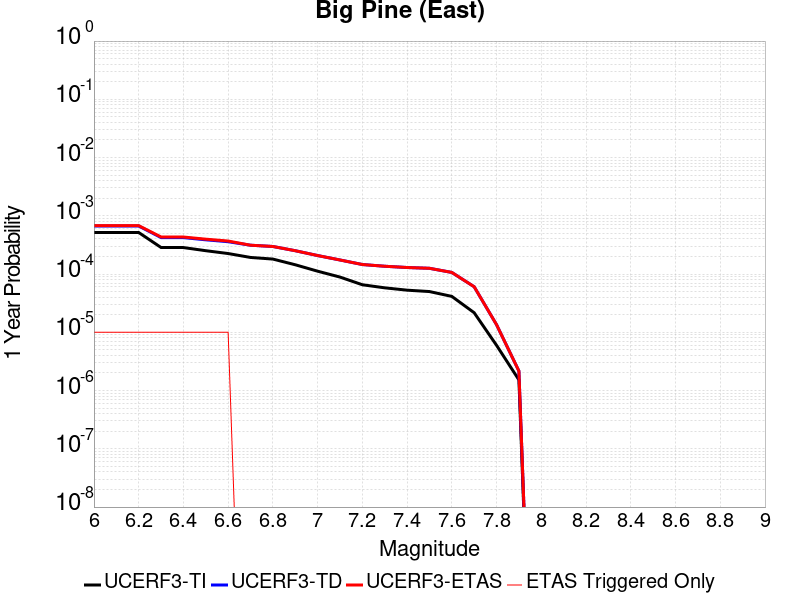 |  |

| Magnitude | 1 wk TI Prob | 1 wk TD Prob | 1 wk ETAS Prob | 1 wk ETAS/TD Gain | 1 wk ETAS Triggered Only | 1 mo TI Prob | 1 mo TD Prob | 1 mo ETAS Prob | 1 mo ETAS/TD Gain | 1 mo ETAS Triggered Only | 1 yr TI Prob | 1 yr TD Prob | 1 yr ETAS Prob | 1 yr ETAS/TD Gain | 1 yr ETAS Triggered Only | 10 yr TI Prob | 10 yr TD Prob | 10 yr ETAS Prob | 10 yr ETAS/TD Gain | 10 yr ETAS Triggered Only |
|-----|-----|-----|-----|-----|-----|-----|-----|-----|-----|-----|-----|-----|-----|-----|-----|-----|-----|-----|-----|-----|
| 6.0 | 9.916913E-6 | 1.2816984E-5 | 2.2816856E-5 | 1.7802048 | 1.0E-5 | 4.250036E-5 | 5.49289E-5 | 6.4928354E-5 | 1.1820436 | 1.0E-5 | 5.173191E-4 | 6.685763E-4 | 6.785696E-4 | 1.0149472 | 1.0E-5 | 0.0051611643 | 0.006670441 | 0.0066803745 | 1.0014892 | 1.0E-5 |
| 6.1 | 9.916913E-6 | 1.2816984E-5 | 2.2816856E-5 | 1.7802048 | 1.0E-5 | 4.250036E-5 | 5.49289E-5 | 6.4928354E-5 | 1.1820436 | 1.0E-5 | 5.173191E-4 | 6.685763E-4 | 6.785696E-4 | 1.0149472 | 1.0E-5 | 0.0051611643 | 0.006670441 | 0.0066803745 | 1.0014892 | 1.0E-5 |
| 6.2 | 9.916913E-6 | 1.2816984E-5 | 2.2816856E-5 | 1.7802048 | 1.0E-5 | 4.250036E-5 | 5.49289E-5 | 6.4928354E-5 | 1.1820436 | 1.0E-5 | 5.173191E-4 | 6.685763E-4 | 6.785696E-4 | 1.0149472 | 1.0E-5 | 0.0051611643 | 0.006670441 | 0.0066803745 | 1.0014892 | 1.0E-5 |
| 6.3 | 5.479711E-6 | 8.112951E-6 | 1.811287E-5 | 2.232587 | 1.0E-5 | 2.3484265E-5 | 3.4769346E-5 | 4.4769E-5 | 1.2875997 | 1.0E-5 | 2.858834E-4 | 4.2323777E-4 | 4.3323354E-4 | 1.0236174 | 1.0E-5 | 0.0028551589 | 0.004227244 | 0.0042372015 | 1.0023556 | 1.0E-5 |
| 6.4 | 5.465009E-6 | 8.097245E-6 | 1.8097164E-5 | 2.234978 | 1.0E-5 | 2.3421257E-5 | 3.4702036E-5 | 4.4701686E-5 | 1.2881576 | 1.0E-5 | 2.851165E-4 | 4.2241855E-4 | 4.3241432E-4 | 1.0236632 | 1.0E-5 | 0.0028475097 | 0.0042190826 | 0.0042290404 | 1.0023602 | 1.0E-5 |
| 6.5 | 4.826767E-6 | 7.422301E-6 | 1.7422228E-5 | 2.347281 | 1.0E-5 | 2.068598E-5 | 3.180949E-5 | 4.1809173E-5 | 1.3143616 | 1.0E-5 | 2.518227E-4 | 3.872145E-4 | 3.9721062E-4 | 1.0258155 | 1.0E-5 | 0.0025153751 | 0.003868283 | 0.0038782442 | 1.0025752 | 1.0E-5 |
| 6.6 | 4.3146847E-6 | 6.8822374E-6 | 1.6882168E-5 | 2.4530058 | 1.0E-5 | 1.8491375E-5 | 2.9494982E-5 | 3.9494687E-5 | 1.3390307 | 1.0E-5 | 2.2510924E-4 | 3.590447E-4 | 3.690411E-4 | 1.0278417 | 1.0E-5 | 0.0022488134 | 0.0035874986 | 0.0035974625 | 1.0027775 | 1.0E-5 |
| 6.7 | 3.6968106E-6 | 5.9954727E-6 | 5.9954727E-6 | 1.0 | 0.0 | 1.5843378E-5 | 2.5694639E-5 | 2.5694639E-5 | 1.0 | 0.0 | 1.9287605E-4 | 3.1278885E-4 | 3.1278885E-4 | 1.0 | 0.0 | 0.0019270873 | 0.0031262483 | 0.0031262483 | 1.0 | 0.0 |
| 6.8 | 3.4671132E-6 | 5.702177E-6 | 5.702177E-6 | 1.0 | 0.0 | 1.4858972E-5 | 2.4437682E-5 | 2.4437682E-5 | 1.0 | 0.0 | 1.8089297E-4 | 2.974896E-4 | 2.974896E-4 | 1.0 | 0.0 | 0.0018074579 | 0.002973667 | 0.002973667 | 1.0 | 0.0 |
| 6.9 | 2.7686972E-6 | 4.825223E-6 | 4.825223E-6 | 1.0 | 0.0 | 1.1865792E-5 | 2.0679368E-5 | 2.0679368E-5 | 1.0 | 0.0 | 1.4445644E-4 | 2.5174298E-4 | 2.5174298E-4 | 1.0 | 0.0 | 0.0014436257 | 0.0025172636 | 0.0025172636 | 1.0 | 0.0 |
| 7.0 | 2.1472624E-6 | 3.9850406E-6 | 3.9850406E-6 | 1.0 | 0.0 | 9.20252E-6 | 1.7078637E-5 | 1.7078637E-5 | 1.0 | 0.0 | 1.12034926E-4 | 2.079131E-4 | 2.079131E-4 | 1.0 | 0.0 | 0.0011197845 | 0.0020798394 | 0.0020798394 | 1.0 | 0.0 |
| 7.1 | 1.7018335E-6 | 3.344876E-6 | 3.344876E-6 | 1.0 | 0.0 | 7.293552E-6 | 1.4335106E-5 | 1.4335106E-5 | 1.0 | 0.0 | 8.879537E-5 | 1.7451629E-4 | 1.7451629E-4 | 1.0 | 0.0 | 8.87599E-4 | 0.0017464145 | 0.0017464145 | 1.0 | 0.0 |
| 7.2 | 1.25603E-6 | 2.794484E-6 | 2.794484E-6 | 1.0 | 0.0 | 5.3829745E-6 | 1.1976307E-5 | 1.1976307E-5 | 1.0 | 0.0 | 6.553574E-5 | 1.4580201E-4 | 1.4580201E-4 | 1.0 | 0.0 | 6.551642E-4 | 0.001459661 | 0.001459661 | 1.0 | 0.0 |
| 7.3 | 1.112297E-6 | 2.610332E-6 | 2.610332E-6 | 1.0 | 0.0 | 4.7669787E-6 | 1.118709E-5 | 1.118709E-5 | 1.0 | 0.0 | 5.803642E-5 | 1.3619453E-4 | 1.3619453E-4 | 1.0 | 0.0 | 5.802127E-4 | 0.0013635408 | 0.0013635408 | 1.0 | 0.0 |
| 7.4 | 1.0137181E-6 | 2.4834917E-6 | 2.4834917E-6 | 1.0 | 0.0 | 4.3444993E-6 | 1.0643494E-5 | 1.0643494E-5 | 1.0 | 0.0 | 5.2892992E-5 | 1.2957705E-4 | 1.2957705E-4 | 1.0 | 0.0 | 5.288041E-4 | 0.0012972289 | 0.0012972289 | 1.0 | 0.0 |
| 7.5 | 9.598608E-7 | 2.4071483E-6 | 2.4071483E-6 | 1.0 | 0.0 | 4.1136827E-6 | 1.031631E-5 | 1.031631E-5 | 1.0 | 0.0 | 5.0082934E-5 | 1.2559404E-4 | 1.2559404E-4 | 1.0 | 0.0 | 5.007165E-4 | 0.0012572526 | 0.0012572526 | 1.0 | 0.0 |
| 7.6 | 7.929459E-7 | 2.0448588E-6 | 2.0448588E-6 | 1.0 | 0.0 | 3.3983351E-6 | 8.763653E-6 | 8.763653E-6 | 1.0 | 0.0 | 4.1373947E-5 | 1.06692416E-4 | 1.06692416E-4 | 1.0 | 0.0 | 4.1366243E-4 | 0.0010685222 | 0.0010685222 | 1.0 | 0.0 |
| 7.7 | 4.155788E-7 | 1.1605589E-6 | 1.1605589E-6 | 1.0 | 0.0 | 1.7810507E-6 | 4.9738146E-6 | 4.9738146E-6 | 1.0 | 0.0 | 2.1684076E-5 | 6.0554554E-5 | 6.0554554E-5 | 1.0 | 0.0 | 2.1681961E-4 | 6.0857297E-4 | 6.0857297E-4 | 1.0 | 0.0 |
| 7.8 | 1.14666925E-7 | 2.592015E-7 | 2.592015E-7 | 1.0 | 0.0 | 4.914296E-7 | 1.1108631E-6 | 1.1108631E-6 | 1.0 | 0.0 | 5.9831386E-6 | 1.3524678E-5 | 1.3524678E-5 | 1.0 | 0.0 | 5.9829777E-5 | 1.3634123E-4 | 1.3634123E-4 | 1.0 | 0.0 |
| 7.9 | 2.9231824E-8 | 4.1463963E-8 | 4.1463963E-8 | 1.0 | 0.0 | 1.2527924E-7 | 1.7770269E-7 | 1.7770269E-7 | 1.0 | 0.0 | 1.5252737E-6 | 2.1635283E-6 | 2.1635283E-6 | 1.0 | 0.0 | 1.5252632E-5 | 2.1967755E-5 | 2.1967755E-5 | 1.0 | 0.0 |

## San Diego Trough south
*[(top)](#table-of-contents)*

| 1 Week | 1 Month | 1 Year | 10 Year |
|-----|-----|-----|-----|
|  |  |  |  |

| Magnitude | 1 wk TI Prob | 1 wk TD Prob | 1 wk ETAS Prob | 1 wk ETAS/TD Gain | 1 wk ETAS Triggered Only | 1 mo TI Prob | 1 mo TD Prob | 1 mo ETAS Prob | 1 mo ETAS/TD Gain | 1 mo ETAS Triggered Only | 1 yr TI Prob | 1 yr TD Prob | 1 yr ETAS Prob | 1 yr ETAS/TD Gain | 1 yr ETAS Triggered Only | 10 yr TI Prob | 10 yr TD Prob | 10 yr ETAS Prob | 10 yr ETAS/TD Gain | 10 yr ETAS Triggered Only |
|-----|-----|-----|-----|-----|-----|-----|-----|-----|-----|-----|-----|-----|-----|-----|-----|-----|-----|-----|-----|-----|
| 6.0 | 8.279495E-5 | 1.04241306E-4 | 1.1424026E-4 | 1.0959213 | 1.0E-5 | 3.5478722E-4 | 4.4667677E-4 | 4.566723E-4 | 1.0223776 | 1.0E-5 | 0.004310982 | 0.0054256152 | 0.0054355613 | 1.0018331 | 1.0E-5 | 0.042283054 | 0.05299221 | 0.05300168 | 1.0001787 | 1.0E-5 |
| 6.1 | 4.6961468E-5 | 5.772944E-5 | 5.772944E-5 | 1.0 | 0.0 | 2.0124791E-4 | 2.473894E-4 | 2.473894E-4 | 1.0 | 0.0 | 0.00244744 | 0.0030079768 | 0.0030079768 | 1.0 | 0.0 | 0.024206603 | 0.029679462 | 0.029679462 | 1.0 | 0.0 |
| 6.2 | 3.5079658E-5 | 4.214154E-5 | 4.214154E-5 | 1.0 | 0.0 | 1.5033272E-4 | 1.8059435E-4 | 1.8059435E-4 | 1.0 | 0.0 | 0.0018287642 | 0.0021965632 | 0.0021965632 | 1.0 | 0.0 | 0.018137876 | 0.021751117 | 0.021751117 | 1.0 | 0.0 |
| 6.3 | 3.5079658E-5 | 4.214154E-5 | 4.214154E-5 | 1.0 | 0.0 | 1.5033272E-4 | 1.8059435E-4 | 1.8059435E-4 | 1.0 | 0.0 | 0.0018287642 | 0.0021965632 | 0.0021965632 | 1.0 | 0.0 | 0.018137876 | 0.021751117 | 0.021751117 | 1.0 | 0.0 |
| 6.4 | 2.7196904E-5 | 3.2087162E-5 | 3.2087162E-5 | 1.0 | 0.0 | 1.16552954E-4 | 1.3750927E-4 | 1.3750927E-4 | 1.0 | 0.0 | 0.0014181085 | 0.0016729041 | 0.0016729041 | 1.0 | 0.0 | 0.014090929 | 0.016604643 | 0.016604643 | 1.0 | 0.0 |
| 6.5 | 2.5584688E-5 | 3.010164E-5 | 3.010164E-5 | 1.0 | 0.0 | 1.0964406E-4 | 1.2900073E-4 | 1.2900073E-4 | 1.0 | 0.0 | 0.0013340989 | 0.0015694655 | 0.0015694655 | 1.0 | 0.0 | 0.013261181 | 0.015585314 | 0.015585314 | 1.0 | 0.0 |
| 6.6 | 2.2034688E-5 | 2.5742738E-5 | 2.5742738E-5 | 1.0 | 0.0 | 9.443096E-5 | 1.1032141E-4 | 1.1032141E-4 | 1.0 | 0.0 | 0.0011490905 | 0.0013423424 | 0.0013423424 | 1.0 | 0.0 | 0.011431668 | 0.013343317 | 0.013343317 | 1.0 | 0.0 |
| 6.7 | 1.9394853E-5 | 2.254176E-5 | 2.254176E-5 | 1.0 | 0.0 | 8.311815E-5 | 9.6603995E-5 | 9.6603995E-5 | 1.0 | 0.0 | 0.0010114936 | 0.0011755243 | 0.0011755243 | 1.0 | 0.0 | 0.01006902 | 0.011693766 | 0.011693766 | 1.0 | 0.0 |
| 6.8 | 1.7615313E-5 | 2.0403182E-5 | 2.0403182E-5 | 1.0 | 0.0 | 7.549201E-5 | 8.74393E-5 | 8.74393E-5 | 1.0 | 0.0 | 9.1872766E-4 | 0.0010640579 | 0.0010640579 | 1.0 | 0.0 | 0.009149387 | 0.010590198 | 0.010590198 | 1.0 | 0.0 |
| 6.9 | 1.5621423E-5 | 1.8026114E-5 | 1.8026114E-5 | 1.0 | 0.0 | 6.6947236E-5 | 7.725251E-5 | 7.725251E-5 | 1.0 | 0.0 | 8.147778E-4 | 9.40147E-4 | 9.40147E-4 | 1.0 | 0.0 | 0.008117969 | 0.009362142 | 0.009362142 | 1.0 | 0.0 |
| 7.0 | 1.3444376E-5 | 1.544809E-5 | 1.544809E-5 | 1.0 | 0.0 | 5.7617483E-5 | 6.620443E-5 | 6.620443E-5 | 1.0 | 0.0 | 7.0126704E-4 | 8.057436E-4 | 8.057436E-4 | 1.0 | 0.0 | 0.006990582 | 0.008028555 | 0.008028555 | 1.0 | 0.0 |
| 7.1 | 1.2268361E-5 | 1.407303E-5 | 1.407303E-5 | 1.0 | 0.0 | 5.2577634E-5 | 6.0311606E-5 | 6.0311606E-5 | 1.0 | 0.0 | 6.399447E-4 | 7.3404907E-4 | 7.3404907E-4 | 1.0 | 0.0 | 0.0063810493 | 0.0073165493 | 0.0073165493 | 1.0 | 0.0 |
| 7.2 | 1.0922655E-5 | 1.2513563E-5 | 1.2513563E-5 | 1.0 | 0.0 | 4.681054E-5 | 5.3628468E-5 | 5.3628468E-5 | 1.0 | 0.0 | 5.697693E-4 | 6.5273355E-4 | 6.5273355E-4 | 1.0 | 0.0 | 0.0056831064 | 0.0065084435 | 0.0065084435 | 1.0 | 0.0 |
| 7.3 | 6.1106753E-6 | 6.928925E-6 | 6.928925E-6 | 1.0 | 0.0 | 2.6188345E-5 | 2.9695057E-5 | 2.9695057E-5 | 1.0 | 0.0 | 3.1879646E-4 | 3.6147775E-4 | 3.6147775E-4 | 1.0 | 0.0 | 0.0031833951 | 0.003608943 | 0.003608943 | 1.0 | 0.0 |
| 7.4 | 4.933187E-6 | 5.5895525E-6 | 5.5895525E-6 | 1.0 | 0.0 | 2.114206E-5 | 2.3955008E-5 | 2.3955008E-5 | 1.0 | 0.0 | 2.5737417E-4 | 2.9161357E-4 | 2.9161357E-4 | 1.0 | 0.0 | 0.002570763 | 0.0029123505 | 0.0029123505 | 1.0 | 0.0 |
| 7.5 | 1.7489613E-6 | 1.969678E-6 | 1.969678E-6 | 1.0 | 0.0 | 7.495527E-6 | 8.4414505E-6 | 8.4414505E-6 | 1.0 | 0.0 | 9.125422E-5 | 1.02770035E-4 | 1.02770035E-4 | 1.0 | 0.0 | 9.1216754E-4 | 0.0010272472 | 0.0010272472 | 1.0 | 0.0 |
| 7.6 | 1.6988751E-7 | 1.7533823E-7 | 1.7533823E-7 | 1.0 | 0.0 | 7.2808916E-7 | 7.5144936E-7 | 7.5144936E-7 | 1.0 | 0.0 | 8.864449E-6 | 9.14886E-6 | 9.14886E-6 | 1.0 | 0.0 | 8.8640954E-5 | 9.1485024E-5 | 9.1485024E-5 | 1.0 | 0.0 |

## Malibu Coast alt 1
*[(top)](#table-of-contents)*

| 1 Week | 1 Month | 1 Year | 10 Year |
|-----|-----|-----|-----|
|  |  |  |  |

| Magnitude | 1 wk TI Prob | 1 wk TD Prob | 1 wk ETAS Prob | 1 wk ETAS/TD Gain | 1 wk ETAS Triggered Only | 1 mo TI Prob | 1 mo TD Prob | 1 mo ETAS Prob | 1 mo ETAS/TD Gain | 1 mo ETAS Triggered Only | 1 yr TI Prob | 1 yr TD Prob | 1 yr ETAS Prob | 1 yr ETAS/TD Gain | 1 yr ETAS Triggered Only | 10 yr TI Prob | 10 yr TD Prob | 10 yr ETAS Prob | 10 yr ETAS/TD Gain | 10 yr ETAS Triggered Only |
|-----|-----|-----|-----|-----|-----|-----|-----|-----|-----|-----|-----|-----|-----|-----|-----|-----|-----|-----|-----|-----|
| 6.0 | 1.6572556E-5 | 1.7598066E-5 | 2.7597891E-5 | 1.5682342 | 1.0E-5 | 7.102331E-5 | 7.541821E-5 | 8.541746E-5 | 1.132584 | 1.0E-5 | 8.6436566E-4 | 9.178488E-4 | 9.278396E-4 | 1.010885 | 1.0E-5 | 0.0086101135 | 0.009142512 | 0.009152421 | 1.0010837 | 1.0E-5 |
| 6.1 | 1.6572556E-5 | 1.7598066E-5 | 1.7598066E-5 | 1.0 | 0.0 | 7.102331E-5 | 7.541821E-5 | 7.541821E-5 | 1.0 | 0.0 | 8.6436566E-4 | 9.178488E-4 | 9.178488E-4 | 1.0 | 0.0 | 0.0086101135 | 0.009142512 | 0.009142512 | 1.0 | 0.0 |
| 6.2 | 1.1085717E-5 | 1.1557147E-5 | 1.1557147E-5 | 1.0 | 0.0 | 4.750935E-5 | 4.952971E-5 | 4.952971E-5 | 1.0 | 0.0 | 5.782728E-4 | 6.028609E-4 | 6.028609E-4 | 1.0 | 0.0 | 0.0057677035 | 0.0060126255 | 0.0060126255 | 1.0 | 0.0 |
| 6.3 | 1.0208568E-5 | 1.0592237E-5 | 1.0592237E-5 | 1.0 | 0.0 | 4.375027E-5 | 4.539453E-5 | 4.539453E-5 | 1.0 | 0.0 | 5.325294E-4 | 5.5254117E-4 | 5.5254117E-4 | 1.0 | 0.0 | 0.0053125503 | 0.0055119814 | 0.0055119814 | 1.0 | 0.0 |
| 6.4 | 9.0682315E-6 | 9.342637E-6 | 9.342637E-6 | 1.0 | 0.0 | 3.8863272E-5 | 4.003927E-5 | 4.003927E-5 | 1.0 | 0.0 | 4.730576E-4 | 4.8737114E-4 | 4.8737114E-4 | 1.0 | 0.0 | 0.0047205184 | 0.004863236 | 0.004863236 | 1.0 | 0.0 |
| 6.5 | 7.605796E-6 | 7.748587E-6 | 7.748587E-6 | 1.0 | 0.0 | 3.259586E-5 | 3.3207816E-5 | 3.3207816E-5 | 1.0 | 0.0 | 3.9678233E-4 | 4.0423148E-4 | 4.0423148E-4 | 1.0 | 0.0 | 0.0039607463 | 0.0040351 | 0.0040351 | 1.0 | 0.0 |
| 6.6 | 5.889873E-6 | 5.8795385E-6 | 5.8795385E-6 | 1.0 | 0.0 | 2.5242069E-5 | 2.519778E-5 | 2.519778E-5 | 1.0 | 0.0 | 3.0727885E-4 | 3.0673988E-4 | 3.0673988E-4 | 1.0 | 0.0 | 0.003068543 | 0.0030631777 | 0.0030631777 | 1.0 | 0.0 |
| 6.7 | 5.66586E-6 | 5.641641E-6 | 5.641641E-6 | 1.0 | 0.0 | 2.428203E-5 | 2.417824E-5 | 2.417824E-5 | 1.0 | 0.0 | 2.955936E-4 | 2.9433038E-4 | 2.9433038E-4 | 1.0 | 0.0 | 0.0029520073 | 0.0029394177 | 0.0029394177 | 1.0 | 0.0 |
| 6.8 | 5.521556E-6 | 5.489427E-6 | 5.489427E-6 | 1.0 | 0.0 | 2.3663597E-5 | 2.3525903E-5 | 2.3525903E-5 | 1.0 | 0.0 | 2.880662E-4 | 2.8639034E-4 | 2.8639034E-4 | 1.0 | 0.0 | 0.0028769306 | 0.002860224 | 0.002860224 | 1.0 | 0.0 |
| 6.9 | 5.29752E-6 | 5.2499317E-6 | 5.2499317E-6 | 1.0 | 0.0 | 2.270346E-5 | 2.2499513E-5 | 2.2499513E-5 | 1.0 | 0.0 | 2.7637955E-4 | 2.7389723E-4 | 2.7389723E-4 | 1.0 | 0.0 | 0.0027603607 | 0.0027356069 | 0.0027356069 | 1.0 | 0.0 |
| 7.0 | 5.106743E-6 | 5.0476788E-6 | 5.0476788E-6 | 1.0 | 0.0 | 2.1885859E-5 | 2.163273E-5 | 2.163273E-5 | 1.0 | 0.0 | 2.6642776E-4 | 2.6334674E-4 | 2.6334674E-4 | 1.0 | 0.0 | 0.0026610855 | 0.0026303562 | 0.0026303562 | 1.0 | 0.0 |
| 7.1 | 4.8469647E-6 | 4.770373E-6 | 4.770373E-6 | 1.0 | 0.0 | 2.0772539E-5 | 2.0444295E-5 | 2.0444295E-5 | 1.0 | 0.0 | 2.528763E-4 | 2.4888094E-4 | 2.4888094E-4 | 1.0 | 0.0 | 0.0025258875 | 0.00248603 | 0.00248603 | 1.0 | 0.0 |
| 7.2 | 4.545514E-6 | 4.4481935E-6 | 4.4481935E-6 | 1.0 | 0.0 | 1.9480629E-5 | 1.9063547E-5 | 1.9063547E-5 | 1.0 | 0.0 | 2.3715083E-4 | 2.3207403E-4 | 2.3207403E-4 | 1.0 | 0.0 | 0.0023689792 | 0.0023183243 | 0.0023183243 | 1.0 | 0.0 |
| 7.3 | 3.794097E-6 | 3.6519348E-6 | 3.6519348E-6 | 1.0 | 0.0 | 1.6260314E-5 | 1.5651056E-5 | 1.5651056E-5 | 1.0 | 0.0 | 1.9795135E-4 | 1.9053498E-4 | 1.9053498E-4 | 1.0 | 0.0 | 0.001977751 | 0.0019037209 | 0.0019037209 | 1.0 | 0.0 |
| 7.4 | 2.808217E-6 | 2.719077E-6 | 2.719077E-6 | 1.0 | 0.0 | 1.203516E-5 | 1.1653135E-5 | 1.1653135E-5 | 1.0 | 0.0 | 1.4651821E-4 | 1.418677E-4 | 1.418677E-4 | 1.0 | 0.0 | 0.0014642165 | 0.001417774 | 0.001417774 | 1.0 | 0.0 |
| 7.5 | 1.83809E-6 | 1.8190691E-6 | 1.8190691E-6 | 1.0 | 0.0 | 7.877505E-6 | 7.795988E-6 | 7.795988E-6 | 1.0 | 0.0 | 9.59044E-5 | 9.491203E-5 | 9.491203E-5 | 1.0 | 0.0 | 9.5863023E-4 | 9.48717E-4 | 9.48717E-4 | 1.0 | 0.0 |
| 7.6 | 1.1292672E-6 | 1.1001447E-6 | 1.1001447E-6 | 1.0 | 0.0 | 4.839708E-6 | 4.714897E-6 | 4.714897E-6 | 1.0 | 0.0 | 5.8921847E-5 | 5.7402376E-5 | 5.7402376E-5 | 1.0 | 0.0 | 5.890623E-4 | 5.738771E-4 | 5.738771E-4 | 1.0 | 0.0 |
| 7.7 | 5.065272E-7 | 4.609151E-7 | 4.609151E-7 | 1.0 | 0.0 | 2.170829E-6 | 1.975349E-6 | 1.975349E-6 | 1.0 | 0.0 | 2.6429525E-5 | 2.404962E-5 | 2.404962E-5 | 1.0 | 0.0 | 2.642638E-4 | 2.4047129E-4 | 2.4047129E-4 | 1.0 | 0.0 |
| 7.8 | 8.952991E-8 | 6.707874E-8 | 6.707874E-8 | 1.0 | 0.0 | 3.8369956E-7 | 2.8748025E-7 | 2.8748025E-7 | 1.0 | 0.0 | 4.671532E-6 | 3.5000667E-6 | 3.5000667E-6 | 1.0 | 0.0 | 4.671434E-5 | 3.5000136E-5 | 3.5000136E-5 | 1.0 | 0.0 |
| 7.9 | 8.007447E-10 | 6.1608785E-10 | 6.1608785E-10 | 1.0 | 0.0 | 3.4317629E-9 | 2.6403764E-9 | 2.6403764E-9 | 1.0 | 0.0 | 4.1781714E-8 | 3.2146584E-8 | 3.2146584E-8 | 1.0 | 0.0 | 4.1781706E-7 | 3.214658E-7 | 3.214658E-7 | 1.0 | 0.0 |

## Verdugo
*[(top)](#table-of-contents)*

| 1 Week | 1 Month | 1 Year | 10 Year |
|-----|-----|-----|-----|
|  |  |  |  |

| Magnitude | 1 wk TI Prob | 1 wk TD Prob | 1 wk ETAS Prob | 1 wk ETAS/TD Gain | 1 wk ETAS Triggered Only | 1 mo TI Prob | 1 mo TD Prob | 1 mo ETAS Prob | 1 mo ETAS/TD Gain | 1 mo ETAS Triggered Only | 1 yr TI Prob | 1 yr TD Prob | 1 yr ETAS Prob | 1 yr ETAS/TD Gain | 1 yr ETAS Triggered Only | 10 yr TI Prob | 10 yr TD Prob | 10 yr ETAS Prob | 10 yr ETAS/TD Gain | 10 yr ETAS Triggered Only |
|-----|-----|-----|-----|-----|-----|-----|-----|-----|-----|-----|-----|-----|-----|-----|-----|-----|-----|-----|-----|-----|
| 6.0 | 5.392987E-6 | 4.216517E-6 | 4.216517E-6 | 1.0 | 0.0 | 2.3112598E-5 | 1.8070665E-5 | 2.8070484E-5 | 1.5533731 | 1.0E-5 | 2.8135953E-4 | 2.1998861E-4 | 2.2998641E-4 | 1.0454469 | 1.0E-5 | 0.0028100356 | 0.0021977562 | 0.0022077342 | 1.0045401 | 1.0E-5 |
| 6.1 | 5.392987E-6 | 4.216517E-6 | 4.216517E-6 | 1.0 | 0.0 | 2.3112598E-5 | 1.8070665E-5 | 2.8070484E-5 | 1.5533731 | 1.0E-5 | 2.8135953E-4 | 2.1998861E-4 | 2.2998641E-4 | 1.0454469 | 1.0E-5 | 0.0028100356 | 0.0021977562 | 0.0022077342 | 1.0045401 | 1.0E-5 |
| 6.2 | 5.392987E-6 | 4.216517E-6 | 4.216517E-6 | 1.0 | 0.0 | 2.3112598E-5 | 1.8070665E-5 | 2.8070484E-5 | 1.5533731 | 1.0E-5 | 2.8135953E-4 | 2.1998861E-4 | 2.2998641E-4 | 1.0454469 | 1.0E-5 | 0.0028100356 | 0.0021977562 | 0.0022077342 | 1.0045401 | 1.0E-5 |
| 6.3 | 5.392987E-6 | 4.216517E-6 | 4.216517E-6 | 1.0 | 0.0 | 2.3112598E-5 | 1.8070665E-5 | 2.8070484E-5 | 1.5533731 | 1.0E-5 | 2.8135953E-4 | 2.1998861E-4 | 2.2998641E-4 | 1.0454469 | 1.0E-5 | 0.0028100356 | 0.0021977562 | 0.0022077342 | 1.0045401 | 1.0E-5 |
| 6.4 | 5.392987E-6 | 4.216517E-6 | 4.216517E-6 | 1.0 | 0.0 | 2.3112598E-5 | 1.8070665E-5 | 2.8070484E-5 | 1.5533731 | 1.0E-5 | 2.8135953E-4 | 2.1998861E-4 | 2.2998641E-4 | 1.0454469 | 1.0E-5 | 0.0028100356 | 0.0021977562 | 0.0022077342 | 1.0045401 | 1.0E-5 |
| 6.5 | 4.9154837E-6 | 3.722465E-6 | 3.722465E-6 | 1.0 | 0.0 | 2.1066187E-5 | 1.5953325E-5 | 2.5953166E-5 | 1.6268185 | 1.0E-5 | 2.5645064E-4 | 1.9421462E-4 | 2.0421269E-4 | 1.0514795 | 1.0E-5 | 0.002561549 | 0.0019404698 | 0.0019504504 | 1.0051434 | 1.0E-5 |
| 6.6 | 4.9154837E-6 | 3.722465E-6 | 3.722465E-6 | 1.0 | 0.0 | 2.1066187E-5 | 1.5953325E-5 | 2.5953166E-5 | 1.6268185 | 1.0E-5 | 2.5645064E-4 | 1.9421462E-4 | 2.0421269E-4 | 1.0514795 | 1.0E-5 | 0.002561549 | 0.0019404698 | 0.0019504504 | 1.0051434 | 1.0E-5 |
| 6.7 | 4.817006E-6 | 3.6206518E-6 | 3.6206518E-6 | 1.0 | 0.0 | 2.0644147E-5 | 1.5516987E-5 | 2.5516832E-5 | 1.644445 | 1.0E-5 | 2.513135E-4 | 1.8890314E-4 | 1.9890125E-4 | 1.0529271 | 1.0E-5 | 0.0025102948 | 0.0018874453 | 0.0018974264 | 1.0052881 | 1.0E-5 |
| 6.8 | 4.507407E-6 | 3.3071042E-6 | 3.3071042E-6 | 1.0 | 0.0 | 1.9317316E-5 | 1.4173227E-5 | 2.4173085E-5 | 1.7055457 | 1.0E-5 | 2.3516294E-4 | 1.7254551E-4 | 1.825438E-4 | 1.0579457 | 1.0E-5 | 0.0023491425 | 0.0017241298 | 0.0017341125 | 1.00579 | 1.0E-5 |
| 6.9 | 4.3573054E-6 | 3.161011E-6 | 3.161011E-6 | 1.0 | 0.0 | 1.8674033E-5 | 1.354712E-5 | 2.3546985E-5 | 1.7381543 | 1.0E-5 | 2.2733262E-4 | 1.6492383E-4 | 1.7492217E-4 | 1.060624 | 1.0E-5 | 0.0022710022 | 0.0016480266 | 0.0016580102 | 1.0060579 | 1.0E-5 |
| 7.0 | 4.171527E-6 | 2.9836704E-6 | 2.9836704E-6 | 1.0 | 0.0 | 1.787785E-5 | 1.2787096E-5 | 2.2786968E-5 | 1.7820283 | 1.0E-5 | 2.1764109E-4 | 1.5567189E-4 | 1.6567032E-4 | 1.0642277 | 1.0E-5 | 0.0021742806 | 0.0015556397 | 0.0015656241 | 1.0064182 | 1.0E-5 |
| 7.1 | 4.0405484E-6 | 2.882261E-6 | 2.882261E-6 | 1.0 | 0.0 | 1.731652E-5 | 1.235249E-5 | 2.2352366E-5 | 1.8095434 | 1.0E-5 | 2.1080824E-4 | 1.503813E-4 | 1.6037979E-4 | 1.0664877 | 1.0E-5 | 0.0021060838 | 0.0015028063 | 0.0015127913 | 1.0066442 | 1.0E-5 |
| 7.2 | 3.8306007E-6 | 2.7018452E-6 | 2.7018452E-6 | 1.0 | 0.0 | 1.6416758E-5 | 1.15792855E-5 | 2.157917E-5 | 1.8636011 | 1.0E-5 | 1.9985568E-4 | 1.4096878E-4 | 1.5096737E-4 | 1.0709277 | 1.0E-5 | 0.0019967605 | 0.0014088044 | 0.0014187903 | 1.0070882 | 1.0E-5 |
| 7.3 | 3.5750938E-6 | 2.5121758E-6 | 2.5121758E-6 | 1.0 | 0.0 | 1.532174E-5 | 1.0766424E-5 | 2.0766316E-5 | 1.9288034 | 1.0E-5 | 1.8652623E-4 | 1.3107344E-4 | 1.4107212E-4 | 1.0762831 | 1.0E-5 | 0.0018636974 | 0.0013099718 | 0.0013199587 | 1.0076238 | 1.0E-5 |
| 7.4 | 3.3510041E-6 | 2.3408586E-6 | 2.3408586E-6 | 1.0 | 0.0 | 1.4361368E-5 | 1.0032213E-5 | 2.0032112E-5 | 1.9967791 | 1.0E-5 | 1.7483562E-4 | 1.2213545E-4 | 1.3213423E-4 | 1.0818663 | 1.0E-5 | 0.0017469813 | 0.0012206937 | 0.0012306814 | 1.008182 | 1.0E-5 |
| 7.5 | 2.948287E-6 | 2.0391124E-6 | 2.0391124E-6 | 1.0 | 0.0 | 1.2635454E-5 | 8.739024E-6 | 8.739024E-6 | 1.0 | 0.0 | 1.538258E-4 | 1.0639253E-4 | 1.0639253E-4 | 1.0 | 0.0 | 0.0015371935 | 0.0010634261 | 0.0010634261 | 1.0 | 0.0 |
| 7.6 | 2.0134323E-6 | 1.4471265E-6 | 1.4471265E-6 | 1.0 | 0.0 | 8.628967E-6 | 6.2019562E-6 | 6.2019562E-6 | 1.0 | 0.0 | 1.05052604E-4 | 7.550629E-5 | 7.550629E-5 | 1.0 | 0.0 | 0.0010500296 | 7.548152E-4 | 7.548152E-4 | 1.0 | 0.0 |
| 7.7 | 5.726436E-7 | 4.045248E-7 | 4.045248E-7 | 1.0 | 0.0 | 2.4541846E-6 | 1.7336766E-6 | 1.7336766E-6 | 1.0 | 0.0 | 2.9879287E-5 | 2.1107335E-5 | 2.1107335E-5 | 1.0 | 0.0 | 2.987527E-4 | 2.1105584E-4 | 2.1105584E-4 | 1.0 | 0.0 |
| 7.8 | 1.6248204E-7 | 1.0687696E-7 | 1.0687696E-7 | 1.0 | 0.0 | 6.963514E-7 | 4.5804404E-7 | 4.5804404E-7 | 1.0 | 0.0 | 8.478045E-6 | 5.5766723E-6 | 5.5766723E-6 | 1.0 | 0.0 | 8.477722E-5 | 5.5765355E-5 | 5.5765355E-5 | 1.0 | 0.0 |
| 7.9 | 4.4475744E-8 | 3.0375546E-8 | 3.0375546E-8 | 1.0 | 0.0 | 1.9061031E-7 | 1.301809E-7 | 1.301809E-7 | 1.0 | 0.0 | 2.320678E-6 | 1.5849514E-6 | 1.5849514E-6 | 1.0 | 0.0 | 2.3206538E-5 | 1.5849415E-5 | 1.5849415E-5 | 1.0 | 0.0 |

## Robinson Creek
*[(top)](#table-of-contents)*

| 1 Week | 1 Month | 1 Year | 10 Year |
|-----|-----|-----|-----|
|  |  |  |  |

| Magnitude | 1 wk TI Prob | 1 wk TD Prob | 1 wk ETAS Prob | 1 wk ETAS/TD Gain | 1 wk ETAS Triggered Only | 1 mo TI Prob | 1 mo TD Prob | 1 mo ETAS Prob | 1 mo ETAS/TD Gain | 1 mo ETAS Triggered Only | 1 yr TI Prob | 1 yr TD Prob | 1 yr ETAS Prob | 1 yr ETAS/TD Gain | 1 yr ETAS Triggered Only | 10 yr TI Prob | 10 yr TD Prob | 10 yr ETAS Prob | 10 yr ETAS/TD Gain | 10 yr ETAS Triggered Only |
|-----|-----|-----|-----|-----|-----|-----|-----|-----|-----|-----|-----|-----|-----|-----|-----|-----|-----|-----|-----|-----|
| 6.0 | 1.3705327E-5 | 1.5285013E-5 | 2.528486E-5 | 1.6542256 | 1.0E-5 | 5.8735794E-5 | 6.55072E-5 | 7.550655E-5 | 1.152645 | 1.0E-5 | 7.1487366E-4 | 7.9755014E-4 | 8.075422E-4 | 1.0125284 | 1.0E-5 | 0.0071257832 | 0.007975501 | 0.007985421 | 1.0012438 | 1.0E-5 |
| 6.1 | 1.3705327E-5 | 1.5285013E-5 | 2.528486E-5 | 1.6542256 | 1.0E-5 | 5.8735794E-5 | 6.55072E-5 | 7.550655E-5 | 1.152645 | 1.0E-5 | 7.1487366E-4 | 7.9755014E-4 | 8.075422E-4 | 1.0125284 | 1.0E-5 | 0.0071257832 | 0.007975501 | 0.007985421 | 1.0012438 | 1.0E-5 |
| 6.2 | 1.3705327E-5 | 1.5285013E-5 | 2.528486E-5 | 1.6542256 | 1.0E-5 | 5.8735794E-5 | 6.55072E-5 | 7.550655E-5 | 1.152645 | 1.0E-5 | 7.1487366E-4 | 7.9755014E-4 | 8.075422E-4 | 1.0125284 | 1.0E-5 | 0.0071257832 | 0.007975501 | 0.007985421 | 1.0012438 | 1.0E-5 |
| 6.3 | 1.3705327E-5 | 1.5285013E-5 | 2.528486E-5 | 1.6542256 | 1.0E-5 | 5.8735794E-5 | 6.55072E-5 | 7.550655E-5 | 1.152645 | 1.0E-5 | 7.1487366E-4 | 7.9755014E-4 | 8.075422E-4 | 1.0125284 | 1.0E-5 | 0.0071257832 | 0.007975501 | 0.007985421 | 1.0012438 | 1.0E-5 |
| 6.4 | 1.3705327E-5 | 1.5285013E-5 | 2.528486E-5 | 1.6542256 | 1.0E-5 | 5.8735794E-5 | 6.55072E-5 | 7.550655E-5 | 1.152645 | 1.0E-5 | 7.1487366E-4 | 7.9755014E-4 | 8.075422E-4 | 1.0125284 | 1.0E-5 | 0.0071257832 | 0.007975501 | 0.007985421 | 1.0012438 | 1.0E-5 |

## Bartlett Springs 2011 CFM
*[(top)](#table-of-contents)*

| 1 Week | 1 Month | 1 Year | 10 Year |
|-----|-----|-----|-----|
|  | 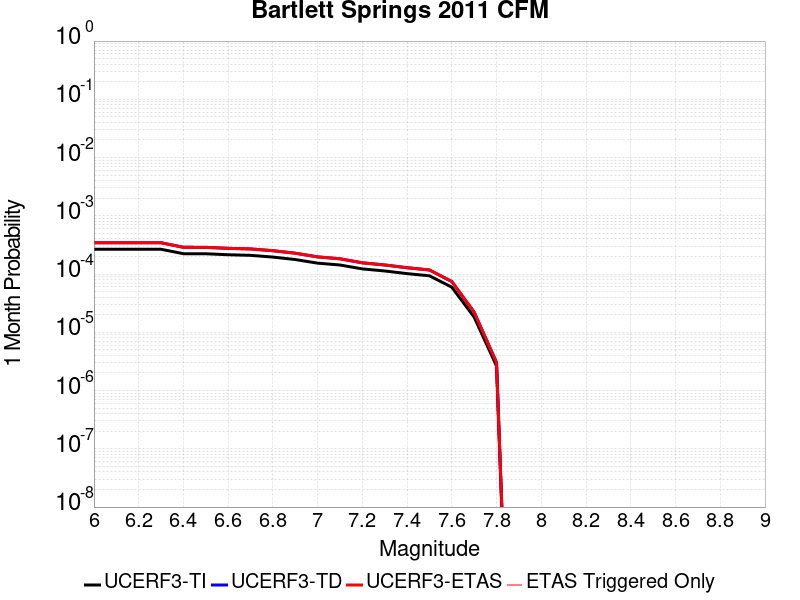 |  |  |

| Magnitude | 1 wk TI Prob | 1 wk TD Prob | 1 wk ETAS Prob | 1 wk ETAS/TD Gain | 1 wk ETAS Triggered Only | 1 mo TI Prob | 1 mo TD Prob | 1 mo ETAS Prob | 1 mo ETAS/TD Gain | 1 mo ETAS Triggered Only | 1 yr TI Prob | 1 yr TD Prob | 1 yr ETAS Prob | 1 yr ETAS/TD Gain | 1 yr ETAS Triggered Only | 10 yr TI Prob | 10 yr TD Prob | 10 yr ETAS Prob | 10 yr ETAS/TD Gain | 10 yr ETAS Triggered Only |
|-----|-----|-----|-----|-----|-----|-----|-----|-----|-----|-----|-----|-----|-----|-----|-----|-----|-----|-----|-----|-----|
| 6.0 | 6.2326144E-5 | 8.060613E-5 | 8.060613E-5 | 1.0 | 0.0 | 2.6708472E-4 | 3.454099E-4 | 3.454099E-4 | 1.0 | 0.0 | 0.003246908 | 0.0041973945 | 0.0042073526 | 1.0023724 | 1.0E-5 | 0.031998757 | 0.04119771 | 0.0412073 | 1.0002327 | 1.0E-5 |
| 6.1 | 6.227657E-5 | 8.054363E-5 | 8.054363E-5 | 1.0 | 0.0 | 2.668723E-4 | 3.4514212E-4 | 3.4514212E-4 | 1.0 | 0.0 | 0.0032443295 | 0.004194147 | 0.004204105 | 1.0023743 | 1.0E-5 | 0.031973712 | 0.041166443 | 0.041176032 | 1.0002329 | 1.0E-5 |
| 6.2 | 6.22452E-5 | 8.050423E-5 | 8.050423E-5 | 1.0 | 0.0 | 2.6673786E-4 | 3.4497332E-4 | 3.4497332E-4 | 1.0 | 0.0 | 0.0032426978 | 0.0041921 | 0.004202058 | 1.0023755 | 1.0E-5 | 0.03195787 | 0.041146737 | 0.041156325 | 1.000233 | 1.0E-5 |
| 6.3 | 6.219006E-5 | 8.043407E-5 | 8.043407E-5 | 1.0 | 0.0 | 2.6650162E-4 | 3.4467268E-4 | 3.4467268E-4 | 1.0 | 0.0 | 0.00323983 | 0.0041884542 | 0.0041984124 | 1.0023775 | 1.0E-5 | 0.031930014 | 0.041111637 | 0.041121226 | 1.0002333 | 1.0E-5 |
| 6.4 | 5.2175856E-5 | 6.725342E-5 | 6.725342E-5 | 1.0 | 0.0 | 2.2359163E-4 | 2.8819745E-4 | 2.8819745E-4 | 1.0 | 0.0 | 0.0027188298 | 0.0035032115 | 0.0035131765 | 1.0028446 | 1.0E-5 | 0.026858058 | 0.034489222 | 0.034498878 | 1.0002799 | 1.0E-5 |
| 6.5 | 5.205166E-5 | 6.7096094E-5 | 6.7096094E-5 | 1.0 | 0.0 | 2.2305945E-4 | 2.8752335E-4 | 2.8752335E-4 | 1.0 | 0.0 | 0.0027123666 | 0.0034950306 | 0.0035049957 | 1.0028512 | 1.0E-5 | 0.026794989 | 0.034409966 | 0.034419622 | 1.0002806 | 1.0E-5 |
| 6.6 | 5.0085426E-5 | 6.449277E-5 | 6.449277E-5 | 1.0 | 0.0 | 2.1463417E-4 | 2.763686E-4 | 2.763686E-4 | 1.0 | 0.0 | 0.0026100394 | 0.0033596456 | 0.003369612 | 1.0029665 | 1.0E-5 | 0.025795965 | 0.033097573 | 0.03310724 | 1.0002922 | 1.0E-5 |
| 6.7 | 4.8930866E-5 | 6.3017396E-5 | 6.3017396E-5 | 1.0 | 0.0 | 2.0968684E-4 | 2.7004688E-4 | 2.7004688E-4 | 1.0 | 0.0 | 0.0025499484 | 0.0032829174 | 0.0032928847 | 1.003036 | 1.0E-5 | 0.025208864 | 0.03235294 | 0.032362614 | 1.0002991 | 1.0E-5 |
| 6.8 | 4.5679535E-5 | 5.8741858E-5 | 5.8741858E-5 | 1.0 | 0.0 | 1.9575475E-4 | 2.5172674E-4 | 2.5172674E-4 | 1.0 | 0.0 | 0.002380709 | 0.0030605064 | 0.003070476 | 1.0032574 | 1.0E-5 | 0.023553653 | 0.03019042 | 0.030200118 | 1.0003213 | 1.0E-5 |
| 6.9 | 4.1439176E-5 | 5.3220094E-5 | 5.3220094E-5 | 1.0 | 0.0 | 1.7758438E-4 | 2.2806633E-4 | 2.2806633E-4 | 1.0 | 0.0 | 0.002159946 | 0.0027731995 | 0.0027831716 | 1.003596 | 1.0E-5 | 0.021390721 | 0.027390772 | 0.0274005 | 1.0003551 | 1.0E-5 |
| 7.0 | 3.5920104E-5 | 4.600871E-5 | 4.600871E-5 | 1.0 | 0.0 | 1.5393422E-4 | 1.9716538E-4 | 1.9716538E-4 | 1.0 | 0.0 | 0.001872538 | 0.0023978627 | 0.0024078388 | 1.0041604 | 1.0E-5 | 0.018568378 | 0.023723004 | 0.023732768 | 1.0004115 | 1.0E-5 |
| 7.1 | 3.338812E-5 | 4.2689582E-5 | 4.2689582E-5 | 1.0 | 0.0 | 1.430841E-4 | 1.829426E-4 | 1.829426E-4 | 1.0 | 0.0 | 0.0017406568 | 0.0022250658 | 0.0022350436 | 1.0044843 | 1.0E-5 | 0.017270854 | 0.02203054 | 0.02204032 | 1.0004439 | 1.0E-5 |
| 7.2 | 2.8619615E-5 | 3.6401652E-5 | 3.6401652E-5 | 1.0 | 0.0 | 1.2264973E-4 | 1.5599781E-4 | 1.5599781E-4 | 1.0 | 0.0 | 0.0014922376 | 0.0018976285 | 0.0019076095 | 1.0052598 | 1.0E-5 | 0.014822568 | 0.01881613 | 0.018825943 | 1.0005214 | 1.0E-5 |
| 7.3 | 2.6376783E-5 | 3.342276E-5 | 3.342276E-5 | 1.0 | 0.0 | 1.13038455E-4 | 1.4323258E-4 | 1.4323258E-4 | 1.0 | 0.0 | 0.0013753743 | 0.001742471 | 0.0017524536 | 1.005729 | 1.0E-5 | 0.01366893 | 0.01728972 | 0.017299548 | 1.0005684 | 1.0E-5 |
| 7.4 | 2.3738676E-5 | 2.9978975E-5 | 2.9978975E-5 | 1.0 | 0.0 | 1.0173322E-4 | 1.2847505E-4 | 1.2847505E-4 | 1.0 | 0.0 | 0.0012378981 | 0.0015630693 | 0.0015730537 | 1.0063877 | 1.0E-5 | 0.012310251 | 0.015522073 | 0.015531918 | 1.0006342 | 1.0E-5 |
| 7.5 | 2.1789481E-5 | 2.7439388E-5 | 2.7439388E-5 | 1.0 | 0.0 | 9.338015E-5 | 1.1759212E-4 | 1.1759212E-4 | 1.0 | 0.0 | 0.0011363103 | 0.0014307518 | 0.0014407374 | 1.0069793 | 1.0E-5 | 0.011305175 | 0.014216576 | 0.014226433 | 1.0006934 | 1.0E-5 |
| 7.6 | 1.3895281E-5 | 1.7368426E-5 | 1.7368426E-5 | 1.0 | 0.0 | 5.9549846E-5 | 7.4434E-5 | 7.4434E-5 | 1.0 | 0.0 | 7.2477816E-4 | 9.0586004E-4 | 9.15851E-4 | 1.0110292 | 1.0E-5 | 0.0072241887 | 0.009022084 | 0.009031994 | 1.0010984 | 1.0E-5 |
| 7.7 | 4.245981E-6 | 5.1624675E-6 | 5.1624675E-6 | 1.0 | 0.0 | 1.8196934E-5 | 2.2124674E-5 | 2.2124674E-5 | 1.0 | 0.0 | 2.2152514E-4 | 2.693348E-4 | 2.693348E-4 | 1.0 | 0.0 | 0.0022130446 | 0.0026901034 | 0.0026901034 | 1.0 | 0.0 |
| 7.8 | 6.145192E-7 | 7.047006E-7 | 7.047006E-7 | 1.0 | 0.0 | 2.633651E-6 | 3.020142E-6 | 3.020142E-6 | 1.0 | 0.0 | 3.206423E-5 | 3.676962E-5 | 3.676962E-5 | 1.0 | 0.0 | 3.2059604E-4 | 3.6763478E-4 | 3.6763478E-4 | 1.0 | 0.0 |

## Channel Islands Western Deep Ramp
*[(top)](#table-of-contents)*

| 1 Week | 1 Month | 1 Year | 10 Year |
|-----|-----|-----|-----|
|  |  |  |  |

| Magnitude | 1 wk TI Prob | 1 wk TD Prob | 1 wk ETAS Prob | 1 wk ETAS/TD Gain | 1 wk ETAS Triggered Only | 1 mo TI Prob | 1 mo TD Prob | 1 mo ETAS Prob | 1 mo ETAS/TD Gain | 1 mo ETAS Triggered Only | 1 yr TI Prob | 1 yr TD Prob | 1 yr ETAS Prob | 1 yr ETAS/TD Gain | 1 yr ETAS Triggered Only | 10 yr TI Prob | 10 yr TD Prob | 10 yr ETAS Prob | 10 yr ETAS/TD Gain | 10 yr ETAS Triggered Only |
|-----|-----|-----|-----|-----|-----|-----|-----|-----|-----|-----|-----|-----|-----|-----|-----|-----|-----|-----|-----|-----|
| 6.0 | 6.0213506E-6 | 6.2548684E-6 | 1.6254806E-5 | 2.5987446 | 1.0E-5 | 2.5805533E-5 | 2.6806329E-5 | 3.680606E-5 | 1.3730363 | 1.0E-5 | 3.1413708E-4 | 3.2632265E-4 | 3.3631938E-4 | 1.0306345 | 1.0E-5 | 0.0031369338 | 0.0032588763 | 0.0032688437 | 1.0030586 | 1.0E-5 |
| 6.1 | 6.0213506E-6 | 6.2548684E-6 | 1.6254806E-5 | 2.5987446 | 1.0E-5 | 2.5805533E-5 | 2.6806329E-5 | 3.680606E-5 | 1.3730363 | 1.0E-5 | 3.1413708E-4 | 3.2632265E-4 | 3.3631938E-4 | 1.0306345 | 1.0E-5 | 0.0031369338 | 0.0032588763 | 0.0032688437 | 1.0030586 | 1.0E-5 |
| 6.2 | 6.0213506E-6 | 6.2548684E-6 | 1.6254806E-5 | 2.5987446 | 1.0E-5 | 2.5805533E-5 | 2.6806329E-5 | 3.680606E-5 | 1.3730363 | 1.0E-5 | 3.1413708E-4 | 3.2632265E-4 | 3.3631938E-4 | 1.0306345 | 1.0E-5 | 0.0031369338 | 0.0032588763 | 0.0032688437 | 1.0030586 | 1.0E-5 |
| 6.3 | 6.0213506E-6 | 6.2548684E-6 | 1.6254806E-5 | 2.5987446 | 1.0E-5 | 2.5805533E-5 | 2.6806329E-5 | 3.680606E-5 | 1.3730363 | 1.0E-5 | 3.1413708E-4 | 3.2632265E-4 | 3.3631938E-4 | 1.0306345 | 1.0E-5 | 0.0031369338 | 0.0032588763 | 0.0032688437 | 1.0030586 | 1.0E-5 |
| 6.4 | 6.0213506E-6 | 6.2548684E-6 | 1.6254806E-5 | 2.5987446 | 1.0E-5 | 2.5805533E-5 | 2.6806329E-5 | 3.680606E-5 | 1.3730363 | 1.0E-5 | 3.1413708E-4 | 3.2632265E-4 | 3.3631938E-4 | 1.0306345 | 1.0E-5 | 0.0031369338 | 0.0032588763 | 0.0032688437 | 1.0030586 | 1.0E-5 |
| 6.5 | 6.0213506E-6 | 6.2548684E-6 | 1.6254806E-5 | 2.5987446 | 1.0E-5 | 2.5805533E-5 | 2.6806329E-5 | 3.680606E-5 | 1.3730363 | 1.0E-5 | 3.1413708E-4 | 3.2632265E-4 | 3.3631938E-4 | 1.0306345 | 1.0E-5 | 0.0031369338 | 0.0032588763 | 0.0032688437 | 1.0030586 | 1.0E-5 |
| 6.6 | 6.0213506E-6 | 6.2548684E-6 | 1.6254806E-5 | 2.5987446 | 1.0E-5 | 2.5805533E-5 | 2.6806329E-5 | 3.680606E-5 | 1.3730363 | 1.0E-5 | 3.1413708E-4 | 3.2632265E-4 | 3.3631938E-4 | 1.0306345 | 1.0E-5 | 0.0031369338 | 0.0032588763 | 0.0032688437 | 1.0030586 | 1.0E-5 |
| 6.7 | 5.313309E-6 | 5.5252403E-6 | 1.5525186E-5 | 2.809866 | 1.0E-5 | 2.2771126E-5 | 2.367941E-5 | 3.3679175E-5 | 1.4222978 | 1.0E-5 | 2.772032E-4 | 2.8826276E-4 | 2.982599E-4 | 1.0346806 | 1.0E-5 | 0.0027685766 | 0.0028792918 | 0.002889263 | 1.003463 | 1.0E-5 |
| 6.8 | 5.313309E-6 | 5.5252403E-6 | 1.5525186E-5 | 2.809866 | 1.0E-5 | 2.2771126E-5 | 2.367941E-5 | 3.3679175E-5 | 1.4222978 | 1.0E-5 | 2.772032E-4 | 2.8826276E-4 | 2.982599E-4 | 1.0346806 | 1.0E-5 | 0.0027685766 | 0.0028792918 | 0.002889263 | 1.003463 | 1.0E-5 |
| 6.9 | 4.744377E-6 | 4.9394303E-6 | 1.4939381E-5 | 3.024515 | 1.0E-5 | 2.0332885E-5 | 2.1168837E-5 | 3.1168624E-5 | 1.4723825 | 1.0E-5 | 2.4752476E-4 | 2.5770385E-4 | 2.6770125E-4 | 1.0387943 | 1.0E-5 | 0.0024724922 | 0.0025744175 | 0.0025843917 | 1.0038744 | 1.0E-5 |
| 7.0 | 4.722209E-6 | 4.9164732E-6 | 1.4916424E-5 | 3.0339684 | 1.0E-5 | 2.0237881E-5 | 2.107045E-5 | 3.1070238E-5 | 1.4745883 | 1.0E-5 | 2.4636835E-4 | 2.5650626E-4 | 2.665037E-4 | 1.0389754 | 1.0E-5 | 0.002460954 | 0.0025624693 | 0.0025724438 | 1.0038925 | 1.0E-5 |
| 7.1 | 4.611174E-6 | 4.801409E-6 | 4.801409E-6 | 1.0 | 0.0 | 1.9762025E-5 | 2.0577325E-5 | 2.0577325E-5 | 1.0 | 0.0 | 2.4057609E-4 | 2.5050386E-4 | 2.5050386E-4 | 1.0 | 0.0 | 0.002403158 | 0.002502582 | 0.002502582 | 1.0 | 0.0 |
| 7.2 | 4.043994E-6 | 4.2120264E-6 | 4.2120264E-6 | 1.0 | 0.0 | 1.7331287E-5 | 1.8051438E-5 | 1.8051438E-5 | 1.0 | 0.0 | 2.10988E-4 | 2.1975765E-4 | 2.1975765E-4 | 1.0 | 0.0 | 0.002107878 | 0.0021957543 | 0.0021957543 | 1.0 | 0.0 |
| 7.3 | 2.1233036E-6 | 2.2297875E-6 | 2.2297875E-6 | 1.0 | 0.0 | 9.099841E-6 | 9.556197E-6 | 9.556197E-6 | 1.0 | 0.0 | 1.1078493E-4 | 1.1634055E-4 | 1.1634055E-4 | 1.0 | 0.0 | 0.0011072971 | 0.001162802 | 0.001162802 | 1.0 | 0.0 |
| 7.4 | 1.9051884E-6 | 2.0014973E-6 | 2.0014973E-6 | 1.0 | 0.0 | 8.165067E-6 | 8.577817E-6 | 8.577817E-6 | 1.0 | 0.0 | 9.940516E-5 | 1.0442998E-4 | 1.0442998E-4 | 1.0 | 0.0 | 9.93607E-4 | 0.0010438144 | 0.0010438144 | 1.0 | 0.0 |
| 7.5 | 1.2408497E-6 | 1.3038839E-6 | 1.3038839E-6 | 1.0 | 0.0 | 5.317916E-6 | 5.588062E-6 | 5.588062E-6 | 1.0 | 0.0 | 6.4743705E-5 | 6.8032554E-5 | 6.8032554E-5 | 1.0 | 0.0 | 6.4724847E-4 | 6.8011944E-4 | 6.8011944E-4 | 1.0 | 0.0 |
| 7.6 | 6.5440025E-7 | 6.886718E-7 | 6.886718E-7 | 1.0 | 0.0 | 2.8045695E-6 | 2.9514472E-6 | 2.9514472E-6 | 1.0 | 0.0 | 3.4145098E-5 | 3.593329E-5 | 3.593329E-5 | 1.0 | 0.0 | 3.4139853E-4 | 3.5927625E-4 | 3.5927625E-4 | 1.0 | 0.0 |
| 7.7 | 3.985963E-7 | 4.1930787E-7 | 4.1930787E-7 | 1.0 | 0.0 | 1.7082689E-6 | 1.7970326E-6 | 1.7970326E-6 | 1.0 | 0.0 | 2.0797976E-5 | 2.1878664E-5 | 2.1878664E-5 | 1.0 | 0.0 | 2.0796029E-4 | 2.1876628E-4 | 2.1876628E-4 | 1.0 | 0.0 |
| 7.8 | 3.706329E-8 | 3.8591796E-8 | 3.8591796E-8 | 1.0 | 0.0 | 1.5884267E-7 | 1.653934E-7 | 1.653934E-7 | 1.0 | 0.0 | 1.9339077E-6 | 2.0136629E-6 | 2.0136629E-6 | 1.0 | 0.0 | 1.933891E-5 | 2.0136458E-5 | 2.0136458E-5 | 1.0 | 0.0 |

## La Panza 2011
*[(top)](#table-of-contents)*

| 1 Week | 1 Month | 1 Year | 10 Year |
|-----|-----|-----|-----|
|  |  |  |  |

| Magnitude | 1 wk TI Prob | 1 wk TD Prob | 1 wk ETAS Prob | 1 wk ETAS/TD Gain | 1 wk ETAS Triggered Only | 1 mo TI Prob | 1 mo TD Prob | 1 mo ETAS Prob | 1 mo ETAS/TD Gain | 1 mo ETAS Triggered Only | 1 yr TI Prob | 1 yr TD Prob | 1 yr ETAS Prob | 1 yr ETAS/TD Gain | 1 yr ETAS Triggered Only | 10 yr TI Prob | 10 yr TD Prob | 10 yr ETAS Prob | 10 yr ETAS/TD Gain | 10 yr ETAS Triggered Only |
|-----|-----|-----|-----|-----|-----|-----|-----|-----|-----|-----|-----|-----|-----|-----|-----|-----|-----|-----|-----|-----|
| 6.0 | 4.6754544E-6 | 4.717587E-6 | 1.471754E-5 | 3.1197178 | 1.0E-5 | 2.0037509E-5 | 2.0218084E-5 | 3.0217881E-5 | 1.4945967 | 1.0E-5 | 2.4392935E-4 | 2.4612935E-4 | 2.561269E-4 | 1.040619 | 1.0E-5 | 0.0024366176 | 0.002458762 | 0.0024687373 | 1.004057 | 1.0E-5 |
| 6.1 | 4.6754544E-6 | 4.717587E-6 | 1.471754E-5 | 3.1197178 | 1.0E-5 | 2.0037509E-5 | 2.0218084E-5 | 3.0217881E-5 | 1.4945967 | 1.0E-5 | 2.4392935E-4 | 2.4612935E-4 | 2.561269E-4 | 1.040619 | 1.0E-5 | 0.0024366176 | 0.002458762 | 0.0024687373 | 1.004057 | 1.0E-5 |
| 6.2 | 4.6754544E-6 | 4.717587E-6 | 1.471754E-5 | 3.1197178 | 1.0E-5 | 2.0037509E-5 | 2.0218084E-5 | 3.0217881E-5 | 1.4945967 | 1.0E-5 | 2.4392935E-4 | 2.4612935E-4 | 2.561269E-4 | 1.040619 | 1.0E-5 | 0.0024366176 | 0.002458762 | 0.0024687373 | 1.004057 | 1.0E-5 |
| 6.3 | 4.6754544E-6 | 4.717587E-6 | 1.471754E-5 | 3.1197178 | 1.0E-5 | 2.0037509E-5 | 2.0218084E-5 | 3.0217881E-5 | 1.4945967 | 1.0E-5 | 2.4392935E-4 | 2.4612935E-4 | 2.561269E-4 | 1.040619 | 1.0E-5 | 0.0024366176 | 0.002458762 | 0.0024687373 | 1.004057 | 1.0E-5 |
| 6.4 | 4.6754544E-6 | 4.717587E-6 | 1.471754E-5 | 3.1197178 | 1.0E-5 | 2.0037509E-5 | 2.0218084E-5 | 3.0217881E-5 | 1.4945967 | 1.0E-5 | 2.4392935E-4 | 2.4612935E-4 | 2.561269E-4 | 1.040619 | 1.0E-5 | 0.0024366176 | 0.002458762 | 0.0024687373 | 1.004057 | 1.0E-5 |
| 6.5 | 2.485343E-6 | 2.5005988E-6 | 1.2500574E-5 | 4.999032 | 1.0E-5 | 1.0651426E-5 | 1.0716811E-5 | 2.0716703E-5 | 1.9331034 | 1.0E-5 | 1.296734E-4 | 1.3046975E-4 | 1.4046844E-4 | 1.0766361 | 1.0E-5 | 0.0012959775 | 0.0013039699 | 0.0013139568 | 1.0076588 | 1.0E-5 |
| 6.6 | 2.485343E-6 | 2.5005988E-6 | 1.2500574E-5 | 4.999032 | 1.0E-5 | 1.0651426E-5 | 1.0716811E-5 | 2.0716703E-5 | 1.9331034 | 1.0E-5 | 1.296734E-4 | 1.3046975E-4 | 1.4046844E-4 | 1.0766361 | 1.0E-5 | 0.0012959775 | 0.0013039699 | 0.0013139568 | 1.0076588 | 1.0E-5 |
| 6.7 | 1.5108508E-6 | 1.5146375E-6 | 1.1514622E-5 | 7.60223 | 1.0E-5 | 6.4750584E-6 | 6.491288E-6 | 1.6491224E-5 | 2.5405164 | 1.0E-5 | 7.8830984E-5 | 7.902867E-5 | 8.902788E-5 | 1.1265264 | 1.0E-5 | 7.880303E-4 | 7.900165E-4 | 8.000086E-4 | 1.012648 | 1.0E-5 |
| 6.8 | 1.3865837E-6 | 1.3885102E-6 | 1.1388496E-5 | 8.201954 | 1.0E-5 | 5.942488E-6 | 5.9507447E-6 | 1.5950685E-5 | 2.6804519 | 1.0E-5 | 7.234739E-5 | 7.244801E-5 | 8.244728E-5 | 1.13802 | 1.0E-5 | 7.232384E-4 | 7.242537E-4 | 7.3424645E-4 | 1.0137973 | 1.0E-5 |
| 6.9 | 9.826583E-7 | 9.796287E-7 | 9.796287E-7 | 1.0 | 0.0 | 4.2113857E-6 | 4.198402E-6 | 4.198402E-6 | 1.0 | 0.0 | 5.1272415E-5 | 5.11144E-5 | 5.11144E-5 | 1.0 | 0.0 | 5.126059E-4 | 5.110318E-4 | 5.110318E-4 | 1.0 | 0.0 |
| 7.0 | 6.7797646E-7 | 6.7102144E-7 | 6.7102144E-7 | 1.0 | 0.0 | 2.9056102E-6 | 2.8758034E-6 | 2.8758034E-6 | 1.0 | 0.0 | 3.537523E-5 | 3.5012374E-5 | 3.5012374E-5 | 1.0 | 0.0 | 3.5369597E-4 | 3.5007167E-4 | 3.5007167E-4 | 1.0 | 0.0 |
| 7.1 | 3.4979826E-7 | 3.387388E-7 | 3.387388E-7 | 1.0 | 0.0 | 1.4991346E-6 | 1.4517369E-6 | 1.4517369E-6 | 1.0 | 0.0 | 1.825181E-5 | 1.7674765E-5 | 1.7674765E-5 | 1.0 | 0.0 | 1.825031E-4 | 1.7673477E-4 | 1.7673477E-4 | 1.0 | 0.0 |
| 7.2 | 2.5088332E-7 | 2.3831899E-7 | 2.3831899E-7 | 1.0 | 0.0 | 1.0752137E-6 | 1.0213668E-6 | 1.0213668E-6 | 1.0 | 0.0 | 1.3090649E-5 | 1.2435077E-5 | 1.2435077E-5 | 1.0 | 0.0 | 1.3089878E-4 | 1.2434467E-4 | 1.2434467E-4 | 1.0 | 0.0 |
| 7.3 | 1.0159086E-7 | 8.64462E-8 | 8.64462E-8 | 1.0 | 0.0 | 4.3538932E-7 | 3.7048366E-7 | 3.7048366E-7 | 1.0 | 0.0 | 5.300852E-6 | 4.5106294E-6 | 4.5106294E-6 | 1.0 | 0.0 | 5.3007258E-5 | 4.5105422E-5 | 4.5105422E-5 | 1.0 | 0.0 |
| 7.4 | 3.5006252E-8 | 1.9404325E-8 | 1.9404325E-8 | 1.0 | 0.0 | 1.5002678E-7 | 8.3161396E-8 | 8.3161396E-8 | 1.0 | 0.0 | 1.8265745E-6 | 1.0124895E-6 | 1.0124895E-6 | 1.0 | 0.0 | 1.8265595E-5 | 1.01248515E-5 | 1.01248515E-5 | 1.0 | 0.0 |
| 7.5 | 2.592274E-8 | 1.0239094E-8 | 1.0239094E-8 | 1.0 | 0.0 | 1.1109746E-7 | 4.388183E-8 | 4.388183E-8 | 1.0 | 0.0 | 1.3526106E-6 | 5.342612E-7 | 5.342612E-7 | 1.0 | 0.0 | 1.3526024E-5 | 5.3425997E-6 | 5.3425997E-6 | 1.0 | 0.0 |
| 7.6 | 1.9016717E-8 | 5.244801E-9 | 5.244801E-9 | 1.0 | 0.0 | 8.150022E-8 | 2.247772E-8 | 2.247772E-8 | 1.0 | 0.0 | 9.922647E-7 | 2.736662E-7 | 2.736662E-7 | 1.0 | 0.0 | 9.922603E-6 | 2.7366589E-6 | 2.7366589E-6 | 1.0 | 0.0 |
| 7.7 | 1.17738495E-8 | 1.2398075E-9 | 1.2398075E-9 | 1.0 | 0.0 | 5.0459356E-8 | 5.3134603E-9 | 5.3134603E-9 | 1.0 | 0.0 | 6.1434247E-7 | 6.469138E-8 | 6.469138E-8 | 1.0 | 0.0 | 6.143408E-6 | 6.469136E-7 | 6.469136E-7 | 1.0 | 0.0 |
| 7.8 | 5.489079E-9 | 2.0111768E-10 | 2.0111768E-10 | 1.0 | 0.0 | 2.3524624E-8 | 8.6193275E-10 | 8.6193275E-10 | 1.0 | 0.0 | 2.8641225E-7 | 1.04940305E-8 | 1.04940305E-8 | 1.0 | 0.0 | 2.8641189E-6 | 1.04940305E-7 | 1.04940305E-7 | 1.0 | 0.0 |
| 7.9 | 2.5081048E-9 | 6.683887E-11 | 6.683887E-11 | 1.0 | 0.0 | 1.0749021E-8 | 2.8645197E-10 | 2.8645197E-10 | 1.0 | 0.0 | 1.3086932E-7 | 3.487552E-9 | 3.487552E-9 | 1.0 | 0.0 | 1.3086925E-6 | 3.487552E-8 | 3.487552E-8 | 1.0 | 0.0 |

## Santa Monica Bay
*[(top)](#table-of-contents)*

| 1 Week | 1 Month | 1 Year | 10 Year |
|-----|-----|-----|-----|
| 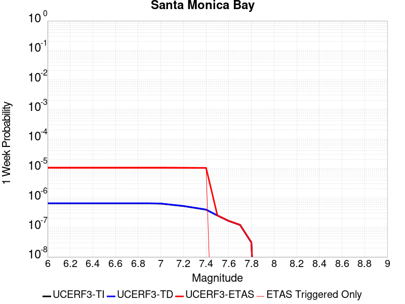 |  |  |  |

| Magnitude | 1 wk TI Prob | 1 wk TD Prob | 1 wk ETAS Prob | 1 wk ETAS/TD Gain | 1 wk ETAS Triggered Only | 1 mo TI Prob | 1 mo TD Prob | 1 mo ETAS Prob | 1 mo ETAS/TD Gain | 1 mo ETAS Triggered Only | 1 yr TI Prob | 1 yr TD Prob | 1 yr ETAS Prob | 1 yr ETAS/TD Gain | 1 yr ETAS Triggered Only | 10 yr TI Prob | 10 yr TD Prob | 10 yr ETAS Prob | 10 yr ETAS/TD Gain | 10 yr ETAS Triggered Only |
|-----|-----|-----|-----|-----|-----|-----|-----|-----|-----|-----|-----|-----|-----|-----|-----|-----|-----|-----|-----|-----|
| 6.0 | 6.493459E-7 | 6.570905E-7 | 1.0657084E-5 | 16.218594 | 1.0E-5 | 2.782908E-6 | 2.8160991E-6 | 1.2816071E-5 | 4.5510015 | 1.0E-5 | 3.388138E-5 | 3.4285487E-5 | 4.428514E-5 | 1.2916586 | 1.0E-5 | 3.3876215E-4 | 3.4280377E-4 | 3.5280033E-4 | 1.0291612 | 1.0E-5 |
| 6.1 | 6.493459E-7 | 6.570905E-7 | 1.0657084E-5 | 16.218594 | 1.0E-5 | 2.782908E-6 | 2.8160991E-6 | 1.2816071E-5 | 4.5510015 | 1.0E-5 | 3.388138E-5 | 3.4285487E-5 | 4.428514E-5 | 1.2916586 | 1.0E-5 | 3.3876215E-4 | 3.4280377E-4 | 3.5280033E-4 | 1.0291612 | 1.0E-5 |
| 6.2 | 6.493459E-7 | 6.570905E-7 | 1.0657084E-5 | 16.218594 | 1.0E-5 | 2.782908E-6 | 2.8160991E-6 | 1.2816071E-5 | 4.5510015 | 1.0E-5 | 3.388138E-5 | 3.4285487E-5 | 4.428514E-5 | 1.2916586 | 1.0E-5 | 3.3876215E-4 | 3.4280377E-4 | 3.5280033E-4 | 1.0291612 | 1.0E-5 |
| 6.3 | 6.493459E-7 | 6.570905E-7 | 1.0657084E-5 | 16.218594 | 1.0E-5 | 2.782908E-6 | 2.8160991E-6 | 1.2816071E-5 | 4.5510015 | 1.0E-5 | 3.388138E-5 | 3.4285487E-5 | 4.428514E-5 | 1.2916586 | 1.0E-5 | 3.3876215E-4 | 3.4280377E-4 | 3.5280033E-4 | 1.0291612 | 1.0E-5 |
| 6.4 | 6.493459E-7 | 6.570905E-7 | 1.0657084E-5 | 16.218594 | 1.0E-5 | 2.782908E-6 | 2.8160991E-6 | 1.2816071E-5 | 4.5510015 | 1.0E-5 | 3.388138E-5 | 3.4285487E-5 | 4.428514E-5 | 1.2916586 | 1.0E-5 | 3.3876215E-4 | 3.4280377E-4 | 3.5280033E-4 | 1.0291612 | 1.0E-5 |
| 6.5 | 6.493459E-7 | 6.570905E-7 | 1.0657084E-5 | 16.218594 | 1.0E-5 | 2.782908E-6 | 2.8160991E-6 | 1.2816071E-5 | 4.5510015 | 1.0E-5 | 3.388138E-5 | 3.4285487E-5 | 4.428514E-5 | 1.2916586 | 1.0E-5 | 3.3876215E-4 | 3.4280377E-4 | 3.5280033E-4 | 1.0291612 | 1.0E-5 |
| 6.6 | 6.493459E-7 | 6.570905E-7 | 1.0657084E-5 | 16.218594 | 1.0E-5 | 2.782908E-6 | 2.8160991E-6 | 1.2816071E-5 | 4.5510015 | 1.0E-5 | 3.388138E-5 | 3.4285487E-5 | 4.428514E-5 | 1.2916586 | 1.0E-5 | 3.3876215E-4 | 3.4280377E-4 | 3.5280033E-4 | 1.0291612 | 1.0E-5 |
| 6.7 | 6.493459E-7 | 6.570905E-7 | 1.0657084E-5 | 16.218594 | 1.0E-5 | 2.782908E-6 | 2.8160991E-6 | 1.2816071E-5 | 4.5510015 | 1.0E-5 | 3.388138E-5 | 3.4285487E-5 | 4.428514E-5 | 1.2916586 | 1.0E-5 | 3.3876215E-4 | 3.4280377E-4 | 3.5280033E-4 | 1.0291612 | 1.0E-5 |
| 6.8 | 6.493459E-7 | 6.570905E-7 | 1.0657084E-5 | 16.218594 | 1.0E-5 | 2.782908E-6 | 2.8160991E-6 | 1.2816071E-5 | 4.5510015 | 1.0E-5 | 3.388138E-5 | 3.4285487E-5 | 4.428514E-5 | 1.2916586 | 1.0E-5 | 3.3876215E-4 | 3.4280377E-4 | 3.5280033E-4 | 1.0291612 | 1.0E-5 |
| 6.9 | 6.493459E-7 | 6.570905E-7 | 1.0657084E-5 | 16.218594 | 1.0E-5 | 2.782908E-6 | 2.8160991E-6 | 1.2816071E-5 | 4.5510015 | 1.0E-5 | 3.388138E-5 | 3.4285487E-5 | 4.428514E-5 | 1.2916586 | 1.0E-5 | 3.3876215E-4 | 3.4280377E-4 | 3.5280033E-4 | 1.0291612 | 1.0E-5 |
| 7.0 | 6.3621707E-7 | 6.4389707E-7 | 1.064389E-5 | 16.530422 | 1.0E-5 | 2.726642E-6 | 2.759556E-6 | 1.27595285E-5 | 4.623761 | 1.0E-5 | 3.319636E-5 | 3.3597094E-5 | 4.359676E-5 | 1.2976348 | 1.0E-5 | 3.31914E-4 | 3.3592194E-4 | 3.4591858E-4 | 1.0297588 | 1.0E-5 |
| 7.1 | 5.796316E-7 | 5.8694985E-7 | 1.0586944E-5 | 18.037222 | 1.0E-5 | 2.4841331E-6 | 2.515497E-6 | 1.2515472E-5 | 4.9753475 | 1.0E-5 | 3.0243902E-5 | 3.062576E-5 | 4.0625455E-5 | 1.3265125 | 1.0E-5 | 3.0239785E-4 | 3.0621697E-4 | 3.162139E-4 | 1.0326465 | 1.0E-5 |
| 7.2 | 5.2654514E-7 | 5.3347253E-7 | 1.05334675E-5 | 19.745098 | 1.0E-5 | 2.25662E-6 | 2.286309E-6 | 1.2286286E-5 | 5.3738523 | 1.0E-5 | 2.7474003E-5 | 2.7835471E-5 | 3.783519E-5 | 1.3592439 | 1.0E-5 | 2.7470608E-4 | 2.7832124E-4 | 2.8831846E-4 | 1.0359197 | 1.0E-5 |
| 7.3 | 4.582996E-7 | 4.6463197E-7 | 1.0464627E-5 | 22.522402 | 1.0E-5 | 1.9641398E-6 | 1.9912784E-6 | 1.1991258E-5 | 6.0218897 | 1.0E-5 | 2.3913139E-5 | 2.4243556E-5 | 3.4243316E-5 | 1.4124707 | 1.0E-5 | 2.3910566E-4 | 2.4241036E-4 | 2.5240795E-4 | 1.0412424 | 1.0E-5 |
| 7.4 | 3.9690556E-7 | 4.026118E-7 | 1.0402608E-5 | 25.837812 | 1.0E-5 | 1.7010227E-6 | 1.725478E-6 | 1.172546E-5 | 6.7954855 | 1.0E-5 | 2.0709755E-5 | 2.1007503E-5 | 3.1007294E-5 | 1.4760104 | 1.0E-5 | 2.0707825E-4 | 2.1005633E-4 | 2.2005422E-4 | 1.0475963 | 1.0E-5 |
| 7.5 | 2.514765E-7 | 2.5540857E-7 | 2.5540857E-7 | 1.0 | 0.0 | 1.077756E-6 | 1.0946077E-6 | 1.0946077E-6 | 1.0 | 0.0 | 1.31216E-5 | 1.3326773E-5 | 1.3326773E-5 | 1.0 | 0.0 | 1.3120825E-4 | 1.3326031E-4 | 1.3326031E-4 | 1.0 | 0.0 |
| 7.6 | 1.6412821E-7 | 1.6690133E-7 | 1.6690133E-7 | 1.0 | 0.0 | 7.0340644E-7 | 7.152912E-7 | 7.152912E-7 | 1.0 | 0.0 | 8.563939E-6 | 8.708636E-6 | 8.708636E-6 | 1.0 | 0.0 | 8.56361E-5 | 8.7083E-5 | 8.7083E-5 | 1.0 | 0.0 |
| 7.7 | 1.2030355E-7 | 1.224329E-7 | 1.224329E-7 | 1.0 | 0.0 | 5.155865E-7 | 5.247123E-7 | 5.247123E-7 | 1.0 | 0.0 | 6.277248E-6 | 6.388354E-6 | 6.388354E-6 | 1.0 | 0.0 | 6.2770705E-5 | 6.3881744E-5 | 6.3881744E-5 | 1.0 | 0.0 |
| 7.8 | 3.0539674E-8 | 3.1123864E-8 | 3.1123864E-8 | 1.0 | 0.0 | 1.308843E-7 | 1.3338799E-7 | 1.3338799E-7 | 1.0 | 0.0 | 1.5935152E-6 | 1.6239977E-6 | 1.6239977E-6 | 1.0 | 0.0 | 1.5935038E-5 | 1.623988E-5 | 1.623988E-5 | 1.0 | 0.0 |

## Laguna Salada
*[(top)](#table-of-contents)*

| 1 Week | 1 Month | 1 Year | 10 Year |
|-----|-----|-----|-----|
|  |  |  |  |

| Magnitude | 1 wk TI Prob | 1 wk TD Prob | 1 wk ETAS Prob | 1 wk ETAS/TD Gain | 1 wk ETAS Triggered Only | 1 mo TI Prob | 1 mo TD Prob | 1 mo ETAS Prob | 1 mo ETAS/TD Gain | 1 mo ETAS Triggered Only | 1 yr TI Prob | 1 yr TD Prob | 1 yr ETAS Prob | 1 yr ETAS/TD Gain | 1 yr ETAS Triggered Only | 10 yr TI Prob | 10 yr TD Prob | 10 yr ETAS Prob | 10 yr ETAS/TD Gain | 10 yr ETAS Triggered Only |
|-----|-----|-----|-----|-----|-----|-----|-----|-----|-----|-----|-----|-----|-----|-----|-----|-----|-----|-----|-----|-----|
| 6.0 | 4.6465593E-5 | 4.634639E-5 | 5.634593E-5 | 1.2157565 | 1.0E-5 | 1.9912305E-4 | 1.9861311E-4 | 2.0861112E-4 | 1.0503391 | 1.0E-5 | 0.0024216278 | 0.002415429 | 0.002425405 | 1.00413 | 1.0E-5 | 0.02395408 | 0.023975259 | 0.023985019 | 1.0004071 | 1.0E-5 |
| 6.1 | 3.982297E-5 | 3.7246125E-5 | 3.7246125E-5 | 1.0 | 0.0 | 1.706587E-4 | 1.5961716E-4 | 1.5961716E-4 | 1.0 | 0.0 | 0.0020757897 | 0.0019417295 | 0.0019417295 | 1.0 | 0.0 | 0.020565065 | 0.019331863 | 0.019331863 | 1.0 | 0.0 |
| 6.2 | 3.6067784E-5 | 3.2602693E-5 | 3.2602693E-5 | 1.0 | 0.0 | 1.5456705E-4 | 1.3971896E-4 | 1.3971896E-4 | 1.0 | 0.0 | 0.0018802295 | 0.0016998611 | 0.0016998611 | 1.0 | 0.0 | 0.018644003 | 0.016949628 | 0.016949628 | 1.0 | 0.0 |
| 6.3 | 3.2859112E-5 | 2.8849448E-5 | 2.8849448E-5 | 1.0 | 0.0 | 1.4081717E-4 | 1.2363521E-4 | 1.2363521E-4 | 1.0 | 0.0 | 0.0017131006 | 0.0015043203 | 0.0015043203 | 1.0 | 0.0 | 0.016999546 | 0.015018767 | 0.015018767 | 1.0 | 0.0 |
| 6.4 | 2.9132116E-5 | 2.4852965E-5 | 2.4852965E-5 | 1.0 | 0.0 | 1.2484594E-4 | 1.0650887E-4 | 1.0650887E-4 | 1.0 | 0.0 | 0.0015189396 | 0.001296065 | 0.001296065 | 1.0 | 0.0 | 0.015085992 | 0.012956262 | 0.012956262 | 1.0 | 0.0 |
| 6.5 | 2.7075037E-5 | 2.2825836E-5 | 2.2825836E-5 | 1.0 | 0.0 | 1.1603071E-4 | 9.7821845E-5 | 9.7821845E-5 | 1.0 | 0.0 | 0.0014117584 | 0.0011904186 | 0.0011904186 | 1.0 | 0.0 | 0.014028233 | 0.011907749 | 0.011907749 | 1.0 | 0.0 |
| 6.6 | 2.2367465E-5 | 1.8573526E-5 | 1.8573526E-5 | 1.0 | 0.0 | 9.5857045E-5 | 7.959886E-5 | 7.959886E-5 | 1.0 | 0.0 | 0.0011664346 | 9.6876756E-4 | 9.6876756E-4 | 1.0 | 0.0 | 0.011603311 | 0.009702191 | 0.009702191 | 1.0 | 0.0 |
| 6.7 | 1.9458053E-5 | 1.5914242E-5 | 1.5914242E-5 | 1.0 | 0.0 | 8.338899E-5 | 6.8202564E-5 | 6.8202564E-5 | 1.0 | 0.0 | 0.001014788 | 8.3013024E-4 | 8.3013024E-4 | 1.0 | 0.0 | 0.010101665 | 0.0083209425 | 0.0083209425 | 1.0 | 0.0 |
| 6.8 | 1.0767866E-5 | 9.18435E-6 | 9.18435E-6 | 1.0 | 0.0 | 4.614718E-5 | 3.9361294E-5 | 3.9361294E-5 | 1.0 | 0.0 | 5.6169706E-4 | 4.7918706E-4 | 4.7918706E-4 | 1.0 | 0.0 | 0.0056027942 | 0.0048096925 | 0.0048096925 | 1.0 | 0.0 |
| 6.9 | 2.1384765E-6 | 1.7913675E-6 | 1.7913675E-6 | 1.0 | 0.0 | 9.164866E-6 | 7.677269E-6 | 7.677269E-6 | 1.0 | 0.0 | 1.1157654E-4 | 9.346713E-5 | 9.346713E-5 | 1.0 | 0.0 | 0.0011152053 | 9.343165E-4 | 9.343165E-4 | 1.0 | 0.0 |
| 7.0 | 2.0952946E-6 | 1.7493046E-6 | 1.7493046E-6 | 1.0 | 0.0 | 8.979802E-6 | 7.4970003E-6 | 7.4970003E-6 | 1.0 | 0.0 | 1.0932361E-4 | 9.1272545E-5 | 9.1272545E-5 | 1.0 | 0.0 | 0.0010926984 | 9.123888E-4 | 9.123888E-4 | 1.0 | 0.0 |
| 7.1 | 1.7887576E-6 | 1.4500254E-6 | 1.4500254E-6 | 1.0 | 0.0 | 7.666081E-6 | 6.2143813E-6 | 6.2143813E-6 | 1.0 | 0.0 | 9.333054E-5 | 7.565777E-5 | 7.565777E-5 | 1.0 | 0.0 | 9.329135E-4 | 7.563506E-4 | 7.563506E-4 | 1.0 | 0.0 |
| 7.2 | 9.723109E-7 | 7.135619E-7 | 7.135619E-7 | 1.0 | 0.0 | 4.16704E-6 | 3.0581198E-6 | 3.0581198E-6 | 1.0 | 0.0 | 5.073253E-5 | 3.7232137E-5 | 3.7232137E-5 | 1.0 | 0.0 | 5.072095E-4 | 3.7227524E-4 | 3.7227524E-4 | 1.0 | 0.0 |

## North Frontal  (West)
*[(top)](#table-of-contents)*

| 1 Week | 1 Month | 1 Year | 10 Year |
|-----|-----|-----|-----|
|  |  |  |  |

| Magnitude | 1 wk TI Prob | 1 wk TD Prob | 1 wk ETAS Prob | 1 wk ETAS/TD Gain | 1 wk ETAS Triggered Only | 1 mo TI Prob | 1 mo TD Prob | 1 mo ETAS Prob | 1 mo ETAS/TD Gain | 1 mo ETAS Triggered Only | 1 yr TI Prob | 1 yr TD Prob | 1 yr ETAS Prob | 1 yr ETAS/TD Gain | 1 yr ETAS Triggered Only | 10 yr TI Prob | 10 yr TD Prob | 10 yr ETAS Prob | 10 yr ETAS/TD Gain | 10 yr ETAS Triggered Only |
|-----|-----|-----|-----|-----|-----|-----|-----|-----|-----|-----|-----|-----|-----|-----|-----|-----|-----|-----|-----|-----|
| 6.0 | 4.7316266E-6 | 4.8526726E-6 | 1.4852624E-5 | 3.0607102 | 1.0E-5 | 2.0278241E-5 | 2.0797012E-5 | 3.0796804E-5 | 1.4808283 | 1.0E-5 | 2.4685962E-4 | 2.5317568E-4 | 2.6317313E-4 | 1.0394883 | 1.0E-5 | 0.0024658558 | 0.0025290183 | 0.002538993 | 1.0039442 | 1.0E-5 |
| 6.1 | 4.7316266E-6 | 4.8526726E-6 | 1.4852624E-5 | 3.0607102 | 1.0E-5 | 2.0278241E-5 | 2.0797012E-5 | 3.0796804E-5 | 1.4808283 | 1.0E-5 | 2.4685962E-4 | 2.5317568E-4 | 2.6317313E-4 | 1.0394883 | 1.0E-5 | 0.0024658558 | 0.0025290183 | 0.002538993 | 1.0039442 | 1.0E-5 |
| 6.2 | 4.7316266E-6 | 4.8526726E-6 | 1.4852624E-5 | 3.0607102 | 1.0E-5 | 2.0278241E-5 | 2.0797012E-5 | 3.0796804E-5 | 1.4808283 | 1.0E-5 | 2.4685962E-4 | 2.5317568E-4 | 2.6317313E-4 | 1.0394883 | 1.0E-5 | 0.0024658558 | 0.0025290183 | 0.002538993 | 1.0039442 | 1.0E-5 |
| 6.3 | 4.7316266E-6 | 4.8526726E-6 | 1.4852624E-5 | 3.0607102 | 1.0E-5 | 2.0278241E-5 | 2.0797012E-5 | 3.0796804E-5 | 1.4808283 | 1.0E-5 | 2.4685962E-4 | 2.5317568E-4 | 2.6317313E-4 | 1.0394883 | 1.0E-5 | 0.0024658558 | 0.0025290183 | 0.002538993 | 1.0039442 | 1.0E-5 |
| 6.4 | 4.7316266E-6 | 4.8526726E-6 | 1.4852624E-5 | 3.0607102 | 1.0E-5 | 2.0278241E-5 | 2.0797012E-5 | 3.0796804E-5 | 1.4808283 | 1.0E-5 | 2.4685962E-4 | 2.5317568E-4 | 2.6317313E-4 | 1.0394883 | 1.0E-5 | 0.0024658558 | 0.0025290183 | 0.002538993 | 1.0039442 | 1.0E-5 |
| 6.5 | 4.7316266E-6 | 4.8526726E-6 | 1.4852624E-5 | 3.0607102 | 1.0E-5 | 2.0278241E-5 | 2.0797012E-5 | 3.0796804E-5 | 1.4808283 | 1.0E-5 | 2.4685962E-4 | 2.5317568E-4 | 2.6317313E-4 | 1.0394883 | 1.0E-5 | 0.0024658558 | 0.0025290183 | 0.002538993 | 1.0039442 | 1.0E-5 |
| 6.6 | 4.7316266E-6 | 4.8526726E-6 | 1.4852624E-5 | 3.0607102 | 1.0E-5 | 2.0278241E-5 | 2.0797012E-5 | 3.0796804E-5 | 1.4808283 | 1.0E-5 | 2.4685962E-4 | 2.5317568E-4 | 2.6317313E-4 | 1.0394883 | 1.0E-5 | 0.0024658558 | 0.0025290183 | 0.002538993 | 1.0039442 | 1.0E-5 |
| 6.7 | 3.5382777E-6 | 3.6308859E-6 | 1.363085E-5 | 3.7541387 | 1.0E-5 | 1.516396E-5 | 1.5560852E-5 | 2.5560696E-5 | 1.6426283 | 1.0E-5 | 1.8460557E-4 | 1.8943768E-4 | 1.9943577E-4 | 1.0527778 | 1.0E-5 | 0.0018445229 | 0.0018928389 | 0.00190282 | 1.0052731 | 1.0E-5 |
| 6.8 | 3.5382777E-6 | 3.6308859E-6 | 1.363085E-5 | 3.7541387 | 1.0E-5 | 1.516396E-5 | 1.5560852E-5 | 2.5560696E-5 | 1.6426283 | 1.0E-5 | 1.8460557E-4 | 1.8943768E-4 | 1.9943577E-4 | 1.0527778 | 1.0E-5 | 0.0018445229 | 0.0018928389 | 0.00190282 | 1.0052731 | 1.0E-5 |
| 6.9 | 3.0428037E-6 | 3.1227605E-6 | 1.312273E-5 | 4.202285 | 1.0E-5 | 1.30405215E-5 | 1.33831945E-5 | 2.3383061E-5 | 1.7471957 | 1.0E-5 | 1.5875678E-4 | 1.6292889E-4 | 1.7292726E-4 | 1.0613664 | 1.0E-5 | 0.0015864341 | 0.0016281615 | 0.0016381453 | 1.0061319 | 1.0E-5 |
| 7.0 | 2.538778E-6 | 2.6060904E-6 | 1.2606064E-5 | 4.8371553 | 1.0E-5 | 1.0880432E-5 | 1.1168913E-5 | 2.1168802E-5 | 1.8953322 | 1.0E-5 | 1.324612E-4 | 1.3597352E-4 | 1.4597215E-4 | 1.0735338 | 1.0E-5 | 0.0013238228 | 0.0013589499 | 0.0013689363 | 1.0073487 | 1.0E-5 |
| 7.1 | 2.2418935E-6 | 2.3012074E-6 | 1.2301184E-5 | 5.3455353 | 1.0E-5 | 9.60808E-6 | 9.862282E-6 | 1.9862184E-5 | 2.0139542 | 1.0E-5 | 1.1697209E-4 | 1.2006712E-4 | 1.3006592E-4 | 1.0832767 | 1.0E-5 | 0.0011691054 | 0.0012000664 | 0.0012100544 | 1.0083228 | 1.0E-5 |
| 7.2 | 1.6526745E-6 | 1.6924851E-6 | 1.1692468E-5 | 6.9084616 | 1.0E-5 | 7.082872E-6 | 7.253489E-6 | 1.7253416E-5 | 2.3786368 | 1.0E-5 | 8.623055E-5 | 8.8307905E-5 | 9.830702E-5 | 1.1132301 | 1.0E-5 | 8.61971E-4 | 8.827532E-4 | 8.9274434E-4 | 1.0113182 | 1.0E-5 |
| 7.3 | 1.0246019E-6 | 1.0442261E-6 | 1.1044215E-5 | 10.576461 | 1.0E-5 | 4.391144E-6 | 4.4752474E-6 | 1.4475203E-5 | 3.2345033 | 1.0E-5 | 5.3460866E-5 | 5.448489E-5 | 6.4484346E-5 | 1.1835271 | 1.0E-5 | 5.344801E-4 | 5.4472685E-4 | 5.547214E-4 | 1.0183479 | 1.0E-5 |
| 7.4 | 8.9045164E-7 | 9.0565584E-7 | 1.0905646E-5 | 12.041712 | 1.0E-5 | 3.8162157E-6 | 3.8813773E-6 | 1.3881338E-5 | 3.576395 | 1.0E-5 | 4.646144E-5 | 4.7254853E-5 | 5.725438E-5 | 1.2116085 | 1.0E-5 | 4.6451724E-4 | 4.7245892E-4 | 4.824542E-4 | 1.0211558 | 1.0E-5 |
| 7.5 | 6.3357E-7 | 6.4027006E-7 | 1.0640264E-5 | 16.6184 | 1.0E-5 | 2.7152971E-6 | 2.744012E-6 | 1.2743984E-5 | 4.644289 | 1.0E-5 | 3.305824E-5 | 3.34079E-5 | 4.3407566E-5 | 1.2993203 | 1.0E-5 | 3.3053322E-4 | 3.3403534E-4 | 3.44032E-4 | 1.0299269 | 1.0E-5 |
| 7.6 | 2.5087024E-7 | 2.4361097E-7 | 2.4361097E-7 | 1.0 | 0.0 | 1.0751578E-6 | 1.0440467E-6 | 1.0440467E-6 | 1.0 | 0.0 | 1.3089967E-5 | 1.2711216E-5 | 1.2711216E-5 | 1.0 | 0.0 | 1.3089196E-4 | 1.2710695E-4 | 1.2710695E-4 | 1.0 | 0.0 |
| 7.7 | 3.282987E-8 | 2.2874195E-8 | 2.2874195E-8 | 1.0 | 0.0 | 1.4069944E-7 | 9.803227E-8 | 9.803227E-8 | 1.0 | 0.0 | 1.7130144E-6 | 1.1935423E-6 | 1.1935423E-6 | 1.0 | 0.0 | 1.7130013E-5 | 1.1935367E-5 | 1.1935367E-5 | 1.0 | 0.0 |
| 7.8 | 8.77499E-9 | 5.6815956E-9 | 5.6815956E-9 | 1.0 | 0.0 | 3.7607098E-8 | 2.4349696E-8 | 2.4349696E-8 | 1.0 | 0.0 | 4.578663E-7 | 2.9645753E-7 | 2.9645753E-7 | 1.0 | 0.0 | 4.5786537E-6 | 2.9645726E-6 | 2.9645726E-6 | 1.0 | 0.0 |

## Anacapa-Dume alt 1
*[(top)](#table-of-contents)*

| 1 Week | 1 Month | 1 Year | 10 Year |
|-----|-----|-----|-----|
|  |  |  |  |

| Magnitude | 1 wk TI Prob | 1 wk TD Prob | 1 wk ETAS Prob | 1 wk ETAS/TD Gain | 1 wk ETAS Triggered Only | 1 mo TI Prob | 1 mo TD Prob | 1 mo ETAS Prob | 1 mo ETAS/TD Gain | 1 mo ETAS Triggered Only | 1 yr TI Prob | 1 yr TD Prob | 1 yr ETAS Prob | 1 yr ETAS/TD Gain | 1 yr ETAS Triggered Only | 10 yr TI Prob | 10 yr TD Prob | 10 yr ETAS Prob | 10 yr ETAS/TD Gain | 10 yr ETAS Triggered Only |
|-----|-----|-----|-----|-----|-----|-----|-----|-----|-----|-----|-----|-----|-----|-----|-----|-----|-----|-----|-----|-----|
| 6.0 | 5.1871802E-6 | 5.3673907E-6 | 1.5367337E-5 | 2.8630927 | 1.0E-5 | 2.2230583E-5 | 2.3002905E-5 | 3.3002674E-5 | 1.4347177 | 1.0E-5 | 2.7062374E-4 | 2.8002524E-4 | 2.9002244E-4 | 1.035701 | 1.0E-5 | 0.002702944 | 0.0027968092 | 0.002806781 | 1.0035655 | 1.0E-5 |
| 6.1 | 5.1871802E-6 | 5.3673907E-6 | 1.5367337E-5 | 2.8630927 | 1.0E-5 | 2.2230583E-5 | 2.3002905E-5 | 3.3002674E-5 | 1.4347177 | 1.0E-5 | 2.7062374E-4 | 2.8002524E-4 | 2.9002244E-4 | 1.035701 | 1.0E-5 | 0.002702944 | 0.0027968092 | 0.002806781 | 1.0035655 | 1.0E-5 |
| 6.2 | 5.1871802E-6 | 5.3673907E-6 | 1.5367337E-5 | 2.8630927 | 1.0E-5 | 2.2230583E-5 | 2.3002905E-5 | 3.3002674E-5 | 1.4347177 | 1.0E-5 | 2.7062374E-4 | 2.8002524E-4 | 2.9002244E-4 | 1.035701 | 1.0E-5 | 0.002702944 | 0.0027968092 | 0.002806781 | 1.0035655 | 1.0E-5 |
| 6.3 | 5.1871802E-6 | 5.3673907E-6 | 1.5367337E-5 | 2.8630927 | 1.0E-5 | 2.2230583E-5 | 2.3002905E-5 | 3.3002674E-5 | 1.4347177 | 1.0E-5 | 2.7062374E-4 | 2.8002524E-4 | 2.9002244E-4 | 1.035701 | 1.0E-5 | 0.002702944 | 0.0027968092 | 0.002806781 | 1.0035655 | 1.0E-5 |
| 6.4 | 5.1871802E-6 | 5.3673907E-6 | 1.5367337E-5 | 2.8630927 | 1.0E-5 | 2.2230583E-5 | 2.3002905E-5 | 3.3002674E-5 | 1.4347177 | 1.0E-5 | 2.7062374E-4 | 2.8002524E-4 | 2.9002244E-4 | 1.035701 | 1.0E-5 | 0.002702944 | 0.0027968092 | 0.002806781 | 1.0035655 | 1.0E-5 |
| 6.5 | 5.1871802E-6 | 5.3673907E-6 | 1.5367337E-5 | 2.8630927 | 1.0E-5 | 2.2230583E-5 | 2.3002905E-5 | 3.3002674E-5 | 1.4347177 | 1.0E-5 | 2.7062374E-4 | 2.8002524E-4 | 2.9002244E-4 | 1.035701 | 1.0E-5 | 0.002702944 | 0.0027968092 | 0.002806781 | 1.0035655 | 1.0E-5 |
| 6.6 | 5.1871802E-6 | 5.3673907E-6 | 1.5367337E-5 | 2.8630927 | 1.0E-5 | 2.2230583E-5 | 2.3002905E-5 | 3.3002674E-5 | 1.4347177 | 1.0E-5 | 2.7062374E-4 | 2.8002524E-4 | 2.9002244E-4 | 1.035701 | 1.0E-5 | 0.002702944 | 0.0027968092 | 0.002806781 | 1.0035655 | 1.0E-5 |
| 6.7 | 4.7693475E-6 | 4.9366918E-6 | 1.4936642E-5 | 3.025638 | 1.0E-5 | 2.04399E-5 | 2.1157082E-5 | 3.115687E-5 | 1.4726449 | 1.0E-5 | 2.4882736E-4 | 2.5755778E-4 | 2.675552E-4 | 1.0388162 | 1.0E-5 | 0.0024854892 | 0.002572669 | 0.0025826432 | 1.003877 | 1.0E-5 |
| 6.8 | 4.753408E-6 | 4.92024E-6 | 1.4920191E-5 | 3.032411 | 1.0E-5 | 2.037159E-5 | 2.1086576E-5 | 3.1086365E-5 | 1.4742254 | 1.0E-5 | 2.4799586E-4 | 2.5669957E-4 | 2.66697E-4 | 1.038946 | 1.0E-5 | 0.002477193 | 0.0025641066 | 0.002574081 | 1.00389 | 1.0E-5 |
| 6.9 | 3.800069E-6 | 3.937126E-6 | 1.3937087E-5 | 3.5399137 | 1.0E-5 | 1.6285909E-5 | 1.687329E-5 | 2.687312E-5 | 1.5926427 | 1.0E-5 | 1.9826289E-4 | 2.0541316E-4 | 2.1541111E-4 | 1.0486723 | 1.0E-5 | 0.001980861 | 0.0020522568 | 0.0020622362 | 1.0048627 | 1.0E-5 |
| 7.0 | 3.6671938E-6 | 3.7999182E-6 | 1.379988E-5 | 3.6316257 | 1.0E-5 | 1.571645E-5 | 1.6285263E-5 | 2.62851E-5 | 1.614042 | 1.0E-5 | 1.9133097E-4 | 1.9825528E-4 | 2.0825329E-4 | 1.05043 | 1.0E-5 | 0.0019116632 | 0.0019808074 | 0.0019907875 | 1.0050385 | 1.0E-5 |
| 7.1 | 3.2394885E-6 | 3.3587933E-6 | 1.335876E-5 | 3.9772499 | 1.0E-5 | 1.3883448E-5 | 1.4394749E-5 | 2.4394605E-5 | 1.6946877 | 1.0E-5 | 1.6901788E-4 | 1.7524208E-4 | 1.8524034E-4 | 1.0570539 | 1.0E-5 | 0.0016888938 | 0.0017510501 | 0.0017610326 | 1.0057008 | 1.0E-5 |
| 7.2 | 3.0935948E-6 | 3.2079258E-6 | 1.3207894E-5 | 4.117269 | 1.0E-5 | 1.3258196E-5 | 1.3748182E-5 | 2.3748045E-5 | 1.7273589 | 1.0E-5 | 1.6140658E-4 | 1.6737137E-4 | 1.7736969E-4 | 1.0597373 | 1.0E-5 | 0.001612894 | 0.0016724641 | 0.0016824474 | 1.0059692 | 1.0E-5 |
| 7.3 | 2.5604163E-6 | 2.647073E-6 | 1.2647047E-5 | 4.7777476 | 1.0E-5 | 1.0973167E-5 | 1.1344549E-5 | 2.1344436E-5 | 1.8814706 | 1.0E-5 | 1.3359012E-4 | 1.3811118E-4 | 1.481098E-4 | 1.0723954 | 1.0E-5 | 0.0013350984 | 0.0013802581 | 0.0013902442 | 1.007235 | 1.0E-5 |
| 7.4 | 2.1429005E-6 | 2.2106028E-6 | 2.2106028E-6 | 1.0 | 0.0 | 9.1838265E-6 | 9.473977E-6 | 9.473977E-6 | 1.0 | 0.0 | 1.11807356E-4 | 1.1533959E-4 | 1.1533959E-4 | 1.0 | 0.0 | 0.0011175112 | 0.0011527999 | 0.0011527999 | 1.0 | 0.0 |
| 7.5 | 1.7237151E-6 | 1.7761449E-6 | 1.7761449E-6 | 1.0 | 0.0 | 7.3873293E-6 | 7.6120277E-6 | 7.6120277E-6 | 1.0 | 0.0 | 8.993702E-5 | 9.267252E-5 | 9.267252E-5 | 1.0 | 0.0 | 8.990063E-4 | 9.2634105E-4 | 9.2634105E-4 | 1.0 | 0.0 |
| 7.6 | 9.541696E-7 | 9.823206E-7 | 9.823206E-7 | 1.0 | 0.0 | 4.089292E-6 | 4.2099387E-6 | 4.2099387E-6 | 1.0 | 0.0 | 4.9785995E-5 | 5.1254807E-5 | 5.1254807E-5 | 1.0 | 0.0 | 4.9774844E-4 | 5.1243114E-4 | 5.1243114E-4 | 1.0 | 0.0 |
| 7.7 | 2.7226676E-7 | 2.7172416E-7 | 2.7172416E-7 | 1.0 | 0.0 | 1.166857E-6 | 1.1645316E-6 | 1.1645316E-6 | 1.0 | 0.0 | 1.4206392E-5 | 1.4178081E-5 | 1.4178081E-5 | 1.0 | 0.0 | 1.4205484E-4 | 1.4177183E-4 | 1.4177183E-4 | 1.0 | 0.0 |
| 7.8 | 4.5017995E-8 | 4.2157676E-8 | 4.2157676E-8 | 1.0 | 0.0 | 1.9293425E-7 | 1.8067574E-7 | 1.8067574E-7 | 1.0 | 0.0 | 2.348972E-6 | 2.1997253E-6 | 2.1997253E-6 | 1.0 | 0.0 | 2.348947E-5 | 2.1997055E-5 | 2.1997055E-5 | 1.0 | 0.0 |
| 7.9 | 8.007447E-10 | 6.1608785E-10 | 6.1608785E-10 | 1.0 | 0.0 | 3.4317629E-9 | 2.6403764E-9 | 2.6403764E-9 | 1.0 | 0.0 | 4.1781714E-8 | 3.2146584E-8 | 3.2146584E-8 | 1.0 | 0.0 | 4.1781706E-7 | 3.214658E-7 | 3.214658E-7 | 1.0 | 0.0 |

