# Parent Section Magnitude-Probability Distributions

Only fault sections with at least one triggered aftershock are plotted. Sections are sorted by total supraseismogenic trigger rate (decreasing)

## Table Of Contents

* [Tank Canyon](#tank-canyon)
* [Garlock (Central)](#garlock-central)
* [Little Lake](#little-lake)
* [Owl Lake](#owl-lake)
* [Panamint Valley](#panamint-valley)
* [Garlock (East)](#garlock-east)
* [Airport Lake](#airport-lake)
* [Ash Hill](#ash-hill)
* [Goldstone Lake](#goldstone-lake)
* [Hunter Mountain-Saline Valley](#hunter-mountain-saline-valley)
* [McLean Lake](#mclean-lake)
* [Blackwater](#blackwater)
* [Coyote Canyon](#coyote-canyon)
* [So Sierra Nevada](#so-sierra-nevada)
* [Garlock (West)](#garlock-west)
* [Gravel Hills-Harper Lk](#gravel-hills-harper-lk)
* [Death Valley (So)](#death-valley-so)
* [Garlic Springs](#garlic-springs)
* [San Andreas (Mojave S)](#san-andreas-mojave-s)
* [San Andreas (Mojave N)](#san-andreas-mojave-n)
* [Bicycle Lake](#bicycle-lake)
* [Nelson Lake](#nelson-lake)
* [San Andreas (San Bernardino N)](#san-andreas-san-bernardino-n)
* [Death Valley (Black Mtns Frontal)](#death-valley-black-mtns-frontal)
* [Towne Pass](#towne-pass)
* [Coyote Lake](#coyote-lake)
* [Lenwood-Lockhart-Old Woman Springs](#lenwood-lockhart-old-woman-springs)
* [San Andreas (Parkfield)](#san-andreas-parkfield)
* [Paradise](#paradise)
* [Kern Canyon (North Kern) 2011](#kern-canyon-north-kern-2011)
* [Death Valley (Fish Lake Valley)](#death-valley-fish-lake-valley)
* [San Andreas (San Bernardino S)](#san-andreas-san-bernardino-s)
* [Death Valley (No)](#death-valley-no)
* [San Andreas (Carrizo) rev](#san-andreas-carrizo-rev)
* [Lost Hills](#lost-hills)
* [Manix-Afton Hills](#manix-afton-hills)
* [Big Pine (East)](#big-pine-east)
* [San Andreas (Cholame) rev](#san-andreas-cholame-rev)
* [White Mountains](#white-mountains)
* [Sierra Nevada  (No Extension)](#sierra-nevada--no-extension)
* [San Andreas (Big Bend)](#san-andreas-big-bend)
* [Helendale-So Lockhart](#helendale-so-lockhart)
* [San Andreas (San Gorgonio Pass-Garnet HIll)](#san-andreas-san-gorgonio-pass-garnet-hill)
* [Kern Canyon (South Kern) 2011](#kern-canyon-south-kern-2011)
* [Elsinore (Glen Ivy) rev](#elsinore-glen-ivy-rev)

## Tank Canyon
*[(top)](#table-of-contents)*

| 1 Week | 1 Month | 1 Year | 10 Year |
|-----|-----|-----|-----|
|  |  |  |  |

| Magnitude | 1 wk TI Prob | 1 wk TD Prob | 1 wk ETAS Prob | 1 wk ETAS/TD Gain | 1 wk ETAS Triggered Only | 1 mo TI Prob | 1 mo TD Prob | 1 mo ETAS Prob | 1 mo ETAS/TD Gain | 1 mo ETAS Triggered Only | 1 yr TI Prob | 1 yr TD Prob | 1 yr ETAS Prob | 1 yr ETAS/TD Gain | 1 yr ETAS Triggered Only | 10 yr TI Prob | 10 yr TD Prob | 10 yr ETAS Prob | 10 yr ETAS/TD Gain | 10 yr ETAS Triggered Only |
|-----|-----|-----|-----|-----|-----|-----|-----|-----|-----|-----|-----|-----|-----|-----|-----|-----|-----|-----|-----|-----|
| 6.0 | 4.8284557E-5 | 5.7964822E-5 | 0.09143648 | 1577.4478 | 0.091383815 | 2.0691741E-4 | 2.4840087E-4 | 0.11379721 | 458.11923 | 0.11357702 | 0.0025163088 | 0.0030207601 | 0.15139626 | 50.118595 | 0.14882506 | 0.02488006 | 0.029863637 | 0.21223915 | 7.106942 | 0.18798956 |
| 6.1 | 1.7796336E-5 | 2.0873314E-5 | 0.04179546 | 2002.3392 | 0.041775458 | 7.626778E-5 | 8.945422E-5 | 0.049693372 | 555.5174 | 0.049608354 | 9.281647E-4 | 0.0010885983 | 0.06629169 | 60.89638 | 0.06527415 | 0.009242975 | 0.010836744 | 0.08702556 | 8.030601 | 0.0770235 |
| 6.2 | 1.7796336E-5 | 2.0873314E-5 | 0.04179546 | 2002.3392 | 0.041775458 | 7.626778E-5 | 8.945422E-5 | 0.049693372 | 555.5174 | 0.049608354 | 9.281647E-4 | 0.0010885983 | 0.06629169 | 60.89638 | 0.06527415 | 0.009242975 | 0.010836744 | 0.08702556 | 8.030601 | 0.0770235 |
| 6.3 | 1.3515912E-5 | 1.5759564E-5 | 0.031346858 | 1989.0687 | 0.03133159 | 5.792405E-5 | 6.753938E-5 | 0.034007806 | 503.52557 | 0.033942558 | 7.049971E-4 | 8.2200574E-4 | 0.047780763 | 58.12704 | 0.04699739 | 0.007027647 | 0.0081922645 | 0.058689002 | 7.163954 | 0.050913837 |
| 6.4 | 1.0870146E-5 | 1.2618021E-5 | 0.024816483 | 1966.7493 | 0.024804177 | 4.658551E-5 | 5.4076212E-5 | 0.027467737 | 507.94492 | 0.027415143 | 5.67031E-4 | 6.581969E-4 | 0.03979691 | 60.46353 | 0.03916449 | 0.005655863 | 0.0065644905 | 0.048065715 | 7.322078 | 0.041775458 |
| 6.5 | 7.964826E-6 | 9.196094E-6 | 0.020896733 | 2272.3486 | 0.020887729 | 3.4134522E-5 | 3.9411298E-5 | 0.022231748 | 564.0958 | 0.022193212 | 4.1550855E-4 | 4.7973756E-4 | 0.029186586 | 60.83865 | 0.028720627 | 0.0041473247 | 0.004788321 | 0.034670655 | 7.2406707 | 0.03002611 |
| 6.6 | 6.6317E-6 | 7.6122988E-6 | 0.013062343 | 1715.9525 | 0.01305483 | 2.8421264E-5 | 3.2623782E-5 | 0.01569791 | 481.17993 | 0.015665796 | 3.4597394E-4 | 3.9713128E-4 | 0.021276565 | 53.575645 | 0.020887729 | 0.0034543579 | 0.003965368 | 0.026070574 | 6.5745664 | 0.022193212 |
| 6.7 | 4.793663E-6 | 5.4307857E-6 | 0.009143762 | 1683.6906 | 0.009138381 | 2.0544108E-5 | 2.3274613E-5 | 0.011772349 | 505.80212 | 0.011749348 | 2.500958E-4 | 2.8333595E-4 | 0.015944693 | 56.27487 | 0.015665796 | 0.0024981452 | 0.0028304397 | 0.019753683 | 6.979016 | 0.016971279 |
| 6.8 | 4.382823E-6 | 4.9692567E-6 | 0.009143305 | 1839.9744 | 0.009138381 | 1.8783392E-5 | 2.1296666E-5 | 0.011770394 | 552.6872 | 0.011749348 | 2.286638E-4 | 2.5926033E-4 | 0.013310706 | 51.341084 | 0.01305483 | 0.0022842865 | 0.002590253 | 0.01691337 | 6.5296206 | 0.014360313 |
| 6.9 | 2.729601E-6 | 3.0735416E-6 | 0.007835948 | 2549.4846 | 0.007832898 | 1.1698237E-5 | 1.3172262E-5 | 0.007845967 | 595.6431 | 0.007832898 | 1.4241673E-4 | 1.6036171E-4 | 0.009297278 | 57.976913 | 0.009138381 | 0.001423255 | 0.0016026258 | 0.012029752 | 7.506276 | 0.010443864 |
| 7.0 | 1.8987357E-6 | 2.126939E-6 | 0.006529528 | 3069.918 | 0.006527415 | 8.137413E-6 | 9.115425E-6 | 0.006536471 | 717.078 | 0.006527415 | 9.90685E-5 | 1.1097535E-4 | 0.006637666 | 59.812077 | 0.006527415 | 9.902435E-4 | 0.0011092679 | 0.0076294425 | 6.8779073 | 0.006527415 |
| 7.1 | 1.4928986E-6 | 1.6641272E-6 | 0.001307145 | 785.4838 | 0.001305483 | 6.398121E-6 | 7.1319573E-6 | 0.0013126057 | 184.04564 | 0.001305483 | 7.789434E-5 | 8.682871E-5 | 0.0013921984 | 16.033848 | 0.001305483 | 7.786704E-4 | 8.6800574E-4 | 0.0021723555 | 2.5026972 | 0.001305483 |
| 7.2 | 1.069082E-6 | 1.1828573E-6 | 1.1828573E-6 | 1.0 | 0.0 | 4.581772E-6 | 5.0693816E-6 | 5.0693816E-6 | 1.0 | 0.0 | 5.5781646E-5 | 6.171851E-5 | 6.171851E-5 | 1.0 | 0.0 | 5.576765E-4 | 6.170659E-4 | 6.170659E-4 | 1.0 | 0.0 |
| 7.3 | 8.776551E-7 | 9.770005E-7 | 9.770005E-7 | 1.0 | 0.0 | 3.7613736E-6 | 4.1871413E-6 | 4.1871413E-6 | 1.0 | 0.0 | 4.579376E-5 | 5.097777E-5 | 5.097777E-5 | 1.0 | 0.0 | 4.5784327E-4 | 5.097118E-4 | 5.097118E-4 | 1.0 | 0.0 |
| 7.4 | 7.55721E-7 | 8.510244E-7 | 8.510244E-7 | 1.0 | 0.0 | 3.2388E-6 | 3.6472454E-6 | 3.6472454E-6 | 1.0 | 0.0 | 3.9431678E-5 | 4.4404827E-5 | 4.4404827E-5 | 1.0 | 0.0 | 3.942468E-4 | 4.440104E-4 | 4.440104E-4 | 1.0 | 0.0 |
| 7.5 | 5.587665E-7 | 6.305619E-7 | 6.305619E-7 | 1.0 | 0.0 | 2.3947114E-6 | 2.702408E-6 | 2.702408E-6 | 1.0 | 0.0 | 2.915522E-5 | 3.290182E-5 | 3.290182E-5 | 1.0 | 0.0 | 2.9151395E-4 | 3.290182E-4 | 3.290182E-4 | 1.0 | 0.0 |

## Garlock (Central)
*[(top)](#table-of-contents)*

| 1 Week | 1 Month | 1 Year | 10 Year |
|-----|-----|-----|-----|
|  |  |  |  |

| Magnitude | 1 wk TI Prob | 1 wk TD Prob | 1 wk ETAS Prob | 1 wk ETAS/TD Gain | 1 wk ETAS Triggered Only | 1 mo TI Prob | 1 mo TD Prob | 1 mo ETAS Prob | 1 mo ETAS/TD Gain | 1 mo ETAS Triggered Only | 1 yr TI Prob | 1 yr TD Prob | 1 yr ETAS Prob | 1 yr ETAS/TD Gain | 1 yr ETAS Triggered Only | 10 yr TI Prob | 10 yr TD Prob | 10 yr ETAS Prob | 10 yr ETAS/TD Gain | 10 yr ETAS Triggered Only |
|-----|-----|-----|-----|-----|-----|-----|-----|-----|-----|-----|-----|-----|-----|-----|-----|-----|-----|-----|-----|-----|
| 6.0 | 5.5131142E-5 | 7.024681E-5 | 0.12147164 | 1729.2122 | 0.12140992 | 2.3625491E-4 | 3.010234E-4 | 0.15560673 | 516.9258 | 0.15535247 | 0.0028726095 | 0.0036588663 | 0.18835919 | 51.4802 | 0.1853786 | 0.028357591 | 0.036079824 | 0.2336457 | 6.4757996 | 0.20496084 |
| 6.1 | 5.5131142E-5 | 7.024681E-5 | 0.12147164 | 1729.2122 | 0.12140992 | 2.3625491E-4 | 3.010234E-4 | 0.15560673 | 516.9258 | 0.15535247 | 0.0028726095 | 0.0036588663 | 0.18835919 | 51.4802 | 0.1853786 | 0.028357591 | 0.036079824 | 0.2336457 | 6.4757996 | 0.20496084 |
| 6.2 | 4.216245E-5 | 5.1661493E-5 | 0.07184952 | 1390.7751 | 0.071801566 | 1.806837E-4 | 2.2138779E-4 | 0.09419536 | 425.47675 | 0.09399478 | 0.0021976046 | 0.0026920962 | 0.1224732 | 45.493618 | 0.12010444 | 0.021759989 | 0.026689773 | 0.15629505 | 5.85599 | 0.13315926 |
| 6.3 | 4.216245E-5 | 5.1661493E-5 | 0.07184952 | 1390.7751 | 0.071801566 | 1.806837E-4 | 2.2138779E-4 | 0.09419536 | 425.47675 | 0.09399478 | 0.0021976046 | 0.0026920962 | 0.1224732 | 45.493618 | 0.12010444 | 0.021759989 | 0.026689773 | 0.15629505 | 5.85599 | 0.13315926 |
| 6.4 | 3.6858168E-5 | 4.411054E-5 | 0.058788255 | 1332.7484 | 0.058746736 | 1.5795401E-4 | 1.8903162E-4 | 0.07719797 | 408.38654 | 0.0770235 | 0.0019213937 | 0.002299056 | 0.10128766 | 44.0562 | 0.09921671 | 0.019048655 | 0.02284894 | 0.13000388 | 5.689712 | 0.10966057 |
| 6.5 | 3.39199E-5 | 4.0018083E-5 | 0.05486811 | 1371.0829 | 0.054830287 | 1.453629E-4 | 1.7149492E-4 | 0.07196075 | 419.6086 | 0.071801566 | 0.0017683565 | 0.002085973 | 0.094581924 | 45.341873 | 0.0926893 | 0.017543508 | 0.020759864 | 0.121751994 | 5.864778 | 0.10313316 |
| 6.6 | 3.3571985E-5 | 3.9472274E-5 | 0.054867595 | 1390.0288 | 0.054830287 | 1.4387199E-4 | 1.6915603E-4 | 0.07195858 | 425.39764 | 0.071801566 | 0.0017502342 | 0.0020575512 | 0.09455613 | 45.955666 | 0.0926893 | 0.017365133 | 0.020481179 | 0.12150205 | 5.932376 | 0.10313316 |
| 6.7 | 3.2580007E-5 | 3.8088703E-5 | 0.050949987 | 1337.6667 | 0.050913837 | 1.3962112E-4 | 1.632272E-4 | 0.068037264 | 416.82553 | 0.067885116 | 0.0016985617 | 0.0019855013 | 0.09058209 | 45.621773 | 0.08877285 | 0.016856372 | 0.019773813 | 0.11702863 | 5.918364 | 0.09921671 |
| 6.8 | 3.2185937E-5 | 3.7515918E-5 | 0.04964401 | 1323.2786 | 0.049608354 | 1.3793244E-4 | 1.6077272E-4 | 0.06542443 | 406.93738 | 0.06527415 | 0.0016780337 | 0.001955672 | 0.087949045 | 44.971268 | 0.08616188 | 0.016654192 | 0.019480614 | 0.11420442 | 5.862465 | 0.09660574 |
| 6.9 | 3.165394E-5 | 3.6720503E-5 | 0.049643256 | 1351.9219 | 0.049608354 | 1.3565269E-4 | 1.5736422E-4 | 0.065421246 | 415.73138 | 0.06527415 | 0.0016503202 | 0.001914247 | 0.08791119 | 45.924683 | 0.08616188 | 0.01638118 | 0.019073246 | 0.11383641 | 5.968381 | 0.09660574 |
| 7.0 | 3.0903822E-5 | 3.5625766E-5 | 0.045725904 | 1283.5066 | 0.045691907 | 1.3243823E-4 | 1.5267303E-4 | 0.060195725 | 394.2787 | 0.06005222 | 0.0016112428 | 0.0018572307 | 0.08134379 | 43.798435 | 0.079634465 | 0.015996104 | 0.018512413 | 0.10692318 | 5.7757554 | 0.09007833 |
| 7.1 | 3.0069863E-5 | 3.4392073E-5 | 0.040502973 | 1177.6835 | 0.040469974 | 1.2886449E-4 | 1.4738638E-4 | 0.054969594 | 372.9625 | 0.054830287 | 0.0015677959 | 0.0017929734 | 0.07607209 | 42.427895 | 0.07441253 | 0.01556781 | 0.017880075 | 0.10121924 | 5.661007 | 0.0848564 |
| 7.2 | 2.7957109E-5 | 3.128145E-5 | 0.032667335 | 1044.3037 | 0.032637075 | 1.1981068E-4 | 1.340566E-4 | 0.04451453 | 332.05774 | 0.044386424 | 0.0014577188 | 0.0016309366 | 0.06288857 | 38.559788 | 0.061357703 | 0.014481937 | 0.016283695 | 0.08691607 | 5.3376136 | 0.071801566 |
| 7.3 | 2.4519275E-5 | 2.6714795E-5 | 0.028746573 | 1076.0544 | 0.028720627 | 1.0507837E-4 | 1.1448703E-4 | 0.03796916 | 331.64594 | 0.037859008 | 0.0012785783 | 0.001393003 | 0.04962859 | 35.62705 | 0.04830287 | 0.012712469 | 0.013928054 | 0.06799466 | 4.8818493 | 0.054830287 |
| 7.4 | 2.3225532E-5 | 2.51994E-5 | 0.024828753 | 985.2914 | 0.024804177 | 9.95342E-5 | 1.0799304E-4 | 0.0314362 | 291.0947 | 0.03133159 | 0.0012111551 | 0.0013140367 | 0.0430346 | 32.749924 | 0.041775458 | 0.012045753 | 0.013145725 | 0.06081362 | 4.626114 | 0.04830287 |
| 7.5 | 2.097765E-5 | 2.2483688E-5 | 0.020909743 | 929.9961 | 0.020887729 | 8.9901114E-5 | 9.635517E-5 | 0.024898143 | 258.39966 | 0.024804177 | 0.0010939965 | 0.0011725046 | 0.033771314 | 28.802711 | 0.032637075 | 0.010886264 | 0.011740365 | 0.049154893 | 4.1868286 | 0.037859008 |
| 7.6 | 1.511254E-5 | 1.5991332E-5 | 0.009154227 | 572.4492 | 0.009138381 | 6.476642E-5 | 6.853253E-5 | 0.013122468 | 191.47795 | 0.01305483 | 7.882459E-4 | 8.3407195E-4 | 0.01909559 | 22.894417 | 0.018276762 | 0.007854558 | 0.008383559 | 0.027801635 | 3.3162093 | 0.019582245 |
| 7.7 | 9.934069E-6 | 1.0678794E-5 | 0.002621617 | 245.49748 | 0.002610966 | 4.2573887E-5 | 4.5765457E-5 | 0.0039620353 | 86.57262 | 0.003916449 | 5.182138E-4 | 5.570524E-4 | 0.0070808316 | 12.711249 | 0.006527415 | 0.00517007 | 0.005627684 | 0.013416501 | 2.3840182 | 0.007832898 |
| 7.8 | 6.7562896E-6 | 8.428449E-6 | 0.0013139005 | 155.88876 | 0.001305483 | 2.8955206E-5 | 3.6121426E-5 | 0.0026469931 | 73.28042 | 0.002610966 | 3.5247262E-4 | 4.3968976E-4 | 0.005659326 | 12.87118 | 0.005221932 | 0.0035191406 | 0.004446654 | 0.010945044 | 2.461411 | 0.006527415 |
| 7.9 | 3.975453E-6 | 5.37103E-6 | 0.001310847 | 244.05878 | 0.001305483 | 1.7037546E-5 | 2.3018498E-5 | 0.0013284715 | 57.71321 | 0.001305483 | 2.0741238E-4 | 2.8021427E-4 | 0.0028904488 | 10.315137 | 0.002610966 | 0.002072189 | 0.0028336283 | 0.00673898 | 2.3782158 | 0.003916449 |
| 8.0 | 1.6729537E-6 | 2.0775144E-6 | 2.0775144E-6 | 1.0 | 0.0 | 7.169782E-6 | 8.903603E-6 | 8.903603E-6 | 1.0 | 0.0 | 8.7288594E-5 | 1.0839601E-4 | 1.0839601E-4 | 1.0 | 0.0 | 8.7254314E-4 | 0.0010969337 | 0.0010969337 | 1.0 | 0.0 |
| 8.1 | 3.6733252E-7 | 3.1489964E-7 | 3.1489964E-7 | 1.0 | 0.0 | 1.5742813E-6 | 1.3495693E-6 | 1.3495693E-6 | 1.0 | 0.0 | 1.9166706E-5 | 1.6430899E-5 | 1.6430899E-5 | 1.0 | 0.0 | 1.9165053E-4 | 1.6638759E-4 | 1.6638759E-4 | 1.0 | 0.0 |

## Little Lake
*[(top)](#table-of-contents)*

| 1 Week | 1 Month | 1 Year | 10 Year |
|-----|-----|-----|-----|
|  |  |  |  |

| Magnitude | 1 wk TI Prob | 1 wk TD Prob | 1 wk ETAS Prob | 1 wk ETAS/TD Gain | 1 wk ETAS Triggered Only | 1 mo TI Prob | 1 mo TD Prob | 1 mo ETAS Prob | 1 mo ETAS/TD Gain | 1 mo ETAS Triggered Only | 1 yr TI Prob | 1 yr TD Prob | 1 yr ETAS Prob | 1 yr ETAS/TD Gain | 1 yr ETAS Triggered Only | 10 yr TI Prob | 10 yr TD Prob | 10 yr ETAS Prob | 10 yr ETAS/TD Gain | 10 yr ETAS Triggered Only |
|-----|-----|-----|-----|-----|-----|-----|-----|-----|-----|-----|-----|-----|-----|-----|-----|-----|-----|-----|-----|-----|
| 6.0 | 2.8424427E-5 | 3.120572E-5 | 0.057470668 | 1841.6709 | 0.057441253 | 1.2181328E-4 | 1.337327E-4 | 0.06409384 | 479.2683 | 0.063968666 | 0.0014820677 | 0.0016271127 | 0.07852528 | 48.260506 | 0.0770235 | 0.014722223 | 0.016165402 | 0.1035032 | 6.402761 | 0.08877285 |
| 6.1 | 2.8424427E-5 | 3.120572E-5 | 0.057470668 | 1841.6709 | 0.057441253 | 1.2181328E-4 | 1.337327E-4 | 0.06409384 | 479.2683 | 0.063968666 | 0.0014820677 | 0.0016271127 | 0.07852528 | 48.260506 | 0.0770235 | 0.014722223 | 0.016165402 | 0.1035032 | 6.402761 | 0.08877285 |
| 6.2 | 2.8424427E-5 | 3.120572E-5 | 0.057470668 | 1841.6709 | 0.057441253 | 1.2181328E-4 | 1.337327E-4 | 0.06409384 | 479.2683 | 0.063968666 | 0.0014820677 | 0.0016271127 | 0.07852528 | 48.260506 | 0.0770235 | 0.014722223 | 0.016165402 | 0.1035032 | 6.402761 | 0.08877285 |
| 6.3 | 1.48860645E-5 | 1.6081389E-5 | 0.028736247 | 1786.9255 | 0.028720627 | 6.379586E-5 | 6.8918576E-5 | 0.032703746 | 474.52728 | 0.032637075 | 7.7643775E-4 | 8.3878887E-4 | 0.042579204 | 50.76272 | 0.041775458 | 0.007737305 | 0.008359048 | 0.058847293 | 7.039952 | 0.050913837 |
| 6.4 | 1.48860645E-5 | 1.6081389E-5 | 0.028736247 | 1786.9255 | 0.028720627 | 6.379586E-5 | 6.8918576E-5 | 0.032703746 | 474.52728 | 0.032637075 | 7.7643775E-4 | 8.3878887E-4 | 0.042579204 | 50.76272 | 0.041775458 | 0.007737305 | 0.008359048 | 0.058847293 | 7.039952 | 0.050913837 |
| 6.5 | 1.2797581E-5 | 1.3765565E-5 | 0.026123067 | 1897.7112 | 0.02610966 | 5.4845623E-5 | 5.899409E-5 | 0.030083332 | 509.93808 | 0.03002611 | 6.675408E-4 | 7.18042E-4 | 0.03985441 | 55.504288 | 0.03916449 | 0.006655392 | 0.00715977 | 0.052524533 | 7.3360643 | 0.045691907 |
| 6.6 | 9.661896E-6 | 1.0289038E-5 | 0.02481421 | 2411.7136 | 0.024804177 | 4.1407468E-5 | 4.409522E-5 | 0.02745803 | 622.69855 | 0.027415143 | 5.040193E-4 | 5.367433E-4 | 0.037070647 | 69.06588 | 0.036553524 | 0.005028777 | 0.0053560743 | 0.04690778 | 8.757866 | 0.041775458 |
| 6.7 | 7.767871E-6 | 8.199687E-6 | 0.022201229 | 2707.5706 | 0.022193212 | 3.329045E-5 | 3.5141118E-5 | 0.024838448 | 706.82007 | 0.024804177 | 4.0523586E-4 | 4.2777284E-4 | 0.03435581 | 80.31321 | 0.033942558 | 0.004044977 | 0.004270846 | 0.04326807 | 10.131031 | 0.03916449 |
| 6.8 | 6.4235196E-6 | 6.7357446E-6 | 0.0169779 | 2520.5679 | 0.016971279 | 2.752908E-5 | 2.8867229E-5 | 0.019610547 | 679.336 | 0.019582245 | 3.35115E-4 | 3.5141467E-4 | 0.027756924 | 78.986244 | 0.027415143 | 0.003346101 | 0.00350985 | 0.036032375 | 10.266072 | 0.032637075 |
| 6.9 | 3.1283696E-6 | 3.1121804E-6 | 0.011752423 | 3776.2666 | 0.011749348 | 1.3407229E-5 | 1.3337856E-5 | 0.01437346 | 1077.6439 | 0.014360313 | 1.6322079E-4 | 1.6237781E-4 | 0.018436173 | 113.53874 | 0.018276762 | 0.0016310095 | 0.00162274 | 0.023779938 | 14.654188 | 0.022193212 |
| 7.0 | 2.290603E-6 | 2.2286815E-6 | 0.003918669 | 1758.2903 | 0.003916449 | 9.816834E-6 | 9.551463E-6 | 0.0052314335 | 547.7102 | 0.005221932 | 1.19513395E-4 | 1.162839E-4 | 0.007948271 | 68.352295 | 0.007832898 | 0.0011944914 | 0.0011623327 | 0.010290092 | 8.852966 | 0.009138381 |
| 7.1 | 1.293693E-6 | 1.1776827E-6 | 0.0026121407 | 2218.0342 | 0.002610966 | 5.5443866E-6 | 5.0472063E-6 | 0.0039214767 | 776.95984 | 0.003916449 | 6.750081E-5 | 6.14487E-5 | 0.0039776573 | 64.731346 | 0.003916449 | 6.7480316E-4 | 6.143856E-4 | 0.0058331094 | 9.494216 | 0.005221932 |
| 7.2 | 4.715842E-7 | 3.0917857E-7 | 3.0917857E-7 | 1.0 | 0.0 | 2.0210737E-6 | 1.3250503E-6 | 1.3250503E-6 | 1.0 | 0.0 | 2.4606294E-5 | 1.6132375E-5 | 1.6132375E-5 | 1.0 | 0.0 | 2.460357E-4 | 1.6131258E-4 | 1.6131258E-4 | 1.0 | 0.0 |
| 7.3 | 3.9430947E-7 | 2.3097488E-7 | 2.3097488E-7 | 1.0 | 0.0 | 1.6898966E-6 | 9.89892E-7 | 9.89892E-7 | 1.0 | 0.0 | 2.0574296E-5 | 1.2051869E-5 | 1.2051869E-5 | 1.0 | 0.0 | 2.0572392E-4 | 1.20512224E-4 | 1.20512224E-4 | 1.0 | 0.0 |
| 7.4 | 3.547123E-7 | 1.9679135E-7 | 1.9679135E-7 | 1.0 | 0.0 | 1.5201948E-6 | 8.4339126E-7 | 8.4339126E-7 | 1.0 | 0.0 | 1.8508214E-5 | 1.0268241E-5 | 1.0268241E-5 | 1.0 | 0.0 | 1.8506673E-4 | 1.02677724E-4 | 1.02677724E-4 | 1.0 | 0.0 |
| 7.5 | 2.6354266E-7 | 1.4423138E-7 | 1.4423138E-7 | 1.0 | 0.0 | 1.129468E-6 | 6.181344E-7 | 6.181344E-7 | 1.0 | 0.0 | 1.3751187E-5 | 7.5257603E-6 | 7.5257603E-6 | 1.0 | 0.0 | 1.3750336E-4 | 7.5255106E-5 | 7.5255106E-5 | 1.0 | 0.0 |
| 7.6 | 1.269913E-7 | 7.572556E-8 | 7.572556E-8 | 1.0 | 0.0 | 5.4424834E-7 | 3.245381E-7 | 3.245381E-7 | 1.0 | 0.0 | 6.6262032E-6 | 3.9512443E-6 | 3.9512443E-6 | 1.0 | 0.0 | 6.626006E-5 | 3.9511775E-5 | 3.9511775E-5 | 1.0 | 0.0 |

## Owl Lake
*[(top)](#table-of-contents)*

| 1 Week | 1 Month | 1 Year | 10 Year |
|-----|-----|-----|-----|
|  |  |  |  |

| Magnitude | 1 wk TI Prob | 1 wk TD Prob | 1 wk ETAS Prob | 1 wk ETAS/TD Gain | 1 wk ETAS Triggered Only | 1 mo TI Prob | 1 mo TD Prob | 1 mo ETAS Prob | 1 mo ETAS/TD Gain | 1 mo ETAS Triggered Only | 1 yr TI Prob | 1 yr TD Prob | 1 yr ETAS Prob | 1 yr ETAS/TD Gain | 1 yr ETAS Triggered Only | 10 yr TI Prob | 10 yr TD Prob | 10 yr ETAS Prob | 10 yr ETAS/TD Gain | 10 yr ETAS Triggered Only |
|-----|-----|-----|-----|-----|-----|-----|-----|-----|-----|-----|-----|-----|-----|-----|-----|-----|-----|-----|-----|-----|
| 6.0 | 5.0320643E-5 | 6.635816E-5 | 0.034006666 | 512.4715 | 0.033942558 | 2.1564208E-4 | 2.843674E-4 | 0.04726839 | 166.22298 | 0.04699739 | 0.0026222812 | 0.0034577388 | 0.06850619 | 19.812424 | 0.06527415 | 0.02591553 | 0.034140717 | 0.106012754 | 3.1051707 | 0.07441253 |
| 6.1 | 5.0320643E-5 | 6.635816E-5 | 0.034006666 | 512.4715 | 0.033942558 | 2.1564208E-4 | 2.843674E-4 | 0.04726839 | 166.22298 | 0.04699739 | 0.0026222812 | 0.0034577388 | 0.06850619 | 19.812424 | 0.06527415 | 0.02591553 | 0.034140717 | 0.106012754 | 3.1051707 | 0.07441253 |
| 6.2 | 2.4125871E-5 | 3.0981035E-5 | 0.022223504 | 717.32605 | 0.022193212 | 1.0339249E-4 | 1.3277028E-4 | 0.028849583 | 217.28947 | 0.028720627 | 0.0012580766 | 0.001615439 | 0.044626784 | 27.625175 | 0.04308094 | 0.012509781 | 0.016070465 | 0.0674506 | 4.197178 | 0.05221932 |
| 6.3 | 1.7433485E-5 | 2.2355514E-5 | 0.019604163 | 876.9274 | 0.019582245 | 7.471279E-5 | 9.580672E-5 | 0.026202966 | 273.4982 | 0.02610966 | 9.0924866E-4 | 0.0011659743 | 0.0402848 | 34.55033 | 0.03916449 | 0.009055373 | 0.011628896 | 0.056789454 | 4.8834777 | 0.045691907 |
| 6.4 | 1.7433485E-5 | 2.2355514E-5 | 0.019604163 | 876.9274 | 0.019582245 | 7.471279E-5 | 9.580672E-5 | 0.026202966 | 273.4982 | 0.02610966 | 9.0924866E-4 | 0.0011659743 | 0.0402848 | 34.55033 | 0.03916449 | 0.009055373 | 0.011628896 | 0.056789454 | 4.8834777 | 0.045691907 |
| 6.5 | 1.5182742E-5 | 1.9429144E-5 | 0.019601295 | 1008.86035 | 0.019582245 | 6.506727E-5 | 8.326596E-5 | 0.026190752 | 314.54333 | 0.02610966 | 7.919061E-4 | 0.0010134429 | 0.038834084 | 38.318966 | 0.037859008 | 0.0078909 | 0.010118429 | 0.05405573 | 5.3423047 | 0.044386424 |
| 6.6 | 6.7271576E-6 | 8.547361E-6 | 0.011757794 | 1375.6052 | 0.011749348 | 2.8830356E-5 | 3.6631063E-5 | 0.01700729 | 464.28595 | 0.016971279 | 3.5095305E-4 | 4.458976E-4 | 0.023934115 | 53.676254 | 0.023498695 | 0.0035039932 | 0.004467813 | 0.03176047 | 7.1087294 | 0.027415143 |
| 6.7 | 6.682835E-6 | 8.479807E-6 | 0.011757728 | 1386.556 | 0.011749348 | 2.8640408E-5 | 3.6341557E-5 | 0.015701568 | 432.05548 | 0.015665796 | 3.4864116E-4 | 4.4237426E-4 | 0.022625769 | 51.14621 | 0.022193212 | 0.003480947 | 0.0044327388 | 0.030426662 | 6.864077 | 0.02610966 |
| 6.8 | 6.5774975E-6 | 8.32628E-6 | 0.011757576 | 1412.1042 | 0.011749348 | 2.8188972E-5 | 3.5683603E-5 | 0.015700921 | 440.00378 | 0.015665796 | 3.4314668E-4 | 4.343669E-4 | 0.022617938 | 52.071045 | 0.022193212 | 0.0034261728 | 0.004352885 | 0.030348893 | 6.972133 | 0.02610966 |
| 6.9 | 6.363419E-6 | 7.999454E-6 | 0.011757253 | 1469.7568 | 0.011749348 | 2.727151E-5 | 3.428296E-5 | 0.015699543 | 457.94012 | 0.015665796 | 3.3198006E-4 | 4.1732067E-4 | 0.022601271 | 54.158043 | 0.022193212 | 0.0033148455 | 0.0041828766 | 0.030183325 | 7.2159247 | 0.02610966 |
| 7.0 | 6.1342453E-6 | 7.6316555E-6 | 0.0117568895 | 1540.5425 | 0.011749348 | 2.6289357E-5 | 3.2706717E-5 | 0.015697991 | 479.9623 | 0.015665796 | 3.2002592E-4 | 3.9813702E-4 | 0.022582512 | 56.720455 | 0.022193212 | 0.0031956544 | 0.003991571 | 0.029997014 | 7.51509 | 0.02610966 |
| 7.1 | 5.842926E-6 | 7.142211E-6 | 0.010450932 | 1463.2628 | 0.010443864 | 2.504087E-5 | 3.0609146E-5 | 0.014390483 | 470.13666 | 0.014360313 | 3.0482994E-4 | 3.7260808E-4 | 0.021252554 | 57.03729 | 0.020887729 | 0.0030441214 | 0.0037370329 | 0.028448517 | 7.6125946 | 0.024804177 |
| 7.2 | 4.77173E-6 | 5.358483E-6 | 0.003921787 | 731.8837 | 0.003916449 | 2.045011E-5 | 2.2964748E-5 | 0.005244777 | 228.38382 | 0.005221932 | 2.4895166E-4 | 2.79564E-4 | 0.008110273 | 29.010431 | 0.007832898 | 0.0024867293 | 0.002808645 | 0.014524993 | 5.1715302 | 0.011749348 |
| 7.3 | 3.0494948E-6 | 2.710463E-6 | 0.0026136695 | 964.28894 | 0.002610966 | 1.3069198E-5 | 1.1616219E-5 | 0.002622552 | 225.7664 | 0.002610966 | 1.5910587E-4 | 1.4141845E-4 | 0.0027520154 | 19.460087 | 0.002610966 | 0.0015899199 | 0.0014232415 | 0.004030491 | 2.83191 | 0.002610966 |
| 7.4 | 2.7263884E-6 | 2.3056762E-6 | 0.0013077857 | 567.20264 | 0.001305483 | 1.1684469E-5 | 9.881433E-6 | 0.0013153516 | 133.11345 | 0.001305483 | 1.4224913E-4 | 1.20299905E-4 | 0.0014256259 | 11.850598 | 0.001305483 | 0.0014215811 | 0.0012112238 | 0.0025151256 | 2.076516 | 0.001305483 |
| 7.5 | 2.6090431E-6 | 2.1656133E-6 | 0.0013076458 | 603.8224 | 0.001305483 | 1.1181565E-5 | 9.281167E-6 | 0.001314752 | 141.65805 | 0.001305483 | 1.3612706E-4 | 1.1299244E-4 | 0.0014183279 | 12.552414 | 0.001305483 | 0.001360437 | 0.0011379806 | 0.002441978 | 2.1458871 | 0.001305483 |
| 7.6 | 2.3008756E-6 | 1.8727933E-6 | 0.0013073534 | 698.07666 | 0.001305483 | 9.860858E-6 | 8.0262325E-6 | 0.0013134988 | 163.65071 | 0.001305483 | 1.20049335E-4 | 9.7715085E-5 | 0.0014030705 | 14.358791 | 0.001305483 | 0.001199845 | 9.849932E-4 | 0.0022891902 | 2.324067 | 0.001305483 |
| 7.7 | 1.7184348E-6 | 1.3419171E-6 | 1.3419171E-6 | 1.0 | 0.0 | 7.3646997E-6 | 5.7510606E-6 | 5.7510606E-6 | 1.0 | 0.0 | 8.966153E-5 | 7.0016955E-5 | 7.0016955E-5 | 1.0 | 0.0 | 8.962536E-4 | 7.078345E-4 | 7.078345E-4 | 1.0 | 0.0 |
| 7.8 | 8.4612907E-7 | 8.4058576E-7 | 8.4058576E-7 | 1.0 | 0.0 | 3.6262625E-6 | 3.6025056E-6 | 3.6025056E-6 | 1.0 | 0.0 | 4.4148852E-5 | 4.3859643E-5 | 4.3859643E-5 | 1.0 | 0.0 | 4.414008E-4 | 4.4398365E-4 | 4.4398365E-4 | 1.0 | 0.0 |
| 7.9 | 2.716738E-7 | 3.768106E-7 | 3.768106E-7 | 1.0 | 0.0 | 1.1643157E-6 | 1.6149015E-6 | 1.6149015E-6 | 1.0 | 0.0 | 1.4175452E-5 | 1.966126E-5 | 1.966126E-5 | 1.0 | 0.0 | 1.4174548E-4 | 1.9836679E-4 | 1.9836679E-4 | 1.0 | 0.0 |
| 8.0 | 2.1995428E-8 | 3.384878E-8 | 3.384878E-8 | 1.0 | 0.0 | 9.426611E-8 | 1.4506621E-7 | 1.4506621E-7 | 1.0 | 0.0 | 1.1476893E-6 | 1.7661803E-6 | 1.7661803E-6 | 1.0 | 0.0 | 1.14768345E-5 | 1.7963059E-5 | 1.7963059E-5 | 1.0 | 0.0 |

## Panamint Valley
*[(top)](#table-of-contents)*

| 1 Week | 1 Month | 1 Year | 10 Year |
|-----|-----|-----|-----|
|  |  |  |  |

| Magnitude | 1 wk TI Prob | 1 wk TD Prob | 1 wk ETAS Prob | 1 wk ETAS/TD Gain | 1 wk ETAS Triggered Only | 1 mo TI Prob | 1 mo TD Prob | 1 mo ETAS Prob | 1 mo ETAS/TD Gain | 1 mo ETAS Triggered Only | 1 yr TI Prob | 1 yr TD Prob | 1 yr ETAS Prob | 1 yr ETAS/TD Gain | 1 yr ETAS Triggered Only | 10 yr TI Prob | 10 yr TD Prob | 10 yr ETAS Prob | 10 yr ETAS/TD Gain | 10 yr ETAS Triggered Only |
|-----|-----|-----|-----|-----|-----|-----|-----|-----|-----|-----|-----|-----|-----|-----|-----|-----|-----|-----|-----|-----|
| 6.0 | 3.0211835E-5 | 3.3984514E-5 | 0.036586266 | 1076.557 | 0.036553524 | 1.2947287E-4 | 1.4563995E-4 | 0.047136184 | 323.64874 | 0.04699739 | 0.0015751923 | 0.0017717537 | 0.06562708 | 37.04075 | 0.063968666 | 0.015640736 | 0.017583137 | 0.09068727 | 5.157627 | 0.07441253 |
| 6.1 | 3.0211835E-5 | 3.3984514E-5 | 0.036586266 | 1076.557 | 0.036553524 | 1.2947287E-4 | 1.4563995E-4 | 0.047136184 | 323.64874 | 0.04699739 | 0.0015751923 | 0.0017717537 | 0.06562708 | 37.04075 | 0.063968666 | 0.015640736 | 0.017583137 | 0.09068727 | 5.157627 | 0.07441253 |
| 6.2 | 3.0211835E-5 | 3.3984514E-5 | 0.036586266 | 1076.557 | 0.036553524 | 1.2947287E-4 | 1.4563995E-4 | 0.047136184 | 323.64874 | 0.04699739 | 0.0015751923 | 0.0017717537 | 0.06562708 | 37.04075 | 0.063968666 | 0.015640736 | 0.017583137 | 0.09068727 | 5.157627 | 0.07441253 |
| 6.3 | 2.8573924E-5 | 3.210268E-5 | 0.035279013 | 1098.9429 | 0.03524804 | 1.2245393E-4 | 1.3757581E-4 | 0.04321259 | 314.1002 | 0.04308094 | 0.001489857 | 0.0016737265 | 0.060322136 | 36.04062 | 0.058746736 | 0.01479908 | 0.016617801 | 0.08337482 | 5.017199 | 0.067885116 |
| 6.4 | 2.8573924E-5 | 3.210268E-5 | 0.035279013 | 1098.9429 | 0.03524804 | 1.2245393E-4 | 1.3757581E-4 | 0.04321259 | 314.1002 | 0.04308094 | 0.001489857 | 0.0016737265 | 0.060322136 | 36.04062 | 0.058746736 | 0.01479908 | 0.016617801 | 0.08337482 | 5.017199 | 0.067885116 |
| 6.5 | 2.7468774E-5 | 3.0828433E-5 | 0.035277784 | 1144.3262 | 0.03524804 | 1.1771801E-4 | 1.3211532E-4 | 0.043207362 | 327.0428 | 0.04308094 | 0.0014322745 | 0.0016073446 | 0.060259655 | 37.49019 | 0.058746736 | 0.014230782 | 0.015963677 | 0.082765095 | 5.184589 | 0.067885116 |
| 6.6 | 2.6135967E-5 | 2.925248E-5 | 0.032665372 | 1116.6702 | 0.032637075 | 1.1200648E-4 | 1.253619E-4 | 0.040590264 | 323.78467 | 0.040469974 | 0.0013628257 | 0.0015252391 | 0.056271896 | 36.89382 | 0.054830287 | 0.013544982 | 0.015154043 | 0.07815333 | 5.157259 | 0.063968666 |
| 6.7 | 2.4498746E-5 | 2.7341335E-5 | 0.031358078 | 1146.911 | 0.03133159 | 1.04990395E-4 | 1.1717203E-4 | 0.037971742 | 324.06833 | 0.037859008 | 0.0012775084 | 0.0014256609 | 0.05096329 | 35.74713 | 0.049608354 | 0.012701893 | 0.014171274 | 0.07208549 | 5.0867333 | 0.058746736 |
| 6.8 | 2.2244329E-5 | 2.4935423E-5 | 0.031355746 | 1257.478 | 0.03133159 | 9.532935E-5 | 1.0686185E-4 | 0.03665648 | 343.02682 | 0.036553524 | 0.0011600169 | 0.0013002884 | 0.046932783 | 36.094135 | 0.045691907 | 0.011539802 | 0.0129325185 | 0.06447651 | 4.9856114 | 0.05221932 |
| 6.9 | 1.9902658E-5 | 2.2290267E-5 | 0.030047731 | 1348.0203 | 0.03002611 | 8.529431E-5 | 9.552632E-5 | 0.034034844 | 356.2876 | 0.033942558 | 0.0010379635 | 0.0011624309 | 0.042889327 | 36.896236 | 0.041775458 | 0.010331288 | 0.011568608 | 0.059312683 | 5.1270375 | 0.04830287 |
| 7.0 | 1.8353881E-5 | 2.0566185E-5 | 0.027435146 | 1333.9929 | 0.027415143 | 7.865712E-5 | 8.813792E-5 | 0.030111602 | 341.64185 | 0.03002611 | 9.5722964E-4 | 0.0010725686 | 0.037586886 | 35.043808 | 0.036553524 | 0.009531168 | 0.010678849 | 0.052008193 | 4.870206 | 0.041775458 |
| 7.1 | 1.7667631E-5 | 1.9772613E-5 | 0.020907087 | 1057.3761 | 0.020887729 | 7.571623E-5 | 8.473711E-5 | 0.02358144 | 278.2894 | 0.023498695 | 9.2145515E-4 | 0.0010312037 | 0.03102635 | 30.087511 | 0.03002611 | 0.009176437 | 0.010269073 | 0.04515515 | 4.3971987 | 0.03524804 |
| 7.2 | 1.6381597E-5 | 1.8158249E-5 | 0.01829459 | 1007.50836 | 0.018276762 | 7.020495E-5 | 7.781885E-5 | 0.020963922 | 269.3939 | 0.020887729 | 8.544101E-4 | 9.4704994E-4 | 0.02833623 | 29.920523 | 0.027415143 | 0.008511325 | 0.009434792 | 0.041763943 | 4.4265885 | 0.032637075 |
| 7.3 | 1.4520491E-5 | 1.5966476E-5 | 0.015681513 | 982.1524 | 0.015665796 | 6.222919E-5 | 6.842605E-5 | 0.017038545 | 249.00668 | 0.016971279 | 7.57377E-4 | 8.327849E-4 | 0.021703118 | 26.060892 | 0.020887729 | 0.0075480095 | 0.00829975 | 0.034192707 | 4.119727 | 0.02610966 |
| 7.4 | 1.2852287E-5 | 1.4145411E-5 | 0.014374255 | 1016.17804 | 0.014360313 | 5.5080065E-5 | 6.062187E-5 | 0.01572547 | 259.40256 | 0.015665796 | 6.7039346E-4 | 7.378371E-4 | 0.020305634 | 27.520483 | 0.019582245 | 0.0066837464 | 0.0073567946 | 0.03197849 | 4.346797 | 0.024804177 |
| 7.5 | 1.1637851E-5 | 1.2836797E-5 | 0.014372965 | 1119.6691 | 0.014360313 | 4.987555E-5 | 5.5013777E-5 | 0.015719948 | 285.74567 | 0.015665796 | 6.070656E-4 | 6.6960254E-4 | 0.020238735 | 30.224998 | 0.019582245 | 0.006054099 | 0.0066787465 | 0.0300205 | 4.4949303 | 0.023498695 |
| 7.6 | 3.0068115E-6 | 3.3330316E-6 | 0.003919769 | 1176.0372 | 0.003916449 | 1.2886271E-5 | 1.4284384E-5 | 0.005236142 | 366.5641 | 0.005221932 | 1.5687906E-4 | 1.7390578E-4 | 0.0067001856 | 38.52768 | 0.006527415 | 0.0015676835 | 0.0017391363 | 0.0082551995 | 4.7467237 | 0.006527415 |

## Garlock (East)
*[(top)](#table-of-contents)*

| 1 Week | 1 Month | 1 Year | 10 Year |
|-----|-----|-----|-----|
|  |  |  |  |

| Magnitude | 1 wk TI Prob | 1 wk TD Prob | 1 wk ETAS Prob | 1 wk ETAS/TD Gain | 1 wk ETAS Triggered Only | 1 mo TI Prob | 1 mo TD Prob | 1 mo ETAS Prob | 1 mo ETAS/TD Gain | 1 mo ETAS Triggered Only | 1 yr TI Prob | 1 yr TD Prob | 1 yr ETAS Prob | 1 yr ETAS/TD Gain | 1 yr ETAS Triggered Only | 10 yr TI Prob | 10 yr TD Prob | 10 yr ETAS Prob | 10 yr ETAS/TD Gain | 10 yr ETAS Triggered Only |
|-----|-----|-----|-----|-----|-----|-----|-----|-----|-----|-----|-----|-----|-----|-----|-----|-----|-----|-----|-----|-----|
| 6.0 | 4.5092507E-5 | 6.290325E-5 | 0.018338516 | 291.53528 | 0.018276762 | 1.9323928E-4 | 2.6956003E-4 | 0.026372183 | 97.834175 | 0.02610966 | 0.0023501497 | 0.0032774 | 0.048819557 | 14.895819 | 0.045691907 | 0.023254504 | 0.032351844 | 0.08288178 | 2.561887 | 0.05221932 |
| 6.1 | 4.5092507E-5 | 6.290325E-5 | 0.018338516 | 291.53528 | 0.018276762 | 1.9323928E-4 | 2.6956003E-4 | 0.026372183 | 97.834175 | 0.02610966 | 0.0023501497 | 0.0032774 | 0.048819557 | 14.895819 | 0.045691907 | 0.023254504 | 0.032351844 | 0.08288178 | 2.561887 | 0.05221932 |
| 6.2 | 2.6674514E-5 | 3.4509674E-5 | 0.013088889 | 379.28174 | 0.01305483 | 1.1431433E-4 | 1.4789042E-4 | 0.01972724 | 133.39093 | 0.019582245 | 0.0013908884 | 0.0017991117 | 0.035680603 | 19.832344 | 0.033942558 | 0.01382215 | 0.017890299 | 0.056354124 | 3.1499822 | 0.03916449 |
| 6.3 | 2.6674514E-5 | 3.4509674E-5 | 0.013088889 | 379.28174 | 0.01305483 | 1.1431433E-4 | 1.4789042E-4 | 0.01972724 | 133.39093 | 0.019582245 | 0.0013908884 | 0.0017991117 | 0.035680603 | 19.832344 | 0.033942558 | 0.01382215 | 0.017890299 | 0.056354124 | 3.1499822 | 0.03916449 |
| 6.4 | 2.5312667E-5 | 3.233893E-5 | 0.013086747 | 404.6747 | 0.01305483 | 1.0847834E-4 | 1.3858822E-4 | 0.01971812 | 142.27847 | 0.019582245 | 0.0013199237 | 0.0016860351 | 0.035571367 | 21.097643 | 0.033942558 | 0.013121112 | 0.016778335 | 0.05528571 | 3.2950654 | 0.03916449 |
| 6.5 | 2.5312667E-5 | 3.233893E-5 | 0.013086747 | 404.6747 | 0.01305483 | 1.0847834E-4 | 1.3858822E-4 | 0.01971812 | 142.27847 | 0.019582245 | 0.0013199237 | 0.0016860351 | 0.035571367 | 21.097643 | 0.033942558 | 0.013121112 | 0.016778335 | 0.05528571 | 3.2950654 | 0.03916449 |
| 6.6 | 2.246556E-5 | 2.8133776E-5 | 0.0130825965 | 465.0139 | 0.01305483 | 9.627742E-5 | 1.20567885E-4 | 0.019700453 | 163.39717 | 0.019582245 | 0.0011715472 | 0.0014669491 | 0.03405615 | 23.21563 | 0.032637075 | 0.011653901 | 0.01461866 | 0.05192422 | 3.5519137 | 0.037859008 |
| 6.7 | 2.2241198E-5 | 2.7803519E-5 | 0.0130822705 | 470.52573 | 0.01305483 | 9.531594E-5 | 1.1915263E-4 | 0.019699065 | 165.32631 | 0.019582245 | 0.0011598538 | 0.0014497414 | 0.0340395 | 23.479706 | 0.032637075 | 0.011538187 | 0.014448853 | 0.05176084 | 3.5823495 | 0.037859008 |
| 6.8 | 1.9528685E-5 | 2.389819E-5 | 0.0104675125 | 438.0044 | 0.010443864 | 8.369167E-5 | 1.0241691E-4 | 0.017071959 | 166.69081 | 0.016971279 | 0.0010184698 | 0.0012462323 | 0.02862721 | 22.971006 | 0.027415143 | 0.010138147 | 0.012436427 | 0.043378368 | 3.4880087 | 0.03133159 |
| 6.9 | 1.3318621E-5 | 1.5198884E-5 | 0.007847978 | 516.35223 | 0.007832898 | 5.7078556E-5 | 6.513648E-5 | 0.014424514 | 221.45062 | 0.014360313 | 6.9470983E-4 | 7.927538E-4 | 0.020359475 | 25.681963 | 0.019582245 | 0.0069254204 | 0.007939888 | 0.031252004 | 3.9360764 | 0.023498695 |
| 7.0 | 1.1760853E-5 | 1.31077895E-5 | 0.007845904 | 598.568 | 0.007832898 | 5.0402683E-5 | 5.6175057E-5 | 0.014415681 | 256.62067 | 0.014360313 | 6.134799E-4 | 6.8372174E-4 | 0.020252578 | 29.621082 | 0.019582245 | 0.0061178906 | 0.00685652 | 0.030194096 | 4.4037056 | 0.023498695 |
| 7.1 | 1.0064758E-5 | 1.0902931E-5 | 0.007843716 | 719.4135 | 0.007832898 | 4.3133965E-5 | 4.672603E-5 | 0.014406368 | 308.3157 | 0.014360313 | 5.2502943E-4 | 5.687444E-4 | 0.020139853 | 35.41108 | 0.019582245 | 0.005237907 | 0.0057129986 | 0.02777942 | 4.862494 | 0.022193212 |
| 7.2 | 9.768808E-6 | 1.0498807E-5 | 0.007843315 | 747.06726 | 0.007832898 | 4.186565E-5 | 4.499413E-5 | 0.014404661 | 320.14536 | 0.014360313 | 5.095951E-4 | 5.4766936E-4 | 0.02011919 | 36.736015 | 0.019582245 | 0.0050842804 | 0.0055032647 | 0.027574342 | 5.0105424 | 0.022193212 |
| 7.3 | 9.344516E-6 | 9.944468E-6 | 0.007842765 | 788.65607 | 0.007832898 | 4.004731E-5 | 4.261847E-5 | 0.01440232 | 337.9361 | 0.014360313 | 4.8746695E-4 | 5.1875977E-4 | 0.018786041 | 36.21337 | 0.018276762 | 0.0048639905 | 0.0052149445 | 0.025993744 | 4.984472 | 0.020887729 |
| 7.4 | 9.023491E-6 | 9.490661E-6 | 0.0065368437 | 688.7659 | 0.006527415 | 3.867153E-5 | 4.0673647E-5 | 0.010484113 | 257.7618 | 0.010443864 | 4.7072413E-4 | 4.950925E-4 | 0.0148482965 | 29.990955 | 0.014360313 | 0.004697283 | 0.0049783974 | 0.021865187 | 4.392013 | 0.016971279 |
| 7.5 | 7.081253E-6 | 7.087672E-6 | 0.0026180353 | 369.37872 | 0.002610966 | 3.0347876E-5 | 3.0375388E-5 | 0.0039467057 | 129.93103 | 0.003916449 | 3.6942272E-4 | 3.6975832E-4 | 0.0055897594 | 15.117332 | 0.005221932 | 0.003688092 | 0.0037243143 | 0.010227419 | 2.7461214 | 0.006527415 |
| 7.6 | 6.116396E-6 | 5.959245E-6 | 0.0026169098 | 439.13446 | 0.002610966 | 2.6212863E-5 | 2.5539372E-5 | 0.0039418885 | 154.34555 | 0.003916449 | 3.1909486E-4 | 3.1089774E-4 | 0.0055312063 | 17.791079 | 0.005221932 | 0.0031863707 | 0.0031357552 | 0.009642702 | 3.0750813 | 0.006527415 |
| 7.7 | 4.797145E-6 | 4.757281E-6 | 0.002615711 | 549.8332 | 0.002610966 | 2.055903E-5 | 2.0388188E-5 | 0.002631301 | 129.06007 | 0.002610966 | 2.5027743E-4 | 2.4819805E-4 | 0.004163675 | 16.775616 | 0.003916449 | 0.0024999576 | 0.0025093474 | 0.0077181756 | 3.0757701 | 0.005221932 |
| 7.8 | 3.4028885E-6 | 3.978462E-6 | 0.0013094563 | 329.13632 | 0.001305483 | 1.4583726E-5 | 1.7050439E-5 | 0.0013225112 | 77.564644 | 0.001305483 | 1.775424E-4 | 2.0756939E-4 | 0.0028179935 | 13.576151 | 0.002610966 | 0.0017740062 | 0.0021012232 | 0.0060094427 | 2.8599737 | 0.003916449 |
| 7.9 | 2.5928412E-6 | 3.3724489E-6 | 0.0013088511 | 388.10107 | 0.001305483 | 1.1112129E-5 | 1.4453272E-5 | 0.0013199174 | 91.32308 | 0.001305483 | 1.3528178E-4 | 1.7595445E-4 | 0.0014812078 | 8.418132 | 0.001305483 | 0.0013519945 | 0.0017812408 | 0.004387556 | 2.463202 | 0.002610966 |
| 8.0 | 1.3743648E-6 | 1.6734747E-6 | 1.6734747E-6 | 1.0 | 0.0 | 5.8901214E-6 | 7.1720146E-6 | 7.1720146E-6 | 1.0 | 0.0 | 7.1709874E-5 | 8.731581E-5 | 8.731581E-5 | 1.0 | 0.0 | 7.1686733E-4 | 8.837234E-4 | 8.837234E-4 | 1.0 | 0.0 |
| 8.1 | 3.6733252E-7 | 3.1489964E-7 | 3.1489964E-7 | 1.0 | 0.0 | 1.5742813E-6 | 1.3495693E-6 | 1.3495693E-6 | 1.0 | 0.0 | 1.9166706E-5 | 1.6430899E-5 | 1.6430899E-5 | 1.0 | 0.0 | 1.9165053E-4 | 1.6638759E-4 | 1.6638759E-4 | 1.0 | 0.0 |

## Airport Lake
*[(top)](#table-of-contents)*

| 1 Week | 1 Month | 1 Year | 10 Year |
|-----|-----|-----|-----|
|  |  |  |  |

| Magnitude | 1 wk TI Prob | 1 wk TD Prob | 1 wk ETAS Prob | 1 wk ETAS/TD Gain | 1 wk ETAS Triggered Only | 1 mo TI Prob | 1 mo TD Prob | 1 mo ETAS Prob | 1 mo ETAS/TD Gain | 1 mo ETAS Triggered Only | 1 yr TI Prob | 1 yr TD Prob | 1 yr ETAS Prob | 1 yr ETAS/TD Gain | 1 yr ETAS Triggered Only | 10 yr TI Prob | 10 yr TD Prob | 10 yr ETAS Prob | 10 yr ETAS/TD Gain | 10 yr ETAS Triggered Only |
|-----|-----|-----|-----|-----|-----|-----|-----|-----|-----|-----|-----|-----|-----|-----|-----|-----|-----|-----|-----|-----|
| 6.0 | 1.2387061E-5 | 1.3103157E-5 | 0.03656615 | 2790.6367 | 0.036553524 | 5.3086325E-5 | 5.615534E-5 | 0.041829266 | 744.88495 | 0.041775458 | 6.461343E-4 | 6.8350515E-4 | 0.055476315 | 81.164444 | 0.054830287 | 0.0064425888 | 0.0068168393 | 0.06775627 | 9.939545 | 0.061357703 |
| 6.1 | 1.2387061E-5 | 1.3103157E-5 | 0.03656615 | 2790.6367 | 0.036553524 | 5.3086325E-5 | 5.615534E-5 | 0.041829266 | 744.88495 | 0.041775458 | 6.461343E-4 | 6.8350515E-4 | 0.055476315 | 81.164444 | 0.054830287 | 0.0064425888 | 0.0068168393 | 0.06775627 | 9.939545 | 0.061357703 |
| 6.2 | 1.2387061E-5 | 1.3103157E-5 | 0.03656615 | 2790.6367 | 0.036553524 | 5.3086325E-5 | 5.615534E-5 | 0.041829266 | 744.88495 | 0.041775458 | 6.461343E-4 | 6.8350515E-4 | 0.055476315 | 81.164444 | 0.054830287 | 0.0064425888 | 0.0068168393 | 0.06775627 | 9.939545 | 0.061357703 |
| 6.3 | 1.2387061E-5 | 1.3103157E-5 | 0.03656615 | 2790.6367 | 0.036553524 | 5.3086325E-5 | 5.615534E-5 | 0.041829266 | 744.88495 | 0.041775458 | 6.461343E-4 | 6.8350515E-4 | 0.055476315 | 81.164444 | 0.054830287 | 0.0064425888 | 0.0068168393 | 0.06775627 | 9.939545 | 0.061357703 |
| 6.4 | 1.2387061E-5 | 1.3103157E-5 | 0.03656615 | 2790.6367 | 0.036553524 | 5.3086325E-5 | 5.615534E-5 | 0.041829266 | 744.88495 | 0.041775458 | 6.461343E-4 | 6.8350515E-4 | 0.055476315 | 81.164444 | 0.054830287 | 0.0064425888 | 0.0068168393 | 0.06775627 | 9.939545 | 0.061357703 |
| 6.5 | 6.9922594E-6 | 7.384925E-6 | 0.0287278 | 3890.0596 | 0.028720627 | 2.996648E-5 | 3.1649324E-5 | 0.032667693 | 1032.1765 | 0.032637075 | 3.6478083E-4 | 3.8526783E-4 | 0.04214463 | 109.39047 | 0.041775458 | 0.003641826 | 0.0038465366 | 0.050663147 | 13.171108 | 0.04699739 |
| 6.6 | 6.9922594E-6 | 7.384925E-6 | 0.0287278 | 3890.0596 | 0.028720627 | 2.996648E-5 | 3.1649324E-5 | 0.032667693 | 1032.1765 | 0.032637075 | 3.6478083E-4 | 3.8526783E-4 | 0.04214463 | 109.39047 | 0.041775458 | 0.003641826 | 0.0038465366 | 0.050663147 | 13.171108 | 0.04699739 |
| 6.7 | 5.477277E-6 | 5.7860684E-6 | 0.028726246 | 4964.7266 | 0.028720627 | 2.3473833E-5 | 2.4797222E-5 | 0.032661065 | 1317.1259 | 0.032637075 | 2.8575645E-4 | 3.0186825E-4 | 0.042064715 | 139.34793 | 0.041775458 | 0.0028538927 | 0.003014966 | 0.04987066 | 16.541037 | 0.04699739 |
| 6.8 | 3.9950432E-6 | 4.2190873E-6 | 0.019586382 | 4642.327 | 0.019582245 | 1.7121502E-5 | 1.8081691E-5 | 0.022210892 | 1228.3635 | 0.022193212 | 2.0843433E-4 | 2.2012512E-4 | 0.027629234 | 125.516045 | 0.027415143 | 0.0020823893 | 0.0021993418 | 0.034764636 | 15.806837 | 0.032637075 |
| 6.9 | 2.95695E-6 | 3.1230243E-6 | 0.014363391 | 4599.193 | 0.014360313 | 1.2672582E-5 | 1.3384334E-5 | 0.016984437 | 1268.9789 | 0.016971279 | 1.5427776E-4 | 1.6294434E-4 | 0.02104727 | 129.16846 | 0.020887729 | 0.001541707 | 0.0016284712 | 0.027695613 | 17.007126 | 0.02610966 |
| 7.0 | 1.456072E-6 | 1.540812E-6 | 0.0039179837 | 2542.8047 | 0.003916449 | 6.2402937E-6 | 6.603469E-6 | 0.003923027 | 594.08575 | 0.003916449 | 7.597293E-5 | 8.039528E-5 | 0.0066072857 | 82.185 | 0.006527415 | 7.594696E-4 | 8.0376083E-4 | 0.008630363 | 10.737477 | 0.007832898 |
| 7.1 | 6.995192E-7 | 7.4089746E-7 | 0.002611705 | 3525.0562 | 0.002610966 | 2.997936E-6 | 3.1752747E-6 | 0.002614133 | 823.2778 | 0.002610966 | 3.649926E-5 | 3.865897E-5 | 0.002649524 | 68.53582 | 0.002610966 | 3.6493264E-4 | 3.865897E-4 | 0.0043015247 | 11.126847 | 0.003916449 |

## Ash Hill
*[(top)](#table-of-contents)*

| 1 Week | 1 Month | 1 Year | 10 Year |
|-----|-----|-----|-----|
|  |  |  |  |

| Magnitude | 1 wk TI Prob | 1 wk TD Prob | 1 wk ETAS Prob | 1 wk ETAS/TD Gain | 1 wk ETAS Triggered Only | 1 mo TI Prob | 1 mo TD Prob | 1 mo ETAS Prob | 1 mo ETAS/TD Gain | 1 mo ETAS Triggered Only | 1 yr TI Prob | 1 yr TD Prob | 1 yr ETAS Prob | 1 yr ETAS/TD Gain | 1 yr ETAS Triggered Only | 10 yr TI Prob | 10 yr TD Prob | 10 yr ETAS Prob | 10 yr ETAS/TD Gain | 10 yr ETAS Triggered Only |
|-----|-----|-----|-----|-----|-----|-----|-----|-----|-----|-----|-----|-----|-----|-----|-----|-----|-----|-----|-----|-----|
| 6.0 | 2.1545662E-5 | 2.3194447E-5 | 0.011772269 | 507.54688 | 0.011749348 | 9.2335285E-5 | 9.940143E-5 | 0.017068993 | 171.71777 | 0.016971279 | 0.0011236023 | 0.0012096206 | 0.02467989 | 20.403002 | 0.023498695 | 0.011179381 | 0.012038348 | 0.03912346 | 3.2499025 | 0.027415143 |
| 6.1 | 2.1545662E-5 | 2.3194447E-5 | 0.011772269 | 507.54688 | 0.011749348 | 9.2335285E-5 | 9.940143E-5 | 0.017068993 | 171.71777 | 0.016971279 | 0.0011236023 | 0.0012096206 | 0.02467989 | 20.403002 | 0.023498695 | 0.011179381 | 0.012038348 | 0.03912346 | 3.2499025 | 0.027415143 |
| 6.2 | 2.1545662E-5 | 2.3194447E-5 | 0.011772269 | 507.54688 | 0.011749348 | 9.2335285E-5 | 9.940143E-5 | 0.017068993 | 171.71777 | 0.016971279 | 0.0011236023 | 0.0012096206 | 0.02467989 | 20.403002 | 0.023498695 | 0.011179381 | 0.012038348 | 0.03912346 | 3.2499025 | 0.027415143 |
| 6.3 | 1.0025529E-5 | 1.0746934E-5 | 0.007843561 | 729.84174 | 0.007832898 | 4.2965847E-5 | 4.605755E-5 | 0.0104894405 | 227.74638 | 0.010443864 | 5.229836E-4 | 5.6061964E-4 | 0.013608132 | 24.273376 | 0.01305483 | 0.005217545 | 0.0055933665 | 0.018575177 | 3.3209298 | 0.01305483 |
| 6.4 | 1.0025529E-5 | 1.0746934E-5 | 0.007843561 | 729.84174 | 0.007832898 | 4.2965847E-5 | 4.605755E-5 | 0.0104894405 | 227.74638 | 0.010443864 | 5.229836E-4 | 5.6061964E-4 | 0.013608132 | 24.273376 | 0.01305483 | 0.005217545 | 0.0055933665 | 0.018575177 | 3.3209298 | 0.01305483 |
| 6.5 | 6.9617327E-6 | 7.456634E-6 | 0.0039238767 | 526.22626 | 0.003916449 | 2.9835655E-5 | 3.195666E-5 | 0.0065591633 | 205.25183 | 0.006527415 | 3.6318856E-4 | 3.8901155E-4 | 0.008218863 | 21.127554 | 0.007832898 | 0.0036259557 | 0.0038841602 | 0.011686634 | 3.0087929 | 0.007832898 |
| 6.6 | 4.9919777E-6 | 5.3466883E-6 | 0.0013108228 | 245.16536 | 0.001305483 | 2.1394015E-5 | 2.2914215E-5 | 0.0026338205 | 114.94264 | 0.002610966 | 2.60441E-4 | 2.7895154E-4 | 0.0028891892 | 10.357316 | 0.002610966 | 0.0026013597 | 0.0027866727 | 0.005390363 | 1.9343365 | 0.002610966 |
| 6.7 | 3.6630722E-6 | 3.924624E-6 | 0.0013094025 | 333.63773 | 0.001305483 | 1.5698786E-5 | 1.681974E-5 | 0.0026277418 | 156.22964 | 0.002610966 | 1.9111596E-4 | 2.0476682E-4 | 0.0028151982 | 13.748312 | 0.002610966 | 0.0019095168 | 0.0020463446 | 0.0046519674 | 2.2733061 | 0.002610966 |
| 6.8 | 2.5599613E-6 | 2.744925E-6 | 2.744925E-6 | 1.0 | 0.0 | 1.0971216E-5 | 1.1763939E-5 | 0.0013172316 | 111.97198 | 0.001305483 | 1.3356637E-4 | 1.4322149E-4 | 0.0014485175 | 10.113828 | 0.001305483 | 0.0013348613 | 0.0014317769 | 0.0027353908 | 1.9104867 | 0.001305483 |
| 6.9 | 1.7684905E-6 | 1.8968707E-6 | 1.8968707E-6 | 1.0 | 0.0 | 7.579223E-6 | 8.129446E-6 | 8.129446E-6 | 1.0 | 0.0 | 9.2273134E-5 | 9.8976E-5 | 9.8976E-5 | 1.0 | 0.0 | 9.223483E-4 | 9.8976E-4 | 9.8976E-4 | 1.0 | 0.0 |

## Goldstone Lake
*[(top)](#table-of-contents)*

| 1 Week | 1 Month | 1 Year | 10 Year |
|-----|-----|-----|-----|
|  |  |  |  |

| Magnitude | 1 wk TI Prob | 1 wk TD Prob | 1 wk ETAS Prob | 1 wk ETAS/TD Gain | 1 wk ETAS Triggered Only | 1 mo TI Prob | 1 mo TD Prob | 1 mo ETAS Prob | 1 mo ETAS/TD Gain | 1 mo ETAS Triggered Only | 1 yr TI Prob | 1 yr TD Prob | 1 yr ETAS Prob | 1 yr ETAS/TD Gain | 1 yr ETAS Triggered Only | 10 yr TI Prob | 10 yr TD Prob | 10 yr ETAS Prob | 10 yr ETAS/TD Gain | 10 yr ETAS Triggered Only |
|-----|-----|-----|-----|-----|-----|-----|-----|-----|-----|-----|-----|-----|-----|-----|-----|-----|-----|-----|-----|-----|
| 6.0 | 2.671352E-5 | 3.037609E-5 | 0.007863036 | 258.8561 | 0.007832898 | 1.1448149E-4 | 1.3017785E-4 | 0.011877996 | 91.24437 | 0.011749348 | 0.001392921 | 0.0015839594 | 0.019831773 | 12.520379 | 0.018276762 | 0.013842222 | 0.015746197 | 0.03758995 | 2.38724 | 0.022193212 |
| 6.1 | 2.671352E-5 | 3.037609E-5 | 0.007863036 | 258.8561 | 0.007832898 | 1.1448149E-4 | 1.3017785E-4 | 0.011877996 | 91.24437 | 0.011749348 | 0.001392921 | 0.0015839594 | 0.019831773 | 12.520379 | 0.018276762 | 0.013842222 | 0.015746197 | 0.03758995 | 2.38724 | 0.022193212 |
| 6.2 | 1.4197047E-5 | 1.6096245E-5 | 0.0013215583 | 82.103516 | 0.001305483 | 6.0843064E-5 | 6.8982634E-5 | 0.0039851614 | 57.7705 | 0.003916449 | 7.4051257E-4 | 8.3963864E-4 | 0.00866596 | 10.321059 | 0.007832898 | 0.007380498 | 0.0083743585 | 0.017436212 | 2.0820951 | 0.009138381 |
| 6.3 | 1.4197047E-5 | 1.6096245E-5 | 0.0013215583 | 82.103516 | 0.001305483 | 6.0843064E-5 | 6.8982634E-5 | 0.0039851614 | 57.7705 | 0.003916449 | 7.4051257E-4 | 8.3963864E-4 | 0.00866596 | 10.321059 | 0.007832898 | 0.007380498 | 0.0083743585 | 0.017436212 | 2.0820951 | 0.009138381 |
| 6.4 | 1.3238931E-5 | 1.500846E-5 | 0.0013204719 | 87.98184 | 0.001305483 | 5.6737044E-5 | 6.4320935E-5 | 0.0039805183 | 61.885265 | 0.003916449 | 6.9055456E-4 | 7.82924E-4 | 0.00860969 | 10.99684 | 0.007832898 | 0.006884126 | 0.0078112837 | 0.016878283 | 2.1607566 | 0.009138381 |
| 6.5 | 1.3238931E-5 | 1.500846E-5 | 0.0013204719 | 87.98184 | 0.001305483 | 5.6737044E-5 | 6.4320935E-5 | 0.0039805183 | 61.885265 | 0.003916449 | 6.9055456E-4 | 7.82924E-4 | 0.00860969 | 10.99684 | 0.007832898 | 0.006884126 | 0.0078112837 | 0.016878283 | 2.1607566 | 0.009138381 |
| 6.6 | 1.1328278E-5 | 1.2855166E-5 | 0.0013183214 | 102.55188 | 0.001305483 | 4.8548856E-5 | 5.5092944E-5 | 0.003971326 | 72.08412 | 0.003916449 | 5.90922E-4 | 6.7064585E-4 | 0.008498291 | 12.671802 | 0.007832898 | 0.0058935313 | 0.0066956086 | 0.015772803 | 2.3556936 | 0.009138381 |
| 6.7 | 8.651175E-6 | 9.824565E-6 | 9.824565E-6 | 1.0 | 0.0 | 3.707594E-5 | 4.2105108E-5 | 4.2105108E-5 | 1.0 | 0.0 | 4.5130608E-4 | 5.1259965E-4 | 0.0031222273 | 6.0909667 | 0.002610966 | 0.0045039062 | 0.005123051 | 0.009019436 | 1.7605594 | 0.003916449 |
| 6.8 | 1.0215377E-6 | 1.1754702E-6 | 1.1754702E-6 | 1.0 | 0.0 | 4.378012E-6 | 5.0377203E-6 | 5.0377203E-6 | 1.0 | 0.0 | 5.3300988E-5 | 6.1332634E-5 | 6.1332634E-5 | 1.0 | 0.0 | 5.3288206E-4 | 6.1316835E-4 | 6.1316835E-4 | 1.0 | 0.0 |
| 6.9 | 7.9360774E-7 | 9.2833966E-7 | 9.2833966E-7 | 1.0 | 0.0 | 3.4011714E-6 | 3.9785928E-6 | 3.9785928E-6 | 1.0 | 0.0 | 4.1408475E-5 | 4.843836E-5 | 4.843836E-5 | 1.0 | 0.0 | 4.140076E-4 | 4.8428503E-4 | 4.8428503E-4 | 1.0 | 0.0 |
| 7.0 | 7.4382757E-7 | 8.7473285E-7 | 8.7473285E-7 | 1.0 | 0.0 | 3.1878285E-6 | 3.74885E-6 | 3.74885E-6 | 1.0 | 0.0 | 3.8811122E-5 | 4.564136E-5 | 4.564136E-5 | 1.0 | 0.0 | 3.8804344E-4 | 4.5632652E-4 | 4.5632652E-4 | 1.0 | 0.0 |
| 7.1 | 6.4709513E-7 | 7.7113E-7 | 7.7113E-7 | 1.0 | 0.0 | 2.773262E-6 | 3.3048389E-6 | 3.3048389E-6 | 1.0 | 0.0 | 3.376394E-5 | 4.0235733E-5 | 4.0235733E-5 | 1.0 | 0.0 | 3.375881E-4 | 4.0229043E-4 | 4.0229043E-4 | 1.0 | 0.0 |
| 7.2 | 6.356704E-7 | 7.5883594E-7 | 7.5883594E-7 | 1.0 | 0.0 | 2.7242988E-6 | 3.2521505E-6 | 3.2521505E-6 | 1.0 | 0.0 | 3.3167835E-5 | 3.959427E-5 | 3.959427E-5 | 1.0 | 0.0 | 3.3162883E-4 | 3.958781E-4 | 3.958781E-4 | 1.0 | 0.0 |
| 7.3 | 5.7695723E-7 | 6.8965653E-7 | 6.8965653E-7 | 1.0 | 0.0 | 2.4726714E-6 | 2.9556677E-6 | 2.9556677E-6 | 1.0 | 0.0 | 3.0104358E-5 | 3.5984718E-5 | 3.5984718E-5 | 1.0 | 0.0 | 3.0100282E-4 | 3.5979465E-4 | 3.5979465E-4 | 1.0 | 0.0 |
| 7.4 | 5.209647E-7 | 6.193514E-7 | 6.193514E-7 | 1.0 | 0.0 | 2.232704E-6 | 2.6543607E-6 | 2.6543607E-6 | 1.0 | 0.0 | 2.718283E-5 | 3.2316417E-5 | 3.2316417E-5 | 1.0 | 0.0 | 2.7179506E-4 | 3.2312275E-4 | 3.2312275E-4 | 1.0 | 0.0 |
| 7.5 | 4.512955E-7 | 5.348885E-7 | 5.348885E-7 | 1.0 | 0.0 | 1.934122E-6 | 2.2923775E-6 | 2.2923775E-6 | 1.0 | 0.0 | 2.3547682E-5 | 2.7909393E-5 | 2.7909393E-5 | 1.0 | 0.0 | 2.3545188E-4 | 2.7906417E-4 | 2.7906417E-4 | 1.0 | 0.0 |
| 7.6 | 2.21172E-7 | 2.603961E-7 | 2.603961E-7 | 1.0 | 0.0 | 9.478797E-7 | 1.1159829E-6 | 1.1159829E-6 | 1.0 | 0.0 | 1.1540374E-5 | 1.3587036E-5 | 1.3587036E-5 | 1.0 | 0.0 | 1.1539775E-4 | 1.3586486E-4 | 1.3586486E-4 | 1.0 | 0.0 |

## Hunter Mountain-Saline Valley
*[(top)](#table-of-contents)*

| 1 Week | 1 Month | 1 Year | 10 Year |
|-----|-----|-----|-----|
|  |  |  |  |

| Magnitude | 1 wk TI Prob | 1 wk TD Prob | 1 wk ETAS Prob | 1 wk ETAS/TD Gain | 1 wk ETAS Triggered Only | 1 mo TI Prob | 1 mo TD Prob | 1 mo ETAS Prob | 1 mo ETAS/TD Gain | 1 mo ETAS Triggered Only | 1 yr TI Prob | 1 yr TD Prob | 1 yr ETAS Prob | 1 yr ETAS/TD Gain | 1 yr ETAS Triggered Only | 10 yr TI Prob | 10 yr TD Prob | 10 yr ETAS Prob | 10 yr ETAS/TD Gain | 10 yr ETAS Triggered Only |
|-----|-----|-----|-----|-----|-----|-----|-----|-----|-----|-----|-----|-----|-----|-----|-----|-----|-----|-----|-----|-----|
| 6.0 | 4.5103672E-5 | 5.4570177E-5 | 0.0144141 | 264.1388 | 0.014360313 | 1.9328714E-4 | 2.3385242E-4 | 0.015895985 | 67.97443 | 0.015665796 | 0.002350731 | 0.0028435152 | 0.022370078 | 7.8670506 | 0.019582245 | 0.023260195 | 0.028091887 | 0.05346808 | 1.9033281 | 0.02610966 |
| 6.1 | 4.5103672E-5 | 5.4570177E-5 | 0.0144141 | 264.1388 | 0.014360313 | 1.9328714E-4 | 2.3385242E-4 | 0.015895985 | 67.97443 | 0.015665796 | 0.002350731 | 0.0028435152 | 0.022370078 | 7.8670506 | 0.019582245 | 0.023260195 | 0.028091887 | 0.05346808 | 1.9033281 | 0.02610966 |
| 6.2 | 3.9363465E-5 | 4.706337E-5 | 0.014406701 | 306.11282 | 0.014360313 | 1.6868966E-4 | 2.0168544E-4 | 0.015864322 | 78.65874 | 0.015665796 | 0.002051862 | 0.0024528175 | 0.021987032 | 8.96399 | 0.019582245 | 0.020330196 | 0.024273481 | 0.04974937 | 2.0495358 | 0.02610966 |
| 6.3 | 3.9363465E-5 | 4.706337E-5 | 0.014406701 | 306.11282 | 0.014360313 | 1.6868966E-4 | 2.0168544E-4 | 0.015864322 | 78.65874 | 0.015665796 | 0.002051862 | 0.0024528175 | 0.021987032 | 8.96399 | 0.019582245 | 0.020330196 | 0.024273481 | 0.04974937 | 2.0495358 | 0.02610966 |
| 6.4 | 3.2311684E-5 | 3.795099E-5 | 0.014397719 | 379.37665 | 0.014360313 | 1.384713E-4 | 1.6263737E-4 | 0.015825886 | 97.30781 | 0.015665796 | 0.0016845843 | 0.0019783843 | 0.021521889 | 10.878517 | 0.019582245 | 0.016718714 | 0.019616475 | 0.045213956 | 2.304897 | 0.02610966 |
| 6.5 | 3.2311684E-5 | 3.795099E-5 | 0.014397719 | 379.37665 | 0.014360313 | 1.384713E-4 | 1.6263737E-4 | 0.015825886 | 97.30781 | 0.015665796 | 0.0016845843 | 0.0019783843 | 0.021521889 | 10.878517 | 0.019582245 | 0.016718714 | 0.019616475 | 0.045213956 | 2.304897 | 0.02610966 |
| 6.6 | 2.9305844E-5 | 3.418183E-5 | 0.014394004 | 421.101 | 0.014360313 | 1.2559042E-4 | 1.4648569E-4 | 0.015809987 | 107.92854 | 0.015665796 | 0.0015279909 | 0.001782067 | 0.021329416 | 11.968919 | 0.019582245 | 0.015175272 | 0.01768569 | 0.043333586 | 2.4502058 | 0.02610966 |
| 6.7 | 2.7826512E-5 | 3.2344276E-5 | 0.014392193 | 444.96878 | 0.014360313 | 1.19251024E-4 | 1.386113E-4 | 0.015802236 | 114.00395 | 0.015665796 | 0.0014509142 | 0.0016863465 | 0.02123557 | 12.592649 | 0.019582245 | 0.014414776 | 0.016743187 | 0.04241569 | 2.5333104 | 0.02610966 |
| 6.8 | 2.3389874E-5 | 2.6866714E-5 | 0.0143867945 | 535.4877 | 0.014360313 | 1.0023846E-4 | 1.15138246E-4 | 0.01577913 | 137.04509 | 0.015665796 | 0.00121972 | 0.001400954 | 0.020955766 | 14.958211 | 0.019582245 | 0.01213047 | 0.013927434 | 0.03838615 | 2.756154 | 0.024804177 |
| 6.9 | 2.069209E-5 | 2.3570032E-5 | 0.014383545 | 610.2472 | 0.014360313 | 8.867737E-5 | 1.01010715E-4 | 0.015765226 | 156.07478 | 0.015665796 | 0.0010791123 | 0.0012291478 | 0.020787323 | 16.911982 | 0.019582245 | 0.010738871 | 0.012228523 | 0.036729384 | 3.0035827 | 0.024804177 |
| 7.0 | 1.7462342E-5 | 1.9633546E-5 | 0.014379665 | 732.40283 | 0.014360313 | 7.483646E-5 | 8.414118E-5 | 0.01574862 | 187.16898 | 0.015665796 | 9.1075303E-4 | 0.0010239601 | 0.020586153 | 20.10445 | 0.019582245 | 0.009070295 | 0.0101960525 | 0.034747325 | 3.4079194 | 0.024804177 |
| 7.1 | 1.4807709E-5 | 1.6441749E-5 | 0.014376519 | 874.39105 | 0.014360313 | 6.3460066E-5 | 7.046283E-5 | 0.015735155 | 223.31143 | 0.015665796 | 7.723524E-4 | 8.575638E-4 | 0.020423016 | 23.815157 | 0.019582245 | 0.007696735 | 0.008545532 | 0.033137746 | 3.8777862 | 0.024804177 |
| 7.2 | 1.4180048E-5 | 1.5698337E-5 | 0.014375786 | 915.7522 | 0.014360313 | 6.077022E-5 | 6.727694E-5 | 0.01573202 | 233.83969 | 0.015665796 | 7.396263E-4 | 8.188051E-4 | 0.020385016 | 24.896053 | 0.019582245 | 0.0073716943 | 0.008160833 | 0.032762587 | 4.014613 | 0.024804177 |
| 7.3 | 1.3730402E-5 | 1.5172075E-5 | 0.014375268 | 947.48193 | 0.014360313 | 5.8843252E-5 | 6.502165E-5 | 0.0157298 | 241.91634 | 0.015665796 | 7.161811E-4 | 7.9136714E-4 | 0.020358115 | 25.725248 | 0.019582245 | 0.007138774 | 0.007888422 | 0.032496933 | 4.119573 | 0.024804177 |
| 7.4 | 1.2810095E-5 | 1.4109277E-5 | 0.01437422 | 1018.7779 | 0.014360313 | 5.489925E-5 | 6.0467017E-5 | 0.015725316 | 260.06436 | 0.015665796 | 6.681934E-4 | 7.359531E-4 | 0.020303788 | 27.588425 | 0.019582245 | 0.006661878 | 0.007338053 | 0.031960215 | 4.355408 | 0.024804177 |
| 7.5 | 1.1595659E-5 | 1.2800664E-5 | 0.01437293 | 1122.8269 | 0.014360313 | 4.9694736E-5 | 5.4858923E-5 | 0.015719796 | 286.54947 | 0.015665796 | 6.0486543E-4 | 6.6771836E-4 | 0.020236889 | 30.30752 | 0.019582245 | 0.006032217 | 0.0066599925 | 0.030002186 | 4.504838 | 0.023498695 |
| 7.6 | 2.997694E-6 | 3.3251579E-6 | 0.003919761 | 1178.8196 | 0.003916449 | 1.28471975E-5 | 1.425064E-5 | 0.0052361083 | 367.4297 | 0.005221932 | 1.564034E-4 | 1.73495E-4 | 0.0066997777 | 38.616543 | 0.006527415 | 0.0015629337 | 0.001735031 | 0.008251121 | 4.7556043 | 0.006527415 |

## McLean Lake
*[(top)](#table-of-contents)*

| 1 Week | 1 Month | 1 Year | 10 Year |
|-----|-----|-----|-----|
|  |  |  |  |

| Magnitude | 1 wk TI Prob | 1 wk TD Prob | 1 wk ETAS Prob | 1 wk ETAS/TD Gain | 1 wk ETAS Triggered Only | 1 mo TI Prob | 1 mo TD Prob | 1 mo ETAS Prob | 1 mo ETAS/TD Gain | 1 mo ETAS Triggered Only | 1 yr TI Prob | 1 yr TD Prob | 1 yr ETAS Prob | 1 yr ETAS/TD Gain | 1 yr ETAS Triggered Only | 10 yr TI Prob | 10 yr TD Prob | 10 yr ETAS Prob | 10 yr ETAS/TD Gain | 10 yr ETAS Triggered Only |
|-----|-----|-----|-----|-----|-----|-----|-----|-----|-----|-----|-----|-----|-----|-----|-----|-----|-----|-----|-----|-----|
| 6.0 | 1.7360222E-5 | 1.8501627E-5 | 0.006545796 | 353.7957 | 0.006527415 | 7.439883E-5 | 7.9290556E-5 | 0.014438465 | 182.09566 | 0.014360313 | 9.0542925E-4 | 9.6498354E-4 | 0.020528333 | 21.273245 | 0.019582245 | 0.009017491 | 0.0096127745 | 0.030299714 | 3.152026 | 0.020887729 |
| 6.1 | 9.062689E-6 | 9.592193E-6 | 0.002620533 | 273.19437 | 0.002610966 | 3.8839516E-5 | 4.1108804E-5 | 0.005262826 | 128.02188 | 0.005221932 | 4.727685E-4 | 5.003936E-4 | 0.008329372 | 16.645641 | 0.007832898 | 0.0047176396 | 0.004993552 | 0.012787336 | 2.5607698 | 0.007832898 |
| 6.2 | 9.062689E-6 | 9.592193E-6 | 0.002620533 | 273.19437 | 0.002610966 | 3.8839516E-5 | 4.1108804E-5 | 0.005262826 | 128.02188 | 0.005221932 | 4.727685E-4 | 5.003936E-4 | 0.008329372 | 16.645641 | 0.007832898 | 0.0047176396 | 0.004993552 | 0.012787336 | 2.5607698 | 0.007832898 |
| 6.3 | 7.2575485E-6 | 7.66771E-6 | 0.0013131407 | 171.25594 | 0.001305483 | 3.110341E-5 | 3.2861237E-5 | 0.0039491816 | 120.177505 | 0.003916449 | 3.786182E-4 | 4.0001926E-4 | 0.0069248234 | 17.311226 | 0.006527415 | 0.0037797375 | 0.0039936965 | 0.010495043 | 2.627902 | 0.006527415 |
| 6.4 | 7.2575485E-6 | 7.66771E-6 | 0.0013131407 | 171.25594 | 0.001305483 | 3.110341E-5 | 3.2861237E-5 | 0.0039491816 | 120.177505 | 0.003916449 | 3.786182E-4 | 4.0001926E-4 | 0.0069248234 | 17.311226 | 0.006527415 | 0.0037797375 | 0.0039936965 | 0.010495043 | 2.627902 | 0.006527415 |
| 6.5 | 6.06582E-6 | 6.4038773E-6 | 0.0013118786 | 204.85692 | 0.001305483 | 2.5996113E-5 | 2.7444936E-5 | 0.0039437865 | 143.69815 | 0.003916449 | 3.164567E-4 | 3.3409733E-4 | 0.006859332 | 20.530937 | 0.006527415 | 0.0031600643 | 0.0033365893 | 0.009842225 | 2.9497862 | 0.006527415 |
| 6.6 | 5.598744E-6 | 5.910262E-6 | 0.0013113855 | 221.88281 | 0.001305483 | 2.3994397E-5 | 2.5329486E-5 | 0.0026362294 | 104.0775 | 0.002610966 | 2.9209262E-4 | 3.0834923E-4 | 0.005528671 | 17.929901 | 0.005221932 | 0.0029170897 | 0.003079843 | 0.008285693 | 2.690297 | 0.005221932 |
| 6.7 | 5.246996E-6 | 5.539162E-6 | 0.001311015 | 236.68109 | 0.001305483 | 2.2486933E-5 | 2.3739085E-5 | 0.002634643 | 110.983345 | 0.002610966 | 2.73744E-4 | 2.8899137E-4 | 0.0055094142 | 19.064285 | 0.005221932 | 0.0027340704 | 0.0028867796 | 0.008093637 | 2.8036907 | 0.005221932 |
| 6.8 | 4.02324E-6 | 4.2469046E-6 | 0.0013097244 | 308.39508 | 0.001305483 | 1.7242342E-5 | 1.8200926E-5 | 0.0026291194 | 144.44977 | 0.002610966 | 2.099053E-4 | 2.2157968E-4 | 0.004137161 | 18.67121 | 0.003916449 | 0.0020970714 | 0.002214172 | 0.0061219493 | 2.7648933 | 0.003916449 |
| 6.9 | 6.835972E-7 | 7.1399285E-7 | 7.1399285E-7 | 1.0 | 0.0 | 2.9296991E-6 | 3.0599674E-6 | 0.001308539 | 427.63168 | 0.001305483 | 3.56685E-5 | 3.7254784E-5 | 0.0013426892 | 36.040718 | 0.001305483 | 3.5662777E-4 | 3.7251666E-4 | 0.0016775134 | 4.50319 | 0.001305483 |

## Blackwater
*[(top)](#table-of-contents)*

| 1 Week | 1 Month | 1 Year | 10 Year |
|-----|-----|-----|-----|
|  |  |  |  |

| Magnitude | 1 wk TI Prob | 1 wk TD Prob | 1 wk ETAS Prob | 1 wk ETAS/TD Gain | 1 wk ETAS Triggered Only | 1 mo TI Prob | 1 mo TD Prob | 1 mo ETAS Prob | 1 mo ETAS/TD Gain | 1 mo ETAS Triggered Only | 1 yr TI Prob | 1 yr TD Prob | 1 yr ETAS Prob | 1 yr ETAS/TD Gain | 1 yr ETAS Triggered Only | 10 yr TI Prob | 10 yr TD Prob | 10 yr ETAS Prob | 10 yr ETAS/TD Gain | 10 yr ETAS Triggered Only |
|-----|-----|-----|-----|-----|-----|-----|-----|-----|-----|-----|-----|-----|-----|-----|-----|-----|-----|-----|-----|-----|
| 6.0 | 3.0708583E-5 | 3.3095846E-5 | 0.006560295 | 198.22108 | 0.006527415 | 1.3160157E-4 | 1.4183241E-4 | 0.00797362 | 56.2186 | 0.007832898 | 0.0016010714 | 0.0017255784 | 0.017364342 | 10.062911 | 0.015665796 | 0.015895851 | 0.017135633 | 0.035099212 | 2.0483172 | 0.018276762 |
| 6.1 | 3.0708583E-5 | 3.3095846E-5 | 0.006560295 | 198.22108 | 0.006527415 | 1.3160157E-4 | 1.4183241E-4 | 0.00797362 | 56.2186 | 0.007832898 | 0.0016010714 | 0.0017255784 | 0.017364342 | 10.062911 | 0.015665796 | 0.015895851 | 0.017135633 | 0.035099212 | 2.0483172 | 0.018276762 |
| 6.2 | 1.1707779E-5 | 1.2545122E-5 | 0.003928945 | 313.1851 | 0.003916449 | 5.017523E-5 | 5.3763757E-5 | 0.0052754153 | 98.12215 | 0.005221932 | 6.107122E-4 | 6.5438676E-4 | 0.0058729015 | 8.974665 | 0.005221932 | 0.006090366 | 0.0065255696 | 0.014307354 | 2.1925066 | 0.007832898 |
| 6.3 | 1.1707779E-5 | 1.2545122E-5 | 0.003928945 | 313.1851 | 0.003916449 | 5.017523E-5 | 5.3763757E-5 | 0.0052754153 | 98.12215 | 0.005221932 | 6.107122E-4 | 6.5438676E-4 | 0.0058729015 | 8.974665 | 0.005221932 | 0.006090366 | 0.0065255696 | 0.014307354 | 2.1925066 | 0.007832898 |
| 6.4 | 7.929244E-6 | 8.480098E-6 | 0.002619424 | 308.89078 | 0.002610966 | 3.3982033E-5 | 3.6342793E-5 | 0.0039526494 | 108.7602 | 0.003916449 | 4.136527E-4 | 4.423877E-4 | 0.004357104 | 9.849062 | 0.003916449 | 0.0041288356 | 0.0044154758 | 0.009614351 | 2.177421 | 0.005221932 |
| 6.5 | 5.8832115E-6 | 6.285991E-6 | 0.0013117609 | 208.68004 | 0.001305483 | 2.521352E-5 | 2.6939697E-5 | 0.0026378355 | 97.9163 | 0.002610966 | 3.0693135E-4 | 3.27944E-4 | 0.0029380538 | 8.959011 | 0.002610966 | 0.0030650778 | 0.0032748538 | 0.0058772694 | 1.7946662 | 0.002610966 |
| 6.6 | 5.8832115E-6 | 6.285991E-6 | 0.0013117609 | 208.68004 | 0.001305483 | 2.521352E-5 | 2.6939697E-5 | 0.0026378355 | 97.9163 | 0.002610966 | 3.0693135E-4 | 3.27944E-4 | 0.0029380538 | 8.959011 | 0.002610966 | 0.0030650778 | 0.0032748538 | 0.0058772694 | 1.7946662 | 0.002610966 |
| 6.7 | 3.0715053E-6 | 3.2814662E-6 | 0.0013087603 | 398.83398 | 0.001305483 | 1.3163528E-5 | 1.4063357E-5 | 0.001319528 | 93.827385 | 0.001305483 | 1.6025416E-4 | 1.7120909E-4 | 0.0014764686 | 8.623775 | 0.001305483 | 0.0016013865 | 0.0017108864 | 0.0030141359 | 1.7617394 | 0.001305483 |
| 6.8 | 2.2722281E-6 | 2.4287538E-6 | 0.0013079086 | 538.5102 | 0.001305483 | 9.738084E-6 | 1.0408908E-5 | 0.0013158784 | 126.41848 | 0.001305483 | 1.1855473E-4 | 1.26722E-4 | 0.0014320395 | 11.300639 | 0.001305483 | 0.001184915 | 0.0012665876 | 0.002570417 | 2.0294034 | 0.001305483 |
| 6.9 | 9.952399E-7 | 1.0653489E-6 | 1.0653489E-6 | 1.0 | 0.0 | 4.265307E-6 | 4.5657757E-6 | 4.5657757E-6 | 1.0 | 0.0 | 5.1928873E-5 | 5.5587418E-5 | 5.5587418E-5 | 1.0 | 0.0 | 5.191674E-4 | 5.557858E-4 | 5.557858E-4 | 1.0 | 0.0 |
| 7.0 | 4.7385504E-7 | 5.0755597E-7 | 5.0755597E-7 | 1.0 | 0.0 | 2.0308057E-6 | 2.1752398E-6 | 2.1752398E-6 | 1.0 | 0.0 | 2.4724779E-5 | 2.6483543E-5 | 2.6483543E-5 | 1.0 | 0.0 | 2.4722028E-4 | 2.6483546E-4 | 2.6483546E-4 | 1.0 | 0.0 |

## Coyote Canyon
*[(top)](#table-of-contents)*

| 1 Week | 1 Month | 1 Year | 10 Year |
|-----|-----|-----|-----|
|  |  |  |  |

| Magnitude | 1 wk TI Prob | 1 wk TD Prob | 1 wk ETAS Prob | 1 wk ETAS/TD Gain | 1 wk ETAS Triggered Only | 1 mo TI Prob | 1 mo TD Prob | 1 mo ETAS Prob | 1 mo ETAS/TD Gain | 1 mo ETAS Triggered Only | 1 yr TI Prob | 1 yr TD Prob | 1 yr ETAS Prob | 1 yr ETAS/TD Gain | 1 yr ETAS Triggered Only | 10 yr TI Prob | 10 yr TD Prob | 10 yr ETAS Prob | 10 yr ETAS/TD Gain | 10 yr ETAS Triggered Only |
|-----|-----|-----|-----|-----|-----|-----|-----|-----|-----|-----|-----|-----|-----|-----|-----|-----|-----|-----|-----|-----|
| 6.0 | 3.5090034E-5 | 4.0364324E-5 | 0.002651225 | 65.68238 | 0.002610966 | 1.503772E-4 | 1.7297994E-4 | 0.006699266 | 38.728573 | 0.006527415 | 0.0018293047 | 0.0021042528 | 0.011223405 | 5.333677 | 0.009138381 | 0.018143194 | 0.020869201 | 0.03237335 | 1.55125 | 0.011749348 |
| 6.1 | 3.5090034E-5 | 4.0364324E-5 | 0.002651225 | 65.68238 | 0.002610966 | 1.503772E-4 | 1.7297994E-4 | 0.006699266 | 38.728573 | 0.006527415 | 0.0018293047 | 0.0021042528 | 0.011223405 | 5.333677 | 0.009138381 | 0.018143194 | 0.020869201 | 0.03237335 | 1.55125 | 0.011749348 |
| 6.2 | 1.841879E-5 | 2.1059794E-5 | 0.002631971 | 124.976105 | 0.002610966 | 7.8935285E-5 | 9.0253714E-5 | 0.0053117145 | 58.85314 | 0.005221932 | 9.606133E-4 | 0.001098387 | 0.0076186326 | 6.9362006 | 0.006527415 | 0.0095647145 | 0.010939667 | 0.019978078 | 1.8262053 | 0.009138381 |
| 6.3 | 1.841879E-5 | 2.1059794E-5 | 0.002631971 | 124.976105 | 0.002610966 | 7.8935285E-5 | 9.0253714E-5 | 0.0053117145 | 58.85314 | 0.005221932 | 9.606133E-4 | 0.001098387 | 0.0076186326 | 6.9362006 | 0.006527415 | 0.0095647145 | 0.010939667 | 0.019978078 | 1.8262053 | 0.009138381 |
| 6.4 | 1.712201E-5 | 1.9565212E-5 | 0.00263048 | 134.44681 | 0.002610966 | 7.337798E-5 | 8.3848776E-5 | 0.005305343 | 63.27275 | 0.005221932 | 8.930107E-4 | 0.0010204813 | 0.0075412355 | 7.3898807 | 0.006527415 | 0.008894307 | 0.010167871 | 0.019213334 | 1.8896123 | 0.009138381 |
| 6.5 | 1.4744935E-5 | 1.6836972E-5 | 0.0013222981 | 78.535385 | 0.001305483 | 6.3191044E-5 | 7.215698E-5 | 0.0039883233 | 55.27287 | 0.003916449 | 7.6907943E-4 | 8.7825063E-4 | 0.0060955966 | 6.9406114 | 0.005221932 | 0.007664232 | 0.008756994 | 0.0165213 | 1.8866404 | 0.007832898 |
| 6.6 | 1.2017839E-5 | 1.37240895E-5 | 0.0013191892 | 96.12217 | 0.001305483 | 5.150401E-5 | 5.88167E-5 | 0.0039750356 | 67.58345 | 0.003916449 | 6.268809E-4 | 7.159466E-4 | 0.00593414 | 8.288524 | 0.005221932 | 0.0062511545 | 0.0071450938 | 0.014922025 | 2.0884297 | 0.007832898 |
| 6.7 | 1.00956095E-5 | 1.1533517E-5 | 0.0013170015 | 114.189064 | 0.001305483 | 4.326618E-5 | 4.942891E-5 | 0.002660266 | 53.820038 | 0.002610966 | 5.266384E-4 | 6.017178E-4 | 0.0032111127 | 5.336576 | 0.002610966 | 0.005253921 | 0.0060094125 | 0.009902326 | 1.6478027 | 0.003916449 |

## So Sierra Nevada
*[(top)](#table-of-contents)*

| 1 Week | 1 Month | 1 Year | 10 Year |
|-----|-----|-----|-----|
|  |  |  |  |

| Magnitude | 1 wk TI Prob | 1 wk TD Prob | 1 wk ETAS Prob | 1 wk ETAS/TD Gain | 1 wk ETAS Triggered Only | 1 mo TI Prob | 1 mo TD Prob | 1 mo ETAS Prob | 1 mo ETAS/TD Gain | 1 mo ETAS Triggered Only | 1 yr TI Prob | 1 yr TD Prob | 1 yr ETAS Prob | 1 yr ETAS/TD Gain | 1 yr ETAS Triggered Only | 10 yr TI Prob | 10 yr TD Prob | 10 yr ETAS Prob | 10 yr ETAS/TD Gain | 10 yr ETAS Triggered Only |
|-----|-----|-----|-----|-----|-----|-----|-----|-----|-----|-----|-----|-----|-----|-----|-----|-----|-----|-----|-----|-----|
| 6.0 | 1.15488665E-5 | 1.1079643E-5 | 0.0039274856 | 354.47763 | 0.003916449 | 4.9494203E-5 | 4.748339E-5 | 0.0065745884 | 138.46082 | 0.006527415 | 6.024253E-4 | 5.7796965E-4 | 0.011015798 | 19.059473 | 0.010443864 | 0.006007948 | 0.005765934 | 0.020043448 | 3.476184 | 0.014360313 |
| 6.1 | 1.15488665E-5 | 1.1079643E-5 | 0.0039274856 | 354.47763 | 0.003916449 | 4.9494203E-5 | 4.748339E-5 | 0.0065745884 | 138.46082 | 0.006527415 | 6.024253E-4 | 5.7796965E-4 | 0.011015798 | 19.059473 | 0.010443864 | 0.006007948 | 0.005765934 | 0.020043448 | 3.476184 | 0.014360313 |
| 6.2 | 1.15488665E-5 | 1.1079643E-5 | 0.0039274856 | 354.47763 | 0.003916449 | 4.9494203E-5 | 4.748339E-5 | 0.0065745884 | 138.46082 | 0.006527415 | 6.024253E-4 | 5.7796965E-4 | 0.011015798 | 19.059473 | 0.010443864 | 0.006007948 | 0.005765934 | 0.020043448 | 3.476184 | 0.014360313 |
| 6.3 | 1.15488665E-5 | 1.1079643E-5 | 0.0039274856 | 354.47763 | 0.003916449 | 4.9494203E-5 | 4.748339E-5 | 0.0065745884 | 138.46082 | 0.006527415 | 6.024253E-4 | 5.7796965E-4 | 0.011015798 | 19.059473 | 0.010443864 | 0.006007948 | 0.005765934 | 0.020043448 | 3.476184 | 0.014360313 |
| 6.4 | 1.15488665E-5 | 1.1079643E-5 | 0.0039274856 | 354.47763 | 0.003916449 | 4.9494203E-5 | 4.748339E-5 | 0.0065745884 | 138.46082 | 0.006527415 | 6.024253E-4 | 5.7796965E-4 | 0.011015798 | 19.059473 | 0.010443864 | 0.006007948 | 0.005765934 | 0.020043448 | 3.476184 | 0.014360313 |
| 6.5 | 1.15488665E-5 | 1.1079643E-5 | 0.0039274856 | 354.47763 | 0.003916449 | 4.9494203E-5 | 4.748339E-5 | 0.0065745884 | 138.46082 | 0.006527415 | 6.024253E-4 | 5.7796965E-4 | 0.011015798 | 19.059473 | 0.010443864 | 0.006007948 | 0.005765934 | 0.020043448 | 3.476184 | 0.014360313 |
| 6.6 | 7.587044E-6 | 6.935635E-6 | 0.0026178835 | 377.45404 | 0.002610966 | 3.2515498E-5 | 2.9723828E-5 | 0.0052515008 | 176.67645 | 0.005221932 | 3.9580427E-4 | 3.6183043E-4 | 0.008191895 | 22.640148 | 0.007832898 | 0.003951 | 0.0036127048 | 0.014018838 | 3.8804274 | 0.010443864 |
| 6.7 | 7.587044E-6 | 6.935635E-6 | 0.0026178835 | 377.45404 | 0.002610966 | 3.2515498E-5 | 2.9723828E-5 | 0.0052515008 | 176.67645 | 0.005221932 | 3.9580427E-4 | 3.6183043E-4 | 0.008191895 | 22.640148 | 0.007832898 | 0.003951 | 0.0036127048 | 0.014018838 | 3.8804274 | 0.010443864 |
| 6.8 | 5.9026956E-6 | 5.1793927E-6 | 5.1793927E-6 | 1.0 | 0.0 | 2.5297022E-5 | 2.2197215E-5 | 0.0026331053 | 118.62323 | 0.002610966 | 3.0794772E-4 | 2.7021873E-4 | 0.0041856095 | 15.489708 | 0.003916449 | 0.0030752132 | 0.002699018 | 0.007906856 | 2.9295306 | 0.005221932 |
| 6.9 | 5.0118915E-6 | 4.2524252E-6 | 4.2524252E-6 | 1.0 | 0.0 | 2.1479358E-5 | 1.8224557E-5 | 0.0013236838 | 72.63188 | 0.001305483 | 2.614798E-4 | 2.2186211E-4 | 0.0028322488 | 12.765807 | 0.002610966 | 0.0026117235 | 0.0022164788 | 0.0061242473 | 2.7630525 | 0.003916449 |
| 7.0 | 4.4924795E-6 | 3.7139177E-6 | 3.7139177E-6 | 1.0 | 0.0 | 1.925334E-5 | 1.5916696E-5 | 0.001321379 | 83.01842 | 0.001305483 | 2.3438422E-4 | 1.9376918E-4 | 0.0028042293 | 14.472009 | 0.002610966 | 0.0023413717 | 0.0019360651 | 0.0045419764 | 2.345983 | 0.002610966 |
| 7.1 | 3.9118436E-6 | 3.1119775E-6 | 3.1119775E-6 | 1.0 | 0.0 | 1.6764936E-5 | 1.3336982E-5 | 0.0013188026 | 98.88313 | 0.001305483 | 2.0409399E-4 | 1.6236622E-4 | 0.0027729084 | 17.078112 | 0.002610966 | 0.0020390663 | 0.001622532 | 0.0042292615 | 2.6065814 | 0.002610966 |
| 7.2 | 3.4200818E-6 | 2.6054543E-6 | 2.6054543E-6 | 1.0 | 0.0 | 1.4657411E-5 | 1.11661875E-5 | 1.11661875E-5 | 1.0 | 0.0 | 1.7843937E-4 | 1.3594035E-4 | 0.0014412459 | 10.602046 | 0.001305483 | 0.0017829615 | 0.0013586218 | 0.002662331 | 1.9595823 | 0.001305483 |
| 7.3 | 2.6593618E-6 | 1.8284203E-6 | 1.8284203E-6 | 1.0 | 0.0 | 1.13972155E-5 | 7.836065E-6 | 7.836065E-6 | 1.0 | 0.0 | 1.3875226E-4 | 9.540021E-5 | 0.0014007587 | 14.682973 | 0.001305483 | 0.0013866565 | 9.5362146E-4 | 0.0022578596 | 2.3676686 | 0.001305483 |
| 7.4 | 2.2577992E-6 | 1.436438E-6 | 1.436438E-6 | 1.0 | 0.0 | 9.676246E-6 | 6.15615E-6 | 6.15615E-6 | 1.0 | 0.0 | 1.1780193E-4 | 7.49488E-5 | 0.001380334 | 18.417025 | 0.001305483 | 0.001177395 | 7.492603E-4 | 0.002053765 | 2.741057 | 0.001305483 |
| 7.5 | 1.489319E-6 | 7.353936E-7 | 7.353936E-7 | 1.0 | 0.0 | 6.3827797E-6 | 3.1516831E-6 | 3.1516831E-6 | 1.0 | 0.0 | 7.770758E-5 | 3.8371072E-5 | 3.8371072E-5 | 1.0 | 0.0 | 7.7680405E-4 | 3.836449E-4 | 3.836449E-4 | 1.0 | 0.0 |
| 7.6 | 1.0680322E-6 | 4.6596554E-7 | 4.6596554E-7 | 1.0 | 0.0 | 4.577273E-6 | 1.9969937E-6 | 1.9969937E-6 | 1.0 | 0.0 | 5.5726876E-5 | 2.4313129E-5 | 2.4313129E-5 | 1.0 | 0.0 | 5.5712904E-4 | 2.4310495E-4 | 2.4310495E-4 | 1.0 | 0.0 |
| 7.7 | 5.509146E-7 | 1.5580486E-7 | 1.5580486E-7 | 1.0 | 0.0 | 2.3610605E-6 | 6.677349E-7 | 6.677349E-7 | 1.0 | 0.0 | 2.8745531E-5 | 8.129644E-6 | 8.129644E-6 | 1.0 | 0.0 | 2.8741814E-4 | 8.1293576E-5 | 8.1293576E-5 | 1.0 | 0.0 |

## Garlock (West)
*[(top)](#table-of-contents)*

| 1 Week | 1 Month | 1 Year | 10 Year |
|-----|-----|-----|-----|
|  |  |  |  |

| Magnitude | 1 wk TI Prob | 1 wk TD Prob | 1 wk ETAS Prob | 1 wk ETAS/TD Gain | 1 wk ETAS Triggered Only | 1 mo TI Prob | 1 mo TD Prob | 1 mo ETAS Prob | 1 mo ETAS/TD Gain | 1 mo ETAS Triggered Only | 1 yr TI Prob | 1 yr TD Prob | 1 yr ETAS Prob | 1 yr ETAS/TD Gain | 1 yr ETAS Triggered Only | 10 yr TI Prob | 10 yr TD Prob | 10 yr ETAS Prob | 10 yr ETAS/TD Gain | 10 yr ETAS Triggered Only |
|-----|-----|-----|-----|-----|-----|-----|-----|-----|-----|-----|-----|-----|-----|-----|-----|-----|-----|-----|-----|-----|
| 6.0 | 2.5181727E-5 | 2.51973E-5 | 0.006552448 | 260.04565 | 0.006527415 | 1.0791722E-4 | 1.0798398E-4 | 0.009245378 | 85.61806 | 0.009138381 | 0.0013131002 | 0.0013139155 | 0.014351592 | 10.922767 | 0.01305483 | 0.013053683 | 0.013141977 | 0.027313568 | 2.0783455 | 0.014360313 |
| 6.1 | 2.5077732E-5 | 2.5098372E-5 | 0.00655235 | 261.0667 | 0.006527415 | 1.0747157E-4 | 1.0756004E-4 | 0.009244958 | 85.95161 | 0.009138381 | 0.001307681 | 0.0013087603 | 0.014346505 | 10.961905 | 0.01305483 | 0.013000126 | 0.013091032 | 0.027263355 | 2.0825977 | 0.014360313 |
| 6.2 | 2.494612E-5 | 2.498005E-5 | 0.006552232 | 262.29858 | 0.006527415 | 1.0690756E-4 | 1.0705298E-4 | 0.009244456 | 86.35403 | 0.009138381 | 0.0013008224 | 0.0013025942 | 0.014340419 | 11.009123 | 0.01305483 | 0.012932341 | 0.013030097 | 0.027203294 | 2.0877278 | 0.014360313 |
| 6.3 | 2.4733758E-5 | 2.479942E-5 | 0.0065520527 | 264.20187 | 0.006527415 | 1.0599751E-4 | 1.06278916E-4 | 0.009243689 | 86.97575 | 0.009138381 | 0.0012897556 | 0.0012931811 | 0.014331129 | 11.082074 | 0.01305483 | 0.012822957 | 0.012937066 | 0.0271116 | 2.0956528 | 0.014360313 |
| 6.4 | 2.3237335E-5 | 2.317873E-5 | 0.0065504424 | 282.60574 | 0.006527415 | 9.958477E-5 | 9.933365E-5 | 0.009236807 | 92.98769 | 0.009138381 | 0.0012117702 | 0.001208719 | 0.0142477695 | 11.787496 | 0.01305483 | 0.012051838 | 0.012101916 | 0.026288442 | 2.1722546 | 0.014360313 |
| 6.5 | 2.2732203E-5 | 2.2993298E-5 | 0.0065502585 | 284.87686 | 0.006527415 | 9.742009E-5 | 9.8539E-5 | 0.00923602 | 93.72959 | 0.009138381 | 0.0011854442 | 0.0011990548 | 0.014238232 | 11.874546 | 0.01305483 | 0.011791403 | 0.012006322 | 0.02619422 | 2.1817024 | 0.014360313 |
| 6.6 | 2.1319436E-5 | 2.17735E-5 | 0.0065490464 | 300.7806 | 0.006527415 | 9.136581E-5 | 9.331167E-5 | 0.00923084 | 98.92482 | 0.009138381 | 0.001111811 | 0.0011354799 | 0.014175487 | 12.484138 | 0.01305483 | 0.011062649 | 0.011377227 | 0.025574159 | 2.2478378 | 0.014360313 |
| 6.7 | 1.970802E-5 | 2.0393396E-5 | 0.0065476755 | 321.06842 | 0.006527415 | 8.446021E-5 | 8.739735E-5 | 0.00922498 | 105.55217 | 0.009138381 | 0.001027818 | 0.001063545 | 0.014104491 | 13.261771 | 0.01305483 | 0.010230771 | 0.010664964 | 0.024872126 | 2.332134 | 0.014360313 |
| 6.8 | 1.8744462E-5 | 1.9901045E-5 | 0.006547186 | 328.98706 | 0.006527415 | 8.033094E-5 | 8.5287415E-5 | 0.009222889 | 108.13892 | 0.009138381 | 9.775903E-4 | 0.0010378812 | 0.014079162 | 13.565291 | 0.01305483 | 0.009733009 | 0.01041075 | 0.024621563 | 2.3650131 | 0.014360313 |
| 6.9 | 1.7559682E-5 | 1.8953415E-5 | 0.006546245 | 345.38605 | 0.006527415 | 7.5253614E-5 | 8.12264E-5 | 0.009218865 | 113.495926 | 0.009138381 | 9.158276E-4 | 9.884841E-4 | 0.01403041 | 14.193864 | 0.01305483 | 0.0091206245 | 0.009921231 | 0.024139073 | 2.4330723 | 0.014360313 |
| 7.0 | 1.6794445E-5 | 1.8216237E-5 | 0.0065455125 | 359.32297 | 0.006527415 | 7.197421E-5 | 7.8067256E-5 | 0.009215735 | 118.04865 | 0.009138381 | 8.759337E-4 | 9.5005584E-4 | 0.013992484 | 14.728065 | 0.01305483 | 0.008724891 | 0.009540141 | 0.023763454 | 2.4908915 | 0.014360313 |
| 7.1 | 1.6337795E-5 | 1.7717046E-5 | 0.0065450165 | 369.4192 | 0.006527415 | 7.0017246E-5 | 7.5927994E-5 | 0.009213615 | 121.346756 | 0.009138381 | 8.521265E-4 | 9.240326E-4 | 0.0139668 | 15.115051 | 0.01305483 | 0.008488664 | 0.009281996 | 0.023509016 | 2.5327544 | 0.014360313 |
| 7.2 | 1.5780008E-5 | 1.7165687E-5 | 0.006544469 | 381.25296 | 0.006527415 | 6.762685E-5 | 7.356516E-5 | 0.009211274 | 125.212456 | 0.009138381 | 8.2304585E-4 | 8.9528906E-4 | 0.013938432 | 15.568638 | 0.01305483 | 0.008200042 | 0.008996838 | 0.023227954 | 2.581791 | 0.014360313 |
| 7.3 | 1.5058865E-5 | 1.6618762E-5 | 0.0065439255 | 393.76733 | 0.006527415 | 6.45364E-5 | 7.122133E-5 | 0.009208952 | 129.30048 | 0.009138381 | 7.854473E-4 | 8.667759E-4 | 0.013910291 | 16.048313 | 0.01305483 | 0.00782677 | 0.008713539 | 0.022948723 | 2.6336858 | 0.014360313 |
| 7.4 | 1.4887923E-5 | 1.6454731E-5 | 0.0065437625 | 397.6827 | 0.006527415 | 6.380382E-5 | 7.051838E-5 | 0.009208255 | 130.5795 | 0.009138381 | 7.7653467E-4 | 8.582243E-4 | 0.01390185 | 16.19839 | 0.01305483 | 0.0077382675 | 0.008628399 | 0.022864806 | 2.6499476 | 0.014360313 |
| 7.5 | 1.4509299E-5 | 1.6046748E-5 | 0.006543357 | 407.7684 | 0.006527415 | 6.218123E-5 | 6.876997E-5 | 0.009206523 | 133.87416 | 0.009138381 | 7.567935E-4 | 8.36954E-4 | 0.013880858 | 16.584972 | 0.01305483 | 0.0075422134 | 0.008416704 | 0.02265615 | 2.691808 | 0.014360313 |
| 7.6 | 1.2756717E-5 | 1.4050848E-5 | 0.0052359095 | 372.6401 | 0.005221932 | 5.4670498E-5 | 6.0216535E-5 | 0.007892643 | 131.07103 | 0.007832898 | 6.6541E-4 | 7.328904E-4 | 0.012473627 | 17.019772 | 0.011749348 | 0.006634211 | 0.0073816874 | 0.020340152 | 2.755488 | 0.01305483 |
| 7.7 | 1.0328985E-5 | 1.1460557E-5 | 0.0026223967 | 228.8193 | 0.002610966 | 4.4266326E-5 | 4.911575E-5 | 0.0039653727 | 80.73525 | 0.003916449 | 5.388092E-4 | 5.978206E-4 | 0.0071213334 | 11.912158 | 0.006527415 | 0.0053750467 | 0.006038511 | 0.013824111 | 2.2893243 | 0.007832898 |
| 7.8 | 7.0306583E-6 | 8.899601E-6 | 0.001314371 | 147.68875 | 0.001305483 | 3.0131043E-5 | 3.814059E-5 | 0.0026490071 | 69.45375 | 0.002610966 | 3.667837E-4 | 4.642629E-4 | 0.005683771 | 12.242569 | 0.005221932 | 0.003661789 | 0.0046952725 | 0.01119204 | 2.3836827 | 0.006527415 |
| 7.9 | 4.060633E-6 | 5.4653938E-6 | 0.0013109413 | 239.86218 | 0.001305483 | 1.7402595E-5 | 2.3422906E-5 | 0.0013288753 | 56.734005 | 0.001305483 | 2.11856E-4 | 2.851367E-4 | 0.0028953583 | 10.154283 | 0.002610966 | 0.0021165414 | 0.002884201 | 0.006789354 | 2.353981 | 0.003916449 |
| 8.0 | 1.6729537E-6 | 2.0775144E-6 | 2.0775144E-6 | 1.0 | 0.0 | 7.169782E-6 | 8.903603E-6 | 8.903603E-6 | 1.0 | 0.0 | 8.7288594E-5 | 1.0839601E-4 | 1.0839601E-4 | 1.0 | 0.0 | 8.7254314E-4 | 0.0010969337 | 0.0010969337 | 1.0 | 0.0 |
| 8.1 | 3.6733252E-7 | 3.1489964E-7 | 3.1489964E-7 | 1.0 | 0.0 | 1.5742813E-6 | 1.3495693E-6 | 1.3495693E-6 | 1.0 | 0.0 | 1.9166706E-5 | 1.6430899E-5 | 1.6430899E-5 | 1.0 | 0.0 | 1.9165053E-4 | 1.6638759E-4 | 1.6638759E-4 | 1.0 | 0.0 |

## Gravel Hills-Harper Lk
*[(top)](#table-of-contents)*

| 1 Week | 1 Month | 1 Year | 10 Year |
|-----|-----|-----|-----|
|  |  |  |  |

| Magnitude | 1 wk TI Prob | 1 wk TD Prob | 1 wk ETAS Prob | 1 wk ETAS/TD Gain | 1 wk ETAS Triggered Only | 1 mo TI Prob | 1 mo TD Prob | 1 mo ETAS Prob | 1 mo ETAS/TD Gain | 1 mo ETAS Triggered Only | 1 yr TI Prob | 1 yr TD Prob | 1 yr ETAS Prob | 1 yr ETAS/TD Gain | 1 yr ETAS Triggered Only | 10 yr TI Prob | 10 yr TD Prob | 10 yr ETAS Prob | 10 yr ETAS/TD Gain | 10 yr ETAS Triggered Only |
|-----|-----|-----|-----|-----|-----|-----|-----|-----|-----|-----|-----|-----|-----|-----|-----|-----|-----|-----|-----|-----|
| 6.0 | 3.0679566E-5 | 3.1464646E-5 | 0.0013369066 | 42.489166 | 0.001305483 | 1.3147724E-4 | 1.3484273E-4 | 0.004050764 | 30.040651 | 0.003916449 | 0.0015995599 | 0.0016406906 | 0.010764078 | 6.5606995 | 0.009138381 | 0.015880952 | 0.01630734 | 0.029149279 | 1.7874945 | 0.01305483 |
| 6.1 | 3.0679566E-5 | 3.1464646E-5 | 0.0013369066 | 42.489166 | 0.001305483 | 1.3147724E-4 | 1.3484273E-4 | 0.004050764 | 30.040651 | 0.003916449 | 0.0015995599 | 0.0016406906 | 0.010764078 | 6.5606995 | 0.009138381 | 0.015880952 | 0.01630734 | 0.029149279 | 1.7874945 | 0.01305483 |
| 6.2 | 1.514536E-5 | 1.3635206E-5 | 1.3635206E-5 | 1.0 | 0.0 | 6.490707E-5 | 5.843536E-5 | 0.001363842 | 23.33933 | 0.001305483 | 7.8995706E-4 | 7.1123015E-4 | 0.004624894 | 6.5026684 | 0.003916449 | 0.007871548 | 0.0070907404 | 0.010979419 | 1.5484164 | 0.003916449 |
| 6.3 | 1.514536E-5 | 1.3635206E-5 | 1.3635206E-5 | 1.0 | 0.0 | 6.490707E-5 | 5.843536E-5 | 0.001363842 | 23.33933 | 0.001305483 | 7.8995706E-4 | 7.1123015E-4 | 0.004624894 | 6.5026684 | 0.003916449 | 0.007871548 | 0.0070907404 | 0.010979419 | 1.5484164 | 0.003916449 |
| 6.4 | 1.2532521E-5 | 1.06896905E-5 | 1.06896905E-5 | 1.0 | 0.0 | 5.37097E-5 | 4.581219E-5 | 0.0013512354 | 29.495108 | 0.001305483 | 6.537194E-4 | 5.576265E-4 | 0.0031671366 | 5.679674 | 0.002610966 | 0.0065179965 | 0.005562863 | 0.008159304 | 1.4667456 | 0.002610966 |
| 6.5 | 1.1094058E-5 | 9.083664E-6 | 9.083664E-6 | 1.0 | 0.0 | 4.7545094E-5 | 3.892943E-5 | 3.892943E-5 | 1.0 | 0.0 | 5.787078E-4 | 4.7386673E-4 | 0.0017787311 | 3.7536526 | 0.001305483 | 0.0057720304 | 0.0047289706 | 0.00602828 | 1.2747552 | 0.001305483 |
| 6.6 | 9.688328E-6 | 7.5316952E-6 | 7.5316952E-6 | 1.0 | 0.0 | 4.1520743E-5 | 3.227831E-5 | 3.227831E-5 | 1.0 | 0.0 | 5.053978E-4 | 3.9292008E-4 | 3.9292008E-4 | 1.0 | 0.0 | 0.0050424994 | 0.0039225104 | 0.0039225104 | 1.0 | 0.0 |
| 6.7 | 8.974824E-6 | 6.749413E-6 | 6.749413E-6 | 1.0 | 0.0 | 3.8462964E-5 | 2.8925748E-5 | 2.8925748E-5 | 1.0 | 0.0 | 4.6818596E-4 | 3.5211627E-4 | 3.5211627E-4 | 1.0 | 0.0 | 0.004672008 | 0.0035158044 | 0.0035158044 | 1.0 | 0.0 |
| 6.8 | 7.4780046E-6 | 5.1161933E-6 | 5.1161933E-6 | 1.0 | 0.0 | 3.20482E-5 | 2.1926366E-5 | 2.1926366E-5 | 1.0 | 0.0 | 3.9011694E-4 | 2.669222E-4 | 2.669222E-4 | 1.0 | 0.0 | 0.0038943281 | 0.0026661542 | 0.0026661542 | 1.0 | 0.0 |
| 6.9 | 6.3409307E-6 | 3.9074966E-6 | 3.9074966E-6 | 1.0 | 0.0 | 2.7175134E-5 | 1.6746313E-5 | 1.6746313E-5 | 1.0 | 0.0 | 3.3080703E-4 | 2.0386827E-4 | 2.0386827E-4 | 1.0 | 0.0 | 0.0033031502 | 0.0020369107 | 0.0020369107 | 1.0 | 0.0 |
| 7.0 | 5.1239335E-6 | 2.6058565E-6 | 2.6058565E-6 | 1.0 | 0.0 | 2.195953E-5 | 1.116791E-5 | 1.116791E-5 | 1.0 | 0.0 | 2.6732447E-4 | 1.3596108E-4 | 1.3596108E-4 | 1.0 | 0.0 | 0.0026700313 | 0.0013588042 | 0.0013588042 | 1.0 | 0.0 |
| 7.1 | 4.438899E-6 | 2.0984728E-6 | 2.0984728E-6 | 1.0 | 0.0 | 1.9023713E-5 | 8.993425E-6 | 8.993425E-6 | 1.0 | 0.0 | 2.315891E-4 | 1.0948967E-4 | 1.0948967E-4 | 1.0 | 0.0 | 0.002313479 | 0.0010943791 | 0.0010943791 | 1.0 | 0.0 |
| 7.2 | 3.50367E-6 | 1.2615716E-6 | 1.2615716E-6 | 1.0 | 0.0 | 1.5015643E-5 | 5.4067245E-6 | 5.4067245E-6 | 1.0 | 0.0 | 1.8280011E-4 | 6.582497E-5 | 6.582497E-5 | 1.0 | 0.0 | 0.0018264982 | 6.580629E-4 | 6.580629E-4 | 1.0 | 0.0 |
| 7.3 | 2.561638E-6 | 7.1191585E-7 | 7.1191585E-7 | 1.0 | 0.0 | 1.0978401E-5 | 3.0510646E-6 | 3.0510646E-6 | 1.0 | 0.0 | 1.3365384E-4 | 3.71461E-5 | 3.71461E-5 | 1.0 | 0.0 | 0.0013357349 | 3.7140088E-4 | 3.7140088E-4 | 1.0 | 0.0 |
| 7.4 | 2.0368864E-6 | 5.304837E-7 | 5.304837E-7 | 1.0 | 0.0 | 8.729483E-6 | 2.2734996E-6 | 2.2734996E-6 | 1.0 | 0.0 | 1.06276275E-4 | 2.7679513E-5 | 2.7679513E-5 | 1.0 | 0.0 | 0.0010622547 | 2.767612E-4 | 2.767612E-4 | 1.0 | 0.0 |
| 7.5 | 1.1681728E-6 | 3.6030585E-7 | 3.6030585E-7 | 1.0 | 0.0 | 5.0064455E-6 | 1.544167E-6 | 1.544167E-6 | 1.0 | 0.0 | 6.0951766E-5 | 1.8800076E-5 | 1.8800076E-5 | 1.0 | 0.0 | 6.093505E-4 | 1.8798532E-4 | 1.8798532E-4 | 1.0 | 0.0 |
| 7.6 | 1.3154387E-7 | 7.1197384E-8 | 7.1197384E-8 | 1.0 | 0.0 | 5.6375933E-7 | 3.051316E-7 | 3.051316E-7 | 1.0 | 0.0 | 6.863748E-6 | 3.7149728E-6 | 3.7149728E-6 | 1.0 | 0.0 | 6.863536E-5 | 3.7149264E-5 | 3.7149264E-5 | 1.0 | 0.0 |

## Death Valley (So)
*[(top)](#table-of-contents)*

| 1 Week | 1 Month | 1 Year | 10 Year |
|-----|-----|-----|-----|
|  |  |  |  |

| Magnitude | 1 wk TI Prob | 1 wk TD Prob | 1 wk ETAS Prob | 1 wk ETAS/TD Gain | 1 wk ETAS Triggered Only | 1 mo TI Prob | 1 mo TD Prob | 1 mo ETAS Prob | 1 mo ETAS/TD Gain | 1 mo ETAS Triggered Only | 1 yr TI Prob | 1 yr TD Prob | 1 yr ETAS Prob | 1 yr ETAS/TD Gain | 1 yr ETAS Triggered Only | 10 yr TI Prob | 10 yr TD Prob | 10 yr ETAS Prob | 10 yr ETAS/TD Gain | 10 yr ETAS Triggered Only |
|-----|-----|-----|-----|-----|-----|-----|-----|-----|-----|-----|-----|-----|-----|-----|-----|-----|-----|-----|-----|-----|
| 6.0 | 2.0684236E-5 | 2.5617775E-5 | 0.0039419667 | 153.87622 | 0.003916449 | 8.864371E-5 | 1.0978594E-4 | 0.0053311447 | 48.55945 | 0.005221932 | 0.0010787029 | 0.0013358411 | 0.009158276 | 6.855812 | 0.007832898 | 0.010734817 | 0.013281397 | 0.024874697 | 1.8728976 | 0.011749348 |
| 6.1 | 2.0684236E-5 | 2.5617775E-5 | 0.0039419667 | 153.87622 | 0.003916449 | 8.864371E-5 | 1.0978594E-4 | 0.0053311447 | 48.55945 | 0.005221932 | 0.0010787029 | 0.0013358411 | 0.009158276 | 6.855812 | 0.007832898 | 0.010734817 | 0.013281397 | 0.024874697 | 1.8728976 | 0.011749348 |
| 6.2 | 2.0684236E-5 | 2.5617775E-5 | 0.0039419667 | 153.87622 | 0.003916449 | 8.864371E-5 | 1.0978594E-4 | 0.0053311447 | 48.55945 | 0.005221932 | 0.0010787029 | 0.0013358411 | 0.009158276 | 6.855812 | 0.007832898 | 0.010734817 | 0.013281397 | 0.024874697 | 1.8728976 | 0.011749348 |
| 6.3 | 2.0240292E-5 | 2.511786E-5 | 0.0039414684 | 156.91896 | 0.003916449 | 8.6741224E-5 | 1.07643624E-4 | 0.004023671 | 37.37956 | 0.003916449 | 0.0010555626 | 0.00130979 | 0.007828656 | 5.977031 | 0.006527415 | 0.010505628 | 0.013023956 | 0.0233318 | 1.7914525 | 0.010443864 |
| 6.4 | 2.0240292E-5 | 2.511786E-5 | 0.0039414684 | 156.91896 | 0.003916449 | 8.6741224E-5 | 1.07643624E-4 | 0.004023671 | 37.37956 | 0.003916449 | 0.0010555626 | 0.00130979 | 0.007828656 | 5.977031 | 0.006527415 | 0.010505628 | 0.013023956 | 0.0233318 | 1.7914525 | 0.010443864 |
| 6.5 | 1.9962767E-5 | 2.4807114E-5 | 0.003941159 | 158.87213 | 0.003916449 | 8.55519E-5 | 1.0631196E-4 | 0.0040223445 | 37.835297 | 0.003916449 | 0.0010410968 | 0.0012935963 | 0.007812568 | 6.0394173 | 0.006527415 | 0.010362327 | 0.012863902 | 0.023173418 | 1.8014299 | 0.010443864 |
| 6.6 | 1.8937297E-5 | 2.3310964E-5 | 0.002634216 | 113.00331 | 0.002610966 | 8.115732E-5 | 9.990039E-5 | 0.0027106055 | 27.133083 | 0.002610966 | 9.876423E-4 | 0.0012156231 | 0.0064312075 | 5.2904615 | 0.005221932 | 0.009832645 | 0.012092789 | 0.021120662 | 1.7465501 | 0.009138381 |
| 6.7 | 1.8621096E-5 | 2.2911607E-5 | 0.0026338177 | 114.95562 | 0.002610966 | 7.980225E-5 | 9.818898E-5 | 0.0027088986 | 27.588621 | 0.002610966 | 9.711593E-4 | 0.0011948098 | 0.006410503 | 5.3652916 | 0.005221932 | 0.009669261 | 0.011886904 | 0.020916658 | 1.7596389 | 0.009138381 |
| 6.8 | 1.7830353E-5 | 2.1805688E-5 | 0.0026327148 | 120.73523 | 0.002610966 | 7.641356E-5 | 9.344968E-5 | 0.0027041717 | 28.937197 | 0.002610966 | 9.29938E-4 | 0.00113717 | 0.006353164 | 5.5868196 | 0.005221932 | 0.009260561 | 0.011316354 | 0.020351322 | 1.7983992 | 0.009138381 |
| 6.9 | 1.3135183E-5 | 1.5303925E-5 | 0.001320767 | 86.3025 | 0.001305483 | 5.6292425E-5 | 6.558664E-5 | 0.001370984 | 20.903404 | 0.001305483 | 6.8514474E-4 | 7.982312E-4 | 0.003407113 | 4.2683287 | 0.002610966 | 0.006830362 | 0.007954649 | 0.01443014 | 1.8140513 | 0.006527415 |
| 7.0 | 1.1507512E-5 | 1.3154199E-5 | 0.00131862 | 100.24328 | 0.001305483 | 4.9316975E-5 | 5.6373956E-5 | 0.0013617834 | 24.15625 | 0.001305483 | 6.002687E-4 | 6.8614254E-4 | 0.003295317 | 4.8026714 | 0.002610966 | 0.0059864987 | 0.0068409415 | 0.012027151 | 1.7581134 | 0.005221932 |
| 7.1 | 9.715903E-6 | 1.0865278E-5 | 0.0013163341 | 121.15052 | 0.001305483 | 4.1638916E-5 | 4.656467E-5 | 0.0013519869 | 29.034607 | 0.001305483 | 5.068359E-4 | 5.667817E-4 | 0.0018715247 | 3.3020208 | 0.001305483 | 0.0050568148 | 0.0056538144 | 0.008250019 | 1.4591951 | 0.002610966 |
| 7.2 | 9.233269E-6 | 1.02863105E-5 | 0.0013157559 | 127.9133 | 0.001305483 | 3.9570554E-5 | 4.4083466E-5 | 0.001349509 | 30.612587 | 0.001305483 | 4.81665E-4 | 5.3658825E-4 | 0.0018413708 | 3.431627 | 0.001305483 | 0.0048062233 | 0.0053533576 | 0.006651852 | 1.2425569 | 0.001305483 |
| 7.3 | 8.8041315E-6 | 9.808164E-6 | 0.0013152784 | 134.10037 | 0.001305483 | 3.7731446E-5 | 4.2034335E-5 | 0.0013474625 | 32.056236 | 0.001305483 | 4.592835E-4 | 5.1165203E-4 | 0.0018164671 | 3.5502 | 0.001305483 | 0.0045833546 | 0.005105167 | 0.0064039854 | 1.2544125 | 0.001305483 |
| 7.4 | 8.708749E-6 | 9.707175E-6 | 0.0013151775 | 135.48509 | 0.001305483 | 3.7322676E-5 | 4.160154E-5 | 0.0013470303 | 32.379337 | 0.001305483 | 4.5430884E-4 | 5.0638523E-4 | 0.0018112072 | 3.5767379 | 0.001305483 | 0.004533812 | 0.0050527398 | 0.0063516265 | 1.2570659 | 0.001305483 |
| 7.5 | 8.612678E-6 | 9.604817E-6 | 0.0013150753 | 136.9183 | 0.001305483 | 3.6910955E-5 | 4.1162875E-5 | 0.0013465922 | 32.713753 | 0.001305483 | 4.492982E-4 | 5.01047E-4 | 0.0018058759 | 3.6042047 | 0.001305483 | 0.004483909 | 0.0049995985 | 0.006298555 | 1.2598121 | 0.001305483 |
| 7.6 | 8.319024E-6 | 9.283916E-6 | 0.0013147548 | 141.6164 | 0.001305483 | 3.5652476E-5 | 3.978763E-5 | 0.0013452187 | 33.809975 | 0.001305483 | 4.3398244E-4 | 4.8431093E-4 | 0.0017891617 | 3.694242 | 0.001305483 | 0.0043313587 | 0.0048329784 | 0.006132152 | 1.2688143 | 0.001305483 |
| 7.7 | 7.4718328E-6 | 8.34517E-6 | 0.0013138173 | 157.43446 | 0.001305483 | 3.2021748E-5 | 3.5764548E-5 | 0.0013412009 | 37.50085 | 0.001305483 | 3.8979502E-4 | 4.353504E-4 | 0.001740265 | 3.9973896 | 0.001305483 | 0.00389112 | 0.0043453807 | 0.005645191 | 1.2991246 | 0.001305483 |
| 7.8 | 3.4586725E-7 | 3.6482615E-7 | 3.6482615E-7 | 1.0 | 0.0 | 1.4822873E-6 | 1.5635396E-6 | 1.5635396E-6 | 1.0 | 0.0 | 1.80467E-5 | 1.9035933E-5 | 1.9035933E-5 | 1.0 | 0.0 | 1.8045233E-4 | 1.9034347E-4 | 1.9034347E-4 | 1.0 | 0.0 |
| 7.9 | 2.5591178E-9 | 2.6696718E-9 | 2.6696718E-9 | 1.0 | 0.0 | 1.0967647E-8 | 1.14414505E-8 | 1.14414505E-8 | 1.0 | 0.0 | 1.335311E-7 | 1.3929966E-7 | 1.3929966E-7 | 1.0 | 0.0 | 1.3353102E-6 | 1.3929966E-6 | 1.3929966E-6 | 1.0 | 0.0 |

## Garlic Springs
*[(top)](#table-of-contents)*

| 1 Week | 1 Month | 1 Year | 10 Year |
|-----|-----|-----|-----|
|  |  |  |  |

| Magnitude | 1 wk TI Prob | 1 wk TD Prob | 1 wk ETAS Prob | 1 wk ETAS/TD Gain | 1 wk ETAS Triggered Only | 1 mo TI Prob | 1 mo TD Prob | 1 mo ETAS Prob | 1 mo ETAS/TD Gain | 1 mo ETAS Triggered Only | 1 yr TI Prob | 1 yr TD Prob | 1 yr ETAS Prob | 1 yr ETAS/TD Gain | 1 yr ETAS Triggered Only | 10 yr TI Prob | 10 yr TD Prob | 10 yr ETAS Prob | 10 yr ETAS/TD Gain | 10 yr ETAS Triggered Only |
|-----|-----|-----|-----|-----|-----|-----|-----|-----|-----|-----|-----|-----|-----|-----|-----|-----|-----|-----|-----|-----|
| 6.0 | 1.6760017E-5 | 1.8776833E-5 | 1.8776833E-5 | 1.0 | 0.0 | 7.182667E-5 | 8.0470316E-5 | 0.003996604 | 49.66557 | 0.003916449 | 8.7413884E-4 | 9.794032E-4 | 0.006196221 | 6.326527 | 0.005221932 | 0.008707083 | 0.009762413 | 0.017518843 | 1.7945198 | 0.007832898 |
| 6.1 | 9.852767E-6 | 1.09735865E-5 | 1.09735865E-5 | 1.0 | 0.0 | 4.222546E-5 | 4.702921E-5 | 0.0026578724 | 56.515354 | 0.002610966 | 5.139737E-4 | 5.7250116E-4 | 0.005791444 | 10.116038 | 0.005221932 | 0.005127866 | 0.005717221 | 0.010909298 | 1.908147 | 0.005221932 |
| 6.2 | 9.852767E-6 | 1.09735865E-5 | 1.09735865E-5 | 1.0 | 0.0 | 4.222546E-5 | 4.702921E-5 | 0.0026578724 | 56.515354 | 0.002610966 | 5.139737E-4 | 5.7250116E-4 | 0.005791444 | 10.116038 | 0.005221932 | 0.005127866 | 0.005717221 | 0.010909298 | 1.908147 | 0.005221932 |
| 6.3 | 4.3167724E-6 | 4.7780286E-6 | 4.7780286E-6 | 1.0 | 0.0 | 1.8500323E-5 | 2.0477235E-5 | 0.0013259335 | 64.751595 | 0.001305483 | 2.2521814E-4 | 2.4930484E-4 | 0.00285962 | 11.470375 | 0.002610966 | 0.0022499003 | 0.00249251 | 0.0050969683 | 2.0449138 | 0.002610966 |
| 6.4 | 4.3167724E-6 | 4.7780286E-6 | 4.7780286E-6 | 1.0 | 0.0 | 1.8500323E-5 | 2.0477235E-5 | 0.0013259335 | 64.751595 | 0.001305483 | 2.2521814E-4 | 2.4930484E-4 | 0.00285962 | 11.470375 | 0.002610966 | 0.0022499003 | 0.00249251 | 0.0050969683 | 2.0449138 | 0.002610966 |
| 6.5 | 4.3167724E-6 | 4.7780286E-6 | 4.7780286E-6 | 1.0 | 0.0 | 1.8500323E-5 | 2.0477235E-5 | 0.0013259335 | 64.751595 | 0.001305483 | 2.2521814E-4 | 2.4930484E-4 | 0.00285962 | 11.470375 | 0.002610966 | 0.0022499003 | 0.00249251 | 0.0050969683 | 2.0449138 | 0.002610966 |
| 6.6 | 4.301311E-6 | 4.760897E-6 | 4.760897E-6 | 1.0 | 0.0 | 1.8434059E-5 | 2.0403815E-5 | 0.0013258602 | 64.980995 | 0.001305483 | 2.2441156E-4 | 2.4841115E-4 | 0.0028587286 | 11.508053 | 0.002610966 | 0.0022418506 | 0.002483593 | 0.0050880746 | 2.0486748 | 0.002610966 |
| 6.7 | 3.8599724E-6 | 4.27106E-6 | 4.27106E-6 | 1.0 | 0.0 | 1.6542634E-5 | 1.8304541E-5 | 0.0013237636 | 72.31886 | 0.001305483 | 2.0138794E-4 | 2.228578E-4 | 0.002833242 | 12.713228 | 0.002610966 | 0.0020120554 | 0.002228578 | 0.0048337253 | 2.168973 | 0.002610966 |

## San Andreas (Mojave S)
*[(top)](#table-of-contents)*

| 1 Week | 1 Month | 1 Year | 10 Year |
|-----|-----|-----|-----|
|  |  |  |  |

| Magnitude | 1 wk TI Prob | 1 wk TD Prob | 1 wk ETAS Prob | 1 wk ETAS/TD Gain | 1 wk ETAS Triggered Only | 1 mo TI Prob | 1 mo TD Prob | 1 mo ETAS Prob | 1 mo ETAS/TD Gain | 1 mo ETAS Triggered Only | 1 yr TI Prob | 1 yr TD Prob | 1 yr ETAS Prob | 1 yr ETAS/TD Gain | 1 yr ETAS Triggered Only | 10 yr TI Prob | 10 yr TD Prob | 10 yr ETAS Prob | 10 yr ETAS/TD Gain | 10 yr ETAS Triggered Only |
|-----|-----|-----|-----|-----|-----|-----|-----|-----|-----|-----|-----|-----|-----|-----|-----|-----|-----|-----|-----|-----|
| 6.0 | 3.1064058E-4 | 6.7460834E-4 | 0.0045884154 | 6.801599 | 0.003916449 | 0.0013306376 | 0.0028881032 | 0.008094954 | 2.8028617 | 0.005221932 | 0.016080605 | 0.03462235 | 0.042184055 | 1.2184054 | 0.007832898 | 0.1496549 | 0.28660452 | 0.29405513 | 1.0259961 | 0.010443864 |
| 6.1 | 3.1064058E-4 | 6.7460834E-4 | 0.0045884154 | 6.801599 | 0.003916449 | 0.0013306376 | 0.0028881032 | 0.008094954 | 2.8028617 | 0.005221932 | 0.016080605 | 0.03462235 | 0.042184055 | 1.2184054 | 0.007832898 | 0.1496549 | 0.28660452 | 0.29405513 | 1.0259961 | 0.010443864 |
| 6.2 | 3.1064058E-4 | 6.7460834E-4 | 0.0045884154 | 6.801599 | 0.003916449 | 0.0013306376 | 0.0028881032 | 0.008094954 | 2.8028617 | 0.005221932 | 0.016080605 | 0.03462235 | 0.042184055 | 1.2184054 | 0.007832898 | 0.1496549 | 0.28660452 | 0.29405513 | 1.0259961 | 0.010443864 |
| 6.3 | 3.1064058E-4 | 6.7460834E-4 | 0.0045884154 | 6.801599 | 0.003916449 | 0.0013306376 | 0.0028881032 | 0.008094954 | 2.8028617 | 0.005221932 | 0.016080605 | 0.03462235 | 0.042184055 | 1.2184054 | 0.007832898 | 0.1496549 | 0.28660452 | 0.29405513 | 1.0259961 | 0.010443864 |
| 6.4 | 1.9872203E-4 | 4.3179357E-4 | 0.0043465514 | 10.066273 | 0.003916449 | 8.5138786E-4 | 0.0018492596 | 0.007061535 | 3.8185742 | 0.005221932 | 0.010316478 | 0.02228844 | 0.029946754 | 1.3436003 | 0.007832898 | 0.098504856 | 0.19699748 | 0.20538393 | 1.0425713 | 0.010443864 |
| 6.5 | 1.291105E-4 | 2.875267E-4 | 0.0015926344 | 5.5390835 | 0.001305483 | 5.5321335E-4 | 0.0012316781 | 0.0038394283 | 3.1172335 | 0.002610966 | 0.006714592 | 0.0148934 | 0.02003756 | 1.3453987 | 0.005221932 | 0.065152965 | 0.13803436 | 0.14478604 | 1.0489131 | 0.007832898 |
| 6.6 | 1.291105E-4 | 2.875267E-4 | 0.0015926344 | 5.5390835 | 0.001305483 | 5.5321335E-4 | 0.0012316781 | 0.0038394283 | 3.1172335 | 0.002610966 | 0.006714592 | 0.0148934 | 0.02003756 | 1.3453987 | 0.005221932 | 0.065152965 | 0.13803436 | 0.14478604 | 1.0489131 | 0.007832898 |
| 6.7 | 1.08001186E-4 | 2.4333889E-4 | 0.0015485042 | 6.3635707 | 0.001305483 | 4.6278012E-4 | 0.0010424647 | 0.0036507088 | 3.5019977 | 0.002610966 | 0.0056198016 | 0.012618446 | 0.017774485 | 1.4086113 | 0.005221932 | 0.054797906 | 0.119176775 | 0.12607618 | 1.0578921 | 0.007832898 |
| 6.8 | 1.0624356E-4 | 2.3851555E-4 | 0.0015436872 | 6.472061 | 0.001305483 | 4.5525006E-4 | 0.0010218095 | 0.0036301077 | 3.5526264 | 0.002610966 | 0.0055285925 | 0.012369843 | 0.017527182 | 1.4169283 | 0.005221932 | 0.053930566 | 0.11712591 | 0.12404138 | 1.0590429 | 0.007832898 |
| 6.9 | 1.0393785E-4 | 2.3221898E-4 | 0.0015373989 | 6.62047 | 0.001305483 | 4.4537184E-4 | 9.948451E-4 | 0.0036032137 | 3.621884 | 0.002610966 | 0.0054089287 | 0.012045221 | 0.017204255 | 1.4283054 | 0.005221932 | 0.05279156 | 0.11442335 | 0.12135998 | 1.0606226 | 0.007832898 |
| 7.0 | 1.0155622E-4 | 2.2591476E-4 | 0.0015311028 | 6.7773476 | 0.001305483 | 4.3516833E-4 | 9.6784724E-4 | 0.0035762864 | 3.6950939 | 0.002610966 | 0.005285311 | 0.0117200995 | 0.01688083 | 1.4403316 | 0.005221932 | 0.05161361 | 0.111683756 | 0.118641846 | 1.0623018 | 0.007832898 |
| 7.1 | 9.885595E-5 | 2.1879886E-4 | 0.0015239962 | 6.9652843 | 0.001305483 | 4.2359953E-4 | 9.3737274E-4 | 0.0035458913 | 3.7827976 | 0.002610966 | 0.0051451353 | 0.011352993 | 0.01651564 | 1.4547389 | 0.005221932 | 0.05027629 | 0.1085682 | 0.1155507 | 1.0643144 | 0.007832898 |
| 7.2 | 9.6411415E-5 | 2.124288E-4 | 0.0015176345 | 7.144203 | 0.001305483 | 4.1312634E-4 | 9.1009185E-4 | 0.0035186817 | 3.866293 | 0.002610966 | 0.005018219 | 0.011024255 | 0.01618862 | 1.4684547 | 0.005221932 | 0.049064007 | 0.105758004 | 0.11276251 | 1.0662315 | 0.007832898 |
| 7.3 | 9.1180635E-5 | 1.9471257E-4 | 0.0014999415 | 7.7033615 | 0.001305483 | 3.907156E-4 | 8.342157E-4 | 0.0034430036 | 4.1272345 | 0.002610966 | 0.004746591 | 0.01010939 | 0.015278531 | 1.5113208 | 0.005221932 | 0.046464786 | 0.09795115 | 0.105016805 | 1.0721345 | 0.007832898 |
| 7.4 | 8.887388E-5 | 1.8719878E-4 | 0.0014924374 | 7.972474 | 0.001305483 | 3.8083247E-4 | 8.020339E-4 | 0.0034109058 | 4.25282 | 0.002610966 | 0.0046267817 | 0.00972114 | 0.014892309 | 1.5319508 | 0.005221932 | 0.045316286 | 0.09458615 | 0.10167816 | 1.0749794 | 0.007832898 |
| 7.5 | 8.6750515E-5 | 1.8051457E-4 | 0.001485762 | 8.230703 | 0.001305483 | 3.7173493E-4 | 7.7340455E-4 | 0.0033823512 | 4.3733273 | 0.002610966 | 0.004516484 | 0.009375632 | 0.014548605 | 1.5517466 | 0.005221932 | 0.04425787 | 0.091549896 | 0.09747972 | 1.0647715 | 0.006527415 |
| 7.6 | 8.453092E-5 | 1.7439072E-4 | 0.0014796461 | 8.48466 | 0.001305483 | 3.6222505E-4 | 7.471748E-4 | 0.00335619 | 4.4918404 | 0.002610966 | 0.0044011753 | 0.009058985 | 0.0142336115 | 1.5712149 | 0.005221932 | 0.04315024 | 0.08870898 | 0.094657354 | 1.067055 | 0.006527415 |
| 7.7 | 8.259102E-5 | 1.6961215E-4 | 0.0014748737 | 8.695566 | 0.001305483 | 3.539135E-4 | 7.2670676E-4 | 0.0033357753 | 4.5902634 | 0.002610966 | 0.004300386 | 0.008811831 | 0.013987748 | 1.5873828 | 0.005221932 | 0.042181134 | 0.08645982 | 0.09242288 | 1.0689691 | 0.006527415 |
| 7.8 | 7.444844E-5 | 1.5283503E-4 | 0.0014581186 | 9.540474 | 0.001305483 | 3.1902574E-4 | 6.548429E-4 | 0.0032640991 | 4.9845533 | 0.002610966 | 0.0038772223 | 0.007943616 | 0.013124067 | 1.6521528 | 0.005221932 | 0.03810269 | 0.078290746 | 0.08430713 | 1.0768466 | 0.006527415 |
| 7.9 | 5.2586525E-5 | 1.00064186E-4 | 0.0014054166 | 14.045151 | 0.001305483 | 2.2535135E-4 | 4.2877605E-4 | 0.0017336993 | 4.043368 | 0.001305483 | 0.0027402006 | 0.005207864 | 0.0078052324 | 1.4987397 | 0.002610966 | 0.027066574 | 0.052200034 | 0.055912044 | 1.0711112 | 0.003916449 |
| 8.0 | 3.379877E-5 | 5.4074168E-5 | 5.4074168E-5 | 1.0 | 0.0 | 1.4484383E-4 | 2.3172585E-4 | 2.3172585E-4 | 1.0 | 0.0 | 0.0017620471 | 0.002817614 | 0.002817614 | 1.0 | 0.0 | 0.017481409 | 0.028834904 | 0.028834904 | 1.0 | 0.0 |
| 8.1 | 1.8668277E-5 | 1.9309397E-5 | 1.9309397E-5 | 1.0 | 0.0 | 8.000444E-5 | 8.275194E-5 | 8.275194E-5 | 1.0 | 0.0 | 9.736188E-4 | 0.0010070398 | 0.0010070398 | 1.0 | 0.0 | 0.009693642 | 0.010798888 | 0.010798888 | 1.0 | 0.0 |
| 8.2 | 8.541571E-6 | 5.460819E-6 | 5.460819E-6 | 1.0 | 0.0 | 3.660622E-5 | 2.3403301E-5 | 2.3403301E-5 | 1.0 | 0.0 | 4.455896E-4 | 2.84898E-4 | 2.84898E-4 | 1.0 | 0.0 | 0.0044469717 | 0.0032408056 | 0.0032408056 | 1.0 | 0.0 |
| 8.3 | 1.983087E-6 | 7.6599065E-7 | 7.6599065E-7 | 1.0 | 0.0 | 8.498917E-6 | 3.282813E-6 | 3.282813E-6 | 1.0 | 0.0 | 1.034694E-4 | 3.9967534E-5 | 3.9967534E-5 | 1.0 | 0.0 | 0.0010342124 | 4.719687E-4 | 4.719687E-4 | 1.0 | 0.0 |

## San Andreas (Mojave N)
*[(top)](#table-of-contents)*

| 1 Week | 1 Month | 1 Year | 10 Year |
|-----|-----|-----|-----|
|  |  |  |  |

| Magnitude | 1 wk TI Prob | 1 wk TD Prob | 1 wk ETAS Prob | 1 wk ETAS/TD Gain | 1 wk ETAS Triggered Only | 1 mo TI Prob | 1 mo TD Prob | 1 mo ETAS Prob | 1 mo ETAS/TD Gain | 1 mo ETAS Triggered Only | 1 yr TI Prob | 1 yr TD Prob | 1 yr ETAS Prob | 1 yr ETAS/TD Gain | 1 yr ETAS Triggered Only | 10 yr TI Prob | 10 yr TD Prob | 10 yr ETAS Prob | 10 yr ETAS/TD Gain | 10 yr ETAS Triggered Only |
|-----|-----|-----|-----|-----|-----|-----|-----|-----|-----|-----|-----|-----|-----|-----|-----|-----|-----|-----|-----|-----|
| 6.0 | 9.877682E-5 | 1.9400702E-4 | 0.0041096965 | 21.183235 | 0.003916449 | 4.2326056E-4 | 8.311939E-4 | 0.0060487855 | 7.2772255 | 0.005221932 | 0.0051410277 | 0.010072956 | 0.019119287 | 1.8980811 | 0.009138381 | 0.05023708 | 0.09831428 | 0.10773136 | 1.0957855 | 0.010443864 |
| 6.1 | 9.877682E-5 | 1.9400702E-4 | 0.0041096965 | 21.183235 | 0.003916449 | 4.2326056E-4 | 8.311939E-4 | 0.0060487855 | 7.2772255 | 0.005221932 | 0.0051410277 | 0.010072956 | 0.019119287 | 1.8980811 | 0.009138381 | 0.05023708 | 0.09831428 | 0.10773136 | 1.0957855 | 0.010443864 |
| 6.2 | 9.877682E-5 | 1.9400702E-4 | 0.0041096965 | 21.183235 | 0.003916449 | 4.2326056E-4 | 8.311939E-4 | 0.0060487855 | 7.2772255 | 0.005221932 | 0.0051410277 | 0.010072956 | 0.019119287 | 1.8980811 | 0.009138381 | 0.05023708 | 0.09831428 | 0.10773136 | 1.0957855 | 0.010443864 |
| 6.3 | 9.877682E-5 | 1.9400702E-4 | 0.0041096965 | 21.183235 | 0.003916449 | 4.2326056E-4 | 8.311939E-4 | 0.0060487855 | 7.2772255 | 0.005221932 | 0.0051410277 | 0.010072956 | 0.019119287 | 1.8980811 | 0.009138381 | 0.05023708 | 0.09831428 | 0.10773136 | 1.0957855 | 0.010443864 |
| 6.4 | 9.877682E-5 | 1.9400702E-4 | 0.0041096965 | 21.183235 | 0.003916449 | 4.2326056E-4 | 8.311939E-4 | 0.0060487855 | 7.2772255 | 0.005221932 | 0.0051410277 | 0.010072956 | 0.019119287 | 1.8980811 | 0.009138381 | 0.05023708 | 0.09831428 | 0.10773136 | 1.0957855 | 0.010443864 |
| 6.5 | 9.861474E-5 | 1.9374468E-4 | 0.004109435 | 21.21057 | 0.003916449 | 4.2256617E-4 | 8.300703E-4 | 0.006047668 | 7.2857294 | 0.005221932 | 0.0051326132 | 0.010059402 | 0.019105857 | 1.8993033 | 0.009138381 | 0.050156746 | 0.098192066 | 0.10761043 | 1.0959177 | 0.010443864 |
| 6.6 | 9.861474E-5 | 1.9374468E-4 | 0.004109435 | 21.21057 | 0.003916449 | 4.2256617E-4 | 8.300703E-4 | 0.006047668 | 7.2857294 | 0.005221932 | 0.0051326132 | 0.010059402 | 0.019105857 | 1.8993033 | 0.009138381 | 0.050156746 | 0.098192066 | 0.10761043 | 1.0959177 | 0.010443864 |
| 6.7 | 9.8552715E-5 | 1.9364421E-4 | 0.004109335 | 21.221058 | 0.003916449 | 4.223004E-4 | 8.2964E-4 | 0.00604724 | 7.2889924 | 0.005221932 | 0.0051293927 | 0.010054212 | 0.019100714 | 1.8997723 | 0.009138381 | 0.050125998 | 0.098145254 | 0.10756411 | 1.0959685 | 0.010443864 |
| 6.8 | 9.8464974E-5 | 1.9349584E-4 | 0.004109187 | 21.236565 | 0.003916449 | 4.219245E-4 | 8.290045E-4 | 0.0060466076 | 7.2938175 | 0.005221932 | 0.0051248376 | 0.010046546 | 0.019093119 | 1.9004658 | 0.009138381 | 0.05008251 | 0.09807528 | 0.10749486 | 1.0960444 | 0.010443864 |
| 6.9 | 9.825824E-5 | 1.9317595E-4 | 0.0041088685 | 21.270084 | 0.003916449 | 4.2103877E-4 | 8.276344E-4 | 0.0060452446 | 7.3042455 | 0.005221932 | 0.0051141046 | 0.010030019 | 0.019076742 | 1.9019647 | 0.009138381 | 0.049980022 | 0.09792438 | 0.10734554 | 1.0962085 | 0.010443864 |
| 7.0 | 9.781462E-5 | 1.924896E-4 | 0.004108185 | 21.342373 | 0.003916449 | 4.1913814E-4 | 8.246948E-4 | 0.0060423203 | 7.326735 | 0.005221932 | 0.005091073 | 0.009994558 | 0.019041605 | 1.9051973 | 0.009138381 | 0.04976007 | 0.09760077 | 0.10702531 | 1.0965621 | 0.010443864 |
| 7.1 | 9.7121134E-5 | 1.9150671E-4 | 0.0041072057 | 21.446798 | 0.003916449 | 4.1616702E-4 | 8.204851E-4 | 0.0060381326 | 7.359223 | 0.005221932 | 0.005055068 | 0.009943774 | 0.018991286 | 1.9098669 | 0.009138381 | 0.04941613 | 0.09713728 | 0.10656666 | 1.0970727 | 0.010443864 |
| 7.2 | 9.663819E-5 | 1.9081456E-4 | 0.0041065165 | 21.520979 | 0.003916449 | 4.1409794E-4 | 8.175206E-4 | 0.0060351836 | 7.3823013 | 0.005221932 | 0.0050299936 | 0.00990801 | 0.01895585 | 1.9131842 | 0.009138381 | 0.049176537 | 0.09681055 | 0.106243335 | 1.0974356 | 0.010443864 |
| 7.3 | 9.6277574E-5 | 1.9033969E-4 | 0.0041060434 | 21.572186 | 0.003916449 | 4.125529E-4 | 8.154867E-4 | 0.0060331603 | 7.3982325 | 0.005221932 | 0.0050112694 | 0.009883473 | 0.018931536 | 1.9154739 | 0.009138381 | 0.04899759 | 0.09658401 | 0.10601916 | 1.0976886 | 0.010443864 |
| 7.4 | 9.593308E-5 | 1.897375E-4 | 0.0041054436 | 21.637491 | 0.003916449 | 4.1107697E-4 | 8.129075E-4 | 0.0060305945 | 7.4185495 | 0.005221932 | 0.0049933824 | 0.009852355 | 0.018900702 | 1.9183942 | 0.009138381 | 0.04882661 | 0.09630218 | 0.10574028 | 1.098005 | 0.010443864 |
| 7.5 | 9.561707E-5 | 1.8919831E-4 | 0.004104906 | 21.696316 | 0.003916449 | 4.0972308E-4 | 8.1059814E-4 | 0.0060282974 | 7.4368505 | 0.005221932 | 0.0049769743 | 0.009824493 | 0.018873094 | 1.9210248 | 0.009138381 | 0.048669744 | 0.09604836 | 0.10548911 | 1.0982916 | 0.010443864 |
| 7.6 | 9.418194E-5 | 1.8572104E-4 | 0.0041014426 | 22.083887 | 0.003916449 | 4.0357444E-4 | 7.957047E-4 | 0.006013482 | 7.557429 | 0.005221932 | 0.004902454 | 0.009644784 | 0.018695028 | 1.9383563 | 0.009138381 | 0.047957025 | 0.094430685 | 0.103888325 | 1.1001543 | 0.010443864 |
| 7.7 | 8.202141E-5 | 1.6021315E-4 | 0.0027707608 | 17.294216 | 0.002610966 | 3.51473E-4 | 6.8644714E-4 | 0.004600208 | 6.701474 | 0.003916449 | 0.00427079 | 0.008325525 | 0.014798596 | 1.777497 | 0.006527415 | 0.04189639 | 0.08223219 | 0.089420974 | 1.0874206 | 0.007832898 |
| 7.8 | 7.2859846E-5 | 1.4516473E-4 | 0.0014504582 | 9.99181 | 0.001305483 | 3.1221908E-4 | 6.219862E-4 | 0.0032313282 | 5.1951766 | 0.002610966 | 0.003794643 | 0.0075464295 | 0.012728955 | 1.686752 | 0.005221932 | 0.037304975 | 0.07472468 | 0.08076434 | 1.0808254 | 0.006527415 |
| 7.9 | 5.3874453E-5 | 1.0045676E-4 | 0.0014058086 | 13.994166 | 0.001305483 | 2.3087008E-4 | 4.3045796E-4 | 0.001735379 | 4.0314717 | 0.001305483 | 0.0028072202 | 0.0052282433 | 0.007825558 | 1.4967855 | 0.002610966 | 0.02772022 | 0.05242443 | 0.05613556 | 1.0707902 | 0.003916449 |
| 8.0 | 3.468538E-5 | 5.4260272E-5 | 5.4260272E-5 | 1.0 | 0.0 | 1.4864317E-4 | 2.325233E-4 | 2.325233E-4 | 1.0 | 0.0 | 0.0018082283 | 0.002827298 | 0.002827298 | 1.0 | 0.0 | 0.017935853 | 0.028947512 | 0.028947512 | 1.0 | 0.0 |
| 8.1 | 1.9152367E-5 | 1.940263E-5 | 1.940263E-5 | 1.0 | 0.0 | 8.207899E-5 | 8.3151484E-5 | 8.3151484E-5 | 1.0 | 0.0 | 9.988535E-4 | 0.0010118998 | 0.0010118998 | 1.0 | 0.0 | 0.009943757 | 0.01085625 | 0.01085625 | 1.0 | 0.0 |
| 8.2 | 8.643924E-6 | 5.4748625E-6 | 5.4748625E-6 | 1.0 | 0.0 | 3.704486E-5 | 2.3463486E-5 | 2.3463486E-5 | 1.0 | 0.0 | 4.5092785E-4 | 2.8563058E-4 | 2.8563058E-4 | 1.0 | 0.0 | 0.0045001395 | 0.0032487072 | 0.0032487072 | 1.0 | 0.0 |
| 8.3 | 1.983087E-6 | 7.6599065E-7 | 7.6599065E-7 | 1.0 | 0.0 | 8.498917E-6 | 3.282813E-6 | 3.282813E-6 | 1.0 | 0.0 | 1.034694E-4 | 3.9967534E-5 | 3.9967534E-5 | 1.0 | 0.0 | 0.0010342124 | 4.719687E-4 | 4.719687E-4 | 1.0 | 0.0 |

## Bicycle Lake
*[(top)](#table-of-contents)*

| 1 Week | 1 Month | 1 Year | 10 Year |
|-----|-----|-----|-----|
|  |  |  |  |

| Magnitude | 1 wk TI Prob | 1 wk TD Prob | 1 wk ETAS Prob | 1 wk ETAS/TD Gain | 1 wk ETAS Triggered Only | 1 mo TI Prob | 1 mo TD Prob | 1 mo ETAS Prob | 1 mo ETAS/TD Gain | 1 mo ETAS Triggered Only | 1 yr TI Prob | 1 yr TD Prob | 1 yr ETAS Prob | 1 yr ETAS/TD Gain | 1 yr ETAS Triggered Only | 10 yr TI Prob | 10 yr TD Prob | 10 yr ETAS Prob | 10 yr ETAS/TD Gain | 10 yr ETAS Triggered Only |
|-----|-----|-----|-----|-----|-----|-----|-----|-----|-----|-----|-----|-----|-----|-----|-----|-----|-----|-----|-----|-----|
| 6.0 | 1.9621975E-5 | 2.2097078E-5 | 0.0026330054 | 119.15627 | 0.002610966 | 8.4091465E-5 | 9.4699084E-5 | 0.0027054178 | 28.568575 | 0.002610966 | 0.0010233327 | 0.0011524865 | 0.005064422 | 4.394344 | 0.003916449 | 0.01018633 | 0.011478408 | 0.017930899 | 1.5621417 | 0.006527415 |
| 6.1 | 1.9621975E-5 | 2.2097078E-5 | 0.0026330054 | 119.15627 | 0.002610966 | 8.4091465E-5 | 9.4699084E-5 | 0.0027054178 | 28.568575 | 0.002610966 | 0.0010233327 | 0.0011524865 | 0.005064422 | 4.394344 | 0.003916449 | 0.01018633 | 0.011478408 | 0.017930899 | 1.5621417 | 0.006527415 |
| 6.2 | 9.9971285E-6 | 1.1255639E-5 | 0.0026221923 | 232.96698 | 0.002610966 | 4.2844134E-5 | 4.8237856E-5 | 0.002659078 | 55.1243 | 0.002610966 | 5.2150246E-4 | 5.871896E-4 | 0.0031966225 | 5.4439354 | 0.002610966 | 0.0052028033 | 0.005861487 | 0.011052811 | 1.8856667 | 0.005221932 |
| 6.3 | 9.589428E-6 | 1.0798346E-5 | 0.0026217361 | 242.79054 | 0.002610966 | 4.10969E-5 | 4.62781E-5 | 0.0026571234 | 57.416435 | 0.002610966 | 5.002399E-4 | 5.6334207E-4 | 0.0031728372 | 5.6321683 | 0.002610966 | 0.0049911533 | 0.0056242296 | 0.010816792 | 1.9232488 | 0.005221932 |
| 6.4 | 9.589428E-6 | 1.0798346E-5 | 0.0026217361 | 242.79054 | 0.002610966 | 4.10969E-5 | 4.62781E-5 | 0.0026571234 | 57.416435 | 0.002610966 | 5.002399E-4 | 5.6334207E-4 | 0.0031728372 | 5.6321683 | 0.002610966 | 0.0049911533 | 0.0056242296 | 0.010816792 | 1.9232488 | 0.005221932 |
| 6.5 | 5.557707E-6 | 6.2856016E-6 | 0.0013117604 | 208.6929 | 0.001305483 | 2.3818526E-5 | 2.6938165E-5 | 0.001332386 | 49.460903 | 0.001305483 | 2.8995197E-4 | 3.2794967E-4 | 0.0016330046 | 4.9794364 | 0.001305483 | 0.0028957394 | 0.0032772934 | 0.0071809073 | 2.191109 | 0.003916449 |
| 6.6 | 4.8742945E-6 | 5.5132896E-6 | 0.0013109891 | 237.7871 | 0.001305483 | 2.0889667E-5 | 2.3628318E-5 | 0.0013290806 | 56.249474 | 0.001305483 | 2.54302E-4 | 2.87663E-4 | 0.0015927705 | 5.536932 | 0.001305483 | 0.002540112 | 0.0028754752 | 0.0067806626 | 2.3581016 | 0.003916449 |
| 6.7 | 3.991108E-6 | 4.5159104E-6 | 0.0013099931 | 290.08392 | 0.001305483 | 1.7104636E-5 | 1.9353902E-5 | 0.0013248117 | 68.45192 | 0.001305483 | 2.0822904E-4 | 2.3563375E-4 | 0.0015408092 | 6.5390005 | 0.001305483 | 0.0020803404 | 0.0023563374 | 0.004961151 | 2.1054502 | 0.002610966 |

## Nelson Lake
*[(top)](#table-of-contents)*

| 1 Week | 1 Month | 1 Year | 10 Year |
|-----|-----|-----|-----|
|  |  |  |  |

| Magnitude | 1 wk TI Prob | 1 wk TD Prob | 1 wk ETAS Prob | 1 wk ETAS/TD Gain | 1 wk ETAS Triggered Only | 1 mo TI Prob | 1 mo TD Prob | 1 mo ETAS Prob | 1 mo ETAS/TD Gain | 1 mo ETAS Triggered Only | 1 yr TI Prob | 1 yr TD Prob | 1 yr ETAS Prob | 1 yr ETAS/TD Gain | 1 yr ETAS Triggered Only | 10 yr TI Prob | 10 yr TD Prob | 10 yr ETAS Prob | 10 yr ETAS/TD Gain | 10 yr ETAS Triggered Only |
|-----|-----|-----|-----|-----|-----|-----|-----|-----|-----|-----|-----|-----|-----|-----|-----|-----|-----|-----|-----|-----|
| 6.0 | 9.913453E-6 | 1.0192255E-5 | 0.0013156619 | 129.08447 | 0.001305483 | 4.2485535E-5 | 4.3680422E-5 | 0.0052653844 | 120.54335 | 0.005221932 | 5.1713863E-4 | 5.316897E-4 | 0.005750845 | 10.816169 | 0.005221932 | 0.0051593683 | 0.005305204 | 0.013096547 | 2.4686227 | 0.007832898 |
| 6.1 | 9.913453E-6 | 1.0192255E-5 | 0.0013156619 | 129.08447 | 0.001305483 | 4.2485535E-5 | 4.3680422E-5 | 0.0052653844 | 120.54335 | 0.005221932 | 5.1713863E-4 | 5.316897E-4 | 0.005750845 | 10.816169 | 0.005221932 | 0.0051593683 | 0.005305204 | 0.013096547 | 2.4686227 | 0.007832898 |
| 6.2 | 4.5596407E-6 | 4.696313E-6 | 4.696313E-6 | 1.0 | 0.0 | 1.954117E-5 | 2.0126909E-5 | 0.0013255837 | 65.86127 | 0.001305483 | 2.3788778E-4 | 2.4501883E-4 | 0.001550182 | 6.3267875 | 0.001305483 | 0.0023763329 | 0.0024476128 | 0.006354476 | 2.5961933 | 0.003916449 |
| 6.3 | 4.5596407E-6 | 4.696313E-6 | 4.696313E-6 | 1.0 | 0.0 | 1.954117E-5 | 2.0126909E-5 | 0.0013255837 | 65.86127 | 0.001305483 | 2.3788778E-4 | 2.4501883E-4 | 0.001550182 | 6.3267875 | 0.001305483 | 0.0023763329 | 0.0024476128 | 0.006354476 | 2.5961933 | 0.003916449 |
| 6.4 | 3.4025713E-6 | 3.5098972E-6 | 3.5098972E-6 | 1.0 | 0.0 | 1.4582367E-5 | 1.5042335E-5 | 0.0013205057 | 87.78596 | 0.001305483 | 1.7752586E-4 | 1.8312587E-4 | 0.0014883699 | 8.127578 | 0.001305483 | 0.001773841 | 0.0018298327 | 0.0031329268 | 1.7121384 | 0.001305483 |
| 6.5 | 2.8352947E-6 | 2.927856E-6 | 2.927856E-6 | 1.0 | 0.0 | 1.2151207E-5 | 1.2547898E-5 | 0.0013180146 | 105.038666 | 0.001305483 | 1.479309E-4 | 1.5276071E-4 | 0.0014580443 | 9.544629 | 0.001305483 | 0.0014783246 | 0.0015266308 | 0.002830121 | 1.8538345 | 0.001305483 |
| 6.6 | 2.251518E-6 | 2.3290677E-6 | 2.3290677E-6 | 1.0 | 0.0 | 9.649328E-6 | 9.981683E-6 | 0.0013154517 | 131.78656 | 0.001305483 | 1.1747423E-4 | 1.2152085E-4 | 0.0014268452 | 11.741568 | 0.001305483 | 0.0011741214 | 0.0012146058 | 0.002518503 | 2.073515 | 0.001305483 |
| 6.7 | 1.8911853E-6 | 1.9591396E-6 | 1.9591396E-6 | 1.0 | 0.0 | 8.105055E-6 | 8.39629E-6 | 0.0013138683 | 156.48203 | 0.001305483 | 9.867457E-5 | 1.0222061E-4 | 0.0014075702 | 13.769925 | 0.001305483 | 9.863076E-4 | 0.0010217935 | 0.0023259425 | 2.2763333 | 0.001305483 |
| 6.8 | 1.4874814E-6 | 1.5438305E-6 | 1.5438305E-6 | 1.0 | 0.0 | 6.374905E-6 | 6.6164025E-6 | 0.0013120908 | 198.30879 | 0.001305483 | 7.76117E-5 | 8.055224E-5 | 0.0013859301 | 17.205357 | 0.001305483 | 7.75846E-4 | 8.0528157E-4 | 0.0021097134 | 2.6198456 | 0.001305483 |
| 6.9 | 6.835972E-7 | 7.1399285E-7 | 7.1399285E-7 | 1.0 | 0.0 | 2.9296991E-6 | 3.0599674E-6 | 0.001308539 | 427.63168 | 0.001305483 | 3.56685E-5 | 3.7254784E-5 | 0.0013426892 | 36.040718 | 0.001305483 | 3.5662777E-4 | 3.7251666E-4 | 0.0016775134 | 4.50319 | 0.001305483 |

## San Andreas (San Bernardino N)
*[(top)](#table-of-contents)*

| 1 Week | 1 Month | 1 Year | 10 Year |
|-----|-----|-----|-----|
|  |  |  |  |

| Magnitude | 1 wk TI Prob | 1 wk TD Prob | 1 wk ETAS Prob | 1 wk ETAS/TD Gain | 1 wk ETAS Triggered Only | 1 mo TI Prob | 1 mo TD Prob | 1 mo ETAS Prob | 1 mo ETAS/TD Gain | 1 mo ETAS Triggered Only | 1 yr TI Prob | 1 yr TD Prob | 1 yr ETAS Prob | 1 yr ETAS/TD Gain | 1 yr ETAS Triggered Only | 10 yr TI Prob | 10 yr TD Prob | 10 yr ETAS Prob | 10 yr ETAS/TD Gain | 10 yr ETAS Triggered Only |
|-----|-----|-----|-----|-----|-----|-----|-----|-----|-----|-----|-----|-----|-----|-----|-----|-----|-----|-----|-----|-----|
| 6.0 | 1.4273766E-4 | 3.1606483E-4 | 0.0016211353 | 5.1291223 | 0.001305483 | 6.115894E-4 | 0.0013538664 | 0.0039612977 | 2.9259148 | 0.002610966 | 0.0074207084 | 0.016360244 | 0.020212619 | 1.2354717 | 0.003916449 | 0.07177748 | 0.15026689 | 0.15581344 | 1.0369114 | 0.006527415 |
| 6.1 | 1.4273766E-4 | 3.1606483E-4 | 0.0016211353 | 5.1291223 | 0.001305483 | 6.115894E-4 | 0.0013538664 | 0.0039612977 | 2.9259148 | 0.002610966 | 0.0074207084 | 0.016360244 | 0.020212619 | 1.2354717 | 0.003916449 | 0.07177748 | 0.15026689 | 0.15581344 | 1.0369114 | 0.006527415 |
| 6.2 | 1.4273766E-4 | 3.1606483E-4 | 0.0016211353 | 5.1291223 | 0.001305483 | 6.115894E-4 | 0.0013538664 | 0.0039612977 | 2.9259148 | 0.002610966 | 0.0074207084 | 0.016360244 | 0.020212619 | 1.2354717 | 0.003916449 | 0.07177748 | 0.15026689 | 0.15581344 | 1.0369114 | 0.006527415 |
| 6.3 | 1.3730655E-4 | 3.0511338E-4 | 0.001610198 | 5.277376 | 0.001305483 | 5.883239E-4 | 0.0013069791 | 0.0039145327 | 2.9950995 | 0.002610966 | 0.0071393442 | 0.015797773 | 0.01965235 | 1.2439951 | 0.003916449 | 0.06914291 | 0.14556676 | 0.15114401 | 1.038314 | 0.006527415 |
| 6.4 | 1.3730655E-4 | 3.0511338E-4 | 0.001610198 | 5.277376 | 0.001305483 | 5.883239E-4 | 0.0013069791 | 0.0039145327 | 2.9950995 | 0.002610966 | 0.0071393442 | 0.015797773 | 0.01965235 | 1.2439951 | 0.003916449 | 0.06914291 | 0.14556676 | 0.15114401 | 1.038314 | 0.006527415 |
| 6.5 | 1.2942807E-4 | 2.8925808E-4 | 0.0015943635 | 5.5119066 | 0.001305483 | 5.545738E-4 | 0.0012390936 | 0.0038468244 | 3.104547 | 0.002610966 | 0.0067310524 | 0.01498286 | 0.01884063 | 1.2574788 | 0.003916449 | 0.06530788 | 0.13870941 | 0.14433143 | 1.0405308 | 0.006527415 |
| 6.6 | 1.1125901E-4 | 2.536472E-4 | 0.0015587991 | 6.14554 | 0.001305483 | 4.767372E-4 | 0.0010866089 | 0.0036947378 | 3.4002464 | 0.002610966 | 0.005788839 | 0.013149847 | 0.017014796 | 1.2939159 | 0.003916449 | 0.056403454 | 0.122999296 | 0.12872384 | 1.0465413 | 0.006527415 |
| 6.7 | 1.02209575E-4 | 2.3499702E-4 | 0.0015401733 | 6.5540123 | 0.001305483 | 4.3796748E-4 | 0.0010067427 | 0.0036150801 | 3.590868 | 0.002610966 | 0.0053192247 | 0.012188629 | 0.016057342 | 1.3174034 | 0.003916449 | 0.051936906 | 0.114790924 | 0.12056905 | 1.0503361 | 0.006527415 |
| 6.8 | 9.610582E-5 | 2.2025521E-4 | 0.0015254507 | 6.9258327 | 0.001305483 | 4.1181705E-4 | 9.436101E-4 | 0.0035521125 | 3.7643857 | 0.002610966 | 0.0050023515 | 0.011428202 | 0.015299892 | 1.338784 | 0.003916449 | 0.048912346 | 0.1081929 | 0.1140141 | 1.0538038 | 0.006527415 |
| 6.9 | 9.3877505E-5 | 2.1481077E-4 | 0.0015200133 | 7.0760574 | 0.001305483 | 4.0227012E-4 | 9.2029345E-4 | 0.0035288567 | 3.8344908 | 0.002610966 | 0.0048866454 | 0.011147255 | 0.015020047 | 1.347421 | 0.003916449 | 0.04780577 | 0.10578323 | 0.11162015 | 1.0551782 | 0.006527415 |
| 7.0 | 9.1019785E-5 | 2.0808022E-4 | 0.0015132916 | 7.2726355 | 0.001305483 | 3.900265E-4 | 8.914682E-4 | 0.0035001067 | 3.926227 | 0.002610966 | 0.0047382377 | 0.010799837 | 0.014673989 | 1.3587232 | 0.003916449 | 0.046384744 | 0.102753714 | 0.108610414 | 1.0569974 | 0.006527415 |
| 7.1 | 8.771155E-5 | 1.9982594E-4 | 0.0015050481 | 7.531795 | 0.001305483 | 3.758525E-4 | 8.5611636E-4 | 0.003464847 | 4.0471683 | 0.002610966 | 0.0045664064 | 0.0103736 | 0.014249421 | 1.3736236 | 0.003916449 | 0.044737056 | 0.09906527 | 0.10494604 | 1.0593626 | 0.006527415 |
| 7.2 | 8.0830236E-5 | 1.8388197E-4 | 0.001489125 | 8.098265 | 0.001305483 | 3.4636928E-4 | 7.8782777E-4 | 0.003396737 | 4.311522 | 0.002610966 | 0.0042088944 | 0.009549725 | 0.013428773 | 1.4061948 | 0.003916449 | 0.041300658 | 0.09179615 | 0.09772437 | 1.0645803 | 0.006527415 |
| 7.3 | 7.7668235E-5 | 1.7331762E-4 | 0.0014785744 | 8.531011 | 0.001305483 | 3.328214E-4 | 7.425784E-4 | 0.0033516057 | 4.51347 | 0.002610966 | 0.0040445733 | 0.009003494 | 0.012884681 | 1.4310757 | 0.003916449 | 0.03971748 | 0.08706327 | 0.093022384 | 1.0684458 | 0.006527415 |
| 7.4 | 7.520177E-5 | 1.6551897E-4 | 0.0014707859 | 8.885905 | 0.001305483 | 3.2225347E-4 | 7.0917426E-4 | 0.0033182886 | 4.6790876 | 0.002610966 | 0.0039163795 | 0.008600081 | 0.012482849 | 1.4514803 | 0.003916449 | 0.038480744 | 0.08351955 | 0.0895018 | 1.0716269 | 0.006527415 |
| 7.5 | 7.274697E-5 | 1.5839566E-4 | 0.0014636719 | 9.240606 | 0.001305483 | 3.1173544E-4 | 6.78662E-4 | 0.003287856 | 4.844615 | 0.002610966 | 0.003788775 | 0.008231463 | 0.012115674 | 1.4718738 | 0.003916449 | 0.03724827 | 0.08023631 | 0.08503925 | 1.05986 | 0.005221932 |
| 7.6 | 7.1185845E-5 | 1.540943E-4 | 0.0014593762 | 9.470669 | 0.001305483 | 3.0504653E-4 | 6.6023704E-4 | 0.0032694794 | 4.9519777 | 0.002610966 | 0.0037076178 | 0.008008812 | 0.0118938945 | 1.4851011 | 0.003916449 | 0.036463667 | 0.07822598 | 0.08303942 | 1.0615325 | 0.005221932 |
| 7.7 | 6.709961E-5 | 1.4318313E-4 | 0.0014484792 | 10.11627 | 0.001305483 | 2.8753807E-4 | 6.1349774E-4 | 0.003222862 | 5.253258 | 0.002610966 | 0.003495157 | 0.0074437927 | 0.011331088 | 1.5222198 | 0.003916449 | 0.034406938 | 0.07305469 | 0.07789514 | 1.0662578 | 0.005221932 |
| 7.8 | 6.300812E-5 | 1.3202413E-4 | 0.0014373348 | 10.88691 | 0.001305483 | 2.7000686E-4 | 5.65695E-4 | 0.0031751841 | 5.6128902 | 0.002610966 | 0.0032823787 | 0.006865616 | 0.010755176 | 1.5665275 | 0.003916449 | 0.032343175 | 0.06771354 | 0.07258187 | 1.0718961 | 0.005221932 |
| 7.9 | 4.983037E-5 | 9.723488E-5 | 0.001402591 | 14.424772 | 0.001305483 | 2.1354125E-4 | 4.1665437E-4 | 0.0017215934 | 4.131946 | 0.001305483 | 0.0025967648 | 0.0050609782 | 0.0076587303 | 1.5132905 | 0.002610966 | 0.025666296 | 0.05064886 | 0.054366946 | 1.0734091 | 0.003916449 |
| 8.0 | 3.2211527E-5 | 5.3304586E-5 | 5.3304586E-5 | 1.0 | 0.0 | 1.380421E-4 | 2.2842824E-4 | 2.2842824E-4 | 1.0 | 0.0 | 0.0016793669 | 0.0027775685 | 0.0027775685 | 1.0 | 0.0 | 0.016667323 | 0.028361378 | 0.028361378 | 1.0 | 0.0 |
| 8.1 | 1.743376E-5 | 1.8824427E-5 | 1.8824427E-5 | 1.0 | 0.0 | 7.471398E-5 | 8.067362E-5 | 8.067362E-5 | 1.0 | 0.0 | 9.0926304E-4 | 9.817594E-4 | 9.817594E-4 | 1.0 | 0.0 | 0.009055517 | 0.010484105 | 0.010484105 | 1.0 | 0.0 |
| 8.2 | 7.831616E-6 | 5.1551065E-6 | 5.1551065E-6 | 1.0 | 0.0 | 3.3563636E-5 | 2.2093127E-5 | 2.2093127E-5 | 1.0 | 0.0 | 4.0856065E-4 | 2.6895068E-4 | 2.6895068E-4 | 1.0 | 0.0 | 0.004078103 | 0.0030418145 | 0.0030418145 | 1.0 | 0.0 |
| 8.3 | 1.983087E-6 | 7.6599065E-7 | 7.6599065E-7 | 1.0 | 0.0 | 8.498917E-6 | 3.282813E-6 | 3.282813E-6 | 1.0 | 0.0 | 1.034694E-4 | 3.9967534E-5 | 3.9967534E-5 | 1.0 | 0.0 | 0.0010342124 | 4.719687E-4 | 4.719687E-4 | 1.0 | 0.0 |

## Death Valley (Black Mtns Frontal)
*[(top)](#table-of-contents)*

| 1 Week | 1 Month | 1 Year | 10 Year |
|-----|-----|-----|-----|
|  |  |  |  |

| Magnitude | 1 wk TI Prob | 1 wk TD Prob | 1 wk ETAS Prob | 1 wk ETAS/TD Gain | 1 wk ETAS Triggered Only | 1 mo TI Prob | 1 mo TD Prob | 1 mo ETAS Prob | 1 mo ETAS/TD Gain | 1 mo ETAS Triggered Only | 1 yr TI Prob | 1 yr TD Prob | 1 yr ETAS Prob | 1 yr ETAS/TD Gain | 1 yr ETAS Triggered Only | 10 yr TI Prob | 10 yr TD Prob | 10 yr ETAS Prob | 10 yr ETAS/TD Gain | 10 yr ETAS Triggered Only |
|-----|-----|-----|-----|-----|-----|-----|-----|-----|-----|-----|-----|-----|-----|-----|-----|-----|-----|-----|-----|-----|
| 6.0 | 1.6707214E-5 | 1.867027E-5 | 0.0026295877 | 140.84358 | 0.002610966 | 7.160038E-5 | 8.001302E-5 | 0.0026907702 | 33.62915 | 0.002610966 | 8.71386E-4 | 9.737309E-4 | 0.0035821546 | 3.6787934 | 0.002610966 | 0.00867977 | 0.009695496 | 0.0148668 | 1.5333716 | 0.005221932 |
| 6.1 | 1.6707214E-5 | 1.867027E-5 | 0.0026295877 | 140.84358 | 0.002610966 | 7.160038E-5 | 8.001302E-5 | 0.0026907702 | 33.62915 | 0.002610966 | 8.71386E-4 | 9.737309E-4 | 0.0035821546 | 3.6787934 | 0.002610966 | 0.00867977 | 0.009695496 | 0.0148668 | 1.5333716 | 0.005221932 |
| 6.2 | 1.6707214E-5 | 1.867027E-5 | 0.0026295877 | 140.84358 | 0.002610966 | 7.160038E-5 | 8.001302E-5 | 0.0026907702 | 33.62915 | 0.002610966 | 8.71386E-4 | 9.737309E-4 | 0.0035821546 | 3.6787934 | 0.002610966 | 0.00867977 | 0.009695496 | 0.0148668 | 1.5333716 | 0.005221932 |
| 6.3 | 1.6707214E-5 | 1.867027E-5 | 0.0026295877 | 140.84358 | 0.002610966 | 7.160038E-5 | 8.001302E-5 | 0.0026907702 | 33.62915 | 0.002610966 | 8.71386E-4 | 9.737309E-4 | 0.0035821546 | 3.6787934 | 0.002610966 | 0.00867977 | 0.009695496 | 0.0148668 | 1.5333716 | 0.005221932 |
| 6.4 | 1.5515609E-5 | 1.7338214E-5 | 0.0013227987 | 76.29382 | 0.001305483 | 6.649377E-5 | 7.4304546E-5 | 0.0013796906 | 18.56805 | 0.001305483 | 8.0926094E-4 | 9.042885E-4 | 0.002208591 | 2.4423523 | 0.001305483 | 0.008063202 | 0.009006773 | 0.012887947 | 1.4309174 | 0.003916449 |
| 6.5 | 1.5515609E-5 | 1.7338214E-5 | 0.0013227987 | 76.29382 | 0.001305483 | 6.649377E-5 | 7.4304546E-5 | 0.0013796906 | 18.56805 | 0.001305483 | 8.0926094E-4 | 9.042885E-4 | 0.002208591 | 2.4423523 | 0.001305483 | 0.008063202 | 0.009006773 | 0.012887947 | 1.4309174 | 0.003916449 |
| 6.6 | 1.5041828E-5 | 1.6809145E-5 | 0.0013222703 | 78.66374 | 0.001305483 | 6.4463384E-5 | 7.203723E-5 | 0.0013774262 | 19.12103 | 0.001305483 | 7.8455906E-4 | 8.767063E-4 | 0.0021810448 | 2.4877713 | 0.001305483 | 0.00781795 | 0.008733132 | 0.012615379 | 1.4445423 | 0.003916449 |
| 6.7 | 1.4634985E-5 | 1.6356016E-5 | 0.0013218177 | 80.815384 | 0.001305483 | 6.271985E-5 | 7.009536E-5 | 0.0013754868 | 19.62308 | 0.001305483 | 7.6334673E-4 | 8.5308263E-4 | 0.002157452 | 2.529007 | 0.001305483 | 0.007607299 | 0.008498715 | 0.011087492 | 1.304608 | 0.002610966 |
| 6.8 | 1.4209158E-5 | 1.5882048E-5 | 0.0013213443 | 83.19736 | 0.001305483 | 6.089497E-5 | 6.8064175E-5 | 0.0013734583 | 20.178873 | 0.001305483 | 7.4114406E-4 | 8.2837185E-4 | 0.0021327734 | 2.574657 | 0.001305483 | 0.007386771 | 0.008253456 | 0.010842873 | 1.3137373 | 0.002610966 |
| 6.9 | 1.3780098E-5 | 1.5404594E-5 | 0.0013208676 | 85.74505 | 0.001305483 | 5.9056227E-5 | 6.6018045E-5 | 0.0013714149 | 20.773335 | 0.001305483 | 7.1877235E-4 | 8.0347876E-4 | 0.002107913 | 2.623483 | 0.001305483 | 0.0071645193 | 0.008006332 | 0.010596395 | 1.3235016 | 0.002610966 |
| 7.0 | 1.3585064E-5 | 1.5188155E-5 | 0.0013206514 | 86.95271 | 0.001305483 | 5.8220405E-5 | 6.50905E-5 | 0.0013704885 | 21.055124 | 0.001305483 | 7.086029E-4 | 7.9219416E-4 | 0.002096643 | 2.6466277 | 0.001305483 | 0.007063476 | 0.007894293 | 0.010484648 | 1.32813 | 0.002610966 |
| 7.1 | 1.3398601E-5 | 1.49813395E-5 | 0.0013204449 | 88.139305 | 0.001305483 | 5.742131E-5 | 6.420419E-5 | 0.0013696034 | 21.331993 | 0.001305483 | 6.9888023E-4 | 7.8141113E-4 | 0.002085874 | 2.6693683 | 0.001305483 | 0.0069668638 | 0.007787224 | 0.010377858 | 1.3326775 | 0.002610966 |
| 7.2 | 1.3126312E-5 | 1.4679561E-5 | 0.0013201435 | 89.93072 | 0.001305483 | 5.6254412E-5 | 6.291092E-5 | 0.0013683118 | 21.74999 | 0.001305483 | 6.846822E-4 | 7.6567667E-4 | 0.0020701601 | 2.7037 | 0.001305483 | 0.006825765 | 0.00763097 | 0.008926491 | 1.1697714 | 0.001305483 |
| 7.3 | 1.2922429E-5 | 1.4453788E-5 | 0.001319918 | 91.31986 | 0.001305483 | 5.5380664E-5 | 6.194336E-5 | 0.0013673456 | 22.074123 | 0.001305483 | 6.74051E-4 | 7.53905E-4 | 0.0020584038 | 2.7303226 | 0.001305483 | 0.006720101 | 0.007514055 | 0.008809729 | 1.1724334 | 0.001305483 |
| 7.4 | 1.2768878E-5 | 1.4283772E-5 | 0.0013197481 | 92.394936 | 0.001305483 | 5.4722615E-5 | 6.1214756E-5 | 0.0013666179 | 22.324974 | 0.001305483 | 6.660441E-4 | 7.4504025E-4 | 0.0020495506 | 2.750926 | 0.001305483 | 0.0066405144 | 0.0074260035 | 0.008721792 | 1.1744934 | 0.001305483 |
| 7.5 | 1.2521929E-5 | 1.40120155E-5 | 0.0013194768 | 94.16753 | 0.001305483 | 5.366431E-5 | 6.005014E-5 | 0.0013654548 | 22.738577 | 0.001305483 | 6.531671E-4 | 7.3087064E-4 | 0.0020353994 | 2.784897 | 0.001305483 | 0.006512506 | 0.0072852457 | 0.008581218 | 1.17789 | 0.001305483 |
| 7.6 | 1.1301089E-5 | 1.2648149E-5 | 0.0013181147 | 104.214035 | 0.001305483 | 4.8432343E-5 | 5.4205255E-5 | 0.0013596176 | 25.082762 | 0.001305483 | 5.895042E-4 | 6.5975444E-4 | 0.0019643763 | 2.9774354 | 0.001305483 | 0.0058794282 | 0.00657851 | 0.007875405 | 1.1971412 | 0.001305483 |
| 7.7 | 9.189108E-6 | 1.0283358E-5 | 0.001315753 | 127.94974 | 0.001305483 | 3.93813E-5 | 4.407082E-5 | 0.0013494963 | 30.621084 | 0.001305483 | 4.7936183E-4 | 5.3643517E-4 | 0.0018412179 | 3.4323213 | 0.001305483 | 0.004783291 | 0.005351914 | 0.00665041 | 1.2426227 | 0.001305483 |
| 7.8 | 3.4586725E-7 | 3.6482615E-7 | 3.6482615E-7 | 1.0 | 0.0 | 1.4822873E-6 | 1.5635396E-6 | 1.5635396E-6 | 1.0 | 0.0 | 1.80467E-5 | 1.9035933E-5 | 1.9035933E-5 | 1.0 | 0.0 | 1.8045233E-4 | 1.9034347E-4 | 1.9034347E-4 | 1.0 | 0.0 |
| 7.9 | 2.5591178E-9 | 2.6696718E-9 | 2.6696718E-9 | 1.0 | 0.0 | 1.0967647E-8 | 1.14414505E-8 | 1.14414505E-8 | 1.0 | 0.0 | 1.335311E-7 | 1.3929966E-7 | 1.3929966E-7 | 1.0 | 0.0 | 1.3353102E-6 | 1.3929966E-6 | 1.3929966E-6 | 1.0 | 0.0 |

## Towne Pass
*[(top)](#table-of-contents)*

| 1 Week | 1 Month | 1 Year | 10 Year |
|-----|-----|-----|-----|
|  |  |  |  |

| Magnitude | 1 wk TI Prob | 1 wk TD Prob | 1 wk ETAS Prob | 1 wk ETAS/TD Gain | 1 wk ETAS Triggered Only | 1 mo TI Prob | 1 mo TD Prob | 1 mo ETAS Prob | 1 mo ETAS/TD Gain | 1 mo ETAS Triggered Only | 1 yr TI Prob | 1 yr TD Prob | 1 yr ETAS Prob | 1 yr ETAS/TD Gain | 1 yr ETAS Triggered Only | 10 yr TI Prob | 10 yr TD Prob | 10 yr ETAS Prob | 10 yr ETAS/TD Gain | 10 yr ETAS Triggered Only |
|-----|-----|-----|-----|-----|-----|-----|-----|-----|-----|-----|-----|-----|-----|-----|-----|-----|-----|-----|-----|-----|
| 6.0 | 3.849728E-6 | 3.8945414E-6 | 0.0026148504 | 671.4142 | 0.002610966 | 1.649873E-5 | 1.669081E-5 | 0.0039330744 | 235.64313 | 0.003916449 | 2.0085352E-4 | 2.0319603E-4 | 0.0041188495 | 20.270325 | 0.003916449 | 0.0020067208 | 0.0020305314 | 0.0072418605 | 3.5664852 | 0.005221932 |
| 6.1 | 3.849728E-6 | 3.8945414E-6 | 0.0026148504 | 671.4142 | 0.002610966 | 1.649873E-5 | 1.669081E-5 | 0.0039330744 | 235.64313 | 0.003916449 | 2.0085352E-4 | 2.0319603E-4 | 0.0041188495 | 20.270325 | 0.003916449 | 0.0020067208 | 0.0020305314 | 0.0072418605 | 3.5664852 | 0.005221932 |
| 6.2 | 3.849728E-6 | 3.8945414E-6 | 0.0026148504 | 671.4142 | 0.002610966 | 1.649873E-5 | 1.669081E-5 | 0.0039330744 | 235.64313 | 0.003916449 | 2.0085352E-4 | 2.0319603E-4 | 0.0041188495 | 20.270325 | 0.003916449 | 0.0020067208 | 0.0020305314 | 0.0072418605 | 3.5664852 | 0.005221932 |
| 6.3 | 3.849728E-6 | 3.8945414E-6 | 0.0026148504 | 671.4142 | 0.002610966 | 1.649873E-5 | 1.669081E-5 | 0.0039330744 | 235.64313 | 0.003916449 | 2.0085352E-4 | 2.0319603E-4 | 0.0041188495 | 20.270325 | 0.003916449 | 0.0020067208 | 0.0020305314 | 0.0072418605 | 3.5664852 | 0.005221932 |
| 6.4 | 3.849728E-6 | 3.8945414E-6 | 0.0026148504 | 671.4142 | 0.002610966 | 1.649873E-5 | 1.669081E-5 | 0.0039330744 | 235.64313 | 0.003916449 | 2.0085352E-4 | 2.0319603E-4 | 0.0041188495 | 20.270325 | 0.003916449 | 0.0020067208 | 0.0020305314 | 0.0072418605 | 3.5664852 | 0.005221932 |
| 6.5 | 1.1953545E-6 | 1.203052E-6 | 1.203052E-6 | 1.0 | 0.0 | 5.1229376E-6 | 5.1559277E-6 | 0.0013106322 | 254.19911 | 0.001305483 | 6.236998E-5 | 6.277173E-5 | 0.0013681728 | 21.796003 | 0.001305483 | 6.235248E-4 | 6.275517E-4 | 0.0019322155 | 3.078974 | 0.001305483 |
| 6.6 | 1.1953545E-6 | 1.203052E-6 | 1.203052E-6 | 1.0 | 0.0 | 5.1229376E-6 | 5.1559277E-6 | 0.0013106322 | 254.19911 | 0.001305483 | 6.236998E-5 | 6.277173E-5 | 0.0013681728 | 21.796003 | 0.001305483 | 6.235248E-4 | 6.275517E-4 | 0.0019322155 | 3.078974 | 0.001305483 |
| 6.7 | 8.375951E-7 | 8.4106705E-7 | 8.4106705E-7 | 1.0 | 0.0 | 3.5896885E-6 | 3.6045683E-6 | 3.6045683E-6 | 1.0 | 0.0 | 4.370358E-5 | 4.3884793E-5 | 4.3884793E-5 | 1.0 | 0.0 | 4.3694986E-4 | 4.38767E-4 | 4.38767E-4 | 1.0 | 0.0 |
| 6.8 | 6.38041E-7 | 6.392156E-7 | 6.392156E-7 | 1.0 | 0.0 | 2.7344586E-6 | 2.7394929E-6 | 2.7394929E-6 | 1.0 | 0.0 | 3.3291526E-5 | 3.3352855E-5 | 3.3352855E-5 | 1.0 | 0.0 | 3.3286537E-4 | 3.334823E-4 | 3.334823E-4 | 1.0 | 0.0 |
| 6.9 | 5.3460053E-7 | 5.345333E-7 | 5.345333E-7 | 1.0 | 0.0 | 2.2911431E-6 | 2.2908553E-6 | 2.2908553E-6 | 1.0 | 0.0 | 2.789431E-5 | 2.789084E-5 | 2.789084E-5 | 1.0 | 0.0 | 2.789081E-4 | 2.7887672E-4 | 2.7887672E-4 | 1.0 | 0.0 |
| 7.0 | 3.557783E-7 | 3.5324226E-7 | 3.5324226E-7 | 1.0 | 0.0 | 1.5247632E-6 | 1.5138945E-6 | 1.5138945E-6 | 1.0 | 0.0 | 1.8563835E-5 | 1.843152E-5 | 1.843152E-5 | 1.0 | 0.0 | 1.8562283E-4 | 1.8430075E-4 | 1.8430075E-4 | 1.0 | 0.0 |
| 7.1 | 3.037942E-7 | 3.0002218E-7 | 3.0002218E-7 | 1.0 | 0.0 | 1.3019744E-6 | 1.2858087E-6 | 1.2858087E-6 | 1.0 | 0.0 | 1.5851423E-5 | 1.5654618E-5 | 1.5654618E-5 | 1.0 | 0.0 | 1.5850292E-4 | 1.5653588E-4 | 1.5653588E-4 | 1.0 | 0.0 |
| 7.2 | 2.0808248E-7 | 2.0217689E-7 | 2.0217689E-7 | 1.0 | 0.0 | 8.917818E-7 | 8.6647213E-7 | 8.6647213E-7 | 1.0 | 0.0 | 1.0857389E-5 | 1.0549252E-5 | 1.0549252E-5 | 1.0 | 0.0 | 1.0856859E-4 | 1.0548797E-4 | 1.0548797E-4 | 1.0 | 0.0 |
| 7.3 | 1.1162073E-7 | 1.0636894E-7 | 1.0636894E-7 | 1.0 | 0.0 | 4.7837443E-7 | 4.558668E-7 | 4.558668E-7 | 1.0 | 0.0 | 5.8241935E-6 | 5.550166E-6 | 5.550166E-6 | 1.0 | 0.0 | 5.8240406E-5 | 5.5500474E-5 | 5.5500474E-5 | 1.0 | 0.0 |

## Coyote Lake
*[(top)](#table-of-contents)*

| 1 Week | 1 Month | 1 Year | 10 Year |
|-----|-----|-----|-----|
|  |  |  |  |

| Magnitude | 1 wk TI Prob | 1 wk TD Prob | 1 wk ETAS Prob | 1 wk ETAS/TD Gain | 1 wk ETAS Triggered Only | 1 mo TI Prob | 1 mo TD Prob | 1 mo ETAS Prob | 1 mo ETAS/TD Gain | 1 mo ETAS Triggered Only | 1 yr TI Prob | 1 yr TD Prob | 1 yr ETAS Prob | 1 yr ETAS/TD Gain | 1 yr ETAS Triggered Only | 10 yr TI Prob | 10 yr TD Prob | 10 yr ETAS Prob | 10 yr ETAS/TD Gain | 10 yr ETAS Triggered Only |
|-----|-----|-----|-----|-----|-----|-----|-----|-----|-----|-----|-----|-----|-----|-----|-----|-----|-----|-----|-----|-----|
| 6.0 | 1.980352E-5 | 2.1706745E-5 | 2.1706745E-5 | 1.0 | 0.0 | 8.486947E-5 | 9.302599E-5 | 0.0013983876 | 15.032224 | 0.001305483 | 0.0010327959 | 0.0011320751 | 0.0037400853 | 3.3037431 | 0.002610966 | 0.010280091 | 0.011270258 | 0.015142567 | 1.3435866 | 0.003916449 |
| 6.1 | 1.980352E-5 | 2.1706745E-5 | 2.1706745E-5 | 1.0 | 0.0 | 8.486947E-5 | 9.302599E-5 | 0.0013983876 | 15.032224 | 0.001305483 | 0.0010327959 | 0.0011320751 | 0.0037400853 | 3.3037431 | 0.002610966 | 0.010280091 | 0.011270258 | 0.015142567 | 1.3435866 | 0.003916449 |
| 6.2 | 1.980352E-5 | 2.1706745E-5 | 2.1706745E-5 | 1.0 | 0.0 | 8.486947E-5 | 9.302599E-5 | 0.0013983876 | 15.032224 | 0.001305483 | 0.0010327959 | 0.0011320751 | 0.0037400853 | 3.3037431 | 0.002610966 | 0.010280091 | 0.011270258 | 0.015142567 | 1.3435866 | 0.003916449 |
| 6.3 | 1.5344787E-5 | 1.682067E-5 | 1.682067E-5 | 1.0 | 0.0 | 6.576172E-5 | 7.2086936E-5 | 0.0013774759 | 19.108538 | 0.001305483 | 8.003548E-4 | 8.773662E-4 | 0.0034860414 | 3.9733026 | 0.002610966 | 0.007974784 | 0.00874507 | 0.011333202 | 1.2959534 | 0.002610966 |
| 6.4 | 1.5344787E-5 | 1.682067E-5 | 1.682067E-5 | 1.0 | 0.0 | 6.576172E-5 | 7.2086936E-5 | 0.0013774759 | 19.108538 | 0.001305483 | 8.003548E-4 | 8.773662E-4 | 0.0034860414 | 3.9733026 | 0.002610966 | 0.007974784 | 0.00874507 | 0.011333202 | 1.2959534 | 0.002610966 |
| 6.5 | 1.4189697E-5 | 1.5557987E-5 | 1.5557987E-5 | 1.0 | 0.0 | 6.081157E-5 | 6.6675726E-5 | 0.0013720717 | 20.57828 | 0.001305483 | 7.401293E-4 | 8.115349E-4 | 0.003420382 | 4.2147074 | 0.002610966 | 0.0073766913 | 0.008091656 | 0.010681495 | 1.3200629 | 0.002610966 |
| 6.6 | 1.3469301E-5 | 1.4771577E-5 | 1.4771577E-5 | 1.0 | 0.0 | 5.7724297E-5 | 6.330556E-5 | 0.001368706 | 21.620626 | 0.001305483 | 7.025667E-4 | 7.7053264E-4 | 0.003379487 | 4.38591 | 0.002610966 | 0.0070034964 | 0.0076845144 | 0.010275416 | 1.3371589 | 0.002610966 |
| 6.7 | 1.3027966E-5 | 1.4281745E-5 | 1.4281745E-5 | 1.0 | 0.0 | 5.5832945E-5 | 6.120638E-5 | 0.0013666095 | 22.327892 | 0.001305483 | 6.7955407E-4 | 7.4499263E-4 | 0.0033540134 | 4.502076 | 0.002610966 | 0.006774798 | 0.0074308286 | 0.010022393 | 1.3487585 | 0.002610966 |
| 6.8 | 5.695434E-6 | 6.2244176E-6 | 6.2244176E-6 | 1.0 | 0.0 | 2.4408775E-5 | 2.6675973E-5 | 2.6675973E-5 | 1.0 | 0.0 | 2.971363E-4 | 3.2476155E-4 | 3.2476155E-4 | 1.0 | 0.0 | 0.0029673933 | 0.0032458105 | 0.0032458105 | 1.0 | 0.0 |
| 6.9 | 4.385688E-6 | 4.7930553E-6 | 4.7930553E-6 | 1.0 | 0.0 | 1.879567E-5 | 2.0541665E-5 | 2.0541665E-5 | 1.0 | 0.0 | 2.2881327E-4 | 2.5009477E-4 | 2.5009477E-4 | 1.0 | 0.0 | 0.002285778 | 0.0025009478 | 0.0025009478 | 1.0 | 0.0 |

## Lenwood-Lockhart-Old Woman Springs
*[(top)](#table-of-contents)*

| 1 Week | 1 Month | 1 Year | 10 Year |
|-----|-----|-----|-----|
|  |  |  |  |

| Magnitude | 1 wk TI Prob | 1 wk TD Prob | 1 wk ETAS Prob | 1 wk ETAS/TD Gain | 1 wk ETAS Triggered Only | 1 mo TI Prob | 1 mo TD Prob | 1 mo ETAS Prob | 1 mo ETAS/TD Gain | 1 mo ETAS Triggered Only | 1 yr TI Prob | 1 yr TD Prob | 1 yr ETAS Prob | 1 yr ETAS/TD Gain | 1 yr ETAS Triggered Only | 10 yr TI Prob | 10 yr TD Prob | 10 yr ETAS Prob | 10 yr ETAS/TD Gain | 10 yr ETAS Triggered Only |
|-----|-----|-----|-----|-----|-----|-----|-----|-----|-----|-----|-----|-----|-----|-----|-----|-----|-----|-----|-----|-----|
| 6.0 | 3.744542E-5 | 4.396252E-5 | 0.0026548137 | 60.38812 | 0.002610966 | 1.604705E-4 | 1.8839816E-4 | 0.0027988723 | 14.856155 | 0.002610966 | 0.0019519776 | 0.0022915069 | 0.00489649 | 2.136799 | 0.002610966 | 0.019349206 | 0.022696787 | 0.026524346 | 1.1686388 | 0.003916449 |
| 6.1 | 3.744542E-5 | 4.396252E-5 | 0.0026548137 | 60.38812 | 0.002610966 | 1.604705E-4 | 1.8839816E-4 | 0.0027988723 | 14.856155 | 0.002610966 | 0.0019519776 | 0.0022915069 | 0.00489649 | 2.136799 | 0.002610966 | 0.019349206 | 0.022696787 | 0.026524346 | 1.1686388 | 0.003916449 |
| 6.2 | 3.744542E-5 | 4.396252E-5 | 0.0026548137 | 60.38812 | 0.002610966 | 1.604705E-4 | 1.8839816E-4 | 0.0027988723 | 14.856155 | 0.002610966 | 0.0019519776 | 0.0022915069 | 0.00489649 | 2.136799 | 0.002610966 | 0.019349206 | 0.022696787 | 0.026524346 | 1.1686388 | 0.003916449 |
| 6.3 | 2.1079984E-5 | 2.5353434E-5 | 2.5353434E-5 | 1.0 | 0.0 | 9.0339665E-5 | 1.0865316E-4 | 1.0865316E-4 | 1.0 | 0.0 | 0.0010993304 | 0.0013220694 | 0.0013220694 | 1.0 | 0.0 | 0.010939079 | 0.0131442575 | 0.0131442575 | 1.0 | 0.0 |
| 6.4 | 2.1079984E-5 | 2.5353434E-5 | 2.5353434E-5 | 1.0 | 0.0 | 9.0339665E-5 | 1.0865316E-4 | 1.0865316E-4 | 1.0 | 0.0 | 0.0010993304 | 0.0013220694 | 0.0013220694 | 1.0 | 0.0 | 0.010939079 | 0.0131442575 | 0.0131442575 | 1.0 | 0.0 |
| 6.5 | 1.7397282E-5 | 2.066241E-5 | 2.066241E-5 | 1.0 | 0.0 | 7.455765E-5 | 8.8550245E-5 | 8.8550245E-5 | 1.0 | 0.0 | 9.073613E-4 | 0.0010775778 | 0.0010775778 | 1.0 | 0.0 | 0.009036654 | 0.010724821 | 0.010724821 | 1.0 | 0.0 |
| 6.6 | 1.52050325E-5 | 1.7679693E-5 | 1.7679693E-5 | 1.0 | 0.0 | 6.51628E-5 | 7.576796E-5 | 7.576796E-5 | 1.0 | 0.0 | 7.9306826E-4 | 9.220924E-4 | 9.220924E-4 | 1.0 | 0.0 | 0.007902439 | 0.009183526 | 0.009183526 | 1.0 | 0.0 |
| 6.7 | 1.332523E-5 | 1.5264002E-5 | 1.5264002E-5 | 1.0 | 0.0 | 5.7106878E-5 | 6.5415545E-5 | 6.5415545E-5 | 1.0 | 0.0 | 6.950544E-4 | 7.961491E-4 | 7.961491E-4 | 1.0 | 0.0 | 0.006928845 | 0.007933599 | 0.007933599 | 1.0 | 0.0 |
| 6.8 | 1.1525329E-5 | 1.3030979E-5 | 1.3030979E-5 | 1.0 | 0.0 | 4.9393333E-5 | 5.584588E-5 | 5.584588E-5 | 1.0 | 0.0 | 6.011979E-4 | 6.797157E-4 | 6.797157E-4 | 1.0 | 0.0 | 0.00599574 | 0.006776819 | 0.006776819 | 1.0 | 0.0 |
| 6.9 | 1.0253909E-5 | 1.15144385E-5 | 1.15144385E-5 | 1.0 | 0.0 | 4.3944583E-5 | 4.9346683E-5 | 4.9346683E-5 | 1.0 | 0.0 | 5.3489394E-4 | 6.0063385E-4 | 6.0063385E-4 | 1.0 | 0.0 | 0.0053360825 | 0.0059904843 | 0.0059904843 | 1.0 | 0.0 |
| 7.0 | 8.104563E-6 | 8.991279E-6 | 8.991279E-6 | 1.0 | 0.0 | 3.4733377E-5 | 3.8533497E-5 | 3.8533497E-5 | 1.0 | 0.0 | 4.2279682E-4 | 4.6904673E-4 | 4.6904673E-4 | 1.0 | 0.0 | 0.0042199334 | 0.0046808156 | 0.0046808156 | 1.0 | 0.0 |
| 7.1 | 6.7986157E-6 | 7.515816E-6 | 7.515816E-6 | 1.0 | 0.0 | 2.91366E-5 | 3.2210253E-5 | 3.2210253E-5 | 1.0 | 0.0 | 3.5468035E-4 | 3.920914E-4 | 3.920914E-4 | 1.0 | 0.0 | 0.003541148 | 0.003914213 | 0.003914213 | 1.0 | 0.0 |
| 7.2 | 5.6893327E-6 | 6.2800136E-6 | 6.2800136E-6 | 1.0 | 0.0 | 2.4382627E-5 | 2.6914078E-5 | 2.6914078E-5 | 1.0 | 0.0 | 2.9681803E-4 | 3.2763163E-4 | 3.2763163E-4 | 1.0 | 0.0 | 0.002964219 | 0.0032716845 | 0.0032716845 | 1.0 | 0.0 |
| 7.3 | 4.253348E-6 | 4.7069107E-6 | 4.7069107E-6 | 1.0 | 0.0 | 1.8228506E-5 | 2.0172329E-5 | 2.0172329E-5 | 1.0 | 0.0 | 2.2190946E-4 | 2.4557224E-4 | 2.4557224E-4 | 1.0 | 0.0 | 0.00221688 | 0.0024531898 | 0.0024531898 | 1.0 | 0.0 |
| 7.4 | 2.5448119E-6 | 2.852045E-6 | 2.852045E-6 | 1.0 | 0.0 | 1.0906291E-5 | 1.2223002E-5 | 1.2223002E-5 | 1.0 | 0.0 | 1.3277601E-4 | 1.4880655E-4 | 1.4880655E-4 | 1.0 | 0.0 | 0.001326967 | 0.0014872311 | 0.0014872311 | 1.0 | 0.0 |
| 7.5 | 4.3706837E-8 | 4.562909E-8 | 4.562909E-8 | 1.0 | 0.0 | 1.8731501E-7 | 1.9555324E-7 | 1.9555324E-7 | 1.0 | 0.0 | 2.2805577E-6 | 2.3808586E-6 | 2.3808586E-6 | 1.0 | 0.0 | 2.2805343E-5 | 2.3808387E-5 | 2.3808387E-5 | 1.0 | 0.0 |

## San Andreas (Parkfield)
*[(top)](#table-of-contents)*

| 1 Week | 1 Month | 1 Year | 10 Year |
|-----|-----|-----|-----|
| 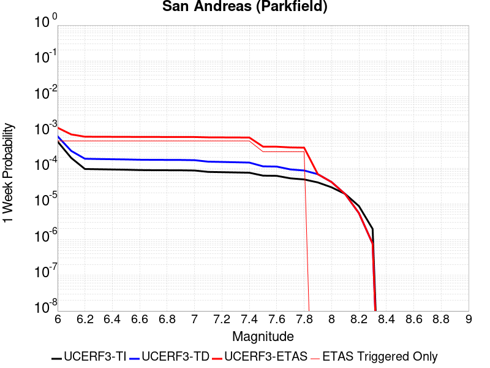 |  | 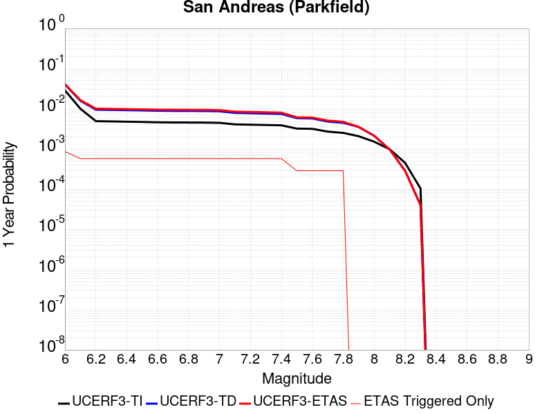 | 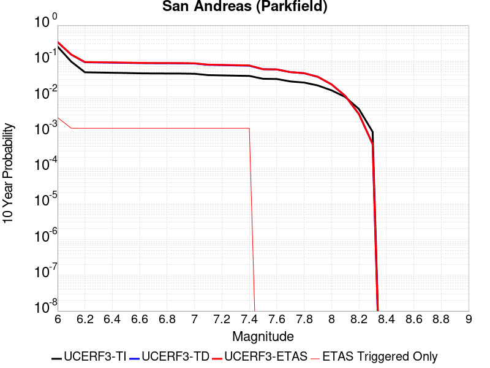 |

| Magnitude | 1 wk TI Prob | 1 wk TD Prob | 1 wk ETAS Prob | 1 wk ETAS/TD Gain | 1 wk ETAS Triggered Only | 1 mo TI Prob | 1 mo TD Prob | 1 mo ETAS Prob | 1 mo ETAS/TD Gain | 1 mo ETAS Triggered Only | 1 yr TI Prob | 1 yr TD Prob | 1 yr ETAS Prob | 1 yr ETAS/TD Gain | 1 yr ETAS Triggered Only | 10 yr TI Prob | 10 yr TD Prob | 10 yr ETAS Prob | 10 yr ETAS/TD Gain | 10 yr ETAS Triggered Only |
|-----|-----|-----|-----|-----|-----|-----|-----|-----|-----|-----|-----|-----|-----|-----|-----|-----|-----|-----|-----|-----|
| 6.0 | 5.556969E-4 | 7.7782426E-4 | 0.0020822918 | 2.6770725 | 0.001305483 | 0.0023793848 | 0.0033298214 | 0.0046309573 | 1.3907524 | 0.001305483 | 0.028586963 | 0.040191233 | 0.041444246 | 1.0311763 | 0.001305483 | 0.25176284 | 0.33716413 | 0.33889478 | 1.0051329 | 0.002610966 |
| 6.1 | 1.925858E-4 | 3.0276453E-4 | 0.0016078523 | 5.3105702 | 0.001305483 | 8.2510663E-4 | 0.0012970108 | 0.0026008005 | 2.0052266 | 0.001305483 | 0.0099994885 | 0.015778083 | 0.017062968 | 1.0814348 | 0.001305483 | 0.095613256 | 0.1497237 | 0.15083371 | 1.0074137 | 0.001305483 |
| 6.2 | 9.4306815E-5 | 1.8242796E-4 | 0.0014876728 | 8.154851 | 0.001305483 | 4.0410945E-4 | 7.816011E-4 | 0.0020860638 | 2.6689622 | 0.001305483 | 0.0049089384 | 0.009474681 | 0.010767794 | 1.136481 | 0.001305483 | 0.048019063 | 0.09185409 | 0.093039654 | 1.0129071 | 0.001305483 |
| 6.3 | 9.283051E-5 | 1.7939322E-4 | 0.001484642 | 8.275909 | 0.001305483 | 3.9778434E-4 | 7.686027E-4 | 0.0020730824 | 2.6972091 | 0.001305483 | 0.0048322747 | 0.009317789 | 0.010611108 | 1.1388011 | 0.001305483 | 0.047285385 | 0.09050704 | 0.09169436 | 1.0131186 | 0.001305483 |
| 6.4 | 9.138826E-5 | 1.770153E-4 | 0.0014822673 | 8.373667 | 0.001305483 | 3.916052E-4 | 7.5841765E-4 | 0.0020629105 | 2.720019 | 0.001305483 | 0.0047573745 | 0.00919484 | 0.010488319 | 1.1406745 | 0.001305483 | 0.046568092 | 0.08940927 | 0.09059803 | 1.0132958 | 0.001305483 |
| 6.5 | 9.000255E-5 | 1.7459576E-4 | 0.0014798508 | 8.475869 | 0.001305483 | 3.8566816E-4 | 7.480541E-4 | 0.0020525607 | 2.7438664 | 0.001305483 | 0.0046854047 | 0.009069731 | 0.010363375 | 1.142633 | 0.001305483 | 0.045878403 | 0.088295065 | 0.08948528 | 1.01348 | 0.001305483 |
| 6.6 | 8.8109264E-5 | 1.7140752E-4 | 0.0014766668 | 8.614947 | 0.001305483 | 3.7755648E-4 | 7.3439797E-4 | 0.0020389224 | 2.7763178 | 0.001305483 | 0.0045870654 | 0.008904854 | 0.010198711 | 1.145298 | 0.001305483 | 0.04493529 | 0.0868267 | 0.08801883 | 1.01373 | 0.001305483 |
| 6.7 | 8.738073E-5 | 1.7007832E-4 | 0.0014753393 | 8.67447 | 0.001305483 | 3.7443507E-4 | 7.287046E-4 | 0.0020332364 | 2.7902064 | 0.001305483 | 0.0045492216 | 0.008836143 | 0.010130091 | 1.146438 | 0.001305483 | 0.04457213 | 0.08622707 | 0.08741998 | 1.0138346 | 0.001305483 |
| 6.8 | 8.710195E-5 | 1.6953335E-4 | 0.001474795 | 8.699144 | 0.001305483 | 3.7324068E-4 | 7.263703E-4 | 0.002030905 | 2.7959638 | 0.001305483 | 0.0045347405 | 0.008807961 | 0.010101945 | 1.1469108 | 0.001305483 | 0.04443313 | 0.08597467 | 0.08716791 | 1.0138791 | 0.001305483 |
| 6.9 | 8.6801556E-5 | 1.689429E-4 | 0.0014742054 | 8.726057 | 0.001305483 | 3.7195362E-4 | 7.2384125E-4 | 0.0020283794 | 2.8022435 | 0.001305483 | 0.0045191357 | 0.008777418 | 0.010071442 | 1.1474265 | 0.001305483 | 0.044283327 | 0.085700735 | 0.08689433 | 1.0139276 | 0.001305483 |
| 7.0 | 8.5571606E-5 | 1.6647128E-4 | 0.0014717369 | 8.840786 | 0.001305483 | 3.6668387E-4 | 7.132544E-4 | 0.0020178063 | 2.8290133 | 0.001305483 | 0.004455241 | 0.008649553 | 0.009943745 | 1.1496252 | 0.001305483 | 0.043669727 | 0.08454914 | 0.08574425 | 1.014135 | 0.001305483 |
| 7.1 | 7.82589E-5 | 1.5128135E-4 | 0.0014565669 | 9.628199 | 0.001305483 | 3.3535215E-4 | 6.481883E-4 | 0.0019528251 | 3.0127437 | 0.001305483 | 0.0040752706 | 0.007863307 | 0.009158525 | 1.1647166 | 0.001305483 | 0.040013418 | 0.07746111 | 0.078665465 | 1.0155479 | 0.001305483 |
| 7.2 | 7.690929E-5 | 1.4865391E-4 | 0.0014539429 | 9.780724 | 0.001305483 | 3.2956956E-4 | 6.369334E-4 | 0.0019415849 | 3.048333 | 0.001305483 | 0.004005129 | 0.007727258 | 0.009022653 | 1.1676397 | 0.001305483 | 0.0393371 | 0.07623427 | 0.07744023 | 1.0158192 | 0.001305483 |
| 7.3 | 7.5543794E-5 | 1.4561978E-4 | 0.0014509127 | 9.963706 | 0.001305483 | 3.2371894E-4 | 6.2393624E-4 | 0.0019286047 | 3.0910287 | 0.001305483 | 0.003934157 | 0.007570127 | 0.008865728 | 1.1711464 | 0.001305483 | 0.038652334 | 0.074797355 | 0.07600519 | 1.0161481 | 0.001305483 |
| 7.4 | 7.4214564E-5 | 1.4262961E-4 | 0.0014479264 | 10.151653 | 0.001305483 | 3.1802364E-4 | 6.111273E-4 | 0.0019158125 | 3.134883 | 0.001305483 | 0.003865065 | 0.00741525 | 0.008711052 | 1.1747483 | 0.001305483 | 0.03798529 | 0.07337123 | 0.07458093 | 1.0164874 | 0.001305483 |
| 7.5 | 6.149578E-5 | 1.11907226E-4 | 1.11907226E-4 | 1.0 | 0.0 | 2.6352672E-4 | 4.7951436E-4 | 4.7951436E-4 | 1.0 | 0.0 | 0.0032037178 | 0.0058224914 | 0.0058224914 | 1.0 | 0.0 | 0.03157923 | 0.058557566 | 0.058557566 | 1.0 | 0.0 |
| 7.6 | 6.0643448E-5 | 1.10193796E-4 | 1.10193796E-4 | 1.0 | 0.0 | 2.598746E-4 | 4.7217376E-4 | 4.7217376E-4 | 1.0 | 0.0 | 0.0031593828 | 0.0057335934 | 0.0057335934 | 1.0 | 0.0 | 0.031148417 | 0.057718582 | 0.057718582 | 1.0 | 0.0 |
| 7.7 | 5.1652263E-5 | 9.174698E-5 | 9.174698E-5 | 1.0 | 0.0 | 2.2134806E-4 | 3.931421E-4 | 3.931421E-4 | 1.0 | 0.0 | 0.002691582 | 0.0047760103 | 0.0047760103 | 1.0 | 0.0 | 0.026592141 | 0.04853623 | 0.04853623 | 1.0 | 0.0 |
| 7.8 | 4.8090482E-5 | 8.559635E-5 | 8.559635E-5 | 1.0 | 0.0 | 2.060858E-4 | 3.6678996E-4 | 3.6678996E-4 | 1.0 | 0.0 | 0.0025062072 | 0.0044565317 | 0.0044565317 | 1.0 | 0.0 | 0.024781305 | 0.04530245 | 0.04530245 | 1.0 | 0.0 |
| 7.9 | 3.970278E-5 | 6.750426E-5 | 6.750426E-5 | 1.0 | 0.0 | 1.7014367E-4 | 2.892719E-4 | 2.892719E-4 | 1.0 | 0.0 | 0.002069531 | 0.0035162016 | 0.0035162016 | 1.0 | 0.0 | 0.020503636 | 0.035881363 | 0.035881363 | 1.0 | 0.0 |
| 8.0 | 2.8982335E-5 | 4.069796E-5 | 4.069796E-5 | 1.0 | 0.0 | 1.2420409E-4 | 1.7440817E-4 | 1.7440817E-4 | 1.0 | 0.0 | 0.0015111357 | 0.0021213528 | 0.0021213528 | 1.0 | 0.0 | 0.015009012 | 0.022010697 | 0.022010697 | 1.0 | 0.0 |
| 8.1 | 1.8836186E-5 | 1.8681134E-5 | 1.8681134E-5 | 1.0 | 0.0 | 8.0724014E-5 | 8.005955E-5 | 8.005955E-5 | 1.0 | 0.0 | 9.823717E-4 | 9.742898E-4 | 9.742898E-4 | 1.0 | 0.0 | 0.009780403 | 0.010488115 | 0.010488115 | 1.0 | 0.0 |
| 8.2 | 8.643924E-6 | 5.4748625E-6 | 5.4748625E-6 | 1.0 | 0.0 | 3.704486E-5 | 2.3463486E-5 | 2.3463486E-5 | 1.0 | 0.0 | 4.5092785E-4 | 2.8563058E-4 | 2.8563058E-4 | 1.0 | 0.0 | 0.0045001395 | 0.0032487072 | 0.0032487072 | 1.0 | 0.0 |
| 8.3 | 1.983087E-6 | 7.6599065E-7 | 7.6599065E-7 | 1.0 | 0.0 | 8.498917E-6 | 3.282813E-6 | 3.282813E-6 | 1.0 | 0.0 | 1.034694E-4 | 3.9967534E-5 | 3.9967534E-5 | 1.0 | 0.0 | 0.0010342124 | 4.719687E-4 | 4.719687E-4 | 1.0 | 0.0 |

## Paradise
*[(top)](#table-of-contents)*

| 1 Week | 1 Month | 1 Year | 10 Year |
|-----|-----|-----|-----|
|  |  |  |  |

| Magnitude | 1 wk TI Prob | 1 wk TD Prob | 1 wk ETAS Prob | 1 wk ETAS/TD Gain | 1 wk ETAS Triggered Only | 1 mo TI Prob | 1 mo TD Prob | 1 mo ETAS Prob | 1 mo ETAS/TD Gain | 1 mo ETAS Triggered Only | 1 yr TI Prob | 1 yr TD Prob | 1 yr ETAS Prob | 1 yr ETAS/TD Gain | 1 yr ETAS Triggered Only | 10 yr TI Prob | 10 yr TD Prob | 10 yr ETAS Prob | 10 yr ETAS/TD Gain | 10 yr ETAS Triggered Only |
|-----|-----|-----|-----|-----|-----|-----|-----|-----|-----|-----|-----|-----|-----|-----|-----|-----|-----|-----|-----|-----|
| 6.0 | 1.4851273E-5 | 1.6694692E-5 | 0.0013221559 | 79.19619 | 0.001305483 | 6.364676E-5 | 7.154685E-5 | 0.0013769364 | 19.245243 | 0.001305483 | 7.7462377E-4 | 8.707584E-4 | 0.003479451 | 3.9958856 | 0.002610966 | 0.0077192914 | 0.008675844 | 0.011264158 | 1.2983357 | 0.002610966 |
| 6.1 | 1.4851273E-5 | 1.6694692E-5 | 0.0013221559 | 79.19619 | 0.001305483 | 6.364676E-5 | 7.154685E-5 | 0.0013769364 | 19.245243 | 0.001305483 | 7.7462377E-4 | 8.707584E-4 | 0.003479451 | 3.9958856 | 0.002610966 | 0.0077192914 | 0.008675844 | 0.011264158 | 1.2983357 | 0.002610966 |
| 6.2 | 1.4851273E-5 | 1.6694692E-5 | 0.0013221559 | 79.19619 | 0.001305483 | 6.364676E-5 | 7.154685E-5 | 0.0013769364 | 19.245243 | 0.001305483 | 7.7462377E-4 | 8.707584E-4 | 0.003479451 | 3.9958856 | 0.002610966 | 0.0077192914 | 0.008675844 | 0.011264158 | 1.2983357 | 0.002610966 |
| 6.3 | 1.0426831E-5 | 1.188862E-5 | 0.0013173561 | 110.80816 | 0.001305483 | 4.4685654E-5 | 5.0950268E-5 | 0.0013563668 | 26.621386 | 0.001305483 | 5.43912E-4 | 6.201489E-4 | 0.0019248223 | 3.1038067 | 0.001305483 | 0.0054258266 | 0.0061847917 | 0.0074822004 | 1.209774 | 0.001305483 |
| 6.4 | 1.0426831E-5 | 1.188862E-5 | 0.0013173561 | 110.80816 | 0.001305483 | 4.4685654E-5 | 5.0950268E-5 | 0.0013563668 | 26.621386 | 0.001305483 | 5.43912E-4 | 6.201489E-4 | 0.0019248223 | 3.1038067 | 0.001305483 | 0.0054258266 | 0.0061847917 | 0.0074822004 | 1.209774 | 0.001305483 |
| 6.5 | 9.25027E-6 | 1.06199595E-5 | 0.0013160891 | 123.926 | 0.001305483 | 3.964341E-5 | 4.551335E-5 | 0.001350937 | 29.682215 | 0.001305483 | 4.8255164E-4 | 5.53989E-4 | 0.0018587488 | 3.3552089 | 0.001305483 | 0.0048150513 | 0.0055265795 | 0.0068248473 | 1.2349135 | 0.001305483 |
| 6.6 | 7.904275E-6 | 9.159525E-6 | 0.0013146306 | 143.52606 | 0.001305483 | 3.3875025E-5 | 3.9254537E-5 | 0.0013446864 | 34.25556 | 0.001305483 | 4.1235037E-4 | 4.7782314E-4 | 0.0017826824 | 3.7308414 | 0.001305483 | 0.0041158604 | 0.0047683544 | 0.006067612 | 1.2724751 | 0.001305483 |
| 6.7 | 7.2061953E-6 | 8.407248E-6 | 0.0013138793 | 156.27934 | 0.001305483 | 3.088333E-5 | 3.6030586E-5 | 0.0013414666 | 37.231327 | 0.001305483 | 3.7593965E-4 | 4.3858777E-4 | 0.0017434983 | 3.975255 | 0.001305483 | 0.003753043 | 0.004377591 | 0.005677359 | 1.296914 | 0.001305483 |
| 6.8 | 6.6948724E-6 | 7.842166E-6 | 0.001313315 | 167.4684 | 0.001305483 | 2.8691995E-5 | 3.360887E-5 | 0.001339048 | 39.842102 | 0.001305483 | 3.4926904E-4 | 4.0911473E-4 | 0.0017140637 | 4.1896896 | 0.001305483 | 0.003487206 | 0.0040839734 | 0.005384125 | 1.3183546 | 0.001305483 |
| 6.9 | 6.0421025E-6 | 7.130621E-6 | 7.130621E-6 | 1.0 | 0.0 | 2.5894467E-5 | 3.0559466E-5 | 3.0559466E-5 | 1.0 | 0.0 | 3.1521954E-4 | 3.7200135E-4 | 3.7200135E-4 | 1.0 | 0.0 | 0.0031477278 | 0.0037141247 | 0.0037141247 | 1.0 | 0.0 |
| 7.0 | 4.134091E-6 | 5.0803087E-6 | 5.0803087E-6 | 1.0 | 0.0 | 1.7717413E-5 | 2.177258E-5 | 2.177258E-5 | 1.0 | 0.0 | 2.1568815E-4 | 2.6505045E-4 | 2.6505045E-4 | 1.0 | 0.0 | 0.0021547892 | 0.0026474963 | 0.0026474963 | 1.0 | 0.0 |
| 7.1 | 3.7674888E-6 | 4.6318696E-6 | 4.6318696E-6 | 1.0 | 0.0 | 1.6146281E-5 | 1.9850726E-5 | 1.9850726E-5 | 1.0 | 0.0 | 1.9656324E-4 | 2.4165731E-4 | 2.4165731E-4 | 1.0 | 0.0 | 0.0019638946 | 0.002414096 | 0.002414096 | 1.0 | 0.0 |
| 7.2 | 3.4065345E-6 | 4.156723E-6 | 4.156723E-6 | 1.0 | 0.0 | 1.4599351E-5 | 1.7814415E-5 | 1.7814415E-5 | 1.0 | 0.0 | 1.777326E-4 | 2.1687041E-4 | 2.1687041E-4 | 1.0 | 0.0 | 0.0017759053 | 0.002166736 | 0.002166736 | 1.0 | 0.0 |
| 7.3 | 2.9934936E-6 | 3.6293168E-6 | 3.6293168E-6 | 1.0 | 0.0 | 1.2829195E-5 | 1.555413E-5 | 1.555413E-5 | 1.0 | 0.0 | 1.5618425E-4 | 1.8935655E-4 | 1.8935655E-4 | 1.0 | 0.0 | 0.0015607453 | 0.0018920974 | 0.0018920974 | 1.0 | 0.0 |
| 7.4 | 2.4049796E-6 | 2.8889842E-6 | 2.8889842E-6 | 1.0 | 0.0 | 1.0307015E-5 | 1.238131E-5 | 1.238131E-5 | 1.0 | 0.0 | 1.2548068E-4 | 1.5073347E-4 | 1.5073347E-4 | 1.0 | 0.0 | 0.0012540985 | 0.0015064536 | 0.0015064536 | 1.0 | 0.0 |
| 7.5 | 1.2710091E-6 | 1.5134682E-6 | 1.5134682E-6 | 1.0 | 0.0 | 5.44717E-6 | 6.4862834E-6 | 6.4862834E-6 | 1.0 | 0.0 | 6.631728E-5 | 7.8968886E-5 | 7.8968886E-5 | 1.0 | 0.0 | 6.6297496E-4 | 7.8953087E-4 | 7.8953087E-4 | 1.0 | 0.0 |
| 7.6 | 2.21172E-7 | 2.603961E-7 | 2.603961E-7 | 1.0 | 0.0 | 9.478797E-7 | 1.1159829E-6 | 1.1159829E-6 | 1.0 | 0.0 | 1.1540374E-5 | 1.3587036E-5 | 1.3587036E-5 | 1.0 | 0.0 | 1.1539775E-4 | 1.3586486E-4 | 1.3586486E-4 | 1.0 | 0.0 |

## Kern Canyon (North Kern) 2011
*[(top)](#table-of-contents)*

| 1 Week | 1 Month | 1 Year | 10 Year |
|-----|-----|-----|-----|
| 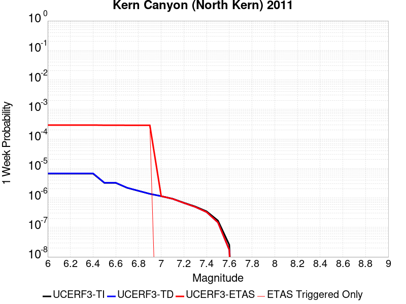 | 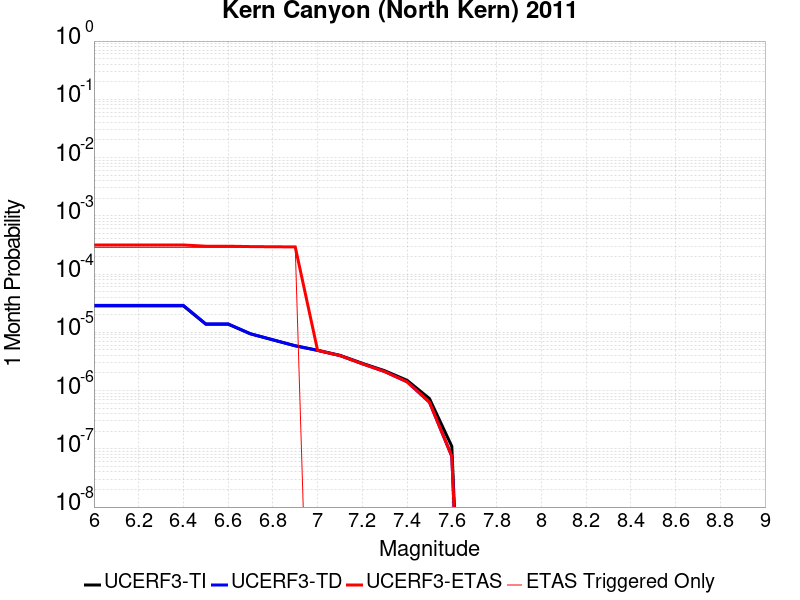 | 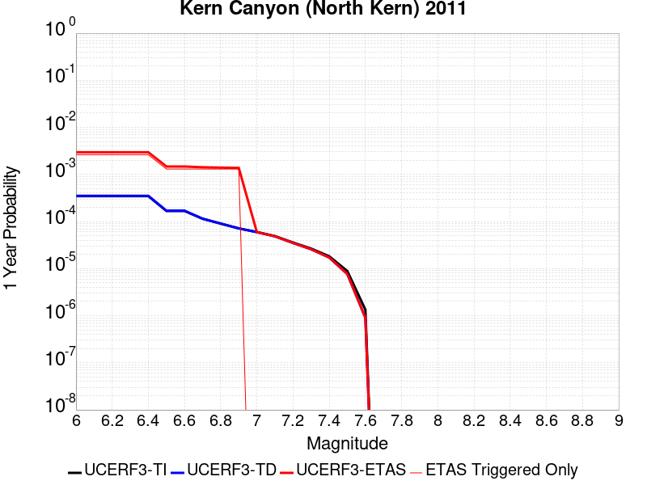 | 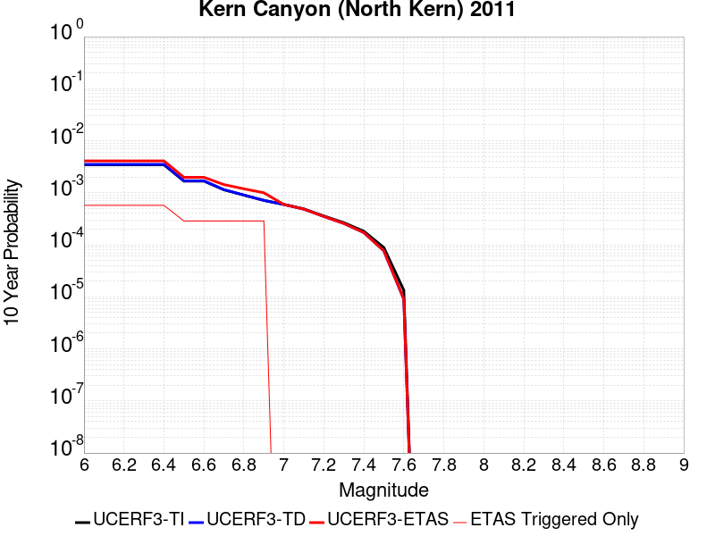 |

| Magnitude | 1 wk TI Prob | 1 wk TD Prob | 1 wk ETAS Prob | 1 wk ETAS/TD Gain | 1 wk ETAS Triggered Only | 1 mo TI Prob | 1 mo TD Prob | 1 mo ETAS Prob | 1 mo ETAS/TD Gain | 1 mo ETAS Triggered Only | 1 yr TI Prob | 1 yr TD Prob | 1 yr ETAS Prob | 1 yr ETAS/TD Gain | 1 yr ETAS Triggered Only | 10 yr TI Prob | 10 yr TD Prob | 10 yr ETAS Prob | 10 yr ETAS/TD Gain | 10 yr ETAS Triggered Only |
|-----|-----|-----|-----|-----|-----|-----|-----|-----|-----|-----|-----|-----|-----|-----|-----|-----|-----|-----|-----|-----|
| 6.0 | 6.6264497E-6 | 6.75733E-6 | 0.0013122315 | 194.19379 | 0.001305483 | 2.8398761E-5 | 2.895971E-5 | 0.0013344049 | 46.07798 | 0.001305483 | 3.4570007E-4 | 3.5253543E-4 | 0.002962581 | 8.403641 | 0.002610966 | 0.0034516277 | 0.0035205502 | 0.006122324 | 1.7390249 | 0.002610966 |
| 6.1 | 6.6264497E-6 | 6.75733E-6 | 0.0013122315 | 194.19379 | 0.001305483 | 2.8398761E-5 | 2.895971E-5 | 0.0013344049 | 46.07798 | 0.001305483 | 3.4570007E-4 | 3.5253543E-4 | 0.002962581 | 8.403641 | 0.002610966 | 0.0034516277 | 0.0035205502 | 0.006122324 | 1.7390249 | 0.002610966 |
| 6.2 | 6.6264497E-6 | 6.75733E-6 | 0.0013122315 | 194.19379 | 0.001305483 | 2.8398761E-5 | 2.895971E-5 | 0.0013344049 | 46.07798 | 0.001305483 | 3.4570007E-4 | 3.5253543E-4 | 0.002962581 | 8.403641 | 0.002610966 | 0.0034516277 | 0.0035205502 | 0.006122324 | 1.7390249 | 0.002610966 |
| 6.3 | 6.6264497E-6 | 6.75733E-6 | 0.0013122315 | 194.19379 | 0.001305483 | 2.8398761E-5 | 2.895971E-5 | 0.0013344049 | 46.07798 | 0.001305483 | 3.4570007E-4 | 3.5253543E-4 | 0.002962581 | 8.403641 | 0.002610966 | 0.0034516277 | 0.0035205502 | 0.006122324 | 1.7390249 | 0.002610966 |
| 6.4 | 6.6264497E-6 | 6.75733E-6 | 0.0013122315 | 194.19379 | 0.001305483 | 2.8398761E-5 | 2.895971E-5 | 0.0013344049 | 46.07798 | 0.001305483 | 3.4570007E-4 | 3.5253543E-4 | 0.002962581 | 8.403641 | 0.002610966 | 0.0034516277 | 0.0035205502 | 0.006122324 | 1.7390249 | 0.002610966 |
| 6.5 | 3.2162225E-6 | 3.2570915E-6 | 0.0013087359 | 401.81122 | 0.001305483 | 1.3783738E-5 | 1.3958893E-5 | 0.0013194237 | 94.52209 | 0.001305483 | 1.6780409E-4 | 1.6993708E-4 | 0.0014751983 | 8.68085 | 0.001305483 | 0.0016767744 | 0.001698151 | 0.003001417 | 1.7674619 | 0.001305483 |
| 6.6 | 3.2162225E-6 | 3.2570915E-6 | 0.0013087359 | 401.81122 | 0.001305483 | 1.3783738E-5 | 1.3958893E-5 | 0.0013194237 | 94.52209 | 0.001305483 | 1.6780409E-4 | 1.6993708E-4 | 0.0014751983 | 8.68085 | 0.001305483 | 0.0016767744 | 0.001698151 | 0.003001417 | 1.7674619 | 0.001305483 |
| 6.7 | 2.1908265E-6 | 2.2071222E-6 | 0.0013076873 | 592.4852 | 0.001305483 | 9.389223E-6 | 9.459061E-6 | 0.0013149297 | 139.01271 | 0.001305483 | 1.1430779E-4 | 1.1515819E-4 | 0.0014204909 | 12.335127 | 0.001305483 | 0.0011424901 | 0.0011510046 | 0.002454985 | 2.1329064 | 0.001305483 |
| 6.8 | 1.7303895E-6 | 1.7365529E-6 | 0.0013072173 | 752.7656 | 0.001305483 | 7.415934E-6 | 7.4423488E-6 | 0.0013129157 | 176.41147 | 0.001305483 | 9.028525E-5 | 9.0606925E-5 | 0.0013959716 | 15.406898 | 0.001305483 | 9.024858E-4 | 9.057096E-4 | 0.0022100103 | 2.440087 | 0.001305483 |
| 6.9 | 1.3700314E-6 | 1.3688622E-6 | 0.0013068501 | 954.69806 | 0.001305483 | 5.87155E-6 | 5.8665396E-6 | 0.0013113419 | 223.52904 | 0.001305483 | 7.148377E-5 | 7.142282E-5 | 0.0013768126 | 19.276928 | 0.001305483 | 7.146078E-4 | 7.140032E-4 | 0.0020185541 | 2.8270938 | 0.001305483 |
| 7.0 | 1.1467797E-6 | 1.1413804E-6 | 1.1413804E-6 | 1.0 | 0.0 | 4.9147607E-6 | 4.8916213E-6 | 4.8916213E-6 | 1.0 | 0.0 | 5.983557E-5 | 5.9553895E-5 | 5.9553895E-5 | 1.0 | 0.0 | 5.981946E-4 | 5.953825E-4 | 5.953825E-4 | 1.0 | 0.0 |
| 7.1 | 9.3952065E-7 | 9.3026904E-7 | 9.3026904E-7 | 1.0 | 0.0 | 4.026511E-6 | 3.9868614E-6 | 3.9868614E-6 | 1.0 | 0.0 | 4.9021666E-5 | 4.8538972E-5 | 4.8538972E-5 | 1.0 | 0.0 | 4.901085E-4 | 4.8528548E-4 | 4.8528548E-4 | 1.0 | 0.0 |
| 7.2 | 6.858055E-7 | 6.7193E-7 | 6.7193E-7 | 1.0 | 0.0 | 2.939163E-6 | 2.879697E-6 | 2.879697E-6 | 1.0 | 0.0 | 3.5783723E-5 | 3.5059755E-5 | 3.5059755E-5 | 1.0 | 0.0 | 3.5777962E-4 | 3.5054312E-4 | 3.5054312E-4 | 1.0 | 0.0 |
| 7.3 | 5.1101983E-7 | 4.9393E-7 | 4.9393E-7 | 1.0 | 0.0 | 2.1900833E-6 | 2.116841E-6 | 2.116841E-6 | 1.0 | 0.0 | 2.6663936E-5 | 2.5772239E-5 | 2.5772239E-5 | 1.0 | 0.0 | 2.6660739E-4 | 2.57693E-4 | 2.57693E-4 | 1.0 | 0.0 |
| 7.4 | 3.4999414E-7 | 3.2995905E-7 | 3.2995905E-7 | 1.0 | 0.0 | 1.499974E-6 | 1.4141094E-6 | 1.4141094E-6 | 1.0 | 0.0 | 1.8262032E-5 | 1.721665E-5 | 1.721665E-5 | 1.0 | 0.0 | 1.826053E-4 | 1.7215339E-4 | 1.7215339E-4 | 1.0 | 0.0 |
| 7.5 | 1.7021522E-7 | 1.4750044E-7 | 1.4750044E-7 | 1.0 | 0.0 | 7.2949354E-7 | 6.321446E-7 | 6.321446E-7 | 1.0 | 0.0 | 8.881548E-6 | 7.696334E-6 | 7.696334E-6 | 1.0 | 0.0 | 8.8811925E-5 | 7.696076E-5 | 7.696076E-5 | 1.0 | 0.0 |
| 7.6 | 2.572245E-8 | 1.7352555E-8 | 1.7352555E-8 | 1.0 | 0.0 | 1.10239064E-7 | 7.436809E-8 | 7.436809E-8 | 1.0 | 0.0 | 1.3421597E-6 | 9.054312E-7 | 9.054312E-7 | 1.0 | 0.0 | 1.3421517E-5 | 9.05428E-6 | 9.05428E-6 | 1.0 | 0.0 |

## Death Valley (Fish Lake Valley)
*[(top)](#table-of-contents)*

| 1 Week | 1 Month | 1 Year | 10 Year |
|-----|-----|-----|-----|
|  |  |  |  |

| Magnitude | 1 wk TI Prob | 1 wk TD Prob | 1 wk ETAS Prob | 1 wk ETAS/TD Gain | 1 wk ETAS Triggered Only | 1 mo TI Prob | 1 mo TD Prob | 1 mo ETAS Prob | 1 mo ETAS/TD Gain | 1 mo ETAS Triggered Only | 1 yr TI Prob | 1 yr TD Prob | 1 yr ETAS Prob | 1 yr ETAS/TD Gain | 1 yr ETAS Triggered Only | 10 yr TI Prob | 10 yr TD Prob | 10 yr ETAS Prob | 10 yr ETAS/TD Gain | 10 yr ETAS Triggered Only |
|-----|-----|-----|-----|-----|-----|-----|-----|-----|-----|-----|-----|-----|-----|-----|-----|-----|-----|-----|-----|-----|
| 6.0 | 3.872328E-5 | 4.7267473E-5 | 0.0013526888 | 28.617752 | 0.001305483 | 1.6594635E-4 | 2.0256084E-4 | 0.0015077795 | 7.443588 | 0.001305483 | 0.0020185246 | 0.002463534 | 0.003765801 | 1.5286174 | 0.001305483 | 0.02000288 | 0.024388181 | 0.025661826 | 1.0522238 | 0.001305483 |
| 6.1 | 3.872328E-5 | 4.7267473E-5 | 0.0013526888 | 28.617752 | 0.001305483 | 1.6594635E-4 | 2.0256084E-4 | 0.0015077795 | 7.443588 | 0.001305483 | 0.0020185246 | 0.002463534 | 0.003765801 | 1.5286174 | 0.001305483 | 0.02000288 | 0.024388181 | 0.025661826 | 1.0522238 | 0.001305483 |
| 6.2 | 3.872328E-5 | 4.7267473E-5 | 0.0013526888 | 28.617752 | 0.001305483 | 1.6594635E-4 | 2.0256084E-4 | 0.0015077795 | 7.443588 | 0.001305483 | 0.0020185246 | 0.002463534 | 0.003765801 | 1.5286174 | 0.001305483 | 0.02000288 | 0.024388181 | 0.025661826 | 1.0522238 | 0.001305483 |
| 6.3 | 2.8356371E-5 | 3.3609853E-5 | 0.001339049 | 39.84097 | 0.001305483 | 1.2152165E-4 | 1.4403471E-4 | 0.0014493297 | 10.062364 | 0.001305483 | 0.0014785219 | 0.0017522911 | 0.0030554866 | 1.7437094 | 0.001305483 | 0.014687235 | 0.017391782 | 0.01867456 | 1.0737578 | 0.001305483 |
| 6.4 | 2.8356371E-5 | 3.3609853E-5 | 0.001339049 | 39.84097 | 0.001305483 | 1.2152165E-4 | 1.4403471E-4 | 0.0014493297 | 10.062364 | 0.001305483 | 0.0014785219 | 0.0017522911 | 0.0030554866 | 1.7437094 | 0.001305483 | 0.014687235 | 0.017391782 | 0.01867456 | 1.0737578 | 0.001305483 |
| 6.5 | 2.4448687E-5 | 2.8607552E-5 | 0.0013340532 | 46.632904 | 0.001305483 | 1.0477588E-4 | 1.2259831E-4 | 0.0014279214 | 11.647152 | 0.001305483 | 0.0012748998 | 0.0014916632 | 0.0027951987 | 1.8738807 | 0.001305483 | 0.012676105 | 0.014821377 | 0.01610751 | 1.0867757 | 0.001305483 |
| 6.6 | 2.1298161E-5 | 2.4660083E-5 | 0.001330111 | 53.93781 | 0.001305483 | 9.127464E-5 | 1.0568198E-4 | 0.001411027 | 13.351633 | 0.001305483 | 0.0011107022 | 0.0012859525 | 0.0025897569 | 2.0138822 | 0.001305483 | 0.011051672 | 0.012788526 | 0.014077313 | 1.1007769 | 0.001305483 |
| 6.7 | 1.8959729E-5 | 2.1781025E-5 | 0.0013272356 | 60.935406 | 0.001305483 | 8.125345E-5 | 9.334405E-5 | 0.0013987052 | 14.9844055 | 0.001305483 | 9.888117E-4 | 0.001135897 | 0.002439897 | 2.1479917 | 0.001305483 | 0.009844234 | 0.01130357 | 0.012594297 | 1.1141875 | 0.001305483 |
| 6.8 | 1.6691629E-5 | 1.9018353E-5 | 0.0013244766 | 69.64203 | 0.001305483 | 7.153359E-5 | 8.150477E-5 | 0.0013868813 | 17.015953 | 0.001305483 | 8.7057345E-4 | 9.918857E-4 | 0.0022960738 | 2.3148572 | 0.001305483 | 0.008671708 | 0.009876343 | 0.0111689335 | 1.1308774 | 0.001305483 |
| 6.9 | 1.450505E-5 | 1.638954E-5 | 0.0013218512 | 80.65212 | 0.001305483 | 6.216302E-5 | 7.0239046E-5 | 0.0013756304 | 19.584982 | 0.001305483 | 7.5657194E-4 | 8.5483363E-4 | 0.0021592006 | 2.5258725 | 0.001305483 | 0.007540013 | 0.008516385 | 0.00981075 | 1.1519853 | 0.001305483 |
| 7.0 | 1.2940855E-5 | 1.4537972E-5 | 0.001320002 | 90.79685 | 0.001305483 | 5.545963E-5 | 6.230414E-5 | 0.0013677059 | 21.952087 | 0.001305483 | 6.750118E-4 | 7.5829466E-4 | 0.0020627878 | 2.7202983 | 0.001305483 | 0.006729651 | 0.0075576897 | 0.008853306 | 1.1714302 | 0.001305483 |
| 7.1 | 1.2544658E-5 | 1.4078208E-5 | 0.0013195429 | 93.72946 | 0.001305483 | 5.3761712E-5 | 6.0333812E-5 | 0.0013657381 | 22.636364 | 0.001305483 | 6.5435225E-4 | 7.343222E-4 | 0.0020388465 | 2.7765014 | 0.001305483 | 0.006524288 | 0.007319551 | 0.008615478 | 1.1770501 | 0.001305483 |
| 7.2 | 1.2489416E-5 | 1.4015674E-5 | 0.0013194804 | 94.143196 | 0.001305483 | 5.3524967E-5 | 6.0065824E-5 | 0.0013654705 | 22.7329 | 0.001305483 | 6.514716E-4 | 7.310616E-4 | 0.0020355904 | 2.7844305 | 0.001305483 | 0.006495651 | 0.0072871596 | 0.008583129 | 1.177843 | 0.001305483 |
| 7.3 | 1.2368307E-5 | 1.3879812E-5 | 0.0013193447 | 95.05494 | 0.001305483 | 5.3005948E-5 | 5.9483587E-5 | 0.001364889 | 22.94564 | 0.001305483 | 6.451563E-4 | 7.2397763E-4 | 0.0020285156 | 2.8019037 | 0.001305483 | 0.0064328653 | 0.007216782 | 0.008512843 | 1.17959 | 0.001305483 |
| 7.4 | 1.2161707E-5 | 1.36478675E-5 | 0.0013191131 | 96.65342 | 0.001305483 | 5.212056E-5 | 5.8489582E-5 | 0.0013638963 | 23.318619 | 0.001305483 | 6.3438306E-4 | 7.118836E-4 | 0.0020164372 | 2.832538 | 0.001305483 | 0.006325751 | 0.0070966207 | 0.008392839 | 1.182653 | 0.001305483 |
| 7.5 | 1.1707948E-5 | 1.3145515E-5 | 0.0013186114 | 100.30884 | 0.001305483 | 5.0175953E-5 | 5.6336736E-5 | 0.0013617462 | 24.171549 | 0.001305483 | 6.10721E-4 | 6.856895E-4 | 0.0019902773 | 2.9025927 | 0.001305483 | 0.0060904534 | 0.006836321 | 0.00813288 | 1.1896573 | 0.001305483 |
| 7.6 | 1.0319538E-5 | 1.1579622E-5 | 0.0013170475 | 113.73839 | 0.001305483 | 4.4225842E-5 | 4.9626036E-5 | 0.0013550443 | 27.305107 | 0.001305483 | 5.383166E-4 | 6.040347E-4 | 0.0019087292 | 3.1599662 | 0.001305483 | 0.0053701443 | 0.0060244603 | 0.0073220786 | 1.2153916 | 0.001305483 |
| 7.7 | 8.937764E-6 | 1.0022779E-5 | 0.0013154927 | 131.25029 | 0.001305483 | 3.830414E-5 | 4.295409E-5 | 0.001348381 | 31.391214 | 0.001305483 | 4.6625308E-4 | 5.228456E-4 | 0.001827646 | 3.4955752 | 0.001305483 | 0.0046527605 | 0.005216664 | 0.006515337 | 1.248947 | 0.001305483 |
| 7.8 | 3.108007E-7 | 3.284654E-7 | 3.284654E-7 | 1.0 | 0.0 | 1.3320023E-6 | 1.407708E-6 | 1.407708E-6 | 1.0 | 0.0 | 1.6217007E-5 | 1.7138715E-5 | 1.7138715E-5 | 1.0 | 0.0 | 1.6215823E-4 | 1.7137431E-4 | 1.7137431E-4 | 1.0 | 0.0 |
| 7.9 | 2.5591178E-9 | 2.6696718E-9 | 2.6696718E-9 | 1.0 | 0.0 | 1.0967647E-8 | 1.14414505E-8 | 1.14414505E-8 | 1.0 | 0.0 | 1.335311E-7 | 1.3929966E-7 | 1.3929966E-7 | 1.0 | 0.0 | 1.3353102E-6 | 1.3929966E-6 | 1.3929966E-6 | 1.0 | 0.0 |

## San Andreas (San Bernardino S)
*[(top)](#table-of-contents)*

| 1 Week | 1 Month | 1 Year | 10 Year |
|-----|-----|-----|-----|
|  |  |  |  |

| Magnitude | 1 wk TI Prob | 1 wk TD Prob | 1 wk ETAS Prob | 1 wk ETAS/TD Gain | 1 wk ETAS Triggered Only | 1 mo TI Prob | 1 mo TD Prob | 1 mo ETAS Prob | 1 mo ETAS/TD Gain | 1 mo ETAS Triggered Only | 1 yr TI Prob | 1 yr TD Prob | 1 yr ETAS Prob | 1 yr ETAS/TD Gain | 1 yr ETAS Triggered Only | 10 yr TI Prob | 10 yr TD Prob | 10 yr ETAS Prob | 10 yr ETAS/TD Gain | 10 yr ETAS Triggered Only |
|-----|-----|-----|-----|-----|-----|-----|-----|-----|-----|-----|-----|-----|-----|-----|-----|-----|-----|-----|-----|-----|
| 6.0 | 1.2336002E-4 | 3.0004102E-4 | 3.0004102E-4 | 1.0 | 0.0 | 5.2857865E-4 | 0.0012852824 | 0.0012852824 | 1.0 | 0.0 | 0.006416472 | 0.015540994 | 0.016826188 | 1.082697 | 0.001305483 | 0.06234337 | 0.14283717 | 0.14507519 | 1.0156684 | 0.002610966 |
| 6.1 | 1.2336002E-4 | 3.0004102E-4 | 3.0004102E-4 | 1.0 | 0.0 | 5.2857865E-4 | 0.0012852824 | 0.0012852824 | 1.0 | 0.0 | 0.006416472 | 0.015540994 | 0.016826188 | 1.082697 | 0.001305483 | 0.06234337 | 0.14283717 | 0.14507519 | 1.0156684 | 0.002610966 |
| 6.2 | 1.2336002E-4 | 3.0004102E-4 | 3.0004102E-4 | 1.0 | 0.0 | 5.2857865E-4 | 0.0012852824 | 0.0012852824 | 1.0 | 0.0 | 0.006416472 | 0.015540994 | 0.016826188 | 1.082697 | 0.001305483 | 0.06234337 | 0.14283717 | 0.14507519 | 1.0156684 | 0.002610966 |
| 6.3 | 1.1712257E-4 | 2.8792414E-4 | 2.8792414E-4 | 1.0 | 0.0 | 5.018573E-4 | 0.0012334028 | 0.0012334028 | 1.0 | 0.0 | 0.006093008 | 0.014918125 | 0.016204134 | 1.0862044 | 0.001305483 | 0.059286322 | 0.13754563 | 0.13979746 | 1.0163716 | 0.002610966 |
| 6.4 | 1.1712257E-4 | 2.8792414E-4 | 2.8792414E-4 | 1.0 | 0.0 | 5.018573E-4 | 0.0012334028 | 0.0012334028 | 1.0 | 0.0 | 0.006093008 | 0.014918125 | 0.016204134 | 1.0862044 | 0.001305483 | 0.059286322 | 0.13754563 | 0.13979746 | 1.0163716 | 0.002610966 |
| 6.5 | 1.0689076E-4 | 2.680528E-4 | 2.680528E-4 | 1.0 | 0.0 | 4.5802278E-4 | 0.0011483167 | 0.0011483167 | 1.0 | 0.0 | 0.0055621783 | 0.01389575 | 0.015183093 | 1.0926429 | 0.001305483 | 0.05425003 | 0.12879294 | 0.13106763 | 1.0176616 | 0.002610966 |
| 6.6 | 9.7648895E-5 | 2.50501E-4 | 2.50501E-4 | 1.0 | 0.0 | 4.1842813E-4 | 0.0010731576 | 0.0010731576 | 1.0 | 0.0 | 0.005082469 | 0.012991785 | 0.014280308 | 1.0991797 | 0.001305483 | 0.049677886 | 0.12095292 | 0.12324808 | 1.0189756 | 0.002610966 |
| 6.7 | 8.757013E-5 | 2.3120902E-4 | 2.3120902E-4 | 1.0 | 0.0 | 3.7524657E-4 | 9.905418E-4 | 9.905418E-4 | 1.0 | 0.0 | 0.00455906 | 0.011997245 | 0.013287066 | 1.1075097 | 0.001305483 | 0.04466656 | 0.11226123 | 0.11457908 | 1.0206469 | 0.002610966 |
| 6.8 | 8.562978E-5 | 2.2680782E-4 | 2.2680782E-4 | 1.0 | 0.0 | 3.6693315E-4 | 9.7169366E-4 | 9.7169366E-4 | 1.0 | 0.0 | 0.004458263 | 0.011770263 | 0.013060381 | 1.1096082 | 0.001305483 | 0.043698758 | 0.11027153 | 0.11259458 | 1.0210667 | 0.002610966 |
| 6.9 | 6.124075E-5 | 1.7065753E-4 | 1.7065753E-4 | 1.0 | 0.0 | 2.6243398E-4 | 7.311852E-4 | 7.311852E-4 | 1.0 | 0.0 | 0.0031904527 | 0.008866051 | 0.010159959 | 1.1459397 | 0.001305483 | 0.031450346 | 0.08418263 | 0.086573794 | 1.0284045 | 0.002610966 |
| 7.0 | 5.8598747E-5 | 1.649477E-4 | 1.649477E-4 | 1.0 | 0.0 | 2.5111332E-4 | 7.06728E-4 | 7.06728E-4 | 1.0 | 0.0 | 0.0030530186 | 0.008570663 | 0.009864957 | 1.1510144 | 0.001305483 | 0.03011414 | 0.081500374 | 0.083898544 | 1.0294253 | 0.002610966 |
| 7.1 | 5.613814E-5 | 1.5913323E-4 | 1.5913323E-4 | 1.0 | 0.0 | 2.4056983E-4 | 6.818221E-4 | 6.818221E-4 | 1.0 | 0.0 | 0.0029250039 | 0.008269769 | 0.009564456 | 1.1565566 | 0.001305483 | 0.028868021 | 0.07879931 | 0.08120453 | 1.0305234 | 0.002610966 |
| 7.2 | 4.991222E-5 | 1.4519796E-4 | 1.4519796E-4 | 1.0 | 0.0 | 2.1389198E-4 | 6.2212895E-4 | 6.2212895E-4 | 1.0 | 0.0 | 0.002601025 | 0.007548217 | 0.008843846 | 1.1716471 | 0.001305483 | 0.025707912 | 0.07225321 | 0.07467552 | 1.0335253 | 0.002610966 |
| 7.3 | 4.7410045E-5 | 1.3714004E-4 | 1.3714004E-4 | 1.0 | 0.0 | 2.0317009E-4 | 5.8761094E-4 | 5.8761094E-4 | 1.0 | 0.0 | 0.0024707897 | 0.0071307817 | 0.008426955 | 1.1817716 | 0.001305483 | 0.024434982 | 0.06853558 | 0.0709676 | 1.0354855 | 0.002610966 |
| 7.4 | 4.5556746E-5 | 1.3121912E-4 | 1.3121912E-4 | 1.0 | 0.0 | 1.952286E-4 | 5.622468E-4 | 5.622468E-4 | 1.0 | 0.0 | 0.002374317 | 0.0068239477 | 0.008120522 | 1.1900036 | 0.001305483 | 0.023491086 | 0.065788016 | 0.06822721 | 1.0370766 | 0.002610966 |
| 7.5 | 4.3084514E-5 | 1.2357246E-4 | 1.2357246E-4 | 1.0 | 0.0 | 1.8463485E-4 | 5.2948913E-4 | 5.2948913E-4 | 1.0 | 0.0 | 0.0022456115 | 0.0064275465 | 0.0077246386 | 1.201802 | 0.001305483 | 0.022230545 | 0.062188786 | 0.06341308 | 1.0196868 | 0.001305483 |
| 7.6 | 3.408608E-5 | 9.83552E-5 | 9.83552E-5 | 1.0 | 0.0 | 1.4607502E-4 | 4.214543E-4 | 4.214543E-4 | 1.0 | 0.0 | 0.0017770125 | 0.0051191594 | 0.006417959 | 1.2537136 | 0.001305483 | 0.017628696 | 0.050020292 | 0.051260475 | 1.0247936 | 0.001305483 |
| 7.7 | 2.8315713E-5 | 8.248679E-5 | 8.248679E-5 | 1.0 | 0.0 | 1.2134742E-4 | 3.5346695E-4 | 3.5346695E-4 | 1.0 | 0.0 | 0.0014764034 | 0.0042949775 | 0.0055948533 | 1.3026502 | 0.001305483 | 0.01466633 | 0.0422714 | 0.043521702 | 1.0295779 | 0.001305483 |
| 7.8 | 2.6222975E-5 | 7.463088E-5 | 7.463088E-5 | 1.0 | 0.0 | 1.1237934E-4 | 3.1980744E-4 | 3.1980744E-4 | 1.0 | 0.0 | 0.0013673597 | 0.0038867102 | 0.005187119 | 1.3345783 | 0.001305483 | 0.013589768 | 0.03843674 | 0.039692048 | 1.0326589 | 0.001305483 |
| 7.9 | 2.1469694E-5 | 5.787864E-5 | 5.787864E-5 | 1.0 | 0.0 | 9.200973E-5 | 2.4802773E-4 | 2.4802773E-4 | 1.0 | 0.0 | 0.0011196428 | 0.0030155594 | 0.0043171057 | 1.4316102 | 0.001305483 | 0.011140184 | 0.030152109 | 0.03141823 | 1.0419911 | 0.001305483 |
| 8.0 | 1.2420249E-5 | 3.131896E-5 | 3.131896E-5 | 1.0 | 0.0 | 5.322855E-5 | 1.342172E-4 | 1.342172E-4 | 1.0 | 0.0 | 6.478649E-4 | 0.0016328706 | 0.0016328706 | 1.0 | 0.0 | 0.0064597935 | 0.016522504 | 0.016522504 | 1.0 | 0.0 |
| 8.1 | 4.9197724E-6 | 7.822348E-6 | 7.822348E-6 | 1.0 | 0.0 | 2.1084568E-5 | 3.352392E-5 | 3.352392E-5 | 1.0 | 0.0 | 2.566744E-4 | 4.0807744E-4 | 4.0807744E-4 | 1.0 | 0.0 | 0.002563781 | 0.0043843705 | 0.0043843705 | 1.0 | 0.0 |
| 8.2 | 2.5634774E-6 | 2.9067196E-6 | 2.9067196E-6 | 1.0 | 0.0 | 1.0986286E-5 | 1.2457311E-5 | 1.2457311E-5 | 1.0 | 0.0 | 1.3374983E-4 | 1.5165724E-4 | 1.5165724E-4 | 1.0 | 0.0 | 0.0013366934 | 0.0017049741 | 0.0017049741 | 1.0 | 0.0 |
| 8.3 | 5.2850464E-7 | 3.2088764E-7 | 3.2088764E-7 | 1.0 | 0.0 | 2.2650179E-6 | 1.375232E-6 | 1.375232E-6 | 1.0 | 0.0 | 2.7576245E-5 | 1.6743334E-5 | 1.6743334E-5 | 1.0 | 0.0 | 2.7572823E-4 | 1.9870348E-4 | 1.9870348E-4 | 1.0 | 0.0 |

## Death Valley (No)
*[(top)](#table-of-contents)*

| 1 Week | 1 Month | 1 Year | 10 Year |
|-----|-----|-----|-----|
|  |  |  |  |

| Magnitude | 1 wk TI Prob | 1 wk TD Prob | 1 wk ETAS Prob | 1 wk ETAS/TD Gain | 1 wk ETAS Triggered Only | 1 mo TI Prob | 1 mo TD Prob | 1 mo ETAS Prob | 1 mo ETAS/TD Gain | 1 mo ETAS Triggered Only | 1 yr TI Prob | 1 yr TD Prob | 1 yr ETAS Prob | 1 yr ETAS/TD Gain | 1 yr ETAS Triggered Only | 10 yr TI Prob | 10 yr TD Prob | 10 yr ETAS Prob | 10 yr ETAS/TD Gain | 10 yr ETAS Triggered Only |
|-----|-----|-----|-----|-----|-----|-----|-----|-----|-----|-----|-----|-----|-----|-----|-----|-----|-----|-----|-----|-----|
| 6.0 | 2.0074807E-5 | 2.2500084E-5 | 0.0013279538 | 59.019947 | 0.001305483 | 8.603206E-5 | 9.642541E-5 | 0.0014017825 | 14.537481 | 0.001305483 | 0.001046937 | 0.0011733545 | 0.0024773057 | 2.1113021 | 0.001305483 | 0.010420183 | 0.011672506 | 0.012962751 | 1.110537 | 0.001305483 |
| 6.1 | 2.0074807E-5 | 2.2500084E-5 | 0.0013279538 | 59.019947 | 0.001305483 | 8.603206E-5 | 9.642541E-5 | 0.0014017825 | 14.537481 | 0.001305483 | 0.001046937 | 0.0011733545 | 0.0024773057 | 2.1113021 | 0.001305483 | 0.010420183 | 0.011672506 | 0.012962751 | 1.110537 | 0.001305483 |
| 6.2 | 2.0074807E-5 | 2.2500084E-5 | 0.0013279538 | 59.019947 | 0.001305483 | 8.603206E-5 | 9.642541E-5 | 0.0014017825 | 14.537481 | 0.001305483 | 0.001046937 | 0.0011733545 | 0.0024773057 | 2.1113021 | 0.001305483 | 0.010420183 | 0.011672506 | 0.012962751 | 1.110537 | 0.001305483 |
| 6.3 | 1.9050609E-5 | 2.1336948E-5 | 0.0013267922 | 62.182846 | 0.001305483 | 8.164292E-5 | 9.1440896E-5 | 0.0013968046 | 15.275491 | 0.001305483 | 9.935491E-4 | 0.001112731 | 0.0024167614 | 2.1719189 | 0.001305483 | 0.009891188 | 0.011072419 | 0.012363447 | 1.1165986 | 0.001305483 |
| 6.4 | 1.9050609E-5 | 2.1336948E-5 | 0.0013267922 | 62.182846 | 0.001305483 | 8.164292E-5 | 9.1440896E-5 | 0.0013968046 | 15.275491 | 0.001305483 | 9.935491E-4 | 0.001112731 | 0.0024167614 | 2.1719189 | 0.001305483 | 0.009891188 | 0.011072419 | 0.012363447 | 1.1165986 | 0.001305483 |
| 6.5 | 1.8367004E-5 | 2.0561009E-5 | 0.0013260172 | 64.49184 | 0.001305483 | 7.8713354E-5 | 8.811567E-5 | 0.0013934837 | 15.814256 | 0.001305483 | 9.5791375E-4 | 0.0010722869 | 0.00237637 | 2.21617 | 0.001305483 | 0.009537951 | 0.0106719155 | 0.011963466 | 1.1210233 | 0.001305483 |
| 6.6 | 1.779439E-5 | 1.9910927E-5 | 0.001325368 | 66.56485 | 0.001305483 | 7.625944E-5 | 8.53298E-5 | 0.0013907014 | 16.297958 | 0.001305483 | 9.280632E-4 | 0.0010384015 | 0.002342529 | 2.255899 | 0.001305483 | 0.009241969 | 0.010336253 | 0.011628242 | 1.124996 | 0.001305483 |
| 6.7 | 1.7025437E-5 | 1.9043426E-5 | 0.0013245016 | 69.55164 | 0.001305483 | 7.296412E-5 | 8.161216E-5 | 0.0013869887 | 16.994877 | 0.001305483 | 8.87976E-4 | 9.931813E-4 | 0.0022973677 | 2.3131404 | 0.001305483 | 0.008844362 | 0.009888145 | 0.011180719 | 1.1307195 | 0.001305483 |
| 6.8 | 1.6545107E-5 | 1.8512545E-5 | 0.0013239714 | 71.517525 | 0.001305483 | 7.090568E-5 | 7.93371E-5 | 0.0013847166 | 17.45358 | 0.001305483 | 8.629347E-4 | 9.655073E-4 | 0.00226973 | 2.3508158 | 0.001305483 | 0.008595915 | 0.009613829 | 0.0109067615 | 1.1344867 | 0.001305483 |
| 6.9 | 1.615478E-5 | 1.8087594E-5 | 0.001323547 | 73.1743 | 0.001305483 | 6.9232934E-5 | 7.751599E-5 | 0.0013828978 | 17.840162 | 0.001305483 | 8.4258494E-4 | 9.433546E-4 | 0.0022476062 | 2.3825674 | 0.001305483 | 0.008393973 | 0.009394196 | 0.010687415 | 1.1376615 | 0.001305483 |
| 7.0 | 1.5894311E-5 | 1.780555E-5 | 0.0013232654 | 74.31758 | 0.001305483 | 6.81167E-5 | 7.6307304E-5 | 0.0013816907 | 18.106926 | 0.001305483 | 8.2900526E-4 | 9.286515E-4 | 0.0022329222 | 2.404478 | 0.001305483 | 0.008259195 | 0.009248397 | 0.010541807 | 1.1398523 | 0.001305483 |
| 7.1 | 1.5602263E-5 | 1.7483504E-5 | 0.0013229437 | 75.66811 | 0.001305483 | 6.6865134E-5 | 7.492718E-5 | 0.0013803124 | 18.42205 | 0.001305483 | 8.137789E-4 | 9.118627E-4 | 0.0022161554 | 2.4303608 | 0.001305483 | 0.008108052 | 0.009081894 | 0.01037552 | 1.1424402 | 0.001305483 |
| 7.2 | 1.5323829E-5 | 1.717063E-5 | 0.0013226313 | 77.028694 | 0.001305483 | 6.56719E-5 | 7.358637E-5 | 0.0013789734 | 18.739521 | 0.001305483 | 7.99262E-4 | 8.9555193E-4 | 0.0021998659 | 2.456436 | 0.001305483 | 0.007963934 | 0.008920107 | 0.010213944 | 1.1450474 | 0.001305483 |
| 7.3 | 1.4556212E-5 | 1.6302456E-5 | 0.0013217642 | 81.077614 | 0.001305483 | 6.238227E-5 | 6.9865826E-5 | 0.0013752576 | 19.684267 | 0.001305483 | 7.592395E-4 | 8.5029035E-4 | 0.0021546634 | 2.5340323 | 0.001305483 | 0.0075665074 | 0.008471014 | 0.009765439 | 1.1528063 | 0.001305483 |
| 7.4 | 1.411725E-5 | 1.580796E-5 | 0.0013212704 | 83.582596 | 0.001305483 | 6.0501097E-5 | 6.7746674E-5 | 0.0013731413 | 20.268763 | 0.001305483 | 7.363519E-4 | 8.245094E-4 | 0.002128916 | 2.5820396 | 0.001305483 | 0.0073391674 | 0.008215138 | 0.009509897 | 1.1576064 | 0.001305483 |
| 7.5 | 1.3503312E-5 | 1.5126289E-5 | 0.0013205896 | 87.30427 | 0.001305483 | 5.7870053E-5 | 6.482538E-5 | 0.0013702238 | 21.137152 | 0.001305483 | 7.043401E-4 | 7.8896893E-4 | 0.002093422 | 2.6533642 | 0.001305483 | 0.007021119 | 0.007862304 | 0.0091575235 | 1.1647378 | 0.001305483 |
| 7.6 | 1.1279839E-5 | 1.2626327E-5 | 0.0013180929 | 104.392426 | 0.001305483 | 4.834127E-5 | 5.4111737E-5 | 0.0013595241 | 25.124386 | 0.001305483 | 5.88396E-4 | 6.5861654E-4 | 0.0019632399 | 2.980854 | 0.001305483 | 0.005868405 | 0.006567199 | 0.007864108 | 1.197483 | 0.001305483 |
| 7.7 | 9.189108E-6 | 1.0283358E-5 | 0.001315753 | 127.94974 | 0.001305483 | 3.93813E-5 | 4.407082E-5 | 0.0013494963 | 30.621084 | 0.001305483 | 4.7936183E-4 | 5.3643517E-4 | 0.0018412179 | 3.4323213 | 0.001305483 | 0.004783291 | 0.005351914 | 0.00665041 | 1.2426227 | 0.001305483 |
| 7.8 | 3.4586725E-7 | 3.6482615E-7 | 3.6482615E-7 | 1.0 | 0.0 | 1.4822873E-6 | 1.5635396E-6 | 1.5635396E-6 | 1.0 | 0.0 | 1.80467E-5 | 1.9035933E-5 | 1.9035933E-5 | 1.0 | 0.0 | 1.8045233E-4 | 1.9034347E-4 | 1.9034347E-4 | 1.0 | 0.0 |
| 7.9 | 2.5591178E-9 | 2.6696718E-9 | 2.6696718E-9 | 1.0 | 0.0 | 1.0967647E-8 | 1.14414505E-8 | 1.14414505E-8 | 1.0 | 0.0 | 1.335311E-7 | 1.3929966E-7 | 1.3929966E-7 | 1.0 | 0.0 | 1.3353102E-6 | 1.3929966E-6 | 1.3929966E-6 | 1.0 | 0.0 |

## San Andreas (Carrizo) rev
*[(top)](#table-of-contents)*

| 1 Week | 1 Month | 1 Year | 10 Year |
|-----|-----|-----|-----|
| 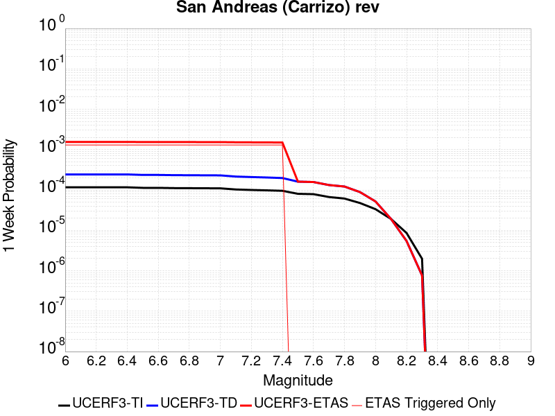 | 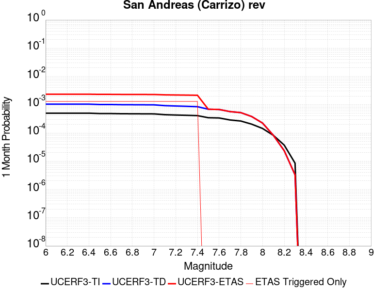 | 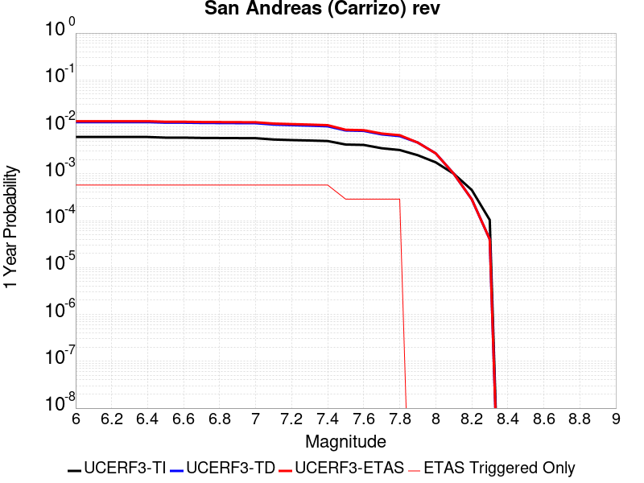 | 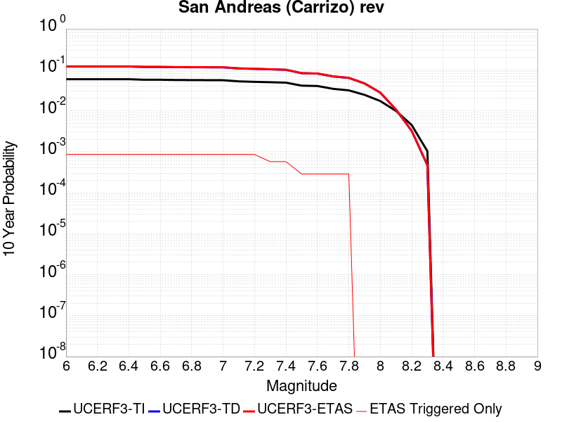 |

| Magnitude | 1 wk TI Prob | 1 wk TD Prob | 1 wk ETAS Prob | 1 wk ETAS/TD Gain | 1 wk ETAS Triggered Only | 1 mo TI Prob | 1 mo TD Prob | 1 mo ETAS Prob | 1 mo ETAS/TD Gain | 1 mo ETAS Triggered Only | 1 yr TI Prob | 1 yr TD Prob | 1 yr ETAS Prob | 1 yr ETAS/TD Gain | 1 yr ETAS Triggered Only | 10 yr TI Prob | 10 yr TD Prob | 10 yr ETAS Prob | 10 yr ETAS/TD Gain | 10 yr ETAS Triggered Only |
|-----|-----|-----|-----|-----|-----|-----|-----|-----|-----|-----|-----|-----|-----|-----|-----|-----|-----|-----|-----|-----|
| 6.0 | 1.1674632E-4 | 2.432302E-4 | 0.0015483957 | 6.365968 | 0.001305483 | 5.002454E-4 | 0.0010420004 | 0.002346123 | 2.2515569 | 0.001305483 | 0.006073493 | 0.012613042 | 0.01390206 | 1.1021972 | 0.001305483 | 0.0591016 | 0.12061418 | 0.1217622 | 1.0095181 | 0.001305483 |
| 6.1 | 1.1674632E-4 | 2.432302E-4 | 0.0015483957 | 6.365968 | 0.001305483 | 5.002454E-4 | 0.0010420004 | 0.002346123 | 2.2515569 | 0.001305483 | 0.006073493 | 0.012613042 | 0.01390206 | 1.1021972 | 0.001305483 | 0.0591016 | 0.12061418 | 0.1217622 | 1.0095181 | 0.001305483 |
| 6.2 | 1.1674632E-4 | 2.432302E-4 | 0.0015483957 | 6.365968 | 0.001305483 | 5.002454E-4 | 0.0010420004 | 0.002346123 | 2.2515569 | 0.001305483 | 0.006073493 | 0.012613042 | 0.01390206 | 1.1021972 | 0.001305483 | 0.0591016 | 0.12061418 | 0.1217622 | 1.0095181 | 0.001305483 |
| 6.3 | 1.1674632E-4 | 2.432302E-4 | 0.0015483957 | 6.365968 | 0.001305483 | 5.002454E-4 | 0.0010420004 | 0.002346123 | 2.2515569 | 0.001305483 | 0.006073493 | 0.012613042 | 0.01390206 | 1.1021972 | 0.001305483 | 0.0591016 | 0.12061418 | 0.1217622 | 1.0095181 | 0.001305483 |
| 6.4 | 1.1674632E-4 | 2.432302E-4 | 0.0015483957 | 6.365968 | 0.001305483 | 5.002454E-4 | 0.0010420004 | 0.002346123 | 2.2515569 | 0.001305483 | 0.006073493 | 0.012613042 | 0.01390206 | 1.1021972 | 0.001305483 | 0.0591016 | 0.12061418 | 0.1217622 | 1.0095181 | 0.001305483 |
| 6.5 | 1.13136164E-4 | 2.3643032E-4 | 0.0015416046 | 6.5203342 | 0.001305483 | 4.847792E-4 | 0.0010128808 | 0.0023170416 | 2.2875757 | 0.001305483 | 0.0058862255 | 0.012262545 | 0.013552018 | 1.1051556 | 0.001305483 | 0.057327334 | 0.117585555 | 0.118737526 | 1.009797 | 0.001305483 |
| 6.6 | 1.13136164E-4 | 2.3643032E-4 | 0.0015416046 | 6.5203342 | 0.001305483 | 4.847792E-4 | 0.0010128808 | 0.0023170416 | 2.2875757 | 0.001305483 | 0.0058862255 | 0.012262545 | 0.013552018 | 1.1051556 | 0.001305483 | 0.057327334 | 0.117585555 | 0.118737526 | 1.009797 | 0.001305483 |
| 6.7 | 1.1149675E-4 | 2.3334254E-4 | 0.0015385209 | 6.593401 | 0.001305483 | 4.777557E-4 | 9.996577E-4 | 0.0023038357 | 2.3046246 | 0.001305483 | 0.0058011734 | 0.012103349 | 0.013393031 | 1.1065558 | 0.001305483 | 0.05652051 | 0.1162071 | 0.117360875 | 1.0099286 | 0.001305483 |
| 6.8 | 1.1103589E-4 | 2.3236412E-4 | 0.0015375438 | 6.6169586 | 0.001305483 | 4.7578133E-4 | 9.954676E-4 | 0.0022996513 | 2.3101213 | 0.001305483 | 0.005777263 | 0.012052901 | 0.01334265 | 1.1070073 | 0.001305483 | 0.056293584 | 0.1157674 | 0.116921745 | 1.0099713 | 0.001305483 |
| 6.9 | 1.1053259E-4 | 2.3128795E-4 | 0.0015364691 | 6.6431003 | 0.001305483 | 4.7362508E-4 | 9.90859E-4 | 0.0022950484 | 2.316221 | 0.001305483 | 0.0057511497 | 0.01199741 | 0.013287231 | 1.1075083 | 0.001305483 | 0.05604569 | 0.11528359 | 0.116438575 | 1.0100186 | 0.001305483 |
| 7.0 | 1.1005377E-4 | 2.3029637E-4 | 0.0015354787 | 6.667403 | 0.001305483 | 4.7157376E-4 | 9.866126E-4 | 0.0022908077 | 2.3218918 | 0.001305483 | 0.0057263062 | 0.011946279 | 0.013236166 | 1.1079739 | 0.001305483 | 0.055809796 | 0.11483591 | 0.11599147 | 1.0100628 | 0.001305483 |
| 7.1 | 1.0308142E-4 | 2.1539345E-4 | 0.0015205953 | 7.0596175 | 0.001305483 | 4.417027E-4 | 9.227892E-4 | 0.0022270675 | 2.4134088 | 0.001305483 | 0.0053644776 | 0.011177397 | 0.012468289 | 1.1154912 | 0.001305483 | 0.052368138 | 0.108092256 | 0.109256625 | 1.010772 | 0.001305483 |
| 7.2 | 1.0027479E-4 | 2.094724E-4 | 0.001514682 | 7.230938 | 0.001305483 | 4.296783E-4 | 8.9743105E-4 | 0.0022017425 | 2.4533834 | 0.001305483 | 0.0052187922 | 0.010871782 | 0.012163073 | 1.1187744 | 0.001305483 | 0.050979212 | 0.10539625 | 0.106564134 | 1.011081 | 0.001305483 |
| 7.3 | 9.816942E-5 | 2.0422463E-4 | 0.0015094411 | 7.391082 | 0.001305483 | 4.2065824E-4 | 8.7495585E-4 | 0.0021792967 | 2.4907503 | 0.001305483 | 0.005109493 | 0.010600842 | 0.011892485 | 1.1218435 | 0.001305483 | 0.049935985 | 0.102979995 | 0.10415104 | 1.0113716 | 0.001305483 |
| 7.4 | 9.5634205E-5 | 1.9791997E-4 | 0.0015031446 | 7.5947094 | 0.001305483 | 4.0979648E-4 | 8.479536E-4 | 0.0021523295 | 2.5382633 | 0.001305483 | 0.0049778637 | 0.010275229 | 0.011567297 | 1.125746 | 0.001305483 | 0.048678253 | 0.10006632 | 0.101241164 | 1.0117407 | 0.001305483 |
| 7.5 | 8.052417E-5 | 1.611261E-4 | 1.611261E-4 | 1.0 | 0.0 | 3.4505792E-4 | 6.903579E-4 | 6.903579E-4 | 1.0 | 0.0 | 0.0041929903 | 0.008372796 | 0.008372796 | 1.0 | 0.0 | 0.04114753 | 0.08281049 | 0.08281049 | 1.0 | 0.0 |
| 7.6 | 7.897024E-5 | 1.5765853E-4 | 1.5765853E-4 | 1.0 | 0.0 | 3.384E-4 | 6.755046E-4 | 6.755046E-4 | 1.0 | 0.0 | 0.0041122385 | 0.008193332 | 0.008193332 | 1.0 | 0.0 | 0.040369697 | 0.08115171 | 0.08115171 | 1.0 | 0.0 |
| 7.7 | 6.707427E-5 | 1.3276102E-4 | 1.3276102E-4 | 1.0 | 0.0 | 2.8742946E-4 | 5.688518E-4 | 5.688518E-4 | 1.0 | 0.0 | 0.003493839 | 0.00690381 | 0.00690381 | 1.0 | 0.0 | 0.034394164 | 0.069048055 | 0.069048055 | 1.0 | 0.0 |
| 7.8 | 6.147705E-5 | 1.2197486E-4 | 1.2197486E-4 | 1.0 | 0.0 | 2.6344648E-4 | 5.226447E-4 | 5.226447E-4 | 1.0 | 0.0 | 0.0032027436 | 0.006344659 | 0.006344659 | 1.0 | 0.0 | 0.031569764 | 0.06351457 | 0.06351457 | 1.0 | 0.0 |
| 7.9 | 4.7636717E-5 | 8.87977E-5 | 8.87977E-5 | 1.0 | 0.0 | 2.0414138E-4 | 3.8050607E-4 | 3.8050607E-4 | 1.0 | 0.0 | 0.0024825884 | 0.0046228287 | 0.0046228287 | 1.0 | 0.0 | 0.024550365 | 0.046628095 | 0.046628095 | 1.0 | 0.0 |
| 8.0 | 3.3554235E-5 | 5.2136907E-5 | 5.2136907E-5 | 1.0 | 0.0 | 1.4379594E-4 | 2.2342477E-4 | 2.2342477E-4 | 1.0 | 0.0 | 0.0017493097 | 0.002716805 | 0.002716805 | 1.0 | 0.0 | 0.017356034 | 0.027880952 | 0.027880952 | 1.0 | 0.0 |
| 8.1 | 1.9175432E-5 | 1.9184976E-5 | 1.9184976E-5 | 1.0 | 0.0 | 8.217783E-5 | 8.2218736E-5 | 8.2218736E-5 | 1.0 | 0.0 | 0.0010000558 | 0.0010005541 | 0.0010005541 | 1.0 | 0.0 | 0.009955673 | 0.0107580265 | 0.0107580265 | 1.0 | 0.0 |
| 8.2 | 8.643924E-6 | 5.4748625E-6 | 5.4748625E-6 | 1.0 | 0.0 | 3.704486E-5 | 2.3463486E-5 | 2.3463486E-5 | 1.0 | 0.0 | 4.5092785E-4 | 2.8563058E-4 | 2.8563058E-4 | 1.0 | 0.0 | 0.0045001395 | 0.0032487072 | 0.0032487072 | 1.0 | 0.0 |
| 8.3 | 1.983087E-6 | 7.6599065E-7 | 7.6599065E-7 | 1.0 | 0.0 | 8.498917E-6 | 3.282813E-6 | 3.282813E-6 | 1.0 | 0.0 | 1.034694E-4 | 3.9967534E-5 | 3.9967534E-5 | 1.0 | 0.0 | 0.0010342124 | 4.719687E-4 | 4.719687E-4 | 1.0 | 0.0 |

## Lost Hills
*[(top)](#table-of-contents)*

| 1 Week | 1 Month | 1 Year | 10 Year |
|-----|-----|-----|-----|
|  |  |  |  |

| Magnitude | 1 wk TI Prob | 1 wk TD Prob | 1 wk ETAS Prob | 1 wk ETAS/TD Gain | 1 wk ETAS Triggered Only | 1 mo TI Prob | 1 mo TD Prob | 1 mo ETAS Prob | 1 mo ETAS/TD Gain | 1 mo ETAS Triggered Only | 1 yr TI Prob | 1 yr TD Prob | 1 yr ETAS Prob | 1 yr ETAS/TD Gain | 1 yr ETAS Triggered Only | 10 yr TI Prob | 10 yr TD Prob | 10 yr ETAS Prob | 10 yr ETAS/TD Gain | 10 yr ETAS Triggered Only |
|-----|-----|-----|-----|-----|-----|-----|-----|-----|-----|-----|-----|-----|-----|-----|-----|-----|-----|-----|-----|-----|
| 6.0 | 2.233523E-5 | 2.5106583E-5 | 2.5106583E-5 | 1.0 | 0.0 | 9.571891E-5 | 1.0759615E-4 | 0.0014129387 | 13.13187 | 0.001305483 | 0.0011647546 | 0.001309364 | 0.0026131377 | 1.9957305 | 0.001305483 | 0.011586686 | 0.013033091 | 0.014321559 | 1.0988613 | 0.001305483 |
| 6.1 | 2.233523E-5 | 2.5106583E-5 | 2.5106583E-5 | 1.0 | 0.0 | 9.571891E-5 | 1.0759615E-4 | 0.0014129387 | 13.13187 | 0.001305483 | 0.0011647546 | 0.001309364 | 0.0026131377 | 1.9957305 | 0.001305483 | 0.011586686 | 0.013033091 | 0.014321559 | 1.0988613 | 0.001305483 |
| 6.2 | 2.233523E-5 | 2.5106583E-5 | 2.5106583E-5 | 1.0 | 0.0 | 9.571891E-5 | 1.0759615E-4 | 0.0014129387 | 13.13187 | 0.001305483 | 0.0011647546 | 0.001309364 | 0.0026131377 | 1.9957305 | 0.001305483 | 0.011586686 | 0.013033091 | 0.014321559 | 1.0988613 | 0.001305483 |
| 6.3 | 2.233523E-5 | 2.5106583E-5 | 2.5106583E-5 | 1.0 | 0.0 | 9.571891E-5 | 1.0759615E-4 | 0.0014129387 | 13.13187 | 0.001305483 | 0.0011647546 | 0.001309364 | 0.0026131377 | 1.9957305 | 0.001305483 | 0.011586686 | 0.013033091 | 0.014321559 | 1.0988613 | 0.001305483 |
| 6.4 | 1.2288092E-5 | 1.3781108E-5 | 1.3781108E-5 | 1.0 | 0.0 | 5.2662188E-5 | 5.906108E-5 | 0.001364467 | 23.102642 | 0.001305483 | 6.409735E-4 | 7.189252E-4 | 0.0020234697 | 2.8145761 | 0.001305483 | 0.006391279 | 0.0071752006 | 0.008471317 | 1.1806383 | 0.001305483 |
| 6.5 | 1.2288092E-5 | 1.3781108E-5 | 1.3781108E-5 | 1.0 | 0.0 | 5.2662188E-5 | 5.906108E-5 | 0.001364467 | 23.102642 | 0.001305483 | 6.409735E-4 | 7.189252E-4 | 0.0020234697 | 2.8145761 | 0.001305483 | 0.006391279 | 0.0071752006 | 0.008471317 | 1.1806383 | 0.001305483 |
| 6.6 | 8.58281E-6 | 9.63377E-6 | 9.63377E-6 | 1.0 | 0.0 | 3.6782953E-5 | 4.12874E-5 | 0.0013467165 | 32.6181 | 0.001305483 | 4.4774043E-4 | 5.026414E-4 | 0.0018074682 | 3.5959399 | 0.001305483 | 0.0044683935 | 0.005023205 | 0.0063221306 | 1.258585 | 0.001305483 |
| 6.7 | 7.205685E-6 | 8.088302E-6 | 8.088302E-6 | 1.0 | 0.0 | 3.088114E-5 | 3.466415E-5 | 0.0013401019 | 38.65959 | 0.001305483 | 3.7591302E-4 | 4.2203604E-4 | 0.0017269681 | 4.091992 | 0.001305483 | 0.0037527776 | 0.0042203604 | 0.0055203335 | 1.3080243 | 0.001305483 |

## Manix-Afton Hills
*[(top)](#table-of-contents)*

| 1 Week | 1 Month | 1 Year | 10 Year |
|-----|-----|-----|-----|
| 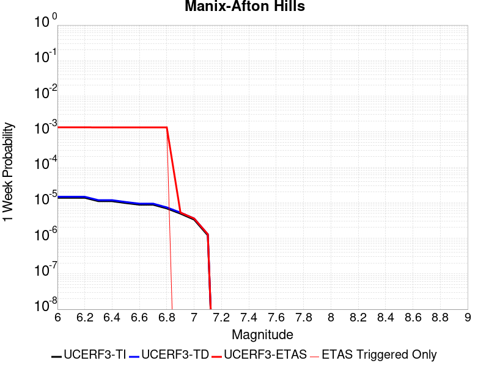 | 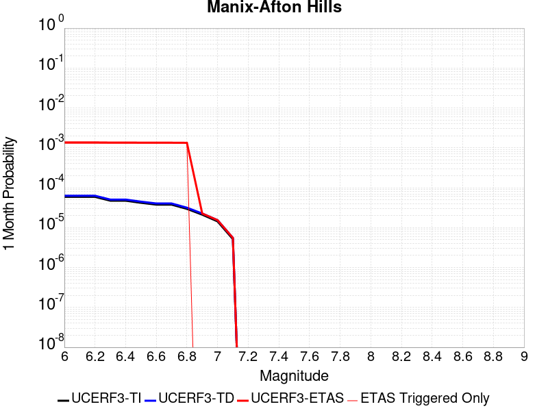 | 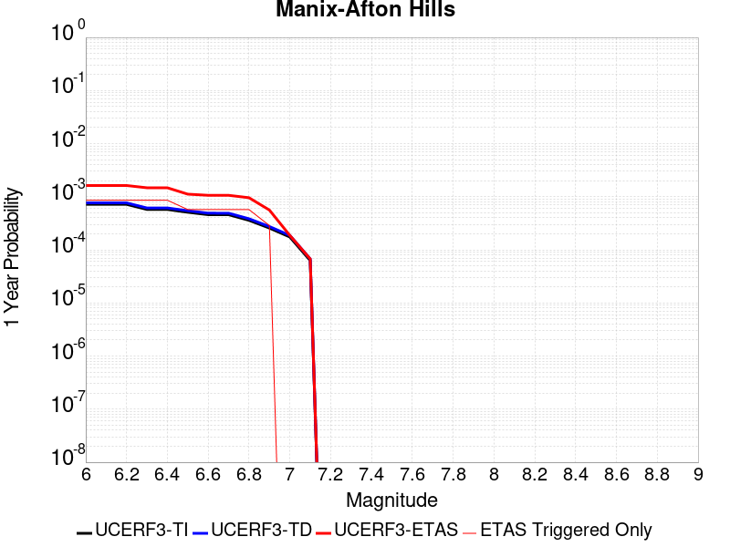 | 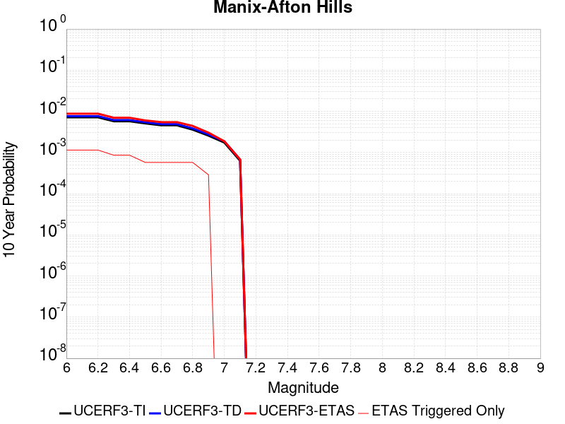 |

| Magnitude | 1 wk TI Prob | 1 wk TD Prob | 1 wk ETAS Prob | 1 wk ETAS/TD Gain | 1 wk ETAS Triggered Only | 1 mo TI Prob | 1 mo TD Prob | 1 mo ETAS Prob | 1 mo ETAS/TD Gain | 1 mo ETAS Triggered Only | 1 yr TI Prob | 1 yr TD Prob | 1 yr ETAS Prob | 1 yr ETAS/TD Gain | 1 yr ETAS Triggered Only | 10 yr TI Prob | 10 yr TD Prob | 10 yr ETAS Prob | 10 yr ETAS/TD Gain | 10 yr ETAS Triggered Only |
|-----|-----|-----|-----|-----|-----|-----|-----|-----|-----|-----|-----|-----|-----|-----|-----|-----|-----|-----|-----|-----|
| 6.0 | 1.3783202E-5 | 1.47110895E-5 | 0.0013201749 | 89.74011 | 0.001305483 | 5.906953E-5 | 6.30461E-5 | 0.0013684469 | 21.705494 | 0.001305483 | 7.189342E-4 | 7.6733343E-4 | 0.0020718148 | 2.700019 | 0.001305483 | 0.0071661277 | 0.007648596 | 0.008944094 | 1.1693772 | 0.001305483 |
| 6.1 | 1.3783202E-5 | 1.47110895E-5 | 0.0013201749 | 89.74011 | 0.001305483 | 5.906953E-5 | 6.30461E-5 | 0.0013684469 | 21.705494 | 0.001305483 | 7.189342E-4 | 7.6733343E-4 | 0.0020718148 | 2.700019 | 0.001305483 | 0.0071661277 | 0.007648596 | 0.008944094 | 1.1693772 | 0.001305483 |
| 6.2 | 1.3783202E-5 | 1.47110895E-5 | 0.0013201749 | 89.74011 | 0.001305483 | 5.906953E-5 | 6.30461E-5 | 0.0013684469 | 21.705494 | 0.001305483 | 7.189342E-4 | 7.6733343E-4 | 0.0020718148 | 2.700019 | 0.001305483 | 0.0071661277 | 0.007648596 | 0.008944094 | 1.1693772 | 0.001305483 |
| 6.3 | 1.10494875E-5 | 1.1793136E-5 | 0.0013172608 | 111.69724 | 0.001305483 | 4.7354086E-5 | 5.054109E-5 | 0.0013559582 | 26.828827 | 0.001305483 | 5.763835E-4 | 6.151744E-4 | 0.0019198543 | 3.1208293 | 0.001305483 | 0.005748908 | 0.0061357557 | 0.007433228 | 1.211461 | 0.001305483 |
| 6.4 | 1.10494875E-5 | 1.1793136E-5 | 0.0013172608 | 111.69724 | 0.001305483 | 4.7354086E-5 | 5.054109E-5 | 0.0013559582 | 26.828827 | 0.001305483 | 5.763835E-4 | 6.151744E-4 | 0.0019198543 | 3.1208293 | 0.001305483 | 0.005748908 | 0.0061357557 | 0.007433228 | 1.211461 | 0.001305483 |
| 6.5 | 9.788949E-6 | 1.045432E-5 | 0.0013159238 | 125.87368 | 0.001305483 | 4.1951964E-5 | 4.480351E-5 | 0.0013502281 | 30.136658 | 0.001305483 | 5.1064545E-4 | 5.453555E-4 | 0.0018501265 | 3.3925147 | 0.001305483 | 0.0050947363 | 0.0054410985 | 0.0067394786 | 1.2386246 | 0.001305483 |
| 6.6 | 8.810006E-6 | 9.4136285E-6 | 0.0013148844 | 139.6788 | 0.001305483 | 3.775662E-5 | 4.0343548E-5 | 0.0013457739 | 33.35785 | 0.001305483 | 4.5958988E-4 | 4.9108086E-4 | 0.0017959228 | 3.6570816 | 0.001305483 | 0.0045864056 | 0.004900839 | 0.0061999243 | 1.265074 | 0.001305483 |
| 6.7 | 8.80128E-6 | 9.404108E-6 | 0.0013148749 | 139.8192 | 0.001305483 | 3.7719226E-5 | 4.0302748E-5 | 0.0013457332 | 33.390606 | 0.001305483 | 4.591348E-4 | 4.9058435E-4 | 0.001795427 | 3.6597722 | 0.001305483 | 0.004581874 | 0.0048958957 | 0.0061949873 | 1.265343 | 0.001305483 |
| 6.8 | 6.8994877E-6 | 7.380076E-6 | 0.0013128534 | 177.89159 | 0.001305483 | 2.9568899E-5 | 3.162856E-5 | 0.0013370703 | 42.274143 | 0.001305483 | 3.5994186E-4 | 3.8501783E-4 | 0.0016899982 | 4.3894024 | 0.001305483 | 0.003593594 | 0.0038443129 | 0.0051447772 | 1.3382827 | 0.001305483 |
| 6.9 | 4.9328037E-6 | 5.2709615E-6 | 5.2709615E-6 | 1.0 | 0.0 | 2.1140417E-5 | 2.2589675E-5 | 2.2589675E-5 | 1.0 | 0.0 | 2.5735417E-4 | 2.7500073E-4 | 2.7500073E-4 | 1.0 | 0.0 | 0.0025705635 | 0.0027472095 | 0.0027472095 | 1.0 | 0.0 |
| 7.0 | 3.347973E-6 | 3.59003E-6 | 3.59003E-6 | 1.0 | 0.0 | 1.4348378E-5 | 1.5385775E-5 | 1.5385775E-5 | 1.0 | 0.0 | 1.746775E-4 | 1.8730981E-4 | 1.8730981E-4 | 1.0 | 0.0 | 0.0017454025 | 0.0018719219 | 0.0018719219 | 1.0 | 0.0 |
| 7.1 | 1.2073567E-6 | 1.293482E-6 | 1.293482E-6 | 1.0 | 0.0 | 5.1743755E-6 | 5.543492E-6 | 5.543492E-6 | 1.0 | 0.0 | 6.29962E-5 | 6.749156E-5 | 6.749156E-5 | 1.0 | 0.0 | 6.297835E-4 | 6.7487074E-4 | 6.7487074E-4 | 1.0 | 0.0 |

## Big Pine (East)
*[(top)](#table-of-contents)*

| 1 Week | 1 Month | 1 Year | 10 Year |
|-----|-----|-----|-----|
|  |  |  |  |

| Magnitude | 1 wk TI Prob | 1 wk TD Prob | 1 wk ETAS Prob | 1 wk ETAS/TD Gain | 1 wk ETAS Triggered Only | 1 mo TI Prob | 1 mo TD Prob | 1 mo ETAS Prob | 1 mo ETAS/TD Gain | 1 mo ETAS Triggered Only | 1 yr TI Prob | 1 yr TD Prob | 1 yr ETAS Prob | 1 yr ETAS/TD Gain | 1 yr ETAS Triggered Only | 10 yr TI Prob | 10 yr TD Prob | 10 yr ETAS Prob | 10 yr ETAS/TD Gain | 10 yr ETAS Triggered Only |
|-----|-----|-----|-----|-----|-----|-----|-----|-----|-----|-----|-----|-----|-----|-----|-----|-----|-----|-----|-----|-----|
| 6.0 | 9.916913E-6 | 1.2816984E-5 | 1.2816984E-5 | 1.0 | 0.0 | 4.250036E-5 | 5.49289E-5 | 0.0013603403 | 24.765472 | 0.001305483 | 5.173191E-4 | 6.685763E-4 | 0.0019731864 | 2.951326 | 0.001305483 | 0.0051611643 | 0.006670441 | 0.007967216 | 1.1944062 | 0.001305483 |
| 6.1 | 9.916913E-6 | 1.2816984E-5 | 1.2816984E-5 | 1.0 | 0.0 | 4.250036E-5 | 5.49289E-5 | 0.0013603403 | 24.765472 | 0.001305483 | 5.173191E-4 | 6.685763E-4 | 0.0019731864 | 2.951326 | 0.001305483 | 0.0051611643 | 0.006670441 | 0.007967216 | 1.1944062 | 0.001305483 |
| 6.2 | 9.916913E-6 | 1.2816984E-5 | 1.2816984E-5 | 1.0 | 0.0 | 4.250036E-5 | 5.49289E-5 | 0.0013603403 | 24.765472 | 0.001305483 | 5.173191E-4 | 6.685763E-4 | 0.0019731864 | 2.951326 | 0.001305483 | 0.0051611643 | 0.006670441 | 0.007967216 | 1.1944062 | 0.001305483 |
| 6.3 | 5.479711E-6 | 8.112951E-6 | 8.112951E-6 | 1.0 | 0.0 | 2.3484265E-5 | 3.4769346E-5 | 0.001340207 | 38.545647 | 0.001305483 | 2.858834E-4 | 4.2323777E-4 | 0.0017281682 | 4.083209 | 0.001305483 | 0.0028551589 | 0.004227244 | 0.005527208 | 1.3075206 | 0.001305483 |
| 6.4 | 5.465009E-6 | 8.097245E-6 | 8.097245E-6 | 1.0 | 0.0 | 2.3421257E-5 | 3.4702036E-5 | 0.0013401398 | 38.618477 | 0.001305483 | 2.851165E-4 | 4.2241855E-4 | 0.0017273502 | 4.089191 | 0.001305483 | 0.0028475097 | 0.0042190826 | 0.0055190576 | 1.308118 | 0.001305483 |
| 6.5 | 4.826767E-6 | 7.422301E-6 | 7.422301E-6 | 1.0 | 0.0 | 2.068598E-5 | 3.180949E-5 | 0.001337251 | 42.03937 | 0.001305483 | 2.518227E-4 | 3.872145E-4 | 0.001692192 | 4.3701673 | 0.001305483 | 0.0025153751 | 0.003868283 | 0.005168716 | 1.3361784 | 0.001305483 |
| 6.6 | 4.3146847E-6 | 6.8822374E-6 | 6.8822374E-6 | 1.0 | 0.0 | 1.8491375E-5 | 2.9494982E-5 | 0.0013349395 | 45.259884 | 0.001305483 | 2.2510924E-4 | 3.590447E-4 | 0.001664059 | 4.634685 | 0.001305483 | 0.0022488134 | 0.0035874986 | 0.004888298 | 1.3625923 | 0.001305483 |
| 6.7 | 3.6968106E-6 | 5.9954727E-6 | 5.9954727E-6 | 1.0 | 0.0 | 1.5843378E-5 | 2.5694639E-5 | 2.5694639E-5 | 1.0 | 0.0 | 1.9287605E-4 | 3.1278885E-4 | 3.1278885E-4 | 1.0 | 0.0 | 0.0019270873 | 0.0031262483 | 0.0031262483 | 1.0 | 0.0 |
| 6.8 | 3.4671132E-6 | 5.702177E-6 | 5.702177E-6 | 1.0 | 0.0 | 1.4858972E-5 | 2.4437682E-5 | 2.4437682E-5 | 1.0 | 0.0 | 1.8089297E-4 | 2.974896E-4 | 2.974896E-4 | 1.0 | 0.0 | 0.0018074579 | 0.002973667 | 0.002973667 | 1.0 | 0.0 |
| 6.9 | 2.7686972E-6 | 4.825223E-6 | 4.825223E-6 | 1.0 | 0.0 | 1.1865792E-5 | 2.0679368E-5 | 2.0679368E-5 | 1.0 | 0.0 | 1.4445644E-4 | 2.5174298E-4 | 2.5174298E-4 | 1.0 | 0.0 | 0.0014436257 | 0.0025172636 | 0.0025172636 | 1.0 | 0.0 |
| 7.0 | 2.1472624E-6 | 3.9850406E-6 | 3.9850406E-6 | 1.0 | 0.0 | 9.20252E-6 | 1.7078637E-5 | 1.7078637E-5 | 1.0 | 0.0 | 1.12034926E-4 | 2.079131E-4 | 2.079131E-4 | 1.0 | 0.0 | 0.0011197845 | 0.0020798394 | 0.0020798394 | 1.0 | 0.0 |
| 7.1 | 1.7018335E-6 | 3.344876E-6 | 3.344876E-6 | 1.0 | 0.0 | 7.293552E-6 | 1.4335106E-5 | 1.4335106E-5 | 1.0 | 0.0 | 8.879537E-5 | 1.7451629E-4 | 1.7451629E-4 | 1.0 | 0.0 | 8.87599E-4 | 0.0017464145 | 0.0017464145 | 1.0 | 0.0 |
| 7.2 | 1.25603E-6 | 2.794484E-6 | 2.794484E-6 | 1.0 | 0.0 | 5.3829745E-6 | 1.1976307E-5 | 1.1976307E-5 | 1.0 | 0.0 | 6.553574E-5 | 1.4580201E-4 | 1.4580201E-4 | 1.0 | 0.0 | 6.551642E-4 | 0.001459661 | 0.001459661 | 1.0 | 0.0 |
| 7.3 | 1.112297E-6 | 2.610332E-6 | 2.610332E-6 | 1.0 | 0.0 | 4.7669787E-6 | 1.118709E-5 | 1.118709E-5 | 1.0 | 0.0 | 5.803642E-5 | 1.3619453E-4 | 1.3619453E-4 | 1.0 | 0.0 | 5.802127E-4 | 0.0013635408 | 0.0013635408 | 1.0 | 0.0 |
| 7.4 | 1.0137181E-6 | 2.4834917E-6 | 2.4834917E-6 | 1.0 | 0.0 | 4.3444993E-6 | 1.0643494E-5 | 1.0643494E-5 | 1.0 | 0.0 | 5.2892992E-5 | 1.2957705E-4 | 1.2957705E-4 | 1.0 | 0.0 | 5.288041E-4 | 0.0012972289 | 0.0012972289 | 1.0 | 0.0 |
| 7.5 | 9.598608E-7 | 2.4071483E-6 | 2.4071483E-6 | 1.0 | 0.0 | 4.1136827E-6 | 1.031631E-5 | 1.031631E-5 | 1.0 | 0.0 | 5.0082934E-5 | 1.2559404E-4 | 1.2559404E-4 | 1.0 | 0.0 | 5.007165E-4 | 0.0012572526 | 0.0012572526 | 1.0 | 0.0 |
| 7.6 | 7.929459E-7 | 2.0448588E-6 | 2.0448588E-6 | 1.0 | 0.0 | 3.3983351E-6 | 8.763653E-6 | 8.763653E-6 | 1.0 | 0.0 | 4.1373947E-5 | 1.06692416E-4 | 1.06692416E-4 | 1.0 | 0.0 | 4.1366243E-4 | 0.0010685222 | 0.0010685222 | 1.0 | 0.0 |
| 7.7 | 4.155788E-7 | 1.1605589E-6 | 1.1605589E-6 | 1.0 | 0.0 | 1.7810507E-6 | 4.9738146E-6 | 4.9738146E-6 | 1.0 | 0.0 | 2.1684076E-5 | 6.0554554E-5 | 6.0554554E-5 | 1.0 | 0.0 | 2.1681961E-4 | 6.0857297E-4 | 6.0857297E-4 | 1.0 | 0.0 |
| 7.8 | 1.14666925E-7 | 2.592015E-7 | 2.592015E-7 | 1.0 | 0.0 | 4.914296E-7 | 1.1108631E-6 | 1.1108631E-6 | 1.0 | 0.0 | 5.9831386E-6 | 1.3524678E-5 | 1.3524678E-5 | 1.0 | 0.0 | 5.9829777E-5 | 1.3634123E-4 | 1.3634123E-4 | 1.0 | 0.0 |
| 7.9 | 2.9231824E-8 | 4.1463963E-8 | 4.1463963E-8 | 1.0 | 0.0 | 1.2527924E-7 | 1.7770269E-7 | 1.7770269E-7 | 1.0 | 0.0 | 1.5252737E-6 | 2.1635283E-6 | 2.1635283E-6 | 1.0 | 0.0 | 1.5252632E-5 | 2.1967755E-5 | 2.1967755E-5 | 1.0 | 0.0 |

## San Andreas (Cholame) rev
*[(top)](#table-of-contents)*

| 1 Week | 1 Month | 1 Year | 10 Year |
|-----|-----|-----|-----|
|  | 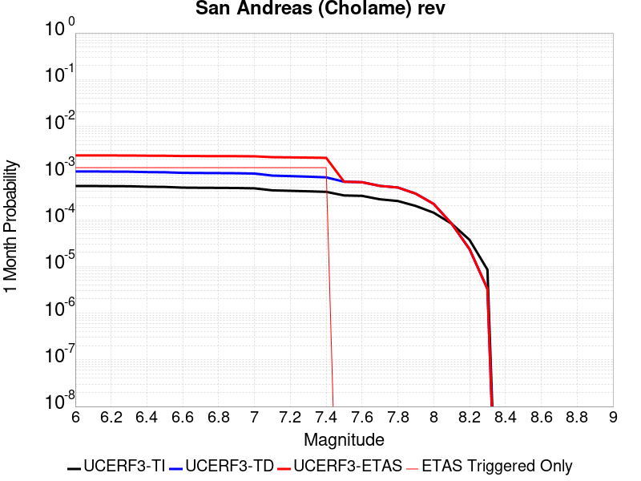 | 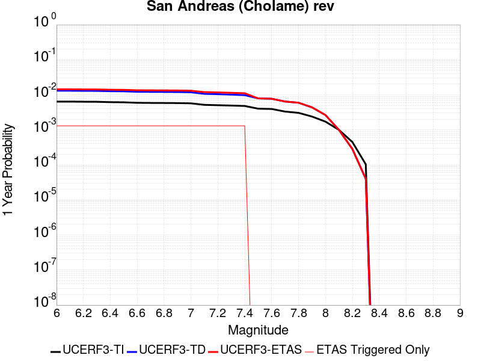 | 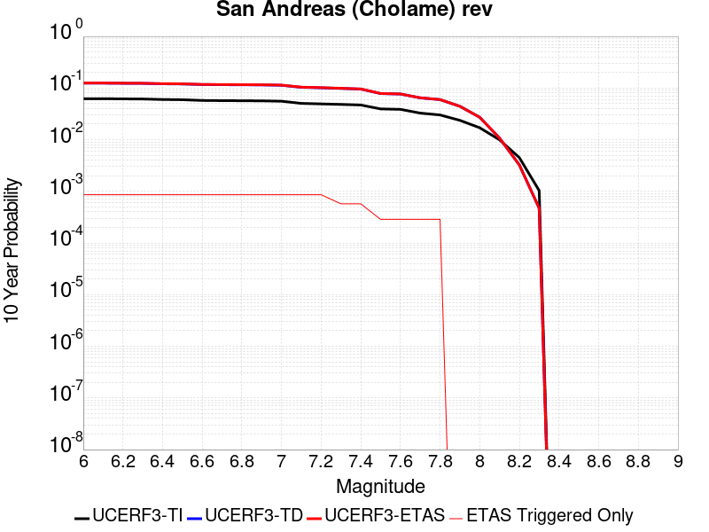 |

| Magnitude | 1 wk TI Prob | 1 wk TD Prob | 1 wk ETAS Prob | 1 wk ETAS/TD Gain | 1 wk ETAS Triggered Only | 1 mo TI Prob | 1 mo TD Prob | 1 mo ETAS Prob | 1 mo ETAS/TD Gain | 1 mo ETAS Triggered Only | 1 yr TI Prob | 1 yr TD Prob | 1 yr ETAS Prob | 1 yr ETAS/TD Gain | 1 yr ETAS Triggered Only | 10 yr TI Prob | 10 yr TD Prob | 10 yr ETAS Prob | 10 yr ETAS/TD Gain | 10 yr ETAS Triggered Only |
|-----|-----|-----|-----|-----|-----|-----|-----|-----|-----|-----|-----|-----|-----|-----|-----|-----|-----|-----|-----|-----|
| 6.0 | 1.2302514E-4 | 2.5204287E-4 | 0.0015571968 | 6.1783013 | 0.001305483 | 5.27144E-4 | 0.0010797381 | 0.0023838116 | 2.2077682 | 0.001305483 | 0.0063991086 | 0.0130670825 | 0.014355507 | 1.0986007 | 0.001305483 | 0.06217949 | 0.12439073 | 0.12553382 | 1.0091895 | 0.001305483 |
| 6.1 | 1.2302514E-4 | 2.5204287E-4 | 0.0015571968 | 6.1783013 | 0.001305483 | 5.27144E-4 | 0.0010797381 | 0.0023838116 | 2.2077682 | 0.001305483 | 0.0063991086 | 0.0130670825 | 0.014355507 | 1.0986007 | 0.001305483 | 0.06217949 | 0.12439073 | 0.12553382 | 1.0091895 | 0.001305483 |
| 6.2 | 1.2203569E-4 | 2.5021084E-4 | 0.0015553673 | 6.2162266 | 0.001305483 | 5.2290526E-4 | 0.0010718931 | 0.0023759769 | 2.2166173 | 0.001305483 | 0.006347804 | 0.01297271 | 0.014261257 | 1.0993276 | 0.001305483 | 0.061695136 | 0.12357691 | 0.124721065 | 1.0092586 | 0.001305483 |
| 6.3 | 1.2142645E-4 | 2.4907055E-4 | 0.0015542285 | 6.240113 | 0.001305483 | 5.202953E-4 | 0.0010670102 | 0.0023711002 | 2.2221909 | 0.001305483 | 0.006316212 | 0.012913967 | 0.014202591 | 1.0997853 | 0.001305483 | 0.06139677 | 0.12307103 | 0.12421585 | 1.009302 | 0.001305483 |
| 6.4 | 1.1865206E-4 | 2.44126E-4 | 0.0015492904 | 6.3462734 | 0.001305483 | 5.0840975E-4 | 0.0010458364 | 0.002349954 | 2.2469616 | 0.001305483 | 0.006172335 | 0.012659196 | 0.013948153 | 1.1018198 | 0.001305483 | 0.060036868 | 0.1208638 | 0.122011505 | 1.0094957 | 0.001305483 |
| 6.5 | 1.17443946E-4 | 2.4205919E-4 | 0.0015472262 | 6.3919334 | 0.001305483 | 5.032341E-4 | 0.0010369857 | 0.002341115 | 2.2576156 | 0.001305483 | 0.006109677 | 0.012552682 | 0.013841778 | 1.1026949 | 0.001305483 | 0.059444077 | 0.11993805 | 0.12108696 | 1.0095792 | 0.001305483 |
| 6.6 | 1.13579066E-4 | 2.3514954E-4 | 0.0015403256 | 6.550409 | 0.001305483 | 4.866766E-4 | 0.001007396 | 0.0023115638 | 2.294593 | 0.001305483 | 0.0059092017 | 0.012196515 | 0.013486075 | 1.1057318 | 0.001305483 | 0.057545185 | 0.11685214 | 0.11800508 | 1.0098666 | 0.001305483 |
| 6.7 | 1.1271412E-4 | 2.3359268E-4 | 0.0015387707 | 6.58741 | 0.001305483 | 4.829711E-4 | 0.0010007289 | 0.0023049056 | 2.3032267 | 0.001305483 | 0.005864331 | 0.012116249 | 0.013405914 | 1.106441 | 0.001305483 | 0.057119697 | 0.116155714 | 0.117309555 | 1.0099336 | 0.001305483 |
| 6.8 | 1.1217975E-4 | 2.3247694E-4 | 0.0015376565 | 6.614232 | 0.001305483 | 4.8068175E-4 | 9.959509E-4 | 0.0023001337 | 2.3094852 | 0.001305483 | 0.005836608 | 0.012058721 | 0.013348462 | 1.106955 | 0.001305483 | 0.056856725 | 0.11565396 | 0.11680847 | 1.0099823 | 0.001305483 |
| 6.9 | 1.1146753E-4 | 2.3096445E-4 | 0.0015361459 | 6.651006 | 0.001305483 | 4.7763053E-4 | 9.894737E-4 | 0.002293665 | 2.3180656 | 0.001305483 | 0.0057996577 | 0.011980731 | 0.013270574 | 1.1076597 | 0.001305483 | 0.056506127 | 0.11497439 | 0.11612978 | 1.0100491 | 0.001305483 |
| 7.0 | 1.0965793E-4 | 2.2719789E-4 | 0.0015323843 | 6.744712 | 0.001305483 | 4.698779E-4 | 9.733434E-4 | 0.0022775556 | 2.3399303 | 0.001305483 | 0.005705768 | 0.011786487 | 0.013076583 | 1.1094555 | 0.001305483 | 0.055614736 | 0.11327597 | 0.11443357 | 1.0102193 | 0.001305483 |
| 7.1 | 9.927982E-5 | 2.0538924E-4 | 0.0015106042 | 7.354836 | 0.001305483 | 4.2541555E-4 | 8.7994366E-4 | 0.0021842779 | 2.482293 | 0.001305483 | 0.0051671406 | 0.010660981 | 0.011952546 | 1.1211488 | 0.001305483 | 0.05048634 | 0.1033706 | 0.10454113 | 1.0113237 | 0.001305483 |
| 7.2 | 9.696786E-5 | 2.0043184E-4 | 0.0015056533 | 7.512046 | 0.001305483 | 4.1551032E-4 | 8.5871184E-4 | 0.0021630737 | 2.5189753 | 0.001305483 | 0.00504711 | 0.010404981 | 0.01169688 | 1.1241616 | 0.001305483 | 0.04934009 | 0.1011086 | 0.102282085 | 1.0116062 | 0.001305483 |
| 7.3 | 9.4727984E-5 | 1.9472468E-4 | 0.0014999534 | 7.7029448 | 0.001305483 | 4.0591392E-4 | 8.3426846E-4 | 0.0021386624 | 2.5635183 | 0.001305483 | 0.0049308087 | 0.010110183 | 0.011402467 | 1.1278201 | 0.001305483 | 0.048228268 | 0.09847952 | 0.09965643 | 1.0119509 | 0.001305483 |
| 7.4 | 9.220358E-5 | 1.8843076E-4 | 0.0014936678 | 7.926879 | 0.001305483 | 3.9509835E-4 | 8.073114E-4 | 0.0021117404 | 2.6157694 | 0.001305483 | 0.004799717 | 0.009784967 | 0.011077675 | 1.1321118 | 0.001305483 | 0.046973653 | 0.095557496 | 0.096738234 | 1.0123563 | 0.001305483 |
| 7.5 | 7.71631E-5 | 1.5177966E-4 | 1.5177966E-4 | 1.0 | 0.0 | 3.306571E-4 | 6.503223E-4 | 6.503223E-4 | 1.0 | 0.0 | 0.0040183207 | 0.007889002 | 0.007889002 | 1.0 | 0.0 | 0.03946433 | 0.07828531 | 0.07828531 | 1.0 | 0.0 |
| 7.6 | 7.5634416E-5 | 1.483744E-4 | 1.483744E-4 | 1.0 | 0.0 | 3.241072E-4 | 6.3573546E-4 | 6.3573546E-4 | 1.0 | 0.0 | 0.0039388672 | 0.0077126776 | 0.0077126776 | 1.0 | 0.0 | 0.038697794 | 0.07664872 | 0.07664872 | 1.0 | 0.0 |
| 7.7 | 6.3783E-5 | 1.235872E-4 | 1.235872E-4 | 1.0 | 0.0 | 2.7332708E-4 | 5.29552E-4 | 5.29552E-4 | 1.0 | 0.0 | 0.0033226798 | 0.0064282627 | 0.0064282627 | 1.0 | 0.0 | 0.032734364 | 0.06454029 | 0.06454029 | 1.0 | 0.0 |
| 7.8 | 5.863422E-5 | 1.1416107E-4 | 1.1416107E-4 | 1.0 | 0.0 | 2.512653E-4 | 4.8917E-4 | 4.8917E-4 | 1.0 | 0.0 | 0.003054864 | 0.0059394026 | 0.0059394026 | 1.0 | 0.0 | 0.030132094 | 0.059659187 | 0.059659187 | 1.0 | 0.0 |
| 7.9 | 4.595283E-5 | 8.426331E-5 | 8.426331E-5 | 1.0 | 0.0 | 1.9692584E-4 | 3.610785E-4 | 3.610785E-4 | 1.0 | 0.0 | 0.0023949358 | 0.0043872762 | 0.0043872762 | 1.0 | 0.0 | 0.023692891 | 0.044362005 | 0.044362005 | 1.0 | 0.0 |
| 8.0 | 3.2950178E-5 | 5.0772942E-5 | 5.0772942E-5 | 1.0 | 0.0 | 1.412074E-4 | 2.1758018E-4 | 2.1758018E-4 | 1.0 | 0.0 | 0.0017178444 | 0.0026458222 | 0.0026458222 | 1.0 | 0.0 | 0.017046256 | 0.027180137 | 0.027180137 | 1.0 | 0.0 |
| 8.1 | 1.9177472E-5 | 1.9185145E-5 | 1.9185145E-5 | 1.0 | 0.0 | 8.218658E-5 | 8.221946E-5 | 8.221946E-5 | 1.0 | 0.0 | 0.0010001622 | 0.0010005629 | 0.0010005629 | 1.0 | 0.0 | 0.009956728 | 0.010758142 | 0.010758142 | 1.0 | 0.0 |
| 8.2 | 8.643924E-6 | 5.4748625E-6 | 5.4748625E-6 | 1.0 | 0.0 | 3.704486E-5 | 2.3463486E-5 | 2.3463486E-5 | 1.0 | 0.0 | 4.5092785E-4 | 2.8563058E-4 | 2.8563058E-4 | 1.0 | 0.0 | 0.0045001395 | 0.0032487072 | 0.0032487072 | 1.0 | 0.0 |
| 8.3 | 1.983087E-6 | 7.6599065E-7 | 7.6599065E-7 | 1.0 | 0.0 | 8.498917E-6 | 3.282813E-6 | 3.282813E-6 | 1.0 | 0.0 | 1.034694E-4 | 3.9967534E-5 | 3.9967534E-5 | 1.0 | 0.0 | 0.0010342124 | 4.719687E-4 | 4.719687E-4 | 1.0 | 0.0 |

## White Mountains
*[(top)](#table-of-contents)*

| 1 Week | 1 Month | 1 Year | 10 Year |
|-----|-----|-----|-----|
|  |  |  |  |

| Magnitude | 1 wk TI Prob | 1 wk TD Prob | 1 wk ETAS Prob | 1 wk ETAS/TD Gain | 1 wk ETAS Triggered Only | 1 mo TI Prob | 1 mo TD Prob | 1 mo ETAS Prob | 1 mo ETAS/TD Gain | 1 mo ETAS Triggered Only | 1 yr TI Prob | 1 yr TD Prob | 1 yr ETAS Prob | 1 yr ETAS/TD Gain | 1 yr ETAS Triggered Only | 10 yr TI Prob | 10 yr TD Prob | 10 yr ETAS Prob | 10 yr ETAS/TD Gain | 10 yr ETAS Triggered Only |
|-----|-----|-----|-----|-----|-----|-----|-----|-----|-----|-----|-----|-----|-----|-----|-----|-----|-----|-----|-----|-----|
| 6.0 | 3.503579E-5 | 3.378405E-5 | 3.378405E-5 | 1.0 | 0.0 | 1.5014476E-4 | 1.4478143E-4 | 1.4478143E-4 | 1.0 | 0.0 | 0.0018264796 | 0.0017614096 | 0.0017614096 | 1.0 | 0.0 | 0.018115403 | 0.017486818 | 0.018769473 | 1.0733498 | 0.001305483 |
| 6.1 | 3.503579E-5 | 3.378405E-5 | 3.378405E-5 | 1.0 | 0.0 | 1.5014476E-4 | 1.4478143E-4 | 1.4478143E-4 | 1.0 | 0.0 | 0.0018264796 | 0.0017614096 | 0.0017614096 | 1.0 | 0.0 | 0.018115403 | 0.017486818 | 0.018769473 | 1.0733498 | 0.001305483 |
| 6.2 | 3.503579E-5 | 3.378405E-5 | 3.378405E-5 | 1.0 | 0.0 | 1.5014476E-4 | 1.4478143E-4 | 1.4478143E-4 | 1.0 | 0.0 | 0.0018264796 | 0.0017614096 | 0.0017614096 | 1.0 | 0.0 | 0.018115403 | 0.017486818 | 0.018769473 | 1.0733498 | 0.001305483 |
| 6.3 | 1.7818425E-5 | 1.5916074E-5 | 1.5916074E-5 | 1.0 | 0.0 | 7.636245E-5 | 6.821004E-5 | 6.821004E-5 | 1.0 | 0.0 | 9.293162E-4 | 8.301551E-4 | 8.301551E-4 | 1.0 | 0.0 | 0.009254395 | 0.008271999 | 0.008271999 | 1.0 | 0.0 |
| 6.4 | 1.7818425E-5 | 1.5916074E-5 | 1.5916074E-5 | 1.0 | 0.0 | 7.636245E-5 | 6.821004E-5 | 6.821004E-5 | 1.0 | 0.0 | 9.293162E-4 | 8.301551E-4 | 8.301551E-4 | 1.0 | 0.0 | 0.009254395 | 0.008271999 | 0.008271999 | 1.0 | 0.0 |
| 6.5 | 1.3397557E-5 | 1.13362685E-5 | 1.13362685E-5 | 1.0 | 0.0 | 5.741684E-5 | 4.858314E-5 | 4.858314E-5 | 1.0 | 0.0 | 6.988258E-4 | 5.913462E-4 | 5.913462E-4 | 1.0 | 0.0 | 0.006966323 | 0.005898432 | 0.005898432 | 1.0 | 0.0 |
| 6.6 | 1.0818695E-5 | 8.625366E-6 | 8.625366E-6 | 1.0 | 0.0 | 4.6365014E-5 | 3.6965357E-5 | 3.6965357E-5 | 1.0 | 0.0 | 5.6434784E-4 | 4.4996463E-4 | 4.4996463E-4 | 1.0 | 0.0 | 0.005629168 | 0.004490972 | 0.004490972 | 1.0 | 0.0 |
| 6.7 | 9.067908E-6 | 6.802442E-6 | 6.802442E-6 | 1.0 | 0.0 | 3.8861883E-5 | 2.9153016E-5 | 2.9153016E-5 | 1.0 | 0.0 | 4.7304068E-4 | 3.5488335E-4 | 3.5488335E-4 | 1.0 | 0.0 | 0.00472035 | 0.0035434833 | 0.0035434833 | 1.0 | 0.0 |
| 6.8 | 7.295947E-6 | 4.936391E-6 | 4.936391E-6 | 1.0 | 0.0 | 3.126797E-5 | 2.1155796E-5 | 2.1155796E-5 | 1.0 | 0.0 | 3.8062103E-4 | 2.575425E-4 | 2.575425E-4 | 1.0 | 0.0 | 0.0037996976 | 0.0025725532 | 0.0025725532 | 1.0 | 0.0 |
| 6.9 | 6.2243444E-6 | 3.832213E-6 | 3.832213E-6 | 1.0 | 0.0 | 2.6675489E-5 | 1.642367E-5 | 1.642367E-5 | 1.0 | 0.0 | 3.2472567E-4 | 1.9994036E-4 | 1.9994036E-4 | 1.0 | 0.0 | 0.0032425157 | 0.0019976576 | 0.0019976576 | 1.0 | 0.0 |
| 7.0 | 4.9878413E-6 | 2.6795342E-6 | 2.6795342E-6 | 1.0 | 0.0 | 2.1376287E-5 | 1.14836685E-5 | 1.14836685E-5 | 1.0 | 0.0 | 2.602252E-4 | 1.3980496E-4 | 1.3980496E-4 | 1.0 | 0.0 | 0.002599207 | 0.0013971963 | 0.0013971963 | 1.0 | 0.0 |
| 7.1 | 4.0252844E-6 | 1.8857575E-6 | 1.8857575E-6 | 1.0 | 0.0 | 1.7251105E-5 | 8.081794E-6 | 8.081794E-6 | 1.0 | 0.0 | 2.1001195E-4 | 9.8391516E-5 | 9.8391516E-5 | 1.0 | 0.0 | 0.0020981359 | 9.834924E-4 | 9.834924E-4 | 1.0 | 0.0 |
| 7.2 | 3.3284066E-6 | 1.281964E-6 | 1.281964E-6 | 1.0 | 0.0 | 1.4264522E-5 | 5.494121E-6 | 5.494121E-6 | 1.0 | 0.0 | 1.736567E-4 | 6.688897E-5 | 6.688897E-5 | 1.0 | 0.0 | 0.0017352107 | 6.6869846E-4 | 6.6869846E-4 | 1.0 | 0.0 |
| 7.3 | 2.458226E-6 | 6.05722E-7 | 6.05722E-7 | 1.0 | 0.0 | 1.0535211E-5 | 2.5959491E-6 | 2.5959491E-6 | 1.0 | 0.0 | 1.2825865E-4 | 3.1605257E-5 | 3.1605257E-5 | 1.0 | 0.0 | 0.0012818464 | 3.160114E-4 | 3.160114E-4 | 1.0 | 0.0 |
| 7.4 | 1.965953E-6 | 3.1089303E-7 | 3.1089303E-7 | 1.0 | 0.0 | 8.425486E-6 | 1.332398E-6 | 1.332398E-6 | 1.0 | 0.0 | 1.0257547E-4 | 1.6221828E-5 | 1.6221828E-5 | 1.0 | 0.0 | 0.0010252813 | 1.6220656E-4 | 1.6220656E-4 | 1.0 | 0.0 |
| 7.5 | 1.2014192E-6 | 1.8244253E-7 | 1.8244253E-7 | 1.0 | 0.0 | 5.148929E-6 | 7.8189635E-7 | 7.8189635E-7 | 1.0 | 0.0 | 6.2686406E-5 | 9.519547E-6 | 9.519547E-6 | 1.0 | 0.0 | 6.266873E-4 | 9.519148E-5 | 9.519148E-5 | 1.0 | 0.0 |
| 7.6 | 2.5612175E-7 | 4.8946475E-8 | 4.8946475E-8 | 1.0 | 0.0 | 1.0976642E-6 | 2.0977059E-7 | 2.0977059E-7 | 1.0 | 0.0 | 1.3363979E-5 | 2.5539543E-6 | 2.5539543E-6 | 1.0 | 0.0 | 1.3363175E-4 | 2.5539286E-5 | 2.5539286E-5 | 1.0 | 0.0 |

## Sierra Nevada  (No Extension)
*[(top)](#table-of-contents)*

| 1 Week | 1 Month | 1 Year | 10 Year |
|-----|-----|-----|-----|
| 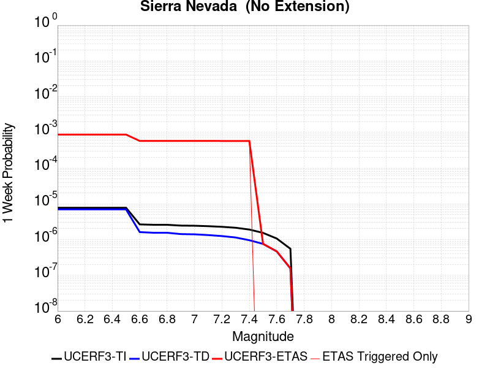 | 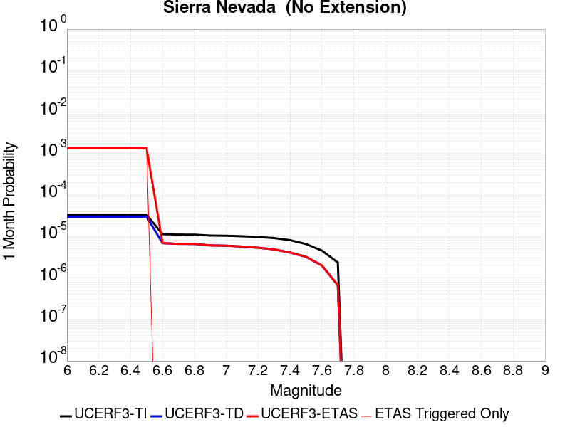 | 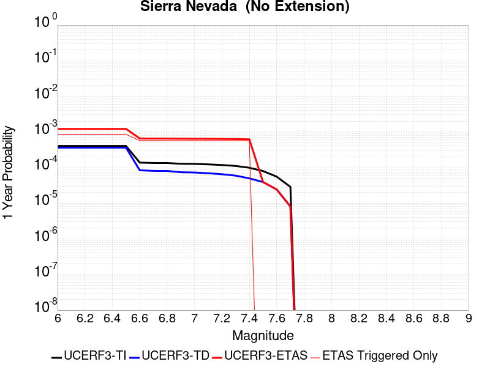 | 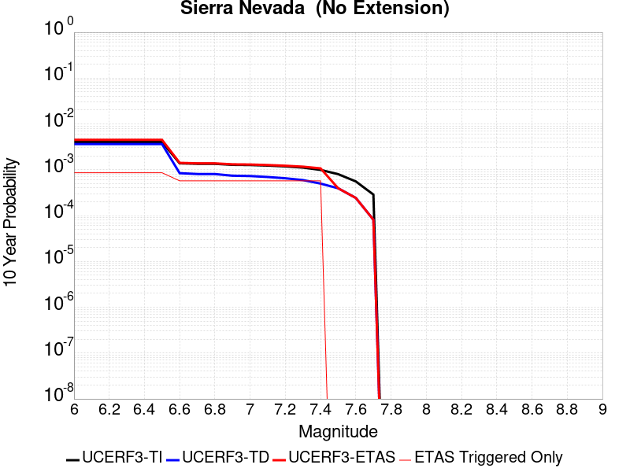 |

| Magnitude | 1 wk TI Prob | 1 wk TD Prob | 1 wk ETAS Prob | 1 wk ETAS/TD Gain | 1 wk ETAS Triggered Only | 1 mo TI Prob | 1 mo TD Prob | 1 mo ETAS Prob | 1 mo ETAS/TD Gain | 1 mo ETAS Triggered Only | 1 yr TI Prob | 1 yr TD Prob | 1 yr ETAS Prob | 1 yr ETAS/TD Gain | 1 yr ETAS Triggered Only | 10 yr TI Prob | 10 yr TD Prob | 10 yr ETAS Prob | 10 yr ETAS/TD Gain | 10 yr ETAS Triggered Only |
|-----|-----|-----|-----|-----|-----|-----|-----|-----|-----|-----|-----|-----|-----|-----|-----|-----|-----|-----|-----|-----|
| 6.0 | 7.7690465E-6 | 6.976322E-6 | 0.0013124503 | 188.12926 | 0.001305483 | 3.329549E-5 | 2.9898381E-5 | 0.0013353424 | 44.662697 | 0.001305483 | 4.0529718E-4 | 3.6398784E-4 | 0.0016689957 | 4.585306 | 0.001305483 | 0.004045588 | 0.0036374326 | 0.004938167 | 1.3575969 | 0.001305483 |
| 6.1 | 7.7690465E-6 | 6.976322E-6 | 0.0013124503 | 188.12926 | 0.001305483 | 3.329549E-5 | 2.9898381E-5 | 0.0013353424 | 44.662697 | 0.001305483 | 4.0529718E-4 | 3.6398784E-4 | 0.0016689957 | 4.585306 | 0.001305483 | 0.004045588 | 0.0036374326 | 0.004938167 | 1.3575969 | 0.001305483 |
| 6.2 | 7.7690465E-6 | 6.976322E-6 | 0.0013124503 | 188.12926 | 0.001305483 | 3.329549E-5 | 2.9898381E-5 | 0.0013353424 | 44.662697 | 0.001305483 | 4.0529718E-4 | 3.6398784E-4 | 0.0016689957 | 4.585306 | 0.001305483 | 0.004045588 | 0.0036374326 | 0.004938167 | 1.3575969 | 0.001305483 |
| 6.3 | 7.7690465E-6 | 6.976322E-6 | 0.0013124503 | 188.12926 | 0.001305483 | 3.329549E-5 | 2.9898381E-5 | 0.0013353424 | 44.662697 | 0.001305483 | 4.0529718E-4 | 3.6398784E-4 | 0.0016689957 | 4.585306 | 0.001305483 | 0.004045588 | 0.0036374326 | 0.004938167 | 1.3575969 | 0.001305483 |
| 6.4 | 7.7690465E-6 | 6.976322E-6 | 0.0013124503 | 188.12926 | 0.001305483 | 3.329549E-5 | 2.9898381E-5 | 0.0013353424 | 44.662697 | 0.001305483 | 4.0529718E-4 | 3.6398784E-4 | 0.0016689957 | 4.585306 | 0.001305483 | 0.004045588 | 0.0036374326 | 0.004938167 | 1.3575969 | 0.001305483 |
| 6.5 | 7.7690465E-6 | 6.976322E-6 | 0.0013124503 | 188.12926 | 0.001305483 | 3.329549E-5 | 2.9898381E-5 | 0.0013353424 | 44.662697 | 0.001305483 | 4.0529718E-4 | 3.6398784E-4 | 0.0016689957 | 4.585306 | 0.001305483 | 0.004045588 | 0.0036374326 | 0.004938167 | 1.3575969 | 0.001305483 |
| 6.6 | 2.653E-6 | 1.614854E-6 | 1.614854E-6 | 1.0 | 0.0 | 1.136995E-5 | 6.9207845E-6 | 6.9207845E-6 | 1.0 | 0.0 | 1.3842035E-4 | 8.425733E-5 | 8.425733E-5 | 1.0 | 0.0 | 0.0013833415 | 8.422573E-4 | 8.422573E-4 | 1.0 | 0.0 |
| 6.7 | 2.5902466E-6 | 1.5501876E-6 | 1.5501876E-6 | 1.0 | 0.0 | 1.11010095E-5 | 6.643644E-6 | 6.643644E-6 | 1.0 | 0.0 | 1.351464E-4 | 8.0883394E-5 | 8.0883394E-5 | 1.0 | 0.0 | 0.0013506424 | 8.0854254E-4 | 8.0854254E-4 | 1.0 | 0.0 |
| 6.8 | 2.5853892E-6 | 1.5469877E-6 | 1.5469877E-6 | 1.0 | 0.0 | 1.1080193E-5 | 6.629931E-6 | 6.629931E-6 | 1.0 | 0.0 | 1.34893E-4 | 8.071645E-5 | 8.071645E-5 | 1.0 | 0.0 | 0.0013481114 | 8.068743E-4 | 8.068743E-4 | 1.0 | 0.0 |
| 6.9 | 2.458257E-6 | 1.4220619E-6 | 1.4220619E-6 | 1.0 | 0.0 | 1.0535345E-5 | 6.094537E-6 | 6.094537E-6 | 1.0 | 0.0 | 1.2826028E-4 | 7.4198484E-5 | 7.4198484E-5 | 1.0 | 0.0 | 0.0012818627 | 7.4173906E-4 | 7.4173906E-4 | 1.0 | 0.0 |
| 7.0 | 2.4341468E-6 | 1.3990258E-6 | 1.3990258E-6 | 1.0 | 0.0 | 1.0432016E-5 | 5.9958115E-6 | 5.9958115E-6 | 1.0 | 0.0 | 1.270024E-4 | 7.2996576E-5 | 7.2996576E-5 | 1.0 | 0.0 | 0.0012692984 | 7.297279E-4 | 7.297279E-4 | 1.0 | 0.0 |
| 7.1 | 2.3652476E-6 | 1.3339754E-6 | 1.3339754E-6 | 1.0 | 0.0 | 1.0136736E-5 | 5.717025E-6 | 5.717025E-6 | 1.0 | 0.0 | 1.2340778E-4 | 6.9602575E-5 | 6.9602575E-5 | 1.0 | 0.0 | 0.0012333926 | 6.9580943E-4 | 6.9580943E-4 | 1.0 | 0.0 |
| 7.2 | 2.272158E-6 | 1.2502821E-6 | 1.2502821E-6 | 1.0 | 0.0 | 9.737784E-6 | 5.3583412E-6 | 5.3583412E-6 | 1.0 | 0.0 | 1.1855107E-4 | 6.5235865E-5 | 6.5235865E-5 | 1.0 | 0.0 | 0.0011848784 | 6.5216864E-4 | 6.5216864E-4 | 1.0 | 0.0 |
| 7.3 | 2.1382127E-6 | 1.1419703E-6 | 1.1419703E-6 | 1.0 | 0.0 | 9.163737E-6 | 4.8941492E-6 | 4.8941492E-6 | 1.0 | 0.0 | 1.1156279E-4 | 5.958465E-5 | 5.958465E-5 | 1.0 | 0.0 | 0.001115068 | 5.956879E-4 | 5.956879E-4 | 1.0 | 0.0 |
| 7.4 | 1.9048055E-6 | 9.575242E-7 | 9.575242E-7 | 1.0 | 0.0 | 8.163426E-6 | 4.1036687E-6 | 4.1036687E-6 | 1.0 | 0.0 | 9.9385186E-5 | 4.996103E-5 | 4.996103E-5 | 1.0 | 0.0 | 9.934074E-4 | 4.994987E-4 | 4.994987E-4 | 1.0 | 0.0 |
| 7.5 | 1.5373403E-6 | 7.560042E-7 | 7.560042E-7 | 1.0 | 0.0 | 6.5885843E-6 | 3.2400142E-6 | 3.2400142E-6 | 1.0 | 0.0 | 8.021306E-5 | 3.9446462E-5 | 3.9446462E-5 | 1.0 | 0.0 | 8.0184115E-4 | 3.943951E-4 | 3.943951E-4 | 1.0 | 0.0 |
| 7.6 | 1.0680322E-6 | 4.6596554E-7 | 4.6596554E-7 | 1.0 | 0.0 | 4.577273E-6 | 1.9969937E-6 | 1.9969937E-6 | 1.0 | 0.0 | 5.5726876E-5 | 2.4313129E-5 | 2.4313129E-5 | 1.0 | 0.0 | 5.5712904E-4 | 2.4310495E-4 | 2.4310495E-4 | 1.0 | 0.0 |
| 7.7 | 5.509146E-7 | 1.5580486E-7 | 1.5580486E-7 | 1.0 | 0.0 | 2.3610605E-6 | 6.677349E-7 | 6.677349E-7 | 1.0 | 0.0 | 2.8745531E-5 | 8.129644E-6 | 8.129644E-6 | 1.0 | 0.0 | 2.8741814E-4 | 8.1293576E-5 | 8.1293576E-5 | 1.0 | 0.0 |

## San Andreas (Big Bend)
*[(top)](#table-of-contents)*

| 1 Week | 1 Month | 1 Year | 10 Year |
|-----|-----|-----|-----|
|  |  |  |  |

| Magnitude | 1 wk TI Prob | 1 wk TD Prob | 1 wk ETAS Prob | 1 wk ETAS/TD Gain | 1 wk ETAS Triggered Only | 1 mo TI Prob | 1 mo TD Prob | 1 mo ETAS Prob | 1 mo ETAS/TD Gain | 1 mo ETAS Triggered Only | 1 yr TI Prob | 1 yr TD Prob | 1 yr ETAS Prob | 1 yr ETAS/TD Gain | 1 yr ETAS Triggered Only | 10 yr TI Prob | 10 yr TD Prob | 10 yr ETAS Prob | 10 yr ETAS/TD Gain | 10 yr ETAS Triggered Only |
|-----|-----|-----|-----|-----|-----|-----|-----|-----|-----|-----|-----|-----|-----|-----|-----|-----|-----|-----|-----|-----|
| 6.0 | 1.0179969E-4 | 2.0072258E-4 | 2.0072258E-4 | 1.0 | 0.0 | 4.362114E-4 | 8.599571E-4 | 0.0021643175 | 2.5167737 | 0.001305483 | 0.0052979486 | 0.010419999 | 0.011711879 | 1.1239808 | 0.001305483 | 0.051734097 | 0.10144902 | 0.10262206 | 1.0115628 | 0.001305483 |
| 6.1 | 1.0179969E-4 | 2.0072258E-4 | 2.0072258E-4 | 1.0 | 0.0 | 4.362114E-4 | 8.599571E-4 | 0.0021643175 | 2.5167737 | 0.001305483 | 0.0052979486 | 0.010419999 | 0.011711879 | 1.1239808 | 0.001305483 | 0.051734097 | 0.10144902 | 0.10262206 | 1.0115628 | 0.001305483 |
| 6.2 | 1.0179969E-4 | 2.0072258E-4 | 2.0072258E-4 | 1.0 | 0.0 | 4.362114E-4 | 8.599571E-4 | 0.0021643175 | 2.5167737 | 0.001305483 | 0.0052979486 | 0.010419999 | 0.011711879 | 1.1239808 | 0.001305483 | 0.051734097 | 0.10144902 | 0.10262206 | 1.0115628 | 0.001305483 |
| 6.3 | 1.0179969E-4 | 2.0072258E-4 | 2.0072258E-4 | 1.0 | 0.0 | 4.362114E-4 | 8.599571E-4 | 0.0021643175 | 2.5167737 | 0.001305483 | 0.0052979486 | 0.010419999 | 0.011711879 | 1.1239808 | 0.001305483 | 0.051734097 | 0.10144902 | 0.10262206 | 1.0115628 | 0.001305483 |
| 6.4 | 9.1639464E-5 | 1.8429532E-4 | 1.8429532E-4 | 1.0 | 0.0 | 3.9268145E-4 | 7.895982E-4 | 0.0020940504 | 2.6520455 | 0.001305483 | 0.0047704205 | 0.009571102 | 0.01086409 | 1.135093 | 0.001305483 | 0.046693064 | 0.09377527 | 0.094958335 | 1.0126159 | 0.001305483 |
| 6.5 | 9.1639464E-5 | 1.8429532E-4 | 1.8429532E-4 | 1.0 | 0.0 | 3.9268145E-4 | 7.895982E-4 | 0.0020940504 | 2.6520455 | 0.001305483 | 0.0047704205 | 0.009571102 | 0.01086409 | 1.135093 | 0.001305483 | 0.046693064 | 0.09377527 | 0.094958335 | 1.0126159 | 0.001305483 |
| 6.6 | 9.042622E-5 | 1.823659E-4 | 1.823659E-4 | 1.0 | 0.0 | 3.8748336E-4 | 7.8133424E-4 | 0.0020857973 | 2.6695325 | 0.001305483 | 0.0047074095 | 0.009471365 | 0.010764483 | 1.1365292 | 0.001305483 | 0.046089325 | 0.092869274 | 0.09405352 | 1.0127517 | 0.001305483 |
| 6.7 | 8.9836685E-5 | 1.8150927E-4 | 1.8150927E-4 | 1.0 | 0.0 | 3.8495753E-4 | 7.776651E-4 | 7.776651E-4 | 1.0 | 0.0 | 0.00467679 | 0.00942708 | 0.00942708 | 1.0 | 0.0 | 0.045795817 | 0.09246355 | 0.09246355 | 1.0 | 0.0 |
| 6.8 | 8.9471854E-5 | 1.8097709E-4 | 1.8097709E-4 | 1.0 | 0.0 | 3.8339442E-4 | 7.7538576E-4 | 7.7538576E-4 | 1.0 | 0.0 | 0.004657841 | 0.009399569 | 0.009399569 | 1.0 | 0.0 | 0.04561414 | 0.092210755 | 0.092210755 | 1.0 | 0.0 |
| 6.9 | 8.858234E-5 | 1.7979681E-4 | 1.7979681E-4 | 1.0 | 0.0 | 3.7958333E-4 | 7.703304E-4 | 7.703304E-4 | 1.0 | 0.0 | 0.004611638 | 0.009338548 | 0.009338548 | 1.0 | 0.0 | 0.04517103 | 0.09165087 | 0.09165087 | 1.0 | 0.0 |
| 7.0 | 8.7433385E-5 | 1.7818481E-4 | 1.7818481E-4 | 1.0 | 0.0 | 3.746607E-4 | 7.634259E-4 | 7.634259E-4 | 1.0 | 0.0 | 0.004551957 | 0.009255203 | 0.009255203 | 1.0 | 0.0 | 0.044598386 | 0.09088532 | 0.09088532 | 1.0 | 0.0 |
| 7.1 | 8.684964E-5 | 1.7730435E-4 | 1.7730435E-4 | 1.0 | 0.0 | 3.7215967E-4 | 7.596547E-4 | 7.596547E-4 | 1.0 | 0.0 | 0.0045216335 | 0.009209678 | 0.009209678 | 1.0 | 0.0 | 0.04430731 | 0.09046686 | 0.09046686 | 1.0 | 0.0 |
| 7.2 | 8.606521E-5 | 1.762105E-4 | 1.762105E-4 | 1.0 | 0.0 | 3.6879873E-4 | 7.549695E-4 | 7.549695E-4 | 1.0 | 0.0 | 0.0044808835 | 0.0091531165 | 0.0091531165 | 1.0 | 0.0 | 0.043916024 | 0.089947365 | 0.089947365 | 1.0 | 0.0 |
| 7.3 | 8.568266E-5 | 1.7563057E-4 | 1.7563057E-4 | 1.0 | 0.0 | 3.6715972E-4 | 7.524855E-4 | 7.524855E-4 | 1.0 | 0.0 | 0.0044610105 | 0.009123127 | 0.009123127 | 1.0 | 0.0 | 0.043725148 | 0.08966853 | 0.08966853 | 1.0 | 0.0 |
| 7.4 | 8.5432206E-5 | 1.7525644E-4 | 1.7525644E-4 | 1.0 | 0.0 | 3.6608664E-4 | 7.50883E-4 | 7.50883E-4 | 1.0 | 0.0 | 0.004447999 | 0.009103781 | 0.009103781 | 1.0 | 0.0 | 0.043600157 | 0.08948871 | 0.08948871 | 1.0 | 0.0 |
| 7.5 | 8.4791965E-5 | 1.7394972E-4 | 1.7394972E-4 | 1.0 | 0.0 | 3.633435E-4 | 7.4528606E-4 | 7.4528606E-4 | 1.0 | 0.0 | 0.0044147377 | 0.009036204 | 0.009036204 | 1.0 | 0.0 | 0.043280575 | 0.088866346 | 0.088866346 | 1.0 | 0.0 |
| 7.6 | 8.241105E-5 | 1.6840403E-4 | 1.6840403E-4 | 1.0 | 0.0 | 3.531424E-4 | 7.215321E-4 | 7.215321E-4 | 1.0 | 0.0 | 0.0042910352 | 0.008749358 | 0.008749358 | 1.0 | 0.0 | 0.042091176 | 0.086243294 | 0.086243294 | 1.0 | 0.0 |
| 7.7 | 7.00432E-5 | 1.42045E-4 | 1.42045E-4 | 1.0 | 0.0 | 3.001506E-4 | 6.0862233E-4 | 6.0862233E-4 | 1.0 | 0.0 | 0.0036482112 | 0.0073848404 | 0.0073848404 | 1.0 | 0.0 | 0.035888977 | 0.07351733 | 0.07351733 | 1.0 | 0.0 |
| 7.8 | 6.415362E-5 | 1.2968935E-4 | 1.2968935E-4 | 1.0 | 0.0 | 2.749151E-4 | 5.556931E-4 | 5.556931E-4 | 1.0 | 0.0 | 0.0033419547 | 0.0067446055 | 0.0067446055 | 1.0 | 0.0 | 0.03292141 | 0.06725231 | 0.06725231 | 1.0 | 0.0 |
| 7.9 | 4.939911E-5 | 9.3411545E-5 | 9.3411545E-5 | 1.0 | 0.0 | 2.116933E-4 | 4.0027377E-4 | 4.0027377E-4 | 1.0 | 0.0 | 0.0025743195 | 0.004862453 | 0.004862453 | 1.0 | 0.0 | 0.025447013 | 0.048914436 | 0.048914436 | 1.0 | 0.0 |
| 8.0 | 3.344983E-5 | 5.222685E-5 | 5.222685E-5 | 1.0 | 0.0 | 1.4334853E-4 | 2.2381016E-4 | 2.2381016E-4 | 1.0 | 0.0 | 0.0017438711 | 0.0027214854 | 0.0027214854 | 1.0 | 0.0 | 0.017302496 | 0.027922187 | 0.027922187 | 1.0 | 0.0 |
| 8.1 | 1.9104898E-5 | 1.9173063E-5 | 1.9173063E-5 | 1.0 | 0.0 | 8.1875565E-5 | 8.216769E-5 | 8.216769E-5 | 1.0 | 0.0 | 9.963791E-4 | 9.999331E-4 | 9.999331E-4 | 1.0 | 0.0 | 0.009919235 | 0.010749801 | 0.010749801 | 1.0 | 0.0 |
| 8.2 | 8.643924E-6 | 5.4748625E-6 | 5.4748625E-6 | 1.0 | 0.0 | 3.704486E-5 | 2.3463486E-5 | 2.3463486E-5 | 1.0 | 0.0 | 4.5092785E-4 | 2.8563058E-4 | 2.8563058E-4 | 1.0 | 0.0 | 0.0045001395 | 0.0032487072 | 0.0032487072 | 1.0 | 0.0 |
| 8.3 | 1.983087E-6 | 7.6599065E-7 | 7.6599065E-7 | 1.0 | 0.0 | 8.498917E-6 | 3.282813E-6 | 3.282813E-6 | 1.0 | 0.0 | 1.034694E-4 | 3.9967534E-5 | 3.9967534E-5 | 1.0 | 0.0 | 0.0010342124 | 4.719687E-4 | 4.719687E-4 | 1.0 | 0.0 |

## Helendale-So Lockhart
*[(top)](#table-of-contents)*

| 1 Week | 1 Month | 1 Year | 10 Year |
|-----|-----|-----|-----|
|  |  |  |  |

| Magnitude | 1 wk TI Prob | 1 wk TD Prob | 1 wk ETAS Prob | 1 wk ETAS/TD Gain | 1 wk ETAS Triggered Only | 1 mo TI Prob | 1 mo TD Prob | 1 mo ETAS Prob | 1 mo ETAS/TD Gain | 1 mo ETAS Triggered Only | 1 yr TI Prob | 1 yr TD Prob | 1 yr ETAS Prob | 1 yr ETAS/TD Gain | 1 yr ETAS Triggered Only | 10 yr TI Prob | 10 yr TD Prob | 10 yr ETAS Prob | 10 yr ETAS/TD Gain | 10 yr ETAS Triggered Only |
|-----|-----|-----|-----|-----|-----|-----|-----|-----|-----|-----|-----|-----|-----|-----|-----|-----|-----|-----|-----|-----|
| 6.0 | 1.7296055E-5 | 1.8103729E-5 | 1.8103729E-5 | 1.0 | 0.0 | 7.412385E-5 | 7.7585224E-5 | 7.7585224E-5 | 1.0 | 0.0 | 9.0208417E-4 | 9.4421144E-4 | 9.4421144E-4 | 1.0 | 0.0 | 0.008984311 | 0.009404116 | 0.010697323 | 1.137515 | 0.001305483 |
| 6.1 | 1.7296055E-5 | 1.8103729E-5 | 1.8103729E-5 | 1.0 | 0.0 | 7.412385E-5 | 7.7585224E-5 | 7.7585224E-5 | 1.0 | 0.0 | 9.0208417E-4 | 9.4421144E-4 | 9.4421144E-4 | 1.0 | 0.0 | 0.008984311 | 0.009404116 | 0.010697323 | 1.137515 | 0.001305483 |
| 6.2 | 1.7296055E-5 | 1.8103729E-5 | 1.8103729E-5 | 1.0 | 0.0 | 7.412385E-5 | 7.7585224E-5 | 7.7585224E-5 | 1.0 | 0.0 | 9.0208417E-4 | 9.4421144E-4 | 9.4421144E-4 | 1.0 | 0.0 | 0.008984311 | 0.009404116 | 0.010697323 | 1.137515 | 0.001305483 |
| 6.3 | 1.0669118E-5 | 1.1135425E-5 | 1.1135425E-5 | 1.0 | 0.0 | 4.5723988E-5 | 4.772239E-5 | 4.772239E-5 | 1.0 | 0.0 | 5.5654737E-4 | 5.80868E-4 | 5.80868E-4 | 1.0 | 0.0 | 0.0055515557 | 0.0057937936 | 0.0070917127 | 1.2240189 | 0.001305483 |
| 6.4 | 1.0669118E-5 | 1.1135425E-5 | 1.1135425E-5 | 1.0 | 0.0 | 4.5723988E-5 | 4.772239E-5 | 4.772239E-5 | 1.0 | 0.0 | 5.5654737E-4 | 5.80868E-4 | 5.80868E-4 | 1.0 | 0.0 | 0.0055515557 | 0.0057937936 | 0.0070917127 | 1.2240189 | 0.001305483 |
| 6.5 | 8.790038E-6 | 9.170197E-6 | 9.170197E-6 | 1.0 | 0.0 | 3.767105E-5 | 3.930026E-5 | 3.930026E-5 | 1.0 | 0.0 | 4.585485E-4 | 4.7837716E-4 | 4.7837716E-4 | 1.0 | 0.0 | 0.0045760344 | 0.004773638 | 0.004773638 | 1.0 | 0.0 |
| 6.6 | 7.396949E-6 | 7.715537E-6 | 7.715537E-6 | 1.0 | 0.0 | 3.1700827E-5 | 3.3066175E-5 | 3.3066175E-5 | 1.0 | 0.0 | 3.858892E-4 | 4.025073E-4 | 4.025073E-4 | 1.0 | 0.0 | 0.003852198 | 0.00401789 | 0.00401789 | 1.0 | 0.0 |
| 6.7 | 6.4600285E-6 | 6.738031E-6 | 6.738031E-6 | 1.0 | 0.0 | 2.7685543E-5 | 2.887696E-5 | 2.887696E-5 | 1.0 | 0.0 | 3.3701936E-4 | 3.5152107E-4 | 3.5152107E-4 | 1.0 | 0.0 | 0.0033650869 | 0.003509732 | 0.003509732 | 1.0 | 0.0 |
| 6.8 | 5.600104E-6 | 5.836009E-6 | 5.836009E-6 | 1.0 | 0.0 | 2.4000226E-5 | 2.5011232E-5 | 2.5011232E-5 | 1.0 | 0.0 | 2.9216358E-4 | 3.044698E-4 | 3.044698E-4 | 1.0 | 0.0 | 0.0029177975 | 0.003040588 | 0.003040588 | 1.0 | 0.0 |
| 6.9 | 4.839122E-6 | 5.0395092E-6 | 5.0395092E-6 | 1.0 | 0.0 | 2.0738931E-5 | 2.159772E-5 | 2.159772E-5 | 1.0 | 0.0 | 2.5246723E-4 | 2.6292098E-4 | 2.6292098E-4 | 1.0 | 0.0 | 0.002521806 | 0.002626147 | 0.002626147 | 1.0 | 0.0 |
| 7.0 | 3.6937633E-6 | 3.845208E-6 | 3.845208E-6 | 1.0 | 0.0 | 1.5830317E-5 | 1.647936E-5 | 1.647936E-5 | 1.0 | 0.0 | 1.9271708E-4 | 2.0061806E-4 | 2.0061806E-4 | 1.0 | 0.0 | 0.0019255003 | 0.002004401 | 0.002004401 | 1.0 | 0.0 |
| 7.1 | 2.7858857E-6 | 2.8978538E-6 | 2.8978538E-6 | 1.0 | 0.0 | 1.1939455E-5 | 1.2419316E-5 | 1.2419316E-5 | 1.0 | 0.0 | 1.4535317E-4 | 1.511949E-4 | 1.511949E-4 | 1.0 | 0.0 | 0.0014525814 | 0.0015109418 | 0.0015109418 | 1.0 | 0.0 |
| 7.2 | 2.1672065E-6 | 2.2540128E-6 | 2.2540128E-6 | 1.0 | 0.0 | 9.2879945E-6 | 9.66002E-6 | 9.66002E-6 | 1.0 | 0.0 | 1.1307546E-4 | 1.1760458E-4 | 1.1760458E-4 | 1.0 | 0.0 | 0.0011301794 | 0.0011754417 | 0.0011754417 | 1.0 | 0.0 |
| 7.3 | 1.4823496E-6 | 1.5422102E-6 | 1.5422102E-6 | 1.0 | 0.0 | 6.3529114E-6 | 6.6094562E-6 | 6.6094562E-6 | 1.0 | 0.0 | 7.734395E-5 | 8.046731E-5 | 8.046731E-5 | 1.0 | 0.0 | 7.731704E-4 | 8.0439687E-4 | 8.0439687E-4 | 1.0 | 0.0 |
| 7.4 | 4.2321457E-7 | 4.4108765E-7 | 4.4108765E-7 | 1.0 | 0.0 | 1.8137755E-6 | 1.8903745E-6 | 1.8903745E-6 | 1.0 | 0.0 | 2.2082493E-5 | 2.3015113E-5 | 2.3015113E-5 | 1.0 | 0.0 | 2.2080299E-4 | 2.3013182E-4 | 2.3013182E-4 | 1.0 | 0.0 |
| 7.5 | 5.6942316E-8 | 5.9415648E-8 | 5.9415648E-8 | 1.0 | 0.0 | 2.440385E-7 | 2.5463845E-7 | 2.5463845E-7 | 1.0 | 0.0 | 2.9711643E-6 | 3.1002196E-6 | 3.1002196E-6 | 1.0 | 0.0 | 2.9711247E-5 | 3.1001844E-5 | 3.1001844E-5 | 1.0 | 0.0 |

## San Andreas (San Gorgonio Pass-Garnet HIll)
*[(top)](#table-of-contents)*

| 1 Week | 1 Month | 1 Year | 10 Year |
|-----|-----|-----|-----|
|  |  |  |  |

| Magnitude | 1 wk TI Prob | 1 wk TD Prob | 1 wk ETAS Prob | 1 wk ETAS/TD Gain | 1 wk ETAS Triggered Only | 1 mo TI Prob | 1 mo TD Prob | 1 mo ETAS Prob | 1 mo ETAS/TD Gain | 1 mo ETAS Triggered Only | 1 yr TI Prob | 1 yr TD Prob | 1 yr ETAS Prob | 1 yr ETAS/TD Gain | 1 yr ETAS Triggered Only | 10 yr TI Prob | 10 yr TD Prob | 10 yr ETAS Prob | 10 yr ETAS/TD Gain | 10 yr ETAS Triggered Only |
|-----|-----|-----|-----|-----|-----|-----|-----|-----|-----|-----|-----|-----|-----|-----|-----|-----|-----|-----|-----|-----|
| 6.0 | 8.31567E-5 | 2.3382473E-4 | 2.3382473E-4 | 1.0 | 0.0 | 3.5633717E-4 | 0.0010017233 | 0.0010017233 | 1.0 | 0.0 | 0.004329778 | 0.012127888 | 0.012127888 | 1.0 | 0.0 | 0.042463828 | 0.11257892 | 0.113737434 | 1.0102906 | 0.001305483 |
| 6.1 | 8.31567E-5 | 2.3382473E-4 | 2.3382473E-4 | 1.0 | 0.0 | 3.5633717E-4 | 0.0010017233 | 0.0010017233 | 1.0 | 0.0 | 0.004329778 | 0.012127888 | 0.012127888 | 1.0 | 0.0 | 0.042463828 | 0.11257892 | 0.113737434 | 1.0102906 | 0.001305483 |
| 6.2 | 8.31567E-5 | 2.3382473E-4 | 2.3382473E-4 | 1.0 | 0.0 | 3.5633717E-4 | 0.0010017233 | 0.0010017233 | 1.0 | 0.0 | 0.004329778 | 0.012127888 | 0.012127888 | 1.0 | 0.0 | 0.042463828 | 0.11257892 | 0.113737434 | 1.0102906 | 0.001305483 |
| 6.3 | 8.31567E-5 | 2.3382473E-4 | 2.3382473E-4 | 1.0 | 0.0 | 3.5633717E-4 | 0.0010017233 | 0.0010017233 | 1.0 | 0.0 | 0.004329778 | 0.012127888 | 0.012127888 | 1.0 | 0.0 | 0.042463828 | 0.11257892 | 0.113737434 | 1.0102906 | 0.001305483 |
| 6.4 | 8.059055E-5 | 2.2940808E-4 | 2.2940808E-4 | 1.0 | 0.0 | 3.4534236E-4 | 9.828096E-4 | 9.828096E-4 | 1.0 | 0.0 | 0.0041964394 | 0.011900152 | 0.011900152 | 1.0 | 0.0 | 0.041180745 | 0.11056015 | 0.11172129 | 1.0105025 | 0.001305483 |
| 6.5 | 8.059055E-5 | 2.2940808E-4 | 2.2940808E-4 | 1.0 | 0.0 | 3.4534236E-4 | 9.828096E-4 | 9.828096E-4 | 1.0 | 0.0 | 0.0041964394 | 0.011900152 | 0.011900152 | 1.0 | 0.0 | 0.041180745 | 0.11056015 | 0.11172129 | 1.0105025 | 0.001305483 |
| 6.6 | 7.619237E-5 | 2.218517E-4 | 2.218517E-4 | 1.0 | 0.0 | 3.2649786E-4 | 9.5044886E-4 | 9.5044886E-4 | 1.0 | 0.0 | 0.0039678677 | 0.01151087 | 0.01151087 | 1.0 | 0.0 | 0.03897764 | 0.10709683 | 0.1082625 | 1.0108843 | 0.001305483 |
| 6.7 | 7.440636E-5 | 2.1860997E-4 | 2.1860997E-4 | 1.0 | 0.0 | 3.188454E-4 | 9.3656575E-4 | 9.3656575E-4 | 1.0 | 0.0 | 0.0038750346 | 0.011343609 | 0.011343609 | 1.0 | 0.0 | 0.038081564 | 0.105605274 | 0.10677289 | 1.0110564 | 0.001305483 |
| 6.8 | 7.3735864E-5 | 2.1708169E-4 | 2.1708169E-4 | 1.0 | 0.0 | 3.1597257E-4 | 9.3002064E-4 | 9.3002064E-4 | 1.0 | 0.0 | 0.0038401815 | 0.011264749 | 0.011264749 | 1.0 | 0.0 | 0.03774495 | 0.10490683 | 0.106075354 | 1.0111387 | 0.001305483 |
| 6.9 | 7.27575E-5 | 2.1477141E-4 | 2.1477141E-4 | 1.0 | 0.0 | 3.117806E-4 | 9.201265E-4 | 9.201265E-4 | 1.0 | 0.0 | 0.003789323 | 0.011145527 | 0.011145527 | 1.0 | 0.0 | 0.037253562 | 0.103854746 | 0.10502464 | 1.0112648 | 0.001305483 |
| 7.0 | 7.102591E-5 | 2.1061185E-4 | 2.1061185E-4 | 1.0 | 0.0 | 3.0436125E-4 | 9.023122E-4 | 9.023122E-4 | 1.0 | 0.0 | 0.003699303 | 0.010930831 | 0.010930831 | 1.0 | 0.0 | 0.03638325 | 0.10195695 | 0.10312933 | 1.0114988 | 0.001305483 |
| 7.1 | 7.028513E-5 | 2.0896831E-4 | 2.0896831E-4 | 1.0 | 0.0 | 3.0118722E-4 | 8.9527335E-4 | 8.9527335E-4 | 1.0 | 0.0 | 0.0036607897 | 0.010845989 | 0.010845989 | 1.0 | 0.0 | 0.036010686 | 0.101199985 | 0.102373354 | 1.0115945 | 0.001305483 |
| 7.2 | 6.8498244E-5 | 2.0504706E-4 | 2.0504706E-4 | 1.0 | 0.0 | 2.9353087E-4 | 8.784794E-4 | 8.784794E-4 | 1.0 | 0.0 | 0.003567883 | 0.010643536 | 0.010643536 | 1.0 | 0.0 | 0.035111405 | 0.09939202 | 0.10056775 | 1.0118293 | 0.001305483 |
| 7.3 | 6.622592E-5 | 1.9732013E-4 | 1.9732013E-4 | 1.0 | 0.0 | 2.8379448E-4 | 8.453858E-4 | 8.453858E-4 | 1.0 | 0.0 | 0.0034497243 | 0.0102444785 | 0.0102444785 | 1.0 | 0.0 | 0.033966612 | 0.095888525 | 0.09706883 | 1.0123091 | 0.001305483 |
| 7.4 | 5.1050705E-5 | 1.4689034E-4 | 1.4689034E-4 | 1.0 | 0.0 | 2.1877038E-4 | 6.29379E-4 | 6.29379E-4 | 1.0 | 0.0 | 0.002660276 | 0.0076359594 | 0.0076359594 | 1.0 | 0.0 | 0.02628654 | 0.07286301 | 0.074073374 | 1.0166115 | 0.001305483 |
| 7.5 | 3.9302922E-5 | 1.1129847E-4 | 1.1129847E-4 | 1.0 | 0.0 | 1.6843023E-4 | 4.7690657E-4 | 4.7690657E-4 | 1.0 | 0.0 | 0.0020487092 | 0.005790949 | 0.005790949 | 1.0 | 0.0 | 0.020299247 | 0.05600951 | 0.05600951 | 1.0 | 0.0 |
| 7.6 | 2.9851626E-5 | 8.4949745E-5 | 8.4949745E-5 | 1.0 | 0.0 | 1.2792926E-4 | 3.6401965E-4 | 3.6401965E-4 | 1.0 | 0.0 | 0.0015564259 | 0.0044229585 | 0.0044229585 | 1.0 | 0.0 | 0.0154556995 | 0.04319374 | 0.04319374 | 1.0 | 0.0 |
| 7.7 | 2.1135214E-5 | 6.3529005E-5 | 6.3529005E-5 | 1.0 | 0.0 | 9.0576345E-5 | 2.7223877E-4 | 2.7223877E-4 | 1.0 | 0.0 | 0.0011022091 | 0.0033094748 | 0.0033094748 | 1.0 | 0.0 | 0.010967582 | 0.032582592 | 0.032582592 | 1.0 | 0.0 |
| 7.8 | 1.883379E-5 | 5.564028E-5 | 5.564028E-5 | 1.0 | 0.0 | 8.0713755E-5 | 2.3843657E-4 | 2.3843657E-4 | 1.0 | 0.0 | 9.822468E-4 | 0.0028991038 | 0.0028991038 | 1.0 | 0.0 | 0.0097791655 | 0.028695205 | 0.028695205 | 1.0 | 0.0 |
| 7.9 | 1.5156185E-5 | 4.1658426E-5 | 4.1658426E-5 | 1.0 | 0.0 | 6.495346E-5 | 1.785239E-4 | 1.785239E-4 | 1.0 | 0.0 | 7.9052144E-4 | 0.0021713632 | 0.0021713632 | 1.0 | 0.0 | 0.007877152 | 0.021759422 | 0.021759422 | 1.0 | 0.0 |
| 8.0 | 1.1405907E-5 | 2.9974231E-5 | 2.9974231E-5 | 1.0 | 0.0 | 4.8881542E-5 | 1.2845467E-4 | 1.2845467E-4 | 1.0 | 0.0 | 5.9497025E-4 | 0.0015628147 | 0.0015628147 | 1.0 | 0.0 | 0.005933798 | 0.015772851 | 0.015772851 | 1.0 | 0.0 |
| 8.1 | 4.3511436E-6 | 7.369219E-6 | 7.369219E-6 | 1.0 | 0.0 | 1.8647626E-5 | 3.1581985E-5 | 3.1581985E-5 | 1.0 | 0.0 | 2.2701119E-4 | 3.8444297E-4 | 3.8444297E-4 | 1.0 | 0.0 | 0.0022677942 | 0.0041163345 | 0.0041163345 | 1.0 | 0.0 |
| 8.2 | 2.3042528E-6 | 2.7329415E-6 | 2.7329415E-6 | 1.0 | 0.0 | 9.875332E-6 | 1.1712554E-5 | 1.1712554E-5 | 1.0 | 0.0 | 1.2022553E-4 | 1.4259106E-4 | 1.4259106E-4 | 1.0 | 0.0 | 0.0012016051 | 0.0015979785 | 0.0015979785 | 1.0 | 0.0 |
| 8.3 | 5.202968E-7 | 3.1598344E-7 | 3.1598344E-7 | 1.0 | 0.0 | 2.2298414E-6 | 1.3542141E-6 | 1.3542141E-6 | 1.0 | 0.0 | 2.714798E-5 | 1.6487444E-5 | 1.6487444E-5 | 1.0 | 0.0 | 2.7144665E-4 | 1.9563142E-4 | 1.9563142E-4 | 1.0 | 0.0 |

## Kern Canyon (South Kern) 2011
*[(top)](#table-of-contents)*

| 1 Week | 1 Month | 1 Year | 10 Year |
|-----|-----|-----|-----|
| 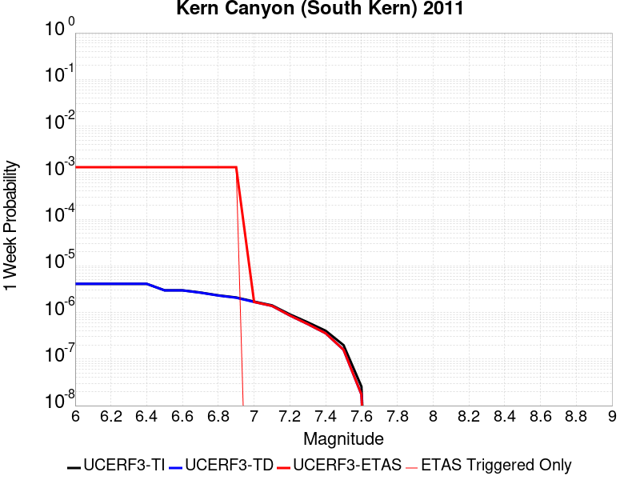 | 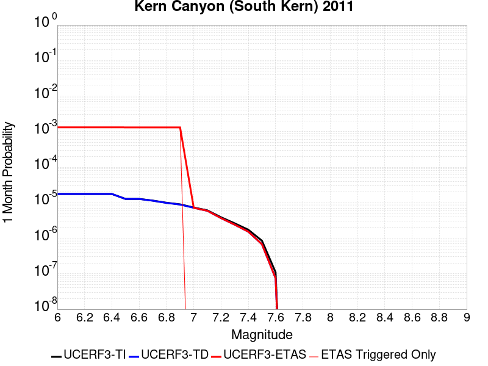 | 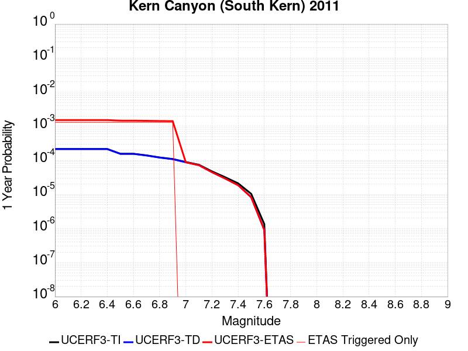 | 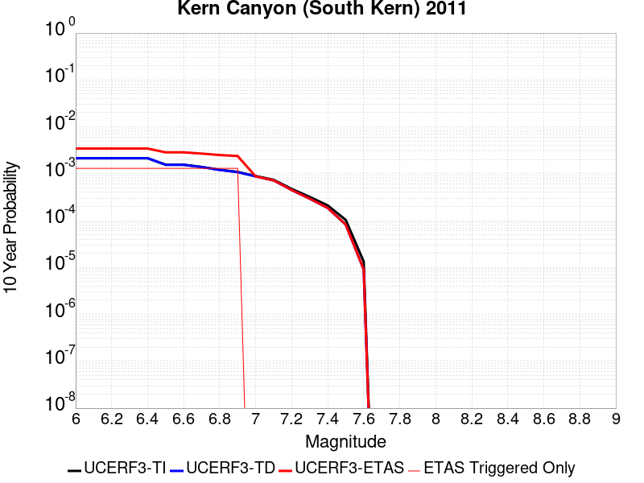 |

| Magnitude | 1 wk TI Prob | 1 wk TD Prob | 1 wk ETAS Prob | 1 wk ETAS/TD Gain | 1 wk ETAS Triggered Only | 1 mo TI Prob | 1 mo TD Prob | 1 mo ETAS Prob | 1 mo ETAS/TD Gain | 1 mo ETAS Triggered Only | 1 yr TI Prob | 1 yr TD Prob | 1 yr ETAS Prob | 1 yr ETAS/TD Gain | 1 yr ETAS Triggered Only | 10 yr TI Prob | 10 yr TD Prob | 10 yr ETAS Prob | 10 yr ETAS/TD Gain | 10 yr ETAS Triggered Only |
|-----|-----|-----|-----|-----|-----|-----|-----|-----|-----|-----|-----|-----|-----|-----|-----|-----|-----|-----|-----|-----|
| 6.0 | 4.105075E-6 | 4.1137264E-6 | 0.0013095913 | 318.34674 | 0.001305483 | 1.7593058E-5 | 1.763014E-5 | 0.0013230902 | 75.04706 | 0.001305483 | 2.1417443E-4 | 2.1462646E-4 | 0.0015198293 | 7.0812764 | 0.001305483 | 0.0021396813 | 0.0021442557 | 0.0034469394 | 1.6075226 | 0.001305483 |
| 6.1 | 4.105075E-6 | 4.1137264E-6 | 0.0013095913 | 318.34674 | 0.001305483 | 1.7593058E-5 | 1.763014E-5 | 0.0013230902 | 75.04706 | 0.001305483 | 2.1417443E-4 | 2.1462646E-4 | 0.0015198293 | 7.0812764 | 0.001305483 | 0.0021396813 | 0.0021442557 | 0.0034469394 | 1.6075226 | 0.001305483 |
| 6.2 | 4.105075E-6 | 4.1137264E-6 | 0.0013095913 | 318.34674 | 0.001305483 | 1.7593058E-5 | 1.763014E-5 | 0.0013230902 | 75.04706 | 0.001305483 | 2.1417443E-4 | 2.1462646E-4 | 0.0015198293 | 7.0812764 | 0.001305483 | 0.0021396813 | 0.0021442557 | 0.0034469394 | 1.6075226 | 0.001305483 |
| 6.3 | 4.105075E-6 | 4.1137264E-6 | 0.0013095913 | 318.34674 | 0.001305483 | 1.7593058E-5 | 1.763014E-5 | 0.0013230902 | 75.04706 | 0.001305483 | 2.1417443E-4 | 2.1462646E-4 | 0.0015198293 | 7.0812764 | 0.001305483 | 0.0021396813 | 0.0021442557 | 0.0034469394 | 1.6075226 | 0.001305483 |
| 6.4 | 4.105075E-6 | 4.1137264E-6 | 0.0013095913 | 318.34674 | 0.001305483 | 1.7593058E-5 | 1.763014E-5 | 0.0013230902 | 75.04706 | 0.001305483 | 2.1417443E-4 | 2.1462646E-4 | 0.0015198293 | 7.0812764 | 0.001305483 | 0.0021396813 | 0.0021442557 | 0.0034469394 | 1.6075226 | 0.001305483 |
| 6.5 | 2.9849807E-6 | 2.9731548E-6 | 0.0013084523 | 440.08887 | 0.001305483 | 1.2792712E-5 | 1.274203E-5 | 0.0013182084 | 103.45356 | 0.001305483 | 1.5574014E-4 | 1.5512333E-4 | 0.0014604038 | 9.41447 | 0.001305483 | 0.0015563103 | 0.0015501656 | 0.002853625 | 1.8408517 | 0.001305483 |
| 6.6 | 2.9849807E-6 | 2.9731548E-6 | 0.0013084523 | 440.08887 | 0.001305483 | 1.2792712E-5 | 1.274203E-5 | 0.0013182084 | 103.45356 | 0.001305483 | 1.5574014E-4 | 1.5512333E-4 | 0.0014604038 | 9.41447 | 0.001305483 | 0.0015563103 | 0.0015501656 | 0.002853625 | 1.8408517 | 0.001305483 |
| 6.7 | 2.6756725E-6 | 2.6582206E-6 | 0.0013081378 | 492.1103 | 0.001305483 | 1.1467117E-5 | 1.1392325E-5 | 0.0013168604 | 115.591896 | 0.001305483 | 1.396032E-4 | 1.3869285E-4 | 0.0014439948 | 10.411459 | 0.001305483 | 0.0013951553 | 0.0013860738 | 0.0026897474 | 1.9405513 | 0.001305483 |
| 6.8 | 2.3283721E-6 | 2.3047787E-6 | 0.0013077848 | 567.4231 | 0.001305483 | 9.9787E-6 | 9.877586E-6 | 0.0013153477 | 133.16489 | 0.001305483 | 1.214839E-4 | 1.20253055E-4 | 0.0014255791 | 11.854827 | 0.001305483 | 0.001214175 | 0.0012018873 | 0.0025058014 | 2.0848887 | 0.001305483 |
| 6.9 | 2.0972677E-6 | 2.0696411E-6 | 0.00130755 | 631.7762 | 0.001305483 | 8.988259E-6 | 8.869861E-6 | 0.0013143413 | 148.1806 | 0.001305483 | 1.0942656E-4 | 1.0798526E-4 | 0.0014133273 | 13.08815 | 0.001305483 | 0.0010937268 | 0.0010793337 | 0.0023834077 | 2.2082212 | 0.001305483 |
| 7.0 | 1.7132242E-6 | 1.6787036E-6 | 1.6787036E-6 | 1.0 | 0.0 | 7.3423685E-6 | 7.194424E-6 | 7.194424E-6 | 1.0 | 0.0 | 8.938967E-5 | 8.758863E-5 | 8.758863E-5 | 1.0 | 0.0 | 8.935372E-4 | 8.7554497E-4 | 8.7554497E-4 | 1.0 | 0.0 |
| 7.1 | 1.4215541E-6 | 1.3815752E-6 | 1.3815752E-6 | 1.0 | 0.0 | 6.0923603E-6 | 5.9210233E-6 | 5.9210233E-6 | 1.0 | 0.0 | 7.417196E-5 | 7.20861E-5 | 7.20861E-5 | 1.0 | 0.0 | 7.414721E-4 | 7.206299E-4 | 7.206299E-4 | 1.0 | 0.0 |
| 7.2 | 9.097853E-7 | 8.6037755E-7 | 8.6037755E-7 | 1.0 | 0.0 | 3.899074E-6 | 3.6873273E-6 | 3.6873273E-6 | 1.0 | 0.0 | 4.7470192E-5 | 4.4892295E-5 | 4.4892295E-5 | 1.0 | 0.0 | 4.7460053E-4 | 4.4883334E-4 | 4.4883334E-4 | 1.0 | 0.0 |
| 7.3 | 6.144169E-7 | 5.628206E-7 | 5.628206E-7 | 1.0 | 0.0 | 2.6332125E-6 | 2.4120861E-6 | 2.4120861E-6 | 1.0 | 0.0 | 3.205889E-5 | 2.9366758E-5 | 2.9366758E-5 | 1.0 | 0.0 | 3.2054266E-4 | 2.936293E-4 | 2.936293E-4 | 1.0 | 0.0 |
| 7.4 | 4.049844E-7 | 3.5728314E-7 | 3.5728314E-7 | 1.0 | 0.0 | 1.7356463E-6 | 1.5312125E-6 | 1.5312125E-6 | 1.0 | 0.0 | 2.1131287E-5 | 1.8642357E-5 | 1.8642357E-5 | 1.0 | 0.0 | 2.1129279E-4 | 1.8640817E-4 | 1.8640817E-4 | 1.0 | 0.0 |
| 7.5 | 1.9871162E-7 | 1.583044E-7 | 1.583044E-7 | 1.0 | 0.0 | 8.5162094E-7 | 6.7844724E-7 | 6.7844724E-7 | 1.0 | 0.0 | 1.0368436E-5 | 8.260065E-6 | 8.260065E-6 | 1.0 | 0.0 | 1.0367952E-4 | 8.259767E-5 | 8.259767E-5 | 1.0 | 0.0 |
| 7.6 | 2.572245E-8 | 1.7352555E-8 | 1.7352555E-8 | 1.0 | 0.0 | 1.10239064E-7 | 7.436809E-8 | 7.436809E-8 | 1.0 | 0.0 | 1.3421597E-6 | 9.054312E-7 | 9.054312E-7 | 1.0 | 0.0 | 1.3421517E-5 | 9.05428E-6 | 9.05428E-6 | 1.0 | 0.0 |

## Elsinore (Glen Ivy) rev
*[(top)](#table-of-contents)*

| 1 Week | 1 Month | 1 Year | 10 Year |
|-----|-----|-----|-----|
|  | 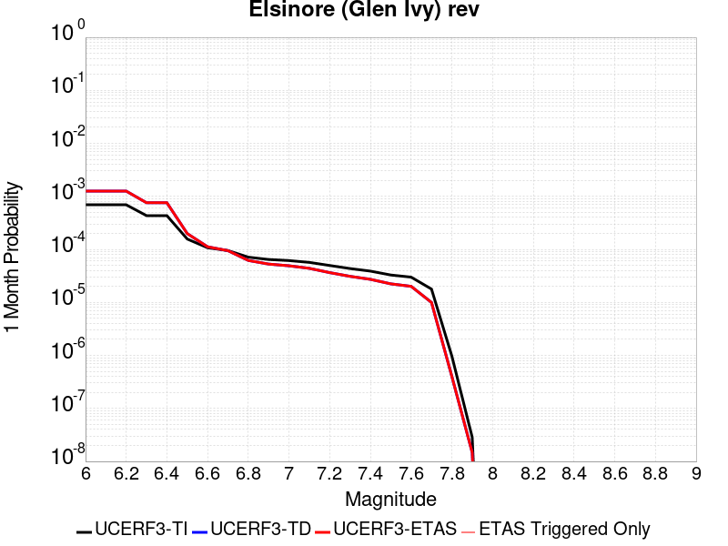 | 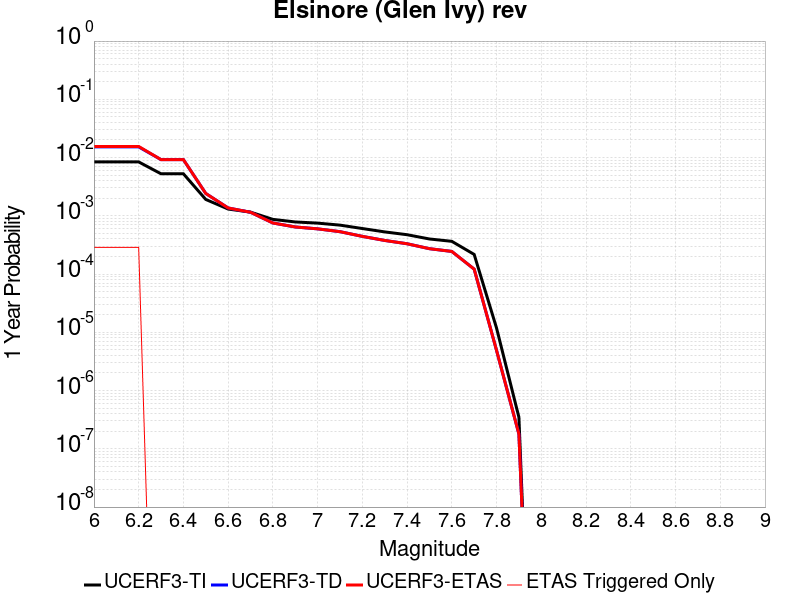 | 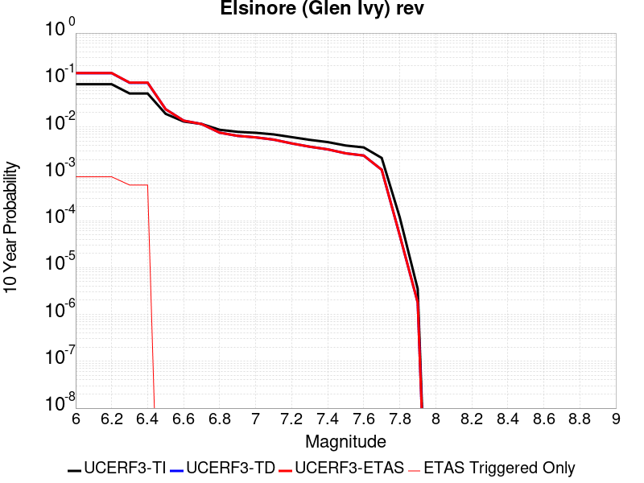 |

| Magnitude | 1 wk TI Prob | 1 wk TD Prob | 1 wk ETAS Prob | 1 wk ETAS/TD Gain | 1 wk ETAS Triggered Only | 1 mo TI Prob | 1 mo TD Prob | 1 mo ETAS Prob | 1 mo ETAS/TD Gain | 1 mo ETAS Triggered Only | 1 yr TI Prob | 1 yr TD Prob | 1 yr ETAS Prob | 1 yr ETAS/TD Gain | 1 yr ETAS Triggered Only | 10 yr TI Prob | 10 yr TD Prob | 10 yr ETAS Prob | 10 yr ETAS/TD Gain | 10 yr ETAS Triggered Only |
|-----|-----|-----|-----|-----|-----|-----|-----|-----|-----|-----|-----|-----|-----|-----|-----|-----|-----|-----|-----|-----|
| 6.0 | 1.6204086E-4 | 2.9360707E-4 | 2.9360707E-4 | 1.0 | 0.0 | 6.94276E-4 | 0.0012578638 | 0.0012578638 | 1.0 | 0.0 | 0.008420097 | 0.015234485 | 0.01652008 | 1.0843872 | 0.001305483 | 0.081081145 | 0.13969168 | 0.1408148 | 1.00804 | 0.001305483 |
| 6.1 | 1.6204086E-4 | 2.9360707E-4 | 2.9360707E-4 | 1.0 | 0.0 | 6.94276E-4 | 0.0012578638 | 0.0012578638 | 1.0 | 0.0 | 0.008420097 | 0.015234485 | 0.01652008 | 1.0843872 | 0.001305483 | 0.081081145 | 0.13969168 | 0.1408148 | 1.00804 | 0.001305483 |
| 6.2 | 1.6204086E-4 | 2.9360707E-4 | 2.9360707E-4 | 1.0 | 0.0 | 6.94276E-4 | 0.0012578638 | 0.0012578638 | 1.0 | 0.0 | 0.008420097 | 0.015234485 | 0.01652008 | 1.0843872 | 0.001305483 | 0.081081145 | 0.13969168 | 0.1408148 | 1.00804 | 0.001305483 |
| 6.3 | 1.0111737E-4 | 1.7703383E-4 | 1.7703383E-4 | 1.0 | 0.0 | 4.332882E-4 | 7.5861247E-4 | 7.5861247E-4 | 1.0 | 0.0 | 0.005262531 | 0.009217682 | 0.009217682 | 1.0 | 0.0 | 0.0513964 | 0.0870191 | 0.0870191 | 1.0 | 0.0 |
| 6.4 | 1.0111737E-4 | 1.7703383E-4 | 1.7703383E-4 | 1.0 | 0.0 | 4.332882E-4 | 7.5861247E-4 | 7.5861247E-4 | 1.0 | 0.0 | 0.005262531 | 0.009217682 | 0.009217682 | 1.0 | 0.0 | 0.0513964 | 0.0870191 | 0.0870191 | 1.0 | 0.0 |
| 6.5 | 3.6624708E-5 | 4.6391084E-5 | 4.6391084E-5 | 1.0 | 0.0 | 1.569536E-4 | 1.9880582E-4 | 1.9880582E-4 | 1.0 | 0.0 | 0.001909235 | 0.0024181372 | 0.0024181372 | 1.0 | 0.0 | 0.01892915 | 0.023739954 | 0.023739954 | 1.0 | 0.0 |
| 6.6 | 2.5051324E-5 | 2.614772E-5 | 2.614772E-5 | 1.0 | 0.0 | 1.073584E-4 | 1.12057096E-4 | 1.12057096E-4 | 1.0 | 0.0 | 0.0013063047 | 0.0013634858 | 0.0013634858 | 1.0 | 0.0 | 0.012986525 | 0.013564618 | 0.013564618 | 1.0 | 0.0 |
| 6.7 | 2.2189772E-5 | 2.2072849E-5 | 2.2072849E-5 | 1.0 | 0.0 | 9.509556E-5 | 9.4594696E-5 | 9.4594696E-5 | 1.0 | 0.0 | 0.0011571734 | 0.0011511183 | 0.0011511183 | 1.0 | 0.0 | 0.011511663 | 0.011465415 | 0.011465415 | 1.0 | 0.0 |
| 6.8 | 1.6654378E-5 | 1.4437705E-5 | 1.4437705E-5 | 1.0 | 0.0 | 7.137396E-5 | 6.187444E-5 | 6.187444E-5 | 1.0 | 0.0 | 8.686314E-4 | 7.530661E-4 | 7.530661E-4 | 1.0 | 0.0 | 0.008652439 | 0.00751048 | 0.00751048 | 1.0 | 0.0 |
| 6.9 | 1.5042909E-5 | 1.2332022E-5 | 1.2332022E-5 | 1.0 | 0.0 | 6.446802E-5 | 5.285047E-5 | 5.285047E-5 | 1.0 | 0.0 | 7.8461546E-4 | 6.4326765E-4 | 6.4326765E-4 | 1.0 | 0.0 | 0.007818509 | 0.00641828 | 0.00641828 | 1.0 | 0.0 |
| 7.0 | 1.4361385E-5 | 1.1451324E-5 | 1.1451324E-5 | 1.0 | 0.0 | 6.154734E-5 | 4.9076196E-5 | 4.9076196E-5 | 1.0 | 0.0 | 7.490812E-4 | 5.973418E-4 | 5.973418E-4 | 1.0 | 0.0 | 0.007465612 | 0.0059613534 | 0.0059613534 | 1.0 | 0.0 |
| 7.1 | 1.3265571E-5 | 1.0244926E-5 | 1.0244926E-5 | 1.0 | 0.0 | 5.6851208E-5 | 4.39061E-5 | 4.39061E-5 | 1.0 | 0.0 | 6.919436E-4 | 5.344282E-4 | 5.344282E-4 | 1.0 | 0.0 | 0.006897931 | 0.0053347866 | 0.0053347866 | 1.0 | 0.0 |
| 7.2 | 1.1596403E-5 | 8.505067E-6 | 8.505067E-6 | 1.0 | 0.0 | 4.9697923E-5 | 3.6449786E-5 | 3.6449786E-5 | 1.0 | 0.0 | 6.049042E-4 | 4.436875E-4 | 4.436875E-4 | 1.0 | 0.0 | 0.006032603 | 0.0044294316 | 0.0044294316 | 1.0 | 0.0 |
| 7.3 | 1.0150827E-5 | 7.2387597E-6 | 7.2387597E-6 | 1.0 | 0.0 | 4.3502816E-5 | 3.1022897E-5 | 3.1022897E-5 | 1.0 | 0.0 | 5.2951806E-4 | 3.7763975E-4 | 3.7763975E-4 | 1.0 | 0.0 | 0.005282581 | 0.0037703665 | 0.0037703665 | 1.0 | 0.0 |
| 7.4 | 9.080705E-6 | 6.352519E-6 | 6.352519E-6 | 1.0 | 0.0 | 3.8916725E-5 | 2.7224805E-5 | 2.7224805E-5 | 1.0 | 0.0 | 4.7370812E-4 | 3.3141294E-4 | 3.3141294E-4 | 1.0 | 0.0 | 0.004726996 | 0.0033093381 | 0.0033093381 | 1.0 | 0.0 |
| 7.5 | 7.671649E-6 | 5.2256332E-6 | 5.2256332E-6 | 1.0 | 0.0 | 3.287808E-5 | 2.2395385E-5 | 2.2395385E-5 | 1.0 | 0.0 | 4.0021708E-4 | 2.7263095E-4 | 2.7263095E-4 | 1.0 | 0.0 | 0.0039949706 | 0.00272309 | 0.00272309 | 1.0 | 0.0 |
| 7.6 | 6.990086E-6 | 4.687545E-6 | 4.687545E-6 | 1.0 | 0.0 | 2.9957167E-5 | 2.008933E-5 | 2.008933E-5 | 1.0 | 0.0 | 3.6466747E-4 | 2.445613E-4 | 2.445613E-4 | 1.0 | 0.0 | 0.0036406964 | 0.002443038 | 0.002443038 | 1.0 | 0.0 |
| 7.7 | 4.163505E-6 | 2.3295343E-6 | 2.3295343E-6 | 1.0 | 0.0 | 1.7843471E-5 | 9.983683E-6 | 9.983683E-6 | 1.0 | 0.0 | 2.172226E-4 | 1.21545316E-4 | 1.21545316E-4 | 1.0 | 0.0 | 0.0021701038 | 0.0012148614 | 0.0012148614 | 1.0 | 0.0 |
| 7.8 | 2.2692414E-7 | 9.3854695E-8 | 9.3854695E-8 | 1.0 | 0.0 | 9.725317E-7 | 4.0223435E-7 | 4.0223435E-7 | 1.0 | 0.0 | 1.1840509E-5 | 4.8971956E-6 | 4.8971956E-6 | 1.0 | 0.0 | 1.1839878E-4 | 4.8971204E-5 | 4.8971204E-5 | 1.0 | 0.0 |
| 7.9 | 6.676829E-9 | 3.439853E-9 | 3.439853E-9 | 1.0 | 0.0 | 2.861498E-8 | 1.4742227E-8 | 1.4742227E-8 | 1.0 | 0.0 | 3.4838732E-7 | 1.7948659E-7 | 1.7948659E-7 | 1.0 | 0.0 | 3.4838679E-6 | 1.7948646E-6 | 1.7948646E-6 | 1.0 | 0.0 |

