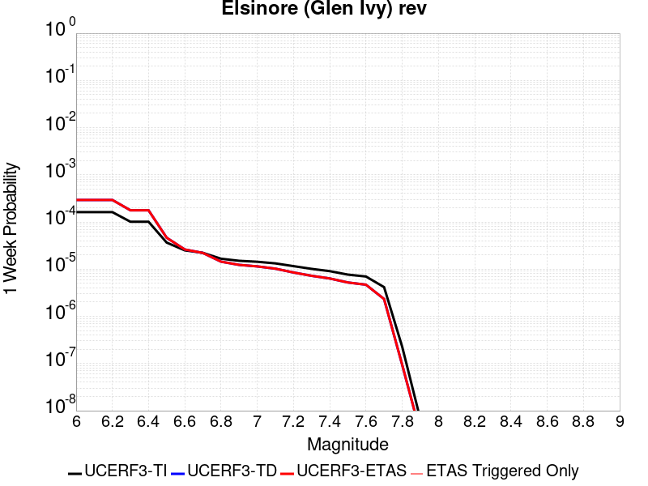
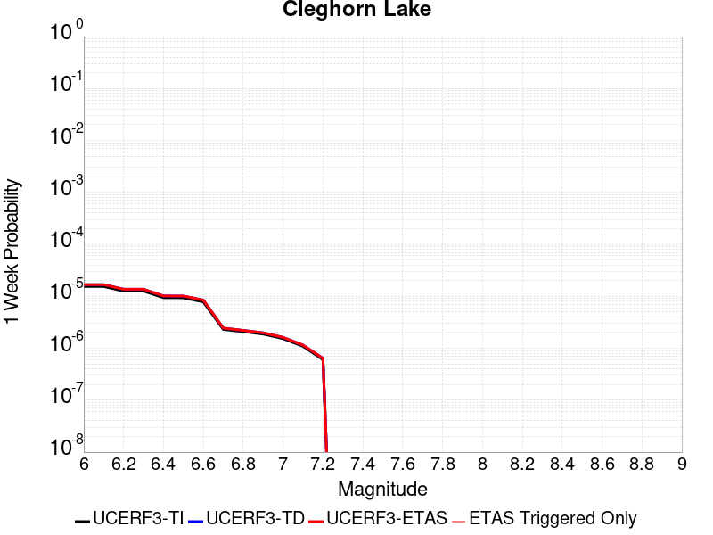

# Parent Section Magnitude-Probability Distributions

Only fault sections with at least one triggered aftershock are plotted. Sections are sorted by total supraseismogenic trigger rate (decreasing)

## Table Of Contents

* [Tank Canyon](#tank-canyon)
* [Garlock (Central)](#garlock-central)
* [Little Lake](#little-lake)
* [Owl Lake](#owl-lake)
* [Airport Lake](#airport-lake)
* [Panamint Valley](#panamint-valley)
* [Garlock (East)](#garlock-east)
* [Ash Hill](#ash-hill)
* [Blackwater](#blackwater)
* [Hunter Mountain-Saline Valley](#hunter-mountain-saline-valley)
* [McLean Lake](#mclean-lake)
* [Goldstone Lake](#goldstone-lake)
* [Gravel Hills-Harper Lk](#gravel-hills-harper-lk)
* [Coyote Canyon](#coyote-canyon)
* [Garlock (West)](#garlock-west)
* [So Sierra Nevada](#so-sierra-nevada)
* [Nelson Lake](#nelson-lake)
* [Death Valley (So)](#death-valley-so)
* [Towne Pass](#towne-pass)
* [San Andreas (Mojave S)](#san-andreas-mojave-s)
* [Bicycle Lake](#bicycle-lake)
* [San Andreas (Mojave N)](#san-andreas-mojave-n)
* [Garlic Springs](#garlic-springs)
* [Paradise](#paradise)
* [Lenwood-Lockhart-Old Woman Springs](#lenwood-lockhart-old-woman-springs)
* [San Andreas (San Bernardino N)](#san-andreas-san-bernardino-n)
* [Death Valley (Black Mtns Frontal)](#death-valley-black-mtns-frontal)
* [Coyote Lake](#coyote-lake)
* [San Andreas (San Bernardino S)](#san-andreas-san-bernardino-s)
* [Calico-Hidalgo](#calico-hidalgo)
* [Death Valley (No)](#death-valley-no)
* [San Andreas (San Gorgonio Pass-Garnet HIll)](#san-andreas-san-gorgonio-pass-garnet-hill)
* [San Andreas (Parkfield)](#san-andreas-parkfield)
* [Helendale-So Lockhart](#helendale-so-lockhart)
* [Manix-Afton Hills](#manix-afton-hills)
* [Red Pass](#red-pass)
* [Lost Hills](#lost-hills)
* [San Andreas (Carrizo) rev](#san-andreas-carrizo-rev)
* [Baker](#baker)
* [Elsinore (Glen Ivy) rev](#elsinore-glen-ivy-rev)
* [Death Valley (Fish Lake Valley)](#death-valley-fish-lake-valley)
* [Sierra Nevada  (No Extension)](#sierra-nevada--no-extension)
* [San Andreas (Cholame) rev](#san-andreas-cholame-rev)
* [Scodie Lineament](#scodie-lineament)
* [Whittier alt 1](#whittier-alt-1)
* [Cady](#cady)
* [San Andreas (Big Bend)](#san-andreas-big-bend)
* [Calaveras (Central) 2011 CFM](#calaveras-central-2011-cfm)
* [White Wolf (Extension)](#white-wolf-extension)
* [Ludlow](#ludlow)
* [Kern Canyon (North Kern) 2011](#kern-canyon-north-kern-2011)
* [Deep Springs](#deep-springs)
* [San Diego Trough south](#san-diego-trough-south)
* [San Andreas (Coachella) rev](#san-andreas-coachella-rev)
* [Hayward (So) extension 2011 CFM](#hayward-so-extension-2011-cfm)
* [Owens Valley](#owens-valley)
* [Oceanic - West Huasna](#oceanic---west-huasna)
* [Cleghorn Pass](#cleghorn-pass)
* [Bullion Mountains](#bullion-mountains)
* [Earthquake Valley (So Extension)](#earthquake-valley-so-extension)
* [Earthquake Valley](#earthquake-valley)
* [San Andreas (Creeping Section) 2011 CFM](#san-andreas-creeping-section-2011-cfm)
* [Pinto Mtn](#pinto-mtn)
* [Channel Islands Thrust](#channel-islands-thrust)
* [Rinconada 2011 CFM](#rinconada-2011-cfm)
* [San Gregorio (South) 2011 CFM](#san-gregorio-south-2011-cfm)
* [Kern Canyon (South Kern) 2011](#kern-canyon-south-kern-2011)
* [Big Pine (East)](#big-pine-east)
* [Santa Cruz Island](#santa-cruz-island)
* [San Diego Trough north alt1](#san-diego-trough-north-alt1)
* [White Mountains](#white-mountains)
* [Channel Islands Western Deep Ramp](#channel-islands-western-deep-ramp)
* [Santa Ynez (West)](#santa-ynez-west)
* [Hayward (No) 2011 CFM](#hayward-no-2011-cfm)
* [Chino alt 1](#chino-alt-1)
* [Ortigalita (North)](#ortigalita-north)
* [Mission Creek](#mission-creek)
* [San Clemente](#san-clemente)
* [Calaveras (No) 2011 CFM](#calaveras-no-2011-cfm)
* [Santa Rosa Island](#santa-rosa-island)
* [Cleghorn](#cleghorn)
* [Cleghorn Lake](#cleghorn-lake)
* [Lake Isabella (Seismicity)](#lake-isabella-seismicity)
* [Hayward (So) 2011 CFM](#hayward-so-2011-cfm)

## Tank Canyon
*[(top)](#table-of-contents)*

| 1 Week | 1 Month | 1 Year | 10 Year |
|-----|-----|-----|-----|
|  |  |  |  |

| Magnitude | 1 wk TI Prob | 1 wk TD Prob | 1 wk ETAS Prob | 1 wk ETAS/TD Gain | 1 wk ETAS Triggered Only | 1 mo TI Prob | 1 mo TD Prob | 1 mo ETAS Prob | 1 mo ETAS/TD Gain | 1 mo ETAS Triggered Only | 1 yr TI Prob | 1 yr TD Prob | 1 yr ETAS Prob | 1 yr ETAS/TD Gain | 1 yr ETAS Triggered Only | 10 yr TI Prob | 10 yr TD Prob | 10 yr ETAS Prob | 10 yr ETAS/TD Gain | 10 yr ETAS Triggered Only |
|-----|-----|-----|-----|-----|-----|-----|-----|-----|-----|-----|-----|-----|-----|-----|-----|-----|-----|-----|-----|-----|
| 6.0 | 4.8284557E-5 | 5.7964822E-5 | 0.08496412 | 1465.7875 | 0.08491107 | 2.0691741E-4 | 2.4840087E-4 | 0.10492692 | 422.40967 | 0.10470453 | 0.0025163088 | 0.0030207601 | 0.1434444 | 47.48619 | 0.14084911 | 0.02488006 | 0.029863637 | 0.19684063 | 6.5913153 | 0.17211704 |
| 6.1 | 1.7796336E-5 | 2.0873314E-5 | 0.03473042 | 1663.867 | 0.03471027 | 7.626778E-5 | 8.945422E-5 | 0.0434017 | 485.1834 | 0.043316122 | 9.281647E-4 | 0.0010885983 | 0.059544686 | 54.698498 | 0.05851979 | 0.009242975 | 0.010836744 | 0.08149126 | 7.5199027 | 0.071428575 |
| 6.2 | 1.7796336E-5 | 2.0873314E-5 | 0.03473042 | 1663.867 | 0.03471027 | 7.626778E-5 | 8.945422E-5 | 0.0434017 | 485.1834 | 0.043316122 | 9.281647E-4 | 0.0010885983 | 0.059544686 | 54.698498 | 0.05851979 | 0.009242975 | 0.010836744 | 0.08149126 | 7.5199027 | 0.071428575 |
| 6.3 | 1.3515912E-5 | 1.5759564E-5 | 0.026119767 | 1657.3914 | 0.026104419 | 5.792405E-5 | 6.753938E-5 | 0.032480724 | 480.91537 | 0.032415375 | 7.049971E-4 | 8.2200574E-4 | 0.0449624 | 54.6984 | 0.044176705 | 0.007027647 | 0.0081922645 | 0.06111144 | 7.4596515 | 0.053356282 |
| 6.4 | 1.0870146E-5 | 1.2618021E-5 | 0.020666402 | 1637.8481 | 0.020654045 | 4.658551E-5 | 5.4076212E-5 | 0.025009697 | 462.4898 | 0.024956971 | 5.67031E-4 | 6.581969E-4 | 0.035632294 | 54.13622 | 0.03499713 | 0.005655863 | 0.0065644905 | 0.047886394 | 7.294761 | 0.041594952 |
| 6.5 | 7.964826E-6 | 9.196094E-6 | 0.01463901 | 1591.8726 | 0.014629948 | 3.4134522E-5 | 3.9411298E-5 | 0.016676737 | 423.1461 | 0.016637981 | 4.1550855E-4 | 4.7973756E-4 | 0.023704391 | 49.411163 | 0.0232358 | 0.0041473247 | 0.004788321 | 0.031338718 | 6.544824 | 0.026678141 |
| 6.6 | 6.6317E-6 | 7.6122988E-6 | 0.0100476965 | 1319.9293 | 0.01004016 | 2.8421264E-5 | 3.2623782E-5 | 0.0117935715 | 361.50226 | 0.011761331 | 3.4597394E-4 | 3.9713128E-4 | 0.017315252 | 43.600826 | 0.016924841 | 0.0034543579 | 0.003965368 | 0.023680339 | 5.9717884 | 0.01979346 |
| 6.7 | 4.793663E-6 | 5.4307857E-6 | 0.007176935 | 1321.528 | 0.0071715433 | 2.0544108E-5 | 2.3274613E-5 | 0.008342071 | 358.41934 | 0.0083189905 | 2.500958E-4 | 2.8333595E-4 | 0.012328115 | 43.510593 | 0.012048192 | 0.0024981452 | 0.0028304397 | 0.01656083 | 5.850974 | 0.013769363 |
| 6.8 | 4.382823E-6 | 4.9692567E-6 | 0.007176477 | 1444.175 | 0.0071715433 | 1.8783392E-5 | 2.1296666E-5 | 0.008053254 | 378.14624 | 0.008032128 | 2.286638E-4 | 2.5926033E-4 | 0.01115718 | 43.03466 | 0.010900746 | 0.0022842865 | 0.002590253 | 0.015179475 | 5.860229 | 0.012621916 |
| 6.9 | 2.729601E-6 | 3.0735416E-6 | 0.004879708 | 1587.6498 | 0.0048766495 | 1.1698237E-5 | 1.3172262E-5 | 0.0048897574 | 371.21625 | 0.0048766495 | 1.4241673E-4 | 1.6036171E-4 | 0.0067571234 | 42.136765 | 0.0065978197 | 0.001423255 | 0.0016026258 | 0.009621882 | 6.003823 | 0.008032128 |
| 7.0 | 1.8987357E-6 | 2.126939E-6 | 0.0031575994 | 1484.5745 | 0.003155479 | 8.137413E-6 | 9.115425E-6 | 0.0031645657 | 347.16602 | 0.003155479 | 9.90685E-5 | 1.1097535E-4 | 0.0044134236 | 39.76941 | 0.004302926 | 9.902435E-4 | 0.0011092679 | 0.005980508 | 5.3914003 | 0.0048766495 |
| 7.1 | 1.4928986E-6 | 1.6641272E-6 | 0.0020096928 | 1207.6559 | 0.002008032 | 6.398121E-6 | 7.1319573E-6 | 0.0020151497 | 282.55212 | 0.002008032 | 7.789434E-5 | 8.682871E-5 | 0.0026683602 | 30.73131 | 0.0025817556 | 7.786704E-4 | 8.6800574E-4 | 0.0034475203 | 3.9717715 | 0.0025817556 |
| 7.2 | 1.069082E-6 | 1.1828573E-6 | 8.6176704E-4 | 728.54694 | 8.605852E-4 | 4.581772E-6 | 5.0693816E-6 | 8.656502E-4 | 170.76051 | 8.605852E-4 | 5.5781646E-5 | 6.171851E-5 | 9.2225056E-4 | 14.942854 | 8.605852E-4 | 5.576765E-4 | 6.170659E-4 | 0.0014771201 | 2.39378 | 8.605852E-4 |
| 7.3 | 8.776551E-7 | 9.770005E-7 | 8.6156133E-4 | 881.8433 | 8.605852E-4 | 3.7613736E-6 | 4.1871413E-6 | 8.6476875E-4 | 206.52963 | 8.605852E-4 | 4.579376E-5 | 5.097777E-5 | 9.115191E-4 | 17.880716 | 8.605852E-4 | 4.5784327E-4 | 5.097118E-4 | 0.0013698583 | 2.6875155 | 8.605852E-4 |
| 7.4 | 7.55721E-7 | 8.510244E-7 | 5.74574E-4 | 675.1557 | 5.7372346E-4 | 3.2388E-6 | 3.6472454E-6 | 5.773686E-4 | 158.30266 | 5.7372346E-4 | 3.9431678E-5 | 4.4404827E-5 | 6.1810284E-4 | 13.919722 | 5.7372346E-4 | 3.942468E-4 | 4.440104E-4 | 0.0010174791 | 2.291566 | 5.7372346E-4 |
| 7.5 | 5.587665E-7 | 6.305619E-7 | 6.305619E-7 | 1.0 | 0.0 | 2.3947114E-6 | 2.702408E-6 | 2.702408E-6 | 1.0 | 0.0 | 2.915522E-5 | 3.290182E-5 | 3.290182E-5 | 1.0 | 0.0 | 2.9151395E-4 | 3.290182E-4 | 3.290182E-4 | 1.0 | 0.0 |

## Garlock (Central)
*[(top)](#table-of-contents)*

| 1 Week | 1 Month | 1 Year | 10 Year |
|-----|-----|-----|-----|
|  |  |  |  |

| Magnitude | 1 wk TI Prob | 1 wk TD Prob | 1 wk ETAS Prob | 1 wk ETAS/TD Gain | 1 wk ETAS Triggered Only | 1 mo TI Prob | 1 mo TD Prob | 1 mo ETAS Prob | 1 mo ETAS/TD Gain | 1 mo ETAS Triggered Only | 1 yr TI Prob | 1 yr TD Prob | 1 yr ETAS Prob | 1 yr ETAS/TD Gain | 1 yr ETAS Triggered Only | 10 yr TI Prob | 10 yr TD Prob | 10 yr ETAS Prob | 10 yr ETAS/TD Gain | 10 yr ETAS Triggered Only |
|-----|-----|-----|-----|-----|-----|-----|-----|-----|-----|-----|-----|-----|-----|-----|-----|-----|-----|-----|-----|-----|
| 6.0 | 5.5131142E-5 | 7.024681E-5 | 0.12828843 | 1826.2528 | 0.12822719 | 2.3625491E-4 | 3.010234E-4 | 0.1508581 | 501.15076 | 0.15060242 | 0.0028726095 | 0.0036588663 | 0.1857212 | 50.75922 | 0.18273093 | 0.028357591 | 0.036079824 | 0.23378576 | 6.4796815 | 0.20510614 |
| 6.1 | 5.5131142E-5 | 7.024681E-5 | 0.12828843 | 1826.2528 | 0.12822719 | 2.3625491E-4 | 3.010234E-4 | 0.1508581 | 501.15076 | 0.15060242 | 0.0028726095 | 0.0036588663 | 0.1857212 | 50.75922 | 0.18273093 | 0.028357591 | 0.036079824 | 0.23378576 | 6.4796815 | 0.20510614 |
| 6.2 | 4.216245E-5 | 5.1661493E-5 | 0.08266357 | 1600.1003 | 0.08261618 | 1.806837E-4 | 2.2138779E-4 | 0.09887998 | 446.637 | 0.09868044 | 0.0021976046 | 0.0026920962 | 0.12284967 | 45.63346 | 0.12048193 | 0.021759989 | 0.026689773 | 0.15875396 | 5.948119 | 0.1356856 |
| 6.3 | 4.216245E-5 | 5.1661493E-5 | 0.08266357 | 1600.1003 | 0.08261618 | 1.806837E-4 | 2.2138779E-4 | 0.09887998 | 446.637 | 0.09868044 | 0.0021976046 | 0.0026920962 | 0.12284967 | 45.63346 | 0.12048193 | 0.021759989 | 0.026689773 | 0.15875396 | 5.948119 | 0.1356856 |
| 6.4 | 3.6858168E-5 | 4.411054E-5 | 0.06802734 | 1542.2015 | 0.06798623 | 1.5795401E-4 | 1.8903162E-4 | 0.08106875 | 428.86343 | 0.08089501 | 0.0019213937 | 0.002299056 | 0.09960781 | 43.325527 | 0.09753299 | 0.019048655 | 0.02284894 | 0.129646 | 5.674049 | 0.10929432 |
| 6.5 | 3.39199E-5 | 4.0018083E-5 | 0.05970487 | 1491.9473 | 0.05966724 | 1.453629E-4 | 1.7149492E-4 | 0.071301006 | 415.7616 | 0.07114171 | 0.0017683565 | 0.002085973 | 0.08825124 | 42.30699 | 0.08634538 | 0.017543508 | 0.020759864 | 0.116548985 | 5.61415 | 0.09781985 |
| 6.6 | 3.3571985E-5 | 3.9472274E-5 | 0.05941751 | 1505.2974 | 0.05938038 | 1.4387199E-4 | 1.6915603E-4 | 0.07101202 | 419.80185 | 0.07085485 | 0.0017502342 | 0.0020575512 | 0.087939 | 42.739643 | 0.08605852 | 0.017365133 | 0.020481179 | 0.116016574 | 5.664546 | 0.09753299 |
| 6.7 | 3.2580007E-5 | 3.8088703E-5 | 0.055973995 | 1469.5696 | 0.05593804 | 1.3962112E-4 | 1.632272E-4 | 0.06756473 | 413.93057 | 0.06741251 | 0.0016985617 | 0.0019855013 | 0.084437646 | 42.52712 | 0.08261618 | 0.016856372 | 0.019773813 | 0.11200393 | 5.664255 | 0.09409065 |
| 6.8 | 3.2185937E-5 | 3.7515918E-5 | 0.0545392 | 1453.7616 | 0.054503728 | 1.3793244E-4 | 1.6077272E-4 | 0.06555473 | 407.74786 | 0.065404475 | 0.0016780337 | 0.001955672 | 0.08240618 | 42.137012 | 0.080608144 | 0.016654192 | 0.019480614 | 0.10948813 | 5.620363 | 0.09179576 |
| 6.9 | 3.165394E-5 | 3.6720503E-5 | 0.053104192 | 1446.1727 | 0.05306942 | 1.3565269E-4 | 1.5736422E-4 | 0.063830644 | 405.62366 | 0.0636833 | 0.0016503202 | 0.001914247 | 0.08065022 | 42.131557 | 0.07888698 | 0.01638118 | 0.019073246 | 0.107148424 | 5.617734 | 0.08978772 |
| 7.0 | 3.0903822E-5 | 3.5625766E-5 | 0.05195575 | 1458.3757 | 0.051921975 | 1.3243823E-4 | 1.5267303E-4 | 0.062392164 | 408.66525 | 0.062248997 | 0.0016112428 | 0.0018572307 | 0.07887972 | 42.471687 | 0.077165805 | 0.015996104 | 0.018512413 | 0.10494864 | 5.6690955 | 0.088066556 |
| 7.1 | 3.0069863E-5 | 3.4392073E-5 | 0.04879921 | 1418.9087 | 0.048766494 | 1.2886449E-4 | 1.4738638E-4 | 0.058945373 | 399.9377 | 0.058806654 | 0.0015677959 | 0.0017929734 | 0.07395252 | 41.245743 | 0.072289154 | 0.01556781 | 0.017880075 | 0.09901907 | 5.537956 | 0.08261618 |
| 7.2 | 2.7957109E-5 | 3.128145E-5 | 0.040764373 | 1303.1483 | 0.040734366 | 1.1981068E-4 | 1.340566E-4 | 0.049180835 | 366.86624 | 0.049053356 | 0.0014577188 | 0.0016309366 | 0.06234644 | 38.227383 | 0.060814686 | 0.014481937 | 0.016283695 | 0.08457381 | 5.193773 | 0.06942054 |
| 7.3 | 2.4519275E-5 | 2.6714795E-5 | 0.028425267 | 1064.0272 | 0.028399311 | 1.0507837E-4 | 1.1448703E-4 | 0.03539444 | 309.15677 | 0.035283994 | 0.0012785783 | 0.001393003 | 0.043789398 | 31.43525 | 0.042455535 | 0.012712469 | 0.013928054 | 0.06088386 | 4.3713117 | 0.04761905 |
| 7.4 | 2.3225532E-5 | 2.51994E-5 | 0.025268396 | 1002.738 | 0.025243832 | 9.95342E-5 | 1.0799304E-4 | 0.031085715 | 287.84924 | 0.030981068 | 0.0012111551 | 0.0013140367 | 0.039416514 | 29.99651 | 0.03815261 | 0.012045753 | 0.013145725 | 0.055326242 | 4.208687 | 0.042742398 |
| 7.5 | 2.097765E-5 | 2.2483688E-5 | 0.019241787 | 855.81104 | 0.019219736 | 8.9901114E-5 | 9.635517E-5 | 0.023329917 | 242.12418 | 0.0232358 | 0.0010939965 | 0.0011725046 | 0.030398093 | 25.925777 | 0.029259896 | 0.010886264 | 0.011740365 | 0.044058666 | 3.7527509 | 0.032702237 |
| 7.6 | 1.511254E-5 | 1.5991332E-5 | 0.009769134 | 610.9018 | 0.009753299 | 6.476642E-5 | 6.853253E-5 | 0.0121158995 | 176.7905 | 0.012048192 | 7.882459E-4 | 8.3407195E-4 | 0.016025063 | 19.213047 | 0.0152036715 | 0.007854558 | 0.008383559 | 0.025735425 | 3.0697494 | 0.017498566 |
| 7.7 | 9.934069E-6 | 1.0678794E-5 | 0.0031661242 | 296.48706 | 0.003155479 | 4.2573887E-5 | 4.5765457E-5 | 0.004061646 | 88.74916 | 0.004016064 | 5.182138E-4 | 5.570524E-4 | 0.0057176873 | 10.264182 | 0.0051635113 | 0.00517007 | 0.005627684 | 0.011332631 | 2.013729 | 0.005737235 |
| 7.8 | 6.7562896E-6 | 8.428449E-6 | 0.0020164438 | 239.24255 | 0.002008032 | 2.8955206E-5 | 3.6121426E-5 | 0.0029046352 | 80.413086 | 0.0028686174 | 3.5247262E-4 | 4.3968976E-4 | 0.0044539883 | 10.129843 | 0.004016064 | 0.0035191406 | 0.004446654 | 0.009016033 | 2.0275993 | 0.0045897877 |
| 7.9 | 3.975453E-6 | 5.37103E-6 | 0.0011528118 | 214.63513 | 0.0011474469 | 1.7037546E-5 | 2.3018498E-5 | 0.0014572941 | 63.309696 | 0.0014343087 | 2.0741238E-4 | 2.8021427E-4 | 0.0022876838 | 8.164051 | 0.002008032 | 0.002072189 | 0.0028336283 | 0.005408068 | 1.9085313 | 0.0025817556 |
| 8.0 | 1.6729537E-6 | 2.0775144E-6 | 2.8893864E-4 | 139.07901 | 2.8686173E-4 | 7.169782E-6 | 8.903603E-6 | 2.957628E-4 | 33.218327 | 2.8686173E-4 | 8.7288594E-5 | 1.0839601E-4 | 6.820573E-4 | 6.292273 | 5.7372346E-4 | 8.7254314E-4 | 0.0010969337 | 0.001670028 | 1.5224509 | 5.7372346E-4 |
| 8.1 | 3.6733252E-7 | 3.1489964E-7 | 3.1489964E-7 | 1.0 | 0.0 | 1.5742813E-6 | 1.3495693E-6 | 1.3495693E-6 | 1.0 | 0.0 | 1.9166706E-5 | 1.6430899E-5 | 1.6430899E-5 | 1.0 | 0.0 | 1.9165053E-4 | 1.6638759E-4 | 1.6638759E-4 | 1.0 | 0.0 |

## Little Lake
*[(top)](#table-of-contents)*

| 1 Week | 1 Month | 1 Year | 10 Year |
|-----|-----|-----|-----|
|  |  |  |  |

| Magnitude | 1 wk TI Prob | 1 wk TD Prob | 1 wk ETAS Prob | 1 wk ETAS/TD Gain | 1 wk ETAS Triggered Only | 1 mo TI Prob | 1 mo TD Prob | 1 mo ETAS Prob | 1 mo ETAS/TD Gain | 1 mo ETAS Triggered Only | 1 yr TI Prob | 1 yr TD Prob | 1 yr ETAS Prob | 1 yr ETAS/TD Gain | 1 yr ETAS Triggered Only | 10 yr TI Prob | 10 yr TD Prob | 10 yr ETAS Prob | 10 yr ETAS/TD Gain | 10 yr ETAS Triggered Only |
|-----|-----|-----|-----|-----|-----|-----|-----|-----|-----|-----|-----|-----|-----|-----|-----|-----|-----|-----|-----|-----|
| 6.0 | 2.8424427E-5 | 3.120572E-5 | 0.061417703 | 1968.1552 | 0.06138841 | 1.2181328E-4 | 1.337327E-4 | 0.06897134 | 515.7403 | 0.068846814 | 0.0014820677 | 0.0016271127 | 0.08067212 | 49.579926 | 0.07917384 | 0.014722223 | 0.016165402 | 0.10478389 | 6.4819856 | 0.090074584 |
| 6.1 | 2.8424427E-5 | 3.120572E-5 | 0.061417703 | 1968.1552 | 0.06138841 | 1.2181328E-4 | 1.337327E-4 | 0.06897134 | 515.7403 | 0.068846814 | 0.0014820677 | 0.0016271127 | 0.08067212 | 49.579926 | 0.07917384 | 0.014722223 | 0.016165402 | 0.10478389 | 6.4819856 | 0.090074584 |
| 6.2 | 2.8424427E-5 | 3.120572E-5 | 0.061417703 | 1968.1552 | 0.06138841 | 1.2181328E-4 | 1.337327E-4 | 0.06897134 | 515.7403 | 0.068846814 | 0.0014820677 | 0.0016271127 | 0.08067212 | 49.579926 | 0.07917384 | 0.014722223 | 0.016165402 | 0.10478389 | 6.4819856 | 0.090074584 |
| 6.3 | 1.48860645E-5 | 1.6081389E-5 | 0.038168076 | 2373.4316 | 0.03815261 | 6.379586E-5 | 6.8918576E-5 | 0.043382056 | 629.4682 | 0.043316122 | 7.7643775E-4 | 8.3878887E-4 | 0.050997484 | 60.79895 | 0.050200805 | 0.007737305 | 0.008359048 | 0.06525182 | 7.8061304 | 0.057372347 |
| 6.4 | 1.48860645E-5 | 1.6081389E-5 | 0.038168076 | 2373.4316 | 0.03815261 | 6.379586E-5 | 6.8918576E-5 | 0.043382056 | 629.4682 | 0.043316122 | 7.7643775E-4 | 8.3878887E-4 | 0.050997484 | 60.79895 | 0.050200805 | 0.007737305 | 0.008359048 | 0.06525182 | 7.8061304 | 0.057372347 |
| 6.5 | 1.2797581E-5 | 1.3765565E-5 | 0.03558413 | 2585.0105 | 0.035570856 | 5.4845623E-5 | 5.899409E-5 | 0.040504113 | 686.57916 | 0.040447503 | 6.675408E-4 | 7.18042E-4 | 0.048016243 | 66.87107 | 0.047332186 | 0.006655392 | 0.00715977 | 0.060134035 | 8.398878 | 0.053356282 |
| 6.6 | 9.661896E-6 | 1.0289038E-5 | 0.032425333 | 3151.4446 | 0.032415375 | 4.1407468E-5 | 4.409522E-5 | 0.03647393 | 827.16284 | 0.03643144 | 5.040193E-4 | 5.367433E-4 | 0.042682786 | 79.52178 | 0.042168673 | 0.005028777 | 0.0053560743 | 0.052434746 | 9.789772 | 0.047332186 |
| 6.7 | 7.767871E-6 | 8.199687E-6 | 0.029554715 | 3604.3713 | 0.029546758 | 3.329045E-5 | 3.5141118E-5 | 0.03273623 | 931.5648 | 0.032702237 | 4.0523586E-4 | 4.2777284E-4 | 0.038850803 | 90.821106 | 0.03843947 | 0.004044977 | 0.004270846 | 0.04768761 | 11.165846 | 0.043602984 |
| 6.8 | 6.4235196E-6 | 6.7357446E-6 | 0.02410296 | 3578.366 | 0.024096385 | 2.752908E-5 | 2.8867229E-5 | 0.026419384 | 915.2033 | 0.026391279 | 3.35115E-4 | 3.5141467E-4 | 0.030748073 | 87.49798 | 0.030407343 | 0.003346101 | 0.00350985 | 0.038384147 | 10.936122 | 0.03499713 |
| 6.9 | 3.1283696E-6 | 3.1121804E-6 | 0.014919876 | 4794.0264 | 0.01491681 | 1.3407229E-5 | 1.3337856E-5 | 0.016651096 | 1248.4087 | 0.016637981 | 1.6322079E-4 | 1.6237781E-4 | 0.018805362 | 115.81239 | 0.018646013 | 0.0016310095 | 0.00162274 | 0.02281606 | 14.060207 | 0.021227768 |
| 7.0 | 2.290603E-6 | 2.2286815E-6 | 0.0077474783 | 3476.2607 | 0.007745267 | 9.816834E-6 | 9.551463E-6 | 0.00890218 | 932.02264 | 0.008892714 | 1.19513395E-4 | 1.162839E-4 | 0.010155277 | 87.33176 | 0.01004016 | 0.0011944914 | 0.0011623327 | 0.0129099935 | 11.106969 | 0.011761331 |
| 7.1 | 1.293693E-6 | 1.1776827E-6 | 0.00459096 | 3898.2993 | 0.0045897877 | 5.5443866E-6 | 5.0472063E-6 | 0.0054553924 | 1080.8738 | 0.005450373 | 6.750081E-5 | 6.14487E-5 | 0.005798331 | 94.36051 | 0.005737235 | 6.7480316E-4 | 6.143856E-4 | 0.0072081517 | 11.732294 | 0.0065978197 |
| 7.2 | 4.715842E-7 | 3.0917857E-7 | 5.740325E-4 | 1856.6373 | 5.7372346E-4 | 2.0210737E-6 | 1.3250503E-6 | 5.7504774E-4 | 433.9818 | 5.7372346E-4 | 2.4606294E-5 | 1.6132375E-5 | 5.898466E-4 | 36.562912 | 5.7372346E-4 | 2.460357E-4 | 1.6131258E-4 | 7.349435E-4 | 4.556021 | 5.7372346E-4 |
| 7.3 | 3.9430947E-7 | 2.3097488E-7 | 5.739543E-4 | 2484.921 | 5.7372346E-4 | 1.6898966E-6 | 9.89892E-7 | 5.747128E-4 | 580.58136 | 5.7372346E-4 | 2.0574296E-5 | 1.2051869E-5 | 5.8576843E-4 | 48.60395 | 5.7372346E-4 | 2.0572392E-4 | 1.20512224E-4 | 6.941665E-4 | 5.7601337 | 5.7372346E-4 |
| 7.4 | 3.547123E-7 | 1.9679135E-7 | 5.7392014E-4 | 2916.389 | 5.7372346E-4 | 1.5201948E-6 | 8.4339126E-7 | 5.7456637E-4 | 681.2572 | 5.7372346E-4 | 1.8508214E-5 | 1.0268241E-5 | 5.839858E-4 | 56.873016 | 5.7372346E-4 | 1.8506673E-4 | 1.02677724E-4 | 6.763423E-4 | 6.58704 | 5.7372346E-4 |
| 7.5 | 2.6354266E-7 | 1.4423138E-7 | 1.4423138E-7 | 1.0 | 0.0 | 1.129468E-6 | 6.181344E-7 | 6.181344E-7 | 1.0 | 0.0 | 1.3751187E-5 | 7.5257603E-6 | 7.5257603E-6 | 1.0 | 0.0 | 1.3750336E-4 | 7.5255106E-5 | 7.5255106E-5 | 1.0 | 0.0 |
| 7.6 | 1.269913E-7 | 7.572556E-8 | 7.572556E-8 | 1.0 | 0.0 | 5.4424834E-7 | 3.245381E-7 | 3.245381E-7 | 1.0 | 0.0 | 6.6262032E-6 | 3.9512443E-6 | 3.9512443E-6 | 1.0 | 0.0 | 6.626006E-5 | 3.9511775E-5 | 3.9511775E-5 | 1.0 | 0.0 |

## Owl Lake
*[(top)](#table-of-contents)*

| 1 Week | 1 Month | 1 Year | 10 Year |
|-----|-----|-----|-----|
|  |  |  |  |

| Magnitude | 1 wk TI Prob | 1 wk TD Prob | 1 wk ETAS Prob | 1 wk ETAS/TD Gain | 1 wk ETAS Triggered Only | 1 mo TI Prob | 1 mo TD Prob | 1 mo ETAS Prob | 1 mo ETAS/TD Gain | 1 mo ETAS Triggered Only | 1 yr TI Prob | 1 yr TD Prob | 1 yr ETAS Prob | 1 yr ETAS/TD Gain | 1 yr ETAS Triggered Only | 10 yr TI Prob | 10 yr TD Prob | 10 yr ETAS Prob | 10 yr ETAS/TD Gain | 10 yr ETAS Triggered Only |
|-----|-----|-----|-----|-----|-----|-----|-----|-----|-----|-----|-----|-----|-----|-----|-----|-----|-----|-----|-----|-----|
| 6.0 | 5.0320643E-5 | 6.635816E-5 | 0.035634853 | 537.0079 | 0.035570856 | 2.1564208E-4 | 2.843674E-4 | 0.04473529 | 157.31514 | 0.044463567 | 0.0026222812 | 0.0034577388 | 0.06377628 | 18.444504 | 0.060527824 | 0.02591553 | 0.034140717 | 0.103684805 | 3.0369837 | 0.07200229 |
| 6.1 | 5.0320643E-5 | 6.635816E-5 | 0.035634853 | 537.0079 | 0.035570856 | 2.1564208E-4 | 2.843674E-4 | 0.04473529 | 157.31514 | 0.044463567 | 0.0026222812 | 0.0034577388 | 0.06377628 | 18.444504 | 0.060527824 | 0.02591553 | 0.034140717 | 0.103684805 | 3.0369837 | 0.07200229 |
| 6.2 | 2.4125871E-5 | 3.0981035E-5 | 0.029576825 | 954.6751 | 0.029546758 | 1.0339249E-4 | 1.3277028E-4 | 0.03541208 | 266.71692 | 0.035283994 | 0.0012580766 | 0.001615439 | 0.048584763 | 30.075272 | 0.047045324 | 0.012509781 | 0.016070465 | 0.071391806 | 4.4424233 | 0.0562249 |
| 6.3 | 1.7433485E-5 | 2.2355514E-5 | 0.024978768 | 1117.3427 | 0.024956971 | 7.471279E-5 | 9.580672E-5 | 0.030500237 | 318.35175 | 0.030407343 | 9.0924866E-4 | 0.0011659743 | 0.041852847 | 35.89517 | 0.040734366 | 0.009055373 | 0.011628896 | 0.05982829 | 5.1447954 | 0.048766494 |
| 6.4 | 1.7433485E-5 | 2.2355514E-5 | 0.024978768 | 1117.3427 | 0.024956971 | 7.471279E-5 | 9.580672E-5 | 0.030500237 | 318.35175 | 0.030407343 | 9.0924866E-4 | 0.0011659743 | 0.041852847 | 35.89517 | 0.040734366 | 0.009055373 | 0.011628896 | 0.05982829 | 5.1447954 | 0.048766494 |
| 6.5 | 1.5182742E-5 | 1.9429144E-5 | 0.024402203 | 1255.9586 | 0.024383247 | 6.506727E-5 | 8.326596E-5 | 0.029627563 | 355.81845 | 0.029546758 | 7.919061E-4 | 0.0010134429 | 0.04027367 | 39.73946 | 0.039300058 | 0.0078909 | 0.010118429 | 0.056687728 | 5.602424 | 0.047045324 |
| 6.6 | 6.7271576E-6 | 8.547361E-6 | 0.018080682 | 2115.3525 | 0.018072288 | 2.8830356E-5 | 3.6631063E-5 | 0.021550473 | 588.3114 | 0.02151463 | 3.5095305E-4 | 4.458976E-4 | 0.027112143 | 60.803516 | 0.026678141 | 0.0035039932 | 0.004467813 | 0.0361672 | 8.095058 | 0.03184165 |
| 6.7 | 6.682835E-6 | 8.479807E-6 | 0.018080616 | 2132.1965 | 0.018072288 | 2.8640408E-5 | 3.6341557E-5 | 0.021263339 | 585.0971 | 0.021227768 | 3.4864116E-4 | 4.4237426E-4 | 0.026821978 | 60.63187 | 0.026391279 | 0.003480947 | 0.0044327388 | 0.035847656 | 8.087022 | 0.031554792 |
| 6.8 | 6.5774975E-6 | 8.32628E-6 | 0.018080465 | 2171.4937 | 0.018072288 | 2.8188972E-5 | 3.5683603E-5 | 0.021262694 | 595.8674 | 0.021227768 | 3.4314668E-4 | 4.343669E-4 | 0.026814183 | 61.731644 | 0.026391279 | 0.0034261728 | 0.004352885 | 0.03577032 | 8.217612 | 0.031554792 |
| 6.9 | 6.363419E-6 | 7.999454E-6 | 0.017793285 | 2224.3123 | 0.017785428 | 2.727151E-5 | 3.428296E-5 | 0.020974472 | 611.8046 | 0.020940907 | 3.3198006E-4 | 4.1732067E-4 | 0.026510844 | 63.526318 | 0.026104419 | 0.0033148455 | 0.0041828766 | 0.035320014 | 8.4439535 | 0.03126793 |
| 7.0 | 6.1342453E-6 | 7.6316555E-6 | 0.017792923 | 2331.4631 | 0.017785428 | 2.6289357E-5 | 3.2706717E-5 | 0.020972928 | 641.24225 | 0.020940907 | 3.2002592E-4 | 3.9813702E-4 | 0.026492162 | 66.54031 | 0.026104419 | 0.0031956544 | 0.003991571 | 0.03513469 | 8.802222 | 0.03126793 |
| 7.1 | 5.842926E-6 | 7.142211E-6 | 0.016645003 | 2330.5112 | 0.016637981 | 2.504087E-5 | 3.0609146E-5 | 0.01953661 | 638.2605 | 0.019506598 | 3.0482994E-4 | 3.7260808E-4 | 0.024460016 | 65.645424 | 0.024096385 | 0.0030441214 | 0.0037370329 | 0.032316007 | 8.647504 | 0.028686173 |
| 7.2 | 4.77173E-6 | 5.358483E-6 | 0.0103323255 | 1928.2183 | 0.0103270225 | 2.045011E-5 | 2.2964748E-5 | 0.0117840255 | 513.1354 | 0.011761331 | 2.4895166E-4 | 2.79564E-4 | 0.015192204 | 54.34249 | 0.01491681 | 0.0024867293 | 0.002808645 | 0.020830175 | 7.41645 | 0.018072288 |
| 7.3 | 3.0494948E-6 | 2.710463E-6 | 0.0028713201 | 1059.3467 | 0.0028686174 | 1.3069198E-5 | 1.1616219E-5 | 0.003453917 | 297.33572 | 0.0034423408 | 1.5910587E-4 | 1.4141845E-4 | 0.0038700935 | 27.366257 | 0.0037292026 | 0.0015899199 | 0.0014232415 | 0.005720043 | 4.0190253 | 0.004302926 |
| 7.4 | 2.7263884E-6 | 2.3056762E-6 | 0.0017234721 | 747.49097 | 0.0017211704 | 1.1684469E-5 | 9.881433E-6 | 0.0017310348 | 175.18054 | 0.0017211704 | 1.4224913E-4 | 1.20299905E-4 | 0.0021280905 | 17.689877 | 0.002008032 | 0.0014215811 | 0.0012112238 | 0.0037898524 | 3.1289446 | 0.0025817556 |
| 7.5 | 2.6090431E-6 | 2.1656133E-6 | 0.00114961 | 530.84735 | 0.0011474469 | 1.1181565E-5 | 9.281167E-6 | 0.0011567174 | 124.6306 | 0.0011474469 | 1.3612706E-4 | 1.1299244E-4 | 0.001547139 | 13.692411 | 0.0014343087 | 0.001360437 | 0.0011379806 | 0.0028571924 | 2.5107565 | 0.0017211704 |
| 7.6 | 2.3008756E-6 | 1.8727933E-6 | 8.624564E-4 | 460.5187 | 8.605852E-4 | 9.860858E-6 | 8.0262325E-6 | 8.686045E-4 | 108.220695 | 8.605852E-4 | 1.20049335E-4 | 9.7715085E-5 | 0.0012450499 | 12.741634 | 0.0011474469 | 0.001199845 | 9.849932E-4 | 0.002417889 | 2.4547267 | 0.0014343087 |
| 7.7 | 1.7184348E-6 | 1.3419171E-6 | 5.750646E-4 | 428.5396 | 5.7372346E-4 | 7.3646997E-6 | 5.7510606E-6 | 5.7947123E-4 | 100.75902 | 5.7372346E-4 | 8.966153E-5 | 7.0016955E-5 | 9.305419E-4 | 13.290236 | 8.605852E-4 | 8.962536E-4 | 7.078345E-4 | 0.0015678105 | 2.2149394 | 8.605852E-4 |
| 7.8 | 8.4612907E-7 | 8.4058576E-7 | 5.745636E-4 | 683.5276 | 5.7372346E-4 | 3.6262625E-6 | 3.6025056E-6 | 5.773239E-4 | 160.25621 | 5.7372346E-4 | 4.4148852E-5 | 4.3859643E-5 | 9.044071E-4 | 20.620483 | 8.605852E-4 | 4.414008E-4 | 4.4398365E-4 | 0.0013041868 | 2.937466 | 8.605852E-4 |
| 7.9 | 2.716738E-7 | 3.768106E-7 | 3.768106E-7 | 1.0 | 0.0 | 1.1643157E-6 | 1.6149015E-6 | 1.6149015E-6 | 1.0 | 0.0 | 1.4175452E-5 | 1.966126E-5 | 1.966126E-5 | 1.0 | 0.0 | 1.4174548E-4 | 1.9836679E-4 | 1.9836679E-4 | 1.0 | 0.0 |
| 8.0 | 2.1995428E-8 | 3.384878E-8 | 3.384878E-8 | 1.0 | 0.0 | 9.426611E-8 | 1.4506621E-7 | 1.4506621E-7 | 1.0 | 0.0 | 1.1476893E-6 | 1.7661803E-6 | 1.7661803E-6 | 1.0 | 0.0 | 1.14768345E-5 | 1.7963059E-5 | 1.7963059E-5 | 1.0 | 0.0 |

## Airport Lake
*[(top)](#table-of-contents)*

| 1 Week | 1 Month | 1 Year | 10 Year |
|-----|-----|-----|-----|
|  |  |  |  |

| Magnitude | 1 wk TI Prob | 1 wk TD Prob | 1 wk ETAS Prob | 1 wk ETAS/TD Gain | 1 wk ETAS Triggered Only | 1 mo TI Prob | 1 mo TD Prob | 1 mo ETAS Prob | 1 mo ETAS/TD Gain | 1 mo ETAS Triggered Only | 1 yr TI Prob | 1 yr TD Prob | 1 yr ETAS Prob | 1 yr ETAS/TD Gain | 1 yr ETAS Triggered Only | 10 yr TI Prob | 10 yr TD Prob | 10 yr ETAS Prob | 10 yr ETAS/TD Gain | 10 yr ETAS Triggered Only |
|-----|-----|-----|-----|-----|-----|-----|-----|-----|-----|-----|-----|-----|-----|-----|-----|-----|-----|-----|-----|-----|
| 6.0 | 1.2387061E-5 | 1.3103157E-5 | 0.05136068 | 3919.718 | 0.05134825 | 5.3086325E-5 | 5.615534E-5 | 0.058285818 | 1037.9391 | 0.058232933 | 6.461343E-4 | 6.8350515E-4 | 0.070056595 | 102.49607 | 0.06942054 | 0.0064425888 | 0.0068168393 | 0.08317171 | 12.20092 | 0.07687894 |
| 6.1 | 1.2387061E-5 | 1.3103157E-5 | 0.05136068 | 3919.718 | 0.05134825 | 5.3086325E-5 | 5.615534E-5 | 0.058285818 | 1037.9391 | 0.058232933 | 6.461343E-4 | 6.8350515E-4 | 0.070056595 | 102.49607 | 0.06942054 | 0.0064425888 | 0.0068168393 | 0.08317171 | 12.20092 | 0.07687894 |
| 6.2 | 1.2387061E-5 | 1.3103157E-5 | 0.05136068 | 3919.718 | 0.05134825 | 5.3086325E-5 | 5.615534E-5 | 0.058285818 | 1037.9391 | 0.058232933 | 6.461343E-4 | 6.8350515E-4 | 0.070056595 | 102.49607 | 0.06942054 | 0.0064425888 | 0.0068168393 | 0.08317171 | 12.20092 | 0.07687894 |
| 6.3 | 1.2387061E-5 | 1.3103157E-5 | 0.05136068 | 3919.718 | 0.05134825 | 5.3086325E-5 | 5.615534E-5 | 0.058285818 | 1037.9391 | 0.058232933 | 6.461343E-4 | 6.8350515E-4 | 0.070056595 | 102.49607 | 0.06942054 | 0.0064425888 | 0.0068168393 | 0.08317171 | 12.20092 | 0.07687894 |
| 6.4 | 1.2387061E-5 | 1.3103157E-5 | 0.05136068 | 3919.718 | 0.05134825 | 5.3086325E-5 | 5.615534E-5 | 0.058285818 | 1037.9391 | 0.058232933 | 6.461343E-4 | 6.8350515E-4 | 0.070056595 | 102.49607 | 0.06942054 | 0.0064425888 | 0.0068168393 | 0.08317171 | 12.20092 | 0.07687894 |
| 6.5 | 6.9922594E-6 | 7.384925E-6 | 0.03988087 | 5400.308 | 0.039873783 | 2.996648E-5 | 3.1649324E-5 | 0.045067515 | 1423.9645 | 0.045037292 | 3.6478083E-4 | 3.8526783E-4 | 0.052287236 | 135.71658 | 0.051921975 | 0.003641826 | 0.0038465366 | 0.061569713 | 16.006533 | 0.05794607 |
| 6.6 | 6.9922594E-6 | 7.384925E-6 | 0.03988087 | 5400.308 | 0.039873783 | 2.996648E-5 | 3.1649324E-5 | 0.045067515 | 1423.9645 | 0.045037292 | 3.6478083E-4 | 3.8526783E-4 | 0.052287236 | 135.71658 | 0.051921975 | 0.003641826 | 0.0038465366 | 0.061569713 | 16.006533 | 0.05794607 |
| 6.7 | 5.477277E-6 | 5.7860684E-6 | 0.034142137 | 5900.7485 | 0.034136545 | 2.3473833E-5 | 2.4797222E-5 | 0.038176462 | 1539.5459 | 0.03815261 | 2.8575645E-4 | 3.0186825E-4 | 0.04446524 | 147.30016 | 0.044176705 | 0.0028538927 | 0.003014966 | 0.05249242 | 17.41062 | 0.04962708 |
| 6.8 | 3.9950432E-6 | 4.2190873E-6 | 0.026108526 | 6188.1934 | 0.026104419 | 1.7121502E-5 | 1.8081691E-5 | 0.028990593 | 1603.3119 | 0.028973036 | 2.0843433E-4 | 2.2012512E-4 | 0.03377556 | 153.438 | 0.033562824 | 0.0020823893 | 0.0021993418 | 0.04026804 | 18.309134 | 0.03815261 |
| 6.9 | 2.95695E-6 | 3.1230243E-6 | 0.01979652 | 6338.894 | 0.01979346 | 1.2672582E-5 | 1.3384334E-5 | 0.022101441 | 1651.2919 | 0.022088353 | 1.5427776E-4 | 1.6294434E-4 | 0.025115848 | 154.13759 | 0.024956971 | 0.001541707 | 0.0016284712 | 0.029408745 | 18.059114 | 0.027825588 |
| 7.0 | 1.456072E-6 | 1.540812E-6 | 0.0068862117 | 4469.2095 | 0.0068846815 | 6.2402937E-6 | 6.603469E-6 | 0.007751819 | 1173.901 | 0.007745267 | 7.597293E-5 | 8.039528E-5 | 0.008972394 | 111.6035 | 0.008892714 | 7.594696E-4 | 8.0376083E-4 | 0.010835852 | 13.481438 | 0.01004016 |
| 7.1 | 6.995192E-7 | 7.4089746E-7 | 0.0037299406 | 5034.355 | 0.0037292026 | 2.997936E-6 | 3.1752747E-6 | 0.0043060877 | 1356.1307 | 0.004302926 | 3.649926E-5 | 3.865897E-5 | 0.0046282695 | 119.72045 | 0.0045897877 | 3.6493264E-4 | 3.865897E-4 | 0.0055481046 | 14.351403 | 0.0051635113 |

## Panamint Valley
*[(top)](#table-of-contents)*

| 1 Week | 1 Month | 1 Year | 10 Year |
|-----|-----|-----|-----|
|  |  |  |  |

| Magnitude | 1 wk TI Prob | 1 wk TD Prob | 1 wk ETAS Prob | 1 wk ETAS/TD Gain | 1 wk ETAS Triggered Only | 1 mo TI Prob | 1 mo TD Prob | 1 mo ETAS Prob | 1 mo ETAS/TD Gain | 1 mo ETAS Triggered Only | 1 yr TI Prob | 1 yr TD Prob | 1 yr ETAS Prob | 1 yr ETAS/TD Gain | 1 yr ETAS Triggered Only | 10 yr TI Prob | 10 yr TD Prob | 10 yr ETAS Prob | 10 yr ETAS/TD Gain | 10 yr ETAS Triggered Only |
|-----|-----|-----|-----|-----|-----|-----|-----|-----|-----|-----|-----|-----|-----|-----|-----|-----|-----|-----|-----|-----|
| 6.0 | 3.0211835E-5 | 3.3984514E-5 | 0.039332706 | 1157.3715 | 0.039300058 | 1.2947287E-4 | 1.4563995E-4 | 0.046323653 | 318.0697 | 0.046184737 | 0.0015751923 | 0.0017717537 | 0.061905984 | 34.940514 | 0.060240965 | 0.015640736 | 0.017583137 | 0.08409214 | 4.7825446 | 0.067699365 |
| 6.1 | 3.0211835E-5 | 3.3984514E-5 | 0.039332706 | 1157.3715 | 0.039300058 | 1.2947287E-4 | 1.4563995E-4 | 0.046323653 | 318.0697 | 0.046184737 | 0.0015751923 | 0.0017717537 | 0.061905984 | 34.940514 | 0.060240965 | 0.015640736 | 0.017583137 | 0.08409214 | 4.7825446 | 0.067699365 |
| 6.2 | 3.0211835E-5 | 3.3984514E-5 | 0.039332706 | 1157.3715 | 0.039300058 | 1.2947287E-4 | 1.4563995E-4 | 0.046323653 | 318.0697 | 0.046184737 | 0.0015751923 | 0.0017717537 | 0.061905984 | 34.940514 | 0.060240965 | 0.015640736 | 0.017583137 | 0.08409214 | 4.7825446 | 0.067699365 |
| 6.3 | 2.8573924E-5 | 3.210268E-5 | 0.037896637 | 1180.482 | 0.03786575 | 1.2245393E-4 | 1.3757581E-4 | 0.043447737 | 315.80942 | 0.043316122 | 0.001489857 | 0.0016737265 | 0.058090903 | 34.707523 | 0.05651176 | 0.01479908 | 0.016617801 | 0.07896073 | 4.7515755 | 0.06339645 |
| 6.4 | 2.8573924E-5 | 3.210268E-5 | 0.037896637 | 1180.482 | 0.03786575 | 1.2245393E-4 | 1.3757581E-4 | 0.043447737 | 315.80942 | 0.043316122 | 0.001489857 | 0.0016737265 | 0.058090903 | 34.707523 | 0.05651176 | 0.01479908 | 0.016617801 | 0.07896073 | 4.7515755 | 0.06339645 |
| 6.5 | 2.7468774E-5 | 3.0828433E-5 | 0.036748 | 1192.0164 | 0.0367183 | 1.1771801E-4 | 1.3211532E-4 | 0.042008396 | 317.96762 | 0.041881815 | 0.0014322745 | 0.0016073446 | 0.056023467 | 34.85467 | 0.054503728 | 0.014230782 | 0.015963677 | 0.07608982 | 4.7664347 | 0.06110155 |
| 6.6 | 2.6135967E-5 | 2.925248E-5 | 0.034451652 | 1177.7344 | 0.034423407 | 1.1200648E-4 | 1.253619E-4 | 0.039420493 | 314.45355 | 0.039300058 | 0.0013628257 | 0.0015252391 | 0.05279517 | 34.614357 | 0.05134825 | 0.013544982 | 0.015154043 | 0.071656965 | 4.728571 | 0.057372347 |
| 6.7 | 2.4498746E-5 | 2.7341335E-5 | 0.032441832 | 1186.549 | 0.032415375 | 1.04990395E-4 | 1.1717203E-4 | 0.037118 | 316.78207 | 0.037005164 | 0.0012775084 | 0.0014256609 | 0.049263272 | 34.55469 | 0.04790591 | 0.012701893 | 0.014171274 | 0.06733702 | 4.751656 | 0.053930007 |
| 6.8 | 2.2244329E-5 | 2.4935423E-5 | 0.029857812 | 1197.4054 | 0.02983362 | 9.532935E-5 | 1.0686185E-4 | 0.03395293 | 317.72733 | 0.033849683 | 0.0011600169 | 0.0013002884 | 0.044846576 | 34.489716 | 0.043602984 | 0.011539802 | 0.0129325185 | 0.06106834 | 4.7220764 | 0.048766494 |
| 6.9 | 1.9902658E-5 | 2.2290267E-5 | 0.027560404 | 1236.4321 | 0.027538726 | 8.529431E-5 | 9.552632E-5 | 0.031073634 | 325.28873 | 0.030981068 | 0.0010379635 | 0.0011624309 | 0.03984375 | 34.27623 | 0.038726334 | 0.010331288 | 0.011568608 | 0.054667164 | 4.725475 | 0.043602984 |
| 7.0 | 1.8353881E-5 | 2.0566185E-5 | 0.024403311 | 1186.5745 | 0.024383247 | 7.865712E-5 | 8.813792E-5 | 0.027624438 | 313.42285 | 0.027538726 | 9.5722964E-4 | 0.0010725686 | 0.0351725 | 32.792774 | 0.034136545 | 0.009531168 | 0.010678849 | 0.048424035 | 4.534574 | 0.03815261 |
| 7.1 | 1.7667631E-5 | 1.9772613E-5 | 0.022968257 | 1161.6198 | 0.02294894 | 7.571623E-5 | 8.473711E-5 | 0.026186943 | 309.03748 | 0.026104419 | 9.2145515E-4 | 0.0010312037 | 0.033126585 | 32.124195 | 0.032128513 | 0.009176437 | 0.010269073 | 0.04547465 | 4.428311 | 0.035570856 |
| 7.2 | 1.6381597E-5 | 1.8158249E-5 | 0.020098114 | 1106.831 | 0.02008032 | 7.020495E-5 | 7.781885E-5 | 0.023024973 | 295.87912 | 0.02294894 | 8.544101E-4 | 9.4704994E-4 | 0.029032877 | 30.656118 | 0.02811245 | 0.008511325 | 0.009434792 | 0.040407714 | 4.282841 | 0.03126793 |
| 7.3 | 1.4520491E-5 | 1.5966476E-5 | 0.01579311 | 989.1419 | 0.015777396 | 6.222919E-5 | 6.842605E-5 | 0.018139478 | 265.0961 | 0.018072288 | 7.57377E-4 | 8.327849E-4 | 0.02347599 | 28.189737 | 0.022662077 | 0.0075480095 | 0.00829975 | 0.032765105 | 3.9477215 | 0.02467011 |
| 7.4 | 1.2852287E-5 | 1.4145411E-5 | 0.014357029 | 1014.9602 | 0.014343087 | 5.5080065E-5 | 6.062187E-5 | 0.016697593 | 275.43845 | 0.016637981 | 6.7039346E-4 | 7.378371E-4 | 0.021949943 | 29.749035 | 0.021227768 | 0.0066837464 | 0.0073567946 | 0.030421654 | 4.135178 | 0.0232358 |
| 7.5 | 1.1637851E-5 | 1.2836797E-5 | 0.013495165 | 1051.2875 | 0.013482502 | 4.987555E-5 | 5.5013777E-5 | 0.015831541 | 287.7741 | 0.015777396 | 6.070656E-4 | 6.6960254E-4 | 0.020736478 | 30.968338 | 0.02008032 | 0.006054099 | 0.0066787465 | 0.02833463 | 4.2425075 | 0.021801492 |
| 7.6 | 3.0068115E-6 | 3.3330316E-6 | 0.0051668272 | 1550.1885 | 0.0051635113 | 1.2886271E-5 | 1.4284384E-5 | 0.0063251522 | 442.8019 | 0.006310958 | 1.5687906E-4 | 1.7390578E-4 | 0.0076310136 | 43.880165 | 0.007458405 | 0.0015676835 | 0.0017391363 | 0.010330021 | 5.9397426 | 0.008605852 |

## Garlock (East)
*[(top)](#table-of-contents)*

| 1 Week | 1 Month | 1 Year | 10 Year |
|-----|-----|-----|-----|
|  |  |  |  |

| Magnitude | 1 wk TI Prob | 1 wk TD Prob | 1 wk ETAS Prob | 1 wk ETAS/TD Gain | 1 wk ETAS Triggered Only | 1 mo TI Prob | 1 mo TD Prob | 1 mo ETAS Prob | 1 mo ETAS/TD Gain | 1 mo ETAS Triggered Only | 1 yr TI Prob | 1 yr TD Prob | 1 yr ETAS Prob | 1 yr ETAS/TD Gain | 1 yr ETAS Triggered Only | 10 yr TI Prob | 10 yr TD Prob | 10 yr ETAS Prob | 10 yr ETAS/TD Gain | 10 yr ETAS Triggered Only |
|-----|-----|-----|-----|-----|-----|-----|-----|-----|-----|-----|-----|-----|-----|-----|-----|-----|-----|-----|-----|-----|
| 6.0 | 4.5092507E-5 | 6.290325E-5 | 0.023297243 | 370.36627 | 0.0232358 | 1.9323928E-4 | 2.6956003E-4 | 0.030381924 | 112.709305 | 0.030120483 | 0.0023501497 | 0.0032774 | 0.0470234 | 14.347775 | 0.043889847 | 0.023254504 | 0.032351844 | 0.082594045 | 2.5529933 | 0.051921975 |
| 6.1 | 4.5092507E-5 | 6.290325E-5 | 0.023297243 | 370.36627 | 0.0232358 | 1.9323928E-4 | 2.6956003E-4 | 0.030381924 | 112.709305 | 0.030120483 | 0.0023501497 | 0.0032774 | 0.0470234 | 14.347775 | 0.043889847 | 0.023254504 | 0.032351844 | 0.082594045 | 2.5529933 | 0.051921975 |
| 6.2 | 2.6674514E-5 | 3.4509674E-5 | 0.016385064 | 474.79623 | 0.016351119 | 1.1431433E-4 | 1.4789042E-4 | 0.021946158 | 148.39473 | 0.021801492 | 0.0013908884 | 0.0017991117 | 0.031865403 | 17.711742 | 0.030120483 | 0.01382215 | 0.017890299 | 0.05338824 | 2.9842005 | 0.036144577 |
| 6.3 | 2.6674514E-5 | 3.4509674E-5 | 0.016385064 | 474.79623 | 0.016351119 | 1.1431433E-4 | 1.4789042E-4 | 0.021946158 | 148.39473 | 0.021801492 | 0.0013908884 | 0.0017991117 | 0.031865403 | 17.711742 | 0.030120483 | 0.01382215 | 0.017890299 | 0.05338824 | 2.9842005 | 0.036144577 |
| 6.4 | 2.5312667E-5 | 3.233893E-5 | 0.016096076 | 497.73065 | 0.016064256 | 1.0847834E-4 | 1.3858822E-4 | 0.021650236 | 156.2199 | 0.02151463 | 0.0013199237 | 0.0016860351 | 0.031469356 | 18.66471 | 0.02983362 | 0.013121112 | 0.016778335 | 0.05175237 | 3.0844758 | 0.035570856 |
| 6.5 | 2.5312667E-5 | 3.233893E-5 | 0.016096076 | 497.73065 | 0.016064256 | 1.0847834E-4 | 1.3858822E-4 | 0.021650236 | 156.2199 | 0.02151463 | 0.0013199237 | 0.0016860351 | 0.031469356 | 18.66471 | 0.02983362 | 0.013121112 | 0.016778335 | 0.05175237 | 3.0844758 | 0.035570856 |
| 6.6 | 2.246556E-5 | 2.8133776E-5 | 0.015518231 | 551.5872 | 0.015490534 | 9.627742E-5 | 1.20567885E-4 | 0.020772122 | 172.28569 | 0.020654045 | 0.0011715472 | 0.0014669491 | 0.029251719 | 19.940514 | 0.027825588 | 0.011653901 | 0.01461866 | 0.04740817 | 3.24299 | 0.033275962 |
| 6.7 | 2.2241198E-5 | 2.7803519E-5 | 0.015517906 | 558.12744 | 0.015490534 | 9.531594E-5 | 1.1915263E-4 | 0.020770736 | 174.32042 | 0.020654045 | 0.0011598538 | 0.0014497414 | 0.02923499 | 20.165659 | 0.027825588 | 0.011538187 | 0.014448853 | 0.047244016 | 3.2697415 | 0.033275962 |
| 6.8 | 1.9528685E-5 | 2.389819E-5 | 0.014653497 | 613.16345 | 0.014629948 | 8.369167E-5 | 1.0241691E-4 | 0.019607017 | 191.44316 | 0.019506598 | 0.0010184698 | 0.0012462323 | 0.026745109 | 21.460773 | 0.025530694 | 0.010138147 | 0.012436427 | 0.042465612 | 3.4146152 | 0.030407343 |
| 6.9 | 1.3318621E-5 | 1.5198884E-5 | 0.012063209 | 793.69037 | 0.012048192 | 5.7078556E-5 | 6.513648E-5 | 0.01641519 | 252.01222 | 0.016351119 | 6.9470983E-4 | 7.927538E-4 | 0.02114379 | 26.671318 | 0.020367183 | 0.0069254204 | 0.007939888 | 0.032129534 | 4.046598 | 0.024383247 |
| 7.0 | 1.1760853E-5 | 1.31077895E-5 | 0.011487426 | 876.3817 | 0.01147447 | 5.0402683E-5 | 5.6175057E-5 | 0.0155458385 | 276.73917 | 0.015490534 | 6.134799E-4 | 6.8372174E-4 | 0.019603651 | 28.671972 | 0.018932875 | 0.0061178906 | 0.00685652 | 0.029648108 | 4.324075 | 0.02294894 |
| 7.1 | 1.0064758E-5 | 1.0902931E-5 | 0.01091153 | 1000.78876 | 0.010900746 | 4.3133965E-5 | 4.672603E-5 | 0.014675991 | 314.086 | 0.014629948 | 5.2502943E-4 | 5.687444E-4 | 0.018344056 | 32.253605 | 0.017785428 | 0.005237907 | 0.0057129986 | 0.026249047 | 4.5946183 | 0.020654045 |
| 7.2 | 9.768808E-6 | 1.0498807E-5 | 0.010624272 | 1011.9504 | 0.010613884 | 4.186565E-5 | 4.499413E-5 | 0.014387435 | 319.76248 | 0.014343087 | 5.095951E-4 | 5.4766936E-4 | 0.018036652 | 32.93347 | 0.017498566 | 0.0050842804 | 0.0055032647 | 0.025758361 | 4.68056 | 0.020367183 |
| 7.3 | 9.344516E-6 | 9.944468E-6 | 0.009763147 | 981.76666 | 0.009753299 | 4.004731E-5 | 4.261847E-5 | 0.013524545 | 317.34 | 0.013482502 | 4.8746695E-4 | 5.1875977E-4 | 0.016287971 | 31.397905 | 0.015777396 | 0.0048639905 | 0.0052149445 | 0.02376372 | 4.55685 | 0.018646013 |
| 7.4 | 9.023491E-6 | 9.490661E-6 | 0.00890212 | 937.98737 | 0.008892714 | 3.867153E-5 | 4.0673647E-5 | 0.012088376 | 297.20416 | 0.012048192 | 4.7072413E-4 | 4.950925E-4 | 0.014831078 | 29.956177 | 0.014343087 | 0.004697283 | 0.0049783974 | 0.021533547 | 4.3253975 | 0.016637981 |
| 7.5 | 7.081253E-6 | 7.087672E-6 | 0.0037362638 | 527.14966 | 0.0037292026 | 3.0347876E-5 | 3.0375388E-5 | 0.00519373 | 170.9848 | 0.0051635113 | 3.6942272E-4 | 3.6975832E-4 | 0.006678383 | 18.061481 | 0.006310958 | 0.003688092 | 0.0037243143 | 0.011440735 | 3.071904 | 0.007745267 |
| 7.6 | 6.116396E-6 | 5.959245E-6 | 0.0028745595 | 482.36978 | 0.0028686174 | 2.6212863E-5 | 2.5539372E-5 | 0.0037546468 | 147.01405 | 0.0037292026 | 3.1909486E-4 | 3.1089774E-4 | 0.0048992587 | 15.758425 | 0.0045897877 | 0.0031863707 | 0.0031357552 | 0.008283075 | 2.6414928 | 0.0051635113 |
| 7.7 | 4.797145E-6 | 4.757281E-6 | 0.0022996403 | 483.39383 | 0.0022948938 | 2.055903E-5 | 2.0388188E-5 | 0.002888947 | 141.6971 | 0.0028686174 | 2.5027743E-4 | 2.4819805E-4 | 0.0036896844 | 14.865889 | 0.0034423408 | 0.0024999576 | 0.0025093474 | 0.006229192 | 2.4823954 | 0.0037292026 |
| 7.8 | 3.4028885E-6 | 3.978462E-6 | 0.0011514209 | 289.41357 | 0.0011474469 | 1.4583726E-5 | 1.7050439E-5 | 0.0017381915 | 101.94409 | 0.0017211704 | 1.775424E-4 | 2.0756939E-4 | 0.002501987 | 12.053737 | 0.0022948938 | 0.0017740062 | 0.0021012232 | 0.0046775537 | 2.22611 | 0.0025817556 |
| 7.9 | 2.5928412E-6 | 3.3724489E-6 | 8.639547E-4 | 256.18024 | 8.605852E-4 | 1.1112129E-5 | 1.4453272E-5 | 0.0011618836 | 80.38896 | 0.0011474469 | 1.3528178E-4 | 1.7595445E-4 | 0.0016100107 | 9.150156 | 0.0014343087 | 0.0013519945 | 0.0017812408 | 0.0034993454 | 1.9645549 | 0.0017211704 |
| 8.0 | 1.3743648E-6 | 1.6734747E-6 | 1.6734747E-6 | 1.0 | 0.0 | 5.8901214E-6 | 7.1720146E-6 | 7.1720146E-6 | 1.0 | 0.0 | 7.1709874E-5 | 8.731581E-5 | 3.741525E-4 | 4.2850485 | 2.8686173E-4 | 7.1686733E-4 | 8.837234E-4 | 0.0011703316 | 1.3243189 | 2.8686173E-4 |
| 8.1 | 3.6733252E-7 | 3.1489964E-7 | 3.1489964E-7 | 1.0 | 0.0 | 1.5742813E-6 | 1.3495693E-6 | 1.3495693E-6 | 1.0 | 0.0 | 1.9166706E-5 | 1.6430899E-5 | 1.6430899E-5 | 1.0 | 0.0 | 1.9165053E-4 | 1.6638759E-4 | 1.6638759E-4 | 1.0 | 0.0 |

## Ash Hill
*[(top)](#table-of-contents)*

| 1 Week | 1 Month | 1 Year | 10 Year |
|-----|-----|-----|-----|
|  |  |  |  |

| Magnitude | 1 wk TI Prob | 1 wk TD Prob | 1 wk ETAS Prob | 1 wk ETAS/TD Gain | 1 wk ETAS Triggered Only | 1 mo TI Prob | 1 mo TD Prob | 1 mo ETAS Prob | 1 mo ETAS/TD Gain | 1 mo ETAS Triggered Only | 1 yr TI Prob | 1 yr TD Prob | 1 yr ETAS Prob | 1 yr ETAS/TD Gain | 1 yr ETAS Triggered Only | 10 yr TI Prob | 10 yr TD Prob | 10 yr ETAS Prob | 10 yr ETAS/TD Gain | 10 yr ETAS Triggered Only |
|-----|-----|-----|-----|-----|-----|-----|-----|-----|-----|-----|-----|-----|-----|-----|-----|-----|-----|-----|-----|-----|
| 6.0 | 2.1545662E-5 | 2.3194447E-5 | 0.010063122 | 433.85913 | 0.01004016 | 9.2335285E-5 | 9.940143E-5 | 0.015588395 | 156.82263 | 0.015490534 | 0.0011236023 | 0.0012096206 | 0.024417315 | 20.185928 | 0.0232358 | 0.011179381 | 0.012038348 | 0.03981237 | 3.307129 | 0.02811245 |
| 6.1 | 2.1545662E-5 | 2.3194447E-5 | 0.010063122 | 433.85913 | 0.01004016 | 9.2335285E-5 | 9.940143E-5 | 0.015588395 | 156.82263 | 0.015490534 | 0.0011236023 | 0.0012096206 | 0.024417315 | 20.185928 | 0.0232358 | 0.011179381 | 0.012038348 | 0.03981237 | 3.307129 | 0.02811245 |
| 6.2 | 2.1545662E-5 | 2.3194447E-5 | 0.010063122 | 433.85913 | 0.01004016 | 9.2335285E-5 | 9.940143E-5 | 0.015588395 | 156.82263 | 0.015490534 | 0.0011236023 | 0.0012096206 | 0.024417315 | 20.185928 | 0.0232358 | 0.011179381 | 0.012038348 | 0.03981237 | 3.307129 | 0.02811245 |
| 6.3 | 1.0025529E-5 | 1.0746934E-5 | 0.0046004853 | 428.0742 | 0.0045897877 | 4.2965847E-5 | 4.605755E-5 | 0.007217271 | 156.70114 | 0.0071715433 | 5.229836E-4 | 5.6061964E-4 | 0.0111685535 | 19.921803 | 0.010613884 | 0.005217545 | 0.0055933665 | 0.017574169 | 3.1419663 | 0.012048192 |
| 6.4 | 1.0025529E-5 | 1.0746934E-5 | 0.0046004853 | 428.0742 | 0.0045897877 | 4.2965847E-5 | 4.605755E-5 | 0.007217271 | 156.70114 | 0.0071715433 | 5.229836E-4 | 5.6061964E-4 | 0.0111685535 | 19.921803 | 0.010613884 | 0.005217545 | 0.0055933665 | 0.017574169 | 3.1419663 | 0.012048192 |
| 6.5 | 6.9617327E-6 | 7.456634E-6 | 0.0028760526 | 385.70386 | 0.0028686174 | 2.9835655E-5 | 3.195666E-5 | 0.005195303 | 162.5734 | 0.0051635113 | 3.6318856E-4 | 3.8901155E-4 | 0.0069842646 | 17.953875 | 0.0065978197 | 0.0036259557 | 0.0038841602 | 0.011313596 | 2.912752 | 0.007458405 |
| 6.6 | 4.9919777E-6 | 5.3466883E-6 | 0.0017265079 | 322.91165 | 0.0017211704 | 2.1394015E-5 | 2.2914215E-5 | 0.003178321 | 138.70522 | 0.003155479 | 2.60441E-4 | 2.7895154E-4 | 0.0042938953 | 15.39298 | 0.004016064 | 0.0026013597 | 0.0027866727 | 0.007077608 | 2.539806 | 0.004302926 |
| 6.7 | 3.6630722E-6 | 3.924624E-6 | 0.0014382277 | 366.46255 | 0.0014343087 | 1.5698786E-5 | 1.681974E-5 | 0.002311675 | 137.43822 | 0.0022948938 | 1.9111596E-4 | 2.0476682E-4 | 0.0033595997 | 16.406954 | 0.003155479 | 0.0019095168 | 0.0020463446 | 0.005195366 | 2.5388522 | 0.003155479 |
| 6.8 | 2.5599613E-6 | 2.744925E-6 | 0.0011501887 | 419.0237 | 0.0011474469 | 1.0971216E-5 | 1.1763939E-5 | 0.0017329141 | 147.3073 | 0.0017211704 | 1.3356637E-4 | 1.4322149E-4 | 0.002150966 | 15.018458 | 0.002008032 | 0.0013348613 | 0.0014317769 | 0.003436934 | 2.4004676 | 0.002008032 |
| 6.9 | 1.7684905E-6 | 1.8968707E-6 | 8.6248043E-4 | 454.68594 | 8.605852E-4 | 7.579223E-6 | 8.129446E-6 | 0.001155567 | 142.14586 | 0.0011474469 | 9.2273134E-5 | 9.8976E-5 | 0.0015331428 | 15.490045 | 0.0014343087 | 9.223483E-4 | 9.8976E-4 | 0.0024226492 | 2.4477136 | 0.0014343087 |

## Blackwater
*[(top)](#table-of-contents)*

| 1 Week | 1 Month | 1 Year | 10 Year |
|-----|-----|-----|-----|
|  |  |  |  |

| Magnitude | 1 wk TI Prob | 1 wk TD Prob | 1 wk ETAS Prob | 1 wk ETAS/TD Gain | 1 wk ETAS Triggered Only | 1 mo TI Prob | 1 mo TD Prob | 1 mo ETAS Prob | 1 mo ETAS/TD Gain | 1 mo ETAS Triggered Only | 1 yr TI Prob | 1 yr TD Prob | 1 yr ETAS Prob | 1 yr ETAS/TD Gain | 1 yr ETAS Triggered Only | 10 yr TI Prob | 10 yr TD Prob | 10 yr ETAS Prob | 10 yr ETAS/TD Gain | 10 yr ETAS Triggered Only |
|-----|-----|-----|-----|-----|-----|-----|-----|-----|-----|-----|-----|-----|-----|-----|-----|-----|-----|-----|-----|-----|
| 6.0 | 3.0708583E-5 | 3.3095846E-5 | 0.010072924 | 304.35614 | 0.01004016 | 1.3160157E-4 | 1.4183241E-4 | 0.012475138 | 87.95689 | 0.012335055 | 0.0016010714 | 0.0017255784 | 0.019480316 | 11.289151 | 0.017785428 | 0.015895851 | 0.017135633 | 0.041383006 | 2.4150262 | 0.02467011 |
| 6.1 | 3.0708583E-5 | 3.3095846E-5 | 0.010072924 | 304.35614 | 0.01004016 | 1.3160157E-4 | 1.4183241E-4 | 0.012475138 | 87.95689 | 0.012335055 | 0.0016010714 | 0.0017255784 | 0.019480316 | 11.289151 | 0.017785428 | 0.015895851 | 0.017135633 | 0.041383006 | 2.4150262 | 0.02467011 |
| 6.2 | 1.1707779E-5 | 1.2545122E-5 | 0.003741701 | 298.25943 | 0.0037292026 | 5.017523E-5 | 5.3763757E-5 | 0.004930151 | 91.70027 | 0.0048766495 | 6.107122E-4 | 6.5438676E-4 | 0.006674541 | 10.199689 | 0.006024096 | 0.006090366 | 0.0065255696 | 0.015930234 | 2.441202 | 0.009466438 |
| 6.3 | 1.1707779E-5 | 1.2545122E-5 | 0.003741701 | 298.25943 | 0.0037292026 | 5.017523E-5 | 5.3763757E-5 | 0.004930151 | 91.70027 | 0.0048766495 | 6.107122E-4 | 6.5438676E-4 | 0.006674541 | 10.199689 | 0.006024096 | 0.006090366 | 0.0065255696 | 0.015930234 | 2.441202 | 0.009466438 |
| 6.4 | 7.929244E-6 | 8.480098E-6 | 0.0017296359 | 203.96414 | 0.0017211704 | 3.3982033E-5 | 3.6342793E-5 | 0.0026180046 | 72.036415 | 0.0025817556 | 4.136527E-4 | 4.423877E-4 | 0.0041699405 | 9.425986 | 0.0037292026 | 0.0041288356 | 0.0044154758 | 0.009841783 | 2.228929 | 0.005450373 |
| 6.5 | 5.8832115E-6 | 6.285991E-6 | 0.0014405856 | 229.174 | 0.0014343087 | 2.521352E-5 | 2.6939697E-5 | 0.0020349177 | 75.536026 | 0.002008032 | 3.0693135E-4 | 3.27944E-4 | 0.0031956206 | 9.74441 | 0.0028686174 | 0.0030650778 | 0.0032748538 | 0.007277766 | 2.222318 | 0.004016064 |
| 6.6 | 5.8832115E-6 | 6.285991E-6 | 0.0014405856 | 229.174 | 0.0014343087 | 2.521352E-5 | 2.6939697E-5 | 0.0020349177 | 75.536026 | 0.002008032 | 3.0693135E-4 | 3.27944E-4 | 0.0031956206 | 9.74441 | 0.0028686174 | 0.0030650778 | 0.0032748538 | 0.007277766 | 2.222318 | 0.004016064 |
| 6.7 | 3.0715053E-6 | 3.2814662E-6 | 0.0011507246 | 350.67392 | 0.0011474469 | 1.3163528E-5 | 1.4063357E-5 | 0.0014483519 | 102.98763 | 0.0014343087 | 1.6025416E-4 | 1.7120909E-4 | 0.0021788974 | 12.726529 | 0.002008032 | 0.0016013865 | 0.0017108864 | 0.004001854 | 2.339053 | 0.0022948938 |
| 6.8 | 2.2722281E-6 | 2.4287538E-6 | 0.0011498729 | 473.44156 | 0.0011474469 | 9.738084E-6 | 1.0408908E-5 | 0.0014447026 | 138.79483 | 0.0014343087 | 1.1855473E-4 | 1.26722E-4 | 0.0021344996 | 16.843954 | 0.002008032 | 0.001184915 | 0.0012665876 | 0.0035585747 | 2.8095765 | 0.0022948938 |
| 6.9 | 9.952399E-7 | 1.0653489E-6 | 2.8792678E-4 | 270.26526 | 2.8686173E-4 | 4.265307E-6 | 4.5657757E-6 | 2.914262E-4 | 63.828407 | 2.8686173E-4 | 5.1928873E-5 | 5.5587418E-5 | 6.29279E-4 | 11.320529 | 5.7372346E-4 | 5.191674E-4 | 5.557858E-4 | 0.0011291903 | 2.0317008 | 5.7372346E-4 |
| 7.0 | 4.7385504E-7 | 5.0755597E-7 | 5.0755597E-7 | 1.0 | 0.0 | 2.0308057E-6 | 2.1752398E-6 | 2.1752398E-6 | 1.0 | 0.0 | 2.4724779E-5 | 2.6483543E-5 | 2.6483543E-5 | 1.0 | 0.0 | 2.4722028E-4 | 2.6483546E-4 | 2.6483546E-4 | 1.0 | 0.0 |

## Hunter Mountain-Saline Valley
*[(top)](#table-of-contents)*

| 1 Week | 1 Month | 1 Year | 10 Year |
|-----|-----|-----|-----|
|  |  |  |  |

| Magnitude | 1 wk TI Prob | 1 wk TD Prob | 1 wk ETAS Prob | 1 wk ETAS/TD Gain | 1 wk ETAS Triggered Only | 1 mo TI Prob | 1 mo TD Prob | 1 mo ETAS Prob | 1 mo ETAS/TD Gain | 1 mo ETAS Triggered Only | 1 yr TI Prob | 1 yr TD Prob | 1 yr ETAS Prob | 1 yr ETAS/TD Gain | 1 yr ETAS Triggered Only | 10 yr TI Prob | 10 yr TD Prob | 10 yr ETAS Prob | 10 yr ETAS/TD Gain | 10 yr ETAS Triggered Only |
|-----|-----|-----|-----|-----|-----|-----|-----|-----|-----|-----|-----|-----|-----|-----|-----|-----|-----|-----|-----|-----|
| 6.0 | 4.5103672E-5 | 5.4570177E-5 | 0.01611795 | 295.36188 | 0.016064256 | 1.9328714E-4 | 2.3385242E-4 | 0.01858871 | 79.48906 | 0.01835915 | 0.002350731 | 0.0028435152 | 0.026013244 | 9.14827 | 0.0232358 | 0.023260195 | 0.028091887 | 0.053741787 | 1.9130714 | 0.026391279 |
| 6.1 | 4.5103672E-5 | 5.4570177E-5 | 0.01611795 | 295.36188 | 0.016064256 | 1.9328714E-4 | 2.3385242E-4 | 0.01858871 | 79.48906 | 0.01835915 | 0.002350731 | 0.0028435152 | 0.026013244 | 9.14827 | 0.0232358 | 0.023260195 | 0.028091887 | 0.053741787 | 1.9130714 | 0.026391279 |
| 6.2 | 3.9363465E-5 | 4.706337E-5 | 0.015823716 | 336.2215 | 0.015777396 | 1.6868966E-4 | 2.0168544E-4 | 0.01827033 | 90.58824 | 0.018072288 | 0.002051862 | 0.0024528175 | 0.025059309 | 10.21654 | 0.022662077 | 0.020330196 | 0.024273481 | 0.049464356 | 2.037794 | 0.025817556 |
| 6.3 | 3.9363465E-5 | 4.706337E-5 | 0.015823716 | 336.2215 | 0.015777396 | 1.6868966E-4 | 2.0168544E-4 | 0.01827033 | 90.58824 | 0.018072288 | 0.002051862 | 0.0024528175 | 0.025059309 | 10.21654 | 0.022662077 | 0.020330196 | 0.024273481 | 0.049464356 | 2.037794 | 0.025817556 |
| 6.4 | 3.2311684E-5 | 3.795099E-5 | 0.015814748 | 416.71503 | 0.015777396 | 1.384713E-4 | 1.6263737E-4 | 0.018231988 | 112.10208 | 0.018072288 | 0.0016845843 | 0.0019783843 | 0.024595628 | 12.4321785 | 0.022662077 | 0.016718714 | 0.019616475 | 0.044927582 | 2.2902985 | 0.025817556 |
| 6.5 | 3.2311684E-5 | 3.795099E-5 | 0.015814748 | 416.71503 | 0.015777396 | 1.384713E-4 | 1.6263737E-4 | 0.018231988 | 112.10208 | 0.018072288 | 0.0016845843 | 0.0019783843 | 0.024595628 | 12.4321785 | 0.022662077 | 0.016718714 | 0.019616475 | 0.044927582 | 2.2902985 | 0.025817556 |
| 6.6 | 2.9305844E-5 | 3.418183E-5 | 0.015237334 | 445.7729 | 0.0152036715 | 1.2559042E-4 | 1.4648569E-4 | 0.017642489 | 120.4383 | 0.017498566 | 0.0015279909 | 0.001782067 | 0.023831058 | 13.372705 | 0.022088353 | 0.015175272 | 0.01768569 | 0.04248307 | 2.4021153 | 0.025243832 |
| 6.7 | 2.7826512E-5 | 3.2344276E-5 | 0.015235525 | 471.0424 | 0.0152036715 | 1.19251024E-4 | 1.386113E-4 | 0.017634751 | 127.22449 | 0.017498566 | 0.0014509142 | 0.0016863465 | 0.023737451 | 14.076261 | 0.022088353 | 0.014414776 | 0.016743187 | 0.041564357 | 2.482464 | 0.025243832 |
| 6.8 | 2.3389874E-5 | 2.6866714E-5 | 0.01523013 | 566.8773 | 0.0152036715 | 1.0023846E-4 | 1.15138246E-4 | 0.01761169 | 152.96124 | 0.017498566 | 0.00121972 | 0.001400954 | 0.023458363 | 16.744564 | 0.022088353 | 0.01213047 | 0.013927434 | 0.038536817 | 2.7669718 | 0.024956971 |
| 6.9 | 2.069209E-5 | 2.3570032E-5 | 0.015226884 | 646.0273 | 0.0152036715 | 8.867737E-5 | 1.01010715E-4 | 0.01759781 | 174.21725 | 0.017498566 | 0.0010791123 | 0.0012291478 | 0.023290351 | 18.948374 | 0.022088353 | 0.010738871 | 0.012228523 | 0.0363136 | 2.9695816 | 0.024383247 |
| 7.0 | 1.7462342E-5 | 1.9633546E-5 | 0.015223007 | 775.357 | 0.0152036715 | 7.483646E-5 | 8.414118E-5 | 0.017581234 | 208.94922 | 0.017498566 | 9.1075303E-4 | 0.0010239601 | 0.023089696 | 22.54941 | 0.022088353 | 0.009070295 | 0.0101960525 | 0.03404675 | 3.339209 | 0.024096385 |
| 7.1 | 1.4807709E-5 | 1.6441749E-5 | 0.014933007 | 908.23706 | 0.01491681 | 6.3460066E-5 | 7.046283E-5 | 0.017280955 | 245.24922 | 0.017211704 | 7.723524E-4 | 8.575638E-4 | 0.022640359 | 26.400787 | 0.021801492 | 0.007696735 | 0.008545532 | 0.03215159 | 3.762386 | 0.023809524 |
| 7.2 | 1.4180048E-5 | 1.5698337E-5 | 0.014645417 | 932.928 | 0.014629948 | 6.077022E-5 | 6.727694E-5 | 0.01699098 | 252.55281 | 0.016924841 | 7.396263E-4 | 8.188051E-4 | 0.022315819 | 27.254126 | 0.02151463 | 0.0073716943 | 0.008160833 | 0.03149153 | 3.8588622 | 0.023522662 |
| 7.3 | 1.3730402E-5 | 1.5172075E-5 | 0.0146448985 | 965.2535 | 0.014629948 | 5.8843252E-5 | 6.502165E-5 | 0.016988764 | 261.27856 | 0.016924841 | 7.161811E-4 | 7.9136714E-4 | 0.02228897 | 28.165146 | 0.02151463 | 0.007138774 | 0.007888422 | 0.031225529 | 3.9583995 | 0.023522662 |
| 7.4 | 1.2810095E-5 | 1.4109277E-5 | 0.014356993 | 1017.557 | 0.014343087 | 5.489925E-5 | 6.0467017E-5 | 0.016697442 | 276.1413 | 0.016637981 | 6.681934E-4 | 7.359531E-4 | 0.0219481 | 29.822687 | 0.021227768 | 0.006661878 | 0.007338053 | 0.030403348 | 4.1432443 | 0.0232358 |
| 7.5 | 1.1595659E-5 | 1.2800664E-5 | 0.0134951295 | 1054.2523 | 0.013482502 | 4.9694736E-5 | 5.4858923E-5 | 0.015831389 | 288.58365 | 0.015777396 | 6.0486543E-4 | 6.6771836E-4 | 0.020734632 | 31.05296 | 0.02008032 | 0.006032217 | 0.0066599925 | 0.028316285 | 4.2516994 | 0.021801492 |
| 7.6 | 2.997694E-6 | 3.3251579E-6 | 0.0051668193 | 1553.8568 | 0.0051635113 | 1.28471975E-5 | 1.425064E-5 | 0.0063251187 | 443.84805 | 0.006310958 | 1.564034E-4 | 1.73495E-4 | 0.007630606 | 43.981705 | 0.007458405 | 0.0015629337 | 0.001735031 | 0.0103259515 | 5.951451 | 0.008605852 |

## McLean Lake
*[(top)](#table-of-contents)*

| 1 Week | 1 Month | 1 Year | 10 Year |
|-----|-----|-----|-----|
|  |  |  |  |

| Magnitude | 1 wk TI Prob | 1 wk TD Prob | 1 wk ETAS Prob | 1 wk ETAS/TD Gain | 1 wk ETAS Triggered Only | 1 mo TI Prob | 1 mo TD Prob | 1 mo ETAS Prob | 1 mo ETAS/TD Gain | 1 mo ETAS Triggered Only | 1 yr TI Prob | 1 yr TD Prob | 1 yr ETAS Prob | 1 yr ETAS/TD Gain | 1 yr ETAS Triggered Only | 10 yr TI Prob | 10 yr TD Prob | 10 yr ETAS Prob | 10 yr ETAS/TD Gain | 10 yr ETAS Triggered Only |
|-----|-----|-----|-----|-----|-----|-----|-----|-----|-----|-----|-----|-----|-----|-----|-----|-----|-----|-----|-----|-----|
| 6.0 | 1.7360222E-5 | 1.8501627E-5 | 0.0054687737 | 295.58337 | 0.005450373 | 7.439883E-5 | 7.9290556E-5 | 0.010118655 | 127.61489 | 0.01004016 | 9.0542925E-4 | 9.6498354E-4 | 0.01758691 | 18.225086 | 0.016637981 | 0.009017491 | 0.0096127745 | 0.030068276 | 3.12795 | 0.020654045 |
| 6.1 | 9.062689E-6 | 9.592193E-6 | 0.002878182 | 300.05463 | 0.0028686174 | 3.8839516E-5 | 4.1108804E-5 | 0.004917558 | 119.622986 | 0.0048766495 | 4.727685E-4 | 5.003936E-4 | 0.008241785 | 16.470604 | 0.007745267 | 0.0047176396 | 0.004993552 | 0.014698147 | 2.9434254 | 0.009753299 |
| 6.2 | 9.062689E-6 | 9.592193E-6 | 0.002878182 | 300.05463 | 0.0028686174 | 3.8839516E-5 | 4.1108804E-5 | 0.004917558 | 119.622986 | 0.0048766495 | 4.727685E-4 | 5.003936E-4 | 0.008241785 | 16.470604 | 0.007745267 | 0.0047176396 | 0.004993552 | 0.014698147 | 2.9434254 | 0.009753299 |
| 6.3 | 7.2575485E-6 | 7.66771E-6 | 0.002302544 | 300.291 | 0.0022948938 | 3.110341E-5 | 3.2861237E-5 | 0.004335646 | 131.93799 | 0.004302926 | 3.786182E-4 | 4.0001926E-4 | 0.0064217057 | 16.053492 | 0.006024096 | 0.0037797375 | 0.0039936965 | 0.011422316 | 2.8600857 | 0.007458405 |
| 6.4 | 7.2575485E-6 | 7.66771E-6 | 0.002302544 | 300.291 | 0.0022948938 | 3.110341E-5 | 3.2861237E-5 | 0.004335646 | 131.93799 | 0.004302926 | 3.786182E-4 | 4.0001926E-4 | 0.0064217057 | 16.053492 | 0.006024096 | 0.0037797375 | 0.0039936965 | 0.011422316 | 2.8600857 | 0.007458405 |
| 6.5 | 6.06582E-6 | 6.4038773E-6 | 0.002301283 | 359.3578 | 0.0022948938 | 2.5996113E-5 | 2.7444936E-5 | 0.003756545 | 136.87572 | 0.0037292026 | 3.164567E-4 | 3.3409733E-4 | 0.0057826494 | 17.308277 | 0.005450373 | 0.0031600643 | 0.0033365893 | 0.009912395 | 2.9708166 | 0.0065978197 |
| 6.6 | 5.598744E-6 | 5.910262E-6 | 0.0023007905 | 389.28738 | 0.0022948938 | 2.3994397E-5 | 2.5329486E-5 | 0.003467583 | 136.89908 | 0.0034423408 | 2.9209262E-4 | 3.0834923E-4 | 0.005183495 | 16.810469 | 0.0048766495 | 0.0029170897 | 0.003079843 | 0.009085386 | 2.949951 | 0.006024096 |
| 6.7 | 5.246996E-6 | 5.539162E-6 | 0.0023004203 | 415.30115 | 0.0022948938 | 2.2486933E-5 | 2.3739085E-5 | 0.0034659982 | 146.00386 | 0.0034423408 | 2.73744E-4 | 2.8899137E-4 | 0.0051642316 | 17.869846 | 0.0048766495 | 0.0027340704 | 0.0028867796 | 0.008893486 | 3.0807636 | 0.006024096 |
| 6.8 | 4.02324E-6 | 4.2469046E-6 | 0.00172541 | 406.27475 | 0.0017211704 | 1.7242342E-5 | 1.8200926E-5 | 0.0025999094 | 142.84491 | 0.0025817556 | 2.099053E-4 | 2.2157968E-4 | 0.003949956 | 17.826345 | 0.0037292026 | 0.0020970714 | 0.002214172 | 0.0070800236 | 3.1975944 | 0.0048766495 |
| 6.9 | 6.835972E-7 | 7.1399285E-7 | 7.1399285E-7 | 1.0 | 0.0 | 2.9296991E-6 | 3.0599674E-6 | 2.8992083E-4 | 94.746376 | 2.8686173E-4 | 3.56685E-5 | 3.7254784E-5 | 6.1095686E-4 | 16.39942 | 5.7372346E-4 | 3.5662777E-4 | 3.7251666E-4 | 0.0012327813 | 3.309332 | 8.605852E-4 |

## Goldstone Lake
*[(top)](#table-of-contents)*

| 1 Week | 1 Month | 1 Year | 10 Year |
|-----|-----|-----|-----|
|  |  |  |  |

| Magnitude | 1 wk TI Prob | 1 wk TD Prob | 1 wk ETAS Prob | 1 wk ETAS/TD Gain | 1 wk ETAS Triggered Only | 1 mo TI Prob | 1 mo TD Prob | 1 mo ETAS Prob | 1 mo ETAS/TD Gain | 1 mo ETAS Triggered Only | 1 yr TI Prob | 1 yr TD Prob | 1 yr ETAS Prob | 1 yr ETAS/TD Gain | 1 yr ETAS Triggered Only | 10 yr TI Prob | 10 yr TD Prob | 10 yr ETAS Prob | 10 yr ETAS/TD Gain | 10 yr ETAS Triggered Only |
|-----|-----|-----|-----|-----|-----|-----|-----|-----|-----|-----|-----|-----|-----|-----|-----|-----|-----|-----|-----|-----|
| 6.0 | 2.671352E-5 | 3.037609E-5 | 0.0043331715 | 142.65073 | 0.004302926 | 1.1448149E-4 | 1.3017785E-4 | 0.008161261 | 62.693157 | 0.008032128 | 0.001392921 | 0.0015839594 | 0.014185883 | 8.955963 | 0.012621916 | 0.013842222 | 0.015746197 | 0.03268688 | 2.0758588 | 0.017211704 |
| 6.1 | 2.671352E-5 | 3.037609E-5 | 0.0043331715 | 142.65073 | 0.004302926 | 1.1448149E-4 | 1.3017785E-4 | 0.008161261 | 62.693157 | 0.008032128 | 0.001392921 | 0.0015839594 | 0.014185883 | 8.955963 | 0.012621916 | 0.013842222 | 0.015746197 | 0.03268688 | 2.0758588 | 0.017211704 |
| 6.2 | 1.4197047E-5 | 1.6096245E-5 | 0.0014503818 | 90.10685 | 0.0014343087 | 6.0843064E-5 | 6.8982634E-5 | 0.0037979279 | 55.05629 | 0.0037292026 | 7.4051257E-4 | 8.3963864E-4 | 0.0071452977 | 8.509968 | 0.006310958 | 0.007380498 | 0.0083743585 | 0.017761521 | 2.120941 | 0.009466438 |
| 6.3 | 1.4197047E-5 | 1.6096245E-5 | 0.0014503818 | 90.10685 | 0.0014343087 | 6.0843064E-5 | 6.8982634E-5 | 0.0037979279 | 55.05629 | 0.0037292026 | 7.4051257E-4 | 8.3963864E-4 | 0.0071452977 | 8.509968 | 0.006310958 | 0.007380498 | 0.0083743585 | 0.017761521 | 2.120941 | 0.009466438 |
| 6.4 | 1.3238931E-5 | 1.500846E-5 | 0.0014492956 | 96.56525 | 0.0014343087 | 5.6737044E-5 | 6.4320935E-5 | 0.0037932836 | 58.974323 | 0.0037292026 | 6.9055456E-4 | 7.82924E-4 | 0.006802304 | 8.688333 | 0.006024096 | 0.006884126 | 0.0078112837 | 0.016634533 | 2.129552 | 0.008892714 |
| 6.5 | 1.3238931E-5 | 1.500846E-5 | 0.0014492956 | 96.56525 | 0.0014343087 | 5.6737044E-5 | 6.4320935E-5 | 0.0037932836 | 58.974323 | 0.0037292026 | 6.9055456E-4 | 7.82924E-4 | 0.006802304 | 8.688333 | 0.006024096 | 0.006884126 | 0.0078112837 | 0.016634533 | 2.129552 | 0.008892714 |
| 6.6 | 1.1328278E-5 | 1.2855166E-5 | 0.0014471454 | 112.57307 | 0.0014343087 | 4.8548856E-5 | 5.5092944E-5 | 0.0026367062 | 47.859238 | 0.0025817556 | 5.90922E-4 | 6.7064585E-4 | 0.0052573555 | 7.8392425 | 0.0045897877 | 0.0058935313 | 0.0066956086 | 0.013819134 | 2.06391 | 0.0071715433 |
| 6.7 | 8.651175E-6 | 9.824565E-6 | 8.7040133E-4 | 88.59439 | 8.605852E-4 | 3.707594E-5 | 4.2105108E-5 | 0.0014763534 | 35.063522 | 0.0014343087 | 4.5130608E-4 | 5.1259965E-4 | 0.0033797466 | 6.5933456 | 0.0028686174 | 0.0045039062 | 0.005123051 | 0.009974717 | 1.9470267 | 0.0048766495 |
| 6.8 | 1.0215377E-6 | 1.1754702E-6 | 1.1754702E-6 | 1.0 | 0.0 | 4.378012E-6 | 5.0377203E-6 | 5.0377203E-6 | 1.0 | 0.0 | 5.3300988E-5 | 6.1332634E-5 | 6.1332634E-5 | 1.0 | 0.0 | 5.3288206E-4 | 6.1316835E-4 | 6.1316835E-4 | 1.0 | 0.0 |
| 6.9 | 7.9360774E-7 | 9.2833966E-7 | 9.2833966E-7 | 1.0 | 0.0 | 3.4011714E-6 | 3.9785928E-6 | 3.9785928E-6 | 1.0 | 0.0 | 4.1408475E-5 | 4.843836E-5 | 4.843836E-5 | 1.0 | 0.0 | 4.140076E-4 | 4.8428503E-4 | 4.8428503E-4 | 1.0 | 0.0 |
| 7.0 | 7.4382757E-7 | 8.7473285E-7 | 8.7473285E-7 | 1.0 | 0.0 | 3.1878285E-6 | 3.74885E-6 | 3.74885E-6 | 1.0 | 0.0 | 3.8811122E-5 | 4.564136E-5 | 4.564136E-5 | 1.0 | 0.0 | 3.8804344E-4 | 4.5632652E-4 | 4.5632652E-4 | 1.0 | 0.0 |
| 7.1 | 6.4709513E-7 | 7.7113E-7 | 7.7113E-7 | 1.0 | 0.0 | 2.773262E-6 | 3.3048389E-6 | 3.3048389E-6 | 1.0 | 0.0 | 3.376394E-5 | 4.0235733E-5 | 4.0235733E-5 | 1.0 | 0.0 | 3.375881E-4 | 4.0229043E-4 | 4.0229043E-4 | 1.0 | 0.0 |
| 7.2 | 6.356704E-7 | 7.5883594E-7 | 7.5883594E-7 | 1.0 | 0.0 | 2.7242988E-6 | 3.2521505E-6 | 3.2521505E-6 | 1.0 | 0.0 | 3.3167835E-5 | 3.959427E-5 | 3.959427E-5 | 1.0 | 0.0 | 3.3162883E-4 | 3.958781E-4 | 3.958781E-4 | 1.0 | 0.0 |
| 7.3 | 5.7695723E-7 | 6.8965653E-7 | 6.8965653E-7 | 1.0 | 0.0 | 2.4726714E-6 | 2.9556677E-6 | 2.9556677E-6 | 1.0 | 0.0 | 3.0104358E-5 | 3.5984718E-5 | 3.5984718E-5 | 1.0 | 0.0 | 3.0100282E-4 | 3.5979465E-4 | 3.5979465E-4 | 1.0 | 0.0 |
| 7.4 | 5.209647E-7 | 6.193514E-7 | 6.193514E-7 | 1.0 | 0.0 | 2.232704E-6 | 2.6543607E-6 | 2.6543607E-6 | 1.0 | 0.0 | 2.718283E-5 | 3.2316417E-5 | 3.2316417E-5 | 1.0 | 0.0 | 2.7179506E-4 | 3.2312275E-4 | 3.2312275E-4 | 1.0 | 0.0 |
| 7.5 | 4.512955E-7 | 5.348885E-7 | 5.348885E-7 | 1.0 | 0.0 | 1.934122E-6 | 2.2923775E-6 | 2.2923775E-6 | 1.0 | 0.0 | 2.3547682E-5 | 2.7909393E-5 | 2.7909393E-5 | 1.0 | 0.0 | 2.3545188E-4 | 2.7906417E-4 | 2.7906417E-4 | 1.0 | 0.0 |
| 7.6 | 2.21172E-7 | 2.603961E-7 | 2.603961E-7 | 1.0 | 0.0 | 9.478797E-7 | 1.1159829E-6 | 1.1159829E-6 | 1.0 | 0.0 | 1.1540374E-5 | 1.3587036E-5 | 1.3587036E-5 | 1.0 | 0.0 | 1.1539775E-4 | 1.3586486E-4 | 1.3586486E-4 | 1.0 | 0.0 |

## Gravel Hills-Harper Lk
*[(top)](#table-of-contents)*

| 1 Week | 1 Month | 1 Year | 10 Year |
|-----|-----|-----|-----|
|  |  |  |  |

| Magnitude | 1 wk TI Prob | 1 wk TD Prob | 1 wk ETAS Prob | 1 wk ETAS/TD Gain | 1 wk ETAS Triggered Only | 1 mo TI Prob | 1 mo TD Prob | 1 mo ETAS Prob | 1 mo ETAS/TD Gain | 1 mo ETAS Triggered Only | 1 yr TI Prob | 1 yr TD Prob | 1 yr ETAS Prob | 1 yr ETAS/TD Gain | 1 yr ETAS Triggered Only | 10 yr TI Prob | 10 yr TD Prob | 10 yr ETAS Prob | 10 yr ETAS/TD Gain | 10 yr ETAS Triggered Only |
|-----|-----|-----|-----|-----|-----|-----|-----|-----|-----|-----|-----|-----|-----|-----|-----|-----|-----|-----|-----|-----|
| 6.0 | 3.0679566E-5 | 3.1464646E-5 | 0.005481666 | 174.21667 | 0.005450373 | 1.3147724E-4 | 1.3484273E-4 | 0.007018596 | 52.050232 | 0.0068846815 | 0.0015995599 | 0.0016406906 | 0.011664378 | 7.1094317 | 0.01004016 | 0.015880952 | 0.01630734 | 0.030698711 | 1.882509 | 0.014629948 |
| 6.1 | 3.0679566E-5 | 3.1464646E-5 | 0.005481666 | 174.21667 | 0.005450373 | 1.3147724E-4 | 1.3484273E-4 | 0.007018596 | 52.050232 | 0.0068846815 | 0.0015995599 | 0.0016406906 | 0.011664378 | 7.1094317 | 0.01004016 | 0.015880952 | 0.01630734 | 0.030698711 | 1.882509 | 0.014629948 |
| 6.2 | 1.514536E-5 | 1.3635206E-5 | 0.0014479243 | 106.190125 | 0.0014343087 | 6.490707E-5 | 5.843536E-5 | 0.0017795052 | 30.452541 | 0.0017211704 | 7.8995706E-4 | 7.1123015E-4 | 0.0030044918 | 4.2243595 | 0.0022948938 | 0.007871548 | 0.0070907404 | 0.010508672 | 1.4820275 | 0.0034423408 |
| 6.3 | 1.514536E-5 | 1.3635206E-5 | 0.0014479243 | 106.190125 | 0.0014343087 | 6.490707E-5 | 5.843536E-5 | 0.0017795052 | 30.452541 | 0.0017211704 | 7.8995706E-4 | 7.1123015E-4 | 0.0030044918 | 4.2243595 | 0.0022948938 | 0.007871548 | 0.0070907404 | 0.010508672 | 1.4820275 | 0.0034423408 |
| 6.4 | 1.2532521E-5 | 1.06896905E-5 | 0.0011581243 | 108.3403 | 0.0011474469 | 5.37097E-5 | 4.581219E-5 | 0.0014800552 | 32.30702 | 0.0014343087 | 6.537194E-4 | 5.576265E-4 | 0.0022778371 | 4.08488 | 0.0017211704 | 0.0065179965 | 0.005562863 | 0.008415522 | 1.5128043 | 0.0028686174 |
| 6.5 | 1.1094058E-5 | 9.083664E-6 | 8.6966105E-4 | 95.73902 | 8.605852E-4 | 4.7545094E-5 | 3.892943E-5 | 8.994811E-4 | 23.105429 | 8.605852E-4 | 5.787078E-4 | 4.7386673E-4 | 0.00162077 | 3.4203074 | 0.0011474469 | 0.0057720304 | 0.0047289706 | 0.006727507 | 1.4226155 | 0.002008032 |
| 6.6 | 9.688328E-6 | 7.5316952E-6 | 5.812508E-4 | 77.17397 | 5.7372346E-4 | 4.1520743E-5 | 3.227831E-5 | 6.0598325E-4 | 18.773699 | 5.7372346E-4 | 5.053978E-4 | 3.9292008E-4 | 9.664181E-4 | 2.4595792 | 5.7372346E-4 | 0.0050424994 | 0.0039225104 | 0.0050654565 | 1.2913812 | 0.0011474469 |
| 6.7 | 8.974824E-6 | 6.749413E-6 | 2.9360922E-4 | 43.501442 | 2.8686173E-4 | 3.8462964E-5 | 2.8925748E-5 | 3.1577918E-4 | 10.916889 | 2.8686173E-4 | 4.6818596E-4 | 3.5211627E-4 | 6.38877E-4 | 1.8143921 | 2.8686173E-4 | 0.004672008 | 0.0035158044 | 0.004373364 | 1.2439156 | 8.605852E-4 |
| 6.8 | 7.4780046E-6 | 5.1161933E-6 | 5.1161933E-6 | 1.0 | 0.0 | 3.20482E-5 | 2.1926366E-5 | 2.1926366E-5 | 1.0 | 0.0 | 3.9011694E-4 | 2.669222E-4 | 2.669222E-4 | 1.0 | 0.0 | 0.0038943281 | 0.0026661542 | 0.0026661542 | 1.0 | 0.0 |
| 6.9 | 6.3409307E-6 | 3.9074966E-6 | 3.9074966E-6 | 1.0 | 0.0 | 2.7175134E-5 | 1.6746313E-5 | 1.6746313E-5 | 1.0 | 0.0 | 3.3080703E-4 | 2.0386827E-4 | 2.0386827E-4 | 1.0 | 0.0 | 0.0033031502 | 0.0020369107 | 0.0020369107 | 1.0 | 0.0 |
| 7.0 | 5.1239335E-6 | 2.6058565E-6 | 2.6058565E-6 | 1.0 | 0.0 | 2.195953E-5 | 1.116791E-5 | 1.116791E-5 | 1.0 | 0.0 | 2.6732447E-4 | 1.3596108E-4 | 1.3596108E-4 | 1.0 | 0.0 | 0.0026700313 | 0.0013588042 | 0.0013588042 | 1.0 | 0.0 |
| 7.1 | 4.438899E-6 | 2.0984728E-6 | 2.0984728E-6 | 1.0 | 0.0 | 1.9023713E-5 | 8.993425E-6 | 8.993425E-6 | 1.0 | 0.0 | 2.315891E-4 | 1.0948967E-4 | 1.0948967E-4 | 1.0 | 0.0 | 0.002313479 | 0.0010943791 | 0.0010943791 | 1.0 | 0.0 |
| 7.2 | 3.50367E-6 | 1.2615716E-6 | 1.2615716E-6 | 1.0 | 0.0 | 1.5015643E-5 | 5.4067245E-6 | 5.4067245E-6 | 1.0 | 0.0 | 1.8280011E-4 | 6.582497E-5 | 6.582497E-5 | 1.0 | 0.0 | 0.0018264982 | 6.580629E-4 | 6.580629E-4 | 1.0 | 0.0 |
| 7.3 | 2.561638E-6 | 7.1191585E-7 | 7.1191585E-7 | 1.0 | 0.0 | 1.0978401E-5 | 3.0510646E-6 | 3.0510646E-6 | 1.0 | 0.0 | 1.3365384E-4 | 3.71461E-5 | 3.71461E-5 | 1.0 | 0.0 | 0.0013357349 | 3.7140088E-4 | 3.7140088E-4 | 1.0 | 0.0 |
| 7.4 | 2.0368864E-6 | 5.304837E-7 | 5.304837E-7 | 1.0 | 0.0 | 8.729483E-6 | 2.2734996E-6 | 2.2734996E-6 | 1.0 | 0.0 | 1.06276275E-4 | 2.7679513E-5 | 2.7679513E-5 | 1.0 | 0.0 | 0.0010622547 | 2.767612E-4 | 2.767612E-4 | 1.0 | 0.0 |
| 7.5 | 1.1681728E-6 | 3.6030585E-7 | 3.6030585E-7 | 1.0 | 0.0 | 5.0064455E-6 | 1.544167E-6 | 1.544167E-6 | 1.0 | 0.0 | 6.0951766E-5 | 1.8800076E-5 | 1.8800076E-5 | 1.0 | 0.0 | 6.093505E-4 | 1.8798532E-4 | 1.8798532E-4 | 1.0 | 0.0 |
| 7.6 | 1.3154387E-7 | 7.1197384E-8 | 7.1197384E-8 | 1.0 | 0.0 | 5.6375933E-7 | 3.051316E-7 | 3.051316E-7 | 1.0 | 0.0 | 6.863748E-6 | 3.7149728E-6 | 3.7149728E-6 | 1.0 | 0.0 | 6.863536E-5 | 3.7149264E-5 | 3.7149264E-5 | 1.0 | 0.0 |

## Coyote Canyon
*[(top)](#table-of-contents)*

| 1 Week | 1 Month | 1 Year | 10 Year |
|-----|-----|-----|-----|
|  |  |  |  |

| Magnitude | 1 wk TI Prob | 1 wk TD Prob | 1 wk ETAS Prob | 1 wk ETAS/TD Gain | 1 wk ETAS Triggered Only | 1 mo TI Prob | 1 mo TD Prob | 1 mo ETAS Prob | 1 mo ETAS/TD Gain | 1 mo ETAS Triggered Only | 1 yr TI Prob | 1 yr TD Prob | 1 yr ETAS Prob | 1 yr ETAS/TD Gain | 1 yr ETAS Triggered Only | 10 yr TI Prob | 10 yr TD Prob | 10 yr ETAS Prob | 10 yr ETAS/TD Gain | 10 yr ETAS Triggered Only |
|-----|-----|-----|-----|-----|-----|-----|-----|-----|-----|-----|-----|-----|-----|-----|-----|-----|-----|-----|-----|-----|
| 6.0 | 3.5090034E-5 | 4.0364324E-5 | 0.003195716 | 79.1718 | 0.003155479 | 1.503772E-4 | 1.7297994E-4 | 0.005335598 | 30.845182 | 0.0051635113 | 0.0018293047 | 0.0021042528 | 0.0095469635 | 4.536985 | 0.007458405 | 0.018143194 | 0.020869201 | 0.031823333 | 1.5248946 | 0.011187607 |
| 6.1 | 3.5090034E-5 | 4.0364324E-5 | 0.003195716 | 79.1718 | 0.003155479 | 1.503772E-4 | 1.7297994E-4 | 0.005335598 | 30.845182 | 0.0051635113 | 0.0018293047 | 0.0021042528 | 0.0095469635 | 4.536985 | 0.007458405 | 0.018143194 | 0.020869201 | 0.031823333 | 1.5248946 | 0.011187607 |
| 6.2 | 1.841879E-5 | 2.1059794E-5 | 0.0020290497 | 96.347084 | 0.002008032 | 7.8935285E-5 | 9.0253714E-5 | 0.003245448 | 35.959164 | 0.003155479 | 9.606133E-4 | 0.001098387 | 0.00596968 | 5.434952 | 0.0048766495 | 0.0095647145 | 0.010939667 | 0.017181585 | 1.5705767 | 0.006310958 |
| 6.3 | 1.841879E-5 | 2.1059794E-5 | 0.0020290497 | 96.347084 | 0.002008032 | 7.8935285E-5 | 9.0253714E-5 | 0.003245448 | 35.959164 | 0.003155479 | 9.606133E-4 | 0.001098387 | 0.00596968 | 5.434952 | 0.0048766495 | 0.0095647145 | 0.010939667 | 0.017181585 | 1.5705767 | 0.006310958 |
| 6.4 | 1.712201E-5 | 1.9565212E-5 | 0.001740702 | 88.96924 | 0.0017211704 | 7.337798E-5 | 8.3848776E-5 | 0.0029522255 | 35.208927 | 0.0028686174 | 8.930107E-4 | 0.0010204813 | 0.0056055854 | 5.4930797 | 0.0045897877 | 0.008894307 | 0.010167871 | 0.016130714 | 1.5864398 | 0.006024096 |
| 6.5 | 1.4744935E-5 | 1.6836972E-5 | 0.0011642646 | 69.149284 | 0.0011474469 | 6.3191044E-5 | 7.215698E-5 | 0.0023668853 | 32.801888 | 0.0022948938 | 7.6907943E-4 | 8.7825063E-4 | 0.004604178 | 5.242442 | 0.0037292026 | 0.007664232 | 0.008756994 | 0.013875289 | 1.5844808 | 0.0051635113 |
| 6.6 | 1.2017839E-5 | 1.37240895E-5 | 8.7429746E-4 | 63.70532 | 8.605852E-4 | 5.150401E-5 | 5.88167E-5 | 0.0017798858 | 30.261574 | 0.0017211704 | 6.268809E-4 | 7.159466E-4 | 0.0038691666 | 5.404267 | 0.003155479 | 0.0062511545 | 0.0071450938 | 0.011702087 | 1.6377794 | 0.0045897877 |
| 6.7 | 1.00956095E-5 | 1.1533517E-5 | 5.852504E-4 | 50.743446 | 5.7372346E-4 | 4.326618E-5 | 4.942891E-5 | 9.099716E-4 | 18.409702 | 8.605852E-4 | 5.266384E-4 | 6.017178E-4 | 0.0023218526 | 3.8587067 | 0.0017211704 | 0.005253921 | 0.0060094125 | 0.008860791 | 1.4744854 | 0.0028686174 |

## Garlock (West)
*[(top)](#table-of-contents)*

| 1 Week | 1 Month | 1 Year | 10 Year |
|-----|-----|-----|-----|
|  |  |  |  |

| Magnitude | 1 wk TI Prob | 1 wk TD Prob | 1 wk ETAS Prob | 1 wk ETAS/TD Gain | 1 wk ETAS Triggered Only | 1 mo TI Prob | 1 mo TD Prob | 1 mo ETAS Prob | 1 mo ETAS/TD Gain | 1 mo ETAS Triggered Only | 1 yr TI Prob | 1 yr TD Prob | 1 yr ETAS Prob | 1 yr ETAS/TD Gain | 1 yr ETAS Triggered Only | 10 yr TI Prob | 10 yr TD Prob | 10 yr ETAS Prob | 10 yr ETAS/TD Gain | 10 yr ETAS Triggered Only |
|-----|-----|-----|-----|-----|-----|-----|-----|-----|-----|-----|-----|-----|-----|-----|-----|-----|-----|-----|-----|-----|
| 6.0 | 2.5181727E-5 | 2.51973E-5 | 0.0077702687 | 308.37704 | 0.007745267 | 1.0791722E-4 | 1.0798398E-4 | 0.01014706 | 93.9682 | 0.01004016 | 0.0013131002 | 0.0013139155 | 0.013632763 | 10.375677 | 0.012335055 | 0.013053683 | 0.013141977 | 0.027579658 | 2.098593 | 0.014629948 |
| 6.1 | 2.5077732E-5 | 2.5098372E-5 | 0.007770171 | 309.58862 | 0.007745267 | 1.0747157E-4 | 1.0756004E-4 | 0.010146641 | 94.33467 | 0.01004016 | 0.001307681 | 0.0013087603 | 0.013627671 | 10.412657 | 0.012335055 | 0.013000126 | 0.013091032 | 0.02752946 | 2.102925 | 0.014629948 |
| 6.2 | 2.494612E-5 | 2.498005E-5 | 0.0077700536 | 311.05035 | 0.007745267 | 1.0690756E-4 | 1.0705298E-4 | 0.010146139 | 94.776794 | 0.01004016 | 0.0013008224 | 0.0013025942 | 0.013621581 | 10.457272 | 0.012335055 | 0.012932341 | 0.013030097 | 0.027469415 | 2.1081512 | 0.014629948 |
| 6.3 | 2.4733758E-5 | 2.479942E-5 | 0.0077698743 | 313.30872 | 0.007745267 | 1.0599751E-4 | 1.06278916E-4 | 0.010145373 | 95.45988 | 0.01004016 | 0.0012897556 | 0.0012931811 | 0.013612284 | 10.5262 | 0.012335055 | 0.012822957 | 0.012937066 | 0.027377745 | 2.1162252 | 0.014629948 |
| 6.4 | 2.3237335E-5 | 2.317873E-5 | 0.007768266 | 335.1463 | 0.007745267 | 9.958477E-5 | 9.933365E-5 | 0.010138497 | 102.06508 | 0.01004016 | 0.0012117702 | 0.001208719 | 0.013528864 | 11.192729 | 0.012335055 | 0.012051838 | 0.012101916 | 0.026554814 | 2.1942654 | 0.014629948 |
| 6.5 | 2.2732203E-5 | 2.2993298E-5 | 0.007768082 | 337.84116 | 0.007745267 | 9.742009E-5 | 9.8539E-5 | 0.010137711 | 102.88018 | 0.01004016 | 0.0011854442 | 0.0011990548 | 0.013519319 | 11.27498 | 0.012335055 | 0.011791403 | 0.012006322 | 0.02646062 | 2.2038903 | 0.014629948 |
| 6.6 | 2.1319436E-5 | 2.17735E-5 | 0.0077668717 | 356.71216 | 0.007745267 | 9.136581E-5 | 9.331167E-5 | 0.010132535 | 108.58808 | 0.01004016 | 0.001111811 | 0.0011354799 | 0.013456528 | 11.850962 | 0.012335055 | 0.011062649 | 0.011377227 | 0.025840726 | 2.2712677 | 0.014629948 |
| 6.7 | 1.970802E-5 | 2.0393396E-5 | 0.0074786465 | 366.71902 | 0.007458405 | 8.446021E-5 | 8.739735E-5 | 0.009839844 | 112.58744 | 0.009753299 | 0.001027818 | 0.001063545 | 0.013098924 | 12.316285 | 0.012048192 | 0.010230771 | 0.010664964 | 0.024855083 | 2.330536 | 0.014343087 |
| 6.8 | 1.8744462E-5 | 1.9901045E-5 | 0.0074781575 | 375.7671 | 0.007458405 | 8.033094E-5 | 8.5287415E-5 | 0.009837754 | 115.34826 | 0.009753299 | 9.775903E-4 | 0.0010378812 | 0.013073569 | 12.596402 | 0.012048192 | 0.009733009 | 0.01041075 | 0.024604514 | 2.3633757 | 0.014343087 |
| 6.9 | 1.7559682E-5 | 1.8953415E-5 | 0.007477217 | 394.505 | 0.007458405 | 7.5253614E-5 | 8.12264E-5 | 0.009833733 | 121.06573 | 0.009753299 | 9.158276E-4 | 9.884841E-4 | 0.013024768 | 13.176506 | 0.012048192 | 0.0091206245 | 0.009921231 | 0.024122017 | 2.431353 | 0.014343087 |
| 7.0 | 1.6794445E-5 | 1.8216237E-5 | 0.0074764853 | 410.42975 | 0.007458405 | 7.197421E-5 | 7.8067256E-5 | 0.009830604 | 125.92481 | 0.009753299 | 8.759337E-4 | 9.5005584E-4 | 0.0129868025 | 13.669515 | 0.012048192 | 0.008724891 | 0.009540141 | 0.023746392 | 2.489103 | 0.014343087 |
| 7.1 | 1.6337795E-5 | 1.7717046E-5 | 0.00747599 | 421.96594 | 0.007458405 | 7.0017246E-5 | 7.5927994E-5 | 0.0098284865 | 129.44484 | 0.009753299 | 8.521265E-4 | 9.240326E-4 | 0.012961092 | 14.026662 | 0.012048192 | 0.008488664 | 0.009281996 | 0.02349195 | 2.5309157 | 0.014343087 |
| 7.2 | 1.5780008E-5 | 1.7165687E-5 | 0.0074754427 | 435.48755 | 0.007458405 | 6.762685E-5 | 7.356516E-5 | 0.009539306 | 129.67152 | 0.009466438 | 8.2304585E-4 | 8.9528906E-4 | 0.01264609 | 14.125148 | 0.011761331 | 0.008200042 | 0.008996838 | 0.0229266 | 2.5482955 | 0.014056225 |
| 7.3 | 1.5058865E-5 | 1.6618762E-5 | 0.007188043 | 432.5258 | 0.0071715433 | 6.45364E-5 | 7.122133E-5 | 0.009250143 | 129.87883 | 0.009179575 | 7.854473E-4 | 8.667759E-4 | 0.0123312995 | 14.226629 | 0.01147447 | 0.00782677 | 0.008713539 | 0.022362921 | 2.566457 | 0.013769363 |
| 7.4 | 1.4887923E-5 | 1.6454731E-5 | 0.006614166 | 401.96133 | 0.0065978197 | 6.380382E-5 | 7.051838E-5 | 0.008675763 | 123.028404 | 0.008605852 | 7.7653467E-4 | 8.582243E-4 | 0.011749615 | 13.690611 | 0.010900746 | 0.0077382675 | 0.008628399 | 0.021710182 | 2.516131 | 0.0131956395 |
| 7.5 | 1.4509299E-5 | 1.6046748E-5 | 0.0060400465 | 376.40314 | 0.006024096 | 6.218123E-5 | 6.876997E-5 | 0.008100346 | 117.789 | 0.008032128 | 7.567935E-4 | 8.36954E-4 | 0.011155333 | 13.32849 | 0.0103270225 | 0.0075422134 | 0.008416704 | 0.020647937 | 2.4532094 | 0.012335055 |
| 7.6 | 1.2756717E-5 | 1.4050848E-5 | 0.0046037743 | 327.65097 | 0.0045897877 | 5.4670498E-5 | 6.0216535E-5 | 0.005797106 | 96.270996 | 0.005737235 | 6.6541E-4 | 7.328904E-4 | 0.008472481 | 11.560366 | 0.007745267 | 0.006634211 | 0.0073816874 | 0.016208759 | 2.1958065 | 0.008892714 |
| 7.7 | 1.0328985E-5 | 1.1460557E-5 | 0.0031669035 | 276.3307 | 0.003155479 | 4.4266326E-5 | 4.911575E-5 | 0.0040649828 | 82.76332 | 0.004016064 | 5.388092E-4 | 5.978206E-4 | 0.005758245 | 9.632062 | 0.0051635113 | 0.0053750467 | 0.006038511 | 0.011741102 | 1.9443703 | 0.005737235 |
| 7.8 | 7.0306583E-6 | 8.899601E-6 | 0.0020169138 | 226.6297 | 0.002008032 | 3.0131043E-5 | 3.814059E-5 | 0.0029066484 | 76.20879 | 0.0028686174 | 3.667837E-4 | 4.642629E-4 | 0.0044784625 | 9.646394 | 0.004016064 | 0.003661789 | 0.0046952725 | 0.00926351 | 1.972944 | 0.0045897877 |
| 7.9 | 4.060633E-6 | 5.4653938E-6 | 0.0011529061 | 210.94656 | 0.0011474469 | 1.7402595E-5 | 2.3422906E-5 | 0.001457698 | 62.233864 | 0.0014343087 | 2.11856E-4 | 2.851367E-4 | 0.0022925963 | 8.040341 | 0.002008032 | 0.0021165414 | 0.002884201 | 0.0054585105 | 1.8925555 | 0.0025817556 |
| 8.0 | 1.6729537E-6 | 2.0775144E-6 | 2.8893864E-4 | 139.07901 | 2.8686173E-4 | 7.169782E-6 | 8.903603E-6 | 2.957628E-4 | 33.218327 | 2.8686173E-4 | 8.7288594E-5 | 1.0839601E-4 | 6.820573E-4 | 6.292273 | 5.7372346E-4 | 8.7254314E-4 | 0.0010969337 | 0.001670028 | 1.5224509 | 5.7372346E-4 |
| 8.1 | 3.6733252E-7 | 3.1489964E-7 | 3.1489964E-7 | 1.0 | 0.0 | 1.5742813E-6 | 1.3495693E-6 | 1.3495693E-6 | 1.0 | 0.0 | 1.9166706E-5 | 1.6430899E-5 | 1.6430899E-5 | 1.0 | 0.0 | 1.9165053E-4 | 1.6638759E-4 | 1.6638759E-4 | 1.0 | 0.0 |

## So Sierra Nevada
*[(top)](#table-of-contents)*

| 1 Week | 1 Month | 1 Year | 10 Year |
|-----|-----|-----|-----|
|  |  |  |  |

| Magnitude | 1 wk TI Prob | 1 wk TD Prob | 1 wk ETAS Prob | 1 wk ETAS/TD Gain | 1 wk ETAS Triggered Only | 1 mo TI Prob | 1 mo TD Prob | 1 mo ETAS Prob | 1 mo ETAS/TD Gain | 1 mo ETAS Triggered Only | 1 yr TI Prob | 1 yr TD Prob | 1 yr ETAS Prob | 1 yr ETAS/TD Gain | 1 yr ETAS Triggered Only | 10 yr TI Prob | 10 yr TD Prob | 10 yr ETAS Prob | 10 yr ETAS/TD Gain | 10 yr ETAS Triggered Only |
|-----|-----|-----|-----|-----|-----|-----|-----|-----|-----|-----|-----|-----|-----|-----|-----|-----|-----|-----|-----|-----|
| 6.0 | 1.15488665E-5 | 1.1079643E-5 | 0.0046008164 | 415.24954 | 0.0045897877 | 4.9494203E-5 | 4.748339E-5 | 0.006931838 | 145.98448 | 0.0068846815 | 6.024253E-4 | 5.7796965E-4 | 0.010612328 | 18.361391 | 0.01004016 | 0.006007948 | 0.005765934 | 0.018315073 | 3.1764278 | 0.012621916 |
| 6.1 | 1.15488665E-5 | 1.1079643E-5 | 0.0046008164 | 415.24954 | 0.0045897877 | 4.9494203E-5 | 4.748339E-5 | 0.006931838 | 145.98448 | 0.0068846815 | 6.024253E-4 | 5.7796965E-4 | 0.010612328 | 18.361391 | 0.01004016 | 0.006007948 | 0.005765934 | 0.018315073 | 3.1764278 | 0.012621916 |
| 6.2 | 1.15488665E-5 | 1.1079643E-5 | 0.0046008164 | 415.24954 | 0.0045897877 | 4.9494203E-5 | 4.748339E-5 | 0.006931838 | 145.98448 | 0.0068846815 | 6.024253E-4 | 5.7796965E-4 | 0.010612328 | 18.361391 | 0.01004016 | 0.006007948 | 0.005765934 | 0.018315073 | 3.1764278 | 0.012621916 |
| 6.3 | 1.15488665E-5 | 1.1079643E-5 | 0.0046008164 | 415.24954 | 0.0045897877 | 4.9494203E-5 | 4.748339E-5 | 0.006931838 | 145.98448 | 0.0068846815 | 6.024253E-4 | 5.7796965E-4 | 0.010612328 | 18.361391 | 0.01004016 | 0.006007948 | 0.005765934 | 0.018315073 | 3.1764278 | 0.012621916 |
| 6.4 | 1.15488665E-5 | 1.1079643E-5 | 0.0046008164 | 415.24954 | 0.0045897877 | 4.9494203E-5 | 4.748339E-5 | 0.006931838 | 145.98448 | 0.0068846815 | 6.024253E-4 | 5.7796965E-4 | 0.010612328 | 18.361391 | 0.01004016 | 0.006007948 | 0.005765934 | 0.018315073 | 3.1764278 | 0.012621916 |
| 6.5 | 1.15488665E-5 | 1.1079643E-5 | 0.0046008164 | 415.24954 | 0.0045897877 | 4.9494203E-5 | 4.748339E-5 | 0.006931838 | 145.98448 | 0.0068846815 | 6.024253E-4 | 5.7796965E-4 | 0.010612328 | 18.361391 | 0.01004016 | 0.006007948 | 0.005765934 | 0.018315073 | 3.1764278 | 0.012621916 |
| 6.6 | 7.587044E-6 | 6.935635E-6 | 0.002875533 | 414.6027 | 0.0028686174 | 3.2515498E-5 | 2.9723828E-5 | 0.0040456685 | 136.1086 | 0.004016064 | 3.9580427E-4 | 3.6183043E-4 | 0.0055234735 | 15.265364 | 0.0051635113 | 0.003951 | 0.0036127048 | 0.010472514 | 2.8988016 | 0.0068846815 |
| 6.7 | 7.587044E-6 | 6.935635E-6 | 0.002875533 | 414.6027 | 0.0028686174 | 3.2515498E-5 | 2.9723828E-5 | 0.0040456685 | 136.1086 | 0.004016064 | 3.9580427E-4 | 3.6183043E-4 | 0.0055234735 | 15.265364 | 0.0051635113 | 0.003951 | 0.0036127048 | 0.010472514 | 2.8988016 | 0.0068846815 |
| 6.8 | 5.9026956E-6 | 5.1793927E-6 | 0.0017263409 | 333.3095 | 0.0017211704 | 2.5297022E-5 | 2.2197215E-5 | 0.0026038955 | 117.307304 | 0.0025817556 | 3.0794772E-4 | 2.7021873E-4 | 0.0037116294 | 13.735647 | 0.0034423408 | 0.0030752132 | 0.002699018 | 0.007562505 | 2.8019469 | 0.0048766495 |
| 6.9 | 5.0118915E-6 | 4.2524252E-6 | 0.0011516945 | 270.83237 | 0.0011474469 | 2.1479358E-5 | 1.8224557E-5 | 0.0014525071 | 79.70055 | 0.0014343087 | 2.614798E-4 | 2.2186211E-4 | 0.0022294486 | 10.048803 | 0.002008032 | 0.0026117235 | 0.0022164788 | 0.005364964 | 2.4204895 | 0.003155479 |
| 7.0 | 4.4924795E-6 | 3.7139177E-6 | 0.0011511566 | 309.9575 | 0.0011474469 | 1.925334E-5 | 1.5916696E-5 | 0.0014502025 | 91.11203 | 0.0014343087 | 2.3438422E-4 | 1.9376918E-4 | 0.002201412 | 11.361003 | 0.002008032 | 0.0023413717 | 0.0019360651 | 0.0047991285 | 2.4788053 | 0.0028686174 |
| 7.1 | 3.9118436E-6 | 3.1119775E-6 | 0.0011505553 | 369.71838 | 0.0011474469 | 1.6764936E-5 | 1.3336982E-5 | 0.0014476265 | 108.54229 | 0.0014343087 | 2.0409399E-4 | 1.6236622E-4 | 0.0021700724 | 13.365294 | 0.002008032 | 0.0020390663 | 0.001622532 | 0.0042000986 | 2.5886075 | 0.0025817556 |
| 7.2 | 3.4200818E-6 | 2.6054543E-6 | 5.7632744E-4 | 221.20036 | 5.7372346E-4 | 1.4657411E-5 | 1.11661875E-5 | 5.8488327E-4 | 52.379852 | 5.7372346E-4 | 1.7843937E-4 | 1.3594035E-4 | 0.0012832313 | 9.439664 | 0.0011474469 | 0.0017829615 | 0.0013586218 | 0.0027909817 | 2.0542743 | 0.0014343087 |
| 7.3 | 2.6593618E-6 | 1.8284203E-6 | 5.7555083E-4 | 314.7804 | 5.7372346E-4 | 1.13972155E-5 | 7.836065E-6 | 5.81555E-4 | 74.21519 | 5.7372346E-4 | 1.3875226E-4 | 9.540021E-5 | 9.559033E-4 | 10.019929 | 8.605852E-4 | 0.0013866565 | 9.5362146E-4 | 0.002099974 | 2.2021046 | 0.0011474469 |
| 7.4 | 2.2577992E-6 | 1.436438E-6 | 5.751591E-4 | 400.40646 | 5.7372346E-4 | 9.676246E-6 | 6.15615E-6 | 5.7987607E-4 | 94.1946 | 5.7372346E-4 | 1.1780193E-4 | 7.49488E-5 | 9.354695E-4 | 12.481447 | 8.605852E-4 | 0.001177395 | 7.492603E-4 | 0.0018958475 | 2.5302923 | 0.0011474469 |
| 7.5 | 1.489319E-6 | 7.353936E-7 | 7.353936E-7 | 1.0 | 0.0 | 6.3827797E-6 | 3.1516831E-6 | 3.1516831E-6 | 1.0 | 0.0 | 7.770758E-5 | 3.8371072E-5 | 3.8371072E-5 | 1.0 | 0.0 | 7.7680405E-4 | 3.836449E-4 | 3.836449E-4 | 1.0 | 0.0 |
| 7.6 | 1.0680322E-6 | 4.6596554E-7 | 4.6596554E-7 | 1.0 | 0.0 | 4.577273E-6 | 1.9969937E-6 | 1.9969937E-6 | 1.0 | 0.0 | 5.5726876E-5 | 2.4313129E-5 | 2.4313129E-5 | 1.0 | 0.0 | 5.5712904E-4 | 2.4310495E-4 | 2.4310495E-4 | 1.0 | 0.0 |
| 7.7 | 5.509146E-7 | 1.5580486E-7 | 1.5580486E-7 | 1.0 | 0.0 | 2.3610605E-6 | 6.677349E-7 | 6.677349E-7 | 1.0 | 0.0 | 2.8745531E-5 | 8.129644E-6 | 8.129644E-6 | 1.0 | 0.0 | 2.8741814E-4 | 8.1293576E-5 | 8.1293576E-5 | 1.0 | 0.0 |

## Nelson Lake
*[(top)](#table-of-contents)*

| 1 Week | 1 Month | 1 Year | 10 Year |
|-----|-----|-----|-----|
|  |  |  |  |

| Magnitude | 1 wk TI Prob | 1 wk TD Prob | 1 wk ETAS Prob | 1 wk ETAS/TD Gain | 1 wk ETAS Triggered Only | 1 mo TI Prob | 1 mo TD Prob | 1 mo ETAS Prob | 1 mo ETAS/TD Gain | 1 mo ETAS Triggered Only | 1 yr TI Prob | 1 yr TD Prob | 1 yr ETAS Prob | 1 yr ETAS/TD Gain | 1 yr ETAS Triggered Only | 10 yr TI Prob | 10 yr TD Prob | 10 yr ETAS Prob | 10 yr ETAS/TD Gain | 10 yr ETAS Triggered Only |
|-----|-----|-----|-----|-----|-----|-----|-----|-----|-----|-----|-----|-----|-----|-----|-----|-----|-----|-----|-----|-----|
| 6.0 | 9.913453E-6 | 1.0192255E-5 | 0.0028787802 | 282.4478 | 0.0028686174 | 4.2485535E-5 | 4.3680422E-5 | 0.005493815 | 125.77295 | 0.005450373 | 5.1713863E-4 | 5.316897E-4 | 0.008272839 | 15.559524 | 0.007745267 | 0.0051593683 | 0.005305204 | 0.016148118 | 3.0438263 | 0.010900746 |
| 6.1 | 9.913453E-6 | 1.0192255E-5 | 0.0028787802 | 282.4478 | 0.0028686174 | 4.2485535E-5 | 4.3680422E-5 | 0.005493815 | 125.77295 | 0.005450373 | 5.1713863E-4 | 5.316897E-4 | 0.008272839 | 15.559524 | 0.007745267 | 0.0051593683 | 0.005305204 | 0.016148118 | 3.0438263 | 0.010900746 |
| 6.2 | 4.5596407E-6 | 4.696313E-6 | 0.0014389983 | 306.41022 | 0.0014343087 | 1.954117E-5 | 2.0126909E-5 | 0.0023149746 | 115.01889 | 0.0022948938 | 2.3788778E-4 | 2.4501883E-4 | 0.004260099 | 17.386824 | 0.004016064 | 0.0023763329 | 0.0024476128 | 0.009029284 | 3.6890163 | 0.0065978197 |
| 6.3 | 4.5596407E-6 | 4.696313E-6 | 0.0014389983 | 306.41022 | 0.0014343087 | 1.954117E-5 | 2.0126909E-5 | 0.0023149746 | 115.01889 | 0.0022948938 | 2.3788778E-4 | 2.4501883E-4 | 0.004260099 | 17.386824 | 0.004016064 | 0.0023763329 | 0.0024476128 | 0.009029284 | 3.6890163 | 0.0065978197 |
| 6.4 | 3.4025713E-6 | 3.5098972E-6 | 0.0011509528 | 327.91638 | 0.0011474469 | 1.4582367E-5 | 1.5042335E-5 | 0.0020230443 | 134.49004 | 0.002008032 | 1.7752586E-4 | 1.8312587E-4 | 0.0030512179 | 16.661861 | 0.0028686174 | 0.001773841 | 0.0018298327 | 0.0055522113 | 3.0342727 | 0.0037292026 |
| 6.5 | 2.8352947E-6 | 2.927856E-6 | 0.0011503714 | 392.90573 | 0.0011474469 | 1.2151207E-5 | 1.2547898E-5 | 0.0020205548 | 161.02734 | 0.002008032 | 1.479309E-4 | 1.5276071E-4 | 0.0027341219 | 17.898071 | 0.0025817556 | 0.0014783246 | 0.0015266308 | 0.0046772924 | 3.0638008 | 0.003155479 |
| 6.6 | 2.251518E-6 | 2.3290677E-6 | 8.629123E-4 | 370.4969 | 8.605852E-4 | 9.649328E-6 | 9.981683E-6 | 0.001731135 | 173.43115 | 0.0017211704 | 1.1747423E-4 | 1.2152085E-4 | 0.0024161357 | 19.88248 | 0.0022948938 | 0.0011741214 | 0.0012146058 | 0.0040797386 | 3.3588998 | 0.0028686174 |
| 6.7 | 1.8911853E-6 | 1.9591396E-6 | 8.6254266E-4 | 440.26602 | 8.605852E-4 | 8.105055E-6 | 8.39629E-6 | 0.0014426929 | 171.82506 | 0.0014343087 | 9.867457E-5 | 1.0222061E-4 | 0.0021100475 | 20.642094 | 0.002008032 | 9.863076E-4 | 0.0010217935 | 0.0033143423 | 3.243652 | 0.0022948938 |
| 6.8 | 1.4874814E-6 | 1.5438305E-6 | 8.621277E-4 | 558.43414 | 8.605852E-4 | 6.374905E-6 | 6.6164025E-6 | 0.0014409156 | 217.77931 | 0.0014343087 | 7.76117E-5 | 8.055224E-5 | 0.0020884227 | 25.926311 | 0.002008032 | 7.75846E-4 | 8.0528157E-4 | 0.0030983274 | 3.8475082 | 0.0022948938 |
| 6.9 | 6.835972E-7 | 7.1399285E-7 | 7.1399285E-7 | 1.0 | 0.0 | 2.9296991E-6 | 3.0599674E-6 | 2.8992083E-4 | 94.746376 | 2.8686173E-4 | 3.56685E-5 | 3.7254784E-5 | 6.1095686E-4 | 16.39942 | 5.7372346E-4 | 3.5662777E-4 | 3.7251666E-4 | 0.0012327813 | 3.309332 | 8.605852E-4 |

## Death Valley (So)
*[(top)](#table-of-contents)*

| 1 Week | 1 Month | 1 Year | 10 Year |
|-----|-----|-----|-----|
|  |  |  |  |

| Magnitude | 1 wk TI Prob | 1 wk TD Prob | 1 wk ETAS Prob | 1 wk ETAS/TD Gain | 1 wk ETAS Triggered Only | 1 mo TI Prob | 1 mo TD Prob | 1 mo ETAS Prob | 1 mo ETAS/TD Gain | 1 mo ETAS Triggered Only | 1 yr TI Prob | 1 yr TD Prob | 1 yr ETAS Prob | 1 yr ETAS/TD Gain | 1 yr ETAS Triggered Only | 10 yr TI Prob | 10 yr TD Prob | 10 yr ETAS Prob | 10 yr ETAS/TD Gain | 10 yr ETAS Triggered Only |
|-----|-----|-----|-----|-----|-----|-----|-----|-----|-----|-----|-----|-----|-----|-----|-----|-----|-----|-----|-----|-----|
| 6.0 | 2.0684236E-5 | 2.5617775E-5 | 0.0026073072 | 101.77727 | 0.0025817556 | 8.864371E-5 | 1.0978594E-4 | 0.0049859 | 45.414738 | 0.0048766495 | 0.0010787029 | 0.0013358411 | 0.009643719 | 7.2192106 | 0.0083189905 | 0.010734817 | 0.013281397 | 0.024037365 | 1.8098522 | 0.010900746 |
| 6.1 | 2.0684236E-5 | 2.5617775E-5 | 0.0026073072 | 101.77727 | 0.0025817556 | 8.864371E-5 | 1.0978594E-4 | 0.0049859 | 45.414738 | 0.0048766495 | 0.0010787029 | 0.0013358411 | 0.009643719 | 7.2192106 | 0.0083189905 | 0.010734817 | 0.013281397 | 0.024037365 | 1.8098522 | 0.010900746 |
| 6.2 | 2.0684236E-5 | 2.5617775E-5 | 0.0026073072 | 101.77727 | 0.0025817556 | 8.864371E-5 | 1.0978594E-4 | 0.0049859 | 45.414738 | 0.0048766495 | 0.0010787029 | 0.0013358411 | 0.009643719 | 7.2192106 | 0.0083189905 | 0.010734817 | 0.013281397 | 0.024037365 | 1.8098522 | 0.010900746 |
| 6.3 | 2.0240292E-5 | 2.511786E-5 | 0.0026068087 | 103.783066 | 0.0025817556 | 8.6741224E-5 | 1.07643624E-4 | 0.0046969373 | 43.634144 | 0.0045897877 | 0.0010555626 | 0.00130979 | 0.009331398 | 7.1243467 | 0.008032128 | 0.010505628 | 0.013023956 | 0.023499606 | 1.8043369 | 0.010613884 |
| 6.4 | 2.0240292E-5 | 2.511786E-5 | 0.0026068087 | 103.783066 | 0.0025817556 | 8.6741224E-5 | 1.07643624E-4 | 0.0046969373 | 43.634144 | 0.0045897877 | 0.0010555626 | 0.00130979 | 0.009331398 | 7.1243467 | 0.008032128 | 0.010505628 | 0.013023956 | 0.023499606 | 1.8043369 | 0.010613884 |
| 6.5 | 1.9962767E-5 | 2.4807114E-5 | 0.0026064988 | 105.07061 | 0.0025817556 | 8.55519E-5 | 1.0631196E-4 | 0.0046956115 | 44.168236 | 0.0045897877 | 0.0010410968 | 0.0012935963 | 0.009315334 | 7.201114 | 0.008032128 | 0.010362327 | 0.012863902 | 0.023341252 | 1.8144766 | 0.010613884 |
| 6.6 | 1.8937297E-5 | 2.3310964E-5 | 0.0020312963 | 87.13909 | 0.002008032 | 8.115732E-5 | 9.990039E-5 | 0.0041155634 | 41.19667 | 0.004016064 | 9.876423E-4 | 0.0012156231 | 0.008664962 | 7.128 | 0.007458405 | 0.009832645 | 0.012092789 | 0.021728143 | 1.7967851 | 0.009753299 |
| 6.7 | 1.8621096E-5 | 2.2911607E-5 | 0.0020308977 | 88.640564 | 0.002008032 | 7.980225E-5 | 9.818898E-5 | 0.004113859 | 41.897358 | 0.004016064 | 9.711593E-4 | 0.0011948098 | 0.008644303 | 7.234878 | 0.007458405 | 0.009669261 | 0.011886904 | 0.021524265 | 1.8107547 | 0.009753299 |
| 6.8 | 1.7830353E-5 | 2.1805688E-5 | 0.002029794 | 93.08553 | 0.002008032 | 7.641356E-5 | 9.344968E-5 | 0.0038223036 | 40.902267 | 0.0037292026 | 9.29938E-4 | 0.00113717 | 0.008014022 | 7.047339 | 0.0068846815 | 0.009260561 | 0.011316354 | 0.020392051 | 1.8019983 | 0.009179575 |
| 6.9 | 1.3135183E-5 | 1.5303925E-5 | 0.0014495907 | 94.720184 | 0.0014343087 | 5.6292425E-5 | 6.558664E-5 | 0.00236033 | 35.987972 | 0.0022948938 | 6.8514474E-4 | 7.982312E-4 | 0.0053843553 | 6.745358 | 0.0045897877 | 0.006830362 | 0.007954649 | 0.014215405 | 1.7870563 | 0.006310958 |
| 7.0 | 1.1507512E-5 | 1.3154199E-5 | 8.737281E-4 | 66.42199 | 8.605852E-4 | 4.9316975E-5 | 5.6373956E-5 | 0.0014906018 | 26.44132 | 0.0014343087 | 6.002687E-4 | 6.8614254E-4 | 0.0038394565 | 5.5957127 | 0.003155479 | 0.0059864987 | 0.0068409415 | 0.011399331 | 1.6663394 | 0.0045897877 |
| 7.1 | 9.715903E-6 | 1.0865278E-5 | 2.977239E-4 | 27.401405 | 2.8686173E-4 | 4.1638916E-5 | 4.656467E-5 | 6.202614E-4 | 13.32043 | 5.7372346E-4 | 5.068359E-4 | 5.667817E-4 | 0.0020002774 | 3.529185 | 0.0014343087 | 0.0050568148 | 0.0056538144 | 0.0073652538 | 1.3027052 | 0.0017211704 |
| 7.2 | 9.233269E-6 | 1.02863105E-5 | 2.971451E-4 | 28.887432 | 2.8686173E-4 | 3.9570554E-5 | 4.4083466E-5 | 6.1778165E-4 | 14.013908 | 5.7372346E-4 | 4.81665E-4 | 5.3658825E-4 | 0.0019701272 | 3.671581 | 0.0014343087 | 0.0048062233 | 0.0053533576 | 0.006779988 | 1.2664926 | 0.0014343087 |
| 7.3 | 8.8041315E-6 | 9.808164E-6 | 2.9666707E-4 | 30.246954 | 2.8686173E-4 | 3.7731446E-5 | 4.2034335E-5 | 6.157337E-4 | 14.648351 | 5.7372346E-4 | 4.592835E-4 | 5.1165203E-4 | 0.0019452268 | 3.8018548 | 0.0014343087 | 0.0045833546 | 0.005105167 | 0.0065321536 | 1.279518 | 0.0014343087 |
| 7.4 | 8.708749E-6 | 9.707175E-6 | 2.965661E-4 | 30.55123 | 2.8686173E-4 | 3.7322676E-5 | 4.160154E-5 | 6.1530113E-4 | 14.790345 | 5.7372346E-4 | 4.5430884E-4 | 5.0638523E-4 | 0.0019399676 | 3.8310113 | 0.0014343087 | 0.004533812 | 0.0050527398 | 0.006479801 | 1.2824332 | 0.0014343087 |
| 7.5 | 8.612678E-6 | 9.604817E-6 | 2.9646378E-4 | 30.866158 | 2.8686173E-4 | 3.6910955E-5 | 4.1162875E-5 | 6.148627E-4 | 14.937312 | 5.7372346E-4 | 4.492982E-4 | 5.01047E-4 | 0.001934637 | 3.861189 | 0.0014343087 | 0.004483909 | 0.0049995985 | 0.0064267362 | 1.2854505 | 0.0014343087 |
| 7.6 | 8.319024E-6 | 9.283916E-6 | 2.96143E-4 | 31.898499 | 2.8686173E-4 | 3.5652476E-5 | 3.978763E-5 | 6.1348826E-4 | 15.41907 | 5.7372346E-4 | 4.3398244E-4 | 4.8431093E-4 | 0.0016312022 | 3.3680887 | 0.0011474469 | 0.0043313587 | 0.0048329784 | 0.0059748795 | 1.2362728 | 0.0011474469 |
| 7.7 | 7.4718328E-6 | 8.34517E-6 | 2.9520452E-4 | 35.374294 | 2.8686173E-4 | 3.2021748E-5 | 3.5764548E-5 | 6.094675E-4 | 17.041107 | 5.7372346E-4 | 3.8979502E-4 | 4.353504E-4 | 0.001295561 | 2.975904 | 8.605852E-4 | 0.00389112 | 0.0043453807 | 0.0052022263 | 1.1971854 | 8.605852E-4 |
| 7.8 | 3.4586725E-7 | 3.6482615E-7 | 3.6482615E-7 | 1.0 | 0.0 | 1.4822873E-6 | 1.5635396E-6 | 1.5635396E-6 | 1.0 | 0.0 | 1.80467E-5 | 1.9035933E-5 | 1.9035933E-5 | 1.0 | 0.0 | 1.8045233E-4 | 1.9034347E-4 | 1.9034347E-4 | 1.0 | 0.0 |
| 7.9 | 2.5591178E-9 | 2.6696718E-9 | 2.6696718E-9 | 1.0 | 0.0 | 1.0967647E-8 | 1.14414505E-8 | 1.14414505E-8 | 1.0 | 0.0 | 1.335311E-7 | 1.3929966E-7 | 1.3929966E-7 | 1.0 | 0.0 | 1.3353102E-6 | 1.3929966E-6 | 1.3929966E-6 | 1.0 | 0.0 |

## Towne Pass
*[(top)](#table-of-contents)*

| 1 Week | 1 Month | 1 Year | 10 Year |
|-----|-----|-----|-----|
|  |  |  |  |

| Magnitude | 1 wk TI Prob | 1 wk TD Prob | 1 wk ETAS Prob | 1 wk ETAS/TD Gain | 1 wk ETAS Triggered Only | 1 mo TI Prob | 1 mo TD Prob | 1 mo ETAS Prob | 1 mo ETAS/TD Gain | 1 mo ETAS Triggered Only | 1 yr TI Prob | 1 yr TD Prob | 1 yr ETAS Prob | 1 yr ETAS/TD Gain | 1 yr ETAS Triggered Only | 10 yr TI Prob | 10 yr TD Prob | 10 yr ETAS Prob | 10 yr ETAS/TD Gain | 10 yr ETAS Triggered Only |
|-----|-----|-----|-----|-----|-----|-----|-----|-----|-----|-----|-----|-----|-----|-----|-----|-----|-----|-----|-----|-----|
| 6.0 | 3.849728E-6 | 3.8945414E-6 | 0.004306804 | 1105.8564 | 0.004302926 | 1.649873E-5 | 1.669081E-5 | 0.005180116 | 310.35736 | 0.0051635113 | 2.0085352E-4 | 2.0319603E-4 | 0.008520496 | 41.932396 | 0.0083189905 | 0.0020067208 | 0.0020305314 | 0.011764026 | 5.79357 | 0.009753299 |
| 6.1 | 3.849728E-6 | 3.8945414E-6 | 0.004306804 | 1105.8564 | 0.004302926 | 1.649873E-5 | 1.669081E-5 | 0.005180116 | 310.35736 | 0.0051635113 | 2.0085352E-4 | 2.0319603E-4 | 0.008520496 | 41.932396 | 0.0083189905 | 0.0020067208 | 0.0020305314 | 0.011764026 | 5.79357 | 0.009753299 |
| 6.2 | 3.849728E-6 | 3.8945414E-6 | 0.004306804 | 1105.8564 | 0.004302926 | 1.649873E-5 | 1.669081E-5 | 0.005180116 | 310.35736 | 0.0051635113 | 2.0085352E-4 | 2.0319603E-4 | 0.008520496 | 41.932396 | 0.0083189905 | 0.0020067208 | 0.0020305314 | 0.011764026 | 5.79357 | 0.009753299 |
| 6.3 | 3.849728E-6 | 3.8945414E-6 | 0.004306804 | 1105.8564 | 0.004302926 | 1.649873E-5 | 1.669081E-5 | 0.005180116 | 310.35736 | 0.0051635113 | 2.0085352E-4 | 2.0319603E-4 | 0.008520496 | 41.932396 | 0.0083189905 | 0.0020067208 | 0.0020305314 | 0.011764026 | 5.79357 | 0.009753299 |
| 6.4 | 3.849728E-6 | 3.8945414E-6 | 0.004306804 | 1105.8564 | 0.004302926 | 1.649873E-5 | 1.669081E-5 | 0.005180116 | 310.35736 | 0.0051635113 | 2.0085352E-4 | 2.0319603E-4 | 0.008520496 | 41.932396 | 0.0083189905 | 0.0020067208 | 0.0020305314 | 0.011764026 | 5.79357 | 0.009753299 |
| 6.5 | 1.1953545E-6 | 1.203052E-6 | 0.0011486486 | 954.7788 | 0.0011474469 | 5.1229376E-6 | 5.1559277E-6 | 0.0017263175 | 334.8219 | 0.0017211704 | 6.236998E-5 | 6.277173E-5 | 0.0023575216 | 37.557056 | 0.0022948938 | 6.235248E-4 | 6.275517E-4 | 0.003207687 | 5.1114306 | 0.0025817556 |
| 6.6 | 1.1953545E-6 | 1.203052E-6 | 0.0011486486 | 954.7788 | 0.0011474469 | 5.1229376E-6 | 5.1559277E-6 | 0.0017263175 | 334.8219 | 0.0017211704 | 6.236998E-5 | 6.277173E-5 | 0.0023575216 | 37.557056 | 0.0022948938 | 6.235248E-4 | 6.275517E-4 | 0.003207687 | 5.1114306 | 0.0025817556 |
| 6.7 | 8.375951E-7 | 8.4106705E-7 | 8.6142553E-4 | 1024.2056 | 8.605852E-4 | 3.5896885E-6 | 3.6045683E-6 | 8.641867E-4 | 239.74762 | 8.605852E-4 | 4.370358E-5 | 4.3884793E-5 | 9.044322E-4 | 20.60924 | 8.605852E-4 | 4.3694986E-4 | 4.38767E-4 | 0.0015857104 | 3.6140149 | 0.0011474469 |
| 6.8 | 6.38041E-7 | 6.392156E-7 | 8.6122385E-4 | 1347.3135 | 8.605852E-4 | 2.7344586E-6 | 2.7394929E-6 | 8.6332235E-4 | 315.13947 | 8.605852E-4 | 3.3291526E-5 | 3.3352855E-5 | 8.9390937E-4 | 26.801584 | 8.605852E-4 | 3.3286537E-4 | 3.334823E-4 | 0.0011937806 | 3.5797417 | 8.605852E-4 |
| 6.9 | 5.3460053E-7 | 5.345333E-7 | 8.6111925E-4 | 1610.974 | 8.605852E-4 | 2.2911431E-6 | 2.2908553E-6 | 8.628741E-4 | 376.66025 | 8.605852E-4 | 2.789431E-5 | 2.789084E-5 | 8.8845205E-4 | 31.854618 | 8.605852E-4 | 2.789081E-4 | 2.7887672E-4 | 0.001139222 | 4.0850377 | 8.605852E-4 |
| 7.0 | 3.557783E-7 | 3.5324226E-7 | 2.8721488E-4 | 813.08185 | 2.8686173E-4 | 1.5247632E-6 | 1.5138945E-6 | 2.883752E-4 | 190.48566 | 2.8686173E-4 | 1.8563835E-5 | 1.843152E-5 | 3.0528798E-4 | 16.563364 | 2.8686173E-4 | 1.8562283E-4 | 1.8430075E-4 | 4.711096E-4 | 2.5562003 | 2.8686173E-4 |
| 7.1 | 3.037942E-7 | 3.0002218E-7 | 2.8716167E-4 | 957.13477 | 2.8686173E-4 | 1.3019744E-6 | 1.2858087E-6 | 2.8814716E-4 | 224.098 | 2.8686173E-4 | 1.5851423E-5 | 1.5654618E-5 | 3.0251185E-4 | 19.324131 | 2.8686173E-4 | 1.5850292E-4 | 1.5653588E-4 | 4.433527E-4 | 2.8322752 | 2.8686173E-4 |
| 7.2 | 2.0808248E-7 | 2.0217689E-7 | 2.8706386E-4 | 1419.8649 | 2.8686173E-4 | 8.917818E-7 | 8.6647213E-7 | 2.8772795E-4 | 332.06833 | 2.8686173E-4 | 1.0857389E-5 | 1.0549252E-5 | 2.9740797E-4 | 28.192327 | 2.8686173E-4 | 1.0856859E-4 | 1.0548797E-4 | 3.9231943E-4 | 3.7190917 | 2.8686173E-4 |
| 7.3 | 1.1162073E-7 | 1.0636894E-7 | 1.0636894E-7 | 1.0 | 0.0 | 4.7837443E-7 | 4.558668E-7 | 4.558668E-7 | 1.0 | 0.0 | 5.8241935E-6 | 5.550166E-6 | 5.550166E-6 | 1.0 | 0.0 | 5.8240406E-5 | 5.5500474E-5 | 5.5500474E-5 | 1.0 | 0.0 |

## San Andreas (Mojave S)
*[(top)](#table-of-contents)*

| 1 Week | 1 Month | 1 Year | 10 Year |
|-----|-----|-----|-----|
|  |  |  |  |

| Magnitude | 1 wk TI Prob | 1 wk TD Prob | 1 wk ETAS Prob | 1 wk ETAS/TD Gain | 1 wk ETAS Triggered Only | 1 mo TI Prob | 1 mo TD Prob | 1 mo ETAS Prob | 1 mo ETAS/TD Gain | 1 mo ETAS Triggered Only | 1 yr TI Prob | 1 yr TD Prob | 1 yr ETAS Prob | 1 yr ETAS/TD Gain | 1 yr ETAS Triggered Only | 10 yr TI Prob | 10 yr TD Prob | 10 yr ETAS Prob | 10 yr ETAS/TD Gain | 10 yr ETAS Triggered Only |
|-----|-----|-----|-----|-----|-----|-----|-----|-----|-----|-----|-----|-----|-----|-----|-----|-----|-----|-----|-----|-----|
| 6.0 | 3.1064058E-4 | 6.7460834E-4 | 0.0046879635 | 6.9491634 | 0.004016064 | 0.0013306376 | 0.0028881032 | 0.008036702 | 2.782692 | 0.0051635113 | 0.016080605 | 0.03462235 | 0.040991735 | 1.1839675 | 0.0065978197 | 0.1496549 | 0.28660452 | 0.29253927 | 1.020707 | 0.0083189905 |
| 6.1 | 3.1064058E-4 | 6.7460834E-4 | 0.0046879635 | 6.9491634 | 0.004016064 | 0.0013306376 | 0.0028881032 | 0.008036702 | 2.782692 | 0.0051635113 | 0.016080605 | 0.03462235 | 0.040991735 | 1.1839675 | 0.0065978197 | 0.1496549 | 0.28660452 | 0.29253927 | 1.020707 | 0.0083189905 |
| 6.2 | 3.1064058E-4 | 6.7460834E-4 | 0.0046879635 | 6.9491634 | 0.004016064 | 0.0013306376 | 0.0028881032 | 0.008036702 | 2.782692 | 0.0051635113 | 0.016080605 | 0.03462235 | 0.040991735 | 1.1839675 | 0.0065978197 | 0.1496549 | 0.28660452 | 0.29253927 | 1.020707 | 0.0083189905 |
| 6.3 | 3.1064058E-4 | 6.7460834E-4 | 0.0046879635 | 6.9491634 | 0.004016064 | 0.0013306376 | 0.0028881032 | 0.008036702 | 2.782692 | 0.0051635113 | 0.016080605 | 0.03462235 | 0.040991735 | 1.1839675 | 0.0065978197 | 0.1496549 | 0.28660452 | 0.29253927 | 1.020707 | 0.0083189905 |
| 6.4 | 1.9872203E-4 | 4.3179357E-4 | 0.004159386 | 9.632812 | 0.0037292026 | 8.5138786E-4 | 0.0018492596 | 0.00643056 | 3.4773698 | 0.0045897877 | 0.010316478 | 0.02228844 | 0.028178267 | 1.2642549 | 0.006024096 | 0.098504856 | 0.19699748 | 0.2029866 | 1.030402 | 0.007458405 |
| 6.5 | 1.291105E-4 | 2.875267E-4 | 0.0034420984 | 11.971405 | 0.003155479 | 5.5321335E-4 | 0.0012316781 | 0.0052427957 | 4.2566285 | 0.004016064 | 0.006714592 | 0.0148934 | 0.020262597 | 1.3605086 | 0.005450373 | 0.065152965 | 0.13803436 | 0.14347419 | 1.0394093 | 0.006310958 |
| 6.6 | 1.291105E-4 | 2.875267E-4 | 0.0034420984 | 11.971405 | 0.003155479 | 5.5321335E-4 | 0.0012316781 | 0.0052427957 | 4.2566285 | 0.004016064 | 0.006714592 | 0.0148934 | 0.020262597 | 1.3605086 | 0.005450373 | 0.065152965 | 0.13803436 | 0.14347419 | 1.0394093 | 0.006310958 |
| 6.7 | 1.08001186E-4 | 2.4333889E-4 | 0.00339805 | 13.964271 | 0.003155479 | 4.6278012E-4 | 0.0010424647 | 0.0050543426 | 4.848454 | 0.004016064 | 0.0056198016 | 0.012618446 | 0.018000044 | 1.4264866 | 0.005450373 | 0.054797906 | 0.119176775 | 0.124735616 | 1.0466436 | 0.006310958 |
| 6.8 | 1.0624356E-4 | 2.3851555E-4 | 0.003393242 | 14.226502 | 0.003155479 | 4.5525006E-4 | 0.0010218095 | 0.00503377 | 4.926329 | 0.004016064 | 0.0055285925 | 0.012369843 | 0.017469482 | 1.4122639 | 0.0051635113 | 0.053930566 | 0.11712591 | 0.122444436 | 1.0454086 | 0.006024096 |
| 6.9 | 1.0393785E-4 | 2.3221898E-4 | 0.0033869653 | 14.585221 | 0.003155479 | 4.4537184E-4 | 9.948451E-4 | 0.005006914 | 5.032858 | 0.004016064 | 0.0054089287 | 0.012045221 | 0.017146537 | 1.4235137 | 0.0051635113 | 0.05279156 | 0.11442335 | 0.11975815 | 1.0466233 | 0.006024096 |
| 7.0 | 1.0155622E-4 | 2.2591476E-4 | 0.003093884 | 13.694918 | 0.0028686174 | 4.3516833E-4 | 9.6784724E-4 | 0.0046934406 | 4.849361 | 0.0037292026 | 0.005285311 | 0.0117200995 | 0.016539594 | 1.4112161 | 0.0048766495 | 0.05161361 | 0.111683756 | 0.11678023 | 1.0456331 | 0.005737235 |
| 7.1 | 9.885595E-5 | 2.1879886E-4 | 0.0030867886 | 14.1078825 | 0.0028686174 | 4.2359953E-4 | 9.3737274E-4 | 0.0046630795 | 4.974627 | 0.0037292026 | 0.0051451353 | 0.011352993 | 0.016174277 | 1.4246708 | 0.0048766495 | 0.05027629 | 0.1085682 | 0.11368255 | 1.0471073 | 0.005737235 |
| 7.2 | 9.6411415E-5 | 2.124288E-4 | 0.0030804367 | 14.501031 | 0.0028686174 | 4.1312634E-4 | 9.1009185E-4 | 0.0046359003 | 5.093882 | 0.0037292026 | 0.005018219 | 0.011024255 | 0.015847143 | 1.4374797 | 0.0048766495 | 0.049064007 | 0.105758004 | 0.11088848 | 1.0485115 | 0.005737235 |
| 7.3 | 9.1180635E-5 | 1.9471257E-4 | 0.0030627714 | 15.729705 | 0.0028686174 | 3.907156E-4 | 8.342157E-4 | 0.004560307 | 5.4665804 | 0.0037292026 | 0.004746591 | 0.01010939 | 0.01493674 | 1.4775114 | 0.0048766495 | 0.046464786 | 0.09795115 | 0.10312642 | 1.0528352 | 0.005737235 |
| 7.4 | 8.887388E-5 | 1.8719878E-4 | 0.0030552791 | 16.321041 | 0.0028686174 | 3.8083247E-4 | 8.020339E-4 | 0.0045282454 | 5.6459527 | 0.0037292026 | 0.0046267817 | 0.00972114 | 0.014550383 | 1.4967774 | 0.0048766495 | 0.045316286 | 0.09458615 | 0.099780716 | 1.054919 | 0.005737235 |
| 7.5 | 8.6750515E-5 | 1.8051457E-4 | 0.0030486141 | 16.888466 | 0.0028686174 | 3.7173493E-4 | 7.7340455E-4 | 0.0044997227 | 5.8180714 | 0.0037292026 | 0.004516484 | 0.009375632 | 0.014206559 | 1.5152643 | 0.0048766495 | 0.04425787 | 0.091549896 | 0.09650128 | 1.0540841 | 0.005450373 |
| 7.6 | 8.453092E-5 | 1.7439072E-4 | 0.0030425077 | 17.4465 | 0.0028686174 | 3.6222505E-4 | 7.471748E-4 | 0.0044735908 | 5.987342 | 0.0037292026 | 0.0044011753 | 0.009058985 | 0.013891457 | 1.5334452 | 0.0048766495 | 0.04315024 | 0.08870898 | 0.09367586 | 1.0559907 | 0.005450373 |
| 7.7 | 8.259102E-5 | 1.6961215E-4 | 0.003037743 | 17.909937 | 0.0028686174 | 3.539135E-4 | 7.2670676E-4 | 0.0044531994 | 6.127918 | 0.0037292026 | 0.004300386 | 0.008811831 | 0.013645507 | 1.548544 | 0.0048766495 | 0.042181134 | 0.08645982 | 0.09143896 | 1.057589 | 0.005450373 |
| 7.8 | 7.444844E-5 | 1.5283503E-4 | 0.0024473781 | 16.013203 | 0.0022948938 | 3.1902574E-4 | 6.548429E-4 | 0.0038082555 | 5.8155255 | 0.003155479 | 0.0038772223 | 0.007943616 | 0.012212361 | 1.5373806 | 0.004302926 | 0.03810269 | 0.078290746 | 0.0827856 | 1.0574123 | 0.0048766495 |
| 7.9 | 5.2586525E-5 | 1.00064186E-4 | 0.0012473963 | 12.465961 | 0.0011474469 | 2.2535135E-4 | 4.2877605E-4 | 0.0018624697 | 4.343689 | 0.0014343087 | 0.0027402006 | 0.005207864 | 0.0072054383 | 1.3835689 | 0.002008032 | 0.027066574 | 0.052200034 | 0.05464702 | 1.0468771 | 0.0025817556 |
| 8.0 | 3.379877E-5 | 5.4074168E-5 | 3.4092038E-4 | 6.3046813 | 2.8686173E-4 | 1.4484383E-4 | 2.3172585E-4 | 5.185211E-4 | 2.237649 | 2.8686173E-4 | 0.0017620471 | 0.002817614 | 0.003389721 | 1.2030466 | 5.7372346E-4 | 0.017481409 | 0.028834904 | 0.029392082 | 1.0193231 | 5.7372346E-4 |
| 8.1 | 1.8668277E-5 | 1.9309397E-5 | 1.9309397E-5 | 1.0 | 0.0 | 8.000444E-5 | 8.275194E-5 | 8.275194E-5 | 1.0 | 0.0 | 9.736188E-4 | 0.0010070398 | 0.0010070398 | 1.0 | 0.0 | 0.009693642 | 0.010798888 | 0.010798888 | 1.0 | 0.0 |
| 8.2 | 8.541571E-6 | 5.460819E-6 | 5.460819E-6 | 1.0 | 0.0 | 3.660622E-5 | 2.3403301E-5 | 2.3403301E-5 | 1.0 | 0.0 | 4.455896E-4 | 2.84898E-4 | 2.84898E-4 | 1.0 | 0.0 | 0.0044469717 | 0.0032408056 | 0.0032408056 | 1.0 | 0.0 |
| 8.3 | 1.983087E-6 | 7.6599065E-7 | 7.6599065E-7 | 1.0 | 0.0 | 8.498917E-6 | 3.282813E-6 | 3.282813E-6 | 1.0 | 0.0 | 1.034694E-4 | 3.9967534E-5 | 3.9967534E-5 | 1.0 | 0.0 | 0.0010342124 | 4.719687E-4 | 4.719687E-4 | 1.0 | 0.0 |

## Bicycle Lake
*[(top)](#table-of-contents)*

| 1 Week | 1 Month | 1 Year | 10 Year |
|-----|-----|-----|-----|
|  |  |  |  |

| Magnitude | 1 wk TI Prob | 1 wk TD Prob | 1 wk ETAS Prob | 1 wk ETAS/TD Gain | 1 wk ETAS Triggered Only | 1 mo TI Prob | 1 mo TD Prob | 1 mo ETAS Prob | 1 mo ETAS/TD Gain | 1 mo ETAS Triggered Only | 1 yr TI Prob | 1 yr TD Prob | 1 yr ETAS Prob | 1 yr ETAS/TD Gain | 1 yr ETAS Triggered Only | 10 yr TI Prob | 10 yr TD Prob | 10 yr ETAS Prob | 10 yr ETAS/TD Gain | 10 yr ETAS Triggered Only |
|-----|-----|-----|-----|-----|-----|-----|-----|-----|-----|-----|-----|-----|-----|-----|-----|-----|-----|-----|-----|-----|
| 6.0 | 1.9621975E-5 | 2.2097078E-5 | 0.0023169403 | 104.85279 | 0.0022948938 | 8.4091465E-5 | 9.4699084E-5 | 0.0029630447 | 31.289053 | 0.0028686174 | 0.0010233327 | 0.0011524865 | 0.005736985 | 4.977919 | 0.0045897877 | 0.01018633 | 0.011478408 | 0.017716926 | 1.5435003 | 0.006310958 |
| 6.1 | 1.9621975E-5 | 2.2097078E-5 | 0.0023169403 | 104.85279 | 0.0022948938 | 8.4091465E-5 | 9.4699084E-5 | 0.0029630447 | 31.289053 | 0.0028686174 | 0.0010233327 | 0.0011524865 | 0.005736985 | 4.977919 | 0.0045897877 | 0.01018633 | 0.011478408 | 0.017716926 | 1.5435003 | 0.006310958 |
| 6.2 | 9.9971285E-6 | 1.1255639E-5 | 0.0017324067 | 153.91455 | 0.0017211704 | 4.2844134E-5 | 4.8237856E-5 | 0.002343021 | 48.572247 | 0.0022948938 | 5.2150246E-4 | 5.871896E-4 | 0.004027509 | 6.858958 | 0.0034423408 | 0.0052028033 | 0.005861487 | 0.010139191 | 1.7297986 | 0.004302926 |
| 6.3 | 9.589428E-6 | 1.0798346E-5 | 0.0017319502 | 160.39032 | 0.0017211704 | 4.10969E-5 | 4.62781E-5 | 0.0023410658 | 50.586906 | 0.0022948938 | 5.002399E-4 | 5.6334207E-4 | 0.0040037436 | 7.107127 | 0.0034423408 | 0.0049911533 | 0.0056242296 | 0.009902955 | 1.7607665 | 0.004302926 |
| 6.4 | 9.589428E-6 | 1.0798346E-5 | 0.0017319502 | 160.39032 | 0.0017211704 | 4.10969E-5 | 4.62781E-5 | 0.0023410658 | 50.586906 | 0.0022948938 | 5.002399E-4 | 5.6334207E-4 | 0.0040037436 | 7.107127 | 0.0034423408 | 0.0049911533 | 0.0056242296 | 0.009902955 | 1.7607665 | 0.004302926 |
| 6.5 | 5.557707E-6 | 6.2856016E-6 | 8.668654E-4 | 137.91287 | 8.605852E-4 | 2.3818526E-5 | 2.6938165E-5 | 0.0014612082 | 54.24305 | 0.0014343087 | 2.8995197E-4 | 3.2794967E-4 | 0.0020485555 | 6.2465544 | 0.0017211704 | 0.0028957394 | 0.0032772934 | 0.005850588 | 1.7851889 | 0.0025817556 |
| 6.6 | 4.8742945E-6 | 5.5132896E-6 | 8.6609373E-4 | 157.09201 | 8.605852E-4 | 2.0889667E-5 | 2.3628318E-5 | 0.0011710481 | 49.561214 | 0.0011474469 | 2.54302E-4 | 2.87663E-4 | 0.0014347798 | 4.987711 | 0.0011474469 | 0.002540112 | 0.0028754752 | 0.004877733 | 1.6963224 | 0.002008032 |
| 6.7 | 3.991108E-6 | 4.5159104E-6 | 5.7823677E-4 | 128.04434 | 5.7372346E-4 | 1.7104636E-5 | 1.9353902E-5 | 5.930663E-4 | 30.643242 | 5.7372346E-4 | 2.0822904E-4 | 2.3563375E-4 | 8.0922205E-4 | 3.4342365 | 5.7372346E-4 | 0.0020803404 | 0.0023563374 | 0.0035010807 | 1.4858146 | 0.0011474469 |

## San Andreas (Mojave N)
*[(top)](#table-of-contents)*

| 1 Week | 1 Month | 1 Year | 10 Year |
|-----|-----|-----|-----|
|  |  |  |  |

| Magnitude | 1 wk TI Prob | 1 wk TD Prob | 1 wk ETAS Prob | 1 wk ETAS/TD Gain | 1 wk ETAS Triggered Only | 1 mo TI Prob | 1 mo TD Prob | 1 mo ETAS Prob | 1 mo ETAS/TD Gain | 1 mo ETAS Triggered Only | 1 yr TI Prob | 1 yr TD Prob | 1 yr ETAS Prob | 1 yr ETAS/TD Gain | 1 yr ETAS Triggered Only | 10 yr TI Prob | 10 yr TD Prob | 10 yr ETAS Prob | 10 yr ETAS/TD Gain | 10 yr ETAS Triggered Only |
|-----|-----|-----|-----|-----|-----|-----|-----|-----|-----|-----|-----|-----|-----|-----|-----|-----|-----|-----|-----|-----|
| 6.0 | 9.877682E-5 | 1.9400702E-4 | 0.004209292 | 21.696598 | 0.004016064 | 4.2326056E-4 | 8.311939E-4 | 0.00570379 | 6.8621655 | 0.0048766495 | 0.0051410277 | 0.010072956 | 0.016604315 | 1.6484056 | 0.0065978197 | 0.05023708 | 0.09831428 | 0.104780756 | 1.0657735 | 0.0071715433 |
| 6.1 | 9.877682E-5 | 1.9400702E-4 | 0.004209292 | 21.696598 | 0.004016064 | 4.2326056E-4 | 8.311939E-4 | 0.00570379 | 6.8621655 | 0.0048766495 | 0.0051410277 | 0.010072956 | 0.016604315 | 1.6484056 | 0.0065978197 | 0.05023708 | 0.09831428 | 0.104780756 | 1.0657735 | 0.0071715433 |
| 6.2 | 9.877682E-5 | 1.9400702E-4 | 0.004209292 | 21.696598 | 0.004016064 | 4.2326056E-4 | 8.311939E-4 | 0.00570379 | 6.8621655 | 0.0048766495 | 0.0051410277 | 0.010072956 | 0.016604315 | 1.6484056 | 0.0065978197 | 0.05023708 | 0.09831428 | 0.104780756 | 1.0657735 | 0.0071715433 |
| 6.3 | 9.877682E-5 | 1.9400702E-4 | 0.004209292 | 21.696598 | 0.004016064 | 4.2326056E-4 | 8.311939E-4 | 0.00570379 | 6.8621655 | 0.0048766495 | 0.0051410277 | 0.010072956 | 0.016604315 | 1.6484056 | 0.0065978197 | 0.05023708 | 0.09831428 | 0.104780756 | 1.0657735 | 0.0071715433 |
| 6.4 | 9.877682E-5 | 1.9400702E-4 | 0.004209292 | 21.696598 | 0.004016064 | 4.2326056E-4 | 8.311939E-4 | 0.00570379 | 6.8621655 | 0.0048766495 | 0.0051410277 | 0.010072956 | 0.016604315 | 1.6484056 | 0.0065978197 | 0.05023708 | 0.09831428 | 0.104780756 | 1.0657735 | 0.0071715433 |
| 6.5 | 9.861474E-5 | 1.9374468E-4 | 0.004209031 | 21.724627 | 0.004016064 | 4.2256617E-4 | 8.300703E-4 | 0.0057026716 | 6.8701067 | 0.0048766495 | 0.0051326132 | 0.010059402 | 0.016590852 | 1.649288 | 0.0065978197 | 0.050156746 | 0.098192066 | 0.10465942 | 1.0658643 | 0.0071715433 |
| 6.6 | 9.861474E-5 | 1.9374468E-4 | 0.004209031 | 21.724627 | 0.004016064 | 4.2256617E-4 | 8.300703E-4 | 0.0057026716 | 6.8701067 | 0.0048766495 | 0.0051326132 | 0.010059402 | 0.016590852 | 1.649288 | 0.0065978197 | 0.050156746 | 0.098192066 | 0.10465942 | 1.0658643 | 0.0071715433 |
| 6.7 | 9.8552715E-5 | 1.9364421E-4 | 0.004208931 | 21.735382 | 0.004016064 | 4.223004E-4 | 8.2964E-4 | 0.0057022437 | 6.873154 | 0.0048766495 | 0.0051293927 | 0.010054212 | 0.016585696 | 1.6496266 | 0.0065978197 | 0.050125998 | 0.098145254 | 0.10461295 | 1.0658991 | 0.0071715433 |
| 6.8 | 9.8464974E-5 | 1.9349584E-4 | 0.004208783 | 21.751284 | 0.004016064 | 4.219245E-4 | 8.290045E-4 | 0.0057016113 | 6.87766 | 0.0048766495 | 0.0051248376 | 0.010046546 | 0.016578082 | 1.6501273 | 0.0065978197 | 0.05008251 | 0.09807528 | 0.10454347 | 1.0659513 | 0.0071715433 |
| 6.9 | 9.825824E-5 | 1.9317595E-4 | 0.004208464 | 21.785654 | 0.004016064 | 4.2103877E-4 | 8.276344E-4 | 0.005700248 | 6.8873982 | 0.0048766495 | 0.0051141046 | 0.010030019 | 0.016561663 | 1.6512095 | 0.0065978197 | 0.049980022 | 0.09792438 | 0.10439365 | 1.066064 | 0.0071715433 |
| 7.0 | 9.781462E-5 | 1.924896E-4 | 0.0042077806 | 21.859783 | 0.004016064 | 4.1913814E-4 | 8.246948E-4 | 0.0056973225 | 6.908401 | 0.0048766495 | 0.005091073 | 0.009994558 | 0.016526436 | 1.6535434 | 0.0065978197 | 0.04976007 | 0.09760077 | 0.10407237 | 1.0663068 | 0.0071715433 |
| 7.1 | 9.7121134E-5 | 1.9150671E-4 | 0.0042068018 | 21.966864 | 0.004016064 | 4.1616702E-4 | 8.204851E-4 | 0.0056931335 | 6.9387407 | 0.0048766495 | 0.005055068 | 0.009943774 | 0.016475987 | 1.6569148 | 0.0065978197 | 0.04941613 | 0.09713728 | 0.1036122 | 1.0666574 | 0.0071715433 |
| 7.2 | 9.663819E-5 | 1.9081456E-4 | 0.0042061126 | 22.042933 | 0.004016064 | 4.1409794E-4 | 8.175206E-4 | 0.0056901835 | 6.9602933 | 0.0048766495 | 0.0050299936 | 0.00990801 | 0.016440459 | 1.6593099 | 0.0065978197 | 0.049176537 | 0.09681055 | 0.10328781 | 1.0669066 | 0.0071715433 |
| 7.3 | 9.6277574E-5 | 1.9033969E-4 | 0.0042056395 | 22.095442 | 0.004016064 | 4.125529E-4 | 8.154867E-4 | 0.0056881593 | 6.975171 | 0.0048766495 | 0.0050112694 | 0.009883473 | 0.016416084 | 1.660963 | 0.0065978197 | 0.04899759 | 0.09658401 | 0.10306289 | 1.0670804 | 0.0071715433 |
| 7.4 | 9.593308E-5 | 1.897375E-4 | 0.0042050397 | 22.162407 | 0.004016064 | 4.1107697E-4 | 8.129075E-4 | 0.0056855925 | 6.9941444 | 0.0048766495 | 0.0049933824 | 0.009852355 | 0.016385172 | 1.6630715 | 0.0065978197 | 0.04882661 | 0.09630218 | 0.10278309 | 1.0672976 | 0.0071715433 |
| 7.5 | 9.561707E-5 | 1.8919831E-4 | 0.004204503 | 22.222729 | 0.004016064 | 4.0972308E-4 | 8.1059814E-4 | 0.0056832945 | 7.0112357 | 0.0048766495 | 0.0049769743 | 0.009824493 | 0.016357493 | 1.6649706 | 0.0065978197 | 0.048669744 | 0.09604836 | 0.10253109 | 1.0674944 | 0.0071715433 |
| 7.6 | 9.418194E-5 | 1.8572104E-4 | 0.004201039 | 22.620157 | 0.004016064 | 4.0357444E-4 | 7.957047E-4 | 0.005668474 | 7.123841 | 0.0048766495 | 0.004902454 | 0.009644784 | 0.01617897 | 1.6774838 | 0.0065978197 | 0.047957025 | 0.094430685 | 0.10092501 | 1.0687735 | 0.0071715433 |
| 7.7 | 8.202141E-5 | 1.6021315E-4 | 0.0036020025 | 22.482563 | 0.0034423408 | 3.51473E-4 | 6.8644714E-4 | 0.0049864193 | 7.264098 | 0.004302926 | 0.00427079 | 0.008325525 | 0.01373052 | 1.6492078 | 0.005450373 | 0.04189639 | 0.08223219 | 0.08776092 | 1.0672331 | 0.006024096 |
| 7.8 | 7.2859846E-5 | 1.4516473E-4 | 0.0024397254 | 16.8066 | 0.0022948938 | 3.1221908E-4 | 6.219862E-4 | 0.0037755026 | 6.0700746 | 0.003155479 | 0.003794643 | 0.0075464295 | 0.011816884 | 1.5658907 | 0.004302926 | 0.037304975 | 0.07472468 | 0.079236925 | 1.0603849 | 0.0048766495 |
| 7.9 | 5.3874453E-5 | 1.0045676E-4 | 0.0012477884 | 12.421149 | 0.0011474469 | 2.3087008E-4 | 4.3045796E-4 | 0.0018641492 | 4.3306184 | 0.0014343087 | 0.0028072202 | 0.0052282433 | 0.0072257766 | 1.3820659 | 0.002008032 | 0.02772022 | 0.05242443 | 0.054870836 | 1.0466654 | 0.0025817556 |
| 8.0 | 3.468538E-5 | 5.4260272E-5 | 3.4110644E-4 | 6.286486 | 2.8686173E-4 | 1.4864317E-4 | 2.325233E-4 | 5.1931833E-4 | 2.2334034 | 2.8686173E-4 | 0.0018082283 | 0.002827298 | 0.003399399 | 1.2023492 | 5.7372346E-4 | 0.017935853 | 0.028947512 | 0.029504627 | 1.0192457 | 5.7372346E-4 |
| 8.1 | 1.9152367E-5 | 1.940263E-5 | 1.940263E-5 | 1.0 | 0.0 | 8.207899E-5 | 8.3151484E-5 | 8.3151484E-5 | 1.0 | 0.0 | 9.988535E-4 | 0.0010118998 | 0.0010118998 | 1.0 | 0.0 | 0.009943757 | 0.01085625 | 0.01085625 | 1.0 | 0.0 |
| 8.2 | 8.643924E-6 | 5.4748625E-6 | 5.4748625E-6 | 1.0 | 0.0 | 3.704486E-5 | 2.3463486E-5 | 2.3463486E-5 | 1.0 | 0.0 | 4.5092785E-4 | 2.8563058E-4 | 2.8563058E-4 | 1.0 | 0.0 | 0.0045001395 | 0.0032487072 | 0.0032487072 | 1.0 | 0.0 |
| 8.3 | 1.983087E-6 | 7.6599065E-7 | 7.6599065E-7 | 1.0 | 0.0 | 8.498917E-6 | 3.282813E-6 | 3.282813E-6 | 1.0 | 0.0 | 1.034694E-4 | 3.9967534E-5 | 3.9967534E-5 | 1.0 | 0.0 | 0.0010342124 | 4.719687E-4 | 4.719687E-4 | 1.0 | 0.0 |

## Garlic Springs
*[(top)](#table-of-contents)*

| 1 Week | 1 Month | 1 Year | 10 Year |
|-----|-----|-----|-----|
|  |  |  |  |

| Magnitude | 1 wk TI Prob | 1 wk TD Prob | 1 wk ETAS Prob | 1 wk ETAS/TD Gain | 1 wk ETAS Triggered Only | 1 mo TI Prob | 1 mo TD Prob | 1 mo ETAS Prob | 1 mo ETAS/TD Gain | 1 mo ETAS Triggered Only | 1 yr TI Prob | 1 yr TD Prob | 1 yr ETAS Prob | 1 yr ETAS/TD Gain | 1 yr ETAS Triggered Only | 10 yr TI Prob | 10 yr TD Prob | 10 yr ETAS Prob | 10 yr ETAS/TD Gain | 10 yr ETAS Triggered Only |
|-----|-----|-----|-----|-----|-----|-----|-----|-----|-----|-----|-----|-----|-----|-----|-----|-----|-----|-----|-----|-----|
| 6.0 | 1.6760017E-5 | 1.8776833E-5 | 8.7934587E-4 | 46.83143 | 8.605852E-4 | 7.182667E-5 | 8.0470316E-5 | 0.0026620182 | 33.080746 | 0.0025817556 | 8.7413884E-4 | 9.794032E-4 | 0.0055646957 | 5.681721 | 0.0045897877 | 0.008707083 | 0.009762413 | 0.016011762 | 1.6401438 | 0.006310958 |
| 6.1 | 9.852767E-6 | 1.09735865E-5 | 5.846908E-4 | 53.281643 | 5.7372346E-4 | 4.222546E-5 | 4.702921E-5 | 0.0017681187 | 37.59618 | 0.0017211704 | 5.139737E-4 | 5.7250116E-4 | 0.004299569 | 7.5101485 | 0.0037292026 | 0.005127866 | 0.005717221 | 0.009995546 | 1.7483225 | 0.004302926 |
| 6.2 | 9.852767E-6 | 1.09735865E-5 | 5.846908E-4 | 53.281643 | 5.7372346E-4 | 4.222546E-5 | 4.702921E-5 | 0.0017681187 | 37.59618 | 0.0017211704 | 5.139737E-4 | 5.7250116E-4 | 0.004299569 | 7.5101485 | 0.0037292026 | 0.005127866 | 0.005717221 | 0.009995546 | 1.7483225 | 0.004302926 |
| 6.3 | 4.3167724E-6 | 4.7780286E-6 | 4.7780286E-6 | 1.0 | 0.0 | 1.8500323E-5 | 2.0477235E-5 | 3.073331E-4 | 15.008525 | 2.8686173E-4 | 2.2521814E-4 | 2.4930484E-4 | 0.0011096755 | 4.451079 | 8.605852E-4 | 0.0022499003 | 0.00249251 | 0.0039232434 | 1.5740132 | 0.0014343087 |
| 6.4 | 4.3167724E-6 | 4.7780286E-6 | 4.7780286E-6 | 1.0 | 0.0 | 1.8500323E-5 | 2.0477235E-5 | 3.073331E-4 | 15.008525 | 2.8686173E-4 | 2.2521814E-4 | 2.4930484E-4 | 0.0011096755 | 4.451079 | 8.605852E-4 | 0.0022499003 | 0.00249251 | 0.0039232434 | 1.5740132 | 0.0014343087 |
| 6.5 | 4.3167724E-6 | 4.7780286E-6 | 4.7780286E-6 | 1.0 | 0.0 | 1.8500323E-5 | 2.0477235E-5 | 3.073331E-4 | 15.008525 | 2.8686173E-4 | 2.2521814E-4 | 2.4930484E-4 | 0.0011096755 | 4.451079 | 8.605852E-4 | 0.0022499003 | 0.00249251 | 0.0039232434 | 1.5740132 | 0.0014343087 |
| 6.6 | 4.301311E-6 | 4.760897E-6 | 4.760897E-6 | 1.0 | 0.0 | 1.8434059E-5 | 2.0403815E-5 | 3.072597E-4 | 15.058934 | 2.8686173E-4 | 2.2441156E-4 | 2.4841115E-4 | 0.0011087826 | 4.4634976 | 8.605852E-4 | 0.0022418506 | 0.002483593 | 0.0039143395 | 1.5760792 | 0.0014343087 |
| 6.7 | 3.8599724E-6 | 4.27106E-6 | 4.27106E-6 | 1.0 | 0.0 | 1.6542634E-5 | 1.8304541E-5 | 3.0516103E-4 | 16.671328 | 2.8686173E-4 | 2.0138794E-4 | 2.228578E-4 | 0.0010832512 | 4.8607283 | 8.605852E-4 | 0.0020120554 | 0.002228578 | 0.0036596903 | 1.6421639 | 0.0014343087 |

## Paradise
*[(top)](#table-of-contents)*

| 1 Week | 1 Month | 1 Year | 10 Year |
|-----|-----|-----|-----|
|  |  |  |  |

| Magnitude | 1 wk TI Prob | 1 wk TD Prob | 1 wk ETAS Prob | 1 wk ETAS/TD Gain | 1 wk ETAS Triggered Only | 1 mo TI Prob | 1 mo TD Prob | 1 mo ETAS Prob | 1 mo ETAS/TD Gain | 1 mo ETAS Triggered Only | 1 yr TI Prob | 1 yr TD Prob | 1 yr ETAS Prob | 1 yr ETAS/TD Gain | 1 yr ETAS Triggered Only | 10 yr TI Prob | 10 yr TD Prob | 10 yr ETAS Prob | 10 yr ETAS/TD Gain | 10 yr ETAS Triggered Only |
|-----|-----|-----|-----|-----|-----|-----|-----|-----|-----|-----|-----|-----|-----|-----|-----|-----|-----|-----|-----|-----|
| 6.0 | 1.4851273E-5 | 1.6694692E-5 | 8.772655E-4 | 52.547573 | 8.605852E-4 | 6.364676E-5 | 7.154685E-5 | 0.0029399588 | 41.09138 | 0.0028686174 | 7.7462377E-4 | 8.707584E-4 | 0.0054565496 | 6.2664337 | 0.0045897877 | 0.0077192914 | 0.008675844 | 0.015216422 | 1.7538837 | 0.0065978197 |
| 6.1 | 1.4851273E-5 | 1.6694692E-5 | 8.772655E-4 | 52.547573 | 8.605852E-4 | 6.364676E-5 | 7.154685E-5 | 0.0029399588 | 41.09138 | 0.0028686174 | 7.7462377E-4 | 8.707584E-4 | 0.0054565496 | 6.2664337 | 0.0045897877 | 0.0077192914 | 0.008675844 | 0.015216422 | 1.7538837 | 0.0065978197 |
| 6.2 | 1.4851273E-5 | 1.6694692E-5 | 8.772655E-4 | 52.547573 | 8.605852E-4 | 6.364676E-5 | 7.154685E-5 | 0.0029399588 | 41.09138 | 0.0028686174 | 7.7462377E-4 | 8.707584E-4 | 0.0054565496 | 6.2664337 | 0.0045897877 | 0.0077192914 | 0.008675844 | 0.015216422 | 1.7538837 | 0.0065978197 |
| 6.3 | 1.0426831E-5 | 1.188862E-5 | 8.7246357E-4 | 73.386444 | 8.605852E-4 | 4.4685654E-5 | 5.0950268E-5 | 0.0017720329 | 34.77966 | 0.0017211704 | 5.43912E-4 | 6.201489E-4 | 0.0026269357 | 4.2359757 | 0.002008032 | 0.0054258266 | 0.0061847917 | 0.009035667 | 1.4609493 | 0.0028686174 |
| 6.4 | 1.0426831E-5 | 1.188862E-5 | 8.7246357E-4 | 73.386444 | 8.605852E-4 | 4.4685654E-5 | 5.0950268E-5 | 0.0017720329 | 34.77966 | 0.0017211704 | 5.43912E-4 | 6.201489E-4 | 0.0026269357 | 4.2359757 | 0.002008032 | 0.0054258266 | 0.0061847917 | 0.009035667 | 1.4609493 | 0.0028686174 |
| 6.5 | 9.25027E-6 | 1.06199595E-5 | 8.7119604E-4 | 82.03384 | 8.605852E-4 | 3.964341E-5 | 4.551335E-5 | 0.0014797568 | 32.51259 | 0.0014343087 | 4.8255164E-4 | 5.53989E-4 | 0.002274206 | 4.1051464 | 0.0017211704 | 0.0048150513 | 0.0055265795 | 0.008094067 | 1.4645708 | 0.0025817556 |
| 6.6 | 7.904275E-6 | 9.159525E-6 | 8.6973683E-4 | 94.95436 | 8.605852E-4 | 3.3875025E-5 | 3.9254537E-5 | 8.99806E-4 | 22.922342 | 8.605852E-4 | 4.1235037E-4 | 4.7782314E-4 | 0.0016247218 | 3.4002576 | 0.0011474469 | 0.0041158604 | 0.0047683544 | 0.0061958237 | 1.2993631 | 0.0014343087 |
| 6.7 | 7.2061953E-6 | 8.407248E-6 | 8.689852E-4 | 103.36143 | 8.605852E-4 | 3.088333E-5 | 3.6030586E-5 | 8.9658477E-4 | 24.88399 | 8.605852E-4 | 3.7593965E-4 | 4.3858777E-4 | 0.0015855314 | 3.6150835 | 0.0011474469 | 0.003753043 | 0.004377591 | 0.005520015 | 1.260971 | 0.0011474469 |
| 6.8 | 6.6948724E-6 | 7.842166E-6 | 5.815611E-4 | 74.158226 | 5.7372346E-4 | 2.8691995E-5 | 3.360887E-5 | 6.0731306E-4 | 18.070023 | 5.7372346E-4 | 3.4926904E-4 | 4.0911473E-4 | 0.0012693478 | 3.1026697 | 8.605852E-4 | 0.003487206 | 0.0040839734 | 0.004941044 | 1.209862 | 8.605852E-4 |
| 6.9 | 6.0421025E-6 | 7.130621E-6 | 2.939903E-4 | 41.22927 | 2.8686173E-4 | 2.5894467E-5 | 3.0559466E-5 | 3.1741243E-4 | 10.386714 | 2.8686173E-4 | 3.1521954E-4 | 3.7200135E-4 | 9.455114E-4 | 2.541688 | 5.7372346E-4 | 0.0031477278 | 0.0037141247 | 0.0042857174 | 1.1538969 | 5.7372346E-4 |
| 7.0 | 4.134091E-6 | 5.0803087E-6 | 5.0803087E-6 | 1.0 | 0.0 | 1.7717413E-5 | 2.177258E-5 | 2.177258E-5 | 1.0 | 0.0 | 2.1568815E-4 | 2.6505045E-4 | 5.5183616E-4 | 2.082004 | 2.8686173E-4 | 0.0021547892 | 0.0026474963 | 0.0029335986 | 1.1080652 | 2.8686173E-4 |
| 7.1 | 3.7674888E-6 | 4.6318696E-6 | 4.6318696E-6 | 1.0 | 0.0 | 1.6146281E-5 | 1.9850726E-5 | 1.9850726E-5 | 1.0 | 0.0 | 1.9656324E-4 | 2.4165731E-4 | 5.284497E-4 | 2.186773 | 2.8686173E-4 | 0.0019638946 | 0.002414096 | 0.002700265 | 1.118541 | 2.8686173E-4 |
| 7.2 | 3.4065345E-6 | 4.156723E-6 | 4.156723E-6 | 1.0 | 0.0 | 1.4599351E-5 | 1.7814415E-5 | 1.7814415E-5 | 1.0 | 0.0 | 1.777326E-4 | 2.1687041E-4 | 5.0366996E-4 | 2.3224466 | 2.8686173E-4 | 0.0017759053 | 0.002166736 | 0.002452976 | 1.1321067 | 2.8686173E-4 |
| 7.3 | 2.9934936E-6 | 3.6293168E-6 | 3.6293168E-6 | 1.0 | 0.0 | 1.2829195E-5 | 1.555413E-5 | 1.555413E-5 | 1.0 | 0.0 | 1.5618425E-4 | 1.8935655E-4 | 4.7616396E-4 | 2.5146422 | 2.8686173E-4 | 0.0015607453 | 0.0018920974 | 0.0021784164 | 1.1513236 | 2.8686173E-4 |
| 7.4 | 2.4049796E-6 | 2.8889842E-6 | 2.8889842E-6 | 1.0 | 0.0 | 1.0307015E-5 | 1.238131E-5 | 1.238131E-5 | 1.0 | 0.0 | 1.2548068E-4 | 1.5073347E-4 | 4.3755196E-4 | 2.902819 | 2.8686173E-4 | 0.0012540985 | 0.0015064536 | 0.0017928833 | 1.190135 | 2.8686173E-4 |
| 7.5 | 1.2710091E-6 | 1.5134682E-6 | 1.5134682E-6 | 1.0 | 0.0 | 5.44717E-6 | 6.4862834E-6 | 6.4862834E-6 | 1.0 | 0.0 | 6.631728E-5 | 7.8968886E-5 | 7.8968886E-5 | 1.0 | 0.0 | 6.6297496E-4 | 7.8953087E-4 | 7.8953087E-4 | 1.0 | 0.0 |
| 7.6 | 2.21172E-7 | 2.603961E-7 | 2.603961E-7 | 1.0 | 0.0 | 9.478797E-7 | 1.1159829E-6 | 1.1159829E-6 | 1.0 | 0.0 | 1.1540374E-5 | 1.3587036E-5 | 1.3587036E-5 | 1.0 | 0.0 | 1.1539775E-4 | 1.3586486E-4 | 1.3586486E-4 | 1.0 | 0.0 |

## Lenwood-Lockhart-Old Woman Springs
*[(top)](#table-of-contents)*

| 1 Week | 1 Month | 1 Year | 10 Year |
|-----|-----|-----|-----|
|  |  |  |  |

| Magnitude | 1 wk TI Prob | 1 wk TD Prob | 1 wk ETAS Prob | 1 wk ETAS/TD Gain | 1 wk ETAS Triggered Only | 1 mo TI Prob | 1 mo TD Prob | 1 mo ETAS Prob | 1 mo ETAS/TD Gain | 1 mo ETAS Triggered Only | 1 yr TI Prob | 1 yr TD Prob | 1 yr ETAS Prob | 1 yr ETAS/TD Gain | 1 yr ETAS Triggered Only | 10 yr TI Prob | 10 yr TD Prob | 10 yr ETAS Prob | 10 yr ETAS/TD Gain | 10 yr ETAS Triggered Only |
|-----|-----|-----|-----|-----|-----|-----|-----|-----|-----|-----|-----|-----|-----|-----|-----|-----|-----|-----|-----|-----|
| 6.0 | 3.744542E-5 | 4.396252E-5 | 0.0026256046 | 59.723705 | 0.0025817556 | 1.604705E-4 | 1.8839816E-4 | 0.003056475 | 16.223486 | 0.0028686174 | 0.0019519776 | 0.0022915069 | 0.0065845726 | 2.8734684 | 0.004302926 | 0.019349206 | 0.022696787 | 0.028584156 | 1.2593921 | 0.006024096 |
| 6.1 | 3.744542E-5 | 4.396252E-5 | 0.0026256046 | 59.723705 | 0.0025817556 | 1.604705E-4 | 1.8839816E-4 | 0.003056475 | 16.223486 | 0.0028686174 | 0.0019519776 | 0.0022915069 | 0.0065845726 | 2.8734684 | 0.004302926 | 0.019349206 | 0.022696787 | 0.028584156 | 1.2593921 | 0.006024096 |
| 6.2 | 3.744542E-5 | 4.396252E-5 | 0.0026256046 | 59.723705 | 0.0025817556 | 1.604705E-4 | 1.8839816E-4 | 0.003056475 | 16.223486 | 0.0028686174 | 0.0019519776 | 0.0022915069 | 0.0065845726 | 2.8734684 | 0.004302926 | 0.019349206 | 0.022696787 | 0.028584156 | 1.2593921 | 0.006024096 |
| 6.3 | 2.1079984E-5 | 2.5353434E-5 | 8.859168E-4 | 34.942677 | 8.605852E-4 | 9.0339665E-5 | 1.0865316E-4 | 9.6914486E-4 | 8.91962 | 8.605852E-4 | 0.0010993304 | 0.0013220694 | 0.0027544817 | 2.0834622 | 0.0014343087 | 0.010939079 | 0.0131442575 | 0.0148428045 | 1.1292235 | 0.0017211704 |
| 6.4 | 2.1079984E-5 | 2.5353434E-5 | 8.859168E-4 | 34.942677 | 8.605852E-4 | 9.0339665E-5 | 1.0865316E-4 | 9.6914486E-4 | 8.91962 | 8.605852E-4 | 0.0010993304 | 0.0013220694 | 0.0027544817 | 2.0834622 | 0.0014343087 | 0.010939079 | 0.0131442575 | 0.0148428045 | 1.1292235 | 0.0017211704 |
| 6.5 | 1.7397282E-5 | 2.066241E-5 | 3.075182E-4 | 14.882979 | 2.8686173E-4 | 7.455765E-5 | 8.8550245E-5 | 3.753866E-4 | 4.239249 | 2.8686173E-4 | 9.073613E-4 | 0.0010775778 | 0.001650683 | 1.5318458 | 5.7372346E-4 | 0.009036654 | 0.010724821 | 0.011292391 | 1.0529212 | 5.7372346E-4 |
| 6.6 | 1.52050325E-5 | 1.7679693E-5 | 3.0453634E-4 | 17.225204 | 2.8686173E-4 | 6.51628E-5 | 7.576796E-5 | 3.6260797E-4 | 4.785769 | 2.8686173E-4 | 7.9306826E-4 | 9.220924E-4 | 0.0014952868 | 1.6216236 | 5.7372346E-4 | 0.007902439 | 0.009183526 | 0.009751981 | 1.0618994 | 5.7372346E-4 |
| 6.7 | 1.332523E-5 | 1.5264002E-5 | 3.0212136E-4 | 19.793062 | 2.8686173E-4 | 5.7106878E-5 | 6.5415545E-5 | 3.522585E-4 | 5.384936 | 2.8686173E-4 | 6.950544E-4 | 7.961491E-4 | 0.0013694158 | 1.7200494 | 5.7372346E-4 | 0.006928845 | 0.007933599 | 0.00850277 | 1.0717419 | 5.7372346E-4 |
| 6.8 | 1.1525329E-5 | 1.3030979E-5 | 2.9988898E-4 | 23.013542 | 2.8686173E-4 | 4.9393333E-5 | 5.584588E-5 | 3.426916E-4 | 6.1363807 | 2.8686173E-4 | 6.011979E-4 | 6.797157E-4 | 9.663825E-4 | 1.4217451 | 2.8686173E-4 | 0.00599574 | 0.006776819 | 0.0070617367 | 1.042043 | 2.8686173E-4 |
| 6.9 | 1.0253909E-5 | 1.15144385E-5 | 2.9837288E-4 | 25.912931 | 2.8686173E-4 | 4.3944583E-5 | 4.9346683E-5 | 3.3619427E-4 | 6.812905 | 2.8686173E-4 | 5.3489394E-4 | 6.0063385E-4 | 8.873233E-4 | 1.4773115 | 2.8686173E-4 | 0.0053360825 | 0.0059904843 | 0.0062756278 | 1.0475993 | 2.8686173E-4 |
| 7.0 | 8.104563E-6 | 8.991279E-6 | 2.9585042E-4 | 32.904156 | 2.8686173E-4 | 3.4733377E-5 | 3.8533497E-5 | 3.2538417E-4 | 8.44419 | 2.8686173E-4 | 4.2279682E-4 | 4.6904673E-4 | 7.557739E-4 | 1.6112977 | 2.8686173E-4 | 0.0042199334 | 0.0046808156 | 0.0049663344 | 1.0609977 | 2.8686173E-4 |
| 7.1 | 6.7986157E-6 | 7.515816E-6 | 2.9437538E-4 | 39.167458 | 2.8686173E-4 | 2.91366E-5 | 3.2210253E-5 | 3.1906273E-4 | 9.905626 | 2.8686173E-4 | 3.5468035E-4 | 3.920914E-4 | 6.788407E-4 | 1.7313327 | 2.8686173E-4 | 0.003541148 | 0.003914213 | 0.0041999514 | 1.0730003 | 2.8686173E-4 |
| 7.2 | 5.6893327E-6 | 6.2800136E-6 | 2.9313995E-4 | 46.678234 | 2.8686173E-4 | 2.4382627E-5 | 2.6914078E-5 | 3.1376808E-4 | 11.65814 | 2.8686173E-4 | 2.9681803E-4 | 3.2763163E-4 | 6.143994E-4 | 1.8752749 | 2.8686173E-4 | 0.002964219 | 0.0032716845 | 0.0035576078 | 1.0873933 | 2.8686173E-4 |
| 7.3 | 4.253348E-6 | 4.7069107E-6 | 2.915673E-4 | 61.944515 | 2.8686173E-4 | 1.8228506E-5 | 2.0172329E-5 | 3.0702827E-4 | 15.22027 | 2.8686173E-4 | 2.2190946E-4 | 2.4557224E-4 | 5.3236354E-4 | 2.1678488 | 2.8686173E-4 | 0.00221688 | 0.0024531898 | 0.0027393478 | 1.1166474 | 2.8686173E-4 |
| 7.4 | 2.5448119E-6 | 2.852045E-6 | 2.852045E-6 | 1.0 | 0.0 | 1.0906291E-5 | 1.2223002E-5 | 1.2223002E-5 | 1.0 | 0.0 | 1.3277601E-4 | 1.4880655E-4 | 1.4880655E-4 | 1.0 | 0.0 | 0.001326967 | 0.0014872311 | 0.0014872311 | 1.0 | 0.0 |
| 7.5 | 4.3706837E-8 | 4.562909E-8 | 4.562909E-8 | 1.0 | 0.0 | 1.8731501E-7 | 1.9555324E-7 | 1.9555324E-7 | 1.0 | 0.0 | 2.2805577E-6 | 2.3808586E-6 | 2.3808586E-6 | 1.0 | 0.0 | 2.2805343E-5 | 2.3808387E-5 | 2.3808387E-5 | 1.0 | 0.0 |

## San Andreas (San Bernardino N)
*[(top)](#table-of-contents)*

| 1 Week | 1 Month | 1 Year | 10 Year |
|-----|-----|-----|-----|
|  |  |  |  |

| Magnitude | 1 wk TI Prob | 1 wk TD Prob | 1 wk ETAS Prob | 1 wk ETAS/TD Gain | 1 wk ETAS Triggered Only | 1 mo TI Prob | 1 mo TD Prob | 1 mo ETAS Prob | 1 mo ETAS/TD Gain | 1 mo ETAS Triggered Only | 1 yr TI Prob | 1 yr TD Prob | 1 yr ETAS Prob | 1 yr ETAS/TD Gain | 1 yr ETAS Triggered Only | 10 yr TI Prob | 10 yr TD Prob | 10 yr ETAS Prob | 10 yr ETAS/TD Gain | 10 yr ETAS Triggered Only |
|-----|-----|-----|-----|-----|-----|-----|-----|-----|-----|-----|-----|-----|-----|-----|-----|-----|-----|-----|-----|-----|
| 6.0 | 1.4273766E-4 | 3.1606483E-4 | 0.0017499202 | 5.536586 | 0.0014343087 | 6.115894E-4 | 0.0013538664 | 0.00335918 | 2.4811754 | 0.002008032 | 0.0074207084 | 0.016360244 | 0.01918193 | 1.1724721 | 0.0028686174 | 0.07177748 | 0.15026689 | 0.1534357 | 1.021088 | 0.0037292026 |
| 6.1 | 1.4273766E-4 | 3.1606483E-4 | 0.0017499202 | 5.536586 | 0.0014343087 | 6.115894E-4 | 0.0013538664 | 0.00335918 | 2.4811754 | 0.002008032 | 0.0074207084 | 0.016360244 | 0.01918193 | 1.1724721 | 0.0028686174 | 0.07177748 | 0.15026689 | 0.1534357 | 1.021088 | 0.0037292026 |
| 6.2 | 1.4273766E-4 | 3.1606483E-4 | 0.0017499202 | 5.536586 | 0.0014343087 | 6.115894E-4 | 0.0013538664 | 0.00335918 | 2.4811754 | 0.002008032 | 0.0074207084 | 0.016360244 | 0.01918193 | 1.1724721 | 0.0028686174 | 0.07177748 | 0.15026689 | 0.1534357 | 1.021088 | 0.0037292026 |
| 6.3 | 1.3730655E-4 | 3.0511338E-4 | 0.0017389844 | 5.6994696 | 0.0014343087 | 5.883239E-4 | 0.0013069791 | 0.0033123868 | 2.5343838 | 0.002008032 | 0.0071393442 | 0.015797773 | 0.018621072 | 1.178715 | 0.0028686174 | 0.06914291 | 0.14556676 | 0.14875312 | 1.0218893 | 0.0037292026 |
| 6.4 | 1.3730655E-4 | 3.0511338E-4 | 0.0017389844 | 5.6994696 | 0.0014343087 | 5.883239E-4 | 0.0013069791 | 0.0033123868 | 2.5343838 | 0.002008032 | 0.0071393442 | 0.015797773 | 0.018621072 | 1.178715 | 0.0028686174 | 0.06914291 | 0.14556676 | 0.14875312 | 1.0218893 | 0.0037292026 |
| 6.5 | 1.2942807E-4 | 2.8925808E-4 | 0.0017231519 | 5.9571433 | 0.0014343087 | 5.545738E-4 | 0.0012390936 | 0.0032446377 | 2.6185572 | 0.002008032 | 0.0067310524 | 0.01498286 | 0.017808497 | 1.1885914 | 0.0028686174 | 0.06530788 | 0.13870941 | 0.14192134 | 1.0231558 | 0.0037292026 |
| 6.6 | 1.1125901E-4 | 2.536472E-4 | 0.001687592 | 6.6533046 | 0.0014343087 | 4.767372E-4 | 0.0010866089 | 0.003092459 | 2.8459725 | 0.002008032 | 0.005788839 | 0.013149847 | 0.015980743 | 1.2152797 | 0.0028686174 | 0.056403454 | 0.122999296 | 0.1262698 | 1.0265896 | 0.0037292026 |
| 6.7 | 1.02209575E-4 | 2.3499702E-4 | 0.0016689686 | 7.1020846 | 0.0014343087 | 4.3796748E-4 | 0.0010067427 | 0.0030127533 | 2.9925752 | 0.002008032 | 0.0053192247 | 0.012188629 | 0.0150222825 | 1.2324833 | 0.0028686174 | 0.051936906 | 0.114790924 | 0.118092045 | 1.0287577 | 0.0037292026 |
| 6.8 | 9.610582E-5 | 2.2025521E-4 | 0.001654248 | 7.5105963 | 0.0014343087 | 4.1181705E-4 | 9.436101E-4 | 0.0029497475 | 3.1260235 | 0.002008032 | 0.0050023515 | 0.011428202 | 0.013980452 | 1.2233292 | 0.0025817556 | 0.048912346 | 0.1081929 | 0.111262806 | 1.0283743 | 0.0034423408 |
| 6.9 | 9.3877505E-5 | 2.1481077E-4 | 0.0016488114 | 7.6756454 | 0.0014343087 | 4.0227012E-4 | 9.2029345E-4 | 0.0029264777 | 3.1799395 | 0.002008032 | 0.0048866454 | 0.011147255 | 0.013700232 | 1.2290229 | 0.0025817556 | 0.04780577 | 0.10578323 | 0.108861424 | 1.0290991 | 0.0034423408 |
| 7.0 | 9.1019785E-5 | 2.0808022E-4 | 0.0016420904 | 7.8916216 | 0.0014343087 | 3.900265E-4 | 8.914682E-4 | 0.0028977103 | 3.2504919 | 0.002008032 | 0.0047382377 | 0.010799837 | 0.01335371 | 1.2364733 | 0.0025817556 | 0.046384744 | 0.102753714 | 0.105842344 | 1.0300585 | 0.0034423408 |
| 7.1 | 8.771155E-5 | 1.9982594E-4 | 0.001633848 | 8.176355 | 0.0014343087 | 3.758525E-4 | 8.5611636E-4 | 0.0028624295 | 3.343505 | 0.002008032 | 0.0045664064 | 0.0103736 | 0.0129285725 | 1.2462958 | 0.0025817556 | 0.044737056 | 0.09906527 | 0.102166586 | 1.0313059 | 0.0034423408 |
| 7.2 | 8.0830236E-5 | 1.8388197E-4 | 0.0016179269 | 8.798725 | 0.0014343087 | 3.4636928E-4 | 7.8782777E-4 | 0.0027942779 | 3.5468132 | 0.002008032 | 0.0042088944 | 0.009549725 | 0.012106825 | 1.267767 | 0.0025817556 | 0.041300658 | 0.09179615 | 0.0949225 | 1.0340575 | 0.0034423408 |
| 7.3 | 7.7668235E-5 | 1.7331762E-4 | 0.0016073777 | 9.274174 | 0.0014343087 | 3.328214E-4 | 7.425784E-4 | 0.0027491194 | 3.7021267 | 0.002008032 | 0.0040445733 | 0.009003494 | 0.011562005 | 1.2841686 | 0.0025817556 | 0.03971748 | 0.08706327 | 0.0902059 | 1.0360961 | 0.0034423408 |
| 7.4 | 7.520177E-5 | 1.6551897E-4 | 0.0015995902 | 9.66409 | 0.0014343087 | 3.2225347E-4 | 7.0917426E-4 | 0.0027157823 | 3.8294992 | 0.002008032 | 0.0039163795 | 0.008600081 | 0.011159633 | 1.2976196 | 0.0025817556 | 0.038480744 | 0.08351955 | 0.086674385 | 1.0377736 | 0.0034423408 |
| 7.5 | 7.274697E-5 | 1.5839566E-4 | 0.0015924771 | 10.053793 | 0.0014343087 | 3.1173544E-4 | 6.78662E-4 | 0.0026853313 | 3.9568024 | 0.002008032 | 0.003788775 | 0.008231463 | 0.010791967 | 1.311063 | 0.0025817556 | 0.03724827 | 0.08023631 | 0.08313861 | 1.0361718 | 0.003155479 |
| 7.6 | 7.1185845E-5 | 1.540943E-4 | 0.0015881819 | 10.306559 | 0.0014343087 | 3.0504653E-4 | 6.6023704E-4 | 0.0026669435 | 4.0393724 | 0.002008032 | 0.0037076178 | 0.008008812 | 0.01056989 | 1.3197826 | 0.0025817556 | 0.036463667 | 0.07822598 | 0.08113462 | 1.0371826 | 0.003155479 |
| 7.7 | 6.709961E-5 | 1.4318313E-4 | 0.0015772864 | 11.015867 | 0.0014343087 | 2.8753807E-4 | 6.1349774E-4 | 0.002620298 | 4.27108 | 0.002008032 | 0.003495157 | 0.0074437927 | 0.01000633 | 1.3442516 | 0.0025817556 | 0.034406938 | 0.07305469 | 0.07597965 | 1.0400379 | 0.003155479 |
| 7.8 | 6.300812E-5 | 1.3202413E-4 | 0.0015661435 | 11.862555 | 0.0014343087 | 2.7000686E-4 | 5.65695E-4 | 0.0025725912 | 4.5476646 | 0.002008032 | 0.0032823787 | 0.006865616 | 0.009429646 | 1.3734596 | 0.0025817556 | 0.032343175 | 0.06771354 | 0.070655346 | 1.043445 | 0.003155479 |
| 7.9 | 4.983037E-5 | 9.723488E-5 | 0.0012445702 | 12.799627 | 0.0011474469 | 2.1354125E-4 | 4.1665437E-4 | 0.0018503654 | 4.441008 | 0.0014343087 | 0.0025967648 | 0.0050609782 | 0.0070588477 | 1.3947595 | 0.002008032 | 0.025666296 | 0.05064886 | 0.053099852 | 1.0483918 | 0.0025817556 |
| 8.0 | 3.2211527E-5 | 5.3304586E-5 | 3.4015102E-4 | 6.3812714 | 2.8686173E-4 | 1.380421E-4 | 2.2842824E-4 | 5.152244E-4 | 2.2555199 | 2.8686173E-4 | 0.0016793669 | 0.0027775685 | 0.0033496986 | 1.2059823 | 5.7372346E-4 | 0.016667323 | 0.028361378 | 0.02891883 | 1.0196553 | 5.7372346E-4 |
| 8.1 | 1.743376E-5 | 1.8824427E-5 | 1.8824427E-5 | 1.0 | 0.0 | 7.471398E-5 | 8.067362E-5 | 8.067362E-5 | 1.0 | 0.0 | 9.0926304E-4 | 9.817594E-4 | 9.817594E-4 | 1.0 | 0.0 | 0.009055517 | 0.010484105 | 0.010484105 | 1.0 | 0.0 |
| 8.2 | 7.831616E-6 | 5.1551065E-6 | 5.1551065E-6 | 1.0 | 0.0 | 3.3563636E-5 | 2.2093127E-5 | 2.2093127E-5 | 1.0 | 0.0 | 4.0856065E-4 | 2.6895068E-4 | 2.6895068E-4 | 1.0 | 0.0 | 0.004078103 | 0.0030418145 | 0.0030418145 | 1.0 | 0.0 |
| 8.3 | 1.983087E-6 | 7.6599065E-7 | 7.6599065E-7 | 1.0 | 0.0 | 8.498917E-6 | 3.282813E-6 | 3.282813E-6 | 1.0 | 0.0 | 1.034694E-4 | 3.9967534E-5 | 3.9967534E-5 | 1.0 | 0.0 | 0.0010342124 | 4.719687E-4 | 4.719687E-4 | 1.0 | 0.0 |

## Death Valley (Black Mtns Frontal)
*[(top)](#table-of-contents)*

| 1 Week | 1 Month | 1 Year | 10 Year |
|-----|-----|-----|-----|
|  |  |  |  |

| Magnitude | 1 wk TI Prob | 1 wk TD Prob | 1 wk ETAS Prob | 1 wk ETAS/TD Gain | 1 wk ETAS Triggered Only | 1 mo TI Prob | 1 mo TD Prob | 1 mo ETAS Prob | 1 mo ETAS/TD Gain | 1 mo ETAS Triggered Only | 1 yr TI Prob | 1 yr TD Prob | 1 yr ETAS Prob | 1 yr ETAS/TD Gain | 1 yr ETAS Triggered Only | 10 yr TI Prob | 10 yr TD Prob | 10 yr ETAS Prob | 10 yr ETAS/TD Gain | 10 yr ETAS Triggered Only |
|-----|-----|-----|-----|-----|-----|-----|-----|-----|-----|-----|-----|-----|-----|-----|-----|-----|-----|-----|-----|-----|
| 6.0 | 1.6707214E-5 | 1.867027E-5 | 8.792394E-4 | 47.093025 | 8.605852E-4 | 7.160038E-5 | 8.001302E-5 | 0.0012273681 | 15.339604 | 0.0011474469 | 8.71386E-4 | 9.737309E-4 | 0.0032663902 | 3.3545103 | 0.0022948938 | 0.00867977 | 0.009695496 | 0.012820382 | 1.3223027 | 0.003155479 |
| 6.1 | 1.6707214E-5 | 1.867027E-5 | 8.792394E-4 | 47.093025 | 8.605852E-4 | 7.160038E-5 | 8.001302E-5 | 0.0012273681 | 15.339604 | 0.0011474469 | 8.71386E-4 | 9.737309E-4 | 0.0032663902 | 3.3545103 | 0.0022948938 | 0.00867977 | 0.009695496 | 0.012820382 | 1.3223027 | 0.003155479 |
| 6.2 | 1.6707214E-5 | 1.867027E-5 | 8.792394E-4 | 47.093025 | 8.605852E-4 | 7.160038E-5 | 8.001302E-5 | 0.0012273681 | 15.339604 | 0.0011474469 | 8.71386E-4 | 9.737309E-4 | 0.0032663902 | 3.3545103 | 0.0022948938 | 0.00867977 | 0.009695496 | 0.012820382 | 1.3223027 | 0.003155479 |
| 6.3 | 1.6707214E-5 | 1.867027E-5 | 8.792394E-4 | 47.093025 | 8.605852E-4 | 7.160038E-5 | 8.001302E-5 | 0.0012273681 | 15.339604 | 0.0011474469 | 8.71386E-4 | 9.737309E-4 | 0.0032663902 | 3.3545103 | 0.0022948938 | 0.00867977 | 0.009695496 | 0.012820382 | 1.3223027 | 0.003155479 |
| 6.4 | 1.5515609E-5 | 1.7338214E-5 | 8.779085E-4 | 50.63431 | 8.605852E-4 | 6.649377E-5 | 7.4304546E-5 | 0.0012216662 | 16.44134 | 0.0011474469 | 8.0926094E-4 | 9.042885E-4 | 0.003197107 | 3.5354946 | 0.0022948938 | 0.008063202 | 0.009006773 | 0.012133831 | 1.3471897 | 0.003155479 |
| 6.5 | 1.5515609E-5 | 1.7338214E-5 | 8.779085E-4 | 50.63431 | 8.605852E-4 | 6.649377E-5 | 7.4304546E-5 | 0.0012216662 | 16.44134 | 0.0011474469 | 8.0926094E-4 | 9.042885E-4 | 0.003197107 | 3.5354946 | 0.0022948938 | 0.008063202 | 0.009006773 | 0.012133831 | 1.3471897 | 0.003155479 |
| 6.6 | 1.5041828E-5 | 1.6809145E-5 | 8.773799E-4 | 52.19658 | 8.605852E-4 | 6.4463384E-5 | 7.203723E-5 | 0.0012194015 | 16.927378 | 0.0011474469 | 7.8455906E-4 | 8.767063E-4 | 0.0031695883 | 3.6153364 | 0.0022948938 | 0.00781795 | 0.008733132 | 0.011861054 | 1.3581672 | 0.003155479 |
| 6.7 | 1.4634985E-5 | 1.6356016E-5 | 5.900701E-4 | 36.07664 | 5.7372346E-4 | 6.271985E-5 | 7.009536E-5 | 9.3062024E-4 | 13.276488 | 8.605852E-4 | 7.6334673E-4 | 8.5308263E-4 | 0.0028594017 | 3.3518462 | 0.002008032 | 0.007607299 | 0.008498715 | 0.010774106 | 1.2677335 | 0.0022948938 |
| 6.8 | 1.4209158E-5 | 1.5882048E-5 | 5.895964E-4 | 37.12345 | 5.7372346E-4 | 6.089497E-5 | 6.8064175E-5 | 9.285908E-4 | 13.642872 | 8.605852E-4 | 7.4114406E-4 | 8.2837185E-4 | 0.0028347406 | 3.4220629 | 0.002008032 | 0.007386771 | 0.008253456 | 0.010529409 | 1.2757576 | 0.0022948938 |
| 6.9 | 1.3780098E-5 | 1.5404594E-5 | 5.891192E-4 | 38.243088 | 5.7372346E-4 | 5.9056227E-5 | 6.6018045E-5 | 9.265464E-4 | 14.034745 | 8.605852E-4 | 7.1877235E-4 | 8.0347876E-4 | 0.0028098975 | 3.4971647 | 0.002008032 | 0.0071645193 | 0.008006332 | 0.010282853 | 1.2843399 | 0.0022948938 |
| 7.0 | 1.3585064E-5 | 1.5188155E-5 | 5.889029E-4 | 38.773827 | 5.7372346E-4 | 5.8220405E-5 | 6.50905E-5 | 9.256197E-4 | 14.220503 | 8.605852E-4 | 7.086029E-4 | 7.9219416E-4 | 0.0027986355 | 3.5327647 | 0.002008032 | 0.007063476 | 0.007894293 | 0.010171071 | 1.2884079 | 0.0022948938 |
| 7.1 | 1.3398601E-5 | 1.49813395E-5 | 5.886962E-4 | 39.2953 | 5.7372346E-4 | 5.742131E-5 | 6.420419E-5 | 9.247341E-4 | 14.403018 | 8.605852E-4 | 6.9888023E-4 | 7.8141113E-4 | 0.0025012365 | 3.2009227 | 0.0017211704 | 0.0069668638 | 0.007787224 | 0.009779619 | 1.2558544 | 0.002008032 |
| 7.2 | 1.3126312E-5 | 1.4679561E-5 | 5.883946E-4 | 40.082577 | 5.7372346E-4 | 5.6254412E-5 | 6.291092E-5 | 9.2344196E-4 | 14.678565 | 8.605852E-4 | 6.846822E-4 | 7.6567667E-4 | 0.0024855293 | 3.2461865 | 0.0017211704 | 0.006825765 | 0.00763097 | 0.009339007 | 1.2238295 | 0.0017211704 |
| 7.3 | 1.2922429E-5 | 1.4453788E-5 | 5.88169E-4 | 40.693066 | 5.7372346E-4 | 5.5380664E-5 | 6.194336E-5 | 9.2247524E-4 | 14.892237 | 8.605852E-4 | 6.74051E-4 | 7.53905E-4 | 0.0024737779 | 3.281286 | 0.0017211704 | 0.006720101 | 0.007514055 | 0.009222292 | 1.2273389 | 0.0017211704 |
| 7.4 | 1.2768878E-5 | 1.4283772E-5 | 5.8799906E-4 | 41.16553 | 5.7372346E-4 | 5.4722615E-5 | 6.1214756E-5 | 9.217473E-4 | 15.057599 | 8.605852E-4 | 6.660441E-4 | 7.4504025E-4 | 0.0024649282 | 3.3084497 | 0.0017211704 | 0.0066405144 | 0.0074260035 | 0.009134392 | 1.230055 | 0.0017211704 |
| 7.5 | 1.2521929E-5 | 1.40120155E-5 | 5.8772747E-4 | 41.944534 | 5.7372346E-4 | 5.366431E-5 | 6.005014E-5 | 9.2058367E-4 | 15.33025 | 8.605852E-4 | 6.531671E-4 | 7.3087064E-4 | 0.002450783 | 3.3532379 | 0.0017211704 | 0.006512506 | 0.0072852457 | 0.008993877 | 1.2345331 | 0.0017211704 |
| 7.6 | 1.1301089E-5 | 1.2648149E-5 | 2.9950627E-4 | 23.67985 | 2.8686173E-4 | 4.8432343E-5 | 5.4205255E-5 | 6.278976E-4 | 11.583704 | 5.7372346E-4 | 5.895042E-4 | 6.5975444E-4 | 0.0018064444 | 2.7380555 | 0.0011474469 | 0.0058794282 | 0.00657851 | 0.007718409 | 1.1732761 | 0.0011474469 |
| 7.7 | 9.189108E-6 | 1.0283358E-5 | 2.9714213E-4 | 28.895437 | 2.8686173E-4 | 3.93813E-5 | 4.407082E-5 | 6.17769E-4 | 14.017643 | 5.7372346E-4 | 4.7936183E-4 | 5.3643517E-4 | 0.0013965587 | 2.6034064 | 8.605852E-4 | 0.004783291 | 0.005351914 | 0.006207893 | 1.1599389 | 8.605852E-4 |
| 7.8 | 3.4586725E-7 | 3.6482615E-7 | 3.6482615E-7 | 1.0 | 0.0 | 1.4822873E-6 | 1.5635396E-6 | 1.5635396E-6 | 1.0 | 0.0 | 1.80467E-5 | 1.9035933E-5 | 1.9035933E-5 | 1.0 | 0.0 | 1.8045233E-4 | 1.9034347E-4 | 1.9034347E-4 | 1.0 | 0.0 |
| 7.9 | 2.5591178E-9 | 2.6696718E-9 | 2.6696718E-9 | 1.0 | 0.0 | 1.0967647E-8 | 1.14414505E-8 | 1.14414505E-8 | 1.0 | 0.0 | 1.335311E-7 | 1.3929966E-7 | 1.3929966E-7 | 1.0 | 0.0 | 1.3353102E-6 | 1.3929966E-6 | 1.3929966E-6 | 1.0 | 0.0 |

## Coyote Lake
*[(top)](#table-of-contents)*

| 1 Week | 1 Month | 1 Year | 10 Year |
|-----|-----|-----|-----|
|  |  |  |  |

| Magnitude | 1 wk TI Prob | 1 wk TD Prob | 1 wk ETAS Prob | 1 wk ETAS/TD Gain | 1 wk ETAS Triggered Only | 1 mo TI Prob | 1 mo TD Prob | 1 mo ETAS Prob | 1 mo ETAS/TD Gain | 1 mo ETAS Triggered Only | 1 yr TI Prob | 1 yr TD Prob | 1 yr ETAS Prob | 1 yr ETAS/TD Gain | 1 yr ETAS Triggered Only | 10 yr TI Prob | 10 yr TD Prob | 10 yr ETAS Prob | 10 yr ETAS/TD Gain | 10 yr ETAS Triggered Only |
|-----|-----|-----|-----|-----|-----|-----|-----|-----|-----|-----|-----|-----|-----|-----|-----|-----|-----|-----|-----|-----|
| 6.0 | 1.980352E-5 | 2.1706745E-5 | 3.0856224E-4 | 14.21504 | 2.8686173E-4 | 8.486947E-5 | 9.302599E-5 | 9.535311E-4 | 10.250158 | 8.605852E-4 | 0.0010327959 | 0.0011320751 | 0.002851297 | 2.5186465 | 0.0017211704 | 0.010280091 | 0.011270258 | 0.013822917 | 1.2264951 | 0.0025817556 |
| 6.1 | 1.980352E-5 | 2.1706745E-5 | 3.0856224E-4 | 14.21504 | 2.8686173E-4 | 8.486947E-5 | 9.302599E-5 | 9.535311E-4 | 10.250158 | 8.605852E-4 | 0.0010327959 | 0.0011320751 | 0.002851297 | 2.5186465 | 0.0017211704 | 0.010280091 | 0.011270258 | 0.013822917 | 1.2264951 | 0.0025817556 |
| 6.2 | 1.980352E-5 | 2.1706745E-5 | 3.0856224E-4 | 14.21504 | 2.8686173E-4 | 8.486947E-5 | 9.302599E-5 | 9.535311E-4 | 10.250158 | 8.605852E-4 | 0.0010327959 | 0.0011320751 | 0.002851297 | 2.5186465 | 0.0017211704 | 0.010280091 | 0.011270258 | 0.013822917 | 1.2264951 | 0.0025817556 |
| 6.3 | 1.5344787E-5 | 1.682067E-5 | 3.0367757E-4 | 18.053835 | 2.8686173E-4 | 6.576172E-5 | 7.2086936E-5 | 9.3261007E-4 | 12.937297 | 8.605852E-4 | 8.003548E-4 | 8.773662E-4 | 0.0023104164 | 2.6333547 | 0.0014343087 | 0.007974784 | 0.00874507 | 0.010735541 | 1.2276107 | 0.002008032 |
| 6.4 | 1.5344787E-5 | 1.682067E-5 | 3.0367757E-4 | 18.053835 | 2.8686173E-4 | 6.576172E-5 | 7.2086936E-5 | 9.3261007E-4 | 12.937297 | 8.605852E-4 | 8.003548E-4 | 8.773662E-4 | 0.0023104164 | 2.6333547 | 0.0014343087 | 0.007974784 | 0.00874507 | 0.010735541 | 1.2276107 | 0.002008032 |
| 6.5 | 1.4189697E-5 | 1.5557987E-5 | 3.0241525E-4 | 19.437943 | 2.8686173E-4 | 6.081157E-5 | 6.6675726E-5 | 9.2720357E-4 | 13.906164 | 8.605852E-4 | 7.401293E-4 | 8.115349E-4 | 0.0022446795 | 2.765968 | 0.0014343087 | 0.0073766913 | 0.008091656 | 0.01008344 | 1.2461528 | 0.002008032 |
| 6.6 | 1.3469301E-5 | 1.4771577E-5 | 3.0162907E-4 | 20.419558 | 2.8686173E-4 | 5.7724297E-5 | 6.330556E-5 | 9.2383625E-4 | 14.593287 | 8.605852E-4 | 7.025667E-4 | 7.7053264E-4 | 0.0022037362 | 2.8600166 | 0.0014343087 | 0.0070034964 | 0.0076845144 | 0.009677116 | 1.259301 | 0.002008032 |
| 6.7 | 1.3027966E-5 | 1.4281745E-5 | 3.0113937E-4 | 21.085615 | 2.8686173E-4 | 5.5832945E-5 | 6.120638E-5 | 9.217389E-4 | 15.059524 | 8.605852E-4 | 6.7955407E-4 | 7.4499263E-4 | 0.0021782327 | 2.9238312 | 0.0014343087 | 0.006774798 | 0.0074308286 | 0.0094239395 | 1.2682219 | 0.002008032 |
| 6.8 | 5.695434E-6 | 6.2244176E-6 | 6.2244176E-6 | 1.0 | 0.0 | 2.4408775E-5 | 2.6675973E-5 | 3.1353006E-4 | 11.753276 | 2.8686173E-4 | 2.971363E-4 | 3.2476155E-4 | 6.1153015E-4 | 1.8830127 | 2.8686173E-4 | 0.0029673933 | 0.0032458105 | 0.003531741 | 1.0880922 | 2.8686173E-4 |
| 6.9 | 4.385688E-6 | 4.7930553E-6 | 4.7930553E-6 | 1.0 | 0.0 | 1.879567E-5 | 2.0541665E-5 | 3.073975E-4 | 14.964585 | 2.8686173E-4 | 2.2881327E-4 | 2.5009477E-4 | 5.3688476E-4 | 2.1467252 | 2.8686173E-4 | 0.002285778 | 0.0025009478 | 0.0027870922 | 1.1144143 | 2.8686173E-4 |

## San Andreas (San Bernardino S)
*[(top)](#table-of-contents)*

| 1 Week | 1 Month | 1 Year | 10 Year |
|-----|-----|-----|-----|
|  |  |  |  |

| Magnitude | 1 wk TI Prob | 1 wk TD Prob | 1 wk ETAS Prob | 1 wk ETAS/TD Gain | 1 wk ETAS Triggered Only | 1 mo TI Prob | 1 mo TD Prob | 1 mo ETAS Prob | 1 mo ETAS/TD Gain | 1 mo ETAS Triggered Only | 1 yr TI Prob | 1 yr TD Prob | 1 yr ETAS Prob | 1 yr ETAS/TD Gain | 1 yr ETAS Triggered Only | 10 yr TI Prob | 10 yr TD Prob | 10 yr ETAS Prob | 10 yr ETAS/TD Gain | 10 yr ETAS Triggered Only |
|-----|-----|-----|-----|-----|-----|-----|-----|-----|-----|-----|-----|-----|-----|-----|-----|-----|-----|-----|-----|-----|
| 6.0 | 1.2336002E-4 | 3.0004102E-4 | 8.7359233E-4 | 2.9115763 | 5.7372346E-4 | 5.2857865E-4 | 0.0012852824 | 0.0021447616 | 1.6687083 | 8.605852E-4 | 0.006416472 | 0.015540994 | 0.016953012 | 1.0908576 | 0.0014343087 | 0.06234337 | 0.14283717 | 0.14455839 | 1.0120502 | 0.002008032 |
| 6.1 | 1.2336002E-4 | 3.0004102E-4 | 8.7359233E-4 | 2.9115763 | 5.7372346E-4 | 5.2857865E-4 | 0.0012852824 | 0.0021447616 | 1.6687083 | 8.605852E-4 | 0.006416472 | 0.015540994 | 0.016953012 | 1.0908576 | 0.0014343087 | 0.06234337 | 0.14283717 | 0.14455839 | 1.0120502 | 0.002008032 |
| 6.2 | 1.2336002E-4 | 3.0004102E-4 | 8.7359233E-4 | 2.9115763 | 5.7372346E-4 | 5.2857865E-4 | 0.0012852824 | 0.0021447616 | 1.6687083 | 8.605852E-4 | 0.006416472 | 0.015540994 | 0.016953012 | 1.0908576 | 0.0014343087 | 0.06234337 | 0.14283717 | 0.14455839 | 1.0120502 | 0.002008032 |
| 6.3 | 1.1712257E-4 | 2.8792414E-4 | 8.614824E-4 | 2.9920466 | 5.7372346E-4 | 5.018573E-4 | 0.0012334028 | 0.0020929265 | 1.6968719 | 8.605852E-4 | 0.006093008 | 0.014918125 | 0.016331036 | 1.0947111 | 0.0014343087 | 0.059286322 | 0.13754563 | 0.13927746 | 1.012591 | 0.002008032 |
| 6.4 | 1.1712257E-4 | 2.8792414E-4 | 8.614824E-4 | 2.9920466 | 5.7372346E-4 | 5.018573E-4 | 0.0012334028 | 0.0020929265 | 1.6968719 | 8.605852E-4 | 0.006093008 | 0.014918125 | 0.016331036 | 1.0947111 | 0.0014343087 | 0.059286322 | 0.13754563 | 0.13927746 | 1.012591 | 0.002008032 |
| 6.5 | 1.0689076E-4 | 2.680528E-4 | 8.416225E-4 | 3.1397638 | 5.7372346E-4 | 4.5802278E-4 | 0.0011483167 | 0.0017213813 | 1.4990475 | 5.7372346E-4 | 0.0055621783 | 0.01389575 | 0.015027253 | 1.0814279 | 0.0011474469 | 0.05425003 | 0.12879294 | 0.13029245 | 1.0116427 | 0.0017211704 |
| 6.6 | 9.7648895E-5 | 2.50501E-4 | 8.240808E-4 | 3.2897303 | 5.7372346E-4 | 4.1842813E-4 | 0.0010731576 | 0.0016462654 | 1.5340388 | 5.7372346E-4 | 0.005082469 | 0.012991785 | 0.014124325 | 1.0871735 | 0.0011474469 | 0.049677886 | 0.12095292 | 0.12246591 | 1.0125089 | 0.0017211704 |
| 6.7 | 8.757013E-5 | 2.3120902E-4 | 8.0479984E-4 | 3.4808323 | 5.7372346E-4 | 3.7524657E-4 | 9.905418E-4 | 0.001563697 | 1.578628 | 5.7372346E-4 | 0.00455906 | 0.011997245 | 0.013130926 | 1.094495 | 0.0011474469 | 0.04466656 | 0.11226123 | 0.11378918 | 1.0136107 | 0.0017211704 |
| 6.8 | 8.562978E-5 | 2.2680782E-4 | 8.0040115E-4 | 3.5289838 | 5.7372346E-4 | 3.6693315E-4 | 9.7169366E-4 | 0.0015448596 | 1.5898628 | 5.7372346E-4 | 0.004458263 | 0.011770263 | 0.012904204 | 1.0963395 | 0.0011474469 | 0.043698758 | 0.11027153 | 0.111802906 | 1.0138873 | 0.0017211704 |
| 6.9 | 6.124075E-5 | 1.7065753E-4 | 7.442831E-4 | 4.361267 | 5.7372346E-4 | 2.6243398E-4 | 7.311852E-4 | 0.0013044892 | 1.7840749 | 5.7372346E-4 | 0.0031904527 | 0.008866051 | 0.010003325 | 1.1282729 | 0.0011474469 | 0.031450346 | 0.08418263 | 0.08575891 | 1.0187246 | 0.0017211704 |
| 7.0 | 5.8598747E-5 | 1.649477E-4 | 7.385765E-4 | 4.4776406 | 5.7372346E-4 | 2.5111332E-4 | 7.06728E-4 | 0.0012800461 | 1.8112286 | 5.7372346E-4 | 0.0030530186 | 0.008570663 | 0.009708275 | 1.1327333 | 0.0011474469 | 0.03011414 | 0.081500374 | 0.08308127 | 1.0193974 | 0.0017211704 |
| 7.1 | 5.613814E-5 | 1.5913323E-4 | 7.327654E-4 | 4.604729 | 5.7372346E-4 | 2.4056983E-4 | 6.818221E-4 | 0.0012551544 | 1.8408825 | 5.7372346E-4 | 0.0029250039 | 0.008269769 | 0.009407726 | 1.1376046 | 0.0011474469 | 0.028868021 | 0.07879931 | 0.08038485 | 1.0201213 | 0.0017211704 |
| 7.2 | 4.991222E-5 | 1.4519796E-4 | 7.188381E-4 | 4.9507456 | 5.7372346E-4 | 2.1389198E-4 | 6.2212895E-4 | 0.0011954955 | 1.9216201 | 5.7372346E-4 | 0.002601025 | 0.007548217 | 0.008687003 | 1.1508682 | 0.0011474469 | 0.025707912 | 0.07225321 | 0.07385002 | 1.0221002 | 0.0017211704 |
| 7.3 | 4.7410045E-5 | 1.3714004E-4 | 7.107848E-4 | 5.1829123 | 5.7372346E-4 | 2.0317009E-4 | 5.8761094E-4 | 0.0011609973 | 1.9757924 | 5.7372346E-4 | 0.0024707897 | 0.0071307817 | 0.008270046 | 1.1597672 | 0.0011474469 | 0.024434982 | 0.06853558 | 0.07013879 | 1.0233923 | 0.0017211704 |
| 7.4 | 4.5556746E-5 | 1.3121912E-4 | 7.048673E-4 | 5.371681 | 5.7372346E-4 | 1.952286E-4 | 5.622468E-4 | 0.0011356476 | 2.0198386 | 5.7372346E-4 | 0.002374317 | 0.0068239477 | 0.007963564 | 1.1670026 | 0.0011474469 | 0.023491086 | 0.065788016 | 0.067395955 | 1.0244412 | 0.0017211704 |
| 7.5 | 4.3084514E-5 | 1.2357246E-4 | 6.9722504E-4 | 5.642236 | 5.7372346E-4 | 1.8463485E-4 | 5.2948913E-4 | 0.0011029087 | 2.0829678 | 5.7372346E-4 | 0.0022456115 | 0.0064275465 | 0.0075676185 | 1.1773728 | 0.0011474469 | 0.022230545 | 0.062188786 | 0.063533895 | 1.0216295 | 0.0014343087 |
| 7.6 | 3.408608E-5 | 9.83552E-5 | 6.7202223E-4 | 6.8326054 | 5.7372346E-4 | 1.4607502E-4 | 4.214543E-4 | 9.94936E-4 | 2.3607209 | 5.7372346E-4 | 0.0017770125 | 0.0051191594 | 0.006260732 | 1.223 | 0.0011474469 | 0.017628696 | 0.050020292 | 0.051382855 | 1.0272403 | 0.0014343087 |
| 7.7 | 2.8315713E-5 | 8.248679E-5 | 6.561629E-4 | 7.9547634 | 5.7372346E-4 | 1.2134742E-4 | 3.5346695E-4 | 9.269876E-4 | 2.622558 | 5.7372346E-4 | 0.0014764034 | 0.0042949775 | 0.005437496 | 1.2660127 | 0.0011474469 | 0.01466633 | 0.0422714 | 0.04364508 | 1.0324967 | 0.0014343087 |
| 7.8 | 2.6222975E-5 | 7.463088E-5 | 6.483115E-4 | 8.686907 | 5.7372346E-4 | 1.1237934E-4 | 3.1980744E-4 | 8.9334743E-4 | 2.7933917 | 5.7372346E-4 | 0.0013673597 | 0.0038867102 | 0.0050296974 | 1.2940757 | 0.0011474469 | 0.013589768 | 0.03843674 | 0.03981592 | 1.0358818 | 0.0014343087 |
| 7.9 | 2.1469694E-5 | 5.787864E-5 | 6.315689E-4 | 10.911951 | 5.7372346E-4 | 9.200973E-5 | 2.4802773E-4 | 8.2160893E-4 | 3.3125687 | 5.7372346E-4 | 0.0011196428 | 0.0030155594 | 0.004159546 | 1.3793614 | 0.0011474469 | 0.011140184 | 0.030152109 | 0.03154317 | 1.0461348 | 0.0014343087 |
| 8.0 | 1.2420249E-5 | 3.131896E-5 | 3.1817172E-4 | 10.159077 | 2.8686173E-4 | 5.322855E-5 | 1.342172E-4 | 4.2104043E-4 | 3.137008 | 2.8686173E-4 | 6.478649E-4 | 0.0016328706 | 0.0022056573 | 1.350785 | 5.7372346E-4 | 0.0064597935 | 0.016522504 | 0.017086748 | 1.03415 | 5.7372346E-4 |
| 8.1 | 4.9197724E-6 | 7.822348E-6 | 7.822348E-6 | 1.0 | 0.0 | 2.1084568E-5 | 3.352392E-5 | 3.352392E-5 | 1.0 | 0.0 | 2.566744E-4 | 4.0807744E-4 | 4.0807744E-4 | 1.0 | 0.0 | 0.002563781 | 0.0043843705 | 0.0043843705 | 1.0 | 0.0 |
| 8.2 | 2.5634774E-6 | 2.9067196E-6 | 2.9067196E-6 | 1.0 | 0.0 | 1.0986286E-5 | 1.2457311E-5 | 1.2457311E-5 | 1.0 | 0.0 | 1.3374983E-4 | 1.5165724E-4 | 1.5165724E-4 | 1.0 | 0.0 | 0.0013366934 | 0.0017049741 | 0.0017049741 | 1.0 | 0.0 |
| 8.3 | 5.2850464E-7 | 3.2088764E-7 | 3.2088764E-7 | 1.0 | 0.0 | 2.2650179E-6 | 1.375232E-6 | 1.375232E-6 | 1.0 | 0.0 | 2.7576245E-5 | 1.6743334E-5 | 1.6743334E-5 | 1.0 | 0.0 | 2.7572823E-4 | 1.9870348E-4 | 1.9870348E-4 | 1.0 | 0.0 |

## Calico-Hidalgo
*[(top)](#table-of-contents)*

| 1 Week | 1 Month | 1 Year | 10 Year |
|-----|-----|-----|-----|
|  |  |  |  |

| Magnitude | 1 wk TI Prob | 1 wk TD Prob | 1 wk ETAS Prob | 1 wk ETAS/TD Gain | 1 wk ETAS Triggered Only | 1 mo TI Prob | 1 mo TD Prob | 1 mo ETAS Prob | 1 mo ETAS/TD Gain | 1 mo ETAS Triggered Only | 1 yr TI Prob | 1 yr TD Prob | 1 yr ETAS Prob | 1 yr ETAS/TD Gain | 1 yr ETAS Triggered Only | 10 yr TI Prob | 10 yr TD Prob | 10 yr ETAS Prob | 10 yr ETAS/TD Gain | 10 yr ETAS Triggered Only |
|-----|-----|-----|-----|-----|-----|-----|-----|-----|-----|-----|-----|-----|-----|-----|-----|-----|-----|-----|-----|-----|
| 6.0 | 4.0906612E-5 | 5.0703686E-5 | 5.0703686E-5 | 1.0 | 0.0 | 1.7530227E-4 | 2.172857E-4 | 2.172857E-4 | 1.0 | 0.0 | 0.0021322158 | 0.002642648 | 0.0032148554 | 1.216528 | 5.7372346E-4 | 0.02111873 | 0.026152607 | 0.027549405 | 1.0534095 | 0.0014343087 |
| 6.1 | 4.0906612E-5 | 5.0703686E-5 | 5.0703686E-5 | 1.0 | 0.0 | 1.7530227E-4 | 2.172857E-4 | 2.172857E-4 | 1.0 | 0.0 | 0.0021322158 | 0.002642648 | 0.0032148554 | 1.216528 | 5.7372346E-4 | 0.02111873 | 0.026152607 | 0.027549405 | 1.0534095 | 0.0014343087 |
| 6.2 | 4.0906612E-5 | 5.0703686E-5 | 5.0703686E-5 | 1.0 | 0.0 | 1.7530227E-4 | 2.172857E-4 | 2.172857E-4 | 1.0 | 0.0 | 0.0021322158 | 0.002642648 | 0.0032148554 | 1.216528 | 5.7372346E-4 | 0.02111873 | 0.026152607 | 0.027549405 | 1.0534095 | 0.0014343087 |
| 6.3 | 2.4242801E-5 | 3.0090669E-5 | 3.0090669E-5 | 1.0 | 0.0 | 1.0389358E-4 | 1.2895382E-4 | 1.2895382E-4 | 1.0 | 0.0 | 0.0012641704 | 0.0015689151 | 0.0018553268 | 1.182554 | 2.8686173E-4 | 0.01257003 | 0.01558206 | 0.016429236 | 1.0543686 | 8.605852E-4 |
| 6.4 | 2.4242801E-5 | 3.0090669E-5 | 3.0090669E-5 | 1.0 | 0.0 | 1.0389358E-4 | 1.2895382E-4 | 1.2895382E-4 | 1.0 | 0.0 | 0.0012641704 | 0.0015689151 | 0.0018553268 | 1.182554 | 2.8686173E-4 | 0.01257003 | 0.01558206 | 0.016429236 | 1.0543686 | 8.605852E-4 |
| 6.5 | 2.0286952E-5 | 2.5315738E-5 | 2.5315738E-5 | 1.0 | 0.0 | 8.694118E-5 | 1.0849161E-4 | 1.0849161E-4 | 1.0 | 0.0 | 0.0010579949 | 0.001320102 | 0.0016065851 | 1.2170159 | 2.8686173E-4 | 0.010529719 | 0.013124538 | 0.0136907315 | 1.04314 | 5.7372346E-4 |
| 6.6 | 2.0269223E-5 | 2.5296687E-5 | 2.5296687E-5 | 1.0 | 0.0 | 8.6865206E-5 | 1.08409964E-4 | 1.08409964E-4 | 1.0 | 0.0 | 0.0010570707 | 0.0013191093 | 0.0016055927 | 1.2171794 | 2.8686173E-4 | 0.010520565 | 0.013114728 | 0.0136809265 | 1.0431728 | 5.7372346E-4 |
| 6.7 | 1.799852E-5 | 2.25406E-5 | 2.25406E-5 | 1.0 | 0.0 | 7.713423E-5 | 9.659908E-5 | 9.659908E-5 | 1.0 | 0.0 | 9.3870464E-4 | 0.0011754738 | 0.0014619983 | 1.2437524 | 2.8686173E-4 | 0.009347493 | 0.011694173 | 0.012261188 | 1.048487 | 5.7372346E-4 |
| 6.8 | 1.7458793E-5 | 2.184212E-5 | 2.184212E-5 | 1.0 | 0.0 | 7.4821255E-5 | 9.3605806E-5 | 9.3605806E-5 | 1.0 | 0.0 | 9.10568E-4 | 0.0011390693 | 0.0014256043 | 1.2515519 | 2.8686173E-4 | 0.009068459 | 0.011333893 | 0.011901114 | 1.0500464 | 5.7372346E-4 |
| 6.9 | 1.542884E-5 | 1.9025927E-5 | 1.9025927E-5 | 1.0 | 0.0 | 6.612192E-5 | 8.153721E-5 | 8.153721E-5 | 1.0 | 0.0 | 8.04737E-4 | 9.922766E-4 | 0.0012788537 | 1.2888076 | 2.8686173E-4 | 0.008018291 | 0.009879857 | 0.010447913 | 1.0574963 | 5.7372346E-4 |
| 7.0 | 1.468253E-5 | 1.8030598E-5 | 1.8030598E-5 | 1.0 | 0.0 | 6.292361E-5 | 7.7271776E-5 | 7.7271776E-5 | 1.0 | 0.0 | 7.658257E-4 | 9.4039086E-4 | 0.0012269828 | 1.3047583 | 2.8686173E-4 | 0.0076319184 | 0.009365481 | 0.009933831 | 1.0606856 | 5.7372346E-4 |
| 7.1 | 1.3139281E-5 | 1.6200942E-5 | 1.6200942E-5 | 1.0 | 0.0 | 5.6309986E-5 | 6.943083E-5 | 6.943083E-5 | 1.0 | 0.0 | 6.853584E-4 | 8.4500515E-4 | 0.0011316244 | 1.3391924 | 2.8686173E-4 | 0.0068324856 | 0.0084192185 | 0.008988111 | 1.0675708 | 5.7372346E-4 |
| 7.2 | 1.1127404E-5 | 1.3866597E-5 | 1.3866597E-5 | 1.0 | 0.0 | 4.7688E-5 | 5.942698E-5 | 5.942698E-5 | 1.0 | 0.0 | 5.8044674E-4 | 7.232942E-4 | 0.0010099484 | 1.3963176 | 2.8686173E-4 | 0.0057893298 | 0.0072105085 | 0.007780095 | 1.0789939 | 5.7372346E-4 |
| 7.3 | 9.808154E-6 | 1.2176215E-5 | 1.2176215E-5 | 1.0 | 0.0 | 4.2034266E-5 | 5.2182797E-5 | 5.2182797E-5 | 1.0 | 0.0 | 5.11647E-4 | 6.3515105E-4 | 9.218306E-4 | 1.4513564 | 2.8686173E-4 | 0.0051047057 | 0.006334433 | 0.0069045224 | 1.0899985 | 5.7372346E-4 |
| 7.4 | 7.942452E-6 | 9.792144E-6 | 9.792144E-6 | 1.0 | 0.0 | 3.4038632E-5 | 4.1965708E-5 | 4.1965708E-5 | 1.0 | 0.0 | 4.1434157E-4 | 5.1082217E-4 | 7.975374E-4 | 1.5612818 | 2.8686173E-4 | 0.0041356985 | 0.005097421 | 0.0053828205 | 1.055989 | 2.8686173E-4 |
| 7.5 | 4.7121216E-6 | 5.772836E-6 | 5.772836E-6 | 1.0 | 0.0 | 2.019465E-5 | 2.4740535E-5 | 2.4740535E-5 | 1.0 | 0.0 | 2.4584212E-4 | 3.0118204E-4 | 3.0118204E-4 | 1.0 | 0.0 | 0.0024557032 | 0.0030084911 | 0.0030084911 | 1.0 | 0.0 |
| 7.6 | 2.21172E-7 | 2.603961E-7 | 2.603961E-7 | 1.0 | 0.0 | 9.478797E-7 | 1.1159829E-6 | 1.1159829E-6 | 1.0 | 0.0 | 1.1540374E-5 | 1.3587036E-5 | 1.3587036E-5 | 1.0 | 0.0 | 1.1539775E-4 | 1.3586486E-4 | 1.3586486E-4 | 1.0 | 0.0 |

## Death Valley (No)
*[(top)](#table-of-contents)*

| 1 Week | 1 Month | 1 Year | 10 Year |
|-----|-----|-----|-----|
|  |  |  |  |

| Magnitude | 1 wk TI Prob | 1 wk TD Prob | 1 wk ETAS Prob | 1 wk ETAS/TD Gain | 1 wk ETAS Triggered Only | 1 mo TI Prob | 1 mo TD Prob | 1 mo ETAS Prob | 1 mo ETAS/TD Gain | 1 mo ETAS Triggered Only | 1 yr TI Prob | 1 yr TD Prob | 1 yr ETAS Prob | 1 yr ETAS/TD Gain | 1 yr ETAS Triggered Only | 10 yr TI Prob | 10 yr TD Prob | 10 yr ETAS Prob | 10 yr ETAS/TD Gain | 10 yr ETAS Triggered Only |
|-----|-----|-----|-----|-----|-----|-----|-----|-----|-----|-----|-----|-----|-----|-----|-----|-----|-----|-----|-----|-----|
| 6.0 | 2.0074807E-5 | 2.2500084E-5 | 5.9621065E-4 | 26.498152 | 5.7372346E-4 | 8.603206E-5 | 9.642541E-5 | 9.569276E-4 | 9.92402 | 8.605852E-4 | 0.001046937 | 0.0011733545 | 0.0028925054 | 2.465159 | 0.0017211704 | 0.010420183 | 0.011672506 | 0.013373586 | 1.145734 | 0.0017211704 |
| 6.1 | 2.0074807E-5 | 2.2500084E-5 | 5.9621065E-4 | 26.498152 | 5.7372346E-4 | 8.603206E-5 | 9.642541E-5 | 9.569276E-4 | 9.92402 | 8.605852E-4 | 0.001046937 | 0.0011733545 | 0.0028925054 | 2.465159 | 0.0017211704 | 0.010420183 | 0.011672506 | 0.013373586 | 1.145734 | 0.0017211704 |
| 6.2 | 2.0074807E-5 | 2.2500084E-5 | 5.9621065E-4 | 26.498152 | 5.7372346E-4 | 8.603206E-5 | 9.642541E-5 | 9.569276E-4 | 9.92402 | 8.605852E-4 | 0.001046937 | 0.0011733545 | 0.0028925054 | 2.465159 | 0.0017211704 | 0.010420183 | 0.011672506 | 0.013373586 | 1.145734 | 0.0017211704 |
| 6.3 | 1.9050609E-5 | 2.1336948E-5 | 5.950482E-4 | 27.888159 | 5.7372346E-4 | 8.164292E-5 | 9.1440896E-5 | 9.519474E-4 | 10.4105215 | 8.605852E-4 | 9.935491E-4 | 0.001112731 | 0.0028319862 | 2.545077 | 0.0017211704 | 0.009891188 | 0.011072419 | 0.012774532 | 1.1537255 | 0.0017211704 |
| 6.4 | 1.9050609E-5 | 2.1336948E-5 | 5.950482E-4 | 27.888159 | 5.7372346E-4 | 8.164292E-5 | 9.1440896E-5 | 9.519474E-4 | 10.4105215 | 8.605852E-4 | 9.935491E-4 | 0.001112731 | 0.0028319862 | 2.545077 | 0.0017211704 | 0.009891188 | 0.011072419 | 0.012774532 | 1.1537255 | 0.0017211704 |
| 6.5 | 1.8367004E-5 | 2.0561009E-5 | 5.942727E-4 | 28.902895 | 5.7372346E-4 | 7.8713354E-5 | 8.811567E-5 | 9.4862503E-4 | 10.765679 | 8.605852E-4 | 9.5791375E-4 | 0.0010722869 | 0.0027916117 | 2.6034188 | 0.0017211704 | 0.009537951 | 0.0106719155 | 0.012374718 | 1.1595592 | 0.0017211704 |
| 6.6 | 1.779439E-5 | 1.9910927E-5 | 5.93623E-4 | 29.813929 | 5.7372346E-4 | 7.625944E-5 | 8.53298E-5 | 9.4584154E-4 | 11.08454 | 8.605852E-4 | 9.280632E-4 | 0.0010384015 | 0.0027577847 | 2.655798 | 0.0017211704 | 0.009241969 | 0.010336253 | 0.012039633 | 1.1647967 | 0.0017211704 |
| 6.7 | 1.7025437E-5 | 1.9043426E-5 | 5.9275597E-4 | 31.126541 | 5.7372346E-4 | 7.296412E-5 | 8.161216E-5 | 9.4212714E-4 | 11.543955 | 8.605852E-4 | 8.87976E-4 | 9.931813E-4 | 0.0027126423 | 2.731266 | 0.0017211704 | 0.008844362 | 0.009888145 | 0.011592297 | 1.1723429 | 0.0017211704 |
| 6.8 | 1.6545107E-5 | 1.8512545E-5 | 5.922254E-4 | 31.99049 | 5.7372346E-4 | 7.090568E-5 | 7.93371E-5 | 9.39854E-4 | 11.846336 | 8.605852E-4 | 8.629347E-4 | 9.655073E-4 | 0.0026850158 | 2.780938 | 0.0017211704 | 0.008595915 | 0.009613829 | 0.011318452 | 1.1773095 | 0.0017211704 |
| 6.9 | 1.615478E-5 | 1.8087594E-5 | 5.9180066E-4 | 32.718597 | 5.7372346E-4 | 6.9232934E-5 | 7.751599E-5 | 9.380345E-4 | 12.101173 | 8.605852E-4 | 8.4258494E-4 | 9.433546E-4 | 0.0026629013 | 2.8228 | 0.0017211704 | 0.008393973 | 0.009394196 | 0.011099197 | 1.1814952 | 0.0017211704 |
| 7.0 | 1.5894311E-5 | 1.780555E-5 | 5.915188E-4 | 33.221035 | 5.7372346E-4 | 6.81167E-5 | 7.6307304E-5 | 9.368268E-4 | 12.277027 | 8.605852E-4 | 8.2900526E-4 | 9.286515E-4 | 0.0026482234 | 2.8516872 | 0.0017211704 | 0.008259195 | 0.009248397 | 0.01095365 | 1.1843835 | 0.0017211704 |
| 7.1 | 1.5602263E-5 | 1.7483504E-5 | 5.9119693E-4 | 33.81456 | 5.7372346E-4 | 6.6865134E-5 | 7.492718E-5 | 9.354479E-4 | 12.48476 | 8.605852E-4 | 8.137789E-4 | 9.118627E-4 | 0.0026314636 | 2.885811 | 0.0017211704 | 0.008108052 | 0.009081894 | 0.010787433 | 1.1877955 | 0.0017211704 |
| 7.2 | 1.5323829E-5 | 1.717063E-5 | 5.9088424E-4 | 34.412495 | 5.7372346E-4 | 6.56719E-5 | 7.358637E-5 | 9.341082E-4 | 12.694038 | 8.605852E-4 | 7.99262E-4 | 8.9555193E-4 | 0.0026151808 | 2.9201891 | 0.0017211704 | 0.007963934 | 0.008920107 | 0.010625924 | 1.1912328 | 0.0017211704 |
| 7.3 | 1.4556212E-5 | 1.6302456E-5 | 5.9001654E-4 | 36.191883 | 5.7372346E-4 | 6.238227E-5 | 6.9865826E-5 | 9.303909E-4 | 13.316824 | 8.605852E-4 | 7.592395E-4 | 8.5029035E-4 | 0.0025699972 | 3.0224938 | 0.0017211704 | 0.0075665074 | 0.008471014 | 0.010177605 | 1.2014624 | 0.0017211704 |
| 7.4 | 1.411725E-5 | 1.580796E-5 | 5.8952236E-4 | 37.292755 | 5.7372346E-4 | 6.0501097E-5 | 6.7746674E-5 | 9.2827354E-4 | 13.702127 | 8.605852E-4 | 7.363519E-4 | 8.245094E-4 | 0.0025442608 | 3.0857873 | 0.0017211704 | 0.0073391674 | 0.008215138 | 0.009922169 | 1.2077909 | 0.0017211704 |
| 7.5 | 1.3503312E-5 | 1.5126289E-5 | 5.888411E-4 | 38.92832 | 5.7372346E-4 | 5.7870053E-5 | 6.482538E-5 | 9.253548E-4 | 14.274576 | 8.605852E-4 | 7.043401E-4 | 7.8896893E-4 | 0.0025087814 | 3.1798227 | 0.0017211704 | 0.007021119 | 0.007862304 | 0.009569942 | 1.2171931 | 0.0017211704 |
| 7.6 | 1.1279839E-5 | 1.2626327E-5 | 2.9948444E-4 | 23.719048 | 2.8686173E-4 | 4.834127E-5 | 5.4111737E-5 | 6.2780414E-4 | 11.601996 | 5.7372346E-4 | 5.88396E-4 | 6.5861654E-4 | 0.0018053078 | 2.7410605 | 0.0011474469 | 0.005868405 | 0.006567199 | 0.00770711 | 1.1735765 | 0.0011474469 |
| 7.7 | 9.189108E-6 | 1.0283358E-5 | 2.9714213E-4 | 28.895437 | 2.8686173E-4 | 3.93813E-5 | 4.407082E-5 | 6.17769E-4 | 14.017643 | 5.7372346E-4 | 4.7936183E-4 | 5.3643517E-4 | 0.0013965587 | 2.6034064 | 8.605852E-4 | 0.004783291 | 0.005351914 | 0.006207893 | 1.1599389 | 8.605852E-4 |
| 7.8 | 3.4586725E-7 | 3.6482615E-7 | 3.6482615E-7 | 1.0 | 0.0 | 1.4822873E-6 | 1.5635396E-6 | 1.5635396E-6 | 1.0 | 0.0 | 1.80467E-5 | 1.9035933E-5 | 1.9035933E-5 | 1.0 | 0.0 | 1.8045233E-4 | 1.9034347E-4 | 1.9034347E-4 | 1.0 | 0.0 |
| 7.9 | 2.5591178E-9 | 2.6696718E-9 | 2.6696718E-9 | 1.0 | 0.0 | 1.0967647E-8 | 1.14414505E-8 | 1.14414505E-8 | 1.0 | 0.0 | 1.335311E-7 | 1.3929966E-7 | 1.3929966E-7 | 1.0 | 0.0 | 1.3353102E-6 | 1.3929966E-6 | 1.3929966E-6 | 1.0 | 0.0 |

## San Andreas (San Gorgonio Pass-Garnet HIll)
*[(top)](#table-of-contents)*

| 1 Week | 1 Month | 1 Year | 10 Year |
|-----|-----|-----|-----|
|  |  |  |  |

| Magnitude | 1 wk TI Prob | 1 wk TD Prob | 1 wk ETAS Prob | 1 wk ETAS/TD Gain | 1 wk ETAS Triggered Only | 1 mo TI Prob | 1 mo TD Prob | 1 mo ETAS Prob | 1 mo ETAS/TD Gain | 1 mo ETAS Triggered Only | 1 yr TI Prob | 1 yr TD Prob | 1 yr ETAS Prob | 1 yr ETAS/TD Gain | 1 yr ETAS Triggered Only | 10 yr TI Prob | 10 yr TD Prob | 10 yr ETAS Prob | 10 yr ETAS/TD Gain | 10 yr ETAS Triggered Only |
|-----|-----|-----|-----|-----|-----|-----|-----|-----|-----|-----|-----|-----|-----|-----|-----|-----|-----|-----|-----|-----|
| 6.0 | 8.31567E-5 | 2.3382473E-4 | 8.0741406E-4 | 3.4530737 | 5.7372346E-4 | 3.5633717E-4 | 0.0010017233 | 0.0018614465 | 1.8582441 | 8.605852E-4 | 0.004329778 | 0.012127888 | 0.01326142 | 1.0934649 | 0.0011474469 | 0.042463828 | 0.11257892 | 0.113851756 | 1.0113062 | 0.0014343087 |
| 6.1 | 8.31567E-5 | 2.3382473E-4 | 8.0741406E-4 | 3.4530737 | 5.7372346E-4 | 3.5633717E-4 | 0.0010017233 | 0.0018614465 | 1.8582441 | 8.605852E-4 | 0.004329778 | 0.012127888 | 0.01326142 | 1.0934649 | 0.0011474469 | 0.042463828 | 0.11257892 | 0.113851756 | 1.0113062 | 0.0014343087 |
| 6.2 | 8.31567E-5 | 2.3382473E-4 | 8.0741406E-4 | 3.4530737 | 5.7372346E-4 | 3.5633717E-4 | 0.0010017233 | 0.0018614465 | 1.8582441 | 8.605852E-4 | 0.004329778 | 0.012127888 | 0.01326142 | 1.0934649 | 0.0011474469 | 0.042463828 | 0.11257892 | 0.113851756 | 1.0113062 | 0.0014343087 |
| 6.3 | 8.31567E-5 | 2.3382473E-4 | 8.0741406E-4 | 3.4530737 | 5.7372346E-4 | 3.5633717E-4 | 0.0010017233 | 0.0018614465 | 1.8582441 | 8.605852E-4 | 0.004329778 | 0.012127888 | 0.01326142 | 1.0934649 | 0.0011474469 | 0.042463828 | 0.11257892 | 0.113851756 | 1.0113062 | 0.0014343087 |
| 6.4 | 8.059055E-5 | 2.2940808E-4 | 8.0299994E-4 | 3.5003123 | 5.7372346E-4 | 3.4534236E-4 | 9.828096E-4 | 0.001842549 | 1.8747772 | 8.605852E-4 | 0.0041964394 | 0.011900152 | 0.013033944 | 1.0952754 | 0.0011474469 | 0.041180745 | 0.11056015 | 0.111835875 | 1.0115387 | 0.0014343087 |
| 6.5 | 8.059055E-5 | 2.2940808E-4 | 8.0299994E-4 | 3.5003123 | 5.7372346E-4 | 3.4534236E-4 | 9.828096E-4 | 0.001842549 | 1.8747772 | 8.605852E-4 | 0.0041964394 | 0.011900152 | 0.013033944 | 1.0952754 | 0.0011474469 | 0.041180745 | 0.11056015 | 0.111835875 | 1.0115387 | 0.0014343087 |
| 6.6 | 7.619237E-5 | 2.218517E-4 | 7.954479E-4 | 3.5854938 | 5.7372346E-4 | 3.2649786E-4 | 9.5044886E-4 | 0.0015236271 | 1.6030605 | 5.7372346E-4 | 0.0039678677 | 0.01151087 | 0.01236155 | 1.0739022 | 8.605852E-4 | 0.03897764 | 0.10709683 | 0.10812139 | 1.0095667 | 0.0011474469 |
| 6.7 | 7.440636E-5 | 2.1860997E-4 | 7.92208E-4 | 3.6238422 | 5.7372346E-4 | 3.188454E-4 | 9.3656575E-4 | 0.0015097519 | 1.6120085 | 5.7372346E-4 | 0.0038750346 | 0.011343609 | 0.012194431 | 1.0750046 | 8.605852E-4 | 0.038081564 | 0.105605274 | 0.10663155 | 1.009718 | 0.0011474469 |
| 6.8 | 7.3735864E-5 | 2.1708169E-4 | 7.906806E-4 | 3.6423182 | 5.7372346E-4 | 3.1597257E-4 | 9.3002064E-4 | 0.0015032105 | 1.6163195 | 5.7372346E-4 | 0.0038401815 | 0.011264749 | 0.01211564 | 1.0755358 | 8.605852E-4 | 0.03774495 | 0.10490683 | 0.1059339 | 1.0097903 | 0.0011474469 |
| 6.9 | 7.27575E-5 | 2.1477141E-4 | 7.8837166E-4 | 3.6707475 | 5.7372346E-4 | 3.117806E-4 | 9.201265E-4 | 0.0014933221 | 1.622953 | 5.7372346E-4 | 0.003789323 | 0.011145527 | 0.01199652 | 1.076353 | 8.605852E-4 | 0.037253562 | 0.103854746 | 0.10488302 | 1.0099012 | 0.0011474469 |
| 7.0 | 7.102591E-5 | 2.1061185E-4 | 7.8421447E-4 | 3.723506 | 5.7372346E-4 | 3.0436125E-4 | 9.023122E-4 | 0.001475518 | 1.6352632 | 5.7372346E-4 | 0.003699303 | 0.010930831 | 0.011782009 | 1.0778695 | 8.605852E-4 | 0.03638325 | 0.10195695 | 0.1029874 | 1.0101068 | 0.0011474469 |
| 7.1 | 7.028513E-5 | 2.0896831E-4 | 7.825719E-4 | 3.744931 | 5.7372346E-4 | 3.0118722E-4 | 8.9527335E-4 | 0.0014684831 | 1.6402624 | 5.7372346E-4 | 0.0036607897 | 0.010845989 | 0.01169724 | 1.0784854 | 8.605852E-4 | 0.036010686 | 0.101199985 | 0.10223131 | 1.010191 | 0.0011474469 |
| 7.2 | 6.8498244E-5 | 2.0504706E-4 | 7.786529E-4 | 3.797435 | 5.7372346E-4 | 2.9353087E-4 | 8.784794E-4 | 0.0014516988 | 1.6525133 | 5.7372346E-4 | 0.003567883 | 0.010643536 | 0.011494962 | 1.0799946 | 8.605852E-4 | 0.035111405 | 0.09939202 | 0.10042542 | 1.0103972 | 0.0011474469 |
| 7.3 | 6.622592E-5 | 1.9732013E-4 | 7.709304E-4 | 3.9070034 | 5.7372346E-4 | 2.8379448E-4 | 8.453858E-4 | 0.0014186242 | 1.6780791 | 5.7372346E-4 | 0.0034497243 | 0.0102444785 | 0.0110962475 | 1.0831442 | 8.605852E-4 | 0.033966612 | 0.095888525 | 0.096925944 | 1.0108191 | 0.0011474469 |
| 7.4 | 5.1050705E-5 | 1.4689034E-4 | 7.205295E-4 | 4.905221 | 5.7372346E-4 | 2.1877038E-4 | 6.29379E-4 | 0.0012027414 | 1.910997 | 5.7372346E-4 | 0.002660276 | 0.0076359594 | 0.008489974 | 1.1118411 | 8.605852E-4 | 0.02628654 | 0.07286301 | 0.07392686 | 1.0146005 | 0.0011474469 |
| 7.5 | 3.9302922E-5 | 1.1129847E-4 | 6.8495807E-4 | 6.1542454 | 5.7372346E-4 | 1.6843023E-4 | 4.7690657E-4 | 0.0010503564 | 2.2024364 | 5.7372346E-4 | 0.0020487092 | 0.005790949 | 0.0066465503 | 1.1477481 | 8.605852E-4 | 0.020299247 | 0.05600951 | 0.056821894 | 1.0145044 | 8.605852E-4 |
| 7.6 | 2.9851626E-5 | 8.4949745E-5 | 6.5862446E-4 | 7.753107 | 5.7372346E-4 | 1.2792926E-4 | 3.6401965E-4 | 9.3753426E-4 | 2.5755045 | 5.7372346E-4 | 0.0015564259 | 0.0044229585 | 0.0052797375 | 1.1937118 | 8.605852E-4 | 0.0154556995 | 0.04319374 | 0.04401715 | 1.0190632 | 8.605852E-4 |
| 7.7 | 2.1135214E-5 | 6.3529005E-5 | 6.37216E-4 | 10.030317 | 5.7372346E-4 | 9.0576345E-5 | 2.7223877E-4 | 8.4580603E-4 | 3.1068537 | 5.7372346E-4 | 0.0011022091 | 0.0033094748 | 0.0041672117 | 1.2591763 | 8.605852E-4 | 0.010967582 | 0.032582592 | 0.03341514 | 1.0255518 | 8.605852E-4 |
| 7.8 | 1.883379E-5 | 5.564028E-5 | 6.293318E-4 | 11.310723 | 5.7372346E-4 | 8.0713755E-5 | 2.3843657E-4 | 8.1202324E-4 | 3.4056153 | 5.7372346E-4 | 9.822468E-4 | 0.0028991038 | 0.0037571942 | 1.2959846 | 8.605852E-4 | 0.0097791655 | 0.028695205 | 0.029531097 | 1.02913 | 8.605852E-4 |
| 7.9 | 1.5156185E-5 | 4.1658426E-5 | 6.15358E-4 | 14.771513 | 5.7372346E-4 | 6.495346E-5 | 1.785239E-4 | 7.5214496E-4 | 4.213133 | 5.7372346E-4 | 7.9052144E-4 | 0.0021713632 | 0.0030300796 | 1.3954735 | 8.605852E-4 | 0.007877152 | 0.021759422 | 0.022601282 | 1.0386894 | 8.605852E-4 |
| 8.0 | 1.1405907E-5 | 2.9974231E-5 | 3.1682735E-4 | 10.569991 | 2.8686173E-4 | 4.8881542E-5 | 1.2845467E-4 | 4.1527956E-4 | 3.232888 | 2.8686173E-4 | 5.9497025E-4 | 0.0015628147 | 0.0021356414 | 1.3665354 | 5.7372346E-4 | 0.005933798 | 0.015772851 | 0.016337525 | 1.0358003 | 5.7372346E-4 |
| 8.1 | 4.3511436E-6 | 7.369219E-6 | 7.369219E-6 | 1.0 | 0.0 | 1.8647626E-5 | 3.1581985E-5 | 3.1581985E-5 | 1.0 | 0.0 | 2.2701119E-4 | 3.8444297E-4 | 3.8444297E-4 | 1.0 | 0.0 | 0.0022677942 | 0.0041163345 | 0.0041163345 | 1.0 | 0.0 |
| 8.2 | 2.3042528E-6 | 2.7329415E-6 | 2.7329415E-6 | 1.0 | 0.0 | 9.875332E-6 | 1.1712554E-5 | 1.1712554E-5 | 1.0 | 0.0 | 1.2022553E-4 | 1.4259106E-4 | 1.4259106E-4 | 1.0 | 0.0 | 0.0012016051 | 0.0015979785 | 0.0015979785 | 1.0 | 0.0 |
| 8.3 | 5.202968E-7 | 3.1598344E-7 | 3.1598344E-7 | 1.0 | 0.0 | 2.2298414E-6 | 1.3542141E-6 | 1.3542141E-6 | 1.0 | 0.0 | 2.714798E-5 | 1.6487444E-5 | 1.6487444E-5 | 1.0 | 0.0 | 2.7144665E-4 | 1.9563142E-4 | 1.9563142E-4 | 1.0 | 0.0 |

## San Andreas (Parkfield)
*[(top)](#table-of-contents)*

| 1 Week | 1 Month | 1 Year | 10 Year |
|-----|-----|-----|-----|
|  |  |  |  |

| Magnitude | 1 wk TI Prob | 1 wk TD Prob | 1 wk ETAS Prob | 1 wk ETAS/TD Gain | 1 wk ETAS Triggered Only | 1 mo TI Prob | 1 mo TD Prob | 1 mo ETAS Prob | 1 mo ETAS/TD Gain | 1 mo ETAS Triggered Only | 1 yr TI Prob | 1 yr TD Prob | 1 yr ETAS Prob | 1 yr ETAS/TD Gain | 1 yr ETAS Triggered Only | 10 yr TI Prob | 10 yr TD Prob | 10 yr ETAS Prob | 10 yr ETAS/TD Gain | 10 yr ETAS Triggered Only |
|-----|-----|-----|-----|-----|-----|-----|-----|-----|-----|-----|-----|-----|-----|-----|-----|-----|-----|-----|-----|-----|
| 6.0 | 5.556969E-4 | 7.7782426E-4 | 0.0013511014 | 1.7370267 | 5.7372346E-4 | 0.0023793848 | 0.0033298214 | 0.0039016344 | 1.1717248 | 5.7372346E-4 | 0.028586963 | 0.040191233 | 0.04101723 | 1.0205517 | 8.605852E-4 | 0.25176284 | 0.33716413 | 0.33811486 | 1.0028198 | 0.0014343087 |
| 6.1 | 1.925858E-4 | 3.0276453E-4 | 8.763143E-4 | 2.8943758 | 5.7372346E-4 | 8.2510663E-4 | 0.0012970108 | 0.0018699901 | 1.4417691 | 5.7372346E-4 | 0.0099994885 | 0.015778083 | 0.016342755 | 1.0357883 | 5.7372346E-4 | 0.095613256 | 0.1497237 | 0.15045543 | 1.0048872 | 8.605852E-4 |
| 6.2 | 9.4306815E-5 | 1.8242796E-4 | 7.5604673E-4 | 4.1443577 | 5.7372346E-4 | 4.0410945E-4 | 7.816011E-4 | 0.0013548761 | 1.7334625 | 5.7372346E-4 | 0.0049089384 | 0.009474681 | 0.010042968 | 1.0599796 | 5.7372346E-4 | 0.048019063 | 0.09185409 | 0.092635624 | 1.0085084 | 8.605852E-4 |
| 6.3 | 9.283051E-5 | 1.7939322E-4 | 7.5301377E-4 | 4.19756 | 5.7372346E-4 | 3.9778434E-4 | 7.686027E-4 | 0.0013418852 | 1.7458762 | 5.7372346E-4 | 0.0048322747 | 0.009317789 | 0.009886167 | 1.0609992 | 5.7372346E-4 | 0.047285385 | 0.09050704 | 0.09128973 | 1.0086479 | 8.605852E-4 |
| 6.4 | 9.138826E-5 | 1.770153E-4 | 7.506372E-4 | 4.2405214 | 5.7372346E-4 | 3.916052E-4 | 7.5841765E-4 | 0.001331706 | 1.7559006 | 5.7372346E-4 | 0.0047573745 | 0.00919484 | 0.009763288 | 1.0618225 | 5.7372346E-4 | 0.046568092 | 0.08940927 | 0.090192914 | 1.0087646 | 8.605852E-4 |
| 6.5 | 9.000255E-5 | 1.7459576E-4 | 7.48219E-4 | 4.2854366 | 5.7372346E-4 | 3.8566816E-4 | 7.480541E-4 | 0.0013213484 | 1.7663808 | 5.7372346E-4 | 0.0046854047 | 0.009069731 | 0.009638252 | 1.0626832 | 5.7372346E-4 | 0.045878403 | 0.088295065 | 0.08907966 | 1.0088861 | 8.605852E-4 |
| 6.6 | 8.8109264E-5 | 1.7140752E-4 | 7.450326E-4 | 4.3465576 | 5.7372346E-4 | 3.7755648E-4 | 7.3439797E-4 | 0.0013077001 | 1.7806423 | 5.7372346E-4 | 0.0045870654 | 0.008904854 | 0.009473468 | 1.0638545 | 5.7372346E-4 | 0.04493529 | 0.0868267 | 0.087612554 | 1.009051 | 8.605852E-4 |
| 6.7 | 8.738073E-5 | 1.7007832E-4 | 7.437042E-4 | 4.372716 | 5.7372346E-4 | 3.7443507E-4 | 7.287046E-4 | 0.00130201 | 1.7867459 | 5.7372346E-4 | 0.0045492216 | 0.008836143 | 0.009404797 | 1.0643555 | 5.7372346E-4 | 0.04457213 | 0.08622707 | 0.087013446 | 1.0091199 | 8.605852E-4 |
| 6.8 | 8.710195E-5 | 1.6953335E-4 | 7.4315956E-4 | 4.3835597 | 5.7372346E-4 | 3.7324068E-4 | 7.263703E-4 | 0.0012996771 | 1.7892761 | 5.7372346E-4 | 0.0045347405 | 0.008807961 | 0.009376631 | 1.0645632 | 5.7372346E-4 | 0.04443313 | 0.08597467 | 0.086761266 | 1.0091492 | 8.605852E-4 |
| 6.9 | 8.6801556E-5 | 1.689429E-4 | 7.4256945E-4 | 4.395387 | 5.7372346E-4 | 3.7195362E-4 | 7.2384125E-4 | 0.0012971495 | 1.7920358 | 5.7372346E-4 | 0.0045191357 | 0.008777418 | 0.009346106 | 1.0647899 | 5.7372346E-4 | 0.044283327 | 0.085700735 | 0.08648756 | 1.0091811 | 8.605852E-4 |
| 7.0 | 8.5571606E-5 | 1.6647128E-4 | 7.4009923E-4 | 4.4458075 | 5.7372346E-4 | 3.6668387E-4 | 7.132544E-4 | 0.0012865687 | 1.8038005 | 5.7372346E-4 | 0.004455241 | 0.008649553 | 0.009218315 | 1.0657561 | 5.7372346E-4 | 0.043669727 | 0.08454914 | 0.08533696 | 1.009318 | 8.605852E-4 |
| 7.1 | 7.82589E-5 | 1.5128135E-4 | 7.2491803E-4 | 4.791853 | 5.7372346E-4 | 3.3535215E-4 | 6.481883E-4 | 0.0012215399 | 1.8845448 | 5.7372346E-4 | 0.0040752706 | 0.007863307 | 0.008432519 | 1.0723884 | 5.7372346E-4 | 0.040013418 | 0.07746111 | 0.078255035 | 1.0102493 | 8.605852E-4 |
| 7.2 | 7.690929E-5 | 1.4865391E-4 | 7.222921E-4 | 4.858884 | 5.7372346E-4 | 3.2956956E-4 | 6.369334E-4 | 0.0012102914 | 1.9001852 | 5.7372346E-4 | 0.004005129 | 0.007727258 | 0.008296548 | 1.073673 | 5.7372346E-4 | 0.0393371 | 0.07623427 | 0.07702925 | 1.0104281 | 8.605852E-4 |
| 7.3 | 7.5543794E-5 | 1.4561978E-4 | 7.192597E-4 | 4.9392996 | 5.7372346E-4 | 3.2371894E-4 | 6.2393624E-4 | 0.0011973018 | 1.9189489 | 5.7372346E-4 | 0.003934157 | 0.007570127 | 0.008139508 | 1.0752141 | 5.7372346E-4 | 0.038652334 | 0.074797355 | 0.075328164 | 1.0070966 | 5.7372346E-4 |
| 7.4 | 7.4214564E-5 | 1.4262961E-4 | 7.162712E-4 | 5.0218973 | 5.7372346E-4 | 3.1802364E-4 | 6.111273E-4 | 0.0011845002 | 1.9382217 | 5.7372346E-4 | 0.003865065 | 0.00741525 | 0.007984719 | 1.076797 | 5.7372346E-4 | 0.03798529 | 0.07337123 | 0.07390286 | 1.0072458 | 5.7372346E-4 |
| 7.5 | 6.149578E-5 | 1.11907226E-4 | 3.9873685E-4 | 3.563102 | 2.8686173E-4 | 2.6352672E-4 | 4.7951436E-4 | 7.6623855E-4 | 1.597947 | 2.8686173E-4 | 0.0032037178 | 0.0058224914 | 0.006107683 | 1.048981 | 2.8686173E-4 | 0.03157923 | 0.058557566 | 0.058827627 | 1.004612 | 2.8686173E-4 |
| 7.6 | 6.0643448E-5 | 1.10193796E-4 | 3.9702392E-4 | 3.6029606 | 2.8686173E-4 | 2.598746E-4 | 4.7217376E-4 | 7.589001E-4 | 1.6072474 | 2.8686173E-4 | 0.0031593828 | 0.0057335934 | 0.0060188104 | 1.0497448 | 2.8686173E-4 | 0.031148417 | 0.057718582 | 0.057988886 | 1.0046831 | 2.8686173E-4 |
| 7.7 | 5.1652263E-5 | 9.174698E-5 | 3.785824E-4 | 4.1263742 | 2.8686173E-4 | 2.2134806E-4 | 3.931421E-4 | 6.798911E-4 | 1.7293774 | 2.8686173E-4 | 0.002691582 | 0.0047760103 | 0.005061502 | 1.0597762 | 2.8686173E-4 | 0.026592141 | 0.04853623 | 0.048809167 | 1.0056233 | 2.8686173E-4 |
| 7.8 | 4.8090482E-5 | 8.559635E-5 | 3.7243354E-4 | 4.351044 | 2.8686173E-4 | 2.060858E-4 | 3.6678996E-4 | 6.535465E-4 | 1.7818003 | 2.8686173E-4 | 0.0025062072 | 0.0044565317 | 0.0047421153 | 1.0640819 | 2.8686173E-4 | 0.024781305 | 0.04530245 | 0.045576315 | 1.0060453 | 2.8686173E-4 |
| 7.9 | 3.970278E-5 | 6.750426E-5 | 6.750426E-5 | 1.0 | 0.0 | 1.7014367E-4 | 2.892719E-4 | 2.892719E-4 | 1.0 | 0.0 | 0.002069531 | 0.0035162016 | 0.0035162016 | 1.0 | 0.0 | 0.020503636 | 0.035881363 | 0.035881363 | 1.0 | 0.0 |
| 8.0 | 2.8982335E-5 | 4.069796E-5 | 4.069796E-5 | 1.0 | 0.0 | 1.2420409E-4 | 1.7440817E-4 | 1.7440817E-4 | 1.0 | 0.0 | 0.0015111357 | 0.0021213528 | 0.0021213528 | 1.0 | 0.0 | 0.015009012 | 0.022010697 | 0.022010697 | 1.0 | 0.0 |
| 8.1 | 1.8836186E-5 | 1.8681134E-5 | 1.8681134E-5 | 1.0 | 0.0 | 8.0724014E-5 | 8.005955E-5 | 8.005955E-5 | 1.0 | 0.0 | 9.823717E-4 | 9.742898E-4 | 9.742898E-4 | 1.0 | 0.0 | 0.009780403 | 0.010488115 | 0.010488115 | 1.0 | 0.0 |
| 8.2 | 8.643924E-6 | 5.4748625E-6 | 5.4748625E-6 | 1.0 | 0.0 | 3.704486E-5 | 2.3463486E-5 | 2.3463486E-5 | 1.0 | 0.0 | 4.5092785E-4 | 2.8563058E-4 | 2.8563058E-4 | 1.0 | 0.0 | 0.0045001395 | 0.0032487072 | 0.0032487072 | 1.0 | 0.0 |
| 8.3 | 1.983087E-6 | 7.6599065E-7 | 7.6599065E-7 | 1.0 | 0.0 | 8.498917E-6 | 3.282813E-6 | 3.282813E-6 | 1.0 | 0.0 | 1.034694E-4 | 3.9967534E-5 | 3.9967534E-5 | 1.0 | 0.0 | 0.0010342124 | 4.719687E-4 | 4.719687E-4 | 1.0 | 0.0 |

## Helendale-So Lockhart
*[(top)](#table-of-contents)*

| 1 Week | 1 Month | 1 Year | 10 Year |
|-----|-----|-----|-----|
|  |  |  |  |

| Magnitude | 1 wk TI Prob | 1 wk TD Prob | 1 wk ETAS Prob | 1 wk ETAS/TD Gain | 1 wk ETAS Triggered Only | 1 mo TI Prob | 1 mo TD Prob | 1 mo ETAS Prob | 1 mo ETAS/TD Gain | 1 mo ETAS Triggered Only | 1 yr TI Prob | 1 yr TD Prob | 1 yr ETAS Prob | 1 yr ETAS/TD Gain | 1 yr ETAS Triggered Only | 10 yr TI Prob | 10 yr TD Prob | 10 yr ETAS Prob | 10 yr ETAS/TD Gain | 10 yr ETAS Triggered Only |
|-----|-----|-----|-----|-----|-----|-----|-----|-----|-----|-----|-----|-----|-----|-----|-----|-----|-----|-----|-----|-----|
| 6.0 | 1.7296055E-5 | 1.8103729E-5 | 1.8103729E-5 | 1.0 | 0.0 | 7.412385E-5 | 7.7585224E-5 | 3.644247E-4 | 4.697089 | 2.8686173E-4 | 9.0208417E-4 | 9.4421144E-4 | 0.0015173932 | 1.607048 | 5.7372346E-4 | 0.008984311 | 0.009404116 | 0.010824936 | 1.1510849 | 0.0014343087 |
| 6.1 | 1.7296055E-5 | 1.8103729E-5 | 1.8103729E-5 | 1.0 | 0.0 | 7.412385E-5 | 7.7585224E-5 | 3.644247E-4 | 4.697089 | 2.8686173E-4 | 9.0208417E-4 | 9.4421144E-4 | 0.0015173932 | 1.607048 | 5.7372346E-4 | 0.008984311 | 0.009404116 | 0.010824936 | 1.1510849 | 0.0014343087 |
| 6.2 | 1.7296055E-5 | 1.8103729E-5 | 1.8103729E-5 | 1.0 | 0.0 | 7.412385E-5 | 7.7585224E-5 | 3.644247E-4 | 4.697089 | 2.8686173E-4 | 9.0208417E-4 | 9.4421144E-4 | 0.0015173932 | 1.607048 | 5.7372346E-4 | 0.008984311 | 0.009404116 | 0.010824936 | 1.1510849 | 0.0014343087 |
| 6.3 | 1.0669118E-5 | 1.1135425E-5 | 1.1135425E-5 | 1.0 | 0.0 | 4.5723988E-5 | 4.772239E-5 | 3.3457045E-4 | 7.010764 | 2.8686173E-4 | 5.5654737E-4 | 5.80868E-4 | 0.0011542583 | 1.9871265 | 5.7372346E-4 | 0.0055515557 | 0.0057937936 | 0.0069345925 | 1.1969001 | 0.0011474469 |
| 6.4 | 1.0669118E-5 | 1.1135425E-5 | 1.1135425E-5 | 1.0 | 0.0 | 4.5723988E-5 | 4.772239E-5 | 3.3457045E-4 | 7.010764 | 2.8686173E-4 | 5.5654737E-4 | 5.80868E-4 | 0.0011542583 | 1.9871265 | 5.7372346E-4 | 0.0055515557 | 0.0057937936 | 0.0069345925 | 1.1969001 | 0.0011474469 |
| 6.5 | 8.790038E-6 | 9.170197E-6 | 9.170197E-6 | 1.0 | 0.0 | 3.767105E-5 | 3.930026E-5 | 3.930026E-5 | 1.0 | 0.0 | 4.585485E-4 | 4.7837716E-4 | 7.651017E-4 | 1.5993692 | 2.8686173E-4 | 0.0045760344 | 0.004773638 | 0.0053446232 | 1.1196121 | 5.7372346E-4 |
| 6.6 | 7.396949E-6 | 7.715537E-6 | 7.715537E-6 | 1.0 | 0.0 | 3.1700827E-5 | 3.3066175E-5 | 3.3066175E-5 | 1.0 | 0.0 | 3.858892E-4 | 4.025073E-4 | 6.8925356E-4 | 1.7124002 | 2.8686173E-4 | 0.003852198 | 0.00401789 | 0.004589308 | 1.1422185 | 5.7372346E-4 |
| 6.7 | 6.4600285E-6 | 6.738031E-6 | 6.738031E-6 | 1.0 | 0.0 | 2.7685543E-5 | 2.887696E-5 | 2.887696E-5 | 1.0 | 0.0 | 3.3701936E-4 | 3.5152107E-4 | 6.382819E-4 | 1.8157716 | 2.8686173E-4 | 0.0033650869 | 0.003509732 | 0.004081442 | 1.1628927 | 5.7372346E-4 |
| 6.8 | 5.600104E-6 | 5.836009E-6 | 5.836009E-6 | 1.0 | 0.0 | 2.4000226E-5 | 2.5011232E-5 | 2.5011232E-5 | 1.0 | 0.0 | 2.9216358E-4 | 3.044698E-4 | 3.044698E-4 | 1.0 | 0.0 | 0.0029177975 | 0.003040588 | 0.0033265776 | 1.0940573 | 2.8686173E-4 |
| 6.9 | 4.839122E-6 | 5.0395092E-6 | 5.0395092E-6 | 1.0 | 0.0 | 2.0738931E-5 | 2.159772E-5 | 2.159772E-5 | 1.0 | 0.0 | 2.5246723E-4 | 2.6292098E-4 | 2.6292098E-4 | 1.0 | 0.0 | 0.002521806 | 0.002626147 | 0.002626147 | 1.0 | 0.0 |
| 7.0 | 3.6937633E-6 | 3.845208E-6 | 3.845208E-6 | 1.0 | 0.0 | 1.5830317E-5 | 1.647936E-5 | 1.647936E-5 | 1.0 | 0.0 | 1.9271708E-4 | 2.0061806E-4 | 2.0061806E-4 | 1.0 | 0.0 | 0.0019255003 | 0.002004401 | 0.002004401 | 1.0 | 0.0 |
| 7.1 | 2.7858857E-6 | 2.8978538E-6 | 2.8978538E-6 | 1.0 | 0.0 | 1.1939455E-5 | 1.2419316E-5 | 1.2419316E-5 | 1.0 | 0.0 | 1.4535317E-4 | 1.511949E-4 | 1.511949E-4 | 1.0 | 0.0 | 0.0014525814 | 0.0015109418 | 0.0015109418 | 1.0 | 0.0 |
| 7.2 | 2.1672065E-6 | 2.2540128E-6 | 2.2540128E-6 | 1.0 | 0.0 | 9.2879945E-6 | 9.66002E-6 | 9.66002E-6 | 1.0 | 0.0 | 1.1307546E-4 | 1.1760458E-4 | 1.1760458E-4 | 1.0 | 0.0 | 0.0011301794 | 0.0011754417 | 0.0011754417 | 1.0 | 0.0 |
| 7.3 | 1.4823496E-6 | 1.5422102E-6 | 1.5422102E-6 | 1.0 | 0.0 | 6.3529114E-6 | 6.6094562E-6 | 6.6094562E-6 | 1.0 | 0.0 | 7.734395E-5 | 8.046731E-5 | 8.046731E-5 | 1.0 | 0.0 | 7.731704E-4 | 8.0439687E-4 | 8.0439687E-4 | 1.0 | 0.0 |
| 7.4 | 4.2321457E-7 | 4.4108765E-7 | 4.4108765E-7 | 1.0 | 0.0 | 1.8137755E-6 | 1.8903745E-6 | 1.8903745E-6 | 1.0 | 0.0 | 2.2082493E-5 | 2.3015113E-5 | 2.3015113E-5 | 1.0 | 0.0 | 2.2080299E-4 | 2.3013182E-4 | 2.3013182E-4 | 1.0 | 0.0 |
| 7.5 | 5.6942316E-8 | 5.9415648E-8 | 5.9415648E-8 | 1.0 | 0.0 | 2.440385E-7 | 2.5463845E-7 | 2.5463845E-7 | 1.0 | 0.0 | 2.9711643E-6 | 3.1002196E-6 | 3.1002196E-6 | 1.0 | 0.0 | 2.9711247E-5 | 3.1001844E-5 | 3.1001844E-5 | 1.0 | 0.0 |

## Manix-Afton Hills
*[(top)](#table-of-contents)*

| 1 Week | 1 Month | 1 Year | 10 Year |
|-----|-----|-----|-----|
|  |  |  |  |

| Magnitude | 1 wk TI Prob | 1 wk TD Prob | 1 wk ETAS Prob | 1 wk ETAS/TD Gain | 1 wk ETAS Triggered Only | 1 mo TI Prob | 1 mo TD Prob | 1 mo ETAS Prob | 1 mo ETAS/TD Gain | 1 mo ETAS Triggered Only | 1 yr TI Prob | 1 yr TD Prob | 1 yr ETAS Prob | 1 yr ETAS/TD Gain | 1 yr ETAS Triggered Only | 10 yr TI Prob | 10 yr TD Prob | 10 yr ETAS Prob | 10 yr ETAS/TD Gain | 10 yr ETAS Triggered Only |
|-----|-----|-----|-----|-----|-----|-----|-----|-----|-----|-----|-----|-----|-----|-----|-----|-----|-----|-----|-----|-----|
| 6.0 | 1.3783202E-5 | 1.47110895E-5 | 5.8842613E-4 | 39.99881 | 5.7372346E-4 | 5.906953E-5 | 6.30461E-5 | 9.2357706E-4 | 14.649233 | 8.605852E-4 | 7.189342E-4 | 7.6733343E-4 | 0.0016272583 | 2.1206665 | 8.605852E-4 | 0.0071661277 | 0.007648596 | 0.008787267 | 1.1488732 | 0.0011474469 |
| 6.1 | 1.3783202E-5 | 1.47110895E-5 | 5.8842613E-4 | 39.99881 | 5.7372346E-4 | 5.906953E-5 | 6.30461E-5 | 9.2357706E-4 | 14.649233 | 8.605852E-4 | 7.189342E-4 | 7.6733343E-4 | 0.0016272583 | 2.1206665 | 8.605852E-4 | 0.0071661277 | 0.007648596 | 0.008787267 | 1.1488732 | 0.0011474469 |
| 6.2 | 1.3783202E-5 | 1.47110895E-5 | 5.8842613E-4 | 39.99881 | 5.7372346E-4 | 5.906953E-5 | 6.30461E-5 | 9.2357706E-4 | 14.649233 | 8.605852E-4 | 7.189342E-4 | 7.6733343E-4 | 0.0016272583 | 2.1206665 | 8.605852E-4 | 0.0071661277 | 0.007648596 | 0.008787267 | 1.1488732 | 0.0011474469 |
| 6.3 | 1.10494875E-5 | 1.1793136E-5 | 5.855098E-4 | 49.648357 | 5.7372346E-4 | 4.7354086E-5 | 5.054109E-5 | 9.110828E-4 | 18.026577 | 8.605852E-4 | 5.763835E-4 | 6.151744E-4 | 0.0014752302 | 2.3980682 | 8.605852E-4 | 0.005748908 | 0.0061357557 | 0.0069910605 | 1.1393968 | 8.605852E-4 |
| 6.4 | 1.10494875E-5 | 1.1793136E-5 | 5.855098E-4 | 49.648357 | 5.7372346E-4 | 4.7354086E-5 | 5.054109E-5 | 9.110828E-4 | 18.026577 | 8.605852E-4 | 5.763835E-4 | 6.151744E-4 | 0.0014752302 | 2.3980682 | 8.605852E-4 | 0.005748908 | 0.0061357557 | 0.0069910605 | 1.1393968 | 8.605852E-4 |
| 6.5 | 9.788949E-6 | 1.045432E-5 | 2.9731306E-4 | 28.439255 | 2.8686173E-4 | 4.1951964E-5 | 4.480351E-5 | 6.185013E-4 | 13.80475 | 5.7372346E-4 | 5.1064545E-4 | 5.453555E-4 | 0.001118766 | 2.0514436 | 5.7372346E-4 | 0.0050947363 | 0.0054410985 | 0.0060117003 | 1.1048689 | 5.7372346E-4 |
| 6.6 | 8.810006E-6 | 9.4136285E-6 | 2.9627266E-4 | 31.472738 | 2.8686173E-4 | 3.775662E-5 | 4.0343548E-5 | 6.1404385E-4 | 15.220374 | 5.7372346E-4 | 4.5958988E-4 | 4.9108086E-4 | 0.0010645225 | 2.1677134 | 5.7372346E-4 | 0.0045864056 | 0.004900839 | 0.005471751 | 1.1164926 | 5.7372346E-4 |
| 6.7 | 8.80128E-6 | 9.404108E-6 | 2.9626314E-4 | 31.503588 | 2.8686173E-4 | 3.7719226E-5 | 4.0302748E-5 | 6.140031E-4 | 15.23477 | 5.7372346E-4 | 4.591348E-4 | 4.9058435E-4 | 0.0010640264 | 2.1688957 | 5.7372346E-4 | 0.004581874 | 0.0048958957 | 0.0054668104 | 1.1166109 | 5.7372346E-4 |
| 6.8 | 6.8994877E-6 | 7.380076E-6 | 2.942397E-4 | 39.869465 | 2.8686173E-4 | 2.9568899E-5 | 3.162856E-5 | 6.053339E-4 | 19.138838 | 5.7372346E-4 | 3.5994186E-4 | 3.8501783E-4 | 9.585204E-4 | 2.489548 | 5.7372346E-4 | 0.003593594 | 0.0038443129 | 0.0044158306 | 1.1486658 | 5.7372346E-4 |
| 6.9 | 4.9328037E-6 | 5.2709615E-6 | 5.2709615E-6 | 1.0 | 0.0 | 2.1140417E-5 | 2.2589675E-5 | 3.0944493E-4 | 13.698512 | 2.8686173E-4 | 2.5735417E-4 | 2.7500073E-4 | 5.6178356E-4 | 2.042844 | 2.8686173E-4 | 0.0025705635 | 0.0027472095 | 0.0030332832 | 1.1041324 | 2.8686173E-4 |
| 7.0 | 3.347973E-6 | 3.59003E-6 | 3.59003E-6 | 1.0 | 0.0 | 1.4348378E-5 | 1.5385775E-5 | 1.5385775E-5 | 1.0 | 0.0 | 1.746775E-4 | 1.8730981E-4 | 1.8730981E-4 | 1.0 | 0.0 | 0.0017454025 | 0.0018719219 | 0.0018719219 | 1.0 | 0.0 |
| 7.1 | 1.2073567E-6 | 1.293482E-6 | 1.293482E-6 | 1.0 | 0.0 | 5.1743755E-6 | 5.543492E-6 | 5.543492E-6 | 1.0 | 0.0 | 6.29962E-5 | 6.749156E-5 | 6.749156E-5 | 1.0 | 0.0 | 6.297835E-4 | 6.7487074E-4 | 6.7487074E-4 | 1.0 | 0.0 |

## Red Pass
*[(top)](#table-of-contents)*

| 1 Week | 1 Month | 1 Year | 10 Year |
|-----|-----|-----|-----|
|  |  |  |  |

| Magnitude | 1 wk TI Prob | 1 wk TD Prob | 1 wk ETAS Prob | 1 wk ETAS/TD Gain | 1 wk ETAS Triggered Only | 1 mo TI Prob | 1 mo TD Prob | 1 mo ETAS Prob | 1 mo ETAS/TD Gain | 1 mo ETAS Triggered Only | 1 yr TI Prob | 1 yr TD Prob | 1 yr ETAS Prob | 1 yr ETAS/TD Gain | 1 yr ETAS Triggered Only | 10 yr TI Prob | 10 yr TD Prob | 10 yr ETAS Prob | 10 yr ETAS/TD Gain | 10 yr ETAS Triggered Only |
|-----|-----|-----|-----|-----|-----|-----|-----|-----|-----|-----|-----|-----|-----|-----|-----|-----|-----|-----|-----|-----|
| 6.0 | 8.258278E-6 | 8.551265E-6 | 8.691291E-4 | 101.63749 | 8.605852E-4 | 3.539214E-5 | 3.6647863E-5 | 0.0011840528 | 32.308914 | 0.0011474469 | 4.308141E-4 | 4.4611428E-4 | 0.0015930493 | 3.5709445 | 0.0011474469 | 0.0042997985 | 0.004453945 | 0.005596281 | 1.2564775 | 0.0011474469 |
| 6.1 | 3.649988E-6 | 3.7753161E-6 | 5.774966E-4 | 152.96643 | 5.7372346E-4 | 1.5642712E-5 | 1.6179853E-5 | 5.89894E-4 | 36.458553 | 5.7372346E-4 | 1.9043336E-4 | 1.9697666E-4 | 7.705871E-4 | 3.9120731 | 5.7372346E-4 | 0.0019027026 | 0.001968488 | 0.0025410822 | 1.2908802 | 5.7372346E-4 |
| 6.2 | 3.649988E-6 | 3.7753161E-6 | 5.774966E-4 | 152.96643 | 5.7372346E-4 | 1.5642712E-5 | 1.6179853E-5 | 5.89894E-4 | 36.458553 | 5.7372346E-4 | 1.9043336E-4 | 1.9697666E-4 | 7.705871E-4 | 3.9120731 | 5.7372346E-4 | 0.0019027026 | 0.001968488 | 0.0025410822 | 1.2908802 | 5.7372346E-4 |
| 6.3 | 1.3924937E-6 | 1.4411166E-6 | 1.4411166E-6 | 1.0 | 0.0 | 5.9678164E-6 | 6.1762075E-6 | 6.1762075E-6 | 1.0 | 0.0 | 7.265574E-5 | 7.519415E-5 | 7.519415E-5 | 1.0 | 0.0 | 7.263199E-4 | 7.518258E-4 | 7.518258E-4 | 1.0 | 0.0 |
| 6.4 | 1.3924937E-6 | 1.4411166E-6 | 1.4411166E-6 | 1.0 | 0.0 | 5.9678164E-6 | 6.1762075E-6 | 6.1762075E-6 | 1.0 | 0.0 | 7.265574E-5 | 7.519415E-5 | 7.519415E-5 | 1.0 | 0.0 | 7.263199E-4 | 7.518258E-4 | 7.518258E-4 | 1.0 | 0.0 |
| 6.5 | 9.876812E-7 | 1.0221912E-6 | 1.0221912E-6 | 1.0 | 0.0 | 4.2329125E-6 | 4.3808195E-6 | 4.3808195E-6 | 1.0 | 0.0 | 5.153449E-5 | 5.3336476E-5 | 5.3336476E-5 | 1.0 | 0.0 | 5.1522546E-4 | 5.333648E-4 | 5.333648E-4 | 1.0 | 0.0 |

## Lost Hills
*[(top)](#table-of-contents)*

| 1 Week | 1 Month | 1 Year | 10 Year |
|-----|-----|-----|-----|
|  |  |  |  |

| Magnitude | 1 wk TI Prob | 1 wk TD Prob | 1 wk ETAS Prob | 1 wk ETAS/TD Gain | 1 wk ETAS Triggered Only | 1 mo TI Prob | 1 mo TD Prob | 1 mo ETAS Prob | 1 mo ETAS/TD Gain | 1 mo ETAS Triggered Only | 1 yr TI Prob | 1 yr TD Prob | 1 yr ETAS Prob | 1 yr ETAS/TD Gain | 1 yr ETAS Triggered Only | 10 yr TI Prob | 10 yr TD Prob | 10 yr ETAS Prob | 10 yr ETAS/TD Gain | 10 yr ETAS Triggered Only |
|-----|-----|-----|-----|-----|-----|-----|-----|-----|-----|-----|-----|-----|-----|-----|-----|-----|-----|-----|-----|-----|
| 6.0 | 2.233523E-5 | 2.5106583E-5 | 2.5106583E-5 | 1.0 | 0.0 | 9.571891E-5 | 1.0759615E-4 | 3.94427E-4 | 3.6658099 | 2.8686173E-4 | 0.0011647546 | 0.001309364 | 0.0015958501 | 1.2187979 | 2.8686173E-4 | 0.011586686 | 0.013033091 | 0.01388246 | 1.0651702 | 8.605852E-4 |
| 6.1 | 2.233523E-5 | 2.5106583E-5 | 2.5106583E-5 | 1.0 | 0.0 | 9.571891E-5 | 1.0759615E-4 | 3.94427E-4 | 3.6658099 | 2.8686173E-4 | 0.0011647546 | 0.001309364 | 0.0015958501 | 1.2187979 | 2.8686173E-4 | 0.011586686 | 0.013033091 | 0.01388246 | 1.0651702 | 8.605852E-4 |
| 6.2 | 2.233523E-5 | 2.5106583E-5 | 2.5106583E-5 | 1.0 | 0.0 | 9.571891E-5 | 1.0759615E-4 | 3.94427E-4 | 3.6658099 | 2.8686173E-4 | 0.0011647546 | 0.001309364 | 0.0015958501 | 1.2187979 | 2.8686173E-4 | 0.011586686 | 0.013033091 | 0.01388246 | 1.0651702 | 8.605852E-4 |
| 6.3 | 2.233523E-5 | 2.5106583E-5 | 2.5106583E-5 | 1.0 | 0.0 | 9.571891E-5 | 1.0759615E-4 | 3.94427E-4 | 3.6658099 | 2.8686173E-4 | 0.0011647546 | 0.001309364 | 0.0015958501 | 1.2187979 | 2.8686173E-4 | 0.011586686 | 0.013033091 | 0.01388246 | 1.0651702 | 8.605852E-4 |
| 6.4 | 1.2288092E-5 | 1.3781108E-5 | 1.3781108E-5 | 1.0 | 0.0 | 5.2662188E-5 | 5.906108E-5 | 3.4590586E-4 | 5.856748 | 2.8686173E-4 | 6.409735E-4 | 7.189252E-4 | 0.0010055808 | 1.3987279 | 2.8686173E-4 | 0.006391279 | 0.0071752006 | 0.008029611 | 1.1190783 | 8.605852E-4 |
| 6.5 | 1.2288092E-5 | 1.3781108E-5 | 1.3781108E-5 | 1.0 | 0.0 | 5.2662188E-5 | 5.906108E-5 | 3.4590586E-4 | 5.856748 | 2.8686173E-4 | 6.409735E-4 | 7.189252E-4 | 0.0010055808 | 1.3987279 | 2.8686173E-4 | 0.006391279 | 0.0071752006 | 0.008029611 | 1.1190783 | 8.605852E-4 |
| 6.6 | 8.58281E-6 | 9.63377E-6 | 9.63377E-6 | 1.0 | 0.0 | 3.6782953E-5 | 4.12874E-5 | 3.2813728E-4 | 7.947637 | 2.8686173E-4 | 4.4774043E-4 | 5.026414E-4 | 7.893589E-4 | 1.5704217 | 2.8686173E-4 | 0.0044683935 | 0.005023205 | 0.0058794674 | 1.1704613 | 8.605852E-4 |
| 6.7 | 7.205685E-6 | 8.088302E-6 | 8.088302E-6 | 1.0 | 0.0 | 3.088114E-5 | 3.466415E-5 | 3.2151595E-4 | 9.275171 | 2.8686173E-4 | 3.7591302E-4 | 4.2203604E-4 | 7.087767E-4 | 1.6794223 | 2.8686173E-4 | 0.0037527776 | 0.0042203604 | 0.0050773136 | 1.2030522 | 8.605852E-4 |

## San Andreas (Carrizo) rev
*[(top)](#table-of-contents)*

| 1 Week | 1 Month | 1 Year | 10 Year |
|-----|-----|-----|-----|
|  |  |  |  |

| Magnitude | 1 wk TI Prob | 1 wk TD Prob | 1 wk ETAS Prob | 1 wk ETAS/TD Gain | 1 wk ETAS Triggered Only | 1 mo TI Prob | 1 mo TD Prob | 1 mo ETAS Prob | 1 mo ETAS/TD Gain | 1 mo ETAS Triggered Only | 1 yr TI Prob | 1 yr TD Prob | 1 yr ETAS Prob | 1 yr ETAS/TD Gain | 1 yr ETAS Triggered Only | 10 yr TI Prob | 10 yr TD Prob | 10 yr ETAS Prob | 10 yr ETAS/TD Gain | 10 yr ETAS Triggered Only |
|-----|-----|-----|-----|-----|-----|-----|-----|-----|-----|-----|-----|-----|-----|-----|-----|-----|-----|-----|-----|-----|
| 6.0 | 1.1674632E-4 | 2.432302E-4 | 8.1681414E-4 | 3.3581936 | 5.7372346E-4 | 5.002454E-4 | 0.0010420004 | 0.001615126 | 1.5500244 | 5.7372346E-4 | 0.006073493 | 0.012613042 | 0.013179529 | 1.0449128 | 5.7372346E-4 | 0.0591016 | 0.12061418 | 0.121370964 | 1.0062745 | 8.605852E-4 |
| 6.1 | 1.1674632E-4 | 2.432302E-4 | 8.1681414E-4 | 3.3581936 | 5.7372346E-4 | 5.002454E-4 | 0.0010420004 | 0.001615126 | 1.5500244 | 5.7372346E-4 | 0.006073493 | 0.012613042 | 0.013179529 | 1.0449128 | 5.7372346E-4 | 0.0591016 | 0.12061418 | 0.121370964 | 1.0062745 | 8.605852E-4 |
| 6.2 | 1.1674632E-4 | 2.432302E-4 | 8.1681414E-4 | 3.3581936 | 5.7372346E-4 | 5.002454E-4 | 0.0010420004 | 0.001615126 | 1.5500244 | 5.7372346E-4 | 0.006073493 | 0.012613042 | 0.013179529 | 1.0449128 | 5.7372346E-4 | 0.0591016 | 0.12061418 | 0.121370964 | 1.0062745 | 8.605852E-4 |
| 6.3 | 1.1674632E-4 | 2.432302E-4 | 8.1681414E-4 | 3.3581936 | 5.7372346E-4 | 5.002454E-4 | 0.0010420004 | 0.001615126 | 1.5500244 | 5.7372346E-4 | 0.006073493 | 0.012613042 | 0.013179529 | 1.0449128 | 5.7372346E-4 | 0.0591016 | 0.12061418 | 0.121370964 | 1.0062745 | 8.605852E-4 |
| 6.4 | 1.1674632E-4 | 2.432302E-4 | 8.1681414E-4 | 3.3581936 | 5.7372346E-4 | 5.002454E-4 | 0.0010420004 | 0.001615126 | 1.5500244 | 5.7372346E-4 | 0.006073493 | 0.012613042 | 0.013179529 | 1.0449128 | 5.7372346E-4 | 0.0591016 | 0.12061418 | 0.121370964 | 1.0062745 | 8.605852E-4 |
| 6.5 | 1.13136164E-4 | 2.3643032E-4 | 8.1001816E-4 | 3.4260333 | 5.7372346E-4 | 4.847792E-4 | 0.0010128808 | 0.0015860233 | 1.5658537 | 5.7372346E-4 | 0.0058862255 | 0.012262545 | 0.012829232 | 1.0462129 | 5.7372346E-4 | 0.057327334 | 0.117585555 | 0.11834494 | 1.0064582 | 8.605852E-4 |
| 6.6 | 1.13136164E-4 | 2.3643032E-4 | 8.1001816E-4 | 3.4260333 | 5.7372346E-4 | 4.847792E-4 | 0.0010128808 | 0.0015860233 | 1.5658537 | 5.7372346E-4 | 0.0058862255 | 0.012262545 | 0.012829232 | 1.0462129 | 5.7372346E-4 | 0.057327334 | 0.117585555 | 0.11834494 | 1.0064582 | 8.605852E-4 |
| 6.7 | 1.1149675E-4 | 2.3334254E-4 | 8.069321E-4 | 3.4581442 | 5.7372346E-4 | 4.777557E-4 | 9.996577E-4 | 0.0015728077 | 1.5733463 | 5.7372346E-4 | 0.0058011734 | 0.012103349 | 0.012670129 | 1.0468283 | 5.7372346E-4 | 0.05652051 | 0.1162071 | 0.11696768 | 1.0065451 | 8.605852E-4 |
| 6.8 | 1.1103589E-4 | 2.3236412E-4 | 8.059543E-4 | 3.468497 | 5.7372346E-4 | 4.7578133E-4 | 9.954676E-4 | 0.00156862 | 1.5757619 | 5.7372346E-4 | 0.005777263 | 0.012052901 | 0.01261971 | 1.0470268 | 5.7372346E-4 | 0.056293584 | 0.1157674 | 0.116528355 | 1.0065732 | 8.605852E-4 |
| 6.9 | 1.1053259E-4 | 2.3128795E-4 | 8.048787E-4 | 3.4799855 | 5.7372346E-4 | 4.7362508E-4 | 9.90859E-4 | 0.001564014 | 1.5784425 | 5.7372346E-4 | 0.0057511497 | 0.01199741 | 0.01256425 | 1.0472469 | 5.7372346E-4 | 0.05604569 | 0.11528359 | 0.11604497 | 1.0066043 | 8.605852E-4 |
| 7.0 | 1.1005377E-4 | 2.3029637E-4 | 8.038877E-4 | 3.490666 | 5.7372346E-4 | 4.7157376E-4 | 9.866126E-4 | 0.0015597701 | 1.5809346 | 5.7372346E-4 | 0.0057263062 | 0.011946279 | 0.012513149 | 1.0474516 | 5.7372346E-4 | 0.055809796 | 0.11483591 | 0.11559767 | 1.0066334 | 8.605852E-4 |
| 7.1 | 1.0308142E-4 | 2.1539345E-4 | 7.889933E-4 | 3.6630332 | 5.7372346E-4 | 4.417027E-4 | 9.227892E-4 | 0.0014959832 | 1.6211538 | 5.7372346E-4 | 0.0053644776 | 0.011177397 | 0.011744709 | 1.0507551 | 5.7372346E-4 | 0.052368138 | 0.108092256 | 0.10885982 | 1.0071009 | 8.605852E-4 |
| 7.2 | 1.0027479E-4 | 2.094724E-4 | 7.830757E-4 | 3.7383237 | 5.7372346E-4 | 4.296783E-4 | 8.9743105E-4 | 0.0014706396 | 1.6387216 | 5.7372346E-4 | 0.0052187922 | 0.010871782 | 0.0114392685 | 1.052198 | 5.7372346E-4 | 0.050979212 | 0.10539625 | 0.10616613 | 1.0073047 | 8.605852E-4 |
| 7.3 | 9.816942E-5 | 2.0422463E-4 | 7.7783095E-4 | 3.8087027 | 5.7372346E-4 | 4.2065824E-4 | 8.7495585E-4 | 0.0014481774 | 1.6551433 | 5.7372346E-4 | 0.005109493 | 0.010600842 | 0.011168484 | 1.0535468 | 5.7372346E-4 | 0.049935985 | 0.102979995 | 0.10349464 | 1.0049975 | 5.7372346E-4 |
| 7.4 | 9.5634205E-5 | 1.9791997E-4 | 7.7152986E-4 | 3.8981912 | 5.7372346E-4 | 4.0979648E-4 | 8.479536E-4 | 0.0014211906 | 1.676024 | 5.7372346E-4 | 0.0049778637 | 0.010275229 | 0.010843057 | 1.0552619 | 5.7372346E-4 | 0.048678253 | 0.10006632 | 0.10058263 | 1.0051597 | 5.7372346E-4 |
| 7.5 | 8.052417E-5 | 1.611261E-4 | 4.4794162E-4 | 2.7800686 | 2.8686173E-4 | 3.4505792E-4 | 6.903579E-4 | 9.770215E-4 | 1.4152393 | 2.8686173E-4 | 0.0041929903 | 0.008372796 | 0.008657255 | 1.0339743 | 2.8686173E-4 | 0.04114753 | 0.08281049 | 0.0830736 | 1.0031772 | 2.8686173E-4 |
| 7.6 | 7.897024E-5 | 1.5765853E-4 | 4.4447504E-4 | 2.819226 | 2.8686173E-4 | 3.384E-4 | 6.755046E-4 | 9.621726E-4 | 1.424376 | 2.8686173E-4 | 0.0041122385 | 0.008193332 | 0.008477843 | 1.0347247 | 2.8686173E-4 | 0.040369697 | 0.08115171 | 0.08141529 | 1.003248 | 2.8686173E-4 |
| 7.7 | 6.707427E-5 | 1.3276102E-4 | 4.1958469E-4 | 3.1604507 | 2.8686173E-4 | 2.8742946E-4 | 5.688518E-4 | 8.5555034E-4 | 1.5039952 | 2.8686173E-4 | 0.003493839 | 0.00690381 | 0.0071886913 | 1.0412644 | 2.8686173E-4 | 0.034394164 | 0.069048055 | 0.06931511 | 1.0038676 | 2.8686173E-4 |
| 7.8 | 6.147705E-5 | 1.2197486E-4 | 4.088016E-4 | 3.3515234 | 2.8686173E-4 | 2.6344648E-4 | 5.226447E-4 | 8.093565E-4 | 1.5485787 | 2.8686173E-4 | 0.0032027436 | 0.006344659 | 0.006629701 | 1.0449263 | 2.8686173E-4 | 0.031569764 | 0.06351457 | 0.063783206 | 1.0042297 | 2.8686173E-4 |
| 7.9 | 4.7636717E-5 | 8.87977E-5 | 8.87977E-5 | 1.0 | 0.0 | 2.0414138E-4 | 3.8050607E-4 | 3.8050607E-4 | 1.0 | 0.0 | 0.0024825884 | 0.0046228287 | 0.0046228287 | 1.0 | 0.0 | 0.024550365 | 0.046628095 | 0.046628095 | 1.0 | 0.0 |
| 8.0 | 3.3554235E-5 | 5.2136907E-5 | 5.2136907E-5 | 1.0 | 0.0 | 1.4379594E-4 | 2.2342477E-4 | 2.2342477E-4 | 1.0 | 0.0 | 0.0017493097 | 0.002716805 | 0.002716805 | 1.0 | 0.0 | 0.017356034 | 0.027880952 | 0.027880952 | 1.0 | 0.0 |
| 8.1 | 1.9175432E-5 | 1.9184976E-5 | 1.9184976E-5 | 1.0 | 0.0 | 8.217783E-5 | 8.2218736E-5 | 8.2218736E-5 | 1.0 | 0.0 | 0.0010000558 | 0.0010005541 | 0.0010005541 | 1.0 | 0.0 | 0.009955673 | 0.0107580265 | 0.0107580265 | 1.0 | 0.0 |
| 8.2 | 8.643924E-6 | 5.4748625E-6 | 5.4748625E-6 | 1.0 | 0.0 | 3.704486E-5 | 2.3463486E-5 | 2.3463486E-5 | 1.0 | 0.0 | 4.5092785E-4 | 2.8563058E-4 | 2.8563058E-4 | 1.0 | 0.0 | 0.0045001395 | 0.0032487072 | 0.0032487072 | 1.0 | 0.0 |
| 8.3 | 1.983087E-6 | 7.6599065E-7 | 7.6599065E-7 | 1.0 | 0.0 | 8.498917E-6 | 3.282813E-6 | 3.282813E-6 | 1.0 | 0.0 | 1.034694E-4 | 3.9967534E-5 | 3.9967534E-5 | 1.0 | 0.0 | 0.0010342124 | 4.719687E-4 | 4.719687E-4 | 1.0 | 0.0 |

## Baker
*[(top)](#table-of-contents)*

| 1 Week | 1 Month | 1 Year | 10 Year |
|-----|-----|-----|-----|
|  |  |  |  |

| Magnitude | 1 wk TI Prob | 1 wk TD Prob | 1 wk ETAS Prob | 1 wk ETAS/TD Gain | 1 wk ETAS Triggered Only | 1 mo TI Prob | 1 mo TD Prob | 1 mo ETAS Prob | 1 mo ETAS/TD Gain | 1 mo ETAS Triggered Only | 1 yr TI Prob | 1 yr TD Prob | 1 yr ETAS Prob | 1 yr ETAS/TD Gain | 1 yr ETAS Triggered Only | 10 yr TI Prob | 10 yr TD Prob | 10 yr ETAS Prob | 10 yr ETAS/TD Gain | 10 yr ETAS Triggered Only |
|-----|-----|-----|-----|-----|-----|-----|-----|-----|-----|-----|-----|-----|-----|-----|-----|-----|-----|-----|-----|-----|
| 6.0 | 5.695525E-6 | 5.8348373E-6 | 2.926949E-4 | 50.163338 | 2.8686173E-4 | 2.4409164E-5 | 2.5006228E-5 | 3.118608E-4 | 12.471325 | 2.8686173E-4 | 2.9714106E-4 | 3.044123E-4 | 8.779611E-4 | 2.8841183 | 5.7372346E-4 | 0.0029674405 | 0.0030403486 | 0.004184307 | 1.3762589 | 0.0011474469 |
| 6.1 | 5.695525E-6 | 5.8348373E-6 | 2.926949E-4 | 50.163338 | 2.8686173E-4 | 2.4409164E-5 | 2.5006228E-5 | 3.118608E-4 | 12.471325 | 2.8686173E-4 | 2.9714106E-4 | 3.044123E-4 | 8.779611E-4 | 2.8841183 | 5.7372346E-4 | 0.0029674405 | 0.0030403486 | 0.004184307 | 1.3762589 | 0.0011474469 |
| 6.2 | 5.695525E-6 | 5.8348373E-6 | 2.926949E-4 | 50.163338 | 2.8686173E-4 | 2.4409164E-5 | 2.5006228E-5 | 3.118608E-4 | 12.471325 | 2.8686173E-4 | 2.9714106E-4 | 3.044123E-4 | 8.779611E-4 | 2.8841183 | 5.7372346E-4 | 0.0029674405 | 0.0030403486 | 0.004184307 | 1.3762589 | 0.0011474469 |
| 6.3 | 3.2995713E-6 | 3.383667E-6 | 3.383667E-6 | 1.0 | 0.0 | 1.4140943E-5 | 1.4501353E-5 | 1.4501353E-5 | 1.0 | 0.0 | 1.7215237E-4 | 1.7654014E-4 | 4.6335123E-4 | 2.6246226 | 2.8686173E-4 | 0.0017201907 | 0.001764046 | 0.002623113 | 1.4869868 | 8.605852E-4 |
| 6.4 | 3.2995713E-6 | 3.383667E-6 | 3.383667E-6 | 1.0 | 0.0 | 1.4140943E-5 | 1.4501353E-5 | 1.4501353E-5 | 1.0 | 0.0 | 1.7215237E-4 | 1.7654014E-4 | 4.6335123E-4 | 2.6246226 | 2.8686173E-4 | 0.0017201907 | 0.001764046 | 0.002623113 | 1.4869868 | 8.605852E-4 |
| 6.5 | 2.782202E-6 | 2.8558404E-6 | 2.8558404E-6 | 1.0 | 0.0 | 1.1923668E-5 | 1.223926E-5 | 1.223926E-5 | 1.0 | 0.0 | 1.4516099E-4 | 1.4900314E-4 | 4.3582212E-4 | 2.9249191 | 2.8686173E-4 | 0.001450662 | 0.0014890651 | 0.0023483688 | 1.577076 | 8.605852E-4 |
| 6.6 | 2.3163404E-6 | 2.38092E-6 | 2.38092E-6 | 1.0 | 0.0 | 9.927136E-6 | 1.0203904E-5 | 1.0203904E-5 | 1.0 | 0.0 | 1.20856166E-4 | 1.2422565E-4 | 4.1105176E-4 | 3.308912 | 2.8686173E-4 | 0.0012079047 | 0.0012415823 | 0.0021010991 | 1.6922753 | 8.605852E-4 |
| 6.7 | 2.037056E-6 | 2.0965003E-6 | 2.0965003E-6 | 1.0 | 0.0 | 8.7302105E-6 | 8.984972E-6 | 8.984972E-6 | 1.0 | 0.0 | 1.0628513E-4 | 1.093867E-4 | 3.9621704E-4 | 3.6221683 | 2.8686173E-4 | 0.0010623431 | 0.0010933448 | 0.001666441 | 1.5241679 | 5.7372346E-4 |
| 6.8 | 1.8356744E-6 | 1.8915287E-6 | 1.8915287E-6 | 1.0 | 0.0 | 7.867153E-6 | 8.106527E-6 | 8.106527E-6 | 1.0 | 0.0 | 9.577837E-5 | 9.869264E-5 | 3.8552607E-4 | 3.9063306 | 2.8686173E-4 | 9.57371E-4 | 9.86502E-4 | 0.0015596595 | 1.5809999 | 5.7372346E-4 |
| 6.9 | 1.6310546E-6 | 1.6832072E-6 | 1.6832072E-6 | 1.0 | 0.0 | 6.9902153E-6 | 7.213726E-6 | 7.213726E-6 | 1.0 | 0.0 | 8.510255E-5 | 8.782368E-5 | 3.7466022E-4 | 4.26605 | 2.8686173E-4 | 8.5069967E-4 | 8.7790104E-4 | 0.001164511 | 1.3264718 | 2.8686173E-4 |
| 7.0 | 1.2058036E-6 | 1.2508665E-6 | 1.2508665E-6 | 1.0 | 0.0 | 5.1677193E-6 | 5.3608455E-6 | 5.3608455E-6 | 1.0 | 0.0 | 6.291517E-5 | 6.5266366E-5 | 3.5210937E-4 | 5.394959 | 2.8686173E-4 | 6.289736E-4 | 6.524743E-4 | 9.391488E-4 | 1.4393653 | 2.8686173E-4 |
| 7.1 | 1.052382E-6 | 1.0951609E-6 | 1.0951609E-6 | 1.0 | 0.0 | 4.5102006E-6 | 4.693538E-6 | 4.693538E-6 | 1.0 | 0.0 | 5.491031E-5 | 5.7142337E-5 | 3.439877E-4 | 6.0198393 | 2.8686173E-4 | 5.4896745E-4 | 5.7127734E-4 | 8.5797516E-4 | 1.5018541 | 2.8686173E-4 |
| 7.2 | 1.0067454E-6 | 1.0487711E-6 | 1.0487711E-6 | 1.0 | 0.0 | 4.3146156E-6 | 4.4947255E-6 | 4.4947255E-6 | 1.0 | 0.0 | 5.252918E-5 | 5.4721917E-5 | 3.4156794E-4 | 6.2418857 | 2.8686173E-4 | 5.251676E-4 | 5.470853E-4 | 8.3379005E-4 | 1.5240587 | 2.8686173E-4 |
| 7.3 | 9.3596316E-7 | 9.767723E-7 | 9.767723E-7 | 1.0 | 0.0 | 4.0112645E-6 | 4.1861604E-6 | 4.1861604E-6 | 1.0 | 0.0 | 4.8836053E-5 | 5.096532E-5 | 3.3781244E-4 | 6.6282806 | 2.8686173E-4 | 4.8825322E-4 | 5.095371E-4 | 7.962527E-4 | 1.5626981 | 2.8686173E-4 |
| 7.4 | 8.8117395E-7 | 9.2076635E-7 | 9.2076635E-7 | 1.0 | 0.0 | 3.7764542E-6 | 3.9461356E-6 | 3.9461356E-6 | 1.0 | 0.0 | 4.5977362E-5 | 4.8043148E-5 | 3.348911E-4 | 6.970632 | 2.8686173E-4 | 4.596785E-4 | 4.8032837E-4 | 7.6705235E-4 | 1.5969331 | 2.8686173E-4 |
| 7.5 | 8.292386E-7 | 8.6745956E-7 | 8.6745956E-7 | 1.0 | 0.0 | 3.5538749E-6 | 3.7176785E-6 | 3.7176785E-6 | 1.0 | 0.0 | 4.326757E-5 | 4.5261804E-5 | 3.3211056E-4 | 7.3375454 | 2.8686173E-4 | 4.3259145E-4 | 4.5252658E-4 | 7.3925854E-4 | 1.6336244 | 2.8686173E-4 |
| 7.6 | 7.553842E-7 | 7.9144706E-7 | 7.9144706E-7 | 1.0 | 0.0 | 3.2373566E-6 | 3.3919116E-6 | 3.3919116E-6 | 1.0 | 0.0 | 3.9414106E-5 | 4.129575E-5 | 3.2814563E-4 | 7.946233 | 2.8686173E-4 | 3.9407116E-4 | 4.1288146E-4 | 6.9962477E-4 | 1.694493 | 2.8686173E-4 |
| 7.7 | 6.5285366E-7 | 6.852797E-7 | 6.852797E-7 | 1.0 | 0.0 | 2.797941E-6 | 2.9369096E-6 | 2.9369096E-6 | 1.0 | 0.0 | 3.40644E-5 | 3.5756293E-5 | 3.5756293E-5 | 1.0 | 0.0 | 3.405918E-4 | 3.5750607E-4 | 3.5750607E-4 | 1.0 | 0.0 |
| 7.8 | 3.4586725E-7 | 3.6482615E-7 | 3.6482615E-7 | 1.0 | 0.0 | 1.4822873E-6 | 1.5635396E-6 | 1.5635396E-6 | 1.0 | 0.0 | 1.80467E-5 | 1.9035933E-5 | 1.9035933E-5 | 1.0 | 0.0 | 1.8045233E-4 | 1.9034347E-4 | 1.9034347E-4 | 1.0 | 0.0 |
| 7.9 | 2.5591178E-9 | 2.6696718E-9 | 2.6696718E-9 | 1.0 | 0.0 | 1.0967647E-8 | 1.14414505E-8 | 1.14414505E-8 | 1.0 | 0.0 | 1.335311E-7 | 1.3929966E-7 | 1.3929966E-7 | 1.0 | 0.0 | 1.3353102E-6 | 1.3929966E-6 | 1.3929966E-6 | 1.0 | 0.0 |

## Elsinore (Glen Ivy) rev
*[(top)](#table-of-contents)*

| 1 Week | 1 Month | 1 Year | 10 Year |
|-----|-----|-----|-----|
|  |  |  |  |

| Magnitude | 1 wk TI Prob | 1 wk TD Prob | 1 wk ETAS Prob | 1 wk ETAS/TD Gain | 1 wk ETAS Triggered Only | 1 mo TI Prob | 1 mo TD Prob | 1 mo ETAS Prob | 1 mo ETAS/TD Gain | 1 mo ETAS Triggered Only | 1 yr TI Prob | 1 yr TD Prob | 1 yr ETAS Prob | 1 yr ETAS/TD Gain | 1 yr ETAS Triggered Only | 10 yr TI Prob | 10 yr TD Prob | 10 yr ETAS Prob | 10 yr ETAS/TD Gain | 10 yr ETAS Triggered Only |
|-----|-----|-----|-----|-----|-----|-----|-----|-----|-----|-----|-----|-----|-----|-----|-----|-----|-----|-----|-----|-----|
| 6.0 | 1.6204086E-4 | 2.9360707E-4 | 2.9360707E-4 | 1.0 | 0.0 | 6.94276E-4 | 0.0012578638 | 0.0012578638 | 1.0 | 0.0 | 0.008420097 | 0.015234485 | 0.015516977 | 1.0185429 | 2.8686173E-4 | 0.081081145 | 0.13969168 | 0.14043204 | 1.0053 | 8.605852E-4 |
| 6.1 | 1.6204086E-4 | 2.9360707E-4 | 2.9360707E-4 | 1.0 | 0.0 | 6.94276E-4 | 0.0012578638 | 0.0012578638 | 1.0 | 0.0 | 0.008420097 | 0.015234485 | 0.015516977 | 1.0185429 | 2.8686173E-4 | 0.081081145 | 0.13969168 | 0.14043204 | 1.0053 | 8.605852E-4 |
| 6.2 | 1.6204086E-4 | 2.9360707E-4 | 2.9360707E-4 | 1.0 | 0.0 | 6.94276E-4 | 0.0012578638 | 0.0012578638 | 1.0 | 0.0 | 0.008420097 | 0.015234485 | 0.015516977 | 1.0185429 | 2.8686173E-4 | 0.081081145 | 0.13969168 | 0.14043204 | 1.0053 | 8.605852E-4 |
| 6.3 | 1.0111737E-4 | 1.7703383E-4 | 1.7703383E-4 | 1.0 | 0.0 | 4.332882E-4 | 7.5861247E-4 | 7.5861247E-4 | 1.0 | 0.0 | 0.005262531 | 0.009217682 | 0.009217682 | 1.0 | 0.0 | 0.0513964 | 0.0870191 | 0.0875429 | 1.0060194 | 5.7372346E-4 |
| 6.4 | 1.0111737E-4 | 1.7703383E-4 | 1.7703383E-4 | 1.0 | 0.0 | 4.332882E-4 | 7.5861247E-4 | 7.5861247E-4 | 1.0 | 0.0 | 0.005262531 | 0.009217682 | 0.009217682 | 1.0 | 0.0 | 0.0513964 | 0.0870191 | 0.0875429 | 1.0060194 | 5.7372346E-4 |
| 6.5 | 3.6624708E-5 | 4.6391084E-5 | 4.6391084E-5 | 1.0 | 0.0 | 1.569536E-4 | 1.9880582E-4 | 1.9880582E-4 | 1.0 | 0.0 | 0.001909235 | 0.0024181372 | 0.0024181372 | 1.0 | 0.0 | 0.01892915 | 0.023739954 | 0.023739954 | 1.0 | 0.0 |
| 6.6 | 2.5051324E-5 | 2.614772E-5 | 2.614772E-5 | 1.0 | 0.0 | 1.073584E-4 | 1.12057096E-4 | 1.12057096E-4 | 1.0 | 0.0 | 0.0013063047 | 0.0013634858 | 0.0013634858 | 1.0 | 0.0 | 0.012986525 | 0.013564618 | 0.013564618 | 1.0 | 0.0 |
| 6.7 | 2.2189772E-5 | 2.2072849E-5 | 2.2072849E-5 | 1.0 | 0.0 | 9.509556E-5 | 9.4594696E-5 | 9.4594696E-5 | 1.0 | 0.0 | 0.0011571734 | 0.0011511183 | 0.0011511183 | 1.0 | 0.0 | 0.011511663 | 0.011465415 | 0.011465415 | 1.0 | 0.0 |
| 6.8 | 1.6654378E-5 | 1.4437705E-5 | 1.4437705E-5 | 1.0 | 0.0 | 7.137396E-5 | 6.187444E-5 | 6.187444E-5 | 1.0 | 0.0 | 8.686314E-4 | 7.530661E-4 | 7.530661E-4 | 1.0 | 0.0 | 0.008652439 | 0.00751048 | 0.00751048 | 1.0 | 0.0 |
| 6.9 | 1.5042909E-5 | 1.2332022E-5 | 1.2332022E-5 | 1.0 | 0.0 | 6.446802E-5 | 5.285047E-5 | 5.285047E-5 | 1.0 | 0.0 | 7.8461546E-4 | 6.4326765E-4 | 6.4326765E-4 | 1.0 | 0.0 | 0.007818509 | 0.00641828 | 0.00641828 | 1.0 | 0.0 |
| 7.0 | 1.4361385E-5 | 1.1451324E-5 | 1.1451324E-5 | 1.0 | 0.0 | 6.154734E-5 | 4.9076196E-5 | 4.9076196E-5 | 1.0 | 0.0 | 7.490812E-4 | 5.973418E-4 | 5.973418E-4 | 1.0 | 0.0 | 0.007465612 | 0.0059613534 | 0.0059613534 | 1.0 | 0.0 |
| 7.1 | 1.3265571E-5 | 1.0244926E-5 | 1.0244926E-5 | 1.0 | 0.0 | 5.6851208E-5 | 4.39061E-5 | 4.39061E-5 | 1.0 | 0.0 | 6.919436E-4 | 5.344282E-4 | 5.344282E-4 | 1.0 | 0.0 | 0.006897931 | 0.0053347866 | 0.0053347866 | 1.0 | 0.0 |
| 7.2 | 1.1596403E-5 | 8.505067E-6 | 8.505067E-6 | 1.0 | 0.0 | 4.9697923E-5 | 3.6449786E-5 | 3.6449786E-5 | 1.0 | 0.0 | 6.049042E-4 | 4.436875E-4 | 4.436875E-4 | 1.0 | 0.0 | 0.006032603 | 0.0044294316 | 0.0044294316 | 1.0 | 0.0 |
| 7.3 | 1.0150827E-5 | 7.2387597E-6 | 7.2387597E-6 | 1.0 | 0.0 | 4.3502816E-5 | 3.1022897E-5 | 3.1022897E-5 | 1.0 | 0.0 | 5.2951806E-4 | 3.7763975E-4 | 3.7763975E-4 | 1.0 | 0.0 | 0.005282581 | 0.0037703665 | 0.0037703665 | 1.0 | 0.0 |
| 7.4 | 9.080705E-6 | 6.352519E-6 | 6.352519E-6 | 1.0 | 0.0 | 3.8916725E-5 | 2.7224805E-5 | 2.7224805E-5 | 1.0 | 0.0 | 4.7370812E-4 | 3.3141294E-4 | 3.3141294E-4 | 1.0 | 0.0 | 0.004726996 | 0.0033093381 | 0.0033093381 | 1.0 | 0.0 |
| 7.5 | 7.671649E-6 | 5.2256332E-6 | 5.2256332E-6 | 1.0 | 0.0 | 3.287808E-5 | 2.2395385E-5 | 2.2395385E-5 | 1.0 | 0.0 | 4.0021708E-4 | 2.7263095E-4 | 2.7263095E-4 | 1.0 | 0.0 | 0.0039949706 | 0.00272309 | 0.00272309 | 1.0 | 0.0 |
| 7.6 | 6.990086E-6 | 4.687545E-6 | 4.687545E-6 | 1.0 | 0.0 | 2.9957167E-5 | 2.008933E-5 | 2.008933E-5 | 1.0 | 0.0 | 3.6466747E-4 | 2.445613E-4 | 2.445613E-4 | 1.0 | 0.0 | 0.0036406964 | 0.002443038 | 0.002443038 | 1.0 | 0.0 |
| 7.7 | 4.163505E-6 | 2.3295343E-6 | 2.3295343E-6 | 1.0 | 0.0 | 1.7843471E-5 | 9.983683E-6 | 9.983683E-6 | 1.0 | 0.0 | 2.172226E-4 | 1.21545316E-4 | 1.21545316E-4 | 1.0 | 0.0 | 0.0021701038 | 0.0012148614 | 0.0012148614 | 1.0 | 0.0 |
| 7.8 | 2.2692414E-7 | 9.3854695E-8 | 9.3854695E-8 | 1.0 | 0.0 | 9.725317E-7 | 4.0223435E-7 | 4.0223435E-7 | 1.0 | 0.0 | 1.1840509E-5 | 4.8971956E-6 | 4.8971956E-6 | 1.0 | 0.0 | 1.1839878E-4 | 4.8971204E-5 | 4.8971204E-5 | 1.0 | 0.0 |
| 7.9 | 6.676829E-9 | 3.439853E-9 | 3.439853E-9 | 1.0 | 0.0 | 2.861498E-8 | 1.4742227E-8 | 1.4742227E-8 | 1.0 | 0.0 | 3.4838732E-7 | 1.7948659E-7 | 1.7948659E-7 | 1.0 | 0.0 | 3.4838679E-6 | 1.7948646E-6 | 1.7948646E-6 | 1.0 | 0.0 |

## Death Valley (Fish Lake Valley)
*[(top)](#table-of-contents)*

| 1 Week | 1 Month | 1 Year | 10 Year |
|-----|-----|-----|-----|
|  |  |  |  |

| Magnitude | 1 wk TI Prob | 1 wk TD Prob | 1 wk ETAS Prob | 1 wk ETAS/TD Gain | 1 wk ETAS Triggered Only | 1 mo TI Prob | 1 mo TD Prob | 1 mo ETAS Prob | 1 mo ETAS/TD Gain | 1 mo ETAS Triggered Only | 1 yr TI Prob | 1 yr TD Prob | 1 yr ETAS Prob | 1 yr ETAS/TD Gain | 1 yr ETAS Triggered Only | 10 yr TI Prob | 10 yr TD Prob | 10 yr ETAS Prob | 10 yr ETAS/TD Gain | 10 yr ETAS Triggered Only |
|-----|-----|-----|-----|-----|-----|-----|-----|-----|-----|-----|-----|-----|-----|-----|-----|-----|-----|-----|-----|-----|
| 6.0 | 3.872328E-5 | 4.7267473E-5 | 3.3411564E-4 | 7.068617 | 2.8686173E-4 | 1.6594635E-4 | 2.0256084E-4 | 7.761681E-4 | 3.8317776 | 5.7372346E-4 | 0.0020185246 | 0.002463534 | 0.0033219992 | 1.3484689 | 8.605852E-4 | 0.02000288 | 0.024388181 | 0.025227778 | 1.0344265 | 8.605852E-4 |
| 6.1 | 3.872328E-5 | 4.7267473E-5 | 3.3411564E-4 | 7.068617 | 2.8686173E-4 | 1.6594635E-4 | 2.0256084E-4 | 7.761681E-4 | 3.8317776 | 5.7372346E-4 | 0.0020185246 | 0.002463534 | 0.0033219992 | 1.3484689 | 8.605852E-4 | 0.02000288 | 0.024388181 | 0.025227778 | 1.0344265 | 8.605852E-4 |
| 6.2 | 3.872328E-5 | 4.7267473E-5 | 3.3411564E-4 | 7.068617 | 2.8686173E-4 | 1.6594635E-4 | 2.0256084E-4 | 7.761681E-4 | 3.8317776 | 5.7372346E-4 | 0.0020185246 | 0.002463534 | 0.0033219992 | 1.3484689 | 8.605852E-4 | 0.02000288 | 0.024388181 | 0.025227778 | 1.0344265 | 8.605852E-4 |
| 6.3 | 2.8356371E-5 | 3.3609853E-5 | 3.2046193E-4 | 9.534762 | 2.8686173E-4 | 1.2152165E-4 | 1.4403471E-4 | 7.1767555E-4 | 4.982657 | 5.7372346E-4 | 0.0014785219 | 0.0017522911 | 0.0026113682 | 1.4902594 | 8.605852E-4 | 0.014687235 | 0.017391782 | 0.0182374 | 1.0486217 | 8.605852E-4 |
| 6.4 | 2.8356371E-5 | 3.3609853E-5 | 3.2046193E-4 | 9.534762 | 2.8686173E-4 | 1.2152165E-4 | 1.4403471E-4 | 7.1767555E-4 | 4.982657 | 5.7372346E-4 | 0.0014785219 | 0.0017522911 | 0.0026113682 | 1.4902594 | 8.605852E-4 | 0.014687235 | 0.017391782 | 0.0182374 | 1.0486217 | 8.605852E-4 |
| 6.5 | 2.4448687E-5 | 2.8607552E-5 | 3.1546107E-4 | 11.027196 | 2.8686173E-4 | 1.0477588E-4 | 1.2259831E-4 | 6.9625146E-4 | 5.679127 | 5.7372346E-4 | 0.0012748998 | 0.0014916632 | 0.0023509646 | 1.5760694 | 8.605852E-4 | 0.012676105 | 0.014821377 | 0.015669206 | 1.0572032 | 8.605852E-4 |
| 6.6 | 2.1298161E-5 | 2.4660083E-5 | 3.1151474E-4 | 12.632347 | 2.8686173E-4 | 9.127464E-5 | 1.0568198E-4 | 6.793448E-4 | 6.428199 | 5.7372346E-4 | 0.0011107022 | 0.0012859525 | 0.002145431 | 1.6683594 | 8.605852E-4 | 0.011051672 | 0.012788526 | 0.013638105 | 1.066433 | 8.605852E-4 |
| 6.7 | 1.8959729E-5 | 2.1781025E-5 | 3.0863652E-4 | 14.169971 | 2.8686173E-4 | 8.125345E-5 | 9.334405E-5 | 6.67014E-4 | 7.145757 | 5.7372346E-4 | 9.888117E-4 | 0.001135897 | 0.0019955046 | 1.7567655 | 8.605852E-4 | 0.009844234 | 0.01130357 | 0.012154427 | 1.0752734 | 8.605852E-4 |
| 6.8 | 1.6691629E-5 | 1.9018353E-5 | 3.0587462E-4 | 16.08313 | 2.8686173E-4 | 7.153359E-5 | 8.150477E-5 | 6.551815E-4 | 8.038566 | 5.7372346E-4 | 8.7057345E-4 | 9.918857E-4 | 0.0018516172 | 1.8667648 | 8.605852E-4 | 0.008671708 | 0.009876343 | 0.010728429 | 1.0862755 | 8.605852E-4 |
| 6.9 | 1.450505E-5 | 1.638954E-5 | 3.0324658E-4 | 18.502445 | 2.8686173E-4 | 6.216302E-5 | 7.0239046E-5 | 6.439222E-4 | 9.1675825 | 5.7372346E-4 | 7.5657194E-4 | 8.5483363E-4 | 0.0017146831 | 2.0058677 | 8.605852E-4 | 0.007540013 | 0.008516385 | 0.009369642 | 1.1001899 | 8.605852E-4 |
| 7.0 | 1.2940855E-5 | 1.4537972E-5 | 3.0139554E-4 | 20.731607 | 2.8686173E-4 | 5.545963E-5 | 6.230414E-5 | 6.3599186E-4 | 10.207859 | 5.7372346E-4 | 6.750118E-4 | 7.5829466E-4 | 0.0016182273 | 2.1340349 | 8.605852E-4 | 0.006729651 | 0.0075576897 | 0.008411771 | 1.1130083 | 8.605852E-4 |
| 7.1 | 1.2544658E-5 | 1.4078208E-5 | 3.009359E-4 | 21.376009 | 2.8686173E-4 | 5.3761712E-5 | 6.0333812E-5 | 6.3402264E-4 | 10.508579 | 5.7372346E-4 | 6.5435225E-4 | 7.343222E-4 | 0.0015942755 | 2.1710844 | 8.605852E-4 | 0.006524288 | 0.007319551 | 0.008173837 | 1.1167129 | 8.605852E-4 |
| 7.2 | 1.2489416E-5 | 1.4015674E-5 | 3.008734E-4 | 21.466923 | 2.8686173E-4 | 5.3524967E-5 | 6.0065824E-5 | 6.337548E-4 | 10.551005 | 5.7372346E-4 | 6.514716E-4 | 7.310616E-4 | 0.0015910177 | 2.1763113 | 8.605852E-4 | 0.006495651 | 0.0072871596 | 0.008141474 | 1.1172355 | 8.605852E-4 |
| 7.3 | 1.2368307E-5 | 1.3879812E-5 | 3.0073756E-4 | 21.667265 | 2.8686173E-4 | 5.3005948E-5 | 5.9483587E-5 | 6.331729E-4 | 10.644498 | 5.7372346E-4 | 6.451563E-4 | 7.2397763E-4 | 0.0015839398 | 2.1878297 | 8.605852E-4 | 0.0064328653 | 0.007216782 | 0.008071156 | 1.1183872 | 8.605852E-4 |
| 7.4 | 1.2161707E-5 | 1.36478675E-5 | 3.005057E-4 | 22.018507 | 2.8686173E-4 | 5.212056E-5 | 5.8489582E-5 | 6.321795E-4 | 10.808412 | 5.7372346E-4 | 6.3438306E-4 | 7.118836E-4 | 0.0015718562 | 2.208024 | 8.605852E-4 | 0.006325751 | 0.0070966207 | 0.0079510985 | 1.1204063 | 8.605852E-4 |
| 7.5 | 1.1707948E-5 | 1.3145515E-5 | 3.0000348E-4 | 22.821735 | 2.8686173E-4 | 5.0175953E-5 | 5.6336736E-5 | 6.300279E-4 | 11.183251 | 5.7372346E-4 | 6.10721E-4 | 6.856895E-4 | 0.0015456846 | 2.2542048 | 8.605852E-4 | 0.0060904534 | 0.006836321 | 0.007691023 | 1.1250237 | 8.605852E-4 |
| 7.6 | 1.0319538E-5 | 1.1579622E-5 | 2.9843804E-4 | 25.772692 | 2.8686173E-4 | 4.4225842E-5 | 4.9626036E-5 | 6.2332104E-4 | 12.560363 | 5.7372346E-4 | 5.383166E-4 | 6.040347E-4 | 0.0014641001 | 2.4238675 | 8.605852E-4 | 0.0053701443 | 0.0060244603 | 0.006879861 | 1.1419879 | 8.605852E-4 |
| 7.7 | 8.937764E-6 | 1.0022779E-5 | 2.9688163E-4 | 29.62069 | 2.8686173E-4 | 3.830414E-5 | 4.295409E-5 | 6.166529E-4 | 14.356093 | 5.7372346E-4 | 4.6625308E-4 | 5.228456E-4 | 0.0013829808 | 2.6451037 | 8.605852E-4 | 0.0046527605 | 0.005216664 | 0.00607276 | 1.1641079 | 8.605852E-4 |
| 7.8 | 3.108007E-7 | 3.284654E-7 | 3.284654E-7 | 1.0 | 0.0 | 1.3320023E-6 | 1.407708E-6 | 1.407708E-6 | 1.0 | 0.0 | 1.6217007E-5 | 1.7138715E-5 | 1.7138715E-5 | 1.0 | 0.0 | 1.6215823E-4 | 1.7137431E-4 | 1.7137431E-4 | 1.0 | 0.0 |
| 7.9 | 2.5591178E-9 | 2.6696718E-9 | 2.6696718E-9 | 1.0 | 0.0 | 1.0967647E-8 | 1.14414505E-8 | 1.14414505E-8 | 1.0 | 0.0 | 1.335311E-7 | 1.3929966E-7 | 1.3929966E-7 | 1.0 | 0.0 | 1.3353102E-6 | 1.3929966E-6 | 1.3929966E-6 | 1.0 | 0.0 |

## Sierra Nevada  (No Extension)
*[(top)](#table-of-contents)*

| 1 Week | 1 Month | 1 Year | 10 Year |
|-----|-----|-----|-----|
|  |  |  |  |

| Magnitude | 1 wk TI Prob | 1 wk TD Prob | 1 wk ETAS Prob | 1 wk ETAS/TD Gain | 1 wk ETAS Triggered Only | 1 mo TI Prob | 1 mo TD Prob | 1 mo ETAS Prob | 1 mo ETAS/TD Gain | 1 mo ETAS Triggered Only | 1 yr TI Prob | 1 yr TD Prob | 1 yr ETAS Prob | 1 yr ETAS/TD Gain | 1 yr ETAS Triggered Only | 10 yr TI Prob | 10 yr TD Prob | 10 yr ETAS Prob | 10 yr ETAS/TD Gain | 10 yr ETAS Triggered Only |
|-----|-----|-----|-----|-----|-----|-----|-----|-----|-----|-----|-----|-----|-----|-----|-----|-----|-----|-----|-----|-----|
| 6.0 | 7.7690465E-6 | 6.976322E-6 | 8.675555E-4 | 124.357155 | 8.605852E-4 | 3.329549E-5 | 2.9898381E-5 | 8.904578E-4 | 29.782812 | 8.605852E-4 | 4.0529718E-4 | 3.6398784E-4 | 0.0012242598 | 3.3634634 | 8.605852E-4 | 0.004045588 | 0.0036374326 | 0.004494888 | 1.2357308 | 8.605852E-4 |
| 6.1 | 7.7690465E-6 | 6.976322E-6 | 8.675555E-4 | 124.357155 | 8.605852E-4 | 3.329549E-5 | 2.9898381E-5 | 8.904578E-4 | 29.782812 | 8.605852E-4 | 4.0529718E-4 | 3.6398784E-4 | 0.0012242598 | 3.3634634 | 8.605852E-4 | 0.004045588 | 0.0036374326 | 0.004494888 | 1.2357308 | 8.605852E-4 |
| 6.2 | 7.7690465E-6 | 6.976322E-6 | 8.675555E-4 | 124.357155 | 8.605852E-4 | 3.329549E-5 | 2.9898381E-5 | 8.904578E-4 | 29.782812 | 8.605852E-4 | 4.0529718E-4 | 3.6398784E-4 | 0.0012242598 | 3.3634634 | 8.605852E-4 | 0.004045588 | 0.0036374326 | 0.004494888 | 1.2357308 | 8.605852E-4 |
| 6.3 | 7.7690465E-6 | 6.976322E-6 | 8.675555E-4 | 124.357155 | 8.605852E-4 | 3.329549E-5 | 2.9898381E-5 | 8.904578E-4 | 29.782812 | 8.605852E-4 | 4.0529718E-4 | 3.6398784E-4 | 0.0012242598 | 3.3634634 | 8.605852E-4 | 0.004045588 | 0.0036374326 | 0.004494888 | 1.2357308 | 8.605852E-4 |
| 6.4 | 7.7690465E-6 | 6.976322E-6 | 8.675555E-4 | 124.357155 | 8.605852E-4 | 3.329549E-5 | 2.9898381E-5 | 8.904578E-4 | 29.782812 | 8.605852E-4 | 4.0529718E-4 | 3.6398784E-4 | 0.0012242598 | 3.3634634 | 8.605852E-4 | 0.004045588 | 0.0036374326 | 0.004494888 | 1.2357308 | 8.605852E-4 |
| 6.5 | 7.7690465E-6 | 6.976322E-6 | 8.675555E-4 | 124.357155 | 8.605852E-4 | 3.329549E-5 | 2.9898381E-5 | 8.904578E-4 | 29.782812 | 8.605852E-4 | 4.0529718E-4 | 3.6398784E-4 | 0.0012242598 | 3.3634634 | 8.605852E-4 | 0.004045588 | 0.0036374326 | 0.004494888 | 1.2357308 | 8.605852E-4 |
| 6.6 | 2.653E-6 | 1.614854E-6 | 5.753374E-4 | 356.2783 | 5.7372346E-4 | 1.136995E-5 | 6.9207845E-6 | 5.806403E-4 | 83.89804 | 5.7372346E-4 | 1.3842035E-4 | 8.425733E-5 | 6.579324E-4 | 7.808608 | 5.7372346E-4 | 0.0013833415 | 8.422573E-4 | 0.0014154975 | 1.6805999 | 5.7372346E-4 |
| 6.7 | 2.5902466E-6 | 1.5501876E-6 | 5.752728E-4 | 371.09882 | 5.7372346E-4 | 1.11010095E-5 | 6.643644E-6 | 5.803633E-4 | 87.35617 | 5.7372346E-4 | 1.351464E-4 | 8.0883394E-5 | 6.5456046E-4 | 8.092644 | 5.7372346E-4 | 0.0013506424 | 8.0854254E-4 | 0.0013818021 | 1.7090036 | 5.7372346E-4 |
| 6.8 | 2.5853892E-6 | 1.5469877E-6 | 5.752696E-4 | 371.86432 | 5.7372346E-4 | 1.1080193E-5 | 6.629931E-6 | 5.803496E-4 | 87.53479 | 5.7372346E-4 | 1.34893E-4 | 8.071645E-5 | 6.5439363E-4 | 8.107314 | 5.7372346E-4 | 0.0013481114 | 8.068743E-4 | 0.0013801348 | 1.7104707 | 5.7372346E-4 |
| 6.9 | 2.458257E-6 | 1.4220619E-6 | 5.751447E-4 | 404.44418 | 5.7372346E-4 | 1.0535345E-5 | 6.094537E-6 | 5.798145E-4 | 95.13676 | 5.7372346E-4 | 1.2826028E-4 | 7.4198484E-5 | 6.478794E-4 | 8.731707 | 5.7372346E-4 | 0.0012818627 | 7.4173906E-4 | 0.001315037 | 1.7729105 | 5.7372346E-4 |
| 7.0 | 2.4341468E-6 | 1.3990258E-6 | 5.7512167E-4 | 411.08725 | 5.7372346E-4 | 1.0432016E-5 | 5.9958115E-6 | 5.797158E-4 | 96.686806 | 5.7372346E-4 | 1.270024E-4 | 7.2996576E-5 | 6.4667815E-4 | 8.85902 | 5.7372346E-4 | 0.0012692984 | 7.297279E-4 | 0.0013030327 | 1.7856419 | 5.7372346E-4 |
| 7.1 | 2.3652476E-6 | 1.3339754E-6 | 5.7505665E-4 | 431.0849 | 5.7372346E-4 | 1.0136736E-5 | 5.717025E-6 | 5.794372E-4 | 101.35292 | 5.7372346E-4 | 1.2340778E-4 | 6.9602575E-5 | 6.432861E-4 | 9.242274 | 5.7372346E-4 | 0.0012333926 | 6.9580943E-4 | 0.0012691338 | 1.8239673 | 5.7372346E-4 |
| 7.2 | 2.272158E-6 | 1.2502821E-6 | 5.74973E-4 | 459.87463 | 5.7372346E-4 | 9.737784E-6 | 5.3583412E-6 | 5.7907874E-4 | 108.070526 | 5.7372346E-4 | 1.1855107E-4 | 6.5235865E-5 | 6.389219E-4 | 9.794028 | 5.7372346E-4 | 0.0011848784 | 6.5216864E-4 | 0.001225518 | 1.8791426 | 5.7372346E-4 |
| 7.3 | 2.1382127E-6 | 1.1419703E-6 | 5.748648E-4 | 503.39734 | 5.7372346E-4 | 9.163737E-6 | 4.8941492E-6 | 5.786148E-4 | 118.22582 | 5.7372346E-4 | 1.1156279E-4 | 5.958465E-5 | 6.332739E-4 | 10.628139 | 5.7372346E-4 | 0.001115068 | 5.956879E-4 | 0.0011690697 | 1.9625539 | 5.7372346E-4 |
| 7.4 | 1.9048055E-6 | 9.575242E-7 | 5.7468045E-4 | 600.1733 | 5.7372346E-4 | 8.163426E-6 | 4.1036687E-6 | 5.778248E-4 | 140.80687 | 5.7372346E-4 | 9.9385186E-5 | 4.996103E-5 | 6.2365585E-4 | 12.482845 | 5.7372346E-4 | 9.934074E-4 | 4.994987E-4 | 0.0010729355 | 2.1480248 | 5.7372346E-4 |
| 7.5 | 1.5373403E-6 | 7.560042E-7 | 7.560042E-7 | 1.0 | 0.0 | 6.5885843E-6 | 3.2400142E-6 | 3.2400142E-6 | 1.0 | 0.0 | 8.021306E-5 | 3.9446462E-5 | 3.9446462E-5 | 1.0 | 0.0 | 8.0184115E-4 | 3.943951E-4 | 3.943951E-4 | 1.0 | 0.0 |
| 7.6 | 1.0680322E-6 | 4.6596554E-7 | 4.6596554E-7 | 1.0 | 0.0 | 4.577273E-6 | 1.9969937E-6 | 1.9969937E-6 | 1.0 | 0.0 | 5.5726876E-5 | 2.4313129E-5 | 2.4313129E-5 | 1.0 | 0.0 | 5.5712904E-4 | 2.4310495E-4 | 2.4310495E-4 | 1.0 | 0.0 |
| 7.7 | 5.509146E-7 | 1.5580486E-7 | 1.5580486E-7 | 1.0 | 0.0 | 2.3610605E-6 | 6.677349E-7 | 6.677349E-7 | 1.0 | 0.0 | 2.8745531E-5 | 8.129644E-6 | 8.129644E-6 | 1.0 | 0.0 | 2.8741814E-4 | 8.1293576E-5 | 8.1293576E-5 | 1.0 | 0.0 |

## San Andreas (Cholame) rev
*[(top)](#table-of-contents)*

| 1 Week | 1 Month | 1 Year | 10 Year |
|-----|-----|-----|-----|
|  |  |  |  |

| Magnitude | 1 wk TI Prob | 1 wk TD Prob | 1 wk ETAS Prob | 1 wk ETAS/TD Gain | 1 wk ETAS Triggered Only | 1 mo TI Prob | 1 mo TD Prob | 1 mo ETAS Prob | 1 mo ETAS/TD Gain | 1 mo ETAS Triggered Only | 1 yr TI Prob | 1 yr TD Prob | 1 yr ETAS Prob | 1 yr ETAS/TD Gain | 1 yr ETAS Triggered Only | 10 yr TI Prob | 10 yr TD Prob | 10 yr ETAS Prob | 10 yr ETAS/TD Gain | 10 yr ETAS Triggered Only |
|-----|-----|-----|-----|-----|-----|-----|-----|-----|-----|-----|-----|-----|-----|-----|-----|-----|-----|-----|-----|-----|
| 6.0 | 1.2302514E-4 | 2.5204287E-4 | 8.256217E-4 | 3.2757194 | 5.7372346E-4 | 5.27144E-4 | 0.0010797381 | 0.0016528422 | 1.5307806 | 5.7372346E-4 | 0.0063991086 | 0.0130670825 | 0.013633309 | 1.0433323 | 5.7372346E-4 | 0.06217949 | 0.12439073 | 0.12514426 | 1.0060579 | 8.605852E-4 |
| 6.1 | 1.2302514E-4 | 2.5204287E-4 | 8.256217E-4 | 3.2757194 | 5.7372346E-4 | 5.27144E-4 | 0.0010797381 | 0.0016528422 | 1.5307806 | 5.7372346E-4 | 0.0063991086 | 0.0130670825 | 0.013633309 | 1.0433323 | 5.7372346E-4 | 0.06217949 | 0.12439073 | 0.12514426 | 1.0060579 | 8.605852E-4 |
| 6.2 | 1.2203569E-4 | 2.5021084E-4 | 8.2379073E-4 | 3.2923863 | 5.7372346E-4 | 5.2290526E-4 | 0.0010718931 | 0.0016450016 | 1.5346694 | 5.7372346E-4 | 0.006347804 | 0.01297271 | 0.01353899 | 1.0436517 | 5.7372346E-4 | 0.061695136 | 0.12357691 | 0.12433115 | 1.0061034 | 8.605852E-4 |
| 6.3 | 1.2142645E-4 | 2.4907055E-4 | 8.2265114E-4 | 3.3028839 | 5.7372346E-4 | 5.202953E-4 | 0.0010670102 | 0.0016401215 | 1.5371189 | 5.7372346E-4 | 0.006316212 | 0.012913967 | 0.013480281 | 1.0438528 | 5.7372346E-4 | 0.06139677 | 0.12307103 | 0.12382571 | 1.006132 | 8.605852E-4 |
| 6.4 | 1.1865206E-4 | 2.44126E-4 | 8.177094E-4 | 3.3495383 | 5.7372346E-4 | 5.0840975E-4 | 0.0010458364 | 0.0016189598 | 1.5480049 | 5.7372346E-4 | 0.006172335 | 0.012659196 | 0.013225657 | 1.044747 | 5.7372346E-4 | 0.060036868 | 0.1208638 | 0.12162038 | 1.0062597 | 8.605852E-4 |
| 6.5 | 1.17443946E-4 | 2.4205919E-4 | 8.1564375E-4 | 3.3696046 | 5.7372346E-4 | 5.032341E-4 | 0.0010369857 | 0.0016101142 | 1.552687 | 5.7372346E-4 | 0.006109677 | 0.012552682 | 0.013119204 | 1.0451316 | 5.7372346E-4 | 0.059444077 | 0.11993805 | 0.12069542 | 1.0063146 | 8.605852E-4 |
| 6.6 | 1.13579066E-4 | 2.3514954E-4 | 8.087381E-4 | 3.4392502 | 5.7372346E-4 | 4.866766E-4 | 0.001007396 | 0.0015805415 | 1.5689377 | 5.7372346E-4 | 0.0059092017 | 0.012196515 | 0.01276324 | 1.0464662 | 5.7372346E-4 | 0.057545185 | 0.11685214 | 0.11761217 | 1.0065042 | 8.605852E-4 |
| 6.7 | 1.1271412E-4 | 2.3359268E-4 | 8.071821E-4 | 3.455511 | 5.7372346E-4 | 4.829711E-4 | 0.0010007289 | 0.0015738782 | 1.5727319 | 5.7372346E-4 | 0.005864331 | 0.012116249 | 0.012683021 | 1.0467778 | 5.7372346E-4 | 0.057119697 | 0.116155714 | 0.116916336 | 1.0065483 | 8.605852E-4 |
| 6.8 | 1.1217975E-4 | 2.3247694E-4 | 8.06067E-4 | 3.4672987 | 5.7372346E-4 | 4.8068175E-4 | 9.959509E-4 | 0.001569103 | 1.5754822 | 5.7372346E-4 | 0.005836608 | 0.012058721 | 0.012625527 | 1.0470037 | 5.7372346E-4 | 0.056856725 | 0.11565396 | 0.116415024 | 1.0065805 | 8.605852E-4 |
| 6.9 | 1.1146753E-4 | 2.3096445E-4 | 8.045554E-4 | 3.48346 | 5.7372346E-4 | 4.7763053E-4 | 9.894737E-4 | 0.0015626295 | 1.5792532 | 5.7372346E-4 | 0.0057996577 | 0.011980731 | 0.012547581 | 1.0473135 | 5.7372346E-4 | 0.056506127 | 0.11497439 | 0.11573603 | 1.0066245 | 8.605852E-4 |
| 7.0 | 1.0965793E-4 | 2.2719789E-4 | 8.00791E-4 | 3.524641 | 5.7372346E-4 | 4.698779E-4 | 9.733434E-4 | 0.0015465084 | 1.5888621 | 5.7372346E-4 | 0.005705768 | 0.011786487 | 0.012353448 | 1.0481026 | 5.7372346E-4 | 0.055614736 | 0.11327597 | 0.11403906 | 1.0067366 | 8.605852E-4 |
| 7.1 | 9.927982E-5 | 2.0538924E-4 | 7.789949E-4 | 3.7927737 | 5.7372346E-4 | 4.2541555E-4 | 8.7994366E-4 | 0.0014531623 | 1.6514266 | 5.7372346E-4 | 0.0051671406 | 0.010660981 | 0.011228588 | 1.0532415 | 5.7372346E-4 | 0.05048634 | 0.1033706 | 0.10414223 | 1.0074646 | 8.605852E-4 |
| 7.2 | 9.696786E-5 | 2.0043184E-4 | 7.740403E-4 | 3.861863 | 5.7372346E-4 | 4.1551032E-4 | 8.5871184E-4 | 0.0014319427 | 1.6675473 | 5.7372346E-4 | 0.00504711 | 0.010404981 | 0.010972735 | 1.0545655 | 5.7372346E-4 | 0.04934009 | 0.1011086 | 0.101882175 | 1.0076509 | 8.605852E-4 |
| 7.3 | 9.4727984E-5 | 1.9472468E-4 | 7.683364E-4 | 3.9457576 | 5.7372346E-4 | 4.0591392E-4 | 8.3426846E-4 | 0.0014075133 | 1.6871227 | 5.7372346E-4 | 0.0049308087 | 0.010110183 | 0.010678106 | 1.0561733 | 5.7372346E-4 | 0.048228268 | 0.09847952 | 0.098996736 | 1.0052521 | 5.7372346E-4 |
| 7.4 | 9.220358E-5 | 1.8843076E-4 | 7.6204614E-4 | 4.0441704 | 5.7372346E-4 | 3.9509835E-4 | 8.073114E-4 | 0.0013805716 | 1.7100857 | 5.7372346E-4 | 0.004799717 | 0.009784967 | 0.010353076 | 1.0580595 | 5.7372346E-4 | 0.046973653 | 0.095557496 | 0.0960764 | 1.0054302 | 5.7372346E-4 |
| 7.5 | 7.71631E-5 | 1.5177966E-4 | 4.3859787E-4 | 2.8897011 | 2.8686173E-4 | 3.306571E-4 | 6.503223E-4 | 9.369975E-4 | 1.4408202 | 2.8686173E-4 | 0.0040183207 | 0.007889002 | 0.0081736 | 1.0360754 | 2.8686173E-4 | 0.03946433 | 0.07828531 | 0.07854971 | 1.0033774 | 2.8686173E-4 |
| 7.6 | 7.5634416E-5 | 1.483744E-4 | 4.3519356E-4 | 2.9330773 | 2.8686173E-4 | 3.241072E-4 | 6.3573546E-4 | 9.224148E-4 | 1.4509413 | 2.8686173E-4 | 0.0039388672 | 0.0077126776 | 0.007997327 | 1.0369067 | 2.8686173E-4 | 0.038697794 | 0.07664872 | 0.076913595 | 1.0034556 | 2.8686173E-4 |
| 7.7 | 6.3783E-5 | 1.235872E-4 | 4.104135E-4 | 3.3208413 | 2.8686173E-4 | 2.7332708E-4 | 5.29552E-4 | 8.162618E-4 | 1.5414196 | 2.8686173E-4 | 0.0033226798 | 0.0064282627 | 0.0067132805 | 1.0443382 | 2.8686173E-4 | 0.032734364 | 0.06454029 | 0.06480864 | 1.0041578 | 2.8686173E-4 |
| 7.8 | 5.863422E-5 | 1.1416107E-4 | 4.0099004E-4 | 3.5124938 | 2.8686173E-4 | 2.512653E-4 | 4.8917E-4 | 7.758915E-4 | 1.5861385 | 2.8686173E-4 | 0.003054864 | 0.0059394026 | 0.0062245606 | 1.0480112 | 2.8686173E-4 | 0.030132094 | 0.059659187 | 0.059928935 | 1.0045215 | 2.8686173E-4 |
| 7.9 | 4.595283E-5 | 8.426331E-5 | 8.426331E-5 | 1.0 | 0.0 | 1.9692584E-4 | 3.610785E-4 | 3.610785E-4 | 1.0 | 0.0 | 0.0023949358 | 0.0043872762 | 0.0043872762 | 1.0 | 0.0 | 0.023692891 | 0.044362005 | 0.044362005 | 1.0 | 0.0 |
| 8.0 | 3.2950178E-5 | 5.0772942E-5 | 5.0772942E-5 | 1.0 | 0.0 | 1.412074E-4 | 2.1758018E-4 | 2.1758018E-4 | 1.0 | 0.0 | 0.0017178444 | 0.0026458222 | 0.0026458222 | 1.0 | 0.0 | 0.017046256 | 0.027180137 | 0.027180137 | 1.0 | 0.0 |
| 8.1 | 1.9177472E-5 | 1.9185145E-5 | 1.9185145E-5 | 1.0 | 0.0 | 8.218658E-5 | 8.221946E-5 | 8.221946E-5 | 1.0 | 0.0 | 0.0010001622 | 0.0010005629 | 0.0010005629 | 1.0 | 0.0 | 0.009956728 | 0.010758142 | 0.010758142 | 1.0 | 0.0 |
| 8.2 | 8.643924E-6 | 5.4748625E-6 | 5.4748625E-6 | 1.0 | 0.0 | 3.704486E-5 | 2.3463486E-5 | 2.3463486E-5 | 1.0 | 0.0 | 4.5092785E-4 | 2.8563058E-4 | 2.8563058E-4 | 1.0 | 0.0 | 0.0045001395 | 0.0032487072 | 0.0032487072 | 1.0 | 0.0 |
| 8.3 | 1.983087E-6 | 7.6599065E-7 | 7.6599065E-7 | 1.0 | 0.0 | 8.498917E-6 | 3.282813E-6 | 3.282813E-6 | 1.0 | 0.0 | 1.034694E-4 | 3.9967534E-5 | 3.9967534E-5 | 1.0 | 0.0 | 0.0010342124 | 4.719687E-4 | 4.719687E-4 | 1.0 | 0.0 |

## Scodie Lineament
*[(top)](#table-of-contents)*

| 1 Week | 1 Month | 1 Year | 10 Year |
|-----|-----|-----|-----|
|  |  |  |  |

| Magnitude | 1 wk TI Prob | 1 wk TD Prob | 1 wk ETAS Prob | 1 wk ETAS/TD Gain | 1 wk ETAS Triggered Only | 1 mo TI Prob | 1 mo TD Prob | 1 mo ETAS Prob | 1 mo ETAS/TD Gain | 1 mo ETAS Triggered Only | 1 yr TI Prob | 1 yr TD Prob | 1 yr ETAS Prob | 1 yr ETAS/TD Gain | 1 yr ETAS Triggered Only | 10 yr TI Prob | 10 yr TD Prob | 10 yr ETAS Prob | 10 yr ETAS/TD Gain | 10 yr ETAS Triggered Only |
|-----|-----|-----|-----|-----|-----|-----|-----|-----|-----|-----|-----|-----|-----|-----|-----|-----|-----|-----|-----|-----|
| 6.0 | 3.2919327E-6 | 3.0133422E-6 | 8.635959E-4 | 286.59073 | 8.605852E-4 | 1.4108206E-5 | 1.2914278E-5 | 8.734884E-4 | 67.63741 | 8.605852E-4 | 1.7175387E-4 | 1.5722317E-4 | 0.001017673 | 6.4727936 | 8.605852E-4 | 0.0017162118 | 0.0015714309 | 0.0024306637 | 1.5467837 | 8.605852E-4 |
| 6.1 | 1.8663811E-6 | 1.5490499E-6 | 2.8841035E-4 | 186.1853 | 2.8686173E-4 | 7.998751E-6 | 6.6387715E-6 | 2.934986E-4 | 44.209778 | 2.8686173E-4 | 9.738045E-5 | 8.082454E-5 | 3.6766307E-4 | 4.548904 | 2.8686173E-4 | 9.7337784E-4 | 8.080003E-4 | 0.0010946302 | 1.3547399 | 2.8686173E-4 |
| 6.2 | 1.8663811E-6 | 1.5490499E-6 | 2.8841035E-4 | 186.1853 | 2.8686173E-4 | 7.998751E-6 | 6.6387715E-6 | 2.934986E-4 | 44.209778 | 2.8686173E-4 | 9.738045E-5 | 8.082454E-5 | 3.6766307E-4 | 4.548904 | 2.8686173E-4 | 9.7337784E-4 | 8.080003E-4 | 0.0010946302 | 1.3547399 | 2.8686173E-4 |
| 6.3 | 1.8663811E-6 | 1.5490499E-6 | 2.8841035E-4 | 186.1853 | 2.8686173E-4 | 7.998751E-6 | 6.6387715E-6 | 2.934986E-4 | 44.209778 | 2.8686173E-4 | 9.738045E-5 | 8.082454E-5 | 3.6766307E-4 | 4.548904 | 2.8686173E-4 | 9.7337784E-4 | 8.080003E-4 | 0.0010946302 | 1.3547399 | 2.8686173E-4 |
| 6.4 | 1.8663811E-6 | 1.5490499E-6 | 2.8841035E-4 | 186.1853 | 2.8686173E-4 | 7.998751E-6 | 6.6387715E-6 | 2.934986E-4 | 44.209778 | 2.8686173E-4 | 9.738045E-5 | 8.082454E-5 | 3.6766307E-4 | 4.548904 | 2.8686173E-4 | 9.7337784E-4 | 8.080003E-4 | 0.0010946302 | 1.3547399 | 2.8686173E-4 |
| 6.5 | 1.8106311E-6 | 1.4909839E-6 | 2.8835228E-4 | 193.39731 | 2.8686173E-4 | 7.759824E-6 | 6.3899183E-6 | 2.9324982E-4 | 45.89258 | 2.8686173E-4 | 9.447177E-5 | 7.7794975E-5 | 3.6463438E-4 | 4.68712 | 2.8686173E-4 | 9.4431615E-4 | 7.7772606E-4 | 0.0010643647 | 1.3685598 | 2.8686173E-4 |
| 6.6 | 1.2414679E-6 | 8.997558E-7 | 8.997558E-7 | 1.0 | 0.0 | 5.320566E-6 | 3.856091E-6 | 3.856091E-6 | 1.0 | 0.0 | 6.477596E-5 | 4.6946985E-5 | 4.6946985E-5 | 1.0 | 0.0 | 6.475708E-4 | 4.693793E-4 | 4.693793E-4 | 1.0 | 0.0 |
| 6.7 | 1.1062215E-6 | 7.594311E-7 | 7.594311E-7 | 1.0 | 0.0 | 4.7409408E-6 | 3.2547011E-6 | 3.2547011E-6 | 1.0 | 0.0 | 5.7719422E-5 | 3.9625334E-5 | 3.9625334E-5 | 1.0 | 0.0 | 5.770443E-4 | 3.961897E-4 | 3.961897E-4 | 1.0 | 0.0 |
| 6.8 | 1.0006736E-6 | 6.500397E-7 | 6.500397E-7 | 1.0 | 0.0 | 4.288594E-6 | 2.7858816E-6 | 2.7858816E-6 | 1.0 | 0.0 | 5.221238E-5 | 3.3917644E-5 | 3.3917644E-5 | 1.0 | 0.0 | 5.220012E-4 | 3.3913075E-4 | 3.3913075E-4 | 1.0 | 0.0 |
| 6.9 | 9.167364E-7 | 5.631625E-7 | 5.631625E-7 | 1.0 | 0.0 | 3.9288643E-6 | 2.4135516E-6 | 2.4135516E-6 | 1.0 | 0.0 | 4.7832873E-5 | 2.9384651E-5 | 2.9384651E-5 | 1.0 | 0.0 | 4.782258E-4 | 2.9381333E-4 | 2.9381333E-4 | 1.0 | 0.0 |
| 7.0 | 7.6987664E-7 | 4.113383E-7 | 4.113383E-7 | 1.0 | 0.0 | 3.2994672E-6 | 1.7628774E-6 | 1.7628774E-6 | 1.0 | 0.0 | 4.0170275E-5 | 2.1462862E-5 | 2.1462862E-5 | 1.0 | 0.0 | 4.0163012E-4 | 2.1461173E-4 | 2.1461173E-4 | 1.0 | 0.0 |
| 7.1 | 7.1038727E-7 | 3.5211494E-7 | 3.5211494E-7 | 1.0 | 0.0 | 3.0445133E-6 | 1.5090633E-6 | 1.5090633E-6 | 1.0 | 0.0 | 3.706632E-5 | 1.8372726E-5 | 1.8372726E-5 | 1.0 | 0.0 | 3.7060137E-4 | 1.8371557E-4 | 1.8371557E-4 | 1.0 | 0.0 |
| 7.2 | 2.0799602E-7 | 3.1186854E-8 | 3.1186854E-8 | 1.0 | 0.0 | 8.914113E-7 | 1.3365793E-7 | 1.3365793E-7 | 1.0 | 0.0 | 1.0852878E-5 | 1.6272843E-6 | 1.6272843E-6 | 1.0 | 0.0 | 1.08523476E-4 | 1.627273E-5 | 1.627273E-5 | 1.0 | 0.0 |
| 7.3 | 1.5048182E-7 | 1.5945696E-8 | 1.5945696E-8 | 1.0 | 0.0 | 6.449219E-7 | 6.83387E-8 | 6.83387E-8 | 1.0 | 0.0 | 7.851896E-6 | 8.320234E-7 | 8.320234E-7 | 1.0 | 0.0 | 7.851618E-5 | 8.320206E-6 | 8.320206E-6 | 1.0 | 0.0 |
| 7.4 | 5.9334678E-8 | 4.8683537E-9 | 4.8683537E-9 | 1.0 | 0.0 | 2.5429145E-7 | 2.0864372E-8 | 2.0864372E-8 | 1.0 | 0.0 | 3.095994E-6 | 2.5402372E-7 | 2.5402372E-7 | 1.0 | 0.0 | 3.095951E-5 | 2.5402353E-6 | 2.5402353E-6 | 1.0 | 0.0 |

## Whittier alt 1
*[(top)](#table-of-contents)*

| 1 Week | 1 Month | 1 Year | 10 Year |
|-----|-----|-----|-----|
|  |  |  |  |

| Magnitude | 1 wk TI Prob | 1 wk TD Prob | 1 wk ETAS Prob | 1 wk ETAS/TD Gain | 1 wk ETAS Triggered Only | 1 mo TI Prob | 1 mo TD Prob | 1 mo ETAS Prob | 1 mo ETAS/TD Gain | 1 mo ETAS Triggered Only | 1 yr TI Prob | 1 yr TD Prob | 1 yr ETAS Prob | 1 yr ETAS/TD Gain | 1 yr ETAS Triggered Only | 10 yr TI Prob | 10 yr TD Prob | 10 yr ETAS Prob | 10 yr ETAS/TD Gain | 10 yr ETAS Triggered Only |
|-----|-----|-----|-----|-----|-----|-----|-----|-----|-----|-----|-----|-----|-----|-----|-----|-----|-----|-----|-----|-----|
| 6.0 | 4.2554693E-5 | 4.725218E-5 | 4.725218E-5 | 1.0 | 0.0 | 1.8236451E-4 | 2.0249544E-4 | 7.761027E-4 | 3.8326924 | 5.7372346E-4 | 0.002218027 | 0.0024629154 | 0.0030352257 | 1.2323711 | 5.7372346E-4 | 0.02196019 | 0.024390234 | 0.02522983 | 1.0344235 | 8.605852E-4 |
| 6.1 | 4.2554693E-5 | 4.725218E-5 | 4.725218E-5 | 1.0 | 0.0 | 1.8236451E-4 | 2.0249544E-4 | 7.761027E-4 | 3.8326924 | 5.7372346E-4 | 0.002218027 | 0.0024629154 | 0.0030352257 | 1.2323711 | 5.7372346E-4 | 0.02196019 | 0.024390234 | 0.02522983 | 1.0344235 | 8.605852E-4 |
| 6.2 | 4.2554693E-5 | 4.725218E-5 | 4.725218E-5 | 1.0 | 0.0 | 1.8236451E-4 | 2.0249544E-4 | 7.761027E-4 | 3.8326924 | 5.7372346E-4 | 0.002218027 | 0.0024629154 | 0.0030352257 | 1.2323711 | 5.7372346E-4 | 0.02196019 | 0.024390234 | 0.02522983 | 1.0344235 | 8.605852E-4 |
| 6.3 | 1.9617712E-5 | 1.8268593E-5 | 1.8268593E-5 | 1.0 | 0.0 | 8.40732E-5 | 7.829172E-5 | 7.829172E-5 | 1.0 | 0.0 | 0.0010231105 | 9.52804E-4 | 9.52804E-4 | 1.0 | 0.0 | 0.01018413 | 0.009490474 | 0.009490474 | 1.0 | 0.0 |
| 6.4 | 1.5611336E-5 | 1.3604271E-5 | 1.3604271E-5 | 1.0 | 0.0 | 6.690401E-5 | 5.8302747E-5 | 5.8302747E-5 | 1.0 | 0.0 | 8.142519E-4 | 7.0961076E-4 | 7.0961076E-4 | 1.0 | 0.0 | 0.008112748 | 0.0070754145 | 0.0070754145 | 1.0 | 0.0 |
| 6.5 | 1.5150166E-5 | 1.3100925E-5 | 1.3100925E-5 | 1.0 | 0.0 | 6.492767E-5 | 5.6145647E-5 | 5.6145647E-5 | 1.0 | 0.0 | 7.9020765E-4 | 6.8336475E-4 | 6.8336475E-4 | 1.0 | 0.0 | 0.007874036 | 0.0068145846 | 0.0068145846 | 1.0 | 0.0 |
| 6.6 | 1.295588E-5 | 1.0380725E-5 | 1.0380725E-5 | 1.0 | 0.0 | 5.552402E-5 | 4.4488075E-5 | 4.4488075E-5 | 1.0 | 0.0 | 6.7579525E-4 | 5.4150965E-4 | 5.4150965E-4 | 1.0 | 0.0 | 0.006737438 | 0.0054033357 | 0.0054033357 | 1.0 | 0.0 |
| 6.7 | 1.2542085E-5 | 9.899369E-6 | 9.899369E-6 | 1.0 | 0.0 | 5.3750682E-5 | 4.242519E-5 | 4.242519E-5 | 1.0 | 0.0 | 6.542181E-4 | 5.164061E-4 | 5.164061E-4 | 1.0 | 0.0 | 0.006522954 | 0.0051534795 | 0.0051534795 | 1.0 | 0.0 |
| 6.8 | 1.2195878E-5 | 9.495415E-6 | 9.495415E-6 | 1.0 | 0.0 | 5.2267E-5 | 4.069401E-5 | 4.069401E-5 | 1.0 | 0.0 | 6.36165E-4 | 4.9533875E-4 | 4.9533875E-4 | 1.0 | 0.0 | 0.0063434686 | 0.004943688 | 0.004943688 | 1.0 | 0.0 |
| 6.9 | 1.1580298E-5 | 8.772933E-6 | 8.772933E-6 | 1.0 | 0.0 | 4.9628903E-5 | 3.7597754E-5 | 3.7597754E-5 | 1.0 | 0.0 | 6.040644E-4 | 4.5765814E-4 | 4.5765814E-4 | 1.0 | 0.0 | 0.00602425 | 0.0045684157 | 0.0045684157 | 1.0 | 0.0 |
| 7.0 | 1.0964795E-5 | 8.083994E-6 | 8.083994E-6 | 1.0 | 0.0 | 4.6991136E-5 | 3.4645236E-5 | 3.4645236E-5 | 1.0 | 0.0 | 5.7196687E-4 | 4.2172565E-4 | 4.2172565E-4 | 1.0 | 0.0 | 0.0057049696 | 0.004210462 | 0.004210462 | 1.0 | 0.0 |
| 7.1 | 1.0230601E-5 | 7.3266697E-6 | 7.3266697E-6 | 1.0 | 0.0 | 4.3844695E-5 | 3.1399642E-5 | 3.1399642E-5 | 1.0 | 0.0 | 5.336784E-4 | 3.8222488E-4 | 3.8222488E-4 | 1.0 | 0.0 | 0.005323986 | 0.0038168381 | 0.0038168381 | 1.0 | 0.0 |
| 7.2 | 9.40865E-6 | 6.543289E-6 | 6.543289E-6 | 1.0 | 0.0 | 4.032216E-5 | 2.8042374E-5 | 2.8042374E-5 | 1.0 | 0.0 | 4.908117E-4 | 3.4136363E-4 | 3.4136363E-4 | 1.0 | 0.0 | 0.0048972913 | 0.003409485 | 0.003409485 | 1.0 | 0.0 |
| 7.3 | 8.237384E-6 | 5.5977525E-6 | 5.5977525E-6 | 1.0 | 0.0 | 3.5302593E-5 | 2.3990153E-5 | 2.3990153E-5 | 1.0 | 0.0 | 4.2972428E-4 | 2.92042E-4 | 2.92042E-4 | 1.0 | 0.0 | 0.0042889426 | 0.002916903 | 0.002916903 | 1.0 | 0.0 |
| 7.4 | 7.5316966E-6 | 5.027819E-6 | 5.027819E-6 | 1.0 | 0.0 | 3.2278298E-5 | 2.1547625E-5 | 2.1547625E-5 | 1.0 | 0.0 | 3.9291743E-4 | 2.6231175E-4 | 2.6231175E-4 | 1.0 | 0.0 | 0.0039222343 | 0.0026201333 | 0.0026201333 | 1.0 | 0.0 |
| 7.5 | 6.149649E-6 | 3.933841E-6 | 3.933841E-6 | 1.0 | 0.0 | 2.6355372E-5 | 1.6859214E-5 | 1.6859214E-5 | 1.0 | 0.0 | 3.208294E-4 | 2.052425E-4 | 2.052425E-4 | 1.0 | 0.0 | 0.003203666 | 0.0020506186 | 0.0020506186 | 1.0 | 0.0 |
| 7.6 | 5.457711E-6 | 3.3953788E-6 | 3.3953788E-6 | 1.0 | 0.0 | 2.338998E-5 | 1.4551547E-5 | 1.4551547E-5 | 1.0 | 0.0 | 2.8473578E-4 | 1.771515E-4 | 1.771515E-4 | 1.0 | 0.0 | 0.0028437122 | 0.0017701836 | 0.0017701836 | 1.0 | 0.0 |
| 7.7 | 4.1676276E-6 | 2.3331952E-6 | 2.3331952E-6 | 1.0 | 0.0 | 1.7861139E-5 | 9.999374E-6 | 9.999374E-6 | 1.0 | 0.0 | 2.1743766E-4 | 1.2173632E-4 | 1.2173632E-4 | 1.0 | 0.0 | 0.0021722503 | 0.0012167693 | 0.0012167693 | 1.0 | 0.0 |
| 7.8 | 2.2692414E-7 | 9.3854695E-8 | 9.3854695E-8 | 1.0 | 0.0 | 9.725317E-7 | 4.0223435E-7 | 4.0223435E-7 | 1.0 | 0.0 | 1.1840509E-5 | 4.8971956E-6 | 4.8971956E-6 | 1.0 | 0.0 | 1.1839878E-4 | 4.8971204E-5 | 4.8971204E-5 | 1.0 | 0.0 |
| 7.9 | 6.676829E-9 | 3.439853E-9 | 3.439853E-9 | 1.0 | 0.0 | 2.861498E-8 | 1.4742227E-8 | 1.4742227E-8 | 1.0 | 0.0 | 3.4838732E-7 | 1.7948659E-7 | 1.7948659E-7 | 1.0 | 0.0 | 3.4838679E-6 | 1.7948646E-6 | 1.7948646E-6 | 1.0 | 0.0 |

## Cady
*[(top)](#table-of-contents)*

| 1 Week | 1 Month | 1 Year | 10 Year |
|-----|-----|-----|-----|
|  |  |  |  |

| Magnitude | 1 wk TI Prob | 1 wk TD Prob | 1 wk ETAS Prob | 1 wk ETAS/TD Gain | 1 wk ETAS Triggered Only | 1 mo TI Prob | 1 mo TD Prob | 1 mo ETAS Prob | 1 mo ETAS/TD Gain | 1 mo ETAS Triggered Only | 1 yr TI Prob | 1 yr TD Prob | 1 yr ETAS Prob | 1 yr ETAS/TD Gain | 1 yr ETAS Triggered Only | 10 yr TI Prob | 10 yr TD Prob | 10 yr ETAS Prob | 10 yr ETAS/TD Gain | 10 yr ETAS Triggered Only |
|-----|-----|-----|-----|-----|-----|-----|-----|-----|-----|-----|-----|-----|-----|-----|-----|-----|-----|-----|-----|-----|
| 6.0 | 1.9892565E-5 | 2.1858728E-5 | 3.087142E-4 | 14.123154 | 2.8686173E-4 | 8.525106E-5 | 9.3677416E-5 | 3.8051227E-4 | 4.0619426 | 2.8686173E-4 | 0.0010374374 | 0.0011400167 | 0.0017130862 | 1.5026851 | 5.7372346E-4 | 0.010326075 | 0.011350701 | 0.012201518 | 1.0749573 | 8.605852E-4 |
| 6.1 | 1.9892565E-5 | 2.1858728E-5 | 3.087142E-4 | 14.123154 | 2.8686173E-4 | 8.525106E-5 | 9.3677416E-5 | 3.8051227E-4 | 4.0619426 | 2.8686173E-4 | 0.0010374374 | 0.0011400167 | 0.0017130862 | 1.5026851 | 5.7372346E-4 | 0.010326075 | 0.011350701 | 0.012201518 | 1.0749573 | 8.605852E-4 |
| 6.2 | 1.9892565E-5 | 2.1858728E-5 | 3.087142E-4 | 14.123154 | 2.8686173E-4 | 8.525106E-5 | 9.3677416E-5 | 3.8051227E-4 | 4.0619426 | 2.8686173E-4 | 0.0010374374 | 0.0011400167 | 0.0017130862 | 1.5026851 | 5.7372346E-4 | 0.010326075 | 0.011350701 | 0.012201518 | 1.0749573 | 8.605852E-4 |
| 6.3 | 1.1117327E-5 | 1.2176583E-5 | 1.2176583E-5 | 1.0 | 0.0 | 4.764482E-5 | 5.2184492E-5 | 5.2184492E-5 | 1.0 | 0.0 | 5.7992124E-4 | 6.351925E-4 | 6.351925E-4 | 1.0 | 0.0 | 0.0057841022 | 0.0063368753 | 0.0063368753 | 1.0 | 0.0 |
| 6.4 | 1.1117327E-5 | 1.2176583E-5 | 1.2176583E-5 | 1.0 | 0.0 | 4.764482E-5 | 5.2184492E-5 | 5.2184492E-5 | 1.0 | 0.0 | 5.7992124E-4 | 6.351925E-4 | 6.351925E-4 | 1.0 | 0.0 | 0.0057841022 | 0.0063368753 | 0.0063368753 | 1.0 | 0.0 |
| 6.5 | 6.103093E-6 | 6.672021E-6 | 6.672021E-6 | 1.0 | 0.0 | 2.615585E-5 | 2.8594131E-5 | 2.8594131E-5 | 1.0 | 0.0 | 3.1840094E-4 | 3.480905E-4 | 3.480905E-4 | 1.0 | 0.0 | 0.0031794512 | 0.0034766865 | 0.0034766865 | 1.0 | 0.0 |
| 6.6 | 5.817237E-6 | 6.3656585E-6 | 6.3656585E-6 | 1.0 | 0.0 | 2.4930776E-5 | 2.728118E-5 | 2.728118E-5 | 1.0 | 0.0 | 3.034899E-4 | 3.3211018E-4 | 3.3211018E-4 | 1.0 | 0.0 | 0.0030307577 | 0.0033173605 | 0.0033173605 | 1.0 | 0.0 |
| 6.7 | 4.8846314E-6 | 5.3405684E-6 | 5.3405684E-6 | 1.0 | 0.0 | 2.0933967E-5 | 2.2888014E-5 | 2.2888014E-5 | 1.0 | 0.0 | 2.5484123E-4 | 2.7863772E-4 | 2.7863772E-4 | 1.0 | 0.0 | 0.0025454918 | 0.0027840391 | 0.0027840391 | 1.0 | 0.0 |
| 6.8 | 1.7788773E-6 | 1.9399079E-6 | 1.9399079E-6 | 1.0 | 0.0 | 7.6237375E-6 | 8.313874E-6 | 8.313874E-6 | 1.0 | 0.0 | 9.281505E-5 | 1.01218284E-4 | 1.01218284E-4 | 1.0 | 0.0 | 9.2776294E-4 | 0.0010118765 | 0.0010118765 | 1.0 | 0.0 |
| 6.9 | 7.5455404E-7 | 8.297092E-7 | 8.297092E-7 | 1.0 | 0.0 | 3.233799E-6 | 3.5558937E-6 | 3.5558937E-6 | 1.0 | 0.0 | 3.937079E-5 | 4.3292483E-5 | 4.3292483E-5 | 1.0 | 0.0 | 3.9363815E-4 | 4.3287344E-4 | 4.3287344E-4 | 1.0 | 0.0 |
| 7.0 | 6.8578805E-7 | 7.541816E-7 | 7.541816E-7 | 1.0 | 0.0 | 2.9390883E-6 | 3.2322048E-6 | 3.2322048E-6 | 1.0 | 0.0 | 3.578281E-5 | 3.9351715E-5 | 3.9351715E-5 | 1.0 | 0.0 | 3.577705E-4 | 3.9347992E-4 | 3.9347992E-4 | 1.0 | 0.0 |

## San Andreas (Big Bend)
*[(top)](#table-of-contents)*

| 1 Week | 1 Month | 1 Year | 10 Year |
|-----|-----|-----|-----|
|  |  |  |  |

| Magnitude | 1 wk TI Prob | 1 wk TD Prob | 1 wk ETAS Prob | 1 wk ETAS/TD Gain | 1 wk ETAS Triggered Only | 1 mo TI Prob | 1 mo TD Prob | 1 mo ETAS Prob | 1 mo ETAS/TD Gain | 1 mo ETAS Triggered Only | 1 yr TI Prob | 1 yr TD Prob | 1 yr ETAS Prob | 1 yr ETAS/TD Gain | 1 yr ETAS Triggered Only | 10 yr TI Prob | 10 yr TD Prob | 10 yr ETAS Prob | 10 yr ETAS/TD Gain | 10 yr ETAS Triggered Only |
|-----|-----|-----|-----|-----|-----|-----|-----|-----|-----|-----|-----|-----|-----|-----|-----|-----|-----|-----|-----|-----|
| 6.0 | 1.0179969E-4 | 2.0072258E-4 | 4.8752673E-4 | 2.4288583 | 2.8686173E-4 | 4.362114E-4 | 8.599571E-4 | 0.0014331872 | 1.6665798 | 5.7372346E-4 | 0.0052979486 | 0.010419999 | 0.011271616 | 1.0817292 | 8.605852E-4 | 0.051734097 | 0.10144902 | 0.1022223 | 1.0076224 | 8.605852E-4 |
| 6.1 | 1.0179969E-4 | 2.0072258E-4 | 4.8752673E-4 | 2.4288583 | 2.8686173E-4 | 4.362114E-4 | 8.599571E-4 | 0.0014331872 | 1.6665798 | 5.7372346E-4 | 0.0052979486 | 0.010419999 | 0.011271616 | 1.0817292 | 8.605852E-4 | 0.051734097 | 0.10144902 | 0.1022223 | 1.0076224 | 8.605852E-4 |
| 6.2 | 1.0179969E-4 | 2.0072258E-4 | 4.8752673E-4 | 2.4288583 | 2.8686173E-4 | 4.362114E-4 | 8.599571E-4 | 0.0014331872 | 1.6665798 | 5.7372346E-4 | 0.0052979486 | 0.010419999 | 0.011271616 | 1.0817292 | 8.605852E-4 | 0.051734097 | 0.10144902 | 0.1022223 | 1.0076224 | 8.605852E-4 |
| 6.3 | 1.0179969E-4 | 2.0072258E-4 | 4.8752673E-4 | 2.4288583 | 2.8686173E-4 | 4.362114E-4 | 8.599571E-4 | 0.0014331872 | 1.6665798 | 5.7372346E-4 | 0.0052979486 | 0.010419999 | 0.011271616 | 1.0817292 | 8.605852E-4 | 0.051734097 | 0.10144902 | 0.1022223 | 1.0076224 | 8.605852E-4 |
| 6.4 | 9.1639464E-5 | 1.8429532E-4 | 4.711042E-4 | 2.556246 | 2.8686173E-4 | 3.9268145E-4 | 7.895982E-4 | 0.0013628687 | 1.7260281 | 5.7372346E-4 | 0.0047704205 | 0.009571102 | 0.010139334 | 1.0593696 | 5.7372346E-4 | 0.046693064 | 0.09377527 | 0.094295196 | 1.0055443 | 5.7372346E-4 |
| 6.5 | 9.1639464E-5 | 1.8429532E-4 | 4.711042E-4 | 2.556246 | 2.8686173E-4 | 3.9268145E-4 | 7.895982E-4 | 0.0013628687 | 1.7260281 | 5.7372346E-4 | 0.0047704205 | 0.009571102 | 0.010139334 | 1.0593696 | 5.7372346E-4 | 0.046693064 | 0.09377527 | 0.094295196 | 1.0055443 | 5.7372346E-4 |
| 6.6 | 9.042622E-5 | 1.823659E-4 | 4.691753E-4 | 2.572714 | 2.8686173E-4 | 3.8748336E-4 | 7.8133424E-4 | 0.0013546095 | 1.7337132 | 5.7372346E-4 | 0.0047074095 | 0.009471365 | 0.010039655 | 1.0600008 | 5.7372346E-4 | 0.046089325 | 0.092869274 | 0.09338972 | 1.005604 | 5.7372346E-4 |
| 6.7 | 8.9836685E-5 | 1.8150927E-4 | 4.6831893E-4 | 2.580138 | 2.8686173E-4 | 3.8495753E-4 | 7.776651E-4 | 0.0010643038 | 1.3685888 | 2.8686173E-4 | 0.00467679 | 0.00942708 | 0.009711238 | 1.0301427 | 2.8686173E-4 | 0.045795817 | 0.09246355 | 0.09272388 | 1.0028156 | 2.8686173E-4 |
| 6.8 | 8.9471854E-5 | 1.8097709E-4 | 4.6778691E-4 | 2.5847852 | 2.8686173E-4 | 3.8339442E-4 | 7.7538576E-4 | 0.0010620251 | 1.3696731 | 2.8686173E-4 | 0.004657841 | 0.009399569 | 0.009683734 | 1.0302317 | 2.8686173E-4 | 0.04561414 | 0.092210755 | 0.09247117 | 1.0028241 | 2.8686173E-4 |
| 6.9 | 8.858234E-5 | 1.7979681E-4 | 4.66607E-4 | 2.5951903 | 2.8686173E-4 | 3.7958333E-4 | 7.703304E-4 | 0.0010569711 | 1.3721011 | 2.8686173E-4 | 0.004611638 | 0.009338548 | 0.009622731 | 1.0304312 | 2.8686173E-4 | 0.04517103 | 0.09165087 | 0.09191144 | 1.002843 | 2.8686173E-4 |
| 7.0 | 8.7433385E-5 | 1.7818481E-4 | 4.6499542E-4 | 2.6096244 | 2.8686173E-4 | 3.746607E-4 | 7.634259E-4 | 0.0010500686 | 1.375469 | 2.8686173E-4 | 0.004551957 | 0.009255203 | 0.00953941 | 1.0307078 | 2.8686173E-4 | 0.044598386 | 0.09088532 | 0.091146104 | 1.0028695 | 2.8686173E-4 |
| 7.1 | 8.684964E-5 | 1.7730435E-4 | 4.6411523E-4 | 2.617619 | 2.8686173E-4 | 3.7215967E-4 | 7.596547E-4 | 0.0010462985 | 1.3773344 | 2.8686173E-4 | 0.0045216335 | 0.009209678 | 0.009493898 | 1.030861 | 2.8686173E-4 | 0.04430731 | 0.09046686 | 0.09072777 | 1.002884 | 2.8686173E-4 |
| 7.2 | 8.606521E-5 | 1.762105E-4 | 4.630217E-4 | 2.6276622 | 2.8686173E-4 | 3.6879873E-4 | 7.549695E-4 | 0.0010416147 | 1.3796778 | 2.8686173E-4 | 0.0044808835 | 0.0091531165 | 0.009437352 | 1.0310534 | 2.8686173E-4 | 0.043916024 | 0.089947365 | 0.090208426 | 1.0029024 | 2.8686173E-4 |
| 7.3 | 8.568266E-5 | 1.7563057E-4 | 4.624419E-4 | 2.6330378 | 2.8686173E-4 | 3.6715972E-4 | 7.524855E-4 | 0.0010391313 | 1.3809321 | 2.8686173E-4 | 0.0044610105 | 0.009123127 | 0.009407371 | 1.0311565 | 2.8686173E-4 | 0.043725148 | 0.08966853 | 0.08992966 | 1.0029123 | 2.8686173E-4 |
| 7.4 | 8.5432206E-5 | 1.7525644E-4 | 4.620679E-4 | 2.6365244 | 2.8686173E-4 | 3.6608664E-4 | 7.50883E-4 | 0.0010375293 | 1.3817457 | 2.8686173E-4 | 0.004447999 | 0.009103781 | 0.0093880305 | 1.0312233 | 2.8686173E-4 | 0.043600157 | 0.08948871 | 0.089749895 | 1.0029187 | 2.8686173E-4 |
| 7.5 | 8.4791965E-5 | 1.7394972E-4 | 4.6076157E-4 | 2.6488202 | 2.8686173E-4 | 3.633435E-4 | 7.4528606E-4 | 0.0010319339 | 1.3846147 | 2.8686173E-4 | 0.0044147377 | 0.009036204 | 0.009320474 | 1.031459 | 2.8686173E-4 | 0.043280575 | 0.088866346 | 0.08912771 | 1.0029411 | 2.8686173E-4 |
| 7.6 | 8.241105E-5 | 1.6840403E-4 | 4.5521747E-4 | 2.703127 | 2.8686173E-4 | 3.531424E-4 | 7.215321E-4 | 0.0010081868 | 1.3972862 | 2.8686173E-4 | 0.0042910352 | 0.008749358 | 0.009033711 | 1.0324998 | 2.8686173E-4 | 0.042091176 | 0.086243294 | 0.08650541 | 1.0030394 | 2.8686173E-4 |
| 7.7 | 7.00432E-5 | 1.42045E-4 | 4.2886598E-4 | 3.019226 | 2.8686173E-4 | 3.001506E-4 | 6.0862233E-4 | 8.9530944E-4 | 1.4710428 | 2.8686173E-4 | 0.0036482112 | 0.0073848404 | 0.0076695834 | 1.0385578 | 2.8686173E-4 | 0.035888977 | 0.07351733 | 0.0737831 | 1.0036151 | 2.8686173E-4 |
| 7.8 | 6.415362E-5 | 1.2968935E-4 | 4.1651388E-4 | 3.2116277 | 2.8686173E-4 | 2.749151E-4 | 5.556931E-4 | 8.423954E-4 | 1.5159365 | 2.8686173E-4 | 0.0033419547 | 0.0067446055 | 0.0070295325 | 1.0422451 | 2.8686173E-4 | 0.03292141 | 0.06725231 | 0.06751987 | 1.0039786 | 2.8686173E-4 |
| 7.9 | 4.939911E-5 | 9.3411545E-5 | 9.3411545E-5 | 1.0 | 0.0 | 2.116933E-4 | 4.0027377E-4 | 4.0027377E-4 | 1.0 | 0.0 | 0.0025743195 | 0.004862453 | 0.004862453 | 1.0 | 0.0 | 0.025447013 | 0.048914436 | 0.048914436 | 1.0 | 0.0 |
| 8.0 | 3.344983E-5 | 5.222685E-5 | 5.222685E-5 | 1.0 | 0.0 | 1.4334853E-4 | 2.2381016E-4 | 2.2381016E-4 | 1.0 | 0.0 | 0.0017438711 | 0.0027214854 | 0.0027214854 | 1.0 | 0.0 | 0.017302496 | 0.027922187 | 0.027922187 | 1.0 | 0.0 |
| 8.1 | 1.9104898E-5 | 1.9173063E-5 | 1.9173063E-5 | 1.0 | 0.0 | 8.1875565E-5 | 8.216769E-5 | 8.216769E-5 | 1.0 | 0.0 | 9.963791E-4 | 9.999331E-4 | 9.999331E-4 | 1.0 | 0.0 | 0.009919235 | 0.010749801 | 0.010749801 | 1.0 | 0.0 |
| 8.2 | 8.643924E-6 | 5.4748625E-6 | 5.4748625E-6 | 1.0 | 0.0 | 3.704486E-5 | 2.3463486E-5 | 2.3463486E-5 | 1.0 | 0.0 | 4.5092785E-4 | 2.8563058E-4 | 2.8563058E-4 | 1.0 | 0.0 | 0.0045001395 | 0.0032487072 | 0.0032487072 | 1.0 | 0.0 |
| 8.3 | 1.983087E-6 | 7.6599065E-7 | 7.6599065E-7 | 1.0 | 0.0 | 8.498917E-6 | 3.282813E-6 | 3.282813E-6 | 1.0 | 0.0 | 1.034694E-4 | 3.9967534E-5 | 3.9967534E-5 | 1.0 | 0.0 | 0.0010342124 | 4.719687E-4 | 4.719687E-4 | 1.0 | 0.0 |

## Calaveras (Central) 2011 CFM
*[(top)](#table-of-contents)*

| 1 Week | 1 Month | 1 Year | 10 Year |
|-----|-----|-----|-----|
|  |  |  |  |

| Magnitude | 1 wk TI Prob | 1 wk TD Prob | 1 wk ETAS Prob | 1 wk ETAS/TD Gain | 1 wk ETAS Triggered Only | 1 mo TI Prob | 1 mo TD Prob | 1 mo ETAS Prob | 1 mo ETAS/TD Gain | 1 mo ETAS Triggered Only | 1 yr TI Prob | 1 yr TD Prob | 1 yr ETAS Prob | 1 yr ETAS/TD Gain | 1 yr ETAS Triggered Only | 10 yr TI Prob | 10 yr TD Prob | 10 yr ETAS Prob | 10 yr ETAS/TD Gain | 10 yr ETAS Triggered Only |
|-----|-----|-----|-----|-----|-----|-----|-----|-----|-----|-----|-----|-----|-----|-----|-----|-----|-----|-----|-----|-----|
| 6.0 | 1.5010907E-4 | 2.481574E-4 | 5.349479E-4 | 2.1556802 | 2.8686173E-4 | 6.4316596E-4 | 0.0010621005 | 0.0016352147 | 1.5396044 | 5.7372346E-4 | 0.0078024664 | 0.012850073 | 0.013416424 | 1.0440738 | 5.7372346E-4 | 0.07534136 | 0.120401435 | 0.12090608 | 1.0041914 | 5.7372346E-4 |
| 6.1 | 1.4521465E-4 | 2.397987E-4 | 5.265916E-4 | 2.1959736 | 2.8686173E-4 | 6.222001E-4 | 0.0010263061 | 0.0015994407 | 1.5584441 | 5.7372346E-4 | 0.0075490056 | 0.012419341 | 0.012985939 | 1.0456222 | 5.7372346E-4 | 0.07297657 | 0.11667323 | 0.11718001 | 1.0043436 | 5.7372346E-4 |
| 6.2 | 1.429998E-4 | 2.3911126E-4 | 5.259044E-4 | 2.199413 | 2.8686173E-4 | 6.127123E-4 | 0.0010233623 | 0.0015964985 | 1.5600523 | 5.7372346E-4 | 0.007434286 | 0.01238394 | 0.012950558 | 1.0457543 | 5.7372346E-4 | 0.07190444 | 0.1163272 | 0.11683418 | 1.0043583 | 5.7372346E-4 |
| 6.3 | 1.3536277E-4 | 2.3242626E-4 | 5.192213E-4 | 2.2339184 | 2.8686173E-4 | 5.799972E-4 | 9.947343E-4 | 0.0015678871 | 1.5761868 | 5.7372346E-4 | 0.0070386264 | 0.012040132 | 0.012606948 | 1.0470772 | 5.7372346E-4 | 0.0681982 | 0.11323977 | 0.11374853 | 1.0044928 | 5.7372346E-4 |
| 6.4 | 1.2993296E-4 | 2.2666177E-4 | 5.1345845E-4 | 2.265307 | 2.8686173E-4 | 5.5673666E-4 | 9.700479E-4 | 0.0015432148 | 1.5908645 | 5.7372346E-4 | 0.006757223 | 0.011742937 | 0.012309924 | 1.0482832 | 5.7372346E-4 | 0.06555412 | 0.11051771 | 0.11102803 | 1.0046175 | 5.7372346E-4 |
| 6.5 | 1.0498927E-4 | 1.7981697E-4 | 1.7981697E-4 | 1.0 | 0.0 | 4.498764E-4 | 7.704157E-4 | 0.0010570565 | 1.3720598 | 2.8686173E-4 | 0.005463498 | 0.00933924 | 0.009623423 | 1.0304289 | 2.8686173E-4 | 0.053311124 | 0.089199215 | 0.089460485 | 1.0029291 | 2.8686173E-4 |
| 6.6 | 1.0157505E-4 | 1.7469203E-4 | 1.7469203E-4 | 1.0 | 0.0 | 4.35249E-4 | 7.484645E-4 | 0.0010351115 | 1.3829801 | 2.8686173E-4 | 0.0052862884 | 0.009074297 | 0.009358555 | 1.0313257 | 2.8686173E-4 | 0.05162293 | 0.08677671 | 0.08703868 | 1.0030189 | 2.8686173E-4 |
| 6.7 | 9.660386E-5 | 1.6728524E-4 | 1.6728524E-4 | 1.0 | 0.0 | 4.1395082E-4 | 7.1673887E-4 | 0.001003395 | 1.399945 | 2.8686173E-4 | 0.0050282106 | 0.008691208 | 0.008975577 | 1.0327191 | 2.8686173E-4 | 0.049159497 | 0.083266065 | 0.08352904 | 1.0031582 | 2.8686173E-4 |
| 6.8 | 9.089927E-5 | 1.5643016E-4 | 1.5643016E-4 | 1.0 | 0.0 | 3.8951015E-4 | 6.702439E-4 | 9.569134E-4 | 1.4277091 | 2.8686173E-4 | 0.0047319788 | 0.008129478 | 0.008414009 | 1.0349997 | 2.8686173E-4 | 0.046324775 | 0.078159414 | 0.07842386 | 1.0033834 | 2.8686173E-4 |
| 6.9 | 7.353187E-5 | 1.2295354E-4 | 1.2295354E-4 | 1.0 | 0.0 | 3.150985E-4 | 5.2683795E-4 | 8.135485E-4 | 1.5442103 | 2.8686173E-4 | 0.0038295772 | 0.006395508 | 0.006680535 | 1.0445668 | 2.8686173E-4 | 0.037642512 | 0.062187865 | 0.062456887 | 1.004326 | 2.8686173E-4 |
| 7.0 | 5.746064E-5 | 9.3887444E-5 | 9.3887444E-5 | 1.0 | 0.0 | 2.4623662E-4 | 4.0231308E-4 | 4.0231308E-4 | 1.0 | 0.0 | 0.0029938098 | 0.004887232 | 0.004887232 | 1.0 | 0.0 | 0.02953797 | 0.04798685 | 0.04798685 | 1.0 | 0.0 |
| 7.1 | 4.9557195E-5 | 8.052461E-5 | 8.052461E-5 | 1.0 | 0.0 | 2.123707E-4 | 3.4506017E-4 | 3.4506017E-4 | 1.0 | 0.0 | 0.0025825473 | 0.0041930773 | 0.0041930773 | 1.0 | 0.0 | 0.0255274 | 0.041373078 | 0.041373078 | 1.0 | 0.0 |
| 7.2 | 3.687595E-5 | 5.9524526E-5 | 5.9524526E-5 | 1.0 | 0.0 | 1.5803022E-4 | 2.5508032E-4 | 2.5508032E-4 | 1.0 | 0.0 | 0.0019223199 | 0.0031012094 | 0.0031012094 | 1.0 | 0.0 | 0.01905776 | 0.030883716 | 0.030883716 | 1.0 | 0.0 |
| 7.3 | 2.5846984E-5 | 4.247213E-5 | 4.247213E-5 | 1.0 | 0.0 | 1.1076809E-4 | 1.8201082E-4 | 1.8201082E-4 | 1.0 | 0.0 | 0.0013477671 | 0.002213747 | 0.002213747 | 1.0 | 0.0 | 0.013396223 | 0.02217554 | 0.02217554 | 1.0 | 0.0 |
| 7.4 | 1.7747854E-5 | 2.9936204E-5 | 2.9936204E-5 | 1.0 | 0.0 | 7.6060016E-5 | 1.2829172E-4 | 1.2829172E-4 | 1.0 | 0.0 | 9.2563726E-4 | 0.0015608355 | 0.0015608355 | 1.0 | 0.0 | 0.009217911 | 0.015709236 | 0.015709236 | 1.0 | 0.0 |
| 7.5 | 1.4883479E-5 | 2.6243379E-5 | 2.6243379E-5 | 1.0 | 0.0 | 6.378478E-5 | 1.1246678E-4 | 1.1246678E-4 | 1.0 | 0.0 | 7.76303E-4 | 0.0013684258 | 0.0013684258 | 1.0 | 0.0 | 0.0077359667 | 0.013802425 | 0.013802425 | 1.0 | 0.0 |
| 7.6 | 8.166975E-6 | 1.4963478E-5 | 1.4963478E-5 | 1.0 | 0.0 | 3.5000852E-5 | 6.412763E-5 | 6.412763E-5 | 1.0 | 0.0 | 4.2605202E-4 | 7.804755E-4 | 7.804755E-4 | 1.0 | 0.0 | 0.004252361 | 0.00793984 | 0.00793984 | 1.0 | 0.0 |
| 7.7 | 3.3858064E-6 | 6.253914E-6 | 6.253914E-6 | 1.0 | 0.0 | 1.4510518E-5 | 2.6802214E-5 | 2.6802214E-5 | 1.0 | 0.0 | 1.7665124E-4 | 3.2626814E-4 | 3.2626814E-4 | 1.0 | 0.0 | 0.0017651088 | 0.0033882293 | 0.0033882293 | 1.0 | 0.0 |
| 7.8 | 2.7721615E-6 | 5.3663807E-6 | 5.3663807E-6 | 1.0 | 0.0 | 1.1880637E-5 | 2.2998573E-5 | 2.2998573E-5 | 1.0 | 0.0 | 1.4463716E-4 | 2.799717E-4 | 2.799717E-4 | 1.0 | 0.0 | 0.0014454306 | 0.0029074624 | 0.0029074624 | 1.0 | 0.0 |
| 7.9 | 1.9736292E-6 | 4.1284193E-6 | 4.1284193E-6 | 1.0 | 0.0 | 8.4583835E-6 | 1.7693106E-5 | 1.7693106E-5 | 1.0 | 0.0 | 1.0297595E-4 | 2.1539231E-4 | 2.1539231E-4 | 1.0 | 0.0 | 0.0010292825 | 0.0022236116 | 0.0022236116 | 1.0 | 0.0 |
| 8.0 | 1.1767289E-6 | 2.5544743E-6 | 2.5544743E-6 | 1.0 | 0.0 | 5.0431145E-6 | 1.0947701E-5 | 1.0947701E-5 | 1.0 | 0.0 | 6.139818E-5 | 1.3328013E-4 | 1.3328013E-4 | 1.0 | 0.0 | 6.1381224E-4 | 0.0013660848 | 0.0013660848 | 1.0 | 0.0 |
| 8.1 | 7.5112825E-7 | 1.5409794E-6 | 1.5409794E-6 | 1.0 | 0.0 | 3.2191172E-6 | 6.6041807E-6 | 6.6041807E-6 | 1.0 | 0.0 | 3.9192048E-5 | 8.0402955E-5 | 8.0402955E-5 | 1.0 | 0.0 | 3.9185135E-4 | 8.235564E-4 | 8.235564E-4 | 1.0 | 0.0 |

## White Wolf (Extension)
*[(top)](#table-of-contents)*

| 1 Week | 1 Month | 1 Year | 10 Year |
|-----|-----|-----|-----|
|  |  |  |  |

| Magnitude | 1 wk TI Prob | 1 wk TD Prob | 1 wk ETAS Prob | 1 wk ETAS/TD Gain | 1 wk ETAS Triggered Only | 1 mo TI Prob | 1 mo TD Prob | 1 mo ETAS Prob | 1 mo ETAS/TD Gain | 1 mo ETAS Triggered Only | 1 yr TI Prob | 1 yr TD Prob | 1 yr ETAS Prob | 1 yr ETAS/TD Gain | 1 yr ETAS Triggered Only | 10 yr TI Prob | 10 yr TD Prob | 10 yr ETAS Prob | 10 yr ETAS/TD Gain | 10 yr ETAS Triggered Only |
|-----|-----|-----|-----|-----|-----|-----|-----|-----|-----|-----|-----|-----|-----|-----|-----|-----|-----|-----|-----|-----|
| 6.0 | 8.222555E-6 | 6.0666657E-6 | 2.9292665E-4 | 48.284622 | 2.8686173E-4 | 3.5239045E-5 | 2.5999774E-5 | 3.1285404E-4 | 12.032952 | 2.8686173E-4 | 4.289509E-4 | 3.1650788E-4 | 6.032788E-4 | 1.9060467 | 2.8686173E-4 | 0.0042812387 | 0.003161223 | 0.0037331327 | 1.180914 | 5.7372346E-4 |
| 6.1 | 8.222555E-6 | 6.0666657E-6 | 2.9292665E-4 | 48.284622 | 2.8686173E-4 | 3.5239045E-5 | 2.5999774E-5 | 3.1285404E-4 | 12.032952 | 2.8686173E-4 | 4.289509E-4 | 3.1650788E-4 | 6.032788E-4 | 1.9060467 | 2.8686173E-4 | 0.0042812387 | 0.003161223 | 0.0037331327 | 1.180914 | 5.7372346E-4 |
| 6.2 | 8.222555E-6 | 6.0666657E-6 | 2.9292665E-4 | 48.284622 | 2.8686173E-4 | 3.5239045E-5 | 2.5999774E-5 | 3.1285404E-4 | 12.032952 | 2.8686173E-4 | 4.289509E-4 | 3.1650788E-4 | 6.032788E-4 | 1.9060467 | 2.8686173E-4 | 0.0042812387 | 0.003161223 | 0.0037331327 | 1.180914 | 5.7372346E-4 |
| 6.3 | 8.222555E-6 | 6.0666657E-6 | 2.9292665E-4 | 48.284622 | 2.8686173E-4 | 3.5239045E-5 | 2.5999774E-5 | 3.1285404E-4 | 12.032952 | 2.8686173E-4 | 4.289509E-4 | 3.1650788E-4 | 6.032788E-4 | 1.9060467 | 2.8686173E-4 | 0.0042812387 | 0.003161223 | 0.0037331327 | 1.180914 | 5.7372346E-4 |
| 6.4 | 5.821773E-6 | 3.5571766E-6 | 2.904179E-4 | 81.642815 | 2.8686173E-4 | 2.4950215E-5 | 1.5244959E-5 | 3.0210233E-4 | 19.816538 | 2.8686173E-4 | 3.0372653E-4 | 1.8559267E-4 | 4.7240115E-4 | 2.5453653 | 2.8686173E-4 | 0.0030331176 | 0.001854485 | 0.002140815 | 1.1543986 | 2.8686173E-4 |
| 6.5 | 5.766023E-6 | 3.4991106E-6 | 2.9035984E-4 | 82.98104 | 2.8686173E-4 | 2.4711293E-5 | 1.4996108E-5 | 3.0185355E-4 | 20.128792 | 2.8686173E-4 | 3.0081844E-4 | 1.8256342E-4 | 4.6937278E-4 | 2.5710123 | 2.8686173E-4 | 0.0030041158 | 0.0018242426 | 0.002110581 | 1.1569629 | 2.8686173E-4 |
| 6.6 | 4.643576E-6 | 2.332624E-6 | 2.332624E-6 | 1.0 | 0.0 | 1.9900888E-5 | 9.996925E-6 | 9.996925E-6 | 1.0 | 0.0 | 2.4226638E-4 | 1.2170619E-4 | 1.2170619E-4 | 1.0 | 0.0 | 0.0024200242 | 0.0012164378 | 0.0012164378 | 1.0 | 0.0 |
| 6.7 | 3.9529173E-6 | 1.6483477E-6 | 1.6483477E-6 | 1.0 | 0.0 | 1.6940963E-5 | 7.0643296E-6 | 7.0643296E-6 | 1.0 | 0.0 | 2.0623671E-4 | 8.6005006E-5 | 8.6005006E-5 | 1.0 | 0.0 | 0.002060454 | 8.597357E-4 | 8.597357E-4 | 1.0 | 0.0 |
| 6.8 | 3.4377522E-6 | 1.2245237E-6 | 1.2245237E-6 | 1.0 | 0.0 | 1.473314E-5 | 5.2479486E-6 | 5.2479486E-6 | 1.0 | 0.0 | 1.7936122E-4 | 6.3891996E-5 | 6.3891996E-5 | 1.0 | 0.0 | 0.0017921652 | 6.387454E-4 | 6.387454E-4 | 1.0 | 0.0 |
| 6.9 | 3.1367306E-6 | 1.0033783E-6 | 1.0033783E-6 | 1.0 | 0.0 | 1.3443062E-5 | 4.3001864E-6 | 4.3001864E-6 | 1.0 | 0.0 | 1.63657E-4 | 5.235359E-5 | 5.235359E-5 | 1.0 | 0.0 | 0.0016353652 | 5.2342017E-4 | 5.2342017E-4 | 1.0 | 0.0 |
| 7.0 | 2.8298145E-6 | 7.4286646E-7 | 7.4286646E-7 | 1.0 | 0.0 | 1.2127721E-5 | 3.1837099E-6 | 3.1837099E-6 | 1.0 | 0.0 | 1.47645E-4 | 3.8761027E-5 | 3.8761027E-5 | 1.0 | 0.0 | 0.0014754693 | 3.8754768E-4 | 3.8754768E-4 | 1.0 | 0.0 |
| 7.1 | 2.4091064E-6 | 5.4227525E-7 | 5.4227525E-7 | 1.0 | 0.0 | 1.03247E-5 | 2.3240348E-6 | 2.3240348E-6 | 1.0 | 0.0 | 1.2569598E-4 | 2.8294799E-5 | 2.8294799E-5 | 1.0 | 0.0 | 0.001256249 | 2.8291598E-4 | 2.8291598E-4 | 1.0 | 0.0 |
| 7.2 | 1.3875518E-6 | 1.0743063E-7 | 1.0743063E-7 | 1.0 | 0.0 | 5.9466374E-6 | 4.6041689E-7 | 4.6041689E-7 | 1.0 | 0.0 | 7.23979E-5 | 5.6055624E-6 | 5.6055624E-6 | 1.0 | 0.0 | 7.2374323E-4 | 5.6054323E-5 | 5.6054323E-5 | 1.0 | 0.0 |
| 7.3 | 7.056077E-7 | 5.002034E-8 | 5.002034E-8 | 1.0 | 0.0 | 3.0240296E-6 | 2.1437286E-7 | 2.1437286E-7 | 1.0 | 0.0 | 3.681694E-5 | 2.609987E-6 | 2.609987E-6 | 1.0 | 0.0 | 3.681084E-4 | 2.609961E-5 | 2.609961E-5 | 1.0 | 0.0 |
| 7.4 | 5.9334678E-8 | 4.8683537E-9 | 4.8683537E-9 | 1.0 | 0.0 | 2.5429145E-7 | 2.0864372E-8 | 2.0864372E-8 | 1.0 | 0.0 | 3.095994E-6 | 2.5402372E-7 | 2.5402372E-7 | 1.0 | 0.0 | 3.095951E-5 | 2.5402353E-6 | 2.5402353E-6 | 1.0 | 0.0 |

## Ludlow
*[(top)](#table-of-contents)*

| 1 Week | 1 Month | 1 Year | 10 Year |
|-----|-----|-----|-----|
|  |  |  |  |

| Magnitude | 1 wk TI Prob | 1 wk TD Prob | 1 wk ETAS Prob | 1 wk ETAS/TD Gain | 1 wk ETAS Triggered Only | 1 mo TI Prob | 1 mo TD Prob | 1 mo ETAS Prob | 1 mo ETAS/TD Gain | 1 mo ETAS Triggered Only | 1 yr TI Prob | 1 yr TD Prob | 1 yr ETAS Prob | 1 yr ETAS/TD Gain | 1 yr ETAS Triggered Only | 10 yr TI Prob | 10 yr TD Prob | 10 yr ETAS Prob | 10 yr ETAS/TD Gain | 10 yr ETAS Triggered Only |
|-----|-----|-----|-----|-----|-----|-----|-----|-----|-----|-----|-----|-----|-----|-----|-----|-----|-----|-----|-----|-----|
| 6.0 | 2.2407607E-5 | 2.3657254E-5 | 2.3657254E-5 | 1.0 | 0.0 | 9.602906E-5 | 1.0138454E-4 | 1.0138454E-4 | 1.0 | 0.0 | 0.0011685267 | 0.001233702 | 0.0015202097 | 1.2322342 | 2.8686173E-4 | 0.011624013 | 0.012273042 | 0.012556383 | 1.0230864 | 2.8686173E-4 |
| 6.1 | 2.2407607E-5 | 2.3657254E-5 | 2.3657254E-5 | 1.0 | 0.0 | 9.602906E-5 | 1.0138454E-4 | 1.0138454E-4 | 1.0 | 0.0 | 0.0011685267 | 0.001233702 | 0.0015202097 | 1.2322342 | 2.8686173E-4 | 0.011624013 | 0.012273042 | 0.012556383 | 1.0230864 | 2.8686173E-4 |
| 6.2 | 1.0781252E-5 | 1.1365663E-5 | 1.1365663E-5 | 1.0 | 0.0 | 4.620455E-5 | 4.8709102E-5 | 4.8709102E-5 | 1.0 | 0.0 | 5.623952E-4 | 5.9287593E-4 | 5.9287593E-4 | 1.0 | 0.0 | 0.00560974 | 0.0059133614 | 0.0059133614 | 1.0 | 0.0 |
| 6.3 | 1.0781252E-5 | 1.1365663E-5 | 1.1365663E-5 | 1.0 | 0.0 | 4.620455E-5 | 4.8709102E-5 | 4.8709102E-5 | 1.0 | 0.0 | 5.623952E-4 | 5.9287593E-4 | 5.9287593E-4 | 1.0 | 0.0 | 0.00560974 | 0.0059133614 | 0.0059133614 | 1.0 | 0.0 |
| 6.4 | 7.814439E-6 | 8.237729E-6 | 8.237729E-6 | 1.0 | 0.0 | 3.3490025E-5 | 3.530408E-5 | 3.530408E-5 | 1.0 | 0.0 | 4.0766477E-4 | 4.2974384E-4 | 4.2974384E-4 | 1.0 | 0.0 | 0.0040691774 | 0.0042892746 | 0.0042892746 | 1.0 | 0.0 |
| 6.5 | 6.4986366E-6 | 6.85092E-6 | 6.85092E-6 | 1.0 | 0.0 | 2.7851002E-5 | 2.9360759E-5 | 2.9360759E-5 | 1.0 | 0.0 | 3.390332E-4 | 3.5740953E-4 | 3.5740953E-4 | 1.0 | 0.0 | 0.003385164 | 0.0035684432 | 0.0035684432 | 1.0 | 0.0 |
| 6.6 | 5.582177E-6 | 5.8860055E-6 | 5.8860055E-6 | 1.0 | 0.0 | 2.3923398E-5 | 2.5225498E-5 | 2.5225498E-5 | 1.0 | 0.0 | 2.9122844E-4 | 3.0707786E-4 | 3.0707786E-4 | 1.0 | 0.0 | 0.0029084706 | 0.003066609 | 0.003066609 | 1.0 | 0.0 |
| 6.7 | 4.6858763E-6 | 4.940427E-6 | 4.940427E-6 | 1.0 | 0.0 | 2.0082172E-5 | 2.1173091E-5 | 2.1173091E-5 | 1.0 | 0.0 | 2.4447302E-4 | 2.5775246E-4 | 2.5775246E-4 | 1.0 | 0.0 | 0.0024420423 | 0.0025745912 | 0.0025745912 | 1.0 | 0.0 |
| 6.8 | 3.5584908E-6 | 3.7520183E-6 | 3.7520183E-6 | 1.0 | 0.0 | 1.5250586E-5 | 1.6079981E-5 | 1.6079981E-5 | 1.0 | 0.0 | 1.8566006E-4 | 1.957566E-4 | 1.957566E-4 | 1.0 | 0.0 | 0.0018550502 | 0.0019558826 | 0.0019558826 | 1.0 | 0.0 |
| 6.9 | 2.532834E-6 | 2.6710034E-6 | 2.6710034E-6 | 1.0 | 0.0 | 1.0854958E-5 | 1.1447109E-5 | 1.1447109E-5 | 1.0 | 0.0 | 1.3215111E-4 | 1.3935992E-4 | 1.3935992E-4 | 1.0 | 0.0 | 0.0013207254 | 0.0013927529 | 0.0013927529 | 1.0 | 0.0 |
| 7.0 | 1.7083285E-6 | 1.8019439E-6 | 1.8019439E-6 | 1.0 | 0.0 | 7.3213873E-6 | 7.722595E-6 | 7.722595E-6 | 1.0 | 0.0 | 8.913424E-5 | 9.40187E-5 | 9.40187E-5 | 1.0 | 0.0 | 8.9098496E-4 | 9.3980576E-4 | 9.3980576E-4 | 1.0 | 0.0 |
| 7.1 | 1.0905424E-6 | 1.1497619E-6 | 1.1497619E-6 | 1.0 | 0.0 | 4.6737446E-6 | 4.9275427E-6 | 4.9275427E-6 | 1.0 | 0.0 | 5.6901354E-5 | 5.999128E-5 | 5.999128E-5 | 1.0 | 0.0 | 5.6886784E-4 | 5.997606E-4 | 5.997606E-4 | 1.0 | 0.0 |
| 7.2 | 6.06668E-7 | 6.387277E-7 | 6.387277E-7 | 1.0 | 0.0 | 2.600003E-6 | 2.7374022E-6 | 2.7374022E-6 | 1.0 | 0.0 | 3.1654577E-5 | 3.3327433E-5 | 3.3327433E-5 | 1.0 | 0.0 | 3.1650066E-4 | 3.3323118E-4 | 3.3323118E-4 | 1.0 | 0.0 |

## Kern Canyon (North Kern) 2011
*[(top)](#table-of-contents)*

| 1 Week | 1 Month | 1 Year | 10 Year |
|-----|-----|-----|-----|
|  |  |  |  |

| Magnitude | 1 wk TI Prob | 1 wk TD Prob | 1 wk ETAS Prob | 1 wk ETAS/TD Gain | 1 wk ETAS Triggered Only | 1 mo TI Prob | 1 mo TD Prob | 1 mo ETAS Prob | 1 mo ETAS/TD Gain | 1 mo ETAS Triggered Only | 1 yr TI Prob | 1 yr TD Prob | 1 yr ETAS Prob | 1 yr ETAS/TD Gain | 1 yr ETAS Triggered Only | 10 yr TI Prob | 10 yr TD Prob | 10 yr ETAS Prob | 10 yr ETAS/TD Gain | 10 yr ETAS Triggered Only |
|-----|-----|-----|-----|-----|-----|-----|-----|-----|-----|-----|-----|-----|-----|-----|-----|-----|-----|-----|-----|-----|
| 6.0 | 6.6264497E-6 | 6.75733E-6 | 2.9361714E-4 | 43.45165 | 2.8686173E-4 | 2.8398761E-5 | 2.895971E-5 | 3.1581314E-4 | 10.905259 | 2.8686173E-4 | 3.4570007E-4 | 3.5253543E-4 | 9.2605664E-4 | 2.626847 | 5.7372346E-4 | 0.0034516277 | 0.0035205502 | 0.0040922537 | 1.1623905 | 5.7372346E-4 |
| 6.1 | 6.6264497E-6 | 6.75733E-6 | 2.9361714E-4 | 43.45165 | 2.8686173E-4 | 2.8398761E-5 | 2.895971E-5 | 3.1581314E-4 | 10.905259 | 2.8686173E-4 | 3.4570007E-4 | 3.5253543E-4 | 9.2605664E-4 | 2.626847 | 5.7372346E-4 | 0.0034516277 | 0.0035205502 | 0.0040922537 | 1.1623905 | 5.7372346E-4 |
| 6.2 | 6.6264497E-6 | 6.75733E-6 | 2.9361714E-4 | 43.45165 | 2.8686173E-4 | 2.8398761E-5 | 2.895971E-5 | 3.1581314E-4 | 10.905259 | 2.8686173E-4 | 3.4570007E-4 | 3.5253543E-4 | 9.2605664E-4 | 2.626847 | 5.7372346E-4 | 0.0034516277 | 0.0035205502 | 0.0040922537 | 1.1623905 | 5.7372346E-4 |
| 6.3 | 6.6264497E-6 | 6.75733E-6 | 2.9361714E-4 | 43.45165 | 2.8686173E-4 | 2.8398761E-5 | 2.895971E-5 | 3.1581314E-4 | 10.905259 | 2.8686173E-4 | 3.4570007E-4 | 3.5253543E-4 | 9.2605664E-4 | 2.626847 | 5.7372346E-4 | 0.0034516277 | 0.0035205502 | 0.0040922537 | 1.1623905 | 5.7372346E-4 |
| 6.4 | 6.6264497E-6 | 6.75733E-6 | 2.9361714E-4 | 43.45165 | 2.8686173E-4 | 2.8398761E-5 | 2.895971E-5 | 3.1581314E-4 | 10.905259 | 2.8686173E-4 | 3.4570007E-4 | 3.5253543E-4 | 9.2605664E-4 | 2.626847 | 5.7372346E-4 | 0.0034516277 | 0.0035205502 | 0.0040922537 | 1.1623905 | 5.7372346E-4 |
| 6.5 | 3.2162225E-6 | 3.2570915E-6 | 2.901179E-4 | 89.072685 | 2.8686173E-4 | 1.3783738E-5 | 1.3958893E-5 | 3.008166E-4 | 21.550177 | 2.8686173E-4 | 1.6780409E-4 | 1.6993708E-4 | 4.5675007E-4 | 2.6877599 | 2.8686173E-4 | 0.0016767744 | 0.001698151 | 0.0019845255 | 1.1686391 | 2.8686173E-4 |
| 6.6 | 3.2162225E-6 | 3.2570915E-6 | 2.901179E-4 | 89.072685 | 2.8686173E-4 | 1.3783738E-5 | 1.3958893E-5 | 3.008166E-4 | 21.550177 | 2.8686173E-4 | 1.6780409E-4 | 1.6993708E-4 | 4.5675007E-4 | 2.6877599 | 2.8686173E-4 | 0.0016767744 | 0.001698151 | 0.0019845255 | 1.1686391 | 2.8686173E-4 |
| 6.7 | 2.1908265E-6 | 2.2071222E-6 | 2.890682E-4 | 130.97064 | 2.8686173E-4 | 9.389223E-6 | 9.459061E-6 | 2.963181E-4 | 31.326372 | 2.8686173E-4 | 1.1430779E-4 | 1.1515819E-4 | 4.0198688E-4 | 3.4907365 | 2.8686173E-4 | 0.0011424901 | 0.0011510046 | 0.0014375361 | 1.2489405 | 2.8686173E-4 |
| 6.8 | 1.7303895E-6 | 1.7365529E-6 | 2.8859777E-4 | 166.19003 | 2.8686173E-4 | 7.415934E-6 | 7.4423488E-6 | 2.9430195E-4 | 39.544228 | 2.8686173E-4 | 9.028525E-5 | 9.0606925E-5 | 3.7744266E-4 | 4.165715 | 2.8686173E-4 | 9.024858E-4 | 9.057096E-4 | 0.0011923115 | 1.3164392 | 2.8686173E-4 |
| 6.9 | 1.3700314E-6 | 1.3688622E-6 | 2.882302E-4 | 210.56187 | 2.8686173E-4 | 5.87155E-6 | 5.8665396E-6 | 2.927266E-4 | 49.89766 | 2.8686173E-4 | 7.148377E-5 | 7.142282E-5 | 3.5826408E-4 | 5.0161004 | 2.8686173E-4 | 7.146078E-4 | 7.140032E-4 | 0.0010006601 | 1.4014784 | 2.8686173E-4 |
| 7.0 | 1.1467797E-6 | 1.1413804E-6 | 1.1413804E-6 | 1.0 | 0.0 | 4.9147607E-6 | 4.8916213E-6 | 4.8916213E-6 | 1.0 | 0.0 | 5.983557E-5 | 5.9553895E-5 | 5.9553895E-5 | 1.0 | 0.0 | 5.981946E-4 | 5.953825E-4 | 5.953825E-4 | 1.0 | 0.0 |
| 7.1 | 9.3952065E-7 | 9.3026904E-7 | 9.3026904E-7 | 1.0 | 0.0 | 4.026511E-6 | 3.9868614E-6 | 3.9868614E-6 | 1.0 | 0.0 | 4.9021666E-5 | 4.8538972E-5 | 4.8538972E-5 | 1.0 | 0.0 | 4.901085E-4 | 4.8528548E-4 | 4.8528548E-4 | 1.0 | 0.0 |
| 7.2 | 6.858055E-7 | 6.7193E-7 | 6.7193E-7 | 1.0 | 0.0 | 2.939163E-6 | 2.879697E-6 | 2.879697E-6 | 1.0 | 0.0 | 3.5783723E-5 | 3.5059755E-5 | 3.5059755E-5 | 1.0 | 0.0 | 3.5777962E-4 | 3.5054312E-4 | 3.5054312E-4 | 1.0 | 0.0 |
| 7.3 | 5.1101983E-7 | 4.9393E-7 | 4.9393E-7 | 1.0 | 0.0 | 2.1900833E-6 | 2.116841E-6 | 2.116841E-6 | 1.0 | 0.0 | 2.6663936E-5 | 2.5772239E-5 | 2.5772239E-5 | 1.0 | 0.0 | 2.6660739E-4 | 2.57693E-4 | 2.57693E-4 | 1.0 | 0.0 |
| 7.4 | 3.4999414E-7 | 3.2995905E-7 | 3.2995905E-7 | 1.0 | 0.0 | 1.499974E-6 | 1.4141094E-6 | 1.4141094E-6 | 1.0 | 0.0 | 1.8262032E-5 | 1.721665E-5 | 1.721665E-5 | 1.0 | 0.0 | 1.826053E-4 | 1.7215339E-4 | 1.7215339E-4 | 1.0 | 0.0 |
| 7.5 | 1.7021522E-7 | 1.4750044E-7 | 1.4750044E-7 | 1.0 | 0.0 | 7.2949354E-7 | 6.321446E-7 | 6.321446E-7 | 1.0 | 0.0 | 8.881548E-6 | 7.696334E-6 | 7.696334E-6 | 1.0 | 0.0 | 8.8811925E-5 | 7.696076E-5 | 7.696076E-5 | 1.0 | 0.0 |
| 7.6 | 2.572245E-8 | 1.7352555E-8 | 1.7352555E-8 | 1.0 | 0.0 | 1.10239064E-7 | 7.436809E-8 | 7.436809E-8 | 1.0 | 0.0 | 1.3421597E-6 | 9.054312E-7 | 9.054312E-7 | 1.0 | 0.0 | 1.3421517E-5 | 9.05428E-6 | 9.05428E-6 | 1.0 | 0.0 |

## Deep Springs
*[(top)](#table-of-contents)*

| 1 Week | 1 Month | 1 Year | 10 Year |
|-----|-----|-----|-----|
|  |  |  |  |

| Magnitude | 1 wk TI Prob | 1 wk TD Prob | 1 wk ETAS Prob | 1 wk ETAS/TD Gain | 1 wk ETAS Triggered Only | 1 mo TI Prob | 1 mo TD Prob | 1 mo ETAS Prob | 1 mo ETAS/TD Gain | 1 mo ETAS Triggered Only | 1 yr TI Prob | 1 yr TD Prob | 1 yr ETAS Prob | 1 yr ETAS/TD Gain | 1 yr ETAS Triggered Only | 10 yr TI Prob | 10 yr TD Prob | 10 yr ETAS Prob | 10 yr ETAS/TD Gain | 10 yr ETAS Triggered Only |
|-----|-----|-----|-----|-----|-----|-----|-----|-----|-----|-----|-----|-----|-----|-----|-----|-----|-----|-----|-----|-----|
| 6.0 | 1.9810619E-5 | 2.311252E-5 | 3.099676E-4 | 13.411243 | 2.8686173E-4 | 8.489989E-5 | 9.905276E-5 | 3.858861E-4 | 3.895763 | 2.8686173E-4 | 0.001033166 | 0.0012058079 | 0.0014923238 | 1.2376132 | 2.8686173E-4 | 0.010283757 | 0.012042425 | 0.01260924 | 1.0470681 | 5.7372346E-4 |
| 6.1 | 1.9810619E-5 | 2.311252E-5 | 3.099676E-4 | 13.411243 | 2.8686173E-4 | 8.489989E-5 | 9.905276E-5 | 3.858861E-4 | 3.895763 | 2.8686173E-4 | 0.001033166 | 0.0012058079 | 0.0014923238 | 1.2376132 | 2.8686173E-4 | 0.010283757 | 0.012042425 | 0.01260924 | 1.0470681 | 5.7372346E-4 |
| 6.2 | 1.9810619E-5 | 2.311252E-5 | 3.099676E-4 | 13.411243 | 2.8686173E-4 | 8.489989E-5 | 9.905276E-5 | 3.858861E-4 | 3.895763 | 2.8686173E-4 | 0.001033166 | 0.0012058079 | 0.0014923238 | 1.2376132 | 2.8686173E-4 | 0.010283757 | 0.012042425 | 0.01260924 | 1.0470681 | 5.7372346E-4 |
| 6.3 | 1.9810619E-5 | 2.311252E-5 | 3.099676E-4 | 13.411243 | 2.8686173E-4 | 8.489989E-5 | 9.905276E-5 | 3.858861E-4 | 3.895763 | 2.8686173E-4 | 0.001033166 | 0.0012058079 | 0.0014923238 | 1.2376132 | 2.8686173E-4 | 0.010283757 | 0.012042425 | 0.01260924 | 1.0470681 | 5.7372346E-4 |
| 6.4 | 1.9810619E-5 | 2.311252E-5 | 3.099676E-4 | 13.411243 | 2.8686173E-4 | 8.489989E-5 | 9.905276E-5 | 3.858861E-4 | 3.895763 | 2.8686173E-4 | 0.001033166 | 0.0012058079 | 0.0014923238 | 1.2376132 | 2.8686173E-4 | 0.010283757 | 0.012042425 | 0.01260924 | 1.0470681 | 5.7372346E-4 |
| 6.5 | 1.7190405E-5 | 2.0050555E-5 | 3.0690653E-4 | 15.306635 | 2.8686173E-4 | 7.367108E-5 | 8.593095E-5 | 3.7276803E-4 | 4.337995 | 2.8686173E-4 | 8.9657627E-4 | 0.0010462094 | 0.0013327709 | 1.2739047 | 2.8686173E-4 | 0.008929676 | 0.010462056 | 0.011029777 | 1.0542648 | 5.7372346E-4 |
| 6.6 | 1.7190405E-5 | 2.0050555E-5 | 3.0690653E-4 | 15.306635 | 2.8686173E-4 | 7.367108E-5 | 8.593095E-5 | 3.7276803E-4 | 4.337995 | 2.8686173E-4 | 8.9657627E-4 | 0.0010462094 | 0.0013327709 | 1.2739047 | 2.8686173E-4 | 0.008929676 | 0.010462056 | 0.011029777 | 1.0542648 | 5.7372346E-4 |

## San Diego Trough south
*[(top)](#table-of-contents)*

| 1 Week | 1 Month | 1 Year | 10 Year |
|-----|-----|-----|-----|
|  |  |  |  |

| Magnitude | 1 wk TI Prob | 1 wk TD Prob | 1 wk ETAS Prob | 1 wk ETAS/TD Gain | 1 wk ETAS Triggered Only | 1 mo TI Prob | 1 mo TD Prob | 1 mo ETAS Prob | 1 mo ETAS/TD Gain | 1 mo ETAS Triggered Only | 1 yr TI Prob | 1 yr TD Prob | 1 yr ETAS Prob | 1 yr ETAS/TD Gain | 1 yr ETAS Triggered Only | 10 yr TI Prob | 10 yr TD Prob | 10 yr ETAS Prob | 10 yr ETAS/TD Gain | 10 yr ETAS Triggered Only |
|-----|-----|-----|-----|-----|-----|-----|-----|-----|-----|-----|-----|-----|-----|-----|-----|-----|-----|-----|-----|-----|
| 6.0 | 8.279495E-5 | 1.04241306E-4 | 3.9107315E-4 | 3.7516139 | 2.8686173E-4 | 3.5478722E-4 | 4.4667677E-4 | 7.3341036E-4 | 1.6419264 | 2.8686173E-4 | 0.004310982 | 0.0054256152 | 0.005710921 | 1.0525849 | 2.8686173E-4 | 0.042283054 | 0.05299221 | 0.05326387 | 1.0051265 | 2.8686173E-4 |
| 6.1 | 4.6961468E-5 | 5.772944E-5 | 3.4457463E-4 | 5.968785 | 2.8686173E-4 | 2.0124791E-4 | 2.473894E-4 | 5.3418014E-4 | 2.1592686 | 2.8686173E-4 | 0.00244744 | 0.0030079768 | 0.0032939757 | 1.0950801 | 2.8686173E-4 | 0.024206603 | 0.029679462 | 0.02995781 | 1.0093784 | 2.8686173E-4 |
| 6.2 | 3.5079658E-5 | 4.214154E-5 | 3.2899118E-4 | 7.806815 | 2.8686173E-4 | 1.5033272E-4 | 1.8059435E-4 | 4.674043E-4 | 2.5881445 | 2.8686173E-4 | 0.0018287642 | 0.0021965632 | 0.0024827947 | 1.1303089 | 2.8686173E-4 | 0.018137876 | 0.021751117 | 0.02203174 | 1.0129015 | 2.8686173E-4 |
| 6.3 | 3.5079658E-5 | 4.214154E-5 | 3.2899118E-4 | 7.806815 | 2.8686173E-4 | 1.5033272E-4 | 1.8059435E-4 | 4.674043E-4 | 2.5881445 | 2.8686173E-4 | 0.0018287642 | 0.0021965632 | 0.0024827947 | 1.1303089 | 2.8686173E-4 | 0.018137876 | 0.021751117 | 0.02203174 | 1.0129015 | 2.8686173E-4 |
| 6.4 | 2.7196904E-5 | 3.2087162E-5 | 3.1893968E-4 | 9.939791 | 2.8686173E-4 | 1.16552954E-4 | 1.3750927E-4 | 4.2433155E-4 | 3.0858397 | 2.8686173E-4 | 0.0014181085 | 0.0016729041 | 0.001959286 | 1.1711885 | 2.8686173E-4 | 0.014090929 | 0.016604643 | 0.01688674 | 1.0169891 | 2.8686173E-4 |
| 6.5 | 2.5584688E-5 | 3.010164E-5 | 3.1695474E-4 | 10.529484 | 2.8686173E-4 | 1.0964406E-4 | 1.2900073E-4 | 4.1582546E-4 | 3.2234347 | 2.8686173E-4 | 0.0013340989 | 0.0015694655 | 0.001855877 | 1.1824899 | 2.8686173E-4 | 0.013261181 | 0.015585314 | 0.015867705 | 1.0181191 | 2.8686173E-4 |
| 6.6 | 2.2034688E-5 | 2.5742738E-5 | 3.1259708E-4 | 12.143117 | 2.8686173E-4 | 9.443096E-5 | 1.1032141E-4 | 3.9715148E-4 | 3.5999496 | 2.8686173E-4 | 0.0011490905 | 0.0013423424 | 0.001628819 | 1.2134155 | 2.8686173E-4 | 0.011431668 | 0.013343317 | 0.013626352 | 1.0212116 | 2.8686173E-4 |
| 6.7 | 1.9394853E-5 | 2.254176E-5 | 3.0939703E-4 | 13.725504 | 2.8686173E-4 | 8.311815E-5 | 9.6603995E-5 | 3.8343802E-4 | 3.9691734 | 2.8686173E-4 | 0.0010114936 | 0.0011755243 | 0.0014620489 | 1.2437419 | 2.8686173E-4 | 0.01006902 | 0.011693766 | 0.011977273 | 1.0242443 | 2.8686173E-4 |
| 6.8 | 1.7615313E-5 | 2.0403182E-5 | 3.0725906E-4 | 15.059369 | 2.8686173E-4 | 7.549201E-5 | 8.74393E-5 | 3.7427596E-4 | 4.280409 | 2.8686173E-4 | 9.1872766E-4 | 0.0010640579 | 0.0013506145 | 1.2693053 | 2.8686173E-4 | 0.009149387 | 0.010590198 | 0.010874022 | 1.0268006 | 2.8686173E-4 |
| 6.9 | 1.5621423E-5 | 1.8026114E-5 | 3.0488268E-4 | 16.91339 | 2.8686173E-4 | 6.6947236E-5 | 7.725251E-5 | 3.640921E-4 | 4.713013 | 2.8686173E-4 | 8.147778E-4 | 9.40147E-4 | 0.001226739 | 1.3048375 | 2.8686173E-4 | 0.008117969 | 0.009362142 | 0.009646318 | 1.0303538 | 2.8686173E-4 |
| 7.0 | 1.3444376E-5 | 1.544809E-5 | 3.023054E-4 | 19.569113 | 2.8686173E-4 | 5.7617483E-5 | 6.620443E-5 | 3.5304716E-4 | 5.332682 | 2.8686173E-4 | 7.0126704E-4 | 8.057436E-4 | 0.0010923742 | 1.3557342 | 2.8686173E-4 | 0.006990582 | 0.008028555 | 0.008313114 | 1.0354433 | 2.8686173E-4 |
| 7.1 | 1.2268361E-5 | 1.407303E-5 | 3.0093073E-4 | 21.383507 | 2.8686173E-4 | 5.2577634E-5 | 6.0311606E-5 | 3.4715605E-4 | 5.7560406 | 2.8686173E-4 | 6.399447E-4 | 7.3404907E-4 | 0.0010207002 | 1.3905069 | 2.8686173E-4 | 0.0063810493 | 0.0073165493 | 0.007601312 | 1.0389204 | 2.8686173E-4 |
| 7.2 | 1.0922655E-5 | 1.2513563E-5 | 2.993717E-4 | 23.923779 | 2.8686173E-4 | 4.681054E-5 | 5.3628468E-5 | 3.4047483E-4 | 6.34877 | 2.8686173E-4 | 5.697693E-4 | 6.5273355E-4 | 9.39408E-4 | 1.4391907 | 2.8686173E-4 | 0.0056831064 | 0.0065084435 | 0.0067934385 | 1.0437884 | 2.8686173E-4 |
| 7.3 | 6.1106753E-6 | 6.928925E-6 | 2.9378867E-4 | 42.400326 | 2.8686173E-4 | 2.6188345E-5 | 2.9695057E-5 | 3.1654828E-4 | 10.6599655 | 2.8686173E-4 | 3.1879646E-4 | 3.6147775E-4 | 6.482358E-4 | 1.7932937 | 2.8686173E-4 | 0.0031833951 | 0.003608943 | 0.0038947694 | 1.0791996 | 2.8686173E-4 |
| 7.4 | 4.933187E-6 | 5.5895525E-6 | 2.924497E-4 | 52.320766 | 2.8686173E-4 | 2.114206E-5 | 2.3955008E-5 | 3.1080988E-4 | 12.974734 | 2.8686173E-4 | 2.5737417E-4 | 2.9161357E-4 | 5.7839166E-4 | 1.9834181 | 2.8686173E-4 | 0.002570763 | 0.0029123505 | 0.0031983766 | 1.0982115 | 2.8686173E-4 |
| 7.5 | 1.7489613E-6 | 1.969678E-6 | 1.969678E-6 | 1.0 | 0.0 | 7.495527E-6 | 8.4414505E-6 | 8.4414505E-6 | 1.0 | 0.0 | 9.125422E-5 | 1.02770035E-4 | 1.02770035E-4 | 1.0 | 0.0 | 9.1216754E-4 | 0.0010272472 | 0.0010272472 | 1.0 | 0.0 |
| 7.6 | 1.6988751E-7 | 1.7533823E-7 | 1.7533823E-7 | 1.0 | 0.0 | 7.2808916E-7 | 7.5144936E-7 | 7.5144936E-7 | 1.0 | 0.0 | 8.864449E-6 | 9.14886E-6 | 9.14886E-6 | 1.0 | 0.0 | 8.8640954E-5 | 9.1485024E-5 | 9.1485024E-5 | 1.0 | 0.0 |

## San Andreas (Coachella) rev
*[(top)](#table-of-contents)*

| 1 Week | 1 Month | 1 Year | 10 Year |
|-----|-----|-----|-----|
|  |  |  |  |

| Magnitude | 1 wk TI Prob | 1 wk TD Prob | 1 wk ETAS Prob | 1 wk ETAS/TD Gain | 1 wk ETAS Triggered Only | 1 mo TI Prob | 1 mo TD Prob | 1 mo ETAS Prob | 1 mo ETAS/TD Gain | 1 mo ETAS Triggered Only | 1 yr TI Prob | 1 yr TD Prob | 1 yr ETAS Prob | 1 yr ETAS/TD Gain | 1 yr ETAS Triggered Only | 10 yr TI Prob | 10 yr TD Prob | 10 yr ETAS Prob | 10 yr ETAS/TD Gain | 10 yr ETAS Triggered Only |
|-----|-----|-----|-----|-----|-----|-----|-----|-----|-----|-----|-----|-----|-----|-----|-----|-----|-----|-----|-----|-----|
| 6.0 | 1.1925945E-4 | 3.2729402E-4 | 6.1406184E-4 | 1.8761781 | 2.8686173E-4 | 5.110118E-4 | 0.0014019393 | 0.0016883989 | 1.2043309 | 2.8686173E-4 | 0.0062038354 | 0.016936364 | 0.01750037 | 1.0333015 | 5.7372346E-4 | 0.060334753 | 0.15265316 | 0.1531393 | 1.0031847 | 5.7372346E-4 |
| 6.1 | 1.1925945E-4 | 3.2729402E-4 | 6.1406184E-4 | 1.8761781 | 2.8686173E-4 | 5.110118E-4 | 0.0014019393 | 0.0016883989 | 1.2043309 | 2.8686173E-4 | 0.0062038354 | 0.016936364 | 0.01750037 | 1.0333015 | 5.7372346E-4 | 0.060334753 | 0.15265316 | 0.1531393 | 1.0031847 | 5.7372346E-4 |
| 6.2 | 1.07432395E-4 | 3.0230157E-4 | 5.8907655E-4 | 1.9486389 | 2.8686173E-4 | 4.603433E-4 | 0.0012949388 | 0.0015814292 | 1.2212385 | 2.8686173E-4 | 0.005590286 | 0.015653009 | 0.016217751 | 1.0360789 | 5.7372346E-4 | 0.05451731 | 0.14182423 | 0.1423166 | 1.0034716 | 5.7372346E-4 |
| 6.3 | 1.0718766E-4 | 3.0175463E-4 | 5.885298E-4 | 1.9503589 | 2.8686173E-4 | 4.592948E-4 | 0.0012925972 | 0.001579088 | 1.2216398 | 2.8686173E-4 | 0.005577586 | 0.015624908 | 0.016189666 | 1.0361449 | 5.7372346E-4 | 0.054396555 | 0.14159249 | 0.14208499 | 1.0034782 | 5.7372346E-4 |
| 6.4 | 1.0355944E-4 | 2.9383553E-4 | 5.80613E-4 | 1.9759794 | 2.8686173E-4 | 4.4375064E-4 | 0.0012586913 | 0.001545192 | 1.2276179 | 2.8686173E-4 | 0.0053892885 | 0.015217941 | 0.015782934 | 1.0371268 | 5.7372346E-4 | 0.052604496 | 0.13815255 | 0.13864702 | 1.0035791 | 5.7372346E-4 |
| 6.5 | 1.0227914E-4 | 2.9102986E-4 | 5.778081E-4 | 1.9853911 | 2.8686173E-4 | 4.382655E-4 | 0.0012466786 | 0.0015331827 | 1.2298139 | 2.8686173E-4 | 0.0053228354 | 0.01507372 | 0.015638795 | 1.0374875 | 5.7372346E-4 | 0.051971316 | 0.13693172 | 0.13742688 | 1.0036161 | 5.7372346E-4 |
| 6.6 | 1.0116757E-4 | 2.8868738E-4 | 5.754663E-4 | 1.9933891 | 2.8686173E-4 | 4.3350324E-4 | 0.0012366489 | 0.001523156 | 1.2316802 | 2.8686173E-4 | 0.0052651367 | 0.01495329 | 0.015518435 | 1.037794 | 5.7372346E-4 | 0.051421247 | 0.1359099 | 0.13640565 | 1.0036477 | 5.7372346E-4 |
| 6.7 | 1.0050676E-4 | 2.8727303E-4 | 5.7405233E-4 | 1.9982815 | 2.8686173E-4 | 4.3067214E-4 | 0.0012305931 | 0.0015171018 | 1.2328217 | 2.8686173E-4 | 0.005230834 | 0.014880571 | 0.015445757 | 1.0379815 | 5.7372346E-4 | 0.051094085 | 0.13529462 | 0.13579072 | 1.0036669 | 5.7372346E-4 |
| 6.8 | 9.976819E-5 | 2.853096E-4 | 5.7208946E-4 | 2.0051534 | 2.8686173E-4 | 4.2750788E-4 | 0.0012221863 | 0.0015086974 | 1.2344251 | 2.8686173E-4 | 0.0051924936 | 0.0147796115 | 0.015344855 | 1.0382448 | 5.7372346E-4 | 0.050728295 | 0.13444631 | 0.1349429 | 1.0036936 | 5.7372346E-4 |
| 6.9 | 9.77719E-5 | 2.8027873E-4 | 5.670601E-4 | 2.0232005 | 2.8686173E-4 | 4.1895514E-4 | 0.0012006456 | 0.0014871629 | 1.238636 | 2.8686173E-4 | 0.0050888555 | 0.014520878 | 0.01508627 | 1.0389365 | 5.7372346E-4 | 0.049738888 | 0.1322748 | 0.13277264 | 1.0037637 | 5.7372346E-4 |
| 7.0 | 8.500761E-5 | 2.4762485E-4 | 5.3441554E-4 | 2.158166 | 2.8686173E-4 | 3.6426744E-4 | 0.001060821 | 0.0013473784 | 1.270128 | 2.8686173E-4 | 0.0044259406 | 0.012839786 | 0.013406143 | 1.0441096 | 5.7372346E-4 | 0.04338823 | 0.11813272 | 0.11863867 | 1.0042828 | 5.7372346E-4 |
| 7.1 | 8.319876E-5 | 2.4365232E-4 | 5.3044414E-4 | 2.1770537 | 2.8686173E-4 | 3.5651738E-4 | 0.0010438096 | 0.0013303718 | 1.2745351 | 2.8686173E-4 | 0.004331963 | 0.012635092 | 0.013201567 | 1.0448334 | 5.7372346E-4 | 0.042484846 | 0.116353 | 0.11685997 | 1.0043572 | 5.7372346E-4 |
| 7.2 | 7.563917E-5 | 2.2413683E-4 | 5.109343E-4 | 2.2795641 | 2.8686173E-4 | 3.2412758E-4 | 9.602359E-4 | 0.0012468222 | 1.298454 | 2.8686173E-4 | 0.0039391145 | 0.011628893 | 0.012195945 | 1.0487623 | 5.7372346E-4 | 0.03870018 | 0.10775925 | 0.10827115 | 1.0047504 | 5.7372346E-4 |
| 7.3 | 7.082985E-5 | 2.0729867E-4 | 4.941009E-4 | 2.383522 | 2.8686173E-4 | 3.0352117E-4 | 8.881233E-4 | 0.0011747302 | 1.3227108 | 2.8686173E-4 | 0.0036891096 | 0.010759917 | 0.011327467 | 1.0527467 | 5.7372346E-4 | 0.03628465 | 0.100282 | 0.10079819 | 1.0051473 | 5.7372346E-4 |
| 7.4 | 5.146215E-5 | 1.4273795E-4 | 4.295587E-4 | 3.0094223 | 2.8686173E-4 | 2.2053342E-4 | 6.115915E-4 | 8.982778E-4 | 1.4687545 | 2.8686173E-4 | 0.0026816884 | 0.0074208933 | 0.007990359 | 1.0767382 | 5.7372346E-4 | 0.02649557 | 0.070849575 | 0.07138265 | 1.007524 | 5.7372346E-4 |
| 7.5 | 4.0285166E-5 | 1.09416E-4 | 3.9624635E-4 | 3.6214662 | 2.8686173E-4 | 1.7263928E-4 | 4.6884175E-4 | 7.55569E-4 | 1.6115651 | 2.8686173E-4 | 0.002099857 | 0.0056932783 | 0.0062637352 | 1.1001984 | 5.7372346E-4 | 0.020801254 | 0.055011146 | 0.05555331 | 1.0098555 | 5.7372346E-4 |
| 7.6 | 3.1168736E-5 | 8.4389096E-5 | 3.7122663E-4 | 4.3989882 | 2.8686173E-4 | 1.3357346E-4 | 3.6161754E-4 | 6.4837554E-4 | 1.792987 | 2.8686173E-4 | 0.0016250437 | 0.0043938323 | 0.004965035 | 1.130001 | 5.7372346E-4 | 0.016132116 | 0.04281005 | 0.043359213 | 1.0128279 | 5.7372346E-4 |
| 7.7 | 2.2100989E-5 | 6.238755E-5 | 3.4923138E-4 | 5.5977736 | 2.8686173E-4 | 9.4715084E-5 | 2.6734784E-4 | 5.541329E-4 | 2.0727038 | 2.8686173E-4 | 0.001152546 | 0.0032501083 | 0.0038219672 | 1.1759506 | 5.7372346E-4 | 0.011465867 | 0.0319002 | 0.03245562 | 1.0174112 | 5.7372346E-4 |
| 7.8 | 1.7484861E-5 | 5.179572E-5 | 3.386426E-4 | 6.538042 | 2.8686173E-4 | 7.493296E-5 | 2.2196278E-4 | 5.0876086E-4 | 2.2920997 | 2.8686173E-4 | 9.1192697E-4 | 0.0026990508 | 0.0032712256 | 1.2119912 | 5.7372346E-4 | 0.009081938 | 0.026640115 | 0.027198555 | 1.0209624 | 5.7372346E-4 |
| 7.9 | 1.3967285E-5 | 3.822255E-5 | 3.250733E-4 | 8.504752 | 2.8686173E-4 | 5.985842E-5 | 1.6380067E-4 | 4.506154E-4 | 2.7509987 | 2.8686173E-4 | 7.2853256E-4 | 0.00199245 | 0.0025650305 | 1.287375 | 5.7372346E-4 | 0.0072614877 | 0.019909438 | 0.020471739 | 1.028243 | 5.7372346E-4 |
| 8.0 | 1.1887396E-5 | 3.106521E-5 | 3.1791802E-4 | 10.233892 | 2.8686173E-4 | 5.094499E-5 | 1.3312983E-4 | 4.1995337E-4 | 3.154465 | 2.8686173E-4 | 6.200787E-4 | 0.0016196516 | 0.0021924458 | 1.3536527 | 5.7372346E-4 | 0.006183513 | 0.016279267 | 0.01684365 | 1.0346688 | 5.7372346E-4 |
| 8.1 | 5.100864E-6 | 8.973418E-6 | 8.973418E-6 | 1.0 | 0.0 | 2.1860664E-5 | 3.8456936E-5 | 3.8456936E-5 | 1.0 | 0.0 | 2.6612106E-4 | 4.6811273E-4 | 4.6811273E-4 | 1.0 | 0.0 | 0.002658026 | 0.004917731 | 0.004917731 | 1.0 | 0.0 |
| 8.2 | 2.3004484E-6 | 2.7864487E-6 | 2.7864487E-6 | 1.0 | 0.0 | 9.859027E-6 | 1.1941868E-5 | 1.1941868E-5 | 1.0 | 0.0 | 1.2002704E-4 | 1.4538258E-4 | 1.4538258E-4 | 1.0 | 0.0 | 0.0011996223 | 0.0015973912 | 0.0015973912 | 1.0 | 0.0 |
| 8.3 | 1.0424446E-7 | 5.8161504E-8 | 5.8161504E-8 | 1.0 | 0.0 | 4.4676187E-7 | 2.4926356E-7 | 2.4926356E-7 | 1.0 | 0.0 | 5.439312E-6 | 3.03478E-6 | 3.03478E-6 | 1.0 | 0.0 | 5.4391792E-5 | 3.190716E-5 | 3.190716E-5 | 1.0 | 0.0 |

## Hayward (So) extension 2011 CFM
*[(top)](#table-of-contents)*

| 1 Week | 1 Month | 1 Year | 10 Year |
|-----|-----|-----|-----|
|  |  |  |  |

| Magnitude | 1 wk TI Prob | 1 wk TD Prob | 1 wk ETAS Prob | 1 wk ETAS/TD Gain | 1 wk ETAS Triggered Only | 1 mo TI Prob | 1 mo TD Prob | 1 mo ETAS Prob | 1 mo ETAS/TD Gain | 1 mo ETAS Triggered Only | 1 yr TI Prob | 1 yr TD Prob | 1 yr ETAS Prob | 1 yr ETAS/TD Gain | 1 yr ETAS Triggered Only | 10 yr TI Prob | 10 yr TD Prob | 10 yr ETAS Prob | 10 yr ETAS/TD Gain | 10 yr ETAS Triggered Only |
|-----|-----|-----|-----|-----|-----|-----|-----|-----|-----|-----|-----|-----|-----|-----|-----|-----|-----|-----|-----|-----|
| 6.0 | 1.1721256E-4 | 2.3697627E-4 | 5.2377005E-4 | 2.2102213 | 2.8686173E-4 | 5.022428E-4 | 0.0010129517 | 0.001586094 | 1.565814 | 5.7372346E-4 | 0.0060976758 | 0.012248711 | 0.0128154075 | 1.0462657 | 5.7372346E-4 | 0.0593305 | 0.112843215 | 0.1133522 | 1.0045105 | 5.7372346E-4 |
| 6.1 | 6.99169E-5 | 1.3822885E-4 | 4.2505094E-4 | 3.0749798 | 2.8686173E-4 | 2.9960944E-4 | 5.9128006E-4 | 0.0011646643 | 1.9697338 | 5.7372346E-4 | 0.0036416445 | 0.0071720886 | 0.007741697 | 1.0794202 | 5.7372346E-4 | 0.035825435 | 0.067803554 | 0.06833837 | 1.0078878 | 5.7372346E-4 |
| 6.2 | 6.99169E-5 | 1.3822885E-4 | 4.2505094E-4 | 3.0749798 | 2.8686173E-4 | 2.9960944E-4 | 5.9128006E-4 | 0.0011646643 | 1.9697338 | 5.7372346E-4 | 0.0036416445 | 0.0071720886 | 0.007741697 | 1.0794202 | 5.7372346E-4 | 0.035825435 | 0.067803554 | 0.06833837 | 1.0078878 | 5.7372346E-4 |
| 6.3 | 6.970908E-5 | 1.379104E-4 | 4.2473257E-4 | 3.0797718 | 2.8686173E-4 | 2.9871898E-4 | 5.899159E-4 | 0.0011633009 | 1.9719776 | 5.7372346E-4 | 0.0036308395 | 0.007155625 | 0.007725243 | 1.0796043 | 5.7372346E-4 | 0.035720866 | 0.067652516 | 0.06818742 | 1.0079067 | 5.7372346E-4 |
| 6.4 | 6.9517155E-5 | 1.375792E-4 | 4.2440146E-4 | 3.0847793 | 2.8686173E-4 | 2.9789665E-4 | 5.884971E-4 | 0.0011618829 | 1.9743223 | 5.7372346E-4 | 0.0036208609 | 0.0071385372 | 0.0077081653 | 1.0797962 | 5.7372346E-4 | 0.03562429 | 0.06749655 | 0.06803156 | 1.0079263 | 5.7372346E-4 |
| 6.5 | 4.786248E-5 | 9.41498E-5 | 9.41498E-5 | 1.0 | 0.0 | 2.0510878E-4 | 4.034394E-4 | 6.901854E-4 | 1.7107537 | 2.8686173E-4 | 0.0024943394 | 0.004901227 | 0.005186683 | 1.0582417 | 2.8686173E-4 | 0.02466527 | 0.046901822 | 0.04717523 | 1.0058293 | 2.8686173E-4 |
| 6.6 | 4.4662214E-5 | 8.881654E-5 | 8.881654E-5 | 1.0 | 0.0 | 1.9139545E-4 | 3.805894E-4 | 6.673419E-4 | 1.7534434 | 2.8686173E-4 | 0.0023277493 | 0.0046242937 | 0.004909829 | 1.0617467 | 2.8686173E-4 | 0.02303517 | 0.044293344 | 0.0445675 | 1.0061896 | 2.8686173E-4 |
| 6.7 | 3.884542E-5 | 7.8648096E-5 | 7.8648096E-5 | 1.0 | 0.0 | 1.6646975E-4 | 3.370222E-4 | 6.237873E-4 | 1.8508788 | 2.8686173E-4 | 0.002024885 | 0.0040959697 | 0.0043816566 | 1.0697483 | 2.8686173E-4 | 0.020065336 | 0.039333146 | 0.039608724 | 1.0070063 | 2.8686173E-4 |
| 6.8 | 3.4221863E-5 | 6.855653E-5 | 6.855653E-5 | 1.0 | 0.0 | 1.4665688E-4 | 2.93783E-4 | 5.805605E-4 | 1.976154 | 2.8686173E-4 | 0.0017840851 | 0.0035713627 | 0.0038572 | 1.0800359 | 2.8686173E-4 | 0.017698295 | 0.034421004 | 0.03469799 | 1.0080471 | 2.8686173E-4 |
| 6.9 | 1.6927712E-5 | 3.0061563E-5 | 3.0061563E-5 | 1.0 | 0.0 | 7.2545314E-5 | 1.2882923E-4 | 4.15654E-4 | 3.2263951 | 2.8686173E-4 | 8.828813E-4 | 0.0015674243 | 0.0018538364 | 1.1827278 | 2.8686173E-4 | 0.008793819 | 0.01546327 | 0.015745696 | 1.0182643 | 2.8686173E-4 |
| 7.0 | 1.2509653E-5 | 2.2462571E-5 | 2.2462571E-5 | 1.0 | 0.0 | 5.3611697E-5 | 9.6264856E-5 | 9.6264856E-5 | 1.0 | 0.0 | 6.525269E-4 | 0.0011714385 | 0.0011714385 | 1.0 | 0.0 | 0.0065061417 | 0.01158231 | 0.01158231 | 1.0 | 0.0 |
| 7.1 | 8.751583E-6 | 1.4925648E-5 | 1.4925648E-5 | 1.0 | 0.0 | 3.750624E-5 | 6.3965526E-5 | 6.3965526E-5 | 1.0 | 0.0 | 4.5654282E-4 | 7.785079E-4 | 7.785079E-4 | 1.0 | 0.0 | 0.0045560603 | 0.007763496 | 0.007763496 | 1.0 | 0.0 |
| 7.2 | 6.354379E-6 | 1.1498636E-5 | 1.1498636E-5 | 1.0 | 0.0 | 2.7232769E-5 | 4.9278966E-5 | 4.9278966E-5 | 1.0 | 0.0 | 3.3150852E-4 | 5.99811E-4 | 5.99811E-4 | 1.0 | 0.0 | 0.0033101442 | 0.0060003046 | 0.0060003046 | 1.0 | 0.0 |
| 7.3 | 4.645554E-6 | 8.818172E-6 | 8.818172E-6 | 1.0 | 0.0 | 1.9909365E-5 | 3.779164E-5 | 3.779164E-5 | 1.0 | 0.0 | 2.4236954E-4 | 4.6002E-4 | 4.6002E-4 | 1.0 | 0.0 | 0.0024210536 | 0.004610708 | 0.004610708 | 1.0 | 0.0 |
| 7.4 | 4.23437E-6 | 7.992532E-6 | 7.992532E-6 | 1.0 | 0.0 | 1.8147173E-5 | 3.425328E-5 | 3.425328E-5 | 1.0 | 0.0 | 2.2091944E-4 | 4.1695772E-4 | 4.1695772E-4 | 1.0 | 0.0 | 0.0022069993 | 0.004181972 | 0.004181972 | 1.0 | 0.0 |
| 7.5 | 2.2187417E-6 | 3.9522306E-6 | 3.9522306E-6 | 1.0 | 0.0 | 9.508858E-6 | 1.6938036E-5 | 1.6938036E-5 | 1.0 | 0.0 | 1.157642E-4 | 2.0620368E-4 | 2.0620368E-4 | 1.0 | 0.0 | 0.0011570391 | 0.0020734754 | 0.0020734754 | 1.0 | 0.0 |
| 7.6 | 2.7952495E-8 | 3.878529E-8 | 3.878529E-8 | 1.0 | 0.0 | 1.1979641E-7 | 1.6622266E-7 | 1.6622266E-7 | 1.0 | 0.0 | 1.4585203E-6 | 2.0237592E-6 | 2.0237592E-6 | 1.0 | 0.0 | 1.4585107E-5 | 2.0328182E-5 | 2.0328182E-5 | 1.0 | 0.0 |
| 7.7 | 1.7192724E-8 | 2.3436517E-8 | 2.3436517E-8 | 1.0 | 0.0 | 7.36831E-8 | 1.0044221E-7 | 1.0044221E-7 | 1.0 | 0.0 | 8.9709135E-7 | 1.2228833E-6 | 1.2228833E-6 | 1.0 | 0.0 | 8.970877E-6 | 1.2296933E-5 | 1.2296933E-5 | 1.0 | 0.0 |

## Owens Valley
*[(top)](#table-of-contents)*

| 1 Week | 1 Month | 1 Year | 10 Year |
|-----|-----|-----|-----|
|  |  |  |  |

| Magnitude | 1 wk TI Prob | 1 wk TD Prob | 1 wk ETAS Prob | 1 wk ETAS/TD Gain | 1 wk ETAS Triggered Only | 1 mo TI Prob | 1 mo TD Prob | 1 mo ETAS Prob | 1 mo ETAS/TD Gain | 1 mo ETAS Triggered Only | 1 yr TI Prob | 1 yr TD Prob | 1 yr ETAS Prob | 1 yr ETAS/TD Gain | 1 yr ETAS Triggered Only | 10 yr TI Prob | 10 yr TD Prob | 10 yr ETAS Prob | 10 yr ETAS/TD Gain | 10 yr ETAS Triggered Only |
|-----|-----|-----|-----|-----|-----|-----|-----|-----|-----|-----|-----|-----|-----|-----|-----|-----|-----|-----|-----|-----|
| 6.0 | 4.83821E-5 | 3.626567E-6 | 5.7734794E-4 | 159.19958 | 5.7372346E-4 | 2.0733538E-4 | 1.5542342E-5 | 5.892569E-4 | 37.913002 | 5.7372346E-4 | 0.002521386 | 1.8921259E-4 | 7.628275E-4 | 4.0315895 | 5.7372346E-4 | 0.024929691 | 0.001925011 | 0.00249763 | 1.2974627 | 5.7372346E-4 |
| 6.1 | 4.83821E-5 | 3.626567E-6 | 5.7734794E-4 | 159.19958 | 5.7372346E-4 | 2.0733538E-4 | 1.5542342E-5 | 5.892569E-4 | 37.913002 | 5.7372346E-4 | 0.002521386 | 1.8921259E-4 | 7.628275E-4 | 4.0315895 | 5.7372346E-4 | 0.024929691 | 0.001925011 | 0.00249763 | 1.2974627 | 5.7372346E-4 |
| 6.2 | 4.83821E-5 | 3.626567E-6 | 5.7734794E-4 | 159.19958 | 5.7372346E-4 | 2.0733538E-4 | 1.5542342E-5 | 5.892569E-4 | 37.913002 | 5.7372346E-4 | 0.002521386 | 1.8921259E-4 | 7.628275E-4 | 4.0315895 | 5.7372346E-4 | 0.024929691 | 0.001925011 | 0.00249763 | 1.2974627 | 5.7372346E-4 |
| 6.3 | 3.953008E-5 | 3.1553948E-6 | 5.7687704E-4 | 182.82246 | 5.7372346E-4 | 1.6940363E-4 | 1.3523055E-5 | 5.8723876E-4 | 43.425007 | 5.7372346E-4 | 0.002060538 | 1.6463149E-4 | 7.382605E-4 | 4.4843216 | 5.7372346E-4 | 0.020415364 | 0.0016592 | 0.0022319714 | 1.3452095 | 5.7372346E-4 |
| 6.4 | 3.953008E-5 | 3.1553948E-6 | 5.7687704E-4 | 182.82246 | 5.7372346E-4 | 1.6940363E-4 | 1.3523055E-5 | 5.8723876E-4 | 43.425007 | 5.7372346E-4 | 0.002060538 | 1.6463149E-4 | 7.382605E-4 | 4.4843216 | 5.7372346E-4 | 0.020415364 | 0.0016592 | 0.0022319714 | 1.3452095 | 5.7372346E-4 |
| 6.5 | 3.457342E-5 | 2.9715961E-6 | 5.7669333E-4 | 194.06854 | 5.7372346E-4 | 1.4816338E-4 | 1.2735354E-5 | 5.864515E-4 | 46.049095 | 5.7372346E-4 | 0.0018023965 | 1.550426E-4 | 7.2867714E-4 | 4.699851 | 5.7372346E-4 | 0.017878477 | 0.001555719 | 0.0021285499 | 1.3682097 | 5.7372346E-4 |
| 6.6 | 3.1127765E-5 | 2.8744932E-6 | 5.765963E-4 | 200.59059 | 5.7372346E-4 | 1.3339789E-4 | 1.2319203E-5 | 5.860356E-4 | 47.570904 | 5.7372346E-4 | 0.0016229092 | 1.4997667E-4 | 7.2361407E-4 | 4.824845 | 5.7372346E-4 | 0.016111081 | 0.0015012559 | 0.002074118 | 1.3815886 | 5.7372346E-4 |
| 6.7 | 2.806885E-5 | 2.8104134E-6 | 5.765323E-4 | 205.14145 | 5.7372346E-4 | 1.2028952E-4 | 1.20445775E-5 | 5.8576115E-4 | 48.63277 | 5.7372346E-4 | 0.001463541 | 1.4663354E-4 | 7.202729E-4 | 4.9120607 | 5.7372346E-4 | 0.014539397 | 0.0014657511 | 0.0020386337 | 1.3908458 | 5.7372346E-4 |
| 6.8 | 2.524524E-5 | 2.2353688E-6 | 5.759575E-4 | 257.65662 | 5.7372346E-4 | 1.0818939E-4 | 9.580118E-6 | 5.832981E-4 | 60.886314 | 5.7372346E-4 | 0.0013164099 | 1.16632E-4 | 6.9028855E-4 | 5.9185176 | 5.7372346E-4 | 0.01308639 | 0.0011659812 | 0.0017390357 | 1.4914783 | 5.7372346E-4 |
| 6.9 | 2.2704568E-5 | 1.6081682E-6 | 5.753307E-4 | 357.7553 | 5.7372346E-4 | 9.730166E-5 | 6.8921313E-6 | 5.8061164E-4 | 84.24268 | 5.7372346E-4 | 0.0011840039 | 8.390849E-5 | 6.575838E-4 | 7.8369164 | 5.7372346E-4 | 0.011777153 | 8.3897985E-4 | 0.0014122219 | 1.6832609 | 5.7372346E-4 |
| 7.0 | 2.0871712E-5 | 1.5395453E-6 | 5.752621E-4 | 373.65717 | 5.7372346E-4 | 8.944713E-5 | 6.598035E-6 | 5.803177E-4 | 87.95312 | 5.7372346E-4 | 0.0010884746 | 8.032813E-5 | 6.540055E-4 | 8.141675 | 5.7372346E-4 | 0.010831586 | 8.0316263E-4 | 0.0013764253 | 1.7137567 | 5.7372346E-4 |
| 7.1 | 1.944928E-5 | 1.3864178E-6 | 5.751091E-4 | 414.8166 | 5.7372346E-4 | 8.335139E-5 | 5.941777E-6 | 5.796618E-4 | 97.556984 | 5.7372346E-4 | 0.0010143308 | 7.233874E-5 | 6.460207E-4 | 8.930494 | 5.7372346E-4 | 0.010097133 | 7.2330976E-4 | 0.0012966183 | 1.7926182 | 5.7372346E-4 |
| 7.2 | 1.7876306E-5 | 1.2489141E-6 | 5.7497167E-4 | 460.37726 | 5.7372346E-4 | 7.6610486E-5 | 5.352478E-6 | 5.7907286E-4 | 108.187805 | 5.7372346E-4 | 9.3233347E-4 | 6.516448E-5 | 6.3885056E-4 | 9.803662 | 5.7372346E-4 | 0.009284316 | 6.5159105E-4 | 0.0012249406 | 1.8799225 | 5.7372346E-4 |
| 7.3 | 1.2618672E-5 | 1.1115209E-6 | 5.7483435E-4 | 517.1602 | 5.7372346E-4 | 5.40789E-5 | 4.763652E-6 | 5.784844E-4 | 121.43716 | 5.7372346E-4 | 6.582117E-4 | 5.799593E-5 | 6.316861E-4 | 10.891905 | 5.7372346E-4 | 0.0065626553 | 5.7994033E-4 | 0.0011533311 | 1.9887065 | 5.7372346E-4 |
| 7.4 | 7.4874442E-6 | 8.5486437E-7 | 5.7457783E-4 | 672.12744 | 5.7372346E-4 | 3.208865E-5 | 3.6636993E-6 | 5.773851E-4 | 157.59619 | 5.7372346E-4 | 3.906093E-4 | 4.4604632E-5 | 6.183025E-4 | 13.861845 | 5.7372346E-4 | 0.003899234 | 4.4604883E-4 | 0.0010195164 | 2.285661 | 5.7372346E-4 |
| 7.5 | 2.4734156E-6 | 6.068616E-7 | 6.068616E-7 | 1.0 | 0.0 | 1.060031E-5 | 2.6008327E-6 | 2.6008327E-6 | 1.0 | 0.0 | 1.2905113E-4 | 3.166468E-5 | 3.166468E-5 | 1.0 | 0.0 | 0.0012897621 | 3.1660203E-4 | 3.1660203E-4 | 1.0 | 0.0 |
| 7.6 | 1.1328841E-6 | 3.196531E-7 | 3.196531E-7 | 1.0 | 0.0 | 4.8552088E-6 | 1.3699412E-6 | 1.3699412E-6 | 1.0 | 0.0 | 5.9110564E-5 | 1.6678909E-5 | 1.6678909E-5 | 1.0 | 0.0 | 5.9094845E-4 | 1.6677675E-4 | 1.6677675E-4 | 1.0 | 0.0 |
| 7.7 | 4.8613185E-7 | 8.964689E-8 | 8.964689E-8 | 1.0 | 0.0 | 2.0834207E-6 | 3.8420092E-7 | 3.8420092E-7 | 1.0 | 0.0 | 2.536535E-5 | 4.6776368E-6 | 4.6776368E-6 | 1.0 | 0.0 | 2.5362454E-4 | 4.677545E-5 | 4.677545E-5 | 1.0 | 0.0 |

## Oceanic - West Huasna
*[(top)](#table-of-contents)*

| 1 Week | 1 Month | 1 Year | 10 Year |
|-----|-----|-----|-----|
|  |  |  |  |

| Magnitude | 1 wk TI Prob | 1 wk TD Prob | 1 wk ETAS Prob | 1 wk ETAS/TD Gain | 1 wk ETAS Triggered Only | 1 mo TI Prob | 1 mo TD Prob | 1 mo ETAS Prob | 1 mo ETAS/TD Gain | 1 mo ETAS Triggered Only | 1 yr TI Prob | 1 yr TD Prob | 1 yr ETAS Prob | 1 yr ETAS/TD Gain | 1 yr ETAS Triggered Only | 10 yr TI Prob | 10 yr TD Prob | 10 yr ETAS Prob | 10 yr ETAS/TD Gain | 10 yr ETAS Triggered Only |
|-----|-----|-----|-----|-----|-----|-----|-----|-----|-----|-----|-----|-----|-----|-----|-----|-----|-----|-----|-----|-----|
| 6.0 | 3.195567E-5 | 2.7926868E-5 | 3.147806E-4 | 11.271604 | 2.8686173E-4 | 1.3694567E-4 | 1.1968133E-4 | 4.0650874E-4 | 3.3965926 | 2.8686173E-4 | 0.0016660384 | 0.0014561893 | 0.0020290774 | 1.3934159 | 5.7372346E-4 | 0.016536033 | 0.014471028 | 0.015036449 | 1.0390726 | 5.7372346E-4 |
| 6.1 | 2.1156782E-5 | 1.7573486E-5 | 3.0443017E-4 | 17.323267 | 2.8686173E-4 | 9.066878E-5 | 7.531282E-5 | 3.6215293E-4 | 4.8086495 | 2.8686173E-4 | 0.0011033333 | 9.165572E-4 | 0.0014897549 | 1.6253811 | 5.7372346E-4 | 0.010978713 | 0.009128777 | 0.009697264 | 1.0622741 | 5.7372346E-4 |
| 6.2 | 1.6195117E-5 | 1.3327152E-5 | 3.0018506E-4 | 22.52432 | 2.8686173E-4 | 6.9405796E-5 | 5.7115132E-5 | 3.4396048E-4 | 6.02223 | 2.8686173E-4 | 8.44688E-4 | 6.9515745E-4 | 0.0012684821 | 1.8247406 | 5.7372346E-4 | 0.008414844 | 0.006930123 | 0.007499871 | 1.0822132 | 5.7372346E-4 |
| 6.3 | 1.3559345E-5 | 1.1179142E-5 | 2.9803766E-4 | 26.660154 | 2.8686173E-4 | 5.811018E-5 | 4.7909736E-5 | 3.3475773E-4 | 6.9872584 | 2.8686173E-4 | 7.072618E-4 | 5.831459E-4 | 0.0011565348 | 1.9832684 | 5.7372346E-4 | 0.0070501505 | 0.0058162753 | 0.006386662 | 1.0980673 | 5.7372346E-4 |
| 6.4 | 1.2120619E-5 | 1.0000977E-5 | 2.9685983E-4 | 29.683083 | 2.8686173E-4 | 5.1944477E-5 | 4.2860633E-5 | 3.2971008E-4 | 7.692609 | 2.8686173E-4 | 6.322405E-4 | 5.2170374E-4 | 0.0010951279 | 2.0991375 | 5.7372346E-4 | 0.006304447 | 0.0052048573 | 0.0057755946 | 1.1096548 | 5.7372346E-4 |
| 6.5 | 1.13511915E-5 | 9.3674735E-6 | 2.9622653E-4 | 31.622883 | 2.8686173E-4 | 4.8647056E-5 | 4.01457E-5 | 3.269959E-4 | 8.145229 | 2.8686173E-4 | 5.9211696E-4 | 4.886647E-4 | 0.0010621079 | 2.1734898 | 5.7372346E-4 | 0.0059054173 | 0.0048759608 | 0.0054468866 | 1.11709 | 5.7372346E-4 |
| 6.6 | 9.850605E-6 | 8.135418E-6 | 2.9499482E-4 | 36.26056 | 2.8686173E-4 | 4.2216197E-5 | 3.4865614E-5 | 3.2171735E-4 | 9.227354 | 2.8686173E-4 | 5.1386096E-4 | 4.2440637E-4 | 7.111464E-4 | 1.675626 | 2.8686173E-4 | 0.0051267436 | 0.004235991 | 0.0045216377 | 1.0674332 | 2.8686173E-4 |
| 6.7 | 8.8558645E-6 | 7.318433E-6 | 2.9417805E-4 | 40.196865 | 2.8686173E-4 | 3.7953152E-5 | 3.1364336E-5 | 3.1821706E-4 | 10.145825 | 2.8686173E-4 | 4.6198163E-4 | 3.8179406E-4 | 6.6854624E-4 | 1.7510651 | 2.8686173E-4 | 0.004610224 | 0.0038114067 | 0.0040971753 | 1.0749772 | 2.8686173E-4 |
| 6.8 | 7.67136E-6 | 6.391756E-6 | 2.9325165E-4 | 45.87967 | 2.8686173E-4 | 3.2876844E-5 | 2.7392953E-5 | 3.1424683E-4 | 11.471812 | 2.8686173E-4 | 4.0020206E-4 | 3.3345833E-4 | 6.202244E-4 | 1.8599758 | 2.8686173E-4 | 0.003994821 | 0.0033296007 | 0.0036155074 | 1.0858681 | 2.8686173E-4 |
| 6.9 | 6.534529E-6 | 5.4583297E-6 | 2.923185E-4 | 53.55457 | 2.8686173E-4 | 2.8004823E-5 | 2.3392633E-5 | 3.1024765E-4 | 13.262623 | 2.8686173E-4 | 3.4090536E-4 | 2.847682E-4 | 5.7154824E-4 | 2.0070648 | 2.8686173E-4 | 0.0034038287 | 0.0028440498 | 0.0031300955 | 1.100577 | 2.8686173E-4 |
| 7.0 | 5.460525E-6 | 4.5699517E-6 | 2.9143036E-4 | 63.770996 | 2.8686173E-4 | 2.3402039E-5 | 1.958536E-5 | 3.0644148E-4 | 15.646456 | 2.8686173E-4 | 2.8488258E-4 | 2.3842578E-4 | 5.2521913E-4 | 2.202862 | 2.8686173E-4 | 0.0028451765 | 0.0023817138 | 0.0026678923 | 1.1201565 | 2.8686173E-4 |
| 7.1 | 4.4825083E-6 | 3.7524428E-6 | 2.906131E-4 | 77.44637 | 2.8686173E-4 | 1.9210609E-5 | 1.60818E-5 | 3.0293892E-4 | 18.837378 | 2.8686173E-4 | 2.3386406E-4 | 1.9577841E-4 | 4.82584E-4 | 2.4649498 | 2.8686173E-4 | 0.002336181 | 0.0019560715 | 0.002242372 | 1.1463652 | 2.8686173E-4 |
| 7.2 | 2.821708E-6 | 2.4249334E-6 | 2.4249334E-6 | 1.0 | 0.0 | 1.2092979E-5 | 1.039253E-5 | 1.039253E-5 | 1.0 | 0.0 | 1.4722206E-4 | 1.2652173E-4 | 1.2652173E-4 | 1.0 | 0.0 | 0.0014712457 | 0.0012644994 | 0.0012644994 | 1.0 | 0.0 |
| 7.3 | 2.0644757E-6 | 1.7687412E-6 | 1.7687412E-6 | 1.0 | 0.0 | 8.847723E-6 | 7.5802973E-6 | 7.5802973E-6 | 1.0 | 0.0 | 1.0771569E-4 | 9.228622E-5 | 9.228622E-5 | 1.0 | 0.0 | 0.001076635 | 9.2248066E-4 | 9.2248066E-4 | 1.0 | 0.0 |
| 7.4 | 1.6980367E-6 | 1.4379892E-6 | 1.4379892E-6 | 1.0 | 0.0 | 7.27728E-6 | 6.162796E-6 | 6.162796E-6 | 1.0 | 0.0 | 8.8597284E-5 | 7.5029464E-5 | 7.5029464E-5 | 1.0 | 0.0 | 8.8561967E-4 | 7.500429E-4 | 7.500429E-4 | 1.0 | 0.0 |
| 7.5 | 1.3637683E-6 | 1.1302635E-6 | 1.1302635E-6 | 1.0 | 0.0 | 5.844708E-6 | 4.8439774E-6 | 4.8439774E-6 | 1.0 | 0.0 | 7.1156996E-5 | 5.897383E-5 | 5.897383E-5 | 1.0 | 0.0 | 7.1134215E-4 | 5.895833E-4 | 5.895833E-4 | 1.0 | 0.0 |
| 7.6 | 9.802994E-7 | 7.677247E-7 | 7.677247E-7 | 1.0 | 0.0 | 4.2012766E-6 | 3.2902446E-6 | 3.2902446E-6 | 1.0 | 0.0 | 5.1149345E-5 | 4.0057992E-5 | 4.0057992E-5 | 1.0 | 0.0 | 5.113757E-4 | 4.0050913E-4 | 4.0050913E-4 | 1.0 | 0.0 |
| 7.7 | 5.986191E-7 | 4.0050548E-7 | 4.0050548E-7 | 1.0 | 0.0 | 2.5655079E-6 | 1.7164509E-6 | 1.7164509E-6 | 1.0 | 0.0 | 3.1234613E-5 | 2.089759E-5 | 2.089759E-5 | 1.0 | 0.0 | 3.123022E-4 | 2.089576E-4 | 2.089576E-4 | 1.0 | 0.0 |
| 7.8 | 2.9189815E-7 | 1.5285792E-7 | 1.5285792E-7 | 1.0 | 0.0 | 1.2509914E-6 | 6.5510517E-7 | 6.5510517E-7 | 1.0 | 0.0 | 1.5230714E-5 | 7.9758765E-6 | 7.9758765E-6 | 1.0 | 0.0 | 1.522967E-4 | 7.9757214E-5 | 7.9757214E-5 | 1.0 | 0.0 |
| 7.9 | 1.2057845E-7 | 4.621248E-8 | 4.621248E-8 | 1.0 | 0.0 | 5.1676466E-7 | 1.9805347E-7 | 1.9805347E-7 | 1.0 | 0.0 | 6.2915915E-6 | 2.4112983E-6 | 2.4112983E-6 | 1.0 | 0.0 | 6.2914136E-5 | 2.4114026E-5 | 2.4114026E-5 | 1.0 | 0.0 |
| 8.0 | 3.3806387E-9 | 9.011393E-10 | 9.011393E-10 | 1.0 | 0.0 | 1.4488451E-8 | 3.8620254E-9 | 3.8620254E-9 | 1.0 | 0.0 | 1.7639688E-7 | 4.702016E-8 | 4.702016E-8 | 1.0 | 0.0 | 1.7639674E-6 | 4.7129527E-7 | 4.7129527E-7 | 1.0 | 0.0 |

## Cleghorn Pass
*[(top)](#table-of-contents)*

| 1 Week | 1 Month | 1 Year | 10 Year |
|-----|-----|-----|-----|
|  |  |  |  |

| Magnitude | 1 wk TI Prob | 1 wk TD Prob | 1 wk ETAS Prob | 1 wk ETAS/TD Gain | 1 wk ETAS Triggered Only | 1 mo TI Prob | 1 mo TD Prob | 1 mo ETAS Prob | 1 mo ETAS/TD Gain | 1 mo ETAS Triggered Only | 1 yr TI Prob | 1 yr TD Prob | 1 yr ETAS Prob | 1 yr ETAS/TD Gain | 1 yr ETAS Triggered Only | 10 yr TI Prob | 10 yr TD Prob | 10 yr ETAS Prob | 10 yr ETAS/TD Gain | 10 yr ETAS Triggered Only |
|-----|-----|-----|-----|-----|-----|-----|-----|-----|-----|-----|-----|-----|-----|-----|-----|-----|-----|-----|-----|-----|
| 6.0 | 1.0522846E-5 | 1.1040642E-5 | 2.978992E-4 | 26.982056 | 2.8686173E-4 | 4.509713E-5 | 4.7316473E-5 | 3.3416462E-4 | 7.0623317 | 2.8686173E-4 | 5.4891926E-4 | 5.759784E-4 | 8.6267496E-4 | 1.4977556 | 2.8686173E-4 | 0.0054756533 | 0.005750022 | 0.0063204463 | 1.099204 | 5.7372346E-4 |
| 6.1 | 1.0522846E-5 | 1.1040642E-5 | 2.978992E-4 | 26.982056 | 2.8686173E-4 | 4.509713E-5 | 4.7316473E-5 | 3.3416462E-4 | 7.0623317 | 2.8686173E-4 | 5.4891926E-4 | 5.759784E-4 | 8.6267496E-4 | 1.4977556 | 2.8686173E-4 | 0.0054756533 | 0.005750022 | 0.0063204463 | 1.099204 | 5.7372346E-4 |
| 6.2 | 2.1045846E-6 | 2.2082024E-6 | 2.890693E-4 | 130.90706 | 2.8686173E-4 | 9.019617E-6 | 9.463714E-6 | 2.9632275E-4 | 31.311462 | 2.8686173E-4 | 1.098083E-4 | 1.1521882E-4 | 4.020475E-4 | 3.4894257 | 2.8686173E-4 | 0.0010975406 | 0.0011520023 | 0.0014385335 | 1.2487246 | 2.8686173E-4 |
| 6.3 | 2.1045846E-6 | 2.2082024E-6 | 2.890693E-4 | 130.90706 | 2.8686173E-4 | 9.019617E-6 | 9.463714E-6 | 2.9632275E-4 | 31.311462 | 2.8686173E-4 | 1.098083E-4 | 1.1521882E-4 | 4.020475E-4 | 3.4894257 | 2.8686173E-4 | 0.0010975406 | 0.0011520023 | 0.0014385335 | 1.2487246 | 2.8686173E-4 |
| 6.4 | 1.7259927E-6 | 1.810877E-6 | 2.8867208E-4 | 159.4101 | 2.8686173E-4 | 7.3970905E-6 | 7.760902E-6 | 2.946204E-4 | 37.962135 | 2.8686173E-4 | 9.005586E-5 | 9.4488976E-5 | 3.813236E-4 | 4.035641 | 2.8686173E-4 | 9.001937E-4 | 9.448898E-4 | 0.0012314805 | 1.303306 | 2.8686173E-4 |

## Bullion Mountains
*[(top)](#table-of-contents)*

| 1 Week | 1 Month | 1 Year | 10 Year |
|-----|-----|-----|-----|
|  |  |  |  |

| Magnitude | 1 wk TI Prob | 1 wk TD Prob | 1 wk ETAS Prob | 1 wk ETAS/TD Gain | 1 wk ETAS Triggered Only | 1 mo TI Prob | 1 mo TD Prob | 1 mo ETAS Prob | 1 mo ETAS/TD Gain | 1 mo ETAS Triggered Only | 1 yr TI Prob | 1 yr TD Prob | 1 yr ETAS Prob | 1 yr ETAS/TD Gain | 1 yr ETAS Triggered Only | 10 yr TI Prob | 10 yr TD Prob | 10 yr ETAS Prob | 10 yr ETAS/TD Gain | 10 yr ETAS Triggered Only |
|-----|-----|-----|-----|-----|-----|-----|-----|-----|-----|-----|-----|-----|-----|-----|-----|-----|-----|-----|-----|-----|
| 6.0 | 1.6420427E-5 | 1.4692089E-5 | 3.0154962E-4 | 20.524624 | 2.8686173E-4 | 7.037136E-5 | 6.296479E-5 | 3.4980846E-4 | 5.5556197 | 2.8686173E-4 | 8.5643446E-4 | 7.663651E-4 | 0.001053007 | 1.3740278 | 2.8686173E-4 | 0.008531413 | 0.007641016 | 0.008210355 | 1.0745109 | 5.7372346E-4 |
| 6.1 | 1.6420427E-5 | 1.4692089E-5 | 3.0154962E-4 | 20.524624 | 2.8686173E-4 | 7.037136E-5 | 6.296479E-5 | 3.4980846E-4 | 5.5556197 | 2.8686173E-4 | 8.5643446E-4 | 7.663651E-4 | 0.001053007 | 1.3740278 | 2.8686173E-4 | 0.008531413 | 0.007641016 | 0.008210355 | 1.0745109 | 5.7372346E-4 |
| 6.2 | 1.6420427E-5 | 1.4692089E-5 | 3.0154962E-4 | 20.524624 | 2.8686173E-4 | 7.037136E-5 | 6.296479E-5 | 3.4980846E-4 | 5.5556197 | 2.8686173E-4 | 8.5643446E-4 | 7.663651E-4 | 0.001053007 | 1.3740278 | 2.8686173E-4 | 0.008531413 | 0.007641016 | 0.008210355 | 1.0745109 | 5.7372346E-4 |
| 6.3 | 1.2046778E-5 | 9.862335E-6 | 9.862335E-6 | 1.0 | 0.0 | 5.1628023E-5 | 4.2266598E-5 | 4.2266598E-5 | 1.0 | 0.0 | 6.283899E-4 | 5.144975E-4 | 5.144975E-4 | 1.0 | 0.0 | 0.0062661595 | 0.005135345 | 0.0054207337 | 1.0555735 | 2.8686173E-4 |
| 6.4 | 1.2046778E-5 | 9.862335E-6 | 9.862335E-6 | 1.0 | 0.0 | 5.1628023E-5 | 4.2266598E-5 | 4.2266598E-5 | 1.0 | 0.0 | 6.283899E-4 | 5.144975E-4 | 5.144975E-4 | 1.0 | 0.0 | 0.0062661595 | 0.005135345 | 0.0054207337 | 1.0555735 | 2.8686173E-4 |
| 6.5 | 1.0244343E-5 | 7.879458E-6 | 7.879458E-6 | 1.0 | 0.0 | 4.390359E-5 | 3.3768785E-5 | 3.3768785E-5 | 1.0 | 0.0 | 5.343951E-4 | 4.110781E-4 | 4.110781E-4 | 1.0 | 0.0 | 0.005331118 | 0.004105208 | 0.004390892 | 1.0695907 | 2.8686173E-4 |
| 6.6 | 9.605408E-6 | 7.1774966E-6 | 7.1774966E-6 | 1.0 | 0.0 | 4.1165385E-5 | 3.076045E-5 | 3.076045E-5 | 1.0 | 0.0 | 5.010733E-4 | 3.744645E-4 | 3.744645E-4 | 1.0 | 0.0 | 0.00499945 | 0.003740332 | 0.004026121 | 1.0764073 | 2.8686173E-4 |
| 6.7 | 8.60418E-6 | 6.1240044E-6 | 6.1240044E-6 | 1.0 | 0.0 | 3.687454E-5 | 2.624558E-5 | 2.624558E-5 | 1.0 | 0.0 | 4.48855E-4 | 3.1951256E-4 | 3.1951256E-4 | 1.0 | 0.0 | 0.004479495 | 0.0031924439 | 0.0034783897 | 1.0895696 | 2.8686173E-4 |
| 6.8 | 5.187994E-6 | 2.5631666E-6 | 2.5631666E-6 | 1.0 | 0.0 | 2.223407E-5 | 1.0984976E-5 | 1.0984976E-5 | 1.0 | 0.0 | 2.7066618E-4 | 1.3373788E-4 | 1.3373788E-4 | 1.0 | 0.0 | 0.0027033675 | 0.0013369655 | 0.0013369655 | 1.0 | 0.0 |
| 6.9 | 4.5302368E-6 | 2.3443165E-6 | 2.3443165E-6 | 1.0 | 0.0 | 1.9415156E-5 | 1.0047055E-5 | 1.0047055E-5 | 1.0 | 0.0 | 2.3635388E-4 | 1.2232E-4 | 1.2232E-4 | 1.0 | 0.0 | 0.0023610266 | 0.0012229157 | 0.0012229157 | 1.0 | 0.0 |
| 7.0 | 3.431668E-6 | 1.6882402E-6 | 1.6882402E-6 | 1.0 | 0.0 | 1.4707065E-5 | 7.235315E-6 | 7.235315E-6 | 1.0 | 0.0 | 1.7904381E-4 | 8.808996E-5 | 8.808996E-5 | 1.0 | 0.0 | 0.0017889962 | 8.808996E-4 | 8.808996E-4 | 1.0 | 0.0 |

## Earthquake Valley (So Extension)
*[(top)](#table-of-contents)*

| 1 Week | 1 Month | 1 Year | 10 Year |
|-----|-----|-----|-----|
|  |  |  |  |

| Magnitude | 1 wk TI Prob | 1 wk TD Prob | 1 wk ETAS Prob | 1 wk ETAS/TD Gain | 1 wk ETAS Triggered Only | 1 mo TI Prob | 1 mo TD Prob | 1 mo ETAS Prob | 1 mo ETAS/TD Gain | 1 mo ETAS Triggered Only | 1 yr TI Prob | 1 yr TD Prob | 1 yr ETAS Prob | 1 yr ETAS/TD Gain | 1 yr ETAS Triggered Only | 10 yr TI Prob | 10 yr TD Prob | 10 yr ETAS Prob | 10 yr ETAS/TD Gain | 10 yr ETAS Triggered Only |
|-----|-----|-----|-----|-----|-----|-----|-----|-----|-----|-----|-----|-----|-----|-----|-----|-----|-----|-----|-----|-----|
| 6.0 | 3.0194888E-5 | 3.7072114E-5 | 3.7072114E-5 | 1.0 | 0.0 | 1.2940024E-4 | 1.5887388E-4 | 1.5887388E-4 | 1.0 | 0.0 | 0.0015743093 | 0.0019331174 | 0.0022194246 | 1.1481065 | 2.8686173E-4 | 0.01563203 | 0.019213019 | 0.019494368 | 1.0146438 | 2.8686173E-4 |
| 6.1 | 3.0194888E-5 | 3.7072114E-5 | 3.7072114E-5 | 1.0 | 0.0 | 1.2940024E-4 | 1.5887388E-4 | 1.5887388E-4 | 1.0 | 0.0 | 0.0015743093 | 0.0019331174 | 0.0022194246 | 1.1481065 | 2.8686173E-4 | 0.01563203 | 0.019213019 | 0.019494368 | 1.0146438 | 2.8686173E-4 |
| 6.2 | 3.0194888E-5 | 3.7072114E-5 | 3.7072114E-5 | 1.0 | 0.0 | 1.2940024E-4 | 1.5887388E-4 | 1.5887388E-4 | 1.0 | 0.0 | 0.0015743093 | 0.0019331174 | 0.0022194246 | 1.1481065 | 2.8686173E-4 | 0.01563203 | 0.019213019 | 0.019494368 | 1.0146438 | 2.8686173E-4 |
| 6.3 | 1.5795305E-5 | 1.844658E-5 | 1.844658E-5 | 1.0 | 0.0 | 6.769241E-5 | 7.9055004E-5 | 7.9055004E-5 | 1.0 | 0.0 | 8.238434E-4 | 9.6218096E-4 | 0.0012487667 | 1.2978501 | 2.8686173E-4 | 0.008207959 | 0.009591061 | 0.009875171 | 1.0296224 | 2.8686173E-4 |
| 6.4 | 1.5795305E-5 | 1.844658E-5 | 1.844658E-5 | 1.0 | 0.0 | 6.769241E-5 | 7.9055004E-5 | 7.9055004E-5 | 1.0 | 0.0 | 8.238434E-4 | 9.6218096E-4 | 0.0012487667 | 1.2978501 | 2.8686173E-4 | 0.008207959 | 0.009591061 | 0.009875171 | 1.0296224 | 2.8686173E-4 |
| 6.5 | 1.5795305E-5 | 1.844658E-5 | 1.844658E-5 | 1.0 | 0.0 | 6.769241E-5 | 7.9055004E-5 | 7.9055004E-5 | 1.0 | 0.0 | 8.238434E-4 | 9.6218096E-4 | 0.0012487667 | 1.2978501 | 2.8686173E-4 | 0.008207959 | 0.009591061 | 0.009875171 | 1.0296224 | 2.8686173E-4 |
| 6.6 | 1.5795305E-5 | 1.844658E-5 | 1.844658E-5 | 1.0 | 0.0 | 6.769241E-5 | 7.9055004E-5 | 7.9055004E-5 | 1.0 | 0.0 | 8.238434E-4 | 9.6218096E-4 | 0.0012487667 | 1.2978501 | 2.8686173E-4 | 0.008207959 | 0.009591061 | 0.009875171 | 1.0296224 | 2.8686173E-4 |
| 6.7 | 1.1363076E-5 | 1.3138294E-5 | 1.3138294E-5 | 1.0 | 0.0 | 4.8697988E-5 | 5.6306188E-5 | 5.6306188E-5 | 1.0 | 0.0 | 5.927367E-4 | 6.8538834E-4 | 6.8538834E-4 | 1.0 | 0.0 | 0.0059115817 | 0.0068402183 | 0.0068402183 | 1.0 | 0.0 |
| 6.8 | 1.0049611E-5 | 1.1594334E-5 | 1.1594334E-5 | 1.0 | 0.0 | 4.306905E-5 | 4.9689468E-5 | 4.9689468E-5 | 1.0 | 0.0 | 5.242395E-4 | 6.048745E-4 | 6.048745E-4 | 1.0 | 0.0 | 0.0052300454 | 0.006039458 | 0.006039458 | 1.0 | 0.0 |
| 6.9 | 1.0049611E-5 | 1.1594334E-5 | 1.1594334E-5 | 1.0 | 0.0 | 4.306905E-5 | 4.9689468E-5 | 4.9689468E-5 | 1.0 | 0.0 | 5.242395E-4 | 6.048745E-4 | 6.048745E-4 | 1.0 | 0.0 | 0.0052300454 | 0.006039458 | 0.006039458 | 1.0 | 0.0 |
| 7.0 | 1.0049611E-5 | 1.1594334E-5 | 1.1594334E-5 | 1.0 | 0.0 | 4.306905E-5 | 4.9689468E-5 | 4.9689468E-5 | 1.0 | 0.0 | 5.242395E-4 | 6.048745E-4 | 6.048745E-4 | 1.0 | 0.0 | 0.0052300454 | 0.006039458 | 0.006039458 | 1.0 | 0.0 |
| 7.1 | 8.140254E-6 | 9.383458E-6 | 9.383458E-6 | 1.0 | 0.0 | 3.4886336E-5 | 4.0214578E-5 | 4.0214578E-5 | 1.0 | 0.0 | 4.2465836E-4 | 4.8956956E-4 | 4.8956956E-4 | 1.0 | 0.0 | 0.0042384774 | 0.0048914864 | 0.0048914864 | 1.0 | 0.0 |
| 7.2 | 1.673835E-7 | 1.4154125E-7 | 1.4154125E-7 | 1.0 | 0.0 | 7.173577E-7 | 6.066052E-7 | 6.066052E-7 | 1.0 | 0.0 | 8.733795E-6 | 7.385397E-6 | 7.385397E-6 | 1.0 | 0.0 | 8.733451E-5 | 7.385187E-5 | 7.385187E-5 | 1.0 | 0.0 |
| 7.3 | 1.6632116E-7 | 1.4052354E-7 | 1.4052354E-7 | 1.0 | 0.0 | 7.1280476E-7 | 6.0224363E-7 | 6.0224363E-7 | 1.0 | 0.0 | 8.678364E-6 | 7.332295E-6 | 7.332295E-6 | 1.0 | 0.0 | 8.6780245E-5 | 7.332089E-5 | 7.332089E-5 | 1.0 | 0.0 |
| 7.4 | 1.6569169E-7 | 1.3996983E-7 | 1.3996983E-7 | 1.0 | 0.0 | 7.1010703E-7 | 5.9987053E-7 | 5.9987053E-7 | 1.0 | 0.0 | 8.645519E-6 | 7.303403E-6 | 7.303403E-6 | 1.0 | 0.0 | 8.645182E-5 | 7.303199E-5 | 7.303199E-5 | 1.0 | 0.0 |
| 7.5 | 1.1764555E-7 | 1.0095917E-7 | 1.0095917E-7 | 1.0 | 0.0 | 5.041951E-7 | 4.326821E-7 | 4.326821E-7 | 1.0 | 0.0 | 6.138558E-6 | 5.267894E-6 | 5.267894E-6 | 1.0 | 0.0 | 6.1383886E-5 | 5.2677904E-5 | 5.2677904E-5 | 1.0 | 0.0 |
| 7.6 | 1.07927605E-7 | 9.260736E-8 | 9.260736E-8 | 1.0 | 0.0 | 4.6254678E-7 | 3.9688865E-7 | 3.9688865E-7 | 1.0 | 0.0 | 5.6314925E-6 | 4.832111E-6 | 4.832111E-6 | 1.0 | 0.0 | 5.63135E-5 | 4.8320264E-5 | 4.8320264E-5 | 1.0 | 0.0 |
| 7.7 | 2.1826905E-8 | 1.1180516E-8 | 1.1180516E-8 | 1.0 | 0.0 | 9.3543875E-8 | 4.7916494E-8 | 4.7916494E-8 | 1.0 | 0.0 | 1.1388961E-6 | 5.833832E-7 | 5.833832E-7 | 1.0 | 0.0 | 1.1388902E-5 | 5.8338223E-6 | 5.8338223E-6 | 1.0 | 0.0 |
| 7.8 | 2.6169649E-9 | 1.1969472E-9 | 1.1969472E-9 | 1.0 | 0.0 | 1.1215564E-8 | 5.1297735E-9 | 5.1297735E-9 | 1.0 | 0.0 | 1.3654947E-7 | 6.2454994E-8 | 6.2454994E-8 | 1.0 | 0.0 | 1.365494E-6 | 6.245499E-7 | 6.245499E-7 | 1.0 | 0.0 |

## Earthquake Valley
*[(top)](#table-of-contents)*

| 1 Week | 1 Month | 1 Year | 10 Year |
|-----|-----|-----|-----|
|  |  |  |  |

| Magnitude | 1 wk TI Prob | 1 wk TD Prob | 1 wk ETAS Prob | 1 wk ETAS/TD Gain | 1 wk ETAS Triggered Only | 1 mo TI Prob | 1 mo TD Prob | 1 mo ETAS Prob | 1 mo ETAS/TD Gain | 1 mo ETAS Triggered Only | 1 yr TI Prob | 1 yr TD Prob | 1 yr ETAS Prob | 1 yr ETAS/TD Gain | 1 yr ETAS Triggered Only | 10 yr TI Prob | 10 yr TD Prob | 10 yr ETAS Prob | 10 yr ETAS/TD Gain | 10 yr ETAS Triggered Only |
|-----|-----|-----|-----|-----|-----|-----|-----|-----|-----|-----|-----|-----|-----|-----|-----|-----|-----|-----|-----|-----|
| 6.0 | 1.9416384E-5 | 2.258408E-5 | 2.258408E-5 | 1.0 | 0.0 | 8.321042E-5 | 9.6785996E-5 | 9.6785996E-5 | 1.0 | 0.0 | 0.001012616 | 0.0011778527 | 0.0014643766 | 1.2432595 | 2.8686173E-4 | 0.010080142 | 0.011727943 | 0.0120114405 | 1.0241728 | 2.8686173E-4 |
| 6.1 | 1.9416384E-5 | 2.258408E-5 | 2.258408E-5 | 1.0 | 0.0 | 8.321042E-5 | 9.6785996E-5 | 9.6785996E-5 | 1.0 | 0.0 | 0.001012616 | 0.0011778527 | 0.0014643766 | 1.2432595 | 2.8686173E-4 | 0.010080142 | 0.011727943 | 0.0120114405 | 1.0241728 | 2.8686173E-4 |
| 6.2 | 1.9416384E-5 | 2.258408E-5 | 2.258408E-5 | 1.0 | 0.0 | 8.321042E-5 | 9.6785996E-5 | 9.6785996E-5 | 1.0 | 0.0 | 0.001012616 | 0.0011778527 | 0.0014643766 | 1.2432595 | 2.8686173E-4 | 0.010080142 | 0.011727943 | 0.0120114405 | 1.0241728 | 2.8686173E-4 |
| 6.3 | 1.9416384E-5 | 2.258408E-5 | 2.258408E-5 | 1.0 | 0.0 | 8.321042E-5 | 9.6785996E-5 | 9.6785996E-5 | 1.0 | 0.0 | 0.001012616 | 0.0011778527 | 0.0014643766 | 1.2432595 | 2.8686173E-4 | 0.010080142 | 0.011727943 | 0.0120114405 | 1.0241728 | 2.8686173E-4 |
| 6.4 | 1.9416384E-5 | 2.258408E-5 | 2.258408E-5 | 1.0 | 0.0 | 8.321042E-5 | 9.6785996E-5 | 9.6785996E-5 | 1.0 | 0.0 | 0.001012616 | 0.0011778527 | 0.0014643766 | 1.2432595 | 2.8686173E-4 | 0.010080142 | 0.011727943 | 0.0120114405 | 1.0241728 | 2.8686173E-4 |
| 6.5 | 1.9389157E-5 | 2.255267E-5 | 2.255267E-5 | 1.0 | 0.0 | 8.309374E-5 | 9.665139E-5 | 9.665139E-5 | 1.0 | 0.0 | 0.0010111968 | 0.0011762156 | 0.0014627399 | 1.2435985 | 2.8686173E-4 | 0.010066078 | 0.011711745 | 0.011995247 | 1.0242066 | 2.8686173E-4 |
| 6.6 | 1.9389157E-5 | 2.255267E-5 | 2.255267E-5 | 1.0 | 0.0 | 8.309374E-5 | 9.665139E-5 | 9.665139E-5 | 1.0 | 0.0 | 0.0010111968 | 0.0011762156 | 0.0014627399 | 1.2435985 | 2.8686173E-4 | 0.010066078 | 0.011711745 | 0.011995247 | 1.0242066 | 2.8686173E-4 |
| 6.7 | 1.4925434E-5 | 1.7208227E-5 | 1.7208227E-5 | 1.0 | 0.0 | 6.396457E-5 | 7.374794E-5 | 7.374794E-5 | 1.0 | 0.0 | 7.7849044E-4 | 8.9759636E-4 | 8.9759636E-4 | 1.0 | 0.0 | 0.007757689 | 0.008948085 | 0.008948085 | 1.0 | 0.0 |
| 6.8 | 1.3570335E-5 | 1.5616843E-5 | 1.5616843E-5 | 1.0 | 0.0 | 5.8157282E-5 | 6.692807E-5 | 6.692807E-5 | 1.0 | 0.0 | 7.0783484E-4 | 8.1462675E-4 | 8.1462675E-4 | 1.0 | 0.0 | 0.0070558446 | 0.008124476 | 0.008124476 | 1.0 | 0.0 |
| 6.9 | 1.3570335E-5 | 1.5616843E-5 | 1.5616843E-5 | 1.0 | 0.0 | 5.8157282E-5 | 6.692807E-5 | 6.692807E-5 | 1.0 | 0.0 | 7.0783484E-4 | 8.1462675E-4 | 8.1462675E-4 | 1.0 | 0.0 | 0.0070558446 | 0.008124476 | 0.008124476 | 1.0 | 0.0 |
| 7.0 | 1.3433392E-5 | 1.5460388E-5 | 1.5460388E-5 | 1.0 | 0.0 | 5.757041E-5 | 6.6257584E-5 | 6.6257584E-5 | 1.0 | 0.0 | 7.0069433E-4 | 8.064695E-4 | 8.064695E-4 | 1.0 | 0.0 | 0.006984891 | 0.008043497 | 0.008043497 | 1.0 | 0.0 |
| 7.1 | 8.181609E-6 | 9.416851E-6 | 9.416851E-6 | 1.0 | 0.0 | 3.5063567E-5 | 4.0357685E-5 | 4.0357685E-5 | 1.0 | 0.0 | 4.268153E-4 | 4.9131113E-4 | 4.9131113E-4 | 1.0 | 0.0 | 0.0042599645 | 0.0049088253 | 0.0049088253 | 1.0 | 0.0 |
| 7.2 | 2.0663983E-7 | 1.726294E-7 | 1.726294E-7 | 1.0 | 0.0 | 8.855989E-7 | 7.398401E-7 | 7.398401E-7 | 1.0 | 0.0 | 1.0782113E-5 | 9.00752E-6 | 9.00752E-6 | 1.0 | 0.0 | 1.07815904E-4 | 9.00719E-5 | 9.00719E-5 | 1.0 | 0.0 |
| 7.3 | 2.0462376E-7 | 1.7078433E-7 | 1.7078433E-7 | 1.0 | 0.0 | 8.7695867E-7 | 7.319327E-7 | 7.319327E-7 | 1.0 | 0.0 | 1.0676919E-5 | 8.911247E-6 | 8.911247E-6 | 1.0 | 0.0 | 1.0676406E-4 | 8.910926E-5 | 8.910926E-5 | 1.0 | 0.0 |
| 7.4 | 2.0171088E-7 | 1.6860913E-7 | 1.6860913E-7 | 1.0 | 0.0 | 8.644749E-7 | 7.2261037E-7 | 7.2261037E-7 | 1.0 | 0.0 | 1.0524931E-5 | 8.79775E-6 | 8.79775E-6 | 1.0 | 0.0 | 1.05244326E-4 | 8.7974375E-5 | 8.7974375E-5 | 1.0 | 0.0 |
| 7.5 | 1.4847944E-7 | 1.2559275E-7 | 1.2559275E-7 | 1.0 | 0.0 | 6.363403E-7 | 5.3825454E-7 | 5.3825454E-7 | 1.0 | 0.0 | 7.747416E-6 | 6.5532317E-6 | 6.5532317E-6 | 1.0 | 0.0 | 7.747146E-5 | 6.55306E-5 | 6.55306E-5 | 1.0 | 0.0 |
| 7.6 | 1.3185847E-7 | 1.1123213E-7 | 1.1123213E-7 | 1.0 | 0.0 | 5.6510765E-7 | 4.7670906E-7 | 4.7670906E-7 | 1.0 | 0.0 | 6.8801637E-6 | 5.8039195E-6 | 5.8039195E-6 | 1.0 | 0.0 | 6.8799505E-5 | 5.803789E-5 | 5.803789E-5 | 1.0 | 0.0 |
| 7.7 | 2.8609954E-8 | 1.4170958E-8 | 1.4170958E-8 | 1.0 | 0.0 | 1.2261408E-7 | 6.0732674E-8 | 6.0732674E-8 | 1.0 | 0.0 | 1.4928254E-6 | 7.394201E-7 | 7.394201E-7 | 1.0 | 0.0 | 1.4928154E-5 | 7.394182E-6 | 7.394182E-6 | 1.0 | 0.0 |
| 7.8 | 6.527266E-9 | 2.923417E-9 | 2.923417E-9 | 1.0 | 0.0 | 2.7973995E-8 | 1.2528931E-8 | 1.2528931E-8 | 1.0 | 0.0 | 3.4058334E-7 | 1.5253973E-7 | 1.5253973E-7 | 1.0 | 0.0 | 3.4058282E-6 | 1.5253964E-6 | 1.5253964E-6 | 1.0 | 0.0 |
| 7.9 | 1.2898267E-9 | 7.127684E-10 | 7.127684E-10 | 1.0 | 0.0 | 5.527829E-9 | 3.0547218E-9 | 3.0547218E-9 | 1.0 | 0.0 | 6.7301315E-8 | 3.719124E-8 | 3.719124E-8 | 1.0 | 0.0 | 6.7301295E-7 | 3.719124E-7 | 3.719124E-7 | 1.0 | 0.0 |

## San Andreas (Creeping Section) 2011 CFM
*[(top)](#table-of-contents)*

| 1 Week | 1 Month | 1 Year | 10 Year |
|-----|-----|-----|-----|
|  |  |  |  |

| Magnitude | 1 wk TI Prob | 1 wk TD Prob | 1 wk ETAS Prob | 1 wk ETAS/TD Gain | 1 wk ETAS Triggered Only | 1 mo TI Prob | 1 mo TD Prob | 1 mo ETAS Prob | 1 mo ETAS/TD Gain | 1 mo ETAS Triggered Only | 1 yr TI Prob | 1 yr TD Prob | 1 yr ETAS Prob | 1 yr ETAS/TD Gain | 1 yr ETAS Triggered Only | 10 yr TI Prob | 10 yr TD Prob | 10 yr ETAS Prob | 10 yr ETAS/TD Gain | 10 yr ETAS Triggered Only |
|-----|-----|-----|-----|-----|-----|-----|-----|-----|-----|-----|-----|-----|-----|-----|-----|-----|-----|-----|-----|-----|
| 6.0 | 5.986481E-4 | 0.001228691 | 0.001228691 | 1.0 | 0.0 | 0.0025631124 | 0.005246795 | 0.005246795 | 1.0 | 0.0 | 0.030762846 | 0.061203245 | 0.061203245 | 1.0 | 0.0 | 0.26835477 | 0.425928 | 0.42609268 | 1.0003866 | 2.8686173E-4 |
| 6.1 | 5.015945E-4 | 0.0010230356 | 0.0010230356 | 1.0 | 0.0 | 0.00214792 | 0.004369436 | 0.004369436 | 1.0 | 0.0 | 0.025839351 | 0.051246606 | 0.051246606 | 1.0 | 0.0 | 0.23032776 | 0.37284943 | 0.37302935 | 1.0004826 | 2.8686173E-4 |
| 6.2 | 4.073338E-4 | 8.1157376E-4 | 8.1157376E-4 | 1.0 | 0.0 | 0.0017445484 | 0.0034683137 | 0.0034683137 | 1.0 | 0.0 | 0.021034058 | 0.04093177 | 0.04093177 | 1.0 | 0.0 | 0.19150782 | 0.31302592 | 0.31322297 | 1.0006295 | 2.8686173E-4 |
| 6.3 | 3.464099E-4 | 6.7455834E-4 | 6.7455834E-4 | 1.0 | 0.0 | 0.0014837692 | 0.0028832308 | 0.0028832308 | 1.0 | 0.0 | 0.017915873 | 0.034187846 | 0.034187846 | 1.0 | 0.0 | 0.16538359 | 0.27130842 | 0.27151746 | 1.0007704 | 2.8686173E-4 |
| 6.4 | 2.935057E-4 | 5.5516965E-4 | 5.5516965E-4 | 1.0 | 0.0 | 0.0012572751 | 0.0023727308 | 0.0023727308 | 1.0 | 0.0 | 0.015200248 | 0.02826279 | 0.02826279 | 1.0 | 0.0 | 0.14201577 | 0.23297668 | 0.2331967 | 1.0009444 | 2.8686173E-4 |
| 6.5 | 2.3409708E-4 | 4.2132285E-4 | 4.2132285E-4 | 1.0 | 0.0 | 0.0010028875 | 0.0018017791 | 0.0018017791 | 1.0 | 0.0 | 0.012141965 | 0.021586355 | 0.021586355 | 1.0 | 0.0 | 0.11499573 | 0.1868149 | 0.18704818 | 1.0012487 | 2.8686173E-4 |
| 6.6 | 1.5842178E-4 | 2.5068692E-4 | 2.5068692E-4 | 1.0 | 0.0 | 6.7877385E-4 | 0.0010739256 | 0.0010739256 | 1.0 | 0.0 | 0.0082328 | 0.012995283 | 0.012995283 | 1.0 | 0.0 | 0.07934396 | 0.12313759 | 0.12338913 | 1.0020428 | 2.8686173E-4 |
| 6.7 | 1.5616413E-4 | 2.4605254E-4 | 2.4605254E-4 | 1.0 | 0.0 | 6.691031E-4 | 0.0010540807 | 0.0010540807 | 1.0 | 0.0 | 0.0081159435 | 0.012757154 | 0.012757154 | 1.0 | 0.0 | 0.0782586 | 0.12116472 | 0.12141682 | 1.0020807 | 2.8686173E-4 |
| 6.8 | 1.5538467E-4 | 2.442914E-4 | 2.442914E-4 | 1.0 | 0.0 | 6.6576427E-4 | 0.001046539 | 0.001046539 | 1.0 | 0.0 | 0.008075596 | 0.012666538 | 0.012666538 | 1.0 | 0.0 | 0.07788358 | 0.12039561 | 0.12064793 | 1.0020958 | 2.8686173E-4 |
| 6.9 | 1.5153569E-4 | 2.3538464E-4 | 2.3538464E-4 | 1.0 | 0.0 | 6.49277E-4 | 0.0010084033 | 0.0010084033 | 1.0 | 0.0 | 0.007876333 | 0.012208726 | 0.012208726 | 1.0 | 0.0 | 0.07602952 | 0.11646574 | 0.116719194 | 1.0021762 | 2.8686173E-4 |
| 7.0 | 1.4588932E-4 | 2.2395732E-4 | 2.2395732E-4 | 1.0 | 0.0 | 6.250901E-4 | 9.59466E-4 | 9.59466E-4 | 1.0 | 0.0 | 0.0075839474 | 0.011619428 | 0.011619428 | 1.0 | 0.0 | 0.073302895 | 0.11131206 | 0.11156699 | 1.0022902 | 2.8686173E-4 |
| 7.1 | 1.1565079E-4 | 1.6281323E-4 | 1.6281323E-4 | 1.0 | 0.0 | 4.955521E-4 | 6.9758523E-4 | 6.9758523E-4 | 1.0 | 0.0 | 0.006016669 | 0.008460228 | 0.008460228 | 1.0 | 0.0 | 0.058563538 | 0.08366478 | 0.08392765 | 1.0031419 | 2.8686173E-4 |
| 7.2 | 1.0393792E-4 | 1.4615392E-4 | 1.4615392E-4 | 1.0 | 0.0 | 4.4537216E-4 | 6.262243E-4 | 6.262243E-4 | 1.0 | 0.0 | 0.005408933 | 0.0075977976 | 0.0075977976 | 1.0 | 0.0 | 0.052791595 | 0.07561503 | 0.07588021 | 1.0035069 | 2.8686173E-4 |
| 7.3 | 9.332884E-5 | 1.2780601E-4 | 1.2780601E-4 | 1.0 | 0.0 | 3.999194E-4 | 5.4762565E-4 | 5.4762565E-4 | 1.0 | 0.0 | 0.0048581534 | 0.0066470946 | 0.0066470946 | 1.0 | 0.0 | 0.047533102 | 0.06647954 | 0.06647954 | 1.0 | 0.0 |
| 7.4 | 8.670252E-5 | 1.1702972E-4 | 1.1702972E-4 | 1.0 | 0.0 | 3.715293E-4 | 5.014601E-4 | 5.014601E-4 | 1.0 | 0.0 | 0.004513991 | 0.0060883067 | 0.0060883067 | 1.0 | 0.0 | 0.044233937 | 0.061148684 | 0.061148684 | 1.0 | 0.0 |
| 7.5 | 7.3036405E-5 | 9.005699E-5 | 9.005699E-5 | 1.0 | 0.0 | 3.129756E-4 | 3.859015E-4 | 3.859015E-4 | 1.0 | 0.0 | 0.0038038217 | 0.0046882504 | 0.0046882504 | 1.0 | 0.0 | 0.03739367 | 0.047875606 | 0.047875606 | 1.0 | 0.0 |
| 7.6 | 6.3935775E-5 | 8.280209E-5 | 8.280209E-5 | 1.0 | 0.0 | 2.7398168E-4 | 3.5481792E-4 | 3.5481792E-4 | 1.0 | 0.0 | 0.0033306254 | 0.00431137 | 0.00431137 | 1.0 | 0.0 | 0.032811474 | 0.043990135 | 0.043990135 | 1.0 | 0.0 |
| 7.7 | 5.5050095E-5 | 6.661729E-5 | 6.661729E-5 | 1.0 | 0.0 | 2.3590765E-4 | 2.8547147E-4 | 2.8547147E-4 | 1.0 | 0.0 | 0.0028683927 | 0.0034700802 | 0.0034700802 | 1.0 | 0.0 | 0.0283165 | 0.03579509 | 0.03579509 | 1.0 | 0.0 |
| 7.8 | 5.027131E-5 | 6.1627725E-5 | 6.1627725E-5 | 1.0 | 0.0 | 2.1543067E-4 | 2.640921E-4 | 2.640921E-4 | 1.0 | 0.0 | 0.0026197135 | 0.003210584 | 0.003210584 | 1.0 | 0.0 | 0.025890453 | 0.03312572 | 0.03312572 | 1.0 | 0.0 |
| 7.9 | 3.7271806E-5 | 5.0224386E-5 | 5.0224386E-5 | 1.0 | 0.0 | 1.5972654E-4 | 2.1522962E-4 | 2.1522962E-4 | 1.0 | 0.0 | 0.0019429359 | 0.0026172737 | 0.0026172737 | 1.0 | 0.0 | 0.019260362 | 0.027066687 | 0.027066687 | 1.0 | 0.0 |
| 8.0 | 2.7310243E-5 | 3.1428404E-5 | 3.1428404E-5 | 1.0 | 0.0 | 1.17038646E-4 | 1.3468621E-4 | 1.3468621E-4 | 1.0 | 0.0 | 0.0014240141 | 0.0016385721 | 0.0016385721 | 1.0 | 0.0 | 0.014149235 | 0.01721387 | 0.01721387 | 1.0 | 0.0 |
| 8.1 | 1.7940547E-5 | 1.7400796E-5 | 1.7400796E-5 | 1.0 | 0.0 | 7.688579E-5 | 7.457271E-5 | 7.457271E-5 | 1.0 | 0.0 | 9.3568244E-4 | 9.075451E-4 | 9.075451E-4 | 1.0 | 0.0 | 0.009317525 | 0.009799073 | 0.009799073 | 1.0 | 0.0 |
| 8.2 | 8.643924E-6 | 5.4748625E-6 | 5.4748625E-6 | 1.0 | 0.0 | 3.704486E-5 | 2.3463486E-5 | 2.3463486E-5 | 1.0 | 0.0 | 4.5092785E-4 | 2.8563058E-4 | 2.8563058E-4 | 1.0 | 0.0 | 0.0045001395 | 0.0032487072 | 0.0032487072 | 1.0 | 0.0 |
| 8.3 | 1.983087E-6 | 7.6599065E-7 | 7.6599065E-7 | 1.0 | 0.0 | 8.498917E-6 | 3.282813E-6 | 3.282813E-6 | 1.0 | 0.0 | 1.034694E-4 | 3.9967534E-5 | 3.9967534E-5 | 1.0 | 0.0 | 0.0010342124 | 4.719687E-4 | 4.719687E-4 | 1.0 | 0.0 |

## Pinto Mtn
*[(top)](#table-of-contents)*

| 1 Week | 1 Month | 1 Year | 10 Year |
|-----|-----|-----|-----|
|  |  |  |  |

| Magnitude | 1 wk TI Prob | 1 wk TD Prob | 1 wk ETAS Prob | 1 wk ETAS/TD Gain | 1 wk ETAS Triggered Only | 1 mo TI Prob | 1 mo TD Prob | 1 mo ETAS Prob | 1 mo ETAS/TD Gain | 1 mo ETAS Triggered Only | 1 yr TI Prob | 1 yr TD Prob | 1 yr ETAS Prob | 1 yr ETAS/TD Gain | 1 yr ETAS Triggered Only | 10 yr TI Prob | 10 yr TD Prob | 10 yr ETAS Prob | 10 yr ETAS/TD Gain | 10 yr ETAS Triggered Only |
|-----|-----|-----|-----|-----|-----|-----|-----|-----|-----|-----|-----|-----|-----|-----|-----|-----|-----|-----|-----|-----|
| 6.0 | 4.4194956E-5 | 4.785362E-5 | 4.785362E-5 | 1.0 | 0.0 | 1.893932E-4 | 2.0507174E-4 | 2.0507174E-4 | 1.0 | 0.0 | 0.0023034236 | 0.0024940541 | 0.0024940541 | 1.0 | 0.0 | 0.022796938 | 0.024678145 | 0.024957927 | 1.0113373 | 2.8686173E-4 |
| 6.1 | 4.4194956E-5 | 4.785362E-5 | 4.785362E-5 | 1.0 | 0.0 | 1.893932E-4 | 2.0507174E-4 | 2.0507174E-4 | 1.0 | 0.0 | 0.0023034236 | 0.0024940541 | 0.0024940541 | 1.0 | 0.0 | 0.022796938 | 0.024678145 | 0.024957927 | 1.0113373 | 2.8686173E-4 |
| 6.2 | 4.4194956E-5 | 4.785362E-5 | 4.785362E-5 | 1.0 | 0.0 | 1.893932E-4 | 2.0507174E-4 | 2.0507174E-4 | 1.0 | 0.0 | 0.0023034236 | 0.0024940541 | 0.0024940541 | 1.0 | 0.0 | 0.022796938 | 0.024678145 | 0.024957927 | 1.0113373 | 2.8686173E-4 |
| 6.3 | 4.4194956E-5 | 4.785362E-5 | 4.785362E-5 | 1.0 | 0.0 | 1.893932E-4 | 2.0507174E-4 | 2.0507174E-4 | 1.0 | 0.0 | 0.0023034236 | 0.0024940541 | 0.0024940541 | 1.0 | 0.0 | 0.022796938 | 0.024678145 | 0.024957927 | 1.0113373 | 2.8686173E-4 |
| 6.4 | 3.729929E-5 | 3.9603186E-5 | 3.9603186E-5 | 1.0 | 0.0 | 1.5984432E-4 | 1.6971743E-4 | 1.6971743E-4 | 1.0 | 0.0 | 0.0019443673 | 0.002064445 | 0.002064445 | 1.0 | 0.0 | 0.019274427 | 0.02046269 | 0.020743681 | 1.013732 | 2.8686173E-4 |
| 6.5 | 3.729929E-5 | 3.9603186E-5 | 3.9603186E-5 | 1.0 | 0.0 | 1.5984432E-4 | 1.6971743E-4 | 1.6971743E-4 | 1.0 | 0.0 | 0.0019443673 | 0.002064445 | 0.002064445 | 1.0 | 0.0 | 0.019274427 | 0.02046269 | 0.020743681 | 1.013732 | 2.8686173E-4 |
| 6.6 | 3.0204548E-5 | 3.1205298E-5 | 3.1205298E-5 | 1.0 | 0.0 | 1.2944164E-4 | 1.3373033E-4 | 1.3373033E-4 | 1.0 | 0.0 | 0.0015748127 | 0.0016269855 | 0.0016269855 | 1.0 | 0.0 | 0.015636992 | 0.01615461 | 0.016436836 | 1.0174704 | 2.8686173E-4 |
| 6.7 | 2.9857754E-5 | 3.081468E-5 | 3.081468E-5 | 1.0 | 0.0 | 1.2795553E-4 | 1.3205643E-4 | 1.3205643E-4 | 1.0 | 0.0 | 0.0015567453 | 0.001606636 | 0.001606636 | 1.0 | 0.0 | 0.015458848 | 0.01595405 | 0.016236333 | 1.0176936 | 2.8686173E-4 |
| 6.8 | 2.4819734E-5 | 2.5009364E-5 | 2.5009364E-5 | 1.0 | 0.0 | 1.0636595E-4 | 1.07178705E-4 | 1.07178705E-4 | 1.0 | 0.0 | 0.0012942362 | 0.0013041412 | 0.0013041412 | 1.0 | 0.0 | 0.012867244 | 0.0129672475 | 0.013250389 | 1.0218352 | 2.8686173E-4 |
| 6.9 | 2.331124E-5 | 2.3337643E-5 | 2.3337643E-5 | 1.0 | 0.0 | 9.990149E-5 | 1.00014746E-4 | 1.00014746E-4 | 1.0 | 0.0 | 0.001215622 | 0.0012170197 | 0.0012170197 | 1.0 | 0.0 | 0.012089936 | 0.012105742 | 0.01238913 | 1.0234095 | 2.8686173E-4 |
| 7.0 | 2.1818534E-5 | 2.1760772E-5 | 2.1760772E-5 | 1.0 | 0.0 | 9.3504656E-5 | 9.325723E-5 | 9.325723E-5 | 1.0 | 0.0 | 0.0011378246 | 0.0011348352 | 0.0011348352 | 1.0 | 0.0 | 0.011320163 | 0.011292503 | 0.011576126 | 1.025116 | 2.8686173E-4 |
| 7.1 | 2.066081E-5 | 2.0540418E-5 | 2.0540418E-5 | 1.0 | 0.0 | 8.854332E-5 | 8.8027504E-5 | 8.8027504E-5 | 1.0 | 0.0 | 0.0010774818 | 0.0010712275 | 0.0010712275 | 1.0 | 0.0 | 0.010722724 | 0.010662688 | 0.010946492 | 1.0266165 | 2.8686173E-4 |
| 7.2 | 1.8990233E-5 | 1.9053701E-5 | 1.9053701E-5 | 1.0 | 0.0 | 8.138417E-5 | 8.1656275E-5 | 8.1656275E-5 | 1.0 | 0.0 | 9.904018E-4 | 9.937311E-4 | 9.937311E-4 | 1.0 | 0.0 | 0.009859995 | 0.009894874 | 0.010178897 | 1.028704 | 2.8686173E-4 |
| 7.3 | 1.3335872E-5 | 1.4906372E-5 | 1.4906372E-5 | 1.0 | 0.0 | 5.7152483E-5 | 6.388296E-5 | 6.388296E-5 | 1.0 | 0.0 | 6.956093E-4 | 7.775102E-4 | 7.775102E-4 | 1.0 | 0.0 | 0.006934359 | 0.0077491994 | 0.008033838 | 1.0367314 | 2.8686173E-4 |
| 7.4 | 9.414066E-6 | 1.186061E-5 | 1.186061E-5 | 1.0 | 0.0 | 4.0345374E-5 | 5.0830247E-5 | 5.0830247E-5 | 1.0 | 0.0 | 4.910942E-4 | 6.1869196E-4 | 6.1869196E-4 | 1.0 | 0.0 | 0.0049001034 | 0.006170644 | 0.006170644 | 1.0 | 0.0 |
| 7.5 | 7.2101157E-6 | 9.157893E-6 | 9.157893E-6 | 1.0 | 0.0 | 3.090013E-5 | 3.924757E-5 | 3.924757E-5 | 1.0 | 0.0 | 3.7614413E-4 | 4.7774217E-4 | 4.7774217E-4 | 1.0 | 0.0 | 0.0037550807 | 0.004767927 | 0.004767927 | 1.0 | 0.0 |
| 7.6 | 3.296375E-6 | 4.5453176E-6 | 4.5453176E-6 | 1.0 | 0.0 | 1.4127245E-5 | 1.9479796E-5 | 1.9479796E-5 | 1.0 | 0.0 | 1.7198564E-4 | 2.3714209E-4 | 2.3714209E-4 | 1.0 | 0.0 | 0.0017185259 | 0.0023690276 | 0.0023690276 | 1.0 | 0.0 |
| 7.7 | 2.5741092E-6 | 3.584251E-6 | 3.584251E-6 | 1.0 | 0.0 | 1.103185E-5 | 1.5360993E-5 | 1.5360993E-5 | 1.0 | 0.0 | 1.3430449E-4 | 1.8700535E-4 | 1.8700535E-4 | 1.0 | 0.0 | 0.0013422335 | 0.0018686098 | 0.0018686098 | 1.0 | 0.0 |

## Channel Islands Thrust
*[(top)](#table-of-contents)*

| 1 Week | 1 Month | 1 Year | 10 Year |
|-----|-----|-----|-----|
|  |  |  |  |

| Magnitude | 1 wk TI Prob | 1 wk TD Prob | 1 wk ETAS Prob | 1 wk ETAS/TD Gain | 1 wk ETAS Triggered Only | 1 mo TI Prob | 1 mo TD Prob | 1 mo ETAS Prob | 1 mo ETAS/TD Gain | 1 mo ETAS Triggered Only | 1 yr TI Prob | 1 yr TD Prob | 1 yr ETAS Prob | 1 yr ETAS/TD Gain | 1 yr ETAS Triggered Only | 10 yr TI Prob | 10 yr TD Prob | 10 yr ETAS Prob | 10 yr ETAS/TD Gain | 10 yr ETAS Triggered Only |
|-----|-----|-----|-----|-----|-----|-----|-----|-----|-----|-----|-----|-----|-----|-----|-----|-----|-----|-----|-----|-----|
| 6.0 | 2.2156251E-5 | 2.4092022E-5 | 2.4092022E-5 | 1.0 | 0.0 | 9.495191E-5 | 1.03248036E-4 | 1.03248036E-4 | 1.0 | 0.0 | 0.0011554264 | 0.0012564264 | 0.0015429278 | 1.2280287 | 2.8686173E-4 | 0.011494373 | 0.0125038205 | 0.012787095 | 1.022655 | 2.8686173E-4 |
| 6.1 | 2.2156251E-5 | 2.4092022E-5 | 2.4092022E-5 | 1.0 | 0.0 | 9.495191E-5 | 1.03248036E-4 | 1.03248036E-4 | 1.0 | 0.0 | 0.0011554264 | 0.0012564264 | 0.0015429278 | 1.2280287 | 2.8686173E-4 | 0.011494373 | 0.0125038205 | 0.012787095 | 1.022655 | 2.8686173E-4 |
| 6.2 | 2.2156251E-5 | 2.4092022E-5 | 2.4092022E-5 | 1.0 | 0.0 | 9.495191E-5 | 1.03248036E-4 | 1.03248036E-4 | 1.0 | 0.0 | 0.0011554264 | 0.0012564264 | 0.0015429278 | 1.2280287 | 2.8686173E-4 | 0.011494373 | 0.0125038205 | 0.012787095 | 1.022655 | 2.8686173E-4 |
| 6.3 | 2.2156251E-5 | 2.4092022E-5 | 2.4092022E-5 | 1.0 | 0.0 | 9.495191E-5 | 1.03248036E-4 | 1.03248036E-4 | 1.0 | 0.0 | 0.0011554264 | 0.0012564264 | 0.0015429278 | 1.2280287 | 2.8686173E-4 | 0.011494373 | 0.0125038205 | 0.012787095 | 1.022655 | 2.8686173E-4 |
| 6.4 | 2.2156251E-5 | 2.4092022E-5 | 2.4092022E-5 | 1.0 | 0.0 | 9.495191E-5 | 1.03248036E-4 | 1.03248036E-4 | 1.0 | 0.0 | 0.0011554264 | 0.0012564264 | 0.0015429278 | 1.2280287 | 2.8686173E-4 | 0.011494373 | 0.0125038205 | 0.012787095 | 1.022655 | 2.8686173E-4 |
| 6.5 | 2.2156251E-5 | 2.4092022E-5 | 2.4092022E-5 | 1.0 | 0.0 | 9.495191E-5 | 1.03248036E-4 | 1.03248036E-4 | 1.0 | 0.0 | 0.0011554264 | 0.0012564264 | 0.0015429278 | 1.2280287 | 2.8686173E-4 | 0.011494373 | 0.0125038205 | 0.012787095 | 1.022655 | 2.8686173E-4 |
| 6.6 | 2.2156251E-5 | 2.4092022E-5 | 2.4092022E-5 | 1.0 | 0.0 | 9.495191E-5 | 1.03248036E-4 | 1.03248036E-4 | 1.0 | 0.0 | 0.0011554264 | 0.0012564264 | 0.0015429278 | 1.2280287 | 2.8686173E-4 | 0.011494373 | 0.0125038205 | 0.012787095 | 1.022655 | 2.8686173E-4 |
| 6.7 | 1.0601296E-5 | 1.1379544E-5 | 1.1379544E-5 | 1.0 | 0.0 | 4.5433335E-5 | 4.876859E-5 | 4.876859E-5 | 1.0 | 0.0 | 5.5301044E-4 | 5.936007E-4 | 8.8029215E-4 | 1.4829702 | 2.8686173E-4 | 0.005516363 | 0.005920653 | 0.0062058168 | 1.0481641 | 2.8686173E-4 |
| 6.8 | 1.0246747E-5 | 1.0996669E-5 | 1.0996669E-5 | 1.0 | 0.0 | 4.391389E-5 | 4.7127756E-5 | 4.7127756E-5 | 1.0 | 0.0 | 5.345204E-4 | 5.7363417E-4 | 8.6033135E-4 | 1.499791 | 2.8686173E-4 | 0.0053323656 | 0.005722025 | 0.0060072453 | 1.049846 | 2.8686173E-4 |
| 6.9 | 9.049551E-6 | 9.699645E-6 | 9.699645E-6 | 1.0 | 0.0 | 3.878322E-5 | 4.1569267E-5 | 4.1569267E-5 | 1.0 | 0.0 | 4.7208337E-4 | 5.059924E-4 | 7.9270895E-4 | 1.566642 | 2.8686173E-4 | 0.0047108172 | 0.0050488203 | 0.005334234 | 1.0565307 | 2.8686173E-4 |
| 7.0 | 8.6542195E-6 | 9.274603E-6 | 9.274603E-6 | 1.0 | 0.0 | 3.7088983E-5 | 3.9747716E-5 | 3.9747716E-5 | 1.0 | 0.0 | 4.5146482E-4 | 4.8382508E-4 | 7.70548E-4 | 1.5926169 | 2.8686173E-4 | 0.004505487 | 0.004828129 | 0.005113606 | 1.0591278 | 2.8686173E-4 |
| 7.1 | 8.391028E-6 | 8.992924E-6 | 8.992924E-6 | 1.0 | 0.0 | 3.5961057E-5 | 3.854056E-5 | 3.854056E-5 | 1.0 | 0.0 | 4.3773788E-4 | 4.6913436E-4 | 7.558615E-4 | 1.6111834 | 2.8686173E-4 | 0.004368766 | 0.0046818503 | 0.004967369 | 1.0609841 | 2.8686173E-4 |
| 7.2 | 5.965188E-6 | 6.3716952E-6 | 6.3716952E-6 | 1.0 | 0.0 | 2.556484E-5 | 2.7306982E-5 | 2.7306982E-5 | 1.0 | 0.0 | 3.1120746E-4 | 3.3241234E-4 | 3.3241234E-4 | 1.0 | 0.0 | 0.00310772 | 0.0033192092 | 0.0033192092 | 1.0 | 0.0 |
| 7.3 | 4.877518E-6 | 5.2060063E-6 | 5.2060063E-6 | 1.0 | 0.0 | 2.0903482E-5 | 2.2311267E-5 | 2.2311267E-5 | 1.0 | 0.0 | 2.5447016E-4 | 2.716063E-4 | 2.716063E-4 | 1.0 | 0.0 | 0.0025417898 | 0.0027127895 | 0.0027127895 | 1.0 | 0.0 |
| 7.4 | 3.8829853E-6 | 4.141863E-6 | 4.141863E-6 | 1.0 | 0.0 | 1.664126E-5 | 1.7750723E-5 | 1.7750723E-5 | 1.0 | 0.0 | 2.0258849E-4 | 2.1609402E-4 | 2.1609402E-4 | 1.0 | 0.0 | 0.002024039 | 0.0021588807 | 0.0021588807 | 1.0 | 0.0 |
| 7.5 | 1.3489616E-6 | 1.4277903E-6 | 1.4277903E-6 | 1.0 | 0.0 | 5.7812517E-6 | 6.119087E-6 | 6.119087E-6 | 1.0 | 0.0 | 7.038446E-5 | 7.449738E-5 | 7.449738E-5 | 1.0 | 0.0 | 7.036218E-4 | 7.44728E-4 | 7.44728E-4 | 1.0 | 0.0 |
| 7.6 | 6.058192E-7 | 6.353778E-7 | 6.353778E-7 | 1.0 | 0.0 | 2.5963652E-6 | 2.7230449E-6 | 2.7230449E-6 | 1.0 | 0.0 | 3.161029E-5 | 3.3152584E-5 | 3.3152584E-5 | 1.0 | 0.0 | 3.1605794E-4 | 3.31478E-4 | 3.31478E-4 | 1.0 | 0.0 |
| 7.7 | 2.2170494E-7 | 2.2607902E-7 | 2.2607902E-7 | 1.0 | 0.0 | 9.5016367E-7 | 9.689098E-7 | 9.689098E-7 | 1.0 | 0.0 | 1.1568181E-5 | 1.1796425E-5 | 1.1796425E-5 | 1.0 | 0.0 | 1.1567579E-4 | 1.1795909E-4 | 1.1795909E-4 | 1.0 | 0.0 |
| 7.8 | 2.1613102E-8 | 1.5466682E-8 | 1.5466682E-8 | 1.0 | 0.0 | 9.262757E-8 | 6.628578E-8 | 6.628578E-8 | 1.0 | 0.0 | 1.1277401E-6 | 8.070291E-7 | 8.070291E-7 | 1.0 | 0.0 | 1.1277344E-5 | 8.070269E-6 | 8.070269E-6 | 1.0 | 0.0 |

## Rinconada 2011 CFM
*[(top)](#table-of-contents)*

| 1 Week | 1 Month | 1 Year | 10 Year |
|-----|-----|-----|-----|
|  |  |  |  |

| Magnitude | 1 wk TI Prob | 1 wk TD Prob | 1 wk ETAS Prob | 1 wk ETAS/TD Gain | 1 wk ETAS Triggered Only | 1 mo TI Prob | 1 mo TD Prob | 1 mo ETAS Prob | 1 mo ETAS/TD Gain | 1 mo ETAS Triggered Only | 1 yr TI Prob | 1 yr TD Prob | 1 yr ETAS Prob | 1 yr ETAS/TD Gain | 1 yr ETAS Triggered Only | 10 yr TI Prob | 10 yr TD Prob | 10 yr ETAS Prob | 10 yr ETAS/TD Gain | 10 yr ETAS Triggered Only |
|-----|-----|-----|-----|-----|-----|-----|-----|-----|-----|-----|-----|-----|-----|-----|-----|-----|-----|-----|-----|-----|
| 6.0 | 1.5752368E-5 | 1.6274716E-5 | 1.6274716E-5 | 1.0 | 0.0 | 6.75084E-5 | 6.974694E-5 | 6.974694E-5 | 1.0 | 0.0 | 8.2160486E-4 | 8.488412E-4 | 0.0011354595 | 1.3376583 | 2.8686173E-4 | 0.008185739 | 0.00845637 | 0.008740806 | 1.0336357 | 2.8686173E-4 |
| 6.1 | 1.0966133E-5 | 1.1323029E-5 | 1.1323029E-5 | 1.0 | 0.0 | 4.6996865E-5 | 4.852637E-5 | 4.852637E-5 | 1.0 | 0.0 | 5.720366E-4 | 5.906491E-4 | 8.7734143E-4 | 1.4853852 | 2.8686173E-4 | 0.0057056635 | 0.0058908886 | 0.0061760605 | 1.048409 | 2.8686173E-4 |
| 6.2 | 1.0966133E-5 | 1.1323029E-5 | 1.1323029E-5 | 1.0 | 0.0 | 4.6996865E-5 | 4.852637E-5 | 4.852637E-5 | 1.0 | 0.0 | 5.720366E-4 | 5.906491E-4 | 8.7734143E-4 | 1.4853852 | 2.8686173E-4 | 0.0057056635 | 0.0058908886 | 0.0061760605 | 1.048409 | 2.8686173E-4 |
| 6.3 | 8.926149E-6 | 9.212771E-6 | 9.212771E-6 | 1.0 | 0.0 | 3.8254362E-5 | 3.948271E-5 | 3.948271E-5 | 1.0 | 0.0 | 4.6564735E-4 | 4.805963E-4 | 7.6732016E-4 | 1.5966003 | 2.8686173E-4 | 0.0046467283 | 0.0047956146 | 0.0050811004 | 1.0595306 | 2.8686173E-4 |
| 6.4 | 7.676955E-6 | 7.920191E-6 | 7.920191E-6 | 1.0 | 0.0 | 3.290082E-5 | 3.3943234E-5 | 3.3943234E-5 | 1.0 | 0.0 | 4.0049385E-4 | 4.1318068E-4 | 6.999239E-4 | 1.6939899 | 2.8686173E-4 | 0.0039977287 | 0.004124151 | 0.0044098296 | 1.0692697 | 2.8686173E-4 |
| 6.5 | 6.1671026E-6 | 6.3589546E-6 | 6.3589546E-6 | 1.0 | 0.0 | 2.6430173E-5 | 2.725238E-5 | 2.725238E-5 | 1.0 | 0.0 | 3.2173982E-4 | 3.317473E-4 | 6.1851385E-4 | 1.8644127 | 2.8686173E-4 | 0.003212744 | 0.0033125326 | 0.003598444 | 1.086312 | 2.8686173E-4 |
| 6.6 | 5.553456E-6 | 5.7248126E-6 | 5.7248126E-6 | 1.0 | 0.0 | 2.3800309E-5 | 2.453468E-5 | 2.453468E-5 | 1.0 | 0.0 | 2.897302E-4 | 2.9866883E-4 | 2.9866883E-4 | 1.0 | 0.0 | 0.0028935277 | 0.002982683 | 0.002982683 | 1.0 | 0.0 |
| 6.7 | 4.787857E-6 | 4.9333094E-6 | 4.9333094E-6 | 1.0 | 0.0 | 2.0519226E-5 | 2.1142583E-5 | 2.1142583E-5 | 1.0 | 0.0 | 2.4979294E-4 | 2.573806E-4 | 2.573806E-4 | 1.0 | 0.0 | 0.0024951235 | 0.0025708308 | 0.0025708308 | 1.0 | 0.0 |
| 6.8 | 3.9955166E-6 | 4.1134763E-6 | 4.1134763E-6 | 1.0 | 0.0 | 1.7123532E-5 | 1.7629065E-5 | 1.7629065E-5 | 1.0 | 0.0 | 2.0845905E-4 | 2.1461274E-4 | 2.1461274E-4 | 1.0 | 0.0 | 0.002082636 | 0.0021440585 | 0.0021440585 | 1.0 | 0.0 |
| 6.9 | 3.4250072E-6 | 3.5224464E-6 | 3.5224464E-6 | 1.0 | 0.0 | 1.46785205E-5 | 1.5096111E-5 | 1.5096111E-5 | 1.0 | 0.0 | 1.7869633E-4 | 1.8377967E-4 | 1.8377967E-4 | 1.0 | 0.0 | 0.001785527 | 0.0018362794 | 0.0018362794 | 1.0 | 0.0 |
| 7.0 | 2.7712713E-6 | 2.8467E-6 | 2.8467E-6 | 1.0 | 0.0 | 1.1876823E-5 | 1.2200086E-5 | 1.2200086E-5 | 1.0 | 0.0 | 1.4459073E-4 | 1.4852593E-4 | 1.4852593E-4 | 1.0 | 0.0 | 0.0014449668 | 0.0014842682 | 0.0014842682 | 1.0 | 0.0 |
| 7.1 | 2.227358E-6 | 2.2856984E-6 | 2.2856984E-6 | 1.0 | 0.0 | 9.545785E-6 | 9.795814E-6 | 9.795814E-6 | 1.0 | 0.0 | 1.16213734E-4 | 1.19257515E-4 | 1.19257515E-4 | 1.0 | 0.0 | 0.0011615298 | 0.0011919362 | 0.0011919362 | 1.0 | 0.0 |
| 7.2 | 1.581796E-6 | 1.6209011E-6 | 1.6209011E-6 | 1.0 | 0.0 | 6.779108E-6 | 6.9467005E-6 | 6.9467005E-6 | 1.0 | 0.0 | 8.253252E-5 | 8.457281E-5 | 8.457281E-5 | 1.0 | 0.0 | 8.250187E-4 | 8.454067E-4 | 8.454067E-4 | 1.0 | 0.0 |
| 7.3 | 1.0306567E-6 | 1.0546477E-6 | 1.0546477E-6 | 1.0 | 0.0 | 4.4170924E-6 | 4.519911E-6 | 4.519911E-6 | 1.0 | 0.0 | 5.3776774E-5 | 5.5028526E-5 | 5.5028526E-5 | 1.0 | 0.0 | 5.376376E-4 | 5.5014924E-4 | 5.5014924E-4 | 1.0 | 0.0 |
| 7.4 | 6.535541E-7 | 6.682742E-7 | 6.682742E-7 | 1.0 | 0.0 | 2.800943E-6 | 2.864029E-6 | 2.864029E-6 | 1.0 | 0.0 | 3.4100947E-5 | 3.4868997E-5 | 3.4868997E-5 | 1.0 | 0.0 | 3.4095717E-4 | 3.4863537E-4 | 3.4863537E-4 | 1.0 | 0.0 |
| 7.5 | 3.2656962E-7 | 3.3316687E-7 | 3.3316687E-7 | 1.0 | 0.0 | 1.3995833E-6 | 1.4278572E-6 | 1.4278572E-6 | 1.0 | 0.0 | 1.7039794E-5 | 1.7384024E-5 | 1.7384024E-5 | 1.0 | 0.0 | 1.7038487E-4 | 1.7382667E-4 | 1.7382667E-4 | 1.0 | 0.0 |
| 7.6 | 9.754343E-8 | 9.82099E-8 | 9.82099E-8 | 1.0 | 0.0 | 4.180432E-7 | 4.208995E-7 | 4.208995E-7 | 1.0 | 0.0 | 5.089664E-6 | 5.1244397E-6 | 5.1244397E-6 | 1.0 | 0.0 | 5.0895473E-5 | 5.1243223E-5 | 5.1243223E-5 | 1.0 | 0.0 |
| 7.7 | 6.0001453E-9 | 5.8490435E-9 | 5.8490435E-9 | 1.0 | 0.0 | 2.5714908E-8 | 2.506733E-8 | 2.506733E-8 | 1.0 | 0.0 | 3.1307894E-7 | 3.051947E-7 | 3.051947E-7 | 1.0 | 0.0 | 3.1307852E-6 | 3.051943E-6 | 3.051943E-6 | 1.0 | 0.0 |
| 7.8 | 7.400003E-11 | 7.4654505E-11 | 7.4654505E-11 | 1.0 | 0.0 | 3.171432E-10 | 3.1994773E-10 | 3.1994773E-10 | 1.0 | 0.0 | 3.861218E-9 | 3.895363E-9 | 3.895363E-9 | 1.0 | 0.0 | 3.861218E-8 | 3.895363E-8 | 3.895363E-8 | 1.0 | 0.0 |

## San Gregorio (South) 2011 CFM
*[(top)](#table-of-contents)*

| 1 Week | 1 Month | 1 Year | 10 Year |
|-----|-----|-----|-----|
|  |  |  |  |

| Magnitude | 1 wk TI Prob | 1 wk TD Prob | 1 wk ETAS Prob | 1 wk ETAS/TD Gain | 1 wk ETAS Triggered Only | 1 mo TI Prob | 1 mo TD Prob | 1 mo ETAS Prob | 1 mo ETAS/TD Gain | 1 mo ETAS Triggered Only | 1 yr TI Prob | 1 yr TD Prob | 1 yr ETAS Prob | 1 yr ETAS/TD Gain | 1 yr ETAS Triggered Only | 10 yr TI Prob | 10 yr TD Prob | 10 yr ETAS Prob | 10 yr ETAS/TD Gain | 10 yr ETAS Triggered Only |
|-----|-----|-----|-----|-----|-----|-----|-----|-----|-----|-----|-----|-----|-----|-----|-----|-----|-----|-----|-----|-----|
| 6.0 | 1.8770423E-5 | 1.6279751E-5 | 3.0313683E-4 | 18.620481 | 2.8686173E-4 | 8.044219E-5 | 6.976852E-5 | 3.5661022E-4 | 5.111335 | 2.8686173E-4 | 9.789435E-4 | 8.491044E-4 | 0.0011357226 | 1.3375535 | 2.8686173E-4 | 0.009746423 | 0.008471312 | 0.0087557435 | 1.0335759 | 2.8686173E-4 |
| 6.1 | 1.8770423E-5 | 1.6279751E-5 | 3.0313683E-4 | 18.620481 | 2.8686173E-4 | 8.044219E-5 | 6.976852E-5 | 3.5661022E-4 | 5.111335 | 2.8686173E-4 | 9.789435E-4 | 8.491044E-4 | 0.0011357226 | 1.3375535 | 2.8686173E-4 | 0.009746423 | 0.008471312 | 0.0087557435 | 1.0335759 | 2.8686173E-4 |
| 6.2 | 1.7508692E-5 | 1.4899257E-5 | 3.0175672E-4 | 20.25314 | 2.8686173E-4 | 7.5035096E-5 | 6.3852414E-5 | 3.5069583E-4 | 5.492288 | 2.8686173E-4 | 9.1316935E-4 | 7.7712885E-4 | 0.0010637677 | 1.3688433 | 2.8686173E-4 | 0.00909426 | 0.00775674 | 0.008041376 | 1.0366954 | 2.8686173E-4 |
| 6.3 | 1.7508692E-5 | 1.4899257E-5 | 3.0175672E-4 | 20.25314 | 2.8686173E-4 | 7.5035096E-5 | 6.3852414E-5 | 3.5069583E-4 | 5.492288 | 2.8686173E-4 | 9.1316935E-4 | 7.7712885E-4 | 0.0010637677 | 1.3688433 | 2.8686173E-4 | 0.00909426 | 0.00775674 | 0.008041376 | 1.0366954 | 2.8686173E-4 |
| 6.4 | 1.6004591E-5 | 1.3249094E-5 | 1.3249094E-5 | 1.0 | 0.0 | 6.85893E-5 | 5.6780602E-5 | 5.6780602E-5 | 1.0 | 0.0 | 8.347548E-4 | 6.910856E-4 | 6.910856E-4 | 1.0 | 0.0 | 0.008316261 | 0.006901791 | 0.006901791 | 1.0 | 0.0 |
| 6.5 | 1.6004591E-5 | 1.3249094E-5 | 1.3249094E-5 | 1.0 | 0.0 | 6.85893E-5 | 5.6780602E-5 | 5.6780602E-5 | 1.0 | 0.0 | 8.347548E-4 | 6.910856E-4 | 6.910856E-4 | 1.0 | 0.0 | 0.008316261 | 0.006901791 | 0.006901791 | 1.0 | 0.0 |
| 6.6 | 1.5442201E-5 | 1.2633725E-5 | 1.2633725E-5 | 1.0 | 0.0 | 6.617918E-5 | 5.4143416E-5 | 5.4143416E-5 | 1.0 | 0.0 | 8.0543366E-4 | 6.5899757E-4 | 6.5899757E-4 | 1.0 | 0.0 | 0.008025207 | 0.006582842 | 0.006582842 | 1.0 | 0.0 |
| 6.7 | 1.489921E-5 | 1.2042234E-5 | 1.2042234E-5 | 1.0 | 0.0 | 6.3852196E-5 | 5.1608557E-5 | 5.1608557E-5 | 1.0 | 0.0 | 7.7712315E-4 | 6.2815374E-4 | 6.2815374E-4 | 1.0 | 0.0 | 0.0077441116 | 0.006276176 | 0.006276176 | 1.0 | 0.0 |
| 6.8 | 1.3876024E-5 | 1.0921184E-5 | 1.0921184E-5 | 1.0 | 0.0 | 5.9467322E-5 | 4.6804238E-5 | 4.6804238E-5 | 1.0 | 0.0 | 7.237741E-4 | 5.69693E-4 | 5.69693E-4 | 1.0 | 0.0 | 0.0072142133 | 0.0056946846 | 0.0056946846 | 1.0 | 0.0 |
| 6.9 | 1.33922495E-5 | 1.0392687E-5 | 1.0392687E-5 | 1.0 | 0.0 | 5.7394092E-5 | 4.4539327E-5 | 4.4539327E-5 | 1.0 | 0.0 | 6.9854903E-4 | 5.4213166E-4 | 5.4213166E-4 | 1.0 | 0.0 | 0.0069635725 | 0.005420442 | 0.005420442 | 1.0 | 0.0 |
| 7.0 | 1.2807324E-5 | 9.752649E-6 | 9.752649E-6 | 1.0 | 0.0 | 5.4887376E-5 | 4.1796397E-5 | 4.1796397E-5 | 1.0 | 0.0 | 6.680489E-4 | 5.087525E-4 | 5.087525E-4 | 1.0 | 0.0 | 0.006660442 | 0.0050882204 | 0.0050882204 | 1.0 | 0.0 |
| 7.1 | 1.2191438E-5 | 9.061537E-6 | 9.061537E-6 | 1.0 | 0.0 | 5.224797E-5 | 3.8834576E-5 | 3.8834576E-5 | 1.0 | 0.0 | 6.3593336E-4 | 4.727085E-4 | 4.727085E-4 | 1.0 | 0.0 | 0.0063411663 | 0.0047293645 | 0.0047293645 | 1.0 | 0.0 |
| 7.2 | 1.1769438E-5 | 8.581731E-6 | 8.581731E-6 | 1.0 | 0.0 | 5.0439474E-5 | 3.677833E-5 | 3.677833E-5 | 1.0 | 0.0 | 6.1392755E-4 | 4.4768423E-4 | 4.4768423E-4 | 1.0 | 0.0 | 0.0061223423 | 0.004480157 | 0.004480157 | 1.0 | 0.0 |
| 7.3 | 1.150374E-5 | 8.29716E-6 | 8.29716E-6 | 1.0 | 0.0 | 4.9300812E-5 | 3.5558773E-5 | 3.5558773E-5 | 1.0 | 0.0 | 6.0007203E-4 | 4.3284212E-4 | 4.3284212E-4 | 1.0 | 0.0 | 0.0059845424 | 0.0043323063 | 0.0043323063 | 1.0 | 0.0 |
| 7.4 | 1.12514E-5 | 8.042902E-6 | 8.042902E-6 | 1.0 | 0.0 | 4.8219394E-5 | 3.4469125E-5 | 3.4469125E-5 | 1.0 | 0.0 | 5.8691297E-4 | 4.1958084E-4 | 4.1958084E-4 | 1.0 | 0.0 | 0.005853653 | 0.0042001884 | 0.0042001884 | 1.0 | 0.0 |
| 7.5 | 1.059696E-5 | 7.3931915E-6 | 7.3931915E-6 | 1.0 | 0.0 | 4.5414752E-5 | 3.168472E-5 | 3.168472E-5 | 1.0 | 0.0 | 5.5278436E-4 | 3.8569325E-4 | 3.8569325E-4 | 1.0 | 0.0 | 0.0055141128 | 0.0038624762 | 0.0038624762 | 1.0 | 0.0 |
| 7.6 | 9.018592E-6 | 5.8369624E-6 | 5.8369624E-6 | 1.0 | 0.0 | 3.8650534E-5 | 2.5015313E-5 | 2.5015313E-5 | 1.0 | 0.0 | 4.7046866E-4 | 3.045189E-4 | 3.045189E-4 | 1.0 | 0.0 | 0.004694739 | 0.0030528754 | 0.0030528754 | 1.0 | 0.0 |
| 7.7 | 6.243489E-6 | 3.2395455E-6 | 3.2395455E-6 | 1.0 | 0.0 | 2.6757538E-5 | 1.3883692E-5 | 1.3883692E-5 | 1.0 | 0.0 | 3.257243E-4 | 1.6902086E-4 | 1.6902086E-4 | 1.0 | 0.0 | 0.003252473 | 0.001699108 | 0.001699108 | 1.0 | 0.0 |
| 7.8 | 3.1941963E-6 | 1.3809986E-6 | 1.3809986E-6 | 1.0 | 0.0 | 1.368934E-5 | 5.9185513E-6 | 5.9185513E-6 | 1.0 | 0.0 | 1.6665498E-4 | 7.2055984E-5 | 7.2055984E-5 | 1.0 | 0.0 | 0.0016653005 | 7.263174E-4 | 7.263174E-4 | 1.0 | 0.0 |
| 7.9 | 2.0098398E-6 | 6.9161155E-7 | 6.9161155E-7 | 1.0 | 0.0 | 8.6135715E-6 | 2.964046E-6 | 2.964046E-6 | 1.0 | 0.0 | 1.0486518E-4 | 3.608666E-5 | 3.608666E-5 | 1.0 | 0.0 | 0.0010481571 | 3.657225E-4 | 3.657225E-4 | 1.0 | 0.0 |
| 8.0 | 8.353119E-7 | 3.1623412E-7 | 3.1623412E-7 | 1.0 | 0.0 | 3.579903E-6 | 1.3552883E-6 | 1.3552883E-6 | 1.0 | 0.0 | 4.358445E-5 | 1.6500511E-5 | 1.6500511E-5 | 1.0 | 0.0 | 4.3575902E-4 | 1.6619264E-4 | 1.6619264E-4 | 1.0 | 0.0 |
| 8.1 | 1.5033264E-7 | 6.527624E-8 | 6.527624E-8 | 1.0 | 0.0 | 6.442826E-7 | 2.7975528E-7 | 2.7975528E-7 | 1.0 | 0.0 | 7.844113E-6 | 3.4060151E-6 | 3.4060151E-6 | 1.0 | 0.0 | 7.843835E-5 | 3.407693E-5 | 3.407693E-5 | 1.0 | 0.0 |

## Kern Canyon (South Kern) 2011
*[(top)](#table-of-contents)*

| 1 Week | 1 Month | 1 Year | 10 Year |
|-----|-----|-----|-----|
|  |  |  |  |

| Magnitude | 1 wk TI Prob | 1 wk TD Prob | 1 wk ETAS Prob | 1 wk ETAS/TD Gain | 1 wk ETAS Triggered Only | 1 mo TI Prob | 1 mo TD Prob | 1 mo ETAS Prob | 1 mo ETAS/TD Gain | 1 mo ETAS Triggered Only | 1 yr TI Prob | 1 yr TD Prob | 1 yr ETAS Prob | 1 yr ETAS/TD Gain | 1 yr ETAS Triggered Only | 10 yr TI Prob | 10 yr TD Prob | 10 yr ETAS Prob | 10 yr ETAS/TD Gain | 10 yr ETAS Triggered Only |
|-----|-----|-----|-----|-----|-----|-----|-----|-----|-----|-----|-----|-----|-----|-----|-----|-----|-----|-----|-----|-----|
| 6.0 | 4.105075E-6 | 4.1137264E-6 | 2.9097428E-4 | 70.73253 | 2.8686173E-4 | 1.7593058E-5 | 1.763014E-5 | 3.044868E-4 | 17.270811 | 2.8686173E-4 | 2.1417443E-4 | 2.1462646E-4 | 5.0142664E-4 | 2.3362758 | 2.8686173E-4 | 0.0021396813 | 0.0021442557 | 0.0024305023 | 1.1334946 | 2.8686173E-4 |
| 6.1 | 4.105075E-6 | 4.1137264E-6 | 2.9097428E-4 | 70.73253 | 2.8686173E-4 | 1.7593058E-5 | 1.763014E-5 | 3.044868E-4 | 17.270811 | 2.8686173E-4 | 2.1417443E-4 | 2.1462646E-4 | 5.0142664E-4 | 2.3362758 | 2.8686173E-4 | 0.0021396813 | 0.0021442557 | 0.0024305023 | 1.1334946 | 2.8686173E-4 |
| 6.2 | 4.105075E-6 | 4.1137264E-6 | 2.9097428E-4 | 70.73253 | 2.8686173E-4 | 1.7593058E-5 | 1.763014E-5 | 3.044868E-4 | 17.270811 | 2.8686173E-4 | 2.1417443E-4 | 2.1462646E-4 | 5.0142664E-4 | 2.3362758 | 2.8686173E-4 | 0.0021396813 | 0.0021442557 | 0.0024305023 | 1.1334946 | 2.8686173E-4 |
| 6.3 | 4.105075E-6 | 4.1137264E-6 | 2.9097428E-4 | 70.73253 | 2.8686173E-4 | 1.7593058E-5 | 1.763014E-5 | 3.044868E-4 | 17.270811 | 2.8686173E-4 | 2.1417443E-4 | 2.1462646E-4 | 5.0142664E-4 | 2.3362758 | 2.8686173E-4 | 0.0021396813 | 0.0021442557 | 0.0024305023 | 1.1334946 | 2.8686173E-4 |
| 6.4 | 4.105075E-6 | 4.1137264E-6 | 2.9097428E-4 | 70.73253 | 2.8686173E-4 | 1.7593058E-5 | 1.763014E-5 | 3.044868E-4 | 17.270811 | 2.8686173E-4 | 2.1417443E-4 | 2.1462646E-4 | 5.0142664E-4 | 2.3362758 | 2.8686173E-4 | 0.0021396813 | 0.0021442557 | 0.0024305023 | 1.1334946 | 2.8686173E-4 |
| 6.5 | 2.9849807E-6 | 2.9731548E-6 | 2.8983405E-4 | 97.48367 | 2.8686173E-4 | 1.2792712E-5 | 1.274203E-5 | 2.996001E-4 | 23.512745 | 2.8686173E-4 | 1.5574014E-4 | 1.5512333E-4 | 4.4194056E-4 | 2.8489625 | 2.8686173E-4 | 0.0015563103 | 0.0015501656 | 0.0018365827 | 1.1847655 | 2.8686173E-4 |
| 6.6 | 2.9849807E-6 | 2.9731548E-6 | 2.8983405E-4 | 97.48367 | 2.8686173E-4 | 1.2792712E-5 | 1.274203E-5 | 2.996001E-4 | 23.512745 | 2.8686173E-4 | 1.5574014E-4 | 1.5512333E-4 | 4.4194056E-4 | 2.8489625 | 2.8686173E-4 | 0.0015563103 | 0.0015501656 | 0.0018365827 | 1.1847655 | 2.8686173E-4 |
| 6.7 | 2.6756725E-6 | 2.6582206E-6 | 2.895192E-4 | 108.91465 | 2.8686173E-4 | 1.1467117E-5 | 1.1392325E-5 | 2.982508E-4 | 26.179974 | 2.8686173E-4 | 1.396032E-4 | 1.3869285E-4 | 4.255148E-4 | 3.068037 | 2.8686173E-4 | 0.0013951553 | 0.0013860738 | 0.0016725379 | 1.206673 | 2.8686173E-4 |
| 6.8 | 2.3283721E-6 | 2.3047787E-6 | 2.8916585E-4 | 125.4636 | 2.8686173E-4 | 9.9787E-6 | 9.877586E-6 | 2.9673649E-4 | 30.041395 | 2.8686173E-4 | 1.214839E-4 | 1.20253055E-4 | 4.0708028E-4 | 3.3851972 | 2.8686173E-4 | 0.001214175 | 0.0012018873 | 0.0014884042 | 1.2383893 | 2.8686173E-4 |
| 6.9 | 2.0972677E-6 | 2.0696411E-6 | 2.8893078E-4 | 139.6043 | 2.8686173E-4 | 8.988259E-6 | 8.869861E-6 | 2.9572906E-4 | 33.34089 | 2.8686173E-4 | 1.0942656E-4 | 1.0798526E-4 | 3.9481602E-4 | 3.6562028 | 2.8686173E-4 | 0.0010937268 | 0.0010793337 | 0.0013658858 | 1.2654898 | 2.8686173E-4 |
| 7.0 | 1.7132242E-6 | 1.6787036E-6 | 1.6787036E-6 | 1.0 | 0.0 | 7.3423685E-6 | 7.194424E-6 | 7.194424E-6 | 1.0 | 0.0 | 8.938967E-5 | 8.758863E-5 | 8.758863E-5 | 1.0 | 0.0 | 8.935372E-4 | 8.7554497E-4 | 8.7554497E-4 | 1.0 | 0.0 |
| 7.1 | 1.4215541E-6 | 1.3815752E-6 | 1.3815752E-6 | 1.0 | 0.0 | 6.0923603E-6 | 5.9210233E-6 | 5.9210233E-6 | 1.0 | 0.0 | 7.417196E-5 | 7.20861E-5 | 7.20861E-5 | 1.0 | 0.0 | 7.414721E-4 | 7.206299E-4 | 7.206299E-4 | 1.0 | 0.0 |
| 7.2 | 9.097853E-7 | 8.6037755E-7 | 8.6037755E-7 | 1.0 | 0.0 | 3.899074E-6 | 3.6873273E-6 | 3.6873273E-6 | 1.0 | 0.0 | 4.7470192E-5 | 4.4892295E-5 | 4.4892295E-5 | 1.0 | 0.0 | 4.7460053E-4 | 4.4883334E-4 | 4.4883334E-4 | 1.0 | 0.0 |
| 7.3 | 6.144169E-7 | 5.628206E-7 | 5.628206E-7 | 1.0 | 0.0 | 2.6332125E-6 | 2.4120861E-6 | 2.4120861E-6 | 1.0 | 0.0 | 3.205889E-5 | 2.9366758E-5 | 2.9366758E-5 | 1.0 | 0.0 | 3.2054266E-4 | 2.936293E-4 | 2.936293E-4 | 1.0 | 0.0 |
| 7.4 | 4.049844E-7 | 3.5728314E-7 | 3.5728314E-7 | 1.0 | 0.0 | 1.7356463E-6 | 1.5312125E-6 | 1.5312125E-6 | 1.0 | 0.0 | 2.1131287E-5 | 1.8642357E-5 | 1.8642357E-5 | 1.0 | 0.0 | 2.1129279E-4 | 1.8640817E-4 | 1.8640817E-4 | 1.0 | 0.0 |
| 7.5 | 1.9871162E-7 | 1.583044E-7 | 1.583044E-7 | 1.0 | 0.0 | 8.5162094E-7 | 6.7844724E-7 | 6.7844724E-7 | 1.0 | 0.0 | 1.0368436E-5 | 8.260065E-6 | 8.260065E-6 | 1.0 | 0.0 | 1.0367952E-4 | 8.259767E-5 | 8.259767E-5 | 1.0 | 0.0 |
| 7.6 | 2.572245E-8 | 1.7352555E-8 | 1.7352555E-8 | 1.0 | 0.0 | 1.10239064E-7 | 7.436809E-8 | 7.436809E-8 | 1.0 | 0.0 | 1.3421597E-6 | 9.054312E-7 | 9.054312E-7 | 1.0 | 0.0 | 1.3421517E-5 | 9.05428E-6 | 9.05428E-6 | 1.0 | 0.0 |

## Big Pine (East)
*[(top)](#table-of-contents)*

| 1 Week | 1 Month | 1 Year | 10 Year |
|-----|-----|-----|-----|
|  |  |  |  |

| Magnitude | 1 wk TI Prob | 1 wk TD Prob | 1 wk ETAS Prob | 1 wk ETAS/TD Gain | 1 wk ETAS Triggered Only | 1 mo TI Prob | 1 mo TD Prob | 1 mo ETAS Prob | 1 mo ETAS/TD Gain | 1 mo ETAS Triggered Only | 1 yr TI Prob | 1 yr TD Prob | 1 yr ETAS Prob | 1 yr ETAS/TD Gain | 1 yr ETAS Triggered Only | 10 yr TI Prob | 10 yr TD Prob | 10 yr ETAS Prob | 10 yr ETAS/TD Gain | 10 yr ETAS Triggered Only |
|-----|-----|-----|-----|-----|-----|-----|-----|-----|-----|-----|-----|-----|-----|-----|-----|-----|-----|-----|-----|-----|
| 6.0 | 9.916913E-6 | 1.2816984E-5 | 1.2816984E-5 | 1.0 | 0.0 | 4.250036E-5 | 5.49289E-5 | 3.4177487E-4 | 6.222132 | 2.8686173E-4 | 5.173191E-4 | 6.685763E-4 | 9.552462E-4 | 1.4287767 | 2.8686173E-4 | 0.0051611643 | 0.006670441 | 0.0069553894 | 1.042718 | 2.8686173E-4 |
| 6.1 | 9.916913E-6 | 1.2816984E-5 | 1.2816984E-5 | 1.0 | 0.0 | 4.250036E-5 | 5.49289E-5 | 3.4177487E-4 | 6.222132 | 2.8686173E-4 | 5.173191E-4 | 6.685763E-4 | 9.552462E-4 | 1.4287767 | 2.8686173E-4 | 0.0051611643 | 0.006670441 | 0.0069553894 | 1.042718 | 2.8686173E-4 |
| 6.2 | 9.916913E-6 | 1.2816984E-5 | 1.2816984E-5 | 1.0 | 0.0 | 4.250036E-5 | 5.49289E-5 | 3.4177487E-4 | 6.222132 | 2.8686173E-4 | 5.173191E-4 | 6.685763E-4 | 9.552462E-4 | 1.4287767 | 2.8686173E-4 | 0.0051611643 | 0.006670441 | 0.0069553894 | 1.042718 | 2.8686173E-4 |
| 6.3 | 5.479711E-6 | 8.112951E-6 | 8.112951E-6 | 1.0 | 0.0 | 2.3484265E-5 | 3.4769346E-5 | 3.216211E-4 | 9.2501335 | 2.8686173E-4 | 2.858834E-4 | 4.2323777E-4 | 7.099781E-4 | 1.6774923 | 2.8686173E-4 | 0.0028551589 | 0.004227244 | 0.0045128926 | 1.0675734 | 2.8686173E-4 |
| 6.4 | 5.465009E-6 | 8.097245E-6 | 8.097245E-6 | 1.0 | 0.0 | 2.3421257E-5 | 3.4702036E-5 | 3.2155382E-4 | 9.266137 | 2.8686173E-4 | 2.851165E-4 | 4.2241855E-4 | 7.091591E-4 | 1.6788068 | 2.8686173E-4 | 0.0028475097 | 0.0042190826 | 0.004504734 | 1.0677047 | 2.8686173E-4 |
| 6.5 | 4.826767E-6 | 7.422301E-6 | 7.422301E-6 | 1.0 | 0.0 | 2.068598E-5 | 3.180949E-5 | 3.186621E-4 | 10.017831 | 2.8686173E-4 | 2.518227E-4 | 3.872145E-4 | 6.7396514E-4 | 1.7405473 | 2.8686173E-4 | 0.0025153751 | 0.003868283 | 0.004154035 | 1.0738705 | 2.8686173E-4 |
| 6.6 | 4.3146847E-6 | 6.8822374E-6 | 6.8822374E-6 | 1.0 | 0.0 | 1.8491375E-5 | 2.9494982E-5 | 3.1634825E-4 | 10.725493 | 2.8686173E-4 | 2.2510924E-4 | 3.590447E-4 | 6.458034E-4 | 1.7986715 | 2.8686173E-4 | 0.0022488134 | 0.0035874986 | 0.003873331 | 1.0796746 | 2.8686173E-4 |
| 6.7 | 3.6968106E-6 | 5.9954727E-6 | 5.9954727E-6 | 1.0 | 0.0 | 1.5843378E-5 | 2.5694639E-5 | 2.5694639E-5 | 1.0 | 0.0 | 1.9287605E-4 | 3.1278885E-4 | 3.1278885E-4 | 1.0 | 0.0 | 0.0019270873 | 0.0031262483 | 0.0031262483 | 1.0 | 0.0 |
| 6.8 | 3.4671132E-6 | 5.702177E-6 | 5.702177E-6 | 1.0 | 0.0 | 1.4858972E-5 | 2.4437682E-5 | 2.4437682E-5 | 1.0 | 0.0 | 1.8089297E-4 | 2.974896E-4 | 2.974896E-4 | 1.0 | 0.0 | 0.0018074579 | 0.002973667 | 0.002973667 | 1.0 | 0.0 |
| 6.9 | 2.7686972E-6 | 4.825223E-6 | 4.825223E-6 | 1.0 | 0.0 | 1.1865792E-5 | 2.0679368E-5 | 2.0679368E-5 | 1.0 | 0.0 | 1.4445644E-4 | 2.5174298E-4 | 2.5174298E-4 | 1.0 | 0.0 | 0.0014436257 | 0.0025172636 | 0.0025172636 | 1.0 | 0.0 |
| 7.0 | 2.1472624E-6 | 3.9850406E-6 | 3.9850406E-6 | 1.0 | 0.0 | 9.20252E-6 | 1.7078637E-5 | 1.7078637E-5 | 1.0 | 0.0 | 1.12034926E-4 | 2.079131E-4 | 2.079131E-4 | 1.0 | 0.0 | 0.0011197845 | 0.0020798394 | 0.0020798394 | 1.0 | 0.0 |
| 7.1 | 1.7018335E-6 | 3.344876E-6 | 3.344876E-6 | 1.0 | 0.0 | 7.293552E-6 | 1.4335106E-5 | 1.4335106E-5 | 1.0 | 0.0 | 8.879537E-5 | 1.7451629E-4 | 1.7451629E-4 | 1.0 | 0.0 | 8.87599E-4 | 0.0017464145 | 0.0017464145 | 1.0 | 0.0 |
| 7.2 | 1.25603E-6 | 2.794484E-6 | 2.794484E-6 | 1.0 | 0.0 | 5.3829745E-6 | 1.1976307E-5 | 1.1976307E-5 | 1.0 | 0.0 | 6.553574E-5 | 1.4580201E-4 | 1.4580201E-4 | 1.0 | 0.0 | 6.551642E-4 | 0.001459661 | 0.001459661 | 1.0 | 0.0 |
| 7.3 | 1.112297E-6 | 2.610332E-6 | 2.610332E-6 | 1.0 | 0.0 | 4.7669787E-6 | 1.118709E-5 | 1.118709E-5 | 1.0 | 0.0 | 5.803642E-5 | 1.3619453E-4 | 1.3619453E-4 | 1.0 | 0.0 | 5.802127E-4 | 0.0013635408 | 0.0013635408 | 1.0 | 0.0 |
| 7.4 | 1.0137181E-6 | 2.4834917E-6 | 2.4834917E-6 | 1.0 | 0.0 | 4.3444993E-6 | 1.0643494E-5 | 1.0643494E-5 | 1.0 | 0.0 | 5.2892992E-5 | 1.2957705E-4 | 1.2957705E-4 | 1.0 | 0.0 | 5.288041E-4 | 0.0012972289 | 0.0012972289 | 1.0 | 0.0 |
| 7.5 | 9.598608E-7 | 2.4071483E-6 | 2.4071483E-6 | 1.0 | 0.0 | 4.1136827E-6 | 1.031631E-5 | 1.031631E-5 | 1.0 | 0.0 | 5.0082934E-5 | 1.2559404E-4 | 1.2559404E-4 | 1.0 | 0.0 | 5.007165E-4 | 0.0012572526 | 0.0012572526 | 1.0 | 0.0 |
| 7.6 | 7.929459E-7 | 2.0448588E-6 | 2.0448588E-6 | 1.0 | 0.0 | 3.3983351E-6 | 8.763653E-6 | 8.763653E-6 | 1.0 | 0.0 | 4.1373947E-5 | 1.06692416E-4 | 1.06692416E-4 | 1.0 | 0.0 | 4.1366243E-4 | 0.0010685222 | 0.0010685222 | 1.0 | 0.0 |
| 7.7 | 4.155788E-7 | 1.1605589E-6 | 1.1605589E-6 | 1.0 | 0.0 | 1.7810507E-6 | 4.9738146E-6 | 4.9738146E-6 | 1.0 | 0.0 | 2.1684076E-5 | 6.0554554E-5 | 6.0554554E-5 | 1.0 | 0.0 | 2.1681961E-4 | 6.0857297E-4 | 6.0857297E-4 | 1.0 | 0.0 |
| 7.8 | 1.14666925E-7 | 2.592015E-7 | 2.592015E-7 | 1.0 | 0.0 | 4.914296E-7 | 1.1108631E-6 | 1.1108631E-6 | 1.0 | 0.0 | 5.9831386E-6 | 1.3524678E-5 | 1.3524678E-5 | 1.0 | 0.0 | 5.9829777E-5 | 1.3634123E-4 | 1.3634123E-4 | 1.0 | 0.0 |
| 7.9 | 2.9231824E-8 | 4.1463963E-8 | 4.1463963E-8 | 1.0 | 0.0 | 1.2527924E-7 | 1.7770269E-7 | 1.7770269E-7 | 1.0 | 0.0 | 1.5252737E-6 | 2.1635283E-6 | 2.1635283E-6 | 1.0 | 0.0 | 1.5252632E-5 | 2.1967755E-5 | 2.1967755E-5 | 1.0 | 0.0 |

## Santa Cruz Island
*[(top)](#table-of-contents)*

| 1 Week | 1 Month | 1 Year | 10 Year |
|-----|-----|-----|-----|
|  |  |  |  |

| Magnitude | 1 wk TI Prob | 1 wk TD Prob | 1 wk ETAS Prob | 1 wk ETAS/TD Gain | 1 wk ETAS Triggered Only | 1 mo TI Prob | 1 mo TD Prob | 1 mo ETAS Prob | 1 mo ETAS/TD Gain | 1 mo ETAS Triggered Only | 1 yr TI Prob | 1 yr TD Prob | 1 yr ETAS Prob | 1 yr ETAS/TD Gain | 1 yr ETAS Triggered Only | 10 yr TI Prob | 10 yr TD Prob | 10 yr ETAS Prob | 10 yr ETAS/TD Gain | 10 yr ETAS Triggered Only |
|-----|-----|-----|-----|-----|-----|-----|-----|-----|-----|-----|-----|-----|-----|-----|-----|-----|-----|-----|-----|-----|
| 6.0 | 2.9164563E-5 | 3.1599742E-5 | 3.1599742E-5 | 1.0 | 0.0 | 1.2498499E-4 | 1.3542121E-4 | 1.3542121E-4 | 1.0 | 0.0 | 0.0015206301 | 0.0016476426 | 0.0019340316 | 1.1738175 | 2.8686173E-4 | 0.015102667 | 0.016368 | 0.016650166 | 1.0172389 | 2.8686173E-4 |
| 6.1 | 2.9164563E-5 | 3.1599742E-5 | 3.1599742E-5 | 1.0 | 0.0 | 1.2498499E-4 | 1.3542121E-4 | 1.3542121E-4 | 1.0 | 0.0 | 0.0015206301 | 0.0016476426 | 0.0019340316 | 1.1738175 | 2.8686173E-4 | 0.015102667 | 0.016368 | 0.016650166 | 1.0172389 | 2.8686173E-4 |
| 6.2 | 2.9164563E-5 | 3.1599742E-5 | 3.1599742E-5 | 1.0 | 0.0 | 1.2498499E-4 | 1.3542121E-4 | 1.3542121E-4 | 1.0 | 0.0 | 0.0015206301 | 0.0016476426 | 0.0019340316 | 1.1738175 | 2.8686173E-4 | 0.015102667 | 0.016368 | 0.016650166 | 1.0172389 | 2.8686173E-4 |
| 6.3 | 1.6635553E-5 | 1.780436E-5 | 1.780436E-5 | 1.0 | 0.0 | 7.1293274E-5 | 7.630226E-5 | 7.630226E-5 | 1.0 | 0.0 | 8.6765E-4 | 9.2860236E-4 | 0.0012151977 | 1.3086308 | 2.8686173E-4 | 0.008642701 | 0.009249094 | 0.009533302 | 1.0307282 | 2.8686173E-4 |
| 6.4 | 1.6635553E-5 | 1.780436E-5 | 1.780436E-5 | 1.0 | 0.0 | 7.1293274E-5 | 7.630226E-5 | 7.630226E-5 | 1.0 | 0.0 | 8.6765E-4 | 9.2860236E-4 | 0.0012151977 | 1.3086308 | 2.8686173E-4 | 0.008642701 | 0.009249094 | 0.009533302 | 1.0307282 | 2.8686173E-4 |
| 6.5 | 1.2238748E-5 | 1.3042995E-5 | 1.3042995E-5 | 1.0 | 0.0 | 5.2450723E-5 | 5.5897377E-5 | 5.5897377E-5 | 1.0 | 0.0 | 6.3840044E-4 | 6.8034173E-4 | 9.670083E-4 | 1.4213567 | 2.8686173E-4 | 0.0063656955 | 0.0067829876 | 0.007067904 | 1.0420045 | 2.8686173E-4 |
| 6.6 | 1.0489767E-5 | 1.1156636E-5 | 1.1156636E-5 | 1.0 | 0.0 | 4.495537E-5 | 4.781329E-5 | 4.781329E-5 | 1.0 | 0.0 | 5.4719415E-4 | 5.819735E-4 | 8.686683E-4 | 1.4926251 | 2.8686173E-4 | 0.005458487 | 0.0058047357 | 0.0060899323 | 1.0491318 | 2.8686173E-4 |
| 6.7 | 8.699222E-6 | 9.236782E-6 | 9.236782E-6 | 1.0 | 0.0 | 3.7281847E-5 | 3.958561E-5 | 3.958561E-5 | 1.0 | 0.0 | 4.5381195E-4 | 4.8184878E-4 | 7.6857227E-4 | 1.5950488 | 2.8686173E-4 | 0.0045288634 | 0.004808108 | 0.0050935904 | 1.0593752 | 2.8686173E-4 |
| 6.8 | 8.307732E-6 | 8.8169045E-6 | 8.8169045E-6 | 1.0 | 0.0 | 3.560408E-5 | 3.7786187E-5 | 3.7786187E-5 | 1.0 | 0.0 | 4.3339343E-4 | 4.5995016E-4 | 7.4667996E-4 | 1.6233932 | 2.8686173E-4 | 0.004325492 | 0.0045900354 | 0.0048755803 | 1.0622097 | 2.8686173E-4 |
| 6.9 | 8.073121E-6 | 8.564939E-6 | 8.564939E-6 | 1.0 | 0.0 | 3.459863E-5 | 3.6706366E-5 | 3.6706366E-5 | 1.0 | 0.0 | 4.2115687E-4 | 4.468088E-4 | 7.335424E-4 | 1.6417366 | 2.8686173E-4 | 0.004203596 | 0.004459156 | 0.0047447383 | 1.0640441 | 2.8686173E-4 |
| 7.0 | 7.617019E-6 | 8.074664E-6 | 8.074664E-6 | 1.0 | 0.0 | 3.264396E-5 | 3.4605247E-5 | 3.4605247E-5 | 1.0 | 0.0 | 3.9736772E-4 | 4.212378E-4 | 7.0797873E-4 | 1.6807102 | 2.8686173E-4 | 0.003966579 | 0.0042044413 | 0.0044900966 | 1.0679414 | 2.8686173E-4 |
| 7.1 | 7.1224836E-6 | 7.545788E-6 | 7.545788E-6 | 1.0 | 0.0 | 3.052457E-5 | 3.2338692E-5 | 3.2338692E-5 | 1.0 | 0.0 | 3.715733E-4 | 3.936528E-4 | 6.8040163E-4 | 1.7284307 | 2.8686173E-4 | 0.003709526 | 0.003929598 | 0.004215332 | 1.0727134 | 2.8686173E-4 |
| 7.2 | 6.441115E-6 | 6.8273835E-6 | 6.8273835E-6 | 1.0 | 0.0 | 2.7604487E-5 | 2.9259887E-5 | 2.9259887E-5 | 1.0 | 0.0 | 3.360328E-4 | 3.5618112E-4 | 3.5618112E-4 | 1.0 | 0.0 | 0.0033552512 | 0.003556131 | 0.003556131 | 1.0 | 0.0 |
| 7.3 | 5.494274E-6 | 5.8199944E-6 | 5.8199944E-6 | 1.0 | 0.0 | 2.3546674E-5 | 2.4942596E-5 | 2.4942596E-5 | 1.0 | 0.0 | 2.8664304E-4 | 3.0363398E-4 | 3.0363398E-4 | 1.0 | 0.0 | 0.002862736 | 0.0030322142 | 0.0030322142 | 1.0 | 0.0 |
| 7.4 | 4.0802624E-6 | 4.312256E-6 | 4.312256E-6 | 1.0 | 0.0 | 1.7486722E-5 | 1.8480967E-5 | 1.8480967E-5 | 1.0 | 0.0 | 2.1288003E-4 | 2.2498262E-4 | 2.2498262E-4 | 1.0 | 0.0 | 0.0021267622 | 0.0022475575 | 0.0022475575 | 1.0 | 0.0 |
| 7.5 | 2.3584746E-6 | 2.4753094E-6 | 2.4753094E-6 | 1.0 | 0.0 | 1.0107709E-5 | 1.0608426E-5 | 1.0608426E-5 | 1.0 | 0.0 | 1.2305441E-4 | 1.2915E-4 | 1.2915E-4 | 1.0 | 0.0 | 0.0012298629 | 0.0012907543 | 0.0012907543 | 1.0 | 0.0 |
| 7.6 | 9.4981914E-7 | 9.86093E-7 | 9.86093E-7 | 1.0 | 0.0 | 4.0706473E-6 | 4.2261063E-6 | 4.2261063E-6 | 1.0 | 0.0 | 4.9559E-5 | 5.145164E-5 | 5.145164E-5 | 1.0 | 0.0 | 4.954795E-4 | 5.1439856E-4 | 5.1439856E-4 | 1.0 | 0.0 |
| 7.7 | 2.6013532E-7 | 2.6416603E-7 | 2.6416603E-7 | 1.0 | 0.0 | 1.1148652E-6 | 1.1321397E-6 | 1.1321397E-6 | 1.0 | 0.0 | 1.3573399E-5 | 1.3783714E-5 | 1.3783714E-5 | 1.0 | 0.0 | 1.357257E-4 | 1.3782867E-4 | 1.3782867E-4 | 1.0 | 0.0 |
| 7.8 | 4.1522263E-8 | 3.965679E-8 | 3.965679E-8 | 1.0 | 0.0 | 1.7795254E-7 | 1.6995766E-7 | 1.6995766E-7 | 1.0 | 0.0 | 2.16657E-6 | 2.0692328E-6 | 2.0692328E-6 | 1.0 | 0.0 | 2.1665488E-5 | 2.0692156E-5 | 2.0692156E-5 | 1.0 | 0.0 |
| 7.9 | 7.7242046E-10 | 5.9468175E-10 | 5.9468175E-10 | 1.0 | 0.0 | 3.3103735E-9 | 2.5486364E-9 | 2.5486364E-9 | 1.0 | 0.0 | 4.0303796E-8 | 3.1029646E-8 | 3.1029646E-8 | 1.0 | 0.0 | 4.030379E-7 | 3.1029643E-7 | 3.1029643E-7 | 1.0 | 0.0 |

## San Diego Trough north alt1
*[(top)](#table-of-contents)*

| 1 Week | 1 Month | 1 Year | 10 Year |
|-----|-----|-----|-----|
|  |  |  |  |

| Magnitude | 1 wk TI Prob | 1 wk TD Prob | 1 wk ETAS Prob | 1 wk ETAS/TD Gain | 1 wk ETAS Triggered Only | 1 mo TI Prob | 1 mo TD Prob | 1 mo ETAS Prob | 1 mo ETAS/TD Gain | 1 mo ETAS Triggered Only | 1 yr TI Prob | 1 yr TD Prob | 1 yr ETAS Prob | 1 yr ETAS/TD Gain | 1 yr ETAS Triggered Only | 10 yr TI Prob | 10 yr TD Prob | 10 yr ETAS Prob | 10 yr ETAS/TD Gain | 10 yr ETAS Triggered Only |
|-----|-----|-----|-----|-----|-----|-----|-----|-----|-----|-----|-----|-----|-----|-----|-----|-----|-----|-----|-----|-----|
| 6.0 | 7.329252E-5 | 8.821093E-5 | 3.7504736E-4 | 4.251711 | 2.8686173E-4 | 3.14073E-4 | 3.7799572E-4 | 6.64749E-4 | 1.7586153 | 2.8686173E-4 | 0.0038171355 | 0.004593027 | 0.0048785713 | 1.0621691 | 2.8686173E-4 | 0.03752231 | 0.045044992 | 0.04531893 | 1.0060815 | 2.8686173E-4 |
| 6.1 | 3.7940346E-5 | 4.4885E-5 | 3.3173387E-4 | 7.390751 | 2.8686173E-4 | 1.6259136E-4 | 1.9235066E-4 | 4.7915723E-4 | 2.491061 | 2.8686173E-4 | 0.0019777524 | 0.0023394432 | 0.002625634 | 1.1223328 | 2.8686173E-4 | 0.019602431 | 0.023156688 | 0.023436906 | 1.012101 | 2.8686173E-4 |
| 6.2 | 2.8645263E-5 | 3.329678E-5 | 3.2014897E-4 | 9.615012 | 2.8686173E-4 | 1.2275964E-4 | 1.4269284E-4 | 4.2951363E-4 | 3.0100574 | 2.8686173E-4 | 0.0014935739 | 0.0017359189 | 0.0020222827 | 1.1649638 | 2.8686173E-4 | 0.0148357535 | 0.017226247 | 0.017508168 | 1.0163658 | 2.8686173E-4 |
| 6.3 | 2.8645263E-5 | 3.329678E-5 | 3.2014897E-4 | 9.615012 | 2.8686173E-4 | 1.2275964E-4 | 1.4269284E-4 | 4.2951363E-4 | 3.0100574 | 2.8686173E-4 | 0.0014935739 | 0.0017359189 | 0.0020222827 | 1.1649638 | 2.8686173E-4 | 0.0148357535 | 0.017226247 | 0.017508168 | 1.0163658 | 2.8686173E-4 |
| 6.4 | 2.2204576E-5 | 2.5448318E-5 | 3.1230276E-4 | 12.272038 | 2.8686173E-4 | 9.5159E-5 | 1.0905972E-4 | 3.9589018E-4 | 3.630031 | 2.8686173E-4 | 0.001157945 | 0.0013270034 | 0.0016134845 | 1.2158858 | 2.8686173E-4 | 0.011519298 | 0.013191955 | 0.0134750325 | 1.0214584 | 2.8686173E-4 |
| 6.5 | 2.1004838E-5 | 2.4024694E-5 | 3.1087952E-4 | 12.94 | 2.8686173E-4 | 9.0017624E-5 | 1.0295896E-4 | 3.8979115E-4 | 3.7858884 | 2.8686173E-4 | 0.0010954136 | 0.0012528138 | 0.0015393163 | 1.228687 | 2.8686173E-4 | 0.010900296 | 0.012458589 | 0.012741877 | 1.0227383 | 2.8686173E-4 |
| 6.6 | 1.820557E-5 | 2.0704787E-5 | 3.0756058E-4 | 14.854565 | 2.8686173E-4 | 7.802154E-5 | 8.873181E-5 | 3.7556808E-4 | 4.2326207 | 2.8686173E-4 | 9.4949827E-4 | 0.0010797799 | 0.0013663318 | 1.26538 | 2.8686173E-4 | 0.009454516 | 0.010746004 | 0.011029784 | 1.0264078 | 2.8686173E-4 |
| 6.7 | 1.5884485E-5 | 1.7983646E-5 | 3.048402E-4 | 16.950968 | 2.8686173E-4 | 6.807459E-5 | 7.707051E-5 | 3.6391013E-4 | 4.7217817 | 2.8686173E-4 | 8.284929E-4 | 9.3793223E-4 | 0.0012245249 | 1.305558 | 2.8686173E-4 | 0.008254109 | 0.009340104 | 0.009624286 | 1.030426 | 2.8686173E-4 |
| 6.8 | 1.4331171E-5 | 1.6201066E-5 | 3.0305816E-4 | 18.706064 | 2.8686173E-4 | 6.141786E-5 | 6.94313E-5 | 3.562731E-4 | 5.1313043 | 2.8686173E-4 | 7.4750587E-4 | 8.450002E-4 | 0.0011316196 | 1.3391944 | 2.8686173E-4 | 0.0074499645 | 0.008418139 | 0.0087025855 | 1.0337898 | 2.8686173E-4 |
| 6.9 | 1.2574203E-5 | 1.4205835E-5 | 3.010635E-4 | 21.192945 | 2.8686173E-4 | 5.3888325E-5 | 6.0880735E-5 | 3.47725E-4 | 5.711577 | 2.8686173E-4 | 6.558929E-4 | 7.409723E-4 | 0.0010276214 | 1.3868555 | 2.8686173E-4 | 0.0065396037 | 0.007385203 | 0.0076699466 | 1.0385559 | 2.8686173E-4 |
| 7.0 | 1.0883844E-5 | 1.2289262E-5 | 2.9914748E-4 | 24.342184 | 2.8686173E-4 | 4.664421E-5 | 5.2667205E-5 | 3.3951382E-4 | 6.446399 | 2.8686173E-4 | 5.677453E-4 | 6.4103556E-4 | 9.277134E-4 | 1.4472106 | 2.8686173E-4 | 0.00566297 | 0.006391993 | 0.006677021 | 1.0445914 | 2.8686173E-4 |
| 7.1 | 9.393088E-6 | 1.060702E-5 | 2.974657E-4 | 28.044231 | 2.8686173E-4 | 4.025547E-5 | 4.545787E-5 | 3.3230658E-4 | 7.3102098 | 2.8686173E-4 | 4.900001E-4 | 5.533098E-4 | 8.400128E-4 | 1.51816 | 2.8686173E-4 | 0.0048892107 | 0.005519418 | 0.005804696 | 1.0516863 | 2.8686173E-4 |
| 7.2 | 8.190791E-6 | 9.258625E-6 | 2.961177E-4 | 31.9829 | 2.8686173E-4 | 3.510292E-5 | 3.9679224E-5 | 3.2652958E-4 | 8.229233 | 2.8686173E-4 | 4.2729423E-4 | 4.8298817E-4 | 7.6971133E-4 | 1.5936444 | 2.8686173E-4 | 0.0042647356 | 0.004819465 | 0.0051049436 | 1.0592346 | 2.8686173E-4 |
| 7.3 | 6.268162E-6 | 7.089716E-6 | 2.9394942E-4 | 41.461384 | 2.8686173E-4 | 2.6863276E-5 | 3.0384144E-5 | 3.1723717E-4 | 10.440879 | 2.8686173E-4 | 3.2701128E-4 | 3.6986457E-4 | 6.566202E-4 | 1.775299 | 2.8686173E-4 | 0.003265305 | 0.003692536 | 0.0039783386 | 1.0774001 | 2.8686173E-4 |
| 7.4 | 4.985186E-6 | 5.6426816E-6 | 2.925028E-4 | 51.83755 | 2.8686173E-4 | 2.1364907E-5 | 2.4182698E-5 | 3.110375E-4 | 12.861984 | 2.8686173E-4 | 2.600867E-4 | 2.9438498E-4 | 5.811623E-4 | 1.9741573 | 2.8686173E-4 | 0.002597825 | 0.0029399914 | 0.00322601 | 1.0972854 | 2.8686173E-4 |
| 7.5 | 1.7489613E-6 | 1.969678E-6 | 1.969678E-6 | 1.0 | 0.0 | 7.495527E-6 | 8.4414505E-6 | 8.4414505E-6 | 1.0 | 0.0 | 9.125422E-5 | 1.02770035E-4 | 1.02770035E-4 | 1.0 | 0.0 | 9.1216754E-4 | 0.0010272472 | 0.0010272472 | 1.0 | 0.0 |
| 7.6 | 1.6988751E-7 | 1.7533823E-7 | 1.7533823E-7 | 1.0 | 0.0 | 7.2808916E-7 | 7.5144936E-7 | 7.5144936E-7 | 1.0 | 0.0 | 8.864449E-6 | 9.14886E-6 | 9.14886E-6 | 1.0 | 0.0 | 8.8640954E-5 | 9.1485024E-5 | 9.1485024E-5 | 1.0 | 0.0 |

## White Mountains
*[(top)](#table-of-contents)*

| 1 Week | 1 Month | 1 Year | 10 Year |
|-----|-----|-----|-----|
|  |  |  |  |

| Magnitude | 1 wk TI Prob | 1 wk TD Prob | 1 wk ETAS Prob | 1 wk ETAS/TD Gain | 1 wk ETAS Triggered Only | 1 mo TI Prob | 1 mo TD Prob | 1 mo ETAS Prob | 1 mo ETAS/TD Gain | 1 mo ETAS Triggered Only | 1 yr TI Prob | 1 yr TD Prob | 1 yr ETAS Prob | 1 yr ETAS/TD Gain | 1 yr ETAS Triggered Only | 10 yr TI Prob | 10 yr TD Prob | 10 yr ETAS Prob | 10 yr ETAS/TD Gain | 10 yr ETAS Triggered Only |
|-----|-----|-----|-----|-----|-----|-----|-----|-----|-----|-----|-----|-----|-----|-----|-----|-----|-----|-----|-----|-----|
| 6.0 | 3.503579E-5 | 3.378405E-5 | 3.378405E-5 | 1.0 | 0.0 | 1.5014476E-4 | 1.4478143E-4 | 1.4478143E-4 | 1.0 | 0.0 | 0.0018264796 | 0.0017614096 | 0.0017614096 | 1.0 | 0.0 | 0.018115403 | 0.017486818 | 0.017768664 | 1.0161176 | 2.8686173E-4 |
| 6.1 | 3.503579E-5 | 3.378405E-5 | 3.378405E-5 | 1.0 | 0.0 | 1.5014476E-4 | 1.4478143E-4 | 1.4478143E-4 | 1.0 | 0.0 | 0.0018264796 | 0.0017614096 | 0.0017614096 | 1.0 | 0.0 | 0.018115403 | 0.017486818 | 0.017768664 | 1.0161176 | 2.8686173E-4 |
| 6.2 | 3.503579E-5 | 3.378405E-5 | 3.378405E-5 | 1.0 | 0.0 | 1.5014476E-4 | 1.4478143E-4 | 1.4478143E-4 | 1.0 | 0.0 | 0.0018264796 | 0.0017614096 | 0.0017614096 | 1.0 | 0.0 | 0.018115403 | 0.017486818 | 0.017768664 | 1.0161176 | 2.8686173E-4 |
| 6.3 | 1.7818425E-5 | 1.5916074E-5 | 1.5916074E-5 | 1.0 | 0.0 | 7.636245E-5 | 6.821004E-5 | 6.821004E-5 | 1.0 | 0.0 | 9.293162E-4 | 8.301551E-4 | 8.301551E-4 | 1.0 | 0.0 | 0.009254395 | 0.008271999 | 0.008271999 | 1.0 | 0.0 |
| 6.4 | 1.7818425E-5 | 1.5916074E-5 | 1.5916074E-5 | 1.0 | 0.0 | 7.636245E-5 | 6.821004E-5 | 6.821004E-5 | 1.0 | 0.0 | 9.293162E-4 | 8.301551E-4 | 8.301551E-4 | 1.0 | 0.0 | 0.009254395 | 0.008271999 | 0.008271999 | 1.0 | 0.0 |
| 6.5 | 1.3397557E-5 | 1.13362685E-5 | 1.13362685E-5 | 1.0 | 0.0 | 5.741684E-5 | 4.858314E-5 | 4.858314E-5 | 1.0 | 0.0 | 6.988258E-4 | 5.913462E-4 | 5.913462E-4 | 1.0 | 0.0 | 0.006966323 | 0.005898432 | 0.005898432 | 1.0 | 0.0 |
| 6.6 | 1.0818695E-5 | 8.625366E-6 | 8.625366E-6 | 1.0 | 0.0 | 4.6365014E-5 | 3.6965357E-5 | 3.6965357E-5 | 1.0 | 0.0 | 5.6434784E-4 | 4.4996463E-4 | 4.4996463E-4 | 1.0 | 0.0 | 0.005629168 | 0.004490972 | 0.004490972 | 1.0 | 0.0 |
| 6.7 | 9.067908E-6 | 6.802442E-6 | 6.802442E-6 | 1.0 | 0.0 | 3.8861883E-5 | 2.9153016E-5 | 2.9153016E-5 | 1.0 | 0.0 | 4.7304068E-4 | 3.5488335E-4 | 3.5488335E-4 | 1.0 | 0.0 | 0.00472035 | 0.0035434833 | 0.0035434833 | 1.0 | 0.0 |
| 6.8 | 7.295947E-6 | 4.936391E-6 | 4.936391E-6 | 1.0 | 0.0 | 3.126797E-5 | 2.1155796E-5 | 2.1155796E-5 | 1.0 | 0.0 | 3.8062103E-4 | 2.575425E-4 | 2.575425E-4 | 1.0 | 0.0 | 0.0037996976 | 0.0025725532 | 0.0025725532 | 1.0 | 0.0 |
| 6.9 | 6.2243444E-6 | 3.832213E-6 | 3.832213E-6 | 1.0 | 0.0 | 2.6675489E-5 | 1.642367E-5 | 1.642367E-5 | 1.0 | 0.0 | 3.2472567E-4 | 1.9994036E-4 | 1.9994036E-4 | 1.0 | 0.0 | 0.0032425157 | 0.0019976576 | 0.0019976576 | 1.0 | 0.0 |
| 7.0 | 4.9878413E-6 | 2.6795342E-6 | 2.6795342E-6 | 1.0 | 0.0 | 2.1376287E-5 | 1.14836685E-5 | 1.14836685E-5 | 1.0 | 0.0 | 2.602252E-4 | 1.3980496E-4 | 1.3980496E-4 | 1.0 | 0.0 | 0.002599207 | 0.0013971963 | 0.0013971963 | 1.0 | 0.0 |
| 7.1 | 4.0252844E-6 | 1.8857575E-6 | 1.8857575E-6 | 1.0 | 0.0 | 1.7251105E-5 | 8.081794E-6 | 8.081794E-6 | 1.0 | 0.0 | 2.1001195E-4 | 9.8391516E-5 | 9.8391516E-5 | 1.0 | 0.0 | 0.0020981359 | 9.834924E-4 | 9.834924E-4 | 1.0 | 0.0 |
| 7.2 | 3.3284066E-6 | 1.281964E-6 | 1.281964E-6 | 1.0 | 0.0 | 1.4264522E-5 | 5.494121E-6 | 5.494121E-6 | 1.0 | 0.0 | 1.736567E-4 | 6.688897E-5 | 6.688897E-5 | 1.0 | 0.0 | 0.0017352107 | 6.6869846E-4 | 6.6869846E-4 | 1.0 | 0.0 |
| 7.3 | 2.458226E-6 | 6.05722E-7 | 6.05722E-7 | 1.0 | 0.0 | 1.0535211E-5 | 2.5959491E-6 | 2.5959491E-6 | 1.0 | 0.0 | 1.2825865E-4 | 3.1605257E-5 | 3.1605257E-5 | 1.0 | 0.0 | 0.0012818464 | 3.160114E-4 | 3.160114E-4 | 1.0 | 0.0 |
| 7.4 | 1.965953E-6 | 3.1089303E-7 | 3.1089303E-7 | 1.0 | 0.0 | 8.425486E-6 | 1.332398E-6 | 1.332398E-6 | 1.0 | 0.0 | 1.0257547E-4 | 1.6221828E-5 | 1.6221828E-5 | 1.0 | 0.0 | 0.0010252813 | 1.6220656E-4 | 1.6220656E-4 | 1.0 | 0.0 |
| 7.5 | 1.2014192E-6 | 1.8244253E-7 | 1.8244253E-7 | 1.0 | 0.0 | 5.148929E-6 | 7.8189635E-7 | 7.8189635E-7 | 1.0 | 0.0 | 6.2686406E-5 | 9.519547E-6 | 9.519547E-6 | 1.0 | 0.0 | 6.266873E-4 | 9.519148E-5 | 9.519148E-5 | 1.0 | 0.0 |
| 7.6 | 2.5612175E-7 | 4.8946475E-8 | 4.8946475E-8 | 1.0 | 0.0 | 1.0976642E-6 | 2.0977059E-7 | 2.0977059E-7 | 1.0 | 0.0 | 1.3363979E-5 | 2.5539543E-6 | 2.5539543E-6 | 1.0 | 0.0 | 1.3363175E-4 | 2.5539286E-5 | 2.5539286E-5 | 1.0 | 0.0 |

## Channel Islands Western Deep Ramp
*[(top)](#table-of-contents)*

| 1 Week | 1 Month | 1 Year | 10 Year |
|-----|-----|-----|-----|
|  |  |  |  |

| Magnitude | 1 wk TI Prob | 1 wk TD Prob | 1 wk ETAS Prob | 1 wk ETAS/TD Gain | 1 wk ETAS Triggered Only | 1 mo TI Prob | 1 mo TD Prob | 1 mo ETAS Prob | 1 mo ETAS/TD Gain | 1 mo ETAS Triggered Only | 1 yr TI Prob | 1 yr TD Prob | 1 yr ETAS Prob | 1 yr ETAS/TD Gain | 1 yr ETAS Triggered Only | 10 yr TI Prob | 10 yr TD Prob | 10 yr ETAS Prob | 10 yr ETAS/TD Gain | 10 yr ETAS Triggered Only |
|-----|-----|-----|-----|-----|-----|-----|-----|-----|-----|-----|-----|-----|-----|-----|-----|-----|-----|-----|-----|-----|
| 6.0 | 6.0213506E-6 | 6.2548684E-6 | 6.2548684E-6 | 1.0 | 0.0 | 2.5805533E-5 | 2.6806329E-5 | 2.6806329E-5 | 1.0 | 0.0 | 3.1413708E-4 | 3.2632265E-4 | 6.1309076E-4 | 1.878787 | 2.8686173E-4 | 0.0031369338 | 0.0032588763 | 0.0035448032 | 1.0877379 | 2.8686173E-4 |
| 6.1 | 6.0213506E-6 | 6.2548684E-6 | 6.2548684E-6 | 1.0 | 0.0 | 2.5805533E-5 | 2.6806329E-5 | 2.6806329E-5 | 1.0 | 0.0 | 3.1413708E-4 | 3.2632265E-4 | 6.1309076E-4 | 1.878787 | 2.8686173E-4 | 0.0031369338 | 0.0032588763 | 0.0035448032 | 1.0877379 | 2.8686173E-4 |
| 6.2 | 6.0213506E-6 | 6.2548684E-6 | 6.2548684E-6 | 1.0 | 0.0 | 2.5805533E-5 | 2.6806329E-5 | 2.6806329E-5 | 1.0 | 0.0 | 3.1413708E-4 | 3.2632265E-4 | 6.1309076E-4 | 1.878787 | 2.8686173E-4 | 0.0031369338 | 0.0032588763 | 0.0035448032 | 1.0877379 | 2.8686173E-4 |
| 6.3 | 6.0213506E-6 | 6.2548684E-6 | 6.2548684E-6 | 1.0 | 0.0 | 2.5805533E-5 | 2.6806329E-5 | 2.6806329E-5 | 1.0 | 0.0 | 3.1413708E-4 | 3.2632265E-4 | 6.1309076E-4 | 1.878787 | 2.8686173E-4 | 0.0031369338 | 0.0032588763 | 0.0035448032 | 1.0877379 | 2.8686173E-4 |
| 6.4 | 6.0213506E-6 | 6.2548684E-6 | 6.2548684E-6 | 1.0 | 0.0 | 2.5805533E-5 | 2.6806329E-5 | 2.6806329E-5 | 1.0 | 0.0 | 3.1413708E-4 | 3.2632265E-4 | 6.1309076E-4 | 1.878787 | 2.8686173E-4 | 0.0031369338 | 0.0032588763 | 0.0035448032 | 1.0877379 | 2.8686173E-4 |
| 6.5 | 6.0213506E-6 | 6.2548684E-6 | 6.2548684E-6 | 1.0 | 0.0 | 2.5805533E-5 | 2.6806329E-5 | 2.6806329E-5 | 1.0 | 0.0 | 3.1413708E-4 | 3.2632265E-4 | 6.1309076E-4 | 1.878787 | 2.8686173E-4 | 0.0031369338 | 0.0032588763 | 0.0035448032 | 1.0877379 | 2.8686173E-4 |
| 6.6 | 6.0213506E-6 | 6.2548684E-6 | 6.2548684E-6 | 1.0 | 0.0 | 2.5805533E-5 | 2.6806329E-5 | 2.6806329E-5 | 1.0 | 0.0 | 3.1413708E-4 | 3.2632265E-4 | 6.1309076E-4 | 1.878787 | 2.8686173E-4 | 0.0031369338 | 0.0032588763 | 0.0035448032 | 1.0877379 | 2.8686173E-4 |
| 6.7 | 5.313309E-6 | 5.5252403E-6 | 5.5252403E-6 | 1.0 | 0.0 | 2.2771126E-5 | 2.367941E-5 | 2.367941E-5 | 1.0 | 0.0 | 2.772032E-4 | 2.8826276E-4 | 5.750418E-4 | 1.9948529 | 2.8686173E-4 | 0.0027685766 | 0.0028792918 | 0.0031653275 | 1.0993425 | 2.8686173E-4 |
| 6.8 | 5.313309E-6 | 5.5252403E-6 | 5.5252403E-6 | 1.0 | 0.0 | 2.2771126E-5 | 2.367941E-5 | 2.367941E-5 | 1.0 | 0.0 | 2.772032E-4 | 2.8826276E-4 | 5.750418E-4 | 1.9948529 | 2.8686173E-4 | 0.0027685766 | 0.0028792918 | 0.0031653275 | 1.0993425 | 2.8686173E-4 |
| 6.9 | 4.744377E-6 | 4.9394303E-6 | 4.9394303E-6 | 1.0 | 0.0 | 2.0332885E-5 | 2.1168837E-5 | 2.1168837E-5 | 1.0 | 0.0 | 2.4752476E-4 | 2.5770385E-4 | 5.4449163E-4 | 2.112858 | 2.8686173E-4 | 0.0024724922 | 0.0025744175 | 0.0028605408 | 1.111141 | 2.8686173E-4 |
| 7.0 | 4.722209E-6 | 4.9164732E-6 | 4.9164732E-6 | 1.0 | 0.0 | 2.0237881E-5 | 2.107045E-5 | 2.107045E-5 | 1.0 | 0.0 | 2.4636835E-4 | 2.5650626E-4 | 5.432944E-4 | 2.118055 | 2.8686173E-4 | 0.002460954 | 0.0025624693 | 0.002848596 | 1.1116605 | 2.8686173E-4 |
| 7.1 | 4.611174E-6 | 4.801409E-6 | 4.801409E-6 | 1.0 | 0.0 | 1.9762025E-5 | 2.0577325E-5 | 2.0577325E-5 | 1.0 | 0.0 | 2.4057609E-4 | 2.5050386E-4 | 5.3729373E-4 | 2.1448522 | 2.8686173E-4 | 0.002403158 | 0.002502582 | 0.0027887258 | 1.1143395 | 2.8686173E-4 |
| 7.2 | 4.043994E-6 | 4.2120264E-6 | 4.2120264E-6 | 1.0 | 0.0 | 1.7331287E-5 | 1.8051438E-5 | 1.8051438E-5 | 1.0 | 0.0 | 2.10988E-4 | 2.1975765E-4 | 2.1975765E-4 | 1.0 | 0.0 | 0.002107878 | 0.0021957543 | 0.0021957543 | 1.0 | 0.0 |
| 7.3 | 2.1233036E-6 | 2.2297875E-6 | 2.2297875E-6 | 1.0 | 0.0 | 9.099841E-6 | 9.556197E-6 | 9.556197E-6 | 1.0 | 0.0 | 1.1078493E-4 | 1.1634055E-4 | 1.1634055E-4 | 1.0 | 0.0 | 0.0011072971 | 0.001162802 | 0.001162802 | 1.0 | 0.0 |
| 7.4 | 1.9051884E-6 | 2.0014973E-6 | 2.0014973E-6 | 1.0 | 0.0 | 8.165067E-6 | 8.577817E-6 | 8.577817E-6 | 1.0 | 0.0 | 9.940516E-5 | 1.0442998E-4 | 1.0442998E-4 | 1.0 | 0.0 | 9.93607E-4 | 0.0010438144 | 0.0010438144 | 1.0 | 0.0 |
| 7.5 | 1.2408497E-6 | 1.3038839E-6 | 1.3038839E-6 | 1.0 | 0.0 | 5.317916E-6 | 5.588062E-6 | 5.588062E-6 | 1.0 | 0.0 | 6.4743705E-5 | 6.8032554E-5 | 6.8032554E-5 | 1.0 | 0.0 | 6.4724847E-4 | 6.8011944E-4 | 6.8011944E-4 | 1.0 | 0.0 |
| 7.6 | 6.5440025E-7 | 6.886718E-7 | 6.886718E-7 | 1.0 | 0.0 | 2.8045695E-6 | 2.9514472E-6 | 2.9514472E-6 | 1.0 | 0.0 | 3.4145098E-5 | 3.593329E-5 | 3.593329E-5 | 1.0 | 0.0 | 3.4139853E-4 | 3.5927625E-4 | 3.5927625E-4 | 1.0 | 0.0 |
| 7.7 | 3.985963E-7 | 4.1930787E-7 | 4.1930787E-7 | 1.0 | 0.0 | 1.7082689E-6 | 1.7970326E-6 | 1.7970326E-6 | 1.0 | 0.0 | 2.0797976E-5 | 2.1878664E-5 | 2.1878664E-5 | 1.0 | 0.0 | 2.0796029E-4 | 2.1876628E-4 | 2.1876628E-4 | 1.0 | 0.0 |
| 7.8 | 3.706329E-8 | 3.8591796E-8 | 3.8591796E-8 | 1.0 | 0.0 | 1.5884267E-7 | 1.653934E-7 | 1.653934E-7 | 1.0 | 0.0 | 1.9339077E-6 | 2.0136629E-6 | 2.0136629E-6 | 1.0 | 0.0 | 1.933891E-5 | 2.0136458E-5 | 2.0136458E-5 | 1.0 | 0.0 |

## Santa Ynez (West)
*[(top)](#table-of-contents)*

| 1 Week | 1 Month | 1 Year | 10 Year |
|-----|-----|-----|-----|
|  |  |  |  |

| Magnitude | 1 wk TI Prob | 1 wk TD Prob | 1 wk ETAS Prob | 1 wk ETAS/TD Gain | 1 wk ETAS Triggered Only | 1 mo TI Prob | 1 mo TD Prob | 1 mo ETAS Prob | 1 mo ETAS/TD Gain | 1 mo ETAS Triggered Only | 1 yr TI Prob | 1 yr TD Prob | 1 yr ETAS Prob | 1 yr ETAS/TD Gain | 1 yr ETAS Triggered Only | 10 yr TI Prob | 10 yr TD Prob | 10 yr ETAS Prob | 10 yr ETAS/TD Gain | 10 yr ETAS Triggered Only |
|-----|-----|-----|-----|-----|-----|-----|-----|-----|-----|-----|-----|-----|-----|-----|-----|-----|-----|-----|-----|-----|
| 6.0 | 4.7352758E-5 | 5.4972126E-5 | 3.418181E-4 | 6.2180257 | 2.8686173E-4 | 2.0292461E-4 | 2.3557522E-4 | 5.2236934E-4 | 2.2174208 | 2.8686173E-4 | 0.0024678076 | 0.0028645284 | 0.0031505683 | 1.0998559 | 2.8686173E-4 | 0.024405818 | 0.028304417 | 0.02858316 | 1.009848 | 2.8686173E-4 |
| 6.1 | 4.7352758E-5 | 5.4972126E-5 | 3.418181E-4 | 6.2180257 | 2.8686173E-4 | 2.0292461E-4 | 2.3557522E-4 | 5.2236934E-4 | 2.2174208 | 2.8686173E-4 | 0.0024678076 | 0.0028645284 | 0.0031505683 | 1.0998559 | 2.8686173E-4 | 0.024405818 | 0.028304417 | 0.02858316 | 1.009848 | 2.8686173E-4 |
| 6.2 | 3.0415853E-5 | 3.392511E-5 | 3.392511E-5 | 1.0 | 0.0 | 1.3034715E-4 | 1.4538545E-4 | 1.4538545E-4 | 1.0 | 0.0 | 0.0015858212 | 0.0017686661 | 0.0017686661 | 1.0 | 0.0 | 0.015745522 | 0.017549807 | 0.017549807 | 1.0 | 0.0 |
| 6.3 | 3.0415853E-5 | 3.392511E-5 | 3.392511E-5 | 1.0 | 0.0 | 1.3034715E-4 | 1.4538545E-4 | 1.4538545E-4 | 1.0 | 0.0 | 0.0015858212 | 0.0017686661 | 0.0017686661 | 1.0 | 0.0 | 0.015745522 | 0.017549807 | 0.017549807 | 1.0 | 0.0 |
| 6.4 | 2.5452082E-5 | 2.7912422E-5 | 2.7912422E-5 | 1.0 | 0.0 | 1.09075794E-4 | 1.196193E-4 | 1.196193E-4 | 1.0 | 0.0 | 0.0013271887 | 0.0014554089 | 0.0014554089 | 1.0 | 0.0 | 0.013192902 | 0.014460951 | 0.014460951 | 1.0 | 0.0 |
| 6.5 | 2.3143784E-5 | 2.5128256E-5 | 2.5128256E-5 | 1.0 | 0.0 | 9.9183875E-5 | 1.0768817E-4 | 1.0768817E-4 | 1.0 | 0.0 | 0.0012068948 | 0.0013103267 | 0.0013103267 | 1.0 | 0.0 | 0.012003611 | 0.01302768 | 0.01302768 | 1.0 | 0.0 |
| 6.6 | 1.9118515E-5 | 2.035434E-5 | 2.035434E-5 | 1.0 | 0.0 | 8.193392E-5 | 8.7230015E-5 | 8.7230015E-5 | 1.0 | 0.0 | 9.97089E-4 | 0.001061516 | 0.001061516 | 1.0 | 0.0 | 0.00992627 | 0.010565365 | 0.010565365 | 1.0 | 0.0 |
| 6.7 | 1.722807E-5 | 1.8146347E-5 | 1.8146347E-5 | 1.0 | 0.0 | 7.3832496E-5 | 7.776777E-5 | 7.776777E-5 | 1.0 | 0.0 | 8.985399E-4 | 9.464169E-4 | 9.464169E-4 | 1.0 | 0.0 | 0.008949154 | 0.0094245095 | 0.0094245095 | 1.0 | 0.0 |
| 6.8 | 1.5317364E-5 | 1.5926486E-5 | 1.5926486E-5 | 1.0 | 0.0 | 6.56442E-5 | 6.82546E-5 | 6.82546E-5 | 1.0 | 0.0 | 7.98925E-4 | 8.306873E-4 | 8.306873E-4 | 1.0 | 0.0 | 0.007960589 | 0.00827631 | 0.00827631 | 1.0 | 0.0 |
| 6.9 | 1.3071226E-5 | 1.3329624E-5 | 1.3329624E-5 | 1.0 | 0.0 | 5.6018336E-5 | 5.7125722E-5 | 5.7125722E-5 | 1.0 | 0.0 | 6.8180985E-4 | 6.9528597E-4 | 6.9528597E-4 | 1.0 | 0.0 | 0.0067972173 | 0.006931367 | 0.006931367 | 1.0 | 0.0 |
| 7.0 | 1.1836986E-5 | 1.19327815E-5 | 1.19327815E-5 | 1.0 | 0.0 | 5.0728955E-5 | 5.11395E-5 | 5.11395E-5 | 1.0 | 0.0 | 6.1745E-4 | 6.2244723E-4 | 6.2244723E-4 | 1.0 | 0.0 | 0.006157372 | 0.006207231 | 0.006207231 | 1.0 | 0.0 |
| 7.1 | 1.0597169E-5 | 1.0542201E-5 | 1.0542201E-5 | 1.0 | 0.0 | 4.541565E-5 | 4.5180084E-5 | 4.5180084E-5 | 1.0 | 0.0 | 5.5279525E-4 | 5.4992986E-4 | 5.4992986E-4 | 1.0 | 0.0 | 0.0055142213 | 0.005485821 | 0.005485821 | 1.0 | 0.0 |
| 7.2 | 9.59113E-6 | 9.459144E-6 | 9.459144E-6 | 1.0 | 0.0 | 4.11042E-5 | 4.0538565E-5 | 4.0538565E-5 | 1.0 | 0.0 | 5.0032866E-4 | 4.934463E-4 | 4.934463E-4 | 1.0 | 0.0 | 0.004992037 | 0.0049236254 | 0.0049236254 | 1.0 | 0.0 |
| 7.3 | 8.586084E-6 | 8.379583E-6 | 8.379583E-6 | 1.0 | 0.0 | 3.679698E-5 | 3.5912013E-5 | 3.5912013E-5 | 1.0 | 0.0 | 4.4791115E-4 | 4.3714207E-4 | 4.3714207E-4 | 1.0 | 0.0 | 0.004470094 | 0.004362933 | 0.004362933 | 1.0 | 0.0 |
| 7.4 | 7.2622997E-6 | 6.9515427E-6 | 6.9515427E-6 | 1.0 | 0.0 | 3.112377E-5 | 2.979199E-5 | 2.979199E-5 | 1.0 | 0.0 | 3.78866E-4 | 3.626581E-4 | 3.626581E-4 | 1.0 | 0.0 | 0.0037822074 | 0.0036207628 | 0.0036207628 | 1.0 | 0.0 |
| 7.5 | 5.627296E-6 | 5.251588E-6 | 5.251588E-6 | 1.0 | 0.0 | 2.411676E-5 | 2.2506614E-5 | 2.2506614E-5 | 1.0 | 0.0 | 2.9358198E-4 | 2.739843E-4 | 2.739843E-4 | 1.0 | 0.0 | 0.0029319443 | 0.002736537 | 0.002736537 | 1.0 | 0.0 |
| 7.6 | 2.265244E-6 | 2.0608625E-6 | 2.0608625E-6 | 1.0 | 0.0 | 9.708152E-6 | 8.832238E-6 | 8.832238E-6 | 1.0 | 0.0 | 1.18190335E-4 | 1.0752728E-4 | 1.0752728E-4 | 1.0 | 0.0 | 0.001181275 | 0.0010747612 | 0.0010747612 | 1.0 | 0.0 |
| 7.7 | 1.3099874E-6 | 1.1016252E-6 | 1.1016252E-6 | 1.0 | 0.0 | 5.61422E-6 | 4.7212425E-6 | 4.7212425E-6 | 1.0 | 0.0 | 6.8350986E-5 | 5.7479636E-5 | 5.7479636E-5 | 1.0 | 0.0 | 6.832996E-4 | 5.7465007E-4 | 5.7465007E-4 | 1.0 | 0.0 |
| 7.8 | 7.903951E-7 | 6.0711415E-7 | 6.0711415E-7 | 1.0 | 0.0 | 3.3874032E-6 | 2.6019152E-6 | 2.6019152E-6 | 1.0 | 0.0 | 4.1240855E-5 | 3.167787E-5 | 3.167787E-5 | 1.0 | 0.0 | 4.12332E-4 | 3.167349E-4 | 3.167349E-4 | 1.0 | 0.0 |
| 7.9 | 7.0753297E-9 | 5.0899476E-9 | 5.0899476E-9 | 1.0 | 0.0 | 3.032284E-8 | 2.181406E-8 | 2.181406E-8 | 1.0 | 0.0 | 3.6918053E-7 | 2.6558615E-7 | 2.6558615E-7 | 1.0 | 0.0 | 3.691799E-6 | 2.6558594E-6 | 2.6558594E-6 | 1.0 | 0.0 |

## Hayward (No) 2011 CFM
*[(top)](#table-of-contents)*

| 1 Week | 1 Month | 1 Year | 10 Year |
|-----|-----|-----|-----|
|  |  |  |  |

| Magnitude | 1 wk TI Prob | 1 wk TD Prob | 1 wk ETAS Prob | 1 wk ETAS/TD Gain | 1 wk ETAS Triggered Only | 1 mo TI Prob | 1 mo TD Prob | 1 mo ETAS Prob | 1 mo ETAS/TD Gain | 1 mo ETAS Triggered Only | 1 yr TI Prob | 1 yr TD Prob | 1 yr ETAS Prob | 1 yr ETAS/TD Gain | 1 yr ETAS Triggered Only | 10 yr TI Prob | 10 yr TD Prob | 10 yr ETAS Prob | 10 yr ETAS/TD Gain | 10 yr ETAS Triggered Only |
|-----|-----|-----|-----|-----|-----|-----|-----|-----|-----|-----|-----|-----|-----|-----|-----|-----|-----|-----|-----|-----|
| 6.0 | 9.3068506E-5 | 1.739599E-4 | 1.739599E-4 | 1.0 | 0.0 | 3.9880406E-4 | 7.453244E-4 | 7.453244E-4 | 1.0 | 0.0 | 0.0048446343 | 0.009036438 | 0.009320708 | 1.0314581 | 2.8686173E-4 | 0.047403704 | 0.08637534 | 0.08663742 | 1.0030342 | 2.8686173E-4 |
| 6.1 | 9.055486E-5 | 1.6947114E-4 | 1.6947114E-4 | 1.0 | 0.0 | 3.880345E-4 | 7.261021E-4 | 7.261021E-4 | 1.0 | 0.0 | 0.0047140904 | 0.008804537 | 0.009088874 | 1.0322943 | 2.8686173E-4 | 0.046153355 | 0.08426854 | 0.084531225 | 1.0031173 | 2.8686173E-4 |
| 6.2 | 9.006742E-5 | 1.6867711E-4 | 1.6867711E-4 | 1.0 | 0.0 | 3.859461E-4 | 7.22701E-4 | 7.22701E-4 | 1.0 | 0.0 | 0.0046887742 | 0.008763513 | 0.00904786 | 1.0324467 | 2.8686173E-4 | 0.0459107 | 0.083892785 | 0.084155574 | 1.0031326 | 2.8686173E-4 |
| 6.3 | 8.8336754E-5 | 1.6547246E-4 | 1.6547246E-4 | 1.0 | 0.0 | 3.7853114E-4 | 7.089758E-4 | 7.089758E-4 | 1.0 | 0.0 | 0.004598882 | 0.008597788 | 0.008882184 | 1.0330777 | 2.8686173E-4 | 0.04504866 | 0.08238599 | 0.082649216 | 1.003195 | 2.8686173E-4 |
| 6.4 | 8.526157E-5 | 1.5974249E-4 | 1.5974249E-4 | 1.0 | 0.0 | 3.6535555E-4 | 6.8443175E-4 | 6.8443175E-4 | 1.0 | 0.0 | 0.0044391346 | 0.008301278 | 0.0085857585 | 1.0342695 | 2.8686173E-4 | 0.043514993 | 0.079682834 | 0.07994684 | 1.0033132 | 2.8686173E-4 |
| 6.5 | 8.152396E-5 | 1.530663E-4 | 1.530663E-4 | 1.0 | 0.0 | 3.493416E-4 | 6.558342E-4 | 6.558342E-4 | 1.0 | 0.0 | 0.0042449418 | 0.007955698 | 0.008240278 | 1.0357705 | 2.8686173E-4 | 0.04164765 | 0.07651369 | 0.076778606 | 1.0034623 | 2.8686173E-4 |
| 6.6 | 7.987405E-5 | 1.5010842E-4 | 1.5010842E-4 | 1.0 | 0.0 | 3.4227243E-4 | 6.4316386E-4 | 6.4316386E-4 | 1.0 | 0.0 | 0.0041592065 | 0.0078025614 | 0.008087185 | 1.0364782 | 2.8686173E-4 | 0.04082218 | 0.07510622 | 0.07537153 | 1.0035325 | 2.8686173E-4 |
| 6.7 | 7.777665E-5 | 1.4650106E-4 | 1.4650106E-4 | 1.0 | 0.0 | 3.332859E-4 | 6.277113E-4 | 6.277113E-4 | 1.0 | 0.0 | 0.004050208 | 0.00761576 | 0.007900436 | 1.03738 | 2.8686173E-4 | 0.039771806 | 0.073382616 | 0.07364842 | 1.0036223 | 2.8686173E-4 |
| 6.8 | 7.3284005E-5 | 1.3800753E-4 | 1.3800753E-4 | 1.0 | 0.0 | 3.140365E-4 | 5.913274E-4 | 5.913274E-4 | 1.0 | 0.0 | 0.0038166929 | 0.0071757827 | 0.0074605863 | 1.0396895 | 2.8686173E-4 | 0.037518036 | 0.06929621 | 0.069563195 | 1.0038527 | 2.8686173E-4 |
| 6.9 | 6.458263E-5 | 1.2131439E-4 | 1.2131439E-4 | 1.0 | 0.0 | 2.7675333E-4 | 5.198157E-4 | 5.198157E-4 | 1.0 | 0.0 | 0.0033642664 | 0.0063104923 | 0.006595544 | 1.045171 | 2.8686173E-4 | 0.033137884 | 0.061225023 | 0.06149432 | 1.0043985 | 2.8686173E-4 |
| 7.0 | 5.3853604E-5 | 1.00250414E-4 | 1.00250414E-4 | 1.0 | 0.0 | 2.3078074E-4 | 4.295742E-4 | 4.295742E-4 | 1.0 | 0.0 | 0.0028061352 | 0.0052175885 | 0.0052175885 | 1.0 | 0.0 | 0.027709642 | 0.0509578 | 0.0509578 | 1.0 | 0.0 |
| 7.1 | 4.4308683E-5 | 8.170626E-5 | 8.170626E-5 | 1.0 | 0.0 | 1.8988053E-4 | 3.501229E-4 | 3.501229E-4 | 1.0 | 0.0 | 0.0023093442 | 0.0042544557 | 0.0042544557 | 1.0 | 0.0 | 0.022854926 | 0.04182473 | 0.04182473 | 1.0 | 0.0 |
| 7.2 | 3.295973E-5 | 6.0771144E-5 | 6.0771144E-5 | 1.0 | 0.0 | 1.4124835E-4 | 2.604219E-4 | 2.604219E-4 | 1.0 | 0.0 | 0.0017183421 | 0.0031660495 | 0.0031660495 | 1.0 | 0.0 | 0.017051157 | 0.031369876 | 0.031369876 | 1.0 | 0.0 |
| 7.3 | 2.452256E-5 | 4.5180346E-5 | 4.5180346E-5 | 1.0 | 0.0 | 1.05092455E-4 | 1.9361576E-4 | 1.9361576E-4 | 1.0 | 0.0 | 0.0012787496 | 0.0023547374 | 0.0023547374 | 1.0 | 0.0 | 0.0127141625 | 0.02344111 | 0.02344111 | 1.0 | 0.0 |
| 7.4 | 1.8829967E-5 | 3.4602548E-5 | 3.4602548E-5 | 1.0 | 0.0 | 8.069736E-5 | 1.4828827E-4 | 1.4828827E-4 | 1.0 | 0.0 | 9.820475E-4 | 0.0018039243 | 0.0018039243 | 1.0 | 0.0 | 0.009777189 | 0.0180195 | 0.0180195 | 1.0 | 0.0 |
| 7.5 | 1.26374125E-5 | 2.2921116E-5 | 2.2921116E-5 | 1.0 | 0.0 | 5.4159216E-5 | 9.822969E-5 | 9.822969E-5 | 1.0 | 0.0 | 6.5918895E-4 | 0.0011952962 | 0.0011952962 | 1.0 | 0.0 | 0.00657237 | 0.011988836 | 0.011988836 | 1.0 | 0.0 |
| 7.6 | 4.666429E-6 | 8.4791645E-6 | 8.4791645E-6 | 1.0 | 0.0 | 1.9998828E-5 | 3.6338777E-5 | 3.6338777E-5 | 1.0 | 0.0 | 2.4345852E-4 | 4.4233602E-4 | 4.4233602E-4 | 1.0 | 0.0 | 0.0024319198 | 0.0044591012 | 0.0044591012 | 1.0 | 0.0 |
| 7.7 | 3.8399318E-7 | 7.133867E-7 | 7.133867E-7 | 1.0 | 0.0 | 1.6456839E-6 | 3.057368E-6 | 3.057368E-6 | 1.0 | 0.0 | 2.003602E-5 | 3.722282E-5 | 3.722282E-5 | 1.0 | 0.0 | 2.0034213E-4 | 3.8614936E-4 | 3.8614936E-4 | 1.0 | 0.0 |
| 7.8 | 2.5637698E-7 | 5.3662194E-7 | 5.3662194E-7 | 1.0 | 0.0 | 1.098758E-6 | 2.299806E-6 | 2.299806E-6 | 1.0 | 0.0 | 1.3377297E-5 | 2.7999782E-5 | 2.7999782E-5 | 1.0 | 0.0 | 1.3376492E-4 | 2.9244382E-4 | 2.9244382E-4 | 1.0 | 0.0 |
| 7.9 | 1.7141245E-7 | 3.7290573E-7 | 3.7290573E-7 | 1.0 | 0.0 | 7.3462456E-7 | 1.5981665E-6 | 1.5981665E-6 | 1.0 | 0.0 | 8.944017E-6 | 1.9457504E-5 | 1.9457504E-5 | 1.0 | 0.0 | 8.943657E-5 | 2.0245428E-4 | 2.0245428E-4 | 1.0 | 0.0 |
| 8.0 | 1.1808895E-7 | 2.7509762E-7 | 2.7509762E-7 | 1.0 | 0.0 | 5.060954E-7 | 1.1789892E-6 | 1.1789892E-6 | 1.0 | 0.0 | 6.161694E-6 | 1.43541E-5 | 1.43541E-5 | 1.0 | 0.0 | 6.161523E-5 | 1.4816441E-4 | 1.4816441E-4 | 1.0 | 0.0 |
| 8.1 | 5.138535E-8 | 1.1229867E-7 | 1.1229867E-7 | 1.0 | 0.0 | 2.2022292E-7 | 4.812799E-7 | 4.812799E-7 | 1.0 | 0.0 | 2.6812106E-6 | 5.8595674E-6 | 5.8595674E-6 | 1.0 | 0.0 | 2.6811784E-5 | 6.0158476E-5 | 6.0158476E-5 | 1.0 | 0.0 |

## Chino alt 1
*[(top)](#table-of-contents)*

| 1 Week | 1 Month | 1 Year | 10 Year |
|-----|-----|-----|-----|
|  |  |  |  |

| Magnitude | 1 wk TI Prob | 1 wk TD Prob | 1 wk ETAS Prob | 1 wk ETAS/TD Gain | 1 wk ETAS Triggered Only | 1 mo TI Prob | 1 mo TD Prob | 1 mo ETAS Prob | 1 mo ETAS/TD Gain | 1 mo ETAS Triggered Only | 1 yr TI Prob | 1 yr TD Prob | 1 yr ETAS Prob | 1 yr ETAS/TD Gain | 1 yr ETAS Triggered Only | 10 yr TI Prob | 10 yr TD Prob | 10 yr ETAS Prob | 10 yr ETAS/TD Gain | 10 yr ETAS Triggered Only |
|-----|-----|-----|-----|-----|-----|-----|-----|-----|-----|-----|-----|-----|-----|-----|-----|-----|-----|-----|-----|-----|
| 6.0 | 3.939946E-5 | 4.8948554E-5 | 4.8948554E-5 | 1.0 | 0.0 | 1.6884391E-4 | 2.097656E-4 | 4.9656717E-4 | 2.3672478 | 2.8686173E-4 | 0.0020537362 | 0.0025513945 | 0.0028375245 | 1.1121465 | 2.8686173E-4 | 0.020348595 | 0.025277847 | 0.025557458 | 1.0110614 | 2.8686173E-4 |
| 6.1 | 2.1505624E-5 | 2.6879026E-5 | 2.6879026E-5 | 1.0 | 0.0 | 9.2163704E-5 | 1.1519137E-4 | 1.1519137E-4 | 1.0 | 0.0 | 0.0011215154 | 0.001401664 | 0.001401664 | 1.0 | 0.0 | 0.011158722 | 0.013945141 | 0.013945141 | 1.0 | 0.0 |
| 6.2 | 2.1505624E-5 | 2.6879026E-5 | 2.6879026E-5 | 1.0 | 0.0 | 9.2163704E-5 | 1.1519137E-4 | 1.1519137E-4 | 1.0 | 0.0 | 0.0011215154 | 0.001401664 | 0.001401664 | 1.0 | 0.0 | 0.011158722 | 0.013945141 | 0.013945141 | 1.0 | 0.0 |
| 6.3 | 1.4290785E-5 | 1.8165128E-5 | 1.8165128E-5 | 1.0 | 0.0 | 6.1244784E-5 | 7.784848E-5 | 7.784848E-5 | 1.0 | 0.0 | 7.454001E-4 | 9.4743853E-4 | 9.4743853E-4 | 1.0 | 0.0 | 0.007429048 | 0.0094444575 | 0.0094444575 | 1.0 | 0.0 |
| 6.4 | 1.4290785E-5 | 1.8165128E-5 | 1.8165128E-5 | 1.0 | 0.0 | 6.1244784E-5 | 7.784848E-5 | 7.784848E-5 | 1.0 | 0.0 | 7.454001E-4 | 9.4743853E-4 | 9.4743853E-4 | 1.0 | 0.0 | 0.007429048 | 0.0094444575 | 0.0094444575 | 1.0 | 0.0 |
| 6.5 | 1.3017944E-5 | 1.6652088E-5 | 1.6652088E-5 | 1.0 | 0.0 | 5.5789995E-5 | 7.136439E-5 | 7.136439E-5 | 1.0 | 0.0 | 6.790315E-4 | 8.685589E-4 | 8.685589E-4 | 1.0 | 0.0 | 0.0067696036 | 0.008661949 | 0.008661949 | 1.0 | 0.0 |
| 6.6 | 9.470016E-6 | 1.2039424E-5 | 1.2039424E-5 | 1.0 | 0.0 | 4.058515E-5 | 5.1596704E-5 | 5.1596704E-5 | 1.0 | 0.0 | 4.940122E-4 | 6.280428E-4 | 6.280428E-4 | 1.0 | 0.0 | 0.004929154 | 0.0062718987 | 0.0062718987 | 1.0 | 0.0 |
| 6.7 | 8.314155E-6 | 1.0407736E-5 | 1.0407736E-5 | 1.0 | 0.0 | 3.5631605E-5 | 4.4604003E-5 | 4.4604003E-5 | 1.0 | 0.0 | 4.3372845E-4 | 5.429507E-4 | 5.429507E-4 | 1.0 | 0.0 | 0.004328829 | 0.005425775 | 0.005425775 | 1.0 | 0.0 |
| 6.8 | 3.4856364E-6 | 3.8133708E-6 | 3.8133708E-6 | 1.0 | 0.0 | 1.4938357E-5 | 1.6342927E-5 | 1.6342927E-5 | 1.0 | 0.0 | 1.8185932E-4 | 1.9895904E-4 | 1.9895904E-4 | 1.0 | 0.0 | 0.0018171056 | 0.0019894864 | 0.0019894864 | 1.0 | 0.0 |
| 6.9 | 2.2645952E-6 | 2.1529022E-6 | 2.1529022E-6 | 1.0 | 0.0 | 9.705372E-6 | 9.226692E-6 | 9.226692E-6 | 1.0 | 0.0 | 1.18156495E-4 | 1.123294E-4 | 1.123294E-4 | 1.0 | 0.0 | 0.0011809369 | 0.0011233423 | 0.0011233423 | 1.0 | 0.0 |
| 7.0 | 1.7864003E-6 | 1.5430785E-6 | 1.5430785E-6 | 1.0 | 0.0 | 7.655979E-6 | 6.613177E-6 | 6.613177E-6 | 1.0 | 0.0 | 9.3207556E-5 | 8.051251E-5 | 8.051251E-5 | 1.0 | 0.0 | 9.316847E-4 | 8.0528046E-4 | 8.0528046E-4 | 1.0 | 0.0 |
| 7.1 | 1.7315456E-6 | 1.4733511E-6 | 1.4733511E-6 | 1.0 | 0.0 | 7.420889E-6 | 6.3143466E-6 | 6.3143466E-6 | 1.0 | 0.0 | 9.034557E-5 | 7.6874516E-5 | 7.6874516E-5 | 1.0 | 0.0 | 9.0308854E-4 | 7.6891703E-4 | 7.6891703E-4 | 1.0 | 0.0 |
| 7.2 | 1.6008337E-6 | 1.3574215E-6 | 1.3574215E-6 | 1.0 | 0.0 | 6.860698E-6 | 5.817508E-6 | 5.817508E-6 | 1.0 | 0.0 | 8.352579E-5 | 7.082591E-5 | 7.082591E-5 | 1.0 | 0.0 | 8.34944E-4 | 7.0845755E-4 | 7.0845755E-4 | 1.0 | 0.0 |
| 7.3 | 1.3320939E-6 | 1.121782E-6 | 1.121782E-6 | 1.0 | 0.0 | 5.7089615E-6 | 4.807629E-6 | 4.807629E-6 | 1.0 | 0.0 | 6.9504385E-5 | 5.8531357E-5 | 5.8531357E-5 | 1.0 | 0.0 | 6.9482654E-4 | 5.8530393E-4 | 5.8530393E-4 | 1.0 | 0.0 |
| 7.4 | 1.114294E-6 | 9.237111E-7 | 9.237111E-7 | 1.0 | 0.0 | 4.775537E-6 | 3.958756E-6 | 3.958756E-6 | 1.0 | 0.0 | 5.8140613E-5 | 4.8196827E-5 | 4.8196827E-5 | 1.0 | 0.0 | 5.81254E-4 | 4.8188053E-4 | 4.8188053E-4 | 1.0 | 0.0 |
| 7.5 | 9.354081E-7 | 7.6234323E-7 | 7.6234323E-7 | 1.0 | 0.0 | 4.0088858E-6 | 3.2671815E-6 | 3.2671815E-6 | 1.0 | 0.0 | 4.8807087E-5 | 3.9777242E-5 | 3.9777242E-5 | 1.0 | 0.0 | 4.879637E-4 | 3.977046E-4 | 3.977046E-4 | 1.0 | 0.0 |
| 7.6 | 8.521771E-7 | 6.88071E-7 | 6.88071E-7 | 1.0 | 0.0 | 3.6521824E-6 | 2.9488726E-6 | 2.9488726E-6 | 1.0 | 0.0 | 4.4464414E-5 | 3.5901965E-5 | 3.5901965E-5 | 1.0 | 0.0 | 4.4455516E-4 | 3.589648E-4 | 3.589648E-4 | 1.0 | 0.0 |
| 7.7 | 2.1803626E-7 | 1.418649E-7 | 1.418649E-7 | 1.0 | 0.0 | 9.344408E-7 | 6.079923E-7 | 6.079923E-7 | 1.0 | 0.0 | 1.1376757E-5 | 7.4022914E-6 | 7.4022914E-6 | 1.0 | 0.0 | 1.13761744E-4 | 7.402141E-5 | 7.402141E-5 | 1.0 | 0.0 |

## Ortigalita (North)
*[(top)](#table-of-contents)*

| 1 Week | 1 Month | 1 Year | 10 Year |
|-----|-----|-----|-----|
|  |  |  |  |

| Magnitude | 1 wk TI Prob | 1 wk TD Prob | 1 wk ETAS Prob | 1 wk ETAS/TD Gain | 1 wk ETAS Triggered Only | 1 mo TI Prob | 1 mo TD Prob | 1 mo ETAS Prob | 1 mo ETAS/TD Gain | 1 mo ETAS Triggered Only | 1 yr TI Prob | 1 yr TD Prob | 1 yr ETAS Prob | 1 yr ETAS/TD Gain | 1 yr ETAS Triggered Only | 10 yr TI Prob | 10 yr TD Prob | 10 yr ETAS Prob | 10 yr ETAS/TD Gain | 10 yr ETAS Triggered Only |
|-----|-----|-----|-----|-----|-----|-----|-----|-----|-----|-----|-----|-----|-----|-----|-----|-----|-----|-----|-----|-----|
| 6.0 | 7.711876E-5 | 1.05064966E-4 | 1.05064966E-4 | 1.0 | 0.0 | 3.3046713E-4 | 4.502116E-4 | 4.502116E-4 | 1.0 | 0.0 | 0.004016016 | 0.0054681194 | 0.005753413 | 1.0521739 | 2.8686173E-4 | 0.039442103 | 0.053454787 | 0.053726315 | 1.0050796 | 2.8686173E-4 |
| 6.1 | 4.607858E-5 | 6.0239203E-5 | 6.0239203E-5 | 1.0 | 0.0 | 1.9746469E-4 | 2.5814527E-4 | 2.5814527E-4 | 1.0 | 0.0 | 0.0024014818 | 0.0031387596 | 0.0034247208 | 1.0911065 | 2.8686173E-4 | 0.023756953 | 0.030975068 | 0.031253044 | 1.0089742 | 2.8686173E-4 |
| 6.2 | 4.607858E-5 | 6.0239203E-5 | 6.0239203E-5 | 1.0 | 0.0 | 1.9746469E-4 | 2.5814527E-4 | 2.5814527E-4 | 1.0 | 0.0 | 0.0024014818 | 0.0031387596 | 0.0034247208 | 1.0911065 | 2.8686173E-4 | 0.023756953 | 0.030975068 | 0.031253044 | 1.0089742 | 2.8686173E-4 |
| 6.3 | 3.327423E-5 | 4.2475127E-5 | 4.2475127E-5 | 1.0 | 0.0 | 1.4259605E-4 | 1.8202531E-4 | 1.8202531E-4 | 1.0 | 0.0 | 0.0017347244 | 0.002214197 | 0.0025004237 | 1.1292688 | 2.8686173E-4 | 0.017212452 | 0.021945644 | 0.02222621 | 1.0127846 | 2.8686173E-4 |
| 6.4 | 2.7732503E-5 | 3.4998593E-5 | 3.4998593E-5 | 1.0 | 0.0 | 1.1884817E-4 | 1.4998685E-4 | 1.4998685E-4 | 1.0 | 0.0 | 0.001446016 | 0.0018248095 | 0.0021111479 | 1.1569141 | 2.8686173E-4 | 0.014366428 | 0.018121224 | 0.018402888 | 1.0155433 | 2.8686173E-4 |
| 6.5 | 2.7689714E-5 | 3.4948407E-5 | 3.4948407E-5 | 1.0 | 0.0 | 1.186648E-4 | 1.497718E-4 | 1.497718E-4 | 1.0 | 0.0 | 0.0014437864 | 0.0018221956 | 0.0021085346 | 1.1571395 | 2.8686173E-4 | 0.014344421 | 0.01809551 | 0.018377181 | 1.0155658 | 2.8686173E-4 |
| 6.6 | 2.2976905E-5 | 2.8718265E-5 | 2.8718265E-5 | 1.0 | 0.0 | 9.846873E-5 | 1.230739E-4 | 1.230739E-4 | 1.0 | 0.0 | 0.0011981975 | 0.0014976363 | 0.0017840685 | 1.1912562 | 2.8686173E-4 | 0.011917574 | 0.014898697 | 0.015181285 | 1.0189673 | 2.8686173E-4 |
| 6.7 | 1.9871539E-5 | 2.4904411E-5 | 2.4904411E-5 | 1.0 | 0.0 | 8.516096E-5 | 1.0673023E-4 | 1.0673023E-4 | 1.0 | 0.0 | 0.0010363415 | 0.0012989145 | 0.0015854037 | 1.2205604 | 2.8686173E-4 | 0.010315218 | 0.012936919 | 0.01322007 | 1.0218871 | 2.8686173E-4 |
| 6.8 | 6.5640475E-6 | 7.6054926E-6 | 7.6054926E-6 | 1.0 | 0.0 | 2.813133E-5 | 3.2594577E-5 | 3.2594577E-5 | 1.0 | 0.0 | 3.424451E-4 | 3.9676955E-4 | 3.9676955E-4 | 1.0 | 0.0 | 0.0034191788 | 0.003960899 | 0.003960899 | 1.0 | 0.0 |
| 6.9 | 5.6219683E-6 | 6.5018376E-6 | 6.5018376E-6 | 1.0 | 0.0 | 2.4093928E-5 | 2.7864735E-5 | 2.7864735E-5 | 1.0 | 0.0 | 2.933041E-4 | 3.3920293E-4 | 3.3920293E-4 | 1.0 | 0.0 | 0.0029291727 | 0.003387109 | 0.003387109 | 1.0 | 0.0 |
| 7.0 | 3.875591E-6 | 4.4847548E-6 | 4.4847548E-6 | 1.0 | 0.0 | 1.6609569E-5 | 1.9220248E-5 | 1.9220248E-5 | 1.0 | 0.0 | 2.0220275E-4 | 2.339835E-4 | 2.339835E-4 | 1.0 | 0.0 | 0.0020201886 | 0.0023375798 | 0.0023375798 | 1.0 | 0.0 |
| 7.1 | 1.6017933E-6 | 1.8570418E-6 | 1.8570418E-6 | 1.0 | 0.0 | 6.8648105E-6 | 7.958732E-6 | 7.958732E-6 | 1.0 | 0.0 | 8.357586E-5 | 9.689432E-5 | 9.689432E-5 | 1.0 | 0.0 | 8.3544437E-4 | 9.686254E-4 | 9.686254E-4 | 1.0 | 0.0 |

## Mission Creek
*[(top)](#table-of-contents)*

| 1 Week | 1 Month | 1 Year | 10 Year |
|-----|-----|-----|-----|
|  |  |  |  |

| Magnitude | 1 wk TI Prob | 1 wk TD Prob | 1 wk ETAS Prob | 1 wk ETAS/TD Gain | 1 wk ETAS Triggered Only | 1 mo TI Prob | 1 mo TD Prob | 1 mo ETAS Prob | 1 mo ETAS/TD Gain | 1 mo ETAS Triggered Only | 1 yr TI Prob | 1 yr TD Prob | 1 yr ETAS Prob | 1 yr ETAS/TD Gain | 1 yr ETAS Triggered Only | 10 yr TI Prob | 10 yr TD Prob | 10 yr ETAS Prob | 10 yr ETAS/TD Gain | 10 yr ETAS Triggered Only |
|-----|-----|-----|-----|-----|-----|-----|-----|-----|-----|-----|-----|-----|-----|-----|-----|-----|-----|-----|-----|-----|
| 6.0 | 1.1549387E-5 | 1.632237E-5 | 1.632237E-5 | 1.0 | 0.0 | 4.9496433E-5 | 6.9951224E-5 | 6.9951224E-5 | 1.0 | 0.0 | 6.0245243E-4 | 8.513384E-4 | 8.513384E-4 | 1.0 | 0.0 | 0.006008218 | 0.008509998 | 0.008794419 | 1.0334219 | 2.8686173E-4 |
| 6.1 | 1.1549387E-5 | 1.632237E-5 | 1.632237E-5 | 1.0 | 0.0 | 4.9496433E-5 | 6.9951224E-5 | 6.9951224E-5 | 1.0 | 0.0 | 6.0245243E-4 | 8.513384E-4 | 8.513384E-4 | 1.0 | 0.0 | 0.006008218 | 0.008509998 | 0.008794419 | 1.0334219 | 2.8686173E-4 |
| 6.2 | 1.1549387E-5 | 1.632237E-5 | 1.632237E-5 | 1.0 | 0.0 | 4.9496433E-5 | 6.9951224E-5 | 6.9951224E-5 | 1.0 | 0.0 | 6.0245243E-4 | 8.513384E-4 | 8.513384E-4 | 1.0 | 0.0 | 0.006008218 | 0.008509998 | 0.008794419 | 1.0334219 | 2.8686173E-4 |
| 6.3 | 1.1549387E-5 | 1.632237E-5 | 1.632237E-5 | 1.0 | 0.0 | 4.9496433E-5 | 6.9951224E-5 | 6.9951224E-5 | 1.0 | 0.0 | 6.0245243E-4 | 8.513384E-4 | 8.513384E-4 | 1.0 | 0.0 | 0.006008218 | 0.008509998 | 0.008794419 | 1.0334219 | 2.8686173E-4 |
| 6.4 | 1.1549387E-5 | 1.632237E-5 | 1.632237E-5 | 1.0 | 0.0 | 4.9496433E-5 | 6.9951224E-5 | 6.9951224E-5 | 1.0 | 0.0 | 6.0245243E-4 | 8.513384E-4 | 8.513384E-4 | 1.0 | 0.0 | 0.006008218 | 0.008509998 | 0.008794419 | 1.0334219 | 2.8686173E-4 |
| 6.5 | 1.1549387E-5 | 1.632237E-5 | 1.632237E-5 | 1.0 | 0.0 | 4.9496433E-5 | 6.9951224E-5 | 6.9951224E-5 | 1.0 | 0.0 | 6.0245243E-4 | 8.513384E-4 | 8.513384E-4 | 1.0 | 0.0 | 0.006008218 | 0.008509998 | 0.008794419 | 1.0334219 | 2.8686173E-4 |
| 6.6 | 9.202681E-6 | 1.3845646E-5 | 1.3845646E-5 | 1.0 | 0.0 | 3.9439463E-5 | 5.9337188E-5 | 5.9337188E-5 | 1.0 | 0.0 | 4.800697E-4 | 7.221998E-4 | 7.221998E-4 | 1.0 | 0.0 | 0.004790339 | 0.0072271815 | 0.00751197 | 1.0394052 | 2.8686173E-4 |
| 6.7 | 9.019164E-6 | 1.3651316E-5 | 1.3651316E-5 | 1.0 | 0.0 | 3.8652986E-5 | 5.8504378E-5 | 5.8504378E-5 | 1.0 | 0.0 | 4.7049852E-4 | 7.12067E-4 | 7.12067E-4 | 1.0 | 0.0 | 0.004695036 | 0.007126506 | 0.007411323 | 1.0399659 | 2.8686173E-4 |
| 6.8 | 8.673558E-6 | 1.3273427E-5 | 1.3273427E-5 | 1.0 | 0.0 | 3.717186E-5 | 5.6884925E-5 | 5.6884925E-5 | 1.0 | 0.0 | 4.524734E-4 | 6.923627E-4 | 6.923627E-4 | 1.0 | 0.0 | 0.0045155324 | 0.006930694 | 0.007215568 | 1.0411031 | 2.8686173E-4 |
| 6.9 | 7.002255E-6 | 1.1477657E-5 | 1.1477657E-5 | 1.0 | 0.0 | 3.000932E-5 | 4.9189068E-5 | 4.9189068E-5 | 1.0 | 0.0 | 3.653022E-4 | 5.9871917E-4 | 5.9871917E-4 | 1.0 | 0.0 | 0.0036470229 | 0.005999517 | 0.006284658 | 1.0475273 | 2.8686173E-4 |
| 7.0 | 5.84644E-6 | 9.67498E-6 | 9.67498E-6 | 1.0 | 0.0 | 2.5055931E-5 | 4.1463565E-5 | 4.1463565E-5 | 1.0 | 0.0 | 3.0501327E-4 | 5.047066E-4 | 5.047066E-4 | 1.0 | 0.0 | 0.0030459496 | 0.0050638523 | 0.005349261 | 1.056362 | 2.8686173E-4 |
| 7.1 | 5.54703E-6 | 9.329456E-6 | 9.329456E-6 | 1.0 | 0.0 | 2.377277E-5 | 3.9982795E-5 | 3.9982795E-5 | 1.0 | 0.0 | 2.8939504E-4 | 4.8668624E-4 | 4.8668624E-4 | 1.0 | 0.0 | 0.0028901845 | 0.004884446 | 0.0051699067 | 1.0584427 | 2.8686173E-4 |
| 7.2 | 4.384709E-6 | 7.68157E-6 | 7.68157E-6 | 1.0 | 0.0 | 1.8791474E-5 | 3.2920623E-5 | 3.2920623E-5 | 1.0 | 0.0 | 2.2876218E-4 | 4.0073853E-4 | 4.0073853E-4 | 1.0 | 0.0 | 0.0022852682 | 0.004028366 | 0.004314072 | 1.0709236 | 2.8686173E-4 |
| 7.3 | 3.7888456E-6 | 6.915452E-6 | 6.915452E-6 | 1.0 | 0.0 | 1.623781E-5 | 2.9637333E-5 | 2.9637333E-5 | 1.0 | 0.0 | 1.9767738E-4 | 3.6077813E-4 | 3.6077813E-4 | 1.0 | 0.0 | 0.0019750162 | 0.0036301152 | 0.0039159353 | 1.078736 | 2.8686173E-4 |
| 7.4 | 2.1982462E-6 | 5.0237763E-6 | 5.0237763E-6 | 1.0 | 0.0 | 9.421021E-6 | 2.1530293E-5 | 2.1530293E-5 | 1.0 | 0.0 | 1.1469489E-4 | 2.621E-4 | 2.621E-4 | 1.0 | 0.0 | 0.0011463572 | 0.0026458844 | 0.0029319872 | 1.1081312 | 2.8686173E-4 |
| 7.5 | 2.051923E-6 | 4.615016E-6 | 4.615016E-6 | 1.0 | 0.0 | 8.793926E-6 | 1.9778492E-5 | 1.9778492E-5 | 1.0 | 0.0 | 1.0706078E-4 | 2.4077666E-4 | 2.4077666E-4 | 1.0 | 0.0 | 0.0010700922 | 0.0024335422 | 0.0027197057 | 1.1175914 | 2.8686173E-4 |
| 7.6 | 1.8733427E-6 | 4.1233748E-6 | 4.1233748E-6 | 1.0 | 0.0 | 8.028587E-6 | 1.7671488E-5 | 1.7671488E-5 | 1.0 | 0.0 | 9.774366E-5 | 2.151292E-4 | 2.151292E-4 | 1.0 | 0.0 | 9.770069E-4 | 0.0021780801 | 0.0024643173 | 1.131417 | 2.8686173E-4 |
| 7.7 | 1.8411953E-6 | 4.0430496E-6 | 4.0430496E-6 | 1.0 | 0.0 | 7.890813E-6 | 1.732724E-5 | 1.732724E-5 | 1.0 | 0.0 | 9.606641E-5 | 2.1093882E-4 | 2.1093882E-4 | 1.0 | 0.0 | 9.6024893E-4 | 0.0021363653 | 0.0024226143 | 1.1339887 | 2.8686173E-4 |
| 7.8 | 1.7194251E-6 | 3.7104276E-6 | 3.7104276E-6 | 1.0 | 0.0 | 7.368944E-6 | 1.5901736E-5 | 1.5901736E-5 | 1.0 | 0.0 | 8.97132E-5 | 1.9358651E-4 | 1.9358651E-4 | 1.0 | 0.0 | 8.967699E-4 | 0.0019623525 | 0.0022486513 | 1.1458957 | 2.8686173E-4 |
| 7.9 | 1.4035052E-6 | 2.9500632E-6 | 2.9500632E-6 | 1.0 | 0.0 | 6.0150082E-6 | 1.2643067E-5 | 1.2643067E-5 | 1.0 | 0.0 | 7.3230265E-5 | 1.5391852E-4 | 1.5391852E-4 | 1.0 | 0.0 | 7.3206134E-4 | 0.0015631086 | 0.001849522 | 1.1832331 | 2.8686173E-4 |
| 8.0 | 3.9318823E-7 | 5.528522E-7 | 5.528522E-7 | 1.0 | 0.0 | 1.6850913E-6 | 2.3693647E-6 | 2.3693647E-6 | 1.0 | 0.0 | 2.0515794E-5 | 2.8846638E-5 | 2.8846638E-5 | 1.0 | 0.0 | 2.0513899E-4 | 2.9899E-4 | 2.9899E-4 | 1.0 | 0.0 |
| 8.1 | 1.596793E-7 | 1.1380002E-7 | 1.1380002E-7 | 1.0 | 0.0 | 6.8433974E-7 | 4.877143E-7 | 4.877143E-7 | 1.0 | 0.0 | 8.331805E-6 | 5.937906E-6 | 5.937906E-6 | 1.0 | 0.0 | 8.331492E-5 | 6.549966E-5 | 6.549966E-5 | 1.0 | 0.0 |
| 8.2 | 4.9003038E-8 | 2.5444924E-8 | 2.5444924E-8 | 1.0 | 0.0 | 2.10013E-7 | 1.0904967E-7 | 1.0904967E-7 | 1.0 | 0.0 | 2.5569052E-6 | 1.327679E-6 | 1.327679E-6 | 1.0 | 0.0 | 2.556876E-5 | 1.495635E-5 | 1.495635E-5 | 1.0 | 0.0 |

## San Clemente
*[(top)](#table-of-contents)*

| 1 Week | 1 Month | 1 Year | 10 Year |
|-----|-----|-----|-----|
|  |  |  |  |

| Magnitude | 1 wk TI Prob | 1 wk TD Prob | 1 wk ETAS Prob | 1 wk ETAS/TD Gain | 1 wk ETAS Triggered Only | 1 mo TI Prob | 1 mo TD Prob | 1 mo ETAS Prob | 1 mo ETAS/TD Gain | 1 mo ETAS Triggered Only | 1 yr TI Prob | 1 yr TD Prob | 1 yr ETAS Prob | 1 yr ETAS/TD Gain | 1 yr ETAS Triggered Only | 10 yr TI Prob | 10 yr TD Prob | 10 yr ETAS Prob | 10 yr ETAS/TD Gain | 10 yr ETAS Triggered Only |
|-----|-----|-----|-----|-----|-----|-----|-----|-----|-----|-----|-----|-----|-----|-----|-----|-----|-----|-----|-----|-----|
| 6.0 | 6.681379E-5 | 8.163422E-5 | 3.6847254E-4 | 4.513702 | 2.8686173E-4 | 2.8631336E-4 | 3.498173E-4 | 6.365787E-4 | 1.8197461 | 2.8686173E-4 | 0.003480294 | 0.0042512873 | 0.0045369295 | 1.0671896 | 2.8686173E-4 | 0.03426291 | 0.041755714 | 0.042030595 | 1.0065831 | 2.8686173E-4 |
| 6.1 | 6.681379E-5 | 8.163422E-5 | 8.163422E-5 | 1.0 | 0.0 | 2.8631336E-4 | 3.498173E-4 | 3.498173E-4 | 1.0 | 0.0 | 0.003480294 | 0.0042512873 | 0.0042512873 | 1.0 | 0.0 | 0.03426291 | 0.041755714 | 0.041755714 | 1.0 | 0.0 |
| 6.2 | 3.9400576E-5 | 4.6451984E-5 | 4.6451984E-5 | 1.0 | 0.0 | 1.6884868E-4 | 1.9906509E-4 | 1.9906509E-4 | 1.0 | 0.0 | 0.0020537945 | 0.002420985 | 0.002420985 | 1.0 | 0.0 | 0.020349167 | 0.02395286 | 0.02395286 | 1.0 | 0.0 |
| 6.3 | 3.2590255E-5 | 3.7929087E-5 | 3.7929087E-5 | 1.0 | 0.0 | 1.3966505E-4 | 1.6254328E-4 | 1.6254328E-4 | 1.0 | 0.0 | 0.0016990956 | 0.0019771985 | 0.0019771985 | 1.0 | 0.0 | 0.01686163 | 0.019599866 | 0.019599866 | 1.0 | 0.0 |
| 6.4 | 2.9454652E-5 | 3.4097775E-5 | 3.4097775E-5 | 1.0 | 0.0 | 1.2622811E-4 | 1.4612528E-4 | 1.4612528E-4 | 1.0 | 0.0 | 0.0015357438 | 0.0017776482 | 0.0017776482 | 1.0 | 0.0 | 0.015251739 | 0.017637458 | 0.017637458 | 1.0 | 0.0 |
| 6.5 | 2.790836E-5 | 3.2247463E-5 | 3.2247463E-5 | 1.0 | 0.0 | 1.1960178E-4 | 1.3819622E-4 | 1.3819622E-4 | 1.0 | 0.0 | 0.001455179 | 0.0016812651 | 0.0016812651 | 1.0 | 0.0 | 0.014456868 | 0.016688475 | 0.016688475 | 1.0 | 0.0 |
| 6.6 | 2.2492153E-5 | 2.5762707E-5 | 2.5762707E-5 | 1.0 | 0.0 | 9.639138E-5 | 1.1040701E-4 | 1.1040701E-4 | 1.0 | 0.0 | 0.0011729331 | 0.0013433908 | 0.0013433908 | 1.0 | 0.0 | 0.011667615 | 0.013354415 | 0.013354415 | 1.0 | 0.0 |
| 6.7 | 1.9862755E-5 | 2.2666423E-5 | 2.2666423E-5 | 1.0 | 0.0 | 8.512331E-5 | 9.713826E-5 | 9.713826E-5 | 1.0 | 0.0 | 0.0010358836 | 0.0011820279 | 0.0011820279 | 1.0 | 0.0 | 0.010310682 | 0.011758701 | 0.011758701 | 1.0 | 0.0 |
| 6.8 | 1.6697575E-5 | 1.897771E-5 | 1.897771E-5 | 1.0 | 0.0 | 7.155907E-5 | 8.133056E-5 | 8.133056E-5 | 1.0 | 0.0 | 8.7088346E-4 | 9.897591E-4 | 9.897591E-4 | 1.0 | 0.0 | 0.008674784 | 0.0098545365 | 0.0098545365 | 1.0 | 0.0 |
| 6.9 | 1.5218415E-5 | 1.72694E-5 | 1.72694E-5 | 1.0 | 0.0 | 6.522015E-5 | 7.4009666E-5 | 7.4009666E-5 | 1.0 | 0.0 | 7.93766E-4 | 9.00704E-4 | 9.00704E-4 | 1.0 | 0.0 | 0.007909367 | 0.008971481 | 0.008971481 | 1.0 | 0.0 |
| 7.0 | 1.2392958E-5 | 1.4033016E-5 | 1.4033016E-5 | 1.0 | 0.0 | 5.3111595E-5 | 6.014015E-5 | 6.014015E-5 | 1.0 | 0.0 | 6.4644177E-4 | 7.319679E-4 | 7.319679E-4 | 1.0 | 0.0 | 0.0064456454 | 0.0072963564 | 0.0072963564 | 1.0 | 0.0 |
| 7.1 | 1.0934128E-5 | 1.2375138E-5 | 1.2375138E-5 | 1.0 | 0.0 | 4.6859706E-5 | 5.303527E-5 | 5.303527E-5 | 1.0 | 0.0 | 5.7036756E-4 | 6.455204E-4 | 6.455204E-4 | 1.0 | 0.0 | 0.0056890585 | 0.0064371997 | 0.0064371997 | 1.0 | 0.0 |
| 7.2 | 9.5798805E-6 | 1.0844935E-5 | 1.0844935E-5 | 1.0 | 0.0 | 4.1055984E-5 | 4.6477508E-5 | 4.6477508E-5 | 1.0 | 0.0 | 4.9974193E-4 | 5.657239E-4 | 5.657239E-4 | 1.0 | 0.0 | 0.0049861963 | 0.0056435615 | 0.0056435615 | 1.0 | 0.0 |
| 7.3 | 8.0167365E-6 | 9.083918E-6 | 9.083918E-6 | 1.0 | 0.0 | 3.4356988E-5 | 3.8930535E-5 | 3.8930535E-5 | 1.0 | 0.0 | 4.1821605E-4 | 4.7388324E-4 | 4.7388324E-4 | 1.0 | 0.0 | 0.0041742986 | 0.0047294297 | 0.0047294297 | 1.0 | 0.0 |
| 7.4 | 2.9581017E-6 | 3.3623792E-6 | 3.3623792E-6 | 1.0 | 0.0 | 1.2677518E-5 | 1.4410146E-5 | 1.4410146E-5 | 1.0 | 0.0 | 1.5433785E-4 | 1.7543444E-4 | 1.7543444E-4 | 1.0 | 0.0 | 0.001542307 | 0.0017534546 | 0.0017534546 | 1.0 | 0.0 |

## Calaveras (No) 2011 CFM
*[(top)](#table-of-contents)*

| 1 Week | 1 Month | 1 Year | 10 Year |
|-----|-----|-----|-----|
|  |  |  |  |

| Magnitude | 1 wk TI Prob | 1 wk TD Prob | 1 wk ETAS Prob | 1 wk ETAS/TD Gain | 1 wk ETAS Triggered Only | 1 mo TI Prob | 1 mo TD Prob | 1 mo ETAS Prob | 1 mo ETAS/TD Gain | 1 mo ETAS Triggered Only | 1 yr TI Prob | 1 yr TD Prob | 1 yr ETAS Prob | 1 yr ETAS/TD Gain | 1 yr ETAS Triggered Only | 10 yr TI Prob | 10 yr TD Prob | 10 yr ETAS Prob | 10 yr ETAS/TD Gain | 10 yr ETAS Triggered Only |
|-----|-----|-----|-----|-----|-----|-----|-----|-----|-----|-----|-----|-----|-----|-----|-----|-----|-----|-----|-----|-----|
| 6.0 | 4.8694856E-5 | 6.747121E-5 | 6.747121E-5 | 1.0 | 0.0 | 2.0867554E-4 | 2.8913133E-4 | 5.7591015E-4 | 1.9918635 | 2.8686173E-4 | 0.0025376645 | 0.003514627 | 0.0038004804 | 1.0813326 | 2.8686173E-4 | 0.02508881 | 0.034771245 | 0.03504813 | 1.0079631 | 2.8686173E-4 |
| 6.1 | 4.8694856E-5 | 6.747121E-5 | 6.747121E-5 | 1.0 | 0.0 | 2.0867554E-4 | 2.8913133E-4 | 5.7591015E-4 | 1.9918635 | 2.8686173E-4 | 0.0025376645 | 0.003514627 | 0.0038004804 | 1.0813326 | 2.8686173E-4 | 0.02508881 | 0.034771245 | 0.03504813 | 1.0079631 | 2.8686173E-4 |
| 6.2 | 4.7541962E-5 | 6.580218E-5 | 6.580218E-5 | 1.0 | 0.0 | 2.0373536E-4 | 2.8197994E-4 | 5.687608E-4 | 2.0170257 | 2.8686173E-4 | 0.0024776561 | 0.003427859 | 0.0037137372 | 1.0833986 | 2.8686173E-4 | 0.024502134 | 0.033932675 | 0.034209803 | 1.008167 | 2.8686173E-4 |
| 6.3 | 4.6717287E-5 | 6.4635555E-5 | 6.4635555E-5 | 1.0 | 0.0 | 2.0020158E-4 | 2.7698115E-4 | 5.6376343E-4 | 2.0353854 | 2.8686173E-4 | 0.0024347296 | 0.0033672103 | 0.003653106 | 1.0849059 | 2.8686173E-4 | 0.024082264 | 0.033345193 | 0.03362249 | 1.0083159 | 2.8686173E-4 |
| 6.4 | 4.6276386E-5 | 6.399742E-5 | 6.399742E-5 | 1.0 | 0.0 | 1.983123E-4 | 2.7424688E-4 | 5.6102994E-4 | 2.0457113 | 2.8686173E-4 | 0.0024117786 | 0.0033340224 | 0.0036199277 | 1.0857539 | 2.8686173E-4 | 0.02385771 | 0.033024073 | 0.03330146 | 1.0083996 | 2.8686173E-4 |
| 6.5 | 4.5720994E-5 | 6.319881E-5 | 6.319881E-5 | 1.0 | 0.0 | 1.9593239E-4 | 2.70825E-4 | 5.57609E-4 | 2.0589275 | 2.8686173E-4 | 0.002382867 | 0.0032924965 | 0.0035784137 | 1.0868391 | 2.8686173E-4 | 0.023574775 | 0.032622032 | 0.032899536 | 1.0085067 | 2.8686173E-4 |
| 6.6 | 4.549134E-5 | 6.28519E-5 | 6.28519E-5 | 1.0 | 0.0 | 1.949483E-4 | 2.6933852E-4 | 5.56123E-4 | 2.0647733 | 2.8686173E-4 | 0.0023709119 | 0.0032744533 | 0.0035603757 | 1.0873191 | 2.8686173E-4 | 0.023457756 | 0.032447387 | 0.032724943 | 1.008554 | 2.8686173E-4 |
| 6.7 | 3.701047E-5 | 5.0359427E-5 | 5.0359427E-5 | 1.0 | 0.0 | 1.5860666E-4 | 2.1580851E-4 | 5.026083E-4 | 2.3289552 | 2.8686173E-4 | 0.0019293258 | 0.002624346 | 0.0029104548 | 1.1090211 | 2.8686173E-4 | 0.019126613 | 0.026125323 | 0.026404692 | 1.0106933 | 2.8686173E-4 |
| 6.8 | 3.5523568E-5 | 4.8341022E-5 | 4.8341022E-5 | 1.0 | 0.0 | 1.5223498E-4 | 2.071596E-4 | 4.939619E-4 | 2.384451 | 2.8686173E-4 | 0.0018518851 | 0.0025192937 | 0.0028054328 | 1.113579 | 2.8686173E-4 | 0.018365284 | 0.025097553 | 0.025377214 | 1.011143 | 2.8686173E-4 |
| 6.9 | 3.2946147E-5 | 4.466269E-5 | 4.466269E-5 | 1.0 | 0.0 | 1.4119013E-4 | 1.9139773E-4 | 4.7820457E-4 | 2.498486 | 2.8686173E-4 | 0.0017176344 | 0.0023278191 | 0.0026140132 | 1.1229451 | 2.8686173E-4 | 0.017044188 | 0.023219598 | 0.0234998 | 1.0120674 | 2.8686173E-4 |
| 7.0 | 2.7682381E-5 | 3.702223E-5 | 3.702223E-5 | 1.0 | 0.0 | 1.1863338E-4 | 1.5865723E-4 | 1.5865723E-4 | 1.0 | 0.0 | 0.0014434044 | 0.0019299705 | 0.0019299705 | 1.0 | 0.0 | 0.01434065 | 0.01931092 | 0.01931092 | 1.0 | 0.0 |
| 7.1 | 2.471967E-5 | 3.328669E-5 | 3.328669E-5 | 1.0 | 0.0 | 1.05937135E-4 | 1.4264962E-4 | 1.4264962E-4 | 1.0 | 0.0 | 0.0012890215 | 0.0017354045 | 0.0017354045 | 1.0 | 0.0 | 0.0128157 | 0.017385952 | 0.017385952 | 1.0 | 0.0 |
| 7.2 | 1.9748062E-5 | 2.6774684E-5 | 2.6774684E-5 | 1.0 | 0.0 | 8.463181E-5 | 1.1474373E-4 | 1.1474373E-4 | 1.0 | 0.0 | 0.0010299052 | 0.0013961331 | 0.0013961331 | 1.0 | 0.0 | 0.01025145 | 0.014030739 | 0.014030739 | 1.0 | 0.0 |
| 7.3 | 1.1603734E-5 | 1.5783844E-5 | 1.5783844E-5 | 1.0 | 0.0 | 4.9729337E-5 | 6.764337E-5 | 6.764337E-5 | 1.0 | 0.0 | 6.052865E-4 | 8.232611E-4 | 8.232611E-4 | 1.0 | 0.0 | 0.0060364045 | 0.008308666 | 0.008308666 | 1.0 | 0.0 |
| 7.4 | 4.885381E-6 | 6.0349853E-6 | 6.0349853E-6 | 1.0 | 0.0 | 2.0937177E-5 | 2.5863968E-5 | 2.5863968E-5 | 1.0 | 0.0 | 2.5488032E-4 | 3.148485E-4 | 3.148485E-4 | 1.0 | 0.0 | 0.0025458818 | 0.0032010598 | 0.0032010598 | 1.0 | 0.0 |
| 7.5 | 3.0571264E-6 | 4.155299E-6 | 4.155299E-6 | 1.0 | 0.0 | 1.3101904E-5 | 1.7808303E-5 | 1.7808303E-5 | 1.0 | 0.0 | 1.5950401E-4 | 2.1679462E-4 | 2.1679462E-4 | 1.0 | 0.0 | 0.0015938957 | 0.002221121 | 0.002221121 | 1.0 | 0.0 |
| 7.6 | 1.764948E-6 | 2.7955498E-6 | 2.7955498E-6 | 1.0 | 0.0 | 7.564041E-6 | 1.1980874E-5 | 1.1980874E-5 | 1.0 | 0.0 | 9.208831E-5 | 1.4585744E-4 | 1.4585744E-4 | 1.0 | 0.0 | 9.205016E-4 | 0.0015123509 | 0.0015123509 | 1.0 | 0.0 |
| 7.7 | 1.3173734E-6 | 2.058471E-6 | 2.058471E-6 | 1.0 | 0.0 | 5.645874E-6 | 8.8219895E-6 | 8.8219895E-6 | 1.0 | 0.0 | 6.873634E-5 | 1.0740245E-4 | 1.0740245E-4 | 1.0 | 0.0 | 6.8715087E-4 | 0.0011261401 | 0.0011261401 | 1.0 | 0.0 |
| 7.8 | 9.4429885E-7 | 1.5489635E-6 | 1.5489635E-6 | 1.0 | 0.0 | 4.0469886E-6 | 6.638398E-6 | 6.638398E-6 | 1.0 | 0.0 | 4.9270973E-5 | 8.081952E-5 | 8.081952E-5 | 1.0 | 0.0 | 4.926005E-4 | 8.5014524E-4 | 8.5014524E-4 | 1.0 | 0.0 |
| 7.9 | 6.388233E-7 | 1.1148749E-6 | 1.1148749E-6 | 1.0 | 0.0 | 2.7378112E-6 | 4.7780263E-6 | 4.7780263E-6 | 1.0 | 0.0 | 3.3332344E-5 | 5.817093E-5 | 5.817093E-5 | 1.0 | 0.0 | 3.3327343E-4 | 6.0963054E-4 | 6.0963054E-4 | 1.0 | 0.0 |
| 8.0 | 3.087986E-7 | 5.7543696E-7 | 5.7543696E-7 | 1.0 | 0.0 | 1.323422E-6 | 2.466156E-6 | 2.466156E-6 | 1.0 | 0.0 | 1.6112543E-5 | 3.002504E-5 | 3.002504E-5 | 1.0 | 0.0 | 1.6111376E-4 | 3.110302E-4 | 3.110302E-4 | 1.0 | 0.0 |
| 8.1 | 1.6725647E-7 | 2.7410047E-7 | 2.7410047E-7 | 1.0 | 0.0 | 7.168133E-7 | 1.1747159E-6 | 1.1747159E-6 | 1.0 | 0.0 | 8.7271665E-6 | 1.4302073E-5 | 1.4302073E-5 | 1.0 | 0.0 | 8.726824E-5 | 1.48486E-4 | 1.48486E-4 | 1.0 | 0.0 |

## Santa Rosa Island
*[(top)](#table-of-contents)*

| 1 Week | 1 Month | 1 Year | 10 Year |
|-----|-----|-----|-----|
|  |  |  |  |

| Magnitude | 1 wk TI Prob | 1 wk TD Prob | 1 wk ETAS Prob | 1 wk ETAS/TD Gain | 1 wk ETAS Triggered Only | 1 mo TI Prob | 1 mo TD Prob | 1 mo ETAS Prob | 1 mo ETAS/TD Gain | 1 mo ETAS Triggered Only | 1 yr TI Prob | 1 yr TD Prob | 1 yr ETAS Prob | 1 yr ETAS/TD Gain | 1 yr ETAS Triggered Only | 10 yr TI Prob | 10 yr TD Prob | 10 yr ETAS Prob | 10 yr ETAS/TD Gain | 10 yr ETAS Triggered Only |
|-----|-----|-----|-----|-----|-----|-----|-----|-----|-----|-----|-----|-----|-----|-----|-----|-----|-----|-----|-----|-----|
| 6.0 | 4.1143165E-5 | 4.7091133E-5 | 3.3393936E-4 | 7.0913424 | 2.8686173E-4 | 1.7631594E-4 | 2.0180465E-4 | 4.886085E-4 | 2.4211955 | 2.8686173E-4 | 0.002144533 | 0.0024544 | 0.0027405575 | 1.1165897 | 2.8686173E-4 | 0.021239553 | 0.024293551 | 0.024573443 | 1.0115213 | 2.8686173E-4 |
| 6.1 | 2.1061249E-5 | 2.3864959E-5 | 3.1071986E-4 | 13.019919 | 2.8686173E-4 | 9.0259375E-5 | 1.0227455E-4 | 3.8910695E-4 | 3.8045332 | 2.8686173E-4 | 0.0010983539 | 0.0012445104 | 0.001531015 | 1.2302148 | 2.8686173E-4 | 0.01092941 | 0.012378449 | 0.012661759 | 1.0228875 | 2.8686173E-4 |
| 6.2 | 2.1061249E-5 | 2.3864959E-5 | 3.1071986E-4 | 13.019919 | 2.8686173E-4 | 9.0259375E-5 | 1.0227455E-4 | 3.8910695E-4 | 3.8045332 | 2.8686173E-4 | 0.0010983539 | 0.0012445104 | 0.001531015 | 1.2302148 | 2.8686173E-4 | 0.01092941 | 0.012378449 | 0.012661759 | 1.0228875 | 2.8686173E-4 |
| 6.3 | 1.5158236E-5 | 1.7074419E-5 | 3.0393124E-4 | 17.800386 | 2.8686173E-4 | 6.496225E-5 | 7.3174095E-5 | 3.6001485E-4 | 4.9199767 | 2.8686173E-4 | 7.906284E-4 | 8.905424E-4 | 0.0011771487 | 1.3218334 | 2.8686173E-4 | 0.007878214 | 0.008870989 | 0.009155306 | 1.0320503 | 2.8686173E-4 |
| 6.4 | 1.2341918E-5 | 1.3852917E-5 | 3.0071067E-4 | 21.707392 | 2.8686173E-4 | 5.2892858E-5 | 5.9368336E-5 | 3.4621303E-4 | 5.8316107 | 2.8686173E-4 | 6.437803E-4 | 7.225779E-4 | 0.0010092324 | 1.3967108 | 2.8686173E-4 | 0.006419184 | 0.007203121 | 0.007487917 | 1.0395378 | 2.8686173E-4 |
| 6.5 | 9.061158E-6 | 1.0117031E-5 | 2.9697586E-4 | 29.354053 | 2.8686173E-4 | 3.883296E-5 | 4.3358013E-5 | 3.3020732E-4 | 7.615831 | 2.8686173E-4 | 4.726887E-4 | 5.277613E-4 | 8.144716E-4 | 1.5432576 | 2.8686173E-4 | 0.004716845 | 0.0052656173 | 0.0055509685 | 1.0541914 | 2.8686173E-4 |
| 6.6 | 7.5461685E-6 | 8.400733E-6 | 2.9526005E-4 | 35.14694 | 2.8686173E-4 | 3.2340322E-5 | 3.600267E-5 | 3.228541E-4 | 8.967504 | 2.8686173E-4 | 3.936723E-4 | 4.3824865E-4 | 7.249847E-4 | 1.654277 | 2.8686173E-4 | 0.003929756 | 0.0043742736 | 0.0046598804 | 1.0652925 | 2.8686173E-4 |
| 6.7 | 5.5023775E-6 | 6.087381E-6 | 2.9294737E-4 | 48.123714 | 2.8686173E-4 | 2.3581404E-5 | 2.6088532E-5 | 3.1294278E-4 | 11.995416 | 2.8686173E-4 | 2.8706578E-4 | 3.1758484E-4 | 6.043555E-4 | 1.9029733 | 2.8686173E-4 | 0.0028669522 | 0.0031716314 | 0.0034575835 | 1.0901593 | 2.8686173E-4 |
| 6.8 | 3.7351679E-6 | 4.0831405E-6 | 4.0831405E-6 | 1.0 | 0.0 | 1.6007763E-5 | 1.749907E-5 | 1.749907E-5 | 1.0 | 0.0 | 1.948771E-4 | 2.1303284E-4 | 2.1303284E-4 | 1.0 | 0.0 | 0.0019470629 | 0.0021285315 | 0.0021285315 | 1.0 | 0.0 |
| 6.9 | 2.456366E-6 | 2.6292705E-6 | 2.6292705E-6 | 1.0 | 0.0 | 1.0527241E-5 | 1.1268254E-5 | 1.1268254E-5 | 1.0 | 0.0 | 1.2816161E-4 | 1.3718237E-4 | 1.3718237E-4 | 1.0 | 0.0 | 0.0012808773 | 0.0013709799 | 0.0013709799 | 1.0 | 0.0 |
| 7.0 | 2.3245157E-6 | 2.4827782E-6 | 2.4827782E-6 | 1.0 | 0.0 | 9.962172E-6 | 1.0640435E-5 | 1.0640435E-5 | 1.0 | 0.0 | 1.2128269E-4 | 1.2953962E-4 | 1.2953962E-4 | 1.0 | 0.0 | 0.0012121652 | 0.0012946434 | 0.0012946434 | 1.0 | 0.0 |
| 7.1 | 2.2248344E-6 | 2.37325E-6 | 2.37325E-6 | 1.0 | 0.0 | 9.53497E-6 | 1.0171032E-5 | 1.0171032E-5 | 1.0 | 0.0 | 1.1608207E-4 | 1.2382529E-4 | 1.2382529E-4 | 1.0 | 0.0 | 0.0011602144 | 0.001237565 | 0.001237565 | 1.0 | 0.0 |
| 7.2 | 2.1350402E-6 | 2.276154E-6 | 2.276154E-6 | 1.0 | 0.0 | 9.150141E-6 | 9.754909E-6 | 9.754909E-6 | 1.0 | 0.0 | 1.1139726E-4 | 1.1875956E-4 | 1.1875956E-4 | 1.0 | 0.0 | 0.0011134144 | 0.0011869629 | 0.0011869629 | 1.0 | 0.0 |
| 7.3 | 1.9793572E-6 | 2.108719E-6 | 2.108719E-6 | 1.0 | 0.0 | 8.482932E-6 | 9.037336E-6 | 9.037336E-6 | 1.0 | 0.0 | 1.032748E-4 | 1.10024026E-4 | 1.10024026E-4 | 1.0 | 0.0 | 0.0010322682 | 0.0010996973 | 0.0010996973 | 1.0 | 0.0 |
| 7.4 | 1.6951194E-6 | 1.8045733E-6 | 1.8045733E-6 | 1.0 | 0.0 | 7.264777E-6 | 7.733863E-6 | 7.733863E-6 | 1.0 | 0.0 | 8.844508E-5 | 9.415573E-5 | 9.415573E-5 | 1.0 | 0.0 | 8.840988E-4 | 9.4116E-4 | 9.4116E-4 | 1.0 | 0.0 |
| 7.5 | 8.987207E-7 | 9.5122147E-7 | 9.5122147E-7 | 1.0 | 0.0 | 3.8516546E-6 | 4.076657E-6 | 4.076657E-6 | 1.0 | 0.0 | 4.6892885E-5 | 4.963218E-5 | 4.963218E-5 | 1.0 | 0.0 | 4.688299E-4 | 4.9621216E-4 | 4.9621216E-4 | 1.0 | 0.0 |
| 7.6 | 3.8783037E-7 | 4.052932E-7 | 4.052932E-7 | 1.0 | 0.0 | 1.6621291E-6 | 1.7369698E-6 | 1.7369698E-6 | 1.0 | 0.0 | 2.0236233E-5 | 2.1147409E-5 | 2.1147409E-5 | 1.0 | 0.0 | 2.023439E-4 | 2.1145462E-4 | 2.1145462E-4 | 1.0 | 0.0 |
| 7.7 | 6.181804E-8 | 6.339035E-8 | 6.339035E-8 | 1.0 | 0.0 | 2.6493444E-7 | 2.7167292E-7 | 2.7167292E-7 | 1.0 | 0.0 | 3.225572E-6 | 3.3076128E-6 | 3.3076128E-6 | 1.0 | 0.0 | 3.225525E-5 | 3.307564E-5 | 3.307564E-5 | 1.0 | 0.0 |
| 7.8 | 1.3704449E-9 | 1.3964153E-9 | 1.3964153E-9 | 1.0 | 0.0 | 5.873335E-9 | 5.984637E-9 | 5.984637E-9 | 1.0 | 0.0 | 7.1507856E-8 | 7.286295E-8 | 7.286295E-8 | 1.0 | 0.0 | 7.1507833E-7 | 7.286294E-7 | 7.286294E-7 | 1.0 | 0.0 |

## Cleghorn
*[(top)](#table-of-contents)*

| 1 Week | 1 Month | 1 Year | 10 Year |
|-----|-----|-----|-----|
|  |  |  |  |

| Magnitude | 1 wk TI Prob | 1 wk TD Prob | 1 wk ETAS Prob | 1 wk ETAS/TD Gain | 1 wk ETAS Triggered Only | 1 mo TI Prob | 1 mo TD Prob | 1 mo ETAS Prob | 1 mo ETAS/TD Gain | 1 mo ETAS Triggered Only | 1 yr TI Prob | 1 yr TD Prob | 1 yr ETAS Prob | 1 yr ETAS/TD Gain | 1 yr ETAS Triggered Only | 10 yr TI Prob | 10 yr TD Prob | 10 yr ETAS Prob | 10 yr ETAS/TD Gain | 10 yr ETAS Triggered Only |
|-----|-----|-----|-----|-----|-----|-----|-----|-----|-----|-----|-----|-----|-----|-----|-----|-----|-----|-----|-----|-----|
| 6.0 | 7.9267165E-6 | 9.831582E-6 | 2.966905E-4 | 30.177288 | 2.8686173E-4 | 3.39712E-5 | 4.2134732E-5 | 3.2898437E-4 | 7.8079143 | 2.8686173E-4 | 4.1352084E-4 | 5.128803E-4 | 7.9959485E-4 | 1.5590284 | 2.8686173E-4 | 0.004127522 | 0.0051320773 | 0.0054174666 | 1.055609 | 2.8686173E-4 |
| 6.1 | 7.9267165E-6 | 9.831582E-6 | 2.966905E-4 | 30.177288 | 2.8686173E-4 | 3.39712E-5 | 4.2134732E-5 | 3.2898437E-4 | 7.8079143 | 2.8686173E-4 | 4.1352084E-4 | 5.128803E-4 | 7.9959485E-4 | 1.5590284 | 2.8686173E-4 | 0.004127522 | 0.0051320773 | 0.0054174666 | 1.055609 | 2.8686173E-4 |
| 6.2 | 7.9267165E-6 | 9.831582E-6 | 2.966905E-4 | 30.177288 | 2.8686173E-4 | 3.39712E-5 | 4.2134732E-5 | 3.2898437E-4 | 7.8079143 | 2.8686173E-4 | 4.1352084E-4 | 5.128803E-4 | 7.9959485E-4 | 1.5590284 | 2.8686173E-4 | 0.004127522 | 0.0051320773 | 0.0054174666 | 1.055609 | 2.8686173E-4 |
| 6.3 | 7.9267165E-6 | 9.831582E-6 | 2.966905E-4 | 30.177288 | 2.8686173E-4 | 3.39712E-5 | 4.2134732E-5 | 3.2898437E-4 | 7.8079143 | 2.8686173E-4 | 4.1352084E-4 | 5.128803E-4 | 7.9959485E-4 | 1.5590284 | 2.8686173E-4 | 0.004127522 | 0.0051320773 | 0.0054174666 | 1.055609 | 2.8686173E-4 |
| 6.4 | 4.3445207E-6 | 6.0914435E-6 | 2.9295142E-4 | 48.092285 | 2.8686173E-4 | 1.8619241E-5 | 2.610593E-5 | 3.1296018E-4 | 11.988088 | 2.8686173E-4 | 2.2666567E-4 | 3.1779436E-4 | 6.045649E-4 | 1.9023777 | 2.8686173E-4 | 0.0022643462 | 0.0031875873 | 0.0034735347 | 1.0897065 | 2.8686173E-4 |
| 6.5 | 4.3445207E-6 | 6.0914435E-6 | 2.9295142E-4 | 48.092285 | 2.8686173E-4 | 1.8619241E-5 | 2.610593E-5 | 3.1296018E-4 | 11.988088 | 2.8686173E-4 | 2.2666567E-4 | 3.1779436E-4 | 6.045649E-4 | 1.9023777 | 2.8686173E-4 | 0.0022643462 | 0.0031875873 | 0.0034735347 | 1.0897065 | 2.8686173E-4 |
| 6.6 | 4.040109E-6 | 5.773851E-6 | 2.9263392E-4 | 50.682625 | 2.8686173E-4 | 1.7314638E-5 | 2.4744846E-5 | 3.115995E-4 | 12.5925 | 2.8686173E-4 | 2.1078532E-4 | 3.012278E-4 | 5.8800314E-4 | 1.9520215 | 2.8686173E-4 | 0.002105855 | 0.003022377 | 0.0033083716 | 1.0946257 | 2.8686173E-4 |
| 6.7 | 3.3632055E-6 | 5.067348E-6 | 2.9192763E-4 | 57.609547 | 2.8686173E-4 | 1.4413658E-5 | 2.1717027E-5 | 3.0857252E-4 | 14.208783 | 2.8686173E-4 | 1.7547216E-4 | 2.6437303E-4 | 5.511589E-4 | 2.0847774 | 2.8686173E-4 | 0.0017533366 | 0.0026547113 | 0.0029408114 | 1.1077708 | 2.8686173E-4 |
| 6.8 | 3.2902772E-6 | 4.9892556E-6 | 2.9184954E-4 | 58.49561 | 2.8686173E-4 | 1.4101111E-5 | 2.1382351E-5 | 3.0823794E-4 | 14.415531 | 2.8686173E-4 | 1.716675E-4 | 2.6029933E-4 | 5.470864E-4 | 2.1017587 | 2.8686173E-4 | 0.0017153495 | 0.0026140702 | 0.002900182 | 1.1094507 | 2.8686173E-4 |
| 6.9 | 3.031547E-6 | 4.6910186E-6 | 2.915514E-4 | 62.15098 | 2.8686173E-4 | 1.299228E-5 | 2.0104211E-5 | 3.0696017E-4 | 15.268452 | 2.8686173E-4 | 1.5816953E-4 | 2.4474156E-4 | 5.315331E-4 | 2.1718137 | 2.8686173E-4 | 0.00158057 | 0.0024588439 | 0.0027450002 | 1.1163784 | 2.8686173E-4 |
| 7.0 | 2.8259715E-6 | 4.3705895E-6 | 2.9123106E-4 | 66.63428 | 2.8686173E-4 | 1.211125E-5 | 1.8730963E-5 | 3.055873E-4 | 16.314554 | 2.8686173E-4 | 1.4744449E-4 | 2.2802586E-4 | 5.148222E-4 | 2.257736 | 2.8686173E-4 | 0.001473467 | 0.0022920412 | 0.0025782452 | 1.1248688 | 2.8686173E-4 |
| 7.1 | 2.5962665E-6 | 4.0658106E-6 | 2.9092637E-4 | 71.55434 | 2.8686173E-4 | 1.1126809E-5 | 1.7424789E-5 | 3.042815E-4 | 17.462566 | 2.8686173E-4 | 1.3546048E-4 | 2.1212637E-4 | 4.9892726E-4 | 2.3520284 | 2.8686173E-4 | 0.0013537793 | 0.002133366 | 0.0024196156 | 1.1341776 | 2.8686173E-4 |
| 7.2 | 2.3247253E-6 | 3.6763672E-6 | 2.9053705E-4 | 79.0283 | 2.8686173E-4 | 9.96307E-6 | 1.5755764E-5 | 3.0261299E-4 | 19.206491 | 2.8686173E-4 | 1.21293626E-4 | 1.9180974E-4 | 4.7861645E-4 | 2.4952667 | 2.8686173E-4 | 0.0012122744 | 0.0019305905 | 0.0022168984 | 1.1483006 | 2.8686173E-4 |
| 7.3 | 2.056928E-6 | 3.2350938E-6 | 2.900959E-4 | 89.67156 | 2.8686173E-4 | 8.815376E-6 | 1.3864615E-5 | 3.0072237E-4 | 21.689919 | 2.8686173E-4 | 1.0732192E-4 | 1.6878877E-4 | 4.5560207E-4 | 2.699244 | 2.8686173E-4 | 0.001072701 | 0.0017008206 | 0.0019871944 | 1.168374 | 2.8686173E-4 |
| 7.4 | 1.8055999E-6 | 2.8255042E-6 | 2.8968643E-4 | 102.525566 | 2.8686173E-4 | 7.738263E-6 | 1.2109249E-5 | 2.989675E-4 | 24.689188 | 2.8686173E-4 | 9.4209274E-5 | 1.4742027E-4 | 4.3423972E-4 | 2.9455903 | 2.8686173E-4 | 9.4169343E-4 | 0.0014875771 | 0.0017740121 | 1.1925514 | 2.8686173E-4 |
| 7.5 | 1.4683443E-6 | 2.4247483E-6 | 2.892858E-4 | 119.30549 | 2.8686173E-4 | 6.292889E-6 | 1.0391738E-5 | 2.972505E-4 | 28.604502 | 2.8686173E-4 | 7.661323E-5 | 1.2651215E-4 | 4.133376E-4 | 3.2671769 | 2.8686173E-4 | 7.658682E-4 | 0.0012787961 | 0.0015652911 | 1.2240348 | 2.8686173E-4 |
| 7.6 | 9.804088E-7 | 1.900266E-6 | 2.8876145E-4 | 151.95844 | 2.8686173E-4 | 4.201745E-6 | 8.143972E-6 | 2.9500338E-4 | 36.223522 | 2.8686173E-4 | 5.1155046E-5 | 9.91484E-5 | 3.859817E-4 | 3.8929694 | 2.8686173E-4 | 5.114327E-4 | 0.001005471 | 0.0012920443 | 1.285014 | 2.8686173E-4 |
| 7.7 | 7.3434086E-7 | 1.6284146E-6 | 2.8848968E-4 | 177.15985 | 2.8686173E-4 | 3.1471714E-6 | 6.978901E-6 | 2.9383865E-4 | 42.103855 | 2.8686173E-4 | 3.831614E-5 | 8.4964835E-5 | 3.718022E-4 | 4.3759537 | 2.8686173E-4 | 3.8309532E-4 | 8.6378685E-4 | 0.0011504007 | 1.331811 | 2.8686173E-4 |
| 7.8 | 6.434184E-7 | 1.5220047E-6 | 2.883833E-4 | 189.47595 | 2.8686173E-4 | 2.7575045E-6 | 6.5228614E-6 | 2.9338273E-4 | 44.97761 | 2.8686173E-4 | 3.35721E-5 | 7.941297E-5 | 3.6625192E-4 | 4.6119914 | 2.8686173E-4 | 3.3567028E-4 | 8.079678E-4 | 0.0010945977 | 1.3547542 | 2.8686173E-4 |
| 7.9 | 3.4943926E-7 | 7.574459E-7 | 7.574459E-7 | 1.0 | 0.0 | 1.497596E-6 | 3.2461926E-6 | 3.2461926E-6 | 1.0 | 0.0 | 1.8233079E-5 | 3.952169E-5 | 3.952169E-5 | 1.0 | 0.0 | 1.8231584E-4 | 4.040099E-4 | 4.040099E-4 | 1.0 | 0.0 |
| 8.0 | 6.717524E-8 | 5.838828E-8 | 5.838828E-8 | 1.0 | 0.0 | 2.8789387E-7 | 2.5023547E-7 | 2.5023547E-7 | 1.0 | 0.0 | 3.505102E-6 | 3.0466126E-6 | 3.0466126E-6 | 1.0 | 0.0 | 3.5050467E-5 | 3.273506E-5 | 3.273506E-5 | 1.0 | 0.0 |
| 8.1 | 3.1984914E-8 | 1.2956093E-8 | 1.2956093E-8 | 1.0 | 0.0 | 1.370782E-7 | 5.552611E-8 | 5.552611E-8 | 1.0 | 0.0 | 1.6689258E-6 | 6.760302E-7 | 6.760302E-7 | 1.0 | 0.0 | 1.6689133E-5 | 7.74454E-6 | 7.74454E-6 | 1.0 | 0.0 |
| 8.2 | 1.21887656E-8 | 3.6495305E-9 | 3.6495305E-9 | 1.0 | 0.0 | 5.2237567E-8 | 1.5640845E-8 | 1.5640845E-8 | 1.0 | 0.0 | 6.359922E-7 | 1.9042727E-7 | 1.9042727E-7 | 1.0 | 0.0 | 6.3599036E-6 | 2.2470974E-6 | 2.2470974E-6 | 1.0 | 0.0 |

## Cleghorn Lake
*[(top)](#table-of-contents)*

| 1 Week | 1 Month | 1 Year | 10 Year |
|-----|-----|-----|-----|
|  |  |  |  |

| Magnitude | 1 wk TI Prob | 1 wk TD Prob | 1 wk ETAS Prob | 1 wk ETAS/TD Gain | 1 wk ETAS Triggered Only | 1 mo TI Prob | 1 mo TD Prob | 1 mo ETAS Prob | 1 mo ETAS/TD Gain | 1 mo ETAS Triggered Only | 1 yr TI Prob | 1 yr TD Prob | 1 yr ETAS Prob | 1 yr ETAS/TD Gain | 1 yr ETAS Triggered Only | 10 yr TI Prob | 10 yr TD Prob | 10 yr ETAS Prob | 10 yr ETAS/TD Gain | 10 yr ETAS Triggered Only |
|-----|-----|-----|-----|-----|-----|-----|-----|-----|-----|-----|-----|-----|-----|-----|-----|-----|-----|-----|-----|-----|
| 6.0 | 1.5467183E-5 | 1.6794203E-5 | 1.6794203E-5 | 1.0 | 0.0 | 6.6286244E-5 | 7.197348E-5 | 3.5881458E-4 | 4.9853716 | 2.8686173E-4 | 8.067362E-4 | 8.759797E-4 | 0.0011625902 | 1.3271885 | 2.8686173E-4 | 0.008038137 | 0.008730696 | 0.009015053 | 1.0325698 | 2.8686173E-4 |
| 6.1 | 1.5467183E-5 | 1.6794203E-5 | 1.6794203E-5 | 1.0 | 0.0 | 6.6286244E-5 | 7.197348E-5 | 3.5881458E-4 | 4.9853716 | 2.8686173E-4 | 8.067362E-4 | 8.759797E-4 | 0.0011625902 | 1.3271885 | 2.8686173E-4 | 0.008038137 | 0.008730696 | 0.009015053 | 1.0325698 | 2.8686173E-4 |
| 6.2 | 1.2624631E-5 | 1.3681544E-5 | 1.3681544E-5 | 1.0 | 0.0 | 5.410444E-5 | 5.863415E-5 | 3.4547906E-4 | 5.8921137 | 2.8686173E-4 | 6.585225E-4 | 7.1368564E-4 | 0.0010003427 | 1.4016572 | 2.8686173E-4 | 0.0065657445 | 0.0071187317 | 0.0074035516 | 1.0400099 | 2.8686173E-4 |
| 6.3 | 1.2624631E-5 | 1.3681544E-5 | 1.3681544E-5 | 1.0 | 0.0 | 5.410444E-5 | 5.863415E-5 | 3.4547906E-4 | 5.8921137 | 2.8686173E-4 | 6.585225E-4 | 7.1368564E-4 | 0.0010003427 | 1.4016572 | 2.8686173E-4 | 0.0065657445 | 0.0071187317 | 0.0074035516 | 1.0400099 | 2.8686173E-4 |
| 6.4 | 9.417684E-6 | 1.0170118E-5 | 1.0170118E-5 | 1.0 | 0.0 | 4.036088E-5 | 4.3585722E-5 | 4.3585722E-5 | 1.0 | 0.0 | 4.912829E-4 | 5.3056807E-4 | 5.3056807E-4 | 1.0 | 0.0 | 0.004901982 | 0.005297049 | 0.005297049 | 1.0 | 0.0 |
| 6.5 | 9.368219E-6 | 1.0117545E-5 | 1.0117545E-5 | 1.0 | 0.0 | 4.014889E-5 | 4.3360415E-5 | 4.3360415E-5 | 1.0 | 0.0 | 4.8870314E-4 | 5.2782625E-4 | 5.2782625E-4 | 1.0 | 0.0 | 0.004876298 | 0.0052697617 | 0.0052697617 | 1.0 | 0.0 |
| 6.6 | 7.803798E-6 | 8.441831E-6 | 8.441831E-6 | 1.0 | 0.0 | 3.3444423E-5 | 3.6179E-5 | 3.6179E-5 | 1.0 | 0.0 | 4.0710976E-4 | 4.4043022E-4 | 4.4043022E-4 | 1.0 | 0.0 | 0.0040636472 | 0.0043994905 | 0.0043994905 | 1.0 | 0.0 |
| 6.7 | 2.3108669E-6 | 2.4438336E-6 | 2.4438336E-6 | 1.0 | 0.0 | 9.903678E-6 | 1.0473532E-5 | 1.0473532E-5 | 1.0 | 0.0 | 1.205706E-4 | 1.2750797E-4 | 1.2750797E-4 | 1.0 | 0.0 | 0.001205052 | 0.0012743667 | 0.0012743667 | 1.0 | 0.0 |
| 6.8 | 2.0882828E-6 | 2.2062823E-6 | 2.2062823E-6 | 1.0 | 0.0 | 8.949753E-6 | 9.455462E-6 | 9.455462E-6 | 1.0 | 0.0 | 1.08957785E-4 | 1.1511434E-4 | 1.1511434E-4 | 1.0 | 0.0 | 0.0010890438 | 0.0011505639 | 0.0011505639 | 1.0 | 0.0 |
| 6.9 | 1.876935E-6 | 1.981051E-6 | 1.981051E-6 | 1.0 | 0.0 | 8.043982E-6 | 8.490192E-6 | 8.490192E-6 | 1.0 | 0.0 | 9.7931086E-5 | 1.03363345E-4 | 1.03363345E-4 | 1.0 | 0.0 | 9.788794E-4 | 0.0010331686 | 0.0010331686 | 1.0 | 0.0 |
| 7.0 | 1.5357559E-6 | 1.6202807E-6 | 1.6202807E-6 | 1.0 | 0.0 | 6.5817944E-6 | 6.9440425E-6 | 6.9440425E-6 | 1.0 | 0.0 | 8.01304E-5 | 8.454057E-5 | 8.454057E-5 | 1.0 | 0.0 | 8.010151E-4 | 8.450965E-4 | 8.450965E-4 | 1.0 | 0.0 |
| 7.1 | 1.0905424E-6 | 1.1497619E-6 | 1.1497619E-6 | 1.0 | 0.0 | 4.6737446E-6 | 4.9275427E-6 | 4.9275427E-6 | 1.0 | 0.0 | 5.6901354E-5 | 5.999128E-5 | 5.999128E-5 | 1.0 | 0.0 | 5.6886784E-4 | 5.997606E-4 | 5.997606E-4 | 1.0 | 0.0 |
| 7.2 | 6.06668E-7 | 6.387277E-7 | 6.387277E-7 | 1.0 | 0.0 | 2.600003E-6 | 2.7374022E-6 | 2.7374022E-6 | 1.0 | 0.0 | 3.1654577E-5 | 3.3327433E-5 | 3.3327433E-5 | 1.0 | 0.0 | 3.1650066E-4 | 3.3323118E-4 | 3.3323118E-4 | 1.0 | 0.0 |

## Lake Isabella (Seismicity)
*[(top)](#table-of-contents)*

| 1 Week | 1 Month | 1 Year | 10 Year |
|-----|-----|-----|-----|
|  |  |  |  |

| Magnitude | 1 wk TI Prob | 1 wk TD Prob | 1 wk ETAS Prob | 1 wk ETAS/TD Gain | 1 wk ETAS Triggered Only | 1 mo TI Prob | 1 mo TD Prob | 1 mo ETAS Prob | 1 mo ETAS/TD Gain | 1 mo ETAS Triggered Only | 1 yr TI Prob | 1 yr TD Prob | 1 yr ETAS Prob | 1 yr ETAS/TD Gain | 1 yr ETAS Triggered Only | 10 yr TI Prob | 10 yr TD Prob | 10 yr ETAS Prob | 10 yr ETAS/TD Gain | 10 yr ETAS Triggered Only |
|-----|-----|-----|-----|-----|-----|-----|-----|-----|-----|-----|-----|-----|-----|-----|-----|-----|-----|-----|-----|-----|
| 6.0 | 9.431637E-6 | 9.741651E-6 | 2.966006E-4 | 30.446644 | 2.8686173E-4 | 4.0420677E-5 | 4.1749343E-5 | 3.285991E-4 | 7.8707614 | 2.8686173E-4 | 4.920106E-4 | 5.0819275E-4 | 7.9490873E-4 | 1.5641874 | 2.8686173E-4 | 0.004909227 | 0.005071599 | 0.0053570056 | 1.0562755 | 2.8686173E-4 |
| 6.1 | 9.431637E-6 | 9.741651E-6 | 2.966006E-4 | 30.446644 | 2.8686173E-4 | 4.0420677E-5 | 4.1749343E-5 | 3.285991E-4 | 7.8707614 | 2.8686173E-4 | 4.920106E-4 | 5.0819275E-4 | 7.9490873E-4 | 1.5641874 | 2.8686173E-4 | 0.004909227 | 0.005071599 | 0.0053570056 | 1.0562755 | 2.8686173E-4 |
| 6.2 | 9.431637E-6 | 9.741651E-6 | 2.966006E-4 | 30.446644 | 2.8686173E-4 | 4.0420677E-5 | 4.1749343E-5 | 3.285991E-4 | 7.8707614 | 2.8686173E-4 | 4.920106E-4 | 5.0819275E-4 | 7.9490873E-4 | 1.5641874 | 2.8686173E-4 | 0.004909227 | 0.005071599 | 0.0053570056 | 1.0562755 | 2.8686173E-4 |
| 6.3 | 9.431637E-6 | 9.741651E-6 | 2.966006E-4 | 30.446644 | 2.8686173E-4 | 4.0420677E-5 | 4.1749343E-5 | 3.285991E-4 | 7.8707614 | 2.8686173E-4 | 4.920106E-4 | 5.0819275E-4 | 7.9490873E-4 | 1.5641874 | 2.8686173E-4 | 0.004909227 | 0.005071599 | 0.0053570056 | 1.0562755 | 2.8686173E-4 |
| 6.4 | 5.144063E-6 | 5.3000763E-6 | 2.921603E-4 | 55.12379 | 2.8686173E-4 | 2.2045799E-5 | 2.2714434E-5 | 3.0956964E-4 | 13.628764 | 2.8686173E-4 | 2.6837454E-4 | 2.765166E-4 | 5.63299E-4 | 2.0371256 | 2.8686173E-4 | 0.0026805066 | 0.0027620657 | 0.0030481352 | 1.1035708 | 2.8686173E-4 |
| 6.5 | 5.144063E-6 | 5.3000763E-6 | 2.921603E-4 | 55.12379 | 2.8686173E-4 | 2.2045799E-5 | 2.2714434E-5 | 3.0956964E-4 | 13.628764 | 2.8686173E-4 | 2.6837454E-4 | 2.765166E-4 | 5.63299E-4 | 2.0371256 | 2.8686173E-4 | 0.0026805066 | 0.0027620657 | 0.0030481352 | 1.1035708 | 2.8686173E-4 |
| 6.6 | 3.4009804E-6 | 3.498786E-6 | 3.498786E-6 | 1.0 | 0.0 | 1.4575549E-5 | 1.4994721E-5 | 1.4994721E-5 | 1.0 | 0.0 | 1.7744285E-4 | 1.8254704E-4 | 1.8254704E-4 | 1.0 | 0.0 | 0.0017730123 | 0.0018241286 | 0.0018241286 | 1.0 | 0.0 |
| 6.7 | 3.3880428E-6 | 3.4856528E-6 | 3.4856528E-6 | 1.0 | 0.0 | 1.4520103E-5 | 1.4938435E-5 | 1.4938435E-5 | 1.0 | 0.0 | 1.767679E-4 | 1.8186188E-4 | 1.8186188E-4 | 1.0 | 0.0 | 0.0017662736 | 0.0018172882 | 0.0018172882 | 1.0 | 0.0 |
| 6.8 | 2.6582E-6 | 2.7337003E-6 | 2.7337003E-6 | 1.0 | 0.0 | 1.1392236E-5 | 1.1715813E-5 | 1.1715813E-5 | 1.0 | 0.0 | 1.3869164E-4 | 1.4263204E-4 | 1.4263204E-4 | 1.0 | 0.0 | 0.0013860512 | 0.0014255369 | 0.0014255369 | 1.0 | 0.0 |
| 6.9 | 2.406011E-6 | 2.4743288E-6 | 2.4743288E-6 | 1.0 | 0.0 | 1.0311434E-5 | 1.0604231E-5 | 1.0604231E-5 | 1.0 | 0.0 | 1.2553448E-4 | 1.2910018E-4 | 1.2910018E-4 | 1.0 | 0.0 | 0.0012546359 | 0.0012903814 | 0.0012903814 | 1.0 | 0.0 |
| 7.0 | 1.6953097E-6 | 1.7429371E-6 | 1.7429371E-6 | 1.0 | 0.0 | 7.265593E-6 | 7.469715E-6 | 7.469715E-6 | 1.0 | 0.0 | 8.8455E-5 | 9.094104E-5 | 9.094104E-5 | 1.0 | 0.0 | 8.84198E-4 | 9.09141E-4 | 9.09141E-4 | 1.0 | 0.0 |
| 7.1 | 3.5013824E-7 | 3.5714822E-7 | 3.5714822E-7 | 1.0 | 0.0 | 1.5005916E-6 | 1.5306344E-6 | 1.5306344E-6 | 1.0 | 0.0 | 1.826955E-5 | 1.8635317E-5 | 1.8635317E-5 | 1.0 | 0.0 | 1.8268047E-4 | 1.863378E-4 | 1.863378E-4 | 1.0 | 0.0 |
| 7.2 | 2.2321095E-7 | 2.2750574E-7 | 2.2750574E-7 | 1.0 | 0.0 | 9.56618E-7 | 9.750242E-7 | 9.750242E-7 | 1.0 | 0.0 | 1.1646762E-5 | 1.1870856E-5 | 1.1870856E-5 | 1.0 | 0.0 | 1.1646151E-4 | 1.1870232E-4 | 1.1870232E-4 | 1.0 | 0.0 |
| 7.3 | 1.5760406E-7 | 1.6060922E-7 | 1.6060922E-7 | 1.0 | 0.0 | 6.7544585E-7 | 6.8832503E-7 | 6.8832503E-7 | 1.0 | 0.0 | 8.223522E-6 | 8.380326E-6 | 8.380326E-6 | 1.0 | 0.0 | 8.2232174E-5 | 8.3800165E-5 | 8.3800165E-5 | 1.0 | 0.0 |
| 7.4 | 1.1216497E-7 | 1.1431706E-7 | 1.1431706E-7 | 1.0 | 0.0 | 4.8070694E-7 | 4.899302E-7 | 4.899302E-7 | 1.0 | 0.0 | 5.852591E-6 | 5.964884E-6 | 5.964884E-6 | 1.0 | 0.0 | 5.8524372E-5 | 5.9647282E-5 | 5.9647282E-5 | 1.0 | 0.0 |
| 7.5 | 4.885185E-8 | 4.9787737E-8 | 4.9787737E-8 | 1.0 | 0.0 | 2.0936506E-7 | 2.13376E-7 | 2.13376E-7 | 1.0 | 0.0 | 2.5490165E-6 | 2.59785E-6 | 2.59785E-6 | 1.0 | 0.0 | 2.5489873E-5 | 2.5978214E-5 | 2.5978214E-5 | 1.0 | 0.0 |
| 7.6 | 1.504641E-9 | 1.5317903E-9 | 1.5317903E-9 | 1.0 | 0.0 | 6.4484613E-9 | 6.5648154E-9 | 6.5648154E-9 | 1.0 | 0.0 | 7.851001E-8 | 7.992663E-8 | 7.992663E-8 | 1.0 | 0.0 | 7.8509987E-7 | 7.992663E-7 | 7.992663E-7 | 1.0 | 0.0 |

## Hayward (So) 2011 CFM
*[(top)](#table-of-contents)*

| 1 Week | 1 Month | 1 Year | 10 Year |
|-----|-----|-----|-----|
|  |  |  |  |

| Magnitude | 1 wk TI Prob | 1 wk TD Prob | 1 wk ETAS Prob | 1 wk ETAS/TD Gain | 1 wk ETAS Triggered Only | 1 mo TI Prob | 1 mo TD Prob | 1 mo ETAS Prob | 1 mo ETAS/TD Gain | 1 mo ETAS Triggered Only | 1 yr TI Prob | 1 yr TD Prob | 1 yr ETAS Prob | 1 yr ETAS/TD Gain | 1 yr ETAS Triggered Only | 10 yr TI Prob | 10 yr TD Prob | 10 yr ETAS Prob | 10 yr ETAS/TD Gain | 10 yr ETAS Triggered Only |
|-----|-----|-----|-----|-----|-----|-----|-----|-----|-----|-----|-----|-----|-----|-----|-----|-----|-----|-----|-----|-----|
| 6.0 | 1.8091932E-4 | 3.570541E-4 | 3.570541E-4 | 1.0 | 0.0 | 7.751381E-4 | 0.0015293444 | 0.0015293444 | 1.0 | 0.0 | 0.00939654 | 0.018463207 | 0.018744774 | 1.0152501 | 2.8686173E-4 | 0.090090066 | 0.16673161 | 0.16697064 | 1.0014336 | 2.8686173E-4 |
| 6.1 | 1.8091932E-4 | 3.570541E-4 | 3.570541E-4 | 1.0 | 0.0 | 7.751381E-4 | 0.0015293444 | 0.0015293444 | 1.0 | 0.0 | 0.00939654 | 0.018463207 | 0.018744774 | 1.0152501 | 2.8686173E-4 | 0.090090066 | 0.16673161 | 0.16697064 | 1.0014336 | 2.8686173E-4 |
| 6.2 | 1.8091932E-4 | 3.570541E-4 | 3.570541E-4 | 1.0 | 0.0 | 7.751381E-4 | 0.0015293444 | 0.0015293444 | 1.0 | 0.0 | 0.00939654 | 0.018463207 | 0.018744774 | 1.0152501 | 2.8686173E-4 | 0.090090066 | 0.16673161 | 0.16697064 | 1.0014336 | 2.8686173E-4 |
| 6.3 | 1.7322872E-4 | 3.426234E-4 | 3.426234E-4 | 1.0 | 0.0 | 7.4219756E-4 | 0.0014675693 | 0.0014675693 | 1.0 | 0.0 | 0.0089988755 | 0.017723544 | 0.018005323 | 1.0158985 | 2.8686173E-4 | 0.08643075 | 0.16066726 | 0.16090803 | 1.0014986 | 2.8686173E-4 |
| 6.4 | 1.6334097E-4 | 3.234411E-4 | 3.234411E-4 | 1.0 | 0.0 | 6.998449E-4 | 0.0013854484 | 0.0013854484 | 1.0 | 0.0 | 0.008487372 | 0.016739385 | 0.017021446 | 1.0168501 | 2.8686173E-4 | 0.081704415 | 0.15255594 | 0.15279904 | 1.0015935 | 2.8686173E-4 |
| 6.5 | 1.5600289E-4 | 3.1018828E-4 | 3.1018828E-4 | 1.0 | 0.0 | 6.684125E-4 | 0.0013287093 | 0.0013287093 | 1.0 | 0.0 | 0.008107598 | 0.016058935 | 0.016341189 | 1.0175762 | 2.8686173E-4 | 0.078181036 | 0.14683272 | 0.14707746 | 1.0016668 | 2.8686173E-4 |
| 6.6 | 1.4046066E-4 | 2.8032906E-4 | 2.8032906E-4 | 1.0 | 0.0 | 6.018354E-4 | 0.0012008639 | 0.0012008639 | 1.0 | 0.0 | 0.0073027555 | 0.014524006 | 0.014806702 | 1.019464 | 2.8686173E-4 | 0.07067384 | 0.13391982 | 0.13416827 | 1.0018551 | 2.8686173E-4 |
| 6.7 | 1.14696966E-4 | 2.3271477E-4 | 2.3271477E-4 | 1.0 | 0.0 | 4.914658E-4 | 9.969729E-4 | 9.969729E-4 | 1.0 | 0.0 | 0.0059671924 | 0.012071652 | 0.012355052 | 1.0234764 | 2.8686173E-4 | 0.058094822 | 0.11274672 | 0.11300124 | 1.0022575 | 2.8686173E-4 |
| 6.8 | 9.3874296E-5 | 1.8861453E-4 | 1.8861453E-4 | 1.0 | 0.0 | 4.0225635E-4 | 8.0810126E-4 | 8.0810126E-4 | 1.0 | 0.0 | 0.0048864787 | 0.009794984 | 0.010079036 | 1.0289997 | 2.8686173E-4 | 0.047804173 | 0.09259856 | 0.09285886 | 1.0028111 | 2.8686173E-4 |
| 6.9 | 5.551852E-5 | 1.072948E-4 | 1.072948E-4 | 1.0 | 0.0 | 2.3791482E-4 | 4.5975443E-4 | 4.5975443E-4 | 1.0 | 0.0 | 0.0028927654 | 0.0055832625 | 0.0058685225 | 1.051092 | 2.8686173E-4 | 0.028553981 | 0.054245494 | 0.054516792 | 1.0050013 | 2.8686173E-4 |
| 7.0 | 4.2662363E-5 | 8.2464416E-5 | 8.2464416E-5 | 1.0 | 0.0 | 1.8282588E-4 | 3.5337146E-4 | 3.5337146E-4 | 1.0 | 0.0 | 0.0022236328 | 0.0042938837 | 0.0042938837 | 1.0 | 0.0 | 0.022015138 | 0.042064495 | 0.042064495 | 1.0 | 0.0 |
| 7.1 | 3.305886E-5 | 6.3019055E-5 | 6.3019055E-5 | 1.0 | 0.0 | 1.4167312E-4 | 2.700538E-4 | 2.700538E-4 | 1.0 | 0.0 | 0.0017235056 | 0.0032829668 | 0.0032829668 | 1.0 | 0.0 | 0.017101998 | 0.032452874 | 0.032452874 | 1.0 | 0.0 |
| 7.2 | 2.9856887E-5 | 5.7013647E-5 | 5.7013647E-5 | 1.0 | 0.0 | 1.2795182E-4 | 2.4432142E-4 | 2.4432142E-4 | 1.0 | 0.0 | 0.0015567001 | 0.0029705726 | 0.0029705726 | 1.0 | 0.0 | 0.015458403 | 0.029453589 | 0.029453589 | 1.0 | 0.0 |
| 7.3 | 2.4559737E-5 | 4.599088E-5 | 4.599088E-5 | 1.0 | 0.0 | 1.0525176E-4 | 1.9708896E-4 | 1.9708896E-4 | 1.0 | 0.0 | 0.0012806869 | 0.0023969305 | 0.0023969305 | 1.0 | 0.0 | 0.012733313 | 0.023857482 | 0.023857482 | 1.0 | 0.0 |
| 7.4 | 1.9002231E-5 | 3.5049303E-5 | 3.5049303E-5 | 1.0 | 0.0 | 8.143559E-5 | 1.502027E-4 | 1.502027E-4 | 1.0 | 0.0 | 9.910273E-4 | 0.0018271938 | 0.0018271938 | 1.0 | 0.0 | 0.009866194 | 0.018258283 | 0.018258283 | 1.0 | 0.0 |
| 7.5 | 1.2783333E-5 | 2.3330069E-5 | 2.3330069E-5 | 1.0 | 0.0 | 5.4784563E-5 | 9.998221E-5 | 9.998221E-5 | 1.0 | 0.0 | 6.667979E-4 | 0.0012166094 | 0.0012166094 | 1.0 | 0.0 | 0.006648007 | 0.012209582 | 0.012209582 | 1.0 | 0.0 |
| 7.6 | 4.8149627E-6 | 8.887544E-6 | 8.887544E-6 | 1.0 | 0.0 | 2.063539E-5 | 3.8088925E-5 | 3.8088925E-5 | 1.0 | 0.0 | 2.5120692E-4 | 4.636352E-4 | 4.636352E-4 | 1.0 | 0.0 | 0.0025092314 | 0.0046812436 | 0.0046812436 | 1.0 | 0.0 |
| 7.7 | 6.0838227E-7 | 1.2056693E-6 | 1.2056693E-6 | 1.0 | 0.0 | 2.6073499E-6 | 5.1671436E-6 | 5.1671436E-6 | 1.0 | 0.0 | 3.174402E-5 | 6.290816E-5 | 6.290816E-5 | 1.0 | 0.0 | 3.1739488E-4 | 6.5293367E-4 | 6.5293367E-4 | 1.0 | 0.0 |
| 7.8 | 4.5542808E-7 | 9.792182E-7 | 9.792182E-7 | 1.0 | 0.0 | 1.9518332E-6 | 4.1966427E-6 | 4.1966427E-6 | 1.0 | 0.0 | 2.376331E-5 | 5.1092928E-5 | 5.1092928E-5 | 1.0 | 0.0 | 2.3760769E-4 | 5.321372E-4 | 5.321372E-4 | 1.0 | 0.0 |
| 7.9 | 3.3016747E-7 | 7.386335E-7 | 7.386335E-7 | 1.0 | 0.0 | 1.4150027E-6 | 3.1655684E-6 | 3.1655684E-6 | 1.0 | 0.0 | 1.7227521E-5 | 3.8540114E-5 | 3.8540114E-5 | 1.0 | 0.0 | 1.7226185E-4 | 3.9930744E-4 | 3.9930744E-4 | 1.0 | 0.0 |
| 8.0 | 2.347038E-7 | 5.4714894E-7 | 5.4714894E-7 | 1.0 | 0.0 | 1.0058731E-6 | 2.344922E-6 | 2.344922E-6 | 1.0 | 0.0 | 1.2246436E-5 | 2.8549053E-5 | 2.8549053E-5 | 1.0 | 0.0 | 1.2245761E-4 | 2.9355253E-4 | 2.9355253E-4 | 1.0 | 0.0 |
| 8.1 | 1.18822804E-7 | 2.6058973E-7 | 2.6058973E-7 | 1.0 | 0.0 | 5.092405E-7 | 1.1168127E-6 | 1.1168127E-6 | 1.0 | 0.0 | 6.1999854E-6 | 1.359711E-5 | 1.359711E-5 | 1.0 | 0.0 | 6.199812E-5 | 1.3917852E-4 | 1.3917852E-4 | 1.0 | 0.0 |

