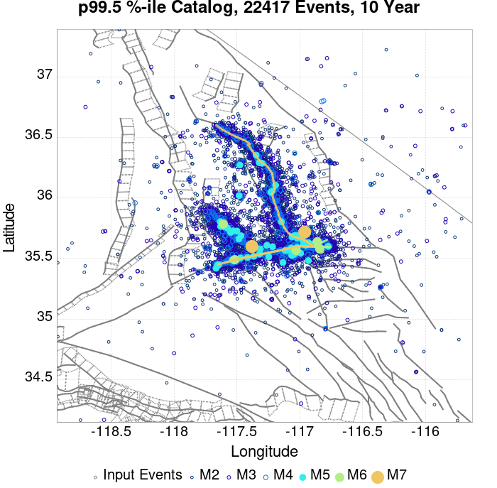
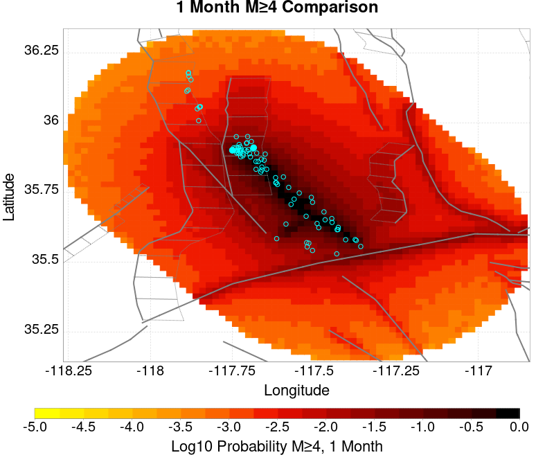
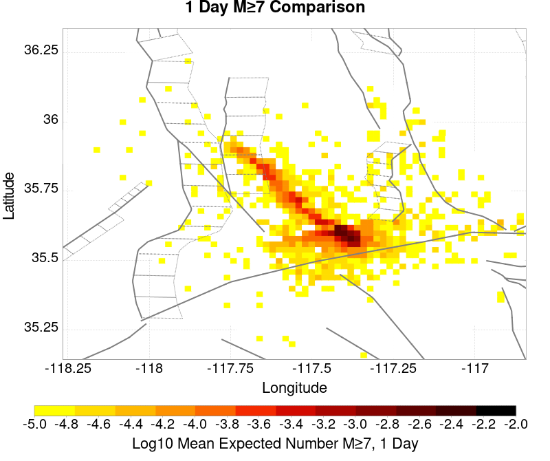

# ComCat M7.1 (ci38457511), ShakeMap Surfaces, Log10(k)=-2.3856, p=1.2164, c=0.0068906 Results

|   | ComCat M7.1 (ci38457511), ShakeMap Surfaces, Log10(k)=-2.3856, p=1.2164, c=0.0068906 |
|-----|-----|
| Num Simulations | 20709 (incomplete) |
| Start Time | 2019/07/06 03:19:54 UTC |
| Start Time Epoch Milliseconds | 1562383194040 |
| Duration | 10 Years |
| Includes Spontaneous? | false |
| Trigger Ruptures | 270 Trigger Ruptures |
|   | First: M3.98 at 2019/07/04 17:02:55 UTC |
|   | Last: M7.1 at 2019/07/06 03:19:53 UTC |
|   | Largest: M7.1 at 2019/07/06 03:19:53 UTC |
| Historical Ruptures | *(none)* |
| Config Generated With | u3etas_comcat_event_config_builder.sh --event-id ci38457511 --num-simulations 100000 --days-before 7 --mag-complete 3.5 --etas-k -2.3856 --etas-p 1.2164 --etas-c 0.0068906 --finite-surf-shakemap --finite-surf-shakemap-min-mag 5 --hpc-site USC_HPC --nodes 36 --hours 24 --queue scec |

## Table Of Contents

* [Probabilities Summary Table](#probabilities-summary-table)
* [Magnitude Number Distribution](#magnitude-number-distribution)
  * [10 Year Magnitude Number Distribution](#10-year-magnitude-number-distribution)
  * [1 Year Magnitude Number Distribution](#1-year-magnitude-number-distribution)
  * [1 Month Magnitude Number Distribution](#1-month-magnitude-number-distribution)
  * [1 Week Magnitude Number Distribution](#1-week-magnitude-number-distribution)
  * [1 Day Magnitude Number Distribution](#1-day-magnitude-number-distribution)
  * [1 Hour Magnitude Number Distribution](#1-hour-magnitude-number-distribution)
* [Hazard Change Over Time](#hazard-change-over-time)
  * [M&ge;5.0 Hazard Change Over Time](#m50-hazard-change-over-time)
  * [M&ge;6.0 Hazard Change Over Time](#m60-hazard-change-over-time)
  * [M&ge;7.0 Hazard Change Over Time](#m70-hazard-change-over-time)
  * [M&ge;8.0 Hazard Change Over Time](#m80-hazard-change-over-time)
* [Trigger Rupture Fault Map](#trigger-rupture-fault-map)
* [Trigger Rupture Depth Map](#trigger-rupture-depth-map)
* [Fault Distances To Triggers](#fault-distances-to-triggers)
* [Individual Simulated Catalog Maps](#individual-simulated-catalog-maps)
* [ComCat Data Comparisons](#comcat-data-comparisons)
  * [ComCat Magnitude-Number Distributions](#comcat-magnitude-number-distributions)
  * [ComCat Time-Dependent Mc](#comcat-time-dependent-mc)
  * [ComCat Cumulative Number Vs Time](#comcat-cumulative-number-vs-time)
  * [ComCat Cumulative Number Simulation Percentiles](#comcat-cumulative-number-simulation-percentiles)
  * [ComCat Probability Spatial Distribution](#comcat-probability-spatial-distribution)
  * [ComCat Mean Expectation Spatial Distribution](#comcat-mean-expectation-spatial-distribution)
  * [ComCat Depth Distribution](#comcat-depth-distribution)
* [Section Participation](#section-participation)
  * [Section Participation Plots](#section-participation-plots)
  * [Supra-Seismogenic Parent Sections Table](#supra-seismogenic-parent-sections-table)
  * [M≥6.5 Parent Sections Table](#m65-parent-sections-table)
  * [M≥7 Parent Sections Table](#m7-parent-sections-table)
  * [M≥7.5 Parent Sections Table](#m75-parent-sections-table)
  * [M≥8 Parent Sections Table](#m8-parent-sections-table)
  * [Fault Magnitude-Probability Distributions](#fault-magnitude-probability-distributions)
* [Gridded Nucleation](#gridded-nucleation)
* [JSON Input File](#json-input-file)

## Probabilities Summary Table
*[(top)](#table-of-contents)*

| Magnitude | 1 Hour Prob | 1 Day Prob | 1 Week Prob | 1 Month Prob | 1 Year Prob | 10 Year Prob |
|-----|-----|-----|-----|-----|-----|-----|
| **M&ge;4** | 1.000 (100.00%) | 1.000 (100.00%) | 1.000 (100.00%) | 1.000 (100.00%) | 1.000 (100.00%) | 1.000 (100.00%) |
| **M&ge;4.5** | 1.000 (99.95%) | 1.000 (100.00%) | 1.000 (100.00%) | 1.000 (100.00%) | 1.000 (100.00%) | 1.000 (100.00%) |
| **M&ge;5** | 0.927 (92.69%) | 0.997 (99.74%) | 1.000 (99.95%) | 1.000 (100.00%) | 1.000 (100.00%) | 1.000 (100.00%) |
| **M&ge;5.5** | 0.545 (54.52%) | 0.836 (83.63%) | 0.902 (90.15%) | 0.929 (92.90%) | 0.951 (95.06%) | 0.961 (96.05%) |
| **M&ge;6** | 0.189 (18.90%) | 0.396 (39.56%) | 0.482 (48.20%) | 0.529 (52.89%) | 0.584 (58.41%) | 0.615 (61.53%) |
| **M&ge;6.5** | 0.045 (4.47%) | 0.103 (10.28%) | 0.135 (13.51%) | 0.156 (15.57%) | 0.179 (17.89%) | 0.194 (19.39%) |
| **M&ge;7** | 0.017 (1.67%) | 0.039 (3.86%) | 0.050 (5.04%) | 0.058 (5.84%) | 0.067 (6.68%) | 0.073 (7.31%) |
| **M&ge;7.1** | 0.014 (1.41%) | 0.033 (3.30%) | 0.042 (4.24%) | 0.050 (4.98%) | 0.057 (5.70%) | 0.062 (6.22%) |
| **M&ge;7.5** | 4.78E-3 (0.48%) | 0.011 (1.11%) | 0.015 (1.45%) | 0.017 (1.72%) | 0.021 (2.05%) | 0.023 (2.27%) |
| **M&ge;8** | 1.45E-4 (0.01%) | 1.45E-4 (0.01%) | 1.93E-4 (0.02%) | 2.90E-4 (0.03%) | 4.35E-4 (0.04%) | 4.35E-4 (0.04%) |

## Magnitude Number Distribution
*[(top)](#table-of-contents)*

### 10 Year Magnitude Number Distribution
*[(top)](#table-of-contents)*

**Legend**
* **Mean** (thick black line): mean expected number across all 20709 catalogs
* **2.5%,97.5%** (thin black lines): expected number percentiles across all 20709 catalogs
* **Median** (thin blue line): median expected number across all 20709 catalogs
* **Mode** (thin cyan line): modal expected number across all 20709 catalogs
* **10 yr Probability** (thin red line): 10 year probability calculated as the fraction of catalogs with at least 1 occurrence
* **10 yr Supraseismogenic Probability** (thin dashed red line): same as above, but only for supraseismogenic ruptures on explicitly modeled UCERF3 faults
* **95% Conf** (light red shaded region): binomial 95% confidence bounds on probability
* **Primary** (thin green line): mean expected number from primary triggered aftershocks only (no secondary, tertiary, etc...) across all 20709 catalogs


| Mag | Mean | 2.5 %ile | 97.5 %ile | Median | Mode | 10 yr Probability | 10 yr Supra-Seis Prob | Primary Aftershocks Mean |
|-----|-----|-----|-----|-----|-----|-----|-----|-----|
| **M&ge;2.5** | 5216.786 | 3459.000 | 14834.000 | 4369.000 | 4222.000 | 1.000 (100.00%) | 0.307 (30.74%) | 2268.764 |
| **M&ge;2.6** | 4143.721 | 2743.000 | 11779.000 | 3471.000 | 3145.000 | 1.000 (100.00%) | 0.307 (30.74%) | 1802.230 |
| **M&ge;2.7** | 3291.251 | 2171.000 | 9360.000 | 2757.000 | 2546.000 | 1.000 (100.00%) | 0.307 (30.74%) | 1431.378 |
| **M&ge;2.8** | 2614.529 | 1723.000 | 7411.000 | 2190.000 | 1974.000 | 1.000 (100.00%) | 0.307 (30.74%) | 1137.157 |
| **M&ge;2.9** | 2076.847 | 1363.000 | 5903.000 | 1741.000 | 1559.000 | 1.000 (100.00%) | 0.307 (30.74%) | 903.241 |
| **M&ge;3** | 1649.726 | 1078.000 | 4680.000 | 1383.000 | 1249.000 | 1.000 (100.00%) | 0.307 (30.74%) | 717.610 |
| **M&ge;3.1** | 1310.410 | 851.000 | 3711.000 | 1099.000 | 1003.000 | 1.000 (100.00%) | 0.307 (30.74%) | 569.999 |
| **M&ge;3.2** | 1040.944 | 673.000 | 2952.000 | 873.000 | 806.000 | 1.000 (100.00%) | 0.307 (30.74%) | 452.833 |
| **M&ge;3.3** | 826.819 | 532.000 | 2342.000 | 695.000 | 622.000 | 1.000 (100.00%) | 0.307 (30.74%) | 359.670 |
| **M&ge;3.4** | 656.798 | 419.000 | 1856.000 | 553.000 | 504.000 | 1.000 (100.00%) | 0.307 (30.74%) | 285.745 |
| **M&ge;3.5** | 521.607 | 329.000 | 1471.000 | 440.000 | 409.000 | 1.000 (100.00%) | 0.307 (30.74%) | 226.984 |
| **M&ge;3.6** | 414.371 | 259.000 | 1169.000 | 349.000 | 317.000 | 1.000 (100.00%) | 0.307 (30.74%) | 180.315 |
| **M&ge;3.7** | 329.010 | 202.000 | 929.000 | 278.000 | 252.000 | 1.000 (100.00%) | 0.307 (30.74%) | 143.147 |
| **M&ge;3.8** | 261.247 | 158.000 | 740.000 | 221.000 | 204.000 | 1.000 (100.00%) | 0.307 (30.74%) | 113.634 |
| **M&ge;3.9** | 207.426 | 124.000 | 588.000 | 176.000 | 154.000 | 1.000 (100.00%) | 0.307 (30.74%) | 90.236 |
| **M&ge;4** | 164.730 | 96.000 | 468.000 | 140.000 | 123.000 | 1.000 (100.00%) | 0.307 (30.74%) | 71.673 |
| **M&ge;4.1** | 130.745 | 74.000 | 372.000 | 111.000 | 101.000 | 1.000 (100.00%) | 0.307 (30.74%) | 56.886 |
| **M&ge;4.2** | 103.747 | 57.000 | 293.000 | 88.000 | 77.000 | 1.000 (100.00%) | 0.307 (30.74%) | 45.123 |
| **M&ge;4.3** | 82.328 | 44.000 | 232.000 | 70.000 | 62.000 | 1.000 (100.00%) | 0.307 (30.74%) | 35.800 |
| **M&ge;4.4** | 65.291 | 33.000 | 184.000 | 56.000 | 47.000 | 1.000 (100.00%) | 0.307 (30.74%) | 28.384 |
| **M&ge;4.5** | 51.772 | 25.000 | 146.000 | 44.000 | 40.000 | 1.000 (100.00%) | 0.307 (30.74%) | 22.501 |
| **M&ge;4.6** | 41.028 | 19.000 | 116.000 | 35.000 | 31.000 | 1.000 (100.00%) | 0.307 (30.74%) | 17.828 |
| **M&ge;4.7** | 32.471 | 14.000 | 92.000 | 28.000 | 24.000 | 1.000 (100.00%) | 0.307 (30.74%) | 14.119 |
| **M&ge;4.8** | 25.688 | 10.000 | 73.000 | 22.000 | 20.000 | 1.000 (100.00%) | 0.307 (30.74%) | 11.161 |
| **M&ge;4.9** | 20.306 | 7.000 | 58.000 | 17.000 | 16.000 | 1.000 (100.00%) | 0.307 (30.74%) | 8.825 |
| **M&ge;5** | 16.032 | 5.000 | 46.000 | 14.000 | 11.000 | 1.000 (100.00%) | 0.307 (30.74%) | 6.973 |
| **M&ge;5.1** | 12.632 | 3.000 | 37.000 | 11.000 | 9.000 | 1.000 (99.95%) | 0.307 (30.74%) | 5.486 |
| **M&ge;5.2** | 9.943 | 2.000 | 29.000 | 8.000 | 7.000 | 0.998 (99.78%) | 0.307 (30.74%) | 4.322 |
| **M&ge;5.3** | 7.786 | 1.000 | 24.000 | 7.000 | 5.000 | 0.993 (99.32%) | 0.307 (30.74%) | 3.379 |
| **M&ge;5.4** | 6.086 | 1.000 | 19.000 | 5.000 | 4.000 | 0.984 (98.36%) | 0.307 (30.74%) | 2.641 |
| **M&ge;5.5** | 4.742 | 0.000 | 15.000 | 4.000 | 3.000 | 0.961 (96.05%) | 0.307 (30.74%) | 2.061 |
| **M&ge;5.6** | 3.674 | 0.000 | 12.000 | 3.000 | 2.000 | 0.921 (92.11%) | 0.307 (30.74%) | 1.601 |
| **M&ge;5.7** | 2.818 | 0.000 | 10.000 | 2.000 | 1.000 | 0.867 (86.75%) | 0.307 (30.74%) | 1.232 |
| **M&ge;5.8** | 2.149 | 0.000 | 8.000 | 2.000 | 1.000 | 0.795 (79.51%) | 0.307 (30.74%) | 0.940 |
| **M&ge;5.9** | 1.612 | 0.000 | 6.000 | 1.000 | 1.000 | 0.708 (70.85%) | 0.307 (30.72%) | 0.708 |
| **M&ge;6** | 1.235 | 0.000 | 5.000 | 1.000 | 0.000 | 0.615 (61.53%) | 0.307 (30.71%) | 0.539 |
| **M&ge;6.1** | 0.888 | 0.000 | 4.000 | 1.000 | 0.000 | 0.508 (50.79%) | 0.263 (26.28%) | 0.395 |
| **M&ge;6.2** | 0.580 | 0.000 | 3.000 | 0.000 | 0.000 | 0.379 (37.94%) | 0.208 (20.84%) | 0.260 |
| **M&ge;6.3** | 0.433 | 0.000 | 3.000 | 0.000 | 0.000 | 0.306 (30.58%) | 0.178 (17.81%) | 0.199 |
| **M&ge;6.4** | 0.333 | 0.000 | 2.000 | 0.000 | 0.000 | 0.243 (24.29%) | 0.155 (15.53%) | 0.150 |
| **M&ge;6.5** | 0.255 | 0.000 | 2.000 | 0.000 | 0.000 | 0.194 (19.39%) | 0.134 (13.44%) | 0.116 |
| **M&ge;6.6** | 0.207 | 0.000 | 2.000 | 0.000 | 0.000 | 0.168 (16.78%) | 0.125 (12.47%) | 0.099 |
| **M&ge;6.7** | 0.166 | 0.000 | 1.000 | 0.000 | 0.000 | 0.138 (13.83%) | 0.108 (10.84%) | 0.081 |
| **M&ge;6.8** | 0.133 | 0.000 | 1.000 | 0.000 | 0.000 | 0.115 (11.52%) | 0.095 (9.48%) | 0.066 |
| **M&ge;6.9** | 0.101 | 0.000 | 1.000 | 0.000 | 0.000 | 0.092 (9.16%) | 0.077 (7.73%) | 0.052 |
| **M&ge;7** | 0.078 | 0.000 | 1.000 | 0.000 | 0.000 | 0.073 (7.31%) | 0.064 (6.41%) | 0.041 |
| **M&ge;7.1** | 0.065 | 0.000 | 1.000 | 0.000 | 0.000 | 0.062 (6.22%) | 0.057 (5.69%) | 0.034 |
| **M&ge;7.2** | 0.050 | 0.000 | 1.000 | 0.000 | 0.000 | 0.048 (4.83%) | 0.046 (4.56%) | 0.026 |
| **M&ge;7.3** | 0.034 | 0.000 | 1.000 | 0.000 | 0.000 | 0.034 (3.35%) | 0.032 (3.21%) | 0.018 |
| **M&ge;7.4** | 0.030 | 0.000 | 1.000 | 0.000 | 0.000 | 0.029 (2.89%) | 0.028 (2.85%) | 0.016 |
| **M&ge;7.5** | 0.023 | 0.000 | 0.000 | 0.000 | 0.000 | 0.023 (2.27%) | 0.023 (2.26%) | 0.012 |
| **M&ge;7.6** | 0.012 | 0.000 | 0.000 | 0.000 | 0.000 | 0.012 (1.17%) | 0.012 (1.16%) | 6.04E-3 |
| **M&ge;7.7** | 4.20E-3 | 0.000 | 0.000 | 0.000 | 0.000 | 4.01E-3 (0.40%) | 3.96E-3 (0.40%) | 2.17E-3 |
| **M&ge;7.8** | 2.56E-3 | 0.000 | 0.000 | 0.000 | 0.000 | 2.51E-3 (0.25%) | 2.46E-3 (0.25%) | 1.45E-3 |
| **M&ge;7.9** | 1.40E-3 | 0.000 | 0.000 | 0.000 | 0.000 | 1.40E-3 (0.14%) | 1.40E-3 (0.14%) | 8.21E-4 |
| **M&ge;8** | 4.35E-4 | 0.000 | 0.000 | 0.000 | 0.000 | 4.35E-4 (0.04%) | 4.35E-4 (0.04%) | 3.38E-4 |
| **M&ge;8.1** | 4.83E-5 | 0.000 | 0.000 | 0.000 | 0.000 | 4.83E-5 (0.00%) | 4.83E-5 (0.00%) | 0.000 |
| **M&ge;8.2** | 0.000 | 0.000 | 0.000 | 0.000 | 0.000 | 0.000 (0.00%) | 0.000 (0.00%) | 0.000 |
| **M&ge;8.3** | 0.000 | 0.000 | 0.000 | 0.000 | 0.000 | 0.000 (0.00%) | 0.000 (0.00%) | 0.000 |
| **M&ge;8.4** | 0.000 | 0.000 | 0.000 | 0.000 | 0.000 | 0.000 (0.00%) | 0.000 (0.00%) | 0.000 |
| **M&ge;8.5** | 0.000 | 0.000 | 0.000 | 0.000 | 0.000 | 0.000 (0.00%) | 0.000 (0.00%) | 0.000 |
| **M&ge;8.6** | 0.000 | 0.000 | 0.000 | 0.000 | 0.000 | 0.000 (0.00%) | 0.000 (0.00%) | 0.000 |
| **M&ge;8.7** | 0.000 | 0.000 | 0.000 | 0.000 | 0.000 | 0.000 (0.00%) | 0.000 (0.00%) | 0.000 |
| **M&ge;8.8** | 0.000 | 0.000 | 0.000 | 0.000 | 0.000 | 0.000 (0.00%) | 0.000 (0.00%) | 0.000 |
| **M&ge;8.9** | 0.000 | 0.000 | 0.000 | 0.000 | 0.000 | 0.000 (0.00%) | 0.000 (0.00%) | 0.000 |
| **M&ge;9** | 0.000 | 0.000 | 0.000 | 0.000 | 0.000 | 0.000 (0.00%) | 0.000 (0.00%) | 0.000 |

### 1 Year Magnitude Number Distribution
*[(top)](#table-of-contents)*

**Legend**
* **Mean** (thick black line): mean expected number across all 20709 catalogs
* **2.5%,97.5%** (thin black lines): expected number percentiles across all 20709 catalogs
* **Median** (thin blue line): median expected number across all 20709 catalogs
* **Mode** (thin cyan line): modal expected number across all 20709 catalogs
* **1 yr Probability** (thin red line): 1 year probability calculated as the fraction of catalogs with at least 1 occurrence
* **1 yr Supraseismogenic Probability** (thin dashed red line): same as above, but only for supraseismogenic ruptures on explicitly modeled UCERF3 faults
* **95% Conf** (light red shaded region): binomial 95% confidence bounds on probability
* **Primary** (thin green line): mean expected number from primary triggered aftershocks only (no secondary, tertiary, etc...) across all 20709 catalogs


| Mag | Mean | 2.5 %ile | 97.5 %ile | Median | Mode | 1 yr Probability | 1 yr Supra-Seis Prob | Primary Aftershocks Mean |
|-----|-----|-----|-----|-----|-----|-----|-----|-----|
| **M&ge;2.5** | 4723.028 | 3206.000 | 12933.000 | 3995.000 | 3691.000 | 1.000 (100.00%) | 0.284 (28.36%) | 2162.311 |
| **M&ge;2.6** | 3751.587 | 2543.000 | 10277.000 | 3176.000 | 2852.000 | 1.000 (100.00%) | 0.284 (28.36%) | 1717.685 |
| **M&ge;2.7** | 2979.787 | 2016.000 | 8173.000 | 2524.000 | 2243.000 | 1.000 (100.00%) | 0.284 (28.36%) | 1364.243 |
| **M&ge;2.8** | 2367.030 | 1597.000 | 6486.000 | 2005.000 | 1761.000 | 1.000 (100.00%) | 0.284 (28.36%) | 1083.788 |
| **M&ge;2.9** | 1880.188 | 1264.000 | 5139.000 | 1593.000 | 1461.000 | 1.000 (100.00%) | 0.284 (28.36%) | 860.840 |
| **M&ge;3** | 1493.554 | 998.000 | 4091.000 | 1265.000 | 1179.000 | 1.000 (100.00%) | 0.284 (28.36%) | 683.943 |
| **M&ge;3.1** | 1186.374 | 788.000 | 3237.000 | 1006.000 | 944.000 | 1.000 (100.00%) | 0.284 (28.36%) | 543.267 |
| **M&ge;3.2** | 942.445 | 622.000 | 2585.000 | 800.000 | 739.000 | 1.000 (100.00%) | 0.284 (28.36%) | 431.602 |
| **M&ge;3.3** | 748.600 | 492.000 | 2054.000 | 636.000 | 589.000 | 1.000 (100.00%) | 0.284 (28.36%) | 342.798 |
| **M&ge;3.4** | 594.666 | 387.000 | 1628.000 | 506.000 | 469.000 | 1.000 (100.00%) | 0.284 (28.36%) | 272.330 |
| **M&ge;3.5** | 472.273 | 304.000 | 1297.000 | 402.000 | 369.000 | 1.000 (100.00%) | 0.284 (28.36%) | 216.331 |
| **M&ge;3.6** | 375.178 | 238.000 | 1032.000 | 320.000 | 292.000 | 1.000 (100.00%) | 0.284 (28.36%) | 171.869 |
| **M&ge;3.7** | 297.888 | 186.000 | 813.000 | 254.000 | 231.000 | 1.000 (100.00%) | 0.284 (28.36%) | 136.444 |
| **M&ge;3.8** | 236.515 | 145.000 | 645.000 | 202.000 | 178.000 | 1.000 (100.00%) | 0.284 (28.36%) | 108.310 |
| **M&ge;3.9** | 187.785 | 113.000 | 511.000 | 161.000 | 146.000 | 1.000 (100.00%) | 0.284 (28.36%) | 86.004 |
| **M&ge;4** | 149.114 | 88.000 | 406.000 | 128.000 | 121.000 | 1.000 (100.00%) | 0.284 (28.36%) | 68.310 |
| **M&ge;4.1** | 118.351 | 68.000 | 324.000 | 101.000 | 93.000 | 1.000 (100.00%) | 0.284 (28.36%) | 54.211 |
| **M&ge;4.2** | 93.902 | 52.000 | 256.000 | 81.000 | 69.000 | 1.000 (100.00%) | 0.284 (28.36%) | 43.000 |
| **M&ge;4.3** | 74.510 | 40.000 | 203.000 | 64.000 | 58.000 | 1.000 (100.00%) | 0.284 (28.36%) | 34.118 |
| **M&ge;4.4** | 59.097 | 30.000 | 163.000 | 51.000 | 45.000 | 1.000 (100.00%) | 0.284 (28.36%) | 27.054 |
| **M&ge;4.5** | 46.862 | 23.000 | 129.000 | 40.000 | 37.000 | 1.000 (100.00%) | 0.284 (28.36%) | 21.453 |
| **M&ge;4.6** | 37.145 | 17.000 | 103.000 | 32.000 | 28.000 | 1.000 (100.00%) | 0.284 (28.36%) | 17.005 |
| **M&ge;4.7** | 29.402 | 13.000 | 81.000 | 25.000 | 22.000 | 1.000 (100.00%) | 0.284 (28.36%) | 13.468 |
| **M&ge;4.8** | 23.251 | 9.000 | 65.000 | 20.000 | 18.000 | 1.000 (100.00%) | 0.284 (28.36%) | 10.642 |
| **M&ge;4.9** | 18.379 | 7.000 | 51.000 | 16.000 | 14.000 | 1.000 (100.00%) | 0.284 (28.36%) | 8.414 |
| **M&ge;5** | 14.508 | 4.000 | 41.000 | 13.000 | 11.000 | 1.000 (100.00%) | 0.284 (28.36%) | 6.647 |
| **M&ge;5.1** | 11.429 | 3.000 | 33.000 | 10.000 | 9.000 | 0.999 (99.94%) | 0.284 (28.36%) | 5.232 |
| **M&ge;5.2** | 8.994 | 2.000 | 26.000 | 8.000 | 6.000 | 0.997 (99.70%) | 0.284 (28.36%) | 4.123 |
| **M&ge;5.3** | 7.047 | 1.000 | 21.000 | 6.000 | 4.000 | 0.991 (99.13%) | 0.284 (28.36%) | 3.224 |
| **M&ge;5.4** | 5.510 | 1.000 | 17.000 | 5.000 | 3.000 | 0.978 (97.83%) | 0.284 (28.36%) | 2.519 |
| **M&ge;5.5** | 4.295 | 0.000 | 14.000 | 4.000 | 3.000 | 0.951 (95.06%) | 0.284 (28.36%) | 1.965 |
| **M&ge;5.6** | 3.328 | 0.000 | 11.000 | 3.000 | 2.000 | 0.906 (90.59%) | 0.284 (28.36%) | 1.527 |
| **M&ge;5.7** | 2.556 | 0.000 | 9.000 | 2.000 | 1.000 | 0.846 (84.58%) | 0.284 (28.36%) | 1.176 |
| **M&ge;5.8** | 1.949 | 0.000 | 7.000 | 1.000 | 1.000 | 0.769 (76.93%) | 0.284 (28.36%) | 0.897 |
| **M&ge;5.9** | 1.461 | 0.000 | 6.000 | 1.000 | 0.000 | 0.679 (67.94%) | 0.283 (28.35%) | 0.674 |
| **M&ge;6** | 1.116 | 0.000 | 5.000 | 1.000 | 0.000 | 0.584 (58.41%) | 0.283 (28.34%) | 0.513 |
| **M&ge;6.1** | 0.802 | 0.000 | 4.000 | 0.000 | 0.000 | 0.478 (47.77%) | 0.243 (24.26%) | 0.375 |
| **M&ge;6.2** | 0.523 | 0.000 | 3.000 | 0.000 | 0.000 | 0.354 (35.40%) | 0.192 (19.20%) | 0.246 |
| **M&ge;6.3** | 0.390 | 0.000 | 2.000 | 0.000 | 0.000 | 0.283 (28.35%) | 0.164 (16.36%) | 0.189 |
| **M&ge;6.4** | 0.299 | 0.000 | 2.000 | 0.000 | 0.000 | 0.224 (22.39%) | 0.143 (14.26%) | 0.143 |
| **M&ge;6.5** | 0.230 | 0.000 | 2.000 | 0.000 | 0.000 | 0.179 (17.89%) | 0.124 (12.39%) | 0.110 |
| **M&ge;6.6** | 0.187 | 0.000 | 2.000 | 0.000 | 0.000 | 0.154 (15.41%) | 0.115 (11.50%) | 0.094 |
| **M&ge;6.7** | 0.151 | 0.000 | 1.000 | 0.000 | 0.000 | 0.127 (12.68%) | 0.100 (9.99%) | 0.076 |
| **M&ge;6.8** | 0.121 | 0.000 | 1.000 | 0.000 | 0.000 | 0.106 (10.57%) | 0.087 (8.74%) | 0.063 |
| **M&ge;6.9** | 0.093 | 0.000 | 1.000 | 0.000 | 0.000 | 0.084 (8.43%) | 0.071 (7.14%) | 0.050 |
| **M&ge;7** | 0.071 | 0.000 | 1.000 | 0.000 | 0.000 | 0.067 (6.68%) | 0.059 (5.89%) | 0.039 |
| **M&ge;7.1** | 0.060 | 0.000 | 1.000 | 0.000 | 0.000 | 0.057 (5.70%) | 0.052 (5.23%) | 0.033 |
| **M&ge;7.2** | 0.046 | 0.000 | 1.000 | 0.000 | 0.000 | 0.044 (4.40%) | 0.042 (4.16%) | 0.025 |
| **M&ge;7.3** | 0.032 | 0.000 | 1.000 | 0.000 | 0.000 | 0.031 (3.07%) | 0.029 (2.95%) | 0.017 |
| **M&ge;7.4** | 0.027 | 0.000 | 1.000 | 0.000 | 0.000 | 0.026 (2.65%) | 0.026 (2.60%) | 0.015 |
| **M&ge;7.5** | 0.021 | 0.000 | 0.000 | 0.000 | 0.000 | 0.021 (2.05%) | 0.020 (2.04%) | 0.011 |
| **M&ge;7.6** | 0.011 | 0.000 | 0.000 | 0.000 | 0.000 | 0.011 (1.06%) | 0.011 (1.05%) | 5.79E-3 |
| **M&ge;7.7** | 3.86E-3 | 0.000 | 0.000 | 0.000 | 0.000 | 3.72E-3 (0.37%) | 3.67E-3 (0.37%) | 2.17E-3 |
| **M&ge;7.8** | 2.37E-3 | 0.000 | 0.000 | 0.000 | 0.000 | 2.32E-3 (0.23%) | 2.27E-3 (0.23%) | 1.45E-3 |
| **M&ge;7.9** | 1.26E-3 | 0.000 | 0.000 | 0.000 | 0.000 | 1.26E-3 (0.13%) | 1.26E-3 (0.13%) | 8.21E-4 |
| **M&ge;8** | 4.35E-4 | 0.000 | 0.000 | 0.000 | 0.000 | 4.35E-4 (0.04%) | 4.35E-4 (0.04%) | 3.38E-4 |
| **M&ge;8.1** | 4.83E-5 | 0.000 | 0.000 | 0.000 | 0.000 | 4.83E-5 (0.00%) | 4.83E-5 (0.00%) | 0.000 |
| **M&ge;8.2** | 0.000 | 0.000 | 0.000 | 0.000 | 0.000 | 0.000 (0.00%) | 0.000 (0.00%) | 0.000 |
| **M&ge;8.3** | 0.000 | 0.000 | 0.000 | 0.000 | 0.000 | 0.000 (0.00%) | 0.000 (0.00%) | 0.000 |
| **M&ge;8.4** | 0.000 | 0.000 | 0.000 | 0.000 | 0.000 | 0.000 (0.00%) | 0.000 (0.00%) | 0.000 |
| **M&ge;8.5** | 0.000 | 0.000 | 0.000 | 0.000 | 0.000 | 0.000 (0.00%) | 0.000 (0.00%) | 0.000 |
| **M&ge;8.6** | 0.000 | 0.000 | 0.000 | 0.000 | 0.000 | 0.000 (0.00%) | 0.000 (0.00%) | 0.000 |
| **M&ge;8.7** | 0.000 | 0.000 | 0.000 | 0.000 | 0.000 | 0.000 (0.00%) | 0.000 (0.00%) | 0.000 |
| **M&ge;8.8** | 0.000 | 0.000 | 0.000 | 0.000 | 0.000 | 0.000 (0.00%) | 0.000 (0.00%) | 0.000 |
| **M&ge;8.9** | 0.000 | 0.000 | 0.000 | 0.000 | 0.000 | 0.000 (0.00%) | 0.000 (0.00%) | 0.000 |
| **M&ge;9** | 0.000 | 0.000 | 0.000 | 0.000 | 0.000 | 0.000 (0.00%) | 0.000 (0.00%) | 0.000 |

### 1 Month Magnitude Number Distribution
*[(top)](#table-of-contents)*

**Legend**
* **Mean** (thick black line): mean expected number across all 20709 catalogs
* **2.5%,97.5%** (thin black lines): expected number percentiles across all 20709 catalogs
* **Median** (thin blue line): median expected number across all 20709 catalogs
* **Mode** (thin cyan line): modal expected number across all 20709 catalogs
* **1 mo Probability** (thin red line): 1 month probability calculated as the fraction of catalogs with at least 1 occurrence
* **1 mo Supraseismogenic Probability** (thin dashed red line): same as above, but only for supraseismogenic ruptures on explicitly modeled UCERF3 faults
* **95% Conf** (light red shaded region): binomial 95% confidence bounds on probability
* **Primary** (thin green line): mean expected number from primary triggered aftershocks only (no secondary, tertiary, etc...) across all 20709 catalogs


| Mag | Mean | 2.5 %ile | 97.5 %ile | Median | Mode | 1 mo Probability | 1 mo Supra-Seis Prob | Primary Aftershocks Mean |
|-----|-----|-----|-----|-----|-----|-----|-----|-----|
| **M&ge;2.5** | 3933.165 | 2779.000 | 9911.000 | 3386.000 | 3186.000 | 1.000 (100.00%) | 0.247 (24.66%) | 1968.591 |
| **M&ge;2.6** | 3124.336 | 2203.000 | 7889.000 | 2689.000 | 2495.000 | 1.000 (100.00%) | 0.247 (24.66%) | 1563.820 |
| **M&ge;2.7** | 2481.600 | 1746.000 | 6264.000 | 2137.000 | 1962.000 | 1.000 (100.00%) | 0.247 (24.66%) | 1242.076 |
| **M&ge;2.8** | 1971.264 | 1382.000 | 4956.000 | 1698.000 | 1658.000 | 1.000 (100.00%) | 0.247 (24.66%) | 986.741 |
| **M&ge;2.9** | 1565.829 | 1094.000 | 3940.000 | 1350.000 | 1279.000 | 1.000 (100.00%) | 0.247 (24.66%) | 783.766 |
| **M&ge;3** | 1243.864 | 865.000 | 3129.000 | 1074.000 | 1034.000 | 1.000 (100.00%) | 0.247 (24.66%) | 622.691 |
| **M&ge;3.1** | 988.001 | 682.000 | 2486.000 | 854.000 | 790.000 | 1.000 (100.00%) | 0.247 (24.66%) | 494.611 |
| **M&ge;3.2** | 784.915 | 540.000 | 1976.000 | 678.000 | 616.000 | 1.000 (100.00%) | 0.247 (24.66%) | 392.959 |
| **M&ge;3.3** | 623.477 | 424.000 | 1579.000 | 540.000 | 493.000 | 1.000 (100.00%) | 0.247 (24.66%) | 312.084 |
| **M&ge;3.4** | 495.244 | 333.000 | 1248.000 | 429.000 | 398.000 | 1.000 (100.00%) | 0.247 (24.66%) | 247.913 |
| **M&ge;3.5** | 393.288 | 262.000 | 991.000 | 341.000 | 327.000 | 1.000 (100.00%) | 0.247 (24.66%) | 196.922 |
| **M&ge;3.6** | 312.399 | 206.000 | 792.000 | 271.000 | 247.000 | 1.000 (100.00%) | 0.247 (24.66%) | 156.434 |
| **M&ge;3.7** | 248.033 | 160.000 | 628.000 | 216.000 | 203.000 | 1.000 (100.00%) | 0.247 (24.66%) | 124.196 |
| **M&ge;3.8** | 196.940 | 125.000 | 498.000 | 171.000 | 157.000 | 1.000 (100.00%) | 0.247 (24.66%) | 98.605 |
| **M&ge;3.9** | 156.349 | 97.000 | 396.000 | 136.000 | 124.000 | 1.000 (100.00%) | 0.247 (24.66%) | 78.291 |
| **M&ge;4** | 124.140 | 75.000 | 314.000 | 108.000 | 99.000 | 1.000 (100.00%) | 0.247 (24.66%) | 62.188 |
| **M&ge;4.1** | 98.559 | 58.000 | 249.000 | 86.000 | 79.000 | 1.000 (100.00%) | 0.247 (24.66%) | 49.360 |
| **M&ge;4.2** | 78.185 | 44.000 | 200.000 | 68.000 | 63.000 | 1.000 (100.00%) | 0.247 (24.66%) | 39.152 |
| **M&ge;4.3** | 62.026 | 34.000 | 158.000 | 54.000 | 49.000 | 1.000 (100.00%) | 0.247 (24.66%) | 31.061 |
| **M&ge;4.4** | 49.210 | 25.000 | 125.000 | 43.000 | 39.000 | 1.000 (100.00%) | 0.247 (24.66%) | 24.645 |
| **M&ge;4.5** | 39.024 | 19.000 | 100.000 | 34.000 | 32.000 | 1.000 (100.00%) | 0.247 (24.66%) | 19.547 |
| **M&ge;4.6** | 30.938 | 14.000 | 80.000 | 27.000 | 25.000 | 1.000 (100.00%) | 0.247 (24.66%) | 15.500 |
| **M&ge;4.7** | 24.478 | 10.000 | 64.000 | 22.000 | 18.000 | 1.000 (100.00%) | 0.247 (24.66%) | 12.277 |
| **M&ge;4.8** | 19.353 | 7.000 | 51.000 | 17.000 | 16.000 | 1.000 (100.00%) | 0.247 (24.66%) | 9.700 |
| **M&ge;4.9** | 15.308 | 5.000 | 41.000 | 13.000 | 12.000 | 1.000 (100.00%) | 0.247 (24.66%) | 7.671 |
| **M&ge;5** | 12.082 | 4.000 | 33.000 | 11.000 | 10.000 | 1.000 (100.00%) | 0.247 (24.66%) | 6.058 |
| **M&ge;5.1** | 9.520 | 2.000 | 26.000 | 8.000 | 7.000 | 0.999 (99.86%) | 0.247 (24.66%) | 4.768 |
| **M&ge;5.2** | 7.491 | 1.000 | 21.000 | 6.000 | 5.000 | 0.995 (99.48%) | 0.247 (24.66%) | 3.758 |
| **M&ge;5.3** | 5.868 | 1.000 | 17.000 | 5.000 | 4.000 | 0.985 (98.52%) | 0.247 (24.66%) | 2.940 |
| **M&ge;5.4** | 4.590 | 0.000 | 14.000 | 4.000 | 3.000 | 0.965 (96.50%) | 0.247 (24.66%) | 2.300 |
| **M&ge;5.5** | 3.576 | 0.000 | 11.000 | 3.000 | 2.000 | 0.929 (92.90%) | 0.247 (24.66%) | 1.793 |
| **M&ge;5.6** | 2.771 | 0.000 | 9.000 | 2.000 | 2.000 | 0.874 (87.41%) | 0.247 (24.66%) | 1.394 |
| **M&ge;5.7** | 2.128 | 0.000 | 7.000 | 2.000 | 1.000 | 0.805 (80.52%) | 0.247 (24.66%) | 1.074 |
| **M&ge;5.8** | 1.623 | 0.000 | 6.000 | 1.000 | 1.000 | 0.721 (72.13%) | 0.247 (24.66%) | 0.818 |
| **M&ge;5.9** | 1.215 | 0.000 | 5.000 | 1.000 | 0.000 | 0.626 (62.60%) | 0.246 (24.65%) | 0.614 |
| **M&ge;6** | 0.928 | 0.000 | 4.000 | 1.000 | 0.000 | 0.529 (52.89%) | 0.246 (24.64%) | 0.468 |
| **M&ge;6.1** | 0.668 | 0.000 | 3.000 | 0.000 | 0.000 | 0.426 (42.61%) | 0.211 (21.14%) | 0.342 |
| **M&ge;6.2** | 0.435 | 0.000 | 3.000 | 0.000 | 0.000 | 0.310 (31.03%) | 0.166 (16.64%) | 0.224 |
| **M&ge;6.3** | 0.327 | 0.000 | 2.000 | 0.000 | 0.000 | 0.248 (24.79%) | 0.142 (14.21%) | 0.172 |
| **M&ge;6.4** | 0.251 | 0.000 | 2.000 | 0.000 | 0.000 | 0.196 (19.56%) | 0.124 (12.41%) | 0.131 |
| **M&ge;6.5** | 0.193 | 0.000 | 2.000 | 0.000 | 0.000 | 0.156 (15.57%) | 0.108 (10.76%) | 0.101 |
| **M&ge;6.6** | 0.158 | 0.000 | 1.000 | 0.000 | 0.000 | 0.134 (13.43%) | 0.101 (10.07%) | 0.087 |
| **M&ge;6.7** | 0.127 | 0.000 | 1.000 | 0.000 | 0.000 | 0.110 (11.01%) | 0.087 (8.74%) | 0.070 |
| **M&ge;6.8** | 0.104 | 0.000 | 1.000 | 0.000 | 0.000 | 0.092 (9.24%) | 0.077 (7.69%) | 0.058 |
| **M&ge;6.9** | 0.080 | 0.000 | 1.000 | 0.000 | 0.000 | 0.074 (7.36%) | 0.063 (6.25%) | 0.046 |
| **M&ge;7** | 0.062 | 0.000 | 1.000 | 0.000 | 0.000 | 0.058 (5.84%) | 0.052 (5.16%) | 0.036 |
| **M&ge;7.1** | 0.052 | 0.000 | 1.000 | 0.000 | 0.000 | 0.050 (4.98%) | 0.046 (4.60%) | 0.030 |
| **M&ge;7.2** | 0.039 | 0.000 | 1.000 | 0.000 | 0.000 | 0.038 (3.79%) | 0.036 (3.60%) | 0.023 |
| **M&ge;7.3** | 0.026 | 0.000 | 1.000 | 0.000 | 0.000 | 0.026 (2.59%) | 0.025 (2.51%) | 0.016 |
| **M&ge;7.4** | 0.023 | 0.000 | 0.000 | 0.000 | 0.000 | 0.023 (2.25%) | 0.022 (2.22%) | 0.013 |
| **M&ge;7.5** | 0.018 | 0.000 | 0.000 | 0.000 | 0.000 | 0.017 (1.72%) | 0.017 (1.72%) | 9.90E-3 |
| **M&ge;7.6** | 8.98E-3 | 0.000 | 0.000 | 0.000 | 0.000 | 8.84E-3 (0.88%) | 8.84E-3 (0.88%) | 5.02E-3 |
| **M&ge;7.7** | 3.09E-3 | 0.000 | 0.000 | 0.000 | 0.000 | 2.99E-3 (0.30%) | 2.99E-3 (0.30%) | 1.93E-3 |
| **M&ge;7.8** | 1.83E-3 | 0.000 | 0.000 | 0.000 | 0.000 | 1.79E-3 (0.18%) | 1.79E-3 (0.18%) | 1.26E-3 |
| **M&ge;7.9** | 1.01E-3 | 0.000 | 0.000 | 0.000 | 0.000 | 1.01E-3 (0.10%) | 1.01E-3 (0.10%) | 7.24E-4 |
| **M&ge;8** | 2.90E-4 | 0.000 | 0.000 | 0.000 | 0.000 | 2.90E-4 (0.03%) | 2.90E-4 (0.03%) | 2.41E-4 |
| **M&ge;8.1** | 4.83E-5 | 0.000 | 0.000 | 0.000 | 0.000 | 4.83E-5 (0.00%) | 4.83E-5 (0.00%) | 0.000 |
| **M&ge;8.2** | 0.000 | 0.000 | 0.000 | 0.000 | 0.000 | 0.000 (0.00%) | 0.000 (0.00%) | 0.000 |
| **M&ge;8.3** | 0.000 | 0.000 | 0.000 | 0.000 | 0.000 | 0.000 (0.00%) | 0.000 (0.00%) | 0.000 |
| **M&ge;8.4** | 0.000 | 0.000 | 0.000 | 0.000 | 0.000 | 0.000 (0.00%) | 0.000 (0.00%) | 0.000 |
| **M&ge;8.5** | 0.000 | 0.000 | 0.000 | 0.000 | 0.000 | 0.000 (0.00%) | 0.000 (0.00%) | 0.000 |
| **M&ge;8.6** | 0.000 | 0.000 | 0.000 | 0.000 | 0.000 | 0.000 (0.00%) | 0.000 (0.00%) | 0.000 |
| **M&ge;8.7** | 0.000 | 0.000 | 0.000 | 0.000 | 0.000 | 0.000 (0.00%) | 0.000 (0.00%) | 0.000 |
| **M&ge;8.8** | 0.000 | 0.000 | 0.000 | 0.000 | 0.000 | 0.000 (0.00%) | 0.000 (0.00%) | 0.000 |
| **M&ge;8.9** | 0.000 | 0.000 | 0.000 | 0.000 | 0.000 | 0.000 (0.00%) | 0.000 (0.00%) | 0.000 |
| **M&ge;9** | 0.000 | 0.000 | 0.000 | 0.000 | 0.000 | 0.000 (0.00%) | 0.000 (0.00%) | 0.000 |

### 1 Week Magnitude Number Distribution
*[(top)](#table-of-contents)*

**Legend**
* **Mean** (thick black line): mean expected number across all 20709 catalogs
* **2.5%,97.5%** (thin black lines): expected number percentiles across all 20709 catalogs
* **Median** (thin blue line): median expected number across all 20709 catalogs
* **Mode** (thin cyan line): modal expected number across all 20709 catalogs
* **1 wk Probability** (thin red line): 1 week probability calculated as the fraction of catalogs with at least 1 occurrence
* **1 wk Supraseismogenic Probability** (thin dashed red line): same as above, but only for supraseismogenic ruptures on explicitly modeled UCERF3 faults
* **95% Conf** (light red shaded region): binomial 95% confidence bounds on probability
* **Primary** (thin green line): mean expected number from primary triggered aftershocks only (no secondary, tertiary, etc...) across all 20709 catalogs


| Mag | Mean | 2.5 %ile | 97.5 %ile | Median | Mode | 1 wk Probability | 1 wk Supra-Seis Prob | Primary Aftershocks Mean |
|-----|-----|-----|-----|-----|-----|-----|-----|-----|
| **M&ge;2.5** | 3332.673 | 2440.000 | 7697.000 | 2919.000 | 2716.000 | 1.000 (100.00%) | 0.216 (21.64%) | 1800.608 |
| **M&ge;2.6** | 2647.381 | 1932.000 | 6112.000 | 2319.000 | 2134.000 | 1.000 (100.00%) | 0.216 (21.64%) | 1430.353 |
| **M&ge;2.7** | 2102.816 | 1533.000 | 4859.000 | 1842.000 | 1748.000 | 1.000 (100.00%) | 0.216 (21.64%) | 1136.077 |
| **M&ge;2.8** | 1670.417 | 1212.000 | 3857.000 | 1465.000 | 1315.000 | 1.000 (100.00%) | 0.216 (21.64%) | 902.553 |
| **M&ge;2.9** | 1326.818 | 959.000 | 3060.000 | 1164.000 | 1091.000 | 1.000 (100.00%) | 0.216 (21.64%) | 716.939 |
| **M&ge;3** | 1053.973 | 757.000 | 2426.000 | 926.000 | 879.000 | 1.000 (100.00%) | 0.216 (21.64%) | 569.594 |
| **M&ge;3.1** | 837.156 | 597.000 | 1933.000 | 736.000 | 703.000 | 1.000 (100.00%) | 0.216 (21.64%) | 452.409 |
| **M&ge;3.2** | 665.092 | 472.000 | 1538.000 | 585.000 | 570.000 | 1.000 (100.00%) | 0.216 (21.64%) | 359.459 |
| **M&ge;3.3** | 528.292 | 371.000 | 1223.000 | 465.000 | 460.000 | 1.000 (100.00%) | 0.216 (21.64%) | 285.488 |
| **M&ge;3.4** | 419.642 | 291.000 | 977.000 | 370.000 | 354.000 | 1.000 (100.00%) | 0.216 (21.64%) | 226.772 |
| **M&ge;3.5** | 333.253 | 228.000 | 776.000 | 294.000 | 272.000 | 1.000 (100.00%) | 0.216 (21.64%) | 180.134 |
| **M&ge;3.6** | 264.696 | 179.000 | 615.000 | 234.000 | 223.000 | 1.000 (100.00%) | 0.216 (21.64%) | 143.102 |
| **M&ge;3.7** | 210.146 | 140.000 | 491.000 | 186.000 | 176.000 | 1.000 (100.00%) | 0.216 (21.64%) | 113.627 |
| **M&ge;3.8** | 166.870 | 109.000 | 390.000 | 148.000 | 140.000 | 1.000 (100.00%) | 0.216 (21.64%) | 90.203 |
| **M&ge;3.9** | 132.502 | 84.000 | 307.000 | 118.000 | 113.000 | 1.000 (100.00%) | 0.216 (21.64%) | 71.616 |
| **M&ge;4** | 105.223 | 65.000 | 247.000 | 93.000 | 87.000 | 1.000 (100.00%) | 0.216 (21.64%) | 56.887 |
| **M&ge;4.1** | 83.520 | 50.000 | 197.000 | 74.000 | 70.000 | 1.000 (100.00%) | 0.216 (21.64%) | 45.148 |
| **M&ge;4.2** | 66.241 | 38.000 | 156.000 | 59.000 | 56.000 | 1.000 (100.00%) | 0.216 (21.64%) | 35.802 |
| **M&ge;4.3** | 52.553 | 29.000 | 125.000 | 47.000 | 43.000 | 1.000 (100.00%) | 0.216 (21.64%) | 28.407 |
| **M&ge;4.4** | 41.691 | 22.000 | 99.000 | 37.000 | 33.000 | 1.000 (100.00%) | 0.216 (21.64%) | 22.538 |
| **M&ge;4.5** | 33.048 | 16.000 | 79.000 | 29.000 | 28.000 | 1.000 (100.00%) | 0.216 (21.64%) | 17.867 |
| **M&ge;4.6** | 26.212 | 12.000 | 64.000 | 23.000 | 23.000 | 1.000 (100.00%) | 0.216 (21.64%) | 14.175 |
| **M&ge;4.7** | 20.731 | 9.000 | 51.000 | 18.000 | 16.000 | 1.000 (100.00%) | 0.216 (21.64%) | 11.220 |
| **M&ge;4.8** | 16.387 | 6.000 | 41.000 | 15.000 | 13.000 | 1.000 (100.00%) | 0.216 (21.64%) | 8.863 |
| **M&ge;4.9** | 12.960 | 4.000 | 33.000 | 12.000 | 9.000 | 1.000 (100.00%) | 0.216 (21.64%) | 7.007 |
| **M&ge;5** | 10.234 | 3.000 | 26.000 | 9.000 | 8.000 | 1.000 (99.95%) | 0.216 (21.64%) | 5.536 |
| **M&ge;5.1** | 8.064 | 2.000 | 21.000 | 7.000 | 6.000 | 0.998 (99.75%) | 0.216 (21.64%) | 4.357 |
| **M&ge;5.2** | 6.348 | 1.000 | 17.000 | 6.000 | 5.000 | 0.990 (99.05%) | 0.216 (21.64%) | 3.435 |
| **M&ge;5.3** | 4.968 | 1.000 | 14.000 | 4.000 | 3.000 | 0.976 (97.62%) | 0.216 (21.64%) | 2.687 |
| **M&ge;5.4** | 3.881 | 0.000 | 11.000 | 3.000 | 3.000 | 0.948 (94.79%) | 0.216 (21.64%) | 2.102 |
| **M&ge;5.5** | 3.026 | 0.000 | 9.000 | 3.000 | 2.000 | 0.902 (90.15%) | 0.216 (21.64%) | 1.639 |
| **M&ge;5.6** | 2.347 | 0.000 | 8.000 | 2.000 | 1.000 | 0.838 (83.79%) | 0.216 (21.64%) | 1.275 |
| **M&ge;5.7** | 1.805 | 0.000 | 6.000 | 1.000 | 1.000 | 0.762 (76.22%) | 0.216 (21.64%) | 0.983 |
| **M&ge;5.8** | 1.375 | 0.000 | 5.000 | 1.000 | 0.000 | 0.673 (67.32%) | 0.216 (21.64%) | 0.749 |
| **M&ge;5.9** | 1.027 | 0.000 | 4.000 | 1.000 | 0.000 | 0.576 (57.65%) | 0.216 (21.63%) | 0.560 |
| **M&ge;6** | 0.784 | 0.000 | 4.000 | 0.000 | 0.000 | 0.482 (48.20%) | 0.216 (21.62%) | 0.426 |
| **M&ge;6.1** | 0.565 | 0.000 | 3.000 | 0.000 | 0.000 | 0.383 (38.34%) | 0.186 (18.58%) | 0.311 |
| **M&ge;6.2** | 0.367 | 0.000 | 2.000 | 0.000 | 0.000 | 0.275 (27.45%) | 0.145 (14.51%) | 0.202 |
| **M&ge;6.3** | 0.276 | 0.000 | 2.000 | 0.000 | 0.000 | 0.218 (21.81%) | 0.124 (12.37%) | 0.155 |
| **M&ge;6.4** | 0.212 | 0.000 | 2.000 | 0.000 | 0.000 | 0.171 (17.12%) | 0.108 (10.77%) | 0.118 |
| **M&ge;6.5** | 0.163 | 0.000 | 1.000 | 0.000 | 0.000 | 0.135 (13.51%) | 0.093 (9.32%) | 0.091 |
| **M&ge;6.6** | 0.135 | 0.000 | 1.000 | 0.000 | 0.000 | 0.117 (11.71%) | 0.088 (8.77%) | 0.078 |
| **M&ge;6.7** | 0.108 | 0.000 | 1.000 | 0.000 | 0.000 | 0.096 (9.59%) | 0.076 (7.59%) | 0.063 |
| **M&ge;6.8** | 0.088 | 0.000 | 1.000 | 0.000 | 0.000 | 0.080 (8.03%) | 0.067 (6.67%) | 0.052 |
| **M&ge;6.9** | 0.068 | 0.000 | 1.000 | 0.000 | 0.000 | 0.064 (6.39%) | 0.054 (5.44%) | 0.041 |
| **M&ge;7** | 0.053 | 0.000 | 1.000 | 0.000 | 0.000 | 0.050 (5.04%) | 0.045 (4.48%) | 0.033 |
| **M&ge;7.1** | 0.044 | 0.000 | 1.000 | 0.000 | 0.000 | 0.042 (4.24%) | 0.039 (3.95%) | 0.027 |
| **M&ge;7.2** | 0.033 | 0.000 | 1.000 | 0.000 | 0.000 | 0.032 (3.25%) | 0.031 (3.09%) | 0.021 |
| **M&ge;7.3** | 0.023 | 0.000 | 0.000 | 0.000 | 0.000 | 0.022 (2.21%) | 0.021 (2.14%) | 0.014 |
| **M&ge;7.4** | 0.020 | 0.000 | 0.000 | 0.000 | 0.000 | 0.019 (1.95%) | 0.019 (1.92%) | 0.012 |
| **M&ge;7.5** | 0.015 | 0.000 | 0.000 | 0.000 | 0.000 | 0.015 (1.45%) | 0.015 (1.45%) | 8.84E-3 |
| **M&ge;7.6** | 7.73E-3 | 0.000 | 0.000 | 0.000 | 0.000 | 7.63E-3 (0.76%) | 7.63E-3 (0.76%) | 4.64E-3 |
| **M&ge;7.7** | 2.61E-3 | 0.000 | 0.000 | 0.000 | 0.000 | 2.51E-3 (0.25%) | 2.51E-3 (0.25%) | 1.83E-3 |
| **M&ge;7.8** | 1.55E-3 | 0.000 | 0.000 | 0.000 | 0.000 | 1.50E-3 (0.15%) | 1.50E-3 (0.15%) | 1.21E-3 |
| **M&ge;7.9** | 8.21E-4 | 0.000 | 0.000 | 0.000 | 0.000 | 8.21E-4 (0.08%) | 8.21E-4 (0.08%) | 6.76E-4 |
| **M&ge;8** | 1.93E-4 | 0.000 | 0.000 | 0.000 | 0.000 | 1.93E-4 (0.02%) | 1.93E-4 (0.02%) | 1.93E-4 |
| **M&ge;8.1** | 0.000 | 0.000 | 0.000 | 0.000 | 0.000 | 0.000 (0.00%) | 0.000 (0.00%) | 0.000 |
| **M&ge;8.2** | 0.000 | 0.000 | 0.000 | 0.000 | 0.000 | 0.000 (0.00%) | 0.000 (0.00%) | 0.000 |
| **M&ge;8.3** | 0.000 | 0.000 | 0.000 | 0.000 | 0.000 | 0.000 (0.00%) | 0.000 (0.00%) | 0.000 |
| **M&ge;8.4** | 0.000 | 0.000 | 0.000 | 0.000 | 0.000 | 0.000 (0.00%) | 0.000 (0.00%) | 0.000 |
| **M&ge;8.5** | 0.000 | 0.000 | 0.000 | 0.000 | 0.000 | 0.000 (0.00%) | 0.000 (0.00%) | 0.000 |
| **M&ge;8.6** | 0.000 | 0.000 | 0.000 | 0.000 | 0.000 | 0.000 (0.00%) | 0.000 (0.00%) | 0.000 |
| **M&ge;8.7** | 0.000 | 0.000 | 0.000 | 0.000 | 0.000 | 0.000 (0.00%) | 0.000 (0.00%) | 0.000 |
| **M&ge;8.8** | 0.000 | 0.000 | 0.000 | 0.000 | 0.000 | 0.000 (0.00%) | 0.000 (0.00%) | 0.000 |
| **M&ge;8.9** | 0.000 | 0.000 | 0.000 | 0.000 | 0.000 | 0.000 (0.00%) | 0.000 (0.00%) | 0.000 |
| **M&ge;9** | 0.000 | 0.000 | 0.000 | 0.000 | 0.000 | 0.000 (0.00%) | 0.000 (0.00%) | 0.000 |

### 1 Day Magnitude Number Distribution
*[(top)](#table-of-contents)*

**Legend**
* **Mean** (thick black line): mean expected number across all 20709 catalogs
* **2.5%,97.5%** (thin black lines): expected number percentiles across all 20709 catalogs
* **Median** (thin blue line): median expected number across all 20709 catalogs
* **Mode** (thin cyan line): modal expected number across all 20709 catalogs
* **1 d Probability** (thin red line): 1 day probability calculated as the fraction of catalogs with at least 1 occurrence
* **1 d Supraseismogenic Probability** (thin dashed red line): same as above, but only for supraseismogenic ruptures on explicitly modeled UCERF3 faults
* **95% Conf** (light red shaded region): binomial 95% confidence bounds on probability
* **Primary** (thin green line): mean expected number from primary triggered aftershocks only (no secondary, tertiary, etc...) across all 20709 catalogs


| Mag | Mean | 2.5 %ile | 97.5 %ile | Median | Mode | 1 d Probability | 1 d Supra-Seis Prob | Primary Aftershocks Mean |
|-----|-----|-----|-----|-----|-----|-----|-----|-----|
| **M&ge;2.5** | 2426.690 | 1883.000 | 4880.000 | 2183.000 | 2060.000 | 1.000 (100.00%) | 0.166 (16.65%) | 1497.484 |
| **M&ge;2.6** | 1927.605 | 1489.000 | 3868.000 | 1734.000 | 1639.000 | 1.000 (100.00%) | 0.166 (16.65%) | 1189.488 |
| **M&ge;2.7** | 1531.085 | 1178.000 | 3073.000 | 1379.000 | 1290.000 | 1.000 (100.00%) | 0.166 (16.65%) | 944.778 |
| **M&ge;2.8** | 1216.249 | 932.000 | 2450.000 | 1096.000 | 1039.000 | 1.000 (100.00%) | 0.166 (16.65%) | 750.550 |
| **M&ge;2.9** | 966.120 | 736.000 | 1947.000 | 871.000 | 863.000 | 1.000 (100.00%) | 0.166 (16.65%) | 596.205 |
| **M&ge;3** | 767.431 | 581.000 | 1544.000 | 692.000 | 652.000 | 1.000 (100.00%) | 0.166 (16.65%) | 473.659 |
| **M&ge;3.1** | 609.529 | 457.000 | 1226.000 | 550.000 | 533.000 | 1.000 (100.00%) | 0.166 (16.65%) | 376.164 |
| **M&ge;3.2** | 484.279 | 359.000 | 975.000 | 438.000 | 414.000 | 1.000 (100.00%) | 0.166 (16.65%) | 298.890 |
| **M&ge;3.3** | 384.690 | 282.000 | 776.000 | 348.000 | 338.000 | 1.000 (100.00%) | 0.166 (16.65%) | 237.394 |
| **M&ge;3.4** | 305.520 | 222.000 | 619.000 | 277.000 | 269.000 | 1.000 (100.00%) | 0.166 (16.65%) | 188.547 |
| **M&ge;3.5** | 242.630 | 173.000 | 492.000 | 220.000 | 214.000 | 1.000 (100.00%) | 0.166 (16.65%) | 149.778 |
| **M&ge;3.6** | 192.688 | 135.000 | 393.000 | 175.000 | 167.000 | 1.000 (100.00%) | 0.166 (16.65%) | 118.976 |
| **M&ge;3.7** | 152.984 | 105.000 | 315.000 | 139.000 | 129.000 | 1.000 (100.00%) | 0.166 (16.65%) | 94.470 |
| **M&ge;3.8** | 121.491 | 81.000 | 251.000 | 111.000 | 104.000 | 1.000 (100.00%) | 0.166 (16.65%) | 74.989 |
| **M&ge;3.9** | 96.463 | 63.000 | 198.000 | 88.000 | 86.000 | 1.000 (100.00%) | 0.166 (16.65%) | 59.549 |
| **M&ge;4** | 76.627 | 48.000 | 157.000 | 70.000 | 66.000 | 1.000 (100.00%) | 0.166 (16.65%) | 47.311 |
| **M&ge;4.1** | 60.814 | 37.000 | 126.000 | 55.000 | 54.000 | 1.000 (100.00%) | 0.166 (16.65%) | 37.533 |
| **M&ge;4.2** | 48.236 | 28.000 | 99.000 | 44.000 | 42.000 | 1.000 (100.00%) | 0.166 (16.65%) | 29.765 |
| **M&ge;4.3** | 38.269 | 21.000 | 80.000 | 35.000 | 33.000 | 1.000 (100.00%) | 0.166 (16.65%) | 23.618 |
| **M&ge;4.4** | 30.357 | 16.000 | 64.000 | 28.000 | 26.000 | 1.000 (100.00%) | 0.166 (16.65%) | 18.735 |
| **M&ge;4.5** | 24.075 | 12.000 | 51.000 | 22.000 | 20.000 | 1.000 (100.00%) | 0.166 (16.65%) | 14.853 |
| **M&ge;4.6** | 19.096 | 8.000 | 41.000 | 17.000 | 16.000 | 1.000 (100.00%) | 0.166 (16.65%) | 11.778 |
| **M&ge;4.7** | 15.104 | 6.000 | 33.000 | 14.000 | 13.000 | 1.000 (100.00%) | 0.166 (16.65%) | 9.322 |
| **M&ge;4.8** | 11.949 | 4.000 | 27.000 | 11.000 | 10.000 | 1.000 (99.99%) | 0.166 (16.65%) | 7.368 |
| **M&ge;4.9** | 9.451 | 3.000 | 22.000 | 9.000 | 7.000 | 0.999 (99.93%) | 0.166 (16.65%) | 5.828 |
| **M&ge;5** | 7.457 | 2.000 | 18.000 | 7.000 | 6.000 | 0.997 (99.74%) | 0.166 (16.65%) | 4.602 |
| **M&ge;5.1** | 5.876 | 1.000 | 15.000 | 5.000 | 5.000 | 0.991 (99.12%) | 0.166 (16.65%) | 3.622 |
| **M&ge;5.2** | 4.628 | 1.000 | 12.000 | 4.000 | 3.000 | 0.975 (97.53%) | 0.166 (16.65%) | 2.853 |
| **M&ge;5.3** | 3.620 | 0.000 | 10.000 | 3.000 | 2.000 | 0.949 (94.86%) | 0.166 (16.65%) | 2.232 |
| **M&ge;5.4** | 2.827 | 0.000 | 8.000 | 2.000 | 2.000 | 0.901 (90.14%) | 0.166 (16.65%) | 1.745 |
| **M&ge;5.5** | 2.203 | 0.000 | 7.000 | 2.000 | 1.000 | 0.836 (83.63%) | 0.166 (16.65%) | 1.360 |
| **M&ge;5.6** | 1.713 | 0.000 | 6.000 | 1.000 | 1.000 | 0.759 (75.87%) | 0.166 (16.65%) | 1.060 |
| **M&ge;5.7** | 1.319 | 0.000 | 5.000 | 1.000 | 0.000 | 0.672 (67.21%) | 0.166 (16.65%) | 0.816 |
| **M&ge;5.8** | 1.003 | 0.000 | 4.000 | 1.000 | 0.000 | 0.578 (57.77%) | 0.166 (16.65%) | 0.621 |
| **M&ge;5.9** | 0.752 | 0.000 | 3.000 | 0.000 | 0.000 | 0.482 (48.22%) | 0.166 (16.64%) | 0.465 |
| **M&ge;6** | 0.574 | 0.000 | 3.000 | 0.000 | 0.000 | 0.396 (39.56%) | 0.166 (16.64%) | 0.353 |
| **M&ge;6.1** | 0.415 | 0.000 | 2.000 | 0.000 | 0.000 | 0.309 (30.87%) | 0.144 (14.42%) | 0.259 |
| **M&ge;6.2** | 0.268 | 0.000 | 2.000 | 0.000 | 0.000 | 0.214 (21.43%) | 0.110 (11.05%) | 0.166 |
| **M&ge;6.3** | 0.204 | 0.000 | 2.000 | 0.000 | 0.000 | 0.170 (17.01%) | 0.096 (9.58%) | 0.129 |
| **M&ge;6.4** | 0.155 | 0.000 | 1.000 | 0.000 | 0.000 | 0.131 (13.14%) | 0.083 (8.33%) | 0.098 |
| **M&ge;6.5** | 0.119 | 0.000 | 1.000 | 0.000 | 0.000 | 0.103 (10.28%) | 0.072 (7.20%) | 0.075 |
| **M&ge;6.6** | 0.100 | 0.000 | 1.000 | 0.000 | 0.000 | 0.089 (8.92%) | 0.068 (6.75%) | 0.065 |
| **M&ge;6.7** | 0.080 | 0.000 | 1.000 | 0.000 | 0.000 | 0.073 (7.25%) | 0.058 (5.82%) | 0.053 |
| **M&ge;6.8** | 0.066 | 0.000 | 1.000 | 0.000 | 0.000 | 0.061 (6.06%) | 0.051 (5.09%) | 0.044 |
| **M&ge;6.9** | 0.050 | 0.000 | 1.000 | 0.000 | 0.000 | 0.048 (4.78%) | 0.041 (4.11%) | 0.034 |
| **M&ge;7** | 0.040 | 0.000 | 1.000 | 0.000 | 0.000 | 0.039 (3.86%) | 0.034 (3.43%) | 0.027 |
| **M&ge;7.1** | 0.034 | 0.000 | 1.000 | 0.000 | 0.000 | 0.033 (3.30%) | 0.031 (3.06%) | 0.023 |
| **M&ge;7.2** | 0.026 | 0.000 | 1.000 | 0.000 | 0.000 | 0.025 (2.52%) | 0.024 (2.39%) | 0.017 |
| **M&ge;7.3** | 0.017 | 0.000 | 0.000 | 0.000 | 0.000 | 0.017 (1.69%) | 0.016 (1.64%) | 0.012 |
| **M&ge;7.4** | 0.015 | 0.000 | 0.000 | 0.000 | 0.000 | 0.015 (1.48%) | 0.015 (1.46%) | 0.010 |
| **M&ge;7.5** | 0.011 | 0.000 | 0.000 | 0.000 | 0.000 | 0.011 (1.11%) | 0.011 (1.11%) | 7.44E-3 |
| **M&ge;7.6** | 5.60E-3 | 0.000 | 0.000 | 0.000 | 0.000 | 5.50E-3 (0.55%) | 5.50E-3 (0.55%) | 3.72E-3 |
| **M&ge;7.7** | 2.08E-3 | 0.000 | 0.000 | 0.000 | 0.000 | 1.98E-3 (0.20%) | 1.98E-3 (0.20%) | 1.45E-3 |
| **M&ge;7.8** | 1.16E-3 | 0.000 | 0.000 | 0.000 | 0.000 | 1.11E-3 (0.11%) | 1.11E-3 (0.11%) | 9.17E-4 |
| **M&ge;7.9** | 6.28E-4 | 0.000 | 0.000 | 0.000 | 0.000 | 6.28E-4 (0.06%) | 6.28E-4 (0.06%) | 5.31E-4 |
| **M&ge;8** | 1.45E-4 | 0.000 | 0.000 | 0.000 | 0.000 | 1.45E-4 (0.01%) | 1.45E-4 (0.01%) | 1.45E-4 |
| **M&ge;8.1** | 0.000 | 0.000 | 0.000 | 0.000 | 0.000 | 0.000 (0.00%) | 0.000 (0.00%) | 0.000 |
| **M&ge;8.2** | 0.000 | 0.000 | 0.000 | 0.000 | 0.000 | 0.000 (0.00%) | 0.000 (0.00%) | 0.000 |
| **M&ge;8.3** | 0.000 | 0.000 | 0.000 | 0.000 | 0.000 | 0.000 (0.00%) | 0.000 (0.00%) | 0.000 |
| **M&ge;8.4** | 0.000 | 0.000 | 0.000 | 0.000 | 0.000 | 0.000 (0.00%) | 0.000 (0.00%) | 0.000 |
| **M&ge;8.5** | 0.000 | 0.000 | 0.000 | 0.000 | 0.000 | 0.000 (0.00%) | 0.000 (0.00%) | 0.000 |
| **M&ge;8.6** | 0.000 | 0.000 | 0.000 | 0.000 | 0.000 | 0.000 (0.00%) | 0.000 (0.00%) | 0.000 |
| **M&ge;8.7** | 0.000 | 0.000 | 0.000 | 0.000 | 0.000 | 0.000 (0.00%) | 0.000 (0.00%) | 0.000 |
| **M&ge;8.8** | 0.000 | 0.000 | 0.000 | 0.000 | 0.000 | 0.000 (0.00%) | 0.000 (0.00%) | 0.000 |
| **M&ge;8.9** | 0.000 | 0.000 | 0.000 | 0.000 | 0.000 | 0.000 (0.00%) | 0.000 (0.00%) | 0.000 |
| **M&ge;9** | 0.000 | 0.000 | 0.000 | 0.000 | 0.000 | 0.000 (0.00%) | 0.000 (0.00%) | 0.000 |

### 1 Hour Magnitude Number Distribution
*[(top)](#table-of-contents)*

**Legend**
* **Mean** (thick black line): mean expected number across all 20709 catalogs
* **2.5%,97.5%** (thin black lines): expected number percentiles across all 20709 catalogs
* **Median** (thin blue line): median expected number across all 20709 catalogs
* **Mode** (thin cyan line): modal expected number across all 20709 catalogs
* **1 hr Probability** (thin red line): 1 hour probability calculated as the fraction of catalogs with at least 1 occurrence
* **1 hr Supraseismogenic Probability** (thin dashed red line): same as above, but only for supraseismogenic ruptures on explicitly modeled UCERF3 faults
* **95% Conf** (light red shaded region): binomial 95% confidence bounds on probability
* **Primary** (thin green line): mean expected number from primary triggered aftershocks only (no secondary, tertiary, etc...) across all 20709 catalogs


| Mag | Mean | 2.5 %ile | 97.5 %ile | Median | Mode | 1 hr Probability | 1 hr Supra-Seis Prob | Primary Aftershocks Mean |
|-----|-----|-----|-----|-----|-----|-----|-----|-----|
| **M&ge;2.5** | 927.950 | 803.000 | 1285.000 | 889.000 | 881.000 | 1.000 (100.00%) | 0.072 (7.24%) | 770.007 |
| **M&ge;2.6** | 737.130 | 633.000 | 1019.000 | 706.000 | 692.000 | 1.000 (100.00%) | 0.072 (7.24%) | 611.701 |
| **M&ge;2.7** | 585.448 | 498.000 | 811.000 | 561.000 | 552.000 | 1.000 (100.00%) | 0.072 (7.24%) | 485.853 |
| **M&ge;2.8** | 465.070 | 391.000 | 648.000 | 446.000 | 445.000 | 1.000 (100.00%) | 0.072 (7.24%) | 385.951 |
| **M&ge;2.9** | 369.405 | 307.000 | 515.000 | 355.000 | 344.000 | 1.000 (100.00%) | 0.072 (7.24%) | 306.564 |
| **M&ge;3** | 293.401 | 241.000 | 411.000 | 282.000 | 278.000 | 1.000 (100.00%) | 0.072 (7.24%) | 243.491 |
| **M&ge;3.1** | 233.001 | 188.000 | 326.000 | 224.000 | 221.000 | 1.000 (100.00%) | 0.072 (7.24%) | 193.337 |
| **M&ge;3.2** | 185.125 | 147.000 | 260.000 | 178.000 | 179.000 | 1.000 (100.00%) | 0.072 (7.24%) | 153.609 |
| **M&ge;3.3** | 147.032 | 114.000 | 209.000 | 142.000 | 141.000 | 1.000 (100.00%) | 0.072 (7.24%) | 122.003 |
| **M&ge;3.4** | 116.808 | 89.000 | 166.000 | 113.000 | 110.000 | 1.000 (100.00%) | 0.072 (7.24%) | 96.928 |
| **M&ge;3.5** | 92.744 | 68.000 | 133.000 | 90.000 | 89.000 | 1.000 (100.00%) | 0.072 (7.24%) | 76.979 |
| **M&ge;3.6** | 73.697 | 52.000 | 107.000 | 71.000 | 71.000 | 1.000 (100.00%) | 0.072 (7.24%) | 61.169 |
| **M&ge;3.7** | 58.478 | 40.000 | 86.000 | 56.000 | 55.000 | 1.000 (100.00%) | 0.072 (7.24%) | 48.552 |
| **M&ge;3.8** | 46.428 | 31.000 | 69.000 | 45.000 | 43.000 | 1.000 (100.00%) | 0.072 (7.24%) | 38.536 |
| **M&ge;3.9** | 36.849 | 23.000 | 56.000 | 36.000 | 36.000 | 1.000 (100.00%) | 0.072 (7.24%) | 30.578 |
| **M&ge;4** | 29.271 | 17.000 | 46.000 | 28.000 | 27.000 | 1.000 (100.00%) | 0.072 (7.24%) | 24.289 |
| **M&ge;4.1** | 23.227 | 13.000 | 38.000 | 22.000 | 23.000 | 1.000 (100.00%) | 0.072 (7.24%) | 19.260 |
| **M&ge;4.2** | 18.420 | 9.000 | 31.000 | 18.000 | 18.000 | 1.000 (100.00%) | 0.072 (7.24%) | 15.267 |
| **M&ge;4.3** | 14.645 | 7.000 | 25.000 | 14.000 | 13.000 | 1.000 (100.00%) | 0.072 (7.24%) | 12.135 |
| **M&ge;4.4** | 11.621 | 5.000 | 21.000 | 11.000 | 10.000 | 1.000 (100.00%) | 0.072 (7.24%) | 9.634 |
| **M&ge;4.5** | 9.217 | 3.000 | 17.000 | 9.000 | 8.000 | 1.000 (99.95%) | 0.072 (7.24%) | 7.644 |
| **M&ge;4.6** | 7.325 | 2.000 | 15.000 | 7.000 | 7.000 | 0.998 (99.84%) | 0.072 (7.24%) | 6.074 |
| **M&ge;4.7** | 5.800 | 1.000 | 12.000 | 5.000 | 5.000 | 0.994 (99.44%) | 0.072 (7.24%) | 4.810 |
| **M&ge;4.8** | 4.594 | 1.000 | 10.000 | 4.000 | 3.000 | 0.984 (98.41%) | 0.072 (7.24%) | 3.811 |
| **M&ge;4.9** | 3.641 | 0.000 | 9.000 | 3.000 | 3.000 | 0.963 (96.30%) | 0.072 (7.24%) | 3.020 |
| **M&ge;5** | 2.874 | 0.000 | 7.000 | 3.000 | 2.000 | 0.927 (92.69%) | 0.072 (7.24%) | 2.381 |
| **M&ge;5.1** | 2.260 | 0.000 | 6.000 | 2.000 | 2.000 | 0.872 (87.15%) | 0.072 (7.24%) | 1.871 |
| **M&ge;5.2** | 1.785 | 0.000 | 5.000 | 2.000 | 1.000 | 0.806 (80.61%) | 0.072 (7.24%) | 1.477 |
| **M&ge;5.3** | 1.399 | 0.000 | 5.000 | 1.000 | 1.000 | 0.725 (72.53%) | 0.072 (7.24%) | 1.156 |
| **M&ge;5.4** | 1.090 | 0.000 | 4.000 | 1.000 | 0.000 | 0.636 (63.65%) | 0.072 (7.24%) | 0.901 |
| **M&ge;5.5** | 0.851 | 0.000 | 3.000 | 1.000 | 0.000 | 0.545 (54.52%) | 0.072 (7.24%) | 0.702 |
| **M&ge;5.6** | 0.662 | 0.000 | 3.000 | 0.000 | 0.000 | 0.461 (46.12%) | 0.072 (7.24%) | 0.546 |
| **M&ge;5.7** | 0.508 | 0.000 | 2.000 | 0.000 | 0.000 | 0.379 (37.95%) | 0.072 (7.24%) | 0.420 |
| **M&ge;5.8** | 0.386 | 0.000 | 2.000 | 0.000 | 0.000 | 0.306 (30.57%) | 0.072 (7.24%) | 0.319 |
| **M&ge;5.9** | 0.289 | 0.000 | 2.000 | 0.000 | 0.000 | 0.239 (23.92%) | 0.072 (7.23%) | 0.239 |
| **M&ge;6** | 0.221 | 0.000 | 2.000 | 0.000 | 0.000 | 0.189 (18.90%) | 0.072 (7.23%) | 0.183 |
| **M&ge;6.1** | 0.162 | 0.000 | 1.000 | 0.000 | 0.000 | 0.144 (14.42%) | 0.064 (6.43%) | 0.135 |
| **M&ge;6.2** | 0.103 | 0.000 | 1.000 | 0.000 | 0.000 | 0.094 (9.45%) | 0.048 (4.76%) | 0.086 |
| **M&ge;6.3** | 0.082 | 0.000 | 1.000 | 0.000 | 0.000 | 0.076 (7.61%) | 0.042 (4.23%) | 0.068 |
| **M&ge;6.4** | 0.061 | 0.000 | 1.000 | 0.000 | 0.000 | 0.058 (5.76%) | 0.037 (3.68%) | 0.052 |
| **M&ge;6.5** | 0.047 | 0.000 | 1.000 | 0.000 | 0.000 | 0.045 (4.47%) | 0.032 (3.16%) | 0.040 |
| **M&ge;6.6** | 0.040 | 0.000 | 1.000 | 0.000 | 0.000 | 0.039 (3.90%) | 0.030 (2.97%) | 0.035 |
| **M&ge;6.7** | 0.034 | 0.000 | 1.000 | 0.000 | 0.000 | 0.033 (3.25%) | 0.026 (2.62%) | 0.029 |
| **M&ge;6.8** | 0.027 | 0.000 | 1.000 | 0.000 | 0.000 | 0.027 (2.69%) | 0.023 (2.26%) | 0.024 |
| **M&ge;6.9** | 0.021 | 0.000 | 0.000 | 0.000 | 0.000 | 0.021 (2.12%) | 0.018 (1.83%) | 0.019 |
| **M&ge;7** | 0.017 | 0.000 | 0.000 | 0.000 | 0.000 | 0.017 (1.67%) | 0.015 (1.48%) | 0.015 |
| **M&ge;7.1** | 0.014 | 0.000 | 0.000 | 0.000 | 0.000 | 0.014 (1.41%) | 0.013 (1.31%) | 0.013 |
| **M&ge;7.2** | 0.011 | 0.000 | 0.000 | 0.000 | 0.000 | 0.011 (1.08%) | 0.010 (1.02%) | 9.51E-3 |
| **M&ge;7.3** | 7.05E-3 | 0.000 | 0.000 | 0.000 | 0.000 | 7.05E-3 (0.71%) | 6.81E-3 (0.68%) | 6.28E-3 |
| **M&ge;7.4** | 6.08E-3 | 0.000 | 0.000 | 0.000 | 0.000 | 6.08E-3 (0.61%) | 6.04E-3 (0.60%) | 5.31E-3 |
| **M&ge;7.5** | 4.78E-3 | 0.000 | 0.000 | 0.000 | 0.000 | 4.78E-3 (0.48%) | 4.78E-3 (0.48%) | 4.20E-3 |
| **M&ge;7.6** | 2.61E-3 | 0.000 | 0.000 | 0.000 | 0.000 | 2.61E-3 (0.26%) | 2.61E-3 (0.26%) | 2.27E-3 |
| **M&ge;7.7** | 1.01E-3 | 0.000 | 0.000 | 0.000 | 0.000 | 1.01E-3 (0.10%) | 1.01E-3 (0.10%) | 8.21E-4 |
| **M&ge;7.8** | 6.28E-4 | 0.000 | 0.000 | 0.000 | 0.000 | 6.28E-4 (0.06%) | 6.28E-4 (0.06%) | 5.79E-4 |
| **M&ge;7.9** | 4.83E-4 | 0.000 | 0.000 | 0.000 | 0.000 | 4.83E-4 (0.05%) | 4.83E-4 (0.05%) | 4.35E-4 |
| **M&ge;8** | 1.45E-4 | 0.000 | 0.000 | 0.000 | 0.000 | 1.45E-4 (0.01%) | 1.45E-4 (0.01%) | 1.45E-4 |
| **M&ge;8.1** | 0.000 | 0.000 | 0.000 | 0.000 | 0.000 | 0.000 (0.00%) | 0.000 (0.00%) | 0.000 |
| **M&ge;8.2** | 0.000 | 0.000 | 0.000 | 0.000 | 0.000 | 0.000 (0.00%) | 0.000 (0.00%) | 0.000 |
| **M&ge;8.3** | 0.000 | 0.000 | 0.000 | 0.000 | 0.000 | 0.000 (0.00%) | 0.000 (0.00%) | 0.000 |
| **M&ge;8.4** | 0.000 | 0.000 | 0.000 | 0.000 | 0.000 | 0.000 (0.00%) | 0.000 (0.00%) | 0.000 |
| **M&ge;8.5** | 0.000 | 0.000 | 0.000 | 0.000 | 0.000 | 0.000 (0.00%) | 0.000 (0.00%) | 0.000 |
| **M&ge;8.6** | 0.000 | 0.000 | 0.000 | 0.000 | 0.000 | 0.000 (0.00%) | 0.000 (0.00%) | 0.000 |
| **M&ge;8.7** | 0.000 | 0.000 | 0.000 | 0.000 | 0.000 | 0.000 (0.00%) | 0.000 (0.00%) | 0.000 |
| **M&ge;8.8** | 0.000 | 0.000 | 0.000 | 0.000 | 0.000 | 0.000 (0.00%) | 0.000 (0.00%) | 0.000 |
| **M&ge;8.9** | 0.000 | 0.000 | 0.000 | 0.000 | 0.000 | 0.000 (0.00%) | 0.000 (0.00%) | 0.000 |
| **M&ge;9** | 0.000 | 0.000 | 0.000 | 0.000 | 0.000 | 0.000 (0.00%) | 0.000 (0.00%) | 0.000 |


## Hazard Change Over Time
*[(top)](#table-of-contents)*

These plots show how the probability of ruptures of various magnitudes within 100km of any scenario rupture changes over time

### M&ge;5.0 Hazard Change Over Time
*[(top)](#table-of-contents)*


| Forecast Duration | UCERF3-ETAS [95% Conf] | UCERF3-ETAS Triggered Only | UCERF3-TD | UCERF3-ETAS/TD Gain | UCERF3-TI |
|-----|-----|-----|-----|-----|-----|
| 1 Hour | 0.926 [0.922 - 0.929] | 0.926 | 6.97E-5 | 13272.16 | 6.92E-5 |
| 1 Day | 0.997 [0.997 - 0.998] | 0.997 | 1.67E-3 | 596.36 | 1.66E-3 |
| 1 Week | 0.999 [0.999 - 1.000] | 0.999 | 0.012 | 85.8 | 0.012 |
| 1 Month | 1.000 [1.000 - 1.000] | 1.000 | 0.049 | 20.42 | 0.049 |
| 1 Year | 1.000 [1.000 - 1.000] | 1.000 | 0.457 | 2.19 | 0.455 |
| 10 Years | 1.000 [1.000 - 1.000] | 1.000 | 0.998 | 1 | 0.998 |
| 30 Years | 1.000 [1.000 - 1.000] \* | \* | 1.000 | 1 \* | 1.000 |
| 100 Years | 1.000 [1.000 - 1.000] \* | \* | 1.000 | 1 \* | 1.000 |

\* *forecast duration is longer than simulation length, only ETAS ruptures from the first 10 years are included*
### M&ge;6.0 Hazard Change Over Time
*[(top)](#table-of-contents)*


| Forecast Duration | UCERF3-ETAS [95% Conf] | UCERF3-ETAS Triggered Only | UCERF3-TD | UCERF3-ETAS/TD Gain | UCERF3-TI |
|-----|-----|-----|-----|-----|-----|
| 1 Hour | 0.188 [0.183 - 0.193] | 0.188 | 7.73E-6 | 24313.82 | 7.23E-6 |
| 1 Day | 0.393 [0.386 - 0.399] | 0.392 | 1.85E-4 | 2116.7 | 1.73E-4 |
| 1 Week | 0.478 [0.472 - 0.485] | 0.478 | 1.30E-3 | 368.79 | 1.21E-3 |
| 1 Month | 0.527 [0.520 - 0.534] | 0.524 | 5.55E-3 | 94.99 | 5.19E-3 |
| 1 Year | 0.607 [0.601 - 0.613] | 0.580 | 0.066 | 9.27 | 0.061 |
| 10 Years | 0.802 [0.799 - 0.806] | 0.611 | 0.492 | 1.63 | 0.469 |
| 30 Years | 0.949 [0.948 - 0.950] \* | \* | 0.870 | 1.09 \* | 0.851 |
| 100 Years | 1.000 [1.000 - 1.000] \* | \* | 0.999 | 1 \* | 0.998 |

\* *forecast duration is longer than simulation length, only ETAS ruptures from the first 10 years are included*
### M&ge;7.0 Hazard Change Over Time
*[(top)](#table-of-contents)*


| Forecast Duration | UCERF3-ETAS [95% Conf] | UCERF3-ETAS Triggered Only | UCERF3-TD | UCERF3-ETAS/TD Gain | UCERF3-TI |
|-----|-----|-----|-----|-----|-----|
| 1 Hour | 0.016 [0.015 - 0.018] | 0.016 | 7.12E-7 | 23137.86 | 6.43E-7 |
| 1 Day | 0.038 [0.035 - 0.041] | 0.038 | 1.71E-5 | 2220.24 | 1.54E-5 |
| 1 Week | 0.050 [0.047 - 0.053] | 0.049 | 1.20E-4 | 414.94 | 1.08E-4 |
| 1 Month | 0.058 [0.055 - 0.061] | 0.057 | 5.12E-4 | 112.92 | 4.63E-4 |
| 1 Year | 0.072 [0.068 - 0.075] | 0.066 | 6.22E-3 | 11.51 | 5.62E-3 |
| 10 Years | 0.128 [0.125 - 0.131] | 0.072 | 0.061 | 2.11 | 0.055 |
| 30 Years | 0.232 [0.230 - 0.235] \* | \* | 0.173 | 1.34 \* | 0.156 |
| 100 Years | 0.520 [0.518 - 0.522] \* | \* | 0.483 | 1.08 \* | 0.431 |

\* *forecast duration is longer than simulation length, only ETAS ruptures from the first 10 years are included*
### M&ge;8.0 Hazard Change Over Time
*[(top)](#table-of-contents)*


| Forecast Duration | UCERF3-ETAS [95% Conf] | UCERF3-ETAS Triggered Only | UCERF3-TD | UCERF3-ETAS/TD Gain | UCERF3-TI |
|-----|-----|-----|-----|-----|-----|
| 1 Hour | 1.45E-4 [3.74E-5 - 4.62E-4] | 1.45E-4 | 1.24E-8 | 11715.59 | 1.06E-8 |
| 1 Day | 1.45E-4 [3.77E-5 - 4.62E-4] | 1.45E-4 | 2.97E-7 | 489.11 | 2.54E-7 |
| 1 Week | 1.95E-4 [6.40E-5 - 5.33E-4] | 1.93E-4 | 2.08E-6 | 93.97 | 1.78E-6 |
| 1 Month | 2.50E-4 [9.78E-5 - 6.08E-4] | 2.41E-4 | 8.90E-6 | 28.12 | 7.63E-6 |
| 1 Year | 3.98E-4 [2.26E-4 - 7.73E-4] | 2.90E-4 | 1.08E-4 | 3.67 | 9.29E-5 |
| 10 Years | 1.39E-3 [1.21E-3 - 1.76E-3] | 2.90E-4 | 1.10E-3 | 1.26 | 9.29E-4 |
| 30 Years | 3.79E-3 [3.62E-3 - 4.17E-3] \* | \* | 3.50E-3 | 1.08 \* | 2.78E-3 |
| 100 Years | 0.014 [0.014 - 0.014] \* | \* | 0.014 | 1.02 \* | 9.25E-3 |

\* *forecast duration is longer than simulation length, only ETAS ruptures from the first 10 years are included*

## Trigger Rupture Fault Map
*[(top)](#table-of-contents)*


## Trigger Rupture Depth Map
*[(top)](#table-of-contents)*


## Fault Distances To Triggers
*[(top)](#table-of-contents)*

| Section Name | Strike, Dip, Rake | # Hypos In Poly | Max Mag w/ Hypo In Poly | # Surfs In Poly | Max Mag w/ Surf In Poly | Min Dist To Any (km) | Min Poly Dist To Any (km) | Min Dist To Largest (km) | Min Poly Dist To Largest (km) | Min Hypo Dist To Largest (km) | Min Hypo Poly Dist To Largest (km) |
|-----|-----|-----|-----|-----|-----|-----|-----|-----|-----|-----|-----|
| Airport Lake | 359, 50, -90 | 91 | 7.1 | 91 | 7.1 | 0.036 | 0.000 | 0.036 | 0.000 | 5.612 | 0.000 |
| Little Lake | 327, 90, 180 | 15 | 3.75 | 16 | 7.1 | 2.268 | 0.000 | 11.284 | 0.000 | 13.471 | 1.469 |
| Garlock (Central) | 71, 90, 0 | 2 | 2.76 | 3 | 7.1 | 5.600 | 0.000 | 5.600 | 0.000 | 22.766 | 10.797 |
| So Sierra Nevada | 2, 50, -90 | 0 |  | 0 |  | 4.248 | 4.233 | 4.248 | 4.233 | 16.191 | 15.188 |
| Tank Canyon | 189, 50, -90 | 0 |  | 0 |  | 9.015 | 9.011 | 9.015 | 9.011 | 17.039 | 16.895 |
| Blackwater | 323, 90, 180 | 0 |  | 0 |  | 14.394 | 8.726 | 14.394 | 8.726 | 29.622 | 27.613 |

## Individual Simulated Catalog Maps
*[(top)](#table-of-contents)*

These are map plots of individual catalogs from the simulations, selected as the closest catalog to each of the given percentiles in terms of total number of events.

| Duration | p0.0 %-ile | p25.0 %-ile | p50.0 %-ile | p75.0 %-ile | p90.0 %-ile | p95.0 %-ile | p97.5 %-ile | p98.0 %-ile | p99.0 %-ile | p99.5 %-ile | p99.9 %-ile | p99.995171 %-ile |
|-----|-----|-----|-----|-----|-----|-----|-----|-----|-----|-----|-----|-----|
| **1 Week** |  |  |  |  |  |  |  |  |  |  |  |  |
| **1 Month** |  |  |  |  |  |  |  |  |  |  |  |  |
| **1 Year** |  |  |  |  |  |  |  |  |  |  |  |  |
| **10 Year** |  |  |  |  |  |  |  |  |  |  |  |  |

## ComCat Data Comparisons
*[(top)](#table-of-contents)*

These plots compare simulated sequences with data from ComCat. All plots only consider events with hypocenters inside the ComCat region defined in the JSON input file.

Last updated at 2019/10/04 13:33:42 UTC, 3 mo after the simulation start time

### ComCat Magnitude-Number Distributions
*[(top)](#table-of-contents)*

| Incremental MND | Cumulative MND |
|-----|-----|
|  |  |

### ComCat Time-Dependent Mc
*[(top)](#table-of-contents)*

The following plots compare simulation results with ComCat data above a magnitude threshold. Plots labeled as *M&ge;Mc(t)* use the time-dependent magnitude of completeness (Mc) defined in Helmstetter et al. (2006), which is plotted below. In the case of multiple M&ge5 ruptures, either as input to the simulation or in the comparison data, the maximum calculated time-dependent Mc is used. This time-dependent Mc function is plotted below.


### ComCat Cumulative Number Vs Time
*[(top)](#table-of-contents)*

| M&ge;Mc(t) | M&ge;3.5 | M&ge;4 | M&ge;5 | M&ge;6 | M&ge;7 |
|-----|-----|-----|-----|-----|-----|
|  |  |  |  |  |  |

### ComCat Cumulative Number Simulation Percentiles
*[(top)](#table-of-contents)*


### ComCat Probability Spatial Distribution
*[(top)](#table-of-contents)*

|  | 1 Day | 1 Week | 1 Month | Current (3 Month) |
|-----|-----|-----|-----|-----|
| **M&ge;Mc(t)** |  |  |  |  |
| **M&ge;3.5** |  |  |  |  |
| **M&ge;4** |  |  |  |  |
| **M&ge;5** |  |  |  |  |
| **M&ge;6** |  |  |  |  |
| **M&ge;7** |  |  |  |  |
| **M&ge;8** |  |  |  |  |

### ComCat Mean Expectation Spatial Distribution
*[(top)](#table-of-contents)*

|  | 1 Day | 1 Week | 1 Month | Current (3 Month) |
|-----|-----|-----|-----|-----|
| **M&ge;Mc(t)** |  |  |  |  |
| **M&ge;3.5** |  |  |  |  |
| **M&ge;4** |  |  |  |  |
| **M&ge;5** |  |  |  |  |
| **M&ge;6** |  |  |  |  |
| **M&ge;7** |  |  |  |  |
| **M&ge;8** |  |  |  |  |

### ComCat Depth Distribution
*[(top)](#table-of-contents)*

| M&ge;Mc(t) | M&ge;3.5 | M&ge;4 | M&ge;5 | M&ge;6 | M&ge;7 | M&ge;8 |
|-----|-----|-----|-----|-----|-----|-----|
|  |  |  |  |  |  |  |

## Section Participation
*[(top)](#table-of-contents)*

### Section Participation Plots
*[(top)](#table-of-contents)*

| Min Mag | 1 yr Triggered Ruptures (no spontaneous) | 10 yr Triggered Ruptures (no spontaneous) | 10 yr Triggered Ruptures (primary aftershocks only) |
|-----|-----|-----|-----|
| **All Supra. Seis.** |  |  |  |
| **M&ge;6.5** |  |  |  |
| **M&ge;7** |  |  |  |
| **M&ge;7.5** |  |  |  |
| **M&ge;8** |  |  |  |

### Supra-Seismogenic Parent Sections Table
*[(top)](#table-of-contents)*

*First 10 of 161 with matching ruptures shown*

| Parent Name | Triggered 10 Year Mean Count | Triggered 1 Day Prob | Triggered 1 Week Prob | Triggered 1 Month Prob | Triggered 1 Year Prob | Triggered 10 Year Prob | Triggered 10 Year Primary Mean Count |
|-----|-----|-----|-----|-----|-----|-----|-----|
| Garlock (Central) | 0.14124294 | 0.07619876 | 0.0964315 | 0.10975904 | 0.12448694 | 0.13588294 | 0.08006181 |
| Tank Canyon | 0.119754694 | 0.041286398 | 0.06084311 | 0.07388092 | 0.0911198 | 0.10183978 | 0.031242454 |
| Little Lake | 0.06475446 | 0.0351538 | 0.04572891 | 0.051233765 | 0.05871843 | 0.06267806 | 0.037616495 |
| Airport Lake | 0.052585833 | 0.031001015 | 0.038968563 | 0.043845672 | 0.049398813 | 0.052440967 | 0.035298664 |
| Owl Lake | 0.04674296 | 0.019266985 | 0.026413636 | 0.031387318 | 0.037568208 | 0.041334685 | 0.013375827 |
| Panamint Valley | 0.031242454 | 0.012796368 | 0.01781834 | 0.022164276 | 0.026944807 | 0.030469844 | 0.0114442995 |
| Garlock (East) | 0.029407503 | 0.011927182 | 0.016369695 | 0.019991308 | 0.023999227 | 0.026655078 | 0.008836738 |
| Hunter Mountain-Saline Valley | 0.014051861 | 0.0064706164 | 0.008450432 | 0.010140519 | 0.012120334 | 0.013858709 | 0.00637404 |
| Blackwater | 0.012844657 | 0.0038630548 | 0.0061808876 | 0.0075329565 | 0.010043942 | 0.012168623 | 0.002897291 |
| Ash Hill | 0.011009706 | 0.003380173 | 0.005794582 | 0.0070983632 | 0.008836738 | 0.010333671 | 0.00159351 |

### M≥6.5 Parent Sections Table
*[(top)](#table-of-contents)*

*First 10 of 134 with matching ruptures shown*

| Parent Name | Triggered 10 Year Mean Count | Triggered 1 Day Prob | Triggered 1 Week Prob | Triggered 1 Month Prob | Triggered 1 Year Prob | Triggered 10 Year Prob | Triggered 10 Year Primary Mean Count |
|-----|-----|-----|-----|-----|-----|-----|-----|
| Garlock (Central) | 0.058815006 | 0.030904438 | 0.040030904 | 0.04626008 | 0.052778985 | 0.058090687 | 0.032546237 |
| Little Lake | 0.03959631 | 0.022743735 | 0.028683182 | 0.032304794 | 0.036650732 | 0.038920276 | 0.024482109 |
| Airport Lake | 0.03887199 | 0.022985175 | 0.029069487 | 0.03273939 | 0.03694046 | 0.0388237 | 0.02607562 |
| Panamint Valley | 0.02849003 | 0.012168623 | 0.016611135 | 0.020522479 | 0.024578685 | 0.027813993 | 0.011154571 |
| Owl Lake | 0.02631706 | 0.013182675 | 0.0175769 | 0.020667342 | 0.023999227 | 0.026220484 | 0.011927182 |
| Garlock (East) | 0.019798156 | 0.009512772 | 0.012361775 | 0.014824472 | 0.017480323 | 0.018928967 | 0.008402144 |
| Hunter Mountain-Saline Valley | 0.013520692 | 0.0062291757 | 0.008160703 | 0.00985079 | 0.0117823165 | 0.013424115 | 0.0062291757 |
| Tank Canyon | 0.01197547 | 0.005021971 | 0.006856922 | 0.008498721 | 0.010719976 | 0.011878893 | 0.003911343 |
| Garlock (West) | 0.010043942 | 0.0052151238 | 0.006760346 | 0.007822686 | 0.009416196 | 0.010043942 | 0.0056497175 |
| So Sierra Nevada | 0.0048288186 | 0.0020281037 | 0.0027524265 | 0.0032353082 | 0.0041044955 | 0.004732242 | 8.2089915E-4 |

### M≥7 Parent Sections Table
*[(top)](#table-of-contents)*

*First 10 of 95 with matching ruptures shown*

| Parent Name | Triggered 10 Year Mean Count | Triggered 1 Day Prob | Triggered 1 Week Prob | Triggered 1 Month Prob | Triggered 1 Year Prob | Triggered 10 Year Prob | Triggered 10 Year Primary Mean Count |
|-----|-----|-----|-----|-----|-----|-----|-----|
| Garlock (Central) | 0.052296102 | 0.027572554 | 0.03568497 | 0.041382972 | 0.047563862 | 0.052054662 | 0.029359216 |
| Owl Lake | 0.019798156 | 0.010671688 | 0.013858709 | 0.01598339 | 0.018301222 | 0.019798156 | 0.011540876 |
| Panamint Valley | 0.018590951 | 0.008836738 | 0.011540876 | 0.014003573 | 0.016369695 | 0.018494375 | 0.008836738 |
| Garlock (East) | 0.01381042 | 0.007822686 | 0.00985079 | 0.011396011 | 0.012844657 | 0.013762132 | 0.008064127 |
| Hunter Mountain-Saline Valley | 0.013230963 | 0.0062291757 | 0.008160703 | 0.009802502 | 0.011589164 | 0.013230963 | 0.0061808876 |
| Garlock (West) | 0.009899078 | 0.0051185475 | 0.0066637695 | 0.0077261096 | 0.009271331 | 0.009899078 | 0.0056014294 |
| Little Lake | 0.007919262 | 0.0048288186 | 0.0062291757 | 0.0069534983 | 0.007629533 | 0.007919262 | 0.005746294 |
| Airport Lake | 0.0075329565 | 0.0045873774 | 0.0059394464 | 0.006567193 | 0.0072432277 | 0.0075329565 | 0.005456565 |
| San Andreas (Mojave N) | 0.004201072 | 0.0021246802 | 0.00265585 | 0.0030904438 | 0.0037664783 | 0.0040562074 | 0.0022212565 |
| San Andreas (Mojave S) | 0.003138732 | 0.0014969337 | 0.0019315274 | 0.0022695446 | 0.0028007147 | 0.0030904438 | 0.0016417983 |

### M≥7.5 Parent Sections Table
*[(top)](#table-of-contents)*

*First 10 of 56 with matching ruptures shown*

| Parent Name | Triggered 10 Year Mean Count | Triggered 1 Day Prob | Triggered 1 Week Prob | Triggered 1 Month Prob | Triggered 1 Year Prob | Triggered 10 Year Prob | Triggered 10 Year Primary Mean Count |
|-----|-----|-----|-----|-----|-----|-----|-----|
| Garlock (Central) | 0.020860495 | 0.0104302475 | 0.013424115 | 0.015886813 | 0.018784104 | 0.020860495 | 0.0111062825 |
| Panamint Valley | 0.012941233 | 0.0061325994 | 0.00796755 | 0.009609348 | 0.011347723 | 0.012941233 | 0.0061325994 |
| Hunter Mountain-Saline Valley | 0.012892945 | 0.0061325994 | 0.007919262 | 0.00956106 | 0.011299435 | 0.012892945 | 0.0061325994 |
| Garlock (West) | 0.008885026 | 0.0046839537 | 0.006036023 | 0.0070017865 | 0.008305567 | 0.008885026 | 0.0051185475 |
| Garlock (East) | 0.005456565 | 0.0027524265 | 0.0035733257 | 0.0043459367 | 0.0050702593 | 0.005456565 | 0.003138732 |
| San Andreas (Mojave N) | 0.0041527837 | 0.0021246802 | 0.00265585 | 0.0030904438 | 0.0037664783 | 0.0040562074 | 0.0022212565 |
| San Andreas (Mojave S) | 0.0030421556 | 0.0014003573 | 0.001834951 | 0.0021729684 | 0.0027041384 | 0.0029938675 | 0.00159351 |
| Owl Lake | 0.0020763918 | 0.0011106282 | 0.0013037809 | 0.0014969337 | 0.0019315274 | 0.0020763918 | 0.0013037809 |
| San Andreas (San Bernardino N) | 0.0017383746 | 7.7261095E-4 | 0.0010140518 | 0.0012554928 | 0.0015452219 | 0.0016900864 | 9.657637E-4 |
| Death Valley (No) | 6.760346E-4 | 2.4144092E-4 | 3.8630547E-4 | 4.8288185E-4 | 6.277464E-4 | 6.760346E-4 | 9.657637E-5 |

### M≥8 Parent Sections Table
*[(top)](#table-of-contents)*

*First 10 of 28 with matching ruptures shown*

| Parent Name | Triggered 10 Year Mean Count | Triggered 1 Day Prob | Triggered 1 Week Prob | Triggered 1 Month Prob | Triggered 1 Year Prob | Triggered 10 Year Prob | Triggered 10 Year Primary Mean Count |
|-----|-----|-----|-----|-----|-----|-----|-----|
| San Andreas (Mojave N) | 4.3459365E-4 | 1.4486455E-4 | 1.9315274E-4 | 2.897291E-4 | 4.3459365E-4 | 4.3459365E-4 | 3.380173E-4 |
| San Andreas (Mojave S) | 4.3459365E-4 | 1.4486455E-4 | 1.9315274E-4 | 2.897291E-4 | 4.3459365E-4 | 4.3459365E-4 | 3.380173E-4 |
| San Andreas (San Bernardino N) | 4.3459365E-4 | 1.4486455E-4 | 1.9315274E-4 | 2.897291E-4 | 4.3459365E-4 | 4.3459365E-4 | 3.380173E-4 |
| Garlock (Central) | 2.897291E-4 | 1.4486455E-4 | 1.9315274E-4 | 2.4144092E-4 | 2.897291E-4 | 2.897291E-4 | 2.897291E-4 |
| Garlock (East) | 2.897291E-4 | 1.4486455E-4 | 1.9315274E-4 | 2.4144092E-4 | 2.897291E-4 | 2.897291E-4 | 2.897291E-4 |
| Garlock (West) | 2.897291E-4 | 1.4486455E-4 | 1.9315274E-4 | 2.4144092E-4 | 2.897291E-4 | 2.897291E-4 | 2.897291E-4 |
| San Andreas (Coachella) rev | 1.9315274E-4 | 9.657637E-5 | 9.657637E-5 | 1.4486455E-4 | 1.9315274E-4 | 1.9315274E-4 | 1.4486455E-4 |
| San Andreas (Big Bend) | 1.4486455E-4 | 0.0 | 0.0 | 4.8288184E-5 | 1.4486455E-4 | 1.4486455E-4 | 4.8288184E-5 |
| San Andreas (Carrizo) rev | 1.4486455E-4 | 0.0 | 0.0 | 4.8288184E-5 | 1.4486455E-4 | 1.4486455E-4 | 4.8288184E-5 |
| San Andreas (Cholame) rev | 1.4486455E-4 | 0.0 | 0.0 | 4.8288184E-5 | 1.4486455E-4 | 1.4486455E-4 | 4.8288184E-5 |

### Fault Magnitude-Probability Distributions
*[(top)](#table-of-contents)*

The first 5 sections (sorted by trigger rate) are plotted below. All fault MPDs are available [here](plots/parent_sect_mpds/README.md)

| 1 Week | 1 Month | 1 Year | 10 Year |
|-----|-----|-----|-----|
|  |  |  |  |
|  |  |  |  |
|  |  |  |  |
|  |  |  |  |
|  |  |  |  |

## Gridded Nucleation
*[(top)](#table-of-contents)*

| Min Mag | Triggered Ruptures (no spontaneous) | Triggered Ruptures (primary aftershocks only) |
|-----|-----|-----|
| **M&ge;2.5** |  |  |
| **M&ge;5** |  |  |
| **M&ge;6** |  |  |
| **M&ge;7** |  |  |


## JSON Input File
*[(top)](#table-of-contents)*

```
{
  "numSimulations": 100000,
  "duration": 10.0,
  "startTimeMillis": 1562383194040,
  "includeSpontaneous": false,
  "randomSeed": 1569881636444,
  "binaryOutput": true,
  "binaryOutputFilters": [
    {
      "prefix": "results_complete",
      "descendantsOnly": false
    },
    {
      "prefix": "results_m5_preserve_chain",
      "minMag": 5.0,
      "preserveChainBelowMag": true,
      "descendantsOnly": false
    }
  ],
  "forceRecalc": false,
  "simulationName": "ComCat M7.1 (ci38457511), ShakeMap Surfaces, Log10(k)\u003d-2.3856, p\u003d1.2164, c\u003d0.0068906",
  "numRetries": 3,
  "outputDir": "/home/scec-02/kmilner/ucerf3/etas_sim/2019_09_30-ComCatM7p1_ci38457511_ShakeMapSurfaces_Log10_k_2p3856_p1p2164_c0p0068906",
  "triggerRuptures": [
    "omitted due to length, see original input file"
  ],
  "cacheDir": "/home/scec-02/kmilner/ucerf3/ucerf3-etas-launcher/inputs/cache_fm3p1_ba",
  "fssFile": "/home/scec-02/kmilner/ucerf3/ucerf3-etas-launcher/inputs/2013_05_10-ucerf3p3-production-10runs_COMPOUND_SOL_FM3_1_SpatSeisU3_MEAN_BRANCH_AVG_SOL.zip",
  "probModel": "FULL_TD",
  "applySubSeisForSupraNucl": true,
  "totRateScaleFactor": 1.14,
  "gridSeisCorr": true,
  "timeIndependentERF": false,
  "griddedOnly": false,
  "imposeGR": false,
  "includeIndirectTriggering": true,
  "gridSeisDiscr": 0.1,
  "catalogCompletenessModel": "RELAXED",
  "etas_p": 1.2164,
  "etas_c": 0.0068906,
  "etas_log10_k": -2.3856,
  "configCommand": "u3etas_comcat_event_config_builder.sh --event-id ci38457511 --num-simulations 100000 --days-before 7 --mag-complete 3.5 --etas-k -2.3856 --etas-p 1.2164 --etas-c 0.0068906 --finite-surf-shakemap --finite-surf-shakemap-min-mag 5 --hpc-site USC_HPC --nodes 36 --hours 24 --queue scec",
  "configTime": 1569881636444,
  "comcatMetadata": {
    "region": {
      "border": [
        {
          "latitude": 35.15123745324938,
          "longitude": -117.46198765392752
        },
        {
          "latitude": 35.170513097218205,
          "longitude": -117.55046477274733
        },
        {
          "latitude": 35.201997575622634,
          "longitude": -117.63356287896195
        },
        {
          "latitude": 35.24474776584818,
          "longitude": -117.70878534540662
        },
        {
          "latitude": 35.2893890362986,
          "longitude": -117.76387551603122
        },
        {
          "latitude": 35.288830898189985,
          "longitude": -117.76465036296011
        },
        {
          "latitude": 35.62116745212862,
          "longitude": -118.13026990137416
        },
        {
          "latitude": 35.621789874646055,
          "longitude": -118.12940866580139
        },
        {
          "latitude": 35.621789874646055,
          "longitude": -118.12940866580136
        },
        {
          "latitude": 35.63100857737423,
          "longitude": -118.14083341711117
        },
        {
          "latitude": 35.69213881200874,
          "longitude": -118.19401186444136
        },
        {
          "latitude": 35.759827796433385,
          "longitude": -118.23338865654299
        },
        {
          "latitude": 35.8320329014668,
          "longitude": -118.25773927868946
        },
        {
          "latitude": 35.906569563076914,
          "longitude": -118.26628547708222
        },
        {
          "latitude": 35.9811764992231,
          "longitude": -118.25872343341653
        },
        {
          "latitude": 36.05358395358725,
          "longitude": -118.23523828089384
        },
        {
          "latitude": 36.12158296055357,
          "longitude": -118.19650389473806
        },
        {
          "latitude": 36.18309350302806,
          "longitude": -118.14366730262441
        },
        {
          "latitude": 36.23622937613509,
          "longitude": -118.07831757407638
        },
        {
          "latitude": 36.279357589115186,
          "longitude": -118.00243964650828
        },
        {
          "latitude": 36.31115024550475,
          "longitude": -117.91835419890715
        },
        {
          "latitude": 36.33062704347584,
          "longitude": -117.82864534929934
        },
        {
          "latitude": 36.337186832826475,
          "longitude": -117.7360785775
        },
        {
          "latitude": 36.33062704347584,
          "longitude": -117.64351180570065
        },
        {
          "latitude": 36.31115024550475,
          "longitude": -117.55380295609284
        },
        {
          "latitude": 36.279357589115186,
          "longitude": -117.46971750849171
        },
        {
          "latitude": 36.23622937613509,
          "longitude": -117.39383958092363
        },
        {
          "latitude": 36.19237301765921,
          "longitude": -117.33990236386252
        },
        {
          "latitude": 36.19237301765921,
          "longitude": -117.3399023638625
        },
        {
          "latitude": 36.19300476664728,
          "longitude": -117.33902822340912
        },
        {
          "latitude": 35.858277657147454,
          "longitude": -116.97410396317103
        },
        {
          "latitude": 35.85771127553969,
          "longitude": -116.97489025431044
        },
        {
          "latitude": 35.849566414597014,
          "longitude": -116.96491461360324
        },
        {
          "latitude": 35.78805819220281,
          "longitude": -116.9122967694479
        },
        {
          "latitude": 35.72006106557635,
          "longitude": -116.87372034968973
        },
        {
          "latitude": 35.64765482528862,
          "longitude": -116.85032807444419
        },
        {
          "latitude": 35.57304829206068,
          "longitude": -116.8427916482061
        },
        {
          "latitude": 35.49851117585832,
          "longitude": -116.8512961557198
        },
        {
          "latitude": 35.42630481575459,
          "longitude": -116.87553976530553
        },
        {
          "latitude": 35.35861392859174,
          "longitude": -116.91474809853695
        },
        {
          "latitude": 35.29748137319737,
          "longitude": -116.96770221389164
        },
        {
          "latitude": 35.24474776584818,
          "longitude": -117.03277884359336
        },
        {
          "latitude": 35.201997575622634,
          "longitude": -117.10800131003803
        },
        {
          "latitude": 35.170513097218205,
          "longitude": -117.19109941625265
        },
        {
          "latitude": 35.15123745324938,
          "longitude": -117.27957653507247
        },
        {
          "latitude": 35.14474752487352,
          "longitude": -117.3707820945
        }
      ]
    },
    "eventID": "ci38457511",
    "minDepth": -10.0,
    "maxDepth": 24.0,
    "minMag": 2.5,
    "startTime": 1561778393040,
    "endTime": 1562383193041,
    "magComplete": 3.5
  }
}
```

