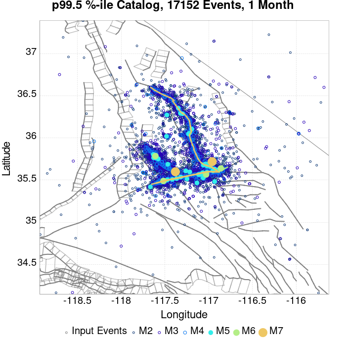
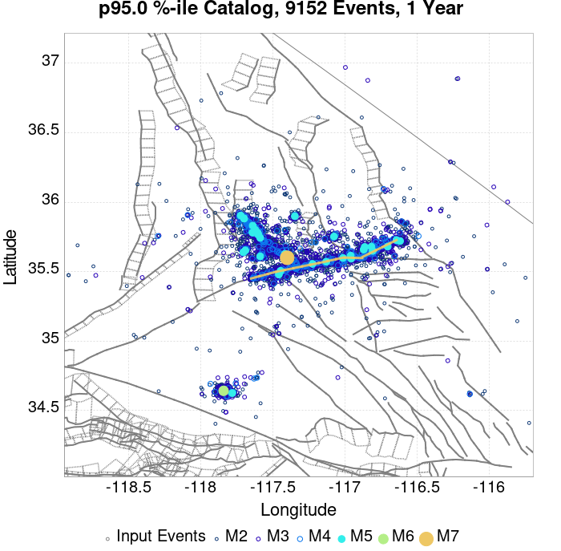
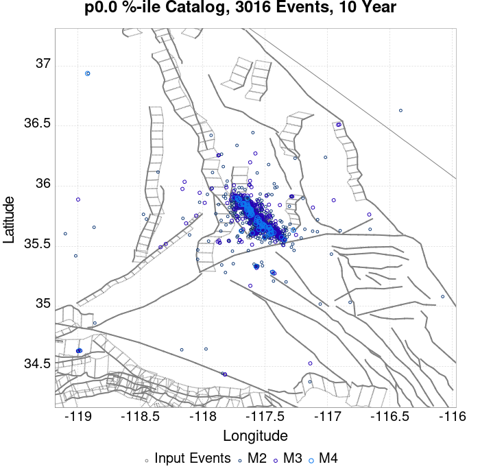
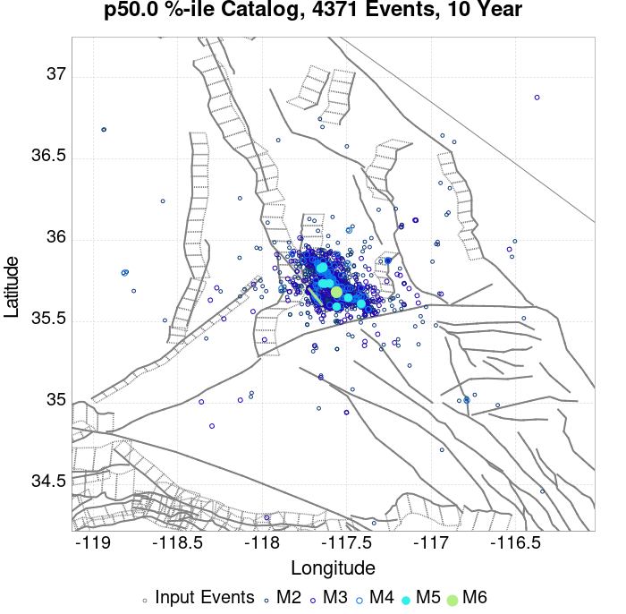
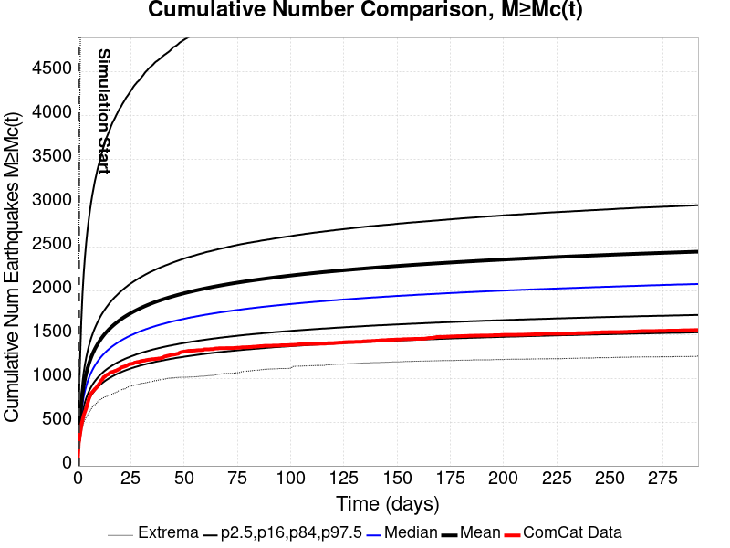
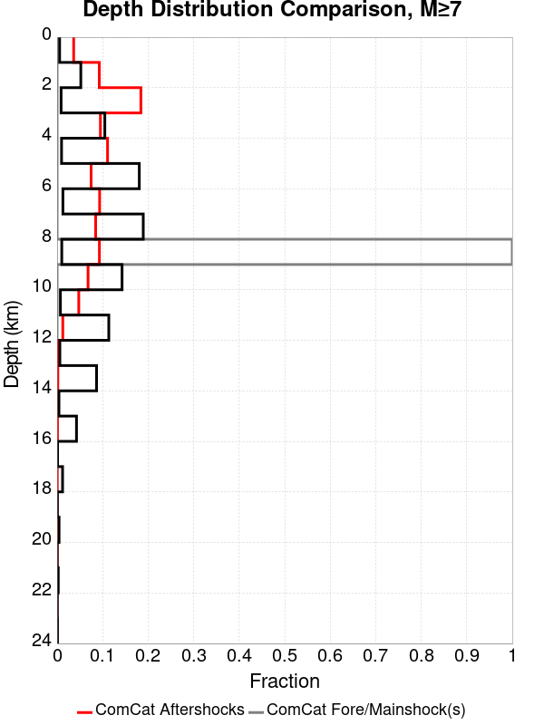
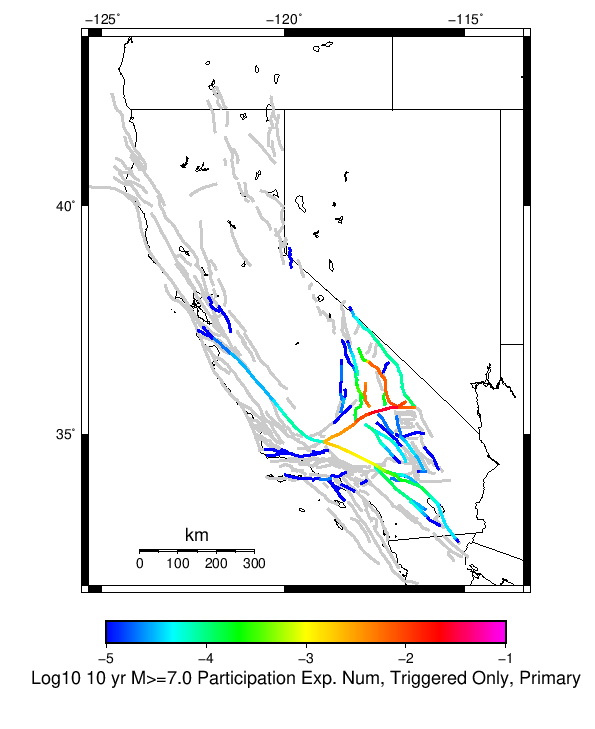

# ComCat M7.1 (ci38457511), ShakeMap Surfaces, Log10(k)=-2.3856, p=1.2164, c=0.0068906 Results

|   | ComCat M7.1 (ci38457511), ShakeMap Surfaces, Log10(k)=-2.3856, p=1.2164, c=0.0068906 |
|-----|-----|
| Num Simulations | 24976 (incomplete) |
| Start Time | 2019/07/06 03:19:54 UTC |
| Start Time Epoch Milliseconds | 1562383194040 |
| Duration | 10 Years |
| Includes Spontaneous? | false |
| Trigger Ruptures | 270 Trigger Ruptures |
|   | First: M3.98 at 2019/07/04 17:02:55 UTC |
|   | Last: M7.1 at 2019/07/06 03:19:53 UTC |
|   | Largest: M7.1 at 2019/07/06 03:19:53 UTC |
| Historical Ruptures | *(none)* |
| Config Generated With | u3etas_comcat_event_config_builder.sh --event-id ci38457511 --num-simulations 100000 --days-before 7 --mag-complete 3.5 --etas-k -2.3856 --etas-p 1.2164 --etas-c 0.0068906 --finite-surf-shakemap --finite-surf-shakemap-min-mag 5 --hpc-site USC_HPC --nodes 36 --hours 24 --queue scec |

## Table Of Contents

* [Probabilities Summary Table](#probabilities-summary-table)
* [Magnitude Number Distribution](#magnitude-number-distribution)
  * [10 Year Magnitude Number Distribution](#10-year-magnitude-number-distribution)
  * [1 Year Magnitude Number Distribution](#1-year-magnitude-number-distribution)
  * [1 Month Magnitude Number Distribution](#1-month-magnitude-number-distribution)
  * [1 Week Magnitude Number Distribution](#1-week-magnitude-number-distribution)
  * [1 Day Magnitude Number Distribution](#1-day-magnitude-number-distribution)
  * [1 Hour Magnitude Number Distribution](#1-hour-magnitude-number-distribution)
* [Hazard Change Over Time](#hazard-change-over-time)
  * [M&ge;5.0 Hazard Change Over Time](#m50-hazard-change-over-time)
  * [M&ge;6.0 Hazard Change Over Time](#m60-hazard-change-over-time)
  * [M&ge;7.0 Hazard Change Over Time](#m70-hazard-change-over-time)
  * [M&ge;8.0 Hazard Change Over Time](#m80-hazard-change-over-time)
* [Trigger Rupture Fault Map](#trigger-rupture-fault-map)
* [Trigger Rupture Depth Map](#trigger-rupture-depth-map)
* [Fault Distances To Triggers](#fault-distances-to-triggers)
* [Individual Simulated Catalog Maps](#individual-simulated-catalog-maps)
* [ComCat Data Comparisons](#comcat-data-comparisons)
  * [ComCat Magnitude-Number Distributions](#comcat-magnitude-number-distributions)
  * [ComCat Time-Dependent Mc](#comcat-time-dependent-mc)
  * [ComCat Cumulative Number Vs Time](#comcat-cumulative-number-vs-time)
  * [ComCat Cumulative Number Simulation Percentiles](#comcat-cumulative-number-simulation-percentiles)
  * [ComCat Probability Spatial Distribution](#comcat-probability-spatial-distribution)
  * [ComCat Mean Expectation Spatial Distribution](#comcat-mean-expectation-spatial-distribution)
  * [ComCat Depth Distribution](#comcat-depth-distribution)
* [Section Participation](#section-participation)
  * [Section Participation Plots](#section-participation-plots)
  * [Supra-Seismogenic Parent Sections Table](#supra-seismogenic-parent-sections-table)
  * [M≥6.5 Parent Sections Table](#m65-parent-sections-table)
  * [M≥7 Parent Sections Table](#m7-parent-sections-table)
  * [M≥7.5 Parent Sections Table](#m75-parent-sections-table)
  * [M≥8 Parent Sections Table](#m8-parent-sections-table)
  * [Fault Magnitude-Probability Distributions](#fault-magnitude-probability-distributions)
* [Gridded Nucleation](#gridded-nucleation)
* [JSON Input File](#json-input-file)

## Probabilities Summary Table
*[(top)](#table-of-contents)*

| Magnitude | 1 Hour Prob | 1 Day Prob | 1 Week Prob | 1 Month Prob | 1 Year Prob | 10 Year Prob |
|-----|-----|-----|-----|-----|-----|-----|
| **M&ge;4** | 1.000 (100.00%) | 1.000 (100.00%) | 1.000 (100.00%) | 1.000 (100.00%) | 1.000 (100.00%) | 1.000 (100.00%) |
| **M&ge;4.5** | 1.000 (99.95%) | 1.000 (100.00%) | 1.000 (100.00%) | 1.000 (100.00%) | 1.000 (100.00%) | 1.000 (100.00%) |
| **M&ge;5** | 0.927 (92.66%) | 0.997 (99.74%) | 0.999 (99.94%) | 1.000 (99.99%) | 1.000 (100.00%) | 1.000 (100.00%) |
| **M&ge;5.5** | 0.547 (54.72%) | 0.837 (83.69%) | 0.903 (90.31%) | 0.930 (93.01%) | 0.952 (95.16%) | 0.962 (96.16%) |
| **M&ge;6** | 0.189 (18.93%) | 0.395 (39.48%) | 0.483 (48.34%) | 0.530 (52.97%) | 0.585 (58.46%) | 0.616 (61.58%) |
| **M&ge;6.5** | 0.044 (4.43%) | 0.103 (10.28%) | 0.136 (13.58%) | 0.156 (15.59%) | 0.180 (18.00%) | 0.194 (19.43%) |
| **M&ge;7** | 0.016 (1.65%) | 0.039 (3.86%) | 0.050 (5.03%) | 0.058 (5.80%) | 0.067 (6.69%) | 0.073 (7.30%) |
| **M&ge;7.1** | 0.014 (1.42%) | 0.033 (3.30%) | 0.043 (4.27%) | 0.050 (4.97%) | 0.057 (5.73%) | 0.062 (6.24%) |
| **M&ge;7.5** | 4.68E-3 (0.47%) | 0.011 (1.12%) | 0.015 (1.48%) | 0.017 (1.73%) | 0.021 (2.06%) | 0.023 (2.29%) |
| **M&ge;8** | 1.20E-4 (0.01%) | 1.20E-4 (0.01%) | 1.60E-4 (0.02%) | 3.20E-4 (0.03%) | 4.40E-4 (0.04%) | 4.40E-4 (0.04%) |

## Magnitude Number Distribution
*[(top)](#table-of-contents)*

### 10 Year Magnitude Number Distribution
*[(top)](#table-of-contents)*

**Legend**
* **Mean** (thick black line): mean expected number across all 24976 catalogs
* **2.5%,97.5%** (thin black lines): expected number percentiles across all 24976 catalogs
* **Median** (thin blue line): median expected number across all 24976 catalogs
* **Mode** (thin cyan line): modal expected number across all 24976 catalogs
* **10 yr Probability** (thin red line): 10 year probability calculated as the fraction of catalogs with at least 1 occurrence
* **10 yr Supraseismogenic Probability** (thin dashed red line): same as above, but only for supraseismogenic ruptures on explicitly modeled UCERF3 faults
* **95% Conf** (light red shaded region): binomial 95% confidence bounds on probability
* **Primary** (thin green line): mean expected number from primary triggered aftershocks only (no secondary, tertiary, etc...) across all 24976 catalogs


| Mag | Mean | 2.5 %ile | 97.5 %ile | Median | Mode | 10 yr Probability | 10 yr Supra-Seis Prob | Primary Aftershocks Mean |
|-----|-----|-----|-----|-----|-----|-----|-----|-----|
| **M&ge;2.5** | 5219.347 | 3460.000 | 14866.000 | 4369.000 | 3951.000 | 1.000 (100.00%) | 0.306 (30.62%) | 2268.873 |
| **M&ge;2.6** | 4145.773 | 2744.000 | 11855.000 | 3472.000 | 3232.000 | 1.000 (100.00%) | 0.306 (30.62%) | 1802.362 |
| **M&ge;2.7** | 3292.942 | 2172.000 | 9396.000 | 2757.000 | 2546.000 | 1.000 (100.00%) | 0.306 (30.62%) | 1431.524 |
| **M&ge;2.8** | 2615.811 | 1723.000 | 7457.000 | 2190.000 | 1974.000 | 1.000 (100.00%) | 0.306 (30.62%) | 1137.226 |
| **M&ge;2.9** | 2077.884 | 1364.000 | 5929.000 | 1741.000 | 1698.000 | 1.000 (100.00%) | 0.306 (30.62%) | 903.350 |
| **M&ge;3** | 1650.510 | 1078.000 | 4701.000 | 1383.000 | 1249.000 | 1.000 (100.00%) | 0.306 (30.62%) | 717.686 |
| **M&ge;3.1** | 1311.060 | 852.000 | 3738.000 | 1099.000 | 1003.000 | 1.000 (100.00%) | 0.306 (30.62%) | 570.103 |
| **M&ge;3.2** | 1041.409 | 674.000 | 2964.000 | 873.000 | 806.000 | 1.000 (100.00%) | 0.306 (30.62%) | 452.931 |
| **M&ge;3.3** | 827.192 | 532.000 | 2359.000 | 695.000 | 638.000 | 1.000 (100.00%) | 0.306 (30.62%) | 359.725 |
| **M&ge;3.4** | 657.037 | 419.000 | 1864.000 | 552.000 | 504.000 | 1.000 (100.00%) | 0.306 (30.62%) | 285.746 |
| **M&ge;3.5** | 521.794 | 329.000 | 1480.000 | 439.000 | 417.000 | 1.000 (100.00%) | 0.306 (30.62%) | 226.978 |
| **M&ge;3.6** | 414.512 | 259.000 | 1175.000 | 349.000 | 317.000 | 1.000 (100.00%) | 0.306 (30.62%) | 180.317 |
| **M&ge;3.7** | 329.099 | 202.000 | 934.000 | 278.000 | 252.000 | 1.000 (100.00%) | 0.306 (30.62%) | 143.119 |
| **M&ge;3.8** | 261.344 | 159.000 | 744.000 | 221.000 | 204.000 | 1.000 (100.00%) | 0.306 (30.62%) | 113.648 |
| **M&ge;3.9** | 207.493 | 124.000 | 591.000 | 176.000 | 154.000 | 1.000 (100.00%) | 0.306 (30.62%) | 90.249 |
| **M&ge;4** | 164.777 | 96.000 | 470.000 | 140.000 | 130.000 | 1.000 (100.00%) | 0.306 (30.62%) | 71.682 |
| **M&ge;4.1** | 130.772 | 74.000 | 372.000 | 111.000 | 99.000 | 1.000 (100.00%) | 0.306 (30.62%) | 56.893 |
| **M&ge;4.2** | 103.775 | 57.000 | 294.000 | 88.000 | 77.000 | 1.000 (100.00%) | 0.306 (30.62%) | 45.135 |
| **M&ge;4.3** | 82.345 | 44.000 | 233.000 | 70.000 | 62.000 | 1.000 (100.00%) | 0.306 (30.62%) | 35.807 |
| **M&ge;4.4** | 65.302 | 33.000 | 186.000 | 56.000 | 47.000 | 1.000 (100.00%) | 0.306 (30.62%) | 28.385 |
| **M&ge;4.5** | 51.776 | 25.000 | 147.000 | 44.000 | 40.000 | 1.000 (100.00%) | 0.306 (30.62%) | 22.499 |
| **M&ge;4.6** | 41.036 | 19.000 | 116.000 | 35.000 | 31.000 | 1.000 (100.00%) | 0.306 (30.62%) | 17.825 |
| **M&ge;4.7** | 32.478 | 14.000 | 92.000 | 28.000 | 24.000 | 1.000 (100.00%) | 0.306 (30.62%) | 14.106 |
| **M&ge;4.8** | 25.699 | 10.000 | 73.000 | 22.000 | 20.000 | 1.000 (100.00%) | 0.306 (30.62%) | 11.153 |
| **M&ge;4.9** | 20.312 | 7.000 | 58.000 | 17.000 | 16.000 | 1.000 (100.00%) | 0.306 (30.62%) | 8.816 |
| **M&ge;5** | 16.044 | 5.000 | 46.000 | 14.000 | 11.000 | 1.000 (100.00%) | 0.306 (30.62%) | 6.972 |
| **M&ge;5.1** | 12.649 | 3.000 | 37.000 | 11.000 | 9.000 | 1.000 (99.96%) | 0.306 (30.62%) | 5.492 |
| **M&ge;5.2** | 9.959 | 2.000 | 29.000 | 8.000 | 7.000 | 0.998 (99.78%) | 0.306 (30.62%) | 4.330 |
| **M&ge;5.3** | 7.805 | 1.000 | 24.000 | 7.000 | 5.000 | 0.994 (99.36%) | 0.306 (30.62%) | 3.390 |
| **M&ge;5.4** | 6.101 | 1.000 | 19.000 | 5.000 | 4.000 | 0.984 (98.43%) | 0.306 (30.62%) | 2.649 |
| **M&ge;5.5** | 4.755 | 0.000 | 15.000 | 4.000 | 3.000 | 0.962 (96.16%) | 0.306 (30.62%) | 2.068 |
| **M&ge;5.6** | 3.683 | 0.000 | 12.000 | 3.000 | 2.000 | 0.922 (92.20%) | 0.306 (30.62%) | 1.603 |
| **M&ge;5.7** | 2.825 | 0.000 | 10.000 | 2.000 | 1.000 | 0.867 (86.75%) | 0.306 (30.62%) | 1.231 |
| **M&ge;5.8** | 2.151 | 0.000 | 8.000 | 2.000 | 1.000 | 0.794 (79.44%) | 0.306 (30.62%) | 0.938 |
| **M&ge;5.9** | 1.616 | 0.000 | 6.000 | 1.000 | 1.000 | 0.708 (70.80%) | 0.306 (30.61%) | 0.707 |
| **M&ge;6** | 1.239 | 0.000 | 5.000 | 1.000 | 0.000 | 0.616 (61.58%) | 0.306 (30.60%) | 0.539 |
| **M&ge;6.1** | 0.890 | 0.000 | 4.000 | 1.000 | 0.000 | 0.508 (50.76%) | 0.263 (26.27%) | 0.395 |
| **M&ge;6.2** | 0.582 | 0.000 | 3.000 | 0.000 | 0.000 | 0.380 (38.02%) | 0.208 (20.78%) | 0.261 |
| **M&ge;6.3** | 0.435 | 0.000 | 3.000 | 0.000 | 0.000 | 0.306 (30.60%) | 0.178 (17.80%) | 0.199 |
| **M&ge;6.4** | 0.334 | 0.000 | 2.000 | 0.000 | 0.000 | 0.243 (24.29%) | 0.155 (15.51%) | 0.150 |
| **M&ge;6.5** | 0.256 | 0.000 | 2.000 | 0.000 | 0.000 | 0.194 (19.43%) | 0.135 (13.48%) | 0.116 |
| **M&ge;6.6** | 0.208 | 0.000 | 2.000 | 0.000 | 0.000 | 0.168 (16.84%) | 0.125 (12.49%) | 0.099 |
| **M&ge;6.7** | 0.167 | 0.000 | 1.000 | 0.000 | 0.000 | 0.139 (13.86%) | 0.108 (10.84%) | 0.080 |
| **M&ge;6.8** | 0.133 | 0.000 | 1.000 | 0.000 | 0.000 | 0.115 (11.52%) | 0.095 (9.46%) | 0.065 |
| **M&ge;6.9** | 0.101 | 0.000 | 1.000 | 0.000 | 0.000 | 0.091 (9.12%) | 0.077 (7.74%) | 0.051 |
| **M&ge;7** | 0.078 | 0.000 | 1.000 | 0.000 | 0.000 | 0.073 (7.30%) | 0.064 (6.43%) | 0.040 |
| **M&ge;7.1** | 0.066 | 0.000 | 1.000 | 0.000 | 0.000 | 0.062 (6.24%) | 0.057 (5.71%) | 0.034 |
| **M&ge;7.2** | 0.050 | 0.000 | 1.000 | 0.000 | 0.000 | 0.048 (4.84%) | 0.046 (4.58%) | 0.026 |
| **M&ge;7.3** | 0.035 | 0.000 | 1.000 | 0.000 | 0.000 | 0.034 (3.37%) | 0.032 (3.23%) | 0.018 |
| **M&ge;7.4** | 0.030 | 0.000 | 1.000 | 0.000 | 0.000 | 0.029 (2.93%) | 0.029 (2.89%) | 0.015 |
| **M&ge;7.5** | 0.023 | 0.000 | 0.000 | 0.000 | 0.000 | 0.023 (2.29%) | 0.023 (2.27%) | 0.011 |
| **M&ge;7.6** | 0.012 | 0.000 | 0.000 | 0.000 | 0.000 | 0.012 (1.17%) | 0.012 (1.17%) | 5.85E-3 |
| **M&ge;7.7** | 4.04E-3 | 0.000 | 0.000 | 0.000 | 0.000 | 3.88E-3 (0.39%) | 3.84E-3 (0.38%) | 2.04E-3 |
| **M&ge;7.8** | 2.40E-3 | 0.000 | 0.000 | 0.000 | 0.000 | 2.36E-3 (0.24%) | 2.32E-3 (0.23%) | 1.32E-3 |
| **M&ge;7.9** | 1.32E-3 | 0.000 | 0.000 | 0.000 | 0.000 | 1.32E-3 (0.13%) | 1.32E-3 (0.13%) | 7.61E-4 |
| **M&ge;8** | 4.40E-4 | 0.000 | 0.000 | 0.000 | 0.000 | 4.40E-4 (0.04%) | 4.40E-4 (0.04%) | 2.80E-4 |
| **M&ge;8.1** | 4.00E-5 | 0.000 | 0.000 | 0.000 | 0.000 | 4.00E-5 (0.00%) | 4.00E-5 (0.00%) | 0.000 |
| **M&ge;8.2** | 0.000 | 0.000 | 0.000 | 0.000 | 0.000 | 0.000 (0.00%) | 0.000 (0.00%) | 0.000 |
| **M&ge;8.3** | 0.000 | 0.000 | 0.000 | 0.000 | 0.000 | 0.000 (0.00%) | 0.000 (0.00%) | 0.000 |
| **M&ge;8.4** | 0.000 | 0.000 | 0.000 | 0.000 | 0.000 | 0.000 (0.00%) | 0.000 (0.00%) | 0.000 |
| **M&ge;8.5** | 0.000 | 0.000 | 0.000 | 0.000 | 0.000 | 0.000 (0.00%) | 0.000 (0.00%) | 0.000 |
| **M&ge;8.6** | 0.000 | 0.000 | 0.000 | 0.000 | 0.000 | 0.000 (0.00%) | 0.000 (0.00%) | 0.000 |
| **M&ge;8.7** | 0.000 | 0.000 | 0.000 | 0.000 | 0.000 | 0.000 (0.00%) | 0.000 (0.00%) | 0.000 |
| **M&ge;8.8** | 0.000 | 0.000 | 0.000 | 0.000 | 0.000 | 0.000 (0.00%) | 0.000 (0.00%) | 0.000 |
| **M&ge;8.9** | 0.000 | 0.000 | 0.000 | 0.000 | 0.000 | 0.000 (0.00%) | 0.000 (0.00%) | 0.000 |
| **M&ge;9** | 0.000 | 0.000 | 0.000 | 0.000 | 0.000 | 0.000 (0.00%) | 0.000 (0.00%) | 0.000 |

### 1 Year Magnitude Number Distribution
*[(top)](#table-of-contents)*

**Legend**
* **Mean** (thick black line): mean expected number across all 24976 catalogs
* **2.5%,97.5%** (thin black lines): expected number percentiles across all 24976 catalogs
* **Median** (thin blue line): median expected number across all 24976 catalogs
* **Mode** (thin cyan line): modal expected number across all 24976 catalogs
* **1 yr Probability** (thin red line): 1 year probability calculated as the fraction of catalogs with at least 1 occurrence
* **1 yr Supraseismogenic Probability** (thin dashed red line): same as above, but only for supraseismogenic ruptures on explicitly modeled UCERF3 faults
* **95% Conf** (light red shaded region): binomial 95% confidence bounds on probability
* **Primary** (thin green line): mean expected number from primary triggered aftershocks only (no secondary, tertiary, etc...) across all 24976 catalogs


| Mag | Mean | 2.5 %ile | 97.5 %ile | Median | Mode | 1 yr Probability | 1 yr Supra-Seis Prob | Primary Aftershocks Mean |
|-----|-----|-----|-----|-----|-----|-----|-----|-----|
| **M&ge;2.5** | 4727.309 | 3209.000 | 13009.000 | 3998.000 | 3634.000 | 1.000 (100.00%) | 0.283 (28.31%) | 2162.472 |
| **M&ge;2.6** | 3755.014 | 2544.000 | 10341.000 | 3177.000 | 2841.000 | 1.000 (100.00%) | 0.283 (28.31%) | 1717.874 |
| **M&ge;2.7** | 2982.561 | 2016.000 | 8213.000 | 2525.000 | 2243.000 | 1.000 (100.00%) | 0.283 (28.31%) | 1364.425 |
| **M&ge;2.8** | 2369.221 | 1597.000 | 6524.000 | 2005.000 | 1823.000 | 1.000 (100.00%) | 0.283 (28.31%) | 1083.905 |
| **M&ge;2.9** | 1881.960 | 1264.000 | 5163.000 | 1593.000 | 1461.000 | 1.000 (100.00%) | 0.283 (28.31%) | 860.977 |
| **M&ge;3** | 1494.912 | 999.000 | 4106.000 | 1266.000 | 1179.000 | 1.000 (100.00%) | 0.283 (28.31%) | 684.038 |
| **M&ge;3.1** | 1187.467 | 789.000 | 3258.000 | 1007.000 | 944.000 | 1.000 (100.00%) | 0.283 (28.31%) | 543.372 |
| **M&ge;3.2** | 943.264 | 623.000 | 2599.000 | 800.000 | 743.000 | 1.000 (100.00%) | 0.283 (28.31%) | 431.705 |
| **M&ge;3.3** | 749.244 | 492.000 | 2060.000 | 636.000 | 589.000 | 1.000 (100.00%) | 0.283 (28.31%) | 342.857 |
| **M&ge;3.4** | 595.123 | 388.000 | 1636.000 | 506.000 | 469.000 | 1.000 (100.00%) | 0.283 (28.31%) | 272.340 |
| **M&ge;3.5** | 472.634 | 304.000 | 1303.000 | 402.000 | 369.000 | 1.000 (100.00%) | 0.283 (28.31%) | 216.332 |
| **M&ge;3.6** | 375.469 | 239.000 | 1035.000 | 320.000 | 303.000 | 1.000 (100.00%) | 0.283 (28.31%) | 171.875 |
| **M&ge;3.7** | 298.096 | 187.000 | 818.000 | 254.000 | 231.000 | 1.000 (100.00%) | 0.283 (28.31%) | 136.422 |
| **M&ge;3.8** | 236.700 | 146.000 | 649.000 | 202.000 | 178.000 | 1.000 (100.00%) | 0.283 (28.31%) | 108.320 |
| **M&ge;3.9** | 187.924 | 113.000 | 515.000 | 161.000 | 146.000 | 1.000 (100.00%) | 0.283 (28.31%) | 86.014 |
| **M&ge;4** | 149.224 | 88.000 | 411.000 | 128.000 | 119.000 | 1.000 (100.00%) | 0.283 (28.31%) | 68.317 |
| **M&ge;4.1** | 118.430 | 68.000 | 326.000 | 101.000 | 93.000 | 1.000 (100.00%) | 0.283 (28.31%) | 54.219 |
| **M&ge;4.2** | 93.977 | 52.000 | 257.000 | 81.000 | 73.000 | 1.000 (100.00%) | 0.283 (28.31%) | 43.011 |
| **M&ge;4.3** | 74.566 | 40.000 | 205.000 | 64.000 | 58.000 | 1.000 (100.00%) | 0.283 (28.31%) | 34.127 |
| **M&ge;4.4** | 59.138 | 30.000 | 164.000 | 51.000 | 47.000 | 1.000 (100.00%) | 0.283 (28.31%) | 27.057 |
| **M&ge;4.5** | 46.892 | 23.000 | 129.000 | 40.000 | 37.000 | 1.000 (100.00%) | 0.283 (28.31%) | 21.450 |
| **M&ge;4.6** | 37.174 | 17.000 | 103.000 | 32.000 | 28.000 | 1.000 (100.00%) | 0.283 (28.31%) | 17.001 |
| **M&ge;4.7** | 29.422 | 13.000 | 81.000 | 25.000 | 22.000 | 1.000 (100.00%) | 0.283 (28.31%) | 13.454 |
| **M&ge;4.8** | 23.271 | 9.000 | 65.000 | 20.000 | 18.000 | 1.000 (100.00%) | 0.283 (28.31%) | 10.633 |
| **M&ge;4.9** | 18.392 | 7.000 | 52.000 | 16.000 | 14.000 | 1.000 (100.00%) | 0.283 (28.31%) | 8.403 |
| **M&ge;5** | 14.525 | 5.000 | 41.000 | 13.000 | 11.000 | 1.000 (100.00%) | 0.283 (28.31%) | 6.645 |
| **M&ge;5.1** | 11.448 | 3.000 | 33.000 | 10.000 | 9.000 | 0.999 (99.94%) | 0.283 (28.31%) | 5.236 |
| **M&ge;5.2** | 9.013 | 2.000 | 26.000 | 8.000 | 6.000 | 0.997 (99.70%) | 0.283 (28.31%) | 4.128 |
| **M&ge;5.3** | 7.065 | 1.000 | 21.000 | 6.000 | 4.000 | 0.992 (99.17%) | 0.283 (28.31%) | 3.233 |
| **M&ge;5.4** | 5.524 | 1.000 | 17.000 | 5.000 | 3.000 | 0.979 (97.89%) | 0.283 (28.31%) | 2.527 |
| **M&ge;5.5** | 4.306 | 0.000 | 14.000 | 4.000 | 3.000 | 0.952 (95.16%) | 0.283 (28.31%) | 1.971 |
| **M&ge;5.6** | 3.338 | 0.000 | 11.000 | 3.000 | 2.000 | 0.907 (90.69%) | 0.283 (28.31%) | 1.529 |
| **M&ge;5.7** | 2.563 | 0.000 | 9.000 | 2.000 | 1.000 | 0.847 (84.66%) | 0.283 (28.31%) | 1.176 |
| **M&ge;5.8** | 1.951 | 0.000 | 7.000 | 1.000 | 1.000 | 0.769 (76.92%) | 0.283 (28.31%) | 0.895 |
| **M&ge;5.9** | 1.464 | 0.000 | 6.000 | 1.000 | 0.000 | 0.679 (67.91%) | 0.283 (28.30%) | 0.673 |
| **M&ge;6** | 1.121 | 0.000 | 5.000 | 1.000 | 0.000 | 0.585 (58.46%) | 0.283 (28.29%) | 0.513 |
| **M&ge;6.1** | 0.805 | 0.000 | 4.000 | 0.000 | 0.000 | 0.478 (47.77%) | 0.243 (24.30%) | 0.375 |
| **M&ge;6.2** | 0.526 | 0.000 | 3.000 | 0.000 | 0.000 | 0.355 (35.50%) | 0.192 (19.19%) | 0.246 |
| **M&ge;6.3** | 0.393 | 0.000 | 2.000 | 0.000 | 0.000 | 0.284 (28.42%) | 0.164 (16.40%) | 0.188 |
| **M&ge;6.4** | 0.302 | 0.000 | 2.000 | 0.000 | 0.000 | 0.224 (22.45%) | 0.143 (14.29%) | 0.142 |
| **M&ge;6.5** | 0.233 | 0.000 | 2.000 | 0.000 | 0.000 | 0.180 (18.00%) | 0.125 (12.48%) | 0.110 |
| **M&ge;6.6** | 0.189 | 0.000 | 2.000 | 0.000 | 0.000 | 0.155 (15.54%) | 0.116 (11.57%) | 0.094 |
| **M&ge;6.7** | 0.152 | 0.000 | 1.000 | 0.000 | 0.000 | 0.128 (12.78%) | 0.100 (10.03%) | 0.076 |
| **M&ge;6.8** | 0.122 | 0.000 | 1.000 | 0.000 | 0.000 | 0.106 (10.63%) | 0.088 (8.76%) | 0.062 |
| **M&ge;6.9** | 0.093 | 0.000 | 1.000 | 0.000 | 0.000 | 0.084 (8.42%) | 0.072 (7.15%) | 0.049 |
| **M&ge;7** | 0.072 | 0.000 | 1.000 | 0.000 | 0.000 | 0.067 (6.69%) | 0.059 (5.91%) | 0.038 |
| **M&ge;7.1** | 0.060 | 0.000 | 1.000 | 0.000 | 0.000 | 0.057 (5.73%) | 0.052 (5.25%) | 0.032 |
| **M&ge;7.2** | 0.046 | 0.000 | 1.000 | 0.000 | 0.000 | 0.044 (4.43%) | 0.042 (4.20%) | 0.024 |
| **M&ge;7.3** | 0.032 | 0.000 | 1.000 | 0.000 | 0.000 | 0.031 (3.08%) | 0.030 (2.95%) | 0.017 |
| **M&ge;7.4** | 0.028 | 0.000 | 1.000 | 0.000 | 0.000 | 0.027 (2.67%) | 0.026 (2.63%) | 0.015 |
| **M&ge;7.5** | 0.021 | 0.000 | 0.000 | 0.000 | 0.000 | 0.021 (2.06%) | 0.020 (2.05%) | 0.011 |
| **M&ge;7.6** | 0.011 | 0.000 | 0.000 | 0.000 | 0.000 | 0.011 (1.06%) | 0.011 (1.05%) | 5.61E-3 |
| **M&ge;7.7** | 3.68E-3 | 0.000 | 0.000 | 0.000 | 0.000 | 3.56E-3 (0.36%) | 3.52E-3 (0.35%) | 2.00E-3 |
| **M&ge;7.8** | 2.24E-3 | 0.000 | 0.000 | 0.000 | 0.000 | 2.20E-3 (0.22%) | 2.16E-3 (0.22%) | 1.32E-3 |
| **M&ge;7.9** | 1.20E-3 | 0.000 | 0.000 | 0.000 | 0.000 | 1.20E-3 (0.12%) | 1.20E-3 (0.12%) | 7.61E-4 |
| **M&ge;8** | 4.40E-4 | 0.000 | 0.000 | 0.000 | 0.000 | 4.40E-4 (0.04%) | 4.40E-4 (0.04%) | 2.80E-4 |
| **M&ge;8.1** | 4.00E-5 | 0.000 | 0.000 | 0.000 | 0.000 | 4.00E-5 (0.00%) | 4.00E-5 (0.00%) | 0.000 |
| **M&ge;8.2** | 0.000 | 0.000 | 0.000 | 0.000 | 0.000 | 0.000 (0.00%) | 0.000 (0.00%) | 0.000 |
| **M&ge;8.3** | 0.000 | 0.000 | 0.000 | 0.000 | 0.000 | 0.000 (0.00%) | 0.000 (0.00%) | 0.000 |
| **M&ge;8.4** | 0.000 | 0.000 | 0.000 | 0.000 | 0.000 | 0.000 (0.00%) | 0.000 (0.00%) | 0.000 |
| **M&ge;8.5** | 0.000 | 0.000 | 0.000 | 0.000 | 0.000 | 0.000 (0.00%) | 0.000 (0.00%) | 0.000 |
| **M&ge;8.6** | 0.000 | 0.000 | 0.000 | 0.000 | 0.000 | 0.000 (0.00%) | 0.000 (0.00%) | 0.000 |
| **M&ge;8.7** | 0.000 | 0.000 | 0.000 | 0.000 | 0.000 | 0.000 (0.00%) | 0.000 (0.00%) | 0.000 |
| **M&ge;8.8** | 0.000 | 0.000 | 0.000 | 0.000 | 0.000 | 0.000 (0.00%) | 0.000 (0.00%) | 0.000 |
| **M&ge;8.9** | 0.000 | 0.000 | 0.000 | 0.000 | 0.000 | 0.000 (0.00%) | 0.000 (0.00%) | 0.000 |
| **M&ge;9** | 0.000 | 0.000 | 0.000 | 0.000 | 0.000 | 0.000 (0.00%) | 0.000 (0.00%) | 0.000 |

### 1 Month Magnitude Number Distribution
*[(top)](#table-of-contents)*

**Legend**
* **Mean** (thick black line): mean expected number across all 24976 catalogs
* **2.5%,97.5%** (thin black lines): expected number percentiles across all 24976 catalogs
* **Median** (thin blue line): median expected number across all 24976 catalogs
* **Mode** (thin cyan line): modal expected number across all 24976 catalogs
* **1 mo Probability** (thin red line): 1 month probability calculated as the fraction of catalogs with at least 1 occurrence
* **1 mo Supraseismogenic Probability** (thin dashed red line): same as above, but only for supraseismogenic ruptures on explicitly modeled UCERF3 faults
* **95% Conf** (light red shaded region): binomial 95% confidence bounds on probability
* **Primary** (thin green line): mean expected number from primary triggered aftershocks only (no secondary, tertiary, etc...) across all 24976 catalogs


| Mag | Mean | 2.5 %ile | 97.5 %ile | Median | Mode | 1 mo Probability | 1 mo Supra-Seis Prob | Primary Aftershocks Mean |
|-----|-----|-----|-----|-----|-----|-----|-----|-----|
| **M&ge;2.5** | 3933.566 | 2781.000 | 9964.000 | 3388.000 | 3141.000 | 1.000 (100.00%) | 0.245 (24.54%) | 1968.766 |
| **M&ge;2.6** | 3124.627 | 2204.000 | 7918.000 | 2692.000 | 2478.000 | 1.000 (100.00%) | 0.245 (24.54%) | 1564.006 |
| **M&ge;2.7** | 2481.862 | 1746.000 | 6291.000 | 2138.000 | 2028.000 | 1.000 (100.00%) | 0.245 (24.54%) | 1242.257 |
| **M&ge;2.8** | 1971.454 | 1383.000 | 5001.000 | 1699.000 | 1658.000 | 1.000 (100.00%) | 0.245 (24.54%) | 986.868 |
| **M&ge;2.9** | 1565.985 | 1095.000 | 3958.000 | 1351.000 | 1279.000 | 1.000 (100.00%) | 0.245 (24.54%) | 783.894 |
| **M&ge;3** | 1243.940 | 865.000 | 3143.000 | 1075.000 | 1034.000 | 1.000 (100.00%) | 0.245 (24.54%) | 622.792 |
| **M&ge;3.1** | 988.099 | 683.000 | 2501.000 | 854.000 | 790.000 | 1.000 (100.00%) | 0.245 (24.54%) | 494.721 |
| **M&ge;3.2** | 784.940 | 540.000 | 1986.000 | 679.000 | 638.000 | 1.000 (100.00%) | 0.245 (24.54%) | 393.061 |
| **M&ge;3.3** | 623.496 | 425.000 | 1583.000 | 540.000 | 493.000 | 1.000 (100.00%) | 0.245 (24.54%) | 312.151 |
| **M&ge;3.4** | 495.219 | 333.000 | 1258.000 | 429.000 | 398.000 | 1.000 (100.00%) | 0.245 (24.54%) | 247.939 |
| **M&ge;3.5** | 393.263 | 262.000 | 993.000 | 341.000 | 312.000 | 1.000 (100.00%) | 0.245 (24.54%) | 196.932 |
| **M&ge;3.6** | 312.408 | 206.000 | 793.000 | 271.000 | 247.000 | 1.000 (100.00%) | 0.245 (24.54%) | 156.457 |
| **M&ge;3.7** | 248.017 | 160.000 | 629.000 | 216.000 | 203.000 | 1.000 (100.00%) | 0.245 (24.54%) | 124.183 |
| **M&ge;3.8** | 196.955 | 125.000 | 499.000 | 172.000 | 157.000 | 1.000 (100.00%) | 0.245 (24.54%) | 98.613 |
| **M&ge;3.9** | 156.359 | 97.000 | 398.000 | 136.000 | 124.000 | 1.000 (100.00%) | 0.245 (24.54%) | 78.306 |
| **M&ge;4** | 124.148 | 75.000 | 315.000 | 108.000 | 105.000 | 1.000 (100.00%) | 0.245 (24.54%) | 62.194 |
| **M&ge;4.1** | 98.559 | 58.000 | 251.000 | 86.000 | 79.000 | 1.000 (100.00%) | 0.245 (24.54%) | 49.368 |
| **M&ge;4.2** | 78.198 | 44.000 | 200.000 | 68.000 | 63.000 | 1.000 (100.00%) | 0.245 (24.54%) | 39.159 |
| **M&ge;4.3** | 62.035 | 34.000 | 158.000 | 54.000 | 49.000 | 1.000 (100.00%) | 0.245 (24.54%) | 31.067 |
| **M&ge;4.4** | 49.217 | 25.000 | 126.000 | 43.000 | 40.000 | 1.000 (100.00%) | 0.245 (24.54%) | 24.645 |
| **M&ge;4.5** | 39.032 | 19.000 | 100.000 | 34.000 | 32.000 | 1.000 (100.00%) | 0.245 (24.54%) | 19.541 |
| **M&ge;4.6** | 30.950 | 14.000 | 80.000 | 27.000 | 25.000 | 1.000 (100.00%) | 0.245 (24.54%) | 15.492 |
| **M&ge;4.7** | 24.483 | 10.000 | 64.000 | 22.000 | 18.000 | 1.000 (100.00%) | 0.245 (24.54%) | 12.261 |
| **M&ge;4.8** | 19.363 | 7.000 | 51.000 | 17.000 | 16.000 | 1.000 (100.00%) | 0.245 (24.54%) | 9.688 |
| **M&ge;4.9** | 15.314 | 5.000 | 41.000 | 13.000 | 12.000 | 1.000 (100.00%) | 0.245 (24.54%) | 7.660 |
| **M&ge;5** | 12.091 | 4.000 | 33.000 | 11.000 | 10.000 | 1.000 (99.99%) | 0.245 (24.54%) | 6.054 |
| **M&ge;5.1** | 9.529 | 2.000 | 26.000 | 8.000 | 7.000 | 0.998 (99.84%) | 0.245 (24.54%) | 4.770 |
| **M&ge;5.2** | 7.501 | 1.000 | 21.000 | 6.000 | 5.000 | 0.995 (99.46%) | 0.245 (24.54%) | 3.761 |
| **M&ge;5.3** | 5.880 | 1.000 | 17.000 | 5.000 | 4.000 | 0.986 (98.55%) | 0.245 (24.54%) | 2.946 |
| **M&ge;5.4** | 4.599 | 0.000 | 14.000 | 4.000 | 3.000 | 0.966 (96.60%) | 0.245 (24.54%) | 2.304 |
| **M&ge;5.5** | 3.584 | 0.000 | 11.000 | 3.000 | 2.000 | 0.930 (93.01%) | 0.245 (24.54%) | 1.798 |
| **M&ge;5.6** | 2.777 | 0.000 | 9.000 | 2.000 | 2.000 | 0.876 (87.56%) | 0.245 (24.54%) | 1.395 |
| **M&ge;5.7** | 2.132 | 0.000 | 7.000 | 2.000 | 1.000 | 0.806 (80.62%) | 0.245 (24.54%) | 1.073 |
| **M&ge;5.8** | 1.621 | 0.000 | 6.000 | 1.000 | 1.000 | 0.721 (72.13%) | 0.245 (24.54%) | 0.816 |
| **M&ge;5.9** | 1.217 | 0.000 | 5.000 | 1.000 | 0.000 | 0.626 (62.62%) | 0.245 (24.53%) | 0.613 |
| **M&ge;6** | 0.931 | 0.000 | 4.000 | 1.000 | 0.000 | 0.530 (52.97%) | 0.245 (24.52%) | 0.467 |
| **M&ge;6.1** | 0.668 | 0.000 | 3.000 | 0.000 | 0.000 | 0.427 (42.66%) | 0.211 (21.10%) | 0.341 |
| **M&ge;6.2** | 0.436 | 0.000 | 3.000 | 0.000 | 0.000 | 0.311 (31.10%) | 0.165 (16.52%) | 0.224 |
| **M&ge;6.3** | 0.327 | 0.000 | 2.000 | 0.000 | 0.000 | 0.248 (24.78%) | 0.141 (14.13%) | 0.171 |
| **M&ge;6.4** | 0.251 | 0.000 | 2.000 | 0.000 | 0.000 | 0.195 (19.52%) | 0.123 (12.34%) | 0.130 |
| **M&ge;6.5** | 0.194 | 0.000 | 2.000 | 0.000 | 0.000 | 0.156 (15.59%) | 0.108 (10.76%) | 0.101 |
| **M&ge;6.6** | 0.159 | 0.000 | 1.000 | 0.000 | 0.000 | 0.135 (13.48%) | 0.100 (10.05%) | 0.087 |
| **M&ge;6.7** | 0.128 | 0.000 | 1.000 | 0.000 | 0.000 | 0.110 (11.02%) | 0.087 (8.71%) | 0.070 |
| **M&ge;6.8** | 0.104 | 0.000 | 1.000 | 0.000 | 0.000 | 0.092 (9.21%) | 0.076 (7.63%) | 0.058 |
| **M&ge;6.9** | 0.079 | 0.000 | 1.000 | 0.000 | 0.000 | 0.073 (7.28%) | 0.062 (6.21%) | 0.045 |
| **M&ge;7** | 0.061 | 0.000 | 1.000 | 0.000 | 0.000 | 0.058 (5.80%) | 0.051 (5.14%) | 0.036 |
| **M&ge;7.1** | 0.052 | 0.000 | 1.000 | 0.000 | 0.000 | 0.050 (4.97%) | 0.046 (4.58%) | 0.030 |
| **M&ge;7.2** | 0.039 | 0.000 | 1.000 | 0.000 | 0.000 | 0.038 (3.81%) | 0.036 (3.62%) | 0.022 |
| **M&ge;7.3** | 0.027 | 0.000 | 1.000 | 0.000 | 0.000 | 0.026 (2.60%) | 0.025 (2.51%) | 0.015 |
| **M&ge;7.4** | 0.023 | 0.000 | 0.000 | 0.000 | 0.000 | 0.023 (2.27%) | 0.022 (2.24%) | 0.013 |
| **M&ge;7.5** | 0.018 | 0.000 | 0.000 | 0.000 | 0.000 | 0.017 (1.73%) | 0.017 (1.73%) | 9.77E-3 |
| **M&ge;7.6** | 8.93E-3 | 0.000 | 0.000 | 0.000 | 0.000 | 8.81E-3 (0.88%) | 8.77E-3 (0.88%) | 4.92E-3 |
| **M&ge;7.7** | 3.00E-3 | 0.000 | 0.000 | 0.000 | 0.000 | 2.92E-3 (0.29%) | 2.92E-3 (0.29%) | 1.80E-3 |
| **M&ge;7.8** | 1.76E-3 | 0.000 | 0.000 | 0.000 | 0.000 | 1.72E-3 (0.17%) | 1.72E-3 (0.17%) | 1.16E-3 |
| **M&ge;7.9** | 1.00E-3 | 0.000 | 0.000 | 0.000 | 0.000 | 1.00E-3 (0.10%) | 1.00E-3 (0.10%) | 6.81E-4 |
| **M&ge;8** | 3.20E-4 | 0.000 | 0.000 | 0.000 | 0.000 | 3.20E-4 (0.03%) | 3.20E-4 (0.03%) | 2.00E-4 |
| **M&ge;8.1** | 4.00E-5 | 0.000 | 0.000 | 0.000 | 0.000 | 4.00E-5 (0.00%) | 4.00E-5 (0.00%) | 0.000 |
| **M&ge;8.2** | 0.000 | 0.000 | 0.000 | 0.000 | 0.000 | 0.000 (0.00%) | 0.000 (0.00%) | 0.000 |
| **M&ge;8.3** | 0.000 | 0.000 | 0.000 | 0.000 | 0.000 | 0.000 (0.00%) | 0.000 (0.00%) | 0.000 |
| **M&ge;8.4** | 0.000 | 0.000 | 0.000 | 0.000 | 0.000 | 0.000 (0.00%) | 0.000 (0.00%) | 0.000 |
| **M&ge;8.5** | 0.000 | 0.000 | 0.000 | 0.000 | 0.000 | 0.000 (0.00%) | 0.000 (0.00%) | 0.000 |
| **M&ge;8.6** | 0.000 | 0.000 | 0.000 | 0.000 | 0.000 | 0.000 (0.00%) | 0.000 (0.00%) | 0.000 |
| **M&ge;8.7** | 0.000 | 0.000 | 0.000 | 0.000 | 0.000 | 0.000 (0.00%) | 0.000 (0.00%) | 0.000 |
| **M&ge;8.8** | 0.000 | 0.000 | 0.000 | 0.000 | 0.000 | 0.000 (0.00%) | 0.000 (0.00%) | 0.000 |
| **M&ge;8.9** | 0.000 | 0.000 | 0.000 | 0.000 | 0.000 | 0.000 (0.00%) | 0.000 (0.00%) | 0.000 |
| **M&ge;9** | 0.000 | 0.000 | 0.000 | 0.000 | 0.000 | 0.000 (0.00%) | 0.000 (0.00%) | 0.000 |

### 1 Week Magnitude Number Distribution
*[(top)](#table-of-contents)*

**Legend**
* **Mean** (thick black line): mean expected number across all 24976 catalogs
* **2.5%,97.5%** (thin black lines): expected number percentiles across all 24976 catalogs
* **Median** (thin blue line): median expected number across all 24976 catalogs
* **Mode** (thin cyan line): modal expected number across all 24976 catalogs
* **1 wk Probability** (thin red line): 1 week probability calculated as the fraction of catalogs with at least 1 occurrence
* **1 wk Supraseismogenic Probability** (thin dashed red line): same as above, but only for supraseismogenic ruptures on explicitly modeled UCERF3 faults
* **95% Conf** (light red shaded region): binomial 95% confidence bounds on probability
* **Primary** (thin green line): mean expected number from primary triggered aftershocks only (no secondary, tertiary, etc...) across all 24976 catalogs


| Mag | Mean | 2.5 %ile | 97.5 %ile | Median | Mode | 1 wk Probability | 1 wk Supra-Seis Prob | Primary Aftershocks Mean |
|-----|-----|-----|-----|-----|-----|-----|-----|-----|
| **M&ge;2.5** | 3333.939 | 2441.000 | 7748.000 | 2920.000 | 2716.000 | 1.000 (100.00%) | 0.216 (21.58%) | 1800.718 |
| **M&ge;2.6** | 2648.352 | 1932.000 | 6164.000 | 2321.000 | 2134.000 | 1.000 (100.00%) | 0.216 (21.58%) | 1430.478 |
| **M&ge;2.7** | 2103.575 | 1533.000 | 4887.000 | 1842.000 | 1771.000 | 1.000 (100.00%) | 0.216 (21.58%) | 1136.195 |
| **M&ge;2.8** | 1671.009 | 1212.000 | 3882.000 | 1465.000 | 1369.000 | 1.000 (100.00%) | 0.216 (21.58%) | 902.623 |
| **M&ge;2.9** | 1327.306 | 959.000 | 3086.000 | 1164.000 | 1091.000 | 1.000 (100.00%) | 0.216 (21.58%) | 717.018 |
| **M&ge;3** | 1054.352 | 758.000 | 2453.000 | 926.000 | 874.000 | 1.000 (100.00%) | 0.216 (21.58%) | 569.674 |
| **M&ge;3.1** | 837.465 | 598.000 | 1952.000 | 736.000 | 703.000 | 1.000 (100.00%) | 0.216 (21.58%) | 452.496 |
| **M&ge;3.2** | 665.291 | 472.000 | 1557.000 | 585.000 | 570.000 | 1.000 (100.00%) | 0.216 (21.58%) | 359.528 |
| **M&ge;3.3** | 528.452 | 371.000 | 1237.000 | 465.000 | 427.000 | 1.000 (100.00%) | 0.216 (21.58%) | 285.526 |
| **M&ge;3.4** | 419.752 | 291.000 | 985.000 | 370.000 | 346.000 | 1.000 (100.00%) | 0.216 (21.58%) | 226.785 |
| **M&ge;3.5** | 333.323 | 228.000 | 782.000 | 294.000 | 281.000 | 1.000 (100.00%) | 0.216 (21.58%) | 180.125 |
| **M&ge;3.6** | 264.779 | 179.000 | 624.000 | 234.000 | 223.000 | 1.000 (100.00%) | 0.216 (21.58%) | 143.107 |
| **M&ge;3.7** | 210.185 | 140.000 | 495.000 | 186.000 | 179.000 | 1.000 (100.00%) | 0.216 (21.58%) | 113.597 |
| **M&ge;3.8** | 166.923 | 109.000 | 393.000 | 148.000 | 140.000 | 1.000 (100.00%) | 0.216 (21.58%) | 90.197 |
| **M&ge;3.9** | 132.534 | 84.000 | 309.000 | 118.000 | 111.000 | 1.000 (100.00%) | 0.216 (21.58%) | 71.619 |
| **M&ge;4** | 105.238 | 65.000 | 248.000 | 93.000 | 88.000 | 1.000 (100.00%) | 0.216 (21.58%) | 56.879 |
| **M&ge;4.1** | 83.532 | 50.000 | 198.000 | 74.000 | 73.000 | 1.000 (100.00%) | 0.216 (21.58%) | 45.142 |
| **M&ge;4.2** | 66.270 | 38.000 | 158.000 | 59.000 | 56.000 | 1.000 (100.00%) | 0.216 (21.58%) | 35.802 |
| **M&ge;4.3** | 52.573 | 29.000 | 126.000 | 47.000 | 45.000 | 1.000 (100.00%) | 0.216 (21.58%) | 28.404 |
| **M&ge;4.4** | 41.708 | 22.000 | 100.000 | 37.000 | 33.000 | 1.000 (100.00%) | 0.216 (21.58%) | 22.534 |
| **M&ge;4.5** | 33.066 | 16.000 | 80.000 | 29.000 | 27.000 | 1.000 (100.00%) | 0.216 (21.58%) | 17.862 |
| **M&ge;4.6** | 26.228 | 12.000 | 64.000 | 23.000 | 23.000 | 1.000 (100.00%) | 0.216 (21.58%) | 14.165 |
| **M&ge;4.7** | 20.744 | 9.000 | 51.000 | 18.000 | 16.000 | 1.000 (100.00%) | 0.216 (21.58%) | 11.206 |
| **M&ge;4.8** | 16.401 | 6.000 | 41.000 | 15.000 | 13.000 | 1.000 (100.00%) | 0.216 (21.58%) | 8.852 |
| **M&ge;4.9** | 12.967 | 4.000 | 33.000 | 12.000 | 9.000 | 1.000 (99.99%) | 0.216 (21.58%) | 6.996 |
| **M&ge;5** | 10.243 | 3.000 | 26.000 | 9.000 | 8.000 | 0.999 (99.94%) | 0.216 (21.58%) | 5.532 |
| **M&ge;5.1** | 8.075 | 2.000 | 21.000 | 7.000 | 6.000 | 0.997 (99.73%) | 0.216 (21.58%) | 4.358 |
| **M&ge;5.2** | 6.358 | 1.000 | 17.000 | 6.000 | 5.000 | 0.990 (99.04%) | 0.216 (21.58%) | 3.436 |
| **M&ge;5.3** | 4.979 | 1.000 | 14.000 | 4.000 | 4.000 | 0.977 (97.67%) | 0.216 (21.58%) | 2.691 |
| **M&ge;5.4** | 3.893 | 0.000 | 11.000 | 3.000 | 3.000 | 0.949 (94.90%) | 0.216 (21.58%) | 2.107 |
| **M&ge;5.5** | 3.035 | 0.000 | 9.000 | 3.000 | 2.000 | 0.903 (90.31%) | 0.216 (21.58%) | 1.644 |
| **M&ge;5.6** | 2.353 | 0.000 | 8.000 | 2.000 | 1.000 | 0.840 (83.97%) | 0.216 (21.58%) | 1.277 |
| **M&ge;5.7** | 1.810 | 0.000 | 6.000 | 1.000 | 1.000 | 0.764 (76.37%) | 0.216 (21.58%) | 0.982 |
| **M&ge;5.8** | 1.375 | 0.000 | 5.000 | 1.000 | 0.000 | 0.674 (67.37%) | 0.216 (21.58%) | 0.747 |
| **M&ge;5.9** | 1.031 | 0.000 | 4.000 | 1.000 | 0.000 | 0.577 (57.68%) | 0.216 (21.57%) | 0.559 |
| **M&ge;6** | 0.788 | 0.000 | 4.000 | 0.000 | 0.000 | 0.483 (48.34%) | 0.216 (21.56%) | 0.425 |
| **M&ge;6.1** | 0.566 | 0.000 | 3.000 | 0.000 | 0.000 | 0.384 (38.41%) | 0.186 (18.56%) | 0.311 |
| **M&ge;6.2** | 0.369 | 0.000 | 2.000 | 0.000 | 0.000 | 0.276 (27.55%) | 0.144 (14.42%) | 0.202 |
| **M&ge;6.3** | 0.277 | 0.000 | 2.000 | 0.000 | 0.000 | 0.218 (21.81%) | 0.123 (12.32%) | 0.155 |
| **M&ge;6.4** | 0.212 | 0.000 | 2.000 | 0.000 | 0.000 | 0.171 (17.12%) | 0.108 (10.75%) | 0.118 |
| **M&ge;6.5** | 0.164 | 0.000 | 1.000 | 0.000 | 0.000 | 0.136 (13.58%) | 0.094 (9.37%) | 0.092 |
| **M&ge;6.6** | 0.136 | 0.000 | 1.000 | 0.000 | 0.000 | 0.118 (11.78%) | 0.088 (8.79%) | 0.079 |
| **M&ge;6.7** | 0.109 | 0.000 | 1.000 | 0.000 | 0.000 | 0.096 (9.63%) | 0.076 (7.59%) | 0.063 |
| **M&ge;6.8** | 0.088 | 0.000 | 1.000 | 0.000 | 0.000 | 0.080 (8.02%) | 0.066 (6.64%) | 0.052 |
| **M&ge;6.9** | 0.068 | 0.000 | 1.000 | 0.000 | 0.000 | 0.063 (6.35%) | 0.054 (5.42%) | 0.041 |
| **M&ge;7** | 0.053 | 0.000 | 1.000 | 0.000 | 0.000 | 0.050 (5.03%) | 0.045 (4.48%) | 0.032 |
| **M&ge;7.1** | 0.044 | 0.000 | 1.000 | 0.000 | 0.000 | 0.043 (4.27%) | 0.040 (3.96%) | 0.027 |
| **M&ge;7.2** | 0.034 | 0.000 | 1.000 | 0.000 | 0.000 | 0.033 (3.30%) | 0.031 (3.14%) | 0.021 |
| **M&ge;7.3** | 0.023 | 0.000 | 0.000 | 0.000 | 0.000 | 0.022 (2.24%) | 0.022 (2.17%) | 0.014 |
| **M&ge;7.4** | 0.020 | 0.000 | 0.000 | 0.000 | 0.000 | 0.020 (1.98%) | 0.020 (1.96%) | 0.012 |
| **M&ge;7.5** | 0.015 | 0.000 | 0.000 | 0.000 | 0.000 | 0.015 (1.48%) | 0.015 (1.47%) | 8.89E-3 |
| **M&ge;7.6** | 7.69E-3 | 0.000 | 0.000 | 0.000 | 0.000 | 7.61E-3 (0.76%) | 7.57E-3 (0.76%) | 4.60E-3 |
| **M&ge;7.7** | 2.48E-3 | 0.000 | 0.000 | 0.000 | 0.000 | 2.40E-3 (0.24%) | 2.40E-3 (0.24%) | 1.72E-3 |
| **M&ge;7.8** | 1.44E-3 | 0.000 | 0.000 | 0.000 | 0.000 | 1.40E-3 (0.14%) | 1.40E-3 (0.14%) | 1.12E-3 |
| **M&ge;7.9** | 7.61E-4 | 0.000 | 0.000 | 0.000 | 0.000 | 7.61E-4 (0.08%) | 7.61E-4 (0.08%) | 6.41E-4 |
| **M&ge;8** | 1.60E-4 | 0.000 | 0.000 | 0.000 | 0.000 | 1.60E-4 (0.02%) | 1.60E-4 (0.02%) | 1.60E-4 |
| **M&ge;8.1** | 0.000 | 0.000 | 0.000 | 0.000 | 0.000 | 0.000 (0.00%) | 0.000 (0.00%) | 0.000 |
| **M&ge;8.2** | 0.000 | 0.000 | 0.000 | 0.000 | 0.000 | 0.000 (0.00%) | 0.000 (0.00%) | 0.000 |
| **M&ge;8.3** | 0.000 | 0.000 | 0.000 | 0.000 | 0.000 | 0.000 (0.00%) | 0.000 (0.00%) | 0.000 |
| **M&ge;8.4** | 0.000 | 0.000 | 0.000 | 0.000 | 0.000 | 0.000 (0.00%) | 0.000 (0.00%) | 0.000 |
| **M&ge;8.5** | 0.000 | 0.000 | 0.000 | 0.000 | 0.000 | 0.000 (0.00%) | 0.000 (0.00%) | 0.000 |
| **M&ge;8.6** | 0.000 | 0.000 | 0.000 | 0.000 | 0.000 | 0.000 (0.00%) | 0.000 (0.00%) | 0.000 |
| **M&ge;8.7** | 0.000 | 0.000 | 0.000 | 0.000 | 0.000 | 0.000 (0.00%) | 0.000 (0.00%) | 0.000 |
| **M&ge;8.8** | 0.000 | 0.000 | 0.000 | 0.000 | 0.000 | 0.000 (0.00%) | 0.000 (0.00%) | 0.000 |
| **M&ge;8.9** | 0.000 | 0.000 | 0.000 | 0.000 | 0.000 | 0.000 (0.00%) | 0.000 (0.00%) | 0.000 |
| **M&ge;9** | 0.000 | 0.000 | 0.000 | 0.000 | 0.000 | 0.000 (0.00%) | 0.000 (0.00%) | 0.000 |

### 1 Day Magnitude Number Distribution
*[(top)](#table-of-contents)*

**Legend**
* **Mean** (thick black line): mean expected number across all 24976 catalogs
* **2.5%,97.5%** (thin black lines): expected number percentiles across all 24976 catalogs
* **Median** (thin blue line): median expected number across all 24976 catalogs
* **Mode** (thin cyan line): modal expected number across all 24976 catalogs
* **1 d Probability** (thin red line): 1 day probability calculated as the fraction of catalogs with at least 1 occurrence
* **1 d Supraseismogenic Probability** (thin dashed red line): same as above, but only for supraseismogenic ruptures on explicitly modeled UCERF3 faults
* **95% Conf** (light red shaded region): binomial 95% confidence bounds on probability
* **Primary** (thin green line): mean expected number from primary triggered aftershocks only (no secondary, tertiary, etc...) across all 24976 catalogs


| Mag | Mean | 2.5 %ile | 97.5 %ile | Median | Mode | 1 d Probability | 1 d Supra-Seis Prob | Primary Aftershocks Mean |
|-----|-----|-----|-----|-----|-----|-----|-----|-----|
| **M&ge;2.5** | 2425.446 | 1883.000 | 4894.000 | 2183.000 | 2060.000 | 1.000 (100.00%) | 0.166 (16.59%) | 1497.622 |
| **M&ge;2.6** | 1926.577 | 1490.000 | 3889.000 | 1735.000 | 1628.000 | 1.000 (100.00%) | 0.166 (16.59%) | 1189.632 |
| **M&ge;2.7** | 1530.271 | 1178.000 | 3085.000 | 1379.000 | 1290.000 | 1.000 (100.00%) | 0.166 (16.59%) | 944.909 |
| **M&ge;2.8** | 1215.580 | 932.000 | 2455.000 | 1096.000 | 1053.000 | 1.000 (100.00%) | 0.166 (16.59%) | 750.634 |
| **M&ge;2.9** | 965.600 | 736.000 | 1951.000 | 871.000 | 825.000 | 1.000 (100.00%) | 0.166 (16.59%) | 596.293 |
| **M&ge;3** | 767.032 | 581.000 | 1548.000 | 692.000 | 652.000 | 1.000 (100.00%) | 0.166 (16.59%) | 473.749 |
| **M&ge;3.1** | 609.225 | 457.000 | 1229.000 | 550.000 | 533.000 | 1.000 (100.00%) | 0.166 (16.59%) | 376.265 |
| **M&ge;3.2** | 484.018 | 360.000 | 976.000 | 438.000 | 422.000 | 1.000 (100.00%) | 0.166 (16.59%) | 298.964 |
| **M&ge;3.3** | 384.463 | 283.000 | 777.000 | 348.000 | 342.000 | 1.000 (100.00%) | 0.166 (16.59%) | 237.427 |
| **M&ge;3.4** | 305.331 | 222.000 | 619.000 | 277.000 | 259.000 | 1.000 (100.00%) | 0.166 (16.59%) | 188.565 |
| **M&ge;3.5** | 242.473 | 173.000 | 492.000 | 220.000 | 209.000 | 1.000 (100.00%) | 0.166 (16.59%) | 149.777 |
| **M&ge;3.6** | 192.580 | 135.000 | 393.000 | 175.000 | 168.000 | 1.000 (100.00%) | 0.166 (16.59%) | 118.985 |
| **M&ge;3.7** | 152.876 | 105.000 | 313.000 | 139.000 | 129.000 | 1.000 (100.00%) | 0.166 (16.59%) | 94.454 |
| **M&ge;3.8** | 121.413 | 81.000 | 251.000 | 111.000 | 105.000 | 1.000 (100.00%) | 0.166 (16.59%) | 74.990 |
| **M&ge;3.9** | 96.393 | 63.000 | 198.000 | 88.000 | 86.000 | 1.000 (100.00%) | 0.166 (16.59%) | 59.553 |
| **M&ge;4** | 76.562 | 48.000 | 157.000 | 70.000 | 66.000 | 1.000 (100.00%) | 0.166 (16.59%) | 47.303 |
| **M&ge;4.1** | 60.758 | 37.000 | 126.000 | 55.000 | 54.000 | 1.000 (100.00%) | 0.166 (16.59%) | 37.525 |
| **M&ge;4.2** | 48.202 | 28.000 | 100.000 | 44.000 | 41.000 | 1.000 (100.00%) | 0.166 (16.59%) | 29.763 |
| **M&ge;4.3** | 38.240 | 21.000 | 80.000 | 35.000 | 33.000 | 1.000 (100.00%) | 0.166 (16.59%) | 23.612 |
| **M&ge;4.4** | 30.335 | 16.000 | 64.000 | 28.000 | 26.000 | 1.000 (100.00%) | 0.166 (16.59%) | 18.729 |
| **M&ge;4.5** | 24.058 | 11.000 | 51.000 | 22.000 | 20.000 | 1.000 (100.00%) | 0.166 (16.59%) | 14.847 |
| **M&ge;4.6** | 19.080 | 8.000 | 41.000 | 17.000 | 16.000 | 1.000 (100.00%) | 0.166 (16.59%) | 11.770 |
| **M&ge;4.7** | 15.092 | 6.000 | 33.000 | 14.000 | 13.000 | 1.000 (100.00%) | 0.166 (16.59%) | 9.311 |
| **M&ge;4.8** | 11.939 | 4.000 | 27.000 | 11.000 | 10.000 | 1.000 (99.99%) | 0.166 (16.59%) | 7.359 |
| **M&ge;4.9** | 9.441 | 3.000 | 22.000 | 9.000 | 7.000 | 0.999 (99.93%) | 0.166 (16.59%) | 5.818 |
| **M&ge;5** | 7.453 | 2.000 | 18.000 | 7.000 | 6.000 | 0.997 (99.74%) | 0.166 (16.59%) | 4.597 |
| **M&ge;5.1** | 5.875 | 1.000 | 15.000 | 5.000 | 5.000 | 0.991 (99.07%) | 0.166 (16.59%) | 3.621 |
| **M&ge;5.2** | 4.629 | 0.000 | 12.000 | 4.000 | 3.000 | 0.975 (97.49%) | 0.166 (16.59%) | 2.854 |
| **M&ge;5.3** | 3.623 | 0.000 | 10.000 | 3.000 | 2.000 | 0.948 (94.79%) | 0.166 (16.59%) | 2.236 |
| **M&ge;5.4** | 2.833 | 0.000 | 8.000 | 2.000 | 2.000 | 0.902 (90.17%) | 0.166 (16.59%) | 1.751 |
| **M&ge;5.5** | 2.208 | 0.000 | 7.000 | 2.000 | 1.000 | 0.837 (83.69%) | 0.166 (16.59%) | 1.365 |
| **M&ge;5.6** | 1.716 | 0.000 | 6.000 | 1.000 | 1.000 | 0.759 (75.95%) | 0.166 (16.59%) | 1.062 |
| **M&ge;5.7** | 1.319 | 0.000 | 5.000 | 1.000 | 0.000 | 0.672 (67.19%) | 0.166 (16.59%) | 0.815 |
| **M&ge;5.8** | 1.000 | 0.000 | 4.000 | 1.000 | 0.000 | 0.576 (57.60%) | 0.166 (16.59%) | 0.619 |
| **M&ge;5.9** | 0.751 | 0.000 | 3.000 | 0.000 | 0.000 | 0.481 (48.05%) | 0.166 (16.58%) | 0.464 |
| **M&ge;6** | 0.574 | 0.000 | 3.000 | 0.000 | 0.000 | 0.395 (39.48%) | 0.166 (16.58%) | 0.353 |
| **M&ge;6.1** | 0.414 | 0.000 | 2.000 | 0.000 | 0.000 | 0.308 (30.78%) | 0.144 (14.37%) | 0.258 |
| **M&ge;6.2** | 0.267 | 0.000 | 2.000 | 0.000 | 0.000 | 0.214 (21.42%) | 0.110 (10.95%) | 0.167 |
| **M&ge;6.3** | 0.202 | 0.000 | 2.000 | 0.000 | 0.000 | 0.169 (16.90%) | 0.095 (9.49%) | 0.128 |
| **M&ge;6.4** | 0.154 | 0.000 | 1.000 | 0.000 | 0.000 | 0.131 (13.09%) | 0.083 (8.28%) | 0.098 |
| **M&ge;6.5** | 0.119 | 0.000 | 1.000 | 0.000 | 0.000 | 0.103 (10.28%) | 0.072 (7.20%) | 0.076 |
| **M&ge;6.6** | 0.100 | 0.000 | 1.000 | 0.000 | 0.000 | 0.089 (8.93%) | 0.067 (6.74%) | 0.066 |
| **M&ge;6.7** | 0.080 | 0.000 | 1.000 | 0.000 | 0.000 | 0.073 (7.28%) | 0.058 (5.82%) | 0.053 |
| **M&ge;6.8** | 0.066 | 0.000 | 1.000 | 0.000 | 0.000 | 0.061 (6.07%) | 0.051 (5.06%) | 0.044 |
| **M&ge;6.9** | 0.050 | 0.000 | 1.000 | 0.000 | 0.000 | 0.048 (4.76%) | 0.041 (4.11%) | 0.034 |
| **M&ge;7** | 0.040 | 0.000 | 1.000 | 0.000 | 0.000 | 0.039 (3.86%) | 0.034 (3.44%) | 0.027 |
| **M&ge;7.1** | 0.034 | 0.000 | 1.000 | 0.000 | 0.000 | 0.033 (3.30%) | 0.031 (3.06%) | 0.023 |
| **M&ge;7.2** | 0.026 | 0.000 | 1.000 | 0.000 | 0.000 | 0.025 (2.54%) | 0.024 (2.41%) | 0.018 |
| **M&ge;7.3** | 0.017 | 0.000 | 0.000 | 0.000 | 0.000 | 0.017 (1.70%) | 0.016 (1.65%) | 0.012 |
| **M&ge;7.4** | 0.015 | 0.000 | 0.000 | 0.000 | 0.000 | 0.015 (1.50%) | 0.015 (1.48%) | 0.010 |
| **M&ge;7.5** | 0.011 | 0.000 | 0.000 | 0.000 | 0.000 | 0.011 (1.12%) | 0.011 (1.11%) | 7.53E-3 |
| **M&ge;7.6** | 5.57E-3 | 0.000 | 0.000 | 0.000 | 0.000 | 5.49E-3 (0.55%) | 5.45E-3 (0.54%) | 3.76E-3 |
| **M&ge;7.7** | 1.92E-3 | 0.000 | 0.000 | 0.000 | 0.000 | 1.84E-3 (0.18%) | 1.84E-3 (0.18%) | 1.36E-3 |
| **M&ge;7.8** | 1.08E-3 | 0.000 | 0.000 | 0.000 | 0.000 | 1.04E-3 (0.10%) | 1.04E-3 (0.10%) | 8.81E-4 |
| **M&ge;7.9** | 6.01E-4 | 0.000 | 0.000 | 0.000 | 0.000 | 6.01E-4 (0.06%) | 6.01E-4 (0.06%) | 5.20E-4 |
| **M&ge;8** | 1.20E-4 | 0.000 | 0.000 | 0.000 | 0.000 | 1.20E-4 (0.01%) | 1.20E-4 (0.01%) | 1.20E-4 |
| **M&ge;8.1** | 0.000 | 0.000 | 0.000 | 0.000 | 0.000 | 0.000 (0.00%) | 0.000 (0.00%) | 0.000 |
| **M&ge;8.2** | 0.000 | 0.000 | 0.000 | 0.000 | 0.000 | 0.000 (0.00%) | 0.000 (0.00%) | 0.000 |
| **M&ge;8.3** | 0.000 | 0.000 | 0.000 | 0.000 | 0.000 | 0.000 (0.00%) | 0.000 (0.00%) | 0.000 |
| **M&ge;8.4** | 0.000 | 0.000 | 0.000 | 0.000 | 0.000 | 0.000 (0.00%) | 0.000 (0.00%) | 0.000 |
| **M&ge;8.5** | 0.000 | 0.000 | 0.000 | 0.000 | 0.000 | 0.000 (0.00%) | 0.000 (0.00%) | 0.000 |
| **M&ge;8.6** | 0.000 | 0.000 | 0.000 | 0.000 | 0.000 | 0.000 (0.00%) | 0.000 (0.00%) | 0.000 |
| **M&ge;8.7** | 0.000 | 0.000 | 0.000 | 0.000 | 0.000 | 0.000 (0.00%) | 0.000 (0.00%) | 0.000 |
| **M&ge;8.8** | 0.000 | 0.000 | 0.000 | 0.000 | 0.000 | 0.000 (0.00%) | 0.000 (0.00%) | 0.000 |
| **M&ge;8.9** | 0.000 | 0.000 | 0.000 | 0.000 | 0.000 | 0.000 (0.00%) | 0.000 (0.00%) | 0.000 |
| **M&ge;9** | 0.000 | 0.000 | 0.000 | 0.000 | 0.000 | 0.000 (0.00%) | 0.000 (0.00%) | 0.000 |

### 1 Hour Magnitude Number Distribution
*[(top)](#table-of-contents)*

**Legend**
* **Mean** (thick black line): mean expected number across all 24976 catalogs
* **2.5%,97.5%** (thin black lines): expected number percentiles across all 24976 catalogs
* **Median** (thin blue line): median expected number across all 24976 catalogs
* **Mode** (thin cyan line): modal expected number across all 24976 catalogs
* **1 hr Probability** (thin red line): 1 hour probability calculated as the fraction of catalogs with at least 1 occurrence
* **1 hr Supraseismogenic Probability** (thin dashed red line): same as above, but only for supraseismogenic ruptures on explicitly modeled UCERF3 faults
* **95% Conf** (light red shaded region): binomial 95% confidence bounds on probability
* **Primary** (thin green line): mean expected number from primary triggered aftershocks only (no secondary, tertiary, etc...) across all 24976 catalogs


| Mag | Mean | 2.5 %ile | 97.5 %ile | Median | Mode | 1 hr Probability | 1 hr Supra-Seis Prob | Primary Aftershocks Mean |
|-----|-----|-----|-----|-----|-----|-----|-----|-----|
| **M&ge;2.5** | 927.649 | 803.000 | 1278.000 | 889.000 | 881.000 | 1.000 (100.00%) | 0.071 (7.12%) | 770.074 |
| **M&ge;2.6** | 736.907 | 633.000 | 1018.000 | 707.000 | 692.000 | 1.000 (100.00%) | 0.071 (7.12%) | 611.777 |
| **M&ge;2.7** | 585.259 | 498.000 | 809.000 | 561.000 | 549.000 | 1.000 (100.00%) | 0.071 (7.12%) | 485.890 |
| **M&ge;2.8** | 464.914 | 392.000 | 644.000 | 446.000 | 445.000 | 1.000 (100.00%) | 0.071 (7.12%) | 385.966 |
| **M&ge;2.9** | 369.299 | 307.000 | 513.000 | 355.000 | 344.000 | 1.000 (100.00%) | 0.071 (7.12%) | 306.593 |
| **M&ge;3** | 293.308 | 241.000 | 408.000 | 282.000 | 278.000 | 1.000 (100.00%) | 0.071 (7.12%) | 243.509 |
| **M&ge;3.1** | 232.952 | 188.000 | 324.000 | 224.000 | 221.000 | 1.000 (100.00%) | 0.071 (7.12%) | 193.387 |
| **M&ge;3.2** | 185.106 | 147.000 | 260.000 | 178.000 | 174.000 | 1.000 (100.00%) | 0.071 (7.12%) | 153.662 |
| **M&ge;3.3** | 147.001 | 114.000 | 208.000 | 142.000 | 142.000 | 1.000 (100.00%) | 0.071 (7.12%) | 122.016 |
| **M&ge;3.4** | 116.784 | 89.000 | 166.000 | 113.000 | 111.000 | 1.000 (100.00%) | 0.071 (7.12%) | 96.943 |
| **M&ge;3.5** | 92.723 | 68.000 | 132.000 | 90.000 | 89.000 | 1.000 (100.00%) | 0.071 (7.12%) | 76.985 |
| **M&ge;3.6** | 73.676 | 53.000 | 107.000 | 71.000 | 71.000 | 1.000 (100.00%) | 0.071 (7.12%) | 61.176 |
| **M&ge;3.7** | 58.452 | 40.000 | 85.000 | 56.000 | 55.000 | 1.000 (100.00%) | 0.071 (7.12%) | 48.543 |
| **M&ge;3.8** | 46.407 | 31.000 | 69.000 | 45.000 | 43.000 | 1.000 (100.00%) | 0.071 (7.12%) | 38.534 |
| **M&ge;3.9** | 36.838 | 23.000 | 56.000 | 36.000 | 36.000 | 1.000 (100.00%) | 0.071 (7.12%) | 30.586 |
| **M&ge;4** | 29.252 | 17.000 | 46.000 | 28.000 | 27.000 | 1.000 (100.00%) | 0.071 (7.12%) | 24.286 |
| **M&ge;4.1** | 23.207 | 13.000 | 38.000 | 22.000 | 22.000 | 1.000 (100.00%) | 0.071 (7.12%) | 19.255 |
| **M&ge;4.2** | 18.411 | 9.000 | 31.000 | 18.000 | 18.000 | 1.000 (100.00%) | 0.071 (7.12%) | 15.268 |
| **M&ge;4.3** | 14.628 | 7.000 | 25.000 | 14.000 | 13.000 | 1.000 (100.00%) | 0.071 (7.12%) | 12.127 |
| **M&ge;4.4** | 11.609 | 5.000 | 21.000 | 11.000 | 10.000 | 1.000 (100.00%) | 0.071 (7.12%) | 9.627 |
| **M&ge;4.5** | 9.210 | 3.000 | 17.000 | 9.000 | 8.000 | 1.000 (99.95%) | 0.071 (7.12%) | 7.640 |
| **M&ge;4.6** | 7.317 | 2.000 | 15.000 | 7.000 | 7.000 | 0.998 (99.84%) | 0.071 (7.12%) | 6.068 |
| **M&ge;4.7** | 5.796 | 1.000 | 12.000 | 5.000 | 5.000 | 0.994 (99.44%) | 0.071 (7.12%) | 4.806 |
| **M&ge;4.8** | 4.590 | 1.000 | 10.000 | 4.000 | 3.000 | 0.984 (98.39%) | 0.071 (7.12%) | 3.808 |
| **M&ge;4.9** | 3.636 | 0.000 | 9.000 | 3.000 | 3.000 | 0.962 (96.25%) | 0.071 (7.12%) | 3.017 |
| **M&ge;5** | 2.873 | 0.000 | 7.000 | 3.000 | 2.000 | 0.927 (92.66%) | 0.071 (7.12%) | 2.381 |
| **M&ge;5.1** | 2.263 | 0.000 | 6.000 | 2.000 | 2.000 | 0.872 (87.18%) | 0.071 (7.12%) | 1.874 |
| **M&ge;5.2** | 1.789 | 0.000 | 5.000 | 2.000 | 1.000 | 0.807 (80.66%) | 0.071 (7.12%) | 1.482 |
| **M&ge;5.3** | 1.404 | 0.000 | 5.000 | 1.000 | 1.000 | 0.727 (72.66%) | 0.071 (7.12%) | 1.162 |
| **M&ge;5.4** | 1.096 | 0.000 | 4.000 | 1.000 | 0.000 | 0.638 (63.78%) | 0.071 (7.12%) | 0.906 |
| **M&ge;5.5** | 0.857 | 0.000 | 3.000 | 1.000 | 0.000 | 0.547 (54.72%) | 0.071 (7.12%) | 0.708 |
| **M&ge;5.6** | 0.666 | 0.000 | 3.000 | 0.000 | 0.000 | 0.463 (46.27%) | 0.071 (7.12%) | 0.551 |
| **M&ge;5.7** | 0.510 | 0.000 | 2.000 | 0.000 | 0.000 | 0.380 (37.99%) | 0.071 (7.12%) | 0.423 |
| **M&ge;5.8** | 0.386 | 0.000 | 2.000 | 0.000 | 0.000 | 0.305 (30.51%) | 0.071 (7.12%) | 0.320 |
| **M&ge;5.9** | 0.289 | 0.000 | 2.000 | 0.000 | 0.000 | 0.238 (23.83%) | 0.071 (7.12%) | 0.240 |
| **M&ge;6** | 0.222 | 0.000 | 2.000 | 0.000 | 0.000 | 0.189 (18.93%) | 0.071 (7.12%) | 0.184 |
| **M&ge;6.1** | 0.162 | 0.000 | 1.000 | 0.000 | 0.000 | 0.143 (14.34%) | 0.063 (6.32%) | 0.135 |
| **M&ge;6.2** | 0.103 | 0.000 | 1.000 | 0.000 | 0.000 | 0.094 (9.42%) | 0.047 (4.67%) | 0.086 |
| **M&ge;6.3** | 0.080 | 0.000 | 1.000 | 0.000 | 0.000 | 0.075 (7.49%) | 0.041 (4.15%) | 0.068 |
| **M&ge;6.4** | 0.060 | 0.000 | 1.000 | 0.000 | 0.000 | 0.057 (5.70%) | 0.036 (3.60%) | 0.051 |
| **M&ge;6.5** | 0.046 | 0.000 | 1.000 | 0.000 | 0.000 | 0.044 (4.43%) | 0.031 (3.11%) | 0.040 |
| **M&ge;6.6** | 0.040 | 0.000 | 1.000 | 0.000 | 0.000 | 0.039 (3.88%) | 0.029 (2.94%) | 0.035 |
| **M&ge;6.7** | 0.033 | 0.000 | 1.000 | 0.000 | 0.000 | 0.032 (3.22%) | 0.026 (2.57%) | 0.029 |
| **M&ge;6.8** | 0.027 | 0.000 | 1.000 | 0.000 | 0.000 | 0.027 (2.67%) | 0.022 (2.24%) | 0.024 |
| **M&ge;6.9** | 0.021 | 0.000 | 0.000 | 0.000 | 0.000 | 0.021 (2.08%) | 0.018 (1.81%) | 0.019 |
| **M&ge;7** | 0.017 | 0.000 | 0.000 | 0.000 | 0.000 | 0.016 (1.65%) | 0.015 (1.48%) | 0.015 |
| **M&ge;7.1** | 0.014 | 0.000 | 0.000 | 0.000 | 0.000 | 0.014 (1.42%) | 0.013 (1.32%) | 0.013 |
| **M&ge;7.2** | 0.011 | 0.000 | 0.000 | 0.000 | 0.000 | 0.011 (1.08%) | 0.010 (1.03%) | 9.61E-3 |
| **M&ge;7.3** | 7.05E-3 | 0.000 | 0.000 | 0.000 | 0.000 | 7.05E-3 (0.70%) | 6.85E-3 (0.68%) | 6.37E-3 |
| **M&ge;7.4** | 6.17E-3 | 0.000 | 0.000 | 0.000 | 0.000 | 6.17E-3 (0.62%) | 6.13E-3 (0.61%) | 5.49E-3 |
| **M&ge;7.5** | 4.68E-3 | 0.000 | 0.000 | 0.000 | 0.000 | 4.68E-3 (0.47%) | 4.68E-3 (0.47%) | 4.16E-3 |
| **M&ge;7.6** | 2.52E-3 | 0.000 | 0.000 | 0.000 | 0.000 | 2.52E-3 (0.25%) | 2.52E-3 (0.25%) | 2.24E-3 |
| **M&ge;7.7** | 9.61E-4 | 0.000 | 0.000 | 0.000 | 0.000 | 9.61E-4 (0.10%) | 9.61E-4 (0.10%) | 8.01E-4 |
| **M&ge;7.8** | 6.41E-4 | 0.000 | 0.000 | 0.000 | 0.000 | 6.41E-4 (0.06%) | 6.41E-4 (0.06%) | 6.01E-4 |
| **M&ge;7.9** | 4.80E-4 | 0.000 | 0.000 | 0.000 | 0.000 | 4.80E-4 (0.05%) | 4.80E-4 (0.05%) | 4.40E-4 |
| **M&ge;8** | 1.20E-4 | 0.000 | 0.000 | 0.000 | 0.000 | 1.20E-4 (0.01%) | 1.20E-4 (0.01%) | 1.20E-4 |
| **M&ge;8.1** | 0.000 | 0.000 | 0.000 | 0.000 | 0.000 | 0.000 (0.00%) | 0.000 (0.00%) | 0.000 |
| **M&ge;8.2** | 0.000 | 0.000 | 0.000 | 0.000 | 0.000 | 0.000 (0.00%) | 0.000 (0.00%) | 0.000 |
| **M&ge;8.3** | 0.000 | 0.000 | 0.000 | 0.000 | 0.000 | 0.000 (0.00%) | 0.000 (0.00%) | 0.000 |
| **M&ge;8.4** | 0.000 | 0.000 | 0.000 | 0.000 | 0.000 | 0.000 (0.00%) | 0.000 (0.00%) | 0.000 |
| **M&ge;8.5** | 0.000 | 0.000 | 0.000 | 0.000 | 0.000 | 0.000 (0.00%) | 0.000 (0.00%) | 0.000 |
| **M&ge;8.6** | 0.000 | 0.000 | 0.000 | 0.000 | 0.000 | 0.000 (0.00%) | 0.000 (0.00%) | 0.000 |
| **M&ge;8.7** | 0.000 | 0.000 | 0.000 | 0.000 | 0.000 | 0.000 (0.00%) | 0.000 (0.00%) | 0.000 |
| **M&ge;8.8** | 0.000 | 0.000 | 0.000 | 0.000 | 0.000 | 0.000 (0.00%) | 0.000 (0.00%) | 0.000 |
| **M&ge;8.9** | 0.000 | 0.000 | 0.000 | 0.000 | 0.000 | 0.000 (0.00%) | 0.000 (0.00%) | 0.000 |
| **M&ge;9** | 0.000 | 0.000 | 0.000 | 0.000 | 0.000 | 0.000 (0.00%) | 0.000 (0.00%) | 0.000 |


## Hazard Change Over Time
*[(top)](#table-of-contents)*

These plots show how the probability of ruptures of various magnitudes within 100km of any scenario rupture changes over time

### M&ge;5.0 Hazard Change Over Time
*[(top)](#table-of-contents)*


| Forecast Duration | UCERF3-ETAS [95% Conf] | UCERF3-ETAS Triggered Only | UCERF3-TD | UCERF3-ETAS/TD Gain | UCERF3-TI |
|-----|-----|-----|-----|-----|-----|
| 1 Hour | 0.925 [0.922 - 0.929] | 0.925 | 6.97E-5 | 13267.86 | 6.92E-5 |
| 1 Day | 0.997 [0.997 - 0.998] | 0.997 | 1.67E-3 | 596.34 | 1.66E-3 |
| 1 Week | 0.999 [0.999 - 1.000] | 0.999 | 0.012 | 85.8 | 0.012 |
| 1 Month | 1.000 [1.000 - 1.000] | 1.000 | 0.049 | 20.42 | 0.049 |
| 1 Year | 1.000 [1.000 - 1.000] | 1.000 | 0.457 | 2.19 | 0.455 |
| 10 Years | 1.000 [1.000 - 1.000] | 1.000 | 0.998 | 1 | 0.998 |
| 30 Years | 1.000 [1.000 - 1.000] \* | \* | 1.000 | 1 \* | 1.000 |
| 100 Years | 1.000 [1.000 - 1.000] \* | \* | 1.000 | 1 \* | 1.000 |

\* *forecast duration is longer than simulation length, only ETAS ruptures from the first 10 years are included*
### M&ge;6.0 Hazard Change Over Time
*[(top)](#table-of-contents)*


| Forecast Duration | UCERF3-ETAS [95% Conf] | UCERF3-ETAS Triggered Only | UCERF3-TD | UCERF3-ETAS/TD Gain | UCERF3-TI |
|-----|-----|-----|-----|-----|-----|
| 1 Hour | 0.188 [0.183 - 0.193] | 0.188 | 7.73E-6 | 24351.51 | 7.23E-6 |
| 1 Day | 0.392 [0.386 - 0.398] | 0.392 | 1.85E-4 | 2112.05 | 1.73E-4 |
| 1 Week | 0.480 [0.474 - 0.486] | 0.479 | 1.30E-3 | 369.81 | 1.21E-3 |
| 1 Month | 0.528 [0.522 - 0.534] | 0.525 | 5.55E-3 | 95.12 | 5.19E-3 |
| 1 Year | 0.608 [0.602 - 0.613] | 0.580 | 0.066 | 9.28 | 0.061 |
| 10 Years | 0.803 [0.799 - 0.806] | 0.611 | 0.492 | 1.63 | 0.469 |
| 30 Years | 0.949 [0.949 - 0.950] \* | \* | 0.870 | 1.09 \* | 0.851 |
| 100 Years | 1.000 [1.000 - 1.000] \* | \* | 0.999 | 1 \* | 0.998 |

\* *forecast duration is longer than simulation length, only ETAS ruptures from the first 10 years are included*
### M&ge;7.0 Hazard Change Over Time
*[(top)](#table-of-contents)*


| Forecast Duration | UCERF3-ETAS [95% Conf] | UCERF3-ETAS Triggered Only | UCERF3-TD | UCERF3-ETAS/TD Gain | UCERF3-TI |
|-----|-----|-----|-----|-----|-----|
| 1 Hour | 0.016 [0.015 - 0.018] | 0.016 | 7.12E-7 | 22841.85 | 6.43E-7 |
| 1 Day | 0.038 [0.036 - 0.040] | 0.038 | 1.71E-5 | 2220.84 | 1.54E-5 |
| 1 Week | 0.050 [0.047 - 0.052] | 0.049 | 1.20E-4 | 414.54 | 1.08E-4 |
| 1 Month | 0.058 [0.055 - 0.061] | 0.057 | 5.12E-4 | 112.32 | 4.63E-4 |
| 1 Year | 0.072 [0.069 - 0.075] | 0.066 | 6.22E-3 | 11.54 | 5.62E-3 |
| 10 Years | 0.128 [0.125 - 0.131] | 0.072 | 0.061 | 2.11 | 0.055 |
| 30 Years | 0.232 [0.230 - 0.235] \* | \* | 0.173 | 1.34 \* | 0.156 |
| 100 Years | 0.520 [0.518 - 0.522] \* | \* | 0.483 | 1.08 \* | 0.431 |

\* *forecast duration is longer than simulation length, only ETAS ruptures from the first 10 years are included*
### M&ge;8.0 Hazard Change Over Time
*[(top)](#table-of-contents)*


| Forecast Duration | UCERF3-ETAS [95% Conf] | UCERF3-ETAS Triggered Only | UCERF3-TD | UCERF3-ETAS/TD Gain | UCERF3-TI |
|-----|-----|-----|-----|-----|-----|
| 1 Hour | 1.20E-4 [3.10E-5 - 3.83E-4] | 1.20E-4 | 1.24E-8 | 9714.22 | 1.06E-8 |
| 1 Day | 1.20E-4 [3.13E-5 - 3.83E-4] | 1.20E-4 | 2.97E-7 | 405.72 | 2.54E-7 |
| 1 Week | 1.62E-4 [5.34E-5 - 4.42E-4] | 1.60E-4 | 2.08E-6 | 78.09 | 1.78E-6 |
| 1 Month | 2.89E-4 [1.32E-4 - 6.14E-4] | 2.80E-4 | 8.90E-6 | 32.48 | 7.63E-6 |
| 1 Year | 4.29E-4 [2.57E-4 - 7.67E-4] | 3.20E-4 | 1.08E-4 | 3.95 | 9.29E-5 |
| 10 Years | 1.42E-3 [1.25E-3 - 1.75E-3] | 3.20E-4 | 1.10E-3 | 1.29 | 9.29E-4 |
| 30 Years | 3.82E-3 [3.65E-3 - 4.16E-3] \* | \* | 3.50E-3 | 1.09 \* | 2.78E-3 |
| 100 Years | 0.014 [0.014 - 0.014] \* | \* | 0.014 | 1.02 \* | 9.25E-3 |

\* *forecast duration is longer than simulation length, only ETAS ruptures from the first 10 years are included*

## Trigger Rupture Fault Map
*[(top)](#table-of-contents)*


## Trigger Rupture Depth Map
*[(top)](#table-of-contents)*


## Fault Distances To Triggers
*[(top)](#table-of-contents)*

| Section Name | Strike, Dip, Rake | # Hypos In Poly | Max Mag w/ Hypo In Poly | # Surfs In Poly | Max Mag w/ Surf In Poly | Min Dist To Any (km) | Min Poly Dist To Any (km) | Min Dist To Largest (km) | Min Poly Dist To Largest (km) | Min Hypo Dist To Largest (km) | Min Hypo Poly Dist To Largest (km) |
|-----|-----|-----|-----|-----|-----|-----|-----|-----|-----|-----|-----|
| Airport Lake | 359, 50, -90 | 91 | 7.1 | 91 | 7.1 | 0.036 | 0.000 | 0.036 | 0.000 | 5.612 | 0.000 |
| Little Lake | 327, 90, 180 | 15 | 3.75 | 16 | 7.1 | 2.268 | 0.000 | 11.284 | 0.000 | 13.471 | 1.469 |
| Garlock (Central) | 71, 90, 0 | 2 | 2.76 | 3 | 7.1 | 5.600 | 0.000 | 5.600 | 0.000 | 22.766 | 10.797 |
| So Sierra Nevada | 2, 50, -90 | 0 |  | 0 |  | 4.248 | 4.233 | 4.248 | 4.233 | 16.191 | 15.188 |
| Tank Canyon | 189, 50, -90 | 0 |  | 0 |  | 9.015 | 9.011 | 9.015 | 9.011 | 17.039 | 16.895 |
| Blackwater | 323, 90, 180 | 0 |  | 0 |  | 14.394 | 8.726 | 14.394 | 8.726 | 29.622 | 27.613 |

## Individual Simulated Catalog Maps
*[(top)](#table-of-contents)*

These are map plots of individual catalogs from the simulations, selected as the closest catalog to each of the given percentiles in terms of total number of events.

| Duration | p0.0 %-ile | p25.0 %-ile | p50.0 %-ile | p75.0 %-ile | p90.0 %-ile | p95.0 %-ile | p97.5 %-ile | p98.0 %-ile | p99.0 %-ile | p99.5 %-ile | p99.9 %-ile | p99.995996 %-ile |
|-----|-----|-----|-----|-----|-----|-----|-----|-----|-----|-----|-----|-----|
| **1 Week** |  |  |  |  |  |  |  |  |  |  |  |  |
| **1 Month** |  |  |  |  |  |  |  |  |  |  |  |  |
| **1 Year** |  |  |  |  |  |  |  |  |  |  |  |  |
| **10 Year** |  |  |  |  |  |  |  |  |  |  |  |  |

## ComCat Data Comparisons
*[(top)](#table-of-contents)*

These plots compare simulated sequences with data from ComCat. All plots only consider events with hypocenters inside the ComCat region defined in the JSON input file.

Last updated at 2019/10/04 15:34:33 UTC, 3 mo after the simulation start time

### ComCat Magnitude-Number Distributions
*[(top)](#table-of-contents)*

| Incremental MND | Cumulative MND |
|-----|-----|
|  |  |

### ComCat Time-Dependent Mc
*[(top)](#table-of-contents)*

The following plots compare simulation results with ComCat data above a magnitude threshold. Plots labeled as *M&ge;Mc(t)* use the time-dependent magnitude of completeness (Mc) defined in Helmstetter et al. (2006), which is plotted below. In the case of multiple M&ge5 ruptures, either as input to the simulation or in the comparison data, the maximum calculated time-dependent Mc is used. This time-dependent Mc function is plotted below.


### ComCat Cumulative Number Vs Time
*[(top)](#table-of-contents)*

| M&ge;Mc(t) | M&ge;3.5 | M&ge;4 | M&ge;5 | M&ge;6 | M&ge;7 |
|-----|-----|-----|-----|-----|-----|
|  |  |  |  |  |  |

### ComCat Cumulative Number Simulation Percentiles
*[(top)](#table-of-contents)*


### ComCat Probability Spatial Distribution
*[(top)](#table-of-contents)*

|  | 1 Day | 1 Week | 1 Month | Current (3 Month) |
|-----|-----|-----|-----|-----|
| **M&ge;Mc(t)** |  |  |  |  |
| **M&ge;3.5** |  |  |  |  |
| **M&ge;4** |  |  |  |  |
| **M&ge;5** |  |  |  |  |
| **M&ge;6** |  |  |  |  |
| **M&ge;7** |  |  |  |  |
| **M&ge;8** |  |  |  |  |

### ComCat Mean Expectation Spatial Distribution
*[(top)](#table-of-contents)*

|  | 1 Day | 1 Week | 1 Month | Current (3 Month) |
|-----|-----|-----|-----|-----|
| **M&ge;Mc(t)** |  |  |  |  |
| **M&ge;3.5** |  |  |  |  |
| **M&ge;4** |  |  |  |  |
| **M&ge;5** |  |  |  |  |
| **M&ge;6** |  |  |  |  |
| **M&ge;7** |  |  |  |  |
| **M&ge;8** |  |  |  |  |

### ComCat Depth Distribution
*[(top)](#table-of-contents)*

| M&ge;Mc(t) | M&ge;3.5 | M&ge;4 | M&ge;5 | M&ge;6 | M&ge;7 | M&ge;8 |
|-----|-----|-----|-----|-----|-----|-----|
|  |  |  |  |  |  |  |

## Section Participation
*[(top)](#table-of-contents)*

### Section Participation Plots
*[(top)](#table-of-contents)*

| Min Mag | 1 yr Triggered Ruptures (no spontaneous) | 10 yr Triggered Ruptures (no spontaneous) | 10 yr Triggered Ruptures (primary aftershocks only) |
|-----|-----|-----|-----|
| **All Supra. Seis.** |  |  |  |
| **M&ge;6.5** |  |  |  |
| **M&ge;7** |  |  |  |
| **M&ge;7.5** |  |  |  |
| **M&ge;8** |  |  |  |

### Supra-Seismogenic Parent Sections Table
*[(top)](#table-of-contents)*

*First 10 of 168 with matching ruptures shown*

| Parent Name | Triggered 10 Year Mean Count | Triggered 1 Day Prob | Triggered 1 Week Prob | Triggered 1 Month Prob | Triggered 1 Year Prob | Triggered 10 Year Prob | Triggered 10 Year Primary Mean Count |
|-----|-----|-----|-----|-----|-----|-----|-----|
| Garlock (Central) | 0.1412556 | 0.07563261 | 0.096212365 | 0.109465085 | 0.12491992 | 0.13585041 | 0.079996794 |
| Tank Canyon | 0.119234465 | 0.04131967 | 0.06065823 | 0.073190264 | 0.09036675 | 0.101057015 | 0.030669443 |
| Little Lake | 0.063621074 | 0.034232862 | 0.044482704 | 0.050008006 | 0.05761531 | 0.06149904 | 0.037475977 |
| Airport Lake | 0.0517697 | 0.030589366 | 0.038036514 | 0.043121397 | 0.04872678 | 0.051609546 | 0.034753364 |
| Owl Lake | 0.047205318 | 0.019058296 | 0.026585521 | 0.03127002 | 0.037756246 | 0.041399743 | 0.012932415 |
| Panamint Valley | 0.032391094 | 0.01357303 | 0.018737989 | 0.022982063 | 0.028147021 | 0.03155029 | 0.011410954 |
| Garlock (East) | 0.030229019 | 0.011931454 | 0.016976297 | 0.020379564 | 0.024703715 | 0.027386291 | 0.009008648 |
| Hunter Mountain-Saline Valley | 0.014253683 | 0.006686419 | 0.008808456 | 0.010409994 | 0.012451954 | 0.014093529 | 0.0062860344 |
| Blackwater | 0.013292761 | 0.0042841127 | 0.0066463803 | 0.007967649 | 0.010570147 | 0.012532031 | 0.0030429212 |
| Ash Hill | 0.010970532 | 0.0037235746 | 0.005965727 | 0.007447149 | 0.00896861 | 0.010329917 | 0.0015614991 |

### M≥6.5 Parent Sections Table
*[(top)](#table-of-contents)*

*First 10 of 141 with matching ruptures shown*

| Parent Name | Triggered 10 Year Mean Count | Triggered 1 Day Prob | Triggered 1 Week Prob | Triggered 1 Month Prob | Triggered 1 Year Prob | Triggered 10 Year Prob | Triggered 10 Year Primary Mean Count |
|-----|-----|-----|-----|-----|-----|-----|-----|
| Garlock (Central) | 0.05945708 | 0.031350095 | 0.040679052 | 0.046764895 | 0.053731583 | 0.058736388 | 0.032511212 |
| Little Lake | 0.039077513 | 0.022141255 | 0.028066944 | 0.031590328 | 0.036234785 | 0.0384369 | 0.024423447 |
| Airport Lake | 0.0379164 | 0.022581678 | 0.028227098 | 0.031910636 | 0.03611467 | 0.03787636 | 0.025544522 |
| Panamint Valley | 0.029588405 | 0.012892377 | 0.017536836 | 0.021380525 | 0.025824793 | 0.028867712 | 0.011130686 |
| Owl Lake | 0.026465407 | 0.012932415 | 0.017536836 | 0.020539718 | 0.024263293 | 0.026305253 | 0.011571108 |
| Garlock (East) | 0.02021941 | 0.009328956 | 0.012532031 | 0.014934337 | 0.017737027 | 0.019258488 | 0.008608264 |
| Hunter Mountain-Saline Valley | 0.013773222 | 0.006486227 | 0.008568225 | 0.010169763 | 0.012171685 | 0.0136931455 | 0.0061659194 |
| Tank Canyon | 0.012772261 | 0.005325112 | 0.0074071107 | 0.009008648 | 0.011410954 | 0.012692184 | 0.003923767 |
| Garlock (West) | 0.009649264 | 0.0050048046 | 0.006486227 | 0.0074871876 | 0.00896861 | 0.009649264 | 0.005405189 |
| So Sierra Nevada | 0.00460442 | 0.0017616912 | 0.002482383 | 0.0030028827 | 0.0038837283 | 0.004524343 | 6.8065344E-4 |

### M≥7 Parent Sections Table
*[(top)](#table-of-contents)*

*First 10 of 103 with matching ruptures shown*

| Parent Name | Triggered 10 Year Mean Count | Triggered 1 Day Prob | Triggered 1 Week Prob | Triggered 1 Month Prob | Triggered 1 Year Prob | Triggered 10 Year Prob | Triggered 10 Year Primary Mean Count |
|-----|-----|-----|-----|-----|-----|-----|-----|
| Garlock (Central) | 0.052970853 | 0.02794683 | 0.036274824 | 0.041800126 | 0.04840647 | 0.052690584 | 0.02918802 |
| Owl Lake | 0.019658873 | 0.010570147 | 0.013813261 | 0.015855221 | 0.018257527 | 0.019658873 | 0.011210762 |
| Panamint Valley | 0.019138373 | 0.009409033 | 0.012211723 | 0.014533953 | 0.017056374 | 0.019058296 | 0.008848495 |
| Garlock (East) | 0.014133568 | 0.007847534 | 0.009969571 | 0.011491031 | 0.013092569 | 0.014093529 | 0.008287956 |
| Hunter Mountain-Saline Valley | 0.0135329915 | 0.006486227 | 0.008568225 | 0.010129725 | 0.012011531 | 0.0135329915 | 0.006125881 |
| Garlock (West) | 0.009529148 | 0.0049247276 | 0.00640615 | 0.0074071107 | 0.008848495 | 0.009529148 | 0.0053651505 |
| Little Lake | 0.007527226 | 0.0045643817 | 0.0058055734 | 0.006566304 | 0.00716688 | 0.007527226 | 0.0054452275 |
| Airport Lake | 0.00716688 | 0.0043641897 | 0.0055253045 | 0.006205958 | 0.0068065342 | 0.00716688 | 0.005204997 |
| San Andreas (Mojave N) | 0.0040038438 | 0.001921845 | 0.002482383 | 0.0029628444 | 0.0035634208 | 0.0038837283 | 0.0020419604 |
| San Andreas (Mojave S) | 0.002922806 | 0.0013613069 | 0.0017616912 | 0.002122037 | 0.0026024985 | 0.0028827675 | 0.0014814222 |

### M≥7.5 Parent Sections Table
*[(top)](#table-of-contents)*

*First 10 of 64 with matching ruptures shown*

| Parent Name | Triggered 10 Year Mean Count | Triggered 1 Day Prob | Triggered 1 Week Prob | Triggered 1 Month Prob | Triggered 1 Year Prob | Triggered 10 Year Prob | Triggered 10 Year Primary Mean Count |
|-----|-----|-----|-----|-----|-----|-----|-----|
| Garlock (Central) | 0.020659834 | 0.010369956 | 0.013492953 | 0.015775144 | 0.018617874 | 0.020619795 | 0.0107703395 |
| Panamint Valley | 0.013292761 | 0.00640615 | 0.0084080715 | 0.009969571 | 0.011811339 | 0.013292761 | 0.0060858424 |
| Hunter Mountain-Saline Valley | 0.013252723 | 0.00640615 | 0.008368033 | 0.009929532 | 0.011771301 | 0.013252723 | 0.0060858424 |
| Garlock (West) | 0.008488148 | 0.0044442667 | 0.005765535 | 0.006686419 | 0.007847534 | 0.008488148 | 0.004844651 |
| Garlock (East) | 0.0053651505 | 0.0027226137 | 0.0035233824 | 0.004244074 | 0.0049247276 | 0.0053651505 | 0.0031229982 |
| San Andreas (Mojave N) | 0.0039638053 | 0.001921845 | 0.002482383 | 0.0029628444 | 0.0035634208 | 0.0038837283 | 0.0020419604 |
| San Andreas (Mojave S) | 0.002842729 | 0.00128123 | 0.0016816143 | 0.0020419604 | 0.0025224215 | 0.0028026905 | 0.0014413837 |
| Owl Lake | 0.0018818065 | 0.0010009609 | 0.0012011532 | 0.0013613069 | 0.0017216528 | 0.0018818065 | 0.0011210763 |
| San Andreas (San Bernardino N) | 0.0016816143 | 7.607303E-4 | 9.609225E-4 | 0.0012411915 | 0.0015214606 | 0.001641576 | 9.20884E-4 |
| Death Valley (No) | 7.607303E-4 | 2.0019218E-4 | 3.6034593E-4 | 4.8046125E-4 | 6.8065344E-4 | 7.607303E-4 | 8.0076876E-5 |

### M≥8 Parent Sections Table
*[(top)](#table-of-contents)*

*First 10 of 28 with matching ruptures shown*

| Parent Name | Triggered 10 Year Mean Count | Triggered 1 Day Prob | Triggered 1 Week Prob | Triggered 1 Month Prob | Triggered 1 Year Prob | Triggered 10 Year Prob | Triggered 10 Year Primary Mean Count |
|-----|-----|-----|-----|-----|-----|-----|-----|
| San Andreas (Mojave N) | 4.404228E-4 | 1.2011531E-4 | 1.6015375E-4 | 3.203075E-4 | 4.404228E-4 | 4.404228E-4 | 2.8026907E-4 |
| San Andreas (Mojave S) | 4.404228E-4 | 1.2011531E-4 | 1.6015375E-4 | 3.203075E-4 | 4.404228E-4 | 4.404228E-4 | 2.8026907E-4 |
| San Andreas (San Bernardino N) | 4.404228E-4 | 1.2011531E-4 | 1.6015375E-4 | 3.203075E-4 | 4.404228E-4 | 4.404228E-4 | 2.8026907E-4 |
| Garlock (Central) | 3.203075E-4 | 1.2011531E-4 | 1.6015375E-4 | 2.8026907E-4 | 3.203075E-4 | 3.203075E-4 | 2.4023063E-4 |
| Garlock (West) | 3.203075E-4 | 1.2011531E-4 | 1.6015375E-4 | 2.8026907E-4 | 3.203075E-4 | 3.203075E-4 | 2.4023063E-4 |
| Garlock (East) | 2.8026907E-4 | 1.2011531E-4 | 1.6015375E-4 | 2.4023063E-4 | 2.8026907E-4 | 2.8026907E-4 | 2.4023063E-4 |
| San Andreas (Coachella) rev | 2.0019218E-4 | 8.0076876E-5 | 8.0076876E-5 | 1.6015375E-4 | 2.0019218E-4 | 2.0019218E-4 | 1.2011531E-4 |
| San Andreas (North Branch Mill Creek) | 1.6015375E-4 | 4.0038438E-5 | 4.0038438E-5 | 1.2011531E-4 | 1.6015375E-4 | 1.6015375E-4 | 1.2011531E-4 |
| San Andreas (San Bernardino S) | 1.6015375E-4 | 4.0038438E-5 | 4.0038438E-5 | 1.2011531E-4 | 1.6015375E-4 | 1.6015375E-4 | 4.0038438E-5 |
| San Andreas (Big Bend) | 1.2011531E-4 | 0.0 | 0.0 | 4.0038438E-5 | 1.2011531E-4 | 1.2011531E-4 | 4.0038438E-5 |

### Fault Magnitude-Probability Distributions
*[(top)](#table-of-contents)*

The first 5 sections (sorted by trigger rate) are plotted below. All fault MPDs are available [here](plots/parent_sect_mpds/README.md)

| 1 Week | 1 Month | 1 Year | 10 Year |
|-----|-----|-----|-----|
|  |  |  |  |
|  |  |  |  |
|  |  |  |  |
|  |  |  |  |
|  |  |  |  |

## Gridded Nucleation
*[(top)](#table-of-contents)*

| Min Mag | Triggered Ruptures (no spontaneous) | Triggered Ruptures (primary aftershocks only) |
|-----|-----|-----|
| **M&ge;2.5** |  |  |
| **M&ge;5** |  |  |
| **M&ge;6** |  |  |
| **M&ge;7** |  |  |


## JSON Input File
*[(top)](#table-of-contents)*

```
{
  "numSimulations": 100000,
  "duration": 10.0,
  "startTimeMillis": 1562383194040,
  "includeSpontaneous": false,
  "randomSeed": 1569881636444,
  "binaryOutput": true,
  "binaryOutputFilters": [
    {
      "prefix": "results_complete",
      "descendantsOnly": false
    },
    {
      "prefix": "results_m5_preserve_chain",
      "minMag": 5.0,
      "preserveChainBelowMag": true,
      "descendantsOnly": false
    }
  ],
  "forceRecalc": false,
  "simulationName": "ComCat M7.1 (ci38457511), ShakeMap Surfaces, Log10(k)\u003d-2.3856, p\u003d1.2164, c\u003d0.0068906",
  "numRetries": 3,
  "outputDir": "/home/scec-02/kmilner/ucerf3/etas_sim/2019_09_30-ComCatM7p1_ci38457511_ShakeMapSurfaces_Log10_k_2p3856_p1p2164_c0p0068906",
  "triggerRuptures": [
    "omitted due to length, see original input file"
  ],
  "cacheDir": "/home/scec-02/kmilner/ucerf3/ucerf3-etas-launcher/inputs/cache_fm3p1_ba",
  "fssFile": "/home/scec-02/kmilner/ucerf3/ucerf3-etas-launcher/inputs/2013_05_10-ucerf3p3-production-10runs_COMPOUND_SOL_FM3_1_SpatSeisU3_MEAN_BRANCH_AVG_SOL.zip",
  "probModel": "FULL_TD",
  "applySubSeisForSupraNucl": true,
  "totRateScaleFactor": 1.14,
  "gridSeisCorr": true,
  "timeIndependentERF": false,
  "griddedOnly": false,
  "imposeGR": false,
  "includeIndirectTriggering": true,
  "gridSeisDiscr": 0.1,
  "catalogCompletenessModel": "RELAXED",
  "etas_p": 1.2164,
  "etas_c": 0.0068906,
  "etas_log10_k": -2.3856,
  "configCommand": "u3etas_comcat_event_config_builder.sh --event-id ci38457511 --num-simulations 100000 --days-before 7 --mag-complete 3.5 --etas-k -2.3856 --etas-p 1.2164 --etas-c 0.0068906 --finite-surf-shakemap --finite-surf-shakemap-min-mag 5 --hpc-site USC_HPC --nodes 36 --hours 24 --queue scec",
  "configTime": 1569881636444,
  "comcatMetadata": {
    "region": {
      "border": [
        {
          "latitude": 35.15123745324938,
          "longitude": -117.46198765392752
        },
        {
          "latitude": 35.170513097218205,
          "longitude": -117.55046477274733
        },
        {
          "latitude": 35.201997575622634,
          "longitude": -117.63356287896195
        },
        {
          "latitude": 35.24474776584818,
          "longitude": -117.70878534540662
        },
        {
          "latitude": 35.2893890362986,
          "longitude": -117.76387551603122
        },
        {
          "latitude": 35.288830898189985,
          "longitude": -117.76465036296011
        },
        {
          "latitude": 35.62116745212862,
          "longitude": -118.13026990137416
        },
        {
          "latitude": 35.621789874646055,
          "longitude": -118.12940866580139
        },
        {
          "latitude": 35.621789874646055,
          "longitude": -118.12940866580136
        },
        {
          "latitude": 35.63100857737423,
          "longitude": -118.14083341711117
        },
        {
          "latitude": 35.69213881200874,
          "longitude": -118.19401186444136
        },
        {
          "latitude": 35.759827796433385,
          "longitude": -118.23338865654299
        },
        {
          "latitude": 35.8320329014668,
          "longitude": -118.25773927868946
        },
        {
          "latitude": 35.906569563076914,
          "longitude": -118.26628547708222
        },
        {
          "latitude": 35.9811764992231,
          "longitude": -118.25872343341653
        },
        {
          "latitude": 36.05358395358725,
          "longitude": -118.23523828089384
        },
        {
          "latitude": 36.12158296055357,
          "longitude": -118.19650389473806
        },
        {
          "latitude": 36.18309350302806,
          "longitude": -118.14366730262441
        },
        {
          "latitude": 36.23622937613509,
          "longitude": -118.07831757407638
        },
        {
          "latitude": 36.279357589115186,
          "longitude": -118.00243964650828
        },
        {
          "latitude": 36.31115024550475,
          "longitude": -117.91835419890715
        },
        {
          "latitude": 36.33062704347584,
          "longitude": -117.82864534929934
        },
        {
          "latitude": 36.337186832826475,
          "longitude": -117.7360785775
        },
        {
          "latitude": 36.33062704347584,
          "longitude": -117.64351180570065
        },
        {
          "latitude": 36.31115024550475,
          "longitude": -117.55380295609284
        },
        {
          "latitude": 36.279357589115186,
          "longitude": -117.46971750849171
        },
        {
          "latitude": 36.23622937613509,
          "longitude": -117.39383958092363
        },
        {
          "latitude": 36.19237301765921,
          "longitude": -117.33990236386252
        },
        {
          "latitude": 36.19237301765921,
          "longitude": -117.3399023638625
        },
        {
          "latitude": 36.19300476664728,
          "longitude": -117.33902822340912
        },
        {
          "latitude": 35.858277657147454,
          "longitude": -116.97410396317103
        },
        {
          "latitude": 35.85771127553969,
          "longitude": -116.97489025431044
        },
        {
          "latitude": 35.849566414597014,
          "longitude": -116.96491461360324
        },
        {
          "latitude": 35.78805819220281,
          "longitude": -116.9122967694479
        },
        {
          "latitude": 35.72006106557635,
          "longitude": -116.87372034968973
        },
        {
          "latitude": 35.64765482528862,
          "longitude": -116.85032807444419
        },
        {
          "latitude": 35.57304829206068,
          "longitude": -116.8427916482061
        },
        {
          "latitude": 35.49851117585832,
          "longitude": -116.8512961557198
        },
        {
          "latitude": 35.42630481575459,
          "longitude": -116.87553976530553
        },
        {
          "latitude": 35.35861392859174,
          "longitude": -116.91474809853695
        },
        {
          "latitude": 35.29748137319737,
          "longitude": -116.96770221389164
        },
        {
          "latitude": 35.24474776584818,
          "longitude": -117.03277884359336
        },
        {
          "latitude": 35.201997575622634,
          "longitude": -117.10800131003803
        },
        {
          "latitude": 35.170513097218205,
          "longitude": -117.19109941625265
        },
        {
          "latitude": 35.15123745324938,
          "longitude": -117.27957653507247
        },
        {
          "latitude": 35.14474752487352,
          "longitude": -117.3707820945
        }
      ]
    },
    "eventID": "ci38457511",
    "minDepth": -10.0,
    "maxDepth": 24.0,
    "minMag": 2.5,
    "startTime": 1561778393040,
    "endTime": 1562383193041,
    "magComplete": 3.5
  }
}
```

