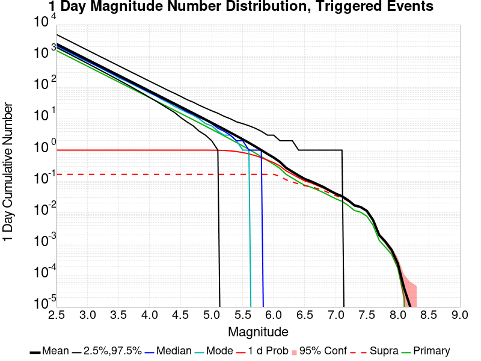
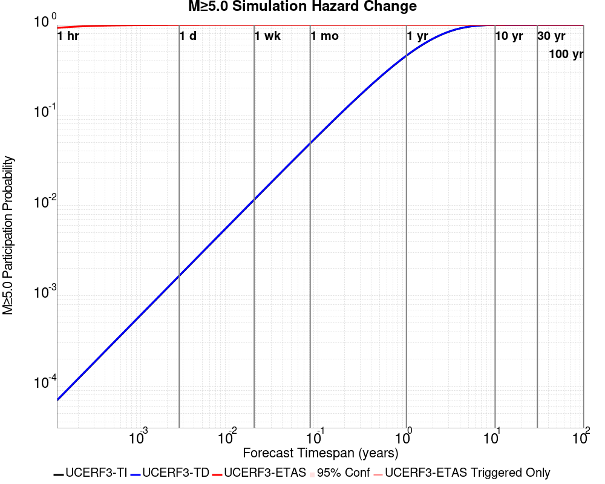
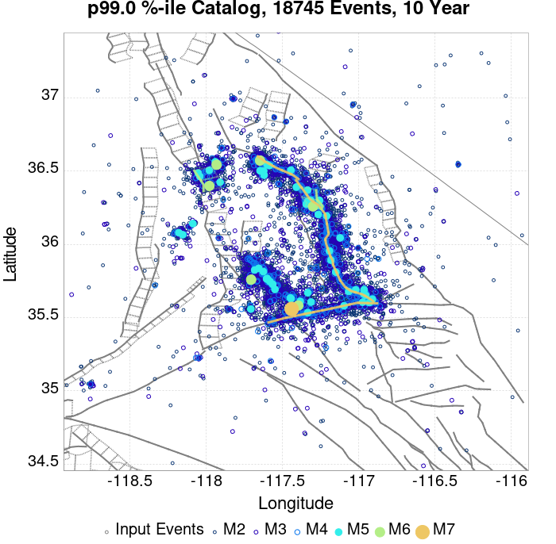
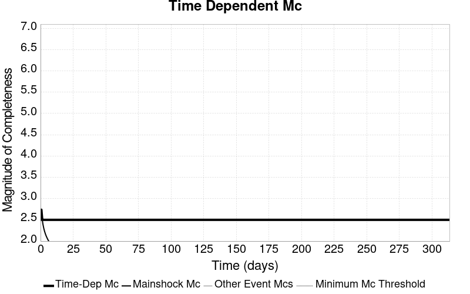
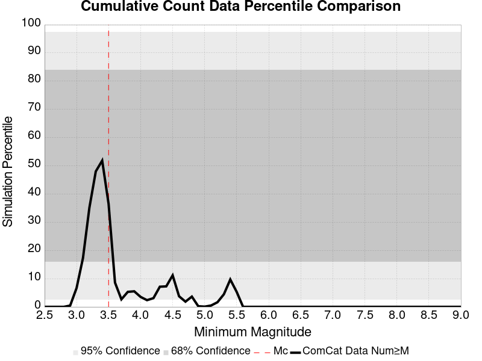
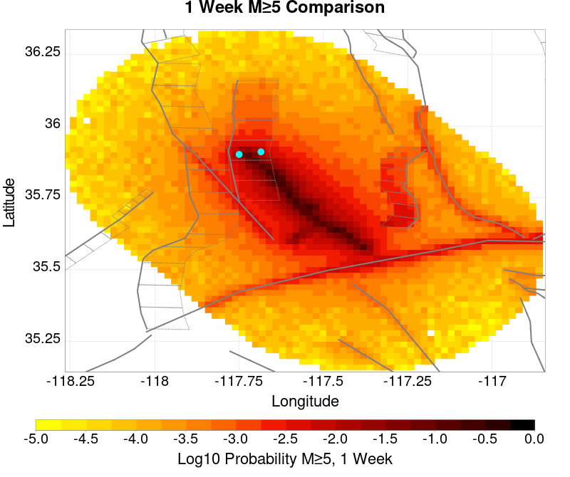
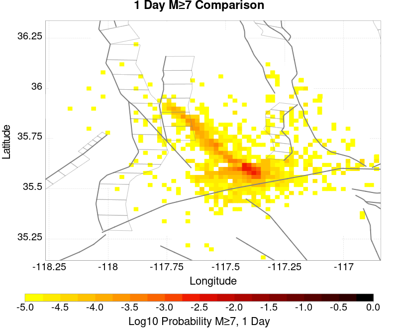
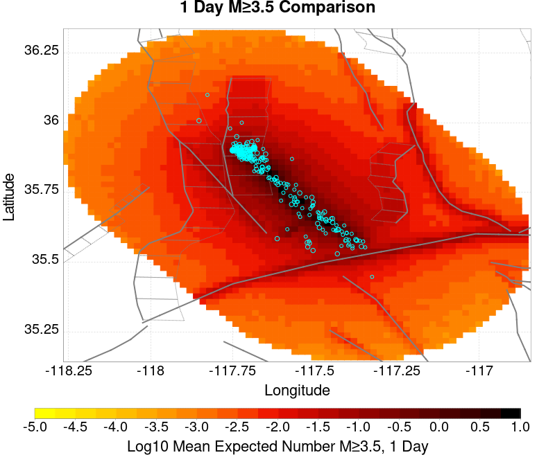
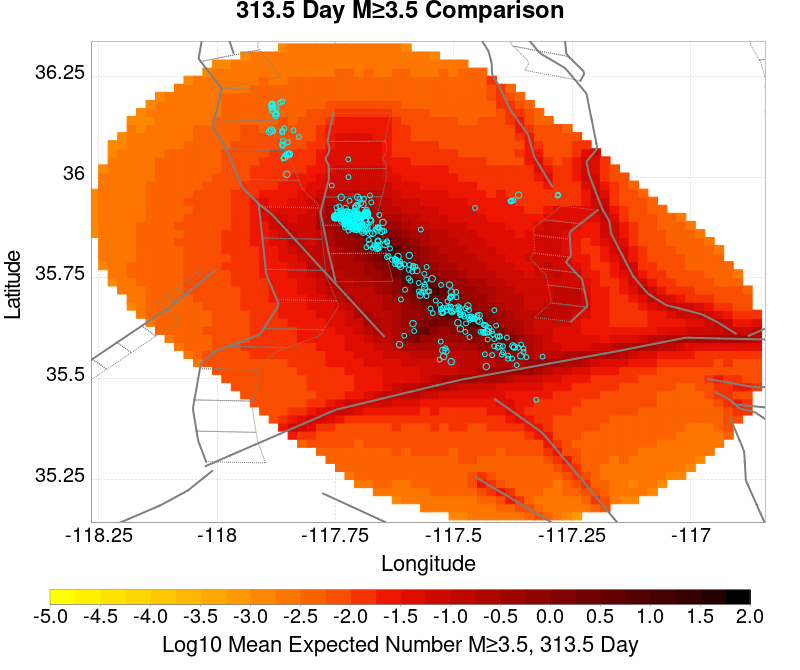
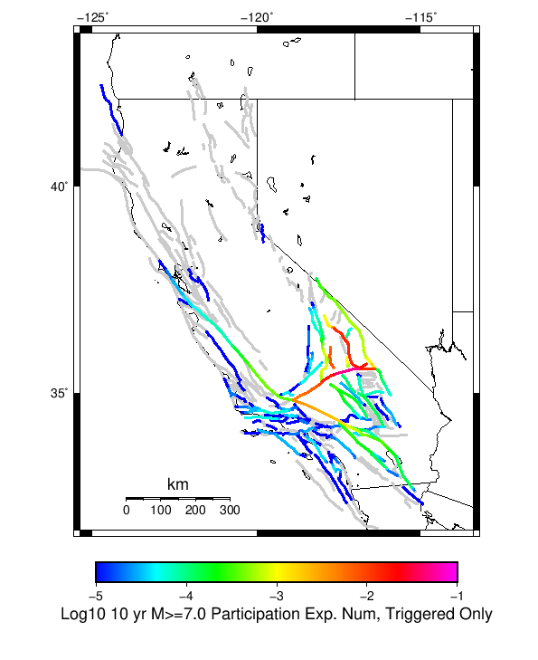

# ComCat M7.1 (ci38457511), ShakeMap Surfaces, Log10(k)=-2.3856, p=1.2164, c=0.0068906 Results

|   | ComCat M7.1 (ci38457511), ShakeMap Surfaces, Log10(k)=-2.3856, p=1.2164, c=0.0068906 |
|-----|-----|
| Num Simulations | 10810 (incomplete) |
| Start Time | 2019/07/06 03:19:54 UTC |
| Start Time Epoch Milliseconds | 1562383194040 |
| Duration | 10 Years |
| Includes Spontaneous? | false |
| Trigger Ruptures | 270 Trigger Ruptures |
|   | First: M3.98 at 2019/07/04 17:02:55 UTC |
|   | Last: M7.1 at 2019/07/06 03:19:53 UTC |
|   | Largest: M7.1 at 2019/07/06 03:19:53 UTC |
| Historical Ruptures | *(none)* |
| Config Generated With | u3etas_comcat_event_config_builder.sh --event-id ci38457511 --num-simulations 100000 --days-before 7 --mag-complete 3.5 --etas-k -2.3856 --etas-p 1.2164 --etas-c 0.0068906 --finite-surf-shakemap --finite-surf-shakemap-min-mag 5 --hpc-site USC_HPC --nodes 36 --hours 24 --queue scec |

## Table Of Contents

* [Probabilities Summary Table](#probabilities-summary-table)
* [Magnitude Number Distribution](#magnitude-number-distribution)
  * [10 Year Magnitude Number Distribution](#10-year-magnitude-number-distribution)
  * [1 Year Magnitude Number Distribution](#1-year-magnitude-number-distribution)
  * [1 Month Magnitude Number Distribution](#1-month-magnitude-number-distribution)
  * [1 Week Magnitude Number Distribution](#1-week-magnitude-number-distribution)
  * [1 Day Magnitude Number Distribution](#1-day-magnitude-number-distribution)
  * [1 Hour Magnitude Number Distribution](#1-hour-magnitude-number-distribution)
* [Hazard Change Over Time](#hazard-change-over-time)
  * [M&ge;5.0 Hazard Change Over Time](#m50-hazard-change-over-time)
  * [M&ge;6.0 Hazard Change Over Time](#m60-hazard-change-over-time)
  * [M&ge;7.0 Hazard Change Over Time](#m70-hazard-change-over-time)
  * [M&ge;8.0 Hazard Change Over Time](#m80-hazard-change-over-time)
* [Trigger Rupture Fault Map](#trigger-rupture-fault-map)
* [Trigger Rupture Depth Map](#trigger-rupture-depth-map)
* [Fault Distances To Triggers](#fault-distances-to-triggers)
* [Individual Simulated Catalog Maps](#individual-simulated-catalog-maps)
* [ComCat Data Comparisons](#comcat-data-comparisons)
  * [ComCat Magnitude-Number Distributions](#comcat-magnitude-number-distributions)
  * [ComCat Time-Dependent Mc](#comcat-time-dependent-mc)
  * [ComCat Cumulative Number Vs Time](#comcat-cumulative-number-vs-time)
  * [ComCat Cumulative Number Simulation Percentiles](#comcat-cumulative-number-simulation-percentiles)
  * [ComCat Probability Spatial Distribution](#comcat-probability-spatial-distribution)
  * [ComCat Mean Expectation Spatial Distribution](#comcat-mean-expectation-spatial-distribution)
  * [ComCat Depth Distribution](#comcat-depth-distribution)
* [Section Participation](#section-participation)
  * [Section Participation Plots](#section-participation-plots)
  * [Supra-Seismogenic Parent Sections Table](#supra-seismogenic-parent-sections-table)
  * [M≥6.5 Parent Sections Table](#m65-parent-sections-table)
  * [M≥7 Parent Sections Table](#m7-parent-sections-table)
  * [M≥7.5 Parent Sections Table](#m75-parent-sections-table)
  * [M≥8 Parent Sections Table](#m8-parent-sections-table)
  * [Fault Magnitude-Probability Distributions](#fault-magnitude-probability-distributions)
* [Gridded Nucleation](#gridded-nucleation)
* [JSON Input File](#json-input-file)

## Probabilities Summary Table
*[(top)](#table-of-contents)*

| Magnitude | 1 Hour Prob | 1 Day Prob | 1 Week Prob | 1 Month Prob | 1 Year Prob | 10 Year Prob |
|-----|-----|-----|-----|-----|-----|-----|
| **M&ge;4** | 1.000 (100.00%) | 1.000 (100.00%) | 1.000 (100.00%) | 1.000 (100.00%) | 1.000 (100.00%) | 1.000 (100.00%) |
| **M&ge;4.5** | 1.000 (99.98%) | 1.000 (100.00%) | 1.000 (100.00%) | 1.000 (100.00%) | 1.000 (100.00%) | 1.000 (100.00%) |
| **M&ge;5** | 0.927 (92.67%) | 0.998 (99.80%) | 1.000 (99.96%) | 1.000 (100.00%) | 1.000 (100.00%) | 1.000 (100.00%) |
| **M&ge;5.5** | 0.543 (54.32%) | 0.836 (83.63%) | 0.900 (89.96%) | 0.927 (92.72%) | 0.949 (94.90%) | 0.959 (95.92%) |
| **M&ge;6** | 0.190 (18.95%) | 0.394 (39.37%) | 0.480 (48.05%) | 0.525 (52.54%) | 0.580 (57.97%) | 0.611 (61.11%) |
| **M&ge;6.5** | 0.045 (4.50%) | 0.102 (10.25%) | 0.135 (13.54%) | 0.156 (15.64%) | 0.179 (17.89%) | 0.193 (19.27%) |
| **M&ge;7** | 0.017 (1.66%) | 0.039 (3.91%) | 0.050 (5.04%) | 0.058 (5.85%) | 0.067 (6.65%) | 0.072 (7.20%) |
| **M&ge;7.1** | 0.014 (1.41%) | 0.034 (3.39%) | 0.043 (4.29%) | 0.050 (5.01%) | 0.057 (5.72%) | 0.061 (6.14%) |
| **M&ge;7.5** | 4.72E-3 (0.47%) | 0.011 (1.10%) | 0.014 (1.42%) | 0.017 (1.68%) | 0.020 (2.02%) | 0.022 (2.21%) |
| **M&ge;8** | 1.85E-4 (0.02%) | 1.85E-4 (0.02%) | 1.85E-4 (0.02%) | 1.85E-4 (0.02%) | 2.78E-4 (0.03%) | 2.78E-4 (0.03%) |

## Magnitude Number Distribution
*[(top)](#table-of-contents)*

### 10 Year Magnitude Number Distribution
*[(top)](#table-of-contents)*

**Legend**
* **Mean** (thick black line): mean expected number across all 10810 catalogs
* **2.5%,97.5%** (thin black lines): expected number percentiles across all 10810 catalogs
* **Median** (thin blue line): median expected number across all 10810 catalogs
* **Mode** (thin cyan line): modal expected number across all 10810 catalogs
* **10 yr Probability** (thin red line): 10 year probability calculated as the fraction of catalogs with at least 1 occurrence
* **10 yr Supraseismogenic Probability** (thin dashed red line): same as above, but only for supraseismogenic ruptures on explicitly modeled UCERF3 faults
* **95% Conf** (light red shaded region): binomial 95% confidence bounds on probability
* **Primary** (thin green line): mean expected number from primary triggered aftershocks only (no secondary, tertiary, etc...) across all 10810 catalogs


| Mag | Mean | 2.5 %ile | 97.5 %ile | Median | Mode | 10 yr Probability | 10 yr Supra-Seis Prob | Primary Aftershocks Mean |
|-----|-----|-----|-----|-----|-----|-----|-----|-----|
| **M&ge;2.5** | 5204.363 | 3459.000 | 14647.000 | 4363.000 | 3897.000 | 1.000 (100.00%) | 0.311 (31.06%) | 2268.951 |
| **M&ge;2.6** | 4134.086 | 2743.000 | 11628.000 | 3465.000 | 3097.000 | 1.000 (100.00%) | 0.311 (31.06%) | 1802.512 |
| **M&ge;2.7** | 3283.524 | 2173.000 | 9241.000 | 2753.000 | 2524.000 | 1.000 (100.00%) | 0.311 (31.06%) | 1431.500 |
| **M&ge;2.8** | 2608.410 | 1723.000 | 7361.000 | 2187.000 | 1974.000 | 1.000 (100.00%) | 0.311 (31.06%) | 1137.420 |
| **M&ge;2.9** | 2072.147 | 1364.000 | 5843.000 | 1739.000 | 1559.000 | 1.000 (100.00%) | 0.311 (31.06%) | 903.420 |
| **M&ge;3** | 1645.905 | 1077.000 | 4646.000 | 1380.000 | 1347.000 | 1.000 (100.00%) | 0.311 (31.06%) | 717.659 |
| **M&ge;3.1** | 1307.226 | 851.000 | 3685.000 | 1098.000 | 1001.000 | 1.000 (100.00%) | 0.311 (31.06%) | 569.952 |
| **M&ge;3.2** | 1038.478 | 673.000 | 2933.000 | 872.000 | 806.000 | 1.000 (100.00%) | 0.311 (31.06%) | 452.833 |
| **M&ge;3.3** | 824.816 | 532.000 | 2317.000 | 694.000 | 622.000 | 1.000 (100.00%) | 0.311 (31.06%) | 359.678 |
| **M&ge;3.4** | 655.234 | 419.000 | 1838.000 | 552.000 | 511.000 | 1.000 (100.00%) | 0.311 (31.06%) | 285.780 |
| **M&ge;3.5** | 520.392 | 329.000 | 1461.000 | 439.000 | 381.000 | 1.000 (100.00%) | 0.311 (31.06%) | 227.017 |
| **M&ge;3.6** | 413.477 | 259.000 | 1156.000 | 349.000 | 309.000 | 1.000 (100.00%) | 0.311 (31.06%) | 180.317 |
| **M&ge;3.7** | 328.368 | 202.000 | 917.000 | 278.000 | 250.000 | 1.000 (100.00%) | 0.311 (31.06%) | 143.176 |
| **M&ge;3.8** | 260.712 | 159.000 | 726.000 | 221.000 | 194.000 | 1.000 (100.00%) | 0.311 (31.06%) | 113.615 |
| **M&ge;3.9** | 206.955 | 124.000 | 577.000 | 175.000 | 154.000 | 1.000 (100.00%) | 0.311 (31.06%) | 90.191 |
| **M&ge;4** | 164.303 | 96.000 | 460.000 | 139.000 | 132.000 | 1.000 (100.00%) | 0.311 (31.06%) | 71.641 |
| **M&ge;4.1** | 130.377 | 74.000 | 364.000 | 111.000 | 101.000 | 1.000 (100.00%) | 0.311 (31.06%) | 56.877 |
| **M&ge;4.2** | 103.468 | 57.000 | 289.000 | 88.000 | 78.000 | 1.000 (100.00%) | 0.311 (31.06%) | 45.141 |
| **M&ge;4.3** | 82.075 | 43.000 | 229.000 | 70.000 | 62.000 | 1.000 (100.00%) | 0.311 (31.06%) | 35.784 |
| **M&ge;4.4** | 65.083 | 33.000 | 181.000 | 56.000 | 49.000 | 1.000 (100.00%) | 0.311 (31.06%) | 28.377 |
| **M&ge;4.5** | 51.596 | 25.000 | 145.000 | 44.000 | 40.000 | 1.000 (100.00%) | 0.311 (31.06%) | 22.497 |
| **M&ge;4.6** | 40.906 | 19.000 | 114.000 | 35.000 | 34.000 | 1.000 (100.00%) | 0.311 (31.06%) | 17.818 |
| **M&ge;4.7** | 32.374 | 14.000 | 90.000 | 28.000 | 24.000 | 1.000 (100.00%) | 0.311 (31.06%) | 14.104 |
| **M&ge;4.8** | 25.603 | 10.000 | 72.000 | 22.000 | 20.000 | 1.000 (100.00%) | 0.311 (31.06%) | 11.129 |
| **M&ge;4.9** | 20.237 | 7.000 | 57.000 | 17.000 | 16.000 | 1.000 (100.00%) | 0.311 (31.06%) | 8.793 |
| **M&ge;5** | 15.958 | 5.000 | 45.000 | 14.000 | 12.000 | 1.000 (100.00%) | 0.311 (31.06%) | 6.938 |
| **M&ge;5.1** | 12.576 | 3.000 | 36.000 | 11.000 | 8.000 | 0.999 (99.94%) | 0.311 (31.06%) | 5.457 |
| **M&ge;5.2** | 9.904 | 2.000 | 29.000 | 8.000 | 7.000 | 0.998 (99.82%) | 0.311 (31.06%) | 4.299 |
| **M&ge;5.3** | 7.759 | 1.000 | 24.000 | 7.000 | 5.000 | 0.994 (99.39%) | 0.311 (31.06%) | 3.367 |
| **M&ge;5.4** | 6.069 | 1.000 | 18.000 | 5.000 | 3.000 | 0.983 (98.29%) | 0.311 (31.06%) | 2.636 |
| **M&ge;5.5** | 4.725 | 0.000 | 15.000 | 4.000 | 3.000 | 0.959 (95.92%) | 0.311 (31.06%) | 2.053 |
| **M&ge;5.6** | 3.656 | 0.000 | 12.000 | 3.000 | 2.000 | 0.917 (91.74%) | 0.311 (31.06%) | 1.589 |
| **M&ge;5.7** | 2.810 | 0.000 | 10.000 | 2.000 | 1.000 | 0.863 (86.35%) | 0.311 (31.06%) | 1.222 |
| **M&ge;5.8** | 2.141 | 0.000 | 8.000 | 2.000 | 1.000 | 0.793 (79.31%) | 0.311 (31.06%) | 0.930 |
| **M&ge;5.9** | 1.606 | 0.000 | 6.000 | 1.000 | 1.000 | 0.706 (70.62%) | 0.310 (31.05%) | 0.702 |
| **M&ge;6** | 1.231 | 0.000 | 5.000 | 1.000 | 0.000 | 0.611 (61.11%) | 0.310 (31.04%) | 0.531 |
| **M&ge;6.1** | 0.885 | 0.000 | 4.000 | 1.000 | 0.000 | 0.505 (50.54%) | 0.264 (26.36%) | 0.393 |
| **M&ge;6.2** | 0.574 | 0.000 | 3.000 | 0.000 | 0.000 | 0.374 (37.35%) | 0.207 (20.68%) | 0.258 |
| **M&ge;6.3** | 0.432 | 0.000 | 3.000 | 0.000 | 0.000 | 0.305 (30.47%) | 0.177 (17.71%) | 0.200 |
| **M&ge;6.4** | 0.331 | 0.000 | 2.000 | 0.000 | 0.000 | 0.243 (24.30%) | 0.154 (15.45%) | 0.151 |
| **M&ge;6.5** | 0.252 | 0.000 | 2.000 | 0.000 | 0.000 | 0.193 (19.27%) | 0.133 (13.27%) | 0.114 |
| **M&ge;6.6** | 0.203 | 0.000 | 2.000 | 0.000 | 0.000 | 0.165 (16.53%) | 0.122 (12.17%) | 0.098 |
| **M&ge;6.7** | 0.165 | 0.000 | 1.000 | 0.000 | 0.000 | 0.137 (13.69%) | 0.107 (10.68%) | 0.081 |
| **M&ge;6.8** | 0.134 | 0.000 | 1.000 | 0.000 | 0.000 | 0.116 (11.60%) | 0.095 (9.46%) | 0.067 |
| **M&ge;6.9** | 0.103 | 0.000 | 1.000 | 0.000 | 0.000 | 0.093 (9.26%) | 0.078 (7.84%) | 0.053 |
| **M&ge;7** | 0.077 | 0.000 | 1.000 | 0.000 | 0.000 | 0.072 (7.20%) | 0.064 (6.41%) | 0.041 |
| **M&ge;7.1** | 0.065 | 0.000 | 1.000 | 0.000 | 0.000 | 0.061 (6.14%) | 0.057 (5.65%) | 0.035 |
| **M&ge;7.2** | 0.049 | 0.000 | 1.000 | 0.000 | 0.000 | 0.047 (4.66%) | 0.044 (4.42%) | 0.025 |
| **M&ge;7.3** | 0.033 | 0.000 | 1.000 | 0.000 | 0.000 | 0.032 (3.23%) | 0.031 (3.11%) | 0.017 |
| **M&ge;7.4** | 0.029 | 0.000 | 1.000 | 0.000 | 0.000 | 0.028 (2.83%) | 0.028 (2.79%) | 0.015 |
| **M&ge;7.5** | 0.023 | 0.000 | 0.000 | 0.000 | 0.000 | 0.022 (2.21%) | 0.022 (2.21%) | 0.011 |
| **M&ge;7.6** | 0.012 | 0.000 | 0.000 | 0.000 | 0.000 | 0.011 (1.15%) | 0.011 (1.15%) | 6.20E-3 |
| **M&ge;7.7** | 4.26E-3 | 0.000 | 0.000 | 0.000 | 0.000 | 3.98E-3 (0.40%) | 3.98E-3 (0.40%) | 2.13E-3 |
| **M&ge;7.8** | 2.41E-3 | 0.000 | 0.000 | 0.000 | 0.000 | 2.31E-3 (0.23%) | 2.31E-3 (0.23%) | 1.48E-3 |
| **M&ge;7.9** | 1.39E-3 | 0.000 | 0.000 | 0.000 | 0.000 | 1.39E-3 (0.14%) | 1.39E-3 (0.14%) | 8.33E-4 |
| **M&ge;8** | 2.78E-4 | 0.000 | 0.000 | 0.000 | 0.000 | 2.78E-4 (0.03%) | 2.78E-4 (0.03%) | 2.78E-4 |
| **M&ge;8.1** | 0.000 | 0.000 | 0.000 | 0.000 | 0.000 | 0.000 (0.00%) | 0.000 (0.00%) | 0.000 |
| **M&ge;8.2** | 0.000 | 0.000 | 0.000 | 0.000 | 0.000 | 0.000 (0.00%) | 0.000 (0.00%) | 0.000 |
| **M&ge;8.3** | 0.000 | 0.000 | 0.000 | 0.000 | 0.000 | 0.000 (0.00%) | 0.000 (0.00%) | 0.000 |
| **M&ge;8.4** | 0.000 | 0.000 | 0.000 | 0.000 | 0.000 | 0.000 (0.00%) | 0.000 (0.00%) | 0.000 |
| **M&ge;8.5** | 0.000 | 0.000 | 0.000 | 0.000 | 0.000 | 0.000 (0.00%) | 0.000 (0.00%) | 0.000 |
| **M&ge;8.6** | 0.000 | 0.000 | 0.000 | 0.000 | 0.000 | 0.000 (0.00%) | 0.000 (0.00%) | 0.000 |
| **M&ge;8.7** | 0.000 | 0.000 | 0.000 | 0.000 | 0.000 | 0.000 (0.00%) | 0.000 (0.00%) | 0.000 |
| **M&ge;8.8** | 0.000 | 0.000 | 0.000 | 0.000 | 0.000 | 0.000 (0.00%) | 0.000 (0.00%) | 0.000 |
| **M&ge;8.9** | 0.000 | 0.000 | 0.000 | 0.000 | 0.000 | 0.000 (0.00%) | 0.000 (0.00%) | 0.000 |
| **M&ge;9** | 0.000 | 0.000 | 0.000 | 0.000 | 0.000 | 0.000 (0.00%) | 0.000 (0.00%) | 0.000 |

### 1 Year Magnitude Number Distribution
*[(top)](#table-of-contents)*

**Legend**
* **Mean** (thick black line): mean expected number across all 10810 catalogs
* **2.5%,97.5%** (thin black lines): expected number percentiles across all 10810 catalogs
* **Median** (thin blue line): median expected number across all 10810 catalogs
* **Mode** (thin cyan line): modal expected number across all 10810 catalogs
* **1 yr Probability** (thin red line): 1 year probability calculated as the fraction of catalogs with at least 1 occurrence
* **1 yr Supraseismogenic Probability** (thin dashed red line): same as above, but only for supraseismogenic ruptures on explicitly modeled UCERF3 faults
* **95% Conf** (light red shaded region): binomial 95% confidence bounds on probability
* **Primary** (thin green line): mean expected number from primary triggered aftershocks only (no secondary, tertiary, etc...) across all 10810 catalogs


| Mag | Mean | 2.5 %ile | 97.5 %ile | Median | Mode | 1 yr Probability | 1 yr Supra-Seis Prob | Primary Aftershocks Mean |
|-----|-----|-----|-----|-----|-----|-----|-----|-----|
| **M&ge;2.5** | 4720.175 | 3204.000 | 12779.000 | 3994.000 | 3467.000 | 1.000 (100.00%) | 0.288 (28.76%) | 2162.375 |
| **M&ge;2.6** | 3749.388 | 2543.000 | 10192.000 | 3174.000 | 2831.000 | 1.000 (100.00%) | 0.288 (28.76%) | 1717.871 |
| **M&ge;2.7** | 2977.906 | 2016.000 | 8112.000 | 2522.000 | 2282.000 | 1.000 (100.00%) | 0.288 (28.76%) | 1364.271 |
| **M&ge;2.8** | 2365.624 | 1597.000 | 6412.000 | 2003.000 | 1884.000 | 1.000 (100.00%) | 0.288 (28.76%) | 1083.986 |
| **M&ge;2.9** | 1879.249 | 1264.000 | 5112.000 | 1592.000 | 1427.000 | 1.000 (100.00%) | 0.288 (28.76%) | 860.974 |
| **M&ge;3** | 1492.663 | 999.000 | 4056.000 | 1264.000 | 1132.000 | 1.000 (100.00%) | 0.288 (28.76%) | 683.954 |
| **M&ge;3.1** | 1185.541 | 789.000 | 3225.000 | 1005.000 | 944.000 | 1.000 (100.00%) | 0.288 (28.76%) | 543.190 |
| **M&ge;3.2** | 941.868 | 622.000 | 2558.000 | 799.000 | 743.000 | 1.000 (100.00%) | 0.288 (28.76%) | 431.581 |
| **M&ge;3.3** | 748.139 | 492.000 | 2037.000 | 635.000 | 582.000 | 1.000 (100.00%) | 0.288 (28.76%) | 342.801 |
| **M&ge;3.4** | 594.352 | 387.000 | 1613.000 | 505.000 | 479.000 | 1.000 (100.00%) | 0.288 (28.76%) | 272.367 |
| **M&ge;3.5** | 472.071 | 304.000 | 1284.000 | 402.000 | 374.000 | 1.000 (100.00%) | 0.288 (28.76%) | 216.359 |
| **M&ge;3.6** | 375.108 | 238.000 | 1025.000 | 320.000 | 292.000 | 1.000 (100.00%) | 0.288 (28.76%) | 171.881 |
| **M&ge;3.7** | 297.890 | 186.000 | 813.000 | 255.000 | 258.000 | 1.000 (100.00%) | 0.288 (28.76%) | 136.480 |
| **M&ge;3.8** | 236.508 | 146.000 | 647.000 | 202.000 | 195.000 | 1.000 (100.00%) | 0.288 (28.76%) | 108.304 |
| **M&ge;3.9** | 187.748 | 114.000 | 508.000 | 161.000 | 146.000 | 1.000 (100.00%) | 0.288 (28.76%) | 85.971 |
| **M&ge;4** | 149.000 | 88.000 | 406.000 | 127.000 | 116.000 | 1.000 (100.00%) | 0.288 (28.76%) | 68.269 |
| **M&ge;4.1** | 118.238 | 67.000 | 322.000 | 101.000 | 93.000 | 1.000 (100.00%) | 0.288 (28.76%) | 54.192 |
| **M&ge;4.2** | 93.829 | 52.000 | 255.000 | 81.000 | 69.000 | 1.000 (100.00%) | 0.288 (28.76%) | 43.011 |
| **M&ge;4.3** | 74.432 | 39.000 | 202.000 | 64.000 | 59.000 | 1.000 (100.00%) | 0.288 (28.76%) | 34.104 |
| **M&ge;4.4** | 59.027 | 30.000 | 160.000 | 51.000 | 46.000 | 1.000 (100.00%) | 0.288 (28.76%) | 27.051 |
| **M&ge;4.5** | 46.796 | 23.000 | 127.000 | 40.000 | 38.000 | 1.000 (100.00%) | 0.288 (28.76%) | 21.456 |
| **M&ge;4.6** | 37.115 | 17.000 | 102.000 | 32.000 | 30.000 | 1.000 (100.00%) | 0.288 (28.76%) | 17.004 |
| **M&ge;4.7** | 29.378 | 13.000 | 81.000 | 25.000 | 22.000 | 1.000 (100.00%) | 0.288 (28.76%) | 13.458 |
| **M&ge;4.8** | 23.223 | 9.000 | 64.000 | 20.000 | 18.000 | 1.000 (100.00%) | 0.288 (28.76%) | 10.618 |
| **M&ge;4.9** | 18.359 | 7.000 | 51.000 | 16.000 | 14.000 | 1.000 (100.00%) | 0.288 (28.76%) | 8.391 |
| **M&ge;5** | 14.475 | 5.000 | 40.000 | 12.000 | 11.000 | 1.000 (100.00%) | 0.288 (28.76%) | 6.621 |
| **M&ge;5.1** | 11.405 | 3.000 | 33.000 | 10.000 | 9.000 | 0.999 (99.92%) | 0.288 (28.76%) | 5.208 |
| **M&ge;5.2** | 8.984 | 2.000 | 26.000 | 8.000 | 7.000 | 0.997 (99.73%) | 0.288 (28.76%) | 4.104 |
| **M&ge;5.3** | 7.044 | 1.000 | 21.000 | 6.000 | 4.000 | 0.992 (99.16%) | 0.288 (28.76%) | 3.215 |
| **M&ge;5.4** | 5.515 | 1.000 | 16.000 | 5.000 | 3.000 | 0.978 (97.76%) | 0.288 (28.76%) | 2.518 |
| **M&ge;5.5** | 4.295 | 0.000 | 13.000 | 4.000 | 2.000 | 0.949 (94.90%) | 0.288 (28.76%) | 1.959 |
| **M&ge;5.6** | 3.322 | 0.000 | 11.000 | 3.000 | 2.000 | 0.902 (90.22%) | 0.288 (28.76%) | 1.518 |
| **M&ge;5.7** | 2.556 | 0.000 | 9.000 | 2.000 | 1.000 | 0.841 (84.12%) | 0.288 (28.76%) | 1.169 |
| **M&ge;5.8** | 1.947 | 0.000 | 7.000 | 1.000 | 1.000 | 0.767 (76.67%) | 0.288 (28.76%) | 0.889 |
| **M&ge;5.9** | 1.461 | 0.000 | 6.000 | 1.000 | 0.000 | 0.677 (67.71%) | 0.287 (28.74%) | 0.670 |
| **M&ge;6** | 1.117 | 0.000 | 5.000 | 1.000 | 0.000 | 0.580 (57.97%) | 0.287 (28.73%) | 0.506 |
| **M&ge;6.1** | 0.803 | 0.000 | 4.000 | 0.000 | 0.000 | 0.475 (47.54%) | 0.244 (24.38%) | 0.375 |
| **M&ge;6.2** | 0.522 | 0.000 | 3.000 | 0.000 | 0.000 | 0.349 (34.91%) | 0.191 (19.13%) | 0.244 |
| **M&ge;6.3** | 0.393 | 0.000 | 2.000 | 0.000 | 0.000 | 0.284 (28.36%) | 0.163 (16.34%) | 0.190 |
| **M&ge;6.4** | 0.301 | 0.000 | 2.000 | 0.000 | 0.000 | 0.225 (22.50%) | 0.143 (14.26%) | 0.144 |
| **M&ge;6.5** | 0.229 | 0.000 | 2.000 | 0.000 | 0.000 | 0.179 (17.89%) | 0.123 (12.32%) | 0.110 |
| **M&ge;6.6** | 0.185 | 0.000 | 2.000 | 0.000 | 0.000 | 0.153 (15.32%) | 0.113 (11.34%) | 0.094 |
| **M&ge;6.7** | 0.151 | 0.000 | 1.000 | 0.000 | 0.000 | 0.127 (12.66%) | 0.099 (9.94%) | 0.078 |
| **M&ge;6.8** | 0.123 | 0.000 | 1.000 | 0.000 | 0.000 | 0.107 (10.75%) | 0.088 (8.83%) | 0.065 |
| **M&ge;6.9** | 0.095 | 0.000 | 1.000 | 0.000 | 0.000 | 0.086 (8.60%) | 0.073 (7.31%) | 0.052 |
| **M&ge;7** | 0.071 | 0.000 | 1.000 | 0.000 | 0.000 | 0.067 (6.65%) | 0.059 (5.93%) | 0.040 |
| **M&ge;7.1** | 0.061 | 0.000 | 1.000 | 0.000 | 0.000 | 0.057 (5.72%) | 0.052 (5.25%) | 0.034 |
| **M&ge;7.2** | 0.045 | 0.000 | 1.000 | 0.000 | 0.000 | 0.043 (4.30%) | 0.041 (4.07%) | 0.025 |
| **M&ge;7.3** | 0.031 | 0.000 | 1.000 | 0.000 | 0.000 | 0.030 (3.00%) | 0.029 (2.89%) | 0.017 |
| **M&ge;7.4** | 0.027 | 0.000 | 1.000 | 0.000 | 0.000 | 0.026 (2.62%) | 0.026 (2.58%) | 0.014 |
| **M&ge;7.5** | 0.021 | 0.000 | 0.000 | 0.000 | 0.000 | 0.020 (2.02%) | 0.020 (2.02%) | 0.011 |
| **M&ge;7.6** | 0.011 | 0.000 | 0.000 | 0.000 | 0.000 | 0.011 (1.05%) | 0.011 (1.05%) | 6.01E-3 |
| **M&ge;7.7** | 3.79E-3 | 0.000 | 0.000 | 0.000 | 0.000 | 3.61E-3 (0.36%) | 3.61E-3 (0.36%) | 2.13E-3 |
| **M&ge;7.8** | 2.13E-3 | 0.000 | 0.000 | 0.000 | 0.000 | 2.04E-3 (0.20%) | 2.04E-3 (0.20%) | 1.48E-3 |
| **M&ge;7.9** | 1.20E-3 | 0.000 | 0.000 | 0.000 | 0.000 | 1.20E-3 (0.12%) | 1.20E-3 (0.12%) | 8.33E-4 |
| **M&ge;8** | 2.78E-4 | 0.000 | 0.000 | 0.000 | 0.000 | 2.78E-4 (0.03%) | 2.78E-4 (0.03%) | 2.78E-4 |
| **M&ge;8.1** | 0.000 | 0.000 | 0.000 | 0.000 | 0.000 | 0.000 (0.00%) | 0.000 (0.00%) | 0.000 |
| **M&ge;8.2** | 0.000 | 0.000 | 0.000 | 0.000 | 0.000 | 0.000 (0.00%) | 0.000 (0.00%) | 0.000 |
| **M&ge;8.3** | 0.000 | 0.000 | 0.000 | 0.000 | 0.000 | 0.000 (0.00%) | 0.000 (0.00%) | 0.000 |
| **M&ge;8.4** | 0.000 | 0.000 | 0.000 | 0.000 | 0.000 | 0.000 (0.00%) | 0.000 (0.00%) | 0.000 |
| **M&ge;8.5** | 0.000 | 0.000 | 0.000 | 0.000 | 0.000 | 0.000 (0.00%) | 0.000 (0.00%) | 0.000 |
| **M&ge;8.6** | 0.000 | 0.000 | 0.000 | 0.000 | 0.000 | 0.000 (0.00%) | 0.000 (0.00%) | 0.000 |
| **M&ge;8.7** | 0.000 | 0.000 | 0.000 | 0.000 | 0.000 | 0.000 (0.00%) | 0.000 (0.00%) | 0.000 |
| **M&ge;8.8** | 0.000 | 0.000 | 0.000 | 0.000 | 0.000 | 0.000 (0.00%) | 0.000 (0.00%) | 0.000 |
| **M&ge;8.9** | 0.000 | 0.000 | 0.000 | 0.000 | 0.000 | 0.000 (0.00%) | 0.000 (0.00%) | 0.000 |
| **M&ge;9** | 0.000 | 0.000 | 0.000 | 0.000 | 0.000 | 0.000 (0.00%) | 0.000 (0.00%) | 0.000 |

### 1 Month Magnitude Number Distribution
*[(top)](#table-of-contents)*

**Legend**
* **Mean** (thick black line): mean expected number across all 10810 catalogs
* **2.5%,97.5%** (thin black lines): expected number percentiles across all 10810 catalogs
* **Median** (thin blue line): median expected number across all 10810 catalogs
* **Mode** (thin cyan line): modal expected number across all 10810 catalogs
* **1 mo Probability** (thin red line): 1 month probability calculated as the fraction of catalogs with at least 1 occurrence
* **1 mo Supraseismogenic Probability** (thin dashed red line): same as above, but only for supraseismogenic ruptures on explicitly modeled UCERF3 faults
* **95% Conf** (light red shaded region): binomial 95% confidence bounds on probability
* **Primary** (thin green line): mean expected number from primary triggered aftershocks only (no secondary, tertiary, etc...) across all 10810 catalogs


| Mag | Mean | 2.5 %ile | 97.5 %ile | Median | Mode | 1 mo Probability | 1 mo Supra-Seis Prob | Primary Aftershocks Mean |
|-----|-----|-----|-----|-----|-----|-----|-----|-----|
| **M&ge;2.5** | 3935.765 | 2777.000 | 9871.000 | 3382.000 | 3182.000 | 1.000 (100.00%) | 0.249 (24.88%) | 1968.757 |
| **M&ge;2.6** | 3126.557 | 2202.000 | 7837.000 | 2687.000 | 2618.000 | 1.000 (100.00%) | 0.249 (24.88%) | 1564.080 |
| **M&ge;2.7** | 2483.254 | 1746.000 | 6211.000 | 2135.000 | 2089.000 | 1.000 (100.00%) | 0.249 (24.88%) | 1242.190 |
| **M&ge;2.8** | 1972.704 | 1383.000 | 4940.000 | 1696.000 | 1531.000 | 1.000 (100.00%) | 0.249 (24.88%) | 987.013 |
| **M&ge;2.9** | 1567.088 | 1096.000 | 3930.000 | 1349.000 | 1279.000 | 1.000 (100.00%) | 0.249 (24.88%) | 783.951 |
| **M&ge;3** | 1244.722 | 867.000 | 3118.000 | 1073.000 | 1053.000 | 1.000 (100.00%) | 0.249 (24.88%) | 622.726 |
| **M&ge;3.1** | 988.577 | 683.000 | 2477.000 | 852.000 | 790.000 | 1.000 (100.00%) | 0.249 (24.88%) | 494.542 |
| **M&ge;3.2** | 785.421 | 540.000 | 1967.000 | 678.000 | 616.000 | 1.000 (100.00%) | 0.249 (24.88%) | 392.946 |
| **M&ge;3.3** | 623.895 | 424.000 | 1576.000 | 539.000 | 486.000 | 1.000 (100.00%) | 0.249 (24.88%) | 312.073 |
| **M&ge;3.4** | 495.634 | 334.000 | 1246.000 | 428.000 | 411.000 | 1.000 (100.00%) | 0.249 (24.88%) | 247.938 |
| **M&ge;3.5** | 393.619 | 262.000 | 986.000 | 341.000 | 327.000 | 1.000 (100.00%) | 0.249 (24.88%) | 196.928 |
| **M&ge;3.6** | 312.706 | 206.000 | 790.000 | 271.000 | 251.000 | 1.000 (100.00%) | 0.249 (24.88%) | 156.420 |
| **M&ge;3.7** | 248.330 | 160.000 | 624.000 | 216.000 | 200.000 | 1.000 (100.00%) | 0.249 (24.88%) | 124.218 |
| **M&ge;3.8** | 197.159 | 125.000 | 498.000 | 171.000 | 157.000 | 1.000 (100.00%) | 0.249 (24.88%) | 98.610 |
| **M&ge;3.9** | 156.498 | 97.000 | 393.000 | 136.000 | 124.000 | 1.000 (100.00%) | 0.249 (24.88%) | 78.265 |
| **M&ge;4** | 124.195 | 75.000 | 313.000 | 108.000 | 97.000 | 1.000 (100.00%) | 0.249 (24.88%) | 62.156 |
| **M&ge;4.1** | 98.587 | 58.000 | 249.000 | 86.000 | 79.000 | 1.000 (100.00%) | 0.249 (24.88%) | 49.338 |
| **M&ge;4.2** | 78.217 | 44.000 | 200.000 | 68.000 | 62.000 | 1.000 (100.00%) | 0.249 (24.88%) | 39.163 |
| **M&ge;4.3** | 62.045 | 33.000 | 157.000 | 54.000 | 47.000 | 1.000 (100.00%) | 0.249 (24.88%) | 31.049 |
| **M&ge;4.4** | 49.215 | 25.000 | 126.000 | 43.000 | 40.000 | 1.000 (100.00%) | 0.249 (24.88%) | 24.641 |
| **M&ge;4.5** | 39.027 | 19.000 | 100.000 | 34.000 | 33.000 | 1.000 (100.00%) | 0.249 (24.88%) | 19.548 |
| **M&ge;4.6** | 30.961 | 14.000 | 80.000 | 27.000 | 25.000 | 1.000 (100.00%) | 0.249 (24.88%) | 15.495 |
| **M&ge;4.7** | 24.493 | 10.000 | 64.000 | 22.000 | 18.000 | 1.000 (100.00%) | 0.249 (24.88%) | 12.263 |
| **M&ge;4.8** | 19.360 | 7.000 | 51.000 | 17.000 | 15.000 | 1.000 (100.00%) | 0.249 (24.88%) | 9.677 |
| **M&ge;4.9** | 15.306 | 5.000 | 41.000 | 13.000 | 12.000 | 1.000 (100.00%) | 0.249 (24.88%) | 7.646 |
| **M&ge;5** | 12.071 | 4.000 | 33.000 | 11.000 | 8.000 | 1.000 (100.00%) | 0.249 (24.88%) | 6.030 |
| **M&ge;5.1** | 9.506 | 2.000 | 26.000 | 8.000 | 7.000 | 0.999 (99.86%) | 0.249 (24.88%) | 4.742 |
| **M&ge;5.2** | 7.484 | 1.000 | 21.000 | 6.000 | 5.000 | 0.996 (99.56%) | 0.249 (24.88%) | 3.736 |
| **M&ge;5.3** | 5.868 | 1.000 | 17.000 | 5.000 | 4.000 | 0.985 (98.47%) | 0.249 (24.88%) | 2.927 |
| **M&ge;5.4** | 4.594 | 0.000 | 14.000 | 4.000 | 3.000 | 0.964 (96.40%) | 0.249 (24.88%) | 2.294 |
| **M&ge;5.5** | 3.576 | 0.000 | 11.000 | 3.000 | 2.000 | 0.927 (92.72%) | 0.249 (24.88%) | 1.787 |
| **M&ge;5.6** | 2.765 | 0.000 | 9.000 | 2.000 | 1.000 | 0.871 (87.06%) | 0.249 (24.88%) | 1.383 |
| **M&ge;5.7** | 2.128 | 0.000 | 7.000 | 2.000 | 1.000 | 0.802 (80.17%) | 0.249 (24.88%) | 1.065 |
| **M&ge;5.8** | 1.621 | 0.000 | 6.000 | 1.000 | 1.000 | 0.720 (71.95%) | 0.249 (24.88%) | 0.812 |
| **M&ge;5.9** | 1.216 | 0.000 | 5.000 | 1.000 | 0.000 | 0.624 (62.44%) | 0.249 (24.87%) | 0.611 |
| **M&ge;6** | 0.929 | 0.000 | 4.000 | 1.000 | 0.000 | 0.525 (52.54%) | 0.249 (24.86%) | 0.463 |
| **M&ge;6.1** | 0.670 | 0.000 | 3.000 | 0.000 | 0.000 | 0.425 (42.48%) | 0.212 (21.24%) | 0.343 |
| **M&ge;6.2** | 0.436 | 0.000 | 3.000 | 0.000 | 0.000 | 0.307 (30.67%) | 0.166 (16.60%) | 0.223 |
| **M&ge;6.3** | 0.331 | 0.000 | 2.000 | 0.000 | 0.000 | 0.249 (24.87%) | 0.142 (14.22%) | 0.174 |
| **M&ge;6.4** | 0.254 | 0.000 | 2.000 | 0.000 | 0.000 | 0.197 (19.72%) | 0.124 (12.40%) | 0.133 |
| **M&ge;6.5** | 0.194 | 0.000 | 2.000 | 0.000 | 0.000 | 0.156 (15.64%) | 0.107 (10.70%) | 0.101 |
| **M&ge;6.6** | 0.157 | 0.000 | 1.000 | 0.000 | 0.000 | 0.134 (13.40%) | 0.099 (9.92%) | 0.087 |
| **M&ge;6.7** | 0.128 | 0.000 | 1.000 | 0.000 | 0.000 | 0.110 (11.05%) | 0.087 (8.70%) | 0.072 |
| **M&ge;6.8** | 0.106 | 0.000 | 1.000 | 0.000 | 0.000 | 0.094 (9.44%) | 0.078 (7.77%) | 0.060 |
| **M&ge;6.9** | 0.082 | 0.000 | 1.000 | 0.000 | 0.000 | 0.076 (7.57%) | 0.064 (6.41%) | 0.048 |
| **M&ge;7** | 0.062 | 0.000 | 1.000 | 0.000 | 0.000 | 0.058 (5.85%) | 0.052 (5.20%) | 0.037 |
| **M&ge;7.1** | 0.053 | 0.000 | 1.000 | 0.000 | 0.000 | 0.050 (5.01%) | 0.046 (4.62%) | 0.031 |
| **M&ge;7.2** | 0.039 | 0.000 | 1.000 | 0.000 | 0.000 | 0.037 (3.74%) | 0.035 (3.53%) | 0.022 |
| **M&ge;7.3** | 0.026 | 0.000 | 1.000 | 0.000 | 0.000 | 0.026 (2.55%) | 0.025 (2.46%) | 0.015 |
| **M&ge;7.4** | 0.023 | 0.000 | 0.000 | 0.000 | 0.000 | 0.022 (2.22%) | 0.022 (2.18%) | 0.013 |
| **M&ge;7.5** | 0.017 | 0.000 | 0.000 | 0.000 | 0.000 | 0.017 (1.68%) | 0.017 (1.68%) | 9.53E-3 |
| **M&ge;7.6** | 9.25E-3 | 0.000 | 0.000 | 0.000 | 0.000 | 9.07E-3 (0.91%) | 9.07E-3 (0.91%) | 5.27E-3 |
| **M&ge;7.7** | 3.33E-3 | 0.000 | 0.000 | 0.000 | 0.000 | 3.15E-3 (0.31%) | 3.15E-3 (0.31%) | 2.04E-3 |
| **M&ge;7.8** | 1.94E-3 | 0.000 | 0.000 | 0.000 | 0.000 | 1.85E-3 (0.19%) | 1.85E-3 (0.19%) | 1.39E-3 |
| **M&ge;7.9** | 1.02E-3 | 0.000 | 0.000 | 0.000 | 0.000 | 1.02E-3 (0.10%) | 1.02E-3 (0.10%) | 7.40E-4 |
| **M&ge;8** | 1.85E-4 | 0.000 | 0.000 | 0.000 | 0.000 | 1.85E-4 (0.02%) | 1.85E-4 (0.02%) | 1.85E-4 |
| **M&ge;8.1** | 0.000 | 0.000 | 0.000 | 0.000 | 0.000 | 0.000 (0.00%) | 0.000 (0.00%) | 0.000 |
| **M&ge;8.2** | 0.000 | 0.000 | 0.000 | 0.000 | 0.000 | 0.000 (0.00%) | 0.000 (0.00%) | 0.000 |
| **M&ge;8.3** | 0.000 | 0.000 | 0.000 | 0.000 | 0.000 | 0.000 (0.00%) | 0.000 (0.00%) | 0.000 |
| **M&ge;8.4** | 0.000 | 0.000 | 0.000 | 0.000 | 0.000 | 0.000 (0.00%) | 0.000 (0.00%) | 0.000 |
| **M&ge;8.5** | 0.000 | 0.000 | 0.000 | 0.000 | 0.000 | 0.000 (0.00%) | 0.000 (0.00%) | 0.000 |
| **M&ge;8.6** | 0.000 | 0.000 | 0.000 | 0.000 | 0.000 | 0.000 (0.00%) | 0.000 (0.00%) | 0.000 |
| **M&ge;8.7** | 0.000 | 0.000 | 0.000 | 0.000 | 0.000 | 0.000 (0.00%) | 0.000 (0.00%) | 0.000 |
| **M&ge;8.8** | 0.000 | 0.000 | 0.000 | 0.000 | 0.000 | 0.000 (0.00%) | 0.000 (0.00%) | 0.000 |
| **M&ge;8.9** | 0.000 | 0.000 | 0.000 | 0.000 | 0.000 | 0.000 (0.00%) | 0.000 (0.00%) | 0.000 |
| **M&ge;9** | 0.000 | 0.000 | 0.000 | 0.000 | 0.000 | 0.000 (0.00%) | 0.000 (0.00%) | 0.000 |

### 1 Week Magnitude Number Distribution
*[(top)](#table-of-contents)*

**Legend**
* **Mean** (thick black line): mean expected number across all 10810 catalogs
* **2.5%,97.5%** (thin black lines): expected number percentiles across all 10810 catalogs
* **Median** (thin blue line): median expected number across all 10810 catalogs
* **Mode** (thin cyan line): modal expected number across all 10810 catalogs
* **1 wk Probability** (thin red line): 1 week probability calculated as the fraction of catalogs with at least 1 occurrence
* **1 wk Supraseismogenic Probability** (thin dashed red line): same as above, but only for supraseismogenic ruptures on explicitly modeled UCERF3 faults
* **95% Conf** (light red shaded region): binomial 95% confidence bounds on probability
* **Primary** (thin green line): mean expected number from primary triggered aftershocks only (no secondary, tertiary, etc...) across all 10810 catalogs


| Mag | Mean | 2.5 %ile | 97.5 %ile | Median | Mode | 1 wk Probability | 1 wk Supra-Seis Prob | Primary Aftershocks Mean |
|-----|-----|-----|-----|-----|-----|-----|-----|-----|
| **M&ge;2.5** | 3337.468 | 2439.000 | 7631.000 | 2918.000 | 2716.000 | 1.000 (100.00%) | 0.218 (21.79%) | 1800.706 |
| **M&ge;2.6** | 2651.403 | 1932.000 | 6092.000 | 2319.000 | 2134.000 | 1.000 (100.00%) | 0.218 (21.79%) | 1430.501 |
| **M&ge;2.7** | 2105.922 | 1534.000 | 4837.000 | 1842.000 | 1713.000 | 1.000 (100.00%) | 0.218 (21.79%) | 1136.064 |
| **M&ge;2.8** | 1673.002 | 1213.000 | 3832.000 | 1464.000 | 1315.000 | 1.000 (100.00%) | 0.218 (21.79%) | 902.731 |
| **M&ge;2.9** | 1328.889 | 960.000 | 3049.000 | 1163.000 | 1115.000 | 1.000 (100.00%) | 0.218 (21.79%) | 717.052 |
| **M&ge;3** | 1055.504 | 758.000 | 2424.000 | 925.000 | 867.000 | 1.000 (100.00%) | 0.218 (21.79%) | 569.566 |
| **M&ge;3.1** | 838.327 | 598.000 | 1930.000 | 735.000 | 690.000 | 1.000 (100.00%) | 0.218 (21.79%) | 452.311 |
| **M&ge;3.2** | 666.065 | 472.000 | 1533.000 | 584.000 | 541.000 | 1.000 (100.00%) | 0.218 (21.79%) | 359.396 |
| **M&ge;3.3** | 529.113 | 371.000 | 1225.000 | 465.000 | 449.000 | 1.000 (100.00%) | 0.218 (21.79%) | 285.442 |
| **M&ge;3.4** | 420.358 | 291.000 | 975.000 | 370.000 | 344.000 | 1.000 (100.00%) | 0.218 (21.79%) | 226.759 |
| **M&ge;3.5** | 333.826 | 228.000 | 773.000 | 294.000 | 262.000 | 1.000 (100.00%) | 0.218 (21.79%) | 180.120 |
| **M&ge;3.6** | 265.172 | 179.000 | 613.000 | 234.000 | 222.000 | 1.000 (100.00%) | 0.218 (21.79%) | 143.063 |
| **M&ge;3.7** | 210.557 | 139.000 | 491.000 | 186.000 | 174.000 | 1.000 (100.00%) | 0.218 (21.79%) | 113.615 |
| **M&ge;3.8** | 167.178 | 109.000 | 387.000 | 148.000 | 138.000 | 1.000 (100.00%) | 0.218 (21.79%) | 90.171 |
| **M&ge;3.9** | 132.695 | 84.000 | 306.000 | 118.000 | 106.000 | 1.000 (100.00%) | 0.218 (21.79%) | 71.548 |
| **M&ge;4** | 105.335 | 65.000 | 244.000 | 93.000 | 87.000 | 1.000 (100.00%) | 0.218 (21.79%) | 56.827 |
| **M&ge;4.1** | 83.583 | 50.000 | 196.000 | 74.000 | 71.000 | 1.000 (100.00%) | 0.218 (21.79%) | 45.106 |
| **M&ge;4.2** | 66.298 | 38.000 | 156.000 | 59.000 | 56.000 | 1.000 (100.00%) | 0.218 (21.79%) | 35.787 |
| **M&ge;4.3** | 52.595 | 28.000 | 125.000 | 47.000 | 47.000 | 1.000 (100.00%) | 0.218 (21.79%) | 28.379 |
| **M&ge;4.4** | 41.719 | 21.000 | 98.000 | 37.000 | 33.000 | 1.000 (100.00%) | 0.218 (21.79%) | 22.519 |
| **M&ge;4.5** | 33.079 | 16.000 | 79.000 | 30.000 | 27.000 | 1.000 (100.00%) | 0.218 (21.79%) | 17.865 |
| **M&ge;4.6** | 26.253 | 12.000 | 63.000 | 23.000 | 21.000 | 1.000 (100.00%) | 0.218 (21.79%) | 14.166 |
| **M&ge;4.7** | 20.763 | 9.000 | 50.000 | 19.000 | 16.000 | 1.000 (100.00%) | 0.218 (21.79%) | 11.207 |
| **M&ge;4.8** | 16.414 | 6.000 | 41.000 | 15.000 | 12.000 | 1.000 (100.00%) | 0.218 (21.79%) | 8.843 |
| **M&ge;4.9** | 12.978 | 4.000 | 33.000 | 12.000 | 10.000 | 1.000 (100.00%) | 0.218 (21.79%) | 6.987 |
| **M&ge;5** | 10.234 | 3.000 | 26.000 | 9.000 | 8.000 | 1.000 (99.96%) | 0.218 (21.79%) | 5.510 |
| **M&ge;5.1** | 8.063 | 2.000 | 21.000 | 7.000 | 6.000 | 0.998 (99.75%) | 0.218 (21.79%) | 4.333 |
| **M&ge;5.2** | 6.349 | 1.000 | 17.000 | 5.000 | 5.000 | 0.991 (99.10%) | 0.218 (21.79%) | 3.417 |
| **M&ge;5.3** | 4.975 | 0.000 | 14.000 | 4.000 | 3.000 | 0.975 (97.47%) | 0.218 (21.79%) | 2.678 |
| **M&ge;5.4** | 3.894 | 0.000 | 11.000 | 3.000 | 3.000 | 0.947 (94.71%) | 0.218 (21.79%) | 2.099 |
| **M&ge;5.5** | 3.034 | 0.000 | 9.000 | 3.000 | 2.000 | 0.900 (89.96%) | 0.218 (21.79%) | 1.637 |
| **M&ge;5.6** | 2.346 | 0.000 | 8.000 | 2.000 | 1.000 | 0.833 (83.35%) | 0.218 (21.79%) | 1.267 |
| **M&ge;5.7** | 1.811 | 0.000 | 6.000 | 1.000 | 1.000 | 0.759 (75.90%) | 0.218 (21.79%) | 0.977 |
| **M&ge;5.8** | 1.378 | 0.000 | 5.000 | 1.000 | 0.000 | 0.671 (67.13%) | 0.218 (21.79%) | 0.743 |
| **M&ge;5.9** | 1.031 | 0.000 | 4.000 | 1.000 | 0.000 | 0.576 (57.64%) | 0.218 (21.78%) | 0.558 |
| **M&ge;6** | 0.787 | 0.000 | 4.000 | 0.000 | 0.000 | 0.480 (48.05%) | 0.218 (21.77%) | 0.421 |
| **M&ge;6.1** | 0.568 | 0.000 | 3.000 | 0.000 | 0.000 | 0.384 (38.35%) | 0.186 (18.58%) | 0.311 |
| **M&ge;6.2** | 0.367 | 0.000 | 2.000 | 0.000 | 0.000 | 0.272 (27.24%) | 0.144 (14.36%) | 0.200 |
| **M&ge;6.3** | 0.279 | 0.000 | 2.000 | 0.000 | 0.000 | 0.219 (21.91%) | 0.123 (12.30%) | 0.157 |
| **M&ge;6.4** | 0.214 | 0.000 | 2.000 | 0.000 | 0.000 | 0.173 (17.28%) | 0.107 (10.70%) | 0.120 |
| **M&ge;6.5** | 0.163 | 0.000 | 1.000 | 0.000 | 0.000 | 0.135 (13.54%) | 0.092 (9.24%) | 0.090 |
| **M&ge;6.6** | 0.133 | 0.000 | 1.000 | 0.000 | 0.000 | 0.117 (11.68%) | 0.086 (8.62%) | 0.078 |
| **M&ge;6.7** | 0.109 | 0.000 | 1.000 | 0.000 | 0.000 | 0.096 (9.64%) | 0.076 (7.58%) | 0.064 |
| **M&ge;6.8** | 0.090 | 0.000 | 1.000 | 0.000 | 0.000 | 0.082 (8.23%) | 0.068 (6.77%) | 0.054 |
| **M&ge;6.9** | 0.070 | 0.000 | 1.000 | 0.000 | 0.000 | 0.066 (6.56%) | 0.056 (5.59%) | 0.042 |
| **M&ge;7** | 0.053 | 0.000 | 1.000 | 0.000 | 0.000 | 0.050 (5.04%) | 0.045 (4.50%) | 0.033 |
| **M&ge;7.1** | 0.045 | 0.000 | 1.000 | 0.000 | 0.000 | 0.043 (4.29%) | 0.040 (3.96%) | 0.028 |
| **M&ge;7.2** | 0.033 | 0.000 | 1.000 | 0.000 | 0.000 | 0.032 (3.22%) | 0.030 (3.02%) | 0.020 |
| **M&ge;7.3** | 0.022 | 0.000 | 0.000 | 0.000 | 0.000 | 0.022 (2.19%) | 0.021 (2.12%) | 0.014 |
| **M&ge;7.4** | 0.020 | 0.000 | 0.000 | 0.000 | 0.000 | 0.019 (1.92%) | 0.019 (1.90%) | 0.012 |
| **M&ge;7.5** | 0.015 | 0.000 | 0.000 | 0.000 | 0.000 | 0.014 (1.42%) | 0.014 (1.42%) | 8.51E-3 |
| **M&ge;7.6** | 8.14E-3 | 0.000 | 0.000 | 0.000 | 0.000 | 7.96E-3 (0.80%) | 7.96E-3 (0.80%) | 4.90E-3 |
| **M&ge;7.7** | 2.87E-3 | 0.000 | 0.000 | 0.000 | 0.000 | 2.68E-3 (0.27%) | 2.68E-3 (0.27%) | 1.94E-3 |
| **M&ge;7.8** | 1.76E-3 | 0.000 | 0.000 | 0.000 | 0.000 | 1.67E-3 (0.17%) | 1.67E-3 (0.17%) | 1.39E-3 |
| **M&ge;7.9** | 9.25E-4 | 0.000 | 0.000 | 0.000 | 0.000 | 9.25E-4 (0.09%) | 9.25E-4 (0.09%) | 7.40E-4 |
| **M&ge;8** | 1.85E-4 | 0.000 | 0.000 | 0.000 | 0.000 | 1.85E-4 (0.02%) | 1.85E-4 (0.02%) | 1.85E-4 |
| **M&ge;8.1** | 0.000 | 0.000 | 0.000 | 0.000 | 0.000 | 0.000 (0.00%) | 0.000 (0.00%) | 0.000 |
| **M&ge;8.2** | 0.000 | 0.000 | 0.000 | 0.000 | 0.000 | 0.000 (0.00%) | 0.000 (0.00%) | 0.000 |
| **M&ge;8.3** | 0.000 | 0.000 | 0.000 | 0.000 | 0.000 | 0.000 (0.00%) | 0.000 (0.00%) | 0.000 |
| **M&ge;8.4** | 0.000 | 0.000 | 0.000 | 0.000 | 0.000 | 0.000 (0.00%) | 0.000 (0.00%) | 0.000 |
| **M&ge;8.5** | 0.000 | 0.000 | 0.000 | 0.000 | 0.000 | 0.000 (0.00%) | 0.000 (0.00%) | 0.000 |
| **M&ge;8.6** | 0.000 | 0.000 | 0.000 | 0.000 | 0.000 | 0.000 (0.00%) | 0.000 (0.00%) | 0.000 |
| **M&ge;8.7** | 0.000 | 0.000 | 0.000 | 0.000 | 0.000 | 0.000 (0.00%) | 0.000 (0.00%) | 0.000 |
| **M&ge;8.8** | 0.000 | 0.000 | 0.000 | 0.000 | 0.000 | 0.000 (0.00%) | 0.000 (0.00%) | 0.000 |
| **M&ge;8.9** | 0.000 | 0.000 | 0.000 | 0.000 | 0.000 | 0.000 (0.00%) | 0.000 (0.00%) | 0.000 |
| **M&ge;9** | 0.000 | 0.000 | 0.000 | 0.000 | 0.000 | 0.000 (0.00%) | 0.000 (0.00%) | 0.000 |

### 1 Day Magnitude Number Distribution
*[(top)](#table-of-contents)*

**Legend**
* **Mean** (thick black line): mean expected number across all 10810 catalogs
* **2.5%,97.5%** (thin black lines): expected number percentiles across all 10810 catalogs
* **Median** (thin blue line): median expected number across all 10810 catalogs
* **Mode** (thin cyan line): modal expected number across all 10810 catalogs
* **1 d Probability** (thin red line): 1 day probability calculated as the fraction of catalogs with at least 1 occurrence
* **1 d Supraseismogenic Probability** (thin dashed red line): same as above, but only for supraseismogenic ruptures on explicitly modeled UCERF3 faults
* **95% Conf** (light red shaded region): binomial 95% confidence bounds on probability
* **Primary** (thin green line): mean expected number from primary triggered aftershocks only (no secondary, tertiary, etc...) across all 10810 catalogs



| Mag | Mean | 2.5 %ile | 97.5 %ile | Median | Mode | 1 d Probability | 1 d Supra-Seis Prob | Primary Aftershocks Mean |
|-----|-----|-----|-----|-----|-----|-----|-----|-----|
| **M&ge;2.5** | 2432.806 | 1886.000 | 4981.000 | 2183.000 | 2060.000 | 1.000 (100.00%) | 0.169 (16.92%) | 1497.596 |
| **M&ge;2.6** | 1932.553 | 1492.000 | 3973.000 | 1734.000 | 1629.000 | 1.000 (100.00%) | 0.169 (16.92%) | 1189.587 |
| **M&ge;2.7** | 1534.875 | 1180.000 | 3140.000 | 1378.000 | 1297.000 | 1.000 (100.00%) | 0.169 (16.92%) | 944.707 |
| **M&ge;2.8** | 1219.405 | 934.000 | 2485.000 | 1095.000 | 1026.000 | 1.000 (100.00%) | 0.169 (16.92%) | 750.646 |
| **M&ge;2.9** | 968.607 | 738.000 | 1981.000 | 871.000 | 863.000 | 1.000 (100.00%) | 0.169 (16.92%) | 596.207 |
| **M&ge;3** | 769.306 | 582.000 | 1574.000 | 693.000 | 658.000 | 1.000 (100.00%) | 0.169 (16.92%) | 473.542 |
| **M&ge;3.1** | 610.950 | 457.000 | 1246.000 | 550.000 | 538.000 | 1.000 (100.00%) | 0.169 (16.92%) | 375.987 |
| **M&ge;3.2** | 485.459 | 360.000 | 992.000 | 438.000 | 427.000 | 1.000 (100.00%) | 0.169 (16.92%) | 298.763 |
| **M&ge;3.3** | 385.626 | 283.000 | 789.000 | 348.000 | 337.000 | 1.000 (100.00%) | 0.169 (16.92%) | 237.284 |
| **M&ge;3.4** | 306.351 | 222.000 | 629.000 | 277.000 | 258.000 | 1.000 (100.00%) | 0.169 (16.92%) | 188.502 |
| **M&ge;3.5** | 243.272 | 173.000 | 502.000 | 220.000 | 216.000 | 1.000 (100.00%) | 0.169 (16.92%) | 149.728 |
| **M&ge;3.6** | 193.231 | 135.000 | 399.000 | 175.000 | 167.000 | 1.000 (100.00%) | 0.169 (16.92%) | 118.922 |
| **M&ge;3.7** | 153.474 | 105.000 | 319.000 | 139.000 | 127.000 | 1.000 (100.00%) | 0.169 (16.92%) | 94.471 |
| **M&ge;3.8** | 121.824 | 81.000 | 254.000 | 111.000 | 104.000 | 1.000 (100.00%) | 0.169 (16.92%) | 74.962 |
| **M&ge;3.9** | 96.684 | 63.000 | 201.000 | 88.000 | 88.000 | 1.000 (100.00%) | 0.169 (16.92%) | 59.494 |
| **M&ge;4** | 76.782 | 48.000 | 159.000 | 70.000 | 66.000 | 1.000 (100.00%) | 0.169 (16.92%) | 47.259 |
| **M&ge;4.1** | 60.925 | 37.000 | 127.000 | 55.000 | 54.000 | 1.000 (100.00%) | 0.169 (16.92%) | 37.512 |
| **M&ge;4.2** | 48.341 | 28.000 | 101.000 | 44.000 | 41.000 | 1.000 (100.00%) | 0.169 (16.92%) | 29.773 |
| **M&ge;4.3** | 38.350 | 21.000 | 80.000 | 35.000 | 33.000 | 1.000 (100.00%) | 0.169 (16.92%) | 23.612 |
| **M&ge;4.4** | 30.407 | 15.000 | 64.000 | 28.000 | 27.000 | 1.000 (100.00%) | 0.169 (16.92%) | 18.732 |
| **M&ge;4.5** | 24.137 | 12.000 | 51.000 | 22.000 | 20.000 | 1.000 (100.00%) | 0.169 (16.92%) | 14.867 |
| **M&ge;4.6** | 19.155 | 8.000 | 42.000 | 17.000 | 16.000 | 1.000 (100.00%) | 0.169 (16.92%) | 11.780 |
| **M&ge;4.7** | 15.159 | 6.000 | 33.000 | 14.000 | 13.000 | 1.000 (100.00%) | 0.169 (16.92%) | 9.320 |
| **M&ge;4.8** | 11.999 | 4.000 | 27.000 | 11.000 | 9.000 | 1.000 (99.98%) | 0.169 (16.92%) | 7.368 |
| **M&ge;4.9** | 9.487 | 3.000 | 22.000 | 9.000 | 7.000 | 0.999 (99.94%) | 0.169 (16.92%) | 5.823 |
| **M&ge;5** | 7.468 | 2.000 | 18.000 | 7.000 | 6.000 | 0.998 (99.80%) | 0.169 (16.92%) | 4.590 |
| **M&ge;5.1** | 5.879 | 1.000 | 15.000 | 5.000 | 4.000 | 0.992 (99.16%) | 0.169 (16.92%) | 3.609 |
| **M&ge;5.2** | 4.630 | 1.000 | 12.000 | 4.000 | 3.000 | 0.976 (97.59%) | 0.169 (16.92%) | 2.842 |
| **M&ge;5.3** | 3.630 | 0.000 | 10.000 | 3.000 | 2.000 | 0.948 (94.85%) | 0.169 (16.92%) | 2.229 |
| **M&ge;5.4** | 2.838 | 0.000 | 8.000 | 2.000 | 2.000 | 0.902 (90.23%) | 0.169 (16.92%) | 1.744 |
| **M&ge;5.5** | 2.215 | 0.000 | 7.000 | 2.000 | 1.000 | 0.836 (83.63%) | 0.169 (16.92%) | 1.363 |
| **M&ge;5.6** | 1.716 | 0.000 | 6.000 | 1.000 | 1.000 | 0.754 (75.40%) | 0.169 (16.92%) | 1.057 |
| **M&ge;5.7** | 1.326 | 0.000 | 5.000 | 1.000 | 0.000 | 0.670 (67.00%) | 0.169 (16.92%) | 0.815 |
| **M&ge;5.8** | 1.006 | 0.000 | 4.000 | 1.000 | 0.000 | 0.576 (57.57%) | 0.169 (16.92%) | 0.619 |
| **M&ge;5.9** | 0.756 | 0.000 | 3.000 | 0.000 | 0.000 | 0.481 (48.06%) | 0.169 (16.91%) | 0.464 |
| **M&ge;6** | 0.577 | 0.000 | 3.000 | 0.000 | 0.000 | 0.394 (39.37%) | 0.169 (16.90%) | 0.351 |
| **M&ge;6.1** | 0.417 | 0.000 | 2.000 | 0.000 | 0.000 | 0.307 (30.75%) | 0.146 (14.61%) | 0.259 |
| **M&ge;6.2** | 0.267 | 0.000 | 2.000 | 0.000 | 0.000 | 0.211 (21.15%) | 0.110 (11.03%) | 0.165 |
| **M&ge;6.3** | 0.205 | 0.000 | 2.000 | 0.000 | 0.000 | 0.171 (17.06%) | 0.096 (9.59%) | 0.130 |
| **M&ge;6.4** | 0.155 | 0.000 | 1.000 | 0.000 | 0.000 | 0.131 (13.15%) | 0.083 (8.30%) | 0.098 |
| **M&ge;6.5** | 0.119 | 0.000 | 1.000 | 0.000 | 0.000 | 0.102 (10.25%) | 0.072 (7.22%) | 0.075 |
| **M&ge;6.6** | 0.100 | 0.000 | 1.000 | 0.000 | 0.000 | 0.089 (8.94%) | 0.067 (6.73%) | 0.065 |
| **M&ge;6.7** | 0.082 | 0.000 | 1.000 | 0.000 | 0.000 | 0.074 (7.37%) | 0.059 (5.90%) | 0.054 |
| **M&ge;6.8** | 0.069 | 0.000 | 1.000 | 0.000 | 0.000 | 0.064 (6.37%) | 0.053 (5.31%) | 0.046 |
| **M&ge;6.9** | 0.053 | 0.000 | 1.000 | 0.000 | 0.000 | 0.050 (4.99%) | 0.043 (4.32%) | 0.036 |
| **M&ge;7** | 0.041 | 0.000 | 1.000 | 0.000 | 0.000 | 0.039 (3.91%) | 0.035 (3.51%) | 0.028 |
| **M&ge;7.1** | 0.035 | 0.000 | 1.000 | 0.000 | 0.000 | 0.034 (3.39%) | 0.031 (3.11%) | 0.023 |
| **M&ge;7.2** | 0.026 | 0.000 | 1.000 | 0.000 | 0.000 | 0.026 (2.55%) | 0.024 (2.40%) | 0.017 |
| **M&ge;7.3** | 0.018 | 0.000 | 0.000 | 0.000 | 0.000 | 0.018 (1.76%) | 0.017 (1.69%) | 0.011 |
| **M&ge;7.4** | 0.016 | 0.000 | 0.000 | 0.000 | 0.000 | 0.015 (1.53%) | 0.015 (1.50%) | 9.99E-3 |
| **M&ge;7.5** | 0.011 | 0.000 | 0.000 | 0.000 | 0.000 | 0.011 (1.10%) | 0.011 (1.10%) | 7.03E-3 |
| **M&ge;7.6** | 6.11E-3 | 0.000 | 0.000 | 0.000 | 0.000 | 5.92E-3 (0.59%) | 5.92E-3 (0.59%) | 3.79E-3 |
| **M&ge;7.7** | 2.31E-3 | 0.000 | 0.000 | 0.000 | 0.000 | 2.13E-3 (0.21%) | 2.13E-3 (0.21%) | 1.48E-3 |
| **M&ge;7.8** | 1.30E-3 | 0.000 | 0.000 | 0.000 | 0.000 | 1.20E-3 (0.12%) | 1.20E-3 (0.12%) | 1.02E-3 |
| **M&ge;7.9** | 7.40E-4 | 0.000 | 0.000 | 0.000 | 0.000 | 7.40E-4 (0.07%) | 7.40E-4 (0.07%) | 6.48E-4 |
| **M&ge;8** | 1.85E-4 | 0.000 | 0.000 | 0.000 | 0.000 | 1.85E-4 (0.02%) | 1.85E-4 (0.02%) | 1.85E-4 |
| **M&ge;8.1** | 0.000 | 0.000 | 0.000 | 0.000 | 0.000 | 0.000 (0.00%) | 0.000 (0.00%) | 0.000 |
| **M&ge;8.2** | 0.000 | 0.000 | 0.000 | 0.000 | 0.000 | 0.000 (0.00%) | 0.000 (0.00%) | 0.000 |
| **M&ge;8.3** | 0.000 | 0.000 | 0.000 | 0.000 | 0.000 | 0.000 (0.00%) | 0.000 (0.00%) | 0.000 |
| **M&ge;8.4** | 0.000 | 0.000 | 0.000 | 0.000 | 0.000 | 0.000 (0.00%) | 0.000 (0.00%) | 0.000 |
| **M&ge;8.5** | 0.000 | 0.000 | 0.000 | 0.000 | 0.000 | 0.000 (0.00%) | 0.000 (0.00%) | 0.000 |
| **M&ge;8.6** | 0.000 | 0.000 | 0.000 | 0.000 | 0.000 | 0.000 (0.00%) | 0.000 (0.00%) | 0.000 |
| **M&ge;8.7** | 0.000 | 0.000 | 0.000 | 0.000 | 0.000 | 0.000 (0.00%) | 0.000 (0.00%) | 0.000 |
| **M&ge;8.8** | 0.000 | 0.000 | 0.000 | 0.000 | 0.000 | 0.000 (0.00%) | 0.000 (0.00%) | 0.000 |
| **M&ge;8.9** | 0.000 | 0.000 | 0.000 | 0.000 | 0.000 | 0.000 (0.00%) | 0.000 (0.00%) | 0.000 |
| **M&ge;9** | 0.000 | 0.000 | 0.000 | 0.000 | 0.000 | 0.000 (0.00%) | 0.000 (0.00%) | 0.000 |

### 1 Hour Magnitude Number Distribution
*[(top)](#table-of-contents)*

**Legend**
* **Mean** (thick black line): mean expected number across all 10810 catalogs
* **2.5%,97.5%** (thin black lines): expected number percentiles across all 10810 catalogs
* **Median** (thin blue line): median expected number across all 10810 catalogs
* **Mode** (thin cyan line): modal expected number across all 10810 catalogs
* **1 hr Probability** (thin red line): 1 hour probability calculated as the fraction of catalogs with at least 1 occurrence
* **1 hr Supraseismogenic Probability** (thin dashed red line): same as above, but only for supraseismogenic ruptures on explicitly modeled UCERF3 faults
* **95% Conf** (light red shaded region): binomial 95% confidence bounds on probability
* **Primary** (thin green line): mean expected number from primary triggered aftershocks only (no secondary, tertiary, etc...) across all 10810 catalogs


| Mag | Mean | 2.5 %ile | 97.5 %ile | Median | Mode | 1 hr Probability | 1 hr Supra-Seis Prob | Primary Aftershocks Mean |
|-----|-----|-----|-----|-----|-----|-----|-----|-----|
| **M&ge;2.5** | 929.610 | 803.000 | 1301.000 | 889.000 | 887.000 | 1.000 (100.00%) | 0.076 (7.57%) | 770.225 |
| **M&ge;2.6** | 738.526 | 633.000 | 1035.000 | 707.000 | 689.000 | 1.000 (100.00%) | 0.076 (7.57%) | 611.924 |
| **M&ge;2.7** | 586.541 | 498.000 | 823.000 | 562.000 | 537.000 | 1.000 (100.00%) | 0.076 (7.57%) | 485.978 |
| **M&ge;2.8** | 466.135 | 391.000 | 656.000 | 447.000 | 445.000 | 1.000 (100.00%) | 0.076 (7.57%) | 386.192 |
| **M&ge;2.9** | 370.187 | 307.000 | 522.000 | 355.000 | 343.000 | 1.000 (100.00%) | 0.076 (7.57%) | 306.652 |
| **M&ge;3** | 293.983 | 241.000 | 414.000 | 282.000 | 278.000 | 1.000 (100.00%) | 0.076 (7.57%) | 243.508 |
| **M&ge;3.1** | 233.431 | 188.000 | 328.000 | 224.000 | 220.000 | 1.000 (100.00%) | 0.076 (7.57%) | 193.332 |
| **M&ge;3.2** | 185.443 | 147.000 | 264.000 | 178.000 | 175.000 | 1.000 (100.00%) | 0.076 (7.57%) | 153.602 |
| **M&ge;3.3** | 147.297 | 114.000 | 210.000 | 142.000 | 144.000 | 1.000 (100.00%) | 0.076 (7.57%) | 122.010 |
| **M&ge;3.4** | 117.049 | 89.000 | 167.000 | 113.000 | 112.000 | 1.000 (100.00%) | 0.076 (7.57%) | 96.951 |
| **M&ge;3.5** | 92.949 | 68.000 | 134.000 | 90.000 | 89.000 | 1.000 (100.00%) | 0.076 (7.57%) | 77.005 |
| **M&ge;3.6** | 73.874 | 52.000 | 108.000 | 71.000 | 66.000 | 1.000 (100.00%) | 0.076 (7.57%) | 61.193 |
| **M&ge;3.7** | 58.632 | 40.000 | 86.000 | 56.000 | 55.000 | 1.000 (100.00%) | 0.076 (7.57%) | 48.589 |
| **M&ge;3.8** | 46.532 | 31.000 | 70.000 | 45.000 | 43.000 | 1.000 (100.00%) | 0.076 (7.57%) | 38.552 |
| **M&ge;3.9** | 36.904 | 23.000 | 56.000 | 36.000 | 36.000 | 1.000 (100.00%) | 0.076 (7.57%) | 30.563 |
| **M&ge;4** | 29.300 | 18.000 | 46.000 | 28.000 | 28.000 | 1.000 (100.00%) | 0.076 (7.57%) | 24.273 |
| **M&ge;4.1** | 23.247 | 13.000 | 38.000 | 22.000 | 23.000 | 1.000 (100.00%) | 0.076 (7.57%) | 19.257 |
| **M&ge;4.2** | 18.442 | 9.000 | 31.000 | 18.000 | 16.000 | 1.000 (100.00%) | 0.076 (7.57%) | 15.279 |
| **M&ge;4.3** | 14.657 | 7.000 | 25.000 | 14.000 | 13.000 | 1.000 (100.00%) | 0.076 (7.57%) | 12.141 |
| **M&ge;4.4** | 11.638 | 5.000 | 21.000 | 11.000 | 10.000 | 1.000 (100.00%) | 0.076 (7.57%) | 9.647 |
| **M&ge;4.5** | 9.234 | 3.000 | 17.000 | 9.000 | 9.000 | 1.000 (99.98%) | 0.076 (7.57%) | 7.662 |
| **M&ge;4.6** | 7.348 | 2.000 | 15.000 | 7.000 | 6.000 | 0.999 (99.88%) | 0.076 (7.57%) | 6.087 |
| **M&ge;4.7** | 5.817 | 1.000 | 12.000 | 5.000 | 5.000 | 0.995 (99.50%) | 0.076 (7.57%) | 4.818 |
| **M&ge;4.8** | 4.605 | 1.000 | 10.000 | 4.000 | 4.000 | 0.984 (98.44%) | 0.076 (7.57%) | 3.814 |
| **M&ge;4.9** | 3.648 | 0.000 | 9.000 | 3.000 | 3.000 | 0.962 (96.21%) | 0.076 (7.57%) | 3.019 |
| **M&ge;5** | 2.879 | 0.000 | 7.000 | 3.000 | 2.000 | 0.927 (92.67%) | 0.076 (7.57%) | 2.384 |
| **M&ge;5.1** | 2.266 | 0.000 | 6.000 | 2.000 | 2.000 | 0.872 (87.23%) | 0.076 (7.57%) | 1.879 |
| **M&ge;5.2** | 1.792 | 0.000 | 5.000 | 2.000 | 1.000 | 0.808 (80.77%) | 0.076 (7.57%) | 1.485 |
| **M&ge;5.3** | 1.409 | 0.000 | 5.000 | 1.000 | 1.000 | 0.726 (72.65%) | 0.076 (7.57%) | 1.168 |
| **M&ge;5.4** | 1.097 | 0.000 | 4.000 | 1.000 | 0.000 | 0.636 (63.63%) | 0.076 (7.57%) | 0.910 |
| **M&ge;5.5** | 0.858 | 0.000 | 3.000 | 1.000 | 0.000 | 0.543 (54.32%) | 0.076 (7.57%) | 0.710 |
| **M&ge;5.6** | 0.670 | 0.000 | 3.000 | 0.000 | 0.000 | 0.462 (46.22%) | 0.076 (7.57%) | 0.554 |
| **M&ge;5.7** | 0.514 | 0.000 | 2.000 | 0.000 | 0.000 | 0.382 (38.23%) | 0.076 (7.57%) | 0.427 |
| **M&ge;5.8** | 0.387 | 0.000 | 2.000 | 0.000 | 0.000 | 0.308 (30.78%) | 0.076 (7.57%) | 0.322 |
| **M&ge;5.9** | 0.291 | 0.000 | 2.000 | 0.000 | 0.000 | 0.240 (23.98%) | 0.076 (7.56%) | 0.243 |
| **M&ge;6** | 0.223 | 0.000 | 2.000 | 0.000 | 0.000 | 0.190 (18.95%) | 0.076 (7.56%) | 0.185 |
| **M&ge;6.1** | 0.163 | 0.000 | 1.000 | 0.000 | 0.000 | 0.144 (14.43%) | 0.067 (6.73%) | 0.137 |
| **M&ge;6.2** | 0.103 | 0.000 | 1.000 | 0.000 | 0.000 | 0.094 (9.44%) | 0.049 (4.86%) | 0.088 |
| **M&ge;6.3** | 0.082 | 0.000 | 1.000 | 0.000 | 0.000 | 0.076 (7.59%) | 0.043 (4.32%) | 0.070 |
| **M&ge;6.4** | 0.062 | 0.000 | 1.000 | 0.000 | 0.000 | 0.058 (5.78%) | 0.037 (3.71%) | 0.053 |
| **M&ge;6.5** | 0.047 | 0.000 | 1.000 | 0.000 | 0.000 | 0.045 (4.50%) | 0.032 (3.21%) | 0.041 |
| **M&ge;6.6** | 0.041 | 0.000 | 1.000 | 0.000 | 0.000 | 0.040 (3.96%) | 0.030 (3.02%) | 0.036 |
| **M&ge;6.7** | 0.035 | 0.000 | 1.000 | 0.000 | 0.000 | 0.034 (3.37%) | 0.027 (2.72%) | 0.031 |
| **M&ge;6.8** | 0.029 | 0.000 | 1.000 | 0.000 | 0.000 | 0.029 (2.88%) | 0.024 (2.41%) | 0.026 |
| **M&ge;6.9** | 0.022 | 0.000 | 0.000 | 0.000 | 0.000 | 0.022 (2.21%) | 0.019 (1.91%) | 0.020 |
| **M&ge;7** | 0.017 | 0.000 | 0.000 | 0.000 | 0.000 | 0.017 (1.66%) | 0.015 (1.48%) | 0.015 |
| **M&ge;7.1** | 0.014 | 0.000 | 0.000 | 0.000 | 0.000 | 0.014 (1.41%) | 0.013 (1.29%) | 0.013 |
| **M&ge;7.2** | 0.011 | 0.000 | 0.000 | 0.000 | 0.000 | 0.011 (1.05%) | 9.90E-3 (0.99%) | 9.62E-3 |
| **M&ge;7.3** | 7.22E-3 | 0.000 | 0.000 | 0.000 | 0.000 | 7.22E-3 (0.72%) | 6.94E-3 (0.69%) | 6.57E-3 |
| **M&ge;7.4** | 6.38E-3 | 0.000 | 0.000 | 0.000 | 0.000 | 6.38E-3 (0.64%) | 6.29E-3 (0.63%) | 5.74E-3 |
| **M&ge;7.5** | 4.72E-3 | 0.000 | 0.000 | 0.000 | 0.000 | 4.72E-3 (0.47%) | 4.72E-3 (0.47%) | 4.26E-3 |
| **M&ge;7.6** | 2.96E-3 | 0.000 | 0.000 | 0.000 | 0.000 | 2.96E-3 (0.30%) | 2.96E-3 (0.30%) | 2.78E-3 |
| **M&ge;7.7** | 1.11E-3 | 0.000 | 0.000 | 0.000 | 0.000 | 1.11E-3 (0.11%) | 1.11E-3 (0.11%) | 9.25E-4 |
| **M&ge;7.8** | 6.48E-4 | 0.000 | 0.000 | 0.000 | 0.000 | 6.48E-4 (0.06%) | 6.48E-4 (0.06%) | 6.48E-4 |
| **M&ge;7.9** | 5.55E-4 | 0.000 | 0.000 | 0.000 | 0.000 | 5.55E-4 (0.06%) | 5.55E-4 (0.06%) | 5.55E-4 |
| **M&ge;8** | 1.85E-4 | 0.000 | 0.000 | 0.000 | 0.000 | 1.85E-4 (0.02%) | 1.85E-4 (0.02%) | 1.85E-4 |
| **M&ge;8.1** | 0.000 | 0.000 | 0.000 | 0.000 | 0.000 | 0.000 (0.00%) | 0.000 (0.00%) | 0.000 |
| **M&ge;8.2** | 0.000 | 0.000 | 0.000 | 0.000 | 0.000 | 0.000 (0.00%) | 0.000 (0.00%) | 0.000 |
| **M&ge;8.3** | 0.000 | 0.000 | 0.000 | 0.000 | 0.000 | 0.000 (0.00%) | 0.000 (0.00%) | 0.000 |
| **M&ge;8.4** | 0.000 | 0.000 | 0.000 | 0.000 | 0.000 | 0.000 (0.00%) | 0.000 (0.00%) | 0.000 |
| **M&ge;8.5** | 0.000 | 0.000 | 0.000 | 0.000 | 0.000 | 0.000 (0.00%) | 0.000 (0.00%) | 0.000 |
| **M&ge;8.6** | 0.000 | 0.000 | 0.000 | 0.000 | 0.000 | 0.000 (0.00%) | 0.000 (0.00%) | 0.000 |
| **M&ge;8.7** | 0.000 | 0.000 | 0.000 | 0.000 | 0.000 | 0.000 (0.00%) | 0.000 (0.00%) | 0.000 |
| **M&ge;8.8** | 0.000 | 0.000 | 0.000 | 0.000 | 0.000 | 0.000 (0.00%) | 0.000 (0.00%) | 0.000 |
| **M&ge;8.9** | 0.000 | 0.000 | 0.000 | 0.000 | 0.000 | 0.000 (0.00%) | 0.000 (0.00%) | 0.000 |
| **M&ge;9** | 0.000 | 0.000 | 0.000 | 0.000 | 0.000 | 0.000 (0.00%) | 0.000 (0.00%) | 0.000 |


## Hazard Change Over Time
*[(top)](#table-of-contents)*

These plots show how the probability of ruptures of various magnitudes within 100km of any scenario rupture changes over time

### M&ge;5.0 Hazard Change Over Time
*[(top)](#table-of-contents)*



| Forecast Duration | UCERF3-ETAS [95% Conf] | UCERF3-ETAS Triggered Only | UCERF3-TD | UCERF3-ETAS/TD Gain | UCERF3-TI |
|-----|-----|-----|-----|-----|-----|
| 1 Hour | 0.925 [0.920 - 0.930] | 0.925 | 6.97E-5 | 13268.7 | 6.92E-5 |
| 1 Day | 0.998 [0.997 - 0.999] | 0.998 | 1.67E-3 | 596.73 | 1.66E-3 |
| 1 Week | 1.000 [0.999 - 1.000] | 1.000 | 0.012 | 85.82 | 0.012 |
| 1 Month | 1.000 [1.000 - 1.000] | 1.000 | 0.049 | 20.42 | 0.049 |
| 1 Year | 1.000 [1.000 - 1.000] | 1.000 | 0.457 | 2.19 | 0.455 |
| 10 Years | 1.000 [1.000 - 1.000] | 1.000 | 0.998 | 1 | 0.998 |
| 30 Years | 1.000 [1.000 - 1.000] \* | \* | 1.000 | 1 \* | 1.000 |
| 100 Years | 1.000 [1.000 - 1.000] \* | \* | 1.000 | 1 \* | 1.000 |

\* *forecast duration is longer than simulation length, only ETAS ruptures from the first 10 years are included*
### M&ge;6.0 Hazard Change Over Time
*[(top)](#table-of-contents)*


| Forecast Duration | UCERF3-ETAS [95% Conf] | UCERF3-ETAS Triggered Only | UCERF3-TD | UCERF3-ETAS/TD Gain | UCERF3-TI |
|-----|-----|-----|-----|-----|-----|
| 1 Hour | 0.189 [0.181 - 0.196] | 0.189 | 7.73E-6 | 24408.58 | 7.23E-6 |
| 1 Day | 0.391 [0.382 - 0.400] | 0.391 | 1.85E-4 | 2107.1 | 1.73E-4 |
| 1 Week | 0.477 [0.468 - 0.487] | 0.476 | 1.30E-3 | 367.71 | 1.21E-3 |
| 1 Month | 0.524 [0.514 - 0.533] | 0.521 | 5.55E-3 | 94.36 | 5.19E-3 |
| 1 Year | 0.603 [0.594 - 0.612] | 0.575 | 0.066 | 9.21 | 0.061 |
| 10 Years | 0.800 [0.796 - 0.805] | 0.606 | 0.492 | 1.63 | 0.469 |
| 30 Years | 0.949 [0.948 - 0.950] \* | \* | 0.870 | 1.09 \* | 0.851 |
| 100 Years | 1.000 [1.000 - 1.000] \* | \* | 0.999 | 1 \* | 0.998 |

\* *forecast duration is longer than simulation length, only ETAS ruptures from the first 10 years are included*
### M&ge;7.0 Hazard Change Over Time
*[(top)](#table-of-contents)*


| Forecast Duration | UCERF3-ETAS [95% Conf] | UCERF3-ETAS Triggered Only | UCERF3-TD | UCERF3-ETAS/TD Gain | UCERF3-TI |
|-----|-----|-----|-----|-----|-----|
| 1 Hour | 0.016 [0.014 - 0.019] | 0.016 | 7.12E-7 | 22877.85 | 6.43E-7 |
| 1 Day | 0.039 [0.035 - 0.042] | 0.039 | 1.71E-5 | 2259.42 | 1.54E-5 |
| 1 Week | 0.050 [0.046 - 0.054] | 0.050 | 1.20E-4 | 415.68 | 1.08E-4 |
| 1 Month | 0.058 [0.054 - 0.063] | 0.058 | 5.12E-4 | 113.44 | 4.63E-4 |
| 1 Year | 0.072 [0.067 - 0.076] | 0.066 | 6.22E-3 | 11.51 | 5.62E-3 |
| 10 Years | 0.127 [0.123 - 0.132] | 0.071 | 0.061 | 2.1 | 0.055 |
| 30 Years | 0.232 [0.228 - 0.236] \* | \* | 0.173 | 1.34 \* | 0.156 |
| 100 Years | 0.520 [0.517 - 0.522] \* | \* | 0.483 | 1.08 \* | 0.431 |

\* *forecast duration is longer than simulation length, only ETAS ruptures from the first 10 years are included*
### M&ge;8.0 Hazard Change Over Time
*[(top)](#table-of-contents)*


| Forecast Duration | UCERF3-ETAS [95% Conf] | UCERF3-ETAS Triggered Only | UCERF3-TD | UCERF3-ETAS/TD Gain | UCERF3-TI |
|-----|-----|-----|-----|-----|-----|
| 1 Hour | 1.85E-4 [3.21E-5 - 7.46E-4] | 1.85E-4 | 1.24E-8 | 14962.29 | 1.06E-8 |
| 1 Day | 1.85E-4 [3.23E-5 - 7.46E-4] | 1.85E-4 | 2.97E-7 | 624.39 | 2.54E-7 |
| 1 Week | 1.87E-4 [3.41E-5 - 7.48E-4] | 1.85E-4 | 2.08E-6 | 90.06 | 1.78E-6 |
| 1 Month | 1.94E-4 [4.09E-5 - 7.55E-4] | 1.85E-4 | 8.90E-6 | 21.78 | 7.63E-6 |
| 1 Year | 3.86E-4 [1.80E-4 - 9.92E-4] | 2.78E-4 | 1.08E-4 | 3.56 | 9.29E-5 |
| 10 Years | 1.37E-3 [1.17E-3 - 1.98E-3] | 2.78E-4 | 1.10E-3 | 1.25 | 9.29E-4 |
| 30 Years | 3.78E-3 [3.57E-3 - 4.38E-3] \* | \* | 3.50E-3 | 1.08 \* | 2.78E-3 |
| 100 Years | 0.014 [0.014 - 0.015] \* | \* | 0.014 | 1.02 \* | 9.25E-3 |

\* *forecast duration is longer than simulation length, only ETAS ruptures from the first 10 years are included*

## Trigger Rupture Fault Map
*[(top)](#table-of-contents)*


## Trigger Rupture Depth Map
*[(top)](#table-of-contents)*


## Fault Distances To Triggers
*[(top)](#table-of-contents)*

| Section Name | Strike, Dip, Rake | # Hypos In Poly | Max Mag w/ Hypo In Poly | # Surfs In Poly | Max Mag w/ Surf In Poly | Min Dist To Any (km) | Min Poly Dist To Any (km) | Min Dist To Largest (km) | Min Poly Dist To Largest (km) | Min Hypo Dist To Largest (km) | Min Hypo Poly Dist To Largest (km) |
|-----|-----|-----|-----|-----|-----|-----|-----|-----|-----|-----|-----|
| Airport Lake | 359, 50, -90 | 91 | 7.1 | 91 | 7.1 | 0.036 | 0.000 | 0.036 | 0.000 | 5.612 | 0.000 |
| Little Lake | 327, 90, 180 | 15 | 3.75 | 16 | 7.1 | 2.268 | 0.000 | 11.284 | 0.000 | 13.471 | 1.469 |
| Garlock (Central) | 71, 90, 0 | 2 | 2.76 | 3 | 7.1 | 5.600 | 0.000 | 5.600 | 0.000 | 22.766 | 10.797 |
| So Sierra Nevada | 2, 50, -90 | 0 |  | 0 |  | 4.248 | 4.233 | 4.248 | 4.233 | 16.191 | 15.188 |
| Tank Canyon | 189, 50, -90 | 0 |  | 0 |  | 9.015 | 9.011 | 9.015 | 9.011 | 17.039 | 16.895 |
| Blackwater | 323, 90, 180 | 0 |  | 0 |  | 14.394 | 8.726 | 14.394 | 8.726 | 29.622 | 27.613 |

## Individual Simulated Catalog Maps
*[(top)](#table-of-contents)*

These are map plots of individual catalogs from the simulations, selected as the closest catalog to each of the given percentiles in terms of total number of events.

| Duration | p0.0 %-ile | p25.0 %-ile | p50.0 %-ile | p75.0 %-ile | p90.0 %-ile | p95.0 %-ile | p97.5 %-ile | p98.0 %-ile | p99.0 %-ile | p99.5 %-ile | p99.9 %-ile | p99.990749 %-ile |
|-----|-----|-----|-----|-----|-----|-----|-----|-----|-----|-----|-----|-----|
| **1 Week** |  |  |  |  |  |  |  |  |  |  |  |  |
| **1 Month** |  |  |  |  |  |  |  |  |  |  |  |  |
| **1 Year** |  |  |  |  |  |  |  |  |  |  |  |  |
| **10 Year** |  |  |  |  |  |  |  |  |  |  |  |  |

## ComCat Data Comparisons
*[(top)](#table-of-contents)*

These plots compare simulated sequences with data from ComCat. All plots only consider events with hypocenters inside the ComCat region defined in the JSON input file.

Last updated at 2019/10/04 03:33:51 UTC, 3 mo after the simulation start time

### ComCat Magnitude-Number Distributions
*[(top)](#table-of-contents)*

| Incremental MND | Cumulative MND |
|-----|-----|
|  |  |

### ComCat Time-Dependent Mc
*[(top)](#table-of-contents)*

The following plots compare simulation results with ComCat data above a magnitude threshold. Plots labeled as *M&ge;Mc(t)* use the time-dependent magnitude of completeness (Mc) defined in Helmstetter et al. (2006), which is plotted below. In the case of multiple M&ge5 ruptures, either as input to the simulation or in the comparison data, the maximum calculated time-dependent Mc is used. This time-dependent Mc function is plotted below.



### ComCat Cumulative Number Vs Time
*[(top)](#table-of-contents)*

| M&ge;Mc(t) | M&ge;3.5 | M&ge;4 | M&ge;5 | M&ge;6 | M&ge;7 |
|-----|-----|-----|-----|-----|-----|
|  |  |  |  |  |  |

### ComCat Cumulative Number Simulation Percentiles
*[(top)](#table-of-contents)*



### ComCat Probability Spatial Distribution
*[(top)](#table-of-contents)*

|  | 1 Day | 1 Week | 1 Month | Current (3 Month) |
|-----|-----|-----|-----|-----|
| **M&ge;Mc(t)** |  |  |  |  |
| **M&ge;3.5** |  |  |  |  |
| **M&ge;4** |  |  |  |  |
| **M&ge;5** |  |  |  |  |
| **M&ge;6** |  |  |  |  |
| **M&ge;7** |  |  |  |  |
| **M&ge;8** |  |  |  |  |

### ComCat Mean Expectation Spatial Distribution
*[(top)](#table-of-contents)*

|  | 1 Day | 1 Week | 1 Month | Current (3 Month) |
|-----|-----|-----|-----|-----|
| **M&ge;Mc(t)** |  |  |  |  |
| **M&ge;3.5** |  |  |  |  |
| **M&ge;4** |  |  |  |  |
| **M&ge;5** |  |  |  |  |
| **M&ge;6** |  |  |  |  |
| **M&ge;7** |  |  |  |  |
| **M&ge;8** |  |  |  |  |

### ComCat Depth Distribution
*[(top)](#table-of-contents)*

| M&ge;Mc(t) | M&ge;3.5 | M&ge;4 | M&ge;5 | M&ge;6 | M&ge;7 | M&ge;8 |
|-----|-----|-----|-----|-----|-----|-----|
|  |  |  |  |  |  |  |

## Section Participation
*[(top)](#table-of-contents)*

### Section Participation Plots
*[(top)](#table-of-contents)*

| Min Mag | 1 yr Triggered Ruptures (no spontaneous) | 10 yr Triggered Ruptures (no spontaneous) | 10 yr Triggered Ruptures (primary aftershocks only) |
|-----|-----|-----|-----|
| **All Supra. Seis.** |  |  |  |
| **M&ge;6.5** |  |  |  |
| **M&ge;7** |  |  |  |
| **M&ge;7.5** |  |  |  |
| **M&ge;8** |  |  |  |

### Supra-Seismogenic Parent Sections Table
*[(top)](#table-of-contents)*

*First 10 of 121 with matching ruptures shown*

| Parent Name | Triggered 10 Year Mean Count | Triggered 1 Day Prob | Triggered 1 Week Prob | Triggered 1 Month Prob | Triggered 1 Year Prob | Triggered 10 Year Prob | Triggered 10 Year Primary Mean Count |
|-----|-----|-----|-----|-----|-----|-----|-----|
| Garlock (Central) | 0.14190564 | 0.07816836 | 0.096762255 | 0.110175766 | 0.12590194 | 0.13681777 | 0.082053654 |
| Tank Canyon | 0.12312674 | 0.04190564 | 0.062349677 | 0.075393155 | 0.09361702 | 0.103607774 | 0.030157262 |
| Little Lake | 0.06466235 | 0.03506013 | 0.045513414 | 0.05115634 | 0.05837188 | 0.062442183 | 0.036817763 |
| Airport Lake | 0.051526364 | 0.030804811 | 0.038575392 | 0.04347826 | 0.04893617 | 0.051433858 | 0.035985198 |
| Owl Lake | 0.04643848 | 0.02053654 | 0.02599445 | 0.031174839 | 0.03746531 | 0.04079556 | 0.014061054 |
| Garlock (East) | 0.031544864 | 0.013506013 | 0.017113784 | 0.020999076 | 0.025254395 | 0.028214617 | 0.008695652 |
| Panamint Valley | 0.030619796 | 0.012303423 | 0.017021276 | 0.022016652 | 0.02691952 | 0.029972248 | 0.010545791 |
| Hunter Mountain-Saline Valley | 0.01359852 | 0.0062904716 | 0.008325624 | 0.009898243 | 0.012025902 | 0.013413506 | 0.005920444 |
| Blackwater | 0.012488437 | 0.0039777984 | 0.0065679927 | 0.007863089 | 0.009805735 | 0.011840888 | 0.003052729 |
| Ash Hill | 0.01147086 | 0.0033302498 | 0.005642923 | 0.0072155413 | 0.0093432 | 0.010453284 | 0.0018501388 |

### M≥6.5 Parent Sections Table
*[(top)](#table-of-contents)*

*First 10 of 98 with matching ruptures shown*

| Parent Name | Triggered 10 Year Mean Count | Triggered 1 Day Prob | Triggered 1 Week Prob | Triggered 1 Month Prob | Triggered 1 Year Prob | Triggered 10 Year Prob | Triggered 10 Year Primary Mean Count |
|-----|-----|-----|-----|-----|-----|-----|-----|
| Garlock (Central) | 0.057076782 | 0.031174839 | 0.03922294 | 0.0453284 | 0.052173913 | 0.056429233 | 0.032469936 |
| Little Lake | 0.038852915 | 0.0226642 | 0.028214617 | 0.031914894 | 0.035985198 | 0.038205367 | 0.02386679 |
| Airport Lake | 0.037927844 | 0.022479186 | 0.028214617 | 0.032099906 | 0.03626272 | 0.037927844 | 0.025809435 |
| Panamint Valley | 0.027567068 | 0.011748381 | 0.015818687 | 0.020259019 | 0.02414431 | 0.02691952 | 0.010453284 |
| Owl Lake | 0.025901943 | 0.014061054 | 0.01785384 | 0.020906568 | 0.024051804 | 0.025809435 | 0.012765957 |
| Garlock (East) | 0.020721555 | 0.010453284 | 0.012765957 | 0.015633672 | 0.018316373 | 0.019888991 | 0.008233118 |
| Hunter Mountain-Saline Valley | 0.013228492 | 0.006105458 | 0.008048103 | 0.009620721 | 0.011748381 | 0.0131359855 | 0.005920444 |
| Tank Canyon | 0.012025902 | 0.0052728956 | 0.0066604996 | 0.0081406105 | 0.010638298 | 0.012025902 | 0.0039777984 |
| Garlock (West) | 0.009620721 | 0.0051803887 | 0.0062904716 | 0.007400555 | 0.00906568 | 0.009620721 | 0.0051803887 |
| So Sierra Nevada | 0.0058279373 | 0.0022201666 | 0.0031452358 | 0.0039777984 | 0.005087882 | 0.00573543 | 6.475486E-4 |

### M≥7 Parent Sections Table
*[(top)](#table-of-contents)*

*First 10 of 64 with matching ruptures shown*

| Parent Name | Triggered 10 Year Mean Count | Triggered 1 Day Prob | Triggered 1 Week Prob | Triggered 1 Month Prob | Triggered 1 Year Prob | Triggered 10 Year Prob | Triggered 10 Year Primary Mean Count |
|-----|-----|-----|-----|-----|-----|-----|-----|
| Garlock (Central) | 0.051896393 | 0.028122108 | 0.035430156 | 0.041258093 | 0.047641072 | 0.05161887 | 0.029417206 |
| Owl Lake | 0.019796485 | 0.011378353 | 0.014153562 | 0.016281221 | 0.0186864 | 0.019796485 | 0.012303423 |
| Panamint Valley | 0.018223867 | 0.008233118 | 0.011008326 | 0.013783534 | 0.016188715 | 0.01813136 | 0.008418132 |
| Garlock (East) | 0.014061054 | 0.008695652 | 0.009990749 | 0.011563367 | 0.013043478 | 0.013968548 | 0.007863089 |
| Hunter Mountain-Saline Valley | 0.012765957 | 0.006105458 | 0.008048103 | 0.009528215 | 0.011378353 | 0.012765957 | 0.0058279373 |
| Garlock (West) | 0.009435708 | 0.0049953745 | 0.006105458 | 0.0072155413 | 0.008880666 | 0.009435708 | 0.005087882 |
| Little Lake | 0.007493062 | 0.004625347 | 0.005920444 | 0.0066604996 | 0.0071230344 | 0.007493062 | 0.0054579093 |
| Airport Lake | 0.0071230344 | 0.00453284 | 0.00573543 | 0.0062904716 | 0.0067530065 | 0.0071230344 | 0.0052728956 |
| San Andreas (Mojave N) | 0.004255319 | 0.0022201666 | 0.002775208 | 0.0031452358 | 0.0037002775 | 0.0040703053 | 0.0021276595 |
| San Andreas (Mojave S) | 0.003237743 | 0.0017576318 | 0.0022201666 | 0.0024976872 | 0.002775208 | 0.0031452358 | 0.0018501388 |

### M≥7.5 Parent Sections Table
*[(top)](#table-of-contents)*

*First 10 of 44 with matching ruptures shown*

| Parent Name | Triggered 10 Year Mean Count | Triggered 1 Day Prob | Triggered 1 Week Prob | Triggered 1 Month Prob | Triggered 1 Year Prob | Triggered 10 Year Prob | Triggered 10 Year Primary Mean Count |
|-----|-----|-----|-----|-----|-----|-----|-----|
| Garlock (Central) | 0.019981498 | 0.010175764 | 0.012858464 | 0.015171138 | 0.01813136 | 0.019981498 | 0.010360777 |
| Hunter Mountain-Saline Valley | 0.012488437 | 0.006012951 | 0.007863089 | 0.0093432 | 0.011100832 | 0.012488437 | 0.0058279373 |
| Panamint Valley | 0.012488437 | 0.006012951 | 0.007863089 | 0.0093432 | 0.011100832 | 0.012488437 | 0.0058279373 |
| Garlock (West) | 0.008695652 | 0.004625347 | 0.00573543 | 0.0067530065 | 0.0081406105 | 0.008695652 | 0.0048103607 |
| Garlock (East) | 0.0053654024 | 0.0026827012 | 0.0031452358 | 0.0040703053 | 0.0049953745 | 0.0053654024 | 0.002960222 |
| San Andreas (Mojave N) | 0.004162812 | 0.0022201666 | 0.002775208 | 0.0031452358 | 0.0037002775 | 0.0040703053 | 0.0021276595 |
| San Andreas (Mojave S) | 0.003052729 | 0.0015726179 | 0.0020351526 | 0.0023126735 | 0.0025901943 | 0.002960222 | 0.0017576318 |
| Owl Lake | 0.0017576318 | 0.0011100833 | 0.0012025902 | 0.0012950972 | 0.0016651249 | 0.0017576318 | 0.0010175763 |
| San Andreas (San Bernardino N) | 0.0016651249 | 8.3256245E-4 | 0.0011100833 | 0.0012025902 | 0.001387604 | 0.0015726179 | 0.0010175763 |
| Death Valley (No) | 9.250694E-4 | 3.7002776E-4 | 4.625347E-4 | 6.475486E-4 | 8.3256245E-4 | 9.250694E-4 | 1.8501388E-4 |

### M≥8 Parent Sections Table
*[(top)](#table-of-contents)*

*First 10 of 15 with matching ruptures shown*

| Parent Name | Triggered 10 Year Mean Count | Triggered 1 Day Prob | Triggered 1 Week Prob | Triggered 1 Month Prob | Triggered 1 Year Prob | Triggered 10 Year Prob | Triggered 10 Year Primary Mean Count |
|-----|-----|-----|-----|-----|-----|-----|-----|
| Garlock (Central) | 2.7752083E-4 | 1.8501388E-4 | 1.8501388E-4 | 1.8501388E-4 | 2.7752083E-4 | 2.7752083E-4 | 2.7752083E-4 |
| Garlock (East) | 2.7752083E-4 | 1.8501388E-4 | 1.8501388E-4 | 1.8501388E-4 | 2.7752083E-4 | 2.7752083E-4 | 2.7752083E-4 |
| Garlock (West) | 2.7752083E-4 | 1.8501388E-4 | 1.8501388E-4 | 1.8501388E-4 | 2.7752083E-4 | 2.7752083E-4 | 2.7752083E-4 |
| San Andreas (Mojave N) | 2.7752083E-4 | 1.8501388E-4 | 1.8501388E-4 | 1.8501388E-4 | 2.7752083E-4 | 2.7752083E-4 | 2.7752083E-4 |
| San Andreas (Mojave S) | 2.7752083E-4 | 1.8501388E-4 | 1.8501388E-4 | 1.8501388E-4 | 2.7752083E-4 | 2.7752083E-4 | 2.7752083E-4 |
| San Andreas (San Bernardino N) | 2.7752083E-4 | 1.8501388E-4 | 1.8501388E-4 | 1.8501388E-4 | 2.7752083E-4 | 2.7752083E-4 | 2.7752083E-4 |
| San Jacinto (Anza) rev | 1.8501388E-4 | 9.250694E-5 | 9.250694E-5 | 9.250694E-5 | 1.8501388E-4 | 1.8501388E-4 | 1.8501388E-4 |
| San Jacinto (San Bernardino) | 1.8501388E-4 | 9.250694E-5 | 9.250694E-5 | 9.250694E-5 | 1.8501388E-4 | 1.8501388E-4 | 1.8501388E-4 |
| San Jacinto (San Jacinto Valley) rev | 1.8501388E-4 | 9.250694E-5 | 9.250694E-5 | 9.250694E-5 | 1.8501388E-4 | 1.8501388E-4 | 1.8501388E-4 |
| San Jacinto (Stepovers Combined) | 1.8501388E-4 | 9.250694E-5 | 9.250694E-5 | 9.250694E-5 | 1.8501388E-4 | 1.8501388E-4 | 1.8501388E-4 |

### Fault Magnitude-Probability Distributions
*[(top)](#table-of-contents)*

The first 5 sections (sorted by trigger rate) are plotted below. All fault MPDs are available [here](plots/parent_sect_mpds/README.md)

| 1 Week | 1 Month | 1 Year | 10 Year |
|-----|-----|-----|-----|
|  |  |  |  |
|  |  |  |  |
|  |  |  |  |
|  |  |  |  |
|  |  |  |  |

## Gridded Nucleation
*[(top)](#table-of-contents)*

| Min Mag | Triggered Ruptures (no spontaneous) | Triggered Ruptures (primary aftershocks only) |
|-----|-----|-----|
| **M&ge;2.5** |  |  |
| **M&ge;5** |  |  |
| **M&ge;6** |  |  |
| **M&ge;7** |  |  |


## JSON Input File
*[(top)](#table-of-contents)*

```
{
  "numSimulations": 100000,
  "duration": 10.0,
  "startTimeMillis": 1562383194040,
  "includeSpontaneous": false,
  "randomSeed": 1569881636444,
  "binaryOutput": true,
  "binaryOutputFilters": [
    {
      "prefix": "results_complete",
      "descendantsOnly": false
    },
    {
      "prefix": "results_m5_preserve_chain",
      "minMag": 5.0,
      "preserveChainBelowMag": true,
      "descendantsOnly": false
    }
  ],
  "forceRecalc": false,
  "simulationName": "ComCat M7.1 (ci38457511), ShakeMap Surfaces, Log10(k)\u003d-2.3856, p\u003d1.2164, c\u003d0.0068906",
  "numRetries": 3,
  "outputDir": "/home/scec-02/kmilner/ucerf3/etas_sim/2019_09_30-ComCatM7p1_ci38457511_ShakeMapSurfaces_Log10_k_2p3856_p1p2164_c0p0068906",
  "triggerRuptures": [
    "omitted due to length, see original input file"
  ],
  "cacheDir": "/home/scec-02/kmilner/ucerf3/ucerf3-etas-launcher/inputs/cache_fm3p1_ba",
  "fssFile": "/home/scec-02/kmilner/ucerf3/ucerf3-etas-launcher/inputs/2013_05_10-ucerf3p3-production-10runs_COMPOUND_SOL_FM3_1_SpatSeisU3_MEAN_BRANCH_AVG_SOL.zip",
  "probModel": "FULL_TD",
  "applySubSeisForSupraNucl": true,
  "totRateScaleFactor": 1.14,
  "gridSeisCorr": true,
  "timeIndependentERF": false,
  "griddedOnly": false,
  "imposeGR": false,
  "includeIndirectTriggering": true,
  "gridSeisDiscr": 0.1,
  "catalogCompletenessModel": "RELAXED",
  "etas_p": 1.2164,
  "etas_c": 0.0068906,
  "etas_log10_k": -2.3856,
  "configCommand": "u3etas_comcat_event_config_builder.sh --event-id ci38457511 --num-simulations 100000 --days-before 7 --mag-complete 3.5 --etas-k -2.3856 --etas-p 1.2164 --etas-c 0.0068906 --finite-surf-shakemap --finite-surf-shakemap-min-mag 5 --hpc-site USC_HPC --nodes 36 --hours 24 --queue scec",
  "configTime": 1569881636444,
  "comcatMetadata": {
    "region": {
      "border": [
        {
          "latitude": 35.15123745324938,
          "longitude": -117.46198765392752
        },
        {
          "latitude": 35.170513097218205,
          "longitude": -117.55046477274733
        },
        {
          "latitude": 35.201997575622634,
          "longitude": -117.63356287896195
        },
        {
          "latitude": 35.24474776584818,
          "longitude": -117.70878534540662
        },
        {
          "latitude": 35.2893890362986,
          "longitude": -117.76387551603122
        },
        {
          "latitude": 35.288830898189985,
          "longitude": -117.76465036296011
        },
        {
          "latitude": 35.62116745212862,
          "longitude": -118.13026990137416
        },
        {
          "latitude": 35.621789874646055,
          "longitude": -118.12940866580139
        },
        {
          "latitude": 35.621789874646055,
          "longitude": -118.12940866580136
        },
        {
          "latitude": 35.63100857737423,
          "longitude": -118.14083341711117
        },
        {
          "latitude": 35.69213881200874,
          "longitude": -118.19401186444136
        },
        {
          "latitude": 35.759827796433385,
          "longitude": -118.23338865654299
        },
        {
          "latitude": 35.8320329014668,
          "longitude": -118.25773927868946
        },
        {
          "latitude": 35.906569563076914,
          "longitude": -118.26628547708222
        },
        {
          "latitude": 35.9811764992231,
          "longitude": -118.25872343341653
        },
        {
          "latitude": 36.05358395358725,
          "longitude": -118.23523828089384
        },
        {
          "latitude": 36.12158296055357,
          "longitude": -118.19650389473806
        },
        {
          "latitude": 36.18309350302806,
          "longitude": -118.14366730262441
        },
        {
          "latitude": 36.23622937613509,
          "longitude": -118.07831757407638
        },
        {
          "latitude": 36.279357589115186,
          "longitude": -118.00243964650828
        },
        {
          "latitude": 36.31115024550475,
          "longitude": -117.91835419890715
        },
        {
          "latitude": 36.33062704347584,
          "longitude": -117.82864534929934
        },
        {
          "latitude": 36.337186832826475,
          "longitude": -117.7360785775
        },
        {
          "latitude": 36.33062704347584,
          "longitude": -117.64351180570065
        },
        {
          "latitude": 36.31115024550475,
          "longitude": -117.55380295609284
        },
        {
          "latitude": 36.279357589115186,
          "longitude": -117.46971750849171
        },
        {
          "latitude": 36.23622937613509,
          "longitude": -117.39383958092363
        },
        {
          "latitude": 36.19237301765921,
          "longitude": -117.33990236386252
        },
        {
          "latitude": 36.19237301765921,
          "longitude": -117.3399023638625
        },
        {
          "latitude": 36.19300476664728,
          "longitude": -117.33902822340912
        },
        {
          "latitude": 35.858277657147454,
          "longitude": -116.97410396317103
        },
        {
          "latitude": 35.85771127553969,
          "longitude": -116.97489025431044
        },
        {
          "latitude": 35.849566414597014,
          "longitude": -116.96491461360324
        },
        {
          "latitude": 35.78805819220281,
          "longitude": -116.9122967694479
        },
        {
          "latitude": 35.72006106557635,
          "longitude": -116.87372034968973
        },
        {
          "latitude": 35.64765482528862,
          "longitude": -116.85032807444419
        },
        {
          "latitude": 35.57304829206068,
          "longitude": -116.8427916482061
        },
        {
          "latitude": 35.49851117585832,
          "longitude": -116.8512961557198
        },
        {
          "latitude": 35.42630481575459,
          "longitude": -116.87553976530553
        },
        {
          "latitude": 35.35861392859174,
          "longitude": -116.91474809853695
        },
        {
          "latitude": 35.29748137319737,
          "longitude": -116.96770221389164
        },
        {
          "latitude": 35.24474776584818,
          "longitude": -117.03277884359336
        },
        {
          "latitude": 35.201997575622634,
          "longitude": -117.10800131003803
        },
        {
          "latitude": 35.170513097218205,
          "longitude": -117.19109941625265
        },
        {
          "latitude": 35.15123745324938,
          "longitude": -117.27957653507247
        },
        {
          "latitude": 35.14474752487352,
          "longitude": -117.3707820945
        }
      ]
    },
    "eventID": "ci38457511",
    "minDepth": -10.0,
    "maxDepth": 24.0,
    "minMag": 2.5,
    "startTime": 1561778393040,
    "endTime": 1562383193041,
    "magComplete": 3.5
  }
}
```

