# ComCat M7.1 (ci38457511), ShakeMap Surfaces, Log10(k)=-2.3856, p=1.2164, c=0.0068906 Results

|   | ComCat M7.1 (ci38457511), ShakeMap Surfaces, Log10(k)=-2.3856, p=1.2164, c=0.0068906 |
|-----|-----|
| Num Simulations | 8229 (incomplete) |
| Start Time | 2019/07/06 03:19:54 UTC |
| Start Time Epoch Milliseconds | 1562383194040 |
| Duration | 10 Years |
| Includes Spontaneous? | false |
| Trigger Ruptures | 270 Trigger Ruptures |
|   | First: M3.98 at 2019/07/04 17:02:55 UTC |
|   | Last: M7.1 at 2019/07/06 03:19:53 UTC |
|   | Largest: M7.1 at 2019/07/06 03:19:53 UTC |
| Historical Ruptures | *(none)* |
| Config Generated With | u3etas_comcat_event_config_builder.sh --event-id ci38457511 --num-simulations 100000 --days-before 7 --mag-complete 3.5 --etas-k -2.3856 --etas-p 1.2164 --etas-c 0.0068906 --finite-surf-shakemap --finite-surf-shakemap-min-mag 5 --hpc-site USC_HPC --nodes 36 --hours 24 --queue scec |

## Table Of Contents

* [Probabilities Summary Table](#probabilities-summary-table)
* [Magnitude Number Distribution](#magnitude-number-distribution)
  * [10 Year Magnitude Number Distribution](#10-year-magnitude-number-distribution)
  * [1 Year Magnitude Number Distribution](#1-year-magnitude-number-distribution)
  * [1 Month Magnitude Number Distribution](#1-month-magnitude-number-distribution)
  * [1 Week Magnitude Number Distribution](#1-week-magnitude-number-distribution)
  * [1 Day Magnitude Number Distribution](#1-day-magnitude-number-distribution)
  * [1 Hour Magnitude Number Distribution](#1-hour-magnitude-number-distribution)
* [Hazard Change Over Time](#hazard-change-over-time)
  * [M&ge;5.0 Hazard Change Over Time](#m50-hazard-change-over-time)
  * [M&ge;6.0 Hazard Change Over Time](#m60-hazard-change-over-time)
  * [M&ge;7.0 Hazard Change Over Time](#m70-hazard-change-over-time)
  * [M&ge;8.0 Hazard Change Over Time](#m80-hazard-change-over-time)
* [Trigger Rupture Fault Map](#trigger-rupture-fault-map)
* [Trigger Rupture Depth Map](#trigger-rupture-depth-map)
* [Fault Distances To Triggers](#fault-distances-to-triggers)
* [Individual Simulated Catalog Maps](#individual-simulated-catalog-maps)
* [ComCat Data Comparisons](#comcat-data-comparisons)
  * [ComCat Magnitude-Number Distributions](#comcat-magnitude-number-distributions)
  * [ComCat Time-Dependent Mc](#comcat-time-dependent-mc)
  * [ComCat Cumulative Number Vs Time](#comcat-cumulative-number-vs-time)
  * [ComCat Cumulative Number Simulation Percentiles](#comcat-cumulative-number-simulation-percentiles)
  * [ComCat Probability Spatial Distribution](#comcat-probability-spatial-distribution)
  * [ComCat Mean Expectation Spatial Distribution](#comcat-mean-expectation-spatial-distribution)
  * [ComCat Depth Distribution](#comcat-depth-distribution)
* [Section Participation](#section-participation)
  * [Section Participation Plots](#section-participation-plots)
  * [Supra-Seismogenic Parent Sections Table](#supra-seismogenic-parent-sections-table)
  * [M≥6.5 Parent Sections Table](#m65-parent-sections-table)
  * [M≥7 Parent Sections Table](#m7-parent-sections-table)
  * [M≥7.5 Parent Sections Table](#m75-parent-sections-table)
  * [M≥8 Parent Sections Table](#m8-parent-sections-table)
  * [Fault Magnitude-Probability Distributions](#fault-magnitude-probability-distributions)
* [Gridded Nucleation](#gridded-nucleation)
* [JSON Input File](#json-input-file)

## Probabilities Summary Table
*[(top)](#table-of-contents)*

| Magnitude | 1 Hour Prob | 1 Day Prob | 1 Week Prob | 1 Month Prob | 1 Year Prob | 10 Year Prob |
|-----|-----|-----|-----|-----|-----|-----|
| **M&ge;4** | 1.000 (100.00%) | 1.000 (100.00%) | 1.000 (100.00%) | 1.000 (100.00%) | 1.000 (100.00%) | 1.000 (100.00%) |
| **M&ge;4.5** | 1.000 (99.98%) | 1.000 (100.00%) | 1.000 (100.00%) | 1.000 (100.00%) | 1.000 (100.00%) | 1.000 (100.00%) |
| **M&ge;5** | 0.929 (92.87%) | 0.998 (99.84%) | 1.000 (99.96%) | 1.000 (100.00%) | 1.000 (100.00%) | 1.000 (100.00%) |
| **M&ge;5.5** | 0.540 (53.97%) | 0.836 (83.64%) | 0.900 (90.04%) | 0.928 (92.82%) | 0.950 (95.03%) | 0.959 (95.94%) |
| **M&ge;6** | 0.186 (18.63%) | 0.395 (39.46%) | 0.481 (48.15%) | 0.528 (52.79%) | 0.581 (58.14%) | 0.613 (61.26%) |
| **M&ge;6.5** | 0.042 (4.17%) | 0.101 (10.15%) | 0.135 (13.49%) | 0.156 (15.63%) | 0.179 (17.95%) | 0.193 (19.32%) |
| **M&ge;7** | 0.016 (1.57%) | 0.039 (3.88%) | 0.050 (5.03%) | 0.058 (5.78%) | 0.066 (6.59%) | 0.072 (7.18%) |
| **M&ge;7.1** | 0.014 (1.37%) | 0.034 (3.41%) | 0.043 (4.31%) | 0.050 (4.98%) | 0.057 (5.68%) | 0.061 (6.14%) |
| **M&ge;7.5** | 4.13E-3 (0.41%) | 0.010 (1.02%) | 0.013 (1.32%) | 0.016 (1.59%) | 0.019 (1.91%) | 0.021 (2.11%) |
| **M&ge;8** | 1.22E-4 (0.01%) | 1.22E-4 (0.01%) | 1.22E-4 (0.01%) | 1.22E-4 (0.01%) | 2.43E-4 (0.02%) | 2.43E-4 (0.02%) |

## Magnitude Number Distribution
*[(top)](#table-of-contents)*

### 10 Year Magnitude Number Distribution
*[(top)](#table-of-contents)*

**Legend**
* **Mean** (thick black line): mean expected number across all 8229 catalogs
* **2.5%,97.5%** (thin black lines): expected number percentiles across all 8229 catalogs
* **Median** (thin blue line): median expected number across all 8229 catalogs
* **Mode** (thin cyan line): modal expected number across all 8229 catalogs
* **10 yr Probability** (thin red line): 10 year probability calculated as the fraction of catalogs with at least 1 occurrence
* **10 yr Supraseismogenic Probability** (thin dashed red line): same as above, but only for supraseismogenic ruptures on explicitly modeled UCERF3 faults
* **95% Conf** (light red shaded region): binomial 95% confidence bounds on probability
* **Primary** (thin green line): mean expected number from primary triggered aftershocks only (no secondary, tertiary, etc...) across all 8229 catalogs


| Mag | Mean | 2.5 %ile | 97.5 %ile | Median | Mode | 10 yr Probability | 10 yr Supra-Seis Prob | Primary Aftershocks Mean |
|-----|-----|-----|-----|-----|-----|-----|-----|-----|
| **M&ge;2.5** | 5198.256 | 3467.000 | 14439.000 | 4362.000 | 4011.000 | 1.000 (100.00%) | 0.311 (31.09%) | 2268.937 |
| **M&ge;2.6** | 4129.281 | 2751.000 | 11476.000 | 3466.000 | 3097.000 | 1.000 (100.00%) | 0.311 (31.09%) | 1802.525 |
| **M&ge;2.7** | 3279.894 | 2176.000 | 9087.000 | 2754.000 | 2524.000 | 1.000 (100.00%) | 0.311 (31.09%) | 1431.466 |
| **M&ge;2.8** | 2605.508 | 1727.000 | 7223.000 | 2188.000 | 1981.000 | 1.000 (100.00%) | 0.311 (31.09%) | 1137.442 |
| **M&ge;2.9** | 2069.931 | 1368.000 | 5766.000 | 1741.000 | 1559.000 | 1.000 (100.00%) | 0.311 (31.09%) | 903.495 |
| **M&ge;3** | 1644.274 | 1081.000 | 4574.000 | 1381.000 | 1266.000 | 1.000 (100.00%) | 0.311 (31.09%) | 717.793 |
| **M&ge;3.1** | 1306.156 | 855.000 | 3642.000 | 1098.000 | 955.000 | 1.000 (100.00%) | 0.311 (31.09%) | 570.214 |
| **M&ge;3.2** | 1037.495 | 675.000 | 2894.000 | 872.000 | 805.000 | 1.000 (100.00%) | 0.311 (31.09%) | 453.047 |
| **M&ge;3.3** | 824.082 | 534.000 | 2296.000 | 693.000 | 638.000 | 1.000 (100.00%) | 0.311 (31.09%) | 359.813 |
| **M&ge;3.4** | 654.730 | 420.000 | 1814.000 | 552.000 | 511.000 | 1.000 (100.00%) | 0.311 (31.09%) | 285.940 |
| **M&ge;3.5** | 520.120 | 330.000 | 1446.000 | 439.000 | 381.000 | 1.000 (100.00%) | 0.311 (31.09%) | 227.209 |
| **M&ge;3.6** | 413.275 | 260.000 | 1146.000 | 349.000 | 321.000 | 1.000 (100.00%) | 0.311 (31.09%) | 180.492 |
| **M&ge;3.7** | 328.183 | 203.000 | 912.000 | 278.000 | 250.000 | 1.000 (100.00%) | 0.311 (31.09%) | 143.332 |
| **M&ge;3.8** | 260.562 | 160.000 | 721.000 | 221.000 | 194.000 | 1.000 (100.00%) | 0.311 (31.09%) | 113.733 |
| **M&ge;3.9** | 206.788 | 124.000 | 570.000 | 175.000 | 154.000 | 1.000 (100.00%) | 0.311 (31.09%) | 90.233 |
| **M&ge;4** | 164.188 | 96.000 | 453.000 | 139.000 | 123.000 | 1.000 (100.00%) | 0.311 (31.09%) | 71.693 |
| **M&ge;4.1** | 130.304 | 74.000 | 362.000 | 111.000 | 102.000 | 1.000 (100.00%) | 0.311 (31.09%) | 56.935 |
| **M&ge;4.2** | 103.413 | 57.000 | 285.000 | 88.000 | 78.000 | 1.000 (100.00%) | 0.311 (31.09%) | 45.169 |
| **M&ge;4.3** | 82.044 | 44.000 | 227.000 | 70.000 | 62.000 | 1.000 (100.00%) | 0.311 (31.09%) | 35.825 |
| **M&ge;4.4** | 65.070 | 33.000 | 180.000 | 56.000 | 51.000 | 1.000 (100.00%) | 0.311 (31.09%) | 28.410 |
| **M&ge;4.5** | 51.617 | 25.000 | 143.000 | 44.000 | 40.000 | 1.000 (100.00%) | 0.311 (31.09%) | 22.542 |
| **M&ge;4.6** | 40.925 | 19.000 | 113.000 | 35.000 | 31.000 | 1.000 (100.00%) | 0.311 (31.09%) | 17.859 |
| **M&ge;4.7** | 32.393 | 14.000 | 90.000 | 28.000 | 24.000 | 1.000 (100.00%) | 0.311 (31.09%) | 14.142 |
| **M&ge;4.8** | 25.610 | 10.000 | 72.000 | 22.000 | 17.000 | 1.000 (100.00%) | 0.311 (31.09%) | 11.157 |
| **M&ge;4.9** | 20.235 | 7.000 | 57.000 | 17.000 | 16.000 | 1.000 (100.00%) | 0.311 (31.09%) | 8.819 |
| **M&ge;5** | 15.947 | 5.000 | 45.000 | 14.000 | 12.000 | 1.000 (100.00%) | 0.311 (31.09%) | 6.965 |
| **M&ge;5.1** | 12.573 | 3.000 | 37.000 | 11.000 | 9.000 | 0.999 (99.94%) | 0.311 (31.09%) | 5.473 |
| **M&ge;5.2** | 9.894 | 2.000 | 29.000 | 8.000 | 7.000 | 0.999 (99.87%) | 0.311 (31.09%) | 4.310 |
| **M&ge;5.3** | 7.743 | 1.000 | 24.000 | 6.000 | 5.000 | 0.994 (99.44%) | 0.311 (31.09%) | 3.374 |
| **M&ge;5.4** | 6.060 | 1.000 | 18.000 | 5.000 | 3.000 | 0.983 (98.32%) | 0.311 (31.09%) | 2.639 |
| **M&ge;5.5** | 4.722 | 0.000 | 15.000 | 4.000 | 3.000 | 0.959 (95.94%) | 0.311 (31.09%) | 2.061 |
| **M&ge;5.6** | 3.649 | 0.000 | 12.000 | 3.000 | 2.000 | 0.918 (91.85%) | 0.311 (31.09%) | 1.590 |
| **M&ge;5.7** | 2.804 | 0.000 | 10.000 | 2.000 | 1.000 | 0.863 (86.27%) | 0.311 (31.09%) | 1.219 |
| **M&ge;5.8** | 2.142 | 0.000 | 8.000 | 2.000 | 1.000 | 0.794 (79.40%) | 0.311 (31.09%) | 0.927 |
| **M&ge;5.9** | 1.609 | 0.000 | 6.000 | 1.000 | 1.000 | 0.704 (70.41%) | 0.311 (31.06%) | 0.700 |
| **M&ge;6** | 1.238 | 0.000 | 5.000 | 1.000 | 0.000 | 0.613 (61.26%) | 0.310 (31.05%) | 0.531 |
| **M&ge;6.1** | 0.890 | 0.000 | 4.000 | 1.000 | 0.000 | 0.506 (50.59%) | 0.265 (26.46%) | 0.392 |
| **M&ge;6.2** | 0.575 | 0.000 | 3.000 | 0.000 | 0.000 | 0.372 (37.23%) | 0.207 (20.72%) | 0.256 |
| **M&ge;6.3** | 0.430 | 0.000 | 3.000 | 0.000 | 0.000 | 0.302 (30.23%) | 0.177 (17.71%) | 0.196 |
| **M&ge;6.4** | 0.332 | 0.000 | 2.000 | 0.000 | 0.000 | 0.242 (24.19%) | 0.154 (15.45%) | 0.149 |
| **M&ge;6.5** | 0.253 | 0.000 | 2.000 | 0.000 | 0.000 | 0.193 (19.32%) | 0.133 (13.26%) | 0.112 |
| **M&ge;6.6** | 0.204 | 0.000 | 2.000 | 0.000 | 0.000 | 0.165 (16.50%) | 0.122 (12.15%) | 0.096 |
| **M&ge;6.7** | 0.167 | 0.000 | 1.000 | 0.000 | 0.000 | 0.137 (13.74%) | 0.107 (10.69%) | 0.079 |
| **M&ge;6.8** | 0.134 | 0.000 | 1.000 | 0.000 | 0.000 | 0.116 (11.57%) | 0.094 (9.43%) | 0.065 |
| **M&ge;6.9** | 0.103 | 0.000 | 1.000 | 0.000 | 0.000 | 0.092 (9.25%) | 0.078 (7.81%) | 0.052 |
| **M&ge;7** | 0.077 | 0.000 | 1.000 | 0.000 | 0.000 | 0.072 (7.18%) | 0.064 (6.44%) | 0.039 |
| **M&ge;7.1** | 0.065 | 0.000 | 1.000 | 0.000 | 0.000 | 0.061 (6.14%) | 0.057 (5.69%) | 0.034 |
| **M&ge;7.2** | 0.049 | 0.000 | 1.000 | 0.000 | 0.000 | 0.047 (4.65%) | 0.044 (4.42%) | 0.024 |
| **M&ge;7.3** | 0.032 | 0.000 | 1.000 | 0.000 | 0.000 | 0.031 (3.12%) | 0.030 (3.01%) | 0.016 |
| **M&ge;7.4** | 0.029 | 0.000 | 1.000 | 0.000 | 0.000 | 0.028 (2.77%) | 0.027 (2.73%) | 0.013 |
| **M&ge;7.5** | 0.022 | 0.000 | 0.000 | 0.000 | 0.000 | 0.021 (2.11%) | 0.021 (2.11%) | 9.60E-3 |
| **M&ge;7.6** | 0.011 | 0.000 | 0.000 | 0.000 | 0.000 | 0.011 (1.08%) | 0.011 (1.08%) | 5.23E-3 |
| **M&ge;7.7** | 3.77E-3 | 0.000 | 0.000 | 0.000 | 0.000 | 3.40E-3 (0.34%) | 3.40E-3 (0.34%) | 1.70E-3 |
| **M&ge;7.8** | 2.07E-3 | 0.000 | 0.000 | 0.000 | 0.000 | 1.94E-3 (0.19%) | 1.94E-3 (0.19%) | 1.22E-3 |
| **M&ge;7.9** | 1.09E-3 | 0.000 | 0.000 | 0.000 | 0.000 | 1.09E-3 (0.11%) | 1.09E-3 (0.11%) | 6.08E-4 |
| **M&ge;8** | 2.43E-4 | 0.000 | 0.000 | 0.000 | 0.000 | 2.43E-4 (0.02%) | 2.43E-4 (0.02%) | 2.43E-4 |
| **M&ge;8.1** | 0.000 | 0.000 | 0.000 | 0.000 | 0.000 | 0.000 (0.00%) | 0.000 (0.00%) | 0.000 |
| **M&ge;8.2** | 0.000 | 0.000 | 0.000 | 0.000 | 0.000 | 0.000 (0.00%) | 0.000 (0.00%) | 0.000 |
| **M&ge;8.3** | 0.000 | 0.000 | 0.000 | 0.000 | 0.000 | 0.000 (0.00%) | 0.000 (0.00%) | 0.000 |
| **M&ge;8.4** | 0.000 | 0.000 | 0.000 | 0.000 | 0.000 | 0.000 (0.00%) | 0.000 (0.00%) | 0.000 |
| **M&ge;8.5** | 0.000 | 0.000 | 0.000 | 0.000 | 0.000 | 0.000 (0.00%) | 0.000 (0.00%) | 0.000 |
| **M&ge;8.6** | 0.000 | 0.000 | 0.000 | 0.000 | 0.000 | 0.000 (0.00%) | 0.000 (0.00%) | 0.000 |
| **M&ge;8.7** | 0.000 | 0.000 | 0.000 | 0.000 | 0.000 | 0.000 (0.00%) | 0.000 (0.00%) | 0.000 |
| **M&ge;8.8** | 0.000 | 0.000 | 0.000 | 0.000 | 0.000 | 0.000 (0.00%) | 0.000 (0.00%) | 0.000 |
| **M&ge;8.9** | 0.000 | 0.000 | 0.000 | 0.000 | 0.000 | 0.000 (0.00%) | 0.000 (0.00%) | 0.000 |
| **M&ge;9** | 0.000 | 0.000 | 0.000 | 0.000 | 0.000 | 0.000 (0.00%) | 0.000 (0.00%) | 0.000 |

### 1 Year Magnitude Number Distribution
*[(top)](#table-of-contents)*

**Legend**
* **Mean** (thick black line): mean expected number across all 8229 catalogs
* **2.5%,97.5%** (thin black lines): expected number percentiles across all 8229 catalogs
* **Median** (thin blue line): median expected number across all 8229 catalogs
* **Mode** (thin cyan line): modal expected number across all 8229 catalogs
* **1 yr Probability** (thin red line): 1 year probability calculated as the fraction of catalogs with at least 1 occurrence
* **1 yr Supraseismogenic Probability** (thin dashed red line): same as above, but only for supraseismogenic ruptures on explicitly modeled UCERF3 faults
* **95% Conf** (light red shaded region): binomial 95% confidence bounds on probability
* **Primary** (thin green line): mean expected number from primary triggered aftershocks only (no secondary, tertiary, etc...) across all 8229 catalogs


| Mag | Mean | 2.5 %ile | 97.5 %ile | Median | Mode | 1 yr Probability | 1 yr Supra-Seis Prob | Primary Aftershocks Mean |
|-----|-----|-----|-----|-----|-----|-----|-----|-----|
| **M&ge;2.5** | 4710.613 | 3215.000 | 12605.000 | 3995.000 | 3467.000 | 1.000 (100.00%) | 0.287 (28.72%) | 2162.227 |
| **M&ge;2.6** | 3741.821 | 2554.000 | 10002.000 | 3173.000 | 2831.000 | 1.000 (100.00%) | 0.287 (28.72%) | 1717.760 |
| **M&ge;2.7** | 2972.066 | 2022.000 | 7916.000 | 2524.000 | 2257.000 | 1.000 (100.00%) | 0.287 (28.72%) | 1364.154 |
| **M&ge;2.8** | 2360.954 | 1601.000 | 6288.000 | 2004.000 | 1884.000 | 1.000 (100.00%) | 0.287 (28.72%) | 1083.928 |
| **M&ge;2.9** | 1875.606 | 1267.000 | 5007.000 | 1593.000 | 1454.000 | 1.000 (100.00%) | 0.287 (28.72%) | 860.987 |
| **M&ge;3** | 1489.887 | 1001.000 | 4000.000 | 1264.000 | 1179.000 | 1.000 (100.00%) | 0.287 (28.72%) | 684.050 |
| **M&ge;3.1** | 1183.574 | 792.000 | 3159.000 | 1005.000 | 944.000 | 1.000 (100.00%) | 0.287 (28.72%) | 543.422 |
| **M&ge;3.2** | 940.216 | 625.000 | 2528.000 | 799.000 | 735.000 | 1.000 (100.00%) | 0.287 (28.72%) | 431.777 |
| **M&ge;3.3** | 746.831 | 494.000 | 2006.000 | 635.000 | 562.000 | 1.000 (100.00%) | 0.287 (28.72%) | 342.908 |
| **M&ge;3.4** | 593.413 | 388.000 | 1601.000 | 505.000 | 479.000 | 1.000 (100.00%) | 0.287 (28.72%) | 272.518 |
| **M&ge;3.5** | 471.425 | 305.000 | 1272.000 | 402.000 | 374.000 | 1.000 (100.00%) | 0.287 (28.72%) | 216.533 |
| **M&ge;3.6** | 374.599 | 240.000 | 1004.000 | 320.000 | 292.000 | 1.000 (100.00%) | 0.287 (28.72%) | 172.050 |
| **M&ge;3.7** | 297.488 | 187.000 | 801.000 | 254.000 | 258.000 | 1.000 (100.00%) | 0.287 (28.72%) | 136.634 |
| **M&ge;3.8** | 236.199 | 146.000 | 632.000 | 202.000 | 196.000 | 1.000 (100.00%) | 0.287 (28.72%) | 108.419 |
| **M&ge;3.9** | 187.458 | 114.000 | 504.000 | 161.000 | 145.000 | 1.000 (100.00%) | 0.287 (28.72%) | 86.015 |
| **M&ge;4** | 148.788 | 89.000 | 403.000 | 127.000 | 116.000 | 1.000 (100.00%) | 0.287 (28.72%) | 68.316 |
| **M&ge;4.1** | 118.092 | 68.000 | 320.000 | 101.000 | 93.000 | 1.000 (100.00%) | 0.287 (28.72%) | 54.247 |
| **M&ge;4.2** | 93.715 | 52.000 | 253.000 | 81.000 | 75.000 | 1.000 (100.00%) | 0.287 (28.72%) | 43.040 |
| **M&ge;4.3** | 74.351 | 40.000 | 201.000 | 64.000 | 59.000 | 1.000 (100.00%) | 0.287 (28.72%) | 34.145 |
| **M&ge;4.4** | 58.973 | 30.000 | 159.000 | 51.000 | 49.000 | 1.000 (100.00%) | 0.287 (28.72%) | 27.088 |
| **M&ge;4.5** | 46.773 | 23.000 | 126.000 | 40.000 | 38.000 | 1.000 (100.00%) | 0.287 (28.72%) | 21.503 |
| **M&ge;4.6** | 37.096 | 17.000 | 100.000 | 32.000 | 30.000 | 1.000 (100.00%) | 0.287 (28.72%) | 17.044 |
| **M&ge;4.7** | 29.372 | 13.000 | 80.000 | 25.000 | 22.000 | 1.000 (100.00%) | 0.287 (28.72%) | 13.494 |
| **M&ge;4.8** | 23.208 | 9.000 | 64.000 | 20.000 | 17.000 | 1.000 (100.00%) | 0.287 (28.72%) | 10.642 |
| **M&ge;4.9** | 18.335 | 7.000 | 51.000 | 16.000 | 14.000 | 1.000 (100.00%) | 0.287 (28.72%) | 8.411 |
| **M&ge;5** | 14.454 | 5.000 | 40.000 | 12.000 | 11.000 | 1.000 (100.00%) | 0.287 (28.72%) | 6.645 |
| **M&ge;5.1** | 11.390 | 3.000 | 33.000 | 10.000 | 9.000 | 0.999 (99.91%) | 0.287 (28.72%) | 5.222 |
| **M&ge;5.2** | 8.970 | 2.000 | 26.000 | 8.000 | 7.000 | 0.998 (99.78%) | 0.287 (28.72%) | 4.114 |
| **M&ge;5.3** | 7.026 | 1.000 | 21.000 | 6.000 | 5.000 | 0.992 (99.23%) | 0.287 (28.72%) | 3.221 |
| **M&ge;5.4** | 5.507 | 1.000 | 16.000 | 5.000 | 3.000 | 0.978 (97.84%) | 0.287 (28.72%) | 2.520 |
| **M&ge;5.5** | 4.292 | 0.000 | 13.000 | 4.000 | 2.000 | 0.950 (95.03%) | 0.287 (28.72%) | 1.966 |
| **M&ge;5.6** | 3.317 | 0.000 | 11.000 | 3.000 | 2.000 | 0.904 (90.36%) | 0.287 (28.72%) | 1.518 |
| **M&ge;5.7** | 2.552 | 0.000 | 9.000 | 2.000 | 1.000 | 0.841 (84.07%) | 0.287 (28.72%) | 1.165 |
| **M&ge;5.8** | 1.947 | 0.000 | 7.000 | 1.000 | 1.000 | 0.768 (76.77%) | 0.287 (28.72%) | 0.886 |
| **M&ge;5.9** | 1.463 | 0.000 | 6.000 | 1.000 | 0.000 | 0.676 (67.57%) | 0.287 (28.69%) | 0.668 |
| **M&ge;6** | 1.123 | 0.000 | 5.000 | 1.000 | 0.000 | 0.581 (58.14%) | 0.287 (28.68%) | 0.505 |
| **M&ge;6.1** | 0.807 | 0.000 | 4.000 | 0.000 | 0.000 | 0.476 (47.59%) | 0.244 (24.43%) | 0.374 |
| **M&ge;6.2** | 0.523 | 0.000 | 3.000 | 0.000 | 0.000 | 0.348 (34.84%) | 0.192 (19.16%) | 0.243 |
| **M&ge;6.3** | 0.391 | 0.000 | 2.000 | 0.000 | 0.000 | 0.282 (28.19%) | 0.163 (16.34%) | 0.187 |
| **M&ge;6.4** | 0.301 | 0.000 | 2.000 | 0.000 | 0.000 | 0.225 (22.47%) | 0.142 (14.24%) | 0.142 |
| **M&ge;6.5** | 0.229 | 0.000 | 2.000 | 0.000 | 0.000 | 0.179 (17.95%) | 0.123 (12.26%) | 0.107 |
| **M&ge;6.6** | 0.185 | 0.000 | 1.000 | 0.000 | 0.000 | 0.153 (15.28%) | 0.113 (11.27%) | 0.092 |
| **M&ge;6.7** | 0.152 | 0.000 | 1.000 | 0.000 | 0.000 | 0.127 (12.67%) | 0.099 (9.88%) | 0.076 |
| **M&ge;6.8** | 0.122 | 0.000 | 1.000 | 0.000 | 0.000 | 0.107 (10.68%) | 0.087 (8.71%) | 0.063 |
| **M&ge;6.9** | 0.095 | 0.000 | 1.000 | 0.000 | 0.000 | 0.086 (8.56%) | 0.072 (7.22%) | 0.051 |
| **M&ge;7** | 0.071 | 0.000 | 1.000 | 0.000 | 0.000 | 0.066 (6.59%) | 0.059 (5.91%) | 0.038 |
| **M&ge;7.1** | 0.060 | 0.000 | 1.000 | 0.000 | 0.000 | 0.057 (5.68%) | 0.052 (5.24%) | 0.032 |
| **M&ge;7.2** | 0.045 | 0.000 | 1.000 | 0.000 | 0.000 | 0.043 (4.27%) | 0.040 (4.05%) | 0.024 |
| **M&ge;7.3** | 0.030 | 0.000 | 1.000 | 0.000 | 0.000 | 0.029 (2.87%) | 0.028 (2.77%) | 0.016 |
| **M&ge;7.4** | 0.026 | 0.000 | 1.000 | 0.000 | 0.000 | 0.025 (2.54%) | 0.025 (2.50%) | 0.013 |
| **M&ge;7.5** | 0.020 | 0.000 | 0.000 | 0.000 | 0.000 | 0.019 (1.91%) | 0.019 (1.91%) | 9.48E-3 |
| **M&ge;7.6** | 0.010 | 0.000 | 0.000 | 0.000 | 0.000 | 9.84E-3 (0.98%) | 9.84E-3 (0.98%) | 5.10E-3 |
| **M&ge;7.7** | 3.28E-3 | 0.000 | 0.000 | 0.000 | 0.000 | 3.04E-3 (0.30%) | 3.04E-3 (0.30%) | 1.70E-3 |
| **M&ge;7.8** | 1.82E-3 | 0.000 | 0.000 | 0.000 | 0.000 | 1.70E-3 (0.17%) | 1.70E-3 (0.17%) | 1.22E-3 |
| **M&ge;7.9** | 8.51E-4 | 0.000 | 0.000 | 0.000 | 0.000 | 8.51E-4 (0.09%) | 8.51E-4 (0.09%) | 6.08E-4 |
| **M&ge;8** | 2.43E-4 | 0.000 | 0.000 | 0.000 | 0.000 | 2.43E-4 (0.02%) | 2.43E-4 (0.02%) | 2.43E-4 |
| **M&ge;8.1** | 0.000 | 0.000 | 0.000 | 0.000 | 0.000 | 0.000 (0.00%) | 0.000 (0.00%) | 0.000 |
| **M&ge;8.2** | 0.000 | 0.000 | 0.000 | 0.000 | 0.000 | 0.000 (0.00%) | 0.000 (0.00%) | 0.000 |
| **M&ge;8.3** | 0.000 | 0.000 | 0.000 | 0.000 | 0.000 | 0.000 (0.00%) | 0.000 (0.00%) | 0.000 |
| **M&ge;8.4** | 0.000 | 0.000 | 0.000 | 0.000 | 0.000 | 0.000 (0.00%) | 0.000 (0.00%) | 0.000 |
| **M&ge;8.5** | 0.000 | 0.000 | 0.000 | 0.000 | 0.000 | 0.000 (0.00%) | 0.000 (0.00%) | 0.000 |
| **M&ge;8.6** | 0.000 | 0.000 | 0.000 | 0.000 | 0.000 | 0.000 (0.00%) | 0.000 (0.00%) | 0.000 |
| **M&ge;8.7** | 0.000 | 0.000 | 0.000 | 0.000 | 0.000 | 0.000 (0.00%) | 0.000 (0.00%) | 0.000 |
| **M&ge;8.8** | 0.000 | 0.000 | 0.000 | 0.000 | 0.000 | 0.000 (0.00%) | 0.000 (0.00%) | 0.000 |
| **M&ge;8.9** | 0.000 | 0.000 | 0.000 | 0.000 | 0.000 | 0.000 (0.00%) | 0.000 (0.00%) | 0.000 |
| **M&ge;9** | 0.000 | 0.000 | 0.000 | 0.000 | 0.000 | 0.000 (0.00%) | 0.000 (0.00%) | 0.000 |

### 1 Month Magnitude Number Distribution
*[(top)](#table-of-contents)*

**Legend**
* **Mean** (thick black line): mean expected number across all 8229 catalogs
* **2.5%,97.5%** (thin black lines): expected number percentiles across all 8229 catalogs
* **Median** (thin blue line): median expected number across all 8229 catalogs
* **Mode** (thin cyan line): modal expected number across all 8229 catalogs
* **1 mo Probability** (thin red line): 1 month probability calculated as the fraction of catalogs with at least 1 occurrence
* **1 mo Supraseismogenic Probability** (thin dashed red line): same as above, but only for supraseismogenic ruptures on explicitly modeled UCERF3 faults
* **95% Conf** (light red shaded region): binomial 95% confidence bounds on probability
* **Primary** (thin green line): mean expected number from primary triggered aftershocks only (no secondary, tertiary, etc...) across all 8229 catalogs


| Mag | Mean | 2.5 %ile | 97.5 %ile | Median | Mode | 1 mo Probability | 1 mo Supra-Seis Prob | Primary Aftershocks Mean |
|-----|-----|-----|-----|-----|-----|-----|-----|-----|
| **M&ge;2.5** | 3925.870 | 2780.000 | 9709.000 | 3380.000 | 3307.000 | 1.000 (100.00%) | 0.250 (24.97%) | 1968.656 |
| **M&ge;2.6** | 3118.665 | 2208.000 | 7679.000 | 2686.000 | 2497.000 | 1.000 (100.00%) | 0.250 (24.97%) | 1564.016 |
| **M&ge;2.7** | 2477.112 | 1750.000 | 6151.000 | 2134.000 | 2089.000 | 1.000 (100.00%) | 0.250 (24.97%) | 1242.097 |
| **M&ge;2.8** | 1967.870 | 1386.000 | 4899.000 | 1695.000 | 1566.000 | 1.000 (100.00%) | 0.250 (24.97%) | 987.000 |
| **M&ge;2.9** | 1563.292 | 1099.000 | 3892.000 | 1348.000 | 1279.000 | 1.000 (100.00%) | 0.250 (24.97%) | 783.986 |
| **M&ge;3** | 1241.827 | 869.000 | 3068.000 | 1073.000 | 1038.000 | 1.000 (100.00%) | 0.250 (24.97%) | 622.823 |
| **M&ge;3.1** | 986.508 | 686.000 | 2426.000 | 852.000 | 790.000 | 1.000 (100.00%) | 0.250 (24.97%) | 494.775 |
| **M&ge;3.2** | 783.729 | 541.000 | 1957.000 | 677.000 | 616.000 | 1.000 (100.00%) | 0.250 (24.97%) | 393.141 |
| **M&ge;3.3** | 622.594 | 426.000 | 1552.000 | 539.000 | 531.000 | 1.000 (100.00%) | 0.250 (24.97%) | 312.187 |
| **M&ge;3.4** | 494.682 | 335.000 | 1238.000 | 428.000 | 394.000 | 1.000 (100.00%) | 0.250 (24.97%) | 248.094 |
| **M&ge;3.5** | 392.945 | 263.000 | 981.000 | 341.000 | 312.000 | 1.000 (100.00%) | 0.250 (24.97%) | 197.101 |
| **M&ge;3.6** | 312.170 | 207.000 | 781.000 | 271.000 | 250.000 | 1.000 (100.00%) | 0.250 (24.97%) | 156.610 |
| **M&ge;3.7** | 247.900 | 161.000 | 620.000 | 216.000 | 200.000 | 1.000 (100.00%) | 0.250 (24.97%) | 124.382 |
| **M&ge;3.8** | 196.857 | 126.000 | 491.000 | 171.000 | 157.000 | 1.000 (100.00%) | 0.250 (24.97%) | 98.743 |
| **M&ge;3.9** | 156.211 | 97.000 | 390.000 | 136.000 | 124.000 | 1.000 (100.00%) | 0.250 (24.97%) | 78.328 |
| **M&ge;4** | 123.975 | 75.000 | 311.000 | 108.000 | 99.000 | 1.000 (100.00%) | 0.250 (24.97%) | 62.214 |
| **M&ge;4.1** | 98.435 | 58.000 | 247.000 | 86.000 | 79.000 | 1.000 (100.00%) | 0.250 (24.97%) | 49.404 |
| **M&ge;4.2** | 78.088 | 44.000 | 200.000 | 68.000 | 64.000 | 1.000 (100.00%) | 0.250 (24.97%) | 39.202 |
| **M&ge;4.3** | 61.937 | 34.000 | 157.000 | 54.000 | 49.000 | 1.000 (100.00%) | 0.250 (24.97%) | 31.096 |
| **M&ge;4.4** | 49.137 | 25.000 | 125.000 | 43.000 | 40.000 | 1.000 (100.00%) | 0.250 (24.97%) | 24.680 |
| **M&ge;4.5** | 38.984 | 19.000 | 98.000 | 34.000 | 29.000 | 1.000 (100.00%) | 0.250 (24.97%) | 19.595 |
| **M&ge;4.6** | 30.920 | 14.000 | 78.000 | 27.000 | 22.000 | 1.000 (100.00%) | 0.250 (24.97%) | 15.530 |
| **M&ge;4.7** | 24.467 | 10.000 | 63.000 | 22.000 | 18.000 | 1.000 (100.00%) | 0.250 (24.97%) | 12.295 |
| **M&ge;4.8** | 19.327 | 7.000 | 51.000 | 17.000 | 15.000 | 1.000 (100.00%) | 0.250 (24.97%) | 9.698 |
| **M&ge;4.9** | 15.280 | 5.000 | 41.000 | 13.000 | 13.000 | 1.000 (100.00%) | 0.250 (24.97%) | 7.664 |
| **M&ge;5** | 12.052 | 4.000 | 32.000 | 11.000 | 8.000 | 1.000 (100.00%) | 0.250 (24.97%) | 6.056 |
| **M&ge;5.1** | 9.488 | 2.000 | 26.000 | 8.000 | 7.000 | 0.999 (99.85%) | 0.250 (24.97%) | 4.754 |
| **M&ge;5.2** | 7.466 | 2.000 | 21.000 | 6.000 | 5.000 | 0.997 (99.66%) | 0.250 (24.97%) | 3.747 |
| **M&ge;5.3** | 5.851 | 1.000 | 17.000 | 5.000 | 4.000 | 0.986 (98.64%) | 0.250 (24.97%) | 2.934 |
| **M&ge;5.4** | 4.586 | 0.000 | 14.000 | 4.000 | 3.000 | 0.965 (96.45%) | 0.250 (24.97%) | 2.296 |
| **M&ge;5.5** | 3.570 | 0.000 | 11.000 | 3.000 | 2.000 | 0.928 (92.82%) | 0.250 (24.97%) | 1.794 |
| **M&ge;5.6** | 2.759 | 0.000 | 9.000 | 2.000 | 2.000 | 0.870 (87.00%) | 0.250 (24.97%) | 1.382 |
| **M&ge;5.7** | 2.121 | 0.000 | 7.000 | 2.000 | 1.000 | 0.800 (80.01%) | 0.250 (24.97%) | 1.061 |
| **M&ge;5.8** | 1.618 | 0.000 | 6.000 | 1.000 | 1.000 | 0.720 (72.01%) | 0.250 (24.97%) | 0.808 |
| **M&ge;5.9** | 1.217 | 0.000 | 5.000 | 1.000 | 0.000 | 0.623 (62.32%) | 0.250 (24.96%) | 0.609 |
| **M&ge;6** | 0.936 | 0.000 | 4.000 | 1.000 | 0.000 | 0.528 (52.79%) | 0.249 (24.95%) | 0.461 |
| **M&ge;6.1** | 0.674 | 0.000 | 3.000 | 0.000 | 0.000 | 0.425 (42.54%) | 0.214 (21.40%) | 0.341 |
| **M&ge;6.2** | 0.436 | 0.000 | 3.000 | 0.000 | 0.000 | 0.306 (30.59%) | 0.167 (16.66%) | 0.220 |
| **M&ge;6.3** | 0.328 | 0.000 | 2.000 | 0.000 | 0.000 | 0.246 (24.62%) | 0.142 (14.19%) | 0.170 |
| **M&ge;6.4** | 0.252 | 0.000 | 2.000 | 0.000 | 0.000 | 0.196 (19.60%) | 0.123 (12.32%) | 0.130 |
| **M&ge;6.5** | 0.193 | 0.000 | 2.000 | 0.000 | 0.000 | 0.156 (15.63%) | 0.106 (10.63%) | 0.098 |
| **M&ge;6.6** | 0.157 | 0.000 | 1.000 | 0.000 | 0.000 | 0.134 (13.36%) | 0.099 (9.86%) | 0.084 |
| **M&ge;6.7** | 0.128 | 0.000 | 1.000 | 0.000 | 0.000 | 0.110 (11.03%) | 0.086 (8.64%) | 0.070 |
| **M&ge;6.8** | 0.105 | 0.000 | 1.000 | 0.000 | 0.000 | 0.093 (9.31%) | 0.076 (7.64%) | 0.058 |
| **M&ge;6.9** | 0.082 | 0.000 | 1.000 | 0.000 | 0.000 | 0.075 (7.52%) | 0.064 (6.36%) | 0.047 |
| **M&ge;7** | 0.062 | 0.000 | 1.000 | 0.000 | 0.000 | 0.058 (5.78%) | 0.052 (5.19%) | 0.035 |
| **M&ge;7.1** | 0.052 | 0.000 | 1.000 | 0.000 | 0.000 | 0.050 (4.98%) | 0.046 (4.62%) | 0.030 |
| **M&ge;7.2** | 0.039 | 0.000 | 1.000 | 0.000 | 0.000 | 0.037 (3.72%) | 0.035 (3.51%) | 0.022 |
| **M&ge;7.3** | 0.025 | 0.000 | 0.000 | 0.000 | 0.000 | 0.025 (2.45%) | 0.024 (2.37%) | 0.014 |
| **M&ge;7.4** | 0.022 | 0.000 | 0.000 | 0.000 | 0.000 | 0.022 (2.15%) | 0.021 (2.11%) | 0.012 |
| **M&ge;7.5** | 0.017 | 0.000 | 0.000 | 0.000 | 0.000 | 0.016 (1.59%) | 0.016 (1.59%) | 8.38E-3 |
| **M&ge;7.6** | 8.51E-3 | 0.000 | 0.000 | 0.000 | 0.000 | 8.26E-3 (0.83%) | 8.26E-3 (0.83%) | 4.37E-3 |
| **M&ge;7.7** | 2.79E-3 | 0.000 | 0.000 | 0.000 | 0.000 | 2.55E-3 (0.26%) | 2.55E-3 (0.26%) | 1.58E-3 |
| **M&ge;7.8** | 1.70E-3 | 0.000 | 0.000 | 0.000 | 0.000 | 1.58E-3 (0.16%) | 1.58E-3 (0.16%) | 1.09E-3 |
| **M&ge;7.9** | 7.29E-4 | 0.000 | 0.000 | 0.000 | 0.000 | 7.29E-4 (0.07%) | 7.29E-4 (0.07%) | 4.86E-4 |
| **M&ge;8** | 1.22E-4 | 0.000 | 0.000 | 0.000 | 0.000 | 1.22E-4 (0.01%) | 1.22E-4 (0.01%) | 1.22E-4 |
| **M&ge;8.1** | 0.000 | 0.000 | 0.000 | 0.000 | 0.000 | 0.000 (0.00%) | 0.000 (0.00%) | 0.000 |
| **M&ge;8.2** | 0.000 | 0.000 | 0.000 | 0.000 | 0.000 | 0.000 (0.00%) | 0.000 (0.00%) | 0.000 |
| **M&ge;8.3** | 0.000 | 0.000 | 0.000 | 0.000 | 0.000 | 0.000 (0.00%) | 0.000 (0.00%) | 0.000 |
| **M&ge;8.4** | 0.000 | 0.000 | 0.000 | 0.000 | 0.000 | 0.000 (0.00%) | 0.000 (0.00%) | 0.000 |
| **M&ge;8.5** | 0.000 | 0.000 | 0.000 | 0.000 | 0.000 | 0.000 (0.00%) | 0.000 (0.00%) | 0.000 |
| **M&ge;8.6** | 0.000 | 0.000 | 0.000 | 0.000 | 0.000 | 0.000 (0.00%) | 0.000 (0.00%) | 0.000 |
| **M&ge;8.7** | 0.000 | 0.000 | 0.000 | 0.000 | 0.000 | 0.000 (0.00%) | 0.000 (0.00%) | 0.000 |
| **M&ge;8.8** | 0.000 | 0.000 | 0.000 | 0.000 | 0.000 | 0.000 (0.00%) | 0.000 (0.00%) | 0.000 |
| **M&ge;8.9** | 0.000 | 0.000 | 0.000 | 0.000 | 0.000 | 0.000 (0.00%) | 0.000 (0.00%) | 0.000 |
| **M&ge;9** | 0.000 | 0.000 | 0.000 | 0.000 | 0.000 | 0.000 (0.00%) | 0.000 (0.00%) | 0.000 |

### 1 Week Magnitude Number Distribution
*[(top)](#table-of-contents)*

**Legend**
* **Mean** (thick black line): mean expected number across all 8229 catalogs
* **2.5%,97.5%** (thin black lines): expected number percentiles across all 8229 catalogs
* **Median** (thin blue line): median expected number across all 8229 catalogs
* **Mode** (thin cyan line): modal expected number across all 8229 catalogs
* **1 wk Probability** (thin red line): 1 week probability calculated as the fraction of catalogs with at least 1 occurrence
* **1 wk Supraseismogenic Probability** (thin dashed red line): same as above, but only for supraseismogenic ruptures on explicitly modeled UCERF3 faults
* **95% Conf** (light red shaded region): binomial 95% confidence bounds on probability
* **Primary** (thin green line): mean expected number from primary triggered aftershocks only (no secondary, tertiary, etc...) across all 8229 catalogs


| Mag | Mean | 2.5 %ile | 97.5 %ile | Median | Mode | 1 wk Probability | 1 wk Supra-Seis Prob | Primary Aftershocks Mean |
|-----|-----|-----|-----|-----|-----|-----|-----|-----|
| **M&ge;2.5** | 3328.557 | 2442.000 | 7619.000 | 2917.000 | 2631.000 | 1.000 (100.00%) | 0.217 (21.73%) | 1800.664 |
| **M&ge;2.6** | 2644.214 | 1935.000 | 6086.000 | 2320.000 | 2134.000 | 1.000 (100.00%) | 0.217 (21.73%) | 1430.500 |
| **M&ge;2.7** | 2100.329 | 1535.000 | 4832.000 | 1842.000 | 1681.000 | 1.000 (100.00%) | 0.217 (21.73%) | 1136.052 |
| **M&ge;2.8** | 1668.493 | 1215.000 | 3823.000 | 1464.000 | 1315.000 | 1.000 (100.00%) | 0.217 (21.73%) | 902.723 |
| **M&ge;2.9** | 1325.303 | 962.000 | 3045.000 | 1163.000 | 1042.000 | 1.000 (100.00%) | 0.217 (21.73%) | 717.073 |
| **M&ge;3** | 1052.699 | 759.000 | 2424.000 | 925.000 | 851.000 | 1.000 (100.00%) | 0.217 (21.73%) | 569.604 |
| **M&ge;3.1** | 836.270 | 599.000 | 1928.000 | 735.000 | 677.000 | 1.000 (100.00%) | 0.217 (21.73%) | 452.502 |
| **M&ge;3.2** | 664.395 | 472.000 | 1533.000 | 584.000 | 541.000 | 1.000 (100.00%) | 0.217 (21.73%) | 359.557 |
| **M&ge;3.3** | 527.814 | 371.000 | 1225.000 | 464.000 | 460.000 | 1.000 (100.00%) | 0.217 (21.73%) | 285.545 |
| **M&ge;3.4** | 419.398 | 292.000 | 975.000 | 370.000 | 347.000 | 1.000 (100.00%) | 0.217 (21.73%) | 226.902 |
| **M&ge;3.5** | 333.125 | 229.000 | 773.000 | 294.000 | 262.000 | 1.000 (100.00%) | 0.217 (21.73%) | 180.280 |
| **M&ge;3.6** | 264.617 | 179.000 | 613.000 | 234.000 | 231.000 | 1.000 (100.00%) | 0.217 (21.73%) | 143.240 |
| **M&ge;3.7** | 210.118 | 139.000 | 491.000 | 186.000 | 177.000 | 1.000 (100.00%) | 0.217 (21.73%) | 113.765 |
| **M&ge;3.8** | 166.864 | 109.000 | 387.000 | 148.000 | 141.000 | 1.000 (100.00%) | 0.217 (21.73%) | 90.296 |
| **M&ge;3.9** | 132.397 | 84.000 | 306.000 | 118.000 | 106.000 | 1.000 (100.00%) | 0.217 (21.73%) | 71.603 |
| **M&ge;4** | 105.127 | 65.000 | 244.000 | 93.000 | 87.000 | 1.000 (100.00%) | 0.217 (21.73%) | 56.888 |
| **M&ge;4.1** | 83.443 | 50.000 | 197.000 | 74.000 | 70.000 | 1.000 (100.00%) | 0.217 (21.73%) | 45.179 |
| **M&ge;4.2** | 66.174 | 38.000 | 156.000 | 59.000 | 56.000 | 1.000 (100.00%) | 0.217 (21.73%) | 35.823 |
| **M&ge;4.3** | 52.498 | 29.000 | 125.000 | 47.000 | 42.000 | 1.000 (100.00%) | 0.217 (21.73%) | 28.421 |
| **M&ge;4.4** | 41.639 | 21.000 | 97.000 | 37.000 | 33.000 | 1.000 (100.00%) | 0.217 (21.73%) | 22.549 |
| **M&ge;4.5** | 33.042 | 16.000 | 78.000 | 30.000 | 28.000 | 1.000 (100.00%) | 0.217 (21.73%) | 17.908 |
| **M&ge;4.6** | 26.227 | 12.000 | 63.000 | 23.000 | 23.000 | 1.000 (100.00%) | 0.217 (21.73%) | 14.199 |
| **M&ge;4.7** | 20.747 | 9.000 | 50.000 | 19.000 | 17.000 | 1.000 (100.00%) | 0.217 (21.73%) | 11.236 |
| **M&ge;4.8** | 16.388 | 6.000 | 40.000 | 15.000 | 12.000 | 1.000 (100.00%) | 0.217 (21.73%) | 8.859 |
| **M&ge;4.9** | 12.963 | 4.000 | 33.000 | 12.000 | 10.000 | 1.000 (100.00%) | 0.217 (21.73%) | 7.002 |
| **M&ge;5** | 10.225 | 3.000 | 26.000 | 9.000 | 8.000 | 1.000 (99.96%) | 0.217 (21.73%) | 5.530 |
| **M&ge;5.1** | 8.050 | 2.000 | 21.000 | 7.000 | 6.000 | 0.997 (99.74%) | 0.217 (21.73%) | 4.341 |
| **M&ge;5.2** | 6.336 | 1.000 | 17.000 | 5.000 | 5.000 | 0.992 (99.22%) | 0.217 (21.73%) | 3.424 |
| **M&ge;5.3** | 4.963 | 1.000 | 14.000 | 4.000 | 3.000 | 0.976 (97.59%) | 0.217 (21.73%) | 2.683 |
| **M&ge;5.4** | 3.889 | 0.000 | 12.000 | 3.000 | 2.000 | 0.947 (94.68%) | 0.217 (21.73%) | 2.100 |
| **M&ge;5.5** | 3.034 | 0.000 | 9.000 | 2.000 | 2.000 | 0.900 (90.04%) | 0.217 (21.73%) | 1.644 |
| **M&ge;5.6** | 2.343 | 0.000 | 8.000 | 2.000 | 1.000 | 0.833 (83.29%) | 0.217 (21.73%) | 1.267 |
| **M&ge;5.7** | 1.805 | 0.000 | 7.000 | 1.000 | 1.000 | 0.757 (75.71%) | 0.217 (21.73%) | 0.974 |
| **M&ge;5.8** | 1.373 | 0.000 | 5.000 | 1.000 | 0.000 | 0.670 (66.99%) | 0.217 (21.73%) | 0.738 |
| **M&ge;5.9** | 1.031 | 0.000 | 4.000 | 1.000 | 0.000 | 0.574 (57.37%) | 0.217 (21.72%) | 0.555 |
| **M&ge;6** | 0.791 | 0.000 | 4.000 | 0.000 | 0.000 | 0.481 (48.15%) | 0.217 (21.70%) | 0.419 |
| **M&ge;6.1** | 0.573 | 0.000 | 3.000 | 0.000 | 0.000 | 0.384 (38.45%) | 0.187 (18.65%) | 0.309 |
| **M&ge;6.2** | 0.369 | 0.000 | 2.000 | 0.000 | 0.000 | 0.272 (27.23%) | 0.144 (14.38%) | 0.198 |
| **M&ge;6.3** | 0.277 | 0.000 | 2.000 | 0.000 | 0.000 | 0.217 (21.74%) | 0.123 (12.29%) | 0.153 |
| **M&ge;6.4** | 0.214 | 0.000 | 2.000 | 0.000 | 0.000 | 0.173 (17.26%) | 0.106 (10.61%) | 0.117 |
| **M&ge;6.5** | 0.162 | 0.000 | 1.000 | 0.000 | 0.000 | 0.135 (13.49%) | 0.091 (9.11%) | 0.088 |
| **M&ge;6.6** | 0.133 | 0.000 | 1.000 | 0.000 | 0.000 | 0.117 (11.67%) | 0.086 (8.57%) | 0.076 |
| **M&ge;6.7** | 0.109 | 0.000 | 1.000 | 0.000 | 0.000 | 0.096 (9.61%) | 0.075 (7.50%) | 0.062 |
| **M&ge;6.8** | 0.089 | 0.000 | 1.000 | 0.000 | 0.000 | 0.081 (8.13%) | 0.066 (6.65%) | 0.052 |
| **M&ge;6.9** | 0.070 | 0.000 | 1.000 | 0.000 | 0.000 | 0.066 (6.55%) | 0.055 (5.54%) | 0.041 |
| **M&ge;7** | 0.053 | 0.000 | 1.000 | 0.000 | 0.000 | 0.050 (5.03%) | 0.045 (4.51%) | 0.031 |
| **M&ge;7.1** | 0.045 | 0.000 | 1.000 | 0.000 | 0.000 | 0.043 (4.31%) | 0.040 (3.99%) | 0.026 |
| **M&ge;7.2** | 0.033 | 0.000 | 1.000 | 0.000 | 0.000 | 0.032 (3.20%) | 0.030 (3.00%) | 0.020 |
| **M&ge;7.3** | 0.022 | 0.000 | 0.000 | 0.000 | 0.000 | 0.021 (2.11%) | 0.021 (2.05%) | 0.013 |
| **M&ge;7.4** | 0.019 | 0.000 | 0.000 | 0.000 | 0.000 | 0.018 (1.85%) | 0.018 (1.82%) | 0.011 |
| **M&ge;7.5** | 0.014 | 0.000 | 0.000 | 0.000 | 0.000 | 0.013 (1.32%) | 0.013 (1.32%) | 7.41E-3 |
| **M&ge;7.6** | 7.29E-3 | 0.000 | 0.000 | 0.000 | 0.000 | 7.05E-3 (0.70%) | 7.05E-3 (0.70%) | 4.13E-3 |
| **M&ge;7.7** | 2.19E-3 | 0.000 | 0.000 | 0.000 | 0.000 | 1.94E-3 (0.19%) | 1.94E-3 (0.19%) | 1.46E-3 |
| **M&ge;7.8** | 1.46E-3 | 0.000 | 0.000 | 0.000 | 0.000 | 1.34E-3 (0.13%) | 1.34E-3 (0.13%) | 1.09E-3 |
| **M&ge;7.9** | 6.08E-4 | 0.000 | 0.000 | 0.000 | 0.000 | 6.08E-4 (0.06%) | 6.08E-4 (0.06%) | 4.86E-4 |
| **M&ge;8** | 1.22E-4 | 0.000 | 0.000 | 0.000 | 0.000 | 1.22E-4 (0.01%) | 1.22E-4 (0.01%) | 1.22E-4 |
| **M&ge;8.1** | 0.000 | 0.000 | 0.000 | 0.000 | 0.000 | 0.000 (0.00%) | 0.000 (0.00%) | 0.000 |
| **M&ge;8.2** | 0.000 | 0.000 | 0.000 | 0.000 | 0.000 | 0.000 (0.00%) | 0.000 (0.00%) | 0.000 |
| **M&ge;8.3** | 0.000 | 0.000 | 0.000 | 0.000 | 0.000 | 0.000 (0.00%) | 0.000 (0.00%) | 0.000 |
| **M&ge;8.4** | 0.000 | 0.000 | 0.000 | 0.000 | 0.000 | 0.000 (0.00%) | 0.000 (0.00%) | 0.000 |
| **M&ge;8.5** | 0.000 | 0.000 | 0.000 | 0.000 | 0.000 | 0.000 (0.00%) | 0.000 (0.00%) | 0.000 |
| **M&ge;8.6** | 0.000 | 0.000 | 0.000 | 0.000 | 0.000 | 0.000 (0.00%) | 0.000 (0.00%) | 0.000 |
| **M&ge;8.7** | 0.000 | 0.000 | 0.000 | 0.000 | 0.000 | 0.000 (0.00%) | 0.000 (0.00%) | 0.000 |
| **M&ge;8.8** | 0.000 | 0.000 | 0.000 | 0.000 | 0.000 | 0.000 (0.00%) | 0.000 (0.00%) | 0.000 |
| **M&ge;8.9** | 0.000 | 0.000 | 0.000 | 0.000 | 0.000 | 0.000 (0.00%) | 0.000 (0.00%) | 0.000 |
| **M&ge;9** | 0.000 | 0.000 | 0.000 | 0.000 | 0.000 | 0.000 (0.00%) | 0.000 (0.00%) | 0.000 |

### 1 Day Magnitude Number Distribution
*[(top)](#table-of-contents)*

**Legend**
* **Mean** (thick black line): mean expected number across all 8229 catalogs
* **2.5%,97.5%** (thin black lines): expected number percentiles across all 8229 catalogs
* **Median** (thin blue line): median expected number across all 8229 catalogs
* **Mode** (thin cyan line): modal expected number across all 8229 catalogs
* **1 d Probability** (thin red line): 1 day probability calculated as the fraction of catalogs with at least 1 occurrence
* **1 d Supraseismogenic Probability** (thin dashed red line): same as above, but only for supraseismogenic ruptures on explicitly modeled UCERF3 faults
* **95% Conf** (light red shaded region): binomial 95% confidence bounds on probability
* **Primary** (thin green line): mean expected number from primary triggered aftershocks only (no secondary, tertiary, etc...) across all 8229 catalogs


| Mag | Mean | 2.5 %ile | 97.5 %ile | Median | Mode | 1 d Probability | 1 d Supra-Seis Prob | Primary Aftershocks Mean |
|-----|-----|-----|-----|-----|-----|-----|-----|-----|
| **M&ge;2.5** | 2427.501 | 1887.000 | 4981.000 | 2183.000 | 2060.000 | 1.000 (100.00%) | 0.168 (16.83%) | 1497.589 |
| **M&ge;2.6** | 1928.311 | 1492.000 | 3974.000 | 1735.000 | 1628.000 | 1.000 (100.00%) | 0.168 (16.83%) | 1189.663 |
| **M&ge;2.7** | 1531.567 | 1181.000 | 3140.000 | 1379.000 | 1297.000 | 1.000 (100.00%) | 0.168 (16.83%) | 944.774 |
| **M&ge;2.8** | 1216.701 | 935.000 | 2488.000 | 1096.000 | 1039.000 | 1.000 (100.00%) | 0.168 (16.83%) | 750.686 |
| **M&ge;2.9** | 966.445 | 738.000 | 1981.000 | 872.000 | 863.000 | 1.000 (100.00%) | 0.168 (16.83%) | 596.249 |
| **M&ge;3** | 767.679 | 583.000 | 1580.000 | 693.000 | 641.000 | 1.000 (100.00%) | 0.168 (16.83%) | 473.606 |
| **M&ge;3.1** | 609.824 | 458.000 | 1249.000 | 550.000 | 533.000 | 1.000 (100.00%) | 0.168 (16.83%) | 376.190 |
| **M&ge;3.2** | 484.562 | 360.000 | 995.000 | 438.000 | 410.000 | 1.000 (100.00%) | 0.168 (16.83%) | 298.958 |
| **M&ge;3.3** | 384.945 | 283.000 | 790.000 | 348.000 | 333.000 | 1.000 (100.00%) | 0.168 (16.83%) | 237.434 |
| **M&ge;3.4** | 305.799 | 222.000 | 629.000 | 277.000 | 254.000 | 1.000 (100.00%) | 0.168 (16.83%) | 188.640 |
| **M&ge;3.5** | 242.908 | 173.000 | 502.000 | 220.000 | 204.000 | 1.000 (100.00%) | 0.168 (16.83%) | 149.897 |
| **M&ge;3.6** | 192.961 | 135.000 | 401.000 | 175.000 | 167.000 | 1.000 (100.00%) | 0.168 (16.83%) | 119.095 |
| **M&ge;3.7** | 153.294 | 105.000 | 320.000 | 139.000 | 127.000 | 1.000 (100.00%) | 0.168 (16.83%) | 94.640 |
| **M&ge;3.8** | 121.692 | 81.000 | 254.000 | 111.000 | 104.000 | 1.000 (100.00%) | 0.168 (16.83%) | 75.090 |
| **M&ge;3.9** | 96.530 | 63.000 | 201.000 | 88.000 | 88.000 | 1.000 (100.00%) | 0.168 (16.83%) | 59.550 |
| **M&ge;4** | 76.671 | 48.000 | 159.000 | 70.000 | 66.000 | 1.000 (100.00%) | 0.168 (16.83%) | 47.305 |
| **M&ge;4.1** | 60.870 | 37.000 | 127.000 | 56.000 | 53.000 | 1.000 (100.00%) | 0.168 (16.83%) | 37.566 |
| **M&ge;4.2** | 48.293 | 28.000 | 101.000 | 44.000 | 41.000 | 1.000 (100.00%) | 0.168 (16.83%) | 29.804 |
| **M&ge;4.3** | 38.318 | 21.000 | 80.000 | 35.000 | 35.000 | 1.000 (100.00%) | 0.168 (16.83%) | 23.651 |
| **M&ge;4.4** | 30.368 | 15.000 | 64.000 | 28.000 | 28.000 | 1.000 (100.00%) | 0.168 (16.83%) | 18.757 |
| **M&ge;4.5** | 24.124 | 12.000 | 51.000 | 22.000 | 20.000 | 1.000 (100.00%) | 0.168 (16.83%) | 14.898 |
| **M&ge;4.6** | 19.148 | 8.000 | 41.000 | 17.000 | 16.000 | 1.000 (100.00%) | 0.168 (16.83%) | 11.803 |
| **M&ge;4.7** | 15.157 | 6.000 | 33.000 | 14.000 | 13.000 | 1.000 (100.00%) | 0.168 (16.83%) | 9.342 |
| **M&ge;4.8** | 11.987 | 4.000 | 27.000 | 11.000 | 9.000 | 1.000 (99.99%) | 0.168 (16.83%) | 7.376 |
| **M&ge;4.9** | 9.480 | 3.000 | 22.000 | 9.000 | 7.000 | 1.000 (99.95%) | 0.168 (16.83%) | 5.830 |
| **M&ge;5** | 7.465 | 2.000 | 18.000 | 7.000 | 6.000 | 0.998 (99.84%) | 0.168 (16.83%) | 4.603 |
| **M&ge;5.1** | 5.867 | 1.000 | 15.000 | 5.000 | 5.000 | 0.991 (99.15%) | 0.168 (16.83%) | 3.612 |
| **M&ge;5.2** | 4.620 | 1.000 | 12.000 | 4.000 | 3.000 | 0.977 (97.68%) | 0.168 (16.83%) | 2.846 |
| **M&ge;5.3** | 3.625 | 0.000 | 10.000 | 3.000 | 2.000 | 0.950 (94.96%) | 0.168 (16.83%) | 2.234 |
| **M&ge;5.4** | 2.835 | 0.000 | 9.000 | 2.000 | 2.000 | 0.901 (90.13%) | 0.168 (16.83%) | 1.745 |
| **M&ge;5.5** | 2.217 | 0.000 | 7.000 | 2.000 | 1.000 | 0.836 (83.64%) | 0.168 (16.83%) | 1.369 |
| **M&ge;5.6** | 1.717 | 0.000 | 6.000 | 1.000 | 1.000 | 0.752 (75.25%) | 0.168 (16.83%) | 1.059 |
| **M&ge;5.7** | 1.325 | 0.000 | 5.000 | 1.000 | 0.000 | 0.669 (66.86%) | 0.168 (16.83%) | 0.815 |
| **M&ge;5.8** | 1.007 | 0.000 | 4.000 | 1.000 | 0.000 | 0.576 (57.59%) | 0.168 (16.83%) | 0.618 |
| **M&ge;5.9** | 0.758 | 0.000 | 3.000 | 0.000 | 0.000 | 0.479 (47.94%) | 0.168 (16.82%) | 0.464 |
| **M&ge;6** | 0.581 | 0.000 | 3.000 | 0.000 | 0.000 | 0.395 (39.46%) | 0.168 (16.81%) | 0.351 |
| **M&ge;6.1** | 0.420 | 0.000 | 2.000 | 0.000 | 0.000 | 0.309 (30.90%) | 0.147 (14.70%) | 0.258 |
| **M&ge;6.2** | 0.267 | 0.000 | 2.000 | 0.000 | 0.000 | 0.211 (21.10%) | 0.110 (11.03%) | 0.163 |
| **M&ge;6.3** | 0.203 | 0.000 | 2.000 | 0.000 | 0.000 | 0.170 (16.98%) | 0.096 (9.58%) | 0.127 |
| **M&ge;6.4** | 0.154 | 0.000 | 1.000 | 0.000 | 0.000 | 0.131 (13.15%) | 0.082 (8.21%) | 0.097 |
| **M&ge;6.5** | 0.117 | 0.000 | 1.000 | 0.000 | 0.000 | 0.101 (10.15%) | 0.071 (7.08%) | 0.073 |
| **M&ge;6.6** | 0.098 | 0.000 | 1.000 | 0.000 | 0.000 | 0.088 (8.81%) | 0.066 (6.62%) | 0.063 |
| **M&ge;6.7** | 0.080 | 0.000 | 1.000 | 0.000 | 0.000 | 0.072 (7.21%) | 0.058 (5.77%) | 0.052 |
| **M&ge;6.8** | 0.067 | 0.000 | 1.000 | 0.000 | 0.000 | 0.062 (6.16%) | 0.051 (5.13%) | 0.044 |
| **M&ge;6.9** | 0.052 | 0.000 | 1.000 | 0.000 | 0.000 | 0.049 (4.91%) | 0.043 (4.25%) | 0.035 |
| **M&ge;7** | 0.041 | 0.000 | 1.000 | 0.000 | 0.000 | 0.039 (3.88%) | 0.035 (3.52%) | 0.027 |
| **M&ge;7.1** | 0.035 | 0.000 | 1.000 | 0.000 | 0.000 | 0.034 (3.41%) | 0.032 (3.16%) | 0.023 |
| **M&ge;7.2** | 0.026 | 0.000 | 1.000 | 0.000 | 0.000 | 0.025 (2.52%) | 0.024 (2.37%) | 0.017 |
| **M&ge;7.3** | 0.017 | 0.000 | 0.000 | 0.000 | 0.000 | 0.017 (1.69%) | 0.016 (1.64%) | 0.011 |
| **M&ge;7.4** | 0.015 | 0.000 | 0.000 | 0.000 | 0.000 | 0.015 (1.46%) | 0.014 (1.43%) | 9.11E-3 |
| **M&ge;7.5** | 0.011 | 0.000 | 0.000 | 0.000 | 0.000 | 0.010 (1.02%) | 0.010 (1.02%) | 6.20E-3 |
| **M&ge;7.6** | 5.71E-3 | 0.000 | 0.000 | 0.000 | 0.000 | 5.47E-3 (0.55%) | 5.47E-3 (0.55%) | 3.40E-3 |
| **M&ge;7.7** | 1.94E-3 | 0.000 | 0.000 | 0.000 | 0.000 | 1.70E-3 (0.17%) | 1.70E-3 (0.17%) | 1.22E-3 |
| **M&ge;7.8** | 1.22E-3 | 0.000 | 0.000 | 0.000 | 0.000 | 1.09E-3 (0.11%) | 1.09E-3 (0.11%) | 8.51E-4 |
| **M&ge;7.9** | 6.08E-4 | 0.000 | 0.000 | 0.000 | 0.000 | 6.08E-4 (0.06%) | 6.08E-4 (0.06%) | 4.86E-4 |
| **M&ge;8** | 1.22E-4 | 0.000 | 0.000 | 0.000 | 0.000 | 1.22E-4 (0.01%) | 1.22E-4 (0.01%) | 1.22E-4 |
| **M&ge;8.1** | 0.000 | 0.000 | 0.000 | 0.000 | 0.000 | 0.000 (0.00%) | 0.000 (0.00%) | 0.000 |
| **M&ge;8.2** | 0.000 | 0.000 | 0.000 | 0.000 | 0.000 | 0.000 (0.00%) | 0.000 (0.00%) | 0.000 |
| **M&ge;8.3** | 0.000 | 0.000 | 0.000 | 0.000 | 0.000 | 0.000 (0.00%) | 0.000 (0.00%) | 0.000 |
| **M&ge;8.4** | 0.000 | 0.000 | 0.000 | 0.000 | 0.000 | 0.000 (0.00%) | 0.000 (0.00%) | 0.000 |
| **M&ge;8.5** | 0.000 | 0.000 | 0.000 | 0.000 | 0.000 | 0.000 (0.00%) | 0.000 (0.00%) | 0.000 |
| **M&ge;8.6** | 0.000 | 0.000 | 0.000 | 0.000 | 0.000 | 0.000 (0.00%) | 0.000 (0.00%) | 0.000 |
| **M&ge;8.7** | 0.000 | 0.000 | 0.000 | 0.000 | 0.000 | 0.000 (0.00%) | 0.000 (0.00%) | 0.000 |
| **M&ge;8.8** | 0.000 | 0.000 | 0.000 | 0.000 | 0.000 | 0.000 (0.00%) | 0.000 (0.00%) | 0.000 |
| **M&ge;8.9** | 0.000 | 0.000 | 0.000 | 0.000 | 0.000 | 0.000 (0.00%) | 0.000 (0.00%) | 0.000 |
| **M&ge;9** | 0.000 | 0.000 | 0.000 | 0.000 | 0.000 | 0.000 (0.00%) | 0.000 (0.00%) | 0.000 |

### 1 Hour Magnitude Number Distribution
*[(top)](#table-of-contents)*

**Legend**
* **Mean** (thick black line): mean expected number across all 8229 catalogs
* **2.5%,97.5%** (thin black lines): expected number percentiles across all 8229 catalogs
* **Median** (thin blue line): median expected number across all 8229 catalogs
* **Mode** (thin cyan line): modal expected number across all 8229 catalogs
* **1 hr Probability** (thin red line): 1 hour probability calculated as the fraction of catalogs with at least 1 occurrence
* **1 hr Supraseismogenic Probability** (thin dashed red line): same as above, but only for supraseismogenic ruptures on explicitly modeled UCERF3 faults
* **95% Conf** (light red shaded region): binomial 95% confidence bounds on probability
* **Primary** (thin green line): mean expected number from primary triggered aftershocks only (no secondary, tertiary, etc...) across all 8229 catalogs


| Mag | Mean | 2.5 %ile | 97.5 %ile | Median | Mode | 1 hr Probability | 1 hr Supra-Seis Prob | Primary Aftershocks Mean |
|-----|-----|-----|-----|-----|-----|-----|-----|-----|
| **M&ge;2.5** | 926.530 | 803.000 | 1264.000 | 889.000 | 873.000 | 1.000 (100.00%) | 0.073 (7.32%) | 770.099 |
| **M&ge;2.6** | 736.029 | 632.000 | 1008.000 | 707.000 | 689.000 | 1.000 (100.00%) | 0.073 (7.32%) | 611.806 |
| **M&ge;2.7** | 584.620 | 497.000 | 804.000 | 562.000 | 552.000 | 1.000 (100.00%) | 0.073 (7.32%) | 485.941 |
| **M&ge;2.8** | 464.619 | 391.000 | 641.000 | 447.000 | 439.000 | 1.000 (100.00%) | 0.073 (7.32%) | 386.165 |
| **M&ge;2.9** | 368.983 | 307.000 | 509.000 | 355.000 | 355.000 | 1.000 (100.00%) | 0.073 (7.32%) | 306.635 |
| **M&ge;3** | 293.027 | 241.000 | 406.000 | 282.000 | 278.000 | 1.000 (100.00%) | 0.073 (7.32%) | 243.509 |
| **M&ge;3.1** | 232.731 | 188.000 | 321.000 | 224.000 | 220.000 | 1.000 (100.00%) | 0.073 (7.32%) | 193.388 |
| **M&ge;3.2** | 184.890 | 146.000 | 255.000 | 178.000 | 175.000 | 1.000 (100.00%) | 0.073 (7.32%) | 153.671 |
| **M&ge;3.3** | 146.875 | 114.000 | 204.000 | 142.000 | 144.000 | 1.000 (100.00%) | 0.073 (7.32%) | 122.080 |
| **M&ge;3.4** | 116.693 | 88.000 | 164.000 | 113.000 | 110.000 | 1.000 (100.00%) | 0.073 (7.32%) | 96.994 |
| **M&ge;3.5** | 92.722 | 68.000 | 130.000 | 90.000 | 90.000 | 1.000 (100.00%) | 0.073 (7.32%) | 77.088 |
| **M&ge;3.6** | 73.703 | 52.000 | 106.000 | 71.000 | 72.000 | 1.000 (100.00%) | 0.073 (7.32%) | 61.274 |
| **M&ge;3.7** | 58.513 | 40.000 | 85.000 | 57.000 | 55.000 | 1.000 (100.00%) | 0.073 (7.32%) | 48.671 |
| **M&ge;3.8** | 46.447 | 31.000 | 68.000 | 45.000 | 43.000 | 1.000 (100.00%) | 0.073 (7.32%) | 38.630 |
| **M&ge;3.9** | 36.811 | 23.000 | 55.000 | 36.000 | 36.000 | 1.000 (100.00%) | 0.073 (7.32%) | 30.606 |
| **M&ge;4** | 29.233 | 17.000 | 46.000 | 28.000 | 28.000 | 1.000 (100.00%) | 0.073 (7.32%) | 24.313 |
| **M&ge;4.1** | 23.204 | 13.000 | 38.000 | 22.000 | 23.000 | 1.000 (100.00%) | 0.073 (7.32%) | 19.296 |
| **M&ge;4.2** | 18.395 | 9.000 | 31.000 | 18.000 | 16.000 | 1.000 (100.00%) | 0.073 (7.32%) | 15.297 |
| **M&ge;4.3** | 14.625 | 7.000 | 25.000 | 14.000 | 14.000 | 1.000 (100.00%) | 0.073 (7.32%) | 12.168 |
| **M&ge;4.4** | 11.602 | 5.000 | 21.000 | 11.000 | 10.000 | 1.000 (100.00%) | 0.073 (7.32%) | 9.659 |
| **M&ge;4.5** | 9.197 | 3.000 | 17.000 | 9.000 | 9.000 | 1.000 (99.98%) | 0.073 (7.32%) | 7.665 |
| **M&ge;4.6** | 7.323 | 2.000 | 14.000 | 7.000 | 6.000 | 0.999 (99.89%) | 0.073 (7.32%) | 6.091 |
| **M&ge;4.7** | 5.806 | 1.000 | 12.000 | 5.000 | 5.000 | 0.996 (99.57%) | 0.073 (7.32%) | 4.828 |
| **M&ge;4.8** | 4.592 | 1.000 | 10.000 | 4.000 | 4.000 | 0.985 (98.52%) | 0.073 (7.32%) | 3.819 |
| **M&ge;4.9** | 3.637 | 0.000 | 9.000 | 3.000 | 3.000 | 0.963 (96.26%) | 0.073 (7.32%) | 3.019 |
| **M&ge;5** | 2.875 | 0.000 | 7.000 | 3.000 | 2.000 | 0.929 (92.87%) | 0.073 (7.32%) | 2.390 |
| **M&ge;5.1** | 2.262 | 0.000 | 6.000 | 2.000 | 2.000 | 0.872 (87.18%) | 0.073 (7.32%) | 1.883 |
| **M&ge;5.2** | 1.785 | 0.000 | 5.000 | 2.000 | 1.000 | 0.804 (80.42%) | 0.073 (7.32%) | 1.488 |
| **M&ge;5.3** | 1.404 | 0.000 | 5.000 | 1.000 | 1.000 | 0.722 (72.24%) | 0.073 (7.32%) | 1.169 |
| **M&ge;5.4** | 1.094 | 0.000 | 4.000 | 1.000 | 0.000 | 0.631 (63.07%) | 0.073 (7.32%) | 0.911 |
| **M&ge;5.5** | 0.855 | 0.000 | 3.000 | 1.000 | 0.000 | 0.540 (53.97%) | 0.073 (7.32%) | 0.711 |
| **M&ge;5.6** | 0.666 | 0.000 | 3.000 | 0.000 | 0.000 | 0.458 (45.80%) | 0.073 (7.32%) | 0.554 |
| **M&ge;5.7** | 0.511 | 0.000 | 2.000 | 0.000 | 0.000 | 0.379 (37.91%) | 0.073 (7.32%) | 0.426 |
| **M&ge;5.8** | 0.384 | 0.000 | 2.000 | 0.000 | 0.000 | 0.306 (30.59%) | 0.073 (7.32%) | 0.321 |
| **M&ge;5.9** | 0.287 | 0.000 | 2.000 | 0.000 | 0.000 | 0.237 (23.70%) | 0.073 (7.30%) | 0.241 |
| **M&ge;6** | 0.219 | 0.000 | 2.000 | 0.000 | 0.000 | 0.186 (18.63%) | 0.073 (7.30%) | 0.183 |
| **M&ge;6.1** | 0.158 | 0.000 | 1.000 | 0.000 | 0.000 | 0.140 (14.02%) | 0.065 (6.48%) | 0.133 |
| **M&ge;6.2** | 0.098 | 0.000 | 1.000 | 0.000 | 0.000 | 0.090 (8.96%) | 0.046 (4.58%) | 0.083 |
| **M&ge;6.3** | 0.077 | 0.000 | 1.000 | 0.000 | 0.000 | 0.072 (7.16%) | 0.040 (4.03%) | 0.066 |
| **M&ge;6.4** | 0.058 | 0.000 | 1.000 | 0.000 | 0.000 | 0.055 (5.48%) | 0.034 (3.44%) | 0.050 |
| **M&ge;6.5** | 0.044 | 0.000 | 1.000 | 0.000 | 0.000 | 0.042 (4.17%) | 0.029 (2.92%) | 0.037 |
| **M&ge;6.6** | 0.037 | 0.000 | 1.000 | 0.000 | 0.000 | 0.036 (3.65%) | 0.027 (2.75%) | 0.033 |
| **M&ge;6.7** | 0.031 | 0.000 | 1.000 | 0.000 | 0.000 | 0.031 (3.06%) | 0.025 (2.45%) | 0.028 |
| **M&ge;6.8** | 0.026 | 0.000 | 1.000 | 0.000 | 0.000 | 0.026 (2.64%) | 0.022 (2.18%) | 0.024 |
| **M&ge;6.9** | 0.021 | 0.000 | 0.000 | 0.000 | 0.000 | 0.021 (2.05%) | 0.017 (1.75%) | 0.019 |
| **M&ge;7** | 0.016 | 0.000 | 0.000 | 0.000 | 0.000 | 0.016 (1.57%) | 0.014 (1.41%) | 0.015 |
| **M&ge;7.1** | 0.014 | 0.000 | 0.000 | 0.000 | 0.000 | 0.014 (1.37%) | 0.013 (1.26%) | 0.013 |
| **M&ge;7.2** | 0.010 | 0.000 | 0.000 | 0.000 | 0.000 | 0.010 (1.03%) | 9.72E-3 (0.97%) | 9.48E-3 |
| **M&ge;7.3** | 6.81E-3 | 0.000 | 0.000 | 0.000 | 0.000 | 6.81E-3 (0.68%) | 6.56E-3 (0.66%) | 6.20E-3 |
| **M&ge;7.4** | 5.83E-3 | 0.000 | 0.000 | 0.000 | 0.000 | 5.83E-3 (0.58%) | 5.71E-3 (0.57%) | 5.23E-3 |
| **M&ge;7.5** | 4.13E-3 | 0.000 | 0.000 | 0.000 | 0.000 | 4.13E-3 (0.41%) | 4.13E-3 (0.41%) | 3.77E-3 |
| **M&ge;7.6** | 2.79E-3 | 0.000 | 0.000 | 0.000 | 0.000 | 2.79E-3 (0.28%) | 2.79E-3 (0.28%) | 2.67E-3 |
| **M&ge;7.7** | 9.72E-4 | 0.000 | 0.000 | 0.000 | 0.000 | 9.72E-4 (0.10%) | 9.72E-4 (0.10%) | 8.51E-4 |
| **M&ge;7.8** | 6.08E-4 | 0.000 | 0.000 | 0.000 | 0.000 | 6.08E-4 (0.06%) | 6.08E-4 (0.06%) | 6.08E-4 |
| **M&ge;7.9** | 4.86E-4 | 0.000 | 0.000 | 0.000 | 0.000 | 4.86E-4 (0.05%) | 4.86E-4 (0.05%) | 4.86E-4 |
| **M&ge;8** | 1.22E-4 | 0.000 | 0.000 | 0.000 | 0.000 | 1.22E-4 (0.01%) | 1.22E-4 (0.01%) | 1.22E-4 |
| **M&ge;8.1** | 0.000 | 0.000 | 0.000 | 0.000 | 0.000 | 0.000 (0.00%) | 0.000 (0.00%) | 0.000 |
| **M&ge;8.2** | 0.000 | 0.000 | 0.000 | 0.000 | 0.000 | 0.000 (0.00%) | 0.000 (0.00%) | 0.000 |
| **M&ge;8.3** | 0.000 | 0.000 | 0.000 | 0.000 | 0.000 | 0.000 (0.00%) | 0.000 (0.00%) | 0.000 |
| **M&ge;8.4** | 0.000 | 0.000 | 0.000 | 0.000 | 0.000 | 0.000 (0.00%) | 0.000 (0.00%) | 0.000 |
| **M&ge;8.5** | 0.000 | 0.000 | 0.000 | 0.000 | 0.000 | 0.000 (0.00%) | 0.000 (0.00%) | 0.000 |
| **M&ge;8.6** | 0.000 | 0.000 | 0.000 | 0.000 | 0.000 | 0.000 (0.00%) | 0.000 (0.00%) | 0.000 |
| **M&ge;8.7** | 0.000 | 0.000 | 0.000 | 0.000 | 0.000 | 0.000 (0.00%) | 0.000 (0.00%) | 0.000 |
| **M&ge;8.8** | 0.000 | 0.000 | 0.000 | 0.000 | 0.000 | 0.000 (0.00%) | 0.000 (0.00%) | 0.000 |
| **M&ge;8.9** | 0.000 | 0.000 | 0.000 | 0.000 | 0.000 | 0.000 (0.00%) | 0.000 (0.00%) | 0.000 |
| **M&ge;9** | 0.000 | 0.000 | 0.000 | 0.000 | 0.000 | 0.000 (0.00%) | 0.000 (0.00%) | 0.000 |


## Hazard Change Over Time
*[(top)](#table-of-contents)*

These plots show how the probability of ruptures of various magnitudes within 100km of any scenario rupture changes over time

### M&ge;5.0 Hazard Change Over Time
*[(top)](#table-of-contents)*


| Forecast Duration | UCERF3-ETAS [95% Conf] | UCERF3-ETAS Triggered Only | UCERF3-TD | UCERF3-ETAS/TD Gain | UCERF3-TI |
|-----|-----|-----|-----|-----|-----|
| 1 Hour | 0.927 [0.922 - 0.933] | 0.927 | 6.97E-5 | 13298.88 | 6.92E-5 |
| 1 Day | 0.998 [0.997 - 0.999] | 0.998 | 1.67E-3 | 597 | 1.66E-3 |
| 1 Week | 1.000 [0.999 - 1.000] | 1.000 | 0.012 | 85.82 | 0.012 |
| 1 Month | 1.000 [0.999 - 1.000] | 1.000 | 0.049 | 20.42 | 0.049 |
| 1 Year | 1.000 [1.000 - 1.000] | 1.000 | 0.457 | 2.19 | 0.455 |
| 10 Years | 1.000 [1.000 - 1.000] | 1.000 | 0.998 | 1 | 0.998 |
| 30 Years | 1.000 [1.000 - 1.000] \* | \* | 1.000 | 1 \* | 1.000 |
| 100 Years | 1.000 [1.000 - 1.000] \* | \* | 1.000 | 1 \* | 1.000 |

\* *forecast duration is longer than simulation length, only ETAS ruptures from the first 10 years are included*
### M&ge;6.0 Hazard Change Over Time
*[(top)](#table-of-contents)*


| Forecast Duration | UCERF3-ETAS [95% Conf] | UCERF3-ETAS Triggered Only | UCERF3-TD | UCERF3-ETAS/TD Gain | UCERF3-TI |
|-----|-----|-----|-----|-----|-----|
| 1 Hour | 0.185 [0.177 - 0.194] | 0.185 | 7.73E-6 | 23997.1 | 7.23E-6 |
| 1 Day | 0.392 [0.381 - 0.402] | 0.392 | 1.85E-4 | 2112.53 | 1.73E-4 |
| 1 Week | 0.478 [0.467 - 0.489] | 0.477 | 1.30E-3 | 368.24 | 1.21E-3 |
| 1 Month | 0.526 [0.515 - 0.537] | 0.524 | 5.55E-3 | 94.85 | 5.19E-3 |
| 1 Year | 0.605 [0.595 - 0.615] | 0.577 | 0.066 | 9.24 | 0.061 |
| 10 Years | 0.801 [0.796 - 0.806] | 0.608 | 0.492 | 1.63 | 0.469 |
| 30 Years | 0.949 [0.948 - 0.950] \* | \* | 0.870 | 1.09 \* | 0.851 |
| 100 Years | 1.000 [1.000 - 1.000] \* | \* | 0.999 | 1 \* | 0.998 |

\* *forecast duration is longer than simulation length, only ETAS ruptures from the first 10 years are included*
### M&ge;7.0 Hazard Change Over Time
*[(top)](#table-of-contents)*


| Forecast Duration | UCERF3-ETAS [95% Conf] | UCERF3-ETAS Triggered Only | UCERF3-TD | UCERF3-ETAS/TD Gain | UCERF3-TI |
|-----|-----|-----|-----|-----|-----|
| 1 Hour | 0.015 [0.013 - 0.018] | 0.015 | 7.12E-7 | 21686.32 | 6.43E-7 |
| 1 Day | 0.038 [0.034 - 0.043] | 0.038 | 1.71E-5 | 2242.08 | 1.54E-5 |
| 1 Week | 0.050 [0.045 - 0.055] | 0.049 | 1.20E-4 | 414.64 | 1.08E-4 |
| 1 Month | 0.057 [0.053 - 0.063] | 0.057 | 5.12E-4 | 112.2 | 4.63E-4 |
| 1 Year | 0.071 [0.066 - 0.077] | 0.065 | 6.22E-3 | 11.41 | 5.62E-3 |
| 10 Years | 0.127 [0.122 - 0.133] | 0.071 | 0.061 | 2.1 | 0.055 |
| 30 Years | 0.232 [0.227 - 0.237] \* | \* | 0.173 | 1.34 \* | 0.156 |
| 100 Years | 0.520 [0.517 - 0.523] \* | \* | 0.483 | 1.08 \* | 0.431 |

\* *forecast duration is longer than simulation length, only ETAS ruptures from the first 10 years are included*
### M&ge;8.0 Hazard Change Over Time
*[(top)](#table-of-contents)*


| Forecast Duration | UCERF3-ETAS [95% Conf] | UCERF3-ETAS Triggered Only | UCERF3-TD | UCERF3-ETAS/TD Gain | UCERF3-TI |
|-----|-----|-----|-----|-----|-----|
| 1 Hour | 1.22E-4 [6.36E-6 - 7.89E-4] | 1.22E-4 | 1.24E-8 | 9827.93 | 1.06E-8 |
| 1 Day | 1.22E-4 [6.64E-6 - 7.89E-4] | 1.22E-4 | 2.97E-7 | 410.46 | 2.54E-7 |
| 1 Week | 1.24E-4 [8.42E-6 - 7.91E-4] | 1.22E-4 | 2.08E-6 | 59.49 | 1.78E-6 |
| 1 Month | 1.30E-4 [1.52E-5 - 7.98E-4] | 1.22E-4 | 8.90E-6 | 14.65 | 7.63E-6 |
| 1 Year | 3.51E-4 [1.50E-4 - 1.09E-3] | 2.43E-4 | 1.08E-4 | 3.24 | 9.29E-5 |
| 10 Years | 1.34E-3 [1.14E-3 - 2.08E-3] | 2.43E-4 | 1.10E-3 | 1.22 | 9.29E-4 |
| 30 Years | 3.74E-3 [3.54E-3 - 4.48E-3] \* | \* | 3.50E-3 | 1.07 \* | 2.78E-3 |
| 100 Years | 0.014 [0.014 - 0.015] \* | \* | 0.014 | 1.02 \* | 9.25E-3 |

\* *forecast duration is longer than simulation length, only ETAS ruptures from the first 10 years are included*

## Trigger Rupture Fault Map
*[(top)](#table-of-contents)*


## Trigger Rupture Depth Map
*[(top)](#table-of-contents)*


## Fault Distances To Triggers
*[(top)](#table-of-contents)*

| Section Name | Strike, Dip, Rake | # Hypos In Poly | Max Mag w/ Hypo In Poly | # Surfs In Poly | Max Mag w/ Surf In Poly | Min Dist To Any (km) | Min Poly Dist To Any (km) | Min Dist To Largest (km) | Min Poly Dist To Largest (km) | Min Hypo Dist To Largest (km) | Min Hypo Poly Dist To Largest (km) |
|-----|-----|-----|-----|-----|-----|-----|-----|-----|-----|-----|-----|
| Airport Lake | 359, 50, -90 | 91 | 7.1 | 91 | 7.1 | 0.036 | 0.000 | 0.036 | 0.000 | 5.612 | 0.000 |
| Little Lake | 327, 90, 180 | 15 | 3.75 | 16 | 7.1 | 2.268 | 0.000 | 11.284 | 0.000 | 13.471 | 1.469 |
| Garlock (Central) | 71, 90, 0 | 2 | 2.76 | 3 | 7.1 | 5.600 | 0.000 | 5.600 | 0.000 | 22.766 | 10.797 |
| So Sierra Nevada | 2, 50, -90 | 0 |  | 0 |  | 4.248 | 4.233 | 4.248 | 4.233 | 16.191 | 15.188 |
| Tank Canyon | 189, 50, -90 | 0 |  | 0 |  | 9.015 | 9.011 | 9.015 | 9.011 | 17.039 | 16.895 |
| Blackwater | 323, 90, 180 | 0 |  | 0 |  | 14.394 | 8.726 | 14.394 | 8.726 | 29.622 | 27.613 |

## Individual Simulated Catalog Maps
*[(top)](#table-of-contents)*

These are map plots of individual catalogs from the simulations, selected as the closest catalog to each of the given percentiles in terms of total number of events.

| Duration | p0.0 %-ile | p25.0 %-ile | p50.0 %-ile | p75.0 %-ile | p90.0 %-ile | p95.0 %-ile | p97.5 %-ile | p98.0 %-ile | p99.0 %-ile | p99.5 %-ile | p99.9 %-ile | p99.987848 %-ile |
|-----|-----|-----|-----|-----|-----|-----|-----|-----|-----|-----|-----|-----|
| **1 Week** |  | 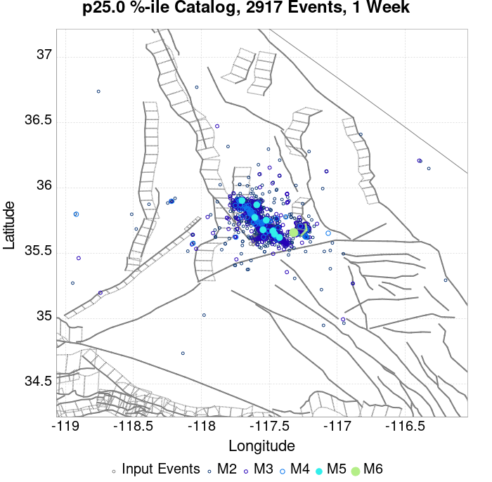 | 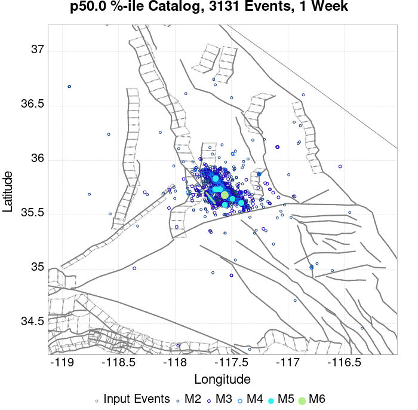 |  | 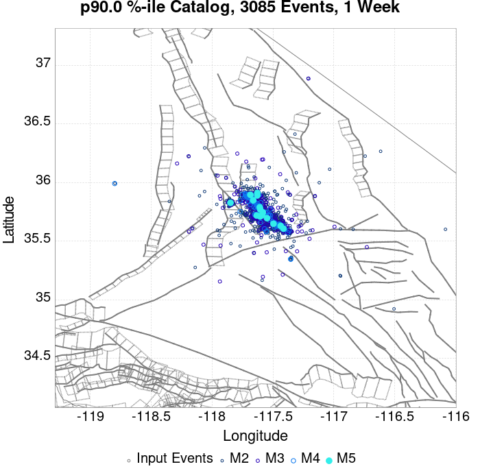 |  |  |  |  |  | 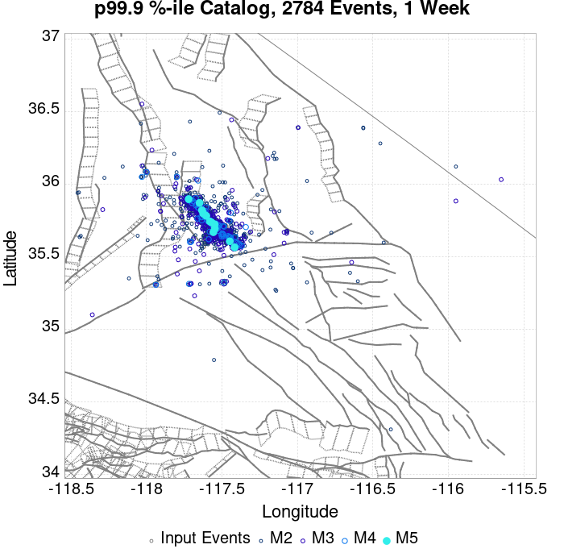 |  |
| **1 Month** |  |  |  |  |  |  |  |  |  |  |  |  |
| **1 Year** |  |  |  |  |  |  | 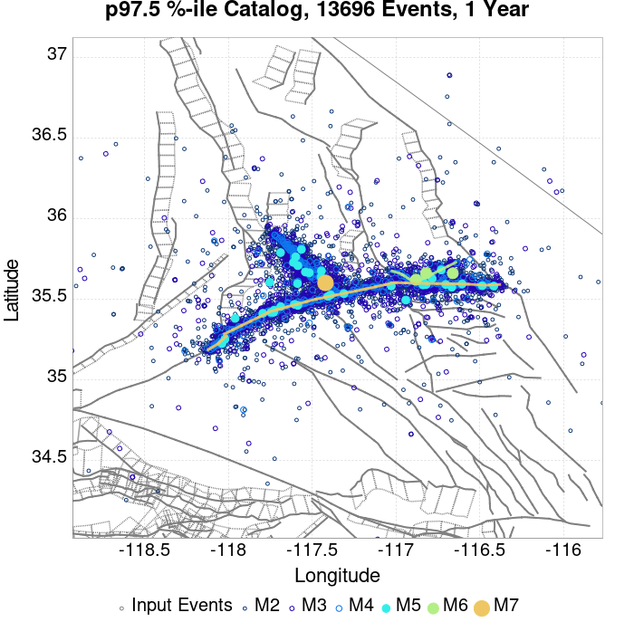 | 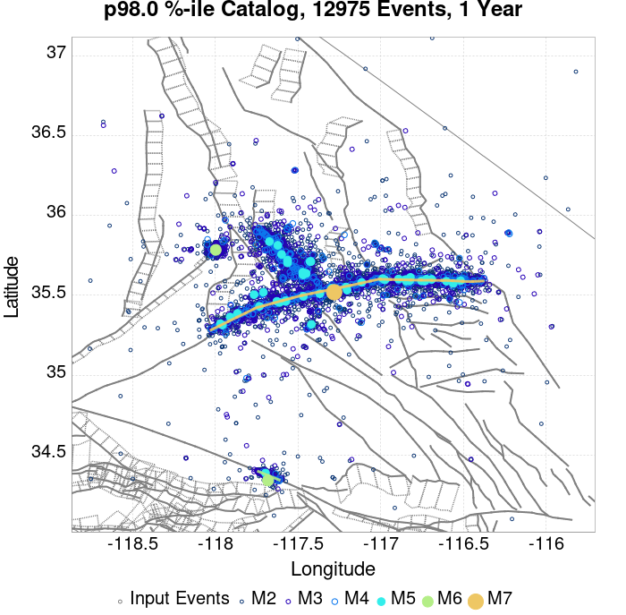 |  |  |  |  |
| **10 Year** |  |  |  |  |  |  |  |  |  |  | 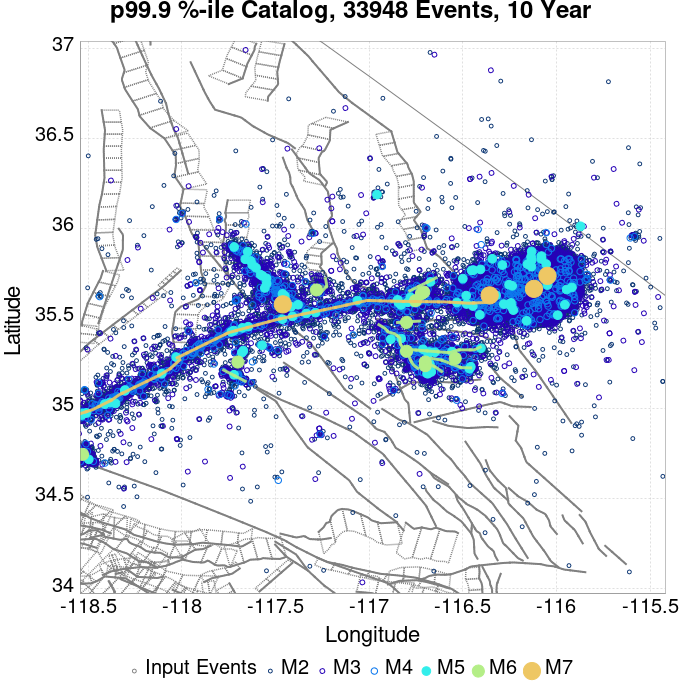 |  |

## ComCat Data Comparisons
*[(top)](#table-of-contents)*

These plots compare simulated sequences with data from ComCat. All plots only consider events with hypocenters inside the ComCat region defined in the JSON input file.

Last updated at 2019/10/03 23:33:49 UTC, 3 mo after the simulation start time

### ComCat Magnitude-Number Distributions
*[(top)](#table-of-contents)*

| Incremental MND | Cumulative MND |
|-----|-----|
|  |  |

### ComCat Time-Dependent Mc
*[(top)](#table-of-contents)*

The following plots compare simulation results with ComCat data above a magnitude threshold. Plots labeled as *M&ge;Mc(t)* use the time-dependent magnitude of completeness (Mc) defined in Helmstetter et al. (2006), which is plotted below. In the case of multiple M&ge5 ruptures, either as input to the simulation or in the comparison data, the maximum calculated time-dependent Mc is used. This time-dependent Mc function is plotted below.


### ComCat Cumulative Number Vs Time
*[(top)](#table-of-contents)*

| M&ge;Mc(t) | M&ge;3.5 | M&ge;4 | M&ge;5 | M&ge;6 | M&ge;7 |
|-----|-----|-----|-----|-----|-----|
|  |  |  | 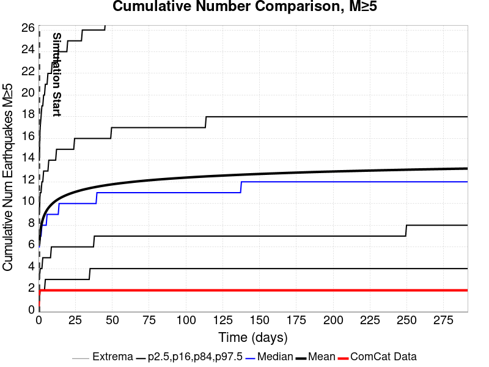 |  |  |

### ComCat Cumulative Number Simulation Percentiles
*[(top)](#table-of-contents)*


### ComCat Probability Spatial Distribution
*[(top)](#table-of-contents)*

|  | 1 Day | 1 Week | 1 Month | Current (3 Month) |
|-----|-----|-----|-----|-----|
| **M&ge;Mc(t)** |  |  |  |  |
| **M&ge;3.5** |  |  |  |  |
| **M&ge;4** |  |  |  |  |
| **M&ge;5** |  |  |  |  |
| **M&ge;6** |  |  |  |  |
| **M&ge;7** |  |  |  |  |
| **M&ge;8** |  |  |  |  |

### ComCat Mean Expectation Spatial Distribution
*[(top)](#table-of-contents)*

|  | 1 Day | 1 Week | 1 Month | Current (3 Month) |
|-----|-----|-----|-----|-----|
| **M&ge;Mc(t)** |  |  |  |  |
| **M&ge;3.5** |  |  |  |  |
| **M&ge;4** |  |  |  |  |
| **M&ge;5** |  |  |  | 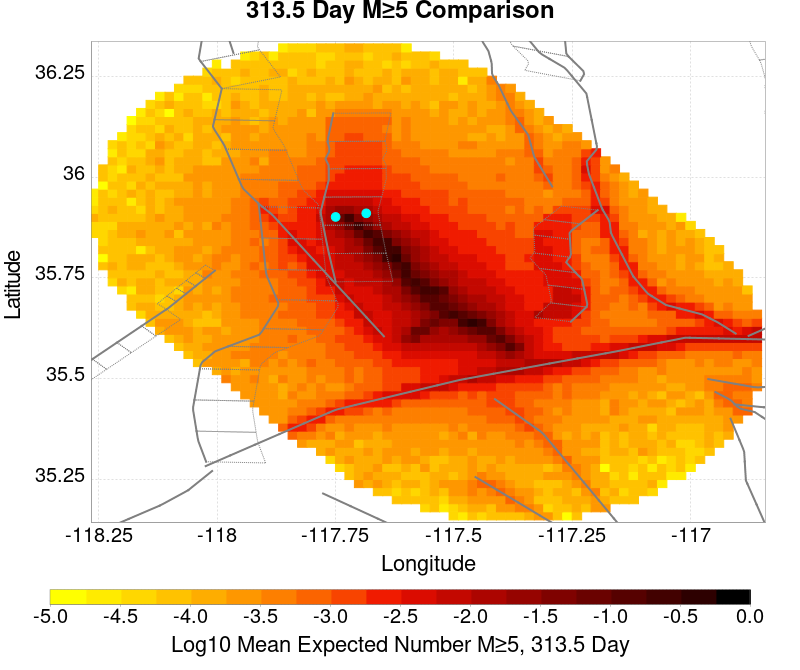 |
| **M&ge;6** |  |  |  |  |
| **M&ge;7** |  |  |  |  |
| **M&ge;8** |  |  |  |  |

### ComCat Depth Distribution
*[(top)](#table-of-contents)*

| M&ge;Mc(t) | M&ge;3.5 | M&ge;4 | M&ge;5 | M&ge;6 | M&ge;7 | M&ge;8 |
|-----|-----|-----|-----|-----|-----|-----|
|  |  |  | 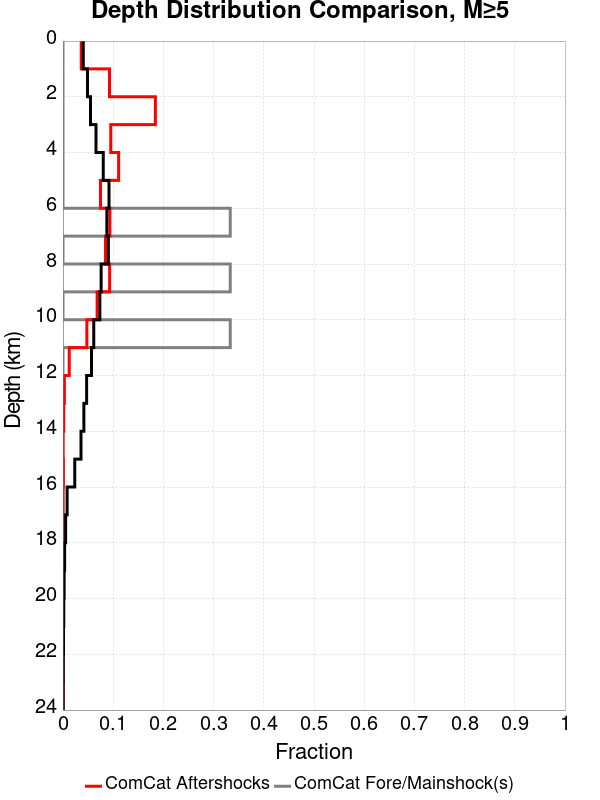 |  |  |  |

## Section Participation
*[(top)](#table-of-contents)*

### Section Participation Plots
*[(top)](#table-of-contents)*

| Min Mag | 1 yr Triggered Ruptures (no spontaneous) | 10 yr Triggered Ruptures (no spontaneous) | 10 yr Triggered Ruptures (primary aftershocks only) |
|-----|-----|-----|-----|
| **All Supra. Seis.** |  |  |  |
| **M&ge;6.5** |  |  |  |
| **M&ge;7** |  |  |  |
| **M&ge;7.5** |  |  |  |
| **M&ge;8** |  |  |  |

### Supra-Seismogenic Parent Sections Table
*[(top)](#table-of-contents)*

*First 10 of 113 with matching ruptures shown*

| Parent Name | Triggered 10 Year Mean Count | Triggered 1 Day Prob | Triggered 1 Week Prob | Triggered 1 Month Prob | Triggered 1 Year Prob | Triggered 10 Year Prob | Triggered 10 Year Primary Mean Count |
|-----|-----|-----|-----|-----|-----|-----|-----|
| Garlock (Central) | 0.14023575 | 0.07740916 | 0.09624499 | 0.10985539 | 0.124437965 | 0.13561794 | 0.079231985 |
| Tank Canyon | 0.121156886 | 0.040709686 | 0.060639203 | 0.074006565 | 0.09174869 | 0.10147041 | 0.029651234 |
| Little Lake | 0.06477093 | 0.033782963 | 0.04459837 | 0.051039007 | 0.058087252 | 0.0623405 | 0.036821 |
| Airport Lake | 0.05201118 | 0.031352535 | 0.039129905 | 0.044112287 | 0.049337707 | 0.051889658 | 0.036821 |
| Owl Lake | 0.048000973 | 0.020658646 | 0.026248632 | 0.0317171 | 0.038157735 | 0.041681856 | 0.014218009 |
| Garlock (East) | 0.0317171 | 0.013731924 | 0.017377567 | 0.02090169 | 0.025033418 | 0.028314497 | 0.00838498 |
| Panamint Valley | 0.029651234 | 0.012273666 | 0.016526917 | 0.020780168 | 0.025884068 | 0.029043626 | 0.009478673 |
| Blackwater | 0.01348888 | 0.0047393367 | 0.0074128085 | 0.008628023 | 0.010693887 | 0.012759752 | 0.003281079 |
| Hunter Mountain-Saline Valley | 0.013002795 | 0.0058330297 | 0.007898894 | 0.00923563 | 0.011423016 | 0.012881273 | 0.0049823793 |
| Ash Hill | 0.011301495 | 0.003524122 | 0.0052254223 | 0.007048244 | 0.00923563 | 0.010329323 | 0.0019443432 |

### M≥6.5 Parent Sections Table
*[(top)](#table-of-contents)*

*First 10 of 92 with matching ruptures shown*

| Parent Name | Triggered 10 Year Mean Count | Triggered 1 Day Prob | Triggered 1 Week Prob | Triggered 1 Month Prob | Triggered 1 Year Prob | Triggered 10 Year Prob | Triggered 10 Year Primary Mean Count |
|-----|-----|-----|-----|-----|-----|-----|-----|
| Garlock (Central) | 0.055778343 | 0.030380363 | 0.038279258 | 0.043990765 | 0.050674442 | 0.05541378 | 0.030623404 |
| Airport Lake | 0.0385223 | 0.022846032 | 0.028922105 | 0.033053834 | 0.03694252 | 0.0385223 | 0.026613196 |
| Little Lake | 0.037307084 | 0.02102321 | 0.026491676 | 0.030380363 | 0.03439057 | 0.036577955 | 0.022724511 |
| Panamint Valley | 0.026734719 | 0.011544538 | 0.015311702 | 0.019321911 | 0.023210596 | 0.026127111 | 0.009357152 |
| Owl Lake | 0.026491676 | 0.014096488 | 0.018106695 | 0.021266254 | 0.024547333 | 0.026370155 | 0.012881273 |
| Garlock (East) | 0.021509297 | 0.010572366 | 0.013002795 | 0.015676267 | 0.01847126 | 0.020537125 | 0.008141937 |
| Hunter Mountain-Saline Valley | 0.012638231 | 0.0055899867 | 0.00753433 | 0.008871065 | 0.011058452 | 0.012516709 | 0.0049823793 |
| Tank Canyon | 0.012516709 | 0.0053469436 | 0.0066836798 | 0.0082634585 | 0.011058452 | 0.012516709 | 0.0042532505 |
| Garlock (West) | 0.009357152 | 0.0052254223 | 0.0060760723 | 0.0074128085 | 0.008749545 | 0.009357152 | 0.004860858 |
| So Sierra Nevada | 0.005954551 | 0.0021873862 | 0.003281079 | 0.0041317292 | 0.005103901 | 0.0058330297 | 6.0760725E-4 |

### M≥7 Parent Sections Table
*[(top)](#table-of-contents)*

*First 10 of 60 with matching ruptures shown*

| Parent Name | Triggered 10 Year Mean Count | Triggered 1 Day Prob | Triggered 1 Week Prob | Triggered 1 Month Prob | Triggered 1 Year Prob | Triggered 10 Year Prob | Triggered 10 Year Primary Mean Count |
|-----|-----|-----|-----|-----|-----|-----|-----|
| Garlock (Central) | 0.051646616 | 0.028192976 | 0.035119697 | 0.040588163 | 0.04690728 | 0.05140357 | 0.028314497 |
| Owl Lake | 0.020415604 | 0.011544538 | 0.014461053 | 0.01676996 | 0.019321911 | 0.020415604 | 0.012638231 |
| Panamint Valley | 0.017134525 | 0.007898894 | 0.010329323 | 0.012638231 | 0.014947138 | 0.017134525 | 0.0071697654 |
| Garlock (East) | 0.014704095 | 0.009114109 | 0.010450845 | 0.012030624 | 0.01348888 | 0.014704095 | 0.008020416 |
| Hunter Mountain-Saline Valley | 0.012030624 | 0.0055899867 | 0.00753433 | 0.008749545 | 0.010572366 | 0.012030624 | 0.004860858 |
| Garlock (West) | 0.00923563 | 0.005103901 | 0.005954551 | 0.0072912867 | 0.008628023 | 0.00923563 | 0.0047393367 |
| Little Lake | 0.008141937 | 0.004860858 | 0.0064406367 | 0.0072912867 | 0.007777373 | 0.008141937 | 0.005954551 |
| Airport Lake | 0.007655851 | 0.0047393367 | 0.006197594 | 0.006805201 | 0.0072912867 | 0.007655851 | 0.005711508 |
| San Andreas (Mojave N) | 0.0038886864 | 0.0018228217 | 0.0021873862 | 0.0026734718 | 0.003281079 | 0.0036456434 | 0.0018228217 |
| San Andreas (Mojave S) | 0.0030380362 | 0.0017013003 | 0.0019443432 | 0.0023089075 | 0.0025519505 | 0.0029165149 | 0.0015797789 |

### M≥7.5 Parent Sections Table
*[(top)](#table-of-contents)*

*First 10 of 40 with matching ruptures shown*

| Parent Name | Triggered 10 Year Mean Count | Triggered 1 Day Prob | Triggered 1 Week Prob | Triggered 1 Month Prob | Triggered 1 Year Prob | Triggered 10 Year Prob | Triggered 10 Year Primary Mean Count |
|-----|-----|-----|-----|-----|-----|-----|-----|
| Garlock (Central) | 0.018957347 | 0.009600194 | 0.012030624 | 0.014339531 | 0.017013002 | 0.018957347 | 0.008992587 |
| Hunter Mountain-Saline Valley | 0.011909102 | 0.0054684654 | 0.0074128085 | 0.008628023 | 0.010450845 | 0.011909102 | 0.004860858 |
| Panamint Valley | 0.011909102 | 0.0054684654 | 0.0074128085 | 0.008628023 | 0.010450845 | 0.011909102 | 0.004860858 |
| Garlock (West) | 0.008506501 | 0.004617815 | 0.0054684654 | 0.006805201 | 0.007898894 | 0.008506501 | 0.0044962936 |
| Garlock (East) | 0.005711508 | 0.0026734718 | 0.0031595577 | 0.0043747723 | 0.0052254223 | 0.005711508 | 0.0027949933 |
| San Andreas (Mojave N) | 0.003767165 | 0.0018228217 | 0.0021873862 | 0.0026734718 | 0.003281079 | 0.0036456434 | 0.0018228217 |
| San Andreas (Mojave S) | 0.0027949933 | 0.0014582574 | 0.0017013003 | 0.0020658646 | 0.0023089075 | 0.0026734718 | 0.0014582574 |
| Owl Lake | 0.0014582574 | 0.0010936931 | 0.0010936931 | 0.0012152145 | 0.0014582574 | 0.0014582574 | 9.721716E-4 |
| San Andreas (San Bernardino N) | 0.0013367359 | 7.291287E-4 | 7.291287E-4 | 8.5065013E-4 | 9.721716E-4 | 0.0012152145 | 7.291287E-4 |
| Death Valley (No) | 8.5065013E-4 | 2.430429E-4 | 2.430429E-4 | 4.860858E-4 | 7.291287E-4 | 8.5065013E-4 | 0.0 |

### M≥8 Parent Sections Table
*[(top)](#table-of-contents)*

*First 10 of 14 with matching ruptures shown*

| Parent Name | Triggered 10 Year Mean Count | Triggered 1 Day Prob | Triggered 1 Week Prob | Triggered 1 Month Prob | Triggered 1 Year Prob | Triggered 10 Year Prob | Triggered 10 Year Primary Mean Count |
|-----|-----|-----|-----|-----|-----|-----|-----|
| Garlock (Central) | 2.430429E-4 | 1.2152145E-4 | 1.2152145E-4 | 1.2152145E-4 | 2.430429E-4 | 2.430429E-4 | 2.430429E-4 |
| Garlock (East) | 2.430429E-4 | 1.2152145E-4 | 1.2152145E-4 | 1.2152145E-4 | 2.430429E-4 | 2.430429E-4 | 2.430429E-4 |
| Garlock (West) | 2.430429E-4 | 1.2152145E-4 | 1.2152145E-4 | 1.2152145E-4 | 2.430429E-4 | 2.430429E-4 | 2.430429E-4 |
| San Andreas (Mojave N) | 2.430429E-4 | 1.2152145E-4 | 1.2152145E-4 | 1.2152145E-4 | 2.430429E-4 | 2.430429E-4 | 2.430429E-4 |
| San Andreas (Mojave S) | 2.430429E-4 | 1.2152145E-4 | 1.2152145E-4 | 1.2152145E-4 | 2.430429E-4 | 2.430429E-4 | 2.430429E-4 |
| San Andreas (San Bernardino N) | 2.430429E-4 | 1.2152145E-4 | 1.2152145E-4 | 1.2152145E-4 | 2.430429E-4 | 2.430429E-4 | 2.430429E-4 |
| San Andreas (Coachella) rev | 1.2152145E-4 | 1.2152145E-4 | 1.2152145E-4 | 1.2152145E-4 | 1.2152145E-4 | 1.2152145E-4 | 1.2152145E-4 |
| San Andreas (San Bernardino S) | 1.2152145E-4 | 1.2152145E-4 | 1.2152145E-4 | 1.2152145E-4 | 1.2152145E-4 | 1.2152145E-4 | 1.2152145E-4 |
| San Andreas (San Gorgonio Pass-Garnet HIll) | 1.2152145E-4 | 1.2152145E-4 | 1.2152145E-4 | 1.2152145E-4 | 1.2152145E-4 | 1.2152145E-4 | 1.2152145E-4 |
| San Jacinto (Anza) rev | 1.2152145E-4 | 0.0 | 0.0 | 0.0 | 1.2152145E-4 | 1.2152145E-4 | 1.2152145E-4 |

### Fault Magnitude-Probability Distributions
*[(top)](#table-of-contents)*

The first 5 sections (sorted by trigger rate) are plotted below. All fault MPDs are available [here](plots/parent_sect_mpds/README.md)

| 1 Week | 1 Month | 1 Year | 10 Year |
|-----|-----|-----|-----|
|  |  |  |  |
|  |  |  |  |
|  |  | 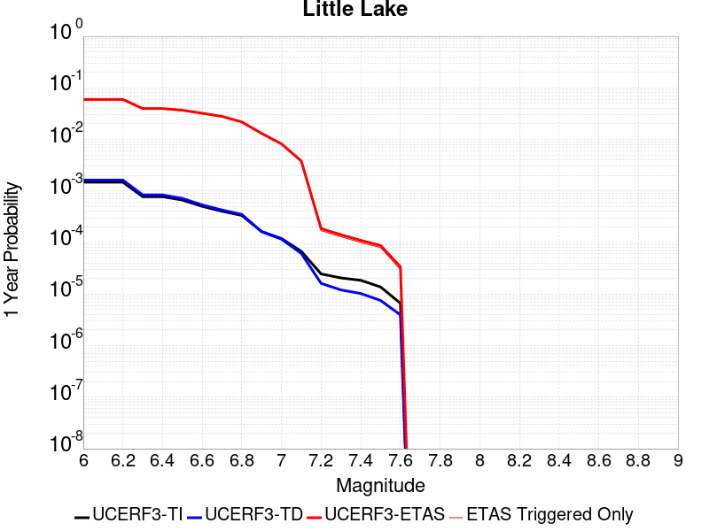 |  |
|  |  |  |  |
|  |  |  |  |

## Gridded Nucleation
*[(top)](#table-of-contents)*

| Min Mag | Triggered Ruptures (no spontaneous) | Triggered Ruptures (primary aftershocks only) |
|-----|-----|-----|
| **M&ge;2.5** |  |  |
| **M&ge;5** |  |  |
| **M&ge;6** |  | 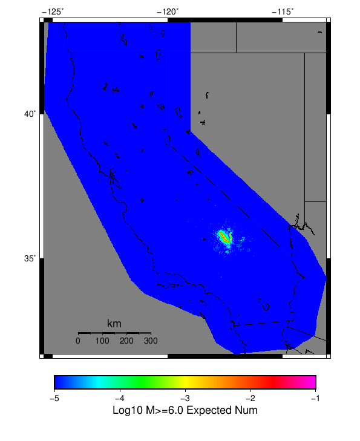 |
| **M&ge;7** |  |  |


## JSON Input File
*[(top)](#table-of-contents)*

```
{
  "numSimulations": 100000,
  "duration": 10.0,
  "startTimeMillis": 1562383194040,
  "includeSpontaneous": false,
  "randomSeed": 1569881636444,
  "binaryOutput": true,
  "binaryOutputFilters": [
    {
      "prefix": "results_complete",
      "descendantsOnly": false
    },
    {
      "prefix": "results_m5_preserve_chain",
      "minMag": 5.0,
      "preserveChainBelowMag": true,
      "descendantsOnly": false
    }
  ],
  "forceRecalc": false,
  "simulationName": "ComCat M7.1 (ci38457511), ShakeMap Surfaces, Log10(k)\u003d-2.3856, p\u003d1.2164, c\u003d0.0068906",
  "numRetries": 3,
  "outputDir": "/home/scec-02/kmilner/ucerf3/etas_sim/2019_09_30-ComCatM7p1_ci38457511_ShakeMapSurfaces_Log10_k_2p3856_p1p2164_c0p0068906",
  "triggerRuptures": [
    "omitted due to length, see original input file"
  ],
  "cacheDir": "/home/scec-02/kmilner/ucerf3/ucerf3-etas-launcher/inputs/cache_fm3p1_ba",
  "fssFile": "/home/scec-02/kmilner/ucerf3/ucerf3-etas-launcher/inputs/2013_05_10-ucerf3p3-production-10runs_COMPOUND_SOL_FM3_1_SpatSeisU3_MEAN_BRANCH_AVG_SOL.zip",
  "probModel": "FULL_TD",
  "applySubSeisForSupraNucl": true,
  "totRateScaleFactor": 1.14,
  "gridSeisCorr": true,
  "timeIndependentERF": false,
  "griddedOnly": false,
  "imposeGR": false,
  "includeIndirectTriggering": true,
  "gridSeisDiscr": 0.1,
  "catalogCompletenessModel": "RELAXED",
  "etas_p": 1.2164,
  "etas_c": 0.0068906,
  "etas_log10_k": -2.3856,
  "configCommand": "u3etas_comcat_event_config_builder.sh --event-id ci38457511 --num-simulations 100000 --days-before 7 --mag-complete 3.5 --etas-k -2.3856 --etas-p 1.2164 --etas-c 0.0068906 --finite-surf-shakemap --finite-surf-shakemap-min-mag 5 --hpc-site USC_HPC --nodes 36 --hours 24 --queue scec",
  "configTime": 1569881636444,
  "comcatMetadata": {
    "region": {
      "border": [
        {
          "latitude": 35.15123745324938,
          "longitude": -117.46198765392752
        },
        {
          "latitude": 35.170513097218205,
          "longitude": -117.55046477274733
        },
        {
          "latitude": 35.201997575622634,
          "longitude": -117.63356287896195
        },
        {
          "latitude": 35.24474776584818,
          "longitude": -117.70878534540662
        },
        {
          "latitude": 35.2893890362986,
          "longitude": -117.76387551603122
        },
        {
          "latitude": 35.288830898189985,
          "longitude": -117.76465036296011
        },
        {
          "latitude": 35.62116745212862,
          "longitude": -118.13026990137416
        },
        {
          "latitude": 35.621789874646055,
          "longitude": -118.12940866580139
        },
        {
          "latitude": 35.621789874646055,
          "longitude": -118.12940866580136
        },
        {
          "latitude": 35.63100857737423,
          "longitude": -118.14083341711117
        },
        {
          "latitude": 35.69213881200874,
          "longitude": -118.19401186444136
        },
        {
          "latitude": 35.759827796433385,
          "longitude": -118.23338865654299
        },
        {
          "latitude": 35.8320329014668,
          "longitude": -118.25773927868946
        },
        {
          "latitude": 35.906569563076914,
          "longitude": -118.26628547708222
        },
        {
          "latitude": 35.9811764992231,
          "longitude": -118.25872343341653
        },
        {
          "latitude": 36.05358395358725,
          "longitude": -118.23523828089384
        },
        {
          "latitude": 36.12158296055357,
          "longitude": -118.19650389473806
        },
        {
          "latitude": 36.18309350302806,
          "longitude": -118.14366730262441
        },
        {
          "latitude": 36.23622937613509,
          "longitude": -118.07831757407638
        },
        {
          "latitude": 36.279357589115186,
          "longitude": -118.00243964650828
        },
        {
          "latitude": 36.31115024550475,
          "longitude": -117.91835419890715
        },
        {
          "latitude": 36.33062704347584,
          "longitude": -117.82864534929934
        },
        {
          "latitude": 36.337186832826475,
          "longitude": -117.7360785775
        },
        {
          "latitude": 36.33062704347584,
          "longitude": -117.64351180570065
        },
        {
          "latitude": 36.31115024550475,
          "longitude": -117.55380295609284
        },
        {
          "latitude": 36.279357589115186,
          "longitude": -117.46971750849171
        },
        {
          "latitude": 36.23622937613509,
          "longitude": -117.39383958092363
        },
        {
          "latitude": 36.19237301765921,
          "longitude": -117.33990236386252
        },
        {
          "latitude": 36.19237301765921,
          "longitude": -117.3399023638625
        },
        {
          "latitude": 36.19300476664728,
          "longitude": -117.33902822340912
        },
        {
          "latitude": 35.858277657147454,
          "longitude": -116.97410396317103
        },
        {
          "latitude": 35.85771127553969,
          "longitude": -116.97489025431044
        },
        {
          "latitude": 35.849566414597014,
          "longitude": -116.96491461360324
        },
        {
          "latitude": 35.78805819220281,
          "longitude": -116.9122967694479
        },
        {
          "latitude": 35.72006106557635,
          "longitude": -116.87372034968973
        },
        {
          "latitude": 35.64765482528862,
          "longitude": -116.85032807444419
        },
        {
          "latitude": 35.57304829206068,
          "longitude": -116.8427916482061
        },
        {
          "latitude": 35.49851117585832,
          "longitude": -116.8512961557198
        },
        {
          "latitude": 35.42630481575459,
          "longitude": -116.87553976530553
        },
        {
          "latitude": 35.35861392859174,
          "longitude": -116.91474809853695
        },
        {
          "latitude": 35.29748137319737,
          "longitude": -116.96770221389164
        },
        {
          "latitude": 35.24474776584818,
          "longitude": -117.03277884359336
        },
        {
          "latitude": 35.201997575622634,
          "longitude": -117.10800131003803
        },
        {
          "latitude": 35.170513097218205,
          "longitude": -117.19109941625265
        },
        {
          "latitude": 35.15123745324938,
          "longitude": -117.27957653507247
        },
        {
          "latitude": 35.14474752487352,
          "longitude": -117.3707820945
        }
      ]
    },
    "eventID": "ci38457511",
    "minDepth": -10.0,
    "maxDepth": 24.0,
    "minMag": 2.5,
    "startTime": 1561778393040,
    "endTime": 1562383193041,
    "magComplete": 3.5
  }
}
```

