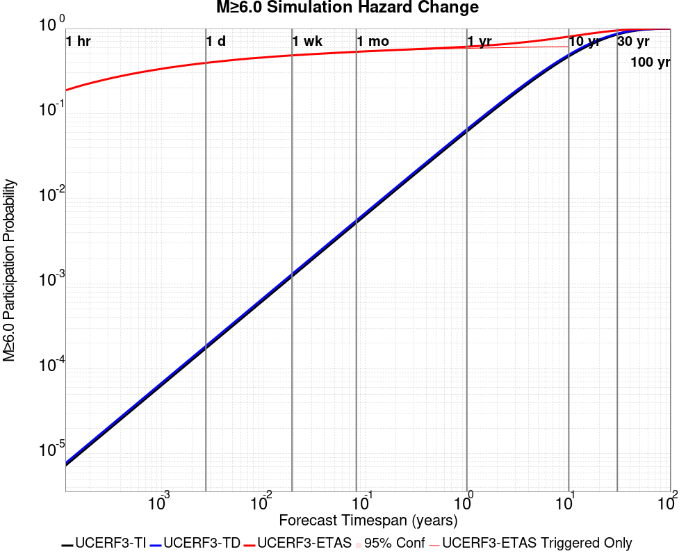
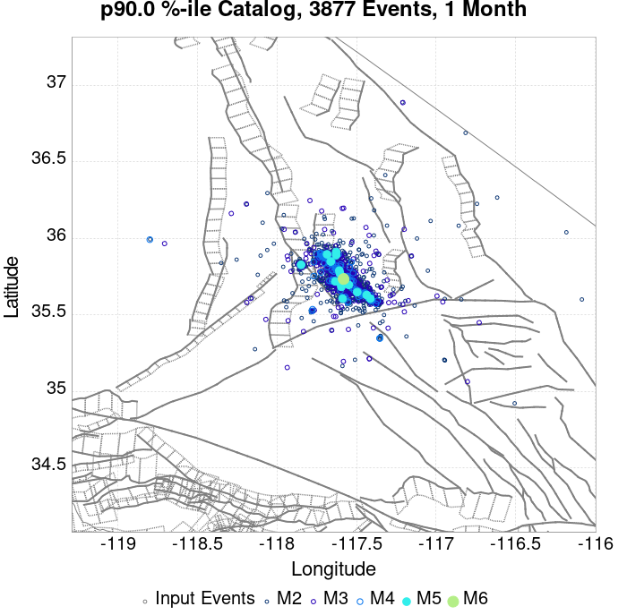
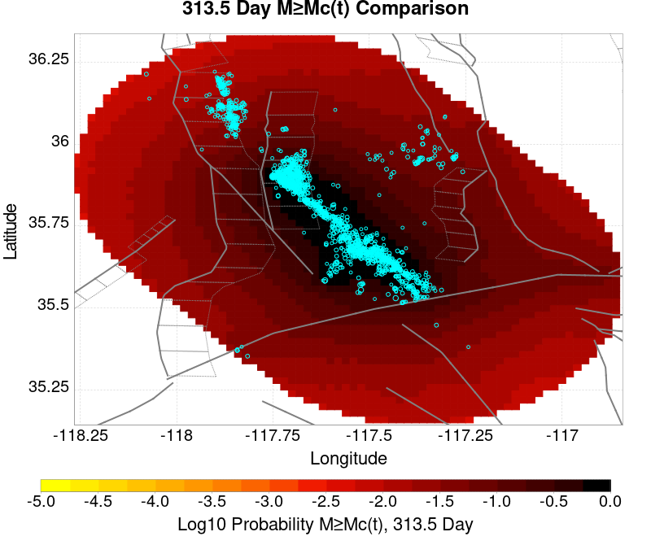
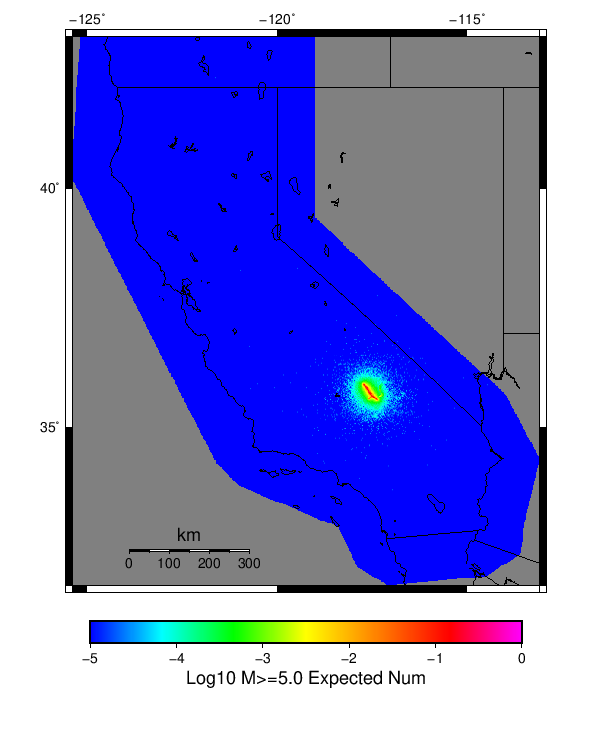

# ComCat M7.1 (ci38457511), ShakeMap Surfaces, Log10(k)=-2.3856, p=1.2164, c=0.0068906 Results

|   | ComCat M7.1 (ci38457511), ShakeMap Surfaces, Log10(k)=-2.3856, p=1.2164, c=0.0068906 |
|-----|-----|
| Num Simulations | 12572 (incomplete) |
| Start Time | 2019/07/06 03:19:54 UTC |
| Start Time Epoch Milliseconds | 1562383194040 |
| Duration | 10 Years |
| Includes Spontaneous? | false |
| Trigger Ruptures | 270 Trigger Ruptures |
|   | First: M3.98 at 2019/07/04 17:02:55 UTC |
|   | Last: M7.1 at 2019/07/06 03:19:53 UTC |
|   | Largest: M7.1 at 2019/07/06 03:19:53 UTC |
| Historical Ruptures | *(none)* |
| Config Generated With | u3etas_comcat_event_config_builder.sh --event-id ci38457511 --num-simulations 100000 --days-before 7 --mag-complete 3.5 --etas-k -2.3856 --etas-p 1.2164 --etas-c 0.0068906 --finite-surf-shakemap --finite-surf-shakemap-min-mag 5 --hpc-site USC_HPC --nodes 36 --hours 24 --queue scec |

## Table Of Contents

* [Probabilities Summary Table](#probabilities-summary-table)
* [Magnitude Number Distribution](#magnitude-number-distribution)
  * [10 Year Magnitude Number Distribution](#10-year-magnitude-number-distribution)
  * [1 Year Magnitude Number Distribution](#1-year-magnitude-number-distribution)
  * [1 Month Magnitude Number Distribution](#1-month-magnitude-number-distribution)
  * [1 Week Magnitude Number Distribution](#1-week-magnitude-number-distribution)
  * [1 Day Magnitude Number Distribution](#1-day-magnitude-number-distribution)
  * [1 Hour Magnitude Number Distribution](#1-hour-magnitude-number-distribution)
* [Hazard Change Over Time](#hazard-change-over-time)
  * [M&ge;5.0 Hazard Change Over Time](#m50-hazard-change-over-time)
  * [M&ge;6.0 Hazard Change Over Time](#m60-hazard-change-over-time)
  * [M&ge;7.0 Hazard Change Over Time](#m70-hazard-change-over-time)
  * [M&ge;8.0 Hazard Change Over Time](#m80-hazard-change-over-time)
* [Trigger Rupture Fault Map](#trigger-rupture-fault-map)
* [Trigger Rupture Depth Map](#trigger-rupture-depth-map)
* [Fault Distances To Triggers](#fault-distances-to-triggers)
* [Individual Simulated Catalog Maps](#individual-simulated-catalog-maps)
* [ComCat Data Comparisons](#comcat-data-comparisons)
  * [ComCat Magnitude-Number Distributions](#comcat-magnitude-number-distributions)
  * [ComCat Time-Dependent Mc](#comcat-time-dependent-mc)
  * [ComCat Cumulative Number Vs Time](#comcat-cumulative-number-vs-time)
  * [ComCat Cumulative Number Simulation Percentiles](#comcat-cumulative-number-simulation-percentiles)
  * [ComCat Probability Spatial Distribution](#comcat-probability-spatial-distribution)
  * [ComCat Mean Expectation Spatial Distribution](#comcat-mean-expectation-spatial-distribution)
  * [ComCat Depth Distribution](#comcat-depth-distribution)
* [Section Participation](#section-participation)
  * [Section Participation Plots](#section-participation-plots)
  * [Supra-Seismogenic Parent Sections Table](#supra-seismogenic-parent-sections-table)
  * [M≥6.5 Parent Sections Table](#m65-parent-sections-table)
  * [M≥7 Parent Sections Table](#m7-parent-sections-table)
  * [M≥7.5 Parent Sections Table](#m75-parent-sections-table)
  * [M≥8 Parent Sections Table](#m8-parent-sections-table)
  * [Fault Magnitude-Probability Distributions](#fault-magnitude-probability-distributions)
* [Gridded Nucleation](#gridded-nucleation)
* [JSON Input File](#json-input-file)

## Probabilities Summary Table
*[(top)](#table-of-contents)*

| Magnitude | 1 Hour Prob | 1 Day Prob | 1 Week Prob | 1 Month Prob | 1 Year Prob | 10 Year Prob |
|-----|-----|-----|-----|-----|-----|-----|
| **M&ge;4** | 1.000 (100.00%) | 1.000 (100.00%) | 1.000 (100.00%) | 1.000 (100.00%) | 1.000 (100.00%) | 1.000 (100.00%) |
| **M&ge;4.5** | 1.000 (99.96%) | 1.000 (100.00%) | 1.000 (100.00%) | 1.000 (100.00%) | 1.000 (100.00%) | 1.000 (100.00%) |
| **M&ge;5** | 0.927 (92.75%) | 0.998 (99.77%) | 1.000 (99.96%) | 1.000 (100.00%) | 1.000 (100.00%) | 1.000 (100.00%) |
| **M&ge;5.5** | 0.543 (54.34%) | 0.836 (83.65%) | 0.901 (90.13%) | 0.928 (92.84%) | 0.950 (95.01%) | 0.960 (96.00%) |
| **M&ge;6** | 0.188 (18.76%) | 0.392 (39.23%) | 0.480 (48.02%) | 0.525 (52.50%) | 0.579 (57.87%) | 0.610 (60.99%) |
| **M&ge;6.5** | 0.044 (4.38%) | 0.100 (10.04%) | 0.134 (13.38%) | 0.154 (15.44%) | 0.177 (17.67%) | 0.191 (19.11%) |
| **M&ge;7** | 0.017 (1.66%) | 0.038 (3.85%) | 0.050 (5.04%) | 0.058 (5.81%) | 0.066 (6.59%) | 0.072 (7.20%) |
| **M&ge;7.1** | 0.014 (1.40%) | 0.033 (3.32%) | 0.043 (4.26%) | 0.050 (4.96%) | 0.056 (5.62%) | 0.061 (6.10%) |
| **M&ge;7.5** | 4.77E-3 (0.48%) | 0.011 (1.12%) | 0.015 (1.46%) | 0.017 (1.69%) | 0.020 (2.01%) | 0.022 (2.24%) |
| **M&ge;8** | 1.59E-4 (0.02%) | 1.59E-4 (0.02%) | 2.39E-4 (0.02%) | 2.39E-4 (0.02%) | 3.18E-4 (0.03%) | 3.18E-4 (0.03%) |

## Magnitude Number Distribution
*[(top)](#table-of-contents)*

### 10 Year Magnitude Number Distribution
*[(top)](#table-of-contents)*

**Legend**
* **Mean** (thick black line): mean expected number across all 12572 catalogs
* **2.5%,97.5%** (thin black lines): expected number percentiles across all 12572 catalogs
* **Median** (thin blue line): median expected number across all 12572 catalogs
* **Mode** (thin cyan line): modal expected number across all 12572 catalogs
* **10 yr Probability** (thin red line): 10 year probability calculated as the fraction of catalogs with at least 1 occurrence
* **10 yr Supraseismogenic Probability** (thin dashed red line): same as above, but only for supraseismogenic ruptures on explicitly modeled UCERF3 faults
* **95% Conf** (light red shaded region): binomial 95% confidence bounds on probability
* **Primary** (thin green line): mean expected number from primary triggered aftershocks only (no secondary, tertiary, etc...) across all 12572 catalogs


| Mag | Mean | 2.5 %ile | 97.5 %ile | Median | Mode | 10 yr Probability | 10 yr Supra-Seis Prob | Primary Aftershocks Mean |
|-----|-----|-----|-----|-----|-----|-----|-----|-----|
| **M&ge;2.5** | 5203.190 | 3459.000 | 14822.000 | 4359.000 | 3727.000 | 1.000 (100.00%) | 0.308 (30.79%) | 2268.654 |
| **M&ge;2.6** | 4133.178 | 2743.000 | 11764.000 | 3461.000 | 3182.000 | 1.000 (100.00%) | 0.308 (30.79%) | 1802.292 |
| **M&ge;2.7** | 3282.835 | 2173.000 | 9360.000 | 2750.000 | 2575.000 | 1.000 (100.00%) | 0.308 (30.79%) | 1431.335 |
| **M&ge;2.8** | 2607.853 | 1724.000 | 7429.000 | 2185.000 | 1974.000 | 1.000 (100.00%) | 0.308 (30.79%) | 1137.263 |
| **M&ge;2.9** | 2071.647 | 1364.000 | 5891.000 | 1737.000 | 1559.000 | 1.000 (100.00%) | 0.308 (30.79%) | 903.299 |
| **M&ge;3** | 1645.548 | 1078.000 | 4685.000 | 1380.000 | 1295.000 | 1.000 (100.00%) | 0.308 (30.79%) | 717.586 |
| **M&ge;3.1** | 1307.001 | 851.000 | 3724.000 | 1097.000 | 1001.000 | 1.000 (100.00%) | 0.308 (30.79%) | 569.914 |
| **M&ge;3.2** | 1038.227 | 673.000 | 2954.000 | 871.000 | 806.000 | 1.000 (100.00%) | 0.308 (30.79%) | 452.781 |
| **M&ge;3.3** | 824.634 | 532.000 | 2335.000 | 693.000 | 622.000 | 1.000 (100.00%) | 0.308 (30.79%) | 359.660 |
| **M&ge;3.4** | 655.049 | 419.000 | 1846.000 | 551.000 | 504.000 | 1.000 (100.00%) | 0.308 (30.79%) | 285.729 |
| **M&ge;3.5** | 520.241 | 329.000 | 1470.000 | 438.000 | 381.000 | 1.000 (100.00%) | 0.308 (30.79%) | 226.982 |
| **M&ge;3.6** | 413.386 | 259.000 | 1168.000 | 349.000 | 317.000 | 1.000 (100.00%) | 0.308 (30.79%) | 180.315 |
| **M&ge;3.7** | 328.289 | 202.000 | 927.000 | 278.000 | 250.000 | 1.000 (100.00%) | 0.308 (30.79%) | 143.167 |
| **M&ge;3.8** | 260.664 | 158.000 | 739.000 | 220.000 | 194.000 | 1.000 (100.00%) | 0.308 (30.79%) | 113.628 |
| **M&ge;3.9** | 206.960 | 124.000 | 588.000 | 175.000 | 159.000 | 1.000 (100.00%) | 0.308 (30.79%) | 90.224 |
| **M&ge;4** | 164.321 | 96.000 | 466.000 | 139.000 | 132.000 | 1.000 (100.00%) | 0.308 (30.79%) | 71.666 |
| **M&ge;4.1** | 130.400 | 74.000 | 371.000 | 111.000 | 102.000 | 1.000 (100.00%) | 0.308 (30.79%) | 56.881 |
| **M&ge;4.2** | 103.494 | 57.000 | 292.000 | 88.000 | 78.000 | 1.000 (100.00%) | 0.308 (30.79%) | 45.143 |
| **M&ge;4.3** | 82.098 | 43.000 | 231.000 | 70.000 | 62.000 | 1.000 (100.00%) | 0.308 (30.79%) | 35.783 |
| **M&ge;4.4** | 65.101 | 33.000 | 182.000 | 56.000 | 49.000 | 1.000 (100.00%) | 0.308 (30.79%) | 28.367 |
| **M&ge;4.5** | 51.630 | 25.000 | 146.000 | 44.000 | 40.000 | 1.000 (100.00%) | 0.308 (30.79%) | 22.491 |
| **M&ge;4.6** | 40.931 | 19.000 | 115.000 | 35.000 | 34.000 | 1.000 (100.00%) | 0.308 (30.79%) | 17.818 |
| **M&ge;4.7** | 32.394 | 14.000 | 91.000 | 28.000 | 24.000 | 1.000 (100.00%) | 0.308 (30.79%) | 14.104 |
| **M&ge;4.8** | 25.628 | 10.000 | 72.000 | 22.000 | 20.000 | 1.000 (100.00%) | 0.308 (30.79%) | 11.138 |
| **M&ge;4.9** | 20.239 | 7.000 | 58.000 | 17.000 | 16.000 | 1.000 (100.00%) | 0.308 (30.79%) | 8.792 |
| **M&ge;5** | 15.966 | 5.000 | 46.000 | 14.000 | 12.000 | 1.000 (100.00%) | 0.308 (30.79%) | 6.937 |
| **M&ge;5.1** | 12.577 | 3.000 | 37.000 | 11.000 | 9.000 | 0.999 (99.94%) | 0.308 (30.79%) | 5.454 |
| **M&ge;5.2** | 9.894 | 2.000 | 29.000 | 8.000 | 7.000 | 0.998 (99.82%) | 0.308 (30.79%) | 4.293 |
| **M&ge;5.3** | 7.749 | 1.000 | 24.000 | 6.000 | 5.000 | 0.994 (99.40%) | 0.308 (30.79%) | 3.359 |
| **M&ge;5.4** | 6.060 | 1.000 | 19.000 | 5.000 | 4.000 | 0.984 (98.37%) | 0.308 (30.79%) | 2.629 |
| **M&ge;5.5** | 4.717 | 0.000 | 15.000 | 4.000 | 3.000 | 0.960 (96.00%) | 0.308 (30.79%) | 2.047 |
| **M&ge;5.6** | 3.646 | 0.000 | 12.000 | 3.000 | 2.000 | 0.918 (91.76%) | 0.308 (30.79%) | 1.584 |
| **M&ge;5.7** | 2.798 | 0.000 | 10.000 | 2.000 | 1.000 | 0.864 (86.37%) | 0.308 (30.79%) | 1.217 |
| **M&ge;5.8** | 2.132 | 0.000 | 8.000 | 2.000 | 1.000 | 0.792 (79.18%) | 0.308 (30.79%) | 0.928 |
| **M&ge;5.9** | 1.602 | 0.000 | 6.000 | 1.000 | 0.000 | 0.703 (70.35%) | 0.308 (30.77%) | 0.701 |
| **M&ge;6** | 1.226 | 0.000 | 5.000 | 1.000 | 0.000 | 0.610 (60.99%) | 0.308 (30.77%) | 0.530 |
| **M&ge;6.1** | 0.879 | 0.000 | 4.000 | 1.000 | 0.000 | 0.504 (50.37%) | 0.262 (26.23%) | 0.392 |
| **M&ge;6.2** | 0.571 | 0.000 | 3.000 | 0.000 | 0.000 | 0.373 (37.27%) | 0.206 (20.57%) | 0.257 |
| **M&ge;6.3** | 0.428 | 0.000 | 3.000 | 0.000 | 0.000 | 0.302 (30.25%) | 0.176 (17.56%) | 0.197 |
| **M&ge;6.4** | 0.328 | 0.000 | 2.000 | 0.000 | 0.000 | 0.241 (24.08%) | 0.153 (15.32%) | 0.150 |
| **M&ge;6.5** | 0.249 | 0.000 | 2.000 | 0.000 | 0.000 | 0.191 (19.11%) | 0.131 (13.14%) | 0.113 |
| **M&ge;6.6** | 0.202 | 0.000 | 2.000 | 0.000 | 0.000 | 0.164 (16.45%) | 0.121 (12.09%) | 0.097 |
| **M&ge;6.7** | 0.164 | 0.000 | 1.000 | 0.000 | 0.000 | 0.136 (13.58%) | 0.106 (10.58%) | 0.080 |
| **M&ge;6.8** | 0.133 | 0.000 | 1.000 | 0.000 | 0.000 | 0.114 (11.45%) | 0.093 (9.35%) | 0.066 |
| **M&ge;6.9** | 0.102 | 0.000 | 1.000 | 0.000 | 0.000 | 0.092 (9.16%) | 0.077 (7.73%) | 0.052 |
| **M&ge;7** | 0.078 | 0.000 | 1.000 | 0.000 | 0.000 | 0.072 (7.20%) | 0.064 (6.40%) | 0.041 |
| **M&ge;7.1** | 0.065 | 0.000 | 1.000 | 0.000 | 0.000 | 0.061 (6.10%) | 0.056 (5.61%) | 0.034 |
| **M&ge;7.2** | 0.049 | 0.000 | 1.000 | 0.000 | 0.000 | 0.047 (4.69%) | 0.044 (4.45%) | 0.025 |
| **M&ge;7.3** | 0.034 | 0.000 | 1.000 | 0.000 | 0.000 | 0.033 (3.26%) | 0.031 (3.14%) | 0.017 |
| **M&ge;7.4** | 0.030 | 0.000 | 1.000 | 0.000 | 0.000 | 0.029 (2.86%) | 0.028 (2.83%) | 0.015 |
| **M&ge;7.5** | 0.023 | 0.000 | 0.000 | 0.000 | 0.000 | 0.022 (2.24%) | 0.022 (2.24%) | 0.011 |
| **M&ge;7.6** | 0.012 | 0.000 | 0.000 | 0.000 | 0.000 | 0.012 (1.16%) | 0.012 (1.16%) | 6.05E-3 |
| **M&ge;7.7** | 4.37E-3 | 0.000 | 0.000 | 0.000 | 0.000 | 4.14E-3 (0.41%) | 4.14E-3 (0.41%) | 2.23E-3 |
| **M&ge;7.8** | 2.62E-3 | 0.000 | 0.000 | 0.000 | 0.000 | 2.55E-3 (0.25%) | 2.55E-3 (0.25%) | 1.59E-3 |
| **M&ge;7.9** | 1.59E-3 | 0.000 | 0.000 | 0.000 | 0.000 | 1.59E-3 (0.16%) | 1.59E-3 (0.16%) | 9.55E-4 |
| **M&ge;8** | 3.18E-4 | 0.000 | 0.000 | 0.000 | 0.000 | 3.18E-4 (0.03%) | 3.18E-4 (0.03%) | 3.18E-4 |
| **M&ge;8.1** | 0.000 | 0.000 | 0.000 | 0.000 | 0.000 | 0.000 (0.00%) | 0.000 (0.00%) | 0.000 |
| **M&ge;8.2** | 0.000 | 0.000 | 0.000 | 0.000 | 0.000 | 0.000 (0.00%) | 0.000 (0.00%) | 0.000 |
| **M&ge;8.3** | 0.000 | 0.000 | 0.000 | 0.000 | 0.000 | 0.000 (0.00%) | 0.000 (0.00%) | 0.000 |
| **M&ge;8.4** | 0.000 | 0.000 | 0.000 | 0.000 | 0.000 | 0.000 (0.00%) | 0.000 (0.00%) | 0.000 |
| **M&ge;8.5** | 0.000 | 0.000 | 0.000 | 0.000 | 0.000 | 0.000 (0.00%) | 0.000 (0.00%) | 0.000 |
| **M&ge;8.6** | 0.000 | 0.000 | 0.000 | 0.000 | 0.000 | 0.000 (0.00%) | 0.000 (0.00%) | 0.000 |
| **M&ge;8.7** | 0.000 | 0.000 | 0.000 | 0.000 | 0.000 | 0.000 (0.00%) | 0.000 (0.00%) | 0.000 |
| **M&ge;8.8** | 0.000 | 0.000 | 0.000 | 0.000 | 0.000 | 0.000 (0.00%) | 0.000 (0.00%) | 0.000 |
| **M&ge;8.9** | 0.000 | 0.000 | 0.000 | 0.000 | 0.000 | 0.000 (0.00%) | 0.000 (0.00%) | 0.000 |
| **M&ge;9** | 0.000 | 0.000 | 0.000 | 0.000 | 0.000 | 0.000 (0.00%) | 0.000 (0.00%) | 0.000 |

### 1 Year Magnitude Number Distribution
*[(top)](#table-of-contents)*

**Legend**
* **Mean** (thick black line): mean expected number across all 12572 catalogs
* **2.5%,97.5%** (thin black lines): expected number percentiles across all 12572 catalogs
* **Median** (thin blue line): median expected number across all 12572 catalogs
* **Mode** (thin cyan line): modal expected number across all 12572 catalogs
* **1 yr Probability** (thin red line): 1 year probability calculated as the fraction of catalogs with at least 1 occurrence
* **1 yr Supraseismogenic Probability** (thin dashed red line): same as above, but only for supraseismogenic ruptures on explicitly modeled UCERF3 faults
* **95% Conf** (light red shaded region): binomial 95% confidence bounds on probability
* **Primary** (thin green line): mean expected number from primary triggered aftershocks only (no secondary, tertiary, etc...) across all 12572 catalogs


| Mag | Mean | 2.5 %ile | 97.5 %ile | Median | Mode | 1 yr Probability | 1 yr Supra-Seis Prob | Primary Aftershocks Mean |
|-----|-----|-----|-----|-----|-----|-----|-----|-----|
| **M&ge;2.5** | 4714.067 | 3206.000 | 12841.000 | 3989.000 | 3691.000 | 1.000 (100.00%) | 0.285 (28.50%) | 2162.121 |
| **M&ge;2.6** | 3744.643 | 2545.000 | 10218.000 | 3169.000 | 2831.000 | 1.000 (100.00%) | 0.285 (28.50%) | 1717.677 |
| **M&ge;2.7** | 2974.203 | 2017.000 | 8137.000 | 2519.000 | 2243.000 | 1.000 (100.00%) | 0.285 (28.50%) | 1364.142 |
| **M&ge;2.8** | 2362.665 | 1598.000 | 6459.000 | 2001.000 | 1884.000 | 1.000 (100.00%) | 0.285 (28.50%) | 1083.844 |
| **M&ge;2.9** | 1876.800 | 1264.000 | 5122.000 | 1590.000 | 1489.000 | 1.000 (100.00%) | 0.285 (28.50%) | 860.852 |
| **M&ge;3** | 1490.753 | 999.000 | 4077.000 | 1263.000 | 1132.000 | 1.000 (100.00%) | 0.285 (28.50%) | 683.893 |
| **M&ge;3.1** | 1184.087 | 790.000 | 3236.000 | 1004.000 | 944.000 | 1.000 (100.00%) | 0.285 (28.50%) | 543.163 |
| **M&ge;3.2** | 940.640 | 623.000 | 2585.000 | 798.000 | 743.000 | 1.000 (100.00%) | 0.285 (28.50%) | 431.532 |
| **M&ge;3.3** | 747.167 | 492.000 | 2054.000 | 634.000 | 582.000 | 1.000 (100.00%) | 0.285 (28.50%) | 342.776 |
| **M&ge;3.4** | 593.528 | 388.000 | 1624.000 | 505.000 | 479.000 | 1.000 (100.00%) | 0.285 (28.50%) | 272.302 |
| **M&ge;3.5** | 471.414 | 304.000 | 1296.000 | 401.000 | 374.000 | 1.000 (100.00%) | 0.285 (28.50%) | 216.306 |
| **M&ge;3.6** | 374.607 | 239.000 | 1029.000 | 320.000 | 292.000 | 1.000 (100.00%) | 0.285 (28.50%) | 171.858 |
| **M&ge;3.7** | 297.490 | 186.000 | 814.000 | 254.000 | 237.000 | 1.000 (100.00%) | 0.285 (28.50%) | 136.460 |
| **M&ge;3.8** | 236.205 | 146.000 | 647.000 | 202.000 | 185.000 | 1.000 (100.00%) | 0.285 (28.50%) | 108.303 |
| **M&ge;3.9** | 187.532 | 114.000 | 510.000 | 161.000 | 152.000 | 1.000 (100.00%) | 0.285 (28.50%) | 85.990 |
| **M&ge;4** | 148.852 | 88.000 | 406.000 | 127.000 | 116.000 | 1.000 (100.00%) | 0.285 (28.50%) | 68.288 |
| **M&ge;4.1** | 118.124 | 68.000 | 323.000 | 101.000 | 93.000 | 1.000 (100.00%) | 0.285 (28.50%) | 54.192 |
| **M&ge;4.2** | 93.741 | 52.000 | 256.000 | 81.000 | 75.000 | 1.000 (100.00%) | 0.285 (28.50%) | 43.012 |
| **M&ge;4.3** | 74.362 | 40.000 | 202.000 | 64.000 | 56.000 | 1.000 (100.00%) | 0.285 (28.50%) | 34.097 |
| **M&ge;4.4** | 58.966 | 30.000 | 160.000 | 51.000 | 45.000 | 1.000 (100.00%) | 0.285 (28.50%) | 27.037 |
| **M&ge;4.5** | 46.764 | 23.000 | 127.000 | 40.000 | 38.000 | 1.000 (100.00%) | 0.285 (28.50%) | 21.444 |
| **M&ge;4.6** | 37.087 | 17.000 | 102.000 | 32.000 | 30.000 | 1.000 (100.00%) | 0.285 (28.50%) | 16.996 |
| **M&ge;4.7** | 29.356 | 13.000 | 81.000 | 25.000 | 22.000 | 1.000 (100.00%) | 0.285 (28.50%) | 13.453 |
| **M&ge;4.8** | 23.215 | 9.000 | 65.000 | 20.000 | 18.000 | 1.000 (100.00%) | 0.285 (28.50%) | 10.622 |
| **M&ge;4.9** | 18.336 | 7.000 | 51.000 | 16.000 | 14.000 | 1.000 (100.00%) | 0.285 (28.50%) | 8.385 |
| **M&ge;5** | 14.461 | 5.000 | 41.000 | 12.000 | 11.000 | 1.000 (100.00%) | 0.285 (28.50%) | 6.614 |
| **M&ge;5.1** | 11.390 | 3.000 | 33.000 | 10.000 | 9.000 | 0.999 (99.92%) | 0.285 (28.50%) | 5.202 |
| **M&ge;5.2** | 8.961 | 2.000 | 26.000 | 8.000 | 7.000 | 0.997 (99.74%) | 0.285 (28.50%) | 4.096 |
| **M&ge;5.3** | 7.022 | 1.000 | 21.000 | 6.000 | 4.000 | 0.992 (99.19%) | 0.285 (28.50%) | 3.205 |
| **M&ge;5.4** | 5.495 | 1.000 | 17.000 | 5.000 | 3.000 | 0.979 (97.86%) | 0.285 (28.50%) | 2.510 |
| **M&ge;5.5** | 4.280 | 0.000 | 13.000 | 3.000 | 3.000 | 0.950 (95.01%) | 0.285 (28.50%) | 1.953 |
| **M&ge;5.6** | 3.308 | 0.000 | 11.000 | 3.000 | 2.000 | 0.902 (90.25%) | 0.285 (28.50%) | 1.512 |
| **M&ge;5.7** | 2.542 | 0.000 | 9.000 | 2.000 | 1.000 | 0.842 (84.22%) | 0.285 (28.50%) | 1.163 |
| **M&ge;5.8** | 1.937 | 0.000 | 7.000 | 1.000 | 1.000 | 0.766 (76.60%) | 0.285 (28.50%) | 0.885 |
| **M&ge;5.9** | 1.454 | 0.000 | 6.000 | 1.000 | 0.000 | 0.675 (67.47%) | 0.285 (28.48%) | 0.668 |
| **M&ge;6** | 1.111 | 0.000 | 5.000 | 1.000 | 0.000 | 0.579 (57.87%) | 0.285 (28.48%) | 0.505 |
| **M&ge;6.1** | 0.797 | 0.000 | 4.000 | 0.000 | 0.000 | 0.473 (47.34%) | 0.243 (24.26%) | 0.373 |
| **M&ge;6.2** | 0.518 | 0.000 | 3.000 | 0.000 | 0.000 | 0.348 (34.82%) | 0.190 (19.02%) | 0.244 |
| **M&ge;6.3** | 0.388 | 0.000 | 2.000 | 0.000 | 0.000 | 0.281 (28.13%) | 0.162 (16.19%) | 0.188 |
| **M&ge;6.4** | 0.298 | 0.000 | 2.000 | 0.000 | 0.000 | 0.223 (22.26%) | 0.141 (14.12%) | 0.143 |
| **M&ge;6.5** | 0.226 | 0.000 | 2.000 | 0.000 | 0.000 | 0.177 (17.67%) | 0.121 (12.15%) | 0.108 |
| **M&ge;6.6** | 0.184 | 0.000 | 2.000 | 0.000 | 0.000 | 0.152 (15.18%) | 0.112 (11.22%) | 0.093 |
| **M&ge;6.7** | 0.150 | 0.000 | 1.000 | 0.000 | 0.000 | 0.125 (12.50%) | 0.098 (9.82%) | 0.077 |
| **M&ge;6.8** | 0.121 | 0.000 | 1.000 | 0.000 | 0.000 | 0.106 (10.56%) | 0.087 (8.68%) | 0.063 |
| **M&ge;6.9** | 0.094 | 0.000 | 1.000 | 0.000 | 0.000 | 0.085 (8.46%) | 0.072 (7.18%) | 0.051 |
| **M&ge;7** | 0.071 | 0.000 | 1.000 | 0.000 | 0.000 | 0.066 (6.59%) | 0.059 (5.89%) | 0.039 |
| **M&ge;7.1** | 0.060 | 0.000 | 1.000 | 0.000 | 0.000 | 0.056 (5.62%) | 0.052 (5.18%) | 0.033 |
| **M&ge;7.2** | 0.045 | 0.000 | 1.000 | 0.000 | 0.000 | 0.043 (4.29%) | 0.041 (4.06%) | 0.024 |
| **M&ge;7.3** | 0.031 | 0.000 | 1.000 | 0.000 | 0.000 | 0.030 (3.00%) | 0.029 (2.89%) | 0.017 |
| **M&ge;7.4** | 0.027 | 0.000 | 1.000 | 0.000 | 0.000 | 0.026 (2.62%) | 0.026 (2.59%) | 0.014 |
| **M&ge;7.5** | 0.021 | 0.000 | 0.000 | 0.000 | 0.000 | 0.020 (2.01%) | 0.020 (2.01%) | 0.011 |
| **M&ge;7.6** | 0.011 | 0.000 | 0.000 | 0.000 | 0.000 | 0.010 (1.04%) | 0.010 (1.04%) | 5.81E-3 |
| **M&ge;7.7** | 3.90E-3 | 0.000 | 0.000 | 0.000 | 0.000 | 3.74E-3 (0.37%) | 3.74E-3 (0.37%) | 2.23E-3 |
| **M&ge;7.8** | 2.31E-3 | 0.000 | 0.000 | 0.000 | 0.000 | 2.23E-3 (0.22%) | 2.23E-3 (0.22%) | 1.59E-3 |
| **M&ge;7.9** | 1.35E-3 | 0.000 | 0.000 | 0.000 | 0.000 | 1.35E-3 (0.14%) | 1.35E-3 (0.14%) | 9.55E-4 |
| **M&ge;8** | 3.18E-4 | 0.000 | 0.000 | 0.000 | 0.000 | 3.18E-4 (0.03%) | 3.18E-4 (0.03%) | 3.18E-4 |
| **M&ge;8.1** | 0.000 | 0.000 | 0.000 | 0.000 | 0.000 | 0.000 (0.00%) | 0.000 (0.00%) | 0.000 |
| **M&ge;8.2** | 0.000 | 0.000 | 0.000 | 0.000 | 0.000 | 0.000 (0.00%) | 0.000 (0.00%) | 0.000 |
| **M&ge;8.3** | 0.000 | 0.000 | 0.000 | 0.000 | 0.000 | 0.000 (0.00%) | 0.000 (0.00%) | 0.000 |
| **M&ge;8.4** | 0.000 | 0.000 | 0.000 | 0.000 | 0.000 | 0.000 (0.00%) | 0.000 (0.00%) | 0.000 |
| **M&ge;8.5** | 0.000 | 0.000 | 0.000 | 0.000 | 0.000 | 0.000 (0.00%) | 0.000 (0.00%) | 0.000 |
| **M&ge;8.6** | 0.000 | 0.000 | 0.000 | 0.000 | 0.000 | 0.000 (0.00%) | 0.000 (0.00%) | 0.000 |
| **M&ge;8.7** | 0.000 | 0.000 | 0.000 | 0.000 | 0.000 | 0.000 (0.00%) | 0.000 (0.00%) | 0.000 |
| **M&ge;8.8** | 0.000 | 0.000 | 0.000 | 0.000 | 0.000 | 0.000 (0.00%) | 0.000 (0.00%) | 0.000 |
| **M&ge;8.9** | 0.000 | 0.000 | 0.000 | 0.000 | 0.000 | 0.000 (0.00%) | 0.000 (0.00%) | 0.000 |
| **M&ge;9** | 0.000 | 0.000 | 0.000 | 0.000 | 0.000 | 0.000 (0.00%) | 0.000 (0.00%) | 0.000 |

### 1 Month Magnitude Number Distribution
*[(top)](#table-of-contents)*

**Legend**
* **Mean** (thick black line): mean expected number across all 12572 catalogs
* **2.5%,97.5%** (thin black lines): expected number percentiles across all 12572 catalogs
* **Median** (thin blue line): median expected number across all 12572 catalogs
* **Mode** (thin cyan line): modal expected number across all 12572 catalogs
* **1 mo Probability** (thin red line): 1 month probability calculated as the fraction of catalogs with at least 1 occurrence
* **1 mo Supraseismogenic Probability** (thin dashed red line): same as above, but only for supraseismogenic ruptures on explicitly modeled UCERF3 faults
* **95% Conf** (light red shaded region): binomial 95% confidence bounds on probability
* **Primary** (thin green line): mean expected number from primary triggered aftershocks only (no secondary, tertiary, etc...) across all 12572 catalogs


| Mag | Mean | 2.5 %ile | 97.5 %ile | Median | Mode | 1 mo Probability | 1 mo Supra-Seis Prob | Primary Aftershocks Mean |
|-----|-----|-----|-----|-----|-----|-----|-----|-----|
| **M&ge;2.5** | 3931.981 | 2779.000 | 10022.000 | 3379.000 | 3173.000 | 1.000 (100.00%) | 0.247 (24.74%) | 1968.478 |
| **M&ge;2.6** | 3123.604 | 2203.000 | 7936.000 | 2684.000 | 2618.000 | 1.000 (100.00%) | 0.247 (24.74%) | 1563.859 |
| **M&ge;2.7** | 2480.944 | 1747.000 | 6304.000 | 2133.000 | 2089.000 | 1.000 (100.00%) | 0.247 (24.74%) | 1242.039 |
| **M&ge;2.8** | 1970.876 | 1385.000 | 5023.000 | 1695.000 | 1584.000 | 1.000 (100.00%) | 0.247 (24.74%) | 986.849 |
| **M&ge;2.9** | 1565.530 | 1097.000 | 3958.000 | 1348.000 | 1278.000 | 1.000 (100.00%) | 0.247 (24.74%) | 783.812 |
| **M&ge;3** | 1243.531 | 867.000 | 3143.000 | 1072.000 | 1034.000 | 1.000 (100.00%) | 0.247 (24.74%) | 622.650 |
| **M&ge;3.1** | 987.664 | 684.000 | 2503.000 | 852.000 | 790.000 | 1.000 (100.00%) | 0.247 (24.74%) | 494.508 |
| **M&ge;3.2** | 784.644 | 540.000 | 1984.000 | 677.000 | 616.000 | 1.000 (100.00%) | 0.247 (24.74%) | 392.902 |
| **M&ge;3.3** | 623.270 | 425.000 | 1590.000 | 539.000 | 510.000 | 1.000 (100.00%) | 0.247 (24.74%) | 312.052 |
| **M&ge;3.4** | 495.070 | 334.000 | 1255.000 | 428.000 | 411.000 | 1.000 (100.00%) | 0.247 (24.74%) | 247.889 |
| **M&ge;3.5** | 393.176 | 262.000 | 991.000 | 341.000 | 327.000 | 1.000 (100.00%) | 0.247 (24.74%) | 196.895 |
| **M&ge;3.6** | 312.391 | 206.000 | 792.000 | 271.000 | 247.000 | 1.000 (100.00%) | 0.247 (24.74%) | 156.413 |
| **M&ge;3.7** | 248.078 | 160.000 | 628.000 | 215.000 | 195.000 | 1.000 (100.00%) | 0.247 (24.74%) | 124.215 |
| **M&ge;3.8** | 196.967 | 125.000 | 502.000 | 171.000 | 157.000 | 1.000 (100.00%) | 0.247 (24.74%) | 98.612 |
| **M&ge;3.9** | 156.374 | 97.000 | 398.000 | 136.000 | 124.000 | 1.000 (100.00%) | 0.247 (24.74%) | 78.286 |
| **M&ge;4** | 124.109 | 75.000 | 314.000 | 108.000 | 99.000 | 1.000 (100.00%) | 0.247 (24.74%) | 62.177 |
| **M&ge;4.1** | 98.518 | 58.000 | 251.000 | 86.000 | 79.000 | 1.000 (100.00%) | 0.247 (24.74%) | 49.340 |
| **M&ge;4.2** | 78.165 | 44.000 | 200.000 | 68.000 | 62.000 | 1.000 (100.00%) | 0.247 (24.74%) | 39.163 |
| **M&ge;4.3** | 61.993 | 34.000 | 159.000 | 54.000 | 49.000 | 1.000 (100.00%) | 0.247 (24.74%) | 31.040 |
| **M&ge;4.4** | 49.167 | 25.000 | 126.000 | 43.000 | 41.000 | 1.000 (100.00%) | 0.247 (24.74%) | 24.626 |
| **M&ge;4.5** | 39.003 | 19.000 | 100.000 | 34.000 | 33.000 | 1.000 (100.00%) | 0.247 (24.74%) | 19.537 |
| **M&ge;4.6** | 30.939 | 14.000 | 80.000 | 27.000 | 25.000 | 1.000 (100.00%) | 0.247 (24.74%) | 15.486 |
| **M&ge;4.7** | 24.469 | 10.000 | 64.000 | 22.000 | 18.000 | 1.000 (100.00%) | 0.247 (24.74%) | 12.255 |
| **M&ge;4.8** | 19.350 | 7.000 | 51.000 | 17.000 | 15.000 | 1.000 (100.00%) | 0.247 (24.74%) | 9.678 |
| **M&ge;4.9** | 15.285 | 5.000 | 41.000 | 13.000 | 12.000 | 1.000 (100.00%) | 0.247 (24.74%) | 7.639 |
| **M&ge;5** | 12.056 | 4.000 | 33.000 | 11.000 | 8.000 | 1.000 (100.00%) | 0.247 (24.74%) | 6.023 |
| **M&ge;5.1** | 9.491 | 2.000 | 27.000 | 8.000 | 7.000 | 0.999 (99.86%) | 0.247 (24.74%) | 4.736 |
| **M&ge;5.2** | 7.465 | 1.000 | 21.000 | 6.000 | 5.000 | 0.996 (99.55%) | 0.247 (24.74%) | 3.731 |
| **M&ge;5.3** | 5.851 | 1.000 | 17.000 | 5.000 | 4.000 | 0.985 (98.52%) | 0.247 (24.74%) | 2.921 |
| **M&ge;5.4** | 4.579 | 0.000 | 14.000 | 4.000 | 3.000 | 0.965 (96.52%) | 0.247 (24.74%) | 2.289 |
| **M&ge;5.5** | 3.566 | 0.000 | 11.000 | 3.000 | 2.000 | 0.928 (92.84%) | 0.247 (24.74%) | 1.783 |
| **M&ge;5.6** | 2.755 | 0.000 | 9.000 | 2.000 | 2.000 | 0.871 (87.07%) | 0.247 (24.74%) | 1.379 |
| **M&ge;5.7** | 2.117 | 0.000 | 7.000 | 2.000 | 1.000 | 0.802 (80.18%) | 0.247 (24.74%) | 1.061 |
| **M&ge;5.8** | 1.612 | 0.000 | 6.000 | 1.000 | 1.000 | 0.718 (71.83%) | 0.247 (24.74%) | 0.808 |
| **M&ge;5.9** | 1.211 | 0.000 | 5.000 | 1.000 | 0.000 | 0.622 (62.25%) | 0.247 (24.73%) | 0.610 |
| **M&ge;6** | 0.924 | 0.000 | 4.000 | 1.000 | 0.000 | 0.525 (52.50%) | 0.247 (24.72%) | 0.462 |
| **M&ge;6.1** | 0.664 | 0.000 | 3.000 | 0.000 | 0.000 | 0.423 (42.33%) | 0.212 (21.20%) | 0.342 |
| **M&ge;6.2** | 0.432 | 0.000 | 3.000 | 0.000 | 0.000 | 0.306 (30.58%) | 0.165 (16.51%) | 0.222 |
| **M&ge;6.3** | 0.327 | 0.000 | 2.000 | 0.000 | 0.000 | 0.246 (24.63%) | 0.141 (14.09%) | 0.172 |
| **M&ge;6.4** | 0.251 | 0.000 | 2.000 | 0.000 | 0.000 | 0.195 (19.47%) | 0.123 (12.31%) | 0.131 |
| **M&ge;6.5** | 0.191 | 0.000 | 2.000 | 0.000 | 0.000 | 0.154 (15.44%) | 0.106 (10.58%) | 0.100 |
| **M&ge;6.6** | 0.156 | 0.000 | 1.000 | 0.000 | 0.000 | 0.133 (13.25%) | 0.098 (9.82%) | 0.086 |
| **M&ge;6.7** | 0.127 | 0.000 | 1.000 | 0.000 | 0.000 | 0.109 (10.92%) | 0.086 (8.62%) | 0.071 |
| **M&ge;6.8** | 0.105 | 0.000 | 1.000 | 0.000 | 0.000 | 0.093 (9.29%) | 0.077 (7.65%) | 0.059 |
| **M&ge;6.9** | 0.081 | 0.000 | 1.000 | 0.000 | 0.000 | 0.075 (7.46%) | 0.063 (6.32%) | 0.047 |
| **M&ge;7** | 0.062 | 0.000 | 1.000 | 0.000 | 0.000 | 0.058 (5.81%) | 0.052 (5.18%) | 0.036 |
| **M&ge;7.1** | 0.052 | 0.000 | 1.000 | 0.000 | 0.000 | 0.050 (4.96%) | 0.046 (4.58%) | 0.030 |
| **M&ge;7.2** | 0.039 | 0.000 | 1.000 | 0.000 | 0.000 | 0.037 (3.74%) | 0.035 (3.55%) | 0.022 |
| **M&ge;7.3** | 0.026 | 0.000 | 1.000 | 0.000 | 0.000 | 0.026 (2.58%) | 0.025 (2.49%) | 0.015 |
| **M&ge;7.4** | 0.023 | 0.000 | 0.000 | 0.000 | 0.000 | 0.022 (2.24%) | 0.022 (2.21%) | 0.013 |
| **M&ge;7.5** | 0.017 | 0.000 | 0.000 | 0.000 | 0.000 | 0.017 (1.69%) | 0.017 (1.69%) | 9.62E-3 |
| **M&ge;7.6** | 9.07E-3 | 0.000 | 0.000 | 0.000 | 0.000 | 8.91E-3 (0.89%) | 8.91E-3 (0.89%) | 5.09E-3 |
| **M&ge;7.7** | 3.42E-3 | 0.000 | 0.000 | 0.000 | 0.000 | 3.26E-3 (0.33%) | 3.26E-3 (0.33%) | 2.15E-3 |
| **M&ge;7.8** | 2.07E-3 | 0.000 | 0.000 | 0.000 | 0.000 | 1.99E-3 (0.20%) | 1.99E-3 (0.20%) | 1.51E-3 |
| **M&ge;7.9** | 1.11E-3 | 0.000 | 0.000 | 0.000 | 0.000 | 1.11E-3 (0.11%) | 1.11E-3 (0.11%) | 8.75E-4 |
| **M&ge;8** | 2.39E-4 | 0.000 | 0.000 | 0.000 | 0.000 | 2.39E-4 (0.02%) | 2.39E-4 (0.02%) | 2.39E-4 |
| **M&ge;8.1** | 0.000 | 0.000 | 0.000 | 0.000 | 0.000 | 0.000 (0.00%) | 0.000 (0.00%) | 0.000 |
| **M&ge;8.2** | 0.000 | 0.000 | 0.000 | 0.000 | 0.000 | 0.000 (0.00%) | 0.000 (0.00%) | 0.000 |
| **M&ge;8.3** | 0.000 | 0.000 | 0.000 | 0.000 | 0.000 | 0.000 (0.00%) | 0.000 (0.00%) | 0.000 |
| **M&ge;8.4** | 0.000 | 0.000 | 0.000 | 0.000 | 0.000 | 0.000 (0.00%) | 0.000 (0.00%) | 0.000 |
| **M&ge;8.5** | 0.000 | 0.000 | 0.000 | 0.000 | 0.000 | 0.000 (0.00%) | 0.000 (0.00%) | 0.000 |
| **M&ge;8.6** | 0.000 | 0.000 | 0.000 | 0.000 | 0.000 | 0.000 (0.00%) | 0.000 (0.00%) | 0.000 |
| **M&ge;8.7** | 0.000 | 0.000 | 0.000 | 0.000 | 0.000 | 0.000 (0.00%) | 0.000 (0.00%) | 0.000 |
| **M&ge;8.8** | 0.000 | 0.000 | 0.000 | 0.000 | 0.000 | 0.000 (0.00%) | 0.000 (0.00%) | 0.000 |
| **M&ge;8.9** | 0.000 | 0.000 | 0.000 | 0.000 | 0.000 | 0.000 (0.00%) | 0.000 (0.00%) | 0.000 |
| **M&ge;9** | 0.000 | 0.000 | 0.000 | 0.000 | 0.000 | 0.000 (0.00%) | 0.000 (0.00%) | 0.000 |

### 1 Week Magnitude Number Distribution
*[(top)](#table-of-contents)*

**Legend**
* **Mean** (thick black line): mean expected number across all 12572 catalogs
* **2.5%,97.5%** (thin black lines): expected number percentiles across all 12572 catalogs
* **Median** (thin blue line): median expected number across all 12572 catalogs
* **Mode** (thin cyan line): modal expected number across all 12572 catalogs
* **1 wk Probability** (thin red line): 1 week probability calculated as the fraction of catalogs with at least 1 occurrence
* **1 wk Supraseismogenic Probability** (thin dashed red line): same as above, but only for supraseismogenic ruptures on explicitly modeled UCERF3 faults
* **95% Conf** (light red shaded region): binomial 95% confidence bounds on probability
* **Primary** (thin green line): mean expected number from primary triggered aftershocks only (no secondary, tertiary, etc...) across all 12572 catalogs


| Mag | Mean | 2.5 %ile | 97.5 %ile | Median | Mode | 1 wk Probability | 1 wk Supra-Seis Prob | Primary Aftershocks Mean |
|-----|-----|-----|-----|-----|-----|-----|-----|-----|
| **M&ge;2.5** | 3337.822 | 2440.000 | 7747.000 | 2917.000 | 2716.000 | 1.000 (100.00%) | 0.217 (21.75%) | 1800.455 |
| **M&ge;2.6** | 2651.689 | 1933.000 | 6142.000 | 2318.000 | 2134.000 | 1.000 (100.00%) | 0.217 (21.75%) | 1430.315 |
| **M&ge;2.7** | 2106.137 | 1534.000 | 4886.000 | 1841.000 | 1713.000 | 1.000 (100.00%) | 0.217 (21.75%) | 1135.938 |
| **M&ge;2.8** | 1673.175 | 1214.000 | 3906.000 | 1464.000 | 1315.000 | 1.000 (100.00%) | 0.217 (21.75%) | 902.579 |
| **M&ge;2.9** | 1328.966 | 962.000 | 3111.000 | 1163.000 | 1115.000 | 1.000 (100.00%) | 0.217 (21.75%) | 716.942 |
| **M&ge;3** | 1055.620 | 759.000 | 2463.000 | 925.000 | 867.000 | 1.000 (100.00%) | 0.217 (21.75%) | 569.520 |
| **M&ge;3.1** | 838.458 | 598.000 | 1940.000 | 735.000 | 731.000 | 1.000 (100.00%) | 0.217 (21.75%) | 452.316 |
| **M&ge;3.2** | 666.117 | 473.000 | 1554.000 | 584.000 | 541.000 | 1.000 (100.00%) | 0.217 (21.75%) | 359.389 |
| **M&ge;3.3** | 529.143 | 371.000 | 1237.000 | 464.000 | 449.000 | 1.000 (100.00%) | 0.217 (21.75%) | 285.455 |
| **M&ge;3.4** | 420.309 | 291.000 | 985.000 | 370.000 | 354.000 | 1.000 (100.00%) | 0.217 (21.75%) | 226.736 |
| **M&ge;3.5** | 333.800 | 228.000 | 784.000 | 294.000 | 272.000 | 1.000 (100.00%) | 0.217 (21.75%) | 180.108 |
| **M&ge;3.6** | 265.200 | 179.000 | 616.000 | 234.000 | 219.000 | 1.000 (100.00%) | 0.217 (21.75%) | 143.081 |
| **M&ge;3.7** | 210.579 | 139.000 | 492.000 | 186.000 | 174.000 | 1.000 (100.00%) | 0.217 (21.75%) | 113.636 |
| **M&ge;3.8** | 167.212 | 109.000 | 392.000 | 148.000 | 140.000 | 1.000 (100.00%) | 0.217 (21.75%) | 90.195 |
| **M&ge;3.9** | 132.745 | 84.000 | 307.000 | 118.000 | 109.000 | 1.000 (100.00%) | 0.217 (21.75%) | 71.588 |
| **M&ge;4** | 105.390 | 65.000 | 247.000 | 93.000 | 87.000 | 1.000 (100.00%) | 0.217 (21.75%) | 56.863 |
| **M&ge;4.1** | 83.633 | 50.000 | 197.000 | 74.000 | 70.000 | 1.000 (100.00%) | 0.217 (21.75%) | 45.126 |
| **M&ge;4.2** | 66.341 | 38.000 | 158.000 | 59.000 | 56.000 | 1.000 (100.00%) | 0.217 (21.75%) | 35.806 |
| **M&ge;4.3** | 52.619 | 29.000 | 126.000 | 47.000 | 47.000 | 1.000 (100.00%) | 0.217 (21.75%) | 28.386 |
| **M&ge;4.4** | 41.731 | 21.000 | 99.000 | 37.000 | 33.000 | 1.000 (100.00%) | 0.217 (21.75%) | 22.521 |
| **M&ge;4.5** | 33.100 | 16.000 | 80.000 | 30.000 | 28.000 | 1.000 (100.00%) | 0.217 (21.75%) | 17.865 |
| **M&ge;4.6** | 26.272 | 12.000 | 64.000 | 23.000 | 21.000 | 1.000 (100.00%) | 0.217 (21.75%) | 14.167 |
| **M&ge;4.7** | 20.771 | 9.000 | 51.000 | 19.000 | 16.000 | 1.000 (100.00%) | 0.217 (21.75%) | 11.208 |
| **M&ge;4.8** | 16.426 | 6.000 | 41.000 | 15.000 | 13.000 | 1.000 (100.00%) | 0.217 (21.75%) | 8.850 |
| **M&ge;4.9** | 12.975 | 4.000 | 33.000 | 12.000 | 9.000 | 1.000 (100.00%) | 0.217 (21.75%) | 6.986 |
| **M&ge;5** | 10.234 | 3.000 | 26.000 | 9.000 | 8.000 | 1.000 (99.96%) | 0.217 (21.75%) | 5.509 |
| **M&ge;5.1** | 8.059 | 2.000 | 21.000 | 7.000 | 6.000 | 0.998 (99.75%) | 0.217 (21.75%) | 4.330 |
| **M&ge;5.2** | 6.340 | 1.000 | 17.000 | 5.000 | 5.000 | 0.991 (99.10%) | 0.217 (21.75%) | 3.414 |
| **M&ge;5.3** | 4.968 | 1.000 | 14.000 | 4.000 | 4.000 | 0.976 (97.57%) | 0.217 (21.75%) | 2.674 |
| **M&ge;5.4** | 3.886 | 0.000 | 12.000 | 3.000 | 3.000 | 0.949 (94.85%) | 0.217 (21.75%) | 2.094 |
| **M&ge;5.5** | 3.031 | 0.000 | 9.000 | 2.000 | 2.000 | 0.901 (90.13%) | 0.217 (21.75%) | 1.634 |
| **M&ge;5.6** | 2.343 | 0.000 | 8.000 | 2.000 | 1.000 | 0.835 (83.49%) | 0.217 (21.75%) | 1.265 |
| **M&ge;5.7** | 1.804 | 0.000 | 6.000 | 1.000 | 1.000 | 0.760 (76.01%) | 0.217 (21.75%) | 0.973 |
| **M&ge;5.8** | 1.373 | 0.000 | 5.000 | 1.000 | 0.000 | 0.671 (67.11%) | 0.217 (21.75%) | 0.741 |
| **M&ge;5.9** | 1.028 | 0.000 | 4.000 | 1.000 | 0.000 | 0.575 (57.52%) | 0.217 (21.74%) | 0.557 |
| **M&ge;6** | 0.784 | 0.000 | 4.000 | 0.000 | 0.000 | 0.480 (48.02%) | 0.217 (21.73%) | 0.421 |
| **M&ge;6.1** | 0.565 | 0.000 | 3.000 | 0.000 | 0.000 | 0.383 (38.26%) | 0.186 (18.64%) | 0.311 |
| **M&ge;6.2** | 0.366 | 0.000 | 2.000 | 0.000 | 0.000 | 0.271 (27.12%) | 0.144 (14.37%) | 0.200 |
| **M&ge;6.3** | 0.276 | 0.000 | 2.000 | 0.000 | 0.000 | 0.217 (21.68%) | 0.123 (12.27%) | 0.155 |
| **M&ge;6.4** | 0.212 | 0.000 | 2.000 | 0.000 | 0.000 | 0.171 (17.06%) | 0.107 (10.68%) | 0.118 |
| **M&ge;6.5** | 0.161 | 0.000 | 1.000 | 0.000 | 0.000 | 0.134 (13.38%) | 0.092 (9.17%) | 0.089 |
| **M&ge;6.6** | 0.133 | 0.000 | 1.000 | 0.000 | 0.000 | 0.116 (11.58%) | 0.086 (8.57%) | 0.077 |
| **M&ge;6.7** | 0.108 | 0.000 | 1.000 | 0.000 | 0.000 | 0.096 (9.56%) | 0.075 (7.53%) | 0.064 |
| **M&ge;6.8** | 0.089 | 0.000 | 1.000 | 0.000 | 0.000 | 0.081 (8.15%) | 0.067 (6.70%) | 0.053 |
| **M&ge;6.9** | 0.070 | 0.000 | 1.000 | 0.000 | 0.000 | 0.065 (6.49%) | 0.055 (5.52%) | 0.042 |
| **M&ge;7** | 0.054 | 0.000 | 1.000 | 0.000 | 0.000 | 0.050 (5.04%) | 0.045 (4.50%) | 0.033 |
| **M&ge;7.1** | 0.044 | 0.000 | 1.000 | 0.000 | 0.000 | 0.043 (4.26%) | 0.040 (3.95%) | 0.027 |
| **M&ge;7.2** | 0.034 | 0.000 | 1.000 | 0.000 | 0.000 | 0.033 (3.25%) | 0.031 (3.07%) | 0.020 |
| **M&ge;7.3** | 0.023 | 0.000 | 0.000 | 0.000 | 0.000 | 0.022 (2.24%) | 0.022 (2.17%) | 0.014 |
| **M&ge;7.4** | 0.020 | 0.000 | 0.000 | 0.000 | 0.000 | 0.020 (1.97%) | 0.019 (1.95%) | 0.012 |
| **M&ge;7.5** | 0.015 | 0.000 | 0.000 | 0.000 | 0.000 | 0.015 (1.46%) | 0.015 (1.46%) | 8.75E-3 |
| **M&ge;7.6** | 8.11E-3 | 0.000 | 0.000 | 0.000 | 0.000 | 7.95E-3 (0.80%) | 7.95E-3 (0.80%) | 4.77E-3 |
| **M&ge;7.7** | 3.02E-3 | 0.000 | 0.000 | 0.000 | 0.000 | 2.86E-3 (0.29%) | 2.86E-3 (0.29%) | 2.07E-3 |
| **M&ge;7.8** | 1.91E-3 | 0.000 | 0.000 | 0.000 | 0.000 | 1.83E-3 (0.18%) | 1.83E-3 (0.18%) | 1.51E-3 |
| **M&ge;7.9** | 1.03E-3 | 0.000 | 0.000 | 0.000 | 0.000 | 1.03E-3 (0.10%) | 1.03E-3 (0.10%) | 8.75E-4 |
| **M&ge;8** | 2.39E-4 | 0.000 | 0.000 | 0.000 | 0.000 | 2.39E-4 (0.02%) | 2.39E-4 (0.02%) | 2.39E-4 |
| **M&ge;8.1** | 0.000 | 0.000 | 0.000 | 0.000 | 0.000 | 0.000 (0.00%) | 0.000 (0.00%) | 0.000 |
| **M&ge;8.2** | 0.000 | 0.000 | 0.000 | 0.000 | 0.000 | 0.000 (0.00%) | 0.000 (0.00%) | 0.000 |
| **M&ge;8.3** | 0.000 | 0.000 | 0.000 | 0.000 | 0.000 | 0.000 (0.00%) | 0.000 (0.00%) | 0.000 |
| **M&ge;8.4** | 0.000 | 0.000 | 0.000 | 0.000 | 0.000 | 0.000 (0.00%) | 0.000 (0.00%) | 0.000 |
| **M&ge;8.5** | 0.000 | 0.000 | 0.000 | 0.000 | 0.000 | 0.000 (0.00%) | 0.000 (0.00%) | 0.000 |
| **M&ge;8.6** | 0.000 | 0.000 | 0.000 | 0.000 | 0.000 | 0.000 (0.00%) | 0.000 (0.00%) | 0.000 |
| **M&ge;8.7** | 0.000 | 0.000 | 0.000 | 0.000 | 0.000 | 0.000 (0.00%) | 0.000 (0.00%) | 0.000 |
| **M&ge;8.8** | 0.000 | 0.000 | 0.000 | 0.000 | 0.000 | 0.000 (0.00%) | 0.000 (0.00%) | 0.000 |
| **M&ge;8.9** | 0.000 | 0.000 | 0.000 | 0.000 | 0.000 | 0.000 (0.00%) | 0.000 (0.00%) | 0.000 |
| **M&ge;9** | 0.000 | 0.000 | 0.000 | 0.000 | 0.000 | 0.000 (0.00%) | 0.000 (0.00%) | 0.000 |

### 1 Day Magnitude Number Distribution
*[(top)](#table-of-contents)*

**Legend**
* **Mean** (thick black line): mean expected number across all 12572 catalogs
* **2.5%,97.5%** (thin black lines): expected number percentiles across all 12572 catalogs
* **Median** (thin blue line): median expected number across all 12572 catalogs
* **Mode** (thin cyan line): modal expected number across all 12572 catalogs
* **1 d Probability** (thin red line): 1 day probability calculated as the fraction of catalogs with at least 1 occurrence
* **1 d Supraseismogenic Probability** (thin dashed red line): same as above, but only for supraseismogenic ruptures on explicitly modeled UCERF3 faults
* **95% Conf** (light red shaded region): binomial 95% confidence bounds on probability
* **Primary** (thin green line): mean expected number from primary triggered aftershocks only (no secondary, tertiary, etc...) across all 12572 catalogs


| Mag | Mean | 2.5 %ile | 97.5 %ile | Median | Mode | 1 d Probability | 1 d Supra-Seis Prob | Primary Aftershocks Mean |
|-----|-----|-----|-----|-----|-----|-----|-----|-----|
| **M&ge;2.5** | 2428.920 | 1884.000 | 4924.000 | 2181.000 | 2060.000 | 1.000 (100.00%) | 0.167 (16.73%) | 1497.315 |
| **M&ge;2.6** | 1929.487 | 1490.000 | 3914.000 | 1733.000 | 1629.000 | 1.000 (100.00%) | 0.167 (16.73%) | 1189.385 |
| **M&ge;2.7** | 1532.455 | 1180.000 | 3102.000 | 1378.000 | 1290.000 | 1.000 (100.00%) | 0.167 (16.73%) | 944.590 |
| **M&ge;2.8** | 1217.480 | 934.000 | 2456.000 | 1095.000 | 1039.000 | 1.000 (100.00%) | 0.167 (16.73%) | 750.519 |
| **M&ge;2.9** | 967.092 | 738.000 | 1954.000 | 871.000 | 863.000 | 1.000 (100.00%) | 0.167 (16.73%) | 596.144 |
| **M&ge;3** | 768.128 | 582.000 | 1548.000 | 692.000 | 658.000 | 1.000 (100.00%) | 0.167 (16.73%) | 473.526 |
| **M&ge;3.1** | 610.080 | 457.000 | 1236.000 | 550.000 | 538.000 | 1.000 (100.00%) | 0.167 (16.73%) | 376.028 |
| **M&ge;3.2** | 484.724 | 360.000 | 981.000 | 438.000 | 410.000 | 1.000 (100.00%) | 0.167 (16.73%) | 298.774 |
| **M&ge;3.3** | 385.051 | 283.000 | 783.000 | 348.000 | 337.000 | 1.000 (100.00%) | 0.167 (16.73%) | 237.324 |
| **M&ge;3.4** | 305.832 | 222.000 | 624.000 | 277.000 | 264.000 | 1.000 (100.00%) | 0.167 (16.73%) | 188.490 |
| **M&ge;3.5** | 242.885 | 173.000 | 495.000 | 220.000 | 216.000 | 1.000 (100.00%) | 0.167 (16.73%) | 149.726 |
| **M&ge;3.6** | 192.962 | 135.000 | 397.000 | 175.000 | 167.000 | 1.000 (100.00%) | 0.167 (16.73%) | 118.947 |
| **M&ge;3.7** | 153.250 | 105.000 | 316.000 | 139.000 | 131.000 | 1.000 (100.00%) | 0.167 (16.73%) | 94.482 |
| **M&ge;3.8** | 121.674 | 81.000 | 253.000 | 111.000 | 104.000 | 1.000 (100.00%) | 0.167 (16.73%) | 74.984 |
| **M&ge;3.9** | 96.577 | 63.000 | 199.000 | 88.000 | 86.000 | 1.000 (100.00%) | 0.167 (16.73%) | 59.522 |
| **M&ge;4** | 76.712 | 48.000 | 158.000 | 70.000 | 66.000 | 1.000 (100.00%) | 0.167 (16.73%) | 47.297 |
| **M&ge;4.1** | 60.876 | 37.000 | 126.000 | 55.000 | 53.000 | 1.000 (100.00%) | 0.167 (16.73%) | 37.533 |
| **M&ge;4.2** | 48.304 | 28.000 | 100.000 | 44.000 | 42.000 | 1.000 (100.00%) | 0.167 (16.73%) | 29.793 |
| **M&ge;4.3** | 38.319 | 21.000 | 80.000 | 35.000 | 33.000 | 1.000 (100.00%) | 0.167 (16.73%) | 23.621 |
| **M&ge;4.4** | 30.380 | 15.000 | 64.000 | 28.000 | 27.000 | 1.000 (100.00%) | 0.167 (16.73%) | 18.735 |
| **M&ge;4.5** | 24.120 | 12.000 | 51.000 | 22.000 | 20.000 | 1.000 (100.00%) | 0.167 (16.73%) | 14.869 |
| **M&ge;4.6** | 19.149 | 8.000 | 41.000 | 17.000 | 16.000 | 1.000 (100.00%) | 0.167 (16.73%) | 11.787 |
| **M&ge;4.7** | 15.148 | 6.000 | 33.000 | 14.000 | 13.000 | 1.000 (100.00%) | 0.167 (16.73%) | 9.326 |
| **M&ge;4.8** | 11.989 | 4.000 | 27.000 | 11.000 | 10.000 | 1.000 (99.98%) | 0.167 (16.73%) | 7.373 |
| **M&ge;4.9** | 9.472 | 3.000 | 22.000 | 9.000 | 7.000 | 0.999 (99.93%) | 0.167 (16.73%) | 5.822 |
| **M&ge;5** | 7.456 | 2.000 | 18.000 | 7.000 | 6.000 | 0.998 (99.77%) | 0.167 (16.73%) | 4.586 |
| **M&ge;5.1** | 5.869 | 1.000 | 15.000 | 5.000 | 4.000 | 0.991 (99.11%) | 0.167 (16.73%) | 3.606 |
| **M&ge;5.2** | 4.616 | 1.000 | 12.000 | 4.000 | 3.000 | 0.975 (97.51%) | 0.167 (16.73%) | 2.839 |
| **M&ge;5.3** | 3.619 | 0.000 | 10.000 | 3.000 | 2.000 | 0.948 (94.80%) | 0.167 (16.73%) | 2.225 |
| **M&ge;5.4** | 2.827 | 0.000 | 8.000 | 2.000 | 2.000 | 0.902 (90.22%) | 0.167 (16.73%) | 1.741 |
| **M&ge;5.5** | 2.204 | 0.000 | 7.000 | 2.000 | 1.000 | 0.836 (83.65%) | 0.167 (16.73%) | 1.358 |
| **M&ge;5.6** | 1.708 | 0.000 | 6.000 | 1.000 | 1.000 | 0.755 (75.45%) | 0.167 (16.73%) | 1.054 |
| **M&ge;5.7** | 1.316 | 0.000 | 5.000 | 1.000 | 0.000 | 0.669 (66.94%) | 0.167 (16.73%) | 0.810 |
| **M&ge;5.8** | 0.999 | 0.000 | 4.000 | 1.000 | 0.000 | 0.574 (57.42%) | 0.167 (16.73%) | 0.615 |
| **M&ge;5.9** | 0.750 | 0.000 | 3.000 | 0.000 | 0.000 | 0.479 (47.88%) | 0.167 (16.72%) | 0.463 |
| **M&ge;6** | 0.572 | 0.000 | 3.000 | 0.000 | 0.000 | 0.392 (39.23%) | 0.167 (16.71%) | 0.349 |
| **M&ge;6.1** | 0.412 | 0.000 | 2.000 | 0.000 | 0.000 | 0.305 (30.53%) | 0.145 (14.50%) | 0.257 |
| **M&ge;6.2** | 0.264 | 0.000 | 2.000 | 0.000 | 0.000 | 0.210 (21.01%) | 0.110 (10.95%) | 0.164 |
| **M&ge;6.3** | 0.202 | 0.000 | 2.000 | 0.000 | 0.000 | 0.168 (16.82%) | 0.095 (9.50%) | 0.127 |
| **M&ge;6.4** | 0.153 | 0.000 | 1.000 | 0.000 | 0.000 | 0.129 (12.93%) | 0.082 (8.22%) | 0.097 |
| **M&ge;6.5** | 0.117 | 0.000 | 1.000 | 0.000 | 0.000 | 0.100 (10.04%) | 0.071 (7.09%) | 0.073 |
| **M&ge;6.6** | 0.098 | 0.000 | 1.000 | 0.000 | 0.000 | 0.087 (8.75%) | 0.066 (6.63%) | 0.064 |
| **M&ge;6.7** | 0.080 | 0.000 | 1.000 | 0.000 | 0.000 | 0.072 (7.21%) | 0.058 (5.79%) | 0.053 |
| **M&ge;6.8** | 0.067 | 0.000 | 1.000 | 0.000 | 0.000 | 0.062 (6.17%) | 0.052 (5.16%) | 0.044 |
| **M&ge;6.9** | 0.052 | 0.000 | 1.000 | 0.000 | 0.000 | 0.048 (4.83%) | 0.042 (4.18%) | 0.034 |
| **M&ge;7** | 0.041 | 0.000 | 1.000 | 0.000 | 0.000 | 0.038 (3.85%) | 0.035 (3.46%) | 0.027 |
| **M&ge;7.1** | 0.035 | 0.000 | 1.000 | 0.000 | 0.000 | 0.033 (3.32%) | 0.031 (3.07%) | 0.023 |
| **M&ge;7.2** | 0.026 | 0.000 | 1.000 | 0.000 | 0.000 | 0.025 (2.52%) | 0.024 (2.39%) | 0.017 |
| **M&ge;7.3** | 0.018 | 0.000 | 0.000 | 0.000 | 0.000 | 0.018 (1.76%) | 0.017 (1.70%) | 0.011 |
| **M&ge;7.4** | 0.016 | 0.000 | 0.000 | 0.000 | 0.000 | 0.015 (1.53%) | 0.015 (1.50%) | 9.86E-3 |
| **M&ge;7.5** | 0.012 | 0.000 | 0.000 | 0.000 | 0.000 | 0.011 (1.12%) | 0.011 (1.12%) | 7.08E-3 |
| **M&ge;7.6** | 5.97E-3 | 0.000 | 0.000 | 0.000 | 0.000 | 5.81E-3 (0.58%) | 5.81E-3 (0.58%) | 3.66E-3 |
| **M&ge;7.7** | 2.31E-3 | 0.000 | 0.000 | 0.000 | 0.000 | 2.15E-3 (0.21%) | 2.15E-3 (0.21%) | 1.51E-3 |
| **M&ge;7.8** | 1.27E-3 | 0.000 | 0.000 | 0.000 | 0.000 | 1.19E-3 (0.12%) | 1.19E-3 (0.12%) | 1.03E-3 |
| **M&ge;7.9** | 7.16E-4 | 0.000 | 0.000 | 0.000 | 0.000 | 7.16E-4 (0.07%) | 7.16E-4 (0.07%) | 6.36E-4 |
| **M&ge;8** | 1.59E-4 | 0.000 | 0.000 | 0.000 | 0.000 | 1.59E-4 (0.02%) | 1.59E-4 (0.02%) | 1.59E-4 |
| **M&ge;8.1** | 0.000 | 0.000 | 0.000 | 0.000 | 0.000 | 0.000 (0.00%) | 0.000 (0.00%) | 0.000 |
| **M&ge;8.2** | 0.000 | 0.000 | 0.000 | 0.000 | 0.000 | 0.000 (0.00%) | 0.000 (0.00%) | 0.000 |
| **M&ge;8.3** | 0.000 | 0.000 | 0.000 | 0.000 | 0.000 | 0.000 (0.00%) | 0.000 (0.00%) | 0.000 |
| **M&ge;8.4** | 0.000 | 0.000 | 0.000 | 0.000 | 0.000 | 0.000 (0.00%) | 0.000 (0.00%) | 0.000 |
| **M&ge;8.5** | 0.000 | 0.000 | 0.000 | 0.000 | 0.000 | 0.000 (0.00%) | 0.000 (0.00%) | 0.000 |
| **M&ge;8.6** | 0.000 | 0.000 | 0.000 | 0.000 | 0.000 | 0.000 (0.00%) | 0.000 (0.00%) | 0.000 |
| **M&ge;8.7** | 0.000 | 0.000 | 0.000 | 0.000 | 0.000 | 0.000 (0.00%) | 0.000 (0.00%) | 0.000 |
| **M&ge;8.8** | 0.000 | 0.000 | 0.000 | 0.000 | 0.000 | 0.000 (0.00%) | 0.000 (0.00%) | 0.000 |
| **M&ge;8.9** | 0.000 | 0.000 | 0.000 | 0.000 | 0.000 | 0.000 (0.00%) | 0.000 (0.00%) | 0.000 |
| **M&ge;9** | 0.000 | 0.000 | 0.000 | 0.000 | 0.000 | 0.000 (0.00%) | 0.000 (0.00%) | 0.000 |

### 1 Hour Magnitude Number Distribution
*[(top)](#table-of-contents)*

**Legend**
* **Mean** (thick black line): mean expected number across all 12572 catalogs
* **2.5%,97.5%** (thin black lines): expected number percentiles across all 12572 catalogs
* **Median** (thin blue line): median expected number across all 12572 catalogs
* **Mode** (thin cyan line): modal expected number across all 12572 catalogs
* **1 hr Probability** (thin red line): 1 hour probability calculated as the fraction of catalogs with at least 1 occurrence
* **1 hr Supraseismogenic Probability** (thin dashed red line): same as above, but only for supraseismogenic ruptures on explicitly modeled UCERF3 faults
* **95% Conf** (light red shaded region): binomial 95% confidence bounds on probability
* **Primary** (thin green line): mean expected number from primary triggered aftershocks only (no secondary, tertiary, etc...) across all 12572 catalogs


| Mag | Mean | 2.5 %ile | 97.5 %ile | Median | Mode | 1 hr Probability | 1 hr Supra-Seis Prob | Primary Aftershocks Mean |
|-----|-----|-----|-----|-----|-----|-----|-----|-----|
| **M&ge;2.5** | 928.717 | 802.000 | 1293.000 | 889.000 | 879.000 | 1.000 (100.00%) | 0.074 (7.41%) | 769.900 |
| **M&ge;2.6** | 737.812 | 632.000 | 1027.000 | 707.000 | 689.000 | 1.000 (100.00%) | 0.074 (7.41%) | 611.644 |
| **M&ge;2.7** | 586.014 | 498.000 | 817.000 | 562.000 | 549.000 | 1.000 (100.00%) | 0.074 (7.41%) | 485.804 |
| **M&ge;2.8** | 465.638 | 391.000 | 649.000 | 447.000 | 445.000 | 1.000 (100.00%) | 0.074 (7.41%) | 385.983 |
| **M&ge;2.9** | 369.838 | 307.000 | 518.000 | 355.000 | 350.000 | 1.000 (100.00%) | 0.074 (7.41%) | 306.532 |
| **M&ge;3** | 293.746 | 241.000 | 412.000 | 282.000 | 278.000 | 1.000 (100.00%) | 0.074 (7.41%) | 243.434 |
| **M&ge;3.1** | 233.254 | 188.000 | 326.000 | 224.000 | 220.000 | 1.000 (100.00%) | 0.074 (7.41%) | 193.286 |
| **M&ge;3.2** | 185.332 | 147.000 | 261.000 | 178.000 | 175.000 | 1.000 (100.00%) | 0.074 (7.41%) | 153.577 |
| **M&ge;3.3** | 147.201 | 114.000 | 209.000 | 142.000 | 144.000 | 1.000 (100.00%) | 0.074 (7.41%) | 121.994 |
| **M&ge;3.4** | 116.955 | 89.000 | 167.000 | 113.000 | 110.000 | 1.000 (100.00%) | 0.074 (7.41%) | 96.919 |
| **M&ge;3.5** | 92.880 | 68.000 | 133.000 | 90.000 | 89.000 | 1.000 (100.00%) | 0.074 (7.41%) | 76.986 |
| **M&ge;3.6** | 73.826 | 52.000 | 107.000 | 71.000 | 66.000 | 1.000 (100.00%) | 0.074 (7.41%) | 61.187 |
| **M&ge;3.7** | 58.603 | 40.000 | 86.000 | 56.000 | 55.000 | 1.000 (100.00%) | 0.074 (7.41%) | 48.585 |
| **M&ge;3.8** | 46.523 | 31.000 | 69.000 | 45.000 | 43.000 | 1.000 (100.00%) | 0.074 (7.41%) | 38.561 |
| **M&ge;3.9** | 36.903 | 23.000 | 56.000 | 36.000 | 36.000 | 1.000 (100.00%) | 0.074 (7.41%) | 30.579 |
| **M&ge;4** | 29.312 | 18.000 | 46.000 | 28.000 | 28.000 | 1.000 (100.00%) | 0.074 (7.41%) | 24.294 |
| **M&ge;4.1** | 23.252 | 13.000 | 38.000 | 22.000 | 22.000 | 1.000 (100.00%) | 0.074 (7.41%) | 19.262 |
| **M&ge;4.2** | 18.454 | 9.000 | 31.000 | 18.000 | 16.000 | 1.000 (100.00%) | 0.074 (7.41%) | 15.289 |
| **M&ge;4.3** | 14.660 | 7.000 | 25.000 | 14.000 | 13.000 | 1.000 (100.00%) | 0.074 (7.41%) | 12.143 |
| **M&ge;4.4** | 11.642 | 5.000 | 21.000 | 11.000 | 10.000 | 1.000 (100.00%) | 0.074 (7.41%) | 9.648 |
| **M&ge;4.5** | 9.239 | 3.000 | 17.000 | 9.000 | 9.000 | 1.000 (99.96%) | 0.074 (7.41%) | 7.663 |
| **M&ge;4.6** | 7.350 | 2.000 | 15.000 | 7.000 | 6.000 | 0.998 (99.84%) | 0.074 (7.41%) | 6.090 |
| **M&ge;4.7** | 5.816 | 1.000 | 12.000 | 5.000 | 5.000 | 0.995 (99.47%) | 0.074 (7.41%) | 4.818 |
| **M&ge;4.8** | 4.606 | 1.000 | 10.000 | 4.000 | 4.000 | 0.984 (98.41%) | 0.074 (7.41%) | 3.816 |
| **M&ge;4.9** | 3.647 | 0.000 | 9.000 | 3.000 | 3.000 | 0.962 (96.24%) | 0.074 (7.41%) | 3.020 |
| **M&ge;5** | 2.874 | 0.000 | 7.000 | 3.000 | 2.000 | 0.927 (92.75%) | 0.074 (7.41%) | 2.380 |
| **M&ge;5.1** | 2.261 | 0.000 | 6.000 | 2.000 | 2.000 | 0.871 (87.11%) | 0.074 (7.41%) | 1.873 |
| **M&ge;5.2** | 1.784 | 0.000 | 5.000 | 2.000 | 1.000 | 0.806 (80.63%) | 0.074 (7.41%) | 1.479 |
| **M&ge;5.3** | 1.400 | 0.000 | 5.000 | 1.000 | 1.000 | 0.725 (72.48%) | 0.074 (7.41%) | 1.159 |
| **M&ge;5.4** | 1.091 | 0.000 | 4.000 | 1.000 | 0.000 | 0.635 (63.54%) | 0.074 (7.41%) | 0.905 |
| **M&ge;5.5** | 0.853 | 0.000 | 3.000 | 1.000 | 0.000 | 0.543 (54.34%) | 0.074 (7.41%) | 0.706 |
| **M&ge;5.6** | 0.663 | 0.000 | 3.000 | 0.000 | 0.000 | 0.460 (46.02%) | 0.074 (7.41%) | 0.549 |
| **M&ge;5.7** | 0.509 | 0.000 | 2.000 | 0.000 | 0.000 | 0.379 (37.94%) | 0.074 (7.41%) | 0.423 |
| **M&ge;5.8** | 0.384 | 0.000 | 2.000 | 0.000 | 0.000 | 0.305 (30.46%) | 0.074 (7.41%) | 0.320 |
| **M&ge;5.9** | 0.288 | 0.000 | 2.000 | 0.000 | 0.000 | 0.237 (23.70%) | 0.074 (7.40%) | 0.240 |
| **M&ge;6** | 0.220 | 0.000 | 2.000 | 0.000 | 0.000 | 0.188 (18.76%) | 0.074 (7.40%) | 0.183 |
| **M&ge;6.1** | 0.162 | 0.000 | 1.000 | 0.000 | 0.000 | 0.143 (14.33%) | 0.066 (6.59%) | 0.135 |
| **M&ge;6.2** | 0.103 | 0.000 | 1.000 | 0.000 | 0.000 | 0.094 (9.36%) | 0.048 (4.77%) | 0.087 |
| **M&ge;6.3** | 0.081 | 0.000 | 1.000 | 0.000 | 0.000 | 0.075 (7.54%) | 0.042 (4.24%) | 0.069 |
| **M&ge;6.4** | 0.061 | 0.000 | 1.000 | 0.000 | 0.000 | 0.057 (5.71%) | 0.037 (3.67%) | 0.052 |
| **M&ge;6.5** | 0.046 | 0.000 | 1.000 | 0.000 | 0.000 | 0.044 (4.38%) | 0.031 (3.15%) | 0.039 |
| **M&ge;6.6** | 0.040 | 0.000 | 1.000 | 0.000 | 0.000 | 0.038 (3.85%) | 0.030 (2.96%) | 0.035 |
| **M&ge;6.7** | 0.034 | 0.000 | 1.000 | 0.000 | 0.000 | 0.033 (3.28%) | 0.026 (2.65%) | 0.030 |
| **M&ge;6.8** | 0.028 | 0.000 | 1.000 | 0.000 | 0.000 | 0.028 (2.78%) | 0.023 (2.33%) | 0.025 |
| **M&ge;6.9** | 0.022 | 0.000 | 0.000 | 0.000 | 0.000 | 0.022 (2.16%) | 0.019 (1.87%) | 0.020 |
| **M&ge;7** | 0.017 | 0.000 | 0.000 | 0.000 | 0.000 | 0.017 (1.66%) | 0.015 (1.49%) | 0.015 |
| **M&ge;7.1** | 0.014 | 0.000 | 0.000 | 0.000 | 0.000 | 0.014 (1.40%) | 0.013 (1.30%) | 0.013 |
| **M&ge;7.2** | 0.011 | 0.000 | 0.000 | 0.000 | 0.000 | 0.011 (1.07%) | 0.010 (1.02%) | 9.55E-3 |
| **M&ge;7.3** | 7.40E-3 | 0.000 | 0.000 | 0.000 | 0.000 | 7.40E-3 (0.74%) | 7.16E-3 (0.72%) | 6.44E-3 |
| **M&ge;7.4** | 6.44E-3 | 0.000 | 0.000 | 0.000 | 0.000 | 6.44E-3 (0.64%) | 6.36E-3 (0.64%) | 5.49E-3 |
| **M&ge;7.5** | 4.77E-3 | 0.000 | 0.000 | 0.000 | 0.000 | 4.77E-3 (0.48%) | 4.77E-3 (0.48%) | 4.14E-3 |
| **M&ge;7.6** | 2.94E-3 | 0.000 | 0.000 | 0.000 | 0.000 | 2.94E-3 (0.29%) | 2.94E-3 (0.29%) | 2.55E-3 |
| **M&ge;7.7** | 1.11E-3 | 0.000 | 0.000 | 0.000 | 0.000 | 1.11E-3 (0.11%) | 1.11E-3 (0.11%) | 8.75E-4 |
| **M&ge;7.8** | 6.36E-4 | 0.000 | 0.000 | 0.000 | 0.000 | 6.36E-4 (0.06%) | 6.36E-4 (0.06%) | 6.36E-4 |
| **M&ge;7.9** | 5.57E-4 | 0.000 | 0.000 | 0.000 | 0.000 | 5.57E-4 (0.06%) | 5.57E-4 (0.06%) | 5.57E-4 |
| **M&ge;8** | 1.59E-4 | 0.000 | 0.000 | 0.000 | 0.000 | 1.59E-4 (0.02%) | 1.59E-4 (0.02%) | 1.59E-4 |
| **M&ge;8.1** | 0.000 | 0.000 | 0.000 | 0.000 | 0.000 | 0.000 (0.00%) | 0.000 (0.00%) | 0.000 |
| **M&ge;8.2** | 0.000 | 0.000 | 0.000 | 0.000 | 0.000 | 0.000 (0.00%) | 0.000 (0.00%) | 0.000 |
| **M&ge;8.3** | 0.000 | 0.000 | 0.000 | 0.000 | 0.000 | 0.000 (0.00%) | 0.000 (0.00%) | 0.000 |
| **M&ge;8.4** | 0.000 | 0.000 | 0.000 | 0.000 | 0.000 | 0.000 (0.00%) | 0.000 (0.00%) | 0.000 |
| **M&ge;8.5** | 0.000 | 0.000 | 0.000 | 0.000 | 0.000 | 0.000 (0.00%) | 0.000 (0.00%) | 0.000 |
| **M&ge;8.6** | 0.000 | 0.000 | 0.000 | 0.000 | 0.000 | 0.000 (0.00%) | 0.000 (0.00%) | 0.000 |
| **M&ge;8.7** | 0.000 | 0.000 | 0.000 | 0.000 | 0.000 | 0.000 (0.00%) | 0.000 (0.00%) | 0.000 |
| **M&ge;8.8** | 0.000 | 0.000 | 0.000 | 0.000 | 0.000 | 0.000 (0.00%) | 0.000 (0.00%) | 0.000 |
| **M&ge;8.9** | 0.000 | 0.000 | 0.000 | 0.000 | 0.000 | 0.000 (0.00%) | 0.000 (0.00%) | 0.000 |
| **M&ge;9** | 0.000 | 0.000 | 0.000 | 0.000 | 0.000 | 0.000 (0.00%) | 0.000 (0.00%) | 0.000 |


## Hazard Change Over Time
*[(top)](#table-of-contents)*

These plots show how the probability of ruptures of various magnitudes within 100km of any scenario rupture changes over time

### M&ge;5.0 Hazard Change Over Time
*[(top)](#table-of-contents)*


| Forecast Duration | UCERF3-ETAS [95% Conf] | UCERF3-ETAS Triggered Only | UCERF3-TD | UCERF3-ETAS/TD Gain | UCERF3-TI |
|-----|-----|-----|-----|-----|-----|
| 1 Hour | 0.926 [0.921 - 0.931] | 0.926 | 6.97E-5 | 13279.58 | 6.92E-5 |
| 1 Day | 0.998 [0.997 - 0.998] | 0.998 | 1.67E-3 | 596.56 | 1.66E-3 |
| 1 Week | 1.000 [0.999 - 1.000] | 1.000 | 0.012 | 85.82 | 0.012 |
| 1 Month | 1.000 [1.000 - 1.000] | 1.000 | 0.049 | 20.42 | 0.049 |
| 1 Year | 1.000 [1.000 - 1.000] | 1.000 | 0.457 | 2.19 | 0.455 |
| 10 Years | 1.000 [1.000 - 1.000] | 1.000 | 0.998 | 1 | 0.998 |
| 30 Years | 1.000 [1.000 - 1.000] \* | \* | 1.000 | 1 \* | 1.000 |
| 100 Years | 1.000 [1.000 - 1.000] \* | \* | 1.000 | 1 \* | 1.000 |

\* *forecast duration is longer than simulation length, only ETAS ruptures from the first 10 years are included*
### M&ge;6.0 Hazard Change Over Time
*[(top)](#table-of-contents)*



| Forecast Duration | UCERF3-ETAS [95% Conf] | UCERF3-ETAS Triggered Only | UCERF3-TD | UCERF3-ETAS/TD Gain | UCERF3-TI |
|-----|-----|-----|-----|-----|-----|
| 1 Hour | 0.186 [0.180 - 0.193] | 0.186 | 7.73E-6 | 24127.06 | 7.23E-6 |
| 1 Day | 0.389 [0.381 - 0.398] | 0.389 | 1.85E-4 | 2098.81 | 1.73E-4 |
| 1 Week | 0.477 [0.468 - 0.485] | 0.476 | 1.30E-3 | 367.32 | 1.21E-3 |
| 1 Month | 0.523 [0.514 - 0.532] | 0.520 | 5.55E-3 | 94.23 | 5.19E-3 |
| 1 Year | 0.602 [0.594 - 0.610] | 0.574 | 0.066 | 9.19 | 0.061 |
| 10 Years | 0.800 [0.795 - 0.804] | 0.605 | 0.492 | 1.62 | 0.469 |
| 30 Years | 0.949 [0.948 - 0.950] \* | \* | 0.870 | 1.09 \* | 0.851 |
| 100 Years | 1.000 [1.000 - 1.000] \* | \* | 0.999 | 1 \* | 0.998 |

\* *forecast duration is longer than simulation length, only ETAS ruptures from the first 10 years are included*
### M&ge;7.0 Hazard Change Over Time
*[(top)](#table-of-contents)*


| Forecast Duration | UCERF3-ETAS [95% Conf] | UCERF3-ETAS Triggered Only | UCERF3-TD | UCERF3-ETAS/TD Gain | UCERF3-TI |
|-----|-----|-----|-----|-----|-----|
| 1 Hour | 0.016 [0.014 - 0.019] | 0.016 | 7.12E-7 | 22801.01 | 6.43E-7 |
| 1 Day | 0.038 [0.035 - 0.041] | 0.038 | 1.71E-5 | 2217.65 | 1.54E-5 |
| 1 Week | 0.050 [0.046 - 0.054] | 0.050 | 1.20E-4 | 415.44 | 1.08E-4 |
| 1 Month | 0.058 [0.054 - 0.062] | 0.057 | 5.12E-4 | 112.74 | 4.63E-4 |
| 1 Year | 0.071 [0.067 - 0.075] | 0.065 | 6.22E-3 | 11.41 | 5.62E-3 |
| 10 Years | 0.127 [0.123 - 0.132] | 0.071 | 0.061 | 2.1 | 0.055 |
| 30 Years | 0.232 [0.228 - 0.236] \* | \* | 0.173 | 1.34 \* | 0.156 |
| 100 Years | 0.520 [0.517 - 0.522] \* | \* | 0.483 | 1.08 \* | 0.431 |

\* *forecast duration is longer than simulation length, only ETAS ruptures from the first 10 years are included*
### M&ge;8.0 Hazard Change Over Time
*[(top)](#table-of-contents)*


| Forecast Duration | UCERF3-ETAS [95% Conf] | UCERF3-ETAS Triggered Only | UCERF3-TD | UCERF3-ETAS/TD Gain | UCERF3-TI |
|-----|-----|-----|-----|-----|-----|
| 1 Hour | 1.59E-4 [2.76E-5 - 6.41E-4] | 1.59E-4 | 1.24E-8 | 12865.43 | 1.06E-8 |
| 1 Day | 1.59E-4 [2.79E-5 - 6.42E-4] | 1.59E-4 | 2.97E-7 | 537.02 | 2.54E-7 |
| 1 Week | 2.41E-4 [6.37E-5 - 7.62E-4] | 2.39E-4 | 2.08E-6 | 115.86 | 1.78E-6 |
| 1 Month | 2.48E-4 [7.05E-5 - 7.69E-4] | 2.39E-4 | 8.90E-6 | 27.8 | 7.63E-6 |
| 1 Year | 4.27E-4 [2.10E-4 - 9.83E-4] | 3.18E-4 | 1.08E-4 | 3.93 | 9.29E-5 |
| 10 Years | 1.41E-3 [1.20E-3 - 1.97E-3] | 3.18E-4 | 1.10E-3 | 1.29 | 9.29E-4 |
| 30 Years | 3.82E-3 [3.60E-3 - 4.37E-3] \* | \* | 3.50E-3 | 1.09 \* | 2.78E-3 |
| 100 Years | 0.014 [0.014 - 0.015] \* | \* | 0.014 | 1.02 \* | 9.25E-3 |

\* *forecast duration is longer than simulation length, only ETAS ruptures from the first 10 years are included*

## Trigger Rupture Fault Map
*[(top)](#table-of-contents)*


## Trigger Rupture Depth Map
*[(top)](#table-of-contents)*


## Fault Distances To Triggers
*[(top)](#table-of-contents)*

| Section Name | Strike, Dip, Rake | # Hypos In Poly | Max Mag w/ Hypo In Poly | # Surfs In Poly | Max Mag w/ Surf In Poly | Min Dist To Any (km) | Min Poly Dist To Any (km) | Min Dist To Largest (km) | Min Poly Dist To Largest (km) | Min Hypo Dist To Largest (km) | Min Hypo Poly Dist To Largest (km) |
|-----|-----|-----|-----|-----|-----|-----|-----|-----|-----|-----|-----|
| Airport Lake | 359, 50, -90 | 91 | 7.1 | 91 | 7.1 | 0.036 | 0.000 | 0.036 | 0.000 | 5.612 | 0.000 |
| Little Lake | 327, 90, 180 | 15 | 3.75 | 16 | 7.1 | 2.268 | 0.000 | 11.284 | 0.000 | 13.471 | 1.469 |
| Garlock (Central) | 71, 90, 0 | 2 | 2.76 | 3 | 7.1 | 5.600 | 0.000 | 5.600 | 0.000 | 22.766 | 10.797 |
| So Sierra Nevada | 2, 50, -90 | 0 |  | 0 |  | 4.248 | 4.233 | 4.248 | 4.233 | 16.191 | 15.188 |
| Tank Canyon | 189, 50, -90 | 0 |  | 0 |  | 9.015 | 9.011 | 9.015 | 9.011 | 17.039 | 16.895 |
| Blackwater | 323, 90, 180 | 0 |  | 0 |  | 14.394 | 8.726 | 14.394 | 8.726 | 29.622 | 27.613 |

## Individual Simulated Catalog Maps
*[(top)](#table-of-contents)*

These are map plots of individual catalogs from the simulations, selected as the closest catalog to each of the given percentiles in terms of total number of events.

| Duration | p0.0 %-ile | p25.0 %-ile | p50.0 %-ile | p75.0 %-ile | p90.0 %-ile | p95.0 %-ile | p97.5 %-ile | p98.0 %-ile | p99.0 %-ile | p99.5 %-ile | p99.9 %-ile | p99.992046 %-ile |
|-----|-----|-----|-----|-----|-----|-----|-----|-----|-----|-----|-----|-----|
| **1 Week** |  |  |  |  |  |  |  |  |  |  |  |  |
| **1 Month** |  |  |  |  |  |  |  |  |  |  |  |  |
| **1 Year** |  |  |  |  |  |  |  |  |  |  |  |  |
| **10 Year** |  |  |  |  |  |  |  |  |  |  |  |  |

## ComCat Data Comparisons
*[(top)](#table-of-contents)*

These plots compare simulated sequences with data from ComCat. All plots only consider events with hypocenters inside the ComCat region defined in the JSON input file.

Last updated at 2019/10/04 06:33:53 UTC, 3 mo after the simulation start time

### ComCat Magnitude-Number Distributions
*[(top)](#table-of-contents)*

| Incremental MND | Cumulative MND |
|-----|-----|
|  |  |

### ComCat Time-Dependent Mc
*[(top)](#table-of-contents)*

The following plots compare simulation results with ComCat data above a magnitude threshold. Plots labeled as *M&ge;Mc(t)* use the time-dependent magnitude of completeness (Mc) defined in Helmstetter et al. (2006), which is plotted below. In the case of multiple M&ge5 ruptures, either as input to the simulation or in the comparison data, the maximum calculated time-dependent Mc is used. This time-dependent Mc function is plotted below.


### ComCat Cumulative Number Vs Time
*[(top)](#table-of-contents)*

| M&ge;Mc(t) | M&ge;3.5 | M&ge;4 | M&ge;5 | M&ge;6 | M&ge;7 |
|-----|-----|-----|-----|-----|-----|
|  |  |  |  |  |  |

### ComCat Cumulative Number Simulation Percentiles
*[(top)](#table-of-contents)*


### ComCat Probability Spatial Distribution
*[(top)](#table-of-contents)*

|  | 1 Day | 1 Week | 1 Month | Current (3 Month) |
|-----|-----|-----|-----|-----|
| **M&ge;Mc(t)** |  |  |  |  |
| **M&ge;3.5** |  |  |  |  |
| **M&ge;4** |  |  |  |  |
| **M&ge;5** |  |  |  |  |
| **M&ge;6** |  |  |  |  |
| **M&ge;7** |  |  |  |  |
| **M&ge;8** |  |  |  |  |

### ComCat Mean Expectation Spatial Distribution
*[(top)](#table-of-contents)*

|  | 1 Day | 1 Week | 1 Month | Current (3 Month) |
|-----|-----|-----|-----|-----|
| **M&ge;Mc(t)** |  |  |  |  |
| **M&ge;3.5** |  |  |  |  |
| **M&ge;4** |  |  |  |  |
| **M&ge;5** |  |  |  |  |
| **M&ge;6** |  |  |  |  |
| **M&ge;7** |  |  |  |  |
| **M&ge;8** |  |  |  |  |

### ComCat Depth Distribution
*[(top)](#table-of-contents)*

| M&ge;Mc(t) | M&ge;3.5 | M&ge;4 | M&ge;5 | M&ge;6 | M&ge;7 | M&ge;8 |
|-----|-----|-----|-----|-----|-----|-----|
|  |  |  |  |  |  |  |

## Section Participation
*[(top)](#table-of-contents)*

### Section Participation Plots
*[(top)](#table-of-contents)*

| Min Mag | 1 yr Triggered Ruptures (no spontaneous) | 10 yr Triggered Ruptures (no spontaneous) | 10 yr Triggered Ruptures (primary aftershocks only) |
|-----|-----|-----|-----|
| **All Supra. Seis.** |  |  |  |
| **M&ge;6.5** |  |  |  |
| **M&ge;7** |  |  |  |
| **M&ge;7.5** |  |  |  |
| **M&ge;8** |  |  |  |

### Supra-Seismogenic Parent Sections Table
*[(top)](#table-of-contents)*

*First 10 of 128 with matching ruptures shown*

| Parent Name | Triggered 10 Year Mean Count | Triggered 1 Day Prob | Triggered 1 Week Prob | Triggered 1 Month Prob | Triggered 1 Year Prob | Triggered 10 Year Prob | Triggered 10 Year Primary Mean Count |
|-----|-----|-----|-----|-----|-----|-----|-----|
| Garlock (Central) | 0.14118676 | 0.077553295 | 0.09767738 | 0.11032453 | 0.12519886 | 0.13609609 | 0.08145084 |
| Tank Canyon | 0.12074451 | 0.04064588 | 0.060769964 | 0.073576204 | 0.09147312 | 0.101495385 | 0.029987274 |
| Little Lake | 0.06450843 | 0.03499841 | 0.04573656 | 0.051543113 | 0.058463253 | 0.062519886 | 0.036986955 |
| Airport Lake | 0.051224943 | 0.0302259 | 0.03810054 | 0.04279351 | 0.04836144 | 0.051065862 | 0.035634745 |
| Owl Lake | 0.046531975 | 0.019965002 | 0.026010182 | 0.03110086 | 0.037305124 | 0.040884506 | 0.013919822 |
| Garlock (East) | 0.030862233 | 0.013044861 | 0.017101495 | 0.020919504 | 0.024817053 | 0.027760101 | 0.008670061 |
| Panamint Valley | 0.029987274 | 0.012249443 | 0.017021954 | 0.021396754 | 0.02593064 | 0.029271396 | 0.010260898 |
| Hunter Mountain-Saline Valley | 0.01344257 | 0.0062838052 | 0.008272352 | 0.009704105 | 0.011613108 | 0.013283487 | 0.005727012 |
| Blackwater | 0.0125676105 | 0.004056634 | 0.006442889 | 0.007715558 | 0.0098631885 | 0.011851734 | 0.0027044225 |
| Ash Hill | 0.011215399 | 0.0031816736 | 0.005727012 | 0.0072383075 | 0.009147312 | 0.010260898 | 0.0016703786 |

### M≥6.5 Parent Sections Table
*[(top)](#table-of-contents)*

*First 10 of 103 with matching ruptures shown*

| Parent Name | Triggered 10 Year Mean Count | Triggered 1 Day Prob | Triggered 1 Week Prob | Triggered 1 Month Prob | Triggered 1 Year Prob | Triggered 10 Year Prob | Triggered 10 Year Primary Mean Count |
|-----|-----|-----|-----|-----|-----|-----|-----|
| Garlock (Central) | 0.057031497 | 0.030862233 | 0.039452754 | 0.045338847 | 0.05194082 | 0.056474704 | 0.0321349 |
| Little Lake | 0.03857779 | 0.022271715 | 0.02807827 | 0.031816736 | 0.035714287 | 0.038021 | 0.023544384 |
| Airport Lake | 0.037305124 | 0.02155584 | 0.027441934 | 0.031259943 | 0.03547566 | 0.037305124 | 0.025214763 |
| Panamint Valley | 0.027203308 | 0.011772192 | 0.015908368 | 0.019805918 | 0.023464842 | 0.026487432 | 0.010181355 |
| Owl Lake | 0.025612472 | 0.01344257 | 0.017419662 | 0.020442253 | 0.023623927 | 0.025532931 | 0.012488069 |
| Garlock (East) | 0.020442253 | 0.010181355 | 0.012806236 | 0.015510659 | 0.017976455 | 0.019567292 | 0.008272352 |
| Hunter Mountain-Saline Valley | 0.013044861 | 0.0061247214 | 0.008033725 | 0.009465479 | 0.011374483 | 0.01296532 | 0.005727012 |
| Tank Canyon | 0.011533567 | 0.0051702196 | 0.0067610564 | 0.008033725 | 0.010260898 | 0.011533567 | 0.0038180084 |
| Garlock (West) | 0.010101814 | 0.0052497615 | 0.0067610564 | 0.007715558 | 0.009385937 | 0.010101814 | 0.005567929 |
| So Sierra Nevada | 0.005408845 | 0.0021476296 | 0.002943048 | 0.0036589245 | 0.0046929684 | 0.0053293034 | 7.158765E-4 |

### M≥7 Parent Sections Table
*[(top)](#table-of-contents)*

*First 10 of 70 with matching ruptures shown*

| Parent Name | Triggered 10 Year Mean Count | Triggered 1 Day Prob | Triggered 1 Week Prob | Triggered 1 Month Prob | Triggered 1 Year Prob | Triggered 10 Year Prob | Triggered 10 Year Primary Mean Count |
|-----|-----|-----|-----|-----|-----|-----|-----|
| Garlock (Central) | 0.051781736 | 0.027839644 | 0.035555203 | 0.04112313 | 0.047327396 | 0.051543113 | 0.029112313 |
| Owl Lake | 0.019567292 | 0.011056316 | 0.013999363 | 0.01606745 | 0.018533248 | 0.019567292 | 0.012010817 |
| Panamint Valley | 0.017976455 | 0.008351893 | 0.011056316 | 0.013522113 | 0.015669743 | 0.017817372 | 0.008272352 |
| Garlock (East) | 0.014317531 | 0.008510977 | 0.010260898 | 0.011772192 | 0.013203945 | 0.014237989 | 0.007954184 |
| Hunter Mountain-Saline Valley | 0.012647152 | 0.0061247214 | 0.008033725 | 0.009385937 | 0.011056316 | 0.012647152 | 0.0056474707 |
| Garlock (West) | 0.0098631885 | 0.0050906776 | 0.0066019725 | 0.007556475 | 0.009147312 | 0.0098631885 | 0.005488387 |
| Little Lake | 0.0076360167 | 0.004533885 | 0.00604518 | 0.0067610564 | 0.0072383075 | 0.0076360167 | 0.005488387 |
| Airport Lake | 0.0072383075 | 0.004374801 | 0.005806554 | 0.006363347 | 0.0068405983 | 0.0072383075 | 0.0052497615 |
| San Andreas (Mojave N) | 0.004374801 | 0.0022271716 | 0.002943048 | 0.0032612153 | 0.0038180084 | 0.0042157173 | 0.0022271716 |
| San Andreas (Mojave S) | 0.0034202992 | 0.0017499204 | 0.0023862552 | 0.0026248808 | 0.002943048 | 0.0033407572 | 0.0019090042 |

### M≥7.5 Parent Sections Table
*[(top)](#table-of-contents)*

*First 10 of 47 with matching ruptures shown*

| Parent Name | Triggered 10 Year Mean Count | Triggered 1 Day Prob | Triggered 1 Week Prob | Triggered 1 Month Prob | Triggered 1 Year Prob | Triggered 10 Year Prob | Triggered 10 Year Primary Mean Count |
|-----|-----|-----|-----|-----|-----|-----|-----|
| Garlock (Central) | 0.02036271 | 0.010340439 | 0.013283487 | 0.015351575 | 0.01813554 | 0.02036271 | 0.010658607 |
| Hunter Mountain-Saline Valley | 0.012328985 | 0.00604518 | 0.0077951 | 0.009147312 | 0.010738148 | 0.012328985 | 0.0056474707 |
| Panamint Valley | 0.012328985 | 0.00604518 | 0.0077951 | 0.009147312 | 0.010738148 | 0.012328985 | 0.0056474707 |
| Garlock (West) | 0.009147312 | 0.0047725104 | 0.0062042633 | 0.0070792236 | 0.008431435 | 0.009147312 | 0.0052497615 |
| Garlock (East) | 0.005886096 | 0.002863506 | 0.0036589245 | 0.004454343 | 0.0053293034 | 0.005886096 | 0.0033407572 |
| San Andreas (Mojave N) | 0.0042952592 | 0.0022271716 | 0.002943048 | 0.0032612153 | 0.0038180084 | 0.0042157173 | 0.0022271716 |
| San Andreas (Mojave S) | 0.0032612153 | 0.0015908368 | 0.0022271716 | 0.0024657971 | 0.0027839644 | 0.0031816736 | 0.0018294622 |
| San Andreas (San Bernardino N) | 0.0018294622 | 7.954184E-4 | 0.0011931276 | 0.0012726694 | 0.001511295 | 0.0017499204 | 0.0011135858 |
| Owl Lake | 0.0017499204 | 0.001034044 | 0.0011931276 | 0.0012726694 | 0.0016703786 | 0.0017499204 | 0.0011135858 |
| Death Valley (No) | 8.749602E-4 | 3.977092E-4 | 4.7725104E-4 | 6.363347E-4 | 7.954184E-4 | 8.749602E-4 | 1.5908368E-4 |

### M≥8 Parent Sections Table
*[(top)](#table-of-contents)*

*First 10 of 16 with matching ruptures shown*

| Parent Name | Triggered 10 Year Mean Count | Triggered 1 Day Prob | Triggered 1 Week Prob | Triggered 1 Month Prob | Triggered 1 Year Prob | Triggered 10 Year Prob | Triggered 10 Year Primary Mean Count |
|-----|-----|-----|-----|-----|-----|-----|-----|
| Garlock (Central) | 3.1816735E-4 | 1.5908368E-4 | 2.3862552E-4 | 2.3862552E-4 | 3.1816735E-4 | 3.1816735E-4 | 3.1816735E-4 |
| Garlock (East) | 3.1816735E-4 | 1.5908368E-4 | 2.3862552E-4 | 2.3862552E-4 | 3.1816735E-4 | 3.1816735E-4 | 3.1816735E-4 |
| Garlock (West) | 3.1816735E-4 | 1.5908368E-4 | 2.3862552E-4 | 2.3862552E-4 | 3.1816735E-4 | 3.1816735E-4 | 3.1816735E-4 |
| San Andreas (Mojave N) | 3.1816735E-4 | 1.5908368E-4 | 2.3862552E-4 | 2.3862552E-4 | 3.1816735E-4 | 3.1816735E-4 | 3.1816735E-4 |
| San Andreas (Mojave S) | 3.1816735E-4 | 1.5908368E-4 | 2.3862552E-4 | 2.3862552E-4 | 3.1816735E-4 | 3.1816735E-4 | 3.1816735E-4 |
| San Andreas (San Bernardino N) | 3.1816735E-4 | 1.5908368E-4 | 2.3862552E-4 | 2.3862552E-4 | 3.1816735E-4 | 3.1816735E-4 | 3.1816735E-4 |
| San Jacinto (Anza) rev | 2.3862552E-4 | 7.954184E-5 | 1.5908368E-4 | 1.5908368E-4 | 2.3862552E-4 | 2.3862552E-4 | 2.3862552E-4 |
| San Jacinto (San Bernardino) | 2.3862552E-4 | 7.954184E-5 | 1.5908368E-4 | 1.5908368E-4 | 2.3862552E-4 | 2.3862552E-4 | 2.3862552E-4 |
| San Jacinto (San Jacinto Valley) rev | 2.3862552E-4 | 7.954184E-5 | 1.5908368E-4 | 1.5908368E-4 | 2.3862552E-4 | 2.3862552E-4 | 2.3862552E-4 |
| San Jacinto (Stepovers Combined) | 2.3862552E-4 | 7.954184E-5 | 1.5908368E-4 | 1.5908368E-4 | 2.3862552E-4 | 2.3862552E-4 | 2.3862552E-4 |

### Fault Magnitude-Probability Distributions
*[(top)](#table-of-contents)*

The first 5 sections (sorted by trigger rate) are plotted below. All fault MPDs are available [here](plots/parent_sect_mpds/README.md)

| 1 Week | 1 Month | 1 Year | 10 Year |
|-----|-----|-----|-----|
|  |  |  |  |
|  |  |  |  |
|  |  |  |  |
|  |  |  |  |
|  |  |  |  |

## Gridded Nucleation
*[(top)](#table-of-contents)*

| Min Mag | Triggered Ruptures (no spontaneous) | Triggered Ruptures (primary aftershocks only) |
|-----|-----|-----|
| **M&ge;2.5** |  |  |
| **M&ge;5** |  |  |
| **M&ge;6** |  |  |
| **M&ge;7** |  |  |


## JSON Input File
*[(top)](#table-of-contents)*

```
{
  "numSimulations": 100000,
  "duration": 10.0,
  "startTimeMillis": 1562383194040,
  "includeSpontaneous": false,
  "randomSeed": 1569881636444,
  "binaryOutput": true,
  "binaryOutputFilters": [
    {
      "prefix": "results_complete",
      "descendantsOnly": false
    },
    {
      "prefix": "results_m5_preserve_chain",
      "minMag": 5.0,
      "preserveChainBelowMag": true,
      "descendantsOnly": false
    }
  ],
  "forceRecalc": false,
  "simulationName": "ComCat M7.1 (ci38457511), ShakeMap Surfaces, Log10(k)\u003d-2.3856, p\u003d1.2164, c\u003d0.0068906",
  "numRetries": 3,
  "outputDir": "/home/scec-02/kmilner/ucerf3/etas_sim/2019_09_30-ComCatM7p1_ci38457511_ShakeMapSurfaces_Log10_k_2p3856_p1p2164_c0p0068906",
  "triggerRuptures": [
    "omitted due to length, see original input file"
  ],
  "cacheDir": "/home/scec-02/kmilner/ucerf3/ucerf3-etas-launcher/inputs/cache_fm3p1_ba",
  "fssFile": "/home/scec-02/kmilner/ucerf3/ucerf3-etas-launcher/inputs/2013_05_10-ucerf3p3-production-10runs_COMPOUND_SOL_FM3_1_SpatSeisU3_MEAN_BRANCH_AVG_SOL.zip",
  "probModel": "FULL_TD",
  "applySubSeisForSupraNucl": true,
  "totRateScaleFactor": 1.14,
  "gridSeisCorr": true,
  "timeIndependentERF": false,
  "griddedOnly": false,
  "imposeGR": false,
  "includeIndirectTriggering": true,
  "gridSeisDiscr": 0.1,
  "catalogCompletenessModel": "RELAXED",
  "etas_p": 1.2164,
  "etas_c": 0.0068906,
  "etas_log10_k": -2.3856,
  "configCommand": "u3etas_comcat_event_config_builder.sh --event-id ci38457511 --num-simulations 100000 --days-before 7 --mag-complete 3.5 --etas-k -2.3856 --etas-p 1.2164 --etas-c 0.0068906 --finite-surf-shakemap --finite-surf-shakemap-min-mag 5 --hpc-site USC_HPC --nodes 36 --hours 24 --queue scec",
  "configTime": 1569881636444,
  "comcatMetadata": {
    "region": {
      "border": [
        {
          "latitude": 35.15123745324938,
          "longitude": -117.46198765392752
        },
        {
          "latitude": 35.170513097218205,
          "longitude": -117.55046477274733
        },
        {
          "latitude": 35.201997575622634,
          "longitude": -117.63356287896195
        },
        {
          "latitude": 35.24474776584818,
          "longitude": -117.70878534540662
        },
        {
          "latitude": 35.2893890362986,
          "longitude": -117.76387551603122
        },
        {
          "latitude": 35.288830898189985,
          "longitude": -117.76465036296011
        },
        {
          "latitude": 35.62116745212862,
          "longitude": -118.13026990137416
        },
        {
          "latitude": 35.621789874646055,
          "longitude": -118.12940866580139
        },
        {
          "latitude": 35.621789874646055,
          "longitude": -118.12940866580136
        },
        {
          "latitude": 35.63100857737423,
          "longitude": -118.14083341711117
        },
        {
          "latitude": 35.69213881200874,
          "longitude": -118.19401186444136
        },
        {
          "latitude": 35.759827796433385,
          "longitude": -118.23338865654299
        },
        {
          "latitude": 35.8320329014668,
          "longitude": -118.25773927868946
        },
        {
          "latitude": 35.906569563076914,
          "longitude": -118.26628547708222
        },
        {
          "latitude": 35.9811764992231,
          "longitude": -118.25872343341653
        },
        {
          "latitude": 36.05358395358725,
          "longitude": -118.23523828089384
        },
        {
          "latitude": 36.12158296055357,
          "longitude": -118.19650389473806
        },
        {
          "latitude": 36.18309350302806,
          "longitude": -118.14366730262441
        },
        {
          "latitude": 36.23622937613509,
          "longitude": -118.07831757407638
        },
        {
          "latitude": 36.279357589115186,
          "longitude": -118.00243964650828
        },
        {
          "latitude": 36.31115024550475,
          "longitude": -117.91835419890715
        },
        {
          "latitude": 36.33062704347584,
          "longitude": -117.82864534929934
        },
        {
          "latitude": 36.337186832826475,
          "longitude": -117.7360785775
        },
        {
          "latitude": 36.33062704347584,
          "longitude": -117.64351180570065
        },
        {
          "latitude": 36.31115024550475,
          "longitude": -117.55380295609284
        },
        {
          "latitude": 36.279357589115186,
          "longitude": -117.46971750849171
        },
        {
          "latitude": 36.23622937613509,
          "longitude": -117.39383958092363
        },
        {
          "latitude": 36.19237301765921,
          "longitude": -117.33990236386252
        },
        {
          "latitude": 36.19237301765921,
          "longitude": -117.3399023638625
        },
        {
          "latitude": 36.19300476664728,
          "longitude": -117.33902822340912
        },
        {
          "latitude": 35.858277657147454,
          "longitude": -116.97410396317103
        },
        {
          "latitude": 35.85771127553969,
          "longitude": -116.97489025431044
        },
        {
          "latitude": 35.849566414597014,
          "longitude": -116.96491461360324
        },
        {
          "latitude": 35.78805819220281,
          "longitude": -116.9122967694479
        },
        {
          "latitude": 35.72006106557635,
          "longitude": -116.87372034968973
        },
        {
          "latitude": 35.64765482528862,
          "longitude": -116.85032807444419
        },
        {
          "latitude": 35.57304829206068,
          "longitude": -116.8427916482061
        },
        {
          "latitude": 35.49851117585832,
          "longitude": -116.8512961557198
        },
        {
          "latitude": 35.42630481575459,
          "longitude": -116.87553976530553
        },
        {
          "latitude": 35.35861392859174,
          "longitude": -116.91474809853695
        },
        {
          "latitude": 35.29748137319737,
          "longitude": -116.96770221389164
        },
        {
          "latitude": 35.24474776584818,
          "longitude": -117.03277884359336
        },
        {
          "latitude": 35.201997575622634,
          "longitude": -117.10800131003803
        },
        {
          "latitude": 35.170513097218205,
          "longitude": -117.19109941625265
        },
        {
          "latitude": 35.15123745324938,
          "longitude": -117.27957653507247
        },
        {
          "latitude": 35.14474752487352,
          "longitude": -117.3707820945
        }
      ]
    },
    "eventID": "ci38457511",
    "minDepth": -10.0,
    "maxDepth": 24.0,
    "minMag": 2.5,
    "startTime": 1561778393040,
    "endTime": 1562383193041,
    "magComplete": 3.5
  }
}
```

