# Parent Section Magnitude-Probability Distributions

Only fault sections with at least one triggered aftershock are plotted. Sections are sorted by total supraseismogenic trigger rate (decreasing)

## Table Of Contents

* [Garlock (Central)](#garlock-central)
* [Tank Canyon](#tank-canyon)
* [Little Lake](#little-lake)
* [Airport Lake](#airport-lake)
* [Owl Lake](#owl-lake)
* [Garlock (East)](#garlock-east)
* [Panamint Valley](#panamint-valley)
* [Hunter Mountain-Saline Valley](#hunter-mountain-saline-valley)
* [Blackwater](#blackwater)
* [Ash Hill](#ash-hill)
* [Garlock (West)](#garlock-west)
* [McLean Lake](#mclean-lake)
* [Gravel Hills-Harper Lk](#gravel-hills-harper-lk)
* [Goldstone Lake](#goldstone-lake)
* [So Sierra Nevada](#so-sierra-nevada)
* [Death Valley (So)](#death-valley-so)
* [San Andreas (Mojave S)](#san-andreas-mojave-s)
* [Coyote Canyon](#coyote-canyon)
* [San Andreas (Mojave N)](#san-andreas-mojave-n)
* [Nelson Lake](#nelson-lake)
* [Lenwood-Lockhart-Old Woman Springs](#lenwood-lockhart-old-woman-springs)
* [Towne Pass](#towne-pass)
* [Bicycle Lake](#bicycle-lake)
* [San Andreas (San Bernardino N)](#san-andreas-san-bernardino-n)
* [Garlic Springs](#garlic-springs)
* [Paradise](#paradise)
* [Death Valley (Black Mtns Frontal)](#death-valley-black-mtns-frontal)
* [Helendale-So Lockhart](#helendale-so-lockhart)
* [Death Valley (No)](#death-valley-no)
* [Coyote Lake](#coyote-lake)
* [San Andreas (San Bernardino S)](#san-andreas-san-bernardino-s)
* [Red Pass](#red-pass)
* [San Andreas (Parkfield)](#san-andreas-parkfield)
* [San Andreas (Big Bend)](#san-andreas-big-bend)
* [Death Valley (Fish Lake Valley)](#death-valley-fish-lake-valley)
* [Scodie Lineament](#scodie-lineament)
* [Santa Ynez (West)](#santa-ynez-west)
* [San Jacinto (Stepovers Combined)](#san-jacinto-stepovers-combined)
* [San Jacinto (San Jacinto Valley) rev](#san-jacinto-san-jacinto-valley-rev)
* [San Jacinto (San Bernardino)](#san-jacinto-san-bernardino)
* [Sierra Nevada  (No Extension)](#sierra-nevada--no-extension)
* [White Wolf (Extension)](#white-wolf-extension)
* [Owens Valley](#owens-valley)
* [Calico-Hidalgo](#calico-hidalgo)
* [San Andreas (Cholame) rev](#san-andreas-cholame-rev)
* [Elsinore (Glen Ivy) rev](#elsinore-glen-ivy-rev)
* [San Andreas (San Gorgonio Pass-Garnet HIll)](#san-andreas-san-gorgonio-pass-garnet-hill)
* [Baker](#baker)
* [Cleghorn Lake](#cleghorn-lake)
* [Palos Verdes](#palos-verdes)
* [San Andreas (Coachella) rev](#san-andreas-coachella-rev)
* [Oceanic - West Huasna](#oceanic---west-huasna)
* [San Andreas (Carrizo) rev](#san-andreas-carrizo-rev)
* [San Andreas (North Branch Mill Creek)](#san-andreas-north-branch-mill-creek)
* [San Jacinto (Anza) rev](#san-jacinto-anza-rev)
* [San Gabriel](#san-gabriel)
* [Santa Ynez (East)](#santa-ynez-east)
* [San Andreas (Creeping Section) 2011 CFM](#san-andreas-creeping-section-2011-cfm)
* [Pisgah-Bullion Mtn-Mesquite Lk](#pisgah-bullion-mtn-mesquite-lk)
* [Channel Islands Thrust](#channel-islands-thrust)
* [Pinto Mtn](#pinto-mtn)
* [Rose Canyon](#rose-canyon)
* [Santa Ynez River](#santa-ynez-river)
* [San Jacinto (Coyote Creek)](#san-jacinto-coyote-creek)
* [Deep Springs](#deep-springs)
* [Oceanside alt1](#oceanside-alt1)
* [Brawley (Seismic Zone) alt 1](#brawley-seismic-zone-alt-1)
* [Lost Hills](#lost-hills)
* [Newport-Inglewood (Offshore)](#newport-inglewood-offshore)
* [Santa Susana alt 1](#santa-susana-alt-1)
* [Mission Ridge-Arroyo Parida-Santa Ana](#mission-ridge-arroyo-parida-santa-ana)
* [Camp Rock 2011](#camp-rock-2011)
* [San Cayetano](#san-cayetano)
* [Hayward (So) 2011 CFM](#hayward-so-2011-cfm)
* [Ludlow](#ludlow)
* [Red Mountain](#red-mountain)
* [Santa Cruz Island](#santa-cruz-island)
* [San Jacinto (Superstition Mtn)](#san-jacinto-superstition-mtn)
* [Kern Canyon (Lake Isabella) 2011](#kern-canyon-lake-isabella-2011)
* [Malibu Coast (Extension) alt 1](#malibu-coast-extension-alt-1)
* [Kern Canyon (North Kern) 2011](#kern-canyon-north-kern-2011)
* [Tin Mountain](#tin-mountain)
* [Independence rev 2011](#independence-rev-2011)
* [Los Alamos extension](#los-alamos-extension)
* [Imperial](#imperial)
* [Lake Isabella (Seismicity)](#lake-isabella-seismicity)
* [Great Valley 09 (Laguna Seca)](#great-valley-09-laguna-seca)
* [Big Pine (Central)](#big-pine-central)
* [San Gorgonio Pass](#san-gorgonio-pass)
* [Hosgri](#hosgri)
* [Northridge Hills](#northridge-hills)
* [San Andreas (Santa Cruz Mts) 2011 CFM](#san-andreas-santa-cruz-mts-2011-cfm)
* [Cucamonga](#cucamonga)
* [Cady](#cady)
* [Earthquake Valley (So Extension)](#earthquake-valley-so-extension)
* [White Wolf](#white-wolf)
* [Ventura-Pitas Point](#ventura-pitas-point)
* [San Diego Trough south](#san-diego-trough-south)
* [Hartley Springs 2011 CFM](#hartley-springs-2011-cfm)
* [San Juan](#san-juan)
* [Dry Mountain](#dry-mountain)
* [Reliz 2011 CFM](#reliz-2011-cfm)
* [Los Alamos 2011 CFM](#los-alamos-2011-cfm)
* [Ortigalita (South)](#ortigalita-south)
* [Point Reyes 2011 CFM](#point-reyes-2011-cfm)
* [Oak Ridge (Onshore)](#oak-ridge-onshore)
* [San Jacinto (Borrego)](#san-jacinto-borrego)
* [Simi-Santa Rosa](#simi-santa-rosa)
* [San Pedro Basin](#san-pedro-basin)
* [San Jacinto (Lytle Creek connector)](#san-jacinto-lytle-creek-connector)
* [Monterey Bay-Tularcitos](#monterey-bay-tularcitos)
* [Del Valle](#del-valle)
* [Coronado Bank alt1](#coronado-bank-alt1)
* [San Jacinto (Clark) rev](#san-jacinto-clark-rev)
* [Carlsbad](#carlsbad)
* [Kern Canyon (South Kern) 2011](#kern-canyon-south-kern-2011)
* [Big Pine (East)](#big-pine-east)
* [Rinconada 2011 CFM](#rinconada-2011-cfm)
* [Cedar Mtn-Mahogany Mtn](#cedar-mtn-mahogany-mtn)
* [Santa Cruz Catalina Ridge alt1](#santa-cruz-catalina-ridge-alt1)
* [Santa Rosa Island](#santa-rosa-island)
* [Pine Mtn](#pine-mtn)
* [San Andreas (Peninsula) 2011 CFM](#san-andreas-peninsula-2011-cfm)
* [Casmalia 2011 CFM](#casmalia-2011-cfm)
* [White Mountains](#white-mountains)
* [Surprise Valley 2011 CFM](#surprise-valley-2011-cfm)
* [Whittier alt 1](#whittier-alt-1)
* [San Andreas (North Coast) 2011 CFM](#san-andreas-north-coast-2011-cfm)
* [Great Valley 06 (Midland) 2011 CFM alt1](#great-valley-06-midland-2011-cfm-alt1)
* [Chino alt 1](#chino-alt-1)
* [Manix-Afton Hills](#manix-afton-hills)
* [Calaveras (No) 2011 CFM](#calaveras-no-2011-cfm)
* [Northridge](#northridge)
* [San Diego Trough north alt1](#san-diego-trough-north-alt1)
* [Anacapa-Dume alt 1](#anacapa-dume-alt-1)
* [Mission Hills 2011](#mission-hills-2011)
* [Ozena](#ozena)
* [Cleghorn Pass](#cleghorn-pass)
* [Earthquake Valley (No  Extension)](#earthquake-valley-no--extension)
* [Blue Cut](#blue-cut)
* [Clamshell-Sawpit](#clamshell-sawpit)

## Garlock (Central)
*[(top)](#table-of-contents)*

| 1 Week | 1 Month | 1 Year | 10 Year |
|-----|-----|-----|-----|
|  |  |  |  |

| Magnitude | 1 wk TI Prob | 1 wk TD Prob | 1 wk ETAS Prob | 1 wk ETAS/TD Gain | 1 wk ETAS Triggered Only | 1 mo TI Prob | 1 mo TD Prob | 1 mo ETAS Prob | 1 mo ETAS/TD Gain | 1 mo ETAS Triggered Only | 1 yr TI Prob | 1 yr TD Prob | 1 yr ETAS Prob | 1 yr ETAS/TD Gain | 1 yr ETAS Triggered Only | 10 yr TI Prob | 10 yr TD Prob | 10 yr ETAS Prob | 10 yr ETAS/TD Gain | 10 yr ETAS Triggered Only |
|-----|-----|-----|-----|-----|-----|-----|-----|-----|-----|-----|-----|-----|-----|-----|-----|-----|-----|-----|-----|-----|
| 6.0 | 5.5131142E-5 | 7.024681E-5 | 0.096846685 | 1378.6631 | 0.096783236 | 2.3625491E-4 | 3.010234E-4 | 0.10959603 | 364.07812 | 0.10932791 | 0.0028726095 | 0.0036588663 | 0.12808804 | 35.007576 | 0.12488612 | 0.028357591 | 0.036079824 | 0.1668633 | 4.624837 | 0.13567874 |
| 6.1 | 5.5131142E-5 | 7.024681E-5 | 0.096846685 | 1378.6631 | 0.096783236 | 2.3625491E-4 | 3.010234E-4 | 0.10959603 | 364.07812 | 0.10932791 | 0.0028726095 | 0.0036588663 | 0.12808804 | 35.007576 | 0.12488612 | 0.028357591 | 0.036079824 | 0.1668633 | 4.624837 | 0.13567874 |
| 6.2 | 4.216245E-5 | 5.1661493E-5 | 0.05751593 | 1113.323 | 0.057467237 | 1.806837E-4 | 2.2138779E-4 | 0.06615394 | 298.8148 | 0.06594716 | 0.0021976046 | 0.0026920962 | 0.07761774 | 28.831713 | 0.0751279 | 0.021759989 | 0.026689773 | 0.10581514 | 3.9646323 | 0.08129512 |
| 6.3 | 4.216245E-5 | 5.1661493E-5 | 0.05751593 | 1113.323 | 0.057467237 | 1.806837E-4 | 2.2138779E-4 | 0.06615394 | 298.8148 | 0.06594716 | 0.0021976046 | 0.0026920962 | 0.07761774 | 28.831713 | 0.0751279 | 0.021759989 | 0.026689773 | 0.10581514 | 3.9646323 | 0.08129512 |
| 6.4 | 3.6858168E-5 | 4.411054E-5 | 0.04489461 | 1017.7751 | 0.044852477 | 1.5795401E-4 | 1.8903162E-4 | 0.051619492 | 273.07333 | 0.051440187 | 0.0019213937 | 0.002299056 | 0.061242353 | 26.638044 | 0.05907912 | 0.019048655 | 0.02284894 | 0.08557726 | 3.7453492 | 0.06419511 |
| 6.5 | 3.39199E-5 | 4.0018083E-5 | 0.03963476 | 990.42126 | 0.039596327 | 1.453629E-4 | 1.7149492E-4 | 0.04578705 | 266.9878 | 0.04562338 | 0.0017683565 | 0.002085973 | 0.05453783 | 26.145031 | 0.052561495 | 0.017543508 | 0.020759864 | 0.07669095 | 3.6941934 | 0.057116825 |
| 6.6 | 3.3571985E-5 | 3.9472274E-5 | 0.039424 | 998.77704 | 0.039386082 | 1.4387199E-4 | 1.6915603E-4 | 0.04557461 | 269.4235 | 0.045413133 | 0.0017502342 | 0.0020575512 | 0.054301087 | 26.391125 | 0.05235125 | 0.017365133 | 0.020481179 | 0.07622225 | 3.721575 | 0.05690658 |
| 6.7 | 3.2580007E-5 | 3.8088703E-5 | 0.03823132 | 1003.74445 | 0.038194686 | 1.3962112E-4 | 1.632272E-4 | 0.044167537 | 270.58932 | 0.044011492 | 0.0016985617 | 0.0019855013 | 0.05276401 | 26.574654 | 0.05087953 | 0.016856372 | 0.019773813 | 0.07390643 | 3.7375908 | 0.055224612 |
| 6.8 | 3.2185937E-5 | 3.7515918E-5 | 0.03752998 | 1000.3747 | 0.03749387 | 1.3793244E-4 | 1.6077272E-4 | 0.043394413 | 269.91153 | 0.043240592 | 0.0016780337 | 0.001955672 | 0.051966302 | 26.572096 | 0.050108626 | 0.016654192 | 0.019480614 | 0.072804816 | 3.7372956 | 0.054383628 |
| 6.9 | 3.165394E-5 | 3.6720503E-5 | 0.0365481 | 995.30493 | 0.03651272 | 1.3565269E-4 | 1.5736422E-4 | 0.042410158 | 269.50317 | 0.042259444 | 0.0016503202 | 0.001914247 | 0.05080779 | 26.541918 | 0.048987314 | 0.01638118 | 0.019073246 | 0.071182184 | 3.7320435 | 0.05312215 |
| 7.0 | 3.0903822E-5 | 3.5625766E-5 | 0.035355695 | 992.4192 | 0.035321325 | 1.3243823E-4 | 1.5267303E-4 | 0.041144382 | 269.49344 | 0.040997967 | 0.0016112428 | 0.0018572307 | 0.049354527 | 26.574259 | 0.047585674 | 0.015996104 | 0.018512413 | 0.06920667 | 3.7383926 | 0.05165043 |
| 7.1 | 3.0069863E-5 | 3.4392073E-5 | 0.03409307 | 991.30615 | 0.03405985 | 1.2886449E-4 | 1.4738638E-4 | 0.039737877 | 269.61703 | 0.039596327 | 0.0015677959 | 0.0017929734 | 0.047124684 | 26.28298 | 0.045413133 | 0.01556781 | 0.017880075 | 0.066197984 | 3.7023323 | 0.049197562 |
| 7.2 | 2.7957109E-5 | 3.128145E-5 | 0.028063202 | 897.11957 | 0.028032798 | 1.1981068E-4 | 1.340566E-4 | 0.032367453 | 241.44618 | 0.03223772 | 0.0014577188 | 0.0016309366 | 0.038993686 | 23.90877 | 0.037423786 | 0.014481937 | 0.016283695 | 0.056614064 | 3.4767334 | 0.040997967 |
| 7.3 | 2.4519275E-5 | 2.6714795E-5 | 0.019298749 | 722.3993 | 0.01927255 | 1.0507837E-4 | 1.1448703E-4 | 0.022257863 | 194.41382 | 0.02214591 | 0.0012785783 | 0.001393003 | 0.027427189 | 19.689253 | 0.026070502 | 0.012712469 | 0.013928054 | 0.04191594 | 3.0094614 | 0.028383208 |
| 7.4 | 2.3225532E-5 | 2.51994E-5 | 0.017685417 | 701.819 | 0.017660663 | 9.95342E-5 | 1.0799304E-4 | 0.019939056 | 184.63278 | 0.019833205 | 0.0012111551 | 0.0013140367 | 0.024760654 | 18.8432 | 0.023477469 | 0.012045753 | 0.013145725 | 0.03859687 | 2.9360776 | 0.025790175 |
| 7.5 | 2.097765E-5 | 2.2483688E-5 | 0.013197603 | 586.98566 | 0.013175415 | 8.9901114E-5 | 9.635517E-5 | 0.015232608 | 158.08812 | 0.015137712 | 0.0010939965 | 0.0011725046 | 0.01937246 | 16.522287 | 0.018221319 | 0.010886264 | 0.011740365 | 0.031825535 | 2.710779 | 0.02032378 |
| 7.6 | 1.511254E-5 | 1.5991332E-5 | 0.0073044025 | 456.77258 | 0.0072885277 | 6.476642E-5 | 6.853253E-5 | 0.008197487 | 119.61454 | 0.008129512 | 7.882459E-4 | 8.3407195E-4 | 0.010567345 | 12.669584 | 0.009741398 | 0.007854558 | 0.008383559 | 0.0191552 | 2.284853 | 0.010862709 |
| 7.7 | 9.934069E-6 | 1.0678794E-5 | 0.002603685 | 243.81827 | 0.002593034 | 4.2573887E-5 | 4.5765457E-5 | 0.0029890747 | 65.3129 | 0.0029434438 | 5.182138E-4 | 5.570524E-4 | 0.0040592 | 7.286927 | 0.0035040998 | 0.00517007 | 0.005627684 | 0.009460501 | 1.6810648 | 0.0038545097 |
| 7.8 | 6.7562896E-6 | 8.428449E-6 | 0.0016903821 | 200.55673 | 0.0016819679 | 2.8955206E-5 | 3.6121426E-5 | 0.001928267 | 53.382915 | 0.001892214 | 3.5247262E-4 | 4.3968976E-4 | 0.0026813275 | 6.098226 | 0.0022426238 | 0.0035191406 | 0.004446654 | 0.0069583873 | 1.5648592 | 0.002522952 |
| 7.9 | 3.975453E-6 | 5.37103E-6 | 9.865137E-4 | 183.67308 | 9.81148E-4 | 1.7037546E-5 | 2.3018498E-5 | 0.0010742242 | 46.667866 | 0.0010512299 | 2.0741238E-4 | 2.8021427E-4 | 0.0015413368 | 5.5005646 | 0.001261476 | 0.002072189 | 0.0028336283 | 0.0043011797 | 1.5179055 | 0.0014717219 |
| 8.0 | 1.6729537E-6 | 2.0775144E-6 | 2.8240492E-4 | 135.93404 | 2.8032798E-4 | 7.169782E-6 | 8.903603E-6 | 2.892291E-4 | 32.4845 | 2.8032798E-4 | 8.7288594E-5 | 1.0839601E-4 | 4.5876802E-4 | 4.232333 | 3.5040997E-4 | 8.7254314E-4 | 0.0010969337 | 0.0014469593 | 1.3190945 | 3.5040997E-4 |
| 8.1 | 3.6733252E-7 | 3.1489964E-7 | 3.1489964E-7 | 1.0 | 0.0 | 1.5742813E-6 | 1.3495693E-6 | 1.3495693E-6 | 1.0 | 0.0 | 1.9166706E-5 | 1.6430899E-5 | 1.6430899E-5 | 1.0 | 0.0 | 1.9165053E-4 | 1.6638759E-4 | 1.6638759E-4 | 1.0 | 0.0 |

## Tank Canyon
*[(top)](#table-of-contents)*

| 1 Week | 1 Month | 1 Year | 10 Year |
|-----|-----|-----|-----|
|  |  |  |  |

| Magnitude | 1 wk TI Prob | 1 wk TD Prob | 1 wk ETAS Prob | 1 wk ETAS/TD Gain | 1 wk ETAS Triggered Only | 1 mo TI Prob | 1 mo TD Prob | 1 mo ETAS Prob | 1 mo ETAS/TD Gain | 1 mo ETAS Triggered Only | 1 yr TI Prob | 1 yr TD Prob | 1 yr ETAS Prob | 1 yr ETAS/TD Gain | 1 yr ETAS Triggered Only | 10 yr TI Prob | 10 yr TD Prob | 10 yr ETAS Prob | 10 yr ETAS/TD Gain | 10 yr ETAS Triggered Only |
|-----|-----|-----|-----|-----|-----|-----|-----|-----|-----|-----|-----|-----|-----|-----|-----|-----|-----|-----|-----|-----|
| 6.0 | 4.8284557E-5 | 5.7964822E-5 | 0.061446235 | 1060.0608 | 0.061391827 | 2.0691741E-4 | 2.4840087E-4 | 0.07437673 | 299.4222 | 0.074146755 | 0.0025163088 | 0.0030207601 | 0.09448098 | 31.277218 | 0.09173733 | 0.02488006 | 0.029863637 | 0.12871978 | 4.310251 | 0.10189922 |
| 6.1 | 1.7796336E-5 | 2.0873314E-5 | 0.02048439 | 981.3673 | 0.020463943 | 7.626778E-5 | 8.945422E-5 | 0.02573717 | 287.71332 | 0.025650011 | 9.281647E-4 | 0.0010885983 | 0.03385127 | 31.0962 | 0.032798376 | 0.009242975 | 0.010836744 | 0.046953786 | 4.3328314 | 0.03651272 |
| 6.2 | 1.7796336E-5 | 2.0873314E-5 | 0.02048439 | 981.3673 | 0.020463943 | 7.626778E-5 | 8.945422E-5 | 0.02573717 | 287.71332 | 0.025650011 | 9.281647E-4 | 0.0010885983 | 0.03385127 | 31.0962 | 0.032798376 | 0.009242975 | 0.010836744 | 0.046953786 | 4.3328314 | 0.03651272 |
| 6.3 | 1.3515912E-5 | 1.5759564E-5 | 0.015223313 | 965.9729 | 0.015207794 | 5.792405E-5 | 6.753938E-5 | 0.018638015 | 275.95773 | 0.018571729 | 7.049971E-4 | 8.2200574E-4 | 0.024840372 | 30.219217 | 0.024038125 | 0.007027647 | 0.0081922645 | 0.035161316 | 4.292014 | 0.027191814 |
| 6.4 | 1.0870146E-5 | 1.2618021E-5 | 0.011015353 | 872.9858 | 0.011002873 | 4.658551E-5 | 5.4076212E-5 | 0.013719327 | 253.70354 | 0.013665989 | 5.67031E-4 | 6.581969E-4 | 0.018447308 | 28.027035 | 0.017800827 | 0.005655863 | 0.0065644905 | 0.02661561 | 4.054482 | 0.020183615 |
| 6.5 | 7.964826E-6 | 9.196094E-6 | 0.006807087 | 740.215 | 0.0067979535 | 3.4134522E-5 | 3.9411298E-5 | 0.008168602 | 207.2655 | 0.008129512 | 4.1550855E-4 | 4.7973756E-4 | 0.0109169455 | 22.756079 | 0.010442218 | 0.0041473247 | 0.004788321 | 0.016435973 | 3.4325128 | 0.011703693 |
| 6.6 | 6.6317E-6 | 7.6122988E-6 | 0.0049833963 | 654.65063 | 0.004975822 | 2.8421264E-5 | 3.2623782E-5 | 0.0059193196 | 181.44185 | 0.0058868877 | 3.4597394E-4 | 3.9713128E-4 | 0.007892927 | 19.874855 | 0.0074987737 | 0.0034543579 | 0.003965368 | 0.012132447 | 3.0596018 | 0.008199594 |
| 6.7 | 4.793663E-6 | 5.4307857E-6 | 0.0024582874 | 452.65778 | 0.00245287 | 2.0544108E-5 | 2.3274613E-5 | 0.0031068106 | 133.48495 | 0.0030836079 | 2.500958E-4 | 2.8333595E-4 | 0.00434694 | 15.342 | 0.004064756 | 0.0024981452 | 0.0028304397 | 0.007512643 | 2.6542318 | 0.0046954937 |
| 6.8 | 4.382823E-6 | 4.9692567E-6 | 0.002247582 | 452.2974 | 0.0022426238 | 1.8783392E-5 | 2.1296666E-5 | 0.0028945974 | 135.91786 | 0.0028733618 | 2.286638E-4 | 2.5926033E-4 | 0.0039025792 | 15.052744 | 0.0036442638 | 0.0022842865 | 0.002590253 | 0.00664448 | 2.5651858 | 0.004064756 |
| 6.9 | 2.729601E-6 | 3.0735416E-6 | 6.3380954E-4 | 206.21472 | 6.30738E-4 | 1.1698237E-5 | 1.3172262E-5 | 8.5414515E-4 | 64.84422 | 8.4098394E-4 | 1.4241673E-4 | 1.6036171E-4 | 0.0013515645 | 8.428225 | 0.0011913939 | 0.001423255 | 0.0016026258 | 0.0030020194 | 1.873188 | 0.0014016399 |
| 7.0 | 1.8987357E-6 | 2.126939E-6 | 1.4229064E-4 | 66.899254 | 1.4016399E-4 | 8.137413E-6 | 9.115425E-6 | 2.8944085E-4 | 31.752865 | 2.8032798E-4 | 9.90685E-5 | 1.1097535E-4 | 6.0149486E-4 | 5.4200764 | 4.90574E-4 | 9.902435E-4 | 0.0011092679 | 0.001669302 | 1.5048681 | 5.6065596E-4 |
| 7.1 | 1.4928986E-6 | 1.6641272E-6 | 7.1746006E-5 | 43.113297 | 7.0081995E-5 | 6.398121E-6 | 7.1319573E-6 | 1.4729495E-4 | 20.652807 | 1.4016399E-4 | 7.789434E-5 | 8.682871E-5 | 2.9705645E-4 | 3.4211776 | 2.1024598E-4 | 7.786704E-4 | 8.6800574E-4 | 0.0010780692 | 1.242007 | 2.1024598E-4 |
| 7.2 | 1.069082E-6 | 1.1828573E-6 | 7.126477E-5 | 60.247986 | 7.0081995E-5 | 4.581772E-6 | 5.0693816E-6 | 1.4523267E-4 | 28.64899 | 1.4016399E-4 | 5.5781646E-5 | 6.171851E-5 | 2.7195152E-4 | 4.4063206 | 2.1024598E-4 | 5.576765E-4 | 6.170659E-4 | 8.2718214E-4 | 1.3405086 | 2.1024598E-4 |
| 7.3 | 8.776551E-7 | 9.770005E-7 | 7.105893E-5 | 72.73172 | 7.0081995E-5 | 3.7613736E-6 | 4.1871413E-6 | 7.426884E-5 | 17.737364 | 7.0081995E-5 | 4.579376E-5 | 5.097777E-5 | 1.9113462E-4 | 3.7493718 | 1.4016399E-4 | 4.5784327E-4 | 5.097118E-4 | 6.498043E-4 | 1.2748466 | 1.4016399E-4 |
| 7.4 | 7.55721E-7 | 8.510244E-7 | 7.093296E-5 | 83.35009 | 7.0081995E-5 | 3.2388E-6 | 3.6472454E-6 | 7.372899E-5 | 20.214977 | 7.0081995E-5 | 3.9431678E-5 | 4.4404827E-5 | 1.845626E-4 | 4.1563635 | 1.4016399E-4 | 3.942468E-4 | 4.440104E-4 | 5.8411213E-4 | 1.3155371 | 1.4016399E-4 |
| 7.5 | 5.587665E-7 | 6.305619E-7 | 7.0712515E-5 | 112.14207 | 7.0081995E-5 | 2.3947114E-6 | 2.702408E-6 | 7.278421E-5 | 26.933096 | 7.0081995E-5 | 2.915522E-5 | 3.290182E-5 | 1.730612E-4 | 5.259928 | 1.4016399E-4 | 2.9151395E-4 | 3.290182E-4 | 4.6913605E-4 | 1.4258666 | 1.4016399E-4 |

## Little Lake
*[(top)](#table-of-contents)*

| 1 Week | 1 Month | 1 Year | 10 Year |
|-----|-----|-----|-----|
|  |  |  |  |

| Magnitude | 1 wk TI Prob | 1 wk TD Prob | 1 wk ETAS Prob | 1 wk ETAS/TD Gain | 1 wk ETAS Triggered Only | 1 mo TI Prob | 1 mo TD Prob | 1 mo ETAS Prob | 1 mo ETAS/TD Gain | 1 mo ETAS Triggered Only | 1 yr TI Prob | 1 yr TD Prob | 1 yr ETAS Prob | 1 yr ETAS/TD Gain | 1 yr ETAS Triggered Only | 10 yr TI Prob | 10 yr TD Prob | 10 yr ETAS Prob | 10 yr ETAS/TD Gain | 10 yr ETAS Triggered Only |
|-----|-----|-----|-----|-----|-----|-----|-----|-----|-----|-----|-----|-----|-----|-----|-----|-----|-----|-----|-----|-----|
| 6.0 | 2.8424427E-5 | 3.120572E-5 | 0.04600356 | 1474.2028 | 0.04597379 | 1.2181328E-4 | 1.337327E-4 | 0.051987473 | 388.74167 | 0.051860675 | 0.0014820677 | 0.0016271127 | 0.060260266 | 37.03509 | 0.058728714 | 0.014722223 | 0.016165402 | 0.07787484 | 4.8173776 | 0.06272338 |
| 6.1 | 2.8424427E-5 | 3.120572E-5 | 0.04600356 | 1474.2028 | 0.04597379 | 1.2181328E-4 | 1.337327E-4 | 0.051987473 | 388.74167 | 0.051860675 | 0.0014820677 | 0.0016271127 | 0.060260266 | 37.03509 | 0.058728714 | 0.014722223 | 0.016165402 | 0.07787484 | 4.8173776 | 0.06272338 |
| 6.2 | 2.8424427E-5 | 3.120572E-5 | 0.04600356 | 1474.2028 | 0.04597379 | 1.2181328E-4 | 1.337327E-4 | 0.051987473 | 388.74167 | 0.051860675 | 0.0014820677 | 0.0016271127 | 0.060260266 | 37.03509 | 0.058728714 | 0.014722223 | 0.016165402 | 0.07787484 | 4.8173776 | 0.06272338 |
| 6.3 | 1.48860645E-5 | 1.6081389E-5 | 0.030711502 | 1909.7543 | 0.030695913 | 6.379586E-5 | 6.8918576E-5 | 0.03489727 | 506.35504 | 0.034830753 | 7.7643775E-4 | 8.3878887E-4 | 0.03984172 | 47.4991 | 0.03903567 | 0.007737305 | 0.008359048 | 0.04957028 | 5.930135 | 0.041558623 |
| 6.4 | 1.48860645E-5 | 1.6081389E-5 | 0.030711502 | 1909.7543 | 0.030695913 | 6.379586E-5 | 6.8918576E-5 | 0.03489727 | 506.35504 | 0.034830753 | 7.7643775E-4 | 8.3878887E-4 | 0.03984172 | 47.4991 | 0.03903567 | 0.007737305 | 0.008359048 | 0.04957028 | 5.930135 | 0.041558623 |
| 6.5 | 1.2797581E-5 | 1.3765565E-5 | 0.028396584 | 2062.8708 | 0.028383208 | 5.4845623E-5 | 5.899409E-5 | 0.03229481 | 547.4245 | 0.03223772 | 6.675408E-4 | 7.18042E-4 | 0.036854386 | 51.326225 | 0.03616231 | 0.006655392 | 0.00715977 | 0.045359313 | 6.3353033 | 0.038475014 |
| 6.6 | 9.661896E-6 | 1.0289038E-5 | 0.025449792 | 2473.486 | 0.025439765 | 4.1407468E-5 | 4.409522E-5 | 0.02856621 | 647.8301 | 0.028523372 | 5.040193E-4 | 5.367433E-4 | 0.03233689 | 60.24647 | 0.031817228 | 0.005028777 | 0.0053560743 | 0.039094083 | 7.299018 | 0.033919685 |
| 6.7 | 7.767871E-6 | 8.199687E-6 | 0.022364173 | 2727.4424 | 0.022356156 | 3.329045E-5 | 3.5141118E-5 | 0.025123615 | 714.93494 | 0.025089355 | 4.0523586E-4 | 4.2777284E-4 | 0.028518632 | 66.6677 | 0.02810288 | 0.004044977 | 0.004270846 | 0.03399827 | 7.960547 | 0.029854931 |
| 6.8 | 6.4235196E-6 | 6.7357446E-6 | 0.017457034 | 2591.701 | 0.017450416 | 2.752908E-5 | 2.8867229E-5 | 0.01965126 | 680.7463 | 0.01962296 | 3.35115E-4 | 3.5141467E-4 | 0.022209313 | 63.199734 | 0.021865582 | 0.003346101 | 0.00350985 | 0.026555736 | 7.56606 | 0.023127059 |
| 6.9 | 3.1283696E-6 | 3.1121804E-6 | 0.009674397 | 3108.5593 | 0.009671316 | 1.3407229E-5 | 1.3337856E-5 | 0.011016064 | 825.9246 | 0.011002873 | 1.6322079E-4 | 1.6237781E-4 | 0.012424735 | 76.51745 | 0.0122643495 | 0.0016310095 | 0.00162274 | 0.01456687 | 8.976712 | 0.012965169 |
| 7.0 | 2.290603E-6 | 2.2286815E-6 | 0.0062395125 | 2799.6428 | 0.006237298 | 9.816834E-6 | 9.551463E-6 | 0.0068775215 | 720.049 | 0.0068680355 | 1.19513395E-4 | 1.162839E-4 | 0.0075441115 | 64.87666 | 0.0074286917 | 0.0011944914 | 0.0011623327 | 0.009002393 | 7.7451086 | 0.007849184 |
| 7.1 | 1.293693E-6 | 1.1776827E-6 | 0.0030147 | 2559.8574 | 0.0030135259 | 5.5443866E-6 | 5.0472063E-6 | 0.0034390476 | 681.3765 | 0.0034340178 | 6.750081E-5 | 6.14487E-5 | 0.003845644 | 62.583 | 0.003784428 | 6.7480316E-4 | 6.143856E-4 | 0.004606605 | 7.4979057 | 0.003994674 |
| 7.2 | 4.715842E-7 | 3.0917857E-7 | 1.4047313E-4 | 454.34302 | 1.4016399E-4 | 2.0210737E-6 | 1.3250503E-6 | 2.1157076E-4 | 159.66997 | 2.1024598E-4 | 2.4606294E-5 | 1.6132375E-5 | 2.2637498E-4 | 14.03234 | 2.1024598E-4 | 2.460357E-4 | 1.6131258E-4 | 3.7152466E-4 | 2.3031352 | 2.1024598E-4 |
| 7.3 | 3.9430947E-7 | 2.3097488E-7 | 1.4039493E-4 | 607.8364 | 1.4016399E-4 | 1.6898966E-6 | 9.89892E-7 | 1.4115375E-4 | 142.59511 | 1.4016399E-4 | 2.0574296E-5 | 1.2051869E-5 | 1.5221417E-4 | 12.629923 | 1.4016399E-4 | 2.0572392E-4 | 1.20512224E-4 | 2.6065932E-4 | 2.1629286 | 1.4016399E-4 |
| 7.4 | 3.547123E-7 | 1.9679135E-7 | 7.027877E-5 | 357.1233 | 7.0081995E-5 | 1.5201948E-6 | 8.4339126E-7 | 7.092533E-5 | 84.095406 | 7.0081995E-5 | 1.8508214E-5 | 1.0268241E-5 | 8.034952E-5 | 7.825052 | 7.0081995E-5 | 1.8506673E-4 | 1.02677724E-4 | 1.7275252E-4 | 1.6824732 | 7.0081995E-5 |
| 7.5 | 2.6354266E-7 | 1.4423138E-7 | 7.022622E-5 | 486.8997 | 7.0081995E-5 | 1.129468E-6 | 6.181344E-7 | 7.070009E-5 | 114.37657 | 7.0081995E-5 | 1.3751187E-5 | 7.5257603E-6 | 7.760723E-5 | 10.312211 | 7.0081995E-5 | 1.3750336E-4 | 7.5255106E-5 | 1.4533183E-4 | 1.931189 | 7.0081995E-5 |
| 7.6 | 1.269913E-7 | 7.572556E-8 | 7.572556E-8 | 1.0 | 0.0 | 5.4424834E-7 | 3.245381E-7 | 3.245381E-7 | 1.0 | 0.0 | 6.6262032E-6 | 3.9512443E-6 | 3.9512443E-6 | 1.0 | 0.0 | 6.626006E-5 | 3.9511775E-5 | 3.9511775E-5 | 1.0 | 0.0 |

## Airport Lake
*[(top)](#table-of-contents)*

| 1 Week | 1 Month | 1 Year | 10 Year |
|-----|-----|-----|-----|
|  |  |  |  |

| Magnitude | 1 wk TI Prob | 1 wk TD Prob | 1 wk ETAS Prob | 1 wk ETAS/TD Gain | 1 wk ETAS Triggered Only | 1 mo TI Prob | 1 mo TD Prob | 1 mo ETAS Prob | 1 mo ETAS/TD Gain | 1 mo ETAS Triggered Only | 1 yr TI Prob | 1 yr TD Prob | 1 yr ETAS Prob | 1 yr ETAS/TD Gain | 1 yr ETAS Triggered Only | 10 yr TI Prob | 10 yr TD Prob | 10 yr ETAS Prob | 10 yr ETAS/TD Gain | 10 yr ETAS Triggered Only |
|-----|-----|-----|-----|-----|-----|-----|-----|-----|-----|-----|-----|-----|-----|-----|-----|-----|-----|-----|-----|-----|
| 6.0 | 1.2387061E-5 | 1.3103157E-5 | 0.038557697 | 2942.6265 | 0.0385451 | 5.3086325E-5 | 5.615534E-5 | 0.04357463 | 775.96594 | 0.04352092 | 6.461343E-4 | 6.8350515E-4 | 0.049567305 | 72.51928 | 0.048917234 | 0.0064425888 | 0.0068168393 | 0.058045574 | 8.515027 | 0.05158035 |
| 6.1 | 1.2387061E-5 | 1.3103157E-5 | 0.038557697 | 2942.6265 | 0.0385451 | 5.3086325E-5 | 5.615534E-5 | 0.04357463 | 775.96594 | 0.04352092 | 6.461343E-4 | 6.8350515E-4 | 0.049567305 | 72.51928 | 0.048917234 | 0.0064425888 | 0.0068168393 | 0.058045574 | 8.515027 | 0.05158035 |
| 6.2 | 1.2387061E-5 | 1.3103157E-5 | 0.038557697 | 2942.6265 | 0.0385451 | 5.3086325E-5 | 5.615534E-5 | 0.04357463 | 775.96594 | 0.04352092 | 6.461343E-4 | 6.8350515E-4 | 0.049567305 | 72.51928 | 0.048917234 | 0.0064425888 | 0.0068168393 | 0.058045574 | 8.515027 | 0.05158035 |
| 6.3 | 1.2387061E-5 | 1.3103157E-5 | 0.038557697 | 2942.6265 | 0.0385451 | 5.3086325E-5 | 5.615534E-5 | 0.04357463 | 775.96594 | 0.04352092 | 6.461343E-4 | 6.8350515E-4 | 0.049567305 | 72.51928 | 0.048917234 | 0.0064425888 | 0.0068168393 | 0.058045574 | 8.515027 | 0.05158035 |
| 6.4 | 1.2387061E-5 | 1.3103157E-5 | 0.038557697 | 2942.6265 | 0.0385451 | 5.3086325E-5 | 5.615534E-5 | 0.04357463 | 775.96594 | 0.04352092 | 6.461343E-4 | 6.8350515E-4 | 0.049567305 | 72.51928 | 0.048917234 | 0.0064425888 | 0.0068168393 | 0.058045574 | 8.515027 | 0.05158035 |
| 6.5 | 6.9922594E-6 | 7.384925E-6 | 0.027829733 | 3768.4514 | 0.027822552 | 2.996648E-5 | 3.1649324E-5 | 0.031707708 | 1001.84467 | 0.031677064 | 3.6478083E-4 | 3.8526783E-4 | 0.036113314 | 93.73561 | 0.035741817 | 0.003641826 | 0.0038465366 | 0.041335806 | 10.746241 | 0.03763403 |
| 6.6 | 6.9922594E-6 | 7.384925E-6 | 0.027829733 | 3768.4514 | 0.027822552 | 2.996648E-5 | 3.1649324E-5 | 0.031707708 | 1001.84467 | 0.031677064 | 3.6478083E-4 | 3.8526783E-4 | 0.036113314 | 93.73561 | 0.035741817 | 0.003641826 | 0.0038465366 | 0.041335806 | 10.746241 | 0.03763403 |
| 6.7 | 5.477277E-6 | 5.7860684E-6 | 0.024183935 | 4179.6836 | 0.024178289 | 2.3473833E-5 | 2.4797222E-5 | 0.027566338 | 1111.6704 | 0.027542224 | 2.8575645E-4 | 3.0186825E-4 | 0.031128637 | 103.11995 | 0.030836077 | 0.0028538927 | 0.003014966 | 0.03529523 | 11.7066765 | 0.032377884 |
| 6.8 | 3.9950432E-6 | 4.2190873E-6 | 0.01815538 | 4303.1533 | 0.018151237 | 1.7121502E-5 | 1.8081691E-5 | 0.020902138 | 1155.9835 | 0.020884436 | 2.0843433E-4 | 2.2012512E-4 | 0.023342093 | 106.040115 | 0.023127059 | 0.0020823893 | 0.0021993418 | 0.026254525 | 11.937448 | 0.024108207 |
| 6.9 | 2.95695E-6 | 3.1230243E-6 | 0.01289817 | 4130.0254 | 0.012895088 | 1.2672582E-5 | 1.3384334E-5 | 0.014800488 | 1105.8068 | 0.014787301 | 1.5427776E-4 | 1.6294434E-4 | 0.01655946 | 101.62647 | 0.016399188 | 0.001541707 | 0.0016284712 | 0.018910535 | 11.612447 | 0.017310252 |
| 7.0 | 1.456072E-6 | 1.540812E-6 | 0.0059585012 | 3867.1177 | 0.0059569697 | 6.2402937E-6 | 6.603469E-6 | 0.0064541046 | 977.3809 | 0.006447544 | 7.597293E-5 | 8.039528E-5 | 0.0070880316 | 88.16477 | 0.0070081996 | 7.594696E-4 | 8.0376083E-4 | 0.008226481 | 10.234987 | 0.0074286917 |
| 7.1 | 6.995192E-7 | 7.4089746E-7 | 0.0028741006 | 3879.215 | 0.0028733618 | 2.997936E-6 | 3.1752747E-6 | 0.003156855 | 994.19904 | 0.00315369 | 3.649926E-5 | 3.865897E-5 | 0.0035426232 | 91.63781 | 0.0035040998 | 3.6493264E-4 | 3.865897E-4 | 0.0040994994 | 10.604265 | 0.0037143459 |

## Owl Lake
*[(top)](#table-of-contents)*

| 1 Week | 1 Month | 1 Year | 10 Year |
|-----|-----|-----|-----|
|  |  |  |  |

| Magnitude | 1 wk TI Prob | 1 wk TD Prob | 1 wk ETAS Prob | 1 wk ETAS/TD Gain | 1 wk ETAS Triggered Only | 1 mo TI Prob | 1 mo TD Prob | 1 mo ETAS Prob | 1 mo ETAS/TD Gain | 1 mo ETAS Triggered Only | 1 yr TI Prob | 1 yr TD Prob | 1 yr ETAS Prob | 1 yr ETAS/TD Gain | 1 yr ETAS Triggered Only | 10 yr TI Prob | 10 yr TD Prob | 10 yr ETAS Prob | 10 yr ETAS/TD Gain | 10 yr ETAS Triggered Only |
|-----|-----|-----|-----|-----|-----|-----|-----|-----|-----|-----|-----|-----|-----|-----|-----|-----|-----|-----|-----|-----|
| 6.0 | 5.0320643E-5 | 6.635816E-5 | 0.026555594 | 400.18585 | 0.026490994 | 2.1564208E-4 | 2.843674E-4 | 0.032092545 | 112.855934 | 0.031817228 | 0.0026222812 | 0.0034577388 | 0.041799717 | 12.088743 | 0.038475014 | 0.02591553 | 0.034140717 | 0.07468664 | 2.1876118 | 0.041979115 |
| 6.1 | 5.0320643E-5 | 6.635816E-5 | 0.026555594 | 400.18585 | 0.026490994 | 2.1564208E-4 | 2.843674E-4 | 0.032092545 | 112.855934 | 0.031817228 | 0.0026222812 | 0.0034577388 | 0.041799717 | 12.088743 | 0.038475014 | 0.02591553 | 0.034140717 | 0.07468664 | 2.1876118 | 0.041979115 |
| 6.2 | 2.4125871E-5 | 3.0981035E-5 | 0.021195088 | 684.13104 | 0.021164762 | 1.0339249E-4 | 1.3277028E-4 | 0.025078649 | 188.88751 | 0.024949191 | 0.0012580766 | 0.001615439 | 0.031002328 | 19.19127 | 0.029434439 | 0.012509781 | 0.016070465 | 0.04772115 | 2.9694943 | 0.032167636 |
| 6.3 | 1.7433485E-5 | 2.2355514E-5 | 0.018593669 | 831.7263 | 0.018571729 | 7.471279E-5 | 9.580672E-5 | 0.02202937 | 229.93555 | 0.021935664 | 9.0924866E-4 | 0.0011659743 | 0.026926078 | 23.0932 | 0.025790175 | 0.009055373 | 0.011628896 | 0.039058637 | 3.358757 | 0.02775247 |
| 6.4 | 1.7433485E-5 | 2.2355514E-5 | 0.018593669 | 831.7263 | 0.018571729 | 7.471279E-5 | 9.580672E-5 | 0.02202937 | 229.93555 | 0.021935664 | 9.0924866E-4 | 0.0011659743 | 0.026926078 | 23.0932 | 0.025790175 | 0.009055373 | 0.011628896 | 0.039058637 | 3.358757 | 0.02775247 |
| 6.5 | 1.5182742E-5 | 1.9429144E-5 | 0.017189184 | 884.7113 | 0.017170088 | 6.506727E-5 | 8.326596E-5 | 0.020475429 | 245.90396 | 0.020393861 | 7.919061E-4 | 0.0010134429 | 0.024887184 | 24.557066 | 0.02389796 | 0.0078909 | 0.010118429 | 0.035647646 | 3.5230417 | 0.025790175 |
| 6.6 | 6.7271576E-6 | 8.547361E-6 | 0.014094908 | 1649.0363 | 0.014086481 | 2.8830356E-5 | 3.6631063E-5 | 0.016295059 | 444.84262 | 0.016259024 | 3.5095305E-4 | 4.458976E-4 | 0.0193596 | 43.41714 | 0.018922139 | 0.0035039932 | 0.004467813 | 0.024491481 | 5.481761 | 0.020113533 |
| 6.7 | 6.682835E-6 | 8.479807E-6 | 0.014094842 | 1662.1654 | 0.014086481 | 2.8640408E-5 | 3.6341557E-5 | 0.016294774 | 448.37854 | 0.016259024 | 3.4864116E-4 | 4.4237426E-4 | 0.019356143 | 43.755127 | 0.018922139 | 0.003480947 | 0.0044327388 | 0.024457114 | 5.517382 | 0.020113533 |
| 6.8 | 6.5774975E-6 | 8.32628E-6 | 0.014024609 | 1684.3787 | 0.014016399 | 2.8188972E-5 | 3.5683603E-5 | 0.016224047 | 454.6639 | 0.016188942 | 3.4314668E-4 | 4.343669E-4 | 0.019278236 | 44.382378 | 0.018852057 | 0.0034261728 | 0.004352885 | 0.02430909 | 5.584593 | 0.020043451 |
| 6.9 | 6.363419E-6 | 7.999454E-6 | 0.013954205 | 1744.3945 | 0.013946317 | 2.727151E-5 | 3.428296E-5 | 0.016152589 | 471.15506 | 0.01611886 | 3.3198006E-4 | 4.1732067E-4 | 0.019191457 | 45.987316 | 0.018781975 | 0.0033148455 | 0.0041828766 | 0.02400291 | 5.738374 | 0.019903287 |
| 7.0 | 6.1342453E-6 | 7.6316555E-6 | 0.013743598 | 1800.8672 | 0.013736071 | 2.6289357E-5 | 3.2706717E-5 | 0.0159408 | 487.3861 | 0.015908614 | 3.2002592E-4 | 3.9813702E-4 | 0.018962473 | 47.628006 | 0.018571729 | 0.0031956544 | 0.003991571 | 0.023606006 | 5.913964 | 0.019693041 |
| 7.1 | 5.842926E-6 | 7.142211E-6 | 0.012902138 | 1806.4626 | 0.012895088 | 2.504087E-5 | 3.0609146E-5 | 0.015097777 | 493.24396 | 0.0150676295 | 3.0482994E-4 | 3.7260808E-4 | 0.017676411 | 47.43969 | 0.017310252 | 0.0030441214 | 0.0037370329 | 0.022029899 | 5.895024 | 0.018361483 |
| 7.2 | 4.77173E-6 | 5.358483E-6 | 0.008345071 | 1557.3569 | 0.008339757 | 2.045011E-5 | 2.2964748E-5 | 0.009483817 | 412.9728 | 0.0094610695 | 2.4895166E-4 | 2.79564E-4 | 0.011559611 | 41.34871 | 0.011283201 | 0.0024867293 | 0.002808645 | 0.015108434 | 5.3792605 | 0.0123344315 |
| 7.3 | 3.0494948E-6 | 2.710463E-6 | 0.0021752464 | 802.53687 | 0.0021725418 | 1.3069198E-5 | 1.1616219E-5 | 0.0023242952 | 200.09052 | 0.0023127059 | 1.5910587E-4 | 1.4141845E-4 | 0.003084446 | 21.810776 | 0.0029434438 | 0.0015899199 | 0.0014232415 | 0.0044324785 | 3.1143544 | 0.0030135259 |
| 7.4 | 2.7263884E-6 | 2.3056762E-6 | 0.0014039424 | 608.907 | 0.0014016399 | 1.1684469E-5 | 9.881433E-6 | 0.0014815888 | 149.93663 | 0.0014717219 | 1.4224913E-4 | 1.20299905E-4 | 0.0021524334 | 17.892227 | 0.002032378 | 0.0014215811 | 0.0012112238 | 0.0033111372 | 2.7337122 | 0.0021024598 |
| 7.5 | 2.6090431E-6 | 2.1656133E-6 | 0.0012636388 | 583.5016 | 0.001261476 | 1.1181565E-5 | 9.281167E-6 | 0.0013408267 | 144.46747 | 0.0013315579 | 1.3612706E-4 | 1.1299244E-4 | 0.0019349185 | 17.124317 | 0.0018221319 | 0.001360437 | 0.0011379806 | 0.0030280412 | 2.6608899 | 0.001892214 |
| 7.6 | 2.3008756E-6 | 1.8727933E-6 | 9.830189E-4 | 524.8945 | 9.81148E-4 | 9.860858E-6 | 8.0262325E-6 | 9.891663E-4 | 123.24166 | 9.81148E-4 | 1.20049335E-4 | 9.7715085E-5 | 0.0013590677 | 13.908474 | 0.001261476 | 0.001199845 | 9.849932E-4 | 0.0023152395 | 2.3505132 | 0.0013315579 |
| 7.7 | 1.7184348E-6 | 1.3419171E-6 | 7.0216093E-4 | 523.2521 | 7.0081995E-4 | 7.3646997E-6 | 5.7510606E-6 | 7.0656696E-4 | 122.85855 | 7.0081995E-4 | 8.966153E-5 | 7.0016955E-5 | 9.1094204E-4 | 13.010306 | 8.4098394E-4 | 8.962536E-4 | 7.078345E-4 | 0.0016182555 | 2.2862062 | 9.1106596E-4 |
| 7.8 | 8.4612907E-7 | 8.4058576E-7 | 2.110864E-4 | 251.11821 | 2.1024598E-4 | 3.6262625E-6 | 3.6025056E-6 | 2.1384774E-4 | 59.360836 | 2.1024598E-4 | 4.4148852E-5 | 4.3859643E-5 | 3.2417534E-4 | 7.3911986 | 2.8032798E-4 | 4.414008E-4 | 4.4398365E-4 | 7.9423806E-4 | 1.7888904 | 3.5040997E-4 |
| 7.9 | 2.716738E-7 | 3.768106E-7 | 3.768106E-7 | 1.0 | 0.0 | 1.1643157E-6 | 1.6149015E-6 | 1.6149015E-6 | 1.0 | 0.0 | 1.4175452E-5 | 1.966126E-5 | 1.966126E-5 | 1.0 | 0.0 | 1.4174548E-4 | 1.9836679E-4 | 1.9836679E-4 | 1.0 | 0.0 |
| 8.0 | 2.1995428E-8 | 3.384878E-8 | 3.384878E-8 | 1.0 | 0.0 | 9.426611E-8 | 1.4506621E-7 | 1.4506621E-7 | 1.0 | 0.0 | 1.1476893E-6 | 1.7661803E-6 | 1.7661803E-6 | 1.0 | 0.0 | 1.14768345E-5 | 1.7963059E-5 | 1.7963059E-5 | 1.0 | 0.0 |

## Garlock (East)
*[(top)](#table-of-contents)*

| 1 Week | 1 Month | 1 Year | 10 Year |
|-----|-----|-----|-----|
|  |  |  |  |

| Magnitude | 1 wk TI Prob | 1 wk TD Prob | 1 wk ETAS Prob | 1 wk ETAS/TD Gain | 1 wk ETAS Triggered Only | 1 mo TI Prob | 1 mo TD Prob | 1 mo ETAS Prob | 1 mo ETAS/TD Gain | 1 mo ETAS Triggered Only | 1 yr TI Prob | 1 yr TD Prob | 1 yr ETAS Prob | 1 yr ETAS/TD Gain | 1 yr ETAS Triggered Only | 10 yr TI Prob | 10 yr TD Prob | 10 yr ETAS Prob | 10 yr ETAS/TD Gain | 10 yr ETAS Triggered Only |
|-----|-----|-----|-----|-----|-----|-----|-----|-----|-----|-----|-----|-----|-----|-----|-----|-----|-----|-----|-----|-----|
| 6.0 | 4.5092507E-5 | 6.290325E-5 | 0.017442144 | 277.28528 | 0.017380334 | 1.9323928E-4 | 2.6956003E-4 | 0.021778934 | 80.79437 | 0.021515172 | 0.0023501497 | 0.0032774 | 0.028703641 | 8.758052 | 0.025509847 | 0.023254504 | 0.032351844 | 0.05974899 | 1.8468496 | 0.028313126 |
| 6.1 | 4.5092507E-5 | 6.290325E-5 | 0.017442144 | 277.28528 | 0.017380334 | 1.9323928E-4 | 2.6956003E-4 | 0.021778934 | 80.79437 | 0.021515172 | 0.0023501497 | 0.0032774 | 0.028703641 | 8.758052 | 0.025509847 | 0.023254504 | 0.032351844 | 0.05974899 | 1.8468496 | 0.028313126 |
| 6.2 | 2.6674514E-5 | 3.4509674E-5 | 0.01327955 | 384.80658 | 0.013245497 | 1.1431433E-4 | 1.4789042E-4 | 0.016334437 | 110.44961 | 0.016188942 | 0.0013908884 | 0.0017991117 | 0.020547295 | 11.4208 | 0.018781975 | 0.01382215 | 0.017890299 | 0.03785048 | 2.1156986 | 0.02032378 |
| 6.3 | 2.6674514E-5 | 3.4509674E-5 | 0.01327955 | 384.80658 | 0.013245497 | 1.1431433E-4 | 1.4789042E-4 | 0.016334437 | 110.44961 | 0.016188942 | 0.0013908884 | 0.0017991117 | 0.020547295 | 11.4208 | 0.018781975 | 0.01382215 | 0.017890299 | 0.03785048 | 2.1156986 | 0.02032378 |
| 6.4 | 2.5312667E-5 | 3.233893E-5 | 0.0132073285 | 408.40338 | 0.013175415 | 1.0847834E-4 | 1.3858822E-4 | 0.016255213 | 117.29145 | 0.01611886 | 0.0013199237 | 0.0016860351 | 0.020296415 | 12.037955 | 0.01864181 | 0.013121112 | 0.016778335 | 0.036554396 | 2.1786664 | 0.020113533 |
| 6.5 | 2.5312667E-5 | 3.233893E-5 | 0.0132073285 | 408.40338 | 0.013175415 | 1.0847834E-4 | 1.3858822E-4 | 0.016255213 | 117.29145 | 0.01611886 | 0.0013199237 | 0.0016860351 | 0.020296415 | 12.037955 | 0.01864181 | 0.013121112 | 0.016778335 | 0.036554396 | 2.1786664 | 0.020113533 |
| 6.6 | 2.246556E-5 | 2.8133776E-5 | 0.012852779 | 456.84512 | 0.012825006 | 9.627742E-5 | 1.20567885E-4 | 0.015746968 | 130.60666 | 0.015628286 | 0.0011715472 | 0.0014669491 | 0.019451601 | 13.259901 | 0.018011073 | 0.011653901 | 0.01461866 | 0.033678528 | 2.303804 | 0.019342631 |
| 6.7 | 2.2241198E-5 | 2.7803519E-5 | 0.012852452 | 462.25992 | 0.012825006 | 9.531594E-5 | 1.1915263E-4 | 0.015675502 | 131.55817 | 0.015558203 | 0.0011598538 | 0.0014497414 | 0.019294742 | 13.3090925 | 0.017870909 | 0.011538187 | 0.014448853 | 0.033373866 | 2.3097935 | 0.019202467 |
| 6.8 | 1.9528685E-5 | 2.389819E-5 | 0.012007633 | 502.44946 | 0.011984021 | 8.369167E-5 | 1.0241691E-4 | 0.014677979 | 143.31598 | 0.014577055 | 0.0010184698 | 0.0012462323 | 0.017834967 | 14.31111 | 0.016609432 | 0.010138147 | 0.012436427 | 0.030015877 | 2.413545 | 0.017800827 |
| 6.9 | 1.3318621E-5 | 1.5198884E-5 | 0.010737581 | 706.4717 | 0.010722545 | 5.7078556E-5 | 6.513648E-5 | 0.012679074 | 194.65396 | 0.01261476 | 6.9470983E-4 | 7.927538E-4 | 0.014868068 | 18.754961 | 0.014086481 | 0.0069254204 | 0.007939888 | 0.022818357 | 2.873889 | 0.0149975475 |
| 7.0 | 1.1760853E-5 | 1.31077895E-5 | 0.010455188 | 797.6317 | 0.010442218 | 5.0402683E-5 | 5.6175057E-5 | 0.012249758 | 218.064 | 0.0121942675 | 6.134799E-4 | 6.8372174E-4 | 0.014270334 | 20.871552 | 0.013595907 | 0.0061178906 | 0.00685652 | 0.021264026 | 3.1012855 | 0.014506973 |
| 7.1 | 1.0064758E-5 | 1.0902931E-5 | 0.010032519 | 920.16724 | 0.010021726 | 4.3133965E-5 | 4.672603E-5 | 0.011749873 | 251.46312 | 0.011703693 | 5.2502943E-4 | 5.687444E-4 | 0.013666624 | 24.029467 | 0.013105333 | 0.005237907 | 0.0057129986 | 0.019509958 | 3.4150121 | 0.013876235 |
| 7.2 | 9.768808E-6 | 1.0498807E-5 | 0.009821875 | 935.523 | 0.00981148 | 4.186565E-5 | 4.499413E-5 | 0.011537924 | 256.43176 | 0.011493447 | 5.095951E-4 | 5.4766936E-4 | 0.013435694 | 24.532494 | 0.012895088 | 0.0050842804 | 0.0055032647 | 0.019094046 | 3.4695854 | 0.013665989 |
| 7.3 | 9.344516E-6 | 9.944468E-6 | 0.008700025 | 874.8609 | 0.008690167 | 4.004731E-5 | 4.261847E-5 | 0.010274154 | 241.0728 | 0.010231972 | 4.8746695E-4 | 5.1875977E-4 | 0.012146336 | 23.414183 | 0.011633611 | 0.0048639905 | 0.0052149445 | 0.017485052 | 3.352874 | 0.0123344315 |
| 7.4 | 9.023491E-6 | 9.490661E-6 | 0.008138925 | 857.57196 | 0.008129512 | 3.867153E-5 | 4.0673647E-5 | 0.009221042 | 226.70802 | 0.009180741 | 4.7072413E-4 | 4.950925E-4 | 0.01093214 | 22.081005 | 0.010442218 | 0.004697283 | 0.0049783974 | 0.01606596 | 3.227135 | 0.011143037 |
| 7.5 | 7.081253E-6 | 7.087672E-6 | 0.0037214071 | 525.0535 | 0.0037143459 | 3.0347876E-5 | 3.0375388E-5 | 0.004585567 | 150.96323 | 0.0045553297 | 3.6942272E-4 | 3.6975832E-4 | 0.0057640765 | 15.588768 | 0.0053963135 | 0.003688092 | 0.0037243143 | 0.009589277 | 2.5747766 | 0.0058868877 |
| 7.6 | 6.116396E-6 | 5.959245E-6 | 0.002178488 | 365.56448 | 0.0021725418 | 2.6212863E-5 | 2.5539372E-5 | 0.0027586673 | 108.01626 | 0.0027331978 | 3.1909486E-4 | 3.1089774E-4 | 0.0035336672 | 11.366012 | 0.003223772 | 0.0031863707 | 0.0031357552 | 0.0067685912 | 2.1585205 | 0.0036442638 |
| 7.7 | 4.797145E-6 | 4.757281E-6 | 0.0012662272 | 266.16617 | 0.001261476 | 2.055903E-5 | 2.0388188E-5 | 0.0016322412 | 80.058174 | 0.001611886 | 2.5027743E-4 | 2.4819805E-4 | 0.0022100068 | 8.904207 | 0.001962296 | 0.0024999576 | 0.0025093474 | 0.0046764375 | 1.8636072 | 0.0021725418 |
| 7.8 | 3.4028885E-6 | 3.978462E-6 | 9.150408E-4 | 229.99864 | 9.1106596E-4 | 1.4583726E-5 | 1.7050439E-5 | 0.0011383432 | 66.76328 | 0.0011213119 | 1.775424E-4 | 2.0756939E-4 | 0.001538851 | 7.4136696 | 0.0013315579 | 0.0017740062 | 0.0021012232 | 0.0036397874 | 1.7322232 | 0.0015418039 |
| 7.9 | 2.5928412E-6 | 3.3724489E-6 | 6.3410826E-4 | 188.02606 | 6.30738E-4 | 1.1112129E-5 | 1.4453272E-5 | 7.1526313E-4 | 49.48797 | 7.0081995E-4 | 1.3528178E-4 | 1.7595445E-4 | 0.0010167904 | 5.7787137 | 8.4098394E-4 | 0.0013519945 | 0.0017812408 | 0.0028305983 | 1.589116 | 0.0010512299 |
| 8.0 | 1.3743648E-6 | 1.6734747E-6 | 2.8200098E-4 | 168.51225 | 2.8032798E-4 | 5.8901214E-6 | 7.1720146E-6 | 2.87498E-4 | 40.086086 | 2.8032798E-4 | 7.1709874E-5 | 8.731581E-5 | 4.3769518E-4 | 5.012783 | 3.5040997E-4 | 7.1686733E-4 | 8.837234E-4 | 0.0012338237 | 1.396165 | 3.5040997E-4 |
| 8.1 | 3.6733252E-7 | 3.1489964E-7 | 3.1489964E-7 | 1.0 | 0.0 | 1.5742813E-6 | 1.3495693E-6 | 1.3495693E-6 | 1.0 | 0.0 | 1.9166706E-5 | 1.6430899E-5 | 1.6430899E-5 | 1.0 | 0.0 | 1.9165053E-4 | 1.6638759E-4 | 1.6638759E-4 | 1.0 | 0.0 |

## Panamint Valley
*[(top)](#table-of-contents)*

| 1 Week | 1 Month | 1 Year | 10 Year |
|-----|-----|-----|-----|
|  |  | 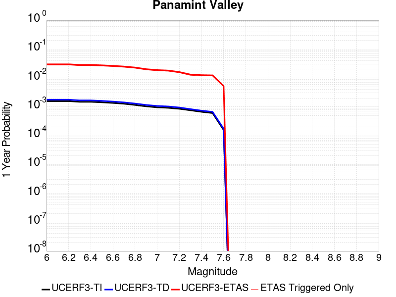 | 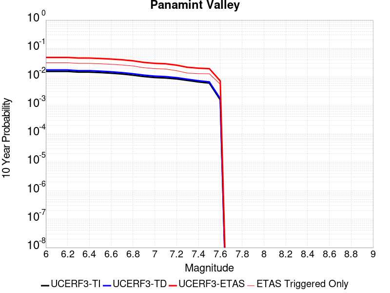 |

| Magnitude | 1 wk TI Prob | 1 wk TD Prob | 1 wk ETAS Prob | 1 wk ETAS/TD Gain | 1 wk ETAS Triggered Only | 1 mo TI Prob | 1 mo TD Prob | 1 mo ETAS Prob | 1 mo ETAS/TD Gain | 1 mo ETAS Triggered Only | 1 yr TI Prob | 1 yr TD Prob | 1 yr ETAS Prob | 1 yr ETAS/TD Gain | 1 yr ETAS Triggered Only | 10 yr TI Prob | 10 yr TD Prob | 10 yr ETAS Prob | 10 yr ETAS/TD Gain | 10 yr ETAS Triggered Only |
|-----|-----|-----|-----|-----|-----|-----|-----|-----|-----|-----|-----|-----|-----|-----|-----|-----|-----|-----|-----|-----|
| 6.0 | 3.0211835E-5 | 3.3984514E-5 | 0.01699325 | 500.02927 | 0.016959842 | 1.2947287E-4 | 1.4563995E-4 | 0.021237249 | 145.82022 | 0.021094682 | 0.0015751923 | 0.0017717537 | 0.02765615 | 15.609478 | 0.025930338 | 0.015640736 | 0.017583137 | 0.046362326 | 2.6367493 | 0.029294275 |
| 6.1 | 3.0211835E-5 | 3.3984514E-5 | 0.01699325 | 500.02927 | 0.016959842 | 1.2947287E-4 | 1.4563995E-4 | 0.021237249 | 145.82022 | 0.021094682 | 0.0015751923 | 0.0017717537 | 0.02765615 | 15.609478 | 0.025930338 | 0.015640736 | 0.017583137 | 0.046362326 | 2.6367493 | 0.029294275 |
| 6.2 | 3.0211835E-5 | 3.3984514E-5 | 0.01699325 | 500.02927 | 0.016959842 | 1.2947287E-4 | 1.4563995E-4 | 0.021237249 | 145.82022 | 0.021094682 | 0.0015751923 | 0.0017717537 | 0.02765615 | 15.609478 | 0.025930338 | 0.015640736 | 0.017583137 | 0.046362326 | 2.6367493 | 0.029294275 |
| 6.3 | 2.8573924E-5 | 3.210268E-5 | 0.016220525 | 505.27008 | 0.016188942 | 1.2245393E-4 | 1.3757581E-4 | 0.020318413 | 147.68884 | 0.020183615 | 0.001489857 | 0.0016737265 | 0.02616137 | 15.630613 | 0.024528699 | 0.01479908 | 0.016617801 | 0.043909088 | 2.6422923 | 0.02775247 |
| 6.4 | 2.8573924E-5 | 3.210268E-5 | 0.016220525 | 505.27008 | 0.016188942 | 1.2245393E-4 | 1.3757581E-4 | 0.020318413 | 147.68884 | 0.020183615 | 0.001489857 | 0.0016737265 | 0.02616137 | 15.630613 | 0.024528699 | 0.01479908 | 0.016617801 | 0.043909088 | 2.6422923 | 0.02775247 |
| 6.5 | 2.7468774E-5 | 3.0828433E-5 | 0.015798792 | 512.4747 | 0.01576845 | 1.1771801E-4 | 1.3211532E-4 | 0.019612337 | 148.44861 | 0.019482795 | 0.0014322745 | 0.0016073446 | 0.025047077 | 15.582891 | 0.023477469 | 0.014230782 | 0.015963677 | 0.04210074 | 2.6372836 | 0.026561076 |
| 6.6 | 2.6135967E-5 | 2.925248E-5 | 0.015166521 | 518.46954 | 0.015137712 | 1.1200648E-4 | 1.253619E-4 | 0.018764837 | 149.68532 | 0.01864181 | 0.0013628257 | 0.0015252391 | 0.023707347 | 15.543365 | 0.022215992 | 0.013544982 | 0.015154043 | 0.040070254 | 2.6441956 | 0.025299601 |
| 6.7 | 2.4498746E-5 | 2.7341335E-5 | 0.014533917 | 531.57306 | 0.014506973 | 1.04990395E-4 | 1.1717203E-4 | 0.01784584 | 152.30461 | 0.017730745 | 0.0012775084 | 0.0014256609 | 0.022490269 | 15.775327 | 0.021094682 | 0.012701893 | 0.014171274 | 0.03786875 | 2.6722188 | 0.024038125 |
| 6.8 | 2.2244329E-5 | 2.4935423E-5 | 0.013690583 | 549.04156 | 0.013665989 | 9.532935E-5 | 1.0686185E-4 | 0.016574372 | 155.10092 | 0.016469268 | 0.0011600169 | 0.0013002884 | 0.020617768 | 15.856305 | 0.019342631 | 0.011539802 | 0.0129325185 | 0.0345845 | 2.6742277 | 0.021935664 |
| 6.9 | 1.9902658E-5 | 2.2290267E-5 | 0.011935964 | 535.47876 | 0.011913939 | 8.529431E-5 | 9.552632E-5 | 0.014390888 | 150.6484 | 0.014296727 | 0.0010379635 | 0.0011624309 | 0.017822558 | 15.332143 | 0.016679514 | 0.010331288 | 0.011568608 | 0.030341115 | 2.622711 | 0.018992221 |
| 7.0 | 1.8353881E-5 | 2.0566185E-5 | 0.011023213 | 535.98724 | 0.011002873 | 7.865712E-5 | 8.813792E-5 | 0.0133324675 | 151.26823 | 0.013245497 | 9.5722964E-4 | 0.0010725686 | 0.016614085 | 15.489997 | 0.015558203 | 0.009531168 | 0.010678849 | 0.028150916 | 2.6361377 | 0.017660663 |
| 7.1 | 1.7667631E-5 | 1.9772613E-5 | 0.010742106 | 543.2821 | 0.010722545 | 7.571623E-5 | 8.473711E-5 | 0.01283858 | 151.5107 | 0.012754924 | 9.2145515E-4 | 0.0010312037 | 0.015943276 | 15.460841 | 0.0149274655 | 0.009176437 | 0.010269073 | 0.027054753 | 2.6345859 | 0.016959842 |
| 7.2 | 1.6381597E-5 | 1.8158249E-5 | 0.009549136 | 525.8842 | 0.0095311515 | 7.020495E-5 | 7.781885E-5 | 0.011360142 | 145.98189 | 0.011283201 | 8.544101E-4 | 9.4704994E-4 | 0.014180003 | 14.972815 | 0.013245497 | 0.008511325 | 0.009434792 | 0.024360262 | 2.5819607 | 0.0150676295 |
| 7.3 | 1.4520491E-5 | 1.5966476E-5 | 0.008005187 | 501.37466 | 0.007989348 | 6.222919E-5 | 6.842605E-5 | 0.009388694 | 137.20935 | 0.009320905 | 7.57377E-4 | 8.327849E-4 | 0.012036567 | 14.453391 | 0.011213119 | 0.0075480095 | 0.00829975 | 0.021018311 | 2.5324028 | 0.012825006 |
| 7.4 | 1.2852287E-5 | 1.4145411E-5 | 0.007793137 | 550.9304 | 0.0077791014 | 5.5080065E-5 | 6.062187E-5 | 0.009030574 | 148.9656 | 0.008970495 | 6.7039346E-4 | 7.378371E-4 | 0.011452471 | 15.521679 | 0.010722545 | 0.0066837464 | 0.0073567946 | 0.019600485 | 2.6642697 | 0.0123344315 |
| 7.5 | 1.1637851E-5 | 1.2836797E-5 | 0.0077217575 | 601.533 | 0.0077090194 | 4.987555E-5 | 5.5013777E-5 | 0.008954938 | 162.77628 | 0.008900413 | 6.070656E-4 | 6.6960254E-4 | 0.011314933 | 16.897984 | 0.010652463 | 0.006054099 | 0.0066787465 | 0.018861186 | 2.8240607 | 0.0122643495 |
| 7.6 | 3.0068115E-6 | 3.3330316E-6 | 0.0033672575 | 1010.26874 | 0.0033639357 | 1.2886271E-5 | 1.4284384E-5 | 0.003658496 | 256.1186 | 0.0036442638 | 1.5687906E-4 | 1.7390578E-4 | 0.0045883036 | 26.38385 | 0.0044151656 | 0.0015676835 | 0.0017391363 | 0.0067063044 | 3.856112 | 0.004975822 |

## Hunter Mountain-Saline Valley
*[(top)](#table-of-contents)*

| 1 Week | 1 Month | 1 Year | 10 Year |
|-----|-----|-----|-----|
|  |  |  |  |

| Magnitude | 1 wk TI Prob | 1 wk TD Prob | 1 wk ETAS Prob | 1 wk ETAS/TD Gain | 1 wk ETAS Triggered Only | 1 mo TI Prob | 1 mo TD Prob | 1 mo ETAS Prob | 1 mo ETAS/TD Gain | 1 mo ETAS Triggered Only | 1 yr TI Prob | 1 yr TD Prob | 1 yr ETAS Prob | 1 yr ETAS/TD Gain | 1 yr ETAS Triggered Only | 10 yr TI Prob | 10 yr TD Prob | 10 yr ETAS Prob | 10 yr ETAS/TD Gain | 10 yr ETAS Triggered Only |
|-----|-----|-----|-----|-----|-----|-----|-----|-----|-----|-----|-----|-----|-----|-----|-----|-----|-----|-----|-----|-----|
| 6.0 | 4.5103672E-5 | 5.4570177E-5 | 0.008183638 | 149.9654 | 0.008129512 | 1.9328714E-4 | 2.3385242E-4 | 0.009622644 | 41.14836 | 0.009390987 | 0.002350731 | 0.0028435152 | 0.014304281 | 5.030492 | 0.011493447 | 0.023260195 | 0.028091887 | 0.040965293 | 1.4582607 | 0.013245497 |
| 6.1 | 4.5103672E-5 | 5.4570177E-5 | 0.008183638 | 149.9654 | 0.008129512 | 1.9328714E-4 | 2.3385242E-4 | 0.009622644 | 41.14836 | 0.009390987 | 0.002350731 | 0.0028435152 | 0.014304281 | 5.030492 | 0.011493447 | 0.023260195 | 0.028091887 | 0.040965293 | 1.4582607 | 0.013245497 |
| 6.2 | 3.9363465E-5 | 4.706337E-5 | 0.008106113 | 172.23827 | 0.00805943 | 1.6868966E-4 | 2.0168544E-4 | 0.009520711 | 47.20574 | 0.009320905 | 0.002051862 | 0.0024528175 | 0.013848163 | 5.6458187 | 0.011423365 | 0.020330196 | 0.024273481 | 0.03712908 | 1.529615 | 0.013175415 |
| 6.3 | 3.9363465E-5 | 4.706337E-5 | 0.008106113 | 172.23827 | 0.00805943 | 1.6868966E-4 | 2.0168544E-4 | 0.009520711 | 47.20574 | 0.009320905 | 0.002051862 | 0.0024528175 | 0.013848163 | 5.6458187 | 0.011423365 | 0.020330196 | 0.024273481 | 0.03712908 | 1.529615 | 0.013175415 |
| 6.4 | 3.2311684E-5 | 3.795099E-5 | 0.007956916 | 209.66293 | 0.007919266 | 1.384713E-4 | 1.6263737E-4 | 0.009341885 | 57.439972 | 0.009180741 | 0.0016845843 | 0.0019783843 | 0.01316932 | 6.6566033 | 0.011213119 | 0.016718714 | 0.019616475 | 0.032258607 | 1.644465 | 0.012895088 |
| 6.5 | 3.2311684E-5 | 3.795099E-5 | 0.007956916 | 209.66293 | 0.007919266 | 1.384713E-4 | 1.6263737E-4 | 0.009341885 | 57.439972 | 0.009180741 | 0.0016845843 | 0.0019783843 | 0.01316932 | 6.6566033 | 0.011213119 | 0.016718714 | 0.019616475 | 0.032258607 | 1.644465 | 0.012895088 |
| 6.6 | 2.9305844E-5 | 3.418183E-5 | 0.007953176 | 232.67262 | 0.007919266 | 1.2559042E-4 | 1.4648569E-4 | 0.009325882 | 63.664116 | 0.009180741 | 0.0015279909 | 0.001782067 | 0.012905247 | 7.2417293 | 0.011143037 | 0.015175272 | 0.01768569 | 0.030283878 | 1.7123377 | 0.012825006 |
| 6.7 | 2.7826512E-5 | 3.2344276E-5 | 0.007951354 | 245.83496 | 0.007919266 | 1.19251024E-4 | 1.386113E-4 | 0.00931808 | 67.22453 | 0.009180741 | 0.0014509142 | 0.0016863465 | 0.012810593 | 7.5966554 | 0.011143037 | 0.014414776 | 0.016743187 | 0.02935346 | 1.7531586 | 0.012825006 |
| 6.8 | 2.3389874E-5 | 2.6866714E-5 | 0.007945919 | 295.7533 | 0.007919266 | 1.0023846E-4 | 1.15138246E-4 | 0.009294823 | 80.7275 | 0.009180741 | 0.00121972 | 0.001400954 | 0.01252838 | 8.94275 | 0.011143037 | 0.01213047 | 0.013927434 | 0.02657382 | 1.9080198 | 0.012825006 |
| 6.9 | 2.069209E-5 | 2.3570032E-5 | 0.007942649 | 336.98083 | 0.007919266 | 8.867737E-5 | 1.01010715E-4 | 0.0092107495 | 91.185875 | 0.009110659 | 0.0010791123 | 0.0012291478 | 0.012148501 | 9.883678 | 0.010932791 | 0.010738871 | 0.012228523 | 0.024689022 | 2.01897 | 0.01261476 |
| 7.0 | 1.7462342E-5 | 1.9633546E-5 | 0.007938744 | 404.3459 | 0.007919266 | 7.483646E-5 | 8.414118E-5 | 0.009194034 | 109.269135 | 0.009110659 | 9.1075303E-4 | 0.0010239601 | 0.011945557 | 11.666038 | 0.010932791 | 0.009070295 | 0.0101960525 | 0.022682192 | 2.224605 | 0.01261476 |
| 7.1 | 1.4807709E-5 | 1.6441749E-5 | 0.0077954154 | 474.12323 | 0.0077791014 | 6.3460066E-5 | 7.046283E-5 | 0.009040326 | 128.29922 | 0.008970495 | 7.723524E-4 | 8.575638E-4 | 0.011640936 | 13.574426 | 0.010792627 | 0.007696735 | 0.008545532 | 0.020844042 | 2.4391744 | 0.012404514 |
| 7.2 | 1.4180048E-5 | 1.5698337E-5 | 0.0077946777 | 496.5289 | 0.0077791014 | 6.077022E-5 | 6.727694E-5 | 0.009037169 | 134.32788 | 0.008970495 | 7.396263E-4 | 8.188051E-4 | 0.011602595 | 14.170155 | 0.010792627 | 0.0073716943 | 0.008160833 | 0.020464115 | 2.5076013 | 0.012404514 |
| 7.3 | 1.3730402E-5 | 1.5172075E-5 | 0.0077941557 | 513.71716 | 0.0077791014 | 5.8843252E-5 | 6.502165E-5 | 0.0090349335 | 138.9527 | 0.008970495 | 7.161811E-4 | 7.9136714E-4 | 0.011575454 | 14.627159 | 0.010792627 | 0.007138774 | 0.007888422 | 0.020195084 | 2.5600915 | 0.012404514 |
| 7.4 | 1.2810095E-5 | 1.4109277E-5 | 0.007793101 | 552.3388 | 0.0077791014 | 5.489925E-5 | 6.0467017E-5 | 0.00903042 | 149.34456 | 0.008970495 | 6.681934E-4 | 7.359531E-4 | 0.011450607 | 15.558882 | 0.010722545 | 0.006661878 | 0.007338053 | 0.019581974 | 2.6685517 | 0.0123344315 |
| 7.5 | 1.1595659E-5 | 1.2800664E-5 | 0.0077217217 | 603.2282 | 0.0077090194 | 4.9694736E-5 | 5.4858923E-5 | 0.008954784 | 163.23296 | 0.008900413 | 6.0486543E-4 | 6.6771836E-4 | 0.011313069 | 16.942875 | 0.010652463 | 0.006032217 | 0.0066599925 | 0.018842662 | 2.8292317 | 0.0122643495 |
| 7.6 | 2.997694E-6 | 3.3251579E-6 | 0.0033672499 | 1012.6586 | 0.0033639357 | 1.28471975E-5 | 1.425064E-5 | 0.0036584625 | 256.7227 | 0.0036442638 | 1.564034E-4 | 1.73495E-4 | 0.004587895 | 26.443958 | 0.0044151656 | 0.0015629337 | 0.001735031 | 0.0067022196 | 3.8628817 | 0.004975822 |

## Blackwater
*[(top)](#table-of-contents)*

| 1 Week | 1 Month | 1 Year | 10 Year |
|-----|-----|-----|-----|
|  |  |  |  |

| Magnitude | 1 wk TI Prob | 1 wk TD Prob | 1 wk ETAS Prob | 1 wk ETAS/TD Gain | 1 wk ETAS Triggered Only | 1 mo TI Prob | 1 mo TD Prob | 1 mo ETAS Prob | 1 mo ETAS/TD Gain | 1 mo ETAS Triggered Only | 1 yr TI Prob | 1 yr TD Prob | 1 yr ETAS Prob | 1 yr ETAS/TD Gain | 1 yr ETAS Triggered Only | 10 yr TI Prob | 10 yr TD Prob | 10 yr ETAS Prob | 10 yr ETAS/TD Gain | 10 yr ETAS Triggered Only |
|-----|-----|-----|-----|-----|-----|-----|-----|-----|-----|-----|-----|-----|-----|-----|-----|-----|-----|-----|-----|-----|
| 6.0 | 3.0708583E-5 | 3.3095846E-5 | 0.006270187 | 189.4554 | 0.006237298 | 1.3160157E-4 | 1.4183241E-4 | 0.007639542 | 53.863167 | 0.0074987737 | 0.0016010714 | 0.0017255784 | 0.011240283 | 6.5139217 | 0.0095311515 | 0.015895851 | 0.017135633 | 0.028432133 | 1.6592402 | 0.011493447 |
| 6.1 | 3.0708583E-5 | 3.3095846E-5 | 0.006270187 | 189.4554 | 0.006237298 | 1.3160157E-4 | 1.4183241E-4 | 0.007639542 | 53.863167 | 0.0074987737 | 0.0016010714 | 0.0017255784 | 0.011240283 | 6.5139217 | 0.0095311515 | 0.015895851 | 0.017135633 | 0.028432133 | 1.6592402 | 0.011493447 |
| 6.2 | 1.1707779E-5 | 1.2545122E-5 | 0.0021850597 | 174.17604 | 0.0021725418 | 5.017523E-5 | 5.3763757E-5 | 0.002646658 | 49.227554 | 0.002593034 | 6.107122E-4 | 6.5438676E-4 | 0.0040161214 | 6.137229 | 0.0033639357 | 0.006090366 | 0.0065255696 | 0.01070305 | 1.6401709 | 0.0042049196 |
| 6.3 | 1.1707779E-5 | 1.2545122E-5 | 0.0021850597 | 174.17604 | 0.0021725418 | 5.017523E-5 | 5.3763757E-5 | 0.002646658 | 49.227554 | 0.002593034 | 6.107122E-4 | 6.5438676E-4 | 0.0040161214 | 6.137229 | 0.0033639357 | 0.006090366 | 0.0065255696 | 0.01070305 | 1.6401709 | 0.0042049196 |
| 6.4 | 7.929244E-6 | 8.480098E-6 | 0.0016203524 | 191.07707 | 0.001611886 | 3.3982033E-5 | 3.6342793E-5 | 0.0019284879 | 53.06383 | 0.001892214 | 4.136527E-4 | 4.423877E-4 | 0.0028241214 | 6.3838153 | 0.0023827879 | 0.0041288356 | 0.0044154758 | 0.0074854684 | 1.6952801 | 0.0030836079 |
| 6.5 | 5.8832115E-6 | 6.285991E-6 | 0.0011275909 | 179.38156 | 0.0011213119 | 2.521352E-5 | 2.6939697E-5 | 0.0013584618 | 50.42602 | 0.0013315579 | 3.0693135E-4 | 3.27944E-4 | 0.0019393013 | 5.9135137 | 0.001611886 | 0.0030650778 | 0.0032748538 | 0.0053704283 | 1.6398987 | 0.0021024598 |
| 6.6 | 5.8832115E-6 | 6.285991E-6 | 0.0011275909 | 179.38156 | 0.0011213119 | 2.521352E-5 | 2.6939697E-5 | 0.0013584618 | 50.42602 | 0.0013315579 | 3.0693135E-4 | 3.27944E-4 | 0.0019393013 | 5.9135137 | 0.001611886 | 0.0030650778 | 0.0032748538 | 0.0053704283 | 1.6398987 | 0.0021024598 |
| 6.7 | 3.0715053E-6 | 3.2814662E-6 | 2.1352676E-4 | 65.07053 | 2.1024598E-4 | 1.3163528E-5 | 1.4063357E-5 | 3.644684E-4 | 25.916174 | 3.5040997E-4 | 1.6025416E-4 | 1.7120909E-4 | 5.9162907E-4 | 3.4555938 | 4.2049197E-4 | 0.0016013865 | 0.0017108864 | 0.0023405452 | 1.3680308 | 6.30738E-4 |
| 6.8 | 2.2722281E-6 | 2.4287538E-6 | 1.425924E-4 | 58.710114 | 1.4016399E-4 | 9.738084E-6 | 1.0408908E-5 | 1.5057145E-4 | 14.465632 | 1.4016399E-4 | 1.1855473E-4 | 1.26722E-4 | 3.3694136E-4 | 2.6589017 | 2.1024598E-4 | 0.001184915 | 0.0012665876 | 0.001686547 | 1.3315675 | 4.2049197E-4 |
| 6.9 | 9.952399E-7 | 1.0653489E-6 | 7.114727E-5 | 66.78307 | 7.0081995E-5 | 4.265307E-6 | 4.5657757E-6 | 7.4647454E-5 | 16.349346 | 7.0081995E-5 | 5.1928873E-5 | 5.5587418E-5 | 1.9574362E-4 | 3.5213656 | 1.4016399E-4 | 5.191674E-4 | 5.557858E-4 | 8.3595794E-4 | 1.504101 | 2.8032798E-4 |
| 7.0 | 4.7385504E-7 | 5.0755597E-7 | 7.0589515E-5 | 139.07732 | 7.0081995E-5 | 2.0308057E-6 | 2.1752398E-6 | 7.2257084E-5 | 33.217987 | 7.0081995E-5 | 2.4724779E-5 | 2.6483543E-5 | 9.656369E-5 | 3.6461768 | 7.0081995E-5 | 2.4722028E-4 | 2.6483546E-4 | 4.049623E-4 | 1.5291092 | 1.4016399E-4 |

## Ash Hill
*[(top)](#table-of-contents)*

| 1 Week | 1 Month | 1 Year | 10 Year |
|-----|-----|-----|-----|
|  |  |  |  |

| Magnitude | 1 wk TI Prob | 1 wk TD Prob | 1 wk ETAS Prob | 1 wk ETAS/TD Gain | 1 wk ETAS Triggered Only | 1 mo TI Prob | 1 mo TD Prob | 1 mo ETAS Prob | 1 mo ETAS/TD Gain | 1 mo ETAS Triggered Only | 1 yr TI Prob | 1 yr TD Prob | 1 yr ETAS Prob | 1 yr ETAS/TD Gain | 1 yr ETAS Triggered Only | 10 yr TI Prob | 10 yr TD Prob | 10 yr ETAS Prob | 10 yr ETAS/TD Gain | 10 yr ETAS Triggered Only |
|-----|-----|-----|-----|-----|-----|-----|-----|-----|-----|-----|-----|-----|-----|-----|-----|-----|-----|-----|-----|-----|
| 6.0 | 2.1545662E-5 | 2.3194447E-5 | 0.005980026 | 257.82144 | 0.0059569697 | 9.2335285E-5 | 9.940143E-5 | 0.0075273546 | 75.72682 | 0.0074286917 | 0.0011236023 | 0.0012096206 | 0.010519251 | 8.696323 | 0.009320905 | 0.011179381 | 0.012038348 | 0.022701051 | 1.885728 | 0.010792627 |
| 6.1 | 2.1545662E-5 | 2.3194447E-5 | 0.005980026 | 257.82144 | 0.0059569697 | 9.2335285E-5 | 9.940143E-5 | 0.0075273546 | 75.72682 | 0.0074286917 | 0.0011236023 | 0.0012096206 | 0.010519251 | 8.696323 | 0.009320905 | 0.011179381 | 0.012038348 | 0.022701051 | 1.885728 | 0.010792627 |
| 6.2 | 2.1545662E-5 | 2.3194447E-5 | 0.005980026 | 257.82144 | 0.0059569697 | 9.2335285E-5 | 9.940143E-5 | 0.0075273546 | 75.72682 | 0.0074286917 | 0.0011236023 | 0.0012096206 | 0.010519251 | 8.696323 | 0.009320905 | 0.011179381 | 0.012038348 | 0.022701051 | 1.885728 | 0.010792627 |
| 6.3 | 1.0025529E-5 | 1.0746934E-5 | 0.0023935093 | 222.71553 | 0.0023827879 | 4.2965847E-5 | 4.605755E-5 | 0.0029893657 | 64.90501 | 0.0029434438 | 5.229836E-4 | 5.6061964E-4 | 0.0042028404 | 7.496777 | 0.0036442638 | 0.005217545 | 0.0055933665 | 0.009774767 | 1.7475642 | 0.0042049196 |
| 6.4 | 1.0025529E-5 | 1.0746934E-5 | 0.0023935093 | 222.71553 | 0.0023827879 | 4.2965847E-5 | 4.605755E-5 | 0.0029893657 | 64.90501 | 0.0029434438 | 5.229836E-4 | 5.6061964E-4 | 0.0042028404 | 7.496777 | 0.0036442638 | 0.005217545 | 0.0055933665 | 0.009774767 | 1.7475642 | 0.0042049196 |
| 6.5 | 6.9617327E-6 | 7.456634E-6 | 0.0017594935 | 235.9635 | 0.0017520499 | 2.9835655E-5 | 3.195666E-5 | 0.0022044291 | 68.981834 | 0.0021725418 | 3.6318856E-4 | 3.8901155E-4 | 0.0030510915 | 7.8431897 | 0.0026631157 | 0.0036259557 | 0.0038841602 | 0.006955791 | 1.7908094 | 0.0030836079 |
| 6.6 | 4.9919777E-6 | 5.3466883E-6 | 0.0015471424 | 289.3646 | 0.0015418039 | 2.1394015E-5 | 2.2914215E-5 | 0.0018450044 | 80.5179 | 0.0018221319 | 2.60441E-4 | 2.7895154E-4 | 0.0025209498 | 9.037231 | 0.0022426238 | 0.0026013597 | 0.0027866727 | 0.005302594 | 1.9028406 | 0.002522952 |
| 6.7 | 3.6630722E-6 | 3.924624E-6 | 0.0013354773 | 340.28162 | 0.0013315579 | 1.5698786E-5 | 1.681974E-5 | 0.0016286785 | 96.831375 | 0.001611886 | 1.9111596E-4 | 2.0476682E-4 | 0.0022367286 | 10.923295 | 0.002032378 | 0.0019095168 | 0.0020463446 | 0.004284379 | 2.0936744 | 0.0022426238 |
| 6.8 | 2.5599613E-6 | 2.744925E-6 | 9.1380836E-4 | 332.9083 | 9.1106596E-4 | 1.0971216E-5 | 1.1763939E-5 | 0.0011330626 | 96.316605 | 0.0011213119 | 1.3356637E-4 | 1.4322149E-4 | 0.0015446607 | 10.785117 | 0.0014016399 | 0.0013348613 | 0.0014317769 | 0.0029713733 | 2.0753047 | 0.0015418039 |
| 6.9 | 1.7684905E-6 | 1.8968707E-6 | 7.727974E-4 | 407.40643 | 7.7090197E-4 | 7.579223E-6 | 8.129446E-6 | 8.491066E-4 | 104.44827 | 8.4098394E-4 | 9.2273134E-5 | 9.8976E-5 | 0.0012201769 | 12.328008 | 0.0011213119 | 9.223483E-4 | 9.8976E-4 | 0.0022499873 | 2.2732656 | 0.001261476 |

## Garlock (West)
*[(top)](#table-of-contents)*

| 1 Week | 1 Month | 1 Year | 10 Year |
|-----|-----|-----|-----|
|  |  |  |  |

| Magnitude | 1 wk TI Prob | 1 wk TD Prob | 1 wk ETAS Prob | 1 wk ETAS/TD Gain | 1 wk ETAS Triggered Only | 1 mo TI Prob | 1 mo TD Prob | 1 mo ETAS Prob | 1 mo ETAS/TD Gain | 1 mo ETAS Triggered Only | 1 yr TI Prob | 1 yr TD Prob | 1 yr ETAS Prob | 1 yr ETAS/TD Gain | 1 yr ETAS Triggered Only | 10 yr TI Prob | 10 yr TD Prob | 10 yr ETAS Prob | 10 yr ETAS/TD Gain | 10 yr ETAS Triggered Only |
|-----|-----|-----|-----|-----|-----|-----|-----|-----|-----|-----|-----|-----|-----|-----|-----|-----|-----|-----|-----|-----|
| 6.0 | 2.5181727E-5 | 2.51973E-5 | 0.0068229795 | 270.78217 | 0.0067979535 | 1.0791722E-4 | 1.0798398E-4 | 0.007886246 | 73.031624 | 0.0077791014 | 0.0013131002 | 0.0013139155 | 0.0108325435 | 8.244475 | 0.0095311515 | 0.013053683 | 0.013141977 | 0.023170318 | 1.7630771 | 0.01016189 |
| 6.1 | 2.5077732E-5 | 2.5098372E-5 | 0.0068228813 | 271.84558 | 0.0067979535 | 1.0747157E-4 | 1.0756004E-4 | 0.007885825 | 73.31557 | 0.0077791014 | 0.001307681 | 0.0013087603 | 0.010827438 | 8.273049 | 0.0095311515 | 0.013000126 | 0.013091032 | 0.023119893 | 1.7660862 | 0.01016189 |
| 6.2 | 2.494612E-5 | 2.498005E-5 | 0.006822764 | 273.1285 | 0.0067979535 | 1.0690756E-4 | 1.0705298E-4 | 0.007885322 | 73.65812 | 0.0077791014 | 0.0013008224 | 0.0013025942 | 0.01082133 | 8.307522 | 0.0095311515 | 0.012932341 | 0.013030097 | 0.023059575 | 1.7697164 | 0.01016189 |
| 6.3 | 2.4733758E-5 | 2.479942E-5 | 0.0068225847 | 275.11066 | 0.0067979535 | 1.0599751E-4 | 1.06278916E-4 | 0.007884554 | 74.18738 | 0.0077791014 | 0.0012897556 | 0.0012931811 | 0.010812007 | 8.360784 | 0.0095311515 | 0.012822957 | 0.012937066 | 0.022967491 | 1.7753245 | 0.01016189 |
| 6.4 | 2.3237335E-5 | 2.317873E-5 | 0.006820975 | 294.2773 | 0.0067979535 | 9.958477E-5 | 9.933365E-5 | 0.007877663 | 79.30508 | 0.0077791014 | 0.0012117702 | 0.001208719 | 0.01072835 | 8.875801 | 0.0095311515 | 0.012051838 | 0.012101916 | 0.022140827 | 1.8295307 | 0.01016189 |
| 6.5 | 2.2732203E-5 | 2.2993298E-5 | 0.0068207905 | 296.64255 | 0.0067979535 | 9.742009E-5 | 9.8539E-5 | 0.007876874 | 79.936615 | 0.0077791014 | 0.0011854442 | 0.0011990548 | 0.010718778 | 8.939356 | 0.0095311515 | 0.011791403 | 0.012006322 | 0.022046205 | 1.8362163 | 0.01016189 |
| 6.6 | 2.1319436E-5 | 2.17735E-5 | 0.0067494987 | 309.98685 | 0.0067278715 | 9.136581E-5 | 9.331167E-5 | 0.007801612 | 83.6081 | 0.0077090194 | 0.001111811 | 0.0011354799 | 0.010585806 | 9.322761 | 0.0094610695 | 0.011062649 | 0.011377227 | 0.021354217 | 1.8769264 | 0.010091808 |
| 6.7 | 1.970802E-5 | 2.0393396E-5 | 0.0067481278 | 330.8977 | 0.0067278715 | 8.446021E-5 | 8.739735E-5 | 0.007795743 | 89.19885 | 0.0077090194 | 0.001027818 | 0.001063545 | 0.010514552 | 9.886325 | 0.0094610695 | 0.010230771 | 0.010664964 | 0.020649143 | 1.9361662 | 0.010091808 |
| 6.8 | 1.8744462E-5 | 1.9901045E-5 | 0.006747639 | 339.05954 | 0.0067278715 | 8.033094E-5 | 8.5287415E-5 | 0.0077936496 | 91.381004 | 0.0077090194 | 9.775903E-4 | 0.0010378812 | 0.010489131 | 10.106292 | 0.0094610695 | 0.009733009 | 0.01041075 | 0.020397495 | 1.9592723 | 0.010091808 |
| 6.9 | 1.7559682E-5 | 1.8953415E-5 | 0.0067466977 | 355.96213 | 0.0067278715 | 7.5253614E-5 | 8.12264E-5 | 0.0077896197 | 95.9001 | 0.0077090194 | 9.158276E-4 | 9.884841E-4 | 0.010370188 | 10.491001 | 0.009390987 | 0.0091206245 | 0.009921231 | 0.019843528 | 2.0001075 | 0.010021726 |
| 7.0 | 1.6794445E-5 | 1.8216237E-5 | 0.0066758846 | 366.4799 | 0.0066577895 | 7.197421E-5 | 7.8067256E-5 | 0.0077164085 | 98.84308 | 0.0076389373 | 8.759337E-4 | 9.5005584E-4 | 0.010262106 | 10.801582 | 0.009320905 | 0.008724891 | 0.009540141 | 0.019396843 | 2.0331821 | 0.009951644 |
| 7.1 | 1.6337795E-5 | 1.7717046E-5 | 0.0066753887 | 376.77777 | 0.0066577895 | 7.0017246E-5 | 7.5927994E-5 | 0.0077142855 | 101.60002 | 0.0076389373 | 8.521265E-4 | 9.240326E-4 | 0.010236326 | 11.077884 | 0.009320905 | 0.008488664 | 0.009281996 | 0.019141268 | 2.0621932 | 0.009951644 |
| 7.2 | 1.5780008E-5 | 1.7165687E-5 | 0.0066047604 | 384.7653 | 0.0065877074 | 6.762685E-5 | 7.356516E-5 | 0.007571787 | 102.92626 | 0.0074987737 | 8.2304585E-4 | 8.9528906E-4 | 0.010067811 | 11.245318 | 0.009180741 | 0.008200042 | 0.008996838 | 0.018720046 | 2.0807362 | 0.00981148 |
| 7.3 | 1.5058865E-5 | 1.6618762E-5 | 0.006604217 | 397.39523 | 0.0065877074 | 6.45364E-5 | 7.122133E-5 | 0.0075694607 | 106.280815 | 0.0074987737 | 7.854473E-4 | 8.667759E-4 | 0.01003956 | 11.582647 | 0.009180741 | 0.00782677 | 0.008713539 | 0.018439526 | 2.1161926 | 0.00981148 |
| 7.4 | 1.4887923E-5 | 1.6454731E-5 | 0.006604054 | 401.3468 | 0.0065877074 | 6.380382E-5 | 7.051838E-5 | 0.007568763 | 107.33036 | 0.0074987737 | 7.7653467E-4 | 8.582243E-4 | 0.010031086 | 11.688188 | 0.009180741 | 0.0077382675 | 0.008628399 | 0.01835522 | 2.1273031 | 0.00981148 |
| 7.5 | 1.4509299E-5 | 1.6046748E-5 | 0.0061831633 | 385.3219 | 0.0061672158 | 6.218123E-5 | 6.876997E-5 | 0.007146565 | 103.919846 | 0.0070782816 | 7.567935E-4 | 8.36954E-4 | 0.009379801 | 11.207069 | 0.008550003 | 0.0075422134 | 0.008416704 | 0.017520174 | 2.0815957 | 0.009180741 |
| 7.6 | 1.2756717E-5 | 1.4050848E-5 | 0.0039385874 | 280.30957 | 0.003924592 | 5.4670498E-5 | 6.0216535E-5 | 0.004545194 | 75.480835 | 0.0044852477 | 6.6541E-4 | 7.328904E-4 | 0.0060552186 | 8.262107 | 0.0053262315 | 0.006634211 | 0.0073816874 | 0.0132251205 | 1.791612 | 0.0058868877 |
| 7.7 | 1.0328985E-5 | 1.1460557E-5 | 0.0026044648 | 227.25464 | 0.002593034 | 4.4266326E-5 | 4.911575E-5 | 0.002992415 | 60.925774 | 0.0029434438 | 5.388092E-4 | 5.978206E-4 | 0.0040998254 | 6.857953 | 0.0035040998 | 0.0053750467 | 0.006038511 | 0.009869746 | 1.6344666 | 0.0038545097 |
| 7.8 | 7.0306583E-6 | 8.899601E-6 | 0.0016908526 | 189.99194 | 0.0016819679 | 3.0131043E-5 | 3.814059E-5 | 0.0019302823 | 50.60966 | 0.001892214 | 3.667837E-4 | 4.642629E-4 | 0.0027058455 | 5.8282614 | 0.0022426238 | 0.003661789 | 0.0046952725 | 0.0072063785 | 1.5348158 | 0.002522952 |
| 7.9 | 4.060633E-6 | 5.4653938E-6 | 9.86608E-4 | 180.5191 | 9.81148E-4 | 1.7402595E-5 | 2.3422906E-5 | 0.0010746282 | 45.87937 | 0.0010512299 | 2.11856E-4 | 2.851367E-4 | 0.0015462529 | 5.422848 | 0.001261476 | 0.0021165414 | 0.002884201 | 0.0043516783 | 1.5087985 | 0.0014717219 |
| 8.0 | 1.6729537E-6 | 2.0775144E-6 | 2.8240492E-4 | 135.93404 | 2.8032798E-4 | 7.169782E-6 | 8.903603E-6 | 2.892291E-4 | 32.4845 | 2.8032798E-4 | 8.7288594E-5 | 1.0839601E-4 | 4.5876802E-4 | 4.232333 | 3.5040997E-4 | 8.7254314E-4 | 0.0010969337 | 0.0014469593 | 1.3190945 | 3.5040997E-4 |
| 8.1 | 3.6733252E-7 | 3.1489964E-7 | 3.1489964E-7 | 1.0 | 0.0 | 1.5742813E-6 | 1.3495693E-6 | 1.3495693E-6 | 1.0 | 0.0 | 1.9166706E-5 | 1.6430899E-5 | 1.6430899E-5 | 1.0 | 0.0 | 1.9165053E-4 | 1.6638759E-4 | 1.6638759E-4 | 1.0 | 0.0 |

## McLean Lake
*[(top)](#table-of-contents)*

| 1 Week | 1 Month | 1 Year | 10 Year |
|-----|-----|-----|-----|
|  |  |  |  |

| Magnitude | 1 wk TI Prob | 1 wk TD Prob | 1 wk ETAS Prob | 1 wk ETAS/TD Gain | 1 wk ETAS Triggered Only | 1 mo TI Prob | 1 mo TD Prob | 1 mo ETAS Prob | 1 mo ETAS/TD Gain | 1 mo ETAS Triggered Only | 1 yr TI Prob | 1 yr TD Prob | 1 yr ETAS Prob | 1 yr ETAS/TD Gain | 1 yr ETAS Triggered Only | 10 yr TI Prob | 10 yr TD Prob | 10 yr ETAS Prob | 10 yr ETAS/TD Gain | 10 yr ETAS Triggered Only |
|-----|-----|-----|-----|-----|-----|-----|-----|-----|-----|-----|-----|-----|-----|-----|-----|-----|-----|-----|-----|-----|
| 6.0 | 1.7360222E-5 | 1.8501627E-5 | 0.0035225365 | 190.39064 | 0.0035040998 | 7.439883E-5 | 7.9290556E-5 | 0.0047043357 | 59.33034 | 0.0046254117 | 9.0542925E-4 | 9.6498354E-4 | 0.0076163486 | 7.8927236 | 0.0066577895 | 0.009017491 | 0.0096127745 | 0.017386505 | 1.8086876 | 0.007849184 |
| 6.1 | 9.062689E-6 | 9.592193E-6 | 0.0017616253 | 183.65198 | 0.0017520499 | 3.8839516E-5 | 4.1108804E-5 | 0.0024237987 | 58.960575 | 0.0023827879 | 4.727685E-4 | 5.003936E-4 | 0.0038626462 | 7.7192154 | 0.0033639357 | 0.0047176396 | 0.004993552 | 0.008898546 | 1.7820073 | 0.003924592 |
| 6.2 | 9.062689E-6 | 9.592193E-6 | 0.0017616253 | 183.65198 | 0.0017520499 | 3.8839516E-5 | 4.1108804E-5 | 0.0024237987 | 58.960575 | 0.0023827879 | 4.727685E-4 | 5.003936E-4 | 0.0038626462 | 7.7192154 | 0.0033639357 | 0.0047176396 | 0.004993552 | 0.008898546 | 1.7820073 | 0.003924592 |
| 6.3 | 7.2575485E-6 | 7.66771E-6 | 0.0011990526 | 156.37689 | 0.0011913939 | 3.110341E-5 | 3.2861237E-5 | 0.0017848535 | 54.31486 | 0.0017520499 | 3.786182E-4 | 4.0001926E-4 | 0.002781854 | 6.9543004 | 0.0023827879 | 0.0037797375 | 0.0039936965 | 0.0069253854 | 1.7340789 | 0.0029434438 |
| 6.4 | 7.2575485E-6 | 7.66771E-6 | 0.0011990526 | 156.37689 | 0.0011913939 | 3.110341E-5 | 3.2861237E-5 | 0.0017848535 | 54.31486 | 0.0017520499 | 3.786182E-4 | 4.0001926E-4 | 0.002781854 | 6.9543004 | 0.0023827879 | 0.0037797375 | 0.0039936965 | 0.0069253854 | 1.7340789 | 0.0029434438 |
| 6.5 | 6.06582E-6 | 6.4038773E-6 | 9.875456E-4 | 154.21057 | 9.81148E-4 | 2.5996113E-5 | 2.7444936E-5 | 0.0015692065 | 57.176544 | 0.0015418039 | 3.164567E-4 | 3.3409733E-4 | 0.0023657961 | 7.0811586 | 0.002032378 | 0.0031600643 | 0.0033365893 | 0.0059209713 | 1.7745581 | 0.002593034 |
| 6.6 | 5.598744E-6 | 5.910262E-6 | 8.468892E-4 | 143.29132 | 8.4098394E-4 | 2.3994397E-5 | 2.5329486E-5 | 0.0014269339 | 56.334896 | 0.0014016399 | 2.9209262E-4 | 3.0834923E-4 | 0.0021999797 | 7.1347013 | 0.001892214 | 0.0029170897 | 0.003079843 | 0.0053854263 | 1.748604 | 0.0023127059 |
| 6.7 | 5.246996E-6 | 5.539162E-6 | 8.4651844E-4 | 152.82428 | 8.4098394E-4 | 2.2486933E-5 | 2.3739085E-5 | 0.0013552654 | 57.090042 | 0.0013315579 | 2.73744E-4 | 2.8899137E-4 | 0.002040535 | 7.060885 | 0.0017520499 | 0.0027340704 | 0.0028867796 | 0.00498317 | 1.7262039 | 0.0021024598 |
| 6.8 | 4.02324E-6 | 4.2469046E-6 | 7.751456E-4 | 182.52014 | 7.7090197E-4 | 1.7242342E-5 | 1.8200926E-5 | 0.0012095731 | 66.45669 | 0.0011913939 | 2.099053E-4 | 2.2157968E-4 | 0.0018331085 | 8.272908 | 0.001611886 | 0.0020970714 | 0.002214172 | 0.004172123 | 1.8842814 | 0.001962296 |
| 6.9 | 6.835972E-7 | 7.1399285E-7 | 2.1095983E-4 | 295.4649 | 2.1024598E-4 | 2.9296991E-6 | 3.0599674E-6 | 3.5346887E-4 | 115.51393 | 3.5040997E-4 | 3.56685E-5 | 3.7254784E-5 | 4.577311E-4 | 12.286505 | 4.2049197E-4 | 3.5662777E-4 | 3.7251666E-4 | 7.92852E-4 | 2.1283665 | 4.2049197E-4 |

## Gravel Hills-Harper Lk
*[(top)](#table-of-contents)*

| 1 Week | 1 Month | 1 Year | 10 Year |
|-----|-----|-----|-----|
|  |  |  |  |

| Magnitude | 1 wk TI Prob | 1 wk TD Prob | 1 wk ETAS Prob | 1 wk ETAS/TD Gain | 1 wk ETAS Triggered Only | 1 mo TI Prob | 1 mo TD Prob | 1 mo ETAS Prob | 1 mo ETAS/TD Gain | 1 mo ETAS Triggered Only | 1 yr TI Prob | 1 yr TD Prob | 1 yr ETAS Prob | 1 yr ETAS/TD Gain | 1 yr ETAS Triggered Only | 10 yr TI Prob | 10 yr TD Prob | 10 yr ETAS Prob | 10 yr ETAS/TD Gain | 10 yr ETAS Triggered Only |
|-----|-----|-----|-----|-----|-----|-----|-----|-----|-----|-----|-----|-----|-----|-----|-----|-----|-----|-----|-----|-----|
| 6.0 | 3.0679566E-5 | 3.1464646E-5 | 0.0035354542 | 112.362755 | 0.0035040998 | 1.3147724E-4 | 1.3484273E-4 | 0.0047596307 | 35.29764 | 0.0046254117 | 0.0015995599 | 0.0016406906 | 0.007447953 | 4.539523 | 0.0058168056 | 0.015880952 | 0.01630734 | 0.022787618 | 1.3973843 | 0.0065877074 |
| 6.1 | 3.0679566E-5 | 3.1464646E-5 | 0.0035354542 | 112.362755 | 0.0035040998 | 1.3147724E-4 | 1.3484273E-4 | 0.0047596307 | 35.29764 | 0.0046254117 | 0.0015995599 | 0.0016406906 | 0.007447953 | 4.539523 | 0.0058168056 | 0.015880952 | 0.01630734 | 0.022787618 | 1.3973843 | 0.0065877074 |
| 6.2 | 1.514536E-5 | 1.3635206E-5 | 0.0010648508 | 78.09569 | 0.0010512299 | 6.490707E-5 | 5.843536E-5 | 0.0013899155 | 23.78552 | 0.0013315579 | 7.8995706E-4 | 7.1123015E-4 | 0.0023920017 | 3.3631895 | 0.0016819679 | 0.007871548 | 0.0070907404 | 0.008830367 | 1.2453378 | 0.0017520499 |
| 6.3 | 1.514536E-5 | 1.3635206E-5 | 0.0010648508 | 78.09569 | 0.0010512299 | 6.490707E-5 | 5.843536E-5 | 0.0013899155 | 23.78552 | 0.0013315579 | 7.8995706E-4 | 7.1123015E-4 | 0.0023920017 | 3.3631895 | 0.0016819679 | 0.007871548 | 0.0070907404 | 0.008830367 | 1.2453378 | 0.0017520499 |
| 6.4 | 1.2532521E-5 | 1.06896905E-5 | 7.1150216E-4 | 66.559654 | 7.0081995E-4 | 5.37097E-5 | 4.581219E-5 | 9.568364E-4 | 20.886066 | 9.1106596E-4 | 6.537194E-4 | 5.576265E-4 | 0.001818399 | 3.2609622 | 0.001261476 | 0.0065179965 | 0.005562863 | 0.0068173213 | 1.225506 | 0.001261476 |
| 6.5 | 1.1094058E-5 | 9.083664E-6 | 4.295718E-4 | 47.290592 | 4.2049197E-4 | 4.7545094E-5 | 3.892943E-5 | 5.995636E-4 | 15.401294 | 5.6065596E-4 | 5.787078E-4 | 4.7386673E-4 | 0.0012444034 | 2.626062 | 7.7090197E-4 | 0.0057720304 | 0.0047289706 | 0.0054962267 | 1.162246 | 7.7090197E-4 |
| 6.6 | 9.688328E-6 | 7.5316952E-6 | 2.177761E-4 | 28.91462 | 2.1024598E-4 | 4.1520743E-5 | 3.227831E-5 | 3.8267698E-4 | 11.855546 | 3.5040997E-4 | 5.053978E-4 | 3.9292008E-4 | 9.5335575E-4 | 2.426335 | 5.6065596E-4 | 0.0050424994 | 0.0039225104 | 0.0044809673 | 1.1423723 | 5.6065596E-4 |
| 6.7 | 8.974824E-6 | 6.749413E-6 | 1.4691245E-4 | 21.7667 | 1.4016399E-4 | 3.8462964E-5 | 2.8925748E-5 | 2.3916566E-4 | 8.268262 | 2.1024598E-4 | 4.6818596E-4 | 3.5211627E-4 | 7.0240285E-4 | 1.9948038 | 3.5040997E-4 | 0.004672008 | 0.0035158044 | 0.0038649826 | 1.0993167 | 3.5040997E-4 |
| 6.8 | 7.4780046E-6 | 5.1161933E-6 | 1.4527947E-4 | 28.39601 | 1.4016399E-4 | 3.20482E-5 | 2.1926366E-5 | 1.6208728E-4 | 7.392346 | 1.4016399E-4 | 3.9011694E-4 | 2.669222E-4 | 4.7711207E-4 | 1.7874575 | 2.1024598E-4 | 0.0038943281 | 0.0026661542 | 0.0028758396 | 1.0786471 | 2.1024598E-4 |
| 6.9 | 6.3409307E-6 | 3.9074966E-6 | 1.4407095E-4 | 36.87039 | 1.4016399E-4 | 2.7175134E-5 | 1.6746313E-5 | 1.5690796E-4 | 9.369701 | 1.4016399E-4 | 3.3080703E-4 | 2.0386827E-4 | 4.140714E-4 | 2.0310733 | 2.1024598E-4 | 0.0033031502 | 0.0020369107 | 0.0022467284 | 1.1030078 | 2.1024598E-4 |
| 7.0 | 5.1239335E-6 | 2.6058565E-6 | 2.6058565E-6 | 1.0 | 0.0 | 2.195953E-5 | 1.116791E-5 | 1.116791E-5 | 1.0 | 0.0 | 2.6732447E-4 | 1.3596108E-4 | 2.0603354E-4 | 1.5153862 | 7.0081995E-5 | 0.0026700313 | 0.0013588042 | 0.001428791 | 1.0515062 | 7.0081995E-5 |
| 7.1 | 4.438899E-6 | 2.0984728E-6 | 2.0984728E-6 | 1.0 | 0.0 | 1.9023713E-5 | 8.993425E-6 | 8.993425E-6 | 1.0 | 0.0 | 2.315891E-4 | 1.0948967E-4 | 1.79564E-4 | 1.6400086 | 7.0081995E-5 | 0.002313479 | 0.0010943791 | 0.0011643844 | 1.0639681 | 7.0081995E-5 |
| 7.2 | 3.50367E-6 | 1.2615716E-6 | 1.2615716E-6 | 1.0 | 0.0 | 1.5015643E-5 | 5.4067245E-6 | 5.4067245E-6 | 1.0 | 0.0 | 1.8280011E-4 | 6.582497E-5 | 6.582497E-5 | 1.0 | 0.0 | 0.0018264982 | 6.580629E-4 | 6.580629E-4 | 1.0 | 0.0 |
| 7.3 | 2.561638E-6 | 7.1191585E-7 | 7.1191585E-7 | 1.0 | 0.0 | 1.0978401E-5 | 3.0510646E-6 | 3.0510646E-6 | 1.0 | 0.0 | 1.3365384E-4 | 3.71461E-5 | 3.71461E-5 | 1.0 | 0.0 | 0.0013357349 | 3.7140088E-4 | 3.7140088E-4 | 1.0 | 0.0 |
| 7.4 | 2.0368864E-6 | 5.304837E-7 | 5.304837E-7 | 1.0 | 0.0 | 8.729483E-6 | 2.2734996E-6 | 2.2734996E-6 | 1.0 | 0.0 | 1.06276275E-4 | 2.7679513E-5 | 2.7679513E-5 | 1.0 | 0.0 | 0.0010622547 | 2.767612E-4 | 2.767612E-4 | 1.0 | 0.0 |
| 7.5 | 1.1681728E-6 | 3.6030585E-7 | 3.6030585E-7 | 1.0 | 0.0 | 5.0064455E-6 | 1.544167E-6 | 1.544167E-6 | 1.0 | 0.0 | 6.0951766E-5 | 1.8800076E-5 | 1.8800076E-5 | 1.0 | 0.0 | 6.093505E-4 | 1.8798532E-4 | 1.8798532E-4 | 1.0 | 0.0 |
| 7.6 | 1.3154387E-7 | 7.1197384E-8 | 7.1197384E-8 | 1.0 | 0.0 | 5.6375933E-7 | 3.051316E-7 | 3.051316E-7 | 1.0 | 0.0 | 6.863748E-6 | 3.7149728E-6 | 3.7149728E-6 | 1.0 | 0.0 | 6.863536E-5 | 3.7149264E-5 | 3.7149264E-5 | 1.0 | 0.0 |

## Goldstone Lake
*[(top)](#table-of-contents)*

| 1 Week | 1 Month | 1 Year | 10 Year |
|-----|-----|-----|-----|
|  |  |  |  |

| Magnitude | 1 wk TI Prob | 1 wk TD Prob | 1 wk ETAS Prob | 1 wk ETAS/TD Gain | 1 wk ETAS Triggered Only | 1 mo TI Prob | 1 mo TD Prob | 1 mo ETAS Prob | 1 mo ETAS/TD Gain | 1 mo ETAS Triggered Only | 1 yr TI Prob | 1 yr TD Prob | 1 yr ETAS Prob | 1 yr ETAS/TD Gain | 1 yr ETAS Triggered Only | 10 yr TI Prob | 10 yr TD Prob | 10 yr ETAS Prob | 10 yr ETAS/TD Gain | 10 yr ETAS Triggered Only |
|-----|-----|-----|-----|-----|-----|-----|-----|-----|-----|-----|-----|-----|-----|-----|-----|-----|-----|-----|-----|-----|
| 6.0 | 2.671352E-5 | 3.037609E-5 | 0.0019225325 | 63.29098 | 0.001892214 | 1.1448149E-4 | 1.3017785E-4 | 0.0029330929 | 22.531427 | 0.0028032798 | 0.001392921 | 0.0015839594 | 0.005992132 | 3.7830083 | 0.0044151656 | 0.013842222 | 0.015746197 | 0.020712646 | 1.3154063 | 0.005045904 |
| 6.1 | 2.671352E-5 | 3.037609E-5 | 0.0019225325 | 63.29098 | 0.001892214 | 1.1448149E-4 | 1.3017785E-4 | 0.0029330929 | 22.531427 | 0.0028032798 | 0.001392921 | 0.0015839594 | 0.005992132 | 3.7830083 | 0.0044151656 | 0.013842222 | 0.015746197 | 0.020712646 | 1.3154063 | 0.005045904 |
| 6.2 | 1.4197047E-5 | 1.6096245E-5 | 5.767432E-4 | 35.830917 | 5.6065596E-4 | 6.0843064E-5 | 6.8982634E-5 | 9.799857E-4 | 14.206266 | 9.1106596E-4 | 7.4051257E-4 | 8.3963864E-4 | 0.0027302636 | 3.2517128 | 0.001892214 | 0.007380498 | 0.0083743585 | 0.010598202 | 1.2655538 | 0.0022426238 |
| 6.3 | 1.4197047E-5 | 1.6096245E-5 | 5.767432E-4 | 35.830917 | 5.6065596E-4 | 6.0843064E-5 | 6.8982634E-5 | 9.799857E-4 | 14.206266 | 9.1106596E-4 | 7.4051257E-4 | 8.3963864E-4 | 0.0027302636 | 3.2517128 | 0.001892214 | 0.007380498 | 0.0083743585 | 0.010598202 | 1.2655538 | 0.0022426238 |
| 6.4 | 1.3238931E-5 | 1.500846E-5 | 5.055751E-4 | 33.68601 | 4.90574E-4 | 5.6737044E-5 | 6.4320935E-5 | 8.351733E-4 | 12.98447 | 7.7090197E-4 | 6.9055456E-4 | 7.82924E-4 | 0.002463575 | 3.1466336 | 0.0016819679 | 0.006884126 | 0.0078112837 | 0.009827786 | 1.2581525 | 0.002032378 |
| 6.5 | 1.3238931E-5 | 1.500846E-5 | 5.055751E-4 | 33.68601 | 4.90574E-4 | 5.6737044E-5 | 6.4320935E-5 | 8.351733E-4 | 12.98447 | 7.7090197E-4 | 6.9055456E-4 | 7.82924E-4 | 0.002463575 | 3.1466336 | 0.0016819679 | 0.006884126 | 0.0078112837 | 0.009827786 | 1.2581525 | 0.002032378 |
| 6.6 | 1.1328278E-5 | 1.2855166E-5 | 4.3334175E-4 | 33.70954 | 4.2049197E-4 | 4.8548856E-5 | 5.5092944E-5 | 6.8579614E-4 | 12.447986 | 6.30738E-4 | 5.90922E-4 | 6.7064585E-4 | 0.0020713457 | 3.0885837 | 0.0014016399 | 0.0058935313 | 0.0066956086 | 0.008366315 | 1.2495227 | 0.0016819679 |
| 6.7 | 8.651175E-6 | 9.824565E-6 | 2.2006848E-4 | 22.39982 | 2.1024598E-4 | 3.707594E-5 | 4.2105108E-5 | 3.2242129E-4 | 7.657534 | 2.8032798E-4 | 4.5130608E-4 | 5.1259965E-4 | 0.0014932447 | 2.9130816 | 9.81148E-4 | 0.0045039062 | 0.005123051 | 0.0063083414 | 1.2313641 | 0.0011913939 |
| 6.8 | 1.0215377E-6 | 1.1754702E-6 | 1.1754702E-6 | 1.0 | 0.0 | 4.378012E-6 | 5.0377203E-6 | 5.0377203E-6 | 1.0 | 0.0 | 5.3300988E-5 | 6.1332634E-5 | 2.0148803E-4 | 3.2851684 | 1.4016399E-4 | 5.3288206E-4 | 6.1316835E-4 | 8.2328543E-4 | 1.3426744 | 2.1024598E-4 |
| 6.9 | 7.9360774E-7 | 9.2833966E-7 | 9.2833966E-7 | 1.0 | 0.0 | 3.4011714E-6 | 3.9785928E-6 | 3.9785928E-6 | 1.0 | 0.0 | 4.1408475E-5 | 4.843836E-5 | 1.1851696E-4 | 2.4467583 | 7.0081995E-5 | 4.140076E-4 | 4.8428503E-4 | 5.543331E-4 | 1.1446422 | 7.0081995E-5 |
| 7.0 | 7.4382757E-7 | 8.7473285E-7 | 8.7473285E-7 | 1.0 | 0.0 | 3.1878285E-6 | 3.74885E-6 | 3.74885E-6 | 1.0 | 0.0 | 3.8811122E-5 | 4.564136E-5 | 4.564136E-5 | 1.0 | 0.0 | 3.8804344E-4 | 4.5632652E-4 | 4.5632652E-4 | 1.0 | 0.0 |
| 7.1 | 6.4709513E-7 | 7.7113E-7 | 7.7113E-7 | 1.0 | 0.0 | 2.773262E-6 | 3.3048389E-6 | 3.3048389E-6 | 1.0 | 0.0 | 3.376394E-5 | 4.0235733E-5 | 4.0235733E-5 | 1.0 | 0.0 | 3.375881E-4 | 4.0229043E-4 | 4.0229043E-4 | 1.0 | 0.0 |
| 7.2 | 6.356704E-7 | 7.5883594E-7 | 7.5883594E-7 | 1.0 | 0.0 | 2.7242988E-6 | 3.2521505E-6 | 3.2521505E-6 | 1.0 | 0.0 | 3.3167835E-5 | 3.959427E-5 | 3.959427E-5 | 1.0 | 0.0 | 3.3162883E-4 | 3.958781E-4 | 3.958781E-4 | 1.0 | 0.0 |
| 7.3 | 5.7695723E-7 | 6.8965653E-7 | 6.8965653E-7 | 1.0 | 0.0 | 2.4726714E-6 | 2.9556677E-6 | 2.9556677E-6 | 1.0 | 0.0 | 3.0104358E-5 | 3.5984718E-5 | 3.5984718E-5 | 1.0 | 0.0 | 3.0100282E-4 | 3.5979465E-4 | 3.5979465E-4 | 1.0 | 0.0 |
| 7.4 | 5.209647E-7 | 6.193514E-7 | 6.193514E-7 | 1.0 | 0.0 | 2.232704E-6 | 2.6543607E-6 | 2.6543607E-6 | 1.0 | 0.0 | 2.718283E-5 | 3.2316417E-5 | 3.2316417E-5 | 1.0 | 0.0 | 2.7179506E-4 | 3.2312275E-4 | 3.2312275E-4 | 1.0 | 0.0 |
| 7.5 | 4.512955E-7 | 5.348885E-7 | 5.348885E-7 | 1.0 | 0.0 | 1.934122E-6 | 2.2923775E-6 | 2.2923775E-6 | 1.0 | 0.0 | 2.3547682E-5 | 2.7909393E-5 | 2.7909393E-5 | 1.0 | 0.0 | 2.3545188E-4 | 2.7906417E-4 | 2.7906417E-4 | 1.0 | 0.0 |
| 7.6 | 2.21172E-7 | 2.603961E-7 | 2.603961E-7 | 1.0 | 0.0 | 9.478797E-7 | 1.1159829E-6 | 1.1159829E-6 | 1.0 | 0.0 | 1.1540374E-5 | 1.3587036E-5 | 1.3587036E-5 | 1.0 | 0.0 | 1.1539775E-4 | 1.3586486E-4 | 1.3586486E-4 | 1.0 | 0.0 |

## So Sierra Nevada
*[(top)](#table-of-contents)*

| 1 Week | 1 Month | 1 Year | 10 Year |
|-----|-----|-----|-----|
|  |  |  |  |

| Magnitude | 1 wk TI Prob | 1 wk TD Prob | 1 wk ETAS Prob | 1 wk ETAS/TD Gain | 1 wk ETAS Triggered Only | 1 mo TI Prob | 1 mo TD Prob | 1 mo ETAS Prob | 1 mo ETAS/TD Gain | 1 mo ETAS Triggered Only | 1 yr TI Prob | 1 yr TD Prob | 1 yr ETAS Prob | 1 yr ETAS/TD Gain | 1 yr ETAS Triggered Only | 10 yr TI Prob | 10 yr TD Prob | 10 yr ETAS Prob | 10 yr ETAS/TD Gain | 10 yr ETAS Triggered Only |
|-----|-----|-----|-----|-----|-----|-----|-----|-----|-----|-----|-----|-----|-----|-----|-----|-----|-----|-----|-----|-----|
| 6.0 | 1.15488665E-5 | 1.1079643E-5 | 0.0028844096 | 260.3342 | 0.0028733618 | 4.9494203E-5 | 4.748339E-5 | 0.0035514168 | 74.79282 | 0.0035040998 | 6.024253E-4 | 5.7796965E-4 | 0.0049905838 | 8.634681 | 0.0044151656 | 0.006007948 | 0.005765934 | 0.010782744 | 1.8700775 | 0.005045904 |
| 6.1 | 1.15488665E-5 | 1.1079643E-5 | 0.0028844096 | 260.3342 | 0.0028733618 | 4.9494203E-5 | 4.748339E-5 | 0.0035514168 | 74.79282 | 0.0035040998 | 6.024253E-4 | 5.7796965E-4 | 0.0049905838 | 8.634681 | 0.0044151656 | 0.006007948 | 0.005765934 | 0.010782744 | 1.8700775 | 0.005045904 |
| 6.2 | 1.15488665E-5 | 1.1079643E-5 | 0.0028844096 | 260.3342 | 0.0028733618 | 4.9494203E-5 | 4.748339E-5 | 0.0035514168 | 74.79282 | 0.0035040998 | 6.024253E-4 | 5.7796965E-4 | 0.0049905838 | 8.634681 | 0.0044151656 | 0.006007948 | 0.005765934 | 0.010782744 | 1.8700775 | 0.005045904 |
| 6.3 | 1.15488665E-5 | 1.1079643E-5 | 0.0028844096 | 260.3342 | 0.0028733618 | 4.9494203E-5 | 4.748339E-5 | 0.0035514168 | 74.79282 | 0.0035040998 | 6.024253E-4 | 5.7796965E-4 | 0.0049905838 | 8.634681 | 0.0044151656 | 0.006007948 | 0.005765934 | 0.010782744 | 1.8700775 | 0.005045904 |
| 6.4 | 1.15488665E-5 | 1.1079643E-5 | 0.0028844096 | 260.3342 | 0.0028733618 | 4.9494203E-5 | 4.748339E-5 | 0.0035514168 | 74.79282 | 0.0035040998 | 6.024253E-4 | 5.7796965E-4 | 0.0049905838 | 8.634681 | 0.0044151656 | 0.006007948 | 0.005765934 | 0.010782744 | 1.8700775 | 0.005045904 |
| 6.5 | 1.15488665E-5 | 1.1079643E-5 | 0.0028844096 | 260.3342 | 0.0028733618 | 4.9494203E-5 | 4.748339E-5 | 0.0035514168 | 74.79282 | 0.0035040998 | 6.024253E-4 | 5.7796965E-4 | 0.0049905838 | 8.634681 | 0.0044151656 | 0.006007948 | 0.005765934 | 0.010782744 | 1.8700775 | 0.005045904 |
| 6.6 | 7.587044E-6 | 6.935635E-6 | 0.0015487289 | 223.30022 | 0.0015418039 | 3.2515498E-5 | 2.9723828E-5 | 0.0018518015 | 62.300236 | 0.0018221319 | 3.9580427E-4 | 3.6183043E-4 | 0.0024635296 | 6.8085194 | 0.0021024598 | 0.003951 | 0.0036127048 | 0.0059170555 | 1.6378464 | 0.0023127059 |
| 6.7 | 7.587044E-6 | 6.935635E-6 | 0.0015487289 | 223.30022 | 0.0015418039 | 3.2515498E-5 | 2.9723828E-5 | 0.0018518015 | 62.300236 | 0.0018221319 | 3.9580427E-4 | 3.6183043E-4 | 0.0024635296 | 6.8085194 | 0.0021024598 | 0.003951 | 0.0036127048 | 0.0059170555 | 1.6378464 | 0.0023127059 |
| 6.8 | 5.9026956E-6 | 5.1793927E-6 | 0.0014068121 | 271.6172 | 0.0014016399 | 2.5297022E-5 | 2.2197215E-5 | 0.0016340474 | 73.61497 | 0.001611886 | 3.0794772E-4 | 2.7021873E-4 | 0.0020918583 | 7.7413516 | 0.0018221319 | 0.0030752132 | 0.002699018 | 0.0047259103 | 1.750974 | 0.002032378 |
| 6.9 | 5.0118915E-6 | 4.2524252E-6 | 0.0011956412 | 281.1669 | 0.0011913939 | 2.1479358E-5 | 1.8224557E-5 | 0.0013497582 | 74.06261 | 0.0013315579 | 2.614798E-4 | 2.2186211E-4 | 0.0017633239 | 7.9478374 | 0.0015418039 | 0.0026117235 | 0.0022164788 | 0.0038947186 | 1.7571648 | 0.0016819679 |
| 7.0 | 4.4924795E-6 | 3.7139177E-6 | 0.0011250217 | 302.92047 | 0.0011213119 | 1.925334E-5 | 1.5916696E-5 | 0.0012773726 | 80.253624 | 0.001261476 | 2.3438422E-4 | 1.9376918E-4 | 0.0015951375 | 8.232153 | 0.0014016399 | 0.0023413717 | 0.0019360651 | 0.003474884 | 1.7948177 | 0.0015418039 |
| 7.1 | 3.9118436E-6 | 3.1119775E-6 | 6.3384796E-4 | 203.68011 | 6.30738E-4 | 1.6764936E-5 | 1.3336982E-5 | 7.842287E-4 | 58.80106 | 7.7090197E-4 | 2.0409399E-4 | 1.6236622E-4 | 0.0010732842 | 6.610268 | 9.1106596E-4 | 0.0020390663 | 0.001622532 | 0.0026720564 | 1.6468434 | 0.0010512299 |
| 7.2 | 3.4200818E-6 | 2.6054543E-6 | 6.333418E-4 | 243.08305 | 6.30738E-4 | 1.4657411E-5 | 1.11661875E-5 | 7.119783E-4 | 63.761986 | 7.0081995E-4 | 1.7843937E-4 | 1.3594035E-4 | 9.7681E-4 | 7.1855774 | 8.4098394E-4 | 0.0017829615 | 0.0013586218 | 0.0023384367 | 1.7211831 | 9.81148E-4 |
| 7.3 | 2.6593618E-6 | 1.8284203E-6 | 4.2231963E-4 | 230.97514 | 4.2049197E-4 | 1.13972155E-5 | 7.836065E-6 | 4.2832474E-4 | 54.660694 | 4.2049197E-4 | 1.3875226E-4 | 9.540021E-5 | 5.859274E-4 | 6.141783 | 4.90574E-4 | 0.0013866565 | 9.5362146E-4 | 0.0015137427 | 1.5873623 | 5.6065596E-4 |
| 7.4 | 2.2577992E-6 | 1.436438E-6 | 2.8176402E-4 | 196.15466 | 2.8032798E-4 | 9.676246E-6 | 6.15615E-6 | 2.8648242E-4 | 46.535973 | 2.8032798E-4 | 1.1780193E-4 | 7.49488E-5 | 4.2533252E-4 | 5.6749744 | 3.5040997E-4 | 0.001177395 | 7.492603E-4 | 0.0010994077 | 1.4673241 | 3.5040997E-4 |
| 7.5 | 1.489319E-6 | 7.353936E-7 | 1.4089928E-4 | 191.59709 | 1.4016399E-4 | 6.3827797E-6 | 3.1516831E-6 | 1.4331524E-4 | 45.472603 | 1.4016399E-4 | 7.770758E-5 | 3.8371072E-5 | 2.48609E-4 | 6.4790735 | 2.1024598E-4 | 7.7680405E-4 | 3.836449E-4 | 5.938102E-4 | 1.5478121 | 2.1024598E-4 |
| 7.6 | 1.0680322E-6 | 4.6596554E-7 | 7.054793E-5 | 151.4016 | 7.0081995E-5 | 4.577273E-6 | 1.9969937E-6 | 7.207885E-5 | 36.09368 | 7.0081995E-5 | 5.5726876E-5 | 2.4313129E-5 | 1.6447372E-4 | 6.7648106 | 1.4016399E-4 | 5.5712904E-4 | 2.4310495E-4 | 3.8323487E-4 | 1.5764173 | 1.4016399E-4 |
| 7.7 | 5.509146E-7 | 1.5580486E-7 | 1.5580486E-7 | 1.0 | 0.0 | 2.3610605E-6 | 6.677349E-7 | 6.677349E-7 | 1.0 | 0.0 | 2.8745531E-5 | 8.129644E-6 | 8.129644E-6 | 1.0 | 0.0 | 2.8741814E-4 | 8.1293576E-5 | 8.1293576E-5 | 1.0 | 0.0 |

## Death Valley (So)
*[(top)](#table-of-contents)*

| 1 Week | 1 Month | 1 Year | 10 Year |
|-----|-----|-----|-----|
|  |  |  |  |

| Magnitude | 1 wk TI Prob | 1 wk TD Prob | 1 wk ETAS Prob | 1 wk ETAS/TD Gain | 1 wk ETAS Triggered Only | 1 mo TI Prob | 1 mo TD Prob | 1 mo ETAS Prob | 1 mo ETAS/TD Gain | 1 mo ETAS Triggered Only | 1 yr TI Prob | 1 yr TD Prob | 1 yr ETAS Prob | 1 yr ETAS/TD Gain | 1 yr ETAS Triggered Only | 10 yr TI Prob | 10 yr TD Prob | 10 yr ETAS Prob | 10 yr ETAS/TD Gain | 10 yr ETAS Triggered Only |
|-----|-----|-----|-----|-----|-----|-----|-----|-----|-----|-----|-----|-----|-----|-----|-----|-----|-----|-----|-----|-----|
| 6.0 | 2.0684236E-5 | 2.5617775E-5 | 0.0031091466 | 121.36677 | 0.0030836079 | 8.864371E-5 | 1.0978594E-4 | 0.004104021 | 37.382027 | 0.003994674 | 0.0010787029 | 0.0013358411 | 0.005955074 | 4.4579206 | 0.0046254117 | 0.010734817 | 0.013281397 | 0.018191133 | 1.3696702 | 0.004975822 |
| 6.1 | 2.0684236E-5 | 2.5617775E-5 | 0.0031091466 | 121.36677 | 0.0030836079 | 8.864371E-5 | 1.0978594E-4 | 0.004104021 | 37.382027 | 0.003994674 | 0.0010787029 | 0.0013358411 | 0.005955074 | 4.4579206 | 0.0046254117 | 0.010734817 | 0.013281397 | 0.018191133 | 1.3696702 | 0.004975822 |
| 6.2 | 2.0684236E-5 | 2.5617775E-5 | 0.0031091466 | 121.36677 | 0.0030836079 | 8.864371E-5 | 1.0978594E-4 | 0.004104021 | 37.382027 | 0.003994674 | 0.0010787029 | 0.0013358411 | 0.005955074 | 4.4579206 | 0.0046254117 | 0.010734817 | 0.013281397 | 0.018191133 | 1.3696702 | 0.004975822 |
| 6.3 | 2.0240292E-5 | 2.511786E-5 | 0.0028283272 | 112.602234 | 0.0028032798 | 8.6741224E-5 | 1.07643624E-4 | 0.0037515152 | 34.851254 | 0.0036442638 | 0.0010555626 | 0.00130979 | 0.005439212 | 4.152736 | 0.0041348375 | 0.010505628 | 0.013023956 | 0.01738162 | 1.3345883 | 0.0044151656 |
| 6.4 | 2.0240292E-5 | 2.511786E-5 | 0.0028283272 | 112.602234 | 0.0028032798 | 8.6741224E-5 | 1.07643624E-4 | 0.0037515152 | 34.851254 | 0.0036442638 | 0.0010555626 | 0.00130979 | 0.005439212 | 4.152736 | 0.0041348375 | 0.010505628 | 0.013023956 | 0.01738162 | 1.3345883 | 0.0044151656 |
| 6.5 | 1.9962767E-5 | 2.4807114E-5 | 0.0026878568 | 108.35025 | 0.0026631157 | 8.55519E-5 | 1.0631196E-4 | 0.0036100391 | 33.957035 | 0.0035040998 | 0.0010410968 | 0.0012935963 | 0.0052831024 | 4.0840425 | 0.003994674 | 0.010362327 | 0.012863902 | 0.017083911 | 1.3280504 | 0.0042750016 |
| 6.6 | 1.8937297E-5 | 2.3310964E-5 | 0.0024761236 | 106.22141 | 0.00245287 | 8.115732E-5 | 9.990039E-5 | 0.0033934251 | 33.968086 | 0.0032938537 | 9.876423E-4 | 0.0012156231 | 0.0049254536 | 4.051793 | 0.0037143459 | 0.009832645 | 0.012092789 | 0.01596992 | 1.3206153 | 0.003924592 |
| 6.7 | 1.8621096E-5 | 2.2911607E-5 | 0.0024757253 | 108.05551 | 0.00245287 | 7.980225E-5 | 9.818898E-5 | 0.0033216442 | 33.829094 | 0.003223772 | 9.711593E-4 | 0.0011948098 | 0.0048347195 | 4.0464344 | 0.0036442638 | 0.009669261 | 0.011886904 | 0.015626347 | 1.3145851 | 0.003784428 |
| 6.8 | 1.7830353E-5 | 2.1805688E-5 | 0.002334461 | 107.05744 | 0.0023127059 | 7.641356E-5 | 9.344968E-5 | 0.0031767692 | 33.99444 | 0.0030836079 | 9.29938E-4 | 0.00113717 | 0.0045672827 | 4.016359 | 0.0034340178 | 0.009260561 | 0.011316354 | 0.014850089 | 1.312268 | 0.0035741818 |
| 6.9 | 1.3135183E-5 | 1.5303925E-5 | 0.0013468415 | 88.00628 | 0.0013315579 | 5.6292425E-5 | 6.558664E-5 | 0.0018175216 | 27.711767 | 0.0017520499 | 6.8514474E-4 | 7.982312E-4 | 0.0027589607 | 3.4563427 | 0.001962296 | 0.006830362 | 0.007954649 | 0.010040384 | 1.2622033 | 0.0021024598 |
| 7.0 | 1.1507512E-5 | 1.3154199E-5 | 0.0010643703 | 80.91487 | 0.0010512299 | 4.9316975E-5 | 5.6373956E-5 | 0.0013177787 | 23.375666 | 0.001261476 | 6.002687E-4 | 6.8614254E-4 | 0.0020868208 | 3.041381 | 0.0014016399 | 0.0059864987 | 0.0068409415 | 0.008372198 | 1.2238371 | 0.0015418039 |
| 7.1 | 9.715903E-6 | 1.0865278E-5 | 5.715152E-4 | 52.60014 | 5.6065596E-4 | 4.1638916E-5 | 4.656467E-5 | 7.47352E-4 | 16.049765 | 7.0081995E-4 | 5.068359E-4 | 5.667817E-4 | 0.001407289 | 2.4829473 | 8.4098394E-4 | 0.0050568148 | 0.0056538144 | 0.0065597296 | 1.1602308 | 9.1106596E-4 |
| 7.2 | 9.233269E-6 | 1.02863105E-5 | 5.008552E-4 | 48.691437 | 4.90574E-4 | 3.9570554E-5 | 4.4083466E-5 | 6.747936E-4 | 15.307181 | 6.30738E-4 | 4.81665E-4 | 5.3658825E-4 | 0.0013070765 | 2.4359024 | 7.7090197E-4 | 0.0048062233 | 0.0053533576 | 0.0061898394 | 1.1562537 | 8.4098394E-4 |
| 7.3 | 8.8041315E-6 | 9.808164E-6 | 3.602147E-4 | 36.72601 | 3.5040997E-4 | 3.7731446E-5 | 4.2034335E-5 | 4.6250864E-4 | 11.003116 | 4.2049197E-4 | 4.592835E-4 | 5.1165203E-4 | 0.0010720212 | 2.095215 | 5.6065596E-4 | 0.0045833546 | 0.005105167 | 0.0057326853 | 1.1229182 | 6.30738E-4 |
| 7.4 | 8.708749E-6 | 9.707175E-6 | 3.6011374E-4 | 37.097687 | 3.5040997E-4 | 3.7322676E-5 | 4.160154E-5 | 4.6207602E-4 | 11.107185 | 4.2049197E-4 | 4.5430884E-4 | 5.0638523E-4 | 0.0010667572 | 2.1066122 | 5.6065596E-4 | 0.004533812 | 0.0050527398 | 0.0056802905 | 1.1242001 | 6.30738E-4 |
| 7.5 | 8.612678E-6 | 9.604817E-6 | 3.6001144E-4 | 37.482384 | 3.5040997E-4 | 3.6910955E-5 | 4.1162875E-5 | 4.6163754E-4 | 11.2149 | 4.2049197E-4 | 4.492982E-4 | 5.01047E-4 | 9.913752E-4 | 1.9786072 | 4.90574E-4 | 0.004483909 | 0.0049995985 | 0.0055574514 | 1.1115795 | 5.6065596E-4 |
| 7.6 | 8.319024E-6 | 9.283916E-6 | 2.896093E-4 | 31.194733 | 2.8032798E-4 | 3.5652476E-5 | 3.978763E-5 | 3.9018368E-4 | 9.806658 | 3.5040997E-4 | 4.3398244E-4 | 4.8431093E-4 | 8.345512E-4 | 1.7231723 | 3.5040997E-4 | 0.0043313587 | 0.0048329784 | 0.005251438 | 1.0865842 | 4.2049197E-4 |
| 7.7 | 7.4718328E-6 | 8.34517E-6 | 2.185894E-4 | 26.193523 | 2.1024598E-4 | 3.2021748E-5 | 3.5764548E-5 | 3.160825E-4 | 8.8378725 | 2.8032798E-4 | 3.8979502E-4 | 4.353504E-4 | 7.155563E-4 | 1.6436331 | 2.8032798E-4 | 0.00389112 | 0.0043453807 | 0.004694268 | 1.0802892 | 3.5040997E-4 |
| 7.8 | 3.4586725E-7 | 3.6482615E-7 | 3.6482615E-7 | 1.0 | 0.0 | 1.4822873E-6 | 1.5635396E-6 | 1.5635396E-6 | 1.0 | 0.0 | 1.80467E-5 | 1.9035933E-5 | 1.9035933E-5 | 1.0 | 0.0 | 1.8045233E-4 | 1.9034347E-4 | 1.9034347E-4 | 1.0 | 0.0 |
| 7.9 | 2.5591178E-9 | 2.6696718E-9 | 2.6696718E-9 | 1.0 | 0.0 | 1.0967647E-8 | 1.14414505E-8 | 1.14414505E-8 | 1.0 | 0.0 | 1.335311E-7 | 1.3929966E-7 | 1.3929966E-7 | 1.0 | 0.0 | 1.3353102E-6 | 1.3929966E-6 | 1.3929966E-6 | 1.0 | 0.0 |

## San Andreas (Mojave S)
*[(top)](#table-of-contents)*

| 1 Week | 1 Month | 1 Year | 10 Year |
|-----|-----|-----|-----|
|  |  |  |  |

| Magnitude | 1 wk TI Prob | 1 wk TD Prob | 1 wk ETAS Prob | 1 wk ETAS/TD Gain | 1 wk ETAS Triggered Only | 1 mo TI Prob | 1 mo TD Prob | 1 mo ETAS Prob | 1 mo ETAS/TD Gain | 1 mo ETAS Triggered Only | 1 yr TI Prob | 1 yr TD Prob | 1 yr ETAS Prob | 1 yr ETAS/TD Gain | 1 yr ETAS Triggered Only | 10 yr TI Prob | 10 yr TD Prob | 10 yr ETAS Prob | 10 yr ETAS/TD Gain | 10 yr ETAS Triggered Only |
|-----|-----|-----|-----|-----|-----|-----|-----|-----|-----|-----|-----|-----|-----|-----|-----|-----|-----|-----|-----|-----|
| 6.0 | 3.1064058E-4 | 6.7460834E-4 | 0.0032658929 | 4.841169 | 0.002593034 | 0.0013306376 | 0.0028881032 | 0.005892926 | 2.0404139 | 0.0030135259 | 0.016080605 | 0.03462235 | 0.03814044 | 1.1016133 | 0.0036442638 | 0.1496549 | 0.28660452 | 0.2897043 | 1.0108155 | 0.0043450836 |
| 6.1 | 3.1064058E-4 | 6.7460834E-4 | 0.0032658929 | 4.841169 | 0.002593034 | 0.0013306376 | 0.0028881032 | 0.005892926 | 2.0404139 | 0.0030135259 | 0.016080605 | 0.03462235 | 0.03814044 | 1.1016133 | 0.0036442638 | 0.1496549 | 0.28660452 | 0.2897043 | 1.0108155 | 0.0043450836 |
| 6.2 | 3.1064058E-4 | 6.7460834E-4 | 0.0032658929 | 4.841169 | 0.002593034 | 0.0013306376 | 0.0028881032 | 0.005892926 | 2.0404139 | 0.0030135259 | 0.016080605 | 0.03462235 | 0.03814044 | 1.1016133 | 0.0036442638 | 0.1496549 | 0.28660452 | 0.2897043 | 1.0108155 | 0.0043450836 |
| 6.3 | 3.1064058E-4 | 6.7460834E-4 | 0.0032658929 | 4.841169 | 0.002593034 | 0.0013306376 | 0.0028881032 | 0.005892926 | 2.0404139 | 0.0030135259 | 0.016080605 | 0.03462235 | 0.03814044 | 1.1016133 | 0.0036442638 | 0.1496549 | 0.28660452 | 0.2897043 | 1.0108155 | 0.0043450836 |
| 6.4 | 1.9872203E-4 | 4.3179357E-4 | 0.002953656 | 6.8404355 | 0.002522952 | 8.5138786E-4 | 0.0018492596 | 0.0047173076 | 2.5509171 | 0.0028733618 | 0.010316478 | 0.02228844 | 0.02564592 | 1.1506376 | 0.0034340178 | 0.098504856 | 0.19699748 | 0.20014894 | 1.0159974 | 0.003924592 |
| 6.5 | 1.291105E-4 | 2.875267E-4 | 0.0025995676 | 9.041135 | 0.0023127059 | 5.5321335E-4 | 0.0012316781 | 0.003891514 | 3.1595218 | 0.0026631157 | 0.006714592 | 0.0148934 | 0.01806916 | 1.2132326 | 0.003223772 | 0.065152965 | 0.13803436 | 0.14111519 | 1.0223192 | 0.0035741818 |
| 6.6 | 1.291105E-4 | 2.875267E-4 | 0.0025995676 | 9.041135 | 0.0023127059 | 5.5321335E-4 | 0.0012316781 | 0.003891514 | 3.1595218 | 0.0026631157 | 0.006714592 | 0.0148934 | 0.01806916 | 1.2132326 | 0.003223772 | 0.065152965 | 0.13803436 | 0.14111519 | 1.0223192 | 0.0035741818 |
| 6.7 | 1.08001186E-4 | 2.4333889E-4 | 0.002485417 | 10.21381 | 0.0022426238 | 4.6278012E-4 | 0.0010424647 | 0.0036327953 | 3.484814 | 0.002593034 | 0.0056198016 | 0.012618446 | 0.01573234 | 1.2467732 | 0.00315369 | 0.054797906 | 0.119176775 | 0.12226327 | 1.0258985 | 0.0035040998 |
| 6.8 | 1.0624356E-4 | 2.3851555E-4 | 0.0024806045 | 10.400179 | 0.0022426238 | 4.5525006E-4 | 0.0010218095 | 0.0036121937 | 3.535095 | 0.002593034 | 0.0055285925 | 0.012369843 | 0.015484522 | 1.2517961 | 0.00315369 | 0.053930566 | 0.11712591 | 0.120219596 | 1.0264133 | 0.0035040998 |
| 6.9 | 1.0393785E-4 | 2.3221898E-4 | 0.002474322 | 10.655124 | 0.0022426238 | 4.4537184E-4 | 9.948451E-4 | 0.0035852992 | 3.6038768 | 0.002593034 | 0.0054089287 | 0.012045221 | 0.015160924 | 1.2586671 | 0.00315369 | 0.05279156 | 0.11442335 | 0.1175265 | 1.0271199 | 0.0035040998 |
| 7.0 | 1.0155622E-4 | 2.2591476E-4 | 0.002468032 | 10.924616 | 0.0022426238 | 4.3516833E-4 | 9.6784724E-4 | 0.0035583714 | 3.6765838 | 0.002593034 | 0.005285311 | 0.0117200995 | 0.014767568 | 1.2600206 | 0.0030836079 | 0.05161361 | 0.111683756 | 0.11473425 | 1.0273137 | 0.0034340178 |
| 7.1 | 9.885595E-5 | 2.1879886E-4 | 0.0024609321 | 11.247463 | 0.0022426238 | 4.2359953E-4 | 9.3737274E-4 | 0.0035279759 | 3.7636852 | 0.002593034 | 0.0051451353 | 0.011352993 | 0.014401592 | 1.2685283 | 0.0030836079 | 0.05027629 | 0.1085682 | 0.1116294 | 1.028196 | 0.0034340178 |
| 7.2 | 9.6411415E-5 | 2.124288E-4 | 0.0024545763 | 11.554818 | 0.0022426238 | 4.1312634E-4 | 9.1009185E-4 | 0.003500766 | 3.8466072 | 0.002593034 | 0.005018219 | 0.011024255 | 0.014073869 | 1.2766275 | 0.0030836079 | 0.049064007 | 0.105758004 | 0.10882884 | 1.0290365 | 0.0034340178 |
| 7.3 | 9.1180635E-5 | 1.9471257E-4 | 0.002296763 | 11.795659 | 0.0021024598 | 3.907156E-4 | 8.342157E-4 | 0.0032850392 | 3.9378777 | 0.00245287 | 0.004746591 | 0.01010939 | 0.0130230775 | 1.288216 | 0.0029434438 | 0.046464786 | 0.09795115 | 0.10092237 | 1.0303336 | 0.0032938537 |
| 7.4 | 8.887388E-5 | 1.8719878E-4 | 0.0022892652 | 12.22906 | 0.0021024598 | 3.8083247E-4 | 8.020339E-4 | 0.0032529365 | 4.055859 | 0.00245287 | 0.0046267817 | 0.00972114 | 0.0126359705 | 1.2998445 | 0.0029434438 | 0.045316286 | 0.09458615 | 0.097568445 | 1.03153 | 0.0032938537 |
| 7.5 | 8.6750515E-5 | 1.8051457E-4 | 0.002282595 | 12.644935 | 0.0021024598 | 3.7173493E-4 | 7.7340455E-4 | 0.0032243773 | 4.1690693 | 0.00245287 | 0.004516484 | 0.009375632 | 0.012291479 | 1.3110027 | 0.0029434438 | 0.04425787 | 0.091549896 | 0.0945422 | 1.0326849 | 0.0032938537 |
| 7.6 | 8.453092E-5 | 1.7439072E-4 | 0.002276484 | 13.053928 | 0.0021024598 | 3.6222505E-4 | 7.471748E-4 | 0.003198212 | 4.2804065 | 0.00245287 | 0.0044011753 | 0.009058985 | 0.011975763 | 1.3219764 | 0.0029434438 | 0.04315024 | 0.08870898 | 0.09171064 | 1.0338372 | 0.0032938537 |
| 7.7 | 8.259102E-5 | 1.6961215E-4 | 0.0022717153 | 13.393589 | 0.0021024598 | 3.539135E-4 | 7.2670676E-4 | 0.0031777942 | 4.37287 | 0.00245287 | 0.004300386 | 0.008811831 | 0.011729337 | 1.3310897 | 0.0029434438 | 0.042181134 | 0.08645982 | 0.08946889 | 1.034803 | 0.0032938537 |
| 7.8 | 7.444844E-5 | 1.5283503E-4 | 0.0018345459 | 12.003439 | 0.0016819679 | 3.1902574E-4 | 6.548429E-4 | 0.0026158537 | 3.9946282 | 0.001962296 | 0.0038772223 | 0.007943616 | 0.010307476 | 1.2975799 | 0.0023827879 | 0.03810269 | 0.078290746 | 0.08074536 | 1.0313526 | 0.0026631157 |
| 7.9 | 5.2586525E-5 | 1.00064186E-4 | 0.0010811139 | 10.804205 | 9.81148E-4 | 2.2535135E-4 | 4.2877605E-4 | 0.0015496071 | 3.6140246 | 0.0011213119 | 0.0027402006 | 0.005207864 | 0.0066022044 | 1.2677375 | 0.0014016399 | 0.027066574 | 0.052200034 | 0.05372778 | 1.0292672 | 0.001611886 |
| 8.0 | 3.379877E-5 | 5.4074168E-5 | 3.34387E-4 | 6.1838584 | 2.8032798E-4 | 1.4484383E-4 | 2.3172585E-4 | 5.820546E-4 | 2.5118244 | 3.5040997E-4 | 0.0017620471 | 0.002817614 | 0.0033068059 | 1.1736192 | 4.90574E-4 | 0.017481409 | 0.028834904 | 0.029311331 | 1.0165226 | 4.90574E-4 |
| 8.1 | 1.8668277E-5 | 1.9309397E-5 | 1.9309397E-5 | 1.0 | 0.0 | 8.000444E-5 | 8.275194E-5 | 1.5282813E-4 | 1.8468224 | 7.0081995E-5 | 9.736188E-4 | 0.0010070398 | 0.0010770513 | 1.069522 | 7.0081995E-5 | 0.009693642 | 0.010798888 | 0.010868213 | 1.0064197 | 7.0081995E-5 |
| 8.2 | 8.541571E-6 | 5.460819E-6 | 5.460819E-6 | 1.0 | 0.0 | 3.660622E-5 | 2.3403301E-5 | 2.3403301E-5 | 1.0 | 0.0 | 4.455896E-4 | 2.84898E-4 | 2.84898E-4 | 1.0 | 0.0 | 0.0044469717 | 0.0032408056 | 0.0032408056 | 1.0 | 0.0 |
| 8.3 | 1.983087E-6 | 7.6599065E-7 | 7.6599065E-7 | 1.0 | 0.0 | 8.498917E-6 | 3.282813E-6 | 3.282813E-6 | 1.0 | 0.0 | 1.034694E-4 | 3.9967534E-5 | 3.9967534E-5 | 1.0 | 0.0 | 0.0010342124 | 4.719687E-4 | 4.719687E-4 | 1.0 | 0.0 |

## Coyote Canyon
*[(top)](#table-of-contents)*

| 1 Week | 1 Month | 1 Year | 10 Year |
|-----|-----|-----|-----|
|  |  |  |  |

| Magnitude | 1 wk TI Prob | 1 wk TD Prob | 1 wk ETAS Prob | 1 wk ETAS/TD Gain | 1 wk ETAS Triggered Only | 1 mo TI Prob | 1 mo TD Prob | 1 mo ETAS Prob | 1 mo ETAS/TD Gain | 1 mo ETAS Triggered Only | 1 yr TI Prob | 1 yr TD Prob | 1 yr ETAS Prob | 1 yr ETAS/TD Gain | 1 yr ETAS Triggered Only | 10 yr TI Prob | 10 yr TD Prob | 10 yr ETAS Prob | 10 yr ETAS/TD Gain | 10 yr ETAS Triggered Only |
|-----|-----|-----|-----|-----|-----|-----|-----|-----|-----|-----|-----|-----|-----|-----|-----|-----|-----|-----|-----|-----|
| 6.0 | 3.5090034E-5 | 4.0364324E-5 | 0.0013017893 | 32.250988 | 0.001261476 | 1.503772E-4 | 1.7297994E-4 | 0.0022050063 | 12.747179 | 0.002032378 | 0.0018293047 | 0.0021042528 | 0.005321241 | 2.528803 | 0.003223772 | 0.018143194 | 0.020869201 | 0.02464327 | 1.180844 | 0.0038545097 |
| 6.1 | 3.5090034E-5 | 4.0364324E-5 | 0.0013017893 | 32.250988 | 0.001261476 | 1.503772E-4 | 1.7297994E-4 | 0.0022050063 | 12.747179 | 0.002032378 | 0.0018293047 | 0.0021042528 | 0.005321241 | 2.528803 | 0.003223772 | 0.018143194 | 0.020869201 | 0.02464327 | 1.180844 | 0.0038545097 |
| 6.2 | 1.841879E-5 | 2.1059794E-5 | 7.21865E-4 | 34.276928 | 7.0081995E-4 | 7.8935285E-5 | 9.0253714E-5 | 0.0011413888 | 12.646447 | 0.0010512299 | 9.606133E-4 | 0.001098387 | 0.0027785073 | 2.5296252 | 0.0016819679 | 0.0095647145 | 0.010939667 | 0.012880496 | 1.177412 | 0.001962296 |
| 6.3 | 1.841879E-5 | 2.1059794E-5 | 7.21865E-4 | 34.276928 | 7.0081995E-4 | 7.8935285E-5 | 9.0253714E-5 | 0.0011413888 | 12.646447 | 0.0010512299 | 9.606133E-4 | 0.001098387 | 0.0027785073 | 2.5296252 | 0.0016819679 | 0.0095647145 | 0.010939667 | 0.012880496 | 1.177412 | 0.001962296 |
| 6.4 | 1.712201E-5 | 1.9565212E-5 | 6.502908E-4 | 33.2371 | 6.30738E-4 | 7.337798E-5 | 8.3848776E-5 | 9.948383E-4 | 11.864673 | 9.1106596E-4 | 8.930107E-4 | 0.0010204813 | 0.002560712 | 2.5093176 | 0.0015418039 | 0.008894307 | 0.010167871 | 0.011971476 | 1.1773827 | 0.0018221319 |
| 6.5 | 1.4744935E-5 | 1.6836972E-5 | 6.475643E-4 | 38.460854 | 6.30738E-4 | 6.3191044E-5 | 7.215698E-5 | 9.831572E-4 | 13.625254 | 9.1106596E-4 | 7.6907943E-4 | 8.7825063E-4 | 0.00234868 | 2.6742709 | 0.0014717219 | 0.007664232 | 0.008756994 | 0.010493701 | 1.1983223 | 0.0017520499 |
| 6.6 | 1.2017839E-5 | 1.37240895E-5 | 5.7437236E-4 | 41.851402 | 5.6065596E-4 | 5.150401E-5 | 5.88167E-5 | 6.895176E-4 | 11.72316 | 6.30738E-4 | 6.268809E-4 | 7.159466E-4 | 0.0018364558 | 2.5650737 | 0.0011213119 | 0.0062511545 | 0.0071450938 | 0.008397556 | 1.1752899 | 0.001261476 |
| 6.7 | 1.00956095E-5 | 1.1533517E-5 | 5.72183E-4 | 49.610455 | 5.6065596E-4 | 4.326618E-5 | 4.942891E-5 | 6.801357E-4 | 13.759876 | 6.30738E-4 | 5.266384E-4 | 6.017178E-4 | 0.001722355 | 2.8623967 | 0.0011213119 | 0.005253921 | 0.0060094125 | 0.0072633075 | 1.2086552 | 0.001261476 |

## San Andreas (Mojave N)
*[(top)](#table-of-contents)*

| 1 Week | 1 Month | 1 Year | 10 Year |
|-----|-----|-----|-----|
|  |  |  |  |

| Magnitude | 1 wk TI Prob | 1 wk TD Prob | 1 wk ETAS Prob | 1 wk ETAS/TD Gain | 1 wk ETAS Triggered Only | 1 mo TI Prob | 1 mo TD Prob | 1 mo ETAS Prob | 1 mo ETAS/TD Gain | 1 mo ETAS Triggered Only | 1 yr TI Prob | 1 yr TD Prob | 1 yr ETAS Prob | 1 yr ETAS/TD Gain | 1 yr ETAS Triggered Only | 10 yr TI Prob | 10 yr TD Prob | 10 yr ETAS Prob | 10 yr ETAS/TD Gain | 10 yr ETAS Triggered Only |
|-----|-----|-----|-----|-----|-----|-----|-----|-----|-----|-----|-----|-----|-----|-----|-----|-----|-----|-----|-----|-----|
| 6.0 | 9.877682E-5 | 1.9400702E-4 | 0.0030668115 | 15.8077345 | 0.0028733618 | 4.2326056E-4 | 8.311939E-4 | 0.00412231 | 4.9595046 | 0.0032938537 | 0.0051410277 | 0.010072956 | 0.014027392 | 1.3925794 | 0.003994674 | 0.05023708 | 0.09831428 | 0.10223217 | 1.0398508 | 0.0043450836 |
| 6.1 | 9.877682E-5 | 1.9400702E-4 | 0.0030668115 | 15.8077345 | 0.0028733618 | 4.2326056E-4 | 8.311939E-4 | 0.00412231 | 4.9595046 | 0.0032938537 | 0.0051410277 | 0.010072956 | 0.014027392 | 1.3925794 | 0.003994674 | 0.05023708 | 0.09831428 | 0.10223217 | 1.0398508 | 0.0043450836 |
| 6.2 | 9.877682E-5 | 1.9400702E-4 | 0.0030668115 | 15.8077345 | 0.0028733618 | 4.2326056E-4 | 8.311939E-4 | 0.00412231 | 4.9595046 | 0.0032938537 | 0.0051410277 | 0.010072956 | 0.014027392 | 1.3925794 | 0.003994674 | 0.05023708 | 0.09831428 | 0.10223217 | 1.0398508 | 0.0043450836 |
| 6.3 | 9.877682E-5 | 1.9400702E-4 | 0.0030668115 | 15.8077345 | 0.0028733618 | 4.2326056E-4 | 8.311939E-4 | 0.00412231 | 4.9595046 | 0.0032938537 | 0.0051410277 | 0.010072956 | 0.014027392 | 1.3925794 | 0.003994674 | 0.05023708 | 0.09831428 | 0.10223217 | 1.0398508 | 0.0043450836 |
| 6.4 | 9.877682E-5 | 1.9400702E-4 | 0.0030668115 | 15.8077345 | 0.0028733618 | 4.2326056E-4 | 8.311939E-4 | 0.00412231 | 4.9595046 | 0.0032938537 | 0.0051410277 | 0.010072956 | 0.014027392 | 1.3925794 | 0.003994674 | 0.05023708 | 0.09831428 | 0.10223217 | 1.0398508 | 0.0043450836 |
| 6.5 | 9.861474E-5 | 1.9374468E-4 | 0.0030665498 | 15.827788 | 0.0028733618 | 4.2256617E-4 | 8.300703E-4 | 0.00412119 | 4.9648685 | 0.0032938537 | 0.0051326132 | 0.010059402 | 0.014013893 | 1.3931137 | 0.003994674 | 0.050156746 | 0.098192066 | 0.1021105 | 1.0399058 | 0.0043450836 |
| 6.6 | 9.861474E-5 | 1.9374468E-4 | 0.0030665498 | 15.827788 | 0.0028733618 | 4.2256617E-4 | 8.300703E-4 | 0.00412119 | 4.9648685 | 0.0032938537 | 0.0051326132 | 0.010059402 | 0.014013893 | 1.3931137 | 0.003994674 | 0.050156746 | 0.098192066 | 0.1021105 | 1.0399058 | 0.0043450836 |
| 6.7 | 9.8552715E-5 | 1.9364421E-4 | 0.0030664497 | 15.835483 | 0.0028733618 | 4.223004E-4 | 8.2964E-4 | 0.004120761 | 4.9669266 | 0.0032938537 | 0.0051293927 | 0.010054212 | 0.014008722 | 1.3933188 | 0.003994674 | 0.050125998 | 0.098145254 | 0.10206389 | 1.0399269 | 0.0043450836 |
| 6.8 | 9.8464974E-5 | 1.9349584E-4 | 0.0030663016 | 15.846861 | 0.0028733618 | 4.219245E-4 | 8.290045E-4 | 0.0041201278 | 4.96997 | 0.0032938537 | 0.0051248376 | 0.010046546 | 0.014001088 | 1.3936219 | 0.003994674 | 0.05008251 | 0.09807528 | 0.10199422 | 1.0399585 | 0.0043450836 |
| 6.9 | 9.825824E-5 | 1.9317595E-4 | 0.0030659826 | 15.871452 | 0.0028733618 | 4.2103877E-4 | 8.276344E-4 | 0.004118762 | 4.9765477 | 0.0032938537 | 0.0051141046 | 0.010030019 | 0.013984626 | 1.3942771 | 0.003994674 | 0.049980022 | 0.09792438 | 0.101843975 | 1.0400268 | 0.0043450836 |
| 7.0 | 9.781462E-5 | 1.924896E-4 | 0.0030652983 | 15.924488 | 0.0028733618 | 4.1913814E-4 | 8.246948E-4 | 0.004115832 | 4.9907336 | 0.0032938537 | 0.005091073 | 0.009994558 | 0.013949308 | 1.3956902 | 0.003994674 | 0.04976007 | 0.09760077 | 0.101521775 | 1.0401739 | 0.0043450836 |
| 7.1 | 9.7121134E-5 | 1.9150671E-4 | 0.0030643183 | 16.0011 | 0.0028733618 | 4.1616702E-4 | 8.204851E-4 | 0.0041116364 | 5.011226 | 0.0032938537 | 0.005055068 | 0.009943774 | 0.013898726 | 1.3977314 | 0.003994674 | 0.04941613 | 0.09713728 | 0.1010603 | 1.0403863 | 0.0043450836 |
| 7.2 | 9.663819E-5 | 1.9081456E-4 | 0.0030636282 | 16.055525 | 0.0028733618 | 4.1409794E-4 | 8.175206E-4 | 0.004108682 | 5.0257835 | 0.0032938537 | 0.0050299936 | 0.00990801 | 0.013863105 | 1.3991815 | 0.003994674 | 0.049176537 | 0.09681055 | 0.10073498 | 1.0405372 | 0.0043450836 |
| 7.3 | 9.6277574E-5 | 1.9033969E-4 | 0.0030631546 | 16.093094 | 0.0028733618 | 4.125529E-4 | 8.154867E-4 | 0.0041066543 | 5.0358324 | 0.0032938537 | 0.0050112694 | 0.009883473 | 0.013838666 | 1.4001825 | 0.003994674 | 0.04899759 | 0.09658401 | 0.10050943 | 1.0406425 | 0.0043450836 |
| 7.4 | 9.593308E-5 | 1.897375E-4 | 0.0030625542 | 16.141006 | 0.0028733618 | 4.1107697E-4 | 8.129075E-4 | 0.004104084 | 5.048648 | 0.0032938537 | 0.0049933824 | 0.009852355 | 0.013807672 | 1.401459 | 0.003994674 | 0.04882661 | 0.09630218 | 0.10022883 | 1.0407742 | 0.0043450836 |
| 7.5 | 9.561707E-5 | 1.8919831E-4 | 0.0030620166 | 16.184164 | 0.0028733618 | 4.0972308E-4 | 8.1059814E-4 | 0.004101782 | 5.0601916 | 0.0032938537 | 0.0049769743 | 0.009824493 | 0.0137799205 | 1.4026089 | 0.003994674 | 0.048669744 | 0.09604836 | 0.09997611 | 1.0408934 | 0.0043450836 |
| 7.6 | 9.418194E-5 | 1.8572104E-4 | 0.0030585492 | 16.468512 | 0.0028733618 | 4.0357444E-4 | 7.957047E-4 | 0.0040869378 | 5.136249 | 0.0032938537 | 0.004902454 | 0.009644784 | 0.013600931 | 1.410185 | 0.003994674 | 0.047957025 | 0.094430685 | 0.09836546 | 1.0416684 | 0.0043450836 |
| 7.7 | 8.202141E-5 | 1.6021315E-4 | 0.0028229023 | 17.619667 | 0.0026631157 | 3.51473E-4 | 6.8644714E-4 | 0.0037679384 | 5.489043 | 0.0030836079 | 0.00427079 | 0.008325525 | 0.012008946 | 1.4424253 | 0.0037143459 | 0.04189639 | 0.08223219 | 0.0859627 | 1.0453655 | 0.004064756 |
| 7.8 | 7.2859846E-5 | 1.4516473E-4 | 0.0018268884 | 12.584934 | 0.0016819679 | 3.1221908E-4 | 6.219862E-4 | 0.0025830616 | 4.152924 | 0.001962296 | 0.003794643 | 0.0075464295 | 0.009911236 | 1.3133676 | 0.0023827879 | 0.037304975 | 0.07472468 | 0.0771888 | 1.0329759 | 0.0026631157 |
| 7.9 | 5.3874453E-5 | 1.0045676E-4 | 0.0010815061 | 10.765887 | 9.81148E-4 | 2.3087008E-4 | 4.3045796E-4 | 0.0015512872 | 3.6038065 | 0.0011213119 | 0.0028072202 | 0.0052282433 | 0.0066225547 | 1.2666883 | 0.0014016399 | 0.02772022 | 0.05242443 | 0.053951815 | 1.029135 | 0.001611886 |
| 8.0 | 3.468538E-5 | 5.4260272E-5 | 3.3457304E-4 | 6.1660776 | 2.8032798E-4 | 1.4864317E-4 | 2.325233E-4 | 5.828518E-4 | 2.5066383 | 3.5040997E-4 | 0.0018082283 | 0.002827298 | 0.0033164849 | 1.1730227 | 4.90574E-4 | 0.017935853 | 0.028947512 | 0.029423885 | 1.0164565 | 4.90574E-4 |
| 8.1 | 1.9152367E-5 | 1.940263E-5 | 1.940263E-5 | 1.0 | 0.0 | 8.207899E-5 | 8.3151484E-5 | 1.5322765E-4 | 1.842753 | 7.0081995E-5 | 9.988535E-4 | 0.0010118998 | 0.0010819108 | 1.0691878 | 7.0081995E-5 | 0.009943757 | 0.01085625 | 0.010925571 | 1.0063853 | 7.0081995E-5 |
| 8.2 | 8.643924E-6 | 5.4748625E-6 | 5.4748625E-6 | 1.0 | 0.0 | 3.704486E-5 | 2.3463486E-5 | 2.3463486E-5 | 1.0 | 0.0 | 4.5092785E-4 | 2.8563058E-4 | 2.8563058E-4 | 1.0 | 0.0 | 0.0045001395 | 0.0032487072 | 0.0032487072 | 1.0 | 0.0 |
| 8.3 | 1.983087E-6 | 7.6599065E-7 | 7.6599065E-7 | 1.0 | 0.0 | 8.498917E-6 | 3.282813E-6 | 3.282813E-6 | 1.0 | 0.0 | 1.034694E-4 | 3.9967534E-5 | 3.9967534E-5 | 1.0 | 0.0 | 0.0010342124 | 4.719687E-4 | 4.719687E-4 | 1.0 | 0.0 |

## Nelson Lake
*[(top)](#table-of-contents)*

| 1 Week | 1 Month | 1 Year | 10 Year |
|-----|-----|-----|-----|
|  |  |  |  |

| Magnitude | 1 wk TI Prob | 1 wk TD Prob | 1 wk ETAS Prob | 1 wk ETAS/TD Gain | 1 wk ETAS Triggered Only | 1 mo TI Prob | 1 mo TD Prob | 1 mo ETAS Prob | 1 mo ETAS/TD Gain | 1 mo ETAS Triggered Only | 1 yr TI Prob | 1 yr TD Prob | 1 yr ETAS Prob | 1 yr ETAS/TD Gain | 1 yr ETAS Triggered Only | 10 yr TI Prob | 10 yr TD Prob | 10 yr ETAS Prob | 10 yr ETAS/TD Gain | 10 yr ETAS Triggered Only |
|-----|-----|-----|-----|-----|-----|-----|-----|-----|-----|-----|-----|-----|-----|-----|-----|-----|-----|-----|-----|-----|
| 6.0 | 9.913453E-6 | 1.0192255E-5 | 0.0012716553 | 124.76682 | 0.001261476 | 4.2485535E-5 | 4.3680422E-5 | 0.0018657327 | 42.71325 | 0.0018221319 | 5.1713863E-4 | 5.316897E-4 | 0.0034735685 | 6.533075 | 0.0029434438 | 0.0051593683 | 0.005305204 | 0.008790714 | 1.6569983 | 0.0035040998 |
| 6.1 | 9.913453E-6 | 1.0192255E-5 | 0.0012716553 | 124.76682 | 0.001261476 | 4.2485535E-5 | 4.3680422E-5 | 0.0018657327 | 42.71325 | 0.0018221319 | 5.1713863E-4 | 5.316897E-4 | 0.0034735685 | 6.533075 | 0.0029434438 | 0.0051593683 | 0.005305204 | 0.008790714 | 1.6569983 | 0.0035040998 |
| 6.2 | 4.5596407E-6 | 4.696313E-6 | 5.6534965E-4 | 120.38159 | 5.6065596E-4 | 1.954117E-5 | 2.0126909E-5 | 0.0010012551 | 49.74709 | 9.81148E-4 | 2.3788778E-4 | 2.4501883E-4 | 0.0017163801 | 7.005095 | 0.0014717219 | 0.0023763329 | 0.0024476128 | 0.0041953744 | 1.7140678 | 0.0017520499 |
| 6.3 | 4.5596407E-6 | 4.696313E-6 | 5.6534965E-4 | 120.38159 | 5.6065596E-4 | 1.954117E-5 | 2.0126909E-5 | 0.0010012551 | 49.74709 | 9.81148E-4 | 2.3788778E-4 | 2.4501883E-4 | 0.0017163801 | 7.005095 | 0.0014717219 | 0.0023763329 | 0.0024476128 | 0.0041953744 | 1.7140678 | 0.0017520499 |
| 6.4 | 3.4025713E-6 | 3.5098972E-6 | 5.641639E-4 | 160.73515 | 5.6065596E-4 | 1.4582367E-5 | 1.5042335E-5 | 9.961756E-4 | 66.22479 | 9.81148E-4 | 1.7752586E-4 | 1.8312587E-4 | 0.0015144399 | 8.269939 | 0.0013315579 | 0.001773841 | 0.0018298327 | 0.0033688154 | 1.8410511 | 0.0015418039 |
| 6.5 | 2.8352947E-6 | 2.927856E-6 | 4.234186E-4 | 144.61728 | 4.2049197E-4 | 1.2151207E-5 | 1.2547898E-5 | 7.834402E-4 | 62.435966 | 7.7090197E-4 | 1.479309E-4 | 1.5276071E-4 | 0.00120383 | 7.8804955 | 0.0010512299 | 0.0014783246 | 0.0015266308 | 0.002786181 | 1.8250521 | 0.001261476 |
| 6.6 | 2.251518E-6 | 2.3290677E-6 | 3.5273822E-4 | 151.45041 | 3.5040997E-4 | 9.649328E-6 | 9.981683E-6 | 5.7063205E-4 | 57.167915 | 5.6065596E-4 | 1.1747423E-4 | 1.2152085E-4 | 8.9232915E-4 | 7.343013 | 7.7090197E-4 | 0.0011741214 | 0.0012146058 | 0.0020545681 | 1.6915516 | 8.4098394E-4 |
| 6.7 | 1.8911853E-6 | 1.9591396E-6 | 2.1220472E-4 | 108.315254 | 2.1024598E-4 | 8.105055E-6 | 8.39629E-6 | 4.2888473E-4 | 51.080273 | 4.2049197E-4 | 9.867457E-5 | 1.0222061E-4 | 7.328941E-4 | 7.169729 | 6.30738E-4 | 9.863076E-4 | 0.0010217935 | 0.0017218973 | 1.6851716 | 7.0081995E-4 |
| 6.8 | 1.4874814E-6 | 1.5438305E-6 | 2.1178949E-4 | 137.18442 | 2.1024598E-4 | 6.374905E-6 | 6.6164025E-6 | 4.271056E-4 | 64.55254 | 4.2049197E-4 | 7.76117E-5 | 8.055224E-5 | 6.4116303E-4 | 7.959593 | 5.6065596E-4 | 7.75846E-4 | 8.0528157E-4 | 0.0014355116 | 1.7826208 | 6.30738E-4 |
| 6.9 | 6.835972E-7 | 7.1399285E-7 | 2.1095983E-4 | 295.4649 | 2.1024598E-4 | 2.9296991E-6 | 3.0599674E-6 | 3.5346887E-4 | 115.51393 | 3.5040997E-4 | 3.56685E-5 | 3.7254784E-5 | 4.577311E-4 | 12.286505 | 4.2049197E-4 | 3.5662777E-4 | 3.7251666E-4 | 7.92852E-4 | 2.1283665 | 4.2049197E-4 |

## Lenwood-Lockhart-Old Woman Springs
*[(top)](#table-of-contents)*

| 1 Week | 1 Month | 1 Year | 10 Year |
|-----|-----|-----|-----|
|  |  |  |  |

| Magnitude | 1 wk TI Prob | 1 wk TD Prob | 1 wk ETAS Prob | 1 wk ETAS/TD Gain | 1 wk ETAS Triggered Only | 1 mo TI Prob | 1 mo TD Prob | 1 mo ETAS Prob | 1 mo ETAS/TD Gain | 1 mo ETAS Triggered Only | 1 yr TI Prob | 1 yr TD Prob | 1 yr ETAS Prob | 1 yr ETAS/TD Gain | 1 yr ETAS Triggered Only | 10 yr TI Prob | 10 yr TD Prob | 10 yr ETAS Prob | 10 yr ETAS/TD Gain | 10 yr ETAS Triggered Only |
|-----|-----|-----|-----|-----|-----|-----|-----|-----|-----|-----|-----|-----|-----|-----|-----|-----|-----|-----|-----|-----|
| 6.0 | 3.744542E-5 | 4.396252E-5 | 0.0019360932 | 44.03963 | 0.001892214 | 1.604705E-4 | 1.8839816E-4 | 0.0024305994 | 12.901397 | 0.0022426238 | 0.0019519776 | 0.0022915069 | 0.0052282056 | 2.281558 | 0.0029434438 | 0.019349206 | 0.022696787 | 0.026189847 | 1.1539011 | 0.0035741818 |
| 6.1 | 3.744542E-5 | 4.396252E-5 | 0.0019360932 | 44.03963 | 0.001892214 | 1.604705E-4 | 1.8839816E-4 | 0.0024305994 | 12.901397 | 0.0022426238 | 0.0019519776 | 0.0022915069 | 0.0052282056 | 2.281558 | 0.0029434438 | 0.019349206 | 0.022696787 | 0.026189847 | 1.1539011 | 0.0035741818 |
| 6.2 | 3.744542E-5 | 4.396252E-5 | 0.0019360932 | 44.03963 | 0.001892214 | 1.604705E-4 | 1.8839816E-4 | 0.0024305994 | 12.901397 | 0.0022426238 | 0.0019519776 | 0.0022915069 | 0.0052282056 | 2.281558 | 0.0029434438 | 0.019349206 | 0.022696787 | 0.026189847 | 1.1539011 | 0.0035741818 |
| 6.3 | 2.1079984E-5 | 2.5353434E-5 | 0.0010765567 | 42.461967 | 0.0010512299 | 9.0339665E-5 | 1.0865316E-4 | 0.001369992 | 12.608855 | 0.001261476 | 0.0010993304 | 0.0013220694 | 0.0027218563 | 2.0587847 | 0.0014016399 | 0.010939079 | 0.0131442575 | 0.014804117 | 1.1262802 | 0.0016819679 |
| 6.4 | 2.1079984E-5 | 2.5353434E-5 | 0.0010765567 | 42.461967 | 0.0010512299 | 9.0339665E-5 | 1.0865316E-4 | 0.001369992 | 12.608855 | 0.001261476 | 0.0010993304 | 0.0013220694 | 0.0027218563 | 2.0587847 | 0.0014016399 | 0.010939079 | 0.0131442575 | 0.014804117 | 1.1262802 | 0.0016819679 |
| 6.5 | 1.7397282E-5 | 2.066241E-5 | 8.6162897E-4 | 41.700314 | 8.4098394E-4 | 7.455765E-5 | 8.8550245E-5 | 0.0010696113 | 12.079145 | 9.81148E-4 | 9.073613E-4 | 0.0010775778 | 0.0021276749 | 1.9744978 | 0.0010512299 | 0.009036654 | 0.010724821 | 0.012042099 | 1.1228251 | 0.0013315579 |
| 6.6 | 1.52050325E-5 | 1.7679693E-5 | 7.88568E-4 | 44.603035 | 7.7090197E-4 | 6.51628E-5 | 7.576796E-5 | 9.867649E-4 | 13.023511 | 9.1106596E-4 | 7.9306826E-4 | 9.220924E-4 | 0.0019023357 | 2.063064 | 9.81148E-4 | 0.007902439 | 0.009183526 | 0.010433418 | 1.1361015 | 0.001261476 |
| 6.7 | 1.332523E-5 | 1.5264002E-5 | 7.861542E-4 | 51.503803 | 7.7090197E-4 | 5.7106878E-5 | 6.5415545E-5 | 9.7642187E-4 | 14.92645 | 9.1106596E-4 | 6.950544E-4 | 7.961491E-4 | 0.0017765159 | 2.231386 | 9.81148E-4 | 0.006928845 | 0.007933599 | 0.00911554 | 1.1489793 | 0.0011913939 |
| 6.8 | 1.1525329E-5 | 1.3030979E-5 | 7.839229E-4 | 60.1584 | 7.7090197E-4 | 4.9393333E-5 | 5.584588E-5 | 8.9678285E-4 | 16.058174 | 8.4098394E-4 | 6.011979E-4 | 6.797157E-4 | 0.0015201281 | 2.2364173 | 8.4098394E-4 | 0.00599574 | 0.006776819 | 0.007820925 | 1.1540703 | 0.0010512299 |
| 6.9 | 1.0253909E-5 | 1.15144385E-5 | 7.8240753E-4 | 67.95012 | 7.7090197E-4 | 4.3944583E-5 | 4.9346683E-5 | 8.9028914E-4 | 18.04152 | 8.4098394E-4 | 5.3489394E-4 | 6.0063385E-4 | 0.0014411127 | 2.39932 | 8.4098394E-4 | 0.0053360825 | 0.0059904843 | 0.0069657546 | 1.1628033 | 9.81148E-4 |
| 7.0 | 8.104563E-6 | 8.991279E-6 | 6.3972356E-4 | 71.14934 | 6.30738E-4 | 3.4733377E-5 | 3.8533497E-5 | 7.3932647E-4 | 19.186592 | 7.0081995E-4 | 4.2279682E-4 | 4.6904673E-4 | 0.001169538 | 2.4934359 | 7.0081995E-4 | 0.0042199334 | 0.0046808156 | 0.005517863 | 1.1788251 | 8.4098394E-4 |
| 7.1 | 6.7986157E-6 | 7.515816E-6 | 3.5792316E-4 | 47.62266 | 3.5040997E-4 | 2.91366E-5 | 3.2210253E-5 | 4.526887E-4 | 14.054179 | 4.2049197E-4 | 3.5468035E-4 | 3.920914E-4 | 8.124185E-4 | 2.0720131 | 4.2049197E-4 | 0.003541148 | 0.003914213 | 0.0044028666 | 1.1248409 | 4.90574E-4 |
| 7.2 | 5.6893327E-6 | 6.2800136E-6 | 3.566878E-4 | 56.797295 | 3.5040997E-4 | 2.4382627E-5 | 2.6914078E-5 | 4.4739473E-4 | 16.623075 | 4.2049197E-4 | 2.9681803E-4 | 3.2763163E-4 | 7.4798585E-4 | 2.2830086 | 4.2049197E-4 | 0.002964219 | 0.0032716845 | 0.0036908009 | 1.1281041 | 4.2049197E-4 |
| 7.3 | 4.253348E-6 | 4.7069107E-6 | 7.478858E-5 | 15.889101 | 7.0081995E-5 | 1.8228506E-5 | 2.0172329E-5 | 1.603335E-4 | 7.9481897 | 1.4016399E-4 | 2.2190946E-4 | 2.4557224E-4 | 3.8570183E-4 | 1.5706246 | 1.4016399E-4 | 0.00221688 | 0.0024531898 | 0.00259301 | 1.0569953 | 1.4016399E-4 |
| 7.4 | 2.5448119E-6 | 2.852045E-6 | 7.293384E-5 | 25.572472 | 7.0081995E-5 | 1.0906291E-5 | 1.2223002E-5 | 8.230414E-5 | 6.733546 | 7.0081995E-5 | 1.3277601E-4 | 1.4880655E-4 | 2.188781E-4 | 1.4708904 | 7.0081995E-5 | 0.001326967 | 0.0014872311 | 0.001557209 | 1.0470524 | 7.0081995E-5 |
| 7.5 | 4.3706837E-8 | 4.562909E-8 | 4.562909E-8 | 1.0 | 0.0 | 1.8731501E-7 | 1.9555324E-7 | 1.9555324E-7 | 1.0 | 0.0 | 2.2805577E-6 | 2.3808586E-6 | 2.3808586E-6 | 1.0 | 0.0 | 2.2805343E-5 | 2.3808387E-5 | 2.3808387E-5 | 1.0 | 0.0 |

## Towne Pass
*[(top)](#table-of-contents)*

| 1 Week | 1 Month | 1 Year | 10 Year |
|-----|-----|-----|-----|
|  |  |  |  |

| Magnitude | 1 wk TI Prob | 1 wk TD Prob | 1 wk ETAS Prob | 1 wk ETAS/TD Gain | 1 wk ETAS Triggered Only | 1 mo TI Prob | 1 mo TD Prob | 1 mo ETAS Prob | 1 mo ETAS/TD Gain | 1 mo ETAS Triggered Only | 1 yr TI Prob | 1 yr TD Prob | 1 yr ETAS Prob | 1 yr ETAS/TD Gain | 1 yr ETAS Triggered Only | 10 yr TI Prob | 10 yr TD Prob | 10 yr ETAS Prob | 10 yr ETAS/TD Gain | 10 yr ETAS Triggered Only |
|-----|-----|-----|-----|-----|-----|-----|-----|-----|-----|-----|-----|-----|-----|-----|-----|-----|-----|-----|-----|-----|
| 6.0 | 3.849728E-6 | 3.8945414E-6 | 0.0013354473 | 342.9023 | 0.0013315579 | 1.649873E-5 | 1.669081E-5 | 0.0017687115 | 105.969185 | 0.0017520499 | 2.0085352E-4 | 2.0319603E-4 | 0.0024453641 | 12.034508 | 0.0022426238 | 0.0020067208 | 0.0020305314 | 0.0047581797 | 2.3433173 | 0.0027331978 |
| 6.1 | 3.849728E-6 | 3.8945414E-6 | 0.0013354473 | 342.9023 | 0.0013315579 | 1.649873E-5 | 1.669081E-5 | 0.0017687115 | 105.969185 | 0.0017520499 | 2.0085352E-4 | 2.0319603E-4 | 0.0024453641 | 12.034508 | 0.0022426238 | 0.0020067208 | 0.0020305314 | 0.0047581797 | 2.3433173 | 0.0027331978 |
| 6.2 | 3.849728E-6 | 3.8945414E-6 | 0.0013354473 | 342.9023 | 0.0013315579 | 1.649873E-5 | 1.669081E-5 | 0.0017687115 | 105.969185 | 0.0017520499 | 2.0085352E-4 | 2.0319603E-4 | 0.0024453641 | 12.034508 | 0.0022426238 | 0.0020067208 | 0.0020305314 | 0.0047581797 | 2.3433173 | 0.0027331978 |
| 6.3 | 3.849728E-6 | 3.8945414E-6 | 0.0013354473 | 342.9023 | 0.0013315579 | 1.649873E-5 | 1.669081E-5 | 0.0017687115 | 105.969185 | 0.0017520499 | 2.0085352E-4 | 2.0319603E-4 | 0.0024453641 | 12.034508 | 0.0022426238 | 0.0020067208 | 0.0020305314 | 0.0047581797 | 2.3433173 | 0.0027331978 |
| 6.4 | 3.849728E-6 | 3.8945414E-6 | 0.0013354473 | 342.9023 | 0.0013315579 | 1.649873E-5 | 1.669081E-5 | 0.0017687115 | 105.969185 | 0.0017520499 | 2.0085352E-4 | 2.0319603E-4 | 0.0024453641 | 12.034508 | 0.0022426238 | 0.0020067208 | 0.0020305314 | 0.0047581797 | 2.3433173 | 0.0027331978 |
| 6.5 | 1.1953545E-6 | 1.203052E-6 | 3.516126E-4 | 292.26718 | 3.5040997E-4 | 5.1229376E-6 | 5.1559277E-6 | 3.555641E-4 | 68.9622 | 3.5040997E-4 | 6.236998E-5 | 6.277173E-5 | 5.533149E-4 | 8.814714 | 4.90574E-4 | 6.235248E-4 | 6.275517E-4 | 0.0011878558 | 1.8928413 | 5.6065596E-4 |
| 6.6 | 1.1953545E-6 | 1.203052E-6 | 3.516126E-4 | 292.26718 | 3.5040997E-4 | 5.1229376E-6 | 5.1559277E-6 | 3.555641E-4 | 68.9622 | 3.5040997E-4 | 6.236998E-5 | 6.277173E-5 | 5.533149E-4 | 8.814714 | 4.90574E-4 | 6.235248E-4 | 6.275517E-4 | 0.0011878558 | 1.8928413 | 5.6065596E-4 |
| 6.7 | 8.375951E-7 | 8.4106705E-7 | 1.4100494E-4 | 167.65005 | 1.4016399E-4 | 3.5896885E-6 | 3.6045683E-6 | 1.4376806E-4 | 39.884956 | 1.4016399E-4 | 4.370358E-5 | 4.3884793E-5 | 3.242005E-4 | 7.3875356 | 2.8032798E-4 | 4.3694986E-4 | 4.38767E-4 | 7.18972E-4 | 1.6386191 | 2.8032798E-4 |
| 6.8 | 6.38041E-7 | 6.392156E-7 | 1.4080312E-4 | 220.27483 | 1.4016399E-4 | 2.7344586E-6 | 2.7394929E-6 | 1.429031E-4 | 52.16407 | 1.4016399E-4 | 3.3291526E-5 | 3.3352855E-5 | 2.4359183E-4 | 7.303478 | 2.1024598E-4 | 3.3286537E-4 | 3.334823E-4 | 5.4365816E-4 | 1.6302459 | 2.1024598E-4 |
| 6.9 | 5.3460053E-7 | 5.345333E-7 | 7.0616494E-5 | 132.10869 | 7.0081995E-5 | 2.2911431E-6 | 2.2908553E-6 | 7.237269E-5 | 31.591997 | 7.0081995E-5 | 2.789431E-5 | 2.789084E-5 | 9.797088E-5 | 3.5126545 | 7.0081995E-5 | 2.789081E-4 | 2.7887672E-4 | 3.4893915E-4 | 1.251231 | 7.0081995E-5 |
| 7.0 | 3.557783E-7 | 3.5324226E-7 | 7.043521E-5 | 199.39633 | 7.0081995E-5 | 1.5247632E-6 | 1.5138945E-6 | 7.159579E-5 | 47.29245 | 7.0081995E-5 | 1.8563835E-5 | 1.843152E-5 | 8.851222E-5 | 4.802221 | 7.0081995E-5 | 1.8562283E-4 | 1.8430075E-4 | 2.5436984E-4 | 1.3801888 | 7.0081995E-5 |
| 7.1 | 3.037942E-7 | 3.0002218E-7 | 3.0002218E-7 | 1.0 | 0.0 | 1.3019744E-6 | 1.2858087E-6 | 1.2858087E-6 | 1.0 | 0.0 | 1.5851423E-5 | 1.5654618E-5 | 1.5654618E-5 | 1.0 | 0.0 | 1.5850292E-4 | 1.5653588E-4 | 1.5653588E-4 | 1.0 | 0.0 |
| 7.2 | 2.0808248E-7 | 2.0217689E-7 | 2.0217689E-7 | 1.0 | 0.0 | 8.917818E-7 | 8.6647213E-7 | 8.6647213E-7 | 1.0 | 0.0 | 1.0857389E-5 | 1.0549252E-5 | 1.0549252E-5 | 1.0 | 0.0 | 1.0856859E-4 | 1.0548797E-4 | 1.0548797E-4 | 1.0 | 0.0 |
| 7.3 | 1.1162073E-7 | 1.0636894E-7 | 1.0636894E-7 | 1.0 | 0.0 | 4.7837443E-7 | 4.558668E-7 | 4.558668E-7 | 1.0 | 0.0 | 5.8241935E-6 | 5.550166E-6 | 5.550166E-6 | 1.0 | 0.0 | 5.8240406E-5 | 5.5500474E-5 | 5.5500474E-5 | 1.0 | 0.0 |

## Bicycle Lake
*[(top)](#table-of-contents)*

| 1 Week | 1 Month | 1 Year | 10 Year |
|-----|-----|-----|-----|
|  |  |  |  |

| Magnitude | 1 wk TI Prob | 1 wk TD Prob | 1 wk ETAS Prob | 1 wk ETAS/TD Gain | 1 wk ETAS Triggered Only | 1 mo TI Prob | 1 mo TD Prob | 1 mo ETAS Prob | 1 mo ETAS/TD Gain | 1 mo ETAS Triggered Only | 1 yr TI Prob | 1 yr TD Prob | 1 yr ETAS Prob | 1 yr ETAS/TD Gain | 1 yr ETAS Triggered Only | 10 yr TI Prob | 10 yr TD Prob | 10 yr ETAS Prob | 10 yr ETAS/TD Gain | 10 yr ETAS Triggered Only |
|-----|-----|-----|-----|-----|-----|-----|-----|-----|-----|-----|-----|-----|-----|-----|-----|-----|-----|-----|-----|-----|
| 6.0 | 1.9621975E-5 | 2.2097078E-5 | 0.0012134647 | 54.915165 | 0.0011913939 | 8.4091465E-5 | 9.4699084E-5 | 0.0017765077 | 18.759502 | 0.0016819679 | 0.0010233327 | 0.0011524865 | 0.0033225245 | 2.8829184 | 0.0021725418 | 0.01018633 | 0.011478408 | 0.013903122 | 1.2112414 | 0.00245287 |
| 6.1 | 1.9621975E-5 | 2.2097078E-5 | 0.0012134647 | 54.915165 | 0.0011913939 | 8.4091465E-5 | 9.4699084E-5 | 0.0017765077 | 18.759502 | 0.0016819679 | 0.0010233327 | 0.0011524865 | 0.0033225245 | 2.8829184 | 0.0021725418 | 0.01018633 | 0.011478408 | 0.013903122 | 1.2112414 | 0.00245287 |
| 6.2 | 9.9971285E-6 | 1.1255639E-5 | 5.719053E-4 | 50.810555 | 5.6065596E-4 | 4.2844134E-5 | 4.8237856E-5 | 6.789454E-4 | 14.074949 | 6.30738E-4 | 5.2150246E-4 | 5.871896E-4 | 0.0014977206 | 2.5506592 | 9.1106596E-4 | 0.0052028033 | 0.005861487 | 0.006976226 | 1.1901803 | 0.0011213119 |
| 6.3 | 9.589428E-6 | 1.0798346E-5 | 5.7144824E-4 | 52.91998 | 5.6065596E-4 | 4.10969E-5 | 4.62781E-5 | 6.769869E-4 | 14.628667 | 6.30738E-4 | 5.002399E-4 | 5.6334207E-4 | 0.0014738947 | 2.6163409 | 9.1106596E-4 | 0.0049911533 | 0.0056242296 | 0.0066695474 | 1.1858597 | 0.0010512299 |
| 6.4 | 9.589428E-6 | 1.0798346E-5 | 5.7144824E-4 | 52.91998 | 5.6065596E-4 | 4.10969E-5 | 4.62781E-5 | 6.769869E-4 | 14.628667 | 6.30738E-4 | 5.002399E-4 | 5.6334207E-4 | 0.0014738947 | 2.6163409 | 9.1106596E-4 | 0.0049911533 | 0.0056242296 | 0.0066695474 | 1.1858597 | 0.0010512299 |
| 6.5 | 5.557707E-6 | 6.2856016E-6 | 3.5669337E-4 | 56.747692 | 3.5040997E-4 | 2.3818526E-5 | 2.6938165E-5 | 3.773387E-4 | 14.007587 | 3.5040997E-4 | 2.8995197E-4 | 3.2794967E-4 | 9.584808E-4 | 2.9226458 | 6.30738E-4 | 0.0028957394 | 0.0032772934 | 0.004045669 | 1.2344543 | 7.7090197E-4 |
| 6.6 | 4.8742945E-6 | 5.5132896E-6 | 2.8583972E-4 | 51.845585 | 2.8032798E-4 | 2.0889667E-5 | 2.3628318E-5 | 3.0394967E-4 | 12.863788 | 2.8032798E-4 | 2.54302E-4 | 2.87663E-4 | 8.481577E-4 | 2.948442 | 5.6065596E-4 | 0.002540112 | 0.0028754752 | 0.00357428 | 1.2430223 | 7.0081995E-4 |
| 6.7 | 3.991108E-6 | 4.5159104E-6 | 2.8484262E-4 | 63.07535 | 2.8032798E-4 | 1.7104636E-5 | 1.9353902E-5 | 2.9967647E-4 | 15.484034 | 2.8032798E-4 | 2.0822904E-4 | 2.3563375E-4 | 7.9615763E-4 | 3.3787928 | 5.6065596E-4 | 0.0020803404 | 0.0023563374 | 0.0030555062 | 1.2967184 | 7.0081995E-4 |

## San Andreas (San Bernardino N)
*[(top)](#table-of-contents)*

| 1 Week | 1 Month | 1 Year | 10 Year |
|-----|-----|-----|-----|
|  | 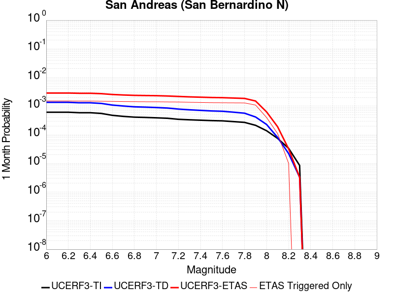 |  |  |

| Magnitude | 1 wk TI Prob | 1 wk TD Prob | 1 wk ETAS Prob | 1 wk ETAS/TD Gain | 1 wk ETAS Triggered Only | 1 mo TI Prob | 1 mo TD Prob | 1 mo ETAS Prob | 1 mo ETAS/TD Gain | 1 mo ETAS Triggered Only | 1 yr TI Prob | 1 yr TD Prob | 1 yr ETAS Prob | 1 yr ETAS/TD Gain | 1 yr ETAS Triggered Only | 10 yr TI Prob | 10 yr TD Prob | 10 yr ETAS Prob | 10 yr ETAS/TD Gain | 10 yr ETAS Triggered Only |
|-----|-----|-----|-----|-----|-----|-----|-----|-----|-----|-----|-----|-----|-----|-----|-----|-----|-----|-----|-----|-----|
| 6.0 | 1.4273766E-4 | 3.1606483E-4 | 0.0015070823 | 4.768269 | 0.0011913939 | 6.115894E-4 | 0.0013538664 | 0.0027536086 | 2.033885 | 0.0014016399 | 0.0074207084 | 0.016360244 | 0.018083628 | 1.1053399 | 0.0017520499 | 0.07177748 | 0.15026689 | 0.15199387 | 1.0114927 | 0.002032378 |
| 6.1 | 1.4273766E-4 | 3.1606483E-4 | 0.0015070823 | 4.768269 | 0.0011913939 | 6.115894E-4 | 0.0013538664 | 0.0027536086 | 2.033885 | 0.0014016399 | 0.0074207084 | 0.016360244 | 0.018083628 | 1.1053399 | 0.0017520499 | 0.07177748 | 0.15026689 | 0.15199387 | 1.0114927 | 0.002032378 |
| 6.2 | 1.4273766E-4 | 3.1606483E-4 | 0.0015070823 | 4.768269 | 0.0011913939 | 6.115894E-4 | 0.0013538664 | 0.0027536086 | 2.033885 | 0.0014016399 | 0.0074207084 | 0.016360244 | 0.018083628 | 1.1053399 | 0.0017520499 | 0.07177748 | 0.15026689 | 0.15199387 | 1.0114927 | 0.002032378 |
| 6.3 | 1.3730655E-4 | 3.0511338E-4 | 0.0014961438 | 4.903567 | 0.0011913939 | 5.883239E-4 | 0.0013069791 | 0.002706787 | 2.0710256 | 0.0014016399 | 0.0071393442 | 0.015797773 | 0.017522143 | 1.1091528 | 0.0017520499 | 0.06914291 | 0.14556676 | 0.1473033 | 1.0119294 | 0.002032378 |
| 6.4 | 1.3730655E-4 | 3.0511338E-4 | 0.0014961438 | 4.903567 | 0.0011913939 | 5.883239E-4 | 0.0013069791 | 0.002706787 | 2.0710256 | 0.0014016399 | 0.0071393442 | 0.015797773 | 0.017522143 | 1.1091528 | 0.0017520499 | 0.06914291 | 0.14556676 | 0.1473033 | 1.0119294 | 0.002032378 |
| 6.5 | 1.2942807E-4 | 2.8925808E-4 | 0.0014803074 | 5.117601 | 0.0011913939 | 5.545738E-4 | 0.0012390936 | 0.0026389968 | 2.12978 | 0.0014016399 | 0.0067310524 | 0.01498286 | 0.016708659 | 1.1151849 | 0.0017520499 | 0.06530788 | 0.13870941 | 0.14045988 | 1.0126197 | 0.002032378 |
| 6.6 | 1.1125901E-4 | 2.536472E-4 | 0.0014447389 | 5.69586 | 0.0011913939 | 4.767372E-4 | 0.0010866089 | 0.0024867258 | 2.2885196 | 0.0014016399 | 0.005788839 | 0.013149847 | 0.014878858 | 1.1314852 | 0.0017520499 | 0.056403454 | 0.122999296 | 0.12478169 | 1.0144911 | 0.002032378 |
| 6.7 | 1.02209575E-4 | 2.3499702E-4 | 0.001426111 | 6.0686345 | 0.0011913939 | 4.3796748E-4 | 0.0010067427 | 0.0024069715 | 2.3908508 | 0.0014016399 | 0.0053192247 | 0.012188629 | 0.013919325 | 1.1419926 | 0.0017520499 | 0.051936906 | 0.114790924 | 0.11659 | 1.0156727 | 0.002032378 |
| 6.8 | 9.610582E-5 | 2.2025521E-4 | 0.0014113868 | 6.407961 | 0.0011913939 | 4.1181705E-4 | 9.436101E-4 | 0.0023439275 | 2.484 | 0.0014016399 | 0.0050023515 | 0.011428202 | 0.013160229 | 1.1515573 | 0.0017520499 | 0.048912346 | 0.1081929 | 0.10994289 | 1.0161747 | 0.001962296 |
| 6.9 | 9.3877505E-5 | 2.1481077E-4 | 0.0014059488 | 6.5450573 | 0.0011913939 | 4.0227012E-4 | 9.2029345E-4 | 0.0023206435 | 2.521634 | 0.0014016399 | 0.0048866454 | 0.011147255 | 0.012879775 | 1.1554211 | 0.0017520499 | 0.04780577 | 0.10578323 | 0.10753795 | 1.0165879 | 0.001962296 |
| 7.0 | 9.1019785E-5 | 2.0808022E-4 | 0.0013992263 | 6.724456 | 0.0011913939 | 3.900265E-4 | 8.914682E-4 | 0.0022918587 | 2.570881 | 0.0014016399 | 0.0047382377 | 0.010799837 | 0.0124636395 | 1.1540581 | 0.0016819679 | 0.046384744 | 0.102753714 | 0.1044515 | 1.0165229 | 0.001892214 |
| 7.1 | 8.771155E-5 | 1.9982594E-4 | 0.0013909818 | 6.960967 | 0.0011913939 | 3.758525E-4 | 8.5611636E-4 | 0.0022565564 | 2.6358056 | 0.0014016399 | 0.0045664064 | 0.0103736 | 0.012038119 | 1.1604573 | 0.0016819679 | 0.044737056 | 0.09906527 | 0.10077003 | 1.0172085 | 0.001892214 |
| 7.2 | 8.0830236E-5 | 1.8388197E-4 | 0.0013750568 | 7.4779315 | 0.0011913939 | 3.4636928E-4 | 7.8782777E-4 | 0.0021883633 | 2.777718 | 0.0014016399 | 0.0042088944 | 0.009549725 | 0.01121563 | 1.1744454 | 0.0016819679 | 0.041300658 | 0.09179615 | 0.093514666 | 1.018721 | 0.001892214 |
| 7.3 | 7.7668235E-5 | 1.7331762E-4 | 0.0012944352 | 7.4685726 | 0.0011213119 | 3.328214E-4 | 7.425784E-4 | 0.0020731476 | 2.791823 | 0.0013315579 | 0.0040445733 | 0.009003494 | 0.010600868 | 1.177417 | 0.001611886 | 0.03971748 | 0.08706327 | 0.08872676 | 1.0191067 | 0.0018221319 |
| 7.4 | 7.520177E-5 | 1.6551897E-4 | 0.0012866453 | 7.773401 | 0.0011213119 | 3.2225347E-4 | 7.0917426E-4 | 0.0020397878 | 2.8762858 | 0.0013315579 | 0.0039163795 | 0.008600081 | 0.010198105 | 1.185815 | 0.001611886 | 0.038480744 | 0.08351955 | 0.0851895 | 1.0199947 | 0.0018221319 |
| 7.5 | 7.274697E-5 | 1.5839566E-4 | 0.00127953 | 8.078062 | 0.0011213119 | 3.1173544E-4 | 6.78662E-4 | 0.002009316 | 2.9607024 | 0.0013315579 | 0.003788775 | 0.008231463 | 0.009830081 | 1.1942083 | 0.001611886 | 0.03724827 | 0.08023631 | 0.08191224 | 1.0208875 | 0.0018221319 |
| 7.6 | 7.1185845E-5 | 1.540943E-4 | 0.0012752335 | 8.275669 | 0.0011213119 | 3.0504653E-4 | 6.6023704E-4 | 0.0019909157 | 3.015456 | 0.0013315579 | 0.0037076178 | 0.008008812 | 0.009607788 | 1.1996522 | 0.001611886 | 0.036463667 | 0.07822598 | 0.07990557 | 1.021471 | 0.0018221319 |
| 7.7 | 6.709961E-5 | 1.4318313E-4 | 0.0012643345 | 8.830192 | 0.0011213119 | 2.8753807E-4 | 6.1349774E-4 | 0.0019442388 | 3.169105 | 0.0013315579 | 0.003495157 | 0.0074437927 | 0.00904368 | 1.2149291 | 0.001611886 | 0.034406938 | 0.07305469 | 0.07474371 | 1.0231199 | 0.0018221319 |
| 7.8 | 6.300812E-5 | 1.3202413E-4 | 0.001253188 | 9.492114 | 0.0011213119 | 2.7000686E-4 | 5.65695E-4 | 0.0018964997 | 3.3525126 | 0.0013315579 | 0.0032823787 | 0.006865616 | 0.008466436 | 1.2331647 | 0.001611886 | 0.032343175 | 0.06771354 | 0.06941228 | 1.0250872 | 0.0018221319 |
| 7.9 | 4.983037E-5 | 9.723488E-5 | 0.0010782874 | 11.089513 | 9.81148E-4 | 2.1354125E-4 | 4.1665437E-4 | 0.0015374991 | 3.6901066 | 0.0011213119 | 0.0025967648 | 0.0050609782 | 0.0064555244 | 1.2755488 | 0.0014016399 | 0.025666296 | 0.05064886 | 0.052179106 | 1.0302129 | 0.001611886 |
| 8.0 | 3.2211527E-5 | 5.3304586E-5 | 3.3361762E-4 | 6.258704 | 2.8032798E-4 | 1.380421E-4 | 2.2842824E-4 | 5.787582E-4 | 2.5336542 | 3.5040997E-4 | 0.0016793669 | 0.0027775685 | 0.00326678 | 1.1761293 | 4.90574E-4 | 0.016667323 | 0.028361378 | 0.028838038 | 1.0168067 | 4.90574E-4 |
| 8.1 | 1.743376E-5 | 1.8824427E-5 | 1.8824427E-5 | 1.0 | 0.0 | 7.471398E-5 | 8.067362E-5 | 1.5074997E-4 | 1.8686401 | 7.0081995E-5 | 9.0926304E-4 | 9.817594E-4 | 0.0010517726 | 1.071314 | 7.0081995E-5 | 0.009055517 | 0.010484105 | 0.010553452 | 1.0066146 | 7.0081995E-5 |
| 8.2 | 7.831616E-6 | 5.1551065E-6 | 5.1551065E-6 | 1.0 | 0.0 | 3.3563636E-5 | 2.2093127E-5 | 2.2093127E-5 | 1.0 | 0.0 | 4.0856065E-4 | 2.6895068E-4 | 2.6895068E-4 | 1.0 | 0.0 | 0.004078103 | 0.0030418145 | 0.0030418145 | 1.0 | 0.0 |
| 8.3 | 1.983087E-6 | 7.6599065E-7 | 7.6599065E-7 | 1.0 | 0.0 | 8.498917E-6 | 3.282813E-6 | 3.282813E-6 | 1.0 | 0.0 | 1.034694E-4 | 3.9967534E-5 | 3.9967534E-5 | 1.0 | 0.0 | 0.0010342124 | 4.719687E-4 | 4.719687E-4 | 1.0 | 0.0 |

## Garlic Springs
*[(top)](#table-of-contents)*

| 1 Week | 1 Month | 1 Year | 10 Year |
|-----|-----|-----|-----|
|  |  |  |  |

| Magnitude | 1 wk TI Prob | 1 wk TD Prob | 1 wk ETAS Prob | 1 wk ETAS/TD Gain | 1 wk ETAS Triggered Only | 1 mo TI Prob | 1 mo TD Prob | 1 mo ETAS Prob | 1 mo ETAS/TD Gain | 1 mo ETAS Triggered Only | 1 yr TI Prob | 1 yr TD Prob | 1 yr ETAS Prob | 1 yr ETAS/TD Gain | 1 yr ETAS Triggered Only | 10 yr TI Prob | 10 yr TD Prob | 10 yr ETAS Prob | 10 yr ETAS/TD Gain | 10 yr ETAS Triggered Only |
|-----|-----|-----|-----|-----|-----|-----|-----|-----|-----|-----|-----|-----|-----|-----|-----|-----|-----|-----|-----|-----|
| 6.0 | 1.6760017E-5 | 1.8776833E-5 | 0.0010699871 | 56.98443 | 0.0010512299 | 7.182667E-5 | 8.0470316E-5 | 0.0014819974 | 18.416697 | 0.0014016399 | 8.7413884E-4 | 9.794032E-4 | 0.0025897103 | 2.644172 | 0.001611886 | 0.008707083 | 0.009762413 | 0.011497359 | 1.1777169 | 0.0017520499 |
| 6.1 | 9.852767E-6 | 1.09735865E-5 | 7.1178586E-4 | 64.863556 | 7.0081995E-4 | 4.222546E-5 | 4.702921E-5 | 0.0010982098 | 23.35165 | 0.0010512299 | 5.139737E-4 | 5.7250116E-4 | 0.0016231292 | 2.8351545 | 0.0010512299 | 0.005127866 | 0.005717221 | 0.006901804 | 1.2071955 | 0.0011913939 |
| 6.2 | 9.852767E-6 | 1.09735865E-5 | 7.1178586E-4 | 64.863556 | 7.0081995E-4 | 4.222546E-5 | 4.702921E-5 | 0.0010982098 | 23.35165 | 0.0010512299 | 5.139737E-4 | 5.7250116E-4 | 0.0016231292 | 2.8351545 | 0.0010512299 | 0.005127866 | 0.005717221 | 0.006901804 | 1.2071955 | 0.0011913939 |
| 6.3 | 4.3167724E-6 | 4.7780286E-6 | 2.1502301E-4 | 45.002453 | 2.1024598E-4 | 1.8500323E-5 | 2.0477235E-5 | 3.0079947E-4 | 14.689458 | 2.8032798E-4 | 2.2521814E-4 | 2.4930484E-4 | 5.2956294E-4 | 2.1241584 | 2.8032798E-4 | 0.0022499003 | 0.00249251 | 0.0028420466 | 1.1402348 | 3.5040997E-4 |
| 6.4 | 4.3167724E-6 | 4.7780286E-6 | 2.1502301E-4 | 45.002453 | 2.1024598E-4 | 1.8500323E-5 | 2.0477235E-5 | 3.0079947E-4 | 14.689458 | 2.8032798E-4 | 2.2521814E-4 | 2.4930484E-4 | 5.2956294E-4 | 2.1241584 | 2.8032798E-4 | 0.0022499003 | 0.00249251 | 0.0028420466 | 1.1402348 | 3.5040997E-4 |
| 6.5 | 4.3167724E-6 | 4.7780286E-6 | 2.1502301E-4 | 45.002453 | 2.1024598E-4 | 1.8500323E-5 | 2.0477235E-5 | 3.0079947E-4 | 14.689458 | 2.8032798E-4 | 2.2521814E-4 | 2.4930484E-4 | 5.2956294E-4 | 2.1241584 | 2.8032798E-4 | 0.0022499003 | 0.00249251 | 0.0028420466 | 1.1402348 | 3.5040997E-4 |
| 6.6 | 4.301311E-6 | 4.760897E-6 | 2.1500589E-4 | 45.160793 | 2.1024598E-4 | 1.8434059E-5 | 2.0403815E-5 | 3.0072607E-4 | 14.738718 | 2.8032798E-4 | 2.2441156E-4 | 2.4841115E-4 | 5.286695E-4 | 2.1282036 | 2.8032798E-4 | 0.0022418506 | 0.002483593 | 0.0028331329 | 1.1407396 | 3.5040997E-4 |
| 6.7 | 3.8599724E-6 | 4.27106E-6 | 1.4443445E-4 | 33.817005 | 1.4016399E-4 | 1.6542634E-5 | 1.8304541E-5 | 1.5846596E-4 | 8.657194 | 1.4016399E-4 | 2.0138794E-4 | 2.228578E-4 | 3.6299057E-4 | 1.628799 | 1.4016399E-4 | 0.0020120554 | 0.002228578 | 0.0023684297 | 1.0627538 | 1.4016399E-4 |

## Paradise
*[(top)](#table-of-contents)*

| 1 Week | 1 Month | 1 Year | 10 Year |
|-----|-----|-----|-----|
|  |  |  |  |

| Magnitude | 1 wk TI Prob | 1 wk TD Prob | 1 wk ETAS Prob | 1 wk ETAS/TD Gain | 1 wk ETAS Triggered Only | 1 mo TI Prob | 1 mo TD Prob | 1 mo ETAS Prob | 1 mo ETAS/TD Gain | 1 mo ETAS Triggered Only | 1 yr TI Prob | 1 yr TD Prob | 1 yr ETAS Prob | 1 yr ETAS/TD Gain | 1 yr ETAS Triggered Only | 10 yr TI Prob | 10 yr TD Prob | 10 yr ETAS Prob | 10 yr ETAS/TD Gain | 10 yr ETAS Triggered Only |
|-----|-----|-----|-----|-----|-----|-----|-----|-----|-----|-----|-----|-----|-----|-----|-----|-----|-----|-----|-----|-----|
| 6.0 | 1.4851273E-5 | 1.6694692E-5 | 6.474221E-4 | 38.78012 | 6.30738E-4 | 6.364676E-5 | 7.154685E-5 | 9.124706E-4 | 12.75347 | 8.4098394E-4 | 7.7462377E-4 | 8.707584E-4 | 0.0023411987 | 2.6886895 | 0.0014717219 | 0.0077192914 | 0.008675844 | 0.010204271 | 1.1761705 | 0.0015418039 |
| 6.1 | 1.4851273E-5 | 1.6694692E-5 | 6.474221E-4 | 38.78012 | 6.30738E-4 | 6.364676E-5 | 7.154685E-5 | 9.124706E-4 | 12.75347 | 8.4098394E-4 | 7.7462377E-4 | 8.707584E-4 | 0.0023411987 | 2.6886895 | 0.0014717219 | 0.0077192914 | 0.008675844 | 0.010204271 | 1.1761705 | 0.0015418039 |
| 6.2 | 1.4851273E-5 | 1.6694692E-5 | 6.474221E-4 | 38.78012 | 6.30738E-4 | 6.364676E-5 | 7.154685E-5 | 9.124706E-4 | 12.75347 | 8.4098394E-4 | 7.7462377E-4 | 8.707584E-4 | 0.0023411987 | 2.6886895 | 0.0014717219 | 0.0077192914 | 0.008675844 | 0.010204271 | 1.1761705 | 0.0015418039 |
| 6.3 | 1.0426831E-5 | 1.188862E-5 | 2.221321E-4 | 18.684431 | 2.1024598E-4 | 4.4685654E-5 | 5.0950268E-5 | 3.3126396E-4 | 6.501712 | 2.8032798E-4 | 5.43912E-4 | 6.201489E-4 | 0.0011804572 | 1.903506 | 5.6065596E-4 | 0.0054258266 | 0.0061847917 | 0.0068116286 | 1.1013514 | 6.30738E-4 |
| 6.4 | 1.0426831E-5 | 1.188862E-5 | 2.221321E-4 | 18.684431 | 2.1024598E-4 | 4.4685654E-5 | 5.0950268E-5 | 3.3126396E-4 | 6.501712 | 2.8032798E-4 | 5.43912E-4 | 6.201489E-4 | 0.0011804572 | 1.903506 | 5.6065596E-4 | 0.0054258266 | 0.0061847917 | 0.0068116286 | 1.1013514 | 6.30738E-4 |
| 6.5 | 9.25027E-6 | 1.06199595E-5 | 2.2086372E-4 | 20.797039 | 2.1024598E-4 | 3.964341E-5 | 4.551335E-5 | 3.2582856E-4 | 7.1589675 | 2.8032798E-4 | 4.8255164E-4 | 5.53989E-4 | 0.0010442912 | 1.8850396 | 4.90574E-4 | 0.0048150513 | 0.0055265795 | 0.0060841367 | 1.1008866 | 5.6065596E-4 |
| 6.6 | 7.904275E-6 | 9.159525E-6 | 1.4932224E-4 | 16.302399 | 1.4016399E-4 | 3.3875025E-5 | 3.9254537E-5 | 1.7941302E-4 | 4.570504 | 1.4016399E-4 | 4.1235037E-4 | 4.7782314E-4 | 7.580172E-4 | 1.5863969 | 2.8032798E-4 | 0.0041158604 | 0.0047683544 | 0.0051170937 | 1.0731362 | 3.5040997E-4 |
| 6.7 | 7.2061953E-6 | 8.407248E-6 | 7.848866E-5 | 9.335832 | 7.0081995E-5 | 3.088333E-5 | 3.6030586E-5 | 1.06110056E-4 | 2.9449995 | 7.0081995E-5 | 3.7593965E-4 | 4.3858777E-4 | 6.4874155E-4 | 1.4791601 | 2.1024598E-4 | 0.003753043 | 0.004377591 | 0.0046566916 | 1.0637567 | 2.8032798E-4 |
| 6.8 | 6.6948724E-6 | 7.842166E-6 | 7.7923614E-5 | 9.936491 | 7.0081995E-5 | 2.8691995E-5 | 3.360887E-5 | 1.0368851E-4 | 3.085153 | 7.0081995E-5 | 3.4926904E-4 | 4.0911473E-4 | 6.192747E-4 | 1.5136945 | 2.1024598E-4 | 0.003487206 | 0.0040839734 | 0.0043631564 | 1.0683607 | 2.8032798E-4 |
| 6.9 | 6.0421025E-6 | 7.130621E-6 | 7.721212E-5 | 10.828246 | 7.0081995E-5 | 2.5894467E-5 | 3.0559466E-5 | 1.0063932E-4 | 3.293229 | 7.0081995E-5 | 3.1521954E-4 | 3.7200135E-4 | 5.121132E-4 | 1.3766434 | 1.4016399E-4 | 0.0031477278 | 0.0037141247 | 0.003853768 | 1.0375979 | 1.4016399E-4 |
| 7.0 | 4.134091E-6 | 5.0803087E-6 | 5.0803087E-6 | 1.0 | 0.0 | 1.7717413E-5 | 2.177258E-5 | 2.177258E-5 | 1.0 | 0.0 | 2.1568815E-4 | 2.6505045E-4 | 2.6505045E-4 | 1.0 | 0.0 | 0.0021547892 | 0.0026474963 | 0.0026474963 | 1.0 | 0.0 |
| 7.1 | 3.7674888E-6 | 4.6318696E-6 | 4.6318696E-6 | 1.0 | 0.0 | 1.6146281E-5 | 1.9850726E-5 | 1.9850726E-5 | 1.0 | 0.0 | 1.9656324E-4 | 2.4165731E-4 | 2.4165731E-4 | 1.0 | 0.0 | 0.0019638946 | 0.002414096 | 0.002414096 | 1.0 | 0.0 |
| 7.2 | 3.4065345E-6 | 4.156723E-6 | 4.156723E-6 | 1.0 | 0.0 | 1.4599351E-5 | 1.7814415E-5 | 1.7814415E-5 | 1.0 | 0.0 | 1.777326E-4 | 2.1687041E-4 | 2.1687041E-4 | 1.0 | 0.0 | 0.0017759053 | 0.002166736 | 0.002166736 | 1.0 | 0.0 |
| 7.3 | 2.9934936E-6 | 3.6293168E-6 | 3.6293168E-6 | 1.0 | 0.0 | 1.2829195E-5 | 1.555413E-5 | 1.555413E-5 | 1.0 | 0.0 | 1.5618425E-4 | 1.8935655E-4 | 1.8935655E-4 | 1.0 | 0.0 | 0.0015607453 | 0.0018920974 | 0.0018920974 | 1.0 | 0.0 |
| 7.4 | 2.4049796E-6 | 2.8889842E-6 | 2.8889842E-6 | 1.0 | 0.0 | 1.0307015E-5 | 1.238131E-5 | 1.238131E-5 | 1.0 | 0.0 | 1.2548068E-4 | 1.5073347E-4 | 1.5073347E-4 | 1.0 | 0.0 | 0.0012540985 | 0.0015064536 | 0.0015064536 | 1.0 | 0.0 |
| 7.5 | 1.2710091E-6 | 1.5134682E-6 | 1.5134682E-6 | 1.0 | 0.0 | 5.44717E-6 | 6.4862834E-6 | 6.4862834E-6 | 1.0 | 0.0 | 6.631728E-5 | 7.8968886E-5 | 7.8968886E-5 | 1.0 | 0.0 | 6.6297496E-4 | 7.8953087E-4 | 7.8953087E-4 | 1.0 | 0.0 |
| 7.6 | 2.21172E-7 | 2.603961E-7 | 2.603961E-7 | 1.0 | 0.0 | 9.478797E-7 | 1.1159829E-6 | 1.1159829E-6 | 1.0 | 0.0 | 1.1540374E-5 | 1.3587036E-5 | 1.3587036E-5 | 1.0 | 0.0 | 1.1539775E-4 | 1.3586486E-4 | 1.3586486E-4 | 1.0 | 0.0 |

## Death Valley (Black Mtns Frontal)
*[(top)](#table-of-contents)*

| 1 Week | 1 Month | 1 Year | 10 Year |
|-----|-----|-----|-----|
|  |  |  |  |

| Magnitude | 1 wk TI Prob | 1 wk TD Prob | 1 wk ETAS Prob | 1 wk ETAS/TD Gain | 1 wk ETAS Triggered Only | 1 mo TI Prob | 1 mo TD Prob | 1 mo ETAS Prob | 1 mo ETAS/TD Gain | 1 mo ETAS Triggered Only | 1 yr TI Prob | 1 yr TD Prob | 1 yr ETAS Prob | 1 yr ETAS/TD Gain | 1 yr ETAS Triggered Only | 10 yr TI Prob | 10 yr TD Prob | 10 yr ETAS Prob | 10 yr ETAS/TD Gain | 10 yr ETAS Triggered Only |
|-----|-----|-----|-----|-----|-----|-----|-----|-----|-----|-----|-----|-----|-----|-----|-----|-----|-----|-----|-----|-----|
| 6.0 | 1.6707214E-5 | 1.867027E-5 | 8.596385E-4 | 46.04318 | 8.4098394E-4 | 7.160038E-5 | 8.001302E-5 | 0.0010610825 | 13.261372 | 9.81148E-4 | 8.71386E-4 | 9.737309E-4 | 0.0021639648 | 2.2223437 | 0.0011913939 | 0.00867977 | 0.009695496 | 0.010944742 | 1.128848 | 0.001261476 |
| 6.1 | 1.6707214E-5 | 1.867027E-5 | 8.596385E-4 | 46.04318 | 8.4098394E-4 | 7.160038E-5 | 8.001302E-5 | 0.0010610825 | 13.261372 | 9.81148E-4 | 8.71386E-4 | 9.737309E-4 | 0.0021639648 | 2.2223437 | 0.0011913939 | 0.00867977 | 0.009695496 | 0.010944742 | 1.128848 | 0.001261476 |
| 6.2 | 1.6707214E-5 | 1.867027E-5 | 8.596385E-4 | 46.04318 | 8.4098394E-4 | 7.160038E-5 | 8.001302E-5 | 0.0010610825 | 13.261372 | 9.81148E-4 | 8.71386E-4 | 9.737309E-4 | 0.0021639648 | 2.2223437 | 0.0011913939 | 0.00867977 | 0.009695496 | 0.010944742 | 1.128848 | 0.001261476 |
| 6.3 | 1.6707214E-5 | 1.867027E-5 | 8.596385E-4 | 46.04318 | 8.4098394E-4 | 7.160038E-5 | 8.001302E-5 | 0.0010610825 | 13.261372 | 9.81148E-4 | 8.71386E-4 | 9.737309E-4 | 0.0021639648 | 2.2223437 | 0.0011913939 | 0.00867977 | 0.009695496 | 0.010944742 | 1.128848 | 0.001261476 |
| 6.4 | 1.5515609E-5 | 1.7338214E-5 | 8.583076E-4 | 49.503807 | 8.4098394E-4 | 6.649377E-5 | 7.4304546E-5 | 0.0010553796 | 14.203432 | 9.81148E-4 | 8.0926094E-4 | 9.042885E-4 | 0.002094605 | 2.3163018 | 0.0011913939 | 0.008063202 | 0.009006773 | 0.0102568865 | 1.1387972 | 0.001261476 |
| 6.5 | 1.5515609E-5 | 1.7338214E-5 | 8.583076E-4 | 49.503807 | 8.4098394E-4 | 6.649377E-5 | 7.4304546E-5 | 0.0010553796 | 14.203432 | 9.81148E-4 | 8.0926094E-4 | 9.042885E-4 | 0.002094605 | 2.3163018 | 0.0011913939 | 0.008063202 | 0.009006773 | 0.0102568865 | 1.1387972 | 0.001261476 |
| 6.6 | 1.5041828E-5 | 1.6809145E-5 | 8.5777894E-4 | 51.030495 | 8.4098394E-4 | 6.4463384E-5 | 7.203723E-5 | 0.0010531145 | 14.61903 | 9.81148E-4 | 7.8455906E-4 | 8.767063E-4 | 0.0020670558 | 2.3577516 | 0.0011913939 | 0.00781795 | 0.008733132 | 0.009983592 | 1.1431856 | 0.001261476 |
| 6.7 | 1.4634985E-5 | 1.6356016E-5 | 7.8724534E-4 | 48.13185 | 7.7090197E-4 | 6.271985E-5 | 7.009536E-5 | 9.810975E-4 | 13.99661 | 9.1106596E-4 | 7.6334673E-4 | 8.5308263E-4 | 0.001973438 | 2.3133023 | 0.0011213119 | 0.007607299 | 0.008498715 | 0.009679984 | 1.1389937 | 0.0011913939 |
| 6.8 | 1.4209158E-5 | 1.5882048E-5 | 5.765291E-4 | 36.30068 | 5.6065596E-4 | 6.089497E-5 | 6.8064175E-5 | 7.688364E-4 | 11.295758 | 7.0081995E-4 | 7.4114406E-4 | 8.2837185E-4 | 0.0016686592 | 2.0143843 | 8.4098394E-4 | 0.007386771 | 0.008253456 | 0.009157003 | 1.1094749 | 9.1106596E-4 |
| 6.9 | 1.3780098E-5 | 1.5404594E-5 | 5.7605194E-4 | 37.394817 | 5.6065596E-4 | 5.9056227E-5 | 6.6018045E-5 | 7.6679175E-4 | 11.6148815 | 7.0081995E-4 | 7.1877235E-4 | 8.0347876E-4 | 0.001643787 | 2.0458376 | 8.4098394E-4 | 0.0071645193 | 0.008006332 | 0.008910105 | 1.1128821 | 9.1106596E-4 |
| 7.0 | 1.3585064E-5 | 1.5188155E-5 | 5.758356E-4 | 37.913467 | 5.6065596E-4 | 5.8220405E-5 | 6.50905E-5 | 7.6586485E-4 | 11.766153 | 7.0081995E-4 | 7.086029E-4 | 7.9219416E-4 | 0.0016325118 | 2.0607471 | 8.4098394E-4 | 0.007063476 | 0.007894293 | 0.008798167 | 1.1144971 | 9.1106596E-4 |
| 7.1 | 1.3398601E-5 | 1.49813395E-5 | 5.756289E-4 | 38.42306 | 5.6065596E-4 | 5.742131E-5 | 6.420419E-5 | 7.6497917E-4 | 11.914785 | 7.0081995E-4 | 6.9888023E-4 | 7.8141113E-4 | 0.001621738 | 2.0753965 | 8.4098394E-4 | 0.0069668638 | 0.007787224 | 0.008691195 | 1.1160839 | 9.1106596E-4 |
| 7.2 | 1.3126312E-5 | 1.4679561E-5 | 5.0524634E-4 | 34.418354 | 4.90574E-4 | 5.6254412E-5 | 6.291092E-5 | 6.936092E-4 | 11.02526 | 6.30738E-4 | 6.846822E-4 | 7.6567667E-4 | 0.0015359884 | 2.0060534 | 7.7090197E-4 | 0.006825765 | 0.00763097 | 0.008465537 | 1.1093657 | 8.4098394E-4 |
| 7.3 | 1.2922429E-5 | 1.4453788E-5 | 5.0502067E-4 | 34.94037 | 4.90574E-4 | 5.5380664E-5 | 6.194336E-5 | 6.225646E-4 | 10.050546 | 5.6065596E-4 | 6.74051E-4 | 7.53905E-4 | 0.0014541965 | 1.9288858 | 7.0081995E-4 | 0.006720101 | 0.007514055 | 0.008279164 | 1.1018238 | 7.7090197E-4 |
| 7.4 | 1.2768878E-5 | 1.4283772E-5 | 5.0485076E-4 | 35.34436 | 4.90574E-4 | 5.4722615E-5 | 6.1214756E-5 | 6.218364E-4 | 10.158277 | 5.6065596E-4 | 6.660441E-4 | 7.4504025E-4 | 0.001445338 | 1.9399463 | 7.0081995E-4 | 0.0066405144 | 0.0074260035 | 0.00819118 | 1.1030402 | 7.7090197E-4 |
| 7.5 | 1.2521929E-5 | 1.40120155E-5 | 4.344981E-4 | 31.008966 | 4.2049197E-4 | 5.366431E-5 | 6.005014E-5 | 5.5059465E-4 | 9.168915 | 4.90574E-4 | 6.531671E-4 | 7.3087064E-4 | 0.0012911168 | 1.7665462 | 5.6065596E-4 | 0.006512506 | 0.0072852457 | 0.007911389 | 1.0859467 | 6.30738E-4 |
| 7.6 | 1.1301089E-5 | 1.2648149E-5 | 2.9297257E-4 | 23.163279 | 2.8032798E-4 | 4.8432343E-5 | 5.4205255E-5 | 4.0459624E-4 | 7.4641514 | 3.5040997E-4 | 5.895042E-4 | 6.5975444E-4 | 0.0010099333 | 1.5307714 | 3.5040997E-4 | 0.0058794282 | 0.00657851 | 0.0069962363 | 1.0634985 | 4.2049197E-4 |
| 7.7 | 9.189108E-6 | 1.0283358E-5 | 2.2052719E-4 | 21.445055 | 2.1024598E-4 | 3.93813E-5 | 4.407082E-5 | 3.2438646E-4 | 7.3605723 | 2.8032798E-4 | 4.7936183E-4 | 5.3643517E-4 | 8.166128E-4 | 1.5222954 | 2.8032798E-4 | 0.004783291 | 0.005351914 | 0.0057004485 | 1.0651233 | 3.5040997E-4 |
| 7.8 | 3.4586725E-7 | 3.6482615E-7 | 3.6482615E-7 | 1.0 | 0.0 | 1.4822873E-6 | 1.5635396E-6 | 1.5635396E-6 | 1.0 | 0.0 | 1.80467E-5 | 1.9035933E-5 | 1.9035933E-5 | 1.0 | 0.0 | 1.8045233E-4 | 1.9034347E-4 | 1.9034347E-4 | 1.0 | 0.0 |
| 7.9 | 2.5591178E-9 | 2.6696718E-9 | 2.6696718E-9 | 1.0 | 0.0 | 1.0967647E-8 | 1.14414505E-8 | 1.14414505E-8 | 1.0 | 0.0 | 1.335311E-7 | 1.3929966E-7 | 1.3929966E-7 | 1.0 | 0.0 | 1.3353102E-6 | 1.3929966E-6 | 1.3929966E-6 | 1.0 | 0.0 |

## Helendale-So Lockhart
*[(top)](#table-of-contents)*

| 1 Week | 1 Month | 1 Year | 10 Year |
|-----|-----|-----|-----|
|  |  |  |  |

| Magnitude | 1 wk TI Prob | 1 wk TD Prob | 1 wk ETAS Prob | 1 wk ETAS/TD Gain | 1 wk ETAS Triggered Only | 1 mo TI Prob | 1 mo TD Prob | 1 mo ETAS Prob | 1 mo ETAS/TD Gain | 1 mo ETAS Triggered Only | 1 yr TI Prob | 1 yr TD Prob | 1 yr ETAS Prob | 1 yr ETAS/TD Gain | 1 yr ETAS Triggered Only | 10 yr TI Prob | 10 yr TD Prob | 10 yr ETAS Prob | 10 yr ETAS/TD Gain | 10 yr ETAS Triggered Only |
|-----|-----|-----|-----|-----|-----|-----|-----|-----|-----|-----|-----|-----|-----|-----|-----|-----|-----|-----|-----|-----|
| 6.0 | 1.7296055E-5 | 1.8103729E-5 | 6.4883026E-4 | 35.839592 | 6.30738E-4 | 7.412385E-5 | 7.7585224E-5 | 9.885805E-4 | 12.741866 | 9.1106596E-4 | 9.0208417E-4 | 9.4421144E-4 | 0.0020644646 | 2.186443 | 0.0011213119 | 0.008984311 | 0.009404116 | 0.010584306 | 1.1254972 | 0.0011913939 |
| 6.1 | 1.7296055E-5 | 1.8103729E-5 | 6.4883026E-4 | 35.839592 | 6.30738E-4 | 7.412385E-5 | 7.7585224E-5 | 9.885805E-4 | 12.741866 | 9.1106596E-4 | 9.0208417E-4 | 9.4421144E-4 | 0.0020644646 | 2.186443 | 0.0011213119 | 0.008984311 | 0.009404116 | 0.010584306 | 1.1254972 | 0.0011913939 |
| 6.2 | 1.7296055E-5 | 1.8103729E-5 | 6.4883026E-4 | 35.839592 | 6.30738E-4 | 7.412385E-5 | 7.7585224E-5 | 9.885805E-4 | 12.741866 | 9.1106596E-4 | 9.0208417E-4 | 9.4421144E-4 | 0.0020644646 | 2.186443 | 0.0011213119 | 0.008984311 | 0.009404116 | 0.010584306 | 1.1254972 | 0.0011913939 |
| 6.3 | 1.0669118E-5 | 1.1135425E-5 | 4.3162273E-4 | 38.761227 | 4.2049197E-4 | 4.5723988E-5 | 4.772239E-5 | 7.485089E-4 | 15.6846485 | 7.0081995E-4 | 5.5654737E-4 | 5.80868E-4 | 0.0014914047 | 2.567545 | 9.1106596E-4 | 0.0055515557 | 0.0057937936 | 0.006699581 | 1.1563375 | 9.1106596E-4 |
| 6.4 | 1.0669118E-5 | 1.1135425E-5 | 4.3162273E-4 | 38.761227 | 4.2049197E-4 | 4.5723988E-5 | 4.772239E-5 | 7.485089E-4 | 15.6846485 | 7.0081995E-4 | 5.5654737E-4 | 5.80868E-4 | 0.0014914047 | 2.567545 | 9.1106596E-4 | 0.0055515557 | 0.0057937936 | 0.006699581 | 1.1563375 | 9.1106596E-4 |
| 6.5 | 8.790038E-6 | 9.170197E-6 | 4.296583E-4 | 46.85377 | 4.2049197E-4 | 3.767105E-5 | 3.930026E-5 | 5.999342E-4 | 15.2654 | 5.6065596E-4 | 4.585485E-4 | 4.7837716E-4 | 0.0011088134 | 2.3178644 | 6.30738E-4 | 0.0045760344 | 0.004773638 | 0.0054013655 | 1.1314987 | 6.30738E-4 |
| 6.6 | 7.396949E-6 | 7.715537E-6 | 4.2820428E-4 | 55.49896 | 4.2049197E-4 | 3.1700827E-5 | 3.3066175E-5 | 5.937036E-4 | 17.955013 | 5.6065596E-4 | 3.858892E-4 | 4.025073E-4 | 0.0010329915 | 2.5663917 | 6.30738E-4 | 0.003852198 | 0.00401789 | 0.0046460936 | 1.1563517 | 6.30738E-4 |
| 6.7 | 6.4600285E-6 | 6.738031E-6 | 4.2722718E-4 | 63.405342 | 4.2049197E-4 | 2.7685543E-5 | 2.887696E-5 | 5.895167E-4 | 20.414778 | 5.6065596E-4 | 3.3701936E-4 | 3.5152107E-4 | 9.820373E-4 | 2.79368 | 6.30738E-4 | 0.0033650869 | 0.003509732 | 0.004138256 | 1.1790804 | 6.30738E-4 |
| 6.8 | 5.600104E-6 | 5.836009E-6 | 4.2632554E-4 | 73.050865 | 4.2049197E-4 | 2.4000226E-5 | 2.5011232E-5 | 5.1557296E-4 | 20.613655 | 4.90574E-4 | 2.9216358E-4 | 3.044698E-4 | 8.649551E-4 | 2.8408568 | 5.6065596E-4 | 0.0029177975 | 0.003040588 | 0.0035995394 | 1.18383 | 5.6065596E-4 |
| 6.9 | 4.839122E-6 | 5.0395092E-6 | 4.2552938E-4 | 84.43865 | 4.2049197E-4 | 2.0738931E-5 | 2.159772E-5 | 5.121611E-4 | 23.713665 | 4.90574E-4 | 2.5246723E-4 | 2.6292098E-4 | 8.2342955E-4 | 3.1318517 | 5.6065596E-4 | 0.002521806 | 0.002626147 | 0.0031853304 | 1.2129292 | 5.6065596E-4 |
| 7.0 | 3.6937633E-6 | 3.845208E-6 | 3.5425383E-4 | 92.128654 | 3.5040997E-4 | 1.5830317E-5 | 1.647936E-5 | 4.3696442E-4 | 26.51586 | 4.2049197E-4 | 1.9271708E-4 | 2.0061806E-4 | 6.910936E-4 | 3.4448225 | 4.90574E-4 | 0.0019255003 | 0.002004401 | 0.0024939915 | 1.2442578 | 4.90574E-4 |
| 7.1 | 2.7858857E-6 | 2.8978538E-6 | 1.4306144E-4 | 49.368065 | 1.4016399E-4 | 1.1939455E-5 | 1.2419316E-5 | 2.226627E-4 | 17.928741 | 2.1024598E-4 | 1.4535317E-4 | 1.511949E-4 | 4.314805E-4 | 2.8538034 | 2.8032798E-4 | 0.0014525814 | 0.0015109418 | 0.0017908462 | 1.1852516 | 2.8032798E-4 |
| 7.2 | 2.1672065E-6 | 2.2540128E-6 | 1.4241769E-4 | 63.184063 | 1.4016399E-4 | 9.2879945E-6 | 9.66002E-6 | 2.1990397E-4 | 22.76434 | 2.1024598E-4 | 1.1307546E-4 | 1.1760458E-4 | 3.978996E-4 | 3.3833683 | 2.8032798E-4 | 0.0011301794 | 0.0011754417 | 0.0014554401 | 1.238207 | 2.8032798E-4 |
| 7.3 | 1.4823496E-6 | 1.5422102E-6 | 7.16241E-5 | 46.4425 | 7.0081995E-5 | 6.3529114E-6 | 6.6094562E-6 | 1.4677252E-4 | 22.206444 | 1.4016399E-4 | 7.734395E-5 | 8.046731E-5 | 2.906964E-4 | 3.612602 | 2.1024598E-4 | 7.731704E-4 | 8.0439687E-4 | 0.0010144737 | 1.2611607 | 2.1024598E-4 |
| 7.4 | 4.2321457E-7 | 4.4108765E-7 | 7.0523056E-5 | 159.88445 | 7.0081995E-5 | 1.8137755E-6 | 1.8903745E-6 | 7.197224E-5 | 38.073006 | 7.0081995E-5 | 2.2082493E-5 | 2.3015113E-5 | 9.30955E-5 | 4.0449724 | 7.0081995E-5 | 2.2080299E-4 | 2.3013182E-4 | 3.001977E-4 | 1.3044597 | 7.0081995E-5 |
| 7.5 | 5.6942316E-8 | 5.9415648E-8 | 5.9415648E-8 | 1.0 | 0.0 | 2.440385E-7 | 2.5463845E-7 | 2.5463845E-7 | 1.0 | 0.0 | 2.9711643E-6 | 3.1002196E-6 | 3.1002196E-6 | 1.0 | 0.0 | 2.9711247E-5 | 3.1001844E-5 | 3.1001844E-5 | 1.0 | 0.0 |

## Death Valley (No)
*[(top)](#table-of-contents)*

| 1 Week | 1 Month | 1 Year | 10 Year |
|-----|-----|-----|-----|
|  |  |  |  |

| Magnitude | 1 wk TI Prob | 1 wk TD Prob | 1 wk ETAS Prob | 1 wk ETAS/TD Gain | 1 wk ETAS Triggered Only | 1 mo TI Prob | 1 mo TD Prob | 1 mo ETAS Prob | 1 mo ETAS/TD Gain | 1 mo ETAS Triggered Only | 1 yr TI Prob | 1 yr TD Prob | 1 yr ETAS Prob | 1 yr ETAS/TD Gain | 1 yr ETAS Triggered Only | 10 yr TI Prob | 10 yr TD Prob | 10 yr ETAS Prob | 10 yr ETAS/TD Gain | 10 yr ETAS Triggered Only |
|-----|-----|-----|-----|-----|-----|-----|-----|-----|-----|-----|-----|-----|-----|-----|-----|-----|-----|-----|-----|-----|
| 6.0 | 2.0074807E-5 | 2.2500084E-5 | 7.233043E-4 | 32.146736 | 7.0081995E-4 | 8.603206E-5 | 9.642541E-5 | 9.3732827E-4 | 9.72076 | 8.4098394E-4 | 0.001046937 | 0.0011733545 | 0.0022933506 | 1.954525 | 0.0011213119 | 0.010420183 | 0.011672506 | 0.012849994 | 1.100877 | 0.0011913939 |
| 6.1 | 2.0074807E-5 | 2.2500084E-5 | 7.233043E-4 | 32.146736 | 7.0081995E-4 | 8.603206E-5 | 9.642541E-5 | 9.3732827E-4 | 9.72076 | 8.4098394E-4 | 0.001046937 | 0.0011733545 | 0.0022933506 | 1.954525 | 0.0011213119 | 0.010420183 | 0.011672506 | 0.012849994 | 1.100877 | 0.0011913939 |
| 6.2 | 2.0074807E-5 | 2.2500084E-5 | 7.233043E-4 | 32.146736 | 7.0081995E-4 | 8.603206E-5 | 9.642541E-5 | 9.3732827E-4 | 9.72076 | 8.4098394E-4 | 0.001046937 | 0.0011733545 | 0.0022933506 | 1.954525 | 0.0011213119 | 0.010420183 | 0.011672506 | 0.012849994 | 1.100877 | 0.0011913939 |
| 6.3 | 1.9050609E-5 | 2.1336948E-5 | 7.2214194E-4 | 33.84467 | 7.0081995E-4 | 8.164292E-5 | 9.1440896E-5 | 9.3234796E-4 | 10.196181 | 8.4098394E-4 | 9.935491E-4 | 0.001112731 | 0.0022327953 | 2.0065901 | 0.0011213119 | 0.009891188 | 0.011072419 | 0.012250621 | 1.1064087 | 0.0011913939 |
| 6.4 | 1.9050609E-5 | 2.1336948E-5 | 7.2214194E-4 | 33.84467 | 7.0081995E-4 | 8.164292E-5 | 9.1440896E-5 | 9.3234796E-4 | 10.196181 | 8.4098394E-4 | 9.935491E-4 | 0.001112731 | 0.0022327953 | 2.0065901 | 0.0011213119 | 0.009891188 | 0.011072419 | 0.012250621 | 1.1064087 | 0.0011913939 |
| 6.5 | 1.8367004E-5 | 2.0561009E-5 | 7.2136655E-4 | 35.0842 | 7.0081995E-4 | 7.8713354E-5 | 8.811567E-5 | 9.290255E-4 | 10.54325 | 8.4098394E-4 | 9.5791375E-4 | 0.0010722869 | 0.0021923964 | 2.0445988 | 0.0011213119 | 0.009537951 | 0.0106719155 | 0.011850595 | 1.1104468 | 0.0011913939 |
| 6.6 | 1.779439E-5 | 1.9910927E-5 | 7.2071695E-4 | 36.197056 | 7.0081995E-4 | 7.625944E-5 | 8.53298E-5 | 9.26242E-4 | 10.854849 | 8.4098394E-4 | 9.280632E-4 | 0.0010384015 | 0.0020885398 | 2.0113027 | 0.0010512299 | 0.009241969 | 0.010336253 | 0.011445974 | 1.1073622 | 0.0011213119 |
| 6.7 | 1.7025437E-5 | 1.9043426E-5 | 7.1985E-4 | 37.80045 | 7.0081995E-4 | 7.296412E-5 | 8.161216E-5 | 9.2252746E-4 | 11.303799 | 8.4098394E-4 | 8.87976E-4 | 9.931813E-4 | 0.0020433671 | 2.057396 | 0.0010512299 | 0.008844362 | 0.009888145 | 0.010998369 | 1.1122783 | 0.0011213119 |
| 6.8 | 1.6545107E-5 | 1.8512545E-5 | 7.193195E-4 | 38.85579 | 7.0081995E-4 | 7.090568E-5 | 7.93371E-5 | 9.2025433E-4 | 11.599294 | 8.4098394E-4 | 8.629347E-4 | 9.655073E-4 | 0.0020157222 | 2.0877337 | 0.0010512299 | 0.008595915 | 0.009613829 | 0.010724361 | 1.115514 | 0.0011213119 |
| 6.9 | 1.615478E-5 | 1.8087594E-5 | 6.4881414E-4 | 35.87067 | 6.30738E-4 | 6.9232934E-5 | 7.751599E-5 | 8.483582E-4 | 10.944299 | 7.7090197E-4 | 8.4258494E-4 | 9.433546E-4 | 0.001923577 | 2.0390816 | 9.81148E-4 | 0.008393973 | 0.009394196 | 0.0104355505 | 1.1108508 | 0.0010512299 |
| 7.0 | 1.5894311E-5 | 1.780555E-5 | 6.485323E-4 | 36.423042 | 6.30738E-4 | 6.81167E-5 | 7.6307304E-5 | 8.4715046E-4 | 11.101827 | 7.7090197E-4 | 8.2900526E-4 | 9.286515E-4 | 0.0019088883 | 2.0555487 | 9.81148E-4 | 0.008259195 | 0.009248397 | 0.010289906 | 1.112615 | 0.0010512299 |
| 7.1 | 1.5602263E-5 | 1.7483504E-5 | 6.4821047E-4 | 37.075546 | 6.30738E-4 | 6.6865134E-5 | 7.492718E-5 | 8.457714E-4 | 11.287911 | 7.7090197E-4 | 8.137789E-4 | 9.118627E-4 | 0.001892116 | 2.075001 | 9.81148E-4 | 0.008108052 | 0.009081894 | 0.010123577 | 1.1146989 | 0.0010512299 |
| 7.2 | 1.5323829E-5 | 1.717063E-5 | 6.478978E-4 | 37.732906 | 6.30738E-4 | 6.56719E-5 | 7.358637E-5 | 8.444316E-4 | 11.47538 | 7.7090197E-4 | 7.99262E-4 | 8.9555193E-4 | 0.0018758212 | 2.094598 | 9.81148E-4 | 0.007963934 | 0.008920107 | 0.00996196 | 1.1167983 | 0.0010512299 |
| 7.3 | 1.4556212E-5 | 1.6302456E-5 | 6.4703013E-4 | 39.68912 | 6.30738E-4 | 6.238227E-5 | 6.9865826E-5 | 8.407139E-4 | 12.033263 | 7.7090197E-4 | 7.592395E-4 | 8.5029035E-4 | 0.001830604 | 2.1529164 | 9.81148E-4 | 0.0075665074 | 0.008471014 | 0.009513339 | 1.123046 | 0.0010512299 |
| 7.4 | 1.411725E-5 | 1.580796E-5 | 5.0637417E-4 | 32.03286 | 4.90574E-4 | 6.0501097E-5 | 6.7746674E-5 | 6.9844193E-4 | 10.309612 | 6.30738E-4 | 7.363519E-4 | 8.245094E-4 | 0.0016648 | 2.01914 | 8.4098394E-4 | 0.0073391674 | 0.008215138 | 0.00911872 | 1.1099898 | 9.1106596E-4 |
| 7.5 | 1.3503312E-5 | 1.5126289E-5 | 4.356119E-4 | 28.798332 | 4.2049197E-4 | 5.7870053E-5 | 6.482538E-5 | 6.25445E-4 | 9.64815 | 5.6065596E-4 | 7.043401E-4 | 7.8896893E-4 | 0.001489236 | 1.8875724 | 7.0081995E-4 | 0.007021119 | 0.007862304 | 0.008627146 | 1.0972794 | 7.7090197E-4 |
| 7.6 | 1.1279839E-5 | 1.2626327E-5 | 2.9295078E-4 | 23.201584 | 2.8032798E-4 | 4.834127E-5 | 5.4111737E-5 | 4.0450276E-4 | 7.4753237 | 3.5040997E-4 | 5.88396E-4 | 6.5861654E-4 | 0.0010087958 | 1.531689 | 3.5040997E-4 | 0.005868405 | 0.006567199 | 0.006984929 | 1.0636086 | 4.2049197E-4 |
| 7.7 | 9.189108E-6 | 1.0283358E-5 | 2.2052719E-4 | 21.445055 | 2.1024598E-4 | 3.93813E-5 | 4.407082E-5 | 3.2438646E-4 | 7.3605723 | 2.8032798E-4 | 4.7936183E-4 | 5.3643517E-4 | 8.166128E-4 | 1.5222954 | 2.8032798E-4 | 0.004783291 | 0.005351914 | 0.0057004485 | 1.0651233 | 3.5040997E-4 |
| 7.8 | 3.4586725E-7 | 3.6482615E-7 | 3.6482615E-7 | 1.0 | 0.0 | 1.4822873E-6 | 1.5635396E-6 | 1.5635396E-6 | 1.0 | 0.0 | 1.80467E-5 | 1.9035933E-5 | 1.9035933E-5 | 1.0 | 0.0 | 1.8045233E-4 | 1.9034347E-4 | 1.9034347E-4 | 1.0 | 0.0 |
| 7.9 | 2.5591178E-9 | 2.6696718E-9 | 2.6696718E-9 | 1.0 | 0.0 | 1.0967647E-8 | 1.14414505E-8 | 1.14414505E-8 | 1.0 | 0.0 | 1.335311E-7 | 1.3929966E-7 | 1.3929966E-7 | 1.0 | 0.0 | 1.3353102E-6 | 1.3929966E-6 | 1.3929966E-6 | 1.0 | 0.0 |

## Coyote Lake
*[(top)](#table-of-contents)*

| 1 Week | 1 Month | 1 Year | 10 Year |
|-----|-----|-----|-----|
|  |  | 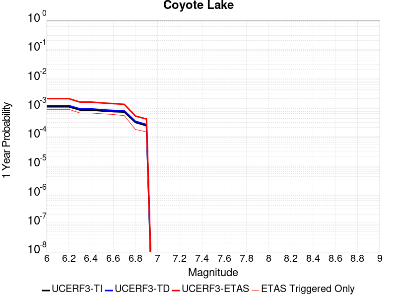 |  |

| Magnitude | 1 wk TI Prob | 1 wk TD Prob | 1 wk ETAS Prob | 1 wk ETAS/TD Gain | 1 wk ETAS Triggered Only | 1 mo TI Prob | 1 mo TD Prob | 1 mo ETAS Prob | 1 mo ETAS/TD Gain | 1 mo ETAS Triggered Only | 1 yr TI Prob | 1 yr TD Prob | 1 yr ETAS Prob | 1 yr ETAS/TD Gain | 1 yr ETAS Triggered Only | 10 yr TI Prob | 10 yr TD Prob | 10 yr ETAS Prob | 10 yr ETAS/TD Gain | 10 yr ETAS Triggered Only |
|-----|-----|-----|-----|-----|-----|-----|-----|-----|-----|-----|-----|-----|-----|-----|-----|-----|-----|-----|-----|-----|
| 6.0 | 1.980352E-5 | 2.1706745E-5 | 7.225115E-4 | 33.285114 | 7.0081995E-4 | 8.486947E-5 | 9.302599E-5 | 8.638562E-4 | 9.286181 | 7.7090197E-4 | 0.0010327959 | 0.0011320751 | 0.001972107 | 1.7420285 | 8.4098394E-4 | 0.010280091 | 0.011270258 | 0.012240348 | 1.0860752 | 9.81148E-4 |
| 6.1 | 1.980352E-5 | 2.1706745E-5 | 7.225115E-4 | 33.285114 | 7.0081995E-4 | 8.486947E-5 | 9.302599E-5 | 8.638562E-4 | 9.286181 | 7.7090197E-4 | 0.0010327959 | 0.0011320751 | 0.001972107 | 1.7420285 | 8.4098394E-4 | 0.010280091 | 0.011270258 | 0.012240348 | 1.0860752 | 9.81148E-4 |
| 6.2 | 1.980352E-5 | 2.1706745E-5 | 7.225115E-4 | 33.285114 | 7.0081995E-4 | 8.486947E-5 | 9.302599E-5 | 8.638562E-4 | 9.286181 | 7.7090197E-4 | 0.0010327959 | 0.0011320751 | 0.001972107 | 1.7420285 | 8.4098394E-4 | 0.010280091 | 0.011270258 | 0.012240348 | 1.0860752 | 9.81148E-4 |
| 6.3 | 1.5344787E-5 | 1.682067E-5 | 6.47548E-4 | 38.49716 | 6.30738E-4 | 6.576172E-5 | 7.2086936E-5 | 7.7285635E-4 | 10.721171 | 7.0081995E-4 | 8.003548E-4 | 8.773662E-4 | 0.0015775714 | 1.7980762 | 7.0081995E-4 | 0.007974784 | 0.00874507 | 0.009578698 | 1.0953257 | 8.4098394E-4 |
| 6.4 | 1.5344787E-5 | 1.682067E-5 | 6.47548E-4 | 38.49716 | 6.30738E-4 | 6.576172E-5 | 7.2086936E-5 | 7.7285635E-4 | 10.721171 | 7.0081995E-4 | 8.003548E-4 | 8.773662E-4 | 0.0015775714 | 1.7980762 | 7.0081995E-4 | 0.007974784 | 0.00874507 | 0.009578698 | 1.0953257 | 8.4098394E-4 |
| 6.5 | 1.4189697E-5 | 1.5557987E-5 | 5.0612434E-4 | 32.53148 | 4.90574E-4 | 6.081157E-5 | 6.6675726E-5 | 6.272943E-4 | 9.408136 | 5.6065596E-4 | 7.401293E-4 | 8.115349E-4 | 0.0013717358 | 1.6902981 | 5.6065596E-4 | 0.0073766913 | 0.008091656 | 0.008786805 | 1.0859094 | 7.0081995E-4 |
| 6.6 | 1.3469301E-5 | 1.4771577E-5 | 4.3525733E-4 | 29.465868 | 4.2049197E-4 | 5.7724297E-5 | 6.330556E-5 | 5.5384845E-4 | 8.748813 | 4.90574E-4 | 7.025667E-4 | 7.7053264E-4 | 0.0012607286 | 1.636178 | 4.90574E-4 | 0.0070034964 | 0.0076845144 | 0.008310406 | 1.0814483 | 6.30738E-4 |
| 6.7 | 1.3027966E-5 | 1.4281745E-5 | 3.646867E-4 | 25.535166 | 3.5040997E-4 | 5.5832945E-5 | 6.120638E-5 | 4.115949E-4 | 6.724706 | 3.5040997E-4 | 6.7955407E-4 | 7.4499263E-4 | 0.0010951415 | 1.4700032 | 3.5040997E-4 | 0.006774798 | 0.0074308286 | 0.007917757 | 1.0655282 | 4.90574E-4 |
| 6.8 | 5.695434E-6 | 6.2244176E-6 | 7.630598E-5 | 12.259135 | 7.0081995E-5 | 2.4408775E-5 | 2.6675973E-5 | 9.67561E-5 | 3.627088 | 7.0081995E-5 | 2.971363E-4 | 3.2476155E-4 | 3.948208E-4 | 1.2157252 | 7.0081995E-5 | 0.0029673933 | 0.0032458105 | 0.0033855194 | 1.0430429 | 1.4016399E-4 |
| 6.9 | 4.385688E-6 | 4.7930553E-6 | 7.487472E-5 | 15.6215 | 7.0081995E-5 | 1.879567E-5 | 2.0541665E-5 | 9.062222E-5 | 4.4116297 | 7.0081995E-5 | 2.2881327E-4 | 2.5009477E-4 | 3.2015925E-4 | 1.2801516 | 7.0081995E-5 | 0.002285778 | 0.0025009478 | 0.0025708545 | 1.0279521 | 7.0081995E-5 |

## San Andreas (San Bernardino S)
*[(top)](#table-of-contents)*

| 1 Week | 1 Month | 1 Year | 10 Year |
|-----|-----|-----|-----|
|  |  |  |  |

| Magnitude | 1 wk TI Prob | 1 wk TD Prob | 1 wk ETAS Prob | 1 wk ETAS/TD Gain | 1 wk ETAS Triggered Only | 1 mo TI Prob | 1 mo TD Prob | 1 mo ETAS Prob | 1 mo ETAS/TD Gain | 1 mo ETAS Triggered Only | 1 yr TI Prob | 1 yr TD Prob | 1 yr ETAS Prob | 1 yr ETAS/TD Gain | 1 yr ETAS Triggered Only | 10 yr TI Prob | 10 yr TD Prob | 10 yr ETAS Prob | 10 yr ETAS/TD Gain | 10 yr ETAS Triggered Only |
|-----|-----|-----|-----|-----|-----|-----|-----|-----|-----|-----|-----|-----|-----|-----|-----|-----|-----|-----|-----|-----|
| 6.0 | 1.2336002E-4 | 3.0004102E-4 | 0.0010006507 | 3.3350463 | 7.0081995E-4 | 5.2857865E-4 | 0.0012852824 | 0.0020551935 | 1.599021 | 7.7090197E-4 | 0.006416472 | 0.015540994 | 0.016506894 | 1.0621518 | 9.81148E-4 | 0.06234337 | 0.14283717 | 0.14367817 | 1.0058879 | 9.81148E-4 |
| 6.1 | 1.2336002E-4 | 3.0004102E-4 | 0.0010006507 | 3.3350463 | 7.0081995E-4 | 5.2857865E-4 | 0.0012852824 | 0.0020551935 | 1.599021 | 7.7090197E-4 | 0.006416472 | 0.015540994 | 0.016506894 | 1.0621518 | 9.81148E-4 | 0.06234337 | 0.14283717 | 0.14367817 | 1.0058879 | 9.81148E-4 |
| 6.2 | 1.2336002E-4 | 3.0004102E-4 | 0.0010006507 | 3.3350463 | 7.0081995E-4 | 5.2857865E-4 | 0.0012852824 | 0.0020551935 | 1.599021 | 7.7090197E-4 | 0.006416472 | 0.015540994 | 0.016506894 | 1.0621518 | 9.81148E-4 | 0.06234337 | 0.14283717 | 0.14367817 | 1.0058879 | 9.81148E-4 |
| 6.3 | 1.1712257E-4 | 2.8792414E-4 | 9.184805E-4 | 3.1900086 | 6.30738E-4 | 5.018573E-4 | 0.0012334028 | 0.0019333583 | 1.5674996 | 7.0081995E-4 | 0.006093008 | 0.014918125 | 0.015815599 | 1.06016 | 9.1106596E-4 | 0.059286322 | 0.13754563 | 0.13833138 | 1.0057126 | 9.1106596E-4 |
| 6.4 | 1.1712257E-4 | 2.8792414E-4 | 9.184805E-4 | 3.1900086 | 6.30738E-4 | 5.018573E-4 | 0.0012334028 | 0.0019333583 | 1.5674996 | 7.0081995E-4 | 0.006093008 | 0.014918125 | 0.015815599 | 1.06016 | 9.1106596E-4 | 0.059286322 | 0.13754563 | 0.13833138 | 1.0057126 | 9.1106596E-4 |
| 6.5 | 1.0689076E-4 | 2.680528E-4 | 8.986217E-4 | 3.3524055 | 6.30738E-4 | 4.5802278E-4 | 0.0011483167 | 0.0018483319 | 1.6096011 | 7.0081995E-4 | 0.0055621783 | 0.01389575 | 0.014725048 | 1.05968 | 8.4098394E-4 | 0.05425003 | 0.12879294 | 0.12952562 | 1.0056888 | 8.4098394E-4 |
| 6.6 | 9.7648895E-5 | 2.50501E-4 | 8.1101654E-4 | 3.237578 | 5.6065596E-4 | 4.1842813E-4 | 0.0010731576 | 0.0017032188 | 1.5871096 | 6.30738E-4 | 0.005082469 | 0.012991785 | 0.013752672 | 1.0585667 | 7.7090197E-4 | 0.049677886 | 0.12095292 | 0.12163057 | 1.0056027 | 7.7090197E-4 |
| 6.7 | 8.757013E-5 | 2.3120902E-4 | 7.9173537E-4 | 3.4243271 | 5.6065596E-4 | 3.7524657E-4 | 9.905418E-4 | 0.001620655 | 1.6361299 | 6.30738E-4 | 0.00455906 | 0.011997245 | 0.012758899 | 1.0634856 | 7.7090197E-4 | 0.04466656 | 0.11226123 | 0.11294559 | 1.0060961 | 7.7090197E-4 |
| 6.8 | 8.562978E-5 | 2.2680782E-4 | 7.873366E-4 | 3.4713821 | 5.6065596E-4 | 3.6693315E-4 | 9.7169366E-4 | 0.0016018187 | 1.6484812 | 6.30738E-4 | 0.004458263 | 0.011770263 | 0.012532092 | 1.0647248 | 7.7090197E-4 | 0.043698758 | 0.11027153 | 0.11095742 | 1.00622 | 7.7090197E-4 |
| 6.9 | 6.124075E-5 | 1.7065753E-4 | 7.312178E-4 | 4.284709 | 5.6065596E-4 | 2.6243398E-4 | 7.311852E-4 | 0.0013614619 | 1.8619933 | 6.30738E-4 | 0.0031904527 | 0.008866051 | 0.009630118 | 1.086179 | 7.7090197E-4 | 0.031450346 | 0.08418263 | 0.08488864 | 1.0083866 | 7.7090197E-4 |
| 7.0 | 5.8598747E-5 | 1.649477E-4 | 7.2551117E-4 | 4.3984313 | 5.6065596E-4 | 2.5111332E-4 | 7.06728E-4 | 0.0013370202 | 1.8918455 | 6.30738E-4 | 0.0030530186 | 0.008570663 | 0.009334958 | 1.0891757 | 7.7090197E-4 | 0.03011414 | 0.081500374 | 0.08220845 | 1.008688 | 7.7090197E-4 |
| 7.1 | 5.613814E-5 | 1.5913323E-4 | 7.1969995E-4 | 4.5226254 | 5.6065596E-4 | 2.4056983E-4 | 6.818221E-4 | 0.00131213 | 1.9244463 | 6.30738E-4 | 0.0029250039 | 0.008269769 | 0.009034296 | 1.0924484 | 7.7090197E-4 | 0.028868021 | 0.07879931 | 0.07950947 | 1.0090122 | 7.7090197E-4 |
| 7.2 | 4.991222E-5 | 1.4519796E-4 | 7.0577255E-4 | 4.8607607 | 5.6065596E-4 | 2.1389198E-4 | 6.2212895E-4 | 0.0012524745 | 2.0132072 | 6.30738E-4 | 0.002601025 | 0.007548217 | 0.0083133 | 1.1013595 | 7.7090197E-4 | 0.025707912 | 0.07225321 | 0.07296841 | 1.0098985 | 7.7090197E-4 |
| 7.3 | 4.7410045E-5 | 1.3714004E-4 | 6.977191E-4 | 5.08764 | 5.6065596E-4 | 2.0317009E-4 | 5.8761094E-4 | 0.0012179783 | 2.072763 | 6.30738E-4 | 0.0024707897 | 0.0071307817 | 0.007896186 | 1.1073382 | 7.7090197E-4 | 0.024434982 | 0.06853558 | 0.069253646 | 1.0104773 | 7.7090197E-4 |
| 7.4 | 4.5556746E-5 | 1.3121912E-4 | 6.9180154E-4 | 5.272109 | 5.6065596E-4 | 1.952286E-4 | 5.622468E-4 | 0.00119263 | 2.1211863 | 6.30738E-4 | 0.002374317 | 0.0068239477 | 0.007589589 | 1.1121992 | 7.7090197E-4 | 0.023491086 | 0.065788016 | 0.0665082 | 1.0109471 | 7.7090197E-4 |
| 7.5 | 4.3084514E-5 | 1.2357246E-4 | 6.8415917E-4 | 5.5365014 | 5.6065596E-4 | 1.8463485E-4 | 5.2948913E-4 | 0.0011598931 | 2.1905892 | 6.30738E-4 | 0.0022456115 | 0.0064275465 | 0.0071934937 | 1.1191663 | 7.7090197E-4 | 0.022230545 | 0.062188786 | 0.06291175 | 1.0116253 | 7.7090197E-4 |
| 7.6 | 3.408608E-5 | 9.83552E-5 | 6.58956E-4 | 6.699758 | 5.6065596E-4 | 1.4607502E-4 | 4.214543E-4 | 0.0010519264 | 2.4959443 | 6.30738E-4 | 0.0017770125 | 0.0051191594 | 0.0058861147 | 1.1498206 | 7.7090197E-4 | 0.017628696 | 0.050020292 | 0.050752632 | 1.0146409 | 7.7090197E-4 |
| 7.7 | 2.8315713E-5 | 8.248679E-5 | 5.730203E-4 | 6.9468126 | 4.90574E-4 | 1.2134742E-4 | 3.5346695E-4 | 9.1392477E-4 | 2.5856016 | 5.6065596E-4 | 0.0014764034 | 0.0042949775 | 0.0049927873 | 1.1624712 | 7.0081995E-4 | 0.01466633 | 0.0422714 | 0.0429426 | 1.0158782 | 7.0081995E-4 |
| 7.8 | 2.6222975E-5 | 7.463088E-5 | 5.651682E-4 | 7.572847 | 4.90574E-4 | 1.1237934E-4 | 3.1980744E-4 | 8.802841E-4 | 2.7525442 | 5.6065596E-4 | 0.0013673597 | 0.0038867102 | 0.004584806 | 1.1796111 | 7.0081995E-4 | 0.013589768 | 0.03843674 | 0.039110623 | 1.0175322 | 7.0081995E-4 |
| 7.9 | 2.1469694E-5 | 5.787864E-5 | 4.7834628E-4 | 8.264643 | 4.2049197E-4 | 9.200973E-5 | 2.4802773E-4 | 7.3848007E-4 | 2.977409 | 4.90574E-4 | 0.0011196428 | 0.0030155594 | 0.0036443954 | 1.2085304 | 6.30738E-4 | 0.011140184 | 0.030152109 | 0.03076383 | 1.0202878 | 6.30738E-4 |
| 8.0 | 1.2420249E-5 | 3.131896E-5 | 1.0139876E-4 | 3.2376158 | 7.0081995E-5 | 5.322855E-5 | 1.342172E-4 | 2.743624E-4 | 2.044167 | 1.4016399E-4 | 6.478649E-4 | 0.0016328706 | 0.0017728058 | 1.0856988 | 1.4016399E-4 | 0.0064597935 | 0.016522504 | 0.016660351 | 1.0083431 | 1.4016399E-4 |
| 8.1 | 4.9197724E-6 | 7.822348E-6 | 7.822348E-6 | 1.0 | 0.0 | 2.1084568E-5 | 3.352392E-5 | 1.0360357E-4 | 3.090437 | 7.0081995E-5 | 2.566744E-4 | 4.0807744E-4 | 4.7813082E-4 | 1.171667 | 7.0081995E-5 | 0.002563781 | 0.0043843705 | 0.004454145 | 1.0159144 | 7.0081995E-5 |
| 8.2 | 2.5634774E-6 | 2.9067196E-6 | 2.9067196E-6 | 1.0 | 0.0 | 1.0986286E-5 | 1.2457311E-5 | 1.2457311E-5 | 1.0 | 0.0 | 1.3374983E-4 | 1.5165724E-4 | 1.5165724E-4 | 1.0 | 0.0 | 0.0013366934 | 0.0017049741 | 0.0017049741 | 1.0 | 0.0 |
| 8.3 | 5.2850464E-7 | 3.2088764E-7 | 3.2088764E-7 | 1.0 | 0.0 | 2.2650179E-6 | 1.375232E-6 | 1.375232E-6 | 1.0 | 0.0 | 2.7576245E-5 | 1.6743334E-5 | 1.6743334E-5 | 1.0 | 0.0 | 2.7572823E-4 | 1.9870348E-4 | 1.9870348E-4 | 1.0 | 0.0 |

## Red Pass
*[(top)](#table-of-contents)*

| 1 Week | 1 Month | 1 Year | 10 Year |
|-----|-----|-----|-----|
|  | 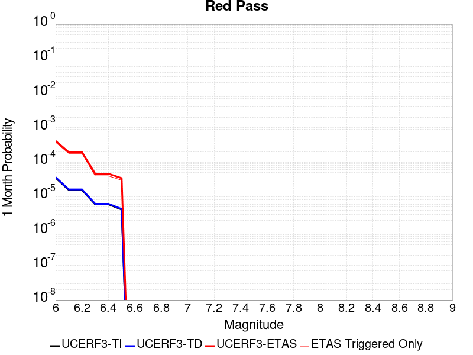 |  |  |

| Magnitude | 1 wk TI Prob | 1 wk TD Prob | 1 wk ETAS Prob | 1 wk ETAS/TD Gain | 1 wk ETAS Triggered Only | 1 mo TI Prob | 1 mo TD Prob | 1 mo ETAS Prob | 1 mo ETAS/TD Gain | 1 mo ETAS Triggered Only | 1 yr TI Prob | 1 yr TD Prob | 1 yr ETAS Prob | 1 yr ETAS/TD Gain | 1 yr ETAS Triggered Only | 10 yr TI Prob | 10 yr TD Prob | 10 yr ETAS Prob | 10 yr ETAS/TD Gain | 10 yr ETAS Triggered Only |
|-----|-----|-----|-----|-----|-----|-----|-----|-----|-----|-----|-----|-----|-----|-----|-----|-----|-----|-----|-----|-----|
| 6.0 | 8.258278E-6 | 8.551265E-6 | 4.9912103E-4 | 58.368095 | 4.90574E-4 | 3.539214E-5 | 3.6647863E-5 | 5.972833E-4 | 16.297901 | 5.6065596E-4 | 4.308141E-4 | 4.4611428E-4 | 0.0011466215 | 2.570242 | 7.0081995E-4 | 0.0042997985 | 0.004453945 | 0.0052214134 | 1.172312 | 7.7090197E-4 |
| 6.1 | 3.649988E-6 | 3.7753161E-6 | 3.5418398E-4 | 93.81571 | 3.5040997E-4 | 1.5642712E-5 | 1.6179853E-5 | 4.3666502E-4 | 26.988195 | 4.2049197E-4 | 1.9043336E-4 | 1.9697666E-4 | 7.575222E-4 | 3.845746 | 5.6065596E-4 | 0.0019027026 | 0.001968488 | 0.0025979844 | 1.3197868 | 6.30738E-4 |
| 6.2 | 3.649988E-6 | 3.7753161E-6 | 3.5418398E-4 | 93.81571 | 3.5040997E-4 | 1.5642712E-5 | 1.6179853E-5 | 4.3666502E-4 | 26.988195 | 4.2049197E-4 | 1.9043336E-4 | 1.9697666E-4 | 7.575222E-4 | 3.845746 | 5.6065596E-4 | 0.0019027026 | 0.001968488 | 0.0025979844 | 1.3197868 | 6.30738E-4 |
| 6.3 | 1.3924937E-6 | 1.4411166E-6 | 7.152301E-5 | 49.630272 | 7.0081995E-5 | 5.9678164E-6 | 6.1762075E-6 | 1.4633933E-4 | 23.694044 | 1.4016399E-4 | 7.265574E-5 | 7.519415E-5 | 2.153476E-4 | 2.8638878 | 1.4016399E-4 | 7.263199E-4 | 7.518258E-4 | 8.9188444E-4 | 1.1862913 | 1.4016399E-4 |
| 6.4 | 1.3924937E-6 | 1.4411166E-6 | 7.152301E-5 | 49.630272 | 7.0081995E-5 | 5.9678164E-6 | 6.1762075E-6 | 1.4633933E-4 | 23.694044 | 1.4016399E-4 | 7.265574E-5 | 7.519415E-5 | 2.153476E-4 | 2.8638878 | 1.4016399E-4 | 7.263199E-4 | 7.518258E-4 | 8.9188444E-4 | 1.1862913 | 1.4016399E-4 |
| 6.5 | 9.876812E-7 | 1.0221912E-6 | 1.0221912E-6 | 1.0 | 0.0 | 4.2329125E-6 | 4.3808195E-6 | 7.446251E-5 | 16.997393 | 7.0081995E-5 | 5.153449E-5 | 5.3336476E-5 | 1.2341473E-4 | 2.31389 | 7.0081995E-5 | 5.1522546E-4 | 5.333648E-4 | 6.0340937E-4 | 1.131326 | 7.0081995E-5 |

## San Andreas (Parkfield)
*[(top)](#table-of-contents)*

| 1 Week | 1 Month | 1 Year | 10 Year |
|-----|-----|-----|-----|
|  |  |  |  |

| Magnitude | 1 wk TI Prob | 1 wk TD Prob | 1 wk ETAS Prob | 1 wk ETAS/TD Gain | 1 wk ETAS Triggered Only | 1 mo TI Prob | 1 mo TD Prob | 1 mo ETAS Prob | 1 mo ETAS/TD Gain | 1 mo ETAS Triggered Only | 1 yr TI Prob | 1 yr TD Prob | 1 yr ETAS Prob | 1 yr ETAS/TD Gain | 1 yr ETAS Triggered Only | 10 yr TI Prob | 10 yr TD Prob | 10 yr ETAS Prob | 10 yr ETAS/TD Gain | 10 yr ETAS Triggered Only |
|-----|-----|-----|-----|-----|-----|-----|-----|-----|-----|-----|-----|-----|-----|-----|-----|-----|-----|-----|-----|-----|
| 6.0 | 5.556969E-4 | 7.7782426E-4 | 0.0010579341 | 1.3601198 | 2.8032798E-4 | 0.0023793848 | 0.0033298214 | 0.0037489133 | 1.1258601 | 4.2049197E-4 | 0.028586963 | 0.040191233 | 0.040863886 | 1.0167363 | 7.0081995E-4 | 0.25176284 | 0.33716413 | 0.33762866 | 1.0013777 | 7.0081995E-4 |
| 6.1 | 1.925858E-4 | 3.0276453E-4 | 3.728253E-4 | 1.2314035 | 7.0081995E-5 | 8.2510663E-4 | 0.0012970108 | 0.001436993 | 1.1079267 | 1.4016399E-4 | 0.0099994885 | 0.015778083 | 0.016122965 | 1.0218582 | 3.5040997E-4 | 0.095613256 | 0.1497237 | 0.15002163 | 1.00199 | 3.5040997E-4 |
| 6.2 | 9.4306815E-5 | 1.8242796E-4 | 1.8242796E-4 | 1.0 | 0.0 | 4.0410945E-4 | 7.816011E-4 | 8.516283E-4 | 1.0895946 | 7.0081995E-5 | 0.0049089384 | 0.009474681 | 0.009752353 | 1.0293068 | 2.8032798E-4 | 0.048019063 | 0.09185409 | 0.09210867 | 1.0027715 | 2.8032798E-4 |
| 6.3 | 9.283051E-5 | 1.7939322E-4 | 1.7939322E-4 | 1.0 | 0.0 | 3.9778434E-4 | 7.686027E-4 | 8.3863083E-4 | 1.091111 | 7.0081995E-5 | 0.0048322747 | 0.009317789 | 0.009595505 | 1.029805 | 2.8032798E-4 | 0.047285385 | 0.09050704 | 0.09076199 | 1.002817 | 2.8032798E-4 |
| 6.4 | 9.138826E-5 | 1.770153E-4 | 1.770153E-4 | 1.0 | 0.0 | 3.916052E-4 | 7.5841765E-4 | 8.2844653E-4 | 1.0923355 | 7.0081995E-5 | 0.0047573745 | 0.00919484 | 0.00947259 | 1.0302072 | 2.8032798E-4 | 0.046568092 | 0.08940927 | 0.089664534 | 1.0028551 | 2.8032798E-4 |
| 6.5 | 9.000255E-5 | 1.7459576E-4 | 1.7459576E-4 | 1.0 | 0.0 | 3.8566816E-4 | 7.480541E-4 | 8.180837E-4 | 1.0936157 | 7.0081995E-5 | 0.0046854047 | 0.009069731 | 0.009347517 | 1.0306277 | 2.8032798E-4 | 0.045878403 | 0.088295065 | 0.08855064 | 1.0028945 | 2.8032798E-4 |
| 6.6 | 8.8109264E-5 | 1.7140752E-4 | 1.7140752E-4 | 1.0 | 0.0 | 3.7755648E-4 | 7.3439797E-4 | 8.0442854E-4 | 1.0953578 | 7.0081995E-5 | 0.0045870654 | 0.008904854 | 0.009113228 | 1.0234001 | 2.1024598E-4 | 0.04493529 | 0.0868267 | 0.08701868 | 1.0022112 | 2.1024598E-4 |
| 6.7 | 8.738073E-5 | 1.7007832E-4 | 1.7007832E-4 | 1.0 | 0.0 | 3.7443507E-4 | 7.287046E-4 | 7.9873553E-4 | 1.0961033 | 7.0081995E-5 | 0.0045492216 | 0.008836143 | 0.009044531 | 1.0235837 | 2.1024598E-4 | 0.04457213 | 0.08622707 | 0.08641918 | 1.002228 | 2.1024598E-4 |
| 6.8 | 8.710195E-5 | 1.6953335E-4 | 1.6953335E-4 | 1.0 | 0.0 | 3.7324068E-4 | 7.263703E-4 | 7.964014E-4 | 1.0964124 | 7.0081995E-5 | 0.0045347405 | 0.008807961 | 0.009016355 | 1.0236597 | 2.1024598E-4 | 0.04443313 | 0.08597467 | 0.08616684 | 1.0022352 | 2.1024598E-4 |
| 6.9 | 8.6801556E-5 | 1.689429E-4 | 1.689429E-4 | 1.0 | 0.0 | 3.7195362E-4 | 7.2384125E-4 | 7.938725E-4 | 1.0967495 | 7.0081995E-5 | 0.0045191357 | 0.008777418 | 0.008985818 | 1.0237428 | 2.1024598E-4 | 0.044283327 | 0.085700735 | 0.08589296 | 1.002243 | 2.1024598E-4 |
| 7.0 | 8.5571606E-5 | 1.6647128E-4 | 1.6647128E-4 | 1.0 | 0.0 | 3.6668387E-4 | 7.132544E-4 | 7.832864E-4 | 1.0981866 | 7.0081995E-5 | 0.004455241 | 0.008649553 | 0.008857981 | 1.0240968 | 2.1024598E-4 | 0.043669727 | 0.08454914 | 0.08474161 | 1.0022764 | 2.1024598E-4 |
| 7.1 | 7.82589E-5 | 1.5128135E-4 | 1.5128135E-4 | 1.0 | 0.0 | 3.3535215E-4 | 6.481883E-4 | 7.1822485E-4 | 1.1080498 | 7.0081995E-5 | 0.0040752706 | 0.007863307 | 0.008071899 | 1.0265274 | 2.1024598E-4 | 0.040013418 | 0.07746111 | 0.07765507 | 1.002504 | 2.1024598E-4 |
| 7.2 | 7.690929E-5 | 1.4865391E-4 | 1.4865391E-4 | 1.0 | 0.0 | 3.2956956E-4 | 6.369334E-4 | 7.0697075E-4 | 1.1099603 | 7.0081995E-5 | 0.004005129 | 0.007727258 | 0.007935879 | 1.0269982 | 2.1024598E-4 | 0.0393371 | 0.07623427 | 0.07642849 | 1.0025476 | 2.1024598E-4 |
| 7.3 | 7.5543794E-5 | 1.4561978E-4 | 1.4561978E-4 | 1.0 | 0.0 | 3.2371894E-4 | 6.2393624E-4 | 6.939745E-4 | 1.1122522 | 7.0081995E-5 | 0.003934157 | 0.007570127 | 0.0077787815 | 1.0275629 | 2.1024598E-4 | 0.038652334 | 0.074797355 | 0.074991874 | 1.0026007 | 2.1024598E-4 |
| 7.4 | 7.4214564E-5 | 1.4262961E-4 | 1.4262961E-4 | 1.0 | 0.0 | 3.1802364E-4 | 6.111273E-4 | 6.811665E-4 | 1.1146065 | 7.0081995E-5 | 0.003865065 | 0.00741525 | 0.007623937 | 1.0281429 | 2.1024598E-4 | 0.03798529 | 0.07337123 | 0.07356606 | 1.0026553 | 2.1024598E-4 |
| 7.5 | 6.149578E-5 | 1.11907226E-4 | 1.11907226E-4 | 1.0 | 0.0 | 2.6352672E-4 | 4.7951436E-4 | 5.4956274E-4 | 1.1460819 | 7.0081995E-5 | 0.0032037178 | 0.0058224914 | 0.006031513 | 1.035899 | 2.1024598E-4 | 0.03157923 | 0.058557566 | 0.0587555 | 1.0033802 | 2.1024598E-4 |
| 7.6 | 6.0643448E-5 | 1.10193796E-4 | 1.10193796E-4 | 1.0 | 0.0 | 2.598746E-4 | 4.7217376E-4 | 5.422227E-4 | 1.148354 | 7.0081995E-5 | 0.0031593828 | 0.0057335934 | 0.0059426343 | 1.0364588 | 2.1024598E-4 | 0.031148417 | 0.057718582 | 0.057916693 | 1.0034324 | 2.1024598E-4 |
| 7.7 | 5.1652263E-5 | 9.174698E-5 | 9.174698E-5 | 1.0 | 0.0 | 2.2134806E-4 | 3.931421E-4 | 4.6319654E-4 | 1.1781912 | 7.0081995E-5 | 0.002691582 | 0.0047760103 | 0.0049155047 | 1.0292073 | 1.4016399E-4 | 0.026592141 | 0.04853623 | 0.048669588 | 1.0027477 | 1.4016399E-4 |
| 7.8 | 4.8090482E-5 | 8.559635E-5 | 8.559635E-5 | 1.0 | 0.0 | 2.060858E-4 | 3.6678996E-4 | 4.3684625E-4 | 1.1909984 | 7.0081995E-5 | 0.0025062072 | 0.0044565317 | 0.0045960713 | 1.0313112 | 1.4016399E-4 | 0.024781305 | 0.04530245 | 0.045436263 | 1.0029538 | 1.4016399E-4 |
| 7.9 | 3.970278E-5 | 6.750426E-5 | 6.750426E-5 | 1.0 | 0.0 | 1.7014367E-4 | 2.892719E-4 | 3.5933362E-4 | 1.2422003 | 7.0081995E-5 | 0.002069531 | 0.0035162016 | 0.0036558728 | 1.0397222 | 1.4016399E-4 | 0.020503636 | 0.035881363 | 0.036016498 | 1.0037662 | 1.4016399E-4 |
| 8.0 | 2.8982335E-5 | 4.069796E-5 | 4.069796E-5 | 1.0 | 0.0 | 1.2420409E-4 | 1.7440817E-4 | 2.4447794E-4 | 1.4017574 | 7.0081995E-5 | 0.0015111357 | 0.0021213528 | 0.0022612193 | 1.0659328 | 1.4016399E-4 | 0.015009012 | 0.022010697 | 0.022147775 | 1.0062279 | 1.4016399E-4 |
| 8.1 | 1.8836186E-5 | 1.8681134E-5 | 1.8681134E-5 | 1.0 | 0.0 | 8.0724014E-5 | 8.005955E-5 | 1.5013594E-4 | 1.8753033 | 7.0081995E-5 | 9.823717E-4 | 9.742898E-4 | 0.0010443035 | 1.0718613 | 7.0081995E-5 | 0.009780403 | 0.010488115 | 0.010557462 | 1.006612 | 7.0081995E-5 |
| 8.2 | 8.643924E-6 | 5.4748625E-6 | 5.4748625E-6 | 1.0 | 0.0 | 3.704486E-5 | 2.3463486E-5 | 2.3463486E-5 | 1.0 | 0.0 | 4.5092785E-4 | 2.8563058E-4 | 2.8563058E-4 | 1.0 | 0.0 | 0.0045001395 | 0.0032487072 | 0.0032487072 | 1.0 | 0.0 |
| 8.3 | 1.983087E-6 | 7.6599065E-7 | 7.6599065E-7 | 1.0 | 0.0 | 8.498917E-6 | 3.282813E-6 | 3.282813E-6 | 1.0 | 0.0 | 1.034694E-4 | 3.9967534E-5 | 3.9967534E-5 | 1.0 | 0.0 | 0.0010342124 | 4.719687E-4 | 4.719687E-4 | 1.0 | 0.0 |

## San Andreas (Big Bend)
*[(top)](#table-of-contents)*

| 1 Week | 1 Month | 1 Year | 10 Year |
|-----|-----|-----|-----|
|  |  |  | 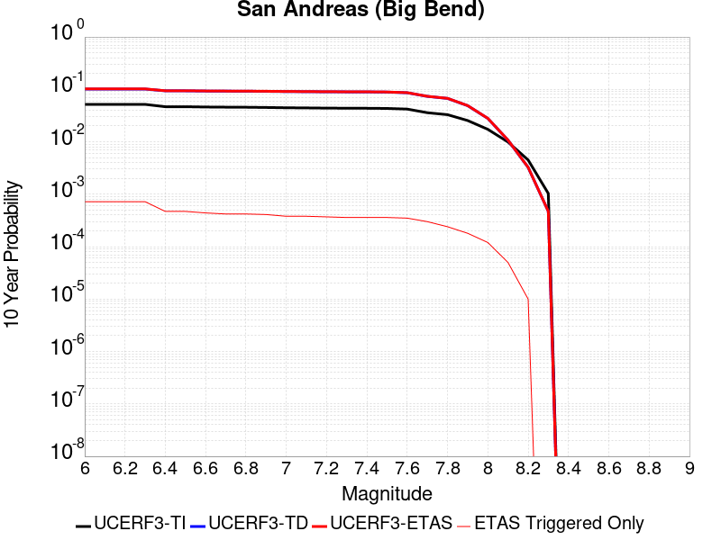 |

| Magnitude | 1 wk TI Prob | 1 wk TD Prob | 1 wk ETAS Prob | 1 wk ETAS/TD Gain | 1 wk ETAS Triggered Only | 1 mo TI Prob | 1 mo TD Prob | 1 mo ETAS Prob | 1 mo ETAS/TD Gain | 1 mo ETAS Triggered Only | 1 yr TI Prob | 1 yr TD Prob | 1 yr ETAS Prob | 1 yr ETAS/TD Gain | 1 yr ETAS Triggered Only | 10 yr TI Prob | 10 yr TD Prob | 10 yr ETAS Prob | 10 yr ETAS/TD Gain | 10 yr ETAS Triggered Only |
|-----|-----|-----|-----|-----|-----|-----|-----|-----|-----|-----|-----|-----|-----|-----|-----|-----|-----|-----|-----|-----|
| 6.0 | 1.0179969E-4 | 2.0072258E-4 | 3.4085845E-4 | 1.6981568 | 1.4016399E-4 | 4.362114E-4 | 8.599571E-4 | 0.0012100658 | 1.4071233 | 3.5040997E-4 | 0.0052979486 | 0.010419999 | 0.010974812 | 1.0532451 | 5.6065596E-4 | 0.051734097 | 0.10144902 | 0.10201577 | 1.0055865 | 6.30738E-4 |
| 6.1 | 1.0179969E-4 | 2.0072258E-4 | 3.4085845E-4 | 1.6981568 | 1.4016399E-4 | 4.362114E-4 | 8.599571E-4 | 0.0012100658 | 1.4071233 | 3.5040997E-4 | 0.0052979486 | 0.010419999 | 0.010974812 | 1.0532451 | 5.6065596E-4 | 0.051734097 | 0.10144902 | 0.10201577 | 1.0055865 | 6.30738E-4 |
| 6.2 | 1.0179969E-4 | 2.0072258E-4 | 3.4085845E-4 | 1.6981568 | 1.4016399E-4 | 4.362114E-4 | 8.599571E-4 | 0.0012100658 | 1.4071233 | 3.5040997E-4 | 0.0052979486 | 0.010419999 | 0.010974812 | 1.0532451 | 5.6065596E-4 | 0.051734097 | 0.10144902 | 0.10201577 | 1.0055865 | 6.30738E-4 |
| 6.3 | 1.0179969E-4 | 2.0072258E-4 | 3.4085845E-4 | 1.6981568 | 1.4016399E-4 | 4.362114E-4 | 8.599571E-4 | 0.0012100658 | 1.4071233 | 3.5040997E-4 | 0.0052979486 | 0.010419999 | 0.010974812 | 1.0532451 | 5.6065596E-4 | 0.051734097 | 0.10144902 | 0.10201577 | 1.0055865 | 6.30738E-4 |
| 6.4 | 9.1639464E-5 | 1.8429532E-4 | 3.244335E-4 | 1.7603999 | 1.4016399E-4 | 3.9268145E-4 | 7.895982E-4 | 0.0011397315 | 1.4434322 | 3.5040997E-4 | 0.0047704205 | 0.009571102 | 0.010056981 | 1.0507652 | 4.90574E-4 | 0.046693064 | 0.09377527 | 0.09421984 | 1.0047408 | 4.90574E-4 |
| 6.5 | 9.1639464E-5 | 1.8429532E-4 | 3.244335E-4 | 1.7603999 | 1.4016399E-4 | 3.9268145E-4 | 7.895982E-4 | 0.0011397315 | 1.4434322 | 3.5040997E-4 | 0.0047704205 | 0.009571102 | 0.010056981 | 1.0507652 | 4.90574E-4 | 0.046693064 | 0.09377527 | 0.09421984 | 1.0047408 | 4.90574E-4 |
| 6.6 | 9.042622E-5 | 1.823659E-4 | 3.2250435E-4 | 1.7684464 | 1.4016399E-4 | 3.8748336E-4 | 7.8133424E-4 | 0.0010614432 | 1.3585008 | 2.8032798E-4 | 0.0047074095 | 0.009471365 | 0.009887874 | 1.0439756 | 4.2049197E-4 | 0.046089325 | 0.092869274 | 0.093250714 | 1.0041072 | 4.2049197E-4 |
| 6.7 | 8.9836685E-5 | 1.8150927E-4 | 3.2164782E-4 | 1.7720739 | 1.4016399E-4 | 3.8495753E-4 | 7.776651E-4 | 0.0010577751 | 1.3601936 | 2.8032798E-4 | 0.00467679 | 0.00942708 | 0.009843608 | 1.0441842 | 4.2049197E-4 | 0.045795817 | 0.09246355 | 0.092845164 | 1.0041271 | 4.2049197E-4 |
| 6.8 | 8.9471854E-5 | 1.8097709E-4 | 3.2111572E-4 | 1.7743446 | 1.4016399E-4 | 3.8339442E-4 | 7.7538576E-4 | 0.0010554964 | 1.3612533 | 2.8032798E-4 | 0.004657841 | 0.009399569 | 0.009816108 | 1.0443147 | 4.2049197E-4 | 0.04561414 | 0.092210755 | 0.09259248 | 1.0041397 | 4.2049197E-4 |
| 6.9 | 8.858234E-5 | 1.7979681E-4 | 2.4986622E-4 | 1.3897144 | 7.0081995E-5 | 3.7958333E-4 | 7.703304E-4 | 9.804145E-4 | 1.2727194 | 2.1024598E-4 | 0.004611638 | 0.009338548 | 0.009685687 | 1.0371726 | 3.5040997E-4 | 0.04517103 | 0.09165087 | 0.09196917 | 1.0034729 | 3.5040997E-4 |
| 7.0 | 8.7433385E-5 | 1.7818481E-4 | 2.4825434E-4 | 1.3932407 | 7.0081995E-5 | 3.746607E-4 | 7.634259E-4 | 9.7351137E-4 | 1.2751877 | 2.1024598E-4 | 0.004551957 | 0.009255203 | 0.00960237 | 1.0375104 | 3.5040997E-4 | 0.044598386 | 0.09088532 | 0.091203876 | 1.0035051 | 3.5040997E-4 |
| 7.1 | 8.684964E-5 | 1.7730435E-4 | 2.4737392E-4 | 1.3951937 | 7.0081995E-5 | 3.7215967E-4 | 7.596547E-4 | 9.6974097E-4 | 1.276555 | 2.1024598E-4 | 0.0045216335 | 0.009209678 | 0.009556861 | 1.0376976 | 3.5040997E-4 | 0.04430731 | 0.09046686 | 0.09078557 | 1.003523 | 3.5040997E-4 |
| 7.2 | 8.606521E-5 | 1.762105E-4 | 2.4628013E-4 | 1.3976474 | 7.0081995E-5 | 3.6879873E-4 | 7.549695E-4 | 8.9502765E-4 | 1.185515 | 1.4016399E-4 | 0.0044808835 | 0.0091531165 | 0.009430878 | 1.0303462 | 2.8032798E-4 | 0.043916024 | 0.089947365 | 0.09020248 | 1.0028362 | 2.8032798E-4 |
| 7.3 | 8.568266E-5 | 1.7563057E-4 | 2.4570024E-4 | 1.3989607 | 7.0081995E-5 | 3.6715972E-4 | 7.524855E-4 | 8.92544E-4 | 1.1861279 | 1.4016399E-4 | 0.0044610105 | 0.009123127 | 0.009400898 | 1.0304469 | 2.8032798E-4 | 0.043725148 | 0.08966853 | 0.08992372 | 1.0028459 | 2.8032798E-4 |
| 7.4 | 8.5432206E-5 | 1.7525644E-4 | 2.4532617E-4 | 1.3998125 | 7.0081995E-5 | 3.6608664E-4 | 7.50883E-4 | 8.9094177E-4 | 1.1865253 | 1.4016399E-4 | 0.004447999 | 0.009103781 | 0.009381556 | 1.0305121 | 2.8032798E-4 | 0.043600157 | 0.08948871 | 0.08974395 | 1.0028522 | 2.8032798E-4 |
| 7.5 | 8.4791965E-5 | 1.7394972E-4 | 2.4401954E-4 | 1.4028164 | 7.0081995E-5 | 3.633435E-4 | 7.4528606E-4 | 8.8534557E-4 | 1.1879272 | 1.4016399E-4 | 0.0044147377 | 0.009036204 | 0.009313999 | 1.0307424 | 2.8032798E-4 | 0.043280575 | 0.088866346 | 0.08912176 | 1.0028741 | 2.8032798E-4 |
| 7.6 | 8.241105E-5 | 1.6840403E-4 | 2.3847423E-4 | 1.4160838 | 7.0081995E-5 | 3.531424E-4 | 7.215321E-4 | 8.61595E-4 | 1.1941186 | 1.4016399E-4 | 0.0042910352 | 0.008749358 | 0.009027234 | 1.0317595 | 2.8032798E-4 | 0.042091176 | 0.086243294 | 0.086499445 | 1.0029701 | 2.8032798E-4 |
| 7.7 | 7.00432E-5 | 1.42045E-4 | 2.1211704E-4 | 1.4933088 | 7.0081995E-5 | 3.001506E-4 | 6.0862233E-4 | 7.48701E-4 | 1.230157 | 1.4016399E-4 | 0.0036482112 | 0.0073848404 | 0.0075935335 | 1.0282598 | 2.1024598E-4 | 0.035888977 | 0.07351733 | 0.07371212 | 1.0026495 | 2.1024598E-4 |
| 7.8 | 6.415362E-5 | 1.2968935E-4 | 1.2968935E-4 | 1.0 | 0.0 | 2.749151E-4 | 5.556931E-4 | 6.2573614E-4 | 1.1260463 | 7.0081995E-5 | 0.0033419547 | 0.0067446055 | 0.0068838242 | 1.0206414 | 1.4016399E-4 | 0.03292141 | 0.06725231 | 0.06738304 | 1.001944 | 1.4016399E-4 |
| 7.9 | 4.939911E-5 | 9.3411545E-5 | 9.3411545E-5 | 1.0 | 0.0 | 2.116933E-4 | 4.0027377E-4 | 4.703277E-4 | 1.1750151 | 7.0081995E-5 | 0.0025743195 | 0.004862453 | 0.005001935 | 1.0286856 | 1.4016399E-4 | 0.025447013 | 0.048914436 | 0.049047746 | 1.0027254 | 1.4016399E-4 |
| 8.0 | 3.344983E-5 | 5.222685E-5 | 5.222685E-5 | 1.0 | 0.0 | 1.4334853E-4 | 2.2381016E-4 | 2.9387648E-4 | 1.3130614 | 7.0081995E-5 | 0.0017438711 | 0.0027214854 | 0.0028612681 | 1.0513626 | 1.4016399E-4 | 0.017302496 | 0.027922187 | 0.028058438 | 1.0048796 | 1.4016399E-4 |
| 8.1 | 1.9104898E-5 | 1.9173063E-5 | 1.9173063E-5 | 1.0 | 0.0 | 8.1875565E-5 | 8.216769E-5 | 1.5224393E-4 | 1.8528442 | 7.0081995E-5 | 9.963791E-4 | 9.999331E-4 | 0.001069945 | 1.0700166 | 7.0081995E-5 | 0.009919235 | 0.010749801 | 0.01081913 | 1.0064493 | 7.0081995E-5 |
| 8.2 | 8.643924E-6 | 5.4748625E-6 | 5.4748625E-6 | 1.0 | 0.0 | 3.704486E-5 | 2.3463486E-5 | 2.3463486E-5 | 1.0 | 0.0 | 4.5092785E-4 | 2.8563058E-4 | 2.8563058E-4 | 1.0 | 0.0 | 0.0045001395 | 0.0032487072 | 0.0032487072 | 1.0 | 0.0 |
| 8.3 | 1.983087E-6 | 7.6599065E-7 | 7.6599065E-7 | 1.0 | 0.0 | 8.498917E-6 | 3.282813E-6 | 3.282813E-6 | 1.0 | 0.0 | 1.034694E-4 | 3.9967534E-5 | 3.9967534E-5 | 1.0 | 0.0 | 0.0010342124 | 4.719687E-4 | 4.719687E-4 | 1.0 | 0.0 |

## Death Valley (Fish Lake Valley)
*[(top)](#table-of-contents)*

| 1 Week | 1 Month | 1 Year | 10 Year |
|-----|-----|-----|-----|
|  |  |  | 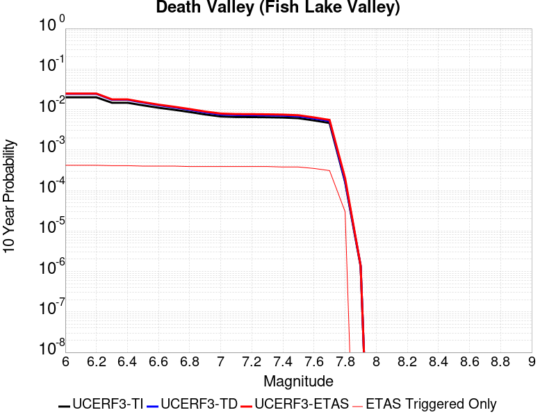 |

| Magnitude | 1 wk TI Prob | 1 wk TD Prob | 1 wk ETAS Prob | 1 wk ETAS/TD Gain | 1 wk ETAS Triggered Only | 1 mo TI Prob | 1 mo TD Prob | 1 mo ETAS Prob | 1 mo ETAS/TD Gain | 1 mo ETAS Triggered Only | 1 yr TI Prob | 1 yr TD Prob | 1 yr ETAS Prob | 1 yr ETAS/TD Gain | 1 yr ETAS Triggered Only | 10 yr TI Prob | 10 yr TD Prob | 10 yr ETAS Prob | 10 yr ETAS/TD Gain | 10 yr ETAS Triggered Only |
|-----|-----|-----|-----|-----|-----|-----|-----|-----|-----|-----|-----|-----|-----|-----|-----|-----|-----|-----|-----|-----|
| 6.0 | 3.872328E-5 | 4.7267473E-5 | 3.275822E-4 | 6.930394 | 2.8032798E-4 | 1.6594635E-4 | 2.0256084E-4 | 6.2296767E-4 | 3.0754592 | 4.2049197E-4 | 0.0020185246 | 0.002463534 | 0.0029528993 | 1.1986437 | 4.90574E-4 | 0.02000288 | 0.024388181 | 0.024935164 | 1.0224282 | 5.6065596E-4 |
| 6.1 | 3.872328E-5 | 4.7267473E-5 | 3.275822E-4 | 6.930394 | 2.8032798E-4 | 1.6594635E-4 | 2.0256084E-4 | 6.2296767E-4 | 3.0754592 | 4.2049197E-4 | 0.0020185246 | 0.002463534 | 0.0029528993 | 1.1986437 | 4.90574E-4 | 0.02000288 | 0.024388181 | 0.024935164 | 1.0224282 | 5.6065596E-4 |
| 6.2 | 3.872328E-5 | 4.7267473E-5 | 3.275822E-4 | 6.930394 | 2.8032798E-4 | 1.6594635E-4 | 2.0256084E-4 | 6.2296767E-4 | 3.0754592 | 4.2049197E-4 | 0.0020185246 | 0.002463534 | 0.0029528993 | 1.1986437 | 4.90574E-4 | 0.02000288 | 0.024388181 | 0.024935164 | 1.0224282 | 5.6065596E-4 |
| 6.3 | 2.8356371E-5 | 3.3609853E-5 | 3.139284E-4 | 9.340369 | 2.8032798E-4 | 1.2152165E-4 | 1.4403471E-4 | 5.644661E-4 | 3.918959 | 4.2049197E-4 | 0.0014785219 | 0.0017522911 | 0.0022420054 | 1.2794709 | 4.90574E-4 | 0.014687235 | 0.017391782 | 0.017942687 | 1.0316762 | 5.6065596E-4 |
| 6.4 | 2.8356371E-5 | 3.3609853E-5 | 3.139284E-4 | 9.340369 | 2.8032798E-4 | 1.2152165E-4 | 1.4403471E-4 | 5.644661E-4 | 3.918959 | 4.2049197E-4 | 0.0014785219 | 0.0017522911 | 0.0022420054 | 1.2794709 | 4.90574E-4 | 0.014687235 | 0.017391782 | 0.017942687 | 1.0316762 | 5.6065596E-4 |
| 6.5 | 2.4448687E-5 | 2.8607552E-5 | 3.0892753E-4 | 10.79881 | 2.8032798E-4 | 1.0477588E-4 | 1.2259831E-4 | 5.4303877E-4 | 4.4294143 | 4.2049197E-4 | 0.0012748998 | 0.0014916632 | 0.0019815054 | 1.3283867 | 4.90574E-4 | 0.012676105 | 0.014821377 | 0.015373723 | 1.0372669 | 5.6065596E-4 |
| 6.6 | 2.1298161E-5 | 2.4660083E-5 | 3.0498116E-4 | 12.367401 | 2.8032798E-4 | 9.127464E-5 | 1.0568198E-4 | 5.261295E-4 | 4.978422 | 4.2049197E-4 | 0.0011107022 | 0.0012859525 | 0.0017758957 | 1.3809962 | 4.90574E-4 | 0.011051672 | 0.012788526 | 0.013342012 | 1.0432799 | 5.6065596E-4 |
| 6.7 | 1.8959729E-5 | 2.1781025E-5 | 3.021029E-4 | 13.870004 | 2.8032798E-4 | 8.125345E-5 | 9.334405E-5 | 5.137968E-4 | 5.504333 | 4.2049197E-4 | 9.888117E-4 | 0.001135897 | 0.0016259137 | 1.4313918 | 4.90574E-4 | 0.009844234 | 0.01130357 | 0.011857889 | 1.0490392 | 5.6065596E-4 |
| 6.8 | 1.6691629E-5 | 1.9018353E-5 | 2.9934102E-4 | 15.739587 | 2.8032798E-4 | 7.153359E-5 | 8.150477E-5 | 5.019625E-4 | 6.158688 | 4.2049197E-4 | 8.7057345E-4 | 9.918857E-4 | 0.0014819731 | 1.4940966 | 4.90574E-4 | 0.008671708 | 0.009876343 | 0.010431462 | 1.056207 | 5.6065596E-4 |
| 6.9 | 1.450505E-5 | 1.638954E-5 | 2.9671294E-4 | 18.103798 | 2.8032798E-4 | 6.216302E-5 | 7.0239046E-5 | 4.9070147E-4 | 6.986164 | 4.2049197E-4 | 7.5657194E-4 | 8.5483363E-4 | 0.0013449882 | 1.5733918 | 4.90574E-4 | 0.007540013 | 0.008516385 | 0.0090722665 | 1.065272 | 5.6065596E-4 |
| 7.0 | 1.2940855E-5 | 1.4537972E-5 | 2.9486188E-4 | 20.282188 | 2.8032798E-4 | 5.545963E-5 | 6.230414E-5 | 4.8276992E-4 | 7.748601 | 4.2049197E-4 | 6.750118E-4 | 7.5829466E-4 | 0.0012484967 | 1.6464531 | 4.90574E-4 | 0.006729651 | 0.0075576897 | 0.008114109 | 1.0736228 | 5.6065596E-4 |
| 7.1 | 1.2544658E-5 | 1.4078208E-5 | 2.9440224E-4 | 20.911913 | 2.8032798E-4 | 5.3761712E-5 | 6.0333812E-5 | 4.8080043E-4 | 7.9690046 | 4.2049197E-4 | 6.5435225E-4 | 7.343222E-4 | 0.0012245359 | 1.6675731 | 4.90574E-4 | 0.006524288 | 0.007319551 | 0.007876103 | 1.0760363 | 5.6065596E-4 |
| 7.2 | 1.2489416E-5 | 1.4015674E-5 | 2.9433973E-4 | 21.000753 | 2.8032798E-4 | 5.3524967E-5 | 6.0065824E-5 | 4.8053253E-4 | 8.000099 | 4.2049197E-4 | 6.514716E-4 | 7.310616E-4 | 0.0012212769 | 1.6705527 | 4.90574E-4 | 0.006495651 | 0.0072871596 | 0.00784373 | 1.0763769 | 5.6065596E-4 |
| 7.3 | 1.2368307E-5 | 1.3879812E-5 | 2.942039E-4 | 21.196533 | 2.8032798E-4 | 5.3005948E-5 | 5.9483587E-5 | 4.7995054E-4 | 8.068622 | 4.2049197E-4 | 6.451563E-4 | 7.2397763E-4 | 0.0012141964 | 1.6771188 | 4.90574E-4 | 0.0064328653 | 0.007216782 | 0.0077733914 | 1.0771271 | 5.6065596E-4 |
| 7.4 | 1.2161707E-5 | 1.36478675E-5 | 2.2389098E-4 | 16.404833 | 2.1024598E-4 | 5.212056E-5 | 5.8489582E-5 | 4.0887907E-4 | 6.9906306 | 3.5040997E-4 | 6.3438306E-4 | 7.118836E-4 | 0.0011320763 | 1.5902547 | 4.2049197E-4 | 0.006325751 | 0.0070966207 | 0.007583713 | 1.0686373 | 4.90574E-4 |
| 7.5 | 1.1707948E-5 | 1.3145515E-5 | 2.2338874E-4 | 16.993532 | 2.1024598E-4 | 5.0175953E-5 | 5.6336736E-5 | 4.0672696E-4 | 7.219569 | 3.5040997E-4 | 6.10721E-4 | 6.856895E-4 | 0.0011058932 | 1.6128192 | 4.2049197E-4 | 0.0060904534 | 0.006836321 | 0.0073235417 | 1.0712694 | 4.90574E-4 |
| 7.6 | 1.0319538E-5 | 1.1579622E-5 | 2.2182318E-4 | 19.15634 | 2.1024598E-4 | 4.4225842E-5 | 4.9626036E-5 | 3.299401E-4 | 6.648528 | 2.8032798E-4 | 5.383166E-4 | 6.040347E-4 | 8.8419334E-4 | 1.4638122 | 2.8032798E-4 | 0.0053701443 | 0.0060244603 | 0.006372759 | 1.0578141 | 3.5040997E-4 |
| 7.7 | 8.937764E-6 | 1.0022779E-5 | 2.2026667E-4 | 21.976604 | 2.1024598E-4 | 3.830414E-5 | 4.295409E-5 | 3.2327004E-4 | 7.5259433 | 2.8032798E-4 | 4.6625308E-4 | 5.228456E-4 | 8.03027E-4 | 1.535878 | 2.8032798E-4 | 0.0046527605 | 0.005216664 | 0.005565246 | 1.0668209 | 3.5040997E-4 |
| 7.8 | 3.108007E-7 | 3.284654E-7 | 3.284654E-7 | 1.0 | 0.0 | 1.3320023E-6 | 1.407708E-6 | 1.407708E-6 | 1.0 | 0.0 | 1.6217007E-5 | 1.7138715E-5 | 1.7138715E-5 | 1.0 | 0.0 | 1.6215823E-4 | 1.7137431E-4 | 1.7137431E-4 | 1.0 | 0.0 |
| 7.9 | 2.5591178E-9 | 2.6696718E-9 | 2.6696718E-9 | 1.0 | 0.0 | 1.0967647E-8 | 1.14414505E-8 | 1.14414505E-8 | 1.0 | 0.0 | 1.335311E-7 | 1.3929966E-7 | 1.3929966E-7 | 1.0 | 0.0 | 1.3353102E-6 | 1.3929966E-6 | 1.3929966E-6 | 1.0 | 0.0 |

## Scodie Lineament
*[(top)](#table-of-contents)*

| 1 Week | 1 Month | 1 Year | 10 Year |
|-----|-----|-----|-----|
|  |  |  |  |

| Magnitude | 1 wk TI Prob | 1 wk TD Prob | 1 wk ETAS Prob | 1 wk ETAS/TD Gain | 1 wk ETAS Triggered Only | 1 mo TI Prob | 1 mo TD Prob | 1 mo ETAS Prob | 1 mo ETAS/TD Gain | 1 mo ETAS Triggered Only | 1 yr TI Prob | 1 yr TD Prob | 1 yr ETAS Prob | 1 yr ETAS/TD Gain | 1 yr ETAS Triggered Only | 10 yr TI Prob | 10 yr TD Prob | 10 yr ETAS Prob | 10 yr ETAS/TD Gain | 10 yr ETAS Triggered Only |
|-----|-----|-----|-----|-----|-----|-----|-----|-----|-----|-----|-----|-----|-----|-----|-----|-----|-----|-----|-----|-----|
| 6.0 | 3.2919327E-6 | 3.0133422E-6 | 4.2350404E-4 | 140.54297 | 4.2049197E-4 | 1.4108206E-5 | 1.2914278E-5 | 4.3340083E-4 | 33.55982 | 4.2049197E-4 | 1.7175387E-4 | 1.5722317E-4 | 6.4772E-4 | 4.119749 | 4.90574E-4 | 0.0017162118 | 0.0015714309 | 0.0020612339 | 1.3116924 | 4.90574E-4 |
| 6.1 | 1.8663811E-6 | 1.5490499E-6 | 2.818766E-4 | 181.9674 | 2.8032798E-4 | 7.998751E-6 | 6.6387715E-6 | 2.869649E-4 | 43.2256 | 2.8032798E-4 | 9.738045E-5 | 8.082454E-5 | 3.6112987E-4 | 4.468072 | 2.8032798E-4 | 9.7337784E-4 | 8.080003E-4 | 0.0010881018 | 1.3466601 | 2.8032798E-4 |
| 6.2 | 1.8663811E-6 | 1.5490499E-6 | 2.818766E-4 | 181.9674 | 2.8032798E-4 | 7.998751E-6 | 6.6387715E-6 | 2.869649E-4 | 43.2256 | 2.8032798E-4 | 9.738045E-5 | 8.082454E-5 | 3.6112987E-4 | 4.468072 | 2.8032798E-4 | 9.7337784E-4 | 8.080003E-4 | 0.0010881018 | 1.3466601 | 2.8032798E-4 |
| 6.3 | 1.8663811E-6 | 1.5490499E-6 | 2.818766E-4 | 181.9674 | 2.8032798E-4 | 7.998751E-6 | 6.6387715E-6 | 2.869649E-4 | 43.2256 | 2.8032798E-4 | 9.738045E-5 | 8.082454E-5 | 3.6112987E-4 | 4.468072 | 2.8032798E-4 | 9.7337784E-4 | 8.080003E-4 | 0.0010881018 | 1.3466601 | 2.8032798E-4 |
| 6.4 | 1.8663811E-6 | 1.5490499E-6 | 2.818766E-4 | 181.9674 | 2.8032798E-4 | 7.998751E-6 | 6.6387715E-6 | 2.869649E-4 | 43.2256 | 2.8032798E-4 | 9.738045E-5 | 8.082454E-5 | 3.6112987E-4 | 4.468072 | 2.8032798E-4 | 9.7337784E-4 | 8.080003E-4 | 0.0010881018 | 1.3466601 | 2.8032798E-4 |
| 6.5 | 1.8106311E-6 | 1.4909839E-6 | 2.8181856E-4 | 189.01515 | 2.8032798E-4 | 7.759824E-6 | 6.3899183E-6 | 2.8671612E-4 | 44.870075 | 2.8032798E-4 | 9.447177E-5 | 7.7794975E-5 | 3.5810116E-4 | 4.60314 | 2.8032798E-4 | 9.4431615E-4 | 7.7772606E-4 | 0.001057836 | 1.3601654 | 2.8032798E-4 |
| 6.6 | 1.2414679E-6 | 8.997558E-7 | 1.4106362E-4 | 156.7799 | 1.4016399E-4 | 5.320566E-6 | 3.856091E-6 | 1.4401955E-4 | 37.348587 | 1.4016399E-4 | 6.477596E-5 | 4.6946985E-5 | 1.871044E-4 | 3.9854403 | 1.4016399E-4 | 6.475708E-4 | 4.693793E-4 | 6.094775E-4 | 1.2984755 | 1.4016399E-4 |
| 6.7 | 1.1062215E-6 | 7.594311E-7 | 7.594311E-7 | 1.0 | 0.0 | 4.7409408E-6 | 3.2547011E-6 | 3.2547011E-6 | 1.0 | 0.0 | 5.7719422E-5 | 3.9625334E-5 | 3.9625334E-5 | 1.0 | 0.0 | 5.770443E-4 | 3.961897E-4 | 3.961897E-4 | 1.0 | 0.0 |
| 6.8 | 1.0006736E-6 | 6.500397E-7 | 6.500397E-7 | 1.0 | 0.0 | 4.288594E-6 | 2.7858816E-6 | 2.7858816E-6 | 1.0 | 0.0 | 5.221238E-5 | 3.3917644E-5 | 3.3917644E-5 | 1.0 | 0.0 | 5.220012E-4 | 3.3913075E-4 | 3.3913075E-4 | 1.0 | 0.0 |
| 6.9 | 9.167364E-7 | 5.631625E-7 | 5.631625E-7 | 1.0 | 0.0 | 3.9288643E-6 | 2.4135516E-6 | 2.4135516E-6 | 1.0 | 0.0 | 4.7832873E-5 | 2.9384651E-5 | 2.9384651E-5 | 1.0 | 0.0 | 4.782258E-4 | 2.9381333E-4 | 2.9381333E-4 | 1.0 | 0.0 |
| 7.0 | 7.6987664E-7 | 4.113383E-7 | 4.113383E-7 | 1.0 | 0.0 | 3.2994672E-6 | 1.7628774E-6 | 1.7628774E-6 | 1.0 | 0.0 | 4.0170275E-5 | 2.1462862E-5 | 2.1462862E-5 | 1.0 | 0.0 | 4.0163012E-4 | 2.1461173E-4 | 2.1461173E-4 | 1.0 | 0.0 |
| 7.1 | 7.1038727E-7 | 3.5211494E-7 | 3.5211494E-7 | 1.0 | 0.0 | 3.0445133E-6 | 1.5090633E-6 | 1.5090633E-6 | 1.0 | 0.0 | 3.706632E-5 | 1.8372726E-5 | 1.8372726E-5 | 1.0 | 0.0 | 3.7060137E-4 | 1.8371557E-4 | 1.8371557E-4 | 1.0 | 0.0 |
| 7.2 | 2.0799602E-7 | 3.1186854E-8 | 3.1186854E-8 | 1.0 | 0.0 | 8.914113E-7 | 1.3365793E-7 | 1.3365793E-7 | 1.0 | 0.0 | 1.0852878E-5 | 1.6272843E-6 | 1.6272843E-6 | 1.0 | 0.0 | 1.08523476E-4 | 1.627273E-5 | 1.627273E-5 | 1.0 | 0.0 |
| 7.3 | 1.5048182E-7 | 1.5945696E-8 | 1.5945696E-8 | 1.0 | 0.0 | 6.449219E-7 | 6.83387E-8 | 6.83387E-8 | 1.0 | 0.0 | 7.851896E-6 | 8.320234E-7 | 8.320234E-7 | 1.0 | 0.0 | 7.851618E-5 | 8.320206E-6 | 8.320206E-6 | 1.0 | 0.0 |
| 7.4 | 5.9334678E-8 | 4.8683537E-9 | 4.8683537E-9 | 1.0 | 0.0 | 2.5429145E-7 | 2.0864372E-8 | 2.0864372E-8 | 1.0 | 0.0 | 3.095994E-6 | 2.5402372E-7 | 2.5402372E-7 | 1.0 | 0.0 | 3.095951E-5 | 2.5402353E-6 | 2.5402353E-6 | 1.0 | 0.0 |

## Santa Ynez (West)
*[(top)](#table-of-contents)*

| 1 Week | 1 Month | 1 Year | 10 Year |
|-----|-----|-----|-----|
|  |  |  |  |

| Magnitude | 1 wk TI Prob | 1 wk TD Prob | 1 wk ETAS Prob | 1 wk ETAS/TD Gain | 1 wk ETAS Triggered Only | 1 mo TI Prob | 1 mo TD Prob | 1 mo ETAS Prob | 1 mo ETAS/TD Gain | 1 mo ETAS Triggered Only | 1 yr TI Prob | 1 yr TD Prob | 1 yr ETAS Prob | 1 yr ETAS/TD Gain | 1 yr ETAS Triggered Only | 10 yr TI Prob | 10 yr TD Prob | 10 yr ETAS Prob | 10 yr ETAS/TD Gain | 10 yr ETAS Triggered Only |
|-----|-----|-----|-----|-----|-----|-----|-----|-----|-----|-----|-----|-----|-----|-----|-----|-----|-----|-----|-----|-----|
| 6.0 | 4.7352758E-5 | 5.4972126E-5 | 2.6520656E-4 | 4.8243823 | 2.1024598E-4 | 2.0292461E-4 | 2.3557522E-4 | 5.1583716E-4 | 2.189692 | 2.8032798E-4 | 0.0024678076 | 0.0028645284 | 0.0032139346 | 1.1219769 | 3.5040997E-4 | 0.024405818 | 0.028304417 | 0.028644908 | 1.0120296 | 3.5040997E-4 |
| 6.1 | 4.7352758E-5 | 5.4972126E-5 | 2.6520656E-4 | 4.8243823 | 2.1024598E-4 | 2.0292461E-4 | 2.3557522E-4 | 5.1583716E-4 | 2.189692 | 2.8032798E-4 | 0.0024678076 | 0.0028645284 | 0.0032139346 | 1.1219769 | 3.5040997E-4 | 0.024405818 | 0.028304417 | 0.028644908 | 1.0120296 | 3.5040997E-4 |
| 6.2 | 3.0415853E-5 | 3.392511E-5 | 1.7408434E-4 | 5.1314306 | 1.4016399E-4 | 1.3034715E-4 | 1.4538545E-4 | 3.5560087E-4 | 2.4459178 | 2.1024598E-4 | 0.0015858212 | 0.0017686661 | 0.0020484983 | 1.1582165 | 2.8032798E-4 | 0.015745522 | 0.017549807 | 0.017825216 | 1.015693 | 2.8032798E-4 |
| 6.3 | 3.0415853E-5 | 3.392511E-5 | 1.7408434E-4 | 5.1314306 | 1.4016399E-4 | 1.3034715E-4 | 1.4538545E-4 | 3.5560087E-4 | 2.4459178 | 2.1024598E-4 | 0.0015858212 | 0.0017686661 | 0.0020484983 | 1.1582165 | 2.8032798E-4 | 0.015745522 | 0.017549807 | 0.017825216 | 1.015693 | 2.8032798E-4 |
| 6.4 | 2.5452082E-5 | 2.7912422E-5 | 9.799246E-5 | 3.5107114 | 7.0081995E-5 | 1.09075794E-4 | 1.196193E-4 | 2.5976653E-4 | 2.1716106 | 1.4016399E-4 | 0.0013271887 | 0.0014554089 | 0.0017353288 | 1.1923308 | 2.8032798E-4 | 0.013192902 | 0.014460951 | 0.014737225 | 1.0191048 | 2.8032798E-4 |
| 6.5 | 2.3143784E-5 | 2.5128256E-5 | 9.520849E-5 | 3.7889016 | 7.0081995E-5 | 9.9183875E-5 | 1.0768817E-4 | 2.4783707E-4 | 2.3014326 | 1.4016399E-4 | 0.0012068948 | 0.0013103267 | 0.0015902874 | 1.2136571 | 2.8032798E-4 | 0.012003611 | 0.01302768 | 0.0133043565 | 1.0212375 | 2.8032798E-4 |
| 6.6 | 1.9118515E-5 | 2.035434E-5 | 9.043491E-5 | 4.4430285 | 7.0081995E-5 | 8.193392E-5 | 8.7230015E-5 | 2.2738178E-4 | 2.606692 | 1.4016399E-4 | 9.97089E-4 | 0.001061516 | 0.0012715388 | 1.1978518 | 2.1024598E-4 | 0.00992627 | 0.010565365 | 0.01077339 | 1.0196893 | 2.1024598E-4 |
| 6.7 | 1.722807E-5 | 1.8146347E-5 | 1.8146347E-5 | 1.0 | 0.0 | 7.3832496E-5 | 7.776777E-5 | 7.776777E-5 | 1.0 | 0.0 | 8.985399E-4 | 9.464169E-4 | 0.0010164327 | 1.0739797 | 7.0081995E-5 | 0.008949154 | 0.0094245095 | 0.009493931 | 1.0073661 | 7.0081995E-5 |
| 6.8 | 1.5317364E-5 | 1.5926486E-5 | 1.5926486E-5 | 1.0 | 0.0 | 6.56442E-5 | 6.82546E-5 | 6.82546E-5 | 1.0 | 0.0 | 7.98925E-4 | 8.306873E-4 | 9.0071105E-4 | 1.0842962 | 7.0081995E-5 | 0.007960589 | 0.00827631 | 0.008345812 | 1.0083977 | 7.0081995E-5 |
| 6.9 | 1.3071226E-5 | 1.3329624E-5 | 1.3329624E-5 | 1.0 | 0.0 | 5.6018336E-5 | 5.7125722E-5 | 5.7125722E-5 | 1.0 | 0.0 | 6.8180985E-4 | 6.9528597E-4 | 7.653192E-4 | 1.1007259 | 7.0081995E-5 | 0.0067972173 | 0.006931367 | 0.007000963 | 1.0100408 | 7.0081995E-5 |
| 7.0 | 1.1836986E-5 | 1.19327815E-5 | 1.19327815E-5 | 1.0 | 0.0 | 5.0728955E-5 | 5.11395E-5 | 5.11395E-5 | 1.0 | 0.0 | 6.1745E-4 | 6.2244723E-4 | 6.924856E-4 | 1.1125209 | 7.0081995E-5 | 0.006157372 | 0.006207231 | 0.006276878 | 1.0112203 | 7.0081995E-5 |
| 7.1 | 1.0597169E-5 | 1.0542201E-5 | 1.0542201E-5 | 1.0 | 0.0 | 4.541565E-5 | 4.5180084E-5 | 4.5180084E-5 | 1.0 | 0.0 | 5.5279525E-4 | 5.4992986E-4 | 6.199733E-4 | 1.127368 | 7.0081995E-5 | 0.0055142213 | 0.005485821 | 0.0055555184 | 1.0127051 | 7.0081995E-5 |
| 7.2 | 9.59113E-6 | 9.459144E-6 | 9.459144E-6 | 1.0 | 0.0 | 4.11042E-5 | 4.0538565E-5 | 4.0538565E-5 | 1.0 | 0.0 | 5.0032866E-4 | 4.934463E-4 | 5.6349376E-4 | 1.1419555 | 7.0081995E-5 | 0.004992037 | 0.0049236254 | 0.0049933624 | 1.0141637 | 7.0081995E-5 |
| 7.3 | 8.586084E-6 | 8.379583E-6 | 8.379583E-6 | 1.0 | 0.0 | 3.679698E-5 | 3.5912013E-5 | 3.5912013E-5 | 1.0 | 0.0 | 4.4791115E-4 | 4.3714207E-4 | 5.0719344E-4 | 1.1602485 | 7.0081995E-5 | 0.004470094 | 0.004362933 | 0.004432709 | 1.015993 | 7.0081995E-5 |
| 7.4 | 7.2622997E-6 | 6.9515427E-6 | 6.9515427E-6 | 1.0 | 0.0 | 3.112377E-5 | 2.979199E-5 | 2.979199E-5 | 1.0 | 0.0 | 3.78866E-4 | 3.626581E-4 | 4.3271467E-4 | 1.1931753 | 7.0081995E-5 | 0.0037822074 | 0.0036207628 | 0.003690591 | 1.0192856 | 7.0081995E-5 |
| 7.5 | 5.627296E-6 | 5.251588E-6 | 5.251588E-6 | 1.0 | 0.0 | 2.411676E-5 | 2.2506614E-5 | 2.2506614E-5 | 1.0 | 0.0 | 2.9358198E-4 | 2.739843E-4 | 3.440471E-4 | 1.2557182 | 7.0081995E-5 | 0.0029319443 | 0.002736537 | 0.0028064272 | 1.0255396 | 7.0081995E-5 |
| 7.6 | 2.265244E-6 | 2.0608625E-6 | 2.0608625E-6 | 1.0 | 0.0 | 9.708152E-6 | 8.832238E-6 | 8.832238E-6 | 1.0 | 0.0 | 1.18190335E-4 | 1.0752728E-4 | 1.0752728E-4 | 1.0 | 0.0 | 0.001181275 | 0.0010747612 | 0.0010747612 | 1.0 | 0.0 |
| 7.7 | 1.3099874E-6 | 1.1016252E-6 | 1.1016252E-6 | 1.0 | 0.0 | 5.61422E-6 | 4.7212425E-6 | 4.7212425E-6 | 1.0 | 0.0 | 6.8350986E-5 | 5.7479636E-5 | 5.7479636E-5 | 1.0 | 0.0 | 6.832996E-4 | 5.7465007E-4 | 5.7465007E-4 | 1.0 | 0.0 |
| 7.8 | 7.903951E-7 | 6.0711415E-7 | 6.0711415E-7 | 1.0 | 0.0 | 3.3874032E-6 | 2.6019152E-6 | 2.6019152E-6 | 1.0 | 0.0 | 4.1240855E-5 | 3.167787E-5 | 3.167787E-5 | 1.0 | 0.0 | 4.12332E-4 | 3.167349E-4 | 3.167349E-4 | 1.0 | 0.0 |
| 7.9 | 7.0753297E-9 | 5.0899476E-9 | 5.0899476E-9 | 1.0 | 0.0 | 3.032284E-8 | 2.181406E-8 | 2.181406E-8 | 1.0 | 0.0 | 3.6918053E-7 | 2.6558615E-7 | 2.6558615E-7 | 1.0 | 0.0 | 3.691799E-6 | 2.6558594E-6 | 2.6558594E-6 | 1.0 | 0.0 |

## San Jacinto (Stepovers Combined)
*[(top)](#table-of-contents)*

| 1 Week | 1 Month | 1 Year | 10 Year |
|-----|-----|-----|-----|
|  |  |  |  |

| Magnitude | 1 wk TI Prob | 1 wk TD Prob | 1 wk ETAS Prob | 1 wk ETAS/TD Gain | 1 wk ETAS Triggered Only | 1 mo TI Prob | 1 mo TD Prob | 1 mo ETAS Prob | 1 mo ETAS/TD Gain | 1 mo ETAS Triggered Only | 1 yr TI Prob | 1 yr TD Prob | 1 yr ETAS Prob | 1 yr ETAS/TD Gain | 1 yr ETAS Triggered Only | 10 yr TI Prob | 10 yr TD Prob | 10 yr ETAS Prob | 10 yr ETAS/TD Gain | 10 yr ETAS Triggered Only |
|-----|-----|-----|-----|-----|-----|-----|-----|-----|-----|-----|-----|-----|-----|-----|-----|-----|-----|-----|-----|-----|
| 6.0 | 4.0667746E-5 | 3.5272755E-5 | 2.4551133E-4 | 6.960367 | 2.1024598E-4 | 1.742787E-4 | 1.5116022E-4 | 4.3144583E-4 | 2.8542287 | 2.8032798E-4 | 0.0021197782 | 0.0018388226 | 0.0021885883 | 1.1902118 | 3.5040997E-4 | 0.020996714 | 0.018986892 | 0.019399399 | 1.0217259 | 4.2049197E-4 |
| 6.1 | 4.0667746E-5 | 3.5272755E-5 | 2.4551133E-4 | 6.960367 | 2.1024598E-4 | 1.742787E-4 | 1.5116022E-4 | 4.3144583E-4 | 2.8542287 | 2.8032798E-4 | 0.0021197782 | 0.0018388226 | 0.0021885883 | 1.1902118 | 3.5040997E-4 | 0.020996714 | 0.018986892 | 0.019399399 | 1.0217259 | 4.2049197E-4 |
| 6.2 | 4.0667746E-5 | 3.5272755E-5 | 2.4551133E-4 | 6.960367 | 2.1024598E-4 | 1.742787E-4 | 1.5116022E-4 | 4.3144583E-4 | 2.8542287 | 2.8032798E-4 | 0.0021197782 | 0.0018388226 | 0.0021885883 | 1.1902118 | 3.5040997E-4 | 0.020996714 | 0.018986892 | 0.019399399 | 1.0217259 | 4.2049197E-4 |
| 6.3 | 4.0667746E-5 | 3.5272755E-5 | 2.4551133E-4 | 6.960367 | 2.1024598E-4 | 1.742787E-4 | 1.5116022E-4 | 4.3144583E-4 | 2.8542287 | 2.8032798E-4 | 0.0021197782 | 0.0018388226 | 0.0021885883 | 1.1902118 | 3.5040997E-4 | 0.020996714 | 0.018986892 | 0.019399399 | 1.0217259 | 4.2049197E-4 |
| 6.4 | 4.0577226E-5 | 3.5144654E-5 | 2.4538324E-4 | 6.982093 | 2.1024598E-4 | 1.738908E-4 | 1.5061127E-4 | 4.3089702E-4 | 2.860988 | 2.8032798E-4 | 0.0021150648 | 0.0018321523 | 0.0021819202 | 1.1909056 | 3.5040997E-4 | 0.020950472 | 0.018921461 | 0.019333996 | 1.0218025 | 4.2049197E-4 |
| 6.5 | 4.0577226E-5 | 3.5144654E-5 | 2.4538324E-4 | 6.982093 | 2.1024598E-4 | 1.738908E-4 | 1.5061127E-4 | 4.3089702E-4 | 2.860988 | 2.8032798E-4 | 0.0021150648 | 0.0018321523 | 0.0021819202 | 1.1909056 | 3.5040997E-4 | 0.020950472 | 0.018921461 | 0.019333996 | 1.0218025 | 4.2049197E-4 |
| 6.6 | 4.053861E-5 | 3.509E-5 | 2.453286E-4 | 6.9914107 | 2.1024598E-4 | 1.7372532E-4 | 1.5037706E-4 | 4.3066288E-4 | 2.8638868 | 2.8032798E-4 | 0.0021130538 | 0.0018293057 | 0.0021790746 | 1.1912031 | 3.5040997E-4 | 0.020930743 | 0.018893538 | 0.019306086 | 1.0218353 | 4.2049197E-4 |
| 6.7 | 4.0516545E-5 | 3.5059067E-5 | 2.4529768E-4 | 6.996697 | 2.1024598E-4 | 1.7363077E-4 | 1.5024451E-4 | 4.3053037E-4 | 2.8655314 | 2.8032798E-4 | 0.002111905 | 0.001827695 | 0.0021774645 | 1.1913719 | 3.5040997E-4 | 0.020919468 | 0.018877735 | 0.019290289 | 1.021854 | 4.2049197E-4 |
| 6.8 | 4.049434E-5 | 3.5030633E-5 | 2.4526924E-4 | 7.0015655 | 2.1024598E-4 | 1.7353562E-4 | 1.5012265E-4 | 4.3040855E-4 | 2.867046 | 2.8032798E-4 | 0.0021107488 | 0.0018262138 | 0.002175984 | 1.1915275 | 3.5040997E-4 | 0.020908125 | 0.018863149 | 0.019275708 | 1.0218712 | 4.2049197E-4 |
| 6.9 | 4.046386E-5 | 3.499319E-5 | 2.4523181E-4 | 7.0079865 | 2.1024598E-4 | 1.73405E-4 | 1.4996222E-4 | 4.3024815E-4 | 2.8690438 | 2.8032798E-4 | 0.0021091616 | 0.0018242638 | 0.0021740345 | 1.1917325 | 3.5040997E-4 | 0.020892553 | 0.01884392 | 0.01925649 | 1.021894 | 4.2049197E-4 |
| 7.0 | 4.036382E-5 | 3.487376E-5 | 2.451124E-4 | 7.028563 | 2.1024598E-4 | 1.7297632E-4 | 1.4945042E-4 | 4.297365E-4 | 2.8754454 | 2.8032798E-4 | 0.0021039525 | 0.0018180435 | 0.0021678165 | 1.1923897 | 3.5040997E-4 | 0.02084144 | 0.018782536 | 0.01919513 | 1.0219669 | 4.2049197E-4 |
| 7.1 | 4.0343282E-5 | 3.4852223E-5 | 2.450909E-4 | 7.0322886 | 2.1024598E-4 | 1.7288832E-4 | 1.4935812E-4 | 4.2964425E-4 | 2.8766043 | 2.8032798E-4 | 0.002102883 | 0.0018169218 | 0.0021666952 | 1.1925087 | 3.5040997E-4 | 0.020830948 | 0.018771412 | 0.019184012 | 1.0219802 | 4.2049197E-4 |
| 7.2 | 4.0257353E-5 | 3.4756722E-5 | 2.449954E-4 | 7.048864 | 2.1024598E-4 | 1.725201E-4 | 1.489489E-4 | 4.2923514E-4 | 2.881761 | 2.8032798E-4 | 0.0020984085 | 0.0018119477 | 0.0021617226 | 1.1930382 | 3.5040997E-4 | 0.020787042 | 0.018722152 | 0.019134771 | 1.022039 | 4.2049197E-4 |
| 7.3 | 3.9940667E-5 | 3.4584376E-5 | 2.4482308E-4 | 7.079008 | 2.1024598E-4 | 1.7116306E-4 | 1.4821035E-4 | 4.284968E-4 | 2.8911393 | 2.8032798E-4 | 0.0020819185 | 0.0018029709 | 0.002152749 | 1.1940011 | 3.5040997E-4 | 0.020625217 | 0.018630784 | 0.019043442 | 1.0221492 | 4.2049197E-4 |
| 7.4 | 3.9721202E-5 | 3.4469766E-5 | 2.447085E-4 | 7.0992217 | 2.1024598E-4 | 1.7022261E-4 | 1.4771923E-4 | 4.280058E-4 | 2.8974278 | 2.8032798E-4 | 0.0020704903 | 0.0017970012 | 0.0021467814 | 1.1946467 | 3.5040997E-4 | 0.020513052 | 0.018569905 | 0.01898259 | 1.0222232 | 4.2049197E-4 |
| 7.5 | 3.7036873E-5 | 3.3537188E-5 | 2.4377613E-4 | 7.268831 | 2.1024598E-4 | 1.5871979E-4 | 1.437229E-4 | 4.240106E-4 | 2.950195 | 2.8032798E-4 | 0.0019307006 | 0.0017484248 | 0.002098222 | 1.2000643 | 3.5040997E-4 | 0.019140124 | 0.018071463 | 0.018484358 | 1.0228478 | 4.2049197E-4 |
| 7.6 | 3.2940967E-5 | 3.1317984E-5 | 2.4155738E-4 | 7.7130566 | 2.1024598E-4 | 1.4116794E-4 | 1.3421304E-4 | 4.1450342E-4 | 3.0883987 | 2.8032798E-4 | 0.0017173645 | 0.0016328214 | 0.001982659 | 1.2142535 | 3.5040997E-4 | 0.01704153 | 0.016904354 | 0.017317737 | 1.0244542 | 4.2049197E-4 |
| 7.7 | 2.8236149E-5 | 2.7883889E-5 | 2.3812402E-4 | 8.539842 | 2.1024598E-4 | 1.2100645E-4 | 1.19496915E-4 | 3.997914E-4 | 3.345621 | 2.8032798E-4 | 0.0014722579 | 0.001453905 | 0.0018038056 | 1.2406626 | 3.5040997E-4 | 0.014625421 | 0.015115095 | 0.015529231 | 1.0273988 | 4.2049197E-4 |
| 7.8 | 2.4329287E-5 | 2.5207537E-5 | 2.3544823E-4 | 9.34039 | 2.1024598E-4 | 1.042642E-4 | 1.0802783E-4 | 3.8832554E-4 | 3.5946803 | 2.8032798E-4 | 0.0012686774 | 0.0013144462 | 0.0016643956 | 1.2662333 | 3.5040997E-4 | 0.012614589 | 0.013712396 | 0.014127122 | 1.0302446 | 4.2049197E-4 |
| 7.9 | 1.9370926E-5 | 2.0421452E-5 | 1.6058258E-4 | 7.863426 | 1.4016399E-4 | 8.301561E-5 | 8.7517576E-5 | 2.9774517E-4 | 3.4021184 | 2.1024598E-4 | 0.0010102465 | 0.0010650064 | 0.0013450359 | 1.2629368 | 2.8032798E-4 | 0.0100566605 | 0.011199483 | 0.011545968 | 1.0309377 | 3.5040997E-4 |
| 8.0 | 1.5583017E-5 | 1.588647E-5 | 1.5604823E-4 | 9.822714 | 1.4016399E-4 | 6.6782646E-5 | 6.808309E-5 | 2.0823754E-4 | 3.0585794 | 1.4016399E-4 | 8.127754E-4 | 8.285971E-4 | 0.0010386689 | 1.253527 | 2.1024598E-4 | 0.008098091 | 0.008781809 | 0.00899021 | 1.0237309 | 2.1024598E-4 |
| 8.1 | 1.0024873E-5 | 8.292404E-6 | 8.292404E-6 | 1.0 | 0.0 | 4.2963035E-5 | 3.5538393E-5 | 3.5538393E-5 | 1.0 | 0.0 | 5.229494E-4 | 4.3259456E-4 | 4.3259456E-4 | 1.0 | 0.0 | 0.0052172043 | 0.0046534105 | 0.0046534105 | 1.0 | 0.0 |
| 8.2 | 4.142796E-6 | 1.5610041E-6 | 1.5610041E-6 | 1.0 | 0.0 | 1.775472E-5 | 6.69E-6 | 6.69E-6 | 1.0 | 0.0 | 2.1614227E-4 | 8.144774E-5 | 8.144774E-5 | 1.0 | 0.0 | 0.0021593217 | 9.454649E-4 | 9.454649E-4 | 1.0 | 0.0 |
| 8.3 | 1.2750878E-6 | 3.612133E-7 | 3.612133E-7 | 1.0 | 0.0 | 5.4646503E-6 | 1.548056E-6 | 1.548056E-6 | 1.0 | 0.0 | 6.653009E-5 | 1.8847424E-5 | 1.8847424E-5 | 1.0 | 0.0 | 6.6510175E-4 | 2.2734253E-4 | 2.2734253E-4 | 1.0 | 0.0 |

## San Jacinto (San Jacinto Valley) rev
*[(top)](#table-of-contents)*

| 1 Week | 1 Month | 1 Year | 10 Year |
|-----|-----|-----|-----|
|  |  |  |  |

| Magnitude | 1 wk TI Prob | 1 wk TD Prob | 1 wk ETAS Prob | 1 wk ETAS/TD Gain | 1 wk ETAS Triggered Only | 1 mo TI Prob | 1 mo TD Prob | 1 mo ETAS Prob | 1 mo ETAS/TD Gain | 1 mo ETAS Triggered Only | 1 yr TI Prob | 1 yr TD Prob | 1 yr ETAS Prob | 1 yr ETAS/TD Gain | 1 yr ETAS Triggered Only | 10 yr TI Prob | 10 yr TD Prob | 10 yr ETAS Prob | 10 yr ETAS/TD Gain | 10 yr ETAS Triggered Only |
|-----|-----|-----|-----|-----|-----|-----|-----|-----|-----|-----|-----|-----|-----|-----|-----|-----|-----|-----|-----|-----|
| 6.0 | 3.652694E-5 | 3.4402394E-5 | 2.4464115E-4 | 7.111167 | 2.1024598E-4 | 1.5653463E-4 | 1.474305E-4 | 4.2771717E-4 | 2.9011443 | 2.8032798E-4 | 0.0019041431 | 0.00179349 | 0.0021432715 | 1.1950284 | 3.5040997E-4 | 0.018879099 | 0.018526595 | 0.018939296 | 1.0222762 | 4.2049197E-4 |
| 6.1 | 3.652694E-5 | 3.4402394E-5 | 2.4464115E-4 | 7.111167 | 2.1024598E-4 | 1.5653463E-4 | 1.474305E-4 | 4.2771717E-4 | 2.9011443 | 2.8032798E-4 | 0.0019041431 | 0.00179349 | 0.0021432715 | 1.1950284 | 3.5040997E-4 | 0.018879099 | 0.018526595 | 0.018939296 | 1.0222762 | 4.2049197E-4 |
| 6.2 | 3.652694E-5 | 3.4402394E-5 | 2.4464115E-4 | 7.111167 | 2.1024598E-4 | 1.5653463E-4 | 1.474305E-4 | 4.2771717E-4 | 2.9011443 | 2.8032798E-4 | 0.0019041431 | 0.00179349 | 0.0021432715 | 1.1950284 | 3.5040997E-4 | 0.018879099 | 0.018526595 | 0.018939296 | 1.0222762 | 4.2049197E-4 |
| 6.3 | 3.652694E-5 | 3.4402394E-5 | 2.4464115E-4 | 7.111167 | 2.1024598E-4 | 1.5653463E-4 | 1.474305E-4 | 4.2771717E-4 | 2.9011443 | 2.8032798E-4 | 0.0019041431 | 0.00179349 | 0.0021432715 | 1.1950284 | 3.5040997E-4 | 0.018879099 | 0.018526595 | 0.018939296 | 1.0222762 | 4.2049197E-4 |
| 6.4 | 3.646941E-5 | 3.432397E-5 | 2.4456275E-4 | 7.12513 | 2.1024598E-4 | 1.5628811E-4 | 1.4709444E-4 | 4.273812E-4 | 2.9054883 | 2.8032798E-4 | 0.0019011468 | 0.0017894056 | 0.0021391886 | 1.1954744 | 3.5040997E-4 | 0.018849645 | 0.018486476 | 0.018899195 | 1.0223254 | 4.2049197E-4 |
| 6.5 | 3.646941E-5 | 3.432397E-5 | 2.4456275E-4 | 7.12513 | 2.1024598E-4 | 1.5628811E-4 | 1.4709444E-4 | 4.273812E-4 | 2.9054883 | 2.8032798E-4 | 0.0019011468 | 0.0017894056 | 0.0021391886 | 1.1954744 | 3.5040997E-4 | 0.018849645 | 0.018486476 | 0.018899195 | 1.0223254 | 4.2049197E-4 |
| 6.6 | 3.6442503E-5 | 3.4287354E-5 | 2.4452613E-4 | 7.131671 | 2.1024598E-4 | 1.561728E-4 | 1.4693754E-4 | 4.2722432E-4 | 2.9075234 | 2.8032798E-4 | 0.0018997455 | 0.0017874985 | 0.0021372822 | 1.1956834 | 3.5040997E-4 | 0.018835869 | 0.018467745 | 0.018880472 | 1.0223485 | 4.2049197E-4 |
| 6.7 | 3.6432113E-5 | 3.4272925E-5 | 2.445117E-4 | 7.1342525 | 2.1024598E-4 | 1.5612828E-4 | 1.4687571E-4 | 4.2716254E-4 | 2.9083264 | 2.8032798E-4 | 0.0018992044 | 0.0017867472 | 0.002136531 | 1.1957657 | 3.5040997E-4 | 0.018830549 | 0.018460369 | 0.018873097 | 1.0223576 | 4.2049197E-4 |
| 6.8 | 3.6409598E-5 | 3.424198E-5 | 2.4448076E-4 | 7.1397963 | 2.1024598E-4 | 1.560318E-4 | 1.4674311E-4 | 4.2702997E-4 | 2.910051 | 2.8032798E-4 | 0.0018980318 | 0.0017851355 | 0.0021349199 | 1.1959428 | 3.5040997E-4 | 0.018819023 | 0.018444523 | 0.01885726 | 1.0223771 | 4.2049197E-4 |
| 6.9 | 3.638078E-5 | 3.4202407E-5 | 2.444412E-4 | 7.1469007 | 2.1024598E-4 | 1.5590832E-4 | 1.4657351E-4 | 4.268604E-4 | 2.9122615 | 2.8032798E-4 | 0.0018965311 | 0.001783074 | 0.0021328593 | 1.1961697 | 3.5040997E-4 | 0.018804269 | 0.018424258 | 0.018837001 | 1.0224023 | 4.2049197E-4 |
| 7.0 | 3.6294874E-5 | 3.408442E-5 | 2.4432325E-4 | 7.1681795 | 2.1024598E-4 | 1.5554018E-4 | 1.4606792E-4 | 4.2635496E-4 | 2.9188814 | 2.8032798E-4 | 0.0018920569 | 0.001776929 | 0.0021267163 | 1.1968493 | 3.5040997E-4 | 0.018760284 | 0.018363839 | 0.018776609 | 1.0224774 | 4.2049197E-4 |
| 7.1 | 3.6260717E-5 | 3.4040702E-5 | 2.4427954E-4 | 7.176101 | 2.1024598E-4 | 1.5539382E-4 | 1.4588058E-4 | 4.2616768E-4 | 2.9213462 | 2.8032798E-4 | 0.001890278 | 0.0017746518 | 0.00212444 | 1.1971024 | 3.5040997E-4 | 0.018742796 | 0.018341439 | 0.01875422 | 1.0225053 | 4.2049197E-4 |
| 7.2 | 3.6210204E-5 | 3.397492E-5 | 2.4421376E-4 | 7.18806 | 2.1024598E-4 | 1.5517735E-4 | 1.455987E-4 | 4.2588587E-4 | 2.9250665 | 2.8032798E-4 | 0.001887647 | 0.0017712255 | 0.0021210148 | 1.1974844 | 3.5040997E-4 | 0.01871693 | 0.01830772 | 0.018720513 | 1.0225475 | 4.2049197E-4 |
| 7.3 | 3.6119454E-5 | 3.386321E-5 | 2.4410208E-4 | 7.2084746 | 2.1024598E-4 | 1.5478847E-4 | 1.4511998E-4 | 4.2540728E-4 | 2.9314177 | 2.8032798E-4 | 0.0018829206 | 0.0017654065 | 0.002115198 | 1.1981364 | 3.5040997E-4 | 0.018670462 | 0.018250274 | 0.018663092 | 1.0226198 | 4.2049197E-4 |
| 7.4 | 3.607848E-5 | 3.381071E-5 | 2.4404959E-4 | 7.2181153 | 2.1024598E-4 | 1.5461289E-4 | 1.44895E-4 | 4.2518237E-4 | 2.934417 | 2.8032798E-4 | 0.0018807866 | 0.0017626719 | 0.0021124643 | 1.1984444 | 3.5040997E-4 | 0.018649481 | 0.018223269 | 0.018636098 | 1.0226539 | 4.2049197E-4 |
| 7.5 | 3.5856774E-5 | 3.3620483E-5 | 2.438594E-4 | 7.2532988 | 2.1024598E-4 | 1.5366284E-4 | 1.4407984E-4 | 4.2436743E-4 | 2.945363 | 2.8032798E-4 | 0.0018692396 | 0.0017527633 | 0.002102559 | 1.1995682 | 3.5040997E-4 | 0.018535944 | 0.018124366 | 0.018537238 | 1.0227798 | 4.2049197E-4 |
| 7.6 | 3.286655E-5 | 3.2143445E-5 | 2.4238268E-4 | 7.540656 | 2.1024598E-4 | 1.4084904E-4 | 1.3775036E-4 | 4.1803974E-4 | 3.034763 | 2.8032798E-4 | 0.001713488 | 0.0016758227 | 0.0020256455 | 1.2087469 | 3.5040997E-4 | 0.017003361 | 0.017344031 | 0.01775723 | 1.0238237 | 4.2049197E-4 |
| 7.7 | 2.8882527E-5 | 2.9236293E-5 | 2.3947614E-4 | 8.191056 | 2.1024598E-4 | 1.237764E-4 | 1.2529238E-4 | 4.0558525E-4 | 3.23711 | 2.8032798E-4 | 0.0015059357 | 0.0015243685 | 0.0018742443 | 1.2295219 | 3.5040997E-4 | 0.014957713 | 0.015830461 | 0.016244296 | 1.0261418 | 4.2049197E-4 |
| 7.8 | 2.4950225E-5 | 2.6527203E-5 | 2.3676762E-4 | 8.925465 | 2.1024598E-4 | 1.0692515E-4 | 1.1368306E-4 | 3.939792E-4 | 3.4655926 | 2.8032798E-4 | 0.0013010362 | 0.0013832134 | 0.0017331387 | 1.25298 | 3.5040997E-4 | 0.012934455 | 0.014411755 | 0.014826187 | 1.0287565 | 4.2049197E-4 |
| 7.9 | 1.9881603E-5 | 2.1507445E-5 | 1.6166842E-4 | 7.5168586 | 1.4016399E-4 | 8.520408E-5 | 9.217151E-5 | 3.023981E-4 | 3.2808197 | 2.1024598E-4 | 0.001036866 | 0.0011216112 | 0.0014016249 | 1.249653 | 2.8032798E-4 | 0.010320415 | 0.011777027 | 0.01212331 | 1.0294033 | 3.5040997E-4 |
| 8.0 | 1.563292E-5 | 1.5937347E-5 | 1.5609911E-4 | 9.794548 | 1.4016399E-4 | 6.6996516E-5 | 6.8301124E-5 | 2.0845555E-4 | 3.0520074 | 1.4016399E-4 | 8.153773E-4 | 8.3124964E-4 | 0.0010413209 | 1.2527174 | 2.1024598E-4 | 0.00812392 | 0.008810506 | 0.0090189 | 1.0236529 | 2.1024598E-4 |
| 8.1 | 1.0045313E-5 | 8.301802E-6 | 8.301802E-6 | 1.0 | 0.0 | 4.305063E-5 | 3.5578672E-5 | 3.5578672E-5 | 1.0 | 0.0 | 5.2401534E-4 | 4.3308473E-4 | 4.3308473E-4 | 1.0 | 0.0 | 0.0052278144 | 0.0046591135 | 0.0046591135 | 1.0 | 0.0 |
| 8.2 | 4.1554413E-6 | 1.5655598E-6 | 1.5655598E-6 | 1.0 | 0.0 | 1.7808914E-5 | 6.709525E-6 | 6.709525E-6 | 1.0 | 0.0 | 2.1680194E-4 | 8.168544E-5 | 8.168544E-5 | 1.0 | 0.0 | 0.0021659054 | 9.482903E-4 | 9.482903E-4 | 1.0 | 0.0 |
| 8.3 | 1.2758221E-6 | 3.6149942E-7 | 3.6149942E-7 | 1.0 | 0.0 | 5.4677976E-6 | 1.5492824E-6 | 1.5492824E-6 | 1.0 | 0.0 | 6.65684E-5 | 1.8862354E-5 | 1.8862354E-5 | 1.0 | 0.0 | 6.6548464E-4 | 2.2751294E-4 | 2.2751294E-4 | 1.0 | 0.0 |

## San Jacinto (San Bernardino)
*[(top)](#table-of-contents)*

| 1 Week | 1 Month | 1 Year | 10 Year |
|-----|-----|-----|-----|
|  |  |  |  |

| Magnitude | 1 wk TI Prob | 1 wk TD Prob | 1 wk ETAS Prob | 1 wk ETAS/TD Gain | 1 wk ETAS Triggered Only | 1 mo TI Prob | 1 mo TD Prob | 1 mo ETAS Prob | 1 mo ETAS/TD Gain | 1 mo ETAS Triggered Only | 1 yr TI Prob | 1 yr TD Prob | 1 yr ETAS Prob | 1 yr ETAS/TD Gain | 1 yr ETAS Triggered Only | 10 yr TI Prob | 10 yr TD Prob | 10 yr ETAS Prob | 10 yr ETAS/TD Gain | 10 yr ETAS Triggered Only |
|-----|-----|-----|-----|-----|-----|-----|-----|-----|-----|-----|-----|-----|-----|-----|-----|-----|-----|-----|-----|-----|
| 6.0 | 3.409352E-5 | 3.5986508E-5 | 2.4622492E-4 | 6.8421454 | 2.1024598E-4 | 1.461069E-4 | 1.542188E-4 | 4.3450354E-4 | 2.8174489 | 2.8032798E-4 | 0.0017774 | 0.0018759987 | 0.0022257513 | 1.1864355 | 3.5040997E-4 | 0.01763251 | 0.019349935 | 0.01976229 | 1.0213104 | 4.2049197E-4 |
| 6.1 | 3.409352E-5 | 3.5986508E-5 | 2.4622492E-4 | 6.8421454 | 2.1024598E-4 | 1.461069E-4 | 1.542188E-4 | 4.3450354E-4 | 2.8174489 | 2.8032798E-4 | 0.0017774 | 0.0018759987 | 0.0022257513 | 1.1864355 | 3.5040997E-4 | 0.01763251 | 0.019349935 | 0.01976229 | 1.0213104 | 4.2049197E-4 |
| 6.2 | 3.409352E-5 | 3.5986508E-5 | 2.4622492E-4 | 6.8421454 | 2.1024598E-4 | 1.461069E-4 | 1.542188E-4 | 4.3450354E-4 | 2.8174489 | 2.8032798E-4 | 0.0017774 | 0.0018759987 | 0.0022257513 | 1.1864355 | 3.5040997E-4 | 0.01763251 | 0.019349935 | 0.01976229 | 1.0213104 | 4.2049197E-4 |
| 6.3 | 3.409352E-5 | 3.5986508E-5 | 2.4622492E-4 | 6.8421454 | 2.1024598E-4 | 1.461069E-4 | 1.542188E-4 | 4.3450354E-4 | 2.8174489 | 2.8032798E-4 | 0.0017774 | 0.0018759987 | 0.0022257513 | 1.1864355 | 3.5040997E-4 | 0.01763251 | 0.019349935 | 0.01976229 | 1.0213104 | 4.2049197E-4 |
| 6.4 | 3.400795E-5 | 3.5879173E-5 | 2.4611762E-4 | 6.8596234 | 2.1024598E-4 | 1.4574021E-4 | 1.5375883E-4 | 4.340437E-4 | 2.8228865 | 2.8032798E-4 | 0.0017729428 | 0.0018704084 | 0.002220163 | 1.1869937 | 3.5040997E-4 | 0.017588645 | 0.019295016 | 0.019707395 | 1.0213723 | 4.2049197E-4 |
| 6.5 | 3.341482E-5 | 3.5139812E-5 | 2.453784E-4 | 6.982918 | 2.1024598E-4 | 1.4319851E-4 | 1.5059051E-4 | 4.3087627E-4 | 2.8612447 | 2.8032798E-4 | 0.0017420477 | 0.0018318989 | 0.0021816671 | 1.1909319 | 3.5040997E-4 | 0.017284546 | 0.018916558 | 0.019329097 | 1.0218083 | 4.2049197E-4 |
| 6.6 | 3.3364955E-5 | 3.5077028E-5 | 2.4531563E-4 | 6.9936266 | 2.1024598E-4 | 1.4298483E-4 | 1.5032147E-4 | 4.3060732E-4 | 2.8645763 | 2.8032798E-4 | 0.0017394501 | 0.001828629 | 0.0021783982 | 1.191274 | 3.5040997E-4 | 0.017258976 | 0.018884424 | 0.019296974 | 1.021846 | 4.2049197E-4 |
| 6.7 | 3.335922E-5 | 3.5066805E-5 | 2.4530542E-4 | 6.995374 | 2.1024598E-4 | 1.4296026E-4 | 1.5027766E-4 | 4.3056352E-4 | 2.86512 | 2.8032798E-4 | 0.0017391514 | 0.0018280965 | 0.0021778657 | 1.1913298 | 3.5040997E-4 | 0.017256035 | 0.018879214 | 0.019291768 | 1.0218523 | 4.2049197E-4 |
| 6.8 | 3.327683E-5 | 3.496087E-5 | 2.451995E-4 | 7.013541 | 2.1024598E-4 | 1.4260718E-4 | 1.498237E-4 | 4.3010968E-4 | 2.870772 | 2.8032798E-4 | 0.0017348597 | 0.0018225788 | 0.0021723502 | 1.1919101 | 3.5040997E-4 | 0.017213784 | 0.018824987 | 0.019237563 | 1.0219164 | 4.2049197E-4 |
| 6.9 | 3.3235785E-5 | 3.4901823E-5 | 2.451405E-4 | 7.0237155 | 2.1024598E-4 | 1.4243131E-4 | 1.4957068E-4 | 4.2985674E-4 | 2.8739371 | 2.8032798E-4 | 0.0017327217 | 0.0018195034 | 0.002169276 | 1.1922351 | 3.5040997E-4 | 0.017192734 | 0.018794855 | 0.019207444 | 1.0219523 | 4.2049197E-4 |
| 7.0 | 3.3197095E-5 | 3.4841752E-5 | 2.4508042E-4 | 7.034101 | 2.1024598E-4 | 1.422655E-4 | 1.4931326E-4 | 4.295994E-4 | 2.8771684 | 2.8032798E-4 | 0.0017307063 | 0.0018163746 | 0.002166148 | 1.1925669 | 3.5040997E-4 | 0.017172894 | 0.018764233 | 0.019176835 | 1.0219887 | 4.2049197E-4 |
| 7.1 | 3.3129716E-5 | 3.4721965E-5 | 2.4496065E-4 | 7.0549192 | 2.1024598E-4 | 1.4197677E-4 | 1.4879994E-4 | 4.290862E-4 | 2.883645 | 2.8032798E-4 | 0.0017271966 | 0.0018101353 | 0.002159911 | 1.1932318 | 3.5040997E-4 | 0.017138338 | 0.018703312 | 0.01911594 | 1.0220617 | 4.2049197E-4 |
| 7.2 | 3.3034008E-5 | 3.458941E-5 | 2.4482812E-4 | 7.0781236 | 2.1024598E-4 | 1.4156665E-4 | 1.4823192E-4 | 4.2851834E-4 | 2.8908641 | 2.8032798E-4 | 0.0017222111 | 0.0018032312 | 0.0021530092 | 1.193973 | 3.5040997E-4 | 0.017089253 | 0.018635705 | 0.019048361 | 1.0221432 | 4.2049197E-4 |
| 7.3 | 3.2956614E-5 | 3.445717E-5 | 2.4469593E-4 | 7.1014514 | 2.1024598E-4 | 1.4123498E-4 | 1.4766524E-4 | 4.2795183E-4 | 2.8981218 | 2.8032798E-4 | 0.0017181796 | 0.0017963431 | 0.0021461237 | 1.1947181 | 3.5040997E-4 | 0.017049557 | 0.018568452 | 0.018981136 | 1.022225 | 4.2049197E-4 |
| 7.4 | 3.2915937E-5 | 3.4378863E-5 | 2.4461764E-4 | 7.1153493 | 2.1024598E-4 | 1.4106068E-4 | 1.4732967E-4 | 4.2761635E-4 | 2.9024456 | 2.8032798E-4 | 0.0017160608 | 0.0017922645 | 0.0021420463 | 1.195162 | 3.5040997E-4 | 0.017028693 | 0.018528719 | 0.01894142 | 1.0222735 | 4.2049197E-4 |
| 7.5 | 3.281791E-5 | 3.4243778E-5 | 2.4448257E-4 | 7.139474 | 2.1024598E-4 | 1.406406E-4 | 1.4675081E-4 | 4.2703765E-4 | 2.909951 | 2.8032798E-4 | 0.0017109542 | 0.0017852283 | 0.0021350128 | 1.1959326 | 3.5040997E-4 | 0.016978411 | 0.018459605 | 0.018872336 | 1.0223585 | 4.2049197E-4 |
| 7.6 | 3.2521442E-5 | 3.396873E-5 | 2.4420756E-4 | 7.1891875 | 2.1024598E-4 | 1.3937015E-4 | 1.4557215E-4 | 4.2585933E-4 | 2.9254174 | 2.8032798E-4 | 0.0016955109 | 0.0017709016 | 0.0021206911 | 1.1975205 | 3.5040997E-4 | 0.016826328 | 0.018317232 | 0.018730022 | 1.0225356 | 4.2049197E-4 |
| 7.7 | 3.0287873E-5 | 3.245276E-5 | 2.4269192E-4 | 7.4783134 | 2.1024598E-4 | 1.297987E-4 | 1.3907586E-4 | 4.1936486E-4 | 3.0153677 | 2.8032798E-4 | 0.0015791537 | 0.0016919347 | 0.0020417518 | 1.2067556 | 3.5040997E-4 | 0.01567979 | 0.01752809 | 0.017941212 | 1.0235691 | 4.2049197E-4 |
| 7.8 | 2.6316151E-5 | 2.9663592E-5 | 2.3990334E-4 | 8.087468 | 2.1024598E-4 | 1.1277862E-4 | 1.2712348E-4 | 4.0741582E-4 | 3.2048824 | 2.8032798E-4 | 0.0013722149 | 0.0015466306 | 0.0018964986 | 1.2262131 | 3.5040997E-4 | 0.013637724 | 0.016069634 | 0.016483368 | 1.0257463 | 4.2049197E-4 |
| 7.9 | 2.0761147E-5 | 2.34181E-5 | 1.635788E-4 | 6.985144 | 1.4016399E-4 | 8.897331E-5 | 1.0035944E-4 | 3.1058432E-4 | 3.0947196 | 2.1024598E-4 | 0.0010827117 | 0.0012211921 | 0.0015011777 | 1.2292724 | 2.8032798E-4 | 0.010774517 | 0.012793174 | 0.013139102 | 1.02704 | 3.5040997E-4 |
| 8.0 | 1.5738568E-5 | 1.6033575E-5 | 1.5619532E-4 | 9.741765 | 1.4016399E-4 | 6.744926E-5 | 6.871352E-5 | 2.0886787E-4 | 3.0396912 | 1.4016399E-4 | 8.2088535E-4 | 8.3626667E-4 | 0.0010463368 | 1.2512 | 2.1024598E-4 | 0.008178596 | 0.008865921 | 0.009074302 | 1.0235037 | 2.1024598E-4 |
| 8.1 | 1.0105832E-5 | 8.3304985E-6 | 8.3304985E-6 | 1.0 | 0.0 | 4.3309992E-5 | 3.570165E-5 | 3.570165E-5 | 1.0 | 0.0 | 5.2717153E-4 | 4.345814E-4 | 4.345814E-4 | 1.0 | 0.0 | 0.005259227 | 0.004677232 | 0.004677232 | 1.0 | 0.0 |
| 8.2 | 4.189207E-6 | 1.5784357E-6 | 1.5784357E-6 | 1.0 | 0.0 | 1.7953622E-5 | 6.7647065E-6 | 6.7647065E-6 | 1.0 | 0.0 | 2.1856341E-4 | 8.235722E-5 | 8.235722E-5 | 1.0 | 0.0 | 0.0021834858 | 9.565867E-4 | 9.565867E-4 | 1.0 | 0.0 |
| 8.3 | 1.2758221E-6 | 3.6149942E-7 | 3.6149942E-7 | 1.0 | 0.0 | 5.4677976E-6 | 1.5492824E-6 | 1.5492824E-6 | 1.0 | 0.0 | 6.65684E-5 | 1.8862354E-5 | 1.8862354E-5 | 1.0 | 0.0 | 6.6548464E-4 | 2.2751294E-4 | 2.2751294E-4 | 1.0 | 0.0 |

## Sierra Nevada  (No Extension)
*[(top)](#table-of-contents)*

| 1 Week | 1 Month | 1 Year | 10 Year |
|-----|-----|-----|-----|
|  |  |  |  |

| Magnitude | 1 wk TI Prob | 1 wk TD Prob | 1 wk ETAS Prob | 1 wk ETAS/TD Gain | 1 wk ETAS Triggered Only | 1 mo TI Prob | 1 mo TD Prob | 1 mo ETAS Prob | 1 mo ETAS/TD Gain | 1 mo ETAS Triggered Only | 1 yr TI Prob | 1 yr TD Prob | 1 yr ETAS Prob | 1 yr ETAS/TD Gain | 1 yr ETAS Triggered Only | 10 yr TI Prob | 10 yr TD Prob | 10 yr ETAS Prob | 10 yr ETAS/TD Gain | 10 yr ETAS Triggered Only |
|-----|-----|-----|-----|-----|-----|-----|-----|-----|-----|-----|-----|-----|-----|-----|-----|-----|-----|-----|-----|-----|
| 6.0 | 7.7690465E-6 | 6.976322E-6 | 2.8730236E-4 | 41.1825 | 2.8032798E-4 | 3.329549E-5 | 2.9898381E-5 | 3.802979E-4 | 12.719682 | 3.5040997E-4 | 4.0529718E-4 | 3.6398784E-4 | 7.8432675E-4 | 2.154816 | 4.2049197E-4 | 0.004045588 | 0.0036374326 | 0.004056395 | 1.1151809 | 4.2049197E-4 |
| 6.1 | 7.7690465E-6 | 6.976322E-6 | 2.8730236E-4 | 41.1825 | 2.8032798E-4 | 3.329549E-5 | 2.9898381E-5 | 3.802979E-4 | 12.719682 | 3.5040997E-4 | 4.0529718E-4 | 3.6398784E-4 | 7.8432675E-4 | 2.154816 | 4.2049197E-4 | 0.004045588 | 0.0036374326 | 0.004056395 | 1.1151809 | 4.2049197E-4 |
| 6.2 | 7.7690465E-6 | 6.976322E-6 | 2.8730236E-4 | 41.1825 | 2.8032798E-4 | 3.329549E-5 | 2.9898381E-5 | 3.802979E-4 | 12.719682 | 3.5040997E-4 | 4.0529718E-4 | 3.6398784E-4 | 7.8432675E-4 | 2.154816 | 4.2049197E-4 | 0.004045588 | 0.0036374326 | 0.004056395 | 1.1151809 | 4.2049197E-4 |
| 6.3 | 7.7690465E-6 | 6.976322E-6 | 2.8730236E-4 | 41.1825 | 2.8032798E-4 | 3.329549E-5 | 2.9898381E-5 | 3.802979E-4 | 12.719682 | 3.5040997E-4 | 4.0529718E-4 | 3.6398784E-4 | 7.8432675E-4 | 2.154816 | 4.2049197E-4 | 0.004045588 | 0.0036374326 | 0.004056395 | 1.1151809 | 4.2049197E-4 |
| 6.4 | 7.7690465E-6 | 6.976322E-6 | 2.8730236E-4 | 41.1825 | 2.8032798E-4 | 3.329549E-5 | 2.9898381E-5 | 3.802979E-4 | 12.719682 | 3.5040997E-4 | 4.0529718E-4 | 3.6398784E-4 | 7.8432675E-4 | 2.154816 | 4.2049197E-4 | 0.004045588 | 0.0036374326 | 0.004056395 | 1.1151809 | 4.2049197E-4 |
| 6.5 | 7.7690465E-6 | 6.976322E-6 | 2.8730236E-4 | 41.1825 | 2.8032798E-4 | 3.329549E-5 | 2.9898381E-5 | 3.802979E-4 | 12.719682 | 3.5040997E-4 | 4.0529718E-4 | 3.6398784E-4 | 7.8432675E-4 | 2.154816 | 4.2049197E-4 | 0.004045588 | 0.0036374326 | 0.004056395 | 1.1151809 | 4.2049197E-4 |
| 6.6 | 2.653E-6 | 1.614854E-6 | 2.819424E-4 | 174.59311 | 2.8032798E-4 | 1.136995E-5 | 6.9207845E-6 | 3.5732833E-4 | 51.631187 | 3.5040997E-4 | 1.3842035E-4 | 8.425733E-5 | 5.0471385E-4 | 5.990148 | 4.2049197E-4 | 0.0013833415 | 8.422573E-4 | 0.0012623951 | 1.4988236 | 4.2049197E-4 |
| 6.7 | 2.5902466E-6 | 1.5501876E-6 | 2.8187773E-4 | 181.83461 | 2.8032798E-4 | 1.11010095E-5 | 6.643644E-6 | 3.570513E-4 | 53.74329 | 3.5040997E-4 | 1.351464E-4 | 8.0883394E-5 | 5.0134136E-4 | 6.1983223 | 4.2049197E-4 | 0.0013506424 | 8.0854254E-4 | 0.0012286946 | 1.5196412 | 4.2049197E-4 |
| 6.8 | 2.5853892E-6 | 1.5469877E-6 | 2.8187453E-4 | 182.20865 | 2.8032798E-4 | 1.1080193E-5 | 6.629931E-6 | 3.5703758E-4 | 53.852386 | 3.5040997E-4 | 1.34893E-4 | 8.071645E-5 | 5.011745E-4 | 6.209075 | 4.2049197E-4 | 0.0013481114 | 8.068743E-4 | 0.0012270269 | 1.5207164 | 4.2049197E-4 |
| 6.9 | 2.458257E-6 | 1.4220619E-6 | 2.8174964E-4 | 198.12755 | 2.8032798E-4 | 1.0535345E-5 | 6.094537E-6 | 3.565024E-4 | 58.4954 | 3.5040997E-4 | 1.2826028E-4 | 7.4198484E-5 | 4.9465924E-4 | 6.666703 | 4.2049197E-4 | 0.0012818627 | 7.4173906E-4 | 0.0011619191 | 1.5664797 | 4.2049197E-4 |
| 7.0 | 2.4341468E-6 | 1.3990258E-6 | 2.8172662E-4 | 201.37343 | 2.8032798E-4 | 1.0432016E-5 | 5.9958115E-6 | 3.564037E-4 | 59.442112 | 3.5040997E-4 | 1.270024E-4 | 7.2996576E-5 | 4.9345783E-4 | 6.7600136 | 4.2049197E-4 | 0.0012692984 | 7.297279E-4 | 0.0011499131 | 1.5758107 | 4.2049197E-4 |
| 7.1 | 2.3652476E-6 | 1.3339754E-6 | 2.8166157E-4 | 211.1445 | 2.8032798E-4 | 1.0136736E-5 | 5.717025E-6 | 3.56125E-4 | 62.29201 | 3.5040997E-4 | 1.2340778E-4 | 6.9602575E-5 | 4.9006526E-4 | 7.0409074 | 4.2049197E-4 | 0.0012333926 | 6.9580943E-4 | 0.0011160088 | 1.6039001 | 4.2049197E-4 |
| 7.2 | 2.272158E-6 | 1.2502821E-6 | 2.8157793E-4 | 225.2115 | 2.8032798E-4 | 9.737784E-6 | 5.3583412E-6 | 3.5576645E-4 | 66.39488 | 3.5040997E-4 | 1.1855107E-4 | 6.5235865E-5 | 4.857004E-4 | 7.4452972 | 4.2049197E-4 | 0.0011848784 | 6.5216864E-4 | 0.0010723864 | 1.6443391 | 4.2049197E-4 |
| 7.3 | 2.1382127E-6 | 1.1419703E-6 | 2.8146963E-4 | 246.4772 | 2.8032798E-4 | 9.163737E-6 | 4.8941492E-6 | 2.8522077E-4 | 58.277905 | 2.8032798E-4 | 1.1156279E-4 | 5.958465E-5 | 4.0997376E-4 | 6.8805265 | 3.5040997E-4 | 0.001115068 | 5.956879E-4 | 9.4588916E-4 | 1.5878938 | 3.5040997E-4 |
| 7.4 | 1.9048055E-6 | 9.575242E-7 | 2.1120331E-4 | 220.57228 | 2.1024598E-4 | 8.163426E-6 | 4.1036687E-6 | 2.143488E-4 | 52.23345 | 2.1024598E-4 | 9.9385186E-5 | 4.996103E-5 | 3.30275E-4 | 6.6106524 | 2.8032798E-4 | 9.934074E-4 | 4.994987E-4 | 7.796866E-4 | 1.5609384 | 2.8032798E-4 |
| 7.5 | 1.5373403E-6 | 7.560042E-7 | 1.4091989E-4 | 186.40092 | 1.4016399E-4 | 6.5885843E-6 | 3.2400142E-6 | 1.4340355E-4 | 44.260162 | 1.4016399E-4 | 8.021306E-5 | 3.9446462E-5 | 2.4968415E-4 | 6.329697 | 2.1024598E-4 | 8.0184115E-4 | 3.943951E-4 | 6.0455815E-4 | 1.5328745 | 2.1024598E-4 |
| 7.6 | 1.0680322E-6 | 4.6596554E-7 | 7.054793E-5 | 151.4016 | 7.0081995E-5 | 4.577273E-6 | 1.9969937E-6 | 7.207885E-5 | 36.09368 | 7.0081995E-5 | 5.5726876E-5 | 2.4313129E-5 | 1.6447372E-4 | 6.7648106 | 1.4016399E-4 | 5.5712904E-4 | 2.4310495E-4 | 3.8323487E-4 | 1.5764173 | 1.4016399E-4 |
| 7.7 | 5.509146E-7 | 1.5580486E-7 | 1.5580486E-7 | 1.0 | 0.0 | 2.3610605E-6 | 6.677349E-7 | 6.677349E-7 | 1.0 | 0.0 | 2.8745531E-5 | 8.129644E-6 | 8.129644E-6 | 1.0 | 0.0 | 2.8741814E-4 | 8.1293576E-5 | 8.1293576E-5 | 1.0 | 0.0 |

## White Wolf (Extension)
*[(top)](#table-of-contents)*

| 1 Week | 1 Month | 1 Year | 10 Year |
|-----|-----|-----|-----|
|  |  |  |  |

| Magnitude | 1 wk TI Prob | 1 wk TD Prob | 1 wk ETAS Prob | 1 wk ETAS/TD Gain | 1 wk ETAS Triggered Only | 1 mo TI Prob | 1 mo TD Prob | 1 mo ETAS Prob | 1 mo ETAS/TD Gain | 1 mo ETAS Triggered Only | 1 yr TI Prob | 1 yr TD Prob | 1 yr ETAS Prob | 1 yr ETAS/TD Gain | 1 yr ETAS Triggered Only | 10 yr TI Prob | 10 yr TD Prob | 10 yr ETAS Prob | 10 yr ETAS/TD Gain | 10 yr ETAS Triggered Only |
|-----|-----|-----|-----|-----|-----|-----|-----|-----|-----|-----|-----|-----|-----|-----|-----|-----|-----|-----|-----|-----|
| 6.0 | 8.222555E-6 | 6.0666657E-6 | 3.564745E-4 | 58.759544 | 3.5040997E-4 | 3.5239045E-5 | 2.5999774E-5 | 3.7640065E-4 | 14.477074 | 3.5040997E-4 | 4.289509E-4 | 3.1650788E-4 | 7.368668E-4 | 2.328115 | 4.2049197E-4 | 0.0042812387 | 0.003161223 | 0.0035803858 | 1.1325951 | 4.2049197E-4 |
| 6.1 | 8.222555E-6 | 6.0666657E-6 | 3.564745E-4 | 58.759544 | 3.5040997E-4 | 3.5239045E-5 | 2.5999774E-5 | 3.7640065E-4 | 14.477074 | 3.5040997E-4 | 4.289509E-4 | 3.1650788E-4 | 7.368668E-4 | 2.328115 | 4.2049197E-4 | 0.0042812387 | 0.003161223 | 0.0035803858 | 1.1325951 | 4.2049197E-4 |
| 6.2 | 8.222555E-6 | 6.0666657E-6 | 3.564745E-4 | 58.759544 | 3.5040997E-4 | 3.5239045E-5 | 2.5999774E-5 | 3.7640065E-4 | 14.477074 | 3.5040997E-4 | 4.289509E-4 | 3.1650788E-4 | 7.368668E-4 | 2.328115 | 4.2049197E-4 | 0.0042812387 | 0.003161223 | 0.0035803858 | 1.1325951 | 4.2049197E-4 |
| 6.3 | 8.222555E-6 | 6.0666657E-6 | 3.564745E-4 | 58.759544 | 3.5040997E-4 | 3.5239045E-5 | 2.5999774E-5 | 3.7640065E-4 | 14.477074 | 3.5040997E-4 | 4.289509E-4 | 3.1650788E-4 | 7.368668E-4 | 2.328115 | 4.2049197E-4 | 0.0042812387 | 0.003161223 | 0.0035803858 | 1.1325951 | 4.2049197E-4 |
| 6.4 | 5.821773E-6 | 3.5571766E-6 | 3.539659E-4 | 99.507545 | 3.5040997E-4 | 2.4950215E-5 | 1.5244959E-5 | 3.6564958E-4 | 23.984951 | 3.5040997E-4 | 3.0372653E-4 | 1.8559267E-4 | 5.359376E-4 | 2.887709 | 3.5040997E-4 | 0.0030331176 | 0.001854485 | 0.0022042452 | 1.1886023 | 3.5040997E-4 |
| 6.5 | 5.766023E-6 | 3.4991106E-6 | 3.5390788E-4 | 101.142235 | 3.5040997E-4 | 2.4711293E-5 | 1.4996108E-5 | 3.6540083E-4 | 24.366377 | 3.5040997E-4 | 3.0081844E-4 | 1.8256342E-4 | 5.329094E-4 | 2.9190373 | 3.5040997E-4 | 0.0030041158 | 0.0018242426 | 0.0021740133 | 1.1917348 | 3.5040997E-4 |
| 6.6 | 4.643576E-6 | 2.332624E-6 | 2.1257812E-4 | 91.132614 | 2.1024598E-4 | 1.9900888E-5 | 9.996925E-6 | 2.202408E-4 | 22.030857 | 2.1024598E-4 | 2.4226638E-4 | 1.2170619E-4 | 3.319266E-4 | 2.7272778 | 2.1024598E-4 | 0.0024200242 | 0.0012164378 | 0.001426428 | 1.1726272 | 2.1024598E-4 |
| 6.7 | 3.9529173E-6 | 1.6483477E-6 | 7.1730225E-5 | 43.51644 | 7.0081995E-5 | 1.6940963E-5 | 7.0643296E-6 | 7.714583E-5 | 10.920474 | 7.0081995E-5 | 2.0623671E-4 | 8.6005006E-5 | 1.5608098E-4 | 1.8147894 | 7.0081995E-5 | 0.002060454 | 8.597357E-4 | 9.297575E-4 | 1.0814457 | 7.0081995E-5 |
| 6.8 | 3.4377522E-6 | 1.2245237E-6 | 7.130644E-5 | 58.231976 | 7.0081995E-5 | 1.473314E-5 | 5.2479486E-6 | 7.5329575E-5 | 14.354099 | 7.0081995E-5 | 1.7936122E-4 | 6.3891996E-5 | 1.3396952E-4 | 2.0968122 | 7.0081995E-5 | 0.0017921652 | 6.387454E-4 | 7.087826E-4 | 1.1096481 | 7.0081995E-5 |
| 6.9 | 3.1367306E-6 | 1.0033783E-6 | 7.1085306E-5 | 70.84596 | 7.0081995E-5 | 1.3443062E-5 | 4.3001864E-6 | 7.438188E-5 | 17.297363 | 7.0081995E-5 | 1.63657E-4 | 5.235359E-5 | 1.2243191E-4 | 2.3385582 | 7.0081995E-5 | 0.0016353652 | 5.2342017E-4 | 5.934655E-4 | 1.1338223 | 7.0081995E-5 |
| 7.0 | 2.8298145E-6 | 7.4286646E-7 | 7.082481E-5 | 95.3399 | 7.0081995E-5 | 1.2127721E-5 | 3.1837099E-6 | 7.326548E-5 | 23.012613 | 7.0081995E-5 | 1.47645E-4 | 3.8761027E-5 | 1.0884031E-4 | 2.807983 | 7.0081995E-5 | 0.0014754693 | 3.8754768E-4 | 4.576025E-4 | 1.1807644 | 7.0081995E-5 |
| 7.1 | 2.4091064E-6 | 5.4227525E-7 | 7.0624235E-5 | 130.23688 | 7.0081995E-5 | 1.03247E-5 | 2.3240348E-6 | 7.240587E-5 | 31.155241 | 7.0081995E-5 | 1.2569598E-4 | 2.8294799E-5 | 9.837481E-5 | 3.476781 | 7.0081995E-5 | 0.001256249 | 2.8291598E-4 | 3.5297815E-4 | 1.247643 | 7.0081995E-5 |
| 7.2 | 1.3875518E-6 | 1.0743063E-7 | 1.0743063E-7 | 1.0 | 0.0 | 5.9466374E-6 | 4.6041689E-7 | 4.6041689E-7 | 1.0 | 0.0 | 7.23979E-5 | 5.6055624E-6 | 5.6055624E-6 | 1.0 | 0.0 | 7.2374323E-4 | 5.6054323E-5 | 5.6054323E-5 | 1.0 | 0.0 |
| 7.3 | 7.056077E-7 | 5.002034E-8 | 5.002034E-8 | 1.0 | 0.0 | 3.0240296E-6 | 2.1437286E-7 | 2.1437286E-7 | 1.0 | 0.0 | 3.681694E-5 | 2.609987E-6 | 2.609987E-6 | 1.0 | 0.0 | 3.681084E-4 | 2.609961E-5 | 2.609961E-5 | 1.0 | 0.0 |
| 7.4 | 5.9334678E-8 | 4.8683537E-9 | 4.8683537E-9 | 1.0 | 0.0 | 2.5429145E-7 | 2.0864372E-8 | 2.0864372E-8 | 1.0 | 0.0 | 3.095994E-6 | 2.5402372E-7 | 2.5402372E-7 | 1.0 | 0.0 | 3.095951E-5 | 2.5402353E-6 | 2.5402353E-6 | 1.0 | 0.0 |

## Owens Valley
*[(top)](#table-of-contents)*

| 1 Week | 1 Month | 1 Year | 10 Year |
|-----|-----|-----|-----|
|  |  | 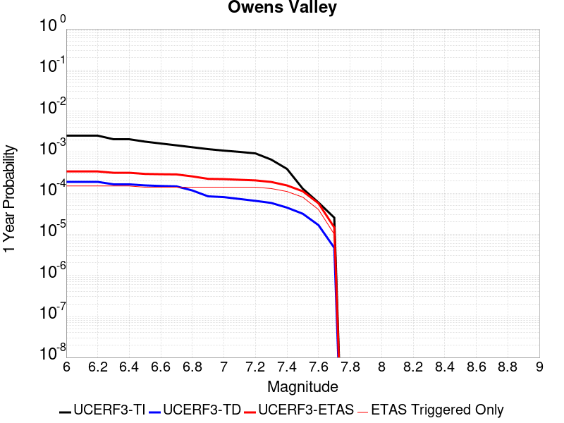 |  |

| Magnitude | 1 wk TI Prob | 1 wk TD Prob | 1 wk ETAS Prob | 1 wk ETAS/TD Gain | 1 wk ETAS Triggered Only | 1 mo TI Prob | 1 mo TD Prob | 1 mo ETAS Prob | 1 mo ETAS/TD Gain | 1 mo ETAS Triggered Only | 1 yr TI Prob | 1 yr TD Prob | 1 yr ETAS Prob | 1 yr ETAS/TD Gain | 1 yr ETAS Triggered Only | 10 yr TI Prob | 10 yr TD Prob | 10 yr ETAS Prob | 10 yr ETAS/TD Gain | 10 yr ETAS Triggered Only |
|-----|-----|-----|-----|-----|-----|-----|-----|-----|-----|-----|-----|-----|-----|-----|-----|-----|-----|-----|-----|-----|
| 6.0 | 4.83821E-5 | 3.626567E-6 | 2.8395353E-4 | 78.298164 | 2.8032798E-4 | 2.0733538E-4 | 1.5542342E-5 | 3.6594688E-4 | 23.545156 | 3.5040997E-4 | 0.002521386 | 1.8921259E-4 | 5.3955626E-4 | 2.8515875 | 3.5040997E-4 | 0.024929691 | 0.001925011 | 0.0023446935 | 1.2180157 | 4.2049197E-4 |
| 6.1 | 4.83821E-5 | 3.626567E-6 | 2.8395353E-4 | 78.298164 | 2.8032798E-4 | 2.0733538E-4 | 1.5542342E-5 | 3.6594688E-4 | 23.545156 | 3.5040997E-4 | 0.002521386 | 1.8921259E-4 | 5.3955626E-4 | 2.8515875 | 3.5040997E-4 | 0.024929691 | 0.001925011 | 0.0023446935 | 1.2180157 | 4.2049197E-4 |
| 6.2 | 4.83821E-5 | 3.626567E-6 | 2.8395353E-4 | 78.298164 | 2.8032798E-4 | 2.0733538E-4 | 1.5542342E-5 | 3.6594688E-4 | 23.545156 | 3.5040997E-4 | 0.002521386 | 1.8921259E-4 | 5.3955626E-4 | 2.8515875 | 3.5040997E-4 | 0.024929691 | 0.001925011 | 0.0023446935 | 1.2180157 | 4.2049197E-4 |
| 6.3 | 3.953008E-5 | 3.1553948E-6 | 2.8348248E-4 | 89.840576 | 2.8032798E-4 | 1.6940363E-4 | 1.3523055E-5 | 3.639283E-4 | 26.911694 | 3.5040997E-4 | 0.002060538 | 1.6463149E-4 | 5.149838E-4 | 3.1281002 | 3.5040997E-4 | 0.020415364 | 0.0016592 | 0.0020789942 | 1.25301 | 4.2049197E-4 |
| 6.4 | 3.953008E-5 | 3.1553948E-6 | 2.8348248E-4 | 89.840576 | 2.8032798E-4 | 1.6940363E-4 | 1.3523055E-5 | 3.639283E-4 | 26.911694 | 3.5040997E-4 | 0.002060538 | 1.6463149E-4 | 5.149838E-4 | 3.1281002 | 3.5040997E-4 | 0.020415364 | 0.0016592 | 0.0020789942 | 1.25301 | 4.2049197E-4 |
| 6.5 | 3.457342E-5 | 2.9715961E-6 | 2.8329875E-4 | 95.33555 | 2.8032798E-4 | 1.4816338E-4 | 1.2735354E-5 | 3.6314086E-4 | 28.51439 | 3.5040997E-4 | 0.0018023965 | 1.550426E-4 | 5.0539826E-4 | 3.259738 | 3.5040997E-4 | 0.017878477 | 0.001555719 | 0.0019755568 | 1.2698674 | 4.2049197E-4 |
| 6.6 | 3.1127765E-5 | 2.8744932E-6 | 2.8320166E-4 | 98.52229 | 2.8032798E-4 | 1.3339789E-4 | 1.2319203E-5 | 3.6272485E-4 | 29.44386 | 3.5040997E-4 | 0.0016229092 | 1.4997667E-4 | 5.003341E-4 | 3.3360796 | 3.5040997E-4 | 0.016111081 | 0.0015012559 | 0.0018511398 | 1.2330608 | 3.5040997E-4 |
| 6.7 | 2.806885E-5 | 2.8104134E-6 | 2.831376E-4 | 100.745895 | 2.8032798E-4 | 1.2028952E-4 | 1.20445775E-5 | 3.6245034E-4 | 30.09241 | 3.5040997E-4 | 0.001463541 | 1.4663354E-4 | 4.9699214E-4 | 3.3893483 | 3.5040997E-4 | 0.014539397 | 0.0014657511 | 0.0018156475 | 1.2387147 | 3.5040997E-4 |
| 6.8 | 2.524524E-5 | 2.2353688E-6 | 2.8256272E-4 | 126.40542 | 2.8032798E-4 | 1.0818939E-4 | 9.580118E-6 | 3.5998673E-4 | 37.57644 | 3.5040997E-4 | 0.0013164099 | 1.16632E-4 | 4.670011E-4 | 4.0040565 | 3.5040997E-4 | 0.01308639 | 0.0011659812 | 0.0015159826 | 1.3001776 | 3.5040997E-4 |
| 6.9 | 2.2704568E-5 | 1.6081682E-6 | 2.819357E-4 | 175.3148 | 2.8032798E-4 | 9.730166E-5 | 6.8921313E-6 | 3.572997E-4 | 51.841682 | 3.5040997E-4 | 0.0011840039 | 8.390849E-5 | 4.3428908E-4 | 5.1757464 | 3.5040997E-4 | 0.011777153 | 8.3897985E-4 | 0.0011890958 | 1.4173115 | 3.5040997E-4 |
| 7.0 | 2.0871712E-5 | 1.5395453E-6 | 2.818671E-4 | 183.08464 | 2.8032798E-4 | 8.944713E-5 | 6.598035E-6 | 3.5700572E-4 | 54.107883 | 3.5040997E-4 | 0.0010884746 | 8.032813E-5 | 4.3070997E-4 | 5.361882 | 3.5040997E-4 | 0.010831586 | 8.0316263E-4 | 0.0011532912 | 1.4359373 | 3.5040997E-4 |
| 7.1 | 1.944928E-5 | 1.3864178E-6 | 2.8171402E-4 | 203.19562 | 2.8032798E-4 | 8.335139E-5 | 5.941777E-6 | 3.563497E-4 | 59.973587 | 3.5040997E-4 | 0.0010143308 | 7.233874E-5 | 4.227234E-4 | 5.843665 | 3.5040997E-4 | 0.010097133 | 7.2330976E-4 | 0.0010734663 | 1.4841031 | 3.5040997E-4 |
| 7.2 | 1.7876306E-5 | 1.2489141E-6 | 2.8157656E-4 | 225.45709 | 2.8032798E-4 | 7.6610486E-5 | 5.352478E-6 | 3.557606E-4 | 66.466515 | 3.5040997E-4 | 9.3233347E-4 | 6.516448E-5 | 4.1555162E-4 | 6.376965 | 3.5040997E-4 | 0.009284316 | 6.5159105E-4 | 0.0010017727 | 1.5374255 | 3.5040997E-4 |
| 7.3 | 1.2618672E-5 | 1.1115209E-6 | 2.814392E-4 | 253.20189 | 2.8032798E-4 | 5.40789E-5 | 4.763652E-6 | 2.850903E-4 | 59.847 | 2.8032798E-4 | 6.582117E-4 | 5.799593E-5 | 3.3830767E-4 | 5.8333 | 2.8032798E-4 | 0.0065626553 | 5.7994033E-4 | 8.6010573E-4 | 1.4830935 | 2.8032798E-4 |
| 7.4 | 7.4874442E-6 | 8.5486437E-7 | 2.1110068E-4 | 246.94054 | 2.1024598E-4 | 3.208865E-5 | 3.6636993E-6 | 2.1390892E-4 | 58.386044 | 2.1024598E-4 | 3.906093E-4 | 4.4604632E-5 | 2.5484123E-4 | 5.713336 | 2.1024598E-4 | 0.003899234 | 4.4604883E-4 | 6.5620104E-4 | 1.4711417 | 2.1024598E-4 |
| 7.5 | 2.4734156E-6 | 6.068616E-7 | 1.4077078E-4 | 231.96521 | 1.4016399E-4 | 1.060031E-5 | 2.6008327E-6 | 1.4276446E-4 | 54.891827 | 1.4016399E-4 | 1.2905113E-4 | 3.166468E-5 | 1.7182424E-4 | 5.4263687 | 1.4016399E-4 | 0.0012897621 | 3.1660203E-4 | 4.5672164E-4 | 1.4425733 | 1.4016399E-4 |
| 7.6 | 1.1328841E-6 | 3.196531E-7 | 7.040163E-5 | 220.24384 | 7.0081995E-5 | 4.8552088E-6 | 1.3699412E-6 | 7.145184E-5 | 52.156868 | 7.0081995E-5 | 5.9110564E-5 | 1.6678909E-5 | 8.6759734E-5 | 5.2017636 | 7.0081995E-5 | 5.9094845E-4 | 1.6677675E-4 | 2.3684706E-4 | 1.4201443 | 7.0081995E-5 |
| 7.7 | 4.8613185E-7 | 8.964689E-8 | 8.964689E-8 | 1.0 | 0.0 | 2.0834207E-6 | 3.8420092E-7 | 3.8420092E-7 | 1.0 | 0.0 | 2.536535E-5 | 4.6776368E-6 | 4.6776368E-6 | 1.0 | 0.0 | 2.5362454E-4 | 4.677545E-5 | 4.677545E-5 | 1.0 | 0.0 |

## Calico-Hidalgo
*[(top)](#table-of-contents)*

| 1 Week | 1 Month | 1 Year | 10 Year |
|-----|-----|-----|-----|
|  |  |  |  |

| Magnitude | 1 wk TI Prob | 1 wk TD Prob | 1 wk ETAS Prob | 1 wk ETAS/TD Gain | 1 wk ETAS Triggered Only | 1 mo TI Prob | 1 mo TD Prob | 1 mo ETAS Prob | 1 mo ETAS/TD Gain | 1 mo ETAS Triggered Only | 1 yr TI Prob | 1 yr TD Prob | 1 yr ETAS Prob | 1 yr ETAS/TD Gain | 1 yr ETAS Triggered Only | 10 yr TI Prob | 10 yr TD Prob | 10 yr ETAS Prob | 10 yr ETAS/TD Gain | 10 yr ETAS Triggered Only |
|-----|-----|-----|-----|-----|-----|-----|-----|-----|-----|-----|-----|-----|-----|-----|-----|-----|-----|-----|-----|-----|
| 6.0 | 4.0906612E-5 | 5.0703686E-5 | 2.60939E-4 | 5.146352 | 2.1024598E-4 | 1.7530227E-4 | 2.172857E-4 | 4.975528E-4 | 2.289855 | 2.8032798E-4 | 0.0021322158 | 0.002642648 | 0.002992132 | 1.1322477 | 3.5040997E-4 | 0.02111873 | 0.026152607 | 0.026493853 | 1.0130483 | 3.5040997E-4 |
| 6.1 | 4.0906612E-5 | 5.0703686E-5 | 2.60939E-4 | 5.146352 | 2.1024598E-4 | 1.7530227E-4 | 2.172857E-4 | 4.975528E-4 | 2.289855 | 2.8032798E-4 | 0.0021322158 | 0.002642648 | 0.002992132 | 1.1322477 | 3.5040997E-4 | 0.02111873 | 0.026152607 | 0.026493853 | 1.0130483 | 3.5040997E-4 |
| 6.2 | 4.0906612E-5 | 5.0703686E-5 | 2.60939E-4 | 5.146352 | 2.1024598E-4 | 1.7530227E-4 | 2.172857E-4 | 4.975528E-4 | 2.289855 | 2.8032798E-4 | 0.0021322158 | 0.002642648 | 0.002992132 | 1.1322477 | 3.5040997E-4 | 0.02111873 | 0.026152607 | 0.026493853 | 1.0130483 | 3.5040997E-4 |
| 6.3 | 2.4242801E-5 | 3.0090669E-5 | 1.7025044E-4 | 5.657915 | 1.4016399E-4 | 1.0389358E-4 | 1.2895382E-4 | 2.6909975E-4 | 2.0867915 | 1.4016399E-4 | 0.0012641704 | 0.0015689151 | 0.0017088592 | 1.089198 | 1.4016399E-4 | 0.01257003 | 0.01558206 | 0.01572004 | 1.0088551 | 1.4016399E-4 |
| 6.4 | 2.4242801E-5 | 3.0090669E-5 | 1.7025044E-4 | 5.657915 | 1.4016399E-4 | 1.0389358E-4 | 1.2895382E-4 | 2.6909975E-4 | 2.0867915 | 1.4016399E-4 | 0.0012641704 | 0.0015689151 | 0.0017088592 | 1.089198 | 1.4016399E-4 | 0.01257003 | 0.01558206 | 0.01572004 | 1.0088551 | 1.4016399E-4 |
| 6.5 | 2.0286952E-5 | 2.5315738E-5 | 9.539596E-5 | 3.7682471 | 7.0081995E-5 | 8.694118E-5 | 1.0849161E-4 | 1.78566E-4 | 1.6458969 | 7.0081995E-5 | 0.0010579949 | 0.001320102 | 0.0013900915 | 1.0530182 | 7.0081995E-5 | 0.010529719 | 0.013124538 | 0.0131936995 | 1.0052696 | 7.0081995E-5 |
| 6.6 | 2.0269223E-5 | 2.5296687E-5 | 9.537691E-5 | 3.770332 | 7.0081995E-5 | 8.6865206E-5 | 1.08409964E-4 | 1.7848436E-4 | 1.6463834 | 7.0081995E-5 | 0.0010570707 | 0.0013191093 | 0.0013890988 | 1.0530581 | 7.0081995E-5 | 0.010520565 | 0.013114728 | 0.013183891 | 1.0052737 | 7.0081995E-5 |
| 6.7 | 1.799852E-5 | 2.25406E-5 | 9.262102E-5 | 4.109075 | 7.0081995E-5 | 7.713423E-5 | 9.659908E-5 | 1.666743E-4 | 1.7254233 | 7.0081995E-5 | 9.3870464E-4 | 0.0011754738 | 0.0012454734 | 1.0595502 | 7.0081995E-5 | 0.009347493 | 0.011694173 | 0.011763436 | 1.0059228 | 7.0081995E-5 |
| 6.8 | 1.7458793E-5 | 2.184212E-5 | 9.1922586E-5 | 4.208501 | 7.0081995E-5 | 7.4821255E-5 | 9.3605806E-5 | 1.6368124E-4 | 1.7486228 | 7.0081995E-5 | 9.10568E-4 | 0.0011390693 | 0.0012090715 | 1.0614556 | 7.0081995E-5 | 0.009068459 | 0.011333893 | 0.011403181 | 1.0061133 | 7.0081995E-5 |
| 6.9 | 1.542884E-5 | 1.9025927E-5 | 8.910659E-5 | 4.6834297 | 7.0081995E-5 | 6.612192E-5 | 8.153721E-5 | 1.516135E-4 | 1.8594393 | 7.0081995E-5 | 8.04737E-4 | 9.922766E-4 | 0.0010622891 | 1.0705574 | 7.0081995E-5 | 0.008018291 | 0.009879857 | 0.009949247 | 1.0070233 | 7.0081995E-5 |
| 7.0 | 1.468253E-5 | 1.8030598E-5 | 1.8030598E-5 | 1.0 | 0.0 | 6.292361E-5 | 7.7271776E-5 | 7.7271776E-5 | 1.0 | 0.0 | 7.658257E-4 | 9.4039086E-4 | 9.4039086E-4 | 1.0 | 0.0 | 0.0076319184 | 0.009365481 | 0.009365481 | 1.0 | 0.0 |
| 7.1 | 1.3139281E-5 | 1.6200942E-5 | 1.6200942E-5 | 1.0 | 0.0 | 5.6309986E-5 | 6.943083E-5 | 6.943083E-5 | 1.0 | 0.0 | 6.853584E-4 | 8.4500515E-4 | 8.4500515E-4 | 1.0 | 0.0 | 0.0068324856 | 0.0084192185 | 0.0084192185 | 1.0 | 0.0 |
| 7.2 | 1.1127404E-5 | 1.3866597E-5 | 1.3866597E-5 | 1.0 | 0.0 | 4.7688E-5 | 5.942698E-5 | 5.942698E-5 | 1.0 | 0.0 | 5.8044674E-4 | 7.232942E-4 | 7.232942E-4 | 1.0 | 0.0 | 0.0057893298 | 0.0072105085 | 0.0072105085 | 1.0 | 0.0 |
| 7.3 | 9.808154E-6 | 1.2176215E-5 | 1.2176215E-5 | 1.0 | 0.0 | 4.2034266E-5 | 5.2182797E-5 | 5.2182797E-5 | 1.0 | 0.0 | 5.11647E-4 | 6.3515105E-4 | 6.3515105E-4 | 1.0 | 0.0 | 0.0051047057 | 0.006334433 | 0.006334433 | 1.0 | 0.0 |
| 7.4 | 7.942452E-6 | 9.792144E-6 | 9.792144E-6 | 1.0 | 0.0 | 3.4038632E-5 | 4.1965708E-5 | 4.1965708E-5 | 1.0 | 0.0 | 4.1434157E-4 | 5.1082217E-4 | 5.1082217E-4 | 1.0 | 0.0 | 0.0041356985 | 0.005097421 | 0.005097421 | 1.0 | 0.0 |
| 7.5 | 4.7121216E-6 | 5.772836E-6 | 5.772836E-6 | 1.0 | 0.0 | 2.019465E-5 | 2.4740535E-5 | 2.4740535E-5 | 1.0 | 0.0 | 2.4584212E-4 | 3.0118204E-4 | 3.0118204E-4 | 1.0 | 0.0 | 0.0024557032 | 0.0030084911 | 0.0030084911 | 1.0 | 0.0 |
| 7.6 | 2.21172E-7 | 2.603961E-7 | 2.603961E-7 | 1.0 | 0.0 | 9.478797E-7 | 1.1159829E-6 | 1.1159829E-6 | 1.0 | 0.0 | 1.1540374E-5 | 1.3587036E-5 | 1.3587036E-5 | 1.0 | 0.0 | 1.1539775E-4 | 1.3586486E-4 | 1.3586486E-4 | 1.0 | 0.0 |

## San Andreas (Cholame) rev
*[(top)](#table-of-contents)*

| 1 Week | 1 Month | 1 Year | 10 Year |
|-----|-----|-----|-----|
|  |  |  |  |

| Magnitude | 1 wk TI Prob | 1 wk TD Prob | 1 wk ETAS Prob | 1 wk ETAS/TD Gain | 1 wk ETAS Triggered Only | 1 mo TI Prob | 1 mo TD Prob | 1 mo ETAS Prob | 1 mo ETAS/TD Gain | 1 mo ETAS Triggered Only | 1 yr TI Prob | 1 yr TD Prob | 1 yr ETAS Prob | 1 yr ETAS/TD Gain | 1 yr ETAS Triggered Only | 10 yr TI Prob | 10 yr TD Prob | 10 yr ETAS Prob | 10 yr ETAS/TD Gain | 10 yr ETAS Triggered Only |
|-----|-----|-----|-----|-----|-----|-----|-----|-----|-----|-----|-----|-----|-----|-----|-----|-----|-----|-----|-----|-----|
| 6.0 | 1.2302514E-4 | 2.5204287E-4 | 3.221072E-4 | 1.2779858 | 7.0081995E-5 | 5.27144E-4 | 0.0010797381 | 0.0012197508 | 1.1296728 | 1.4016399E-4 | 0.0063991086 | 0.0130670825 | 0.013412914 | 1.0264658 | 3.5040997E-4 | 0.06217949 | 0.12439073 | 0.12469755 | 1.0024666 | 3.5040997E-4 |
| 6.1 | 1.2302514E-4 | 2.5204287E-4 | 3.221072E-4 | 1.2779858 | 7.0081995E-5 | 5.27144E-4 | 0.0010797381 | 0.0012197508 | 1.1296728 | 1.4016399E-4 | 0.0063991086 | 0.0130670825 | 0.013412914 | 1.0264658 | 3.5040997E-4 | 0.06217949 | 0.12439073 | 0.12469755 | 1.0024666 | 3.5040997E-4 |
| 6.2 | 1.2203569E-4 | 2.5021084E-4 | 3.2027529E-4 | 1.2800217 | 7.0081995E-5 | 5.2290526E-4 | 0.0010718931 | 0.0012119069 | 1.1306229 | 1.4016399E-4 | 0.006347804 | 0.01297271 | 0.013318574 | 1.0266609 | 3.5040997E-4 | 0.061695136 | 0.12357691 | 0.123884015 | 1.0024852 | 3.5040997E-4 |
| 6.3 | 1.2142645E-4 | 2.4907055E-4 | 3.191351E-4 | 1.281304 | 7.0081995E-5 | 5.202953E-4 | 0.0010670102 | 0.0012070247 | 1.1312213 | 1.4016399E-4 | 0.006316212 | 0.012913967 | 0.013259851 | 1.0267838 | 3.5040997E-4 | 0.06139677 | 0.12307103 | 0.123378314 | 1.0024968 | 3.5040997E-4 |
| 6.4 | 1.1865206E-4 | 2.44126E-4 | 3.141909E-4 | 1.2870029 | 7.0081995E-5 | 5.0840975E-4 | 0.0010458364 | 0.0011858537 | 1.1338807 | 1.4016399E-4 | 0.006172335 | 0.012659196 | 0.01300517 | 1.0273298 | 3.5040997E-4 | 0.060036868 | 0.1208638 | 0.12117186 | 1.0025488 | 3.5040997E-4 |
| 6.5 | 1.17443946E-4 | 2.4205919E-4 | 3.1212423E-4 | 1.2894541 | 7.0081995E-5 | 5.032341E-4 | 0.0010369857 | 0.0011770043 | 1.1350247 | 1.4016399E-4 | 0.006109677 | 0.012552682 | 0.012898694 | 1.0275648 | 3.5040997E-4 | 0.059444077 | 0.11993805 | 0.12024643 | 1.0025712 | 3.5040997E-4 |
| 6.6 | 1.13579066E-4 | 2.3514954E-4 | 3.0521504E-4 | 1.2979615 | 7.0081995E-5 | 4.866766E-4 | 0.001007396 | 0.0011474189 | 1.1389948 | 1.4016399E-4 | 0.0059092017 | 0.012196515 | 0.012473424 | 1.0227039 | 2.8032798E-4 | 0.057545185 | 0.11685214 | 0.11709972 | 1.0021187 | 2.8032798E-4 |
| 6.7 | 1.1271412E-4 | 2.3359268E-4 | 3.036583E-4 | 1.2999479 | 7.0081995E-5 | 4.829711E-4 | 0.0010007289 | 0.0011407527 | 1.1399218 | 1.4016399E-4 | 0.005864331 | 0.012116249 | 0.01239318 | 1.0228562 | 2.8032798E-4 | 0.057119697 | 0.116155714 | 0.116403475 | 1.002133 | 2.8032798E-4 |
| 6.8 | 1.1217975E-4 | 2.3247694E-4 | 3.0254264E-4 | 1.3013878 | 7.0081995E-5 | 4.8068175E-4 | 9.959509E-4 | 0.0011359752 | 1.1405936 | 1.4016399E-4 | 0.005836608 | 0.012058721 | 0.012335669 | 1.0229666 | 2.8032798E-4 | 0.056856725 | 0.11565396 | 0.11590187 | 1.0021435 | 2.8032798E-4 |
| 6.9 | 1.1146753E-4 | 2.3096445E-4 | 3.0103026E-4 | 1.3033619 | 7.0081995E-5 | 4.7763053E-4 | 9.894737E-4 | 0.0011294989 | 1.1415149 | 1.4016399E-4 | 0.0057996577 | 0.011980731 | 0.012257701 | 1.0231179 | 2.8032798E-4 | 0.056506127 | 0.11497439 | 0.115222484 | 1.0021578 | 2.8032798E-4 |
| 7.0 | 1.0965793E-4 | 2.2719789E-4 | 2.9726396E-4 | 1.3083923 | 7.0081995E-5 | 4.698779E-4 | 9.733434E-4 | 0.001113371 | 1.1438625 | 1.4016399E-4 | 0.005705768 | 0.011786487 | 0.012063511 | 1.0235035 | 2.8032798E-4 | 0.055614736 | 0.11327597 | 0.11352454 | 1.0021944 | 2.8032798E-4 |
| 7.1 | 9.927982E-5 | 2.0538924E-4 | 2.7545684E-4 | 1.3411454 | 7.0081995E-5 | 4.2541555E-4 | 8.7994366E-4 | 0.0010199843 | 1.1591473 | 1.4016399E-4 | 0.0051671406 | 0.010660981 | 0.01093832 | 1.0260144 | 2.8032798E-4 | 0.05048634 | 0.1033706 | 0.10362195 | 1.0024315 | 2.8032798E-4 |
| 7.2 | 9.696786E-5 | 2.0043184E-4 | 2.704998E-4 | 1.3495849 | 7.0081995E-5 | 4.1551032E-4 | 8.5871184E-4 | 9.987555E-4 | 1.1630857 | 1.4016399E-4 | 0.00504711 | 0.010404981 | 0.010682392 | 1.0266614 | 2.8032798E-4 | 0.04934009 | 0.1011086 | 0.10136058 | 1.0024922 | 2.8032798E-4 |
| 7.3 | 9.4727984E-5 | 1.9472468E-4 | 2.6479302E-4 | 1.3598329 | 7.0081995E-5 | 4.0591392E-4 | 8.3426846E-4 | 9.743155E-4 | 1.1678681 | 1.4016399E-4 | 0.0049308087 | 0.010110183 | 0.010387677 | 1.027447 | 2.8032798E-4 | 0.048228268 | 0.09847952 | 0.09873223 | 1.0025662 | 2.8032798E-4 |
| 7.4 | 9.220358E-5 | 1.8843076E-4 | 2.5849955E-4 | 1.3718543 | 7.0081995E-5 | 3.9509835E-4 | 8.073114E-4 | 9.473622E-4 | 1.1734781 | 1.4016399E-4 | 0.004799717 | 0.009784967 | 0.010062551 | 1.0283685 | 2.8032798E-4 | 0.046973653 | 0.095557496 | 0.09581104 | 1.0026532 | 2.8032798E-4 |
| 7.5 | 7.71631E-5 | 1.5177966E-4 | 2.2185102E-4 | 1.461665 | 7.0081995E-5 | 3.306571E-4 | 6.503223E-4 | 7.9039513E-4 | 1.2153898 | 1.4016399E-4 | 0.0040183207 | 0.007889002 | 0.008167118 | 1.0352536 | 2.8032798E-4 | 0.03946433 | 0.07828531 | 0.078543685 | 1.0033005 | 2.8032798E-4 |
| 7.6 | 7.5634416E-5 | 1.483744E-4 | 2.1844599E-4 | 1.472262 | 7.0081995E-5 | 3.241072E-4 | 6.3573546E-4 | 7.7581033E-4 | 1.2203351 | 1.4016399E-4 | 0.0039388672 | 0.0077126776 | 0.007990844 | 1.036066 | 2.8032798E-4 | 0.038697794 | 0.07664872 | 0.07690756 | 1.003377 | 2.8032798E-4 |
| 7.7 | 6.3783E-5 | 1.235872E-4 | 1.9366054E-4 | 1.566995 | 7.0081995E-5 | 2.7332708E-4 | 5.29552E-4 | 6.6964177E-4 | 1.2645439 | 1.4016399E-4 | 0.0033226798 | 0.0064282627 | 0.006637157 | 1.0324962 | 2.1024598E-4 | 0.032734364 | 0.06454029 | 0.06473697 | 1.0030473 | 2.1024598E-4 |
| 7.8 | 5.863422E-5 | 1.1416107E-4 | 1.1416107E-4 | 1.0 | 0.0 | 2.512653E-4 | 4.8917E-4 | 5.5921776E-4 | 1.1431971 | 7.0081995E-5 | 0.003054864 | 0.0059394026 | 0.006078734 | 1.0234588 | 1.4016399E-4 | 0.030132094 | 0.059659187 | 0.059790988 | 1.0022093 | 1.4016399E-4 |
| 7.9 | 4.595283E-5 | 8.426331E-5 | 8.426331E-5 | 1.0 | 0.0 | 1.9692584E-4 | 3.610785E-4 | 4.311352E-4 | 1.1940206 | 7.0081995E-5 | 0.0023949358 | 0.0043872762 | 0.004526825 | 1.0318077 | 1.4016399E-4 | 0.023692891 | 0.044362005 | 0.04449595 | 1.0030193 | 1.4016399E-4 |
| 8.0 | 3.2950178E-5 | 5.0772942E-5 | 5.0772942E-5 | 1.0 | 0.0 | 1.412074E-4 | 2.1758018E-4 | 2.8764692E-4 | 1.3220272 | 7.0081995E-5 | 0.0017178444 | 0.0026458222 | 0.0027856154 | 1.0528355 | 1.4016399E-4 | 0.017046256 | 0.027180137 | 0.027316492 | 1.0050167 | 1.4016399E-4 |
| 8.1 | 1.9177472E-5 | 1.9185145E-5 | 1.9185145E-5 | 1.0 | 0.0 | 8.218658E-5 | 8.221946E-5 | 1.522957E-4 | 1.8523071 | 7.0081995E-5 | 0.0010001622 | 0.0010005629 | 0.0010705747 | 1.0699725 | 7.0081995E-5 | 0.009956728 | 0.010758142 | 0.010827471 | 1.0064442 | 7.0081995E-5 |
| 8.2 | 8.643924E-6 | 5.4748625E-6 | 5.4748625E-6 | 1.0 | 0.0 | 3.704486E-5 | 2.3463486E-5 | 2.3463486E-5 | 1.0 | 0.0 | 4.5092785E-4 | 2.8563058E-4 | 2.8563058E-4 | 1.0 | 0.0 | 0.0045001395 | 0.0032487072 | 0.0032487072 | 1.0 | 0.0 |
| 8.3 | 1.983087E-6 | 7.6599065E-7 | 7.6599065E-7 | 1.0 | 0.0 | 8.498917E-6 | 3.282813E-6 | 3.282813E-6 | 1.0 | 0.0 | 1.034694E-4 | 3.9967534E-5 | 3.9967534E-5 | 1.0 | 0.0 | 0.0010342124 | 4.719687E-4 | 4.719687E-4 | 1.0 | 0.0 |

## Elsinore (Glen Ivy) rev
*[(top)](#table-of-contents)*

| 1 Week | 1 Month | 1 Year | 10 Year |
|-----|-----|-----|-----|
|  |  |  |  |

| Magnitude | 1 wk TI Prob | 1 wk TD Prob | 1 wk ETAS Prob | 1 wk ETAS/TD Gain | 1 wk ETAS Triggered Only | 1 mo TI Prob | 1 mo TD Prob | 1 mo ETAS Prob | 1 mo ETAS/TD Gain | 1 mo ETAS Triggered Only | 1 yr TI Prob | 1 yr TD Prob | 1 yr ETAS Prob | 1 yr ETAS/TD Gain | 1 yr ETAS Triggered Only | 10 yr TI Prob | 10 yr TD Prob | 10 yr ETAS Prob | 10 yr ETAS/TD Gain | 10 yr ETAS Triggered Only |
|-----|-----|-----|-----|-----|-----|-----|-----|-----|-----|-----|-----|-----|-----|-----|-----|-----|-----|-----|-----|-----|
| 6.0 | 1.6204086E-4 | 2.9360707E-4 | 5.037913E-4 | 1.7158692 | 2.1024598E-4 | 6.94276E-4 | 0.0012578638 | 0.0014678454 | 1.166935 | 2.1024598E-4 | 0.008420097 | 0.015234485 | 0.015510542 | 1.0181205 | 2.8032798E-4 | 0.081081145 | 0.13969168 | 0.13993284 | 1.0017264 | 2.8032798E-4 |
| 6.1 | 1.6204086E-4 | 2.9360707E-4 | 5.037913E-4 | 1.7158692 | 2.1024598E-4 | 6.94276E-4 | 0.0012578638 | 0.0014678454 | 1.166935 | 2.1024598E-4 | 0.008420097 | 0.015234485 | 0.015510542 | 1.0181205 | 2.8032798E-4 | 0.081081145 | 0.13969168 | 0.13993284 | 1.0017264 | 2.8032798E-4 |
| 6.2 | 1.6204086E-4 | 2.9360707E-4 | 5.037913E-4 | 1.7158692 | 2.1024598E-4 | 6.94276E-4 | 0.0012578638 | 0.0014678454 | 1.166935 | 2.1024598E-4 | 0.008420097 | 0.015234485 | 0.015510542 | 1.0181205 | 2.8032798E-4 | 0.081081145 | 0.13969168 | 0.13993284 | 1.0017264 | 2.8032798E-4 |
| 6.3 | 1.0111737E-4 | 1.7703383E-4 | 1.7703383E-4 | 1.0 | 0.0 | 4.332882E-4 | 7.5861247E-4 | 7.5861247E-4 | 1.0 | 0.0 | 0.005262531 | 0.009217682 | 0.009287118 | 1.007533 | 7.0081995E-5 | 0.0513964 | 0.0870191 | 0.08708308 | 1.0007353 | 7.0081995E-5 |
| 6.4 | 1.0111737E-4 | 1.7703383E-4 | 1.7703383E-4 | 1.0 | 0.0 | 4.332882E-4 | 7.5861247E-4 | 7.5861247E-4 | 1.0 | 0.0 | 0.005262531 | 0.009217682 | 0.009287118 | 1.007533 | 7.0081995E-5 | 0.0513964 | 0.0870191 | 0.08708308 | 1.0007353 | 7.0081995E-5 |
| 6.5 | 3.6624708E-5 | 4.6391084E-5 | 4.6391084E-5 | 1.0 | 0.0 | 1.569536E-4 | 1.9880582E-4 | 1.9880582E-4 | 1.0 | 0.0 | 0.001909235 | 0.0024181372 | 0.0024181372 | 1.0 | 0.0 | 0.01892915 | 0.023739954 | 0.023739954 | 1.0 | 0.0 |
| 6.6 | 2.5051324E-5 | 2.614772E-5 | 2.614772E-5 | 1.0 | 0.0 | 1.073584E-4 | 1.12057096E-4 | 1.12057096E-4 | 1.0 | 0.0 | 0.0013063047 | 0.0013634858 | 0.0013634858 | 1.0 | 0.0 | 0.012986525 | 0.013564618 | 0.013564618 | 1.0 | 0.0 |
| 6.7 | 2.2189772E-5 | 2.2072849E-5 | 2.2072849E-5 | 1.0 | 0.0 | 9.509556E-5 | 9.4594696E-5 | 9.4594696E-5 | 1.0 | 0.0 | 0.0011571734 | 0.0011511183 | 0.0011511183 | 1.0 | 0.0 | 0.011511663 | 0.011465415 | 0.011465415 | 1.0 | 0.0 |
| 6.8 | 1.6654378E-5 | 1.4437705E-5 | 1.4437705E-5 | 1.0 | 0.0 | 7.137396E-5 | 6.187444E-5 | 6.187444E-5 | 1.0 | 0.0 | 8.686314E-4 | 7.530661E-4 | 7.530661E-4 | 1.0 | 0.0 | 0.008652439 | 0.00751048 | 0.00751048 | 1.0 | 0.0 |
| 6.9 | 1.5042909E-5 | 1.2332022E-5 | 1.2332022E-5 | 1.0 | 0.0 | 6.446802E-5 | 5.285047E-5 | 5.285047E-5 | 1.0 | 0.0 | 7.8461546E-4 | 6.4326765E-4 | 6.4326765E-4 | 1.0 | 0.0 | 0.007818509 | 0.00641828 | 0.00641828 | 1.0 | 0.0 |
| 7.0 | 1.4361385E-5 | 1.1451324E-5 | 1.1451324E-5 | 1.0 | 0.0 | 6.154734E-5 | 4.9076196E-5 | 4.9076196E-5 | 1.0 | 0.0 | 7.490812E-4 | 5.973418E-4 | 5.973418E-4 | 1.0 | 0.0 | 0.007465612 | 0.0059613534 | 0.0059613534 | 1.0 | 0.0 |
| 7.1 | 1.3265571E-5 | 1.0244926E-5 | 1.0244926E-5 | 1.0 | 0.0 | 5.6851208E-5 | 4.39061E-5 | 4.39061E-5 | 1.0 | 0.0 | 6.919436E-4 | 5.344282E-4 | 5.344282E-4 | 1.0 | 0.0 | 0.006897931 | 0.0053347866 | 0.0053347866 | 1.0 | 0.0 |
| 7.2 | 1.1596403E-5 | 8.505067E-6 | 8.505067E-6 | 1.0 | 0.0 | 4.9697923E-5 | 3.6449786E-5 | 3.6449786E-5 | 1.0 | 0.0 | 6.049042E-4 | 4.436875E-4 | 4.436875E-4 | 1.0 | 0.0 | 0.006032603 | 0.0044294316 | 0.0044294316 | 1.0 | 0.0 |
| 7.3 | 1.0150827E-5 | 7.2387597E-6 | 7.2387597E-6 | 1.0 | 0.0 | 4.3502816E-5 | 3.1022897E-5 | 3.1022897E-5 | 1.0 | 0.0 | 5.2951806E-4 | 3.7763975E-4 | 3.7763975E-4 | 1.0 | 0.0 | 0.005282581 | 0.0037703665 | 0.0037703665 | 1.0 | 0.0 |
| 7.4 | 9.080705E-6 | 6.352519E-6 | 6.352519E-6 | 1.0 | 0.0 | 3.8916725E-5 | 2.7224805E-5 | 2.7224805E-5 | 1.0 | 0.0 | 4.7370812E-4 | 3.3141294E-4 | 3.3141294E-4 | 1.0 | 0.0 | 0.004726996 | 0.0033093381 | 0.0033093381 | 1.0 | 0.0 |
| 7.5 | 7.671649E-6 | 5.2256332E-6 | 5.2256332E-6 | 1.0 | 0.0 | 3.287808E-5 | 2.2395385E-5 | 2.2395385E-5 | 1.0 | 0.0 | 4.0021708E-4 | 2.7263095E-4 | 2.7263095E-4 | 1.0 | 0.0 | 0.0039949706 | 0.00272309 | 0.00272309 | 1.0 | 0.0 |
| 7.6 | 6.990086E-6 | 4.687545E-6 | 4.687545E-6 | 1.0 | 0.0 | 2.9957167E-5 | 2.008933E-5 | 2.008933E-5 | 1.0 | 0.0 | 3.6466747E-4 | 2.445613E-4 | 2.445613E-4 | 1.0 | 0.0 | 0.0036406964 | 0.002443038 | 0.002443038 | 1.0 | 0.0 |
| 7.7 | 4.163505E-6 | 2.3295343E-6 | 2.3295343E-6 | 1.0 | 0.0 | 1.7843471E-5 | 9.983683E-6 | 9.983683E-6 | 1.0 | 0.0 | 2.172226E-4 | 1.21545316E-4 | 1.21545316E-4 | 1.0 | 0.0 | 0.0021701038 | 0.0012148614 | 0.0012148614 | 1.0 | 0.0 |
| 7.8 | 2.2692414E-7 | 9.3854695E-8 | 9.3854695E-8 | 1.0 | 0.0 | 9.725317E-7 | 4.0223435E-7 | 4.0223435E-7 | 1.0 | 0.0 | 1.1840509E-5 | 4.8971956E-6 | 4.8971956E-6 | 1.0 | 0.0 | 1.1839878E-4 | 4.8971204E-5 | 4.8971204E-5 | 1.0 | 0.0 |
| 7.9 | 6.676829E-9 | 3.439853E-9 | 3.439853E-9 | 1.0 | 0.0 | 2.861498E-8 | 1.4742227E-8 | 1.4742227E-8 | 1.0 | 0.0 | 3.4838732E-7 | 1.7948659E-7 | 1.7948659E-7 | 1.0 | 0.0 | 3.4838679E-6 | 1.7948646E-6 | 1.7948646E-6 | 1.0 | 0.0 |

## San Andreas (San Gorgonio Pass-Garnet HIll)
*[(top)](#table-of-contents)*

| 1 Week | 1 Month | 1 Year | 10 Year |
|-----|-----|-----|-----|
|  |  |  |  |

| Magnitude | 1 wk TI Prob | 1 wk TD Prob | 1 wk ETAS Prob | 1 wk ETAS/TD Gain | 1 wk ETAS Triggered Only | 1 mo TI Prob | 1 mo TD Prob | 1 mo ETAS Prob | 1 mo ETAS/TD Gain | 1 mo ETAS Triggered Only | 1 yr TI Prob | 1 yr TD Prob | 1 yr ETAS Prob | 1 yr ETAS/TD Gain | 1 yr ETAS Triggered Only | 10 yr TI Prob | 10 yr TD Prob | 10 yr ETAS Prob | 10 yr ETAS/TD Gain | 10 yr ETAS Triggered Only |
|-----|-----|-----|-----|-----|-----|-----|-----|-----|-----|-----|-----|-----|-----|-----|-----|-----|-----|-----|-----|-----|
| 6.0 | 8.31567E-5 | 2.3382473E-4 | 5.8415276E-4 | 2.4982505 | 3.5040997E-4 | 3.5633717E-4 | 0.0010017233 | 0.0013517824 | 1.3494567 | 3.5040997E-4 | 0.004329778 | 0.012127888 | 0.012474049 | 1.0285425 | 3.5040997E-4 | 0.042463828 | 0.11257892 | 0.11288988 | 1.0027622 | 3.5040997E-4 |
| 6.1 | 8.31567E-5 | 2.3382473E-4 | 5.8415276E-4 | 2.4982505 | 3.5040997E-4 | 3.5633717E-4 | 0.0010017233 | 0.0013517824 | 1.3494567 | 3.5040997E-4 | 0.004329778 | 0.012127888 | 0.012474049 | 1.0285425 | 3.5040997E-4 | 0.042463828 | 0.11257892 | 0.11288988 | 1.0027622 | 3.5040997E-4 |
| 6.2 | 8.31567E-5 | 2.3382473E-4 | 5.8415276E-4 | 2.4982505 | 3.5040997E-4 | 3.5633717E-4 | 0.0010017233 | 0.0013517824 | 1.3494567 | 3.5040997E-4 | 0.004329778 | 0.012127888 | 0.012474049 | 1.0285425 | 3.5040997E-4 | 0.042463828 | 0.11257892 | 0.11288988 | 1.0027622 | 3.5040997E-4 |
| 6.3 | 8.31567E-5 | 2.3382473E-4 | 5.8415276E-4 | 2.4982505 | 3.5040997E-4 | 3.5633717E-4 | 0.0010017233 | 0.0013517824 | 1.3494567 | 3.5040997E-4 | 0.004329778 | 0.012127888 | 0.012474049 | 1.0285425 | 3.5040997E-4 | 0.042463828 | 0.11257892 | 0.11288988 | 1.0027622 | 3.5040997E-4 |
| 6.4 | 8.059055E-5 | 2.2940808E-4 | 5.7973765E-4 | 2.5271022 | 3.5040997E-4 | 3.4534236E-4 | 9.828096E-4 | 0.0013328751 | 1.3561887 | 3.5040997E-4 | 0.0041964394 | 0.011900152 | 0.012246392 | 1.0290954 | 3.5040997E-4 | 0.041180745 | 0.11056015 | 0.110871814 | 1.002819 | 3.5040997E-4 |
| 6.5 | 8.059055E-5 | 2.2940808E-4 | 5.7973765E-4 | 2.5271022 | 3.5040997E-4 | 3.4534236E-4 | 9.828096E-4 | 0.0013328751 | 1.3561887 | 3.5040997E-4 | 0.0041964394 | 0.011900152 | 0.012246392 | 1.0290954 | 3.5040997E-4 | 0.041180745 | 0.11056015 | 0.110871814 | 1.002819 | 3.5040997E-4 |
| 6.6 | 7.619237E-5 | 2.218517E-4 | 5.721839E-4 | 2.579128 | 3.5040997E-4 | 3.2649786E-4 | 9.5044886E-4 | 0.0013005259 | 1.368328 | 3.5040997E-4 | 0.0039678677 | 0.01151087 | 0.011857247 | 1.0300913 | 3.5040997E-4 | 0.03897764 | 0.10709683 | 0.10740971 | 1.0029215 | 3.5040997E-4 |
| 6.7 | 7.440636E-5 | 2.1860997E-4 | 5.6894333E-4 | 2.6025498 | 3.5040997E-4 | 3.188454E-4 | 9.3656575E-4 | 0.0012866475 | 1.3737931 | 3.5040997E-4 | 0.0038750346 | 0.011343609 | 0.011690043 | 1.0305401 | 3.5040997E-4 | 0.038081564 | 0.105605274 | 0.10591868 | 1.0029677 | 3.5040997E-4 |
| 6.8 | 7.3735864E-5 | 2.1708169E-4 | 5.674156E-4 | 2.6138344 | 3.5040997E-4 | 3.1597257E-4 | 9.3002064E-4 | 0.0012801047 | 1.3764261 | 3.5040997E-4 | 0.0038401815 | 0.011264749 | 0.011611211 | 1.0307564 | 3.5040997E-4 | 0.03774495 | 0.10490683 | 0.105220474 | 1.0029898 | 3.5040997E-4 |
| 6.9 | 7.27575E-5 | 2.1477141E-4 | 5.6510617E-4 | 2.6311982 | 3.5040997E-4 | 3.117806E-4 | 9.201265E-4 | 0.0012702141 | 1.3804777 | 3.5040997E-4 | 0.003789323 | 0.011145527 | 0.011492031 | 1.0310891 | 3.5040997E-4 | 0.037253562 | 0.103854746 | 0.10416876 | 1.0030236 | 3.5040997E-4 |
| 7.0 | 7.102591E-5 | 2.1061185E-4 | 5.6094804E-4 | 2.6634212 | 3.5040997E-4 | 3.0436125E-4 | 9.023122E-4 | 0.001252406 | 1.3879963 | 3.5040997E-4 | 0.003699303 | 0.010930831 | 0.011277411 | 1.0317066 | 3.5040997E-4 | 0.03638325 | 0.10195695 | 0.10227163 | 1.0030864 | 3.5040997E-4 |
| 7.1 | 7.028513E-5 | 2.0896831E-4 | 5.593051E-4 | 2.6765065 | 3.5040997E-4 | 3.0118722E-4 | 8.9527335E-4 | 0.0012453696 | 1.3910496 | 3.5040997E-4 | 0.0036607897 | 0.010845989 | 0.011192598 | 1.0319574 | 3.5040997E-4 | 0.036010686 | 0.101199985 | 0.101514935 | 1.0031122 | 3.5040997E-4 |
| 7.2 | 6.8498244E-5 | 2.0504706E-4 | 5.553852E-4 | 2.7085743 | 3.5040997E-4 | 2.9353087E-4 | 8.784794E-4 | 0.0012285815 | 1.398532 | 3.5040997E-4 | 0.003567883 | 0.010643536 | 0.010990216 | 1.0325719 | 3.5040997E-4 | 0.035111405 | 0.09939202 | 0.0997076 | 1.0031751 | 3.5040997E-4 |
| 7.3 | 6.622592E-5 | 1.9732013E-4 | 5.47661E-4 | 2.7754946 | 3.5040997E-4 | 2.8379448E-4 | 8.453858E-4 | 0.0011954996 | 1.4141467 | 3.5040997E-4 | 0.0034497243 | 0.0102444785 | 0.010591299 | 1.0338544 | 3.5040997E-4 | 0.033966612 | 0.095888525 | 0.09620534 | 1.0033039 | 3.5040997E-4 |
| 7.4 | 5.1050705E-5 | 1.4689034E-4 | 4.2717715E-4 | 2.9081366 | 2.8032798E-4 | 2.1877038E-4 | 6.29379E-4 | 9.0953056E-4 | 1.4451238 | 2.8032798E-4 | 0.002660276 | 0.0076359594 | 0.007914147 | 1.0364312 | 2.8032798E-4 | 0.02628654 | 0.07286301 | 0.07312292 | 1.003567 | 2.8032798E-4 |
| 7.5 | 3.9302922E-5 | 1.1129847E-4 | 3.9159524E-4 | 3.5184245 | 2.8032798E-4 | 1.6843023E-4 | 4.7690657E-4 | 7.571009E-4 | 1.5875245 | 2.8032798E-4 | 0.0020487092 | 0.005790949 | 0.006069653 | 1.0481277 | 2.8032798E-4 | 0.020299247 | 0.05600951 | 0.05627414 | 1.0047246 | 2.8032798E-4 |
| 7.6 | 2.9851626E-5 | 8.4949745E-5 | 3.6525392E-4 | 4.299647 | 2.8032798E-4 | 1.2792926E-4 | 3.6401965E-4 | 6.442456E-4 | 1.76981 | 2.8032798E-4 | 0.0015564259 | 0.0044229585 | 0.0047020465 | 1.0630999 | 2.8032798E-4 | 0.0154556995 | 0.04319374 | 0.043461956 | 1.0062097 | 2.8032798E-4 |
| 7.7 | 2.1135214E-5 | 6.3529005E-5 | 2.7376163E-4 | 4.309239 | 2.1024598E-4 | 9.0576345E-5 | 2.7223877E-4 | 4.824275E-4 | 1.772075 | 2.1024598E-4 | 0.0011022091 | 0.0033094748 | 0.003519025 | 1.0633183 | 2.1024598E-4 | 0.010967582 | 0.032582592 | 0.03278599 | 1.0062425 | 2.1024598E-4 |
| 7.8 | 1.883379E-5 | 5.564028E-5 | 2.6587458E-4 | 4.778455 | 2.1024598E-4 | 8.0713755E-5 | 2.3843657E-4 | 4.4863243E-4 | 1.8815588 | 2.1024598E-4 | 9.822468E-4 | 0.0028991038 | 0.0031087403 | 1.0723108 | 2.1024598E-4 | 0.0097791655 | 0.028695205 | 0.028899418 | 1.0071167 | 2.1024598E-4 |
| 7.9 | 1.5156185E-5 | 4.1658426E-5 | 2.5189566E-4 | 6.0466914 | 2.1024598E-4 | 6.495346E-5 | 1.785239E-4 | 3.8873235E-4 | 2.1774807 | 2.1024598E-4 | 7.9052144E-4 | 0.0021713632 | 0.0023811527 | 1.0966165 | 2.1024598E-4 | 0.007877152 | 0.021759422 | 0.021965094 | 1.0094521 | 2.1024598E-4 |
| 8.0 | 1.1405907E-5 | 2.9974231E-5 | 1.0005412E-4 | 3.3380048 | 7.0081995E-5 | 4.8881542E-5 | 1.2845467E-4 | 1.9852766E-4 | 1.5455076 | 7.0081995E-5 | 5.9497025E-4 | 0.0015628147 | 0.0016327872 | 1.0447733 | 7.0081995E-5 | 0.005933798 | 0.015772851 | 0.015841827 | 1.0043731 | 7.0081995E-5 |
| 8.1 | 4.3511436E-6 | 7.369219E-6 | 7.369219E-6 | 1.0 | 0.0 | 1.8647626E-5 | 3.1581985E-5 | 3.1581985E-5 | 1.0 | 0.0 | 2.2701119E-4 | 3.8444297E-4 | 3.8444297E-4 | 1.0 | 0.0 | 0.0022677942 | 0.0041163345 | 0.0041163345 | 1.0 | 0.0 |
| 8.2 | 2.3042528E-6 | 2.7329415E-6 | 2.7329415E-6 | 1.0 | 0.0 | 9.875332E-6 | 1.1712554E-5 | 1.1712554E-5 | 1.0 | 0.0 | 1.2022553E-4 | 1.4259106E-4 | 1.4259106E-4 | 1.0 | 0.0 | 0.0012016051 | 0.0015979785 | 0.0015979785 | 1.0 | 0.0 |
| 8.3 | 5.202968E-7 | 3.1598344E-7 | 3.1598344E-7 | 1.0 | 0.0 | 2.2298414E-6 | 1.3542141E-6 | 1.3542141E-6 | 1.0 | 0.0 | 2.714798E-5 | 1.6487444E-5 | 1.6487444E-5 | 1.0 | 0.0 | 2.7144665E-4 | 1.9563142E-4 | 1.9563142E-4 | 1.0 | 0.0 |

## Baker
*[(top)](#table-of-contents)*

| 1 Week | 1 Month | 1 Year | 10 Year |
|-----|-----|-----|-----|
|  |  |  |  |

| Magnitude | 1 wk TI Prob | 1 wk TD Prob | 1 wk ETAS Prob | 1 wk ETAS/TD Gain | 1 wk ETAS Triggered Only | 1 mo TI Prob | 1 mo TD Prob | 1 mo ETAS Prob | 1 mo ETAS/TD Gain | 1 mo ETAS Triggered Only | 1 yr TI Prob | 1 yr TD Prob | 1 yr ETAS Prob | 1 yr ETAS/TD Gain | 1 yr ETAS Triggered Only | 10 yr TI Prob | 10 yr TD Prob | 10 yr ETAS Prob | 10 yr ETAS/TD Gain | 10 yr ETAS Triggered Only |
|-----|-----|-----|-----|-----|-----|-----|-----|-----|-----|-----|-----|-----|-----|-----|-----|-----|-----|-----|-----|-----|
| 6.0 | 5.695525E-6 | 5.8348373E-6 | 2.160796E-4 | 37.03267 | 2.1024598E-4 | 2.4409164E-5 | 2.5006228E-5 | 3.053272E-4 | 12.210047 | 2.8032798E-4 | 2.9714106E-4 | 3.044123E-4 | 6.5471564E-4 | 2.1507528 | 3.5040997E-4 | 0.0029674405 | 0.0030403486 | 0.0033896933 | 1.1149029 | 3.5040997E-4 |
| 6.1 | 5.695525E-6 | 5.8348373E-6 | 2.160796E-4 | 37.03267 | 2.1024598E-4 | 2.4409164E-5 | 2.5006228E-5 | 3.053272E-4 | 12.210047 | 2.8032798E-4 | 2.9714106E-4 | 3.044123E-4 | 6.5471564E-4 | 2.1507528 | 3.5040997E-4 | 0.0029674405 | 0.0030403486 | 0.0033896933 | 1.1149029 | 3.5040997E-4 |
| 6.2 | 5.695525E-6 | 5.8348373E-6 | 2.160796E-4 | 37.03267 | 2.1024598E-4 | 2.4409164E-5 | 2.5006228E-5 | 3.053272E-4 | 12.210047 | 2.8032798E-4 | 2.9714106E-4 | 3.044123E-4 | 6.5471564E-4 | 2.1507528 | 3.5040997E-4 | 0.0029674405 | 0.0030403486 | 0.0033896933 | 1.1149029 | 3.5040997E-4 |
| 6.3 | 3.2995713E-6 | 3.383667E-6 | 2.1362894E-4 | 63.13533 | 2.1024598E-4 | 1.4140943E-5 | 1.4501353E-5 | 2.2474429E-4 | 15.49816 | 2.1024598E-4 | 1.7215237E-4 | 1.7654014E-4 | 4.5681864E-4 | 2.587619 | 2.8032798E-4 | 0.0017201907 | 0.001764046 | 0.0020438796 | 1.1586316 | 2.8032798E-4 |
| 6.4 | 3.2995713E-6 | 3.383667E-6 | 2.1362894E-4 | 63.13533 | 2.1024598E-4 | 1.4140943E-5 | 1.4501353E-5 | 2.2474429E-4 | 15.49816 | 2.1024598E-4 | 1.7215237E-4 | 1.7654014E-4 | 4.5681864E-4 | 2.587619 | 2.8032798E-4 | 0.0017201907 | 0.001764046 | 0.0020438796 | 1.1586316 | 2.8032798E-4 |
| 6.5 | 2.782202E-6 | 2.8558404E-6 | 1.4301944E-4 | 50.07963 | 1.4016399E-4 | 1.1923668E-5 | 1.223926E-5 | 1.5240154E-4 | 12.4518585 | 1.4016399E-4 | 1.4516099E-4 | 1.4900314E-4 | 3.592178E-4 | 2.410807 | 2.1024598E-4 | 0.001450662 | 0.0014890651 | 0.001698998 | 1.140983 | 2.1024598E-4 |
| 6.6 | 2.3163404E-6 | 2.38092E-6 | 7.2462746E-5 | 30.434769 | 7.0081995E-5 | 9.927136E-6 | 1.0203904E-5 | 8.028519E-5 | 7.868085 | 7.0081995E-5 | 1.20856166E-4 | 1.2422565E-4 | 1.9429895E-4 | 1.5640807 | 7.0081995E-5 | 0.0012079047 | 0.0012415823 | 0.0013115773 | 1.0563756 | 7.0081995E-5 |
| 6.7 | 2.037056E-6 | 2.0965003E-6 | 7.217835E-5 | 34.428017 | 7.0081995E-5 | 8.7302105E-6 | 8.984972E-6 | 7.906634E-5 | 8.799843 | 7.0081995E-5 | 1.0628513E-4 | 1.093867E-4 | 1.7946103E-4 | 1.640611 | 7.0081995E-5 | 0.0010623431 | 0.0010933448 | 0.0011633501 | 1.0640286 | 7.0081995E-5 |
| 6.8 | 1.8356744E-6 | 1.8915287E-6 | 7.1973394E-5 | 38.050385 | 7.0081995E-5 | 7.867153E-6 | 8.106527E-6 | 7.818796E-5 | 9.6450615 | 7.0081995E-5 | 9.577837E-5 | 9.869264E-5 | 1.6876771E-4 | 1.7100335 | 7.0081995E-5 | 9.57371E-4 | 9.86502E-4 | 0.0010565149 | 1.0709708 | 7.0081995E-5 |
| 6.9 | 1.6310546E-6 | 1.6832072E-6 | 7.1765084E-5 | 42.635918 | 7.0081995E-5 | 6.9902153E-6 | 7.213726E-6 | 7.729522E-5 | 10.71502 | 7.0081995E-5 | 8.510255E-5 | 8.782368E-5 | 1.5789953E-4 | 1.7979151 | 7.0081995E-5 | 8.5069967E-4 | 8.7790104E-4 | 9.4792154E-4 | 1.079759 | 7.0081995E-5 |
| 7.0 | 1.2058036E-6 | 1.2508665E-6 | 7.1332775E-5 | 57.026688 | 7.0081995E-5 | 5.1677193E-6 | 5.3608455E-6 | 7.544247E-5 | 14.072866 | 7.0081995E-5 | 6.291517E-5 | 6.5266366E-5 | 1.3534378E-4 | 2.0737143 | 7.0081995E-5 | 6.289736E-4 | 6.524743E-4 | 7.2251057E-4 | 1.1073395 | 7.0081995E-5 |
| 7.1 | 1.052382E-6 | 1.0951609E-6 | 7.117708E-5 | 64.992355 | 7.0081995E-5 | 4.5102006E-6 | 4.693538E-6 | 7.4775206E-5 | 15.931521 | 7.0081995E-5 | 5.491031E-5 | 5.7142337E-5 | 1.2722032E-4 | 2.226376 | 7.0081995E-5 | 5.4896745E-4 | 5.7127734E-4 | 6.4131926E-4 | 1.1226059 | 7.0081995E-5 |
| 7.2 | 1.0067454E-6 | 1.0487711E-6 | 7.113069E-5 | 67.8229 | 7.0081995E-5 | 4.3146156E-6 | 4.4947255E-6 | 7.4576405E-5 | 16.591982 | 7.0081995E-5 | 5.252918E-5 | 5.4721917E-5 | 1.2480008E-4 | 2.2806232 | 7.0081995E-5 | 5.251676E-4 | 5.470853E-4 | 6.171289E-4 | 1.1280305 | 7.0081995E-5 |
| 7.3 | 9.3596316E-7 | 9.767723E-7 | 7.10587E-5 | 72.748474 | 7.0081995E-5 | 4.0112645E-6 | 4.1861604E-6 | 7.426786E-5 | 17.741283 | 7.0081995E-5 | 4.8836053E-5 | 5.096532E-5 | 1.2104374E-4 | 2.3750217 | 7.0081995E-5 | 4.8825322E-4 | 5.095371E-4 | 5.795834E-4 | 1.1374705 | 7.0081995E-5 |
| 7.4 | 8.8117395E-7 | 9.2076635E-7 | 7.1002694E-5 | 77.11261 | 7.0081995E-5 | 3.7764542E-6 | 3.9461356E-6 | 7.4027856E-5 | 18.759583 | 7.0081995E-5 | 4.5977362E-5 | 4.8043148E-5 | 1.18121774E-4 | 2.4586601 | 7.0081995E-5 | 4.596785E-4 | 4.8032837E-4 | 5.503767E-4 | 1.1458342 | 7.0081995E-5 |
| 7.5 | 8.292386E-7 | 8.6745956E-7 | 7.09494E-5 | 81.789856 | 7.0081995E-5 | 3.5538749E-6 | 3.7176785E-6 | 7.379941E-5 | 19.850939 | 7.0081995E-5 | 4.326757E-5 | 4.5261804E-5 | 1.1534063E-4 | 2.5482993 | 7.0081995E-5 | 4.3259145E-4 | 4.5252658E-4 | 5.2257685E-4 | 1.1547982 | 7.0081995E-5 |
| 7.6 | 7.553842E-7 | 7.9144706E-7 | 7.0873386E-5 | 89.54912 | 7.0081995E-5 | 3.2373566E-6 | 3.3919116E-6 | 7.347367E-5 | 21.661434 | 7.0081995E-5 | 3.9414106E-5 | 4.129575E-5 | 1.1137485E-4 | 2.6970053 | 7.0081995E-5 | 3.9407116E-4 | 4.1288146E-4 | 4.829345E-4 | 1.1696687 | 7.0081995E-5 |
| 7.7 | 6.5285366E-7 | 6.852797E-7 | 6.852797E-7 | 1.0 | 0.0 | 2.797941E-6 | 2.9369096E-6 | 2.9369096E-6 | 1.0 | 0.0 | 3.40644E-5 | 3.5756293E-5 | 3.5756293E-5 | 1.0 | 0.0 | 3.405918E-4 | 3.5750607E-4 | 3.5750607E-4 | 1.0 | 0.0 |
| 7.8 | 3.4586725E-7 | 3.6482615E-7 | 3.6482615E-7 | 1.0 | 0.0 | 1.4822873E-6 | 1.5635396E-6 | 1.5635396E-6 | 1.0 | 0.0 | 1.80467E-5 | 1.9035933E-5 | 1.9035933E-5 | 1.0 | 0.0 | 1.8045233E-4 | 1.9034347E-4 | 1.9034347E-4 | 1.0 | 0.0 |
| 7.9 | 2.5591178E-9 | 2.6696718E-9 | 2.6696718E-9 | 1.0 | 0.0 | 1.0967647E-8 | 1.14414505E-8 | 1.14414505E-8 | 1.0 | 0.0 | 1.335311E-7 | 1.3929966E-7 | 1.3929966E-7 | 1.0 | 0.0 | 1.3353102E-6 | 1.3929966E-6 | 1.3929966E-6 | 1.0 | 0.0 |

## Cleghorn Lake
*[(top)](#table-of-contents)*

| 1 Week | 1 Month | 1 Year | 10 Year |
|-----|-----|-----|-----|
|  |  |  |  |

| Magnitude | 1 wk TI Prob | 1 wk TD Prob | 1 wk ETAS Prob | 1 wk ETAS/TD Gain | 1 wk ETAS Triggered Only | 1 mo TI Prob | 1 mo TD Prob | 1 mo ETAS Prob | 1 mo ETAS/TD Gain | 1 mo ETAS Triggered Only | 1 yr TI Prob | 1 yr TD Prob | 1 yr ETAS Prob | 1 yr ETAS/TD Gain | 1 yr ETAS Triggered Only | 10 yr TI Prob | 10 yr TD Prob | 10 yr ETAS Prob | 10 yr ETAS/TD Gain | 10 yr ETAS Triggered Only |
|-----|-----|-----|-----|-----|-----|-----|-----|-----|-----|-----|-----|-----|-----|-----|-----|-----|-----|-----|-----|-----|
| 6.0 | 1.5467183E-5 | 1.6794203E-5 | 2.9711748E-4 | 17.691668 | 2.8032798E-4 | 6.6286244E-5 | 7.197348E-5 | 3.522813E-4 | 4.8945985 | 2.8032798E-4 | 8.067362E-4 | 8.759797E-4 | 0.0012260828 | 1.3996702 | 3.5040997E-4 | 0.008038137 | 0.008730696 | 0.009078046 | 1.039785 | 3.5040997E-4 |
| 6.1 | 1.5467183E-5 | 1.6794203E-5 | 2.9711748E-4 | 17.691668 | 2.8032798E-4 | 6.6286244E-5 | 7.197348E-5 | 3.522813E-4 | 4.8945985 | 2.8032798E-4 | 8.067362E-4 | 8.759797E-4 | 0.0012260828 | 1.3996702 | 3.5040997E-4 | 0.008038137 | 0.008730696 | 0.009078046 | 1.039785 | 3.5040997E-4 |
| 6.2 | 1.2624631E-5 | 1.3681544E-5 | 2.940057E-4 | 21.489218 | 2.8032798E-4 | 5.410444E-5 | 5.863415E-5 | 3.3894568E-4 | 5.780688 | 2.8032798E-4 | 6.585225E-4 | 7.1368564E-4 | 9.938135E-4 | 1.3925089 | 2.8032798E-4 | 0.0065657445 | 0.0071187317 | 0.007397064 | 1.0390986 | 2.8032798E-4 |
| 6.3 | 1.2624631E-5 | 1.3681544E-5 | 2.940057E-4 | 21.489218 | 2.8032798E-4 | 5.410444E-5 | 5.863415E-5 | 3.3894568E-4 | 5.780688 | 2.8032798E-4 | 6.585225E-4 | 7.1368564E-4 | 9.938135E-4 | 1.3925089 | 2.8032798E-4 | 0.0065657445 | 0.0071187317 | 0.007397064 | 1.0390986 | 2.8032798E-4 |
| 6.4 | 9.417684E-6 | 1.0170118E-5 | 1.5033268E-4 | 14.781804 | 1.4016399E-4 | 4.036088E-5 | 4.3585722E-5 | 1.837436E-4 | 4.2156835 | 1.4016399E-4 | 4.912829E-4 | 5.3056807E-4 | 6.7065767E-4 | 1.264037 | 1.4016399E-4 | 0.004901982 | 0.005297049 | 0.0054364707 | 1.0263206 | 1.4016399E-4 |
| 6.5 | 9.368219E-6 | 1.0117545E-5 | 1.5028012E-4 | 14.853418 | 1.4016399E-4 | 4.014889E-5 | 4.3360415E-5 | 1.8351834E-4 | 4.2323933 | 1.4016399E-4 | 4.8870314E-4 | 5.2782625E-4 | 6.6791626E-4 | 1.2654094 | 1.4016399E-4 | 0.004876298 | 0.0052697617 | 0.0054091867 | 1.0264577 | 1.4016399E-4 |
| 6.6 | 7.803798E-6 | 8.441831E-6 | 1.4860464E-4 | 17.603365 | 1.4016399E-4 | 3.3444423E-5 | 3.6179E-5 | 1.7633793E-4 | 4.874041 | 1.4016399E-4 | 4.0710976E-4 | 4.4043022E-4 | 5.805325E-4 | 1.3181032 | 1.4016399E-4 | 0.0040636472 | 0.0043994905 | 0.0045390376 | 1.031719 | 1.4016399E-4 |
| 6.7 | 2.3108669E-6 | 2.4438336E-6 | 7.252566E-5 | 29.677004 | 7.0081995E-5 | 9.903678E-6 | 1.0473532E-5 | 8.05548E-5 | 7.691273 | 7.0081995E-5 | 1.205706E-4 | 1.2750797E-4 | 1.9758103E-4 | 1.5495583 | 7.0081995E-5 | 0.001205052 | 0.0012743667 | 0.0013443595 | 1.0549235 | 7.0081995E-5 |
| 6.8 | 2.0882828E-6 | 2.2062823E-6 | 7.228812E-5 | 32.76468 | 7.0081995E-5 | 8.949753E-6 | 9.455462E-6 | 7.9536796E-5 | 8.411731 | 7.0081995E-5 | 1.08957785E-4 | 1.1511434E-4 | 1.8518827E-4 | 1.6087333 | 7.0081995E-5 | 0.0010890438 | 0.0011505639 | 0.0012205653 | 1.060841 | 7.0081995E-5 |
| 6.9 | 1.876935E-6 | 1.981051E-6 | 7.206291E-5 | 36.3761 | 7.0081995E-5 | 8.043982E-6 | 8.490192E-6 | 7.857159E-5 | 9.2543955 | 7.0081995E-5 | 9.7931086E-5 | 1.03363345E-4 | 1.734381E-4 | 1.6779459 | 7.0081995E-5 | 9.788794E-4 | 0.0010331686 | 0.0011031782 | 1.067762 | 7.0081995E-5 |
| 7.0 | 1.5357559E-6 | 1.6202807E-6 | 7.170216E-5 | 44.252926 | 7.0081995E-5 | 6.5817944E-6 | 6.9440425E-6 | 7.702555E-5 | 11.092321 | 7.0081995E-5 | 8.01304E-5 | 8.454057E-5 | 1.5461663E-4 | 1.8289047 | 7.0081995E-5 | 8.010151E-4 | 8.450965E-4 | 9.1511925E-4 | 1.0828577 | 7.0081995E-5 |
| 7.1 | 1.0905424E-6 | 1.1497619E-6 | 1.1497619E-6 | 1.0 | 0.0 | 4.6737446E-6 | 4.9275427E-6 | 4.9275427E-6 | 1.0 | 0.0 | 5.6901354E-5 | 5.999128E-5 | 5.999128E-5 | 1.0 | 0.0 | 5.6886784E-4 | 5.997606E-4 | 5.997606E-4 | 1.0 | 0.0 |
| 7.2 | 6.06668E-7 | 6.387277E-7 | 6.387277E-7 | 1.0 | 0.0 | 2.600003E-6 | 2.7374022E-6 | 2.7374022E-6 | 1.0 | 0.0 | 3.1654577E-5 | 3.3327433E-5 | 3.3327433E-5 | 1.0 | 0.0 | 3.1650066E-4 | 3.3323118E-4 | 3.3323118E-4 | 1.0 | 0.0 |

## Palos Verdes
*[(top)](#table-of-contents)*

| 1 Week | 1 Month | 1 Year | 10 Year |
|-----|-----|-----|-----|
|  |  |  |  |

| Magnitude | 1 wk TI Prob | 1 wk TD Prob | 1 wk ETAS Prob | 1 wk ETAS/TD Gain | 1 wk ETAS Triggered Only | 1 mo TI Prob | 1 mo TD Prob | 1 mo ETAS Prob | 1 mo ETAS/TD Gain | 1 mo ETAS Triggered Only | 1 yr TI Prob | 1 yr TD Prob | 1 yr ETAS Prob | 1 yr ETAS/TD Gain | 1 yr ETAS Triggered Only | 10 yr TI Prob | 10 yr TD Prob | 10 yr ETAS Prob | 10 yr ETAS/TD Gain | 10 yr ETAS Triggered Only |
|-----|-----|-----|-----|-----|-----|-----|-----|-----|-----|-----|-----|-----|-----|-----|-----|-----|-----|-----|-----|-----|
| 6.0 | 6.126063E-5 | 7.622612E-5 | 1.4630277E-4 | 1.919326 | 7.0081995E-5 | 2.6251914E-4 | 3.2664582E-4 | 6.068822E-4 | 1.8579214 | 2.8032798E-4 | 0.0031914865 | 0.003970174 | 0.0042493893 | 1.0703281 | 2.8032798E-4 | 0.031460393 | 0.039048895 | 0.03931828 | 1.0068985 | 2.8032798E-4 |
| 6.1 | 6.126063E-5 | 7.622612E-5 | 1.4630277E-4 | 1.919326 | 7.0081995E-5 | 2.6251914E-4 | 3.2664582E-4 | 6.068822E-4 | 1.8579214 | 2.8032798E-4 | 0.0031914865 | 0.003970174 | 0.0042493893 | 1.0703281 | 2.8032798E-4 | 0.031460393 | 0.039048895 | 0.03931828 | 1.0068985 | 2.8032798E-4 |
| 6.2 | 6.126063E-5 | 7.622612E-5 | 1.4630277E-4 | 1.919326 | 7.0081995E-5 | 2.6251914E-4 | 3.2664582E-4 | 6.068822E-4 | 1.8579214 | 2.8032798E-4 | 0.0031914865 | 0.003970174 | 0.0042493893 | 1.0703281 | 2.8032798E-4 | 0.031460393 | 0.039048895 | 0.03931828 | 1.0068985 | 2.8032798E-4 |
| 6.3 | 4.0838047E-5 | 4.9749437E-5 | 1.1982794E-4 | 2.4086292 | 7.0081995E-5 | 1.7500846E-4 | 2.1319572E-4 | 4.2339688E-4 | 1.985954 | 2.1024598E-4 | 0.0021286458 | 0.0025927818 | 0.0028024826 | 1.0808787 | 2.1024598E-4 | 0.021083709 | 0.025646681 | 0.025851535 | 1.0079875 | 2.1024598E-4 |
| 6.4 | 4.0838047E-5 | 4.9749437E-5 | 1.1982794E-4 | 2.4086292 | 7.0081995E-5 | 1.7500846E-4 | 2.1319572E-4 | 4.2339688E-4 | 1.985954 | 2.1024598E-4 | 0.0021286458 | 0.0025927818 | 0.0028024826 | 1.0808787 | 2.1024598E-4 | 0.021083709 | 0.025646681 | 0.025851535 | 1.0079875 | 2.1024598E-4 |
| 6.5 | 3.0512005E-5 | 3.656162E-5 | 3.656162E-5 | 1.0 | 0.0 | 1.3075917E-4 | 1.5668393E-4 | 2.9682595E-4 | 1.894425 | 1.4016399E-4 | 0.0015908304 | 0.0019060767 | 0.0020459734 | 1.0733951 | 1.4016399E-4 | 0.015794903 | 0.018909154 | 0.019046668 | 1.0072724 | 1.4016399E-4 |
| 6.6 | 2.9255087E-5 | 3.515442E-5 | 3.515442E-5 | 1.0 | 0.0 | 1.2537291E-4 | 1.5065377E-4 | 2.9079663E-4 | 1.9302316 | 1.4016399E-4 | 0.0015253464 | 0.0018327828 | 0.00197269 | 1.0763359 | 1.4016399E-4 | 0.015149189 | 0.018188225 | 0.01832584 | 1.0075661 | 1.4016399E-4 |
| 6.7 | 2.287198E-5 | 2.7248278E-5 | 2.7248278E-5 | 1.0 | 0.0 | 9.801909E-5 | 1.16773626E-4 | 2.5692125E-4 | 2.200165 | 1.4016399E-4 | 0.001192729 | 0.0014208833 | 0.0015608482 | 1.0985055 | 1.4016399E-4 | 0.011863477 | 0.014127217 | 0.014265401 | 1.0097814 | 1.4016399E-4 |
| 6.8 | 2.1325764E-5 | 2.5431877E-5 | 2.5431877E-5 | 1.0 | 0.0 | 9.139293E-5 | 1.0898971E-4 | 2.4913842E-4 | 2.2858894 | 1.4016399E-4 | 0.001112141 | 0.0013262323 | 0.0014662103 | 1.1055456 | 1.4016399E-4 | 0.011065915 | 0.013192211 | 0.013330526 | 1.0104846 | 1.4016399E-4 |
| 6.9 | 1.9009392E-5 | 2.2613547E-5 | 2.2613547E-5 | 1.0 | 0.0 | 8.1466285E-5 | 9.6912096E-5 | 2.370625E-4 | 2.44616 | 1.4016399E-4 | 9.914007E-4 | 0.0011793535 | 0.0013193522 | 1.118708 | 1.4016399E-4 | 0.009869894 | 0.011739632 | 0.011878151 | 1.0117992 | 1.4016399E-4 |
| 7.0 | 1.7098473E-5 | 2.0319356E-5 | 2.0319356E-5 | 1.0 | 0.0 | 7.3277115E-5 | 8.708052E-5 | 2.2723232E-4 | 2.6094503 | 1.4016399E-4 | 8.917837E-4 | 0.001059775 | 0.0011997904 | 1.1321181 | 1.4016399E-4 | 0.008882134 | 0.010555646 | 0.010694331 | 1.0131384 | 1.4016399E-4 |
| 7.1 | 1.5982785E-5 | 1.899476E-5 | 1.899476E-5 | 1.0 | 0.0 | 6.849585E-5 | 8.1404054E-5 | 2.2155663E-4 | 2.7216904 | 1.4016399E-4 | 8.336179E-4 | 9.907284E-4 | 0.0011307535 | 1.1413355 | 1.4016399E-4 | 0.008304977 | 0.009871479 | 0.01001026 | 1.0140587 | 1.4016399E-4 |
| 7.2 | 1.4468002E-5 | 1.7197237E-5 | 1.7197237E-5 | 1.0 | 0.0 | 6.200425E-5 | 7.370083E-5 | 2.138545E-4 | 2.9016564 | 1.4016399E-4 | 7.546402E-4 | 8.970222E-4 | 0.0010370605 | 1.1561146 | 1.4016399E-4 | 0.007520827 | 0.008942284 | 0.009081194 | 1.0155342 | 1.4016399E-4 |
| 7.3 | 5.288233E-6 | 6.2036747E-6 | 6.2036747E-6 | 1.0 | 0.0 | 2.2663658E-5 | 2.6587102E-5 | 2.6587102E-5 | 1.0 | 0.0 | 2.7589512E-4 | 3.236848E-4 | 3.236848E-4 | 1.0 | 0.0 | 0.0027555283 | 0.0032355562 | 0.0032355562 | 1.0 | 0.0 |
| 7.4 | 8.279556E-7 | 8.408347E-7 | 8.408347E-7 | 1.0 | 0.0 | 3.5483763E-6 | 3.6035726E-6 | 3.6035726E-6 | 1.0 | 0.0 | 4.3200624E-5 | 4.3872686E-5 | 4.3872686E-5 | 1.0 | 0.0 | 4.3192226E-4 | 4.3864746E-4 | 4.3864746E-4 | 1.0 | 0.0 |
| 7.5 | 6.559831E-7 | 6.667229E-7 | 6.667229E-7 | 1.0 | 0.0 | 2.8113532E-6 | 2.857381E-6 | 2.857381E-6 | 1.0 | 0.0 | 3.4227687E-5 | 3.4788125E-5 | 3.4788125E-5 | 1.0 | 0.0 | 3.4222414E-4 | 3.4783344E-4 | 3.4783344E-4 | 1.0 | 0.0 |
| 7.6 | 3.5018968E-7 | 3.5620027E-7 | 3.5620027E-7 | 1.0 | 0.0 | 1.500812E-6 | 1.526572E-6 | 1.526572E-6 | 1.0 | 0.0 | 1.8272232E-5 | 1.8585903E-5 | 1.8585903E-5 | 1.0 | 0.0 | 1.8270731E-4 | 1.8584808E-4 | 1.8584808E-4 | 1.0 | 0.0 |
| 7.7 | 1.1986104E-7 | 1.2198376E-7 | 1.2198376E-7 | 1.0 | 0.0 | 5.1369005E-7 | 5.2278745E-7 | 5.2278745E-7 | 1.0 | 0.0 | 6.2541585E-6 | 6.364919E-6 | 6.364919E-6 | 1.0 | 0.0 | 6.2539824E-5 | 6.364741E-5 | 6.364741E-5 | 1.0 | 0.0 |
| 7.8 | 3.0445005E-8 | 3.1027582E-8 | 3.1027582E-8 | 1.0 | 0.0 | 1.3047858E-7 | 1.3297536E-7 | 1.3297536E-7 | 1.0 | 0.0 | 1.5885756E-6 | 1.6189739E-6 | 1.6189739E-6 | 1.0 | 0.0 | 1.5885644E-5 | 1.6189642E-5 | 1.6189642E-5 | 1.0 | 0.0 |

## San Andreas (Coachella) rev
*[(top)](#table-of-contents)*

| 1 Week | 1 Month | 1 Year | 10 Year |
|-----|-----|-----|-----|
|  |  |  |  |

| Magnitude | 1 wk TI Prob | 1 wk TD Prob | 1 wk ETAS Prob | 1 wk ETAS/TD Gain | 1 wk ETAS Triggered Only | 1 mo TI Prob | 1 mo TD Prob | 1 mo ETAS Prob | 1 mo ETAS/TD Gain | 1 mo ETAS Triggered Only | 1 yr TI Prob | 1 yr TD Prob | 1 yr ETAS Prob | 1 yr ETAS/TD Gain | 1 yr ETAS Triggered Only | 10 yr TI Prob | 10 yr TD Prob | 10 yr ETAS Prob | 10 yr ETAS/TD Gain | 10 yr ETAS Triggered Only |
|-----|-----|-----|-----|-----|-----|-----|-----|-----|-----|-----|-----|-----|-----|-----|-----|-----|-----|-----|-----|-----|
| 6.0 | 1.1925945E-4 | 3.2729402E-4 | 6.0753024E-4 | 1.8562217 | 2.8032798E-4 | 5.110118E-4 | 0.0014019393 | 0.0016818743 | 1.199677 | 2.8032798E-4 | 0.0062038354 | 0.016936364 | 0.017211944 | 1.0162715 | 2.8032798E-4 | 0.060334753 | 0.15265316 | 0.15289068 | 1.001556 | 2.8032798E-4 |
| 6.1 | 1.1925945E-4 | 3.2729402E-4 | 6.0753024E-4 | 1.8562217 | 2.8032798E-4 | 5.110118E-4 | 0.0014019393 | 0.0016818743 | 1.199677 | 2.8032798E-4 | 0.0062038354 | 0.016936364 | 0.017211944 | 1.0162715 | 2.8032798E-4 | 0.060334753 | 0.15265316 | 0.15289068 | 1.001556 | 2.8032798E-4 |
| 6.2 | 1.07432395E-4 | 3.0230157E-4 | 5.825448E-4 | 1.9270321 | 2.8032798E-4 | 4.603433E-4 | 0.0012949388 | 0.0015749038 | 1.2161994 | 2.8032798E-4 | 0.005590286 | 0.015653009 | 0.015928948 | 1.0176286 | 2.8032798E-4 | 0.05451731 | 0.14182423 | 0.14206481 | 1.0016962 | 2.8032798E-4 |
| 6.3 | 1.0718766E-4 | 3.0175463E-4 | 5.81998E-4 | 1.9287128 | 2.8032798E-4 | 4.592948E-4 | 0.0012925972 | 0.0015725627 | 1.2165916 | 2.8032798E-4 | 0.005577586 | 0.015624908 | 0.015900856 | 1.0176607 | 2.8032798E-4 | 0.054396555 | 0.14159249 | 0.14183313 | 1.0016994 | 2.8032798E-4 |
| 6.4 | 1.0355944E-4 | 2.9383553E-4 | 5.7408115E-4 | 1.9537499 | 2.8032798E-4 | 4.4375064E-4 | 0.0012586913 | 0.0015386664 | 1.2224336 | 2.8032798E-4 | 0.0053892885 | 0.015217941 | 0.015494004 | 1.0181406 | 2.8032798E-4 | 0.052604496 | 0.13815255 | 0.13839416 | 1.0017488 | 2.8032798E-4 |
| 6.5 | 1.0227914E-4 | 2.9102986E-4 | 5.712763E-4 | 1.9629472 | 2.8032798E-4 | 4.382655E-4 | 0.0012466786 | 0.0015266571 | 1.2245796 | 2.8032798E-4 | 0.0053228354 | 0.01507372 | 0.015349823 | 1.0183167 | 2.8032798E-4 | 0.051971316 | 0.13693172 | 0.13717367 | 1.0017669 | 2.8032798E-4 |
| 6.6 | 1.0116757E-4 | 2.8868738E-4 | 5.689344E-4 | 1.9707631 | 2.8032798E-4 | 4.3350324E-4 | 0.0012366489 | 0.0015166303 | 1.2264032 | 2.8032798E-4 | 0.0052651367 | 0.01495329 | 0.015229426 | 1.0184666 | 2.8032798E-4 | 0.051421247 | 0.1359099 | 0.13615213 | 1.0017823 | 2.8032798E-4 |
| 6.7 | 1.0050676E-4 | 2.8727303E-4 | 5.6752044E-4 | 1.975544 | 2.8032798E-4 | 4.3067214E-4 | 0.0012305931 | 0.0015105761 | 1.2275188 | 2.8032798E-4 | 0.005230834 | 0.014880571 | 0.015156726 | 1.0185581 | 2.8032798E-4 | 0.051094085 | 0.13529462 | 0.13553701 | 1.0017916 | 2.8032798E-4 |
| 6.8 | 9.976819E-5 | 2.853096E-4 | 5.6555757E-4 | 1.9822593 | 2.8032798E-4 | 4.2750788E-4 | 0.0012221863 | 0.0015021716 | 1.2290857 | 2.8032798E-4 | 0.0051924936 | 0.0147796115 | 0.015055796 | 1.0186869 | 2.8032798E-4 | 0.050728295 | 0.13444631 | 0.13468894 | 1.0018047 | 2.8032798E-4 |
| 6.9 | 9.77719E-5 | 2.8027873E-4 | 5.6052813E-4 | 1.9998953 | 2.8032798E-4 | 4.1895514E-4 | 0.0012006456 | 0.0014806369 | 1.2332007 | 2.8032798E-4 | 0.0050888555 | 0.014520878 | 0.014797135 | 1.0190248 | 2.8032798E-4 | 0.049738888 | 0.1322748 | 0.13251805 | 1.0018389 | 2.8032798E-4 |
| 7.0 | 8.500761E-5 | 2.4762485E-4 | 5.278834E-4 | 2.1317868 | 2.8032798E-4 | 3.6426744E-4 | 0.001060821 | 0.0013408515 | 1.2639754 | 2.8032798E-4 | 0.0044259406 | 0.012839786 | 0.013116514 | 1.0215524 | 2.8032798E-4 | 0.04338823 | 0.11813272 | 0.118379936 | 1.0020927 | 2.8032798E-4 |
| 7.1 | 8.319876E-5 | 2.4365232E-4 | 5.23912E-4 | 2.1502442 | 2.8032798E-4 | 3.5651738E-4 | 0.0010438096 | 0.0013238449 | 1.268282 | 2.8032798E-4 | 0.004331963 | 0.012635092 | 0.0129118785 | 1.0219061 | 2.8032798E-4 | 0.042484846 | 0.116353 | 0.116600715 | 1.002129 | 2.8032798E-4 |
| 7.2 | 7.563917E-5 | 2.2413683E-4 | 5.04402E-4 | 2.2504199 | 2.8032798E-4 | 3.2412758E-4 | 9.602359E-4 | 0.0012402947 | 1.2916563 | 2.8032798E-4 | 0.0039391145 | 0.011628893 | 0.011905962 | 1.0238259 | 2.8032798E-4 | 0.03870018 | 0.10775925 | 0.10800937 | 1.0023211 | 2.8032798E-4 |
| 7.3 | 7.082985E-5 | 2.0729867E-4 | 4.8756856E-4 | 2.35201 | 2.8032798E-4 | 3.0352117E-4 | 8.881233E-4 | 0.0011682023 | 1.3153605 | 2.8032798E-4 | 0.0036891096 | 0.010759917 | 0.011037229 | 1.0257727 | 2.8032798E-4 | 0.03628465 | 0.100282 | 0.100534216 | 1.0025151 | 2.8032798E-4 |
| 7.4 | 5.146215E-5 | 1.4273795E-4 | 3.529539E-4 | 2.4727407 | 2.1024598E-4 | 2.2053342E-4 | 6.115915E-4 | 8.2170893E-4 | 1.3435584 | 2.1024598E-4 | 0.0026816884 | 0.0074208933 | 0.007629579 | 1.0281214 | 2.1024598E-4 | 0.02649557 | 0.070849575 | 0.07104493 | 1.0027573 | 2.1024598E-4 |
| 7.5 | 4.0285166E-5 | 1.09416E-4 | 3.19639E-4 | 2.9213185 | 2.1024598E-4 | 1.7263928E-4 | 4.6884175E-4 | 6.7898916E-4 | 1.4482267 | 2.1024598E-4 | 0.002099857 | 0.0056932783 | 0.005902327 | 1.0367186 | 2.1024598E-4 | 0.020801254 | 0.055011146 | 0.055209827 | 1.0036117 | 2.1024598E-4 |
| 7.6 | 3.1168736E-5 | 8.4389096E-5 | 2.9461735E-4 | 3.4911778 | 2.1024598E-4 | 1.3357346E-4 | 3.6161754E-4 | 5.7178753E-4 | 1.581194 | 2.1024598E-4 | 0.0016250437 | 0.0043938323 | 0.0046031545 | 1.04764 | 2.1024598E-4 | 0.016132116 | 0.04281005 | 0.043011293 | 1.0047009 | 2.1024598E-4 |
| 7.7 | 2.2100989E-5 | 6.238755E-5 | 2.025428E-4 | 3.2465258 | 1.4016399E-4 | 9.4715084E-5 | 2.6734784E-4 | 4.0747438E-4 | 1.5241356 | 1.4016399E-4 | 0.001152546 | 0.0032501083 | 0.0033898167 | 1.0429858 | 1.4016399E-4 | 0.011465867 | 0.0319002 | 0.03203589 | 1.0042536 | 1.4016399E-4 |
| 7.8 | 1.7484861E-5 | 5.179572E-5 | 1.9195245E-4 | 3.7059522 | 1.4016399E-4 | 7.493296E-5 | 2.2196278E-4 | 3.6209566E-4 | 1.631335 | 1.4016399E-4 | 9.1192697E-4 | 0.0026990508 | 0.0028388365 | 1.0517907 | 1.4016399E-4 | 0.009081938 | 0.026640115 | 0.026776547 | 1.0051212 | 1.4016399E-4 |
| 7.9 | 1.3967285E-5 | 3.822255E-5 | 1.7838119E-4 | 4.666909 | 1.4016399E-4 | 5.985842E-5 | 1.6380067E-4 | 3.039417E-4 | 1.8555584 | 1.4016399E-4 | 7.2853256E-4 | 0.00199245 | 0.0021323347 | 1.0702074 | 1.4016399E-4 | 0.0072614877 | 0.019909438 | 0.02004681 | 1.0069 | 1.4016399E-4 |
| 8.0 | 1.1887396E-5 | 3.106521E-5 | 1.7122485E-4 | 5.511788 | 1.4016399E-4 | 5.094499E-5 | 1.3312983E-4 | 2.7327516E-4 | 2.0526967 | 1.4016399E-4 | 6.200787E-4 | 0.0016196516 | 0.0017595885 | 1.0863994 | 1.4016399E-4 | 0.006183513 | 0.016279267 | 0.01641715 | 1.0084698 | 1.4016399E-4 |
| 8.1 | 5.100864E-6 | 8.973418E-6 | 8.973418E-6 | 1.0 | 0.0 | 2.1860664E-5 | 3.8456936E-5 | 3.8456936E-5 | 1.0 | 0.0 | 2.6612106E-4 | 4.6811273E-4 | 4.6811273E-4 | 1.0 | 0.0 | 0.002658026 | 0.004917731 | 0.004917731 | 1.0 | 0.0 |
| 8.2 | 2.3004484E-6 | 2.7864487E-6 | 2.7864487E-6 | 1.0 | 0.0 | 9.859027E-6 | 1.1941868E-5 | 1.1941868E-5 | 1.0 | 0.0 | 1.2002704E-4 | 1.4538258E-4 | 1.4538258E-4 | 1.0 | 0.0 | 0.0011996223 | 0.0015973912 | 0.0015973912 | 1.0 | 0.0 |
| 8.3 | 1.0424446E-7 | 5.8161504E-8 | 5.8161504E-8 | 1.0 | 0.0 | 4.4676187E-7 | 2.4926356E-7 | 2.4926356E-7 | 1.0 | 0.0 | 5.439312E-6 | 3.03478E-6 | 3.03478E-6 | 1.0 | 0.0 | 5.4391792E-5 | 3.190716E-5 | 3.190716E-5 | 1.0 | 0.0 |

## Oceanic - West Huasna
*[(top)](#table-of-contents)*

| 1 Week | 1 Month | 1 Year | 10 Year |
|-----|-----|-----|-----|
|  | 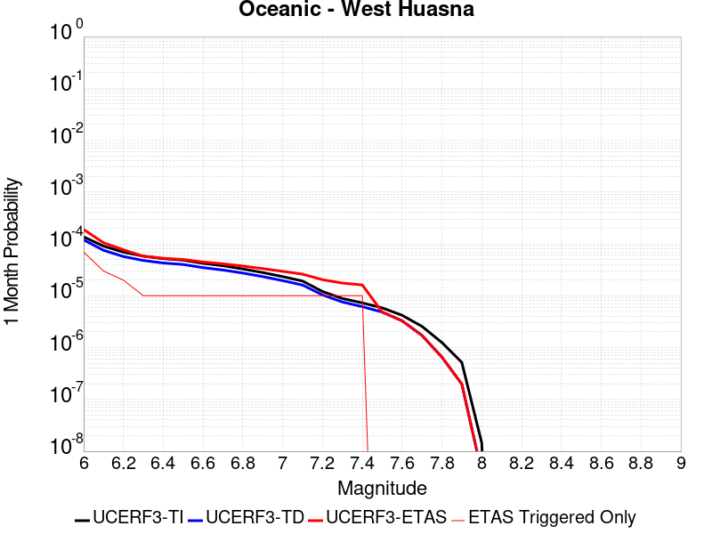 |  |  |

| Magnitude | 1 wk TI Prob | 1 wk TD Prob | 1 wk ETAS Prob | 1 wk ETAS/TD Gain | 1 wk ETAS Triggered Only | 1 mo TI Prob | 1 mo TD Prob | 1 mo ETAS Prob | 1 mo ETAS/TD Gain | 1 mo ETAS Triggered Only | 1 yr TI Prob | 1 yr TD Prob | 1 yr ETAS Prob | 1 yr ETAS/TD Gain | 1 yr ETAS Triggered Only | 10 yr TI Prob | 10 yr TD Prob | 10 yr ETAS Prob | 10 yr ETAS/TD Gain | 10 yr ETAS Triggered Only |
|-----|-----|-----|-----|-----|-----|-----|-----|-----|-----|-----|-----|-----|-----|-----|-----|-----|-----|-----|-----|-----|
| 6.0 | 3.195567E-5 | 2.7926868E-5 | 1.6808695E-4 | 6.0188255 | 1.4016399E-4 | 1.3694567E-4 | 1.1968133E-4 | 3.2990216E-4 | 2.7565048 | 2.1024598E-4 | 0.0016660384 | 0.0014561893 | 0.0016661292 | 1.1441706 | 2.1024598E-4 | 0.016536033 | 0.014471028 | 0.014678231 | 1.0143185 | 2.1024598E-4 |
| 6.1 | 2.1156782E-5 | 1.7573486E-5 | 1.5773502E-4 | 8.975739 | 1.4016399E-4 | 9.066878E-5 | 7.531282E-5 | 2.1546625E-4 | 2.8609507 | 1.4016399E-4 | 0.0011033333 | 9.165572E-4 | 0.0010565928 | 1.1527842 | 1.4016399E-4 | 0.010978713 | 0.009128777 | 0.009267663 | 1.015214 | 1.4016399E-4 |
| 6.2 | 1.6195117E-5 | 1.3327152E-5 | 8.340822E-5 | 6.2585173 | 7.0081995E-5 | 6.9405796E-5 | 5.7115132E-5 | 1.2719313E-4 | 2.2269602 | 7.0081995E-5 | 8.44688E-4 | 6.9515745E-4 | 7.6519075E-4 | 1.1007445 | 7.0081995E-5 | 0.008414844 | 0.006930123 | 0.0069997194 | 1.0100425 | 7.0081995E-5 |
| 6.3 | 1.3559345E-5 | 1.1179142E-5 | 8.1260354E-5 | 7.2689257 | 7.0081995E-5 | 5.811018E-5 | 4.7909736E-5 | 1.1798838E-4 | 2.4627223 | 7.0081995E-5 | 7.072618E-4 | 5.831459E-4 | 6.5318705E-4 | 1.1201091 | 7.0081995E-5 | 0.0070501505 | 0.0058162753 | 0.0058859494 | 1.0119792 | 7.0081995E-5 |
| 6.4 | 1.2120619E-5 | 1.0000977E-5 | 8.0082275E-5 | 8.007444 | 7.0081995E-5 | 5.1944477E-5 | 4.2860633E-5 | 1.12939626E-4 | 2.6350434 | 7.0081995E-5 | 6.322405E-4 | 5.2170374E-4 | 5.9174915E-4 | 1.1342628 | 7.0081995E-5 | 0.006304447 | 0.0052048573 | 0.0052745747 | 1.0133946 | 7.0081995E-5 |
| 6.5 | 1.13511915E-5 | 9.3674735E-6 | 7.9448815E-5 | 8.481349 | 7.0081995E-5 | 4.8647056E-5 | 4.01457E-5 | 1.1022488E-4 | 2.7456212 | 7.0081995E-5 | 5.9211696E-4 | 4.886647E-4 | 5.5871246E-4 | 1.1433452 | 7.0081995E-5 | 0.0059054173 | 0.0048759608 | 0.004945701 | 1.0143028 | 7.0081995E-5 |
| 6.6 | 9.850605E-6 | 8.135418E-6 | 7.821684E-5 | 9.614361 | 7.0081995E-5 | 4.2216197E-5 | 3.4865614E-5 | 1.0494517E-4 | 3.0099905 | 7.0081995E-5 | 5.1386096E-4 | 4.2440637E-4 | 4.9445865E-4 | 1.1650593 | 7.0081995E-5 | 0.0051267436 | 0.004235991 | 0.004305776 | 1.0164744 | 7.0081995E-5 |
| 6.7 | 8.8558645E-6 | 7.318433E-6 | 7.739991E-5 | 10.576023 | 7.0081995E-5 | 3.7953152E-5 | 3.1364336E-5 | 1.0144414E-4 | 3.2343786 | 7.0081995E-5 | 4.6198163E-4 | 3.8179406E-4 | 4.518493E-4 | 1.1834896 | 7.0081995E-5 | 0.004610224 | 0.0038114067 | 0.0038812216 | 1.0183173 | 7.0081995E-5 |
| 6.8 | 7.67136E-6 | 6.391756E-6 | 7.6473305E-5 | 11.964365 | 7.0081995E-5 | 3.2876844E-5 | 2.7392953E-5 | 9.747303E-5 | 3.558325 | 7.0081995E-5 | 4.0020206E-4 | 3.3345833E-4 | 4.0351695E-4 | 1.2100971 | 7.0081995E-5 | 0.003994821 | 0.0033296007 | 0.0033994494 | 1.0209781 | 7.0081995E-5 |
| 6.9 | 6.534529E-6 | 5.4583297E-6 | 7.5539945E-5 | 13.839388 | 7.0081995E-5 | 2.8004823E-5 | 2.3392633E-5 | 9.347299E-5 | 3.9958303 | 7.0081995E-5 | 3.4090536E-4 | 2.847682E-4 | 3.5483023E-4 | 1.2460318 | 7.0081995E-5 | 0.0034038287 | 0.0028440498 | 0.0029139325 | 1.0245715 | 7.0081995E-5 |
| 7.0 | 5.460525E-6 | 4.5699517E-6 | 7.465163E-5 | 16.335321 | 7.0081995E-5 | 2.3402039E-5 | 1.958536E-5 | 8.9665984E-5 | 4.5782146 | 7.0081995E-5 | 2.8488258E-4 | 2.3842578E-4 | 3.084911E-4 | 1.2938663 | 7.0081995E-5 | 0.0028451765 | 0.0023817138 | 0.002451629 | 1.0293549 | 7.0081995E-5 |
| 7.1 | 4.4825083E-6 | 3.7524428E-6 | 7.383418E-5 | 19.676296 | 7.0081995E-5 | 1.9210609E-5 | 1.60818E-5 | 8.616267E-5 | 5.357775 | 7.0081995E-5 | 2.3386406E-4 | 1.9577841E-4 | 2.658467E-4 | 1.3578959 | 7.0081995E-5 | 0.002336181 | 0.0019560715 | 0.0020260164 | 1.0357579 | 7.0081995E-5 |
| 7.2 | 2.821708E-6 | 2.4249334E-6 | 7.250676E-5 | 29.900515 | 7.0081995E-5 | 1.2092979E-5 | 1.039253E-5 | 8.04738E-5 | 7.743427 | 7.0081995E-5 | 1.4722206E-4 | 1.2652173E-4 | 1.9659485E-4 | 1.5538427 | 7.0081995E-5 | 0.0014712457 | 0.0012644994 | 0.0013344927 | 1.0553527 | 7.0081995E-5 |
| 7.3 | 2.0644757E-6 | 1.7687412E-6 | 7.185061E-5 | 40.62246 | 7.0081995E-5 | 8.847723E-6 | 7.5802973E-6 | 7.766176E-5 | 10.2452135 | 7.0081995E-5 | 1.0771569E-4 | 9.228622E-5 | 1.6236174E-4 | 1.7593282 | 7.0081995E-5 | 0.001076635 | 9.2248066E-4 | 9.92498E-4 | 1.0759012 | 7.0081995E-5 |
| 7.4 | 1.6980367E-6 | 1.4379892E-6 | 7.1519884E-5 | 49.73604 | 7.0081995E-5 | 7.27728E-6 | 6.162796E-6 | 7.624436E-5 | 12.371716 | 7.0081995E-5 | 8.8597284E-5 | 7.5029464E-5 | 1.451062E-4 | 1.9339896 | 7.0081995E-5 | 8.8561967E-4 | 7.500429E-4 | 8.2007237E-4 | 1.0933672 | 7.0081995E-5 |
| 7.5 | 1.3637683E-6 | 1.1302635E-6 | 1.1302635E-6 | 1.0 | 0.0 | 5.844708E-6 | 4.8439774E-6 | 4.8439774E-6 | 1.0 | 0.0 | 7.1156996E-5 | 5.897383E-5 | 5.897383E-5 | 1.0 | 0.0 | 7.1134215E-4 | 5.895833E-4 | 5.895833E-4 | 1.0 | 0.0 |
| 7.6 | 9.802994E-7 | 7.677247E-7 | 7.677247E-7 | 1.0 | 0.0 | 4.2012766E-6 | 3.2902446E-6 | 3.2902446E-6 | 1.0 | 0.0 | 5.1149345E-5 | 4.0057992E-5 | 4.0057992E-5 | 1.0 | 0.0 | 5.113757E-4 | 4.0050913E-4 | 4.0050913E-4 | 1.0 | 0.0 |
| 7.7 | 5.986191E-7 | 4.0050548E-7 | 4.0050548E-7 | 1.0 | 0.0 | 2.5655079E-6 | 1.7164509E-6 | 1.7164509E-6 | 1.0 | 0.0 | 3.1234613E-5 | 2.089759E-5 | 2.089759E-5 | 1.0 | 0.0 | 3.123022E-4 | 2.089576E-4 | 2.089576E-4 | 1.0 | 0.0 |
| 7.8 | 2.9189815E-7 | 1.5285792E-7 | 1.5285792E-7 | 1.0 | 0.0 | 1.2509914E-6 | 6.5510517E-7 | 6.5510517E-7 | 1.0 | 0.0 | 1.5230714E-5 | 7.9758765E-6 | 7.9758765E-6 | 1.0 | 0.0 | 1.522967E-4 | 7.9757214E-5 | 7.9757214E-5 | 1.0 | 0.0 |
| 7.9 | 1.2057845E-7 | 4.621248E-8 | 4.621248E-8 | 1.0 | 0.0 | 5.1676466E-7 | 1.9805347E-7 | 1.9805347E-7 | 1.0 | 0.0 | 6.2915915E-6 | 2.4112983E-6 | 2.4112983E-6 | 1.0 | 0.0 | 6.2914136E-5 | 2.4114026E-5 | 2.4114026E-5 | 1.0 | 0.0 |
| 8.0 | 3.3806387E-9 | 9.011393E-10 | 9.011393E-10 | 1.0 | 0.0 | 1.4488451E-8 | 3.8620254E-9 | 3.8620254E-9 | 1.0 | 0.0 | 1.7639688E-7 | 4.702016E-8 | 4.702016E-8 | 1.0 | 0.0 | 1.7639674E-6 | 4.7129527E-7 | 4.7129527E-7 | 1.0 | 0.0 |

## San Andreas (Carrizo) rev
*[(top)](#table-of-contents)*

| 1 Week | 1 Month | 1 Year | 10 Year |
|-----|-----|-----|-----|
|  |  |  |  |

| Magnitude | 1 wk TI Prob | 1 wk TD Prob | 1 wk ETAS Prob | 1 wk ETAS/TD Gain | 1 wk ETAS Triggered Only | 1 mo TI Prob | 1 mo TD Prob | 1 mo ETAS Prob | 1 mo ETAS/TD Gain | 1 mo ETAS Triggered Only | 1 yr TI Prob | 1 yr TD Prob | 1 yr ETAS Prob | 1 yr ETAS/TD Gain | 1 yr ETAS Triggered Only | 10 yr TI Prob | 10 yr TD Prob | 10 yr ETAS Prob | 10 yr ETAS/TD Gain | 10 yr ETAS Triggered Only |
|-----|-----|-----|-----|-----|-----|-----|-----|-----|-----|-----|-----|-----|-----|-----|-----|-----|-----|-----|-----|-----|
| 6.0 | 1.1674632E-4 | 2.432302E-4 | 3.1329514E-4 | 1.2880602 | 7.0081995E-5 | 5.002454E-4 | 0.0010420004 | 0.0011820183 | 1.1343741 | 1.4016399E-4 | 0.006073493 | 0.012613042 | 0.012889835 | 1.0219449 | 2.8032798E-4 | 0.0591016 | 0.12061418 | 0.120860696 | 1.0020438 | 2.8032798E-4 |
| 6.1 | 1.1674632E-4 | 2.432302E-4 | 3.1329514E-4 | 1.2880602 | 7.0081995E-5 | 5.002454E-4 | 0.0010420004 | 0.0011820183 | 1.1343741 | 1.4016399E-4 | 0.006073493 | 0.012613042 | 0.012889835 | 1.0219449 | 2.8032798E-4 | 0.0591016 | 0.12061418 | 0.120860696 | 1.0020438 | 2.8032798E-4 |
| 6.2 | 1.1674632E-4 | 2.432302E-4 | 3.1329514E-4 | 1.2880602 | 7.0081995E-5 | 5.002454E-4 | 0.0010420004 | 0.0011820183 | 1.1343741 | 1.4016399E-4 | 0.006073493 | 0.012613042 | 0.012889835 | 1.0219449 | 2.8032798E-4 | 0.0591016 | 0.12061418 | 0.120860696 | 1.0020438 | 2.8032798E-4 |
| 6.3 | 1.1674632E-4 | 2.432302E-4 | 3.1329514E-4 | 1.2880602 | 7.0081995E-5 | 5.002454E-4 | 0.0010420004 | 0.0011820183 | 1.1343741 | 1.4016399E-4 | 0.006073493 | 0.012613042 | 0.012889835 | 1.0219449 | 2.8032798E-4 | 0.0591016 | 0.12061418 | 0.120860696 | 1.0020438 | 2.8032798E-4 |
| 6.4 | 1.1674632E-4 | 2.432302E-4 | 3.1329514E-4 | 1.2880602 | 7.0081995E-5 | 5.002454E-4 | 0.0010420004 | 0.0011820183 | 1.1343741 | 1.4016399E-4 | 0.006073493 | 0.012613042 | 0.012889835 | 1.0219449 | 2.8032798E-4 | 0.0591016 | 0.12061418 | 0.120860696 | 1.0020438 | 2.8032798E-4 |
| 6.5 | 1.13136164E-4 | 2.3643032E-4 | 3.0649576E-4 | 1.296347 | 7.0081995E-5 | 4.847792E-4 | 0.0010128808 | 0.0011529028 | 1.1382414 | 1.4016399E-4 | 0.0058862255 | 0.012262545 | 0.012539434 | 1.0225801 | 2.8032798E-4 | 0.057327334 | 0.117585555 | 0.117832914 | 1.0021037 | 2.8032798E-4 |
| 6.6 | 1.13136164E-4 | 2.3643032E-4 | 3.0649576E-4 | 1.296347 | 7.0081995E-5 | 4.847792E-4 | 0.0010128808 | 0.0011529028 | 1.1382414 | 1.4016399E-4 | 0.0058862255 | 0.012262545 | 0.012539434 | 1.0225801 | 2.8032798E-4 | 0.057327334 | 0.117585555 | 0.117832914 | 1.0021037 | 2.8032798E-4 |
| 6.7 | 1.1149675E-4 | 2.3334254E-4 | 3.034082E-4 | 1.3002695 | 7.0081995E-5 | 4.777557E-4 | 9.996577E-4 | 0.0011396816 | 1.1400719 | 1.4016399E-4 | 0.0058011734 | 0.012103349 | 0.012380284 | 1.0228809 | 2.8032798E-4 | 0.05652051 | 0.1162071 | 0.116454855 | 1.0021319 | 2.8032798E-4 |
| 6.8 | 1.1103589E-4 | 2.3236412E-4 | 3.0242983E-4 | 1.301534 | 7.0081995E-5 | 4.7578133E-4 | 9.954676E-4 | 0.0011354921 | 1.140662 | 1.4016399E-4 | 0.005777263 | 0.012052901 | 0.01232985 | 1.0229778 | 2.8032798E-4 | 0.056293584 | 0.1157674 | 0.11601527 | 1.0021411 | 2.8032798E-4 |
| 6.9 | 1.1053259E-4 | 2.3128795E-4 | 3.0135375E-4 | 1.3029375 | 7.0081995E-5 | 4.7362508E-4 | 9.90859E-4 | 0.0011308842 | 1.1413169 | 1.4016399E-4 | 0.0057511497 | 0.01199741 | 0.012274375 | 1.0230854 | 2.8032798E-4 | 0.05604569 | 0.11528359 | 0.11553161 | 1.0021513 | 2.8032798E-4 |
| 7.0 | 1.1005377E-4 | 2.3029637E-4 | 3.0036224E-4 | 1.3042421 | 7.0081995E-5 | 4.7157376E-4 | 9.866126E-4 | 0.0011266384 | 1.1419257 | 1.4016399E-4 | 0.0057263062 | 0.011946279 | 0.012223258 | 1.0231854 | 2.8032798E-4 | 0.055809796 | 0.11483591 | 0.115084045 | 1.0021608 | 2.8032798E-4 |
| 7.1 | 1.0308142E-4 | 2.1539345E-4 | 2.8546035E-4 | 1.3252972 | 7.0081995E-5 | 4.417027E-4 | 9.227892E-4 | 0.0010628238 | 1.1517515 | 1.4016399E-4 | 0.0053644776 | 0.011177397 | 0.011454592 | 1.0247996 | 2.8032798E-4 | 0.052368138 | 0.108092256 | 0.10834228 | 1.0023131 | 2.8032798E-4 |
| 7.2 | 1.0027479E-4 | 2.094724E-4 | 2.7953973E-4 | 1.3344942 | 7.0081995E-5 | 4.296783E-4 | 8.9743105E-4 | 0.0010374693 | 1.1560434 | 1.4016399E-4 | 0.0052187922 | 0.010871782 | 0.011149063 | 1.0255046 | 2.8032798E-4 | 0.050979212 | 0.10539625 | 0.10564703 | 1.0023794 | 2.8032798E-4 |
| 7.3 | 9.816942E-5 | 2.0422463E-4 | 2.742923E-4 | 1.3430912 | 7.0081995E-5 | 4.2065824E-4 | 8.7495585E-4 | 0.0010149973 | 1.1600553 | 1.4016399E-4 | 0.005109493 | 0.010600842 | 0.010878198 | 1.0261636 | 2.8032798E-4 | 0.049935985 | 0.102979995 | 0.10323146 | 1.0024419 | 2.8032798E-4 |
| 7.4 | 9.5634205E-5 | 1.9791997E-4 | 2.679881E-4 | 1.3540225 | 7.0081995E-5 | 4.0979648E-4 | 8.479536E-4 | 9.879988E-4 | 1.1651566 | 1.4016399E-4 | 0.0049778637 | 0.010275229 | 0.010552676 | 1.0270016 | 2.8032798E-4 | 0.048678253 | 0.10006632 | 0.100318596 | 1.002521 | 2.8032798E-4 |
| 7.5 | 8.052417E-5 | 1.611261E-4 | 2.311968E-4 | 1.4348812 | 7.0081995E-5 | 3.4505792E-4 | 6.903579E-4 | 8.3042507E-4 | 1.2028908 | 1.4016399E-4 | 0.0041929903 | 0.008372796 | 0.008650777 | 1.0332005 | 2.8032798E-4 | 0.04114753 | 0.08281049 | 0.0830676 | 1.0031048 | 2.8032798E-4 |
| 7.6 | 7.897024E-5 | 1.5765853E-4 | 2.2772948E-4 | 1.4444475 | 7.0081995E-5 | 3.384E-4 | 6.755046E-4 | 8.1557396E-4 | 1.207355 | 1.4016399E-4 | 0.0041122385 | 0.008193332 | 0.008471363 | 1.0339339 | 2.8032798E-4 | 0.040369697 | 0.08115171 | 0.08140928 | 1.0031741 | 2.8032798E-4 |
| 7.7 | 6.707427E-5 | 1.3276102E-4 | 2.0283372E-4 | 1.5278107 | 7.0081995E-5 | 2.8742946E-4 | 5.688518E-4 | 7.089361E-4 | 1.2462579 | 1.4016399E-4 | 0.003493839 | 0.00690381 | 0.0071126046 | 1.0302434 | 2.1024598E-4 | 0.034394164 | 0.069048055 | 0.06924379 | 1.0028347 | 2.1024598E-4 |
| 7.8 | 6.147705E-5 | 1.2197486E-4 | 1.2197486E-4 | 1.0 | 0.0 | 2.6344648E-4 | 5.226447E-4 | 5.926901E-4 | 1.134021 | 7.0081995E-5 | 0.0032027436 | 0.006344659 | 0.006483934 | 1.0219514 | 1.4016399E-4 | 0.031569764 | 0.06351457 | 0.063645825 | 1.0020666 | 1.4016399E-4 |
| 7.9 | 4.7636717E-5 | 8.87977E-5 | 8.87977E-5 | 1.0 | 0.0 | 2.0414138E-4 | 3.8050607E-4 | 4.505614E-4 | 1.1841109 | 7.0081995E-5 | 0.0024825884 | 0.0046228287 | 0.0047623445 | 1.0301797 | 1.4016399E-4 | 0.024550365 | 0.046628095 | 0.04676172 | 1.0028658 | 1.4016399E-4 |
| 8.0 | 3.3554235E-5 | 5.2136907E-5 | 5.2136907E-5 | 1.0 | 0.0 | 1.4379594E-4 | 2.2342477E-4 | 2.9349112E-4 | 1.3136015 | 7.0081995E-5 | 0.0017493097 | 0.002716805 | 0.0028565882 | 1.0514513 | 1.4016399E-4 | 0.017356034 | 0.027880952 | 0.028017208 | 1.0048871 | 1.4016399E-4 |
| 8.1 | 1.9175432E-5 | 1.9184976E-5 | 1.9184976E-5 | 1.0 | 0.0 | 8.217783E-5 | 8.2218736E-5 | 1.5229498E-4 | 1.8523147 | 7.0081995E-5 | 0.0010000558 | 0.0010005541 | 0.0010705659 | 1.0699731 | 7.0081995E-5 | 0.009955673 | 0.0107580265 | 0.010827355 | 1.0064443 | 7.0081995E-5 |
| 8.2 | 8.643924E-6 | 5.4748625E-6 | 5.4748625E-6 | 1.0 | 0.0 | 3.704486E-5 | 2.3463486E-5 | 2.3463486E-5 | 1.0 | 0.0 | 4.5092785E-4 | 2.8563058E-4 | 2.8563058E-4 | 1.0 | 0.0 | 0.0045001395 | 0.0032487072 | 0.0032487072 | 1.0 | 0.0 |
| 8.3 | 1.983087E-6 | 7.6599065E-7 | 7.6599065E-7 | 1.0 | 0.0 | 8.498917E-6 | 3.282813E-6 | 3.282813E-6 | 1.0 | 0.0 | 1.034694E-4 | 3.9967534E-5 | 3.9967534E-5 | 1.0 | 0.0 | 0.0010342124 | 4.719687E-4 | 4.719687E-4 | 1.0 | 0.0 |

## San Andreas (North Branch Mill Creek)
*[(top)](#table-of-contents)*

| 1 Week | 1 Month | 1 Year | 10 Year |
|-----|-----|-----|-----|
|  |  |  |  |

| Magnitude | 1 wk TI Prob | 1 wk TD Prob | 1 wk ETAS Prob | 1 wk ETAS/TD Gain | 1 wk ETAS Triggered Only | 1 mo TI Prob | 1 mo TD Prob | 1 mo ETAS Prob | 1 mo ETAS/TD Gain | 1 mo ETAS Triggered Only | 1 yr TI Prob | 1 yr TD Prob | 1 yr ETAS Prob | 1 yr ETAS/TD Gain | 1 yr ETAS Triggered Only | 10 yr TI Prob | 10 yr TD Prob | 10 yr ETAS Prob | 10 yr ETAS/TD Gain | 10 yr ETAS Triggered Only |
|-----|-----|-----|-----|-----|-----|-----|-----|-----|-----|-----|-----|-----|-----|-----|-----|-----|-----|-----|-----|-----|
| 6.0 | 1.3461156E-5 | 2.3499893E-5 | 2.3374094E-4 | 9.946468 | 2.1024598E-4 | 5.7689394E-5 | 1.00709956E-4 | 3.1093476E-4 | 3.0874283 | 2.1024598E-4 | 7.02142E-4 | 0.0012254574 | 0.0015054418 | 1.2284734 | 2.8032798E-4 | 0.0069992766 | 0.01222957 | 0.012506469 | 1.0226418 | 2.8032798E-4 |
| 6.1 | 1.3461156E-5 | 2.3499893E-5 | 2.3374094E-4 | 9.946468 | 2.1024598E-4 | 5.7689394E-5 | 1.00709956E-4 | 3.1093476E-4 | 3.0874283 | 2.1024598E-4 | 7.02142E-4 | 0.0012254574 | 0.0015054418 | 1.2284734 | 2.8032798E-4 | 0.0069992766 | 0.01222957 | 0.012506469 | 1.0226418 | 2.8032798E-4 |
| 6.2 | 1.3461156E-5 | 2.3499893E-5 | 2.3374094E-4 | 9.946468 | 2.1024598E-4 | 5.7689394E-5 | 1.00709956E-4 | 3.1093476E-4 | 3.0874283 | 2.1024598E-4 | 7.02142E-4 | 0.0012254574 | 0.0015054418 | 1.2284734 | 2.8032798E-4 | 0.0069992766 | 0.01222957 | 0.012506469 | 1.0226418 | 2.8032798E-4 |
| 6.3 | 1.3461156E-5 | 2.3499893E-5 | 2.3374094E-4 | 9.946468 | 2.1024598E-4 | 5.7689394E-5 | 1.00709956E-4 | 3.1093476E-4 | 3.0874283 | 2.1024598E-4 | 7.02142E-4 | 0.0012254574 | 0.0015054418 | 1.2284734 | 2.8032798E-4 | 0.0069992766 | 0.01222957 | 0.012506469 | 1.0226418 | 2.8032798E-4 |
| 6.4 | 1.3461156E-5 | 2.3499893E-5 | 2.3374094E-4 | 9.946468 | 2.1024598E-4 | 5.7689394E-5 | 1.00709956E-4 | 3.1093476E-4 | 3.0874283 | 2.1024598E-4 | 7.02142E-4 | 0.0012254574 | 0.0015054418 | 1.2284734 | 2.8032798E-4 | 0.0069992766 | 0.01222957 | 0.012506469 | 1.0226418 | 2.8032798E-4 |
| 6.5 | 1.3450706E-5 | 2.3488852E-5 | 2.3372991E-4 | 9.950673 | 2.1024598E-4 | 5.764461E-5 | 1.0066265E-4 | 3.1088747E-4 | 3.0884094 | 2.1024598E-4 | 7.0159714E-4 | 0.001224882 | 0.0015048666 | 1.2285808 | 2.8032798E-4 | 0.006993862 | 0.01222388 | 0.012500781 | 1.0226525 | 2.8032798E-4 |
| 6.6 | 1.3074523E-5 | 2.3103135E-5 | 2.3334427E-4 | 10.100112 | 2.1024598E-4 | 5.6032466E-5 | 9.9009696E-5 | 3.0923486E-4 | 3.1232786 | 2.1024598E-4 | 6.8198174E-4 | 0.0012047797 | 0.00148477 | 1.2323996 | 2.8032798E-4 | 0.006798926 | 0.012025044 | 0.012302002 | 1.0230317 | 2.8032798E-4 |
| 6.7 | 1.3050216E-5 | 2.3078432E-5 | 2.3331957E-4 | 10.109854 | 2.1024598E-4 | 5.59283E-5 | 9.890384E-5 | 3.0912904E-4 | 3.1255515 | 2.1024598E-4 | 6.8071426E-4 | 0.0012034923 | 0.0014834829 | 1.2326485 | 2.8032798E-4 | 0.0067863287 | 0.012012309 | 0.01228927 | 1.0230564 | 2.8032798E-4 |
| 6.8 | 1.29049395E-5 | 2.292684E-5 | 2.3316802E-4 | 10.170089 | 2.1024598E-4 | 5.530571E-5 | 9.825421E-5 | 3.0847953E-4 | 3.1396065 | 2.1024598E-4 | 6.73139E-4 | 0.0011955918 | 0.0014755846 | 1.2341876 | 2.8032798E-4 | 0.0067110364 | 0.011934154 | 0.0122111365 | 1.0232092 | 2.8032798E-4 |
| 6.9 | 1.2867369E-5 | 2.2886245E-5 | 2.3312742E-4 | 10.186356 | 2.1024598E-4 | 5.51447E-5 | 9.8080236E-5 | 3.083056E-4 | 3.1434019 | 2.1024598E-4 | 6.711799E-4 | 0.0011934759 | 0.0014734693 | 1.2346033 | 2.8032798E-4 | 0.006691564 | 0.011913223 | 0.012190212 | 1.0232505 | 2.8032798E-4 |
| 7.0 | 1.2495996E-5 | 2.2286325E-5 | 2.3252763E-4 | 10.433646 | 2.1024598E-4 | 5.3553173E-5 | 9.550934E-5 | 3.0573524E-4 | 3.201103 | 2.1024598E-4 | 6.518148E-4 | 0.0011622087 | 0.001442211 | 1.2409225 | 2.8032798E-4 | 0.0064990623 | 0.0116038285 | 0.0118809035 | 1.0238779 | 2.8032798E-4 |
| 7.1 | 1.2452067E-5 | 2.2231397E-5 | 2.3247271E-4 | 10.456954 | 2.1024598E-4 | 5.3364907E-5 | 9.527396E-5 | 3.054999E-4 | 3.2065418 | 2.1024598E-4 | 6.4952404E-4 | 0.0011593461 | 0.001439349 | 1.241518 | 2.8032798E-4 | 0.0064762887 | 0.0115755 | 0.011852583 | 1.023937 | 2.8032798E-4 |
| 7.2 | 1.2002777E-5 | 2.1609963E-5 | 2.318514E-4 | 10.728912 | 2.1024598E-4 | 5.143946E-5 | 9.2610855E-5 | 3.0283738E-4 | 3.2699986 | 2.1024598E-4 | 6.2609545E-4 | 0.0011269567 | 0.0014069687 | 1.2484674 | 2.8032798E-4 | 0.006243344 | 0.011254923 | 0.011532096 | 1.0246269 | 2.8032798E-4 |
| 7.3 | 1.1923425E-5 | 2.1479793E-5 | 2.3172126E-4 | 10.787872 | 2.1024598E-4 | 5.109939E-5 | 9.205302E-5 | 3.0227966E-4 | 3.283756 | 2.1024598E-4 | 6.219575E-4 | 0.001120172 | 0.001400186 | 1.2499741 | 2.8032798E-4 | 0.0062021962 | 0.011187789 | 0.01146498 | 1.0247762 | 2.8032798E-4 |
| 7.4 | 1.16105175E-5 | 2.0853771E-5 | 2.3109537E-4 | 11.081706 | 2.1024598E-4 | 4.975841E-5 | 8.937026E-5 | 2.9959745E-4 | 3.352317 | 2.1024598E-4 | 6.0564023E-4 | 0.0010875424 | 0.0013675655 | 1.2574825 | 2.8032798E-4 | 0.006039923 | 0.010865397 | 0.011142679 | 1.0255197 | 2.8032798E-4 |
| 7.5 | 1.1037265E-5 | 1.9553907E-5 | 2.2979578E-4 | 11.751911 | 2.1024598E-4 | 4.7301706E-5 | 8.379978E-5 | 2.9402814E-4 | 3.5086985 | 2.1024598E-4 | 5.757461E-4 | 0.0010197869 | 0.0012998291 | 1.2746085 | 2.8032798E-4 | 0.005742567 | 0.010194898 | 0.0104723675 | 1.0272166 | 2.8032798E-4 |
| 7.6 | 1.0720915E-5 | 1.899582E-5 | 2.2923782E-4 | 12.067803 | 2.1024598E-4 | 4.5945973E-5 | 8.140812E-5 | 2.91637E-4 | 3.5824065 | 2.1024598E-4 | 5.592486E-4 | 9.906954E-4 | 0.0012707456 | 1.2826805 | 2.8032798E-4 | 0.005578433 | 0.009906623 | 0.0101841735 | 1.0280167 | 2.8032798E-4 |
| 7.7 | 9.276279E-6 | 1.6441649E-5 | 2.2668418E-4 | 13.787192 | 2.1024598E-4 | 3.9754876E-5 | 7.0462316E-5 | 2.806935E-4 | 3.9835973 | 2.1024598E-4 | 4.839081E-4 | 8.575427E-4 | 0.0011376303 | 1.3266165 | 2.8032798E-4 | 0.0048285574 | 0.008586041 | 0.008863962 | 1.0323689 | 2.8032798E-4 |
| 7.8 | 5.8346777E-6 | 1.1155013E-5 | 2.2139866E-4 | 19.847458 | 2.1024598E-4 | 2.5005522E-5 | 4.7806327E-5 | 2.5804227E-4 | 5.3976593 | 2.1024598E-4 | 3.043997E-4 | 5.818867E-4 | 8.6205156E-4 | 1.4814767 | 2.8032798E-4 | 0.0030398308 | 0.0058469265 | 0.0061256154 | 1.0476642 | 2.8032798E-4 |
| 7.9 | 4.690204E-6 | 8.509093E-6 | 2.187533E-4 | 25.708178 | 2.1024598E-4 | 2.0100719E-5 | 3.6467034E-5 | 2.4670534E-4 | 6.765161 | 2.1024598E-4 | 2.4469878E-4 | 4.4389578E-4 | 7.2409934E-4 | 1.6312373 | 2.8032798E-4 | 0.002444295 | 0.0044707474 | 0.004749822 | 1.0624224 | 2.8032798E-4 |
| 8.0 | 2.9570454E-6 | 4.846947E-6 | 7.4928605E-5 | 15.458928 | 7.0081995E-5 | 1.267299E-5 | 2.0772464E-5 | 9.0853006E-5 | 4.373723 | 7.0081995E-5 | 1.5428272E-4 | 2.5287544E-4 | 3.9300398E-4 | 1.5541407 | 1.4016399E-4 | 0.0015417566 | 0.002549644 | 0.0026894507 | 1.0548338 | 1.4016399E-4 |
| 8.1 | 1.6376824E-6 | 2.1968929E-6 | 2.1968929E-6 | 1.0 | 0.0 | 7.01862E-6 | 9.41522E-6 | 9.41522E-6 | 1.0 | 0.0 | 8.544835E-5 | 1.14624294E-4 | 1.14624294E-4 | 1.0 | 0.0 | 8.54155E-4 | 0.0011606582 | 0.0011606582 | 1.0 | 0.0 |
| 8.2 | 6.9631557E-7 | 4.5360213E-7 | 4.5360213E-7 | 1.0 | 0.0 | 2.984206E-6 | 1.9440076E-6 | 1.9440076E-6 | 1.0 | 0.0 | 3.63321E-5 | 2.3668037E-5 | 2.3668037E-5 | 1.0 | 0.0 | 3.6326164E-4 | 2.451564E-4 | 2.451564E-4 | 1.0 | 0.0 |
| 8.3 | 1.7876137E-7 | 8.360375E-8 | 8.360375E-8 | 1.0 | 0.0 | 7.661199E-7 | 3.5830175E-7 | 3.5830175E-7 | 1.0 | 0.0 | 9.32747E-6 | 4.3623154E-6 | 4.3623154E-6 | 1.0 | 0.0 | 9.3270784E-5 | 4.5817014E-5 | 4.5817014E-5 | 1.0 | 0.0 |

## San Jacinto (Anza) rev
*[(top)](#table-of-contents)*

| 1 Week | 1 Month | 1 Year | 10 Year |
|-----|-----|-----|-----|
|  |  |  |  |

| Magnitude | 1 wk TI Prob | 1 wk TD Prob | 1 wk ETAS Prob | 1 wk ETAS/TD Gain | 1 wk ETAS Triggered Only | 1 mo TI Prob | 1 mo TD Prob | 1 mo ETAS Prob | 1 mo ETAS/TD Gain | 1 mo ETAS Triggered Only | 1 yr TI Prob | 1 yr TD Prob | 1 yr ETAS Prob | 1 yr ETAS/TD Gain | 1 yr ETAS Triggered Only | 10 yr TI Prob | 10 yr TD Prob | 10 yr ETAS Prob | 10 yr ETAS/TD Gain | 10 yr ETAS Triggered Only |
|-----|-----|-----|-----|-----|-----|-----|-----|-----|-----|-----|-----|-----|-----|-----|-----|-----|-----|-----|-----|-----|
| 6.0 | 6.3015636E-5 | 4.3302647E-5 | 2.5353953E-4 | 5.8550587 | 2.1024598E-4 | 2.7003905E-4 | 1.8556965E-4 | 3.9577662E-4 | 2.132766 | 2.1024598E-4 | 0.0032827691 | 0.0022569813 | 0.0025366766 | 1.1239245 | 2.8032798E-4 | 0.032346968 | 0.023296192 | 0.02356999 | 1.0117528 | 2.8032798E-4 |
| 6.1 | 6.3015636E-5 | 4.3302647E-5 | 2.5353953E-4 | 5.8550587 | 2.1024598E-4 | 2.7003905E-4 | 1.8556965E-4 | 3.9577662E-4 | 2.132766 | 2.1024598E-4 | 0.0032827691 | 0.0022569813 | 0.0025366766 | 1.1239245 | 2.8032798E-4 | 0.032346968 | 0.023296192 | 0.02356999 | 1.0117528 | 2.8032798E-4 |
| 6.2 | 6.3015636E-5 | 4.3302647E-5 | 2.5353953E-4 | 5.8550587 | 2.1024598E-4 | 2.7003905E-4 | 1.8556965E-4 | 3.9577662E-4 | 2.132766 | 2.1024598E-4 | 0.0032827691 | 0.0022569813 | 0.0025366766 | 1.1239245 | 2.8032798E-4 | 0.032346968 | 0.023296192 | 0.02356999 | 1.0117528 | 2.8032798E-4 |
| 6.3 | 6.3015636E-5 | 4.3302647E-5 | 2.5353953E-4 | 5.8550587 | 2.1024598E-4 | 2.7003905E-4 | 1.8556965E-4 | 3.9577662E-4 | 2.132766 | 2.1024598E-4 | 0.0032827691 | 0.0022569813 | 0.0025366766 | 1.1239245 | 2.8032798E-4 | 0.032346968 | 0.023296192 | 0.02356999 | 1.0117528 | 2.8032798E-4 |
| 6.4 | 6.3015636E-5 | 4.3302647E-5 | 2.5353953E-4 | 5.8550587 | 2.1024598E-4 | 2.7003905E-4 | 1.8556965E-4 | 3.9577662E-4 | 2.132766 | 2.1024598E-4 | 0.0032827691 | 0.0022569813 | 0.0025366766 | 1.1239245 | 2.8032798E-4 | 0.032346968 | 0.023296192 | 0.02356999 | 1.0117528 | 2.8032798E-4 |
| 6.5 | 5.811017E-5 | 4.0082516E-5 | 2.5032007E-4 | 6.245119 | 2.1024598E-4 | 2.4901982E-4 | 1.7177092E-4 | 3.819808E-4 | 2.2237804 | 2.1024598E-4 | 0.0030276014 | 0.002089311 | 0.002369053 | 1.1338922 | 2.8032798E-4 | 0.02986684 | 0.021593736 | 0.021868011 | 1.0127016 | 2.8032798E-4 |
| 6.6 | 5.811017E-5 | 4.0082516E-5 | 2.5032007E-4 | 6.245119 | 2.1024598E-4 | 2.4901982E-4 | 1.7177092E-4 | 3.819808E-4 | 2.2237804 | 2.1024598E-4 | 0.0030276014 | 0.002089311 | 0.002369053 | 1.1338922 | 2.8032798E-4 | 0.02986684 | 0.021593736 | 0.021868011 | 1.0127016 | 2.8032798E-4 |
| 6.7 | 5.712442E-5 | 3.9505223E-5 | 2.497429E-4 | 6.321769 | 2.1024598E-4 | 2.4479596E-4 | 1.6929714E-4 | 3.7950755E-4 | 2.2416654 | 2.1024598E-4 | 0.0029763177 | 0.0020592497 | 0.0023390003 | 1.1358508 | 2.8032798E-4 | 0.029367693 | 0.021285562 | 0.021559924 | 1.0128895 | 2.8032798E-4 |
| 6.8 | 5.6967532E-5 | 3.9361643E-5 | 2.4959937E-4 | 6.341182 | 2.1024598E-4 | 2.4412372E-4 | 1.6868189E-4 | 3.788924E-4 | 2.246195 | 2.1024598E-4 | 0.0029681553 | 0.002051773 | 0.0023315258 | 1.1363468 | 2.8032798E-4 | 0.029288229 | 0.021210281 | 0.021484664 | 1.0129362 | 2.8032798E-4 |
| 6.9 | 5.6211324E-5 | 3.9066435E-5 | 2.493042E-4 | 6.3815446 | 2.1024598E-4 | 2.4088343E-4 | 1.6741687E-4 | 3.7762767E-4 | 2.2556129 | 2.1024598E-4 | 0.0029288116 | 0.0020364004 | 0.0023161573 | 1.1373782 | 2.8032798E-4 | 0.028905109 | 0.021049714 | 0.021324141 | 1.0130371 | 2.8032798E-4 |
| 7.0 | 5.4383527E-5 | 3.792697E-5 | 2.48165E-4 | 6.5432324 | 2.1024598E-4 | 2.3305144E-4 | 1.6253405E-4 | 3.7274588E-4 | 2.2933402 | 2.1024598E-4 | 0.0028337094 | 0.001977061 | 0.0022568346 | 1.1415099 | 2.8032798E-4 | 0.027978465 | 0.020440677 | 0.020715274 | 1.0134339 | 2.8032798E-4 |
| 7.1 | 5.1393665E-5 | 3.6389913E-5 | 2.4662825E-4 | 6.7773795 | 2.1024598E-4 | 2.2023996E-4 | 1.5594746E-4 | 3.6616068E-4 | 2.3479745 | 2.1024598E-4 | 0.0026781242 | 0.0018970112 | 0.0021768075 | 1.1474931 | 2.8032798E-4 | 0.026460782 | 0.019614287 | 0.019889116 | 1.0140117 | 2.8032798E-4 |
| 7.2 | 4.785222E-5 | 3.4741795E-5 | 2.4498047E-4 | 7.0514627 | 2.1024598E-4 | 2.0506482E-4 | 1.4888494E-4 | 3.5909962E-4 | 2.4119272 | 2.1024598E-4 | 0.0024938055 | 0.0018111705 | 0.0020909908 | 1.1544969 | 2.8032798E-4 | 0.024660049 | 0.018728992 | 0.01900407 | 1.0146873 | 2.8032798E-4 |
| 7.3 | 4.2143256E-5 | 3.383628E-5 | 2.4407516E-4 | 7.213416 | 2.1024598E-4 | 1.8060145E-4 | 1.4500458E-4 | 3.5522008E-4 | 2.4497163 | 2.1024598E-4 | 0.002196605 | 0.0017640047 | 0.0020438381 | 1.1586354 | 2.8032798E-4 | 0.02175019 | 0.01823724 | 0.018512458 | 1.0150908 | 2.8032798E-4 |
| 7.4 | 4.0264713E-5 | 3.347446E-5 | 2.4371341E-4 | 7.280577 | 2.1024598E-4 | 1.7255165E-4 | 1.4345412E-4 | 3.5366995E-4 | 2.465387 | 2.1024598E-4 | 0.002098792 | 0.0017451581 | 0.0020249968 | 1.1603515 | 2.8032798E-4 | 0.020790804 | 0.018041821 | 0.01831709 | 1.0152574 | 2.8032798E-4 |
| 7.5 | 3.694492E-5 | 3.218847E-5 | 2.4242769E-4 | 7.5315075 | 2.1024598E-4 | 1.5832575E-4 | 1.379433E-4 | 3.4816028E-4 | 2.5239377 | 2.1024598E-4 | 0.0019259118 | 0.001678169 | 0.0019580266 | 1.1667637 | 2.8032798E-4 | 0.01909306 | 0.01735827 | 0.017633732 | 1.0158693 | 2.8032798E-4 |
| 7.6 | 3.200565E-5 | 2.9504106E-5 | 2.397439E-4 | 8.12578 | 2.1024598E-4 | 1.3715986E-4 | 1.2644005E-4 | 3.3665946E-4 | 2.6626012 | 2.1024598E-4 | 0.001668642 | 0.0015383229 | 0.0018182197 | 1.1819493 | 2.8032798E-4 | 0.01656168 | 0.0159463 | 0.016222158 | 1.0172992 | 2.8032798E-4 |
| 7.7 | 2.731642E-5 | 2.6092788E-5 | 2.3633329E-4 | 9.057418 | 2.1024598E-4 | 1.1706512E-4 | 1.1182144E-4 | 3.2204392E-4 | 2.8799837 | 2.1024598E-4 | 0.001424336 | 0.0013605768 | 0.0016405234 | 1.2057558 | 2.8032798E-4 | 0.014152412 | 0.014167004 | 0.014443361 | 1.019507 | 2.8032798E-4 |
| 7.8 | 2.3466424E-5 | 2.3504817E-5 | 2.3374586E-4 | 9.944593 | 2.1024598E-4 | 1.0056651E-4 | 1.0073105E-4 | 3.1095586E-4 | 3.086991 | 2.1024598E-4 | 0.0012237094 | 0.0012257113 | 0.0015056957 | 1.228426 | 2.8032798E-4 | 0.012169928 | 0.012808893 | 0.01308563 | 1.0216051 | 2.8032798E-4 |
| 7.9 | 1.8611925E-5 | 1.8908117E-5 | 1.5906946E-4 | 8.412761 | 1.4016399E-4 | 7.9762955E-5 | 8.1032274E-5 | 2.211849E-4 | 2.7295904 | 1.4016399E-4 | 9.7068126E-4 | 9.861222E-4 | 0.0011961608 | 1.2129946 | 2.1024598E-4 | 0.0096645225 | 0.010393824 | 0.010601885 | 1.0200177 | 2.1024598E-4 |
| 8.0 | 1.5460775E-5 | 1.5740965E-5 | 1.5590274E-4 | 9.904269 | 1.4016399E-4 | 6.6258784E-5 | 6.7459536E-5 | 2.0761407E-4 | 3.077609 | 1.4016399E-4 | 8.0640207E-4 | 8.21011E-4 | 0.0010310845 | 1.2558715 | 2.1024598E-4 | 0.008034821 | 0.0087028835 | 0.0089112995 | 1.023948 | 2.1024598E-4 |
| 8.1 | 9.983884E-6 | 8.269952E-6 | 8.269952E-6 | 1.0 | 0.0 | 4.2787375E-5 | 3.544217E-5 | 3.544217E-5 | 1.0 | 0.0 | 5.2081177E-4 | 4.314235E-4 | 4.314235E-4 | 1.0 | 0.0 | 0.0051959283 | 0.004640022 | 0.004640022 | 1.0 | 0.0 |
| 8.2 | 4.1226E-6 | 1.5529788E-6 | 1.5529788E-6 | 1.0 | 0.0 | 1.7668166E-5 | 6.6556063E-6 | 6.6556063E-6 | 1.0 | 0.0 | 2.1508869E-4 | 8.102902E-5 | 8.102902E-5 | 1.0 | 0.0 | 0.0021488064 | 9.4050163E-4 | 9.4050163E-4 | 1.0 | 0.0 |
| 8.3 | 1.2750878E-6 | 3.612133E-7 | 3.612133E-7 | 1.0 | 0.0 | 5.4646503E-6 | 1.548056E-6 | 1.548056E-6 | 1.0 | 0.0 | 6.653009E-5 | 1.8847424E-5 | 1.8847424E-5 | 1.0 | 0.0 | 6.6510175E-4 | 2.2734253E-4 | 2.2734253E-4 | 1.0 | 0.0 |

## San Gabriel
*[(top)](#table-of-contents)*

| 1 Week | 1 Month | 1 Year | 10 Year |
|-----|-----|-----|-----|
|  |  |  |  |

| Magnitude | 1 wk TI Prob | 1 wk TD Prob | 1 wk ETAS Prob | 1 wk ETAS/TD Gain | 1 wk ETAS Triggered Only | 1 mo TI Prob | 1 mo TD Prob | 1 mo ETAS Prob | 1 mo ETAS/TD Gain | 1 mo ETAS Triggered Only | 1 yr TI Prob | 1 yr TD Prob | 1 yr ETAS Prob | 1 yr ETAS/TD Gain | 1 yr ETAS Triggered Only | 10 yr TI Prob | 10 yr TD Prob | 10 yr ETAS Prob | 10 yr ETAS/TD Gain | 10 yr ETAS Triggered Only |
|-----|-----|-----|-----|-----|-----|-----|-----|-----|-----|-----|-----|-----|-----|-----|-----|-----|-----|-----|-----|-----|
| 6.0 | 1.083775E-5 | 1.19851875E-5 | 1.521475E-4 | 12.694628 | 1.4016399E-4 | 4.6446676E-5 | 5.1364143E-5 | 2.6159934E-4 | 5.0930343 | 2.1024598E-4 | 5.653415E-4 | 6.251903E-4 | 8.3530485E-4 | 1.3360809 | 2.1024598E-4 | 0.0056390543 | 0.006246409 | 0.006455342 | 1.0334485 | 2.1024598E-4 |
| 6.1 | 1.083775E-5 | 1.19851875E-5 | 1.521475E-4 | 12.694628 | 1.4016399E-4 | 4.6446676E-5 | 5.1364143E-5 | 2.6159934E-4 | 5.0930343 | 2.1024598E-4 | 5.653415E-4 | 6.251903E-4 | 8.3530485E-4 | 1.3360809 | 2.1024598E-4 | 0.0056390543 | 0.006246409 | 0.006455342 | 1.0334485 | 2.1024598E-4 |
| 6.2 | 1.083775E-5 | 1.19851875E-5 | 1.521475E-4 | 12.694628 | 1.4016399E-4 | 4.6446676E-5 | 5.1364143E-5 | 2.6159934E-4 | 5.0930343 | 2.1024598E-4 | 5.653415E-4 | 6.251903E-4 | 8.3530485E-4 | 1.3360809 | 2.1024598E-4 | 0.0056390543 | 0.006246409 | 0.006455342 | 1.0334485 | 2.1024598E-4 |
| 6.3 | 1.083775E-5 | 1.19851875E-5 | 1.521475E-4 | 12.694628 | 1.4016399E-4 | 4.6446676E-5 | 5.1364143E-5 | 2.6159934E-4 | 5.0930343 | 2.1024598E-4 | 5.653415E-4 | 6.251903E-4 | 8.3530485E-4 | 1.3360809 | 2.1024598E-4 | 0.0056390543 | 0.006246409 | 0.006455342 | 1.0334485 | 2.1024598E-4 |
| 6.4 | 1.083775E-5 | 1.19851875E-5 | 1.521475E-4 | 12.694628 | 1.4016399E-4 | 4.6446676E-5 | 5.1364143E-5 | 2.6159934E-4 | 5.0930343 | 2.1024598E-4 | 5.653415E-4 | 6.251903E-4 | 8.3530485E-4 | 1.3360809 | 2.1024598E-4 | 0.0056390543 | 0.006246409 | 0.006455342 | 1.0334485 | 2.1024598E-4 |
| 6.5 | 6.7317824E-6 | 7.716944E-6 | 7.77984E-5 | 10.081503 | 7.0081995E-5 | 2.8850178E-5 | 3.3072207E-5 | 1.7323156E-4 | 5.2379804 | 1.4016399E-4 | 3.511943E-4 | 4.0258077E-4 | 5.4268836E-4 | 1.3480235 | 1.4016399E-4 | 0.003506398 | 0.0040296097 | 0.004169209 | 1.0346434 | 1.4016399E-4 |
| 6.6 | 6.7317824E-6 | 7.716944E-6 | 7.77984E-5 | 10.081503 | 7.0081995E-5 | 2.8850178E-5 | 3.3072207E-5 | 1.7323156E-4 | 5.2379804 | 1.4016399E-4 | 3.511943E-4 | 4.0258077E-4 | 5.4268836E-4 | 1.3480235 | 1.4016399E-4 | 0.003506398 | 0.0040296097 | 0.004169209 | 1.0346434 | 1.4016399E-4 |
| 6.7 | 6.274881E-6 | 7.2458647E-6 | 7.732735E-5 | 10.671928 | 7.0081995E-5 | 2.6892068E-5 | 3.1053343E-5 | 1.7121297E-4 | 5.513512 | 1.4016399E-4 | 3.2736175E-4 | 3.780098E-4 | 5.181208E-4 | 1.3706545 | 1.4016399E-4 | 0.0032687993 | 0.0037847564 | 0.00392439 | 1.0368936 | 1.4016399E-4 |
| 6.8 | 5.996209E-6 | 6.958585E-6 | 6.958585E-6 | 1.0 | 0.0 | 2.5697784E-5 | 2.9822171E-5 | 9.990208E-5 | 3.3499262 | 7.0081995E-5 | 3.128256E-4 | 3.6302538E-4 | 4.3308194E-4 | 1.1929798 | 7.0081995E-5 | 0.003123856 | 0.0036354093 | 0.0037052366 | 1.0192075 | 7.0081995E-5 |
| 6.9 | 5.686331E-6 | 6.6236316E-6 | 6.6236316E-6 | 1.0 | 0.0 | 2.4369761E-5 | 2.8386688E-5 | 9.84667E-5 | 3.4687629 | 7.0081995E-5 | 2.9666146E-4 | 3.4555403E-4 | 4.156118E-4 | 1.2027404 | 7.0081995E-5 | 0.0029626573 | 0.0034612515 | 0.003531091 | 1.0201775 | 7.0081995E-5 |
| 7.0 | 5.2329838E-6 | 6.147514E-6 | 6.147514E-6 | 1.0 | 0.0 | 2.242688E-5 | 2.6346226E-5 | 9.6426375E-5 | 3.659969 | 7.0081995E-5 | 2.7301308E-4 | 3.2071886E-4 | 3.9077838E-4 | 1.2184453 | 7.0081995E-5 | 0.002726779 | 0.0032136322 | 0.0032834888 | 1.0217377 | 7.0081995E-5 |
| 7.1 | 5.135671E-6 | 6.03764E-6 | 6.03764E-6 | 1.0 | 0.0 | 2.2009834E-5 | 2.5875348E-5 | 9.595553E-5 | 3.7083764 | 7.0081995E-5 | 2.6793676E-4 | 3.1498758E-4 | 3.850475E-4 | 1.2224212 | 7.0081995E-5 | 0.0026761394 | 0.0031564834 | 0.0032263442 | 1.0221325 | 7.0081995E-5 |
| 7.2 | 4.989062E-6 | 5.87102E-6 | 5.87102E-6 | 1.0 | 0.0 | 2.1381518E-5 | 2.5161276E-5 | 2.5161276E-5 | 1.0 | 0.0 | 2.6028889E-4 | 3.0629625E-4 | 3.0629625E-4 | 1.0 | 0.0 | 0.0025998424 | 0.003069813 | 0.003069813 | 1.0 | 0.0 |
| 7.3 | 4.8219395E-6 | 5.702574E-6 | 5.702574E-6 | 1.0 | 0.0 | 2.0665291E-5 | 2.443938E-5 | 2.443938E-5 | 1.0 | 0.0 | 2.5157086E-4 | 2.9750957E-4 | 2.9750957E-4 | 1.0 | 0.0 | 0.0025128627 | 0.0029821852 | 0.0029821852 | 1.0 | 0.0 |
| 7.4 | 4.7118383E-6 | 5.5911332E-6 | 5.5911332E-6 | 1.0 | 0.0 | 2.0193436E-5 | 2.3961782E-5 | 2.3961782E-5 | 1.0 | 0.0 | 2.4582737E-4 | 2.916964E-4 | 2.916964E-4 | 1.0 | 0.0 | 0.002455556 | 0.0029242067 | 0.0029242067 | 1.0 | 0.0 |
| 7.5 | 4.5506545E-6 | 5.4365014E-6 | 5.4365014E-6 | 1.0 | 0.0 | 1.9502659E-5 | 2.3299088E-5 | 2.3299088E-5 | 1.0 | 0.0 | 2.37419E-4 | 2.8363022E-4 | 2.8363022E-4 | 1.0 | 0.0 | 0.002371655 | 0.002843753 | 0.002843753 | 1.0 | 0.0 |
| 7.6 | 4.343636E-6 | 5.2293817E-6 | 5.2293817E-6 | 1.0 | 0.0 | 1.861545E-5 | 2.2411448E-5 | 2.2411448E-5 | 1.0 | 0.0 | 2.2661954E-4 | 2.7282597E-4 | 2.7282597E-4 | 1.0 | 0.0 | 0.0022638857 | 0.0027359722 | 0.0027359722 | 1.0 | 0.0 |
| 7.7 | 2.936235E-6 | 2.7440458E-6 | 2.7440458E-6 | 1.0 | 0.0 | 1.2583803E-5 | 1.1760143E-5 | 1.1760143E-5 | 1.0 | 0.0 | 1.5319703E-4 | 1.4317037E-4 | 1.4317037E-4 | 1.0 | 0.0 | 0.0015309147 | 0.0014380751 | 0.0014380751 | 1.0 | 0.0 |
| 7.8 | 1.4541639E-6 | 9.1237047E-7 | 9.1237047E-7 | 1.0 | 0.0 | 6.232116E-6 | 3.9101533E-6 | 3.9101533E-6 | 1.0 | 0.0 | 7.587337E-5 | 4.7605077E-5 | 4.7605077E-5 | 1.0 | 0.0 | 7.584747E-4 | 4.8085177E-4 | 4.8085177E-4 | 1.0 | 0.0 |
| 7.9 | 8.098958E-7 | 2.41753E-7 | 2.41753E-7 | 1.0 | 0.0 | 3.4709774E-6 | 1.0360839E-6 | 1.0360839E-6 | 1.0 | 0.0 | 4.225833E-5 | 1.2614248E-5 | 1.2614248E-5 | 1.0 | 0.0 | 4.2250296E-4 | 1.2921814E-4 | 1.2921814E-4 | 1.0 | 0.0 |
| 8.0 | 5.2473234E-7 | 7.6792055E-8 | 7.6792055E-8 | 1.0 | 0.0 | 2.248851E-6 | 3.2910876E-7 | 3.2910876E-7 | 1.0 | 0.0 | 2.7379416E-5 | 4.0068917E-6 | 4.0068917E-6 | 1.0 | 0.0 | 2.7376044E-4 | 4.21918E-5 | 4.21918E-5 | 1.0 | 0.0 |
| 8.1 | 3.3162388E-7 | 4.1496126E-8 | 4.1496126E-8 | 1.0 | 0.0 | 1.4212444E-6 | 1.7784053E-7 | 1.7784053E-7 | 1.0 | 0.0 | 1.7303513E-5 | 2.1652063E-6 | 2.1652063E-6 | 1.0 | 0.0 | 1.7302166E-4 | 2.2965523E-5 | 2.2965523E-5 | 1.0 | 0.0 |
| 8.2 | 1.0235345E-7 | 1.4043474E-8 | 1.4043474E-8 | 1.0 | 0.0 | 4.3865757E-7 | 6.0186316E-8 | 6.0186316E-8 | 1.0 | 0.0 | 5.340643E-6 | 7.327681E-7 | 7.327681E-7 | 1.0 | 0.0 | 5.3405143E-5 | 7.9273705E-6 | 7.9273705E-6 | 1.0 | 0.0 |

## Santa Ynez (East)
*[(top)](#table-of-contents)*

| 1 Week | 1 Month | 1 Year | 10 Year |
|-----|-----|-----|-----|
|  |  |  |  |

| Magnitude | 1 wk TI Prob | 1 wk TD Prob | 1 wk ETAS Prob | 1 wk ETAS/TD Gain | 1 wk ETAS Triggered Only | 1 mo TI Prob | 1 mo TD Prob | 1 mo ETAS Prob | 1 mo ETAS/TD Gain | 1 mo ETAS Triggered Only | 1 yr TI Prob | 1 yr TD Prob | 1 yr ETAS Prob | 1 yr ETAS/TD Gain | 1 yr ETAS Triggered Only | 10 yr TI Prob | 10 yr TD Prob | 10 yr ETAS Prob | 10 yr ETAS/TD Gain | 10 yr ETAS Triggered Only |
|-----|-----|-----|-----|-----|-----|-----|-----|-----|-----|-----|-----|-----|-----|-----|-----|-----|-----|-----|-----|-----|
| 6.0 | 3.2269712E-5 | 3.67505E-5 | 3.67505E-5 | 1.0 | 0.0 | 1.3829143E-4 | 1.5749598E-4 | 2.976379E-4 | 1.8898127 | 1.4016399E-4 | 0.0016823979 | 0.0019164166 | 0.002056312 | 1.0729984 | 1.4016399E-4 | 0.016697178 | 0.019056441 | 0.019193934 | 1.007215 | 1.4016399E-4 |
| 6.1 | 3.2269712E-5 | 3.67505E-5 | 3.67505E-5 | 1.0 | 0.0 | 1.3829143E-4 | 1.5749598E-4 | 2.976379E-4 | 1.8898127 | 1.4016399E-4 | 0.0016823979 | 0.0019164166 | 0.002056312 | 1.0729984 | 1.4016399E-4 | 0.016697178 | 0.019056441 | 0.019193934 | 1.007215 | 1.4016399E-4 |
| 6.2 | 3.2269712E-5 | 3.67505E-5 | 3.67505E-5 | 1.0 | 0.0 | 1.3829143E-4 | 1.5749598E-4 | 2.976379E-4 | 1.8898127 | 1.4016399E-4 | 0.0016823979 | 0.0019164166 | 0.002056312 | 1.0729984 | 1.4016399E-4 | 0.016697178 | 0.019056441 | 0.019193934 | 1.007215 | 1.4016399E-4 |
| 6.3 | 3.2269712E-5 | 3.67505E-5 | 3.67505E-5 | 1.0 | 0.0 | 1.3829143E-4 | 1.5749598E-4 | 2.976379E-4 | 1.8898127 | 1.4016399E-4 | 0.0016823979 | 0.0019164166 | 0.002056312 | 1.0729984 | 1.4016399E-4 | 0.016697178 | 0.019056441 | 0.019193934 | 1.007215 | 1.4016399E-4 |
| 6.4 | 1.4404779E-5 | 1.4849382E-5 | 1.4849382E-5 | 1.0 | 0.0 | 6.1733306E-5 | 6.363868E-5 | 6.363868E-5 | 1.0 | 0.0 | 7.513438E-4 | 7.745306E-4 | 8.445583E-4 | 1.0904131 | 7.0081995E-5 | 0.0074880854 | 0.007718862 | 0.007788403 | 1.0090092 | 7.0081995E-5 |
| 6.5 | 1.4404779E-5 | 1.4849382E-5 | 1.4849382E-5 | 1.0 | 0.0 | 6.1733306E-5 | 6.363868E-5 | 6.363868E-5 | 1.0 | 0.0 | 7.513438E-4 | 7.745306E-4 | 8.445583E-4 | 1.0904131 | 7.0081995E-5 | 0.0074880854 | 0.007718862 | 0.007788403 | 1.0090092 | 7.0081995E-5 |
| 6.6 | 1.280208E-5 | 1.3011947E-5 | 1.3011947E-5 | 1.0 | 0.0 | 5.4864904E-5 | 5.5764307E-5 | 5.5764307E-5 | 1.0 | 0.0 | 6.6777546E-4 | 6.787207E-4 | 7.487551E-4 | 1.1031859 | 7.0081995E-5 | 0.006657724 | 0.0067666885 | 0.0068362965 | 1.0102868 | 7.0081995E-5 |
| 6.7 | 1.2457027E-5 | 1.2628468E-5 | 1.2628468E-5 | 1.0 | 0.0 | 5.3386164E-5 | 5.412089E-5 | 5.412089E-5 | 1.0 | 0.0 | 6.497827E-4 | 6.587243E-4 | 7.2876015E-4 | 1.1063204 | 7.0081995E-5 | 0.00647886 | 0.006567915 | 0.0066375365 | 1.0106003 | 7.0081995E-5 |
| 6.8 | 1.2095134E-5 | 1.2230915E-5 | 1.2230915E-5 | 1.0 | 0.0 | 5.1835254E-5 | 5.241716E-5 | 5.241716E-5 | 1.0 | 0.0 | 6.309115E-4 | 6.379937E-4 | 7.0803094E-4 | 1.1097775 | 7.0081995E-5 | 0.0062912325 | 0.006361809 | 0.006431445 | 1.0109459 | 7.0081995E-5 |
| 6.9 | 1.1104036E-5 | 1.1157347E-5 | 1.1157347E-5 | 1.0 | 0.0 | 4.758786E-5 | 4.781633E-5 | 4.781633E-5 | 1.0 | 0.0 | 5.7922816E-4 | 5.820096E-4 | 6.5205083E-4 | 1.1203437 | 7.0081995E-5 | 0.005777207 | 0.0058049993 | 0.0058746743 | 1.0120026 | 7.0081995E-5 |
| 7.0 | 1.0577444E-5 | 1.058168E-5 | 1.058168E-5 | 1.0 | 0.0 | 4.5331115E-5 | 4.5349276E-5 | 4.5349276E-5 | 1.0 | 0.0 | 5.5176654E-4 | 5.519888E-4 | 6.220321E-4 | 1.1268927 | 7.0081995E-5 | 0.0055039856 | 0.0055063153 | 0.0055760117 | 1.0126575 | 7.0081995E-5 |
| 7.1 | 1.0021775E-5 | 9.980988E-6 | 9.980988E-6 | 1.0 | 0.0 | 4.294976E-5 | 4.2774966E-5 | 4.2774966E-5 | 1.0 | 0.0 | 5.2278786E-4 | 5.2066194E-4 | 5.9070747E-4 | 1.1345316 | 7.0081995E-5 | 0.0052155964 | 0.0051945536 | 0.0052642715 | 1.0134213 | 7.0081995E-5 |
| 7.2 | 8.874109E-6 | 8.748793E-6 | 8.748793E-6 | 1.0 | 0.0 | 3.8031343E-5 | 3.7494297E-5 | 3.7494297E-5 | 1.0 | 0.0 | 4.629332E-4 | 4.5639853E-4 | 5.2644854E-4 | 1.1534843 | 7.0081995E-5 | 0.0046197 | 0.0045547304 | 0.004624493 | 1.0153166 | 7.0081995E-5 |
| 7.3 | 7.5504267E-6 | 7.5051175E-6 | 7.5051175E-6 | 1.0 | 0.0 | 3.235857E-5 | 3.21644E-5 | 3.21644E-5 | 1.0 | 0.0 | 3.9389438E-4 | 3.915322E-4 | 4.6158678E-4 | 1.1789241 | 7.0081995E-5 | 0.0039319694 | 0.003908531 | 0.003978339 | 1.0178604 | 7.0081995E-5 |
| 7.4 | 6.309394E-6 | 6.1831556E-6 | 6.1831556E-6 | 1.0 | 0.0 | 2.703998E-5 | 2.6498974E-5 | 2.6498974E-5 | 1.0 | 0.0 | 3.2916202E-4 | 3.225782E-4 | 3.926376E-4 | 1.2171857 | 7.0081995E-5 | 0.003286749 | 0.003221197 | 0.0032910532 | 1.0216864 | 7.0081995E-5 |
| 7.5 | 4.6103073E-6 | 4.4408903E-6 | 4.4408903E-6 | 1.0 | 0.0 | 1.975831E-5 | 1.9032252E-5 | 1.9032252E-5 | 1.0 | 0.0 | 2.4053088E-4 | 2.3169373E-4 | 3.017595E-4 | 1.3024068 | 7.0081995E-5 | 0.002402707 | 0.002314591 | 0.0023845108 | 1.0302082 | 7.0081995E-5 |
| 7.6 | 1.2858658E-6 | 1.3008173E-6 | 1.3008173E-6 | 1.0 | 0.0 | 5.5108417E-6 | 5.5749197E-6 | 5.5749197E-6 | 1.0 | 0.0 | 6.7092435E-5 | 6.78726E-5 | 6.78726E-5 | 1.0 | 0.0 | 6.707218E-4 | 6.785256E-4 | 6.785256E-4 | 1.0 | 0.0 |
| 7.7 | 5.3302307E-7 | 5.612138E-7 | 5.612138E-7 | 1.0 | 0.0 | 2.2843826E-6 | 2.4052001E-6 | 2.4052001E-6 | 1.0 | 0.0 | 2.7812002E-5 | 2.9282954E-5 | 2.9282954E-5 | 1.0 | 0.0 | 2.7808524E-4 | 2.9279452E-4 | 2.9279452E-4 | 1.0 | 0.0 |
| 7.8 | 4.613933E-8 | 4.80301E-8 | 4.80301E-8 | 1.0 | 0.0 | 1.9773998E-7 | 2.0584326E-7 | 2.0584326E-7 | 1.0 | 0.0 | 2.4074816E-6 | 2.5061388E-6 | 2.5061388E-6 | 1.0 | 0.0 | 2.4074554E-5 | 2.5061116E-5 | 2.5061116E-5 | 1.0 | 0.0 |

## San Andreas (Creeping Section) 2011 CFM
*[(top)](#table-of-contents)*

| 1 Week | 1 Month | 1 Year | 10 Year |
|-----|-----|-----|-----|
|  |  |  |  |

| Magnitude | 1 wk TI Prob | 1 wk TD Prob | 1 wk ETAS Prob | 1 wk ETAS/TD Gain | 1 wk ETAS Triggered Only | 1 mo TI Prob | 1 mo TD Prob | 1 mo ETAS Prob | 1 mo ETAS/TD Gain | 1 mo ETAS Triggered Only | 1 yr TI Prob | 1 yr TD Prob | 1 yr ETAS Prob | 1 yr ETAS/TD Gain | 1 yr ETAS Triggered Only | 10 yr TI Prob | 10 yr TD Prob | 10 yr ETAS Prob | 10 yr ETAS/TD Gain | 10 yr ETAS Triggered Only |
|-----|-----|-----|-----|-----|-----|-----|-----|-----|-----|-----|-----|-----|-----|-----|-----|-----|-----|-----|-----|-----|
| 6.0 | 5.986481E-4 | 0.001228691 | 0.001228691 | 1.0 | 0.0 | 0.0025631124 | 0.005246795 | 0.0053165094 | 1.0132871 | 7.0081995E-5 | 0.030762846 | 0.061203245 | 0.061400626 | 1.003225 | 2.1024598E-4 | 0.26835477 | 0.425928 | 0.4260487 | 1.0002834 | 2.1024598E-4 |
| 6.1 | 5.015945E-4 | 0.0010230356 | 0.0010230356 | 1.0 | 0.0 | 0.00214792 | 0.004369436 | 0.0044392115 | 1.015969 | 7.0081995E-5 | 0.025839351 | 0.051246606 | 0.05144608 | 1.0038924 | 2.1024598E-4 | 0.23032776 | 0.37284943 | 0.3729813 | 1.0003537 | 2.1024598E-4 |
| 6.2 | 4.073338E-4 | 8.1157376E-4 | 8.1157376E-4 | 1.0 | 0.0 | 0.0017445484 | 0.0034683137 | 0.0035381524 | 1.0201362 | 7.0081995E-5 | 0.021034058 | 0.04093177 | 0.041133408 | 1.0049262 | 2.1024598E-4 | 0.19150782 | 0.31302592 | 0.31317034 | 1.0004615 | 2.1024598E-4 |
| 6.3 | 3.464099E-4 | 6.7455834E-4 | 6.7455834E-4 | 1.0 | 0.0 | 0.0014837692 | 0.0028832308 | 0.0029531107 | 1.0242367 | 7.0081995E-5 | 0.017915873 | 0.034187846 | 0.034390904 | 1.0059395 | 2.1024598E-4 | 0.16538359 | 0.27130842 | 0.2714616 | 1.0005647 | 2.1024598E-4 |
| 6.4 | 2.935057E-4 | 5.5516965E-4 | 5.5516965E-4 | 1.0 | 0.0 | 0.0012572751 | 0.0023727308 | 0.0024426465 | 1.0294664 | 7.0081995E-5 | 0.015200248 | 0.02826279 | 0.028467095 | 1.0072287 | 2.1024598E-4 | 0.14201577 | 0.23297668 | 0.23313794 | 1.0006921 | 2.1024598E-4 |
| 6.5 | 2.3409708E-4 | 4.2132285E-4 | 4.2132285E-4 | 1.0 | 0.0 | 0.0010028875 | 0.0018017791 | 0.001871735 | 1.0388259 | 7.0081995E-5 | 0.012141965 | 0.021586355 | 0.021792062 | 1.0095295 | 2.1024598E-4 | 0.11499573 | 0.1868149 | 0.18698588 | 1.0009152 | 2.1024598E-4 |
| 6.6 | 1.5842178E-4 | 2.5068692E-4 | 2.5068692E-4 | 1.0 | 0.0 | 6.7877385E-4 | 0.0010739256 | 0.0011439323 | 1.0651877 | 7.0081995E-5 | 0.0082328 | 0.012995283 | 0.0131336255 | 1.0106456 | 1.4016399E-4 | 0.07934396 | 0.12313759 | 0.1232605 | 1.0009981 | 1.4016399E-4 |
| 6.7 | 1.5616413E-4 | 2.4605254E-4 | 2.4605254E-4 | 1.0 | 0.0 | 6.691031E-4 | 0.0010540807 | 0.0011240888 | 1.0664163 | 7.0081995E-5 | 0.0081159435 | 0.012757154 | 0.01289553 | 1.010847 | 1.4016399E-4 | 0.0782586 | 0.12116472 | 0.1212879 | 1.0010166 | 1.4016399E-4 |
| 6.8 | 1.5538467E-4 | 2.442914E-4 | 2.442914E-4 | 1.0 | 0.0 | 6.6576427E-4 | 0.001046539 | 0.0011165477 | 1.0668954 | 7.0081995E-5 | 0.008075596 | 0.012666538 | 0.012804926 | 1.0109255 | 1.4016399E-4 | 0.07788358 | 0.12039561 | 0.12051889 | 1.001024 | 1.4016399E-4 |
| 6.9 | 1.5153569E-4 | 2.3538464E-4 | 2.3538464E-4 | 1.0 | 0.0 | 6.49277E-4 | 0.0010084033 | 0.0010784146 | 1.0694278 | 7.0081995E-5 | 0.007876333 | 0.012208726 | 0.012347179 | 1.0113405 | 1.4016399E-4 | 0.07602952 | 0.11646574 | 0.11658958 | 1.0010633 | 1.4016399E-4 |
| 7.0 | 1.4588932E-4 | 2.2395732E-4 | 2.2395732E-4 | 1.0 | 0.0 | 6.250901E-4 | 9.59466E-4 | 0.0010294807 | 1.0729727 | 7.0081995E-5 | 0.0075839474 | 0.011619428 | 0.011757963 | 1.0119227 | 1.4016399E-4 | 0.073302895 | 0.11131206 | 0.11143663 | 1.001119 | 1.4016399E-4 |
| 7.1 | 1.1565079E-4 | 1.6281323E-4 | 1.6281323E-4 | 1.0 | 0.0 | 4.955521E-4 | 6.9758523E-4 | 7.676183E-4 | 1.1003937 | 7.0081995E-5 | 0.006016669 | 0.008460228 | 0.008599206 | 1.0164273 | 1.4016399E-4 | 0.058563538 | 0.08366478 | 0.08379322 | 1.0015352 | 1.4016399E-4 |
| 7.2 | 1.0393792E-4 | 1.4615392E-4 | 1.4615392E-4 | 1.0 | 0.0 | 4.4537216E-4 | 6.262243E-4 | 6.9626246E-4 | 1.1118419 | 7.0081995E-5 | 0.005408933 | 0.0075977976 | 0.0077368966 | 1.0183078 | 1.4016399E-4 | 0.052791595 | 0.07561503 | 0.0757446 | 1.0017135 | 1.4016399E-4 |
| 7.3 | 9.332884E-5 | 1.2780601E-4 | 1.2780601E-4 | 1.0 | 0.0 | 3.999194E-4 | 5.4762565E-4 | 6.1766926E-4 | 1.1279042 | 7.0081995E-5 | 0.0048581534 | 0.0066470946 | 0.006786327 | 1.0209464 | 1.4016399E-4 | 0.047533102 | 0.06647954 | 0.06661039 | 1.0019683 | 1.4016399E-4 |
| 7.4 | 8.670252E-5 | 1.1702972E-4 | 1.1702972E-4 | 1.0 | 0.0 | 3.715293E-4 | 5.014601E-4 | 5.71507E-4 | 1.1396858 | 7.0081995E-5 | 0.004513991 | 0.0060883067 | 0.006227617 | 1.0228816 | 1.4016399E-4 | 0.044233937 | 0.061148684 | 0.061280277 | 1.002152 | 1.4016399E-4 |
| 7.5 | 7.3036405E-5 | 9.005699E-5 | 9.005699E-5 | 1.0 | 0.0 | 3.129756E-4 | 3.859015E-4 | 4.5595644E-4 | 1.1815358 | 7.0081995E-5 | 0.0038038217 | 0.0046882504 | 0.0048277574 | 1.0297567 | 1.4016399E-4 | 0.03739367 | 0.047875606 | 0.04800906 | 1.0027875 | 1.4016399E-4 |
| 7.6 | 6.3935775E-5 | 8.280209E-5 | 8.280209E-5 | 1.0 | 0.0 | 2.7398168E-4 | 3.5481792E-4 | 4.2487506E-4 | 1.1974453 | 7.0081995E-5 | 0.0033306254 | 0.00431137 | 0.00445093 | 1.0323701 | 1.4016399E-4 | 0.032811474 | 0.043990135 | 0.044124134 | 1.0030462 | 1.4016399E-4 |
| 7.7 | 5.5050095E-5 | 6.661729E-5 | 6.661729E-5 | 1.0 | 0.0 | 2.3590765E-4 | 2.8547147E-4 | 3.5553344E-4 | 1.2454256 | 7.0081995E-5 | 0.0028683927 | 0.0034700802 | 0.0036097576 | 1.040252 | 1.4016399E-4 | 0.0283165 | 0.03579509 | 0.035930235 | 1.0037756 | 1.4016399E-4 |
| 7.8 | 5.027131E-5 | 6.1627725E-5 | 6.1627725E-5 | 1.0 | 0.0 | 2.1543067E-4 | 2.640921E-4 | 3.3415557E-4 | 1.2652994 | 7.0081995E-5 | 0.0026197135 | 0.003210584 | 0.003350298 | 1.0435166 | 1.4016399E-4 | 0.025890453 | 0.03312572 | 0.03326124 | 1.0040911 | 1.4016399E-4 |
| 7.9 | 3.7271806E-5 | 5.0224386E-5 | 5.0224386E-5 | 1.0 | 0.0 | 1.5972654E-4 | 2.1522962E-4 | 2.8529653E-4 | 1.325545 | 7.0081995E-5 | 0.0019429359 | 0.0026172737 | 0.0027570708 | 1.0534133 | 1.4016399E-4 | 0.019260362 | 0.027066687 | 0.027203057 | 1.0050383 | 1.4016399E-4 |
| 8.0 | 2.7310243E-5 | 3.1428404E-5 | 3.1428404E-5 | 1.0 | 0.0 | 1.17038646E-4 | 1.3468621E-4 | 2.0475878E-4 | 1.5202652 | 7.0081995E-5 | 0.0014240141 | 0.0016385721 | 0.0017785064 | 1.0854001 | 1.4016399E-4 | 0.014149235 | 0.01721387 | 0.01735162 | 1.0080023 | 1.4016399E-4 |
| 8.1 | 1.7940547E-5 | 1.7400796E-5 | 1.7400796E-5 | 1.0 | 0.0 | 7.688579E-5 | 7.457271E-5 | 1.4464949E-4 | 1.9397106 | 7.0081995E-5 | 9.3568244E-4 | 9.075451E-4 | 9.775636E-4 | 1.0771514 | 7.0081995E-5 | 0.009317525 | 0.009799073 | 0.009868469 | 1.0070819 | 7.0081995E-5 |
| 8.2 | 8.643924E-6 | 5.4748625E-6 | 5.4748625E-6 | 1.0 | 0.0 | 3.704486E-5 | 2.3463486E-5 | 2.3463486E-5 | 1.0 | 0.0 | 4.5092785E-4 | 2.8563058E-4 | 2.8563058E-4 | 1.0 | 0.0 | 0.0045001395 | 0.0032487072 | 0.0032487072 | 1.0 | 0.0 |
| 8.3 | 1.983087E-6 | 7.6599065E-7 | 7.6599065E-7 | 1.0 | 0.0 | 8.498917E-6 | 3.282813E-6 | 3.282813E-6 | 1.0 | 0.0 | 1.034694E-4 | 3.9967534E-5 | 3.9967534E-5 | 1.0 | 0.0 | 0.0010342124 | 4.719687E-4 | 4.719687E-4 | 1.0 | 0.0 |

## Pisgah-Bullion Mtn-Mesquite Lk
*[(top)](#table-of-contents)*

| 1 Week | 1 Month | 1 Year | 10 Year |
|-----|-----|-----|-----|
|  |  |  |  |

| Magnitude | 1 wk TI Prob | 1 wk TD Prob | 1 wk ETAS Prob | 1 wk ETAS/TD Gain | 1 wk ETAS Triggered Only | 1 mo TI Prob | 1 mo TD Prob | 1 mo ETAS Prob | 1 mo ETAS/TD Gain | 1 mo ETAS Triggered Only | 1 yr TI Prob | 1 yr TD Prob | 1 yr ETAS Prob | 1 yr ETAS/TD Gain | 1 yr ETAS Triggered Only | 10 yr TI Prob | 10 yr TD Prob | 10 yr ETAS Prob | 10 yr ETAS/TD Gain | 10 yr ETAS Triggered Only |
|-----|-----|-----|-----|-----|-----|-----|-----|-----|-----|-----|-----|-----|-----|-----|-----|-----|-----|-----|-----|-----|
| 6.0 | 3.0240792E-5 | 2.4091114E-5 | 9.4171424E-5 | 3.9089692 | 7.0081995E-5 | 1.2959696E-4 | 1.03244114E-4 | 2.4339363E-4 | 2.3574576 | 1.4016399E-4 | 0.0015767008 | 0.0012563728 | 0.0013963606 | 1.1114223 | 1.4016399E-4 | 0.015655609 | 0.012502721 | 0.012710338 | 1.0166057 | 2.1024598E-4 |
| 6.1 | 3.0240792E-5 | 2.4091114E-5 | 9.4171424E-5 | 3.9089692 | 7.0081995E-5 | 1.2959696E-4 | 1.03244114E-4 | 2.4339363E-4 | 2.3574576 | 1.4016399E-4 | 0.0015767008 | 0.0012563728 | 0.0013963606 | 1.1114223 | 1.4016399E-4 | 0.015655609 | 0.012502721 | 0.012710338 | 1.0166057 | 2.1024598E-4 |
| 6.2 | 3.0240792E-5 | 2.4091114E-5 | 9.4171424E-5 | 3.9089692 | 7.0081995E-5 | 1.2959696E-4 | 1.03244114E-4 | 2.4339363E-4 | 2.3574576 | 1.4016399E-4 | 0.0015767008 | 0.0012563728 | 0.0013963606 | 1.1114223 | 1.4016399E-4 | 0.015655609 | 0.012502721 | 0.012710338 | 1.0166057 | 2.1024598E-4 |
| 6.3 | 2.0498217E-5 | 1.36380695E-5 | 8.371911E-5 | 6.1386337 | 7.0081995E-5 | 8.784654E-5 | 5.844765E-5 | 1.9860345E-4 | 3.3979714 | 1.4016399E-4 | 0.0010690069 | 7.1138405E-4 | 8.5144833E-4 | 1.1968899 | 1.4016399E-4 | 0.01063879 | 0.0070926943 | 0.0073014493 | 1.0294324 | 2.1024598E-4 |
| 6.4 | 2.0498217E-5 | 1.36380695E-5 | 8.371911E-5 | 6.1386337 | 7.0081995E-5 | 8.784654E-5 | 5.844765E-5 | 1.9860345E-4 | 3.3979714 | 1.4016399E-4 | 0.0010690069 | 7.1138405E-4 | 8.5144833E-4 | 1.1968899 | 1.4016399E-4 | 0.01063879 | 0.0070926943 | 0.0073014493 | 1.0294324 | 2.1024598E-4 |
| 6.5 | 1.7316182E-5 | 1.0477042E-5 | 8.0558304E-5 | 7.6890306 | 7.0081995E-5 | 7.42101E-5 | 4.4900895E-5 | 1.850586E-4 | 4.12149 | 1.4016399E-4 | 9.0313336E-4 | 5.465413E-4 | 6.866287E-4 | 1.2563162 | 1.4016399E-4 | 0.008994718 | 0.0054529672 | 0.0056620664 | 1.038346 | 2.1024598E-4 |
| 6.6 | 1.5251077E-5 | 8.414273E-6 | 7.849568E-5 | 9.328873 | 7.0081995E-5 | 6.536012E-5 | 3.6060712E-5 | 1.0614018E-4 | 2.9433746 | 7.0081995E-5 | 7.9546886E-4 | 4.3895794E-4 | 5.090092E-4 | 1.1595852 | 7.0081995E-5 | 0.007926274 | 0.0043816264 | 0.004521176 | 1.0318489 | 1.4016399E-4 |
| 6.7 | 1.2997425E-5 | 6.4114965E-6 | 7.6493045E-5 | 11.930607 | 7.0081995E-5 | 5.570206E-5 | 2.7477578E-5 | 9.755765E-5 | 3.5504456 | 7.0081995E-5 | 6.7796157E-4 | 3.3449283E-4 | 4.0455136E-4 | 1.2094471 | 7.0081995E-5 | 0.0067589693 | 0.0033403537 | 0.0034800495 | 1.0418206 | 1.4016399E-4 |
| 6.8 | 1.035386E-5 | 4.3332193E-6 | 7.4414915E-5 | 17.173124 | 7.0081995E-5 | 4.437293E-5 | 1.8570812E-5 | 8.8651504E-5 | 4.7737007 | 7.0081995E-5 | 5.401065E-4 | 2.2607706E-4 | 2.961432E-4 | 1.3099215 | 7.0081995E-5 | 0.0053879567 | 0.0022585576 | 0.002398405 | 1.0619189 | 1.4016399E-4 |
| 6.9 | 8.816252E-6 | 3.580638E-6 | 7.3662384E-5 | 20.57242 | 7.0081995E-5 | 3.778339E-5 | 1.5345504E-5 | 8.542642E-5 | 5.56687 | 7.0081995E-5 | 4.5991567E-4 | 1.8681608E-4 | 2.56885E-4 | 1.3750689 | 7.0081995E-5 | 0.00458965 | 0.0018666488 | 0.0019366 | 1.0374742 | 7.0081995E-5 |
| 7.0 | 6.8232207E-6 | 2.5675843E-6 | 2.5675843E-6 | 1.0 | 0.0 | 2.9242048E-5 | 1.1003888E-5 | 1.1003888E-5 | 1.0 | 0.0 | 3.5596377E-4 | 1.3396442E-4 | 1.3396442E-4 | 1.0 | 0.0 | 0.0035539411 | 0.0013388677 | 0.0013388677 | 1.0 | 0.0 |
| 7.1 | 5.837013E-6 | 2.22738E-6 | 2.22738E-6 | 1.0 | 0.0 | 2.501553E-5 | 9.545881E-6 | 9.545881E-6 | 1.0 | 0.0 | 3.045215E-4 | 1.16215204E-4 | 1.16215204E-4 | 1.0 | 0.0 | 0.0030410455 | 0.0011615733 | 0.0011615733 | 1.0 | 0.0 |
| 7.2 | 4.278052E-6 | 1.6275711E-6 | 1.6275711E-6 | 1.0 | 0.0 | 1.833438E-5 | 6.9752873E-6 | 6.9752873E-6 | 1.0 | 0.0 | 2.231982E-4 | 8.492105E-5 | 8.492105E-5 | 1.0 | 0.0 | 0.0022297418 | 8.489092E-4 | 8.489092E-4 | 1.0 | 0.0 |
| 7.3 | 1.8803692E-6 | 8.344926E-7 | 8.344926E-7 | 1.0 | 0.0 | 8.0587E-6 | 3.5763926E-6 | 3.5763926E-6 | 1.0 | 0.0 | 9.811026E-5 | 4.354186E-5 | 4.354186E-5 | 1.0 | 0.0 | 9.806695E-4 | 4.3534773E-4 | 4.3534773E-4 | 1.0 | 0.0 |

## Channel Islands Thrust
*[(top)](#table-of-contents)*

| 1 Week | 1 Month | 1 Year | 10 Year |
|-----|-----|-----|-----|
|  |  | 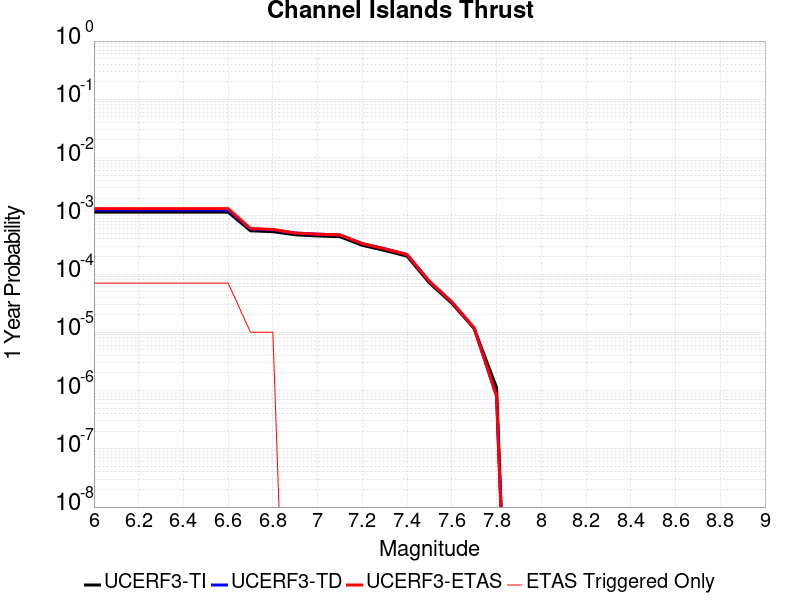 |  |

| Magnitude | 1 wk TI Prob | 1 wk TD Prob | 1 wk ETAS Prob | 1 wk ETAS/TD Gain | 1 wk ETAS Triggered Only | 1 mo TI Prob | 1 mo TD Prob | 1 mo ETAS Prob | 1 mo ETAS/TD Gain | 1 mo ETAS Triggered Only | 1 yr TI Prob | 1 yr TD Prob | 1 yr ETAS Prob | 1 yr ETAS/TD Gain | 1 yr ETAS Triggered Only | 10 yr TI Prob | 10 yr TD Prob | 10 yr ETAS Prob | 10 yr ETAS/TD Gain | 10 yr ETAS Triggered Only |
|-----|-----|-----|-----|-----|-----|-----|-----|-----|-----|-----|-----|-----|-----|-----|-----|-----|-----|-----|-----|-----|
| 6.0 | 2.2156251E-5 | 2.4092022E-5 | 9.417233E-5 | 3.9088595 | 7.0081995E-5 | 9.495191E-5 | 1.03248036E-4 | 3.1347232E-4 | 3.0361092 | 2.1024598E-4 | 0.0011554264 | 0.0012564264 | 0.0014664084 | 1.1671262 | 2.1024598E-4 | 0.011494373 | 0.0125038205 | 0.012711437 | 1.0166043 | 2.1024598E-4 |
| 6.1 | 2.2156251E-5 | 2.4092022E-5 | 9.417233E-5 | 3.9088595 | 7.0081995E-5 | 9.495191E-5 | 1.03248036E-4 | 3.1347232E-4 | 3.0361092 | 2.1024598E-4 | 0.0011554264 | 0.0012564264 | 0.0014664084 | 1.1671262 | 2.1024598E-4 | 0.011494373 | 0.0125038205 | 0.012711437 | 1.0166043 | 2.1024598E-4 |
| 6.2 | 2.2156251E-5 | 2.4092022E-5 | 9.417233E-5 | 3.9088595 | 7.0081995E-5 | 9.495191E-5 | 1.03248036E-4 | 3.1347232E-4 | 3.0361092 | 2.1024598E-4 | 0.0011554264 | 0.0012564264 | 0.0014664084 | 1.1671262 | 2.1024598E-4 | 0.011494373 | 0.0125038205 | 0.012711437 | 1.0166043 | 2.1024598E-4 |
| 6.3 | 2.2156251E-5 | 2.4092022E-5 | 9.417233E-5 | 3.9088595 | 7.0081995E-5 | 9.495191E-5 | 1.03248036E-4 | 3.1347232E-4 | 3.0361092 | 2.1024598E-4 | 0.0011554264 | 0.0012564264 | 0.0014664084 | 1.1671262 | 2.1024598E-4 | 0.011494373 | 0.0125038205 | 0.012711437 | 1.0166043 | 2.1024598E-4 |
| 6.4 | 2.2156251E-5 | 2.4092022E-5 | 9.417233E-5 | 3.9088595 | 7.0081995E-5 | 9.495191E-5 | 1.03248036E-4 | 3.1347232E-4 | 3.0361092 | 2.1024598E-4 | 0.0011554264 | 0.0012564264 | 0.0014664084 | 1.1671262 | 2.1024598E-4 | 0.011494373 | 0.0125038205 | 0.012711437 | 1.0166043 | 2.1024598E-4 |
| 6.5 | 2.2156251E-5 | 2.4092022E-5 | 9.417233E-5 | 3.9088595 | 7.0081995E-5 | 9.495191E-5 | 1.03248036E-4 | 3.1347232E-4 | 3.0361092 | 2.1024598E-4 | 0.0011554264 | 0.0012564264 | 0.0014664084 | 1.1671262 | 2.1024598E-4 | 0.011494373 | 0.0125038205 | 0.012711437 | 1.0166043 | 2.1024598E-4 |
| 6.6 | 2.2156251E-5 | 2.4092022E-5 | 9.417233E-5 | 3.9088595 | 7.0081995E-5 | 9.495191E-5 | 1.03248036E-4 | 3.1347232E-4 | 3.0361092 | 2.1024598E-4 | 0.0011554264 | 0.0012564264 | 0.0014664084 | 1.1671262 | 2.1024598E-4 | 0.011494373 | 0.0125038205 | 0.012711437 | 1.0166043 | 2.1024598E-4 |
| 6.7 | 1.0601296E-5 | 1.1379544E-5 | 1.1379544E-5 | 1.0 | 0.0 | 4.5433335E-5 | 4.876859E-5 | 1.18847165E-4 | 2.4369614 | 7.0081995E-5 | 5.5301044E-4 | 5.936007E-4 | 6.636411E-4 | 1.1179924 | 7.0081995E-5 | 0.005516363 | 0.005920653 | 0.0059903204 | 1.0117668 | 7.0081995E-5 |
| 6.8 | 1.0246747E-5 | 1.0996669E-5 | 1.0996669E-5 | 1.0 | 0.0 | 4.391389E-5 | 4.7127756E-5 | 1.1720645E-4 | 2.486994 | 7.0081995E-5 | 5.345204E-4 | 5.7363417E-4 | 6.43676E-4 | 1.1221019 | 7.0081995E-5 | 0.0053323656 | 0.005722025 | 0.0057917056 | 1.0121777 | 7.0081995E-5 |
| 6.9 | 9.049551E-6 | 9.699645E-6 | 9.699645E-6 | 1.0 | 0.0 | 3.878322E-5 | 4.1569267E-5 | 4.1569267E-5 | 1.0 | 0.0 | 4.7208337E-4 | 5.059924E-4 | 5.059924E-4 | 1.0 | 0.0 | 0.0047108172 | 0.0050488203 | 0.0050488203 | 1.0 | 0.0 |
| 7.0 | 8.6542195E-6 | 9.274603E-6 | 9.274603E-6 | 1.0 | 0.0 | 3.7088983E-5 | 3.9747716E-5 | 3.9747716E-5 | 1.0 | 0.0 | 4.5146482E-4 | 4.8382508E-4 | 4.8382508E-4 | 1.0 | 0.0 | 0.004505487 | 0.004828129 | 0.004828129 | 1.0 | 0.0 |
| 7.1 | 8.391028E-6 | 8.992924E-6 | 8.992924E-6 | 1.0 | 0.0 | 3.5961057E-5 | 3.854056E-5 | 3.854056E-5 | 1.0 | 0.0 | 4.3773788E-4 | 4.6913436E-4 | 4.6913436E-4 | 1.0 | 0.0 | 0.004368766 | 0.0046818503 | 0.0046818503 | 1.0 | 0.0 |
| 7.2 | 5.965188E-6 | 6.3716952E-6 | 6.3716952E-6 | 1.0 | 0.0 | 2.556484E-5 | 2.7306982E-5 | 2.7306982E-5 | 1.0 | 0.0 | 3.1120746E-4 | 3.3241234E-4 | 3.3241234E-4 | 1.0 | 0.0 | 0.00310772 | 0.0033192092 | 0.0033192092 | 1.0 | 0.0 |
| 7.3 | 4.877518E-6 | 5.2060063E-6 | 5.2060063E-6 | 1.0 | 0.0 | 2.0903482E-5 | 2.2311267E-5 | 2.2311267E-5 | 1.0 | 0.0 | 2.5447016E-4 | 2.716063E-4 | 2.716063E-4 | 1.0 | 0.0 | 0.0025417898 | 0.0027127895 | 0.0027127895 | 1.0 | 0.0 |
| 7.4 | 3.8829853E-6 | 4.141863E-6 | 4.141863E-6 | 1.0 | 0.0 | 1.664126E-5 | 1.7750723E-5 | 1.7750723E-5 | 1.0 | 0.0 | 2.0258849E-4 | 2.1609402E-4 | 2.1609402E-4 | 1.0 | 0.0 | 0.002024039 | 0.0021588807 | 0.0021588807 | 1.0 | 0.0 |
| 7.5 | 1.3489616E-6 | 1.4277903E-6 | 1.4277903E-6 | 1.0 | 0.0 | 5.7812517E-6 | 6.119087E-6 | 6.119087E-6 | 1.0 | 0.0 | 7.038446E-5 | 7.449738E-5 | 7.449738E-5 | 1.0 | 0.0 | 7.036218E-4 | 7.44728E-4 | 7.44728E-4 | 1.0 | 0.0 |
| 7.6 | 6.058192E-7 | 6.353778E-7 | 6.353778E-7 | 1.0 | 0.0 | 2.5963652E-6 | 2.7230449E-6 | 2.7230449E-6 | 1.0 | 0.0 | 3.161029E-5 | 3.3152584E-5 | 3.3152584E-5 | 1.0 | 0.0 | 3.1605794E-4 | 3.31478E-4 | 3.31478E-4 | 1.0 | 0.0 |
| 7.7 | 2.2170494E-7 | 2.2607902E-7 | 2.2607902E-7 | 1.0 | 0.0 | 9.5016367E-7 | 9.689098E-7 | 9.689098E-7 | 1.0 | 0.0 | 1.1568181E-5 | 1.1796425E-5 | 1.1796425E-5 | 1.0 | 0.0 | 1.1567579E-4 | 1.1795909E-4 | 1.1795909E-4 | 1.0 | 0.0 |
| 7.8 | 2.1613102E-8 | 1.5466682E-8 | 1.5466682E-8 | 1.0 | 0.0 | 9.262757E-8 | 6.628578E-8 | 6.628578E-8 | 1.0 | 0.0 | 1.1277401E-6 | 8.070291E-7 | 8.070291E-7 | 1.0 | 0.0 | 1.1277344E-5 | 8.070269E-6 | 8.070269E-6 | 1.0 | 0.0 |

## Pinto Mtn
*[(top)](#table-of-contents)*

| 1 Week | 1 Month | 1 Year | 10 Year |
|-----|-----|-----|-----|
|  |  |  |  |

| Magnitude | 1 wk TI Prob | 1 wk TD Prob | 1 wk ETAS Prob | 1 wk ETAS/TD Gain | 1 wk ETAS Triggered Only | 1 mo TI Prob | 1 mo TD Prob | 1 mo ETAS Prob | 1 mo ETAS/TD Gain | 1 mo ETAS Triggered Only | 1 yr TI Prob | 1 yr TD Prob | 1 yr ETAS Prob | 1 yr ETAS/TD Gain | 1 yr ETAS Triggered Only | 10 yr TI Prob | 10 yr TD Prob | 10 yr ETAS Prob | 10 yr ETAS/TD Gain | 10 yr ETAS Triggered Only |
|-----|-----|-----|-----|-----|-----|-----|-----|-----|-----|-----|-----|-----|-----|-----|-----|-----|-----|-----|-----|-----|
| 6.0 | 4.4194956E-5 | 4.785362E-5 | 1.880109E-4 | 3.9288754 | 1.4016399E-4 | 1.893932E-4 | 2.0507174E-4 | 4.152746E-4 | 2.025021 | 2.1024598E-4 | 0.0023034236 | 0.0024940541 | 0.002703776 | 1.0840887 | 2.1024598E-4 | 0.022796938 | 0.024678145 | 0.024883203 | 1.0083092 | 2.1024598E-4 |
| 6.1 | 4.4194956E-5 | 4.785362E-5 | 1.880109E-4 | 3.9288754 | 1.4016399E-4 | 1.893932E-4 | 2.0507174E-4 | 4.152746E-4 | 2.025021 | 2.1024598E-4 | 0.0023034236 | 0.0024940541 | 0.002703776 | 1.0840887 | 2.1024598E-4 | 0.022796938 | 0.024678145 | 0.024883203 | 1.0083092 | 2.1024598E-4 |
| 6.2 | 4.4194956E-5 | 4.785362E-5 | 1.880109E-4 | 3.9288754 | 1.4016399E-4 | 1.893932E-4 | 2.0507174E-4 | 4.152746E-4 | 2.025021 | 2.1024598E-4 | 0.0023034236 | 0.0024940541 | 0.002703776 | 1.0840887 | 2.1024598E-4 | 0.022796938 | 0.024678145 | 0.024883203 | 1.0083092 | 2.1024598E-4 |
| 6.3 | 4.4194956E-5 | 4.785362E-5 | 1.880109E-4 | 3.9288754 | 1.4016399E-4 | 1.893932E-4 | 2.0507174E-4 | 4.152746E-4 | 2.025021 | 2.1024598E-4 | 0.0023034236 | 0.0024940541 | 0.002703776 | 1.0840887 | 2.1024598E-4 | 0.022796938 | 0.024678145 | 0.024883203 | 1.0083092 | 2.1024598E-4 |
| 6.4 | 3.729929E-5 | 3.9603186E-5 | 1.7976163E-4 | 4.5390697 | 1.4016399E-4 | 1.5984432E-4 | 1.6971743E-4 | 3.7992772E-4 | 2.23859 | 2.1024598E-4 | 0.0019443673 | 0.002064445 | 0.002274257 | 1.1016312 | 2.1024598E-4 | 0.019274427 | 0.02046269 | 0.020668633 | 1.0100644 | 2.1024598E-4 |
| 6.5 | 3.729929E-5 | 3.9603186E-5 | 1.7976163E-4 | 4.5390697 | 1.4016399E-4 | 1.5984432E-4 | 1.6971743E-4 | 3.7992772E-4 | 2.23859 | 2.1024598E-4 | 0.0019443673 | 0.002064445 | 0.002274257 | 1.1016312 | 2.1024598E-4 | 0.019274427 | 0.02046269 | 0.020668633 | 1.0100644 | 2.1024598E-4 |
| 6.6 | 3.0204548E-5 | 3.1205298E-5 | 1.01285106E-4 | 3.2457664 | 7.0081995E-5 | 1.2944164E-4 | 1.3373033E-4 | 2.0380295E-4 | 1.5239846 | 7.0081995E-5 | 0.0015748127 | 0.0016269855 | 0.0016969534 | 1.0430046 | 7.0081995E-5 | 0.015636992 | 0.01615461 | 0.01622356 | 1.0042682 | 7.0081995E-5 |
| 6.7 | 2.9857754E-5 | 3.081468E-5 | 1.0089452E-4 | 3.2742352 | 7.0081995E-5 | 1.2795553E-4 | 1.3205643E-4 | 2.0212917E-4 | 1.5306273 | 7.0081995E-5 | 0.0015567453 | 0.001606636 | 0.0016766053 | 1.0435503 | 7.0081995E-5 | 0.015458848 | 0.01595405 | 0.016023012 | 1.0043226 | 7.0081995E-5 |
| 6.8 | 2.4819734E-5 | 2.5009364E-5 | 9.508961E-5 | 3.8021603 | 7.0081995E-5 | 1.0636595E-4 | 1.07178705E-4 | 1.7725318E-4 | 1.6538098 | 7.0081995E-5 | 0.0012942362 | 0.0013041412 | 0.0013741319 | 1.0536679 | 7.0081995E-5 | 0.012867244 | 0.0129672475 | 0.013036421 | 1.0053345 | 7.0081995E-5 |
| 6.9 | 2.331124E-5 | 2.3337643E-5 | 9.3418006E-5 | 4.0028896 | 7.0081995E-5 | 9.990149E-5 | 1.00014746E-4 | 1.7008974E-4 | 1.7006465 | 7.0081995E-5 | 0.001215622 | 0.0012170197 | 0.0012870164 | 1.0575149 | 7.0081995E-5 | 0.012089936 | 0.012105742 | 0.012174975 | 1.0057191 | 7.0081995E-5 |
| 7.0 | 2.1818534E-5 | 2.1760772E-5 | 2.1760772E-5 | 1.0 | 0.0 | 9.3504656E-5 | 9.325723E-5 | 9.325723E-5 | 1.0 | 0.0 | 0.0011378246 | 0.0011348352 | 0.0011348352 | 1.0 | 0.0 | 0.011320163 | 0.011292503 | 0.011292503 | 1.0 | 0.0 |
| 7.1 | 2.066081E-5 | 2.0540418E-5 | 2.0540418E-5 | 1.0 | 0.0 | 8.854332E-5 | 8.8027504E-5 | 8.8027504E-5 | 1.0 | 0.0 | 0.0010774818 | 0.0010712275 | 0.0010712275 | 1.0 | 0.0 | 0.010722724 | 0.010662688 | 0.010662688 | 1.0 | 0.0 |
| 7.2 | 1.8990233E-5 | 1.9053701E-5 | 1.9053701E-5 | 1.0 | 0.0 | 8.138417E-5 | 8.1656275E-5 | 8.1656275E-5 | 1.0 | 0.0 | 9.904018E-4 | 9.937311E-4 | 9.937311E-4 | 1.0 | 0.0 | 0.009859995 | 0.009894874 | 0.009894874 | 1.0 | 0.0 |
| 7.3 | 1.3335872E-5 | 1.4906372E-5 | 1.4906372E-5 | 1.0 | 0.0 | 5.7152483E-5 | 6.388296E-5 | 6.388296E-5 | 1.0 | 0.0 | 6.956093E-4 | 7.775102E-4 | 7.775102E-4 | 1.0 | 0.0 | 0.006934359 | 0.0077491994 | 0.0077491994 | 1.0 | 0.0 |
| 7.4 | 9.414066E-6 | 1.186061E-5 | 1.186061E-5 | 1.0 | 0.0 | 4.0345374E-5 | 5.0830247E-5 | 5.0830247E-5 | 1.0 | 0.0 | 4.910942E-4 | 6.1869196E-4 | 6.1869196E-4 | 1.0 | 0.0 | 0.0049001034 | 0.006170644 | 0.006170644 | 1.0 | 0.0 |
| 7.5 | 7.2101157E-6 | 9.157893E-6 | 9.157893E-6 | 1.0 | 0.0 | 3.090013E-5 | 3.924757E-5 | 3.924757E-5 | 1.0 | 0.0 | 3.7614413E-4 | 4.7774217E-4 | 4.7774217E-4 | 1.0 | 0.0 | 0.0037550807 | 0.004767927 | 0.004767927 | 1.0 | 0.0 |
| 7.6 | 3.296375E-6 | 4.5453176E-6 | 4.5453176E-6 | 1.0 | 0.0 | 1.4127245E-5 | 1.9479796E-5 | 1.9479796E-5 | 1.0 | 0.0 | 1.7198564E-4 | 2.3714209E-4 | 2.3714209E-4 | 1.0 | 0.0 | 0.0017185259 | 0.0023690276 | 0.0023690276 | 1.0 | 0.0 |
| 7.7 | 2.5741092E-6 | 3.584251E-6 | 3.584251E-6 | 1.0 | 0.0 | 1.103185E-5 | 1.5360993E-5 | 1.5360993E-5 | 1.0 | 0.0 | 1.3430449E-4 | 1.8700535E-4 | 1.8700535E-4 | 1.0 | 0.0 | 0.0013422335 | 0.0018686098 | 0.0018686098 | 1.0 | 0.0 |

## Rose Canyon
*[(top)](#table-of-contents)*

| 1 Week | 1 Month | 1 Year | 10 Year |
|-----|-----|-----|-----|
|  |  |  |  |

| Magnitude | 1 wk TI Prob | 1 wk TD Prob | 1 wk ETAS Prob | 1 wk ETAS/TD Gain | 1 wk ETAS Triggered Only | 1 mo TI Prob | 1 mo TD Prob | 1 mo ETAS Prob | 1 mo ETAS/TD Gain | 1 mo ETAS Triggered Only | 1 yr TI Prob | 1 yr TD Prob | 1 yr ETAS Prob | 1 yr ETAS/TD Gain | 1 yr ETAS Triggered Only | 10 yr TI Prob | 10 yr TD Prob | 10 yr ETAS Prob | 10 yr ETAS/TD Gain | 10 yr ETAS Triggered Only |
|-----|-----|-----|-----|-----|-----|-----|-----|-----|-----|-----|-----|-----|-----|-----|-----|-----|-----|-----|-----|-----|
| 6.0 | 4.5923203E-5 | 4.9714225E-5 | 1.19792734E-4 | 2.409627 | 7.0081995E-5 | 1.9679888E-4 | 2.1304491E-4 | 4.2324612E-4 | 1.986652 | 2.1024598E-4 | 0.0023933933 | 0.0025909345 | 0.0028006358 | 1.0809366 | 2.1024598E-4 | 0.023677798 | 0.02563999 | 0.025844846 | 1.0079896 | 2.1024598E-4 |
| 6.1 | 4.5923203E-5 | 4.9714225E-5 | 4.9714225E-5 | 1.0 | 0.0 | 1.9679888E-4 | 2.1304491E-4 | 2.83112E-4 | 1.328884 | 7.0081995E-5 | 0.0023933933 | 0.0025909345 | 0.002660835 | 1.0269789 | 7.0081995E-5 | 0.023677798 | 0.02563999 | 0.025708275 | 1.0026633 | 7.0081995E-5 |
| 6.2 | 2.8844734E-5 | 2.9668723E-5 | 2.9668723E-5 | 1.0 | 0.0 | 1.2361443E-4 | 1.2714567E-4 | 1.9721876E-4 | 1.5511245 | 7.0081995E-5 | 0.0015039665 | 0.0015468939 | 0.0016168675 | 1.0452349 | 7.0081995E-5 | 0.0149382865 | 0.015374276 | 0.01544328 | 1.0044883 | 7.0081995E-5 |
| 6.3 | 2.3171577E-5 | 2.3161238E-5 | 2.3161238E-5 | 1.0 | 0.0 | 9.9302975E-5 | 9.9258745E-5 | 1.6933378E-4 | 1.7059835 | 7.0081995E-5 | 0.0012083431 | 0.0012078186 | 0.001277816 | 1.0579535 | 7.0081995E-5 | 0.012017938 | 0.012022437 | 0.012091676 | 1.0057592 | 7.0081995E-5 |
| 6.4 | 2.0066604E-5 | 1.9667024E-5 | 1.9667024E-5 | 1.0 | 0.0 | 8.599689E-5 | 8.4284584E-5 | 1.5436068E-4 | 1.8314224 | 7.0081995E-5 | 0.0010465092 | 0.0010256917 | 0.0010957018 | 1.0682565 | 7.0081995E-5 | 0.010415946 | 0.010217559 | 0.010286924 | 1.0067888 | 7.0081995E-5 |
| 6.5 | 1.776989E-5 | 1.7113807E-5 | 1.7113807E-5 | 1.0 | 0.0 | 7.615444E-5 | 7.334287E-5 | 1.4341972E-4 | 1.9554693 | 7.0081995E-5 | 9.267859E-4 | 8.925905E-4 | 9.6260995E-4 | 1.0784452 | 7.0081995E-5 | 0.009229303 | 0.008896211 | 0.008965669 | 1.0078076 | 7.0081995E-5 |
| 6.6 | 1.5227364E-5 | 1.433926E-5 | 1.433926E-5 | 1.0 | 0.0 | 6.52585E-5 | 6.1452556E-5 | 1.3153024E-4 | 2.1403544 | 7.0081995E-5 | 7.942326E-4 | 7.479332E-4 | 8.179628E-4 | 1.0936308 | 7.0081995E-5 | 0.007914 | 0.007458359 | 0.0075279186 | 1.0093263 | 7.0081995E-5 |
| 6.7 | 1.2703898E-5 | 1.1673274E-5 | 1.1673274E-5 | 1.0 | 0.0 | 5.4444143E-5 | 5.0027378E-5 | 1.2010587E-4 | 2.4008026 | 7.0081995E-5 | 6.626558E-4 | 6.089174E-4 | 6.789567E-4 | 1.1150227 | 7.0081995E-5 | 0.006606833 | 0.0060750856 | 0.006144742 | 1.0114659 | 7.0081995E-5 |
| 6.8 | 1.1554917E-5 | 1.0609337E-5 | 1.0609337E-5 | 1.0 | 0.0 | 4.9520135E-5 | 4.546782E-5 | 1.1554663E-4 | 2.5412838 | 7.0081995E-5 | 6.0274085E-4 | 5.5343413E-4 | 6.2347733E-4 | 1.126561 | 7.0081995E-5 | 0.0060110865 | 0.0055225673 | 0.0055922624 | 1.01262 | 7.0081995E-5 |
| 6.9 | 8.732078E-6 | 7.881357E-6 | 7.881357E-6 | 1.0 | 0.0 | 3.7422655E-5 | 3.3776825E-5 | 1.0385645E-4 | 3.0747843 | 7.0081995E-5 | 4.5552556E-4 | 4.111582E-4 | 4.8121138E-4 | 1.1703801 | 7.0081995E-5 | 0.0045459294 | 0.0041048084 | 0.0041746027 | 1.017003 | 7.0081995E-5 |
| 7.0 | 5.9337494E-6 | 5.1074853E-6 | 5.1074853E-6 | 1.0 | 0.0 | 2.5430107E-5 | 2.188904E-5 | 2.188904E-5 | 1.0 | 0.0 | 3.0956755E-4 | 2.664666E-4 | 2.664666E-4 | 1.0 | 0.0 | 0.0030913667 | 0.0026614866 | 0.0026614866 | 1.0 | 0.0 |
| 7.1 | 5.013409E-6 | 4.1773833E-6 | 4.1773833E-6 | 1.0 | 0.0 | 2.1485863E-5 | 1.7902948E-5 | 1.7902948E-5 | 1.0 | 0.0 | 2.6155898E-4 | 2.179467E-4 | 2.179467E-4 | 1.0 | 0.0 | 0.0026125133 | 0.0021773411 | 0.0021773411 | 1.0 | 0.0 |
| 7.2 | 4.120763E-6 | 3.2821383E-6 | 3.2821383E-6 | 1.0 | 0.0 | 1.7660293E-5 | 1.4066231E-5 | 1.4066231E-5 | 1.0 | 0.0 | 2.1499286E-4 | 1.7124301E-4 | 1.7124301E-4 | 1.0 | 0.0 | 0.0021478499 | 0.00171112 | 0.00171112 | 1.0 | 0.0 |
| 7.3 | 3.2081239E-6 | 2.4405372E-6 | 2.4405372E-6 | 1.0 | 0.0 | 1.374903E-5 | 1.0459404E-5 | 1.0459404E-5 | 1.0 | 0.0 | 1.6738157E-4 | 1.2733586E-4 | 1.2733586E-4 | 1.0 | 0.0 | 0.0016725556 | 0.001272636 | 0.001272636 | 1.0 | 0.0 |
| 7.4 | 2.4194755E-6 | 1.7680634E-6 | 1.7680634E-6 | 1.0 | 0.0 | 1.0369139E-5 | 7.577393E-6 | 7.577393E-6 | 1.0 | 0.0 | 1.2623696E-4 | 9.2250906E-5 | 9.2250906E-5 | 1.0 | 0.0 | 0.0012616527 | 9.2213147E-4 | 9.2213147E-4 | 1.0 | 0.0 |
| 7.5 | 1.3842889E-6 | 9.3786275E-7 | 9.3786275E-7 | 1.0 | 0.0 | 5.9326535E-6 | 4.019406E-6 | 4.019406E-6 | 1.0 | 0.0 | 7.222766E-5 | 4.8935202E-5 | 4.8935202E-5 | 1.0 | 0.0 | 7.220419E-4 | 4.892478E-4 | 4.892478E-4 | 1.0 | 0.0 |
| 7.6 | 1.0021575E-6 | 6.411463E-7 | 6.411463E-7 | 1.0 | 0.0 | 4.2949537E-6 | 2.7477672E-6 | 2.7477672E-6 | 1.0 | 0.0 | 5.2289808E-5 | 3.3453573E-5 | 3.3453573E-5 | 1.0 | 0.0 | 5.2277505E-4 | 3.344875E-4 | 3.344875E-4 | 1.0 | 0.0 |
| 7.7 | 8.7620116E-8 | 6.4492404E-8 | 6.4492404E-8 | 1.0 | 0.0 | 3.7551473E-7 | 2.76396E-7 | 2.76396E-7 | 1.0 | 0.0 | 4.5718825E-6 | 3.3651165E-6 | 3.3651165E-6 | 1.0 | 0.0 | 4.5717883E-5 | 3.3650686E-5 | 3.3650686E-5 | 1.0 | 0.0 |

## Santa Ynez River
*[(top)](#table-of-contents)*

| 1 Week | 1 Month | 1 Year | 10 Year |
|-----|-----|-----|-----|
|  |  |  |  |

| Magnitude | 1 wk TI Prob | 1 wk TD Prob | 1 wk ETAS Prob | 1 wk ETAS/TD Gain | 1 wk ETAS Triggered Only | 1 mo TI Prob | 1 mo TD Prob | 1 mo ETAS Prob | 1 mo ETAS/TD Gain | 1 mo ETAS Triggered Only | 1 yr TI Prob | 1 yr TD Prob | 1 yr ETAS Prob | 1 yr ETAS/TD Gain | 1 yr ETAS Triggered Only | 10 yr TI Prob | 10 yr TD Prob | 10 yr ETAS Prob | 10 yr ETAS/TD Gain | 10 yr ETAS Triggered Only |
|-----|-----|-----|-----|-----|-----|-----|-----|-----|-----|-----|-----|-----|-----|-----|-----|-----|-----|-----|-----|-----|
| 6.0 | 1.6396456E-5 | 1.7209435E-5 | 8.7290224E-5 | 5.0722303 | 7.0081995E-5 | 7.026863E-5 | 7.375284E-5 | 1.4382966E-4 | 1.9501576 | 7.0081995E-5 | 8.551848E-4 | 8.976064E-4 | 0.0010376446 | 1.1560129 | 1.4016399E-4 | 0.0085190125 | 0.008943358 | 0.009082269 | 1.0155323 | 1.4016399E-4 |
| 6.1 | 1.6396456E-5 | 1.7209435E-5 | 8.7290224E-5 | 5.0722303 | 7.0081995E-5 | 7.026863E-5 | 7.375284E-5 | 1.4382966E-4 | 1.9501576 | 7.0081995E-5 | 8.551848E-4 | 8.976064E-4 | 0.0010376446 | 1.1560129 | 1.4016399E-4 | 0.0085190125 | 0.008943358 | 0.009082269 | 1.0155323 | 1.4016399E-4 |
| 6.2 | 1.6396456E-5 | 1.7209435E-5 | 8.7290224E-5 | 5.0722303 | 7.0081995E-5 | 7.026863E-5 | 7.375284E-5 | 1.4382966E-4 | 1.9501576 | 7.0081995E-5 | 8.551848E-4 | 8.976064E-4 | 0.0010376446 | 1.1560129 | 1.4016399E-4 | 0.0085190125 | 0.008943358 | 0.009082269 | 1.0155323 | 1.4016399E-4 |
| 6.3 | 9.736976E-6 | 1.012233E-5 | 8.0203616E-5 | 7.9234343 | 7.0081995E-5 | 4.172923E-5 | 4.338072E-5 | 1.13459675E-4 | 2.6154401 | 7.0081995E-5 | 5.0793495E-4 | 5.280373E-4 | 6.6812726E-4 | 1.2653031 | 1.4016399E-4 | 0.005067755 | 0.005268332 | 0.0054077576 | 1.0264648 | 1.4016399E-4 |
| 6.4 | 9.736976E-6 | 1.012233E-5 | 8.0203616E-5 | 7.9234343 | 7.0081995E-5 | 4.172923E-5 | 4.338072E-5 | 1.13459675E-4 | 2.6154401 | 7.0081995E-5 | 5.0793495E-4 | 5.280373E-4 | 6.6812726E-4 | 1.2653031 | 1.4016399E-4 | 0.005067755 | 0.005268332 | 0.0054077576 | 1.0264648 | 1.4016399E-4 |
| 6.5 | 7.081964E-6 | 7.3298966E-6 | 7.741138E-5 | 10.561047 | 7.0081995E-5 | 3.035092E-5 | 3.1413474E-5 | 1.01493264E-4 | 3.2308834 | 7.0081995E-5 | 3.694598E-4 | 3.8239348E-4 | 4.524487E-4 | 1.1832019 | 7.0081995E-5 | 0.0036884616 | 0.0038175168 | 0.0038873313 | 1.0182879 | 7.0081995E-5 |
| 6.6 | 5.873247E-6 | 6.059743E-6 | 7.614132E-5 | 12.565106 | 7.0081995E-5 | 2.5170815E-5 | 2.5970074E-5 | 9.605025E-5 | 3.6984973 | 7.0081995E-5 | 3.064116E-4 | 3.1614062E-4 | 3.8620047E-4 | 1.2216097 | 7.0081995E-5 | 0.0030598943 | 0.0031569963 | 0.0032268572 | 1.0221288 | 7.0081995E-5 |
| 6.7 | 4.973277E-6 | 5.115901E-6 | 7.519754E-5 | 14.698787 | 7.0081995E-5 | 2.1313872E-5 | 2.1925109E-5 | 9.200557E-5 | 4.1963563 | 7.0081995E-5 | 2.5946548E-4 | 2.66906E-4 | 3.3696927E-4 | 1.2625017 | 7.0081995E-5 | 0.0025916274 | 0.0026659032 | 0.0027357982 | 1.0262182 | 7.0081995E-5 |
| 6.8 | 4.396492E-6 | 4.5109778E-6 | 7.459266E-5 | 16.535807 | 7.0081995E-5 | 1.884197E-5 | 1.9332621E-5 | 8.941326E-5 | 4.6249943 | 7.0081995E-5 | 2.2937685E-4 | 2.3534958E-4 | 3.0541507E-4 | 1.2977082 | 7.0081995E-5 | 0.0022914023 | 0.0023510386 | 0.002420956 | 1.0297389 | 7.0081995E-5 |
| 6.9 | 3.5255632E-6 | 3.6013332E-6 | 7.368308E-5 | 20.459944 | 7.0081995E-5 | 1.5109469E-5 | 1.5434196E-5 | 8.551511E-5 | 5.5406265 | 7.0081995E-5 | 1.8394225E-4 | 1.8789528E-4 | 2.579641E-4 | 1.3729142 | 7.0081995E-5 | 0.0018379007 | 0.0018773803 | 0.0019473308 | 1.0372596 | 7.0081995E-5 |
| 7.0 | 3.211603E-6 | 3.273654E-6 | 7.335542E-5 | 22.40781 | 7.0081995E-5 | 1.376394E-5 | 1.4029872E-5 | 8.4110885E-5 | 5.9951286 | 7.0081995E-5 | 1.6756308E-4 | 1.7080043E-4 | 2.4087046E-4 | 1.4102451 | 7.0081995E-5 | 0.0016743679 | 0.0017067058 | 0.0017766681 | 1.0409926 | 7.0081995E-5 |
| 7.1 | 2.5094619E-6 | 2.5409204E-6 | 7.262274E-5 | 28.581272 | 7.0081995E-5 | 1.0754793E-5 | 1.0889614E-5 | 8.097084E-5 | 7.435603 | 7.0081995E-5 | 1.3093173E-4 | 1.3257304E-4 | 2.0264575E-4 | 1.5285592 | 7.0081995E-5 | 0.0013085462 | 0.0013249456 | 0.0013949347 | 1.0528241 | 7.0081995E-5 |
| 7.2 | 2.0515774E-6 | 2.0619375E-6 | 2.0619375E-6 | 1.0 | 0.0 | 8.792445E-6 | 8.836846E-6 | 8.836846E-6 | 1.0 | 0.0 | 1.0704277E-4 | 1.0758333E-4 | 1.0758333E-4 | 1.0 | 0.0 | 0.0010699122 | 0.0010753168 | 0.0010753168 | 1.0 | 0.0 |
| 7.3 | 1.6845745E-6 | 1.6773907E-6 | 1.6773907E-6 | 1.0 | 0.0 | 7.219585E-6 | 7.1887976E-6 | 7.1887976E-6 | 1.0 | 0.0 | 8.78949E-5 | 8.752012E-5 | 8.752012E-5 | 1.0 | 0.0 | 8.7860145E-4 | 8.7485946E-4 | 8.7485946E-4 | 1.0 | 0.0 |
| 7.4 | 1.3600285E-6 | 1.3333357E-6 | 1.3333357E-6 | 1.0 | 0.0 | 5.82868E-6 | 5.714284E-6 | 5.714284E-6 | 1.0 | 0.0 | 7.096187E-5 | 6.956921E-5 | 6.956921E-5 | 1.0 | 0.0 | 7.0939213E-4 | 6.954765E-4 | 6.954765E-4 | 1.0 | 0.0 |
| 7.5 | 9.735342E-7 | 9.290103E-7 | 9.290103E-7 | 1.0 | 0.0 | 4.172283E-6 | 3.9814668E-6 | 3.9814668E-6 | 1.0 | 0.0 | 5.079636E-5 | 4.8473295E-5 | 4.8473295E-5 | 1.0 | 0.0 | 5.0784746E-4 | 4.8462892E-4 | 4.8462892E-4 | 1.0 | 0.0 |
| 7.6 | 5.067187E-7 | 4.77857E-7 | 4.77857E-7 | 1.0 | 0.0 | 2.1716498E-6 | 2.047957E-6 | 2.047957E-6 | 1.0 | 0.0 | 2.6439517E-5 | 2.4933597E-5 | 2.4933597E-5 | 1.0 | 0.0 | 2.643637E-4 | 2.4930874E-4 | 2.4930874E-4 | 1.0 | 0.0 |
| 7.7 | 2.769089E-7 | 2.5759124E-7 | 2.5759124E-7 | 1.0 | 0.0 | 1.1867519E-6 | 1.1039621E-6 | 1.1039621E-6 | 1.0 | 0.0 | 1.4448608E-5 | 1.34406555E-5 | 1.34406555E-5 | 1.0 | 0.0 | 1.444767E-4 | 1.3439846E-4 | 1.3439846E-4 | 1.0 | 0.0 |
| 7.8 | 1.7044663E-7 | 1.5449015E-7 | 1.5449015E-7 | 1.0 | 0.0 | 7.3048534E-7 | 6.621005E-7 | 6.621005E-7 | 1.0 | 0.0 | 8.893623E-6 | 8.061043E-6 | 8.061043E-6 | 1.0 | 0.0 | 8.893267E-5 | 8.060753E-5 | 8.060753E-5 | 1.0 | 0.0 |
| 7.9 | 4.8344287E-8 | 4.0910923E-8 | 4.0910923E-8 | 1.0 | 0.0 | 2.0718979E-7 | 1.7533252E-7 | 1.7533252E-7 | 1.0 | 0.0 | 2.5225327E-6 | 2.1346711E-6 | 2.1346711E-6 | 1.0 | 0.0 | 2.5225041E-5 | 2.1346512E-5 | 2.1346512E-5 | 1.0 | 0.0 |

## San Jacinto (Coyote Creek)
*[(top)](#table-of-contents)*

| 1 Week | 1 Month | 1 Year | 10 Year |
|-----|-----|-----|-----|
|  |  | 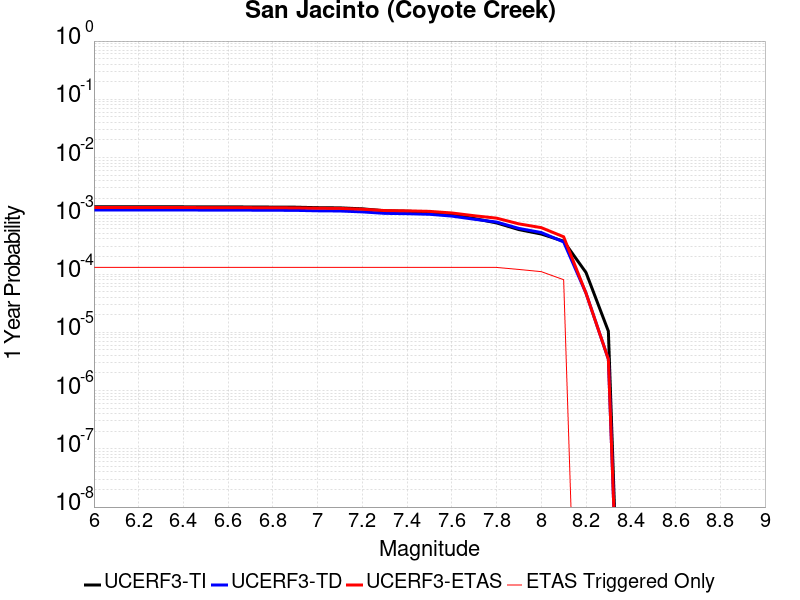 |  |

| Magnitude | 1 wk TI Prob | 1 wk TD Prob | 1 wk ETAS Prob | 1 wk ETAS/TD Gain | 1 wk ETAS Triggered Only | 1 mo TI Prob | 1 mo TD Prob | 1 mo ETAS Prob | 1 mo ETAS/TD Gain | 1 mo ETAS Triggered Only | 1 yr TI Prob | 1 yr TD Prob | 1 yr ETAS Prob | 1 yr ETAS/TD Gain | 1 yr ETAS Triggered Only | 10 yr TI Prob | 10 yr TD Prob | 10 yr ETAS Prob | 10 yr ETAS/TD Gain | 10 yr ETAS Triggered Only |
|-----|-----|-----|-----|-----|-----|-----|-----|-----|-----|-----|-----|-----|-----|-----|-----|-----|-----|-----|-----|-----|
| 6.0 | 2.7374346E-5 | 2.4145214E-5 | 1.6430582E-4 | 6.804902 | 1.4016399E-4 | 1.1731335E-4 | 1.034754E-4 | 2.4362489E-4 | 2.3544233 | 1.4016399E-4 | 0.0014273542 | 0.0012590875 | 0.0014690687 | 1.1667726 | 2.1024598E-4 | 0.01418221 | 0.012928318 | 0.013135846 | 1.0160522 | 2.1024598E-4 |
| 6.1 | 2.7374346E-5 | 2.4145214E-5 | 1.6430582E-4 | 6.804902 | 1.4016399E-4 | 1.1731335E-4 | 1.034754E-4 | 2.4362489E-4 | 2.3544233 | 1.4016399E-4 | 0.0014273542 | 0.0012590875 | 0.0014690687 | 1.1667726 | 2.1024598E-4 | 0.01418221 | 0.012928318 | 0.013135846 | 1.0160522 | 2.1024598E-4 |
| 6.2 | 2.7374346E-5 | 2.4145214E-5 | 1.6430582E-4 | 6.804902 | 1.4016399E-4 | 1.1731335E-4 | 1.034754E-4 | 2.4362489E-4 | 2.3544233 | 1.4016399E-4 | 0.0014273542 | 0.0012590875 | 0.0014690687 | 1.1667726 | 2.1024598E-4 | 0.01418221 | 0.012928318 | 0.013135846 | 1.0160522 | 2.1024598E-4 |
| 6.3 | 2.7374346E-5 | 2.4145214E-5 | 1.6430582E-4 | 6.804902 | 1.4016399E-4 | 1.1731335E-4 | 1.034754E-4 | 2.4362489E-4 | 2.3544233 | 1.4016399E-4 | 0.0014273542 | 0.0012590875 | 0.0014690687 | 1.1667726 | 2.1024598E-4 | 0.01418221 | 0.012928318 | 0.013135846 | 1.0160522 | 2.1024598E-4 |
| 6.4 | 2.7374346E-5 | 2.4145214E-5 | 1.6430582E-4 | 6.804902 | 1.4016399E-4 | 1.1731335E-4 | 1.034754E-4 | 2.4362489E-4 | 2.3544233 | 1.4016399E-4 | 0.0014273542 | 0.0012590875 | 0.0014690687 | 1.1667726 | 2.1024598E-4 | 0.01418221 | 0.012928318 | 0.013135846 | 1.0160522 | 2.1024598E-4 |
| 6.5 | 2.7282445E-5 | 2.4031293E-5 | 1.6419192E-4 | 6.8324213 | 1.4016399E-4 | 1.16919524E-4 | 1.029872E-4 | 2.4313676E-4 | 2.3608444 | 1.4016399E-4 | 0.0014225657 | 0.0012531505 | 0.0014631331 | 1.1675637 | 2.1024598E-4 | 0.014134934 | 0.012869646 | 0.0130771855 | 1.0161263 | 2.1024598E-4 |
| 6.6 | 2.7282445E-5 | 2.4031293E-5 | 1.6419192E-4 | 6.8324213 | 1.4016399E-4 | 1.16919524E-4 | 1.029872E-4 | 2.4313676E-4 | 2.3608444 | 1.4016399E-4 | 0.0014225657 | 0.0012531505 | 0.0014631331 | 1.1675637 | 2.1024598E-4 | 0.014134934 | 0.012869646 | 0.0130771855 | 1.0161263 | 2.1024598E-4 |
| 6.7 | 2.7216198E-5 | 2.3956412E-5 | 1.6411705E-4 | 6.8506517 | 1.4016399E-4 | 1.1663563E-4 | 1.02666316E-4 | 2.4281592E-4 | 2.3650982 | 1.4016399E-4 | 0.0014191137 | 0.0012492483 | 0.0014592316 | 1.1680877 | 2.1024598E-4 | 0.014100855 | 0.0128310565 | 0.013038605 | 1.0161755 | 2.1024598E-4 |
| 6.8 | 2.7078617E-5 | 2.387363E-5 | 1.6403428E-4 | 6.8709397 | 1.4016399E-4 | 1.1604605E-4 | 1.0231156E-4 | 2.4246122E-4 | 2.369832 | 1.4016399E-4 | 0.001411945 | 0.0012449342 | 0.0014549184 | 1.168671 | 2.1024598E-4 | 0.014030075 | 0.012788199 | 0.012995756 | 1.0162303 | 2.1024598E-4 |
| 6.9 | 2.6982952E-5 | 2.3793142E-5 | 1.639538E-4 | 6.890801 | 1.4016399E-4 | 1.15636096E-4 | 1.0196664E-4 | 2.4211634E-4 | 2.3744662 | 1.4016399E-4 | 0.0014069602 | 0.0012407395 | 0.0014507246 | 1.1692419 | 2.1024598E-4 | 0.013980856 | 0.012746515 | 0.0129540805 | 1.0162841 | 2.1024598E-4 |
| 7.0 | 2.6449972E-5 | 2.3370165E-5 | 1.6353089E-4 | 6.9974213 | 1.4016399E-4 | 1.1335209E-4 | 1.00154015E-4 | 2.4030397E-4 | 2.3993444 | 1.4016399E-4 | 0.001379188 | 0.0012186957 | 0.0014286854 | 1.172307 | 2.1024598E-4 | 0.0137065975 | 0.0125278765 | 0.012735489 | 1.016572 | 2.1024598E-4 |
| 7.1 | 2.6257849E-5 | 2.3196202E-5 | 1.6335695E-4 | 7.0424004 | 1.4016399E-4 | 1.1252879E-4 | 9.940852E-5 | 2.3955858E-4 | 2.4098396 | 1.4016399E-4 | 0.0013691769 | 0.0012096294 | 0.0014196209 | 1.1736 | 2.1024598E-4 | 0.013607717 | 0.012437741 | 0.012645372 | 1.0166936 | 2.1024598E-4 |
| 7.2 | 2.5270041E-5 | 2.2390966E-5 | 1.6255182E-4 | 7.2597055 | 1.4016399E-4 | 1.0829568E-4 | 9.595777E-5 | 2.3610832E-4 | 2.460544 | 1.4016399E-4 | 0.0013177024 | 0.0011676621 | 0.0013776625 | 1.179847 | 2.1024598E-4 | 0.013099162 | 0.012018777 | 0.012226497 | 1.0172828 | 2.1024598E-4 |
| 7.3 | 2.339701E-5 | 2.1122814E-5 | 1.6128384E-4 | 7.635528 | 1.4016399E-4 | 1.0026905E-4 | 9.0523215E-5 | 2.3067452E-4 | 2.548236 | 1.4016399E-4 | 0.001220092 | 0.0011015651 | 0.0013115794 | 1.1906509 | 2.1024598E-4 | 0.012134149 | 0.011357696 | 0.011565554 | 1.0183011 | 2.1024598E-4 |
| 7.4 | 2.296333E-5 | 2.0853171E-5 | 1.6101424E-4 | 7.7213316 | 1.4016399E-4 | 9.841056E-5 | 8.936768E-5 | 2.2951915E-4 | 2.5682569 | 1.4016399E-4 | 0.0011974899 | 0.0010875105 | 0.0012975278 | 1.1931175 | 2.1024598E-4 | 0.011910575 | 0.01121681 | 0.011424697 | 1.0185336 | 2.1024598E-4 |
| 7.5 | 2.2188895E-5 | 2.0376096E-5 | 1.6053724E-4 | 7.8787045 | 1.4016399E-4 | 9.50918E-5 | 8.732321E-5 | 2.2747496E-4 | 2.6049771 | 1.4016399E-4 | 0.0011571277 | 0.0010626436 | 0.0012726662 | 1.1976416 | 2.1024598E-4 | 0.011511209 | 0.010966429 | 0.011174369 | 1.0189615 | 2.1024598E-4 |
| 7.6 | 2.0013189E-5 | 1.8962366E-5 | 1.591237E-4 | 8.391553 | 1.4016399E-4 | 8.5767984E-5 | 8.1264756E-5 | 2.2141736E-4 | 2.7246418 | 1.4016399E-4 | 0.001043725 | 9.889511E-4 | 0.0011989892 | 1.2123847 | 2.1024598E-4 | 0.010388365 | 0.010224434 | 0.01043253 | 1.0203528 | 2.1024598E-4 |
| 7.7 | 1.7230794E-5 | 1.674371E-5 | 1.5690536E-4 | 9.371003 | 1.4016399E-4 | 7.384417E-5 | 7.175679E-5 | 2.1191072E-4 | 2.95318 | 1.4016399E-4 | 8.986819E-4 | 8.7328954E-4 | 0.0010833519 | 1.2405415 | 2.1024598E-4 | 0.008950562 | 0.009062956 | 0.009271297 | 1.0229882 | 2.1024598E-4 |
| 7.8 | 1.4478809E-5 | 1.4990978E-5 | 1.5515287E-4 | 10.34975 | 1.4016399E-4 | 6.205057E-5 | 6.424547E-5 | 2.0440045E-4 | 3.1815543 | 1.4016399E-4 | 7.552038E-4 | 7.819085E-4 | 9.919901E-4 | 1.268678 | 2.1024598E-4 | 0.0075264242 | 0.008141387 | 0.008349922 | 1.0256141 | 2.1024598E-4 |
| 7.9 | 1.1114467E-5 | 1.1645102E-5 | 8.1726284E-5 | 7.018082 | 7.0081995E-5 | 4.7632562E-5 | 4.990663E-5 | 1.19985125E-4 | 2.4041922 | 7.0081995E-5 | 5.797721E-4 | 6.074444E-4 | 7.475232E-4 | 1.2306036 | 1.4016399E-4 | 0.0057826187 | 0.0063803247 | 0.0065195947 | 1.0218279 | 1.4016399E-4 |
| 8.0 | 9.327402E-6 | 9.899186E-6 | 7.998049E-5 | 8.079501 | 7.0081995E-5 | 3.9973966E-5 | 4.2424395E-5 | 1.1250342E-4 | 2.6518567 | 7.0081995E-5 | 4.8657437E-4 | 5.1639514E-4 | 6.564868E-4 | 1.2712876 | 1.4016399E-4 | 0.0048551033 | 0.0054499684 | 0.0055893688 | 1.0255781 | 1.4016399E-4 |
| 8.1 | 7.0235833E-6 | 6.827495E-6 | 6.827495E-6 | 1.0 | 0.0 | 3.0100724E-5 | 2.9260367E-5 | 2.9260367E-5 | 1.0 | 0.0 | 3.664147E-4 | 3.5618723E-4 | 3.5618723E-4 | 1.0 | 0.0 | 0.003658111 | 0.0037876023 | 0.0037876023 | 1.0 | 0.0 |
| 8.2 | 2.0358202E-6 | 8.994527E-7 | 8.994527E-7 | 1.0 | 0.0 | 8.724915E-6 | 3.854792E-6 | 3.854792E-6 | 1.0 | 0.0 | 1.06220665E-4 | 4.69311E-5 | 4.69311E-5 | 1.0 | 0.0 | 0.001061699 | 5.3254166E-4 | 5.3254166E-4 | 1.0 | 0.0 |
| 8.3 | 2.0051264E-7 | 6.617272E-8 | 6.617272E-8 | 1.0 | 0.0 | 8.5933965E-7 | 2.8359733E-7 | 2.8359733E-7 | 1.0 | 0.0 | 1.046241E-5 | 3.4527925E-6 | 3.4527925E-6 | 1.0 | 0.0 | 1.0461917E-4 | 4.01389E-5 | 4.01389E-5 | 1.0 | 0.0 |

## Deep Springs
*[(top)](#table-of-contents)*

| 1 Week | 1 Month | 1 Year | 10 Year |
|-----|-----|-----|-----|
|  |  |  |  |

| Magnitude | 1 wk TI Prob | 1 wk TD Prob | 1 wk ETAS Prob | 1 wk ETAS/TD Gain | 1 wk ETAS Triggered Only | 1 mo TI Prob | 1 mo TD Prob | 1 mo ETAS Prob | 1 mo ETAS/TD Gain | 1 mo ETAS Triggered Only | 1 yr TI Prob | 1 yr TD Prob | 1 yr ETAS Prob | 1 yr ETAS/TD Gain | 1 yr ETAS Triggered Only | 10 yr TI Prob | 10 yr TD Prob | 10 yr ETAS Prob | 10 yr ETAS/TD Gain | 10 yr ETAS Triggered Only |
|-----|-----|-----|-----|-----|-----|-----|-----|-----|-----|-----|-----|-----|-----|-----|-----|-----|-----|-----|-----|-----|
| 6.0 | 1.9810619E-5 | 2.311252E-5 | 9.3192895E-5 | 4.0321393 | 7.0081995E-5 | 8.489989E-5 | 9.905276E-5 | 3.092779E-4 | 3.1223555 | 2.1024598E-4 | 0.001033166 | 0.0012058079 | 0.0014158004 | 1.1741508 | 2.1024598E-4 | 0.010283757 | 0.012042425 | 0.012250139 | 1.0172485 | 2.1024598E-4 |
| 6.1 | 1.9810619E-5 | 2.311252E-5 | 9.3192895E-5 | 4.0321393 | 7.0081995E-5 | 8.489989E-5 | 9.905276E-5 | 3.092779E-4 | 3.1223555 | 2.1024598E-4 | 0.001033166 | 0.0012058079 | 0.0014158004 | 1.1741508 | 2.1024598E-4 | 0.010283757 | 0.012042425 | 0.012250139 | 1.0172485 | 2.1024598E-4 |
| 6.2 | 1.9810619E-5 | 2.311252E-5 | 9.3192895E-5 | 4.0321393 | 7.0081995E-5 | 8.489989E-5 | 9.905276E-5 | 3.092779E-4 | 3.1223555 | 2.1024598E-4 | 0.001033166 | 0.0012058079 | 0.0014158004 | 1.1741508 | 2.1024598E-4 | 0.010283757 | 0.012042425 | 0.012250139 | 1.0172485 | 2.1024598E-4 |
| 6.3 | 1.9810619E-5 | 2.311252E-5 | 9.3192895E-5 | 4.0321393 | 7.0081995E-5 | 8.489989E-5 | 9.905276E-5 | 3.092779E-4 | 3.1223555 | 2.1024598E-4 | 0.001033166 | 0.0012058079 | 0.0014158004 | 1.1741508 | 2.1024598E-4 | 0.010283757 | 0.012042425 | 0.012250139 | 1.0172485 | 2.1024598E-4 |
| 6.4 | 1.9810619E-5 | 2.311252E-5 | 9.3192895E-5 | 4.0321393 | 7.0081995E-5 | 8.489989E-5 | 9.905276E-5 | 3.092779E-4 | 3.1223555 | 2.1024598E-4 | 0.001033166 | 0.0012058079 | 0.0014158004 | 1.1741508 | 2.1024598E-4 | 0.010283757 | 0.012042425 | 0.012250139 | 1.0172485 | 2.1024598E-4 |
| 6.5 | 1.7190405E-5 | 2.0050555E-5 | 9.013114E-5 | 4.4951944 | 7.0081995E-5 | 7.367108E-5 | 8.593095E-5 | 2.9615886E-4 | 3.446475 | 2.1024598E-4 | 8.9657627E-4 | 0.0010462094 | 0.0012562354 | 1.2007495 | 2.1024598E-4 | 0.008929676 | 0.010462056 | 0.010670102 | 1.0198858 | 2.1024598E-4 |
| 6.6 | 1.7190405E-5 | 2.0050555E-5 | 9.013114E-5 | 4.4951944 | 7.0081995E-5 | 7.367108E-5 | 8.593095E-5 | 2.9615886E-4 | 3.446475 | 2.1024598E-4 | 8.9657627E-4 | 0.0010462094 | 0.0012562354 | 1.2007495 | 2.1024598E-4 | 0.008929676 | 0.010462056 | 0.010670102 | 1.0198858 | 2.1024598E-4 |

## Oceanside alt1
*[(top)](#table-of-contents)*

| 1 Week | 1 Month | 1 Year | 10 Year |
|-----|-----|-----|-----|
|  |  |  |  |

| Magnitude | 1 wk TI Prob | 1 wk TD Prob | 1 wk ETAS Prob | 1 wk ETAS/TD Gain | 1 wk ETAS Triggered Only | 1 mo TI Prob | 1 mo TD Prob | 1 mo ETAS Prob | 1 mo ETAS/TD Gain | 1 mo ETAS Triggered Only | 1 yr TI Prob | 1 yr TD Prob | 1 yr ETAS Prob | 1 yr ETAS/TD Gain | 1 yr ETAS Triggered Only | 10 yr TI Prob | 10 yr TD Prob | 10 yr ETAS Prob | 10 yr ETAS/TD Gain | 10 yr ETAS Triggered Only |
|-----|-----|-----|-----|-----|-----|-----|-----|-----|-----|-----|-----|-----|-----|-----|-----|-----|-----|-----|-----|-----|
| 6.0 | 1.1617542E-5 | 1.1423493E-5 | 1.5158589E-4 | 13.269662 | 1.4016399E-4 | 4.9788516E-5 | 4.8956997E-5 | 1.8911413E-4 | 3.862862 | 1.4016399E-4 | 6.060066E-4 | 5.9590454E-4 | 8.0602523E-4 | 1.352608 | 2.1024598E-4 | 0.0060435664 | 0.005944664 | 0.0061536604 | 1.035157 | 2.1024598E-4 |
| 6.1 | 1.1617542E-5 | 1.1423493E-5 | 1.5158589E-4 | 13.269662 | 1.4016399E-4 | 4.9788516E-5 | 4.8956997E-5 | 1.8911413E-4 | 3.862862 | 1.4016399E-4 | 6.060066E-4 | 5.9590454E-4 | 8.0602523E-4 | 1.352608 | 2.1024598E-4 | 0.0060435664 | 0.005944664 | 0.0061536604 | 1.035157 | 2.1024598E-4 |
| 6.2 | 1.1617542E-5 | 1.1423493E-5 | 1.5158589E-4 | 13.269662 | 1.4016399E-4 | 4.9788516E-5 | 4.8956997E-5 | 1.8911413E-4 | 3.862862 | 1.4016399E-4 | 6.060066E-4 | 5.9590454E-4 | 8.0602523E-4 | 1.352608 | 2.1024598E-4 | 0.0060435664 | 0.005944664 | 0.0061536604 | 1.035157 | 2.1024598E-4 |
| 6.3 | 1.1617542E-5 | 1.1423493E-5 | 1.5158589E-4 | 13.269662 | 1.4016399E-4 | 4.9788516E-5 | 4.8956997E-5 | 1.8911413E-4 | 3.862862 | 1.4016399E-4 | 6.060066E-4 | 5.9590454E-4 | 8.0602523E-4 | 1.352608 | 2.1024598E-4 | 0.0060435664 | 0.005944664 | 0.0061536604 | 1.035157 | 2.1024598E-4 |
| 6.4 | 1.1617542E-5 | 1.1423493E-5 | 1.5158589E-4 | 13.269662 | 1.4016399E-4 | 4.9788516E-5 | 4.8956997E-5 | 1.8911413E-4 | 3.862862 | 1.4016399E-4 | 6.060066E-4 | 5.9590454E-4 | 8.0602523E-4 | 1.352608 | 2.1024598E-4 | 0.0060435664 | 0.005944664 | 0.0061536604 | 1.035157 | 2.1024598E-4 |
| 6.5 | 1.1617542E-5 | 1.1423493E-5 | 1.5158589E-4 | 13.269662 | 1.4016399E-4 | 4.9788516E-5 | 4.8956997E-5 | 1.8911413E-4 | 3.862862 | 1.4016399E-4 | 6.060066E-4 | 5.9590454E-4 | 8.0602523E-4 | 1.352608 | 2.1024598E-4 | 0.0060435664 | 0.005944664 | 0.0061536604 | 1.035157 | 2.1024598E-4 |
| 6.6 | 7.561768E-6 | 7.1336153E-6 | 7.721511E-5 | 10.8241205 | 7.0081995E-5 | 3.2407173E-5 | 3.0572286E-5 | 1.0065214E-4 | 3.2922673 | 7.0081995E-5 | 3.9448592E-4 | 3.7215507E-4 | 5.122669E-4 | 1.3764877 | 1.4016399E-4 | 0.0039378637 | 0.00371543 | 0.0038550731 | 1.0375847 | 1.4016399E-4 |
| 6.7 | 7.1042605E-6 | 6.6556854E-6 | 7.673722E-5 | 11.529573 | 7.0081995E-5 | 3.0446476E-5 | 2.8524059E-5 | 9.8604054E-5 | 3.4568732 | 7.0081995E-5 | 3.706228E-4 | 3.472259E-4 | 4.873412E-4 | 1.4035279 | 1.4016399E-4 | 0.0037000529 | 0.003466917 | 0.003606595 | 1.0402888 | 1.4016399E-4 |
| 6.8 | 6.285554E-6 | 5.799706E-6 | 5.799706E-6 | 1.0 | 0.0 | 2.693781E-5 | 2.4855648E-5 | 2.4855648E-5 | 1.0 | 0.0 | 3.2791847E-4 | 3.0257605E-4 | 3.7263683E-4 | 1.2315477 | 7.0081995E-5 | 0.0032743502 | 0.0030216982 | 0.0030915684 | 1.0231228 | 7.0081995E-5 |
| 6.9 | 6.148883E-6 | 5.6565445E-6 | 5.6565445E-6 | 1.0 | 0.0 | 2.635209E-5 | 2.424211E-5 | 2.424211E-5 | 1.0 | 0.0 | 3.2078946E-4 | 2.9510827E-4 | 3.651696E-4 | 1.2374089 | 7.0081995E-5 | 0.003203268 | 0.0029472208 | 0.0030170963 | 1.0237089 | 7.0081995E-5 |
| 7.0 | 5.253857E-6 | 4.722404E-6 | 4.722404E-6 | 1.0 | 0.0 | 2.2516335E-5 | 2.0238718E-5 | 2.0238718E-5 | 1.0 | 0.0 | 2.7410188E-4 | 2.4637886E-4 | 2.4637886E-4 | 1.0 | 0.0 | 0.0027376404 | 0.0024610884 | 0.0024610884 | 1.0 | 0.0 |
| 7.1 | 4.730754E-6 | 4.17851E-6 | 4.17851E-6 | 1.0 | 0.0 | 2.0274503E-5 | 1.7907778E-5 | 1.7907778E-5 | 1.0 | 0.0 | 2.468141E-4 | 2.1800565E-4 | 2.1800565E-4 | 1.0 | 0.0 | 0.0024654015 | 0.0021779444 | 0.0021779444 | 1.0 | 0.0 |
| 7.2 | 3.7998386E-6 | 3.214026E-6 | 3.214026E-6 | 1.0 | 0.0 | 1.6284921E-5 | 1.37743245E-5 | 1.37743245E-5 | 1.0 | 0.0 | 1.9825088E-4 | 1.6768962E-4 | 1.6768962E-4 | 1.0 | 0.0 | 0.001980741 | 0.001675643 | 0.001675643 | 1.0 | 0.0 |
| 7.3 | 3.2656465E-6 | 2.698376E-6 | 2.698376E-6 | 1.0 | 0.0 | 1.3995553E-5 | 1.1564418E-5 | 1.1564418E-5 | 1.0 | 0.0 | 1.7038253E-4 | 1.407878E-4 | 1.407878E-4 | 1.0 | 0.0 | 0.0017025196 | 0.0014069972 | 0.0014069972 | 1.0 | 0.0 |
| 7.4 | 2.593703E-6 | 2.0680277E-6 | 2.0680277E-6 | 1.0 | 0.0 | 1.1115822E-5 | 8.862946E-6 | 8.862946E-6 | 1.0 | 0.0 | 1.3532673E-4 | 1.0790111E-4 | 1.0790111E-4 | 1.0 | 0.0 | 0.0013524436 | 0.0010784961 | 0.0010784961 | 1.0 | 0.0 |
| 7.5 | 1.8715585E-6 | 1.4137177E-6 | 1.4137177E-6 | 1.0 | 0.0 | 8.020941E-6 | 6.0587763E-6 | 6.0587763E-6 | 1.0 | 0.0 | 9.7650576E-5 | 7.376316E-5 | 7.376316E-5 | 1.0 | 0.0 | 9.7607676E-4 | 7.3739287E-4 | 7.3739287E-4 | 1.0 | 0.0 |
| 7.6 | 1.2246786E-6 | 8.5268175E-7 | 8.5268175E-7 | 1.0 | 0.0 | 5.248612E-6 | 3.6543456E-6 | 3.6543456E-6 | 1.0 | 0.0 | 6.389998E-5 | 4.4490793E-5 | 4.4490793E-5 | 1.0 | 0.0 | 6.3881604E-4 | 4.4482335E-4 | 4.4482335E-4 | 1.0 | 0.0 |
| 7.7 | 5.140719E-7 | 2.734703E-7 | 2.734703E-7 | 1.0 | 0.0 | 2.2031636E-6 | 1.1720151E-6 | 1.1720151E-6 | 1.0 | 0.0 | 2.6823185E-5 | 1.4269205E-5 | 1.4269205E-5 | 1.0 | 0.0 | 2.6819948E-4 | 1.4268424E-4 | 1.4268424E-4 | 1.0 | 0.0 |
| 7.8 | 1.16056995E-8 | 9.782373E-9 | 9.782373E-9 | 1.0 | 0.0 | 4.9738713E-8 | 4.1924455E-8 | 4.1924455E-8 | 1.0 | 0.0 | 6.0556863E-7 | 5.1043025E-7 | 5.1043025E-7 | 1.0 | 0.0 | 6.05567E-6 | 5.1043025E-6 | 5.1043025E-6 | 1.0 | 0.0 |

## Brawley (Seismic Zone) alt 1
*[(top)](#table-of-contents)*

| 1 Week | 1 Month | 1 Year | 10 Year |
|-----|-----|-----|-----|
|  |  |  |  |

| Magnitude | 1 wk TI Prob | 1 wk TD Prob | 1 wk ETAS Prob | 1 wk ETAS/TD Gain | 1 wk ETAS Triggered Only | 1 mo TI Prob | 1 mo TD Prob | 1 mo ETAS Prob | 1 mo ETAS/TD Gain | 1 mo ETAS Triggered Only | 1 yr TI Prob | 1 yr TD Prob | 1 yr ETAS Prob | 1 yr ETAS/TD Gain | 1 yr ETAS Triggered Only | 10 yr TI Prob | 10 yr TD Prob | 10 yr ETAS Prob | 10 yr ETAS/TD Gain | 10 yr ETAS Triggered Only |
|-----|-----|-----|-----|-----|-----|-----|-----|-----|-----|-----|-----|-----|-----|-----|-----|-----|-----|-----|-----|-----|
| 6.0 | 2.2521618E-4 | 4.7632487E-4 | 5.463735E-4 | 1.1470606 | 7.0081995E-5 | 9.6485513E-4 | 0.0020398323 | 0.0021097714 | 1.0342866 | 7.0081995E-5 | 0.011683988 | 0.024546238 | 0.02468296 | 1.00557 | 1.4016399E-4 | 0.11088423 | 0.21350002 | 0.21366538 | 1.0007745 | 2.1024598E-4 |
| 6.1 | 2.2521618E-4 | 4.7632487E-4 | 5.463735E-4 | 1.1470606 | 7.0081995E-5 | 9.6485513E-4 | 0.0020398323 | 0.0021097714 | 1.0342866 | 7.0081995E-5 | 0.011683988 | 0.024546238 | 0.024614599 | 1.002785 | 7.0081995E-5 | 0.11088423 | 0.21350002 | 0.21361026 | 1.0005163 | 1.4016399E-4 |
| 6.2 | 2.198148E-4 | 4.6717093E-4 | 5.372202E-4 | 1.1499435 | 7.0081995E-5 | 9.417233E-4 | 0.0020006616 | 0.0020706034 | 1.0349593 | 7.0081995E-5 | 0.011405343 | 0.024080504 | 0.024148896 | 1.0028403 | 7.0081995E-5 | 0.10837428 | 0.20993657 | 0.2100473 | 1.0005275 | 1.4016399E-4 |
| 6.3 | 2.1704129E-4 | 4.615278E-4 | 5.3157745E-4 | 1.1517777 | 7.0081995E-5 | 9.298453E-4 | 0.0019765133 | 0.0020464568 | 1.0353873 | 7.0081995E-5 | 0.011262234 | 0.02379366 | 0.023862075 | 1.0028753 | 7.0081995E-5 | 0.107082725 | 0.20782755 | 0.20793858 | 1.0005343 | 1.4016399E-4 |
| 6.4 | 1.876142E-4 | 4.00449E-4 | 4.7050294E-4 | 1.1749384 | 7.0081995E-5 | 8.038131E-4 | 0.0017150956 | 0.0017850574 | 1.0407917 | 7.0081995E-5 | 0.00974259 | 0.020680401 | 0.020749034 | 1.0033188 | 7.0081995E-5 | 0.093263686 | 0.18457815 | 0.18469244 | 1.0006192 | 1.4016399E-4 |
| 6.5 | 1.7390939E-4 | 3.7477075E-4 | 4.448265E-4 | 1.1869296 | 7.0081995E-5 | 7.45113E-4 | 0.0016051838 | 0.0016751534 | 1.0435897 | 7.0081995E-5 | 0.009034078 | 0.019368723 | 0.019437447 | 1.0035483 | 7.0081995E-5 | 0.086755216 | 0.17440031 | 0.17445818 | 1.0003318 | 7.0081995E-5 |
| 6.6 | 1.591791E-4 | 3.4891962E-4 | 4.1897717E-4 | 1.2007842 | 7.0081995E-5 | 6.8201777E-4 | 0.0014945229 | 0.0015645002 | 1.0468224 | 7.0081995E-5 | 0.008271996 | 0.018045569 | 0.018114386 | 1.0038135 | 7.0081995E-5 | 0.07970774 | 0.16380852 | 0.16386713 | 1.0003577 | 7.0081995E-5 |
| 6.7 | 1.4268003E-4 | 3.20582E-4 | 3.9064154E-4 | 1.2185385 | 7.0081995E-5 | 6.1134255E-4 | 0.0013732077 | 0.0014431934 | 1.0509652 | 7.0081995E-5 | 0.007417723 | 0.016592601 | 0.016661521 | 1.0041536 | 7.0081995E-5 | 0.07174956 | 0.15193306 | 0.1519925 | 1.0003912 | 7.0081995E-5 |
| 6.8 | 1.239713E-4 | 2.9053655E-4 | 3.605982E-4 | 1.2411457 | 7.0081995E-5 | 5.3119735E-4 | 0.0012445687 | 0.0013145634 | 1.0562402 | 7.0081995E-5 | 0.0064481674 | 0.015048777 | 0.0151178045 | 1.0045869 | 7.0081995E-5 | 0.06264243 | 0.13837762 | 0.13843802 | 1.0004364 | 7.0081995E-5 |
| 6.9 | 1.0180238E-4 | 2.625439E-4 | 3.326075E-4 | 1.2668643 | 7.0081995E-5 | 4.3622297E-4 | 0.0011247073 | 0.0011947104 | 1.0622412 | 7.0081995E-5 | 0.005298089 | 0.013608336 | 0.013677464 | 1.0050799 | 7.0081995E-5 | 0.05173543 | 0.124961674 | 0.12502299 | 1.0004908 | 7.0081995E-5 |
| 7.0 | 7.6619996E-5 | 2.23993E-4 | 2.940593E-4 | 1.3128058 | 7.0081995E-5 | 3.283301E-4 | 9.5962E-4 | 0.0010296347 | 1.0729609 | 7.0081995E-5 | 0.0039900932 | 0.011621496 | 0.011690763 | 1.0059603 | 7.0081995E-5 | 0.039192066 | 0.107266866 | 0.10732943 | 1.0005833 | 7.0081995E-5 |
| 7.1 | 7.5127435E-5 | 2.2082464E-4 | 2.9089116E-4 | 1.3172948 | 7.0081995E-5 | 3.2193496E-4 | 9.4605127E-4 | 0.001016067 | 1.0740083 | 7.0081995E-5 | 0.0039125155 | 0.011458045 | 0.011527323 | 1.0060463 | 7.0081995E-5 | 0.038443442 | 0.10583085 | 0.105893515 | 1.0005921 | 7.0081995E-5 |
| 7.2 | 6.788582E-5 | 2.0210193E-4 | 2.7216977E-4 | 1.3466955 | 7.0081995E-5 | 2.9090676E-4 | 8.6586666E-4 | 9.35888E-4 | 1.0808685 | 7.0081995E-5 | 0.0035360386 | 0.0104916105 | 0.010560958 | 1.0066097 | 7.0081995E-5 | 0.034803 | 0.09750131 | 0.09756456 | 1.0006487 | 7.0081995E-5 |
| 7.3 | 6.399602E-5 | 1.8841137E-4 | 2.5848017E-4 | 1.3718926 | 7.0081995E-5 | 2.7423984E-4 | 8.072303E-4 | 8.7725575E-4 | 1.0867478 | 7.0081995E-5 | 0.0033337586 | 0.009784332 | 0.009853727 | 1.0070926 | 7.0081995E-5 | 0.03284188 | 0.09139617 | 0.09145984 | 1.0006967 | 7.0081995E-5 |
| 7.4 | 4.506759E-5 | 1.2529209E-4 | 1.953653E-4 | 1.5592788 | 7.0081995E-5 | 1.9313251E-4 | 5.368565E-4 | 6.0690084E-4 | 1.1304713 | 7.0081995E-5 | 0.0023488526 | 0.0065168133 | 0.0065864385 | 1.0106839 | 7.0081995E-5 | 0.023241805 | 0.062363707 | 0.062429417 | 1.0010537 | 7.0081995E-5 |
| 7.5 | 3.43289E-5 | 9.33541E-5 | 1.6342956E-4 | 1.7506413 | 7.0081995E-5 | 1.4711556E-4 | 4.00028E-4 | 4.7008193E-4 | 1.1751226 | 7.0081995E-5 | 0.0017896603 | 0.0048595266 | 0.004929268 | 1.0143515 | 7.0081995E-5 | 0.01775316 | 0.04705519 | 0.04712197 | 1.0014193 | 7.0081995E-5 |
| 7.6 | 2.5980507E-5 | 7.053101E-5 | 1.4060807E-4 | 1.9935638 | 7.0081995E-5 | 1.1134028E-4 | 3.0224086E-4 | 3.7230167E-4 | 1.2318046 | 7.0081995E-5 | 0.001354725 | 0.003673598 | 0.0037434225 | 1.0190071 | 7.0081995E-5 | 0.013464959 | 0.035840835 | 0.035908405 | 1.0018853 | 7.0081995E-5 |
| 7.7 | 1.7292105E-5 | 4.9407296E-5 | 4.9407296E-5 | 1.0 | 0.0 | 7.4106916E-5 | 2.117284E-4 | 2.117284E-4 | 1.0 | 0.0 | 9.018782E-4 | 0.0025747516 | 0.0025747516 | 1.0 | 0.0 | 0.008982267 | 0.025290398 | 0.025290398 | 1.0 | 0.0 |
| 7.8 | 1.2927471E-5 | 3.9693266E-5 | 3.9693266E-5 | 1.0 | 0.0 | 5.5402274E-5 | 1.7010293E-4 | 1.7010293E-4 | 1.0 | 0.0 | 6.743139E-4 | 0.0020690386 | 0.0020690386 | 1.0 | 0.0 | 0.0067227143 | 0.020431727 | 0.020431727 | 1.0 | 0.0 |
| 7.9 | 1.0200774E-5 | 2.874569E-5 | 2.874569E-5 | 1.0 | 0.0 | 4.371687E-5 | 1.2319001E-4 | 1.2319001E-4 | 1.0 | 0.0 | 5.321229E-4 | 0.0014988075 | 0.0014988075 | 1.0 | 0.0 | 0.005308505 | 0.014991644 | 0.014991644 | 1.0 | 0.0 |
| 8.0 | 8.650396E-6 | 2.3277367E-5 | 2.3277367E-5 | 1.0 | 0.0 | 3.70726E-5 | 9.975634E-5 | 9.975634E-5 | 1.0 | 0.0 | 4.5126543E-4 | 0.0012138576 | 0.0012138576 | 1.0 | 0.0 | 0.0045035016 | 0.012211097 | 0.012211097 | 1.0 | 0.0 |
| 8.1 | 3.9368224E-6 | 7.3279825E-6 | 7.3279825E-6 | 1.0 | 0.0 | 1.6871985E-5 | 3.140526E-5 | 3.140526E-5 | 1.0 | 0.0 | 2.0539707E-4 | 3.8229208E-4 | 3.8229208E-4 | 1.0 | 0.0 | 0.0020520731 | 0.004001185 | 0.004001185 | 1.0 | 0.0 |
| 8.2 | 1.7101195E-6 | 2.217876E-6 | 2.217876E-6 | 1.0 | 0.0 | 7.329063E-6 | 9.505149E-6 | 9.505149E-6 | 1.0 | 0.0 | 8.922769E-5 | 1.1571907E-4 | 1.1571907E-4 | 1.0 | 0.0 | 8.9191867E-4 | 0.0012666774 | 0.0012666774 | 1.0 | 0.0 |
| 8.3 | 3.0346666E-8 | 1.721586E-8 | 1.721586E-8 | 1.0 | 0.0 | 1.3005713E-7 | 7.378226E-8 | 7.378226E-8 | 1.0 | 0.0 | 1.5834444E-6 | 8.9829894E-7 | 8.9829894E-7 | 1.0 | 0.0 | 1.5834332E-5 | 9.367729E-6 | 9.367729E-6 | 1.0 | 0.0 |

## Lost Hills
*[(top)](#table-of-contents)*

| 1 Week | 1 Month | 1 Year | 10 Year |
|-----|-----|-----|-----|
|  |  |  |  |

| Magnitude | 1 wk TI Prob | 1 wk TD Prob | 1 wk ETAS Prob | 1 wk ETAS/TD Gain | 1 wk ETAS Triggered Only | 1 mo TI Prob | 1 mo TD Prob | 1 mo ETAS Prob | 1 mo ETAS/TD Gain | 1 mo ETAS Triggered Only | 1 yr TI Prob | 1 yr TD Prob | 1 yr ETAS Prob | 1 yr ETAS/TD Gain | 1 yr ETAS Triggered Only | 10 yr TI Prob | 10 yr TD Prob | 10 yr ETAS Prob | 10 yr ETAS/TD Gain | 10 yr ETAS Triggered Only |
|-----|-----|-----|-----|-----|-----|-----|-----|-----|-----|-----|-----|-----|-----|-----|-----|-----|-----|-----|-----|-----|
| 6.0 | 2.233523E-5 | 2.5106583E-5 | 9.518682E-5 | 3.7913094 | 7.0081995E-5 | 9.571891E-5 | 1.0759615E-4 | 1.776706E-4 | 1.6512729 | 7.0081995E-5 | 0.0011647546 | 0.001309364 | 0.0013793543 | 1.0534536 | 7.0081995E-5 | 0.011586686 | 0.013033091 | 0.013171428 | 1.0106143 | 1.4016399E-4 |
| 6.1 | 2.233523E-5 | 2.5106583E-5 | 9.518682E-5 | 3.7913094 | 7.0081995E-5 | 9.571891E-5 | 1.0759615E-4 | 1.776706E-4 | 1.6512729 | 7.0081995E-5 | 0.0011647546 | 0.001309364 | 0.0013793543 | 1.0534536 | 7.0081995E-5 | 0.011586686 | 0.013033091 | 0.013171428 | 1.0106143 | 1.4016399E-4 |
| 6.2 | 2.233523E-5 | 2.5106583E-5 | 9.518682E-5 | 3.7913094 | 7.0081995E-5 | 9.571891E-5 | 1.0759615E-4 | 1.776706E-4 | 1.6512729 | 7.0081995E-5 | 0.0011647546 | 0.001309364 | 0.0013793543 | 1.0534536 | 7.0081995E-5 | 0.011586686 | 0.013033091 | 0.013171428 | 1.0106143 | 1.4016399E-4 |
| 6.3 | 2.233523E-5 | 2.5106583E-5 | 9.518682E-5 | 3.7913094 | 7.0081995E-5 | 9.571891E-5 | 1.0759615E-4 | 1.776706E-4 | 1.6512729 | 7.0081995E-5 | 0.0011647546 | 0.001309364 | 0.0013793543 | 1.0534536 | 7.0081995E-5 | 0.011586686 | 0.013033091 | 0.013171428 | 1.0106143 | 1.4016399E-4 |
| 6.4 | 1.2288092E-5 | 1.3781108E-5 | 1.3781108E-5 | 1.0 | 0.0 | 5.2662188E-5 | 5.906108E-5 | 5.906108E-5 | 1.0 | 0.0 | 6.409735E-4 | 7.189252E-4 | 7.189252E-4 | 1.0 | 0.0 | 0.006391279 | 0.0071752006 | 0.0072447797 | 1.0096972 | 7.0081995E-5 |
| 6.5 | 1.2288092E-5 | 1.3781108E-5 | 1.3781108E-5 | 1.0 | 0.0 | 5.2662188E-5 | 5.906108E-5 | 5.906108E-5 | 1.0 | 0.0 | 6.409735E-4 | 7.189252E-4 | 7.189252E-4 | 1.0 | 0.0 | 0.006391279 | 0.0071752006 | 0.0072447797 | 1.0096972 | 7.0081995E-5 |
| 6.6 | 8.58281E-6 | 9.63377E-6 | 9.63377E-6 | 1.0 | 0.0 | 3.6782953E-5 | 4.12874E-5 | 4.12874E-5 | 1.0 | 0.0 | 4.4774043E-4 | 5.026414E-4 | 5.026414E-4 | 1.0 | 0.0 | 0.0044683935 | 0.005023205 | 0.005092935 | 1.0138816 | 7.0081995E-5 |
| 6.7 | 7.205685E-6 | 8.088302E-6 | 8.088302E-6 | 1.0 | 0.0 | 3.088114E-5 | 3.466415E-5 | 3.466415E-5 | 1.0 | 0.0 | 3.7591302E-4 | 4.2203604E-4 | 4.2203604E-4 | 1.0 | 0.0 | 0.0037527776 | 0.0042203604 | 0.0042901463 | 1.0165356 | 7.0081995E-5 |

## Newport-Inglewood (Offshore)
*[(top)](#table-of-contents)*

| 1 Week | 1 Month | 1 Year | 10 Year |
|-----|-----|-----|-----|
|  |  |  |  |

| Magnitude | 1 wk TI Prob | 1 wk TD Prob | 1 wk ETAS Prob | 1 wk ETAS/TD Gain | 1 wk ETAS Triggered Only | 1 mo TI Prob | 1 mo TD Prob | 1 mo ETAS Prob | 1 mo ETAS/TD Gain | 1 mo ETAS Triggered Only | 1 yr TI Prob | 1 yr TD Prob | 1 yr ETAS Prob | 1 yr ETAS/TD Gain | 1 yr ETAS Triggered Only | 10 yr TI Prob | 10 yr TD Prob | 10 yr ETAS Prob | 10 yr ETAS/TD Gain | 10 yr ETAS Triggered Only |
|-----|-----|-----|-----|-----|-----|-----|-----|-----|-----|-----|-----|-----|-----|-----|-----|-----|-----|-----|-----|-----|
| 6.0 | 1.9626508E-5 | 1.8965357E-5 | 8.904602E-5 | 4.695194 | 7.0081995E-5 | 8.411089E-5 | 8.1277634E-5 | 2.2143024E-4 | 2.7243686 | 1.4016399E-4 | 0.001023569 | 9.891186E-4 | 0.0011291439 | 1.1415658 | 1.4016399E-4 | 0.010188672 | 0.009848503 | 0.009987287 | 1.0140918 | 1.4016399E-4 |
| 6.1 | 1.331886E-5 | 1.2218092E-5 | 8.229923E-5 | 6.73585 | 7.0081995E-5 | 5.707958E-5 | 5.2362207E-5 | 1.9251886E-4 | 3.6766758 | 1.4016399E-4 | 6.947222E-4 | 6.3732493E-4 | 7.773996E-4 | 1.2197853 | 1.4016399E-4 | 0.006925544 | 0.006355149 | 0.0064944224 | 1.0219151 | 1.4016399E-4 |
| 6.2 | 1.2250852E-5 | 1.1076029E-5 | 8.1157246E-5 | 7.327287 | 7.0081995E-5 | 5.2502597E-5 | 4.7467838E-5 | 1.8762518E-4 | 3.95268 | 1.4016399E-4 | 6.3903164E-4 | 5.777687E-4 | 7.178517E-4 | 1.2424551 | 1.4016399E-4 | 0.006371971 | 0.0057627866 | 0.005902143 | 1.0241821 | 1.4016399E-4 |
| 6.3 | 1.2106258E-5 | 1.0918891E-5 | 8.100012E-5 | 7.418347 | 7.0081995E-5 | 5.1882926E-5 | 4.6794412E-5 | 1.8695185E-4 | 3.9951744 | 1.4016399E-4 | 6.3149154E-4 | 5.69574E-4 | 7.096582E-4 | 1.2459455 | 1.4016399E-4 | 0.0062970007 | 0.005681259 | 0.005820627 | 1.0245311 | 1.4016399E-4 |
| 6.4 | 1.1348758E-5 | 1.0109362E-5 | 1.0109362E-5 | 1.0 | 0.0 | 4.8636626E-5 | 4.3325123E-5 | 1.1340408E-4 | 2.6175132 | 7.0081995E-5 | 5.919901E-4 | 5.273565E-4 | 5.974015E-4 | 1.132823 | 7.0081995E-5 | 0.005904155 | 0.0052611465 | 0.0053308597 | 1.0132506 | 7.0081995E-5 |
| 6.5 | 1.100837E-5 | 9.7433895E-6 | 9.7433895E-6 | 1.0 | 0.0 | 4.7177873E-5 | 4.1756717E-5 | 1.1183579E-4 | 2.6782706 | 7.0081995E-5 | 5.7423924E-4 | 5.082702E-4 | 5.7831657E-4 | 1.1378132 | 7.0081995E-5 | 0.005727576 | 0.0050711688 | 0.0051408955 | 1.0137496 | 7.0081995E-5 |
| 6.6 | 1.0634696E-5 | 9.345544E-6 | 9.345544E-6 | 1.0 | 0.0 | 4.557647E-5 | 4.0051716E-5 | 1.1013091E-4 | 2.7497175 | 7.0081995E-5 | 5.5475225E-4 | 4.8752132E-4 | 5.5756915E-4 | 1.1436815 | 7.0081995E-5 | 0.0055336943 | 0.0048646047 | 0.004934346 | 1.0143365 | 7.0081995E-5 |
| 6.7 | 9.9780855E-6 | 8.667911E-6 | 8.667911E-6 | 1.0 | 0.0 | 4.276252E-5 | 3.7147664E-5 | 1.0722705E-4 | 2.8865087 | 7.0081995E-5 | 5.205093E-4 | 4.5217964E-4 | 5.2222994E-4 | 1.154917 | 7.0081995E-5 | 0.0051929182 | 0.004512675 | 0.0045824405 | 1.0154599 | 7.0081995E-5 |
| 6.8 | 9.59546E-6 | 8.27295E-6 | 8.27295E-6 | 1.0 | 0.0 | 4.1122752E-5 | 3.5455025E-5 | 1.05534535E-4 | 2.976575 | 7.0081995E-5 | 5.0055445E-4 | 4.315801E-4 | 5.016318E-4 | 1.1623147 | 7.0081995E-5 | 0.004994285 | 0.004307495 | 0.0043772752 | 1.0161997 | 7.0081995E-5 |
| 6.9 | 9.000614E-6 | 7.70684E-6 | 7.70684E-6 | 1.0 | 0.0 | 3.857349E-5 | 3.30289E-5 | 1.03108585E-4 | 3.1217685 | 7.0081995E-5 | 4.6953102E-4 | 4.0205332E-4 | 4.7210715E-4 | 1.1742401 | 7.0081995E-5 | 0.004685402 | 0.0040133307 | 0.0040831314 | 1.0173923 | 7.0081995E-5 |
| 7.0 | 7.4070194E-6 | 6.148904E-6 | 6.148904E-6 | 1.0 | 0.0 | 3.1743984E-5 | 2.635218E-5 | 2.635218E-5 | 1.0 | 0.0 | 3.8641447E-4 | 3.207907E-4 | 3.207907E-4 | 1.0 | 0.0 | 0.0038574322 | 0.0032032963 | 0.0032032963 | 1.0 | 0.0 |
| 7.1 | 6.299615E-6 | 5.0565927E-6 | 5.0565927E-6 | 1.0 | 0.0 | 2.699807E-5 | 2.1670932E-5 | 2.1670932E-5 | 1.0 | 0.0 | 3.2865192E-4 | 2.638118E-4 | 2.638118E-4 | 1.0 | 0.0 | 0.003281663 | 0.002635001 | 0.002635001 | 1.0 | 0.0 |
| 7.2 | 5.096653E-6 | 3.892769E-6 | 3.892769E-6 | 1.0 | 0.0 | 2.1842614E-5 | 1.668319E-5 | 1.668319E-5 | 1.0 | 0.0 | 2.6590136E-4 | 2.0309901E-4 | 2.0309901E-4 | 1.0 | 0.0 | 0.0026558342 | 0.0020291451 | 0.0020291451 | 1.0 | 0.0 |
| 7.3 | 3.9753018E-6 | 2.9099103E-6 | 2.9099103E-6 | 1.0 | 0.0 | 1.7036897E-5 | 1.2470985E-5 | 1.2470985E-5 | 1.0 | 0.0 | 2.0740448E-4 | 1.5182374E-4 | 1.5182374E-4 | 1.0 | 0.0 | 0.00207211 | 0.0015172083 | 0.0015172083 | 1.0 | 0.0 |
| 7.4 | 3.0568392E-6 | 2.1449955E-6 | 2.1449955E-6 | 1.0 | 0.0 | 1.3100675E-5 | 9.192806E-6 | 9.192806E-6 | 1.0 | 0.0 | 1.5948903E-4 | 1.1191672E-4 | 1.1191672E-4 | 1.0 | 0.0 | 0.0015937461 | 0.0011186098 | 0.0011186098 | 1.0 | 0.0 |
| 7.5 | 1.7279019E-6 | 1.1469883E-6 | 1.1469883E-6 | 1.0 | 0.0 | 7.405273E-6 | 4.915655E-6 | 4.915655E-6 | 1.0 | 0.0 | 9.015547E-5 | 5.9846494E-5 | 5.9846494E-5 | 1.0 | 0.0 | 9.01189E-4 | 5.9830764E-4 | 5.9830764E-4 | 1.0 | 0.0 |
| 7.6 | 1.1156416E-6 | 7.223012E-7 | 7.223012E-7 | 1.0 | 0.0 | 4.7813123E-6 | 3.095573E-6 | 3.095573E-6 | 1.0 | 0.0 | 5.821092E-5 | 3.7687976E-5 | 3.7687976E-5 | 1.0 | 0.0 | 5.8195676E-4 | 3.7681818E-4 | 3.7681818E-4 | 1.0 | 0.0 |
| 7.7 | 9.117973E-8 | 6.734145E-8 | 6.734145E-8 | 1.0 | 0.0 | 3.907702E-7 | 2.886062E-7 | 2.886062E-7 | 1.0 | 0.0 | 4.757617E-6 | 3.513775E-6 | 3.513775E-6 | 1.0 | 0.0 | 4.7575148E-5 | 3.5137225E-5 | 3.5137225E-5 | 1.0 | 0.0 |

## Santa Susana alt 1
*[(top)](#table-of-contents)*

| 1 Week | 1 Month | 1 Year | 10 Year |
|-----|-----|-----|-----|
|  |  |  |  |

| Magnitude | 1 wk TI Prob | 1 wk TD Prob | 1 wk ETAS Prob | 1 wk ETAS/TD Gain | 1 wk ETAS Triggered Only | 1 mo TI Prob | 1 mo TD Prob | 1 mo ETAS Prob | 1 mo ETAS/TD Gain | 1 mo ETAS Triggered Only | 1 yr TI Prob | 1 yr TD Prob | 1 yr ETAS Prob | 1 yr ETAS/TD Gain | 1 yr ETAS Triggered Only | 10 yr TI Prob | 10 yr TD Prob | 10 yr ETAS Prob | 10 yr ETAS/TD Gain | 10 yr ETAS Triggered Only |
|-----|-----|-----|-----|-----|-----|-----|-----|-----|-----|-----|-----|-----|-----|-----|-----|-----|-----|-----|-----|-----|
| 6.0 | 2.674877E-5 | 2.7198023E-5 | 9.727811E-5 | 3.5766613 | 7.0081995E-5 | 1.1463255E-4 | 1.1655839E-4 | 1.8663221E-4 | 1.6011908 | 7.0081995E-5 | 0.0013947578 | 0.0014182882 | 0.0014882708 | 1.049343 | 7.0081995E-5 | 0.013860362 | 0.014104128 | 0.014173221 | 1.0048988 | 7.0081995E-5 |
| 6.1 | 2.674877E-5 | 2.7198023E-5 | 9.727811E-5 | 3.5766613 | 7.0081995E-5 | 1.1463255E-4 | 1.1655839E-4 | 1.8663221E-4 | 1.6011908 | 7.0081995E-5 | 0.0013947578 | 0.0014182882 | 0.0014882708 | 1.049343 | 7.0081995E-5 | 0.013860362 | 0.014104128 | 0.014173221 | 1.0048988 | 7.0081995E-5 |
| 6.2 | 2.674877E-5 | 2.7198023E-5 | 9.727811E-5 | 3.5766613 | 7.0081995E-5 | 1.1463255E-4 | 1.1655839E-4 | 1.8663221E-4 | 1.6011908 | 7.0081995E-5 | 0.0013947578 | 0.0014182882 | 0.0014882708 | 1.049343 | 7.0081995E-5 | 0.013860362 | 0.014104128 | 0.014173221 | 1.0048988 | 7.0081995E-5 |
| 6.3 | 2.674877E-5 | 2.7198023E-5 | 9.727811E-5 | 3.5766613 | 7.0081995E-5 | 1.1463255E-4 | 1.1655839E-4 | 1.8663221E-4 | 1.6011908 | 7.0081995E-5 | 0.0013947578 | 0.0014182882 | 0.0014882708 | 1.049343 | 7.0081995E-5 | 0.013860362 | 0.014104128 | 0.014173221 | 1.0048988 | 7.0081995E-5 |
| 6.4 | 2.674877E-5 | 2.7198023E-5 | 9.727811E-5 | 3.5766613 | 7.0081995E-5 | 1.1463255E-4 | 1.1655839E-4 | 1.8663221E-4 | 1.6011908 | 7.0081995E-5 | 0.0013947578 | 0.0014182882 | 0.0014882708 | 1.049343 | 7.0081995E-5 | 0.013860362 | 0.014104128 | 0.014173221 | 1.0048988 | 7.0081995E-5 |
| 6.5 | 2.674877E-5 | 2.7198023E-5 | 9.727811E-5 | 3.5766613 | 7.0081995E-5 | 1.1463255E-4 | 1.1655839E-4 | 1.8663221E-4 | 1.6011908 | 7.0081995E-5 | 0.0013947578 | 0.0014182882 | 0.0014882708 | 1.049343 | 7.0081995E-5 | 0.013860362 | 0.014104128 | 0.014173221 | 1.0048988 | 7.0081995E-5 |
| 6.6 | 2.6647976E-5 | 2.7074359E-5 | 9.715446E-5 | 3.5884306 | 7.0081995E-5 | 1.14200615E-4 | 1.1602845E-4 | 1.8610232E-4 | 1.6039369 | 7.0081995E-5 | 0.0013895056 | 0.0014118447 | 0.0014818278 | 1.0495685 | 7.0081995E-5 | 0.013808494 | 0.014040513 | 0.0141096115 | 1.0049213 | 7.0081995E-5 |
| 6.7 | 2.6647976E-5 | 2.7074359E-5 | 9.715446E-5 | 3.5884306 | 7.0081995E-5 | 1.14200615E-4 | 1.1602845E-4 | 1.8610232E-4 | 1.6039369 | 7.0081995E-5 | 0.0013895056 | 0.0014118447 | 0.0014818278 | 1.0495685 | 7.0081995E-5 | 0.013808494 | 0.014040513 | 0.0141096115 | 1.0049213 | 7.0081995E-5 |
| 6.8 | 1.9073179E-5 | 1.7637283E-5 | 8.771804E-5 | 4.973444 | 7.0081995E-5 | 8.1739636E-5 | 7.558627E-5 | 1.4566297E-4 | 1.9271088 | 7.0081995E-5 | 9.947256E-4 | 9.198925E-4 | 9.8991E-4 | 1.0761149 | 7.0081995E-5 | 0.009902848 | 0.009163101 | 0.009232541 | 1.0075783 | 7.0081995E-5 |
| 6.9 | 1.9041876E-5 | 1.7619415E-5 | 8.770017E-5 | 4.9774737 | 7.0081995E-5 | 8.160549E-5 | 7.55097E-5 | 1.455864E-4 | 1.9280491 | 7.0081995E-5 | 9.930939E-4 | 9.1896096E-4 | 9.889785E-4 | 1.0761921 | 7.0081995E-5 | 0.0098866755 | 0.0091538625 | 0.009223303 | 1.0075859 | 7.0081995E-5 |
| 7.0 | 1.5917482E-5 | 1.3863864E-5 | 8.394489E-5 | 6.0549417 | 7.0081995E-5 | 6.8215995E-5 | 5.9415237E-5 | 1.2949307E-4 | 2.1794589 | 7.0081995E-5 | 8.302132E-4 | 7.231451E-4 | 7.931764E-4 | 1.0968426 | 7.0081995E-5 | 0.008271185 | 0.0072088144 | 0.007278391 | 1.0096517 | 7.0081995E-5 |
| 7.1 | 1.577788E-5 | 1.3743872E-5 | 8.38249E-5 | 6.099075 | 7.0081995E-5 | 6.761774E-5 | 5.8901005E-5 | 1.2897888E-4 | 2.1897566 | 7.0081995E-5 | 8.2293496E-4 | 7.1688846E-4 | 7.869202E-4 | 1.0976886 | 7.0081995E-5 | 0.008198941 | 0.007146652 | 0.0072162333 | 1.0097362 | 7.0081995E-5 |
| 7.2 | 1.5416446E-5 | 1.3469944E-5 | 8.355099E-5 | 6.202772 | 7.0081995E-5 | 6.606882E-5 | 5.772708E-5 | 1.2780503E-4 | 2.2139528 | 7.0081995E-5 | 8.0409093E-4 | 7.026052E-4 | 7.7263796E-4 | 1.0996758 | 7.0081995E-5 | 0.008011877 | 0.0070047234 | 0.0070743146 | 1.0099349 | 7.0081995E-5 |
| 7.3 | 1.4534083E-5 | 1.2717879E-5 | 8.2798986E-5 | 6.51044 | 7.0081995E-5 | 6.228744E-5 | 5.4504082E-5 | 1.2458226E-4 | 2.2857418 | 7.0081995E-5 | 7.580857E-4 | 6.633896E-4 | 7.3342514E-4 | 1.1055722 | 7.0081995E-5 | 0.007555048 | 0.0066149444 | 0.0066845627 | 1.0105244 | 7.0081995E-5 |
| 7.4 | 1.2858995E-5 | 1.1229652E-5 | 8.131086E-5 | 7.2407284 | 7.0081995E-5 | 5.5108816E-5 | 4.8126214E-5 | 1.18204836E-4 | 2.4561424 | 7.0081995E-5 | 6.7074323E-4 | 5.857831E-4 | 6.55824E-4 | 1.1195681 | 7.0081995E-5 | 0.0066872234 | 0.005843165 | 0.0059128376 | 1.0119238 | 7.0081995E-5 |
| 7.5 | 8.827668E-6 | 7.805457E-6 | 7.788691E-5 | 9.978519 | 7.0081995E-5 | 3.7832317E-5 | 3.3451546E-5 | 1.03531194E-4 | 3.0949602 | 7.0081995E-5 | 4.605111E-4 | 4.071989E-4 | 4.7725235E-4 | 1.1720375 | 7.0081995E-5 | 0.0045955796 | 0.0040647765 | 0.0041345735 | 1.0171713 | 7.0081995E-5 |
| 7.6 | 3.2533426E-6 | 2.871988E-6 | 2.871988E-6 | 1.0 | 0.0 | 1.3942822E-5 | 1.2308465E-5 | 1.2308465E-5 | 1.0 | 0.0 | 1.6974064E-4 | 1.4984563E-4 | 1.4984563E-4 | 1.0 | 0.0 | 0.0016961104 | 0.0014974826 | 0.0014974826 | 1.0 | 0.0 |
| 7.7 | 1.2751709E-6 | 1.1491089E-6 | 1.1491089E-6 | 1.0 | 0.0 | 5.4650063E-6 | 4.9247437E-6 | 4.9247437E-6 | 1.0 | 0.0 | 6.653442E-5 | 5.9957198E-5 | 5.9957198E-5 | 1.0 | 0.0 | 6.6514505E-4 | 5.994191E-4 | 5.994191E-4 | 1.0 | 0.0 |
| 7.8 | 3.067544E-7 | 3.2400436E-7 | 3.2400436E-7 | 1.0 | 0.0 | 1.3146611E-6 | 1.3885895E-6 | 1.3885895E-6 | 1.0 | 0.0 | 1.600588E-5 | 1.6905957E-5 | 1.6905957E-5 | 1.0 | 0.0 | 1.6004729E-4 | 1.6904772E-4 | 1.6904772E-4 | 1.0 | 0.0 |
| 7.9 | 7.622999E-8 | 8.087964E-8 | 8.087964E-8 | 1.0 | 0.0 | 3.2669993E-7 | 3.4662696E-7 | 3.4662696E-7 | 1.0 | 0.0 | 3.977564E-6 | 4.2201773E-6 | 4.2201773E-6 | 1.0 | 0.0 | 3.977493E-5 | 4.220118E-5 | 4.220118E-5 | 1.0 | 0.0 |

## Mission Ridge-Arroyo Parida-Santa Ana
*[(top)](#table-of-contents)*

| 1 Week | 1 Month | 1 Year | 10 Year |
|-----|-----|-----|-----|
|  |  |  |  |

| Magnitude | 1 wk TI Prob | 1 wk TD Prob | 1 wk ETAS Prob | 1 wk ETAS/TD Gain | 1 wk ETAS Triggered Only | 1 mo TI Prob | 1 mo TD Prob | 1 mo ETAS Prob | 1 mo ETAS/TD Gain | 1 mo ETAS Triggered Only | 1 yr TI Prob | 1 yr TD Prob | 1 yr ETAS Prob | 1 yr ETAS/TD Gain | 1 yr ETAS Triggered Only | 10 yr TI Prob | 10 yr TD Prob | 10 yr ETAS Prob | 10 yr ETAS/TD Gain | 10 yr ETAS Triggered Only |
|-----|-----|-----|-----|-----|-----|-----|-----|-----|-----|-----|-----|-----|-----|-----|-----|-----|-----|-----|-----|-----|
| 6.0 | 4.169034E-5 | 4.7138263E-5 | 1.1721696E-4 | 2.4866626 | 7.0081995E-5 | 1.7866064E-4 | 2.0201034E-4 | 2.7207818E-4 | 1.3468528 | 7.0081995E-5 | 0.0021730233 | 0.00245745 | 0.0025972696 | 1.0568962 | 1.4016399E-4 | 0.021518968 | 0.024384614 | 0.02452136 | 1.0056078 | 1.4016399E-4 |
| 6.1 | 1.73813E-5 | 1.6854226E-5 | 8.693504E-5 | 5.158056 | 7.0081995E-5 | 7.4489166E-5 | 7.223046E-5 | 1.423074E-4 | 1.9701854 | 7.0081995E-5 | 9.065282E-4 | 8.790618E-4 | 9.490822E-4 | 1.0796535 | 7.0081995E-5 | 0.009028391 | 0.008756988 | 0.008826456 | 1.0079329 | 7.0081995E-5 |
| 6.2 | 1.4622182E-5 | 1.367329E-5 | 8.375433E-5 | 6.125397 | 7.0081995E-5 | 6.2664985E-5 | 5.8598518E-5 | 1.286764E-4 | 2.1958988 | 7.0081995E-5 | 7.6267915E-4 | 7.132073E-4 | 7.832393E-4 | 1.098193 | 7.0081995E-5 | 0.007600669 | 0.007109627 | 0.007179211 | 1.0097872 | 7.0081995E-5 |
| 6.3 | 1.3552434E-5 | 1.2482201E-5 | 8.2563325E-5 | 6.6144843 | 7.0081995E-5 | 5.8080568E-5 | 5.3494066E-5 | 1.2357232E-4 | 2.310019 | 7.0081995E-5 | 7.069015E-4 | 6.510988E-4 | 7.211352E-4 | 1.1075665 | 7.0081995E-5 | 0.00704657 | 0.006492275 | 0.006561902 | 1.0107245 | 7.0081995E-5 |
| 6.4 | 1.30977305E-5 | 1.1979156E-5 | 8.206031E-5 | 6.8502584 | 7.0081995E-5 | 5.613192E-5 | 5.1338247E-5 | 1.2141665E-4 | 2.365033 | 7.0081995E-5 | 6.831918E-4 | 6.248669E-4 | 6.949051E-4 | 1.112085 | 7.0081995E-5 | 0.006810953 | 0.0062314444 | 0.0063010897 | 1.0111765 | 7.0081995E-5 |
| 6.5 | 1.225205E-5 | 1.1048803E-5 | 1.1048803E-5 | 1.0 | 0.0 | 5.2507727E-5 | 4.7351168E-5 | 4.7351168E-5 | 1.0 | 0.0 | 6.3909404E-4 | 5.7635066E-4 | 5.7635066E-4 | 1.0 | 0.0 | 0.006372592 | 0.005748869 | 0.005748869 | 1.0 | 0.0 |
| 6.6 | 1.1352241E-5 | 1.0063535E-5 | 1.0063535E-5 | 1.0 | 0.0 | 4.8651553E-5 | 4.3128734E-5 | 4.3128734E-5 | 1.0 | 0.0 | 5.921717E-4 | 5.2496797E-4 | 5.2496797E-4 | 1.0 | 0.0 | 0.0059059616 | 0.0052375244 | 0.0052375244 | 1.0 | 0.0 |
| 6.7 | 1.0864116E-5 | 9.517027E-6 | 9.517027E-6 | 1.0 | 0.0 | 4.6559664E-5 | 4.0786632E-5 | 4.0786632E-5 | 1.0 | 0.0 | 5.667165E-4 | 4.964661E-4 | 4.964661E-4 | 1.0 | 0.0 | 0.005652734 | 0.004953804 | 0.004953804 | 1.0 | 0.0 |
| 6.8 | 1.0666365E-5 | 9.299779E-6 | 9.299779E-6 | 1.0 | 0.0 | 4.571219E-5 | 3.9855597E-5 | 3.9855597E-5 | 1.0 | 0.0 | 5.564038E-4 | 4.8513585E-4 | 4.8513585E-4 | 1.0 | 0.0 | 0.005550127 | 0.0048410003 | 0.0048410003 | 1.0 | 0.0 |
| 6.9 | 1.0038665E-5 | 8.592046E-6 | 8.592046E-6 | 1.0 | 0.0 | 4.302214E-5 | 3.682254E-5 | 3.682254E-5 | 1.0 | 0.0 | 5.236687E-4 | 4.4822405E-4 | 4.4822405E-4 | 1.0 | 0.0 | 0.005224364 | 0.004473411 | 0.004473411 | 1.0 | 0.0 |
| 7.0 | 9.5379955E-6 | 8.025073E-6 | 8.025073E-6 | 1.0 | 0.0 | 4.0876483E-5 | 3.4392728E-5 | 3.4392728E-5 | 1.0 | 0.0 | 4.975576E-4 | 4.1865272E-4 | 4.1865272E-4 | 1.0 | 0.0 | 0.00496445 | 0.0041788397 | 0.0041788397 | 1.0 | 0.0 |
| 7.1 | 9.207389E-6 | 7.652375E-6 | 7.652375E-6 | 1.0 | 0.0 | 3.945964E-5 | 3.279549E-5 | 3.279549E-5 | 1.0 | 0.0 | 4.803152E-4 | 3.9921363E-4 | 3.9921363E-4 | 1.0 | 0.0 | 0.004792784 | 0.003985161 | 0.003985161 | 1.0 | 0.0 |
| 7.2 | 7.638091E-6 | 5.9311183E-6 | 5.9311183E-6 | 1.0 | 0.0 | 3.2734264E-5 | 2.541883E-5 | 2.541883E-5 | 1.0 | 0.0 | 3.984668E-4 | 3.0943064E-4 | 3.0943064E-4 | 1.0 | 0.0 | 0.0039775306 | 0.0030900547 | 0.0030900547 | 1.0 | 0.0 |
| 7.3 | 7.2500147E-6 | 5.5961527E-6 | 5.5961527E-6 | 1.0 | 0.0 | 3.1071122E-5 | 2.3983293E-5 | 2.3983293E-5 | 1.0 | 0.0 | 3.7822526E-4 | 2.9195778E-4 | 2.9195778E-4 | 1.0 | 0.0 | 0.0037758215 | 0.0029157975 | 0.0029157975 | 1.0 | 0.0 |
| 7.4 | 6.3899715E-6 | 4.9184964E-6 | 4.9184964E-6 | 1.0 | 0.0 | 2.7385306E-5 | 2.10791E-5 | 2.10791E-5 | 1.0 | 0.0 | 3.3336508E-4 | 2.5660804E-4 | 2.5660804E-4 | 1.0 | 0.0 | 0.0033286542 | 0.0025631618 | 0.0025631618 | 1.0 | 0.0 |
| 7.5 | 5.379025E-6 | 4.0838527E-6 | 4.0838527E-6 | 1.0 | 0.0 | 2.305276E-5 | 1.7502109E-5 | 1.7502109E-5 | 1.0 | 0.0 | 2.806312E-4 | 2.1306744E-4 | 2.1306744E-4 | 1.0 | 0.0 | 0.0028027708 | 0.002128643 | 0.002128643 | 1.0 | 0.0 |
| 7.6 | 4.1270696E-6 | 3.0883439E-6 | 3.0883439E-6 | 1.0 | 0.0 | 1.768732E-5 | 1.3235693E-5 | 1.3235693E-5 | 1.0 | 0.0 | 2.1532185E-4 | 1.6113273E-4 | 1.6113273E-4 | 1.0 | 0.0 | 0.0021511333 | 0.001610167 | 0.001610167 | 1.0 | 0.0 |
| 7.7 | 2.5406805E-6 | 1.8282013E-6 | 1.8282013E-6 | 1.0 | 0.0 | 1.0888585E-5 | 7.835125E-6 | 7.835125E-6 | 1.0 | 0.0 | 1.3256045E-4 | 9.538854E-5 | 9.538854E-5 | 1.0 | 0.0 | 0.0013248142 | 9.534821E-4 | 9.534821E-4 | 1.0 | 0.0 |
| 7.8 | 4.8608285E-7 | 3.5098864E-7 | 3.5098864E-7 | 1.0 | 0.0 | 2.0832106E-6 | 1.5042363E-6 | 1.5042363E-6 | 1.0 | 0.0 | 2.5362791E-5 | 1.8313924E-5 | 1.8313924E-5 | 1.0 | 0.0 | 2.5359896E-4 | 1.8312426E-4 | 1.8312426E-4 | 1.0 | 0.0 |
| 7.9 | 2.0472514E-8 | 1.2688783E-8 | 1.2688783E-8 | 1.0 | 0.0 | 8.7739345E-8 | 5.43805E-8 | 5.43805E-8 | 1.0 | 0.0 | 1.068226E-6 | 6.6208236E-7 | 6.6208236E-7 | 1.0 | 0.0 | 1.0682209E-5 | 6.620805E-6 | 6.620805E-6 | 1.0 | 0.0 |
| 8.0 | 4.443582E-9 | 2.0321211E-9 | 2.0321211E-9 | 1.0 | 0.0 | 1.9043922E-8 | 8.70909E-9 | 8.70909E-9 | 1.0 | 0.0 | 2.3185973E-7 | 1.0603316E-7 | 1.0603316E-7 | 1.0 | 0.0 | 2.3185949E-6 | 1.0603312E-6 | 1.0603312E-6 | 1.0 | 0.0 |

## Camp Rock 2011
*[(top)](#table-of-contents)*

| 1 Week | 1 Month | 1 Year | 10 Year |
|-----|-----|-----|-----|
|  |  | 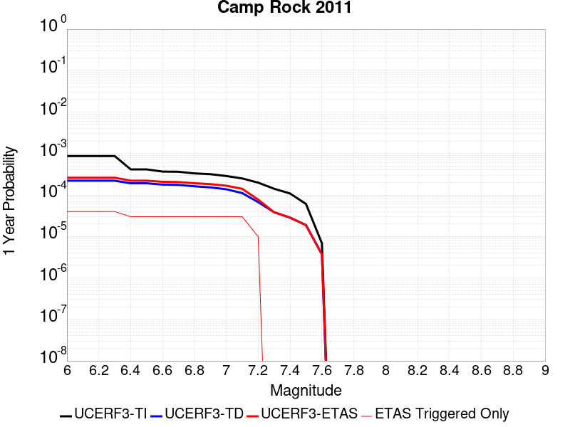 |  |

| Magnitude | 1 wk TI Prob | 1 wk TD Prob | 1 wk ETAS Prob | 1 wk ETAS/TD Gain | 1 wk ETAS Triggered Only | 1 mo TI Prob | 1 mo TD Prob | 1 mo ETAS Prob | 1 mo ETAS/TD Gain | 1 mo ETAS Triggered Only | 1 yr TI Prob | 1 yr TD Prob | 1 yr ETAS Prob | 1 yr ETAS/TD Gain | 1 yr ETAS Triggered Only | 10 yr TI Prob | 10 yr TD Prob | 10 yr ETAS Prob | 10 yr ETAS/TD Gain | 10 yr ETAS Triggered Only |
|-----|-----|-----|-----|-----|-----|-----|-----|-----|-----|-----|-----|-----|-----|-----|-----|-----|-----|-----|-----|-----|
| 6.0 | 1.6710783E-5 | 4.25026E-6 | 7.433196E-5 | 17.488802 | 7.0081995E-5 | 7.161568E-5 | 1.8215276E-5 | 8.8295994E-5 | 4.8473597 | 7.0081995E-5 | 8.7157206E-4 | 2.2174895E-4 | 3.6188186E-4 | 1.631944 | 1.4016399E-4 | 0.008681616 | 0.0022153298 | 0.0023551832 | 1.0631299 | 1.4016399E-4 |
| 6.1 | 1.6710783E-5 | 4.25026E-6 | 7.433196E-5 | 17.488802 | 7.0081995E-5 | 7.161568E-5 | 1.8215276E-5 | 8.8295994E-5 | 4.8473597 | 7.0081995E-5 | 8.7157206E-4 | 2.2174895E-4 | 3.6188186E-4 | 1.631944 | 1.4016399E-4 | 0.008681616 | 0.0022153298 | 0.0023551832 | 1.0631299 | 1.4016399E-4 |
| 6.2 | 1.6710783E-5 | 4.25026E-6 | 7.433196E-5 | 17.488802 | 7.0081995E-5 | 7.161568E-5 | 1.8215276E-5 | 8.8295994E-5 | 4.8473597 | 7.0081995E-5 | 8.7157206E-4 | 2.2174895E-4 | 3.6188186E-4 | 1.631944 | 1.4016399E-4 | 0.008681616 | 0.0022153298 | 0.0023551832 | 1.0631299 | 1.4016399E-4 |
| 6.3 | 1.6710783E-5 | 4.25026E-6 | 7.433196E-5 | 17.488802 | 7.0081995E-5 | 7.161568E-5 | 1.8215276E-5 | 8.8295994E-5 | 4.8473597 | 7.0081995E-5 | 8.7157206E-4 | 2.2174895E-4 | 3.6188186E-4 | 1.631944 | 1.4016399E-4 | 0.008681616 | 0.0022153298 | 0.0023551832 | 1.0631299 | 1.4016399E-4 |
| 6.4 | 7.982846E-6 | 3.6820884E-6 | 3.6820884E-6 | 1.0 | 0.0 | 3.421175E-5 | 1.5780286E-5 | 1.5780286E-5 | 1.0 | 0.0 | 4.1644843E-4 | 1.9210839E-4 | 2.621769E-4 | 1.3647344 | 7.0081995E-5 | 0.0041566887 | 0.001919458 | 0.0019894056 | 1.0364412 | 7.0081995E-5 |
| 6.5 | 7.982846E-6 | 3.6820884E-6 | 3.6820884E-6 | 1.0 | 0.0 | 3.421175E-5 | 1.5780286E-5 | 1.5780286E-5 | 1.0 | 0.0 | 4.1644843E-4 | 1.9210839E-4 | 2.621769E-4 | 1.3647344 | 7.0081995E-5 | 0.0041566887 | 0.001919458 | 0.0019894056 | 1.0364412 | 7.0081995E-5 |
| 6.6 | 7.048869E-6 | 3.4243571E-6 | 3.4243571E-6 | 1.0 | 0.0 | 3.0209088E-5 | 1.4675736E-5 | 1.4675736E-5 | 1.0 | 0.0 | 3.677336E-4 | 1.7866275E-4 | 2.4873222E-4 | 1.3921885 | 7.0081995E-5 | 0.0036712566 | 0.0017852228 | 0.0018551797 | 1.0391866 | 7.0081995E-5 |
| 6.7 | 6.987307E-6 | 3.3623348E-6 | 3.3623348E-6 | 1.0 | 0.0 | 2.9945259E-5 | 1.4409929E-5 | 1.4409929E-5 | 1.0 | 0.0 | 3.6452254E-4 | 1.7542706E-4 | 2.4549678E-4 | 1.3994236 | 7.0081995E-5 | 0.0036392517 | 0.001752917 | 0.0018228762 | 1.0399101 | 7.0081995E-5 |
| 6.8 | 6.3737602E-6 | 3.1179077E-6 | 3.1179077E-6 | 1.0 | 0.0 | 2.731583E-5 | 1.3362394E-5 | 1.3362394E-5 | 1.0 | 0.0 | 3.3251947E-4 | 1.626753E-4 | 2.327459E-4 | 1.430739 | 7.0081995E-5 | 0.0033202237 | 0.0016255907 | 0.0016955588 | 1.0430416 | 7.0081995E-5 |
| 6.9 | 6.112211E-6 | 2.9331156E-6 | 2.9331156E-6 | 1.0 | 0.0 | 2.6194928E-5 | 1.2570436E-5 | 1.2570436E-5 | 1.0 | 0.0 | 3.1887658E-4 | 1.5303459E-4 | 2.2310586E-4 | 1.4578786 | 7.0081995E-5 | 0.003184194 | 0.0015293199 | 0.0015992947 | 1.0457555 | 7.0081995E-5 |
| 7.0 | 5.5140117E-6 | 2.641923E-6 | 2.641923E-6 | 1.0 | 0.0 | 2.3631264E-5 | 1.132248E-5 | 1.132248E-5 | 1.0 | 0.0 | 2.8767265E-4 | 1.3784273E-4 | 2.0791506E-4 | 1.5083499 | 7.0081995E-5 | 0.0028730053 | 0.0013775975 | 0.001447583 | 1.0508026 | 7.0081995E-5 |
| 7.1 | 4.8151105E-6 | 2.1342705E-6 | 2.1342705E-6 | 1.0 | 0.0 | 2.0636026E-5 | 9.146843E-6 | 9.146843E-6 | 1.0 | 0.0 | 2.5121463E-4 | 1.1135734E-4 | 1.8143153E-4 | 1.6292733 | 7.0081995E-5 | 0.0025093083 | 0.0011130372 | 0.0011830413 | 1.0628946 | 7.0081995E-5 |
| 7.2 | 3.818335E-6 | 1.2937425E-6 | 1.2937425E-6 | 1.0 | 0.0 | 1.6364189E-5 | 5.5445994E-6 | 5.5445994E-6 | 1.0 | 0.0 | 1.9921579E-4 | 6.750349E-5 | 6.750349E-5 | 1.0 | 0.0 | 0.0019903728 | 6.748381E-4 | 6.748381E-4 | 1.0 | 0.0 |
| 7.3 | 2.7166698E-6 | 7.3835776E-7 | 7.3835776E-7 | 1.0 | 0.0 | 1.1642818E-5 | 3.1643867E-6 | 3.1643867E-6 | 1.0 | 0.0 | 1.4174209E-4 | 3.8525748E-5 | 3.8525748E-5 | 1.0 | 0.0 | 0.0014165172 | 3.851927E-4 | 3.851927E-4 | 1.0 | 0.0 |
| 7.4 | 2.0893426E-6 | 5.4618386E-7 | 5.4618386E-7 | 1.0 | 0.0 | 8.954295E-6 | 2.3407858E-6 | 2.3407858E-6 | 1.0 | 0.0 | 1.0901308E-4 | 2.84987E-5 | 2.84987E-5 | 1.0 | 0.0 | 0.0010895962 | 2.84951E-4 | 2.84951E-4 | 1.0 | 0.0 |
| 7.5 | 1.1681728E-6 | 3.6030585E-7 | 3.6030585E-7 | 1.0 | 0.0 | 5.0064455E-6 | 1.544167E-6 | 1.544167E-6 | 1.0 | 0.0 | 6.0951766E-5 | 1.8800076E-5 | 1.8800076E-5 | 1.0 | 0.0 | 6.093505E-4 | 1.8798532E-4 | 1.8798532E-4 | 1.0 | 0.0 |
| 7.6 | 1.3154387E-7 | 7.1197384E-8 | 7.1197384E-8 | 1.0 | 0.0 | 5.6375933E-7 | 3.051316E-7 | 3.051316E-7 | 1.0 | 0.0 | 6.863748E-6 | 3.7149728E-6 | 3.7149728E-6 | 1.0 | 0.0 | 6.863536E-5 | 3.7149264E-5 | 3.7149264E-5 | 1.0 | 0.0 |

## San Cayetano
*[(top)](#table-of-contents)*

| 1 Week | 1 Month | 1 Year | 10 Year |
|-----|-----|-----|-----|
|  |  |  |  |

| Magnitude | 1 wk TI Prob | 1 wk TD Prob | 1 wk ETAS Prob | 1 wk ETAS/TD Gain | 1 wk ETAS Triggered Only | 1 mo TI Prob | 1 mo TD Prob | 1 mo ETAS Prob | 1 mo ETAS/TD Gain | 1 mo ETAS Triggered Only | 1 yr TI Prob | 1 yr TD Prob | 1 yr ETAS Prob | 1 yr ETAS/TD Gain | 1 yr ETAS Triggered Only | 10 yr TI Prob | 10 yr TD Prob | 10 yr ETAS Prob | 10 yr ETAS/TD Gain | 10 yr ETAS Triggered Only |
|-----|-----|-----|-----|-----|-----|-----|-----|-----|-----|-----|-----|-----|-----|-----|-----|-----|-----|-----|-----|-----|
| 6.0 | 2.3476267E-5 | 1.816928E-5 | 8.825E-5 | 4.8571 | 7.0081995E-5 | 1.0060869E-4 | 7.786603E-5 | 1.4794257E-4 | 1.8999629 | 7.0081995E-5 | 0.0012242225 | 9.476103E-4 | 0.0010176259 | 1.0738865 | 7.0081995E-5 | 0.012175002 | 0.009436584 | 0.009506005 | 1.0073565 | 7.0081995E-5 |
| 6.1 | 2.3476267E-5 | 1.816928E-5 | 8.825E-5 | 4.8571 | 7.0081995E-5 | 1.0060869E-4 | 7.786603E-5 | 1.4794257E-4 | 1.8999629 | 7.0081995E-5 | 0.0012242225 | 9.476103E-4 | 0.0010176259 | 1.0738865 | 7.0081995E-5 | 0.012175002 | 0.009436584 | 0.009506005 | 1.0073565 | 7.0081995E-5 |
| 6.2 | 2.3476267E-5 | 1.816928E-5 | 8.825E-5 | 4.8571 | 7.0081995E-5 | 1.0060869E-4 | 7.786603E-5 | 1.4794257E-4 | 1.8999629 | 7.0081995E-5 | 0.0012242225 | 9.476103E-4 | 0.0010176259 | 1.0738865 | 7.0081995E-5 | 0.012175002 | 0.009436584 | 0.009506005 | 1.0073565 | 7.0081995E-5 |
| 6.3 | 2.3476267E-5 | 1.816928E-5 | 8.825E-5 | 4.8571 | 7.0081995E-5 | 1.0060869E-4 | 7.786603E-5 | 1.4794257E-4 | 1.8999629 | 7.0081995E-5 | 0.0012242225 | 9.476103E-4 | 0.0010176259 | 1.0738865 | 7.0081995E-5 | 0.012175002 | 0.009436584 | 0.009506005 | 1.0073565 | 7.0081995E-5 |
| 6.4 | 2.3476267E-5 | 1.816928E-5 | 8.825E-5 | 4.8571 | 7.0081995E-5 | 1.0060869E-4 | 7.786603E-5 | 1.4794257E-4 | 1.8999629 | 7.0081995E-5 | 0.0012242225 | 9.476103E-4 | 0.0010176259 | 1.0738865 | 7.0081995E-5 | 0.012175002 | 0.009436584 | 0.009506005 | 1.0073565 | 7.0081995E-5 |
| 6.5 | 2.3476267E-5 | 1.816928E-5 | 8.825E-5 | 4.8571 | 7.0081995E-5 | 1.0060869E-4 | 7.786603E-5 | 1.4794257E-4 | 1.8999629 | 7.0081995E-5 | 0.0012242225 | 9.476103E-4 | 0.0010176259 | 1.0738865 | 7.0081995E-5 | 0.012175002 | 0.009436584 | 0.009506005 | 1.0073565 | 7.0081995E-5 |
| 6.6 | 2.3476267E-5 | 1.816928E-5 | 8.825E-5 | 4.8571 | 7.0081995E-5 | 1.0060869E-4 | 7.786603E-5 | 1.4794257E-4 | 1.8999629 | 7.0081995E-5 | 0.0012242225 | 9.476103E-4 | 0.0010176259 | 1.0738865 | 7.0081995E-5 | 0.012175002 | 0.009436584 | 0.009506005 | 1.0073565 | 7.0081995E-5 |
| 6.7 | 2.3476267E-5 | 1.816928E-5 | 8.825E-5 | 4.8571 | 7.0081995E-5 | 1.0060869E-4 | 7.786603E-5 | 1.4794257E-4 | 1.8999629 | 7.0081995E-5 | 0.0012242225 | 9.476103E-4 | 0.0010176259 | 1.0738865 | 7.0081995E-5 | 0.012175002 | 0.009436584 | 0.009506005 | 1.0073565 | 7.0081995E-5 |
| 6.8 | 2.3241924E-5 | 1.7936987E-5 | 8.8017725E-5 | 4.907052 | 7.0081995E-5 | 9.960445E-5 | 7.687056E-5 | 1.4694716E-4 | 1.9116184 | 7.0081995E-5 | 0.0012120095 | 9.3550084E-4 | 0.0010055172 | 1.0748438 | 7.0081995E-5 | 0.012054204 | 0.009316482 | 0.009385911 | 1.0074522 | 7.0081995E-5 |
| 6.9 | 2.2761007E-5 | 1.7432423E-5 | 8.7513195E-5 | 5.0201397 | 7.0081995E-5 | 9.7543525E-5 | 7.470827E-5 | 1.4478502E-4 | 1.9380054 | 7.0081995E-5 | 0.0011869454 | 9.09197E-4 | 9.792153E-4 | 1.0770111 | 7.0081995E-5 | 0.011806256 | 0.009055603 | 0.00912505 | 1.007669 | 7.0081995E-5 |
| 7.0 | 2.240283E-5 | 1.7066168E-5 | 8.714697E-5 | 5.1064167 | 7.0081995E-5 | 9.600859E-5 | 7.313869E-5 | 1.4321555E-4 | 1.9581368 | 7.0081995E-5 | 0.0011682777 | 8.9010317E-4 | 9.601228E-4 | 1.0786647 | 7.0081995E-5 | 0.011621549 | 0.008866196 | 0.0089356555 | 1.0078343 | 7.0081995E-5 |
| 7.1 | 2.1871154E-5 | 1.6586018E-5 | 8.666685E-5 | 5.225296 | 7.0081995E-5 | 9.373015E-5 | 7.108101E-5 | 1.4115803E-4 | 1.9858752 | 7.0081995E-5 | 0.0011405671 | 8.6507114E-4 | 9.350925E-4 | 1.0809429 | 7.0081995E-5 | 0.011347309 | 0.008617838 | 0.008687316 | 1.0080621 | 7.0081995E-5 |
| 7.2 | 2.0714133E-5 | 1.5564561E-5 | 8.5645464E-5 | 5.5025945 | 7.0081995E-5 | 8.8771834E-5 | 6.670357E-5 | 1.3678089E-4 | 2.050578 | 7.0081995E-5 | 0.0010802611 | 8.1181666E-4 | 8.8184176E-4 | 1.0862573 | 7.0081995E-5 | 0.010750249 | 0.008089285 | 0.0081588 | 1.0085934 | 7.0081995E-5 |
| 7.3 | 1.8408395E-5 | 1.3996864E-5 | 8.407788E-5 | 6.006908 | 7.0081995E-5 | 7.8890735E-5 | 5.99852E-5 | 1.30063E-4 | 2.1682513 | 7.0081995E-5 | 9.600714E-4 | 7.300781E-4 | 8.0010894E-4 | 1.0959224 | 7.0081995E-5 | 0.009559342 | 0.0072775153 | 0.0073470874 | 1.0095599 | 7.0081995E-5 |
| 7.4 | 1.6856795E-5 | 1.28500815E-5 | 8.2931176E-5 | 6.4537473 | 7.0081995E-5 | 7.2241404E-5 | 5.5070628E-5 | 1.2514877E-4 | 2.2725139 | 7.0081995E-5 | 8.7918417E-4 | 6.7028153E-4 | 7.403165E-4 | 1.104486 | 7.0081995E-5 | 0.00875714 | 0.0066832784 | 0.006752892 | 1.010416 | 7.0081995E-5 |
| 7.5 | 1.2822778E-5 | 9.577542E-6 | 7.9658865E-5 | 8.317256 | 7.0081995E-5 | 5.495361E-5 | 4.1045972E-5 | 1.1112509E-4 | 2.7073324 | 7.0081995E-5 | 6.688548E-4 | 4.996217E-4 | 5.6966866E-4 | 1.1402 | 7.0081995E-5 | 0.006668452 | 0.0049851555 | 0.005054888 | 1.013988 | 7.0081995E-5 |
| 7.6 | 5.6272684E-6 | 3.854903E-6 | 3.854903E-6 | 1.0 | 0.0 | 2.4116642E-5 | 1.652091E-5 | 1.652091E-5 | 1.0 | 0.0 | 2.9358055E-4 | 2.0112359E-4 | 2.0112359E-4 | 1.0 | 0.0 | 0.0029319301 | 0.0020094267 | 0.0020094267 | 1.0 | 0.0 |
| 7.7 | 3.5261346E-6 | 2.3407013E-6 | 2.3407013E-6 | 1.0 | 0.0 | 1.5111918E-5 | 1.0031539E-5 | 1.0031539E-5 | 1.0 | 0.0 | 1.8397206E-4 | 1.2212721E-4 | 1.2212721E-4 | 1.0 | 0.0 | 0.0018381984 | 0.0012206084 | 0.0012206084 | 1.0 | 0.0 |
| 7.8 | 1.4826929E-6 | 1.056428E-6 | 1.056428E-6 | 1.0 | 0.0 | 6.354383E-6 | 4.5275406E-6 | 4.5275406E-6 | 1.0 | 0.0 | 7.736187E-5 | 5.5121433E-5 | 5.5121433E-5 | 1.0 | 0.0 | 7.733494E-4 | 5.5107963E-4 | 5.5107963E-4 | 1.0 | 0.0 |
| 7.9 | 2.7568166E-7 | 1.6978244E-7 | 1.6978244E-7 | 1.0 | 0.0 | 1.1814923E-6 | 7.2763885E-7 | 7.2763885E-7 | 1.0 | 0.0 | 1.4384574E-5 | 8.858967E-6 | 8.858967E-6 | 1.0 | 0.0 | 1.4383643E-4 | 8.8586174E-5 | 8.8586174E-5 | 1.0 | 0.0 |
| 8.0 | 5.407832E-8 | 2.6887697E-8 | 2.6887697E-8 | 1.0 | 0.0 | 2.3176422E-7 | 1.15232986E-7 | 1.15232986E-7 | 1.0 | 0.0 | 2.8217257E-6 | 1.4029607E-6 | 1.4029607E-6 | 1.0 | 0.0 | 2.8216898E-5 | 1.4029522E-5 | 1.4029522E-5 | 1.0 | 0.0 |

## Hayward (So) 2011 CFM
*[(top)](#table-of-contents)*

| 1 Week | 1 Month | 1 Year | 10 Year |
|-----|-----|-----|-----|
|  |  |  |  |

| Magnitude | 1 wk TI Prob | 1 wk TD Prob | 1 wk ETAS Prob | 1 wk ETAS/TD Gain | 1 wk ETAS Triggered Only | 1 mo TI Prob | 1 mo TD Prob | 1 mo ETAS Prob | 1 mo ETAS/TD Gain | 1 mo ETAS Triggered Only | 1 yr TI Prob | 1 yr TD Prob | 1 yr ETAS Prob | 1 yr ETAS/TD Gain | 1 yr ETAS Triggered Only | 10 yr TI Prob | 10 yr TD Prob | 10 yr ETAS Prob | 10 yr ETAS/TD Gain | 10 yr ETAS Triggered Only |
|-----|-----|-----|-----|-----|-----|-----|-----|-----|-----|-----|-----|-----|-----|-----|-----|-----|-----|-----|-----|-----|
| 6.0 | 1.8091932E-4 | 3.570541E-4 | 3.570541E-4 | 1.0 | 0.0 | 7.751381E-4 | 0.0015293444 | 0.0015993192 | 1.0457548 | 7.0081995E-5 | 0.00939654 | 0.018463207 | 0.018600784 | 1.0074514 | 1.4016399E-4 | 0.090090066 | 0.16673161 | 0.1668484 | 1.0007005 | 1.4016399E-4 |
| 6.1 | 1.8091932E-4 | 3.570541E-4 | 3.570541E-4 | 1.0 | 0.0 | 7.751381E-4 | 0.0015293444 | 0.0015993192 | 1.0457548 | 7.0081995E-5 | 0.00939654 | 0.018463207 | 0.018600784 | 1.0074514 | 1.4016399E-4 | 0.090090066 | 0.16673161 | 0.1668484 | 1.0007005 | 1.4016399E-4 |
| 6.2 | 1.8091932E-4 | 3.570541E-4 | 3.570541E-4 | 1.0 | 0.0 | 7.751381E-4 | 0.0015293444 | 0.0015993192 | 1.0457548 | 7.0081995E-5 | 0.00939654 | 0.018463207 | 0.018600784 | 1.0074514 | 1.4016399E-4 | 0.090090066 | 0.16673161 | 0.1668484 | 1.0007005 | 1.4016399E-4 |
| 6.3 | 1.7322872E-4 | 3.426234E-4 | 3.426234E-4 | 1.0 | 0.0 | 7.4219756E-4 | 0.0014675693 | 0.0015375484 | 1.0476837 | 7.0081995E-5 | 0.0089988755 | 0.017723544 | 0.017792385 | 1.0038841 | 7.0081995E-5 | 0.08643075 | 0.16066726 | 0.16072607 | 1.0003661 | 7.0081995E-5 |
| 6.4 | 1.6334097E-4 | 3.234411E-4 | 3.234411E-4 | 1.0 | 0.0 | 6.998449E-4 | 0.0013854484 | 0.0014554333 | 1.0505142 | 7.0081995E-5 | 0.008487372 | 0.016739385 | 0.016808294 | 1.0041165 | 7.0081995E-5 | 0.081704415 | 0.15255594 | 0.15261534 | 1.0003893 | 7.0081995E-5 |
| 6.5 | 1.5600289E-4 | 3.1018828E-4 | 3.1018828E-4 | 1.0 | 0.0 | 6.684125E-4 | 0.0013287093 | 0.0013986982 | 1.0526743 | 7.0081995E-5 | 0.008107598 | 0.016058935 | 0.01612789 | 1.0042939 | 7.0081995E-5 | 0.078181036 | 0.14683272 | 0.1468925 | 1.0004072 | 7.0081995E-5 |
| 6.6 | 1.4046066E-4 | 2.8032906E-4 | 2.8032906E-4 | 1.0 | 0.0 | 6.018354E-4 | 0.0012008639 | 0.0012008639 | 1.0 | 0.0 | 0.0073027555 | 0.014524006 | 0.014524006 | 1.0 | 0.0 | 0.07067384 | 0.13391982 | 0.13391982 | 1.0 | 0.0 |
| 6.7 | 1.14696966E-4 | 2.3271477E-4 | 2.3271477E-4 | 1.0 | 0.0 | 4.914658E-4 | 9.969729E-4 | 9.969729E-4 | 1.0 | 0.0 | 0.0059671924 | 0.012071652 | 0.012071652 | 1.0 | 0.0 | 0.058094822 | 0.11274672 | 0.11274672 | 1.0 | 0.0 |
| 6.8 | 9.3874296E-5 | 1.8861453E-4 | 1.8861453E-4 | 1.0 | 0.0 | 4.0225635E-4 | 8.0810126E-4 | 8.0810126E-4 | 1.0 | 0.0 | 0.0048864787 | 0.009794984 | 0.009794984 | 1.0 | 0.0 | 0.047804173 | 0.09259856 | 0.09259856 | 1.0 | 0.0 |
| 6.9 | 5.551852E-5 | 1.072948E-4 | 1.072948E-4 | 1.0 | 0.0 | 2.3791482E-4 | 4.5975443E-4 | 4.5975443E-4 | 1.0 | 0.0 | 0.0028927654 | 0.0055832625 | 0.0055832625 | 1.0 | 0.0 | 0.028553981 | 0.054245494 | 0.054245494 | 1.0 | 0.0 |
| 7.0 | 4.2662363E-5 | 8.2464416E-5 | 8.2464416E-5 | 1.0 | 0.0 | 1.8282588E-4 | 3.5337146E-4 | 3.5337146E-4 | 1.0 | 0.0 | 0.0022236328 | 0.0042938837 | 0.0042938837 | 1.0 | 0.0 | 0.022015138 | 0.042064495 | 0.042064495 | 1.0 | 0.0 |
| 7.1 | 3.305886E-5 | 6.3019055E-5 | 6.3019055E-5 | 1.0 | 0.0 | 1.4167312E-4 | 2.700538E-4 | 2.700538E-4 | 1.0 | 0.0 | 0.0017235056 | 0.0032829668 | 0.0032829668 | 1.0 | 0.0 | 0.017101998 | 0.032452874 | 0.032452874 | 1.0 | 0.0 |
| 7.2 | 2.9856887E-5 | 5.7013647E-5 | 5.7013647E-5 | 1.0 | 0.0 | 1.2795182E-4 | 2.4432142E-4 | 2.4432142E-4 | 1.0 | 0.0 | 0.0015567001 | 0.0029705726 | 0.0029705726 | 1.0 | 0.0 | 0.015458403 | 0.029453589 | 0.029453589 | 1.0 | 0.0 |
| 7.3 | 2.4559737E-5 | 4.599088E-5 | 4.599088E-5 | 1.0 | 0.0 | 1.0525176E-4 | 1.9708896E-4 | 1.9708896E-4 | 1.0 | 0.0 | 0.0012806869 | 0.0023969305 | 0.0023969305 | 1.0 | 0.0 | 0.012733313 | 0.023857482 | 0.023857482 | 1.0 | 0.0 |
| 7.4 | 1.9002231E-5 | 3.5049303E-5 | 3.5049303E-5 | 1.0 | 0.0 | 8.143559E-5 | 1.502027E-4 | 1.502027E-4 | 1.0 | 0.0 | 9.910273E-4 | 0.0018271938 | 0.0018271938 | 1.0 | 0.0 | 0.009866194 | 0.018258283 | 0.018258283 | 1.0 | 0.0 |
| 7.5 | 1.2783333E-5 | 2.3330069E-5 | 2.3330069E-5 | 1.0 | 0.0 | 5.4784563E-5 | 9.998221E-5 | 9.998221E-5 | 1.0 | 0.0 | 6.667979E-4 | 0.0012166094 | 0.0012166094 | 1.0 | 0.0 | 0.006648007 | 0.012209582 | 0.012209582 | 1.0 | 0.0 |
| 7.6 | 4.8149627E-6 | 8.887544E-6 | 8.887544E-6 | 1.0 | 0.0 | 2.063539E-5 | 3.8088925E-5 | 3.8088925E-5 | 1.0 | 0.0 | 2.5120692E-4 | 4.636352E-4 | 4.636352E-4 | 1.0 | 0.0 | 0.0025092314 | 0.0046812436 | 0.0046812436 | 1.0 | 0.0 |
| 7.7 | 6.0838227E-7 | 1.2056693E-6 | 1.2056693E-6 | 1.0 | 0.0 | 2.6073499E-6 | 5.1671436E-6 | 5.1671436E-6 | 1.0 | 0.0 | 3.174402E-5 | 6.290816E-5 | 6.290816E-5 | 1.0 | 0.0 | 3.1739488E-4 | 6.5293367E-4 | 6.5293367E-4 | 1.0 | 0.0 |
| 7.8 | 4.5542808E-7 | 9.792182E-7 | 9.792182E-7 | 1.0 | 0.0 | 1.9518332E-6 | 4.1966427E-6 | 4.1966427E-6 | 1.0 | 0.0 | 2.376331E-5 | 5.1092928E-5 | 5.1092928E-5 | 1.0 | 0.0 | 2.3760769E-4 | 5.321372E-4 | 5.321372E-4 | 1.0 | 0.0 |
| 7.9 | 3.3016747E-7 | 7.386335E-7 | 7.386335E-7 | 1.0 | 0.0 | 1.4150027E-6 | 3.1655684E-6 | 3.1655684E-6 | 1.0 | 0.0 | 1.7227521E-5 | 3.8540114E-5 | 3.8540114E-5 | 1.0 | 0.0 | 1.7226185E-4 | 3.9930744E-4 | 3.9930744E-4 | 1.0 | 0.0 |
| 8.0 | 2.347038E-7 | 5.4714894E-7 | 5.4714894E-7 | 1.0 | 0.0 | 1.0058731E-6 | 2.344922E-6 | 2.344922E-6 | 1.0 | 0.0 | 1.2246436E-5 | 2.8549053E-5 | 2.8549053E-5 | 1.0 | 0.0 | 1.2245761E-4 | 2.9355253E-4 | 2.9355253E-4 | 1.0 | 0.0 |
| 8.1 | 1.18822804E-7 | 2.6058973E-7 | 2.6058973E-7 | 1.0 | 0.0 | 5.092405E-7 | 1.1168127E-6 | 1.1168127E-6 | 1.0 | 0.0 | 6.1999854E-6 | 1.359711E-5 | 1.359711E-5 | 1.0 | 0.0 | 6.199812E-5 | 1.3917852E-4 | 1.3917852E-4 | 1.0 | 0.0 |

## Ludlow
*[(top)](#table-of-contents)*

| 1 Week | 1 Month | 1 Year | 10 Year |
|-----|-----|-----|-----|
|  |  |  |  |

| Magnitude | 1 wk TI Prob | 1 wk TD Prob | 1 wk ETAS Prob | 1 wk ETAS/TD Gain | 1 wk ETAS Triggered Only | 1 mo TI Prob | 1 mo TD Prob | 1 mo ETAS Prob | 1 mo ETAS/TD Gain | 1 mo ETAS Triggered Only | 1 yr TI Prob | 1 yr TD Prob | 1 yr ETAS Prob | 1 yr ETAS/TD Gain | 1 yr ETAS Triggered Only | 10 yr TI Prob | 10 yr TD Prob | 10 yr ETAS Prob | 10 yr ETAS/TD Gain | 10 yr ETAS Triggered Only |
|-----|-----|-----|-----|-----|-----|-----|-----|-----|-----|-----|-----|-----|-----|-----|-----|-----|-----|-----|-----|-----|
| 6.0 | 2.2407607E-5 | 2.3657254E-5 | 1.6381792E-4 | 6.9246387 | 1.4016399E-4 | 9.602906E-5 | 1.0138454E-4 | 2.4153432E-4 | 2.3823586 | 1.4016399E-4 | 0.0011685267 | 0.001233702 | 0.001373693 | 1.1134723 | 1.4016399E-4 | 0.011624013 | 0.012273042 | 0.012411485 | 1.0112803 | 1.4016399E-4 |
| 6.1 | 2.2407607E-5 | 2.3657254E-5 | 1.6381792E-4 | 6.9246387 | 1.4016399E-4 | 9.602906E-5 | 1.0138454E-4 | 2.4153432E-4 | 2.3823586 | 1.4016399E-4 | 0.0011685267 | 0.001233702 | 0.001373693 | 1.1134723 | 1.4016399E-4 | 0.011624013 | 0.012273042 | 0.012411485 | 1.0112803 | 1.4016399E-4 |
| 6.2 | 1.0781252E-5 | 1.1365663E-5 | 1.5152806E-4 | 13.332091 | 1.4016399E-4 | 4.620455E-5 | 4.8709102E-5 | 1.8886627E-4 | 3.8774328 | 1.4016399E-4 | 5.623952E-4 | 5.9287593E-4 | 7.3295686E-4 | 1.2362735 | 1.4016399E-4 | 0.00560974 | 0.0059133614 | 0.0060526966 | 1.0235628 | 1.4016399E-4 |
| 6.3 | 1.0781252E-5 | 1.1365663E-5 | 1.5152806E-4 | 13.332091 | 1.4016399E-4 | 4.620455E-5 | 4.8709102E-5 | 1.8886627E-4 | 3.8774328 | 1.4016399E-4 | 5.623952E-4 | 5.9287593E-4 | 7.3295686E-4 | 1.2362735 | 1.4016399E-4 | 0.00560974 | 0.0059133614 | 0.0060526966 | 1.0235628 | 1.4016399E-4 |
| 6.4 | 7.814439E-6 | 8.237729E-6 | 7.831915E-5 | 9.507371 | 7.0081995E-5 | 3.3490025E-5 | 3.530408E-5 | 1.053836E-4 | 2.9850261 | 7.0081995E-5 | 4.0766477E-4 | 4.2974384E-4 | 4.997957E-4 | 1.1630085 | 7.0081995E-5 | 0.0040691774 | 0.0042892746 | 0.004359056 | 1.0162688 | 7.0081995E-5 |
| 6.5 | 6.4986366E-6 | 6.85092E-6 | 7.693243E-5 | 11.229505 | 7.0081995E-5 | 2.7851002E-5 | 2.9360759E-5 | 9.9440695E-5 | 3.3868573 | 7.0081995E-5 | 3.390332E-4 | 3.5740953E-4 | 4.2746647E-4 | 1.1960131 | 7.0081995E-5 | 0.003385164 | 0.0035684432 | 0.0036382752 | 1.0195693 | 7.0081995E-5 |
| 6.6 | 5.582177E-6 | 5.8860055E-6 | 7.596759E-5 | 12.906476 | 7.0081995E-5 | 2.3923398E-5 | 2.5225498E-5 | 9.5305724E-5 | 3.7781503 | 7.0081995E-5 | 2.9122844E-4 | 3.0707786E-4 | 3.7713835E-4 | 1.2281522 | 7.0081995E-5 | 0.0029084706 | 0.003066609 | 0.003136476 | 1.0227832 | 7.0081995E-5 |
| 6.7 | 4.6858763E-6 | 4.940427E-6 | 7.502208E-5 | 15.185342 | 7.0081995E-5 | 2.0082172E-5 | 2.1173091E-5 | 9.1253605E-5 | 4.309886 | 7.0081995E-5 | 2.4447302E-4 | 2.5775246E-4 | 3.2781638E-4 | 1.2718265 | 7.0081995E-5 | 0.0024420423 | 0.0025745912 | 0.0026444928 | 1.0271505 | 7.0081995E-5 |
| 6.8 | 3.5584908E-6 | 3.7520183E-6 | 7.3833755E-5 | 19.67841 | 7.0081995E-5 | 1.5250586E-5 | 1.6079981E-5 | 8.616085E-5 | 5.358268 | 7.0081995E-5 | 1.8566006E-4 | 1.957566E-4 | 2.6582487E-4 | 1.3579357 | 7.0081995E-5 | 0.0018550502 | 0.0019558826 | 0.0020258275 | 1.0357614 | 7.0081995E-5 |
| 6.9 | 2.532834E-6 | 2.6710034E-6 | 7.275281E-5 | 27.238007 | 7.0081995E-5 | 1.0854958E-5 | 1.1447109E-5 | 8.1528306E-5 | 7.1221743 | 7.0081995E-5 | 1.3215111E-4 | 1.3935992E-4 | 2.0943215E-4 | 1.5028148 | 7.0081995E-5 | 0.0013207254 | 0.0013927529 | 0.0014627372 | 1.050249 | 7.0081995E-5 |
| 7.0 | 1.7083285E-6 | 1.8019439E-6 | 7.188381E-5 | 39.892372 | 7.0081995E-5 | 7.3213873E-6 | 7.722595E-6 | 7.780405E-5 | 10.074859 | 7.0081995E-5 | 8.913424E-5 | 9.40187E-5 | 1.640941E-4 | 1.7453347 | 7.0081995E-5 | 8.9098496E-4 | 9.3980576E-4 | 0.0010098219 | 1.0745007 | 7.0081995E-5 |
| 7.1 | 1.0905424E-6 | 1.1497619E-6 | 1.1497619E-6 | 1.0 | 0.0 | 4.6737446E-6 | 4.9275427E-6 | 4.9275427E-6 | 1.0 | 0.0 | 5.6901354E-5 | 5.999128E-5 | 5.999128E-5 | 1.0 | 0.0 | 5.6886784E-4 | 5.997606E-4 | 5.997606E-4 | 1.0 | 0.0 |
| 7.2 | 6.06668E-7 | 6.387277E-7 | 6.387277E-7 | 1.0 | 0.0 | 2.600003E-6 | 2.7374022E-6 | 2.7374022E-6 | 1.0 | 0.0 | 3.1654577E-5 | 3.3327433E-5 | 3.3327433E-5 | 1.0 | 0.0 | 3.1650066E-4 | 3.3323118E-4 | 3.3323118E-4 | 1.0 | 0.0 |

## Red Mountain
*[(top)](#table-of-contents)*

| 1 Week | 1 Month | 1 Year | 10 Year |
|-----|-----|-----|-----|
|  |  |  |  |

| Magnitude | 1 wk TI Prob | 1 wk TD Prob | 1 wk ETAS Prob | 1 wk ETAS/TD Gain | 1 wk ETAS Triggered Only | 1 mo TI Prob | 1 mo TD Prob | 1 mo ETAS Prob | 1 mo ETAS/TD Gain | 1 mo ETAS Triggered Only | 1 yr TI Prob | 1 yr TD Prob | 1 yr ETAS Prob | 1 yr ETAS/TD Gain | 1 yr ETAS Triggered Only | 10 yr TI Prob | 10 yr TD Prob | 10 yr ETAS Prob | 10 yr ETAS/TD Gain | 10 yr ETAS Triggered Only |
|-----|-----|-----|-----|-----|-----|-----|-----|-----|-----|-----|-----|-----|-----|-----|-----|-----|-----|-----|-----|-----|
| 6.0 | 4.1810763E-5 | 4.7589947E-5 | 1.17668606E-4 | 2.4725518 | 7.0081995E-5 | 1.7917668E-4 | 2.039419E-4 | 2.740096E-4 | 1.343567 | 7.0081995E-5 | 0.0021792934 | 0.0024803306 | 0.0026201468 | 1.05637 | 1.4016399E-4 | 0.021580452 | 0.024544092 | 0.024680816 | 1.0055705 | 1.4016399E-4 |
| 6.1 | 4.1810763E-5 | 4.7589947E-5 | 1.17668606E-4 | 2.4725518 | 7.0081995E-5 | 1.7917668E-4 | 2.039419E-4 | 2.740096E-4 | 1.343567 | 7.0081995E-5 | 0.0021792934 | 0.0024803306 | 0.0026201468 | 1.05637 | 1.4016399E-4 | 0.021580452 | 0.024544092 | 0.024680816 | 1.0055705 | 1.4016399E-4 |
| 6.2 | 4.1810763E-5 | 4.7589947E-5 | 1.17668606E-4 | 2.4725518 | 7.0081995E-5 | 1.7917668E-4 | 2.039419E-4 | 2.740096E-4 | 1.343567 | 7.0081995E-5 | 0.0021792934 | 0.0024803306 | 0.0026201468 | 1.05637 | 1.4016399E-4 | 0.021580452 | 0.024544092 | 0.024680816 | 1.0055705 | 1.4016399E-4 |
| 6.3 | 4.1810763E-5 | 4.7589947E-5 | 1.17668606E-4 | 2.4725518 | 7.0081995E-5 | 1.7917668E-4 | 2.039419E-4 | 2.740096E-4 | 1.343567 | 7.0081995E-5 | 0.0021792934 | 0.0024803306 | 0.0026201468 | 1.05637 | 1.4016399E-4 | 0.021580452 | 0.024544092 | 0.024680816 | 1.0055705 | 1.4016399E-4 |
| 6.4 | 4.1810763E-5 | 4.7589947E-5 | 1.17668606E-4 | 2.4725518 | 7.0081995E-5 | 1.7917668E-4 | 2.039419E-4 | 2.740096E-4 | 1.343567 | 7.0081995E-5 | 0.0021792934 | 0.0024803306 | 0.0026201468 | 1.05637 | 1.4016399E-4 | 0.021580452 | 0.024544092 | 0.024680816 | 1.0055705 | 1.4016399E-4 |
| 6.5 | 3.154503E-5 | 3.5359728E-5 | 1.0543925E-4 | 2.9819021 | 7.0081995E-5 | 1.3518598E-4 | 1.5153342E-4 | 2.2160479E-4 | 1.4624153 | 7.0081995E-5 | 0.0016446467 | 0.0018434501 | 0.0019833557 | 1.0758934 | 1.4016399E-4 | 0.01632528 | 0.018291233 | 0.018428834 | 1.0075227 | 1.4016399E-4 |
| 6.6 | 3.1535834E-5 | 3.534911E-5 | 1.05428626E-4 | 2.9824975 | 7.0081995E-5 | 1.3514658E-4 | 1.5148791E-4 | 2.2155928E-4 | 1.4625542 | 7.0081995E-5 | 0.0016441676 | 0.001842897 | 0.0019828028 | 1.0759162 | 1.4016399E-4 | 0.01632056 | 0.018285794 | 0.018423395 | 1.007525 | 1.4016399E-4 |
| 6.7 | 2.8267326E-5 | 3.146934E-5 | 1.0154913E-4 | 3.2269228 | 7.0081995E-5 | 1.2114006E-4 | 1.348621E-4 | 2.0493465E-4 | 1.5195866 | 7.0081995E-5 | 0.0014738824 | 0.0016407946 | 0.0017807286 | 1.0852844 | 1.4016399E-4 | 0.014641452 | 0.016295563 | 0.016433444 | 1.0084612 | 1.4016399E-4 |
| 6.8 | 2.8212884E-5 | 3.1407224E-5 | 1.0148702E-4 | 3.2313273 | 7.0081995E-5 | 1.20906756E-4 | 1.3459593E-4 | 2.046685E-4 | 1.5206143 | 7.0081995E-5 | 0.0014710457 | 0.0016375587 | 0.0017774932 | 1.0854532 | 1.4016399E-4 | 0.014613459 | 0.01626368 | 0.016401565 | 1.008478 | 1.4016399E-4 |
| 6.9 | 2.4227871E-5 | 2.6706979E-5 | 9.67871E-5 | 3.624038 | 7.0081995E-5 | 1.03829596E-4 | 1.14453884E-4 | 1.8452786E-4 | 1.6122464 | 7.0081995E-5 | 0.0012633923 | 0.0013926612 | 0.00153263 | 1.1005045 | 1.4016399E-4 | 0.012562336 | 0.013847026 | 0.013985249 | 1.0099821 | 1.4016399E-4 |
| 7.0 | 2.348524E-5 | 2.5835763E-5 | 9.591595E-5 | 3.7125263 | 7.0081995E-5 | 1.0064714E-4 | 1.1072042E-4 | 1.8079467E-4 | 1.6328934 | 7.0081995E-5 | 0.0012246901 | 0.0013472632 | 0.0014872383 | 1.1038959 | 1.4016399E-4 | 0.012179627 | 0.01339859 | 0.013536876 | 1.0103209 | 1.4016399E-4 |
| 7.1 | 2.2311642E-5 | 2.4462828E-5 | 9.454311E-5 | 3.8647661 | 7.0081995E-5 | 9.561782E-5 | 1.048369E-4 | 1.7491155E-4 | 1.6684159 | 7.0081995E-5 | 0.0011635252 | 0.0012757168 | 0.0014157019 | 1.1097306 | 1.4016399E-4 | 0.01157452 | 0.012691451 | 0.012829836 | 1.0109038 | 1.4016399E-4 |
| 7.2 | 1.6533986E-5 | 1.7670347E-5 | 8.7751105E-5 | 4.966009 | 7.0081995E-5 | 7.085802E-5 | 7.572822E-5 | 1.4580491E-4 | 1.9253709 | 7.0081995E-5 | 8.623549E-4 | 9.216645E-4 | 0.0010616994 | 1.1519369 | 1.4016399E-4 | 0.008590161 | 0.009184699 | 0.0093235755 | 1.0151204 | 1.4016399E-4 |
| 7.3 | 1.4703092E-5 | 1.555952E-5 | 8.564043E-5 | 5.504053 | 7.0081995E-5 | 6.301173E-5 | 6.66823E-5 | 1.3675963E-4 | 2.0509133 | 7.0081995E-5 | 7.668978E-4 | 8.1161625E-4 | 8.8164135E-4 | 1.0862786 | 7.0081995E-5 | 0.0076425658 | 0.008092596 | 0.008162111 | 1.00859 | 7.0081995E-5 |
| 7.4 | 6.1331984E-6 | 5.528872E-6 | 5.528872E-6 | 1.0 | 0.0 | 2.6284872E-5 | 2.3694953E-5 | 2.3694953E-5 | 1.0 | 0.0 | 3.199713E-4 | 2.8844838E-4 | 2.8844838E-4 | 1.0 | 0.0 | 0.0031951098 | 0.0028807942 | 0.0028807942 | 1.0 | 0.0 |
| 7.5 | 5.954766E-6 | 5.3385015E-6 | 5.3385015E-6 | 1.0 | 0.0 | 2.5520176E-5 | 2.2879094E-5 | 2.2879094E-5 | 1.0 | 0.0 | 3.1066386E-4 | 2.785179E-4 | 2.785179E-4 | 1.0 | 0.0 | 0.003102299 | 0.0027817423 | 0.0027817423 | 1.0 | 0.0 |
| 7.6 | 4.9726646E-6 | 4.315295E-6 | 4.315295E-6 | 1.0 | 0.0 | 2.1311245E-5 | 1.8493993E-5 | 1.8493993E-5 | 1.0 | 0.0 | 2.5943352E-4 | 2.2514143E-4 | 2.2514143E-4 | 1.0 | 0.0 | 0.0025913084 | 0.002249168 | 0.002249168 | 1.0 | 0.0 |
| 7.7 | 3.3613894E-6 | 2.8526642E-6 | 2.8526642E-6 | 1.0 | 0.0 | 1.4405875E-5 | 1.2225649E-5 | 1.2225649E-5 | 1.0 | 0.0 | 1.7537741E-4 | 1.4883737E-4 | 1.4883737E-4 | 1.0 | 0.0 | 0.0017523908 | 0.0014874031 | 0.0014874031 | 1.0 | 0.0 |
| 7.8 | 1.1828961E-6 | 1.0122756E-6 | 1.0122756E-6 | 1.0 | 0.0 | 5.069545E-6 | 4.338317E-6 | 4.338317E-6 | 1.0 | 0.0 | 6.171996E-5 | 5.281776E-5 | 5.281776E-5 | 1.0 | 0.0 | 6.170282E-4 | 5.2805495E-4 | 5.2805495E-4 | 1.0 | 0.0 |
| 7.9 | 2.2967266E-7 | 1.8618952E-7 | 1.8618952E-7 | 1.0 | 0.0 | 9.843111E-7 | 7.9795484E-7 | 7.9795484E-7 | 1.0 | 0.0 | 1.19839215E-5 | 9.7150605E-6 | 9.7150605E-6 | 1.0 | 0.0 | 1.1983275E-4 | 9.714664E-5 | 9.714664E-5 | 1.0 | 0.0 |

## Santa Cruz Island
*[(top)](#table-of-contents)*

| 1 Week | 1 Month | 1 Year | 10 Year |
|-----|-----|-----|-----|
|  | 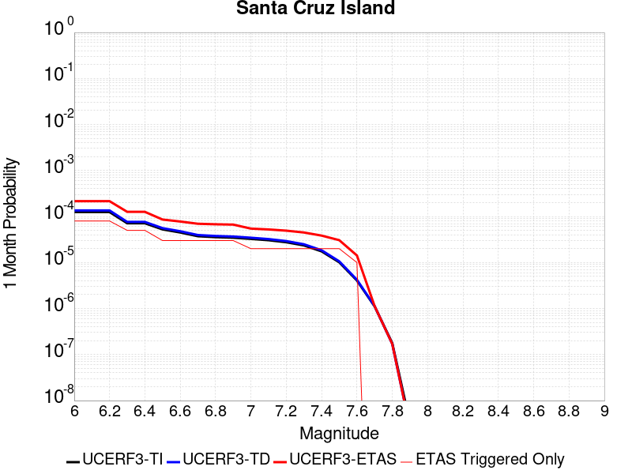 |  |  |

| Magnitude | 1 wk TI Prob | 1 wk TD Prob | 1 wk ETAS Prob | 1 wk ETAS/TD Gain | 1 wk ETAS Triggered Only | 1 mo TI Prob | 1 mo TD Prob | 1 mo ETAS Prob | 1 mo ETAS/TD Gain | 1 mo ETAS Triggered Only | 1 yr TI Prob | 1 yr TD Prob | 1 yr ETAS Prob | 1 yr ETAS/TD Gain | 1 yr ETAS Triggered Only | 10 yr TI Prob | 10 yr TD Prob | 10 yr ETAS Prob | 10 yr ETAS/TD Gain | 10 yr ETAS Triggered Only |
|-----|-----|-----|-----|-----|-----|-----|-----|-----|-----|-----|-----|-----|-----|-----|-----|-----|-----|-----|-----|-----|
| 6.0 | 2.9164563E-5 | 3.1599742E-5 | 1.0167953E-4 | 3.2177327 | 7.0081995E-5 | 1.2498499E-4 | 1.3542121E-4 | 2.755662E-4 | 2.0348823 | 1.4016399E-4 | 0.0015206301 | 0.0016476426 | 0.0017875755 | 1.0849292 | 1.4016399E-4 | 0.015102667 | 0.016368 | 0.01650587 | 1.0084231 | 1.4016399E-4 |
| 6.1 | 2.9164563E-5 | 3.1599742E-5 | 1.0167953E-4 | 3.2177327 | 7.0081995E-5 | 1.2498499E-4 | 1.3542121E-4 | 2.755662E-4 | 2.0348823 | 1.4016399E-4 | 0.0015206301 | 0.0016476426 | 0.0017875755 | 1.0849292 | 1.4016399E-4 | 0.015102667 | 0.016368 | 0.01650587 | 1.0084231 | 1.4016399E-4 |
| 6.2 | 2.9164563E-5 | 3.1599742E-5 | 1.0167953E-4 | 3.2177327 | 7.0081995E-5 | 1.2498499E-4 | 1.3542121E-4 | 2.755662E-4 | 2.0348823 | 1.4016399E-4 | 0.0015206301 | 0.0016476426 | 0.0017875755 | 1.0849292 | 1.4016399E-4 | 0.015102667 | 0.016368 | 0.01650587 | 1.0084231 | 1.4016399E-4 |
| 6.3 | 1.6635553E-5 | 1.780436E-5 | 8.7885106E-5 | 4.9361567 | 7.0081995E-5 | 7.1293274E-5 | 7.630226E-5 | 2.1645556E-4 | 2.836817 | 1.4016399E-4 | 8.6765E-4 | 9.2860236E-4 | 0.0010686362 | 1.1508006 | 1.4016399E-4 | 0.008642701 | 0.009249094 | 0.009387962 | 1.0150142 | 1.4016399E-4 |
| 6.4 | 1.6635553E-5 | 1.780436E-5 | 8.7885106E-5 | 4.9361567 | 7.0081995E-5 | 7.1293274E-5 | 7.630226E-5 | 2.1645556E-4 | 2.836817 | 1.4016399E-4 | 8.6765E-4 | 9.2860236E-4 | 0.0010686362 | 1.1508006 | 1.4016399E-4 | 0.008642701 | 0.009249094 | 0.009387962 | 1.0150142 | 1.4016399E-4 |
| 6.5 | 1.2238748E-5 | 1.3042995E-5 | 8.3124076E-5 | 6.3730817 | 7.0081995E-5 | 5.2450723E-5 | 5.5897377E-5 | 1.2597545E-4 | 2.2536917 | 7.0081995E-5 | 6.3840044E-4 | 6.8034173E-4 | 7.50376E-4 | 1.10294 | 7.0081995E-5 | 0.0063656955 | 0.0067829876 | 0.0068525947 | 1.0102619 | 7.0081995E-5 |
| 6.6 | 1.0489767E-5 | 1.1156636E-5 | 8.123785E-5 | 7.2815723 | 7.0081995E-5 | 4.495537E-5 | 4.781329E-5 | 1.17891934E-4 | 2.465673 | 7.0081995E-5 | 5.4719415E-4 | 5.819735E-4 | 6.5201474E-4 | 1.1203512 | 7.0081995E-5 | 0.005458487 | 0.0058047357 | 0.0058744107 | 1.0120032 | 7.0081995E-5 |
| 6.7 | 8.699222E-6 | 9.236782E-6 | 7.931813E-5 | 8.587204 | 7.0081995E-5 | 3.7281847E-5 | 3.958561E-5 | 1.09664834E-4 | 2.7703207 | 7.0081995E-5 | 4.5381195E-4 | 4.8184878E-4 | 5.51897E-4 | 1.1453738 | 7.0081995E-5 | 0.0045288634 | 0.004808108 | 0.0048778527 | 1.0145057 | 7.0081995E-5 |
| 6.8 | 8.307732E-6 | 8.8169045E-6 | 7.889828E-5 | 8.948524 | 7.0081995E-5 | 3.560408E-5 | 3.7786187E-5 | 1.0786553E-4 | 2.8546288 | 7.0081995E-5 | 4.3339343E-4 | 4.5995016E-4 | 5.299999E-4 | 1.1522986 | 7.0081995E-5 | 0.004325492 | 0.0045900354 | 0.0046597957 | 1.0151982 | 7.0081995E-5 |
| 6.9 | 8.073121E-6 | 8.564939E-6 | 7.8646335E-5 | 9.182358 | 7.0081995E-5 | 3.459863E-5 | 3.6706366E-5 | 1.0678579E-4 | 2.90919 | 7.0081995E-5 | 4.2115687E-4 | 4.468088E-4 | 5.1685947E-4 | 1.15678 | 7.0081995E-5 | 0.004203596 | 0.004459156 | 0.0045289253 | 1.0156463 | 7.0081995E-5 |
| 7.0 | 7.617019E-6 | 8.074664E-6 | 7.8156096E-5 | 9.679175 | 7.0081995E-5 | 3.264396E-5 | 3.4605247E-5 | 1.0468482E-4 | 3.025114 | 7.0081995E-5 | 3.9736772E-4 | 4.212378E-4 | 4.912903E-4 | 1.1663015 | 7.0081995E-5 | 0.003966579 | 0.0042044413 | 0.0042742286 | 1.0165985 | 7.0081995E-5 |
| 7.1 | 7.1224836E-6 | 7.545788E-6 | 7.762726E-5 | 10.287496 | 7.0081995E-5 | 3.052457E-5 | 3.2338692E-5 | 1.02418424E-4 | 3.1670551 | 7.0081995E-5 | 3.715733E-4 | 3.936528E-4 | 4.637072E-4 | 1.1779599 | 7.0081995E-5 | 0.003709526 | 0.003929598 | 0.0039994046 | 1.0177643 | 7.0081995E-5 |
| 7.2 | 6.441115E-6 | 6.8273835E-6 | 7.69089E-5 | 11.26477 | 7.0081995E-5 | 2.7604487E-5 | 2.9259887E-5 | 9.9339835E-5 | 3.395086 | 7.0081995E-5 | 3.360328E-4 | 3.5618112E-4 | 4.2623817E-4 | 1.1966894 | 7.0081995E-5 | 0.0033552512 | 0.003556131 | 0.0036259638 | 1.0196373 | 7.0081995E-5 |
| 7.3 | 5.494274E-6 | 5.8199944E-6 | 7.590158E-5 | 13.041522 | 7.0081995E-5 | 2.3546674E-5 | 2.4942596E-5 | 9.502284E-5 | 3.8096614 | 7.0081995E-5 | 2.8664304E-4 | 3.0363398E-4 | 3.736947E-4 | 1.2307407 | 7.0081995E-5 | 0.002862736 | 0.0030322142 | 0.003102084 | 1.0230424 | 7.0081995E-5 |
| 7.4 | 4.0802624E-6 | 4.312256E-6 | 7.439395E-5 | 17.251747 | 7.0081995E-5 | 1.7486722E-5 | 1.8480967E-5 | 8.856167E-5 | 4.7920475 | 7.0081995E-5 | 2.1288003E-4 | 2.2498262E-4 | 2.9504884E-4 | 1.3114295 | 7.0081995E-5 | 0.0021267622 | 0.0022475575 | 0.002317482 | 1.0311114 | 7.0081995E-5 |
| 7.5 | 2.3584746E-6 | 2.4753094E-6 | 7.255713E-5 | 29.312347 | 7.0081995E-5 | 1.0107709E-5 | 1.0608426E-5 | 8.068968E-5 | 7.6061873 | 7.0081995E-5 | 1.2305441E-4 | 1.2915E-4 | 1.9922294E-4 | 1.5425702 | 7.0081995E-5 | 0.0012298629 | 0.0012907543 | 0.0013607459 | 1.0542253 | 7.0081995E-5 |
| 7.6 | 9.4981914E-7 | 9.86093E-7 | 7.106802E-5 | 72.0703 | 7.0081995E-5 | 4.0706473E-6 | 4.2261063E-6 | 7.4307805E-5 | 17.583042 | 7.0081995E-5 | 4.9559E-5 | 5.145164E-5 | 1.2153003E-4 | 2.3620243 | 7.0081995E-5 | 4.954795E-4 | 5.1439856E-4 | 5.8444455E-4 | 1.1361705 | 7.0081995E-5 |
| 7.7 | 2.6013532E-7 | 2.6416603E-7 | 2.6416603E-7 | 1.0 | 0.0 | 1.1148652E-6 | 1.1321397E-6 | 1.1321397E-6 | 1.0 | 0.0 | 1.3573399E-5 | 1.3783714E-5 | 1.3783714E-5 | 1.0 | 0.0 | 1.357257E-4 | 1.3782867E-4 | 1.3782867E-4 | 1.0 | 0.0 |
| 7.8 | 4.1522263E-8 | 3.965679E-8 | 3.965679E-8 | 1.0 | 0.0 | 1.7795254E-7 | 1.6995766E-7 | 1.6995766E-7 | 1.0 | 0.0 | 2.16657E-6 | 2.0692328E-6 | 2.0692328E-6 | 1.0 | 0.0 | 2.1665488E-5 | 2.0692156E-5 | 2.0692156E-5 | 1.0 | 0.0 |
| 7.9 | 7.7242046E-10 | 5.9468175E-10 | 5.9468175E-10 | 1.0 | 0.0 | 3.3103735E-9 | 2.5486364E-9 | 2.5486364E-9 | 1.0 | 0.0 | 4.0303796E-8 | 3.1029646E-8 | 3.1029646E-8 | 1.0 | 0.0 | 4.030379E-7 | 3.1029643E-7 | 3.1029643E-7 | 1.0 | 0.0 |

## San Jacinto (Superstition Mtn)
*[(top)](#table-of-contents)*

| 1 Week | 1 Month | 1 Year | 10 Year |
|-----|-----|-----|-----|
|  |  |  |  |

| Magnitude | 1 wk TI Prob | 1 wk TD Prob | 1 wk ETAS Prob | 1 wk ETAS/TD Gain | 1 wk ETAS Triggered Only | 1 mo TI Prob | 1 mo TD Prob | 1 mo ETAS Prob | 1 mo ETAS/TD Gain | 1 mo ETAS Triggered Only | 1 yr TI Prob | 1 yr TD Prob | 1 yr ETAS Prob | 1 yr ETAS/TD Gain | 1 yr ETAS Triggered Only | 10 yr TI Prob | 10 yr TD Prob | 10 yr ETAS Prob | 10 yr ETAS/TD Gain | 10 yr ETAS Triggered Only |
|-----|-----|-----|-----|-----|-----|-----|-----|-----|-----|-----|-----|-----|-----|-----|-----|-----|-----|-----|-----|-----|
| 6.0 | 6.4193904E-5 | 9.599367E-5 | 1.6606894E-4 | 1.7299988 | 7.0081995E-5 | 2.7508775E-4 | 4.1134638E-4 | 4.8139953E-4 | 1.1703022 | 7.0081995E-5 | 0.0033440501 | 0.0049980893 | 0.005067821 | 1.0139517 | 7.0081995E-5 | 0.03294174 | 0.048823986 | 0.048957307 | 1.0027306 | 1.4016399E-4 |
| 6.1 | 6.4193904E-5 | 9.599367E-5 | 1.6606894E-4 | 1.7299988 | 7.0081995E-5 | 2.7508775E-4 | 4.1134638E-4 | 4.8139953E-4 | 1.1703022 | 7.0081995E-5 | 0.0033440501 | 0.0049980893 | 0.005067821 | 1.0139517 | 7.0081995E-5 | 0.03294174 | 0.048823986 | 0.048957307 | 1.0027306 | 1.4016399E-4 |
| 6.2 | 5.7023593E-5 | 8.3144434E-5 | 1.532206E-4 | 1.8428246 | 7.0081995E-5 | 2.4436394E-4 | 3.5629404E-4 | 4.2635106E-4 | 1.196627 | 7.0081995E-5 | 0.002971072 | 0.0043308944 | 0.004400673 | 1.0161119 | 7.0081995E-5 | 0.029316625 | 0.04250403 | 0.042638235 | 1.0031575 | 1.4016399E-4 |
| 6.3 | 5.6940098E-5 | 8.298979E-5 | 1.5306598E-4 | 1.8443952 | 7.0081995E-5 | 2.4400617E-4 | 3.5563146E-4 | 4.2568854E-4 | 1.1969935 | 7.0081995E-5 | 0.002966728 | 0.00432286 | 0.004392639 | 1.0161419 | 7.0081995E-5 | 0.029274331 | 0.042427283 | 0.0425615 | 1.0031635 | 1.4016399E-4 |
| 6.4 | 5.4171585E-5 | 7.7483564E-5 | 1.4756013E-4 | 1.9044056 | 7.0081995E-5 | 2.3214328E-4 | 3.3203943E-4 | 4.0209817E-4 | 1.2109952 | 7.0081995E-5 | 0.0028226813 | 0.0040367353 | 0.004106534 | 1.017291 | 7.0081995E-5 | 0.02787096 | 0.03971653 | 0.03985113 | 1.003389 | 1.4016399E-4 |
| 6.5 | 4.375144E-5 | 5.642133E-5 | 1.2649938E-4 | 2.2420487 | 7.0081995E-5 | 1.874927E-4 | 2.4178992E-4 | 3.1185496E-4 | 1.2897766 | 7.0081995E-5 | 0.0022803338 | 0.002940994 | 0.0030108697 | 1.0237592 | 7.0081995E-5 | 0.022570757 | 0.029236801 | 0.029372867 | 1.0046539 | 1.4016399E-4 |
| 6.6 | 2.772192E-5 | 2.5488358E-5 | 9.556857E-5 | 3.7494988 | 7.0081995E-5 | 1.1880282E-4 | 1.09231354E-4 | 1.7930569E-4 | 1.6415222 | 7.0081995E-5 | 0.0014454646 | 0.0013290998 | 0.0013990887 | 1.0526588 | 7.0081995E-5 | 0.014360986 | 0.01354049 | 0.013609624 | 1.0051056 | 7.0081995E-5 |
| 6.7 | 2.7124124E-5 | 2.4699386E-5 | 9.477965E-5 | 3.8373282 | 7.0081995E-5 | 1.1624106E-4 | 1.05850326E-4 | 1.759249E-4 | 1.6620157 | 7.0081995E-5 | 0.0014143161 | 0.001287985 | 0.0013579768 | 1.054342 | 7.0081995E-5 | 0.014053487 | 0.013133943 | 0.013203105 | 1.0052658 | 7.0081995E-5 |
| 6.8 | 2.5475807E-5 | 2.216446E-5 | 9.22449E-5 | 4.1618385 | 7.0081995E-5 | 1.0917746E-4 | 9.4987154E-5 | 1.6506249E-4 | 1.7377349 | 7.0081995E-5 | 0.001328425 | 0.001155867 | 0.001225868 | 1.0605614 | 7.0081995E-5 | 0.0132051185 | 0.011822182 | 0.011891435 | 1.005858 | 7.0081995E-5 |
| 6.9 | 2.1162023E-5 | 1.7626244E-5 | 8.7707005E-5 | 4.975933 | 7.0081995E-5 | 9.069123E-5 | 7.5538876E-5 | 1.4561557E-4 | 1.9276905 | 7.0081995E-5 | 0.0011036064 | 9.193016E-4 | 9.893192E-4 | 1.0761639 | 7.0081995E-5 | 0.010981417 | 0.00944688 | 0.0095163 | 1.0073484 | 7.0081995E-5 |
| 7.0 | 1.8754288E-5 | 1.6161559E-5 | 8.624242E-5 | 5.336269 | 7.0081995E-5 | 8.037304E-5 | 6.9261994E-5 | 1.3933914E-4 | 2.011769 | 7.0081995E-5 | 9.781026E-4 | 8.4294105E-4 | 9.1296394E-4 | 1.0830698 | 7.0081995E-5 | 0.009738087 | 0.008670042 | 0.008739516 | 1.0080131 | 7.0081995E-5 |
| 7.1 | 1.8678527E-5 | 1.6086702E-5 | 8.616757E-5 | 5.356447 | 7.0081995E-5 | 8.0048376E-5 | 6.89412E-5 | 1.3901836E-4 | 2.0164773 | 7.0081995E-5 | 9.7415317E-4 | 8.3903834E-4 | 9.090615E-4 | 1.0834565 | 7.0081995E-5 | 0.009698939 | 0.008630998 | 0.008700475 | 1.0080497 | 7.0081995E-5 |
| 7.2 | 1.7804578E-5 | 1.5381282E-5 | 8.54622E-5 | 5.556247 | 7.0081995E-5 | 7.6303106E-5 | 6.5918124E-5 | 1.3599549E-4 | 2.0630972 | 7.0081995E-5 | 9.285943E-4 | 8.022599E-4 | 8.722857E-4 | 1.0872856 | 7.0081995E-5 | 0.009247236 | 0.008262311 | 0.008331815 | 1.008412 | 7.0081995E-5 |
| 7.3 | 1.6583685E-5 | 1.4530388E-5 | 8.461137E-5 | 5.823063 | 7.0081995E-5 | 7.1070994E-5 | 6.227162E-5 | 1.3234925E-4 | 2.1253543 | 7.0081995E-5 | 8.649459E-4 | 7.5789524E-4 | 8.279241E-4 | 1.0923991 | 7.0081995E-5 | 0.00861587 | 0.007817623 | 0.007887158 | 1.0088946 | 7.0081995E-5 |
| 7.4 | 1.6387552E-5 | 1.4395274E-5 | 8.447626E-5 | 5.868333 | 7.0081995E-5 | 7.023047E-5 | 6.169258E-5 | 1.3177026E-4 | 2.1359172 | 7.0081995E-5 | 8.5472054E-4 | 7.5085036E-4 | 8.208797E-4 | 1.0932667 | 7.0081995E-5 | 0.008514405 | 0.0077470057 | 0.007816545 | 1.0089762 | 7.0081995E-5 |
| 7.5 | 1.5790754E-5 | 1.4035962E-5 | 8.4116975E-5 | 5.9929614 | 7.0081995E-5 | 6.767291E-5 | 6.0152746E-5 | 1.3023053E-4 | 2.164997 | 7.0081995E-5 | 8.236062E-4 | 7.321156E-4 | 8.0214627E-4 | 1.0956552 | 7.0081995E-5 | 0.008205604 | 0.007557569 | 0.0076271216 | 1.009203 | 7.0081995E-5 |
| 7.6 | 1.4248672E-5 | 1.3054932E-5 | 8.3136016E-5 | 6.368169 | 7.0081995E-5 | 6.106431E-5 | 5.594852E-5 | 1.260266E-4 | 2.2525456 | 7.0081995E-5 | 7.432043E-4 | 6.8096205E-4 | 7.5099635E-4 | 1.102846 | 7.0081995E-5 | 0.007407237 | 0.0070401574 | 0.007109746 | 1.0098845 | 7.0081995E-5 |
| 7.7 | 1.15449975E-5 | 1.090368E-5 | 8.098491E-5 | 7.427301 | 7.0081995E-5 | 4.947762E-5 | 4.6729223E-5 | 1.1680795E-4 | 2.4996765 | 7.0081995E-5 | 6.022235E-4 | 5.687805E-4 | 6.388227E-4 | 1.1231444 | 7.0081995E-5 | 0.006005941 | 0.0059101824 | 0.00597985 | 1.0117878 | 7.0081995E-5 |
| 7.8 | 9.1391985E-6 | 9.514299E-6 | 7.959563E-5 | 8.365895 | 7.0081995E-5 | 3.9167408E-5 | 4.0774932E-5 | 1.1085407E-4 | 2.7186818 | 7.0081995E-5 | 4.767588E-4 | 4.963223E-4 | 5.663695E-4 | 1.1411325 | 7.0081995E-5 | 0.0047573727 | 0.0051766867 | 0.005246406 | 1.0134679 | 7.0081995E-5 |
| 7.9 | 6.973017E-6 | 7.3821784E-6 | 7.3821784E-6 | 1.0 | 0.0 | 2.9884017E-5 | 3.1637526E-5 | 3.1637526E-5 | 1.0 | 0.0 | 3.6377716E-4 | 3.8511935E-4 | 3.8511935E-4 | 1.0 | 0.0 | 0.0036318225 | 0.0040517948 | 0.0040517948 | 1.0 | 0.0 |
| 8.0 | 5.7638235E-6 | 6.259972E-6 | 6.259972E-6 | 1.0 | 0.0 | 2.4701867E-5 | 2.6828178E-5 | 2.6828178E-5 | 1.0 | 0.0 | 3.0070372E-4 | 3.2658462E-4 | 3.2658462E-4 | 1.0 | 0.0 | 0.0030029714 | 0.0034534496 | 0.0034534496 | 1.0 | 0.0 |
| 8.1 | 5.1124434E-6 | 5.4956718E-6 | 5.4956718E-6 | 1.0 | 0.0 | 2.1910288E-5 | 2.355267E-5 | 2.355267E-5 | 1.0 | 0.0 | 2.6672508E-4 | 2.867165E-4 | 2.867165E-4 | 1.0 | 0.0 | 0.0026640517 | 0.003040336 | 0.003040336 | 1.0 | 0.0 |
| 8.2 | 1.1075938E-6 | 5.336568E-7 | 5.336568E-7 | 1.0 | 0.0 | 4.7468216E-6 | 2.2870988E-6 | 2.2870988E-6 | 1.0 | 0.0 | 5.779102E-5 | 2.7845093E-5 | 2.7845093E-5 | 1.0 | 0.0 | 5.777599E-4 | 3.1346595E-4 | 3.1346595E-4 | 1.0 | 0.0 |
| 8.3 | 1.3584393E-8 | 4.473836E-9 | 4.473836E-9 | 1.0 | 0.0 | 5.8218827E-8 | 1.9173582E-8 | 1.9173582E-8 | 1.0 | 0.0 | 7.0881396E-7 | 2.3343837E-7 | 2.3343837E-7 | 1.0 | 0.0 | 7.0881174E-6 | 2.6163038E-6 | 2.6163038E-6 | 1.0 | 0.0 |

## Kern Canyon (Lake Isabella) 2011
*[(top)](#table-of-contents)*

| 1 Week | 1 Month | 1 Year | 10 Year |
|-----|-----|-----|-----|
|  |  |  |  |

| Magnitude | 1 wk TI Prob | 1 wk TD Prob | 1 wk ETAS Prob | 1 wk ETAS/TD Gain | 1 wk ETAS Triggered Only | 1 mo TI Prob | 1 mo TD Prob | 1 mo ETAS Prob | 1 mo ETAS/TD Gain | 1 mo ETAS Triggered Only | 1 yr TI Prob | 1 yr TD Prob | 1 yr ETAS Prob | 1 yr ETAS/TD Gain | 1 yr ETAS Triggered Only | 10 yr TI Prob | 10 yr TD Prob | 10 yr ETAS Prob | 10 yr ETAS/TD Gain | 10 yr ETAS Triggered Only |
|-----|-----|-----|-----|-----|-----|-----|-----|-----|-----|-----|-----|-----|-----|-----|-----|-----|-----|-----|-----|-----|
| 6.0 | 4.2387383E-6 | 4.001639E-6 | 4.001639E-6 | 1.0 | 0.0 | 1.8165894E-5 | 1.7149778E-5 | 8.7230575E-5 | 5.0863967 | 7.0081995E-5 | 2.2114732E-4 | 2.087804E-4 | 2.7884776E-4 | 1.3356031 | 7.0081995E-5 | 0.0022092736 | 0.0020860266 | 0.0022258982 | 1.0670516 | 1.4016399E-4 |
| 6.1 | 4.2387383E-6 | 4.001639E-6 | 4.001639E-6 | 1.0 | 0.0 | 1.8165894E-5 | 1.7149778E-5 | 8.7230575E-5 | 5.0863967 | 7.0081995E-5 | 2.2114732E-4 | 2.087804E-4 | 2.7884776E-4 | 1.3356031 | 7.0081995E-5 | 0.0022092736 | 0.0020860266 | 0.0022258982 | 1.0670516 | 1.4016399E-4 |
| 6.2 | 4.2387383E-6 | 4.001639E-6 | 4.001639E-6 | 1.0 | 0.0 | 1.8165894E-5 | 1.7149778E-5 | 8.7230575E-5 | 5.0863967 | 7.0081995E-5 | 2.2114732E-4 | 2.087804E-4 | 2.7884776E-4 | 1.3356031 | 7.0081995E-5 | 0.0022092736 | 0.0020860266 | 0.0022258982 | 1.0670516 | 1.4016399E-4 |
| 6.3 | 4.2387383E-6 | 4.001639E-6 | 4.001639E-6 | 1.0 | 0.0 | 1.8165894E-5 | 1.7149778E-5 | 8.7230575E-5 | 5.0863967 | 7.0081995E-5 | 2.2114732E-4 | 2.087804E-4 | 2.7884776E-4 | 1.3356031 | 7.0081995E-5 | 0.0022092736 | 0.0020860266 | 0.0022258982 | 1.0670516 | 1.4016399E-4 |
| 6.4 | 4.2387383E-6 | 4.001639E-6 | 4.001639E-6 | 1.0 | 0.0 | 1.8165894E-5 | 1.7149778E-5 | 8.7230575E-5 | 5.0863967 | 7.0081995E-5 | 2.2114732E-4 | 2.087804E-4 | 2.7884776E-4 | 1.3356031 | 7.0081995E-5 | 0.0022092736 | 0.0020860266 | 0.0022258982 | 1.0670516 | 1.4016399E-4 |
| 6.5 | 2.7857532E-6 | 2.517867E-6 | 2.517867E-6 | 1.0 | 0.0 | 1.1938888E-5 | 1.0790815E-5 | 8.087206E-5 | 7.494527 | 7.0081995E-5 | 1.4534626E-4 | 1.3137059E-4 | 2.0144337E-4 | 1.5333978 | 7.0081995E-5 | 0.0014525123 | 0.001312962 | 0.001452942 | 1.1066139 | 1.4016399E-4 |
| 6.6 | 2.2233348E-6 | 1.9441236E-6 | 1.9441236E-6 | 1.0 | 0.0 | 9.528543E-6 | 8.331932E-6 | 8.331932E-6 | 1.0 | 0.0 | 1.1600384E-4 | 1.01436635E-4 | 1.01436635E-4 | 1.0 | 0.0 | 0.001159433 | 0.001013912 | 0.0010839229 | 1.0690503 | 7.0081995E-5 |
| 6.7 | 2.1635126E-6 | 1.8835036E-6 | 1.8835036E-6 | 1.0 | 0.0 | 9.272164E-6 | 8.072134E-6 | 8.072134E-6 | 1.0 | 0.0 | 1.1288274E-4 | 9.827388E-5 | 9.827388E-5 | 1.0 | 0.0 | 0.0011282542 | 9.823124E-4 | 0.0010523255 | 1.0712738 | 7.0081995E-5 |
| 6.8 | 1.8685711E-6 | 1.5831425E-6 | 1.5831425E-6 | 1.0 | 0.0 | 8.008137E-6 | 6.784879E-6 | 6.784879E-6 | 1.0 | 0.0 | 9.74947E-5 | 8.260282E-5 | 8.260282E-5 | 1.0 | 0.0 | 9.745194E-4 | 8.2572614E-4 | 8.9575024E-4 | 1.0848031 | 7.0081995E-5 |
| 6.9 | 1.5815071E-6 | 1.3064928E-6 | 1.3064928E-6 | 1.0 | 0.0 | 6.77787E-6 | 5.599243E-6 | 5.599243E-6 | 1.0 | 0.0 | 8.251744E-5 | 6.816868E-5 | 6.816868E-5 | 1.0 | 0.0 | 8.248681E-4 | 6.8148033E-4 | 7.5151457E-4 | 1.1027678 | 7.0081995E-5 |
| 7.0 | 1.3772564E-6 | 1.1210718E-6 | 1.1210718E-6 | 1.0 | 0.0 | 5.9025137E-6 | 4.8045845E-6 | 4.8045845E-6 | 1.0 | 0.0 | 7.186073E-5 | 5.8494268E-5 | 5.8494268E-5 | 1.0 | 0.0 | 7.18375E-4 | 5.847908E-4 | 6.5483176E-4 | 1.1197711 | 7.0081995E-5 |
| 7.1 | 1.0916998E-6 | 8.763777E-7 | 8.763777E-7 | 1.0 | 0.0 | 4.678705E-6 | 3.7558991E-6 | 3.7558991E-6 | 1.0 | 0.0 | 5.6961744E-5 | 4.5727127E-5 | 4.5727127E-5 | 1.0 | 0.0 | 5.6947145E-4 | 4.571785E-4 | 4.571785E-4 | 1.0 | 0.0 |
| 7.2 | 7.6277024E-7 | 5.901454E-7 | 5.901454E-7 | 1.0 | 0.0 | 3.2690114E-6 | 2.5291922E-6 | 2.5291922E-6 | 1.0 | 0.0 | 3.9799485E-5 | 3.0792486E-5 | 3.0792486E-5 | 1.0 | 0.0 | 3.9792358E-4 | 3.0788282E-4 | 3.0788282E-4 | 1.0 | 0.0 |
| 7.3 | 5.3265916E-7 | 4.3824414E-7 | 4.3824414E-7 | 1.0 | 0.0 | 2.282823E-6 | 1.878188E-6 | 1.878188E-6 | 1.0 | 0.0 | 2.7793016E-5 | 2.2866701E-5 | 2.2866701E-5 | 1.0 | 0.0 | 2.778954E-4 | 2.2864387E-4 | 2.2864387E-4 | 1.0 | 0.0 |
| 7.4 | 3.4946007E-7 | 3.006571E-7 | 3.006571E-7 | 1.0 | 0.0 | 1.497685E-6 | 1.2885298E-6 | 1.2885298E-6 | 1.0 | 0.0 | 1.8234163E-5 | 1.568774E-5 | 1.568774E-5 | 1.0 | 0.0 | 1.8232666E-4 | 1.5686655E-4 | 1.5686655E-4 | 1.0 | 0.0 |
| 7.5 | 1.8317026E-7 | 1.4244812E-7 | 1.4244812E-7 | 1.0 | 0.0 | 7.850152E-7 | 6.104918E-7 | 6.104918E-7 | 1.0 | 0.0 | 9.557518E-6 | 7.432713E-6 | 7.432713E-6 | 1.0 | 0.0 | 9.5571064E-5 | 7.432472E-5 | 7.432472E-5 | 1.0 | 0.0 |
| 7.6 | 2.572245E-8 | 1.7352555E-8 | 1.7352555E-8 | 1.0 | 0.0 | 1.10239064E-7 | 7.436809E-8 | 7.436809E-8 | 1.0 | 0.0 | 1.3421597E-6 | 9.054312E-7 | 9.054312E-7 | 1.0 | 0.0 | 1.3421517E-5 | 9.05428E-6 | 9.05428E-6 | 1.0 | 0.0 |

## Malibu Coast (Extension) alt 1
*[(top)](#table-of-contents)*

| 1 Week | 1 Month | 1 Year | 10 Year |
|-----|-----|-----|-----|
|  |  |  |  |

| Magnitude | 1 wk TI Prob | 1 wk TD Prob | 1 wk ETAS Prob | 1 wk ETAS/TD Gain | 1 wk ETAS Triggered Only | 1 mo TI Prob | 1 mo TD Prob | 1 mo ETAS Prob | 1 mo ETAS/TD Gain | 1 mo ETAS Triggered Only | 1 yr TI Prob | 1 yr TD Prob | 1 yr ETAS Prob | 1 yr ETAS/TD Gain | 1 yr ETAS Triggered Only | 10 yr TI Prob | 10 yr TD Prob | 10 yr ETAS Prob | 10 yr ETAS/TD Gain | 10 yr ETAS Triggered Only |
|-----|-----|-----|-----|-----|-----|-----|-----|-----|-----|-----|-----|-----|-----|-----|-----|-----|-----|-----|-----|-----|
| 6.0 | 8.930738E-6 | 9.329276E-6 | 9.329276E-6 | 1.0 | 0.0 | 3.827403E-5 | 3.998201E-5 | 1.100612E-4 | 2.7527683 | 7.0081995E-5 | 4.6588664E-4 | 4.8667393E-4 | 6.2676973E-4 | 1.2878637 | 1.4016399E-4 | 0.0046491115 | 0.004856264 | 0.0049957475 | 1.0287224 | 1.4016399E-4 |
| 6.1 | 7.199952E-6 | 7.5302964E-6 | 7.5302964E-6 | 1.0 | 0.0 | 3.0856572E-5 | 3.2272303E-5 | 1.0235204E-4 | 3.1715133 | 7.0081995E-5 | 3.75614E-4 | 3.9284505E-4 | 4.628995E-4 | 1.1783259 | 7.0081995E-5 | 0.0037497976 | 0.003921572 | 0.0039913794 | 1.0178008 | 7.0081995E-5 |
| 6.2 | 6.3721413E-6 | 6.6667917E-6 | 6.6667917E-6 | 1.0 | 0.0 | 2.7308892E-5 | 2.8571652E-5 | 9.8651646E-5 | 3.4527805 | 7.0081995E-5 | 3.3243504E-4 | 3.4780471E-4 | 4.1786232E-4 | 1.201428 | 7.0081995E-5 | 0.0033193815 | 0.0034726437 | 0.0035424824 | 1.0201111 | 7.0081995E-5 |
| 6.3 | 6.016345E-6 | 6.295158E-6 | 6.295158E-6 | 1.0 | 0.0 | 2.578408E-5 | 2.6978973E-5 | 9.705908E-5 | 3.5975826 | 7.0081995E-5 | 3.1387596E-4 | 3.2841982E-4 | 3.984788E-4 | 1.2133214 | 7.0081995E-5 | 0.00313433 | 0.0032793807 | 0.003349233 | 1.0213004 | 7.0081995E-5 |
| 6.4 | 5.8104883E-6 | 6.0795446E-6 | 6.0795446E-6 | 1.0 | 0.0 | 2.4901856E-5 | 2.6054933E-5 | 9.61351E-5 | 3.6897085 | 7.0081995E-5 | 3.031379E-4 | 3.1717293E-4 | 3.8723272E-4 | 1.2208883 | 7.0081995E-5 | 0.0030272473 | 0.0031672374 | 0.0032370973 | 1.022057 | 7.0081995E-5 |
| 6.5 | 5.476925E-6 | 5.7275133E-6 | 5.7275133E-6 | 1.0 | 0.0 | 2.3472323E-5 | 2.4546256E-5 | 9.462653E-5 | 3.855029 | 7.0081995E-5 | 2.8573806E-4 | 2.9880996E-4 | 3.6887103E-4 | 1.2344669 | 7.0081995E-5 | 0.0028537093 | 0.002984114 | 0.0030539867 | 1.023415 | 7.0081995E-5 |
| 6.6 | 5.222387E-6 | 5.45858E-6 | 5.45858E-6 | 1.0 | 0.0 | 2.2381464E-5 | 2.3393704E-5 | 9.347406E-5 | 3.995693 | 7.0081995E-5 | 2.7246025E-4 | 2.8478142E-4 | 3.5484345E-4 | 1.2460204 | 7.0081995E-5 | 0.0027212645 | 0.0028441956 | 0.002914078 | 1.0245702 | 7.0081995E-5 |
| 6.7 | 5.0337076E-6 | 5.259103E-6 | 5.259103E-6 | 1.0 | 0.0 | 2.1572854E-5 | 2.253882E-5 | 9.261924E-5 | 4.1093206 | 7.0081995E-5 | 2.6261783E-4 | 2.7437587E-4 | 3.4443862E-4 | 1.2553532 | 7.0081995E-5 | 0.002623077 | 0.002740401 | 0.002810291 | 1.0255035 | 7.0081995E-5 |
| 6.8 | 4.5675624E-6 | 4.7587164E-6 | 4.7587164E-6 | 1.0 | 0.0 | 1.9575122E-5 | 2.039434E-5 | 9.047491E-5 | 4.436275 | 7.0081995E-5 | 2.3830103E-4 | 2.48273E-4 | 3.1833758E-4 | 1.2822078 | 7.0081995E-5 | 0.0023804565 | 0.002479976 | 0.0025498841 | 1.0281891 | 7.0081995E-5 |
| 6.9 | 4.2802412E-6 | 4.4520207E-6 | 4.4520207E-6 | 1.0 | 0.0 | 1.8343762E-5 | 1.907995E-5 | 1.907995E-5 | 1.0 | 0.0 | 2.2331243E-4 | 2.3227377E-4 | 2.3227377E-4 | 1.0 | 0.0 | 0.0022308815 | 0.0023203269 | 0.0023203269 | 1.0 | 0.0 |
| 7.0 | 3.9794063E-6 | 4.130099E-6 | 4.130099E-6 | 1.0 | 0.0 | 1.7054486E-5 | 1.7700306E-5 | 1.7700306E-5 | 1.0 | 0.0 | 2.0761859E-4 | 2.1548003E-4 | 2.1548003E-4 | 1.0 | 0.0 | 0.0020742472 | 0.0021527244 | 0.0021527244 | 1.0 | 0.0 |
| 7.1 | 3.7730424E-6 | 3.911217E-6 | 3.911217E-6 | 1.0 | 0.0 | 1.6170083E-5 | 1.6762251E-5 | 1.6762251E-5 | 1.0 | 0.0 | 1.9685295E-4 | 2.0406142E-4 | 2.0406142E-4 | 1.0 | 0.0 | 0.0019667868 | 0.0020387534 | 0.0020387534 | 1.0 | 0.0 |
| 7.2 | 3.424985E-6 | 3.541337E-6 | 3.541337E-6 | 1.0 | 0.0 | 1.4678424E-5 | 1.5177071E-5 | 1.5177071E-5 | 1.0 | 0.0 | 1.7869516E-4 | 1.8476529E-4 | 1.8476529E-4 | 1.0 | 0.0 | 0.0017855153 | 0.0018461287 | 0.0018461287 | 1.0 | 0.0 |
| 7.3 | 2.6966375E-6 | 2.7596534E-6 | 2.7596534E-6 | 1.0 | 0.0 | 1.15569665E-5 | 1.1827032E-5 | 1.1827032E-5 | 1.0 | 0.0 | 1.4069698E-4 | 1.4398464E-4 | 1.4398464E-4 | 1.0 | 0.0 | 0.0014060794 | 0.0014389176 | 0.0014389176 | 1.0 | 0.0 |
| 7.4 | 2.215957E-6 | 2.249378E-6 | 2.249378E-6 | 1.0 | 0.0 | 9.496924E-6 | 9.640156E-6 | 9.640156E-6 | 1.0 | 0.0 | 1.1561892E-4 | 1.17362615E-4 | 1.17362615E-4 | 1.0 | 0.0 | 0.0011555878 | 0.0011730101 | 0.0011730101 | 1.0 | 0.0 |
| 7.5 | 1.2040218E-6 | 1.2219067E-6 | 1.2219067E-6 | 1.0 | 0.0 | 5.160083E-6 | 5.2367322E-6 | 5.2367322E-6 | 1.0 | 0.0 | 6.2822204E-5 | 6.375537E-5 | 6.375537E-5 | 1.0 | 0.0 | 6.280445E-4 | 6.3737266E-4 | 6.3737266E-4 | 1.0 | 0.0 |
| 7.6 | 6.6157446E-7 | 6.678975E-7 | 6.678975E-7 | 1.0 | 0.0 | 2.835316E-6 | 2.8624147E-6 | 2.8624147E-6 | 1.0 | 0.0 | 3.4519428E-5 | 3.484936E-5 | 3.484936E-5 | 1.0 | 0.0 | 3.4514067E-4 | 3.4844046E-4 | 3.4844046E-4 | 1.0 | 0.0 |
| 7.7 | 2.6012302E-7 | 2.4357593E-7 | 2.4357593E-7 | 1.0 | 0.0 | 1.1148124E-6 | 1.0438964E-6 | 1.0438964E-6 | 1.0 | 0.0 | 1.3572758E-5 | 1.2709375E-5 | 1.2709375E-5 | 1.0 | 0.0 | 1.3571928E-4 | 1.2708755E-4 | 1.2708755E-4 | 1.0 | 0.0 |
| 7.8 | 2.8323132E-8 | 2.0266649E-8 | 2.0266649E-8 | 1.0 | 0.0 | 1.2138484E-7 | 8.685707E-8 | 8.685707E-8 | 1.0 | 0.0 | 1.4778595E-6 | 1.0574844E-6 | 1.0574844E-6 | 1.0 | 0.0 | 1.4778497E-5 | 1.0574801E-5 | 1.0574801E-5 | 1.0 | 0.0 |

## Kern Canyon (North Kern) 2011
*[(top)](#table-of-contents)*

| 1 Week | 1 Month | 1 Year | 10 Year |
|-----|-----|-----|-----|
|  |  |  |  |

| Magnitude | 1 wk TI Prob | 1 wk TD Prob | 1 wk ETAS Prob | 1 wk ETAS/TD Gain | 1 wk ETAS Triggered Only | 1 mo TI Prob | 1 mo TD Prob | 1 mo ETAS Prob | 1 mo ETAS/TD Gain | 1 mo ETAS Triggered Only | 1 yr TI Prob | 1 yr TD Prob | 1 yr ETAS Prob | 1 yr ETAS/TD Gain | 1 yr ETAS Triggered Only | 10 yr TI Prob | 10 yr TD Prob | 10 yr ETAS Prob | 10 yr ETAS/TD Gain | 10 yr ETAS Triggered Only |
|-----|-----|-----|-----|-----|-----|-----|-----|-----|-----|-----|-----|-----|-----|-----|-----|-----|-----|-----|-----|-----|
| 6.0 | 6.6264497E-6 | 6.75733E-6 | 6.75733E-6 | 1.0 | 0.0 | 2.8398761E-5 | 2.895971E-5 | 2.895971E-5 | 1.0 | 0.0 | 3.4570007E-4 | 3.5253543E-4 | 4.9265E-4 | 1.3974482 | 1.4016399E-4 | 0.0034516277 | 0.0035205502 | 0.0036602207 | 1.039673 | 1.4016399E-4 |
| 6.1 | 6.6264497E-6 | 6.75733E-6 | 6.75733E-6 | 1.0 | 0.0 | 2.8398761E-5 | 2.895971E-5 | 2.895971E-5 | 1.0 | 0.0 | 3.4570007E-4 | 3.5253543E-4 | 4.9265E-4 | 1.3974482 | 1.4016399E-4 | 0.0034516277 | 0.0035205502 | 0.0036602207 | 1.039673 | 1.4016399E-4 |
| 6.2 | 6.6264497E-6 | 6.75733E-6 | 6.75733E-6 | 1.0 | 0.0 | 2.8398761E-5 | 2.895971E-5 | 2.895971E-5 | 1.0 | 0.0 | 3.4570007E-4 | 3.5253543E-4 | 4.9265E-4 | 1.3974482 | 1.4016399E-4 | 0.0034516277 | 0.0035205502 | 0.0036602207 | 1.039673 | 1.4016399E-4 |
| 6.3 | 6.6264497E-6 | 6.75733E-6 | 6.75733E-6 | 1.0 | 0.0 | 2.8398761E-5 | 2.895971E-5 | 2.895971E-5 | 1.0 | 0.0 | 3.4570007E-4 | 3.5253543E-4 | 4.9265E-4 | 1.3974482 | 1.4016399E-4 | 0.0034516277 | 0.0035205502 | 0.0036602207 | 1.039673 | 1.4016399E-4 |
| 6.4 | 6.6264497E-6 | 6.75733E-6 | 6.75733E-6 | 1.0 | 0.0 | 2.8398761E-5 | 2.895971E-5 | 2.895971E-5 | 1.0 | 0.0 | 3.4570007E-4 | 3.5253543E-4 | 4.9265E-4 | 1.3974482 | 1.4016399E-4 | 0.0034516277 | 0.0035205502 | 0.0036602207 | 1.039673 | 1.4016399E-4 |
| 6.5 | 3.2162225E-6 | 3.2570915E-6 | 3.2570915E-6 | 1.0 | 0.0 | 1.3783738E-5 | 1.3958893E-5 | 1.3958893E-5 | 1.0 | 0.0 | 1.6780409E-4 | 1.6993708E-4 | 2.4000717E-4 | 1.4123296 | 7.0081995E-5 | 0.0016767744 | 0.001698151 | 0.0017681139 | 1.0411996 | 7.0081995E-5 |
| 6.6 | 3.2162225E-6 | 3.2570915E-6 | 3.2570915E-6 | 1.0 | 0.0 | 1.3783738E-5 | 1.3958893E-5 | 1.3958893E-5 | 1.0 | 0.0 | 1.6780409E-4 | 1.6993708E-4 | 2.4000717E-4 | 1.4123296 | 7.0081995E-5 | 0.0016767744 | 0.001698151 | 0.0017681139 | 1.0411996 | 7.0081995E-5 |
| 6.7 | 2.1908265E-6 | 2.2071222E-6 | 2.2071222E-6 | 1.0 | 0.0 | 9.389223E-6 | 9.459061E-6 | 9.459061E-6 | 1.0 | 0.0 | 1.1430779E-4 | 1.1515819E-4 | 1.1515819E-4 | 1.0 | 0.0 | 0.0011424901 | 0.0011510046 | 0.0011510046 | 1.0 | 0.0 |
| 6.8 | 1.7303895E-6 | 1.7365529E-6 | 1.7365529E-6 | 1.0 | 0.0 | 7.415934E-6 | 7.4423488E-6 | 7.4423488E-6 | 1.0 | 0.0 | 9.028525E-5 | 9.0606925E-5 | 9.0606925E-5 | 1.0 | 0.0 | 9.024858E-4 | 9.057096E-4 | 9.057096E-4 | 1.0 | 0.0 |
| 6.9 | 1.3700314E-6 | 1.3688622E-6 | 1.3688622E-6 | 1.0 | 0.0 | 5.87155E-6 | 5.8665396E-6 | 5.8665396E-6 | 1.0 | 0.0 | 7.148377E-5 | 7.142282E-5 | 7.142282E-5 | 1.0 | 0.0 | 7.146078E-4 | 7.140032E-4 | 7.140032E-4 | 1.0 | 0.0 |
| 7.0 | 1.1467797E-6 | 1.1413804E-6 | 1.1413804E-6 | 1.0 | 0.0 | 4.9147607E-6 | 4.8916213E-6 | 4.8916213E-6 | 1.0 | 0.0 | 5.983557E-5 | 5.9553895E-5 | 5.9553895E-5 | 1.0 | 0.0 | 5.981946E-4 | 5.953825E-4 | 5.953825E-4 | 1.0 | 0.0 |
| 7.1 | 9.3952065E-7 | 9.3026904E-7 | 9.3026904E-7 | 1.0 | 0.0 | 4.026511E-6 | 3.9868614E-6 | 3.9868614E-6 | 1.0 | 0.0 | 4.9021666E-5 | 4.8538972E-5 | 4.8538972E-5 | 1.0 | 0.0 | 4.901085E-4 | 4.8528548E-4 | 4.8528548E-4 | 1.0 | 0.0 |
| 7.2 | 6.858055E-7 | 6.7193E-7 | 6.7193E-7 | 1.0 | 0.0 | 2.939163E-6 | 2.879697E-6 | 2.879697E-6 | 1.0 | 0.0 | 3.5783723E-5 | 3.5059755E-5 | 3.5059755E-5 | 1.0 | 0.0 | 3.5777962E-4 | 3.5054312E-4 | 3.5054312E-4 | 1.0 | 0.0 |
| 7.3 | 5.1101983E-7 | 4.9393E-7 | 4.9393E-7 | 1.0 | 0.0 | 2.1900833E-6 | 2.116841E-6 | 2.116841E-6 | 1.0 | 0.0 | 2.6663936E-5 | 2.5772239E-5 | 2.5772239E-5 | 1.0 | 0.0 | 2.6660739E-4 | 2.57693E-4 | 2.57693E-4 | 1.0 | 0.0 |
| 7.4 | 3.4999414E-7 | 3.2995905E-7 | 3.2995905E-7 | 1.0 | 0.0 | 1.499974E-6 | 1.4141094E-6 | 1.4141094E-6 | 1.0 | 0.0 | 1.8262032E-5 | 1.721665E-5 | 1.721665E-5 | 1.0 | 0.0 | 1.826053E-4 | 1.7215339E-4 | 1.7215339E-4 | 1.0 | 0.0 |
| 7.5 | 1.7021522E-7 | 1.4750044E-7 | 1.4750044E-7 | 1.0 | 0.0 | 7.2949354E-7 | 6.321446E-7 | 6.321446E-7 | 1.0 | 0.0 | 8.881548E-6 | 7.696334E-6 | 7.696334E-6 | 1.0 | 0.0 | 8.8811925E-5 | 7.696076E-5 | 7.696076E-5 | 1.0 | 0.0 |
| 7.6 | 2.572245E-8 | 1.7352555E-8 | 1.7352555E-8 | 1.0 | 0.0 | 1.10239064E-7 | 7.436809E-8 | 7.436809E-8 | 1.0 | 0.0 | 1.3421597E-6 | 9.054312E-7 | 9.054312E-7 | 1.0 | 0.0 | 1.3421517E-5 | 9.05428E-6 | 9.05428E-6 | 1.0 | 0.0 |

## Tin Mountain
*[(top)](#table-of-contents)*

| 1 Week | 1 Month | 1 Year | 10 Year |
|-----|-----|-----|-----|
|  |  |  |  |

| Magnitude | 1 wk TI Prob | 1 wk TD Prob | 1 wk ETAS Prob | 1 wk ETAS/TD Gain | 1 wk ETAS Triggered Only | 1 mo TI Prob | 1 mo TD Prob | 1 mo ETAS Prob | 1 mo ETAS/TD Gain | 1 mo ETAS Triggered Only | 1 yr TI Prob | 1 yr TD Prob | 1 yr ETAS Prob | 1 yr ETAS/TD Gain | 1 yr ETAS Triggered Only | 10 yr TI Prob | 10 yr TD Prob | 10 yr ETAS Prob | 10 yr ETAS/TD Gain | 10 yr ETAS Triggered Only |
|-----|-----|-----|-----|-----|-----|-----|-----|-----|-----|-----|-----|-----|-----|-----|-----|-----|-----|-----|-----|-----|
| 6.0 | 4.083776E-6 | 4.1815365E-6 | 7.426324E-5 | 17.759796 | 7.0081995E-5 | 1.750178E-5 | 1.792077E-5 | 8.800151E-5 | 4.910588 | 7.0081995E-5 | 2.1306332E-4 | 2.1816725E-4 | 2.8823395E-4 | 1.3211606 | 7.0081995E-5 | 0.0021285915 | 0.0021798965 | 0.0023197548 | 1.0641583 | 1.4016399E-4 |
| 6.1 | 4.083776E-6 | 4.1815365E-6 | 7.426324E-5 | 17.759796 | 7.0081995E-5 | 1.750178E-5 | 1.792077E-5 | 8.800151E-5 | 4.910588 | 7.0081995E-5 | 2.1306332E-4 | 2.1816725E-4 | 2.8823395E-4 | 1.3211606 | 7.0081995E-5 | 0.0021285915 | 0.0021798965 | 0.0023197548 | 1.0641583 | 1.4016399E-4 |
| 6.2 | 4.083776E-6 | 4.1815365E-6 | 7.426324E-5 | 17.759796 | 7.0081995E-5 | 1.750178E-5 | 1.792077E-5 | 8.800151E-5 | 4.910588 | 7.0081995E-5 | 2.1306332E-4 | 2.1816725E-4 | 2.8823395E-4 | 1.3211606 | 7.0081995E-5 | 0.0021285915 | 0.0021798965 | 0.0023197548 | 1.0641583 | 1.4016399E-4 |
| 6.3 | 4.083776E-6 | 4.1815365E-6 | 7.426324E-5 | 17.759796 | 7.0081995E-5 | 1.750178E-5 | 1.792077E-5 | 8.800151E-5 | 4.910588 | 7.0081995E-5 | 2.1306332E-4 | 2.1816725E-4 | 2.8823395E-4 | 1.3211606 | 7.0081995E-5 | 0.0021285915 | 0.0021798965 | 0.0023197548 | 1.0641583 | 1.4016399E-4 |
| 6.4 | 4.083776E-6 | 4.1815365E-6 | 7.426324E-5 | 17.759796 | 7.0081995E-5 | 1.750178E-5 | 1.792077E-5 | 8.800151E-5 | 4.910588 | 7.0081995E-5 | 2.1306332E-4 | 2.1816725E-4 | 2.8823395E-4 | 1.3211606 | 7.0081995E-5 | 0.0021285915 | 0.0021798965 | 0.0023197548 | 1.0641583 | 1.4016399E-4 |
| 6.5 | 2.3143427E-6 | 2.3731573E-6 | 7.245499E-5 | 30.531054 | 7.0081995E-5 | 9.9185745E-6 | 1.0170638E-5 | 8.025192E-5 | 7.890549 | 7.0081995E-5 | 1.2075195E-4 | 1.2382126E-4 | 1.9389458E-4 | 1.5659232 | 7.0081995E-5 | 0.0012068636 | 0.0012375986 | 0.0013075939 | 1.0565573 | 7.0081995E-5 |
| 6.6 | 2.3143427E-6 | 2.3731573E-6 | 7.245499E-5 | 30.531054 | 7.0081995E-5 | 9.9185745E-6 | 1.0170638E-5 | 8.025192E-5 | 7.890549 | 7.0081995E-5 | 1.2075195E-4 | 1.2382126E-4 | 1.9389458E-4 | 1.5659232 | 7.0081995E-5 | 0.0012068636 | 0.0012375986 | 0.0013075939 | 1.0565573 | 7.0081995E-5 |
| 6.7 | 1.7029532E-6 | 1.7497915E-6 | 7.1831666E-5 | 41.051556 | 7.0081995E-5 | 7.2983503E-6 | 7.499088E-6 | 7.758056E-5 | 10.345332 | 7.0081995E-5 | 8.885379E-5 | 9.1298105E-5 | 1.613737E-4 | 1.7675471 | 7.0081995E-5 | 8.881827E-4 | 9.1265864E-4 | 9.826766E-4 | 1.0767188 | 7.0081995E-5 |
| 6.8 | 1.2914646E-6 | 1.3299378E-6 | 7.141184E-5 | 53.69562 | 7.0081995E-5 | 5.534837E-6 | 5.6997237E-6 | 7.578132E-5 | 13.295613 | 7.0081995E-5 | 6.738455E-5 | 6.939237E-5 | 1.394695E-4 | 2.009868 | 7.0081995E-5 | 6.736412E-4 | 6.9375033E-4 | 7.6378376E-4 | 1.1009489 | 7.0081995E-5 |
| 6.9 | 5.8708974E-7 | 6.1169936E-7 | 6.1169936E-7 | 1.0 | 0.0 | 2.5160964E-6 | 2.6215664E-6 | 2.6215664E-6 | 1.0 | 0.0 | 3.0633044E-5 | 3.1917145E-5 | 3.1917145E-5 | 1.0 | 0.0 | 3.0628822E-4 | 3.191297E-4 | 3.191297E-4 | 1.0 | 0.0 |
| 7.0 | 4.6248786E-7 | 4.832015E-7 | 4.832015E-7 | 1.0 | 0.0 | 1.9820893E-6 | 2.0708624E-6 | 2.0708624E-6 | 1.0 | 0.0 | 2.413167E-5 | 2.5212494E-5 | 2.5212494E-5 | 1.0 | 0.0 | 2.412905E-4 | 2.5210003E-4 | 2.5210003E-4 | 1.0 | 0.0 |
| 7.1 | 3.804606E-7 | 3.987147E-7 | 3.987147E-7 | 1.0 | 0.0 | 1.6305444E-6 | 1.7087764E-6 | 1.7087764E-6 | 1.0 | 0.0 | 1.9851697E-5 | 2.0804187E-5 | 2.0804187E-5 | 1.0 | 0.0 | 1.9849923E-4 | 2.0802575E-4 | 2.0802575E-4 | 1.0 | 0.0 |
| 7.2 | 3.5864858E-7 | 3.7616863E-7 | 3.7616863E-7 | 1.0 | 0.0 | 1.5370645E-6 | 1.6121504E-6 | 1.6121504E-6 | 1.0 | 0.0 | 1.87136E-5 | 1.9627789E-5 | 1.9627789E-5 | 1.0 | 0.0 | 1.8712023E-4 | 1.9626386E-4 | 1.9626386E-4 | 1.0 | 0.0 |
| 7.3 | 3.342063E-7 | 3.506347E-7 | 3.506347E-7 | 1.0 | 0.0 | 1.4323119E-6 | 1.5027196E-6 | 1.5027196E-6 | 1.0 | 0.0 | 1.7438259E-5 | 1.829549E-5 | 1.829549E-5 | 1.0 | 0.0 | 1.743689E-4 | 1.8294314E-4 | 1.8294314E-4 | 1.0 | 0.0 |
| 7.4 | 2.971242E-7 | 3.1165817E-7 | 3.1165817E-7 | 1.0 | 0.0 | 1.2733886E-6 | 1.3356774E-6 | 1.3356774E-6 | 1.0 | 0.0 | 1.5503398E-5 | 1.6261785E-5 | 1.6261785E-5 | 1.0 | 0.0 | 1.5502315E-4 | 1.6260923E-4 | 1.6260923E-4 | 1.0 | 0.0 |
| 7.5 | 1.4326713E-7 | 1.5012525E-7 | 1.5012525E-7 | 1.0 | 0.0 | 6.140018E-7 | 6.433939E-7 | 6.433939E-7 | 1.0 | 0.0 | 7.4754466E-6 | 7.8333205E-6 | 7.8333205E-6 | 1.0 | 0.0 | 7.475195E-5 | 7.833321E-5 | 7.833321E-5 | 1.0 | 0.0 |

## Independence rev 2011
*[(top)](#table-of-contents)*

| 1 Week | 1 Month | 1 Year | 10 Year |
|-----|-----|-----|-----|
|  |  |  |  |

| Magnitude | 1 wk TI Prob | 1 wk TD Prob | 1 wk ETAS Prob | 1 wk ETAS/TD Gain | 1 wk ETAS Triggered Only | 1 mo TI Prob | 1 mo TD Prob | 1 mo ETAS Prob | 1 mo ETAS/TD Gain | 1 mo ETAS Triggered Only | 1 yr TI Prob | 1 yr TD Prob | 1 yr ETAS Prob | 1 yr ETAS/TD Gain | 1 yr ETAS Triggered Only | 10 yr TI Prob | 10 yr TD Prob | 10 yr ETAS Prob | 10 yr ETAS/TD Gain | 10 yr ETAS Triggered Only |
|-----|-----|-----|-----|-----|-----|-----|-----|-----|-----|-----|-----|-----|-----|-----|-----|-----|-----|-----|-----|-----|
| 6.0 | 4.422171E-6 | 4.326227E-6 | 7.440792E-5 | 17.199265 | 7.0081995E-5 | 1.8952025E-5 | 1.8540857E-5 | 8.862156E-5 | 4.779798 | 7.0081995E-5 | 2.3071647E-4 | 2.2571455E-4 | 3.658469E-4 | 1.6208389 | 1.4016399E-4 | 0.0023047708 | 0.0022551466 | 0.0023949945 | 1.0620128 | 1.4016399E-4 |
| 6.1 | 4.422171E-6 | 4.326227E-6 | 7.440792E-5 | 17.199265 | 7.0081995E-5 | 1.8952025E-5 | 1.8540857E-5 | 8.862156E-5 | 4.779798 | 7.0081995E-5 | 2.3071647E-4 | 2.2571455E-4 | 3.658469E-4 | 1.6208389 | 1.4016399E-4 | 0.0023047708 | 0.0022551466 | 0.0023949945 | 1.0620128 | 1.4016399E-4 |
| 6.2 | 4.422171E-6 | 4.326227E-6 | 7.440792E-5 | 17.199265 | 7.0081995E-5 | 1.8952025E-5 | 1.8540857E-5 | 8.862156E-5 | 4.779798 | 7.0081995E-5 | 2.3071647E-4 | 2.2571455E-4 | 3.658469E-4 | 1.6208389 | 1.4016399E-4 | 0.0023047708 | 0.0022551466 | 0.0023949945 | 1.0620128 | 1.4016399E-4 |
| 6.3 | 4.422171E-6 | 4.326227E-6 | 7.440792E-5 | 17.199265 | 7.0081995E-5 | 1.8952025E-5 | 1.8540857E-5 | 8.862156E-5 | 4.779798 | 7.0081995E-5 | 2.3071647E-4 | 2.2571455E-4 | 3.658469E-4 | 1.6208389 | 1.4016399E-4 | 0.0023047708 | 0.0022551466 | 0.0023949945 | 1.0620128 | 1.4016399E-4 |
| 6.4 | 4.422171E-6 | 4.326227E-6 | 7.440792E-5 | 17.199265 | 7.0081995E-5 | 1.8952025E-5 | 1.8540857E-5 | 8.862156E-5 | 4.779798 | 7.0081995E-5 | 2.3071647E-4 | 2.2571455E-4 | 3.658469E-4 | 1.6208389 | 1.4016399E-4 | 0.0023047708 | 0.0022551466 | 0.0023949945 | 1.0620128 | 1.4016399E-4 |
| 6.5 | 4.422171E-6 | 4.326227E-6 | 7.440792E-5 | 17.199265 | 7.0081995E-5 | 1.8952025E-5 | 1.8540857E-5 | 8.862156E-5 | 4.779798 | 7.0081995E-5 | 2.3071647E-4 | 2.2571455E-4 | 3.658469E-4 | 1.6208389 | 1.4016399E-4 | 0.0023047708 | 0.0022551466 | 0.0023949945 | 1.0620128 | 1.4016399E-4 |
| 6.6 | 2.663744E-6 | 2.5319862E-6 | 7.26138E-5 | 28.678595 | 7.0081995E-5 | 1.1415996E-5 | 1.0851327E-5 | 8.0932565E-5 | 7.45831 | 7.0081995E-5 | 1.3898089E-4 | 1.3210738E-4 | 2.7225286E-4 | 2.0608451 | 1.4016399E-4 | 0.0013889399 | 0.0013203367 | 0.0014603157 | 1.1060176 | 1.4016399E-4 |
| 6.7 | 2.663744E-6 | 2.5319862E-6 | 7.26138E-5 | 28.678595 | 7.0081995E-5 | 1.1415996E-5 | 1.0851327E-5 | 8.0932565E-5 | 7.45831 | 7.0081995E-5 | 1.3898089E-4 | 1.3210738E-4 | 2.7225286E-4 | 2.0608451 | 1.4016399E-4 | 0.0013889399 | 0.0013203367 | 0.0014603157 | 1.1060176 | 1.4016399E-4 |
| 6.8 | 1.9716529E-6 | 1.8322585E-6 | 7.1914124E-5 | 39.248898 | 7.0081995E-5 | 8.449913E-6 | 7.852514E-6 | 7.793396E-5 | 9.924715 | 7.0081995E-5 | 1.0287284E-4 | 9.5600284E-5 | 2.3575088E-4 | 2.466006 | 1.4016399E-4 | 0.0010282523 | 9.556045E-4 | 0.0010956345 | 1.1465355 | 1.4016399E-4 |
| 6.9 | 1.8788617E-6 | 1.7429993E-6 | 7.182487E-5 | 41.20763 | 7.0081995E-5 | 8.0522395E-6 | 7.4699765E-6 | 7.755145E-5 | 10.381753 | 7.0081995E-5 | 9.80316E-5 | 9.0943286E-5 | 2.3109453E-4 | 2.541084 | 1.4016399E-4 | 9.798837E-4 | 9.0907275E-4 | 0.0010491093 | 1.1540433 | 1.4016399E-4 |
| 7.0 | 1.5045488E-6 | 1.3849503E-6 | 7.146685E-5 | 51.602463 | 7.0081995E-5 | 6.44805E-6 | 5.9354884E-6 | 7.6017066E-5 | 12.807214 | 7.0081995E-5 | 7.8502184E-5 | 7.226223E-5 | 2.124161E-4 | 2.9395177 | 1.4016399E-4 | 7.8474457E-4 | 7.2239246E-4 | 8.6245517E-4 | 1.1938874 | 1.4016399E-4 |
| 7.1 | 1.272341E-6 | 1.1625096E-6 | 7.124442E-5 | 61.285015 | 7.0081995E-5 | 5.4528787E-6 | 4.982175E-6 | 7.506382E-5 | 15.066476 | 7.0081995E-5 | 6.6386776E-5 | 6.0656326E-5 | 2.0081182E-4 | 3.3106492 | 1.4016399E-4 | 6.636695E-4 | 6.064009E-4 | 7.464799E-4 | 1.2310007 | 1.4016399E-4 |
| 7.2 | 1.0416892E-6 | 9.4098806E-7 | 9.4098806E-7 | 1.0 | 0.0 | 4.464375E-6 | 4.0328E-6 | 4.0328E-6 | 1.0 | 0.0 | 5.4352407E-5 | 4.909825E-5 | 1.191768E-4 | 2.4273126 | 7.0081995E-5 | 5.4339116E-4 | 4.9087586E-4 | 5.609235E-4 | 1.1426992 | 7.0081995E-5 |
| 7.3 | 7.9450155E-7 | 7.235002E-7 | 7.235002E-7 | 1.0 | 0.0 | 3.4050022E-6 | 3.1007114E-6 | 3.1007114E-6 | 1.0 | 0.0 | 4.1455114E-5 | 3.775052E-5 | 1.0782987E-4 | 2.8563812 | 7.0081995E-5 | 4.144738E-4 | 3.7744216E-4 | 4.4749773E-4 | 1.185606 | 7.0081995E-5 |
| 7.4 | 5.3893444E-7 | 5.019512E-7 | 5.019512E-7 | 1.0 | 0.0 | 2.309717E-6 | 2.1512178E-6 | 2.1512178E-6 | 1.0 | 0.0 | 2.8120441E-5 | 2.6190766E-5 | 9.6270924E-5 | 3.6757584 | 7.0081995E-5 | 2.8116882E-4 | 2.6187726E-4 | 3.319409E-4 | 1.2675438 | 7.0081995E-5 |
| 7.5 | 3.8852085E-7 | 3.682554E-7 | 3.682554E-7 | 1.0 | 0.0 | 1.6650882E-6 | 1.5782365E-6 | 1.5782365E-6 | 1.0 | 0.0 | 2.027226E-5 | 1.9214862E-5 | 8.9295514E-5 | 4.6472106 | 7.0081995E-5 | 2.0270412E-4 | 1.9213221E-4 | 2.6220075E-4 | 1.3646891 | 7.0081995E-5 |
| 7.6 | 2.414929E-7 | 2.345755E-7 | 2.345755E-7 | 1.0 | 0.0 | 1.0349692E-6 | 1.0053232E-6 | 1.0053232E-6 | 1.0 | 0.0 | 1.2600677E-5 | 1.2239742E-5 | 8.232088E-5 | 6.7257037 | 7.0081995E-5 | 1.2599962E-4 | 1.223908E-4 | 1.9246423E-4 | 1.5725383 | 7.0081995E-5 |
| 7.7 | 6.8298014E-8 | 6.85897E-8 | 6.85897E-8 | 1.0 | 0.0 | 2.9270575E-7 | 2.9395582E-7 | 2.9395582E-7 | 1.0 | 0.0 | 3.5636867E-6 | 3.5789067E-6 | 3.5789067E-6 | 1.0 | 0.0 | 3.5636294E-5 | 3.5788536E-5 | 3.5788536E-5 | 1.0 | 0.0 |

## Los Alamos extension
*[(top)](#table-of-contents)*

| 1 Week | 1 Month | 1 Year | 10 Year |
|-----|-----|-----|-----|
|  |  |  |  |

| Magnitude | 1 wk TI Prob | 1 wk TD Prob | 1 wk ETAS Prob | 1 wk ETAS/TD Gain | 1 wk ETAS Triggered Only | 1 mo TI Prob | 1 mo TD Prob | 1 mo ETAS Prob | 1 mo ETAS/TD Gain | 1 mo ETAS Triggered Only | 1 yr TI Prob | 1 yr TD Prob | 1 yr ETAS Prob | 1 yr ETAS/TD Gain | 1 yr ETAS Triggered Only | 10 yr TI Prob | 10 yr TD Prob | 10 yr ETAS Prob | 10 yr ETAS/TD Gain | 10 yr ETAS Triggered Only |
|-----|-----|-----|-----|-----|-----|-----|-----|-----|-----|-----|-----|-----|-----|-----|-----|-----|-----|-----|-----|-----|
| 6.0 | 4.0146506E-6 | 4.0861596E-6 | 1.4424958E-4 | 35.301994 | 1.4016399E-4 | 1.7205533E-5 | 1.7512002E-5 | 1.5767354E-4 | 9.003741 | 1.4016399E-4 | 2.0945723E-4 | 2.1318886E-4 | 3.5332298E-4 | 1.6573238 | 1.4016399E-4 | 0.0020925992 | 0.0021299527 | 0.002269818 | 1.065666 | 1.4016399E-4 |
| 6.1 | 4.0146506E-6 | 4.0861596E-6 | 1.4424958E-4 | 35.301994 | 1.4016399E-4 | 1.7205533E-5 | 1.7512002E-5 | 1.5767354E-4 | 9.003741 | 1.4016399E-4 | 2.0945723E-4 | 2.1318886E-4 | 3.5332298E-4 | 1.6573238 | 1.4016399E-4 | 0.0020925992 | 0.0021299527 | 0.002269818 | 1.065666 | 1.4016399E-4 |
| 6.2 | 4.0146506E-6 | 4.0861596E-6 | 1.4424958E-4 | 35.301994 | 1.4016399E-4 | 1.7205533E-5 | 1.7512002E-5 | 1.5767354E-4 | 9.003741 | 1.4016399E-4 | 2.0945723E-4 | 2.1318886E-4 | 3.5332298E-4 | 1.6573238 | 1.4016399E-4 | 0.0020925992 | 0.0021299527 | 0.002269818 | 1.065666 | 1.4016399E-4 |
| 6.3 | 4.0146506E-6 | 4.0861596E-6 | 1.4424958E-4 | 35.301994 | 1.4016399E-4 | 1.7205533E-5 | 1.7512002E-5 | 1.5767354E-4 | 9.003741 | 1.4016399E-4 | 2.0945723E-4 | 2.1318886E-4 | 3.5332298E-4 | 1.6573238 | 1.4016399E-4 | 0.0020925992 | 0.0021299527 | 0.002269818 | 1.065666 | 1.4016399E-4 |
| 6.4 | 4.0146506E-6 | 4.0861596E-6 | 1.4424958E-4 | 35.301994 | 1.4016399E-4 | 1.7205533E-5 | 1.7512002E-5 | 1.5767354E-4 | 9.003741 | 1.4016399E-4 | 2.0945723E-4 | 2.1318886E-4 | 3.5332298E-4 | 1.6573238 | 1.4016399E-4 | 0.0020925992 | 0.0021299527 | 0.002269818 | 1.065666 | 1.4016399E-4 |
| 6.5 | 4.0146506E-6 | 4.0861596E-6 | 1.4424958E-4 | 35.301994 | 1.4016399E-4 | 1.7205533E-5 | 1.7512002E-5 | 1.5767354E-4 | 9.003741 | 1.4016399E-4 | 2.0945723E-4 | 2.1318886E-4 | 3.5332298E-4 | 1.6573238 | 1.4016399E-4 | 0.0020925992 | 0.0021299527 | 0.002269818 | 1.065666 | 1.4016399E-4 |
| 6.6 | 4.0146506E-6 | 4.0861596E-6 | 1.4424958E-4 | 35.301994 | 1.4016399E-4 | 1.7205533E-5 | 1.7512002E-5 | 1.5767354E-4 | 9.003741 | 1.4016399E-4 | 2.0945723E-4 | 2.1318886E-4 | 3.5332298E-4 | 1.6573238 | 1.4016399E-4 | 0.0020925992 | 0.0021299527 | 0.002269818 | 1.065666 | 1.4016399E-4 |
| 6.7 | 4.0146506E-6 | 4.0861596E-6 | 1.4424958E-4 | 35.301994 | 1.4016399E-4 | 1.7205533E-5 | 1.7512002E-5 | 1.5767354E-4 | 9.003741 | 1.4016399E-4 | 2.0945723E-4 | 2.1318886E-4 | 3.5332298E-4 | 1.6573238 | 1.4016399E-4 | 0.0020925992 | 0.0021299527 | 0.002269818 | 1.065666 | 1.4016399E-4 |
| 6.8 | 3.6584688E-6 | 3.7188588E-6 | 1.4388232E-4 | 38.689915 | 1.4016399E-4 | 1.5679057E-5 | 1.5937874E-5 | 1.5609963E-4 | 9.794256 | 1.4016399E-4 | 1.9087581E-4 | 1.9402728E-4 | 3.3416407E-4 | 1.7222531 | 1.4016399E-4 | 0.0019071194 | 0.0019386712 | 0.0020785634 | 1.0721588 | 1.4016399E-4 |
| 6.9 | 3.644631E-6 | 3.7045688E-6 | 1.4386805E-4 | 38.8353 | 1.4016399E-4 | 1.5619753E-5 | 1.5876632E-5 | 1.560384E-4 | 9.82818 | 1.4016399E-4 | 1.901539E-4 | 1.9328178E-4 | 3.334187E-4 | 1.7250394 | 1.4016399E-4 | 0.0018999127 | 0.0019312293 | 0.0020711226 | 1.0724374 | 1.4016399E-4 |
| 7.0 | 3.6318522E-6 | 3.6913295E-6 | 1.438548E-4 | 38.971 | 1.4016399E-4 | 1.5564989E-5 | 1.5819893E-5 | 1.5598167E-4 | 9.859843 | 1.4016399E-4 | 1.8948725E-4 | 1.925911E-4 | 3.327281E-4 | 1.72764 | 1.4016399E-4 | 0.0018932576 | 0.0019243343 | 0.0020642288 | 1.0726975 | 1.4016399E-4 |
| 7.1 | 3.5001724E-6 | 3.5554E-6 | 7.3637144E-5 | 20.711353 | 7.0081995E-5 | 1.5000653E-5 | 1.5237345E-5 | 8.531827E-5 | 5.5992875 | 7.0081995E-5 | 1.8261763E-4 | 1.854998E-4 | 2.555688E-4 | 1.3777308 | 7.0081995E-5 | 0.0018246764 | 0.0018535402 | 0.0019234923 | 1.0377398 | 7.0081995E-5 |
| 7.2 | 2.5204702E-6 | 2.5436943E-6 | 2.5436943E-6 | 1.0 | 0.0 | 1.080197E-5 | 1.0901502E-5 | 1.0901502E-5 | 1.0 | 0.0 | 1.3150605E-4 | 1.3271775E-4 | 1.3271775E-4 | 1.0 | 0.0 | 0.0013142825 | 0.0013263905 | 0.0013263905 | 1.0 | 0.0 |
| 7.3 | 2.1399692E-6 | 2.1501316E-6 | 2.1501316E-6 | 1.0 | 0.0 | 9.1712645E-6 | 9.2148175E-6 | 9.2148175E-6 | 1.0 | 0.0 | 1.1165442E-4 | 1.1218466E-4 | 1.1218466E-4 | 1.0 | 0.0 | 0.0011159834 | 0.0011212835 | 0.0011212835 | 1.0 | 0.0 |
| 7.4 | 1.9660122E-6 | 1.9702363E-6 | 1.9702363E-6 | 1.0 | 0.0 | 8.42574E-6 | 8.4438425E-6 | 8.4438425E-6 | 1.0 | 0.0 | 1.0257855E-4 | 1.0279897E-4 | 1.0279897E-4 | 1.0 | 0.0 | 0.0010253121 | 0.0010275173 | 0.0010275173 | 1.0 | 0.0 |
| 7.5 | 1.7204633E-6 | 1.7150983E-6 | 1.7150983E-6 | 1.0 | 0.0 | 7.373393E-6 | 7.3504007E-6 | 7.3504007E-6 | 1.0 | 0.0 | 8.976737E-5 | 8.948748E-5 | 8.948748E-5 | 1.0 | 0.0 | 8.9731114E-4 | 8.9451746E-4 | 8.9451746E-4 | 1.0 | 0.0 |
| 7.6 | 1.3717638E-6 | 1.3535827E-6 | 1.3535827E-6 | 1.0 | 0.0 | 5.878974E-6 | 5.8010555E-6 | 5.8010555E-6 | 1.0 | 0.0 | 7.157416E-5 | 7.062559E-5 | 7.062559E-5 | 1.0 | 0.0 | 7.1551115E-4 | 7.060341E-4 | 7.060341E-4 | 1.0 | 0.0 |
| 7.7 | 8.272564E-7 | 7.957636E-7 | 7.957636E-7 | 1.0 | 0.0 | 3.5453797E-6 | 3.410411E-6 | 3.410411E-6 | 1.0 | 0.0 | 4.3164142E-5 | 4.1520965E-5 | 4.1520965E-5 | 1.0 | 0.0 | 4.315576E-4 | 4.1513226E-4 | 4.1513226E-4 | 1.0 | 0.0 |
| 7.8 | 3.9708277E-7 | 3.6719027E-7 | 3.6719027E-7 | 1.0 | 0.0 | 1.7017821E-6 | 1.5736716E-6 | 1.5736716E-6 | 1.0 | 0.0 | 2.0719E-5 | 1.9159284E-5 | 1.9159284E-5 | 1.0 | 0.0 | 2.071707E-4 | 1.9157639E-4 | 1.9157639E-4 | 1.0 | 0.0 |
| 7.9 | 9.292528E-8 | 7.889087E-8 | 7.889087E-8 | 1.0 | 0.0 | 3.9825116E-7 | 3.381037E-7 | 3.381037E-7 | 1.0 | 0.0 | 4.848697E-6 | 4.116405E-6 | 4.116405E-6 | 1.0 | 0.0 | 4.8485912E-5 | 4.1163294E-5 | 4.1163294E-5 | 1.0 | 0.0 |
| 8.0 | 7.880441E-11 | 8.2353124E-11 | 8.2353124E-11 | 1.0 | 0.0 | 3.3773329E-10 | 3.52942E-10 | 3.52942E-10 | 1.0 | 0.0 | 4.1119033E-9 | 4.2970694E-9 | 4.2970694E-9 | 1.0 | 0.0 | 4.1119034E-8 | 4.2970694E-8 | 4.2970694E-8 | 1.0 | 0.0 |

## Imperial
*[(top)](#table-of-contents)*

| 1 Week | 1 Month | 1 Year | 10 Year |
|-----|-----|-----|-----|
|  | 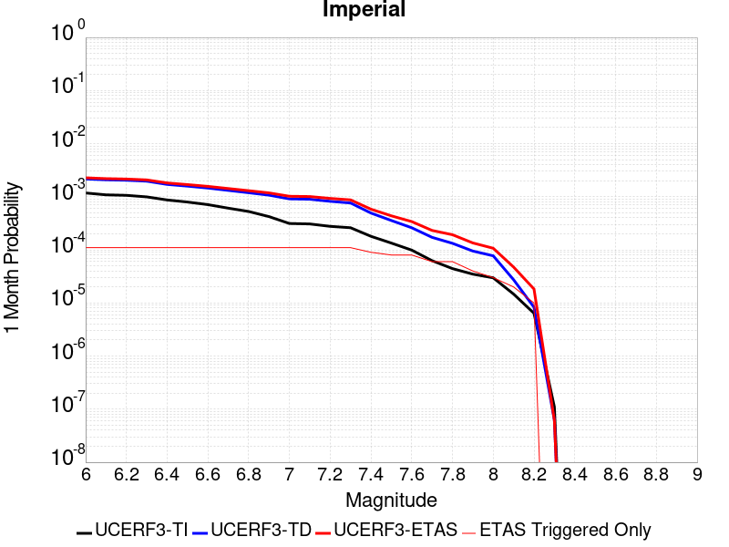 |  |  |

| Magnitude | 1 wk TI Prob | 1 wk TD Prob | 1 wk ETAS Prob | 1 wk ETAS/TD Gain | 1 wk ETAS Triggered Only | 1 mo TI Prob | 1 mo TD Prob | 1 mo ETAS Prob | 1 mo ETAS/TD Gain | 1 mo ETAS Triggered Only | 1 yr TI Prob | 1 yr TD Prob | 1 yr ETAS Prob | 1 yr ETAS/TD Gain | 1 yr ETAS Triggered Only | 10 yr TI Prob | 10 yr TD Prob | 10 yr ETAS Prob | 10 yr ETAS/TD Gain | 10 yr ETAS Triggered Only |
|-----|-----|-----|-----|-----|-----|-----|-----|-----|-----|-----|-----|-----|-----|-----|-----|-----|-----|-----|-----|-----|
| 6.0 | 2.7496446E-4 | 5.0552754E-4 | 5.755741E-4 | 1.1385614 | 7.0081995E-5 | 0.0011778869 | 0.002164787 | 0.0022347174 | 1.0323036 | 7.0081995E-5 | 0.0142467655 | 0.026038699 | 0.026106955 | 1.0026214 | 7.0081995E-5 | 0.13367249 | 0.2280438 | 0.22815199 | 1.0004745 | 1.4016399E-4 |
| 6.1 | 2.5356023E-4 | 4.8656776E-4 | 5.5661565E-4 | 1.1439633 | 7.0081995E-5 | 0.001086234 | 0.0020836622 | 0.0021535982 | 1.033564 | 7.0081995E-5 | 0.013144928 | 0.025071215 | 0.02513954 | 1.0027252 | 7.0081995E-5 | 0.123940155 | 0.21947981 | 0.21958922 | 1.0004984 | 1.4016399E-4 |
| 6.2 | 2.4820742E-4 | 4.7752203E-4 | 5.475705E-4 | 1.1466917 | 7.0081995E-5 | 0.0010633124 | 0.0020449557 | 0.0021148943 | 1.0342005 | 7.0081995E-5 | 0.01286919 | 0.024611235 | 0.024679592 | 1.0027775 | 7.0081995E-5 | 0.12148927 | 0.21598552 | 0.21609542 | 1.0005088 | 1.4016399E-4 |
| 6.3 | 2.3205351E-4 | 4.5890483E-4 | 5.2895467E-4 | 1.1526457 | 7.0081995E-5 | 9.94136E-4 | 0.0019652895 | 0.0020352337 | 1.0355898 | 7.0081995E-5 | 0.012036599 | 0.02366133 | 0.023729755 | 1.0028918 | 7.0081995E-5 | 0.11405133 | 0.20793462 | 0.20804563 | 1.0005339 | 1.4016399E-4 |
| 6.4 | 2.0304754E-4 | 3.987652E-4 | 4.6881923E-4 | 1.1756774 | 7.0081995E-5 | 8.6991355E-4 | 0.0017078889 | 0.0017778513 | 1.0409642 | 7.0081995E-5 | 0.010539869 | 0.020595672 | 0.02066431 | 1.0033326 | 7.0081995E-5 | 0.100537635 | 0.1850669 | 0.18518111 | 1.0006171 | 1.4016399E-4 |
| 6.5 | 1.854992E-4 | 3.6988858E-4 | 4.3994465E-4 | 1.1893978 | 7.0081995E-5 | 7.9475436E-4 | 0.0015842861 | 0.0016542571 | 1.0441656 | 7.0081995E-5 | 0.009633281 | 0.01911948 | 0.019188223 | 1.0035954 | 7.0081995E-5 | 0.0922623 | 0.173298 | 0.17335594 | 1.0003343 | 7.0081995E-5 |
| 6.6 | 1.6586106E-4 | 3.403506E-4 | 4.1040877E-4 | 1.2058411 | 7.0081995E-5 | 7.106394E-4 | 0.0014578402 | 0.0015278201 | 1.0480024 | 7.0081995E-5 | 0.008617763 | 0.01760642 | 0.017675268 | 1.0039104 | 7.0081995E-5 | 0.08291132 | 0.16077545 | 0.16083427 | 1.0003659 | 7.0081995E-5 |
| 6.7 | 1.4224656E-4 | 3.076692E-4 | 3.7772962E-4 | 1.2277136 | 7.0081995E-5 | 6.094856E-4 | 0.001317924 | 0.0013879137 | 1.053106 | 7.0081995E-5 | 0.0073952693 | 0.015929576 | 0.015998542 | 1.0043294 | 7.0081995E-5 | 0.07153955 | 0.14648417 | 0.14654398 | 1.0004083 | 7.0081995E-5 |
| 6.8 | 1.2317259E-4 | 2.779122E-4 | 3.479747E-4 | 1.2521031 | 7.0081995E-5 | 5.2777573E-4 | 0.0011905148 | 0.0012605133 | 1.0587969 | 7.0081995E-5 | 0.0064067547 | 0.0143995695 | 0.014468643 | 1.0047969 | 7.0081995E-5 | 0.06225166 | 0.13293684 | 0.1329976 | 1.000457 | 7.0081995E-5 |
| 6.9 | 9.859898E-5 | 2.5014306E-4 | 3.2020753E-4 | 1.2800976 | 7.0081995E-5 | 4.2249862E-4 | 0.0010716055 | 0.0011416123 | 1.065329 | 7.0081995E-5 | 0.0051317946 | 0.012969712 | 0.013038885 | 1.0053334 | 7.0081995E-5 | 0.05014893 | 0.11940631 | 0.119468026 | 1.0005169 | 7.0081995E-5 |
| 7.0 | 7.3191884E-5 | 2.1266776E-4 | 2.8273487E-4 | 1.3294674 | 7.0081995E-5 | 3.136418E-4 | 9.1111806E-4 | 9.811362E-4 | 1.0768486 | 7.0081995E-5 | 0.003811904 | 0.011037128 | 0.011106436 | 1.0062796 | 7.0081995E-5 | 0.037471764 | 0.10206493 | 0.10212786 | 1.0006166 | 7.0081995E-5 |
| 7.1 | 7.1760296E-5 | 2.0968143E-4 | 2.7974873E-4 | 1.3341608 | 7.0081995E-5 | 3.0750787E-4 | 8.983284E-4 | 9.6834736E-4 | 1.0779437 | 7.0081995E-5 | 0.003737482 | 0.010882978 | 0.010952298 | 1.0063695 | 7.0081995E-5 | 0.03675245 | 0.10070146 | 0.10076448 | 1.0006258 | 7.0081995E-5 |
| 7.2 | 6.46614E-5 | 1.9136685E-4 | 2.6143543E-4 | 1.366148 | 7.0081995E-5 | 2.7709085E-4 | 8.1988896E-4 | 8.8991347E-4 | 1.0854074 | 7.0081995E-5 | 0.0033683628 | 0.0099370815 | 0.010006467 | 1.0069824 | 7.0081995E-5 | 0.033177625 | 0.09250898 | 0.09257258 | 1.0006875 | 7.0081995E-5 |
| 7.3 | 6.088115E-5 | 1.78084E-4 | 2.4815352E-4 | 1.3934633 | 7.0081995E-5 | 2.6089314E-4 | 7.6299673E-4 | 8.3302526E-4 | 1.0917809 | 7.0081995E-5 | 0.0031717476 | 0.009250494 | 0.009319928 | 1.0075059 | 7.0081995E-5 | 0.031268585 | 0.08655989 | 0.08662391 | 1.0007396 | 7.0081995E-5 |
| 7.4 | 4.199346E-5 | 1.1510366E-4 | 1.8517759E-4 | 1.6087897 | 7.0081995E-5 | 1.7995955E-4 | 4.9320905E-4 | 5.6325644E-4 | 1.1420238 | 7.0081995E-5 | 0.0021888057 | 0.0059884563 | 0.006058119 | 1.0116328 | 7.0081995E-5 | 0.02167372 | 0.057439793 | 0.05750585 | 1.00115 | 7.0081995E-5 |
| 7.5 | 3.130448E-5 | 8.33328E-5 | 1.5340895E-4 | 1.8409193 | 7.0081995E-5 | 1.3415517E-4 | 3.57092E-4 | 4.2714897E-4 | 1.1961875 | 7.0081995E-5 | 0.0016321153 | 0.004338988 | 0.004408766 | 1.0160816 | 7.0081995E-5 | 0.016201803 | 0.04213201 | 0.04219914 | 1.0015934 | 7.0081995E-5 |
| 7.6 | 2.3074248E-5 | 6.0844646E-5 | 1.3092237E-4 | 2.1517484 | 7.0081995E-5 | 9.888588E-5 | 2.6073685E-4 | 3.3080057E-4 | 1.2687143 | 7.0081995E-5 | 0.0012032706 | 0.0031698733 | 0.0032397332 | 1.0220387 | 7.0081995E-5 | 0.011967761 | 0.031026395 | 0.031094301 | 1.0021887 | 7.0081995E-5 |
| 7.7 | 1.45864815E-5 | 4.0124698E-5 | 4.0124698E-5 | 1.0 | 0.0 | 6.2511994E-5 | 1.7195169E-4 | 1.7195169E-4 | 1.0 | 0.0 | 7.608177E-4 | 0.0020915072 | 0.0020915072 | 1.0 | 0.0 | 0.007582182 | 0.020627763 | 0.020627763 | 1.0 | 0.0 |
| 7.8 | 1.0352979E-5 | 3.0960902E-5 | 3.0960902E-5 | 1.0 | 0.0 | 4.4369157E-5 | 1.3268284E-4 | 1.3268284E-4 | 1.0 | 0.0 | 5.400606E-4 | 0.0016142189 | 0.0016142189 | 1.0 | 0.0 | 0.0053875 | 0.016016833 | 0.016016833 | 1.0 | 0.0 |
| 7.9 | 8.137906E-6 | 2.2149103E-5 | 2.2149103E-5 | 1.0 | 0.0 | 3.4876273E-5 | 9.492128E-5 | 9.492128E-5 | 1.0 | 0.0 | 4.2453592E-4 | 0.0011550548 | 0.0011550548 | 1.0 | 0.0 | 0.004237258 | 0.011617903 | 0.011617903 | 1.0 | 0.0 |
| 8.0 | 6.93792E-6 | 1.8008766E-5 | 1.8008766E-5 | 1.0 | 0.0 | 2.9733603E-5 | 7.717814E-5 | 7.717814E-5 | 1.0 | 0.0 | 3.6194647E-4 | 9.3923963E-4 | 9.3923963E-4 | 1.0 | 0.0 | 0.0036135751 | 0.00950155 | 0.00950155 | 1.0 | 0.0 |
| 8.1 | 3.4286315E-6 | 6.379872E-6 | 6.379872E-6 | 1.0 | 0.0 | 1.4694053E-5 | 2.7342023E-5 | 2.7342023E-5 | 1.0 | 0.0 | 1.7888541E-4 | 3.328384E-4 | 3.328384E-4 | 1.0 | 0.0 | 0.0017874148 | 0.003486031 | 0.003486031 | 1.0 | 0.0 |
| 8.2 | 1.4906886E-6 | 1.9366646E-6 | 1.9366646E-6 | 1.0 | 0.0 | 6.3886496E-6 | 8.299965E-6 | 8.299965E-6 | 1.0 | 0.0 | 7.7779034E-5 | 1.0104742E-4 | 1.0104742E-4 | 1.0 | 0.0 | 7.775182E-4 | 0.0011075331 | 0.0011075331 | 1.0 | 0.0 |
| 8.3 | 2.5758007E-8 | 1.4500102E-8 | 1.4500102E-8 | 1.0 | 0.0 | 1.10391454E-7 | 6.214329E-8 | 6.214329E-8 | 1.0 | 0.0 | 1.3440151E-6 | 7.565946E-7 | 7.565946E-7 | 1.0 | 0.0 | 1.344007E-5 | 7.887763E-6 | 7.887763E-6 | 1.0 | 0.0 |

## Lake Isabella (Seismicity)
*[(top)](#table-of-contents)*

| 1 Week | 1 Month | 1 Year | 10 Year |
|-----|-----|-----|-----|
|  |  |  |  |

| Magnitude | 1 wk TI Prob | 1 wk TD Prob | 1 wk ETAS Prob | 1 wk ETAS/TD Gain | 1 wk ETAS Triggered Only | 1 mo TI Prob | 1 mo TD Prob | 1 mo ETAS Prob | 1 mo ETAS/TD Gain | 1 mo ETAS Triggered Only | 1 yr TI Prob | 1 yr TD Prob | 1 yr ETAS Prob | 1 yr ETAS/TD Gain | 1 yr ETAS Triggered Only | 10 yr TI Prob | 10 yr TD Prob | 10 yr ETAS Prob | 10 yr ETAS/TD Gain | 10 yr ETAS Triggered Only |
|-----|-----|-----|-----|-----|-----|-----|-----|-----|-----|-----|-----|-----|-----|-----|-----|-----|-----|-----|-----|-----|
| 6.0 | 9.431637E-6 | 9.741651E-6 | 7.982297E-5 | 8.193987 | 7.0081995E-5 | 4.0420677E-5 | 4.1749343E-5 | 1.1182841E-4 | 2.6785672 | 7.0081995E-5 | 4.920106E-4 | 5.0819275E-4 | 5.7823915E-4 | 1.1378343 | 7.0081995E-5 | 0.004909227 | 0.005071599 | 0.005211052 | 1.0274969 | 1.4016399E-4 |
| 6.1 | 9.431637E-6 | 9.741651E-6 | 7.982297E-5 | 8.193987 | 7.0081995E-5 | 4.0420677E-5 | 4.1749343E-5 | 1.1182841E-4 | 2.6785672 | 7.0081995E-5 | 4.920106E-4 | 5.0819275E-4 | 5.7823915E-4 | 1.1378343 | 7.0081995E-5 | 0.004909227 | 0.005071599 | 0.005211052 | 1.0274969 | 1.4016399E-4 |
| 6.2 | 9.431637E-6 | 9.741651E-6 | 7.982297E-5 | 8.193987 | 7.0081995E-5 | 4.0420677E-5 | 4.1749343E-5 | 1.1182841E-4 | 2.6785672 | 7.0081995E-5 | 4.920106E-4 | 5.0819275E-4 | 5.7823915E-4 | 1.1378343 | 7.0081995E-5 | 0.004909227 | 0.005071599 | 0.005211052 | 1.0274969 | 1.4016399E-4 |
| 6.3 | 9.431637E-6 | 9.741651E-6 | 7.982297E-5 | 8.193987 | 7.0081995E-5 | 4.0420677E-5 | 4.1749343E-5 | 1.1182841E-4 | 2.6785672 | 7.0081995E-5 | 4.920106E-4 | 5.0819275E-4 | 5.7823915E-4 | 1.1378343 | 7.0081995E-5 | 0.004909227 | 0.005071599 | 0.005211052 | 1.0274969 | 1.4016399E-4 |
| 6.4 | 5.144063E-6 | 5.3000763E-6 | 5.3000763E-6 | 1.0 | 0.0 | 2.2045799E-5 | 2.2714434E-5 | 2.2714434E-5 | 1.0 | 0.0 | 2.6837454E-4 | 2.765166E-4 | 2.765166E-4 | 1.0 | 0.0 | 0.0026805066 | 0.0027620657 | 0.002831954 | 1.025303 | 7.0081995E-5 |
| 6.5 | 5.144063E-6 | 5.3000763E-6 | 5.3000763E-6 | 1.0 | 0.0 | 2.2045799E-5 | 2.2714434E-5 | 2.2714434E-5 | 1.0 | 0.0 | 2.6837454E-4 | 2.765166E-4 | 2.765166E-4 | 1.0 | 0.0 | 0.0026805066 | 0.0027620657 | 0.002831954 | 1.025303 | 7.0081995E-5 |
| 6.6 | 3.4009804E-6 | 3.498786E-6 | 3.498786E-6 | 1.0 | 0.0 | 1.4575549E-5 | 1.4994721E-5 | 1.4994721E-5 | 1.0 | 0.0 | 1.7744285E-4 | 1.8254704E-4 | 1.8254704E-4 | 1.0 | 0.0 | 0.0017730123 | 0.0018241286 | 0.0018940828 | 1.0383494 | 7.0081995E-5 |
| 6.7 | 3.3880428E-6 | 3.4856528E-6 | 3.4856528E-6 | 1.0 | 0.0 | 1.4520103E-5 | 1.4938435E-5 | 1.4938435E-5 | 1.0 | 0.0 | 1.767679E-4 | 1.8186188E-4 | 1.8186188E-4 | 1.0 | 0.0 | 0.0017662736 | 0.0018172882 | 0.0018872429 | 1.038494 | 7.0081995E-5 |
| 6.8 | 2.6582E-6 | 2.7337003E-6 | 2.7337003E-6 | 1.0 | 0.0 | 1.1392236E-5 | 1.1715813E-5 | 1.1715813E-5 | 1.0 | 0.0 | 1.3869164E-4 | 1.4263204E-4 | 1.4263204E-4 | 1.0 | 0.0 | 0.0013860512 | 0.0014255369 | 0.0014955191 | 1.0490917 | 7.0081995E-5 |
| 6.9 | 2.406011E-6 | 2.4743288E-6 | 2.4743288E-6 | 1.0 | 0.0 | 1.0311434E-5 | 1.0604231E-5 | 1.0604231E-5 | 1.0 | 0.0 | 1.2553448E-4 | 1.2910018E-4 | 1.2910018E-4 | 1.0 | 0.0 | 0.0012546359 | 0.0012903814 | 0.001360373 | 1.054241 | 7.0081995E-5 |
| 7.0 | 1.6953097E-6 | 1.7429371E-6 | 1.7429371E-6 | 1.0 | 0.0 | 7.265593E-6 | 7.469715E-6 | 7.469715E-6 | 1.0 | 0.0 | 8.8455E-5 | 9.094104E-5 | 9.094104E-5 | 1.0 | 0.0 | 8.84198E-4 | 9.09141E-4 | 9.791593E-4 | 1.0770159 | 7.0081995E-5 |
| 7.1 | 3.5013824E-7 | 3.5714822E-7 | 3.5714822E-7 | 1.0 | 0.0 | 1.5005916E-6 | 1.5306344E-6 | 1.5306344E-6 | 1.0 | 0.0 | 1.826955E-5 | 1.8635317E-5 | 1.8635317E-5 | 1.0 | 0.0 | 1.8268047E-4 | 1.863378E-4 | 1.863378E-4 | 1.0 | 0.0 |
| 7.2 | 2.2321095E-7 | 2.2750574E-7 | 2.2750574E-7 | 1.0 | 0.0 | 9.56618E-7 | 9.750242E-7 | 9.750242E-7 | 1.0 | 0.0 | 1.1646762E-5 | 1.1870856E-5 | 1.1870856E-5 | 1.0 | 0.0 | 1.1646151E-4 | 1.1870232E-4 | 1.1870232E-4 | 1.0 | 0.0 |
| 7.3 | 1.5760406E-7 | 1.6060922E-7 | 1.6060922E-7 | 1.0 | 0.0 | 6.7544585E-7 | 6.8832503E-7 | 6.8832503E-7 | 1.0 | 0.0 | 8.223522E-6 | 8.380326E-6 | 8.380326E-6 | 1.0 | 0.0 | 8.2232174E-5 | 8.3800165E-5 | 8.3800165E-5 | 1.0 | 0.0 |
| 7.4 | 1.1216497E-7 | 1.1431706E-7 | 1.1431706E-7 | 1.0 | 0.0 | 4.8070694E-7 | 4.899302E-7 | 4.899302E-7 | 1.0 | 0.0 | 5.852591E-6 | 5.964884E-6 | 5.964884E-6 | 1.0 | 0.0 | 5.8524372E-5 | 5.9647282E-5 | 5.9647282E-5 | 1.0 | 0.0 |
| 7.5 | 4.885185E-8 | 4.9787737E-8 | 4.9787737E-8 | 1.0 | 0.0 | 2.0936506E-7 | 2.13376E-7 | 2.13376E-7 | 1.0 | 0.0 | 2.5490165E-6 | 2.59785E-6 | 2.59785E-6 | 1.0 | 0.0 | 2.5489873E-5 | 2.5978214E-5 | 2.5978214E-5 | 1.0 | 0.0 |
| 7.6 | 1.504641E-9 | 1.5317903E-9 | 1.5317903E-9 | 1.0 | 0.0 | 6.4484613E-9 | 6.5648154E-9 | 6.5648154E-9 | 1.0 | 0.0 | 7.851001E-8 | 7.992663E-8 | 7.992663E-8 | 1.0 | 0.0 | 7.8509987E-7 | 7.992663E-7 | 7.992663E-7 | 1.0 | 0.0 |

## Great Valley 09 (Laguna Seca)
*[(top)](#table-of-contents)*

| 1 Week | 1 Month | 1 Year | 10 Year |
|-----|-----|-----|-----|
|  |  |  |  |

| Magnitude | 1 wk TI Prob | 1 wk TD Prob | 1 wk ETAS Prob | 1 wk ETAS/TD Gain | 1 wk ETAS Triggered Only | 1 mo TI Prob | 1 mo TD Prob | 1 mo ETAS Prob | 1 mo ETAS/TD Gain | 1 mo ETAS Triggered Only | 1 yr TI Prob | 1 yr TD Prob | 1 yr ETAS Prob | 1 yr ETAS/TD Gain | 1 yr ETAS Triggered Only | 10 yr TI Prob | 10 yr TD Prob | 10 yr ETAS Prob | 10 yr ETAS/TD Gain | 10 yr ETAS Triggered Only |
|-----|-----|-----|-----|-----|-----|-----|-----|-----|-----|-----|-----|-----|-----|-----|-----|-----|-----|-----|-----|-----|
| 6.0 | 5.4353277E-5 | 7.05022E-5 | 2.106563E-4 | 2.9879396 | 1.4016399E-4 | 2.3292181E-4 | 3.0211566E-4 | 4.422373E-4 | 1.4638013 | 1.4016399E-4 | 0.0028321352 | 0.0036721937 | 0.0038118432 | 1.0380288 | 1.4016399E-4 | 0.02796312 | 0.03611547 | 0.036250573 | 1.0037408 | 1.4016399E-4 |
| 6.1 | 4.5578287E-5 | 5.822118E-5 | 5.822118E-5 | 1.0 | 0.0 | 1.953209E-4 | 2.4949326E-4 | 2.4949326E-4 | 1.0 | 0.0 | 0.0023754383 | 0.003033432 | 0.003033432 | 1.0 | 0.0 | 0.023502063 | 0.029919548 | 0.029919548 | 1.0 | 0.0 |
| 6.2 | 2.8536782E-5 | 3.4737273E-5 | 3.4737273E-5 | 1.0 | 0.0 | 1.2229476E-4 | 1.4886224E-4 | 1.4886224E-4 | 1.0 | 0.0 | 0.0014879217 | 0.001810813 | 0.001810813 | 1.0 | 0.0 | 0.014779986 | 0.017958116 | 0.017958116 | 1.0 | 0.0 |
| 6.3 | 2.3698774E-5 | 2.8213295E-5 | 2.8213295E-5 | 1.0 | 0.0 | 1.01562226E-4 | 1.20905075E-4 | 1.20905075E-4 | 1.0 | 0.0 | 0.0012358186 | 0.0014710218 | 0.0014710218 | 1.0 | 0.0 | 0.012289686 | 0.014611342 | 0.014611342 | 1.0 | 0.0 |
| 6.4 | 1.9191197E-5 | 2.2123184E-5 | 2.2123184E-5 | 1.0 | 0.0 | 8.2245395E-5 | 9.4806666E-5 | 9.4806666E-5 | 1.0 | 0.0 | 0.0010008777 | 0.0011536429 | 0.0011536429 | 1.0 | 0.0 | 0.009963818 | 0.011476948 | 0.011476948 | 1.0 | 0.0 |
| 6.5 | 1.5203241E-5 | 1.6802203E-5 | 1.6802203E-5 | 1.0 | 0.0 | 6.5155116E-5 | 7.200386E-5 | 7.200386E-5 | 1.0 | 0.0 | 7.9297484E-4 | 8.7626575E-4 | 8.7626575E-4 | 1.0 | 0.0 | 0.007901512 | 0.0087295165 | 0.0087295165 | 1.0 | 0.0 |
| 6.6 | 1.0984925E-5 | 1.1242595E-5 | 1.1242595E-5 | 1.0 | 0.0 | 4.70774E-5 | 4.8181686E-5 | 4.8181686E-5 | 1.0 | 0.0 | 5.730166E-4 | 5.8645656E-4 | 5.8645656E-4 | 1.0 | 0.0 | 0.005715413 | 0.0058494853 | 0.0058494853 | 1.0 | 0.0 |
| 6.7 | 9.134616E-6 | 9.019894E-6 | 9.019894E-6 | 1.0 | 0.0 | 3.9147766E-5 | 3.865613E-5 | 3.865613E-5 | 1.0 | 0.0 | 4.7651984E-4 | 4.7053912E-4 | 4.7053912E-4 | 1.0 | 0.0 | 0.004754993 | 0.0046956735 | 0.0046956735 | 1.0 | 0.0 |
| 6.8 | 7.785589E-6 | 7.4519444E-6 | 7.4519444E-6 | 1.0 | 0.0 | 3.3366385E-5 | 3.1936524E-5 | 3.1936524E-5 | 1.0 | 0.0 | 4.0616E-4 | 3.8875983E-4 | 3.8875983E-4 | 1.0 | 0.0 | 0.0040541845 | 0.0038810016 | 0.0038810016 | 1.0 | 0.0 |
| 6.9 | 5.579095E-6 | 4.898492E-6 | 4.898492E-6 | 1.0 | 0.0 | 2.3910188E-5 | 2.0993377E-5 | 2.0993377E-5 | 1.0 | 0.0 | 2.9106764E-4 | 2.5556577E-4 | 2.5556577E-4 | 1.0 | 0.0 | 0.002906867 | 0.002552856 | 0.002552856 | 1.0 | 0.0 |
| 7.0 | 2.6816688E-6 | 1.5216126E-6 | 1.5216126E-6 | 1.0 | 0.0 | 1.1492816E-5 | 6.521181E-6 | 6.521181E-6 | 1.0 | 0.0 | 1.3991605E-4 | 7.939258E-5 | 7.939258E-5 | 1.0 | 0.0 | 0.0013982799 | 7.9365086E-4 | 7.9365086E-4 | 1.0 | 0.0 |
| 7.1 | 1.9951021E-6 | 7.453827E-7 | 7.453827E-7 | 1.0 | 0.0 | 8.55041E-6 | 3.1944935E-6 | 3.1944935E-6 | 1.0 | 0.0 | 1.0409627E-4 | 3.8892307E-5 | 3.8892307E-5 | 1.0 | 0.0 | 0.0010404752 | 3.8885913E-4 | 3.8885913E-4 | 1.0 | 0.0 |
| 7.2 | 1.9951021E-6 | 7.453827E-7 | 7.453827E-7 | 1.0 | 0.0 | 8.55041E-6 | 3.1944935E-6 | 3.1944935E-6 | 1.0 | 0.0 | 1.0409627E-4 | 3.8892307E-5 | 3.8892307E-5 | 1.0 | 0.0 | 0.0010404752 | 3.8885913E-4 | 3.8885913E-4 | 1.0 | 0.0 |
| 7.3 | 1.7087556E-6 | 6.578881E-7 | 6.578881E-7 | 1.0 | 0.0 | 7.3232177E-6 | 2.8195177E-6 | 2.8195177E-6 | 1.0 | 0.0 | 8.915652E-5 | 3.4327128E-5 | 3.4327128E-5 | 1.0 | 0.0 | 8.9120766E-4 | 3.432223E-4 | 3.432223E-4 | 1.0 | 0.0 |
| 7.4 | 1.3804846E-6 | 6.073852E-7 | 6.073852E-7 | 1.0 | 0.0 | 5.916349E-6 | 2.6030768E-6 | 2.6030768E-6 | 1.0 | 0.0 | 7.2029165E-5 | 3.169204E-5 | 3.169204E-5 | 1.0 | 0.0 | 7.200583E-4 | 3.1687922E-4 | 3.1687922E-4 | 1.0 | 0.0 |
| 7.5 | 1.3804846E-6 | 6.073852E-7 | 6.073852E-7 | 1.0 | 0.0 | 5.916349E-6 | 2.6030768E-6 | 2.6030768E-6 | 1.0 | 0.0 | 7.2029165E-5 | 3.169204E-5 | 3.169204E-5 | 1.0 | 0.0 | 7.200583E-4 | 3.1687922E-4 | 3.1687922E-4 | 1.0 | 0.0 |

## Big Pine (Central)
*[(top)](#table-of-contents)*

| 1 Week | 1 Month | 1 Year | 10 Year |
|-----|-----|-----|-----|
|  |  |  |  |

| Magnitude | 1 wk TI Prob | 1 wk TD Prob | 1 wk ETAS Prob | 1 wk ETAS/TD Gain | 1 wk ETAS Triggered Only | 1 mo TI Prob | 1 mo TD Prob | 1 mo ETAS Prob | 1 mo ETAS/TD Gain | 1 mo ETAS Triggered Only | 1 yr TI Prob | 1 yr TD Prob | 1 yr ETAS Prob | 1 yr ETAS/TD Gain | 1 yr ETAS Triggered Only | 10 yr TI Prob | 10 yr TD Prob | 10 yr ETAS Prob | 10 yr ETAS/TD Gain | 10 yr ETAS Triggered Only |
|-----|-----|-----|-----|-----|-----|-----|-----|-----|-----|-----|-----|-----|-----|-----|-----|-----|-----|-----|-----|-----|
| 6.0 | 1.2706755E-5 | 1.4250529E-5 | 8.433153E-5 | 5.9177823 | 7.0081995E-5 | 5.4456385E-5 | 6.107247E-5 | 1.3115018E-4 | 2.1474519 | 7.0081995E-5 | 6.628048E-4 | 7.433402E-4 | 8.8340003E-4 | 1.1884195 | 1.4016399E-4 | 0.006608314 | 0.0074135666 | 0.0075526917 | 1.0187663 | 1.4016399E-4 |
| 6.1 | 8.342579E-6 | 9.510762E-6 | 7.959209E-5 | 8.368635 | 7.0081995E-5 | 3.5753423E-5 | 4.0759893E-5 | 1.10839035E-4 | 2.719316 | 7.0081995E-5 | 4.3521097E-4 | 4.961604E-4 | 5.6620763E-4 | 1.1411786 | 7.0081995E-5 | 0.0043435963 | 0.0049540824 | 0.005023817 | 1.0140762 | 7.0081995E-5 |
| 6.2 | 6.923899E-6 | 7.967147E-6 | 7.967147E-6 | 1.0 | 0.0 | 2.9673516E-5 | 3.4144578E-5 | 3.4144578E-5 | 1.0 | 0.0 | 3.6121515E-4 | 4.156502E-4 | 4.156502E-4 | 1.0 | 0.0 | 0.003606286 | 0.0041520367 | 0.0041520367 | 1.0 | 0.0 |
| 6.3 | 2.728396E-6 | 3.4242908E-6 | 3.4242908E-6 | 1.0 | 0.0 | 1.1693074E-5 | 1.4675454E-5 | 1.4675454E-5 | 1.0 | 0.0 | 1.4235388E-4 | 1.7865987E-4 | 1.7865987E-4 | 1.0 | 0.0 | 0.0014226272 | 0.0017866704 | 0.0017866704 | 1.0 | 0.0 |
| 6.4 | 2.7136944E-6 | 3.408584E-6 | 3.408584E-6 | 1.0 | 0.0 | 1.1630066E-5 | 1.4608141E-5 | 1.4608141E-5 | 1.0 | 0.0 | 1.4158686E-4 | 1.7784047E-4 | 1.7784047E-4 | 1.0 | 0.0 | 0.0014149669 | 0.0017784894 | 0.0017784894 | 1.0 | 0.0 |
| 6.5 | 2.6971882E-6 | 3.3909291E-6 | 3.3909291E-6 | 1.0 | 0.0 | 1.1559327E-5 | 1.45324775E-5 | 1.45324775E-5 | 1.0 | 0.0 | 1.4072572E-4 | 1.7691942E-4 | 1.7691942E-4 | 1.0 | 0.0 | 0.0014063664 | 0.0017692937 | 0.0017692937 | 1.0 | 0.0 |
| 6.6 | 2.669092E-6 | 3.3609497E-6 | 3.3609497E-6 | 1.0 | 0.0 | 1.1438916E-5 | 1.4403995E-5 | 1.4403995E-5 | 1.0 | 0.0 | 1.3925991E-4 | 1.753554E-4 | 1.753554E-4 | 1.0 | 0.0 | 0.0013917267 | 0.0017536782 | 0.0017536782 | 1.0 | 0.0 |
| 6.7 | 2.6408059E-6 | 3.3309752E-6 | 3.3309752E-6 | 1.0 | 0.0 | 1.1317691E-5 | 1.4275535E-5 | 1.4275535E-5 | 1.0 | 0.0 | 1.3778417E-4 | 1.7379165E-4 | 1.7379165E-4 | 1.0 | 0.0 | 0.0013769877 | 0.0017380653 | 0.0017380653 | 1.0 | 0.0 |
| 6.8 | 2.1786943E-6 | 2.8544325E-6 | 2.8544325E-6 | 1.0 | 0.0 | 9.337228E-6 | 1.2233229E-5 | 1.2233229E-5 | 1.0 | 0.0 | 1.1367482E-4 | 1.4893012E-4 | 1.4893012E-4 | 1.0 | 0.0 | 0.0011361669 | 0.0014897975 | 0.0014897975 | 1.0 | 0.0 |
| 6.9 | 1.4411696E-6 | 2.068499E-6 | 2.068499E-6 | 1.0 | 0.0 | 6.1764263E-6 | 8.864968E-6 | 8.864968E-6 | 1.0 | 0.0 | 7.51954E-5 | 1.079259E-4 | 1.079259E-4 | 1.0 | 0.0 | 7.5169955E-4 | 0.0010801847 | 0.0010801847 | 1.0 | 0.0 |
| 7.0 | 1.0073411E-6 | 1.554261E-6 | 1.554261E-6 | 1.0 | 0.0 | 4.317169E-6 | 6.6611024E-6 | 6.6611024E-6 | 1.0 | 0.0 | 5.2560266E-5 | 8.1096056E-5 | 8.1096056E-5 | 1.0 | 0.0 | 5.2547833E-4 | 8.1210316E-4 | 8.1210316E-4 | 1.0 | 0.0 |
| 7.1 | 8.947104E-7 | 1.4302494E-6 | 1.4302494E-6 | 1.0 | 0.0 | 3.834468E-6 | 6.129627E-6 | 6.129627E-6 | 1.0 | 0.0 | 4.6683643E-5 | 7.46258E-5 | 7.46258E-5 | 1.0 | 0.0 | 4.6673836E-4 | 7.474457E-4 | 7.474457E-4 | 1.0 | 0.0 |
| 7.2 | 5.215166E-7 | 1.0111678E-6 | 1.0111678E-6 | 1.0 | 0.0 | 2.2350691E-6 | 4.3335694E-6 | 4.3335694E-6 | 1.0 | 0.0 | 2.7211627E-5 | 5.2759973E-5 | 5.2759973E-5 | 1.0 | 0.0 | 2.7208295E-4 | 5.2890263E-4 | 5.2890263E-4 | 1.0 | 0.0 |
| 7.3 | 4.4024807E-7 | 9.219589E-7 | 9.219589E-7 | 1.0 | 0.0 | 1.8867761E-6 | 3.9512465E-6 | 3.9512465E-6 | 1.0 | 0.0 | 2.2971257E-5 | 4.810541E-5 | 4.810541E-5 | 1.0 | 0.0 | 2.2968883E-4 | 4.8237795E-4 | 4.8237795E-4 | 1.0 | 0.0 |
| 7.4 | 3.6130905E-7 | 8.358523E-7 | 8.358523E-7 | 1.0 | 0.0 | 1.5484665E-6 | 3.5822195E-6 | 3.5822195E-6 | 1.0 | 0.0 | 1.8852415E-5 | 4.3612687E-5 | 4.3612687E-5 | 1.0 | 0.0 | 1.8850817E-4 | 4.374597E-4 | 4.374597E-4 | 1.0 | 0.0 |
| 7.5 | 3.408184E-7 | 8.108147E-7 | 8.108147E-7 | 1.0 | 0.0 | 1.4606494E-6 | 3.4749157E-6 | 3.4749157E-6 | 1.0 | 0.0 | 1.7783263E-5 | 4.2306317E-5 | 4.2306317E-5 | 1.0 | 0.0 | 1.778184E-4 | 4.2437963E-4 | 4.2437963E-4 | 1.0 | 0.0 |
| 7.6 | 3.1428627E-7 | 7.7316E-7 | 7.7316E-7 | 1.0 | 0.0 | 1.3469405E-6 | 3.3135389E-6 | 3.3135389E-6 | 1.0 | 0.0 | 1.6398877E-5 | 4.0341627E-5 | 4.0341627E-5 | 1.0 | 0.0 | 1.6397667E-4 | 4.0471106E-4 | 4.0471106E-4 | 1.0 | 0.0 |
| 7.7 | 1.7972785E-7 | 5.077752E-7 | 5.077752E-7 | 1.0 | 0.0 | 7.70262E-7 | 2.1761778E-6 | 2.1761778E-6 | 1.0 | 0.0 | 9.377899E-6 | 2.6494654E-5 | 2.6494654E-5 | 1.0 | 0.0 | 9.377503E-5 | 2.662899E-4 | 2.662899E-4 | 1.0 | 0.0 |
| 7.8 | 4.9230927E-8 | 1.198079E-7 | 1.198079E-7 | 1.0 | 0.0 | 2.1098968E-7 | 5.134623E-7 | 5.134623E-7 | 1.0 | 0.0 | 2.5687964E-6 | 6.2513873E-6 | 6.2513873E-6 | 1.0 | 0.0 | 2.5687666E-5 | 6.295415E-5 | 6.295415E-5 | 1.0 | 0.0 |
| 7.9 | 3.6805972E-9 | 4.105293E-9 | 4.105293E-9 | 1.0 | 0.0 | 1.5773987E-8 | 1.7594115E-8 | 1.7594115E-8 | 1.0 | 0.0 | 1.9204828E-7 | 2.1420831E-7 | 2.1420831E-7 | 1.0 | 0.0 | 1.920481E-6 | 2.1900614E-6 | 2.1900614E-6 | 1.0 | 0.0 |

## San Gorgonio Pass
*[(top)](#table-of-contents)*

| 1 Week | 1 Month | 1 Year | 10 Year |
|-----|-----|-----|-----|
| 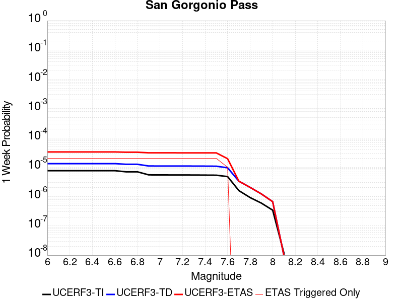 |  |  |  |

| Magnitude | 1 wk TI Prob | 1 wk TD Prob | 1 wk ETAS Prob | 1 wk ETAS/TD Gain | 1 wk ETAS Triggered Only | 1 mo TI Prob | 1 mo TD Prob | 1 mo ETAS Prob | 1 mo ETAS/TD Gain | 1 mo ETAS Triggered Only | 1 yr TI Prob | 1 yr TD Prob | 1 yr ETAS Prob | 1 yr ETAS/TD Gain | 1 yr ETAS Triggered Only | 10 yr TI Prob | 10 yr TD Prob | 10 yr ETAS Prob | 10 yr ETAS/TD Gain | 10 yr ETAS Triggered Only |
|-----|-----|-----|-----|-----|-----|-----|-----|-----|-----|-----|-----|-----|-----|-----|-----|-----|-----|-----|-----|-----|
| 6.0 | 7.644328E-6 | 1.3314231E-5 | 1.3314231E-5 | 1.0 | 0.0 | 3.2760996E-5 | 5.705979E-5 | 5.705979E-5 | 1.0 | 0.0 | 3.987921E-4 | 6.944901E-4 | 7.645234E-4 | 1.1008414 | 7.0081995E-5 | 0.003980772 | 0.0069299806 | 0.006999577 | 1.0100428 | 7.0081995E-5 |
| 6.1 | 7.644328E-6 | 1.3314231E-5 | 1.3314231E-5 | 1.0 | 0.0 | 3.2760996E-5 | 5.705979E-5 | 5.705979E-5 | 1.0 | 0.0 | 3.987921E-4 | 6.944901E-4 | 7.645234E-4 | 1.1008414 | 7.0081995E-5 | 0.003980772 | 0.0069299806 | 0.006999577 | 1.0100428 | 7.0081995E-5 |
| 6.2 | 7.644328E-6 | 1.3314231E-5 | 1.3314231E-5 | 1.0 | 0.0 | 3.2760996E-5 | 5.705979E-5 | 5.705979E-5 | 1.0 | 0.0 | 3.987921E-4 | 6.944901E-4 | 7.645234E-4 | 1.1008414 | 7.0081995E-5 | 0.003980772 | 0.0069299806 | 0.006999577 | 1.0100428 | 7.0081995E-5 |
| 6.3 | 7.644328E-6 | 1.3314231E-5 | 1.3314231E-5 | 1.0 | 0.0 | 3.2760996E-5 | 5.705979E-5 | 5.705979E-5 | 1.0 | 0.0 | 3.987921E-4 | 6.944901E-4 | 7.645234E-4 | 1.1008414 | 7.0081995E-5 | 0.003980772 | 0.0069299806 | 0.006999577 | 1.0100428 | 7.0081995E-5 |
| 6.4 | 7.644328E-6 | 1.3314231E-5 | 1.3314231E-5 | 1.0 | 0.0 | 3.2760996E-5 | 5.705979E-5 | 5.705979E-5 | 1.0 | 0.0 | 3.987921E-4 | 6.944901E-4 | 7.645234E-4 | 1.1008414 | 7.0081995E-5 | 0.003980772 | 0.0069299806 | 0.006999577 | 1.0100428 | 7.0081995E-5 |
| 6.5 | 7.644328E-6 | 1.3314231E-5 | 1.3314231E-5 | 1.0 | 0.0 | 3.2760996E-5 | 5.705979E-5 | 5.705979E-5 | 1.0 | 0.0 | 3.987921E-4 | 6.944901E-4 | 7.645234E-4 | 1.1008414 | 7.0081995E-5 | 0.003980772 | 0.0069299806 | 0.006999577 | 1.0100428 | 7.0081995E-5 |
| 6.6 | 7.644328E-6 | 1.3314231E-5 | 1.3314231E-5 | 1.0 | 0.0 | 3.2760996E-5 | 5.705979E-5 | 5.705979E-5 | 1.0 | 0.0 | 3.987921E-4 | 6.944901E-4 | 7.645234E-4 | 1.1008414 | 7.0081995E-5 | 0.003980772 | 0.0069299806 | 0.006999577 | 1.0100428 | 7.0081995E-5 |
| 6.7 | 6.987586E-6 | 1.2618505E-5 | 1.2618505E-5 | 1.0 | 0.0 | 2.9946454E-5 | 5.4078235E-5 | 5.4078235E-5 | 1.0 | 0.0 | 3.645371E-4 | 6.582117E-4 | 7.2824757E-4 | 1.1064032 | 7.0081995E-5 | 0.0036393967 | 0.0065693567 | 0.006638978 | 1.010598 | 7.0081995E-5 |
| 6.8 | 6.987586E-6 | 1.2618505E-5 | 1.2618505E-5 | 1.0 | 0.0 | 2.9946454E-5 | 5.4078235E-5 | 5.4078235E-5 | 1.0 | 0.0 | 3.645371E-4 | 6.582117E-4 | 7.2824757E-4 | 1.1064032 | 7.0081995E-5 | 0.0036393967 | 0.0065693567 | 0.006638978 | 1.010598 | 7.0081995E-5 |
| 6.9 | 5.504702E-6 | 1.1049368E-5 | 1.1049368E-5 | 1.0 | 0.0 | 2.3591367E-5 | 4.7353606E-5 | 4.7353606E-5 | 1.0 | 0.0 | 2.8718702E-4 | 5.7638274E-4 | 6.464243E-4 | 1.1215192 | 7.0081995E-5 | 0.0028681618 | 0.005755309 | 0.005824988 | 1.0121069 | 7.0081995E-5 |
| 7.0 | 5.4825764E-6 | 1.102571E-5 | 1.102571E-5 | 1.0 | 0.0 | 2.3496545E-5 | 4.7252215E-5 | 4.7252215E-5 | 1.0 | 0.0 | 2.8603288E-4 | 5.751489E-4 | 6.451906E-4 | 1.12178 | 7.0081995E-5 | 0.00285665 | 0.005743035 | 0.0058127143 | 1.0121329 | 7.0081995E-5 |
| 7.1 | 5.4692787E-6 | 1.101142E-5 | 1.101142E-5 | 1.0 | 0.0 | 2.3439556E-5 | 4.7190973E-5 | 4.7190973E-5 | 1.0 | 0.0 | 2.8533922E-4 | 5.744037E-4 | 6.444454E-4 | 1.1219382 | 7.0081995E-5 | 0.0028497311 | 0.0057356213 | 0.0058053015 | 1.0121486 | 7.0081995E-5 |
| 7.2 | 5.453661E-6 | 1.0994446E-5 | 1.0994446E-5 | 1.0 | 0.0 | 2.3372622E-5 | 4.7118232E-5 | 4.7118232E-5 | 1.0 | 0.0 | 2.8452452E-4 | 5.7351857E-4 | 6.435604E-4 | 1.1221265 | 7.0081995E-5 | 0.002841605 | 0.0057268157 | 0.0057964963 | 1.0121675 | 7.0081995E-5 |
| 7.3 | 5.4422303E-6 | 1.0981369E-5 | 1.0981369E-5 | 1.0 | 0.0 | 2.3323635E-5 | 4.706219E-5 | 4.706219E-5 | 1.0 | 0.0 | 2.8392827E-4 | 5.728366E-4 | 6.4287847E-4 | 1.122272 | 7.0081995E-5 | 0.0028356577 | 0.005720031 | 0.005789712 | 1.012182 | 7.0081995E-5 |
| 7.4 | 5.398595E-6 | 1.0928734E-5 | 1.0928734E-5 | 1.0 | 0.0 | 2.313663E-5 | 4.683662E-5 | 4.683662E-5 | 1.0 | 0.0 | 2.8165206E-4 | 5.700917E-4 | 6.4013375E-4 | 1.122861 | 7.0081995E-5 | 0.0028129534 | 0.005692723 | 0.0057624066 | 1.0122408 | 7.0081995E-5 |
| 7.5 | 5.3578788E-6 | 1.0855281E-5 | 1.0855281E-5 | 1.0 | 0.0 | 2.2962136E-5 | 4.6521833E-5 | 4.6521833E-5 | 1.0 | 0.0 | 2.7952815E-4 | 5.662612E-4 | 6.363035E-4 | 1.1236926 | 7.0081995E-5 | 0.002791768 | 0.0056546377 | 0.0057243234 | 1.0123236 | 7.0081995E-5 |
| 7.6 | 4.8091474E-6 | 9.60368E-6 | 9.60368E-6 | 1.0 | 0.0 | 2.0610469E-5 | 4.1158008E-5 | 4.1158008E-5 | 1.0 | 0.0 | 2.5090357E-4 | 5.0098833E-4 | 5.710352E-4 | 1.1398174 | 7.0081995E-5 | 0.0025062046 | 0.0050053033 | 0.005075034 | 1.0139315 | 7.0081995E-5 |
| 7.7 | 1.5991155E-6 | 3.352866E-6 | 3.352866E-6 | 1.0 | 0.0 | 6.853334E-6 | 1.4369349E-5 | 1.4369349E-5 | 1.0 | 0.0 | 8.343615E-5 | 1.7493303E-4 | 2.4500277E-4 | 1.4005518 | 7.0081995E-5 | 8.340483E-4 | 0.0017534072 | 0.0018233663 | 1.039899 | 7.0081995E-5 |
| 7.8 | 9.258398E-7 | 2.0579948E-6 | 2.0579948E-6 | 1.0 | 0.0 | 3.967879E-6 | 8.819949E-6 | 8.819949E-6 | 1.0 | 0.0 | 4.8307855E-5 | 1.073776E-4 | 1.7745206E-4 | 1.6525986 | 7.0081995E-5 | 4.8297356E-4 | 0.001078687 | 0.0011486934 | 1.0648997 | 7.0081995E-5 |
| 7.9 | 5.975575E-7 | 1.2291794E-6 | 1.2291794E-6 | 1.0 | 0.0 | 2.5609581E-6 | 5.2679006E-6 | 5.2679006E-6 | 1.0 | 0.0 | 3.117922E-5 | 6.4134816E-5 | 1.3421231E-4 | 2.0926592 | 7.0081995E-5 | 3.1174847E-4 | 6.463092E-4 | 7.163459E-4 | 1.1083641 | 7.0081995E-5 |
| 8.0 | 3.4413725E-7 | 6.7148494E-7 | 6.7148494E-7 | 1.0 | 0.0 | 1.4748731E-6 | 2.8777895E-6 | 2.8777895E-6 | 1.0 | 0.0 | 1.7956432E-5 | 3.503653E-5 | 1.0511607E-4 | 3.000185 | 7.0081995E-5 | 1.7954981E-4 | 3.5373896E-4 | 4.2379615E-4 | 1.1980478 | 7.0081995E-5 |
| 8.1 | 1.1787731E-8 | 9.634385E-9 | 9.634385E-9 | 1.0 | 0.0 | 5.0518846E-8 | 4.129022E-8 | 4.129022E-8 | 1.0 | 0.0 | 6.1506677E-7 | 5.027083E-7 | 5.027083E-7 | 1.0 | 0.0 | 6.1506507E-6 | 5.2424944E-6 | 5.2424944E-6 | 1.0 | 0.0 |

## Hosgri
*[(top)](#table-of-contents)*

| 1 Week | 1 Month | 1 Year | 10 Year |
|-----|-----|-----|-----|
|  |  |  | 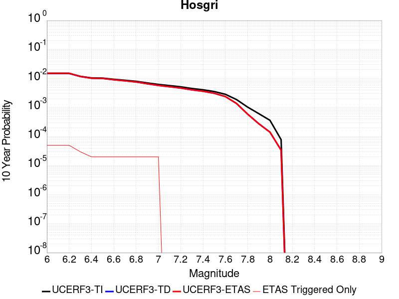 |

| Magnitude | 1 wk TI Prob | 1 wk TD Prob | 1 wk ETAS Prob | 1 wk ETAS/TD Gain | 1 wk ETAS Triggered Only | 1 mo TI Prob | 1 mo TD Prob | 1 mo ETAS Prob | 1 mo ETAS/TD Gain | 1 mo ETAS Triggered Only | 1 yr TI Prob | 1 yr TD Prob | 1 yr ETAS Prob | 1 yr ETAS/TD Gain | 1 yr ETAS Triggered Only | 10 yr TI Prob | 10 yr TD Prob | 10 yr ETAS Prob | 10 yr ETAS/TD Gain | 10 yr ETAS Triggered Only |
|-----|-----|-----|-----|-----|-----|-----|-----|-----|-----|-----|-----|-----|-----|-----|-----|-----|-----|-----|-----|-----|
| 6.0 | 2.883978E-5 | 2.9128416E-5 | 9.920837E-5 | 3.4058964 | 7.0081995E-5 | 1.235932E-4 | 1.2483024E-4 | 1.9490349E-4 | 1.5613483 | 7.0081995E-5 | 0.0015037085 | 0.001518776 | 0.0015887516 | 1.0460737 | 7.0081995E-5 | 0.01493574 | 0.01508774 | 0.015156765 | 1.0045749 | 7.0081995E-5 |
| 6.1 | 2.883978E-5 | 2.9128416E-5 | 9.920837E-5 | 3.4058964 | 7.0081995E-5 | 1.235932E-4 | 1.2483024E-4 | 1.9490349E-4 | 1.5613483 | 7.0081995E-5 | 0.0015037085 | 0.001518776 | 0.0015887516 | 1.0460737 | 7.0081995E-5 | 0.01493574 | 0.01508774 | 0.015156765 | 1.0045749 | 7.0081995E-5 |
| 6.2 | 2.883978E-5 | 2.9128416E-5 | 9.920837E-5 | 3.4058964 | 7.0081995E-5 | 1.235932E-4 | 1.2483024E-4 | 1.9490349E-4 | 1.5613483 | 7.0081995E-5 | 0.0015037085 | 0.001518776 | 0.0015887516 | 1.0460737 | 7.0081995E-5 | 0.01493574 | 0.01508774 | 0.015156765 | 1.0045749 | 7.0081995E-5 |
| 6.3 | 2.2914428E-5 | 2.2641969E-5 | 9.272238E-5 | 4.0951552 | 7.0081995E-5 | 9.8200995E-5 | 9.703343E-5 | 1.6710862E-4 | 1.7221758 | 7.0081995E-5 | 0.0011949413 | 0.0011807467 | 0.001250746 | 1.0592839 | 7.0081995E-5 | 0.011885363 | 0.011746133 | 0.0118153915 | 1.0058963 | 7.0081995E-5 |
| 6.4 | 2.0195741E-5 | 1.969656E-5 | 8.9777175E-5 | 4.558013 | 7.0081995E-5 | 8.65503E-5 | 8.4411105E-5 | 1.5448719E-4 | 1.830176 | 7.0081995E-5 | 0.0010532405 | 0.0010272227 | 0.0010972327 | 1.0681547 | 7.0081995E-5 | 0.010482626 | 0.010225792 | 0.010295158 | 1.0067834 | 7.0081995E-5 |
| 6.5 | 1.9924333E-5 | 1.940898E-5 | 8.9489615E-5 | 4.6107326 | 7.0081995E-5 | 8.53872E-5 | 8.3178704E-5 | 1.5325488E-4 | 1.8424772 | 7.0081995E-5 | 0.0010390934 | 0.0010122322 | 0.0010822433 | 1.069165 | 7.0081995E-5 | 0.010342481 | 0.010077253 | 0.010146629 | 1.0068843 | 7.0081995E-5 |
| 6.6 | 1.809694E-5 | 1.74583E-5 | 8.7539076E-5 | 5.0141807 | 7.0081995E-5 | 7.7556004E-5 | 7.4819145E-5 | 1.448959E-4 | 1.9366152 | 7.0081995E-5 | 9.438353E-4 | 9.105437E-4 | 9.80562E-4 | 1.0768971 | 7.0081995E-5 | 0.009398366 | 0.009069073 | 0.00913852 | 1.0076575 | 7.0081995E-5 |
| 6.7 | 1.675989E-5 | 1.6042764E-5 | 8.612363E-5 | 5.3683786 | 7.0081995E-5 | 7.182612E-5 | 6.87529E-5 | 1.3883007E-4 | 2.0192614 | 7.0081995E-5 | 8.7413215E-4 | 8.3674624E-4 | 9.067696E-4 | 1.0836853 | 7.0081995E-5 | 0.008707017 | 0.0083368635 | 0.008406361 | 1.0083362 | 7.0081995E-5 |
| 6.8 | 1.5401129E-5 | 1.4614083E-5 | 8.469506E-5 | 5.795441 | 7.0081995E-5 | 6.6003166E-5 | 6.2630286E-5 | 1.327079E-4 | 2.1189094 | 7.0081995E-5 | 8.032922E-4 | 7.622578E-4 | 8.322864E-4 | 1.09187 | 7.0081995E-5 | 0.008003947 | 0.007597296 | 0.007666846 | 1.0091546 | 7.0081995E-5 |
| 6.9 | 1.356559E-5 | 1.2689968E-5 | 8.2771076E-5 | 6.52256 | 7.0081995E-5 | 5.8136946E-5 | 5.4384444E-5 | 1.2446263E-4 | 2.2885704 | 7.0081995E-5 | 7.0758746E-4 | 6.619299E-4 | 7.3196547E-4 | 1.1058052 | 7.0081995E-5 | 0.007053386 | 0.006600388 | 0.0066700075 | 1.0105478 | 7.0081995E-5 |
| 7.0 | 1.2030819E-5 | 1.1095962E-5 | 8.117718E-5 | 7.3159213 | 7.0081995E-5 | 5.155963E-5 | 4.7553254E-5 | 1.1763192E-4 | 2.4736881 | 7.0081995E-5 | 6.275577E-4 | 5.7880714E-4 | 6.488486E-4 | 1.12101 | 7.0081995E-5 | 0.006257884 | 0.005773757 | 0.0058434345 | 1.0120679 | 7.0081995E-5 |
| 7.1 | 1.0972698E-5 | 1.0022179E-5 | 1.0022179E-5 | 1.0 | 0.0 | 4.7025E-5 | 4.2951488E-5 | 4.2951488E-5 | 1.0 | 0.0 | 5.72379E-4 | 5.22809E-4 | 5.22809E-4 | 1.0 | 0.0 | 0.0057090693 | 0.005216542 | 0.005216542 | 1.0 | 0.0 |
| 7.2 | 9.961926E-6 | 9.034746E-6 | 9.034746E-6 | 1.0 | 0.0 | 4.2693267E-5 | 3.8719765E-5 | 3.8719765E-5 | 1.0 | 0.0 | 5.1966653E-4 | 4.713112E-4 | 4.713112E-4 | 1.0 | 0.0 | 0.00518453 | 0.0047038626 | 0.0047038626 | 1.0 | 0.0 |
| 7.3 | 8.700929E-6 | 7.8281E-6 | 7.8281E-6 | 1.0 | 0.0 | 3.7289166E-5 | 3.354857E-5 | 3.354857E-5 | 1.0 | 0.0 | 4.53901E-4 | 4.0837732E-4 | 4.0837732E-4 | 1.0 | 0.0 | 0.00452975 | 0.004077008 | 0.004077008 | 1.0 | 0.0 |
| 7.4 | 7.866285E-6 | 6.998739E-6 | 6.998739E-6 | 1.0 | 0.0 | 3.3712215E-5 | 2.9994251E-5 | 2.9994251E-5 | 1.0 | 0.0 | 4.103689E-4 | 3.6511885E-4 | 3.6511885E-4 | 1.0 | 0.0 | 0.004096119 | 0.0036459267 | 0.0036459267 | 1.0 | 0.0 |
| 7.5 | 6.8381305E-6 | 5.9596955E-6 | 5.9596955E-6 | 1.0 | 0.0 | 2.9305946E-5 | 2.5541302E-5 | 2.5541302E-5 | 1.0 | 0.0 | 3.5674145E-4 | 3.10921E-4 | 3.10921E-4 | 1.0 | 0.0 | 0.0035616932 | 0.0031055948 | 0.0031055948 | 1.0 | 0.0 |
| 7.6 | 5.503376E-6 | 4.5952443E-6 | 4.5952443E-6 | 1.0 | 0.0 | 2.3585684E-5 | 1.9693754E-5 | 1.9693754E-5 | 1.0 | 0.0 | 2.8711787E-4 | 2.397451E-4 | 2.397451E-4 | 1.0 | 0.0 | 0.002867472 | 0.0023955975 | 0.0023955975 | 1.0 | 0.0 |
| 7.7 | 3.6144982E-6 | 2.6522112E-6 | 2.6522112E-6 | 1.0 | 0.0 | 1.5490614E-5 | 1.1366569E-5 | 1.1366569E-5 | 1.0 | 0.0 | 1.8858191E-4 | 1.383792E-4 | 1.383792E-4 | 1.0 | 0.0 | 0.0018842196 | 0.0013836613 | 0.0013836613 | 1.0 | 0.0 |
| 7.8 | 1.9853494E-6 | 1.1361129E-6 | 1.1361129E-6 | 1.0 | 0.0 | 8.508612E-6 | 4.8690463E-6 | 4.8690463E-6 | 1.0 | 0.0 | 1.0358743E-4 | 5.9279027E-5 | 5.9279027E-5 | 1.0 | 0.0 | 0.0010353916 | 5.9336185E-4 | 5.9336185E-4 | 1.0 | 0.0 |
| 7.9 | 1.1818757E-6 | 5.2951856E-7 | 5.2951856E-7 | 1.0 | 0.0 | 5.0651715E-6 | 2.2693632E-6 | 2.2693632E-6 | 1.0 | 0.0 | 6.1666724E-5 | 2.7629147E-5 | 2.7629147E-5 | 1.0 | 0.0 | 6.1649614E-4 | 2.7694515E-4 | 2.7694515E-4 | 1.0 | 0.0 |
| 8.0 | 6.962958E-7 | 2.7139782E-7 | 2.7139782E-7 | 1.0 | 0.0 | 2.9841215E-6 | 1.163133E-6 | 1.163133E-6 | 1.0 | 0.0 | 3.6331072E-5 | 1.4161053E-5 | 1.4161053E-5 | 1.0 | 0.0 | 3.6325134E-4 | 1.4217179E-4 | 1.4217179E-4 | 1.0 | 0.0 |
| 8.1 | 1.5033264E-7 | 6.527624E-8 | 6.527624E-8 | 1.0 | 0.0 | 6.442826E-7 | 2.7975528E-7 | 2.7975528E-7 | 1.0 | 0.0 | 7.844113E-6 | 3.4060151E-6 | 3.4060151E-6 | 1.0 | 0.0 | 7.843835E-5 | 3.407693E-5 | 3.407693E-5 | 1.0 | 0.0 |

## Northridge Hills
*[(top)](#table-of-contents)*

| 1 Week | 1 Month | 1 Year | 10 Year |
|-----|-----|-----|-----|
|  |  |  |  |

| Magnitude | 1 wk TI Prob | 1 wk TD Prob | 1 wk ETAS Prob | 1 wk ETAS/TD Gain | 1 wk ETAS Triggered Only | 1 mo TI Prob | 1 mo TD Prob | 1 mo ETAS Prob | 1 mo ETAS/TD Gain | 1 mo ETAS Triggered Only | 1 yr TI Prob | 1 yr TD Prob | 1 yr ETAS Prob | 1 yr ETAS/TD Gain | 1 yr ETAS Triggered Only | 10 yr TI Prob | 10 yr TD Prob | 10 yr ETAS Prob | 10 yr ETAS/TD Gain | 10 yr ETAS Triggered Only |
|-----|-----|-----|-----|-----|-----|-----|-----|-----|-----|-----|-----|-----|-----|-----|-----|-----|-----|-----|-----|-----|
| 6.0 | 5.095982E-6 | 3.6152098E-6 | 3.6152098E-6 | 1.0 | 0.0 | 2.183974E-5 | 1.5493664E-5 | 8.5574575E-5 | 5.5231977 | 7.0081995E-5 | 2.658664E-4 | 1.8861916E-4 | 2.5868794E-4 | 1.3714828 | 7.0081995E-5 | 0.0026554854 | 0.001884603 | 0.001954553 | 1.0371165 | 7.0081995E-5 |
| 6.1 | 5.095982E-6 | 3.6152098E-6 | 3.6152098E-6 | 1.0 | 0.0 | 2.183974E-5 | 1.5493664E-5 | 8.5574575E-5 | 5.5231977 | 7.0081995E-5 | 2.658664E-4 | 1.8861916E-4 | 2.5868794E-4 | 1.3714828 | 7.0081995E-5 | 0.0026554854 | 0.001884603 | 0.001954553 | 1.0371165 | 7.0081995E-5 |
| 6.2 | 5.095982E-6 | 3.6152098E-6 | 3.6152098E-6 | 1.0 | 0.0 | 2.183974E-5 | 1.5493664E-5 | 8.5574575E-5 | 5.5231977 | 7.0081995E-5 | 2.658664E-4 | 1.8861916E-4 | 2.5868794E-4 | 1.3714828 | 7.0081995E-5 | 0.0026554854 | 0.001884603 | 0.001954553 | 1.0371165 | 7.0081995E-5 |
| 6.3 | 5.095982E-6 | 3.6152098E-6 | 3.6152098E-6 | 1.0 | 0.0 | 2.183974E-5 | 1.5493664E-5 | 8.5574575E-5 | 5.5231977 | 7.0081995E-5 | 2.658664E-4 | 1.8861916E-4 | 2.5868794E-4 | 1.3714828 | 7.0081995E-5 | 0.0026554854 | 0.001884603 | 0.001954553 | 1.0371165 | 7.0081995E-5 |
| 6.4 | 5.095982E-6 | 3.6152098E-6 | 3.6152098E-6 | 1.0 | 0.0 | 2.183974E-5 | 1.5493664E-5 | 8.5574575E-5 | 5.5231977 | 7.0081995E-5 | 2.658664E-4 | 1.8861916E-4 | 2.5868794E-4 | 1.3714828 | 7.0081995E-5 | 0.0026554854 | 0.001884603 | 0.001954553 | 1.0371165 | 7.0081995E-5 |
| 6.5 | 5.095982E-6 | 3.6152098E-6 | 3.6152098E-6 | 1.0 | 0.0 | 2.183974E-5 | 1.5493664E-5 | 8.5574575E-5 | 5.5231977 | 7.0081995E-5 | 2.658664E-4 | 1.8861916E-4 | 2.5868794E-4 | 1.3714828 | 7.0081995E-5 | 0.0026554854 | 0.001884603 | 0.001954553 | 1.0371165 | 7.0081995E-5 |
| 6.6 | 5.095982E-6 | 3.6152098E-6 | 3.6152098E-6 | 1.0 | 0.0 | 2.183974E-5 | 1.5493664E-5 | 8.5574575E-5 | 5.5231977 | 7.0081995E-5 | 2.658664E-4 | 1.8861916E-4 | 2.5868794E-4 | 1.3714828 | 7.0081995E-5 | 0.0026554854 | 0.001884603 | 0.001954553 | 1.0371165 | 7.0081995E-5 |
| 6.7 | 5.095982E-6 | 3.6152098E-6 | 3.6152098E-6 | 1.0 | 0.0 | 2.183974E-5 | 1.5493664E-5 | 8.5574575E-5 | 5.5231977 | 7.0081995E-5 | 2.658664E-4 | 1.8861916E-4 | 2.5868794E-4 | 1.3714828 | 7.0081995E-5 | 0.0026554854 | 0.001884603 | 0.001954553 | 1.0371165 | 7.0081995E-5 |
| 6.8 | 5.095982E-6 | 3.6152098E-6 | 3.6152098E-6 | 1.0 | 0.0 | 2.183974E-5 | 1.5493664E-5 | 8.5574575E-5 | 5.5231977 | 7.0081995E-5 | 2.658664E-4 | 1.8861916E-4 | 2.5868794E-4 | 1.3714828 | 7.0081995E-5 | 0.0026554854 | 0.001884603 | 0.001954553 | 1.0371165 | 7.0081995E-5 |
| 6.9 | 5.0942654E-6 | 3.6134247E-6 | 3.6134247E-6 | 1.0 | 0.0 | 2.1832384E-5 | 1.5486015E-5 | 8.556693E-5 | 5.525432 | 7.0081995E-5 | 2.6577685E-4 | 1.8852603E-4 | 2.585948E-4 | 1.3716663 | 7.0081995E-5 | 0.002654592 | 0.0018836735 | 0.0019536235 | 1.0371349 | 7.0081995E-5 |
| 7.0 | 4.851143E-6 | 3.3587396E-6 | 3.3587396E-6 | 1.0 | 0.0 | 2.0790447E-5 | 1.4394519E-5 | 8.4475505E-5 | 5.868588 | 7.0081995E-5 | 2.5309427E-4 | 1.7523921E-4 | 2.4530894E-4 | 1.3998518 | 7.0081995E-5 | 0.0025280623 | 0.0017510147 | 0.001820974 | 1.0399536 | 7.0081995E-5 |
| 7.1 | 4.7910607E-6 | 3.2970208E-6 | 3.2970208E-6 | 1.0 | 0.0 | 2.0532956E-5 | 1.4130013E-5 | 8.421102E-5 | 5.959727 | 7.0081995E-5 | 2.4996005E-4 | 1.7201937E-4 | 2.420893E-4 | 1.4073375 | 7.0081995E-5 | 0.0024967908 | 0.0017188663 | 0.0017888278 | 1.0407021 | 7.0081995E-5 |
| 7.2 | 4.580079E-6 | 3.1067987E-6 | 3.1067987E-6 | 1.0 | 0.0 | 1.9628762E-5 | 1.3314784E-5 | 1.3314784E-5 | 1.0 | 0.0 | 2.3895396E-4 | 1.6209547E-4 | 1.6209547E-4 | 1.0 | 0.0 | 0.0023869718 | 0.0016197758 | 0.0016197758 | 1.0 | 0.0 |
| 7.3 | 4.290062E-6 | 2.8682275E-6 | 2.8682275E-6 | 1.0 | 0.0 | 1.838585E-5 | 1.2292346E-5 | 1.2292346E-5 | 1.0 | 0.0 | 2.2382473E-4 | 1.4964906E-4 | 1.4964906E-4 | 1.0 | 0.0 | 0.0022359942 | 0.0014954859 | 0.0014954859 | 1.0 | 0.0 |
| 7.4 | 4.0259683E-6 | 2.673904E-6 | 2.673904E-6 | 1.0 | 0.0 | 1.7254037E-5 | 1.1459538E-5 | 1.1459538E-5 | 1.0 | 0.0 | 2.1004764E-4 | 1.3951097E-4 | 1.3951097E-4 | 1.0 | 0.0 | 0.002098492 | 0.0013942367 | 0.0013942367 | 1.0 | 0.0 |
| 7.5 | 3.5477108E-6 | 2.285216E-6 | 2.285216E-6 | 1.0 | 0.0 | 1.5204386E-5 | 9.793746E-6 | 9.793746E-6 | 1.0 | 0.0 | 1.8509767E-4 | 1.1923235E-4 | 1.1923235E-4 | 1.0 | 0.0 | 0.0018494357 | 0.0011916853 | 0.0011916853 | 1.0 | 0.0 |
| 7.6 | 2.9990608E-6 | 1.8528339E-6 | 1.8528339E-6 | 1.0 | 0.0 | 1.2853055E-5 | 7.940693E-6 | 7.940693E-6 | 1.0 | 0.0 | 1.564747E-4 | 9.667365E-5 | 9.667365E-5 | 1.0 | 0.0 | 0.0015636457 | 9.663168E-4 | 9.663168E-4 | 1.0 | 0.0 |
| 7.7 | 2.4542855E-6 | 1.4461344E-6 | 1.4461344E-6 | 1.0 | 0.0 | 1.05183235E-5 | 6.197704E-6 | 6.197704E-6 | 1.0 | 0.0 | 1.2805307E-4 | 7.545444E-5 | 7.545444E-5 | 1.0 | 0.0 | 0.001279793 | 7.5428875E-4 | 7.5428875E-4 | 1.0 | 0.0 |
| 7.8 | 1.3623128E-6 | 8.016168E-7 | 8.016168E-7 | 1.0 | 0.0 | 5.8384703E-6 | 3.4354962E-6 | 3.4354962E-6 | 1.0 | 0.0 | 7.108106E-5 | 4.1826366E-5 | 4.1826366E-5 | 1.0 | 0.0 | 7.1058323E-4 | 4.1818514E-4 | 4.1818514E-4 | 1.0 | 0.0 |
| 7.9 | 7.716622E-7 | 4.218757E-7 | 4.218757E-7 | 1.0 | 0.0 | 3.3071194E-6 | 1.8080375E-6 | 1.8080375E-6 | 1.0 | 0.0 | 4.0263436E-5 | 2.2012635E-5 | 2.2012635E-5 | 1.0 | 0.0 | 4.0256142E-4 | 2.2010466E-4 | 2.2010466E-4 | 1.0 | 0.0 |
| 8.0 | 1.2117711E-7 | 6.6220565E-8 | 6.6220565E-8 | 1.0 | 0.0 | 5.1933034E-7 | 2.838024E-7 | 2.838024E-7 | 1.0 | 0.0 | 6.3228285E-6 | 3.4552888E-6 | 3.4552888E-6 | 1.0 | 0.0 | 6.3226486E-5 | 3.455237E-5 | 3.455237E-5 | 1.0 | 0.0 |

## San Andreas (Santa Cruz Mts) 2011 CFM
*[(top)](#table-of-contents)*

| 1 Week | 1 Month | 1 Year | 10 Year |
|-----|-----|-----|-----|
|  |  |  |  |

| Magnitude | 1 wk TI Prob | 1 wk TD Prob | 1 wk ETAS Prob | 1 wk ETAS/TD Gain | 1 wk ETAS Triggered Only | 1 mo TI Prob | 1 mo TD Prob | 1 mo ETAS Prob | 1 mo ETAS/TD Gain | 1 mo ETAS Triggered Only | 1 yr TI Prob | 1 yr TD Prob | 1 yr ETAS Prob | 1 yr ETAS/TD Gain | 1 yr ETAS Triggered Only | 10 yr TI Prob | 10 yr TD Prob | 10 yr ETAS Prob | 10 yr ETAS/TD Gain | 10 yr ETAS Triggered Only |
|-----|-----|-----|-----|-----|-----|-----|-----|-----|-----|-----|-----|-----|-----|-----|-----|-----|-----|-----|-----|-----|
| 6.0 | 1.7221631E-4 | 1.3793171E-4 | 1.3793171E-4 | 1.0 | 0.0 | 7.378611E-4 | 5.9100403E-4 | 6.610446E-4 | 1.1185112 | 7.0081995E-5 | 0.008946515 | 0.007172124 | 0.007241703 | 1.0097014 | 7.0081995E-5 | 0.08594794 | 0.0705551 | 0.07062023 | 1.0009232 | 7.0081995E-5 |
| 6.1 | 1.7221631E-4 | 1.3793171E-4 | 1.3793171E-4 | 1.0 | 0.0 | 7.378611E-4 | 5.9100403E-4 | 6.610446E-4 | 1.1185112 | 7.0081995E-5 | 0.008946515 | 0.007172124 | 0.007241703 | 1.0097014 | 7.0081995E-5 | 0.08594794 | 0.0705551 | 0.07062023 | 1.0009232 | 7.0081995E-5 |
| 6.2 | 1.7221631E-4 | 1.3793171E-4 | 1.3793171E-4 | 1.0 | 0.0 | 7.378611E-4 | 5.9100403E-4 | 6.610446E-4 | 1.1185112 | 7.0081995E-5 | 0.008946515 | 0.007172124 | 0.007241703 | 1.0097014 | 7.0081995E-5 | 0.08594794 | 0.0705551 | 0.07062023 | 1.0009232 | 7.0081995E-5 |
| 6.3 | 1.716926E-4 | 1.3712609E-4 | 1.3712609E-4 | 1.0 | 0.0 | 7.3561794E-4 | 5.875529E-4 | 6.575937E-4 | 1.1192077 | 7.0081995E-5 | 0.008919428 | 0.0071303817 | 0.0071999636 | 1.0097586 | 7.0081995E-5 | 0.08569809 | 0.070167266 | 0.07023243 | 1.0009288 | 7.0081995E-5 |
| 6.4 | 1.6392978E-4 | 1.3588481E-4 | 1.3588481E-4 | 1.0 | 0.0 | 7.02367E-4 | 5.822355E-4 | 6.5227674E-4 | 1.120297 | 7.0081995E-5 | 0.008517839 | 0.007066063 | 0.0071356497 | 1.009848 | 7.0081995E-5 | 0.08198654 | 0.06940135 | 0.06946657 | 1.0009397 | 7.0081995E-5 |
| 6.5 | 1.5742714E-4 | 1.2648388E-4 | 1.2648388E-4 | 1.0 | 0.0 | 6.745133E-4 | 5.4196286E-4 | 6.120069E-4 | 1.1292413 | 7.0081995E-5 | 0.00818132 | 0.0065787593 | 0.0066483803 | 1.0105827 | 7.0081995E-5 | 0.078865945 | 0.06486309 | 0.06492863 | 1.0010104 | 7.0081995E-5 |
| 6.6 | 1.3038084E-4 | 1.1588213E-4 | 1.1588213E-4 | 1.0 | 0.0 | 5.5865536E-4 | 4.9654447E-4 | 5.665917E-4 | 1.1410693 | 7.0081995E-5 | 0.006780438 | 0.0060289134 | 0.0060985726 | 1.0115542 | 7.0081995E-5 | 0.0657725 | 0.05932738 | 0.0593933 | 1.0011111 | 7.0081995E-5 |
| 6.7 | 1.2867592E-4 | 1.1314701E-4 | 1.1314701E-4 | 1.0 | 0.0 | 5.5135164E-4 | 4.8482692E-4 | 5.5487495E-4 | 1.1444805 | 7.0081995E-5 | 0.0066920654 | 0.00588703 | 0.0059566996 | 1.0118344 | 7.0081995E-5 | 0.06494093 | 0.058038417 | 0.05810443 | 1.0011374 | 7.0081995E-5 |
| 6.8 | 1.2801298E-4 | 1.1252261E-4 | 1.1252261E-4 | 1.0 | 0.0 | 5.485117E-4 | 4.8215193E-4 | 5.5220013E-4 | 1.1452824 | 7.0081995E-5 | 0.0066577005 | 0.0058546383 | 0.00592431 | 1.0119003 | 7.0081995E-5 | 0.06461738 | 0.057752274 | 0.05781831 | 1.0011435 | 7.0081995E-5 |
| 6.9 | 1.269149E-4 | 1.1094465E-4 | 1.1094465E-4 | 1.0 | 0.0 | 5.4380763E-4 | 4.7539172E-4 | 5.454404E-4 | 1.1473494 | 7.0081995E-5 | 0.006600777 | 0.005772772 | 0.005842449 | 1.0120701 | 7.0081995E-5 | 0.06408122 | 0.0570241 | 0.05709018 | 1.001159 | 7.0081995E-5 |
| 7.0 | 1.2030331E-4 | 1.0824504E-4 | 1.0824504E-4 | 1.0 | 0.0 | 5.154837E-4 | 4.638261E-4 | 5.338756E-4 | 1.1510253 | 7.0081995E-5 | 0.006257969 | 0.0056326967 | 0.005702384 | 1.0123719 | 7.0081995E-5 | 0.06084648 | 0.055696685 | 0.055762865 | 1.0011882 | 7.0081995E-5 |
| 7.1 | 8.049617E-5 | 5.3926604E-5 | 5.3926604E-5 | 1.0 | 0.0 | 3.4493793E-4 | 2.3109373E-4 | 3.0115954E-4 | 1.3031921 | 7.0081995E-5 | 0.0041915346 | 0.0028099709 | 0.002879856 | 1.0248704 | 7.0081995E-5 | 0.041133516 | 0.029618956 | 0.029686963 | 1.0022961 | 7.0081995E-5 |
| 7.2 | 7.093979E-5 | 4.2937932E-5 | 4.2937932E-5 | 1.0 | 0.0 | 3.0399222E-4 | 1.8400686E-4 | 2.5407595E-4 | 1.3807962 | 7.0081995E-5 | 0.0036948253 | 0.0022380045 | 0.0023079296 | 1.0312444 | 7.0081995E-5 | 0.03633994 | 0.023941692 | 0.024010096 | 1.0028571 | 7.0081995E-5 |
| 7.3 | 6.193693E-5 | 2.8894141E-5 | 2.8894141E-5 | 1.0 | 0.0 | 2.6541698E-4 | 1.2382616E-4 | 1.9389948E-4 | 1.5659007 | 7.0081995E-5 | 0.0032266637 | 0.0015065427 | 0.0015765191 | 1.0464483 | 7.0081995E-5 | 0.031802133 | 0.016499156 | 0.016568081 | 1.0041776 | 7.0081995E-5 |
| 7.4 | 5.906492E-5 | 2.702346E-5 | 2.702346E-5 | 1.0 | 0.0 | 2.5311083E-4 | 1.1580969E-4 | 1.8588357E-4 | 1.6050779 | 7.0081995E-5 | 0.0030772698 | 0.0014090725 | 0.0014790557 | 1.0496662 | 7.0081995E-5 | 0.030350044 | 0.015471023 | 0.01554002 | 1.0044599 | 7.0081995E-5 |
| 7.5 | 5.424296E-5 | 2.4678277E-5 | 2.4678277E-5 | 1.0 | 0.0 | 2.324491E-4 | 1.05759755E-4 | 1.7583434E-4 | 1.6625826 | 7.0081995E-5 | 0.002826395 | 0.0012868657 | 0.0013568575 | 1.0543894 | 7.0081995E-5 | 0.027907165 | 0.014163188 | 0.014232277 | 1.004878 | 7.0081995E-5 |
| 7.6 | 4.43084E-5 | 1.990431E-5 | 1.990431E-5 | 1.0 | 0.0 | 1.8987931E-4 | 8.53014E-5 | 1.5537742E-4 | 1.8215108 | 7.0081995E-5 | 0.0023093296 | 0.0010380499 | 0.0011080592 | 1.067443 | 7.0081995E-5 | 0.022854783 | 0.011412679 | 0.011481962 | 1.0060706 | 7.0081995E-5 |
| 7.7 | 4.118098E-5 | 1.8936442E-5 | 1.8936442E-5 | 1.0 | 0.0 | 1.7647797E-4 | 8.115366E-5 | 1.5122996E-4 | 1.8635015 | 7.0081995E-5 | 0.002146502 | 9.875982E-4 | 0.001057611 | 1.070892 | 7.0081995E-5 | 0.021258866 | 0.010870468 | 0.010939788 | 1.006377 | 7.0081995E-5 |
| 7.8 | 3.5408906E-5 | 1.856446E-5 | 1.856446E-5 | 1.0 | 0.0 | 1.5174363E-4 | 7.955955E-5 | 1.4963596E-4 | 1.8808047 | 7.0081995E-5 | 0.0018459131 | 9.682073E-4 | 0.0010382214 | 1.0723132 | 7.0081995E-5 | 0.018306552 | 0.010652021 | 0.010721356 | 1.0065092 | 7.0081995E-5 |
| 7.9 | 2.5860836E-5 | 1.7315993E-5 | 1.7315993E-5 | 1.0 | 0.0 | 1.10827445E-4 | 7.420929E-5 | 1.4428608E-4 | 1.9443129 | 7.0081995E-5 | 0.001348489 | 9.031238E-4 | 9.7314257E-4 | 1.0775294 | 7.0081995E-5 | 0.013403354 | 0.009907599 | 0.009976987 | 1.0070034 | 7.0081995E-5 |
| 8.0 | 1.9777332E-5 | 1.4839596E-5 | 1.4839596E-5 | 1.0 | 0.0 | 8.4757245E-5 | 6.3596715E-5 | 1.3367426E-4 | 2.1019049 | 7.0081995E-5 | 0.0010314309 | 7.740152E-4 | 8.440429E-4 | 1.0904734 | 7.0081995E-5 | 0.010266567 | 0.008508967 | 0.008578453 | 1.0081662 | 7.0081995E-5 |
| 8.1 | 1.468494E-5 | 1.2107374E-5 | 1.2107374E-5 | 1.0 | 0.0 | 6.293394E-5 | 5.1887713E-5 | 1.2196607E-4 | 2.350577 | 7.0081995E-5 | 7.6595135E-4 | 6.3155E-4 | 7.015877E-4 | 1.1108981 | 7.0081995E-5 | 0.0076331664 | 0.006969149 | 0.007038743 | 1.0099859 | 7.0081995E-5 |
| 8.2 | 8.63836E-6 | 5.469061E-6 | 5.469061E-6 | 1.0 | 0.0 | 3.7021015E-5 | 2.3438623E-5 | 2.3438623E-5 | 1.0 | 0.0 | 4.5063766E-4 | 2.8532793E-4 | 2.8532793E-4 | 1.0 | 0.0 | 0.004497249 | 0.00324569 | 0.00324569 | 1.0 | 0.0 |
| 8.3 | 1.983087E-6 | 7.6599065E-7 | 7.6599065E-7 | 1.0 | 0.0 | 8.498917E-6 | 3.282813E-6 | 3.282813E-6 | 1.0 | 0.0 | 1.034694E-4 | 3.9967534E-5 | 3.9967534E-5 | 1.0 | 0.0 | 0.0010342124 | 4.719687E-4 | 4.719687E-4 | 1.0 | 0.0 |

## Cucamonga
*[(top)](#table-of-contents)*

| 1 Week | 1 Month | 1 Year | 10 Year |
|-----|-----|-----|-----|
|  |  |  |  |

| Magnitude | 1 wk TI Prob | 1 wk TD Prob | 1 wk ETAS Prob | 1 wk ETAS/TD Gain | 1 wk ETAS Triggered Only | 1 mo TI Prob | 1 mo TD Prob | 1 mo ETAS Prob | 1 mo ETAS/TD Gain | 1 mo ETAS Triggered Only | 1 yr TI Prob | 1 yr TD Prob | 1 yr ETAS Prob | 1 yr ETAS/TD Gain | 1 yr ETAS Triggered Only | 10 yr TI Prob | 10 yr TD Prob | 10 yr ETAS Prob | 10 yr ETAS/TD Gain | 10 yr ETAS Triggered Only |
|-----|-----|-----|-----|-----|-----|-----|-----|-----|-----|-----|-----|-----|-----|-----|-----|-----|-----|-----|-----|-----|
| 6.0 | 1.1848348E-5 | 1.1737008E-5 | 8.181818E-5 | 6.9709573 | 7.0081995E-5 | 5.0777642E-5 | 5.030051E-5 | 1.2037898E-4 | 2.393196 | 7.0081995E-5 | 6.180424E-4 | 6.1223935E-4 | 6.822784E-4 | 1.1143982 | 7.0081995E-5 | 0.0061632637 | 0.0061067017 | 0.0061763558 | 1.0114062 | 7.0081995E-5 |
| 6.1 | 1.1848348E-5 | 1.1737008E-5 | 8.181818E-5 | 6.9709573 | 7.0081995E-5 | 5.0777642E-5 | 5.030051E-5 | 1.2037898E-4 | 2.393196 | 7.0081995E-5 | 6.180424E-4 | 6.1223935E-4 | 6.822784E-4 | 1.1143982 | 7.0081995E-5 | 0.0061632637 | 0.0061067017 | 0.0061763558 | 1.0114062 | 7.0081995E-5 |
| 6.2 | 1.1848348E-5 | 1.1737008E-5 | 8.181818E-5 | 6.9709573 | 7.0081995E-5 | 5.0777642E-5 | 5.030051E-5 | 1.2037898E-4 | 2.393196 | 7.0081995E-5 | 6.180424E-4 | 6.1223935E-4 | 6.822784E-4 | 1.1143982 | 7.0081995E-5 | 0.0061632637 | 0.0061067017 | 0.0061763558 | 1.0114062 | 7.0081995E-5 |
| 6.3 | 1.1848348E-5 | 1.1737008E-5 | 8.181818E-5 | 6.9709573 | 7.0081995E-5 | 5.0777642E-5 | 5.030051E-5 | 1.2037898E-4 | 2.393196 | 7.0081995E-5 | 6.180424E-4 | 6.1223935E-4 | 6.822784E-4 | 1.1143982 | 7.0081995E-5 | 0.0061632637 | 0.0061067017 | 0.0061763558 | 1.0114062 | 7.0081995E-5 |
| 6.4 | 1.1848348E-5 | 1.1737008E-5 | 8.181818E-5 | 6.9709573 | 7.0081995E-5 | 5.0777642E-5 | 5.030051E-5 | 1.2037898E-4 | 2.393196 | 7.0081995E-5 | 6.180424E-4 | 6.1223935E-4 | 6.822784E-4 | 1.1143982 | 7.0081995E-5 | 0.0061632637 | 0.0061067017 | 0.0061763558 | 1.0114062 | 7.0081995E-5 |
| 6.5 | 1.16988695E-5 | 1.15760395E-5 | 8.165722E-5 | 7.0539865 | 7.0081995E-5 | 5.013705E-5 | 4.9610666E-5 | 1.1968919E-4 | 2.4125695 | 7.0081995E-5 | 6.102476E-4 | 6.0384517E-4 | 6.738848E-4 | 1.1159894 | 7.0081995E-5 | 0.006085745 | 0.006023216 | 0.006092876 | 1.0115652 | 7.0081995E-5 |
| 6.6 | 1.16988695E-5 | 1.15760395E-5 | 8.165722E-5 | 7.0539865 | 7.0081995E-5 | 5.013705E-5 | 4.9610666E-5 | 1.1968919E-4 | 2.4125695 | 7.0081995E-5 | 6.102476E-4 | 6.0384517E-4 | 6.738848E-4 | 1.1159894 | 7.0081995E-5 | 0.006085745 | 0.006023216 | 0.006092876 | 1.0115652 | 7.0081995E-5 |
| 6.7 | 1.1397107E-5 | 1.11149475E-5 | 8.1196165E-5 | 7.3051324 | 7.0081995E-5 | 4.884383E-5 | 4.7634636E-5 | 1.17713294E-4 | 2.4711702 | 7.0081995E-5 | 5.9451134E-4 | 5.797998E-4 | 6.498412E-4 | 1.1208026 | 7.0081995E-5 | 0.005929234 | 0.0057840226 | 0.0058536995 | 1.0120465 | 7.0081995E-5 |
| 6.8 | 1.058387E-5 | 9.784992E-6 | 9.784992E-6 | 1.0 | 0.0 | 4.5358654E-5 | 4.193501E-5 | 4.193501E-5 | 1.0 | 0.0 | 5.521017E-4 | 5.1044027E-4 | 5.1044027E-4 | 1.0 | 0.0 | 0.00550732 | 0.0050936877 | 0.0050936877 | 1.0 | 0.0 |
| 6.9 | 9.690046E-6 | 8.57948E-6 | 8.57948E-6 | 1.0 | 0.0 | 4.1528107E-5 | 3.6768684E-5 | 3.6768684E-5 | 1.0 | 0.0 | 5.054874E-4 | 4.475672E-4 | 4.475672E-4 | 1.0 | 0.0 | 0.005043391 | 0.004467594 | 0.004467594 | 1.0 | 0.0 |
| 7.0 | 9.381461E-6 | 8.187101E-6 | 8.187101E-6 | 1.0 | 0.0 | 4.020564E-5 | 3.5087105E-5 | 3.5087105E-5 | 1.0 | 0.0 | 4.893937E-4 | 4.2710215E-4 | 4.2710215E-4 | 1.0 | 0.0 | 0.0048831734 | 0.0042637475 | 0.0042637475 | 1.0 | 0.0 |
| 7.1 | 8.946492E-6 | 7.781886E-6 | 7.781886E-6 | 1.0 | 0.0 | 3.8341543E-5 | 3.3350516E-5 | 3.3350516E-5 | 1.0 | 0.0 | 4.667083E-4 | 4.0596718E-4 | 4.0596718E-4 | 1.0 | 0.0 | 0.0046572937 | 0.004053192 | 0.004053192 | 1.0 | 0.0 |
| 7.2 | 8.251016E-6 | 6.9752796E-6 | 6.9752796E-6 | 1.0 | 0.0 | 3.5361016E-5 | 2.9893714E-5 | 2.9893714E-5 | 1.0 | 0.0 | 4.3043532E-4 | 3.6389544E-4 | 3.6389544E-4 | 1.0 | 0.0 | 0.0042960253 | 0.0036339292 | 0.0036339292 | 1.0 | 0.0 |
| 7.3 | 7.717881E-6 | 6.4863502E-6 | 6.4863502E-6 | 1.0 | 0.0 | 3.3076216E-5 | 2.7798349E-5 | 2.7798349E-5 | 1.0 | 0.0 | 4.026285E-4 | 3.3839257E-4 | 3.3839257E-4 | 1.0 | 0.0 | 0.004018998 | 0.00337971 | 0.00337971 | 1.0 | 0.0 |
| 7.4 | 7.275623E-6 | 6.031997E-6 | 6.031997E-6 | 1.0 | 0.0 | 3.118087E-5 | 2.585116E-5 | 2.585116E-5 | 1.0 | 0.0 | 3.7956095E-4 | 3.1469265E-4 | 3.1469265E-4 | 1.0 | 0.0 | 0.0037891332 | 0.0031434062 | 0.0031434062 | 1.0 | 0.0 |
| 7.5 | 6.5109502E-6 | 5.1006014E-6 | 5.1006014E-6 | 1.0 | 0.0 | 2.7903774E-5 | 2.1859538E-5 | 2.1859538E-5 | 1.0 | 0.0 | 3.3967546E-4 | 2.661075E-4 | 2.661075E-4 | 1.0 | 0.0 | 0.0033915674 | 0.002658813 | 0.002658813 | 1.0 | 0.0 |
| 7.6 | 5.4495326E-6 | 3.90857E-6 | 3.90857E-6 | 1.0 | 0.0 | 2.335493E-5 | 1.6750908E-5 | 1.6750908E-5 | 1.0 | 0.0 | 2.8430918E-4 | 2.0392328E-4 | 2.0392328E-4 | 1.0 | 0.0 | 0.0028394572 | 0.002038282 | 0.002038282 | 1.0 | 0.0 |
| 7.7 | 4.7997164E-6 | 3.2002547E-6 | 3.2002547E-6 | 1.0 | 0.0 | 2.057005E-5 | 1.3715306E-5 | 1.3715306E-5 | 1.0 | 0.0 | 2.504116E-4 | 1.6697108E-4 | 1.6697108E-4 | 1.0 | 0.0 | 0.002501296 | 0.0016693877 | 0.0016693877 | 1.0 | 0.0 |
| 7.8 | 3.3941733E-6 | 2.0641899E-6 | 2.0641899E-6 | 1.0 | 0.0 | 1.4546376E-5 | 8.846498E-6 | 8.846498E-6 | 1.0 | 0.0 | 1.7708774E-4 | 1.07700806E-4 | 1.07700806E-4 | 1.0 | 0.0 | 0.0017694668 | 0.001076723 | 0.001076723 | 1.0 | 0.0 |
| 7.9 | 9.750552E-7 | 5.155946E-7 | 5.155946E-7 | 1.0 | 0.0 | 4.178801E-6 | 2.2096892E-6 | 2.2096892E-6 | 1.0 | 0.0 | 5.0875715E-5 | 2.690264E-5 | 2.690264E-5 | 1.0 | 0.0 | 5.086407E-4 | 2.6899425E-4 | 2.6899425E-4 | 1.0 | 0.0 |
| 8.0 | 1.133857E-7 | 6.053707E-8 | 6.053707E-8 | 1.0 | 0.0 | 4.8593864E-7 | 2.5944456E-7 | 2.5944456E-7 | 1.0 | 0.0 | 5.9162867E-6 | 3.158733E-6 | 3.158733E-6 | 1.0 | 0.0 | 5.916129E-5 | 3.1586897E-5 | 3.1586897E-5 | 1.0 | 0.0 |

## Cady
*[(top)](#table-of-contents)*

| 1 Week | 1 Month | 1 Year | 10 Year |
|-----|-----|-----|-----|
|  |  |  |  |

| Magnitude | 1 wk TI Prob | 1 wk TD Prob | 1 wk ETAS Prob | 1 wk ETAS/TD Gain | 1 wk ETAS Triggered Only | 1 mo TI Prob | 1 mo TD Prob | 1 mo ETAS Prob | 1 mo ETAS/TD Gain | 1 mo ETAS Triggered Only | 1 yr TI Prob | 1 yr TD Prob | 1 yr ETAS Prob | 1 yr ETAS/TD Gain | 1 yr ETAS Triggered Only | 10 yr TI Prob | 10 yr TD Prob | 10 yr ETAS Prob | 10 yr ETAS/TD Gain | 10 yr ETAS Triggered Only |
|-----|-----|-----|-----|-----|-----|-----|-----|-----|-----|-----|-----|-----|-----|-----|-----|-----|-----|-----|-----|-----|
| 6.0 | 1.9892565E-5 | 2.1858728E-5 | 2.1858728E-5 | 1.0 | 0.0 | 8.525106E-5 | 9.3677416E-5 | 9.3677416E-5 | 1.0 | 0.0 | 0.0010374374 | 0.0011400167 | 0.0011400167 | 1.0 | 0.0 | 0.010326075 | 0.011350701 | 0.011419987 | 1.0061041 | 7.0081995E-5 |
| 6.1 | 1.9892565E-5 | 2.1858728E-5 | 2.1858728E-5 | 1.0 | 0.0 | 8.525106E-5 | 9.3677416E-5 | 9.3677416E-5 | 1.0 | 0.0 | 0.0010374374 | 0.0011400167 | 0.0011400167 | 1.0 | 0.0 | 0.010326075 | 0.011350701 | 0.011419987 | 1.0061041 | 7.0081995E-5 |
| 6.2 | 1.9892565E-5 | 2.1858728E-5 | 2.1858728E-5 | 1.0 | 0.0 | 8.525106E-5 | 9.3677416E-5 | 9.3677416E-5 | 1.0 | 0.0 | 0.0010374374 | 0.0011400167 | 0.0011400167 | 1.0 | 0.0 | 0.010326075 | 0.011350701 | 0.011419987 | 1.0061041 | 7.0081995E-5 |
| 6.3 | 1.1117327E-5 | 1.2176583E-5 | 1.2176583E-5 | 1.0 | 0.0 | 4.764482E-5 | 5.2184492E-5 | 5.2184492E-5 | 1.0 | 0.0 | 5.7992124E-4 | 6.351925E-4 | 6.351925E-4 | 1.0 | 0.0 | 0.0057841022 | 0.0063368753 | 0.0064065135 | 1.0109893 | 7.0081995E-5 |
| 6.4 | 1.1117327E-5 | 1.2176583E-5 | 1.2176583E-5 | 1.0 | 0.0 | 4.764482E-5 | 5.2184492E-5 | 5.2184492E-5 | 1.0 | 0.0 | 5.7992124E-4 | 6.351925E-4 | 6.351925E-4 | 1.0 | 0.0 | 0.0057841022 | 0.0063368753 | 0.0064065135 | 1.0109893 | 7.0081995E-5 |
| 6.5 | 6.103093E-6 | 6.672021E-6 | 6.672021E-6 | 1.0 | 0.0 | 2.615585E-5 | 2.8594131E-5 | 2.8594131E-5 | 1.0 | 0.0 | 3.1840094E-4 | 3.480905E-4 | 3.480905E-4 | 1.0 | 0.0 | 0.0031794512 | 0.0034766865 | 0.003546525 | 1.0200876 | 7.0081995E-5 |
| 6.6 | 5.817237E-6 | 6.3656585E-6 | 6.3656585E-6 | 1.0 | 0.0 | 2.4930776E-5 | 2.728118E-5 | 2.728118E-5 | 1.0 | 0.0 | 3.034899E-4 | 3.3211018E-4 | 3.3211018E-4 | 1.0 | 0.0 | 0.0030307577 | 0.0033173605 | 0.00338721 | 1.0210557 | 7.0081995E-5 |
| 6.7 | 4.8846314E-6 | 5.3405684E-6 | 5.3405684E-6 | 1.0 | 0.0 | 2.0933967E-5 | 2.2888014E-5 | 2.2888014E-5 | 1.0 | 0.0 | 2.5484123E-4 | 2.7863772E-4 | 2.7863772E-4 | 1.0 | 0.0 | 0.0025454918 | 0.0027840391 | 0.002853926 | 1.0251027 | 7.0081995E-5 |
| 6.8 | 1.7788773E-6 | 1.9399079E-6 | 1.9399079E-6 | 1.0 | 0.0 | 7.6237375E-6 | 8.313874E-6 | 8.313874E-6 | 1.0 | 0.0 | 9.281505E-5 | 1.01218284E-4 | 1.01218284E-4 | 1.0 | 0.0 | 9.2776294E-4 | 0.0010118765 | 0.0010118765 | 1.0 | 0.0 |
| 6.9 | 7.5455404E-7 | 8.297092E-7 | 8.297092E-7 | 1.0 | 0.0 | 3.233799E-6 | 3.5558937E-6 | 3.5558937E-6 | 1.0 | 0.0 | 3.937079E-5 | 4.3292483E-5 | 4.3292483E-5 | 1.0 | 0.0 | 3.9363815E-4 | 4.3287344E-4 | 4.3287344E-4 | 1.0 | 0.0 |
| 7.0 | 6.8578805E-7 | 7.541816E-7 | 7.541816E-7 | 1.0 | 0.0 | 2.9390883E-6 | 3.2322048E-6 | 3.2322048E-6 | 1.0 | 0.0 | 3.578281E-5 | 3.9351715E-5 | 3.9351715E-5 | 1.0 | 0.0 | 3.577705E-4 | 3.9347992E-4 | 3.9347992E-4 | 1.0 | 0.0 |

## Earthquake Valley (So Extension)
*[(top)](#table-of-contents)*

| 1 Week | 1 Month | 1 Year | 10 Year |
|-----|-----|-----|-----|
|  |  |  |  |

| Magnitude | 1 wk TI Prob | 1 wk TD Prob | 1 wk ETAS Prob | 1 wk ETAS/TD Gain | 1 wk ETAS Triggered Only | 1 mo TI Prob | 1 mo TD Prob | 1 mo ETAS Prob | 1 mo ETAS/TD Gain | 1 mo ETAS Triggered Only | 1 yr TI Prob | 1 yr TD Prob | 1 yr ETAS Prob | 1 yr ETAS/TD Gain | 1 yr ETAS Triggered Only | 10 yr TI Prob | 10 yr TD Prob | 10 yr ETAS Prob | 10 yr ETAS/TD Gain | 10 yr ETAS Triggered Only |
|-----|-----|-----|-----|-----|-----|-----|-----|-----|-----|-----|-----|-----|-----|-----|-----|-----|-----|-----|-----|-----|
| 6.0 | 3.0194888E-5 | 3.7072114E-5 | 1.0715151E-4 | 2.8903534 | 7.0081995E-5 | 1.2940024E-4 | 1.5887388E-4 | 2.2894473E-4 | 1.4410471 | 7.0081995E-5 | 0.0015743093 | 0.0019331174 | 0.002003064 | 1.0361832 | 7.0081995E-5 | 0.01563203 | 0.019213019 | 0.019281754 | 1.0035776 | 7.0081995E-5 |
| 6.1 | 3.0194888E-5 | 3.7072114E-5 | 1.0715151E-4 | 2.8903534 | 7.0081995E-5 | 1.2940024E-4 | 1.5887388E-4 | 2.2894473E-4 | 1.4410471 | 7.0081995E-5 | 0.0015743093 | 0.0019331174 | 0.002003064 | 1.0361832 | 7.0081995E-5 | 0.01563203 | 0.019213019 | 0.019281754 | 1.0035776 | 7.0081995E-5 |
| 6.2 | 3.0194888E-5 | 3.7072114E-5 | 1.0715151E-4 | 2.8903534 | 7.0081995E-5 | 1.2940024E-4 | 1.5887388E-4 | 2.2894473E-4 | 1.4410471 | 7.0081995E-5 | 0.0015743093 | 0.0019331174 | 0.002003064 | 1.0361832 | 7.0081995E-5 | 0.01563203 | 0.019213019 | 0.019281754 | 1.0035776 | 7.0081995E-5 |
| 6.3 | 1.5795305E-5 | 1.844658E-5 | 1.844658E-5 | 1.0 | 0.0 | 6.769241E-5 | 7.9055004E-5 | 7.9055004E-5 | 1.0 | 0.0 | 8.238434E-4 | 9.6218096E-4 | 9.6218096E-4 | 1.0 | 0.0 | 0.008207959 | 0.009591061 | 0.009591061 | 1.0 | 0.0 |
| 6.4 | 1.5795305E-5 | 1.844658E-5 | 1.844658E-5 | 1.0 | 0.0 | 6.769241E-5 | 7.9055004E-5 | 7.9055004E-5 | 1.0 | 0.0 | 8.238434E-4 | 9.6218096E-4 | 9.6218096E-4 | 1.0 | 0.0 | 0.008207959 | 0.009591061 | 0.009591061 | 1.0 | 0.0 |
| 6.5 | 1.5795305E-5 | 1.844658E-5 | 1.844658E-5 | 1.0 | 0.0 | 6.769241E-5 | 7.9055004E-5 | 7.9055004E-5 | 1.0 | 0.0 | 8.238434E-4 | 9.6218096E-4 | 9.6218096E-4 | 1.0 | 0.0 | 0.008207959 | 0.009591061 | 0.009591061 | 1.0 | 0.0 |
| 6.6 | 1.5795305E-5 | 1.844658E-5 | 1.844658E-5 | 1.0 | 0.0 | 6.769241E-5 | 7.9055004E-5 | 7.9055004E-5 | 1.0 | 0.0 | 8.238434E-4 | 9.6218096E-4 | 9.6218096E-4 | 1.0 | 0.0 | 0.008207959 | 0.009591061 | 0.009591061 | 1.0 | 0.0 |
| 6.7 | 1.1363076E-5 | 1.3138294E-5 | 1.3138294E-5 | 1.0 | 0.0 | 4.8697988E-5 | 5.6306188E-5 | 5.6306188E-5 | 1.0 | 0.0 | 5.927367E-4 | 6.8538834E-4 | 6.8538834E-4 | 1.0 | 0.0 | 0.0059115817 | 0.0068402183 | 0.0068402183 | 1.0 | 0.0 |
| 6.8 | 1.0049611E-5 | 1.1594334E-5 | 1.1594334E-5 | 1.0 | 0.0 | 4.306905E-5 | 4.9689468E-5 | 4.9689468E-5 | 1.0 | 0.0 | 5.242395E-4 | 6.048745E-4 | 6.048745E-4 | 1.0 | 0.0 | 0.0052300454 | 0.006039458 | 0.006039458 | 1.0 | 0.0 |
| 6.9 | 1.0049611E-5 | 1.1594334E-5 | 1.1594334E-5 | 1.0 | 0.0 | 4.306905E-5 | 4.9689468E-5 | 4.9689468E-5 | 1.0 | 0.0 | 5.242395E-4 | 6.048745E-4 | 6.048745E-4 | 1.0 | 0.0 | 0.0052300454 | 0.006039458 | 0.006039458 | 1.0 | 0.0 |
| 7.0 | 1.0049611E-5 | 1.1594334E-5 | 1.1594334E-5 | 1.0 | 0.0 | 4.306905E-5 | 4.9689468E-5 | 4.9689468E-5 | 1.0 | 0.0 | 5.242395E-4 | 6.048745E-4 | 6.048745E-4 | 1.0 | 0.0 | 0.0052300454 | 0.006039458 | 0.006039458 | 1.0 | 0.0 |
| 7.1 | 8.140254E-6 | 9.383458E-6 | 9.383458E-6 | 1.0 | 0.0 | 3.4886336E-5 | 4.0214578E-5 | 4.0214578E-5 | 1.0 | 0.0 | 4.2465836E-4 | 4.8956956E-4 | 4.8956956E-4 | 1.0 | 0.0 | 0.0042384774 | 0.0048914864 | 0.0048914864 | 1.0 | 0.0 |
| 7.2 | 1.673835E-7 | 1.4154125E-7 | 1.4154125E-7 | 1.0 | 0.0 | 7.173577E-7 | 6.066052E-7 | 6.066052E-7 | 1.0 | 0.0 | 8.733795E-6 | 7.385397E-6 | 7.385397E-6 | 1.0 | 0.0 | 8.733451E-5 | 7.385187E-5 | 7.385187E-5 | 1.0 | 0.0 |
| 7.3 | 1.6632116E-7 | 1.4052354E-7 | 1.4052354E-7 | 1.0 | 0.0 | 7.1280476E-7 | 6.0224363E-7 | 6.0224363E-7 | 1.0 | 0.0 | 8.678364E-6 | 7.332295E-6 | 7.332295E-6 | 1.0 | 0.0 | 8.6780245E-5 | 7.332089E-5 | 7.332089E-5 | 1.0 | 0.0 |
| 7.4 | 1.6569169E-7 | 1.3996983E-7 | 1.3996983E-7 | 1.0 | 0.0 | 7.1010703E-7 | 5.9987053E-7 | 5.9987053E-7 | 1.0 | 0.0 | 8.645519E-6 | 7.303403E-6 | 7.303403E-6 | 1.0 | 0.0 | 8.645182E-5 | 7.303199E-5 | 7.303199E-5 | 1.0 | 0.0 |
| 7.5 | 1.1764555E-7 | 1.0095917E-7 | 1.0095917E-7 | 1.0 | 0.0 | 5.041951E-7 | 4.326821E-7 | 4.326821E-7 | 1.0 | 0.0 | 6.138558E-6 | 5.267894E-6 | 5.267894E-6 | 1.0 | 0.0 | 6.1383886E-5 | 5.2677904E-5 | 5.2677904E-5 | 1.0 | 0.0 |
| 7.6 | 1.07927605E-7 | 9.260736E-8 | 9.260736E-8 | 1.0 | 0.0 | 4.6254678E-7 | 3.9688865E-7 | 3.9688865E-7 | 1.0 | 0.0 | 5.6314925E-6 | 4.832111E-6 | 4.832111E-6 | 1.0 | 0.0 | 5.63135E-5 | 4.8320264E-5 | 4.8320264E-5 | 1.0 | 0.0 |
| 7.7 | 2.1826905E-8 | 1.1180516E-8 | 1.1180516E-8 | 1.0 | 0.0 | 9.3543875E-8 | 4.7916494E-8 | 4.7916494E-8 | 1.0 | 0.0 | 1.1388961E-6 | 5.833832E-7 | 5.833832E-7 | 1.0 | 0.0 | 1.1388902E-5 | 5.8338223E-6 | 5.8338223E-6 | 1.0 | 0.0 |
| 7.8 | 2.6169649E-9 | 1.1969472E-9 | 1.1969472E-9 | 1.0 | 0.0 | 1.1215564E-8 | 5.1297735E-9 | 5.1297735E-9 | 1.0 | 0.0 | 1.3654947E-7 | 6.2454994E-8 | 6.2454994E-8 | 1.0 | 0.0 | 1.365494E-6 | 6.245499E-7 | 6.245499E-7 | 1.0 | 0.0 |

## White Wolf
*[(top)](#table-of-contents)*

| 1 Week | 1 Month | 1 Year | 10 Year |
|-----|-----|-----|-----|
|  |  |  |  |

| Magnitude | 1 wk TI Prob | 1 wk TD Prob | 1 wk ETAS Prob | 1 wk ETAS/TD Gain | 1 wk ETAS Triggered Only | 1 mo TI Prob | 1 mo TD Prob | 1 mo ETAS Prob | 1 mo ETAS/TD Gain | 1 mo ETAS Triggered Only | 1 yr TI Prob | 1 yr TD Prob | 1 yr ETAS Prob | 1 yr ETAS/TD Gain | 1 yr ETAS Triggered Only | 10 yr TI Prob | 10 yr TD Prob | 10 yr ETAS Prob | 10 yr ETAS/TD Gain | 10 yr ETAS Triggered Only |
|-----|-----|-----|-----|-----|-----|-----|-----|-----|-----|-----|-----|-----|-----|-----|-----|-----|-----|-----|-----|-----|
| 6.0 | 2.0037822E-5 | 1.0469162E-6 | 7.112884E-5 | 67.94129 | 7.0081995E-5 | 8.587355E-5 | 4.486776E-6 | 7.456846E-5 | 16.619608 | 7.0081995E-5 | 0.001045009 | 5.4625183E-5 | 1.2470335E-4 | 2.2828913 | 7.0081995E-5 | 0.010401085 | 5.461226E-4 | 6.1616633E-4 | 1.1282564 | 7.0081995E-5 |
| 6.1 | 2.0037822E-5 | 1.0469162E-6 | 7.112884E-5 | 67.94129 | 7.0081995E-5 | 8.587355E-5 | 4.486776E-6 | 7.456846E-5 | 16.619608 | 7.0081995E-5 | 0.001045009 | 5.4625183E-5 | 1.2470335E-4 | 2.2828913 | 7.0081995E-5 | 0.010401085 | 5.461226E-4 | 6.1616633E-4 | 1.1282564 | 7.0081995E-5 |
| 6.2 | 2.0037822E-5 | 1.0469162E-6 | 7.112884E-5 | 67.94129 | 7.0081995E-5 | 8.587355E-5 | 4.486776E-6 | 7.456846E-5 | 16.619608 | 7.0081995E-5 | 0.001045009 | 5.4625183E-5 | 1.2470335E-4 | 2.2828913 | 7.0081995E-5 | 0.010401085 | 5.461226E-4 | 6.1616633E-4 | 1.1282564 | 7.0081995E-5 |
| 6.3 | 2.0037822E-5 | 1.0469162E-6 | 7.112884E-5 | 67.94129 | 7.0081995E-5 | 8.587355E-5 | 4.486776E-6 | 7.456846E-5 | 16.619608 | 7.0081995E-5 | 0.001045009 | 5.4625183E-5 | 1.2470335E-4 | 2.2828913 | 7.0081995E-5 | 0.010401085 | 5.461226E-4 | 6.1616633E-4 | 1.1282564 | 7.0081995E-5 |
| 6.4 | 1.132487E-5 | 1.0469162E-6 | 7.112884E-5 | 67.94129 | 7.0081995E-5 | 4.8534253E-5 | 4.486776E-6 | 7.456846E-5 | 16.619608 | 7.0081995E-5 | 5.907443E-4 | 5.4625183E-5 | 1.2470335E-4 | 2.2828913 | 7.0081995E-5 | 0.005891764 | 5.461226E-4 | 6.1616633E-4 | 1.1282564 | 7.0081995E-5 |
| 6.5 | 1.132487E-5 | 1.0469162E-6 | 7.112884E-5 | 67.94129 | 7.0081995E-5 | 4.8534253E-5 | 4.486776E-6 | 7.456846E-5 | 16.619608 | 7.0081995E-5 | 5.907443E-4 | 5.4625183E-5 | 1.2470335E-4 | 2.2828913 | 7.0081995E-5 | 0.005891764 | 5.461226E-4 | 6.1616633E-4 | 1.1282564 | 7.0081995E-5 |
| 6.6 | 9.347473E-6 | 1.0469162E-6 | 7.112884E-5 | 67.94129 | 7.0081995E-5 | 4.0059982E-5 | 4.486776E-6 | 7.456846E-5 | 16.619608 | 7.0081995E-5 | 4.8762115E-4 | 5.4625183E-5 | 1.2470335E-4 | 2.2828913 | 7.0081995E-5 | 0.0048655253 | 5.461226E-4 | 6.1616633E-4 | 1.1282564 | 7.0081995E-5 |
| 6.7 | 7.842647E-6 | 1.0048342E-6 | 7.108676E-5 | 70.74477 | 7.0081995E-5 | 3.361091E-5 | 4.3064256E-6 | 7.438812E-5 | 17.27375 | 7.0081995E-5 | 4.0913603E-4 | 5.2429517E-5 | 1.2250784E-4 | 2.3366196 | 7.0081995E-5 | 0.004083836 | 5.2417646E-4 | 5.942217E-4 | 1.1336292 | 7.0081995E-5 |
| 6.8 | 6.26597E-6 | 9.734822E-7 | 7.105541E-5 | 72.99097 | 7.0081995E-5 | 2.685388E-5 | 4.17206E-6 | 7.425377E-5 | 17.797865 | 7.0081995E-5 | 3.2689696E-4 | 5.0793697E-5 | 1.2087214E-4 | 2.379668 | 7.0081995E-5 | 0.003264165 | 5.078258E-4 | 5.778722E-4 | 1.137934 | 7.0081995E-5 |
| 6.9 | 5.258436E-6 | 9.183254E-7 | 7.100026E-5 | 77.314926 | 7.0081995E-5 | 2.2535958E-5 | 3.9356746E-6 | 7.401739E-5 | 18.806787 | 7.0081995E-5 | 2.7434074E-4 | 4.7915833E-5 | 1.1799447E-4 | 2.462536 | 7.0081995E-5 | 0.0027400232 | 4.790598E-4 | 5.491082E-4 | 1.1462206 | 7.0081995E-5 |
| 7.0 | 4.675028E-6 | 8.6611794E-7 | 7.094805E-5 | 81.915 | 7.0081995E-5 | 2.003568E-5 | 3.7119291E-6 | 7.3793664E-5 | 19.880138 | 7.0081995E-5 | 2.4390711E-4 | 4.5191846E-5 | 1.15270675E-4 | 2.5506964 | 7.0081995E-5 | 0.0024363957 | 4.518313E-4 | 5.218816E-4 | 1.1550364 | 7.0081995E-5 |
| 7.1 | 2.8270078E-6 | 6.8741696E-7 | 7.076936E-5 | 102.94969 | 7.0081995E-5 | 1.2115692E-5 | 2.9460696E-6 | 7.302786E-5 | 24.788233 | 7.0081995E-5 | 1.4749856E-4 | 3.5867848E-5 | 1.0594733E-4 | 2.9538245 | 7.0081995E-5 | 0.001474007 | 3.586247E-4 | 4.2868155E-4 | 1.1953487 | 7.0081995E-5 |
| 7.2 | 1.6881406E-6 | 2.2706382E-7 | 2.2706382E-7 | 1.0 | 0.0 | 7.2348685E-6 | 9.731303E-7 | 9.731303E-7 | 1.0 | 0.0 | 8.808096E-5 | 1.1847799E-5 | 1.1847799E-5 | 1.0 | 0.0 | 8.8046055E-4 | 1.1847183E-4 | 1.1847183E-4 | 1.0 | 0.0 |
| 7.3 | 9.086107E-7 | 1.5266386E-7 | 1.5266386E-7 | 1.0 | 0.0 | 3.8940398E-6 | 6.5427355E-7 | 6.5427355E-7 | 1.0 | 0.0 | 4.7408903E-5 | 7.965752E-6 | 7.965752E-6 | 1.0 | 0.0 | 4.739879E-4 | 7.965475E-5 | 7.965475E-5 | 1.0 | 0.0 |
| 7.4 | 1.9717383E-7 | 9.003913E-8 | 9.003913E-8 | 1.0 | 0.0 | 8.450304E-7 | 3.8588192E-7 | 3.8588192E-7 | 1.0 | 0.0 | 1.0288197E-5 | 4.6981027E-6 | 4.6981027E-6 | 1.0 | 0.0 | 1.028772E-4 | 4.6980065E-5 | 4.6980065E-5 | 1.0 | 0.0 |
| 7.5 | 1.086975E-7 | 6.6597195E-8 | 6.6597195E-8 | 1.0 | 0.0 | 4.6584634E-7 | 2.8541652E-7 | 2.8541652E-7 | 1.0 | 0.0 | 5.6716644E-6 | 3.474941E-6 | 3.474941E-6 | 1.0 | 0.0 | 5.6715195E-5 | 3.474889E-5 | 3.474889E-5 | 1.0 | 0.0 |
| 7.6 | 2.4217808E-8 | 1.5820765E-8 | 1.5820765E-8 | 1.0 | 0.0 | 1.03790605E-7 | 6.780328E-8 | 6.780328E-8 | 1.0 | 0.0 | 1.2636499E-6 | 8.255046E-7 | 8.255046E-7 | 1.0 | 0.0 | 1.2636427E-5 | 8.2550205E-6 | 8.2550205E-6 | 1.0 | 0.0 |

## Ventura-Pitas Point
*[(top)](#table-of-contents)*

| 1 Week | 1 Month | 1 Year | 10 Year |
|-----|-----|-----|-----|
| 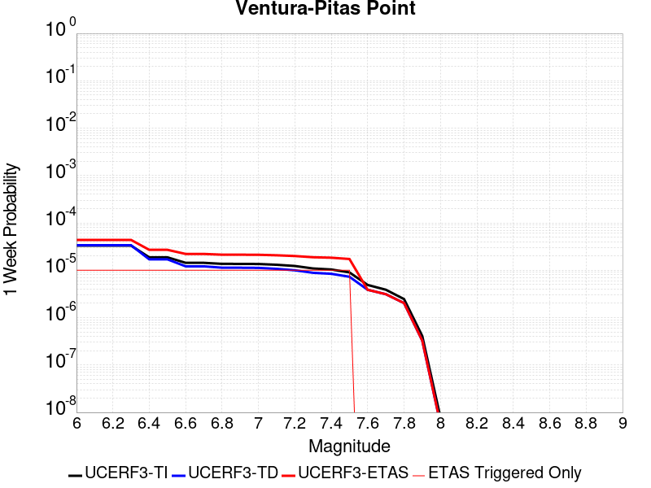 |  |  |  |

| Magnitude | 1 wk TI Prob | 1 wk TD Prob | 1 wk ETAS Prob | 1 wk ETAS/TD Gain | 1 wk ETAS Triggered Only | 1 mo TI Prob | 1 mo TD Prob | 1 mo ETAS Prob | 1 mo ETAS/TD Gain | 1 mo ETAS Triggered Only | 1 yr TI Prob | 1 yr TD Prob | 1 yr ETAS Prob | 1 yr ETAS/TD Gain | 1 yr ETAS Triggered Only | 10 yr TI Prob | 10 yr TD Prob | 10 yr ETAS Prob | 10 yr ETAS/TD Gain | 10 yr ETAS Triggered Only |
|-----|-----|-----|-----|-----|-----|-----|-----|-----|-----|-----|-----|-----|-----|-----|-----|-----|-----|-----|-----|-----|
| 6.0 | 3.3179622E-5 | 3.3735185E-5 | 1.0381482E-4 | 3.0773454 | 7.0081995E-5 | 1.4219063E-4 | 1.445728E-4 | 2.1464466E-4 | 1.4846822 | 7.0081995E-5 | 0.0017297962 | 0.0017590096 | 0.0018289683 | 1.0397717 | 7.0081995E-5 | 0.017163932 | 0.0174764 | 0.017545259 | 1.00394 | 7.0081995E-5 |
| 6.1 | 3.3179622E-5 | 3.3735185E-5 | 1.0381482E-4 | 3.0773454 | 7.0081995E-5 | 1.4219063E-4 | 1.445728E-4 | 2.1464466E-4 | 1.4846822 | 7.0081995E-5 | 0.0017297962 | 0.0017590096 | 0.0018289683 | 1.0397717 | 7.0081995E-5 | 0.017163932 | 0.0174764 | 0.017545259 | 1.00394 | 7.0081995E-5 |
| 6.2 | 3.3179622E-5 | 3.3735185E-5 | 1.0381482E-4 | 3.0773454 | 7.0081995E-5 | 1.4219063E-4 | 1.445728E-4 | 2.1464466E-4 | 1.4846822 | 7.0081995E-5 | 0.0017297962 | 0.0017590096 | 0.0018289683 | 1.0397717 | 7.0081995E-5 | 0.017163932 | 0.0174764 | 0.017545259 | 1.00394 | 7.0081995E-5 |
| 6.3 | 3.3179622E-5 | 3.3735185E-5 | 1.0381482E-4 | 3.0773454 | 7.0081995E-5 | 1.4219063E-4 | 1.445728E-4 | 2.1464466E-4 | 1.4846822 | 7.0081995E-5 | 0.0017297962 | 0.0017590096 | 0.0018289683 | 1.0397717 | 7.0081995E-5 | 0.017163932 | 0.0174764 | 0.017545259 | 1.00394 | 7.0081995E-5 |
| 6.4 | 1.8754668E-5 | 1.701961E-5 | 8.7100416E-5 | 5.11765 | 7.0081995E-5 | 8.037467E-5 | 7.293928E-5 | 1.4301616E-4 | 1.9607564 | 7.0081995E-5 | 9.781223E-4 | 8.8769704E-4 | 9.577168E-4 | 1.078878 | 7.0081995E-5 | 0.009738282 | 0.008843848 | 0.00891331 | 1.0078543 | 7.0081995E-5 |
| 6.5 | 1.8754668E-5 | 1.701961E-5 | 8.7100416E-5 | 5.11765 | 7.0081995E-5 | 8.037467E-5 | 7.293928E-5 | 1.4301616E-4 | 1.9607564 | 7.0081995E-5 | 9.781223E-4 | 8.8769704E-4 | 9.577168E-4 | 1.078878 | 7.0081995E-5 | 0.009738282 | 0.008843848 | 0.00891331 | 1.0078543 | 7.0081995E-5 |
| 6.6 | 1.4361558E-5 | 1.2122275E-5 | 8.220342E-5 | 6.7811875 | 7.0081995E-5 | 6.154808E-5 | 5.1951585E-5 | 1.2202994E-4 | 2.3489165 | 7.0081995E-5 | 7.490902E-4 | 6.3232926E-4 | 7.0236693E-4 | 1.1107614 | 7.0081995E-5 | 0.0074657016 | 0.0063055577 | 0.006375198 | 1.0110443 | 7.0081995E-5 |
| 6.7 | 1.4361558E-5 | 1.2122275E-5 | 8.220342E-5 | 6.7811875 | 7.0081995E-5 | 6.154808E-5 | 5.1951585E-5 | 1.2202994E-4 | 2.3489165 | 7.0081995E-5 | 7.490902E-4 | 6.3232926E-4 | 7.0236693E-4 | 1.1107614 | 7.0081995E-5 | 0.0074657016 | 0.0063055577 | 0.006375198 | 1.0110443 | 7.0081995E-5 |
| 6.8 | 1.3663846E-5 | 1.13444175E-5 | 8.142562E-5 | 7.177593 | 7.0081995E-5 | 5.8558027E-5 | 4.861804E-5 | 1.18696626E-4 | 2.4414113 | 7.0081995E-5 | 7.127108E-4 | 5.917658E-4 | 6.618063E-4 | 1.1183585 | 7.0081995E-5 | 0.007104293 | 0.005902116 | 0.0059717842 | 1.011804 | 7.0081995E-5 |
| 6.9 | 1.3644157E-5 | 1.1322519E-5 | 8.140372E-5 | 7.189542 | 7.0081995E-5 | 5.8473648E-5 | 4.8524187E-5 | 1.1860278E-4 | 2.4441993 | 7.0081995E-5 | 7.116841E-4 | 5.9062376E-4 | 6.606644E-4 | 1.1185875 | 7.0081995E-5 | 0.007094092 | 0.0058907564 | 0.005960426 | 1.0118269 | 7.0081995E-5 |
| 7.0 | 1.3568845E-5 | 1.1242086E-5 | 8.132329E-5 | 7.233826 | 7.0081995E-5 | 5.8150898E-5 | 4.817949E-5 | 1.182581E-4 | 2.4545324 | 7.0081995E-5 | 7.077572E-4 | 5.864293E-4 | 6.564702E-4 | 1.1194363 | 7.0081995E-5 | 0.007055073 | 0.0058490336 | 0.0059187054 | 1.0119117 | 7.0081995E-5 |
| 7.1 | 1.306572E-5 | 1.072054E-5 | 8.080179E-5 | 7.5371003 | 7.0081995E-5 | 5.599474E-5 | 4.5944373E-5 | 1.1602315E-4 | 2.5252962 | 7.0081995E-5 | 6.815227E-4 | 5.5923103E-4 | 6.292738E-4 | 1.1252484 | 7.0081995E-5 | 0.0067943637 | 0.0055784425 | 0.0056481333 | 1.0124929 | 7.0081995E-5 |
| 7.2 | 1.232604E-5 | 9.995143E-6 | 8.007644E-5 | 8.011535 | 7.0081995E-5 | 5.2824813E-5 | 4.2835632E-5 | 1.12914626E-4 | 2.6359975 | 7.0081995E-5 | 6.429523E-4 | 5.214008E-4 | 5.914463E-4 | 1.1343409 | 7.0081995E-5 | 0.0064109527 | 0.005201967 | 0.0052716844 | 1.0134021 | 7.0081995E-5 |
| 7.3 | 1.0917261E-5 | 8.84384E-6 | 7.8925215E-5 | 8.9243145 | 7.0081995E-5 | 4.678742E-5 | 3.790163E-5 | 1.0798097E-4 | 2.8489795 | 7.0081995E-5 | 5.69488E-4 | 4.6135622E-4 | 5.3140585E-4 | 1.1518342 | 7.0081995E-5 | 0.0056803077 | 0.00460415 | 0.0046739094 | 1.0151514 | 7.0081995E-5 |
| 7.4 | 1.039959E-5 | 8.423562E-6 | 7.850497E-5 | 9.319688 | 7.0081995E-5 | 4.456891E-5 | 3.610049E-5 | 1.06179956E-4 | 2.9412332 | 7.0081995E-5 | 5.424914E-4 | 4.3943635E-4 | 5.094875E-4 | 1.1594114 | 7.0081995E-5 | 0.0054116896 | 0.004385836 | 0.0044556106 | 1.0159091 | 7.0081995E-5 |
| 7.5 | 9.015877E-6 | 7.2975445E-6 | 7.737903E-5 | 10.603434 | 7.0081995E-5 | 3.86389E-5 | 3.1274823E-5 | 1.0135463E-4 | 3.2407737 | 7.0081995E-5 | 4.7032707E-4 | 3.8070587E-4 | 4.5076117E-4 | 1.1840143 | 7.0081995E-5 | 0.004693329 | 0.0038006818 | 0.0038704975 | 1.0183692 | 7.0081995E-5 |
| 7.6 | 4.900162E-6 | 3.8741155E-6 | 3.8741155E-6 | 1.0 | 0.0 | 2.1000526E-5 | 1.6603248E-5 | 1.6603248E-5 | 1.0 | 0.0 | 2.556514E-4 | 2.0212591E-4 | 2.0212591E-4 | 1.0 | 0.0 | 0.0025535747 | 0.0020194345 | 0.0020194345 | 1.0 | 0.0 |
| 7.7 | 3.8850626E-6 | 3.1267302E-6 | 3.1267302E-6 | 1.0 | 0.0 | 1.6650163E-5 | 1.3400205E-5 | 1.3400205E-5 | 1.0 | 0.0 | 2.0269687E-4 | 1.6313537E-4 | 1.6313537E-4 | 1.0 | 0.0 | 0.002025121 | 0.0016301654 | 0.0016301654 | 1.0 | 0.0 |
| 7.8 | 2.4654719E-6 | 2.029875E-6 | 2.029875E-6 | 1.0 | 0.0 | 1.0566265E-5 | 8.699436E-6 | 8.699436E-6 | 1.0 | 0.0 | 1.2863669E-4 | 1.0591053E-4 | 1.0591053E-4 | 1.0 | 0.0 | 0.0012856225 | 0.0010586053 | 0.0010586053 | 1.0 | 0.0 |
| 7.9 | 4.095894E-7 | 3.2764765E-7 | 3.2764765E-7 | 1.0 | 0.0 | 1.7553821E-6 | 1.4042034E-6 | 1.4042034E-6 | 1.0 | 0.0 | 2.1371567E-5 | 1.7096047E-5 | 1.7096047E-5 | 1.0 | 0.0 | 2.1369511E-4 | 1.7094762E-4 | 1.7094762E-4 | 1.0 | 0.0 |
| 8.0 | 7.791402E-9 | 5.683497E-9 | 5.683497E-9 | 1.0 | 0.0 | 3.3391725E-8 | 2.4357844E-8 | 2.4357844E-8 | 1.0 | 0.0 | 4.0654416E-7 | 2.9655675E-7 | 2.9655675E-7 | 1.0 | 0.0 | 4.065434E-6 | 2.9655655E-6 | 2.9655655E-6 | 1.0 | 0.0 |

## San Diego Trough south
*[(top)](#table-of-contents)*

| 1 Week | 1 Month | 1 Year | 10 Year |
|-----|-----|-----|-----|
| 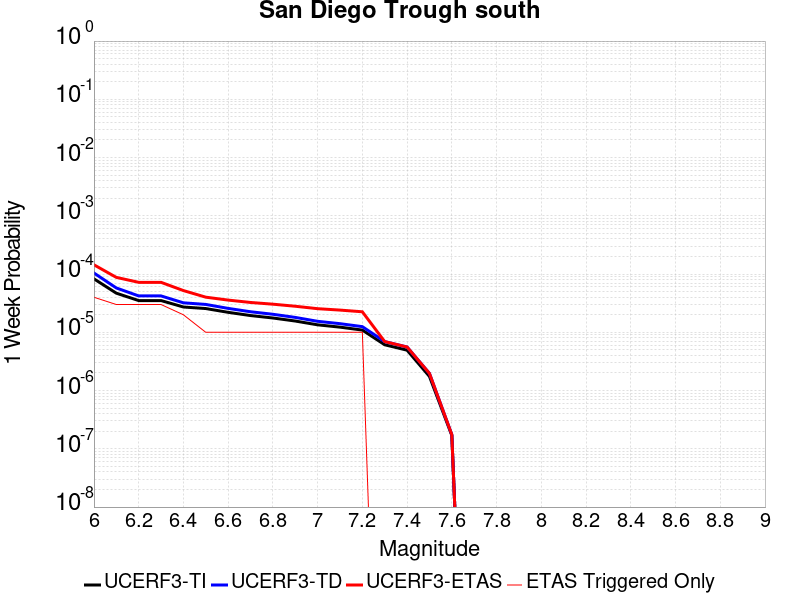 |  |  |  |

| Magnitude | 1 wk TI Prob | 1 wk TD Prob | 1 wk ETAS Prob | 1 wk ETAS/TD Gain | 1 wk ETAS Triggered Only | 1 mo TI Prob | 1 mo TD Prob | 1 mo ETAS Prob | 1 mo ETAS/TD Gain | 1 mo ETAS Triggered Only | 1 yr TI Prob | 1 yr TD Prob | 1 yr ETAS Prob | 1 yr ETAS/TD Gain | 1 yr ETAS Triggered Only | 10 yr TI Prob | 10 yr TD Prob | 10 yr ETAS Prob | 10 yr ETAS/TD Gain | 10 yr ETAS Triggered Only |
|-----|-----|-----|-----|-----|-----|-----|-----|-----|-----|-----|-----|-----|-----|-----|-----|-----|-----|-----|-----|-----|
| 6.0 | 8.279495E-5 | 1.04241306E-4 | 1.74316E-4 | 1.6722354 | 7.0081995E-5 | 3.5478722E-4 | 4.4667677E-4 | 5.1672745E-4 | 1.1568264 | 7.0081995E-5 | 0.004310982 | 0.0054256152 | 0.0054953173 | 1.0128468 | 7.0081995E-5 | 0.042283054 | 0.05299221 | 0.053058576 | 1.0012524 | 7.0081995E-5 |
| 6.1 | 4.6961468E-5 | 5.772944E-5 | 1.2780739E-4 | 2.2139032 | 7.0081995E-5 | 2.0124791E-4 | 2.473894E-4 | 3.1745408E-4 | 1.2832161 | 7.0081995E-5 | 0.00244744 | 0.0030079768 | 0.0030778479 | 1.0232286 | 7.0081995E-5 | 0.024206603 | 0.029679462 | 0.029747464 | 1.0022912 | 7.0081995E-5 |
| 6.2 | 3.5079658E-5 | 4.214154E-5 | 1.1222058E-4 | 2.6629446 | 7.0081995E-5 | 1.5033272E-4 | 1.8059435E-4 | 2.506637E-4 | 1.387993 | 7.0081995E-5 | 0.0018287642 | 0.0021965632 | 0.002266491 | 1.0318352 | 7.0081995E-5 | 0.018137876 | 0.021751117 | 0.021819675 | 1.0031519 | 7.0081995E-5 |
| 6.3 | 3.5079658E-5 | 4.214154E-5 | 1.1222058E-4 | 2.6629446 | 7.0081995E-5 | 1.5033272E-4 | 1.8059435E-4 | 2.506637E-4 | 1.387993 | 7.0081995E-5 | 0.0018287642 | 0.0021965632 | 0.002266491 | 1.0318352 | 7.0081995E-5 | 0.018137876 | 0.021751117 | 0.021819675 | 1.0031519 | 7.0081995E-5 |
| 6.4 | 2.7196904E-5 | 3.2087162E-5 | 3.2087162E-5 | 1.0 | 0.0 | 1.16552954E-4 | 1.3750927E-4 | 1.3750927E-4 | 1.0 | 0.0 | 0.0014181085 | 0.0016729041 | 0.0016729041 | 1.0 | 0.0 | 0.014090929 | 0.016604643 | 0.016604643 | 1.0 | 0.0 |
| 6.5 | 2.5584688E-5 | 3.010164E-5 | 3.010164E-5 | 1.0 | 0.0 | 1.0964406E-4 | 1.2900073E-4 | 1.2900073E-4 | 1.0 | 0.0 | 0.0013340989 | 0.0015694655 | 0.0015694655 | 1.0 | 0.0 | 0.013261181 | 0.015585314 | 0.015585314 | 1.0 | 0.0 |
| 6.6 | 2.2034688E-5 | 2.5742738E-5 | 2.5742738E-5 | 1.0 | 0.0 | 9.443096E-5 | 1.1032141E-4 | 1.1032141E-4 | 1.0 | 0.0 | 0.0011490905 | 0.0013423424 | 0.0013423424 | 1.0 | 0.0 | 0.011431668 | 0.013343317 | 0.013343317 | 1.0 | 0.0 |
| 6.7 | 1.9394853E-5 | 2.254176E-5 | 2.254176E-5 | 1.0 | 0.0 | 8.311815E-5 | 9.6603995E-5 | 9.6603995E-5 | 1.0 | 0.0 | 0.0010114936 | 0.0011755243 | 0.0011755243 | 1.0 | 0.0 | 0.01006902 | 0.011693766 | 0.011693766 | 1.0 | 0.0 |
| 6.8 | 1.7615313E-5 | 2.0403182E-5 | 2.0403182E-5 | 1.0 | 0.0 | 7.549201E-5 | 8.74393E-5 | 8.74393E-5 | 1.0 | 0.0 | 9.1872766E-4 | 0.0010640579 | 0.0010640579 | 1.0 | 0.0 | 0.009149387 | 0.010590198 | 0.010590198 | 1.0 | 0.0 |
| 6.9 | 1.5621423E-5 | 1.8026114E-5 | 1.8026114E-5 | 1.0 | 0.0 | 6.6947236E-5 | 7.725251E-5 | 7.725251E-5 | 1.0 | 0.0 | 8.147778E-4 | 9.40147E-4 | 9.40147E-4 | 1.0 | 0.0 | 0.008117969 | 0.009362142 | 0.009362142 | 1.0 | 0.0 |
| 7.0 | 1.3444376E-5 | 1.544809E-5 | 1.544809E-5 | 1.0 | 0.0 | 5.7617483E-5 | 6.620443E-5 | 6.620443E-5 | 1.0 | 0.0 | 7.0126704E-4 | 8.057436E-4 | 8.057436E-4 | 1.0 | 0.0 | 0.006990582 | 0.008028555 | 0.008028555 | 1.0 | 0.0 |
| 7.1 | 1.2268361E-5 | 1.407303E-5 | 1.407303E-5 | 1.0 | 0.0 | 5.2577634E-5 | 6.0311606E-5 | 6.0311606E-5 | 1.0 | 0.0 | 6.399447E-4 | 7.3404907E-4 | 7.3404907E-4 | 1.0 | 0.0 | 0.0063810493 | 0.0073165493 | 0.0073165493 | 1.0 | 0.0 |
| 7.2 | 1.0922655E-5 | 1.2513563E-5 | 1.2513563E-5 | 1.0 | 0.0 | 4.681054E-5 | 5.3628468E-5 | 5.3628468E-5 | 1.0 | 0.0 | 5.697693E-4 | 6.5273355E-4 | 6.5273355E-4 | 1.0 | 0.0 | 0.0056831064 | 0.0065084435 | 0.0065084435 | 1.0 | 0.0 |
| 7.3 | 6.1106753E-6 | 6.928925E-6 | 6.928925E-6 | 1.0 | 0.0 | 2.6188345E-5 | 2.9695057E-5 | 2.9695057E-5 | 1.0 | 0.0 | 3.1879646E-4 | 3.6147775E-4 | 3.6147775E-4 | 1.0 | 0.0 | 0.0031833951 | 0.003608943 | 0.003608943 | 1.0 | 0.0 |
| 7.4 | 4.933187E-6 | 5.5895525E-6 | 5.5895525E-6 | 1.0 | 0.0 | 2.114206E-5 | 2.3955008E-5 | 2.3955008E-5 | 1.0 | 0.0 | 2.5737417E-4 | 2.9161357E-4 | 2.9161357E-4 | 1.0 | 0.0 | 0.002570763 | 0.0029123505 | 0.0029123505 | 1.0 | 0.0 |
| 7.5 | 1.7489613E-6 | 1.969678E-6 | 1.969678E-6 | 1.0 | 0.0 | 7.495527E-6 | 8.4414505E-6 | 8.4414505E-6 | 1.0 | 0.0 | 9.125422E-5 | 1.02770035E-4 | 1.02770035E-4 | 1.0 | 0.0 | 9.1216754E-4 | 0.0010272472 | 0.0010272472 | 1.0 | 0.0 |
| 7.6 | 1.6988751E-7 | 1.7533823E-7 | 1.7533823E-7 | 1.0 | 0.0 | 7.2808916E-7 | 7.5144936E-7 | 7.5144936E-7 | 1.0 | 0.0 | 8.864449E-6 | 9.14886E-6 | 9.14886E-6 | 1.0 | 0.0 | 8.8640954E-5 | 9.1485024E-5 | 9.1485024E-5 | 1.0 | 0.0 |

## Hartley Springs 2011 CFM
*[(top)](#table-of-contents)*

| 1 Week | 1 Month | 1 Year | 10 Year |
|-----|-----|-----|-----|
|  |  | 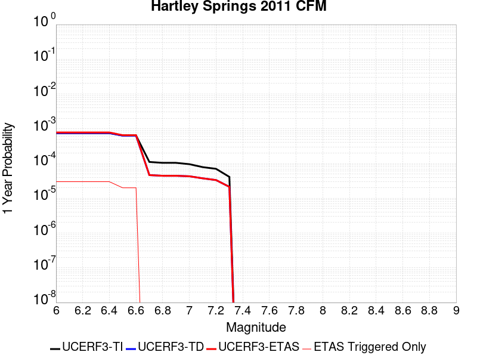 |  |

| Magnitude | 1 wk TI Prob | 1 wk TD Prob | 1 wk ETAS Prob | 1 wk ETAS/TD Gain | 1 wk ETAS Triggered Only | 1 mo TI Prob | 1 mo TD Prob | 1 mo ETAS Prob | 1 mo ETAS/TD Gain | 1 mo ETAS Triggered Only | 1 yr TI Prob | 1 yr TD Prob | 1 yr ETAS Prob | 1 yr ETAS/TD Gain | 1 yr ETAS Triggered Only | 10 yr TI Prob | 10 yr TD Prob | 10 yr ETAS Prob | 10 yr ETAS/TD Gain | 10 yr ETAS Triggered Only |
|-----|-----|-----|-----|-----|-----|-----|-----|-----|-----|-----|-----|-----|-----|-----|-----|-----|-----|-----|-----|-----|
| 6.0 | 1.4352418E-5 | 1.4434182E-5 | 8.4515166E-5 | 5.85521 | 7.0081995E-5 | 6.1508916E-5 | 6.1860235E-5 | 1.319379E-4 | 2.1328385 | 7.0081995E-5 | 7.486137E-4 | 7.5305253E-4 | 8.2308176E-4 | 1.0929939 | 7.0081995E-5 | 0.007460968 | 0.0075211283 | 0.007590683 | 1.0092479 | 7.0081995E-5 |
| 6.1 | 1.4352418E-5 | 1.4434182E-5 | 8.4515166E-5 | 5.85521 | 7.0081995E-5 | 6.1508916E-5 | 6.1860235E-5 | 1.319379E-4 | 2.1328385 | 7.0081995E-5 | 7.486137E-4 | 7.5305253E-4 | 8.2308176E-4 | 1.0929939 | 7.0081995E-5 | 0.007460968 | 0.0075211283 | 0.007590683 | 1.0092479 | 7.0081995E-5 |
| 6.2 | 1.4352418E-5 | 1.4434182E-5 | 8.4515166E-5 | 5.85521 | 7.0081995E-5 | 6.1508916E-5 | 6.1860235E-5 | 1.319379E-4 | 2.1328385 | 7.0081995E-5 | 7.486137E-4 | 7.5305253E-4 | 8.2308176E-4 | 1.0929939 | 7.0081995E-5 | 0.007460968 | 0.0075211283 | 0.007590683 | 1.0092479 | 7.0081995E-5 |
| 6.3 | 1.4352418E-5 | 1.4434182E-5 | 8.4515166E-5 | 5.85521 | 7.0081995E-5 | 6.1508916E-5 | 6.1860235E-5 | 1.319379E-4 | 2.1328385 | 7.0081995E-5 | 7.486137E-4 | 7.5305253E-4 | 8.2308176E-4 | 1.0929939 | 7.0081995E-5 | 0.007460968 | 0.0075211283 | 0.007590683 | 1.0092479 | 7.0081995E-5 |
| 6.4 | 1.4352418E-5 | 1.4434182E-5 | 8.4515166E-5 | 5.85521 | 7.0081995E-5 | 6.1508916E-5 | 6.1860235E-5 | 1.319379E-4 | 2.1328385 | 7.0081995E-5 | 7.486137E-4 | 7.5305253E-4 | 8.2308176E-4 | 1.0929939 | 7.0081995E-5 | 0.007460968 | 0.0075211283 | 0.007590683 | 1.0092479 | 7.0081995E-5 |
| 6.5 | 1.2279858E-5 | 1.2133106E-5 | 8.2214254E-5 | 6.7760267 | 7.0081995E-5 | 5.26269E-5 | 5.1998883E-5 | 1.2207724E-4 | 2.3476896 | 7.0081995E-5 | 6.4054417E-4 | 6.3306064E-4 | 7.030983E-4 | 1.1106334 | 7.0081995E-5 | 0.0063870098 | 0.006328085 | 0.006397723 | 1.0110047 | 7.0081995E-5 |
| 6.6 | 1.2279858E-5 | 1.2133106E-5 | 8.2214254E-5 | 6.7760267 | 7.0081995E-5 | 5.26269E-5 | 5.1998883E-5 | 1.2207724E-4 | 2.3476896 | 7.0081995E-5 | 6.4054417E-4 | 6.3306064E-4 | 7.030983E-4 | 1.1106334 | 7.0081995E-5 | 0.0063870098 | 0.006328085 | 0.006397723 | 1.0110047 | 7.0081995E-5 |
| 6.7 | 2.1282601E-6 | 8.8948315E-7 | 8.8948315E-7 | 1.0 | 0.0 | 9.121083E-6 | 3.8120663E-6 | 3.8120663E-6 | 1.0 | 0.0 | 1.11043526E-4 | 4.641118E-5 | 4.641118E-5 | 1.0 | 0.0 | 0.0011098806 | 4.6404017E-4 | 4.6404017E-4 | 1.0 | 0.0 |
| 6.8 | 2.00516E-6 | 8.517597E-7 | 8.517597E-7 | 1.0 | 0.0 | 8.593515E-6 | 3.650395E-6 | 3.650395E-6 | 1.0 | 0.0 | 1.04621024E-4 | 4.444291E-5 | 4.444291E-5 | 1.0 | 0.0 | 0.0010457177 | 4.4436535E-4 | 4.4436535E-4 | 1.0 | 0.0 |
| 6.9 | 2.00516E-6 | 8.517597E-7 | 8.517597E-7 | 1.0 | 0.0 | 8.593515E-6 | 3.650395E-6 | 3.650395E-6 | 1.0 | 0.0 | 1.04621024E-4 | 4.444291E-5 | 4.444291E-5 | 1.0 | 0.0 | 0.0010457177 | 4.4436535E-4 | 4.4436535E-4 | 1.0 | 0.0 |
| 7.0 | 1.8366732E-6 | 8.237307E-7 | 8.237307E-7 | 1.0 | 0.0 | 7.871433E-6 | 3.5302712E-6 | 3.5302712E-6 | 1.0 | 0.0 | 9.583048E-5 | 4.298046E-5 | 4.298046E-5 | 1.0 | 0.0 | 9.5789164E-4 | 4.2974652E-4 | 4.2974652E-4 | 1.0 | 0.0 |
| 7.1 | 1.5097997E-6 | 7.1902616E-7 | 7.1902616E-7 | 1.0 | 0.0 | 6.470554E-6 | 3.0815384E-6 | 3.0815384E-6 | 1.0 | 0.0 | 7.877615E-5 | 3.7517326E-5 | 3.7517326E-5 | 1.0 | 0.0 | 7.874823E-4 | 3.7513362E-4 | 3.7513362E-4 | 1.0 | 0.0 |
| 7.2 | 1.3490993E-6 | 6.405254E-7 | 6.405254E-7 | 1.0 | 0.0 | 5.7818415E-6 | 2.7451074E-6 | 2.7451074E-6 | 1.0 | 0.0 | 7.0391645E-5 | 3.3421402E-5 | 3.3421402E-5 | 1.0 | 0.0 | 7.0369354E-4 | 3.341867E-4 | 3.341867E-4 | 1.0 | 0.0 |
| 7.3 | 7.900015E-7 | 4.0889498E-7 | 4.0889498E-7 | 1.0 | 0.0 | 3.3857161E-6 | 1.752407E-6 | 1.752407E-6 | 1.0 | 0.0 | 4.1220315E-5 | 2.1335554E-5 | 2.1335554E-5 | 1.0 | 0.0 | 4.121267E-4 | 2.1335555E-4 | 2.1335555E-4 | 1.0 | 0.0 |

## San Juan
*[(top)](#table-of-contents)*

| 1 Week | 1 Month | 1 Year | 10 Year |
|-----|-----|-----|-----|
|  |  |  |  |

| Magnitude | 1 wk TI Prob | 1 wk TD Prob | 1 wk ETAS Prob | 1 wk ETAS/TD Gain | 1 wk ETAS Triggered Only | 1 mo TI Prob | 1 mo TD Prob | 1 mo ETAS Prob | 1 mo ETAS/TD Gain | 1 mo ETAS Triggered Only | 1 yr TI Prob | 1 yr TD Prob | 1 yr ETAS Prob | 1 yr ETAS/TD Gain | 1 yr ETAS Triggered Only | 10 yr TI Prob | 10 yr TD Prob | 10 yr ETAS Prob | 10 yr ETAS/TD Gain | 10 yr ETAS Triggered Only |
|-----|-----|-----|-----|-----|-----|-----|-----|-----|-----|-----|-----|-----|-----|-----|-----|-----|-----|-----|-----|-----|
| 6.0 | 8.682808E-6 | 8.7491635E-6 | 7.883055E-5 | 9.010067 | 7.0081995E-5 | 3.72115E-5 | 3.74959E-5 | 1.0757527E-4 | 2.8689873 | 7.0081995E-5 | 4.5295584E-4 | 4.564218E-4 | 5.264718E-4 | 1.1534765 | 7.0081995E-5 | 0.004520337 | 0.004555385 | 0.0046251477 | 1.0153143 | 7.0081995E-5 |
| 6.1 | 8.682808E-6 | 8.7491635E-6 | 7.883055E-5 | 9.010067 | 7.0081995E-5 | 3.72115E-5 | 3.74959E-5 | 1.0757527E-4 | 2.8689873 | 7.0081995E-5 | 4.5295584E-4 | 4.564218E-4 | 5.264718E-4 | 1.1534765 | 7.0081995E-5 | 0.004520337 | 0.004555385 | 0.0046251477 | 1.0153143 | 7.0081995E-5 |
| 6.2 | 8.682808E-6 | 8.7491635E-6 | 7.883055E-5 | 9.010067 | 7.0081995E-5 | 3.72115E-5 | 3.74959E-5 | 1.0757527E-4 | 2.8689873 | 7.0081995E-5 | 4.5295584E-4 | 4.564218E-4 | 5.264718E-4 | 1.1534765 | 7.0081995E-5 | 0.004520337 | 0.004555385 | 0.0046251477 | 1.0153143 | 7.0081995E-5 |
| 6.3 | 6.3054235E-6 | 6.2825848E-6 | 6.2825848E-6 | 1.0 | 0.0 | 2.7022963E-5 | 2.6925094E-5 | 2.6925094E-5 | 1.0 | 0.0 | 3.2895492E-4 | 3.2776513E-4 | 3.2776513E-4 | 1.0 | 0.0 | 0.003284684 | 0.003273017 | 0.003273017 | 1.0 | 0.0 |
| 6.4 | 6.1490473E-6 | 6.1144656E-6 | 6.1144656E-6 | 1.0 | 0.0 | 2.6352795E-5 | 2.6204598E-5 | 2.6204598E-5 | 1.0 | 0.0 | 3.2079802E-4 | 3.1899565E-4 | 3.1899565E-4 | 1.0 | 0.0 | 0.0032033534 | 0.0031855737 | 0.0031855737 | 1.0 | 0.0 |
| 6.5 | 5.204848E-6 | 5.137233E-6 | 5.137233E-6 | 1.0 | 0.0 | 2.23063E-5 | 2.2016533E-5 | 2.2016533E-5 | 1.0 | 0.0 | 2.7154534E-4 | 2.6801927E-4 | 2.6801927E-4 | 1.0 | 0.0 | 0.0027121378 | 0.0026771144 | 0.0026771144 | 1.0 | 0.0 |
| 6.6 | 4.5179986E-6 | 4.4150297E-6 | 4.4150297E-6 | 1.0 | 0.0 | 1.9362706E-5 | 1.8921424E-5 | 1.8921424E-5 | 1.0 | 0.0 | 2.3571544E-4 | 2.3034477E-4 | 2.3034477E-4 | 1.0 | 0.0 | 0.0023546559 | 0.0023011973 | 0.0023011973 | 1.0 | 0.0 |
| 6.7 | 3.9442616E-6 | 3.819828E-6 | 3.819828E-6 | 1.0 | 0.0 | 1.6903869E-5 | 1.6370592E-5 | 1.6370592E-5 | 1.0 | 0.0 | 2.0578515E-4 | 1.992944E-4 | 1.992944E-4 | 1.0 | 0.0 | 0.002055947 | 0.0019912818 | 0.0019912818 | 1.0 | 0.0 |
| 6.8 | 3.4536245E-6 | 3.3163353E-6 | 3.3163353E-6 | 1.0 | 0.0 | 1.4801163E-5 | 1.4212792E-5 | 1.4212792E-5 | 1.0 | 0.0 | 1.8018926E-4 | 1.7302761E-4 | 1.7302761E-4 | 1.0 | 0.0 | 0.0018004322 | 0.0017290477 | 0.0017290477 | 1.0 | 0.0 |
| 6.9 | 3.059865E-6 | 2.9120315E-6 | 2.9120315E-6 | 1.0 | 0.0 | 1.3113641E-5 | 1.2480078E-5 | 1.2480078E-5 | 1.0 | 0.0 | 1.596469E-4 | 1.5193493E-4 | 1.5193493E-4 | 1.0 | 0.0 | 0.0015953224 | 0.0015184252 | 0.0015184252 | 1.0 | 0.0 |
| 7.0 | 2.6504351E-6 | 2.4920002E-6 | 2.4920002E-6 | 1.0 | 0.0 | 1.1358958E-5 | 1.0679961E-5 | 1.0679961E-5 | 1.0 | 0.0 | 1.3828653E-4 | 1.300213E-4 | 1.300213E-4 | 1.0 | 0.0 | 0.0013820052 | 0.0012995641 | 0.0012995641 | 1.0 | 0.0 |
| 7.1 | 2.2039317E-6 | 2.0338296E-6 | 2.0338296E-6 | 1.0 | 0.0 | 9.445387E-6 | 8.716386E-6 | 8.716386E-6 | 1.0 | 0.0 | 1.1499152E-4 | 1.0611736E-4 | 1.0611736E-4 | 1.0 | 0.0 | 0.0011493203 | 0.0010607769 | 0.0010607769 | 1.0 | 0.0 |
| 7.2 | 1.0786707E-6 | 8.7701903E-7 | 8.7701903E-7 | 1.0 | 0.0 | 4.622866E-6 | 3.7586476E-6 | 3.7586476E-6 | 1.0 | 0.0 | 5.628194E-5 | 4.5760586E-5 | 4.5760586E-5 | 1.0 | 0.0 | 5.6267687E-4 | 4.5757066E-4 | 4.5757066E-4 | 1.0 | 0.0 |
| 7.3 | 6.846433E-7 | 4.868805E-7 | 4.868805E-7 | 1.0 | 0.0 | 2.9341822E-6 | 2.086629E-6 | 2.086629E-6 | 1.0 | 0.0 | 3.5723086E-5 | 2.5404412E-5 | 2.5404412E-5 | 1.0 | 0.0 | 3.571734E-4 | 2.540486E-4 | 2.540486E-4 | 1.0 | 0.0 |
| 7.4 | 5.23043E-7 | 3.2628162E-7 | 3.2628162E-7 | 1.0 | 0.0 | 2.2416111E-6 | 1.398349E-6 | 1.398349E-6 | 1.0 | 0.0 | 2.7291273E-5 | 1.7024766E-5 | 1.7024766E-5 | 1.0 | 0.0 | 2.7287923E-4 | 1.7026656E-4 | 1.7026656E-4 | 1.0 | 0.0 |
| 7.5 | 4.648444E-7 | 2.7234944E-7 | 2.7234944E-7 | 1.0 | 0.0 | 1.9921886E-6 | 1.1672114E-6 | 1.1672114E-6 | 1.0 | 0.0 | 2.4254627E-5 | 1.42107065E-5 | 1.42107065E-5 | 1.0 | 0.0 | 2.425198E-4 | 1.421276E-4 | 1.421276E-4 | 1.0 | 0.0 |
| 7.6 | 3.9906567E-7 | 2.2083314E-7 | 2.2083314E-7 | 1.0 | 0.0 | 1.7102802E-6 | 9.464274E-7 | 9.464274E-7 | 1.0 | 0.0 | 2.0822463E-5 | 1.1522693E-5 | 1.1522693E-5 | 1.0 | 0.0 | 2.0820512E-4 | 1.15245566E-4 | 1.15245566E-4 | 1.0 | 0.0 |
| 7.7 | 1.8784601E-7 | 5.3666906E-8 | 5.3666906E-8 | 1.0 | 0.0 | 8.0505407E-7 | 2.30001E-7 | 2.30001E-7 | 1.0 | 0.0 | 9.80149E-6 | 2.8002585E-6 | 2.8002585E-6 | 1.0 | 0.0 | 9.801057E-5 | 2.8011282E-5 | 2.8011282E-5 | 1.0 | 0.0 |
| 7.8 | 1.00154914E-7 | 1.2415832E-8 | 1.2415832E-8 | 1.0 | 0.0 | 4.2923529E-7 | 5.3210716E-8 | 5.3210716E-8 | 1.0 | 0.0 | 5.225927E-6 | 6.4784024E-7 | 6.4784024E-7 | 1.0 | 0.0 | 5.225804E-5 | 6.484273E-6 | 6.484273E-6 | 1.0 | 0.0 |
| 7.9 | 6.171429E-8 | 4.2966155E-9 | 4.2966155E-9 | 1.0 | 0.0 | 2.6448978E-7 | 1.8414067E-8 | 1.8414067E-8 | 1.0 | 0.0 | 3.2201583E-6 | 2.2419121E-7 | 2.2419121E-7 | 1.0 | 0.0 | 3.2201115E-5 | 2.2472002E-6 | 2.2472002E-6 | 1.0 | 0.0 |
| 8.0 | 1.3974572E-8 | 3.3788217E-10 | 3.3788217E-10 | 1.0 | 0.0 | 5.989102E-8 | 1.448067E-9 | 1.448067E-9 | 1.0 | 0.0 | 7.2917294E-7 | 1.763022E-8 | 1.763022E-8 | 1.0 | 0.0 | 7.2917055E-6 | 1.8060365E-7 | 1.8060365E-7 | 1.0 | 0.0 |
| 8.1 | 1.8403477E-9 | 1.1302803E-10 | 1.1302803E-10 | 1.0 | 0.0 | 7.887204E-9 | 4.844063E-10 | 4.844063E-10 | 1.0 | 0.0 | 9.602671E-8 | 5.8976446E-9 | 5.8976446E-9 | 1.0 | 0.0 | 9.602667E-7 | 6.021993E-8 | 6.021993E-8 | 1.0 | 0.0 |

## Dry Mountain
*[(top)](#table-of-contents)*

| 1 Week | 1 Month | 1 Year | 10 Year |
|-----|-----|-----|-----|
|  |  | 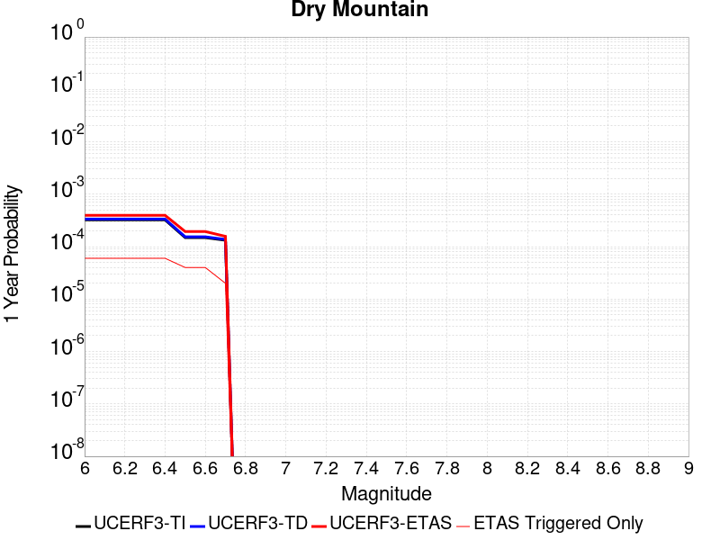 |  |

| Magnitude | 1 wk TI Prob | 1 wk TD Prob | 1 wk ETAS Prob | 1 wk ETAS/TD Gain | 1 wk ETAS Triggered Only | 1 mo TI Prob | 1 mo TD Prob | 1 mo ETAS Prob | 1 mo ETAS/TD Gain | 1 mo ETAS Triggered Only | 1 yr TI Prob | 1 yr TD Prob | 1 yr ETAS Prob | 1 yr ETAS/TD Gain | 1 yr ETAS Triggered Only | 10 yr TI Prob | 10 yr TD Prob | 10 yr ETAS Prob | 10 yr ETAS/TD Gain | 10 yr ETAS Triggered Only |
|-----|-----|-----|-----|-----|-----|-----|-----|-----|-----|-----|-----|-----|-----|-----|-----|-----|-----|-----|-----|-----|
| 6.0 | 6.222801E-6 | 6.439381E-6 | 6.439381E-6 | 1.0 | 0.0 | 2.6668875E-5 | 2.7597147E-5 | 2.7597147E-5 | 1.0 | 0.0 | 3.2464517E-4 | 3.3595937E-4 | 4.0601782E-4 | 1.2085325 | 7.0081995E-5 | 0.0032417132 | 0.0033560768 | 0.0034259236 | 1.020812 | 7.0081995E-5 |
| 6.1 | 6.222801E-6 | 6.439381E-6 | 6.439381E-6 | 1.0 | 0.0 | 2.6668875E-5 | 2.7597147E-5 | 2.7597147E-5 | 1.0 | 0.0 | 3.2464517E-4 | 3.3595937E-4 | 4.0601782E-4 | 1.2085325 | 7.0081995E-5 | 0.0032417132 | 0.0033560768 | 0.0034259236 | 1.020812 | 7.0081995E-5 |
| 6.2 | 6.222801E-6 | 6.439381E-6 | 6.439381E-6 | 1.0 | 0.0 | 2.6668875E-5 | 2.7597147E-5 | 2.7597147E-5 | 1.0 | 0.0 | 3.2464517E-4 | 3.3595937E-4 | 4.0601782E-4 | 1.2085325 | 7.0081995E-5 | 0.0032417132 | 0.0033560768 | 0.0034259236 | 1.020812 | 7.0081995E-5 |
| 6.3 | 6.222801E-6 | 6.439381E-6 | 6.439381E-6 | 1.0 | 0.0 | 2.6668875E-5 | 2.7597147E-5 | 2.7597147E-5 | 1.0 | 0.0 | 3.2464517E-4 | 3.3595937E-4 | 4.0601782E-4 | 1.2085325 | 7.0081995E-5 | 0.0032417132 | 0.0033560768 | 0.0034259236 | 1.020812 | 7.0081995E-5 |
| 6.4 | 6.222801E-6 | 6.439381E-6 | 6.439381E-6 | 1.0 | 0.0 | 2.6668875E-5 | 2.7597147E-5 | 2.7597147E-5 | 1.0 | 0.0 | 3.2464517E-4 | 3.3595937E-4 | 4.0601782E-4 | 1.2085325 | 7.0081995E-5 | 0.0032417132 | 0.0033560768 | 0.0034259236 | 1.020812 | 7.0081995E-5 |
| 6.5 | 2.8528623E-6 | 2.9521684E-6 | 2.9521684E-6 | 1.0 | 0.0 | 1.22264955E-5 | 1.2652138E-5 | 1.2652138E-5 | 1.0 | 0.0 | 1.4884741E-4 | 1.540376E-4 | 1.540376E-4 | 1.0 | 0.0 | 0.0014874774 | 0.0015401616 | 0.0015401616 | 1.0 | 0.0 |
| 6.6 | 2.8528623E-6 | 2.9521684E-6 | 2.9521684E-6 | 1.0 | 0.0 | 1.22264955E-5 | 1.2652138E-5 | 1.2652138E-5 | 1.0 | 0.0 | 1.4884741E-4 | 1.540376E-4 | 1.540376E-4 | 1.0 | 0.0 | 0.0014874774 | 0.0015401616 | 0.0015401616 | 1.0 | 0.0 |
| 6.7 | 2.541E-6 | 2.6293578E-6 | 2.6293578E-6 | 1.0 | 0.0 | 1.0889954E-5 | 1.1268677E-5 | 1.1268677E-5 | 1.0 | 0.0 | 1.3257713E-4 | 1.3719614E-4 | 1.3719614E-4 | 1.0 | 0.0 | 0.0013249806 | 0.0013719613 | 0.0013719613 | 1.0 | 0.0 |

## Reliz 2011 CFM
*[(top)](#table-of-contents)*

| 1 Week | 1 Month | 1 Year | 10 Year |
|-----|-----|-----|-----|
| 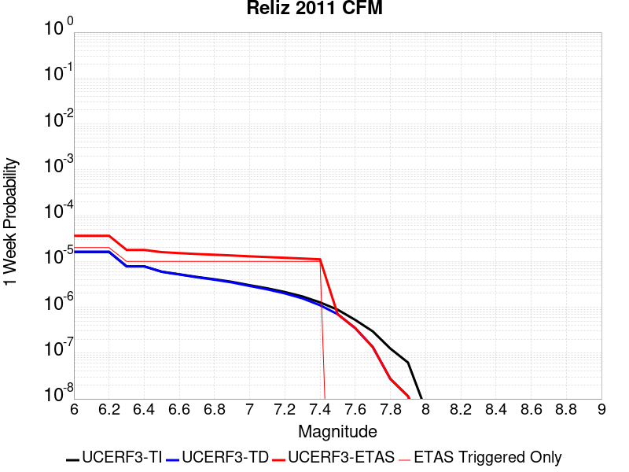 |  |  |  |

| Magnitude | 1 wk TI Prob | 1 wk TD Prob | 1 wk ETAS Prob | 1 wk ETAS/TD Gain | 1 wk ETAS Triggered Only | 1 mo TI Prob | 1 mo TD Prob | 1 mo ETAS Prob | 1 mo ETAS/TD Gain | 1 mo ETAS Triggered Only | 1 yr TI Prob | 1 yr TD Prob | 1 yr ETAS Prob | 1 yr ETAS/TD Gain | 1 yr ETAS Triggered Only | 10 yr TI Prob | 10 yr TD Prob | 10 yr ETAS Prob | 10 yr ETAS/TD Gain | 10 yr ETAS Triggered Only |
|-----|-----|-----|-----|-----|-----|-----|-----|-----|-----|-----|-----|-----|-----|-----|-----|-----|-----|-----|-----|-----|
| 6.0 | 1.6002472E-5 | 1.6282804E-5 | 8.636366E-5 | 5.3039794 | 7.0081995E-5 | 6.8580215E-5 | 6.9781694E-5 | 1.3985879E-4 | 2.0042334 | 7.0081995E-5 | 8.3464425E-4 | 8.4928074E-4 | 9.193032E-4 | 1.0824492 | 7.0081995E-5 | 0.008315164 | 0.008462547 | 0.008532036 | 1.0082114 | 7.0081995E-5 |
| 6.1 | 1.6002472E-5 | 1.6282804E-5 | 8.636366E-5 | 5.3039794 | 7.0081995E-5 | 6.8580215E-5 | 6.9781694E-5 | 1.3985879E-4 | 2.0042334 | 7.0081995E-5 | 8.3464425E-4 | 8.4928074E-4 | 9.193032E-4 | 1.0824492 | 7.0081995E-5 | 0.008315164 | 0.008462547 | 0.008532036 | 1.0082114 | 7.0081995E-5 |
| 6.2 | 1.6002472E-5 | 1.6282804E-5 | 8.636366E-5 | 5.3039794 | 7.0081995E-5 | 6.8580215E-5 | 6.9781694E-5 | 1.3985879E-4 | 2.0042334 | 7.0081995E-5 | 8.3464425E-4 | 8.4928074E-4 | 9.193032E-4 | 1.0824492 | 7.0081995E-5 | 0.008315164 | 0.008462547 | 0.008532036 | 1.0082114 | 7.0081995E-5 |
| 6.3 | 7.792404E-6 | 7.803802E-6 | 7.788525E-5 | 9.980424 | 7.0081995E-5 | 3.339559E-5 | 3.344444E-5 | 1.0352409E-4 | 3.095405 | 7.0081995E-5 | 4.0651546E-4 | 4.0711078E-4 | 4.7716426E-4 | 1.1720747 | 7.0081995E-5 | 0.0040577264 | 0.004063926 | 0.0041337237 | 1.0171748 | 7.0081995E-5 |
| 6.4 | 7.792404E-6 | 7.803802E-6 | 7.788525E-5 | 9.980424 | 7.0081995E-5 | 3.339559E-5 | 3.344444E-5 | 1.0352409E-4 | 3.095405 | 7.0081995E-5 | 4.0651546E-4 | 4.0711078E-4 | 4.7716426E-4 | 1.1720747 | 7.0081995E-5 | 0.0040577264 | 0.004063926 | 0.0041337237 | 1.0171748 | 7.0081995E-5 |
| 6.5 | 5.9659374E-6 | 5.928738E-6 | 7.601032E-5 | 12.820657 | 7.0081995E-5 | 2.5568053E-5 | 2.5408632E-5 | 9.5488846E-5 | 3.7581263 | 7.0081995E-5 | 3.1124658E-4 | 3.093064E-4 | 3.793667E-4 | 1.2265078 | 7.0081995E-5 | 0.00310811 | 0.0030889767 | 0.0031588422 | 1.0226177 | 7.0081995E-5 |
| 6.6 | 5.2350692E-6 | 5.178986E-6 | 7.526062E-5 | 14.531921 | 7.0081995E-5 | 2.2435817E-5 | 2.2195467E-5 | 9.2275906E-5 | 4.1574216 | 7.0081995E-5 | 2.7312184E-4 | 2.7019644E-4 | 3.402595E-4 | 1.2593042 | 7.0081995E-5 | 0.002727864 | 0.0026988892 | 0.0027687822 | 1.0258969 | 7.0081995E-5 |
| 6.7 | 4.580206E-6 | 4.5061206E-6 | 7.45878E-5 | 16.552553 | 7.0081995E-5 | 1.9629308E-5 | 1.9311801E-5 | 8.9392444E-5 | 4.6289024 | 7.0081995E-5 | 2.389606E-4 | 2.350959E-4 | 3.051614E-4 | 1.2980295 | 7.0081995E-5 | 0.002387038 | 0.0023486738 | 0.0024185912 | 1.029769 | 7.0081995E-5 |
| 6.8 | 4.0765017E-6 | 3.9882384E-6 | 7.4069954E-5 | 18.5721 | 7.0081995E-5 | 1.7470604E-5 | 1.7092338E-5 | 8.717314E-5 | 5.1001296 | 7.0081995E-5 | 2.1268385E-4 | 2.0807938E-4 | 2.781468E-4 | 1.336734 | 7.0081995E-5 | 0.002124804 | 0.0020790435 | 0.0021489798 | 1.0336387 | 7.0081995E-5 |
| 6.9 | 3.5752896E-6 | 3.4725176E-6 | 7.355427E-5 | 21.181828 | 7.0081995E-5 | 1.532258E-5 | 1.4882134E-5 | 8.496309E-5 | 5.7090664 | 7.0081995E-5 | 1.8653645E-4 | 1.8117494E-4 | 2.5124423E-4 | 1.3867494 | 7.0081995E-5 | 0.0018637994 | 0.0018104686 | 0.0018804237 | 1.0386392 | 7.0081995E-5 |
| 7.0 | 3.0259848E-6 | 2.9079417E-6 | 7.298974E-5 | 25.100136 | 7.0081995E-5 | 1.2968442E-5 | 1.2462548E-5 | 8.254367E-5 | 6.623338 | 7.0081995E-5 | 1.5787935E-4 | 1.5172097E-4 | 2.2179233E-4 | 1.4618436 | 7.0081995E-5 | 0.0015776722 | 0.001516369 | 0.0015863448 | 1.0461469 | 7.0081995E-5 |
| 7.1 | 2.5861116E-6 | 2.455167E-6 | 7.253699E-5 | 29.544624 | 7.0081995E-5 | 1.1083288E-5 | 1.05221025E-5 | 8.0603364E-5 | 7.6603856 | 7.0081995E-5 | 1.3493067E-4 | 1.2809907E-4 | 1.981721E-4 | 1.5470221 | 7.0081995E-5 | 0.0013484878 | 0.001280447 | 0.0013504392 | 1.0546623 | 7.0081995E-5 |
| 7.2 | 2.1482588E-6 | 2.003237E-6 | 7.2085095E-5 | 35.98431 | 7.0081995E-5 | 9.20679E-6 | 8.585273E-6 | 7.8666664E-5 | 9.162978 | 7.0081995E-5 | 1.12086906E-4 | 1.0452068E-4 | 1.7459535E-4 | 1.6704383 | 7.0081995E-5 | 0.0011203039 | 0.0010449095 | 0.0011149182 | 1.0669998 | 7.0081995E-5 |
| 7.3 | 1.7194744E-6 | 1.5611241E-6 | 7.164301E-5 | 45.891937 | 7.0081995E-5 | 7.3691554E-6 | 6.690515E-6 | 7.677204E-5 | 11.474758 | 7.0081995E-5 | 8.971577E-5 | 8.1453974E-5 | 1.5153026E-4 | 1.8603176 | 7.0081995E-5 | 8.967956E-4 | 8.1443513E-4 | 8.8446005E-4 | 1.0859797 | 7.0081995E-5 |
| 7.4 | 1.2755178E-6 | 1.10563E-6 | 7.118755E-5 | 64.38641 | 7.0081995E-5 | 5.4664933E-6 | 4.7384056E-6 | 7.482007E-5 | 15.790136 | 7.0081995E-5 | 6.655252E-5 | 5.768856E-5 | 1.2776651E-4 | 2.2147634 | 7.0081995E-5 | 6.6532596E-4 | 5.7692965E-4 | 6.4697117E-4 | 1.121404 | 7.0081995E-5 |
| 7.5 | 8.8463224E-7 | 7.0580273E-7 | 7.0580273E-7 | 1.0 | 0.0 | 3.7912755E-6 | 3.0248652E-6 | 3.0248652E-6 | 1.0 | 0.0 | 4.6157802E-5 | 3.6827114E-5 | 3.6827114E-5 | 1.0 | 0.0 | 4.6148215E-4 | 3.684038E-4 | 3.684038E-4 | 1.0 | 0.0 |
| 7.6 | 5.291355E-7 | 3.500777E-7 | 3.500777E-7 | 1.0 | 0.0 | 2.2677216E-6 | 1.5003321E-6 | 1.5003321E-6 | 1.0 | 0.0 | 2.760916E-5 | 1.8266392E-5 | 1.8266392E-5 | 1.0 | 0.0 | 2.760573E-4 | 1.8284164E-4 | 1.8284164E-4 | 1.0 | 0.0 |
| 7.7 | 2.9663357E-7 | 1.351113E-7 | 1.351113E-7 | 1.0 | 0.0 | 1.2712861E-6 | 5.7904833E-7 | 5.7904833E-7 | 1.0 | 0.0 | 1.5477797E-5 | 7.049891E-6 | 7.049891E-6 | 1.0 | 0.0 | 1.547672E-4 | 7.068132E-5 | 7.068132E-5 | 1.0 | 0.0 |
| 7.8 | 1.2509386E-7 | 2.7157126E-8 | 2.7157126E-8 | 1.0 | 0.0 | 5.3611643E-7 | 1.1638769E-7 | 1.1638769E-7 | 1.0 | 0.0 | 6.527198E-6 | 1.4170191E-6 | 1.4170191E-6 | 1.0 | 0.0 | 6.527006E-5 | 1.4326506E-5 | 1.4326506E-5 | 1.0 | 0.0 |
| 7.9 | 6.213493E-8 | 1.1482114E-8 | 1.1482114E-8 | 1.0 | 0.0 | 2.6629255E-7 | 4.920906E-8 | 4.920906E-8 | 1.0 | 0.0 | 3.242107E-6 | 5.9912014E-7 | 5.9912014E-7 | 1.0 | 0.0 | 3.2420594E-5 | 6.1224223E-6 | 6.1224223E-6 | 1.0 | 0.0 |
| 8.0 | 5.92383E-9 | 1.677887E-9 | 1.677887E-9 | 1.0 | 0.0 | 2.5387841E-8 | 7.190944E-9 | 7.190944E-9 | 1.0 | 0.0 | 3.0909692E-7 | 8.754974E-8 | 8.754974E-8 | 1.0 | 0.0 | 3.090965E-6 | 9.003061E-7 | 9.003061E-7 | 1.0 | 0.0 |

## Los Alamos 2011 CFM
*[(top)](#table-of-contents)*

| 1 Week | 1 Month | 1 Year | 10 Year |
|-----|-----|-----|-----|
|  |  |  |  |

| Magnitude | 1 wk TI Prob | 1 wk TD Prob | 1 wk ETAS Prob | 1 wk ETAS/TD Gain | 1 wk ETAS Triggered Only | 1 mo TI Prob | 1 mo TD Prob | 1 mo ETAS Prob | 1 mo ETAS/TD Gain | 1 mo ETAS Triggered Only | 1 yr TI Prob | 1 yr TD Prob | 1 yr ETAS Prob | 1 yr ETAS/TD Gain | 1 yr ETAS Triggered Only | 10 yr TI Prob | 10 yr TD Prob | 10 yr ETAS Prob | 10 yr ETAS/TD Gain | 10 yr ETAS Triggered Only |
|-----|-----|-----|-----|-----|-----|-----|-----|-----|-----|-----|-----|-----|-----|-----|-----|-----|-----|-----|-----|-----|
| 6.0 | 4.6284417E-6 | 4.751731E-6 | 7.483339E-5 | 15.748659 | 7.0081995E-5 | 1.9836029E-5 | 2.0364414E-5 | 9.0444984E-5 | 4.441325 | 7.0081995E-5 | 2.4147688E-4 | 2.4791027E-4 | 3.1797492E-4 | 1.2826209 | 7.0081995E-5 | 0.0024121467 | 0.0024765113 | 0.0025464199 | 1.0282286 | 7.0081995E-5 |
| 6.1 | 4.6284417E-6 | 4.751731E-6 | 7.483339E-5 | 15.748659 | 7.0081995E-5 | 1.9836029E-5 | 2.0364414E-5 | 9.0444984E-5 | 4.441325 | 7.0081995E-5 | 2.4147688E-4 | 2.4791027E-4 | 3.1797492E-4 | 1.2826209 | 7.0081995E-5 | 0.0024121467 | 0.0024765113 | 0.0025464199 | 1.0282286 | 7.0081995E-5 |
| 6.2 | 4.6284417E-6 | 4.751731E-6 | 7.483339E-5 | 15.748659 | 7.0081995E-5 | 1.9836029E-5 | 2.0364414E-5 | 9.0444984E-5 | 4.441325 | 7.0081995E-5 | 2.4147688E-4 | 2.4791027E-4 | 3.1797492E-4 | 1.2826209 | 7.0081995E-5 | 0.0024121467 | 0.0024765113 | 0.0025464199 | 1.0282286 | 7.0081995E-5 |
| 6.3 | 4.6284417E-6 | 4.751731E-6 | 7.483339E-5 | 15.748659 | 7.0081995E-5 | 1.9836029E-5 | 2.0364414E-5 | 9.0444984E-5 | 4.441325 | 7.0081995E-5 | 2.4147688E-4 | 2.4791027E-4 | 3.1797492E-4 | 1.2826209 | 7.0081995E-5 | 0.0024121467 | 0.0024765113 | 0.0025464199 | 1.0282286 | 7.0081995E-5 |
| 6.4 | 4.6284417E-6 | 4.751731E-6 | 7.483339E-5 | 15.748659 | 7.0081995E-5 | 1.9836029E-5 | 2.0364414E-5 | 9.0444984E-5 | 4.441325 | 7.0081995E-5 | 2.4147688E-4 | 2.4791027E-4 | 3.1797492E-4 | 1.2826209 | 7.0081995E-5 | 0.0024121467 | 0.0024765113 | 0.0025464199 | 1.0282286 | 7.0081995E-5 |
| 6.5 | 4.6284417E-6 | 4.751731E-6 | 7.483339E-5 | 15.748659 | 7.0081995E-5 | 1.9836029E-5 | 2.0364414E-5 | 9.0444984E-5 | 4.441325 | 7.0081995E-5 | 2.4147688E-4 | 2.4791027E-4 | 3.1797492E-4 | 1.2826209 | 7.0081995E-5 | 0.0024121467 | 0.0024765113 | 0.0025464199 | 1.0282286 | 7.0081995E-5 |
| 6.6 | 4.6284417E-6 | 4.751731E-6 | 7.483339E-5 | 15.748659 | 7.0081995E-5 | 1.9836029E-5 | 2.0364414E-5 | 9.0444984E-5 | 4.441325 | 7.0081995E-5 | 2.4147688E-4 | 2.4791027E-4 | 3.1797492E-4 | 1.2826209 | 7.0081995E-5 | 0.0024121467 | 0.0024765113 | 0.0025464199 | 1.0282286 | 7.0081995E-5 |
| 6.7 | 4.062321E-6 | 4.166349E-6 | 7.4248055E-5 | 17.820892 | 7.0081995E-5 | 1.7409831E-5 | 1.7855667E-5 | 8.793641E-5 | 4.924846 | 7.0081995E-5 | 2.1194408E-4 | 2.1737257E-4 | 2.8743932E-4 | 1.3223349 | 7.0081995E-5 | 0.0021174205 | 0.0021717492 | 0.002241679 | 1.0321997 | 7.0081995E-5 |
| 6.8 | 4.062321E-6 | 4.166349E-6 | 7.4248055E-5 | 17.820892 | 7.0081995E-5 | 1.7409831E-5 | 1.7855667E-5 | 8.793641E-5 | 4.924846 | 7.0081995E-5 | 2.1194408E-4 | 2.1737257E-4 | 2.8743932E-4 | 1.3223349 | 7.0081995E-5 | 0.0021174205 | 0.0021717492 | 0.002241679 | 1.0321997 | 7.0081995E-5 |
| 6.9 | 3.2936077E-6 | 3.372958E-6 | 7.3454714E-5 | 21.777538 | 7.0081995E-5 | 1.4115385E-5 | 1.4455459E-5 | 8.453644E-5 | 5.8480635 | 7.0081995E-5 | 1.7184127E-4 | 1.7598194E-4 | 2.460516E-4 | 1.3981639 | 7.0081995E-5 | 0.0017170844 | 0.0017585184 | 0.0018284771 | 1.0397828 | 7.0081995E-5 |
| 7.0 | 3.1687898E-6 | 3.2448156E-6 | 7.3326584E-5 | 22.598074 | 7.0081995E-5 | 1.3580457E-5 | 1.3906283E-5 | 8.39873E-5 | 6.039522 | 7.0081995E-5 | 1.6532952E-4 | 1.6929678E-4 | 2.3936691E-4 | 1.4138893 | 7.0081995E-5 | 0.0016520657 | 0.0016917696 | 0.0017617331 | 1.0413551 | 7.0081995E-5 |
| 7.1 | 2.9379228E-6 | 3.0073259E-6 | 3.0073259E-6 | 1.0 | 0.0 | 1.25910365E-5 | 1.288848E-5 | 1.288848E-5 | 1.0 | 0.0 | 1.5328509E-4 | 1.5690686E-4 | 1.5690686E-4 | 1.0 | 0.0 | 0.001531794 | 0.0015680499 | 0.0015680499 | 1.0 | 0.0 |
| 7.2 | 2.0020686E-6 | 2.0416298E-6 | 2.0416298E-6 | 1.0 | 0.0 | 8.580266E-6 | 8.749813E-6 | 8.749813E-6 | 1.0 | 0.0 | 1.0445973E-4 | 1.0652381E-4 | 1.0652381E-4 | 1.0 | 0.0 | 0.0010441064 | 0.001064732 | 0.001064732 | 1.0 | 0.0 |
| 7.3 | 1.7364243E-6 | 1.7678802E-6 | 1.7678802E-6 | 1.0 | 0.0 | 7.441797E-6 | 7.576608E-6 | 7.576608E-6 | 1.0 | 0.0 | 9.0600115E-5 | 9.2241324E-5 | 9.2241324E-5 | 1.0 | 0.0 | 9.0563187E-4 | 9.2203356E-4 | 9.2203356E-4 | 1.0 | 0.0 |
| 7.4 | 1.5718434E-6 | 1.5983177E-6 | 1.5983177E-6 | 1.0 | 0.0 | 6.7364545E-6 | 6.849915E-6 | 6.849915E-6 | 1.0 | 0.0 | 8.201325E-5 | 8.339455E-5 | 8.339455E-5 | 1.0 | 0.0 | 8.198299E-4 | 8.3363557E-4 | 8.3363557E-4 | 1.0 | 0.0 |
| 7.5 | 1.3841119E-6 | 1.4042793E-6 | 1.4042793E-6 | 1.0 | 0.0 | 5.9318945E-6 | 6.0183256E-6 | 6.0183256E-6 | 1.0 | 0.0 | 7.221842E-5 | 7.327068E-5 | 7.327068E-5 | 1.0 | 0.0 | 7.2194956E-4 | 7.324681E-4 | 7.324681E-4 | 1.0 | 0.0 |
| 7.6 | 1.0843726E-6 | 1.093442E-6 | 1.093442E-6 | 1.0 | 0.0 | 4.647303E-6 | 4.6861724E-6 | 4.6861724E-6 | 1.0 | 0.0 | 5.6579443E-5 | 5.705268E-5 | 5.705268E-5 | 1.0 | 0.0 | 5.656504E-4 | 5.703829E-4 | 5.703829E-4 | 1.0 | 0.0 |
| 7.7 | 5.544814E-7 | 5.5018705E-7 | 5.5018705E-7 | 1.0 | 0.0 | 2.3763469E-6 | 2.3579425E-6 | 2.3579425E-6 | 1.0 | 0.0 | 2.8931638E-5 | 2.8707573E-5 | 2.8707573E-5 | 1.0 | 0.0 | 2.8927872E-4 | 2.870388E-4 | 2.870388E-4 | 1.0 | 0.0 |
| 7.8 | 2.0707465E-7 | 1.977846E-7 | 1.977846E-7 | 1.0 | 0.0 | 8.874625E-7 | 8.4764804E-7 | 8.4764804E-7 | 1.0 | 0.0 | 1.08048025E-5 | 1.0320066E-5 | 1.0320066E-5 | 1.0 | 0.0 | 1.0804277E-4 | 1.0319592E-4 | 1.0319592E-4 | 1.0 | 0.0 |
| 7.9 | 3.9821284E-8 | 3.433109E-8 | 3.433109E-8 | 1.0 | 0.0 | 1.7066264E-7 | 1.4713324E-7 | 1.4713324E-7 | 1.0 | 0.0 | 2.0778157E-6 | 1.7913457E-6 | 1.7913457E-6 | 1.0 | 0.0 | 2.0777963E-5 | 1.7913319E-5 | 1.7913319E-5 | 1.0 | 0.0 |
| 8.0 | 7.880441E-11 | 8.2353124E-11 | 8.2353124E-11 | 1.0 | 0.0 | 3.3773329E-10 | 3.52942E-10 | 3.52942E-10 | 1.0 | 0.0 | 4.1119033E-9 | 4.2970694E-9 | 4.2970694E-9 | 1.0 | 0.0 | 4.1119034E-8 | 4.2970694E-8 | 4.2970694E-8 | 1.0 | 0.0 |

## Ortigalita (South)
*[(top)](#table-of-contents)*

| 1 Week | 1 Month | 1 Year | 10 Year |
|-----|-----|-----|-----|
|  |  |  |  |

| Magnitude | 1 wk TI Prob | 1 wk TD Prob | 1 wk ETAS Prob | 1 wk ETAS/TD Gain | 1 wk ETAS Triggered Only | 1 mo TI Prob | 1 mo TD Prob | 1 mo ETAS Prob | 1 mo ETAS/TD Gain | 1 mo ETAS Triggered Only | 1 yr TI Prob | 1 yr TD Prob | 1 yr ETAS Prob | 1 yr ETAS/TD Gain | 1 yr ETAS Triggered Only | 10 yr TI Prob | 10 yr TD Prob | 10 yr ETAS Prob | 10 yr ETAS/TD Gain | 10 yr ETAS Triggered Only |
|-----|-----|-----|-----|-----|-----|-----|-----|-----|-----|-----|-----|-----|-----|-----|-----|-----|-----|-----|-----|-----|
| 6.0 | 3.72394E-5 | 4.325562E-5 | 1.1333458E-4 | 2.6201124 | 7.0081995E-5 | 1.5958765E-4 | 1.8536893E-4 | 2.5543795E-4 | 1.3779975 | 7.0081995E-5 | 0.0019412481 | 0.0022546875 | 0.0023246114 | 1.0310128 | 7.0081995E-5 | 0.019243775 | 0.022334497 | 0.022403013 | 1.0030677 | 7.0081995E-5 |
| 6.1 | 2.7299884E-5 | 3.149204E-5 | 3.149204E-5 | 1.0 | 0.0 | 1.16994255E-4 | 1.3495922E-4 | 1.3495922E-4 | 1.0 | 0.0 | 0.0014234743 | 0.0016419457 | 0.0016419457 | 1.0 | 0.0 | 0.014143906 | 0.01630407 | 0.01630407 | 1.0 | 0.0 |
| 6.2 | 2.7299884E-5 | 3.149204E-5 | 3.149204E-5 | 1.0 | 0.0 | 1.16994255E-4 | 1.3495922E-4 | 1.3495922E-4 | 1.0 | 0.0 | 0.0014234743 | 0.0016419457 | 0.0016419457 | 1.0 | 0.0 | 0.014143906 | 0.01630407 | 0.01630407 | 1.0 | 0.0 |
| 6.3 | 2.0546433E-5 | 2.363145E-5 | 2.363145E-5 | 1.0 | 0.0 | 8.805317E-5 | 1.0127382E-4 | 1.0127382E-4 | 1.0 | 0.0 | 0.00107152 | 0.0012323303 | 0.0012323303 | 1.0 | 0.0 | 0.010663681 | 0.01225703 | 0.01225703 | 1.0 | 0.0 |
| 6.4 | 2.0546433E-5 | 2.363145E-5 | 2.363145E-5 | 1.0 | 0.0 | 8.805317E-5 | 1.0127382E-4 | 1.0127382E-4 | 1.0 | 0.0 | 0.00107152 | 0.0012323303 | 0.0012323303 | 1.0 | 0.0 | 0.010663681 | 0.01225703 | 0.01225703 | 1.0 | 0.0 |
| 6.5 | 1.7779594E-5 | 2.0446974E-5 | 2.0446974E-5 | 1.0 | 0.0 | 7.619603E-5 | 8.762702E-5 | 8.762702E-5 | 1.0 | 0.0 | 9.272918E-4 | 0.0010663504 | 0.0010663504 | 1.0 | 0.0 | 0.009234319 | 0.010613803 | 0.010613803 | 1.0 | 0.0 |
| 6.6 | 1.6272212E-5 | 1.8714967E-5 | 1.8714967E-5 | 1.0 | 0.0 | 6.973618E-5 | 8.0204605E-5 | 8.0204605E-5 | 1.0 | 0.0 | 8.487073E-4 | 9.760658E-4 | 9.760658E-4 | 1.0 | 0.0 | 0.008454733 | 0.009719091 | 0.009719091 | 1.0 | 0.0 |
| 6.7 | 1.3051484E-5 | 1.5038758E-5 | 1.5038758E-5 | 1.0 | 0.0 | 5.593373E-5 | 6.445028E-5 | 6.445028E-5 | 1.0 | 0.0 | 6.807804E-4 | 7.844092E-4 | 7.844092E-4 | 1.0 | 0.0 | 0.006786986 | 0.007817388 | 0.007817388 | 1.0 | 0.0 |
| 6.8 | 1.04277415E-5 | 1.1987235E-5 | 1.1987235E-5 | 1.0 | 0.0 | 4.4689557E-5 | 5.1372896E-5 | 5.1372896E-5 | 1.0 | 0.0 | 5.439595E-4 | 6.2529295E-4 | 6.2529295E-4 | 1.0 | 0.0 | 0.0054262993 | 0.00623609 | 0.00623609 | 1.0 | 0.0 |
| 6.9 | 7.639968E-6 | 8.791503E-6 | 8.791503E-6 | 1.0 | 0.0 | 3.274231E-5 | 3.767736E-5 | 3.767736E-5 | 1.0 | 0.0 | 3.9856473E-4 | 4.586312E-4 | 4.586312E-4 | 1.0 | 0.0 | 0.003978506 | 0.004577433 | 0.004577433 | 1.0 | 0.0 |
| 7.0 | 3.919831E-6 | 4.5334014E-6 | 4.5334014E-6 | 1.0 | 0.0 | 1.679917E-5 | 1.942873E-5 | 1.942873E-5 | 1.0 | 0.0 | 2.045107E-4 | 2.3652123E-4 | 2.3652123E-4 | 1.0 | 0.0 | 0.0020432258 | 0.0023629034 | 0.0023629034 | 1.0 | 0.0 |
| 7.1 | 1.6017933E-6 | 1.8570418E-6 | 1.8570418E-6 | 1.0 | 0.0 | 6.8648105E-6 | 7.958732E-6 | 7.958732E-6 | 1.0 | 0.0 | 8.357586E-5 | 9.689432E-5 | 9.689432E-5 | 1.0 | 0.0 | 8.3544437E-4 | 9.686254E-4 | 9.686254E-4 | 1.0 | 0.0 |

## Point Reyes 2011 CFM
*[(top)](#table-of-contents)*

| 1 Week | 1 Month | 1 Year | 10 Year |
|-----|-----|-----|-----|
|  | 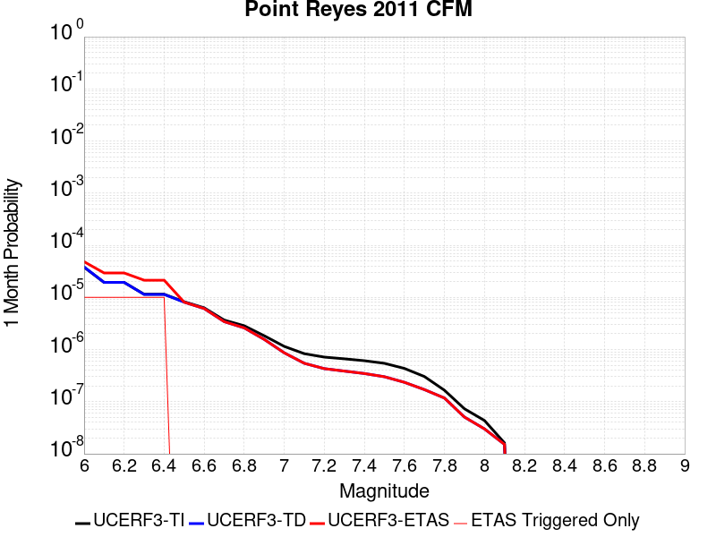 |  |  |

| Magnitude | 1 wk TI Prob | 1 wk TD Prob | 1 wk ETAS Prob | 1 wk ETAS/TD Gain | 1 wk ETAS Triggered Only | 1 mo TI Prob | 1 mo TD Prob | 1 mo ETAS Prob | 1 mo ETAS/TD Gain | 1 mo ETAS Triggered Only | 1 yr TI Prob | 1 yr TD Prob | 1 yr ETAS Prob | 1 yr ETAS/TD Gain | 1 yr ETAS Triggered Only | 10 yr TI Prob | 10 yr TD Prob | 10 yr ETAS Prob | 10 yr ETAS/TD Gain | 10 yr ETAS Triggered Only |
|-----|-----|-----|-----|-----|-----|-----|-----|-----|-----|-----|-----|-----|-----|-----|-----|-----|-----|-----|-----|-----|
| 6.0 | 8.8644965E-6 | 8.967163E-6 | 7.904853E-5 | 8.815333 | 7.0081995E-5 | 3.7990147E-5 | 3.843017E-5 | 1.0850947E-4 | 2.823549 | 7.0081995E-5 | 4.624319E-4 | 4.6779314E-4 | 5.3784234E-4 | 1.149744 | 7.0081995E-5 | 0.0046147075 | 0.004668713 | 0.0047384677 | 1.0149409 | 7.0081995E-5 |
| 6.1 | 4.526405E-6 | 4.5392185E-6 | 7.46209E-5 | 16.43915 | 7.0081995E-5 | 1.9398734E-5 | 1.9453653E-5 | 8.953429E-5 | 4.6024404 | 7.0081995E-5 | 2.36154E-4 | 2.3682354E-4 | 3.0688895E-4 | 1.2958549 | 7.0081995E-5 | 0.002359032 | 0.0023658178 | 0.002435734 | 1.0295527 | 7.0081995E-5 |
| 6.2 | 4.526405E-6 | 4.5392185E-6 | 7.46209E-5 | 16.43915 | 7.0081995E-5 | 1.9398734E-5 | 1.9453653E-5 | 8.953429E-5 | 4.6024404 | 7.0081995E-5 | 2.36154E-4 | 2.3682354E-4 | 3.0688895E-4 | 1.2958549 | 7.0081995E-5 | 0.002359032 | 0.0023658178 | 0.002435734 | 1.0295527 | 7.0081995E-5 |
| 6.3 | 2.6842322E-6 | 2.660676E-6 | 7.2742485E-5 | 27.339851 | 7.0081995E-5 | 1.1503801E-5 | 1.1402849E-5 | 8.1484046E-5 | 7.145938 | 7.0081995E-5 | 1.4004979E-4 | 1.3882104E-4 | 2.088933E-4 | 1.504767 | 7.0081995E-5 | 0.0013996155 | 0.0013873649 | 0.0014573497 | 1.0504444 | 7.0081995E-5 |
| 6.4 | 2.6842322E-6 | 2.660676E-6 | 7.2742485E-5 | 27.339851 | 7.0081995E-5 | 1.1503801E-5 | 1.1402849E-5 | 8.1484046E-5 | 7.145938 | 7.0081995E-5 | 1.4004979E-4 | 1.3882104E-4 | 2.088933E-4 | 1.504767 | 7.0081995E-5 | 0.0013996155 | 0.0013873649 | 0.0014573497 | 1.0504444 | 7.0081995E-5 |
| 6.5 | 1.9281833E-6 | 1.8906262E-6 | 1.8906262E-6 | 1.0 | 0.0 | 8.263617E-6 | 8.102659E-6 | 8.102659E-6 | 1.0 | 0.0 | 1.0060489E-4 | 9.86455E-5 | 9.86455E-5 | 1.0 | 0.0 | 0.0010055936 | 9.860279E-4 | 9.860279E-4 | 1.0 | 0.0 |
| 6.6 | 1.4726726E-6 | 1.4269577E-6 | 1.4269577E-6 | 1.0 | 0.0 | 6.3114385E-6 | 6.1155188E-6 | 6.1155188E-6 | 1.0 | 0.0 | 7.683905E-5 | 7.445395E-5 | 7.445395E-5 | 1.0 | 0.0 | 7.6812494E-4 | 7.4429717E-4 | 7.4429717E-4 | 1.0 | 0.0 |
| 6.7 | 8.572307E-7 | 8.007212E-7 | 8.007212E-7 | 1.0 | 0.0 | 3.6738406E-6 | 3.431658E-6 | 3.431658E-6 | 1.0 | 0.0 | 4.472809E-5 | 4.1779647E-5 | 4.1779647E-5 | 1.0 | 0.0 | 4.471909E-4 | 4.1772184E-4 | 4.1772184E-4 | 1.0 | 0.0 |
| 6.8 | 6.6745434E-7 | 6.0773E-7 | 6.0773E-7 | 1.0 | 0.0 | 2.8605155E-6 | 2.6045543E-6 | 2.6045543E-6 | 1.0 | 0.0 | 3.482622E-5 | 3.171E-5 | 3.171E-5 | 1.0 | 0.0 | 3.4820763E-4 | 3.1705803E-4 | 3.1705803E-4 | 1.0 | 0.0 |
| 6.9 | 4.291521E-7 | 3.6535937E-7 | 3.6535937E-7 | 1.0 | 0.0 | 1.839222E-6 | 1.565825E-6 | 1.565825E-6 | 1.0 | 0.0 | 2.2392298E-5 | 1.9063755E-5 | 1.9063755E-5 | 1.0 | 0.0 | 2.2390042E-4 | 1.9062385E-4 | 1.9062385E-4 | 1.0 | 0.0 |
| 7.0 | 2.6812808E-7 | 2.0187414E-7 | 2.0187414E-7 | 1.0 | 0.0 | 1.1491198E-6 | 8.651746E-7 | 8.651746E-7 | 1.0 | 0.0 | 1.3990444E-5 | 1.0533451E-5 | 1.0533451E-5 | 1.0 | 0.0 | 1.3989564E-4 | 1.0533186E-4 | 1.0533186E-4 | 1.0 | 0.0 |
| 7.1 | 1.9451231E-7 | 1.2725499E-7 | 1.2725499E-7 | 1.0 | 0.0 | 8.336239E-7 | 5.453784E-7 | 5.453784E-7 | 1.0 | 0.0 | 1.0149324E-5 | 6.6399616E-6 | 6.6399616E-6 | 1.0 | 0.0 | 1.014886E-4 | 6.639991E-5 | 6.639991E-5 | 1.0 | 0.0 |
| 7.2 | 1.6715143E-7 | 1.00428394E-7 | 1.00428394E-7 | 1.0 | 0.0 | 7.1636305E-7 | 4.3040734E-7 | 4.3040734E-7 | 1.0 | 0.0 | 8.721685E-6 | 5.2401965E-6 | 5.2401965E-6 | 1.0 | 0.0 | 8.721343E-5 | 5.2402997E-5 | 5.2402997E-5 | 1.0 | 0.0 |
| 7.3 | 1.5503173E-7 | 9.0131024E-8 | 9.0131024E-8 | 1.0 | 0.0 | 6.644215E-7 | 3.8627576E-7 | 3.8627576E-7 | 1.0 | 0.0 | 8.089301E-6 | 4.702897E-6 | 4.702897E-6 | 1.0 | 0.0 | 8.089007E-5 | 4.7030244E-5 | 4.7030244E-5 | 1.0 | 0.0 |
| 7.4 | 1.4251614E-7 | 8.097624E-8 | 8.097624E-8 | 1.0 | 0.0 | 6.1078333E-7 | 3.47041E-7 | 3.47041E-7 | 1.0 | 0.0 | 7.4362615E-6 | 4.225216E-6 | 4.225216E-6 | 1.0 | 0.0 | 7.436013E-5 | 4.2253625E-5 | 4.2253625E-5 | 1.0 | 0.0 |
| 7.5 | 1.2710186E-7 | 7.0296394E-8 | 7.0296394E-8 | 1.0 | 0.0 | 5.447221E-7 | 3.0127023E-7 | 3.0127023E-7 | 1.0 | 0.0 | 6.6319717E-6 | 3.667959E-6 | 3.667959E-6 | 1.0 | 0.0 | 6.6317734E-5 | 3.6681253E-5 | 3.6681253E-5 | 1.0 | 0.0 |
| 7.6 | 1.0144708E-7 | 5.4952274E-8 | 5.4952274E-8 | 1.0 | 0.0 | 4.347731E-7 | 2.3550973E-7 | 2.3550973E-7 | 1.0 | 0.0 | 5.2933497E-6 | 2.8673273E-6 | 2.8673273E-6 | 1.0 | 0.0 | 5.293224E-5 | 2.8675171E-5 | 2.8675171E-5 | 1.0 | 0.0 |
| 7.7 | 7.090527E-8 | 3.98231E-8 | 3.98231E-8 | 1.0 | 0.0 | 3.038797E-7 | 1.7067042E-7 | 1.7067042E-7 | 1.0 | 0.0 | 3.699729E-6 | 2.0779103E-6 | 2.0779103E-6 | 1.0 | 0.0 | 3.6996673E-5 | 2.0781177E-5 | 2.0781177E-5 | 1.0 | 0.0 |
| 7.8 | 3.8712045E-8 | 2.7440025E-8 | 2.7440025E-8 | 1.0 | 0.0 | 1.6590876E-7 | 1.176001E-7 | 1.176001E-7 | 1.0 | 0.0 | 2.0199373E-6 | 1.4317802E-6 | 1.4317802E-6 | 1.0 | 0.0 | 2.0199188E-5 | 1.4319979E-5 | 1.4319979E-5 | 1.0 | 0.0 |
| 7.9 | 1.7068782E-8 | 1.1833354E-8 | 1.1833354E-8 | 1.0 | 0.0 | 7.315192E-8 | 5.0714362E-8 | 5.0714362E-8 | 1.0 | 0.0 | 8.906242E-7 | 6.174472E-7 | 6.174472E-7 | 1.0 | 0.0 | 8.906207E-6 | 6.1767228E-6 | 6.1767228E-6 | 1.0 | 0.0 |
| 8.0 | 1.0172592E-8 | 7.0280843E-9 | 7.0280843E-9 | 1.0 | 0.0 | 4.359682E-8 | 3.0120354E-8 | 3.0120354E-8 | 1.0 | 0.0 | 5.3079117E-7 | 3.6671526E-7 | 3.6671526E-7 | 1.0 | 0.0 | 5.307899E-6 | 3.6694146E-6 | 3.6694146E-6 | 1.0 | 0.0 |
| 8.1 | 3.7861243E-9 | 3.5452439E-9 | 3.5452439E-9 | 1.0 | 0.0 | 1.6226247E-8 | 1.5193901E-8 | 1.5193901E-8 | 1.0 | 0.0 | 1.9755454E-7 | 1.8498575E-7 | 1.8498575E-7 | 1.0 | 0.0 | 1.9755437E-6 | 1.8518531E-6 | 1.8518531E-6 | 1.0 | 0.0 |

## Oak Ridge (Onshore)
*[(top)](#table-of-contents)*

| 1 Week | 1 Month | 1 Year | 10 Year |
|-----|-----|-----|-----|
|  |  |  |  |

| Magnitude | 1 wk TI Prob | 1 wk TD Prob | 1 wk ETAS Prob | 1 wk ETAS/TD Gain | 1 wk ETAS Triggered Only | 1 mo TI Prob | 1 mo TD Prob | 1 mo ETAS Prob | 1 mo ETAS/TD Gain | 1 mo ETAS Triggered Only | 1 yr TI Prob | 1 yr TD Prob | 1 yr ETAS Prob | 1 yr ETAS/TD Gain | 1 yr ETAS Triggered Only | 10 yr TI Prob | 10 yr TD Prob | 10 yr ETAS Prob | 10 yr ETAS/TD Gain | 10 yr ETAS Triggered Only |
|-----|-----|-----|-----|-----|-----|-----|-----|-----|-----|-----|-----|-----|-----|-----|-----|-----|-----|-----|-----|-----|
| 6.0 | 3.155064E-5 | 2.9525974E-5 | 9.96059E-5 | 3.3735008 | 7.0081995E-5 | 1.3521002E-4 | 1.2653397E-4 | 1.966071E-4 | 1.553789 | 7.0081995E-5 | 0.001644939 | 0.0015395004 | 0.0016094745 | 1.0454525 | 7.0081995E-5 | 0.01632816 | 0.015292859 | 0.015361869 | 1.0045125 | 7.0081995E-5 |
| 6.1 | 3.155064E-5 | 2.9525974E-5 | 9.96059E-5 | 3.3735008 | 7.0081995E-5 | 1.3521002E-4 | 1.2653397E-4 | 1.966071E-4 | 1.553789 | 7.0081995E-5 | 0.001644939 | 0.0015395004 | 0.0016094745 | 1.0454525 | 7.0081995E-5 | 0.01632816 | 0.015292859 | 0.015361869 | 1.0045125 | 7.0081995E-5 |
| 6.2 | 3.155064E-5 | 2.9525974E-5 | 9.96059E-5 | 3.3735008 | 7.0081995E-5 | 1.3521002E-4 | 1.2653397E-4 | 1.966071E-4 | 1.553789 | 7.0081995E-5 | 0.001644939 | 0.0015395004 | 0.0016094745 | 1.0454525 | 7.0081995E-5 | 0.01632816 | 0.015292859 | 0.015361869 | 1.0045125 | 7.0081995E-5 |
| 6.3 | 3.155064E-5 | 2.9525974E-5 | 9.96059E-5 | 3.3735008 | 7.0081995E-5 | 1.3521002E-4 | 1.2653397E-4 | 1.966071E-4 | 1.553789 | 7.0081995E-5 | 0.001644939 | 0.0015395004 | 0.0016094745 | 1.0454525 | 7.0081995E-5 | 0.01632816 | 0.015292859 | 0.015361869 | 1.0045125 | 7.0081995E-5 |
| 6.4 | 3.155064E-5 | 2.9525974E-5 | 9.96059E-5 | 3.3735008 | 7.0081995E-5 | 1.3521002E-4 | 1.2653397E-4 | 1.966071E-4 | 1.553789 | 7.0081995E-5 | 0.001644939 | 0.0015395004 | 0.0016094745 | 1.0454525 | 7.0081995E-5 | 0.01632816 | 0.015292859 | 0.015361869 | 1.0045125 | 7.0081995E-5 |
| 6.5 | 3.155064E-5 | 2.9525974E-5 | 9.96059E-5 | 3.3735008 | 7.0081995E-5 | 1.3521002E-4 | 1.2653397E-4 | 1.966071E-4 | 1.553789 | 7.0081995E-5 | 0.001644939 | 0.0015395004 | 0.0016094745 | 1.0454525 | 7.0081995E-5 | 0.01632816 | 0.015292859 | 0.015361869 | 1.0045125 | 7.0081995E-5 |
| 6.6 | 3.155064E-5 | 2.9525974E-5 | 9.96059E-5 | 3.3735008 | 7.0081995E-5 | 1.3521002E-4 | 1.2653397E-4 | 1.966071E-4 | 1.553789 | 7.0081995E-5 | 0.001644939 | 0.0015395004 | 0.0016094745 | 1.0454525 | 7.0081995E-5 | 0.01632816 | 0.015292859 | 0.015361869 | 1.0045125 | 7.0081995E-5 |
| 6.7 | 3.098897E-5 | 2.8864175E-5 | 9.894415E-5 | 3.4279222 | 7.0081995E-5 | 1.328031E-4 | 1.2369796E-4 | 1.9377128E-4 | 1.5664873 | 7.0081995E-5 | 0.0016156785 | 0.0015050198 | 0.0015749964 | 1.0464954 | 7.0081995E-5 | 0.016039822 | 0.014952714 | 0.015021748 | 1.0046169 | 7.0081995E-5 |
| 6.8 | 3.0449872E-5 | 2.8239372E-5 | 9.831939E-5 | 3.4816422 | 7.0081995E-5 | 1.3049292E-4 | 1.2102048E-4 | 1.9109399E-4 | 1.5790219 | 7.0081995E-5 | 0.0015875935 | 0.0014724657 | 0.0015424445 | 1.0475249 | 7.0081995E-5 | 0.015762992 | 0.014631462 | 0.014700518 | 1.0047197 | 7.0081995E-5 |
| 6.9 | 2.697928E-5 | 2.4219773E-5 | 9.430007E-5 | 3.8935158 | 7.0081995E-5 | 1.15620365E-4 | 1.0379502E-4 | 1.7386975E-4 | 1.6751261 | 7.0081995E-5 | 0.0014067689 | 0.0012629933 | 0.0013329868 | 1.0554187 | 7.0081995E-5 | 0.0139789665 | 0.01256087 | 0.0126300715 | 1.0055093 | 7.0081995E-5 |
| 7.0 | 2.4893961E-5 | 2.1862043E-5 | 9.194251E-5 | 4.2055774 | 7.0081995E-5 | 1.0668404E-4 | 9.3691204E-5 | 1.6376663E-4 | 1.7479403 | 7.0081995E-5 | 0.0012981043 | 0.0011401111 | 0.0012101133 | 1.0613993 | 7.0081995E-5 | 0.012905477 | 0.011344905 | 0.011414193 | 1.0061073 | 7.0081995E-5 |
| 7.1 | 2.0945363E-5 | 1.7354487E-5 | 8.743527E-5 | 5.0381937 | 7.0081995E-5 | 8.976275E-5 | 7.437428E-5 | 1.4445107E-4 | 1.942218 | 7.0081995E-5 | 0.0010923136 | 9.051354E-4 | 9.75154E-4 | 1.077357 | 7.0081995E-5 | 0.0108696 | 0.009015423 | 0.009084873 | 1.0077035 | 7.0081995E-5 |
| 7.2 | 2.0439404E-5 | 1.6809423E-5 | 8.689024E-5 | 5.169139 | 7.0081995E-5 | 8.7594504E-5 | 7.203843E-5 | 1.4211537E-4 | 1.9727718 | 7.0081995E-5 | 0.0010659413 | 8.767196E-4 | 9.4674015E-4 | 1.0798665 | 7.0081995E-5 | 0.010608427 | 0.008733526 | 0.008802996 | 1.0079544 | 7.0081995E-5 |
| 7.3 | 1.8463334E-5 | 1.5381811E-5 | 8.546273E-5 | 5.5560904 | 7.0081995E-5 | 7.912617E-5 | 6.59204E-5 | 1.3599778E-4 | 2.0630605 | 7.0081995E-5 | 9.6293533E-4 | 8.0228975E-4 | 8.723155E-4 | 1.0872824 | 7.0081995E-5 | 0.009587734 | 0.007994797 | 0.008064318 | 1.0086958 | 7.0081995E-5 |
| 7.4 | 1.763139E-5 | 1.451684E-5 | 8.459782E-5 | 5.8275642 | 7.0081995E-5 | 7.556091E-5 | 6.221356E-5 | 1.322912E-4 | 2.1264045 | 7.0081995E-5 | 9.1956573E-4 | 7.571909E-4 | 8.272198E-4 | 1.0924852 | 7.0081995E-5 | 0.009157699 | 0.007546914 | 0.007616467 | 1.0092161 | 7.0081995E-5 |
| 7.5 | 1.3594944E-5 | 1.1163356E-5 | 8.124457E-5 | 7.2777905 | 7.0081995E-5 | 5.8262744E-5 | 4.784209E-5 | 1.1792073E-4 | 2.4647906 | 7.0081995E-5 | 7.0911803E-4 | 5.8232434E-4 | 6.523655E-4 | 1.1202786 | 7.0081995E-5 | 0.007068595 | 0.0058082556 | 0.0058779307 | 1.0119958 | 7.0081995E-5 |
| 7.6 | 6.9889534E-6 | 5.6367144E-6 | 5.6367144E-6 | 1.0 | 0.0 | 2.9952313E-5 | 2.4157125E-5 | 2.4157125E-5 | 1.0 | 0.0 | 3.646084E-4 | 2.9407372E-4 | 2.9407372E-4 | 1.0 | 0.0 | 0.0036401073 | 0.0029368899 | 0.0029368899 | 1.0 | 0.0 |
| 7.7 | 4.0824193E-6 | 3.2832586E-6 | 3.2832586E-6 | 1.0 | 0.0 | 1.7495966E-5 | 1.4071033E-5 | 1.4071033E-5 | 1.0 | 0.0 | 2.1299256E-4 | 1.713015E-4 | 1.713015E-4 | 1.0 | 0.0 | 0.0021278851 | 0.0017117079 | 0.0017117079 | 1.0 | 0.0 |
| 7.8 | 1.7023609E-6 | 1.4370495E-6 | 1.4370495E-6 | 1.0 | 0.0 | 7.295812E-6 | 6.1587693E-6 | 6.1587693E-6 | 1.0 | 0.0 | 8.882289E-5 | 7.498047E-5 | 7.498047E-5 | 1.0 | 0.0 | 8.8787393E-4 | 7.495545E-4 | 7.495545E-4 | 1.0 | 0.0 |
| 7.9 | 2.721225E-7 | 2.2616497E-7 | 2.2616497E-7 | 1.0 | 0.0 | 1.1662388E-6 | 9.692781E-7 | 9.692781E-7 | 1.0 | 0.0 | 1.4198865E-5 | 1.1800899E-5 | 1.1800899E-5 | 1.0 | 0.0 | 1.4197957E-4 | 1.1800301E-4 | 1.1800301E-4 | 1.0 | 0.0 |
| 8.0 | 9.364255E-9 | 5.1206666E-9 | 5.1206666E-9 | 1.0 | 0.0 | 4.0132523E-8 | 2.1945715E-8 | 2.1945715E-8 | 1.0 | 0.0 | 4.8861335E-7 | 2.6718905E-7 | 2.6718905E-7 | 1.0 | 0.0 | 4.8861225E-6 | 2.6718876E-6 | 2.6718876E-6 | 1.0 | 0.0 |

## San Jacinto (Borrego)
*[(top)](#table-of-contents)*

| 1 Week | 1 Month | 1 Year | 10 Year |
|-----|-----|-----|-----|
|  |  |  |  |

| Magnitude | 1 wk TI Prob | 1 wk TD Prob | 1 wk ETAS Prob | 1 wk ETAS/TD Gain | 1 wk ETAS Triggered Only | 1 mo TI Prob | 1 mo TD Prob | 1 mo ETAS Prob | 1 mo ETAS/TD Gain | 1 mo ETAS Triggered Only | 1 yr TI Prob | 1 yr TD Prob | 1 yr ETAS Prob | 1 yr ETAS/TD Gain | 1 yr ETAS Triggered Only | 10 yr TI Prob | 10 yr TD Prob | 10 yr ETAS Prob | 10 yr ETAS/TD Gain | 10 yr ETAS Triggered Only |
|-----|-----|-----|-----|-----|-----|-----|-----|-----|-----|-----|-----|-----|-----|-----|-----|-----|-----|-----|-----|-----|
| 6.0 | 3.543992E-5 | 2.7926513E-5 | 9.800655E-5 | 3.5094447 | 7.0081995E-5 | 1.5187653E-4 | 1.1967963E-4 | 1.8975323E-4 | 1.5855099 | 7.0081995E-5 | 0.0018475284 | 0.0014561379 | 0.0015261178 | 1.0480586 | 7.0081995E-5 | 0.018322436 | 0.014869647 | 0.014938687 | 1.004643 | 7.0081995E-5 |
| 6.1 | 3.542281E-5 | 2.7926513E-5 | 9.800655E-5 | 3.5094447 | 7.0081995E-5 | 1.5180321E-4 | 1.1967963E-4 | 1.8975323E-4 | 1.5855099 | 7.0081995E-5 | 0.0018466372 | 0.0014561379 | 0.0015261178 | 1.0480586 | 7.0081995E-5 | 0.018313672 | 0.014869647 | 0.014938687 | 1.004643 | 7.0081995E-5 |
| 6.2 | 3.4688688E-5 | 2.7926511E-5 | 9.800655E-5 | 3.5094447 | 7.0081995E-5 | 1.4865733E-4 | 1.1967963E-4 | 1.8975323E-4 | 1.5855099 | 7.0081995E-5 | 0.0018084005 | 0.0014561379 | 0.0015261178 | 1.0480586 | 7.0081995E-5 | 0.017937548 | 0.014869647 | 0.014938687 | 1.004643 | 7.0081995E-5 |
| 6.3 | 3.2087122E-5 | 2.7771865E-5 | 9.785192E-5 | 3.523419 | 7.0081995E-5 | 1.3750899E-4 | 1.1901691E-4 | 1.8909057E-4 | 1.5887705 | 7.0081995E-5 | 0.0016728862 | 0.00144808 | 0.0015180605 | 1.0483264 | 7.0081995E-5 | 0.016603488 | 0.014790683 | 0.0148597285 | 1.0046681 | 7.0081995E-5 |
| 6.4 | 3.1828724E-5 | 2.7738852E-5 | 9.7818905E-5 | 3.5264223 | 7.0081995E-5 | 1.364017E-4 | 1.1887544E-4 | 1.8894911E-4 | 1.5894713 | 7.0081995E-5 | 0.0016594254 | 0.0014463598 | 0.0015163404 | 1.048384 | 7.0081995E-5 | 0.016470885 | 0.014773762 | 0.014842808 | 1.0046736 | 7.0081995E-5 |
| 6.5 | 3.1563577E-5 | 2.747857E-5 | 9.755864E-5 | 3.5503535 | 7.0081995E-5 | 1.3526545E-4 | 1.1776006E-4 | 1.878338E-4 | 1.5950553 | 7.0081995E-5 | 0.0016456128 | 0.0014327979 | 0.0015027795 | 1.0488425 | 7.0081995E-5 | 0.0163348 | 0.014640348 | 0.014709404 | 1.0047169 | 7.0081995E-5 |
| 6.6 | 3.1467625E-5 | 2.7322796E-5 | 9.740287E-5 | 3.5648942 | 7.0081995E-5 | 1.3485427E-4 | 1.1709251E-4 | 1.871663E-4 | 1.5984482 | 7.0081995E-5 | 0.0016406142 | 0.0014246812 | 0.0014946633 | 1.0491213 | 7.0081995E-5 | 0.016285548 | 0.014560594 | 0.014629656 | 1.0047431 | 7.0081995E-5 |
| 6.7 | 3.1223695E-5 | 2.6940816E-5 | 9.702092E-5 | 3.6012616 | 7.0081995E-5 | 1.3380898E-4 | 1.15455594E-4 | 1.855295E-4 | 1.6069338 | 7.0081995E-5 | 0.0016279068 | 0.0014047775 | 0.0014747612 | 1.0498183 | 7.0081995E-5 | 0.01616033 | 0.014364966 | 0.014434041 | 1.0048085 | 7.0081995E-5 |
| 6.8 | 3.1015585E-5 | 2.6761822E-5 | 9.684194E-5 | 3.6186602 | 7.0081995E-5 | 1.3291716E-4 | 1.1468855E-4 | 1.8476251E-4 | 1.6109935 | 7.0081995E-5 | 0.001617065 | 0.0013954508 | 0.001465435 | 1.0501517 | 7.0081995E-5 | 0.016053487 | 0.014272246 | 0.014341327 | 1.0048403 | 7.0081995E-5 |
| 6.9 | 2.6641965E-5 | 2.2184247E-5 | 9.226469E-5 | 4.1590185 | 7.0081995E-5 | 1.1417485E-4 | 9.50719E-5 | 1.6514723E-4 | 1.7370772 | 7.0081995E-5 | 0.0013891924 | 0.0011568897 | 0.0012268906 | 1.0605079 | 7.0081995E-5 | 0.0138054015 | 0.011882438 | 0.011951688 | 1.0058279 | 7.0081995E-5 |
| 7.0 | 2.3854353E-5 | 2.0479023E-5 | 9.055958E-5 | 4.4220657 | 7.0081995E-5 | 1.02228936E-4 | 8.77643E-5 | 1.5784016E-4 | 1.798455 | 7.0081995E-5 | 0.0012439266 | 0.0010680092 | 0.0011380163 | 1.0655493 | 7.0081995E-5 | 0.012369866 | 0.0109828 | 0.011052113 | 1.0063109 | 7.0081995E-5 |
| 7.1 | 2.3672901E-5 | 2.031551E-5 | 9.039608E-5 | 4.4496093 | 7.0081995E-5 | 1.0145135E-4 | 8.7063585E-5 | 1.5713948E-4 | 1.8048818 | 7.0081995E-5 | 0.0012344702 | 0.0010594862 | 0.0011294939 | 1.0660771 | 7.0081995E-5 | 0.0122763505 | 0.010897976 | 0.010967295 | 1.0063607 | 7.0081995E-5 |
| 7.2 | 2.2717244E-5 | 1.9542893E-5 | 8.962352E-5 | 4.5859904 | 7.0081995E-5 | 9.735599E-5 | 8.375258E-5 | 1.538287E-4 | 1.8367041 | 7.0081995E-5 | 0.0011846646 | 0.001019213 | 0.0010892235 | 1.0686908 | 7.0081995E-5 | 0.01178369 | 0.010495341 | 0.010564688 | 1.0066074 | 7.0081995E-5 |
| 7.3 | 2.1016205E-5 | 1.8384526E-5 | 8.846523E-5 | 4.81194 | 7.0081995E-5 | 9.006634E-5 | 7.878846E-5 | 1.4886493E-4 | 1.8894256 | 7.0081995E-5 | 0.001096006 | 9.5882936E-4 | 0.0010288442 | 1.0730212 | 7.0081995E-5 | 0.010906163 | 0.009890967 | 0.009960355 | 1.0070153 | 7.0081995E-5 |
| 7.4 | 2.0683625E-5 | 1.8187047E-5 | 8.826777E-5 | 4.8533316 | 7.0081995E-5 | 8.86411E-5 | 7.794217E-5 | 1.480187E-4 | 1.8990837 | 7.0081995E-5 | 0.001078671 | 9.485349E-4 | 0.0010185504 | 1.0738144 | 7.0081995E-5 | 0.010734501 | 0.009787692 | 0.009857088 | 1.0070901 | 7.0081995E-5 |
| 7.5 | 1.9993966E-5 | 1.7782075E-5 | 8.786283E-5 | 4.9410896 | 7.0081995E-5 | 8.568561E-5 | 7.620667E-5 | 1.4628333E-4 | 1.9195606 | 7.0081995E-5 | 0.001042723 | 9.2742336E-4 | 9.974403E-4 | 1.0754963 | 7.0081995E-5 | 0.010378438 | 0.009574614 | 0.009644025 | 1.0072495 | 7.0081995E-5 |
| 7.6 | 1.788966E-5 | 1.6435291E-5 | 8.6516135E-5 | 5.2640467 | 7.0081995E-5 | 7.666772E-5 | 7.043507E-5 | 1.4051213E-4 | 1.9949172 | 7.0081995E-5 | 9.3302975E-4 | 8.572113E-4 | 9.2723325E-4 | 1.0816857 | 7.0081995E-5 | 0.00929122 | 0.008866487 | 0.008935947 | 1.0078341 | 7.0081995E-5 |
| 7.7 | 1.5125781E-5 | 1.4237377E-5 | 8.431837E-5 | 5.922325 | 7.0081995E-5 | 6.4823165E-5 | 6.1015908E-5 | 1.3109363E-4 | 2.1485155 | 7.0081995E-5 | 7.889362E-4 | 7.426163E-4 | 8.1264623E-4 | 1.0943017 | 7.0081995E-5 | 0.007861412 | 0.0077142045 | 0.0077837454 | 1.0090147 | 7.0081995E-5 |
| 7.8 | 1.250089E-5 | 1.26304985E-5 | 8.271161E-5 | 6.5485625 | 7.0081995E-5 | 5.3574146E-5 | 5.412959E-5 | 1.2420779E-4 | 2.2946377 | 7.0081995E-5 | 6.5207E-4 | 6.588291E-4 | 7.288649E-4 | 1.1063035 | 7.0081995E-5 | 0.006501599 | 0.0068677636 | 0.006937364 | 1.0101345 | 7.0081995E-5 |
| 7.9 | 9.561E-6 | 9.754616E-6 | 9.754616E-6 | 1.0 | 0.0 | 4.0975072E-5 | 4.1804833E-5 | 4.1804833E-5 | 1.0 | 0.0 | 4.987573E-4 | 5.088555E-4 | 5.088555E-4 | 1.0 | 0.0 | 0.0049763937 | 0.0053523467 | 0.0053523467 | 1.0 | 0.0 |
| 8.0 | 8.01699E-6 | 8.293488E-6 | 8.293488E-6 | 1.0 | 0.0 | 3.4358076E-5 | 3.554304E-5 | 3.554304E-5 | 1.0 | 0.0 | 4.1822926E-4 | 4.3265108E-4 | 4.3265108E-4 | 1.0 | 0.0 | 0.0041744304 | 0.004573375 | 0.004573375 | 1.0 | 0.0 |
| 8.1 | 6.541947E-6 | 6.4622354E-6 | 6.4622354E-6 | 1.0 | 0.0 | 2.8036617E-5 | 2.7695003E-5 | 2.7695003E-5 | 1.0 | 0.0 | 3.4129233E-4 | 3.37135E-4 | 3.37135E-4 | 1.0 | 0.0 | 0.0034076865 | 0.0035806994 | 0.0035806994 | 1.0 | 0.0 |
| 8.2 | 1.7968189E-6 | 7.9713476E-7 | 7.9713476E-7 | 1.0 | 0.0 | 7.70063E-6 | 3.4162877E-6 | 3.4162877E-6 | 1.0 | 0.0 | 9.3751136E-5 | 4.159253E-5 | 4.159253E-5 | 1.0 | 0.0 | 9.371159E-4 | 4.712058E-4 | 4.712058E-4 | 1.0 | 0.0 |
| 8.3 | 1.5167889E-7 | 4.897714E-8 | 4.897714E-8 | 1.0 | 0.0 | 6.500522E-7 | 2.09902E-7 | 2.09902E-7 | 1.0 | 0.0 | 7.9143565E-6 | 2.5555544E-6 | 2.5555544E-6 | 1.0 | 0.0 | 7.914075E-5 | 2.969505E-5 | 2.969505E-5 | 1.0 | 0.0 |

## Simi-Santa Rosa
*[(top)](#table-of-contents)*

| 1 Week | 1 Month | 1 Year | 10 Year |
|-----|-----|-----|-----|
|  |  | 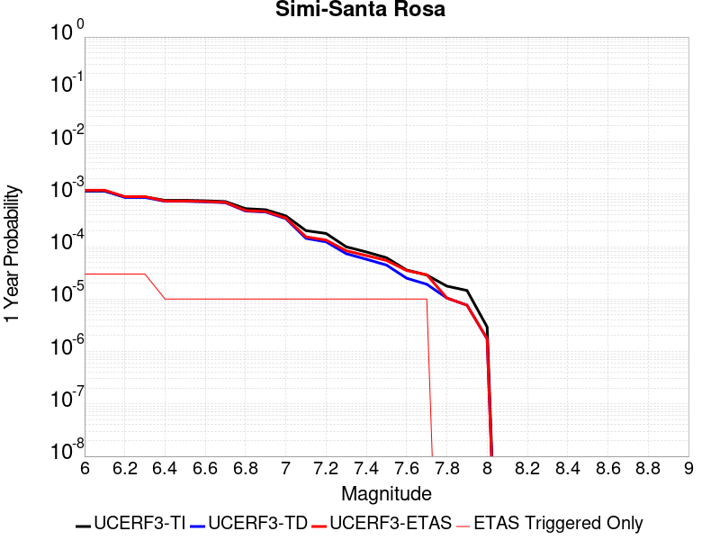 |  |

| Magnitude | 1 wk TI Prob | 1 wk TD Prob | 1 wk ETAS Prob | 1 wk ETAS/TD Gain | 1 wk ETAS Triggered Only | 1 mo TI Prob | 1 mo TD Prob | 1 mo ETAS Prob | 1 mo ETAS/TD Gain | 1 mo ETAS Triggered Only | 1 yr TI Prob | 1 yr TD Prob | 1 yr ETAS Prob | 1 yr ETAS/TD Gain | 1 yr ETAS Triggered Only | 10 yr TI Prob | 10 yr TD Prob | 10 yr ETAS Prob | 10 yr ETAS/TD Gain | 10 yr ETAS Triggered Only |
|-----|-----|-----|-----|-----|-----|-----|-----|-----|-----|-----|-----|-----|-----|-----|-----|-----|-----|-----|-----|-----|
| 6.0 | 2.198912E-5 | 2.2275442E-5 | 9.235588E-5 | 4.146085 | 7.0081995E-5 | 9.4235686E-5 | 9.5462936E-5 | 1.6553824E-4 | 1.7340578 | 7.0081995E-5 | 0.0011467156 | 0.0011616853 | 0.001231686 | 1.0602578 | 7.0081995E-5 | 0.011408163 | 0.011560575 | 0.011629847 | 1.005992 | 7.0081995E-5 |
| 6.1 | 2.198912E-5 | 2.2275442E-5 | 9.235588E-5 | 4.146085 | 7.0081995E-5 | 9.4235686E-5 | 9.5462936E-5 | 1.6553824E-4 | 1.7340578 | 7.0081995E-5 | 0.0011467156 | 0.0011616853 | 0.001231686 | 1.0602578 | 7.0081995E-5 | 0.011408163 | 0.011560575 | 0.011629847 | 1.005992 | 7.0081995E-5 |
| 6.2 | 1.69983E-5 | 1.6668559E-5 | 8.674939E-5 | 5.2043724 | 7.0081995E-5 | 7.284782E-5 | 7.143489E-5 | 1.4151187E-4 | 1.980991 | 7.0081995E-5 | 8.865613E-4 | 8.6940196E-4 | 9.39423E-4 | 1.0805393 | 7.0081995E-5 | 0.008830327 | 0.008662928 | 0.008732403 | 1.0080198 | 7.0081995E-5 |
| 6.3 | 1.69983E-5 | 1.6668559E-5 | 8.674939E-5 | 5.2043724 | 7.0081995E-5 | 7.284782E-5 | 7.143489E-5 | 1.4151187E-4 | 1.980991 | 7.0081995E-5 | 8.865613E-4 | 8.6940196E-4 | 9.39423E-4 | 1.0805393 | 7.0081995E-5 | 0.008830327 | 0.008662928 | 0.008732403 | 1.0080198 | 7.0081995E-5 |
| 6.4 | 1.4666188E-5 | 1.4052543E-5 | 1.4052543E-5 | 1.0 | 0.0 | 6.285358E-5 | 6.0223934E-5 | 6.0223934E-5 | 1.0 | 0.0 | 7.6497364E-4 | 7.3300465E-4 | 7.3300465E-4 | 1.0 | 0.0 | 0.0076234564 | 0.007308344 | 0.007308344 | 1.0 | 0.0 |
| 6.5 | 1.4666188E-5 | 1.4052543E-5 | 1.4052543E-5 | 1.0 | 0.0 | 6.285358E-5 | 6.0223934E-5 | 6.0223934E-5 | 1.0 | 0.0 | 7.6497364E-4 | 7.3300465E-4 | 7.3300465E-4 | 1.0 | 0.0 | 0.0076234564 | 0.007308344 | 0.007308344 | 1.0 | 0.0 |
| 6.6 | 1.4377586E-5 | 1.3729583E-5 | 1.3729583E-5 | 1.0 | 0.0 | 6.1616774E-5 | 5.883988E-5 | 5.883988E-5 | 1.0 | 0.0 | 7.4992597E-4 | 7.1616494E-4 | 7.1616494E-4 | 1.0 | 0.0 | 0.007474003 | 0.0071410383 | 0.0071410383 | 1.0 | 0.0 |
| 6.7 | 1.3881404E-5 | 1.320755E-5 | 1.320755E-5 | 1.0 | 0.0 | 5.9490372E-5 | 5.66027E-5 | 5.66027E-5 | 1.0 | 0.0 | 7.240546E-4 | 6.8894465E-4 | 6.8894465E-4 | 1.0 | 0.0 | 0.007217 | 0.006870538 | 0.006870538 | 1.0 | 0.0 |
| 6.8 | 1.0176516E-5 | 9.154151E-6 | 9.154151E-6 | 1.0 | 0.0 | 4.3612912E-5 | 3.9231574E-5 | 3.9231574E-5 | 1.0 | 0.0 | 5.308578E-4 | 4.7755634E-4 | 4.7755634E-4 | 1.0 | 0.0 | 0.0052959146 | 0.004766934 | 0.004766934 | 1.0 | 0.0 |
| 6.9 | 9.699797E-6 | 8.774719E-6 | 8.774719E-6 | 1.0 | 0.0 | 4.15699E-5 | 3.7605492E-5 | 3.7605492E-5 | 1.0 | 0.0 | 5.05996E-4 | 4.577671E-4 | 4.577671E-4 | 1.0 | 0.0 | 0.005048454 | 0.0045698597 | 0.0045698597 | 1.0 | 0.0 |
| 7.0 | 7.4049476E-6 | 6.559333E-6 | 6.559333E-6 | 1.0 | 0.0 | 3.1735104E-5 | 2.8111197E-5 | 2.8111197E-5 | 1.0 | 0.0 | 3.8630638E-4 | 3.422127E-4 | 3.422127E-4 | 1.0 | 0.0 | 0.0038563553 | 0.0034180996 | 0.0034180996 | 1.0 | 0.0 |
| 7.1 | 3.873439E-6 | 2.7595095E-6 | 2.7595095E-6 | 1.0 | 0.0 | 1.6600346E-5 | 1.1826417E-5 | 1.1826417E-5 | 1.0 | 0.0 | 2.0209046E-4 | 1.4397735E-4 | 1.4397735E-4 | 1.0 | 0.0 | 0.0020190678 | 0.0014388643 | 0.0014388643 | 1.0 | 0.0 |
| 7.2 | 3.417706E-6 | 2.3676484E-6 | 2.3676484E-6 | 1.0 | 0.0 | 1.4647229E-5 | 1.0147027E-5 | 1.0147027E-5 | 1.0 | 0.0 | 1.7831543E-4 | 1.2353327E-4 | 1.2353327E-4 | 1.0 | 0.0 | 0.0017817242 | 0.0012346683 | 0.0012346683 | 1.0 | 0.0 |
| 7.3 | 1.90225E-6 | 1.4073753E-6 | 1.4073753E-6 | 1.0 | 0.0 | 8.152474E-6 | 6.0315947E-6 | 6.0315947E-6 | 1.0 | 0.0 | 9.9251854E-5 | 7.343221E-5 | 7.343221E-5 | 1.0 | 0.0 | 9.920754E-4 | 7.340817E-4 | 7.340817E-4 | 1.0 | 0.0 |
| 7.4 | 1.5170556E-6 | 1.1024773E-6 | 1.1024773E-6 | 1.0 | 0.0 | 6.5016507E-6 | 4.724894E-6 | 4.724894E-6 | 1.0 | 0.0 | 7.915472E-5 | 5.7524077E-5 | 5.7524077E-5 | 1.0 | 0.0 | 7.9126534E-4 | 5.7509297E-4 | 5.7509297E-4 | 1.0 | 0.0 |
| 7.5 | 1.178732E-6 | 8.535102E-7 | 8.535102E-7 | 1.0 | 0.0 | 5.0516987E-6 | 3.6578958E-6 | 3.6578958E-6 | 1.0 | 0.0 | 6.1502695E-5 | 4.453398E-5 | 4.453398E-5 | 1.0 | 0.0 | 6.148568E-4 | 4.452515E-4 | 4.452515E-4 | 1.0 | 0.0 |
| 7.6 | 6.8722386E-7 | 4.793198E-7 | 4.793198E-7 | 1.0 | 0.0 | 2.9452417E-6 | 2.054226E-6 | 2.054226E-6 | 1.0 | 0.0 | 3.5857727E-5 | 2.5009915E-5 | 2.5009915E-5 | 1.0 | 0.0 | 3.5851944E-4 | 2.5007114E-4 | 2.5007114E-4 | 1.0 | 0.0 |
| 7.7 | 5.5126515E-7 | 3.6731157E-7 | 3.6731157E-7 | 1.0 | 0.0 | 2.3625628E-6 | 1.5741915E-6 | 1.5741915E-6 | 1.0 | 0.0 | 2.8763823E-5 | 1.9165615E-5 | 1.9165615E-5 | 1.0 | 0.0 | 2.87601E-4 | 1.9163972E-4 | 1.9163972E-4 | 1.0 | 0.0 |
| 7.8 | 3.3860243E-7 | 2.0075942E-7 | 2.0075942E-7 | 1.0 | 0.0 | 1.4511525E-6 | 8.6039717E-7 | 8.6039717E-7 | 1.0 | 0.0 | 1.7667637E-5 | 1.0475286E-5 | 1.0475286E-5 | 1.0 | 0.0 | 1.7666233E-4 | 1.04747975E-4 | 1.04747975E-4 | 1.0 | 0.0 |
| 7.9 | 2.7955386E-7 | 1.4649108E-7 | 1.4649108E-7 | 1.0 | 0.0 | 1.1980875E-6 | 6.278188E-7 | 6.278188E-7 | 1.0 | 0.0 | 1.4586617E-5 | 7.643667E-6 | 7.643667E-6 | 1.0 | 0.0 | 1.458566E-4 | 7.643409E-5 | 7.643409E-5 | 1.0 | 0.0 |
| 8.0 | 5.6259015E-8 | 3.3355324E-8 | 3.3355324E-8 | 1.0 | 0.0 | 2.4111003E-7 | 1.4295138E-7 | 1.4295138E-7 | 1.0 | 0.0 | 2.9355108E-6 | 1.7404317E-6 | 1.7404317E-6 | 1.0 | 0.0 | 2.935472E-5 | 1.7404194E-5 | 1.7404194E-5 | 1.0 | 0.0 |

## San Pedro Basin
*[(top)](#table-of-contents)*

| 1 Week | 1 Month | 1 Year | 10 Year |
|-----|-----|-----|-----|
|  |  |  |  |

| Magnitude | 1 wk TI Prob | 1 wk TD Prob | 1 wk ETAS Prob | 1 wk ETAS/TD Gain | 1 wk ETAS Triggered Only | 1 mo TI Prob | 1 mo TD Prob | 1 mo ETAS Prob | 1 mo ETAS/TD Gain | 1 mo ETAS Triggered Only | 1 yr TI Prob | 1 yr TD Prob | 1 yr ETAS Prob | 1 yr ETAS/TD Gain | 1 yr ETAS Triggered Only | 10 yr TI Prob | 10 yr TD Prob | 10 yr ETAS Prob | 10 yr ETAS/TD Gain | 10 yr ETAS Triggered Only |
|-----|-----|-----|-----|-----|-----|-----|-----|-----|-----|-----|-----|-----|-----|-----|-----|-----|-----|-----|-----|-----|
| 6.0 | 5.3449043E-5 | 6.336954E-5 | 1.3344709E-4 | 2.1058557 | 7.0081995E-5 | 2.2904722E-4 | 2.715589E-4 | 3.416219E-4 | 1.2580028 | 7.0081995E-5 | 0.0027850836 | 0.0033018254 | 0.003371676 | 1.0211551 | 7.0081995E-5 | 0.027504366 | 0.03258945 | 0.03265725 | 1.0020803 | 7.0081995E-5 |
| 6.1 | 5.3449043E-5 | 6.336954E-5 | 1.3344709E-4 | 2.1058557 | 7.0081995E-5 | 2.2904722E-4 | 2.715589E-4 | 3.416219E-4 | 1.2580028 | 7.0081995E-5 | 0.0027850836 | 0.0033018254 | 0.003371676 | 1.0211551 | 7.0081995E-5 | 0.027504366 | 0.03258945 | 0.03265725 | 1.0020803 | 7.0081995E-5 |
| 6.2 | 2.3189454E-5 | 2.6642796E-5 | 9.672293E-5 | 3.6303594 | 7.0081995E-5 | 9.9379584E-5 | 1.14178685E-4 | 1.8425268E-4 | 1.6137222 | 7.0081995E-5 | 0.0012092749 | 0.0013892864 | 0.0014592711 | 1.0503745 | 7.0081995E-5 | 0.012027155 | 0.013810883 | 0.013879998 | 1.0050043 | 7.0081995E-5 |
| 6.3 | 2.3189454E-5 | 2.6642796E-5 | 9.672293E-5 | 3.6303594 | 7.0081995E-5 | 9.9379584E-5 | 1.14178685E-4 | 1.8425268E-4 | 1.6137222 | 7.0081995E-5 | 0.0012092749 | 0.0013892864 | 0.0014592711 | 1.0503745 | 7.0081995E-5 | 0.012027155 | 0.013810883 | 0.013879998 | 1.0050043 | 7.0081995E-5 |
| 6.4 | 1.966056E-5 | 2.2463413E-5 | 9.2543836E-5 | 4.1197586 | 7.0081995E-5 | 8.425682E-5 | 9.626844E-5 | 1.663437E-4 | 1.727915 | 7.0081995E-5 | 0.001025344 | 0.0011714783 | 0.0012414783 | 1.0597534 | 7.0081995E-5 | 0.010206259 | 0.011657117 | 0.011726381 | 1.0059419 | 7.0081995E-5 |
| 6.5 | 1.7342953E-5 | 1.9745148E-5 | 8.9825764E-5 | 4.5492573 | 7.0081995E-5 | 7.4324824E-5 | 8.4619525E-5 | 1.5469559E-4 | 1.8281311 | 7.0081995E-5 | 9.04529E-4 | 0.0010297928 | 0.0010998026 | 1.0679843 | 7.0081995E-5 | 0.009008561 | 0.010253931 | 0.010323294 | 1.0067645 | 7.0081995E-5 |
| 6.6 | 1.439804E-5 | 1.6322716E-5 | 8.640357E-5 | 5.2934556 | 7.0081995E-5 | 6.170443E-5 | 6.99528E-5 | 1.400299E-4 | 2.0017767 | 7.0081995E-5 | 7.509924E-4 | 8.513747E-4 | 9.21397E-4 | 1.0822462 | 7.0081995E-5 | 0.0074845953 | 0.008484332 | 0.00855382 | 1.00819 | 7.0081995E-5 |
| 6.7 | 1.2634884E-5 | 1.4285297E-5 | 8.436629E-5 | 5.9058127 | 7.0081995E-5 | 5.414838E-5 | 6.1221435E-5 | 1.3129914E-4 | 2.1446595 | 7.0081995E-5 | 6.590571E-4 | 7.4514654E-4 | 8.1517635E-4 | 1.0939813 | 7.0081995E-5 | 0.006571059 | 0.007429501 | 0.0074990625 | 1.0093628 | 7.0081995E-5 |
| 6.8 | 1.146091E-5 | 1.2933192E-5 | 8.301428E-5 | 6.4187 | 7.0081995E-5 | 4.911726E-5 | 5.5426954E-5 | 1.2550506E-4 | 2.2643328 | 7.0081995E-5 | 5.9783855E-4 | 6.7464396E-4 | 7.446787E-4 | 1.1038098 | 7.0081995E-5 | 0.0059623276 | 0.006728899 | 0.0067985095 | 1.010345 | 7.0081995E-5 |
| 6.9 | 9.109035E-6 | 1.0235011E-5 | 8.031629E-5 | 7.8472104 | 7.0081995E-5 | 3.9038136E-5 | 4.3863754E-5 | 1.13942675E-4 | 2.5976498 | 7.0081995E-5 | 4.7518566E-4 | 5.3393835E-4 | 6.0398295E-4 | 1.1311848 | 7.0081995E-5 | 0.0047417083 | 0.005329309 | 0.0053990176 | 1.0130802 | 7.0081995E-5 |
| 7.0 | 5.9351028E-6 | 6.583964E-6 | 7.66655E-5 | 11.644277 | 7.0081995E-5 | 2.5435906E-5 | 2.8216817E-5 | 9.8296834E-5 | 3.483626 | 7.0081995E-5 | 3.0963816E-4 | 3.435092E-4 | 4.1356712E-4 | 1.2039478 | 7.0081995E-5 | 0.0030920706 | 0.0034320992 | 0.0035019408 | 1.0203495 | 7.0081995E-5 |
| 7.1 | 2.1557585E-6 | 2.209648E-6 | 7.229149E-5 | 32.71629 | 7.0081995E-5 | 9.238933E-6 | 9.469887E-6 | 7.955122E-5 | 8.40044 | 7.0081995E-5 | 1.1247819E-4 | 1.1528993E-4 | 1.8536384E-4 | 1.6078061 | 7.0081995E-5 | 0.0011242128 | 0.0011523166 | 0.0012223178 | 1.0607482 | 7.0081995E-5 |
| 7.2 | 2.1251979E-6 | 2.1779945E-6 | 7.2259834E-5 | 33.17724 | 7.0081995E-5 | 9.107958E-6 | 9.334229E-6 | 7.941557E-5 | 8.507995 | 7.0081995E-5 | 1.1088375E-4 | 1.1363847E-4 | 1.837125E-4 | 1.6166401 | 7.0081995E-5 | 0.0011082845 | 0.0011358189 | 0.0012058213 | 1.0616317 | 7.0081995E-5 |
| 7.3 | 1.7145798E-6 | 1.7442874E-6 | 7.182616E-5 | 41.17794 | 7.0081995E-5 | 7.3481783E-6 | 7.4754967E-6 | 7.755697E-5 | 10.374825 | 7.0081995E-5 | 8.94604E-5 | 9.1010465E-5 | 1.6108608E-4 | 1.7699732 | 7.0081995E-5 | 8.9424395E-4 | 9.0974104E-4 | 9.797593E-4 | 1.076965 | 7.0081995E-5 |
| 7.4 | 1.4467993E-6 | 1.4641868E-6 | 7.154608E-5 | 48.86404 | 7.0081995E-5 | 6.200554E-6 | 6.2750714E-6 | 7.635663E-5 | 12.168249 | 7.0081995E-5 | 7.548913E-5 | 7.639639E-5 | 1.4647303E-4 | 1.9172769 | 7.0081995E-5 | 7.546349E-4 | 7.6370855E-4 | 8.33737E-4 | 1.0916953 | 7.0081995E-5 |
| 7.5 | 1.2803735E-6 | 1.2931497E-6 | 7.1375056E-5 | 55.194736 | 7.0081995E-5 | 5.487303E-6 | 5.5420587E-6 | 7.562367E-5 | 13.645411 | 7.0081995E-5 | 6.680587E-5 | 6.7472545E-5 | 1.3754981E-4 | 2.0386043 | 7.0081995E-5 | 6.678579E-4 | 6.7452766E-4 | 7.445624E-4 | 1.1038278 | 7.0081995E-5 |
| 7.6 | 6.755009E-7 | 6.769465E-7 | 7.075889E-5 | 104.526566 | 7.0081995E-5 | 2.8950008E-6 | 2.9011965E-6 | 7.298299E-5 | 25.156168 | 7.0081995E-5 | 3.5246063E-5 | 3.5321555E-5 | 1.0540107E-4 | 2.984044 | 7.0081995E-5 | 3.5240475E-4 | 3.5316512E-4 | 4.2322237E-4 | 1.1983696 | 7.0081995E-5 |
| 7.7 | 6.211885E-8 | 4.569953E-8 | 4.569953E-8 | 1.0 | 0.0 | 2.6622362E-7 | 1.9585512E-7 | 1.9585512E-7 | 1.0 | 0.0 | 3.2412677E-6 | 2.3845337E-6 | 2.3845337E-6 | 1.0 | 0.0 | 3.2412205E-5 | 2.3845101E-5 | 2.3845101E-5 | 1.0 | 0.0 |
| 7.8 | 2.6580573E-9 | 1.5138163E-9 | 1.5138163E-9 | 1.0 | 0.0 | 1.1391674E-8 | 6.487784E-9 | 6.487784E-9 | 1.0 | 0.0 | 1.3869362E-7 | 7.898877E-8 | 7.898877E-8 | 1.0 | 0.0 | 1.3869354E-6 | 7.898877E-7 | 7.898877E-7 | 1.0 | 0.0 |

## San Jacinto (Lytle Creek connector)
*[(top)](#table-of-contents)*

| 1 Week | 1 Month | 1 Year | 10 Year |
|-----|-----|-----|-----|
|  |  |  | 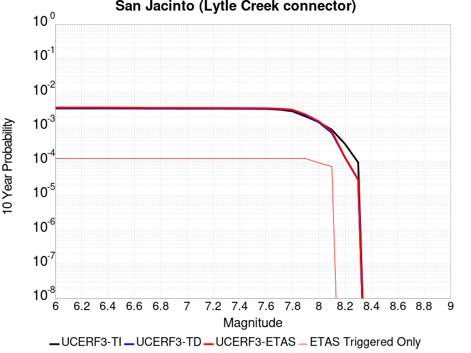 |

| Magnitude | 1 wk TI Prob | 1 wk TD Prob | 1 wk ETAS Prob | 1 wk ETAS/TD Gain | 1 wk ETAS Triggered Only | 1 mo TI Prob | 1 mo TD Prob | 1 mo ETAS Prob | 1 mo ETAS/TD Gain | 1 mo ETAS Triggered Only | 1 yr TI Prob | 1 yr TD Prob | 1 yr ETAS Prob | 1 yr ETAS/TD Gain | 1 yr ETAS Triggered Only | 10 yr TI Prob | 10 yr TD Prob | 10 yr ETAS Prob | 10 yr ETAS/TD Gain | 10 yr ETAS Triggered Only |
|-----|-----|-----|-----|-----|-----|-----|-----|-----|-----|-----|-----|-----|-----|-----|-----|-----|-----|-----|-----|-----|
| 6.0 | 6.693995E-6 | 6.660216E-6 | 7.6741744E-5 | 11.52241 | 7.0081995E-5 | 2.8688235E-5 | 2.854347E-5 | 9.8623466E-5 | 3.4552023 | 7.0081995E-5 | 3.492233E-4 | 3.4746144E-4 | 4.1751907E-4 | 1.2016271 | 7.0081995E-5 | 0.00348675 | 0.0035493854 | 0.0036192185 | 1.0196748 | 7.0081995E-5 |
| 6.1 | 6.693995E-6 | 6.660216E-6 | 7.6741744E-5 | 11.52241 | 7.0081995E-5 | 2.8688235E-5 | 2.854347E-5 | 9.8623466E-5 | 3.4552023 | 7.0081995E-5 | 3.492233E-4 | 3.4746144E-4 | 4.1751907E-4 | 1.2016271 | 7.0081995E-5 | 0.00348675 | 0.0035493854 | 0.0036192185 | 1.0196748 | 7.0081995E-5 |
| 6.2 | 6.693995E-6 | 6.660216E-6 | 7.6741744E-5 | 11.52241 | 7.0081995E-5 | 2.8688235E-5 | 2.854347E-5 | 9.8623466E-5 | 3.4552023 | 7.0081995E-5 | 3.492233E-4 | 3.4746144E-4 | 4.1751907E-4 | 1.2016271 | 7.0081995E-5 | 0.00348675 | 0.0035493854 | 0.0036192185 | 1.0196748 | 7.0081995E-5 |
| 6.3 | 6.693995E-6 | 6.660216E-6 | 7.6741744E-5 | 11.52241 | 7.0081995E-5 | 2.8688235E-5 | 2.854347E-5 | 9.8623466E-5 | 3.4552023 | 7.0081995E-5 | 3.492233E-4 | 3.4746144E-4 | 4.1751907E-4 | 1.2016271 | 7.0081995E-5 | 0.00348675 | 0.0035493854 | 0.0036192185 | 1.0196748 | 7.0081995E-5 |
| 6.4 | 6.693995E-6 | 6.660216E-6 | 7.6741744E-5 | 11.52241 | 7.0081995E-5 | 2.8688235E-5 | 2.854347E-5 | 9.8623466E-5 | 3.4552023 | 7.0081995E-5 | 3.492233E-4 | 3.4746144E-4 | 4.1751907E-4 | 1.2016271 | 7.0081995E-5 | 0.00348675 | 0.0035493854 | 0.0036192185 | 1.0196748 | 7.0081995E-5 |
| 6.5 | 6.6561875E-6 | 6.6204343E-6 | 7.670197E-5 | 11.58564 | 7.0081995E-5 | 2.8526205E-5 | 2.837298E-5 | 9.845299E-5 | 3.4699557 | 7.0081995E-5 | 3.472512E-4 | 3.4538636E-4 | 4.1544417E-4 | 1.2028389 | 7.0081995E-5 | 0.0034670907 | 0.003528701 | 0.0035985354 | 1.0197905 | 7.0081995E-5 |
| 6.6 | 6.6561875E-6 | 6.6204343E-6 | 7.670197E-5 | 11.58564 | 7.0081995E-5 | 2.8526205E-5 | 2.837298E-5 | 9.845299E-5 | 3.4699557 | 7.0081995E-5 | 3.472512E-4 | 3.4538636E-4 | 4.1544417E-4 | 1.2028389 | 7.0081995E-5 | 0.0034670907 | 0.003528701 | 0.0035985354 | 1.0197905 | 7.0081995E-5 |
| 6.7 | 6.5802237E-6 | 6.539611E-6 | 7.6621145E-5 | 11.716469 | 7.0081995E-5 | 2.8200653E-5 | 2.8026603E-5 | 9.810663E-5 | 3.5004826 | 7.0081995E-5 | 3.4328885E-4 | 3.4117055E-4 | 4.1122863E-4 | 1.2053462 | 7.0081995E-5 | 0.0034275902 | 0.0034866752 | 0.003556513 | 1.0200299 | 7.0081995E-5 |
| 6.8 | 6.575632E-6 | 6.5341005E-6 | 7.661564E-5 | 11.725506 | 7.0081995E-5 | 2.8180975E-5 | 2.8002989E-5 | 9.808302E-5 | 3.5025911 | 7.0081995E-5 | 3.4304935E-4 | 3.4088313E-4 | 4.1094123E-4 | 1.2055194 | 7.0081995E-5 | 0.0034252026 | 0.00348381 | 0.0035536478 | 1.0200464 | 7.0081995E-5 |
| 6.9 | 6.570433E-6 | 6.525495E-6 | 7.660704E-5 | 11.739652 | 7.0081995E-5 | 2.8158694E-5 | 2.7966107E-5 | 9.804614E-5 | 3.5058918 | 7.0081995E-5 | 3.4277816E-4 | 3.4043423E-4 | 4.1049236E-4 | 1.2057905 | 7.0081995E-5 | 0.0034224992 | 0.0034793352 | 0.0035491735 | 1.0200722 | 7.0081995E-5 |
| 7.0 | 6.5643826E-6 | 6.515616E-6 | 7.6597156E-5 | 11.755935 | 7.0081995E-5 | 2.8132765E-5 | 2.792377E-5 | 9.800381E-5 | 3.5096912 | 7.0081995E-5 | 3.424626E-4 | 3.3991894E-4 | 4.099771E-4 | 1.2061026 | 7.0081995E-5 | 0.0034193532 | 0.0034741985 | 0.003544037 | 1.020102 | 7.0081995E-5 |
| 7.1 | 6.557402E-6 | 6.5043278E-6 | 7.658587E-5 | 11.774602 | 7.0081995E-5 | 2.8102848E-5 | 2.7875392E-5 | 9.795544E-5 | 3.514047 | 7.0081995E-5 | 3.4209844E-4 | 3.3933012E-4 | 4.0938833E-4 | 1.2064604 | 7.0081995E-5 | 0.0034157229 | 0.0034683298 | 0.0035381687 | 1.0201362 | 7.0081995E-5 |
| 7.2 | 6.546394E-6 | 6.4862943E-6 | 7.6567834E-5 | 11.804558 | 7.0081995E-5 | 2.8055672E-5 | 2.7798109E-5 | 9.787815E-5 | 3.5210366 | 7.0081995E-5 | 3.4152428E-4 | 3.3838948E-4 | 4.0844778E-4 | 1.2070345 | 7.0081995E-5 | 0.0034099987 | 0.0034589572 | 0.0035287966 | 1.020191 | 7.0081995E-5 |
| 7.3 | 6.5364216E-6 | 6.4670803E-6 | 7.6548626E-5 | 11.8366585 | 7.0081995E-5 | 2.8012933E-5 | 2.7715765E-5 | 9.779582E-5 | 3.5285268 | 7.0081995E-5 | 3.4100408E-4 | 3.3738726E-4 | 4.0744562E-4 | 1.2076497 | 7.0081995E-5 | 0.003404813 | 0.0034489788 | 0.003518819 | 1.0202496 | 7.0081995E-5 |
| 7.4 | 6.5269523E-6 | 6.4481674E-6 | 7.652971E-5 | 11.8684435 | 7.0081995E-5 | 2.7972354E-5 | 2.7634711E-5 | 9.771477E-5 | 3.5359433 | 7.0081995E-5 | 3.4051016E-4 | 3.3640073E-4 | 4.0645915E-4 | 1.2082589 | 7.0081995E-5 | 0.0033998888 | 0.003439161 | 0.0035090018 | 1.0203075 | 7.0081995E-5 |
| 7.5 | 6.5111835E-6 | 6.424442E-6 | 7.650599E-5 | 11.908581 | 7.0081995E-5 | 2.7904773E-5 | 2.7533031E-5 | 9.76131E-5 | 3.5453088 | 7.0081995E-5 | 3.3968766E-4 | 3.3516317E-4 | 4.0522168E-4 | 1.209028 | 7.0081995E-5 | 0.0033916887 | 0.003426834 | 0.003496676 | 1.0203809 | 7.0081995E-5 |
| 7.6 | 6.4768806E-6 | 6.383551E-6 | 7.64651E-5 | 11.978458 | 7.0081995E-5 | 2.7757764E-5 | 2.735779E-5 | 9.743787E-5 | 3.5616133 | 7.0081995E-5 | 3.3789838E-4 | 3.3303024E-4 | 4.030889E-4 | 1.2103672 | 7.0081995E-5 | 0.0033738504 | 0.0034055663 | 0.0034754095 | 1.0205085 | 7.0081995E-5 |
| 7.7 | 6.1655364E-6 | 6.1760365E-6 | 7.62576E-5 | 12.347336 | 7.0081995E-5 | 2.642346E-5 | 2.646846E-5 | 9.65486E-5 | 3.6476848 | 7.0081995E-5 | 3.2165812E-4 | 3.2220592E-4 | 3.9226533E-4 | 1.2174368 | 7.0081995E-5 | 0.0032119295 | 0.0032971818 | 0.0033670326 | 1.021185 | 7.0081995E-5 |
| 7.8 | 5.5043524E-6 | 5.737097E-6 | 7.5818694E-5 | 13.215515 | 7.0081995E-5 | 2.3589868E-5 | 2.4587327E-5 | 9.46676E-5 | 3.85026 | 7.0081995E-5 | 2.871688E-4 | 2.9930964E-4 | 3.6937065E-4 | 1.2340754 | 7.0081995E-5 | 0.0028679797 | 0.0030672832 | 0.0031371503 | 1.0227782 | 7.0081995E-5 |
| 7.9 | 3.889249E-6 | 4.076761E-6 | 7.415847E-5 | 18.190536 | 7.0081995E-5 | 1.6668104E-5 | 1.7471715E-5 | 8.7552486E-5 | 5.0110984 | 7.0081995E-5 | 2.0291525E-4 | 2.1269741E-4 | 2.8276452E-4 | 1.3294214 | 7.0081995E-5 | 0.0020273007 | 0.0021943315 | 0.0022642596 | 1.0318676 | 7.0081995E-5 |
| 8.0 | 2.668535E-6 | 2.5315155E-6 | 7.261334E-5 | 28.68374 | 7.0081995E-5 | 1.1436528E-5 | 1.0849307E-5 | 8.093054E-5 | 7.4595127 | 7.0081995E-5 | 1.3923083E-4 | 1.3208234E-4 | 2.0215508E-4 | 1.5305232 | 7.0081995E-5 | 0.0013914363 | 0.0013757964 | 0.0014457819 | 1.0508691 | 7.0081995E-5 |
| 8.1 | 1.5911459E-6 | 1.218661E-6 | 1.218661E-6 | 1.0 | 0.0 | 6.8191785E-6 | 5.2228224E-6 | 5.2228224E-6 | 1.0 | 0.0 | 8.3020335E-5 | 6.3586034E-5 | 6.3586034E-5 | 1.0 | 0.0 | 8.298933E-4 | 6.6932244E-4 | 6.6932244E-4 | 1.0 | 0.0 |
| 8.2 | 6.1294963E-7 | 2.1812275E-7 | 2.1812275E-7 | 1.0 | 0.0 | 2.6269242E-6 | 9.3481145E-7 | 9.3481145E-7 | 1.0 | 0.0 | 3.1982334E-5 | 1.138127E-5 | 1.138127E-5 | 1.0 | 0.0 | 3.1977732E-4 | 1.2784546E-4 | 1.2784546E-4 | 1.0 | 0.0 |
| 8.3 | 1.762871E-7 | 4.7546838E-8 | 4.7546838E-8 | 1.0 | 0.0 | 7.5551594E-7 | 2.0377215E-7 | 2.0377215E-7 | 1.0 | 0.0 | 9.1983675E-6 | 2.480923E-6 | 2.480923E-6 | 1.0 | 0.0 | 9.197987E-5 | 2.868753E-5 | 2.868753E-5 | 1.0 | 0.0 |

## Monterey Bay-Tularcitos
*[(top)](#table-of-contents)*

| 1 Week | 1 Month | 1 Year | 10 Year |
|-----|-----|-----|-----|
| 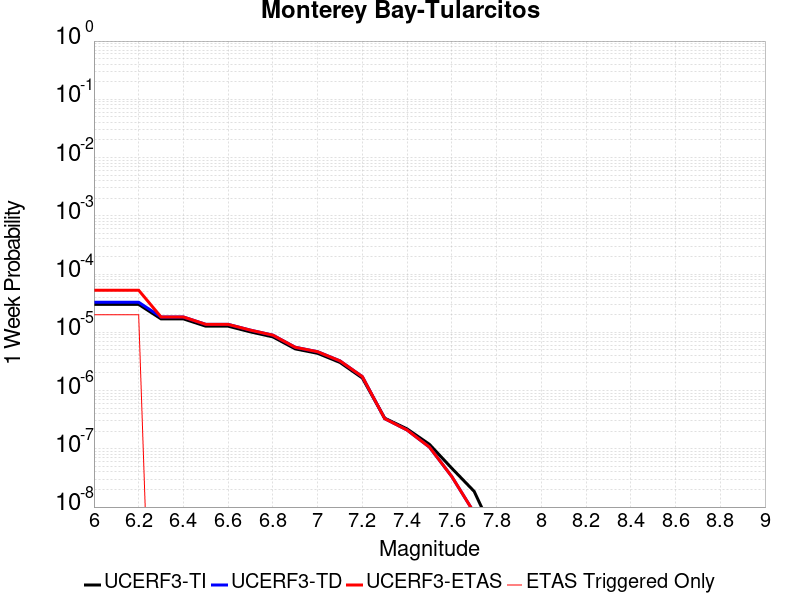 |  |  |  |

| Magnitude | 1 wk TI Prob | 1 wk TD Prob | 1 wk ETAS Prob | 1 wk ETAS/TD Gain | 1 wk ETAS Triggered Only | 1 mo TI Prob | 1 mo TD Prob | 1 mo ETAS Prob | 1 mo ETAS/TD Gain | 1 mo ETAS Triggered Only | 1 yr TI Prob | 1 yr TD Prob | 1 yr ETAS Prob | 1 yr ETAS/TD Gain | 1 yr ETAS Triggered Only | 10 yr TI Prob | 10 yr TD Prob | 10 yr ETAS Prob | 10 yr ETAS/TD Gain | 10 yr ETAS Triggered Only |
|-----|-----|-----|-----|-----|-----|-----|-----|-----|-----|-----|-----|-----|-----|-----|-----|-----|-----|-----|-----|-----|
| 6.0 | 3.0131365E-5 | 3.279877E-5 | 1.0287847E-4 | 3.1366563 | 7.0081995E-5 | 1.2912804E-4 | 1.4055918E-4 | 2.1063133E-4 | 1.4985242 | 7.0081995E-5 | 0.001571 | 0.0017100703 | 0.0017800324 | 1.0409119 | 7.0081995E-5 | 0.015599402 | 0.016979916 | 0.01704881 | 1.0040573 | 7.0081995E-5 |
| 6.1 | 3.0131365E-5 | 3.279877E-5 | 1.0287847E-4 | 3.1366563 | 7.0081995E-5 | 1.2912804E-4 | 1.4055918E-4 | 2.1063133E-4 | 1.4985242 | 7.0081995E-5 | 0.001571 | 0.0017100703 | 0.0017800324 | 1.0409119 | 7.0081995E-5 | 0.015599402 | 0.016979916 | 0.01704881 | 1.0040573 | 7.0081995E-5 |
| 6.2 | 3.0131365E-5 | 3.279877E-5 | 1.0287847E-4 | 3.1366563 | 7.0081995E-5 | 1.2912804E-4 | 1.4055918E-4 | 2.1063133E-4 | 1.4985242 | 7.0081995E-5 | 0.001571 | 0.0017100703 | 0.0017800324 | 1.0409119 | 7.0081995E-5 | 0.015599402 | 0.016979916 | 0.01704881 | 1.0040573 | 7.0081995E-5 |
| 6.3 | 1.6998249E-5 | 1.8330798E-5 | 1.8330798E-5 | 1.0 | 0.0 | 7.28476E-5 | 7.85583E-5 | 7.85583E-5 | 1.0 | 0.0 | 8.865586E-4 | 9.5604634E-4 | 9.5604634E-4 | 1.0 | 0.0 | 0.0088303005 | 0.009521258 | 0.009521258 | 1.0 | 0.0 |
| 6.4 | 1.6998249E-5 | 1.8330798E-5 | 1.8330798E-5 | 1.0 | 0.0 | 7.28476E-5 | 7.85583E-5 | 7.85583E-5 | 1.0 | 0.0 | 8.865586E-4 | 9.5604634E-4 | 9.5604634E-4 | 1.0 | 0.0 | 0.0088303005 | 0.009521258 | 0.009521258 | 1.0 | 0.0 |
| 6.5 | 1.27470785E-5 | 1.3693312E-5 | 1.3693312E-5 | 1.0 | 0.0 | 5.4629192E-5 | 5.8684363E-5 | 5.8684363E-5 | 1.0 | 0.0 | 6.649074E-4 | 7.1425823E-4 | 7.1425823E-4 | 1.0 | 0.0 | 0.0066292146 | 0.007120678 | 0.007120678 | 1.0 | 0.0 |
| 6.6 | 1.2739422E-5 | 1.36854E-5 | 1.36854E-5 | 1.0 | 0.0 | 5.4596385E-5 | 5.8650454E-5 | 5.8650454E-5 | 1.0 | 0.0 | 6.645082E-4 | 7.1384566E-4 | 7.1384566E-4 | 1.0 | 0.0 | 0.0066252467 | 0.007116579 | 0.007116579 | 1.0 | 0.0 |
| 6.7 | 1.0160109E-5 | 1.0885755E-5 | 1.0885755E-5 | 1.0 | 0.0 | 4.35426E-5 | 4.665244E-5 | 4.665244E-5 | 1.0 | 0.0 | 5.300022E-4 | 5.6785246E-4 | 5.6785246E-4 | 1.0 | 0.0 | 0.005287399 | 0.0056647263 | 0.0056647263 | 1.0 | 0.0 |
| 6.8 | 8.349859E-6 | 8.932587E-6 | 8.932587E-6 | 1.0 | 0.0 | 3.578462E-5 | 3.8281985E-5 | 3.8281985E-5 | 1.0 | 0.0 | 4.3559066E-4 | 4.6598914E-4 | 4.6598914E-4 | 1.0 | 0.0 | 0.004347378 | 0.004650685 | 0.004650685 | 1.0 | 0.0 |
| 6.9 | 5.193639E-6 | 5.53643E-6 | 5.53643E-6 | 1.0 | 0.0 | 2.2258262E-5 | 2.372736E-5 | 2.372736E-5 | 1.0 | 0.0 | 2.7096065E-4 | 2.8884556E-4 | 2.8884556E-4 | 1.0 | 0.0 | 0.0027063051 | 0.0028850222 | 0.0028850222 | 1.0 | 0.0 |
| 7.0 | 4.359381E-6 | 4.643366E-6 | 4.643366E-6 | 1.0 | 0.0 | 1.8682927E-5 | 1.9900004E-5 | 1.9900004E-5 | 1.0 | 0.0 | 2.274409E-4 | 2.422586E-4 | 2.422586E-4 | 1.0 | 0.0 | 0.0022720827 | 0.002420238 | 0.002420238 | 1.0 | 0.0 |
| 7.1 | 3.0398533E-6 | 3.2310427E-6 | 3.2310427E-6 | 1.0 | 0.0 | 1.3027877E-5 | 1.3847267E-5 | 1.3847267E-5 | 1.0 | 0.0 | 1.5860285E-4 | 1.6858005E-4 | 1.6858005E-4 | 1.0 | 0.0 | 0.001584897 | 0.0016847793 | 0.0016847793 | 1.0 | 0.0 |
| 7.2 | 1.642335E-6 | 1.7333153E-6 | 1.7333153E-6 | 1.0 | 0.0 | 7.0385595E-6 | 7.428485E-6 | 7.428485E-6 | 1.0 | 0.0 | 8.569109E-5 | 9.044012E-5 | 9.044012E-5 | 1.0 | 0.0 | 8.5658056E-4 | 9.042358E-4 | 9.042358E-4 | 1.0 | 0.0 |
| 7.3 | 3.356842E-7 | 3.2952389E-7 | 3.2952389E-7 | 1.0 | 0.0 | 1.4386458E-6 | 1.4122444E-6 | 1.4122444E-6 | 1.0 | 0.0 | 1.7515373E-5 | 1.7193941E-5 | 1.7193941E-5 | 1.0 | 0.0 | 1.7513991E-4 | 1.719262E-4 | 1.719262E-4 | 1.0 | 0.0 |
| 7.4 | 2.1973483E-7 | 2.1006413E-7 | 2.1006413E-7 | 1.0 | 0.0 | 9.417204E-7 | 9.0027453E-7 | 9.0027453E-7 | 1.0 | 0.0 | 1.1465385E-5 | 1.0960787E-5 | 1.0960787E-5 | 1.0 | 0.0 | 1.1464794E-4 | 1.096025E-4 | 1.096025E-4 | 1.0 | 0.0 |
| 7.5 | 1.1944135E-7 | 1.0696043E-7 | 1.0696043E-7 | 1.0 | 0.0 | 5.118914E-7 | 4.5840173E-7 | 4.5840173E-7 | 1.0 | 0.0 | 6.23226E-6 | 5.581027E-6 | 5.581027E-6 | 1.0 | 0.0 | 6.2320854E-5 | 5.5808883E-5 | 5.5808883E-5 | 1.0 | 0.0 |
| 7.6 | 4.636058E-8 | 3.336489E-8 | 3.336489E-8 | 1.0 | 0.0 | 1.9868818E-7 | 1.4299238E-7 | 1.4299238E-7 | 1.0 | 0.0 | 2.419026E-6 | 1.7409308E-6 | 1.7409308E-6 | 1.0 | 0.0 | 2.4189996E-5 | 1.7409173E-5 | 1.7409173E-5 | 1.0 | 0.0 |
| 7.7 | 1.8588572E-8 | 8.003744E-9 | 8.003744E-9 | 1.0 | 0.0 | 7.9665305E-8 | 3.430176E-8 | 3.430176E-8 | 1.0 | 0.0 | 9.699246E-7 | 4.1762385E-7 | 4.1762385E-7 | 1.0 | 0.0 | 9.699204E-6 | 4.176231E-6 | 4.176231E-6 | 1.0 | 0.0 |
| 7.8 | 2.7960154E-9 | 7.6099427E-10 | 7.6099427E-10 | 1.0 | 0.0 | 1.1982923E-8 | 3.2614043E-9 | 3.2614043E-9 | 1.0 | 0.0 | 1.4589209E-7 | 3.9707597E-8 | 3.9707597E-8 | 1.0 | 0.0 | 1.4589199E-6 | 3.9707595E-7 | 3.9707595E-7 | 1.0 | 0.0 |

## Del Valle
*[(top)](#table-of-contents)*

| 1 Week | 1 Month | 1 Year | 10 Year |
|-----|-----|-----|-----|
|  | 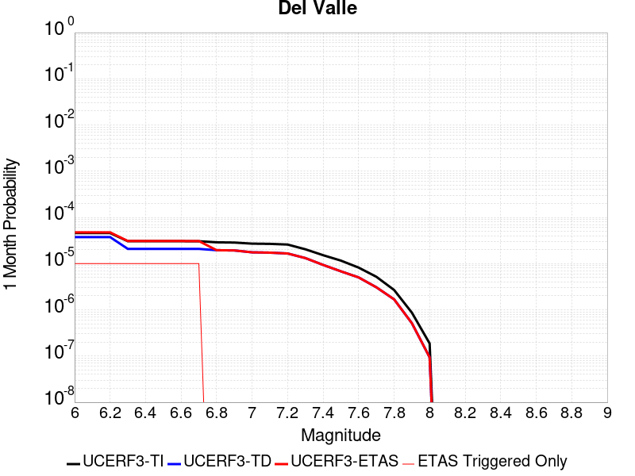 |  |  |

| Magnitude | 1 wk TI Prob | 1 wk TD Prob | 1 wk ETAS Prob | 1 wk ETAS/TD Gain | 1 wk ETAS Triggered Only | 1 mo TI Prob | 1 mo TD Prob | 1 mo ETAS Prob | 1 mo ETAS/TD Gain | 1 mo ETAS Triggered Only | 1 yr TI Prob | 1 yr TD Prob | 1 yr ETAS Prob | 1 yr ETAS/TD Gain | 1 yr ETAS Triggered Only | 10 yr TI Prob | 10 yr TD Prob | 10 yr ETAS Prob | 10 yr ETAS/TD Gain | 10 yr ETAS Triggered Only |
|-----|-----|-----|-----|-----|-----|-----|-----|-----|-----|-----|-----|-----|-----|-----|-----|-----|-----|-----|-----|-----|
| 6.0 | 1.0716125E-5 | 8.767882E-6 | 7.884926E-5 | 8.992966 | 7.0081995E-5 | 4.592544E-5 | 3.7576207E-5 | 1.0765557E-4 | 2.8649929 | 7.0081995E-5 | 5.589988E-4 | 4.5741405E-4 | 5.2746397E-4 | 1.1531434 | 7.0081995E-5 | 0.0055759475 | 0.00456668 | 0.0046364423 | 1.0152763 | 7.0081995E-5 |
| 6.1 | 1.0716125E-5 | 8.767882E-6 | 7.884926E-5 | 8.992966 | 7.0081995E-5 | 4.592544E-5 | 3.7576207E-5 | 1.0765557E-4 | 2.8649929 | 7.0081995E-5 | 5.589988E-4 | 4.5741405E-4 | 5.2746397E-4 | 1.1531434 | 7.0081995E-5 | 0.0055759475 | 0.00456668 | 0.0046364423 | 1.0152763 | 7.0081995E-5 |
| 6.2 | 1.0716125E-5 | 8.767882E-6 | 7.884926E-5 | 8.992966 | 7.0081995E-5 | 4.592544E-5 | 3.7576207E-5 | 1.0765557E-4 | 2.8649929 | 7.0081995E-5 | 5.589988E-4 | 4.5741405E-4 | 5.2746397E-4 | 1.1531434 | 7.0081995E-5 | 0.0055759475 | 0.00456668 | 0.0046364423 | 1.0152763 | 7.0081995E-5 |
| 6.3 | 7.1293784E-6 | 4.865823E-6 | 7.494748E-5 | 15.402837 | 7.0081995E-5 | 3.055412E-5 | 2.0853364E-5 | 9.09339E-5 | 4.3606343 | 7.0081995E-5 | 3.7193293E-4 | 2.5386087E-4 | 3.2392508E-4 | 1.2759945 | 7.0081995E-5 | 0.0037131102 | 0.0025357946 | 0.002605699 | 1.027567 | 7.0081995E-5 |
| 6.4 | 7.1293784E-6 | 4.865823E-6 | 7.494748E-5 | 15.402837 | 7.0081995E-5 | 3.055412E-5 | 2.0853364E-5 | 9.09339E-5 | 4.3606343 | 7.0081995E-5 | 3.7193293E-4 | 2.5386087E-4 | 3.2392508E-4 | 1.2759945 | 7.0081995E-5 | 0.0037131102 | 0.0025357946 | 0.002605699 | 1.027567 | 7.0081995E-5 |
| 6.5 | 7.1293784E-6 | 4.865823E-6 | 7.494748E-5 | 15.402837 | 7.0081995E-5 | 3.055412E-5 | 2.0853364E-5 | 9.09339E-5 | 4.3606343 | 7.0081995E-5 | 3.7193293E-4 | 2.5386087E-4 | 3.2392508E-4 | 1.2759945 | 7.0081995E-5 | 0.0037131102 | 0.0025357946 | 0.002605699 | 1.027567 | 7.0081995E-5 |
| 6.6 | 7.1293784E-6 | 4.865823E-6 | 7.494748E-5 | 15.402837 | 7.0081995E-5 | 3.055412E-5 | 2.0853364E-5 | 9.09339E-5 | 4.3606343 | 7.0081995E-5 | 3.7193293E-4 | 2.5386087E-4 | 3.2392508E-4 | 1.2759945 | 7.0081995E-5 | 0.0037131102 | 0.0025357946 | 0.002605699 | 1.027567 | 7.0081995E-5 |
| 6.7 | 7.12272E-6 | 4.8631987E-6 | 7.494485E-5 | 15.410609 | 7.0081995E-5 | 3.0525585E-5 | 2.0842117E-5 | 9.092265E-5 | 4.3624477 | 7.0081995E-5 | 3.7158563E-4 | 2.5372396E-4 | 3.2378818E-4 | 1.2761434 | 7.0081995E-5 | 0.003709649 | 0.0025344288 | 0.0026043332 | 1.0275819 | 7.0081995E-5 |
| 6.8 | 6.7558703E-6 | 4.5594015E-6 | 4.5594015E-6 | 1.0 | 0.0 | 2.895341E-5 | 1.9540148E-5 | 1.9540148E-5 | 1.0 | 0.0 | 3.5245073E-4 | 2.3787597E-4 | 2.3787597E-4 | 1.0 | 0.0 | 0.0035189227 | 0.0023762889 | 0.0023762889 | 1.0 | 0.0 |
| 6.9 | 6.6700386E-6 | 4.502539E-6 | 4.502539E-6 | 1.0 | 0.0 | 2.8585566E-5 | 1.9296456E-5 | 1.9296456E-5 | 1.0 | 0.0 | 3.479737E-4 | 2.3490966E-4 | 2.3490966E-4 | 1.0 | 0.0 | 0.003474293 | 0.0023466884 | 0.0023466884 | 1.0 | 0.0 |
| 7.0 | 6.3181424E-6 | 4.0987034E-6 | 4.0987034E-6 | 1.0 | 0.0 | 2.7077473E-5 | 1.7565755E-5 | 1.7565755E-5 | 1.0 | 0.0 | 3.2961834E-4 | 2.1384252E-4 | 2.1384252E-4 | 1.0 | 0.0 | 0.0032912986 | 0.002136422 | 0.002136422 | 1.0 | 0.0 |
| 7.1 | 6.248759E-6 | 4.033895E-6 | 4.033895E-6 | 1.0 | 0.0 | 2.678012E-5 | 1.7288008E-5 | 1.7288008E-5 | 1.0 | 0.0 | 3.2599916E-4 | 2.104616E-4 | 2.104616E-4 | 1.0 | 0.0 | 0.0032552136 | 0.0021026772 | 0.0021026772 | 1.0 | 0.0 |
| 7.2 | 6.0411944E-6 | 3.869888E-6 | 3.869888E-6 | 1.0 | 0.0 | 2.5890577E-5 | 1.658513E-5 | 1.658513E-5 | 1.0 | 0.0 | 3.1517216E-4 | 2.0190567E-4 | 2.0190567E-4 | 1.0 | 0.0 | 0.0031472554 | 0.0020172757 | 0.0020172757 | 1.0 | 0.0 |
| 7.3 | 4.7691183E-6 | 3.0781202E-6 | 3.0781202E-6 | 1.0 | 0.0 | 2.0438918E-5 | 1.3191879E-5 | 1.3191879E-5 | 1.0 | 0.0 | 2.488154E-4 | 1.605995E-4 | 1.605995E-4 | 1.0 | 0.0 | 0.00248537 | 0.0016048603 | 0.0016048603 | 1.0 | 0.0 |
| 7.4 | 3.5524722E-6 | 2.1893363E-6 | 2.1893363E-6 | 1.0 | 0.0 | 1.5224792E-5 | 9.382837E-6 | 9.382837E-6 | 1.0 | 0.0 | 1.8534607E-4 | 1.1423013E-4 | 1.1423013E-4 | 1.0 | 0.0 | 0.0018519156 | 0.0011417224 | 0.0011417224 | 1.0 | 0.0 |
| 7.5 | 2.7133442E-6 | 1.5916097E-6 | 1.5916097E-6 | 1.0 | 0.0 | 1.1628566E-5 | 6.821167E-6 | 6.821167E-6 | 1.0 | 0.0 | 1.415686E-4 | 8.304456E-5 | 8.304456E-5 | 1.0 | 0.0 | 0.0014147845 | 8.301372E-4 | 8.301372E-4 | 1.0 | 0.0 |
| 7.6 | 1.915338E-6 | 1.173914E-6 | 1.173914E-6 | 1.0 | 0.0 | 8.208566E-6 | 5.0310505E-6 | 5.0310505E-6 | 1.0 | 0.0 | 9.993471E-5 | 6.125133E-5 | 6.125133E-5 | 1.0 | 0.0 | 9.988978E-4 | 6.123454E-4 | 6.123454E-4 | 1.0 | 0.0 |
| 7.7 | 1.2120448E-6 | 7.180313E-7 | 7.180313E-7 | 1.0 | 0.0 | 5.194467E-6 | 3.0772733E-6 | 3.0772733E-6 | 1.0 | 0.0 | 6.3240805E-5 | 3.746516E-5 | 3.746516E-5 | 1.0 | 0.0 | 6.322281E-4 | 3.7458882E-4 | 3.7458882E-4 | 1.0 | 0.0 |
| 7.8 | 6.272381E-7 | 3.932549E-7 | 3.932549E-7 | 1.0 | 0.0 | 2.6881603E-6 | 1.6853771E-6 | 1.6853771E-6 | 1.0 | 0.0 | 3.272786E-5 | 2.0519275E-5 | 2.0519275E-5 | 1.0 | 0.0 | 3.272304E-4 | 2.0517396E-4 | 2.0517396E-4 | 1.0 | 0.0 |
| 7.9 | 2.0292627E-7 | 1.2004622E-7 | 1.2004622E-7 | 1.0 | 0.0 | 8.6968373E-7 | 5.1448376E-7 | 5.1448376E-7 | 1.0 | 0.0 | 1.0588348E-5 | 6.263822E-6 | 6.263822E-6 | 1.0 | 0.0 | 1.0587843E-4 | 6.263647E-5 | 6.263647E-5 | 1.0 | 0.0 |
| 8.0 | 4.374492E-8 | 2.189964E-8 | 2.189964E-8 | 1.0 | 0.0 | 1.8747821E-7 | 9.385559E-8 | 9.385559E-8 | 1.0 | 0.0 | 2.2825448E-6 | 1.1426913E-6 | 1.1426913E-6 | 1.0 | 0.0 | 2.2825214E-5 | 1.1426858E-5 | 1.1426858E-5 | 1.0 | 0.0 |

## Coronado Bank alt1
*[(top)](#table-of-contents)*

| 1 Week | 1 Month | 1 Year | 10 Year |
|-----|-----|-----|-----|
|  |  |  |  |

| Magnitude | 1 wk TI Prob | 1 wk TD Prob | 1 wk ETAS Prob | 1 wk ETAS/TD Gain | 1 wk ETAS Triggered Only | 1 mo TI Prob | 1 mo TD Prob | 1 mo ETAS Prob | 1 mo ETAS/TD Gain | 1 mo ETAS Triggered Only | 1 yr TI Prob | 1 yr TD Prob | 1 yr ETAS Prob | 1 yr ETAS/TD Gain | 1 yr ETAS Triggered Only | 10 yr TI Prob | 10 yr TD Prob | 10 yr ETAS Prob | 10 yr ETAS/TD Gain | 10 yr ETAS Triggered Only |
|-----|-----|-----|-----|-----|-----|-----|-----|-----|-----|-----|-----|-----|-----|-----|-----|-----|-----|-----|-----|-----|
| 6.0 | 7.533492E-5 | 9.394913E-5 | 9.394913E-5 | 1.0 | 0.0 | 3.22824E-4 | 4.0258127E-4 | 4.7263503E-4 | 1.1740116 | 7.0081995E-5 | 0.0039233007 | 0.0048909658 | 0.0049607046 | 1.0142587 | 7.0081995E-5 | 0.03854755 | 0.04790356 | 0.047970288 | 1.0013928 | 7.0081995E-5 |
| 6.1 | 4.1807285E-5 | 5.049283E-5 | 5.049283E-5 | 1.0 | 0.0 | 1.7916178E-4 | 2.1638049E-4 | 2.1638049E-4 | 1.0 | 0.0 | 0.0021791123 | 0.0026313474 | 0.0026313474 | 1.0 | 0.0 | 0.021578677 | 0.026011046 | 0.026011046 | 1.0 | 0.0 |
| 6.2 | 4.1807285E-5 | 5.049283E-5 | 5.049283E-5 | 1.0 | 0.0 | 1.7916178E-4 | 2.1638049E-4 | 2.1638049E-4 | 1.0 | 0.0 | 0.0021791123 | 0.0026313474 | 0.0026313474 | 1.0 | 0.0 | 0.021578677 | 0.026011046 | 0.026011046 | 1.0 | 0.0 |
| 6.3 | 3.1793104E-5 | 3.7711117E-5 | 3.7711117E-5 | 1.0 | 0.0 | 1.3624904E-4 | 1.6160926E-4 | 1.6160926E-4 | 1.0 | 0.0 | 0.0016575698 | 0.001965848 | 0.001965848 | 1.0 | 0.0 | 0.016452603 | 0.019488465 | 0.019488465 | 1.0 | 0.0 |
| 6.4 | 2.9878007E-5 | 3.5335794E-5 | 3.5335794E-5 | 1.0 | 0.0 | 1.2804232E-4 | 1.5143053E-4 | 1.5143053E-4 | 1.0 | 0.0 | 0.0015578003 | 0.0018421387 | 0.0018421387 | 1.0 | 0.0 | 0.015469253 | 0.01827244 | 0.01827244 | 1.0 | 0.0 |
| 6.5 | 2.4512565E-5 | 2.8764043E-5 | 2.8764043E-5 | 1.0 | 0.0 | 1.0504962E-4 | 1.2326881E-4 | 1.2326881E-4 | 1.0 | 0.0 | 0.0012782287 | 0.0014997921 | 0.0014997921 | 1.0 | 0.0 | 0.012709012 | 0.014899683 | 0.014899683 | 1.0 | 0.0 |
| 6.6 | 2.1317413E-5 | 2.490667E-5 | 2.490667E-5 | 1.0 | 0.0 | 9.135714E-5 | 1.0673863E-4 | 1.0673863E-4 | 1.0 | 0.0 | 0.0011117056 | 0.0012987906 | 0.0012987906 | 1.0 | 0.0 | 0.011061605 | 0.012914404 | 0.012914404 | 1.0 | 0.0 |
| 6.7 | 1.8585655E-5 | 2.163488E-5 | 2.163488E-5 | 1.0 | 0.0 | 7.9650374E-5 | 9.271773E-5 | 9.271773E-5 | 1.0 | 0.0 | 9.6931186E-4 | 0.0011282742 | 0.0011282742 | 1.0 | 0.0 | 0.0096509475 | 0.011227623 | 0.011227623 | 1.0 | 0.0 |
| 6.8 | 1.5862879E-5 | 1.8419474E-5 | 1.8419474E-5 | 1.0 | 0.0 | 6.798199E-5 | 7.893833E-5 | 7.893833E-5 | 1.0 | 0.0 | 8.273665E-4 | 9.6066965E-4 | 9.6066965E-4 | 1.0 | 0.0 | 0.008242928 | 0.00956715 | 0.00956715 | 1.0 | 0.0 |
| 6.9 | 1.3021509E-5 | 1.5095265E-5 | 1.5095265E-5 | 1.0 | 0.0 | 5.5805274E-5 | 6.469249E-5 | 6.469249E-5 | 1.0 | 0.0 | 6.792174E-4 | 7.8736455E-4 | 7.8736455E-4 | 1.0 | 0.0 | 0.006771452 | 0.007847573 | 0.007847573 | 1.0 | 0.0 |
| 7.0 | 1.0974371E-5 | 1.2720104E-5 | 1.2720104E-5 | 1.0 | 0.0 | 4.7032172E-5 | 5.451369E-5 | 5.451369E-5 | 1.0 | 0.0 | 5.7246623E-4 | 6.6351966E-4 | 6.6351966E-4 | 1.0 | 0.0 | 0.0057099373 | 0.006617135 | 0.006617135 | 1.0 | 0.0 |
| 7.1 | 8.766221E-6 | 1.01638325E-5 | 1.01638325E-5 | 1.0 | 0.0 | 3.7568978E-5 | 4.355865E-5 | 4.355865E-5 | 1.0 | 0.0 | 4.573063E-4 | 5.3021475E-4 | 5.3021475E-4 | 1.0 | 0.0 | 0.0045636636 | 0.0052911965 | 0.0052911965 | 1.0 | 0.0 |
| 7.2 | 8.026024E-7 | 8.331765E-7 | 8.331765E-7 | 1.0 | 0.0 | 3.43972E-6 | 3.5707515E-6 | 3.5707515E-6 | 1.0 | 0.0 | 4.1877785E-5 | 4.3473043E-5 | 4.3473043E-5 | 1.0 | 0.0 | 4.1869894E-4 | 4.3464647E-4 | 4.3464647E-4 | 1.0 | 0.0 |
| 7.3 | 3.7293114E-7 | 3.7000953E-7 | 3.7000953E-7 | 1.0 | 0.0 | 1.5982754E-6 | 1.5857541E-6 | 1.5857541E-6 | 1.0 | 0.0 | 1.9458828E-5 | 1.9306386E-5 | 1.9306386E-5 | 1.0 | 0.0 | 1.9457124E-4 | 1.9304715E-4 | 1.9304715E-4 | 1.0 | 0.0 |
| 7.4 | 2.0557036E-7 | 1.9674363E-7 | 1.9674363E-7 | 1.0 | 0.0 | 8.810155E-7 | 8.431867E-7 | 8.431867E-7 | 1.0 | 0.0 | 1.0726311E-5 | 1.026575E-5 | 1.026575E-5 | 1.0 | 0.0 | 1.0725793E-4 | 1.0265279E-4 | 1.0265279E-4 | 1.0 | 0.0 |
| 7.5 | 6.845446E-8 | 6.279369E-8 | 6.279369E-8 | 1.0 | 0.0 | 2.9337625E-7 | 2.691158E-7 | 2.691158E-7 | 1.0 | 0.0 | 3.5718497E-6 | 3.2764797E-6 | 3.2764797E-6 | 1.0 | 0.0 | 3.5717923E-5 | 3.2764325E-5 | 3.2764325E-5 | 1.0 | 0.0 |
| 7.6 | 6.0975145E-9 | 5.53185E-9 | 5.53185E-9 | 1.0 | 0.0 | 2.6132206E-8 | 2.370793E-8 | 2.370793E-8 | 1.0 | 0.0 | 3.1815955E-7 | 2.88644E-7 | 2.88644E-7 | 1.0 | 0.0 | 3.181591E-6 | 2.8864374E-6 | 2.8864374E-6 | 1.0 | 0.0 |

## San Jacinto (Clark) rev
*[(top)](#table-of-contents)*

| 1 Week | 1 Month | 1 Year | 10 Year |
|-----|-----|-----|-----|
|  |  |  |  |

| Magnitude | 1 wk TI Prob | 1 wk TD Prob | 1 wk ETAS Prob | 1 wk ETAS/TD Gain | 1 wk ETAS Triggered Only | 1 mo TI Prob | 1 mo TD Prob | 1 mo ETAS Prob | 1 mo ETAS/TD Gain | 1 mo ETAS Triggered Only | 1 yr TI Prob | 1 yr TD Prob | 1 yr ETAS Prob | 1 yr ETAS/TD Gain | 1 yr ETAS Triggered Only | 10 yr TI Prob | 10 yr TD Prob | 10 yr ETAS Prob | 10 yr ETAS/TD Gain | 10 yr ETAS Triggered Only |
|-----|-----|-----|-----|-----|-----|-----|-----|-----|-----|-----|-----|-----|-----|-----|-----|-----|-----|-----|-----|-----|
| 6.0 | 4.482615E-5 | 2.1154196E-5 | 9.123471E-5 | 4.3128424 | 7.0081995E-5 | 1.9209793E-4 | 9.065773E-5 | 1.6073338E-4 | 1.7729692 | 7.0081995E-5 | 0.0023362834 | 0.0011032083 | 0.001173213 | 1.0634556 | 7.0081995E-5 | 0.02311874 | 0.011503847 | 0.011573123 | 1.006022 | 7.0081995E-5 |
| 6.1 | 4.482615E-5 | 2.1154196E-5 | 9.123471E-5 | 4.3128424 | 7.0081995E-5 | 1.9209793E-4 | 9.065773E-5 | 1.6073338E-4 | 1.7729692 | 7.0081995E-5 | 0.0023362834 | 0.0011032083 | 0.001173213 | 1.0634556 | 7.0081995E-5 | 0.02311874 | 0.011503847 | 0.011573123 | 1.006022 | 7.0081995E-5 |
| 6.2 | 4.482615E-5 | 2.1154196E-5 | 9.123471E-5 | 4.3128424 | 7.0081995E-5 | 1.9209793E-4 | 9.065773E-5 | 1.6073338E-4 | 1.7729692 | 7.0081995E-5 | 0.0023362834 | 0.0011032083 | 0.001173213 | 1.0634556 | 7.0081995E-5 | 0.02311874 | 0.011503847 | 0.011573123 | 1.006022 | 7.0081995E-5 |
| 6.3 | 4.482615E-5 | 2.1154196E-5 | 9.123471E-5 | 4.3128424 | 7.0081995E-5 | 1.9209793E-4 | 9.065773E-5 | 1.6073338E-4 | 1.7729692 | 7.0081995E-5 | 0.0023362834 | 0.0011032083 | 0.001173213 | 1.0634556 | 7.0081995E-5 | 0.02311874 | 0.011503847 | 0.011573123 | 1.006022 | 7.0081995E-5 |
| 6.4 | 4.482615E-5 | 2.1154196E-5 | 9.123471E-5 | 4.3128424 | 7.0081995E-5 | 1.9209793E-4 | 9.065773E-5 | 1.6073338E-4 | 1.7729692 | 7.0081995E-5 | 0.0023362834 | 0.0011032083 | 0.001173213 | 1.0634556 | 7.0081995E-5 | 0.02311874 | 0.011503847 | 0.011573123 | 1.006022 | 7.0081995E-5 |
| 6.5 | 3.7294863E-5 | 1.7356087E-5 | 8.743686E-5 | 5.0378213 | 7.0081995E-5 | 1.5982533E-4 | 7.438113E-5 | 1.4445792E-4 | 1.9421312 | 7.0081995E-5 | 0.0019441366 | 9.052186E-4 | 9.752371E-4 | 1.0773499 | 7.0081995E-5 | 0.01927216 | 0.0094941035 | 0.00956352 | 1.0073116 | 7.0081995E-5 |
| 6.6 | 3.7294863E-5 | 1.7356087E-5 | 8.743686E-5 | 5.0378213 | 7.0081995E-5 | 1.5982533E-4 | 7.438113E-5 | 1.4445792E-4 | 1.9421312 | 7.0081995E-5 | 0.0019441366 | 9.052186E-4 | 9.752371E-4 | 1.0773499 | 7.0081995E-5 | 0.01927216 | 0.0094941035 | 0.00956352 | 1.0073116 | 7.0081995E-5 |
| 6.7 | 3.6039248E-5 | 1.6604314E-5 | 8.668515E-5 | 5.22064 | 7.0081995E-5 | 1.5444479E-4 | 7.1159426E-5 | 1.4123644E-4 | 1.9847889 | 7.0081995E-5 | 0.0018787434 | 8.6602574E-4 | 9.3604706E-4 | 1.0808536 | 7.0081995E-5 | 0.01862939 | 0.009096047 | 0.009165491 | 1.0076346 | 7.0081995E-5 |
| 6.8 | 3.5031844E-5 | 1.6232942E-5 | 8.63138E-5 | 5.3172 | 7.0081995E-5 | 1.5012783E-4 | 6.956792E-5 | 1.3964504E-4 | 2.0073195 | 7.0081995E-5 | 0.0018262739 | 8.4666436E-4 | 9.16687E-4 | 1.0827042 | 7.0081995E-5 | 0.01811338 | 0.008895969 | 0.008965428 | 1.0078079 | 7.0081995E-5 |
| 6.9 | 3.435112E-5 | 1.6063195E-5 | 8.6144064E-5 | 5.3628225 | 7.0081995E-5 | 1.4721078E-4 | 6.884047E-5 | 1.3891765E-4 | 2.0179648 | 7.0081995E-5 | 0.0017908178 | 8.3781447E-4 | 9.0783776E-4 | 1.0835785 | 7.0081995E-5 | 0.017764548 | 0.008804181 | 0.008873645 | 1.00789 | 7.0081995E-5 |
| 7.0 | 2.8959772E-5 | 1.4336745E-5 | 8.4417734E-5 | 5.888208 | 7.0081995E-5 | 1.241074E-4 | 6.144176E-5 | 1.3151945E-4 | 2.1405547 | 7.0081995E-5 | 0.0015099603 | 7.477995E-4 | 8.178291E-4 | 1.0936476 | 7.0081995E-5 | 0.014997416 | 0.007868037 | 0.007937567 | 1.0088371 | 7.0081995E-5 |
| 7.1 | 2.6002877E-5 | 1.2829002E-5 | 8.29101E-5 | 6.4627085 | 7.0081995E-5 | 1.11436144E-4 | 5.498029E-5 | 1.2505843E-4 | 2.2746048 | 7.0081995E-5 | 0.0013558907 | 6.691816E-4 | 7.3921663E-4 | 1.1046579 | 7.0081995E-5 | 0.013476475 | 0.0070465137 | 0.007116102 | 1.0098755 | 7.0081995E-5 |
| 7.2 | 2.2544838E-5 | 1.1262543E-5 | 8.134375E-5 | 7.2225027 | 7.0081995E-5 | 9.661716E-5 | 4.8267157E-5 | 1.1834577E-4 | 2.4518902 | 7.0081995E-5 | 0.001175679 | 5.874956E-4 | 6.5753644E-4 | 1.1192193 | 7.0081995E-5 | 0.011694785 | 0.0061927503 | 0.006262398 | 1.0112467 | 7.0081995E-5 |
| 7.3 | 1.75334E-5 | 1.0811715E-5 | 8.0892954E-5 | 7.4819727 | 7.0081995E-5 | 7.514098E-5 | 4.6335106E-5 | 1.1641385E-4 | 2.512433 | 7.0081995E-5 | 9.144575E-4 | 5.6398526E-4 | 6.3402776E-4 | 1.124192 | 7.0081995E-5 | 0.009107036 | 0.0059337732 | 0.0060034394 | 1.0117406 | 7.0081995E-5 |
| 7.4 | 1.5924552E-5 | 1.0611516E-5 | 8.069277E-5 | 7.604264 | 7.0081995E-5 | 6.82463E-5 | 4.547714E-5 | 1.1555595E-4 | 2.5409677 | 7.0081995E-5 | 8.305819E-4 | 5.535449E-4 | 6.235881E-4 | 1.1265358 | 7.0081995E-5 | 0.008274844 | 0.0058210334 | 0.0058907075 | 1.0119693 | 7.0081995E-5 |
| 7.5 | 1.3428931E-5 | 9.8519E-6 | 7.9933205E-5 | 8.1134815 | 7.0081995E-5 | 5.7551293E-5 | 4.2221753E-5 | 1.1230079E-4 | 2.6597853 | 7.0081995E-5 | 7.004617E-4 | 5.1392964E-4 | 5.8397563E-4 | 1.1362948 | 7.0081995E-5 | 0.006982579 | 0.0054066023 | 0.0054763057 | 1.0128922 | 7.0081995E-5 |
| 7.6 | 1.0688787E-5 | 8.614839E-6 | 7.8696234E-5 | 9.134962 | 7.0081995E-5 | 4.5808283E-5 | 3.692022E-5 | 1.0699963E-4 | 2.8981307 | 7.0081995E-5 | 5.5757316E-4 | 4.4941145E-4 | 5.19462E-4 | 1.1558716 | 7.0081995E-5 | 0.005561762 | 0.0047416524 | 0.004811402 | 1.01471 | 7.0081995E-5 |
| 7.7 | 8.81236E-6 | 7.4680274E-6 | 7.75495E-5 | 10.384201 | 7.0081995E-5 | 3.776671E-5 | 3.2005442E-5 | 1.0208519E-4 | 3.18962 | 7.0081995E-5 | 4.597127E-4 | 3.8959677E-4 | 4.5965146E-4 | 1.1798134 | 7.0081995E-5 | 0.0045876284 | 0.0041346536 | 0.004204446 | 1.0168798 | 7.0081995E-5 |
| 7.8 | 7.780431E-6 | 6.696579E-6 | 7.67781E-5 | 11.465273 | 7.0081995E-5 | 3.3344273E-5 | 2.8699309E-5 | 9.8779296E-5 | 3.44187 | 7.0081995E-5 | 4.0589093E-4 | 3.4935825E-4 | 4.1941577E-4 | 1.200532 | 7.0081995E-5 | 0.0040515037 | 0.0037227906 | 0.0037926116 | 1.0187551 | 7.0081995E-5 |
| 7.9 | 6.5437994E-6 | 5.780382E-6 | 7.586197E-5 | 13.124042 | 7.0081995E-5 | 2.8044553E-5 | 2.477283E-5 | 9.485309E-5 | 3.828916 | 7.0081995E-5 | 3.4138895E-4 | 3.0156763E-4 | 3.716285E-4 | 1.2323222 | 7.0081995E-5 | 0.0034086495 | 0.0032344845 | 0.00330434 | 1.021597 | 7.0081995E-5 |
| 8.0 | 5.4488164E-6 | 4.8133406E-6 | 7.4895E-5 | 15.559879 | 7.0081995E-5 | 2.3351862E-5 | 2.062844E-5 | 9.070899E-5 | 4.3972783 | 7.0081995E-5 | 2.8427184E-4 | 2.5112246E-4 | 3.2118688E-4 | 1.2790049 | 7.0081995E-5 | 0.0028390845 | 0.002710839 | 0.002780731 | 1.0257825 | 7.0081995E-5 |
| 8.1 | 2.8397242E-6 | 1.3670389E-6 | 1.3670389E-6 | 1.0 | 0.0 | 1.217019E-5 | 5.858725E-6 | 5.858725E-6 | 1.0 | 0.0 | 1.4816198E-4 | 7.132765E-5 | 7.132765E-5 | 1.0 | 0.0 | 0.0014806325 | 8.115382E-4 | 8.115382E-4 | 1.0 | 0.0 |
| 8.2 | 2.030244E-6 | 6.318974E-7 | 6.318974E-7 | 1.0 | 0.0 | 8.701017E-6 | 2.708129E-6 | 2.708129E-6 | 1.0 | 0.0 | 1.05929736E-4 | 3.2970976E-5 | 3.2970976E-5 | 1.0 | 0.0 | 0.0010587925 | 3.9486602E-4 | 3.9486602E-4 | 1.0 | 0.0 |
| 8.3 | 1.0659804E-6 | 2.9250086E-7 | 2.9250086E-7 | 1.0 | 0.0 | 4.568479E-6 | 1.2535745E-6 | 1.2535745E-6 | 1.0 | 0.0 | 5.5619817E-5 | 1.5262167E-5 | 1.5262167E-5 | 1.0 | 0.0 | 5.5605895E-4 | 1.8566217E-4 | 1.8566217E-4 | 1.0 | 0.0 |

## Carlsbad
*[(top)](#table-of-contents)*

| 1 Week | 1 Month | 1 Year | 10 Year |
|-----|-----|-----|-----|
| 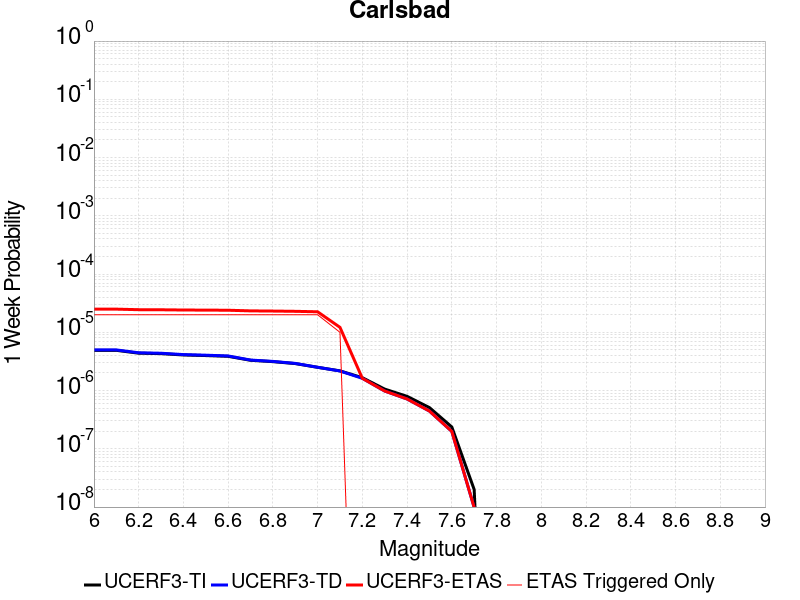 | 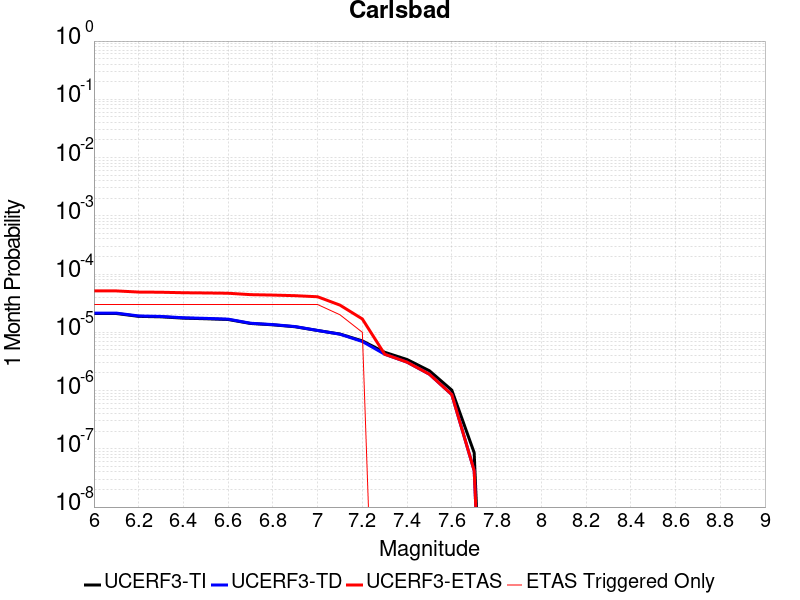 |  |  |

| Magnitude | 1 wk TI Prob | 1 wk TD Prob | 1 wk ETAS Prob | 1 wk ETAS/TD Gain | 1 wk ETAS Triggered Only | 1 mo TI Prob | 1 mo TD Prob | 1 mo ETAS Prob | 1 mo ETAS/TD Gain | 1 mo ETAS Triggered Only | 1 yr TI Prob | 1 yr TD Prob | 1 yr ETAS Prob | 1 yr ETAS/TD Gain | 1 yr ETAS Triggered Only | 10 yr TI Prob | 10 yr TD Prob | 10 yr ETAS Prob | 10 yr ETAS/TD Gain | 10 yr ETAS Triggered Only |
|-----|-----|-----|-----|-----|-----|-----|-----|-----|-----|-----|-----|-----|-----|-----|-----|-----|-----|-----|-----|-----|
| 6.0 | 4.9038536E-6 | 4.9872565E-6 | 4.9872565E-6 | 1.0 | 0.0 | 2.1016345E-5 | 2.1373784E-5 | 2.1373784E-5 | 1.0 | 0.0 | 2.5584397E-4 | 2.601952E-4 | 3.3025895E-4 | 1.2692739 | 7.0081995E-5 | 0.002555496 | 0.0025989525 | 0.0026688525 | 1.0268954 | 7.0081995E-5 |
| 6.1 | 4.9038536E-6 | 4.9872565E-6 | 4.9872565E-6 | 1.0 | 0.0 | 2.1016345E-5 | 2.1373784E-5 | 2.1373784E-5 | 1.0 | 0.0 | 2.5584397E-4 | 2.601952E-4 | 3.3025895E-4 | 1.2692739 | 7.0081995E-5 | 0.002555496 | 0.0025989525 | 0.0026688525 | 1.0268954 | 7.0081995E-5 |
| 6.2 | 4.3820614E-6 | 4.4547687E-6 | 4.4547687E-6 | 1.0 | 0.0 | 1.8780129E-5 | 1.9091729E-5 | 1.9091729E-5 | 1.0 | 0.0 | 2.2862408E-4 | 2.3241735E-4 | 3.0248307E-4 | 1.301465 | 7.0081995E-5 | 0.00228389 | 0.0023217786 | 0.0023916978 | 1.0301145 | 7.0081995E-5 |
| 6.3 | 4.302872E-6 | 4.373006E-6 | 4.373006E-6 | 1.0 | 0.0 | 1.8440749E-5 | 1.8741322E-5 | 1.8741322E-5 | 1.0 | 0.0 | 2.24493E-4 | 2.2815206E-4 | 2.9821807E-4 | 1.3071022 | 7.0081995E-5 | 0.0022426634 | 0.0022792136 | 0.0023491357 | 1.0306783 | 7.0081995E-5 |
| 6.4 | 4.0835243E-6 | 4.1476546E-6 | 4.1476546E-6 | 1.0 | 0.0 | 1.75007E-5 | 1.7775543E-5 | 1.7775543E-5 | 1.0 | 0.0 | 2.1305021E-4 | 2.1639607E-4 | 2.8646292E-4 | 1.3237897 | 7.0081995E-5 | 0.0021284607 | 0.0021618877 | 0.0022318182 | 1.032347 | 7.0081995E-5 |
| 6.5 | 3.987806E-6 | 4.0488867E-6 | 4.0488867E-6 | 1.0 | 0.0 | 1.7090486E-5 | 1.7352257E-5 | 1.7352257E-5 | 1.0 | 0.0 | 2.080568E-4 | 2.1124359E-4 | 2.813108E-4 | 1.3316891 | 7.0081995E-5 | 0.002078621 | 0.0021104617 | 0.0021803959 | 1.0331368 | 7.0081995E-5 |
| 6.6 | 3.8707576E-6 | 3.927488E-6 | 3.927488E-6 | 1.0 | 0.0 | 1.6588854E-5 | 1.6831984E-5 | 1.6831984E-5 | 1.0 | 0.0 | 2.0195059E-4 | 2.0491047E-4 | 2.749781E-4 | 1.3419427 | 7.0081995E-5 | 0.0020176715 | 0.0020472489 | 0.0021171875 | 1.0341622 | 7.0081995E-5 |
| 6.7 | 3.3093434E-6 | 3.3423917E-6 | 3.3423917E-6 | 1.0 | 0.0 | 1.4182823E-5 | 1.4324457E-5 | 1.4324457E-5 | 1.0 | 0.0 | 1.7266218E-4 | 1.7438637E-4 | 2.4445614E-4 | 1.4018077 | 7.0081995E-5 | 0.001725281 | 0.0017425013 | 0.0018124612 | 1.0401491 | 7.0081995E-5 |
| 6.8 | 3.136983E-6 | 3.1664536E-6 | 3.1664536E-6 | 1.0 | 0.0 | 1.3444143E-5 | 1.3570445E-5 | 1.3570445E-5 | 1.0 | 0.0 | 1.6367015E-4 | 1.6520769E-4 | 2.352781E-4 | 1.4241353 | 7.0081995E-5 | 0.0016354966 | 0.0016508545 | 0.0017208208 | 1.0423819 | 7.0081995E-5 |
| 6.9 | 2.9056644E-6 | 2.9267585E-6 | 2.9267585E-6 | 1.0 | 0.0 | 1.2452788E-5 | 1.2543191E-5 | 1.2543191E-5 | 1.0 | 0.0 | 1.5160214E-4 | 1.5270269E-4 | 2.2277399E-4 | 1.458874 | 7.0081995E-5 | 0.0015149876 | 0.001525983 | 0.001595958 | 1.0458558 | 7.0081995E-5 |
| 7.0 | 2.5071035E-6 | 2.5113977E-6 | 2.5113977E-6 | 1.0 | 0.0 | 1.0744685E-5 | 1.07630885E-5 | 1.07630885E-5 | 1.0 | 0.0 | 1.308087E-4 | 1.3103275E-4 | 1.3103275E-4 | 1.0 | 0.0 | 0.0013073172 | 0.0013095582 | 0.0013095582 | 1.0 | 0.0 |
| 7.1 | 2.1786877E-6 | 2.1678832E-6 | 2.1678832E-6 | 1.0 | 0.0 | 9.3372E-6 | 9.290896E-6 | 9.290896E-6 | 1.0 | 0.0 | 1.13674476E-4 | 1.1311081E-4 | 1.1311081E-4 | 1.0 | 0.0 | 0.0011361635 | 0.0011305353 | 0.0011305353 | 1.0 | 0.0 |
| 7.2 | 1.6628418E-6 | 1.6213872E-6 | 1.6213872E-6 | 1.0 | 0.0 | 7.1264453E-6 | 6.948784E-6 | 6.948784E-6 | 1.0 | 0.0 | 8.676102E-5 | 8.4598185E-5 | 8.4598185E-5 | 1.0 | 0.0 | 8.672715E-4 | 8.45662E-4 | 8.45662E-4 | 1.0 | 0.0 |
| 7.3 | 1.0595926E-6 | 9.816804E-7 | 9.816804E-7 | 1.0 | 0.0 | 4.541103E-6 | 4.2071947E-6 | 4.2071947E-6 | 1.0 | 0.0 | 5.5286528E-5 | 5.1221403E-5 | 5.1221403E-5 | 1.0 | 0.0 | 5.527277E-4 | 5.1209686E-4 | 5.1209686E-4 | 1.0 | 0.0 |
| 7.4 | 7.956623E-7 | 7.1737975E-7 | 7.1737975E-7 | 1.0 | 0.0 | 3.4099767E-6 | 3.074481E-6 | 3.074481E-6 | 1.0 | 0.0 | 4.1515676E-5 | 3.743117E-5 | 3.743117E-5 | 1.0 | 0.0 | 4.150792E-4 | 3.7424936E-4 | 3.7424936E-4 | 1.0 | 0.0 |
| 7.5 | 5.1043804E-7 | 4.4483627E-7 | 4.4483627E-7 | 1.0 | 0.0 | 2.1875896E-6 | 1.9064398E-6 | 1.9064398E-6 | 1.0 | 0.0 | 2.663358E-5 | 2.3210663E-5 | 2.3210663E-5 | 1.0 | 0.0 | 2.6630386E-4 | 2.3208297E-4 | 2.3208297E-4 | 1.0 | 0.0 |
| 7.6 | 2.3723294E-7 | 1.989569E-7 | 1.989569E-7 | 1.0 | 0.0 | 1.0167122E-6 | 8.5267214E-7 | 8.5267214E-7 | 1.0 | 0.0 | 1.2378401E-5 | 1.0381237E-5 | 1.0381237E-5 | 1.0 | 0.0 | 1.237771E-4 | 1.038078E-4 | 1.038078E-4 | 1.0 | 0.0 |
| 7.7 | 1.9992152E-8 | 9.8601785E-9 | 9.8601785E-9 | 1.0 | 0.0 | 8.568065E-8 | 4.225791E-8 | 4.225791E-8 | 1.0 | 0.0 | 1.0431614E-6 | 5.1449E-7 | 5.1449E-7 | 1.0 | 0.0 | 1.0431565E-5 | 5.1449E-6 | 5.1449E-6 | 1.0 | 0.0 |

## Kern Canyon (South Kern) 2011
*[(top)](#table-of-contents)*

| 1 Week | 1 Month | 1 Year | 10 Year |
|-----|-----|-----|-----|
|  |  |  |  |

| Magnitude | 1 wk TI Prob | 1 wk TD Prob | 1 wk ETAS Prob | 1 wk ETAS/TD Gain | 1 wk ETAS Triggered Only | 1 mo TI Prob | 1 mo TD Prob | 1 mo ETAS Prob | 1 mo ETAS/TD Gain | 1 mo ETAS Triggered Only | 1 yr TI Prob | 1 yr TD Prob | 1 yr ETAS Prob | 1 yr ETAS/TD Gain | 1 yr ETAS Triggered Only | 10 yr TI Prob | 10 yr TD Prob | 10 yr ETAS Prob | 10 yr ETAS/TD Gain | 10 yr ETAS Triggered Only |
|-----|-----|-----|-----|-----|-----|-----|-----|-----|-----|-----|-----|-----|-----|-----|-----|-----|-----|-----|-----|-----|
| 6.0 | 4.105075E-6 | 4.1137264E-6 | 7.4195435E-5 | 18.036064 | 7.0081995E-5 | 1.7593058E-5 | 1.763014E-5 | 8.77109E-5 | 4.975054 | 7.0081995E-5 | 2.1417443E-4 | 2.1462646E-4 | 2.846934E-4 | 1.32646 | 7.0081995E-5 | 0.0021396813 | 0.0021442557 | 0.0022141873 | 1.0326135 | 7.0081995E-5 |
| 6.1 | 4.105075E-6 | 4.1137264E-6 | 7.4195435E-5 | 18.036064 | 7.0081995E-5 | 1.7593058E-5 | 1.763014E-5 | 8.77109E-5 | 4.975054 | 7.0081995E-5 | 2.1417443E-4 | 2.1462646E-4 | 2.846934E-4 | 1.32646 | 7.0081995E-5 | 0.0021396813 | 0.0021442557 | 0.0022141873 | 1.0326135 | 7.0081995E-5 |
| 6.2 | 4.105075E-6 | 4.1137264E-6 | 7.4195435E-5 | 18.036064 | 7.0081995E-5 | 1.7593058E-5 | 1.763014E-5 | 8.77109E-5 | 4.975054 | 7.0081995E-5 | 2.1417443E-4 | 2.1462646E-4 | 2.846934E-4 | 1.32646 | 7.0081995E-5 | 0.0021396813 | 0.0021442557 | 0.0022141873 | 1.0326135 | 7.0081995E-5 |
| 6.3 | 4.105075E-6 | 4.1137264E-6 | 7.4195435E-5 | 18.036064 | 7.0081995E-5 | 1.7593058E-5 | 1.763014E-5 | 8.77109E-5 | 4.975054 | 7.0081995E-5 | 2.1417443E-4 | 2.1462646E-4 | 2.846934E-4 | 1.32646 | 7.0081995E-5 | 0.0021396813 | 0.0021442557 | 0.0022141873 | 1.0326135 | 7.0081995E-5 |
| 6.4 | 4.105075E-6 | 4.1137264E-6 | 7.4195435E-5 | 18.036064 | 7.0081995E-5 | 1.7593058E-5 | 1.763014E-5 | 8.77109E-5 | 4.975054 | 7.0081995E-5 | 2.1417443E-4 | 2.1462646E-4 | 2.846934E-4 | 1.32646 | 7.0081995E-5 | 0.0021396813 | 0.0021442557 | 0.0022141873 | 1.0326135 | 7.0081995E-5 |
| 6.5 | 2.9849807E-6 | 2.9731548E-6 | 2.9731548E-6 | 1.0 | 0.0 | 1.2792712E-5 | 1.274203E-5 | 1.274203E-5 | 1.0 | 0.0 | 1.5574014E-4 | 1.5512333E-4 | 1.5512333E-4 | 1.0 | 0.0 | 0.0015563103 | 0.0015501656 | 0.0015501656 | 1.0 | 0.0 |
| 6.6 | 2.9849807E-6 | 2.9731548E-6 | 2.9731548E-6 | 1.0 | 0.0 | 1.2792712E-5 | 1.274203E-5 | 1.274203E-5 | 1.0 | 0.0 | 1.5574014E-4 | 1.5512333E-4 | 1.5512333E-4 | 1.0 | 0.0 | 0.0015563103 | 0.0015501656 | 0.0015501656 | 1.0 | 0.0 |
| 6.7 | 2.6756725E-6 | 2.6582206E-6 | 2.6582206E-6 | 1.0 | 0.0 | 1.1467117E-5 | 1.1392325E-5 | 1.1392325E-5 | 1.0 | 0.0 | 1.396032E-4 | 1.3869285E-4 | 1.3869285E-4 | 1.0 | 0.0 | 0.0013951553 | 0.0013860738 | 0.0013860738 | 1.0 | 0.0 |
| 6.8 | 2.3283721E-6 | 2.3047787E-6 | 2.3047787E-6 | 1.0 | 0.0 | 9.9787E-6 | 9.877586E-6 | 9.877586E-6 | 1.0 | 0.0 | 1.214839E-4 | 1.20253055E-4 | 1.20253055E-4 | 1.0 | 0.0 | 0.001214175 | 0.0012018873 | 0.0012018873 | 1.0 | 0.0 |
| 6.9 | 2.0972677E-6 | 2.0696411E-6 | 2.0696411E-6 | 1.0 | 0.0 | 8.988259E-6 | 8.869861E-6 | 8.869861E-6 | 1.0 | 0.0 | 1.0942656E-4 | 1.0798526E-4 | 1.0798526E-4 | 1.0 | 0.0 | 0.0010937268 | 0.0010793337 | 0.0010793337 | 1.0 | 0.0 |
| 7.0 | 1.7132242E-6 | 1.6787036E-6 | 1.6787036E-6 | 1.0 | 0.0 | 7.3423685E-6 | 7.194424E-6 | 7.194424E-6 | 1.0 | 0.0 | 8.938967E-5 | 8.758863E-5 | 8.758863E-5 | 1.0 | 0.0 | 8.935372E-4 | 8.7554497E-4 | 8.7554497E-4 | 1.0 | 0.0 |
| 7.1 | 1.4215541E-6 | 1.3815752E-6 | 1.3815752E-6 | 1.0 | 0.0 | 6.0923603E-6 | 5.9210233E-6 | 5.9210233E-6 | 1.0 | 0.0 | 7.417196E-5 | 7.20861E-5 | 7.20861E-5 | 1.0 | 0.0 | 7.414721E-4 | 7.206299E-4 | 7.206299E-4 | 1.0 | 0.0 |
| 7.2 | 9.097853E-7 | 8.6037755E-7 | 8.6037755E-7 | 1.0 | 0.0 | 3.899074E-6 | 3.6873273E-6 | 3.6873273E-6 | 1.0 | 0.0 | 4.7470192E-5 | 4.4892295E-5 | 4.4892295E-5 | 1.0 | 0.0 | 4.7460053E-4 | 4.4883334E-4 | 4.4883334E-4 | 1.0 | 0.0 |
| 7.3 | 6.144169E-7 | 5.628206E-7 | 5.628206E-7 | 1.0 | 0.0 | 2.6332125E-6 | 2.4120861E-6 | 2.4120861E-6 | 1.0 | 0.0 | 3.205889E-5 | 2.9366758E-5 | 2.9366758E-5 | 1.0 | 0.0 | 3.2054266E-4 | 2.936293E-4 | 2.936293E-4 | 1.0 | 0.0 |
| 7.4 | 4.049844E-7 | 3.5728314E-7 | 3.5728314E-7 | 1.0 | 0.0 | 1.7356463E-6 | 1.5312125E-6 | 1.5312125E-6 | 1.0 | 0.0 | 2.1131287E-5 | 1.8642357E-5 | 1.8642357E-5 | 1.0 | 0.0 | 2.1129279E-4 | 1.8640817E-4 | 1.8640817E-4 | 1.0 | 0.0 |
| 7.5 | 1.9871162E-7 | 1.583044E-7 | 1.583044E-7 | 1.0 | 0.0 | 8.5162094E-7 | 6.7844724E-7 | 6.7844724E-7 | 1.0 | 0.0 | 1.0368436E-5 | 8.260065E-6 | 8.260065E-6 | 1.0 | 0.0 | 1.0367952E-4 | 8.259767E-5 | 8.259767E-5 | 1.0 | 0.0 |
| 7.6 | 2.572245E-8 | 1.7352555E-8 | 1.7352555E-8 | 1.0 | 0.0 | 1.10239064E-7 | 7.436809E-8 | 7.436809E-8 | 1.0 | 0.0 | 1.3421597E-6 | 9.054312E-7 | 9.054312E-7 | 1.0 | 0.0 | 1.3421517E-5 | 9.05428E-6 | 9.05428E-6 | 1.0 | 0.0 |

## Big Pine (East)
*[(top)](#table-of-contents)*

| 1 Week | 1 Month | 1 Year | 10 Year |
|-----|-----|-----|-----|
|  |  |  |  |

| Magnitude | 1 wk TI Prob | 1 wk TD Prob | 1 wk ETAS Prob | 1 wk ETAS/TD Gain | 1 wk ETAS Triggered Only | 1 mo TI Prob | 1 mo TD Prob | 1 mo ETAS Prob | 1 mo ETAS/TD Gain | 1 mo ETAS Triggered Only | 1 yr TI Prob | 1 yr TD Prob | 1 yr ETAS Prob | 1 yr ETAS/TD Gain | 1 yr ETAS Triggered Only | 10 yr TI Prob | 10 yr TD Prob | 10 yr ETAS Prob | 10 yr ETAS/TD Gain | 10 yr ETAS Triggered Only |
|-----|-----|-----|-----|-----|-----|-----|-----|-----|-----|-----|-----|-----|-----|-----|-----|-----|-----|-----|-----|-----|
| 6.0 | 9.916913E-6 | 1.2816984E-5 | 8.2898085E-5 | 6.4678307 | 7.0081995E-5 | 4.250036E-5 | 5.49289E-5 | 1.2500705E-4 | 2.2757974 | 7.0081995E-5 | 5.173191E-4 | 6.685763E-4 | 7.3861144E-4 | 1.1047527 | 7.0081995E-5 | 0.0051611643 | 0.006670441 | 0.0067400555 | 1.0104363 | 7.0081995E-5 |
| 6.1 | 9.916913E-6 | 1.2816984E-5 | 8.2898085E-5 | 6.4678307 | 7.0081995E-5 | 4.250036E-5 | 5.49289E-5 | 1.2500705E-4 | 2.2757974 | 7.0081995E-5 | 5.173191E-4 | 6.685763E-4 | 7.3861144E-4 | 1.1047527 | 7.0081995E-5 | 0.0051611643 | 0.006670441 | 0.0067400555 | 1.0104363 | 7.0081995E-5 |
| 6.2 | 9.916913E-6 | 1.2816984E-5 | 8.2898085E-5 | 6.4678307 | 7.0081995E-5 | 4.250036E-5 | 5.49289E-5 | 1.2500705E-4 | 2.2757974 | 7.0081995E-5 | 5.173191E-4 | 6.685763E-4 | 7.3861144E-4 | 1.1047527 | 7.0081995E-5 | 0.0051611643 | 0.006670441 | 0.0067400555 | 1.0104363 | 7.0081995E-5 |
| 6.3 | 5.479711E-6 | 8.112951E-6 | 7.819438E-5 | 9.638216 | 7.0081995E-5 | 2.3484265E-5 | 3.4769346E-5 | 1.0484891E-4 | 3.0155559 | 7.0081995E-5 | 2.858834E-4 | 4.2323777E-4 | 4.932901E-4 | 1.1655153 | 7.0081995E-5 | 0.0028551589 | 0.004227244 | 0.004297029 | 1.0165086 | 7.0081995E-5 |
| 6.4 | 5.465009E-6 | 8.097245E-6 | 7.817867E-5 | 9.654972 | 7.0081995E-5 | 2.3421257E-5 | 3.4702036E-5 | 1.047816E-4 | 3.0194654 | 7.0081995E-5 | 2.851165E-4 | 4.2241855E-4 | 4.924709E-4 | 1.1658365 | 7.0081995E-5 | 0.0028475097 | 0.0042190826 | 0.004288869 | 1.0165406 | 7.0081995E-5 |
| 6.5 | 4.826767E-6 | 7.422301E-6 | 7.750378E-5 | 10.442015 | 7.0081995E-5 | 2.068598E-5 | 3.180949E-5 | 1.0188926E-4 | 3.2031088 | 7.0081995E-5 | 2.518227E-4 | 3.872145E-4 | 4.5726934E-4 | 1.18092 | 7.0081995E-5 | 0.0025153751 | 0.003868283 | 0.003938094 | 1.018047 | 7.0081995E-5 |
| 6.6 | 4.3146847E-6 | 6.8822374E-6 | 7.696375E-5 | 11.182955 | 7.0081995E-5 | 1.8491375E-5 | 2.9494982E-5 | 9.9574914E-5 | 3.375995 | 7.0081995E-5 | 2.2510924E-4 | 3.590447E-4 | 4.2910152E-4 | 1.1951201 | 7.0081995E-5 | 0.0022488134 | 0.0035874986 | 0.0036573291 | 1.019465 | 7.0081995E-5 |
| 6.7 | 3.6968106E-6 | 5.9954727E-6 | 7.607705E-5 | 12.689083 | 7.0081995E-5 | 1.5843378E-5 | 2.5694639E-5 | 9.5774834E-5 | 3.7274249 | 7.0081995E-5 | 1.9287605E-4 | 3.1278885E-4 | 3.8284893E-4 | 1.2239852 | 7.0081995E-5 | 0.0019270873 | 0.0031262483 | 0.0031961112 | 1.0223472 | 7.0081995E-5 |
| 6.8 | 3.4671132E-6 | 5.702177E-6 | 7.578378E-5 | 13.290322 | 7.0081995E-5 | 1.4858972E-5 | 2.4437682E-5 | 9.451796E-5 | 3.8677142 | 7.0081995E-5 | 1.8089297E-4 | 2.974896E-4 | 3.6755073E-4 | 1.2355078 | 7.0081995E-5 | 0.0018074579 | 0.002973667 | 0.0030435408 | 1.0234975 | 7.0081995E-5 |
| 6.9 | 2.7686972E-6 | 4.825223E-6 | 4.825223E-6 | 1.0 | 0.0 | 1.1865792E-5 | 2.0679368E-5 | 2.0679368E-5 | 1.0 | 0.0 | 1.4445644E-4 | 2.5174298E-4 | 2.5174298E-4 | 1.0 | 0.0 | 0.0014436257 | 0.0025172636 | 0.0025172636 | 1.0 | 0.0 |
| 7.0 | 2.1472624E-6 | 3.9850406E-6 | 3.9850406E-6 | 1.0 | 0.0 | 9.20252E-6 | 1.7078637E-5 | 1.7078637E-5 | 1.0 | 0.0 | 1.12034926E-4 | 2.079131E-4 | 2.079131E-4 | 1.0 | 0.0 | 0.0011197845 | 0.0020798394 | 0.0020798394 | 1.0 | 0.0 |
| 7.1 | 1.7018335E-6 | 3.344876E-6 | 3.344876E-6 | 1.0 | 0.0 | 7.293552E-6 | 1.4335106E-5 | 1.4335106E-5 | 1.0 | 0.0 | 8.879537E-5 | 1.7451629E-4 | 1.7451629E-4 | 1.0 | 0.0 | 8.87599E-4 | 0.0017464145 | 0.0017464145 | 1.0 | 0.0 |
| 7.2 | 1.25603E-6 | 2.794484E-6 | 2.794484E-6 | 1.0 | 0.0 | 5.3829745E-6 | 1.1976307E-5 | 1.1976307E-5 | 1.0 | 0.0 | 6.553574E-5 | 1.4580201E-4 | 1.4580201E-4 | 1.0 | 0.0 | 6.551642E-4 | 0.001459661 | 0.001459661 | 1.0 | 0.0 |
| 7.3 | 1.112297E-6 | 2.610332E-6 | 2.610332E-6 | 1.0 | 0.0 | 4.7669787E-6 | 1.118709E-5 | 1.118709E-5 | 1.0 | 0.0 | 5.803642E-5 | 1.3619453E-4 | 1.3619453E-4 | 1.0 | 0.0 | 5.802127E-4 | 0.0013635408 | 0.0013635408 | 1.0 | 0.0 |
| 7.4 | 1.0137181E-6 | 2.4834917E-6 | 2.4834917E-6 | 1.0 | 0.0 | 4.3444993E-6 | 1.0643494E-5 | 1.0643494E-5 | 1.0 | 0.0 | 5.2892992E-5 | 1.2957705E-4 | 1.2957705E-4 | 1.0 | 0.0 | 5.288041E-4 | 0.0012972289 | 0.0012972289 | 1.0 | 0.0 |
| 7.5 | 9.598608E-7 | 2.4071483E-6 | 2.4071483E-6 | 1.0 | 0.0 | 4.1136827E-6 | 1.031631E-5 | 1.031631E-5 | 1.0 | 0.0 | 5.0082934E-5 | 1.2559404E-4 | 1.2559404E-4 | 1.0 | 0.0 | 5.007165E-4 | 0.0012572526 | 0.0012572526 | 1.0 | 0.0 |
| 7.6 | 7.929459E-7 | 2.0448588E-6 | 2.0448588E-6 | 1.0 | 0.0 | 3.3983351E-6 | 8.763653E-6 | 8.763653E-6 | 1.0 | 0.0 | 4.1373947E-5 | 1.06692416E-4 | 1.06692416E-4 | 1.0 | 0.0 | 4.1366243E-4 | 0.0010685222 | 0.0010685222 | 1.0 | 0.0 |
| 7.7 | 4.155788E-7 | 1.1605589E-6 | 1.1605589E-6 | 1.0 | 0.0 | 1.7810507E-6 | 4.9738146E-6 | 4.9738146E-6 | 1.0 | 0.0 | 2.1684076E-5 | 6.0554554E-5 | 6.0554554E-5 | 1.0 | 0.0 | 2.1681961E-4 | 6.0857297E-4 | 6.0857297E-4 | 1.0 | 0.0 |
| 7.8 | 1.14666925E-7 | 2.592015E-7 | 2.592015E-7 | 1.0 | 0.0 | 4.914296E-7 | 1.1108631E-6 | 1.1108631E-6 | 1.0 | 0.0 | 5.9831386E-6 | 1.3524678E-5 | 1.3524678E-5 | 1.0 | 0.0 | 5.9829777E-5 | 1.3634123E-4 | 1.3634123E-4 | 1.0 | 0.0 |
| 7.9 | 2.9231824E-8 | 4.1463963E-8 | 4.1463963E-8 | 1.0 | 0.0 | 1.2527924E-7 | 1.7770269E-7 | 1.7770269E-7 | 1.0 | 0.0 | 1.5252737E-6 | 2.1635283E-6 | 2.1635283E-6 | 1.0 | 0.0 | 1.5252632E-5 | 2.1967755E-5 | 2.1967755E-5 | 1.0 | 0.0 |

## Rinconada 2011 CFM
*[(top)](#table-of-contents)*

| 1 Week | 1 Month | 1 Year | 10 Year |
|-----|-----|-----|-----|
|  |  |  |  |

| Magnitude | 1 wk TI Prob | 1 wk TD Prob | 1 wk ETAS Prob | 1 wk ETAS/TD Gain | 1 wk ETAS Triggered Only | 1 mo TI Prob | 1 mo TD Prob | 1 mo ETAS Prob | 1 mo ETAS/TD Gain | 1 mo ETAS Triggered Only | 1 yr TI Prob | 1 yr TD Prob | 1 yr ETAS Prob | 1 yr ETAS/TD Gain | 1 yr ETAS Triggered Only | 10 yr TI Prob | 10 yr TD Prob | 10 yr ETAS Prob | 10 yr ETAS/TD Gain | 10 yr ETAS Triggered Only |
|-----|-----|-----|-----|-----|-----|-----|-----|-----|-----|-----|-----|-----|-----|-----|-----|-----|-----|-----|-----|-----|
| 6.0 | 1.5752368E-5 | 1.6274716E-5 | 8.635557E-5 | 5.3061185 | 7.0081995E-5 | 6.75084E-5 | 6.974694E-5 | 1.3982404E-4 | 2.0047338 | 7.0081995E-5 | 8.2160486E-4 | 8.488412E-4 | 9.1886375E-4 | 1.0824919 | 7.0081995E-5 | 0.008185739 | 0.00845637 | 0.00852586 | 1.0082175 | 7.0081995E-5 |
| 6.1 | 1.0966133E-5 | 1.1323029E-5 | 8.140423E-5 | 7.189263 | 7.0081995E-5 | 4.6996865E-5 | 4.852637E-5 | 1.1860496E-4 | 2.4441342 | 7.0081995E-5 | 5.720366E-4 | 5.906491E-4 | 6.606897E-4 | 1.1185824 | 7.0081995E-5 | 0.0057056635 | 0.0058908886 | 0.005960558 | 1.0118266 | 7.0081995E-5 |
| 6.2 | 1.0966133E-5 | 1.1323029E-5 | 8.140423E-5 | 7.189263 | 7.0081995E-5 | 4.6996865E-5 | 4.852637E-5 | 1.1860496E-4 | 2.4441342 | 7.0081995E-5 | 5.720366E-4 | 5.906491E-4 | 6.606897E-4 | 1.1185824 | 7.0081995E-5 | 0.0057056635 | 0.0058908886 | 0.005960558 | 1.0118266 | 7.0081995E-5 |
| 6.3 | 8.926149E-6 | 9.212771E-6 | 7.929412E-5 | 8.606978 | 7.0081995E-5 | 3.8254362E-5 | 3.948271E-5 | 1.0956194E-4 | 2.7749345 | 7.0081995E-5 | 4.6564735E-4 | 4.805963E-4 | 5.506446E-4 | 1.1457529 | 7.0081995E-5 | 0.0046467283 | 0.0047956146 | 0.0048653604 | 1.0145437 | 7.0081995E-5 |
| 6.4 | 7.676955E-6 | 7.920191E-6 | 7.8001634E-5 | 9.8484535 | 7.0081995E-5 | 3.290082E-5 | 3.3943234E-5 | 1.0402285E-4 | 3.0646122 | 7.0081995E-5 | 4.0049385E-4 | 4.1318068E-4 | 4.8323374E-4 | 1.1695458 | 7.0081995E-5 | 0.0039977287 | 0.004124151 | 0.004193944 | 1.016923 | 7.0081995E-5 |
| 6.5 | 6.1671026E-6 | 6.3589546E-6 | 7.6440505E-5 | 12.020923 | 7.0081995E-5 | 2.6430173E-5 | 2.725238E-5 | 9.7332464E-5 | 3.5715218 | 7.0081995E-5 | 3.2173982E-4 | 3.317473E-4 | 4.0180603E-4 | 1.211181 | 7.0081995E-5 | 0.003212744 | 0.0033125326 | 0.0033823822 | 1.0210866 | 7.0081995E-5 |
| 6.6 | 5.553456E-6 | 5.7248126E-6 | 7.5806405E-5 | 13.241728 | 7.0081995E-5 | 2.3800309E-5 | 2.453468E-5 | 9.461496E-5 | 3.8563762 | 7.0081995E-5 | 2.897302E-4 | 2.9866883E-4 | 3.687299E-4 | 1.2345778 | 7.0081995E-5 | 0.0028935277 | 0.002982683 | 0.0030525562 | 1.0234262 | 7.0081995E-5 |
| 6.7 | 4.787857E-6 | 4.9333094E-6 | 7.501496E-5 | 15.205809 | 7.0081995E-5 | 2.0519226E-5 | 2.1142583E-5 | 9.12231E-5 | 4.314662 | 7.0081995E-5 | 2.4979294E-4 | 2.573806E-4 | 3.2744455E-4 | 1.2722193 | 7.0081995E-5 | 0.0024951235 | 0.0025708308 | 0.0026407326 | 1.0271903 | 7.0081995E-5 |
| 6.8 | 3.9955166E-6 | 4.1134763E-6 | 7.419518E-5 | 18.037102 | 7.0081995E-5 | 1.7123532E-5 | 1.7629065E-5 | 8.770983E-5 | 4.9752965 | 7.0081995E-5 | 2.0845905E-4 | 2.1461274E-4 | 2.846797E-4 | 1.3264809 | 7.0081995E-5 | 0.002082636 | 0.0021440585 | 0.0022139903 | 1.0326165 | 7.0081995E-5 |
| 6.9 | 3.4250072E-6 | 3.5224464E-6 | 7.36042E-5 | 20.895761 | 7.0081995E-5 | 1.46785205E-5 | 1.5096111E-5 | 8.517705E-5 | 5.6423173 | 7.0081995E-5 | 1.7869633E-4 | 1.8377967E-4 | 2.538488E-4 | 1.381267 | 7.0081995E-5 | 0.001785527 | 0.0018362794 | 0.0019062327 | 1.0380951 | 7.0081995E-5 |
| 7.0 | 2.7712713E-6 | 2.8467E-6 | 7.2928495E-5 | 25.61861 | 7.0081995E-5 | 1.1876823E-5 | 1.2200086E-5 | 8.228123E-5 | 6.7443156 | 7.0081995E-5 | 1.4459073E-4 | 1.4852593E-4 | 2.1859752E-4 | 1.4717802 | 7.0081995E-5 | 0.0014449668 | 0.0014842682 | 0.0015542462 | 1.0471464 | 7.0081995E-5 |
| 7.1 | 2.227358E-6 | 2.2856984E-6 | 7.236753E-5 | 31.661016 | 7.0081995E-5 | 9.545785E-6 | 9.795814E-6 | 7.987712E-5 | 8.15421 | 7.0081995E-5 | 1.16213734E-4 | 1.19257515E-4 | 1.8933116E-4 | 1.5875826 | 7.0081995E-5 | 0.0011615298 | 0.0011919362 | 0.0012619346 | 1.0587267 | 7.0081995E-5 |
| 7.2 | 1.581796E-6 | 1.6209011E-6 | 7.170279E-5 | 44.23637 | 7.0081995E-5 | 6.779108E-6 | 6.9467005E-6 | 7.702821E-5 | 11.08846 | 7.0081995E-5 | 8.253252E-5 | 8.457281E-5 | 1.5464888E-4 | 1.8285887 | 7.0081995E-5 | 8.250187E-4 | 8.454067E-4 | 9.154295E-4 | 1.0828273 | 7.0081995E-5 |
| 7.3 | 1.0306567E-6 | 1.0546477E-6 | 7.113657E-5 | 67.450554 | 7.0081995E-5 | 4.4170924E-6 | 4.519911E-6 | 7.460159E-5 | 16.505102 | 7.0081995E-5 | 5.3776774E-5 | 5.5028526E-5 | 1.2510667E-4 | 2.2734876 | 7.0081995E-5 | 5.376376E-4 | 5.5014924E-4 | 6.201927E-4 | 1.1273172 | 7.0081995E-5 |
| 7.4 | 6.535541E-7 | 6.682742E-7 | 7.0750226E-5 | 105.870056 | 7.0081995E-5 | 2.800943E-6 | 2.864029E-6 | 7.2945826E-5 | 25.469652 | 7.0081995E-5 | 3.4100947E-5 | 3.4868997E-5 | 1.0494855E-4 | 3.0097954 | 7.0081995E-5 | 3.4095717E-4 | 3.4863537E-4 | 4.1869294E-4 | 1.200948 | 7.0081995E-5 |
| 7.5 | 3.2656962E-7 | 3.3316687E-7 | 3.3316687E-7 | 1.0 | 0.0 | 1.3995833E-6 | 1.4278572E-6 | 1.4278572E-6 | 1.0 | 0.0 | 1.7039794E-5 | 1.7384024E-5 | 1.7384024E-5 | 1.0 | 0.0 | 1.7038487E-4 | 1.7382667E-4 | 1.7382667E-4 | 1.0 | 0.0 |
| 7.6 | 9.754343E-8 | 9.82099E-8 | 9.82099E-8 | 1.0 | 0.0 | 4.180432E-7 | 4.208995E-7 | 4.208995E-7 | 1.0 | 0.0 | 5.089664E-6 | 5.1244397E-6 | 5.1244397E-6 | 1.0 | 0.0 | 5.0895473E-5 | 5.1243223E-5 | 5.1243223E-5 | 1.0 | 0.0 |
| 7.7 | 6.0001453E-9 | 5.8490435E-9 | 5.8490435E-9 | 1.0 | 0.0 | 2.5714908E-8 | 2.506733E-8 | 2.506733E-8 | 1.0 | 0.0 | 3.1307894E-7 | 3.051947E-7 | 3.051947E-7 | 1.0 | 0.0 | 3.1307852E-6 | 3.051943E-6 | 3.051943E-6 | 1.0 | 0.0 |
| 7.8 | 7.400003E-11 | 7.4654505E-11 | 7.4654505E-11 | 1.0 | 0.0 | 3.171432E-10 | 3.1994773E-10 | 3.1994773E-10 | 1.0 | 0.0 | 3.861218E-9 | 3.895363E-9 | 3.895363E-9 | 1.0 | 0.0 | 3.861218E-8 | 3.895363E-8 | 3.895363E-8 | 1.0 | 0.0 |

## Cedar Mtn-Mahogany Mtn
*[(top)](#table-of-contents)*

| 1 Week | 1 Month | 1 Year | 10 Year |
|-----|-----|-----|-----|
|  |  |  |  |

| Magnitude | 1 wk TI Prob | 1 wk TD Prob | 1 wk ETAS Prob | 1 wk ETAS/TD Gain | 1 wk ETAS Triggered Only | 1 mo TI Prob | 1 mo TD Prob | 1 mo ETAS Prob | 1 mo ETAS/TD Gain | 1 mo ETAS Triggered Only | 1 yr TI Prob | 1 yr TD Prob | 1 yr ETAS Prob | 1 yr ETAS/TD Gain | 1 yr ETAS Triggered Only | 10 yr TI Prob | 10 yr TD Prob | 10 yr ETAS Prob | 10 yr ETAS/TD Gain | 10 yr ETAS Triggered Only |
|-----|-----|-----|-----|-----|-----|-----|-----|-----|-----|-----|-----|-----|-----|-----|-----|-----|-----|-----|-----|-----|
| 6.0 | 2.7763876E-5 | 2.9588866E-5 | 9.966879E-5 | 3.368456 | 7.0081995E-5 | 1.1898261E-4 | 1.2680366E-4 | 1.9687676E-4 | 1.5526111 | 7.0081995E-5 | 0.0014476506 | 0.0015428112 | 0.001612785 | 1.0453548 | 7.0081995E-5 | 0.0143825635 | 0.015328225 | 0.015397233 | 1.004502 | 7.0081995E-5 |
| 6.1 | 1.6162443E-5 | 1.7142966E-5 | 8.722376E-5 | 5.0880203 | 7.0081995E-5 | 6.926578E-5 | 7.346788E-5 | 1.4354473E-4 | 1.9538432 | 7.0081995E-5 | 8.4298453E-4 | 8.941221E-4 | 9.6414145E-4 | 1.0783107 | 7.0081995E-5 | 0.008397939 | 0.008907059 | 0.008976516 | 1.0077981 | 7.0081995E-5 |
| 6.2 | 1.6162443E-5 | 1.7142966E-5 | 8.722376E-5 | 5.0880203 | 7.0081995E-5 | 6.926578E-5 | 7.346788E-5 | 1.4354473E-4 | 1.9538432 | 7.0081995E-5 | 8.4298453E-4 | 8.941221E-4 | 9.6414145E-4 | 1.0783107 | 7.0081995E-5 | 0.008397939 | 0.008907059 | 0.008976516 | 1.0077981 | 7.0081995E-5 |
| 6.3 | 9.746053E-6 | 1.0303152E-5 | 8.038442E-5 | 7.8019257 | 7.0081995E-5 | 4.1768133E-5 | 4.415564E-5 | 1.1423454E-4 | 2.5870883 | 7.0081995E-5 | 5.0840835E-4 | 5.3746643E-4 | 6.0751074E-4 | 1.1303232 | 7.0081995E-5 | 0.0050724675 | 0.005362084 | 0.0054317904 | 1.0129999 | 7.0081995E-5 |
| 6.4 | 9.746053E-6 | 1.0303152E-5 | 8.038442E-5 | 7.8019257 | 7.0081995E-5 | 4.1768133E-5 | 4.415564E-5 | 1.1423454E-4 | 2.5870883 | 7.0081995E-5 | 5.0840835E-4 | 5.3746643E-4 | 6.0751074E-4 | 1.1303232 | 7.0081995E-5 | 0.0050724675 | 0.005362084 | 0.0054317904 | 1.0129999 | 7.0081995E-5 |
| 6.5 | 7.290083E-6 | 7.695325E-6 | 7.695325E-6 | 1.0 | 0.0 | 3.124284E-5 | 3.297956E-5 | 3.297956E-5 | 1.0 | 0.0 | 3.8031515E-4 | 4.014543E-4 | 4.014543E-4 | 1.0 | 0.0 | 0.0037966494 | 0.004007511 | 0.004007511 | 1.0 | 0.0 |
| 6.6 | 5.67907E-6 | 5.9891527E-6 | 5.9891527E-6 | 1.0 | 0.0 | 2.4338644E-5 | 2.5667552E-5 | 2.5667552E-5 | 1.0 | 0.0 | 2.962827E-4 | 3.12459E-4 | 3.12459E-4 | 1.0 | 0.0 | 0.0029588798 | 0.003120333 | 0.003120333 | 1.0 | 0.0 |
| 6.7 | 3.4853963E-6 | 3.672631E-6 | 3.672631E-6 | 1.0 | 0.0 | 1.4937327E-5 | 1.5739755E-5 | 1.5739755E-5 | 1.0 | 0.0 | 1.8184677E-4 | 1.916153E-4 | 1.916153E-4 | 1.0 | 0.0 | 0.0018169804 | 0.0019145629 | 0.0019145629 | 1.0 | 0.0 |
| 6.8 | 2.7535168E-6 | 2.9015764E-6 | 2.9015764E-6 | 1.0 | 0.0 | 1.1800733E-5 | 1.2435271E-5 | 1.2435271E-5 | 1.0 | 0.0 | 1.4366445E-4 | 1.5138938E-4 | 1.5138938E-4 | 1.0 | 0.0 | 0.0014357162 | 0.0015129098 | 0.0015129098 | 1.0 | 0.0 |
| 6.9 | 1.6594106E-6 | 1.7496985E-6 | 1.7496985E-6 | 1.0 | 0.0 | 7.1117406E-6 | 7.4986883E-6 | 7.4986883E-6 | 1.0 | 0.0 | 8.6582E-5 | 9.129302E-5 | 9.129302E-5 | 1.0 | 0.0 | 8.654827E-4 | 9.125856E-4 | 9.125856E-4 | 1.0 | 0.0 |
| 7.0 | 5.10215E-7 | 5.389254E-7 | 5.389254E-7 | 1.0 | 0.0 | 2.186634E-6 | 2.3096788E-6 | 2.3096788E-6 | 1.0 | 0.0 | 2.6621943E-5 | 2.8120105E-5 | 2.8120105E-5 | 1.0 | 0.0 | 2.6618753E-4 | 2.81178E-4 | 2.81178E-4 | 1.0 | 0.0 |

## Santa Cruz Catalina Ridge alt1
*[(top)](#table-of-contents)*

| 1 Week | 1 Month | 1 Year | 10 Year |
|-----|-----|-----|-----|
|  |  |  |  |

| Magnitude | 1 wk TI Prob | 1 wk TD Prob | 1 wk ETAS Prob | 1 wk ETAS/TD Gain | 1 wk ETAS Triggered Only | 1 mo TI Prob | 1 mo TD Prob | 1 mo ETAS Prob | 1 mo ETAS/TD Gain | 1 mo ETAS Triggered Only | 1 yr TI Prob | 1 yr TD Prob | 1 yr ETAS Prob | 1 yr ETAS/TD Gain | 1 yr ETAS Triggered Only | 10 yr TI Prob | 10 yr TD Prob | 10 yr ETAS Prob | 10 yr ETAS/TD Gain | 10 yr ETAS Triggered Only |
|-----|-----|-----|-----|-----|-----|-----|-----|-----|-----|-----|-----|-----|-----|-----|-----|-----|-----|-----|-----|-----|
| 6.0 | 3.2833184E-5 | 3.65584E-5 | 3.65584E-5 | 1.0 | 0.0 | 1.4070606E-4 | 1.5667039E-4 | 1.5667039E-4 | 1.0 | 0.0 | 0.00171175 | 0.0019059596 | 0.0019059596 | 1.0 | 0.0 | 0.016986247 | 0.018913029 | 0.018981786 | 1.0036354 | 7.0081995E-5 |
| 6.1 | 1.9835548E-5 | 2.1659505E-5 | 2.1659505E-5 | 1.0 | 0.0 | 8.500672E-5 | 9.282326E-5 | 9.282326E-5 | 1.0 | 0.0 | 0.0010344655 | 0.0011295575 | 0.0011295575 | 1.0 | 0.0 | 0.010296632 | 0.011240295 | 0.01130959 | 1.0061648 | 7.0081995E-5 |
| 6.2 | 1.9835548E-5 | 2.1659505E-5 | 2.1659505E-5 | 1.0 | 0.0 | 8.500672E-5 | 9.282326E-5 | 9.282326E-5 | 1.0 | 0.0 | 0.0010344655 | 0.0011295575 | 0.0011295575 | 1.0 | 0.0 | 0.010296632 | 0.011240295 | 0.01130959 | 1.0061648 | 7.0081995E-5 |
| 6.3 | 1.5728183E-5 | 1.703395E-5 | 1.703395E-5 | 1.0 | 0.0 | 6.7404755E-5 | 7.300063E-5 | 7.300063E-5 | 1.0 | 0.0 | 8.2034385E-4 | 8.884264E-4 | 8.884264E-4 | 1.0 | 0.0 | 0.008173222 | 0.008849427 | 0.008918889 | 1.0078493 | 7.0081995E-5 |
| 6.4 | 1.5728183E-5 | 1.703395E-5 | 1.703395E-5 | 1.0 | 0.0 | 6.7404755E-5 | 7.300063E-5 | 7.300063E-5 | 1.0 | 0.0 | 8.2034385E-4 | 8.884264E-4 | 8.884264E-4 | 1.0 | 0.0 | 0.008173222 | 0.008849427 | 0.008918889 | 1.0078493 | 7.0081995E-5 |
| 6.5 | 1.3707734E-5 | 1.4794522E-5 | 1.4794522E-5 | 1.0 | 0.0 | 5.8746107E-5 | 6.3403575E-5 | 6.3403575E-5 | 1.0 | 0.0 | 7.1499916E-4 | 7.716686E-4 | 7.716686E-4 | 1.0 | 0.0 | 0.0071270303 | 0.0076902895 | 0.007759833 | 1.009043 | 7.0081995E-5 |
| 6.6 | 1.2539813E-5 | 1.3510219E-5 | 1.3510219E-5 | 1.0 | 0.0 | 5.3740947E-5 | 5.789967E-5 | 5.789967E-5 | 1.0 | 0.0 | 6.540996E-4 | 7.0470315E-4 | 7.0470315E-4 | 1.0 | 0.0 | 0.0065217763 | 0.0070249885 | 0.0070945784 | 1.009906 | 7.0081995E-5 |
| 6.7 | 1.1504083E-5 | 1.2377375E-5 | 1.2377375E-5 | 1.0 | 0.0 | 4.930228E-5 | 5.3044827E-5 | 5.3044827E-5 | 1.0 | 0.0 | 6.0008996E-4 | 6.456314E-4 | 6.456314E-4 | 1.0 | 0.0 | 0.005984721 | 0.006437786 | 0.0065074167 | 1.010816 | 7.0081995E-5 |
| 6.8 | 1.012739E-5 | 1.0877071E-5 | 1.0877071E-5 | 1.0 | 0.0 | 4.340238E-5 | 4.6615194E-5 | 4.6615194E-5 | 1.0 | 0.0 | 5.282958E-4 | 5.673937E-4 | 5.673937E-4 | 1.0 | 0.0 | 0.0052704164 | 0.0056596193 | 0.005729305 | 1.0123128 | 7.0081995E-5 |
| 6.9 | 8.9607865E-6 | 9.609117E-6 | 9.609117E-6 | 1.0 | 0.0 | 3.8402806E-5 | 4.1181287E-5 | 4.1181287E-5 | 1.0 | 0.0 | 4.6745385E-4 | 5.012679E-4 | 5.012679E-4 | 1.0 | 0.0 | 0.0046647177 | 0.005001492 | 0.005001492 | 1.0 | 0.0 |
| 7.0 | 8.046829E-6 | 8.619746E-6 | 8.619746E-6 | 1.0 | 0.0 | 3.4485955E-5 | 3.694125E-5 | 3.694125E-5 | 1.0 | 0.0 | 4.1978562E-4 | 4.496677E-4 | 4.496677E-4 | 1.0 | 0.0 | 0.004189935 | 0.0044876686 | 0.0044876686 | 1.0 | 0.0 |
| 7.1 | 7.136131E-6 | 7.637656E-6 | 7.637656E-6 | 1.0 | 0.0 | 3.0583058E-5 | 3.2732405E-5 | 3.2732405E-5 | 1.0 | 0.0 | 3.7228514E-4 | 3.9844486E-4 | 3.9844486E-4 | 1.0 | 0.0 | 0.0037166206 | 0.003977381 | 0.003977381 | 1.0 | 0.0 |
| 7.2 | 6.362014E-6 | 6.8049585E-6 | 6.8049585E-6 | 1.0 | 0.0 | 2.726549E-5 | 2.9163786E-5 | 2.9163786E-5 | 1.0 | 0.0 | 3.3190678E-4 | 3.550119E-4 | 3.550119E-4 | 1.0 | 0.0 | 0.0033141149 | 0.003544516 | 0.003544516 | 1.0 | 0.0 |
| 7.3 | 5.004101E-6 | 5.351715E-6 | 5.351715E-6 | 1.0 | 0.0 | 2.1445969E-5 | 2.2935723E-5 | 2.2935723E-5 | 1.0 | 0.0 | 2.6107338E-4 | 2.792072E-4 | 2.792072E-4 | 1.0 | 0.0 | 0.002607669 | 0.0027886187 | 0.0027886187 | 1.0 | 0.0 |
| 7.4 | 3.4901443E-6 | 3.7320526E-6 | 3.7320526E-6 | 1.0 | 0.0 | 1.4957676E-5 | 1.5994416E-5 | 1.5994416E-5 | 1.0 | 0.0 | 1.8209449E-4 | 1.9471499E-4 | 1.9471499E-4 | 1.0 | 0.0 | 0.0018194534 | 0.0019454823 | 0.0019454823 | 1.0 | 0.0 |
| 7.5 | 1.1215045E-6 | 1.189387E-6 | 1.189387E-6 | 1.0 | 0.0 | 4.806439E-6 | 5.097363E-6 | 5.097363E-6 | 1.0 | 0.0 | 5.851682E-5 | 6.205866E-5 | 6.205866E-5 | 1.0 | 0.0 | 5.850142E-4 | 6.2041637E-4 | 6.2041637E-4 | 1.0 | 0.0 |
| 7.6 | 2.8599047E-7 | 2.9951994E-7 | 2.9951994E-7 | 1.0 | 0.0 | 1.2256729E-6 | 1.2836562E-6 | 1.2836562E-6 | 1.0 | 0.0 | 1.4922465E-5 | 1.5628404E-5 | 1.5628404E-5 | 1.0 | 0.0 | 1.4921463E-4 | 1.5627318E-4 | 1.5627318E-4 | 1.0 | 0.0 |
| 7.7 | 2.0781519E-7 | 2.1744323E-7 | 2.1744323E-7 | 1.0 | 0.0 | 8.906362E-7 | 9.3189925E-7 | 9.3189925E-7 | 1.0 | 0.0 | 1.08434415E-5 | 1.13458145E-5 | 1.13458145E-5 | 1.0 | 0.0 | 1.0842913E-4 | 1.1345245E-4 | 1.1345245E-4 | 1.0 | 0.0 |
| 7.8 | 3.614776E-8 | 3.764102E-8 | 3.764102E-8 | 1.0 | 0.0 | 1.5491896E-7 | 1.6131864E-7 | 1.6131864E-7 | 1.0 | 0.0 | 1.8861368E-6 | 1.9640527E-6 | 1.9640527E-6 | 1.0 | 0.0 | 1.8861208E-5 | 1.9640367E-5 | 1.9640367E-5 | 1.0 | 0.0 |

## Santa Rosa Island
*[(top)](#table-of-contents)*

| 1 Week | 1 Month | 1 Year | 10 Year |
|-----|-----|-----|-----|
|  |  |  |  |

| Magnitude | 1 wk TI Prob | 1 wk TD Prob | 1 wk ETAS Prob | 1 wk ETAS/TD Gain | 1 wk ETAS Triggered Only | 1 mo TI Prob | 1 mo TD Prob | 1 mo ETAS Prob | 1 mo ETAS/TD Gain | 1 mo ETAS Triggered Only | 1 yr TI Prob | 1 yr TD Prob | 1 yr ETAS Prob | 1 yr ETAS/TD Gain | 1 yr ETAS Triggered Only | 10 yr TI Prob | 10 yr TD Prob | 10 yr ETAS Prob | 10 yr ETAS/TD Gain | 10 yr ETAS Triggered Only |
|-----|-----|-----|-----|-----|-----|-----|-----|-----|-----|-----|-----|-----|-----|-----|-----|-----|-----|-----|-----|-----|
| 6.0 | 4.1143165E-5 | 4.7091133E-5 | 1.1716983E-4 | 2.4881506 | 7.0081995E-5 | 1.7631594E-4 | 2.0180465E-4 | 2.718725E-4 | 1.3472064 | 7.0081995E-5 | 0.002144533 | 0.0024544 | 0.00252431 | 1.0284835 | 7.0081995E-5 | 0.021239553 | 0.024293551 | 0.02436193 | 1.0028148 | 7.0081995E-5 |
| 6.1 | 2.1061249E-5 | 2.3864959E-5 | 2.3864959E-5 | 1.0 | 0.0 | 9.0259375E-5 | 1.0227455E-4 | 1.0227455E-4 | 1.0 | 0.0 | 0.0010983539 | 0.0012445104 | 0.0012445104 | 1.0 | 0.0 | 0.01092941 | 0.012378449 | 0.012378449 | 1.0 | 0.0 |
| 6.2 | 2.1061249E-5 | 2.3864959E-5 | 2.3864959E-5 | 1.0 | 0.0 | 9.0259375E-5 | 1.0227455E-4 | 1.0227455E-4 | 1.0 | 0.0 | 0.0010983539 | 0.0012445104 | 0.0012445104 | 1.0 | 0.0 | 0.01092941 | 0.012378449 | 0.012378449 | 1.0 | 0.0 |
| 6.3 | 1.5158236E-5 | 1.7074419E-5 | 1.7074419E-5 | 1.0 | 0.0 | 6.496225E-5 | 7.3174095E-5 | 7.3174095E-5 | 1.0 | 0.0 | 7.906284E-4 | 8.905424E-4 | 8.905424E-4 | 1.0 | 0.0 | 0.007878214 | 0.008870989 | 0.008870989 | 1.0 | 0.0 |
| 6.4 | 1.2341918E-5 | 1.3852917E-5 | 1.3852917E-5 | 1.0 | 0.0 | 5.2892858E-5 | 5.9368336E-5 | 5.9368336E-5 | 1.0 | 0.0 | 6.437803E-4 | 7.225779E-4 | 7.225779E-4 | 1.0 | 0.0 | 0.006419184 | 0.007203121 | 0.007203121 | 1.0 | 0.0 |
| 6.5 | 9.061158E-6 | 1.0117031E-5 | 1.0117031E-5 | 1.0 | 0.0 | 3.883296E-5 | 4.3358013E-5 | 4.3358013E-5 | 1.0 | 0.0 | 4.726887E-4 | 5.277613E-4 | 5.277613E-4 | 1.0 | 0.0 | 0.004716845 | 0.0052656173 | 0.0052656173 | 1.0 | 0.0 |
| 6.6 | 7.5461685E-6 | 8.400733E-6 | 8.400733E-6 | 1.0 | 0.0 | 3.2340322E-5 | 3.600267E-5 | 3.600267E-5 | 1.0 | 0.0 | 3.936723E-4 | 4.3824865E-4 | 4.3824865E-4 | 1.0 | 0.0 | 0.003929756 | 0.0043742736 | 0.0043742736 | 1.0 | 0.0 |
| 6.7 | 5.5023775E-6 | 6.087381E-6 | 6.087381E-6 | 1.0 | 0.0 | 2.3581404E-5 | 2.6088532E-5 | 2.6088532E-5 | 1.0 | 0.0 | 2.8706578E-4 | 3.1758484E-4 | 3.1758484E-4 | 1.0 | 0.0 | 0.0028669522 | 0.0031716314 | 0.0031716314 | 1.0 | 0.0 |
| 6.8 | 3.7351679E-6 | 4.0831405E-6 | 4.0831405E-6 | 1.0 | 0.0 | 1.6007763E-5 | 1.749907E-5 | 1.749907E-5 | 1.0 | 0.0 | 1.948771E-4 | 2.1303284E-4 | 2.1303284E-4 | 1.0 | 0.0 | 0.0019470629 | 0.0021285315 | 0.0021285315 | 1.0 | 0.0 |
| 6.9 | 2.456366E-6 | 2.6292705E-6 | 2.6292705E-6 | 1.0 | 0.0 | 1.0527241E-5 | 1.1268254E-5 | 1.1268254E-5 | 1.0 | 0.0 | 1.2816161E-4 | 1.3718237E-4 | 1.3718237E-4 | 1.0 | 0.0 | 0.0012808773 | 0.0013709799 | 0.0013709799 | 1.0 | 0.0 |
| 7.0 | 2.3245157E-6 | 2.4827782E-6 | 2.4827782E-6 | 1.0 | 0.0 | 9.962172E-6 | 1.0640435E-5 | 1.0640435E-5 | 1.0 | 0.0 | 1.2128269E-4 | 1.2953962E-4 | 1.2953962E-4 | 1.0 | 0.0 | 0.0012121652 | 0.0012946434 | 0.0012946434 | 1.0 | 0.0 |
| 7.1 | 2.2248344E-6 | 2.37325E-6 | 2.37325E-6 | 1.0 | 0.0 | 9.53497E-6 | 1.0171032E-5 | 1.0171032E-5 | 1.0 | 0.0 | 1.1608207E-4 | 1.2382529E-4 | 1.2382529E-4 | 1.0 | 0.0 | 0.0011602144 | 0.001237565 | 0.001237565 | 1.0 | 0.0 |
| 7.2 | 2.1350402E-6 | 2.276154E-6 | 2.276154E-6 | 1.0 | 0.0 | 9.150141E-6 | 9.754909E-6 | 9.754909E-6 | 1.0 | 0.0 | 1.1139726E-4 | 1.1875956E-4 | 1.1875956E-4 | 1.0 | 0.0 | 0.0011134144 | 0.0011869629 | 0.0011869629 | 1.0 | 0.0 |
| 7.3 | 1.9793572E-6 | 2.108719E-6 | 2.108719E-6 | 1.0 | 0.0 | 8.482932E-6 | 9.037336E-6 | 9.037336E-6 | 1.0 | 0.0 | 1.032748E-4 | 1.10024026E-4 | 1.10024026E-4 | 1.0 | 0.0 | 0.0010322682 | 0.0010996973 | 0.0010996973 | 1.0 | 0.0 |
| 7.4 | 1.6951194E-6 | 1.8045733E-6 | 1.8045733E-6 | 1.0 | 0.0 | 7.264777E-6 | 7.733863E-6 | 7.733863E-6 | 1.0 | 0.0 | 8.844508E-5 | 9.415573E-5 | 9.415573E-5 | 1.0 | 0.0 | 8.840988E-4 | 9.4116E-4 | 9.4116E-4 | 1.0 | 0.0 |
| 7.5 | 8.987207E-7 | 9.5122147E-7 | 9.5122147E-7 | 1.0 | 0.0 | 3.8516546E-6 | 4.076657E-6 | 4.076657E-6 | 1.0 | 0.0 | 4.6892885E-5 | 4.963218E-5 | 4.963218E-5 | 1.0 | 0.0 | 4.688299E-4 | 4.9621216E-4 | 4.9621216E-4 | 1.0 | 0.0 |
| 7.6 | 3.8783037E-7 | 4.052932E-7 | 4.052932E-7 | 1.0 | 0.0 | 1.6621291E-6 | 1.7369698E-6 | 1.7369698E-6 | 1.0 | 0.0 | 2.0236233E-5 | 2.1147409E-5 | 2.1147409E-5 | 1.0 | 0.0 | 2.023439E-4 | 2.1145462E-4 | 2.1145462E-4 | 1.0 | 0.0 |
| 7.7 | 6.181804E-8 | 6.339035E-8 | 6.339035E-8 | 1.0 | 0.0 | 2.6493444E-7 | 2.7167292E-7 | 2.7167292E-7 | 1.0 | 0.0 | 3.225572E-6 | 3.3076128E-6 | 3.3076128E-6 | 1.0 | 0.0 | 3.225525E-5 | 3.307564E-5 | 3.307564E-5 | 1.0 | 0.0 |
| 7.8 | 1.3704449E-9 | 1.3964153E-9 | 1.3964153E-9 | 1.0 | 0.0 | 5.873335E-9 | 5.984637E-9 | 5.984637E-9 | 1.0 | 0.0 | 7.1507856E-8 | 7.286295E-8 | 7.286295E-8 | 1.0 | 0.0 | 7.1507833E-7 | 7.286294E-7 | 7.286294E-7 | 1.0 | 0.0 |

## Pine Mtn
*[(top)](#table-of-contents)*

| 1 Week | 1 Month | 1 Year | 10 Year |
|-----|-----|-----|-----|
|  |  |  |  |

| Magnitude | 1 wk TI Prob | 1 wk TD Prob | 1 wk ETAS Prob | 1 wk ETAS/TD Gain | 1 wk ETAS Triggered Only | 1 mo TI Prob | 1 mo TD Prob | 1 mo ETAS Prob | 1 mo ETAS/TD Gain | 1 mo ETAS Triggered Only | 1 yr TI Prob | 1 yr TD Prob | 1 yr ETAS Prob | 1 yr ETAS/TD Gain | 1 yr ETAS Triggered Only | 10 yr TI Prob | 10 yr TD Prob | 10 yr ETAS Prob | 10 yr ETAS/TD Gain | 10 yr ETAS Triggered Only |
|-----|-----|-----|-----|-----|-----|-----|-----|-----|-----|-----|-----|-----|-----|-----|-----|-----|-----|-----|-----|-----|
| 6.0 | 6.894797E-6 | 7.225461E-6 | 7.225461E-6 | 1.0 | 0.0 | 2.9548795E-5 | 3.096591E-5 | 1.01045734E-4 | 3.263128 | 7.0081995E-5 | 3.596972E-4 | 3.7694772E-4 | 4.4700332E-4 | 1.1858495 | 7.0081995E-5 | 0.0035911554 | 0.003763381 | 0.0038331992 | 1.018552 | 7.0081995E-5 |
| 6.1 | 6.894797E-6 | 7.225461E-6 | 7.225461E-6 | 1.0 | 0.0 | 2.9548795E-5 | 3.096591E-5 | 1.01045734E-4 | 3.263128 | 7.0081995E-5 | 3.596972E-4 | 3.7694772E-4 | 4.4700332E-4 | 1.1858495 | 7.0081995E-5 | 0.0035911554 | 0.003763381 | 0.0038331992 | 1.018552 | 7.0081995E-5 |
| 6.2 | 6.894797E-6 | 7.225461E-6 | 7.225461E-6 | 1.0 | 0.0 | 2.9548795E-5 | 3.096591E-5 | 1.01045734E-4 | 3.263128 | 7.0081995E-5 | 3.596972E-4 | 3.7694772E-4 | 4.4700332E-4 | 1.1858495 | 7.0081995E-5 | 0.0035911554 | 0.003763381 | 0.0038331992 | 1.018552 | 7.0081995E-5 |
| 6.3 | 6.894797E-6 | 7.225461E-6 | 7.225461E-6 | 1.0 | 0.0 | 2.9548795E-5 | 3.096591E-5 | 1.01045734E-4 | 3.263128 | 7.0081995E-5 | 3.596972E-4 | 3.7694772E-4 | 4.4700332E-4 | 1.1858495 | 7.0081995E-5 | 0.0035911554 | 0.003763381 | 0.0038331992 | 1.018552 | 7.0081995E-5 |
| 6.4 | 6.894797E-6 | 7.225461E-6 | 7.225461E-6 | 1.0 | 0.0 | 2.9548795E-5 | 3.096591E-5 | 1.01045734E-4 | 3.263128 | 7.0081995E-5 | 3.596972E-4 | 3.7694772E-4 | 4.4700332E-4 | 1.1858495 | 7.0081995E-5 | 0.0035911554 | 0.003763381 | 0.0038331992 | 1.018552 | 7.0081995E-5 |
| 6.5 | 6.894797E-6 | 7.225461E-6 | 7.225461E-6 | 1.0 | 0.0 | 2.9548795E-5 | 3.096591E-5 | 1.01045734E-4 | 3.263128 | 7.0081995E-5 | 3.596972E-4 | 3.7694772E-4 | 4.4700332E-4 | 1.1858495 | 7.0081995E-5 | 0.0035911554 | 0.003763381 | 0.0038331992 | 1.018552 | 7.0081995E-5 |
| 6.6 | 6.894797E-6 | 7.225461E-6 | 7.225461E-6 | 1.0 | 0.0 | 2.9548795E-5 | 3.096591E-5 | 1.01045734E-4 | 3.263128 | 7.0081995E-5 | 3.596972E-4 | 3.7694772E-4 | 4.4700332E-4 | 1.1858495 | 7.0081995E-5 | 0.0035911554 | 0.003763381 | 0.0038331992 | 1.018552 | 7.0081995E-5 |
| 6.7 | 6.0867933E-6 | 6.3971133E-6 | 6.3971133E-6 | 1.0 | 0.0 | 2.6085996E-5 | 2.7415923E-5 | 9.7496E-5 | 3.5561814 | 7.0081995E-5 | 3.1755073E-4 | 3.3373994E-4 | 4.0379853E-4 | 1.2099198 | 7.0081995E-5 | 0.0031709734 | 0.0033326065 | 0.0034024548 | 1.0209591 | 7.0081995E-5 |
| 6.8 | 5.6530425E-6 | 5.9505956E-6 | 5.9505956E-6 | 1.0 | 0.0 | 2.42271E-5 | 2.5502315E-5 | 9.558252E-5 | 3.747994 | 7.0081995E-5 | 2.94925E-4 | 3.104485E-4 | 3.8050875E-4 | 1.2256743 | 7.0081995E-5 | 0.002945339 | 0.0031003528 | 0.0031702176 | 1.0225345 | 7.0081995E-5 |
| 6.9 | 4.6015225E-6 | 4.863834E-6 | 4.863834E-6 | 1.0 | 0.0 | 1.9720663E-5 | 2.0844845E-5 | 9.092538E-5 | 4.362008 | 7.0081995E-5 | 2.4007261E-4 | 2.5375787E-4 | 3.2382208E-4 | 1.2761066 | 7.0081995E-5 | 0.0023981342 | 0.0025348254 | 0.0026047297 | 1.0275776 | 7.0081995E-5 |
| 7.0 | 4.4875965E-6 | 4.747473E-6 | 4.747473E-6 | 1.0 | 0.0 | 1.9232413E-5 | 2.0346162E-5 | 9.0426736E-5 | 4.444412 | 7.0081995E-5 | 2.3412947E-4 | 2.4768783E-4 | 3.1775245E-4 | 1.2828748 | 7.0081995E-5 | 0.0023388295 | 0.0024742614 | 0.00254417 | 1.0282543 | 7.0081995E-5 |
| 7.1 | 3.203907E-6 | 3.4294096E-6 | 3.4294096E-6 | 1.0 | 0.0 | 1.3730958E-5 | 1.4697391E-5 | 8.477836E-5 | 5.768259 | 7.0081995E-5 | 1.6716159E-4 | 1.789267E-4 | 2.4899616E-4 | 1.3916098 | 7.0081995E-5 | 0.0016703589 | 0.0017878925 | 0.0018578492 | 1.0391281 | 7.0081995E-5 |
| 7.2 | 2.2060601E-6 | 2.3784817E-6 | 2.3784817E-6 | 1.0 | 0.0 | 9.4545085E-6 | 1.0193455E-5 | 8.027474E-5 | 7.8751254 | 7.0081995E-5 | 1.15102564E-4 | 1.240987E-4 | 1.94172E-4 | 1.5646578 | 7.0081995E-5 | 0.0011504296 | 0.0012403389 | 0.001310334 | 1.0564322 | 7.0081995E-5 |
| 7.3 | 1.3765207E-6 | 1.5216481E-6 | 1.5216481E-6 | 1.0 | 0.0 | 5.899361E-6 | 6.521333E-6 | 7.6602875E-5 | 11.746505 | 7.0081995E-5 | 7.182235E-5 | 7.939443E-5 | 1.4947086E-4 | 1.8826367 | 7.0081995E-5 | 7.1799144E-4 | 7.936697E-4 | 8.636961E-4 | 1.0882311 | 7.0081995E-5 |
| 7.4 | 1.1245983E-6 | 1.2587075E-6 | 1.2587075E-6 | 1.0 | 0.0 | 4.819698E-6 | 5.39445E-6 | 7.547607E-5 | 13.991429 | 7.0081995E-5 | 5.8678244E-5 | 6.567554E-5 | 1.3575293E-4 | 2.0670242 | 7.0081995E-5 | 5.866275E-4 | 6.5656955E-4 | 7.2660553E-4 | 1.1066695 | 7.0081995E-5 |
| 7.5 | 8.031682E-7 | 9.276951E-7 | 9.276951E-7 | 1.0 | 0.0 | 3.4421448E-6 | 3.9758306E-6 | 3.9758306E-6 | 1.0 | 0.0 | 4.1907308E-5 | 4.840473E-5 | 4.840473E-5 | 1.0 | 0.0 | 4.1899405E-4 | 4.8394862E-4 | 4.8394862E-4 | 1.0 | 0.0 |
| 7.6 | 4.8953444E-7 | 6.003009E-7 | 6.003009E-7 | 1.0 | 0.0 | 2.098003E-6 | 2.5727159E-6 | 2.5727159E-6 | 1.0 | 0.0 | 2.5542888E-5 | 3.1322415E-5 | 3.1322415E-5 | 1.0 | 0.0 | 2.5539953E-4 | 3.1318486E-4 | 3.1318486E-4 | 1.0 | 0.0 |
| 7.7 | 6.634529E-8 | 6.788826E-8 | 6.788826E-8 | 1.0 | 0.0 | 2.843369E-7 | 2.9094966E-7 | 2.9094966E-7 | 1.0 | 0.0 | 3.4617963E-6 | 3.5423066E-6 | 3.5423066E-6 | 1.0 | 0.0 | 3.4617424E-5 | 3.542255E-5 | 3.542255E-5 | 1.0 | 0.0 |
| 7.8 | 9.235578E-9 | 9.488566E-9 | 9.488566E-9 | 1.0 | 0.0 | 3.9581046E-8 | 4.0665284E-8 | 4.0665284E-8 | 1.0 | 0.0 | 4.818991E-7 | 4.950997E-7 | 4.950997E-7 | 1.0 | 0.0 | 4.8189804E-6 | 4.950988E-6 | 4.950988E-6 | 1.0 | 0.0 |

## San Andreas (Peninsula) 2011 CFM
*[(top)](#table-of-contents)*

| 1 Week | 1 Month | 1 Year | 10 Year |
|-----|-----|-----|-----|
|  |  |  |  |

| Magnitude | 1 wk TI Prob | 1 wk TD Prob | 1 wk ETAS Prob | 1 wk ETAS/TD Gain | 1 wk ETAS Triggered Only | 1 mo TI Prob | 1 mo TD Prob | 1 mo ETAS Prob | 1 mo ETAS/TD Gain | 1 mo ETAS Triggered Only | 1 yr TI Prob | 1 yr TD Prob | 1 yr ETAS Prob | 1 yr ETAS/TD Gain | 1 yr ETAS Triggered Only | 10 yr TI Prob | 10 yr TD Prob | 10 yr ETAS Prob | 10 yr ETAS/TD Gain | 10 yr ETAS Triggered Only |
|-----|-----|-----|-----|-----|-----|-----|-----|-----|-----|-----|-----|-----|-----|-----|-----|-----|-----|-----|-----|-----|
| 6.0 | 8.6200685E-5 | 2.52136E-5 | 2.52136E-5 | 1.0 | 0.0 | 3.6937918E-4 | 1.0805382E-4 | 1.7812825E-4 | 1.648514 | 7.0081995E-5 | 0.0044879215 | 0.001314763 | 0.0013847528 | 1.0532339 | 7.0081995E-5 | 0.043983612 | 0.014774441 | 0.014843487 | 1.0046734 | 7.0081995E-5 |
| 6.1 | 8.6200685E-5 | 2.52136E-5 | 2.52136E-5 | 1.0 | 0.0 | 3.6937918E-4 | 1.0805382E-4 | 1.7812825E-4 | 1.648514 | 7.0081995E-5 | 0.0044879215 | 0.001314763 | 0.0013847528 | 1.0532339 | 7.0081995E-5 | 0.043983612 | 0.014774441 | 0.014843487 | 1.0046734 | 7.0081995E-5 |
| 6.2 | 8.6200685E-5 | 2.52136E-5 | 2.52136E-5 | 1.0 | 0.0 | 3.6937918E-4 | 1.0805382E-4 | 1.7812825E-4 | 1.648514 | 7.0081995E-5 | 0.0044879215 | 0.001314763 | 0.0013847528 | 1.0532339 | 7.0081995E-5 | 0.043983612 | 0.014774441 | 0.014843487 | 1.0046734 | 7.0081995E-5 |
| 6.3 | 8.551163E-5 | 2.490552E-5 | 2.490552E-5 | 1.0 | 0.0 | 3.6642692E-4 | 1.06733576E-4 | 1.768081E-4 | 1.6565367 | 7.0081995E-5 | 0.004452125 | 0.0012987083 | 0.0013686992 | 1.0538927 | 7.0081995E-5 | 0.043639794 | 0.014601416 | 0.014670474 | 1.0047296 | 7.0081995E-5 |
| 6.4 | 8.551163E-5 | 2.490552E-5 | 2.490552E-5 | 1.0 | 0.0 | 3.6642692E-4 | 1.06733576E-4 | 1.768081E-4 | 1.6565367 | 7.0081995E-5 | 0.004452125 | 0.0012987083 | 0.0013686992 | 1.0538927 | 7.0081995E-5 | 0.043639794 | 0.014601416 | 0.014670474 | 1.0047296 | 7.0081995E-5 |
| 6.5 | 8.511146E-5 | 2.4726973E-5 | 2.4726973E-5 | 1.0 | 0.0 | 3.647124E-4 | 1.05968444E-4 | 1.7604302E-4 | 1.6612778 | 7.0081995E-5 | 0.004431336 | 0.0012894038 | 0.0013593954 | 1.0542822 | 7.0081995E-5 | 0.04344007 | 0.0145011945 | 0.0145702595 | 1.0047628 | 7.0081995E-5 |
| 6.6 | 8.4985084E-5 | 2.4657606E-5 | 2.4657606E-5 | 1.0 | 0.0 | 3.6417096E-4 | 1.05671184E-4 | 1.7574576E-4 | 1.6631382 | 7.0081995E-5 | 0.0044247704 | 0.001285789 | 0.0013557809 | 1.054435 | 7.0081995E-5 | 0.043376986 | 0.014463263 | 0.01453233 | 1.0047754 | 7.0081995E-5 |
| 6.7 | 8.462618E-5 | 2.4486113E-5 | 2.4486113E-5 | 1.0 | 0.0 | 3.6263323E-4 | 1.0493627E-4 | 1.7501091E-4 | 1.6677829 | 7.0081995E-5 | 0.004406125 | 0.0012768519 | 0.0013468444 | 1.0548165 | 7.0081995E-5 | 0.043197807 | 0.01436807 | 0.014437146 | 1.0048076 | 7.0081995E-5 |
| 6.8 | 8.42337E-5 | 2.438192E-5 | 2.438192E-5 | 1.0 | 0.0 | 3.6095164E-4 | 1.04489765E-4 | 1.7456444E-4 | 1.6706368 | 7.0081995E-5 | 0.004385734 | 0.0012714221 | 0.001341415 | 1.0550508 | 7.0081995E-5 | 0.043001823 | 0.014308756 | 0.014377835 | 1.0048277 | 7.0081995E-5 |
| 6.9 | 8.365989E-5 | 2.4186513E-5 | 2.4186513E-5 | 1.0 | 0.0 | 3.5849313E-4 | 1.03652375E-4 | 1.7372711E-4 | 1.6760553 | 7.0081995E-5 | 0.004355922 | 0.0012612387 | 0.0013312323 | 1.055496 | 7.0081995E-5 | 0.04271523 | 0.014201242 | 0.014270328 | 1.0048648 | 7.0081995E-5 |
| 7.0 | 8.30936E-5 | 2.3948E-5 | 2.3948E-5 | 1.0 | 0.0 | 3.560668E-4 | 1.02630256E-4 | 1.7270505E-4 | 1.682789 | 7.0081995E-5 | 0.004326499 | 0.0012488087 | 0.0013188032 | 1.056049 | 7.0081995E-5 | 0.042432297 | 0.014072227 | 0.014141323 | 1.0049101 | 7.0081995E-5 |
| 7.1 | 8.041264E-5 | 2.3634402E-5 | 2.3634402E-5 | 1.0 | 0.0 | 3.4458007E-4 | 1.0128637E-4 | 1.7136127E-4 | 1.6918492 | 7.0081995E-5 | 0.0041871946 | 0.0012324656 | 0.0013024613 | 1.0567932 | 7.0081995E-5 | 0.041091725 | 0.013895032 | 0.01396414 | 1.0049736 | 7.0081995E-5 |
| 7.2 | 7.8427016E-5 | 2.3058019E-5 | 2.3058019E-5 | 1.0 | 0.0 | 3.3607247E-4 | 9.8816345E-5 | 1.6889142E-4 | 1.7091446 | 7.0081995E-5 | 0.004084008 | 0.0012024266 | 0.0012724242 | 1.0582137 | 7.0081995E-5 | 0.040097635 | 0.013579085 | 0.013648215 | 1.005091 | 7.0081995E-5 |
| 7.3 | 7.721087E-5 | 2.2842805E-5 | 2.2842805E-5 | 1.0 | 0.0 | 3.3086175E-4 | 9.7894066E-5 | 1.679692E-4 | 1.7158262 | 7.0081995E-5 | 0.004020803 | 0.0011912102 | 0.0012612088 | 1.0587626 | 7.0081995E-5 | 0.03948827 | 0.013462781 | 0.01353192 | 1.0051355 | 7.0081995E-5 |
| 7.4 | 7.3536525E-5 | 2.0960428E-5 | 2.0960428E-5 | 1.0 | 0.0 | 3.1511846E-4 | 8.982732E-5 | 1.5990302E-4 | 1.7801157 | 7.0081995E-5 | 0.0038298194 | 0.0010931002 | 0.0011631056 | 1.0640429 | 7.0081995E-5 | 0.037644852 | 0.012419564 | 0.012488775 | 1.0055728 | 7.0081995E-5 |
| 7.5 | 6.806207E-5 | 1.876674E-5 | 1.876674E-5 | 1.0 | 0.0 | 2.9166197E-4 | 8.042641E-5 | 1.5050278E-4 | 1.8713104 | 7.0081995E-5 | 0.0035452035 | 9.787527E-4 | 0.0010487662 | 1.0715333 | 7.0081995E-5 | 0.034891766 | 0.01117254 | 0.011241838 | 1.0062026 | 7.0081995E-5 |
| 7.6 | 5.6731416E-5 | 1.4177827E-5 | 1.4177827E-5 | 1.0 | 0.0 | 2.43112E-4 | 6.07607E-5 | 1.3083844E-4 | 2.1533399 | 7.0081995E-5 | 0.0029558712 | 7.395106E-4 | 8.095408E-4 | 1.094698 | 7.0081995E-5 | 0.02916862 | 0.008485565 | 0.008555052 | 1.0081888 | 7.0081995E-5 |
| 7.7 | 4.946994E-5 | 1.3246218E-5 | 1.3246218E-5 | 1.0 | 0.0 | 2.1199681E-4 | 5.6768273E-5 | 1.268463E-4 | 2.2344575 | 7.0081995E-5 | 0.002578006 | 6.9093466E-4 | 7.6096825E-4 | 1.1013607 | 7.0081995E-5 | 0.02548303 | 0.0079078935 | 0.007977421 | 1.0087922 | 7.0081995E-5 |
| 7.8 | 3.9718198E-5 | 1.2982541E-5 | 1.2982541E-5 | 1.0 | 0.0 | 1.7020974E-4 | 5.5638273E-5 | 1.2571637E-4 | 2.2595303 | 7.0081995E-5 | 0.0020703338 | 6.771856E-4 | 7.472201E-4 | 1.10342 | 7.0081995E-5 | 0.020511515 | 0.0077184658 | 0.007788007 | 1.0090097 | 7.0081995E-5 |
| 7.9 | 2.4115114E-5 | 1.218559E-5 | 1.218559E-5 | 1.0 | 0.0 | 1.0334639E-4 | 5.2222913E-5 | 1.2230125E-4 | 2.3419077 | 7.0081995E-5 | 0.001257516 | 6.3562865E-4 | 7.056661E-4 | 1.1101861 | 7.0081995E-5 | 0.012504238 | 0.007159044 | 0.007228624 | 1.0097193 | 7.0081995E-5 |
| 8.0 | 1.7756569E-5 | 1.1410005E-5 | 1.1410005E-5 | 1.0 | 0.0 | 7.6097356E-5 | 4.8899106E-5 | 1.18977674E-4 | 2.4331257 | 7.0081995E-5 | 9.260915E-4 | 5.951841E-4 | 6.652244E-4 | 1.1176784 | 7.0081995E-5 | 0.009222416 | 0.006659493 | 0.0067291083 | 1.0104536 | 7.0081995E-5 |
| 8.1 | 1.3159258E-5 | 9.746194E-6 | 9.746194E-6 | 1.0 | 0.0 | 5.6395602E-5 | 4.1768737E-5 | 1.118478E-4 | 2.6777875 | 7.0081995E-5 | 6.864001E-4 | 5.0841586E-4 | 5.784622E-4 | 1.1377738 | 7.0081995E-5 | 0.0068428386 | 0.005689538 | 0.005759221 | 1.0122476 | 7.0081995E-5 |
| 8.2 | 8.635426E-6 | 5.466912E-6 | 5.466912E-6 | 1.0 | 0.0 | 3.700844E-5 | 2.3429413E-5 | 2.3429413E-5 | 1.0 | 0.0 | 4.5048463E-4 | 2.8521585E-4 | 2.8521585E-4 | 1.0 | 0.0 | 0.004495725 | 0.0032445018 | 0.0032445018 | 1.0 | 0.0 |
| 8.3 | 1.983087E-6 | 7.6599065E-7 | 7.6599065E-7 | 1.0 | 0.0 | 8.498917E-6 | 3.282813E-6 | 3.282813E-6 | 1.0 | 0.0 | 1.034694E-4 | 3.9967534E-5 | 3.9967534E-5 | 1.0 | 0.0 | 0.0010342124 | 4.719687E-4 | 4.719687E-4 | 1.0 | 0.0 |

## Casmalia 2011 CFM
*[(top)](#table-of-contents)*

| 1 Week | 1 Month | 1 Year | 10 Year |
|-----|-----|-----|-----|
| 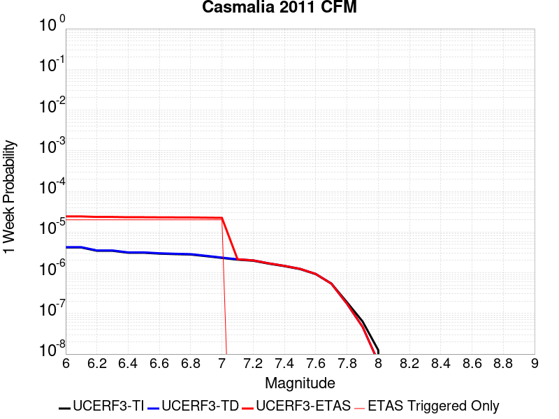 |  |  |  |

| Magnitude | 1 wk TI Prob | 1 wk TD Prob | 1 wk ETAS Prob | 1 wk ETAS/TD Gain | 1 wk ETAS Triggered Only | 1 mo TI Prob | 1 mo TD Prob | 1 mo ETAS Prob | 1 mo ETAS/TD Gain | 1 mo ETAS Triggered Only | 1 yr TI Prob | 1 yr TD Prob | 1 yr ETAS Prob | 1 yr ETAS/TD Gain | 1 yr ETAS Triggered Only | 10 yr TI Prob | 10 yr TD Prob | 10 yr ETAS Prob | 10 yr ETAS/TD Gain | 10 yr ETAS Triggered Only |
|-----|-----|-----|-----|-----|-----|-----|-----|-----|-----|-----|-----|-----|-----|-----|-----|-----|-----|-----|-----|-----|
| 6.0 | 4.1704893E-6 | 4.262483E-6 | 7.434418E-5 | 17.44152 | 7.0081995E-5 | 1.7873403E-5 | 1.8267656E-5 | 8.834837E-5 | 4.8363276 | 7.0081995E-5 | 2.1758694E-4 | 2.2238622E-4 | 2.9245263E-4 | 1.3150663 | 7.0081995E-5 | 0.0021737402 | 0.0022216577 | 0.0022915842 | 1.0314748 | 7.0081995E-5 |
| 6.1 | 4.1704893E-6 | 4.262483E-6 | 7.434418E-5 | 17.44152 | 7.0081995E-5 | 1.7873403E-5 | 1.8267656E-5 | 8.834837E-5 | 4.8363276 | 7.0081995E-5 | 2.1758694E-4 | 2.2238622E-4 | 2.9245263E-4 | 1.3150663 | 7.0081995E-5 | 0.0021737402 | 0.0022216577 | 0.0022915842 | 1.0314748 | 7.0081995E-5 |
| 6.2 | 3.457312E-6 | 3.5370217E-6 | 7.361877E-5 | 20.813774 | 7.0081995E-5 | 1.4816967E-5 | 1.5158577E-5 | 8.523951E-5 | 5.6231866 | 7.0081995E-5 | 1.8038164E-4 | 1.8454014E-4 | 2.546092E-4 | 1.3796955 | 7.0081995E-5 | 0.001802353 | 0.0018438784 | 0.0019138311 | 1.0379379 | 7.0081995E-5 |
| 6.3 | 3.457312E-6 | 3.5370217E-6 | 7.361877E-5 | 20.813774 | 7.0081995E-5 | 1.4816967E-5 | 1.5158577E-5 | 8.523951E-5 | 5.6231866 | 7.0081995E-5 | 1.8038164E-4 | 1.8454014E-4 | 2.546092E-4 | 1.3796955 | 7.0081995E-5 | 0.001802353 | 0.0018438784 | 0.0019138311 | 1.0379379 | 7.0081995E-5 |
| 6.4 | 3.0957337E-6 | 3.1692257E-6 | 7.3251E-5 | 23.113216 | 7.0081995E-5 | 1.3267363E-5 | 1.3582326E-5 | 8.366337E-5 | 6.1597233 | 7.0081995E-5 | 1.6151817E-4 | 1.6535232E-4 | 2.3542273E-4 | 1.4237642 | 7.0081995E-5 | 0.0016140083 | 0.0016522991 | 0.0017222653 | 1.0423448 | 7.0081995E-5 |
| 6.5 | 3.0957337E-6 | 3.1692257E-6 | 7.3251E-5 | 23.113216 | 7.0081995E-5 | 1.3267363E-5 | 1.3582326E-5 | 8.366337E-5 | 6.1597233 | 7.0081995E-5 | 1.6151817E-4 | 1.6535232E-4 | 2.3542273E-4 | 1.4237642 | 7.0081995E-5 | 0.0016140083 | 0.0016522991 | 0.0017222653 | 1.0423448 | 7.0081995E-5 |
| 6.6 | 2.9459152E-6 | 3.0165752E-6 | 7.309836E-5 | 24.232237 | 7.0081995E-5 | 1.262529E-5 | 1.2928115E-5 | 8.30092E-5 | 6.420828 | 7.0081995E-5 | 1.5370206E-4 | 1.5738848E-4 | 2.2745946E-4 | 1.4452102 | 7.0081995E-5 | 0.0015359579 | 0.0015727758 | 0.0016427475 | 1.0444894 | 7.0081995E-5 |
| 6.7 | 2.8634809E-6 | 2.9324726E-6 | 7.3014264E-5 | 24.898533 | 7.0081995E-5 | 1.2272003E-5 | 1.256768E-5 | 8.2648796E-5 | 6.5762973 | 7.0081995E-5 | 1.4940138E-4 | 1.530008E-4 | 2.2307207E-4 | 1.4579798 | 7.0081995E-5 | 0.0014930099 | 0.0015289601 | 0.0015989349 | 1.0457664 | 7.0081995E-5 |
| 6.8 | 2.7999822E-6 | 2.8675968E-6 | 7.294939E-5 | 25.439209 | 7.0081995E-5 | 1.1999869E-5 | 1.2289643E-5 | 8.2370774E-5 | 6.702455 | 7.0081995E-5 | 1.460886E-4 | 1.4961617E-4 | 2.1968769E-4 | 1.4683418 | 7.0081995E-5 | 0.001459926 | 0.0014951597 | 0.001565137 | 1.0468025 | 7.0081995E-5 |
| 6.9 | 2.551052E-6 | 2.6119649E-6 | 7.269378E-5 | 27.831072 | 7.0081995E-5 | 1.0933034E-5 | 1.1194087E-5 | 8.12753E-5 | 7.260556 | 7.0081995E-5 | 1.3310155E-4 | 1.3627953E-4 | 2.0635196E-4 | 1.5141817 | 7.0081995E-5 | 0.0013302186 | 0.0013619636 | 0.0014319501 | 1.0513865 | 7.0081995E-5 |
| 7.0 | 2.3081875E-6 | 2.3624088E-6 | 7.2444236E-5 | 30.665411 | 7.0081995E-5 | 9.892195E-6 | 1.01245705E-5 | 8.020586E-5 | 7.921902 | 7.0081995E-5 | 1.20430814E-4 | 1.232597E-4 | 1.9333305E-4 | 1.5685018 | 7.0081995E-5 | 0.0012036557 | 0.0012319161 | 0.0013019118 | 1.0568185 | 7.0081995E-5 |
| 7.1 | 2.093245E-6 | 2.1417243E-6 | 2.1417243E-6 | 1.0 | 0.0 | 8.971019E-6 | 9.178786E-6 | 9.178786E-6 | 1.0 | 0.0 | 1.09216686E-4 | 1.1174601E-4 | 1.1174601E-4 | 1.0 | 0.0 | 0.0010916302 | 0.0011169002 | 0.0011169002 | 1.0 | 0.0 |
| 7.2 | 1.9714576E-6 | 2.0165091E-6 | 2.0165091E-6 | 1.0 | 0.0 | 8.449076E-6 | 8.642153E-6 | 8.642153E-6 | 1.0 | 0.0 | 1.0286264E-4 | 1.05213156E-4 | 1.05213156E-4 | 1.0 | 0.0 | 0.0010281504 | 0.0010516352 | 0.0010516352 | 1.0 | 0.0 |
| 7.3 | 1.6689512E-6 | 1.7047131E-6 | 1.7047131E-6 | 1.0 | 0.0 | 7.1526288E-6 | 7.3058927E-6 | 7.3058927E-6 | 1.0 | 0.0 | 8.7079774E-5 | 8.894562E-5 | 8.894562E-5 | 1.0 | 0.0 | 8.7045657E-4 | 8.89101E-4 | 8.89101E-4 | 1.0 | 0.0 |
| 7.4 | 1.4490954E-6 | 1.4778908E-6 | 1.4778908E-6 | 1.0 | 0.0 | 6.210394E-6 | 6.333802E-6 | 6.333802E-6 | 1.0 | 0.0 | 7.560892E-5 | 7.711132E-5 | 7.711132E-5 | 1.0 | 0.0 | 7.55832E-4 | 7.7084627E-4 | 7.7084627E-4 | 1.0 | 0.0 |
| 7.5 | 1.226873E-6 | 1.2481701E-6 | 1.2481701E-6 | 1.0 | 0.0 | 5.2580162E-6 | 5.3492895E-6 | 5.3492895E-6 | 1.0 | 0.0 | 6.401447E-5 | 6.5125656E-5 | 6.5125656E-5 | 1.0 | 0.0 | 6.399603E-4 | 6.5106625E-4 | 6.5106625E-4 | 1.0 | 0.0 |
| 7.6 | 9.2561345E-7 | 9.361923E-7 | 9.361923E-7 | 1.0 | 0.0 | 3.966909E-6 | 4.012247E-6 | 4.012247E-6 | 1.0 | 0.0 | 4.8296046E-5 | 4.884801E-5 | 4.884801E-5 | 1.0 | 0.0 | 4.828555E-4 | 4.8837316E-4 | 4.8837316E-4 | 1.0 | 0.0 |
| 7.7 | 5.4367933E-7 | 5.392888E-7 | 5.392888E-7 | 1.0 | 0.0 | 2.3300522E-6 | 2.3112357E-6 | 2.3112357E-6 | 1.0 | 0.0 | 2.8368017E-5 | 2.8138933E-5 | 2.8138933E-5 | 1.0 | 0.0 | 2.8364395E-4 | 2.8135383E-4 | 2.8135383E-4 | 1.0 | 0.0 |
| 7.8 | 1.8825742E-7 | 1.7342276E-7 | 1.7342276E-7 | 1.0 | 0.0 | 8.068173E-7 | 7.4324015E-7 | 7.4324015E-7 | 1.0 | 0.0 | 9.822956E-6 | 9.048912E-6 | 9.048912E-6 | 1.0 | 0.0 | 9.822522E-5 | 9.048546E-5 | 9.048546E-5 | 1.0 | 0.0 |
| 7.9 | 6.342771E-8 | 4.6790706E-8 | 4.6790706E-8 | 1.0 | 0.0 | 2.7183304E-7 | 2.0053157E-7 | 2.0053157E-7 | 1.0 | 0.0 | 3.3095623E-6 | 2.4414692E-6 | 2.4414692E-6 | 1.0 | 0.0 | 3.309513E-5 | 2.4414428E-5 | 2.4414428E-5 | 1.0 | 0.0 |
| 8.0 | 1.2574819E-8 | 6.4733463E-9 | 6.4733463E-9 | 1.0 | 0.0 | 5.3892084E-8 | 2.7742912E-8 | 2.7742912E-8 | 1.0 | 0.0 | 6.561359E-7 | 3.377699E-7 | 3.377699E-7 | 1.0 | 0.0 | 6.56134E-6 | 3.377694E-6 | 3.377694E-6 | 1.0 | 0.0 |

## White Mountains
*[(top)](#table-of-contents)*

| 1 Week | 1 Month | 1 Year | 10 Year |
|-----|-----|-----|-----|
|  |  |  |  |

| Magnitude | 1 wk TI Prob | 1 wk TD Prob | 1 wk ETAS Prob | 1 wk ETAS/TD Gain | 1 wk ETAS Triggered Only | 1 mo TI Prob | 1 mo TD Prob | 1 mo ETAS Prob | 1 mo ETAS/TD Gain | 1 mo ETAS Triggered Only | 1 yr TI Prob | 1 yr TD Prob | 1 yr ETAS Prob | 1 yr ETAS/TD Gain | 1 yr ETAS Triggered Only | 10 yr TI Prob | 10 yr TD Prob | 10 yr ETAS Prob | 10 yr ETAS/TD Gain | 10 yr ETAS Triggered Only |
|-----|-----|-----|-----|-----|-----|-----|-----|-----|-----|-----|-----|-----|-----|-----|-----|-----|-----|-----|-----|-----|
| 6.0 | 3.503579E-5 | 3.378405E-5 | 1.0386368E-4 | 3.0743406 | 7.0081995E-5 | 1.5014476E-4 | 1.4478143E-4 | 2.1485328E-4 | 1.4839836 | 7.0081995E-5 | 0.0018264796 | 0.0017614096 | 0.0018313681 | 1.0397173 | 7.0081995E-5 | 0.018115403 | 0.017486818 | 0.017555675 | 1.0039376 | 7.0081995E-5 |
| 6.1 | 3.503579E-5 | 3.378405E-5 | 1.0386368E-4 | 3.0743406 | 7.0081995E-5 | 1.5014476E-4 | 1.4478143E-4 | 2.1485328E-4 | 1.4839836 | 7.0081995E-5 | 0.0018264796 | 0.0017614096 | 0.0018313681 | 1.0397173 | 7.0081995E-5 | 0.018115403 | 0.017486818 | 0.017555675 | 1.0039376 | 7.0081995E-5 |
| 6.2 | 3.503579E-5 | 3.378405E-5 | 1.0386368E-4 | 3.0743406 | 7.0081995E-5 | 1.5014476E-4 | 1.4478143E-4 | 2.1485328E-4 | 1.4839836 | 7.0081995E-5 | 0.0018264796 | 0.0017614096 | 0.0018313681 | 1.0397173 | 7.0081995E-5 | 0.018115403 | 0.017486818 | 0.017555675 | 1.0039376 | 7.0081995E-5 |
| 6.3 | 1.7818425E-5 | 1.5916074E-5 | 8.599695E-5 | 5.403151 | 7.0081995E-5 | 7.636245E-5 | 6.821004E-5 | 1.3828726E-4 | 2.0273738 | 7.0081995E-5 | 9.293162E-4 | 8.301551E-4 | 9.001789E-4 | 1.0843502 | 7.0081995E-5 | 0.009254395 | 0.008271999 | 0.008341501 | 1.0084021 | 7.0081995E-5 |
| 6.4 | 1.7818425E-5 | 1.5916074E-5 | 8.599695E-5 | 5.403151 | 7.0081995E-5 | 7.636245E-5 | 6.821004E-5 | 1.3828726E-4 | 2.0273738 | 7.0081995E-5 | 9.293162E-4 | 8.301551E-4 | 9.001789E-4 | 1.0843502 | 7.0081995E-5 | 0.009254395 | 0.008271999 | 0.008341501 | 1.0084021 | 7.0081995E-5 |
| 6.5 | 1.3397557E-5 | 1.13362685E-5 | 8.141747E-5 | 7.1820345 | 7.0081995E-5 | 5.741684E-5 | 4.858314E-5 | 1.1866173E-4 | 2.4424467 | 7.0081995E-5 | 6.988258E-4 | 5.913462E-4 | 6.6138676E-4 | 1.1184425 | 7.0081995E-5 | 0.006966323 | 0.005898432 | 0.0059681004 | 1.0118114 | 7.0081995E-5 |
| 6.6 | 1.0818695E-5 | 8.625366E-6 | 7.8706755E-5 | 9.125033 | 7.0081995E-5 | 4.6365014E-5 | 3.6965357E-5 | 1.0704476E-4 | 2.895813 | 7.0081995E-5 | 5.6434784E-4 | 4.4996463E-4 | 5.200151E-4 | 1.15568 | 7.0081995E-5 | 0.005629168 | 0.004490972 | 0.0045607393 | 1.015535 | 7.0081995E-5 |
| 6.7 | 9.067908E-6 | 6.802442E-6 | 7.688396E-5 | 11.302406 | 7.0081995E-5 | 3.8861883E-5 | 2.9153016E-5 | 9.9232966E-5 | 3.4038663 | 7.0081995E-5 | 4.7304068E-4 | 3.5488335E-4 | 4.2494046E-4 | 1.1974089 | 7.0081995E-5 | 0.00472035 | 0.0035434833 | 0.0036133172 | 1.0197077 | 7.0081995E-5 |
| 6.8 | 7.295947E-6 | 4.936391E-6 | 4.936391E-6 | 1.0 | 0.0 | 3.126797E-5 | 2.1155796E-5 | 2.1155796E-5 | 1.0 | 0.0 | 3.8062103E-4 | 2.575425E-4 | 2.575425E-4 | 1.0 | 0.0 | 0.0037996976 | 0.0025725532 | 0.0025725532 | 1.0 | 0.0 |
| 6.9 | 6.2243444E-6 | 3.832213E-6 | 3.832213E-6 | 1.0 | 0.0 | 2.6675489E-5 | 1.642367E-5 | 1.642367E-5 | 1.0 | 0.0 | 3.2472567E-4 | 1.9994036E-4 | 1.9994036E-4 | 1.0 | 0.0 | 0.0032425157 | 0.0019976576 | 0.0019976576 | 1.0 | 0.0 |
| 7.0 | 4.9878413E-6 | 2.6795342E-6 | 2.6795342E-6 | 1.0 | 0.0 | 2.1376287E-5 | 1.14836685E-5 | 1.14836685E-5 | 1.0 | 0.0 | 2.602252E-4 | 1.3980496E-4 | 1.3980496E-4 | 1.0 | 0.0 | 0.002599207 | 0.0013971963 | 0.0013971963 | 1.0 | 0.0 |
| 7.1 | 4.0252844E-6 | 1.8857575E-6 | 1.8857575E-6 | 1.0 | 0.0 | 1.7251105E-5 | 8.081794E-6 | 8.081794E-6 | 1.0 | 0.0 | 2.1001195E-4 | 9.8391516E-5 | 9.8391516E-5 | 1.0 | 0.0 | 0.0020981359 | 9.834924E-4 | 9.834924E-4 | 1.0 | 0.0 |
| 7.2 | 3.3284066E-6 | 1.281964E-6 | 1.281964E-6 | 1.0 | 0.0 | 1.4264522E-5 | 5.494121E-6 | 5.494121E-6 | 1.0 | 0.0 | 1.736567E-4 | 6.688897E-5 | 6.688897E-5 | 1.0 | 0.0 | 0.0017352107 | 6.6869846E-4 | 6.6869846E-4 | 1.0 | 0.0 |
| 7.3 | 2.458226E-6 | 6.05722E-7 | 6.05722E-7 | 1.0 | 0.0 | 1.0535211E-5 | 2.5959491E-6 | 2.5959491E-6 | 1.0 | 0.0 | 1.2825865E-4 | 3.1605257E-5 | 3.1605257E-5 | 1.0 | 0.0 | 0.0012818464 | 3.160114E-4 | 3.160114E-4 | 1.0 | 0.0 |
| 7.4 | 1.965953E-6 | 3.1089303E-7 | 3.1089303E-7 | 1.0 | 0.0 | 8.425486E-6 | 1.332398E-6 | 1.332398E-6 | 1.0 | 0.0 | 1.0257547E-4 | 1.6221828E-5 | 1.6221828E-5 | 1.0 | 0.0 | 0.0010252813 | 1.6220656E-4 | 1.6220656E-4 | 1.0 | 0.0 |
| 7.5 | 1.2014192E-6 | 1.8244253E-7 | 1.8244253E-7 | 1.0 | 0.0 | 5.148929E-6 | 7.8189635E-7 | 7.8189635E-7 | 1.0 | 0.0 | 6.2686406E-5 | 9.519547E-6 | 9.519547E-6 | 1.0 | 0.0 | 6.266873E-4 | 9.519148E-5 | 9.519148E-5 | 1.0 | 0.0 |
| 7.6 | 2.5612175E-7 | 4.8946475E-8 | 4.8946475E-8 | 1.0 | 0.0 | 1.0976642E-6 | 2.0977059E-7 | 2.0977059E-7 | 1.0 | 0.0 | 1.3363979E-5 | 2.5539543E-6 | 2.5539543E-6 | 1.0 | 0.0 | 1.3363175E-4 | 2.5539286E-5 | 2.5539286E-5 | 1.0 | 0.0 |

## Surprise Valley 2011 CFM
*[(top)](#table-of-contents)*

| 1 Week | 1 Month | 1 Year | 10 Year |
|-----|-----|-----|-----|
|  |  |  |  |

| Magnitude | 1 wk TI Prob | 1 wk TD Prob | 1 wk ETAS Prob | 1 wk ETAS/TD Gain | 1 wk ETAS Triggered Only | 1 mo TI Prob | 1 mo TD Prob | 1 mo ETAS Prob | 1 mo ETAS/TD Gain | 1 mo ETAS Triggered Only | 1 yr TI Prob | 1 yr TD Prob | 1 yr ETAS Prob | 1 yr ETAS/TD Gain | 1 yr ETAS Triggered Only | 10 yr TI Prob | 10 yr TD Prob | 10 yr ETAS Prob | 10 yr ETAS/TD Gain | 10 yr ETAS Triggered Only |
|-----|-----|-----|-----|-----|-----|-----|-----|-----|-----|-----|-----|-----|-----|-----|-----|-----|-----|-----|-----|-----|
| 6.0 | 4.0396248E-5 | 4.485131E-5 | 4.485131E-5 | 1.0 | 0.0 | 1.7311527E-4 | 1.9220692E-4 | 2.6227545E-4 | 1.3645474 | 7.0081995E-5 | 0.002105641 | 0.0023378176 | 0.002407736 | 1.0299075 | 7.0081995E-5 | 0.020858008 | 0.023153966 | 0.023222426 | 1.0029567 | 7.0081995E-5 |
| 6.1 | 4.0396248E-5 | 4.485131E-5 | 4.485131E-5 | 1.0 | 0.0 | 1.7311527E-4 | 1.9220692E-4 | 2.6227545E-4 | 1.3645474 | 7.0081995E-5 | 0.002105641 | 0.0023378176 | 0.002407736 | 1.0299075 | 7.0081995E-5 | 0.020858008 | 0.023153966 | 0.023222426 | 1.0029567 | 7.0081995E-5 |
| 6.2 | 2.2295266E-5 | 2.440125E-5 | 2.440125E-5 | 1.0 | 0.0 | 9.554764E-5 | 1.0457276E-4 | 1.0457276E-4 | 1.0 | 0.0 | 0.0011626717 | 0.0012724606 | 0.0012724606 | 1.0 | 0.0 | 0.011566074 | 0.012654981 | 0.012654981 | 1.0 | 0.0 |
| 6.3 | 1.572643E-5 | 1.7096807E-5 | 1.7096807E-5 | 1.0 | 0.0 | 6.7397246E-5 | 7.327003E-5 | 7.327003E-5 | 1.0 | 0.0 | 8.202525E-4 | 8.91708E-4 | 8.91708E-4 | 1.0 | 0.0 | 0.008172315 | 0.008882407 | 0.008882407 | 1.0 | 0.0 |
| 6.4 | 1.5714395E-5 | 1.7084629E-5 | 1.7084629E-5 | 1.0 | 0.0 | 6.734567E-5 | 7.3217845E-5 | 7.3217845E-5 | 1.0 | 0.0 | 8.1962504E-4 | 8.9107314E-4 | 8.9107314E-4 | 1.0 | 0.0 | 0.008166086 | 0.008876109 | 0.008876109 | 1.0 | 0.0 |
| 6.5 | 1.2733495E-5 | 1.38016E-5 | 1.38016E-5 | 1.0 | 0.0 | 5.457098E-5 | 5.9148413E-5 | 5.9148413E-5 | 1.0 | 0.0 | 6.641992E-4 | 7.1990065E-4 | 7.1990065E-4 | 1.0 | 0.0 | 0.0066221743 | 0.0071763797 | 0.0071763797 | 1.0 | 0.0 |
| 6.6 | 1.0983784E-5 | 1.1886554E-5 | 1.1886554E-5 | 1.0 | 0.0 | 4.7072506E-5 | 5.094141E-5 | 5.094141E-5 | 1.0 | 0.0 | 5.7295704E-4 | 6.200405E-4 | 6.200405E-4 | 1.0 | 0.0 | 0.0057148207 | 0.0061836545 | 0.0061836545 | 1.0 | 0.0 |
| 6.7 | 9.104806E-6 | 9.839491E-6 | 9.839491E-6 | 1.0 | 0.0 | 3.902001E-5 | 4.2168587E-5 | 4.2168587E-5 | 1.0 | 0.0 | 4.7496508E-4 | 5.132855E-4 | 5.132855E-4 | 1.0 | 0.0 | 0.004739512 | 0.005121397 | 0.005121397 | 1.0 | 0.0 |
| 6.8 | 6.2162403E-6 | 6.7041337E-6 | 6.7041337E-6 | 1.0 | 0.0 | 2.6640759E-5 | 2.8731698E-5 | 2.8731698E-5 | 1.0 | 0.0 | 3.2430296E-4 | 3.497545E-4 | 3.497545E-4 | 1.0 | 0.0 | 0.003238301 | 0.0034922638 | 0.0034922638 | 1.0 | 0.0 |
| 6.9 | 4.1792696E-6 | 4.50323E-6 | 4.50323E-6 | 1.0 | 0.0 | 1.7911032E-5 | 1.9299423E-5 | 1.9299423E-5 | 1.0 | 0.0 | 2.1804498E-4 | 2.3494668E-4 | 2.3494668E-4 | 1.0 | 0.0 | 0.0021783116 | 0.0023471361 | 0.0023471361 | 1.0 | 0.0 |
| 7.0 | 2.7478413E-6 | 2.9622424E-6 | 2.9622424E-6 | 1.0 | 0.0 | 1.177641E-5 | 1.269527E-5 | 1.269527E-5 | 1.0 | 0.0 | 1.4336836E-4 | 1.545552E-4 | 1.545552E-4 | 1.0 | 0.0 | 0.001432759 | 0.0015445995 | 0.0015445995 | 1.0 | 0.0 |
| 7.1 | 8.128648E-7 | 8.724922E-7 | 8.724922E-7 | 1.0 | 0.0 | 3.4837017E-6 | 3.7392501E-6 | 3.7392501E-6 | 1.0 | 0.0 | 4.2413245E-5 | 4.552502E-5 | 4.552502E-5 | 1.0 | 0.0 | 4.2405148E-4 | 4.5521575E-4 | 4.5521575E-4 | 1.0 | 0.0 |
| 7.2 | 4.8641045E-8 | 4.9402068E-8 | 4.9402068E-8 | 1.0 | 0.0 | 2.084616E-7 | 2.1172312E-7 | 2.1172312E-7 | 1.0 | 0.0 | 2.538017E-6 | 2.577726E-6 | 2.577726E-6 | 1.0 | 0.0 | 2.537988E-5 | 2.5776973E-5 | 2.5776973E-5 | 1.0 | 0.0 |
| 7.3 | 5.3911844E-9 | 5.4758145E-9 | 5.4758145E-9 | 1.0 | 0.0 | 2.3105075E-8 | 2.3467775E-8 | 2.3467775E-8 | 1.0 | 0.0 | 2.8130427E-7 | 2.8572015E-7 | 2.8572015E-7 | 1.0 | 0.0 | 2.8130391E-6 | 2.8571992E-6 | 2.8571992E-6 | 1.0 | 0.0 |

## Whittier alt 1
*[(top)](#table-of-contents)*

| 1 Week | 1 Month | 1 Year | 10 Year |
|-----|-----|-----|-----|
|  |  |  |  |

| Magnitude | 1 wk TI Prob | 1 wk TD Prob | 1 wk ETAS Prob | 1 wk ETAS/TD Gain | 1 wk ETAS Triggered Only | 1 mo TI Prob | 1 mo TD Prob | 1 mo ETAS Prob | 1 mo ETAS/TD Gain | 1 mo ETAS Triggered Only | 1 yr TI Prob | 1 yr TD Prob | 1 yr ETAS Prob | 1 yr ETAS/TD Gain | 1 yr ETAS Triggered Only | 10 yr TI Prob | 10 yr TD Prob | 10 yr ETAS Prob | 10 yr ETAS/TD Gain | 10 yr ETAS Triggered Only |
|-----|-----|-----|-----|-----|-----|-----|-----|-----|-----|-----|-----|-----|-----|-----|-----|-----|-----|-----|-----|-----|
| 6.0 | 4.2554693E-5 | 4.725218E-5 | 4.725218E-5 | 1.0 | 0.0 | 1.8236451E-4 | 2.0249544E-4 | 2.0249544E-4 | 1.0 | 0.0 | 0.002218027 | 0.0024629154 | 0.0025328246 | 1.0283848 | 7.0081995E-5 | 0.02196019 | 0.024390234 | 0.024458608 | 1.0028033 | 7.0081995E-5 |
| 6.1 | 4.2554693E-5 | 4.725218E-5 | 4.725218E-5 | 1.0 | 0.0 | 1.8236451E-4 | 2.0249544E-4 | 2.0249544E-4 | 1.0 | 0.0 | 0.002218027 | 0.0024629154 | 0.0025328246 | 1.0283848 | 7.0081995E-5 | 0.02196019 | 0.024390234 | 0.024458608 | 1.0028033 | 7.0081995E-5 |
| 6.2 | 4.2554693E-5 | 4.725218E-5 | 4.725218E-5 | 1.0 | 0.0 | 1.8236451E-4 | 2.0249544E-4 | 2.0249544E-4 | 1.0 | 0.0 | 0.002218027 | 0.0024629154 | 0.0025328246 | 1.0283848 | 7.0081995E-5 | 0.02196019 | 0.024390234 | 0.024458608 | 1.0028033 | 7.0081995E-5 |
| 6.3 | 1.9617712E-5 | 1.8268593E-5 | 1.8268593E-5 | 1.0 | 0.0 | 8.40732E-5 | 7.829172E-5 | 7.829172E-5 | 1.0 | 0.0 | 0.0010231105 | 9.52804E-4 | 9.52804E-4 | 1.0 | 0.0 | 0.01018413 | 0.009490474 | 0.009490474 | 1.0 | 0.0 |
| 6.4 | 1.5611336E-5 | 1.3604271E-5 | 1.3604271E-5 | 1.0 | 0.0 | 6.690401E-5 | 5.8302747E-5 | 5.8302747E-5 | 1.0 | 0.0 | 8.142519E-4 | 7.0961076E-4 | 7.0961076E-4 | 1.0 | 0.0 | 0.008112748 | 0.0070754145 | 0.0070754145 | 1.0 | 0.0 |
| 6.5 | 1.5150166E-5 | 1.3100925E-5 | 1.3100925E-5 | 1.0 | 0.0 | 6.492767E-5 | 5.6145647E-5 | 5.6145647E-5 | 1.0 | 0.0 | 7.9020765E-4 | 6.8336475E-4 | 6.8336475E-4 | 1.0 | 0.0 | 0.007874036 | 0.0068145846 | 0.0068145846 | 1.0 | 0.0 |
| 6.6 | 1.295588E-5 | 1.0380725E-5 | 1.0380725E-5 | 1.0 | 0.0 | 5.552402E-5 | 4.4488075E-5 | 4.4488075E-5 | 1.0 | 0.0 | 6.7579525E-4 | 5.4150965E-4 | 5.4150965E-4 | 1.0 | 0.0 | 0.006737438 | 0.0054033357 | 0.0054033357 | 1.0 | 0.0 |
| 6.7 | 1.2542085E-5 | 9.899369E-6 | 9.899369E-6 | 1.0 | 0.0 | 5.3750682E-5 | 4.242519E-5 | 4.242519E-5 | 1.0 | 0.0 | 6.542181E-4 | 5.164061E-4 | 5.164061E-4 | 1.0 | 0.0 | 0.006522954 | 0.0051534795 | 0.0051534795 | 1.0 | 0.0 |
| 6.8 | 1.2195878E-5 | 9.495415E-6 | 9.495415E-6 | 1.0 | 0.0 | 5.2267E-5 | 4.069401E-5 | 4.069401E-5 | 1.0 | 0.0 | 6.36165E-4 | 4.9533875E-4 | 4.9533875E-4 | 1.0 | 0.0 | 0.0063434686 | 0.004943688 | 0.004943688 | 1.0 | 0.0 |
| 6.9 | 1.1580298E-5 | 8.772933E-6 | 8.772933E-6 | 1.0 | 0.0 | 4.9628903E-5 | 3.7597754E-5 | 3.7597754E-5 | 1.0 | 0.0 | 6.040644E-4 | 4.5765814E-4 | 4.5765814E-4 | 1.0 | 0.0 | 0.00602425 | 0.0045684157 | 0.0045684157 | 1.0 | 0.0 |
| 7.0 | 1.0964795E-5 | 8.083994E-6 | 8.083994E-6 | 1.0 | 0.0 | 4.6991136E-5 | 3.4645236E-5 | 3.4645236E-5 | 1.0 | 0.0 | 5.7196687E-4 | 4.2172565E-4 | 4.2172565E-4 | 1.0 | 0.0 | 0.0057049696 | 0.004210462 | 0.004210462 | 1.0 | 0.0 |
| 7.1 | 1.0230601E-5 | 7.3266697E-6 | 7.3266697E-6 | 1.0 | 0.0 | 4.3844695E-5 | 3.1399642E-5 | 3.1399642E-5 | 1.0 | 0.0 | 5.336784E-4 | 3.8222488E-4 | 3.8222488E-4 | 1.0 | 0.0 | 0.005323986 | 0.0038168381 | 0.0038168381 | 1.0 | 0.0 |
| 7.2 | 9.40865E-6 | 6.543289E-6 | 6.543289E-6 | 1.0 | 0.0 | 4.032216E-5 | 2.8042374E-5 | 2.8042374E-5 | 1.0 | 0.0 | 4.908117E-4 | 3.4136363E-4 | 3.4136363E-4 | 1.0 | 0.0 | 0.0048972913 | 0.003409485 | 0.003409485 | 1.0 | 0.0 |
| 7.3 | 8.237384E-6 | 5.5977525E-6 | 5.5977525E-6 | 1.0 | 0.0 | 3.5302593E-5 | 2.3990153E-5 | 2.3990153E-5 | 1.0 | 0.0 | 4.2972428E-4 | 2.92042E-4 | 2.92042E-4 | 1.0 | 0.0 | 0.0042889426 | 0.002916903 | 0.002916903 | 1.0 | 0.0 |
| 7.4 | 7.5316966E-6 | 5.027819E-6 | 5.027819E-6 | 1.0 | 0.0 | 3.2278298E-5 | 2.1547625E-5 | 2.1547625E-5 | 1.0 | 0.0 | 3.9291743E-4 | 2.6231175E-4 | 2.6231175E-4 | 1.0 | 0.0 | 0.0039222343 | 0.0026201333 | 0.0026201333 | 1.0 | 0.0 |
| 7.5 | 6.149649E-6 | 3.933841E-6 | 3.933841E-6 | 1.0 | 0.0 | 2.6355372E-5 | 1.6859214E-5 | 1.6859214E-5 | 1.0 | 0.0 | 3.208294E-4 | 2.052425E-4 | 2.052425E-4 | 1.0 | 0.0 | 0.003203666 | 0.0020506186 | 0.0020506186 | 1.0 | 0.0 |
| 7.6 | 5.457711E-6 | 3.3953788E-6 | 3.3953788E-6 | 1.0 | 0.0 | 2.338998E-5 | 1.4551547E-5 | 1.4551547E-5 | 1.0 | 0.0 | 2.8473578E-4 | 1.771515E-4 | 1.771515E-4 | 1.0 | 0.0 | 0.0028437122 | 0.0017701836 | 0.0017701836 | 1.0 | 0.0 |
| 7.7 | 4.1676276E-6 | 2.3331952E-6 | 2.3331952E-6 | 1.0 | 0.0 | 1.7861139E-5 | 9.999374E-6 | 9.999374E-6 | 1.0 | 0.0 | 2.1743766E-4 | 1.2173632E-4 | 1.2173632E-4 | 1.0 | 0.0 | 0.0021722503 | 0.0012167693 | 0.0012167693 | 1.0 | 0.0 |
| 7.8 | 2.2692414E-7 | 9.3854695E-8 | 9.3854695E-8 | 1.0 | 0.0 | 9.725317E-7 | 4.0223435E-7 | 4.0223435E-7 | 1.0 | 0.0 | 1.1840509E-5 | 4.8971956E-6 | 4.8971956E-6 | 1.0 | 0.0 | 1.1839878E-4 | 4.8971204E-5 | 4.8971204E-5 | 1.0 | 0.0 |
| 7.9 | 6.676829E-9 | 3.439853E-9 | 3.439853E-9 | 1.0 | 0.0 | 2.861498E-8 | 1.4742227E-8 | 1.4742227E-8 | 1.0 | 0.0 | 3.4838732E-7 | 1.7948659E-7 | 1.7948659E-7 | 1.0 | 0.0 | 3.4838679E-6 | 1.7948646E-6 | 1.7948646E-6 | 1.0 | 0.0 |

## San Andreas (North Coast) 2011 CFM
*[(top)](#table-of-contents)*

| 1 Week | 1 Month | 1 Year | 10 Year |
|-----|-----|-----|-----|
|  | 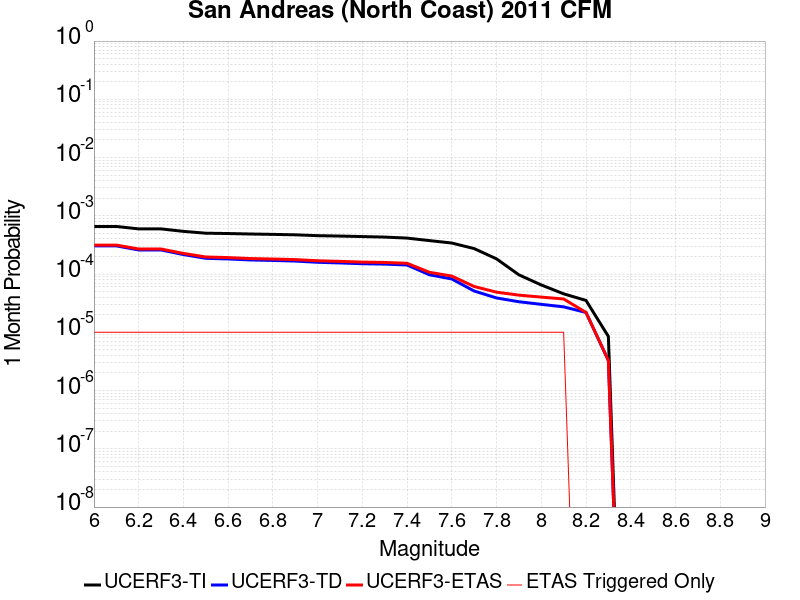 |  |  |

| Magnitude | 1 wk TI Prob | 1 wk TD Prob | 1 wk ETAS Prob | 1 wk ETAS/TD Gain | 1 wk ETAS Triggered Only | 1 mo TI Prob | 1 mo TD Prob | 1 mo ETAS Prob | 1 mo ETAS/TD Gain | 1 mo ETAS Triggered Only | 1 yr TI Prob | 1 yr TD Prob | 1 yr ETAS Prob | 1 yr ETAS/TD Gain | 1 yr ETAS Triggered Only | 10 yr TI Prob | 10 yr TD Prob | 10 yr ETAS Prob | 10 yr ETAS/TD Gain | 10 yr ETAS Triggered Only |
|-----|-----|-----|-----|-----|-----|-----|-----|-----|-----|-----|-----|-----|-----|-----|-----|-----|-----|-----|-----|-----|
| 6.0 | 1.5333705E-4 | 7.1106435E-5 | 7.1106435E-5 | 1.0 | 0.0 | 6.5699324E-4 | 3.0470645E-4 | 3.7476709E-4 | 1.2299284 | 7.0081995E-5 | 0.007969595 | 0.0037035241 | 0.0037733465 | 1.018853 | 7.0081995E-5 | 0.0768977 | 0.03935284 | 0.039420165 | 1.0017108 | 7.0081995E-5 |
| 6.1 | 1.5333705E-4 | 7.1106435E-5 | 7.1106435E-5 | 1.0 | 0.0 | 6.5699324E-4 | 3.0470645E-4 | 3.7476709E-4 | 1.2299284 | 7.0081995E-5 | 0.007969595 | 0.0037035241 | 0.0037733465 | 1.018853 | 7.0081995E-5 | 0.0768977 | 0.03935284 | 0.039420165 | 1.0017108 | 7.0081995E-5 |
| 6.2 | 1.3912938E-4 | 6.050204E-5 | 6.050204E-5 | 1.0 | 0.0 | 5.961325E-4 | 2.5926883E-4 | 3.2933266E-4 | 1.2702363 | 7.0081995E-5 | 0.007233787 | 0.003152056 | 0.003221917 | 1.0221636 | 7.0081995E-5 | 0.07002798 | 0.03369227 | 0.03375999 | 1.00201 | 7.0081995E-5 |
| 6.3 | 1.3912938E-4 | 6.050204E-5 | 6.050204E-5 | 1.0 | 0.0 | 5.961325E-4 | 2.5926883E-4 | 3.2933266E-4 | 1.2702363 | 7.0081995E-5 | 0.007233787 | 0.003152056 | 0.003221917 | 1.0221636 | 7.0081995E-5 | 0.07002798 | 0.03369227 | 0.03375999 | 1.00201 | 7.0081995E-5 |
| 6.4 | 1.2623647E-4 | 5.0442024E-5 | 5.0442024E-5 | 1.0 | 0.0 | 5.4090127E-4 | 2.161623E-4 | 2.8622916E-4 | 1.32414 | 7.0081995E-5 | 0.0065656058 | 0.0026286195 | 0.0026985174 | 1.0265911 | 7.0081995E-5 | 0.06374981 | 0.028303223 | 0.028371321 | 1.002406 | 7.0081995E-5 |
| 6.5 | 1.1736096E-4 | 4.3523814E-5 | 4.3523814E-5 | 1.0 | 0.0 | 5.028786E-4 | 1.8651738E-4 | 2.565863E-4 | 1.3756697 | 7.0081995E-5 | 0.006105373 | 0.0022685004 | 0.0023384234 | 1.0308235 | 7.0081995E-5 | 0.05940335 | 0.024579322 | 0.024647681 | 1.0027812 | 7.0081995E-5 |
| 6.6 | 1.1586959E-4 | 4.2423668E-5 | 4.2423668E-5 | 1.0 | 0.0 | 4.964894E-4 | 1.8180315E-4 | 2.518724E-4 | 1.3854128 | 7.0081995E-5 | 0.006028018 | 0.0022112224 | 0.0022811494 | 1.0316237 | 7.0081995E-5 | 0.058671024 | 0.023984991 | 0.024053393 | 1.0028518 | 7.0081995E-5 |
| 6.7 | 1.13693764E-4 | 4.073593E-5 | 4.073593E-5 | 1.0 | 0.0 | 4.87168E-4 | 1.7457096E-4 | 2.4464072E-4 | 1.4013827 | 7.0081995E-5 | 0.005915152 | 0.0021233456 | 0.0021932786 | 1.0329354 | 7.0081995E-5 | 0.057601593 | 0.023076393 | 0.023144858 | 1.0029669 | 7.0081995E-5 |
| 6.8 | 1.1204889E-4 | 3.9953447E-5 | 3.9953447E-5 | 1.0 | 0.0 | 4.8012115E-4 | 1.7121792E-4 | 2.4128791E-4 | 1.4092445 | 7.0081995E-5 | 0.005829819 | 0.002082601 | 0.002152537 | 1.0335811 | 7.0081995E-5 | 0.05679232 | 0.022636656 | 0.02270515 | 1.0030259 | 7.0081995E-5 |
| 6.9 | 1.1005794E-4 | 3.900957E-5 | 3.900957E-5 | 1.0 | 0.0 | 4.7159163E-4 | 1.6717325E-4 | 2.3724353E-4 | 1.4191477 | 7.0081995E-5 | 0.0057265228 | 0.0020334502 | 0.0021033897 | 1.0343945 | 7.0081995E-5 | 0.055811852 | 0.022102542 | 0.022171075 | 1.0031006 | 7.0081995E-5 |
| 7.0 | 1.0647948E-4 | 3.7166337E-5 | 3.7166337E-5 | 1.0 | 0.0 | 4.562608E-4 | 1.5927466E-4 | 2.2934549E-4 | 1.4399371 | 7.0081995E-5 | 0.0055408357 | 0.0019374598 | 0.002007406 | 1.036102 | 7.0081995E-5 | 0.054047033 | 0.021062272 | 0.021130877 | 1.0032573 | 7.0081995E-5 |
| 7.1 | 1.04795035E-4 | 3.6215948E-5 | 3.6215948E-5 | 1.0 | 0.0 | 4.4904428E-4 | 1.5520205E-4 | 2.2527318E-4 | 1.4514831 | 7.0081995E-5 | 0.0054534175 | 0.0018879628 | 0.0019579125 | 1.0370504 | 7.0081995E-5 | 0.053215165 | 0.020530313 | 0.020598955 | 1.0033435 | 7.0081995E-5 |
| 7.2 | 1.02724036E-4 | 3.5124547E-5 | 3.5124547E-5 | 1.0 | 0.0 | 4.401716E-4 | 1.5052517E-4 | 2.2059662E-4 | 1.4655131 | 7.0081995E-5 | 0.0053459285 | 0.0018311188 | 0.0019010726 | 1.0382026 | 7.0081995E-5 | 0.052191395 | 0.019919246 | 0.019987933 | 1.0034482 | 7.0081995E-5 |
| 7.3 | 1.00650694E-4 | 3.4592013E-5 | 3.4592013E-5 | 1.0 | 0.0 | 4.312888E-4 | 1.4824314E-4 | 2.1831474E-4 | 1.4726802 | 7.0081995E-5 | 0.005238306 | 0.0018033815 | 0.0018733371 | 1.0387913 | 7.0081995E-5 | 0.051165357 | 0.019596443 | 0.01966515 | 1.0035062 | 7.0081995E-5 |
| 7.4 | 9.672919E-5 | 3.338123E-5 | 3.338123E-5 | 1.0 | 0.0 | 4.144878E-4 | 1.4305465E-4 | 2.1312662E-4 | 1.4898266 | 7.0081995E-5 | 0.005034718 | 0.0017403142 | 0.0018102742 | 1.0401996 | 7.0081995E-5 | 0.049221683 | 0.018869769 | 0.018938528 | 1.0036439 | 7.0081995E-5 |
| 7.5 | 8.7600405E-5 | 2.2700917E-5 | 2.2700917E-5 | 1.0 | 0.0 | 3.753763E-4 | 9.728602E-5 | 1.673612E-4 | 1.7203006 | 7.0081995E-5 | 0.0045606326 | 0.0011838155 | 0.0012538146 | 1.0591301 | 7.0081995E-5 | 0.04468165 | 0.013130207 | 0.0131993685 | 1.0052674 | 7.0081995E-5 |
| 7.6 | 7.9562284E-5 | 1.9226305E-5 | 1.9226305E-5 | 1.0 | 0.0 | 3.4093665E-4 | 8.239586E-5 | 1.5247209E-4 | 1.8504823 | 7.0081995E-5 | 0.0041430052 | 0.0010027094 | 0.0010727211 | 1.0698225 | 7.0081995E-5 | 0.040666126 | 0.011221658 | 0.0112909535 | 1.0061752 | 7.0081995E-5 |
| 7.7 | 6.3866544E-5 | 1.1941707E-5 | 1.1941707E-5 | 1.0 | 0.0 | 2.7368503E-4 | 5.117774E-5 | 1.2125615E-4 | 2.3693142 | 7.0081995E-5 | 0.0033270244 | 6.2291115E-4 | 6.9294946E-4 | 1.1124371 | 7.0081995E-5 | 0.032776527 | 0.007210334 | 0.00727991 | 1.0096496 | 7.0081995E-5 |
| 7.8 | 4.2543215E-5 | 9.076524E-6 | 9.076524E-6 | 1.0 | 0.0 | 1.8231533E-4 | 3.8898812E-5 | 1.0897808E-4 | 2.8015788 | 7.0081995E-5 | 0.0022174292 | 4.7349022E-4 | 5.43539E-4 | 1.1479415 | 7.0081995E-5 | 0.021954332 | 0.005490525 | 0.0055602225 | 1.0126941 | 7.0081995E-5 |
| 7.9 | 2.2636612E-5 | 7.81435E-6 | 7.81435E-6 | 1.0 | 0.0 | 9.7010445E-5 | 3.3489643E-5 | 1.0356929E-4 | 3.0925767 | 7.0081995E-5 | 0.0011804621 | 4.076602E-4 | 4.7771362E-4 | 1.1718427 | 7.0081995E-5 | 0.011742111 | 0.0046832846 | 0.0047530383 | 1.0148942 | 7.0081995E-5 |
| 8.0 | 1.5167874E-5 | 7.0494675E-6 | 7.0494675E-6 | 1.0 | 0.0 | 6.500356E-5 | 3.0211655E-5 | 1.0029153E-4 | 3.3196306 | 7.0081995E-5 | 7.9113094E-4 | 3.677649E-4 | 4.3782112E-4 | 1.1904919 | 7.0081995E-5 | 0.007883203 | 0.004215588 | 0.004285374 | 1.0165544 | 7.0081995E-5 |
| 8.1 | 1.0681047E-5 | 6.386992E-6 | 6.386992E-6 | 1.0 | 0.0 | 4.5775112E-5 | 2.7372536E-5 | 9.745261E-5 | 3.5602334 | 7.0081995E-5 | 5.5716943E-4 | 3.3320975E-4 | 4.032684E-4 | 1.2102538 | 7.0081995E-5 | 0.0055577457 | 0.003817393 | 0.0038872075 | 1.0182885 | 7.0081995E-5 |
| 8.2 | 8.226114E-6 | 5.1150587E-6 | 5.1150587E-6 | 1.0 | 0.0 | 3.52543E-5 | 2.1921496E-5 | 2.1921496E-5 | 1.0 | 0.0 | 4.2913653E-4 | 2.668616E-4 | 2.668616E-4 | 1.0 | 0.0 | 0.004283088 | 0.0030450926 | 0.0030450926 | 1.0 | 0.0 |
| 8.3 | 1.983087E-6 | 7.6599065E-7 | 7.6599065E-7 | 1.0 | 0.0 | 8.498917E-6 | 3.282813E-6 | 3.282813E-6 | 1.0 | 0.0 | 1.034694E-4 | 3.9967534E-5 | 3.9967534E-5 | 1.0 | 0.0 | 0.0010342124 | 4.719687E-4 | 4.719687E-4 | 1.0 | 0.0 |

## Great Valley 06 (Midland) 2011 CFM alt1
*[(top)](#table-of-contents)*

| 1 Week | 1 Month | 1 Year | 10 Year |
|-----|-----|-----|-----|
|  |  |  | 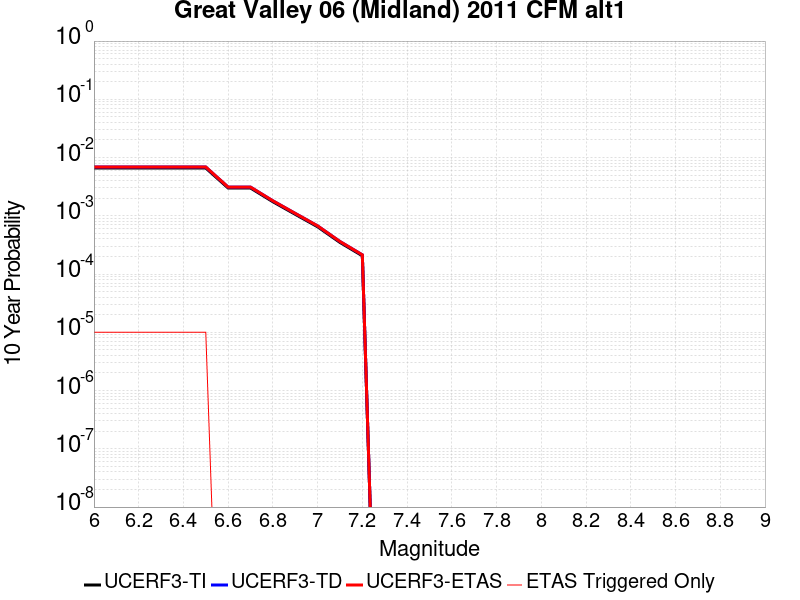 |

| Magnitude | 1 wk TI Prob | 1 wk TD Prob | 1 wk ETAS Prob | 1 wk ETAS/TD Gain | 1 wk ETAS Triggered Only | 1 mo TI Prob | 1 mo TD Prob | 1 mo ETAS Prob | 1 mo ETAS/TD Gain | 1 mo ETAS Triggered Only | 1 yr TI Prob | 1 yr TD Prob | 1 yr ETAS Prob | 1 yr ETAS/TD Gain | 1 yr ETAS Triggered Only | 10 yr TI Prob | 10 yr TD Prob | 10 yr ETAS Prob | 10 yr ETAS/TD Gain | 10 yr ETAS Triggered Only |
|-----|-----|-----|-----|-----|-----|-----|-----|-----|-----|-----|-----|-----|-----|-----|-----|-----|-----|-----|-----|-----|
| 6.0 | 1.2712525E-5 | 1.3210576E-5 | 1.3210576E-5 | 1.0 | 0.0 | 5.4481112E-5 | 5.6615667E-5 | 5.6615667E-5 | 1.0 | 0.0 | 6.6310563E-4 | 6.8910315E-4 | 7.5913686E-4 | 1.1016302 | 7.0081995E-5 | 0.0066113044 | 0.006872179 | 0.006941779 | 1.0101279 | 7.0081995E-5 |
| 6.1 | 1.2712525E-5 | 1.3210576E-5 | 1.3210576E-5 | 1.0 | 0.0 | 5.4481112E-5 | 5.6615667E-5 | 5.6615667E-5 | 1.0 | 0.0 | 6.6310563E-4 | 6.8910315E-4 | 7.5913686E-4 | 1.1016302 | 7.0081995E-5 | 0.0066113044 | 0.006872179 | 0.006941779 | 1.0101279 | 7.0081995E-5 |
| 6.2 | 1.2712525E-5 | 1.3210576E-5 | 1.3210576E-5 | 1.0 | 0.0 | 5.4481112E-5 | 5.6615667E-5 | 5.6615667E-5 | 1.0 | 0.0 | 6.6310563E-4 | 6.8910315E-4 | 7.5913686E-4 | 1.1016302 | 7.0081995E-5 | 0.0066113044 | 0.006872179 | 0.006941779 | 1.0101279 | 7.0081995E-5 |
| 6.3 | 1.2712525E-5 | 1.3210576E-5 | 1.3210576E-5 | 1.0 | 0.0 | 5.4481112E-5 | 5.6615667E-5 | 5.6615667E-5 | 1.0 | 0.0 | 6.6310563E-4 | 6.8910315E-4 | 7.5913686E-4 | 1.1016302 | 7.0081995E-5 | 0.0066113044 | 0.006872179 | 0.006941779 | 1.0101279 | 7.0081995E-5 |
| 6.4 | 1.2712525E-5 | 1.3210576E-5 | 1.3210576E-5 | 1.0 | 0.0 | 5.4481112E-5 | 5.6615667E-5 | 5.6615667E-5 | 1.0 | 0.0 | 6.6310563E-4 | 6.8910315E-4 | 7.5913686E-4 | 1.1016302 | 7.0081995E-5 | 0.0066113044 | 0.006872179 | 0.006941779 | 1.0101279 | 7.0081995E-5 |
| 6.5 | 1.2712525E-5 | 1.3210576E-5 | 1.3210576E-5 | 1.0 | 0.0 | 5.4481112E-5 | 5.6615667E-5 | 5.6615667E-5 | 1.0 | 0.0 | 6.6310563E-4 | 6.8910315E-4 | 7.5913686E-4 | 1.1016302 | 7.0081995E-5 | 0.0066113044 | 0.006872179 | 0.006941779 | 1.0101279 | 7.0081995E-5 |
| 6.6 | 5.7574384E-6 | 5.9706463E-6 | 5.9706463E-6 | 1.0 | 0.0 | 2.4674504E-5 | 2.5588255E-5 | 2.5588255E-5 | 1.0 | 0.0 | 3.0037065E-4 | 3.1149638E-4 | 3.1149638E-4 | 1.0 | 0.0 | 0.0029996498 | 0.0031109843 | 0.0031109843 | 1.0 | 0.0 |
| 6.7 | 5.7574384E-6 | 5.9706463E-6 | 5.9706463E-6 | 1.0 | 0.0 | 2.4674504E-5 | 2.5588255E-5 | 2.5588255E-5 | 1.0 | 0.0 | 3.0037065E-4 | 3.1149638E-4 | 3.1149638E-4 | 1.0 | 0.0 | 0.0029996498 | 0.0031109843 | 0.0031109843 | 1.0 | 0.0 |
| 6.8 | 3.3474828E-6 | 3.4693849E-6 | 3.4693849E-6 | 1.0 | 0.0 | 1.4346277E-5 | 1.4868716E-5 | 1.4868716E-5 | 1.0 | 0.0 | 1.7465191E-4 | 1.8101306E-4 | 1.8101306E-4 | 1.0 | 0.0 | 0.0017451472 | 0.0018088033 | 0.0018088033 | 1.0 | 0.0 |
| 6.9 | 2.035106E-6 | 2.1090357E-6 | 2.1090357E-6 | 1.0 | 0.0 | 8.721853E-6 | 9.038697E-6 | 9.038697E-6 | 1.0 | 0.0 | 1.0618339E-4 | 1.10041314E-4 | 1.10041314E-4 | 1.0 | 0.0 | 0.0010613267 | 0.0010999405 | 0.0010999405 | 1.0 | 0.0 |
| 7.0 | 1.2424716E-6 | 1.2878762E-6 | 1.2878762E-6 | 1.0 | 0.0 | 5.3248673E-6 | 5.51946E-6 | 5.51946E-6 | 1.0 | 0.0 | 6.482833E-5 | 6.7197805E-5 | 6.7197805E-5 | 1.0 | 0.0 | 6.480942E-4 | 6.718192E-4 | 6.718192E-4 | 1.0 | 0.0 |
| 7.1 | 6.6904556E-7 | 6.939035E-7 | 6.939035E-7 | 1.0 | 0.0 | 2.867335E-6 | 2.97387E-6 | 2.97387E-6 | 1.0 | 0.0 | 3.4909244E-5 | 3.6206526E-5 | 3.6206526E-5 | 1.0 | 0.0 | 3.490376E-4 | 3.6203177E-4 | 3.6203177E-4 | 1.0 | 0.0 |
| 7.2 | 3.948168E-7 | 4.095705E-7 | 4.095705E-7 | 1.0 | 0.0 | 1.6920709E-6 | 1.7553022E-6 | 1.7553022E-6 | 1.0 | 0.0 | 2.0600768E-5 | 2.1370803E-5 | 2.1370803E-5 | 1.0 | 0.0 | 2.0598859E-4 | 2.1370803E-4 | 2.1370803E-4 | 1.0 | 0.0 |

## Chino alt 1
*[(top)](#table-of-contents)*

| 1 Week | 1 Month | 1 Year | 10 Year |
|-----|-----|-----|-----|
|  |  |  |  |

| Magnitude | 1 wk TI Prob | 1 wk TD Prob | 1 wk ETAS Prob | 1 wk ETAS/TD Gain | 1 wk ETAS Triggered Only | 1 mo TI Prob | 1 mo TD Prob | 1 mo ETAS Prob | 1 mo ETAS/TD Gain | 1 mo ETAS Triggered Only | 1 yr TI Prob | 1 yr TD Prob | 1 yr ETAS Prob | 1 yr ETAS/TD Gain | 1 yr ETAS Triggered Only | 10 yr TI Prob | 10 yr TD Prob | 10 yr ETAS Prob | 10 yr ETAS/TD Gain | 10 yr ETAS Triggered Only |
|-----|-----|-----|-----|-----|-----|-----|-----|-----|-----|-----|-----|-----|-----|-----|-----|-----|-----|-----|-----|-----|
| 6.0 | 3.939946E-5 | 4.8948554E-5 | 1.1902712E-4 | 2.4316778 | 7.0081995E-5 | 1.6884391E-4 | 2.097656E-4 | 2.798329E-4 | 1.3340266 | 7.0081995E-5 | 0.0020537362 | 0.0025513945 | 0.0026212977 | 1.027398 | 7.0081995E-5 | 0.020348595 | 0.025277847 | 0.025346158 | 1.0027024 | 7.0081995E-5 |
| 6.1 | 2.1505624E-5 | 2.6879026E-5 | 9.6959135E-5 | 3.6072416 | 7.0081995E-5 | 9.2163704E-5 | 1.1519137E-4 | 1.852653E-4 | 1.6083262 | 7.0081995E-5 | 0.0011215154 | 0.001401664 | 0.0014716478 | 1.049929 | 7.0081995E-5 | 0.011158722 | 0.013945141 | 0.014014246 | 1.0049554 | 7.0081995E-5 |
| 6.2 | 2.1505624E-5 | 2.6879026E-5 | 9.6959135E-5 | 3.6072416 | 7.0081995E-5 | 9.2163704E-5 | 1.1519137E-4 | 1.852653E-4 | 1.6083262 | 7.0081995E-5 | 0.0011215154 | 0.001401664 | 0.0014716478 | 1.049929 | 7.0081995E-5 | 0.011158722 | 0.013945141 | 0.014014246 | 1.0049554 | 7.0081995E-5 |
| 6.3 | 1.4290785E-5 | 1.8165128E-5 | 1.8165128E-5 | 1.0 | 0.0 | 6.1244784E-5 | 7.784848E-5 | 7.784848E-5 | 1.0 | 0.0 | 7.454001E-4 | 9.4743853E-4 | 9.4743853E-4 | 1.0 | 0.0 | 0.007429048 | 0.0094444575 | 0.0094444575 | 1.0 | 0.0 |
| 6.4 | 1.4290785E-5 | 1.8165128E-5 | 1.8165128E-5 | 1.0 | 0.0 | 6.1244784E-5 | 7.784848E-5 | 7.784848E-5 | 1.0 | 0.0 | 7.454001E-4 | 9.4743853E-4 | 9.4743853E-4 | 1.0 | 0.0 | 0.007429048 | 0.0094444575 | 0.0094444575 | 1.0 | 0.0 |
| 6.5 | 1.3017944E-5 | 1.6652088E-5 | 1.6652088E-5 | 1.0 | 0.0 | 5.5789995E-5 | 7.136439E-5 | 7.136439E-5 | 1.0 | 0.0 | 6.790315E-4 | 8.685589E-4 | 8.685589E-4 | 1.0 | 0.0 | 0.0067696036 | 0.008661949 | 0.008661949 | 1.0 | 0.0 |
| 6.6 | 9.470016E-6 | 1.2039424E-5 | 1.2039424E-5 | 1.0 | 0.0 | 4.058515E-5 | 5.1596704E-5 | 5.1596704E-5 | 1.0 | 0.0 | 4.940122E-4 | 6.280428E-4 | 6.280428E-4 | 1.0 | 0.0 | 0.004929154 | 0.0062718987 | 0.0062718987 | 1.0 | 0.0 |
| 6.7 | 8.314155E-6 | 1.0407736E-5 | 1.0407736E-5 | 1.0 | 0.0 | 3.5631605E-5 | 4.4604003E-5 | 4.4604003E-5 | 1.0 | 0.0 | 4.3372845E-4 | 5.429507E-4 | 5.429507E-4 | 1.0 | 0.0 | 0.004328829 | 0.005425775 | 0.005425775 | 1.0 | 0.0 |
| 6.8 | 3.4856364E-6 | 3.8133708E-6 | 3.8133708E-6 | 1.0 | 0.0 | 1.4938357E-5 | 1.6342927E-5 | 1.6342927E-5 | 1.0 | 0.0 | 1.8185932E-4 | 1.9895904E-4 | 1.9895904E-4 | 1.0 | 0.0 | 0.0018171056 | 0.0019894864 | 0.0019894864 | 1.0 | 0.0 |
| 6.9 | 2.2645952E-6 | 2.1529022E-6 | 2.1529022E-6 | 1.0 | 0.0 | 9.705372E-6 | 9.226692E-6 | 9.226692E-6 | 1.0 | 0.0 | 1.18156495E-4 | 1.123294E-4 | 1.123294E-4 | 1.0 | 0.0 | 0.0011809369 | 0.0011233423 | 0.0011233423 | 1.0 | 0.0 |
| 7.0 | 1.7864003E-6 | 1.5430785E-6 | 1.5430785E-6 | 1.0 | 0.0 | 7.655979E-6 | 6.613177E-6 | 6.613177E-6 | 1.0 | 0.0 | 9.3207556E-5 | 8.051251E-5 | 8.051251E-5 | 1.0 | 0.0 | 9.316847E-4 | 8.0528046E-4 | 8.0528046E-4 | 1.0 | 0.0 |
| 7.1 | 1.7315456E-6 | 1.4733511E-6 | 1.4733511E-6 | 1.0 | 0.0 | 7.420889E-6 | 6.3143466E-6 | 6.3143466E-6 | 1.0 | 0.0 | 9.034557E-5 | 7.6874516E-5 | 7.6874516E-5 | 1.0 | 0.0 | 9.0308854E-4 | 7.6891703E-4 | 7.6891703E-4 | 1.0 | 0.0 |
| 7.2 | 1.6008337E-6 | 1.3574215E-6 | 1.3574215E-6 | 1.0 | 0.0 | 6.860698E-6 | 5.817508E-6 | 5.817508E-6 | 1.0 | 0.0 | 8.352579E-5 | 7.082591E-5 | 7.082591E-5 | 1.0 | 0.0 | 8.34944E-4 | 7.0845755E-4 | 7.0845755E-4 | 1.0 | 0.0 |
| 7.3 | 1.3320939E-6 | 1.121782E-6 | 1.121782E-6 | 1.0 | 0.0 | 5.7089615E-6 | 4.807629E-6 | 4.807629E-6 | 1.0 | 0.0 | 6.9504385E-5 | 5.8531357E-5 | 5.8531357E-5 | 1.0 | 0.0 | 6.9482654E-4 | 5.8530393E-4 | 5.8530393E-4 | 1.0 | 0.0 |
| 7.4 | 1.114294E-6 | 9.237111E-7 | 9.237111E-7 | 1.0 | 0.0 | 4.775537E-6 | 3.958756E-6 | 3.958756E-6 | 1.0 | 0.0 | 5.8140613E-5 | 4.8196827E-5 | 4.8196827E-5 | 1.0 | 0.0 | 5.81254E-4 | 4.8188053E-4 | 4.8188053E-4 | 1.0 | 0.0 |
| 7.5 | 9.354081E-7 | 7.6234323E-7 | 7.6234323E-7 | 1.0 | 0.0 | 4.0088858E-6 | 3.2671815E-6 | 3.2671815E-6 | 1.0 | 0.0 | 4.8807087E-5 | 3.9777242E-5 | 3.9777242E-5 | 1.0 | 0.0 | 4.879637E-4 | 3.977046E-4 | 3.977046E-4 | 1.0 | 0.0 |
| 7.6 | 8.521771E-7 | 6.88071E-7 | 6.88071E-7 | 1.0 | 0.0 | 3.6521824E-6 | 2.9488726E-6 | 2.9488726E-6 | 1.0 | 0.0 | 4.4464414E-5 | 3.5901965E-5 | 3.5901965E-5 | 1.0 | 0.0 | 4.4455516E-4 | 3.589648E-4 | 3.589648E-4 | 1.0 | 0.0 |
| 7.7 | 2.1803626E-7 | 1.418649E-7 | 1.418649E-7 | 1.0 | 0.0 | 9.344408E-7 | 6.079923E-7 | 6.079923E-7 | 1.0 | 0.0 | 1.1376757E-5 | 7.4022914E-6 | 7.4022914E-6 | 1.0 | 0.0 | 1.13761744E-4 | 7.402141E-5 | 7.402141E-5 | 1.0 | 0.0 |

## Manix-Afton Hills
*[(top)](#table-of-contents)*

| 1 Week | 1 Month | 1 Year | 10 Year |
|-----|-----|-----|-----|
|  |  | 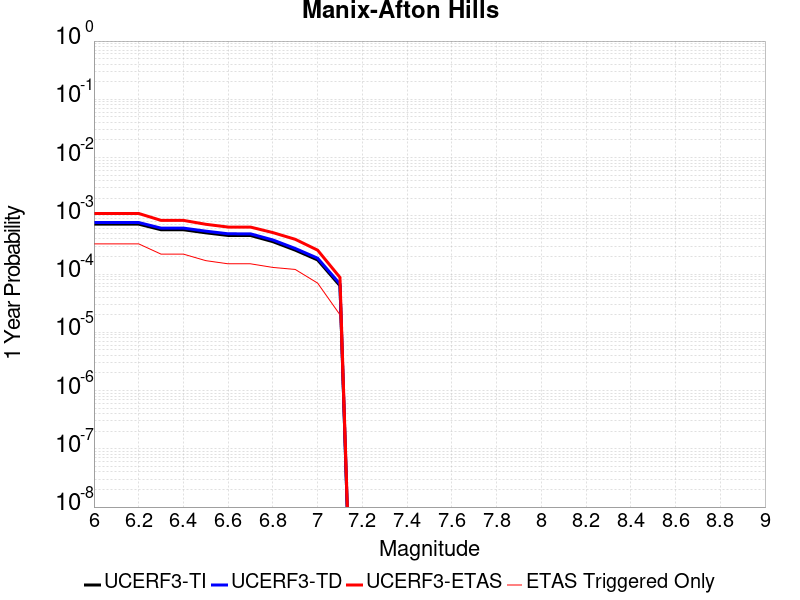 |  |

| Magnitude | 1 wk TI Prob | 1 wk TD Prob | 1 wk ETAS Prob | 1 wk ETAS/TD Gain | 1 wk ETAS Triggered Only | 1 mo TI Prob | 1 mo TD Prob | 1 mo ETAS Prob | 1 mo ETAS/TD Gain | 1 mo ETAS Triggered Only | 1 yr TI Prob | 1 yr TD Prob | 1 yr ETAS Prob | 1 yr ETAS/TD Gain | 1 yr ETAS Triggered Only | 10 yr TI Prob | 10 yr TD Prob | 10 yr ETAS Prob | 10 yr ETAS/TD Gain | 10 yr ETAS Triggered Only |
|-----|-----|-----|-----|-----|-----|-----|-----|-----|-----|-----|-----|-----|-----|-----|-----|-----|-----|-----|-----|-----|
| 6.0 | 1.3783202E-5 | 1.47110895E-5 | 1.47110895E-5 | 1.0 | 0.0 | 5.906953E-5 | 6.30461E-5 | 1.3312369E-4 | 2.111529 | 7.0081995E-5 | 7.189342E-4 | 7.6733343E-4 | 8.373617E-4 | 1.0912617 | 7.0081995E-5 | 0.0071661277 | 0.007648596 | 0.0077181417 | 1.0090927 | 7.0081995E-5 |
| 6.1 | 1.3783202E-5 | 1.47110895E-5 | 1.47110895E-5 | 1.0 | 0.0 | 5.906953E-5 | 6.30461E-5 | 1.3312369E-4 | 2.111529 | 7.0081995E-5 | 7.189342E-4 | 7.6733343E-4 | 8.373617E-4 | 1.0912617 | 7.0081995E-5 | 0.0071661277 | 0.007648596 | 0.0077181417 | 1.0090927 | 7.0081995E-5 |
| 6.2 | 1.3783202E-5 | 1.47110895E-5 | 1.47110895E-5 | 1.0 | 0.0 | 5.906953E-5 | 6.30461E-5 | 1.3312369E-4 | 2.111529 | 7.0081995E-5 | 7.189342E-4 | 7.6733343E-4 | 8.373617E-4 | 1.0912617 | 7.0081995E-5 | 0.0071661277 | 0.007648596 | 0.0077181417 | 1.0090927 | 7.0081995E-5 |
| 6.3 | 1.10494875E-5 | 1.1793136E-5 | 1.1793136E-5 | 1.0 | 0.0 | 4.7354086E-5 | 5.054109E-5 | 5.054109E-5 | 1.0 | 0.0 | 5.763835E-4 | 6.151744E-4 | 6.151744E-4 | 1.0 | 0.0 | 0.005748908 | 0.0061357557 | 0.0061357557 | 1.0 | 0.0 |
| 6.4 | 1.10494875E-5 | 1.1793136E-5 | 1.1793136E-5 | 1.0 | 0.0 | 4.7354086E-5 | 5.054109E-5 | 5.054109E-5 | 1.0 | 0.0 | 5.763835E-4 | 6.151744E-4 | 6.151744E-4 | 1.0 | 0.0 | 0.005748908 | 0.0061357557 | 0.0061357557 | 1.0 | 0.0 |
| 6.5 | 9.788949E-6 | 1.045432E-5 | 1.045432E-5 | 1.0 | 0.0 | 4.1951964E-5 | 4.480351E-5 | 4.480351E-5 | 1.0 | 0.0 | 5.1064545E-4 | 5.453555E-4 | 5.453555E-4 | 1.0 | 0.0 | 0.0050947363 | 0.0054410985 | 0.0054410985 | 1.0 | 0.0 |
| 6.6 | 8.810006E-6 | 9.4136285E-6 | 9.4136285E-6 | 1.0 | 0.0 | 3.775662E-5 | 4.0343548E-5 | 4.0343548E-5 | 1.0 | 0.0 | 4.5958988E-4 | 4.9108086E-4 | 4.9108086E-4 | 1.0 | 0.0 | 0.0045864056 | 0.004900839 | 0.004900839 | 1.0 | 0.0 |
| 6.7 | 8.80128E-6 | 9.404108E-6 | 9.404108E-6 | 1.0 | 0.0 | 3.7719226E-5 | 4.0302748E-5 | 4.0302748E-5 | 1.0 | 0.0 | 4.591348E-4 | 4.9058435E-4 | 4.9058435E-4 | 1.0 | 0.0 | 0.004581874 | 0.0048958957 | 0.0048958957 | 1.0 | 0.0 |
| 6.8 | 6.8994877E-6 | 7.380076E-6 | 7.380076E-6 | 1.0 | 0.0 | 2.9568899E-5 | 3.162856E-5 | 3.162856E-5 | 1.0 | 0.0 | 3.5994186E-4 | 3.8501783E-4 | 3.8501783E-4 | 1.0 | 0.0 | 0.003593594 | 0.0038443129 | 0.0038443129 | 1.0 | 0.0 |
| 6.9 | 4.9328037E-6 | 5.2709615E-6 | 5.2709615E-6 | 1.0 | 0.0 | 2.1140417E-5 | 2.2589675E-5 | 2.2589675E-5 | 1.0 | 0.0 | 2.5735417E-4 | 2.7500073E-4 | 2.7500073E-4 | 1.0 | 0.0 | 0.0025705635 | 0.0027472095 | 0.0027472095 | 1.0 | 0.0 |
| 7.0 | 3.347973E-6 | 3.59003E-6 | 3.59003E-6 | 1.0 | 0.0 | 1.4348378E-5 | 1.5385775E-5 | 1.5385775E-5 | 1.0 | 0.0 | 1.746775E-4 | 1.8730981E-4 | 1.8730981E-4 | 1.0 | 0.0 | 0.0017454025 | 0.0018719219 | 0.0018719219 | 1.0 | 0.0 |
| 7.1 | 1.2073567E-6 | 1.293482E-6 | 1.293482E-6 | 1.0 | 0.0 | 5.1743755E-6 | 5.543492E-6 | 5.543492E-6 | 1.0 | 0.0 | 6.29962E-5 | 6.749156E-5 | 6.749156E-5 | 1.0 | 0.0 | 6.297835E-4 | 6.7487074E-4 | 6.7487074E-4 | 1.0 | 0.0 |

## Calaveras (No) 2011 CFM
*[(top)](#table-of-contents)*

| 1 Week | 1 Month | 1 Year | 10 Year |
|-----|-----|-----|-----|
|  |  |  |  |

| Magnitude | 1 wk TI Prob | 1 wk TD Prob | 1 wk ETAS Prob | 1 wk ETAS/TD Gain | 1 wk ETAS Triggered Only | 1 mo TI Prob | 1 mo TD Prob | 1 mo ETAS Prob | 1 mo ETAS/TD Gain | 1 mo ETAS Triggered Only | 1 yr TI Prob | 1 yr TD Prob | 1 yr ETAS Prob | 1 yr ETAS/TD Gain | 1 yr ETAS Triggered Only | 10 yr TI Prob | 10 yr TD Prob | 10 yr ETAS Prob | 10 yr ETAS/TD Gain | 10 yr ETAS Triggered Only |
|-----|-----|-----|-----|-----|-----|-----|-----|-----|-----|-----|-----|-----|-----|-----|-----|-----|-----|-----|-----|-----|
| 6.0 | 4.8694856E-5 | 6.747121E-5 | 6.747121E-5 | 1.0 | 0.0 | 2.0867554E-4 | 2.8913133E-4 | 2.8913133E-4 | 1.0 | 0.0 | 0.0025376645 | 0.003514627 | 0.0035844627 | 1.01987 | 7.0081995E-5 | 0.02508881 | 0.034771245 | 0.03483889 | 1.0019454 | 7.0081995E-5 |
| 6.1 | 4.8694856E-5 | 6.747121E-5 | 6.747121E-5 | 1.0 | 0.0 | 2.0867554E-4 | 2.8913133E-4 | 2.8913133E-4 | 1.0 | 0.0 | 0.0025376645 | 0.003514627 | 0.0035844627 | 1.01987 | 7.0081995E-5 | 0.02508881 | 0.034771245 | 0.03483889 | 1.0019454 | 7.0081995E-5 |
| 6.2 | 4.7541962E-5 | 6.580218E-5 | 6.580218E-5 | 1.0 | 0.0 | 2.0373536E-4 | 2.8197994E-4 | 2.8197994E-4 | 1.0 | 0.0 | 0.0024776561 | 0.003427859 | 0.0034977007 | 1.0203748 | 7.0081995E-5 | 0.024502134 | 0.033932675 | 0.034000378 | 1.0019952 | 7.0081995E-5 |
| 6.3 | 4.6717287E-5 | 6.4635555E-5 | 6.4635555E-5 | 1.0 | 0.0 | 2.0020158E-4 | 2.7698115E-4 | 2.7698115E-4 | 1.0 | 0.0 | 0.0024347296 | 0.0033672103 | 0.0034370564 | 1.020743 | 7.0081995E-5 | 0.024082264 | 0.033345193 | 0.033412937 | 1.0020317 | 7.0081995E-5 |
| 6.4 | 4.6276386E-5 | 6.399742E-5 | 6.399742E-5 | 1.0 | 0.0 | 1.983123E-4 | 2.7424688E-4 | 2.7424688E-4 | 1.0 | 0.0 | 0.0024117786 | 0.0033340224 | 0.0033340224 | 1.0 | 0.0 | 0.02385771 | 0.033024073 | 0.033024073 | 1.0 | 0.0 |
| 6.5 | 4.5720994E-5 | 6.319881E-5 | 6.319881E-5 | 1.0 | 0.0 | 1.9593239E-4 | 2.70825E-4 | 2.70825E-4 | 1.0 | 0.0 | 0.002382867 | 0.0032924965 | 0.0032924965 | 1.0 | 0.0 | 0.023574775 | 0.032622032 | 0.032622032 | 1.0 | 0.0 |
| 6.6 | 4.549134E-5 | 6.28519E-5 | 6.28519E-5 | 1.0 | 0.0 | 1.949483E-4 | 2.6933852E-4 | 2.6933852E-4 | 1.0 | 0.0 | 0.0023709119 | 0.0032744533 | 0.0032744533 | 1.0 | 0.0 | 0.023457756 | 0.032447387 | 0.032447387 | 1.0 | 0.0 |
| 6.7 | 3.701047E-5 | 5.0359427E-5 | 5.0359427E-5 | 1.0 | 0.0 | 1.5860666E-4 | 2.1580851E-4 | 2.1580851E-4 | 1.0 | 0.0 | 0.0019293258 | 0.002624346 | 0.002624346 | 1.0 | 0.0 | 0.019126613 | 0.026125323 | 0.026125323 | 1.0 | 0.0 |
| 6.8 | 3.5523568E-5 | 4.8341022E-5 | 4.8341022E-5 | 1.0 | 0.0 | 1.5223498E-4 | 2.071596E-4 | 2.071596E-4 | 1.0 | 0.0 | 0.0018518851 | 0.0025192937 | 0.0025192937 | 1.0 | 0.0 | 0.018365284 | 0.025097553 | 0.025097553 | 1.0 | 0.0 |
| 6.9 | 3.2946147E-5 | 4.466269E-5 | 4.466269E-5 | 1.0 | 0.0 | 1.4119013E-4 | 1.9139773E-4 | 1.9139773E-4 | 1.0 | 0.0 | 0.0017176344 | 0.0023278191 | 0.0023278191 | 1.0 | 0.0 | 0.017044188 | 0.023219598 | 0.023219598 | 1.0 | 0.0 |
| 7.0 | 2.7682381E-5 | 3.702223E-5 | 3.702223E-5 | 1.0 | 0.0 | 1.1863338E-4 | 1.5865723E-4 | 1.5865723E-4 | 1.0 | 0.0 | 0.0014434044 | 0.0019299705 | 0.0019299705 | 1.0 | 0.0 | 0.01434065 | 0.01931092 | 0.01931092 | 1.0 | 0.0 |
| 7.1 | 2.471967E-5 | 3.328669E-5 | 3.328669E-5 | 1.0 | 0.0 | 1.05937135E-4 | 1.4264962E-4 | 1.4264962E-4 | 1.0 | 0.0 | 0.0012890215 | 0.0017354045 | 0.0017354045 | 1.0 | 0.0 | 0.0128157 | 0.017385952 | 0.017385952 | 1.0 | 0.0 |
| 7.2 | 1.9748062E-5 | 2.6774684E-5 | 2.6774684E-5 | 1.0 | 0.0 | 8.463181E-5 | 1.1474373E-4 | 1.1474373E-4 | 1.0 | 0.0 | 0.0010299052 | 0.0013961331 | 0.0013961331 | 1.0 | 0.0 | 0.01025145 | 0.014030739 | 0.014030739 | 1.0 | 0.0 |
| 7.3 | 1.1603734E-5 | 1.5783844E-5 | 1.5783844E-5 | 1.0 | 0.0 | 4.9729337E-5 | 6.764337E-5 | 6.764337E-5 | 1.0 | 0.0 | 6.052865E-4 | 8.232611E-4 | 8.232611E-4 | 1.0 | 0.0 | 0.0060364045 | 0.008308666 | 0.008308666 | 1.0 | 0.0 |
| 7.4 | 4.885381E-6 | 6.0349853E-6 | 6.0349853E-6 | 1.0 | 0.0 | 2.0937177E-5 | 2.5863968E-5 | 2.5863968E-5 | 1.0 | 0.0 | 2.5488032E-4 | 3.148485E-4 | 3.148485E-4 | 1.0 | 0.0 | 0.0025458818 | 0.0032010598 | 0.0032010598 | 1.0 | 0.0 |
| 7.5 | 3.0571264E-6 | 4.155299E-6 | 4.155299E-6 | 1.0 | 0.0 | 1.3101904E-5 | 1.7808303E-5 | 1.7808303E-5 | 1.0 | 0.0 | 1.5950401E-4 | 2.1679462E-4 | 2.1679462E-4 | 1.0 | 0.0 | 0.0015938957 | 0.002221121 | 0.002221121 | 1.0 | 0.0 |
| 7.6 | 1.764948E-6 | 2.7955498E-6 | 2.7955498E-6 | 1.0 | 0.0 | 7.564041E-6 | 1.1980874E-5 | 1.1980874E-5 | 1.0 | 0.0 | 9.208831E-5 | 1.4585744E-4 | 1.4585744E-4 | 1.0 | 0.0 | 9.205016E-4 | 0.0015123509 | 0.0015123509 | 1.0 | 0.0 |
| 7.7 | 1.3173734E-6 | 2.058471E-6 | 2.058471E-6 | 1.0 | 0.0 | 5.645874E-6 | 8.8219895E-6 | 8.8219895E-6 | 1.0 | 0.0 | 6.873634E-5 | 1.0740245E-4 | 1.0740245E-4 | 1.0 | 0.0 | 6.8715087E-4 | 0.0011261401 | 0.0011261401 | 1.0 | 0.0 |
| 7.8 | 9.4429885E-7 | 1.5489635E-6 | 1.5489635E-6 | 1.0 | 0.0 | 4.0469886E-6 | 6.638398E-6 | 6.638398E-6 | 1.0 | 0.0 | 4.9270973E-5 | 8.081952E-5 | 8.081952E-5 | 1.0 | 0.0 | 4.926005E-4 | 8.5014524E-4 | 8.5014524E-4 | 1.0 | 0.0 |
| 7.9 | 6.388233E-7 | 1.1148749E-6 | 1.1148749E-6 | 1.0 | 0.0 | 2.7378112E-6 | 4.7780263E-6 | 4.7780263E-6 | 1.0 | 0.0 | 3.3332344E-5 | 5.817093E-5 | 5.817093E-5 | 1.0 | 0.0 | 3.3327343E-4 | 6.0963054E-4 | 6.0963054E-4 | 1.0 | 0.0 |
| 8.0 | 3.087986E-7 | 5.7543696E-7 | 5.7543696E-7 | 1.0 | 0.0 | 1.323422E-6 | 2.466156E-6 | 2.466156E-6 | 1.0 | 0.0 | 1.6112543E-5 | 3.002504E-5 | 3.002504E-5 | 1.0 | 0.0 | 1.6111376E-4 | 3.110302E-4 | 3.110302E-4 | 1.0 | 0.0 |
| 8.1 | 1.6725647E-7 | 2.7410047E-7 | 2.7410047E-7 | 1.0 | 0.0 | 7.168133E-7 | 1.1747159E-6 | 1.1747159E-6 | 1.0 | 0.0 | 8.7271665E-6 | 1.4302073E-5 | 1.4302073E-5 | 1.0 | 0.0 | 8.726824E-5 | 1.48486E-4 | 1.48486E-4 | 1.0 | 0.0 |

## Northridge
*[(top)](#table-of-contents)*

| 1 Week | 1 Month | 1 Year | 10 Year |
|-----|-----|-----|-----|
|  |  |  |  |

| Magnitude | 1 wk TI Prob | 1 wk TD Prob | 1 wk ETAS Prob | 1 wk ETAS/TD Gain | 1 wk ETAS Triggered Only | 1 mo TI Prob | 1 mo TD Prob | 1 mo ETAS Prob | 1 mo ETAS/TD Gain | 1 mo ETAS Triggered Only | 1 yr TI Prob | 1 yr TD Prob | 1 yr ETAS Prob | 1 yr ETAS/TD Gain | 1 yr ETAS Triggered Only | 10 yr TI Prob | 10 yr TD Prob | 10 yr ETAS Prob | 10 yr ETAS/TD Gain | 10 yr ETAS Triggered Only |
|-----|-----|-----|-----|-----|-----|-----|-----|-----|-----|-----|-----|-----|-----|-----|-----|-----|-----|-----|-----|-----|
| 6.0 | 1.8340852E-5 | 7.5880193E-6 | 7.5880193E-6 | 1.0 | 0.0 | 7.860128E-5 | 3.251969E-5 | 1.02599406E-4 | 3.1549933 | 7.0081995E-5 | 9.565505E-4 | 3.958575E-4 | 4.6591175E-4 | 1.1769683 | 7.0081995E-5 | 0.009524435 | 0.003951746 | 0.004021551 | 1.0176643 | 7.0081995E-5 |
| 6.1 | 1.8340852E-5 | 7.5880193E-6 | 7.5880193E-6 | 1.0 | 0.0 | 7.860128E-5 | 3.251969E-5 | 1.02599406E-4 | 3.1549933 | 7.0081995E-5 | 9.565505E-4 | 3.958575E-4 | 4.6591175E-4 | 1.1769683 | 7.0081995E-5 | 0.009524435 | 0.003951746 | 0.004021551 | 1.0176643 | 7.0081995E-5 |
| 6.2 | 1.8340852E-5 | 7.5880193E-6 | 7.5880193E-6 | 1.0 | 0.0 | 7.860128E-5 | 3.251969E-5 | 1.02599406E-4 | 3.1549933 | 7.0081995E-5 | 9.565505E-4 | 3.958575E-4 | 4.6591175E-4 | 1.1769683 | 7.0081995E-5 | 0.009524435 | 0.003951746 | 0.004021551 | 1.0176643 | 7.0081995E-5 |
| 6.3 | 1.8340852E-5 | 7.5880193E-6 | 7.5880193E-6 | 1.0 | 0.0 | 7.860128E-5 | 3.251969E-5 | 1.02599406E-4 | 3.1549933 | 7.0081995E-5 | 9.565505E-4 | 3.958575E-4 | 4.6591175E-4 | 1.1769683 | 7.0081995E-5 | 0.009524435 | 0.003951746 | 0.004021551 | 1.0176643 | 7.0081995E-5 |
| 6.4 | 1.7361892E-5 | 7.5880193E-6 | 7.5880193E-6 | 1.0 | 0.0 | 7.440598E-5 | 3.251969E-5 | 1.02599406E-4 | 3.1549933 | 7.0081995E-5 | 9.055163E-4 | 3.958575E-4 | 4.6591175E-4 | 1.1769683 | 7.0081995E-5 | 0.009018354 | 0.003951746 | 0.004021551 | 1.0176643 | 7.0081995E-5 |
| 6.5 | 1.7361892E-5 | 7.5880193E-6 | 7.5880193E-6 | 1.0 | 0.0 | 7.440598E-5 | 3.251969E-5 | 1.02599406E-4 | 3.1549933 | 7.0081995E-5 | 9.055163E-4 | 3.958575E-4 | 4.6591175E-4 | 1.1769683 | 7.0081995E-5 | 0.009018354 | 0.003951746 | 0.004021551 | 1.0176643 | 7.0081995E-5 |
| 6.6 | 1.5458201E-5 | 7.5880193E-6 | 7.5880193E-6 | 1.0 | 0.0 | 6.624775E-5 | 3.251969E-5 | 1.02599406E-4 | 3.1549933 | 7.0081995E-5 | 8.0626784E-4 | 3.958575E-4 | 4.6591175E-4 | 1.1769683 | 7.0081995E-5 | 0.008033488 | 0.003951746 | 0.004021551 | 1.0176643 | 7.0081995E-5 |
| 6.7 | 1.2538368E-5 | 6.381603E-6 | 6.381603E-6 | 1.0 | 0.0 | 5.3734755E-5 | 2.7349442E-5 | 9.7429525E-5 | 3.562395 | 7.0081995E-5 | 6.5402425E-4 | 3.3292902E-4 | 4.029877E-4 | 1.2104312 | 7.0081995E-5 | 0.0065210275 | 0.0033243506 | 0.0033941995 | 1.0210114 | 7.0081995E-5 |
| 6.8 | 1.1438097E-5 | 6.3502566E-6 | 6.3502566E-6 | 1.0 | 0.0 | 4.9019498E-5 | 2.7215105E-5 | 9.72952E-5 | 3.575044 | 7.0081995E-5 | 5.9664896E-4 | 3.3129397E-4 | 4.0135274E-4 | 1.2114701 | 7.0081995E-5 | 0.005950495 | 0.0033080487 | 0.0033778988 | 1.0211152 | 7.0081995E-5 |
| 6.9 | 1.1204891E-5 | 6.2867084E-6 | 6.2867084E-6 | 1.0 | 0.0 | 4.8020076E-5 | 2.694276E-5 | 9.7022865E-5 | 3.6010737 | 7.0081995E-5 | 5.8448757E-4 | 3.2797916E-4 | 3.980382E-4 | 1.2136081 | 7.0081995E-5 | 0.0058295266 | 0.0032749989 | 0.0033448513 | 1.021329 | 7.0081995E-5 |
| 7.0 | 1.061046E-5 | 6.115359E-6 | 6.115359E-6 | 1.0 | 0.0 | 4.5472607E-5 | 2.6208421E-5 | 9.628858E-5 | 3.6739557 | 7.0081995E-5 | 5.534883E-4 | 3.1904122E-4 | 3.8910087E-4 | 1.2195944 | 7.0081995E-5 | 0.0055211177 | 0.0031858785 | 0.0032557372 | 1.0219276 | 7.0081995E-5 |
| 7.1 | 1.0266979E-5 | 6.004274E-6 | 6.004274E-6 | 1.0 | 0.0 | 4.40006E-5 | 2.5732352E-5 | 9.5812546E-5 | 3.7234275 | 7.0081995E-5 | 5.355756E-4 | 3.1324677E-4 | 3.8330682E-4 | 1.2236577 | 7.0081995E-5 | 0.0053428668 | 0.003128098 | 0.003197961 | 1.022334 | 7.0081995E-5 |
| 7.2 | 9.91273E-6 | 5.819984E-6 | 5.819984E-6 | 1.0 | 0.0 | 4.248244E-5 | 2.4942554E-5 | 2.4942554E-5 | 1.0 | 0.0 | 5.171009E-4 | 3.036337E-4 | 3.036337E-4 | 1.0 | 0.0 | 0.0051589934 | 0.0030322333 | 0.0030322333 | 1.0 | 0.0 |
| 7.3 | 8.4959265E-6 | 5.193062E-6 | 5.193062E-6 | 1.0 | 0.0 | 3.6410605E-5 | 2.225579E-5 | 2.225579E-5 | 1.0 | 0.0 | 4.4320893E-4 | 2.709308E-4 | 2.709308E-4 | 1.0 | 0.0 | 0.00442326 | 0.0027060313 | 0.0027060313 | 1.0 | 0.0 |
| 7.4 | 8.0847185E-6 | 4.9819355E-6 | 4.9819355E-6 | 1.0 | 0.0 | 3.4648332E-5 | 2.135098E-5 | 2.135098E-5 | 1.0 | 0.0 | 4.2176177E-4 | 2.599174E-4 | 2.599174E-4 | 1.0 | 0.0 | 0.0042096223 | 0.00259616 | 0.00259616 | 1.0 | 0.0 |
| 7.5 | 6.8220684E-6 | 4.2533075E-6 | 4.2533075E-6 | 1.0 | 0.0 | 2.9237108E-5 | 1.8228335E-5 | 1.8228335E-5 | 1.0 | 0.0 | 3.5590364E-4 | 2.2190758E-4 | 2.2190758E-4 | 1.0 | 0.0 | 0.0035533418 | 0.002216881 | 0.002216881 | 1.0 | 0.0 |
| 7.6 | 4.4224143E-6 | 2.8999582E-6 | 2.8999582E-6 | 1.0 | 0.0 | 1.8953066E-5 | 1.2428334E-5 | 1.2428334E-5 | 1.0 | 0.0 | 2.3072914E-4 | 1.5130457E-4 | 1.5130457E-4 | 1.0 | 0.0 | 0.0023048974 | 0.0015120271 | 0.0015120271 | 1.0 | 0.0 |
| 7.7 | 2.5297056E-6 | 1.6045905E-6 | 1.6045905E-6 | 1.0 | 0.0 | 1.0841551E-5 | 6.8767986E-6 | 6.8767986E-6 | 1.0 | 0.0 | 1.319879E-4 | 8.3721854E-5 | 8.3721854E-5 | 1.0 | 0.0 | 0.0013190953 | 8.369078E-4 | 8.369078E-4 | 1.0 | 0.0 |
| 7.8 | 1.2508156E-6 | 8.780076E-7 | 8.780076E-7 | 1.0 | 0.0 | 5.3606273E-6 | 3.7628845E-6 | 3.7628845E-6 | 1.0 | 0.0 | 6.526368E-5 | 4.581217E-5 | 4.581217E-5 | 1.0 | 0.0 | 6.524452E-4 | 4.5802852E-4 | 4.5802852E-4 | 1.0 | 0.0 |
| 7.9 | 2.262199E-7 | 1.4664671E-7 | 1.4664671E-7 | 1.0 | 0.0 | 9.695135E-7 | 6.284858E-7 | 6.284858E-7 | 1.0 | 0.0 | 1.1803763E-5 | 7.651788E-6 | 7.651788E-6 | 1.0 | 0.0 | 1.1803136E-4 | 7.651533E-5 | 7.651533E-5 | 1.0 | 0.0 |
| 8.0 | 2.865362E-9 | 1.2753101E-9 | 1.2753101E-9 | 1.0 | 0.0 | 1.2280123E-8 | 5.4656146E-9 | 5.4656146E-9 | 1.0 | 0.0 | 1.4951048E-7 | 6.654386E-8 | 6.654386E-8 | 1.0 | 0.0 | 1.4951038E-6 | 6.654386E-7 | 6.654386E-7 | 1.0 | 0.0 |

## San Diego Trough north alt1
*[(top)](#table-of-contents)*

| 1 Week | 1 Month | 1 Year | 10 Year |
|-----|-----|-----|-----|
|  |  |  |  |

| Magnitude | 1 wk TI Prob | 1 wk TD Prob | 1 wk ETAS Prob | 1 wk ETAS/TD Gain | 1 wk ETAS Triggered Only | 1 mo TI Prob | 1 mo TD Prob | 1 mo ETAS Prob | 1 mo ETAS/TD Gain | 1 mo ETAS Triggered Only | 1 yr TI Prob | 1 yr TD Prob | 1 yr ETAS Prob | 1 yr ETAS/TD Gain | 1 yr ETAS Triggered Only | 10 yr TI Prob | 10 yr TD Prob | 10 yr ETAS Prob | 10 yr ETAS/TD Gain | 10 yr ETAS Triggered Only |
|-----|-----|-----|-----|-----|-----|-----|-----|-----|-----|-----|-----|-----|-----|-----|-----|-----|-----|-----|-----|-----|
| 6.0 | 7.329252E-5 | 8.821093E-5 | 1.5828674E-4 | 1.7944119 | 7.0081995E-5 | 3.14073E-4 | 3.7799572E-4 | 4.4805123E-4 | 1.1853341 | 7.0081995E-5 | 0.0038171355 | 0.004593027 | 0.004662787 | 1.0151882 | 7.0081995E-5 | 0.03752231 | 0.045044992 | 0.045111917 | 1.0014857 | 7.0081995E-5 |
| 6.1 | 3.7940346E-5 | 4.4885E-5 | 1.14963856E-4 | 2.5612977 | 7.0081995E-5 | 1.6259136E-4 | 1.9235066E-4 | 2.6241917E-4 | 1.3642749 | 7.0081995E-5 | 0.0019777524 | 0.0023394432 | 0.0024093613 | 1.0298866 | 7.0081995E-5 | 0.019602431 | 0.023156688 | 0.023225145 | 1.0029564 | 7.0081995E-5 |
| 6.2 | 2.8645263E-5 | 3.329678E-5 | 1.0337644E-4 | 3.104698 | 7.0081995E-5 | 1.2275964E-4 | 1.4269284E-4 | 2.1276483E-4 | 1.4910687 | 7.0081995E-5 | 0.0014935739 | 0.0017359189 | 0.0018058793 | 1.0403016 | 7.0081995E-5 | 0.0148357535 | 0.017226247 | 0.017295122 | 1.0039983 | 7.0081995E-5 |
| 6.3 | 2.8645263E-5 | 3.329678E-5 | 1.0337644E-4 | 3.104698 | 7.0081995E-5 | 1.2275964E-4 | 1.4269284E-4 | 2.1276483E-4 | 1.4910687 | 7.0081995E-5 | 0.0014935739 | 0.0017359189 | 0.0018058793 | 1.0403016 | 7.0081995E-5 | 0.0148357535 | 0.017226247 | 0.017295122 | 1.0039983 | 7.0081995E-5 |
| 6.4 | 2.2204576E-5 | 2.5448318E-5 | 9.552853E-5 | 3.753825 | 7.0081995E-5 | 9.5159E-5 | 1.0905972E-4 | 1.7913408E-4 | 1.642532 | 7.0081995E-5 | 0.001157945 | 0.0013270034 | 0.0013969924 | 1.0527421 | 7.0081995E-5 | 0.011519298 | 0.013191955 | 0.013261112 | 1.0052423 | 7.0081995E-5 |
| 6.5 | 2.1004838E-5 | 2.4024694E-5 | 9.410501E-5 | 3.9170115 | 7.0081995E-5 | 9.0017624E-5 | 1.0295896E-4 | 1.7303374E-4 | 1.6806089 | 7.0081995E-5 | 0.0010954136 | 0.0012528138 | 0.0013228081 | 1.0558696 | 7.0081995E-5 | 0.010900296 | 0.012458589 | 0.012527797 | 1.0055552 | 7.0081995E-5 |
| 6.6 | 1.820557E-5 | 2.0704787E-5 | 9.078533E-5 | 4.384751 | 7.0081995E-5 | 7.802154E-5 | 8.873181E-5 | 1.5880758E-4 | 1.7897481 | 7.0081995E-5 | 9.4949827E-4 | 0.0010797799 | 0.0011497862 | 1.0648339 | 7.0081995E-5 | 0.009454516 | 0.010746004 | 0.010815333 | 1.0064516 | 7.0081995E-5 |
| 6.7 | 1.5884485E-5 | 1.7983646E-5 | 8.8064386E-5 | 4.8969145 | 7.0081995E-5 | 6.807459E-5 | 7.707051E-5 | 1.471471E-4 | 1.909253 | 7.0081995E-5 | 8.284929E-4 | 9.3793223E-4 | 0.0010079485 | 1.0746496 | 7.0081995E-5 | 0.008254109 | 0.009340104 | 0.009409531 | 1.0074333 | 7.0081995E-5 |
| 6.8 | 1.4331171E-5 | 1.6201066E-5 | 8.628193E-5 | 5.3256946 | 7.0081995E-5 | 6.141786E-5 | 6.94313E-5 | 1.3950843E-4 | 2.0093017 | 7.0081995E-5 | 7.4750587E-4 | 8.450002E-4 | 9.15023E-4 | 1.0828671 | 7.0081995E-5 | 0.0074499645 | 0.008418139 | 0.008487631 | 1.008255 | 7.0081995E-5 |
| 6.9 | 1.2574203E-5 | 1.4205835E-5 | 1.4205835E-5 | 1.0 | 0.0 | 5.3888325E-5 | 6.0880735E-5 | 6.0880735E-5 | 1.0 | 0.0 | 6.558929E-4 | 7.409723E-4 | 7.409723E-4 | 1.0 | 0.0 | 0.0065396037 | 0.007385203 | 0.007385203 | 1.0 | 0.0 |
| 7.0 | 1.0883844E-5 | 1.2289262E-5 | 1.2289262E-5 | 1.0 | 0.0 | 4.664421E-5 | 5.2667205E-5 | 5.2667205E-5 | 1.0 | 0.0 | 5.677453E-4 | 6.4103556E-4 | 6.4103556E-4 | 1.0 | 0.0 | 0.00566297 | 0.006391993 | 0.006391993 | 1.0 | 0.0 |
| 7.1 | 9.393088E-6 | 1.060702E-5 | 1.060702E-5 | 1.0 | 0.0 | 4.025547E-5 | 4.545787E-5 | 4.545787E-5 | 1.0 | 0.0 | 4.900001E-4 | 5.533098E-4 | 5.533098E-4 | 1.0 | 0.0 | 0.0048892107 | 0.005519418 | 0.005519418 | 1.0 | 0.0 |
| 7.2 | 8.190791E-6 | 9.258625E-6 | 9.258625E-6 | 1.0 | 0.0 | 3.510292E-5 | 3.9679224E-5 | 3.9679224E-5 | 1.0 | 0.0 | 4.2729423E-4 | 4.8298817E-4 | 4.8298817E-4 | 1.0 | 0.0 | 0.0042647356 | 0.004819465 | 0.004819465 | 1.0 | 0.0 |
| 7.3 | 6.268162E-6 | 7.089716E-6 | 7.089716E-6 | 1.0 | 0.0 | 2.6863276E-5 | 3.0384144E-5 | 3.0384144E-5 | 1.0 | 0.0 | 3.2701128E-4 | 3.6986457E-4 | 3.6986457E-4 | 1.0 | 0.0 | 0.003265305 | 0.003692536 | 0.003692536 | 1.0 | 0.0 |
| 7.4 | 4.985186E-6 | 5.6426816E-6 | 5.6426816E-6 | 1.0 | 0.0 | 2.1364907E-5 | 2.4182698E-5 | 2.4182698E-5 | 1.0 | 0.0 | 2.600867E-4 | 2.9438498E-4 | 2.9438498E-4 | 1.0 | 0.0 | 0.002597825 | 0.0029399914 | 0.0029399914 | 1.0 | 0.0 |
| 7.5 | 1.7489613E-6 | 1.969678E-6 | 1.969678E-6 | 1.0 | 0.0 | 7.495527E-6 | 8.4414505E-6 | 8.4414505E-6 | 1.0 | 0.0 | 9.125422E-5 | 1.02770035E-4 | 1.02770035E-4 | 1.0 | 0.0 | 9.1216754E-4 | 0.0010272472 | 0.0010272472 | 1.0 | 0.0 |
| 7.6 | 1.6988751E-7 | 1.7533823E-7 | 1.7533823E-7 | 1.0 | 0.0 | 7.2808916E-7 | 7.5144936E-7 | 7.5144936E-7 | 1.0 | 0.0 | 8.864449E-6 | 9.14886E-6 | 9.14886E-6 | 1.0 | 0.0 | 8.8640954E-5 | 9.1485024E-5 | 9.1485024E-5 | 1.0 | 0.0 |

## Anacapa-Dume alt 1
*[(top)](#table-of-contents)*

| 1 Week | 1 Month | 1 Year | 10 Year |
|-----|-----|-----|-----|
|  |  |  |  |

| Magnitude | 1 wk TI Prob | 1 wk TD Prob | 1 wk ETAS Prob | 1 wk ETAS/TD Gain | 1 wk ETAS Triggered Only | 1 mo TI Prob | 1 mo TD Prob | 1 mo ETAS Prob | 1 mo ETAS/TD Gain | 1 mo ETAS Triggered Only | 1 yr TI Prob | 1 yr TD Prob | 1 yr ETAS Prob | 1 yr ETAS/TD Gain | 1 yr ETAS Triggered Only | 10 yr TI Prob | 10 yr TD Prob | 10 yr ETAS Prob | 10 yr ETAS/TD Gain | 10 yr ETAS Triggered Only |
|-----|-----|-----|-----|-----|-----|-----|-----|-----|-----|-----|-----|-----|-----|-----|-----|-----|-----|-----|-----|-----|
| 6.0 | 5.1871802E-6 | 5.3673907E-6 | 7.544901E-5 | 14.056925 | 7.0081995E-5 | 2.2230583E-5 | 2.3002905E-5 | 9.308329E-5 | 4.0465884 | 7.0081995E-5 | 2.7062374E-4 | 2.8002524E-4 | 3.500876E-4 | 1.2502002 | 7.0081995E-5 | 0.002702944 | 0.0027968092 | 0.0028666952 | 1.0249878 | 7.0081995E-5 |
| 6.1 | 5.1871802E-6 | 5.3673907E-6 | 7.544901E-5 | 14.056925 | 7.0081995E-5 | 2.2230583E-5 | 2.3002905E-5 | 9.308329E-5 | 4.0465884 | 7.0081995E-5 | 2.7062374E-4 | 2.8002524E-4 | 3.500876E-4 | 1.2502002 | 7.0081995E-5 | 0.002702944 | 0.0027968092 | 0.0028666952 | 1.0249878 | 7.0081995E-5 |
| 6.2 | 5.1871802E-6 | 5.3673907E-6 | 7.544901E-5 | 14.056925 | 7.0081995E-5 | 2.2230583E-5 | 2.3002905E-5 | 9.308329E-5 | 4.0465884 | 7.0081995E-5 | 2.7062374E-4 | 2.8002524E-4 | 3.500876E-4 | 1.2502002 | 7.0081995E-5 | 0.002702944 | 0.0027968092 | 0.0028666952 | 1.0249878 | 7.0081995E-5 |
| 6.3 | 5.1871802E-6 | 5.3673907E-6 | 7.544901E-5 | 14.056925 | 7.0081995E-5 | 2.2230583E-5 | 2.3002905E-5 | 9.308329E-5 | 4.0465884 | 7.0081995E-5 | 2.7062374E-4 | 2.8002524E-4 | 3.500876E-4 | 1.2502002 | 7.0081995E-5 | 0.002702944 | 0.0027968092 | 0.0028666952 | 1.0249878 | 7.0081995E-5 |
| 6.4 | 5.1871802E-6 | 5.3673907E-6 | 7.544901E-5 | 14.056925 | 7.0081995E-5 | 2.2230583E-5 | 2.3002905E-5 | 9.308329E-5 | 4.0465884 | 7.0081995E-5 | 2.7062374E-4 | 2.8002524E-4 | 3.500876E-4 | 1.2502002 | 7.0081995E-5 | 0.002702944 | 0.0027968092 | 0.0028666952 | 1.0249878 | 7.0081995E-5 |
| 6.5 | 5.1871802E-6 | 5.3673907E-6 | 7.544901E-5 | 14.056925 | 7.0081995E-5 | 2.2230583E-5 | 2.3002905E-5 | 9.308329E-5 | 4.0465884 | 7.0081995E-5 | 2.7062374E-4 | 2.8002524E-4 | 3.500876E-4 | 1.2502002 | 7.0081995E-5 | 0.002702944 | 0.0027968092 | 0.0028666952 | 1.0249878 | 7.0081995E-5 |
| 6.6 | 5.1871802E-6 | 5.3673907E-6 | 7.544901E-5 | 14.056925 | 7.0081995E-5 | 2.2230583E-5 | 2.3002905E-5 | 9.308329E-5 | 4.0465884 | 7.0081995E-5 | 2.7062374E-4 | 2.8002524E-4 | 3.500876E-4 | 1.2502002 | 7.0081995E-5 | 0.002702944 | 0.0027968092 | 0.0028666952 | 1.0249878 | 7.0081995E-5 |
| 6.7 | 4.7693475E-6 | 4.9366918E-6 | 7.501834E-5 | 15.196076 | 7.0081995E-5 | 2.04399E-5 | 2.1157082E-5 | 9.12376E-5 | 4.3123903 | 7.0081995E-5 | 2.4882736E-4 | 2.5755778E-4 | 3.2762173E-4 | 1.2720319 | 7.0081995E-5 | 0.0024854892 | 0.002572669 | 0.0026425705 | 1.0271709 | 7.0081995E-5 |
| 6.8 | 4.753408E-6 | 4.92024E-6 | 7.500189E-5 | 15.243544 | 7.0081995E-5 | 2.037159E-5 | 2.1086576E-5 | 9.1167094E-5 | 4.323466 | 7.0081995E-5 | 2.4799586E-4 | 2.5669957E-4 | 3.2676358E-4 | 1.2729417 | 7.0081995E-5 | 0.002477193 | 0.0025641066 | 0.0026340089 | 1.0272619 | 7.0081995E-5 |
| 6.9 | 3.800069E-6 | 3.937126E-6 | 7.401885E-5 | 18.800222 | 7.0081995E-5 | 1.6285909E-5 | 1.687329E-5 | 8.69541E-5 | 5.153358 | 7.0081995E-5 | 1.9826289E-4 | 2.0541316E-4 | 2.7548076E-4 | 1.3411057 | 7.0081995E-5 | 0.001980861 | 0.0020522568 | 0.002122195 | 1.0340787 | 7.0081995E-5 |
| 7.0 | 3.6671938E-6 | 3.7999182E-6 | 7.3881645E-5 | 19.442957 | 7.0081995E-5 | 1.571645E-5 | 1.6285263E-5 | 8.636612E-5 | 5.3033295 | 7.0081995E-5 | 1.9133097E-4 | 1.9825528E-4 | 2.6832338E-4 | 1.3534236 | 7.0081995E-5 | 0.0019116632 | 0.0019808074 | 0.0020507504 | 1.0353104 | 7.0081995E-5 |
| 7.1 | 3.2394885E-6 | 3.3587933E-6 | 7.3440555E-5 | 21.86516 | 7.0081995E-5 | 1.3883448E-5 | 1.4394749E-5 | 8.447574E-5 | 5.8685102 | 7.0081995E-5 | 1.6901788E-4 | 1.7524208E-4 | 2.453118E-4 | 1.3998452 | 7.0081995E-5 | 0.0016888938 | 0.0017510501 | 0.0018210094 | 1.0399528 | 7.0081995E-5 |
| 7.2 | 3.0935948E-6 | 3.2079258E-6 | 7.3289695E-5 | 22.846443 | 7.0081995E-5 | 1.3258196E-5 | 1.3748182E-5 | 8.382921E-5 | 6.0974765 | 7.0081995E-5 | 1.6140658E-4 | 1.6737137E-4 | 2.3744164E-4 | 1.4186515 | 7.0081995E-5 | 0.001612894 | 0.0016724641 | 0.0017424289 | 1.0418334 | 7.0081995E-5 |
| 7.3 | 2.5604163E-6 | 2.647073E-6 | 7.2728886E-5 | 27.475208 | 7.0081995E-5 | 1.0973167E-5 | 1.1344549E-5 | 8.142575E-5 | 7.1775217 | 7.0081995E-5 | 1.3359012E-4 | 1.3811118E-4 | 2.081835E-4 | 1.5073617 | 7.0081995E-5 | 0.0013350984 | 0.0013802581 | 0.0014502433 | 1.0507045 | 7.0081995E-5 |
| 7.4 | 2.1429005E-6 | 2.2106028E-6 | 7.2292445E-5 | 32.702595 | 7.0081995E-5 | 9.1838265E-6 | 9.473977E-6 | 7.9555306E-5 | 8.397245 | 7.0081995E-5 | 1.11807356E-4 | 1.1533959E-4 | 1.854135E-4 | 1.6075443 | 7.0081995E-5 | 0.0011175112 | 0.0011527999 | 0.0012228012 | 1.0607228 | 7.0081995E-5 |
| 7.5 | 1.7237151E-6 | 1.7761449E-6 | 7.185802E-5 | 40.45729 | 7.0081995E-5 | 7.3873293E-6 | 7.6120277E-6 | 7.769349E-5 | 10.206675 | 7.0081995E-5 | 8.993702E-5 | 9.267252E-5 | 1.6274802E-4 | 1.7561626 | 7.0081995E-5 | 8.990063E-4 | 9.2634105E-4 | 9.963581E-4 | 1.0755845 | 7.0081995E-5 |
| 7.6 | 9.541696E-7 | 9.823206E-7 | 7.106425E-5 | 72.34324 | 7.0081995E-5 | 4.089292E-6 | 4.2099387E-6 | 7.429164E-5 | 17.646729 | 7.0081995E-5 | 4.9785995E-5 | 5.1254807E-5 | 1.21333214E-4 | 2.3672552 | 7.0081995E-5 | 4.9774844E-4 | 5.1243114E-4 | 5.824772E-4 | 1.1366936 | 7.0081995E-5 |
| 7.7 | 2.7226676E-7 | 2.7172416E-7 | 2.7172416E-7 | 1.0 | 0.0 | 1.166857E-6 | 1.1645316E-6 | 1.1645316E-6 | 1.0 | 0.0 | 1.4206392E-5 | 1.4178081E-5 | 1.4178081E-5 | 1.0 | 0.0 | 1.4205484E-4 | 1.4177183E-4 | 1.4177183E-4 | 1.0 | 0.0 |
| 7.8 | 4.5017995E-8 | 4.2157676E-8 | 4.2157676E-8 | 1.0 | 0.0 | 1.9293425E-7 | 1.8067574E-7 | 1.8067574E-7 | 1.0 | 0.0 | 2.348972E-6 | 2.1997253E-6 | 2.1997253E-6 | 1.0 | 0.0 | 2.348947E-5 | 2.1997055E-5 | 2.1997055E-5 | 1.0 | 0.0 |
| 7.9 | 8.007447E-10 | 6.1608785E-10 | 6.1608785E-10 | 1.0 | 0.0 | 3.4317629E-9 | 2.6403764E-9 | 2.6403764E-9 | 1.0 | 0.0 | 4.1781714E-8 | 3.2146584E-8 | 3.2146584E-8 | 1.0 | 0.0 | 4.1781706E-7 | 3.214658E-7 | 3.214658E-7 | 1.0 | 0.0 |

## Mission Hills 2011
*[(top)](#table-of-contents)*

| 1 Week | 1 Month | 1 Year | 10 Year |
|-----|-----|-----|-----|
|  |  |  |  |

| Magnitude | 1 wk TI Prob | 1 wk TD Prob | 1 wk ETAS Prob | 1 wk ETAS/TD Gain | 1 wk ETAS Triggered Only | 1 mo TI Prob | 1 mo TD Prob | 1 mo ETAS Prob | 1 mo ETAS/TD Gain | 1 mo ETAS Triggered Only | 1 yr TI Prob | 1 yr TD Prob | 1 yr ETAS Prob | 1 yr ETAS/TD Gain | 1 yr ETAS Triggered Only | 10 yr TI Prob | 10 yr TD Prob | 10 yr ETAS Prob | 10 yr ETAS/TD Gain | 10 yr ETAS Triggered Only |
|-----|-----|-----|-----|-----|-----|-----|-----|-----|-----|-----|-----|-----|-----|-----|-----|-----|-----|-----|-----|-----|
| 6.0 | 1.8765717E-5 | 1.9054645E-5 | 1.9054645E-5 | 1.0 | 0.0 | 8.0422025E-5 | 8.166215E-5 | 1.5173842E-4 | 1.8581243 | 7.0081995E-5 | 9.786983E-4 | 9.941267E-4 | 0.001064139 | 1.070426 | 7.0081995E-5 | 0.009743992 | 0.009930461 | 0.009999847 | 1.0069872 | 7.0081995E-5 |
| 6.1 | 1.8765717E-5 | 1.9054645E-5 | 1.9054645E-5 | 1.0 | 0.0 | 8.0422025E-5 | 8.166215E-5 | 1.5173842E-4 | 1.8581243 | 7.0081995E-5 | 9.786983E-4 | 9.941267E-4 | 0.001064139 | 1.070426 | 7.0081995E-5 | 0.009743992 | 0.009930461 | 0.009999847 | 1.0069872 | 7.0081995E-5 |
| 6.2 | 1.8765717E-5 | 1.9054645E-5 | 1.9054645E-5 | 1.0 | 0.0 | 8.0422025E-5 | 8.166215E-5 | 1.5173842E-4 | 1.8581243 | 7.0081995E-5 | 9.786983E-4 | 9.941267E-4 | 0.001064139 | 1.070426 | 7.0081995E-5 | 0.009743992 | 0.009930461 | 0.009999847 | 1.0069872 | 7.0081995E-5 |
| 6.3 | 1.8765717E-5 | 1.9054645E-5 | 1.9054645E-5 | 1.0 | 0.0 | 8.0422025E-5 | 8.166215E-5 | 1.5173842E-4 | 1.8581243 | 7.0081995E-5 | 9.786983E-4 | 9.941267E-4 | 0.001064139 | 1.070426 | 7.0081995E-5 | 0.009743992 | 0.009930461 | 0.009999847 | 1.0069872 | 7.0081995E-5 |
| 6.4 | 4.566357E-6 | 2.5148488E-6 | 2.5148488E-6 | 1.0 | 0.0 | 1.9569954E-5 | 1.0777889E-5 | 8.085913E-5 | 7.502316 | 7.0081995E-5 | 2.3823815E-4 | 1.3121472E-4 | 2.0128752E-4 | 1.5340316 | 7.0081995E-5 | 0.002379829 | 0.0013115506 | 0.0013815407 | 1.0533644 | 7.0081995E-5 |
| 6.5 | 4.566357E-6 | 2.5148488E-6 | 2.5148488E-6 | 1.0 | 0.0 | 1.9569954E-5 | 1.0777889E-5 | 8.085913E-5 | 7.502316 | 7.0081995E-5 | 2.3823815E-4 | 1.3121472E-4 | 2.0128752E-4 | 1.5340316 | 7.0081995E-5 | 0.002379829 | 0.0013115506 | 0.0013815407 | 1.0533644 | 7.0081995E-5 |
| 6.6 | 4.566357E-6 | 2.5148488E-6 | 2.5148488E-6 | 1.0 | 0.0 | 1.9569954E-5 | 1.0777889E-5 | 8.085913E-5 | 7.502316 | 7.0081995E-5 | 2.3823815E-4 | 1.3121472E-4 | 2.0128752E-4 | 1.5340316 | 7.0081995E-5 | 0.002379829 | 0.0013115506 | 0.0013815407 | 1.0533644 | 7.0081995E-5 |
| 6.7 | 2.3266773E-6 | 1.3296187E-6 | 1.3296187E-6 | 1.0 | 0.0 | 9.971435E-6 | 5.698354E-6 | 7.577995E-5 | 13.298569 | 7.0081995E-5 | 1.2139547E-4 | 6.937531E-5 | 1.3945244E-4 | 2.0101163 | 7.0081995E-5 | 0.0012132917 | 6.9354265E-4 | 7.63576E-4 | 1.1009792 | 7.0081995E-5 |
| 6.8 | 2.032735E-6 | 1.1894115E-6 | 1.1894115E-6 | 1.0 | 0.0 | 8.711692E-6 | 5.097468E-6 | 7.517911E-5 | 14.7483225 | 7.0081995E-5 | 1.06059684E-4 | 6.205996E-5 | 1.321376E-4 | 2.1291926 | 7.0081995E-5 | 0.0010600908 | 6.2043115E-4 | 6.9046963E-4 | 1.1128869 | 7.0081995E-5 |
| 6.9 | 1.3186259E-6 | 1.0561778E-6 | 1.0561778E-6 | 1.0 | 0.0 | 5.6512413E-6 | 4.5264687E-6 | 7.460815E-5 | 16.48264 | 7.0081995E-5 | 6.8801695E-5 | 5.5108394E-5 | 1.2518653E-4 | 2.2716417 | 7.0081995E-5 | 6.8780396E-4 | 5.5095024E-4 | 6.209936E-4 | 1.1271319 | 7.0081995E-5 |
| 7.0 | 1.2726016E-6 | 1.0159088E-6 | 1.0159088E-6 | 1.0 | 0.0 | 5.4539955E-6 | 4.3538876E-6 | 7.443558E-5 | 17.096348 | 7.0081995E-5 | 6.6400375E-5 | 5.300732E-5 | 1.230856E-4 | 2.3220491 | 7.0081995E-5 | 6.6380535E-4 | 5.299496E-4 | 5.9999444E-4 | 1.1321727 | 7.0081995E-5 |
| 7.1 | 1.2063913E-6 | 9.570072E-7 | 9.570072E-7 | 1.0 | 0.0 | 5.170238E-6 | 4.101453E-6 | 7.418316E-5 | 18.087044 | 7.0081995E-5 | 6.294583E-5 | 4.9934075E-5 | 1.2001257E-4 | 2.4034204 | 7.0081995E-5 | 6.2928005E-4 | 4.992311E-4 | 5.692781E-4 | 1.1403098 | 7.0081995E-5 |
| 7.2 | 9.105806E-7 | 7.3765557E-7 | 7.3765557E-7 | 1.0 | 0.0 | 3.9024826E-6 | 3.1613772E-6 | 3.1613772E-6 | 1.0 | 0.0 | 4.7511687E-5 | 3.8489103E-5 | 3.8489103E-5 | 1.0 | 0.0 | 4.7501532E-4 | 3.8482592E-4 | 3.8482592E-4 | 1.0 | 0.0 |
| 7.3 | 7.020432E-7 | 5.710089E-7 | 5.710089E-7 | 1.0 | 0.0 | 3.0087533E-6 | 2.447179E-6 | 2.447179E-6 | 1.0 | 0.0 | 3.6630954E-5 | 2.979401E-5 | 2.979401E-5 | 1.0 | 0.0 | 3.6624918E-4 | 2.9790145E-4 | 2.9790145E-4 | 1.0 | 0.0 |
| 7.4 | 5.3900635E-7 | 4.4480825E-7 | 4.4480825E-7 | 1.0 | 0.0 | 2.3100251E-6 | 1.9063198E-6 | 1.9063198E-6 | 1.0 | 0.0 | 2.8124194E-5 | 2.3209208E-5 | 2.3209208E-5 | 1.0 | 0.0 | 2.8120633E-4 | 2.3206905E-4 | 2.3206905E-4 | 1.0 | 0.0 |
| 7.5 | 2.907075E-7 | 2.2875415E-7 | 2.2875415E-7 | 1.0 | 0.0 | 1.2458887E-6 | 9.803746E-7 | 9.803746E-7 | 1.0 | 0.0 | 1.5168589E-5 | 1.1935997E-5 | 1.1935997E-5 | 1.0 | 0.0 | 1.5167553E-4 | 1.1935373E-4 | 1.1935373E-4 | 1.0 | 0.0 |
| 7.6 | 1.6903675E-7 | 1.2353402E-7 | 1.2353402E-7 | 1.0 | 0.0 | 7.2444305E-7 | 5.294314E-7 | 5.294314E-7 | 1.0 | 0.0 | 8.820059E-6 | 6.4458095E-6 | 6.4458095E-6 | 1.0 | 0.0 | 8.8197085E-5 | 6.445635E-5 | 6.445635E-5 | 1.0 | 0.0 |
| 7.7 | 7.168073E-8 | 3.9135116E-8 | 3.9135116E-8 | 1.0 | 0.0 | 3.072031E-7 | 1.6772192E-7 | 1.6772192E-7 | 1.0 | 0.0 | 3.7401915E-6 | 2.0420127E-6 | 2.0420127E-6 | 1.0 | 0.0 | 3.7401285E-5 | 2.041995E-5 | 2.041995E-5 | 1.0 | 0.0 |
| 7.8 | 6.564101E-8 | 3.3835356E-8 | 3.3835356E-8 | 1.0 | 0.0 | 2.813186E-7 | 1.4500866E-7 | 1.4500866E-7 | 1.0 | 0.0 | 3.4250486E-6 | 1.7654792E-6 | 1.7654792E-6 | 1.0 | 0.0 | 3.424996E-5 | 1.7654662E-5 | 1.7654662E-5 | 1.0 | 0.0 |
| 7.9 | 1.0029074E-8 | 3.7292542E-9 | 3.7292542E-9 | 1.0 | 0.0 | 4.2981743E-8 | 1.5982518E-8 | 1.5982518E-8 | 1.0 | 0.0 | 5.2330256E-7 | 1.9458714E-7 | 1.9458714E-7 | 1.0 | 0.0 | 5.2330133E-6 | 1.945871E-6 | 1.945871E-6 | 1.0 | 0.0 |

## Ozena
*[(top)](#table-of-contents)*

| 1 Week | 1 Month | 1 Year | 10 Year |
|-----|-----|-----|-----|
|  |  |  |  |

| Magnitude | 1 wk TI Prob | 1 wk TD Prob | 1 wk ETAS Prob | 1 wk ETAS/TD Gain | 1 wk ETAS Triggered Only | 1 mo TI Prob | 1 mo TD Prob | 1 mo ETAS Prob | 1 mo ETAS/TD Gain | 1 mo ETAS Triggered Only | 1 yr TI Prob | 1 yr TD Prob | 1 yr ETAS Prob | 1 yr ETAS/TD Gain | 1 yr ETAS Triggered Only | 10 yr TI Prob | 10 yr TD Prob | 10 yr ETAS Prob | 10 yr ETAS/TD Gain | 10 yr ETAS Triggered Only |
|-----|-----|-----|-----|-----|-----|-----|-----|-----|-----|-----|-----|-----|-----|-----|-----|-----|-----|-----|-----|-----|
| 6.0 | 1.4377547E-6 | 1.4513782E-6 | 1.4513782E-6 | 1.0 | 0.0 | 6.161791E-6 | 6.2201793E-6 | 7.630174E-5 | 12.266807 | 7.0081995E-5 | 7.5017226E-5 | 7.572832E-5 | 1.4580501E-4 | 1.9253696 | 7.0081995E-5 | 7.4991904E-4 | 7.570518E-4 | 8.2708074E-4 | 1.0925022 | 7.0081995E-5 |
| 6.1 | 1.4377547E-6 | 1.4513782E-6 | 1.4513782E-6 | 1.0 | 0.0 | 6.161791E-6 | 6.2201793E-6 | 7.630174E-5 | 12.266807 | 7.0081995E-5 | 7.5017226E-5 | 7.572832E-5 | 1.4580501E-4 | 1.9253696 | 7.0081995E-5 | 7.4991904E-4 | 7.570518E-4 | 8.2708074E-4 | 1.0925022 | 7.0081995E-5 |
| 6.2 | 1.4377547E-6 | 1.4513782E-6 | 1.4513782E-6 | 1.0 | 0.0 | 6.161791E-6 | 6.2201793E-6 | 7.630174E-5 | 12.266807 | 7.0081995E-5 | 7.5017226E-5 | 7.572832E-5 | 1.4580501E-4 | 1.9253696 | 7.0081995E-5 | 7.4991904E-4 | 7.570518E-4 | 8.2708074E-4 | 1.0925022 | 7.0081995E-5 |
| 6.3 | 1.4377547E-6 | 1.4513782E-6 | 1.4513782E-6 | 1.0 | 0.0 | 6.161791E-6 | 6.2201793E-6 | 7.630174E-5 | 12.266807 | 7.0081995E-5 | 7.5017226E-5 | 7.572832E-5 | 1.4580501E-4 | 1.9253696 | 7.0081995E-5 | 7.4991904E-4 | 7.570518E-4 | 8.2708074E-4 | 1.0925022 | 7.0081995E-5 |
| 6.4 | 1.4377547E-6 | 1.4513782E-6 | 1.4513782E-6 | 1.0 | 0.0 | 6.161791E-6 | 6.2201793E-6 | 7.630174E-5 | 12.266807 | 7.0081995E-5 | 7.5017226E-5 | 7.572832E-5 | 1.4580501E-4 | 1.9253696 | 7.0081995E-5 | 7.4991904E-4 | 7.570518E-4 | 8.2708074E-4 | 1.0925022 | 7.0081995E-5 |
| 6.5 | 1.4377547E-6 | 1.4513782E-6 | 1.4513782E-6 | 1.0 | 0.0 | 6.161791E-6 | 6.2201793E-6 | 7.630174E-5 | 12.266807 | 7.0081995E-5 | 7.5017226E-5 | 7.572832E-5 | 1.4580501E-4 | 1.9253696 | 7.0081995E-5 | 7.4991904E-4 | 7.570518E-4 | 8.2708074E-4 | 1.0925022 | 7.0081995E-5 |
| 6.6 | 1.4377547E-6 | 1.4513782E-6 | 1.4513782E-6 | 1.0 | 0.0 | 6.161791E-6 | 6.2201793E-6 | 7.630174E-5 | 12.266807 | 7.0081995E-5 | 7.5017226E-5 | 7.572832E-5 | 1.4580501E-4 | 1.9253696 | 7.0081995E-5 | 7.4991904E-4 | 7.570518E-4 | 8.2708074E-4 | 1.0925022 | 7.0081995E-5 |
| 6.7 | 1.4377547E-6 | 1.4513782E-6 | 1.4513782E-6 | 1.0 | 0.0 | 6.161791E-6 | 6.2201793E-6 | 7.630174E-5 | 12.266807 | 7.0081995E-5 | 7.5017226E-5 | 7.572832E-5 | 1.4580501E-4 | 1.9253696 | 7.0081995E-5 | 7.4991904E-4 | 7.570518E-4 | 8.2708074E-4 | 1.0925022 | 7.0081995E-5 |
| 6.8 | 9.223257E-7 | 9.317624E-7 | 9.317624E-7 | 1.0 | 0.0 | 3.9528186E-6 | 3.9932615E-6 | 7.4074975E-5 | 18.549995 | 7.0081995E-5 | 4.81245E-5 | 4.8616912E-5 | 1.18695505E-4 | 2.4414446 | 7.0081995E-5 | 4.811408E-4 | 4.860668E-4 | 5.561147E-4 | 1.1441118 | 7.0081995E-5 |
| 6.9 | 9.141515E-7 | 9.235371E-7 | 9.235371E-7 | 1.0 | 0.0 | 3.917786E-6 | 3.9580104E-6 | 7.403973E-5 | 18.7063 | 7.0081995E-5 | 4.7698002E-5 | 4.818775E-5 | 1.1826637E-4 | 2.4542828 | 7.0081995E-5 | 4.7687767E-4 | 4.8177704E-4 | 5.518253E-4 | 1.1453955 | 7.0081995E-5 |
| 7.0 | 8.767648E-7 | 8.8585773E-7 | 8.8585773E-7 | 1.0 | 0.0 | 3.757558E-6 | 3.7965276E-6 | 7.3878255E-5 | 19.459429 | 7.0081995E-5 | 4.5747307E-5 | 4.6221783E-5 | 1.1630054E-4 | 2.5161414 | 7.0081995E-5 | 4.5737892E-4 | 4.6212564E-4 | 5.3217524E-4 | 1.1515813 | 7.0081995E-5 |
| 7.1 | 8.199402E-7 | 8.2853984E-7 | 8.2853984E-7 | 1.0 | 0.0 | 3.5140247E-6 | 3.5508804E-6 | 7.3632626E-5 | 20.736443 | 7.0081995E-5 | 4.2782412E-5 | 4.323115E-5 | 1.1331012E-4 | 2.6210294 | 7.0081995E-5 | 4.2774176E-4 | 4.322311E-4 | 5.022828E-4 | 1.16207 | 7.0081995E-5 |
| 7.2 | 7.38705E-7 | 7.464262E-7 | 7.464262E-7 | 1.0 | 0.0 | 3.1658747E-6 | 3.198966E-6 | 7.328074E-5 | 22.907633 | 7.0081995E-5 | 3.8543843E-5 | 3.894675E-5 | 1.0902601E-4 | 2.7993612 | 7.0081995E-5 | 3.853716E-4 | 3.8940276E-4 | 4.5945746E-4 | 1.1799029 | 7.0081995E-5 |
| 7.3 | 6.490017E-7 | 6.557802E-7 | 6.557802E-7 | 1.0 | 0.0 | 2.7814328E-6 | 2.8104837E-6 | 7.289228E-5 | 25.93585 | 7.0081995E-5 | 3.386342E-5 | 3.4217133E-5 | 1.04296734E-4 | 3.048085 | 7.0081995E-5 | 3.3858258E-4 | 3.4212202E-4 | 4.1218006E-4 | 1.204775 | 7.0081995E-5 |
| 7.4 | 5.346736E-7 | 5.4022604E-7 | 5.4022604E-7 | 1.0 | 0.0 | 2.291456E-6 | 2.3152527E-6 | 7.239709E-5 | 31.269627 | 7.0081995E-5 | 2.789812E-5 | 2.8187867E-5 | 9.826789E-5 | 3.4861767 | 7.0081995E-5 | 2.789462E-4 | 2.8184598E-4 | 3.519082E-4 | 1.2485834 | 7.0081995E-5 |
| 7.5 | 2.939325E-7 | 2.9666057E-7 | 2.9666057E-7 | 1.0 | 0.0 | 1.25971E-6 | 1.271402E-6 | 1.271402E-6 | 1.0 | 0.0 | 1.5336862E-5 | 1.5479225E-5 | 1.5479225E-5 | 1.0 | 0.0 | 1.5335804E-4 | 1.5478309E-4 | 1.5478309E-4 | 1.0 | 0.0 |
| 7.6 | 1.4151905E-7 | 1.4253266E-7 | 1.4253266E-7 | 1.0 | 0.0 | 6.065101E-7 | 6.108541E-7 | 6.108541E-7 | 1.0 | 0.0 | 7.3842357E-6 | 7.4371237E-6 | 7.4371237E-6 | 1.0 | 0.0 | 7.38399E-5 | 7.436883E-5 | 7.436883E-5 | 1.0 | 0.0 |
| 7.7 | 4.4957577E-8 | 4.5252243E-8 | 4.5252243E-8 | 1.0 | 0.0 | 1.9267533E-7 | 1.9393818E-7 | 1.9393818E-7 | 1.0 | 0.0 | 2.3458194E-6 | 2.3611947E-6 | 2.3611947E-6 | 1.0 | 0.0 | 2.3457947E-5 | 2.3611707E-5 | 2.3611707E-5 | 1.0 | 0.0 |
| 7.8 | 5.9993255E-9 | 6.0412972E-9 | 6.0412972E-9 | 1.0 | 0.0 | 2.5711394E-8 | 2.5891273E-8 | 2.5891273E-8 | 1.0 | 0.0 | 3.1303617E-7 | 3.1522623E-7 | 3.1522623E-7 | 1.0 | 0.0 | 3.1303573E-6 | 3.1522588E-6 | 3.1522588E-6 | 1.0 | 0.0 |

## Cleghorn Pass
*[(top)](#table-of-contents)*

| 1 Week | 1 Month | 1 Year | 10 Year |
|-----|-----|-----|-----|
|  |  |  |  |

| Magnitude | 1 wk TI Prob | 1 wk TD Prob | 1 wk ETAS Prob | 1 wk ETAS/TD Gain | 1 wk ETAS Triggered Only | 1 mo TI Prob | 1 mo TD Prob | 1 mo ETAS Prob | 1 mo ETAS/TD Gain | 1 mo ETAS Triggered Only | 1 yr TI Prob | 1 yr TD Prob | 1 yr ETAS Prob | 1 yr ETAS/TD Gain | 1 yr ETAS Triggered Only | 10 yr TI Prob | 10 yr TD Prob | 10 yr ETAS Prob | 10 yr ETAS/TD Gain | 10 yr ETAS Triggered Only |
|-----|-----|-----|-----|-----|-----|-----|-----|-----|-----|-----|-----|-----|-----|-----|-----|-----|-----|-----|-----|-----|
| 6.0 | 1.0522846E-5 | 1.1040642E-5 | 8.112186E-5 | 7.347568 | 7.0081995E-5 | 4.509713E-5 | 4.7316473E-5 | 1.1739515E-4 | 2.481063 | 7.0081995E-5 | 5.4891926E-4 | 5.759784E-4 | 6.4602005E-4 | 1.1216046 | 7.0081995E-5 | 0.0054756533 | 0.005750022 | 0.0058197007 | 1.0121181 | 7.0081995E-5 |
| 6.1 | 1.0522846E-5 | 1.1040642E-5 | 8.112186E-5 | 7.347568 | 7.0081995E-5 | 4.509713E-5 | 4.7316473E-5 | 1.1739515E-4 | 2.481063 | 7.0081995E-5 | 5.4891926E-4 | 5.759784E-4 | 6.4602005E-4 | 1.1216046 | 7.0081995E-5 | 0.0054756533 | 0.005750022 | 0.0058197007 | 1.0121181 | 7.0081995E-5 |
| 6.2 | 2.1045846E-6 | 2.2082024E-6 | 2.2082024E-6 | 1.0 | 0.0 | 9.019617E-6 | 9.463714E-6 | 9.463714E-6 | 1.0 | 0.0 | 1.098083E-4 | 1.1521882E-4 | 1.1521882E-4 | 1.0 | 0.0 | 0.0010975406 | 0.0011520023 | 0.0011520023 | 1.0 | 0.0 |
| 6.3 | 2.1045846E-6 | 2.2082024E-6 | 2.2082024E-6 | 1.0 | 0.0 | 9.019617E-6 | 9.463714E-6 | 9.463714E-6 | 1.0 | 0.0 | 1.098083E-4 | 1.1521882E-4 | 1.1521882E-4 | 1.0 | 0.0 | 0.0010975406 | 0.0011520023 | 0.0011520023 | 1.0 | 0.0 |
| 6.4 | 1.7259927E-6 | 1.810877E-6 | 1.810877E-6 | 1.0 | 0.0 | 7.3970905E-6 | 7.760902E-6 | 7.760902E-6 | 1.0 | 0.0 | 9.005586E-5 | 9.4488976E-5 | 9.4488976E-5 | 1.0 | 0.0 | 9.001937E-4 | 9.448898E-4 | 9.448898E-4 | 1.0 | 0.0 |

## Earthquake Valley (No  Extension)
*[(top)](#table-of-contents)*

| 1 Week | 1 Month | 1 Year | 10 Year |
|-----|-----|-----|-----|
|  |  |  |  |

| Magnitude | 1 wk TI Prob | 1 wk TD Prob | 1 wk ETAS Prob | 1 wk ETAS/TD Gain | 1 wk ETAS Triggered Only | 1 mo TI Prob | 1 mo TD Prob | 1 mo ETAS Prob | 1 mo ETAS/TD Gain | 1 mo ETAS Triggered Only | 1 yr TI Prob | 1 yr TD Prob | 1 yr ETAS Prob | 1 yr ETAS/TD Gain | 1 yr ETAS Triggered Only | 10 yr TI Prob | 10 yr TD Prob | 10 yr ETAS Prob | 10 yr ETAS/TD Gain | 10 yr ETAS Triggered Only |
|-----|-----|-----|-----|-----|-----|-----|-----|-----|-----|-----|-----|-----|-----|-----|-----|-----|-----|-----|-----|-----|
| 6.0 | 2.1859703E-5 | 2.5198362E-5 | 9.527859E-5 | 3.7811425 | 7.0081995E-5 | 9.3681076E-5 | 1.07989326E-4 | 1.7806375E-4 | 1.6489015 | 7.0081995E-5 | 0.0011399703 | 0.001314122 | 0.0013841119 | 1.0532598 | 7.0081995E-5 | 0.011341401 | 0.013077871 | 0.013147037 | 1.0052887 | 7.0081995E-5 |
| 6.1 | 2.1859703E-5 | 2.5198362E-5 | 9.527859E-5 | 3.7811425 | 7.0081995E-5 | 9.3681076E-5 | 1.07989326E-4 | 1.7806375E-4 | 1.6489015 | 7.0081995E-5 | 0.0011399703 | 0.001314122 | 0.0013841119 | 1.0532598 | 7.0081995E-5 | 0.011341401 | 0.013077871 | 0.013147037 | 1.0052887 | 7.0081995E-5 |
| 6.2 | 2.1859703E-5 | 2.5198362E-5 | 9.527859E-5 | 3.7811425 | 7.0081995E-5 | 9.3681076E-5 | 1.07989326E-4 | 1.7806375E-4 | 1.6489015 | 7.0081995E-5 | 0.0011399703 | 0.001314122 | 0.0013841119 | 1.0532598 | 7.0081995E-5 | 0.011341401 | 0.013077871 | 0.013147037 | 1.0052887 | 7.0081995E-5 |
| 6.3 | 2.1859703E-5 | 2.5198362E-5 | 9.527859E-5 | 3.7811425 | 7.0081995E-5 | 9.3681076E-5 | 1.07989326E-4 | 1.7806375E-4 | 1.6489015 | 7.0081995E-5 | 0.0011399703 | 0.001314122 | 0.0013841119 | 1.0532598 | 7.0081995E-5 | 0.011341401 | 0.013077871 | 0.013147037 | 1.0052887 | 7.0081995E-5 |
| 6.4 | 2.1859703E-5 | 2.5198362E-5 | 9.527859E-5 | 3.7811425 | 7.0081995E-5 | 9.3681076E-5 | 1.07989326E-4 | 1.7806375E-4 | 1.6489015 | 7.0081995E-5 | 0.0011399703 | 0.001314122 | 0.0013841119 | 1.0532598 | 7.0081995E-5 | 0.011341401 | 0.013077871 | 0.013147037 | 1.0052887 | 7.0081995E-5 |
| 6.5 | 2.1859703E-5 | 2.5198362E-5 | 9.527859E-5 | 3.7811425 | 7.0081995E-5 | 9.3681076E-5 | 1.07989326E-4 | 1.7806375E-4 | 1.6489015 | 7.0081995E-5 | 0.0011399703 | 0.001314122 | 0.0013841119 | 1.0532598 | 7.0081995E-5 | 0.011341401 | 0.013077871 | 0.013147037 | 1.0052887 | 7.0081995E-5 |
| 6.6 | 1.597E-5 | 1.8356275E-5 | 8.843699E-5 | 4.8178067 | 7.0081995E-5 | 6.8441055E-5 | 7.866787E-5 | 1.4874435E-4 | 1.890789 | 7.0081995E-5 | 8.329513E-4 | 9.574478E-4 | 0.0010274627 | 1.0731266 | 7.0081995E-5 | 0.008298361 | 0.009541836 | 0.009611249 | 1.0072746 | 7.0081995E-5 |
| 6.7 | 1.597E-5 | 1.8356275E-5 | 8.843699E-5 | 4.8178067 | 7.0081995E-5 | 6.8441055E-5 | 7.866787E-5 | 1.4874435E-4 | 1.890789 | 7.0081995E-5 | 8.329513E-4 | 9.574478E-4 | 0.0010274627 | 1.0731266 | 7.0081995E-5 | 0.008298361 | 0.009541836 | 0.009611249 | 1.0072746 | 7.0081995E-5 |
| 6.8 | 1.5315149E-5 | 1.7602091E-5 | 8.7682856E-5 | 4.981388 | 7.0081995E-5 | 6.5634704E-5 | 7.543584E-5 | 1.4551256E-4 | 1.9289577 | 7.0081995E-5 | 7.988095E-4 | 9.181311E-4 | 9.881487E-4 | 1.076261 | 7.0081995E-5 | 0.007959441 | 0.009151919 | 0.009221359 | 1.0075876 | 7.0081995E-5 |
| 6.9 | 1.3634728E-5 | 1.5675821E-5 | 1.5675821E-5 | 1.0 | 0.0 | 5.8433237E-5 | 6.718082E-5 | 6.718082E-5 | 1.0 | 0.0 | 7.1119244E-4 | 8.177017E-4 | 8.177017E-4 | 1.0 | 0.0 | 0.007089207 | 0.008155 | 0.008155 | 1.0 | 0.0 |
| 7.0 | 1.3496271E-5 | 1.5517853E-5 | 1.5517853E-5 | 1.0 | 0.0 | 5.783988E-5 | 6.650385E-5 | 6.650385E-5 | 1.0 | 0.0 | 7.03973E-4 | 8.094657E-4 | 8.094657E-4 | 1.0 | 0.0 | 0.007017471 | 0.0080732405 | 0.0080732405 | 1.0 | 0.0 |
| 7.1 | 8.242798E-6 | 9.4726E-6 | 9.4726E-6 | 1.0 | 0.0 | 3.53258E-5 | 4.0596606E-5 | 4.0596606E-5 | 1.0 | 0.0 | 4.300067E-4 | 4.9421866E-4 | 4.9421866E-4 | 1.0 | 0.0 | 0.004291756 | 0.0049377717 | 0.0049377717 | 1.0 | 0.0 |
| 7.2 | 2.6506527E-7 | 2.2560312E-7 | 2.2560312E-7 | 1.0 | 0.0 | 1.1359936E-6 | 9.668702E-7 | 9.668702E-7 | 1.0 | 0.0 | 1.3830633E-5 | 1.17715845E-5 | 1.17715845E-5 | 1.0 | 0.0 | 1.3829772E-4 | 1.1771003E-4 | 1.1771003E-4 | 1.0 | 0.0 |
| 7.3 | 2.5810488E-7 | 2.1955442E-7 | 2.1955442E-7 | 1.0 | 0.0 | 1.1061633E-6 | 9.409472E-7 | 9.409472E-7 | 1.0 | 0.0 | 1.3467455E-5 | 1.1455976E-5 | 1.1455976E-5 | 1.0 | 0.0 | 1.3466639E-4 | 1.1455427E-4 | 1.1455427E-4 | 1.0 | 0.0 |
| 7.4 | 2.2676066E-7 | 1.9110601E-7 | 1.9110601E-7 | 1.0 | 0.0 | 9.71831E-7 | 8.190255E-7 | 8.190255E-7 | 1.0 | 0.0 | 1.1831979E-5 | 9.9715935E-6 | 9.9715935E-6 | 1.0 | 0.0 | 1.1831349E-4 | 9.9711855E-5 | 9.9711855E-5 | 1.0 | 0.0 |
| 7.5 | 1.5553917E-7 | 1.3112096E-7 | 1.3112096E-7 | 1.0 | 0.0 | 6.6659624E-7 | 5.619469E-7 | 5.619469E-7 | 1.0 | 0.0 | 8.115779E-6 | 6.8416834E-6 | 6.8416834E-6 | 1.0 | 0.0 | 8.115482E-5 | 6.841495E-5 | 6.841495E-5 | 1.0 | 0.0 |
| 7.6 | 1.3448629E-7 | 1.1288419E-7 | 1.1288419E-7 | 1.0 | 0.0 | 5.7636964E-7 | 4.837893E-7 | 4.837893E-7 | 1.0 | 0.0 | 7.017278E-6 | 5.890121E-6 | 5.890121E-6 | 1.0 | 0.0 | 7.0170565E-5 | 5.889986E-5 | 5.889986E-5 | 1.0 | 0.0 |
| 7.7 | 2.9719402E-8 | 1.458206E-8 | 1.458206E-8 | 1.0 | 0.0 | 1.2736886E-7 | 6.249454E-8 | 6.249454E-8 | 1.0 | 0.0 | 1.5507147E-6 | 7.608708E-7 | 7.608708E-7 | 1.0 | 0.0 | 1.550704E-5 | 7.6086876E-6 | 7.6086876E-6 | 1.0 | 0.0 |
| 7.8 | 7.4390196E-9 | 3.2502152E-9 | 3.2502152E-9 | 1.0 | 0.0 | 3.1881513E-8 | 1.3929493E-8 | 1.3929493E-8 | 1.0 | 0.0 | 3.8815733E-7 | 1.6959156E-7 | 1.6959156E-7 | 1.0 | 0.0 | 3.8815665E-6 | 1.6959145E-6 | 1.6959145E-6 | 1.0 | 0.0 |
| 7.9 | 1.5373532E-9 | 8.440161E-10 | 8.440161E-10 | 1.0 | 0.0 | 6.5886567E-9 | 3.6172119E-9 | 3.6172119E-9 | 1.0 | 0.0 | 8.021689E-8 | 4.4039556E-8 | 4.4039556E-8 | 1.0 | 0.0 | 8.0216864E-7 | 4.4039552E-7 | 4.4039552E-7 | 1.0 | 0.0 |

## Blue Cut
*[(top)](#table-of-contents)*

| 1 Week | 1 Month | 1 Year | 10 Year |
|-----|-----|-----|-----|
|  |  |  |  |

| Magnitude | 1 wk TI Prob | 1 wk TD Prob | 1 wk ETAS Prob | 1 wk ETAS/TD Gain | 1 wk ETAS Triggered Only | 1 mo TI Prob | 1 mo TD Prob | 1 mo ETAS Prob | 1 mo ETAS/TD Gain | 1 mo ETAS Triggered Only | 1 yr TI Prob | 1 yr TD Prob | 1 yr ETAS Prob | 1 yr ETAS/TD Gain | 1 yr ETAS Triggered Only | 10 yr TI Prob | 10 yr TD Prob | 10 yr ETAS Prob | 10 yr ETAS/TD Gain | 10 yr ETAS Triggered Only |
|-----|-----|-----|-----|-----|-----|-----|-----|-----|-----|-----|-----|-----|-----|-----|-----|-----|-----|-----|-----|-----|
| 6.0 | 2.1227985E-5 | 2.2719574E-5 | 9.279998E-5 | 4.0845823 | 7.0081995E-5 | 9.097391E-5 | 9.73663E-5 | 1.6744147E-4 | 1.7197067 | 7.0081995E-5 | 0.0011070445 | 0.0011848481 | 0.001254847 | 1.0590785 | 7.0081995E-5 | 0.011015458 | 0.011791152 | 0.011860407 | 1.0058736 | 7.0081995E-5 |
| 6.1 | 2.1227985E-5 | 2.2719574E-5 | 9.279998E-5 | 4.0845823 | 7.0081995E-5 | 9.097391E-5 | 9.73663E-5 | 1.6744147E-4 | 1.7197067 | 7.0081995E-5 | 0.0011070445 | 0.0011848481 | 0.001254847 | 1.0590785 | 7.0081995E-5 | 0.011015458 | 0.011791152 | 0.011860407 | 1.0058736 | 7.0081995E-5 |
| 6.2 | 2.1227985E-5 | 2.2719574E-5 | 9.279998E-5 | 4.0845823 | 7.0081995E-5 | 9.097391E-5 | 9.73663E-5 | 1.6744147E-4 | 1.7197067 | 7.0081995E-5 | 0.0011070445 | 0.0011848481 | 0.001254847 | 1.0590785 | 7.0081995E-5 | 0.011015458 | 0.011791152 | 0.011860407 | 1.0058736 | 7.0081995E-5 |
| 6.3 | 1.1613981E-5 | 1.2353542E-5 | 1.2353542E-5 | 1.0 | 0.0 | 4.9773254E-5 | 5.2942745E-5 | 5.2942745E-5 | 1.0 | 0.0 | 6.0582085E-4 | 6.443998E-4 | 6.443998E-4 | 1.0 | 0.0 | 0.0060417196 | 0.0064265593 | 0.0064265593 | 1.0 | 0.0 |
| 6.4 | 1.1613981E-5 | 1.2353542E-5 | 1.2353542E-5 | 1.0 | 0.0 | 4.9773254E-5 | 5.2942745E-5 | 5.2942745E-5 | 1.0 | 0.0 | 6.0582085E-4 | 6.443998E-4 | 6.443998E-4 | 1.0 | 0.0 | 0.0060417196 | 0.0064265593 | 0.0064265593 | 1.0 | 0.0 |
| 6.5 | 8.931326E-6 | 9.4816E-6 | 9.4816E-6 | 1.0 | 0.0 | 3.8276554E-5 | 4.0634844E-5 | 4.0634844E-5 | 1.0 | 0.0 | 4.6591737E-4 | 4.946261E-4 | 4.946261E-4 | 1.0 | 0.0 | 0.0046494175 | 0.004936161 | 0.004936161 | 1.0 | 0.0 |
| 6.6 | 7.345353E-6 | 7.79028E-6 | 7.79028E-6 | 1.0 | 0.0 | 3.1479703E-5 | 3.338653E-5 | 3.338653E-5 | 1.0 | 0.0 | 3.83198E-4 | 4.064132E-4 | 4.064132E-4 | 1.0 | 0.0 | 0.0038253788 | 0.0040574907 | 0.0040574907 | 1.0 | 0.0 |
| 6.7 | 6.2775666E-6 | 6.655149E-6 | 6.655149E-6 | 1.0 | 0.0 | 2.690358E-5 | 2.8521798E-5 | 2.8521798E-5 | 1.0 | 0.0 | 3.2750185E-4 | 3.472051E-4 | 3.472051E-4 | 1.0 | 0.0 | 0.0032701963 | 0.003467367 | 0.003467367 | 1.0 | 0.0 |
| 6.8 | 5.5234095E-6 | 5.8551113E-6 | 5.8551113E-6 | 1.0 | 0.0 | 2.367154E-5 | 2.5093133E-5 | 2.5093133E-5 | 1.0 | 0.0 | 2.8816288E-4 | 3.0547334E-4 | 3.0547334E-4 | 1.0 | 0.0 | 0.002877895 | 0.0030512505 | 0.0030512505 | 1.0 | 0.0 |
| 6.9 | 4.7780054E-6 | 5.0654203E-6 | 5.0654203E-6 | 1.0 | 0.0 | 2.0477004E-5 | 2.1708804E-5 | 2.1708804E-5 | 1.0 | 0.0 | 2.4927902E-4 | 2.642797E-4 | 2.642797E-4 | 1.0 | 0.0 | 0.0024899957 | 0.002640346 | 0.002640346 | 1.0 | 0.0 |
| 7.0 | 3.883171E-6 | 4.118487E-6 | 4.118487E-6 | 1.0 | 0.0 | 1.6642054E-5 | 1.7650578E-5 | 1.7650578E-5 | 1.0 | 0.0 | 2.0259817E-4 | 2.1488148E-4 | 2.1488148E-4 | 1.0 | 0.0 | 0.0020241356 | 0.0021474129 | 0.0021474129 | 1.0 | 0.0 |
| 7.1 | 2.8358215E-6 | 3.0097158E-6 | 3.0097158E-6 | 1.0 | 0.0 | 1.2153464E-5 | 1.2898756E-5 | 1.2898756E-5 | 1.0 | 0.0 | 1.4795837E-4 | 1.5703762E-4 | 1.5703762E-4 | 1.0 | 0.0 | 0.001478599 | 0.0015699116 | 0.0015699116 | 1.0 | 0.0 |

## Clamshell-Sawpit
*[(top)](#table-of-contents)*

| 1 Week | 1 Month | 1 Year | 10 Year |
|-----|-----|-----|-----|
|  |  |  |  |

| Magnitude | 1 wk TI Prob | 1 wk TD Prob | 1 wk ETAS Prob | 1 wk ETAS/TD Gain | 1 wk ETAS Triggered Only | 1 mo TI Prob | 1 mo TD Prob | 1 mo ETAS Prob | 1 mo ETAS/TD Gain | 1 mo ETAS Triggered Only | 1 yr TI Prob | 1 yr TD Prob | 1 yr ETAS Prob | 1 yr ETAS/TD Gain | 1 yr ETAS Triggered Only | 10 yr TI Prob | 10 yr TD Prob | 10 yr ETAS Prob | 10 yr ETAS/TD Gain | 10 yr ETAS Triggered Only |
|-----|-----|-----|-----|-----|-----|-----|-----|-----|-----|-----|-----|-----|-----|-----|-----|-----|-----|-----|-----|-----|
| 6.0 | 3.202998E-6 | 3.0127644E-6 | 3.0127644E-6 | 1.0 | 0.0 | 1.3727062E-5 | 1.2911788E-5 | 8.2992876E-5 | 6.427683 | 7.0081995E-5 | 1.6711417E-4 | 1.5719049E-4 | 2.2726147E-4 | 1.4457711 | 7.0081995E-5 | 0.0016698855 | 0.0015708724 | 0.0016408443 | 1.0445434 | 7.0081995E-5 |
| 6.1 | 3.202998E-6 | 3.0127644E-6 | 3.0127644E-6 | 1.0 | 0.0 | 1.3727062E-5 | 1.2911788E-5 | 8.2992876E-5 | 6.427683 | 7.0081995E-5 | 1.6711417E-4 | 1.5719049E-4 | 2.2726147E-4 | 1.4457711 | 7.0081995E-5 | 0.0016698855 | 0.0015708724 | 0.0016408443 | 1.0445434 | 7.0081995E-5 |
| 6.2 | 3.202998E-6 | 3.0127644E-6 | 3.0127644E-6 | 1.0 | 0.0 | 1.3727062E-5 | 1.2911788E-5 | 8.2992876E-5 | 6.427683 | 7.0081995E-5 | 1.6711417E-4 | 1.5719049E-4 | 2.2726147E-4 | 1.4457711 | 7.0081995E-5 | 0.0016698855 | 0.0015708724 | 0.0016408443 | 1.0445434 | 7.0081995E-5 |
| 6.3 | 3.202998E-6 | 3.0127644E-6 | 3.0127644E-6 | 1.0 | 0.0 | 1.3727062E-5 | 1.2911788E-5 | 8.2992876E-5 | 6.427683 | 7.0081995E-5 | 1.6711417E-4 | 1.5719049E-4 | 2.2726147E-4 | 1.4457711 | 7.0081995E-5 | 0.0016698855 | 0.0015708724 | 0.0016408443 | 1.0445434 | 7.0081995E-5 |
| 6.4 | 3.202998E-6 | 3.0127644E-6 | 3.0127644E-6 | 1.0 | 0.0 | 1.3727062E-5 | 1.2911788E-5 | 8.2992876E-5 | 6.427683 | 7.0081995E-5 | 1.6711417E-4 | 1.5719049E-4 | 2.2726147E-4 | 1.4457711 | 7.0081995E-5 | 0.0016698855 | 0.0015708724 | 0.0016408443 | 1.0445434 | 7.0081995E-5 |
| 6.5 | 2.5862723E-6 | 2.380775E-6 | 2.380775E-6 | 1.0 | 0.0 | 1.1083977E-5 | 1.0203283E-5 | 1.0203283E-5 | 1.0 | 0.0 | 1.3493907E-4 | 1.2421819E-4 | 1.2421819E-4 | 1.0 | 0.0 | 0.0013485716 | 0.0012415178 | 0.0012415178 | 1.0 | 0.0 |
| 6.6 | 2.5862723E-6 | 2.380775E-6 | 2.380775E-6 | 1.0 | 0.0 | 1.1083977E-5 | 1.0203283E-5 | 1.0203283E-5 | 1.0 | 0.0 | 1.3493907E-4 | 1.2421819E-4 | 1.2421819E-4 | 1.0 | 0.0 | 0.0013485716 | 0.0012415178 | 0.0012415178 | 1.0 | 0.0 |
| 6.7 | 2.5862723E-6 | 2.380775E-6 | 2.380775E-6 | 1.0 | 0.0 | 1.1083977E-5 | 1.0203283E-5 | 1.0203283E-5 | 1.0 | 0.0 | 1.3493907E-4 | 1.2421819E-4 | 1.2421819E-4 | 1.0 | 0.0 | 0.0013485716 | 0.0012415178 | 0.0012415178 | 1.0 | 0.0 |
| 6.8 | 2.4098806E-6 | 2.1977307E-6 | 2.1977307E-6 | 1.0 | 0.0 | 1.0328019E-5 | 9.4188135E-6 | 9.4188135E-6 | 1.0 | 0.0 | 1.2573638E-4 | 1.1466829E-4 | 1.1466829E-4 | 1.0 | 0.0 | 0.0012566525 | 0.0011461178 | 0.0011461178 | 1.0 | 0.0 |
| 6.9 | 2.0073985E-6 | 1.7784248E-6 | 1.7784248E-6 | 1.0 | 0.0 | 8.603109E-6 | 7.621799E-6 | 7.621799E-6 | 1.0 | 0.0 | 1.0473781E-4 | 9.279157E-5 | 9.279157E-5 | 1.0 | 0.0 | 0.0010468846 | 9.275401E-4 | 9.275401E-4 | 1.0 | 0.0 |
| 7.0 | 1.8166766E-6 | 1.5807095E-6 | 1.5807095E-6 | 1.0 | 0.0 | 7.785734E-6 | 6.7744522E-6 | 6.7744522E-6 | 1.0 | 0.0 | 9.478718E-5 | 8.247593E-5 | 8.247593E-5 | 1.0 | 0.0 | 9.4746763E-4 | 8.244633E-4 | 8.244633E-4 | 1.0 | 0.0 |
| 7.1 | 1.5471421E-6 | 1.3052961E-6 | 1.3052961E-6 | 1.0 | 0.0 | 6.6305925E-6 | 5.5941146E-6 | 5.5941146E-6 | 1.0 | 0.0 | 8.072447E-5 | 6.8106274E-5 | 6.8106274E-5 | 1.0 | 0.0 | 8.0695155E-4 | 6.808595E-4 | 6.808595E-4 | 1.0 | 0.0 |
| 7.2 | 1.3608037E-6 | 1.1153443E-6 | 1.1153443E-6 | 1.0 | 0.0 | 5.8320024E-6 | 4.7800386E-6 | 4.7800386E-6 | 1.0 | 0.0 | 7.1002316E-5 | 5.8195463E-5 | 5.8195463E-5 | 1.0 | 0.0 | 7.097964E-4 | 5.818069E-4 | 5.818069E-4 | 1.0 | 0.0 |
| 7.3 | 1.0749634E-6 | 8.384254E-7 | 8.384254E-7 | 1.0 | 0.0 | 4.6069777E-6 | 3.593247E-6 | 3.593247E-6 | 1.0 | 0.0 | 5.608851E-5 | 4.374693E-5 | 4.374693E-5 | 1.0 | 0.0 | 5.6074356E-4 | 4.37386E-4 | 4.37386E-4 | 1.0 | 0.0 |
| 7.4 | 8.416856E-7 | 6.200048E-7 | 6.200048E-7 | 1.0 | 0.0 | 3.607219E-6 | 2.6571608E-6 | 2.6571608E-6 | 1.0 | 0.0 | 4.3917007E-5 | 3.2350472E-5 | 3.2350472E-5 | 1.0 | 0.0 | 4.390833E-4 | 3.2345962E-4 | 3.2345962E-4 | 1.0 | 0.0 |
| 7.5 | 6.2779594E-7 | 4.496886E-7 | 4.496886E-7 | 1.0 | 0.0 | 2.6905511E-6 | 1.9272356E-6 | 1.9272356E-6 | 1.0 | 0.0 | 3.275697E-5 | 2.346386E-5 | 2.346386E-5 | 1.0 | 0.0 | 3.275214E-4 | 2.346157E-4 | 2.346157E-4 | 1.0 | 0.0 |
| 7.6 | 4.3822078E-7 | 3.0595405E-7 | 3.0595405E-7 | 1.0 | 0.0 | 1.8780877E-6 | 1.311231E-6 | 1.311231E-6 | 1.0 | 0.0 | 2.2865479E-5 | 1.5964137E-5 | 1.5964137E-5 | 1.0 | 0.0 | 2.2863125E-4 | 1.5963144E-4 | 1.5963144E-4 | 1.0 | 0.0 |
| 7.7 | 1.8704569E-7 | 1.12379205E-7 | 1.12379205E-7 | 1.0 | 0.0 | 8.0162414E-7 | 4.816251E-7 | 4.816251E-7 | 1.0 | 0.0 | 9.75973E-6 | 5.86377E-6 | 5.86377E-6 | 1.0 | 0.0 | 9.7593016E-5 | 5.863622E-5 | 5.863622E-5 | 1.0 | 0.0 |
| 7.8 | 3.5378733E-8 | 2.1838144E-8 | 2.1838144E-8 | 1.0 | 0.0 | 1.5162313E-7 | 9.359204E-8 | 9.359204E-8 | 1.0 | 0.0 | 1.84601E-6 | 1.1394826E-6 | 1.1394826E-6 | 1.0 | 0.0 | 1.8459947E-5 | 1.139477E-5 | 1.139477E-5 | 1.0 | 0.0 |
| 7.9 | 7.504945E-9 | 5.1920326E-9 | 5.1920326E-9 | 1.0 | 0.0 | 3.2164053E-8 | 2.225157E-8 | 2.225157E-8 | 1.0 | 0.0 | 3.9159727E-7 | 2.7091284E-7 | 2.7091284E-7 | 1.0 | 0.0 | 3.915966E-6 | 2.7091257E-6 | 2.7091257E-6 | 1.0 | 0.0 |
| 8.0 | 1.6554036E-10 | 1.4180768E-10 | 1.4180768E-10 | 1.0 | 0.0 | 7.0945894E-10 | 6.077475E-10 | 6.077475E-10 | 1.0 | 0.0 | 8.637662E-9 | 7.3993256E-9 | 7.3993256E-9 | 1.0 | 0.0 | 8.6376616E-8 | 7.3993256E-8 | 7.3993256E-8 | 1.0 | 0.0 |

