# Parent Section Magnitude-Probability Distributions

Only fault sections with at least one triggered aftershock are plotted. Sections are sorted by total supraseismogenic trigger rate (decreasing)

## Table Of Contents

* [Garlock (Central)](#garlock-central)
* [Tank Canyon](#tank-canyon)
* [Little Lake](#little-lake)
* [Airport Lake](#airport-lake)
* [Owl Lake](#owl-lake)
* [Panamint Valley](#panamint-valley)
* [Garlock (East)](#garlock-east)
* [Hunter Mountain-Saline Valley](#hunter-mountain-saline-valley)
* [Blackwater](#blackwater)
* [Ash Hill](#ash-hill)
* [Garlock (West)](#garlock-west)
* [McLean Lake](#mclean-lake)
* [Goldstone Lake](#goldstone-lake)
* [Gravel Hills-Harper Lk](#gravel-hills-harper-lk)
* [Coyote Canyon](#coyote-canyon)
* [So Sierra Nevada](#so-sierra-nevada)
* [Death Valley (So)](#death-valley-so)
* [San Andreas (Mojave S)](#san-andreas-mojave-s)
* [San Andreas (Mojave N)](#san-andreas-mojave-n)
* [Nelson Lake](#nelson-lake)
* [Lenwood-Lockhart-Old Woman Springs](#lenwood-lockhart-old-woman-springs)
* [Towne Pass](#towne-pass)
* [Bicycle Lake](#bicycle-lake)
* [San Andreas (San Bernardino N)](#san-andreas-san-bernardino-n)
* [Paradise](#paradise)
* [Garlic Springs](#garlic-springs)
* [Death Valley (Black Mtns Frontal)](#death-valley-black-mtns-frontal)
* [San Andreas (San Bernardino S)](#san-andreas-san-bernardino-s)
* [Helendale-So Lockhart](#helendale-so-lockhart)
* [Coyote Lake](#coyote-lake)
* [San Andreas (Big Bend)](#san-andreas-big-bend)
* [Death Valley (No)](#death-valley-no)
* [San Andreas (Parkfield)](#san-andreas-parkfield)
* [San Andreas (San Gorgonio Pass-Garnet HIll)](#san-andreas-san-gorgonio-pass-garnet-hill)
* [Red Pass](#red-pass)
* [Baker](#baker)
* [San Andreas (Carrizo) rev](#san-andreas-carrizo-rev)
* [Manix-Afton Hills](#manix-afton-hills)
* [San Andreas (Cholame) rev](#san-andreas-cholame-rev)
* [Death Valley (Fish Lake Valley)](#death-valley-fish-lake-valley)
* [San Andreas (Coachella) rev](#san-andreas-coachella-rev)
* [Elsinore (Glen Ivy) rev](#elsinore-glen-ivy-rev)
* [Sierra Nevada  (No Extension)](#sierra-nevada--no-extension)
* [Calico-Hidalgo](#calico-hidalgo)
* [White Wolf (Extension)](#white-wolf-extension)
* [Scodie Lineament](#scodie-lineament)
* [Ludlow](#ludlow)
* [San Jacinto (San Bernardino)](#san-jacinto-san-bernardino)
* [Cady](#cady)
* [Cleghorn Lake](#cleghorn-lake)
* [San Jacinto (San Jacinto Valley) rev](#san-jacinto-san-jacinto-valley-rev)
* [San Jacinto (Stepovers Combined)](#san-jacinto-stepovers-combined)
* [San Andreas (North Branch Mill Creek)](#san-andreas-north-branch-mill-creek)
* [San Andreas (Creeping Section) 2011 CFM](#san-andreas-creeping-section-2011-cfm)
* [Lake Isabella (Seismicity)](#lake-isabella-seismicity)
* [San Jacinto (Anza) rev](#san-jacinto-anza-rev)
* [Cleghorn Pass](#cleghorn-pass)
* [Owens Valley](#owens-valley)
* [Brawley (Seismic Zone) alt 1](#brawley-seismic-zone-alt-1)
* [Kern Canyon (North Kern) 2011](#kern-canyon-north-kern-2011)
* [Santa Ynez (West)](#santa-ynez-west)
* [Santa Ynez (East)](#santa-ynez-east)
* [Santa Rosa Island](#santa-rosa-island)
* [Palos Verdes](#palos-verdes)
* [Deep Springs](#deep-springs)
* [Imperial](#imperial)
* [Mission Creek](#mission-creek)
* [White Mountains](#white-mountains)
* [Pinto Mtn](#pinto-mtn)
* [San Jacinto (Coyote Creek)](#san-jacinto-coyote-creek)
* [Mission Ridge-Arroyo Parida-Santa Ana](#mission-ridge-arroyo-parida-santa-ana)
* [Chino alt 1](#chino-alt-1)
* [San Jacinto (Lytle Creek connector)](#san-jacinto-lytle-creek-connector)
* [Rose Canyon](#rose-canyon)
* [San Jacinto (Borrego)](#san-jacinto-borrego)
* [Santa Cruz Island](#santa-cruz-island)
* [Whittier alt 1](#whittier-alt-1)
* [Pleito](#pleito)
* [Pisgah-Bullion Mtn-Mesquite Lk](#pisgah-bullion-mtn-mesquite-lk)
* [Ortigalita (North)](#ortigalita-north)
* [Channel Islands Thrust](#channel-islands-thrust)
* [Oceanic - West Huasna](#oceanic---west-huasna)
* [Big Pine (Central)](#big-pine-central)
* [Independence rev 2011](#independence-rev-2011)
* [Red Mountain](#red-mountain)
* [Blue Cut](#blue-cut)
* [Great Valley 09 (Laguna Seca)](#great-valley-09-laguna-seca)
* [Lost Hills](#lost-hills)
* [Bullion Mountains](#bullion-mountains)
* [Coronado Bank alt1](#coronado-bank-alt1)
* [San Diego Trough north alt1](#san-diego-trough-north-alt1)
* [Santa Ynez River](#santa-ynez-river)
* [San Pedro Basin](#san-pedro-basin)
* [Kern Canyon (South Kern) 2011](#kern-canyon-south-kern-2011)
* [Oceanside alt1](#oceanside-alt1)
* [Big Pine (East)](#big-pine-east)
* [Cucamonga](#cucamonga)
* [San Clemente](#san-clemente)
* [Elsinore (Temecula) rev](#elsinore-temecula-rev)
* [Hosgri](#hosgri)
* [Mono Lake 2011 CFM](#mono-lake-2011-cfm)
* [Elsinore (Stepovers Combined)](#elsinore-stepovers-combined)
* [San Andreas (Santa Cruz Mts) 2011 CFM](#san-andreas-santa-cruz-mts-2011-cfm)
* [Dry Mountain](#dry-mountain)
* [Elysian Park (Upper)](#elysian-park-upper)
* [White Wolf](#white-wolf)
* [Calaveras (So) 2011 CFM](#calaveras-so-2011-cfm)
* [Tin Mountain](#tin-mountain)
* [Raymond](#raymond)
* [Cerro Prieto](#cerro-prieto)
* [Sheephole](#sheephole)
* [Ortigalita (South)](#ortigalita-south)
* [Kern Canyon (Lake Isabella) 2011](#kern-canyon-lake-isabella-2011)
* [Santa Cruz Catalina Ridge alt1](#santa-cruz-catalina-ridge-alt1)
* [San Gorgonio Pass](#san-gorgonio-pass)
* [Pine Mtn](#pine-mtn)
* [Los Alamos extension](#los-alamos-extension)
* [Carlsbad](#carlsbad)
* [San Diego Trough south](#san-diego-trough-south)
* [Ventura-Pitas Point](#ventura-pitas-point)
* [San Cayetano](#san-cayetano)
* [San Jacinto (Superstition Mtn)](#san-jacinto-superstition-mtn)
* [La Panza 2011](#la-panza-2011)
* [San Jacinto (Clark) rev](#san-jacinto-clark-rev)
* [Hartley Springs 2011 CFM](#hartley-springs-2011-cfm)
* [Camp Rock 2011](#camp-rock-2011)
* [Newport-Inglewood (Offshore)](#newport-inglewood-offshore)
* [San Andreas (Peninsula) 2011 CFM](#san-andreas-peninsula-2011-cfm)
* [Cedar Mtn-Mahogany Mtn](#cedar-mtn-mahogany-mtn)
* [Cleghorn](#cleghorn)
* [Sierra Madre](#sierra-madre)
* [Rinconada 2011 CFM](#rinconada-2011-cfm)
* [San Gabriel](#san-gabriel)
* [Simi-Santa Rosa](#simi-santa-rosa)
* [Elmore Ranch](#elmore-ranch)
* [Channel Islands Western Deep Ramp](#channel-islands-western-deep-ramp)
* [Hollywood](#hollywood)
* [Santa Monica alt 1](#santa-monica-alt-1)
* [Great Valley 08 (Quinto)](#great-valley-08-quinto)
* [Great Valley 03a Dunnigan Hills](#great-valley-03a-dunnigan-hills)
* [Great Valley 07 (Orestimba)](#great-valley-07-orestimba)
* [Emerson-Copper Mtn 2011](#emerson-copper-mtn-2011)
* [Fontana (Seismicity)](#fontana-seismicity)
* [Santa Susana alt 1](#santa-susana-alt-1)
* [Puente Hills](#puente-hills)
* [San Andreas (North Coast) 2011 CFM](#san-andreas-north-coast-2011-cfm)
* [San Gregorio (North) 2011 CFM](#san-gregorio-north-2011-cfm)
* [Monterey Bay-Tularcitos](#monterey-bay-tularcitos)
* [Robinson Creek](#robinson-creek)
* [Laguna Salada](#laguna-salada)
* [Carson Range (Genoa)](#carson-range-genoa)
* [Northridge Hills](#northridge-hills)
* [Earthquake Valley (No  Extension)](#earthquake-valley-no--extension)
* [Malibu Coast (Extension) alt 1](#malibu-coast-extension-alt-1)
* [Malibu Coast alt 1](#malibu-coast-alt-1)
* [Casmalia 2011 CFM](#casmalia-2011-cfm)
* [South Cuyama](#south-cuyama)
* [Clamshell-Sawpit](#clamshell-sawpit)
* [Great Valley 11](#great-valley-11)
* [Quien Sabe 2011 CFM](#quien-sabe-2011-cfm)
* [Calaveras (No) 2011 CFM](#calaveras-no-2011-cfm)
* [Eureka Peak](#eureka-peak)
* [Pittville 2011 CFM](#pittville-2011-cfm)
* [Hosgri (Extension)](#hosgri-extension)
* [Likely 2011 CFM](#likely-2011-cfm)
* [San Juan](#san-juan)
* [Hayward (So) 2011 CFM](#hayward-so-2011-cfm)
* [Great Valley 05 Pittsburg - Kirby Hills alt1](#great-valley-05-pittsburg---kirby-hills-alt1)
* [West Napa 2011 CFM](#west-napa-2011-cfm)
* [Calaveras (So) - Paicines extension 2011 CFM](#calaveras-so---paicines-extension-2011-cfm)
* [Point Reyes 2011 CFM](#point-reyes-2011-cfm)
* [Reliz 2011 CFM](#reliz-2011-cfm)
* [Earthquake Valley (So Extension)](#earthquake-valley-so-extension)
* [Davis Creek](#davis-creek)
* [North Frontal  (East)](#north-frontal--east)
* [Monte Vista - Shannon 2011 CFM](#monte-vista---shannon-2011-cfm)
* [Anacapa-Dume alt 1](#anacapa-dume-alt-1)
* [Oak Ridge (Onshore)](#oak-ridge-onshore)
* [Honey Lake 2011 CFM](#honey-lake-2011-cfm)
* [Butano 2011 CFM](#butano-2011-cfm)
* [Yorba Linda](#yorba-linda)
* [Eaton Roughs 2011 CFM](#eaton-roughs-2011-cfm)
* [San Luis Range 2011 CFM](#san-luis-range-2011-cfm)
* [Thirty Mile Bank](#thirty-mile-bank)
* [Mount Diablo Thrust South](#mount-diablo-thrust-south)
* [Rocky Ledge 2011 CFM](#rocky-ledge-2011-cfm)
* [Owens Valley Keough Hot Springs](#owens-valley-keough-hot-springs)
* [Sisar](#sisar)
* [Big Lagoon - Bald Mtn 2011 CFM](#big-lagoon---bald-mtn-2011-cfm)
* [Mount Diablo Thrust North CFM](#mount-diablo-thrust-north-cfm)
* [Northridge](#northridge)
* [Concord 2011 CFM](#concord-2011-cfm)
* [Sargent 2011 CFM](#sargent-2011-cfm)
* [Del Valle](#del-valle)
* [Surprise Valley 2011 CFM](#surprise-valley-2011-cfm)
* [Hunting Creek - Berryessa 2011 CFM](#hunting-creek---berryessa-2011-cfm)
* [Shoreline](#shoreline)
* [Johnson Valley (No) 2011 rev](#johnson-valley-no-2011-rev)
* [Ozena](#ozena)
* [Las Positas](#las-positas)
* [Elsinore (Coyote Mountains)](#elsinore-coyote-mountains)
* [Pitas Point (Lower West)](#pitas-point-lower-west)
* [Rodgers Creek - Healdsburg 2011 CFM](#rodgers-creek---healdsburg-2011-cfm)
* [Mendocino](#mendocino)
* [Superstition Hills](#superstition-hills)
* [Greenville (So) 2011 CFM](#greenville-so-2011-cfm)
* [Calaveras (Central) 2011 CFM](#calaveras-central-2011-cfm)
* [Hector Mine](#hector-mine)
* [Greenville (No) 2011 CFM](#greenville-no-2011-cfm)
* [San Pedro Escarpment](#san-pedro-escarpment)
* [San Andreas (Offshore) 2011 CFM](#san-andreas-offshore-2011-cfm)
* [North Frontal  (West)](#north-frontal--west)
* [Almanor 2011 CFM](#almanor-2011-cfm)
* [Great Valley 03 Mysterious Ridge](#great-valley-03-mysterious-ridge)
* [Homestead Valley 2011](#homestead-valley-2011)
* [Compton](#compton)
* [Newport-Inglewood alt 1](#newport-inglewood-alt-1)
* [Santa Susana East (connector)](#santa-susana-east-connector)
* [Mission Hills 2011](#mission-hills-2011)
* [San Gabriel (Extension)](#san-gabriel-extension)
* [Maacama 2011 CFM](#maacama-2011-cfm)
* [Los Alamos 2011 CFM](#los-alamos-2011-cfm)
* [Gillem - Big Crack 2011 CFM](#gillem---big-crack-2011-cfm)
* [Great Valley 06 (Midland) 2011 CFM alt1](#great-valley-06-midland-2011-cfm-alt1)

## Garlock (Central)
*[(top)](#table-of-contents)*

| 1 Week | 1 Month | 1 Year | 10 Year |
|-----|-----|-----|-----|
|  |  |  | 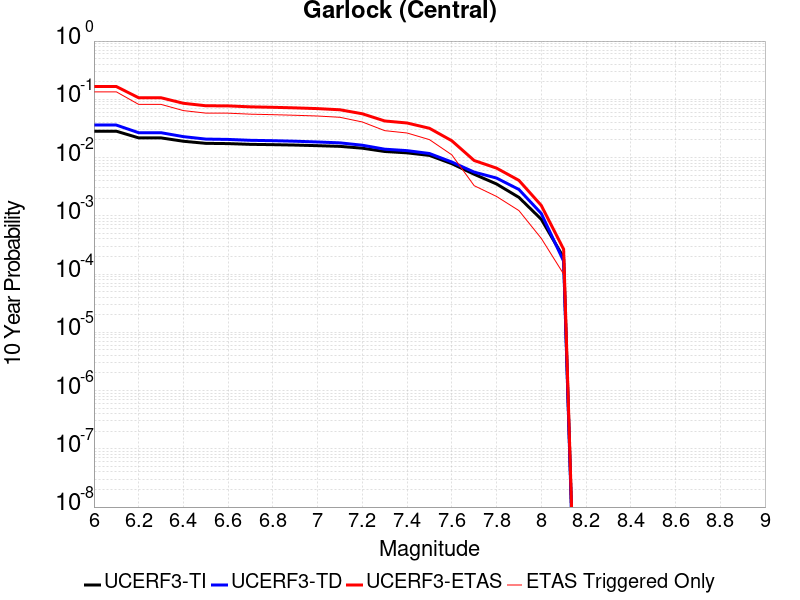 |

| Magnitude | 1 wk TI Prob | 1 wk TD Prob | 1 wk ETAS Prob | 1 wk ETAS/TD Gain | 1 wk ETAS Triggered Only | 1 mo TI Prob | 1 mo TD Prob | 1 mo ETAS Prob | 1 mo ETAS/TD Gain | 1 mo ETAS Triggered Only | 1 yr TI Prob | 1 yr TD Prob | 1 yr ETAS Prob | 1 yr ETAS/TD Gain | 1 yr ETAS Triggered Only | 10 yr TI Prob | 10 yr TD Prob | 10 yr ETAS Prob | 10 yr ETAS/TD Gain | 10 yr ETAS Triggered Only |
|-----|-----|-----|-----|-----|-----|-----|-----|-----|-----|-----|-----|-----|-----|-----|-----|-----|-----|-----|-----|-----|
| 6.0 | 5.5131142E-5 | 7.02476E-5 | 0.09652347 | 1374.0465 | 0.09646 | 2.3625491E-4 | 3.0102677E-4 | 0.10936818 | 363.31714 | 0.1091 | 0.0028726095 | 0.003658906 | 0.12786278 | 34.945633 | 0.12466 | 0.028357591 | 0.036136657 | 0.16576664 | 4.587216 | 0.13449 |
| 6.1 | 5.5131142E-5 | 7.02476E-5 | 0.09652347 | 1374.0465 | 0.09646 | 2.3625491E-4 | 3.0102677E-4 | 0.10936818 | 363.31714 | 0.1091 | 0.0028726095 | 0.003658906 | 0.12786278 | 34.945633 | 0.12466 | 0.028357591 | 0.036136657 | 0.16576664 | 4.587216 | 0.13449 |
| 6.2 | 4.216245E-5 | 5.1661802E-5 | 0.05758869 | 1114.7247 | 0.05754 | 1.806837E-4 | 2.213891E-4 | 0.06584686 | 297.4259 | 0.06564 | 0.0021976046 | 0.002692112 | 0.07809856 | 29.010147 | 0.07561 | 0.021759989 | 0.026701318 | 0.10631715 | 3.9817193 | 0.0818 |
| 6.3 | 4.216245E-5 | 5.1661802E-5 | 0.05758869 | 1114.7247 | 0.05754 | 1.806837E-4 | 2.213891E-4 | 0.06584686 | 297.4259 | 0.06564 | 0.0021976046 | 0.002692112 | 0.07809856 | 29.010147 | 0.07561 | 0.021759989 | 0.026701318 | 0.10631715 | 3.9817193 | 0.0818 |
| 6.4 | 3.6858168E-5 | 4.411026E-5 | 0.04487213 | 1017.272 | 0.04483 | 1.5795401E-4 | 1.8903041E-4 | 0.051369354 | 271.7518 | 0.05119 | 0.0019213937 | 0.0022990413 | 0.06112349 | 26.586512 | 0.05896 | 0.019048655 | 0.022866098 | 0.085431986 | 3.7361853 | 0.06403 |
| 6.5 | 3.39199E-5 | 4.0018425E-5 | 0.040568396 | 1013.7429 | 0.04053 | 1.453629E-4 | 1.7149639E-4 | 0.04640357 | 270.58044 | 0.04624 | 0.0017683565 | 0.0020859907 | 0.05535464 | 26.536379 | 0.05338 | 0.017543508 | 0.020758783 | 0.07753519 | 3.7350545 | 0.05798 |
| 6.6 | 3.3571985E-5 | 3.947258E-5 | 0.04045788 | 1024.9615 | 0.04042 | 1.4387199E-4 | 1.6915736E-4 | 0.046291355 | 273.65854 | 0.04613 | 0.0017502342 | 0.0020575672 | 0.055178043 | 26.81713 | 0.05323 | 0.017365133 | 0.020480042 | 0.07710609 | 3.764938 | 0.05781 |
| 6.7 | 3.2580007E-5 | 3.808902E-5 | 0.03889661 | 1021.2027 | 0.03886 | 1.3962112E-4 | 1.6322857E-4 | 0.044446 | 272.29303 | 0.04429 | 0.0016985617 | 0.0019855178 | 0.0530639 | 26.725471 | 0.05118 | 0.016856372 | 0.019770874 | 0.074242204 | 3.7551303 | 0.05557 |
| 6.8 | 3.2185937E-5 | 3.7516216E-5 | 0.038116086 | 1015.9897 | 0.03808 | 1.3793244E-4 | 1.60774E-4 | 0.04360379 | 271.2117 | 0.04345 | 0.0016780337 | 0.0019556875 | 0.052057512 | 26.618523 | 0.0502 | 0.016654192 | 0.019477878 | 0.07290653 | 3.7430427 | 0.05449 |
| 6.9 | 3.165394E-5 | 3.672075E-5 | 0.037175357 | 1012.38007 | 0.03714 | 1.3565269E-4 | 1.5736527E-4 | 0.042580687 | 270.58502 | 0.04243 | 0.0016503202 | 0.00191426 | 0.050820462 | 26.548359 | 0.049 | 0.01638118 | 0.019071518 | 0.071266726 | 3.7368143 | 0.05321 |
| 7.0 | 3.0903822E-5 | 3.562591E-5 | 0.036044344 | 1011.7452 | 0.03601 | 1.3243823E-4 | 1.5267366E-4 | 0.041266397 | 270.29153 | 0.04112 | 0.0016112428 | 0.0018572382 | 0.04932891 | 26.560356 | 0.04756 | 0.015996104 | 0.018513493 | 0.06923672 | 3.7397976 | 0.05168 |
| 7.1 | 3.0069863E-5 | 3.4392175E-5 | 0.034253214 | 995.9596 | 0.03422 | 1.2886449E-4 | 1.4738683E-4 | 0.039281618 | 266.52054 | 0.03914 | 0.0015677959 | 0.0017929787 | 0.046891972 | 26.15311 | 0.04518 | 0.01556781 | 0.01788099 | 0.06612267 | 3.6979315 | 0.04912 |
| 7.2 | 2.7957109E-5 | 3.128141E-5 | 0.028150402 | 899.90826 | 0.02812 | 1.1981068E-4 | 1.3405642E-4 | 0.032439724 | 241.98561 | 0.03231 | 0.0014577188 | 0.0016309345 | 0.03907976 | 23.961575 | 0.03751 | 0.014481937 | 0.016284352 | 0.05642979 | 3.4652767 | 0.04081 |
| 7.3 | 2.4519275E-5 | 2.6714602E-5 | 0.019816186 | 741.77356 | 0.01979 | 1.0507837E-4 | 1.1448621E-4 | 0.02305186 | 201.35054 | 0.02294 | 0.0012785783 | 0.001392993 | 0.02800587 | 20.104816 | 0.02665 | 0.012712469 | 0.01392861 | 0.04250496 | 3.0516295 | 0.02898 |
| 7.4 | 2.3225532E-5 | 2.5199166E-5 | 0.018084744 | 717.6723 | 0.01806 | 9.95342E-5 | 1.0799204E-4 | 0.02094574 | 193.95634 | 0.02084 | 0.0012111551 | 0.0013140244 | 0.025512185 | 19.415304 | 0.02423 | 0.012045753 | 0.013146196 | 0.039209004 | 2.982536 | 0.02641 |
| 7.5 | 2.097765E-5 | 2.2483406E-5 | 0.013792174 | 613.4379 | 0.01377 | 8.9901114E-5 | 9.6353964E-5 | 0.016004821 | 166.10443 | 0.01591 | 0.0010939965 | 0.00117249 | 0.01970074 | 16.80248 | 0.01855 | 0.010886264 | 0.0117406575 | 0.031822085 | 2.7104177 | 0.02032 |
| 7.6 | 1.511254E-5 | 1.5990969E-5 | 0.007405873 | 463.12845 | 0.00739 | 6.476642E-5 | 6.8530964E-5 | 0.008677941 | 126.62802 | 0.00861 | 7.882459E-4 | 8.34053E-4 | 0.01093562 | 13.111423 | 0.01011 | 0.007854558 | 0.008383867 | 0.019430472 | 2.3176024 | 0.01114 |
| 7.7 | 9.934069E-6 | 1.0678523E-5 | 0.0022206549 | 207.95525 | 0.00221 | 4.2573887E-5 | 4.5764296E-5 | 0.0025956477 | 56.71774 | 0.00255 | 5.182138E-4 | 5.570383E-4 | 0.0035153895 | 6.3108582 | 0.00296 | 0.00517007 | 0.005627419 | 0.008898905 | 1.5813475 | 0.00329 |
| 7.8 | 6.7562896E-6 | 8.42837E-6 | 0.0014684161 | 174.22302 | 0.00146 | 2.8955206E-5 | 3.6121084E-5 | 0.0017460593 | 48.339058 | 0.00171 | 3.5247262E-4 | 4.3968562E-4 | 0.0024188152 | 5.5012374 | 0.00198 | 0.0035191406 | 0.004446416 | 0.0065868567 | 1.4813855 | 0.00215 |
| 7.9 | 3.975453E-6 | 5.3710532E-6 | 8.4536657E-4 | 157.39307 | 8.4E-4 | 1.7037546E-5 | 2.3018596E-5 | 0.001002996 | 43.57329 | 9.8E-4 | 2.0741238E-4 | 2.8021546E-4 | 0.001419896 | 5.0671577 | 0.00114 | 0.002072189 | 0.0028335669 | 0.0040600817 | 1.4328519 | 0.00123 |
| 8.0 | 1.6729537E-6 | 2.0775192E-6 | 2.6207697E-4 | 126.149 | 2.6E-4 | 7.169782E-6 | 8.903624E-6 | 3.289008E-4 | 36.9401 | 3.2E-4 | 8.7288594E-5 | 1.0839626E-4 | 4.8835506E-4 | 4.505276 | 3.8E-4 | 8.7254314E-4 | 0.001096854 | 0.0015064043 | 1.3733864 | 4.1E-4 |
| 8.1 | 3.6733252E-7 | 3.1489736E-7 | 4.0314884E-5 | 128.02547 | 4.0E-5 | 1.5742813E-6 | 1.3495595E-6 | 7.134947E-5 | 52.868706 | 7.0E-5 | 1.9166706E-5 | 1.643078E-5 | 9.642947E-5 | 5.8688307 | 8.0E-5 | 1.9165053E-4 | 1.662928E-4 | 2.6627615E-4 | 1.601249 | 1.0E-4 |

## Tank Canyon
*[(top)](#table-of-contents)*

| 1 Week | 1 Month | 1 Year | 10 Year |
|-----|-----|-----|-----|
|  |  |  |  |

| Magnitude | 1 wk TI Prob | 1 wk TD Prob | 1 wk ETAS Prob | 1 wk ETAS/TD Gain | 1 wk ETAS Triggered Only | 1 mo TI Prob | 1 mo TD Prob | 1 mo ETAS Prob | 1 mo ETAS/TD Gain | 1 mo ETAS Triggered Only | 1 yr TI Prob | 1 yr TD Prob | 1 yr ETAS Prob | 1 yr ETAS/TD Gain | 1 yr ETAS Triggered Only | 10 yr TI Prob | 10 yr TD Prob | 10 yr ETAS Prob | 10 yr ETAS/TD Gain | 10 yr ETAS Triggered Only |
|-----|-----|-----|-----|-----|-----|-----|-----|-----|-----|-----|-----|-----|-----|-----|-----|-----|-----|-----|-----|-----|
| 6.0 | 4.8284557E-5 | 5.796445E-5 | 0.060444463 | 1042.785 | 0.06039 | 2.0691741E-4 | 2.4839927E-4 | 0.072710395 | 292.71582 | 0.07248 | 0.0025163088 | 0.0030207336 | 0.09160234 | 30.324535 | 0.08885 | 0.02488006 | 0.029863616 | 0.12628546 | 4.22874 | 0.09939 |
| 6.1 | 1.7796336E-5 | 2.0873378E-5 | 0.021630423 | 1036.2684 | 0.02161 | 7.626778E-5 | 8.945448E-5 | 0.026147123 | 292.2953 | 0.02606 | 9.281647E-4 | 0.0010886024 | 0.03358319 | 30.849825 | 0.03253 | 0.009242975 | 0.010836642 | 0.04733677 | 4.3682137 | 0.0369 |
| 6.2 | 1.7796336E-5 | 2.0873378E-5 | 0.021630423 | 1036.2684 | 0.02161 | 7.626778E-5 | 8.945448E-5 | 0.026147123 | 292.2953 | 0.02606 | 9.281647E-4 | 0.0010886024 | 0.03358319 | 30.849825 | 0.03253 | 0.009242975 | 0.010836642 | 0.04733677 | 4.3682137 | 0.0369 |
| 6.3 | 1.3515912E-5 | 1.5759651E-5 | 0.015375517 | 975.6254 | 0.01536 | 5.792405E-5 | 6.7539746E-5 | 0.018636286 | 275.93063 | 0.01857 | 7.049971E-4 | 8.2200987E-4 | 0.024112849 | 29.334015 | 0.02331 | 0.007027647 | 0.008192157 | 0.034534574 | 4.215565 | 0.02656 |
| 6.4 | 1.0870146E-5 | 1.2618114E-5 | 0.011602472 | 919.5092 | 0.01159 | 4.658551E-5 | 5.4076605E-5 | 0.014073319 | 260.2478 | 0.01402 | 5.67031E-4 | 6.582015E-4 | 0.018226631 | 27.691565 | 0.01758 | 0.005655863 | 0.006564382 | 0.026472831 | 4.032799 | 0.02004 |
| 6.5 | 7.964826E-6 | 9.196184E-6 | 0.007459128 | 811.1112 | 0.00745 | 3.4134522E-5 | 3.941168E-5 | 0.009119053 | 231.37947 | 0.00908 | 4.1550855E-4 | 4.797421E-4 | 0.01173434 | 24.459684 | 0.01126 | 0.0041473247 | 0.004788209 | 0.017546825 | 3.6645901 | 0.01282 |
| 6.6 | 6.6317E-6 | 7.612378E-6 | 0.005667569 | 744.5202 | 0.00566 | 2.8421264E-5 | 3.262412E-5 | 0.0068924003 | 211.267 | 0.00686 | 3.4597394E-4 | 3.9713533E-4 | 0.008883764 | 22.369612 | 0.00849 | 0.0034543579 | 0.0039652516 | 0.013606868 | 3.4315271 | 0.00968 |
| 6.7 | 4.793663E-6 | 5.4308593E-6 | 0.0030254144 | 557.0784 | 0.00302 | 2.0544108E-5 | 2.3274928E-5 | 0.003763188 | 161.68419 | 0.00374 | 2.500958E-4 | 2.833398E-4 | 0.005002002 | 17.653725 | 0.00472 | 0.0024981452 | 0.0028303189 | 0.008274865 | 2.9236512 | 0.00546 |
| 6.8 | 4.382823E-6 | 4.969325E-6 | 0.0027449557 | 552.38 | 0.00274 | 1.8783392E-5 | 2.1296957E-5 | 0.0034312243 | 161.11336 | 0.00341 | 2.286638E-4 | 2.5926388E-4 | 0.004528157 | 17.465437 | 0.00427 | 0.0022842865 | 0.0025901233 | 0.0074774316 | 2.8869019 | 0.0049 |
| 6.9 | 2.729601E-6 | 3.0735862E-6 | 0.0012430698 | 404.43628 | 0.00124 | 1.1698237E-5 | 1.3172453E-5 | 0.0015231526 | 115.63166 | 0.00151 | 1.4241673E-4 | 1.6036403E-4 | 0.0021100512 | 13.157884 | 0.00195 | 0.001423255 | 0.0016024808 | 0.0037190835 | 2.3208287 | 0.00212 |
| 7.0 | 1.8987357E-6 | 2.126971E-6 | 5.2212586E-4 | 245.4786 | 5.2E-4 | 8.137413E-6 | 9.115562E-6 | 6.591096E-4 | 72.30598 | 6.5E-4 | 9.90685E-5 | 1.1097702E-4 | 0.0010108771 | 9.108888 | 9.0E-4 | 9.902435E-4 | 0.0011092846 | 0.0020981864 | 1.8914771 | 9.9E-4 |
| 7.1 | 1.4928986E-6 | 1.6641525E-6 | 3.4166357E-4 | 205.30786 | 3.4E-4 | 6.398121E-6 | 7.132066E-6 | 4.2712907E-4 | 59.888546 | 4.2E-4 | 7.789434E-5 | 8.6830034E-5 | 6.267831E-4 | 7.2185063 | 5.4E-4 | 7.786704E-4 | 8.6801895E-4 | 0.0014475154 | 1.6676081 | 5.8E-4 |
| 7.2 | 1.069082E-6 | 1.1828765E-6 | 2.0118264E-4 | 170.07915 | 2.0E-4 | 4.581772E-6 | 5.0694644E-6 | 2.3506829E-4 | 46.369457 | 2.3E-4 | 5.5781646E-5 | 6.171951E-5 | 3.61701E-4 | 5.8603997 | 3.0E-4 | 5.576765E-4 | 6.1707594E-4 | 9.1689086E-4 | 1.4858638 | 3.0E-4 |
| 7.3 | 8.776551E-7 | 9.770151E-7 | 1.4097687E-4 | 144.29344 | 1.4E-4 | 3.7613736E-6 | 4.187204E-6 | 1.6418654E-4 | 39.2115 | 1.6E-4 | 4.579376E-5 | 5.0978535E-5 | 2.6096782E-4 | 5.1191707 | 2.1E-4 | 4.5784327E-4 | 5.097194E-4 | 7.196124E-4 | 1.4117813 | 2.1E-4 |
| 7.4 | 7.55721E-7 | 8.5103835E-7 | 1.0085095E-4 | 118.50341 | 1.0E-4 | 3.2388E-6 | 3.6473052E-6 | 1.2364687E-4 | 33.900883 | 1.2E-4 | 3.9431678E-5 | 4.4405555E-5 | 1.9439889E-4 | 4.3778057 | 1.5E-4 | 3.942468E-4 | 4.4401767E-4 | 5.9395103E-4 | 1.3376744 | 1.5E-4 |
| 7.5 | 5.587665E-7 | 6.305732E-7 | 8.0630525E-5 | 127.86862 | 8.0E-5 | 2.3947114E-6 | 2.7024564E-6 | 9.270221E-5 | 34.302944 | 9.0E-5 | 2.915522E-5 | 3.2902408E-5 | 1.4289879E-4 | 4.3431106 | 1.1E-4 | 2.9151395E-4 | 3.2902407E-4 | 4.389879E-4 | 1.3342121 | 1.1E-4 |

## Little Lake
*[(top)](#table-of-contents)*

| 1 Week | 1 Month | 1 Year | 10 Year |
|-----|-----|-----|-----|
|  |  |  |  |

| Magnitude | 1 wk TI Prob | 1 wk TD Prob | 1 wk ETAS Prob | 1 wk ETAS/TD Gain | 1 wk ETAS Triggered Only | 1 mo TI Prob | 1 mo TD Prob | 1 mo ETAS Prob | 1 mo ETAS/TD Gain | 1 mo ETAS Triggered Only | 1 yr TI Prob | 1 yr TD Prob | 1 yr ETAS Prob | 1 yr ETAS/TD Gain | 1 yr ETAS Triggered Only | 10 yr TI Prob | 10 yr TD Prob | 10 yr ETAS Prob | 10 yr ETAS/TD Gain | 10 yr ETAS Triggered Only |
|-----|-----|-----|-----|-----|-----|-----|-----|-----|-----|-----|-----|-----|-----|-----|-----|-----|-----|-----|-----|-----|
| 6.0 | 2.8424427E-5 | 3.1205716E-5 | 0.04538979 | 1454.5345 | 0.04536 | 1.2181328E-4 | 1.3373268E-4 | 0.050956935 | 381.0358 | 0.05083 | 0.0014820677 | 0.0016271125 | 0.059792317 | 36.7475 | 0.05826 | 0.014722223 | 0.016165398 | 0.07759603 | 4.8001313 | 0.06244 |
| 6.1 | 2.8424427E-5 | 3.1205716E-5 | 0.04538979 | 1454.5345 | 0.04536 | 1.2181328E-4 | 1.3373268E-4 | 0.050956935 | 381.0358 | 0.05083 | 0.0014820677 | 0.0016271125 | 0.059792317 | 36.7475 | 0.05826 | 0.014722223 | 0.016165398 | 0.07759603 | 4.8001313 | 0.06244 |
| 6.2 | 2.8424427E-5 | 3.1205716E-5 | 0.04538979 | 1454.5345 | 0.04536 | 1.2181328E-4 | 1.3373268E-4 | 0.050956935 | 381.0358 | 0.05083 | 0.0014820677 | 0.0016271125 | 0.059792317 | 36.7475 | 0.05826 | 0.014722223 | 0.016165398 | 0.07759603 | 4.8001313 | 0.06244 |
| 6.3 | 1.48860645E-5 | 1.6081383E-5 | 0.03054559 | 1899.4379 | 0.03053 | 6.379586E-5 | 6.8918554E-5 | 0.03430656 | 497.78406 | 0.03424 | 7.7643775E-4 | 8.387886E-4 | 0.039736133 | 47.37324 | 0.03893 | 0.007737305 | 0.008359045 | 0.04952206 | 5.9243684 | 0.04151 |
| 6.4 | 1.48860645E-5 | 1.6081383E-5 | 0.03054559 | 1899.4379 | 0.03053 | 6.379586E-5 | 6.8918554E-5 | 0.03430656 | 497.78406 | 0.03424 | 7.7643775E-4 | 8.387886E-4 | 0.039736133 | 47.37324 | 0.03893 | 0.007737305 | 0.008359045 | 0.04952206 | 5.9243684 | 0.04151 |
| 6.5 | 1.2797581E-5 | 1.376556E-5 | 0.028433375 | 2065.5444 | 0.02842 | 5.4845623E-5 | 5.8994065E-5 | 0.031957112 | 541.70044 | 0.0319 | 6.675408E-4 | 7.1804173E-4 | 0.036952004 | 51.462196 | 0.03626 | 0.006655392 | 0.007159767 | 0.04554297 | 6.3609567 | 0.03866 |
| 6.6 | 9.661896E-6 | 1.0289033E-5 | 0.025050031 | 2434.6343 | 0.02504 | 4.1407468E-5 | 4.40952E-5 | 0.027972864 | 634.3744 | 0.02793 | 5.040193E-4 | 5.36743E-4 | 0.03217975 | 59.953735 | 0.03166 | 0.005028777 | 0.0053560715 | 0.03891536 | 7.265653 | 0.03374 |
| 6.7 | 7.767871E-6 | 8.199681E-6 | 0.021718021 | 2648.642 | 0.02171 | 3.329045E-5 | 3.5141096E-5 | 0.024264289 | 690.4819 | 0.02423 | 4.0523586E-4 | 4.2777258E-4 | 0.027985979 | 65.42256 | 0.02757 | 0.004044977 | 0.004270843 | 0.033495493 | 7.842829 | 0.02935 |
| 6.8 | 6.4235196E-6 | 6.735739E-6 | 0.016936623 | 2514.4414 | 0.01693 | 2.752908E-5 | 2.8867207E-5 | 0.018968321 | 657.08887 | 0.01894 | 3.35115E-4 | 3.5141438E-4 | 0.021823866 | 62.10294 | 0.02148 | 0.003346101 | 0.0035098472 | 0.026399227 | 7.5214744 | 0.02297 |
| 6.9 | 3.1283696E-6 | 3.1121751E-6 | 0.01035308 | 3326.638 | 0.01035 | 1.3407229E-5 | 1.33378335E-5 | 0.011443186 | 857.94934 | 0.01143 | 1.6322079E-4 | 1.6237753E-4 | 0.013080279 | 80.55474 | 0.01292 | 0.0016310095 | 0.0016227372 | 0.01547023 | 9.533417 | 0.01387 |
| 7.0 | 2.290603E-6 | 2.2286763E-6 | 0.006542214 | 2935.471 | 0.00654 | 9.816834E-6 | 9.551441E-6 | 0.0072194827 | 755.8528 | 0.00721 | 1.19513395E-4 | 1.1628362E-4 | 0.008205343 | 70.56319 | 0.00809 | 0.0011944914 | 0.0011623299 | 0.009892171 | 8.51064 | 0.00874 |
| 7.1 | 1.293693E-6 | 1.1776774E-6 | 0.003041174 | 2582.349 | 0.00304 | 5.5443866E-6 | 5.047183E-6 | 0.0033650303 | 666.71454 | 0.00336 | 6.750081E-5 | 6.1448416E-5 | 0.003811218 | 62.023045 | 0.00375 | 6.7480316E-4 | 6.1438273E-4 | 0.0047118636 | 7.6692643 | 0.0041 |
| 7.2 | 4.715842E-7 | 3.091732E-7 | 1.2030914E-4 | 389.13184 | 1.2E-4 | 2.0210737E-6 | 1.3250274E-6 | 1.5132483E-4 | 114.20506 | 1.5E-4 | 2.4606294E-5 | 1.6132095E-5 | 1.8612936E-4 | 11.537829 | 1.7E-4 | 2.460357E-4 | 1.6130977E-4 | 3.3128235E-4 | 2.0537028 | 1.7E-4 |
| 7.3 | 3.9430947E-7 | 2.3096938E-7 | 9.023095E-5 | 390.66196 | 9.0E-5 | 1.6898966E-6 | 9.898685E-7 | 1.1098976E-4 | 112.12577 | 1.1E-4 | 2.0574296E-5 | 1.2051582E-5 | 1.4205002E-4 | 11.786836 | 1.3E-4 | 2.0572392E-4 | 1.2050936E-4 | 2.504937E-4 | 2.0786245 | 1.3E-4 |
| 7.4 | 3.547123E-7 | 1.9678579E-7 | 7.019677E-5 | 356.71667 | 7.0E-5 | 1.5201948E-6 | 8.433674E-7 | 8.08433E-5 | 95.85775 | 8.0E-5 | 1.8508214E-5 | 1.02679505E-5 | 1.1026693E-4 | 10.738942 | 1.0E-4 | 1.8506673E-4 | 1.0267482E-4 | 2.0266455E-4 | 1.9738486 | 1.0E-4 |
| 7.5 | 2.6354266E-7 | 1.4422719E-7 | 5.014422E-5 | 347.67523 | 5.0E-5 | 1.129468E-6 | 6.1811636E-7 | 6.061808E-5 | 98.06904 | 6.0E-5 | 1.3751187E-5 | 7.525541E-6 | 8.752494E-5 | 11.630384 | 8.0E-5 | 1.3750336E-4 | 7.5252916E-5 | 1.552469E-4 | 2.0630016 | 8.0E-5 |
| 7.6 | 1.269913E-7 | 7.572344E-8 | 3.0075722E-5 | 397.17847 | 3.0E-5 | 5.4424834E-7 | 3.24529E-7 | 3.032452E-5 | 93.441635 | 3.0E-5 | 6.6262032E-6 | 3.9511337E-6 | 3.3951015E-5 | 8.592728 | 3.0E-5 | 6.626006E-5 | 3.9510673E-5 | 6.9509486E-5 | 1.7592585 | 3.0E-5 |

## Airport Lake
*[(top)](#table-of-contents)*

| 1 Week | 1 Month | 1 Year | 10 Year |
|-----|-----|-----|-----|
|  |  |  |  |

| Magnitude | 1 wk TI Prob | 1 wk TD Prob | 1 wk ETAS Prob | 1 wk ETAS/TD Gain | 1 wk ETAS Triggered Only | 1 mo TI Prob | 1 mo TD Prob | 1 mo ETAS Prob | 1 mo ETAS/TD Gain | 1 mo ETAS Triggered Only | 1 yr TI Prob | 1 yr TD Prob | 1 yr ETAS Prob | 1 yr ETAS/TD Gain | 1 yr ETAS Triggered Only | 10 yr TI Prob | 10 yr TD Prob | 10 yr ETAS Prob | 10 yr ETAS/TD Gain | 10 yr ETAS Triggered Only |
|-----|-----|-----|-----|-----|-----|-----|-----|-----|-----|-----|-----|-----|-----|-----|-----|-----|-----|-----|-----|-----|
| 6.0 | 1.2387061E-5 | 1.3103157E-5 | 0.039492585 | 3013.9749 | 0.03948 | 5.3086325E-5 | 5.615534E-5 | 0.044323668 | 789.3046 | 0.04427 | 6.461343E-4 | 6.8350515E-4 | 0.050569385 | 73.985374 | 0.04992 | 0.0064425888 | 0.0068168393 | 0.059495274 | 8.727692 | 0.05304 |
| 6.1 | 1.2387061E-5 | 1.3103157E-5 | 0.039492585 | 3013.9749 | 0.03948 | 5.3086325E-5 | 5.615534E-5 | 0.044323668 | 789.3046 | 0.04427 | 6.461343E-4 | 6.8350515E-4 | 0.050569385 | 73.985374 | 0.04992 | 0.0064425888 | 0.0068168393 | 0.059495274 | 8.727692 | 0.05304 |
| 6.2 | 1.2387061E-5 | 1.3103157E-5 | 0.039492585 | 3013.9749 | 0.03948 | 5.3086325E-5 | 5.615534E-5 | 0.044323668 | 789.3046 | 0.04427 | 6.461343E-4 | 6.8350515E-4 | 0.050569385 | 73.985374 | 0.04992 | 0.0064425888 | 0.0068168393 | 0.059495274 | 8.727692 | 0.05304 |
| 6.3 | 1.2387061E-5 | 1.3103157E-5 | 0.039492585 | 3013.9749 | 0.03948 | 5.3086325E-5 | 5.615534E-5 | 0.044323668 | 789.3046 | 0.04427 | 6.461343E-4 | 6.8350515E-4 | 0.050569385 | 73.985374 | 0.04992 | 0.0064425888 | 0.0068168393 | 0.059495274 | 8.727692 | 0.05304 |
| 6.4 | 1.2387061E-5 | 1.3103157E-5 | 0.039492585 | 3013.9749 | 0.03948 | 5.3086325E-5 | 5.615534E-5 | 0.044323668 | 789.3046 | 0.04427 | 6.461343E-4 | 6.8350515E-4 | 0.050569385 | 73.985374 | 0.04992 | 0.0064425888 | 0.0068168393 | 0.059495274 | 8.727692 | 0.05304 |
| 6.5 | 6.9922594E-6 | 7.384925E-6 | 0.029777166 | 4032.1553 | 0.02977 | 2.996648E-5 | 3.1649324E-5 | 0.033240598 | 1050.2782 | 0.03321 | 3.6478083E-4 | 3.8526783E-4 | 0.037910804 | 98.40117 | 0.03754 | 0.003641826 | 0.0038465366 | 0.043553215 | 11.322709 | 0.03986 |
| 6.6 | 6.9922594E-6 | 7.384925E-6 | 0.029777166 | 4032.1553 | 0.02977 | 2.996648E-5 | 3.1649324E-5 | 0.033240598 | 1050.2782 | 0.03321 | 3.6478083E-4 | 3.8526783E-4 | 0.037910804 | 98.40117 | 0.03754 | 0.003641826 | 0.0038465366 | 0.043553215 | 11.322709 | 0.03986 |
| 6.7 | 5.477277E-6 | 5.7860684E-6 | 0.025285639 | 4370.09 | 0.02528 | 2.3473833E-5 | 2.4797222E-5 | 0.028274097 | 1140.2123 | 0.02825 | 2.8575645E-4 | 3.0186825E-4 | 0.03228221 | 106.94139 | 0.03199 | 0.0028538927 | 0.003014966 | 0.036922425 | 12.246383 | 0.03401 |
| 6.8 | 3.9950432E-6 | 4.2190873E-6 | 0.01899414 | 4501.9546 | 0.01899 | 1.7121502E-5 | 1.8081691E-5 | 0.021327697 | 1179.5188 | 0.02131 | 2.0843433E-4 | 2.2012512E-4 | 0.02431482 | 110.45909 | 0.0241 | 0.0020823893 | 0.0021993418 | 0.027753016 | 12.618783 | 0.02561 |
| 6.9 | 2.95695E-6 | 3.1230243E-6 | 0.013493081 | 4320.5176 | 0.01349 | 1.2672582E-5 | 1.3384334E-5 | 0.014983184 | 1119.4568 | 0.01497 | 1.5427776E-4 | 1.6294434E-4 | 0.017100183 | 104.94494 | 0.01694 | 0.001541707 | 0.0016284712 | 0.019718964 | 12.108881 | 0.01812 |
| 7.0 | 1.456072E-6 | 1.540812E-6 | 0.0062015313 | 4024.8462 | 0.0062 | 6.2402937E-6 | 6.603469E-6 | 0.006786559 | 1027.7263 | 0.00678 | 7.597293E-5 | 8.039528E-5 | 0.007679784 | 95.525314 | 0.0076 | 7.594696E-4 | 8.0376083E-4 | 0.00904713 | 11.255998 | 0.00825 |
| 7.1 | 6.995192E-7 | 7.4089746E-7 | 0.0028607387 | 3861.1804 | 0.00286 | 2.997936E-6 | 3.1752747E-6 | 0.0031131655 | 980.4397 | 0.00311 | 3.649926E-5 | 3.865897E-5 | 0.0035085247 | 90.755775 | 0.00347 | 3.6493264E-4 | 3.865897E-4 | 0.004205113 | 10.877458 | 0.00382 |

## Owl Lake
*[(top)](#table-of-contents)*

| 1 Week | 1 Month | 1 Year | 10 Year |
|-----|-----|-----|-----|
|  |  |  |  |

| Magnitude | 1 wk TI Prob | 1 wk TD Prob | 1 wk ETAS Prob | 1 wk ETAS/TD Gain | 1 wk ETAS Triggered Only | 1 mo TI Prob | 1 mo TD Prob | 1 mo ETAS Prob | 1 mo ETAS/TD Gain | 1 mo ETAS Triggered Only | 1 yr TI Prob | 1 yr TD Prob | 1 yr ETAS Prob | 1 yr ETAS/TD Gain | 1 yr ETAS Triggered Only | 10 yr TI Prob | 10 yr TD Prob | 10 yr ETAS Prob | 10 yr ETAS/TD Gain | 10 yr ETAS Triggered Only |
|-----|-----|-----|-----|-----|-----|-----|-----|-----|-----|-----|-----|-----|-----|-----|-----|-----|-----|-----|-----|-----|
| 6.0 | 5.0320643E-5 | 6.6358676E-5 | 0.02594464 | 390.97586 | 0.02588 | 2.1564208E-4 | 2.843643E-4 | 0.030595742 | 107.59347 | 0.03032 | 0.0026222812 | 0.003457547 | 0.039811417 | 11.514353 | 0.03648 | 0.02591553 | 0.034141295 | 0.073094375 | 2.1409373 | 0.04033 |
| 6.1 | 5.0320643E-5 | 6.6358676E-5 | 0.02594464 | 390.97586 | 0.02588 | 2.1564208E-4 | 2.843643E-4 | 0.030595742 | 107.59347 | 0.03032 | 0.0026222812 | 0.003457547 | 0.039811417 | 11.514353 | 0.03648 | 0.02591553 | 0.034141295 | 0.073094375 | 2.1409373 | 0.04033 |
| 6.2 | 2.4125871E-5 | 3.0980515E-5 | 0.019830367 | 640.09155 | 0.0198 | 1.0339249E-4 | 1.3276804E-4 | 0.02308972 | 173.91023 | 0.02296 | 0.0012580766 | 0.0016154252 | 0.029100953 | 18.014421 | 0.02753 | 0.012509781 | 0.016070755 | 0.04589365 | 2.8557246 | 0.03031 |
| 6.3 | 1.7433485E-5 | 2.2355545E-5 | 0.01768196 | 790.94293 | 0.01766 | 7.471279E-5 | 9.580685E-5 | 0.020483853 | 213.80365 | 0.02039 | 9.0924866E-4 | 0.001165962 | 0.025417652 | 21.799726 | 0.02428 | 0.009055373 | 0.0116291465 | 0.03790004 | 3.2590563 | 0.02658 |
| 6.4 | 1.7433485E-5 | 2.2355545E-5 | 0.01768196 | 790.94293 | 0.01766 | 7.471279E-5 | 9.580685E-5 | 0.020483853 | 213.80365 | 0.02039 | 9.0924866E-4 | 0.001165962 | 0.025417652 | 21.799726 | 0.02428 | 0.009055373 | 0.0116291465 | 0.03790004 | 3.2590563 | 0.02658 |
| 6.5 | 1.5182742E-5 | 1.9429277E-5 | 0.016879102 | 868.7458 | 0.01686 | 6.506727E-5 | 8.3266525E-5 | 0.019441655 | 233.48705 | 0.01936 | 7.919061E-4 | 0.0010134344 | 0.023960156 | 23.642534 | 0.02297 | 0.0078909 | 0.010118678 | 0.035004295 | 3.4593744 | 0.02514 |
| 6.6 | 6.7271576E-6 | 8.547518E-6 | 0.013518432 | 1581.5623 | 0.01351 | 2.8830356E-5 | 3.6631736E-5 | 0.015306072 | 417.8364 | 0.01527 | 3.5095305E-4 | 4.4590578E-4 | 0.018128017 | 40.65437 | 0.01769 | 0.0035039932 | 0.0044680187 | 0.023532456 | 5.2668657 | 0.01915 |
| 6.7 | 6.682835E-6 | 8.479961E-6 | 0.0135083655 | 1592.975 | 0.0135 | 2.8640408E-5 | 3.6342215E-5 | 0.015285788 | 420.60693 | 0.01525 | 3.4864116E-4 | 4.423823E-4 | 0.01809457 | 40.90256 | 0.01766 | 0.003480947 | 0.0044329325 | 0.023468174 | 5.294052 | 0.01912 |
| 6.8 | 6.5774975E-6 | 8.326427E-6 | 0.013468214 | 1617.5262 | 0.01346 | 2.8188972E-5 | 3.5684232E-5 | 0.015245141 | 427.22348 | 0.01521 | 3.4314668E-4 | 4.3437455E-4 | 0.018036725 | 41.52344 | 0.01761 | 0.0034261728 | 0.0043531056 | 0.023340091 | 5.3617105 | 0.01907 |
| 6.9 | 6.363419E-6 | 7.999591E-6 | 0.013427893 | 1678.5725 | 0.01342 | 2.727151E-5 | 3.428354E-5 | 0.0151837645 | 442.88788 | 0.01515 | 3.3198006E-4 | 4.1732774E-4 | 0.017920021 | 42.939922 | 0.01751 | 0.0033148455 | 0.0041830647 | 0.023053795 | 5.5112214 | 0.01895 |
| 7.0 | 6.1342453E-6 | 7.631779E-6 | 0.01330753 | 1743.6996 | 0.0133 | 2.6289357E-5 | 3.2707245E-5 | 0.015052216 | 460.21042 | 0.01502 | 3.2002592E-4 | 3.9814346E-4 | 0.017761229 | 44.61012 | 0.01737 | 0.0031956544 | 0.003991739 | 0.022716694 | 5.6909266 | 0.0188 |
| 7.1 | 5.842926E-6 | 7.142312E-6 | 0.012457053 | 1744.1206 | 0.01245 | 2.504087E-5 | 3.060958E-5 | 0.014130178 | 461.626 | 0.0141 | 3.0482994E-4 | 3.7261334E-4 | 0.016626555 | 44.62147 | 0.01626 | 0.0030441214 | 0.0037371595 | 0.021311237 | 5.7025223 | 0.01764 |
| 7.2 | 4.77173E-6 | 5.358478E-6 | 0.0079553155 | 1484.6222 | 0.00795 | 2.045011E-5 | 2.2964727E-5 | 0.009072757 | 395.07358 | 0.00905 | 2.4895166E-4 | 2.7956374E-4 | 0.01080662 | 38.6553 | 0.01053 | 0.0024867293 | 0.0028086212 | 0.01426635 | 5.0794854 | 0.01149 |
| 7.3 | 3.0494948E-6 | 2.710356E-6 | 0.0021927045 | 809.0097 | 0.00219 | 1.3069198E-5 | 1.1615762E-5 | 0.002501587 | 215.36142 | 0.00249 | 1.5910587E-4 | 1.4141288E-4 | 0.0029810113 | 21.080196 | 0.00284 | 0.0015899199 | 0.0014231089 | 0.0044987258 | 3.1611958 | 0.00308 |
| 7.4 | 2.7263884E-6 | 2.3055634E-6 | 0.0015123021 | 655.93604 | 0.00151 | 1.1684469E-5 | 9.880949E-6 | 0.0017498637 | 177.09471 | 0.00174 | 1.4224913E-4 | 1.2029401E-4 | 0.0021200534 | 17.623932 | 0.002 | 0.0014215811 | 0.0012110578 | 0.0034083934 | 2.8143938 | 0.0022 |
| 7.5 | 2.6090431E-6 | 2.1655019E-6 | 0.0012521629 | 578.2322 | 0.00125 | 1.1181565E-5 | 9.2806895E-6 | 0.0014392674 | 155.08195 | 0.00143 | 1.3612706E-4 | 1.1298663E-4 | 0.0017628002 | 15.601848 | 0.00165 | 0.001360437 | 0.0011378126 | 0.0029657304 | 2.6065192 | 0.00183 |
| 7.6 | 2.3008756E-6 | 1.8726826E-6 | 0.0010218708 | 545.6722 | 0.00102 | 9.860858E-6 | 8.025758E-6 | 0.0011280167 | 140.54956 | 0.00112 | 1.20049335E-4 | 9.770931E-5 | 0.0013675853 | 13.996469 | 0.00127 | 0.001199845 | 9.848307E-4 | 0.0024034323 | 2.4404523 | 0.00142 |
| 7.7 | 1.7184348E-6 | 1.341808E-6 | 5.313411E-4 | 395.98892 | 5.3E-4 | 7.3646997E-6 | 5.750593E-6 | 5.957472E-4 | 103.59752 | 5.9E-4 | 8.966153E-5 | 7.0011265E-5 | 7.5996295E-4 | 10.854867 | 6.9E-4 | 8.962536E-4 | 7.0769014E-4 | 0.0014871382 | 2.1013973 | 7.8E-4 |
| 7.8 | 8.4612907E-7 | 8.4054994E-7 | 2.7084033E-4 | 322.218 | 2.7E-4 | 3.6262625E-6 | 3.602352E-6 | 3.236012E-4 | 89.83053 | 3.2E-4 | 4.4148852E-5 | 4.3857777E-5 | 4.4384022E-4 | 10.119989 | 4.0E-4 | 4.414008E-4 | 4.4386165E-4 | 8.8366633E-4 | 1.9908599 | 4.4E-4 |
| 7.9 | 2.716738E-7 | 3.7681625E-7 | 7.037679E-5 | 186.76686 | 7.0E-5 | 1.1643157E-6 | 1.6149258E-6 | 9.1614784E-5 | 56.730022 | 9.0E-5 | 1.4175452E-5 | 1.9661555E-5 | 1.296594E-4 | 6.5945644 | 1.1E-4 | 1.4174548E-4 | 1.9829652E-4 | 3.082747E-4 | 1.5546148 | 1.1E-4 |
| 8.0 | 2.1995428E-8 | 3.3853325E-8 | 1.0033853E-5 | 296.39194 | 1.0E-5 | 9.426611E-8 | 1.4508568E-7 | 1.0145084E-5 | 69.92478 | 1.0E-5 | 1.1476893E-6 | 1.7664173E-6 | 1.1766399E-5 | 6.661166 | 1.0E-5 | 1.14768345E-5 | 1.7869768E-5 | 2.786959E-5 | 1.5595943 | 1.0E-5 |

## Panamint Valley
*[(top)](#table-of-contents)*

| 1 Week | 1 Month | 1 Year | 10 Year |
|-----|-----|-----|-----|
|  |  |  |  |

| Magnitude | 1 wk TI Prob | 1 wk TD Prob | 1 wk ETAS Prob | 1 wk ETAS/TD Gain | 1 wk ETAS Triggered Only | 1 mo TI Prob | 1 mo TD Prob | 1 mo ETAS Prob | 1 mo ETAS/TD Gain | 1 mo ETAS Triggered Only | 1 yr TI Prob | 1 yr TD Prob | 1 yr ETAS Prob | 1 yr ETAS/TD Gain | 1 yr ETAS Triggered Only | 10 yr TI Prob | 10 yr TD Prob | 10 yr ETAS Prob | 10 yr ETAS/TD Gain | 10 yr ETAS Triggered Only |
|-----|-----|-----|-----|-----|-----|-----|-----|-----|-----|-----|-----|-----|-----|-----|-----|-----|-----|-----|-----|-----|
| 6.0 | 3.0211835E-5 | 3.3984263E-5 | 0.019433325 | 571.83307 | 0.0194 | 1.2947287E-4 | 1.4563887E-4 | 0.02341225 | 160.75551 | 0.02327 | 0.0015751923 | 0.0017717406 | 0.029941741 | 16.89962 | 0.02822 | 0.015640736 | 0.017583003 | 0.048597906 | 2.7639139 | 0.03157 |
| 6.1 | 3.0211835E-5 | 3.3984263E-5 | 0.019433325 | 571.83307 | 0.0194 | 1.2947287E-4 | 1.4563887E-4 | 0.02341225 | 160.75551 | 0.02327 | 0.0015751923 | 0.0017717406 | 0.029941741 | 16.89962 | 0.02822 | 0.015640736 | 0.017583003 | 0.048597906 | 2.7639139 | 0.03157 |
| 6.2 | 3.0211835E-5 | 3.3984263E-5 | 0.019433325 | 571.83307 | 0.0194 | 1.2947287E-4 | 1.4563887E-4 | 0.02341225 | 160.75551 | 0.02327 | 0.0015751923 | 0.0017717406 | 0.029941741 | 16.89962 | 0.02822 | 0.015640736 | 0.017583003 | 0.048597906 | 2.7639139 | 0.03157 |
| 6.3 | 2.8573924E-5 | 3.2102445E-5 | 0.018601507 | 579.4421 | 0.01857 | 1.2245393E-4 | 1.375748E-4 | 0.022384513 | 162.70795 | 0.02225 | 0.001489857 | 0.0016737141 | 0.028458808 | 17.003386 | 0.02683 | 0.01479908 | 0.016618038 | 0.046070326 | 2.7723086 | 0.02995 |
| 6.4 | 2.8573924E-5 | 3.2102445E-5 | 0.018601507 | 579.4421 | 0.01857 | 1.2245393E-4 | 1.375748E-4 | 0.022384513 | 162.70795 | 0.02225 | 0.001489857 | 0.0016737141 | 0.028458808 | 17.003386 | 0.02683 | 0.01479908 | 0.016618038 | 0.046070326 | 2.7723086 | 0.02995 |
| 6.5 | 2.7468774E-5 | 3.0828138E-5 | 0.018230267 | 591.3515 | 0.0182 | 1.1771801E-4 | 1.3211406E-4 | 0.021829247 | 165.23032 | 0.0217 | 0.0014322745 | 0.0016073292 | 0.02759549 | 17.168535 | 0.02603 | 0.014230782 | 0.015963882 | 0.04450093 | 2.7876008 | 0.029 |
| 6.6 | 2.6135967E-5 | 2.9252153E-5 | 0.017558739 | 600.25464 | 0.01753 | 1.1200648E-4 | 1.2536049E-4 | 0.020962749 | 167.21974 | 0.02084 | 0.0013628257 | 0.0015252219 | 0.026437167 | 17.333324 | 0.02495 | 0.013544982 | 0.015154343 | 0.04253305 | 2.8066576 | 0.0278 |
| 6.7 | 2.4498746E-5 | 2.7341044E-5 | 0.016706886 | 611.0551 | 0.01668 | 1.04990395E-4 | 1.17170785E-4 | 0.019894853 | 169.79364 | 0.01978 | 0.0012775084 | 0.0014256459 | 0.025031943 | 17.55832 | 0.02364 | 0.012701893 | 0.014171593 | 0.040108737 | 2.830221 | 0.02631 |
| 6.8 | 2.2244329E-5 | 2.4935374E-5 | 0.015644547 | 627.4037 | 0.01562 | 9.532935E-5 | 1.0686163E-4 | 0.018524893 | 173.35402 | 0.01842 | 0.0011600169 | 0.0013002857 | 0.023131862 | 17.78983 | 0.02186 | 0.011539802 | 0.012932955 | 0.0368792 | 2.851568 | 0.02426 |
| 6.9 | 1.9902658E-5 | 2.2290182E-5 | 0.013961979 | 626.3735 | 0.01394 | 8.529431E-5 | 9.552596E-5 | 0.016373971 | 171.4086 | 0.01628 | 0.0010379635 | 0.0011624265 | 0.020300154 | 17.463602 | 0.01916 | 0.010331288 | 0.011569021 | 0.032405145 | 2.8010275 | 0.02108 |
| 7.0 | 1.8353881E-5 | 2.056605E-5 | 0.013060298 | 635.04156 | 0.01304 | 7.865712E-5 | 8.813734E-5 | 0.015246801 | 172.98912 | 0.01516 | 9.5722964E-4 | 0.0010725616 | 0.01887345 | 17.596611 | 0.01782 | 0.009531168 | 0.01067939 | 0.030079966 | 2.8166373 | 0.01961 |
| 7.1 | 1.7667631E-5 | 1.9772435E-5 | 0.012679522 | 641.27264 | 0.01266 | 7.571623E-5 | 8.4736355E-5 | 0.01478349 | 174.46455 | 0.0147 | 9.2145515E-4 | 0.0010311945 | 0.018213458 | 17.662487 | 0.0172 | 0.009176437 | 0.0102695925 | 0.028985394 | 2.8224483 | 0.01891 |
| 7.2 | 1.6381597E-5 | 1.8158042E-5 | 0.011097956 | 611.1869 | 0.01108 | 7.020495E-5 | 7.781795E-5 | 0.012976814 | 166.7586 | 0.0129 | 8.544101E-4 | 9.470391E-4 | 0.016112663 | 17.013725 | 0.01518 | 0.008511325 | 0.009435269 | 0.025898455 | 2.7448559 | 0.01662 |
| 7.3 | 1.4520491E-5 | 1.596657E-5 | 0.008915825 | 558.4057 | 0.0089 | 6.222919E-5 | 6.842646E-5 | 0.010517712 | 153.70825 | 0.01045 | 7.57377E-4 | 8.327899E-4 | 0.01320248 | 15.853314 | 0.01238 | 0.0075480095 | 0.008300399 | 0.021817265 | 2.6284595 | 0.01363 |
| 7.4 | 1.2852287E-5 | 1.41454875E-5 | 0.008584024 | 606.8383 | 0.00857 | 5.5080065E-5 | 6.06222E-5 | 0.010120013 | 166.93576 | 0.01006 | 6.7039346E-4 | 7.378411E-4 | 0.012599083 | 17.075603 | 0.01187 | 0.0066837464 | 0.007357429 | 0.020331267 | 2.7633657 | 0.01307 |
| 7.5 | 1.1637851E-5 | 1.2836868E-5 | 0.008532727 | 664.7048 | 0.00852 | 4.987555E-5 | 5.5014076E-5 | 0.010014466 | 182.0346 | 0.00996 | 6.070656E-4 | 6.696062E-4 | 0.012381759 | 18.491104 | 0.01172 | 0.006054099 | 0.0066793845 | 0.019503154 | 2.9199028 | 0.01291 |
| 7.6 | 3.0068115E-6 | 3.3330623E-6 | 0.0035533211 | 1066.083 | 0.00355 | 1.2886271E-5 | 1.4284516E-5 | 0.0042242245 | 295.72052 | 0.00421 | 1.5687906E-4 | 1.7390738E-4 | 0.005213031 | 29.975904 | 0.00504 | 0.0015676835 | 0.0017397973 | 0.0072601764 | 4.1730013 | 0.00553 |

## Garlock (East)
*[(top)](#table-of-contents)*

| 1 Week | 1 Month | 1 Year | 10 Year |
|-----|-----|-----|-----|
|  |  | 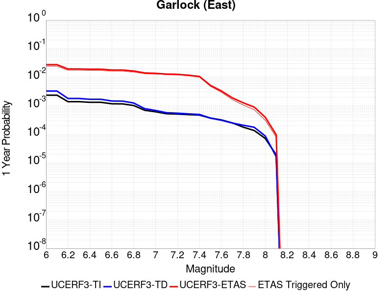 |  |

| Magnitude | 1 wk TI Prob | 1 wk TD Prob | 1 wk ETAS Prob | 1 wk ETAS/TD Gain | 1 wk ETAS Triggered Only | 1 mo TI Prob | 1 mo TD Prob | 1 mo ETAS Prob | 1 mo ETAS/TD Gain | 1 mo ETAS Triggered Only | 1 yr TI Prob | 1 yr TD Prob | 1 yr ETAS Prob | 1 yr ETAS/TD Gain | 1 yr ETAS Triggered Only | 10 yr TI Prob | 10 yr TD Prob | 10 yr ETAS Prob | 10 yr ETAS/TD Gain | 10 yr ETAS Triggered Only |
|-----|-----|-----|-----|-----|-----|-----|-----|-----|-----|-----|-----|-----|-----|-----|-----|-----|-----|-----|-----|-----|
| 6.0 | 4.5092507E-5 | 6.2904815E-5 | 0.016261885 | 258.51575 | 0.0162 | 1.9323928E-4 | 2.6956675E-4 | 0.020074226 | 74.46848 | 0.01981 | 0.0023501497 | 0.003277482 | 0.02752774 | 8.399052 | 0.02433 | 0.023254504 | 0.03235377 | 0.058606014 | 1.8114121 | 0.02713 |
| 6.1 | 4.5092507E-5 | 6.2904815E-5 | 0.016261885 | 258.51575 | 0.0162 | 1.9323928E-4 | 2.6956675E-4 | 0.020074226 | 74.46848 | 0.01981 | 0.0023501497 | 0.003277482 | 0.02752774 | 8.399052 | 0.02433 | 0.023254504 | 0.03235377 | 0.058606014 | 1.8114121 | 0.02713 |
| 6.2 | 2.6674514E-5 | 3.4511588E-5 | 0.012164093 | 352.46402 | 0.01213 | 1.1431433E-4 | 1.4789861E-4 | 0.01480573 | 100.1073 | 0.01466 | 0.0013908884 | 0.0017992114 | 0.019447401 | 10.808847 | 0.01768 | 0.01382215 | 0.017872788 | 0.03695552 | 2.0676975 | 0.01943 |
| 6.3 | 2.6674514E-5 | 3.4511588E-5 | 0.012164093 | 352.46402 | 0.01213 | 1.1431433E-4 | 1.4789861E-4 | 0.01480573 | 100.1073 | 0.01466 | 0.0013908884 | 0.0017992114 | 0.019447401 | 10.808847 | 0.01768 | 0.01382215 | 0.017872788 | 0.03695552 | 2.0676975 | 0.01943 |
| 6.4 | 2.5312667E-5 | 3.2340467E-5 | 0.011981954 | 370.49414 | 0.01195 | 1.0847834E-4 | 1.3859481E-4 | 0.014586592 | 105.24631 | 0.01445 | 0.0013199237 | 0.0016861152 | 0.019056777 | 11.302179 | 0.0174 | 0.013121112 | 0.016772287 | 0.03552244 | 2.1179247 | 0.01907 |
| 6.5 | 2.5312667E-5 | 3.2340467E-5 | 0.011981954 | 370.49414 | 0.01195 | 1.0847834E-4 | 1.3859481E-4 | 0.014586592 | 105.24631 | 0.01445 | 0.0013199237 | 0.0016861152 | 0.019056777 | 11.302179 | 0.0174 | 0.013121112 | 0.016772287 | 0.03552244 | 2.1179247 | 0.01907 |
| 6.6 | 2.246556E-5 | 2.8134691E-5 | 0.011437814 | 406.53772 | 0.01141 | 9.627742E-5 | 1.2057181E-4 | 0.013858915 | 114.943245 | 0.01374 | 0.0011715472 | 0.0014669969 | 0.017872894 | 12.183322 | 0.01643 | 0.011653901 | 0.014613169 | 0.03235013 | 2.2137656 | 0.018 |
| 6.7 | 2.2241198E-5 | 2.7804432E-5 | 0.011427487 | 410.99518 | 0.0114 | 9.531594E-5 | 1.1915654E-4 | 0.013837522 | 116.12894 | 0.01372 | 0.0011598538 | 0.0014497889 | 0.017826013 | 12.295591 | 0.0164 | 0.011538187 | 0.014442829 | 0.032143436 | 2.2255635 | 0.01796 |
| 6.8 | 1.9528685E-5 | 2.3898969E-5 | 0.010823641 | 452.89154 | 0.0108 | 8.369167E-5 | 1.0242024E-4 | 0.012981101 | 126.743515 | 0.01288 | 0.0010184698 | 0.0012462728 | 0.016497241 | 13.237265 | 0.01527 | 0.010138147 | 0.012436723 | 0.028879652 | 2.322127 | 0.01665 |
| 6.9 | 1.3318621E-5 | 1.5198818E-5 | 0.009775051 | 643.14545 | 0.00976 | 5.7078556E-5 | 6.51362E-5 | 0.011514391 | 176.77406 | 0.01145 | 6.9470983E-4 | 7.927504E-4 | 0.014122175 | 17.814152 | 0.01334 | 0.0069254204 | 0.007940721 | 0.022295818 | 2.8077826 | 0.01447 |
| 7.0 | 1.1760853E-5 | 1.3107653E-5 | 0.009592982 | 731.86115 | 0.00958 | 5.0402683E-5 | 5.6174475E-5 | 0.011245546 | 200.1896 | 0.01119 | 6.134799E-4 | 6.8371464E-4 | 0.013634854 | 19.942316 | 0.01296 | 0.0061178906 | 0.006857401 | 0.020820986 | 3.0362794 | 0.01406 |
| 7.1 | 1.0064758E-5 | 1.0902761E-5 | 0.009220802 | 845.73096 | 0.00921 | 4.3133965E-5 | 4.67253E-5 | 0.010756225 | 230.20131 | 0.01071 | 5.2502943E-4 | 5.6873553E-4 | 0.012891723 | 22.667341 | 0.01233 | 0.005237907 | 0.0057133473 | 0.018997017 | 3.325024 | 0.01336 |
| 7.2 | 9.768808E-6 | 1.0498628E-5 | 0.008980405 | 855.3883 | 0.00897 | 4.186565E-5 | 4.499337E-5 | 0.010494523 | 233.246 | 0.01045 | 5.095951E-4 | 5.4766005E-4 | 0.012571071 | 22.954151 | 0.01203 | 0.0050842804 | 0.005503584 | 0.018471817 | 3.3563251 | 0.01304 |
| 7.3 | 9.344516E-6 | 9.9442705E-6 | 0.008359862 | 840.67114 | 0.00835 | 4.004731E-5 | 4.2617627E-5 | 0.009782203 | 229.5342 | 0.00974 | 4.8746695E-4 | 5.187495E-4 | 0.011752918 | 22.65625 | 0.01124 | 0.0048639905 | 0.005215269 | 0.01731185 | 3.3194551 | 0.01216 |
| 7.4 | 9.023491E-6 | 9.490441E-6 | 0.007609418 | 801.79816 | 0.0076 | 3.867153E-5 | 4.0672705E-5 | 0.008790317 | 216.12325 | 0.00875 | 4.7072413E-4 | 4.95081E-4 | 0.010590081 | 21.390602 | 0.0101 | 0.004697283 | 0.0049787266 | 0.015874209 | 3.1884077 | 0.01095 |
| 7.5 | 7.081253E-6 | 7.0873994E-6 | 0.0035970618 | 507.52917 | 0.00359 | 3.0347876E-5 | 3.0374218E-5 | 0.0041802484 | 137.62488 | 0.00415 | 3.6942272E-4 | 3.697441E-4 | 0.005177966 | 14.004188 | 0.00481 | 0.003688092 | 0.0037244745 | 0.008974846 | 2.4096947 | 0.00527 |
| 7.6 | 6.116396E-6 | 5.9589424E-6 | 0.0021659462 | 363.47827 | 0.00216 | 2.6212863E-5 | 2.5538076E-5 | 0.002575473 | 100.84835 | 0.00255 | 3.1909486E-4 | 3.1088197E-4 | 0.0032999525 | 10.614808 | 0.00299 | 0.0031863707 | 0.0031359126 | 0.0064455015 | 2.055383 | 0.00332 |
| 7.7 | 4.797145E-6 | 4.7571157E-6 | 0.0011747516 | 246.94618 | 0.00117 | 2.055903E-5 | 2.0387479E-5 | 0.0014103592 | 69.17771 | 0.00139 | 2.5027743E-4 | 2.481894E-4 | 0.0018877824 | 7.6062164 | 0.00164 | 0.0024999576 | 0.0025094065 | 0.0043348144 | 1.727426 | 0.00183 |
| 7.8 | 3.4028885E-6 | 3.978375E-6 | 7.639754E-4 | 192.03203 | 7.6E-4 | 1.4583726E-5 | 1.7050066E-5 | 9.2703453E-4 | 54.371315 | 9.1E-4 | 1.775424E-4 | 2.0756487E-4 | 0.0012673448 | 6.1057773 | 0.00106 | 0.0017740062 | 0.0021012141 | 0.0032487977 | 1.5461526 | 0.00115 |
| 7.9 | 2.5928412E-6 | 3.372436E-6 | 5.3337065E-4 | 158.1559 | 5.3E-4 | 1.1112129E-5 | 1.4453217E-5 | 6.3444424E-4 | 43.896404 | 6.2E-4 | 1.3528178E-4 | 1.7595377E-4 | 8.958271E-4 | 5.091264 | 7.2E-4 | 0.0013519945 | 0.0017812426 | 0.0025698354 | 1.4427207 | 7.9E-4 |
| 8.0 | 1.3743648E-6 | 1.6734741E-6 | 2.1167312E-4 | 126.48724 | 2.1E-4 | 5.8901214E-6 | 7.1720124E-6 | 2.6717014E-4 | 37.25177 | 2.6E-4 | 7.1709874E-5 | 8.731578E-5 | 3.972887E-4 | 4.550022 | 3.1E-4 | 7.1686733E-4 | 8.837377E-4 | 0.0012234373 | 1.3843895 | 3.4E-4 |
| 8.1 | 3.6733252E-7 | 3.1489736E-7 | 4.0314884E-5 | 128.02547 | 4.0E-5 | 1.5742813E-6 | 1.3495595E-6 | 7.134947E-5 | 52.868706 | 7.0E-5 | 1.9166706E-5 | 1.643078E-5 | 9.642947E-5 | 5.8688307 | 8.0E-5 | 1.9165053E-4 | 1.662928E-4 | 2.6627615E-4 | 1.601249 | 1.0E-4 |

## Hunter Mountain-Saline Valley
*[(top)](#table-of-contents)*

| 1 Week | 1 Month | 1 Year | 10 Year |
|-----|-----|-----|-----|
|  |  |  |  |

| Magnitude | 1 wk TI Prob | 1 wk TD Prob | 1 wk ETAS Prob | 1 wk ETAS/TD Gain | 1 wk ETAS Triggered Only | 1 mo TI Prob | 1 mo TD Prob | 1 mo ETAS Prob | 1 mo ETAS/TD Gain | 1 mo ETAS Triggered Only | 1 yr TI Prob | 1 yr TD Prob | 1 yr ETAS Prob | 1 yr ETAS/TD Gain | 1 yr ETAS Triggered Only | 10 yr TI Prob | 10 yr TD Prob | 10 yr ETAS Prob | 10 yr ETAS/TD Gain | 10 yr ETAS Triggered Only |
|-----|-----|-----|-----|-----|-----|-----|-----|-----|-----|-----|-----|-----|-----|-----|-----|-----|-----|-----|-----|-----|
| 6.0 | 4.5103672E-5 | 5.456906E-5 | 0.009134074 | 167.38557 | 0.00908 | 1.9328714E-4 | 2.3384714E-4 | 0.010841366 | 46.36091 | 0.01061 | 0.002350731 | 0.0028435462 | 0.015407718 | 5.418487 | 0.0126 | 0.023260195 | 0.028092625 | 0.04159242 | 1.4805459 | 0.01389 |
| 6.1 | 4.5103672E-5 | 5.456906E-5 | 0.009134074 | 167.38557 | 0.00908 | 1.9328714E-4 | 2.3384714E-4 | 0.010841366 | 46.36091 | 0.01061 | 0.002350731 | 0.0028435462 | 0.015407718 | 5.418487 | 0.0126 | 0.023260195 | 0.028092625 | 0.04159242 | 1.4805459 | 0.01389 |
| 6.2 | 3.9363465E-5 | 4.706271E-5 | 0.009076638 | 192.86263 | 0.00903 | 1.6868966E-4 | 2.016826E-4 | 0.010759553 | 53.348938 | 0.01056 | 0.002051862 | 0.0024528534 | 0.014962095 | 6.0998735 | 0.01254 | 0.020330196 | 0.024274187 | 0.037729446 | 1.5543032 | 0.01379 |
| 6.3 | 3.9363465E-5 | 4.706271E-5 | 0.009076638 | 192.86263 | 0.00903 | 1.6868966E-4 | 2.016826E-4 | 0.010759553 | 53.348938 | 0.01056 | 0.002051862 | 0.0024528534 | 0.014962095 | 6.0998735 | 0.01254 | 0.020330196 | 0.024274187 | 0.037729446 | 1.5543032 | 0.01379 |
| 6.4 | 3.2311684E-5 | 3.795112E-5 | 0.008897615 | 234.44934 | 0.00886 | 1.384713E-4 | 1.6263791E-4 | 0.01054095 | 64.81238 | 0.01038 | 0.0016845843 | 0.001978387 | 0.014274013 | 7.2149754 | 0.01232 | 0.016718714 | 0.019617118 | 0.032901306 | 1.6771733 | 0.01355 |
| 6.5 | 3.2311684E-5 | 3.795112E-5 | 0.008897615 | 234.44934 | 0.00886 | 1.384713E-4 | 1.6263791E-4 | 0.01054095 | 64.81238 | 0.01038 | 0.0016845843 | 0.001978387 | 0.014274013 | 7.2149754 | 0.01232 | 0.016718714 | 0.019617118 | 0.032901306 | 1.6771733 | 0.01355 |
| 6.6 | 2.9305844E-5 | 3.418196E-5 | 0.00886388 | 259.31454 | 0.00883 | 1.2559042E-4 | 1.4648624E-4 | 0.01049497 | 71.644745 | 0.01035 | 0.0015279909 | 0.0017820727 | 0.014010242 | 7.8617682 | 0.01225 | 0.015175272 | 0.017686324 | 0.03091809 | 1.7481354 | 0.01347 |
| 6.7 | 2.7826512E-5 | 3.2344353E-5 | 0.008852059 | 273.68173 | 0.00882 | 1.19251024E-4 | 1.3861163E-4 | 0.010477179 | 75.58657 | 0.01034 | 0.0014509142 | 0.0016863506 | 0.01390571 | 8.2460375 | 0.01224 | 0.014414776 | 0.016743818 | 0.029978447 | 1.7904187 | 0.01346 |
| 6.8 | 2.3389874E-5 | 2.6866792E-5 | 0.008776632 | 326.67212 | 0.00875 | 1.0023846E-4 | 1.1513857E-4 | 0.010383956 | 90.18659 | 0.01027 | 0.00121972 | 0.001400958 | 0.013553908 | 9.674743 | 0.01217 | 0.01213047 | 0.013928067 | 0.02713157 | 1.9479781 | 0.01339 |
| 6.9 | 2.069209E-5 | 2.357011E-5 | 0.008733365 | 370.52713 | 0.00871 | 8.867737E-5 | 1.0101105E-4 | 0.010319979 | 102.16683 | 0.01022 | 0.0010791123 | 0.0012291519 | 0.013304291 | 10.823961 | 0.01209 | 0.010738871 | 0.012229158 | 0.02536651 | 2.0742648 | 0.0133 |
| 7.0 | 1.7462342E-5 | 1.9633622E-5 | 0.008699463 | 443.09006 | 0.00868 | 7.483646E-5 | 8.414151E-5 | 0.010263285 | 121.97647 | 0.01018 | 9.1075303E-4 | 0.0010239641 | 0.013051636 | 12.746184 | 0.01204 | 0.009070295 | 0.010196688 | 0.023311581 | 2.2861917 | 0.01325 |
| 7.1 | 1.4807709E-5 | 1.6441827E-5 | 0.0086563 | 526.4804 | 0.00864 | 6.3460066E-5 | 7.046316E-5 | 0.0102097485 | 144.89485 | 0.01014 | 7.723524E-4 | 8.575678E-4 | 0.012827294 | 14.957761 | 0.01198 | 0.007696735 | 0.008546168 | 0.021613529 | 2.5290318 | 0.01318 |
| 7.2 | 1.4180048E-5 | 1.5698413E-5 | 0.008655563 | 551.3655 | 0.00864 | 6.077022E-5 | 6.727727E-5 | 0.010206595 | 151.70941 | 0.01014 | 7.396263E-4 | 8.1880915E-4 | 0.012789 | 15.619024 | 0.01198 | 0.0073716943 | 0.008161469 | 0.021233901 | 2.6017253 | 0.01318 |
| 7.3 | 1.3730402E-5 | 1.5172151E-5 | 0.008645041 | 569.7967 | 0.00863 | 5.8843252E-5 | 6.502197E-5 | 0.010194363 | 156.78336 | 0.01013 | 7.161811E-4 | 7.9137104E-4 | 0.012751899 | 16.113678 | 0.01197 | 0.007138774 | 0.007889058 | 0.020955158 | 2.656231 | 0.01317 |
| 7.4 | 1.2810095E-5 | 1.4109353E-5 | 0.008553989 | 606.26373 | 0.00854 | 5.489925E-5 | 6.0467344E-5 | 0.010089861 | 166.86462 | 0.01003 | 6.681934E-4 | 7.3595706E-4 | 0.012567244 | 17.076056 | 0.01184 | 0.006661878 | 0.0073386896 | 0.020282993 | 2.763844 | 0.01304 |
| 7.5 | 1.1595659E-5 | 1.2800734E-5 | 0.008502692 | 664.23474 | 0.00849 | 4.9694736E-5 | 5.485922E-5 | 0.009984314 | 181.99884 | 0.00993 | 6.0486543E-4 | 6.67722E-4 | 0.012349917 | 18.495596 | 0.01169 | 0.006032217 | 0.006660632 | 0.019454842 | 2.9208705 | 0.01288 |
| 7.6 | 2.997694E-6 | 3.3251877E-6 | 0.0035333135 | 1062.5907 | 0.00353 | 1.28471975E-5 | 1.4250767E-5 | 0.0042041913 | 295.01508 | 0.00419 | 1.564034E-4 | 1.7349655E-4 | 0.005192626 | 29.929272 | 0.00502 | 0.0015629337 | 0.0017356955 | 0.007236132 | 4.16901 | 0.00551 |

## Blackwater
*[(top)](#table-of-contents)*

| 1 Week | 1 Month | 1 Year | 10 Year |
|-----|-----|-----|-----|
|  |  |  |  |

| Magnitude | 1 wk TI Prob | 1 wk TD Prob | 1 wk ETAS Prob | 1 wk ETAS/TD Gain | 1 wk ETAS Triggered Only | 1 mo TI Prob | 1 mo TD Prob | 1 mo ETAS Prob | 1 mo ETAS/TD Gain | 1 mo ETAS Triggered Only | 1 yr TI Prob | 1 yr TD Prob | 1 yr ETAS Prob | 1 yr ETAS/TD Gain | 1 yr ETAS Triggered Only | 10 yr TI Prob | 10 yr TD Prob | 10 yr ETAS Prob | 10 yr ETAS/TD Gain | 10 yr ETAS Triggered Only |
|-----|-----|-----|-----|-----|-----|-----|-----|-----|-----|-----|-----|-----|-----|-----|-----|-----|-----|-----|-----|-----|
| 6.0 | 3.0708583E-5 | 3.3095846E-5 | 0.0066828756 | 201.9249 | 0.00665 | 1.3160157E-4 | 1.4183241E-4 | 0.008320672 | 58.665524 | 0.00818 | 0.0016010714 | 0.0017255784 | 0.01231727 | 7.1380525 | 0.01061 | 0.015895851 | 0.017135633 | 0.028920177 | 1.6877215 | 0.01199 |
| 6.1 | 3.0708583E-5 | 3.3095846E-5 | 0.0066828756 | 201.9249 | 0.00665 | 1.3160157E-4 | 1.4183241E-4 | 0.008320672 | 58.665524 | 0.00818 | 0.0016010714 | 0.0017255784 | 0.01231727 | 7.1380525 | 0.01061 | 0.015895851 | 0.017135633 | 0.028920177 | 1.6877215 | 0.01199 |
| 6.2 | 1.1707779E-5 | 1.2545122E-5 | 0.0026625118 | 212.23483 | 0.00265 | 5.017523E-5 | 5.3763757E-5 | 0.0032935895 | 61.260406 | 0.00324 | 6.107122E-4 | 6.5438676E-4 | 0.004861632 | 7.4292946 | 0.00421 | 0.006090366 | 0.0065255696 | 0.011234638 | 1.7216334 | 0.00474 |
| 6.3 | 1.1707779E-5 | 1.2545122E-5 | 0.0026625118 | 212.23483 | 0.00265 | 5.017523E-5 | 5.3763757E-5 | 0.0032935895 | 61.260406 | 0.00324 | 6.107122E-4 | 6.5438676E-4 | 0.004861632 | 7.4292946 | 0.00421 | 0.006090366 | 0.0065255696 | 0.011234638 | 1.7216334 | 0.00474 |
| 6.4 | 7.929244E-6 | 8.480098E-6 | 0.0017484654 | 206.18457 | 0.00174 | 3.3982033E-5 | 3.6342793E-5 | 0.002176265 | 59.88161 | 0.00214 | 4.136527E-4 | 4.423877E-4 | 0.0032711357 | 7.3942733 | 0.00283 | 0.0041288356 | 0.0044154758 | 0.007561523 | 1.7125046 | 0.00316 |
| 6.5 | 5.8832115E-6 | 6.285991E-6 | 0.0012362782 | 196.67198 | 0.00123 | 2.521352E-5 | 2.6939697E-5 | 0.0015168996 | 56.307224 | 0.00149 | 3.0693135E-4 | 3.27944E-4 | 0.0022773044 | 6.944187 | 0.00195 | 0.0030650778 | 0.0032748538 | 0.0054178126 | 1.6543678 | 0.00215 |
| 6.6 | 5.8832115E-6 | 6.285991E-6 | 0.0012362782 | 196.67198 | 0.00123 | 2.521352E-5 | 2.6939697E-5 | 0.0015168996 | 56.307224 | 0.00149 | 3.0693135E-4 | 3.27944E-4 | 0.0022773044 | 6.944187 | 0.00195 | 0.0030650778 | 0.0032748538 | 0.0054178126 | 1.6543678 | 0.00215 |
| 6.7 | 3.0715053E-6 | 3.2814662E-6 | 5.7327957E-4 | 174.70227 | 5.7E-4 | 1.3163528E-5 | 1.4063357E-5 | 7.2405336E-4 | 51.4851 | 7.1E-4 | 1.6025416E-4 | 1.7120909E-4 | 0.0010410601 | 6.080636 | 8.7E-4 | 0.0016013865 | 0.0017108864 | 0.0026392953 | 1.5426478 | 9.3E-4 |
| 6.8 | 2.2722281E-6 | 2.4287538E-6 | 4.424277E-4 | 182.16243 | 4.4E-4 | 9.738084E-6 | 1.0408908E-5 | 5.304035E-4 | 50.95669 | 5.2E-4 | 1.1855473E-4 | 1.26722E-4 | 7.4664346E-4 | 5.8919797 | 6.2E-4 | 0.001184915 | 0.0012665876 | 0.0019157643 | 1.51254 | 6.5E-4 |
| 6.9 | 9.952399E-7 | 1.0653489E-6 | 1.6106518E-4 | 151.18538 | 1.6E-4 | 4.265307E-6 | 4.5657757E-6 | 2.0456486E-4 | 44.803967 | 2.0E-4 | 5.1928873E-5 | 5.5587418E-5 | 3.2557242E-4 | 5.856944 | 2.7E-4 | 5.191674E-4 | 5.557858E-4 | 8.456246E-4 | 1.5214938 | 2.9E-4 |
| 7.0 | 4.7385504E-7 | 5.0755597E-7 | 7.050752E-5 | 138.91576 | 7.0E-5 | 2.0308057E-6 | 2.1752398E-6 | 9.217505E-5 | 42.37466 | 9.0E-5 | 2.4724779E-5 | 2.6483543E-5 | 1.264809E-4 | 4.77583 | 1.0E-4 | 2.4722028E-4 | 2.6483546E-4 | 3.7480632E-4 | 1.4152423 | 1.1E-4 |

## Ash Hill
*[(top)](#table-of-contents)*

| 1 Week | 1 Month | 1 Year | 10 Year |
|-----|-----|-----|-----|
|  |  |  |  |

| Magnitude | 1 wk TI Prob | 1 wk TD Prob | 1 wk ETAS Prob | 1 wk ETAS/TD Gain | 1 wk ETAS Triggered Only | 1 mo TI Prob | 1 mo TD Prob | 1 mo ETAS Prob | 1 mo ETAS/TD Gain | 1 mo ETAS Triggered Only | 1 yr TI Prob | 1 yr TD Prob | 1 yr ETAS Prob | 1 yr ETAS/TD Gain | 1 yr ETAS Triggered Only | 10 yr TI Prob | 10 yr TD Prob | 10 yr ETAS Prob | 10 yr ETAS/TD Gain | 10 yr ETAS Triggered Only |
|-----|-----|-----|-----|-----|-----|-----|-----|-----|-----|-----|-----|-----|-----|-----|-----|-----|-----|-----|-----|-----|
| 6.0 | 2.1545662E-5 | 2.3194447E-5 | 0.006293049 | 271.31705 | 0.00627 | 9.2335285E-5 | 9.940143E-5 | 0.0079386225 | 79.86426 | 0.00784 | 0.0011236023 | 0.0012096206 | 0.011077669 | 9.15797 | 0.00988 | 0.011179381 | 0.012038348 | 0.023093639 | 1.9183395 | 0.01119 |
| 6.1 | 2.1545662E-5 | 2.3194447E-5 | 0.006293049 | 271.31705 | 0.00627 | 9.2335285E-5 | 9.940143E-5 | 0.0079386225 | 79.86426 | 0.00784 | 0.0011236023 | 0.0012096206 | 0.011077669 | 9.15797 | 0.00988 | 0.011179381 | 0.012038348 | 0.023093639 | 1.9183395 | 0.01119 |
| 6.2 | 2.1545662E-5 | 2.3194447E-5 | 0.006293049 | 271.31705 | 0.00627 | 9.2335285E-5 | 9.940143E-5 | 0.0079386225 | 79.86426 | 0.00784 | 0.0011236023 | 0.0012096206 | 0.011077669 | 9.15797 | 0.00988 | 0.011179381 | 0.012038348 | 0.023093639 | 1.9183395 | 0.01119 |
| 6.3 | 1.0025529E-5 | 1.0746934E-5 | 0.0026707184 | 248.50978 | 0.00266 | 4.2965847E-5 | 4.605755E-5 | 0.0034159024 | 74.165955 | 0.00337 | 5.229836E-4 | 5.6061964E-4 | 0.004798243 | 8.55882 | 0.00424 | 0.005217545 | 0.0055933665 | 0.010376463 | 1.8551372 | 0.00481 |
| 6.4 | 1.0025529E-5 | 1.0746934E-5 | 0.0026707184 | 248.50978 | 0.00266 | 4.2965847E-5 | 4.605755E-5 | 0.0034159024 | 74.165955 | 0.00337 | 5.229836E-4 | 5.6061964E-4 | 0.004798243 | 8.55882 | 0.00424 | 0.005217545 | 0.0055933665 | 0.010376463 | 1.8551372 | 0.00481 |
| 6.5 | 6.9617327E-6 | 7.456634E-6 | 0.0016174447 | 216.9135 | 0.00161 | 2.9835655E-5 | 3.195666E-5 | 0.00212189 | 66.39899 | 0.00209 | 3.6318856E-4 | 3.8901155E-4 | 0.002968008 | 7.629614 | 0.00258 | 0.0036259557 | 0.0038841602 | 0.0068525854 | 1.7642386 | 0.00298 |
| 6.6 | 4.9919777E-6 | 5.3466883E-6 | 0.0012253402 | 229.17741 | 0.00122 | 2.1394015E-5 | 2.2914215E-5 | 0.0016228775 | 70.82405 | 0.0016 | 2.60441E-4 | 2.7895154E-4 | 0.002208413 | 7.9168344 | 0.00193 | 0.0026013597 | 0.0027866727 | 0.005000486 | 1.7944291 | 0.00222 |
| 6.7 | 3.6630722E-6 | 3.924624E-6 | 9.6392084E-4 | 245.60847 | 9.6E-4 | 1.5698786E-5 | 1.681974E-5 | 0.0012267993 | 72.93807 | 0.00121 | 1.9111596E-4 | 2.0476682E-4 | 0.0016644679 | 8.128601 | 0.00146 | 0.0019095168 | 0.0020463446 | 0.0037428658 | 1.8290497 | 0.0017 |
| 6.8 | 2.5599613E-6 | 2.744925E-6 | 7.02743E-4 | 256.01538 | 7.0E-4 | 1.0971216E-5 | 1.1763939E-5 | 8.817537E-4 | 74.95395 | 8.7E-4 | 1.3356637E-4 | 1.4322149E-4 | 0.0012130683 | 8.469875 | 0.00107 | 0.0013348613 | 0.0014317769 | 0.0026700015 | 1.8648167 | 0.00124 |
| 6.9 | 1.7684905E-6 | 1.8968707E-6 | 5.4189586E-4 | 285.67886 | 5.4E-4 | 7.579223E-6 | 8.129446E-6 | 6.78124E-4 | 83.41577 | 6.7E-4 | 9.2273134E-5 | 9.8976E-5 | 9.2889386E-4 | 9.385041 | 8.3E-4 | 9.223483E-4 | 9.8976E-4 | 0.0019388198 | 1.9588786 | 9.5E-4 |

## Garlock (West)
*[(top)](#table-of-contents)*

| 1 Week | 1 Month | 1 Year | 10 Year |
|-----|-----|-----|-----|
|  |  |  | 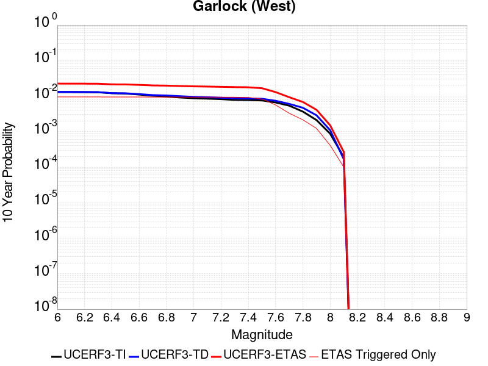 |

| Magnitude | 1 wk TI Prob | 1 wk TD Prob | 1 wk ETAS Prob | 1 wk ETAS/TD Gain | 1 wk ETAS Triggered Only | 1 mo TI Prob | 1 mo TD Prob | 1 mo ETAS Prob | 1 mo ETAS/TD Gain | 1 mo ETAS Triggered Only | 1 yr TI Prob | 1 yr TD Prob | 1 yr ETAS Prob | 1 yr ETAS/TD Gain | 1 yr ETAS Triggered Only | 10 yr TI Prob | 10 yr TD Prob | 10 yr ETAS Prob | 10 yr ETAS/TD Gain | 10 yr ETAS Triggered Only |
|-----|-----|-----|-----|-----|-----|-----|-----|-----|-----|-----|-----|-----|-----|-----|-----|-----|-----|-----|-----|-----|
| 6.0 | 2.5181727E-5 | 2.5197181E-5 | 0.006615031 | 262.5306 | 0.00659 | 1.0791722E-4 | 1.0798347E-4 | 0.007657168 | 70.91056 | 0.00755 | 0.0013131002 | 0.0013139093 | 0.010022452 | 7.6279635 | 0.00872 | 0.013053683 | 0.013141794 | 0.02249721 | 1.7118827 | 0.00948 |
| 6.1 | 2.5077732E-5 | 2.5098223E-5 | 0.006614933 | 263.5618 | 0.00659 | 1.0747157E-4 | 1.075594E-4 | 0.0076567475 | 71.18622 | 0.00755 | 0.001307681 | 0.0013087525 | 0.01001734 | 7.654114 | 0.00872 | 0.013000126 | 0.013090835 | 0.022446735 | 1.7146908 | 0.00948 |
| 6.2 | 2.494612E-5 | 2.4979914E-5 | 0.0066148154 | 264.80536 | 0.00659 | 1.0690756E-4 | 1.070524E-4 | 0.007656244 | 71.518654 | 0.00755 | 0.0013008224 | 0.0013025872 | 0.010011229 | 7.68565 | 0.00872 | 0.012932341 | 0.013029906 | 0.022386383 | 1.7180771 | 0.00948 |
| 6.3 | 2.4733758E-5 | 2.4799276E-5 | 0.0066146357 | 266.72696 | 0.00659 | 1.0599751E-4 | 1.06278305E-4 | 0.0076554758 | 72.03235 | 0.00755 | 0.0012897556 | 0.0012931736 | 0.010001897 | 7.7343802 | 0.00872 | 0.012822957 | 0.0129368715 | 0.02229423 | 1.7233092 | 0.00948 |
| 6.4 | 2.3237335E-5 | 2.3178607E-5 | 0.006593026 | 284.44446 | 0.00657 | 9.958477E-5 | 9.933313E-5 | 0.007618586 | 76.697334 | 0.00752 | 0.0012117702 | 0.0012087126 | 0.009878221 | 8.172514 | 0.00868 | 0.012051838 | 0.012101731 | 0.021427492 | 1.7706137 | 0.00944 |
| 6.5 | 2.2732203E-5 | 2.2992977E-5 | 0.006592842 | 286.73285 | 0.00657 | 9.742009E-5 | 9.8537625E-5 | 0.007617797 | 77.30851 | 0.00752 | 0.0011854442 | 0.0011990381 | 0.00986863 | 8.230456 | 0.00868 | 0.011791403 | 0.012006035 | 0.021332698 | 1.7768312 | 0.00944 |
| 6.6 | 2.1319436E-5 | 2.1773201E-5 | 0.0065816306 | 302.28125 | 0.00656 | 9.136581E-5 | 9.3310395E-5 | 0.0076026097 | 81.476555 | 0.00751 | 0.001111811 | 0.0011354643 | 0.00979562 | 8.626973 | 0.00867 | 0.011062649 | 0.011376952 | 0.020699667 | 1.8194388 | 0.00943 |
| 6.7 | 1.970802E-5 | 2.0393094E-5 | 0.0065702596 | 322.1806 | 0.00655 | 8.446021E-5 | 8.739606E-5 | 0.0075867404 | 86.80872 | 0.0075 | 0.001027818 | 0.0010635294 | 0.009714319 | 9.13404 | 0.00866 | 0.010230771 | 0.0106646875 | 0.019984227 | 1.8738688 | 0.00942 |
| 6.8 | 1.8744462E-5 | 1.9900775E-5 | 0.0065697706 | 330.12637 | 0.00655 | 8.033094E-5 | 8.528626E-5 | 0.007584647 | 88.93164 | 0.0075 | 9.775903E-4 | 0.0010378672 | 0.009688879 | 9.335375 | 0.00866 | 0.009733009 | 0.010410495 | 0.019732429 | 1.8954362 | 0.00942 |
| 6.9 | 1.7559682E-5 | 1.8953151E-5 | 0.006568829 | 346.58243 | 0.00655 | 7.5253614E-5 | 8.122527E-5 | 0.007570617 | 93.20519 | 0.00749 | 9.158276E-4 | 9.884704E-4 | 0.00961993 | 9.732138 | 0.00864 | 0.0091206245 | 0.009921073 | 0.019227816 | 1.9380782 | 0.0094 |
| 7.0 | 1.6794445E-5 | 1.8215967E-5 | 0.0065380973 | 358.9212 | 0.00652 | 7.197421E-5 | 7.806611E-5 | 0.0075274846 | 96.42449 | 0.00745 | 8.759337E-4 | 9.5004175E-4 | 0.009541871 | 10.043633 | 0.0086 | 0.008724891 | 0.009539958 | 0.018810663 | 1.9717764 | 0.00936 |
| 7.1 | 1.6337795E-5 | 1.771677E-5 | 0.0065276013 | 368.442 | 0.00651 | 7.0017246E-5 | 7.592681E-5 | 0.007515362 | 98.98167 | 0.00744 | 8.521265E-4 | 9.2401815E-4 | 0.009506081 | 10.287764 | 0.00859 | 0.008488664 | 0.009281721 | 0.018544937 | 1.9980063 | 0.00935 |
| 7.2 | 1.5780008E-5 | 1.71654E-5 | 0.006507054 | 379.07968 | 0.00649 | 6.762685E-5 | 7.3563926E-5 | 0.007483019 | 101.721306 | 0.00741 | 8.2304585E-4 | 8.952741E-4 | 0.009447611 | 10.552757 | 0.00856 | 0.008200042 | 0.008996559 | 0.01823271 | 2.0266316 | 0.00932 |
| 7.3 | 1.5058865E-5 | 1.6618484E-5 | 0.006496511 | 390.9208 | 0.00648 | 6.45364E-5 | 7.122013E-5 | 0.007460694 | 104.75541 | 0.00739 | 7.854473E-4 | 8.667614E-4 | 0.009399359 | 10.84423 | 0.00854 | 0.00782677 | 0.008713263 | 0.01793223 | 2.0580385 | 0.0093 |
| 7.4 | 1.4887923E-5 | 1.6454453E-5 | 0.0063863494 | 388.1229 | 0.00637 | 6.380382E-5 | 7.0517184E-5 | 0.007330005 | 103.94637 | 0.00726 | 7.7653467E-4 | 8.5820974E-4 | 0.009251 | 10.779417 | 0.0084 | 0.0077382675 | 0.008628101 | 0.017709069 | 2.0524871 | 0.00916 |
| 7.5 | 1.4509299E-5 | 1.6046468E-5 | 0.005775954 | 359.95172 | 0.00576 | 6.218123E-5 | 6.876877E-5 | 0.0066583157 | 96.821785 | 0.00659 | 7.567935E-4 | 8.369394E-4 | 0.008430579 | 10.073106 | 0.0076 | 0.0075422134 | 0.008416411 | 0.016676301 | 1.9814031 | 0.00833 |
| 7.6 | 1.2756717E-5 | 1.4050529E-5 | 0.0038739962 | 275.7189 | 0.00386 | 5.4670498E-5 | 6.0215163E-5 | 0.004479949 | 74.39902 | 0.00442 | 6.6541E-4 | 7.328737E-4 | 0.0058191433 | 7.940172 | 0.00509 | 0.006634211 | 0.007381374 | 0.012969817 | 1.7571006 | 0.00563 |
| 7.7 | 1.0328985E-5 | 1.146033E-5 | 0.002221435 | 193.83691 | 0.00221 | 4.4266326E-5 | 4.9114777E-5 | 0.0025989895 | 52.91665 | 0.00255 | 5.388092E-4 | 5.9780874E-4 | 0.0035560392 | 5.9484563 | 0.00296 | 0.0053750467 | 0.006038286 | 0.00930842 | 1.5415666 | 0.00329 |
| 7.8 | 7.0306583E-6 | 8.899537E-6 | 0.0014688865 | 165.05203 | 0.00146 | 3.0131043E-5 | 3.8140315E-5 | 0.0017480751 | 45.83274 | 0.00171 | 3.667837E-4 | 4.6425956E-4 | 0.0024433404 | 5.2628756 | 0.00198 | 0.003661789 | 0.0046950667 | 0.006834972 | 1.4557775 | 0.00215 |
| 7.9 | 4.060633E-6 | 5.465412E-6 | 8.454608E-4 | 154.69296 | 8.4E-4 | 1.7402595E-5 | 2.3422985E-5 | 0.0010034001 | 42.838264 | 9.8E-4 | 2.11856E-4 | 2.8513762E-4 | 0.0014248126 | 4.996929 | 0.00114 | 0.0021165414 | 0.002884143 | 0.0041105957 | 1.4252398 | 0.00123 |
| 8.0 | 1.6729537E-6 | 2.0775192E-6 | 2.6207697E-4 | 126.149 | 2.6E-4 | 7.169782E-6 | 8.903624E-6 | 3.289008E-4 | 36.9401 | 3.2E-4 | 8.7288594E-5 | 1.0839626E-4 | 4.8835506E-4 | 4.505276 | 3.8E-4 | 8.7254314E-4 | 0.001096854 | 0.0015064043 | 1.3733864 | 4.1E-4 |
| 8.1 | 3.6733252E-7 | 3.1489736E-7 | 4.0314884E-5 | 128.02547 | 4.0E-5 | 1.5742813E-6 | 1.3495595E-6 | 7.134947E-5 | 52.868706 | 7.0E-5 | 1.9166706E-5 | 1.643078E-5 | 9.642947E-5 | 5.8688307 | 8.0E-5 | 1.9165053E-4 | 1.662928E-4 | 2.6627615E-4 | 1.601249 | 1.0E-4 |

## McLean Lake
*[(top)](#table-of-contents)*

| 1 Week | 1 Month | 1 Year | 10 Year |
|-----|-----|-----|-----|
|  |  |  |  |

| Magnitude | 1 wk TI Prob | 1 wk TD Prob | 1 wk ETAS Prob | 1 wk ETAS/TD Gain | 1 wk ETAS Triggered Only | 1 mo TI Prob | 1 mo TD Prob | 1 mo ETAS Prob | 1 mo ETAS/TD Gain | 1 mo ETAS Triggered Only | 1 yr TI Prob | 1 yr TD Prob | 1 yr ETAS Prob | 1 yr ETAS/TD Gain | 1 yr ETAS Triggered Only | 10 yr TI Prob | 10 yr TD Prob | 10 yr ETAS Prob | 10 yr ETAS/TD Gain | 10 yr ETAS Triggered Only |
|-----|-----|-----|-----|-----|-----|-----|-----|-----|-----|-----|-----|-----|-----|-----|-----|-----|-----|-----|-----|-----|
| 6.0 | 1.7360222E-5 | 1.8501627E-5 | 0.0036284348 | 196.11436 | 0.00361 | 7.439883E-5 | 7.9290556E-5 | 0.0048989085 | 61.784264 | 0.00482 | 9.0542925E-4 | 9.6498354E-4 | 0.0076984796 | 7.9778347 | 0.00674 | 0.009017491 | 0.0096127745 | 0.017535873 | 1.8242259 | 0.008 |
| 6.1 | 9.062689E-6 | 9.592193E-6 | 0.0020395727 | 212.6284 | 0.00203 | 3.8839516E-5 | 4.1108804E-5 | 0.0027009994 | 65.703674 | 0.00266 | 4.727685E-4 | 5.003936E-4 | 0.0041085873 | 8.210711 | 0.00361 | 0.0047176396 | 0.004993552 | 0.009212379 | 1.8448551 | 0.00424 |
| 6.2 | 9.062689E-6 | 9.592193E-6 | 0.0020395727 | 212.6284 | 0.00203 | 3.8839516E-5 | 4.1108804E-5 | 0.0027009994 | 65.703674 | 0.00266 | 4.727685E-4 | 5.003936E-4 | 0.0041085873 | 8.210711 | 0.00361 | 0.0047176396 | 0.004993552 | 0.009212379 | 1.8448551 | 0.00424 |
| 6.3 | 7.2575485E-6 | 7.66771E-6 | 0.0016976547 | 221.40312 | 0.00169 | 3.110341E-5 | 3.2861237E-5 | 0.0022827873 | 69.467476 | 0.00225 | 3.786182E-4 | 4.0001926E-4 | 0.0033388431 | 8.346706 | 0.00294 | 0.0037797375 | 0.0039936965 | 0.007469759 | 1.8703871 | 0.00349 |
| 6.4 | 7.2575485E-6 | 7.66771E-6 | 0.0016976547 | 221.40312 | 0.00169 | 3.110341E-5 | 3.2861237E-5 | 0.0022827873 | 69.467476 | 0.00225 | 3.786182E-4 | 4.0001926E-4 | 0.0033388431 | 8.346706 | 0.00294 | 0.0037797375 | 0.0039936965 | 0.007469759 | 1.8703871 | 0.00349 |
| 6.5 | 6.06582E-6 | 6.4038773E-6 | 0.0014463946 | 225.86234 | 0.00144 | 2.5996113E-5 | 2.7444936E-5 | 0.0019373925 | 70.59199 | 0.00191 | 3.164567E-4 | 3.3409733E-4 | 0.002803272 | 8.390585 | 0.00247 | 0.0031600643 | 0.0033365893 | 0.006246846 | 1.8722252 | 0.00292 |
| 6.6 | 5.598744E-6 | 5.910262E-6 | 0.0013559023 | 229.41492 | 0.00135 | 2.3994397E-5 | 2.5329486E-5 | 0.0017952847 | 70.877266 | 0.00177 | 2.9209262E-4 | 3.0834923E-4 | 0.0025876462 | 8.391933 | 0.00228 | 0.0029170897 | 0.003079843 | 0.005761558 | 1.8707311 | 0.00269 |
| 6.7 | 5.246996E-6 | 5.539162E-6 | 0.0012355323 | 223.05402 | 0.00123 | 2.2486933E-5 | 2.3739085E-5 | 0.0016537004 | 69.66151 | 0.00163 | 2.73744E-4 | 2.8899137E-4 | 0.0023783874 | 8.2299595 | 0.00209 | 0.0027340704 | 0.0028867796 | 0.005349649 | 1.8531547 | 0.00247 |
| 6.8 | 4.02324E-6 | 4.2469046E-6 | 9.1424305E-4 | 215.27281 | 9.1E-4 | 1.7242342E-5 | 1.8200926E-5 | 0.0012381787 | 68.028336 | 0.00122 | 2.099053E-4 | 2.2157968E-4 | 0.0018112274 | 8.174158 | 0.00159 | 0.0020970714 | 0.002214172 | 0.004139899 | 1.8697277 | 0.00193 |
| 6.9 | 6.835972E-7 | 7.1399285E-7 | 1.2071391E-4 | 169.0688 | 1.2E-4 | 2.9296991E-6 | 3.0599674E-6 | 1.6305948E-4 | 53.28798 | 1.6E-4 | 3.56685E-5 | 3.7254784E-5 | 2.972451E-4 | 7.978709 | 2.6E-4 | 3.5662777E-4 | 3.7251666E-4 | 6.724049E-4 | 1.8050331 | 3.0E-4 |

## Goldstone Lake
*[(top)](#table-of-contents)*

| 1 Week | 1 Month | 1 Year | 10 Year |
|-----|-----|-----|-----|
|  |  |  |  |

| Magnitude | 1 wk TI Prob | 1 wk TD Prob | 1 wk ETAS Prob | 1 wk ETAS/TD Gain | 1 wk ETAS Triggered Only | 1 mo TI Prob | 1 mo TD Prob | 1 mo ETAS Prob | 1 mo ETAS/TD Gain | 1 mo ETAS Triggered Only | 1 yr TI Prob | 1 yr TD Prob | 1 yr ETAS Prob | 1 yr ETAS/TD Gain | 1 yr ETAS Triggered Only | 10 yr TI Prob | 10 yr TD Prob | 10 yr ETAS Prob | 10 yr ETAS/TD Gain | 10 yr ETAS Triggered Only |
|-----|-----|-----|-----|-----|-----|-----|-----|-----|-----|-----|-----|-----|-----|-----|-----|-----|-----|-----|-----|-----|
| 6.0 | 2.671352E-5 | 3.0376103E-5 | 0.0029502874 | 97.125275 | 0.00292 | 1.1448149E-4 | 1.3017791E-4 | 0.003929683 | 30.18702 | 0.0038 | 0.001392921 | 0.0015839601 | 0.0069055175 | 4.3596535 | 0.00533 | 0.013842222 | 0.015746202 | 0.021838732 | 1.3869207 | 0.00619 |
| 6.1 | 2.671352E-5 | 3.0376103E-5 | 0.0029502874 | 97.125275 | 0.00292 | 1.1448149E-4 | 1.3017791E-4 | 0.003929683 | 30.18702 | 0.0038 | 0.001392921 | 0.0015839601 | 0.0069055175 | 4.3596535 | 0.00533 | 0.013842222 | 0.015746202 | 0.021838732 | 1.3869207 | 0.00619 |
| 6.2 | 1.4197047E-5 | 1.6096254E-5 | 0.001586071 | 98.53665 | 0.00157 | 6.0843064E-5 | 6.898268E-5 | 0.0021188413 | 30.715555 | 0.00205 | 7.4051257E-4 | 8.3963916E-4 | 0.0036372882 | 4.331966 | 0.0028 | 0.007380498 | 0.008374364 | 0.011577315 | 1.382471 | 0.00323 |
| 6.3 | 1.4197047E-5 | 1.6096254E-5 | 0.001586071 | 98.53665 | 0.00157 | 6.0843064E-5 | 6.898268E-5 | 0.0021188413 | 30.715555 | 0.00205 | 7.4051257E-4 | 8.3963916E-4 | 0.0036372882 | 4.331966 | 0.0028 | 0.007380498 | 0.008374364 | 0.011577315 | 1.382471 | 0.00323 |
| 6.4 | 1.3238931E-5 | 1.500847E-5 | 0.0014349872 | 95.611824 | 0.00142 | 5.6737044E-5 | 6.432098E-5 | 0.0019242014 | 29.915611 | 0.00186 | 6.9055456E-4 | 7.8292453E-4 | 0.0033409202 | 4.2672315 | 0.00256 | 0.006884126 | 0.007811289 | 0.010758089 | 1.377249 | 0.00297 |
| 6.5 | 1.3238931E-5 | 1.500847E-5 | 0.0014349872 | 95.611824 | 0.00142 | 5.6737044E-5 | 6.432098E-5 | 0.0019242014 | 29.915611 | 0.00186 | 6.9055456E-4 | 7.8292453E-4 | 0.0033409202 | 4.2672315 | 0.00256 | 0.006884126 | 0.007811289 | 0.010758089 | 1.377249 | 0.00297 |
| 6.6 | 1.1328278E-5 | 1.2855176E-5 | 0.0012228396 | 95.124306 | 0.00121 | 4.8548856E-5 | 5.5092984E-5 | 0.0016350059 | 29.677208 | 0.00158 | 5.90922E-4 | 6.706464E-4 | 0.0028491844 | 4.2484155 | 0.00218 | 0.0058935313 | 0.0066956137 | 0.009198741 | 1.3738458 | 0.00252 |
| 6.7 | 8.651175E-6 | 9.824575E-6 | 9.398154E-4 | 95.65966 | 9.3E-4 | 3.707594E-5 | 4.2105148E-5 | 0.0012520542 | 29.736368 | 0.00121 | 4.5130608E-4 | 5.126002E-4 | 0.002191739 | 4.275728 | 0.00168 | 0.0045039062 | 0.0051230565 | 0.007073015 | 1.3806242 | 0.00196 |
| 6.8 | 1.0215377E-6 | 1.1754802E-6 | 1.1175468E-5 | 9.507152 | 1.0E-5 | 4.378012E-6 | 5.037763E-6 | 1.5037713E-5 | 2.984998 | 1.0E-5 | 5.3300988E-5 | 6.133315E-5 | 1.013307E-4 | 1.6521358 | 4.0E-5 | 5.3288206E-4 | 6.131735E-4 | 6.7313673E-4 | 1.0977916 | 6.0E-5 |
| 6.9 | 7.9360774E-7 | 9.283496E-7 | 9.283496E-7 | 1.0 | 0.0 | 3.4011714E-6 | 3.9786355E-6 | 3.9786355E-6 | 1.0 | 0.0 | 4.1408475E-5 | 4.843888E-5 | 5.8438396E-5 | 1.2064357 | 1.0E-5 | 4.140076E-4 | 4.842902E-4 | 5.0428056E-4 | 1.0412775 | 2.0E-5 |
| 7.0 | 7.4382757E-7 | 8.747428E-7 | 8.747428E-7 | 1.0 | 0.0 | 3.1878285E-6 | 3.7488926E-6 | 3.7488926E-6 | 1.0 | 0.0 | 3.8811122E-5 | 4.564188E-5 | 4.564188E-5 | 1.0 | 0.0 | 3.8804344E-4 | 4.563317E-4 | 4.6632712E-4 | 1.0219039 | 1.0E-5 |
| 7.1 | 6.4709513E-7 | 7.711399E-7 | 7.711399E-7 | 1.0 | 0.0 | 2.773262E-6 | 3.3048816E-6 | 3.3048816E-6 | 1.0 | 0.0 | 3.376394E-5 | 4.023625E-5 | 4.023625E-5 | 1.0 | 0.0 | 3.375881E-4 | 4.022956E-4 | 4.1229159E-4 | 1.0248474 | 1.0E-5 |
| 7.2 | 6.356704E-7 | 7.588459E-7 | 7.588459E-7 | 1.0 | 0.0 | 2.7242988E-6 | 3.252193E-6 | 3.252193E-6 | 1.0 | 0.0 | 3.3167835E-5 | 3.959479E-5 | 3.959479E-5 | 1.0 | 0.0 | 3.3162883E-4 | 3.9588328E-4 | 4.0587934E-4 | 1.02525 | 1.0E-5 |
| 7.3 | 5.7695723E-7 | 6.896648E-7 | 6.896648E-7 | 1.0 | 0.0 | 2.4726714E-6 | 2.9557032E-6 | 2.9557032E-6 | 1.0 | 0.0 | 3.0104358E-5 | 3.598515E-5 | 3.598515E-5 | 1.0 | 0.0 | 3.0100282E-4 | 3.5979896E-4 | 3.6979537E-4 | 1.0277833 | 1.0E-5 |
| 7.4 | 5.209647E-7 | 6.193583E-7 | 6.193583E-7 | 1.0 | 0.0 | 2.232704E-6 | 2.6543903E-6 | 2.6543903E-6 | 1.0 | 0.0 | 2.718283E-5 | 3.2316777E-5 | 3.2316777E-5 | 1.0 | 0.0 | 2.7179506E-4 | 3.2312635E-4 | 3.331231E-4 | 1.0309377 | 1.0E-5 |
| 7.5 | 4.512955E-7 | 5.3489487E-7 | 5.3489487E-7 | 1.0 | 0.0 | 1.934122E-6 | 2.2924048E-6 | 2.2924048E-6 | 1.0 | 0.0 | 2.3547682E-5 | 2.7909726E-5 | 2.7909726E-5 | 1.0 | 0.0 | 2.3545188E-4 | 2.7906752E-4 | 2.8906474E-4 | 1.0358236 | 1.0E-5 |
| 7.6 | 2.21172E-7 | 2.6040198E-7 | 2.6040198E-7 | 1.0 | 0.0 | 9.478797E-7 | 1.1160082E-6 | 1.1160082E-6 | 1.0 | 0.0 | 1.1540374E-5 | 1.3587343E-5 | 1.3587343E-5 | 1.0 | 0.0 | 1.1539775E-4 | 1.3586794E-4 | 1.3586794E-4 | 1.0 | 0.0 |

## Gravel Hills-Harper Lk
*[(top)](#table-of-contents)*

| 1 Week | 1 Month | 1 Year | 10 Year |
|-----|-----|-----|-----|
|  |  |  |  |

| Magnitude | 1 wk TI Prob | 1 wk TD Prob | 1 wk ETAS Prob | 1 wk ETAS/TD Gain | 1 wk ETAS Triggered Only | 1 mo TI Prob | 1 mo TD Prob | 1 mo ETAS Prob | 1 mo ETAS/TD Gain | 1 mo ETAS Triggered Only | 1 yr TI Prob | 1 yr TD Prob | 1 yr ETAS Prob | 1 yr ETAS/TD Gain | 1 yr ETAS Triggered Only | 10 yr TI Prob | 10 yr TD Prob | 10 yr ETAS Prob | 10 yr ETAS/TD Gain | 10 yr ETAS Triggered Only |
|-----|-----|-----|-----|-----|-----|-----|-----|-----|-----|-----|-----|-----|-----|-----|-----|-----|-----|-----|-----|-----|
| 6.0 | 3.0679566E-5 | 3.1464628E-5 | 0.0034913558 | 110.961296 | 0.00346 | 1.3147724E-4 | 1.3484266E-4 | 0.004434263 | 32.88472 | 0.0043 | 0.0015995599 | 0.00164069 | 0.007211535 | 4.395428 | 0.00558 | 0.015880952 | 0.016307337 | 0.022622645 | 1.3872678 | 0.00642 |
| 6.1 | 3.0679566E-5 | 3.1464628E-5 | 0.0034913558 | 110.961296 | 0.00346 | 1.3147724E-4 | 1.3484266E-4 | 0.004434263 | 32.88472 | 0.0043 | 0.0015995599 | 0.00164069 | 0.007211535 | 4.395428 | 0.00558 | 0.015880952 | 0.016307337 | 0.022622645 | 1.3872678 | 0.00642 |
| 6.2 | 1.514536E-5 | 1.36352E-5 | 9.136229E-4 | 67.00473 | 9.0E-4 | 6.490707E-5 | 5.843533E-5 | 0.0011383722 | 19.48089 | 0.00108 | 7.8995706E-4 | 7.112298E-4 | 0.00220017 | 3.093473 | 0.00149 | 0.007871548 | 0.007090737 | 0.008798541 | 1.24085 | 0.00172 |
| 6.3 | 1.514536E-5 | 1.36352E-5 | 9.136229E-4 | 67.00473 | 9.0E-4 | 6.490707E-5 | 5.843533E-5 | 0.0011383722 | 19.48089 | 0.00108 | 7.8995706E-4 | 7.112298E-4 | 0.00220017 | 3.093473 | 0.00149 | 0.007871548 | 0.007090737 | 0.008798541 | 1.24085 | 0.00172 |
| 6.4 | 1.2532521E-5 | 1.0689684E-5 | 5.806836E-4 | 54.321865 | 5.7E-4 | 5.37097E-5 | 4.581216E-5 | 7.1578147E-4 | 15.624269 | 6.7E-4 | 6.537194E-4 | 5.5762613E-4 | 0.0015270852 | 2.7385468 | 9.7E-4 | 0.0065179965 | 0.005562859 | 0.0066467957 | 1.1948524 | 0.00109 |
| 6.5 | 1.1094058E-5 | 9.083657E-6 | 3.790803E-4 | 41.732124 | 3.7E-4 | 4.7545094E-5 | 3.89294E-5 | 4.889119E-4 | 12.558937 | 4.5E-4 | 5.787078E-4 | 4.7386638E-4 | 0.0011435489 | 2.4132307 | 6.7E-4 | 0.0057720304 | 0.004728967 | 0.0054953257 | 1.1620562 | 7.7E-4 |
| 6.6 | 9.688328E-6 | 7.531688E-6 | 2.6752974E-4 | 35.520554 | 2.6E-4 | 4.1520743E-5 | 3.227828E-5 | 3.4226826E-4 | 10.603672 | 3.1E-4 | 5.053978E-4 | 3.9291973E-4 | 8.427429E-4 | 2.1448221 | 4.5E-4 | 0.0050424994 | 0.0039225067 | 0.0044305064 | 1.1295089 | 5.1E-4 |
| 6.7 | 8.974824E-6 | 6.749406E-6 | 1.8674819E-4 | 27.668833 | 1.8E-4 | 3.8462964E-5 | 2.8925719E-5 | 2.3891965E-4 | 8.259766 | 2.1E-4 | 4.6818596E-4 | 3.5211592E-4 | 6.819997E-4 | 1.9368614 | 3.3E-4 | 0.004672008 | 0.003515801 | 0.0038944648 | 1.1077034 | 3.8E-4 |
| 6.8 | 7.4780046E-6 | 5.1161865E-6 | 1.0511567E-4 | 20.54571 | 1.0E-4 | 3.20482E-5 | 2.1926337E-5 | 1.21924146E-4 | 5.5606256 | 1.0E-4 | 3.9011694E-4 | 2.6692182E-4 | 4.1688178E-4 | 1.5618123 | 1.5E-4 | 0.0038943281 | 0.0026661505 | 0.0028456706 | 1.0673331 | 1.8E-4 |
| 6.9 | 6.3409307E-6 | 3.907489E-6 | 6.390725E-5 | 16.35507 | 6.0E-5 | 2.7175134E-5 | 1.674628E-5 | 7.674527E-5 | 4.582825 | 6.0E-5 | 3.3080703E-4 | 2.0386786E-4 | 2.9384953E-4 | 1.4413724 | 9.0E-5 | 0.0033031502 | 0.0020369065 | 0.0021466825 | 1.0538934 | 1.1E-4 |
| 7.0 | 5.1239335E-6 | 2.6058492E-6 | 2.2605796E-5 | 8.675021 | 2.0E-5 | 2.195953E-5 | 1.1167879E-5 | 3.1167656E-5 | 2.7908304 | 2.0E-5 | 2.6732447E-4 | 1.359607E-4 | 1.6595662E-4 | 1.220622 | 3.0E-5 | 0.0026700313 | 0.0013588005 | 0.0013887597 | 1.0220484 | 3.0E-5 |
| 7.1 | 4.438899E-6 | 2.0984692E-6 | 2.2098428E-5 | 10.530737 | 2.0E-5 | 1.9023713E-5 | 8.99341E-6 | 2.899323E-5 | 3.2238305 | 2.0E-5 | 2.315891E-4 | 1.0948948E-4 | 1.394862E-4 | 1.2739689 | 3.0E-5 | 0.002313479 | 0.0010943774 | 0.0011243445 | 1.0273829 | 3.0E-5 |
| 7.2 | 3.50367E-6 | 1.2615715E-6 | 1.1261559E-5 | 8.926612 | 1.0E-5 | 1.5015643E-5 | 5.406724E-6 | 1.540667E-5 | 2.8495388 | 1.0E-5 | 1.8280011E-4 | 6.5824956E-5 | 7.5824304E-5 | 1.151908 | 1.0E-5 | 0.0018264982 | 6.580628E-4 | 6.6805625E-4 | 1.0151861 | 1.0E-5 |
| 7.3 | 2.561638E-6 | 7.118686E-7 | 7.118686E-7 | 1.0 | 0.0 | 1.0978401E-5 | 3.050862E-6 | 3.050862E-6 | 1.0 | 0.0 | 1.3365384E-4 | 3.7143633E-5 | 3.7143633E-5 | 1.0 | 0.0 | 0.0013357349 | 3.7137623E-4 | 3.7137623E-4 | 1.0 | 0.0 |
| 7.4 | 2.0368864E-6 | 5.304471E-7 | 5.304471E-7 | 1.0 | 0.0 | 8.729483E-6 | 2.2733427E-6 | 2.2733427E-6 | 1.0 | 0.0 | 1.06276275E-4 | 2.76776E-5 | 2.76776E-5 | 1.0 | 0.0 | 0.0010622547 | 2.767421E-4 | 2.767421E-4 | 1.0 | 0.0 |
| 7.5 | 1.1681728E-6 | 3.6028484E-7 | 3.6028484E-7 | 1.0 | 0.0 | 5.0064455E-6 | 1.544077E-6 | 1.544077E-6 | 1.0 | 0.0 | 6.0951766E-5 | 1.879898E-5 | 1.879898E-5 | 1.0 | 0.0 | 6.093505E-4 | 1.8797436E-4 | 1.8797436E-4 | 1.0 | 0.0 |
| 7.6 | 1.3154387E-7 | 7.1196716E-8 | 7.1196716E-8 | 1.0 | 0.0 | 5.6375933E-7 | 3.0512876E-7 | 3.0512876E-7 | 1.0 | 0.0 | 6.863748E-6 | 3.714938E-6 | 3.714938E-6 | 1.0 | 0.0 | 6.863536E-5 | 3.7148915E-5 | 3.7148915E-5 | 1.0 | 0.0 |

## Coyote Canyon
*[(top)](#table-of-contents)*

| 1 Week | 1 Month | 1 Year | 10 Year |
|-----|-----|-----|-----|
|  |  |  |  |

| Magnitude | 1 wk TI Prob | 1 wk TD Prob | 1 wk ETAS Prob | 1 wk ETAS/TD Gain | 1 wk ETAS Triggered Only | 1 mo TI Prob | 1 mo TD Prob | 1 mo ETAS Prob | 1 mo ETAS/TD Gain | 1 mo ETAS Triggered Only | 1 yr TI Prob | 1 yr TD Prob | 1 yr ETAS Prob | 1 yr ETAS/TD Gain | 1 yr ETAS Triggered Only | 10 yr TI Prob | 10 yr TD Prob | 10 yr ETAS Prob | 10 yr ETAS/TD Gain | 10 yr ETAS Triggered Only |
|-----|-----|-----|-----|-----|-----|-----|-----|-----|-----|-----|-----|-----|-----|-----|-----|-----|-----|-----|-----|-----|
| 6.0 | 3.5090034E-5 | 4.0364317E-5 | 0.0018902896 | 46.83071 | 0.00185 | 1.503772E-4 | 1.7297991E-4 | 0.0027525336 | 15.912447 | 0.00258 | 0.0018293047 | 0.0021042533 | 0.0056767203 | 2.697736 | 0.00358 | 0.018143194 | 0.020869205 | 0.025118632 | 1.203622 | 0.00434 |
| 6.1 | 3.5090034E-5 | 4.0364317E-5 | 0.0018902896 | 46.83071 | 0.00185 | 1.503772E-4 | 1.7297991E-4 | 0.0027525336 | 15.912447 | 0.00258 | 0.0018293047 | 0.0021042533 | 0.0056767203 | 2.697736 | 0.00358 | 0.018143194 | 0.020869205 | 0.025118632 | 1.203622 | 0.00434 |
| 6.2 | 1.841879E-5 | 2.1059794E-5 | 9.910393E-4 | 47.05836 | 9.7E-4 | 7.8935285E-5 | 9.025371E-5 | 0.001450131 | 16.067272 | 0.00136 | 9.606133E-4 | 0.0010983871 | 0.003006289 | 2.7370036 | 0.00191 | 0.0095647145 | 0.010939668 | 0.013263959 | 1.2124646 | 0.00235 |
| 6.3 | 1.841879E-5 | 2.1059794E-5 | 9.910393E-4 | 47.05836 | 9.7E-4 | 7.8935285E-5 | 9.025371E-5 | 0.001450131 | 16.067272 | 0.00136 | 9.606133E-4 | 0.0010983871 | 0.003006289 | 2.7370036 | 0.00191 | 0.0095647145 | 0.010939668 | 0.013263959 | 1.2124646 | 0.00235 |
| 6.4 | 1.712201E-5 | 1.9565212E-5 | 9.4954704E-4 | 48.532417 | 9.3E-4 | 7.337798E-5 | 8.3848776E-5 | 0.0013937389 | 16.622053 | 0.00131 | 8.930107E-4 | 0.0010204813 | 0.0028586036 | 2.8012307 | 0.00184 | 0.008894307 | 0.010167871 | 0.012404892 | 1.2200087 | 0.00226 |
| 6.5 | 1.4744935E-5 | 1.6836972E-5 | 8.768225E-4 | 52.07721 | 8.6E-4 | 6.3191044E-5 | 7.215698E-5 | 0.0012620711 | 17.490631 | 0.00119 | 7.6907943E-4 | 8.782507E-4 | 0.0025767577 | 2.9339662 | 0.0017 | 0.007664232 | 0.008756994 | 0.01077913 | 1.2309166 | 0.00204 |
| 6.6 | 1.2017839E-5 | 1.3724089E-5 | 6.637152E-4 | 48.36133 | 6.5E-4 | 5.150401E-5 | 5.88167E-5 | 9.287655E-4 | 15.790848 | 8.7E-4 | 6.268809E-4 | 7.159466E-4 | 0.0019850375 | 2.7726054 | 0.00127 | 0.0062511545 | 0.0071450938 | 0.008664162 | 1.212603 | 0.00153 |
| 6.7 | 1.00956095E-5 | 1.1533517E-5 | 5.415274E-4 | 46.952496 | 5.3E-4 | 4.326618E-5 | 4.942891E-5 | 7.493943E-4 | 15.161053 | 7.0E-4 | 5.266384E-4 | 6.017178E-4 | 0.001651086 | 2.7439542 | 0.00105 | 0.005253921 | 0.0060094125 | 0.0072717806 | 1.2100651 | 0.00127 |

## So Sierra Nevada
*[(top)](#table-of-contents)*

| 1 Week | 1 Month | 1 Year | 10 Year |
|-----|-----|-----|-----|
|  |  |  |  |

| Magnitude | 1 wk TI Prob | 1 wk TD Prob | 1 wk ETAS Prob | 1 wk ETAS/TD Gain | 1 wk ETAS Triggered Only | 1 mo TI Prob | 1 mo TD Prob | 1 mo ETAS Prob | 1 mo ETAS/TD Gain | 1 mo ETAS Triggered Only | 1 yr TI Prob | 1 yr TD Prob | 1 yr ETAS Prob | 1 yr ETAS/TD Gain | 1 yr ETAS Triggered Only | 10 yr TI Prob | 10 yr TD Prob | 10 yr ETAS Prob | 10 yr ETAS/TD Gain | 10 yr ETAS Triggered Only |
|-----|-----|-----|-----|-----|-----|-----|-----|-----|-----|-----|-----|-----|-----|-----|-----|-----|-----|-----|-----|-----|
| 6.0 | 1.15488665E-5 | 1.1079612E-5 | 0.0026610503 | 240.17542 | 0.00265 | 4.9494203E-5 | 4.7483256E-5 | 0.0033873247 | 71.33724 | 0.00334 | 6.024253E-4 | 5.779681E-4 | 0.004875483 | 8.435557 | 0.0043 | 0.006007948 | 0.005765918 | 0.010538242 | 1.827678 | 0.0048 |
| 6.1 | 1.15488665E-5 | 1.1079612E-5 | 0.0026610503 | 240.17542 | 0.00265 | 4.9494203E-5 | 4.7483256E-5 | 0.0033873247 | 71.33724 | 0.00334 | 6.024253E-4 | 5.779681E-4 | 0.004875483 | 8.435557 | 0.0043 | 0.006007948 | 0.005765918 | 0.010538242 | 1.827678 | 0.0048 |
| 6.2 | 1.15488665E-5 | 1.1079612E-5 | 0.0026610503 | 240.17542 | 0.00265 | 4.9494203E-5 | 4.7483256E-5 | 0.0033873247 | 71.33724 | 0.00334 | 6.024253E-4 | 5.779681E-4 | 0.004875483 | 8.435557 | 0.0043 | 0.006007948 | 0.005765918 | 0.010538242 | 1.827678 | 0.0048 |
| 6.3 | 1.15488665E-5 | 1.1079612E-5 | 0.0026610503 | 240.17542 | 0.00265 | 4.9494203E-5 | 4.7483256E-5 | 0.0033873247 | 71.33724 | 0.00334 | 6.024253E-4 | 5.779681E-4 | 0.004875483 | 8.435557 | 0.0043 | 0.006007948 | 0.005765918 | 0.010538242 | 1.827678 | 0.0048 |
| 6.4 | 1.15488665E-5 | 1.1079612E-5 | 0.0026610503 | 240.17542 | 0.00265 | 4.9494203E-5 | 4.7483256E-5 | 0.0033873247 | 71.33724 | 0.00334 | 6.024253E-4 | 5.779681E-4 | 0.004875483 | 8.435557 | 0.0043 | 0.006007948 | 0.005765918 | 0.010538242 | 1.827678 | 0.0048 |
| 6.5 | 1.15488665E-5 | 1.1079612E-5 | 0.0026610503 | 240.17542 | 0.00265 | 4.9494203E-5 | 4.7483256E-5 | 0.0033873247 | 71.33724 | 0.00334 | 6.024253E-4 | 5.779681E-4 | 0.004875483 | 8.435557 | 0.0043 | 0.006007948 | 0.005765918 | 0.010538242 | 1.827678 | 0.0048 |
| 6.6 | 7.587044E-6 | 6.9356042E-6 | 0.0014869253 | 214.39017 | 0.00148 | 3.2515498E-5 | 2.9723697E-5 | 0.0018096708 | 60.883102 | 0.00178 | 3.9580427E-4 | 3.6182883E-4 | 0.0025710291 | 7.1056504 | 0.00221 | 0.003951 | 0.0036126887 | 0.0059741265 | 1.6536511 | 0.00237 |
| 6.7 | 7.587044E-6 | 6.9356042E-6 | 0.0014869253 | 214.39017 | 0.00148 | 3.2515498E-5 | 2.9723697E-5 | 0.0018096708 | 60.883102 | 0.00178 | 3.9580427E-4 | 3.6182883E-4 | 0.0025710291 | 7.1056504 | 0.00221 | 0.003951 | 0.0036126887 | 0.0059741265 | 1.6536511 | 0.00237 |
| 6.8 | 5.9026956E-6 | 5.179362E-6 | 0.0011051736 | 213.38028 | 0.0011 | 2.5297022E-5 | 2.2197082E-5 | 0.0013021687 | 58.663956 | 0.00128 | 3.0794772E-4 | 2.7021713E-4 | 0.0018397929 | 6.8085723 | 0.00157 | 0.0030752132 | 0.002699002 | 0.0043844404 | 1.6244674 | 0.00169 |
| 6.9 | 5.0118915E-6 | 4.2523943E-6 | 9.0424856E-4 | 212.64456 | 9.0E-4 | 2.1479358E-5 | 1.8224424E-5 | 0.0010582055 | 58.065235 | 0.00104 | 2.614798E-4 | 2.2186051E-4 | 0.0015115743 | 6.8131742 | 0.00129 | 0.0026117235 | 0.0022164627 | 0.0036033818 | 1.6257354 | 0.00139 |
| 7.0 | 4.4924795E-6 | 3.7138868E-6 | 8.437108E-4 | 227.17729 | 8.4E-4 | 1.925334E-5 | 1.5916565E-5 | 9.95901E-4 | 62.570095 | 9.8E-4 | 2.3438422E-4 | 1.9376757E-4 | 0.0014135311 | 7.2949834 | 0.00122 | 0.0023413717 | 0.0019360491 | 0.003243513 | 1.6753258 | 0.00131 |
| 7.1 | 3.9118436E-6 | 3.1119469E-6 | 5.631102E-4 | 180.9511 | 5.6E-4 | 1.6764936E-5 | 1.333685E-5 | 6.7332806E-4 | 50.486286 | 6.6E-4 | 2.0409399E-4 | 1.6236462E-4 | 9.822315E-4 | 6.0495415 | 8.2E-4 | 0.0020390663 | 0.0016225161 | 0.002511072 | 1.5476408 | 8.9E-4 |
| 7.2 | 3.4200818E-6 | 2.6054236E-6 | 4.5260426E-4 | 173.71619 | 4.5E-4 | 1.4657411E-5 | 1.11660565E-5 | 5.1116047E-4 | 45.778065 | 5.0E-4 | 1.7843937E-4 | 1.3593875E-4 | 7.558545E-4 | 5.5602574 | 6.2E-4 | 0.0017829615 | 0.0013586058 | 0.0020376819 | 1.4998331 | 6.8E-4 |
| 7.3 | 2.6593618E-6 | 1.8283897E-6 | 2.6182792E-4 | 143.20137 | 2.6E-4 | 1.13972155E-5 | 7.8359335E-6 | 3.0783357E-4 | 39.284863 | 3.0E-4 | 1.3875226E-4 | 9.539862E-5 | 4.4536524E-4 | 4.6684666 | 3.5E-4 | 0.0013866565 | 9.536055E-4 | 0.0013232527 | 1.387631 | 3.7E-4 |
| 7.4 | 2.2577992E-6 | 1.4364078E-6 | 1.7143616E-4 | 119.350624 | 1.7E-4 | 9.676246E-6 | 6.1560204E-6 | 2.0615479E-4 | 33.488323 | 2.0E-4 | 1.1780193E-4 | 7.4947224E-5 | 3.249285E-4 | 4.3354306 | 2.5E-4 | 0.001177395 | 7.4924453E-4 | 0.0010090497 | 1.3467562 | 2.6E-4 |
| 7.5 | 1.489319E-6 | 7.353661E-7 | 8.0735306E-5 | 109.789276 | 8.0E-5 | 6.3827797E-6 | 3.1515651E-6 | 1.0315125E-4 | 32.730167 | 1.0E-4 | 7.770758E-5 | 3.8369635E-5 | 1.6836464E-4 | 4.3879657 | 1.3E-4 | 7.7680405E-4 | 3.8363054E-4 | 5.135806E-4 | 1.3387377 | 1.3E-4 |
| 7.6 | 1.0680322E-6 | 4.65941E-7 | 5.046592E-5 | 108.30967 | 5.0E-5 | 4.577273E-6 | 1.9968884E-6 | 6.199677E-5 | 31.046686 | 6.0E-5 | 5.5726876E-5 | 2.4311848E-5 | 9.431015E-5 | 3.8791845 | 7.0E-5 | 5.5712904E-4 | 2.4309216E-4 | 3.1307514E-4 | 1.2878866 | 7.0E-5 |
| 7.7 | 5.509146E-7 | 1.5578539E-7 | 1.5578539E-7 | 1.0 | 0.0 | 2.3610605E-6 | 6.676515E-7 | 1.0667645E-5 | 15.977864 | 1.0E-5 | 2.8745531E-5 | 8.128628E-6 | 1.8128547E-5 | 2.2302098 | 1.0E-5 | 2.8741814E-4 | 8.128342E-5 | 9.128261E-5 | 1.1230164 | 1.0E-5 |

## Death Valley (So)
*[(top)](#table-of-contents)*

| 1 Week | 1 Month | 1 Year | 10 Year |
|-----|-----|-----|-----|
|  |  |  |  |

| Magnitude | 1 wk TI Prob | 1 wk TD Prob | 1 wk ETAS Prob | 1 wk ETAS/TD Gain | 1 wk ETAS Triggered Only | 1 mo TI Prob | 1 mo TD Prob | 1 mo ETAS Prob | 1 mo ETAS/TD Gain | 1 mo ETAS Triggered Only | 1 yr TI Prob | 1 yr TD Prob | 1 yr ETAS Prob | 1 yr ETAS/TD Gain | 1 yr ETAS Triggered Only | 10 yr TI Prob | 10 yr TD Prob | 10 yr ETAS Prob | 10 yr ETAS/TD Gain | 10 yr ETAS Triggered Only |
|-----|-----|-----|-----|-----|-----|-----|-----|-----|-----|-----|-----|-----|-----|-----|-----|-----|-----|-----|-----|-----|
| 6.0 | 2.0684236E-5 | 2.5618314E-5 | 0.0022455615 | 87.65453 | 0.00222 | 8.864371E-5 | 1.0978825E-4 | 0.0030694632 | 27.95803 | 0.00296 | 0.0010787029 | 0.0013358692 | 0.005380459 | 4.0276837 | 0.00405 | 0.010734817 | 0.013279985 | 0.017818896 | 1.3417859 | 0.0046 |
| 6.1 | 2.0684236E-5 | 2.5618314E-5 | 0.0022455615 | 87.65453 | 0.00222 | 8.864371E-5 | 1.0978825E-4 | 0.0030694632 | 27.95803 | 0.00296 | 0.0010787029 | 0.0013358692 | 0.005380459 | 4.0276837 | 0.00405 | 0.010734817 | 0.013279985 | 0.017818896 | 1.3417859 | 0.0046 |
| 6.2 | 2.0684236E-5 | 2.5618314E-5 | 0.0022455615 | 87.65453 | 0.00222 | 8.864371E-5 | 1.0978825E-4 | 0.0030694632 | 27.95803 | 0.00296 | 0.0010787029 | 0.0013358692 | 0.005380459 | 4.0276837 | 0.00405 | 0.010734817 | 0.013279985 | 0.017818896 | 1.3417859 | 0.0046 |
| 6.3 | 2.0240292E-5 | 2.51184E-5 | 0.0021450652 | 85.39816 | 0.00212 | 8.6741224E-5 | 1.0764593E-4 | 0.0029173435 | 27.101288 | 0.00281 | 0.0010555626 | 0.001309818 | 0.0051348014 | 3.9202404 | 0.00383 | 0.010505628 | 0.013022543 | 0.017286286 | 1.3274125 | 0.00432 |
| 6.4 | 2.0240292E-5 | 2.51184E-5 | 0.0021450652 | 85.39816 | 0.00212 | 8.6741224E-5 | 1.0764593E-4 | 0.0029173435 | 27.101288 | 0.00281 | 0.0010555626 | 0.001309818 | 0.0051348014 | 3.9202404 | 0.00383 | 0.010505628 | 0.013022543 | 0.017286286 | 1.3274125 | 0.00432 |
| 6.5 | 1.9962767E-5 | 2.4807652E-5 | 0.0020847565 | 84.036835 | 0.00206 | 8.55519E-5 | 1.0631427E-4 | 0.0028060272 | 26.393703 | 0.0027 | 0.0010410968 | 0.0012936244 | 0.004968864 | 3.8410406 | 0.00368 | 0.010362327 | 0.01286249 | 0.016949238 | 1.3177261 | 0.00414 |
| 6.6 | 1.8937297E-5 | 2.3311462E-5 | 0.0019032677 | 81.64514 | 0.00188 | 8.115732E-5 | 9.990252E-5 | 0.0025696557 | 25.72163 | 0.00247 | 9.876423E-4 | 0.0012156491 | 0.0045615765 | 3.7523794 | 0.00335 | 0.009832645 | 0.0120915035 | 0.015766524 | 1.3039341 | 0.00372 |
| 6.7 | 1.8621096E-5 | 2.2912098E-5 | 0.0018828695 | 82.17796 | 0.00186 | 7.980225E-5 | 9.8191085E-5 | 0.0025079544 | 25.541569 | 0.00241 | 9.711593E-4 | 0.0011948354 | 0.0044709165 | 3.741868 | 0.00328 | 0.009669261 | 0.011885625 | 0.015482361 | 1.3026123 | 0.00364 |
| 6.8 | 1.7830353E-5 | 2.1806083E-5 | 0.0017317688 | 79.41677 | 0.00171 | 7.641356E-5 | 9.3451374E-5 | 0.002333242 | 24.967443 | 0.00224 | 9.29938E-4 | 0.0011371907 | 0.0041737338 | 3.6702144 | 0.00304 | 0.009260561 | 0.01131609 | 0.014677615 | 1.2970572 | 0.0034 |
| 6.9 | 1.3135183E-5 | 1.5304031E-5 | 0.0010052889 | 65.68785 | 9.9E-4 | 5.6292425E-5 | 6.558709E-5 | 0.0013954998 | 21.277052 | 0.00133 | 6.8514474E-4 | 7.982367E-4 | 0.00264676 | 3.3157582 | 0.00185 | 0.006830362 | 0.007955158 | 0.010008691 | 1.2581385 | 0.00207 |
| 7.0 | 1.1507512E-5 | 1.3154237E-5 | 8.1314374E-4 | 61.816105 | 8.0E-4 | 4.9316975E-5 | 5.637412E-5 | 0.0010863161 | 19.269766 | 0.00103 | 6.002687E-4 | 6.861445E-4 | 0.002085184 | 3.0389864 | 0.0014 | 0.0059864987 | 0.0068414924 | 0.008410683 | 1.2293638 | 0.00158 |
| 7.1 | 9.715903E-6 | 1.0865287E-5 | 4.608604E-4 | 42.41585 | 4.5E-4 | 4.1638916E-5 | 4.6564706E-5 | 6.065386E-4 | 13.025716 | 5.6E-4 | 5.068359E-4 | 5.667821E-4 | 0.0013263513 | 2.3401434 | 7.6E-4 | 0.0050568148 | 0.005653834 | 0.0064890846 | 1.1477318 | 8.4E-4 |
| 7.2 | 9.233269E-6 | 1.0286314E-5 | 3.6028272E-4 | 35.025444 | 3.5E-4 | 3.9570554E-5 | 4.408348E-5 | 4.9406366E-4 | 11.207456 | 4.5E-4 | 4.81665E-4 | 5.365884E-4 | 0.0011362665 | 2.1175754 | 6.0E-4 | 0.0048062233 | 0.0053533595 | 0.0060197725 | 1.124485 | 6.7E-4 |
| 7.3 | 8.8041315E-6 | 9.808164E-6 | 2.598057E-4 | 26.48872 | 2.5E-4 | 3.7731446E-5 | 4.2034335E-5 | 3.7202047E-4 | 8.850395 | 3.3E-4 | 4.592835E-4 | 5.1165203E-4 | 9.714167E-4 | 1.8985884 | 4.6E-4 | 0.0045833546 | 0.005105167 | 0.0056125633 | 1.0993888 | 5.1E-4 |
| 7.4 | 8.708749E-6 | 9.707175E-6 | 2.5970474E-4 | 26.753897 | 2.5E-4 | 3.7322676E-5 | 4.160154E-5 | 3.715878E-4 | 8.932069 | 3.3E-4 | 4.5430884E-4 | 5.0638523E-4 | 9.661523E-4 | 1.9079393 | 4.6E-4 | 0.004533812 | 0.0050527398 | 0.005560163 | 1.1004254 | 5.1E-4 |
| 7.5 | 8.612678E-6 | 9.604817E-6 | 2.596024E-4 | 27.028355 | 2.5E-4 | 3.6910955E-5 | 4.1162875E-5 | 3.711493E-4 | 9.0166025 | 3.3E-4 | 4.492982E-4 | 5.01047E-4 | 9.4082655E-4 | 1.8777212 | 4.4E-4 | 0.004483909 | 0.0049995985 | 0.005487149 | 1.0975178 | 4.9E-4 |
| 7.6 | 8.319024E-6 | 9.283916E-6 | 2.3928178E-4 | 25.773798 | 2.3E-4 | 3.5652476E-5 | 3.978763E-5 | 3.397757E-4 | 8.539732 | 3.0E-4 | 4.3398244E-4 | 4.8431093E-4 | 8.641269E-4 | 1.7842399 | 3.8E-4 | 0.0043313587 | 0.0048329784 | 0.0052509485 | 1.0864829 | 4.2E-4 |
| 7.7 | 7.4718328E-6 | 8.34517E-6 | 1.6834383E-4 | 20.172607 | 1.6E-4 | 3.2021748E-5 | 3.5764548E-5 | 2.557567E-4 | 7.151123 | 2.2E-4 | 3.8979502E-4 | 4.353504E-4 | 7.2522415E-4 | 1.6658401 | 2.9E-4 | 0.00389112 | 0.0043453807 | 0.0046739466 | 1.0756127 | 3.3E-4 |
| 7.8 | 3.4586725E-7 | 3.6482615E-7 | 2.036482E-5 | 55.820614 | 2.0E-5 | 1.4822873E-6 | 1.5635396E-6 | 3.1563493E-5 | 20.187202 | 3.0E-5 | 1.80467E-5 | 1.9035933E-5 | 5.9035174E-5 | 3.1012492 | 4.0E-5 | 1.8045233E-4 | 1.9034347E-4 | 2.3033586E-4 | 1.2101064 | 4.0E-5 |
| 7.9 | 2.5591178E-9 | 2.6696718E-9 | 2.6696718E-9 | 1.0 | 0.0 | 1.0967647E-8 | 1.14414505E-8 | 1.14414505E-8 | 1.0 | 0.0 | 1.335311E-7 | 1.3929966E-7 | 1.3929966E-7 | 1.0 | 0.0 | 1.3353102E-6 | 1.3929966E-6 | 1.3929966E-6 | 1.0 | 0.0 |

## San Andreas (Mojave S)
*[(top)](#table-of-contents)*

| 1 Week | 1 Month | 1 Year | 10 Year |
|-----|-----|-----|-----|
|  |  |  |  |

| Magnitude | 1 wk TI Prob | 1 wk TD Prob | 1 wk ETAS Prob | 1 wk ETAS/TD Gain | 1 wk ETAS Triggered Only | 1 mo TI Prob | 1 mo TD Prob | 1 mo ETAS Prob | 1 mo ETAS/TD Gain | 1 mo ETAS Triggered Only | 1 yr TI Prob | 1 yr TD Prob | 1 yr ETAS Prob | 1 yr ETAS/TD Gain | 1 yr ETAS Triggered Only | 10 yr TI Prob | 10 yr TD Prob | 10 yr ETAS Prob | 10 yr ETAS/TD Gain | 10 yr ETAS Triggered Only |
|-----|-----|-----|-----|-----|-----|-----|-----|-----|-----|-----|-----|-----|-----|-----|-----|-----|-----|-----|-----|-----|
| 6.0 | 3.1064058E-4 | 6.7462435E-4 | 0.0032828636 | 4.8662095 | 0.00261 | 0.0013306376 | 0.002888172 | 0.0059792185 | 2.0702434 | 0.0031 | 0.016080605 | 0.034565594 | 0.03808943 | 1.1019464 | 0.00365 | 0.1496549 | 0.28654557 | 0.2894422 | 1.0101088 | 0.00406 |
| 6.1 | 3.1064058E-4 | 6.7462435E-4 | 0.0032828636 | 4.8662095 | 0.00261 | 0.0013306376 | 0.002888172 | 0.0059792185 | 2.0702434 | 0.0031 | 0.016080605 | 0.034565594 | 0.03808943 | 1.1019464 | 0.00365 | 0.1496549 | 0.28654557 | 0.2894422 | 1.0101088 | 0.00406 |
| 6.2 | 3.1064058E-4 | 6.7462435E-4 | 0.0032828636 | 4.8662095 | 0.00261 | 0.0013306376 | 0.002888172 | 0.0059792185 | 2.0702434 | 0.0031 | 0.016080605 | 0.034565594 | 0.03808943 | 1.1019464 | 0.00365 | 0.1496549 | 0.28654557 | 0.2894422 | 1.0101088 | 0.00406 |
| 6.3 | 3.1064058E-4 | 6.7462435E-4 | 0.0032828636 | 4.8662095 | 0.00261 | 0.0013306376 | 0.002888172 | 0.0059792185 | 2.0702434 | 0.0031 | 0.016080605 | 0.034565594 | 0.03808943 | 1.1019464 | 0.00365 | 0.1496549 | 0.28654557 | 0.2894422 | 1.0101088 | 0.00406 |
| 6.4 | 1.9872203E-4 | 4.3181062E-4 | 0.00284077 | 6.57874 | 0.00241 | 8.5138786E-4 | 0.0018493326 | 0.004674099 | 2.5274518 | 0.00283 | 0.010316478 | 0.02228931 | 0.025554864 | 1.1465076 | 0.00334 | 0.098504856 | 0.19686839 | 0.19982392 | 1.0150127 | 0.00368 |
| 6.5 | 1.291105E-4 | 2.8754136E-4 | 0.0024569174 | 8.54457 | 0.00217 | 5.5321335E-4 | 0.0012317409 | 0.0037586247 | 3.0514734 | 0.00253 | 0.006714592 | 0.014894155 | 0.017819919 | 1.1964371 | 0.00297 | 0.065152965 | 0.13800792 | 0.14082664 | 1.0204242 | 0.00327 |
| 6.6 | 1.291105E-4 | 2.8754136E-4 | 0.0024569174 | 8.54457 | 0.00217 | 5.5321335E-4 | 0.0012317409 | 0.0037586247 | 3.0514734 | 0.00253 | 0.006714592 | 0.014894155 | 0.017819919 | 1.1964371 | 0.00297 | 0.065152965 | 0.13800792 | 0.14082664 | 1.0204242 | 0.00327 |
| 6.7 | 1.08001186E-4 | 2.4335351E-4 | 0.0023428425 | 9.627321 | 0.0021 | 4.6278012E-4 | 0.0010425274 | 0.0034999626 | 3.3571904 | 0.00246 | 0.0056198016 | 0.0126192 | 0.015452983 | 1.2245612 | 0.00287 | 0.054797906 | 0.11918431 | 0.12196769 | 1.0233536 | 0.00316 |
| 6.8 | 1.0624356E-4 | 2.3853009E-4 | 0.0023380292 | 9.801821 | 0.0021 | 4.5525006E-4 | 0.0010218718 | 0.003479358 | 3.404887 | 0.00246 | 0.0055285925 | 0.012370593 | 0.015205089 | 1.2291318 | 0.00287 | 0.053930566 | 0.11713308 | 0.119922936 | 1.0238179 | 0.00316 |
| 6.9 | 1.0393785E-4 | 2.3223337E-4 | 0.002321748 | 9.997478 | 0.00209 | 4.4537184E-4 | 9.949068E-4 | 0.0034424693 | 3.4600925 | 0.00245 | 0.0054089287 | 0.012045963 | 0.014871512 | 1.234564 | 0.00286 | 0.05279156 | 0.114433445 | 0.11722298 | 1.0243769 | 0.00315 |
| 7.0 | 1.0155622E-4 | 2.2592908E-4 | 0.002315457 | 10.248601 | 0.00209 | 4.3516833E-4 | 9.6790853E-4 | 0.003415537 | 3.528781 | 0.00245 | 0.005285311 | 0.011720838 | 0.014537434 | 1.2403066 | 0.00285 | 0.05161361 | 0.11169745 | 0.114486724 | 1.0249716 | 0.00314 |
| 7.1 | 9.885595E-5 | 2.188132E-4 | 0.0022983581 | 10.503745 | 0.00208 | 4.2359953E-4 | 9.374342E-4 | 0.0033751468 | 3.6004093 | 0.00244 | 0.0051451353 | 0.011353733 | 0.014161489 | 1.247298 | 0.00284 | 0.05027629 | 0.10857607 | 0.11136622 | 1.0256977 | 0.00313 |
| 7.2 | 9.6411415E-5 | 2.1244297E-4 | 0.0022720054 | 10.69466 | 0.00206 | 4.1312634E-4 | 9.101525E-4 | 0.00332795 | 3.656475 | 0.00242 | 0.005018219 | 0.011024987 | 0.013813896 | 1.2529626 | 0.00282 | 0.049064007 | 0.1057697 | 0.10854182 | 1.026209 | 0.0031 |
| 7.3 | 9.1180635E-5 | 1.9472656E-4 | 0.0022143333 | 11.371501 | 0.00202 | 3.907156E-4 | 8.342756E-4 | 0.0032022984 | 3.838418 | 0.00237 | 0.004746591 | 0.010110112 | 0.012842208 | 1.270234 | 0.00276 | 0.046464786 | 0.09796176 | 0.100703955 | 1.0279925 | 0.00304 |
| 7.4 | 8.887388E-5 | 1.872126E-4 | 0.002186838 | 11.681041 | 0.002 | 3.8083247E-4 | 8.020931E-4 | 0.0031502082 | 3.9274845 | 0.00235 | 0.0046267817 | 0.009721855 | 0.012435216 | 1.2790992 | 0.00274 | 0.045316286 | 0.094593845 | 0.09732817 | 1.028906 | 0.00302 |
| 7.5 | 8.6750515E-5 | 1.80528E-4 | 0.0021601706 | 11.965848 | 0.00198 | 3.7173493E-4 | 7.734621E-4 | 0.00310166 | 4.0100994 | 0.00233 | 0.004516484 | 0.009376327 | 0.0120708225 | 1.2873724 | 0.00272 | 0.04425787 | 0.09155606 | 0.09428139 | 1.0297668 | 0.003 |
| 7.6 | 8.453092E-5 | 1.7440386E-4 | 0.0021440603 | 12.293652 | 0.00197 | 3.6222505E-4 | 7.4723107E-4 | 0.0030654976 | 4.102476 | 0.00232 | 0.0044011753 | 0.009059664 | 0.011745112 | 1.2964181 | 0.00271 | 0.04315024 | 0.08871447 | 0.09143922 | 1.0307137 | 0.00299 |
| 7.7 | 8.259102E-5 | 1.6962511E-4 | 0.0021192944 | 12.49399 | 0.00195 | 3.539135E-4 | 7.267622E-4 | 0.0030250908 | 4.162421 | 0.0023 | 0.004300386 | 0.0088125 | 0.011478795 | 1.3025582 | 0.00269 | 0.042181134 | 0.086465426 | 0.08917863 | 1.031379 | 0.00297 |
| 7.8 | 7.444844E-5 | 1.528469E-4 | 0.0017426038 | 11.400976 | 0.00159 | 3.1902574E-4 | 6.5489375E-4 | 0.0025336626 | 3.8688147 | 0.00188 | 0.0038772223 | 0.007944231 | 0.010146595 | 1.2772281 | 0.00222 | 0.03810269 | 0.078293875 | 0.08051518 | 1.0283715 | 0.00241 |
| 7.9 | 5.2586525E-5 | 1.0007023E-4 | 0.0010199782 | 10.192623 | 9.2E-4 | 2.2535135E-4 | 4.2880196E-4 | 0.0015283303 | 3.5641868 | 0.0011 | 0.0027402006 | 0.005208178 | 0.0065113553 | 1.2502176 | 0.00131 | 0.027066574 | 0.052201588 | 0.053537983 | 1.0256007 | 0.00141 |
| 8.0 | 3.379877E-5 | 5.4075565E-5 | 3.7405826E-4 | 6.917325 | 3.2E-4 | 1.4484383E-4 | 2.3173184E-4 | 6.3163915E-4 | 2.725733 | 4.0E-4 | 0.0017620471 | 0.0028176866 | 0.0033162779 | 1.1769506 | 5.0E-4 | 0.017481409 | 0.028835917 | 0.029350633 | 1.0178498 | 5.3E-4 |
| 8.1 | 1.8668277E-5 | 1.9308145E-5 | 7.9306985E-5 | 4.107437 | 6.0E-5 | 8.000444E-5 | 8.274657E-5 | 1.9273747E-4 | 2.3292503 | 1.1E-4 | 9.736188E-4 | 0.0010069745 | 0.0011368436 | 1.1289696 | 1.3E-4 | 0.009693642 | 0.010798624 | 0.010947004 | 1.0137407 | 1.5E-4 |
| 8.2 | 8.541571E-6 | 5.4596358E-6 | 1.5459582E-5 | 2.831614 | 1.0E-5 | 3.660622E-5 | 2.339823E-5 | 3.3397995E-5 | 1.4273728 | 1.0E-5 | 4.455896E-4 | 2.848363E-4 | 2.9483344E-4 | 1.0350978 | 1.0E-5 | 0.0044469717 | 0.003240283 | 0.0032502508 | 1.0030762 | 1.0E-5 |
| 8.3 | 1.983087E-6 | 7.6564595E-7 | 7.6564595E-7 | 1.0 | 0.0 | 8.498917E-6 | 3.281336E-6 | 3.281336E-6 | 1.0 | 0.0 | 1.034694E-4 | 3.9949547E-5 | 3.9949547E-5 | 1.0 | 0.0 | 0.0010342124 | 4.717979E-4 | 4.717979E-4 | 1.0 | 0.0 |

## San Andreas (Mojave N)
*[(top)](#table-of-contents)*

| 1 Week | 1 Month | 1 Year | 10 Year |
|-----|-----|-----|-----|
|  |  |  |  |

| Magnitude | 1 wk TI Prob | 1 wk TD Prob | 1 wk ETAS Prob | 1 wk ETAS/TD Gain | 1 wk ETAS Triggered Only | 1 mo TI Prob | 1 mo TD Prob | 1 mo ETAS Prob | 1 mo ETAS/TD Gain | 1 mo ETAS Triggered Only | 1 yr TI Prob | 1 yr TD Prob | 1 yr ETAS Prob | 1 yr ETAS/TD Gain | 1 yr ETAS Triggered Only | 10 yr TI Prob | 10 yr TD Prob | 10 yr ETAS Prob | 10 yr ETAS/TD Gain | 10 yr ETAS Triggered Only |
|-----|-----|-----|-----|-----|-----|-----|-----|-----|-----|-----|-----|-----|-----|-----|-----|-----|-----|-----|-----|-----|
| 6.0 | 9.877682E-5 | 1.9402112E-4 | 0.0029234914 | 15.0679035 | 0.00273 | 4.2326056E-4 | 8.312543E-4 | 0.0039586523 | 4.7622643 | 0.00313 | 0.0051410277 | 0.010073684 | 0.013686915 | 1.3586802 | 0.00365 | 0.05023708 | 0.09832245 | 0.10193818 | 1.0367742 | 0.00401 |
| 6.1 | 9.877682E-5 | 1.9402112E-4 | 0.0029234914 | 15.0679035 | 0.00273 | 4.2326056E-4 | 8.312543E-4 | 0.0039586523 | 4.7622643 | 0.00313 | 0.0051410277 | 0.010073684 | 0.013686915 | 1.3586802 | 0.00365 | 0.05023708 | 0.09832245 | 0.10193818 | 1.0367742 | 0.00401 |
| 6.2 | 9.877682E-5 | 1.9402112E-4 | 0.0029234914 | 15.0679035 | 0.00273 | 4.2326056E-4 | 8.312543E-4 | 0.0039586523 | 4.7622643 | 0.00313 | 0.0051410277 | 0.010073684 | 0.013686915 | 1.3586802 | 0.00365 | 0.05023708 | 0.09832245 | 0.10193818 | 1.0367742 | 0.00401 |
| 6.3 | 9.877682E-5 | 1.9402112E-4 | 0.0029234914 | 15.0679035 | 0.00273 | 4.2326056E-4 | 8.312543E-4 | 0.0039586523 | 4.7622643 | 0.00313 | 0.0051410277 | 0.010073684 | 0.013686915 | 1.3586802 | 0.00365 | 0.05023708 | 0.09832245 | 0.10193818 | 1.0367742 | 0.00401 |
| 6.4 | 9.877682E-5 | 1.9402112E-4 | 0.0029234914 | 15.0679035 | 0.00273 | 4.2326056E-4 | 8.312543E-4 | 0.0039586523 | 4.7622643 | 0.00313 | 0.0051410277 | 0.010073684 | 0.013686915 | 1.3586802 | 0.00365 | 0.05023708 | 0.09832245 | 0.10193818 | 1.0367742 | 0.00401 |
| 6.5 | 9.861474E-5 | 1.937588E-4 | 0.00292323 | 15.086952 | 0.00273 | 4.2256617E-4 | 8.3013077E-4 | 0.0039575323 | 4.76736 | 0.00313 | 0.0051326132 | 0.0100601325 | 0.013673413 | 1.3591683 | 0.00365 | 0.050156746 | 0.09820035 | 0.101816565 | 1.036825 | 0.00401 |
| 6.6 | 9.861474E-5 | 1.937588E-4 | 0.00292323 | 15.086952 | 0.00273 | 4.2256617E-4 | 8.3013077E-4 | 0.0039575323 | 4.76736 | 0.00313 | 0.0051326132 | 0.0100601325 | 0.013673413 | 1.3591683 | 0.00365 | 0.050156746 | 0.09820035 | 0.101816565 | 1.036825 | 0.00401 |
| 6.7 | 9.8552715E-5 | 1.9365833E-4 | 0.0029231296 | 15.094263 | 0.00273 | 4.223004E-4 | 8.2970044E-4 | 0.0039571035 | 4.7693157 | 0.00313 | 0.0051293927 | 0.010054941 | 0.013668241 | 1.3593556 | 0.00365 | 0.050125998 | 0.09815356 | 0.10176996 | 1.0368444 | 0.00401 |
| 6.8 | 9.8464974E-5 | 1.9350994E-4 | 0.0029229817 | 15.105072 | 0.00273 | 4.219245E-4 | 8.290649E-4 | 0.00395647 | 4.7722077 | 0.00313 | 0.0051248376 | 0.010047276 | 0.013660602 | 1.3596326 | 0.00365 | 0.05008251 | 0.09808378 | 0.10170046 | 1.0368735 | 0.00401 |
| 6.9 | 9.825824E-5 | 1.9319002E-4 | 0.0029226625 | 15.128435 | 0.00273 | 4.2103877E-4 | 8.276947E-4 | 0.003955104 | 4.7784576 | 0.00313 | 0.0051141046 | 0.010030746 | 0.013644135 | 1.3602312 | 0.00365 | 0.049980022 | 0.097932965 | 0.10155025 | 1.0369364 | 0.00401 |
| 7.0 | 9.781462E-5 | 1.9250368E-4 | 0.0029219782 | 15.178818 | 0.00273 | 4.1913814E-4 | 8.247551E-4 | 0.0039521735 | 4.791936 | 0.00313 | 0.005091073 | 0.009995285 | 0.013608803 | 1.3615222 | 0.00365 | 0.04976007 | 0.09760912 | 0.10122771 | 1.0370722 | 0.00401 |
| 7.1 | 9.7121134E-5 | 1.9152075E-4 | 0.0029209978 | 15.2516 | 0.00273 | 4.1616702E-4 | 8.205452E-4 | 0.003947977 | 4.811407 | 0.00313 | 0.005055068 | 0.0099444995 | 0.0135582015 | 1.3633871 | 0.00365 | 0.04941613 | 0.09714571 | 0.10076615 | 1.0372682 | 0.00401 |
| 7.2 | 9.663819E-5 | 1.9082859E-4 | 0.0029203077 | 15.303303 | 0.00273 | 4.1409794E-4 | 8.175807E-4 | 0.0039450214 | 4.825238 | 0.00313 | 0.0050299936 | 0.009908735 | 0.013512667 | 1.3637127 | 0.00364 | 0.049176537 | 0.09681883 | 0.100431554 | 1.0373143 | 0.004 |
| 7.3 | 9.6277574E-5 | 1.9035369E-4 | 0.002919834 | 15.338994 | 0.00273 | 4.125529E-4 | 8.1554666E-4 | 0.003942994 | 4.8347864 | 0.00313 | 0.0050112694 | 0.009884195 | 0.013488217 | 1.3646246 | 0.00364 | 0.04899759 | 0.09659228 | 0.100205906 | 1.0374112 | 0.004 |
| 7.4 | 9.593308E-5 | 1.8975153E-4 | 0.0029192334 | 15.384505 | 0.00273 | 4.1107697E-4 | 8.129676E-4 | 0.003940423 | 4.846962 | 0.00313 | 0.0049933824 | 0.009853081 | 0.013457215 | 1.3657876 | 0.00364 | 0.04882661 | 0.09630986 | 0.099924624 | 1.0375326 | 0.004 |
| 7.5 | 9.561707E-5 | 1.8921228E-4 | 0.0029186958 | 15.425509 | 0.00273 | 4.0972308E-4 | 8.106579E-4 | 0.003938121 | 4.857931 | 0.00313 | 0.0049769743 | 0.009825215 | 0.013429451 | 1.3668354 | 0.00364 | 0.048669744 | 0.096056245 | 0.09967202 | 1.0376422 | 0.004 |
| 7.6 | 9.418194E-5 | 1.8573487E-4 | 0.0029152278 | 15.695641 | 0.00273 | 4.0357444E-4 | 7.95764E-4 | 0.003923273 | 4.9301972 | 0.00313 | 0.004902454 | 0.009645499 | 0.013250389 | 1.373738 | 0.00364 | 0.047957025 | 0.094437465 | 0.098059714 | 1.0383561 | 0.004 |
| 7.7 | 8.202141E-5 | 1.6022482E-4 | 0.0025398436 | 15.851748 | 0.00238 | 3.51473E-4 | 6.8649714E-4 | 0.0034545956 | 5.032207 | 0.00277 | 0.00427079 | 0.008326128 | 0.011549069 | 1.3870875 | 0.00325 | 0.04189639 | 0.082237914 | 0.08554186 | 1.0401754 | 0.0036 |
| 7.8 | 7.2859846E-5 | 1.4517571E-4 | 0.0017249463 | 11.8817835 | 0.00158 | 3.1221908E-4 | 6.2203326E-4 | 0.0024908702 | 4.0044 | 0.00187 | 0.003794643 | 0.0075469986 | 0.00974032 | 1.2906216 | 0.00221 | 0.037304975 | 0.07472766 | 0.076948315 | 1.0297166 | 0.0024 |
| 7.9 | 5.3874453E-5 | 1.00462625E-4 | 0.0010203702 | 10.156714 | 9.2E-4 | 2.3087008E-4 | 4.3048308E-4 | 0.0015300096 | 3.5541687 | 0.0011 | 0.0028072202 | 0.0052285474 | 0.006531698 | 1.2492375 | 0.00131 | 0.02772022 | 0.052425884 | 0.053761963 | 1.0254852 | 0.00141 |
| 8.0 | 3.468538E-5 | 5.4261534E-5 | 3.7424418E-4 | 6.897043 | 3.2E-4 | 1.4864317E-4 | 2.3252872E-4 | 6.324357E-4 | 2.7198176 | 4.0E-4 | 0.0018082283 | 0.0028273636 | 0.00332595 | 1.1763432 | 5.0E-4 | 0.017935853 | 0.028948462 | 0.02946312 | 1.0177784 | 5.3E-4 |
| 8.1 | 1.9152367E-5 | 1.9401303E-5 | 7.940014E-5 | 4.092516 | 6.0E-5 | 8.207899E-5 | 8.3145795E-5 | 1.9313664E-4 | 2.3228674 | 1.1E-4 | 9.988535E-4 | 0.0010118305 | 0.001141699 | 1.12835 | 1.3E-4 | 0.009943757 | 0.01085595 | 0.011004322 | 1.0136673 | 1.5E-4 |
| 8.2 | 8.643924E-6 | 5.473668E-6 | 1.5473614E-5 | 2.8269184 | 1.0E-5 | 3.704486E-5 | 2.3458366E-5 | 3.345813E-5 | 1.4262772 | 1.0E-5 | 4.5092785E-4 | 2.8556827E-4 | 2.955654E-4 | 1.035008 | 1.0E-5 | 0.0045001395 | 0.0032481793 | 0.003258147 | 1.0030687 | 1.0E-5 |
| 8.3 | 1.983087E-6 | 7.6564595E-7 | 7.6564595E-7 | 1.0 | 0.0 | 8.498917E-6 | 3.281336E-6 | 3.281336E-6 | 1.0 | 0.0 | 1.034694E-4 | 3.9949547E-5 | 3.9949547E-5 | 1.0 | 0.0 | 0.0010342124 | 4.717979E-4 | 4.717979E-4 | 1.0 | 0.0 |

## Nelson Lake
*[(top)](#table-of-contents)*

| 1 Week | 1 Month | 1 Year | 10 Year |
|-----|-----|-----|-----|
|  |  |  |  |

| Magnitude | 1 wk TI Prob | 1 wk TD Prob | 1 wk ETAS Prob | 1 wk ETAS/TD Gain | 1 wk ETAS Triggered Only | 1 mo TI Prob | 1 mo TD Prob | 1 mo ETAS Prob | 1 mo ETAS/TD Gain | 1 mo ETAS Triggered Only | 1 yr TI Prob | 1 yr TD Prob | 1 yr ETAS Prob | 1 yr ETAS/TD Gain | 1 yr ETAS Triggered Only | 10 yr TI Prob | 10 yr TD Prob | 10 yr ETAS Prob | 10 yr ETAS/TD Gain | 10 yr ETAS Triggered Only |
|-----|-----|-----|-----|-----|-----|-----|-----|-----|-----|-----|-----|-----|-----|-----|-----|-----|-----|-----|-----|-----|
| 6.0 | 9.913453E-6 | 1.0192255E-5 | 0.0016001761 | 156.9992 | 0.00159 | 4.2485535E-5 | 4.3680422E-5 | 0.002183587 | 49.990063 | 0.00214 | 5.1713863E-4 | 5.316897E-4 | 0.0035600788 | 6.6957827 | 0.00303 | 0.0051593683 | 0.005305204 | 0.008886105 | 1.674979 | 0.0036 |
| 6.1 | 9.913453E-6 | 1.0192255E-5 | 0.0016001761 | 156.9992 | 0.00159 | 4.2485535E-5 | 4.3680422E-5 | 0.002183587 | 49.990063 | 0.00214 | 5.1713863E-4 | 5.316897E-4 | 0.0035600788 | 6.6957827 | 0.00303 | 0.0051593683 | 0.005305204 | 0.008886105 | 1.674979 | 0.0036 |
| 6.2 | 4.5596407E-6 | 4.696313E-6 | 7.5469277E-4 | 160.69899 | 7.5E-4 | 1.954117E-5 | 2.0126909E-5 | 0.0010701058 | 53.16792 | 0.00105 | 2.3788778E-4 | 2.4501883E-4 | 0.001794639 | 7.324495 | 0.00155 | 0.0023763329 | 0.0024476128 | 0.0042531826 | 1.737686 | 0.00181 |
| 6.3 | 4.5596407E-6 | 4.696313E-6 | 7.5469277E-4 | 160.69899 | 7.5E-4 | 1.954117E-5 | 2.0126909E-5 | 0.0010701058 | 53.16792 | 0.00105 | 2.3788778E-4 | 2.4501883E-4 | 0.001794639 | 7.324495 | 0.00155 | 0.0023763329 | 0.0024476128 | 0.0042531826 | 1.737686 | 0.00181 |
| 6.4 | 3.4025713E-6 | 3.5098972E-6 | 5.9350784E-4 | 169.0955 | 5.9E-4 | 1.4582367E-5 | 1.5042335E-5 | 7.950306E-4 | 52.85287 | 7.8E-4 | 1.7752586E-4 | 1.8312587E-4 | 0.0013529116 | 7.387878 | 0.00117 | 0.001773841 | 0.0018298327 | 0.0031973259 | 1.7473323 | 0.00137 |
| 6.5 | 2.8352947E-6 | 2.927856E-6 | 4.6292652E-4 | 158.11108 | 4.6E-4 | 1.2151207E-5 | 1.2547898E-5 | 6.2254025E-4 | 49.61311 | 6.1E-4 | 1.479309E-4 | 1.5276071E-4 | 0.0011026156 | 7.217927 | 9.5E-4 | 0.0014783246 | 0.0015266308 | 0.0026748753 | 1.7521428 | 0.00115 |
| 6.6 | 2.251518E-6 | 2.3290677E-6 | 3.8232817E-4 | 164.15504 | 3.8E-4 | 9.649328E-6 | 9.981683E-6 | 5.099767E-4 | 51.09125 | 5.0E-4 | 1.1747423E-4 | 1.2152085E-4 | 8.814285E-4 | 7.253311 | 7.6E-4 | 0.0011741214 | 0.0012146058 | 0.0021235005 | 1.7483044 | 9.1E-4 |
| 6.7 | 1.8911853E-6 | 1.9591396E-6 | 2.6195863E-4 | 133.71106 | 2.6E-4 | 8.105055E-6 | 8.39629E-6 | 3.783932E-4 | 45.066715 | 3.7E-4 | 9.867457E-5 | 1.0222061E-4 | 6.7216234E-4 | 6.575605 | 5.7E-4 | 9.863076E-4 | 0.0010217935 | 0.0017410577 | 1.7039235 | 7.2E-4 |
| 6.8 | 1.4874814E-6 | 1.5438305E-6 | 2.0154352E-4 | 130.5477 | 2.0E-4 | 6.374905E-6 | 6.6164025E-6 | 3.066144E-4 | 46.34156 | 3.0E-4 | 7.76117E-5 | 8.055224E-5 | 5.605136E-4 | 6.9583855 | 4.8E-4 | 7.75846E-4 | 8.0528157E-4 | 0.0013948064 | 1.732073 | 5.9E-4 |
| 6.9 | 6.835972E-7 | 7.1399285E-7 | 1.2071391E-4 | 169.0688 | 1.2E-4 | 2.9296991E-6 | 3.0599674E-6 | 1.6305948E-4 | 53.28798 | 1.6E-4 | 3.56685E-5 | 3.7254784E-5 | 2.972451E-4 | 7.978709 | 2.6E-4 | 3.5662777E-4 | 3.7251666E-4 | 6.724049E-4 | 1.8050331 | 3.0E-4 |

## Lenwood-Lockhart-Old Woman Springs
*[(top)](#table-of-contents)*

| 1 Week | 1 Month | 1 Year | 10 Year |
|-----|-----|-----|-----|
|  |  |  |  |

| Magnitude | 1 wk TI Prob | 1 wk TD Prob | 1 wk ETAS Prob | 1 wk ETAS/TD Gain | 1 wk ETAS Triggered Only | 1 mo TI Prob | 1 mo TD Prob | 1 mo ETAS Prob | 1 mo ETAS/TD Gain | 1 mo ETAS Triggered Only | 1 yr TI Prob | 1 yr TD Prob | 1 yr ETAS Prob | 1 yr ETAS/TD Gain | 1 yr ETAS Triggered Only | 10 yr TI Prob | 10 yr TD Prob | 10 yr ETAS Prob | 10 yr ETAS/TD Gain | 10 yr ETAS Triggered Only |
|-----|-----|-----|-----|-----|-----|-----|-----|-----|-----|-----|-----|-----|-----|-----|-----|-----|-----|-----|-----|-----|
| 6.0 | 3.744542E-5 | 4.396349E-5 | 0.0019238809 | 43.76088 | 0.00188 | 1.604705E-4 | 1.8840231E-4 | 0.0024579747 | 13.046414 | 0.00227 | 0.0019519776 | 0.0022915571 | 0.0051649576 | 2.2539072 | 0.00288 | 0.019349206 | 0.022697281 | 0.025893062 | 1.1408001 | 0.00327 |
| 6.1 | 3.744542E-5 | 4.396349E-5 | 0.0019238809 | 43.76088 | 0.00188 | 1.604705E-4 | 1.8840231E-4 | 0.0024579747 | 13.046414 | 0.00227 | 0.0019519776 | 0.0022915571 | 0.0051649576 | 2.2539072 | 0.00288 | 0.019349206 | 0.022697281 | 0.025893062 | 1.1408001 | 0.00327 |
| 6.2 | 3.744542E-5 | 4.396349E-5 | 0.0019238809 | 43.76088 | 0.00188 | 1.604705E-4 | 1.8840231E-4 | 0.0024579747 | 13.046414 | 0.00227 | 0.0019519776 | 0.0022915571 | 0.0051649576 | 2.2539072 | 0.00288 | 0.019349206 | 0.022697281 | 0.025893062 | 1.1408001 | 0.00327 |
| 6.3 | 2.1079984E-5 | 2.5354384E-5 | 9.2533155E-4 | 36.49592 | 9.0E-4 | 9.0339665E-5 | 1.0865723E-4 | 0.0011685421 | 10.754388 | 0.00106 | 0.0010993304 | 0.0013221189 | 0.002630387 | 1.9895236 | 0.00131 | 0.010939079 | 0.013144747 | 0.014615161 | 1.1118633 | 0.00149 |
| 6.4 | 2.1079984E-5 | 2.5354384E-5 | 9.2533155E-4 | 36.49592 | 9.0E-4 | 9.0339665E-5 | 1.0865723E-4 | 0.0011685421 | 10.754388 | 0.00106 | 0.0010993304 | 0.0013221189 | 0.002630387 | 1.9895236 | 0.00131 | 0.010939079 | 0.013144747 | 0.014615161 | 1.1118633 | 0.00149 |
| 6.5 | 1.7397282E-5 | 2.0663285E-5 | 6.5065024E-4 | 31.48823 | 6.3E-4 | 7.455765E-5 | 8.8554E-5 | 8.1848935E-4 | 9.242828 | 7.3E-4 | 9.073613E-4 | 0.0010776235 | 0.0020166105 | 1.8713499 | 9.4E-4 | 0.009036654 | 0.010725273 | 0.011803582 | 1.1005391 | 0.00109 |
| 6.6 | 1.52050325E-5 | 1.7680086E-5 | 5.376709E-4 | 30.411102 | 5.2E-4 | 6.51628E-5 | 7.576964E-5 | 6.9572264E-4 | 9.182077 | 6.2E-4 | 7.9306826E-4 | 9.221128E-4 | 0.0017213752 | 1.8667728 | 8.0E-4 | 0.007902439 | 0.009183729 | 0.010105188 | 1.1003361 | 9.3E-4 |
| 6.7 | 1.332523E-5 | 1.5264379E-5 | 4.7525734E-4 | 31.13506 | 4.6E-4 | 5.7106878E-5 | 6.541716E-5 | 6.2538055E-4 | 9.559885 | 5.6E-4 | 6.950544E-4 | 7.9616875E-4 | 0.0015056034 | 1.8910607 | 7.1E-4 | 0.006928845 | 0.0079337945 | 0.008757209 | 1.1037858 | 8.3E-4 |
| 6.8 | 1.1525329E-5 | 1.3031365E-5 | 4.030263E-4 | 30.927404 | 3.9E-4 | 4.9393333E-5 | 5.5847537E-5 | 5.358207E-4 | 9.594349 | 4.8E-4 | 6.011979E-4 | 6.7973585E-4 | 0.0012493484 | 1.837991 | 5.7E-4 | 0.00599574 | 0.0067770192 | 0.0074524106 | 1.0996591 | 6.8E-4 |
| 6.9 | 1.0253909E-5 | 1.1514835E-5 | 3.2151127E-4 | 27.921484 | 3.1E-4 | 4.3944583E-5 | 4.934838E-5 | 4.4932863E-4 | 9.105236 | 4.0E-4 | 5.3489394E-4 | 6.006545E-4 | 0.0010503842 | 1.7487328 | 4.5E-4 | 0.0053360825 | 0.0059906896 | 0.0065175146 | 1.0879406 | 5.3E-4 |
| 7.0 | 8.104563E-6 | 8.99143E-6 | 2.589892E-4 | 28.804003 | 2.5E-4 | 3.4733377E-5 | 3.853415E-5 | 3.485222E-4 | 9.044503 | 3.1E-4 | 4.2279682E-4 | 4.6905465E-4 | 8.2888576E-4 | 1.7671412 | 3.6E-4 | 0.0042199334 | 0.0046808943 | 0.005079022 | 1.0850538 | 4.0E-4 |
| 7.1 | 6.7986157E-6 | 7.5159796E-6 | 1.775147E-4 | 23.618305 | 1.7E-4 | 2.91366E-5 | 3.2210955E-5 | 2.4220419E-4 | 7.519311 | 2.1E-4 | 3.5468035E-4 | 3.9209996E-4 | 6.420019E-4 | 1.6373426 | 2.5E-4 | 0.003541148 | 0.003914298 | 0.0041932017 | 1.0712526 | 2.8E-4 |
| 7.2 | 5.6893327E-6 | 6.280132E-6 | 1.6627913E-4 | 26.47701 | 1.6E-4 | 2.4382627E-5 | 2.6914584E-5 | 2.0690974E-4 | 7.6876435 | 1.8E-4 | 2.9681803E-4 | 3.276378E-4 | 5.475657E-4 | 1.6712532 | 2.2E-4 | 0.002964219 | 0.003271746 | 0.0035009936 | 1.0700688 | 2.3E-4 |
| 7.3 | 4.253348E-6 | 4.707075E-6 | 1.047066E-4 | 22.244516 | 1.0E-4 | 1.8228506E-5 | 2.017303E-5 | 1.3017081E-4 | 6.4527144 | 1.1E-4 | 2.2190946E-4 | 2.455808E-4 | 3.9554396E-4 | 1.610647 | 1.5E-4 | 0.00221688 | 0.0024532753 | 0.0026128828 | 1.065059 | 1.6E-4 |
| 7.4 | 2.5448119E-6 | 2.8520594E-6 | 6.285189E-5 | 22.037369 | 6.0E-5 | 1.0906291E-5 | 1.2223064E-5 | 7.2222334E-5 | 5.908693 | 6.0E-5 | 1.3277601E-4 | 1.4880729E-4 | 2.387939E-4 | 1.604719 | 9.0E-5 | 0.001326967 | 0.0014872387 | 0.00158709 | 1.0671387 | 1.0E-4 |
| 7.5 | 4.3706837E-8 | 4.562909E-8 | 4.562909E-8 | 1.0 | 0.0 | 1.8731501E-7 | 1.9555324E-7 | 1.9555324E-7 | 1.0 | 0.0 | 2.2805577E-6 | 2.3808586E-6 | 2.3808586E-6 | 1.0 | 0.0 | 2.2805343E-5 | 2.3808387E-5 | 2.3808387E-5 | 1.0 | 0.0 |

## Towne Pass
*[(top)](#table-of-contents)*

| 1 Week | 1 Month | 1 Year | 10 Year |
|-----|-----|-----|-----|
|  |  |  |  |

| Magnitude | 1 wk TI Prob | 1 wk TD Prob | 1 wk ETAS Prob | 1 wk ETAS/TD Gain | 1 wk ETAS Triggered Only | 1 mo TI Prob | 1 mo TD Prob | 1 mo ETAS Prob | 1 mo ETAS/TD Gain | 1 mo ETAS Triggered Only | 1 yr TI Prob | 1 yr TD Prob | 1 yr ETAS Prob | 1 yr ETAS/TD Gain | 1 yr ETAS Triggered Only | 10 yr TI Prob | 10 yr TD Prob | 10 yr ETAS Prob | 10 yr ETAS/TD Gain | 10 yr ETAS Triggered Only |
|-----|-----|-----|-----|-----|-----|-----|-----|-----|-----|-----|-----|-----|-----|-----|-----|-----|-----|-----|-----|-----|
| 6.0 | 3.849728E-6 | 3.894542E-6 | 0.0015438886 | 396.42365 | 0.00154 | 1.649873E-5 | 1.6690812E-5 | 0.0019466586 | 116.630554 | 0.00193 | 2.0085352E-4 | 2.0319606E-4 | 0.002732682 | 13.448499 | 0.00253 | 0.0020067208 | 0.0020305319 | 0.0050743385 | 2.4990196 | 0.00305 |
| 6.1 | 3.849728E-6 | 3.894542E-6 | 0.0015438886 | 396.42365 | 0.00154 | 1.649873E-5 | 1.6690812E-5 | 0.0019466586 | 116.630554 | 0.00193 | 2.0085352E-4 | 2.0319606E-4 | 0.002732682 | 13.448499 | 0.00253 | 0.0020067208 | 0.0020305319 | 0.0050743385 | 2.4990196 | 0.00305 |
| 6.2 | 3.849728E-6 | 3.894542E-6 | 0.0015438886 | 396.42365 | 0.00154 | 1.649873E-5 | 1.6690812E-5 | 0.0019466586 | 116.630554 | 0.00193 | 2.0085352E-4 | 2.0319606E-4 | 0.002732682 | 13.448499 | 0.00253 | 0.0020067208 | 0.0020305319 | 0.0050743385 | 2.4990196 | 0.00305 |
| 6.3 | 3.849728E-6 | 3.894542E-6 | 0.0015438886 | 396.42365 | 0.00154 | 1.649873E-5 | 1.6690812E-5 | 0.0019466586 | 116.630554 | 0.00193 | 2.0085352E-4 | 2.0319606E-4 | 0.002732682 | 13.448499 | 0.00253 | 0.0020067208 | 0.0020305319 | 0.0050743385 | 2.4990196 | 0.00305 |
| 6.4 | 3.849728E-6 | 3.894542E-6 | 0.0015438886 | 396.42365 | 0.00154 | 1.649873E-5 | 1.6690812E-5 | 0.0019466586 | 116.630554 | 0.00193 | 2.0085352E-4 | 2.0319606E-4 | 0.002732682 | 13.448499 | 0.00253 | 0.0020067208 | 0.0020305319 | 0.0050743385 | 2.4990196 | 0.00305 |
| 6.5 | 1.1953545E-6 | 1.2030526E-6 | 2.7120273E-4 | 225.42882 | 2.7E-4 | 5.1229376E-6 | 5.15593E-6 | 3.4515417E-4 | 66.943146 | 3.4E-4 | 6.236998E-5 | 6.277176E-5 | 5.627404E-4 | 8.964865 | 5.0E-4 | 6.235248E-4 | 6.2755204E-4 | 0.0011971943 | 1.9077213 | 5.7E-4 |
| 6.6 | 1.1953545E-6 | 1.2030526E-6 | 2.7120273E-4 | 225.42882 | 2.7E-4 | 5.1229376E-6 | 5.15593E-6 | 3.4515417E-4 | 66.943146 | 3.4E-4 | 6.236998E-5 | 6.277176E-5 | 5.627404E-4 | 8.964865 | 5.0E-4 | 6.235248E-4 | 6.2755204E-4 | 0.0011971943 | 1.9077213 | 5.7E-4 |
| 6.7 | 8.375951E-7 | 8.410676E-7 | 1.7084093E-4 | 203.12389 | 1.7E-4 | 3.5896885E-6 | 3.6045708E-6 | 1.9360389E-4 | 53.710663 | 1.9E-4 | 4.370358E-5 | 4.3884826E-5 | 3.7387034E-4 | 8.519354 | 3.3E-4 | 4.3694986E-4 | 4.3876728E-4 | 8.186006E-4 | 1.8656827 | 3.8E-4 |
| 6.8 | 6.38041E-7 | 6.3921624E-7 | 1.4063912E-4 | 220.01808 | 1.4E-4 | 2.7344586E-6 | 2.7394954E-6 | 1.5273909E-4 | 55.75446 | 1.5E-4 | 3.3291526E-5 | 3.3352884E-5 | 2.8334453E-4 | 8.495354 | 2.5E-4 | 3.3286537E-4 | 3.334826E-4 | 6.333826E-4 | 1.8992971 | 3.0E-4 |
| 6.9 | 5.3460053E-7 | 5.345339E-7 | 1.1053448E-4 | 206.78665 | 1.1E-4 | 2.2911431E-6 | 2.2908578E-6 | 1.122906E-4 | 49.01684 | 1.1E-4 | 2.789431E-5 | 2.7890868E-5 | 2.0788585E-4 | 7.453545 | 1.8E-4 | 2.789081E-4 | 2.78877E-4 | 4.7882122E-4 | 1.716962 | 2.0E-4 |
| 7.0 | 3.557783E-7 | 3.5324283E-7 | 4.035323E-5 | 114.23651 | 4.0E-5 | 1.5247632E-6 | 1.513897E-6 | 4.1513835E-5 | 27.421835 | 4.0E-5 | 1.8563835E-5 | 1.8431549E-5 | 9.843007E-5 | 5.340304 | 8.0E-5 | 1.8562283E-4 | 1.8430105E-4 | 2.842826E-4 | 1.5424905 | 1.0E-4 |
| 7.1 | 3.037942E-7 | 3.0002275E-7 | 3.0300014E-5 | 100.992386 | 3.0E-5 | 1.3019744E-6 | 1.2858112E-6 | 3.1285774E-5 | 24.331545 | 3.0E-5 | 1.5851423E-5 | 1.5654647E-5 | 8.565355E-5 | 5.4714456 | 7.0E-5 | 1.5850292E-4 | 1.5653619E-4 | 2.465221E-4 | 1.5748569 | 9.0E-5 |
| 7.2 | 2.0808248E-7 | 2.0217735E-7 | 3.020217E-5 | 149.38455 | 3.0E-5 | 8.917818E-7 | 8.6647407E-7 | 3.086645E-5 | 35.62305 | 3.0E-5 | 1.0857389E-5 | 1.0549275E-5 | 7.0548645E-5 | 6.6875343 | 6.0E-5 | 1.0856859E-4 | 1.0548821E-4 | 1.7548082E-4 | 1.6635113 | 7.0E-5 |
| 7.3 | 1.1162073E-7 | 1.0636902E-7 | 1.0106368E-5 | 95.01232 | 1.0E-5 | 4.7837443E-7 | 4.5586717E-7 | 1.0455863E-5 | 22.936205 | 1.0E-5 | 5.8241935E-6 | 5.5501705E-6 | 2.555006E-5 | 4.6034727 | 2.0E-5 | 5.8240406E-5 | 5.550052E-5 | 7.549941E-5 | 1.360337 | 2.0E-5 |

## Bicycle Lake
*[(top)](#table-of-contents)*

| 1 Week | 1 Month | 1 Year | 10 Year |
|-----|-----|-----|-----|
|  |  |  |  |

| Magnitude | 1 wk TI Prob | 1 wk TD Prob | 1 wk ETAS Prob | 1 wk ETAS/TD Gain | 1 wk ETAS Triggered Only | 1 mo TI Prob | 1 mo TD Prob | 1 mo ETAS Prob | 1 mo ETAS/TD Gain | 1 mo ETAS Triggered Only | 1 yr TI Prob | 1 yr TD Prob | 1 yr ETAS Prob | 1 yr ETAS/TD Gain | 1 yr ETAS Triggered Only | 10 yr TI Prob | 10 yr TD Prob | 10 yr ETAS Prob | 10 yr ETAS/TD Gain | 10 yr ETAS Triggered Only |
|-----|-----|-----|-----|-----|-----|-----|-----|-----|-----|-----|-----|-----|-----|-----|-----|-----|-----|-----|-----|-----|
| 6.0 | 1.9621975E-5 | 2.2097078E-5 | 0.0010120752 | 45.801315 | 9.9E-4 | 8.4091465E-5 | 9.4699084E-5 | 0.0014845674 | 15.6766815 | 0.00139 | 0.0010233327 | 0.0011524865 | 0.0031302045 | 2.7160444 | 0.00198 | 0.01018633 | 0.011478408 | 0.013801434 | 1.2023822 | 0.00235 |
| 6.1 | 1.9621975E-5 | 2.2097078E-5 | 0.0010120752 | 45.801315 | 9.9E-4 | 8.4091465E-5 | 9.4699084E-5 | 0.0014845674 | 15.6766815 | 0.00139 | 0.0010233327 | 0.0011524865 | 0.0031302045 | 2.7160444 | 0.00198 | 0.01018633 | 0.011478408 | 0.013801434 | 1.2023822 | 0.00235 |
| 6.2 | 9.9971285E-6 | 1.125564E-5 | 6.112489E-4 | 54.30601 | 6.0E-4 | 4.2844134E-5 | 4.8237856E-5 | 8.581988E-4 | 17.790981 | 8.1E-4 | 5.2150246E-4 | 5.871897E-4 | 0.0017565027 | 2.9913719 | 0.00117 | 0.0052028033 | 0.005861487 | 0.007273163 | 1.2408394 | 0.00142 |
| 6.3 | 9.589428E-6 | 1.0798346E-5 | 6.00792E-4 | 55.637405 | 5.9E-4 | 4.10969E-5 | 4.62781E-5 | 8.462411E-4 | 18.285995 | 8.0E-4 | 5.002399E-4 | 5.6334207E-4 | 0.0017126942 | 3.0402386 | 0.00115 | 0.0049911533 | 0.0056242296 | 0.007006412 | 1.245755 | 0.00139 |
| 6.4 | 9.589428E-6 | 1.0798346E-5 | 6.00792E-4 | 55.637405 | 5.9E-4 | 4.10969E-5 | 4.62781E-5 | 8.462411E-4 | 18.285995 | 8.0E-4 | 5.002399E-4 | 5.6334207E-4 | 0.0017126942 | 3.0402386 | 0.00115 | 0.0049911533 | 0.0056242296 | 0.007006412 | 1.245755 | 0.00139 |
| 6.5 | 5.557707E-6 | 6.2856016E-6 | 3.1628367E-4 | 50.318756 | 3.1E-4 | 2.3818526E-5 | 2.6938165E-5 | 4.3692713E-4 | 16.219631 | 4.1E-4 | 2.8995197E-4 | 3.279497E-4 | 9.677398E-4 | 2.9508789 | 6.4E-4 | 0.0028957394 | 0.0032772934 | 0.00404477 | 1.23418 | 7.7E-4 |
| 6.6 | 4.8742945E-6 | 5.5132896E-6 | 2.755118E-4 | 49.972305 | 2.7E-4 | 2.0889667E-5 | 2.3628318E-5 | 3.7362005E-4 | 15.812385 | 3.5E-4 | 2.54302E-4 | 2.87663E-4 | 8.2750764E-4 | 2.8766565 | 5.4E-4 | 0.002540112 | 0.0028754752 | 0.003513635 | 1.2219319 | 6.4E-4 |
| 6.7 | 3.991108E-6 | 4.5159104E-6 | 2.1451496E-4 | 47.50204 | 2.1E-4 | 1.7104636E-5 | 1.9353902E-5 | 2.6934905E-4 | 13.917043 | 2.5E-4 | 2.0822904E-4 | 2.3563375E-4 | 6.355395E-4 | 2.6971498 | 4.0E-4 | 0.0020803404 | 0.0023563374 | 0.0028451828 | 1.2074598 | 4.9E-4 |

## San Andreas (San Bernardino N)
*[(top)](#table-of-contents)*

| 1 Week | 1 Month | 1 Year | 10 Year |
|-----|-----|-----|-----|
|  |  |  |  |

| Magnitude | 1 wk TI Prob | 1 wk TD Prob | 1 wk ETAS Prob | 1 wk ETAS/TD Gain | 1 wk ETAS Triggered Only | 1 mo TI Prob | 1 mo TD Prob | 1 mo ETAS Prob | 1 mo ETAS/TD Gain | 1 mo ETAS Triggered Only | 1 yr TI Prob | 1 yr TD Prob | 1 yr ETAS Prob | 1 yr ETAS/TD Gain | 1 yr ETAS Triggered Only | 10 yr TI Prob | 10 yr TD Prob | 10 yr ETAS Prob | 10 yr ETAS/TD Gain | 10 yr ETAS Triggered Only |
|-----|-----|-----|-----|-----|-----|-----|-----|-----|-----|-----|-----|-----|-----|-----|-----|-----|-----|-----|-----|-----|
| 6.0 | 1.4273766E-4 | 3.160784E-4 | 0.0015956738 | 5.048348 | 0.00128 | 6.115894E-4 | 0.0013539245 | 0.00286188 | 2.1137664 | 0.00151 | 0.0074207084 | 0.016360939 | 0.018111818 | 1.1070157 | 0.00178 | 0.07177748 | 0.15021163 | 0.15187721 | 1.0110883 | 0.00196 |
| 6.1 | 1.4273766E-4 | 3.160784E-4 | 0.0015956738 | 5.048348 | 0.00128 | 6.115894E-4 | 0.0013539245 | 0.00286188 | 2.1137664 | 0.00151 | 0.0074207084 | 0.016360939 | 0.018111818 | 1.1070157 | 0.00178 | 0.07177748 | 0.15021163 | 0.15187721 | 1.0110883 | 0.00196 |
| 6.2 | 1.4273766E-4 | 3.160784E-4 | 0.0015956738 | 5.048348 | 0.00128 | 6.115894E-4 | 0.0013539245 | 0.00286188 | 2.1137664 | 0.00151 | 0.0074207084 | 0.016360939 | 0.018111818 | 1.1070157 | 0.00178 | 0.07177748 | 0.15021163 | 0.15187721 | 1.0110883 | 0.00196 |
| 6.3 | 1.3730655E-4 | 3.0512668E-4 | 0.0015747391 | 5.160936 | 0.00127 | 5.883239E-4 | 0.001307036 | 0.0028050756 | 2.1461349 | 0.0015 | 0.0071393442 | 0.015798455 | 0.017540492 | 1.1102663 | 0.00177 | 0.06914291 | 0.1455135 | 0.14717975 | 1.0114508 | 0.00195 |
| 6.4 | 1.3730655E-4 | 3.0512668E-4 | 0.0015747391 | 5.160936 | 0.00127 | 5.883239E-4 | 0.001307036 | 0.0028050756 | 2.1461349 | 0.0015 | 0.0071393442 | 0.015798455 | 0.017540492 | 1.1102663 | 0.00177 | 0.06914291 | 0.1455135 | 0.14717975 | 1.0114508 | 0.00195 |
| 6.5 | 1.2942807E-4 | 2.8927144E-4 | 0.0015389099 | 5.3199506 | 0.00125 | 5.545738E-4 | 0.0012391509 | 0.0027173168 | 2.1928864 | 0.00148 | 0.0067310524 | 0.014983548 | 0.016707325 | 1.1150447 | 0.00175 | 0.06530788 | 0.13865088 | 0.14029606 | 1.0118656 | 0.00191 |
| 6.6 | 1.1125901E-4 | 2.5365927E-4 | 0.0014833473 | 5.8477945 | 0.00123 | 4.767372E-4 | 0.0010866605 | 0.0025450739 | 2.3421059 | 0.00146 | 0.005788839 | 0.0131504685 | 0.0148478495 | 1.1290739 | 0.00172 | 0.056403454 | 0.12300496 | 0.124644935 | 1.0133326 | 0.00187 |
| 6.7 | 1.02209575E-4 | 2.3500937E-4 | 0.001444725 | 6.1475205 | 0.00121 | 4.3796748E-4 | 0.0010067957 | 0.002445346 | 2.4288402 | 0.00144 | 0.0053192247 | 0.012189267 | 0.013868545 | 1.137767 | 0.0017 | 0.051936906 | 0.114792764 | 0.1164304 | 1.014266 | 0.00185 |
| 6.8 | 9.610582E-5 | 2.2026796E-4 | 0.0014200036 | 6.44671 | 0.0012 | 4.1181705E-4 | 9.436647E-4 | 0.0023723152 | 2.5139387 | 0.00143 | 0.0050023515 | 0.011428859 | 0.013099545 | 1.1461812 | 0.00169 | 0.048912346 | 0.10820469 | 0.109836675 | 1.0150824 | 0.00183 |
| 6.9 | 9.3877505E-5 | 2.1482339E-4 | 0.0014045677 | 6.538244 | 0.00119 | 4.0227012E-4 | 9.203475E-4 | 0.0023390406 | 2.5414755 | 0.00142 | 0.0048866454 | 0.011147907 | 0.01279929 | 1.1481339 | 0.00167 | 0.04780577 | 0.105798274 | 0.10741678 | 1.015298 | 0.00181 |
| 7.0 | 9.1019785E-5 | 2.0809306E-4 | 0.0013978455 | 6.7174053 | 0.00119 | 3.900265E-4 | 8.915232E-4 | 0.0023102572 | 2.5913596 | 0.00142 | 0.0047382377 | 0.0108004995 | 0.012442571 | 1.1520365 | 0.00166 | 0.046384744 | 0.10276815 | 0.10438317 | 1.0157151 | 0.0018 |
| 7.1 | 8.771155E-5 | 1.9983841E-4 | 0.0013796026 | 6.9035907 | 0.00118 | 3.758525E-4 | 8.5616973E-4 | 0.002254971 | 2.6337898 | 0.0014 | 0.0045664064 | 0.010374243 | 0.011997229 | 1.1564438 | 0.00164 | 0.044737056 | 0.09907644 | 0.10068008 | 1.0161859 | 0.00178 |
| 7.2 | 8.0830236E-5 | 1.8389444E-4 | 0.0013536792 | 7.361176 | 0.00117 | 3.4636928E-4 | 7.8788114E-4 | 0.002176786 | 2.7628355 | 0.00139 | 0.0042088944 | 0.009550368 | 0.011164801 | 1.169044 | 0.00163 | 0.041300658 | 0.09180518 | 0.09340361 | 1.017411 | 0.00176 |
| 7.3 | 7.7668235E-5 | 1.7333007E-4 | 0.0013131325 | 7.5759068 | 0.00114 | 3.328214E-4 | 7.426318E-4 | 0.0021016218 | 2.8299649 | 0.00136 | 0.0040445733 | 0.009004138 | 0.010589732 | 1.1760961 | 0.0016 | 0.03971748 | 0.08706761 | 0.088646986 | 1.0181396 | 0.00173 |
| 7.4 | 7.520177E-5 | 1.655312E-4 | 0.0012853458 | 7.7649765 | 0.00112 | 3.2225347E-4 | 7.092266E-4 | 0.0020482761 | 2.8880422 | 0.00134 | 0.0039163795 | 0.008600714 | 0.010167124 | 1.1821257 | 0.00158 | 0.038480744 | 0.08352157 | 0.085088745 | 1.0187638 | 0.00171 |
| 7.5 | 7.274697E-5 | 1.584075E-4 | 0.0012582332 | 7.9430156 | 0.0011 | 3.1173544E-4 | 6.7871273E-4 | 0.0019978168 | 2.9435382 | 0.00132 | 0.003788775 | 0.008232076 | 0.0097792335 | 1.1879426 | 0.00156 | 0.03724827 | 0.08023654 | 0.08179094 | 1.0193727 | 0.00169 |
| 7.6 | 7.1185845E-5 | 1.5410586E-4 | 0.0012439379 | 8.07197 | 0.00109 | 3.0504653E-4 | 6.602866E-4 | 0.0019694215 | 2.982677 | 0.00131 | 0.0037076178 | 0.0080094095 | 0.009546995 | 1.1919724 | 0.00155 | 0.036463667 | 0.07822661 | 0.07977519 | 1.019796 | 0.00168 |
| 7.7 | 6.709961E-5 | 1.4319421E-4 | 0.0012230396 | 8.541124 | 0.00108 | 2.8753807E-4 | 6.135452E-4 | 0.0019127476 | 3.1175334 | 0.0013 | 0.003495157 | 0.0074443663 | 0.008972902 | 1.2053279 | 0.00154 | 0.034406938 | 0.07305558 | 0.07460358 | 1.0211893 | 0.00167 |
| 7.8 | 6.300812E-5 | 1.320343E-4 | 0.0012118916 | 9.178613 | 0.00108 | 2.7000686E-4 | 5.657386E-4 | 0.0018550088 | 3.278915 | 0.00129 | 0.0032823787 | 0.006866143 | 0.008385638 | 1.2213025 | 0.00153 | 0.032343175 | 0.06771385 | 0.06926144 | 1.0228549 | 0.00166 |
| 7.9 | 4.983037E-5 | 9.7241085E-5 | 0.0010071526 | 10.357274 | 9.1E-4 | 2.1354125E-4 | 4.1668097E-4 | 0.0015062267 | 3.6148202 | 0.00109 | 0.0025967648 | 0.0050613005 | 0.006354721 | 1.255551 | 0.0013 | 0.025666296 | 0.050650507 | 0.051979598 | 1.0262403 | 0.0014 |
| 8.0 | 3.2211527E-5 | 5.3306234E-5 | 3.7328916E-4 | 7.0027304 | 3.2E-4 | 1.380421E-4 | 2.2843528E-4 | 6.283439E-4 | 2.750643 | 4.0E-4 | 0.0016793669 | 0.0027776542 | 0.0032762655 | 1.179508 | 5.0E-4 | 0.016667323 | 0.028362568 | 0.028877536 | 1.0181566 | 5.3E-4 |
| 8.1 | 1.743376E-5 | 1.8823403E-5 | 7.8822275E-5 | 4.1874614 | 6.0E-5 | 7.471398E-5 | 8.066923E-5 | 1.9066036E-4 | 2.363483 | 1.1E-4 | 9.0926304E-4 | 9.81706E-4 | 0.0011115784 | 1.1322925 | 1.3E-4 | 0.009055517 | 0.010483979 | 0.010632407 | 1.0141575 | 1.5E-4 |
| 8.2 | 7.831616E-6 | 5.1540533E-6 | 1.5154002E-5 | 2.9402106 | 1.0E-5 | 3.3563636E-5 | 2.2088612E-5 | 3.2088392E-5 | 1.4527119 | 1.0E-5 | 4.0856065E-4 | 2.6889573E-4 | 2.7889304E-4 | 1.0371791 | 1.0E-5 | 0.004078103 | 0.0030413668 | 0.0030513364 | 1.003278 | 1.0E-5 |
| 8.3 | 1.983087E-6 | 7.6564595E-7 | 7.6564595E-7 | 1.0 | 0.0 | 8.498917E-6 | 3.281336E-6 | 3.281336E-6 | 1.0 | 0.0 | 1.034694E-4 | 3.9949547E-5 | 3.9949547E-5 | 1.0 | 0.0 | 0.0010342124 | 4.717979E-4 | 4.717979E-4 | 1.0 | 0.0 |

## Paradise
*[(top)](#table-of-contents)*

| 1 Week | 1 Month | 1 Year | 10 Year |
|-----|-----|-----|-----|
| 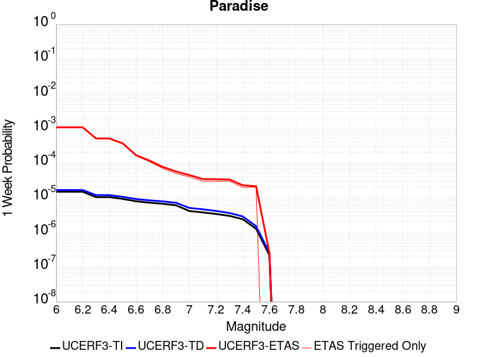 |  |  |  |

| Magnitude | 1 wk TI Prob | 1 wk TD Prob | 1 wk ETAS Prob | 1 wk ETAS/TD Gain | 1 wk ETAS Triggered Only | 1 mo TI Prob | 1 mo TD Prob | 1 mo ETAS Prob | 1 mo ETAS/TD Gain | 1 mo ETAS Triggered Only | 1 yr TI Prob | 1 yr TD Prob | 1 yr ETAS Prob | 1 yr ETAS/TD Gain | 1 yr ETAS Triggered Only | 10 yr TI Prob | 10 yr TD Prob | 10 yr ETAS Prob | 10 yr ETAS/TD Gain | 10 yr ETAS Triggered Only |
|-----|-----|-----|-----|-----|-----|-----|-----|-----|-----|-----|-----|-----|-----|-----|-----|-----|-----|-----|-----|-----|
| 6.0 | 1.4851273E-5 | 1.6694768E-5 | 0.0010766771 | 64.49188 | 0.00106 | 6.364676E-5 | 7.154718E-5 | 0.0013514556 | 18.889013 | 0.00128 | 7.7462377E-4 | 8.707624E-4 | 0.0026592037 | 3.0538797 | 0.00179 | 0.0077192914 | 0.008675884 | 0.010737838 | 1.237665 | 0.00208 |
| 6.1 | 1.4851273E-5 | 1.6694768E-5 | 0.0010766771 | 64.49188 | 0.00106 | 6.364676E-5 | 7.154718E-5 | 0.0013514556 | 18.889013 | 0.00128 | 7.7462377E-4 | 8.707624E-4 | 0.0026592037 | 3.0538797 | 0.00179 | 0.0077192914 | 0.008675884 | 0.010737838 | 1.237665 | 0.00208 |
| 6.2 | 1.4851273E-5 | 1.6694768E-5 | 0.0010766771 | 64.49188 | 0.00106 | 6.364676E-5 | 7.154718E-5 | 0.0013514556 | 18.889013 | 0.00128 | 7.7462377E-4 | 8.707624E-4 | 0.0026592037 | 3.0538797 | 0.00179 | 0.0077192914 | 0.008675884 | 0.010737838 | 1.237665 | 0.00208 |
| 6.3 | 1.0426831E-5 | 1.1888697E-5 | 5.1188277E-4 | 43.05625 | 5.0E-4 | 4.4685654E-5 | 5.09506E-5 | 6.609195E-4 | 12.971771 | 6.1E-4 | 5.43912E-4 | 6.201529E-4 | 0.0013796816 | 2.224744 | 7.6E-4 | 0.0054258266 | 0.0061848317 | 0.00710908 | 1.1494379 | 9.3E-4 |
| 6.4 | 1.0426831E-5 | 1.1888697E-5 | 5.1188277E-4 | 43.05625 | 5.0E-4 | 4.4685654E-5 | 5.09506E-5 | 6.609195E-4 | 12.971771 | 6.1E-4 | 5.43912E-4 | 6.201529E-4 | 0.0013796816 | 2.224744 | 7.6E-4 | 0.0054258266 | 0.0061848317 | 0.00710908 | 1.1494379 | 9.3E-4 |
| 6.5 | 9.25027E-6 | 1.0620037E-5 | 3.706162E-4 | 34.897827 | 3.6E-4 | 3.964341E-5 | 4.551368E-5 | 4.954932E-4 | 10.886687 | 4.5E-4 | 4.8255164E-4 | 5.5399304E-4 | 0.0011136829 | 2.010283 | 5.6E-4 | 0.0048150513 | 0.0055266195 | 0.0062426403 | 1.1295586 | 7.2E-4 |
| 6.6 | 7.904275E-6 | 9.159602E-6 | 1.6915814E-4 | 18.467848 | 1.6E-4 | 3.3875025E-5 | 3.925487E-5 | 2.2924741E-4 | 5.8399734 | 1.9E-4 | 4.1235037E-4 | 4.7782718E-4 | 7.476982E-4 | 1.5647879 | 2.7E-4 | 0.0041158604 | 0.004768395 | 0.005116726 | 1.07305 | 3.5E-4 |
| 6.7 | 7.2061953E-6 | 8.407326E-6 | 1.184064E-4 | 14.083717 | 1.1E-4 | 3.088333E-5 | 3.603092E-5 | 1.7602587E-4 | 4.8854117 | 1.4E-4 | 3.7593965E-4 | 4.3859181E-4 | 6.484997E-4 | 1.4785951 | 2.1E-4 | 0.003753043 | 0.004377631 | 0.0046564057 | 1.0636815 | 2.8E-4 |
| 6.8 | 6.6948724E-6 | 7.842242E-6 | 7.7841694E-5 | 9.925949 | 7.0E-5 | 2.8691995E-5 | 3.3609194E-5 | 1.2360617E-4 | 3.6777487 | 9.0E-5 | 3.4926904E-4 | 4.091187E-4 | 5.5905734E-4 | 1.3664918 | 1.5E-4 | 0.003487206 | 0.0040840125 | 0.004293155 | 1.05121 | 2.1E-4 |
| 6.9 | 6.0421025E-6 | 7.1306963E-6 | 5.713034E-5 | 8.0118885 | 5.0E-5 | 2.5894467E-5 | 3.0559786E-5 | 1.0055765E-4 | 3.2905219 | 7.0E-5 | 3.1521954E-4 | 3.7200528E-4 | 4.719681E-4 | 1.2687134 | 1.0E-4 | 0.0031477278 | 0.0037141638 | 0.0038536438 | 1.0375535 | 1.4E-4 |
| 7.0 | 4.134091E-6 | 5.0803824E-6 | 4.5080178E-5 | 8.873383 | 4.0E-5 | 1.7717413E-5 | 2.1772896E-5 | 7.177181E-5 | 3.2963831 | 5.0E-5 | 2.1568815E-4 | 2.650543E-4 | 3.250384E-4 | 1.2263087 | 6.0E-5 | 0.0021547892 | 0.0026475347 | 0.002727323 | 1.0301368 | 8.0E-5 |
| 7.1 | 3.7674888E-6 | 4.631936E-6 | 3.4631797E-5 | 7.476743 | 3.0E-5 | 1.6146281E-5 | 1.9851012E-5 | 5.985022E-5 | 3.0149705 | 4.0E-5 | 1.9656324E-4 | 2.4166079E-4 | 2.916487E-4 | 1.2068516 | 5.0E-5 | 0.0019638946 | 0.0024141306 | 0.0024839616 | 1.0289259 | 7.0E-5 |
| 7.2 | 3.4065345E-6 | 4.156782E-6 | 3.4156656E-5 | 8.217092 | 3.0E-5 | 1.4599351E-5 | 1.7814667E-5 | 5.7813955E-5 | 3.2453008 | 4.0E-5 | 1.777326E-4 | 2.168735E-4 | 2.6686265E-4 | 1.2304991 | 5.0E-5 | 0.0017759053 | 0.0021667667 | 0.002236615 | 1.0322362 | 7.0E-5 |
| 7.3 | 2.9934936E-6 | 3.6293673E-6 | 3.3629258E-5 | 9.265874 | 3.0E-5 | 1.2829195E-5 | 1.5554348E-5 | 5.5553726E-5 | 3.5715885 | 4.0E-5 | 1.5618425E-4 | 1.8935918E-4 | 2.3934973E-4 | 1.2639984 | 5.0E-5 | 0.0015607453 | 0.0018921237 | 0.0019619912 | 1.0369254 | 7.0E-5 |
| 7.4 | 2.4049796E-6 | 2.8890186E-6 | 2.288896E-5 | 7.922746 | 2.0E-5 | 1.0307015E-5 | 1.2381457E-5 | 4.2381085E-5 | 3.4229481 | 3.0E-5 | 1.2548068E-4 | 1.5073526E-4 | 1.9072923E-4 | 1.2653259 | 4.0E-5 | 0.0012540985 | 0.0015064715 | 0.0015663812 | 1.0397682 | 6.0E-5 |
| 7.5 | 1.2710091E-6 | 1.5134859E-6 | 2.1513455E-5 | 14.214507 | 2.0E-5 | 5.44717E-6 | 6.4863593E-6 | 3.6486166E-5 | 5.6250606 | 3.0E-5 | 6.631728E-5 | 7.896981E-5 | 1.0896744E-4 | 1.379862 | 3.0E-5 | 6.6297496E-4 | 7.895401E-4 | 8.3950063E-4 | 1.063278 | 5.0E-5 |
| 7.6 | 2.21172E-7 | 2.6040198E-7 | 2.6040198E-7 | 1.0 | 0.0 | 9.478797E-7 | 1.1160082E-6 | 1.1160082E-6 | 1.0 | 0.0 | 1.1540374E-5 | 1.3587343E-5 | 1.3587343E-5 | 1.0 | 0.0 | 1.1539775E-4 | 1.3586794E-4 | 1.3586794E-4 | 1.0 | 0.0 |

## Garlic Springs
*[(top)](#table-of-contents)*

| 1 Week | 1 Month | 1 Year | 10 Year |
|-----|-----|-----|-----|
|  |  |  |  |

| Magnitude | 1 wk TI Prob | 1 wk TD Prob | 1 wk ETAS Prob | 1 wk ETAS/TD Gain | 1 wk ETAS Triggered Only | 1 mo TI Prob | 1 mo TD Prob | 1 mo ETAS Prob | 1 mo ETAS/TD Gain | 1 mo ETAS Triggered Only | 1 yr TI Prob | 1 yr TD Prob | 1 yr ETAS Prob | 1 yr ETAS/TD Gain | 1 yr ETAS Triggered Only | 10 yr TI Prob | 10 yr TD Prob | 10 yr ETAS Prob | 10 yr ETAS/TD Gain | 10 yr ETAS Triggered Only |
|-----|-----|-----|-----|-----|-----|-----|-----|-----|-----|-----|-----|-----|-----|-----|-----|-----|-----|-----|-----|-----|
| 6.0 | 1.6760017E-5 | 1.8776833E-5 | 7.287635E-4 | 38.811844 | 7.1E-4 | 7.182667E-5 | 8.0470316E-5 | 0.0011703826 | 14.544277 | 0.00109 | 8.7413884E-4 | 9.794032E-4 | 0.0026477675 | 2.70345 | 0.00167 | 0.008707083 | 0.009762413 | 0.011693376 | 1.1977957 | 0.00195 |
| 6.1 | 9.852767E-6 | 1.0973587E-5 | 4.4096887E-4 | 40.18457 | 4.3E-4 | 4.222546E-5 | 4.702921E-5 | 7.269972E-4 | 15.458419 | 6.8E-4 | 5.139737E-4 | 5.7250116E-4 | 0.0015019687 | 2.6235209 | 9.3E-4 | 0.005127866 | 0.005717221 | 0.0068009896 | 1.1895621 | 0.00109 |
| 6.2 | 9.852767E-6 | 1.0973587E-5 | 4.4096887E-4 | 40.18457 | 4.3E-4 | 4.222546E-5 | 4.702921E-5 | 7.269972E-4 | 15.458419 | 6.8E-4 | 5.139737E-4 | 5.7250116E-4 | 0.0015019687 | 2.6235209 | 9.3E-4 | 0.005127866 | 0.005717221 | 0.0068009896 | 1.1895621 | 0.00109 |
| 6.3 | 4.3167724E-6 | 4.7780286E-6 | 1.8477716E-4 | 38.67226 | 1.8E-4 | 1.8500323E-5 | 2.0477235E-5 | 2.704721E-4 | 13.20843 | 2.5E-4 | 2.2521814E-4 | 2.4930484E-4 | 5.6922506E-4 | 2.2832491 | 3.2E-4 | 0.0022499003 | 0.00249251 | 0.0029114631 | 1.1680849 | 4.2E-4 |
| 6.4 | 4.3167724E-6 | 4.7780286E-6 | 1.8477716E-4 | 38.67226 | 1.8E-4 | 1.8500323E-5 | 2.0477235E-5 | 2.704721E-4 | 13.20843 | 2.5E-4 | 2.2521814E-4 | 2.4930484E-4 | 5.6922506E-4 | 2.2832491 | 3.2E-4 | 0.0022499003 | 0.00249251 | 0.0029114631 | 1.1680849 | 4.2E-4 |
| 6.5 | 4.3167724E-6 | 4.7780286E-6 | 1.8477716E-4 | 38.67226 | 1.8E-4 | 1.8500323E-5 | 2.0477235E-5 | 2.704721E-4 | 13.20843 | 2.5E-4 | 2.2521814E-4 | 2.4930484E-4 | 5.6922506E-4 | 2.2832491 | 3.2E-4 | 0.0022499003 | 0.00249251 | 0.0029114631 | 1.1680849 | 4.2E-4 |
| 6.6 | 4.301311E-6 | 4.760897E-6 | 1.8476004E-4 | 38.80782 | 1.8E-4 | 1.8434059E-5 | 2.0403815E-5 | 2.703987E-4 | 13.25236 | 2.5E-4 | 2.2441156E-4 | 2.4841115E-4 | 5.683317E-4 | 2.2878668 | 3.2E-4 | 0.0022418506 | 0.002483593 | 0.00290255 | 1.1686898 | 4.2E-4 |
| 6.7 | 3.8599724E-6 | 4.27106E-6 | 1.5427041E-4 | 36.119938 | 1.5E-4 | 1.6542634E-5 | 1.8304541E-5 | 2.283007E-4 | 12.472352 | 2.1E-4 | 2.0138794E-4 | 2.228578E-4 | 4.9279764E-4 | 2.2112648 | 2.7E-4 | 0.0020120554 | 0.002228578 | 0.002577798 | 1.1567008 | 3.5E-4 |

## Death Valley (Black Mtns Frontal)
*[(top)](#table-of-contents)*

| 1 Week | 1 Month | 1 Year | 10 Year |
|-----|-----|-----|-----|
|  |  |  |  |

| Magnitude | 1 wk TI Prob | 1 wk TD Prob | 1 wk ETAS Prob | 1 wk ETAS/TD Gain | 1 wk ETAS Triggered Only | 1 mo TI Prob | 1 mo TD Prob | 1 mo ETAS Prob | 1 mo ETAS/TD Gain | 1 mo ETAS Triggered Only | 1 yr TI Prob | 1 yr TD Prob | 1 yr ETAS Prob | 1 yr ETAS/TD Gain | 1 yr ETAS Triggered Only | 10 yr TI Prob | 10 yr TD Prob | 10 yr ETAS Prob | 10 yr ETAS/TD Gain | 10 yr ETAS Triggered Only |
|-----|-----|-----|-----|-----|-----|-----|-----|-----|-----|-----|-----|-----|-----|-----|-----|-----|-----|-----|-----|-----|
| 6.0 | 1.6707214E-5 | 1.867027E-5 | 6.186591E-4 | 33.136055 | 6.0E-4 | 7.160038E-5 | 8.001303E-5 | 8.199538E-4 | 10.247754 | 7.4E-4 | 8.71386E-4 | 9.737309E-4 | 0.0019927376 | 2.0464973 | 0.00102 | 0.00867977 | 0.009695496 | 0.010824444 | 1.1164404 | 0.00114 |
| 6.1 | 1.6707214E-5 | 1.867027E-5 | 6.186591E-4 | 33.136055 | 6.0E-4 | 7.160038E-5 | 8.001303E-5 | 8.199538E-4 | 10.247754 | 7.4E-4 | 8.71386E-4 | 9.737309E-4 | 0.0019927376 | 2.0464973 | 0.00102 | 0.00867977 | 0.009695496 | 0.010824444 | 1.1164404 | 0.00114 |
| 6.2 | 1.6707214E-5 | 1.867027E-5 | 6.186591E-4 | 33.136055 | 6.0E-4 | 7.160038E-5 | 8.001303E-5 | 8.199538E-4 | 10.247754 | 7.4E-4 | 8.71386E-4 | 9.737309E-4 | 0.0019927376 | 2.0464973 | 0.00102 | 0.00867977 | 0.009695496 | 0.010824444 | 1.1164404 | 0.00114 |
| 6.3 | 1.6707214E-5 | 1.867027E-5 | 6.186591E-4 | 33.136055 | 6.0E-4 | 7.160038E-5 | 8.001303E-5 | 8.199538E-4 | 10.247754 | 7.4E-4 | 8.71386E-4 | 9.737309E-4 | 0.0019927376 | 2.0464973 | 0.00102 | 0.00867977 | 0.009695496 | 0.010824444 | 1.1164404 | 0.00114 |
| 6.4 | 1.5515609E-5 | 1.7338214E-5 | 5.373292E-4 | 30.991035 | 5.2E-4 | 6.649377E-5 | 7.4304546E-5 | 7.0425775E-4 | 9.47799 | 6.3E-4 | 8.0926094E-4 | 9.042885E-4 | 0.0017635108 | 1.950164 | 8.6E-4 | 0.008063202 | 0.009006773 | 0.009958127 | 1.1056265 | 9.6E-4 |
| 6.5 | 1.5515609E-5 | 1.7338214E-5 | 5.373292E-4 | 30.991035 | 5.2E-4 | 6.649377E-5 | 7.4304546E-5 | 7.0425775E-4 | 9.47799 | 6.3E-4 | 8.0926094E-4 | 9.042885E-4 | 0.0017635108 | 1.950164 | 8.6E-4 | 0.008063202 | 0.009006773 | 0.009958127 | 1.1056265 | 9.6E-4 |
| 6.6 | 1.5041828E-5 | 1.6809145E-5 | 5.1680073E-4 | 30.745213 | 5.0E-4 | 6.4463384E-5 | 7.203723E-5 | 6.6199474E-4 | 9.189619 | 5.9E-4 | 7.8455906E-4 | 8.767063E-4 | 0.0016859962 | 1.9231026 | 8.1E-4 | 0.00781795 | 0.008733132 | 0.009625273 | 1.1021558 | 9.0E-4 |
| 6.7 | 1.4634985E-5 | 1.6356016E-5 | 4.8634832E-4 | 29.735134 | 4.7E-4 | 6.271985E-5 | 7.009536E-5 | 6.3005614E-4 | 8.988556 | 5.6E-4 | 7.6334673E-4 | 8.5308263E-4 | 0.0016324172 | 1.9135511 | 7.8E-4 | 0.007607299 | 0.008498715 | 0.009361322 | 1.1014984 | 8.7E-4 |
| 6.8 | 1.4209158E-5 | 1.5882048E-5 | 4.2587554E-4 | 26.814901 | 4.1E-4 | 6.089497E-5 | 6.8064175E-5 | 5.6803017E-4 | 8.345509 | 5.0E-4 | 7.4114406E-4 | 8.2837185E-4 | 0.001527792 | 1.8443311 | 7.0E-4 | 0.007386771 | 0.008253456 | 0.0090171015 | 1.0925243 | 7.7E-4 |
| 6.9 | 1.3780098E-5 | 1.5404594E-5 | 4.1539842E-4 | 26.965881 | 4.0E-4 | 5.9056227E-5 | 6.6018045E-5 | 5.559857E-4 | 8.421723 | 4.9E-4 | 7.1877235E-4 | 8.0347876E-4 | 0.0014829324 | 1.8456398 | 6.8E-4 | 0.0071645193 | 0.008006332 | 0.008750328 | 1.0929259 | 7.5E-4 |
| 7.0 | 1.3585064E-5 | 1.5188155E-5 | 3.9518237E-4 | 26.019117 | 3.8E-4 | 5.8220405E-5 | 6.50905E-5 | 5.350599E-4 | 8.220245 | 4.7E-4 | 7.086029E-4 | 7.9219416E-4 | 0.0014416792 | 1.8198559 | 6.5E-4 | 0.007063476 | 0.007894293 | 0.00860861 | 1.0904851 | 7.2E-4 |
| 7.1 | 1.3398601E-5 | 1.49813395E-5 | 3.7497593E-4 | 25.029533 | 3.6E-4 | 5.742131E-5 | 6.420419E-5 | 5.141753E-4 | 8.008438 | 4.5E-4 | 6.9888023E-4 | 7.8141113E-4 | 0.0014109189 | 1.8056037 | 6.3E-4 | 0.0069668638 | 0.007787224 | 0.008481773 | 1.0891908 | 7.0E-4 |
| 7.2 | 1.3126312E-5 | 1.4679561E-5 | 3.446747E-4 | 23.479906 | 3.3E-4 | 5.6254412E-5 | 6.291092E-5 | 4.828845E-4 | 7.675687 | 4.2E-4 | 6.846822E-4 | 7.6567667E-4 | 0.0013452326 | 1.7569199 | 5.8E-4 | 0.006825765 | 0.00763097 | 0.00827601 | 1.0845292 | 6.5E-4 |
| 7.3 | 1.2922429E-5 | 1.4453788E-5 | 3.0444958E-4 | 21.063654 | 2.9E-4 | 5.5380664E-5 | 6.194336E-5 | 4.3192046E-4 | 6.9728284 | 3.7E-4 | 6.74051E-4 | 7.53905E-4 | 0.0012835053 | 1.7024764 | 5.3E-4 | 0.006720101 | 0.007514055 | 0.008109546 | 1.0792503 | 6.0E-4 |
| 7.4 | 1.2768878E-5 | 1.4283772E-5 | 3.0427962E-4 | 21.302471 | 2.9E-4 | 5.4722615E-5 | 6.1214756E-5 | 4.311921E-4 | 7.0439243 | 3.7E-4 | 6.660441E-4 | 7.4504025E-4 | 0.0012646528 | 1.6974288 | 5.2E-4 | 0.0066405144 | 0.0074260035 | 0.008001696 | 1.077524 | 5.8E-4 |
| 7.5 | 1.2521929E-5 | 1.40120155E-5 | 2.940081E-4 | 20.98257 | 2.8E-4 | 5.366431E-5 | 6.005014E-5 | 4.2002852E-4 | 6.99463 | 3.6E-4 | 6.531671E-4 | 7.3087064E-4 | 0.0012105198 | 1.656271 | 4.8E-4 | 0.006512506 | 0.0072852457 | 0.007821312 | 1.0735824 | 5.4E-4 |
| 7.6 | 1.1301089E-5 | 1.2648149E-5 | 2.526451E-4 | 19.974869 | 2.4E-4 | 4.8432343E-5 | 5.4205255E-5 | 3.6418845E-4 | 6.718693 | 3.1E-4 | 5.895042E-4 | 6.5975444E-4 | 0.0010594906 | 1.6058861 | 4.0E-4 | 0.0058794282 | 0.00657851 | 0.00702555 | 1.0679545 | 4.5E-4 |
| 7.7 | 9.189108E-6 | 1.0283358E-5 | 1.7028171E-4 | 16.55896 | 1.6E-4 | 3.93813E-5 | 4.407082E-5 | 2.6406112E-4 | 5.9917455 | 2.2E-4 | 4.7936183E-4 | 5.3643517E-4 | 8.2627963E-4 | 1.5403159 | 2.9E-4 | 0.004783291 | 0.005351914 | 0.0056801476 | 1.0613302 | 3.3E-4 |
| 7.8 | 3.4586725E-7 | 3.6482615E-7 | 2.036482E-5 | 55.820614 | 2.0E-5 | 1.4822873E-6 | 1.5635396E-6 | 3.1563493E-5 | 20.187202 | 3.0E-5 | 1.80467E-5 | 1.9035933E-5 | 5.9035174E-5 | 3.1012492 | 4.0E-5 | 1.8045233E-4 | 1.9034347E-4 | 2.3033586E-4 | 1.2101064 | 4.0E-5 |
| 7.9 | 2.5591178E-9 | 2.6696718E-9 | 2.6696718E-9 | 1.0 | 0.0 | 1.0967647E-8 | 1.14414505E-8 | 1.14414505E-8 | 1.0 | 0.0 | 1.335311E-7 | 1.3929966E-7 | 1.3929966E-7 | 1.0 | 0.0 | 1.3353102E-6 | 1.3929966E-6 | 1.3929966E-6 | 1.0 | 0.0 |

## San Andreas (San Bernardino S)
*[(top)](#table-of-contents)*

| 1 Week | 1 Month | 1 Year | 10 Year |
|-----|-----|-----|-----|
|  |  | 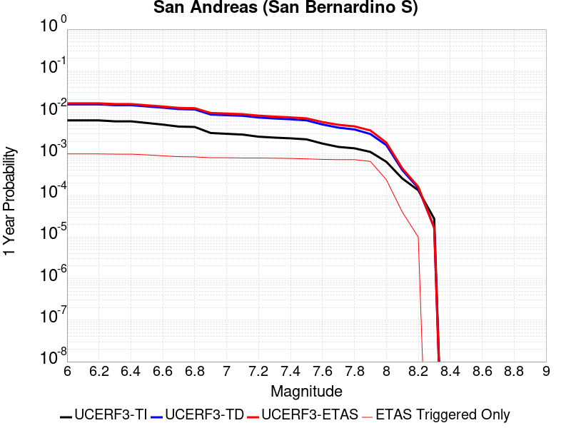 |  |

| Magnitude | 1 wk TI Prob | 1 wk TD Prob | 1 wk ETAS Prob | 1 wk ETAS/TD Gain | 1 wk ETAS Triggered Only | 1 mo TI Prob | 1 mo TD Prob | 1 mo ETAS Prob | 1 mo ETAS/TD Gain | 1 mo ETAS Triggered Only | 1 yr TI Prob | 1 yr TD Prob | 1 yr ETAS Prob | 1 yr ETAS/TD Gain | 1 yr ETAS Triggered Only | 10 yr TI Prob | 10 yr TD Prob | 10 yr ETAS Prob | 10 yr ETAS/TD Gain | 10 yr ETAS Triggered Only |
|-----|-----|-----|-----|-----|-----|-----|-----|-----|-----|-----|-----|-----|-----|-----|-----|-----|-----|-----|-----|-----|
| 6.0 | 1.2336002E-4 | 3.0005194E-4 | 9.198659E-4 | 3.065689 | 6.2E-4 | 5.2857865E-4 | 0.0012853292 | 0.0020543395 | 1.5982983 | 7.7E-4 | 0.006416472 | 0.015541554 | 0.016526014 | 1.0633436 | 0.001 | 0.06234337 | 0.14294699 | 0.14388119 | 1.0065352 | 0.00109 |
| 6.1 | 1.2336002E-4 | 3.0005194E-4 | 9.198659E-4 | 3.065689 | 6.2E-4 | 5.2857865E-4 | 0.0012853292 | 0.0020543395 | 1.5982983 | 7.7E-4 | 0.006416472 | 0.015541554 | 0.016526014 | 1.0633436 | 0.001 | 0.06234337 | 0.14294699 | 0.14388119 | 1.0065352 | 0.00109 |
| 6.2 | 1.2336002E-4 | 3.0005194E-4 | 9.198659E-4 | 3.065689 | 6.2E-4 | 5.2857865E-4 | 0.0012853292 | 0.0020543395 | 1.5982983 | 7.7E-4 | 0.006416472 | 0.015541554 | 0.016526014 | 1.0633436 | 0.001 | 0.06234337 | 0.14294699 | 0.14388119 | 1.0065352 | 0.00109 |
| 6.3 | 1.1712257E-4 | 2.8793467E-4 | 8.97759E-4 | 3.1179261 | 6.1E-4 | 5.018573E-4 | 0.0012334478 | 0.0019925104 | 1.615399 | 7.6E-4 | 0.006093008 | 0.014918666 | 0.015893897 | 1.0653698 | 9.9E-4 | 0.059286322 | 0.13765779 | 0.13858911 | 1.0067655 | 0.00108 |
| 6.4 | 1.1712257E-4 | 2.8793467E-4 | 8.97759E-4 | 3.1179261 | 6.1E-4 | 5.018573E-4 | 0.0012334478 | 0.0019925104 | 1.615399 | 7.6E-4 | 0.006093008 | 0.014918666 | 0.015893897 | 1.0653698 | 9.9E-4 | 0.059286322 | 0.13765779 | 0.13858911 | 1.0067655 | 0.00108 |
| 6.5 | 1.0689076E-4 | 2.6806415E-4 | 8.679033E-4 | 3.2376702 | 6.0E-4 | 4.5802278E-4 | 0.0011483653 | 0.0018975041 | 1.6523522 | 7.5E-4 | 0.0055621783 | 0.013896335 | 0.014833134 | 1.0674133 | 9.5E-4 | 0.05425003 | 0.1288989 | 0.12979613 | 1.0069607 | 0.00103 |
| 6.6 | 9.7648895E-5 | 2.505129E-4 | 8.003751E-4 | 3.1949456 | 5.5E-4 | 4.1842813E-4 | 0.0010732086 | 0.0017824466 | 1.6608576 | 7.1E-4 | 0.005082469 | 0.012992399 | 0.013880705 | 1.0683713 | 9.0E-4 | 0.049677886 | 0.121077746 | 0.1219303 | 1.0070413 | 9.7E-4 |
| 6.7 | 8.757013E-5 | 2.3122175E-4 | 7.610992E-4 | 3.291642 | 5.3E-4 | 3.7524657E-4 | 9.905964E-4 | 0.0016799128 | 1.6958601 | 6.9E-4 | 0.00455906 | 0.011997902 | 0.012847584 | 1.0708193 | 8.6E-4 | 0.04466656 | 0.112373024 | 0.113189645 | 1.007267 | 9.2E-4 |
| 6.8 | 8.562978E-5 | 2.2682057E-4 | 7.467026E-4 | 3.292041 | 5.2E-4 | 3.6693315E-4 | 9.7174826E-4 | 0.0016510874 | 1.6990898 | 6.8E-4 | 0.004458263 | 0.011770921 | 0.012610916 | 1.0713619 | 8.5E-4 | 0.043698758 | 0.11037863 | 0.11118819 | 1.0073344 | 9.1E-4 |
| 6.9 | 6.124075E-5 | 1.7066885E-4 | 6.905801E-4 | 4.046316 | 5.2E-4 | 2.6243398E-4 | 7.312337E-4 | 0.0013907511 | 1.9019243 | 6.6E-4 | 0.0031904527 | 0.008866636 | 0.009669455 | 1.0905437 | 8.1E-4 | 0.031450346 | 0.08420262 | 0.08498105 | 1.0092447 | 8.5E-4 |
| 7.0 | 5.8598747E-5 | 1.6495936E-4 | 6.8487355E-4 | 4.1517715 | 5.2E-4 | 2.5111332E-4 | 7.067779E-4 | 0.0013663115 | 1.9331553 | 6.6E-4 | 0.0030530186 | 0.008571265 | 0.009374322 | 1.0936918 | 8.1E-4 | 0.03011414 | 0.08151562 | 0.08229633 | 1.0095774 | 8.5E-4 |
| 7.1 | 5.613814E-5 | 1.5914452E-4 | 6.7906175E-4 | 4.2669506 | 5.2E-4 | 2.4056983E-4 | 6.818704E-4 | 0.0013314271 | 1.9526104 | 6.5E-4 | 0.0029250039 | 0.008270353 | 0.009063737 | 1.095931 | 8.0E-4 | 0.028868021 | 0.07881268 | 0.07958648 | 1.0098182 | 8.4E-4 |
| 7.2 | 4.991222E-5 | 1.4520933E-4 | 6.651338E-4 | 4.5805173 | 5.2E-4 | 2.1389198E-4 | 6.221777E-4 | 0.0012717732 | 2.0440676 | 6.5E-4 | 0.002601025 | 0.0075488063 | 0.008342767 | 1.105177 | 8.0E-4 | 0.025707912 | 0.07226191 | 0.07304121 | 1.0107844 | 8.4E-4 |
| 7.3 | 4.7410045E-5 | 1.371513E-4 | 6.5708E-4 | 4.790913 | 5.2E-4 | 2.0317009E-4 | 5.8765925E-4 | 0.0012272832 | 2.0884266 | 6.4E-4 | 0.0024707897 | 0.0071313656 | 0.0079157315 | 1.1099882 | 7.9E-4 | 0.024434982 | 0.068541944 | 0.06931505 | 1.0112793 | 8.3E-4 |
| 7.4 | 4.5556746E-5 | 1.3123035E-4 | 6.4116344E-4 | 4.885786 | 5.1E-4 | 1.952286E-4 | 5.6229485E-4 | 0.0011919406 | 2.1197786 | 6.3E-4 | 0.002374317 | 0.0068245293 | 0.007599206 | 1.1135136 | 7.8E-4 | 0.023491086 | 0.06579143 | 0.06655748 | 1.0116436 | 8.2E-4 |
| 7.5 | 4.3084514E-5 | 1.2358342E-4 | 6.135229E-4 | 4.964443 | 4.9E-4 | 1.8463485E-4 | 5.2953605E-4 | 0.001139213 | 2.151342 | 6.1E-4 | 0.0022456115 | 0.0064281146 | 0.007183229 | 1.1174706 | 7.6E-4 | 0.022230545 | 0.062190283 | 0.06294053 | 1.0120637 | 8.0E-4 |
| 7.6 | 3.408608E-5 | 9.836477E-5 | 5.7831756E-4 | 5.879316 | 4.8E-4 | 1.4607502E-4 | 4.214953E-4 | 0.0010212424 | 2.4229035 | 6.0E-4 | 0.0017770125 | 0.005119656 | 0.0058558676 | 1.143801 | 7.4E-4 | 0.017628696 | 0.05002244 | 0.05076342 | 1.014813 | 7.8E-4 |
| 7.7 | 2.8315713E-5 | 8.2495724E-5 | 5.5245694E-4 | 6.696795 | 4.7E-4 | 1.2134742E-4 | 3.5350522E-4 | 9.4329665E-4 | 2.6684093 | 5.9E-4 | 0.0014764034 | 0.004295442 | 0.005022306 | 1.1692176 | 7.3E-4 | 0.01466633 | 0.042272415 | 0.043009866 | 1.0174452 | 7.7E-4 |
| 7.8 | 2.6222975E-5 | 7.463898E-5 | 5.446039E-4 | 7.296508 | 4.7E-4 | 1.1237934E-4 | 3.1984213E-4 | 9.0965343E-4 | 2.84407 | 5.9E-4 | 0.0013673597 | 0.003887131 | 0.0046142936 | 1.1870692 | 7.3E-4 | 0.013589768 | 0.038437475 | 0.039177876 | 1.0192626 | 7.7E-4 |
| 7.9 | 2.1469694E-5 | 5.7884805E-5 | 4.878599E-4 | 8.428117 | 4.3E-4 | 9.200973E-5 | 2.4805416E-4 | 7.779227E-4 | 3.1361 | 5.3E-4 | 0.0011196428 | 0.00301588 | 0.0036738897 | 1.2181816 | 6.6E-4 | 0.011140184 | 0.030153265 | 0.030832158 | 1.0225147 | 7.0E-4 |
| 8.0 | 1.2420249E-5 | 3.1321662E-5 | 1.9131665E-4 | 6.1081257 | 1.6E-4 | 5.322855E-5 | 1.342288E-4 | 3.2420328E-4 | 2.4153035 | 1.9E-4 | 6.478649E-4 | 0.0016330116 | 0.0018726196 | 1.1467277 | 2.4E-4 | 0.0064597935 | 0.01652369 | 0.01676956 | 1.0148798 | 2.5E-4 |
| 8.1 | 4.9197724E-6 | 7.822525E-6 | 1.7822445E-5 | 2.2783496 | 1.0E-5 | 2.1084568E-5 | 3.3524673E-5 | 6.352367E-5 | 1.8948333 | 3.0E-5 | 2.566744E-4 | 4.080866E-4 | 4.480703E-4 | 1.0979784 | 4.0E-5 | 0.002563781 | 0.004384557 | 0.0044243815 | 1.0090829 | 4.0E-5 |
| 8.2 | 2.5634774E-6 | 2.9065757E-6 | 1.29065465E-5 | 4.4404645 | 1.0E-5 | 1.0986286E-5 | 1.2456694E-5 | 2.245657E-5 | 1.8027712 | 1.0E-5 | 1.3374983E-4 | 1.5164974E-4 | 1.6164822E-4 | 1.0659314 | 1.0E-5 | 0.0013366934 | 0.001704941 | 0.001714924 | 1.0058553 | 1.0E-5 |
| 8.3 | 5.2850464E-7 | 3.2080476E-7 | 3.2080476E-7 | 1.0 | 0.0 | 2.2650179E-6 | 1.3748769E-6 | 1.3748769E-6 | 1.0 | 0.0 | 2.7576245E-5 | 1.673901E-5 | 1.673901E-5 | 1.0 | 0.0 | 2.7572823E-4 | 1.986671E-4 | 1.986671E-4 | 1.0 | 0.0 |

## Helendale-So Lockhart
*[(top)](#table-of-contents)*

| 1 Week | 1 Month | 1 Year | 10 Year |
|-----|-----|-----|-----|
|  | 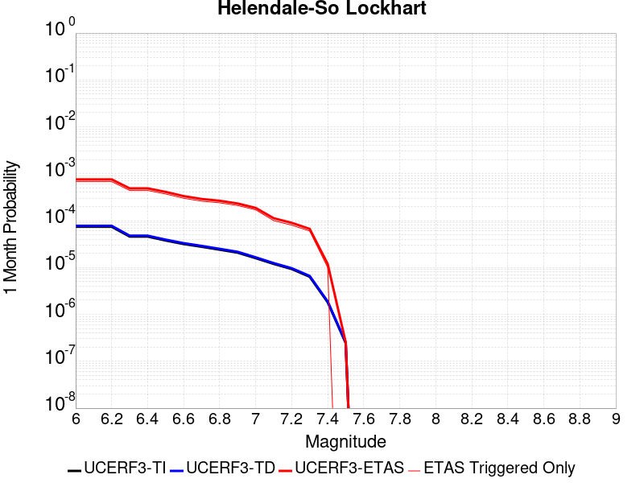 | 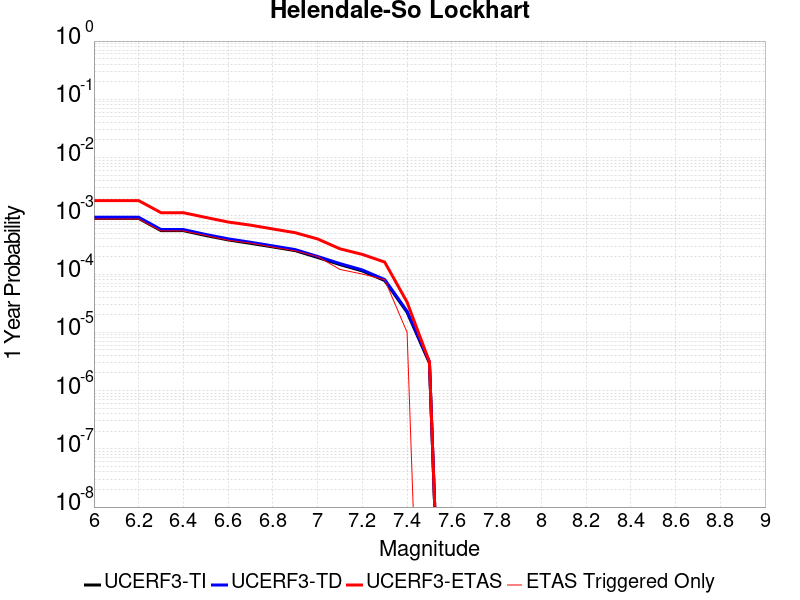 |  |

| Magnitude | 1 wk TI Prob | 1 wk TD Prob | 1 wk ETAS Prob | 1 wk ETAS/TD Gain | 1 wk ETAS Triggered Only | 1 mo TI Prob | 1 mo TD Prob | 1 mo ETAS Prob | 1 mo ETAS/TD Gain | 1 mo ETAS Triggered Only | 1 yr TI Prob | 1 yr TD Prob | 1 yr ETAS Prob | 1 yr ETAS/TD Gain | 1 yr ETAS Triggered Only | 10 yr TI Prob | 10 yr TD Prob | 10 yr ETAS Prob | 10 yr ETAS/TD Gain | 10 yr ETAS Triggered Only |
|-----|-----|-----|-----|-----|-----|-----|-----|-----|-----|-----|-----|-----|-----|-----|-----|-----|-----|-----|-----|-----|
| 6.0 | 1.7296055E-5 | 1.8103729E-5 | 5.380943E-4 | 29.722843 | 5.2E-4 | 7.412385E-5 | 7.7585224E-5 | 7.575325E-4 | 9.763876 | 6.8E-4 | 9.0208417E-4 | 9.4421144E-4 | 0.0018233806 | 1.9311147 | 8.8E-4 | 0.008984311 | 0.009404116 | 0.010384806 | 1.1042831 | 9.9E-4 |
| 6.1 | 1.7296055E-5 | 1.8103729E-5 | 5.380943E-4 | 29.722843 | 5.2E-4 | 7.412385E-5 | 7.7585224E-5 | 7.575325E-4 | 9.763876 | 6.8E-4 | 9.0208417E-4 | 9.4421144E-4 | 0.0018233806 | 1.9311147 | 8.8E-4 | 0.008984311 | 0.009404116 | 0.010384806 | 1.1042831 | 9.9E-4 |
| 6.2 | 1.7296055E-5 | 1.8103729E-5 | 5.380943E-4 | 29.722843 | 5.2E-4 | 7.412385E-5 | 7.7585224E-5 | 7.575325E-4 | 9.763876 | 6.8E-4 | 9.0208417E-4 | 9.4421144E-4 | 0.0018233806 | 1.9311147 | 8.8E-4 | 0.008984311 | 0.009404116 | 0.010384806 | 1.1042831 | 9.9E-4 |
| 6.3 | 1.0669118E-5 | 1.1135425E-5 | 3.5113163E-4 | 31.532846 | 3.4E-4 | 4.5723988E-5 | 4.772239E-5 | 4.8770139E-4 | 10.219551 | 4.4E-4 | 5.5654737E-4 | 5.80868E-4 | 0.0011305485 | 1.9463089 | 5.5E-4 | 0.0055515557 | 0.0057937936 | 0.0064201434 | 1.1081071 | 6.3E-4 |
| 6.4 | 1.0669118E-5 | 1.1135425E-5 | 3.5113163E-4 | 31.532846 | 3.4E-4 | 4.5723988E-5 | 4.772239E-5 | 4.8770139E-4 | 10.219551 | 4.4E-4 | 5.5654737E-4 | 5.80868E-4 | 0.0011305485 | 1.9463089 | 5.5E-4 | 0.0055515557 | 0.0057937936 | 0.0064201434 | 1.1081071 | 6.3E-4 |
| 6.5 | 8.790038E-6 | 9.170197E-6 | 2.9916753E-4 | 32.623894 | 2.9E-4 | 3.767105E-5 | 3.930026E-5 | 4.092857E-4 | 10.414326 | 3.7E-4 | 4.585485E-4 | 4.7837716E-4 | 9.381571E-4 | 1.9611243 | 4.6E-4 | 0.0045760344 | 0.004773638 | 0.0053110607 | 1.1125813 | 5.4E-4 |
| 6.6 | 7.396949E-6 | 7.715537E-6 | 2.2771384E-4 | 29.513674 | 2.2E-4 | 3.1700827E-5 | 3.3066175E-5 | 3.3305626E-4 | 10.072416 | 3.0E-4 | 3.858892E-4 | 4.025073E-4 | 7.823543E-4 | 1.9437022 | 3.8E-4 | 0.003852198 | 0.00401789 | 0.0044660815 | 1.1115491 | 4.5E-4 |
| 6.7 | 6.4600285E-6 | 6.738031E-6 | 1.8673681E-4 | 27.713856 | 1.8E-4 | 2.7685543E-5 | 2.887696E-5 | 2.8886946E-4 | 10.003458 | 2.6E-4 | 3.3701936E-4 | 3.5152107E-4 | 6.9140154E-4 | 1.9668851 | 3.4E-4 | 0.0033650869 | 0.003509732 | 0.003918293 | 1.116408 | 4.1E-4 |
| 6.8 | 5.600104E-6 | 5.836009E-6 | 1.7583501E-4 | 30.129324 | 1.7E-4 | 2.4000226E-5 | 2.5011232E-5 | 2.6500522E-4 | 10.5954485 | 2.4E-4 | 2.9216358E-4 | 3.044698E-4 | 5.943815E-4 | 1.9521854 | 2.9E-4 | 0.0029177975 | 0.003040588 | 0.0033994934 | 1.1180382 | 3.6E-4 |
| 6.9 | 4.839122E-6 | 5.0395092E-6 | 1.4503881E-4 | 28.780342 | 1.4E-4 | 2.0738931E-5 | 2.159772E-5 | 2.3159318E-4 | 10.723039 | 2.1E-4 | 2.5246723E-4 | 2.6292098E-4 | 5.1285524E-4 | 1.950606 | 2.5E-4 | 0.002521806 | 0.002626147 | 0.0029353327 | 1.1177337 | 3.1E-4 |
| 7.0 | 3.6937633E-6 | 3.845208E-6 | 1.2384474E-4 | 32.207554 | 1.2E-4 | 1.5830317E-5 | 1.647936E-5 | 1.8647657E-4 | 11.315764 | 1.7E-4 | 1.9271708E-4 | 2.0061806E-4 | 4.0057793E-4 | 1.9967192 | 2.0E-4 | 0.0019255003 | 0.002004401 | 0.00222396 | 1.1095384 | 2.2E-4 |
| 7.1 | 2.7858857E-6 | 2.8978538E-6 | 7.289765E-5 | 25.155739 | 7.0E-5 | 1.1939455E-5 | 1.2419316E-5 | 1.1241807E-4 | 9.051873 | 1.0E-4 | 1.4535317E-4 | 1.511949E-4 | 2.7117674E-4 | 1.7935576 | 1.2E-4 | 0.0014525814 | 0.0015109418 | 0.0016407453 | 1.085909 | 1.3E-4 |
| 7.2 | 2.1672065E-6 | 2.2540128E-6 | 6.225388E-5 | 27.619133 | 6.0E-5 | 9.2879945E-6 | 9.66002E-6 | 8.965925E-5 | 9.281476 | 8.0E-5 | 1.1307546E-4 | 1.1760458E-4 | 2.1759282E-4 | 1.850207 | 1.0E-4 | 0.0011301794 | 0.0011754417 | 0.0012753241 | 1.0849744 | 1.0E-4 |
| 7.3 | 1.4823496E-6 | 1.5422102E-6 | 4.154215E-5 | 26.936762 | 4.0E-5 | 6.3529114E-6 | 6.6094562E-6 | 6.660906E-5 | 10.077843 | 6.0E-5 | 7.734395E-5 | 8.046731E-5 | 1.6046087E-4 | 1.9941125 | 8.0E-5 | 7.731704E-4 | 8.0439687E-4 | 8.843325E-4 | 1.0993733 | 8.0E-5 |
| 7.4 | 4.2321457E-7 | 4.4108765E-7 | 1.0441083E-5 | 23.67122 | 1.0E-5 | 1.8137755E-6 | 1.8903745E-6 | 1.1890355E-5 | 6.289947 | 1.0E-5 | 2.2082493E-5 | 2.3015113E-5 | 3.3014883E-5 | 1.4344871 | 1.0E-5 | 2.2080299E-4 | 2.3013182E-4 | 2.4012952E-4 | 1.0434433 | 1.0E-5 |
| 7.5 | 5.6942316E-8 | 5.9415648E-8 | 5.9415648E-8 | 1.0 | 0.0 | 2.440385E-7 | 2.5463845E-7 | 2.5463845E-7 | 1.0 | 0.0 | 2.9711643E-6 | 3.1002196E-6 | 3.1002196E-6 | 1.0 | 0.0 | 2.9711247E-5 | 3.1001844E-5 | 3.1001844E-5 | 1.0 | 0.0 |

## Coyote Lake
*[(top)](#table-of-contents)*

| 1 Week | 1 Month | 1 Year | 10 Year |
|-----|-----|-----|-----|
|  |  |  |  |

| Magnitude | 1 wk TI Prob | 1 wk TD Prob | 1 wk ETAS Prob | 1 wk ETAS/TD Gain | 1 wk ETAS Triggered Only | 1 mo TI Prob | 1 mo TD Prob | 1 mo ETAS Prob | 1 mo ETAS/TD Gain | 1 mo ETAS Triggered Only | 1 yr TI Prob | 1 yr TD Prob | 1 yr ETAS Prob | 1 yr ETAS/TD Gain | 1 yr ETAS Triggered Only | 10 yr TI Prob | 10 yr TD Prob | 10 yr ETAS Prob | 10 yr ETAS/TD Gain | 10 yr ETAS Triggered Only |
|-----|-----|-----|-----|-----|-----|-----|-----|-----|-----|-----|-----|-----|-----|-----|-----|-----|-----|-----|-----|-----|
| 6.0 | 1.980352E-5 | 2.1706745E-5 | 4.916965E-4 | 22.651787 | 4.7E-4 | 8.486947E-5 | 9.302599E-5 | 7.229674E-4 | 7.7716703 | 6.3E-4 | 0.0010327959 | 0.0011320751 | 0.0019711242 | 1.7411603 | 8.4E-4 | 0.010280091 | 0.011270258 | 0.012219438 | 1.0842199 | 9.6E-4 |
| 6.1 | 1.980352E-5 | 2.1706745E-5 | 4.916965E-4 | 22.651787 | 4.7E-4 | 8.486947E-5 | 9.302599E-5 | 7.229674E-4 | 7.7716703 | 6.3E-4 | 0.0010327959 | 0.0011320751 | 0.0019711242 | 1.7411603 | 8.4E-4 | 0.010280091 | 0.011270258 | 0.012219438 | 1.0842199 | 9.6E-4 |
| 6.2 | 1.980352E-5 | 2.1706745E-5 | 4.916965E-4 | 22.651787 | 4.7E-4 | 8.486947E-5 | 9.302599E-5 | 7.229674E-4 | 7.7716703 | 6.3E-4 | 0.0010327959 | 0.0011320751 | 0.0019711242 | 1.7411603 | 8.4E-4 | 0.010280091 | 0.011270258 | 0.012219438 | 1.0842199 | 9.6E-4 |
| 6.3 | 1.5344787E-5 | 1.682067E-5 | 3.7681463E-4 | 22.40188 | 3.6E-4 | 6.576172E-5 | 7.2086936E-5 | 5.420531E-4 | 7.5194354 | 4.7E-4 | 8.003548E-4 | 8.773662E-4 | 0.0015068135 | 1.7174282 | 6.3E-4 | 0.007974784 | 0.00874507 | 0.00948851 | 1.0850126 | 7.5E-4 |
| 6.4 | 1.5344787E-5 | 1.682067E-5 | 3.7681463E-4 | 22.40188 | 3.6E-4 | 6.576172E-5 | 7.2086936E-5 | 5.420531E-4 | 7.5194354 | 4.7E-4 | 8.003548E-4 | 8.773662E-4 | 0.0015068135 | 1.7174282 | 6.3E-4 | 0.007974784 | 0.00874507 | 0.00948851 | 1.0850126 | 7.5E-4 |
| 6.5 | 1.4189697E-5 | 1.5557987E-5 | 3.4555286E-4 | 22.21064 | 3.3E-4 | 6.081157E-5 | 6.6675726E-5 | 4.9664703E-4 | 7.4486938 | 4.3E-4 | 7.401293E-4 | 8.115349E-4 | 0.0014010561 | 1.7264274 | 5.9E-4 | 0.0073766913 | 0.008091656 | 0.0087959105 | 1.0870347 | 7.1E-4 |
| 6.6 | 1.3469301E-5 | 1.4771577E-5 | 3.1476715E-4 | 21.308973 | 3.0E-4 | 5.7724297E-5 | 6.330556E-5 | 4.6328024E-4 | 7.31816 | 4.0E-4 | 7.025667E-4 | 7.7053264E-4 | 0.0013301012 | 1.72621 | 5.6E-4 | 0.0070034964 | 0.0076845144 | 0.008359289 | 1.0878097 | 6.8E-4 |
| 6.7 | 1.3027966E-5 | 1.4281745E-5 | 2.842779E-4 | 19.904984 | 2.7E-4 | 5.5832945E-5 | 6.120638E-5 | 4.2118435E-4 | 6.8813796 | 3.6E-4 | 6.7955407E-4 | 7.4499263E-4 | 0.0012546127 | 1.6840606 | 5.1E-4 | 0.006774798 | 0.0074308286 | 0.008046222 | 1.0828162 | 6.2E-4 |
| 6.8 | 5.695434E-6 | 6.2244176E-6 | 9.6223856E-5 | 15.459094 | 9.0E-5 | 2.4408775E-5 | 2.6675973E-5 | 1.3667304E-4 | 5.123451 | 1.1E-4 | 2.971363E-4 | 3.2476155E-4 | 4.947063E-4 | 1.523291 | 1.7E-4 | 0.0029673933 | 0.0032458105 | 0.0034351938 | 1.058347 | 1.9E-4 |
| 6.9 | 4.385688E-6 | 4.7930553E-6 | 8.479267E-5 | 17.690735 | 8.0E-5 | 1.879567E-5 | 2.0541665E-5 | 1.2053961E-4 | 5.8680544 | 1.0E-4 | 2.2881327E-4 | 2.5009477E-4 | 3.9005978E-4 | 1.5596478 | 1.4E-4 | 0.002285778 | 0.0025009478 | 0.0026505727 | 1.0598272 | 1.5E-4 |

## San Andreas (Big Bend)
*[(top)](#table-of-contents)*

| 1 Week | 1 Month | 1 Year | 10 Year |
|-----|-----|-----|-----|
|  |  |  |  |

| Magnitude | 1 wk TI Prob | 1 wk TD Prob | 1 wk ETAS Prob | 1 wk ETAS/TD Gain | 1 wk ETAS Triggered Only | 1 mo TI Prob | 1 mo TD Prob | 1 mo ETAS Prob | 1 mo ETAS/TD Gain | 1 mo ETAS Triggered Only | 1 yr TI Prob | 1 yr TD Prob | 1 yr ETAS Prob | 1 yr ETAS/TD Gain | 1 yr ETAS Triggered Only | 10 yr TI Prob | 10 yr TD Prob | 10 yr ETAS Prob | 10 yr ETAS/TD Gain | 10 yr ETAS Triggered Only |
|-----|-----|-----|-----|-----|-----|-----|-----|-----|-----|-----|-----|-----|-----|-----|-----|-----|-----|-----|-----|-----|
| 6.0 | 1.0179969E-4 | 2.0073925E-4 | 5.9066096E-4 | 2.9424288 | 3.9E-4 | 4.362114E-4 | 8.6002843E-4 | 0.0013695898 | 1.5924937 | 5.1E-4 | 0.0052979486 | 0.010420859 | 0.01105419 | 1.0607753 | 6.4E-4 | 0.051734097 | 0.101455905 | 0.10210286 | 1.0063766 | 7.2E-4 |
| 6.1 | 1.0179969E-4 | 2.0073925E-4 | 5.9066096E-4 | 2.9424288 | 3.9E-4 | 4.362114E-4 | 8.6002843E-4 | 0.0013695898 | 1.5924937 | 5.1E-4 | 0.0052979486 | 0.010420859 | 0.01105419 | 1.0607753 | 6.4E-4 | 0.051734097 | 0.101455905 | 0.10210286 | 1.0063766 | 7.2E-4 |
| 6.2 | 1.0179969E-4 | 2.0073925E-4 | 5.9066096E-4 | 2.9424288 | 3.9E-4 | 4.362114E-4 | 8.6002843E-4 | 0.0013695898 | 1.5924937 | 5.1E-4 | 0.0052979486 | 0.010420859 | 0.01105419 | 1.0607753 | 6.4E-4 | 0.051734097 | 0.101455905 | 0.10210286 | 1.0063766 | 7.2E-4 |
| 6.3 | 1.0179969E-4 | 2.0073925E-4 | 5.9066096E-4 | 2.9424288 | 3.9E-4 | 4.362114E-4 | 8.6002843E-4 | 0.0013695898 | 1.5924937 | 5.1E-4 | 0.0052979486 | 0.010420859 | 0.01105419 | 1.0607753 | 6.4E-4 | 0.051734097 | 0.101455905 | 0.10210286 | 1.0063766 | 7.2E-4 |
| 6.4 | 9.1639464E-5 | 1.8430917E-4 | 4.542594E-4 | 2.46466 | 2.7E-4 | 3.9268145E-4 | 7.896575E-4 | 0.0011393812 | 1.4428802 | 3.5E-4 | 0.0047704205 | 0.009571818 | 0.010007607 | 1.0455283 | 4.4E-4 | 0.046693064 | 0.09378695 | 0.09421287 | 1.0045414 | 4.7E-4 |
| 6.5 | 9.1639464E-5 | 1.8430917E-4 | 4.542594E-4 | 2.46466 | 2.7E-4 | 3.9268145E-4 | 7.896575E-4 | 0.0011393812 | 1.4428802 | 3.5E-4 | 0.0047704205 | 0.009571818 | 0.010007607 | 1.0455283 | 4.4E-4 | 0.046693064 | 0.09378695 | 0.09421287 | 1.0045414 | 4.7E-4 |
| 6.6 | 9.042622E-5 | 1.8238011E-4 | 4.423327E-4 | 2.425334 | 2.6E-4 | 3.8748336E-4 | 7.813951E-4 | 0.0011111373 | 1.4219916 | 3.3E-4 | 0.0047074095 | 0.0094721 | 0.009888122 | 1.0439208 | 4.2E-4 | 0.046089325 | 0.09287721 | 0.093276344 | 1.0042975 | 4.4E-4 |
| 6.7 | 8.9836685E-5 | 1.8152347E-4 | 4.3147808E-4 | 2.3769825 | 2.5E-4 | 3.8495753E-4 | 7.7772595E-4 | 0.0010874849 | 1.398288 | 3.1E-4 | 0.00467679 | 0.009427815 | 0.009824043 | 1.0420276 | 4.0E-4 | 0.045795817 | 0.09247148 | 0.092852645 | 1.0041219 | 4.2E-4 |
| 6.8 | 8.9471854E-5 | 1.8099119E-4 | 4.3094595E-4 | 2.3810327 | 2.5E-4 | 3.8339442E-4 | 7.754462E-4 | 0.0010852058 | 1.3994598 | 3.1E-4 | 0.004657841 | 0.009400298 | 0.009796537 | 1.0421518 | 4.0E-4 | 0.04561414 | 0.0922192 | 0.09260047 | 1.0041344 | 4.2E-4 |
| 6.9 | 8.858234E-5 | 1.7981093E-4 | 4.1976778E-4 | 2.3344953 | 2.4E-4 | 3.7958333E-4 | 7.7039085E-4 | 0.0010701597 | 1.3891127 | 3.0E-4 | 0.004611638 | 0.009339278 | 0.009725636 | 1.0413691 | 3.9E-4 | 0.04517103 | 0.09165911 | 0.09203152 | 1.0040631 | 4.1E-4 |
| 7.0 | 8.7433385E-5 | 1.7819891E-4 | 3.8816148E-4 | 2.1782484 | 2.1E-4 | 3.746607E-4 | 7.6348626E-4 | 0.0010332802 | 1.3533709 | 2.7E-4 | 0.004551957 | 0.009255932 | 0.009612599 | 1.0385339 | 3.6E-4 | 0.044598386 | 0.09089323 | 0.091238685 | 1.0038007 | 3.8E-4 |
| 7.1 | 8.684964E-5 | 1.7731842E-4 | 3.8728118E-4 | 2.1841002 | 2.1E-4 | 3.7215967E-4 | 7.597149E-4 | 0.0010295098 | 1.3551265 | 2.7E-4 | 0.0045216335 | 0.009210405 | 0.009567089 | 1.0387262 | 3.6E-4 | 0.04430731 | 0.09047475 | 0.09082037 | 1.0038201 | 3.8E-4 |
| 7.2 | 8.606521E-5 | 1.7622454E-4 | 3.8618752E-4 | 2.1914515 | 2.1E-4 | 3.6879873E-4 | 7.550296E-4 | 0.0010148333 | 1.3440974 | 2.6E-4 | 0.0044808835 | 0.009153842 | 0.009500638 | 1.0378853 | 3.5E-4 | 0.043916024 | 0.08995518 | 0.090291895 | 1.0037432 | 3.7E-4 |
| 7.3 | 8.568266E-5 | 1.7564454E-4 | 3.756094E-4 | 2.1384633 | 2.0E-4 | 3.6715972E-4 | 7.5254537E-4 | 0.0010023572 | 1.3319559 | 2.5E-4 | 0.0044610105 | 0.00912385 | 0.009460748 | 1.036925 | 3.4E-4 | 0.043725148 | 0.08967623 | 0.09000395 | 1.0036545 | 3.6E-4 |
| 7.4 | 8.5432206E-5 | 1.752704E-4 | 3.7523534E-4 | 2.140894 | 2.0E-4 | 3.6608664E-4 | 7.509428E-4 | 0.001000755 | 1.3326648 | 2.5E-4 | 0.004447999 | 0.009104501 | 0.0094414065 | 1.0370041 | 3.4E-4 | 0.043600157 | 0.08949642 | 0.0898242 | 1.0036625 | 3.6E-4 |
| 7.5 | 8.4791965E-5 | 1.7396381E-4 | 3.73929E-4 | 2.1494644 | 2.0E-4 | 3.633435E-4 | 7.4534636E-4 | 9.9516E-4 | 1.3351645 | 2.5E-4 | 0.0044147377 | 0.009036932 | 0.00937386 | 1.0372834 | 3.4E-4 | 0.043280575 | 0.08887209 | 0.089200094 | 1.0036907 | 3.6E-4 |
| 7.6 | 8.241105E-5 | 1.6841735E-4 | 3.5838535E-4 | 2.12796 | 1.9E-4 | 3.531424E-4 | 7.2158914E-4 | 9.6141594E-4 | 1.3323592 | 2.4E-4 | 0.0042910352 | 0.008750047 | 0.00907716 | 1.037384 | 3.3E-4 | 0.042091176 | 0.08625032 | 0.086570136 | 1.003708 | 3.5E-4 |
| 7.7 | 7.00432E-5 | 1.4205615E-4 | 3.020334E-4 | 2.1261551 | 1.6E-4 | 3.001506E-4 | 6.0867006E-4 | 8.185422E-4 | 1.3448045 | 2.1E-4 | 0.0036482112 | 0.0073854174 | 0.0076633496 | 1.0376326 | 2.8E-4 | 0.035888977 | 0.07352299 | 0.07380094 | 1.0037804 | 3.0E-4 |
| 7.8 | 6.415362E-5 | 1.2969968E-4 | 2.3968541E-4 | 1.8480031 | 1.1E-4 | 2.749151E-4 | 5.557374E-4 | 7.0565403E-4 | 1.2697617 | 1.5E-4 | 0.0033419547 | 0.0067451415 | 0.0069636577 | 1.0323961 | 2.2E-4 | 0.03292141 | 0.06725514 | 0.067479 | 1.0033284 | 2.4E-4 |
| 7.9 | 4.939911E-5 | 9.341721E-5 | 1.7340975E-4 | 1.8562932 | 8.0E-5 | 2.116933E-4 | 4.0029807E-4 | 5.2025006E-4 | 1.2996566 | 1.2E-4 | 0.0025743195 | 0.004862747 | 0.0050319205 | 1.0347897 | 1.7E-4 | 0.025447013 | 0.048915803 | 0.049087 | 1.0034997 | 1.8E-4 |
| 8.0 | 3.344983E-5 | 5.2228E-5 | 1.12224865E-4 | 2.148749 | 6.0E-5 | 1.4334853E-4 | 2.2381509E-4 | 3.037972E-4 | 1.3573579 | 8.0E-5 | 0.0017438711 | 0.0027215453 | 0.0028412188 | 1.0439726 | 1.2E-4 | 0.017302496 | 0.027923161 | 0.028039811 | 1.0041775 | 1.2E-4 |
| 8.1 | 1.9104898E-5 | 1.9171663E-5 | 3.917128E-5 | 2.0431864 | 2.0E-5 | 8.1875565E-5 | 8.2161685E-5 | 1.221584E-4 | 1.486805 | 4.0E-5 | 9.963791E-4 | 9.9986E-4 | 0.0010498101 | 1.049957 | 5.0E-5 | 0.009919235 | 0.010749552 | 0.010799015 | 1.0046014 | 5.0E-5 |
| 8.2 | 8.643924E-6 | 5.473668E-6 | 1.5473614E-5 | 2.8269184 | 1.0E-5 | 3.704486E-5 | 2.3458366E-5 | 3.345813E-5 | 1.4262772 | 1.0E-5 | 4.5092785E-4 | 2.8556827E-4 | 2.955654E-4 | 1.035008 | 1.0E-5 | 0.0045001395 | 0.0032481793 | 0.003258147 | 1.0030687 | 1.0E-5 |
| 8.3 | 1.983087E-6 | 7.6564595E-7 | 7.6564595E-7 | 1.0 | 0.0 | 8.498917E-6 | 3.281336E-6 | 3.281336E-6 | 1.0 | 0.0 | 1.034694E-4 | 3.9949547E-5 | 3.9949547E-5 | 1.0 | 0.0 | 0.0010342124 | 4.717979E-4 | 4.717979E-4 | 1.0 | 0.0 |

## Death Valley (No)
*[(top)](#table-of-contents)*

| 1 Week | 1 Month | 1 Year | 10 Year |
|-----|-----|-----|-----|
|  |  |  |  |

| Magnitude | 1 wk TI Prob | 1 wk TD Prob | 1 wk ETAS Prob | 1 wk ETAS/TD Gain | 1 wk ETAS Triggered Only | 1 mo TI Prob | 1 mo TD Prob | 1 mo ETAS Prob | 1 mo ETAS/TD Gain | 1 mo ETAS Triggered Only | 1 yr TI Prob | 1 yr TD Prob | 1 yr ETAS Prob | 1 yr ETAS/TD Gain | 1 yr ETAS Triggered Only | 10 yr TI Prob | 10 yr TD Prob | 10 yr ETAS Prob | 10 yr ETAS/TD Gain | 10 yr ETAS Triggered Only |
|-----|-----|-----|-----|-----|-----|-----|-----|-----|-----|-----|-----|-----|-----|-----|-----|-----|-----|-----|-----|-----|
| 6.0 | 2.0074807E-5 | 2.2500084E-5 | 3.424929E-4 | 15.221849 | 3.2E-4 | 8.603206E-5 | 9.642541E-5 | 5.263839E-4 | 5.458976 | 4.3E-4 | 0.001046937 | 0.0011733545 | 0.0017626622 | 1.5022418 | 5.9E-4 | 0.010420183 | 0.011672506 | 0.012324803 | 1.0558832 | 6.6E-4 |
| 6.1 | 2.0074807E-5 | 2.2500084E-5 | 3.424929E-4 | 15.221849 | 3.2E-4 | 8.603206E-5 | 9.642541E-5 | 5.263839E-4 | 5.458976 | 4.3E-4 | 0.001046937 | 0.0011733545 | 0.0017626622 | 1.5022418 | 5.9E-4 | 0.010420183 | 0.011672506 | 0.012324803 | 1.0558832 | 6.6E-4 |
| 6.2 | 2.0074807E-5 | 2.2500084E-5 | 3.424929E-4 | 15.221849 | 3.2E-4 | 8.603206E-5 | 9.642541E-5 | 5.263839E-4 | 5.458976 | 4.3E-4 | 0.001046937 | 0.0011733545 | 0.0017626622 | 1.5022418 | 5.9E-4 | 0.010420183 | 0.011672506 | 0.012324803 | 1.0558832 | 6.6E-4 |
| 6.3 | 1.9050609E-5 | 2.1336948E-5 | 3.4133013E-4 | 15.997139 | 3.2E-4 | 8.164292E-5 | 9.1440896E-5 | 5.114025E-4 | 5.592711 | 4.2E-4 | 9.935491E-4 | 0.001112731 | 0.0016920856 | 1.52066 | 5.8E-4 | 0.009891188 | 0.011072419 | 0.011715222 | 1.0580544 | 6.5E-4 |
| 6.4 | 1.9050609E-5 | 2.1336948E-5 | 3.4133013E-4 | 15.997139 | 3.2E-4 | 8.164292E-5 | 9.1440896E-5 | 5.114025E-4 | 5.592711 | 4.2E-4 | 9.935491E-4 | 0.001112731 | 0.0016920856 | 1.52066 | 5.8E-4 | 0.009891188 | 0.011072419 | 0.011715222 | 1.0580544 | 6.5E-4 |
| 6.5 | 1.8367004E-5 | 2.0561009E-5 | 3.4055443E-4 | 16.56312 | 3.2E-4 | 7.8713354E-5 | 8.811567E-5 | 5.0807867E-4 | 5.766042 | 4.2E-4 | 9.5791375E-4 | 0.0010722869 | 0.0016516648 | 1.54032 | 5.8E-4 | 0.009537951 | 0.0106719155 | 0.011314979 | 1.0602576 | 6.5E-4 |
| 6.6 | 1.779439E-5 | 1.9910927E-5 | 3.3990457E-4 | 17.071257 | 3.2E-4 | 7.625944E-5 | 8.53298E-5 | 5.0529395E-4 | 5.921659 | 4.2E-4 | 9.280632E-4 | 0.0010384015 | 0.0016078096 | 1.5483506 | 5.7E-4 | 0.009241969 | 0.010336253 | 0.010969638 | 1.061278 | 6.4E-4 |
| 6.7 | 1.7025437E-5 | 1.9043426E-5 | 3.3903733E-4 | 17.80338 | 3.2E-4 | 7.296412E-5 | 8.161216E-5 | 4.915787E-4 | 6.023351 | 4.1E-4 | 8.87976E-4 | 9.931813E-4 | 0.0015526251 | 1.5632846 | 5.6E-4 | 0.008844362 | 0.009888145 | 0.010511916 | 1.0630827 | 6.3E-4 |
| 6.8 | 1.6545107E-5 | 1.8512545E-5 | 3.3850662E-4 | 18.285255 | 3.2E-4 | 7.090568E-5 | 7.93371E-5 | 4.893046E-4 | 6.167412 | 4.1E-4 | 8.629347E-4 | 9.655073E-4 | 0.0015249666 | 1.579446 | 5.6E-4 | 0.008595915 | 0.009613829 | 0.010237772 | 1.0649006 | 6.3E-4 |
| 6.9 | 1.615478E-5 | 1.8087594E-5 | 3.2808198E-4 | 18.13851 | 3.1E-4 | 6.9232934E-5 | 7.751599E-5 | 4.7748498E-4 | 6.159826 | 4.0E-4 | 8.4258494E-4 | 9.433546E-4 | 0.0014928358 | 1.5824757 | 5.5E-4 | 0.008393973 | 0.009394196 | 0.010008371 | 1.0653782 | 6.2E-4 |
| 7.0 | 1.5894311E-5 | 1.780555E-5 | 3.2780002E-4 | 18.409992 | 3.1E-4 | 6.81167E-5 | 7.6307304E-5 | 4.762768E-4 | 6.2415624 | 4.0E-4 | 8.2900526E-4 | 9.286515E-4 | 0.0014781407 | 1.5917066 | 5.5E-4 | 0.008259195 | 0.009248397 | 0.009862663 | 1.0664186 | 6.2E-4 |
| 7.1 | 1.5602263E-5 | 1.7483504E-5 | 3.2747808E-4 | 18.73069 | 3.1E-4 | 6.6865134E-5 | 7.492718E-5 | 4.748972E-4 | 6.3381166 | 4.0E-4 | 8.137789E-4 | 9.118627E-4 | 0.0014613612 | 1.602611 | 5.5E-4 | 0.008108052 | 0.009081894 | 0.009696263 | 1.0676477 | 6.2E-4 |
| 7.2 | 1.5323829E-5 | 1.717063E-5 | 3.271653E-4 | 19.053774 | 3.1E-4 | 6.56719E-5 | 7.358637E-5 | 4.7355695E-4 | 6.435389 | 4.0E-4 | 7.99262E-4 | 8.9555193E-4 | 0.0014450593 | 1.6135964 | 5.5E-4 | 0.007963934 | 0.008920107 | 0.009534576 | 1.0688859 | 6.2E-4 |
| 7.3 | 1.4556212E-5 | 1.6302456E-5 | 3.262974E-4 | 20.01523 | 3.1E-4 | 6.238227E-5 | 6.9865826E-5 | 4.698379E-4 | 6.7248597 | 4.0E-4 | 7.592395E-4 | 8.5029035E-4 | 0.0013998226 | 1.6462879 | 5.5E-4 | 0.0075665074 | 0.008471014 | 0.009085762 | 1.0725708 | 6.2E-4 |
| 7.4 | 1.411725E-5 | 1.580796E-5 | 3.0580338E-4 | 19.344898 | 2.9E-4 | 6.0501097E-5 | 6.7746674E-5 | 4.4772093E-4 | 6.6087513 | 3.8E-4 | 7.363519E-4 | 8.245094E-4 | 0.0013440807 | 1.6301581 | 5.2E-4 | 0.0073391674 | 0.008215138 | 0.008790374 | 1.0700214 | 5.8E-4 |
| 7.5 | 1.3503312E-5 | 1.5126289E-5 | 2.9512207E-4 | 19.510538 | 2.8E-4 | 5.7870053E-5 | 6.482538E-5 | 4.348014E-4 | 6.7072716 | 3.7E-4 | 7.043401E-4 | 7.8896893E-4 | 0.0012785824 | 1.6205738 | 4.9E-4 | 0.007021119 | 0.007862304 | 0.00840798 | 1.069404 | 5.5E-4 |
| 7.6 | 1.1279839E-5 | 1.2626327E-5 | 2.526233E-4 | 20.007664 | 2.4E-4 | 4.834127E-5 | 5.4111737E-5 | 3.6409497E-4 | 6.7285767 | 3.1E-4 | 5.88396E-4 | 6.5861654E-4 | 0.0010583531 | 1.6069336 | 4.0E-4 | 0.005868405 | 0.006567199 | 0.0070142434 | 1.0680723 | 4.5E-4 |
| 7.7 | 9.189108E-6 | 1.0283358E-5 | 1.7028171E-4 | 16.55896 | 1.6E-4 | 3.93813E-5 | 4.407082E-5 | 2.6406112E-4 | 5.9917455 | 2.2E-4 | 4.7936183E-4 | 5.3643517E-4 | 8.2627963E-4 | 1.5403159 | 2.9E-4 | 0.004783291 | 0.005351914 | 0.0056801476 | 1.0613302 | 3.3E-4 |
| 7.8 | 3.4586725E-7 | 3.6482615E-7 | 2.036482E-5 | 55.820614 | 2.0E-5 | 1.4822873E-6 | 1.5635396E-6 | 3.1563493E-5 | 20.187202 | 3.0E-5 | 1.80467E-5 | 1.9035933E-5 | 5.9035174E-5 | 3.1012492 | 4.0E-5 | 1.8045233E-4 | 1.9034347E-4 | 2.3033586E-4 | 1.2101064 | 4.0E-5 |
| 7.9 | 2.5591178E-9 | 2.6696718E-9 | 2.6696718E-9 | 1.0 | 0.0 | 1.0967647E-8 | 1.14414505E-8 | 1.14414505E-8 | 1.0 | 0.0 | 1.335311E-7 | 1.3929966E-7 | 1.3929966E-7 | 1.0 | 0.0 | 1.3353102E-6 | 1.3929966E-6 | 1.3929966E-6 | 1.0 | 0.0 |

## San Andreas (Parkfield)
*[(top)](#table-of-contents)*

| 1 Week | 1 Month | 1 Year | 10 Year |
|-----|-----|-----|-----|
|  |  |  |  |

| Magnitude | 1 wk TI Prob | 1 wk TD Prob | 1 wk ETAS Prob | 1 wk ETAS/TD Gain | 1 wk ETAS Triggered Only | 1 mo TI Prob | 1 mo TD Prob | 1 mo ETAS Prob | 1 mo ETAS/TD Gain | 1 mo ETAS Triggered Only | 1 yr TI Prob | 1 yr TD Prob | 1 yr ETAS Prob | 1 yr ETAS/TD Gain | 1 yr ETAS Triggered Only | 10 yr TI Prob | 10 yr TD Prob | 10 yr ETAS Prob | 10 yr ETAS/TD Gain | 10 yr ETAS Triggered Only |
|-----|-----|-----|-----|-----|-----|-----|-----|-----|-----|-----|-----|-----|-----|-----|-----|-----|-----|-----|-----|-----|
| 6.0 | 5.556969E-4 | 7.778562E-4 | 0.0011175917 | 1.4367588 | 3.4E-4 | 0.0023793848 | 0.0033299583 | 0.0037286263 | 1.1197217 | 4.0E-4 | 0.028586963 | 0.040235043 | 0.040714923 | 1.011927 | 5.0E-4 | 0.25176284 | 0.3371973 | 0.33756185 | 1.0010811 | 5.5E-4 |
| 6.1 | 1.925858E-4 | 3.0278185E-4 | 4.627334E-4 | 1.5282732 | 1.6E-4 | 8.2510663E-4 | 0.001297085 | 0.0014968255 | 1.1539919 | 2.0E-4 | 0.0099994885 | 0.01577393 | 0.016039671 | 1.0168469 | 2.7E-4 | 0.095613256 | 0.14975825 | 0.15001331 | 1.0017033 | 3.0E-4 |
| 6.2 | 9.4306815E-5 | 1.8243887E-4 | 3.1241516E-4 | 1.7124374 | 1.3E-4 | 4.0410945E-4 | 7.8164786E-4 | 9.515149E-4 | 1.2173193 | 1.7E-4 | 0.0049089384 | 0.009475246 | 0.009712973 | 1.0250891 | 2.4E-4 | 0.048019063 | 0.0918565 | 0.09209262 | 1.0025705 | 2.6E-4 |
| 6.3 | 9.283051E-5 | 1.794041E-4 | 3.093808E-4 | 1.7244911 | 1.3E-4 | 3.9778434E-4 | 7.686494E-4 | 9.3851873E-4 | 1.2209972 | 1.7E-4 | 0.0048322747 | 0.009318355 | 0.0095561175 | 1.0255157 | 2.4E-4 | 0.047285385 | 0.090509474 | 0.09074594 | 1.0026126 | 2.6E-4 |
| 6.4 | 9.138826E-5 | 1.7702584E-4 | 3.0700283E-4 | 1.7342261 | 1.3E-4 | 3.916052E-4 | 7.5846276E-4 | 9.283338E-4 | 1.2239676 | 1.7E-4 | 0.0047573745 | 0.009195387 | 0.00943318 | 1.0258601 | 2.4E-4 | 0.046568092 | 0.0894136 | 0.08965035 | 1.0026479 | 2.6E-4 |
| 6.5 | 9.000255E-5 | 1.746064E-4 | 3.045837E-4 | 1.7444017 | 1.3E-4 | 3.8566816E-4 | 7.4809964E-4 | 9.179725E-4 | 1.2270725 | 1.7E-4 | 0.0046854047 | 0.009070284 | 0.009308107 | 1.0262201 | 2.4E-4 | 0.045878403 | 0.08829608 | 0.08853312 | 1.0026846 | 2.6E-4 |
| 6.6 | 8.8109264E-5 | 1.7141816E-4 | 3.0139586E-4 | 1.7582494 | 1.3E-4 | 3.7755648E-4 | 7.3444354E-4 | 9.043187E-4 | 1.2312977 | 1.7E-4 | 0.0045870654 | 0.008905404 | 0.009133356 | 1.025597 | 2.3E-4 | 0.04493529 | 0.08682707 | 0.08705536 | 1.0026293 | 2.5E-4 |
| 6.7 | 8.738073E-5 | 1.7008898E-4 | 3.0006687E-4 | 1.7641758 | 1.3E-4 | 3.7443507E-4 | 7.287503E-4 | 8.9862646E-4 | 1.233106 | 1.7E-4 | 0.0045492216 | 0.008836695 | 0.009064662 | 1.0257978 | 2.3E-4 | 0.04457213 | 0.0862268 | 0.08645524 | 1.0026493 | 2.5E-4 |
| 6.8 | 8.710195E-5 | 1.6954402E-4 | 2.9952198E-4 | 1.7666326 | 1.3E-4 | 3.7324068E-4 | 7.26416E-4 | 8.962925E-4 | 1.2338557 | 1.7E-4 | 0.0045347405 | 0.008808513 | 0.009036487 | 1.025881 | 2.3E-4 | 0.04443313 | 0.08597436 | 0.08620287 | 1.0026579 | 2.5E-4 |
| 6.9 | 8.6801556E-5 | 1.6895356E-4 | 2.9893158E-4 | 1.7693123 | 1.3E-4 | 3.7195362E-4 | 7.238869E-4 | 8.9376385E-4 | 1.2346733 | 1.7E-4 | 0.0045191357 | 0.0087779695 | 0.009005951 | 1.025972 | 2.3E-4 | 0.044283327 | 0.08570042 | 0.08592899 | 1.0026672 | 2.5E-4 |
| 7.0 | 8.5571606E-5 | 1.664819E-4 | 2.9646026E-4 | 1.7807356 | 1.3E-4 | 3.6668387E-4 | 7.132999E-4 | 8.831786E-4 | 1.238159 | 1.7E-4 | 0.004455241 | 0.008650103 | 0.008878114 | 1.0263593 | 2.3E-4 | 0.043669727 | 0.08454836 | 0.08477723 | 1.0027069 | 2.5E-4 |
| 7.1 | 7.82589E-5 | 1.5128969E-4 | 2.8127E-4 | 1.8591487 | 1.3E-4 | 3.3535215E-4 | 6.4822397E-4 | 8.1811374E-4 | 1.2620851 | 1.7E-4 | 0.0040752706 | 0.007863738 | 0.008091929 | 1.0290182 | 2.3E-4 | 0.040013418 | 0.077460445 | 0.07769108 | 1.0029775 | 2.5E-4 |
| 7.2 | 7.690929E-5 | 1.4866212E-4 | 2.7864278E-4 | 1.8743362 | 1.3E-4 | 3.2956956E-4 | 6.369685E-4 | 8.068602E-4 | 1.2667192 | 1.7E-4 | 0.004005129 | 0.0077276826 | 0.007955905 | 1.0295331 | 2.3E-4 | 0.0393371 | 0.07623341 | 0.076464355 | 1.0030293 | 2.5E-4 |
| 7.3 | 7.5543794E-5 | 1.4562748E-4 | 2.7560853E-4 | 1.8925587 | 1.3E-4 | 3.2371894E-4 | 6.239692E-4 | 7.9386315E-4 | 1.2722794 | 1.7E-4 | 0.003934157 | 0.0075705256 | 0.0077987844 | 1.030151 | 2.3E-4 | 0.038652334 | 0.07479777 | 0.075029075 | 1.0030923 | 2.5E-4 |
| 7.4 | 7.4214564E-5 | 1.4263717E-4 | 2.7261864E-4 | 1.9112734 | 1.3E-4 | 3.1802364E-4 | 6.1115966E-4 | 7.810558E-4 | 1.2779897 | 1.7E-4 | 0.003865065 | 0.0074156416 | 0.0076439357 | 1.0307856 | 2.3E-4 | 0.03798529 | 0.07337152 | 0.07360318 | 1.0031573 | 2.5E-4 |
| 7.5 | 6.149578E-5 | 1.1191443E-4 | 2.2190211E-4 | 1.9827838 | 1.1E-4 | 2.6352672E-4 | 4.795452E-4 | 6.1947806E-4 | 1.2918032 | 1.4E-4 | 0.0032037178 | 0.005822865 | 0.0060117585 | 1.03244 | 1.9E-4 | 0.03157923 | 0.058559462 | 0.05874775 | 1.0032153 | 2.0E-4 |
| 7.6 | 6.0643448E-5 | 1.102009E-4 | 2.2018877E-4 | 1.998067 | 1.1E-4 | 2.598746E-4 | 4.7220418E-4 | 6.121381E-4 | 1.2963419 | 1.4E-4 | 0.0031593828 | 0.005733962 | 0.0059228726 | 1.0329459 | 1.9E-4 | 0.031148417 | 0.05772042 | 0.057908874 | 1.003265 | 2.0E-4 |
| 7.7 | 5.1652263E-5 | 9.175265E-5 | 1.8174438E-4 | 1.9808081 | 9.0E-5 | 2.2134806E-4 | 3.9316638E-4 | 5.131192E-4 | 1.3050942 | 1.2E-4 | 0.002691582 | 0.0047763046 | 0.004925588 | 1.031255 | 1.5E-4 | 0.026592141 | 0.04853641 | 0.048688643 | 1.0031365 | 1.6E-4 |
| 7.8 | 4.8090482E-5 | 8.560165E-5 | 1.5559566E-4 | 1.8176712 | 7.0E-5 | 2.060858E-4 | 3.6681266E-4 | 4.6677596E-4 | 1.2725188 | 1.0E-4 | 0.0025062072 | 0.004456807 | 0.0045862277 | 1.0290389 | 1.3E-4 | 0.024781305 | 0.045302264 | 0.045435924 | 1.0029503 | 1.4E-4 |
| 7.9 | 3.970278E-5 | 6.7507375E-5 | 1.2750333E-4 | 1.8887318 | 6.0E-5 | 1.7014367E-4 | 2.8928524E-4 | 3.792592E-4 | 1.3110216 | 9.0E-5 | 0.002069531 | 0.0035163634 | 0.0036259766 | 1.0311723 | 1.1E-4 | 0.020503636 | 0.03588176 | 0.035997454 | 1.0032244 | 1.2E-4 |
| 8.0 | 2.8982335E-5 | 4.0698153E-5 | 1.0069571E-4 | 2.4742084 | 6.0E-5 | 1.2420409E-4 | 1.7440901E-4 | 2.5439504E-4 | 1.458612 | 8.0E-5 | 0.0015111357 | 0.0021213628 | 0.0022211508 | 1.0470395 | 1.0E-4 | 0.015009012 | 0.02201118 | 0.02210898 | 1.0044432 | 1.0E-4 |
| 8.1 | 1.8836186E-5 | 1.867974E-5 | 3.8679365E-5 | 2.0706587 | 2.0E-5 | 8.0724014E-5 | 8.005358E-5 | 1.20050376E-4 | 1.4996253 | 4.0E-5 | 9.823717E-4 | 9.742171E-4 | 0.0010241683 | 1.0512732 | 5.0E-5 | 0.009780403 | 0.010487711 | 0.010537187 | 1.0047175 | 5.0E-5 |
| 8.2 | 8.643924E-6 | 5.473668E-6 | 1.5473614E-5 | 2.8269184 | 1.0E-5 | 3.704486E-5 | 2.3458366E-5 | 3.345813E-5 | 1.4262772 | 1.0E-5 | 4.5092785E-4 | 2.8556827E-4 | 2.955654E-4 | 1.035008 | 1.0E-5 | 0.0045001395 | 0.0032481793 | 0.003258147 | 1.0030687 | 1.0E-5 |
| 8.3 | 1.983087E-6 | 7.6564595E-7 | 7.6564595E-7 | 1.0 | 0.0 | 8.498917E-6 | 3.281336E-6 | 3.281336E-6 | 1.0 | 0.0 | 1.034694E-4 | 3.9949547E-5 | 3.9949547E-5 | 1.0 | 0.0 | 0.0010342124 | 4.717979E-4 | 4.717979E-4 | 1.0 | 0.0 |

## San Andreas (San Gorgonio Pass-Garnet HIll)
*[(top)](#table-of-contents)*

| 1 Week | 1 Month | 1 Year | 10 Year |
|-----|-----|-----|-----|
|  |  |  |  |

| Magnitude | 1 wk TI Prob | 1 wk TD Prob | 1 wk ETAS Prob | 1 wk ETAS/TD Gain | 1 wk ETAS Triggered Only | 1 mo TI Prob | 1 mo TD Prob | 1 mo ETAS Prob | 1 mo ETAS/TD Gain | 1 mo ETAS Triggered Only | 1 yr TI Prob | 1 yr TD Prob | 1 yr ETAS Prob | 1 yr ETAS/TD Gain | 1 yr ETAS Triggered Only | 10 yr TI Prob | 10 yr TD Prob | 10 yr ETAS Prob | 10 yr ETAS/TD Gain | 10 yr ETAS Triggered Only |
|-----|-----|-----|-----|-----|-----|-----|-----|-----|-----|-----|-----|-----|-----|-----|-----|-----|-----|-----|-----|-----|
| 6.0 | 8.31567E-5 | 2.3384395E-4 | 5.9375976E-4 | 2.539128 | 3.6E-4 | 3.5633717E-4 | 0.0010018025 | 0.0014213817 | 1.4188243 | 4.2E-4 | 0.004329778 | 0.012128622 | 0.012642316 | 1.0423537 | 5.2E-4 | 0.042463828 | 0.11258187 | 0.11306108 | 1.0042565 | 5.4E-4 |
| 6.1 | 8.31567E-5 | 2.3384395E-4 | 5.9375976E-4 | 2.539128 | 3.6E-4 | 3.5633717E-4 | 0.0010018025 | 0.0014213817 | 1.4188243 | 4.2E-4 | 0.004329778 | 0.012128622 | 0.012642316 | 1.0423537 | 5.2E-4 | 0.042463828 | 0.11258187 | 0.11306108 | 1.0042565 | 5.4E-4 |
| 6.2 | 8.31567E-5 | 2.3384395E-4 | 5.9375976E-4 | 2.539128 | 3.6E-4 | 3.5633717E-4 | 0.0010018025 | 0.0014213817 | 1.4188243 | 4.2E-4 | 0.004329778 | 0.012128622 | 0.012642316 | 1.0423537 | 5.2E-4 | 0.042463828 | 0.11258187 | 0.11306108 | 1.0042565 | 5.4E-4 |
| 6.3 | 8.31567E-5 | 2.3384395E-4 | 5.9375976E-4 | 2.539128 | 3.6E-4 | 3.5633717E-4 | 0.0010018025 | 0.0014213817 | 1.4188243 | 4.2E-4 | 0.004329778 | 0.012128622 | 0.012642316 | 1.0423537 | 5.2E-4 | 0.042463828 | 0.11258187 | 0.11306108 | 1.0042565 | 5.4E-4 |
| 6.4 | 8.059055E-5 | 2.2941893E-4 | 5.7933864E-4 | 2.5252433 | 3.5E-4 | 3.4534236E-4 | 9.828559E-4 | 0.001392453 | 1.4167416 | 4.1E-4 | 0.0041964394 | 0.011900819 | 0.012394869 | 1.0415139 | 5.0E-4 | 0.041180745 | 0.110562965 | 0.11102547 | 1.0041832 | 5.2E-4 |
| 6.5 | 8.059055E-5 | 2.2941893E-4 | 5.7933864E-4 | 2.5252433 | 3.5E-4 | 3.4534236E-4 | 9.828559E-4 | 0.001392453 | 1.4167416 | 4.1E-4 | 0.0041964394 | 0.011900819 | 0.012394869 | 1.0415139 | 5.0E-4 | 0.041180745 | 0.110562965 | 0.11102547 | 1.0041832 | 5.2E-4 |
| 6.6 | 7.619237E-5 | 2.2186468E-4 | 5.71787E-4 | 2.5771883 | 3.5E-4 | 3.2649786E-4 | 9.5050444E-4 | 0.0013601148 | 1.4309399 | 4.1E-4 | 0.0039678677 | 0.0115115335 | 0.011995893 | 1.042076 | 4.9E-4 | 0.03897764 | 0.10709954 | 0.10755492 | 1.004252 | 5.1E-4 |
| 6.7 | 7.440636E-5 | 2.1862281E-4 | 5.685463E-4 | 2.600581 | 3.5E-4 | 3.188454E-4 | 9.3662075E-4 | 0.0013462367 | 1.437334 | 4.1E-4 | 0.0038750346 | 0.011344268 | 0.011828709 | 1.0427036 | 4.9E-4 | 0.038081564 | 0.1056081 | 0.1060553 | 1.0042344 | 5.0E-4 |
| 6.8 | 7.3735864E-5 | 2.1709445E-4 | 5.6701846E-4 | 2.6118515 | 3.5E-4 | 3.1597257E-4 | 9.300753E-4 | 0.001339694 | 1.4404145 | 4.1E-4 | 0.0038401815 | 0.011265406 | 0.011739999 | 1.0421283 | 4.8E-4 | 0.03774495 | 0.104909696 | 0.10534829 | 1.0041807 | 4.9E-4 |
| 6.9 | 7.27575E-5 | 2.1478413E-4 | 5.547111E-4 | 2.5826447 | 3.4E-4 | 3.117806E-4 | 9.20181E-4 | 0.0013198128 | 1.4342971 | 4.0E-4 | 0.003789323 | 0.011146182 | 0.011610944 | 1.0416969 | 4.7E-4 | 0.037253562 | 0.10385753 | 0.10428768 | 1.0041417 | 4.8E-4 |
| 7.0 | 7.102591E-5 | 2.1062451E-4 | 5.505529E-4 | 2.613907 | 3.4E-4 | 3.0436125E-4 | 9.023664E-4 | 0.0013020055 | 1.4428788 | 4.0E-4 | 0.003699303 | 0.010931484 | 0.011396347 | 1.042525 | 4.7E-4 | 0.03638325 | 0.101959534 | 0.102390595 | 1.0042278 | 4.8E-4 |
| 7.1 | 7.028513E-5 | 2.0898094E-4 | 5.489099E-4 | 2.6266026 | 3.4E-4 | 3.0118722E-4 | 8.953274E-4 | 0.0012949692 | 1.4463639 | 4.0E-4 | 0.0036607897 | 0.010846641 | 0.011311543 | 1.0428613 | 4.7E-4 | 0.036010686 | 0.10120243 | 0.101633854 | 1.0042629 | 4.8E-4 |
| 7.2 | 6.8498244E-5 | 2.050596E-4 | 5.449899E-4 | 2.6577146 | 3.4E-4 | 2.9353087E-4 | 8.7853306E-4 | 0.0012781817 | 1.4549044 | 4.0E-4 | 0.003567883 | 0.0106441835 | 0.011109181 | 1.0436856 | 4.7E-4 | 0.035111405 | 0.09939449 | 0.09982678 | 1.0043492 | 4.8E-4 |
| 7.3 | 6.622592E-5 | 1.9733235E-4 | 5.3726527E-4 | 2.7226415 | 3.4E-4 | 2.8379448E-4 | 8.4543816E-4 | 0.0012351085 | 1.4609092 | 3.9E-4 | 0.0034497243 | 0.010245111 | 0.010700398 | 1.0444394 | 4.6E-4 | 0.033966612 | 0.095891245 | 0.09631618 | 1.0044314 | 4.7E-4 |
| 7.4 | 5.1050705E-5 | 1.4690042E-4 | 4.668534E-4 | 3.1780264 | 3.2E-4 | 2.1877038E-4 | 6.294222E-4 | 9.991893E-4 | 1.5874707 | 3.7E-4 | 0.002660276 | 0.007636482 | 0.008073122 | 1.0571781 | 4.4E-4 | 0.02628654 | 0.07286554 | 0.07328275 | 1.0057257 | 4.5E-4 |
| 7.5 | 3.9302922E-5 | 1.11307076E-4 | 4.012748E-4 | 3.605115 | 2.9E-4 | 1.6843023E-4 | 4.7694342E-4 | 8.1678125E-4 | 1.7125328 | 3.4E-4 | 0.0020487092 | 0.0057913954 | 0.006199021 | 1.0703847 | 4.1E-4 | 0.020299247 | 0.05601151 | 0.056407984 | 1.0070784 | 4.2E-4 |
| 7.6 | 2.9851626E-5 | 8.4956984E-5 | 3.5493405E-4 | 4.177809 | 2.7E-4 | 1.2792926E-4 | 3.6405068E-4 | 6.839342E-4 | 1.8786784 | 3.2E-4 | 0.0015564259 | 0.0044233347 | 0.004801654 | 1.085528 | 3.8E-4 | 0.0154556995 | 0.043196145 | 0.0435693 | 1.0086386 | 3.9E-4 |
| 7.7 | 2.1135214E-5 | 6.353527E-5 | 3.1351938E-4 | 4.934572 | 2.5E-4 | 9.0576345E-5 | 2.722656E-4 | 5.721839E-4 | 2.1015651 | 3.0E-4 | 0.0011022091 | 0.0033098008 | 0.0036586423 | 1.1053965 | 3.5E-4 | 0.010967582 | 0.03258456 | 0.03293283 | 1.0106882 | 3.6E-4 |
| 7.8 | 1.883379E-5 | 5.564576E-5 | 3.0563184E-4 | 5.492455 | 2.5E-4 | 8.0713755E-5 | 2.3846005E-4 | 5.383885E-4 | 2.2577724 | 3.0E-4 | 9.822468E-4 | 0.002899389 | 0.0032483742 | 1.1203651 | 3.5E-4 | 0.0097791655 | 0.028696978 | 0.029046647 | 1.0121849 | 3.6E-4 |
| 7.9 | 1.5156185E-5 | 4.1662403E-5 | 2.7165283E-4 | 6.5203347 | 2.3E-4 | 6.495346E-5 | 1.7854095E-4 | 4.5849095E-4 | 2.5679877 | 2.8E-4 | 7.9052144E-4 | 0.0021715704 | 0.0025008537 | 1.1516337 | 3.3E-4 | 0.007877152 | 0.021760946 | 0.022093546 | 1.0152843 | 3.4E-4 |
| 8.0 | 1.1405907E-5 | 2.9976925E-5 | 1.8997212E-4 | 6.3372784 | 1.6E-4 | 4.8881542E-5 | 1.2846621E-4 | 3.084431E-4 | 2.4009666 | 1.8E-4 | 5.9497025E-4 | 0.0015629551 | 0.0017726269 | 1.1341509 | 2.1E-4 | 0.005933798 | 0.015774013 | 0.015990542 | 1.013727 | 2.2E-4 |
| 8.1 | 4.3511436E-6 | 7.369465E-6 | 1.7369392E-5 | 2.3569405 | 1.0E-5 | 1.8647626E-5 | 3.158304E-5 | 5.158241E-5 | 1.6332313 | 2.0E-5 | 2.2701119E-4 | 3.844558E-4 | 4.0444813E-4 | 1.0520016 | 2.0E-5 | 0.0022677942 | 0.0041165445 | 0.0041364618 | 1.0048385 | 2.0E-5 |
| 8.2 | 2.3042528E-6 | 2.7328301E-6 | 1.2732803E-5 | 4.6592 | 1.0E-5 | 9.875332E-6 | 1.1712076E-5 | 2.171196E-5 | 1.8538096 | 1.0E-5 | 1.2022553E-4 | 1.4258524E-4 | 1.5258382E-4 | 1.0701234 | 1.0E-5 | 0.0012016051 | 0.0015979637 | 0.0016079478 | 1.006248 | 1.0E-5 |
| 8.3 | 5.202968E-7 | 3.1590292E-7 | 3.1590292E-7 | 1.0 | 0.0 | 2.2298414E-6 | 1.353869E-6 | 1.353869E-6 | 1.0 | 0.0 | 2.714798E-5 | 1.6483244E-5 | 1.6483244E-5 | 1.0 | 0.0 | 2.7144665E-4 | 1.955901E-4 | 1.955901E-4 | 1.0 | 0.0 |

## Red Pass
*[(top)](#table-of-contents)*

| 1 Week | 1 Month | 1 Year | 10 Year |
|-----|-----|-----|-----|
|  |  |  |  |

| Magnitude | 1 wk TI Prob | 1 wk TD Prob | 1 wk ETAS Prob | 1 wk ETAS/TD Gain | 1 wk ETAS Triggered Only | 1 mo TI Prob | 1 mo TD Prob | 1 mo ETAS Prob | 1 mo ETAS/TD Gain | 1 mo ETAS Triggered Only | 1 yr TI Prob | 1 yr TD Prob | 1 yr ETAS Prob | 1 yr ETAS/TD Gain | 1 yr ETAS Triggered Only | 10 yr TI Prob | 10 yr TD Prob | 10 yr ETAS Prob | 10 yr ETAS/TD Gain | 10 yr ETAS Triggered Only |
|-----|-----|-----|-----|-----|-----|-----|-----|-----|-----|-----|-----|-----|-----|-----|-----|-----|-----|-----|-----|-----|
| 6.0 | 8.258278E-6 | 8.551265E-6 | 3.4854835E-4 | 40.75986 | 3.4E-4 | 3.539214E-5 | 3.6647863E-5 | 4.1663393E-4 | 11.368573 | 3.8E-4 | 4.308141E-4 | 4.4611428E-4 | 9.3589566E-4 | 2.0978832 | 4.9E-4 | 0.0042997985 | 0.004453945 | 0.004961673 | 1.1139952 | 5.1E-4 |
| 6.1 | 3.649988E-6 | 3.7753161E-6 | 1.5377474E-4 | 40.73162 | 1.5E-4 | 1.5642712E-5 | 1.6179853E-5 | 1.9617694E-4 | 12.124767 | 1.8E-4 | 1.9043336E-4 | 1.9697666E-4 | 4.469274E-4 | 2.268936 | 2.5E-4 | 0.0019027026 | 0.001968488 | 0.0022279762 | 1.131821 | 2.6E-4 |
| 6.2 | 3.649988E-6 | 3.7753161E-6 | 1.5377474E-4 | 40.73162 | 1.5E-4 | 1.5642712E-5 | 1.6179853E-5 | 1.9617694E-4 | 12.124767 | 1.8E-4 | 1.9043336E-4 | 1.9697666E-4 | 4.469274E-4 | 2.268936 | 2.5E-4 | 0.0019027026 | 0.001968488 | 0.0022279762 | 1.131821 | 2.6E-4 |
| 6.3 | 1.3924937E-6 | 1.4411166E-6 | 2.1441088E-5 | 14.878107 | 2.0E-5 | 5.9678164E-6 | 6.1762075E-6 | 4.617596E-5 | 7.476426 | 4.0E-5 | 7.265574E-5 | 7.519415E-5 | 1.3518964E-4 | 1.7978745 | 6.0E-5 | 7.263199E-4 | 7.518258E-4 | 8.117807E-4 | 1.0797458 | 6.0E-5 |
| 6.4 | 1.3924937E-6 | 1.4411166E-6 | 2.1441088E-5 | 14.878107 | 2.0E-5 | 5.9678164E-6 | 6.1762075E-6 | 4.617596E-5 | 7.476426 | 4.0E-5 | 7.265574E-5 | 7.519415E-5 | 1.3518964E-4 | 1.7978745 | 6.0E-5 | 7.263199E-4 | 7.518258E-4 | 8.117807E-4 | 1.0797458 | 6.0E-5 |
| 6.5 | 9.876812E-7 | 1.0221912E-6 | 1.1022181E-5 | 10.782895 | 1.0E-5 | 4.2329125E-6 | 4.3808195E-6 | 3.438069E-5 | 7.848004 | 3.0E-5 | 5.153449E-5 | 5.3336476E-5 | 1.0333381E-4 | 1.9373947 | 5.0E-5 | 5.1522546E-4 | 5.333648E-4 | 5.833381E-4 | 1.0936944 | 5.0E-5 |

## Baker
*[(top)](#table-of-contents)*

| 1 Week | 1 Month | 1 Year | 10 Year |
|-----|-----|-----|-----|
|  |  |  |  |

| Magnitude | 1 wk TI Prob | 1 wk TD Prob | 1 wk ETAS Prob | 1 wk ETAS/TD Gain | 1 wk ETAS Triggered Only | 1 mo TI Prob | 1 mo TD Prob | 1 mo ETAS Prob | 1 mo ETAS/TD Gain | 1 mo ETAS Triggered Only | 1 yr TI Prob | 1 yr TD Prob | 1 yr ETAS Prob | 1 yr ETAS/TD Gain | 1 yr ETAS Triggered Only | 10 yr TI Prob | 10 yr TD Prob | 10 yr ETAS Prob | 10 yr ETAS/TD Gain | 10 yr ETAS Triggered Only |
|-----|-----|-----|-----|-----|-----|-----|-----|-----|-----|-----|-----|-----|-----|-----|-----|-----|-----|-----|-----|-----|
| 6.0 | 5.695525E-6 | 5.8348373E-6 | 2.1583361E-4 | 36.990513 | 2.1E-4 | 2.4409164E-5 | 2.5006228E-5 | 3.4499823E-4 | 13.796493 | 3.2E-4 | 2.9714106E-4 | 3.044123E-4 | 6.842966E-4 | 2.247927 | 3.8E-4 | 0.0029674405 | 0.0030403486 | 0.00349895 | 1.1508384 | 4.6E-4 |
| 6.1 | 5.695525E-6 | 5.8348373E-6 | 2.1583361E-4 | 36.990513 | 2.1E-4 | 2.4409164E-5 | 2.5006228E-5 | 3.4499823E-4 | 13.796493 | 3.2E-4 | 2.9714106E-4 | 3.044123E-4 | 6.842966E-4 | 2.247927 | 3.8E-4 | 0.0029674405 | 0.0030403486 | 0.00349895 | 1.1508384 | 4.6E-4 |
| 6.2 | 5.695525E-6 | 5.8348373E-6 | 2.1583361E-4 | 36.990513 | 2.1E-4 | 2.4409164E-5 | 2.5006228E-5 | 3.4499823E-4 | 13.796493 | 3.2E-4 | 2.9714106E-4 | 3.044123E-4 | 6.842966E-4 | 2.247927 | 3.8E-4 | 0.0029674405 | 0.0030403486 | 0.00349895 | 1.1508384 | 4.6E-4 |
| 6.3 | 3.2995713E-6 | 3.383667E-6 | 1.3338323E-4 | 39.419724 | 1.3E-4 | 1.4140943E-5 | 1.4501353E-5 | 2.044986E-4 | 14.102036 | 1.9E-4 | 1.7215237E-4 | 1.7654014E-4 | 4.1649776E-4 | 2.3592243 | 2.4E-4 | 0.0017201907 | 0.001764046 | 0.0020635168 | 1.1697636 | 3.0E-4 |
| 6.4 | 3.2995713E-6 | 3.383667E-6 | 1.3338323E-4 | 39.419724 | 1.3E-4 | 1.4140943E-5 | 1.4501353E-5 | 2.044986E-4 | 14.102036 | 1.9E-4 | 1.7215237E-4 | 1.7654014E-4 | 4.1649776E-4 | 2.3592243 | 2.4E-4 | 0.0017201907 | 0.001764046 | 0.0020635168 | 1.1697636 | 3.0E-4 |
| 6.5 | 2.782202E-6 | 2.8558404E-6 | 1.228555E-4 | 43.019035 | 1.2E-4 | 1.1923668E-5 | 1.223926E-5 | 1.9223706E-4 | 15.706591 | 1.8E-4 | 1.4516099E-4 | 1.4900314E-4 | 3.7896886E-4 | 2.5433617 | 2.3E-4 | 0.001450662 | 0.0014890651 | 0.0017786332 | 1.194463 | 2.9E-4 |
| 6.6 | 2.3163404E-6 | 2.38092E-6 | 1.0238068E-4 | 43.000473 | 1.0E-4 | 9.927136E-6 | 1.0203904E-5 | 1.7020227E-4 | 16.680113 | 1.6E-4 | 1.20856166E-4 | 1.2422565E-4 | 3.242008E-4 | 2.6097734 | 2.0E-4 | 0.0012079047 | 0.0012415823 | 0.0014812844 | 1.1930617 | 2.4E-4 |
| 6.7 | 2.037056E-6 | 2.0965003E-6 | 9.2096314E-5 | 43.928593 | 9.0E-5 | 8.7302105E-6 | 8.984972E-6 | 1.4898372E-4 | 16.581434 | 1.4E-4 | 1.0628513E-4 | 1.093867E-4 | 2.8936702E-4 | 2.645358 | 1.8E-4 | 0.0010623431 | 0.0010933448 | 0.0013131042 | 1.2009975 | 2.2E-4 |
| 6.8 | 1.8356744E-6 | 1.8915287E-6 | 9.189136E-5 | 48.580475 | 9.0E-5 | 7.867153E-6 | 8.106527E-6 | 1.4810539E-4 | 18.269894 | 1.4E-4 | 9.577837E-5 | 9.869264E-5 | 2.6867585E-4 | 2.7223496 | 1.7E-4 | 9.57371E-4 | 9.86502E-4 | 0.0011863047 | 1.2025366 | 2.0E-4 |
| 6.9 | 1.6310546E-6 | 1.6832072E-6 | 9.1683054E-5 | 54.469265 | 9.0E-5 | 6.9902153E-6 | 7.213726E-6 | 1.2721286E-4 | 17.634834 | 1.2E-4 | 8.510255E-5 | 8.782368E-5 | 2.3781051E-4 | 2.7078176 | 1.5E-4 | 8.5069967E-4 | 8.7790104E-4 | 0.001057743 | 1.2048545 | 1.8E-4 |
| 7.0 | 1.2058036E-6 | 1.2508665E-6 | 7.1250775E-5 | 56.961136 | 7.0E-5 | 5.1677193E-6 | 5.3608455E-6 | 1.0536031E-4 | 19.653673 | 1.0E-4 | 6.291517E-5 | 6.5266366E-5 | 1.9525788E-4 | 2.9917076 | 1.3E-4 | 6.289736E-4 | 6.524743E-4 | 8.123699E-4 | 1.2450604 | 1.6E-4 |
| 7.1 | 1.052382E-6 | 1.0951609E-6 | 7.1095084E-5 | 64.91748 | 7.0E-5 | 4.5102006E-6 | 4.693538E-6 | 1.0469307E-4 | 22.305788 | 1.0E-4 | 5.491031E-5 | 5.7142337E-5 | 1.8713491E-4 | 3.2748907 | 1.3E-4 | 5.4896745E-4 | 5.7127734E-4 | 7.111973E-4 | 1.2449249 | 1.4E-4 |
| 7.2 | 1.0067454E-6 | 1.0487711E-6 | 7.10487E-5 | 67.74471 | 7.0E-5 | 4.3146156E-6 | 4.4947255E-6 | 1.0449428E-4 | 23.2482 | 1.0E-4 | 5.252918E-5 | 5.4721917E-5 | 1.8471481E-4 | 3.3755178 | 1.3E-4 | 5.251676E-4 | 5.470853E-4 | 6.8700867E-4 | 1.2557616 | 1.4E-4 |
| 7.3 | 9.3596316E-7 | 9.767723E-7 | 5.0976723E-5 | 52.18895 | 5.0E-5 | 4.0112645E-6 | 4.1861604E-6 | 8.418583E-5 | 20.11051 | 8.0E-5 | 4.8836053E-5 | 5.096532E-5 | 1.6095971E-4 | 3.1582205 | 1.1E-4 | 4.8825322E-4 | 5.095371E-4 | 6.29476E-4 | 1.2353879 | 1.2E-4 |
| 7.4 | 8.8117395E-7 | 9.2076635E-7 | 5.092072E-5 | 55.302544 | 5.0E-5 | 3.7764542E-6 | 3.9461356E-6 | 8.394582E-5 | 21.272919 | 8.0E-5 | 4.5977362E-5 | 4.8043148E-5 | 1.5803786E-4 | 3.2894986 | 1.1E-4 | 4.596785E-4 | 4.8032837E-4 | 6.0027075E-4 | 1.2497091 | 1.2E-4 |
| 7.5 | 8.292386E-7 | 8.6745956E-7 | 5.0867417E-5 | 58.639523 | 5.0E-5 | 3.5538749E-6 | 3.7176785E-6 | 8.371738E-5 | 22.518724 | 8.0E-5 | 4.326757E-5 | 4.5261804E-5 | 1.4525728E-4 | 3.2092683 | 1.0E-4 | 4.3259145E-4 | 4.5252658E-4 | 5.624768E-4 | 1.2429696 | 1.1E-4 |
| 7.6 | 7.553842E-7 | 7.9144706E-7 | 5.079141E-5 | 64.17537 | 5.0E-5 | 3.2373566E-6 | 3.3919116E-6 | 7.3391675E-5 | 21.63726 | 7.0E-5 | 3.9414106E-5 | 4.129575E-5 | 1.2129245E-4 | 2.9371655 | 8.0E-5 | 3.9407116E-4 | 4.1288146E-4 | 4.928484E-4 | 1.1936802 | 8.0E-5 |
| 7.7 | 6.5285366E-7 | 6.852797E-7 | 4.0685252E-5 | 59.37029 | 4.0E-5 | 2.797941E-6 | 2.9369096E-6 | 5.2936764E-5 | 18.024649 | 5.0E-5 | 3.40644E-5 | 3.5756293E-5 | 9.575415E-5 | 2.677966 | 6.0E-5 | 3.405918E-4 | 3.5750607E-4 | 4.1748464E-4 | 1.1677693 | 6.0E-5 |
| 7.8 | 3.4586725E-7 | 3.6482615E-7 | 2.036482E-5 | 55.820614 | 2.0E-5 | 1.4822873E-6 | 1.5635396E-6 | 3.1563493E-5 | 20.187202 | 3.0E-5 | 1.80467E-5 | 1.9035933E-5 | 5.9035174E-5 | 3.1012492 | 4.0E-5 | 1.8045233E-4 | 1.9034347E-4 | 2.3033586E-4 | 1.2101064 | 4.0E-5 |
| 7.9 | 2.5591178E-9 | 2.6696718E-9 | 2.6696718E-9 | 1.0 | 0.0 | 1.0967647E-8 | 1.14414505E-8 | 1.14414505E-8 | 1.0 | 0.0 | 1.335311E-7 | 1.3929966E-7 | 1.3929966E-7 | 1.0 | 0.0 | 1.3353102E-6 | 1.3929966E-6 | 1.3929966E-6 | 1.0 | 0.0 |

## San Andreas (Carrizo) rev
*[(top)](#table-of-contents)*

| 1 Week | 1 Month | 1 Year | 10 Year |
|-----|-----|-----|-----|
|  |  |  |  |

| Magnitude | 1 wk TI Prob | 1 wk TD Prob | 1 wk ETAS Prob | 1 wk ETAS/TD Gain | 1 wk ETAS Triggered Only | 1 mo TI Prob | 1 mo TD Prob | 1 mo ETAS Prob | 1 mo ETAS/TD Gain | 1 mo ETAS Triggered Only | 1 yr TI Prob | 1 yr TD Prob | 1 yr ETAS Prob | 1 yr ETAS/TD Gain | 1 yr ETAS Triggered Only | 10 yr TI Prob | 10 yr TD Prob | 10 yr ETAS Prob | 10 yr ETAS/TD Gain | 10 yr ETAS Triggered Only |
|-----|-----|-----|-----|-----|-----|-----|-----|-----|-----|-----|-----|-----|-----|-----|-----|-----|-----|-----|-----|-----|
| 6.0 | 1.1674632E-4 | 2.4324407E-4 | 4.9318327E-4 | 2.0275242 | 2.5E-4 | 5.002454E-4 | 0.0010420597 | 0.0013417471 | 1.2875913 | 3.0E-4 | 0.006073493 | 0.012613757 | 0.013018585 | 1.0320942 | 4.1E-4 | 0.0591016 | 0.120640226 | 0.12102714 | 1.0032072 | 4.4E-4 |
| 6.1 | 1.1674632E-4 | 2.4324407E-4 | 4.9318327E-4 | 2.0275242 | 2.5E-4 | 5.002454E-4 | 0.0010420597 | 0.0013417471 | 1.2875913 | 3.0E-4 | 0.006073493 | 0.012613757 | 0.013018585 | 1.0320942 | 4.1E-4 | 0.0591016 | 0.120640226 | 0.12102714 | 1.0032072 | 4.4E-4 |
| 6.2 | 1.1674632E-4 | 2.4324407E-4 | 4.9318327E-4 | 2.0275242 | 2.5E-4 | 5.002454E-4 | 0.0010420597 | 0.0013417471 | 1.2875913 | 3.0E-4 | 0.006073493 | 0.012613757 | 0.013018585 | 1.0320942 | 4.1E-4 | 0.0591016 | 0.120640226 | 0.12102714 | 1.0032072 | 4.4E-4 |
| 6.3 | 1.1674632E-4 | 2.4324407E-4 | 4.9318327E-4 | 2.0275242 | 2.5E-4 | 5.002454E-4 | 0.0010420597 | 0.0013417471 | 1.2875913 | 3.0E-4 | 0.006073493 | 0.012613757 | 0.013018585 | 1.0320942 | 4.1E-4 | 0.0591016 | 0.120640226 | 0.12102714 | 1.0032072 | 4.4E-4 |
| 6.4 | 1.1674632E-4 | 2.4324407E-4 | 4.9318327E-4 | 2.0275242 | 2.5E-4 | 5.002454E-4 | 0.0010420597 | 0.0013417471 | 1.2875913 | 3.0E-4 | 0.006073493 | 0.012613757 | 0.013018585 | 1.0320942 | 4.1E-4 | 0.0591016 | 0.120640226 | 0.12102714 | 1.0032072 | 4.4E-4 |
| 6.5 | 1.13136164E-4 | 2.3644442E-4 | 4.863853E-4 | 2.057081 | 2.5E-4 | 4.847792E-4 | 0.0010129412 | 0.0013126374 | 1.2958672 | 3.0E-4 | 0.0058862255 | 0.012263271 | 0.012668243 | 1.0330231 | 4.1E-4 | 0.057327334 | 0.11761008 | 0.11799833 | 1.0033011 | 4.4E-4 |
| 6.6 | 1.13136164E-4 | 2.3644442E-4 | 4.863853E-4 | 2.057081 | 2.5E-4 | 4.847792E-4 | 0.0010129412 | 0.0013126374 | 1.2958672 | 3.0E-4 | 0.0058862255 | 0.012263271 | 0.012668243 | 1.0330231 | 4.1E-4 | 0.057327334 | 0.11761008 | 0.11799833 | 1.0033011 | 4.4E-4 |
| 6.7 | 1.1149675E-4 | 2.3335687E-4 | 4.8329853E-4 | 2.0710704 | 2.5E-4 | 4.777557E-4 | 9.997191E-4 | 0.0012994192 | 1.2997843 | 3.0E-4 | 0.0058011734 | 0.012104088 | 0.012509125 | 1.0334629 | 4.1E-4 | 0.05652051 | 0.1162291 | 0.11661796 | 1.0033456 | 4.4E-4 |
| 6.8 | 1.1103589E-4 | 2.3237852E-4 | 4.823204E-4 | 2.075581 | 2.5E-4 | 4.7578133E-4 | 9.955293E-4 | 0.0012952306 | 1.3010472 | 3.0E-4 | 0.005777263 | 0.012053643 | 0.012458701 | 1.0336046 | 4.1E-4 | 0.056293584 | 0.11578894 | 0.11617799 | 1.00336 | 4.4E-4 |
| 6.9 | 1.1053259E-4 | 2.3130233E-4 | 4.812445E-4 | 2.0805864 | 2.5E-4 | 4.7362508E-4 | 9.909206E-4 | 0.0012906233 | 1.3024487 | 3.0E-4 | 0.0057511497 | 0.011998152 | 0.012403233 | 1.033762 | 4.1E-4 | 0.05604569 | 0.11530445 | 0.11569371 | 1.003376 | 4.4E-4 |
| 7.0 | 1.1005377E-4 | 2.3031076E-4 | 4.802532E-4 | 2.08524 | 2.5E-4 | 4.7157376E-4 | 9.866742E-4 | 0.0012863782 | 1.3037517 | 3.0E-4 | 0.0057263062 | 0.011947021 | 0.012352123 | 1.0339081 | 4.1E-4 | 0.055809796 | 0.11485658 | 0.11524604 | 1.0033909 | 4.4E-4 |
| 7.1 | 1.0308142E-4 | 2.1540876E-4 | 4.5535708E-4 | 2.1139207 | 2.4E-4 | 4.417027E-4 | 9.228548E-4 | 0.0012125872 | 1.3139523 | 2.9E-4 | 0.0053644776 | 0.011178188 | 0.011563829 | 1.0344994 | 3.9E-4 | 0.052368138 | 0.10809042 | 0.10846502 | 1.0034657 | 4.2E-4 |
| 7.2 | 1.0027479E-4 | 2.094876E-4 | 4.394394E-4 | 2.097687 | 2.3E-4 | 4.296783E-4 | 8.9749607E-4 | 0.0011772448 | 1.311699 | 2.8E-4 | 0.0052187922 | 0.010872566 | 0.011248435 | 1.0345703 | 3.8E-4 | 0.050979212 | 0.10539086 | 0.10575765 | 1.0034803 | 4.1E-4 |
| 7.3 | 9.816942E-5 | 2.0423878E-4 | 4.2419386E-4 | 2.0769506 | 2.2E-4 | 4.2065824E-4 | 8.7501644E-4 | 0.0011447802 | 1.3082956 | 2.7E-4 | 0.005109493 | 0.010601572 | 0.0109676495 | 1.0345305 | 3.7E-4 | 0.049935985 | 0.10297546 | 0.10333426 | 1.0034844 | 4.0E-4 |
| 7.4 | 9.5634205E-5 | 1.9793298E-4 | 4.1788945E-4 | 2.1112673 | 2.2E-4 | 4.0979648E-4 | 8.4800937E-4 | 0.0011177805 | 1.3181227 | 2.7E-4 | 0.0049778637 | 0.010275901 | 0.010642099 | 1.0356365 | 3.7E-4 | 0.048678253 | 0.100067884 | 0.10042786 | 1.0035973 | 4.0E-4 |
| 7.5 | 8.052417E-5 | 1.6113915E-4 | 3.5110855E-4 | 2.178915 | 1.9E-4 | 3.4505792E-4 | 6.9041376E-4 | 9.2025497E-4 | 1.3329035 | 2.3E-4 | 0.0041929903 | 0.008373471 | 0.008690792 | 1.0378959 | 3.2E-4 | 0.04114753 | 0.082815245 | 0.08312709 | 1.0037656 | 3.4E-4 |
| 7.6 | 7.897024E-5 | 1.5767086E-4 | 3.3764247E-4 | 2.1414387 | 1.8E-4 | 3.384E-4 | 6.755574E-4 | 8.954088E-4 | 1.325437 | 2.2E-4 | 0.0041122385 | 0.00819397 | 0.00850143 | 1.0375227 | 3.1E-4 | 0.040369697 | 0.08115866 | 0.08146188 | 1.0037361 | 3.3E-4 |
| 7.7 | 6.707427E-5 | 1.3277122E-4 | 2.827513E-4 | 2.129613 | 1.5E-4 | 2.8742946E-4 | 5.688955E-4 | 7.587874E-4 | 1.3337905 | 1.9E-4 | 0.003493839 | 0.0069043385 | 0.0071625435 | 1.0373975 | 2.6E-4 | 0.034394164 | 0.06905339 | 0.069314055 | 1.0037749 | 2.8E-4 |
| 7.8 | 6.147705E-5 | 1.2198445E-4 | 2.2197225E-4 | 1.8196766 | 1.0E-4 | 2.6344648E-4 | 5.226858E-4 | 6.5261783E-4 | 1.2485853 | 1.3E-4 | 0.0032027436 | 0.006345156 | 0.0065438873 | 1.0313201 | 2.0E-4 | 0.031569764 | 0.0635172 | 0.06372322 | 1.0032437 | 2.2E-4 |
| 7.9 | 4.7636717E-5 | 8.8802946E-5 | 1.5879673E-4 | 1.7881922 | 7.0E-5 | 2.0414138E-4 | 3.8052857E-4 | 4.804905E-4 | 1.2626923 | 1.0E-4 | 0.0024825884 | 0.004623101 | 0.004772408 | 1.0322957 | 1.5E-4 | 0.024550365 | 0.046629366 | 0.046781905 | 1.0032713 | 1.6E-4 |
| 8.0 | 3.3554235E-5 | 5.2138024E-5 | 1.121349E-4 | 2.1507316 | 6.0E-5 | 1.4379594E-4 | 2.2342955E-4 | 3.0341168E-4 | 1.3579746 | 8.0E-5 | 0.0017493097 | 0.002716863 | 0.002836537 | 1.0440485 | 1.2E-4 | 0.017356034 | 0.027881905 | 0.02799856 | 1.0041839 | 1.2E-4 |
| 8.1 | 1.9175432E-5 | 1.9183564E-5 | 3.918318E-5 | 2.0425391 | 2.0E-5 | 8.217783E-5 | 8.221269E-5 | 1.222094E-4 | 1.4865029 | 4.0E-5 | 0.0010000558 | 0.0010004805 | 0.0010504305 | 1.049926 | 5.0E-5 | 0.009955673 | 0.010757771 | 0.010807233 | 1.0045978 | 5.0E-5 |
| 8.2 | 8.643924E-6 | 5.473668E-6 | 1.5473614E-5 | 2.8269184 | 1.0E-5 | 3.704486E-5 | 2.3458366E-5 | 3.345813E-5 | 1.4262772 | 1.0E-5 | 4.5092785E-4 | 2.8556827E-4 | 2.955654E-4 | 1.035008 | 1.0E-5 | 0.0045001395 | 0.0032481793 | 0.003258147 | 1.0030687 | 1.0E-5 |
| 8.3 | 1.983087E-6 | 7.6564595E-7 | 7.6564595E-7 | 1.0 | 0.0 | 8.498917E-6 | 3.281336E-6 | 3.281336E-6 | 1.0 | 0.0 | 1.034694E-4 | 3.9949547E-5 | 3.9949547E-5 | 1.0 | 0.0 | 0.0010342124 | 4.717979E-4 | 4.717979E-4 | 1.0 | 0.0 |

## Manix-Afton Hills
*[(top)](#table-of-contents)*

| 1 Week | 1 Month | 1 Year | 10 Year |
|-----|-----|-----|-----|
|  |  |  |  |

| Magnitude | 1 wk TI Prob | 1 wk TD Prob | 1 wk ETAS Prob | 1 wk ETAS/TD Gain | 1 wk ETAS Triggered Only | 1 mo TI Prob | 1 mo TD Prob | 1 mo ETAS Prob | 1 mo ETAS/TD Gain | 1 mo ETAS Triggered Only | 1 yr TI Prob | 1 yr TD Prob | 1 yr ETAS Prob | 1 yr ETAS/TD Gain | 1 yr ETAS Triggered Only | 10 yr TI Prob | 10 yr TD Prob | 10 yr ETAS Prob | 10 yr ETAS/TD Gain | 10 yr ETAS Triggered Only |
|-----|-----|-----|-----|-----|-----|-----|-----|-----|-----|-----|-----|-----|-----|-----|-----|-----|-----|-----|-----|-----|
| 6.0 | 1.3783202E-5 | 1.47110895E-5 | 2.647074E-4 | 17.993732 | 2.5E-4 | 5.906953E-5 | 6.30461E-5 | 3.6302718E-4 | 5.7581224 | 3.0E-4 | 7.189342E-4 | 7.6733343E-4 | 0.0010970802 | 1.4297308 | 3.3E-4 | 0.0071661277 | 0.007648596 | 0.008035613 | 1.0505997 | 3.9E-4 |
| 6.1 | 1.3783202E-5 | 1.47110895E-5 | 2.647074E-4 | 17.993732 | 2.5E-4 | 5.906953E-5 | 6.30461E-5 | 3.6302718E-4 | 5.7581224 | 3.0E-4 | 7.189342E-4 | 7.6733343E-4 | 0.0010970802 | 1.4297308 | 3.3E-4 | 0.0071661277 | 0.007648596 | 0.008035613 | 1.0505997 | 3.9E-4 |
| 6.2 | 1.3783202E-5 | 1.47110895E-5 | 2.647074E-4 | 17.993732 | 2.5E-4 | 5.906953E-5 | 6.30461E-5 | 3.6302718E-4 | 5.7581224 | 3.0E-4 | 7.189342E-4 | 7.6733343E-4 | 0.0010970802 | 1.4297308 | 3.3E-4 | 0.0071661277 | 0.007648596 | 0.008035613 | 1.0505997 | 3.9E-4 |
| 6.3 | 1.10494875E-5 | 1.1793136E-5 | 1.8179113E-4 | 15.414995 | 1.7E-4 | 4.7354086E-5 | 5.054109E-5 | 2.4053149E-4 | 4.7591276 | 1.9E-4 | 5.763835E-4 | 6.151744E-4 | 8.3503907E-4 | 1.3574022 | 2.2E-4 | 0.005748908 | 0.0061357557 | 0.00639416 | 1.0421146 | 2.6E-4 |
| 6.4 | 1.10494875E-5 | 1.1793136E-5 | 1.8179113E-4 | 15.414995 | 1.7E-4 | 4.7354086E-5 | 5.054109E-5 | 2.4053149E-4 | 4.7591276 | 1.9E-4 | 5.763835E-4 | 6.151744E-4 | 8.3503907E-4 | 1.3574022 | 2.2E-4 | 0.005748908 | 0.0061357557 | 0.00639416 | 1.0421146 | 2.6E-4 |
| 6.5 | 9.788949E-6 | 1.045432E-5 | 1.5045286E-4 | 14.391454 | 1.4E-4 | 4.1951964E-5 | 4.480351E-5 | 1.9479678E-4 | 4.347802 | 1.5E-4 | 5.1064545E-4 | 5.453555E-4 | 7.152628E-4 | 1.3115532 | 1.7E-4 | 0.0050947363 | 0.0054410985 | 0.005649956 | 1.0383852 | 2.1E-4 |
| 6.6 | 8.810006E-6 | 9.4136285E-6 | 1.294125E-4 | 13.747356 | 1.2E-4 | 3.775662E-5 | 4.0343548E-5 | 1.703383E-4 | 4.2221947 | 1.3E-4 | 4.5958988E-4 | 4.9108086E-4 | 6.410072E-4 | 1.3052987 | 1.5E-4 | 0.0045864056 | 0.004900839 | 0.005089908 | 1.0385789 | 1.9E-4 |
| 6.7 | 8.80128E-6 | 9.404108E-6 | 1.2940298E-4 | 13.760261 | 1.2E-4 | 3.7719226E-5 | 4.0302748E-5 | 1.7029751E-4 | 4.2254567 | 1.3E-4 | 4.591348E-4 | 4.9058435E-4 | 6.4051076E-4 | 1.3056078 | 1.5E-4 | 0.004581874 | 0.0048958957 | 0.005084966 | 1.038618 | 1.9E-4 |
| 6.8 | 6.8994877E-6 | 7.380076E-6 | 1.0737934E-4 | 14.549896 | 1.0E-4 | 2.9568899E-5 | 3.162856E-5 | 1.4162507E-4 | 4.4777594 | 1.1E-4 | 3.5994186E-4 | 3.8501783E-4 | 5.149678E-4 | 1.3375167 | 1.3E-4 | 0.003593594 | 0.0038443129 | 0.004003698 | 1.0414599 | 1.6E-4 |
| 6.9 | 4.9328037E-6 | 5.2709615E-6 | 1.0527043E-4 | 19.971771 | 1.0E-4 | 2.1140417E-5 | 2.2589675E-5 | 1.3258719E-4 | 5.8693714 | 1.1E-4 | 2.5735417E-4 | 2.7500073E-4 | 3.9496773E-4 | 1.4362425 | 1.2E-4 | 0.0025705635 | 0.0027472095 | 0.0028967974 | 1.0544509 | 1.5E-4 |
| 7.0 | 3.347973E-6 | 3.59003E-6 | 5.358985E-5 | 14.92741 | 5.0E-5 | 1.4348378E-5 | 1.5385775E-5 | 7.538485E-5 | 4.899646 | 6.0E-5 | 1.746775E-4 | 1.8730981E-4 | 2.572967E-4 | 1.3736424 | 7.0E-5 | 0.0017454025 | 0.0018719219 | 0.0019517723 | 1.0426568 | 8.0E-5 |
| 7.1 | 1.2073567E-6 | 1.293482E-6 | 2.1293456E-5 | 16.46212 | 2.0E-5 | 5.1743755E-6 | 5.543492E-6 | 2.554338E-5 | 4.6078143 | 2.0E-5 | 6.29962E-5 | 6.749156E-5 | 8.749021E-5 | 1.2963134 | 2.0E-5 | 6.297835E-4 | 6.7487074E-4 | 7.048505E-4 | 1.044423 | 3.0E-5 |

## San Andreas (Cholame) rev
*[(top)](#table-of-contents)*

| 1 Week | 1 Month | 1 Year | 10 Year |
|-----|-----|-----|-----|
|  |  |  |  |

| Magnitude | 1 wk TI Prob | 1 wk TD Prob | 1 wk ETAS Prob | 1 wk ETAS/TD Gain | 1 wk ETAS Triggered Only | 1 mo TI Prob | 1 mo TD Prob | 1 mo ETAS Prob | 1 mo ETAS/TD Gain | 1 mo ETAS Triggered Only | 1 yr TI Prob | 1 yr TD Prob | 1 yr ETAS Prob | 1 yr ETAS/TD Gain | 1 yr ETAS Triggered Only | 10 yr TI Prob | 10 yr TD Prob | 10 yr ETAS Prob | 10 yr ETAS/TD Gain | 10 yr ETAS Triggered Only |
|-----|-----|-----|-----|-----|-----|-----|-----|-----|-----|-----|-----|-----|-----|-----|-----|-----|-----|-----|-----|-----|
| 6.0 | 1.2302514E-4 | 2.5205986E-4 | 4.820019E-4 | 1.9122517 | 2.3E-4 | 5.27144E-4 | 0.0010798109 | 0.0013595086 | 1.2590246 | 2.8E-4 | 0.0063991086 | 0.013067958 | 0.013452861 | 1.029454 | 3.9E-4 | 0.06217949 | 0.12438412 | 0.12475188 | 1.0029566 | 4.2E-4 |
| 6.1 | 1.2302514E-4 | 2.5205986E-4 | 4.820019E-4 | 1.9122517 | 2.3E-4 | 5.27144E-4 | 0.0010798109 | 0.0013595086 | 1.2590246 | 2.8E-4 | 0.0063991086 | 0.013067958 | 0.013452861 | 1.029454 | 3.9E-4 | 0.06217949 | 0.12438412 | 0.12475188 | 1.0029566 | 4.2E-4 |
| 6.2 | 1.2203569E-4 | 2.502277E-4 | 4.8017013E-4 | 1.9189328 | 2.3E-4 | 5.2290526E-4 | 0.0010719653 | 0.0013516651 | 1.2609224 | 2.8E-4 | 0.006347804 | 0.012973578 | 0.0133585185 | 1.0296711 | 3.9E-4 | 0.061695136 | 0.123571314 | 0.12393941 | 1.0029788 | 4.2E-4 |
| 6.3 | 1.2142645E-4 | 2.4908737E-4 | 4.790301E-4 | 1.9231408 | 2.3E-4 | 5.202953E-4 | 0.0010670823 | 0.0013467835 | 1.2621177 | 2.8E-4 | 0.006316212 | 0.012914834 | 0.013299797 | 1.0298078 | 3.9E-4 | 0.06139677 | 0.12306532 | 0.123433635 | 1.0029929 | 4.2E-4 |
| 6.4 | 1.1865206E-4 | 2.4414246E-4 | 4.740863E-4 | 1.9418429 | 2.3E-4 | 5.0840975E-4 | 0.0010459068 | 0.0013256139 | 1.2674303 | 2.8E-4 | 0.006172335 | 0.012660044 | 0.013045107 | 1.0304155 | 3.9E-4 | 0.060036868 | 0.12085904 | 0.12122828 | 1.0030551 | 4.2E-4 |
| 6.5 | 1.17443946E-4 | 2.4207575E-4 | 4.7202007E-4 | 1.9498858 | 2.3E-4 | 5.032341E-4 | 0.0010370566 | 0.0013167663 | 1.269715 | 2.8E-4 | 0.006109677 | 0.012553536 | 0.01293864 | 1.030677 | 3.9E-4 | 0.059444077 | 0.11993008 | 0.12029971 | 1.003082 | 4.2E-4 |
| 6.6 | 1.13579066E-4 | 2.3516564E-4 | 4.6511155E-4 | 1.9778041 | 2.3E-4 | 4.866766E-4 | 0.001007465 | 0.0012871829 | 1.2776453 | 2.8E-4 | 0.0059092017 | 0.012197345 | 0.012562832 | 1.0299644 | 3.7E-4 | 0.057545185 | 0.1168492 | 0.11720246 | 1.0030233 | 4.0E-4 |
| 6.7 | 1.1271412E-4 | 2.336088E-4 | 4.6355507E-4 | 1.984322 | 2.3E-4 | 4.829711E-4 | 0.001000798 | 0.0012805177 | 1.2794968 | 2.8E-4 | 0.005864331 | 0.012117079 | 0.012482596 | 1.0301654 | 3.7E-4 | 0.057119697 | 0.11615275 | 0.11650629 | 1.0030438 | 4.0E-4 |
| 6.8 | 1.1217975E-4 | 2.3249313E-4 | 4.6243964E-4 | 1.9890466 | 2.3E-4 | 4.8068175E-4 | 9.960202E-4 | 0.0012757413 | 1.2808388 | 2.8E-4 | 0.005836608 | 0.012059555 | 0.012425093 | 1.0303111 | 3.7E-4 | 0.056856725 | 0.11565061 | 0.11600435 | 1.0030587 | 4.0E-4 |
| 6.9 | 1.1146753E-4 | 2.3098059E-4 | 4.6092746E-4 | 1.9955246 | 2.3E-4 | 4.7763053E-4 | 9.895428E-4 | 0.0012692657 | 1.282679 | 2.8E-4 | 0.0057996577 | 0.011981564 | 0.01234713 | 1.0305108 | 3.7E-4 | 0.056506127 | 0.11497027 | 0.11532427 | 1.0030792 | 4.0E-4 |
| 7.0 | 1.0965793E-4 | 2.2721413E-4 | 4.5716186E-4 | 2.012031 | 2.3E-4 | 4.698779E-4 | 9.734129E-4 | 0.0012531404 | 1.2873677 | 2.8E-4 | 0.005705768 | 0.011787324 | 0.012152962 | 1.0310197 | 3.7E-4 | 0.055614736 | 0.11327011 | 0.1136248 | 1.0031314 | 4.0E-4 |
| 7.1 | 9.927982E-5 | 2.0540332E-4 | 4.2535813E-4 | 2.0708435 | 2.2E-4 | 4.2541555E-4 | 8.8000396E-4 | 0.0011497664 | 1.3065468 | 2.7E-4 | 0.0051671406 | 0.010661708 | 0.01101787 | 1.0334057 | 3.6E-4 | 0.05048634 | 0.10336573 | 0.10371542 | 1.003383 | 3.9E-4 |
| 7.2 | 9.696786E-5 | 2.0044584E-4 | 4.1040374E-4 | 2.0474546 | 2.1E-4 | 4.1551032E-4 | 8.587718E-4 | 0.0011185484 | 1.302498 | 2.6E-4 | 0.00504711 | 0.010405703 | 0.010752061 | 1.0332854 | 3.5E-4 | 0.04934009 | 0.10110233 | 0.10144392 | 1.0033785 | 3.8E-4 |
| 7.3 | 9.4727984E-5 | 1.9473763E-4 | 4.0469674E-4 | 2.078164 | 2.1E-4 | 4.0591392E-4 | 8.343239E-4 | 0.0010941069 | 1.3113695 | 2.6E-4 | 0.0049308087 | 0.010110851 | 0.010457313 | 1.0342662 | 3.5E-4 | 0.048228268 | 0.09847412 | 0.0988167 | 1.0034789 | 3.8E-4 |
| 7.4 | 9.220358E-5 | 1.8844259E-4 | 3.98403E-4 | 2.1141877 | 2.1E-4 | 3.9509835E-4 | 8.07362E-4 | 0.0010671521 | 1.3217765 | 2.6E-4 | 0.004799717 | 0.009785578 | 0.010132153 | 1.035417 | 3.5E-4 | 0.046973653 | 0.09555831 | 0.095901996 | 1.0035967 | 3.8E-4 |
| 7.5 | 7.71631E-5 | 1.5179155E-4 | 3.3176423E-4 | 2.1856568 | 1.8E-4 | 3.306571E-4 | 6.5037323E-4 | 8.7023014E-4 | 1.3380473 | 2.2E-4 | 0.0040183207 | 0.007889617 | 0.00818725 | 1.0377246 | 3.0E-4 | 0.03946433 | 0.078289196 | 0.07858414 | 1.0037674 | 3.2E-4 |
| 7.6 | 7.5634416E-5 | 1.4838556E-4 | 3.1836034E-4 | 2.145494 | 1.7E-4 | 3.241072E-4 | 6.357833E-4 | 8.456498E-4 | 1.3300912 | 2.1E-4 | 0.0039388672 | 0.007713256 | 0.008001019 | 1.0373076 | 2.9E-4 | 0.038697794 | 0.076654874 | 0.07694112 | 1.0037341 | 3.1E-4 |
| 7.7 | 6.3783E-5 | 1.2359623E-4 | 2.6357893E-4 | 2.1325805 | 1.4E-4 | 2.7332708E-4 | 5.2959064E-4 | 7.0949533E-4 | 1.3397051 | 1.8E-4 | 0.0033226798 | 0.0064287307 | 0.0066671874 | 1.0370924 | 2.4E-4 | 0.032734364 | 0.06454488 | 0.064788096 | 1.0037682 | 2.6E-4 |
| 7.8 | 5.863422E-5 | 1.14169685E-4 | 2.0415941E-4 | 1.7882103 | 9.0E-5 | 2.512653E-4 | 4.892069E-4 | 6.0914824E-4 | 1.245175 | 1.2E-4 | 0.003054864 | 0.0059398497 | 0.0061187805 | 1.0301238 | 1.8E-4 | 0.030132094 | 0.05966162 | 0.059849687 | 1.0031523 | 2.0E-4 |
| 7.9 | 4.595283E-5 | 8.426815E-5 | 1.5426225E-4 | 1.8306116 | 7.0E-5 | 1.9692584E-4 | 3.6109926E-4 | 4.6106314E-4 | 1.2768322 | 1.0E-4 | 0.0023949358 | 0.0043875277 | 0.004526913 | 1.0317687 | 1.4E-4 | 0.023692891 | 0.044363137 | 0.044506483 | 1.0032312 | 1.5E-4 |
| 8.0 | 3.2950178E-5 | 5.077396E-5 | 1.1077092E-4 | 2.181648 | 6.0E-5 | 1.412074E-4 | 2.1758456E-4 | 2.9756714E-4 | 1.3675932 | 8.0E-5 | 0.0017178444 | 0.0026458753 | 0.002765558 | 1.0452336 | 1.2E-4 | 0.017046256 | 0.027181072 | 0.027297812 | 1.0042949 | 1.2E-4 |
| 8.1 | 1.9177472E-5 | 1.9183733E-5 | 3.918335E-5 | 2.0425298 | 2.0E-5 | 8.218658E-5 | 8.221342E-5 | 1.2221013E-4 | 1.4864986 | 4.0E-5 | 0.0010001622 | 0.0010004893 | 0.0010504393 | 1.0499256 | 5.0E-5 | 0.009956728 | 0.010757887 | 0.010807348 | 1.0045978 | 5.0E-5 |
| 8.2 | 8.643924E-6 | 5.473668E-6 | 1.5473614E-5 | 2.8269184 | 1.0E-5 | 3.704486E-5 | 2.3458366E-5 | 3.345813E-5 | 1.4262772 | 1.0E-5 | 4.5092785E-4 | 2.8556827E-4 | 2.955654E-4 | 1.035008 | 1.0E-5 | 0.0045001395 | 0.0032481793 | 0.003258147 | 1.0030687 | 1.0E-5 |
| 8.3 | 1.983087E-6 | 7.6564595E-7 | 7.6564595E-7 | 1.0 | 0.0 | 8.498917E-6 | 3.281336E-6 | 3.281336E-6 | 1.0 | 0.0 | 1.034694E-4 | 3.9949547E-5 | 3.9949547E-5 | 1.0 | 0.0 | 0.0010342124 | 4.717979E-4 | 4.717979E-4 | 1.0 | 0.0 |

## Death Valley (Fish Lake Valley)
*[(top)](#table-of-contents)*

| 1 Week | 1 Month | 1 Year | 10 Year |
|-----|-----|-----|-----|
|  |  |  |  |

| Magnitude | 1 wk TI Prob | 1 wk TD Prob | 1 wk ETAS Prob | 1 wk ETAS/TD Gain | 1 wk ETAS Triggered Only | 1 mo TI Prob | 1 mo TD Prob | 1 mo ETAS Prob | 1 mo ETAS/TD Gain | 1 mo ETAS Triggered Only | 1 yr TI Prob | 1 yr TD Prob | 1 yr ETAS Prob | 1 yr ETAS/TD Gain | 1 yr ETAS Triggered Only | 10 yr TI Prob | 10 yr TD Prob | 10 yr ETAS Prob | 10 yr ETAS/TD Gain | 10 yr ETAS Triggered Only |
|-----|-----|-----|-----|-----|-----|-----|-----|-----|-----|-----|-----|-----|-----|-----|-----|-----|-----|-----|-----|-----|
| 6.0 | 3.872328E-5 | 4.7265705E-5 | 2.5725577E-4 | 5.442758 | 2.1E-4 | 1.6594635E-4 | 2.0255324E-4 | 4.7249856E-4 | 2.332713 | 2.7E-4 | 0.0020185246 | 0.0024635606 | 0.002832649 | 1.1498191 | 3.7E-4 | 0.02000288 | 0.024388338 | 0.024798093 | 1.0168014 | 4.2E-4 |
| 6.1 | 3.872328E-5 | 4.7265705E-5 | 2.5725577E-4 | 5.442758 | 2.1E-4 | 1.6594635E-4 | 2.0255324E-4 | 4.7249856E-4 | 2.332713 | 2.7E-4 | 0.0020185246 | 0.0024635606 | 0.002832649 | 1.1498191 | 3.7E-4 | 0.02000288 | 0.024388338 | 0.024798093 | 1.0168014 | 4.2E-4 |
| 6.2 | 3.872328E-5 | 4.7265705E-5 | 2.5725577E-4 | 5.442758 | 2.1E-4 | 1.6594635E-4 | 2.0255324E-4 | 4.7249856E-4 | 2.332713 | 2.7E-4 | 0.0020185246 | 0.0024635606 | 0.002832649 | 1.1498191 | 3.7E-4 | 0.02000288 | 0.024388338 | 0.024798093 | 1.0168014 | 4.2E-4 |
| 6.3 | 2.8356371E-5 | 3.360979E-5 | 2.3360307E-4 | 6.950447 | 2.0E-4 | 1.2152165E-4 | 1.4403443E-4 | 4.03997E-4 | 2.804864 | 2.6E-4 | 0.0014785219 | 0.0017522788 | 0.002111648 | 1.2050867 | 3.6E-4 | 0.014687235 | 0.017391816 | 0.017794685 | 1.0231643 | 4.1E-4 |
| 6.4 | 2.8356371E-5 | 3.360979E-5 | 2.3360307E-4 | 6.950447 | 2.0E-4 | 1.2152165E-4 | 1.4403443E-4 | 4.03997E-4 | 2.804864 | 2.6E-4 | 0.0014785219 | 0.0017522788 | 0.002111648 | 1.2050867 | 3.6E-4 | 0.014687235 | 0.017391816 | 0.017794685 | 1.0231643 | 4.1E-4 |
| 6.5 | 2.4448687E-5 | 2.8607585E-5 | 2.1860214E-4 | 7.641405 | 1.9E-4 | 1.0477588E-4 | 1.2259845E-4 | 3.725678E-4 | 3.0389276 | 2.5E-4 | 0.0012748998 | 0.0014916616 | 0.0018411396 | 1.2342876 | 3.5E-4 | 0.012676105 | 0.014821392 | 0.015215463 | 1.026588 | 4.0E-4 |
| 6.6 | 2.1298161E-5 | 2.4660083E-5 | 2.146554E-4 | 8.704569 | 1.9E-4 | 9.127464E-5 | 1.0568197E-4 | 3.5565553E-4 | 3.365338 | 2.5E-4 | 0.0011107022 | 0.0012859512 | 0.0016355012 | 1.2718221 | 3.5E-4 | 0.011051672 | 0.01278853 | 0.013183415 | 1.0308781 | 4.0E-4 |
| 6.7 | 1.8959729E-5 | 2.1781027E-5 | 2.1177689E-4 | 9.722999 | 1.9E-4 | 8.125345E-5 | 9.334406E-5 | 3.4332072E-4 | 3.6780136 | 2.5E-4 | 9.888117E-4 | 0.001135897 | 0.0014854994 | 1.3077766 | 3.5E-4 | 0.009844234 | 0.01130357 | 0.011699049 | 1.0349871 | 4.0E-4 |
| 6.8 | 1.6691629E-5 | 1.9018351E-5 | 1.9901493E-4 | 10.464362 | 1.8E-4 | 7.153359E-5 | 8.150477E-5 | 3.2148522E-4 | 3.944373 | 2.4E-4 | 8.7057345E-4 | 9.918857E-4 | 0.0013315484 | 1.3424414 | 3.4E-4 | 0.008671708 | 0.009876343 | 0.010262492 | 1.0390983 | 3.9E-4 |
| 6.9 | 1.450505E-5 | 1.638954E-5 | 1.963866E-4 | 11.982434 | 1.8E-4 | 6.216302E-5 | 7.0239046E-5 | 3.1022218E-4 | 4.416663 | 2.4E-4 | 7.5657194E-4 | 8.5483363E-4 | 0.001194543 | 1.3973982 | 3.4E-4 | 0.007540013 | 0.008516386 | 0.008903064 | 1.0454041 | 3.9E-4 |
| 7.0 | 1.2940855E-5 | 1.4537972E-5 | 1.9453536E-4 | 13.381189 | 1.8E-4 | 5.545963E-5 | 6.230414E-5 | 3.0228918E-4 | 4.8518314 | 2.4E-4 | 6.750118E-4 | 7.5829466E-4 | 0.0010980369 | 1.4480345 | 3.4E-4 | 0.006729651 | 0.0075576897 | 0.007944742 | 1.051213 | 3.9E-4 |
| 7.1 | 1.2544658E-5 | 1.4078208E-5 | 1.9407568E-4 | 13.785539 | 1.8E-4 | 5.3761712E-5 | 6.0333812E-5 | 3.0031934E-4 | 4.977629 | 2.4E-4 | 6.5435225E-4 | 7.343222E-4 | 0.0010740726 | 1.462672 | 3.4E-4 | 0.006524288 | 0.007319551 | 0.007706696 | 1.052892 | 3.9E-4 |
| 7.2 | 1.2489416E-5 | 1.4015674E-5 | 1.9401315E-4 | 13.842585 | 1.8E-4 | 5.3524967E-5 | 6.0065824E-5 | 3.000514E-4 | 4.9953766 | 2.4E-4 | 6.514716E-4 | 7.310616E-4 | 0.001070813 | 1.464737 | 3.4E-4 | 0.006495651 | 0.0072871596 | 0.007674318 | 1.0531288 | 3.9E-4 |
| 7.3 | 1.2368307E-5 | 1.3879812E-5 | 1.9387732E-4 | 13.968295 | 1.8E-4 | 5.3005948E-5 | 5.9483587E-5 | 2.994693E-4 | 5.0344863 | 2.4E-4 | 6.451563E-4 | 7.2397763E-4 | 0.0010637315 | 1.4692878 | 3.4E-4 | 0.0064328653 | 0.007216782 | 0.007603967 | 1.0536507 | 3.9E-4 |
| 7.4 | 1.2161707E-5 | 1.36478675E-5 | 1.8364555E-4 | 13.455988 | 1.7E-4 | 5.212056E-5 | 5.8489582E-5 | 2.8847612E-4 | 4.932094 | 2.3E-4 | 6.3438306E-4 | 7.118836E-4 | 0.0010416487 | 1.463229 | 3.3E-4 | 0.006325751 | 0.0070966207 | 0.0074739237 | 1.0531666 | 3.8E-4 |
| 7.5 | 1.1707948E-5 | 1.3145515E-5 | 1.8314327E-4 | 13.931997 | 1.7E-4 | 5.0175953E-5 | 5.6336736E-5 | 2.8632378E-4 | 5.0823636 | 2.3E-4 | 6.10721E-4 | 6.856895E-4 | 0.0010154633 | 1.4809374 | 3.3E-4 | 0.0060904534 | 0.006836321 | 0.0072137234 | 1.0552055 | 3.8E-4 |
| 7.6 | 1.0319538E-5 | 1.1579622E-5 | 1.7157778E-4 | 14.817217 | 1.6E-4 | 4.4225842E-5 | 4.9626036E-5 | 2.5961563E-4 | 5.2314396 | 2.1E-4 | 5.383166E-4 | 6.040347E-4 | 9.038535E-4 | 1.4963602 | 3.0E-4 | 0.0053701443 | 0.0060244603 | 0.0063723517 | 1.0577465 | 3.5E-4 |
| 7.7 | 8.937764E-6 | 1.0022779E-5 | 1.6002127E-4 | 15.965759 | 1.5E-4 | 3.830414E-5 | 4.295409E-5 | 2.429455E-4 | 5.6559343 | 2.0E-4 | 4.6625308E-4 | 5.228456E-4 | 7.927044E-4 | 1.5161349 | 2.7E-4 | 0.0046527605 | 0.005216664 | 0.005525047 | 1.0591149 | 3.1E-4 |
| 7.8 | 3.108007E-7 | 3.284654E-7 | 2.0328458E-5 | 61.889194 | 2.0E-5 | 1.3320023E-6 | 1.407708E-6 | 2.140768E-5 | 15.207471 | 2.0E-5 | 1.6217007E-5 | 1.7138715E-5 | 4.71382E-5 | 2.750393 | 3.0E-5 | 1.6215823E-4 | 1.7137431E-4 | 2.0136917E-4 | 1.1750255 | 3.0E-5 |
| 7.9 | 2.5591178E-9 | 2.6696718E-9 | 2.6696718E-9 | 1.0 | 0.0 | 1.0967647E-8 | 1.14414505E-8 | 1.14414505E-8 | 1.0 | 0.0 | 1.335311E-7 | 1.3929966E-7 | 1.3929966E-7 | 1.0 | 0.0 | 1.3353102E-6 | 1.3929966E-6 | 1.3929966E-6 | 1.0 | 0.0 |

## San Andreas (Coachella) rev
*[(top)](#table-of-contents)*

| 1 Week | 1 Month | 1 Year | 10 Year |
|-----|-----|-----|-----|
|  |  |  |  |

| Magnitude | 1 wk TI Prob | 1 wk TD Prob | 1 wk ETAS Prob | 1 wk ETAS/TD Gain | 1 wk ETAS Triggered Only | 1 mo TI Prob | 1 mo TD Prob | 1 mo ETAS Prob | 1 mo ETAS/TD Gain | 1 mo ETAS Triggered Only | 1 yr TI Prob | 1 yr TD Prob | 1 yr ETAS Prob | 1 yr ETAS/TD Gain | 1 yr ETAS Triggered Only | 10 yr TI Prob | 10 yr TD Prob | 10 yr ETAS Prob | 10 yr ETAS/TD Gain | 10 yr ETAS Triggered Only |
|-----|-----|-----|-----|-----|-----|-----|-----|-----|-----|-----|-----|-----|-----|-----|-----|-----|-----|-----|-----|-----|
| 6.0 | 1.1925945E-4 | 3.273077E-4 | 5.8722263E-4 | 1.7940996 | 2.6E-4 | 5.110118E-4 | 0.001401998 | 0.0017015773 | 1.2136804 | 3.0E-4 | 0.0062038354 | 0.016937068 | 0.01729097 | 1.0208951 | 3.6E-4 | 0.060334753 | 0.15267672 | 0.1529987 | 1.0021089 | 3.8E-4 |
| 6.1 | 1.1925945E-4 | 3.273077E-4 | 5.8722263E-4 | 1.7940996 | 2.6E-4 | 5.110118E-4 | 0.001401998 | 0.0017015773 | 1.2136804 | 3.0E-4 | 0.0062038354 | 0.016937068 | 0.01729097 | 1.0208951 | 3.6E-4 | 0.060334753 | 0.15267672 | 0.1529987 | 1.0021089 | 3.8E-4 |
| 6.2 | 1.07432395E-4 | 3.0231563E-4 | 5.5224006E-4 | 1.8267003 | 2.5E-4 | 4.603433E-4 | 0.001294999 | 0.0015846235 | 1.2236484 | 2.9E-4 | 0.005590286 | 0.015653731 | 0.015998252 | 1.0220089 | 3.5E-4 | 0.05451731 | 0.14182784 | 0.14214535 | 1.0022388 | 3.7E-4 |
| 6.3 | 1.0718766E-4 | 3.0176868E-4 | 5.5169326E-4 | 1.8281991 | 2.5E-4 | 4.592948E-4 | 0.0012926573 | 0.0015822825 | 1.2240541 | 2.9E-4 | 0.005577586 | 0.01562563 | 0.015970161 | 1.0220491 | 3.5E-4 | 0.054396555 | 0.14159605 | 0.14191367 | 1.002243 | 3.7E-4 |
| 6.4 | 1.0355944E-4 | 2.9384956E-4 | 5.3377904E-4 | 1.8165045 | 2.4E-4 | 4.4375064E-4 | 0.0012587514 | 0.0015383989 | 1.2221626 | 2.8E-4 | 0.0053892885 | 0.015218662 | 0.015553488 | 1.022001 | 3.4E-4 | 0.052604496 | 0.13815795 | 0.1384596 | 1.0021833 | 3.5E-4 |
| 6.5 | 1.0227914E-4 | 2.9104383E-4 | 5.30974E-4 | 1.824378 | 2.4E-4 | 4.382655E-4 | 0.0012467385 | 0.0015263894 | 1.224306 | 2.8E-4 | 0.0053228354 | 0.015074439 | 0.015409313 | 1.0222148 | 3.4E-4 | 0.051971316 | 0.13694239 | 0.13724445 | 1.0022058 | 3.5E-4 |
| 6.6 | 1.0116757E-4 | 2.8870135E-4 | 5.286321E-4 | 1.8310689 | 2.4E-4 | 4.3350324E-4 | 0.0012367087 | 0.0015163624 | 1.2261274 | 2.8E-4 | 0.0052651367 | 0.014954008 | 0.015288924 | 1.0223963 | 3.4E-4 | 0.051421247 | 0.13591973 | 0.13622217 | 1.002225 | 3.5E-4 |
| 6.7 | 1.0050676E-4 | 2.8728697E-4 | 5.2721804E-4 | 1.8351616 | 2.4E-4 | 4.3067214E-4 | 0.0012306528 | 0.0015103082 | 1.2272415 | 2.8E-4 | 0.005230834 | 0.014881288 | 0.015216229 | 1.0225074 | 3.4E-4 | 0.051094085 | 0.13530464 | 0.13560729 | 1.0022367 | 3.5E-4 |
| 6.8 | 9.976819E-5 | 2.8532353E-4 | 5.2525505E-4 | 1.8409104 | 2.4E-4 | 4.2750788E-4 | 0.001222246 | 0.0015019038 | 1.2288065 | 2.8E-4 | 0.0051924936 | 0.014780328 | 0.015115303 | 1.0226636 | 3.4E-4 | 0.050728295 | 0.13445628 | 0.13475922 | 1.002253 | 3.5E-4 |
| 6.9 | 9.77719E-5 | 2.802926E-4 | 5.102281E-4 | 1.8203411 | 2.3E-4 | 4.1895514E-4 | 0.0012007048 | 0.0014703806 | 1.2245979 | 2.7E-4 | 0.0050888555 | 0.0145215895 | 0.014846798 | 1.0223948 | 3.3E-4 | 0.049738888 | 0.13228476 | 0.13257979 | 1.0022302 | 3.4E-4 |
| 7.0 | 8.500761E-5 | 2.4763815E-4 | 4.775812E-4 | 1.9285445 | 2.3E-4 | 3.6426744E-4 | 0.0010608779 | 0.0013305915 | 1.2542362 | 2.7E-4 | 0.0044259406 | 0.01284047 | 0.013166233 | 1.02537 | 3.3E-4 | 0.04338823 | 0.11813616 | 0.118435994 | 1.0025381 | 3.4E-4 |
| 7.1 | 8.319876E-5 | 2.4366553E-4 | 4.7360949E-4 | 1.9436868 | 2.3E-4 | 3.5651738E-4 | 0.0010438662 | 0.0013135843 | 1.2583839 | 2.7E-4 | 0.004331963 | 0.012635773 | 0.012961604 | 1.0257863 | 3.3E-4 | 0.042484846 | 0.11635632 | 0.11665676 | 1.0025821 | 3.4E-4 |
| 7.2 | 7.563917E-5 | 2.2414974E-4 | 4.540982E-4 | 2.0258698 | 2.3E-4 | 3.2412758E-4 | 9.602912E-4 | 0.0012300318 | 1.2808948 | 2.7E-4 | 0.0039391145 | 0.011629559 | 0.011955721 | 1.028046 | 3.3E-4 | 0.03870018 | 0.10776202 | 0.108065374 | 1.0028151 | 3.4E-4 |
| 7.3 | 7.082985E-5 | 2.07311E-4 | 4.372633E-4 | 2.1092143 | 2.3E-4 | 3.0352117E-4 | 8.881761E-4 | 0.0011579363 | 1.3037238 | 2.7E-4 | 0.0036891096 | 0.010760553 | 0.011087002 | 1.0303376 | 3.3E-4 | 0.03628465 | 0.10028403 | 0.10058994 | 1.0030503 | 3.4E-4 |
| 7.4 | 5.146215E-5 | 1.4274761E-4 | 3.327205E-4 | 2.3308306 | 1.9E-4 | 2.2053342E-4 | 6.1163295E-4 | 8.4149226E-4 | 1.3758125 | 2.3E-4 | 0.0026816884 | 0.0074213943 | 0.007709242 | 1.0387862 | 2.9E-4 | 0.02649557 | 0.07085049 | 0.07112923 | 1.0039343 | 3.0E-4 |
| 7.5 | 4.0285166E-5 | 1.0942422E-4 | 2.8940453E-4 | 2.644794 | 1.8E-4 | 1.7263928E-4 | 4.6887697E-4 | 6.887738E-4 | 1.4689863 | 2.2E-4 | 0.002099857 | 0.0056937044 | 0.00597211 | 1.0488971 | 2.8E-4 | 0.020801254 | 0.055013083 | 0.055287126 | 1.0049815 | 2.9E-4 |
| 7.6 | 3.1168736E-5 | 8.439599E-5 | 2.5438165E-4 | 3.0141437 | 1.7E-4 | 1.3357346E-4 | 3.616471E-4 | 5.715712E-4 | 1.5804665 | 2.1E-4 | 0.0016250437 | 0.004394191 | 0.0046530482 | 1.058909 | 2.6E-4 | 0.016132116 | 0.042812478 | 0.043070916 | 1.0060365 | 2.7E-4 |
| 7.7 | 2.2100989E-5 | 6.239345E-5 | 2.123841E-4 | 3.4039485 | 1.5E-4 | 9.4715084E-5 | 2.6737314E-4 | 4.573223E-4 | 1.7104274 | 1.9E-4 | 0.001152546 | 0.0032504152 | 0.0034796675 | 1.0705302 | 2.3E-4 | 0.011465867 | 0.031902168 | 0.032134514 | 1.007283 | 2.4E-4 |
| 7.8 | 1.7484861E-5 | 5.180078E-5 | 2.0179301E-4 | 3.8955593 | 1.5E-4 | 7.493296E-5 | 2.2198448E-4 | 4.119423E-4 | 1.8557258 | 1.9E-4 | 9.1192697E-4 | 0.0026993142 | 0.0029286933 | 1.0849768 | 2.3E-4 | 0.009081938 | 0.026641788 | 0.026875393 | 1.0087684 | 2.4E-4 |
| 7.9 | 1.3967285E-5 | 3.8226146E-5 | 1.6822117E-4 | 4.4006834 | 1.3E-4 | 5.985842E-5 | 1.6381606E-4 | 3.3378822E-4 | 2.0375793 | 1.7E-4 | 7.2853256E-4 | 0.0019926373 | 0.0022022189 | 1.105178 | 2.1E-4 | 0.0072614877 | 0.019911002 | 0.020126622 | 1.0108292 | 2.2E-4 |
| 8.0 | 1.1887396E-5 | 3.106798E-5 | 1.6106394E-4 | 5.1842422 | 1.3E-4 | 5.094499E-5 | 1.331417E-4 | 2.931204E-4 | 2.2015672 | 1.6E-4 | 6.200787E-4 | 0.0016197958 | 0.0018194718 | 1.1232723 | 2.0E-4 | 0.006183513 | 0.016280567 | 0.016487148 | 1.0126888 | 2.1E-4 |
| 8.1 | 5.100864E-6 | 8.973766E-6 | 1.8973677E-5 | 2.1143494 | 1.0E-5 | 2.1860664E-5 | 3.845843E-5 | 5.845766E-5 | 1.520022 | 2.0E-5 | 2.6612106E-4 | 4.6813092E-4 | 4.8812156E-4 | 1.042703 | 2.0E-5 | 0.002658026 | 0.004918092 | 0.0049379934 | 1.0040466 | 2.0E-5 |
| 8.2 | 2.3004484E-6 | 2.7863473E-6 | 1.27863195E-5 | 4.588918 | 1.0E-5 | 9.859027E-6 | 1.19414335E-5 | 2.1941314E-5 | 1.8374104 | 1.0E-5 | 1.2002704E-4 | 1.4537729E-4 | 1.5537583E-4 | 1.0687765 | 1.0E-5 | 0.0011996223 | 0.0015973782 | 0.0016073622 | 1.0062503 | 1.0E-5 |
| 8.3 | 1.0424446E-7 | 5.814421E-8 | 5.814421E-8 | 1.0 | 0.0 | 4.4676187E-7 | 2.4918944E-7 | 2.4918944E-7 | 1.0 | 0.0 | 5.439312E-6 | 3.0338776E-6 | 3.0338776E-6 | 1.0 | 0.0 | 5.4391792E-5 | 3.189592E-5 | 3.189592E-5 | 1.0 | 0.0 |

## Elsinore (Glen Ivy) rev
*[(top)](#table-of-contents)*

| 1 Week | 1 Month | 1 Year | 10 Year |
|-----|-----|-----|-----|
|  |  |  |  |

| Magnitude | 1 wk TI Prob | 1 wk TD Prob | 1 wk ETAS Prob | 1 wk ETAS/TD Gain | 1 wk ETAS Triggered Only | 1 mo TI Prob | 1 mo TD Prob | 1 mo ETAS Prob | 1 mo ETAS/TD Gain | 1 mo ETAS Triggered Only | 1 yr TI Prob | 1 yr TD Prob | 1 yr ETAS Prob | 1 yr ETAS/TD Gain | 1 yr ETAS Triggered Only | 10 yr TI Prob | 10 yr TD Prob | 10 yr ETAS Prob | 10 yr ETAS/TD Gain | 10 yr ETAS Triggered Only |
|-----|-----|-----|-----|-----|-----|-----|-----|-----|-----|-----|-----|-----|-----|-----|-----|-----|-----|-----|-----|-----|
| 6.0 | 1.6204086E-4 | 2.937271E-4 | 4.6367716E-4 | 1.5785985 | 1.7E-4 | 6.94276E-4 | 0.0012583778 | 0.001478101 | 1.1746082 | 2.2E-4 | 0.008420097 | 0.0152346175 | 0.015539895 | 1.0200384 | 3.1E-4 | 0.081081145 | 0.13962454 | 0.13990846 | 1.0020335 | 3.3E-4 |
| 6.1 | 1.6204086E-4 | 2.937271E-4 | 4.6367716E-4 | 1.5785985 | 1.7E-4 | 6.94276E-4 | 0.0012583778 | 0.001478101 | 1.1746082 | 2.2E-4 | 0.008420097 | 0.0152346175 | 0.015539895 | 1.0200384 | 3.1E-4 | 0.081081145 | 0.13962454 | 0.13990846 | 1.0020335 | 3.3E-4 |
| 6.2 | 1.6204086E-4 | 2.937271E-4 | 4.6367716E-4 | 1.5785985 | 1.7E-4 | 6.94276E-4 | 0.0012583778 | 0.001478101 | 1.1746082 | 2.2E-4 | 0.008420097 | 0.0152346175 | 0.015539895 | 1.0200384 | 3.1E-4 | 0.081081145 | 0.13962454 | 0.13990846 | 1.0020335 | 3.3E-4 |
| 6.3 | 1.0111737E-4 | 1.7703463E-4 | 2.5702047E-4 | 1.451809 | 8.0E-5 | 4.332882E-4 | 7.5861585E-4 | 8.685324E-4 | 1.1448909 | 1.1E-4 | 0.005262531 | 0.0092177205 | 0.009396061 | 1.0193475 | 1.8E-4 | 0.0513964 | 0.08707393 | 0.08724739 | 1.0019921 | 1.9E-4 |
| 6.4 | 1.0111737E-4 | 1.7703463E-4 | 2.5702047E-4 | 1.451809 | 8.0E-5 | 4.332882E-4 | 7.5861585E-4 | 8.685324E-4 | 1.1448909 | 1.1E-4 | 0.005262531 | 0.0092177205 | 0.009396061 | 1.0193475 | 1.8E-4 | 0.0513964 | 0.08707393 | 0.08724739 | 1.0019921 | 1.9E-4 |
| 6.5 | 3.6624708E-5 | 4.6391986E-5 | 7.639059E-5 | 1.6466334 | 3.0E-5 | 1.569536E-4 | 1.9880968E-4 | 2.4879974E-4 | 1.2514468 | 5.0E-5 | 0.001909235 | 0.0024181814 | 0.0024680605 | 1.0206267 | 5.0E-5 | 0.01892915 | 0.023697061 | 0.02375564 | 1.0024719 | 6.0E-5 |
| 6.6 | 2.5051324E-5 | 2.6147465E-5 | 5.614668E-5 | 2.1473088 | 3.0E-5 | 1.073584E-4 | 1.12056E-4 | 1.5205152E-4 | 1.3569244 | 4.0E-5 | 0.0013063047 | 0.0013634725 | 0.0014034179 | 1.0292969 | 4.0E-5 | 0.012986525 | 0.013565759 | 0.013615081 | 1.0036358 | 5.0E-5 |
| 6.7 | 2.2189772E-5 | 2.2072489E-5 | 5.2071828E-5 | 2.359128 | 3.0E-5 | 9.509556E-5 | 9.459316E-5 | 1.3458937E-4 | 1.4228235 | 4.0E-5 | 0.0011571734 | 0.0011510996 | 0.0011910535 | 1.0347093 | 4.0E-5 | 0.011511663 | 0.0114663225 | 0.01151575 | 1.0043106 | 5.0E-5 |
| 6.8 | 1.6654378E-5 | 1.44376E-5 | 4.4437165E-5 | 3.0778778 | 3.0E-5 | 7.137396E-5 | 6.187399E-5 | 9.1872134E-5 | 1.4848264 | 3.0E-5 | 8.686314E-4 | 7.5306057E-4 | 7.83038E-4 | 1.0398074 | 3.0E-5 | 0.008652439 | 0.0075100763 | 0.0075497758 | 1.0052862 | 4.0E-5 |
| 6.9 | 1.5042909E-5 | 1.2331886E-5 | 3.2331638E-5 | 2.621792 | 2.0E-5 | 6.446802E-5 | 5.2849886E-5 | 7.284883E-5 | 1.3784103 | 2.0E-5 | 7.8461546E-4 | 6.4326054E-4 | 6.6324766E-4 | 1.0310715 | 2.0E-5 | 0.007818509 | 0.006417925 | 0.0064477324 | 1.0046444 | 3.0E-5 |
| 7.0 | 1.4361385E-5 | 1.1451172E-5 | 3.145094E-5 | 2.7465262 | 2.0E-5 | 6.154734E-5 | 4.9075545E-5 | 6.9074566E-5 | 1.4075149 | 2.0E-5 | 7.490812E-4 | 5.973339E-4 | 6.1732193E-4 | 1.0334622 | 2.0E-5 | 0.007465612 | 0.005960982 | 0.005990803 | 1.0050027 | 3.0E-5 |
| 7.1 | 1.3265571E-5 | 1.0244736E-5 | 3.024453E-5 | 2.9522023 | 2.0E-5 | 5.6851208E-5 | 4.3905282E-5 | 6.390441E-5 | 1.4555061 | 2.0E-5 | 6.919436E-4 | 5.344183E-4 | 5.544076E-4 | 1.0374038 | 2.0E-5 | 0.006897931 | 0.0053346003 | 0.0053644404 | 1.0055937 | 3.0E-5 |
| 7.2 | 1.1596403E-5 | 8.504847E-6 | 1.8504763E-5 | 2.17579 | 1.0E-5 | 4.9697923E-5 | 3.6448844E-5 | 4.644848E-5 | 1.2743471 | 1.0E-5 | 6.049042E-4 | 4.4367602E-4 | 4.536716E-4 | 1.022529 | 1.0E-5 | 0.006032603 | 0.004429357 | 0.0044393125 | 1.0022477 | 1.0E-5 |
| 7.3 | 1.0150827E-5 | 7.238537E-6 | 7.238537E-6 | 1.0 | 0.0 | 4.3502816E-5 | 3.102194E-5 | 3.102194E-5 | 1.0 | 0.0 | 5.2951806E-4 | 3.776281E-4 | 3.776281E-4 | 1.0 | 0.0 | 0.005282581 | 0.003770271 | 0.003770271 | 1.0 | 0.0 |
| 7.4 | 9.080705E-6 | 6.352307E-6 | 6.352307E-6 | 1.0 | 0.0 | 3.8916725E-5 | 2.7223898E-5 | 2.7223898E-5 | 1.0 | 0.0 | 4.7370812E-4 | 3.314019E-4 | 3.314019E-4 | 1.0 | 0.0 | 0.004726996 | 0.0033092257 | 0.0033092257 | 1.0 | 0.0 |
| 7.5 | 7.671649E-6 | 5.225419E-6 | 5.225419E-6 | 1.0 | 0.0 | 3.287808E-5 | 2.2394468E-5 | 2.2394468E-5 | 1.0 | 0.0 | 4.0021708E-4 | 2.7261977E-4 | 2.7261977E-4 | 1.0 | 0.0 | 0.0039949706 | 0.0027229784 | 0.0027229784 | 1.0 | 0.0 |
| 7.6 | 6.990086E-6 | 4.687336E-6 | 4.687336E-6 | 1.0 | 0.0 | 2.9957167E-5 | 2.0088435E-5 | 2.0088435E-5 | 1.0 | 0.0 | 3.6466747E-4 | 2.445504E-4 | 2.445504E-4 | 1.0 | 0.0 | 0.0036406964 | 0.0024429292 | 0.0024429292 | 1.0 | 0.0 |
| 7.7 | 4.163505E-6 | 2.329331E-6 | 2.329331E-6 | 1.0 | 0.0 | 1.7843471E-5 | 9.982813E-6 | 9.982813E-6 | 1.0 | 0.0 | 2.172226E-4 | 1.2153471E-4 | 1.2153471E-4 | 1.0 | 0.0 | 0.0021701038 | 0.0012147555 | 0.0012147555 | 1.0 | 0.0 |
| 7.8 | 2.2692414E-7 | 9.384417E-8 | 9.384417E-8 | 1.0 | 0.0 | 9.725317E-7 | 4.0218927E-7 | 4.0218927E-7 | 1.0 | 0.0 | 1.1840509E-5 | 4.8966467E-6 | 4.8966467E-6 | 1.0 | 0.0 | 1.1839878E-4 | 4.8965718E-5 | 4.8965718E-5 | 1.0 | 0.0 |
| 7.9 | 6.676829E-9 | 3.4397174E-9 | 3.4397174E-9 | 1.0 | 0.0 | 2.861498E-8 | 1.4741646E-8 | 1.4741646E-8 | 1.0 | 0.0 | 3.4838732E-7 | 1.7947953E-7 | 1.7947953E-7 | 1.0 | 0.0 | 3.4838679E-6 | 1.794794E-6 | 1.794794E-6 | 1.0 | 0.0 |

## Sierra Nevada  (No Extension)
*[(top)](#table-of-contents)*

| 1 Week | 1 Month | 1 Year | 10 Year |
|-----|-----|-----|-----|
|  |  |  |  |

| Magnitude | 1 wk TI Prob | 1 wk TD Prob | 1 wk ETAS Prob | 1 wk ETAS/TD Gain | 1 wk ETAS Triggered Only | 1 mo TI Prob | 1 mo TD Prob | 1 mo ETAS Prob | 1 mo ETAS/TD Gain | 1 mo ETAS Triggered Only | 1 yr TI Prob | 1 yr TD Prob | 1 yr ETAS Prob | 1 yr ETAS/TD Gain | 1 yr ETAS Triggered Only | 10 yr TI Prob | 10 yr TD Prob | 10 yr ETAS Prob | 10 yr ETAS/TD Gain | 10 yr ETAS Triggered Only |
|-----|-----|-----|-----|-----|-----|-----|-----|-----|-----|-----|-----|-----|-----|-----|-----|-----|-----|-----|-----|-----|
| 6.0 | 7.7690465E-6 | 6.9762887E-6 | 2.2697475E-4 | 32.53517 | 2.2E-4 | 3.329549E-5 | 2.989824E-5 | 2.9989018E-4 | 10.030362 | 2.7E-4 | 4.0529718E-4 | 3.6398612E-4 | 7.0386234E-4 | 1.9337616 | 3.4E-4 | 0.004045588 | 0.0036374154 | 0.003976179 | 1.093133 | 3.4E-4 |
| 6.1 | 7.7690465E-6 | 6.9762887E-6 | 2.2697475E-4 | 32.53517 | 2.2E-4 | 3.329549E-5 | 2.989824E-5 | 2.9989018E-4 | 10.030362 | 2.7E-4 | 4.0529718E-4 | 3.6398612E-4 | 7.0386234E-4 | 1.9337616 | 3.4E-4 | 0.004045588 | 0.0036374154 | 0.003976179 | 1.093133 | 3.4E-4 |
| 6.2 | 7.7690465E-6 | 6.9762887E-6 | 2.2697475E-4 | 32.53517 | 2.2E-4 | 3.329549E-5 | 2.989824E-5 | 2.9989018E-4 | 10.030362 | 2.7E-4 | 4.0529718E-4 | 3.6398612E-4 | 7.0386234E-4 | 1.9337616 | 3.4E-4 | 0.004045588 | 0.0036374154 | 0.003976179 | 1.093133 | 3.4E-4 |
| 6.3 | 7.7690465E-6 | 6.9762887E-6 | 2.2697475E-4 | 32.53517 | 2.2E-4 | 3.329549E-5 | 2.989824E-5 | 2.9989018E-4 | 10.030362 | 2.7E-4 | 4.0529718E-4 | 3.6398612E-4 | 7.0386234E-4 | 1.9337616 | 3.4E-4 | 0.004045588 | 0.0036374154 | 0.003976179 | 1.093133 | 3.4E-4 |
| 6.4 | 7.7690465E-6 | 6.9762887E-6 | 2.2697475E-4 | 32.53517 | 2.2E-4 | 3.329549E-5 | 2.989824E-5 | 2.9989018E-4 | 10.030362 | 2.7E-4 | 4.0529718E-4 | 3.6398612E-4 | 7.0386234E-4 | 1.9337616 | 3.4E-4 | 0.004045588 | 0.0036374154 | 0.003976179 | 1.093133 | 3.4E-4 |
| 6.5 | 7.7690465E-6 | 6.9762887E-6 | 2.2697475E-4 | 32.53517 | 2.2E-4 | 3.329549E-5 | 2.989824E-5 | 2.9989018E-4 | 10.030362 | 2.7E-4 | 4.0529718E-4 | 3.6398612E-4 | 7.0386234E-4 | 1.9337616 | 3.4E-4 | 0.004045588 | 0.0036374154 | 0.003976179 | 1.093133 | 3.4E-4 |
| 6.6 | 2.653E-6 | 1.6148208E-6 | 1.5161459E-4 | 93.88941 | 1.5E-4 | 1.136995E-5 | 6.9206426E-6 | 1.9691933E-4 | 28.453907 | 1.9E-4 | 1.3842035E-4 | 8.42556E-5 | 3.142362E-4 | 3.729559 | 2.3E-4 | 0.0013833415 | 8.4224E-4 | 0.0010720462 | 1.2728513 | 2.3E-4 |
| 6.7 | 2.5902466E-6 | 1.5501544E-6 | 1.5154992E-4 | 97.764404 | 1.5E-4 | 1.11010095E-5 | 6.643502E-6 | 1.9664224E-4 | 29.599184 | 1.9E-4 | 1.351464E-4 | 8.088166E-5 | 3.1086305E-4 | 3.8434305 | 2.3E-4 | 0.0013506424 | 8.0852525E-4 | 0.0010383393 | 1.2842386 | 2.3E-4 |
| 6.8 | 2.5853892E-6 | 1.5469546E-6 | 1.5154672E-4 | 97.964554 | 1.5E-4 | 1.1080193E-5 | 6.629789E-6 | 1.9662853E-4 | 29.658339 | 1.9E-4 | 1.34893E-4 | 8.071472E-5 | 3.1069617E-4 | 3.849312 | 2.3E-4 | 0.0013481114 | 8.06857E-4 | 0.0010366715 | 1.2848268 | 2.3E-4 |
| 6.9 | 2.458257E-6 | 1.422029E-6 | 1.5142182E-4 | 106.48293 | 1.5E-4 | 1.0535345E-5 | 6.0943958E-6 | 1.9609324E-4 | 32.175995 | 1.9E-4 | 1.2826028E-4 | 7.419676E-5 | 3.041797E-4 | 4.099636 | 2.3E-4 | 0.0012818627 | 7.4172183E-4 | 9.715512E-4 | 1.3098593 | 2.3E-4 |
| 7.0 | 2.4341468E-6 | 1.3989927E-6 | 1.5139878E-4 | 108.21985 | 1.5E-4 | 1.0432016E-5 | 5.9956697E-6 | 1.9599454E-4 | 32.689346 | 1.9E-4 | 1.270024E-4 | 7.299485E-5 | 3.0297806E-4 | 4.150677 | 2.3E-4 | 0.0012692984 | 7.297107E-4 | 9.595428E-4 | 1.3149635 | 2.3E-4 |
| 7.1 | 2.3652476E-6 | 1.3339427E-6 | 1.5133375E-4 | 113.448456 | 1.5E-4 | 1.0136736E-5 | 5.716885E-6 | 1.957158E-4 | 34.23469 | 1.9E-4 | 1.2340778E-4 | 6.9600865E-5 | 2.9958485E-4 | 4.3043265 | 2.3E-4 | 0.0012333926 | 6.957924E-4 | 9.2563237E-4 | 1.3303283 | 2.3E-4 |
| 7.2 | 2.272158E-6 | 1.2502497E-6 | 1.5125006E-4 | 120.97588 | 1.5E-4 | 9.737784E-6 | 5.358202E-6 | 1.9535718E-4 | 36.459465 | 1.9E-4 | 1.1855107E-4 | 6.523417E-5 | 2.9521916E-4 | 4.5255294 | 2.3E-4 | 0.0011848784 | 6.5215176E-4 | 8.8200177E-4 | 1.3524487 | 2.3E-4 |
| 7.3 | 2.1382127E-6 | 1.1419382E-6 | 1.4114178E-4 | 123.598434 | 1.4E-4 | 9.163737E-6 | 4.894012E-6 | 1.7489318E-4 | 35.736156 | 1.7E-4 | 1.1156279E-4 | 5.9582977E-5 | 2.6957048E-4 | 4.5242867 | 2.1E-4 | 0.001115068 | 5.956712E-4 | 8.055461E-4 | 1.3523334 | 2.1E-4 |
| 7.4 | 1.9048055E-6 | 9.574928E-7 | 1.10957386E-4 | 115.883255 | 1.1E-4 | 8.163426E-6 | 4.103534E-6 | 1.34103E-4 | 32.67988 | 1.3E-4 | 9.9385186E-5 | 4.995939E-5 | 2.199509E-4 | 4.4025936 | 1.7E-4 | 9.934074E-4 | 4.9948227E-4 | 6.6939736E-4 | 1.3401824 | 1.7E-4 |
| 7.5 | 1.5373403E-6 | 7.559763E-7 | 8.075592E-5 | 106.82334 | 8.0E-5 | 6.5885843E-6 | 3.2398946E-6 | 1.03239574E-4 | 31.865103 | 1.0E-4 | 8.021306E-5 | 3.9445007E-5 | 1.6943988E-4 | 4.2955976 | 1.3E-4 | 8.0184115E-4 | 3.9438053E-4 | 5.2432925E-4 | 1.3295009 | 1.3E-4 |
| 7.6 | 1.0680322E-6 | 4.65941E-7 | 5.046592E-5 | 108.30967 | 5.0E-5 | 4.577273E-6 | 1.9968884E-6 | 6.199677E-5 | 31.046686 | 6.0E-5 | 5.5726876E-5 | 2.4311848E-5 | 9.431015E-5 | 3.8791845 | 7.0E-5 | 5.5712904E-4 | 2.4309216E-4 | 3.1307514E-4 | 1.2878866 | 7.0E-5 |
| 7.7 | 5.509146E-7 | 1.5578539E-7 | 1.5578539E-7 | 1.0 | 0.0 | 2.3610605E-6 | 6.676515E-7 | 1.0667645E-5 | 15.977864 | 1.0E-5 | 2.8745531E-5 | 8.128628E-6 | 1.8128547E-5 | 2.2302098 | 1.0E-5 | 2.8741814E-4 | 8.128342E-5 | 9.128261E-5 | 1.1230164 | 1.0E-5 |

## Calico-Hidalgo
*[(top)](#table-of-contents)*

| 1 Week | 1 Month | 1 Year | 10 Year |
|-----|-----|-----|-----|
|  |  |  |  |

| Magnitude | 1 wk TI Prob | 1 wk TD Prob | 1 wk ETAS Prob | 1 wk ETAS/TD Gain | 1 wk ETAS Triggered Only | 1 mo TI Prob | 1 mo TD Prob | 1 mo ETAS Prob | 1 mo ETAS/TD Gain | 1 mo ETAS Triggered Only | 1 yr TI Prob | 1 yr TD Prob | 1 yr ETAS Prob | 1 yr ETAS/TD Gain | 1 yr ETAS Triggered Only | 10 yr TI Prob | 10 yr TD Prob | 10 yr ETAS Prob | 10 yr ETAS/TD Gain | 10 yr ETAS Triggered Only |
|-----|-----|-----|-----|-----|-----|-----|-----|-----|-----|-----|-----|-----|-----|-----|-----|-----|-----|-----|-----|-----|
| 6.0 | 4.0906612E-5 | 5.0704355E-5 | 2.4069472E-4 | 4.7470226 | 1.9E-4 | 1.7530227E-4 | 2.1728857E-4 | 4.472386E-4 | 2.0582702 | 2.3E-4 | 0.0021322158 | 0.002642678 | 0.0029319117 | 1.1094471 | 2.9E-4 | 0.02111873 | 0.026152814 | 0.026483921 | 1.0126605 | 3.4E-4 |
| 6.1 | 4.0906612E-5 | 5.0704355E-5 | 2.4069472E-4 | 4.7470226 | 1.9E-4 | 1.7530227E-4 | 2.1728857E-4 | 4.472386E-4 | 2.0582702 | 2.3E-4 | 0.0021322158 | 0.002642678 | 0.0029319117 | 1.1094471 | 2.9E-4 | 0.02111873 | 0.026152814 | 0.026483921 | 1.0126605 | 3.4E-4 |
| 6.2 | 4.0906612E-5 | 5.0704355E-5 | 2.4069472E-4 | 4.7470226 | 1.9E-4 | 1.7530227E-4 | 2.1728857E-4 | 4.472386E-4 | 2.0582702 | 2.3E-4 | 0.0021322158 | 0.002642678 | 0.0029319117 | 1.1094471 | 2.9E-4 | 0.02111873 | 0.026152814 | 0.026483921 | 1.0126605 | 3.4E-4 |
| 6.3 | 2.4242801E-5 | 3.0090967E-5 | 1.8008646E-4 | 5.9847345 | 1.5E-4 | 1.0389358E-4 | 1.289551E-4 | 2.9893318E-4 | 2.3181183 | 1.7E-4 | 0.0012641704 | 0.0015689312 | 0.0017786017 | 1.1336391 | 2.1E-4 | 0.01257003 | 0.015582229 | 0.015828334 | 1.0157939 | 2.5E-4 |
| 6.4 | 2.4242801E-5 | 3.0090967E-5 | 1.8008646E-4 | 5.9847345 | 1.5E-4 | 1.0389358E-4 | 1.289551E-4 | 2.9893318E-4 | 2.3181183 | 1.7E-4 | 0.0012641704 | 0.0015689312 | 0.0017786017 | 1.1336391 | 2.1E-4 | 0.01257003 | 0.015582229 | 0.015828334 | 1.0157939 | 2.5E-4 |
| 6.5 | 2.0286952E-5 | 2.5316054E-5 | 1.6531251E-4 | 6.5299478 | 1.4E-4 | 8.694118E-5 | 1.0849296E-4 | 2.684756E-4 | 2.47459 | 1.6E-4 | 0.0010579949 | 0.0013201186 | 0.0015098677 | 1.1437365 | 1.9E-4 | 0.010529719 | 0.013124701 | 0.013351682 | 1.0172942 | 2.3E-4 |
| 6.6 | 2.0269223E-5 | 2.5297004E-5 | 1.6529346E-4 | 6.534112 | 1.4E-4 | 8.6865206E-5 | 1.08411325E-4 | 2.6839398E-4 | 2.4757006 | 1.6E-4 | 0.0010570707 | 0.0013191258 | 0.0015088752 | 1.1438448 | 1.9E-4 | 0.010520565 | 0.01311489 | 0.013341874 | 1.0173073 | 2.3E-4 |
| 6.7 | 1.799852E-5 | 2.2540933E-5 | 1.6253778E-4 | 7.210783 | 1.4E-4 | 7.713423E-5 | 9.660051E-5 | 2.5658504E-4 | 2.656146 | 1.6E-4 | 9.3870464E-4 | 0.0011754911 | 0.0013652679 | 1.1614445 | 1.9E-4 | 0.009347493 | 0.011694346 | 0.011921656 | 1.0194377 | 2.3E-4 |
| 6.8 | 1.7458793E-5 | 2.184258E-5 | 1.6183952E-4 | 7.4093595 | 1.4E-4 | 7.4821255E-5 | 9.360778E-5 | 2.535928E-4 | 2.7090995 | 1.6E-4 | 9.10568E-4 | 0.0011390933 | 0.0013288769 | 1.1666093 | 1.9E-4 | 0.009068459 | 0.011334131 | 0.011551637 | 1.0191904 | 2.2E-4 |
| 6.9 | 1.542884E-5 | 1.9026285E-5 | 1.5902362E-4 | 8.358102 | 1.4E-4 | 6.612192E-5 | 8.153875E-5 | 2.415257E-4 | 2.9620972 | 1.6E-4 | 8.04737E-4 | 9.922953E-4 | 0.0011821068 | 1.1912853 | 1.9E-4 | 0.008018291 | 0.009880043 | 0.010097869 | 1.0220472 | 2.2E-4 |
| 7.0 | 1.468253E-5 | 1.803109E-5 | 1.4802875E-4 | 8.209639 | 1.3E-4 | 6.292361E-5 | 7.727389E-5 | 2.272623E-4 | 2.9409971 | 1.5E-4 | 7.658257E-4 | 9.4041653E-4 | 0.0011102566 | 1.180601 | 1.7E-4 | 0.0076319184 | 0.009365736 | 0.009563863 | 1.0211544 | 2.0E-4 |
| 7.1 | 1.3139281E-5 | 1.620139E-5 | 1.1619977E-4 | 7.17221 | 1.0E-4 | 5.6309986E-5 | 6.943275E-5 | 1.8942442E-4 | 2.728171 | 1.2E-4 | 6.853584E-4 | 8.4502844E-4 | 9.849102E-4 | 1.1655349 | 1.4E-4 | 0.0068324856 | 0.008419449 | 0.008588018 | 1.0200213 | 1.7E-4 |
| 7.2 | 1.1127404E-5 | 1.3867038E-5 | 9.386593E-5 | 6.7689962 | 8.0E-5 | 4.7688E-5 | 5.9428872E-5 | 1.5942293E-4 | 2.6825838 | 1.0E-4 | 5.8044674E-4 | 7.233172E-4 | 8.432304E-4 | 1.1657823 | 1.2E-4 | 0.0057893298 | 0.007210737 | 0.0073497277 | 1.0192755 | 1.4E-4 |
| 7.3 | 9.808154E-6 | 1.2176586E-5 | 9.2175615E-5 | 7.569906 | 8.0E-5 | 4.2034266E-5 | 5.2184383E-5 | 1.5217917E-4 | 2.916182 | 1.0E-4 | 5.11647E-4 | 6.351704E-4 | 7.5509417E-4 | 1.1888057 | 1.2E-4 | 0.0051047057 | 0.006334625 | 0.0064737387 | 1.0219607 | 1.4E-4 |
| 7.4 | 7.942452E-6 | 9.792348E-6 | 4.9791957E-5 | 5.084782 | 4.0E-5 | 3.4038632E-5 | 4.1966585E-5 | 9.196449E-5 | 2.191374 | 5.0E-5 | 4.1434157E-4 | 5.108328E-4 | 5.807971E-4 | 1.1369611 | 7.0E-5 | 0.0041356985 | 0.005097527 | 0.0051870686 | 1.0175656 | 9.0E-5 |
| 7.5 | 4.7121216E-6 | 5.7729717E-6 | 3.57728E-5 | 6.1966004 | 3.0E-5 | 2.019465E-5 | 2.4741115E-5 | 6.4740125E-5 | 2.616702 | 4.0E-5 | 2.4584212E-4 | 3.011891E-4 | 3.5117404E-4 | 1.1659586 | 5.0E-5 | 0.0024557032 | 0.0030085614 | 0.0030783508 | 1.0231969 | 7.0E-5 |
| 7.6 | 2.21172E-7 | 2.6040198E-7 | 2.6040198E-7 | 1.0 | 0.0 | 9.478797E-7 | 1.1160082E-6 | 1.1160082E-6 | 1.0 | 0.0 | 1.1540374E-5 | 1.3587343E-5 | 1.3587343E-5 | 1.0 | 0.0 | 1.1539775E-4 | 1.3586794E-4 | 1.3586794E-4 | 1.0 | 0.0 |

## White Wolf (Extension)
*[(top)](#table-of-contents)*

| 1 Week | 1 Month | 1 Year | 10 Year |
|-----|-----|-----|-----|
|  |  |  |  |

| Magnitude | 1 wk TI Prob | 1 wk TD Prob | 1 wk ETAS Prob | 1 wk ETAS/TD Gain | 1 wk ETAS Triggered Only | 1 mo TI Prob | 1 mo TD Prob | 1 mo ETAS Prob | 1 mo ETAS/TD Gain | 1 mo ETAS Triggered Only | 1 yr TI Prob | 1 yr TD Prob | 1 yr ETAS Prob | 1 yr ETAS/TD Gain | 1 yr ETAS Triggered Only | 10 yr TI Prob | 10 yr TD Prob | 10 yr ETAS Prob | 10 yr ETAS/TD Gain | 10 yr ETAS Triggered Only |
|-----|-----|-----|-----|-----|-----|-----|-----|-----|-----|-----|-----|-----|-----|-----|-----|-----|-----|-----|-----|-----|
| 6.0 | 8.222555E-6 | 6.066615E-6 | 2.2606528E-4 | 37.263824 | 2.2E-4 | 3.5239045E-5 | 2.5999556E-5 | 2.9599253E-4 | 11.384522 | 2.7E-4 | 4.289509E-4 | 3.1650523E-4 | 6.36404E-4 | 2.0107217 | 3.2E-4 | 0.0042812387 | 0.0031611966 | 0.0035200585 | 1.113521 | 3.6E-4 |
| 6.1 | 8.222555E-6 | 6.066615E-6 | 2.2606528E-4 | 37.263824 | 2.2E-4 | 3.5239045E-5 | 2.5999556E-5 | 2.9599253E-4 | 11.384522 | 2.7E-4 | 4.289509E-4 | 3.1650523E-4 | 6.36404E-4 | 2.0107217 | 3.2E-4 | 0.0042812387 | 0.0031611966 | 0.0035200585 | 1.113521 | 3.6E-4 |
| 6.2 | 8.222555E-6 | 6.066615E-6 | 2.2606528E-4 | 37.263824 | 2.2E-4 | 3.5239045E-5 | 2.5999556E-5 | 2.9599253E-4 | 11.384522 | 2.7E-4 | 4.289509E-4 | 3.1650523E-4 | 6.36404E-4 | 2.0107217 | 3.2E-4 | 0.0042812387 | 0.0031611966 | 0.0035200585 | 1.113521 | 3.6E-4 |
| 6.3 | 8.222555E-6 | 6.066615E-6 | 2.2606528E-4 | 37.263824 | 2.2E-4 | 3.5239045E-5 | 2.5999556E-5 | 2.9599253E-4 | 11.384522 | 2.7E-4 | 4.289509E-4 | 3.1650523E-4 | 6.36404E-4 | 2.0107217 | 3.2E-4 | 0.0042812387 | 0.0031611966 | 0.0035200585 | 1.113521 | 3.6E-4 |
| 6.4 | 5.821773E-6 | 3.5571256E-6 | 1.8355649E-4 | 51.602474 | 1.8E-4 | 2.4950215E-5 | 1.5244741E-5 | 2.2524154E-4 | 14.775032 | 2.1E-4 | 3.0372653E-4 | 1.8559002E-4 | 4.055492E-4 | 2.1851885 | 2.2E-4 | 0.0030331176 | 0.0018544586 | 0.0020940136 | 1.1291778 | 2.4E-4 |
| 6.5 | 5.766023E-6 | 3.4990599E-6 | 1.8349843E-4 | 52.44221 | 1.8E-4 | 2.4711293E-5 | 1.49958905E-5 | 2.2499273E-4 | 15.003627 | 2.1E-4 | 3.0081844E-4 | 1.8256076E-4 | 4.025206E-4 | 2.2048583 | 2.2E-4 | 0.0030041158 | 0.0018242161 | 0.0020637782 | 1.1313233 | 2.4E-4 |
| 6.6 | 4.643576E-6 | 2.3325733E-6 | 1.12332316E-4 | 48.158108 | 1.1E-4 | 1.9900888E-5 | 9.9967065E-6 | 1.399954E-4 | 14.004153 | 1.3E-4 | 2.4226638E-4 | 1.2170354E-4 | 2.516877E-4 | 2.0680394 | 1.3E-4 | 0.0024200242 | 0.0012164112 | 0.0013662288 | 1.1231636 | 1.5E-4 |
| 6.7 | 3.9529173E-6 | 1.6482975E-6 | 5.1648214E-5 | 31.33428 | 5.0E-5 | 1.6940963E-5 | 7.064114E-6 | 7.706362E-5 | 10.90917 | 7.0E-5 | 2.0623671E-4 | 8.600239E-5 | 1.5599636E-4 | 1.8138609 | 7.0E-5 | 0.002060454 | 8.597095E-4 | 9.4963214E-4 | 1.1045965 | 9.0E-5 |
| 6.8 | 3.4377522E-6 | 1.2244764E-6 | 4.1224426E-5 | 33.666985 | 4.0E-5 | 1.473314E-5 | 5.247746E-6 | 6.5247434E-5 | 12.433421 | 6.0E-5 | 1.7936122E-4 | 6.388952E-5 | 1.238857E-4 | 1.9390612 | 6.0E-5 | 0.0017921652 | 6.3872064E-4 | 7.1866956E-4 | 1.1251704 | 8.0E-5 |
| 6.9 | 3.1367306E-6 | 1.0033316E-6 | 3.1003303E-5 | 30.900356 | 3.0E-5 | 1.3443062E-5 | 4.299986E-6 | 5.429977E-5 | 12.627895 | 5.0E-5 | 1.63657E-4 | 5.2351144E-5 | 1.0234853E-4 | 1.9550389 | 5.0E-5 | 0.0016353652 | 5.233958E-4 | 5.933591E-4 | 1.133672 | 7.0E-5 |
| 7.0 | 2.8298145E-6 | 7.4282326E-7 | 3.07428E-5 | 41.386425 | 3.0E-5 | 1.2127721E-5 | 3.1835248E-6 | 5.3183365E-5 | 16.705812 | 5.0E-5 | 1.47645E-4 | 3.8758775E-5 | 8.875684E-5 | 2.2899804 | 5.0E-5 | 0.0014754693 | 3.8752513E-4 | 4.475019E-4 | 1.1547687 | 6.0E-5 |
| 7.1 | 2.4091064E-6 | 5.4223835E-7 | 2.0542228E-5 | 37.88413 | 2.0E-5 | 1.03247E-5 | 2.3238767E-6 | 4.2323783E-5 | 18.212576 | 4.0E-5 | 1.2569598E-4 | 2.8292874E-5 | 6.8291745E-5 | 2.4137435 | 4.0E-5 | 0.001256249 | 2.8289677E-4 | 3.328826E-4 | 1.176693 | 5.0E-5 |
| 7.2 | 1.3875518E-6 | 1.0740268E-7 | 1.0107402E-5 | 94.10754 | 1.0E-5 | 5.9466374E-6 | 4.6029712E-7 | 2.0460287E-5 | 44.450176 | 2.0E-5 | 7.23979E-5 | 5.604104E-6 | 2.5603991E-5 | 4.5687933 | 2.0E-5 | 7.2374323E-4 | 5.6039742E-5 | 7.603862E-5 | 1.3568696 | 2.0E-5 |
| 7.3 | 7.056077E-7 | 5.0002956E-8 | 1.0050003E-5 | 200.98816 | 1.0E-5 | 3.0240296E-6 | 2.1429837E-7 | 1.0214296E-5 | 47.6639 | 1.0E-5 | 3.681694E-5 | 2.60908E-6 | 1.2609054E-5 | 4.8327584 | 1.0E-5 | 3.681084E-4 | 2.609054E-5 | 3.609028E-5 | 1.3832706 | 1.0E-5 |
| 7.4 | 5.9334678E-8 | 4.8638475E-9 | 1.0004864E-5 | 2056.9856 | 1.0E-5 | 2.5429145E-7 | 2.084506E-8 | 1.00208445E-5 | 480.72995 | 1.0E-5 | 3.095994E-6 | 2.5378858E-7 | 1.0253786E-5 | 40.402863 | 1.0E-5 | 3.095951E-5 | 2.5378843E-6 | 1.2537859E-5 | 4.94028 | 1.0E-5 |

## Scodie Lineament
*[(top)](#table-of-contents)*

| 1 Week | 1 Month | 1 Year | 10 Year |
|-----|-----|-----|-----|
|  |  |  |  |

| Magnitude | 1 wk TI Prob | 1 wk TD Prob | 1 wk ETAS Prob | 1 wk ETAS/TD Gain | 1 wk ETAS Triggered Only | 1 mo TI Prob | 1 mo TD Prob | 1 mo ETAS Prob | 1 mo ETAS/TD Gain | 1 mo ETAS Triggered Only | 1 yr TI Prob | 1 yr TD Prob | 1 yr ETAS Prob | 1 yr ETAS/TD Gain | 1 yr ETAS Triggered Only | 10 yr TI Prob | 10 yr TD Prob | 10 yr ETAS Prob | 10 yr ETAS/TD Gain | 10 yr ETAS Triggered Only |
|-----|-----|-----|-----|-----|-----|-----|-----|-----|-----|-----|-----|-----|-----|-----|-----|-----|-----|-----|-----|-----|
| 6.0 | 3.2919327E-6 | 3.0133303E-6 | 2.2301267E-4 | 74.0087 | 2.2E-4 | 1.4108206E-5 | 1.2914227E-5 | 2.7291087E-4 | 21.132574 | 2.6E-4 | 1.7175387E-4 | 1.5722254E-4 | 4.3717853E-4 | 2.780635 | 2.8E-4 | 0.0017162118 | 0.0015714248 | 0.0019208748 | 1.2223778 | 3.5E-4 |
| 6.1 | 1.8663811E-6 | 1.5490382E-6 | 1.1154887E-4 | 72.011696 | 1.1E-4 | 7.998751E-6 | 6.6387206E-6 | 1.3663786E-4 | 20.581955 | 1.3E-4 | 9.738045E-5 | 8.082393E-5 | 2.1081342E-4 | 2.6083047 | 1.3E-4 | 9.7337784E-4 | 8.079941E-4 | 9.578729E-4 | 1.1854949 | 1.5E-4 |
| 6.2 | 1.8663811E-6 | 1.5490382E-6 | 1.1154887E-4 | 72.011696 | 1.1E-4 | 7.998751E-6 | 6.6387206E-6 | 1.3663786E-4 | 20.581955 | 1.3E-4 | 9.738045E-5 | 8.082393E-5 | 2.1081342E-4 | 2.6083047 | 1.3E-4 | 9.7337784E-4 | 8.079941E-4 | 9.578729E-4 | 1.1854949 | 1.5E-4 |
| 6.3 | 1.8663811E-6 | 1.5490382E-6 | 1.1154887E-4 | 72.011696 | 1.1E-4 | 7.998751E-6 | 6.6387206E-6 | 1.3663786E-4 | 20.581955 | 1.3E-4 | 9.738045E-5 | 8.082393E-5 | 2.1081342E-4 | 2.6083047 | 1.3E-4 | 9.7337784E-4 | 8.079941E-4 | 9.578729E-4 | 1.1854949 | 1.5E-4 |
| 6.4 | 1.8663811E-6 | 1.5490382E-6 | 1.1154887E-4 | 72.011696 | 1.1E-4 | 7.998751E-6 | 6.6387206E-6 | 1.3663786E-4 | 20.581955 | 1.3E-4 | 9.738045E-5 | 8.082393E-5 | 2.1081342E-4 | 2.6083047 | 1.3E-4 | 9.7337784E-4 | 8.079941E-4 | 9.578729E-4 | 1.1854949 | 1.5E-4 |
| 6.5 | 1.8106311E-6 | 1.4909722E-6 | 1.1149081E-4 | 74.77726 | 1.1E-4 | 7.759824E-6 | 6.389868E-6 | 1.3638903E-4 | 21.34458 | 1.3E-4 | 9.447177E-5 | 7.779436E-5 | 2.0778425E-4 | 2.6709423 | 1.3E-4 | 9.4431615E-4 | 7.7771995E-4 | 9.276033E-4 | 1.1927215 | 1.5E-4 |
| 6.6 | 1.2414679E-6 | 8.9974395E-7 | 5.08997E-5 | 56.571316 | 5.0E-5 | 5.320566E-6 | 3.85604E-6 | 7.385577E-5 | 19.153267 | 7.0E-5 | 6.477596E-5 | 4.6946367E-5 | 1.1694308E-4 | 2.4909933 | 7.0E-5 | 6.475708E-4 | 4.6937316E-4 | 5.593309E-4 | 1.191655 | 9.0E-5 |
| 6.7 | 1.1062215E-6 | 7.594193E-7 | 2.0759404E-5 | 27.335892 | 2.0E-5 | 4.7409408E-6 | 3.2546504E-6 | 4.325452E-5 | 13.290066 | 4.0E-5 | 5.7719422E-5 | 3.962472E-5 | 7.962313E-5 | 2.009431 | 4.0E-5 | 5.770443E-4 | 3.9618355E-4 | 4.5615976E-4 | 1.151385 | 6.0E-5 |
| 6.8 | 1.0006736E-6 | 6.5002786E-7 | 1.0650021E-5 | 16.383945 | 1.0E-5 | 4.288594E-6 | 2.7858312E-6 | 3.278575E-5 | 11.768749 | 3.0E-5 | 5.221238E-5 | 3.391703E-5 | 6.391601E-5 | 1.8844814 | 3.0E-5 | 5.220012E-4 | 3.3912458E-4 | 3.8910762E-4 | 1.1473885 | 5.0E-5 |
| 6.9 | 9.167364E-7 | 5.6315065E-7 | 1.0563145E-5 | 18.757227 | 1.0E-5 | 3.9288643E-6 | 2.413501E-6 | 3.2413427E-5 | 13.430046 | 3.0E-5 | 4.7832873E-5 | 2.9384037E-5 | 5.9383154E-5 | 2.0209324 | 3.0E-5 | 4.782258E-4 | 2.9380718E-4 | 3.437925E-4 | 1.1701297 | 5.0E-5 |
| 7.0 | 7.6987664E-7 | 4.113265E-7 | 1.0411322E-5 | 25.311577 | 1.0E-5 | 3.2994672E-6 | 1.7628269E-6 | 3.1762775E-5 | 18.01809 | 3.0E-5 | 4.0170275E-5 | 2.1462245E-5 | 5.14616E-5 | 2.3977735 | 3.0E-5 | 4.0163012E-4 | 2.1460558E-4 | 2.54597E-4 | 1.1863484 | 4.0E-5 |
| 7.1 | 7.1038727E-7 | 3.5210306E-7 | 1.03521E-5 | 29.400766 | 1.0E-5 | 3.0445133E-6 | 1.5090123E-6 | 3.1508967E-5 | 20.880522 | 3.0E-5 | 3.706632E-5 | 1.8372106E-5 | 4.8371556E-5 | 2.6328802 | 3.0E-5 | 3.7060137E-4 | 1.8370937E-4 | 2.2370202E-4 | 1.2176952 | 4.0E-5 |
| 7.2 | 2.0799602E-7 | 3.1178534E-8 | 1.0031178E-5 | 321.7335 | 1.0E-5 | 8.914113E-7 | 1.3362228E-7 | 2.0133619E-5 | 150.67561 | 2.0E-5 | 1.0852878E-5 | 1.6268501E-6 | 2.1626818E-5 | 13.293675 | 2.0E-5 | 1.08523476E-4 | 1.626839E-5 | 3.6268066E-5 | 2.229358 | 2.0E-5 |
| 7.3 | 1.5048182E-7 | 1.5939106E-8 | 1.0015939E-5 | 628.38776 | 1.0E-5 | 6.449219E-7 | 6.8310456E-8 | 1.006831E-5 | 147.39047 | 1.0E-5 | 7.851896E-6 | 8.316795E-7 | 1.0831671E-5 | 13.023852 | 1.0E-5 | 7.851618E-5 | 8.316767E-6 | 1.8316683E-5 | 2.2023804 | 1.0E-5 |
| 7.4 | 5.9334678E-8 | 4.8638475E-9 | 1.0004864E-5 | 2056.9856 | 1.0E-5 | 2.5429145E-7 | 2.084506E-8 | 1.00208445E-5 | 480.72995 | 1.0E-5 | 3.095994E-6 | 2.5378858E-7 | 1.0253786E-5 | 40.402863 | 1.0E-5 | 3.095951E-5 | 2.5378843E-6 | 1.2537859E-5 | 4.94028 | 1.0E-5 |

## Ludlow
*[(top)](#table-of-contents)*

| 1 Week | 1 Month | 1 Year | 10 Year |
|-----|-----|-----|-----|
| 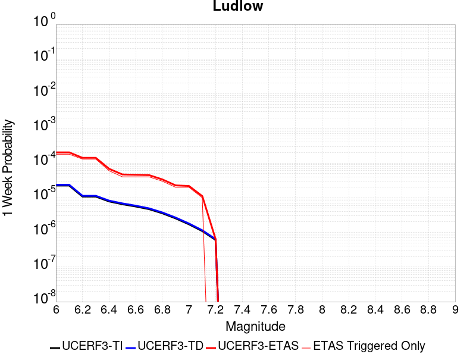 |  |  |  |

| Magnitude | 1 wk TI Prob | 1 wk TD Prob | 1 wk ETAS Prob | 1 wk ETAS/TD Gain | 1 wk ETAS Triggered Only | 1 mo TI Prob | 1 mo TD Prob | 1 mo ETAS Prob | 1 mo ETAS/TD Gain | 1 mo ETAS Triggered Only | 1 yr TI Prob | 1 yr TD Prob | 1 yr ETAS Prob | 1 yr ETAS/TD Gain | 1 yr ETAS Triggered Only | 10 yr TI Prob | 10 yr TD Prob | 10 yr ETAS Prob | 10 yr ETAS/TD Gain | 10 yr ETAS Triggered Only |
|-----|-----|-----|-----|-----|-----|-----|-----|-----|-----|-----|-----|-----|-----|-----|-----|-----|-----|-----|-----|-----|
| 6.0 | 2.2407607E-5 | 2.3657254E-5 | 2.0365299E-4 | 8.60848 | 1.8E-4 | 9.602906E-5 | 1.0138454E-4 | 3.1136326E-4 | 3.0711117 | 2.1E-4 | 0.0011685267 | 0.001233702 | 0.0015033688 | 1.2185835 | 2.7E-4 | 0.011624013 | 0.012273042 | 0.012589115 | 1.0257534 | 3.2E-4 |
| 6.1 | 2.2407607E-5 | 2.3657254E-5 | 2.0365299E-4 | 8.60848 | 1.8E-4 | 9.602906E-5 | 1.0138454E-4 | 3.1136326E-4 | 3.0711117 | 2.1E-4 | 0.0011685267 | 0.001233702 | 0.0015033688 | 1.2185835 | 2.7E-4 | 0.011624013 | 0.012273042 | 0.012589115 | 1.0257534 | 3.2E-4 |
| 6.2 | 1.0781252E-5 | 1.1365663E-5 | 1.4136419E-4 | 12.437829 | 1.3E-4 | 4.620455E-5 | 4.8709102E-5 | 1.7870277E-4 | 3.6687758 | 1.3E-4 | 5.623952E-4 | 5.9287593E-4 | 7.527811E-4 | 1.2697109 | 1.6E-4 | 0.00560974 | 0.0059133614 | 0.006092297 | 1.0302595 | 1.8E-4 |
| 6.3 | 1.0781252E-5 | 1.1365663E-5 | 1.4136419E-4 | 12.437829 | 1.3E-4 | 4.620455E-5 | 4.8709102E-5 | 1.7870277E-4 | 3.6687758 | 1.3E-4 | 5.623952E-4 | 5.9287593E-4 | 7.527811E-4 | 1.2697109 | 1.6E-4 | 0.00560974 | 0.0059133614 | 0.006092297 | 1.0302595 | 1.8E-4 |
| 6.4 | 7.814439E-6 | 8.237729E-6 | 6.8237234E-5 | 8.283501 | 6.0E-5 | 3.3490025E-5 | 3.530408E-5 | 9.530196E-5 | 2.6994603 | 6.0E-5 | 4.0766477E-4 | 4.2974384E-4 | 4.9971376E-4 | 1.1628177 | 7.0E-5 | 0.0040691774 | 0.0042892746 | 0.0043689315 | 1.0185711 | 8.0E-5 |
| 6.5 | 6.4986366E-6 | 6.85092E-6 | 4.6850644E-5 | 6.838592 | 4.0E-5 | 2.7851002E-5 | 2.9360759E-5 | 6.935959E-5 | 2.3623226 | 4.0E-5 | 3.390332E-4 | 3.5740953E-4 | 4.0739166E-4 | 1.1398455 | 5.0E-5 | 0.003385164 | 0.0035684432 | 0.0036282293 | 1.016754 | 6.0E-5 |
| 6.6 | 5.582177E-6 | 5.8860055E-6 | 4.588577E-5 | 7.79574 | 4.0E-5 | 2.3923398E-5 | 2.5225498E-5 | 6.522449E-5 | 2.5856571 | 4.0E-5 | 2.9122844E-4 | 3.0707786E-4 | 3.470656E-4 | 1.1302202 | 4.0E-5 | 0.0029084706 | 0.003066609 | 0.0031164556 | 1.0162547 | 5.0E-5 |
| 6.7 | 4.6858763E-6 | 4.940427E-6 | 4.494023E-5 | 9.096426 | 4.0E-5 | 2.0082172E-5 | 2.1173091E-5 | 6.117224E-5 | 2.8891504 | 4.0E-5 | 2.4447302E-4 | 2.5775246E-4 | 2.9774214E-4 | 1.1551477 | 4.0E-5 | 0.0024420423 | 0.0025745912 | 0.0026244626 | 1.0193706 | 5.0E-5 |
| 6.8 | 3.5584908E-6 | 3.7520183E-6 | 3.3751905E-5 | 8.9956665 | 3.0E-5 | 1.5250586E-5 | 1.6079981E-5 | 4.6079498E-5 | 2.8656437 | 3.0E-5 | 1.8566006E-4 | 1.957566E-4 | 2.2575073E-4 | 1.1532215 | 3.0E-5 | 0.0018550502 | 0.0019558826 | 0.0019958045 | 1.0204111 | 4.0E-5 |
| 6.9 | 2.532834E-6 | 2.6710034E-6 | 2.267095E-5 | 8.4878025 | 2.0E-5 | 1.0854958E-5 | 1.1447109E-5 | 3.144688E-5 | 2.7471461 | 2.0E-5 | 1.3215111E-4 | 1.3935992E-4 | 1.5935714E-4 | 1.1434933 | 2.0E-5 | 0.0013207254 | 0.0013927529 | 0.0014227111 | 1.0215101 | 3.0E-5 |
| 7.0 | 1.7083285E-6 | 1.8019439E-6 | 2.1801909E-5 | 12.099105 | 2.0E-5 | 7.3213873E-6 | 7.722595E-6 | 2.772244E-5 | 3.5897832 | 2.0E-5 | 8.913424E-5 | 9.40187E-5 | 1.1401682E-4 | 1.2127036 | 2.0E-5 | 8.9098496E-4 | 9.3980576E-4 | 9.697775E-4 | 1.0318915 | 3.0E-5 |
| 7.1 | 1.0905424E-6 | 1.1497619E-6 | 1.114975E-5 | 9.697442 | 1.0E-5 | 4.6737446E-6 | 4.9275427E-6 | 1.4927493E-5 | 3.0293992 | 1.0E-5 | 5.6901354E-5 | 5.999128E-5 | 6.999068E-5 | 1.1666809 | 1.0E-5 | 5.6886784E-4 | 5.997606E-4 | 6.0975464E-4 | 1.0166633 | 1.0E-5 |
| 7.2 | 6.06668E-7 | 6.387277E-7 | 6.387277E-7 | 1.0 | 0.0 | 2.600003E-6 | 2.7374022E-6 | 2.7374022E-6 | 1.0 | 0.0 | 3.1654577E-5 | 3.3327433E-5 | 3.3327433E-5 | 1.0 | 0.0 | 3.1650066E-4 | 3.3323118E-4 | 3.3323118E-4 | 1.0 | 0.0 |

## San Jacinto (San Bernardino)
*[(top)](#table-of-contents)*

| 1 Week | 1 Month | 1 Year | 10 Year |
|-----|-----|-----|-----|
|  |  |  |  |

| Magnitude | 1 wk TI Prob | 1 wk TD Prob | 1 wk ETAS Prob | 1 wk ETAS/TD Gain | 1 wk ETAS Triggered Only | 1 mo TI Prob | 1 mo TD Prob | 1 mo ETAS Prob | 1 mo ETAS/TD Gain | 1 mo ETAS Triggered Only | 1 yr TI Prob | 1 yr TD Prob | 1 yr ETAS Prob | 1 yr ETAS/TD Gain | 1 yr ETAS Triggered Only | 10 yr TI Prob | 10 yr TD Prob | 10 yr ETAS Prob | 10 yr ETAS/TD Gain | 10 yr ETAS Triggered Only |
|-----|-----|-----|-----|-----|-----|-----|-----|-----|-----|-----|-----|-----|-----|-----|-----|-----|-----|-----|-----|-----|
| 6.0 | 3.409352E-5 | 3.598562E-5 | 2.4597807E-4 | 6.8354545 | 2.1E-4 | 1.461069E-4 | 1.5421498E-4 | 4.141749E-4 | 2.6856983 | 2.6E-4 | 0.0017774 | 0.0018759521 | 0.002165408 | 1.1542982 | 2.9E-4 | 0.01763251 | 0.019349992 | 0.019663801 | 1.0162175 | 3.2E-4 |
| 6.1 | 3.409352E-5 | 3.598562E-5 | 2.4597807E-4 | 6.8354545 | 2.1E-4 | 1.461069E-4 | 1.5421498E-4 | 4.141749E-4 | 2.6856983 | 2.6E-4 | 0.0017774 | 0.0018759521 | 0.002165408 | 1.1542982 | 2.9E-4 | 0.01763251 | 0.019349992 | 0.019663801 | 1.0162175 | 3.2E-4 |
| 6.2 | 3.409352E-5 | 3.598562E-5 | 2.4597807E-4 | 6.8354545 | 2.1E-4 | 1.461069E-4 | 1.5421498E-4 | 4.141749E-4 | 2.6856983 | 2.6E-4 | 0.0017774 | 0.0018759521 | 0.002165408 | 1.1542982 | 2.9E-4 | 0.01763251 | 0.019349992 | 0.019663801 | 1.0162175 | 3.2E-4 |
| 6.3 | 3.409352E-5 | 3.598562E-5 | 2.4597807E-4 | 6.8354545 | 2.1E-4 | 1.461069E-4 | 1.5421498E-4 | 4.141749E-4 | 2.6856983 | 2.6E-4 | 0.0017774 | 0.0018759521 | 0.002165408 | 1.1542982 | 2.9E-4 | 0.01763251 | 0.019349992 | 0.019663801 | 1.0162175 | 3.2E-4 |
| 6.4 | 3.400795E-5 | 3.5878285E-5 | 2.4587076E-4 | 6.852913 | 2.1E-4 | 1.4574021E-4 | 1.5375503E-4 | 4.1371505E-4 | 2.6907415 | 2.6E-4 | 0.0017729428 | 0.0018703619 | 0.0021598195 | 1.1547602 | 2.9E-4 | 0.017588645 | 0.019295074 | 0.0196089 | 1.0162646 | 3.2E-4 |
| 6.5 | 3.341482E-5 | 3.5138914E-5 | 2.4513152E-4 | 6.97607 | 2.1E-4 | 1.4319851E-4 | 1.5058667E-4 | 4.105475E-4 | 2.7263205 | 2.6E-4 | 0.0017420477 | 0.0018318522 | 0.002121321 | 1.1580197 | 2.9E-4 | 0.017284546 | 0.018916616 | 0.019230563 | 1.0165963 | 3.2E-4 |
| 6.6 | 3.3364955E-5 | 3.5076133E-5 | 2.4506878E-4 | 6.986767 | 2.1E-4 | 1.4298483E-4 | 1.5031763E-4 | 4.1027856E-4 | 2.7294106 | 2.6E-4 | 0.0017394501 | 0.0018285823 | 0.002118052 | 1.1583028 | 2.9E-4 | 0.017258976 | 0.01888448 | 0.019198438 | 1.0166252 | 3.2E-4 |
| 6.7 | 3.335922E-5 | 3.5065907E-5 | 2.4505853E-4 | 6.988513 | 2.1E-4 | 1.4296026E-4 | 1.5027382E-4 | 4.1023473E-4 | 2.7299151 | 2.6E-4 | 0.0017391514 | 0.0018280497 | 0.0021175195 | 1.158349 | 2.9E-4 | 0.017256035 | 0.018879272 | 0.01919323 | 1.0166298 | 3.2E-4 |
| 6.8 | 3.327683E-5 | 3.4959972E-5 | 2.4495262E-4 | 7.0066595 | 2.1E-4 | 1.4260718E-4 | 1.4981985E-4 | 4.097809E-4 | 2.7351575 | 2.6E-4 | 0.0017348597 | 0.001822532 | 0.0021120035 | 1.1588293 | 2.9E-4 | 0.017213784 | 0.018825045 | 0.01913902 | 1.0166787 | 3.2E-4 |
| 6.9 | 3.3235785E-5 | 3.4900928E-5 | 2.448936E-4 | 7.0168223 | 2.1E-4 | 1.4243131E-4 | 1.4956683E-4 | 4.0952794E-4 | 2.7380934 | 2.6E-4 | 0.0017327217 | 0.0018194567 | 0.002108929 | 1.1590983 | 2.9E-4 | 0.017192734 | 0.018794911 | 0.019108897 | 1.0167059 | 3.2E-4 |
| 7.0 | 3.3197095E-5 | 3.4840854E-5 | 2.4483353E-4 | 7.0271964 | 2.1E-4 | 1.422655E-4 | 1.4930942E-4 | 4.092706E-4 | 2.7410903 | 2.6E-4 | 0.0017307063 | 0.0018163278 | 0.0021058011 | 1.1593728 | 2.9E-4 | 0.017172894 | 0.01876429 | 0.019078285 | 1.0167336 | 3.2E-4 |
| 7.1 | 3.3129716E-5 | 3.4721066E-5 | 2.4471377E-4 | 7.0479918 | 2.1E-4 | 1.4197677E-4 | 1.4879608E-4 | 4.087574E-4 | 2.7470977 | 2.6E-4 | 0.0017271966 | 0.0018100884 | 0.0020995636 | 1.1599232 | 2.9E-4 | 0.017138338 | 0.018703366 | 0.01901738 | 1.0167892 | 3.2E-4 |
| 7.2 | 3.3034008E-5 | 3.4588513E-5 | 2.4458126E-4 | 7.0711703 | 2.1E-4 | 1.4156665E-4 | 1.4822806E-4 | 4.0818952E-4 | 2.7537937 | 2.6E-4 | 0.0017222111 | 0.0018031843 | 0.0020926613 | 1.1605366 | 2.9E-4 | 0.017089253 | 0.01863575 | 0.018949786 | 1.0168513 | 3.2E-4 |
| 7.3 | 3.2956614E-5 | 3.4456265E-5 | 2.4444904E-4 | 7.0944724 | 2.1E-4 | 1.4123498E-4 | 1.4766137E-4 | 4.0762298E-4 | 2.7605257 | 2.6E-4 | 0.0017181796 | 0.0017962961 | 0.0020857751 | 1.1611533 | 2.9E-4 | 0.017049557 | 0.018568495 | 0.018882554 | 1.0169135 | 3.2E-4 |
| 7.4 | 3.2915937E-5 | 3.4377957E-5 | 2.4437075E-4 | 7.108355 | 2.1E-4 | 1.4106068E-4 | 1.473258E-4 | 4.072875E-4 | 2.7645361 | 2.6E-4 | 0.0017160608 | 0.0017922173 | 0.0020816976 | 1.1615207 | 2.9E-4 | 0.017028693 | 0.018528769 | 0.01884284 | 1.0169505 | 3.2E-4 |
| 7.5 | 3.281791E-5 | 3.424287E-5 | 2.4423568E-4 | 7.1324534 | 2.1E-4 | 1.406406E-4 | 1.4674691E-4 | 4.0670874E-4 | 2.771498 | 2.6E-4 | 0.0017109542 | 0.0017851809 | 0.0020746633 | 1.1621585 | 2.9E-4 | 0.016978411 | 0.018459652 | 0.018773746 | 1.0170151 | 3.2E-4 |
| 7.6 | 3.2521442E-5 | 3.396782E-5 | 2.4396069E-4 | 7.182112 | 2.1E-4 | 1.3937015E-4 | 1.4556825E-4 | 4.0553042E-4 | 2.7858438 | 2.6E-4 | 0.0016955109 | 0.0017708542 | 0.0020603407 | 1.1634728 | 2.9E-4 | 0.016826328 | 0.018317295 | 0.018631434 | 1.0171498 | 3.2E-4 |
| 7.7 | 3.0287873E-5 | 3.245191E-5 | 2.424451E-4 | 7.4709034 | 2.1E-4 | 1.297987E-4 | 1.3907222E-4 | 3.9903604E-4 | 2.8692725 | 2.6E-4 | 0.0015791537 | 0.0016918903 | 0.0019813997 | 1.1711159 | 2.9E-4 | 0.01567979 | 0.017528199 | 0.01784259 | 1.0179363 | 3.2E-4 |
| 7.8 | 2.6316151E-5 | 2.9662837E-5 | 2.3965661E-4 | 8.079356 | 2.1E-4 | 1.1277862E-4 | 1.2712025E-4 | 3.870872E-4 | 3.0450475 | 2.6E-4 | 0.0013722149 | 0.0015465913 | 0.0018361427 | 1.1872191 | 2.9E-4 | 0.013637724 | 0.016069878 | 0.016384736 | 1.019593 | 3.2E-4 |
| 7.9 | 2.0761147E-5 | 2.3417291E-5 | 1.934133E-4 | 8.259423 | 1.7E-4 | 8.897331E-5 | 1.0035596E-4 | 3.2033387E-4 | 3.1919765 | 2.2E-4 | 0.0010827117 | 0.0012211498 | 0.0014708445 | 1.204475 | 2.5E-4 | 0.010774517 | 0.012793272 | 0.013069689 | 1.0216064 | 2.8E-4 |
| 8.0 | 1.5738568E-5 | 1.6032505E-5 | 1.3603058E-4 | 8.4846735 | 1.2E-4 | 6.744926E-5 | 6.8708934E-5 | 2.1869862E-4 | 3.1829722 | 1.5E-4 | 8.2088535E-4 | 8.3621085E-4 | 0.0010060687 | 1.203128 | 1.7E-4 | 0.008178596 | 0.008865741 | 0.009054056 | 1.0212408 | 1.9E-4 |
| 8.1 | 1.0105832E-5 | 8.329479E-6 | 5.8329064E-5 | 7.0027266 | 5.0E-5 | 4.3309992E-5 | 3.569728E-5 | 1.1569443E-4 | 3.240987 | 8.0E-5 | 5.2717153E-4 | 4.3452822E-4 | 5.244891E-4 | 1.2070311 | 9.0E-5 | 0.005259227 | 0.0046768794 | 0.0047863647 | 1.02341 | 1.1E-4 |
| 8.2 | 4.189207E-6 | 1.577699E-6 | 1.577699E-6 | 1.0 | 0.0 | 1.7953622E-5 | 6.7615497E-6 | 6.7615497E-6 | 1.0 | 0.0 | 2.1856341E-4 | 8.231879E-5 | 8.231879E-5 | 1.0 | 0.0 | 0.0021834858 | 9.562628E-4 | 9.562628E-4 | 1.0 | 0.0 |
| 8.3 | 1.2758221E-6 | 3.612677E-7 | 3.612677E-7 | 1.0 | 0.0 | 5.4677976E-6 | 1.5482892E-6 | 1.5482892E-6 | 1.0 | 0.0 | 6.65684E-5 | 1.8850264E-5 | 1.8850264E-5 | 1.0 | 0.0 | 6.6548464E-4 | 2.2739546E-4 | 2.2739546E-4 | 1.0 | 0.0 |

## Cady
*[(top)](#table-of-contents)*

| 1 Week | 1 Month | 1 Year | 10 Year |
|-----|-----|-----|-----|
|  | 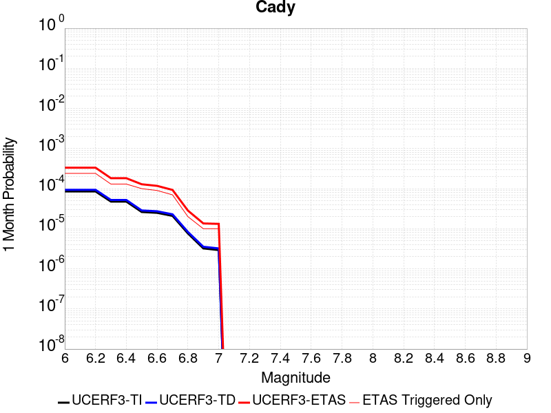 |  |  |

| Magnitude | 1 wk TI Prob | 1 wk TD Prob | 1 wk ETAS Prob | 1 wk ETAS/TD Gain | 1 wk ETAS Triggered Only | 1 mo TI Prob | 1 mo TD Prob | 1 mo ETAS Prob | 1 mo ETAS/TD Gain | 1 mo ETAS Triggered Only | 1 yr TI Prob | 1 yr TD Prob | 1 yr ETAS Prob | 1 yr ETAS/TD Gain | 1 yr ETAS Triggered Only | 10 yr TI Prob | 10 yr TD Prob | 10 yr ETAS Prob | 10 yr ETAS/TD Gain | 10 yr ETAS Triggered Only |
|-----|-----|-----|-----|-----|-----|-----|-----|-----|-----|-----|-----|-----|-----|-----|-----|-----|-----|-----|-----|-----|
| 6.0 | 1.9892565E-5 | 2.1858728E-5 | 2.3185414E-4 | 10.6069355 | 2.1E-4 | 8.525106E-5 | 9.3677416E-5 | 3.3365493E-4 | 3.5617435 | 2.4E-4 | 0.0010374374 | 0.0011400167 | 0.0014196975 | 1.2453305 | 2.8E-4 | 0.010326075 | 0.011350701 | 0.011657182 | 1.0270011 | 3.1E-4 |
| 6.1 | 1.9892565E-5 | 2.1858728E-5 | 2.3185414E-4 | 10.6069355 | 2.1E-4 | 8.525106E-5 | 9.3677416E-5 | 3.3365493E-4 | 3.5617435 | 2.4E-4 | 0.0010374374 | 0.0011400167 | 0.0014196975 | 1.2453305 | 2.8E-4 | 0.010326075 | 0.011350701 | 0.011657182 | 1.0270011 | 3.1E-4 |
| 6.2 | 1.9892565E-5 | 2.1858728E-5 | 2.3185414E-4 | 10.6069355 | 2.1E-4 | 8.525106E-5 | 9.3677416E-5 | 3.3365493E-4 | 3.5617435 | 2.4E-4 | 0.0010374374 | 0.0011400167 | 0.0014196975 | 1.2453305 | 2.8E-4 | 0.010326075 | 0.011350701 | 0.011657182 | 1.0270011 | 3.1E-4 |
| 6.3 | 1.1117327E-5 | 1.2176583E-5 | 1.3217512E-4 | 10.854861 | 1.2E-4 | 4.764482E-5 | 5.2184492E-5 | 1.8217771E-4 | 3.4910316 | 1.3E-4 | 5.7992124E-4 | 6.351925E-4 | 7.850972E-4 | 1.2359989 | 1.5E-4 | 0.0057841022 | 0.0063368753 | 0.006505798 | 1.0266571 | 1.7E-4 |
| 6.4 | 1.1117327E-5 | 1.2176583E-5 | 1.3217512E-4 | 10.854861 | 1.2E-4 | 4.764482E-5 | 5.2184492E-5 | 1.8217771E-4 | 3.4910316 | 1.3E-4 | 5.7992124E-4 | 6.351925E-4 | 7.850972E-4 | 1.2359989 | 1.5E-4 | 0.0057841022 | 0.0063368753 | 0.006505798 | 1.0266571 | 1.7E-4 |
| 6.5 | 6.103093E-6 | 6.672021E-6 | 9.667142E-5 | 14.489077 | 9.0E-5 | 2.615585E-5 | 2.8594131E-5 | 1.2859127E-4 | 4.497121 | 1.0E-4 | 3.1840094E-4 | 3.480905E-4 | 4.4805568E-4 | 1.2871816 | 1.0E-4 | 0.0031794512 | 0.0034766865 | 0.0035962695 | 1.0343956 | 1.2E-4 |
| 6.6 | 5.817237E-6 | 6.3656585E-6 | 8.636515E-5 | 13.567355 | 8.0E-5 | 2.4930776E-5 | 2.728118E-5 | 1.1727872E-4 | 4.2988877 | 9.0E-5 | 3.034899E-4 | 3.3211018E-4 | 4.2208028E-4 | 1.2709044 | 9.0E-5 | 0.0030307577 | 0.0033173605 | 0.0034269956 | 1.0330489 | 1.1E-4 |
| 6.7 | 4.8846314E-6 | 5.3405684E-6 | 7.534019E-5 | 14.107149 | 7.0E-5 | 2.0933967E-5 | 2.2888014E-5 | 9.288641E-5 | 4.058299 | 7.0E-5 | 2.5484123E-4 | 2.7863772E-4 | 3.4861822E-4 | 1.2511523 | 7.0E-5 | 0.0025454918 | 0.0027840391 | 0.0028737886 | 1.0322372 | 9.0E-5 |
| 6.8 | 1.7788773E-6 | 1.9399079E-6 | 2.193987E-5 | 11.309748 | 2.0E-5 | 7.6237375E-6 | 8.313874E-6 | 2.8313707E-5 | 3.4055974 | 2.0E-5 | 9.281505E-5 | 1.01218284E-4 | 1.2121626E-4 | 1.1975727 | 2.0E-5 | 9.2776294E-4 | 0.0010118765 | 0.0010318563 | 1.0197452 | 2.0E-5 |
| 6.9 | 7.5455404E-7 | 8.297092E-7 | 1.0829701E-5 | 13.052405 | 1.0E-5 | 3.233799E-6 | 3.5558937E-6 | 1.35558585E-5 | 3.8122225 | 1.0E-5 | 3.937079E-5 | 4.3292483E-5 | 5.329205E-5 | 1.2309769 | 1.0E-5 | 3.9363815E-4 | 4.3287344E-4 | 4.428691E-4 | 1.0230914 | 1.0E-5 |
| 7.0 | 6.8578805E-7 | 7.541816E-7 | 1.0754174E-5 | 14.259396 | 1.0E-5 | 2.9390883E-6 | 3.2322048E-6 | 1.3232172E-5 | 4.0938535 | 1.0E-5 | 3.578281E-5 | 3.9351715E-5 | 4.9351318E-5 | 1.2541085 | 1.0E-5 | 3.577705E-4 | 3.9347992E-4 | 4.0347598E-4 | 1.0254042 | 1.0E-5 |

## Cleghorn Lake
*[(top)](#table-of-contents)*

| 1 Week | 1 Month | 1 Year | 10 Year |
|-----|-----|-----|-----|
|  |  |  |  |

| Magnitude | 1 wk TI Prob | 1 wk TD Prob | 1 wk ETAS Prob | 1 wk ETAS/TD Gain | 1 wk ETAS Triggered Only | 1 mo TI Prob | 1 mo TD Prob | 1 mo ETAS Prob | 1 mo ETAS/TD Gain | 1 mo ETAS Triggered Only | 1 yr TI Prob | 1 yr TD Prob | 1 yr ETAS Prob | 1 yr ETAS/TD Gain | 1 yr ETAS Triggered Only | 10 yr TI Prob | 10 yr TD Prob | 10 yr ETAS Prob | 10 yr ETAS/TD Gain | 10 yr ETAS Triggered Only |
|-----|-----|-----|-----|-----|-----|-----|-----|-----|-----|-----|-----|-----|-----|-----|-----|-----|-----|-----|-----|-----|
| 6.0 | 1.5467183E-5 | 1.6794203E-5 | 1.9679118E-4 | 11.717804 | 1.8E-4 | 6.6286244E-5 | 7.197348E-5 | 2.619598E-4 | 3.639671 | 1.9E-4 | 8.067362E-4 | 8.759797E-4 | 0.001135752 | 1.2965505 | 2.6E-4 | 0.008038137 | 0.008730696 | 0.009018163 | 1.0329261 | 2.9E-4 |
| 6.1 | 1.5467183E-5 | 1.6794203E-5 | 1.9679118E-4 | 11.717804 | 1.8E-4 | 6.6286244E-5 | 7.197348E-5 | 2.619598E-4 | 3.639671 | 1.9E-4 | 8.067362E-4 | 8.759797E-4 | 0.001135752 | 1.2965505 | 2.6E-4 | 0.008038137 | 0.008730696 | 0.009018163 | 1.0329261 | 2.9E-4 |
| 6.2 | 1.2624631E-5 | 1.3681544E-5 | 1.336799E-4 | 9.77082 | 1.2E-4 | 5.410444E-5 | 5.863415E-5 | 1.8862652E-4 | 3.217008 | 1.3E-4 | 6.585225E-4 | 7.1368564E-4 | 9.0355E-4 | 1.2660336 | 1.9E-4 | 0.0065657445 | 0.0071187317 | 0.0073272367 | 1.0292896 | 2.1E-4 |
| 6.3 | 1.2624631E-5 | 1.3681544E-5 | 1.336799E-4 | 9.77082 | 1.2E-4 | 5.410444E-5 | 5.863415E-5 | 1.8862652E-4 | 3.217008 | 1.3E-4 | 6.585225E-4 | 7.1368564E-4 | 9.0355E-4 | 1.2660336 | 1.9E-4 | 0.0065657445 | 0.0071187317 | 0.0073272367 | 1.0292896 | 2.1E-4 |
| 6.4 | 9.417684E-6 | 1.0170118E-5 | 9.0169306E-5 | 8.866102 | 8.0E-5 | 4.036088E-5 | 4.3585722E-5 | 1.2358224E-4 | 2.8353834 | 8.0E-5 | 4.912829E-4 | 5.3056807E-4 | 6.505044E-4 | 1.2260526 | 1.2E-4 | 0.004901982 | 0.005297049 | 0.0054363073 | 1.0262898 | 1.4E-4 |
| 6.5 | 9.368219E-6 | 1.0117545E-5 | 8.0116835E-5 | 7.918605 | 7.0E-5 | 4.014889E-5 | 4.3360415E-5 | 1.1335738E-4 | 2.6143057 | 7.0E-5 | 4.8870314E-4 | 5.2782625E-4 | 6.377682E-4 | 1.2082919 | 1.1E-4 | 0.004876298 | 0.0052697617 | 0.0053990763 | 1.024539 | 1.3E-4 |
| 6.6 | 7.803798E-6 | 8.441831E-6 | 7.844124E-5 | 9.29197 | 7.0E-5 | 3.3444423E-5 | 3.6179E-5 | 1.0617646E-4 | 2.9347541 | 7.0E-5 | 4.0710976E-4 | 4.4043022E-4 | 5.403862E-4 | 1.2269508 | 1.0E-4 | 0.0040636472 | 0.0043994905 | 0.0045189625 | 1.0271559 | 1.2E-4 |
| 6.7 | 2.3108669E-6 | 2.4438336E-6 | 3.244376E-5 | 13.275764 | 3.0E-5 | 9.903678E-6 | 1.0473532E-5 | 4.0473216E-5 | 3.8643334 | 3.0E-5 | 1.205706E-4 | 1.2750797E-4 | 1.5750415E-4 | 1.2352494 | 3.0E-5 | 0.001205052 | 0.0012743667 | 0.0013143158 | 1.0313481 | 4.0E-5 |
| 6.8 | 2.0882828E-6 | 2.2062823E-6 | 3.2206215E-5 | 14.597506 | 3.0E-5 | 8.949753E-6 | 9.455462E-6 | 3.945518E-5 | 4.1727395 | 3.0E-5 | 1.08957785E-4 | 1.1511434E-4 | 1.4511088E-4 | 1.2605804 | 3.0E-5 | 0.0010890438 | 0.0011505639 | 0.0011905179 | 1.0347255 | 4.0E-5 |
| 6.9 | 1.876935E-6 | 1.981051E-6 | 2.1981012E-5 | 11.095632 | 2.0E-5 | 8.043982E-6 | 8.490192E-6 | 2.8490022E-5 | 3.3556395 | 2.0E-5 | 9.7931086E-5 | 1.03363345E-4 | 1.2336127E-4 | 1.1934721 | 2.0E-5 | 9.788794E-4 | 0.0010331686 | 0.0010631377 | 1.0290068 | 3.0E-5 |
| 7.0 | 1.5357559E-6 | 1.6202807E-6 | 2.1620248E-5 | 13.34352 | 2.0E-5 | 6.5817944E-6 | 6.9440425E-6 | 2.6943904E-5 | 3.8801467 | 2.0E-5 | 8.01304E-5 | 8.454057E-5 | 1.0453887E-4 | 1.2365528 | 2.0E-5 | 8.010151E-4 | 8.450965E-4 | 8.750711E-4 | 1.0354689 | 3.0E-5 |
| 7.1 | 1.0905424E-6 | 1.1497619E-6 | 1.114975E-5 | 9.697442 | 1.0E-5 | 4.6737446E-6 | 4.9275427E-6 | 1.4927493E-5 | 3.0293992 | 1.0E-5 | 5.6901354E-5 | 5.999128E-5 | 6.999068E-5 | 1.1666809 | 1.0E-5 | 5.6886784E-4 | 5.997606E-4 | 6.0975464E-4 | 1.0166633 | 1.0E-5 |
| 7.2 | 6.06668E-7 | 6.387277E-7 | 6.387277E-7 | 1.0 | 0.0 | 2.600003E-6 | 2.7374022E-6 | 2.7374022E-6 | 1.0 | 0.0 | 3.1654577E-5 | 3.3327433E-5 | 3.3327433E-5 | 1.0 | 0.0 | 3.1650066E-4 | 3.3323118E-4 | 3.3323118E-4 | 1.0 | 0.0 |

## San Jacinto (San Jacinto Valley) rev
*[(top)](#table-of-contents)*

| 1 Week | 1 Month | 1 Year | 10 Year |
|-----|-----|-----|-----|
|  |  |  |  |

| Magnitude | 1 wk TI Prob | 1 wk TD Prob | 1 wk ETAS Prob | 1 wk ETAS/TD Gain | 1 wk ETAS Triggered Only | 1 mo TI Prob | 1 mo TD Prob | 1 mo ETAS Prob | 1 mo ETAS/TD Gain | 1 mo ETAS Triggered Only | 1 yr TI Prob | 1 yr TD Prob | 1 yr ETAS Prob | 1 yr ETAS/TD Gain | 1 yr ETAS Triggered Only | 10 yr TI Prob | 10 yr TD Prob | 10 yr ETAS Prob | 10 yr ETAS/TD Gain | 10 yr ETAS Triggered Only |
|-----|-----|-----|-----|-----|-----|-----|-----|-----|-----|-----|-----|-----|-----|-----|-----|-----|-----|-----|-----|-----|
| 6.0 | 3.652694E-5 | 3.4401106E-5 | 2.0439526E-4 | 5.9415317 | 1.7E-4 | 1.5653463E-4 | 1.4742499E-4 | 3.5739402E-4 | 2.4242432 | 2.1E-4 | 0.0019041431 | 0.0017934233 | 0.002032993 | 1.1335822 | 2.4E-4 | 0.018879099 | 0.018526303 | 0.0187913 | 1.0143039 | 2.7E-4 |
| 6.1 | 3.652694E-5 | 3.4401106E-5 | 2.0439526E-4 | 5.9415317 | 1.7E-4 | 1.5653463E-4 | 1.4742499E-4 | 3.5739402E-4 | 2.4242432 | 2.1E-4 | 0.0019041431 | 0.0017934233 | 0.002032993 | 1.1335822 | 2.4E-4 | 0.018879099 | 0.018526303 | 0.0187913 | 1.0143039 | 2.7E-4 |
| 6.2 | 3.652694E-5 | 3.4401106E-5 | 2.0439526E-4 | 5.9415317 | 1.7E-4 | 1.5653463E-4 | 1.4742499E-4 | 3.5739402E-4 | 2.4242432 | 2.1E-4 | 0.0019041431 | 0.0017934233 | 0.002032993 | 1.1335822 | 2.4E-4 | 0.018879099 | 0.018526303 | 0.0187913 | 1.0143039 | 2.7E-4 |
| 6.3 | 3.652694E-5 | 3.4401106E-5 | 2.0439526E-4 | 5.9415317 | 1.7E-4 | 1.5653463E-4 | 1.4742499E-4 | 3.5739402E-4 | 2.4242432 | 2.1E-4 | 0.0019041431 | 0.0017934233 | 0.002032993 | 1.1335822 | 2.4E-4 | 0.018879099 | 0.018526303 | 0.0187913 | 1.0143039 | 2.7E-4 |
| 6.4 | 3.646941E-5 | 3.432268E-5 | 2.0431685E-4 | 5.952823 | 1.7E-4 | 1.5628811E-4 | 1.4708891E-4 | 3.5705802E-4 | 2.4274979 | 2.1E-4 | 0.0019011468 | 0.0017893389 | 0.0020289093 | 1.1338878 | 2.4E-4 | 0.018849645 | 0.018486181 | 0.018751191 | 1.0143355 | 2.7E-4 |
| 6.5 | 3.646941E-5 | 3.432268E-5 | 2.0431685E-4 | 5.952823 | 1.7E-4 | 1.5628811E-4 | 1.4708891E-4 | 3.5705802E-4 | 2.4274979 | 2.1E-4 | 0.0019011468 | 0.0017893389 | 0.0020289093 | 1.1338878 | 2.4E-4 | 0.018849645 | 0.018486181 | 0.018751191 | 1.0143355 | 2.7E-4 |
| 6.6 | 3.6442503E-5 | 3.4286066E-5 | 2.0428024E-4 | 5.9581122 | 1.7E-4 | 1.561728E-4 | 1.4693203E-4 | 3.5690118E-4 | 2.4290223 | 2.1E-4 | 0.0018997455 | 0.001787432 | 0.0020270029 | 1.1340308 | 2.4E-4 | 0.018835869 | 0.01846745 | 0.018732464 | 1.0143503 | 2.7E-4 |
| 6.7 | 3.6432113E-5 | 3.427164E-5 | 2.0426582E-4 | 5.9601994 | 1.7E-4 | 1.5612828E-4 | 1.4687021E-4 | 3.5683936E-4 | 2.4296238 | 2.1E-4 | 0.0018992044 | 0.0017866807 | 0.002026252 | 1.1340873 | 2.4E-4 | 0.018830549 | 0.018460074 | 0.01872509 | 1.0143561 | 2.7E-4 |
| 6.8 | 3.6409598E-5 | 3.4240697E-5 | 2.0423488E-4 | 5.964682 | 1.7E-4 | 1.560318E-4 | 1.4673761E-4 | 3.567068E-4 | 2.430916 | 2.1E-4 | 0.0018980318 | 0.0017850689 | 0.0020246406 | 1.1342086 | 2.4E-4 | 0.018819023 | 0.018444229 | 0.01870925 | 1.0143688 | 2.7E-4 |
| 6.9 | 3.638078E-5 | 3.4201123E-5 | 2.0419531E-4 | 5.9704275 | 1.7E-4 | 1.5590832E-4 | 1.4656801E-4 | 3.5653723E-4 | 2.432572 | 2.1E-4 | 0.0018965311 | 0.0017830075 | 0.0020225795 | 1.134364 | 2.4E-4 | 0.018804269 | 0.018423963 | 0.018688988 | 1.0143849 | 2.7E-4 |
| 7.0 | 3.6294874E-5 | 3.408314E-5 | 2.0407734E-4 | 5.987633 | 1.7E-4 | 1.5554018E-4 | 1.4606243E-4 | 3.5603176E-4 | 2.4375312 | 2.1E-4 | 0.0018920569 | 0.0017768623 | 0.0020164358 | 1.1348295 | 2.4E-4 | 0.018760284 | 0.018363545 | 0.018628586 | 1.014433 | 2.7E-4 |
| 7.1 | 3.6260717E-5 | 3.403942E-5 | 2.0403364E-4 | 5.9940395 | 1.7E-4 | 1.5539382E-4 | 1.4587509E-4 | 3.5584447E-4 | 2.4393778 | 2.1E-4 | 0.001890278 | 0.0017745851 | 0.0020141592 | 1.1350029 | 2.4E-4 | 0.018742796 | 0.018341139 | 0.018606186 | 1.014451 | 2.7E-4 |
| 7.2 | 3.6210204E-5 | 3.397364E-5 | 2.0396787E-4 | 6.0037093 | 1.7E-4 | 1.5517735E-4 | 1.455932E-4 | 3.5556263E-4 | 2.442165 | 2.1E-4 | 0.001887647 | 0.0017711588 | 0.0020107336 | 1.1352645 | 2.4E-4 | 0.01871693 | 0.018307408 | 0.018572465 | 1.0144781 | 2.7E-4 |
| 7.3 | 3.6119454E-5 | 3.386193E-5 | 2.0385617E-4 | 6.0202174 | 1.7E-4 | 1.5478847E-4 | 1.4511449E-4 | 3.5508402E-4 | 2.4469233 | 2.1E-4 | 0.0018829206 | 0.0017653398 | 0.002004916 | 1.1357112 | 2.4E-4 | 0.018670462 | 0.01824996 | 0.018515034 | 1.0145246 | 2.7E-4 |
| 7.4 | 3.607848E-5 | 3.380943E-5 | 2.0380368E-4 | 6.028013 | 1.7E-4 | 1.5461289E-4 | 1.4488952E-4 | 3.5485908E-4 | 2.4491704 | 2.1E-4 | 0.0018807866 | 0.0017626052 | 0.0020021822 | 1.1359221 | 2.4E-4 | 0.018649481 | 0.018222956 | 0.018488035 | 1.0145465 | 2.7E-4 |
| 7.5 | 3.5856774E-5 | 3.3619202E-5 | 2.0361348E-4 | 6.0564637 | 1.7E-4 | 1.5366284E-4 | 1.4407437E-4 | 3.540441E-4 | 2.4573708 | 2.1E-4 | 0.0018692396 | 0.0017526967 | 0.001992276 | 1.1366918 | 2.4E-4 | 0.018535944 | 0.018124057 | 0.018389164 | 1.0146273 | 2.7E-4 |
| 7.6 | 3.286655E-5 | 3.2142278E-5 | 2.0213681E-4 | 6.2888145 | 1.7E-4 | 1.4084904E-4 | 1.3774536E-4 | 3.477164E-4 | 2.5243423 | 2.1E-4 | 0.001713488 | 0.0016757617 | 0.0019153595 | 1.1429784 | 2.4E-4 | 0.017003361 | 0.017343804 | 0.017609121 | 1.0152975 | 2.7E-4 |
| 7.7 | 2.8882527E-5 | 2.9235205E-5 | 1.9923023E-4 | 6.8147373 | 1.7E-4 | 1.237764E-4 | 1.2528773E-4 | 3.352614E-4 | 2.675932 | 2.1E-4 | 0.0015059357 | 0.0015243118 | 0.0017639459 | 1.1572081 | 2.4E-4 | 0.014957713 | 0.015830338 | 0.016096063 | 1.0167859 | 2.7E-4 |
| 7.8 | 2.4950225E-5 | 2.6526219E-5 | 1.9652171E-4 | 7.4085836 | 1.7E-4 | 1.0692515E-4 | 1.1367885E-4 | 3.2365497E-4 | 2.8470993 | 2.1E-4 | 0.0013010362 | 0.0013831621 | 0.0016228302 | 1.1732755 | 2.4E-4 | 0.012934455 | 0.01441176 | 0.014677868 | 1.0184647 | 2.7E-4 |
| 7.9 | 1.9881603E-5 | 2.150649E-5 | 1.8150306E-4 | 8.439455 | 1.6E-4 | 8.520408E-5 | 9.216742E-5 | 2.92149E-4 | 3.169764 | 2.0E-4 | 0.001036866 | 0.0011215615 | 0.0013513035 | 1.2048413 | 2.3E-4 | 0.010320415 | 0.011776998 | 0.012033936 | 1.021817 | 2.6E-4 |
| 8.0 | 1.563292E-5 | 1.5936288E-5 | 1.3593437E-4 | 8.529864 | 1.2E-4 | 6.6996516E-5 | 6.829659E-5 | 2.1828635E-4 | 3.196153 | 1.5E-4 | 8.153773E-4 | 8.3119445E-4 | 0.0010010531 | 1.204355 | 1.7E-4 | 0.00812392 | 0.008810331 | 0.008998658 | 1.0213755 | 1.9E-4 |
| 8.1 | 1.0045313E-5 | 8.300794E-6 | 5.830038E-5 | 7.02347 | 5.0E-5 | 4.305063E-5 | 3.557435E-5 | 1.1557151E-4 | 3.2487314 | 8.0E-5 | 5.2401534E-4 | 4.3303217E-4 | 5.2299316E-4 | 1.2077467 | 9.0E-5 | 0.0052278144 | 0.0046587666 | 0.0047682542 | 1.0235014 | 1.1E-4 |
| 8.2 | 4.1554413E-6 | 1.5648296E-6 | 1.5648296E-6 | 1.0 | 0.0 | 1.7808914E-5 | 6.7063957E-6 | 6.7063957E-6 | 1.0 | 0.0 | 2.1680194E-4 | 8.164734E-5 | 8.164734E-5 | 1.0 | 0.0 | 0.0021659054 | 9.479703E-4 | 9.479703E-4 | 1.0 | 0.0 |
| 8.3 | 1.2758221E-6 | 3.612677E-7 | 3.612677E-7 | 1.0 | 0.0 | 5.4677976E-6 | 1.5482892E-6 | 1.5482892E-6 | 1.0 | 0.0 | 6.65684E-5 | 1.8850264E-5 | 1.8850264E-5 | 1.0 | 0.0 | 6.6548464E-4 | 2.2739546E-4 | 2.2739546E-4 | 1.0 | 0.0 |

## San Jacinto (Stepovers Combined)
*[(top)](#table-of-contents)*

| 1 Week | 1 Month | 1 Year | 10 Year |
|-----|-----|-----|-----|
|  |  |  |  |

| Magnitude | 1 wk TI Prob | 1 wk TD Prob | 1 wk ETAS Prob | 1 wk ETAS/TD Gain | 1 wk ETAS Triggered Only | 1 mo TI Prob | 1 mo TD Prob | 1 mo ETAS Prob | 1 mo ETAS/TD Gain | 1 mo ETAS Triggered Only | 1 yr TI Prob | 1 yr TD Prob | 1 yr ETAS Prob | 1 yr ETAS/TD Gain | 1 yr ETAS Triggered Only | 10 yr TI Prob | 10 yr TD Prob | 10 yr ETAS Prob | 10 yr ETAS/TD Gain | 10 yr ETAS Triggered Only |
|-----|-----|-----|-----|-----|-----|-----|-----|-----|-----|-----|-----|-----|-----|-----|-----|-----|-----|-----|-----|-----|
| 6.0 | 4.0667746E-5 | 3.5271103E-5 | 1.9526546E-4 | 5.5361314 | 1.6E-4 | 1.742787E-4 | 1.5115313E-4 | 3.511229E-4 | 2.3229616 | 2.0E-4 | 0.0021197782 | 0.0018387372 | 0.0020583328 | 1.1194273 | 2.2E-4 | 0.020996714 | 0.018986495 | 0.019231748 | 1.0129173 | 2.5E-4 |
| 6.1 | 4.0667746E-5 | 3.5271103E-5 | 1.9526546E-4 | 5.5361314 | 1.6E-4 | 1.742787E-4 | 1.5115313E-4 | 3.511229E-4 | 2.3229616 | 2.0E-4 | 0.0021197782 | 0.0018387372 | 0.0020583328 | 1.1194273 | 2.2E-4 | 0.020996714 | 0.018986495 | 0.019231748 | 1.0129173 | 2.5E-4 |
| 6.2 | 4.0667746E-5 | 3.5271103E-5 | 1.9526546E-4 | 5.5361314 | 1.6E-4 | 1.742787E-4 | 1.5115313E-4 | 3.511229E-4 | 2.3229616 | 2.0E-4 | 0.0021197782 | 0.0018387372 | 0.0020583328 | 1.1194273 | 2.2E-4 | 0.020996714 | 0.018986495 | 0.019231748 | 1.0129173 | 2.5E-4 |
| 6.3 | 4.0667746E-5 | 3.5271103E-5 | 1.9526546E-4 | 5.5361314 | 1.6E-4 | 1.742787E-4 | 1.5115313E-4 | 3.511229E-4 | 2.3229616 | 2.0E-4 | 0.0021197782 | 0.0018387372 | 0.0020583328 | 1.1194273 | 2.2E-4 | 0.020996714 | 0.018986495 | 0.019231748 | 1.0129173 | 2.5E-4 |
| 6.4 | 4.0577226E-5 | 3.5143014E-5 | 1.9513739E-4 | 5.552665 | 1.6E-4 | 1.738908E-4 | 1.5060425E-4 | 3.5057412E-4 | 2.3277838 | 2.0E-4 | 0.0021150648 | 0.0018320669 | 0.0020516638 | 1.1198629 | 2.2E-4 | 0.020950472 | 0.018921062 | 0.019166332 | 1.0129628 | 2.5E-4 |
| 6.5 | 4.0577226E-5 | 3.5143014E-5 | 1.9513739E-4 | 5.552665 | 1.6E-4 | 1.738908E-4 | 1.5060425E-4 | 3.5057412E-4 | 2.3277838 | 2.0E-4 | 0.0021150648 | 0.0018320669 | 0.0020516638 | 1.1198629 | 2.2E-4 | 0.020950472 | 0.018921062 | 0.019166332 | 1.0129628 | 2.5E-4 |
| 6.6 | 4.053861E-5 | 3.5088357E-5 | 1.9508274E-4 | 5.559757 | 1.6E-4 | 1.7372532E-4 | 1.5037002E-4 | 3.5033995E-4 | 2.3298523 | 2.0E-4 | 0.0021130538 | 0.0018292206 | 0.0020488182 | 1.1200498 | 2.2E-4 | 0.020930743 | 0.01889314 | 0.019138416 | 1.0129824 | 2.5E-4 |
| 6.7 | 4.0516545E-5 | 3.505743E-5 | 1.9505182E-4 | 5.56378 | 1.6E-4 | 1.7363077E-4 | 1.502375E-4 | 3.5020744E-4 | 2.3310256 | 2.0E-4 | 0.002111905 | 0.0018276101 | 0.002047208 | 1.1201558 | 2.2E-4 | 0.020919468 | 0.018877337 | 0.019122617 | 1.0129933 | 2.5E-4 |
| 6.8 | 4.049434E-5 | 3.5028992E-5 | 1.9502339E-4 | 5.567485 | 1.6E-4 | 1.7353562E-4 | 1.5011564E-4 | 3.500856E-4 | 2.3321064 | 2.0E-4 | 0.0021107488 | 0.0018261289 | 0.002045727 | 1.1202534 | 2.2E-4 | 0.020908125 | 0.018862749 | 0.019108033 | 1.0130036 | 2.5E-4 |
| 6.9 | 4.046386E-5 | 3.4991554E-5 | 1.9498596E-4 | 5.572372 | 1.6E-4 | 1.73405E-4 | 1.499552E-4 | 3.4992522E-4 | 2.3335316 | 2.0E-4 | 0.0021091616 | 0.0018241788 | 0.0020437776 | 1.1203822 | 2.2E-4 | 0.020892553 | 0.018843522 | 0.019088812 | 1.0130172 | 2.5E-4 |
| 7.0 | 4.036382E-5 | 3.4872126E-5 | 1.9486654E-4 | 5.588032 | 1.6E-4 | 1.7297632E-4 | 1.4944343E-4 | 3.4941352E-4 | 2.3380992 | 2.0E-4 | 0.0021039525 | 0.0018179584 | 0.0020375585 | 1.1207949 | 2.2E-4 | 0.02084144 | 0.018782137 | 0.01902744 | 1.0130606 | 2.5E-4 |
| 7.1 | 4.0343282E-5 | 3.485059E-5 | 1.9484501E-4 | 5.5908675 | 1.6E-4 | 1.7288832E-4 | 1.4935112E-4 | 3.4932126E-4 | 2.338926 | 2.0E-4 | 0.002102883 | 0.0018168368 | 0.002036437 | 1.1208696 | 2.2E-4 | 0.020830948 | 0.018771008 | 0.019016314 | 1.0130684 | 2.5E-4 |
| 7.2 | 4.0257353E-5 | 3.475509E-5 | 1.9474953E-4 | 5.6034827 | 1.6E-4 | 1.725201E-4 | 1.489419E-4 | 3.4891212E-4 | 2.3426056 | 2.0E-4 | 0.0020984085 | 0.0018118626 | 0.002031464 | 1.121202 | 2.2E-4 | 0.020787042 | 0.018721746 | 0.018967066 | 1.0131035 | 2.5E-4 |
| 7.3 | 3.9940667E-5 | 3.458276E-5 | 1.9457722E-4 | 5.626423 | 1.6E-4 | 1.7116306E-4 | 1.4820343E-4 | 3.4817378E-4 | 2.3492966 | 2.0E-4 | 0.0020819185 | 0.0018028866 | 0.00202249 | 1.1218065 | 2.2E-4 | 0.020625217 | 0.018630387 | 0.01887573 | 1.0131689 | 2.5E-4 |
| 7.4 | 3.9721202E-5 | 3.4468165E-5 | 1.9446266E-4 | 5.641804 | 1.6E-4 | 1.7022261E-4 | 1.4771236E-4 | 3.4768283E-4 | 2.353783 | 2.0E-4 | 0.0020704903 | 0.0017969179 | 0.0020165225 | 1.1222118 | 2.2E-4 | 0.020513052 | 0.018569522 | 0.018814879 | 1.0132129 | 2.5E-4 |
| 7.5 | 3.7036873E-5 | 3.3535776E-5 | 1.935304E-4 | 5.7708645 | 1.6E-4 | 1.5871979E-4 | 1.4371685E-4 | 3.436881E-4 | 2.3914254 | 2.0E-4 | 0.0019307006 | 0.0017483513 | 0.0019679666 | 1.1256129 | 2.2E-4 | 0.019140124 | 0.018071128 | 0.01831661 | 1.0135843 | 2.5E-4 |
| 7.6 | 3.2940967E-5 | 3.13167E-5 | 1.9131169E-4 | 6.108935 | 1.6E-4 | 1.4116794E-4 | 1.3420754E-4 | 3.341807E-4 | 2.490029 | 2.0E-4 | 0.0017173645 | 0.0016327545 | 0.0018523952 | 1.1345216 | 2.2E-4 | 0.01704153 | 0.016904091 | 0.017149866 | 1.0145394 | 2.5E-4 |
| 7.7 | 2.8236149E-5 | 2.7882697E-5 | 1.8787824E-4 | 6.738166 | 1.6E-4 | 1.2100645E-4 | 1.1949181E-4 | 3.1946792E-4 | 2.673555 | 2.0E-4 | 0.0014722579 | 0.0014538429 | 0.0016735231 | 1.1511031 | 2.2E-4 | 0.014625421 | 0.015114912 | 0.015361133 | 1.01629 | 2.5E-4 |
| 7.8 | 2.4329287E-5 | 2.5206451E-5 | 1.8520241E-4 | 7.3474216 | 1.6E-4 | 1.042642E-4 | 1.08023174E-4 | 3.0800156E-4 | 2.8512545 | 2.0E-4 | 0.0012686774 | 0.0013143895 | 0.0015341004 | 1.1671581 | 2.2E-4 | 0.012614589 | 0.013712341 | 0.013958912 | 1.0179818 | 2.5E-4 |
| 7.9 | 1.9370926E-5 | 2.0420413E-5 | 1.7041735E-4 | 8.345441 | 1.5E-4 | 8.301561E-5 | 8.751312E-5 | 2.774965E-4 | 3.170913 | 1.9E-4 | 0.0010102465 | 0.0010649522 | 0.0012747286 | 1.1969819 | 2.1E-4 | 0.0100566605 | 0.011199402 | 0.011436714 | 1.0211897 | 2.4E-4 |
| 8.0 | 1.5583017E-5 | 1.5885415E-5 | 1.3588351E-4 | 8.553979 | 1.2E-4 | 6.6782646E-5 | 6.807858E-5 | 2.1806837E-4 | 3.2031863 | 1.5E-4 | 8.127754E-4 | 8.2854216E-4 | 9.984013E-4 | 1.2050097 | 1.7E-4 | 0.008098091 | 0.008781636 | 0.008969968 | 1.0214461 | 1.9E-4 |
| 8.1 | 1.0024873E-5 | 8.291399E-6 | 5.8290985E-5 | 7.030295 | 5.0E-5 | 4.2963035E-5 | 3.553409E-5 | 1.1553124E-4 | 3.2512794 | 8.0E-5 | 5.229494E-4 | 4.3254215E-4 | 5.225032E-4 | 1.2079822 | 9.0E-5 | 0.0052172043 | 0.0046530655 | 0.0047625536 | 1.0235304 | 1.1E-4 |
| 8.2 | 4.142796E-6 | 1.5602761E-6 | 1.5602761E-6 | 1.0 | 0.0 | 1.775472E-5 | 6.6868806E-6 | 6.6868806E-6 | 1.0 | 0.0 | 2.1614227E-4 | 8.140976E-5 | 8.140976E-5 | 1.0 | 0.0 | 0.0021593217 | 9.4514614E-4 | 9.4514614E-4 | 1.0 | 0.0 |
| 8.3 | 1.2750878E-6 | 3.609817E-7 | 3.609817E-7 | 1.0 | 0.0 | 5.4646503E-6 | 1.5470634E-6 | 1.5470634E-6 | 1.0 | 0.0 | 6.653009E-5 | 1.8835339E-5 | 1.8835339E-5 | 1.0 | 0.0 | 6.6510175E-4 | 2.272251E-4 | 2.272251E-4 | 1.0 | 0.0 |

## San Andreas (North Branch Mill Creek)
*[(top)](#table-of-contents)*

| 1 Week | 1 Month | 1 Year | 10 Year |
|-----|-----|-----|-----|
|  |  |  |  |

| Magnitude | 1 wk TI Prob | 1 wk TD Prob | 1 wk ETAS Prob | 1 wk ETAS/TD Gain | 1 wk ETAS Triggered Only | 1 mo TI Prob | 1 mo TD Prob | 1 mo ETAS Prob | 1 mo ETAS/TD Gain | 1 mo ETAS Triggered Only | 1 yr TI Prob | 1 yr TD Prob | 1 yr ETAS Prob | 1 yr ETAS/TD Gain | 1 yr ETAS Triggered Only | 10 yr TI Prob | 10 yr TD Prob | 10 yr ETAS Prob | 10 yr ETAS/TD Gain | 10 yr ETAS Triggered Only |
|-----|-----|-----|-----|-----|-----|-----|-----|-----|-----|-----|-----|-----|-----|-----|-----|-----|-----|-----|-----|-----|
| 6.0 | 1.3461156E-5 | 2.3500992E-5 | 1.8349724E-4 | 7.8080635 | 1.6E-4 | 5.7689394E-5 | 1.00714664E-4 | 2.8069655E-4 | 2.7870474 | 1.8E-4 | 7.02142E-4 | 0.0012255146 | 0.0014552327 | 1.1874462 | 2.3E-4 | 0.0069992766 | 0.012228744 | 0.012455932 | 1.0185782 | 2.3E-4 |
| 6.1 | 1.3461156E-5 | 2.3500992E-5 | 1.8349724E-4 | 7.8080635 | 1.6E-4 | 5.7689394E-5 | 1.00714664E-4 | 2.8069655E-4 | 2.7870474 | 1.8E-4 | 7.02142E-4 | 0.0012255146 | 0.0014552327 | 1.1874462 | 2.3E-4 | 0.0069992766 | 0.012228744 | 0.012455932 | 1.0185782 | 2.3E-4 |
| 6.2 | 1.3461156E-5 | 2.3500992E-5 | 1.8349724E-4 | 7.8080635 | 1.6E-4 | 5.7689394E-5 | 1.00714664E-4 | 2.8069655E-4 | 2.7870474 | 1.8E-4 | 7.02142E-4 | 0.0012255146 | 0.0014552327 | 1.1874462 | 2.3E-4 | 0.0069992766 | 0.012228744 | 0.012455932 | 1.0185782 | 2.3E-4 |
| 6.3 | 1.3461156E-5 | 2.3500992E-5 | 1.8349724E-4 | 7.8080635 | 1.6E-4 | 5.7689394E-5 | 1.00714664E-4 | 2.8069655E-4 | 2.7870474 | 1.8E-4 | 7.02142E-4 | 0.0012255146 | 0.0014552327 | 1.1874462 | 2.3E-4 | 0.0069992766 | 0.012228744 | 0.012455932 | 1.0185782 | 2.3E-4 |
| 6.4 | 1.3461156E-5 | 2.3500992E-5 | 1.8349724E-4 | 7.8080635 | 1.6E-4 | 5.7689394E-5 | 1.00714664E-4 | 2.8069655E-4 | 2.7870474 | 1.8E-4 | 7.02142E-4 | 0.0012255146 | 0.0014552327 | 1.1874462 | 2.3E-4 | 0.0069992766 | 0.012228744 | 0.012455932 | 1.0185782 | 2.3E-4 |
| 6.5 | 1.3450706E-5 | 2.348995E-5 | 1.8348619E-4 | 7.811263 | 1.6E-4 | 5.764461E-5 | 1.00667356E-4 | 2.8064923E-4 | 2.7878873 | 1.8E-4 | 7.0159714E-4 | 0.0012249392 | 0.0014546575 | 1.1875345 | 2.3E-4 | 0.006993862 | 0.012223054 | 0.012450242 | 1.0185869 | 2.3E-4 |
| 6.6 | 1.3074523E-5 | 2.3104236E-5 | 1.8310054E-4 | 7.9249773 | 1.6E-4 | 5.6032466E-5 | 9.901441E-5 | 2.789966E-4 | 2.817737 | 1.8E-4 | 6.8198174E-4 | 0.001204837 | 0.0014345599 | 1.1906672 | 2.3E-4 | 0.006798926 | 0.012024219 | 0.0122514535 | 1.018898 | 2.3E-4 |
| 6.7 | 1.3050216E-5 | 2.3079532E-5 | 1.8307584E-4 | 7.9323893 | 1.6E-4 | 5.59283E-5 | 9.890855E-5 | 2.7889074E-4 | 2.8196828 | 1.8E-4 | 6.8071426E-4 | 0.0012035496 | 0.0014332727 | 1.1908714 | 2.3E-4 | 0.0067863287 | 0.012011484 | 0.012238721 | 1.0189184 | 2.3E-4 |
| 6.8 | 1.29049395E-5 | 2.2927941E-5 | 1.8292427E-4 | 7.978225 | 1.6E-4 | 5.530571E-5 | 9.825892E-5 | 2.7824123E-4 | 2.8317149 | 1.8E-4 | 6.73139E-4 | 0.001195649 | 0.0014253741 | 1.1921341 | 2.3E-4 | 0.0067110364 | 0.011933329 | 0.012160583 | 1.0190438 | 2.3E-4 |
| 6.9 | 1.2867369E-5 | 2.2887343E-5 | 1.8288368E-4 | 7.9906034 | 1.6E-4 | 5.51447E-5 | 9.808494E-5 | 2.7806728E-4 | 2.834964 | 1.8E-4 | 6.711799E-4 | 0.0011935332 | 0.0014232587 | 1.1924752 | 2.3E-4 | 0.006691564 | 0.011912397 | 0.0121396575 | 1.0190777 | 2.3E-4 |
| 7.0 | 1.2495996E-5 | 2.2287419E-5 | 1.8228385E-4 | 8.178778 | 1.6E-4 | 5.3553173E-5 | 9.551403E-5 | 2.7549683E-4 | 2.8843598 | 1.8E-4 | 6.518148E-4 | 0.0011622658 | 0.0013919985 | 1.1976594 | 2.3E-4 | 0.0064990623 | 0.011603 | 0.011830331 | 1.0195924 | 2.3E-4 |
| 7.1 | 1.2452067E-5 | 2.2232492E-5 | 1.8222893E-4 | 8.196514 | 1.6E-4 | 5.3364907E-5 | 9.527864E-5 | 2.752615E-4 | 2.8890157 | 1.8E-4 | 6.4952404E-4 | 0.001159403 | 0.0013891363 | 1.198148 | 2.3E-4 | 0.0064762887 | 0.011574671 | 0.011802008 | 1.0196409 | 2.3E-4 |
| 7.2 | 1.2002777E-5 | 2.1611015E-5 | 1.8160755E-4 | 8.403472 | 1.6E-4 | 5.143946E-5 | 9.261536E-5 | 2.725987E-4 | 2.9433422 | 1.8E-4 | 6.2609545E-4 | 0.0011270114 | 0.0013567521 | 1.2038496 | 2.3E-4 | 0.006243344 | 0.011254058 | 0.0114814695 | 1.020207 | 2.3E-4 |
| 7.3 | 1.1923425E-5 | 2.1480853E-5 | 1.8147742E-4 | 8.448334 | 1.6E-4 | 5.109939E-5 | 9.205757E-5 | 2.72041E-4 | 2.9551182 | 1.8E-4 | 6.219575E-4 | 0.0011202273 | 0.0013499697 | 1.2050855 | 2.3E-4 | 0.0062021962 | 0.011186945 | 0.011414372 | 1.0203297 | 2.3E-4 |
| 7.4 | 1.16105175E-5 | 2.0854808E-5 | 1.8085146E-4 | 8.671932 | 1.6E-4 | 4.975841E-5 | 8.93747E-5 | 2.693586E-4 | 3.0138128 | 1.8E-4 | 6.0564023E-4 | 0.0010875963 | 0.0013173462 | 1.2112455 | 2.3E-4 | 0.006039923 | 0.010864409 | 0.01109191 | 1.0209401 | 2.3E-4 |
| 7.5 | 1.1037265E-5 | 1.9554842E-5 | 1.7955172E-4 | 9.181956 | 1.6E-4 | 4.7301706E-5 | 8.380379E-5 | 2.637887E-4 | 3.1476943 | 1.8E-4 | 5.757461E-4 | 0.0010198357 | 0.0012496011 | 1.2252965 | 2.3E-4 | 0.005742567 | 0.010195527 | 0.0104231825 | 1.0223289 | 2.3E-4 |
| 7.6 | 1.0720915E-5 | 1.8996727E-5 | 1.789937E-4 | 9.422343 | 1.6E-4 | 4.5945973E-5 | 8.141202E-5 | 2.6139736E-4 | 3.2107959 | 1.8E-4 | 5.592486E-4 | 9.907428E-4 | 0.0012205149 | 1.231919 | 2.3E-4 | 0.005578433 | 0.009907238 | 0.01013496 | 1.0229853 | 2.3E-4 |
| 7.7 | 9.276279E-6 | 1.6442464E-5 | 1.7643983E-4 | 10.7307415 | 1.6E-4 | 3.9754876E-5 | 7.046581E-5 | 2.5045313E-4 | 3.5542502 | 1.8E-4 | 4.839081E-4 | 8.5758517E-4 | 0.0010873879 | 1.267965 | 2.3E-4 | 0.0048285574 | 0.008586576 | 0.008814601 | 1.026556 | 2.3E-4 |
| 7.8 | 5.8346777E-6 | 1.11555855E-5 | 1.711538E-4 | 15.342431 | 1.6E-4 | 2.5005522E-5 | 4.7808775E-5 | 2.2780016E-4 | 4.764819 | 1.8E-4 | 3.043997E-4 | 5.819165E-4 | 8.1178267E-4 | 1.3950157 | 2.3E-4 | 0.0030398308 | 0.0058473335 | 0.0060759885 | 1.0391042 | 2.3E-4 |
| 7.9 | 4.690204E-6 | 8.509473E-6 | 1.5850819E-4 | 18.627262 | 1.5E-4 | 2.0100719E-5 | 3.6468664E-5 | 2.0646246E-4 | 5.6613665 | 1.7E-4 | 2.4469878E-4 | 4.439156E-4 | 6.63818E-4 | 1.4953697 | 2.2E-4 | 0.002444295 | 0.004471165 | 0.0046901815 | 1.0489842 | 2.2E-4 |
| 8.0 | 2.9570454E-6 | 4.8470656E-6 | 4.484687E-5 | 9.252376 | 4.0E-5 | 1.267299E-5 | 2.0772974E-5 | 8.077173E-5 | 3.8883085 | 6.0E-5 | 1.5428272E-4 | 2.5288164E-4 | 3.4285887E-4 | 1.3558078 | 9.0E-5 | 0.0015417566 | 0.002549932 | 0.0026397028 | 1.035205 | 9.0E-5 |
| 8.1 | 1.6376824E-6 | 2.1968672E-6 | 2.1968672E-6 | 1.0 | 0.0 | 7.01862E-6 | 9.415111E-6 | 9.415111E-6 | 1.0 | 0.0 | 8.544835E-5 | 1.1462297E-4 | 1.1462297E-4 | 1.0 | 0.0 | 8.54155E-4 | 0.0011607445 | 0.0011607445 | 1.0 | 0.0 |
| 8.2 | 6.9631557E-7 | 4.535001E-7 | 4.535001E-7 | 1.0 | 0.0 | 2.984206E-6 | 1.9435704E-6 | 1.9435704E-6 | 1.0 | 0.0 | 3.63321E-5 | 2.3662713E-5 | 2.3662713E-5 | 1.0 | 0.0 | 3.6326164E-4 | 2.4510184E-4 | 2.4510184E-4 | 1.0 | 0.0 |
| 8.3 | 1.7876137E-7 | 8.357368E-8 | 8.357368E-8 | 1.0 | 0.0 | 7.661199E-7 | 3.5817288E-7 | 3.5817288E-7 | 1.0 | 0.0 | 9.32747E-6 | 4.3607465E-6 | 4.3607465E-6 | 1.0 | 0.0 | 9.3270784E-5 | 4.5800018E-5 | 4.5800018E-5 | 1.0 | 0.0 |

## San Andreas (Creeping Section) 2011 CFM
*[(top)](#table-of-contents)*

| 1 Week | 1 Month | 1 Year | 10 Year |
|-----|-----|-----|-----|
|  | 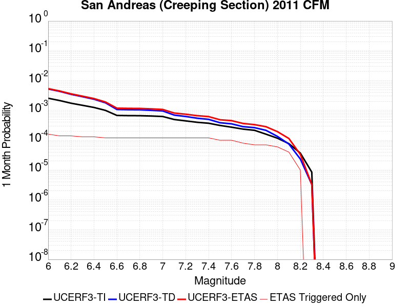 |  |  |

| Magnitude | 1 wk TI Prob | 1 wk TD Prob | 1 wk ETAS Prob | 1 wk ETAS/TD Gain | 1 wk ETAS Triggered Only | 1 mo TI Prob | 1 mo TD Prob | 1 mo ETAS Prob | 1 mo ETAS/TD Gain | 1 mo ETAS Triggered Only | 1 yr TI Prob | 1 yr TD Prob | 1 yr ETAS Prob | 1 yr ETAS/TD Gain | 1 yr ETAS Triggered Only | 10 yr TI Prob | 10 yr TD Prob | 10 yr ETAS Prob | 10 yr ETAS/TD Gain | 10 yr ETAS Triggered Only |
|-----|-----|-----|-----|-----|-----|-----|-----|-----|-----|-----|-----|-----|-----|-----|-----|-----|-----|-----|-----|-----|
| 6.0 | 5.986481E-4 | 0.0012275929 | 0.0013574333 | 1.1057683 | 1.3E-4 | 0.0025631124 | 0.005245547 | 0.0054047075 | 1.0303421 | 1.6E-4 | 0.030762846 | 0.06120491 | 0.061402056 | 1.0032212 | 2.1E-4 | 0.26835477 | 0.42593494 | 0.4260612 | 1.0002965 | 2.2E-4 |
| 6.1 | 5.015945E-4 | 0.0010217986 | 0.0011316861 | 1.1075433 | 1.1E-4 | 0.00214792 | 0.0043678596 | 0.004507248 | 1.0319123 | 1.4E-4 | 0.025839351 | 0.05124837 | 0.051428635 | 1.0035174 | 1.9E-4 | 0.23032776 | 0.37285668 | 0.3729821 | 1.0003364 | 2.0E-4 |
| 6.2 | 4.073338E-4 | 8.1073755E-4 | 9.2064834E-4 | 1.135569 | 1.1E-4 | 0.0017445484 | 0.0034671477 | 0.0036066622 | 1.040239 | 1.4E-4 | 0.021034058 | 0.04093317 | 0.041115392 | 1.0044518 | 1.9E-4 | 0.19150782 | 0.31303346 | 0.31317085 | 1.0004389 | 2.0E-4 |
| 6.3 | 3.464099E-4 | 6.7391695E-4 | 7.7384955E-4 | 1.1482862 | 1.0E-4 | 0.0014837692 | 0.0028829593 | 0.0030125845 | 1.0449625 | 1.3E-4 | 0.017915873 | 0.034189582 | 0.034363426 | 1.0050848 | 1.8E-4 | 0.16538359 | 0.2713166 | 0.27145502 | 1.0005103 | 1.9E-4 |
| 6.4 | 2.935057E-4 | 5.5442745E-4 | 6.54372E-4 | 1.1802663 | 1.0E-4 | 0.0012572751 | 0.0023725363 | 0.002502228 | 1.0546637 | 1.3E-4 | 0.015200248 | 0.02826451 | 0.028439421 | 1.0061884 | 1.8E-4 | 0.14201577 | 0.23298529 | 0.23313102 | 1.0006255 | 1.9E-4 |
| 6.5 | 2.3409708E-4 | 4.2093755E-4 | 5.108997E-4 | 1.2137184 | 9.0E-5 | 0.0010028875 | 0.0018019684 | 0.0019217522 | 1.0664738 | 1.2E-4 | 0.012141965 | 0.021587461 | 0.021753792 | 1.007705 | 1.7E-4 | 0.11499573 | 0.18682368 | 0.18697006 | 1.0007834 | 1.8E-4 |
| 6.6 | 1.5842178E-4 | 2.506933E-4 | 3.4067073E-4 | 1.3589144 | 9.0E-5 | 6.7877385E-4 | 0.0010739497 | 0.0011938208 | 1.1116171 | 1.2E-4 | 0.0082328 | 0.012995575 | 0.013153495 | 1.0121518 | 1.6E-4 | 0.07934396 | 0.12314638 | 0.12329544 | 1.0012105 | 1.7E-4 |
| 6.7 | 1.5616413E-4 | 2.4605883E-4 | 3.3603667E-4 | 1.3656762 | 9.0E-5 | 6.691031E-4 | 0.0010541069 | 0.0011739803 | 1.1137204 | 1.2E-4 | 0.0081159435 | 0.01275744 | 0.012915399 | 1.0123817 | 1.6E-4 | 0.0782586 | 0.12117351 | 0.121322915 | 1.001233 | 1.7E-4 |
| 6.8 | 1.5538467E-4 | 2.4429744E-4 | 3.3427545E-4 | 1.3683133 | 9.0E-5 | 6.6576427E-4 | 0.0010465645 | 0.0011664389 | 1.1145408 | 1.2E-4 | 0.008075596 | 0.012666838 | 0.012824812 | 1.0124714 | 1.6E-4 | 0.07788358 | 0.120404355 | 0.12055389 | 1.0012419 | 1.7E-4 |
| 6.9 | 1.5153569E-4 | 2.3539034E-4 | 3.2536915E-4 | 1.3822536 | 9.0E-5 | 6.49277E-4 | 0.0010084276 | 0.0011283066 | 1.1188772 | 1.2E-4 | 0.007876333 | 0.01220901 | 0.012367058 | 1.012945 | 1.6E-4 | 0.07602952 | 0.11647445 | 0.116624646 | 1.0012896 | 1.7E-4 |
| 7.0 | 1.4588932E-4 | 2.2396253E-4 | 3.1394238E-4 | 1.401763 | 9.0E-5 | 6.250901E-4 | 9.5948833E-4 | 0.0010793732 | 1.1249467 | 1.2E-4 | 0.0075839474 | 0.011619697 | 0.011777838 | 1.0136098 | 1.6E-4 | 0.073302895 | 0.11132046 | 0.111471534 | 1.0013571 | 1.7E-4 |
| 7.1 | 1.1565079E-4 | 1.6281738E-4 | 2.5280274E-4 | 1.5526766 | 9.0E-5 | 4.955521E-4 | 6.9760304E-4 | 8.175193E-4 | 1.1718976 | 1.2E-4 | 0.006016669 | 0.0084604435 | 0.00861909 | 1.0187515 | 1.6E-4 | 0.058563538 | 0.08367046 | 0.08382624 | 1.0018618 | 1.7E-4 |
| 7.2 | 1.0393792E-4 | 1.4615769E-4 | 2.3614452E-4 | 1.6156833 | 9.0E-5 | 4.4537216E-4 | 6.2624045E-4 | 7.461653E-4 | 1.1914997 | 1.2E-4 | 0.005408933 | 0.0075979927 | 0.007756777 | 1.0208982 | 1.6E-4 | 0.052791595 | 0.07561969 | 0.07577684 | 1.002078 | 1.7E-4 |
| 7.3 | 9.332884E-5 | 1.2780898E-4 | 2.1779748E-4 | 1.7040858 | 9.0E-5 | 3.999194E-4 | 5.4763845E-4 | 6.675727E-4 | 1.2190027 | 1.2E-4 | 0.0048581534 | 0.006647249 | 0.0068061855 | 1.0239102 | 1.6E-4 | 0.047533102 | 0.06648326 | 0.06664196 | 1.002387 | 1.7E-4 |
| 7.4 | 8.670252E-5 | 1.17032345E-4 | 2.070218E-4 | 1.7689282 | 9.0E-5 | 3.715293E-4 | 5.0147134E-4 | 6.214112E-4 | 1.2391758 | 1.2E-4 | 0.004513991 | 0.006088443 | 0.0062474688 | 1.0261194 | 1.6E-4 | 0.044233937 | 0.061151642 | 0.06131125 | 1.00261 | 1.7E-4 |
| 7.5 | 7.3036405E-5 | 9.005856E-5 | 1.6005225E-4 | 1.777202 | 7.0E-5 | 3.129756E-4 | 3.8590826E-4 | 4.8586968E-4 | 1.2590289 | 1.0E-4 | 0.0038038217 | 0.0046883323 | 0.004817723 | 1.0275984 | 1.3E-4 | 0.03739367 | 0.047877792 | 0.04801109 | 1.0027841 | 1.4E-4 |
| 7.6 | 6.3935775E-5 | 8.280385E-5 | 1.5279805E-4 | 1.8453014 | 7.0E-5 | 2.7398168E-4 | 3.5482543E-4 | 4.5478996E-4 | 1.2817287 | 1.0E-4 | 0.0033306254 | 0.004311461 | 0.004440901 | 1.0300221 | 1.3E-4 | 0.032811474 | 0.04399201 | 0.044125848 | 1.0030423 | 1.4E-4 |
| 7.7 | 5.5050095E-5 | 6.6618326E-5 | 1.16614996E-4 | 1.7504942 | 5.0E-5 | 2.3590765E-4 | 2.854759E-4 | 3.6545304E-4 | 1.2801539 | 8.0E-5 | 0.0028683927 | 0.003470134 | 0.003569787 | 1.0287173 | 1.0E-4 | 0.0283165 | 0.035796214 | 0.035902277 | 1.002963 | 1.1E-4 |
| 7.8 | 5.027131E-5 | 6.162871E-5 | 1.0162624E-4 | 1.6490082 | 4.0E-5 | 2.1543067E-4 | 2.640963E-4 | 3.340778E-4 | 1.2649848 | 7.0E-5 | 0.0026197135 | 0.003210635 | 0.003300346 | 1.0279418 | 9.0E-5 | 0.025890453 | 0.03312666 | 0.033223346 | 1.0029187 | 1.0E-4 |
| 7.9 | 3.7271806E-5 | 5.022507E-5 | 9.022306E-5 | 1.796375 | 4.0E-5 | 1.5972654E-4 | 2.1523255E-4 | 2.8521748E-4 | 1.3251597 | 7.0E-5 | 0.0019429359 | 0.002617309 | 0.0027070737 | 1.0342965 | 9.0E-5 | 0.019260362 | 0.027067466 | 0.027164757 | 1.0035945 | 1.0E-4 |
| 8.0 | 2.7310243E-5 | 3.1427757E-5 | 7.14265E-5 | 2.2727203 | 4.0E-5 | 1.17038646E-4 | 1.3468343E-4 | 1.9467536E-4 | 1.4454291 | 6.0E-5 | 0.0014240141 | 0.0016385383 | 0.0017184073 | 1.048744 | 8.0E-5 | 0.014149235 | 0.01721386 | 0.017292483 | 1.0045674 | 8.0E-5 |
| 8.1 | 1.7940547E-5 | 1.7399378E-5 | 3.739903E-5 | 2.1494465 | 2.0E-5 | 7.688579E-5 | 7.456663E-5 | 1.1456365E-4 | 1.5363929 | 4.0E-5 | 9.3568244E-4 | 9.074711E-4 | 9.5742574E-4 | 1.0550482 | 5.0E-5 | 0.009317525 | 0.009798636 | 0.009848146 | 1.0050528 | 5.0E-5 |
| 8.2 | 8.643924E-6 | 5.473668E-6 | 1.5473614E-5 | 2.8269184 | 1.0E-5 | 3.704486E-5 | 2.3458366E-5 | 3.345813E-5 | 1.4262772 | 1.0E-5 | 4.5092785E-4 | 2.8556827E-4 | 2.955654E-4 | 1.035008 | 1.0E-5 | 0.0045001395 | 0.0032481793 | 0.003258147 | 1.0030687 | 1.0E-5 |
| 8.3 | 1.983087E-6 | 7.6564595E-7 | 7.6564595E-7 | 1.0 | 0.0 | 8.498917E-6 | 3.281336E-6 | 3.281336E-6 | 1.0 | 0.0 | 1.034694E-4 | 3.9949547E-5 | 3.9949547E-5 | 1.0 | 0.0 | 0.0010342124 | 4.717979E-4 | 4.717979E-4 | 1.0 | 0.0 |

## Lake Isabella (Seismicity)
*[(top)](#table-of-contents)*

| 1 Week | 1 Month | 1 Year | 10 Year |
|-----|-----|-----|-----|
|  |  |  |  |

| Magnitude | 1 wk TI Prob | 1 wk TD Prob | 1 wk ETAS Prob | 1 wk ETAS/TD Gain | 1 wk ETAS Triggered Only | 1 mo TI Prob | 1 mo TD Prob | 1 mo ETAS Prob | 1 mo ETAS/TD Gain | 1 mo ETAS Triggered Only | 1 yr TI Prob | 1 yr TD Prob | 1 yr ETAS Prob | 1 yr ETAS/TD Gain | 1 yr ETAS Triggered Only | 10 yr TI Prob | 10 yr TD Prob | 10 yr ETAS Prob | 10 yr ETAS/TD Gain | 10 yr ETAS Triggered Only |
|-----|-----|-----|-----|-----|-----|-----|-----|-----|-----|-----|-----|-----|-----|-----|-----|-----|-----|-----|-----|-----|
| 6.0 | 9.431637E-6 | 9.741651E-6 | 8.9740875E-5 | 9.21208 | 8.0E-5 | 4.0420677E-5 | 4.1749343E-5 | 1.3174559E-4 | 3.1556327 | 9.0E-5 | 4.920106E-4 | 5.0819275E-4 | 6.781064E-4 | 1.3343488 | 1.7E-4 | 0.004909227 | 0.005071599 | 0.005280534 | 1.0411971 | 2.1E-4 |
| 6.1 | 9.431637E-6 | 9.741651E-6 | 8.9740875E-5 | 9.21208 | 8.0E-5 | 4.0420677E-5 | 4.1749343E-5 | 1.3174559E-4 | 3.1556327 | 9.0E-5 | 4.920106E-4 | 5.0819275E-4 | 6.781064E-4 | 1.3343488 | 1.7E-4 | 0.004909227 | 0.005071599 | 0.005280534 | 1.0411971 | 2.1E-4 |
| 6.2 | 9.431637E-6 | 9.741651E-6 | 8.9740875E-5 | 9.21208 | 8.0E-5 | 4.0420677E-5 | 4.1749343E-5 | 1.3174559E-4 | 3.1556327 | 9.0E-5 | 4.920106E-4 | 5.0819275E-4 | 6.781064E-4 | 1.3343488 | 1.7E-4 | 0.004909227 | 0.005071599 | 0.005280534 | 1.0411971 | 2.1E-4 |
| 6.3 | 9.431637E-6 | 9.741651E-6 | 8.9740875E-5 | 9.21208 | 8.0E-5 | 4.0420677E-5 | 4.1749343E-5 | 1.3174559E-4 | 3.1556327 | 9.0E-5 | 4.920106E-4 | 5.0819275E-4 | 6.781064E-4 | 1.3343488 | 1.7E-4 | 0.004909227 | 0.005071599 | 0.005280534 | 1.0411971 | 2.1E-4 |
| 6.4 | 5.144063E-6 | 5.3000763E-6 | 7.529971E-5 | 14.207288 | 7.0E-5 | 2.2045799E-5 | 2.2714434E-5 | 1.0271262E-4 | 4.5219097 | 8.0E-5 | 2.6837454E-4 | 2.765166E-4 | 3.964834E-4 | 1.4338503 | 1.2E-4 | 0.0026805066 | 0.0027620657 | 0.0029116513 | 1.0541571 | 1.5E-4 |
| 6.5 | 5.144063E-6 | 5.3000763E-6 | 7.529971E-5 | 14.207288 | 7.0E-5 | 2.2045799E-5 | 2.2714434E-5 | 1.0271262E-4 | 4.5219097 | 8.0E-5 | 2.6837454E-4 | 2.765166E-4 | 3.964834E-4 | 1.4338503 | 1.2E-4 | 0.0026805066 | 0.0027620657 | 0.0029116513 | 1.0541571 | 1.5E-4 |
| 6.6 | 3.4009804E-6 | 3.498786E-6 | 3.349868E-5 | 9.574372 | 3.0E-5 | 1.4575549E-5 | 1.4994721E-5 | 4.499427E-5 | 3.0006742 | 3.0E-5 | 1.7744285E-4 | 1.8254704E-4 | 2.5253426E-4 | 1.3833928 | 7.0E-5 | 0.0017730123 | 0.0018241286 | 0.0019139644 | 1.0492486 | 9.0E-5 |
| 6.7 | 3.3880428E-6 | 3.4856528E-6 | 3.3485547E-5 | 9.606679 | 3.0E-5 | 1.4520103E-5 | 1.4938435E-5 | 4.4937988E-5 | 3.0082123 | 3.0E-5 | 1.767679E-4 | 1.8186188E-4 | 2.5184915E-4 | 1.3848375 | 7.0E-5 | 0.0017662736 | 0.0018172882 | 0.0019071246 | 1.0494343 | 9.0E-5 |
| 6.8 | 2.6582E-6 | 2.7337003E-6 | 3.2733617E-5 | 11.974107 | 3.0E-5 | 1.1392236E-5 | 1.1715813E-5 | 4.1715462E-5 | 3.5606117 | 3.0E-5 | 1.3869164E-4 | 1.4263204E-4 | 1.926249E-4 | 1.3505024 | 5.0E-5 | 0.0013860512 | 0.0014255369 | 0.0014954371 | 1.0490344 | 7.0E-5 |
| 6.9 | 2.406011E-6 | 2.4743288E-6 | 3.2474254E-5 | 13.12447 | 3.0E-5 | 1.0311434E-5 | 1.0604231E-5 | 4.0603914E-5 | 3.8290296 | 3.0E-5 | 1.2553448E-4 | 1.2910018E-4 | 1.7909372E-4 | 1.3872461 | 5.0E-5 | 0.0012546359 | 0.0012903814 | 0.0013602911 | 1.0541775 | 7.0E-5 |
| 7.0 | 1.6953097E-6 | 1.7429371E-6 | 3.1742886E-5 | 18.212294 | 3.0E-5 | 7.265593E-6 | 7.469715E-6 | 3.746949E-5 | 5.016187 | 3.0E-5 | 8.8455E-5 | 9.094104E-5 | 1.3093739E-4 | 1.4398054 | 4.0E-5 | 8.84198E-4 | 9.09141E-4 | 9.590955E-4 | 1.054947 | 5.0E-5 |
| 7.1 | 3.5013824E-7 | 3.5714822E-7 | 1.0357145E-5 | 28.999569 | 1.0E-5 | 1.5005916E-6 | 1.5306344E-6 | 1.1530619E-5 | 7.533229 | 1.0E-5 | 1.826955E-5 | 1.8635317E-5 | 2.8635131E-5 | 1.5366055 | 1.0E-5 | 1.8268047E-4 | 1.863378E-4 | 1.9633592E-4 | 1.053656 | 1.0E-5 |
| 7.2 | 2.2321095E-7 | 2.2750574E-7 | 1.02275035E-5 | 44.954926 | 1.0E-5 | 9.56618E-7 | 9.750242E-7 | 1.0975014E-5 | 11.2561455 | 1.0E-5 | 1.1646762E-5 | 1.1870856E-5 | 2.1870737E-5 | 1.8423892 | 1.0E-5 | 1.1646151E-4 | 1.1870232E-4 | 1.2870114E-4 | 1.0842344 | 1.0E-5 |
| 7.3 | 1.5760406E-7 | 1.6060922E-7 | 1.0160607E-5 | 63.262917 | 1.0E-5 | 6.7544585E-7 | 6.8832503E-7 | 1.0688318E-5 | 15.528009 | 1.0E-5 | 8.223522E-6 | 8.380326E-6 | 1.8380242E-5 | 2.193261 | 1.0E-5 | 8.2232174E-5 | 8.3800165E-5 | 9.3799325E-5 | 1.1193215 | 1.0E-5 |
| 7.4 | 1.1216497E-7 | 1.1431706E-7 | 1.1431706E-7 | 1.0 | 0.0 | 4.8070694E-7 | 4.899302E-7 | 4.899302E-7 | 1.0 | 0.0 | 5.852591E-6 | 5.964884E-6 | 5.964884E-6 | 1.0 | 0.0 | 5.8524372E-5 | 5.9647282E-5 | 5.9647282E-5 | 1.0 | 0.0 |
| 7.5 | 4.885185E-8 | 4.9787737E-8 | 4.9787737E-8 | 1.0 | 0.0 | 2.0936506E-7 | 2.13376E-7 | 2.13376E-7 | 1.0 | 0.0 | 2.5490165E-6 | 2.59785E-6 | 2.59785E-6 | 1.0 | 0.0 | 2.5489873E-5 | 2.5978214E-5 | 2.5978214E-5 | 1.0 | 0.0 |
| 7.6 | 1.504641E-9 | 1.5317903E-9 | 1.5317903E-9 | 1.0 | 0.0 | 6.4484613E-9 | 6.5648154E-9 | 6.5648154E-9 | 1.0 | 0.0 | 7.851001E-8 | 7.992663E-8 | 7.992663E-8 | 1.0 | 0.0 | 7.8509987E-7 | 7.992663E-7 | 7.992663E-7 | 1.0 | 0.0 |

## San Jacinto (Anza) rev
*[(top)](#table-of-contents)*

| 1 Week | 1 Month | 1 Year | 10 Year |
|-----|-----|-----|-----|
| 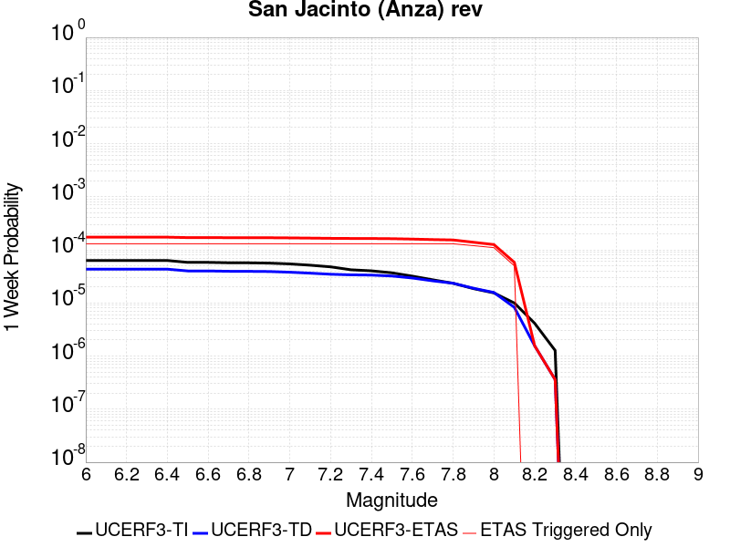 |  |  |  |

| Magnitude | 1 wk TI Prob | 1 wk TD Prob | 1 wk ETAS Prob | 1 wk ETAS/TD Gain | 1 wk ETAS Triggered Only | 1 mo TI Prob | 1 mo TD Prob | 1 mo ETAS Prob | 1 mo ETAS/TD Gain | 1 mo ETAS Triggered Only | 1 yr TI Prob | 1 yr TD Prob | 1 yr ETAS Prob | 1 yr ETAS/TD Gain | 1 yr ETAS Triggered Only | 10 yr TI Prob | 10 yr TD Prob | 10 yr ETAS Prob | 10 yr ETAS/TD Gain | 10 yr ETAS Triggered Only |
|-----|-----|-----|-----|-----|-----|-----|-----|-----|-----|-----|-----|-----|-----|-----|-----|-----|-----|-----|-----|-----|
| 6.0 | 6.3015636E-5 | 4.3298347E-5 | 1.7329272E-4 | 4.002294 | 1.3E-4 | 2.7003905E-4 | 1.8555121E-4 | 3.4552152E-4 | 1.8621356 | 1.6E-4 | 0.0032827691 | 0.0022567573 | 0.0024363513 | 1.0795804 | 1.8E-4 | 0.032346968 | 0.02329361 | 0.023488952 | 1.008386 | 2.0E-4 |
| 6.1 | 6.3015636E-5 | 4.3298347E-5 | 1.7329272E-4 | 4.002294 | 1.3E-4 | 2.7003905E-4 | 1.8555121E-4 | 3.4552152E-4 | 1.8621356 | 1.6E-4 | 0.0032827691 | 0.0022567573 | 0.0024363513 | 1.0795804 | 1.8E-4 | 0.032346968 | 0.02329361 | 0.023488952 | 1.008386 | 2.0E-4 |
| 6.2 | 6.3015636E-5 | 4.3298347E-5 | 1.7329272E-4 | 4.002294 | 1.3E-4 | 2.7003905E-4 | 1.8555121E-4 | 3.4552152E-4 | 1.8621356 | 1.6E-4 | 0.0032827691 | 0.0022567573 | 0.0024363513 | 1.0795804 | 1.8E-4 | 0.032346968 | 0.02329361 | 0.023488952 | 1.008386 | 2.0E-4 |
| 6.3 | 6.3015636E-5 | 4.3298347E-5 | 1.7329272E-4 | 4.002294 | 1.3E-4 | 2.7003905E-4 | 1.8555121E-4 | 3.4552152E-4 | 1.8621356 | 1.6E-4 | 0.0032827691 | 0.0022567573 | 0.0024363513 | 1.0795804 | 1.8E-4 | 0.032346968 | 0.02329361 | 0.023488952 | 1.008386 | 2.0E-4 |
| 6.4 | 6.3015636E-5 | 4.3298347E-5 | 1.7329272E-4 | 4.002294 | 1.3E-4 | 2.7003905E-4 | 1.8555121E-4 | 3.4552152E-4 | 1.8621356 | 1.6E-4 | 0.0032827691 | 0.0022567573 | 0.0024363513 | 1.0795804 | 1.8E-4 | 0.032346968 | 0.02329361 | 0.023488952 | 1.008386 | 2.0E-4 |
| 6.5 | 5.811017E-5 | 4.0080286E-5 | 1.7007507E-4 | 4.24336 | 1.3E-4 | 2.4901982E-4 | 1.7176138E-4 | 3.317339E-4 | 1.9313649 | 1.6E-4 | 0.0030276014 | 0.0020891947 | 0.0022688187 | 1.0859776 | 1.8E-4 | 0.02986684 | 0.021590833 | 0.021786515 | 1.0090632 | 2.0E-4 |
| 6.6 | 5.811017E-5 | 4.0080286E-5 | 1.7007507E-4 | 4.24336 | 1.3E-4 | 2.4901982E-4 | 1.7176138E-4 | 3.317339E-4 | 1.9313649 | 1.6E-4 | 0.0030276014 | 0.0020891947 | 0.0022688187 | 1.0859776 | 1.8E-4 | 0.02986684 | 0.021590833 | 0.021786515 | 1.0090632 | 2.0E-4 |
| 6.7 | 5.712442E-5 | 3.950301E-5 | 1.6949787E-4 | 4.290758 | 1.3E-4 | 2.4479596E-4 | 1.6928767E-4 | 3.2926057E-4 | 1.9449768 | 1.6E-4 | 0.0029763177 | 0.0020591344 | 0.002238764 | 1.0872353 | 1.8E-4 | 0.029367693 | 0.021282919 | 0.02147866 | 1.0091972 | 2.0E-4 |
| 6.8 | 5.6967532E-5 | 3.93593E-5 | 1.6935419E-4 | 4.3027744 | 1.3E-4 | 2.4412372E-4 | 1.6867183E-4 | 3.2864485E-4 | 1.9484276 | 1.6E-4 | 0.0029681553 | 0.0020516508 | 0.0022312815 | 1.0875542 | 1.8E-4 | 0.029288229 | 0.02120852 | 0.021404278 | 1.0092301 | 2.0E-4 |
| 6.9 | 5.6211324E-5 | 3.9064216E-5 | 1.6905913E-4 | 4.327724 | 1.3E-4 | 2.4088343E-4 | 1.6740736E-4 | 3.2738058E-4 | 1.9555925 | 1.6E-4 | 0.0029288116 | 0.0020362847 | 0.0022159182 | 1.0882163 | 1.8E-4 | 0.028905109 | 0.021047527 | 0.021243319 | 1.0093023 | 2.0E-4 |
| 7.0 | 5.4383527E-5 | 3.7925012E-5 | 1.6792008E-4 | 4.427687 | 1.3E-4 | 2.3305144E-4 | 1.6252567E-4 | 3.2249966E-4 | 1.9842999 | 1.6E-4 | 0.0028337094 | 0.001976959 | 0.0021566032 | 1.090869 | 1.8E-4 | 0.027978465 | 0.02044095 | 0.020636862 | 1.0095843 | 2.0E-4 |
| 7.1 | 5.1393665E-5 | 3.638787E-5 | 1.6638314E-4 | 4.5724893 | 1.3E-4 | 2.2023996E-4 | 1.5593872E-4 | 3.1591376E-4 | 2.0258842 | 1.6E-4 | 0.0026781242 | 0.0018969048 | 0.0020765634 | 1.0947114 | 1.8E-4 | 0.026460782 | 0.019616077 | 0.019812154 | 1.0099957 | 2.0E-4 |
| 7.2 | 4.785222E-5 | 3.4738845E-5 | 1.6473433E-4 | 4.742079 | 1.3E-4 | 2.0506482E-4 | 1.4887229E-4 | 3.0884845E-4 | 2.0745866 | 1.6E-4 | 0.0024938055 | 0.0018110167 | 0.0019906908 | 1.0992117 | 1.8E-4 | 0.024660049 | 0.018728783 | 0.018925037 | 1.0104787 | 2.0E-4 |
| 7.3 | 4.2143256E-5 | 3.3834414E-5 | 1.6383002E-4 | 4.842112 | 1.3E-4 | 1.8060145E-4 | 1.449966E-4 | 3.049734E-4 | 2.1033142 | 1.6E-4 | 0.002196605 | 0.0017639075 | 0.00194359 | 1.1018661 | 1.8E-4 | 0.02175019 | 0.018236695 | 0.018433047 | 1.0107669 | 2.0E-4 |
| 7.4 | 4.0264713E-5 | 3.3472694E-5 | 1.6346834E-4 | 4.8836327 | 1.3E-4 | 1.7255165E-4 | 1.4344654E-4 | 3.0342359E-4 | 2.1152382 | 1.6E-4 | 0.002098792 | 0.0017450659 | 0.0019247518 | 1.102968 | 1.8E-4 | 0.020790804 | 0.018041389 | 0.01823778 | 1.0108856 | 2.0E-4 |
| 7.5 | 3.694492E-5 | 3.2186905E-5 | 1.6218273E-4 | 5.0387797 | 1.3E-4 | 1.5832575E-4 | 1.379366E-4 | 2.9791452E-4 | 2.1597931 | 1.6E-4 | 0.0019259118 | 0.0016780876 | 0.0018577855 | 1.107085 | 1.8E-4 | 0.01909306 | 0.017357888 | 0.017554417 | 1.0113221 | 2.0E-4 |
| 7.6 | 3.200565E-5 | 2.9502702E-5 | 1.5949887E-4 | 5.406246 | 1.3E-4 | 1.3715986E-4 | 1.2643404E-4 | 2.8641382E-4 | 2.265322 | 1.6E-4 | 0.001668642 | 0.0015382497 | 0.0017179728 | 1.1168361 | 1.8E-4 | 0.01656168 | 0.015946016 | 0.016142827 | 1.0123423 | 2.0E-4 |
| 7.7 | 2.731642E-5 | 2.6091477E-5 | 1.5608808E-4 | 5.9823403 | 1.3E-4 | 1.1706512E-4 | 1.11815825E-4 | 2.7179794E-4 | 2.4307644 | 1.6E-4 | 0.001424336 | 0.0013605085 | 0.0015402636 | 1.1321235 | 1.8E-4 | 0.014152412 | 0.0141668 | 0.014363967 | 1.0139176 | 2.0E-4 |
| 7.8 | 2.3466424E-5 | 2.3503619E-5 | 1.5350056E-4 | 6.530933 | 1.3E-4 | 1.0056651E-4 | 1.0072591E-4 | 2.6070978E-4 | 2.588309 | 1.6E-4 | 0.0012237094 | 0.0012256489 | 0.0014054283 | 1.146681 | 1.8E-4 | 0.012169928 | 0.012808796 | 0.013006235 | 1.0154142 | 2.0E-4 |
| 7.9 | 1.8611925E-5 | 1.890698E-5 | 1.3890471E-4 | 7.3467426 | 1.2E-4 | 7.9762955E-5 | 8.10274E-5 | 2.3101525E-4 | 2.8510756 | 1.5E-4 | 9.7068126E-4 | 9.860628E-4 | 0.0011558952 | 1.1722327 | 1.7E-4 | 0.0096645225 | 0.010393705 | 0.010581731 | 1.0180902 | 1.9E-4 |
| 8.0 | 1.5460775E-5 | 1.5739915E-5 | 1.2573818E-4 | 7.9884915 | 1.1E-4 | 6.6258784E-5 | 6.745504E-5 | 2.074456E-4 | 3.0753164 | 1.4E-4 | 8.0640207E-4 | 8.2095637E-4 | 9.80825E-4 | 1.1947347 | 1.6E-4 | 0.008034821 | 0.008702706 | 0.00888114 | 1.0205032 | 1.8E-4 |
| 8.1 | 9.983884E-6 | 8.268954E-6 | 5.8268542E-5 | 7.0466638 | 5.0E-5 | 4.2787375E-5 | 3.5437897E-5 | 1.1543506E-4 | 3.2573903 | 8.0E-5 | 5.2081177E-4 | 4.313715E-4 | 5.2133267E-4 | 1.2085469 | 9.0E-5 | 0.0051959283 | 0.00463968 | 0.00474917 | 1.0235986 | 1.1E-4 |
| 8.2 | 4.1226E-6 | 1.5522551E-6 | 1.5522551E-6 | 1.0 | 0.0 | 1.7668166E-5 | 6.6525045E-6 | 6.6525045E-6 | 1.0 | 0.0 | 2.1508869E-4 | 8.099126E-5 | 8.099126E-5 | 1.0 | 0.0 | 0.0021488064 | 9.401847E-4 | 9.401847E-4 | 1.0 | 0.0 |
| 8.3 | 1.2750878E-6 | 3.609817E-7 | 3.609817E-7 | 1.0 | 0.0 | 5.4646503E-6 | 1.5470634E-6 | 1.5470634E-6 | 1.0 | 0.0 | 6.653009E-5 | 1.8835339E-5 | 1.8835339E-5 | 1.0 | 0.0 | 6.6510175E-4 | 2.272251E-4 | 2.272251E-4 | 1.0 | 0.0 |

## Cleghorn Pass
*[(top)](#table-of-contents)*

| 1 Week | 1 Month | 1 Year | 10 Year |
|-----|-----|-----|-----|
|  | 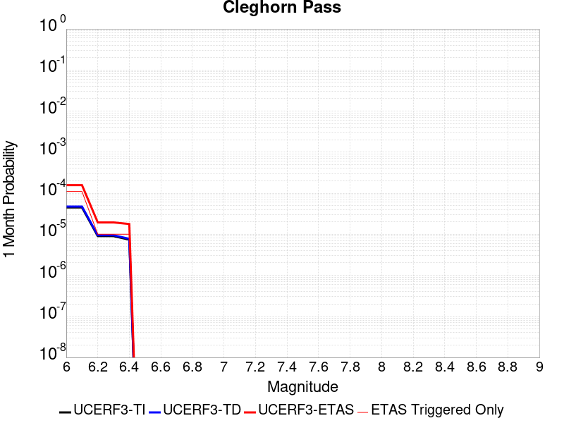 |  | 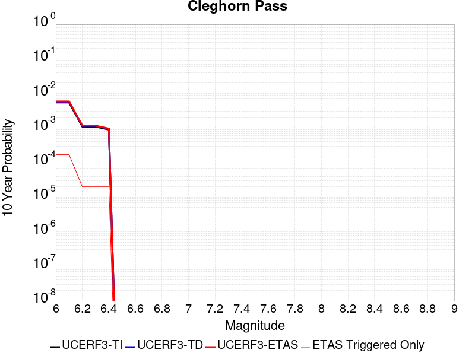 |

| Magnitude | 1 wk TI Prob | 1 wk TD Prob | 1 wk ETAS Prob | 1 wk ETAS/TD Gain | 1 wk ETAS Triggered Only | 1 mo TI Prob | 1 mo TD Prob | 1 mo ETAS Prob | 1 mo ETAS/TD Gain | 1 mo ETAS Triggered Only | 1 yr TI Prob | 1 yr TD Prob | 1 yr ETAS Prob | 1 yr ETAS/TD Gain | 1 yr ETAS Triggered Only | 10 yr TI Prob | 10 yr TD Prob | 10 yr ETAS Prob | 10 yr ETAS/TD Gain | 10 yr ETAS Triggered Only |
|-----|-----|-----|-----|-----|-----|-----|-----|-----|-----|-----|-----|-----|-----|-----|-----|-----|-----|-----|-----|-----|
| 6.0 | 1.0522846E-5 | 1.1040642E-5 | 1.1103954E-4 | 10.057344 | 1.0E-4 | 4.509713E-5 | 4.7316473E-5 | 1.5731127E-4 | 3.3246617 | 1.1E-4 | 5.4891926E-4 | 5.759784E-4 | 7.158978E-4 | 1.2429247 | 1.4E-4 | 0.0054756533 | 0.005750022 | 0.0059190444 | 1.0293951 | 1.7E-4 |
| 6.1 | 1.0522846E-5 | 1.1040642E-5 | 1.1103954E-4 | 10.057344 | 1.0E-4 | 4.509713E-5 | 4.7316473E-5 | 1.5731127E-4 | 3.3246617 | 1.1E-4 | 5.4891926E-4 | 5.759784E-4 | 7.158978E-4 | 1.2429247 | 1.4E-4 | 0.0054756533 | 0.005750022 | 0.0059190444 | 1.0293951 | 1.7E-4 |
| 6.2 | 2.1045846E-6 | 2.2082024E-6 | 1.220818E-5 | 5.52856 | 1.0E-5 | 9.019617E-6 | 9.463714E-6 | 1.946362E-5 | 2.0566576 | 1.0E-5 | 1.098083E-4 | 1.1521882E-4 | 1.2521767E-4 | 1.0867814 | 1.0E-5 | 0.0010975406 | 0.0011520023 | 0.0011719792 | 1.017341 | 2.0E-5 |
| 6.3 | 2.1045846E-6 | 2.2082024E-6 | 1.220818E-5 | 5.52856 | 1.0E-5 | 9.019617E-6 | 9.463714E-6 | 1.946362E-5 | 2.0566576 | 1.0E-5 | 1.098083E-4 | 1.1521882E-4 | 1.2521767E-4 | 1.0867814 | 1.0E-5 | 0.0010975406 | 0.0011520023 | 0.0011719792 | 1.017341 | 2.0E-5 |
| 6.4 | 1.7259927E-6 | 1.810877E-6 | 1.1810859E-5 | 6.522176 | 1.0E-5 | 7.3970905E-6 | 7.760902E-6 | 1.7760824E-5 | 2.2885 | 1.0E-5 | 9.005586E-5 | 9.4488976E-5 | 1.04488034E-4 | 1.1058224 | 1.0E-5 | 9.001937E-4 | 9.448898E-4 | 9.648709E-4 | 1.0211465 | 2.0E-5 |

## Owens Valley
*[(top)](#table-of-contents)*

| 1 Week | 1 Month | 1 Year | 10 Year |
|-----|-----|-----|-----|
|  |  |  |  |

| Magnitude | 1 wk TI Prob | 1 wk TD Prob | 1 wk ETAS Prob | 1 wk ETAS/TD Gain | 1 wk ETAS Triggered Only | 1 mo TI Prob | 1 mo TD Prob | 1 mo ETAS Prob | 1 mo ETAS/TD Gain | 1 mo ETAS Triggered Only | 1 yr TI Prob | 1 yr TD Prob | 1 yr ETAS Prob | 1 yr ETAS/TD Gain | 1 yr ETAS Triggered Only | 10 yr TI Prob | 10 yr TD Prob | 10 yr ETAS Prob | 10 yr ETAS/TD Gain | 10 yr ETAS Triggered Only |
|-----|-----|-----|-----|-----|-----|-----|-----|-----|-----|-----|-----|-----|-----|-----|-----|-----|-----|-----|-----|-----|
| 6.0 | 4.83821E-5 | 3.6210524E-6 | 9.362073E-5 | 25.854563 | 9.0E-5 | 2.0733538E-4 | 1.551871E-5 | 1.455167E-4 | 9.376855 | 1.3E-4 | 0.002521386 | 1.889249E-4 | 3.3889656E-4 | 1.7938163 | 1.5E-4 | 0.024929691 | 0.0019297141 | 0.0020993862 | 1.0879259 | 1.7E-4 |
| 6.1 | 4.83821E-5 | 3.6210524E-6 | 9.362073E-5 | 25.854563 | 9.0E-5 | 2.0733538E-4 | 1.551871E-5 | 1.455167E-4 | 9.376855 | 1.3E-4 | 0.002521386 | 1.889249E-4 | 3.3889656E-4 | 1.7938163 | 1.5E-4 | 0.024929691 | 0.0019297141 | 0.0020993862 | 1.0879259 | 1.7E-4 |
| 6.2 | 4.83821E-5 | 3.6210524E-6 | 9.362073E-5 | 25.854563 | 9.0E-5 | 2.0733538E-4 | 1.551871E-5 | 1.455167E-4 | 9.376855 | 1.3E-4 | 0.002521386 | 1.889249E-4 | 3.3889656E-4 | 1.7938163 | 1.5E-4 | 0.024929691 | 0.0019297141 | 0.0020993862 | 1.0879259 | 1.7E-4 |
| 6.3 | 3.953008E-5 | 3.1530958E-6 | 9.315281E-5 | 29.543285 | 9.0E-5 | 1.6940363E-4 | 1.3513202E-5 | 1.4351144E-4 | 10.620091 | 1.3E-4 | 0.002060538 | 1.6451156E-4 | 3.1448688E-4 | 1.91164 | 1.5E-4 | 0.020415364 | 0.0016621627 | 0.0018218968 | 1.0961001 | 1.6E-4 |
| 6.4 | 3.953008E-5 | 3.1530958E-6 | 9.315281E-5 | 29.543285 | 9.0E-5 | 1.6940363E-4 | 1.3513202E-5 | 1.4351144E-4 | 10.620091 | 1.3E-4 | 0.002060538 | 1.6451156E-4 | 3.1448688E-4 | 1.91164 | 1.5E-4 | 0.020415364 | 0.0016621627 | 0.0018218968 | 1.0961001 | 1.6E-4 |
| 6.5 | 3.457342E-5 | 2.9707387E-6 | 9.297047E-5 | 31.295404 | 9.0E-5 | 1.4816338E-4 | 1.273168E-5 | 1.4273003E-4 | 11.21062 | 1.3E-4 | 0.0018023965 | 1.5499788E-4 | 2.9497617E-4 | 1.9030982 | 1.4E-4 | 0.017878477 | 0.0015563119 | 0.0017060783 | 1.0962317 | 1.5E-4 |
| 6.6 | 3.1127765E-5 | 2.8737306E-6 | 9.287347E-5 | 32.318085 | 9.0E-5 | 1.3339789E-4 | 1.2315934E-5 | 1.4231434E-4 | 11.555302 | 1.3E-4 | 0.0016229092 | 1.4993687E-4 | 2.899159E-4 | 1.9335864 | 1.4E-4 | 0.016111081 | 0.0015013438 | 0.0016411336 | 1.0931098 | 1.4E-4 |
| 6.7 | 2.806885E-5 | 2.8101606E-6 | 9.280991E-5 | 33.02655 | 9.0E-5 | 1.2028952E-4 | 1.2043493E-5 | 1.4204193E-4 | 11.794081 | 1.3E-4 | 0.001463541 | 1.4662035E-4 | 2.8659982E-4 | 1.954707 | 1.4E-4 | 0.014539397 | 0.0014656087 | 0.0016054035 | 1.0953834 | 1.4E-4 |
| 6.8 | 2.524524E-5 | 2.2351392E-6 | 9.2234935E-5 | 41.26586 | 9.0E-5 | 1.0818939E-4 | 9.579134E-6 | 1.3957788E-4 | 14.5710335 | 1.3E-4 | 0.0013164099 | 1.16620016E-4 | 2.566037E-4 | 2.20034 | 1.4E-4 | 0.01308639 | 0.001165827 | 0.0013056638 | 1.1199465 | 1.4E-4 |
| 6.9 | 2.2704568E-5 | 1.6079711E-6 | 9.160783E-5 | 56.971066 | 9.0E-5 | 9.730166E-5 | 6.8912864E-6 | 1.3689039E-4 | 19.864273 | 1.3E-4 | 0.0011840039 | 8.38982E-5 | 2.2388645E-4 | 2.668549 | 1.4E-4 | 0.011777153 | 8.38853E-4 | 9.787356E-4 | 1.1667546 | 1.4E-4 |
| 7.0 | 2.0871712E-5 | 1.5393621E-6 | 9.153922E-5 | 59.465687 | 9.0E-5 | 8.944713E-5 | 6.5972495E-6 | 1.365964E-4 | 20.705051 | 1.3E-4 | 0.0010884746 | 8.031857E-5 | 2.2030732E-4 | 2.742919 | 1.4E-4 | 0.010831586 | 8.030395E-4 | 9.429271E-4 | 1.1741977 | 1.4E-4 |
| 7.1 | 1.944928E-5 | 1.3862556E-6 | 9.138613E-5 | 65.923004 | 9.0E-5 | 8.335139E-5 | 5.941082E-6 | 1.3594031E-4 | 22.881407 | 1.3E-4 | 0.0010143308 | 7.233028E-5 | 2.1232016E-4 | 2.9354255 | 1.4E-4 | 0.010097133 | 7.2319806E-4 | 8.630968E-4 | 1.1934446 | 1.4E-4 |
| 7.2 | 1.7876306E-5 | 1.2487686E-6 | 9.124866E-5 | 73.07091 | 9.0E-5 | 7.6610486E-5 | 5.3518543E-6 | 1.3535116E-4 | 25.290516 | 1.3E-4 | 9.3233347E-4 | 6.515689E-5 | 2.0514776E-4 | 3.14852 | 1.4E-4 | 0.009284316 | 6.5148395E-4 | 7.9139275E-4 | 1.214754 | 1.4E-4 |
| 7.3 | 1.2618672E-5 | 1.1113839E-6 | 9.111129E-5 | 81.98003 | 9.0E-5 | 5.40789E-5 | 4.763065E-6 | 1.2476249E-4 | 26.19374 | 1.2E-4 | 6.582117E-4 | 5.7988782E-5 | 1.8798125E-4 | 3.2416828 | 1.3E-4 | 0.0065626553 | 5.7983754E-4 | 7.0976216E-4 | 1.2240707 | 1.3E-4 |
| 7.4 | 7.4874442E-6 | 8.547518E-7 | 8.085468E-5 | 94.594345 | 8.0E-5 | 3.208865E-5 | 3.6632168E-6 | 1.0366285E-4 | 28.298311 | 1.0E-4 | 3.906093E-4 | 4.4598757E-5 | 1.5459386E-4 | 3.4663265 | 1.1E-4 | 0.003899234 | 4.459579E-4 | 5.5590883E-4 | 1.2465501 | 1.1E-4 |
| 7.5 | 2.4734156E-6 | 6.0679935E-7 | 5.060677E-5 | 83.399506 | 5.0E-5 | 1.060031E-5 | 2.6005662E-6 | 7.2600385E-5 | 27.917145 | 7.0E-5 | 1.2905113E-4 | 3.1661435E-5 | 1.11658905E-4 | 3.526653 | 8.0E-5 | 0.0012897621 | 3.1656958E-4 | 3.9654426E-4 | 1.252629 | 8.0E-5 |
| 7.6 | 1.1328841E-6 | 3.1961991E-7 | 3.031961E-5 | 94.86145 | 3.0E-5 | 4.8552088E-6 | 1.369799E-6 | 4.1369745E-5 | 30.201324 | 4.0E-5 | 5.9110564E-5 | 1.6677177E-5 | 5.667651E-5 | 3.3984475 | 4.0E-5 | 5.9094845E-4 | 1.6675945E-4 | 2.0675277E-4 | 1.2398264 | 4.0E-5 |
| 7.7 | 4.8613185E-7 | 8.962742E-8 | 8.962742E-8 | 1.0 | 0.0 | 2.0834207E-6 | 3.8411747E-7 | 1.0384114E-5 | 27.033693 | 1.0E-5 | 2.536535E-5 | 4.676621E-6 | 1.4676574E-5 | 3.138286 | 1.0E-5 | 2.5362454E-4 | 4.676529E-5 | 5.6764824E-5 | 1.2138238 | 1.0E-5 |

## Brawley (Seismic Zone) alt 1
*[(top)](#table-of-contents)*

| 1 Week | 1 Month | 1 Year | 10 Year |
|-----|-----|-----|-----|
|  |  |  | 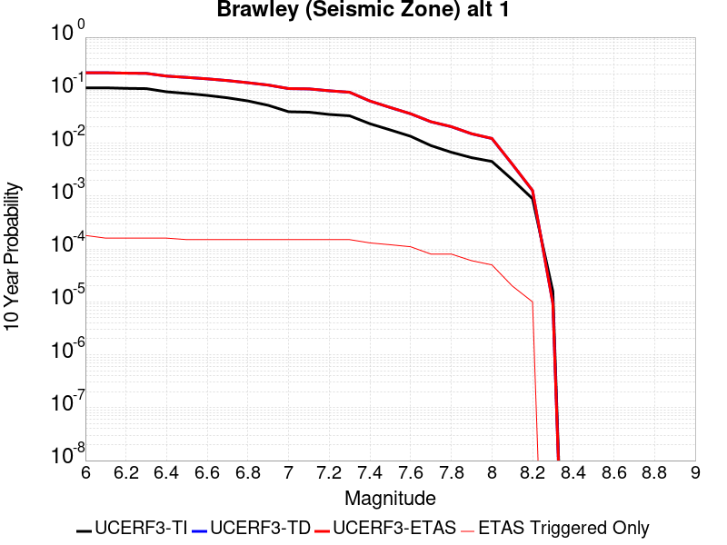 |

| Magnitude | 1 wk TI Prob | 1 wk TD Prob | 1 wk ETAS Prob | 1 wk ETAS/TD Gain | 1 wk ETAS Triggered Only | 1 mo TI Prob | 1 mo TD Prob | 1 mo ETAS Prob | 1 mo ETAS/TD Gain | 1 mo ETAS Triggered Only | 1 yr TI Prob | 1 yr TD Prob | 1 yr ETAS Prob | 1 yr ETAS/TD Gain | 1 yr ETAS Triggered Only | 10 yr TI Prob | 10 yr TD Prob | 10 yr ETAS Prob | 10 yr ETAS/TD Gain | 10 yr ETAS Triggered Only |
|-----|-----|-----|-----|-----|-----|-----|-----|-----|-----|-----|-----|-----|-----|-----|-----|-----|-----|-----|-----|-----|
| 6.0 | 2.2521618E-4 | 4.763429E-4 | 5.7629525E-4 | 1.2098328 | 1.0E-4 | 9.6485513E-4 | 0.0020399094 | 0.0021596646 | 1.0587062 | 1.2E-4 | 0.011683988 | 0.024544531 | 0.024710359 | 1.0067562 | 1.7E-4 | 0.11088423 | 0.21349923 | 0.2136408 | 1.000663 | 1.8E-4 |
| 6.1 | 2.2521618E-4 | 4.763429E-4 | 5.663E-4 | 1.1888496 | 9.0E-5 | 9.6485513E-4 | 0.0020399094 | 0.002149685 | 1.0538139 | 1.1E-4 | 0.011683988 | 0.024544531 | 0.02469085 | 1.0059613 | 1.5E-4 | 0.11088423 | 0.21349923 | 0.21362507 | 1.0005894 | 1.6E-4 |
| 6.2 | 2.198148E-4 | 4.6718874E-4 | 5.571467E-4 | 1.1925516 | 9.0E-5 | 9.417233E-4 | 0.0020007377 | 0.0021105176 | 1.0548698 | 1.1E-4 | 0.011405343 | 0.024078513 | 0.024224902 | 1.0060797 | 1.5E-4 | 0.10837428 | 0.20993572 | 0.21006213 | 1.0006021 | 1.6E-4 |
| 6.3 | 2.1704129E-4 | 4.615455E-4 | 5.5150397E-4 | 1.1949071 | 9.0E-5 | 9.298453E-4 | 0.0019765892 | 0.0020863719 | 1.0555414 | 1.1E-4 | 0.011262234 | 0.023792034 | 0.023938464 | 1.0061547 | 1.5E-4 | 0.107082725 | 0.20782684 | 0.20795359 | 1.0006099 | 1.6E-4 |
| 6.4 | 1.876142E-4 | 4.004663E-4 | 4.904303E-4 | 1.224648 | 9.0E-5 | 8.038131E-4 | 0.0017151695 | 0.0018249808 | 1.0640236 | 1.1E-4 | 0.00974259 | 0.020678662 | 0.02082556 | 1.0071038 | 1.5E-4 | 0.093263686 | 0.18457787 | 0.18470834 | 1.0007068 | 1.6E-4 |
| 6.5 | 1.7390939E-4 | 3.7478763E-4 | 4.6475392E-4 | 1.240046 | 9.0E-5 | 7.45113E-4 | 0.0016052561 | 0.0017150795 | 1.0684149 | 1.1E-4 | 0.009034078 | 0.019367293 | 0.019514387 | 1.0075951 | 1.5E-4 | 0.086755216 | 0.17440015 | 0.174524 | 1.0007101 | 1.5E-4 |
| 6.6 | 1.591791E-4 | 3.4893592E-4 | 4.389045E-4 | 1.257837 | 9.0E-5 | 6.8201777E-4 | 0.0014945926 | 0.0016044282 | 1.0734886 | 1.1E-4 | 0.008271996 | 0.018045008 | 0.0181923 | 1.0081625 | 1.5E-4 | 0.07970774 | 0.16380787 | 0.16393329 | 1.0007657 | 1.5E-4 |
| 6.7 | 1.4268003E-4 | 3.2059717E-4 | 4.1056835E-4 | 1.2806361 | 9.0E-5 | 6.1134255E-4 | 0.0013732726 | 0.0014831215 | 1.0799906 | 1.1E-4 | 0.007417723 | 0.01659171 | 0.01673922 | 1.0088906 | 1.5E-4 | 0.07174956 | 0.15193594 | 0.15206313 | 1.0008372 | 1.5E-4 |
| 6.8 | 1.239713E-4 | 2.9055026E-4 | 3.805241E-4 | 1.3096671 | 9.0E-5 | 5.3119735E-4 | 0.0012446274 | 0.0013544905 | 1.0882698 | 1.1E-4 | 0.0064481674 | 0.015049482 | 0.015197225 | 1.0098171 | 1.5E-4 | 0.06264243 | 0.13838051 | 0.13850975 | 1.000934 | 1.5E-4 |
| 6.9 | 1.0180238E-4 | 2.6255674E-4 | 3.5253313E-4 | 1.3426931 | 9.0E-5 | 4.3622297E-4 | 0.0011247622 | 0.0012346385 | 1.0976884 | 1.1E-4 | 0.005298089 | 0.013608998 | 0.013756956 | 1.0108721 | 1.5E-4 | 0.05173543 | 0.12496473 | 0.12509598 | 1.0010504 | 1.5E-4 |
| 7.0 | 7.6619996E-5 | 2.2400476E-4 | 3.139846E-4 | 1.4016871 | 9.0E-5 | 3.283301E-4 | 9.596704E-4 | 0.0010695648 | 1.1145127 | 1.1E-4 | 0.0039900932 | 0.011622103 | 0.011770359 | 1.0127565 | 1.5E-4 | 0.039192066 | 0.10726982 | 0.10740373 | 1.0012484 | 1.5E-4 |
| 7.1 | 7.5127435E-5 | 2.2083633E-4 | 3.1081645E-4 | 1.4074516 | 9.0E-5 | 3.2193496E-4 | 9.461013E-4 | 0.0010559972 | 1.1161566 | 1.1E-4 | 0.0039125155 | 0.011458648 | 0.011606929 | 1.0129405 | 1.5E-4 | 0.038443442 | 0.10583378 | 0.1059679 | 1.0012673 | 1.5E-4 |
| 7.2 | 6.788582E-5 | 2.0211334E-4 | 2.9209515E-4 | 1.4452047 | 9.0E-5 | 2.9090676E-4 | 8.6591556E-4 | 9.758203E-4 | 1.1269232 | 1.1E-4 | 0.0035360386 | 0.0104922 | 0.010640626 | 1.0141463 | 1.5E-4 | 0.034803 | 0.097503684 | 0.09763906 | 1.0013884 | 1.5E-4 |
| 7.3 | 6.399602E-5 | 1.8842232E-4 | 2.7840535E-4 | 1.4775604 | 9.0E-5 | 2.7423984E-4 | 8.0727716E-4 | 9.1718836E-4 | 1.1361505 | 1.1E-4 | 0.0033337586 | 0.009784897 | 0.009933429 | 1.0151798 | 1.5E-4 | 0.03284188 | 0.091397986 | 0.09153428 | 1.0014912 | 1.5E-4 |
| 7.4 | 4.506759E-5 | 1.2530042E-4 | 1.9529165E-4 | 1.5585873 | 7.0E-5 | 1.9313251E-4 | 5.3689216E-4 | 6.2684383E-4 | 1.1675414 | 9.0E-5 | 0.0023488526 | 0.006517245 | 0.006646398 | 1.0198171 | 1.3E-4 | 0.023241805 | 0.062364522 | 0.062486414 | 1.0019546 | 1.3E-4 |
| 7.5 | 3.43289E-5 | 9.336103E-5 | 1.5335543E-4 | 1.6426064 | 6.0E-5 | 1.4711556E-4 | 4.0005764E-4 | 4.8002566E-4 | 1.1998912 | 8.0E-5 | 0.0017896603 | 0.004859886 | 0.004979303 | 1.0245719 | 1.2E-4 | 0.01775316 | 0.047057066 | 0.04717142 | 1.0024301 | 1.2E-4 |
| 7.6 | 2.5980507E-5 | 7.053672E-5 | 1.3053248E-4 | 1.8505608 | 6.0E-5 | 1.1134028E-4 | 3.0226534E-4 | 3.8224115E-4 | 1.2645881 | 8.0E-5 | 0.001354725 | 0.0036738948 | 0.0037834907 | 1.0298309 | 1.1E-4 | 0.013464959 | 0.03584298 | 0.035949036 | 1.0029589 | 1.1E-4 |
| 7.7 | 1.7292105E-5 | 4.9412036E-5 | 8.941006E-5 | 1.8094794 | 4.0E-5 | 7.4106916E-5 | 2.1174872E-4 | 2.71736E-4 | 1.2832947 | 6.0E-5 | 9.018782E-4 | 0.0025749984 | 0.0026547925 | 1.030988 | 8.0E-5 | 0.008982267 | 0.025292097 | 0.025370073 | 1.003083 | 8.0E-5 |
| 7.8 | 1.2927471E-5 | 3.9697254E-5 | 7.969567E-5 | 2.0075862 | 4.0E-5 | 5.5402274E-5 | 1.7012001E-4 | 2.3010981E-4 | 1.3526322 | 6.0E-5 | 6.743139E-4 | 0.0020692463 | 0.0021490806 | 1.0385814 | 8.0E-5 | 0.0067227143 | 0.020433145 | 0.02051151 | 1.0038352 | 8.0E-5 |
| 7.9 | 1.0200774E-5 | 2.8748475E-5 | 4.87479E-5 | 1.695669 | 2.0E-5 | 4.371687E-5 | 1.2320194E-4 | 1.6319701E-4 | 1.3246303 | 4.0E-5 | 5.321229E-4 | 0.0014989526 | 0.0015588626 | 1.0399679 | 6.0E-5 | 0.005308505 | 0.014992895 | 0.0150519945 | 1.0039419 | 6.0E-5 |
| 8.0 | 8.650396E-6 | 2.3279512E-5 | 4.3279044E-5 | 1.8591045 | 2.0E-5 | 3.70726E-5 | 9.976552E-5 | 1.2976253E-4 | 1.300675 | 3.0E-5 | 4.5126543E-4 | 0.0012139693 | 0.0012639086 | 1.0411372 | 5.0E-5 | 0.0045035016 | 0.012212164 | 0.012261554 | 1.0040443 | 5.0E-5 |
| 8.1 | 3.9368224E-6 | 7.3283345E-6 | 1.732826E-5 | 2.3645566 | 1.0E-5 | 1.6871985E-5 | 3.1406773E-5 | 5.1406143E-5 | 1.6367854 | 2.0E-5 | 2.0539707E-4 | 3.8231048E-4 | 4.0230283E-4 | 1.0522935 | 2.0E-5 | 0.0020520731 | 0.0040015313 | 0.0040214513 | 1.0049781 | 2.0E-5 |
| 8.2 | 1.7101195E-6 | 2.2178374E-6 | 1.2217815E-5 | 5.508887 | 1.0E-5 | 7.329063E-6 | 9.504983E-6 | 1.9504889E-5 | 2.0520697 | 1.0E-5 | 8.922769E-5 | 1.15717055E-4 | 1.257159E-4 | 1.0864077 | 1.0E-5 | 8.9191867E-4 | 0.00126669 | 0.0012766774 | 1.0078846 | 1.0E-5 |
| 8.3 | 3.0346666E-8 | 1.721086E-8 | 1.721086E-8 | 1.0 | 0.0 | 1.3005713E-7 | 7.376083E-8 | 7.376083E-8 | 1.0 | 0.0 | 1.5834444E-6 | 8.98038E-7 | 8.98038E-7 | 1.0 | 0.0 | 1.5834332E-5 | 9.36379E-6 | 9.36379E-6 | 1.0 | 0.0 |

## Kern Canyon (North Kern) 2011
*[(top)](#table-of-contents)*

| 1 Week | 1 Month | 1 Year | 10 Year |
|-----|-----|-----|-----|
|  |  |  |  |

| Magnitude | 1 wk TI Prob | 1 wk TD Prob | 1 wk ETAS Prob | 1 wk ETAS/TD Gain | 1 wk ETAS Triggered Only | 1 mo TI Prob | 1 mo TD Prob | 1 mo ETAS Prob | 1 mo ETAS/TD Gain | 1 mo ETAS Triggered Only | 1 yr TI Prob | 1 yr TD Prob | 1 yr ETAS Prob | 1 yr ETAS/TD Gain | 1 yr ETAS Triggered Only | 10 yr TI Prob | 10 yr TD Prob | 10 yr ETAS Prob | 10 yr ETAS/TD Gain | 10 yr ETAS Triggered Only |
|-----|-----|-----|-----|-----|-----|-----|-----|-----|-----|-----|-----|-----|-----|-----|-----|-----|-----|-----|-----|-----|
| 6.0 | 6.6264497E-6 | 6.75733E-6 | 8.675679E-5 | 12.838915 | 8.0E-5 | 2.8398761E-5 | 2.895971E-5 | 1.18957105E-4 | 4.107676 | 9.0E-5 | 3.4570007E-4 | 3.5253543E-4 | 4.9248606E-4 | 1.3969831 | 1.4E-4 | 0.0034516277 | 0.0035205502 | 0.0036899517 | 1.0481179 | 1.7E-4 |
| 6.1 | 6.6264497E-6 | 6.75733E-6 | 8.675679E-5 | 12.838915 | 8.0E-5 | 2.8398761E-5 | 2.895971E-5 | 1.18957105E-4 | 4.107676 | 9.0E-5 | 3.4570007E-4 | 3.5253543E-4 | 4.9248606E-4 | 1.3969831 | 1.4E-4 | 0.0034516277 | 0.0035205502 | 0.0036899517 | 1.0481179 | 1.7E-4 |
| 6.2 | 6.6264497E-6 | 6.75733E-6 | 8.675679E-5 | 12.838915 | 8.0E-5 | 2.8398761E-5 | 2.895971E-5 | 1.18957105E-4 | 4.107676 | 9.0E-5 | 3.4570007E-4 | 3.5253543E-4 | 4.9248606E-4 | 1.3969831 | 1.4E-4 | 0.0034516277 | 0.0035205502 | 0.0036899517 | 1.0481179 | 1.7E-4 |
| 6.3 | 6.6264497E-6 | 6.75733E-6 | 8.675679E-5 | 12.838915 | 8.0E-5 | 2.8398761E-5 | 2.895971E-5 | 1.18957105E-4 | 4.107676 | 9.0E-5 | 3.4570007E-4 | 3.5253543E-4 | 4.9248606E-4 | 1.3969831 | 1.4E-4 | 0.0034516277 | 0.0035205502 | 0.0036899517 | 1.0481179 | 1.7E-4 |
| 6.4 | 6.6264497E-6 | 6.75733E-6 | 8.675679E-5 | 12.838915 | 8.0E-5 | 2.8398761E-5 | 2.895971E-5 | 1.18957105E-4 | 4.107676 | 9.0E-5 | 3.4570007E-4 | 3.5253543E-4 | 4.9248606E-4 | 1.3969831 | 1.4E-4 | 0.0034516277 | 0.0035205502 | 0.0036899517 | 1.0481179 | 1.7E-4 |
| 6.5 | 3.2162225E-6 | 3.2570915E-6 | 4.325696E-5 | 13.280855 | 4.0E-5 | 1.3783738E-5 | 1.3958894E-5 | 5.3958334E-5 | 3.8655167 | 4.0E-5 | 1.6780409E-4 | 1.6993708E-4 | 2.2992688E-4 | 1.3530118 | 6.0E-5 | 0.0016767744 | 0.001698151 | 0.0017680322 | 1.0411513 | 7.0E-5 |
| 6.6 | 3.2162225E-6 | 3.2570915E-6 | 4.325696E-5 | 13.280855 | 4.0E-5 | 1.3783738E-5 | 1.3958894E-5 | 5.3958334E-5 | 3.8655167 | 4.0E-5 | 1.6780409E-4 | 1.6993708E-4 | 2.2992688E-4 | 1.3530118 | 6.0E-5 | 0.0016767744 | 0.001698151 | 0.0017680322 | 1.0411513 | 7.0E-5 |
| 6.7 | 2.1908265E-6 | 2.2071222E-6 | 4.2207033E-5 | 19.123106 | 4.0E-5 | 9.389223E-6 | 9.459062E-6 | 4.9458682E-5 | 5.228709 | 4.0E-5 | 1.1430779E-4 | 1.1515819E-4 | 1.5515358E-4 | 1.3473083 | 4.0E-5 | 0.0011424901 | 0.0011510046 | 0.001200947 | 1.0433903 | 5.0E-5 |
| 6.8 | 1.7303895E-6 | 1.736553E-6 | 4.1736483E-5 | 24.034098 | 4.0E-5 | 7.415934E-6 | 7.442349E-6 | 4.7442052E-5 | 6.374607 | 4.0E-5 | 9.028525E-5 | 9.060693E-5 | 1.3060331E-4 | 1.4414274 | 4.0E-5 | 9.024858E-4 | 9.0570963E-4 | 9.456734E-4 | 1.0441242 | 4.0E-5 |
| 6.9 | 1.3700314E-6 | 1.3688623E-6 | 3.136882E-5 | 22.91598 | 3.0E-5 | 5.87155E-6 | 5.86654E-6 | 3.5866364E-5 | 6.113717 | 3.0E-5 | 7.148377E-5 | 7.142283E-5 | 1.0142069E-4 | 1.4200038 | 3.0E-5 | 7.146078E-4 | 7.140033E-4 | 7.4398186E-4 | 1.0419866 | 3.0E-5 |
| 7.0 | 1.1467797E-6 | 1.1413805E-6 | 2.1141357E-5 | 18.52262 | 2.0E-5 | 4.9147607E-6 | 4.8916218E-6 | 2.4891524E-5 | 5.0886035 | 2.0E-5 | 5.983557E-5 | 5.95539E-5 | 7.955271E-5 | 1.3358102 | 2.0E-5 | 5.981946E-4 | 5.9538253E-4 | 6.1537063E-4 | 1.0335718 | 2.0E-5 |
| 7.1 | 9.3952065E-7 | 9.3026915E-7 | 1.093026E-5 | 11.749567 | 1.0E-5 | 4.026511E-6 | 3.986862E-6 | 1.3986822E-5 | 3.5082285 | 1.0E-5 | 4.9021666E-5 | 4.853898E-5 | 5.853849E-5 | 1.20601 | 1.0E-5 | 4.901085E-4 | 4.8528553E-4 | 4.9528066E-4 | 1.0205964 | 1.0E-5 |
| 7.2 | 6.858055E-7 | 6.7193014E-7 | 1.06719235E-5 | 15.882489 | 1.0E-5 | 2.939163E-6 | 2.8796974E-6 | 1.2879668E-5 | 4.472577 | 1.0E-5 | 3.5783723E-5 | 3.5059762E-5 | 4.5059413E-5 | 1.2852173 | 1.0E-5 | 3.5777962E-4 | 3.5054318E-4 | 3.6053968E-4 | 1.0285171 | 1.0E-5 |
| 7.3 | 5.1101983E-7 | 4.939301E-7 | 1.0493925E-5 | 21.245771 | 1.0E-5 | 2.1900833E-6 | 2.1168414E-6 | 1.21168205E-5 | 5.7240095 | 1.0E-5 | 2.6663936E-5 | 2.5772246E-5 | 3.5771987E-5 | 1.3880043 | 1.0E-5 | 2.6660739E-4 | 2.5769303E-4 | 2.6769046E-4 | 1.0387958 | 1.0E-5 |
| 7.4 | 3.4999414E-7 | 3.2995916E-7 | 3.2995916E-7 | 1.0 | 0.0 | 1.499974E-6 | 1.4141099E-6 | 1.4141099E-6 | 1.0 | 0.0 | 1.8262032E-5 | 1.7216655E-5 | 1.7216655E-5 | 1.0 | 0.0 | 1.826053E-4 | 1.7215345E-4 | 1.7215345E-4 | 1.0 | 0.0 |
| 7.5 | 1.7021522E-7 | 1.4750053E-7 | 1.4750053E-7 | 1.0 | 0.0 | 7.2949354E-7 | 6.32145E-7 | 6.32145E-7 | 1.0 | 0.0 | 8.881548E-6 | 7.696339E-6 | 7.696339E-6 | 1.0 | 0.0 | 8.8811925E-5 | 7.696081E-5 | 7.696081E-5 | 1.0 | 0.0 |
| 7.6 | 2.572245E-8 | 1.735264E-8 | 1.735264E-8 | 1.0 | 0.0 | 1.10239064E-7 | 7.436845E-8 | 7.436845E-8 | 1.0 | 0.0 | 1.3421597E-6 | 9.0543557E-7 | 9.0543557E-7 | 1.0 | 0.0 | 1.3421517E-5 | 9.054324E-6 | 9.054324E-6 | 1.0 | 0.0 |

## Santa Ynez (West)
*[(top)](#table-of-contents)*

| 1 Week | 1 Month | 1 Year | 10 Year |
|-----|-----|-----|-----|
|  |  |  |  |

| Magnitude | 1 wk TI Prob | 1 wk TD Prob | 1 wk ETAS Prob | 1 wk ETAS/TD Gain | 1 wk ETAS Triggered Only | 1 mo TI Prob | 1 mo TD Prob | 1 mo ETAS Prob | 1 mo ETAS/TD Gain | 1 mo ETAS Triggered Only | 1 yr TI Prob | 1 yr TD Prob | 1 yr ETAS Prob | 1 yr ETAS/TD Gain | 1 yr ETAS Triggered Only | 10 yr TI Prob | 10 yr TD Prob | 10 yr ETAS Prob | 10 yr ETAS/TD Gain | 10 yr ETAS Triggered Only |
|-----|-----|-----|-----|-----|-----|-----|-----|-----|-----|-----|-----|-----|-----|-----|-----|-----|-----|-----|-----|-----|
| 6.0 | 4.7352758E-5 | 5.497084E-5 | 1.2496699E-4 | 2.2733324 | 7.0E-5 | 2.0292461E-4 | 2.3556968E-4 | 3.4554375E-4 | 1.4668431 | 1.1E-4 | 0.0024678076 | 0.002864558 | 0.002984214 | 1.0417713 | 1.2E-4 | 0.024405818 | 0.028304456 | 0.028430777 | 1.004463 | 1.3E-4 |
| 6.1 | 4.7352758E-5 | 5.497084E-5 | 1.14967545E-4 | 2.0914278 | 6.0E-5 | 2.0292461E-4 | 2.3556968E-4 | 3.3554612E-4 | 1.4244028 | 1.0E-4 | 0.0024678076 | 0.002864558 | 0.002974243 | 1.0382904 | 1.1E-4 | 0.024405818 | 0.028304456 | 0.02842106 | 1.0041196 | 1.2E-4 |
| 6.2 | 3.0415853E-5 | 3.3925004E-5 | 8.39233E-5 | 2.4737892 | 5.0E-5 | 1.3034715E-4 | 1.4538495E-4 | 2.3537187E-4 | 1.6189562 | 9.0E-5 | 0.0015858212 | 0.0017686592 | 0.0018684823 | 1.05644 | 1.0E-4 | 0.015745522 | 0.01754978 | 0.017648024 | 1.0055981 | 1.0E-4 |
| 6.3 | 3.0415853E-5 | 3.3925004E-5 | 8.39233E-5 | 2.4737892 | 5.0E-5 | 1.3034715E-4 | 1.4538495E-4 | 2.3537187E-4 | 1.6189562 | 9.0E-5 | 0.0015858212 | 0.0017686592 | 0.0018684823 | 1.05644 | 1.0E-4 | 0.015745522 | 0.01754978 | 0.017648024 | 1.0055981 | 1.0E-4 |
| 6.4 | 2.5452082E-5 | 2.7912318E-5 | 6.7911205E-5 | 2.433019 | 4.0E-5 | 1.09075794E-4 | 1.1961885E-4 | 1.9960928E-4 | 1.668711 | 8.0E-5 | 0.0013271887 | 0.0014554056 | 0.00155526 | 1.0686094 | 1.0E-4 | 0.013192902 | 0.01446091 | 0.014559464 | 1.0068152 | 1.0E-4 |
| 6.5 | 2.3143784E-5 | 2.5128133E-5 | 5.5127377E-5 | 2.193851 | 3.0E-5 | 9.9183875E-5 | 1.07687636E-4 | 1.776801E-4 | 1.6499583 | 7.0E-5 | 0.0012068948 | 0.001310323 | 0.0014002051 | 1.0685954 | 9.0E-5 | 0.012003611 | 0.013027638 | 0.013116466 | 1.0068184 | 9.0E-5 |
| 6.6 | 1.9118515E-5 | 2.0354244E-5 | 5.0353636E-5 | 2.473864 | 3.0E-5 | 8.193392E-5 | 8.722961E-5 | 1.572235E-4 | 1.8024099 | 7.0E-5 | 9.97089E-4 | 0.001061511 | 0.001141426 | 1.0752842 | 8.0E-5 | 0.00992627 | 0.010565317 | 0.010644471 | 1.007492 | 8.0E-5 |
| 6.7 | 1.722807E-5 | 1.8146253E-5 | 3.814589E-5 | 2.102136 | 2.0E-5 | 7.3832496E-5 | 7.776737E-5 | 1.2776349E-4 | 1.6428932 | 5.0E-5 | 8.985399E-4 | 9.4641204E-4 | 0.0010063553 | 1.0633373 | 6.0E-5 | 0.008949154 | 0.009424461 | 0.009483896 | 1.0063064 | 6.0E-5 |
| 6.8 | 1.5317364E-5 | 1.5926391E-5 | 3.5926074E-5 | 2.2557573 | 2.0E-5 | 6.56442E-5 | 6.82542E-5 | 1.1825079E-4 | 1.7325057 | 5.0E-5 | 7.98925E-4 | 8.3068234E-4 | 8.906325E-4 | 1.0721698 | 6.0E-5 | 0.007960589 | 0.008276261 | 0.0083357645 | 1.0071896 | 6.0E-5 |
| 6.9 | 1.3071226E-5 | 1.332953E-5 | 3.3329263E-5 | 2.500408 | 2.0E-5 | 5.6018336E-5 | 5.712532E-5 | 1.0712246E-4 | 1.8752186 | 5.0E-5 | 6.8180985E-4 | 6.952811E-4 | 7.5523934E-4 | 1.086236 | 6.0E-5 | 0.0067972173 | 0.0069313184 | 0.0069909026 | 1.0085964 | 6.0E-5 |
| 7.0 | 1.1836986E-5 | 1.1932688E-5 | 3.193245E-5 | 2.6760483 | 2.0E-5 | 5.0728955E-5 | 5.1139097E-5 | 1.0113654E-4 | 1.9776756 | 5.0E-5 | 6.1745E-4 | 6.2244234E-4 | 6.8240496E-4 | 1.0963345 | 6.0E-5 | 0.006157372 | 0.0062071825 | 0.00626681 | 1.0096062 | 6.0E-5 |
| 7.1 | 1.0597169E-5 | 1.0542107E-5 | 3.0541898E-5 | 2.8971338 | 2.0E-5 | 4.541565E-5 | 4.5179684E-5 | 9.517743E-5 | 2.1066422 | 5.0E-5 | 5.5279525E-4 | 5.4992497E-4 | 6.0989195E-4 | 1.1090457 | 6.0E-5 | 0.0055142213 | 0.005485772 | 0.005545443 | 1.0108774 | 6.0E-5 |
| 7.2 | 9.59113E-6 | 9.45905E-6 | 2.945886E-5 | 3.1143572 | 2.0E-5 | 4.11042E-5 | 4.053816E-5 | 8.053654E-5 | 1.9866846 | 4.0E-5 | 5.0032866E-4 | 4.934414E-4 | 5.4341677E-4 | 1.1012791 | 5.0E-5 | 0.004992037 | 0.0049235765 | 0.00497333 | 1.0101053 | 5.0E-5 |
| 7.3 | 8.586084E-6 | 8.379489E-6 | 2.8379322E-5 | 3.3867602 | 2.0E-5 | 3.679698E-5 | 3.591161E-5 | 7.5910175E-5 | 2.113806 | 4.0E-5 | 4.4791115E-4 | 4.3713715E-4 | 4.871153E-4 | 1.1143305 | 5.0E-5 | 0.004470094 | 0.004362884 | 0.004412666 | 1.0114104 | 5.0E-5 |
| 7.4 | 7.2622997E-6 | 6.9514485E-6 | 2.695131E-5 | 3.877078 | 2.0E-5 | 3.112377E-5 | 2.9791589E-5 | 6.9790396E-5 | 2.3426208 | 4.0E-5 | 3.78866E-4 | 3.6265317E-4 | 4.1263504E-4 | 1.1378227 | 5.0E-5 | 0.0037822074 | 0.003620714 | 0.003670533 | 1.0137594 | 5.0E-5 |
| 7.5 | 5.627296E-6 | 5.2514984E-6 | 1.5251446E-5 | 2.9042084 | 1.0E-5 | 2.411676E-5 | 2.2506232E-5 | 4.250578E-5 | 1.8886228 | 2.0E-5 | 2.9358198E-4 | 2.7397962E-4 | 3.039714E-4 | 1.1094671 | 3.0E-5 | 0.0029319443 | 0.0027364905 | 0.0027664085 | 1.0109329 | 3.0E-5 |
| 7.6 | 2.265244E-6 | 2.0608632E-6 | 2.0608632E-6 | 1.0 | 0.0 | 9.708152E-6 | 8.832241E-6 | 8.832241E-6 | 1.0 | 0.0 | 1.18190335E-4 | 1.0752732E-4 | 1.0752732E-4 | 1.0 | 0.0 | 0.001181275 | 0.0010747615 | 0.0010747615 | 1.0 | 0.0 |
| 7.7 | 1.3099874E-6 | 1.1016228E-6 | 1.1016228E-6 | 1.0 | 0.0 | 5.61422E-6 | 4.7212325E-6 | 4.7212325E-6 | 1.0 | 0.0 | 6.8350986E-5 | 5.7479516E-5 | 5.7479516E-5 | 1.0 | 0.0 | 6.832996E-4 | 5.7464885E-4 | 5.7464885E-4 | 1.0 | 0.0 |
| 7.8 | 7.903951E-7 | 6.0710704E-7 | 6.0710704E-7 | 1.0 | 0.0 | 3.3874032E-6 | 2.601885E-6 | 2.601885E-6 | 1.0 | 0.0 | 4.1240855E-5 | 3.16775E-5 | 3.16775E-5 | 1.0 | 0.0 | 4.12332E-4 | 3.167312E-4 | 3.167312E-4 | 1.0 | 0.0 |
| 7.9 | 7.0753297E-9 | 5.090092E-9 | 5.090092E-9 | 1.0 | 0.0 | 3.032284E-8 | 2.181468E-8 | 2.181468E-8 | 1.0 | 0.0 | 3.6918053E-7 | 2.655937E-7 | 2.655937E-7 | 1.0 | 0.0 | 3.691799E-6 | 2.6559348E-6 | 2.6559348E-6 | 1.0 | 0.0 |

## Santa Ynez (East)
*[(top)](#table-of-contents)*

| 1 Week | 1 Month | 1 Year | 10 Year |
|-----|-----|-----|-----|
|  |  |  |  |

| Magnitude | 1 wk TI Prob | 1 wk TD Prob | 1 wk ETAS Prob | 1 wk ETAS/TD Gain | 1 wk ETAS Triggered Only | 1 mo TI Prob | 1 mo TD Prob | 1 mo ETAS Prob | 1 mo ETAS/TD Gain | 1 mo ETAS Triggered Only | 1 yr TI Prob | 1 yr TD Prob | 1 yr ETAS Prob | 1 yr ETAS/TD Gain | 1 yr ETAS Triggered Only | 10 yr TI Prob | 10 yr TD Prob | 10 yr ETAS Prob | 10 yr ETAS/TD Gain | 10 yr ETAS Triggered Only |
|-----|-----|-----|-----|-----|-----|-----|-----|-----|-----|-----|-----|-----|-----|-----|-----|-----|-----|-----|-----|-----|
| 6.0 | 3.2269712E-5 | 3.6750775E-5 | 1.067482E-4 | 2.9046519 | 7.0E-5 | 1.3829143E-4 | 1.5749714E-4 | 2.8747667E-4 | 1.8252819 | 1.3E-4 | 0.0016823979 | 0.0019164253 | 0.002056157 | 1.0729127 | 1.4E-4 | 0.016697178 | 0.019056438 | 0.019203579 | 1.0077213 | 1.5E-4 |
| 6.1 | 3.2269712E-5 | 3.6750775E-5 | 1.067482E-4 | 2.9046519 | 7.0E-5 | 1.3829143E-4 | 1.5749714E-4 | 2.8747667E-4 | 1.8252819 | 1.3E-4 | 0.0016823979 | 0.0019164253 | 0.002056157 | 1.0729127 | 1.4E-4 | 0.016697178 | 0.019056438 | 0.019203579 | 1.0077213 | 1.5E-4 |
| 6.2 | 3.2269712E-5 | 3.6750775E-5 | 1.067482E-4 | 2.9046519 | 7.0E-5 | 1.3829143E-4 | 1.5749714E-4 | 2.8747667E-4 | 1.8252819 | 1.3E-4 | 0.0016823979 | 0.0019164253 | 0.002056157 | 1.0729127 | 1.4E-4 | 0.016697178 | 0.019056438 | 0.019203579 | 1.0077213 | 1.5E-4 |
| 6.3 | 3.2269712E-5 | 3.6750775E-5 | 1.067482E-4 | 2.9046519 | 7.0E-5 | 1.3829143E-4 | 1.5749714E-4 | 2.8747667E-4 | 1.8252819 | 1.3E-4 | 0.0016823979 | 0.0019164253 | 0.002056157 | 1.0729127 | 1.4E-4 | 0.016697178 | 0.019056438 | 0.019203579 | 1.0077213 | 1.5E-4 |
| 6.4 | 1.4404779E-5 | 1.48492945E-5 | 3.4848996E-5 | 2.3468454 | 2.0E-5 | 6.1733306E-5 | 6.363831E-5 | 1.1363513E-4 | 1.7856402 | 5.0E-5 | 7.513438E-4 | 7.7452604E-4 | 8.344796E-4 | 1.0774068 | 6.0E-5 | 0.0074880854 | 0.007718817 | 0.0077783535 | 1.0077132 | 6.0E-5 |
| 6.5 | 1.4404779E-5 | 1.48492945E-5 | 3.4848996E-5 | 2.3468454 | 2.0E-5 | 6.1733306E-5 | 6.363831E-5 | 1.1363513E-4 | 1.7856402 | 5.0E-5 | 7.513438E-4 | 7.7452604E-4 | 8.344796E-4 | 1.0774068 | 6.0E-5 | 0.0074880854 | 0.007718817 | 0.0077783535 | 1.0077132 | 6.0E-5 |
| 6.6 | 1.280208E-5 | 1.301186E-5 | 3.3011598E-5 | 2.5370393 | 2.0E-5 | 5.4864904E-5 | 5.5763932E-5 | 1.05761144E-4 | 1.8965869 | 5.0E-5 | 6.6777546E-4 | 6.7871617E-4 | 7.386754E-4 | 1.0883422 | 6.0E-5 | 0.006657724 | 0.0067666434 | 0.0068262373 | 1.0088071 | 6.0E-5 |
| 6.7 | 1.2457027E-5 | 1.262838E-5 | 3.2628126E-5 | 2.5837145 | 2.0E-5 | 5.3386164E-5 | 5.4120515E-5 | 1.0411781E-4 | 1.923814 | 5.0E-5 | 6.497827E-4 | 6.5871974E-4 | 7.186802E-4 | 1.0910258 | 6.0E-5 | 0.00647886 | 0.00656787 | 0.0066274754 | 1.0090754 | 6.0E-5 |
| 6.8 | 1.2095134E-5 | 1.2230827E-5 | 3.2230582E-5 | 2.6351924 | 2.0E-5 | 5.1835254E-5 | 5.2416784E-5 | 1.0241417E-4 | 1.9538429 | 5.0E-5 | 6.309115E-4 | 6.3798914E-4 | 6.9795083E-4 | 1.0939854 | 6.0E-5 | 0.0062912325 | 0.006361764 | 0.006421382 | 1.0093714 | 6.0E-5 |
| 6.9 | 1.1104036E-5 | 1.115726E-5 | 3.1157037E-5 | 2.7925348 | 2.0E-5 | 4.758786E-5 | 4.781596E-5 | 9.7813565E-5 | 2.045626 | 5.0E-5 | 5.7922816E-4 | 5.82005E-4 | 6.4197014E-4 | 1.1030319 | 6.0E-5 | 0.005777207 | 0.0058049536 | 0.0058646053 | 1.010276 | 6.0E-5 |
| 7.0 | 1.0577444E-5 | 1.05815925E-5 | 3.058138E-5 | 2.8900547 | 2.0E-5 | 4.5331115E-5 | 4.53489E-5 | 9.534664E-5 | 2.1025126 | 5.0E-5 | 5.5176654E-4 | 5.5198424E-4 | 6.119511E-4 | 1.1086388 | 6.0E-5 | 0.0055039856 | 0.00550627 | 0.00556594 | 1.0108367 | 6.0E-5 |
| 7.1 | 1.0021775E-5 | 9.9809E-6 | 2.99807E-5 | 3.0038073 | 2.0E-5 | 4.294976E-5 | 4.277459E-5 | 9.2772454E-5 | 2.1688683 | 5.0E-5 | 5.2278786E-4 | 5.206574E-4 | 5.8062613E-4 | 1.115179 | 6.0E-5 | 0.0052155964 | 0.005194508 | 0.0052541965 | 1.0114907 | 6.0E-5 |
| 7.2 | 8.874109E-6 | 8.748706E-6 | 2.874853E-5 | 3.2860322 | 2.0E-5 | 3.8031343E-5 | 3.7493923E-5 | 7.749243E-5 | 2.0667996 | 4.0E-5 | 4.629332E-4 | 4.56394E-4 | 5.0637114E-4 | 1.1095045 | 5.0E-5 | 0.0046197 | 0.0045546847 | 0.0046044574 | 1.0109277 | 5.0E-5 |
| 7.3 | 7.5504267E-6 | 7.5050243E-6 | 2.7504873E-5 | 3.6648614 | 2.0E-5 | 3.235857E-5 | 3.2164E-5 | 7.2162715E-5 | 2.2435865 | 4.0E-5 | 3.9389438E-4 | 3.9152734E-4 | 4.4150776E-4 | 1.127655 | 5.0E-5 | 0.0039319694 | 0.0039084824 | 0.003958287 | 1.0127426 | 5.0E-5 |
| 7.4 | 6.309394E-6 | 6.183062E-6 | 2.618294E-5 | 4.2346234 | 2.0E-5 | 2.703998E-5 | 2.6498574E-5 | 6.6497516E-5 | 2.5094752 | 4.0E-5 | 3.2916202E-4 | 3.2257332E-4 | 3.725572E-4 | 1.1549535 | 5.0E-5 | 0.003286749 | 0.0032211484 | 0.0032709872 | 1.0154724 | 5.0E-5 |
| 7.5 | 4.6103073E-6 | 4.4408016E-6 | 1.4440757E-5 | 3.2518356 | 1.0E-5 | 1.975831E-5 | 1.9031871E-5 | 3.9031493E-5 | 2.0508487 | 2.0E-5 | 2.4053088E-4 | 2.316891E-4 | 2.6168214E-4 | 1.1294539 | 3.0E-5 | 0.002402707 | 0.002314545 | 0.0023444756 | 1.0129315 | 3.0E-5 |
| 7.6 | 1.2858658E-6 | 1.3008196E-6 | 1.3008196E-6 | 1.0 | 0.0 | 5.5108417E-6 | 5.574929E-6 | 5.574929E-6 | 1.0 | 0.0 | 6.7092435E-5 | 6.787272E-5 | 6.787272E-5 | 1.0 | 0.0 | 6.707218E-4 | 6.7852676E-4 | 6.7852676E-4 | 1.0 | 0.0 |
| 7.7 | 5.3302307E-7 | 5.612138E-7 | 5.612138E-7 | 1.0 | 0.0 | 2.2843826E-6 | 2.4052001E-6 | 2.4052001E-6 | 1.0 | 0.0 | 2.7812002E-5 | 2.9282955E-5 | 2.9282955E-5 | 1.0 | 0.0 | 2.7808524E-4 | 2.9279455E-4 | 2.9279455E-4 | 1.0 | 0.0 |
| 7.8 | 4.613933E-8 | 4.80301E-8 | 4.80301E-8 | 1.0 | 0.0 | 1.9773998E-7 | 2.0584326E-7 | 2.0584326E-7 | 1.0 | 0.0 | 2.4074816E-6 | 2.5061388E-6 | 2.5061388E-6 | 1.0 | 0.0 | 2.4074554E-5 | 2.5061116E-5 | 2.5061116E-5 | 1.0 | 0.0 |

## Santa Rosa Island
*[(top)](#table-of-contents)*

| 1 Week | 1 Month | 1 Year | 10 Year |
|-----|-----|-----|-----|
|  |  |  |  |

| Magnitude | 1 wk TI Prob | 1 wk TD Prob | 1 wk ETAS Prob | 1 wk ETAS/TD Gain | 1 wk ETAS Triggered Only | 1 mo TI Prob | 1 mo TD Prob | 1 mo ETAS Prob | 1 mo ETAS/TD Gain | 1 mo ETAS Triggered Only | 1 yr TI Prob | 1 yr TD Prob | 1 yr ETAS Prob | 1 yr ETAS/TD Gain | 1 yr ETAS Triggered Only | 10 yr TI Prob | 10 yr TD Prob | 10 yr ETAS Prob | 10 yr ETAS/TD Gain | 10 yr ETAS Triggered Only |
|-----|-----|-----|-----|-----|-----|-----|-----|-----|-----|-----|-----|-----|-----|-----|-----|-----|-----|-----|-----|-----|
| 6.0 | 4.1143165E-5 | 4.709113E-5 | 1.3708688E-4 | 2.911098 | 9.0E-5 | 1.7631594E-4 | 2.0180462E-4 | 3.217804E-4 | 1.5945146 | 1.2E-4 | 0.002144533 | 0.0024543991 | 0.0025741046 | 1.0487719 | 1.2E-4 | 0.021239553 | 0.024293557 | 0.024439912 | 1.0060245 | 1.5E-4 |
| 6.1 | 2.1061249E-5 | 2.3864959E-5 | 4.3864482E-5 | 1.8380288 | 2.0E-5 | 9.0259375E-5 | 1.0227455E-4 | 1.4227047E-4 | 1.3910642 | 4.0E-5 | 0.0010983539 | 0.0012445103 | 0.0012944482 | 1.0401264 | 5.0E-5 | 0.01092941 | 0.01237845 | 0.012437707 | 1.0047871 | 6.0E-5 |
| 6.2 | 2.1061249E-5 | 2.3864959E-5 | 4.3864482E-5 | 1.8380288 | 2.0E-5 | 9.0259375E-5 | 1.0227455E-4 | 1.4227047E-4 | 1.3910642 | 4.0E-5 | 0.0010983539 | 0.0012445103 | 0.0012944482 | 1.0401264 | 5.0E-5 | 0.01092941 | 0.01237845 | 0.012437707 | 1.0047871 | 6.0E-5 |
| 6.3 | 1.5158236E-5 | 1.7074419E-5 | 2.7074248E-5 | 1.5856615 | 1.0E-5 | 6.496225E-5 | 7.3174095E-5 | 1.031719E-4 | 1.4099512 | 3.0E-5 | 7.906284E-4 | 8.9054246E-4 | 9.3050685E-4 | 1.0448765 | 4.0E-5 | 0.007878214 | 0.00887099 | 0.008920547 | 1.0055864 | 5.0E-5 |
| 6.4 | 1.2341918E-5 | 1.3852917E-5 | 2.3852777E-5 | 1.7218597 | 1.0E-5 | 5.2892858E-5 | 5.9368336E-5 | 8.936656E-5 | 1.5052899 | 3.0E-5 | 6.437803E-4 | 7.225779E-4 | 7.62549E-4 | 1.0553174 | 4.0E-5 | 0.006419184 | 0.0072031217 | 0.0072527616 | 1.0068915 | 5.0E-5 |
| 6.5 | 9.061158E-6 | 1.0117032E-5 | 1.0117032E-5 | 1.0 | 0.0 | 3.883296E-5 | 4.3358017E-5 | 6.335715E-5 | 1.4612557 | 2.0E-5 | 4.726887E-4 | 5.277613E-4 | 5.5774546E-4 | 1.0568138 | 3.0E-5 | 0.004716845 | 0.0052656177 | 0.005305407 | 1.0075564 | 4.0E-5 |
| 6.6 | 7.5461685E-6 | 8.400734E-6 | 8.400734E-6 | 1.0 | 0.0 | 3.2340322E-5 | 3.600267E-5 | 5.600195E-5 | 1.5554943 | 2.0E-5 | 3.936723E-4 | 4.3824868E-4 | 4.6823552E-4 | 1.0684243 | 3.0E-5 | 0.003929756 | 0.0043742736 | 0.004414099 | 1.0091044 | 4.0E-5 |
| 6.7 | 5.5023775E-6 | 6.087381E-6 | 6.087381E-6 | 1.0 | 0.0 | 2.3581404E-5 | 2.6088532E-5 | 4.608801E-5 | 1.7666004 | 2.0E-5 | 2.8706578E-4 | 3.1758484E-4 | 3.3757847E-4 | 1.0629553 | 2.0E-5 | 0.0028669522 | 0.0031716316 | 0.0032015364 | 1.0094289 | 3.0E-5 |
| 6.8 | 3.7351679E-6 | 4.0831405E-6 | 4.0831405E-6 | 1.0 | 0.0 | 1.6007763E-5 | 1.7499071E-5 | 3.749872E-5 | 2.1428978 | 2.0E-5 | 1.948771E-4 | 2.1303285E-4 | 2.3302858E-4 | 1.0938623 | 2.0E-5 | 0.0019470629 | 0.0021285315 | 0.0021584677 | 1.0140642 | 3.0E-5 |
| 6.9 | 2.456366E-6 | 2.6292707E-6 | 2.6292707E-6 | 1.0 | 0.0 | 1.0527241E-5 | 1.1268255E-5 | 2.1268143E-5 | 1.8874389 | 1.0E-5 | 1.2816161E-4 | 1.3718239E-4 | 1.4718101E-4 | 1.0728856 | 1.0E-5 | 0.0012808773 | 0.0013709799 | 0.0013909526 | 1.0145681 | 2.0E-5 |
| 7.0 | 2.3245157E-6 | 2.4827784E-6 | 2.4827784E-6 | 1.0 | 0.0 | 9.962172E-6 | 1.0640436E-5 | 1.0640436E-5 | 1.0 | 0.0 | 1.2128269E-4 | 1.2953962E-4 | 1.2953962E-4 | 1.0 | 0.0 | 0.0012121652 | 0.0012946434 | 0.0013046304 | 1.0077142 | 1.0E-5 |
| 7.1 | 2.2248344E-6 | 2.37325E-6 | 2.37325E-6 | 1.0 | 0.0 | 9.53497E-6 | 1.0171032E-5 | 1.0171032E-5 | 1.0 | 0.0 | 1.1608207E-4 | 1.238253E-4 | 1.238253E-4 | 1.0 | 0.0 | 0.0011602144 | 0.0012375651 | 0.0012475527 | 1.0080703 | 1.0E-5 |
| 7.2 | 2.1350402E-6 | 2.2761542E-6 | 2.2761542E-6 | 1.0 | 0.0 | 9.150141E-6 | 9.75491E-6 | 9.75491E-6 | 1.0 | 0.0 | 1.1139726E-4 | 1.1875957E-4 | 1.1875957E-4 | 1.0 | 0.0 | 0.0011134144 | 0.0011869629 | 0.0011969511 | 1.0084149 | 1.0E-5 |
| 7.3 | 1.9793572E-6 | 2.1087192E-6 | 2.1087192E-6 | 1.0 | 0.0 | 8.482932E-6 | 9.037337E-6 | 9.037337E-6 | 1.0 | 0.0 | 1.032748E-4 | 1.1002403E-4 | 1.1002403E-4 | 1.0 | 0.0 | 0.0010322682 | 0.0010996974 | 0.0011096864 | 1.0090834 | 1.0E-5 |
| 7.4 | 1.6951194E-6 | 1.8045735E-6 | 1.8045735E-6 | 1.0 | 0.0 | 7.264777E-6 | 7.733864E-6 | 7.733864E-6 | 1.0 | 0.0 | 8.844508E-5 | 9.415574E-5 | 9.415574E-5 | 1.0 | 0.0 | 8.840988E-4 | 9.411601E-4 | 9.5115067E-4 | 1.0106152 | 1.0E-5 |
| 7.5 | 8.987207E-7 | 9.512216E-7 | 9.512216E-7 | 1.0 | 0.0 | 3.8516546E-6 | 4.0766577E-6 | 4.0766577E-6 | 1.0 | 0.0 | 4.6892885E-5 | 4.9632188E-5 | 4.9632188E-5 | 1.0 | 0.0 | 4.688299E-4 | 4.962122E-4 | 5.0620723E-4 | 1.0201427 | 1.0E-5 |
| 7.6 | 3.8783037E-7 | 4.0529335E-7 | 4.0529335E-7 | 1.0 | 0.0 | 1.6621291E-6 | 1.7369704E-6 | 1.7369704E-6 | 1.0 | 0.0 | 2.0236233E-5 | 2.1147416E-5 | 2.1147416E-5 | 1.0 | 0.0 | 2.023439E-4 | 2.114547E-4 | 2.114547E-4 | 1.0 | 0.0 |
| 7.7 | 6.181804E-8 | 6.339047E-8 | 6.339047E-8 | 1.0 | 0.0 | 2.6493444E-7 | 2.7167343E-7 | 2.7167343E-7 | 1.0 | 0.0 | 3.225572E-6 | 3.307619E-6 | 3.307619E-6 | 1.0 | 0.0 | 3.225525E-5 | 3.3075703E-5 | 3.3075703E-5 | 1.0 | 0.0 |
| 7.8 | 1.3704449E-9 | 1.3964153E-9 | 1.3964153E-9 | 1.0 | 0.0 | 5.873335E-9 | 5.984637E-9 | 5.984637E-9 | 1.0 | 0.0 | 7.1507856E-8 | 7.286295E-8 | 7.286295E-8 | 1.0 | 0.0 | 7.1507833E-7 | 7.286294E-7 | 7.286294E-7 | 1.0 | 0.0 |

## Palos Verdes
*[(top)](#table-of-contents)*

| 1 Week | 1 Month | 1 Year | 10 Year |
|-----|-----|-----|-----|
|  |  |  |  |

| Magnitude | 1 wk TI Prob | 1 wk TD Prob | 1 wk ETAS Prob | 1 wk ETAS/TD Gain | 1 wk ETAS Triggered Only | 1 mo TI Prob | 1 mo TD Prob | 1 mo ETAS Prob | 1 mo ETAS/TD Gain | 1 mo ETAS Triggered Only | 1 yr TI Prob | 1 yr TD Prob | 1 yr ETAS Prob | 1 yr ETAS/TD Gain | 1 yr ETAS Triggered Only | 10 yr TI Prob | 10 yr TD Prob | 10 yr ETAS Prob | 10 yr ETAS/TD Gain | 10 yr ETAS Triggered Only |
|-----|-----|-----|-----|-----|-----|-----|-----|-----|-----|-----|-----|-----|-----|-----|-----|-----|-----|-----|-----|-----|
| 6.0 | 6.126063E-5 | 7.622572E-5 | 1.5621963E-4 | 2.0494344 | 8.0E-5 | 2.6251914E-4 | 3.266441E-4 | 4.466049E-4 | 1.3672523 | 1.2E-4 | 0.0031914865 | 0.0039701737 | 0.0041195783 | 1.0376318 | 1.5E-4 | 0.031460393 | 0.03904909 | 0.03920284 | 1.0039374 | 1.6E-4 |
| 6.1 | 6.126063E-5 | 7.622572E-5 | 1.5621963E-4 | 2.0494344 | 8.0E-5 | 2.6251914E-4 | 3.266441E-4 | 4.466049E-4 | 1.3672523 | 1.2E-4 | 0.0031914865 | 0.0039701737 | 0.0041195783 | 1.0376318 | 1.5E-4 | 0.031460393 | 0.03904909 | 0.03920284 | 1.0039374 | 1.6E-4 |
| 6.2 | 6.126063E-5 | 7.622572E-5 | 1.5621963E-4 | 2.0494344 | 8.0E-5 | 2.6251914E-4 | 3.266441E-4 | 4.466049E-4 | 1.3672523 | 1.2E-4 | 0.0031914865 | 0.0039701737 | 0.0041195783 | 1.0376318 | 1.5E-4 | 0.031460393 | 0.03904909 | 0.03920284 | 1.0039374 | 1.6E-4 |
| 6.3 | 4.0838047E-5 | 4.9749007E-5 | 1.0974602E-4 | 2.2059941 | 6.0E-5 | 1.7500846E-4 | 2.1319388E-4 | 2.9317682E-4 | 1.3751653 | 8.0E-5 | 0.0021286458 | 0.002592754 | 0.0026825208 | 1.0346221 | 9.0E-5 | 0.021083709 | 0.025646746 | 0.02573444 | 1.0034192 | 9.0E-5 |
| 6.4 | 4.0838047E-5 | 4.9749007E-5 | 1.0974602E-4 | 2.2059941 | 6.0E-5 | 1.7500846E-4 | 2.1319388E-4 | 2.9317682E-4 | 1.3751653 | 8.0E-5 | 0.0021286458 | 0.002592754 | 0.0026825208 | 1.0346221 | 9.0E-5 | 0.021083709 | 0.025646746 | 0.02573444 | 1.0034192 | 9.0E-5 |
| 6.5 | 3.0512005E-5 | 3.6561592E-5 | 7.656013E-5 | 2.0940042 | 4.0E-5 | 1.3075917E-4 | 1.566838E-4 | 2.1667441E-4 | 1.3828769 | 6.0E-5 | 0.0015908304 | 0.001906072 | 0.0019759387 | 1.0366547 | 7.0E-5 | 0.015794903 | 0.018909173 | 0.018977849 | 1.003632 | 7.0E-5 |
| 6.6 | 2.9255087E-5 | 3.5154393E-5 | 7.515299E-5 | 2.1377978 | 4.0E-5 | 1.2537291E-4 | 1.5065364E-4 | 2.106446E-4 | 1.3982046 | 6.0E-5 | 0.0015253464 | 0.0018327782 | 0.0019026499 | 1.0381234 | 7.0E-5 | 0.015149189 | 0.018188244 | 0.018256972 | 1.0037787 | 7.0E-5 |
| 6.7 | 2.287198E-5 | 2.724828E-5 | 5.724746E-5 | 2.100957 | 3.0E-5 | 9.801909E-5 | 1.16773626E-4 | 1.6676779E-4 | 1.4281288 | 5.0E-5 | 0.001192729 | 0.0014208833 | 0.0014807981 | 1.0421673 | 6.0E-5 | 0.011863477 | 0.014127217 | 0.01418637 | 1.0041871 | 6.0E-5 |
| 6.8 | 2.1325764E-5 | 2.5431878E-5 | 4.543137E-5 | 1.7863946 | 2.0E-5 | 9.139293E-5 | 1.0898972E-4 | 1.4898536E-4 | 1.3669671 | 4.0E-5 | 0.001112141 | 0.0013262323 | 0.001376166 | 1.0376508 | 5.0E-5 | 0.011065915 | 0.013192211 | 0.013241552 | 1.0037401 | 5.0E-5 |
| 6.9 | 1.9009392E-5 | 2.2613547E-5 | 3.2613323E-5 | 1.4422028 | 1.0E-5 | 8.1466285E-5 | 9.6912096E-5 | 1.2690919E-4 | 1.3095288 | 3.0E-5 | 9.914007E-4 | 0.0011793535 | 0.0012193063 | 1.0338769 | 4.0E-5 | 0.009869894 | 0.011739633 | 0.011779163 | 1.0033673 | 4.0E-5 |
| 7.0 | 1.7098473E-5 | 2.0319356E-5 | 3.0319152E-5 | 1.4921316 | 1.0E-5 | 7.3277115E-5 | 8.708052E-5 | 1.17077914E-4 | 1.3444787 | 3.0E-5 | 8.917837E-4 | 0.001059775 | 0.0010997326 | 1.0377039 | 4.0E-5 | 0.008882134 | 0.010555646 | 0.010595225 | 1.0037495 | 4.0E-5 |
| 7.1 | 1.5982785E-5 | 1.899476E-5 | 2.8994571E-5 | 1.526451 | 1.0E-5 | 6.849585E-5 | 8.1404054E-5 | 1.1140161E-4 | 1.368502 | 3.0E-5 | 8.336179E-4 | 9.907284E-4 | 0.0010306888 | 1.0403343 | 4.0E-5 | 0.008304977 | 0.009871479 | 0.009911085 | 1.0040121 | 4.0E-5 |
| 7.2 | 1.4468002E-5 | 1.7197237E-5 | 2.7197064E-5 | 1.5814788 | 1.0E-5 | 6.200425E-5 | 7.370083E-5 | 1.0369862E-4 | 1.407021 | 3.0E-5 | 7.546402E-4 | 8.970222E-4 | 9.3698635E-4 | 1.044552 | 4.0E-5 | 0.007520827 | 0.008942284 | 0.008981926 | 1.0044332 | 4.0E-5 |
| 7.3 | 5.288233E-6 | 6.2036747E-6 | 6.2036747E-6 | 1.0 | 0.0 | 2.2663658E-5 | 2.6587102E-5 | 2.6587102E-5 | 1.0 | 0.0 | 2.7589512E-4 | 3.236848E-4 | 3.236848E-4 | 1.0 | 0.0 | 0.0027555283 | 0.0032355562 | 0.0032355562 | 1.0 | 0.0 |
| 7.4 | 8.279556E-7 | 8.408347E-7 | 8.408347E-7 | 1.0 | 0.0 | 3.5483763E-6 | 3.6035726E-6 | 3.6035726E-6 | 1.0 | 0.0 | 4.3200624E-5 | 4.3872686E-5 | 4.3872686E-5 | 1.0 | 0.0 | 4.3192226E-4 | 4.3864746E-4 | 4.3864746E-4 | 1.0 | 0.0 |
| 7.5 | 6.559831E-7 | 6.667229E-7 | 6.667229E-7 | 1.0 | 0.0 | 2.8113532E-6 | 2.857381E-6 | 2.857381E-6 | 1.0 | 0.0 | 3.4227687E-5 | 3.4788125E-5 | 3.4788125E-5 | 1.0 | 0.0 | 3.4222414E-4 | 3.4783344E-4 | 3.4783344E-4 | 1.0 | 0.0 |
| 7.6 | 3.5018968E-7 | 3.5620027E-7 | 3.5620027E-7 | 1.0 | 0.0 | 1.500812E-6 | 1.526572E-6 | 1.526572E-6 | 1.0 | 0.0 | 1.8272232E-5 | 1.8585903E-5 | 1.8585903E-5 | 1.0 | 0.0 | 1.8270731E-4 | 1.8584808E-4 | 1.8584808E-4 | 1.0 | 0.0 |
| 7.7 | 1.1986104E-7 | 1.2198376E-7 | 1.2198376E-7 | 1.0 | 0.0 | 5.1369005E-7 | 5.2278745E-7 | 5.2278745E-7 | 1.0 | 0.0 | 6.2541585E-6 | 6.364919E-6 | 6.364919E-6 | 1.0 | 0.0 | 6.2539824E-5 | 6.364741E-5 | 6.364741E-5 | 1.0 | 0.0 |
| 7.8 | 3.0445005E-8 | 3.1027582E-8 | 3.1027582E-8 | 1.0 | 0.0 | 1.3047858E-7 | 1.3297536E-7 | 1.3297536E-7 | 1.0 | 0.0 | 1.5885756E-6 | 1.6189739E-6 | 1.6189739E-6 | 1.0 | 0.0 | 1.5885644E-5 | 1.6189642E-5 | 1.6189642E-5 | 1.0 | 0.0 |

## Deep Springs
*[(top)](#table-of-contents)*

| 1 Week | 1 Month | 1 Year | 10 Year |
|-----|-----|-----|-----|
|  |  |  |  |

| Magnitude | 1 wk TI Prob | 1 wk TD Prob | 1 wk ETAS Prob | 1 wk ETAS/TD Gain | 1 wk ETAS Triggered Only | 1 mo TI Prob | 1 mo TD Prob | 1 mo ETAS Prob | 1 mo ETAS/TD Gain | 1 mo ETAS Triggered Only | 1 yr TI Prob | 1 yr TD Prob | 1 yr ETAS Prob | 1 yr ETAS/TD Gain | 1 yr ETAS Triggered Only | 10 yr TI Prob | 10 yr TD Prob | 10 yr ETAS Prob | 10 yr ETAS/TD Gain | 10 yr ETAS Triggered Only |
|-----|-----|-----|-----|-----|-----|-----|-----|-----|-----|-----|-----|-----|-----|-----|-----|-----|-----|-----|-----|-----|
| 6.0 | 1.9810619E-5 | 2.311252E-5 | 9.31109E-5 | 4.0285916 | 7.0E-5 | 8.489989E-5 | 9.9052755E-5 | 1.9904286E-4 | 2.009463 | 1.0E-4 | 0.001033166 | 0.0012058078 | 0.001335651 | 1.1076815 | 1.3E-4 | 0.010283757 | 0.01204243 | 0.012190624 | 1.012306 | 1.5E-4 |
| 6.1 | 1.9810619E-5 | 2.311252E-5 | 9.31109E-5 | 4.0285916 | 7.0E-5 | 8.489989E-5 | 9.9052755E-5 | 1.9904286E-4 | 2.009463 | 1.0E-4 | 0.001033166 | 0.0012058078 | 0.001335651 | 1.1076815 | 1.3E-4 | 0.010283757 | 0.01204243 | 0.012190624 | 1.012306 | 1.5E-4 |
| 6.2 | 1.9810619E-5 | 2.311252E-5 | 9.31109E-5 | 4.0285916 | 7.0E-5 | 8.489989E-5 | 9.9052755E-5 | 1.9904286E-4 | 2.009463 | 1.0E-4 | 0.001033166 | 0.0012058078 | 0.001335651 | 1.1076815 | 1.3E-4 | 0.010283757 | 0.01204243 | 0.012190624 | 1.012306 | 1.5E-4 |
| 6.3 | 1.9810619E-5 | 2.311252E-5 | 9.31109E-5 | 4.0285916 | 7.0E-5 | 8.489989E-5 | 9.9052755E-5 | 1.9904286E-4 | 2.009463 | 1.0E-4 | 0.001033166 | 0.0012058078 | 0.001335651 | 1.1076815 | 1.3E-4 | 0.010283757 | 0.01204243 | 0.012190624 | 1.012306 | 1.5E-4 |
| 6.4 | 1.9810619E-5 | 2.311252E-5 | 9.31109E-5 | 4.0285916 | 7.0E-5 | 8.489989E-5 | 9.9052755E-5 | 1.9904286E-4 | 2.009463 | 1.0E-4 | 0.001033166 | 0.0012058078 | 0.001335651 | 1.1076815 | 1.3E-4 | 0.010283757 | 0.01204243 | 0.012190624 | 1.012306 | 1.5E-4 |
| 6.5 | 1.7190405E-5 | 2.0050558E-5 | 8.004936E-5 | 3.9923754 | 6.0E-5 | 7.367108E-5 | 8.593096E-5 | 1.7592323E-4 | 2.0472624 | 9.0E-5 | 8.9657627E-4 | 0.0010462092 | 0.0011660837 | 1.1145798 | 1.2E-4 | 0.008929676 | 0.010462061 | 0.010600596 | 1.0132416 | 1.4E-4 |
| 6.6 | 1.7190405E-5 | 2.0050558E-5 | 8.004936E-5 | 3.9923754 | 6.0E-5 | 7.367108E-5 | 8.593096E-5 | 1.7592323E-4 | 2.0472624 | 9.0E-5 | 8.9657627E-4 | 0.0010462092 | 0.0011660837 | 1.1145798 | 1.2E-4 | 0.008929676 | 0.010462061 | 0.010600596 | 1.0132416 | 1.4E-4 |

## Imperial
*[(top)](#table-of-contents)*

| 1 Week | 1 Month | 1 Year | 10 Year |
|-----|-----|-----|-----|
|  |  | 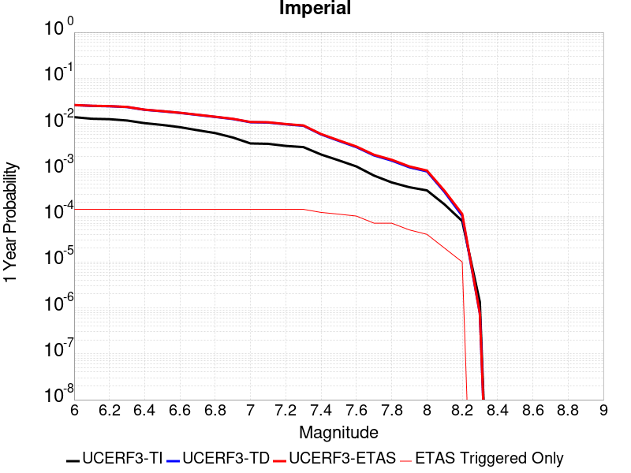 |  |

| Magnitude | 1 wk TI Prob | 1 wk TD Prob | 1 wk ETAS Prob | 1 wk ETAS/TD Gain | 1 wk ETAS Triggered Only | 1 mo TI Prob | 1 mo TD Prob | 1 mo ETAS Prob | 1 mo ETAS/TD Gain | 1 mo ETAS Triggered Only | 1 yr TI Prob | 1 yr TD Prob | 1 yr ETAS Prob | 1 yr ETAS/TD Gain | 1 yr ETAS Triggered Only | 10 yr TI Prob | 10 yr TD Prob | 10 yr ETAS Prob | 10 yr ETAS/TD Gain | 10 yr ETAS Triggered Only |
|-----|-----|-----|-----|-----|-----|-----|-----|-----|-----|-----|-----|-----|-----|-----|-----|-----|-----|-----|-----|-----|
| 6.0 | 2.7496446E-4 | 5.055345E-4 | 5.9548905E-4 | 1.1779394 | 9.0E-5 | 0.0011778869 | 0.002164817 | 0.002274579 | 1.0507026 | 1.1E-4 | 0.0142467655 | 0.026048409 | 0.026184764 | 1.0052346 | 1.4E-4 | 0.13367249 | 0.22807029 | 0.22818609 | 1.0005077 | 1.5E-4 |
| 6.1 | 2.5356023E-4 | 4.8657708E-4 | 5.7653326E-4 | 1.1848756 | 9.0E-5 | 0.001086234 | 0.002083702 | 0.0021934728 | 1.0526806 | 1.1E-4 | 0.013144928 | 0.02507094 | 0.025207428 | 1.0054442 | 1.4E-4 | 0.123940155 | 0.21949561 | 0.21961269 | 1.0005333 | 1.5E-4 |
| 6.2 | 2.4820742E-4 | 4.775311E-4 | 5.6748814E-4 | 1.1883794 | 9.0E-5 | 0.0010633124 | 0.0020449946 | 0.0021547696 | 1.0536798 | 1.1E-4 | 0.01286919 | 0.024610676 | 0.02474723 | 1.0055486 | 1.4E-4 | 0.12148927 | 0.21600136 | 0.21611896 | 1.0005444 | 1.5E-4 |
| 6.3 | 2.3205351E-4 | 4.5892023E-4 | 5.488789E-4 | 1.1960225 | 9.0E-5 | 9.94136E-4 | 0.0019653554 | 0.0020751392 | 1.0558596 | 1.1E-4 | 0.012036599 | 0.023661187 | 0.023797873 | 1.0057769 | 1.4E-4 | 0.11405133 | 0.20793827 | 0.20805708 | 1.0005714 | 1.5E-4 |
| 6.4 | 2.0304754E-4 | 3.9878016E-4 | 4.8874423E-4 | 1.2255982 | 9.0E-5 | 8.6991355E-4 | 0.0017079529 | 0.0018177651 | 1.0642946 | 1.1E-4 | 0.010539869 | 0.020595418 | 0.020732535 | 1.0066576 | 1.4E-4 | 0.100537635 | 0.18507113 | 0.18519336 | 1.0006605 | 1.5E-4 |
| 6.5 | 1.854992E-4 | 3.6990462E-4 | 4.5987134E-4 | 1.2432159 | 9.0E-5 | 7.9475436E-4 | 0.0015843548 | 0.0016941804 | 1.0693189 | 1.1E-4 | 0.009633281 | 0.01911443 | 0.019251753 | 1.0071843 | 1.4E-4 | 0.0922623 | 0.1733039 | 0.17341964 | 1.0006678 | 1.4E-4 |
| 6.6 | 1.6586106E-4 | 3.4036173E-4 | 4.303311E-4 | 1.2643346 | 9.0E-5 | 7.106394E-4 | 0.0014578878 | 0.0015677275 | 1.0753416 | 1.1E-4 | 0.008617763 | 0.017607626 | 0.01774516 | 1.0078111 | 1.4E-4 | 0.08291132 | 0.16078055 | 0.16089803 | 1.0007308 | 1.4E-4 |
| 6.7 | 1.4224656E-4 | 3.076812E-4 | 3.9765352E-4 | 1.2924205 | 9.0E-5 | 6.094856E-4 | 0.0013179756 | 0.0014278305 | 1.0833514 | 1.1E-4 | 0.0073952693 | 0.015928522 | 0.01606629 | 1.0086492 | 1.4E-4 | 0.07153955 | 0.14648798 | 0.14660747 | 1.0008157 | 1.4E-4 |
| 6.8 | 1.2317259E-4 | 2.779231E-4 | 3.678981E-4 | 1.3237406 | 9.0E-5 | 5.2777573E-4 | 0.0011905615 | 0.0013004305 | 1.0922834 | 1.1E-4 | 0.0064067547 | 0.014400131 | 0.014538115 | 1.0095822 | 1.4E-4 | 0.06225166 | 0.13294089 | 0.13306227 | 1.0009131 | 1.4E-4 |
| 6.9 | 9.859898E-5 | 2.5015484E-4 | 3.401323E-4 | 1.3596872 | 9.0E-5 | 4.2249862E-4 | 0.0010716559 | 0.001181538 | 1.1025349 | 1.1E-4 | 0.0051317946 | 0.012970319 | 0.013108503 | 1.0106539 | 1.4E-4 | 0.05014893 | 0.119408876 | 0.11953215 | 1.0010325 | 1.4E-4 |
| 7.0 | 7.3191884E-5 | 2.1267848E-4 | 3.0265935E-4 | 1.423084 | 9.0E-5 | 3.136418E-4 | 9.11164E-4 | 0.0010210638 | 1.1206146 | 1.1E-4 | 0.003811904 | 0.011037681 | 0.011176135 | 1.0125438 | 1.4E-4 | 0.037471764 | 0.10206756 | 0.10219327 | 1.0012317 | 1.4E-4 |
| 7.1 | 7.1760296E-5 | 2.0969207E-4 | 2.996732E-4 | 1.4291108 | 9.0E-5 | 3.0750787E-4 | 8.9837395E-4 | 0.0010082752 | 1.1223334 | 1.1E-4 | 0.003737482 | 0.010883528 | 0.011022004 | 1.0127234 | 1.4E-4 | 0.03675245 | 0.10070406 | 0.10082997 | 1.0012503 | 1.4E-4 |
| 7.2 | 6.46614E-5 | 1.9137723E-4 | 2.8136E-4 | 1.4701854 | 9.0E-5 | 2.7709085E-4 | 8.199333E-4 | 9.2984317E-4 | 1.1340473 | 1.1E-4 | 0.0033683628 | 0.009937617 | 0.010076226 | 1.0139478 | 1.4E-4 | 0.033177625 | 0.092511006 | 0.09263805 | 1.0013733 | 1.4E-4 |
| 7.3 | 6.088115E-5 | 1.780939E-4 | 2.6807789E-4 | 1.5052614 | 9.0E-5 | 2.6089314E-4 | 7.6303916E-4 | 8.7295525E-4 | 1.1440504 | 1.1E-4 | 0.0031717476 | 0.009251006 | 0.009389711 | 1.0149935 | 1.4E-4 | 0.031268585 | 0.08656135 | 0.086689234 | 1.0014774 | 1.4E-4 |
| 7.4 | 4.199346E-5 | 1.1511097E-4 | 1.8510291E-4 | 1.6080389 | 7.0E-5 | 1.7995955E-4 | 4.932403E-4 | 5.8319594E-4 | 1.1823769 | 9.0E-5 | 0.0021888057 | 0.005988835 | 0.0061081164 | 1.0199172 | 1.2E-4 | 0.02167372 | 0.05744024 | 0.057553347 | 1.0019691 | 1.2E-4 |
| 7.5 | 3.130448E-5 | 8.333871E-5 | 1.4333372E-4 | 1.7198936 | 6.0E-5 | 1.3415517E-4 | 3.5711733E-4 | 4.3708878E-4 | 1.223936 | 8.0E-5 | 0.0016321153 | 0.0043392954 | 0.004448818 | 1.0252397 | 1.1E-4 | 0.016201803 | 0.042133506 | 0.042238872 | 1.0025008 | 1.1E-4 |
| 7.6 | 2.3074248E-5 | 6.0849357E-5 | 1.208457E-4 | 1.9859817 | 6.0E-5 | 9.888588E-5 | 2.6075702E-4 | 3.4073615E-4 | 1.3067191 | 8.0E-5 | 0.0012032706 | 0.0031701182 | 0.0032698014 | 1.0314445 | 1.0E-4 | 0.011967761 | 0.03102816 | 0.031125057 | 1.0031229 | 1.0E-4 |
| 7.7 | 1.45864815E-5 | 4.0128452E-5 | 8.012685E-5 | 1.9967589 | 4.0E-5 | 6.2511994E-5 | 1.7196777E-4 | 2.3195746E-4 | 1.3488426 | 6.0E-5 | 7.608177E-4 | 0.0020917025 | 0.0021615562 | 1.0333955 | 7.0E-5 | 0.007582182 | 0.02062909 | 0.020697646 | 1.0033233 | 7.0E-5 |
| 7.8 | 1.0352979E-5 | 3.096395E-5 | 7.096271E-5 | 2.2917848 | 4.0E-5 | 4.4369157E-5 | 1.326959E-4 | 1.9268795E-4 | 1.4521017 | 6.0E-5 | 5.400606E-4 | 0.0016143778 | 0.0016842647 | 1.0432904 | 7.0E-5 | 0.0053875 | 0.016017893 | 0.016086772 | 1.0043001 | 7.0E-5 |
| 7.9 | 8.137906E-6 | 2.2151205E-5 | 4.215076E-5 | 1.9028654 | 2.0E-5 | 3.4876273E-5 | 9.493029E-5 | 1.349265E-4 | 1.4213219 | 4.0E-5 | 4.2453592E-4 | 0.0011551644 | 0.0012051067 | 1.0432339 | 5.0E-5 | 0.004237258 | 0.011618842 | 0.011668261 | 1.0042534 | 5.0E-5 |
| 8.0 | 6.93792E-6 | 1.8010365E-5 | 3.8010006E-5 | 2.1104517 | 2.0E-5 | 2.9733603E-5 | 7.7185E-5 | 1.07182685E-4 | 1.3886465 | 3.0E-5 | 3.6194647E-4 | 9.3932304E-4 | 9.792855E-4 | 1.0425439 | 4.0E-5 | 0.0036135751 | 0.009502415 | 0.009542035 | 1.0041695 | 4.0E-5 |
| 8.1 | 3.4286315E-6 | 6.380179E-6 | 1.6380116E-5 | 2.5673442 | 1.0E-5 | 1.4694053E-5 | 2.734334E-5 | 4.7342794E-5 | 1.7314196 | 2.0E-5 | 1.7888541E-4 | 3.3285443E-4 | 3.5284777E-4 | 1.0600663 | 2.0E-5 | 0.0017874148 | 0.0034863674 | 0.0035062977 | 1.0057167 | 2.0E-5 |
| 8.2 | 1.4906886E-6 | 1.936633E-6 | 1.1936613E-5 | 6.163591 | 1.0E-5 | 6.3886496E-6 | 8.2998295E-6 | 1.8299746E-5 | 2.204834 | 1.0E-5 | 7.7779034E-5 | 1.0104576E-4 | 1.11044756E-4 | 1.098955 | 1.0E-5 | 7.775182E-4 | 0.0011075423 | 0.0011175312 | 1.009019 | 1.0E-5 |
| 8.3 | 2.5758007E-8 | 1.4495866E-8 | 1.4495866E-8 | 1.0 | 0.0 | 1.10391454E-7 | 6.212514E-8 | 6.212514E-8 | 1.0 | 0.0 | 1.3440151E-6 | 7.563736E-7 | 7.563736E-7 | 1.0 | 0.0 | 1.344007E-5 | 7.884359E-6 | 7.884359E-6 | 1.0 | 0.0 |

## Mission Creek
*[(top)](#table-of-contents)*

| 1 Week | 1 Month | 1 Year | 10 Year |
|-----|-----|-----|-----|
|  |  |  |  |

| Magnitude | 1 wk TI Prob | 1 wk TD Prob | 1 wk ETAS Prob | 1 wk ETAS/TD Gain | 1 wk ETAS Triggered Only | 1 mo TI Prob | 1 mo TD Prob | 1 mo ETAS Prob | 1 mo ETAS/TD Gain | 1 mo ETAS Triggered Only | 1 yr TI Prob | 1 yr TD Prob | 1 yr ETAS Prob | 1 yr ETAS/TD Gain | 1 yr ETAS Triggered Only | 10 yr TI Prob | 10 yr TD Prob | 10 yr ETAS Prob | 10 yr ETAS/TD Gain | 10 yr ETAS Triggered Only |
|-----|-----|-----|-----|-----|-----|-----|-----|-----|-----|-----|-----|-----|-----|-----|-----|-----|-----|-----|-----|-----|
| 6.0 | 1.1549387E-5 | 1.6322783E-5 | 7.6321805E-5 | 4.675784 | 6.0E-5 | 4.9496433E-5 | 6.995299E-5 | 1.69946E-4 | 2.4294314 | 1.0E-4 | 6.0245243E-4 | 8.5135986E-4 | 9.912407E-4 | 1.1643028 | 1.4E-4 | 0.006008218 | 0.008510157 | 0.0086489655 | 1.0163109 | 1.4E-4 |
| 6.1 | 1.1549387E-5 | 1.6322783E-5 | 7.6321805E-5 | 4.675784 | 6.0E-5 | 4.9496433E-5 | 6.995299E-5 | 1.69946E-4 | 2.4294314 | 1.0E-4 | 6.0245243E-4 | 8.5135986E-4 | 9.912407E-4 | 1.1643028 | 1.4E-4 | 0.006008218 | 0.008510157 | 0.0086489655 | 1.0163109 | 1.4E-4 |
| 6.2 | 1.1549387E-5 | 1.6322783E-5 | 7.6321805E-5 | 4.675784 | 6.0E-5 | 4.9496433E-5 | 6.995299E-5 | 1.69946E-4 | 2.4294314 | 1.0E-4 | 6.0245243E-4 | 8.5135986E-4 | 9.912407E-4 | 1.1643028 | 1.4E-4 | 0.006008218 | 0.008510157 | 0.0086489655 | 1.0163109 | 1.4E-4 |
| 6.3 | 1.1549387E-5 | 1.6322783E-5 | 7.6321805E-5 | 4.675784 | 6.0E-5 | 4.9496433E-5 | 6.995299E-5 | 1.69946E-4 | 2.4294314 | 1.0E-4 | 6.0245243E-4 | 8.5135986E-4 | 9.912407E-4 | 1.1643028 | 1.4E-4 | 0.006008218 | 0.008510157 | 0.0086489655 | 1.0163109 | 1.4E-4 |
| 6.4 | 1.1549387E-5 | 1.6322783E-5 | 7.6321805E-5 | 4.675784 | 6.0E-5 | 4.9496433E-5 | 6.995299E-5 | 1.69946E-4 | 2.4294314 | 1.0E-4 | 6.0245243E-4 | 8.5135986E-4 | 9.912407E-4 | 1.1643028 | 1.4E-4 | 0.006008218 | 0.008510157 | 0.0086489655 | 1.0163109 | 1.4E-4 |
| 6.5 | 1.1549387E-5 | 1.6322783E-5 | 7.6321805E-5 | 4.675784 | 6.0E-5 | 4.9496433E-5 | 6.995299E-5 | 1.69946E-4 | 2.4294314 | 1.0E-4 | 6.0245243E-4 | 8.5135986E-4 | 9.912407E-4 | 1.1643028 | 1.4E-4 | 0.006008218 | 0.008510157 | 0.0086489655 | 1.0163109 | 1.4E-4 |
| 6.6 | 9.202681E-6 | 1.3846059E-5 | 7.384523E-5 | 5.333303 | 6.0E-5 | 3.9439463E-5 | 5.9338956E-5 | 1.4933362E-4 | 2.5166202 | 9.0E-5 | 4.800697E-4 | 7.2222133E-4 | 8.4213464E-4 | 1.1660341 | 1.2E-4 | 0.004790339 | 0.0072273402 | 0.0073464727 | 1.0164837 | 1.2E-4 |
| 6.7 | 9.019164E-6 | 1.3651728E-5 | 7.365091E-5 | 5.394988 | 6.0E-5 | 3.8652986E-5 | 5.8506146E-5 | 1.4850088E-4 | 2.53821 | 9.0E-5 | 4.7049852E-4 | 7.1208854E-4 | 8.320031E-4 | 1.1683984 | 1.2E-4 | 0.004695036 | 0.0071266647 | 0.0072458093 | 1.0167181 | 1.2E-4 |
| 6.8 | 8.673558E-6 | 1.3273839E-5 | 7.327304E-5 | 5.520109 | 6.0E-5 | 3.717186E-5 | 5.688669E-5 | 1.4688158E-4 | 2.5820024 | 9.0E-5 | 4.524734E-4 | 6.923842E-4 | 8.123011E-4 | 1.1731942 | 1.2E-4 | 0.0045155324 | 0.0069308523 | 0.0070500206 | 1.0171939 | 1.2E-4 |
| 6.9 | 7.002255E-6 | 1.1478069E-5 | 7.147738E-5 | 6.2273006 | 6.0E-5 | 3.000932E-5 | 4.9190832E-5 | 1.391864E-4 | 2.8295193 | 9.0E-5 | 3.653022E-4 | 5.9874065E-4 | 7.186688E-4 | 1.2003007 | 1.2E-4 | 0.0036470229 | 0.005999676 | 0.0061189556 | 1.0198811 | 1.2E-4 |
| 7.0 | 5.84644E-6 | 9.675359E-6 | 6.967478E-5 | 7.20126 | 6.0E-5 | 2.5055931E-5 | 4.146519E-5 | 1.3146146E-4 | 3.1704051 | 9.0E-5 | 3.0501327E-4 | 5.047263E-4 | 6.2466576E-4 | 1.2376326 | 1.2E-4 | 0.0030459496 | 0.005063994 | 0.005183386 | 1.0235767 | 1.2E-4 |
| 7.1 | 5.54703E-6 | 9.329834E-6 | 6.9329275E-5 | 7.4309225 | 6.0E-5 | 2.377277E-5 | 3.9984414E-5 | 1.2998082E-4 | 3.250787 | 9.0E-5 | 2.8939504E-4 | 4.8670598E-4 | 6.066476E-4 | 1.2464354 | 1.2E-4 | 0.0028901845 | 0.0048845876 | 0.0050040013 | 1.0244471 | 1.2E-4 |
| 7.2 | 4.384709E-6 | 7.681918E-6 | 6.768146E-5 | 8.81049 | 6.0E-5 | 1.8791474E-5 | 3.292211E-5 | 1.2291914E-4 | 3.7336352 | 9.0E-5 | 2.2876218E-4 | 4.0075663E-4 | 5.2070856E-4 | 1.2993135 | 1.2E-4 | 0.0022852682 | 0.004028542 | 0.0041480586 | 1.0296675 | 1.2E-4 |
| 7.3 | 3.7888456E-6 | 6.915788E-6 | 6.6915374E-5 | 9.67574 | 6.0E-5 | 1.623781E-5 | 2.9638775E-5 | 1.19636105E-4 | 4.036473 | 9.0E-5 | 1.9767738E-4 | 3.6079568E-4 | 4.8075238E-4 | 1.3324782 | 1.2E-4 | 0.0019750162 | 0.00363027 | 0.0037498344 | 1.0329354 | 1.2E-4 |
| 7.4 | 2.1982462E-6 | 5.0241033E-6 | 6.50238E-5 | 12.942369 | 6.0E-5 | 9.421021E-6 | 2.1531694E-5 | 1.1152976E-4 | 5.179795 | 9.0E-5 | 1.1469489E-4 | 2.6211704E-4 | 3.8208556E-4 | 1.4576907 | 1.2E-4 | 0.0011463572 | 0.0026460327 | 0.0027657151 | 1.0452309 | 1.2E-4 |
| 7.5 | 2.051923E-6 | 4.6153277E-6 | 6.461505E-5 | 14.000101 | 6.0E-5 | 8.793926E-6 | 1.9779825E-5 | 1.0977805E-4 | 5.5500007 | 9.0E-5 | 1.0706078E-4 | 2.4079291E-4 | 3.60764E-4 | 1.4982336 | 1.2E-4 | 0.0010700922 | 0.0024335932 | 0.002553301 | 1.0491898 | 1.2E-4 |
| 7.6 | 1.8733427E-6 | 4.1236603E-6 | 6.4123415E-5 | 15.550119 | 6.0E-5 | 8.028587E-6 | 1.7672712E-5 | 1.0767112E-4 | 6.092507 | 9.0E-5 | 9.774366E-5 | 2.151441E-4 | 3.351183E-4 | 1.5576457 | 1.2E-4 | 9.770069E-4 | 0.0021782513 | 0.0022979898 | 1.05497 | 1.2E-4 |
| 7.7 | 1.8411953E-6 | 4.0433315E-6 | 6.404309E-5 | 15.839188 | 6.0E-5 | 7.890813E-6 | 1.732845E-5 | 1.0732689E-4 | 6.1936812 | 9.0E-5 | 9.606641E-5 | 2.1095353E-4 | 3.3092822E-4 | 1.5687257 | 1.2E-4 | 9.6024893E-4 | 0.0021365292 | 0.0022562726 | 1.0560459 | 1.2E-4 |
| 7.8 | 1.7194251E-6 | 3.71068E-6 | 6.371046E-5 | 17.169483 | 6.0E-5 | 7.368944E-6 | 1.5902819E-5 | 1.0590139E-4 | 6.6592846 | 9.0E-5 | 8.97132E-5 | 1.9359968E-4 | 3.1357646E-4 | 1.6197157 | 1.2E-4 | 8.967699E-4 | 0.0019624757 | 0.00208224 | 1.0610273 | 1.2E-4 |
| 7.9 | 1.4035052E-6 | 2.9502596E-6 | 6.295008E-5 | 21.337133 | 6.0E-5 | 6.0150082E-6 | 1.2643909E-5 | 1.0264277E-4 | 8.117962 | 9.0E-5 | 7.3230265E-5 | 1.5392878E-4 | 2.7391032E-4 | 1.7794613 | 1.2E-4 | 7.3206134E-4 | 0.0015631174 | 0.0016829298 | 1.0766497 | 1.2E-4 |
| 8.0 | 3.9318823E-7 | 5.528477E-7 | 5.528477E-7 | 1.0 | 0.0 | 1.6850913E-6 | 2.3693453E-6 | 2.3693453E-6 | 1.0 | 0.0 | 2.0515794E-5 | 2.8846403E-5 | 3.8846116E-5 | 1.3466537 | 1.0E-5 | 2.0513899E-4 | 2.990952E-4 | 3.0909223E-4 | 1.0334241 | 1.0E-5 |
| 8.1 | 1.596793E-7 | 1.13775044E-7 | 1.13775044E-7 | 1.0 | 0.0 | 6.8433974E-7 | 4.876072E-7 | 4.876072E-7 | 1.0 | 0.0 | 8.331805E-6 | 5.936602E-6 | 5.936602E-6 | 1.0 | 0.0 | 8.331492E-5 | 6.5494125E-5 | 6.5494125E-5 | 1.0 | 0.0 |
| 8.2 | 4.9003038E-8 | 2.5435753E-8 | 2.5435753E-8 | 1.0 | 0.0 | 2.10013E-7 | 1.09010365E-7 | 1.09010365E-7 | 1.0 | 0.0 | 2.5569052E-6 | 1.3272004E-6 | 1.3272004E-6 | 1.0 | 0.0 | 2.556876E-5 | 1.4952613E-5 | 1.4952613E-5 | 1.0 | 0.0 |

## White Mountains
*[(top)](#table-of-contents)*

| 1 Week | 1 Month | 1 Year | 10 Year |
|-----|-----|-----|-----|
|  |  |  |  |

| Magnitude | 1 wk TI Prob | 1 wk TD Prob | 1 wk ETAS Prob | 1 wk ETAS/TD Gain | 1 wk ETAS Triggered Only | 1 mo TI Prob | 1 mo TD Prob | 1 mo ETAS Prob | 1 mo ETAS/TD Gain | 1 mo ETAS Triggered Only | 1 yr TI Prob | 1 yr TD Prob | 1 yr ETAS Prob | 1 yr ETAS/TD Gain | 1 yr ETAS Triggered Only | 10 yr TI Prob | 10 yr TD Prob | 10 yr ETAS Prob | 10 yr ETAS/TD Gain | 10 yr ETAS Triggered Only |
|-----|-----|-----|-----|-----|-----|-----|-----|-----|-----|-----|-----|-----|-----|-----|-----|-----|-----|-----|-----|-----|
| 6.0 | 3.503579E-5 | 3.3784127E-5 | 1.0378176E-4 | 3.0719092 | 7.0E-5 | 1.5014476E-4 | 1.4478175E-4 | 2.2477016E-4 | 1.5524758 | 8.0E-5 | 0.0018264796 | 0.0017614134 | 0.0018812021 | 1.0680071 | 1.2E-4 | 0.018115403 | 0.017486857 | 0.017634233 | 1.0084279 | 1.5E-4 |
| 6.1 | 3.503579E-5 | 3.3784127E-5 | 1.0378176E-4 | 3.0719092 | 7.0E-5 | 1.5014476E-4 | 1.4478175E-4 | 2.2477016E-4 | 1.5524758 | 8.0E-5 | 0.0018264796 | 0.0017614134 | 0.0018812021 | 1.0680071 | 1.2E-4 | 0.018115403 | 0.017486857 | 0.017634233 | 1.0084279 | 1.5E-4 |
| 6.2 | 3.503579E-5 | 3.3784127E-5 | 1.0378176E-4 | 3.0719092 | 7.0E-5 | 1.5014476E-4 | 1.4478175E-4 | 2.2477016E-4 | 1.5524758 | 8.0E-5 | 0.0018264796 | 0.0017614134 | 0.0018812021 | 1.0680071 | 1.2E-4 | 0.018115403 | 0.017486857 | 0.017634233 | 1.0084279 | 1.5E-4 |
| 6.3 | 1.7818425E-5 | 1.591616E-5 | 5.5915523E-5 | 3.5131292 | 4.0E-5 | 7.636245E-5 | 6.821041E-5 | 1.0820768E-4 | 1.5863807 | 4.0E-5 | 9.293162E-4 | 8.301596E-4 | 8.8011805E-4 | 1.0601794 | 5.0E-5 | 0.009254395 | 0.0082720425 | 0.008341463 | 1.0083922 | 7.0E-5 |
| 6.4 | 1.7818425E-5 | 1.591616E-5 | 5.5915523E-5 | 3.5131292 | 4.0E-5 | 7.636245E-5 | 6.821041E-5 | 1.0820768E-4 | 1.5863807 | 4.0E-5 | 9.293162E-4 | 8.301596E-4 | 8.8011805E-4 | 1.0601794 | 5.0E-5 | 0.009254395 | 0.0082720425 | 0.008341463 | 1.0083922 | 7.0E-5 |
| 6.5 | 1.3397557E-5 | 1.1336374E-5 | 3.133615E-5 | 2.7642126 | 2.0E-5 | 5.741684E-5 | 4.8583595E-5 | 6.858262E-5 | 1.4116416 | 2.0E-5 | 6.988258E-4 | 5.913517E-4 | 6.2133395E-4 | 1.0507013 | 3.0E-5 | 0.006966323 | 0.005898487 | 0.0059283096 | 1.005056 | 3.0E-5 |
| 6.6 | 1.0818695E-5 | 8.625434E-6 | 1.8625347E-5 | 2.1593518 | 1.0E-5 | 4.6365014E-5 | 3.6965648E-5 | 4.6965277E-5 | 1.2705114 | 1.0E-5 | 5.6434784E-4 | 4.4996818E-4 | 4.6995917E-4 | 1.0444276 | 2.0E-5 | 0.005629168 | 0.0044910074 | 0.0045109177 | 1.0044334 | 2.0E-5 |
| 6.7 | 9.067908E-6 | 6.802476E-6 | 1.6802407E-5 | 2.470043 | 1.0E-5 | 3.8861883E-5 | 2.915316E-5 | 3.915287E-5 | 1.343006 | 1.0E-5 | 4.7304068E-4 | 3.548851E-4 | 3.6488156E-4 | 1.0281681 | 1.0E-5 | 0.00472035 | 0.003543501 | 0.0035534655 | 1.002812 | 1.0E-5 |
| 6.8 | 7.295947E-6 | 4.9364285E-6 | 4.9364285E-6 | 1.0 | 0.0 | 3.126797E-5 | 2.1155956E-5 | 2.1155956E-5 | 1.0 | 0.0 | 3.8062103E-4 | 2.5754445E-4 | 2.5754445E-4 | 1.0 | 0.0 | 0.0037996976 | 0.0025725728 | 0.0025725728 | 1.0 | 0.0 |
| 6.9 | 6.2243444E-6 | 3.8322546E-6 | 3.8322546E-6 | 1.0 | 0.0 | 2.6675489E-5 | 1.6423846E-5 | 1.6423846E-5 | 1.0 | 0.0 | 3.2472567E-4 | 1.9994251E-4 | 1.9994251E-4 | 1.0 | 0.0 | 0.0032425157 | 0.001997679 | 0.001997679 | 1.0 | 0.0 |
| 7.0 | 4.9878413E-6 | 2.679564E-6 | 2.679564E-6 | 1.0 | 0.0 | 2.1376287E-5 | 1.1483797E-5 | 1.1483797E-5 | 1.0 | 0.0 | 2.602252E-4 | 1.3980652E-4 | 1.3980652E-4 | 1.0 | 0.0 | 0.002599207 | 0.0013972119 | 0.0013972119 | 1.0 | 0.0 |
| 7.1 | 4.0252844E-6 | 1.885702E-6 | 1.885702E-6 | 1.0 | 0.0 | 1.7251105E-5 | 8.081555E-6 | 8.081555E-6 | 1.0 | 0.0 | 2.1001195E-4 | 9.838863E-5 | 9.838863E-5 | 1.0 | 0.0 | 0.0020981359 | 9.834635E-4 | 9.834635E-4 | 1.0 | 0.0 |
| 7.2 | 3.3284066E-6 | 1.2818929E-6 | 1.2818929E-6 | 1.0 | 0.0 | 1.4264522E-5 | 5.4938155E-6 | 5.4938155E-6 | 1.0 | 0.0 | 1.736567E-4 | 6.688525E-5 | 6.688525E-5 | 1.0 | 0.0 | 0.0017352107 | 6.6866126E-4 | 6.6866126E-4 | 1.0 | 0.0 |
| 7.3 | 2.458226E-6 | 6.056684E-7 | 6.056684E-7 | 1.0 | 0.0 | 1.0535211E-5 | 2.5957193E-6 | 2.5957193E-6 | 1.0 | 0.0 | 1.2825865E-4 | 3.160246E-5 | 3.160246E-5 | 1.0 | 0.0 | 0.0012818464 | 3.1598343E-4 | 3.1598343E-4 | 1.0 | 0.0 |
| 7.4 | 1.965953E-6 | 3.1084684E-7 | 3.1084684E-7 | 1.0 | 0.0 | 8.425486E-6 | 1.3322001E-6 | 1.3322001E-6 | 1.0 | 0.0 | 1.0257547E-4 | 1.6219417E-5 | 1.6219417E-5 | 1.0 | 0.0 | 0.0010252813 | 1.6218246E-4 | 1.6218246E-4 | 1.0 | 0.0 |
| 7.5 | 1.2014192E-6 | 1.8241002E-7 | 1.8241002E-7 | 1.0 | 0.0 | 5.148929E-6 | 7.8175697E-7 | 7.8175697E-7 | 1.0 | 0.0 | 6.2686406E-5 | 9.51785E-6 | 9.51785E-6 | 1.0 | 0.0 | 6.266873E-4 | 9.517451E-5 | 9.517451E-5 | 1.0 | 0.0 |
| 7.6 | 2.5612175E-7 | 4.893784E-8 | 4.893784E-8 | 1.0 | 0.0 | 1.0976642E-6 | 2.0973359E-7 | 2.0973359E-7 | 1.0 | 0.0 | 1.3363979E-5 | 2.5535037E-6 | 2.5535037E-6 | 1.0 | 0.0 | 1.3363175E-4 | 2.553478E-5 | 2.553478E-5 | 1.0 | 0.0 |

## Pinto Mtn
*[(top)](#table-of-contents)*

| 1 Week | 1 Month | 1 Year | 10 Year |
|-----|-----|-----|-----|
|  |  |  |  |

| Magnitude | 1 wk TI Prob | 1 wk TD Prob | 1 wk ETAS Prob | 1 wk ETAS/TD Gain | 1 wk ETAS Triggered Only | 1 mo TI Prob | 1 mo TD Prob | 1 mo ETAS Prob | 1 mo ETAS/TD Gain | 1 mo ETAS Triggered Only | 1 yr TI Prob | 1 yr TD Prob | 1 yr ETAS Prob | 1 yr ETAS/TD Gain | 1 yr ETAS Triggered Only | 10 yr TI Prob | 10 yr TD Prob | 10 yr ETAS Prob | 10 yr ETAS/TD Gain | 10 yr ETAS Triggered Only |
|-----|-----|-----|-----|-----|-----|-----|-----|-----|-----|-----|-----|-----|-----|-----|-----|-----|-----|-----|-----|-----|
| 6.0 | 4.4194956E-5 | 4.7853926E-5 | 1.278501E-4 | 2.6716743 | 8.0E-5 | 1.893932E-4 | 2.0507304E-4 | 3.2504843E-4 | 1.5850374 | 1.2E-4 | 0.0023034236 | 0.0024940688 | 0.0026337195 | 1.0559932 | 1.4E-4 | 0.022796938 | 0.024678305 | 0.024824603 | 1.0059282 | 1.5E-4 |
| 6.1 | 4.4194956E-5 | 4.7853926E-5 | 1.278501E-4 | 2.6716743 | 8.0E-5 | 1.893932E-4 | 2.0507304E-4 | 3.2504843E-4 | 1.5850374 | 1.2E-4 | 0.0023034236 | 0.0024940688 | 0.0026337195 | 1.0559932 | 1.4E-4 | 0.022796938 | 0.024678305 | 0.024824603 | 1.0059282 | 1.5E-4 |
| 6.2 | 4.4194956E-5 | 4.7853926E-5 | 1.278501E-4 | 2.6716743 | 8.0E-5 | 1.893932E-4 | 2.0507304E-4 | 3.2504843E-4 | 1.5850374 | 1.2E-4 | 0.0023034236 | 0.0024940688 | 0.0026337195 | 1.0559932 | 1.4E-4 | 0.022796938 | 0.024678305 | 0.024824603 | 1.0059282 | 1.5E-4 |
| 6.3 | 4.4194956E-5 | 4.7853926E-5 | 1.278501E-4 | 2.6716743 | 8.0E-5 | 1.893932E-4 | 2.0507304E-4 | 3.2504843E-4 | 1.5850374 | 1.2E-4 | 0.0023034236 | 0.0024940688 | 0.0026337195 | 1.0559932 | 1.4E-4 | 0.022796938 | 0.024678305 | 0.024824603 | 1.0059282 | 1.5E-4 |
| 6.4 | 3.729929E-5 | 3.960349E-5 | 1.0960072E-4 | 2.767451 | 7.0E-5 | 1.5984432E-4 | 1.6971873E-4 | 2.6970176E-4 | 1.5891101 | 1.0E-4 | 0.0019443673 | 0.0020644604 | 0.0021842127 | 1.0580065 | 1.2E-4 | 0.019274427 | 0.020462848 | 0.020590188 | 1.006223 | 1.3E-4 |
| 6.5 | 3.729929E-5 | 3.960349E-5 | 1.0960072E-4 | 2.767451 | 7.0E-5 | 1.5984432E-4 | 1.6971873E-4 | 2.6970176E-4 | 1.5891101 | 1.0E-4 | 0.0019443673 | 0.0020644604 | 0.0021842127 | 1.0580065 | 1.2E-4 | 0.019274427 | 0.020462848 | 0.020590188 | 1.006223 | 1.3E-4 |
| 6.6 | 3.0204548E-5 | 3.12056E-5 | 9.120373E-5 | 2.9226718 | 6.0E-5 | 1.2944164E-4 | 1.3373162E-4 | 2.0372227E-4 | 1.5233663 | 7.0E-5 | 0.0015748127 | 0.0016270012 | 0.0017068711 | 1.0490903 | 8.0E-5 | 0.015636992 | 0.016154764 | 0.016233472 | 1.0048721 | 8.0E-5 |
| 6.7 | 2.9857754E-5 | 3.0814987E-5 | 9.081313E-5 | 2.9470446 | 6.0E-5 | 1.2795553E-4 | 1.3205773E-4 | 2.0204848E-4 | 1.5300012 | 7.0E-5 | 0.0015567453 | 0.0016066517 | 0.0016865232 | 1.049713 | 8.0E-5 | 0.015458848 | 0.015954204 | 0.016032929 | 1.0049343 | 8.0E-5 |
| 6.8 | 2.4819734E-5 | 2.5009665E-5 | 7.5008415E-5 | 2.999177 | 5.0E-5 | 1.0636595E-4 | 1.0718E-4 | 1.6717357E-4 | 1.5597459 | 6.0E-5 | 0.0012942362 | 0.001304157 | 0.0013740658 | 1.0536045 | 7.0E-5 | 0.012867244 | 0.012967403 | 0.013036495 | 1.0053282 | 7.0E-5 |
| 6.9 | 2.331124E-5 | 2.3337945E-5 | 7.333678E-5 | 3.1423836 | 5.0E-5 | 9.990149E-5 | 1.0001605E-4 | 1.6001005E-4 | 1.5998437 | 6.0E-5 | 0.001215622 | 0.0012170355 | 0.0012869503 | 1.0574468 | 7.0E-5 | 0.012089936 | 0.012105897 | 0.01217505 | 1.0057123 | 7.0E-5 |
| 7.0 | 2.1818534E-5 | 2.1761074E-5 | 5.176042E-5 | 2.3785784 | 3.0E-5 | 9.3504656E-5 | 9.3258524E-5 | 1.2325573E-4 | 1.3216565 | 3.0E-5 | 0.0011378246 | 0.0011348509 | 0.0011748056 | 1.0352069 | 4.0E-5 | 0.011320163 | 0.01129266 | 0.011332207 | 1.0035021 | 4.0E-5 |
| 7.1 | 2.066081E-5 | 2.0540718E-5 | 5.05401E-5 | 2.4604838 | 3.0E-5 | 8.854332E-5 | 8.8028784E-5 | 1.18026146E-4 | 1.3407676 | 3.0E-5 | 0.0010774818 | 0.0010712431 | 0.0011112003 | 1.0372998 | 4.0E-5 | 0.010722724 | 0.0106628435 | 0.010702417 | 1.0037113 | 4.0E-5 |
| 7.2 | 1.8990233E-5 | 1.9054001E-5 | 4.905343E-5 | 2.5744424 | 3.0E-5 | 8.138417E-5 | 8.165756E-5 | 1.11655114E-4 | 1.3673579 | 3.0E-5 | 9.904018E-4 | 9.937467E-4 | 0.0010337069 | 1.0402117 | 4.0E-5 | 0.009859995 | 0.009895029 | 0.009934633 | 1.0040025 | 4.0E-5 |
| 7.3 | 1.3335872E-5 | 1.4906713E-5 | 4.4906265E-5 | 3.0124862 | 3.0E-5 | 5.7152483E-5 | 6.388442E-5 | 9.38825E-5 | 1.4695681 | 3.0E-5 | 6.956093E-4 | 7.77528E-4 | 8.174969E-4 | 1.0514051 | 4.0E-5 | 0.006934359 | 0.007749376 | 0.0077890656 | 1.0051217 | 4.0E-5 |
| 7.4 | 9.414066E-6 | 1.186096E-5 | 3.1860724E-5 | 2.6861842 | 2.0E-5 | 4.0345374E-5 | 5.083175E-5 | 7.0830734E-5 | 1.3934349 | 2.0E-5 | 4.910942E-4 | 6.1871024E-4 | 6.4869167E-4 | 1.048458 | 3.0E-5 | 0.0049001034 | 0.0061708256 | 0.0062006405 | 1.0048316 | 3.0E-5 |
| 7.5 | 7.2101157E-6 | 9.158192E-6 | 1.91581E-5 | 2.0919085 | 1.0E-5 | 3.090013E-5 | 3.9248847E-5 | 4.9248454E-5 | 1.2547746 | 1.0E-5 | 3.7614413E-4 | 4.7775774E-4 | 4.977482E-4 | 1.0418422 | 2.0E-5 | 0.0037550807 | 0.004768082 | 0.0047879866 | 1.0041746 | 2.0E-5 |
| 7.6 | 3.296375E-6 | 4.5455017E-6 | 4.5455017E-6 | 1.0 | 0.0 | 1.4127245E-5 | 1.9480583E-5 | 1.9480583E-5 | 1.0 | 0.0 | 1.7198564E-4 | 2.3715167E-4 | 2.3715167E-4 | 1.0 | 0.0 | 0.0017185259 | 0.0023691233 | 0.0023691233 | 1.0 | 0.0 |
| 7.7 | 2.5741092E-6 | 3.5844084E-6 | 3.5844084E-6 | 1.0 | 0.0 | 1.103185E-5 | 1.5361667E-5 | 1.5361667E-5 | 1.0 | 0.0 | 1.3430449E-4 | 1.8701357E-4 | 1.8701357E-4 | 1.0 | 0.0 | 0.0013422335 | 0.0018686918 | 0.0018686918 | 1.0 | 0.0 |

## San Jacinto (Coyote Creek)
*[(top)](#table-of-contents)*

| 1 Week | 1 Month | 1 Year | 10 Year |
|-----|-----|-----|-----|
|  |  |  |  |

| Magnitude | 1 wk TI Prob | 1 wk TD Prob | 1 wk ETAS Prob | 1 wk ETAS/TD Gain | 1 wk ETAS Triggered Only | 1 mo TI Prob | 1 mo TD Prob | 1 mo ETAS Prob | 1 mo ETAS/TD Gain | 1 mo ETAS Triggered Only | 1 yr TI Prob | 1 yr TD Prob | 1 yr ETAS Prob | 1 yr ETAS/TD Gain | 1 yr ETAS Triggered Only | 10 yr TI Prob | 10 yr TD Prob | 10 yr ETAS Prob | 10 yr ETAS/TD Gain | 10 yr ETAS Triggered Only |
|-----|-----|-----|-----|-----|-----|-----|-----|-----|-----|-----|-----|-----|-----|-----|-----|-----|-----|-----|-----|-----|
| 6.0 | 2.7374346E-5 | 2.41444E-5 | 1.0414247E-4 | 4.313318 | 8.0E-5 | 1.1731335E-4 | 1.034719E-4 | 2.1346052E-4 | 2.0629804 | 1.1E-4 | 0.0014273542 | 0.001259045 | 0.0013888814 | 1.1031228 | 1.3E-4 | 0.01418221 | 0.012928195 | 0.013076256 | 1.0114526 | 1.5E-4 |
| 6.1 | 2.7374346E-5 | 2.41444E-5 | 1.0414247E-4 | 4.313318 | 8.0E-5 | 1.1731335E-4 | 1.034719E-4 | 2.1346052E-4 | 2.0629804 | 1.1E-4 | 0.0014273542 | 0.001259045 | 0.0013888814 | 1.1031228 | 1.3E-4 | 0.01418221 | 0.012928195 | 0.013076256 | 1.0114526 | 1.5E-4 |
| 6.2 | 2.7374346E-5 | 2.41444E-5 | 1.0414247E-4 | 4.313318 | 8.0E-5 | 1.1731335E-4 | 1.034719E-4 | 2.1346052E-4 | 2.0629804 | 1.1E-4 | 0.0014273542 | 0.001259045 | 0.0013888814 | 1.1031228 | 1.3E-4 | 0.01418221 | 0.012928195 | 0.013076256 | 1.0114526 | 1.5E-4 |
| 6.3 | 2.7374346E-5 | 2.41444E-5 | 1.0414247E-4 | 4.313318 | 8.0E-5 | 1.1731335E-4 | 1.034719E-4 | 2.1346052E-4 | 2.0629804 | 1.1E-4 | 0.0014273542 | 0.001259045 | 0.0013888814 | 1.1031228 | 1.3E-4 | 0.01418221 | 0.012928195 | 0.013076256 | 1.0114526 | 1.5E-4 |
| 6.4 | 2.7374346E-5 | 2.41444E-5 | 1.0414247E-4 | 4.313318 | 8.0E-5 | 1.1731335E-4 | 1.034719E-4 | 2.1346052E-4 | 2.0629804 | 1.1E-4 | 0.0014273542 | 0.001259045 | 0.0013888814 | 1.1031228 | 1.3E-4 | 0.01418221 | 0.012928195 | 0.013076256 | 1.0114526 | 1.5E-4 |
| 6.5 | 2.7282445E-5 | 2.4030476E-5 | 1.0402856E-4 | 4.3290257 | 8.0E-5 | 1.16919524E-4 | 1.0298371E-4 | 2.1297237E-4 | 2.06802 | 1.1E-4 | 0.0014225657 | 0.001253108 | 0.0013829452 | 1.1036121 | 1.3E-4 | 0.014134934 | 0.012869522 | 0.013017592 | 1.0115055 | 1.5E-4 |
| 6.6 | 2.7282445E-5 | 2.4030476E-5 | 1.0402856E-4 | 4.3290257 | 8.0E-5 | 1.16919524E-4 | 1.0298371E-4 | 2.1297237E-4 | 2.06802 | 1.1E-4 | 0.0014225657 | 0.001253108 | 0.0013829452 | 1.1036121 | 1.3E-4 | 0.014134934 | 0.012869522 | 0.013017592 | 1.0115055 | 1.5E-4 |
| 6.7 | 2.7216198E-5 | 2.3955597E-5 | 1.0395368E-4 | 4.339432 | 8.0E-5 | 1.1663563E-4 | 1.02662816E-4 | 2.1265153E-4 | 2.0713587 | 1.1E-4 | 0.0014191137 | 0.0012492058 | 0.0013790434 | 1.1039361 | 1.3E-4 | 0.014100855 | 0.012830934 | 0.012979009 | 1.0115405 | 1.5E-4 |
| 6.8 | 2.7078617E-5 | 2.3872815E-5 | 1.0387091E-4 | 4.3510118 | 8.0E-5 | 1.1604605E-4 | 1.0230807E-4 | 2.1229681E-4 | 2.075074 | 1.1E-4 | 0.001411945 | 0.0012448917 | 0.0013747298 | 1.1042968 | 1.3E-4 | 0.014030075 | 0.0127880825 | 0.012936164 | 1.0115796 | 1.5E-4 |
| 6.9 | 2.6982952E-5 | 2.3792329E-5 | 1.0379043E-4 | 4.362348 | 8.0E-5 | 1.15636096E-4 | 1.0196315E-4 | 2.1195193E-4 | 2.078711 | 1.1E-4 | 0.0014069602 | 0.0012406971 | 0.0013705358 | 1.1046498 | 1.3E-4 | 0.013980856 | 0.012746378 | 0.0128944665 | 1.011618 | 1.5E-4 |
| 7.0 | 2.6449972E-5 | 2.3369357E-5 | 1.03367485E-4 | 4.4232063 | 8.0E-5 | 1.1335209E-4 | 1.0015055E-4 | 2.1013954E-4 | 2.0982363 | 1.1E-4 | 0.001379188 | 0.0012186535 | 0.0013484951 | 1.1065451 | 1.3E-4 | 0.0137065975 | 0.012527733 | 0.012675853 | 1.0118234 | 1.5E-4 |
| 7.1 | 2.6257849E-5 | 2.3195396E-5 | 1.0319354E-4 | 4.44888 | 8.0E-5 | 1.1252879E-4 | 9.940507E-5 | 2.0939413E-4 | 2.1064734 | 1.1E-4 | 0.0013691769 | 0.0012095873 | 0.0013394301 | 1.1073446 | 1.3E-4 | 0.013607717 | 0.012437661 | 0.0125857955 | 1.0119102 | 1.5E-4 |
| 7.2 | 2.5270041E-5 | 2.2390155E-5 | 1.0238837E-4 | 4.572919 | 8.0E-5 | 1.0829568E-4 | 9.5954296E-5 | 2.0594374E-4 | 2.146269 | 1.1E-4 | 0.0013177024 | 0.0011676198 | 0.001297468 | 1.1112076 | 1.3E-4 | 0.013099162 | 0.0120187905 | 0.012166987 | 1.0123304 | 1.5E-4 |
| 7.3 | 2.339701E-5 | 2.1122027E-5 | 1.01120335E-4 | 4.787435 | 8.0E-5 | 1.0026905E-4 | 9.051985E-5 | 2.0050988E-4 | 2.2150931 | 1.1E-4 | 0.001220092 | 0.001101524 | 0.0012313807 | 1.1178883 | 1.3E-4 | 0.012134149 | 0.011357642 | 0.011505938 | 1.013057 | 1.5E-4 |
| 7.4 | 2.296333E-5 | 2.0852396E-5 | 1.00850724E-4 | 4.8364096 | 8.0E-5 | 9.841056E-5 | 8.936436E-5 | 1.9935453E-4 | 2.2308059 | 1.1E-4 | 0.0011974899 | 0.0010874701 | 0.0012173287 | 1.1194135 | 1.3E-4 | 0.011910575 | 0.011216754 | 0.011365071 | 1.0132228 | 1.5E-4 |
| 7.5 | 2.2188895E-5 | 2.037534E-5 | 1.0037371E-4 | 4.9262347 | 8.0E-5 | 9.50918E-5 | 8.731998E-5 | 1.9731038E-4 | 2.2596245 | 1.1E-4 | 0.0011571277 | 0.0010626042 | 0.0011924661 | 1.122211 | 1.3E-4 | 0.011511209 | 0.010966369 | 0.011114724 | 1.0135282 | 1.5E-4 |
| 7.6 | 2.0013189E-5 | 1.8961666E-5 | 9.896015E-5 | 5.218959 | 8.0E-5 | 8.5767984E-5 | 8.126176E-5 | 1.9125282E-4 | 2.3535402 | 1.1E-4 | 0.001043725 | 9.889146E-4 | 0.001118786 | 1.1313273 | 1.3E-4 | 0.010388365 | 0.010224371 | 0.010372838 | 1.0145209 | 1.5E-4 |
| 7.7 | 1.7230794E-5 | 1.6743043E-5 | 9.67417E-5 | 5.778024 | 8.0E-5 | 7.384417E-5 | 7.175393E-5 | 1.8174603E-4 | 2.532907 | 1.1E-4 | 8.986819E-4 | 8.732547E-4 | 0.0010031413 | 1.1487384 | 1.3E-4 | 0.008950562 | 0.00906292 | 0.009211561 | 1.0164009 | 1.5E-4 |
| 7.8 | 1.4478809E-5 | 1.499039E-5 | 9.498919E-5 | 6.3366723 | 8.0E-5 | 6.205057E-5 | 6.424295E-5 | 1.7423589E-4 | 2.71214 | 1.1E-4 | 7.552038E-4 | 7.8187784E-4 | 9.117762E-4 | 1.1661364 | 1.3E-4 | 0.0075264242 | 0.008141388 | 0.008290167 | 1.0182744 | 1.5E-4 |
| 7.9 | 1.1114467E-5 | 1.1644517E-5 | 8.16437E-5 | 7.011343 | 7.0E-5 | 4.7632562E-5 | 4.990412E-5 | 1.4989913E-4 | 3.0037425 | 1.0E-4 | 5.797721E-4 | 6.074139E-4 | 7.27341E-4 | 1.1974388 | 1.2E-4 | 0.0057826187 | 0.0063803545 | 0.0065194615 | 1.0218023 | 1.4E-4 |
| 8.0 | 9.327402E-6 | 9.8986575E-6 | 6.9898066E-5 | 7.061368 | 6.0E-5 | 3.9973966E-5 | 4.2422133E-5 | 1.3241831E-4 | 3.1214442 | 9.0E-5 | 4.8657437E-4 | 5.163676E-4 | 6.2631076E-4 | 1.2129165 | 1.1E-4 | 0.0048551033 | 0.00544994 | 0.005579232 | 1.0237235 | 1.3E-4 |
| 8.1 | 7.0235833E-6 | 6.826985E-6 | 4.6826714E-5 | 6.8590617 | 4.0E-5 | 3.0100724E-5 | 2.9258183E-5 | 9.925613E-5 | 3.3924232 | 7.0E-5 | 3.664147E-4 | 3.5616063E-4 | 4.3613216E-4 | 1.2245377 | 8.0E-5 | 0.003658111 | 0.0037874572 | 0.0038870785 | 1.0263029 | 1.0E-4 |
| 8.2 | 2.0358202E-6 | 8.9912584E-7 | 8.9912584E-7 | 1.0 | 0.0 | 8.724915E-6 | 3.853391E-6 | 3.853391E-6 | 1.0 | 0.0 | 1.06220665E-4 | 4.6914047E-5 | 4.6914047E-5 | 1.0 | 0.0 | 0.001061699 | 5.3239096E-4 | 5.3239096E-4 | 1.0 | 0.0 |
| 8.3 | 2.0051264E-7 | 6.61379E-8 | 6.61379E-8 | 1.0 | 0.0 | 8.5933965E-7 | 2.8344812E-7 | 2.8344812E-7 | 1.0 | 0.0 | 1.046241E-5 | 3.450976E-6 | 3.450976E-6 | 1.0 | 0.0 | 1.0461917E-4 | 4.0120205E-5 | 4.0120205E-5 | 1.0 | 0.0 |

## Mission Ridge-Arroyo Parida-Santa Ana
*[(top)](#table-of-contents)*

| 1 Week | 1 Month | 1 Year | 10 Year |
|-----|-----|-----|-----|
|  |  |  |  |

| Magnitude | 1 wk TI Prob | 1 wk TD Prob | 1 wk ETAS Prob | 1 wk ETAS/TD Gain | 1 wk ETAS Triggered Only | 1 mo TI Prob | 1 mo TD Prob | 1 mo ETAS Prob | 1 mo ETAS/TD Gain | 1 mo ETAS Triggered Only | 1 yr TI Prob | 1 yr TD Prob | 1 yr ETAS Prob | 1 yr ETAS/TD Gain | 1 yr ETAS Triggered Only | 10 yr TI Prob | 10 yr TD Prob | 10 yr ETAS Prob | 10 yr ETAS/TD Gain | 10 yr ETAS Triggered Only |
|-----|-----|-----|-----|-----|-----|-----|-----|-----|-----|-----|-----|-----|-----|-----|-----|-----|-----|-----|-----|-----|
| 6.0 | 4.169034E-5 | 4.7137048E-5 | 1.4713233E-4 | 3.1213737 | 1.0E-4 | 1.7866064E-4 | 2.0200513E-4 | 3.0198492E-4 | 1.494937 | 1.0E-4 | 0.0021730233 | 0.0024574657 | 0.0025671953 | 1.0446515 | 1.1E-4 | 0.021518968 | 0.02438483 | 0.024492146 | 1.004401 | 1.1E-4 |
| 6.1 | 1.73813E-5 | 1.6854203E-5 | 4.6853696E-5 | 2.7799413 | 3.0E-5 | 7.4489166E-5 | 7.223036E-5 | 1.02228194E-4 | 1.4153078 | 3.0E-5 | 9.065282E-4 | 8.790605E-4 | 9.090341E-4 | 1.0340973 | 3.0E-5 | 0.009028391 | 0.008757128 | 0.008786866 | 1.0033958 | 3.0E-5 |
| 6.2 | 1.4622182E-5 | 1.3673262E-5 | 4.367285E-5 | 3.194033 | 3.0E-5 | 6.2664985E-5 | 5.85984E-5 | 8.8596644E-5 | 1.5119294 | 3.0E-5 | 7.6267915E-4 | 7.132059E-4 | 7.431845E-4 | 1.0420336 | 3.0E-5 | 0.007600669 | 0.007109767 | 0.007139554 | 1.0041895 | 3.0E-5 |
| 6.3 | 1.3552434E-5 | 1.2482174E-5 | 4.24818E-5 | 3.4033976 | 3.0E-5 | 5.8080568E-5 | 5.349395E-5 | 8.349235E-5 | 1.5607811 | 3.0E-5 | 7.069015E-4 | 6.510974E-4 | 6.810778E-4 | 1.046046 | 3.0E-5 | 0.00704657 | 0.006492415 | 0.00652222 | 1.0045907 | 3.0E-5 |
| 6.4 | 1.30977305E-5 | 1.1979128E-5 | 4.197877E-5 | 3.5043256 | 3.0E-5 | 5.613192E-5 | 5.133813E-5 | 8.133659E-5 | 1.584331 | 3.0E-5 | 6.831918E-4 | 6.2486547E-4 | 6.548467E-4 | 1.0479803 | 3.0E-5 | 0.006810953 | 0.006231584 | 0.006261397 | 1.0047842 | 3.0E-5 |
| 6.5 | 1.225205E-5 | 1.1048776E-5 | 3.1048556E-5 | 2.8101354 | 2.0E-5 | 5.2507727E-5 | 4.735105E-5 | 6.7350105E-5 | 1.4223571 | 2.0E-5 | 6.3909404E-4 | 5.7634927E-4 | 5.963377E-4 | 1.0346812 | 2.0E-5 | 0.006372592 | 0.005749009 | 0.0057688938 | 1.0034589 | 2.0E-5 |
| 6.6 | 1.1352241E-5 | 1.0063508E-5 | 3.0063307E-5 | 2.9873586 | 2.0E-5 | 4.8651553E-5 | 4.3128617E-5 | 6.312776E-5 | 1.4637092 | 2.0E-5 | 5.921717E-4 | 5.249665E-4 | 5.44956E-4 | 1.0380777 | 2.0E-5 | 0.0059059616 | 0.0052376646 | 0.0052575595 | 1.0037985 | 2.0E-5 |
| 6.7 | 1.0864116E-5 | 9.517E-6 | 1.9516905E-5 | 2.0507412 | 1.0E-5 | 4.6559664E-5 | 4.0786515E-5 | 5.0786108E-5 | 1.245169 | 1.0E-5 | 5.667165E-4 | 4.964647E-4 | 5.0645974E-4 | 1.0201324 | 1.0E-5 | 0.005652734 | 0.0049539437 | 0.0049638944 | 1.0020086 | 1.0E-5 |
| 6.8 | 1.0666365E-5 | 9.299752E-6 | 1.929966E-5 | 2.0752876 | 1.0E-5 | 4.571219E-5 | 3.985548E-5 | 4.9855083E-5 | 1.2508966 | 1.0E-5 | 5.564038E-4 | 4.8513446E-4 | 4.951296E-4 | 1.0206028 | 1.0E-5 | 0.005550127 | 0.00484114 | 0.0048510917 | 1.0020556 | 1.0E-5 |
| 6.9 | 1.0038665E-5 | 8.592018E-6 | 1.8591933E-5 | 2.1638608 | 1.0E-5 | 4.302214E-5 | 3.682243E-5 | 4.6822057E-5 | 1.2715636 | 1.0E-5 | 5.236687E-4 | 4.4822265E-4 | 4.5821816E-4 | 1.0223004 | 1.0E-5 | 0.005224364 | 0.0044735507 | 0.004483506 | 1.0022254 | 1.0E-5 |
| 7.0 | 9.5379955E-6 | 8.025047E-6 | 1.8024966E-5 | 2.2460887 | 1.0E-5 | 4.0876483E-5 | 3.439261E-5 | 4.439227E-5 | 1.2907501 | 1.0E-5 | 4.975576E-4 | 4.1865133E-4 | 4.2864712E-4 | 1.0238762 | 1.0E-5 | 0.00496445 | 0.00417898 | 0.004188938 | 1.0023829 | 1.0E-5 |
| 7.1 | 9.207389E-6 | 7.652347E-6 | 1.7652272E-5 | 2.3067784 | 1.0E-5 | 3.945964E-5 | 3.2795375E-5 | 4.2795047E-5 | 1.304911 | 1.0E-5 | 4.803152E-4 | 3.992122E-4 | 4.092082E-4 | 1.0250393 | 1.0E-5 | 0.004792784 | 0.003985301 | 0.003995261 | 1.0024992 | 1.0E-5 |
| 7.2 | 7.638091E-6 | 5.9310923E-6 | 1.5931033E-5 | 2.6860201 | 1.0E-5 | 3.2734264E-5 | 2.5418722E-5 | 3.5418467E-5 | 1.3934008 | 1.0E-5 | 3.984668E-4 | 3.094293E-4 | 3.194262E-4 | 1.0323075 | 1.0E-5 | 0.0039775306 | 0.0030901956 | 0.0031001647 | 1.003226 | 1.0E-5 |
| 7.3 | 7.2500147E-6 | 5.596131E-6 | 1.5596075E-5 | 2.786939 | 1.0E-5 | 3.1071122E-5 | 2.3983199E-5 | 3.398296E-5 | 1.4169486 | 1.0E-5 | 3.7822526E-4 | 2.9195662E-4 | 3.019537E-4 | 1.0342417 | 1.0E-5 | 0.0037758215 | 0.0029159402 | 0.0029259112 | 1.0034194 | 1.0E-5 |
| 7.4 | 6.3899715E-6 | 4.9184864E-6 | 1.4918437E-5 | 3.033136 | 1.0E-5 | 2.7385306E-5 | 2.1079059E-5 | 3.107885E-5 | 1.4743944 | 1.0E-5 | 3.3336508E-4 | 2.566075E-4 | 2.6660494E-4 | 1.03896 | 1.0E-5 | 0.0033286542 | 0.002563311 | 0.0025732853 | 1.0038912 | 1.0E-5 |
| 7.5 | 5.379025E-6 | 4.0838477E-6 | 1.40838065E-5 | 3.4486613 | 1.0E-5 | 2.305276E-5 | 1.7502087E-5 | 2.7501912E-5 | 1.5713505 | 1.0E-5 | 2.806312E-4 | 2.1306718E-4 | 2.2306504E-4 | 1.0469235 | 1.0E-5 | 0.0028027708 | 0.0021286402 | 0.0021386188 | 1.0046878 | 1.0E-5 |
| 7.6 | 4.1270696E-6 | 3.0883373E-6 | 1.3088306E-5 | 4.2379785 | 1.0E-5 | 1.768732E-5 | 1.32356645E-5 | 2.3235532E-5 | 1.7555244 | 1.0E-5 | 2.1532185E-4 | 1.6113237E-4 | 1.7113076E-4 | 1.0620508 | 1.0E-5 | 0.0021511333 | 0.0016101635 | 0.0016201474 | 1.0062006 | 1.0E-5 |
| 7.7 | 2.5406805E-6 | 1.8282044E-6 | 1.1828186E-5 | 6.469838 | 1.0E-5 | 1.0888585E-5 | 7.835139E-6 | 1.783506E-5 | 2.2762916 | 1.0E-5 | 1.3256045E-4 | 9.53887E-5 | 1.0538774E-4 | 1.1048242 | 1.0E-5 | 0.0013248142 | 9.534837E-4 | 9.6347416E-4 | 1.0104779 | 1.0E-5 |
| 7.8 | 4.8608285E-7 | 3.509864E-7 | 3.509864E-7 | 1.0 | 0.0 | 2.0832106E-6 | 1.5042266E-6 | 1.5042266E-6 | 1.0 | 0.0 | 2.5362791E-5 | 1.8313805E-5 | 1.8313805E-5 | 1.0 | 0.0 | 2.5359896E-4 | 1.8312308E-4 | 1.8312308E-4 | 1.0 | 0.0 |
| 7.9 | 2.0472514E-8 | 1.2688718E-8 | 1.2688718E-8 | 1.0 | 0.0 | 8.7739345E-8 | 5.438022E-8 | 5.438022E-8 | 1.0 | 0.0 | 1.068226E-6 | 6.6207895E-7 | 6.6207895E-7 | 1.0 | 0.0 | 1.0682209E-5 | 6.620771E-6 | 6.620771E-6 | 1.0 | 0.0 |
| 8.0 | 4.443582E-9 | 2.032067E-9 | 2.032067E-9 | 1.0 | 0.0 | 1.9043922E-8 | 8.7088585E-9 | 8.7088585E-9 | 1.0 | 0.0 | 2.3185973E-7 | 1.0603035E-7 | 1.0603035E-7 | 1.0 | 0.0 | 2.3185949E-6 | 1.0603031E-6 | 1.0603031E-6 | 1.0 | 0.0 |

## Chino alt 1
*[(top)](#table-of-contents)*

| 1 Week | 1 Month | 1 Year | 10 Year |
|-----|-----|-----|-----|
|  |  |  |  |

| Magnitude | 1 wk TI Prob | 1 wk TD Prob | 1 wk ETAS Prob | 1 wk ETAS/TD Gain | 1 wk ETAS Triggered Only | 1 mo TI Prob | 1 mo TD Prob | 1 mo ETAS Prob | 1 mo ETAS/TD Gain | 1 mo ETAS Triggered Only | 1 yr TI Prob | 1 yr TD Prob | 1 yr ETAS Prob | 1 yr ETAS/TD Gain | 1 yr ETAS Triggered Only | 10 yr TI Prob | 10 yr TD Prob | 10 yr ETAS Prob | 10 yr ETAS/TD Gain | 10 yr ETAS Triggered Only |
|-----|-----|-----|-----|-----|-----|-----|-----|-----|-----|-----|-----|-----|-----|-----|-----|-----|-----|-----|-----|-----|
| 6.0 | 3.939946E-5 | 4.894798E-5 | 9.894554E-5 | 2.0214427 | 5.0E-5 | 1.6884391E-4 | 2.0976314E-4 | 2.8974636E-4 | 1.3813026 | 8.0E-5 | 0.0020537362 | 0.002551385 | 0.0026511298 | 1.0390944 | 1.0E-4 | 0.020348595 | 0.025280168 | 0.02537764 | 1.0038557 | 1.0E-4 |
| 6.1 | 2.1505624E-5 | 2.6878823E-5 | 7.687748E-5 | 2.8601506 | 5.0E-5 | 9.2163704E-5 | 1.15190494E-4 | 1.8518243E-4 | 1.607619 | 7.0E-5 | 0.0011215154 | 0.0014016517 | 0.0014715535 | 1.0498711 | 7.0E-5 | 0.011158722 | 0.013947425 | 0.0140164485 | 1.0049489 | 7.0E-5 |
| 6.2 | 2.1505624E-5 | 2.6878823E-5 | 7.687748E-5 | 2.8601506 | 5.0E-5 | 9.2163704E-5 | 1.15190494E-4 | 1.8518243E-4 | 1.607619 | 7.0E-5 | 0.0011215154 | 0.0014016517 | 0.0014715535 | 1.0498711 | 7.0E-5 | 0.011158722 | 0.013947425 | 0.0140164485 | 1.0049489 | 7.0E-5 |
| 6.3 | 1.4290785E-5 | 1.8164832E-5 | 4.8164286E-5 | 2.6515129 | 3.0E-5 | 6.1244784E-5 | 7.784722E-5 | 1.2784332E-4 | 1.6422337 | 5.0E-5 | 7.454001E-4 | 9.4742293E-4 | 9.973756E-4 | 1.0527247 | 5.0E-5 | 0.007429048 | 0.00944674 | 0.009496268 | 1.0052428 | 5.0E-5 |
| 6.4 | 1.4290785E-5 | 1.8164832E-5 | 4.8164286E-5 | 2.6515129 | 3.0E-5 | 6.1244784E-5 | 7.784722E-5 | 1.2784332E-4 | 1.6422337 | 5.0E-5 | 7.454001E-4 | 9.4742293E-4 | 9.973756E-4 | 1.0527247 | 5.0E-5 | 0.007429048 | 0.00944674 | 0.009496268 | 1.0052428 | 5.0E-5 |
| 6.5 | 1.3017944E-5 | 1.6651793E-5 | 3.6651458E-5 | 2.201052 | 2.0E-5 | 5.5789995E-5 | 7.1363116E-5 | 1.1136026E-4 | 1.5604736 | 4.0E-5 | 6.790315E-4 | 8.6854334E-4 | 9.085086E-4 | 1.0460141 | 4.0E-5 | 0.0067696036 | 0.008664233 | 0.0087038865 | 1.0045767 | 4.0E-5 |
| 6.6 | 9.470016E-6 | 1.2039209E-5 | 2.2039088E-5 | 1.8306093 | 1.0E-5 | 4.058515E-5 | 5.159578E-5 | 7.1594746E-5 | 1.3876086 | 2.0E-5 | 4.940122E-4 | 6.280315E-4 | 6.4801896E-4 | 1.0318255 | 2.0E-5 | 0.004929154 | 0.006273248 | 0.006293122 | 1.0031681 | 2.0E-5 |
| 6.7 | 8.314155E-6 | 1.040749E-5 | 2.0407386E-5 | 1.9608364 | 1.0E-5 | 3.5631605E-5 | 4.4602948E-5 | 6.4602056E-5 | 1.4483808 | 2.0E-5 | 4.3372845E-4 | 5.4293784E-4 | 5.62927E-4 | 1.0368166 | 2.0E-5 | 0.004328829 | 0.0054270807 | 0.0054469723 | 1.0036652 | 2.0E-5 |
| 6.8 | 3.4856364E-6 | 3.8134033E-6 | 1.38133655E-5 | 3.6223195 | 1.0E-5 | 1.4938357E-5 | 1.6343065E-5 | 2.6342903E-5 | 1.6118703 | 1.0E-5 | 1.8185932E-4 | 1.9896074E-4 | 2.0895875E-4 | 1.0502511 | 1.0E-5 | 0.0018171056 | 0.0019894529 | 0.001999433 | 1.0050166 | 1.0E-5 |
| 6.9 | 2.2645952E-6 | 2.152909E-6 | 2.152909E-6 | 1.0 | 0.0 | 9.705372E-6 | 9.226722E-6 | 9.226722E-6 | 1.0 | 0.0 | 1.18156495E-4 | 1.12329755E-4 | 1.12329755E-4 | 1.0 | 0.0 | 0.0011809369 | 0.0011233138 | 0.0011233138 | 1.0 | 0.0 |
| 7.0 | 1.7864003E-6 | 1.5430741E-6 | 1.5430741E-6 | 1.0 | 0.0 | 7.655979E-6 | 6.613158E-6 | 6.613158E-6 | 1.0 | 0.0 | 9.3207556E-5 | 8.051228E-5 | 8.051228E-5 | 1.0 | 0.0 | 9.316847E-4 | 8.052856E-4 | 8.052856E-4 | 1.0 | 0.0 |
| 7.1 | 1.7315456E-6 | 1.4733466E-6 | 1.4733466E-6 | 1.0 | 0.0 | 7.420889E-6 | 6.314328E-6 | 6.314328E-6 | 1.0 | 0.0 | 9.034557E-5 | 7.687428E-5 | 7.687428E-5 | 1.0 | 0.0 | 9.0308854E-4 | 7.68921E-4 | 7.68921E-4 | 1.0 | 0.0 |
| 7.2 | 1.6008337E-6 | 1.3574178E-6 | 1.3574178E-6 | 1.0 | 0.0 | 6.860698E-6 | 5.817492E-6 | 5.817492E-6 | 1.0 | 0.0 | 8.352579E-5 | 7.082572E-5 | 7.082572E-5 | 1.0 | 0.0 | 8.34944E-4 | 7.0846075E-4 | 7.0846075E-4 | 1.0 | 0.0 |
| 7.3 | 1.3320939E-6 | 1.1217794E-6 | 1.1217794E-6 | 1.0 | 0.0 | 5.7089615E-6 | 4.8076176E-6 | 4.8076176E-6 | 1.0 | 0.0 | 6.9504385E-5 | 5.853122E-5 | 5.853122E-5 | 1.0 | 0.0 | 6.9482654E-4 | 5.8530655E-4 | 5.8530655E-4 | 1.0 | 0.0 |
| 7.4 | 1.114294E-6 | 9.237087E-7 | 9.237087E-7 | 1.0 | 0.0 | 4.775537E-6 | 3.9587458E-6 | 3.9587458E-6 | 1.0 | 0.0 | 5.8140613E-5 | 4.81967E-5 | 4.81967E-5 | 1.0 | 0.0 | 5.81254E-4 | 4.8187698E-4 | 4.8187698E-4 | 1.0 | 0.0 |
| 7.5 | 9.354081E-7 | 7.6233886E-7 | 7.6233886E-7 | 1.0 | 0.0 | 4.0088858E-6 | 3.2671626E-6 | 3.2671626E-6 | 1.0 | 0.0 | 4.8807087E-5 | 3.9777013E-5 | 3.9777013E-5 | 1.0 | 0.0 | 4.879637E-4 | 3.9770233E-4 | 3.9770233E-4 | 1.0 | 0.0 |
| 7.6 | 8.521771E-7 | 6.880688E-7 | 6.880688E-7 | 1.0 | 0.0 | 3.6521824E-6 | 2.948863E-6 | 2.948863E-6 | 1.0 | 0.0 | 4.4464414E-5 | 3.590185E-5 | 3.590185E-5 | 1.0 | 0.0 | 4.4455516E-4 | 3.5896365E-4 | 3.5896365E-4 | 1.0 | 0.0 |
| 7.7 | 2.1803626E-7 | 1.4186368E-7 | 1.4186368E-7 | 1.0 | 0.0 | 9.344408E-7 | 6.0798715E-7 | 6.0798715E-7 | 1.0 | 0.0 | 1.1376757E-5 | 7.4022278E-6 | 7.4022278E-6 | 1.0 | 0.0 | 1.13761744E-4 | 7.402077E-5 | 7.402077E-5 | 1.0 | 0.0 |

## San Jacinto (Lytle Creek connector)
*[(top)](#table-of-contents)*

| 1 Week | 1 Month | 1 Year | 10 Year |
|-----|-----|-----|-----|
| 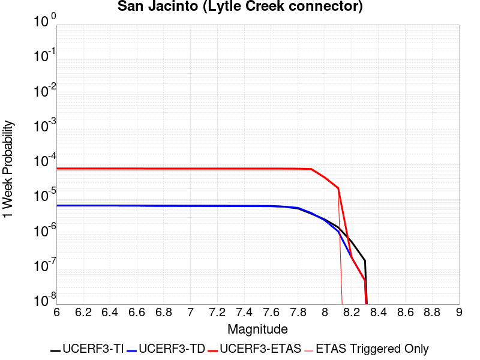 |  |  |  |

| Magnitude | 1 wk TI Prob | 1 wk TD Prob | 1 wk ETAS Prob | 1 wk ETAS/TD Gain | 1 wk ETAS Triggered Only | 1 mo TI Prob | 1 mo TD Prob | 1 mo ETAS Prob | 1 mo ETAS/TD Gain | 1 mo ETAS Triggered Only | 1 yr TI Prob | 1 yr TD Prob | 1 yr ETAS Prob | 1 yr ETAS/TD Gain | 1 yr ETAS Triggered Only | 10 yr TI Prob | 10 yr TD Prob | 10 yr ETAS Prob | 10 yr ETAS/TD Gain | 10 yr ETAS Triggered Only |
|-----|-----|-----|-----|-----|-----|-----|-----|-----|-----|-----|-----|-----|-----|-----|-----|-----|-----|-----|-----|-----|
| 6.0 | 6.693995E-6 | 6.660123E-6 | 7.665966E-5 | 11.510246 | 7.0E-5 | 2.8688235E-5 | 2.8543072E-5 | 1.18540505E-4 | 4.1530395 | 9.0E-5 | 3.492233E-4 | 3.4745657E-4 | 4.4742183E-4 | 1.2877058 | 1.0E-4 | 0.00348675 | 0.0035491167 | 0.0036686908 | 1.0336913 | 1.2E-4 |
| 6.1 | 6.693995E-6 | 6.660123E-6 | 7.665966E-5 | 11.510246 | 7.0E-5 | 2.8688235E-5 | 2.8543072E-5 | 1.18540505E-4 | 4.1530395 | 9.0E-5 | 3.492233E-4 | 3.4745657E-4 | 4.4742183E-4 | 1.2877058 | 1.0E-4 | 0.00348675 | 0.0035491167 | 0.0036686908 | 1.0336913 | 1.2E-4 |
| 6.2 | 6.693995E-6 | 6.660123E-6 | 7.665966E-5 | 11.510246 | 7.0E-5 | 2.8688235E-5 | 2.8543072E-5 | 1.18540505E-4 | 4.1530395 | 9.0E-5 | 3.492233E-4 | 3.4745657E-4 | 4.4742183E-4 | 1.2877058 | 1.0E-4 | 0.00348675 | 0.0035491167 | 0.0036686908 | 1.0336913 | 1.2E-4 |
| 6.3 | 6.693995E-6 | 6.660123E-6 | 7.665966E-5 | 11.510246 | 7.0E-5 | 2.8688235E-5 | 2.8543072E-5 | 1.18540505E-4 | 4.1530395 | 9.0E-5 | 3.492233E-4 | 3.4745657E-4 | 4.4742183E-4 | 1.2877058 | 1.0E-4 | 0.00348675 | 0.0035491167 | 0.0036686908 | 1.0336913 | 1.2E-4 |
| 6.4 | 6.693995E-6 | 6.660123E-6 | 7.665966E-5 | 11.510246 | 7.0E-5 | 2.8688235E-5 | 2.8543072E-5 | 1.18540505E-4 | 4.1530395 | 9.0E-5 | 3.492233E-4 | 3.4745657E-4 | 4.4742183E-4 | 1.2877058 | 1.0E-4 | 0.00348675 | 0.0035491167 | 0.0036686908 | 1.0336913 | 1.2E-4 |
| 6.5 | 6.6561875E-6 | 6.620341E-6 | 7.661988E-5 | 11.573403 | 7.0E-5 | 2.8526205E-5 | 2.8372582E-5 | 1.1837003E-4 | 4.1719866 | 9.0E-5 | 3.472512E-4 | 3.453815E-4 | 4.4534696E-4 | 1.2894349 | 1.0E-4 | 0.0034670907 | 0.0035284322 | 0.0036480087 | 1.0338894 | 1.2E-4 |
| 6.6 | 6.6561875E-6 | 6.620341E-6 | 7.661988E-5 | 11.573403 | 7.0E-5 | 2.8526205E-5 | 2.8372582E-5 | 1.1837003E-4 | 4.1719866 | 9.0E-5 | 3.472512E-4 | 3.453815E-4 | 4.4534696E-4 | 1.2894349 | 1.0E-4 | 0.0034670907 | 0.0035284322 | 0.0036480087 | 1.0338894 | 1.2E-4 |
| 6.7 | 6.5802237E-6 | 6.539518E-6 | 7.653906E-5 | 11.704083 | 7.0E-5 | 2.8200653E-5 | 2.8026205E-5 | 1.1802368E-4 | 4.21119 | 9.0E-5 | 3.4328885E-4 | 3.4116567E-4 | 4.4113156E-4 | 1.2930127 | 1.0E-4 | 0.0034275902 | 0.0034864065 | 0.0036059883 | 1.0342994 | 1.2E-4 |
| 6.8 | 6.575632E-6 | 6.5340073E-6 | 7.653355E-5 | 11.71311 | 7.0E-5 | 2.8180975E-5 | 2.8002589E-5 | 1.1800007E-4 | 4.2138987 | 9.0E-5 | 3.4304935E-4 | 3.4087826E-4 | 4.4084416E-4 | 1.2932599 | 1.0E-4 | 0.0034252026 | 0.0034835413 | 0.0036031234 | 1.0343277 | 1.2E-4 |
| 6.9 | 6.570433E-6 | 6.525401E-6 | 7.652494E-5 | 11.72724 | 7.0E-5 | 2.8158694E-5 | 2.7965707E-5 | 1.1796319E-4 | 4.2181373 | 9.0E-5 | 3.4277816E-4 | 3.4042934E-4 | 4.4039532E-4 | 1.2936467 | 1.0E-4 | 0.0034224992 | 0.0034790665 | 0.003598649 | 1.034372 | 1.2E-4 |
| 7.0 | 6.5643826E-6 | 6.5155223E-6 | 7.651507E-5 | 11.743505 | 7.0E-5 | 2.8132765E-5 | 2.7923368E-5 | 1.17920856E-4 | 4.2230167 | 9.0E-5 | 3.424626E-4 | 3.3991406E-4 | 4.3988007E-4 | 1.294092 | 1.0E-4 | 0.0034193532 | 0.0034739296 | 0.0035935128 | 1.034423 | 1.2E-4 |
| 7.1 | 6.557402E-6 | 6.504234E-6 | 7.650378E-5 | 11.762151 | 7.0E-5 | 2.8102848E-5 | 2.7874992E-5 | 1.17872485E-4 | 4.2286105 | 9.0E-5 | 3.4209844E-4 | 3.3932526E-4 | 4.392913E-4 | 1.2946025 | 1.0E-4 | 0.0034157229 | 0.0034680606 | 0.0035876445 | 1.0344815 | 1.2E-4 |
| 7.2 | 6.546394E-6 | 6.4862006E-6 | 7.648575E-5 | 11.792072 | 7.0E-5 | 2.8055672E-5 | 2.7797707E-5 | 1.1779521E-4 | 4.237587 | 9.0E-5 | 3.4152428E-4 | 3.383846E-4 | 4.3835075E-4 | 1.2954217 | 1.0E-4 | 0.0034099987 | 0.0034586883 | 0.003578273 | 1.0345752 | 1.2E-4 |
| 7.3 | 6.5364216E-6 | 6.4669857E-6 | 7.646653E-5 | 11.824139 | 7.0E-5 | 2.8012933E-5 | 2.771536E-5 | 1.17712865E-4 | 4.247207 | 9.0E-5 | 3.4100408E-4 | 3.373823E-4 | 4.373486E-4 | 1.2962997 | 1.0E-4 | 0.003404813 | 0.0034487103 | 0.0035682966 | 1.0346756 | 1.2E-4 |
| 7.4 | 6.5269523E-6 | 6.4480723E-6 | 7.644762E-5 | 11.855887 | 7.0E-5 | 2.7972354E-5 | 2.7634303E-5 | 1.1763182E-4 | 4.256732 | 9.0E-5 | 3.4051016E-4 | 3.3639578E-4 | 4.3636214E-4 | 1.2971689 | 1.0E-4 | 0.0033998888 | 0.0034388923 | 0.0035584795 | 1.0347749 | 1.2E-4 |
| 7.5 | 6.5111835E-6 | 6.424346E-6 | 7.6423894E-5 | 11.895981 | 7.0E-5 | 2.7904773E-5 | 2.753262E-5 | 1.17530144E-4 | 4.2687597 | 9.0E-5 | 3.3968766E-4 | 3.3515817E-4 | 4.3512465E-4 | 1.2982666 | 1.0E-4 | 0.0033916887 | 0.0034265644 | 0.0035461532 | 1.0349005 | 1.2E-4 |
| 7.6 | 6.4768806E-6 | 6.383454E-6 | 7.638301E-5 | 11.965779 | 7.0E-5 | 2.7757764E-5 | 2.7357375E-5 | 1.1735491E-4 | 4.2896996 | 9.0E-5 | 3.3789838E-4 | 3.330252E-4 | 4.329919E-4 | 1.3001776 | 1.0E-4 | 0.0033738504 | 0.0034052972 | 0.0035248885 | 1.0351192 | 1.2E-4 |
| 7.7 | 6.1655364E-6 | 6.1759456E-6 | 7.6175515E-5 | 12.334227 | 7.0E-5 | 2.642346E-5 | 2.646807E-5 | 1.16465686E-4 | 4.4002333 | 9.0E-5 | 3.2165812E-4 | 3.2220117E-4 | 4.2216893E-4 | 1.3102651 | 1.0E-4 | 0.0032119295 | 0.0032969362 | 0.0034165406 | 1.0362774 | 1.2E-4 |
| 7.8 | 5.5043524E-6 | 5.7370175E-6 | 7.5736614E-5 | 13.201391 | 7.0E-5 | 2.3589868E-5 | 2.4586987E-5 | 1.1458477E-4 | 4.6603827 | 9.0E-5 | 2.871688E-4 | 2.993055E-4 | 3.9927557E-4 | 1.3340068 | 1.0E-4 | 0.0028679797 | 0.0030670585 | 0.0031866906 | 1.0390054 | 1.2E-4 |
| 7.9 | 3.889249E-6 | 4.0766436E-6 | 7.407636E-5 | 18.170918 | 7.0E-5 | 1.6668104E-5 | 1.7471213E-5 | 1.0746964E-4 | 6.151241 | 9.0E-5 | 2.0291525E-4 | 2.126913E-4 | 3.1267002E-4 | 1.470065 | 1.0E-4 | 0.0020273007 | 0.0021941073 | 0.0023138442 | 1.054572 | 1.2E-4 |
| 8.0 | 2.668535E-6 | 2.5313454E-6 | 4.2531243E-5 | 16.801834 | 4.0E-5 | 1.1436528E-5 | 1.0848577E-5 | 7.084793E-5 | 6.5306187 | 6.0E-5 | 1.3923083E-4 | 1.3207346E-4 | 2.0206421E-4 | 1.5299381 | 7.0E-5 | 0.0013914363 | 0.0013755665 | 0.0014654427 | 1.0653375 | 9.0E-5 |
| 8.1 | 1.5911459E-6 | 1.2185134E-6 | 2.121849E-5 | 17.413424 | 2.0E-5 | 6.8191785E-6 | 5.2221894E-6 | 4.522198E-5 | 8.659582 | 4.0E-5 | 8.3020335E-5 | 6.357832E-5 | 1.13575144E-4 | 1.7863815 | 5.0E-5 | 8.298933E-4 | 6.6911156E-4 | 7.390647E-4 | 1.1045463 | 7.0E-5 |
| 8.2 | 6.1294963E-7 | 2.1802066E-7 | 2.1802066E-7 | 1.0 | 0.0 | 2.6269242E-6 | 9.3437393E-7 | 9.3437393E-7 | 1.0 | 0.0 | 3.1982334E-5 | 1.1375943E-5 | 1.1375943E-5 | 1.0 | 0.0 | 3.1977732E-4 | 1.2778955E-4 | 1.2778955E-4 | 1.0 | 0.0 |
| 8.3 | 1.762871E-7 | 4.7516316E-8 | 4.7516316E-8 | 1.0 | 0.0 | 7.5551594E-7 | 2.0364133E-7 | 2.0364133E-7 | 1.0 | 0.0 | 9.1983675E-6 | 2.4793305E-6 | 2.4793305E-6 | 1.0 | 0.0 | 9.197987E-5 | 2.8671833E-5 | 2.8671833E-5 | 1.0 | 0.0 |

## Rose Canyon
*[(top)](#table-of-contents)*

| 1 Week | 1 Month | 1 Year | 10 Year |
|-----|-----|-----|-----|
|  |  |  |  |

| Magnitude | 1 wk TI Prob | 1 wk TD Prob | 1 wk ETAS Prob | 1 wk ETAS/TD Gain | 1 wk ETAS Triggered Only | 1 mo TI Prob | 1 mo TD Prob | 1 mo ETAS Prob | 1 mo ETAS/TD Gain | 1 mo ETAS Triggered Only | 1 yr TI Prob | 1 yr TD Prob | 1 yr ETAS Prob | 1 yr ETAS/TD Gain | 1 yr ETAS Triggered Only | 10 yr TI Prob | 10 yr TD Prob | 10 yr ETAS Prob | 10 yr ETAS/TD Gain | 10 yr ETAS Triggered Only |
|-----|-----|-----|-----|-----|-----|-----|-----|-----|-----|-----|-----|-----|-----|-----|-----|-----|-----|-----|-----|-----|
| 6.0 | 4.5923203E-5 | 4.9714607E-5 | 1.2971064E-4 | 2.609105 | 8.0E-5 | 1.9679888E-4 | 2.1304654E-4 | 3.2302312E-4 | 1.5162091 | 1.1E-4 | 0.0023933933 | 0.0025909478 | 0.002710637 | 1.0461951 | 1.2E-4 | 0.023677798 | 0.025618518 | 0.025735443 | 1.0045642 | 1.2E-4 |
| 6.1 | 4.5923203E-5 | 4.9714607E-5 | 8.9712616E-5 | 1.8045526 | 4.0E-5 | 1.9679888E-4 | 2.1304654E-4 | 2.7303377E-4 | 1.2815686 | 6.0E-5 | 0.0023933933 | 0.0025909478 | 0.0026507925 | 1.0230975 | 6.0E-5 | 0.023677798 | 0.025618518 | 0.02567698 | 1.002282 | 6.0E-5 |
| 6.2 | 2.8844734E-5 | 2.9669678E-5 | 4.9669085E-5 | 1.6740689 | 2.0E-5 | 1.2361443E-4 | 1.2714976E-4 | 1.6714468E-4 | 1.3145497 | 4.0E-5 | 0.0015039665 | 0.001546976 | 0.0015869142 | 1.0258169 | 4.0E-5 | 0.0149382865 | 0.015364873 | 0.015404259 | 1.0025634 | 4.0E-5 |
| 6.3 | 2.3171577E-5 | 2.3162425E-5 | 4.3161963E-5 | 1.8634474 | 2.0E-5 | 9.9302975E-5 | 9.926383E-5 | 1.3925986E-4 | 1.4029266 | 4.0E-5 | 0.0012083431 | 0.0012078804 | 0.0012478321 | 1.0330758 | 4.0E-5 | 0.012017938 | 0.012012152 | 0.012051672 | 1.0032899 | 4.0E-5 |
| 6.4 | 2.0066604E-5 | 1.9668067E-5 | 3.9667673E-5 | 2.0168567 | 2.0E-5 | 8.599689E-5 | 8.428905E-5 | 1.2428568E-4 | 1.4745175 | 4.0E-5 | 0.0010465092 | 0.001025746 | 0.001065705 | 1.038956 | 4.0E-5 | 0.010415946 | 0.010211479 | 0.01025107 | 1.0038772 | 4.0E-5 |
| 6.5 | 1.776989E-5 | 1.7115402E-5 | 2.7115231E-5 | 1.584259 | 1.0E-5 | 7.615444E-5 | 7.33497E-5 | 1.033475E-4 | 1.4089696 | 3.0E-5 | 9.267859E-4 | 8.926737E-4 | 9.226469E-4 | 1.033577 | 3.0E-5 | 0.009229303 | 0.008874663 | 0.0089043975 | 1.0033504 | 3.0E-5 |
| 6.6 | 1.5227364E-5 | 1.4340872E-5 | 2.4340728E-5 | 1.6972976 | 1.0E-5 | 6.52585E-5 | 6.145947E-5 | 9.145762E-5 | 1.4880966 | 3.0E-5 | 7.942326E-4 | 7.480173E-4 | 7.7799486E-4 | 1.040076 | 3.0E-5 | 0.007914 | 0.0074410336 | 0.0074708103 | 1.0040017 | 3.0E-5 |
| 6.7 | 1.2703898E-5 | 1.1674277E-5 | 2.1674161E-5 | 1.856574 | 1.0E-5 | 5.4444143E-5 | 5.0031682E-5 | 8.003018E-5 | 1.5995901 | 3.0E-5 | 6.626558E-4 | 6.089697E-4 | 6.3895143E-4 | 1.0492336 | 3.0E-5 | 0.006606833 | 0.0060623093 | 0.0060921274 | 1.0049186 | 3.0E-5 |
| 6.8 | 1.1554917E-5 | 1.0610384E-5 | 2.0610278E-5 | 1.9424629 | 1.0E-5 | 4.9520135E-5 | 4.547231E-5 | 7.547094E-5 | 1.6597122 | 3.0E-5 | 6.0274085E-4 | 5.5348873E-4 | 5.8347214E-4 | 1.0541717 | 3.0E-5 | 0.0060110865 | 0.005504414 | 0.005534249 | 1.0054202 | 3.0E-5 |
| 6.9 | 8.732078E-6 | 7.882285E-6 | 7.882285E-6 | 1.0 | 0.0 | 3.7422655E-5 | 3.37808E-5 | 5.3780128E-5 | 1.5920322 | 2.0E-5 | 4.5552556E-4 | 4.112066E-4 | 4.3119836E-4 | 1.0486174 | 2.0E-5 | 0.0045459294 | 0.004089515 | 0.0041094334 | 1.0048705 | 2.0E-5 |
| 7.0 | 5.9337494E-6 | 5.107436E-6 | 5.107436E-6 | 1.0 | 0.0 | 2.5430107E-5 | 2.1888829E-5 | 2.1888829E-5 | 1.0 | 0.0 | 3.0956755E-4 | 2.6646405E-4 | 2.6646405E-4 | 1.0 | 0.0 | 0.0030913667 | 0.002661461 | 0.002661461 | 1.0 | 0.0 |
| 7.1 | 5.013409E-6 | 4.17734E-6 | 4.17734E-6 | 1.0 | 0.0 | 2.1485863E-5 | 1.7902763E-5 | 1.7902763E-5 | 1.0 | 0.0 | 2.6155898E-4 | 2.1794444E-4 | 2.1794444E-4 | 1.0 | 0.0 | 0.0026125133 | 0.0021773188 | 0.0021773188 | 1.0 | 0.0 |
| 7.2 | 4.120763E-6 | 3.2820917E-6 | 3.2820917E-6 | 1.0 | 0.0 | 1.7660293E-5 | 1.4066032E-5 | 1.4066032E-5 | 1.0 | 0.0 | 2.1499286E-4 | 1.7124058E-4 | 1.7124058E-4 | 1.0 | 0.0 | 0.0021478499 | 0.0017110958 | 0.0017110958 | 1.0 | 0.0 |
| 7.3 | 3.2081239E-6 | 2.4404965E-6 | 2.4404965E-6 | 1.0 | 0.0 | 1.374903E-5 | 1.0459229E-5 | 1.0459229E-5 | 1.0 | 0.0 | 1.6738157E-4 | 1.2733374E-4 | 1.2733374E-4 | 1.0 | 0.0 | 0.0016725556 | 0.0012726148 | 0.0012726148 | 1.0 | 0.0 |
| 7.4 | 2.4194755E-6 | 1.7680321E-6 | 1.7680321E-6 | 1.0 | 0.0 | 1.0369139E-5 | 7.5772587E-6 | 7.5772587E-6 | 1.0 | 0.0 | 1.2623696E-4 | 9.224927E-5 | 9.224927E-5 | 1.0 | 0.0 | 0.0012616527 | 9.221151E-4 | 9.221151E-4 | 1.0 | 0.0 |
| 7.5 | 1.3842889E-6 | 9.3782967E-7 | 9.3782967E-7 | 1.0 | 0.0 | 5.9326535E-6 | 4.019264E-6 | 4.019264E-6 | 1.0 | 0.0 | 7.222766E-5 | 4.8933474E-5 | 4.8933474E-5 | 1.0 | 0.0 | 7.220419E-4 | 4.8923056E-4 | 4.8923056E-4 | 1.0 | 0.0 |
| 7.6 | 1.0021575E-6 | 6.4113493E-7 | 6.4113493E-7 | 1.0 | 0.0 | 4.2949537E-6 | 2.7477186E-6 | 2.7477186E-6 | 1.0 | 0.0 | 5.2289808E-5 | 3.345298E-5 | 3.345298E-5 | 1.0 | 0.0 | 5.2277505E-4 | 3.344816E-4 | 3.344816E-4 | 1.0 | 0.0 |
| 7.7 | 8.7620116E-8 | 6.449304E-8 | 6.449304E-8 | 1.0 | 0.0 | 3.7551473E-7 | 2.763987E-7 | 2.763987E-7 | 1.0 | 0.0 | 4.5718825E-6 | 3.3651493E-6 | 3.3651493E-6 | 1.0 | 0.0 | 4.5717883E-5 | 3.3651013E-5 | 3.3651013E-5 | 1.0 | 0.0 |

## San Jacinto (Borrego)
*[(top)](#table-of-contents)*

| 1 Week | 1 Month | 1 Year | 10 Year |
|-----|-----|-----|-----|
|  |  |  |  |

| Magnitude | 1 wk TI Prob | 1 wk TD Prob | 1 wk ETAS Prob | 1 wk ETAS/TD Gain | 1 wk ETAS Triggered Only | 1 mo TI Prob | 1 mo TD Prob | 1 mo ETAS Prob | 1 mo ETAS/TD Gain | 1 mo ETAS Triggered Only | 1 yr TI Prob | 1 yr TD Prob | 1 yr ETAS Prob | 1 yr ETAS/TD Gain | 1 yr ETAS Triggered Only | 10 yr TI Prob | 10 yr TD Prob | 10 yr ETAS Prob | 10 yr ETAS/TD Gain | 10 yr ETAS Triggered Only |
|-----|-----|-----|-----|-----|-----|-----|-----|-----|-----|-----|-----|-----|-----|-----|-----|-----|-----|-----|-----|-----|
| 6.0 | 3.543992E-5 | 2.7925962E-5 | 8.792429E-5 | 3.1484783 | 6.0E-5 | 1.5187653E-4 | 1.1967727E-4 | 2.096665E-4 | 1.7519325 | 9.0E-5 | 0.0018475284 | 0.0014561092 | 0.0015559635 | 1.0685762 | 1.0E-4 | 0.018322436 | 0.01486815 | 0.014986367 | 1.0079509 | 1.2E-4 |
| 6.1 | 3.542281E-5 | 2.7925962E-5 | 8.792429E-5 | 3.1484783 | 6.0E-5 | 1.5180321E-4 | 1.1967727E-4 | 2.096665E-4 | 1.7519325 | 9.0E-5 | 0.0018466372 | 0.0014561092 | 0.0015559635 | 1.0685762 | 1.0E-4 | 0.018313672 | 0.01486815 | 0.014986367 | 1.0079509 | 1.2E-4 |
| 6.2 | 3.4688688E-5 | 2.7925962E-5 | 8.792429E-5 | 3.1484783 | 6.0E-5 | 1.4865733E-4 | 1.1967727E-4 | 2.096665E-4 | 1.7519325 | 9.0E-5 | 0.0018084005 | 0.0014561091 | 0.0015559635 | 1.0685762 | 1.0E-4 | 0.017937548 | 0.01486815 | 0.014986366 | 1.0079509 | 1.2E-4 |
| 6.3 | 3.2087122E-5 | 2.7771312E-5 | 8.7769644E-5 | 3.1604428 | 6.0E-5 | 1.3750899E-4 | 1.1901455E-4 | 2.0900383E-4 | 1.7561201 | 9.0E-5 | 0.0016728862 | 0.0014480512 | 0.0015479064 | 1.0689583 | 1.0E-4 | 0.016603488 | 0.014789308 | 0.014907533 | 1.0079939 | 1.2E-4 |
| 6.4 | 3.1828724E-5 | 2.773829E-5 | 8.7736626E-5 | 3.1630151 | 6.0E-5 | 1.364017E-4 | 1.1887303E-4 | 2.0886233E-4 | 1.7570204 | 9.0E-5 | 0.0016594254 | 0.0014463306 | 0.0015461859 | 1.0690405 | 1.0E-4 | 0.016470885 | 0.014772502 | 0.0148907285 | 1.0080032 | 1.2E-4 |
| 6.5 | 3.1563577E-5 | 2.7477974E-5 | 8.747633E-5 | 3.1835072 | 6.0E-5 | 1.3526545E-4 | 1.17757496E-4 | 2.077469E-4 | 1.7641926 | 9.0E-5 | 0.0016456128 | 0.0014327668 | 0.0015326235 | 1.069695 | 1.0E-4 | 0.0163348 | 0.01463991 | 0.014758153 | 1.0080768 | 1.2E-4 |
| 6.6 | 3.1467625E-5 | 2.7322194E-5 | 8.732056E-5 | 3.195957 | 6.0E-5 | 1.3485427E-4 | 1.17089934E-4 | 2.070794E-4 | 1.7685499 | 9.0E-5 | 0.0016406142 | 0.0014246498 | 0.0015245074 | 1.0700927 | 1.0E-4 | 0.016285548 | 0.014560228 | 0.014678481 | 1.0081216 | 1.2E-4 |
| 6.7 | 3.1223695E-5 | 2.6940217E-5 | 8.69386E-5 | 3.2270935 | 6.0E-5 | 1.3380898E-4 | 1.1545303E-4 | 2.0544264E-4 | 1.7794478 | 9.0E-5 | 0.0016279068 | 0.0014047464 | 0.001504606 | 1.0710872 | 1.0E-4 | 0.01616033 | 0.01436451 | 0.014482786 | 1.0082339 | 1.2E-4 |
| 6.8 | 3.1015585E-5 | 2.6761221E-5 | 8.675962E-5 | 3.24199 | 6.0E-5 | 1.3291716E-4 | 1.1468597E-4 | 2.0467566E-4 | 1.7846615 | 9.0E-5 | 0.001617065 | 0.0013954195 | 0.00149528 | 1.071563 | 1.0E-4 | 0.016053487 | 0.014271772 | 0.014390059 | 1.0082883 | 1.2E-4 |
| 6.9 | 2.6641965E-5 | 2.2183434E-5 | 8.21821E-5 | 3.704661 | 6.0E-5 | 1.1417485E-4 | 9.506842E-5 | 1.8505986E-4 | 1.9465966 | 9.0E-5 | 0.0013891924 | 0.0011568473 | 0.0012567317 | 1.0863419 | 1.0E-4 | 0.0138054015 | 0.011882191 | 0.012000765 | 1.0099791 | 1.2E-4 |
| 7.0 | 2.3854353E-5 | 2.047825E-5 | 8.0477024E-5 | 3.9298778 | 6.0E-5 | 1.02228936E-4 | 8.776099E-5 | 1.777531E-4 | 2.0254226 | 9.0E-5 | 0.0012439266 | 0.0010679689 | 0.0011678621 | 1.0935357 | 1.0E-4 | 0.012369866 | 0.0109826205 | 0.011101303 | 1.0108063 | 1.2E-4 |
| 7.1 | 2.3672901E-5 | 2.0314741E-5 | 8.031352E-5 | 3.9534605 | 6.0E-5 | 1.0145135E-4 | 8.706028E-5 | 1.7705245E-4 | 2.0336764 | 9.0E-5 | 0.0012344702 | 0.0010594461 | 0.0011593401 | 1.094289 | 1.0E-4 | 0.0122763505 | 0.010897858 | 0.0110165505 | 1.0108913 | 1.2E-4 |
| 7.2 | 2.2717244E-5 | 1.9542116E-5 | 7.954094E-5 | 4.070232 | 6.0E-5 | 9.735599E-5 | 8.3749255E-5 | 1.7374172E-4 | 2.0745466 | 9.0E-5 | 0.0011846646 | 0.0010191725 | 0.0011190706 | 1.0980188 | 1.0E-4 | 0.01178369 | 0.010495322 | 0.010614063 | 1.0113137 | 1.2E-4 |
| 7.3 | 2.1016205E-5 | 1.8383771E-5 | 7.838267E-5 | 4.263688 | 6.0E-5 | 9.006634E-5 | 7.878522E-5 | 1.6877813E-4 | 2.1422563 | 9.0E-5 | 0.001096006 | 9.5879E-4 | 0.0010586941 | 1.1041981 | 1.0E-4 | 0.010906163 | 0.009890901 | 0.010009714 | 1.0120124 | 1.2E-4 |
| 7.4 | 2.0683625E-5 | 1.8186302E-5 | 7.818521E-5 | 4.2991266 | 6.0E-5 | 8.86411E-5 | 7.7938974E-5 | 1.6793195E-4 | 2.1546595 | 9.0E-5 | 0.001078671 | 9.48496E-4 | 0.0010484011 | 1.1053301 | 1.0E-4 | 0.010734501 | 0.0097876275 | 0.009906453 | 1.0121404 | 1.2E-4 |
| 7.5 | 1.9993966E-5 | 1.7781347E-5 | 7.778028E-5 | 4.3742623 | 6.0E-5 | 8.568561E-5 | 7.6203556E-5 | 1.661967E-4 | 2.180957 | 9.0E-5 | 0.001042723 | 9.2738547E-4 | 0.0010272927 | 1.10773 | 1.0E-4 | 0.010378438 | 0.009574548 | 0.009693399 | 1.0124133 | 1.2E-4 |
| 7.6 | 1.788966E-5 | 1.6434618E-5 | 7.643363E-5 | 4.65077 | 6.0E-5 | 7.666772E-5 | 7.043219E-5 | 1.6042584E-4 | 2.277735 | 9.0E-5 | 9.3302975E-4 | 8.5717626E-4 | 9.570905E-4 | 1.1165621 | 1.0E-4 | 0.00929122 | 0.008866415 | 0.008985352 | 1.0134143 | 1.2E-4 |
| 7.7 | 1.5125781E-5 | 1.4236738E-5 | 7.423588E-5 | 5.2143884 | 6.0E-5 | 6.4823165E-5 | 6.101317E-5 | 1.5100768E-4 | 2.4750013 | 9.0E-5 | 7.889362E-4 | 7.4258295E-4 | 8.425087E-4 | 1.1345651 | 1.0E-4 | 0.007861412 | 0.007714161 | 0.007833235 | 1.0154358 | 1.2E-4 |
| 7.8 | 1.250089E-5 | 1.262994E-5 | 7.2629184E-5 | 5.7505565 | 6.0E-5 | 5.3574146E-5 | 5.4127195E-5 | 1.4412233E-4 | 2.6626601 | 9.0E-5 | 6.5207E-4 | 6.588E-4 | 7.587341E-4 | 1.1516912 | 1.0E-4 | 0.006501599 | 0.006867759 | 0.0069869347 | 1.0173529 | 1.2E-4 |
| 7.9 | 9.561E-6 | 9.754065E-6 | 5.9753576E-5 | 6.126018 | 5.0E-5 | 4.0975072E-5 | 4.180247E-5 | 1.2179912E-4 | 2.9136825 | 8.0E-5 | 4.987573E-4 | 5.0882675E-4 | 5.98781E-4 | 1.1767875 | 9.0E-5 | 0.0049763937 | 0.0053523607 | 0.005461772 | 1.0204417 | 1.1E-4 |
| 8.0 | 8.01699E-6 | 8.292994E-6 | 4.8292663E-5 | 5.8233085 | 4.0E-5 | 3.4358076E-5 | 3.554092E-5 | 1.05538435E-4 | 2.9694908 | 7.0E-5 | 4.1822926E-4 | 4.3262533E-4 | 5.125907E-4 | 1.1848375 | 8.0E-5 | 0.0041744304 | 0.0045733186 | 0.0046728617 | 1.021766 | 1.0E-4 |
| 8.1 | 6.541947E-6 | 6.461784E-6 | 4.6461526E-5 | 7.1902013 | 4.0E-5 | 2.8036617E-5 | 2.7693068E-5 | 9.769113E-5 | 3.5276384 | 7.0E-5 | 3.4129233E-4 | 3.3711144E-4 | 4.170845E-4 | 1.2372303 | 8.0E-5 | 0.0034076865 | 0.0035805756 | 0.0036802173 | 1.0278285 | 1.0E-4 |
| 8.2 | 1.7968189E-6 | 7.9684827E-7 | 7.9684827E-7 | 1.0 | 0.0 | 7.70063E-6 | 3.4150596E-6 | 3.4150596E-6 | 1.0 | 0.0 | 9.3751136E-5 | 4.157758E-5 | 4.157758E-5 | 1.0 | 0.0 | 9.371159E-4 | 4.7107413E-4 | 4.7107413E-4 | 1.0 | 0.0 |
| 8.3 | 1.5167889E-7 | 4.8951257E-8 | 4.8951257E-8 | 1.0 | 0.0 | 6.500522E-7 | 2.0979108E-7 | 2.0979108E-7 | 1.0 | 0.0 | 7.9143565E-6 | 2.5542038E-6 | 2.5542038E-6 | 1.0 | 0.0 | 7.914075E-5 | 2.9679897E-5 | 2.9679897E-5 | 1.0 | 0.0 |

## Santa Cruz Island
*[(top)](#table-of-contents)*

| 1 Week | 1 Month | 1 Year | 10 Year |
|-----|-----|-----|-----|
|  |  |  |  |

| Magnitude | 1 wk TI Prob | 1 wk TD Prob | 1 wk ETAS Prob | 1 wk ETAS/TD Gain | 1 wk ETAS Triggered Only | 1 mo TI Prob | 1 mo TD Prob | 1 mo ETAS Prob | 1 mo ETAS/TD Gain | 1 mo ETAS Triggered Only | 1 yr TI Prob | 1 yr TD Prob | 1 yr ETAS Prob | 1 yr ETAS/TD Gain | 1 yr ETAS Triggered Only | 10 yr TI Prob | 10 yr TD Prob | 10 yr ETAS Prob | 10 yr ETAS/TD Gain | 10 yr ETAS Triggered Only |
|-----|-----|-----|-----|-----|-----|-----|-----|-----|-----|-----|-----|-----|-----|-----|-----|-----|-----|-----|-----|-----|
| 6.0 | 2.9164563E-5 | 3.1599742E-5 | 7.159848E-5 | 2.265793 | 4.0E-5 | 1.2498499E-4 | 1.3542121E-4 | 2.1541039E-4 | 1.5906694 | 8.0E-5 | 0.0015206301 | 0.0016476426 | 0.0017275107 | 1.0484742 | 8.0E-5 | 0.015102667 | 0.016368 | 0.016476199 | 1.0066104 | 1.1E-4 |
| 6.1 | 2.9164563E-5 | 3.1599742E-5 | 7.159848E-5 | 2.265793 | 4.0E-5 | 1.2498499E-4 | 1.3542121E-4 | 2.1541039E-4 | 1.5906694 | 8.0E-5 | 0.0015206301 | 0.0016476426 | 0.0017275107 | 1.0484742 | 8.0E-5 | 0.015102667 | 0.016368 | 0.016476199 | 1.0066104 | 1.1E-4 |
| 6.2 | 2.9164563E-5 | 3.1599742E-5 | 7.159848E-5 | 2.265793 | 4.0E-5 | 1.2498499E-4 | 1.3542121E-4 | 2.1541039E-4 | 1.5906694 | 8.0E-5 | 0.0015206301 | 0.0016476426 | 0.0017275107 | 1.0484742 | 8.0E-5 | 0.015102667 | 0.016368 | 0.016476199 | 1.0066104 | 1.1E-4 |
| 6.3 | 1.6635553E-5 | 1.780436E-5 | 4.7803824E-5 | 2.6849506 | 3.0E-5 | 7.1293274E-5 | 7.630227E-5 | 1.2629844E-4 | 1.6552385 | 5.0E-5 | 8.6765E-4 | 9.286024E-4 | 9.78556E-4 | 1.0537944 | 5.0E-5 | 0.008642701 | 0.009249094 | 0.009308538 | 1.0064272 | 6.0E-5 |
| 6.4 | 1.6635553E-5 | 1.780436E-5 | 4.7803824E-5 | 2.6849506 | 3.0E-5 | 7.1293274E-5 | 7.630227E-5 | 1.2629844E-4 | 1.6552385 | 5.0E-5 | 8.6765E-4 | 9.286024E-4 | 9.78556E-4 | 1.0537944 | 5.0E-5 | 0.008642701 | 0.009249094 | 0.009308538 | 1.0064272 | 6.0E-5 |
| 6.5 | 1.2238748E-5 | 1.3042996E-5 | 3.3042736E-5 | 2.53337 | 2.0E-5 | 5.2450723E-5 | 5.5897377E-5 | 8.58957E-5 | 1.5366678 | 3.0E-5 | 6.3840044E-4 | 6.8034173E-4 | 7.1032136E-4 | 1.0440655 | 3.0E-5 | 0.0063656955 | 0.006782988 | 0.0068227164 | 1.0058571 | 4.0E-5 |
| 6.6 | 1.0489767E-5 | 1.1156636E-5 | 3.1156414E-5 | 2.792635 | 2.0E-5 | 4.495537E-5 | 4.781329E-5 | 7.7811856E-5 | 1.6274107 | 3.0E-5 | 5.4719415E-4 | 5.819736E-4 | 6.119561E-4 | 1.0515187 | 3.0E-5 | 0.005458487 | 0.005804736 | 0.0058445036 | 1.006851 | 4.0E-5 |
| 6.7 | 8.699222E-6 | 9.236783E-6 | 2.9236597E-5 | 3.1652362 | 2.0E-5 | 3.7281847E-5 | 3.958561E-5 | 6.958443E-5 | 1.7578211 | 3.0E-5 | 4.5381195E-4 | 4.818488E-4 | 5.1183434E-4 | 1.0622302 | 3.0E-5 | 0.0045288634 | 0.004808108 | 0.004847916 | 1.0082793 | 4.0E-5 |
| 6.8 | 8.307732E-6 | 8.8169045E-6 | 2.8816728E-5 | 3.26835 | 2.0E-5 | 3.560408E-5 | 3.7786187E-5 | 6.7785055E-5 | 1.7939109 | 3.0E-5 | 4.3339343E-4 | 4.5995016E-4 | 4.899364E-4 | 1.0651945 | 3.0E-5 | 0.004325492 | 0.0045900354 | 0.004629852 | 1.0086745 | 4.0E-5 |
| 6.9 | 8.073121E-6 | 8.564939E-6 | 2.8564767E-5 | 3.335081 | 2.0E-5 | 3.459863E-5 | 3.670637E-5 | 6.670527E-5 | 1.8172668 | 3.0E-5 | 4.2115687E-4 | 4.4680882E-4 | 4.767954E-4 | 1.0671128 | 3.0E-5 | 0.004203596 | 0.004459156 | 0.0044989777 | 1.0089303 | 4.0E-5 |
| 7.0 | 7.617019E-6 | 8.074665E-6 | 2.8074503E-5 | 3.4768631 | 2.0E-5 | 3.264396E-5 | 3.4605247E-5 | 5.4604556E-5 | 1.577927 | 2.0E-5 | 3.9736772E-4 | 4.2123784E-4 | 4.412294E-4 | 1.0474591 | 2.0E-5 | 0.003966579 | 0.0042044413 | 0.0042343154 | 1.0071054 | 3.0E-5 |
| 7.1 | 7.1224836E-6 | 7.5457883E-6 | 2.7545637E-5 | 3.6504653 | 2.0E-5 | 3.052457E-5 | 3.2338692E-5 | 5.2338048E-5 | 1.6184342 | 2.0E-5 | 3.715733E-4 | 3.9365282E-4 | 4.1364494E-4 | 1.0507861 | 2.0E-5 | 0.003709526 | 0.0039295983 | 0.00395948 | 1.0076044 | 3.0E-5 |
| 7.2 | 6.441115E-6 | 6.8273835E-6 | 2.6827247E-5 | 3.92936 | 2.0E-5 | 2.7604487E-5 | 2.9259889E-5 | 4.9259303E-5 | 1.6835096 | 2.0E-5 | 3.360328E-4 | 3.5618115E-4 | 3.7617402E-4 | 1.0561312 | 2.0E-5 | 0.0033552512 | 0.0035561312 | 0.0035860245 | 1.0084062 | 3.0E-5 |
| 7.3 | 5.494274E-6 | 5.8199944E-6 | 2.5819878E-5 | 4.4364095 | 2.0E-5 | 2.3546674E-5 | 2.4942596E-5 | 4.49421E-5 | 1.8018211 | 2.0E-5 | 2.8664304E-4 | 3.03634E-4 | 3.2362793E-4 | 1.0658488 | 2.0E-5 | 0.002862736 | 0.0030322145 | 0.0030621234 | 1.0098637 | 3.0E-5 |
| 7.4 | 4.0802624E-6 | 4.3122564E-6 | 2.431217E-5 | 5.6379232 | 2.0E-5 | 1.7486722E-5 | 1.8480969E-5 | 3.8480597E-5 | 2.0821743 | 2.0E-5 | 2.1288003E-4 | 2.2498264E-4 | 2.4497815E-4 | 1.0888758 | 2.0E-5 | 0.0021267622 | 0.0022475577 | 0.0022774902 | 1.0133178 | 3.0E-5 |
| 7.5 | 2.3584746E-6 | 2.4753099E-6 | 2.247526E-5 | 9.079777 | 2.0E-5 | 1.0107709E-5 | 1.0608428E-5 | 3.0608215E-5 | 2.8852735 | 2.0E-5 | 1.2305441E-4 | 1.2915001E-4 | 1.4914742E-4 | 1.1548387 | 2.0E-5 | 0.0012298629 | 0.0012907545 | 0.0013207158 | 1.0232122 | 3.0E-5 |
| 7.6 | 9.4981914E-7 | 9.860934E-7 | 1.0986084E-5 | 11.141018 | 1.0E-5 | 4.0706473E-6 | 4.2261076E-6 | 1.4226065E-5 | 3.3662336 | 1.0E-5 | 4.9559E-5 | 5.1451658E-5 | 6.1451145E-5 | 1.1943471 | 1.0E-5 | 4.954795E-4 | 5.1439874E-4 | 5.243936E-4 | 1.0194302 | 1.0E-5 |
| 7.7 | 2.6013532E-7 | 2.6416632E-7 | 2.6416632E-7 | 1.0 | 0.0 | 1.1148652E-6 | 1.1321408E-6 | 1.1321408E-6 | 1.0 | 0.0 | 1.3573399E-5 | 1.3783729E-5 | 1.3783729E-5 | 1.0 | 0.0 | 1.357257E-4 | 1.378288E-4 | 1.378288E-4 | 1.0 | 0.0 |
| 7.8 | 4.1522263E-8 | 3.965698E-8 | 3.965698E-8 | 1.0 | 0.0 | 1.7795254E-7 | 1.6995848E-7 | 1.6995848E-7 | 1.0 | 0.0 | 2.16657E-6 | 2.0692428E-6 | 2.0692428E-6 | 1.0 | 0.0 | 2.1665488E-5 | 2.0692256E-5 | 2.0692256E-5 | 1.0 | 0.0 |
| 7.9 | 7.7242046E-10 | 5.9475225E-10 | 5.9475225E-10 | 1.0 | 0.0 | 3.3103735E-9 | 2.5489382E-9 | 2.5489382E-9 | 1.0 | 0.0 | 4.0303796E-8 | 3.1033323E-8 | 3.1033323E-8 | 1.0 | 0.0 | 4.030379E-7 | 3.103332E-7 | 3.103332E-7 | 1.0 | 0.0 |

## Whittier alt 1
*[(top)](#table-of-contents)*

| 1 Week | 1 Month | 1 Year | 10 Year |
|-----|-----|-----|-----|
|  |  |  |  |

| Magnitude | 1 wk TI Prob | 1 wk TD Prob | 1 wk ETAS Prob | 1 wk ETAS/TD Gain | 1 wk ETAS Triggered Only | 1 mo TI Prob | 1 mo TD Prob | 1 mo ETAS Prob | 1 mo ETAS/TD Gain | 1 mo ETAS Triggered Only | 1 yr TI Prob | 1 yr TD Prob | 1 yr ETAS Prob | 1 yr ETAS/TD Gain | 1 yr ETAS Triggered Only | 10 yr TI Prob | 10 yr TD Prob | 10 yr ETAS Prob | 10 yr ETAS/TD Gain | 10 yr ETAS Triggered Only |
|-----|-----|-----|-----|-----|-----|-----|-----|-----|-----|-----|-----|-----|-----|-----|-----|-----|-----|-----|-----|-----|
| 6.0 | 4.2554693E-5 | 4.7252182E-5 | 1.0724935E-4 | 2.2697227 | 6.0E-5 | 1.8236451E-4 | 2.0249544E-4 | 2.6248329E-4 | 1.296243 | 6.0E-5 | 0.002218027 | 0.0024629163 | 0.00256267 | 1.0405023 | 1.0E-4 | 0.02196019 | 0.024390263 | 0.024507336 | 1.0048 | 1.2E-4 |
| 6.1 | 4.2554693E-5 | 4.7252182E-5 | 1.0724935E-4 | 2.2697227 | 6.0E-5 | 1.8236451E-4 | 2.0249544E-4 | 2.6248329E-4 | 1.296243 | 6.0E-5 | 0.002218027 | 0.0024629163 | 0.00256267 | 1.0405023 | 1.0E-4 | 0.02196019 | 0.024390263 | 0.024507336 | 1.0048 | 1.2E-4 |
| 6.2 | 4.2554693E-5 | 4.7252182E-5 | 1.0724935E-4 | 2.2697227 | 6.0E-5 | 1.8236451E-4 | 2.0249544E-4 | 2.6248329E-4 | 1.296243 | 6.0E-5 | 0.002218027 | 0.0024629163 | 0.00256267 | 1.0405023 | 1.0E-4 | 0.02196019 | 0.024390263 | 0.024507336 | 1.0048 | 1.2E-4 |
| 6.3 | 1.9617712E-5 | 1.826841E-5 | 6.8267494E-5 | 3.736915 | 5.0E-5 | 8.40732E-5 | 7.829095E-5 | 1.2828704E-4 | 1.6385934 | 5.0E-5 | 0.0010231105 | 9.527944E-4 | 0.0010227277 | 1.0733981 | 7.0E-5 | 0.01018413 | 0.0094904 | 0.009559735 | 1.0073059 | 7.0E-5 |
| 6.4 | 1.5611336E-5 | 1.3604089E-5 | 4.3603683E-5 | 3.2051892 | 3.0E-5 | 6.690401E-5 | 5.8301972E-5 | 8.830022E-5 | 1.5145323 | 3.0E-5 | 8.142519E-4 | 7.096013E-4 | 7.4957294E-4 | 1.0563297 | 4.0E-5 | 0.008112748 | 0.0070753377 | 0.0071150544 | 1.0056134 | 4.0E-5 |
| 6.5 | 1.5150166E-5 | 1.3100744E-5 | 4.310035E-5 | 3.2899163 | 3.0E-5 | 6.492767E-5 | 5.614487E-5 | 8.614318E-5 | 1.534302 | 3.0E-5 | 7.9020765E-4 | 6.8335526E-4 | 7.23328E-4 | 1.0584947 | 4.0E-5 | 0.007874036 | 0.006814508 | 0.006854235 | 1.0058298 | 4.0E-5 |
| 6.6 | 1.295588E-5 | 1.0380544E-5 | 3.0380337E-5 | 2.9266613 | 2.0E-5 | 5.552402E-5 | 4.44873E-5 | 6.448641E-5 | 1.4495465 | 2.0E-5 | 6.7579525E-4 | 5.415002E-4 | 5.614894E-4 | 1.0369145 | 2.0E-5 | 0.006737438 | 0.005403343 | 0.0054232352 | 1.0036814 | 2.0E-5 |
| 6.7 | 1.2542085E-5 | 9.899189E-6 | 2.989899E-5 | 3.0203476 | 2.0E-5 | 5.3750682E-5 | 4.2424414E-5 | 6.242357E-5 | 1.4714067 | 2.0E-5 | 6.542181E-4 | 5.163967E-4 | 5.363864E-4 | 1.0387099 | 2.0E-5 | 0.006522954 | 0.005153464 | 0.0051733614 | 1.0038608 | 2.0E-5 |
| 6.8 | 1.2195878E-5 | 9.49523E-6 | 2.949504E-5 | 3.1063006 | 2.0E-5 | 5.2267E-5 | 4.069322E-5 | 6.0692408E-5 | 1.4914623 | 2.0E-5 | 6.36165E-4 | 4.9532915E-4 | 5.153193E-4 | 1.0403572 | 2.0E-5 | 0.0063434686 | 0.0049436963 | 0.0049635977 | 1.0040256 | 2.0E-5 |
| 6.9 | 1.1580298E-5 | 8.772739E-6 | 2.8772563E-5 | 3.2797697 | 2.0E-5 | 4.9628903E-5 | 3.759692E-5 | 5.759617E-5 | 1.5319384 | 2.0E-5 | 6.040644E-4 | 4.5764804E-4 | 4.7763888E-4 | 1.0436817 | 2.0E-5 | 0.00602425 | 0.0045684646 | 0.004588373 | 1.0043578 | 2.0E-5 |
| 7.0 | 1.0964795E-5 | 8.083794E-6 | 2.8083632E-5 | 3.474066 | 2.0E-5 | 4.6991136E-5 | 3.4644378E-5 | 5.4643686E-5 | 1.5772742 | 2.0E-5 | 5.7196687E-4 | 4.217152E-4 | 4.4170677E-4 | 1.0474054 | 2.0E-5 | 0.0057049696 | 0.004210459 | 0.0042303745 | 1.0047301 | 2.0E-5 |
| 7.1 | 1.0230601E-5 | 7.32646E-6 | 2.7326314E-5 | 3.7298114 | 2.0E-5 | 4.3844695E-5 | 3.1398744E-5 | 5.1398114E-5 | 1.6369481 | 2.0E-5 | 5.336784E-4 | 3.8221394E-4 | 4.022063E-4 | 1.0523068 | 2.0E-5 | 0.005323986 | 0.0038167592 | 0.0038366828 | 1.00522 | 2.0E-5 |
| 7.2 | 9.40865E-6 | 6.5430822E-6 | 1.6543017E-5 | 2.5283217 | 1.0E-5 | 4.032216E-5 | 2.8041486E-5 | 3.8041206E-5 | 1.3566045 | 1.0E-5 | 4.908117E-4 | 3.4135283E-4 | 3.5134942E-4 | 1.0292852 | 1.0E-5 | 0.0048972913 | 0.0034094024 | 0.0034193683 | 1.002923 | 1.0E-5 |
| 7.3 | 8.237384E-6 | 5.5975433E-6 | 5.5975433E-6 | 1.0 | 0.0 | 3.5302593E-5 | 2.3989258E-5 | 2.3989258E-5 | 1.0 | 0.0 | 4.2972428E-4 | 2.920311E-4 | 2.920311E-4 | 1.0 | 0.0 | 0.0042889426 | 0.0029167992 | 0.0029167992 | 1.0 | 0.0 |
| 7.4 | 7.5316966E-6 | 5.0276153E-6 | 5.0276153E-6 | 1.0 | 0.0 | 3.2278298E-5 | 2.154675E-5 | 2.154675E-5 | 1.0 | 0.0 | 3.9291743E-4 | 2.623011E-4 | 2.623011E-4 | 1.0 | 0.0 | 0.0039222343 | 0.0026200267 | 0.0026200267 | 1.0 | 0.0 |
| 7.5 | 6.149649E-6 | 3.9336355E-6 | 3.9336355E-6 | 1.0 | 0.0 | 2.6355372E-5 | 1.6858336E-5 | 1.6858336E-5 | 1.0 | 0.0 | 3.208294E-4 | 2.052318E-4 | 2.052318E-4 | 1.0 | 0.0 | 0.003203666 | 0.0020505118 | 0.0020505118 | 1.0 | 0.0 |
| 7.6 | 5.457711E-6 | 3.3951796E-6 | 3.3951796E-6 | 1.0 | 0.0 | 2.338998E-5 | 1.4550694E-5 | 1.4550694E-5 | 1.0 | 0.0 | 2.8473578E-4 | 1.771411E-4 | 1.771411E-4 | 1.0 | 0.0 | 0.0028437122 | 0.0017700798 | 0.0017700798 | 1.0 | 0.0 |
| 7.7 | 4.1676276E-6 | 2.3329922E-6 | 2.3329922E-6 | 1.0 | 0.0 | 1.7861139E-5 | 9.998504E-6 | 9.998504E-6 | 1.0 | 0.0 | 2.1743766E-4 | 1.2172572E-4 | 1.2172572E-4 | 1.0 | 0.0 | 0.0021722503 | 0.0012166635 | 0.0012166635 | 1.0 | 0.0 |
| 7.8 | 2.2692414E-7 | 9.384417E-8 | 9.384417E-8 | 1.0 | 0.0 | 9.725317E-7 | 4.0218927E-7 | 4.0218927E-7 | 1.0 | 0.0 | 1.1840509E-5 | 4.8966467E-6 | 4.8966467E-6 | 1.0 | 0.0 | 1.1839878E-4 | 4.8965718E-5 | 4.8965718E-5 | 1.0 | 0.0 |
| 7.9 | 6.676829E-9 | 3.4397174E-9 | 3.4397174E-9 | 1.0 | 0.0 | 2.861498E-8 | 1.4741646E-8 | 1.4741646E-8 | 1.0 | 0.0 | 3.4838732E-7 | 1.7947953E-7 | 1.7947953E-7 | 1.0 | 0.0 | 3.4838679E-6 | 1.794794E-6 | 1.794794E-6 | 1.0 | 0.0 |

## Pleito
*[(top)](#table-of-contents)*

| 1 Week | 1 Month | 1 Year | 10 Year |
|-----|-----|-----|-----|
| 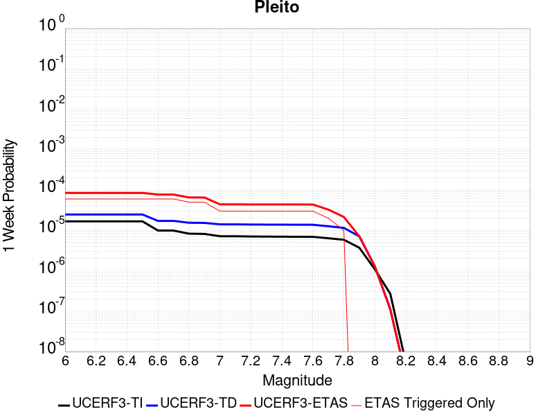 |  |  |  |

| Magnitude | 1 wk TI Prob | 1 wk TD Prob | 1 wk ETAS Prob | 1 wk ETAS/TD Gain | 1 wk ETAS Triggered Only | 1 mo TI Prob | 1 mo TD Prob | 1 mo ETAS Prob | 1 mo ETAS/TD Gain | 1 mo ETAS Triggered Only | 1 yr TI Prob | 1 yr TD Prob | 1 yr ETAS Prob | 1 yr ETAS/TD Gain | 1 yr ETAS Triggered Only | 10 yr TI Prob | 10 yr TD Prob | 10 yr ETAS Prob | 10 yr ETAS/TD Gain | 10 yr ETAS Triggered Only |
|-----|-----|-----|-----|-----|-----|-----|-----|-----|-----|-----|-----|-----|-----|-----|-----|-----|-----|-----|-----|-----|
| 6.0 | 1.6763008E-5 | 2.4764735E-5 | 8.476325E-5 | 3.42274 | 6.0E-5 | 7.183948E-5 | 1.0613067E-4 | 1.8612218E-4 | 1.7537078 | 8.0E-5 | 8.742947E-4 | 0.001291447 | 0.001401305 | 1.0850657 | 1.1E-4 | 0.00870863 | 0.012954412 | 0.013062987 | 1.0083814 | 1.1E-4 |
| 6.1 | 1.6763008E-5 | 2.4764735E-5 | 8.476325E-5 | 3.42274 | 6.0E-5 | 7.183948E-5 | 1.0613067E-4 | 1.8612218E-4 | 1.7537078 | 8.0E-5 | 8.742947E-4 | 0.001291447 | 0.001401305 | 1.0850657 | 1.1E-4 | 0.00870863 | 0.012954412 | 0.013062987 | 1.0083814 | 1.1E-4 |
| 6.2 | 1.6763008E-5 | 2.4764735E-5 | 8.476325E-5 | 3.42274 | 6.0E-5 | 7.183948E-5 | 1.0613067E-4 | 1.8612218E-4 | 1.7537078 | 8.0E-5 | 8.742947E-4 | 0.001291447 | 0.001401305 | 1.0850657 | 1.1E-4 | 0.00870863 | 0.012954412 | 0.013062987 | 1.0083814 | 1.1E-4 |
| 6.3 | 1.6763008E-5 | 2.4764735E-5 | 8.476325E-5 | 3.42274 | 6.0E-5 | 7.183948E-5 | 1.0613067E-4 | 1.8612218E-4 | 1.7537078 | 8.0E-5 | 8.742947E-4 | 0.001291447 | 0.001401305 | 1.0850657 | 1.1E-4 | 0.00870863 | 0.012954412 | 0.013062987 | 1.0083814 | 1.1E-4 |
| 6.4 | 1.6763008E-5 | 2.4764735E-5 | 8.476325E-5 | 3.42274 | 6.0E-5 | 7.183948E-5 | 1.0613067E-4 | 1.8612218E-4 | 1.7537078 | 8.0E-5 | 8.742947E-4 | 0.001291447 | 0.001401305 | 1.0850657 | 1.1E-4 | 0.00870863 | 0.012954412 | 0.013062987 | 1.0083814 | 1.1E-4 |
| 6.5 | 1.6763008E-5 | 2.4764735E-5 | 8.476325E-5 | 3.42274 | 6.0E-5 | 7.183948E-5 | 1.0613067E-4 | 1.8612218E-4 | 1.7537078 | 8.0E-5 | 8.742947E-4 | 0.001291447 | 0.001401305 | 1.0850657 | 1.1E-4 | 0.00870863 | 0.012954412 | 0.013062987 | 1.0083814 | 1.1E-4 |
| 6.6 | 9.910213E-6 | 1.721552E-5 | 7.7214485E-5 | 4.485167 | 6.0E-5 | 4.247165E-5 | 7.3778734E-5 | 1.337743E-4 | 1.8131825 | 6.0E-5 | 5.169696E-4 | 8.9788967E-4 | 9.678268E-4 | 1.0778906 | 7.0E-5 | 0.0051576863 | 0.009051226 | 0.009120592 | 1.0076637 | 7.0E-5 |
| 6.7 | 9.910213E-6 | 1.721552E-5 | 7.7214485E-5 | 4.485167 | 6.0E-5 | 4.247165E-5 | 7.3778734E-5 | 1.337743E-4 | 1.8131825 | 6.0E-5 | 5.169696E-4 | 8.9788967E-4 | 9.678268E-4 | 1.0778906 | 7.0E-5 | 0.0051576863 | 0.009051226 | 0.009120592 | 1.0076637 | 7.0E-5 |
| 6.8 | 8.300162E-6 | 1.5475129E-5 | 6.5474356E-5 | 4.230941 | 5.0E-5 | 3.557164E-5 | 6.63203E-5 | 1.1631699E-4 | 1.7538669 | 5.0E-5 | 4.3299864E-4 | 8.07152E-4 | 8.671036E-4 | 1.0742755 | 6.0E-5 | 0.004321559 | 0.008150663 | 0.008210174 | 1.0073013 | 6.0E-5 |
| 6.9 | 8.183114E-6 | 1.5346344E-5 | 6.534558E-5 | 4.2580547 | 5.0E-5 | 3.5070017E-5 | 6.57684E-5 | 1.15765106E-4 | 1.7601936 | 5.0E-5 | 4.2689382E-4 | 8.0043747E-4 | 8.6038944E-4 | 1.074899 | 6.0E-5 | 0.0042607468 | 0.008084008 | 0.008143523 | 1.007362 | 6.0E-5 |
| 7.0 | 7.1748823E-6 | 1.4133306E-5 | 4.413288E-5 | 3.1226156 | 3.0E-5 | 3.0749135E-5 | 6.0569906E-5 | 9.056809E-5 | 1.4952655 | 3.0E-5 | 3.743064E-4 | 7.3718966E-4 | 7.7716017E-4 | 1.0542201 | 4.0E-5 | 0.0037367654 | 0.0074553755 | 0.0074950773 | 1.0053252 | 4.0E-5 |
| 7.1 | 7.1671807E-6 | 1.4123676E-5 | 4.412325E-5 | 3.124063 | 3.0E-5 | 3.0716128E-5 | 6.0528637E-5 | 9.0526824E-5 | 1.4956032 | 3.0E-5 | 3.7390468E-4 | 7.366875E-4 | 7.7665807E-4 | 1.0542572 | 4.0E-5 | 0.0037327618 | 0.0074503883 | 0.00749009 | 1.0053289 | 4.0E-5 |
| 7.2 | 7.0649667E-6 | 1.3970962E-5 | 4.3970544E-5 | 3.147281 | 3.0E-5 | 3.0278077E-5 | 5.987418E-5 | 8.987238E-5 | 1.5010207 | 3.0E-5 | 3.6857324E-4 | 7.287248E-4 | 7.6869567E-4 | 1.0548505 | 4.0E-5 | 0.0036796255 | 0.0073711374 | 0.007410843 | 1.0053866 | 4.0E-5 |
| 7.3 | 7.02082E-6 | 1.3914415E-5 | 4.3914E-5 | 3.1560075 | 3.0E-5 | 3.008888E-5 | 5.9631846E-5 | 8.9630055E-5 | 1.5030569 | 3.0E-5 | 3.6627054E-4 | 7.257764E-4 | 7.657474E-4 | 1.0550734 | 4.0E-5 | 0.0036566744 | 0.0073416373 | 0.0073813437 | 1.0054084 | 4.0E-5 |
| 7.4 | 6.987146E-6 | 1.3873975E-5 | 4.387356E-5 | 3.1622918 | 3.0E-5 | 2.9944567E-5 | 5.9458544E-5 | 8.945676E-5 | 1.5045233 | 3.0E-5 | 3.6451413E-4 | 7.2366785E-4 | 7.636389E-4 | 1.055234 | 4.0E-5 | 0.0036391679 | 0.007320571 | 0.0073602786 | 1.005424 | 4.0E-5 |
| 7.5 | 6.9494554E-6 | 1.383088E-5 | 4.3830467E-5 | 3.1690295 | 3.0E-5 | 2.9783041E-5 | 5.9273858E-5 | 8.927208E-5 | 1.5060953 | 3.0E-5 | 3.625482E-4 | 7.2142074E-4 | 7.613919E-4 | 1.0554061 | 4.0E-5 | 0.0036195726 | 0.007298199 | 0.007337907 | 1.0054408 | 4.0E-5 |
| 7.6 | 6.92694E-6 | 1.3789992E-5 | 4.378958E-5 | 3.1754608 | 3.0E-5 | 2.9686547E-5 | 5.909863E-5 | 8.909686E-5 | 1.507596 | 3.0E-5 | 3.6137376E-4 | 7.192888E-4 | 7.5926003E-4 | 1.0555705 | 4.0E-5 | 0.0036078666 | 0.007276951 | 0.0073166597 | 1.0054568 | 4.0E-5 |
| 7.7 | 6.395867E-6 | 1.26690065E-5 | 3.2668755E-5 | 2.5786357 | 2.0E-5 | 2.741057E-5 | 5.4294615E-5 | 7.429353E-5 | 1.3683406 | 2.0E-5 | 3.336726E-4 | 6.6083675E-4 | 6.9081696E-4 | 1.045367 | 3.0E-5 | 0.0033317201 | 0.0066955453 | 0.0067253443 | 1.0044506 | 3.0E-5 |
| 7.8 | 5.8664327E-6 | 1.1536581E-5 | 2.1536465E-5 | 1.8667979 | 1.0E-5 | 2.5141611E-5 | 4.9441554E-5 | 5.944106E-5 | 1.202249 | 1.0E-5 | 3.060561E-4 | 6.0178485E-4 | 6.2177284E-4 | 1.0332144 | 2.0E-5 | 0.0030563495 | 0.0061010164 | 0.0061208946 | 1.0032581 | 2.0E-5 |
| 7.9 | 3.7167474E-6 | 7.1145205E-6 | 7.1145205E-6 | 1.0 | 0.0 | 1.592882E-5 | 3.0490448E-5 | 3.0490448E-5 | 1.0 | 0.0 | 1.9391612E-4 | 3.7115812E-4 | 3.8115442E-4 | 1.0269327 | 1.0E-5 | 0.0019374699 | 0.0037676243 | 0.0037775866 | 1.0026442 | 1.0E-5 |
| 8.0 | 1.0903841E-6 | 1.2879104E-6 | 1.2879104E-6 | 1.0 | 0.0 | 4.6730665E-6 | 5.5196047E-6 | 5.5196047E-6 | 1.0 | 0.0 | 5.68931E-5 | 6.719913E-5 | 7.7198456E-5 | 1.1488014 | 1.0E-5 | 5.6878536E-4 | 6.942094E-4 | 7.0420245E-4 | 1.0143949 | 1.0E-5 |
| 8.1 | 2.6894583E-7 | 1.1056095E-7 | 1.1056095E-7 | 1.0 | 0.0 | 1.1526245E-6 | 4.7383253E-7 | 4.7383253E-7 | 1.0 | 0.0 | 1.4033113E-5 | 5.768896E-6 | 1.576884E-5 | 2.733424 | 1.0E-5 | 1.4032227E-4 | 6.454915E-5 | 7.454851E-5 | 1.1549107 | 1.0E-5 |
| 8.2 | 5.2967013E-9 | 2.4567874E-9 | 2.4567874E-9 | 1.0 | 0.0 | 2.2700148E-8 | 1.0529089E-8 | 1.0529089E-8 | 1.0 | 0.0 | 2.7637427E-7 | 1.2819166E-7 | 1.2819166E-7 | 1.0 | 0.0 | 2.7637393E-6 | 1.4588004E-6 | 1.4588004E-6 | 1.0 | 0.0 |

## Pisgah-Bullion Mtn-Mesquite Lk
*[(top)](#table-of-contents)*

| 1 Week | 1 Month | 1 Year | 10 Year |
|-----|-----|-----|-----|
|  |  |  |  |

| Magnitude | 1 wk TI Prob | 1 wk TD Prob | 1 wk ETAS Prob | 1 wk ETAS/TD Gain | 1 wk ETAS Triggered Only | 1 mo TI Prob | 1 mo TD Prob | 1 mo ETAS Prob | 1 mo ETAS/TD Gain | 1 mo ETAS Triggered Only | 1 yr TI Prob | 1 yr TD Prob | 1 yr ETAS Prob | 1 yr ETAS/TD Gain | 1 yr ETAS Triggered Only | 10 yr TI Prob | 10 yr TD Prob | 10 yr ETAS Prob | 10 yr ETAS/TD Gain | 10 yr ETAS Triggered Only |
|-----|-----|-----|-----|-----|-----|-----|-----|-----|-----|-----|-----|-----|-----|-----|-----|-----|-----|-----|-----|-----|
| 6.0 | 3.0240792E-5 | 2.40909E-5 | 6.408994E-5 | 2.660338 | 4.0E-5 | 1.2959696E-4 | 1.032432E-4 | 1.5323803E-4 | 1.4842434 | 5.0E-5 | 0.0015767008 | 0.0012563618 | 0.0013162864 | 1.047697 | 6.0E-5 | 0.015655609 | 0.012502613 | 0.012601363 | 1.0078983 | 1.0E-4 |
| 6.1 | 3.0240792E-5 | 2.40909E-5 | 6.408994E-5 | 2.660338 | 4.0E-5 | 1.2959696E-4 | 1.032432E-4 | 1.5323803E-4 | 1.4842434 | 5.0E-5 | 0.0015767008 | 0.0012563618 | 0.0013162864 | 1.047697 | 6.0E-5 | 0.015655609 | 0.012502613 | 0.012601363 | 1.0078983 | 1.0E-4 |
| 6.2 | 3.0240792E-5 | 2.40909E-5 | 6.408994E-5 | 2.660338 | 4.0E-5 | 1.2959696E-4 | 1.032432E-4 | 1.5323803E-4 | 1.4842434 | 5.0E-5 | 0.0015767008 | 0.0012563618 | 0.0013162864 | 1.047697 | 6.0E-5 | 0.015655609 | 0.012502613 | 0.012601363 | 1.0078983 | 1.0E-4 |
| 6.3 | 2.0498217E-5 | 1.3638054E-5 | 4.3637647E-5 | 3.1996973 | 3.0E-5 | 8.784654E-5 | 5.8447586E-5 | 9.844525E-5 | 1.6843339 | 4.0E-5 | 0.0010690069 | 7.1138324E-4 | 7.513548E-4 | 1.0561885 | 4.0E-5 | 0.01063879 | 0.0070926864 | 0.007152261 | 1.0083994 | 6.0E-5 |
| 6.4 | 2.0498217E-5 | 1.3638054E-5 | 4.3637647E-5 | 3.1996973 | 3.0E-5 | 8.784654E-5 | 5.8447586E-5 | 9.844525E-5 | 1.6843339 | 4.0E-5 | 0.0010690069 | 7.1138324E-4 | 7.513548E-4 | 1.0561885 | 4.0E-5 | 0.01063879 | 0.0070926864 | 0.007152261 | 1.0083994 | 6.0E-5 |
| 6.5 | 1.7316182E-5 | 1.04769715E-5 | 4.0476658E-5 | 3.8633928 | 3.0E-5 | 7.42101E-5 | 4.490059E-5 | 8.489879E-5 | 1.8908169 | 4.0E-5 | 9.0313336E-4 | 5.465376E-4 | 5.865157E-4 | 1.073148 | 4.0E-5 | 0.008994718 | 0.00545293 | 0.0055026575 | 1.0091194 | 5.0E-5 |
| 6.6 | 1.5251077E-5 | 8.414133E-6 | 2.8413964E-5 | 3.376933 | 2.0E-5 | 6.536012E-5 | 3.606011E-5 | 5.605939E-5 | 1.5546094 | 2.0E-5 | 7.9546886E-4 | 4.3895066E-4 | 4.5894188E-4 | 1.0455432 | 2.0E-5 | 0.007926274 | 0.0043815537 | 0.004411422 | 1.0068169 | 3.0E-5 |
| 6.7 | 1.2997425E-5 | 6.4112146E-6 | 1.641115E-5 | 2.5597568 | 1.0E-5 | 5.570206E-5 | 2.7476372E-5 | 3.7476097E-5 | 1.363939 | 1.0E-5 | 6.7796157E-4 | 3.3447813E-4 | 3.4447477E-4 | 1.0298873 | 1.0E-5 | 0.0067589693 | 0.003340207 | 0.0033601404 | 1.0059676 | 2.0E-5 |
| 6.8 | 1.035386E-5 | 4.333145E-6 | 1.4333102E-5 | 3.3077824 | 1.0E-5 | 4.437293E-5 | 1.8570496E-5 | 2.857031E-5 | 1.5384786 | 1.0E-5 | 5.401065E-4 | 2.260732E-4 | 2.3607093E-4 | 1.0442234 | 1.0E-5 | 0.0053879567 | 0.002258519 | 0.0022784737 | 1.0088353 | 2.0E-5 |
| 6.9 | 8.816252E-6 | 3.5805879E-6 | 1.3580552E-5 | 3.7928274 | 1.0E-5 | 3.778339E-5 | 1.534529E-5 | 2.5345136E-5 | 1.6516558 | 1.0E-5 | 4.5991567E-4 | 1.8681347E-4 | 1.9681161E-4 | 1.0535194 | 1.0E-5 | 0.00458965 | 0.0018666228 | 0.0018766042 | 1.0053473 | 1.0E-5 |
| 7.0 | 6.8232207E-6 | 2.5674399E-6 | 2.5674399E-6 | 1.0 | 0.0 | 2.9242048E-5 | 1.100327E-5 | 1.100327E-5 | 1.0 | 0.0 | 3.5596377E-4 | 1.3395688E-4 | 1.3395688E-4 | 1.0 | 0.0 | 0.0035539411 | 0.0013387925 | 0.0013387925 | 1.0 | 0.0 |
| 7.1 | 5.837013E-6 | 2.2273143E-6 | 2.2273143E-6 | 1.0 | 0.0 | 2.501553E-5 | 9.5456E-6 | 9.5456E-6 | 1.0 | 0.0 | 3.045215E-4 | 1.1621177E-4 | 1.1621177E-4 | 1.0 | 0.0 | 0.0030410455 | 0.001161539 | 0.001161539 | 1.0 | 0.0 |
| 7.2 | 4.278052E-6 | 1.6275065E-6 | 1.6275065E-6 | 1.0 | 0.0 | 1.833438E-5 | 6.975011E-6 | 6.975011E-6 | 1.0 | 0.0 | 2.231982E-4 | 8.491768E-5 | 8.491768E-5 | 1.0 | 0.0 | 0.0022297418 | 8.4887556E-4 | 8.4887556E-4 | 1.0 | 0.0 |
| 7.3 | 1.8803692E-6 | 8.344788E-7 | 8.344788E-7 | 1.0 | 0.0 | 8.0587E-6 | 3.5763337E-6 | 3.5763337E-6 | 1.0 | 0.0 | 9.811026E-5 | 4.354114E-5 | 4.354114E-5 | 1.0 | 0.0 | 9.806695E-4 | 4.3534054E-4 | 4.3534054E-4 | 1.0 | 0.0 |

## Ortigalita (North)
*[(top)](#table-of-contents)*

| 1 Week | 1 Month | 1 Year | 10 Year |
|-----|-----|-----|-----|
|  | 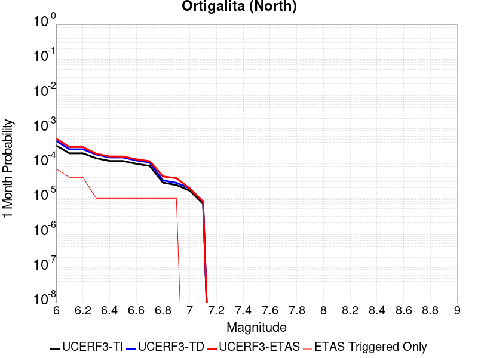 | 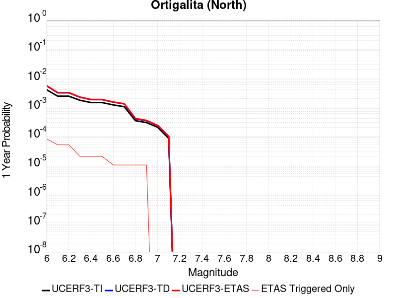 |  |

| Magnitude | 1 wk TI Prob | 1 wk TD Prob | 1 wk ETAS Prob | 1 wk ETAS/TD Gain | 1 wk ETAS Triggered Only | 1 mo TI Prob | 1 mo TD Prob | 1 mo ETAS Prob | 1 mo ETAS/TD Gain | 1 mo ETAS Triggered Only | 1 yr TI Prob | 1 yr TD Prob | 1 yr ETAS Prob | 1 yr ETAS/TD Gain | 1 yr ETAS Triggered Only | 10 yr TI Prob | 10 yr TD Prob | 10 yr ETAS Prob | 10 yr ETAS/TD Gain | 10 yr ETAS Triggered Only |
|-----|-----|-----|-----|-----|-----|-----|-----|-----|-----|-----|-----|-----|-----|-----|-----|-----|-----|-----|-----|-----|
| 6.0 | 7.711876E-5 | 1.0505308E-4 | 1.5504782E-4 | 1.4758999 | 5.0E-5 | 3.3046713E-4 | 4.501601E-4 | 5.201286E-4 | 1.1554302 | 7.0E-5 | 0.004016016 | 0.0054680547 | 0.005547617 | 1.0145504 | 8.0E-5 | 0.039442103 | 0.053455614 | 0.0535408 | 1.0015936 | 9.0E-5 |
| 6.1 | 4.607858E-5 | 6.0239887E-5 | 9.023808E-5 | 1.4979789 | 3.0E-5 | 1.9746469E-4 | 2.5814763E-4 | 2.981373E-4 | 1.1549101 | 4.0E-5 | 0.0024014818 | 0.0031387366 | 0.0031885796 | 1.01588 | 5.0E-5 | 0.023756953 | 0.030975312 | 0.031033453 | 1.0018771 | 6.0E-5 |
| 6.2 | 4.607858E-5 | 6.0239887E-5 | 9.023808E-5 | 1.4979789 | 3.0E-5 | 1.9746469E-4 | 2.5814763E-4 | 2.981373E-4 | 1.1549101 | 4.0E-5 | 0.0024014818 | 0.0031387366 | 0.0031885796 | 1.01588 | 5.0E-5 | 0.023756953 | 0.030975312 | 0.031033453 | 1.0018771 | 6.0E-5 |
| 6.3 | 3.327423E-5 | 4.2476124E-5 | 4.2476124E-5 | 1.0 | 0.0 | 1.4259605E-4 | 1.8202956E-4 | 1.9202773E-4 | 1.0549262 | 1.0E-5 | 0.0017347244 | 0.002214206 | 0.0022341616 | 1.0090126 | 2.0E-5 | 0.017212452 | 0.02194574 | 0.021975081 | 1.001337 | 3.0E-5 |
| 6.4 | 2.7732503E-5 | 3.4999008E-5 | 3.4999008E-5 | 1.0 | 0.0 | 1.1884817E-4 | 1.499886E-4 | 1.599871E-4 | 1.0666617 | 1.0E-5 | 0.001446016 | 0.0018248158 | 0.0018447792 | 1.01094 | 2.0E-5 | 0.014366428 | 0.018121297 | 0.018150754 | 1.0016255 | 3.0E-5 |
| 6.5 | 2.7689714E-5 | 3.4948822E-5 | 3.4948822E-5 | 1.0 | 0.0 | 1.186648E-4 | 1.4977354E-4 | 1.5977204E-4 | 1.0667574 | 1.0E-5 | 0.0014437864 | 0.0018222018 | 0.0018421654 | 1.0109557 | 2.0E-5 | 0.014344421 | 0.018095585 | 0.01812504 | 1.0016279 | 3.0E-5 |
| 6.6 | 2.2976905E-5 | 2.871829E-5 | 2.871829E-5 | 1.0 | 0.0 | 9.846873E-5 | 1.23074E-4 | 1.3307277E-4 | 1.081242 | 1.0E-5 | 0.0011981975 | 0.0014976348 | 0.0015076199 | 1.0066671 | 1.0E-5 | 0.011917574 | 0.014898733 | 0.014908585 | 1.0006613 | 1.0E-5 |
| 6.7 | 1.9871539E-5 | 2.4904637E-5 | 2.4904637E-5 | 1.0 | 0.0 | 8.516096E-5 | 1.067312E-4 | 1.1673012E-4 | 1.0936834 | 1.0E-5 | 0.0010363415 | 0.0012989199 | 0.0013089069 | 1.0076888 | 1.0E-5 | 0.010315218 | 0.012936938 | 0.012946809 | 1.0007629 | 1.0E-5 |
| 6.8 | 6.5640475E-6 | 7.6054926E-6 | 7.6054926E-6 | 1.0 | 0.0 | 2.813133E-5 | 3.2594577E-5 | 4.259425E-5 | 1.3067895 | 1.0E-5 | 3.424451E-4 | 3.9676955E-4 | 4.0676558E-4 | 1.0251936 | 1.0E-5 | 0.0034191788 | 0.003960899 | 0.003970859 | 1.0025147 | 1.0E-5 |
| 6.9 | 5.6219683E-6 | 6.5018376E-6 | 6.5018376E-6 | 1.0 | 0.0 | 2.4093928E-5 | 2.7864735E-5 | 3.7864458E-5 | 1.3588666 | 1.0E-5 | 2.933041E-4 | 3.3920293E-4 | 3.4919954E-4 | 1.0294709 | 1.0E-5 | 0.0029291727 | 0.003387109 | 0.003397075 | 1.0029423 | 1.0E-5 |
| 7.0 | 3.875591E-6 | 4.4847548E-6 | 4.4847548E-6 | 1.0 | 0.0 | 1.6609569E-5 | 1.9220248E-5 | 1.9220248E-5 | 1.0 | 0.0 | 2.0220275E-4 | 2.339835E-4 | 2.339835E-4 | 1.0 | 0.0 | 0.0020201886 | 0.0023375798 | 0.0023375798 | 1.0 | 0.0 |
| 7.1 | 1.6017933E-6 | 1.8570418E-6 | 1.8570418E-6 | 1.0 | 0.0 | 6.8648105E-6 | 7.958732E-6 | 7.958732E-6 | 1.0 | 0.0 | 8.357586E-5 | 9.689432E-5 | 9.689432E-5 | 1.0 | 0.0 | 8.3544437E-4 | 9.686254E-4 | 9.686254E-4 | 1.0 | 0.0 |

## Channel Islands Thrust
*[(top)](#table-of-contents)*

| 1 Week | 1 Month | 1 Year | 10 Year |
|-----|-----|-----|-----|
|  |  |  |  |

| Magnitude | 1 wk TI Prob | 1 wk TD Prob | 1 wk ETAS Prob | 1 wk ETAS/TD Gain | 1 wk ETAS Triggered Only | 1 mo TI Prob | 1 mo TD Prob | 1 mo ETAS Prob | 1 mo ETAS/TD Gain | 1 mo ETAS Triggered Only | 1 yr TI Prob | 1 yr TD Prob | 1 yr ETAS Prob | 1 yr ETAS/TD Gain | 1 yr ETAS Triggered Only | 10 yr TI Prob | 10 yr TD Prob | 10 yr ETAS Prob | 10 yr ETAS/TD Gain | 10 yr ETAS Triggered Only |
|-----|-----|-----|-----|-----|-----|-----|-----|-----|-----|-----|-----|-----|-----|-----|-----|-----|-----|-----|-----|-----|
| 6.0 | 2.2156251E-5 | 2.4092022E-5 | 4.409154E-5 | 1.8301303 | 2.0E-5 | 9.495191E-5 | 1.03248036E-4 | 1.5324287E-4 | 1.4842207 | 5.0E-5 | 0.0011554264 | 0.0012564266 | 0.0013263385 | 1.0556436 | 7.0E-5 | 0.011494373 | 0.0125038205 | 0.0126025705 | 1.0078975 | 1.0E-4 |
| 6.1 | 2.2156251E-5 | 2.4092022E-5 | 4.409154E-5 | 1.8301303 | 2.0E-5 | 9.495191E-5 | 1.03248036E-4 | 1.5324287E-4 | 1.4842207 | 5.0E-5 | 0.0011554264 | 0.0012564266 | 0.0013263385 | 1.0556436 | 7.0E-5 | 0.011494373 | 0.0125038205 | 0.0126025705 | 1.0078975 | 1.0E-4 |
| 6.2 | 2.2156251E-5 | 2.4092022E-5 | 4.409154E-5 | 1.8301303 | 2.0E-5 | 9.495191E-5 | 1.03248036E-4 | 1.5324287E-4 | 1.4842207 | 5.0E-5 | 0.0011554264 | 0.0012564266 | 0.0013263385 | 1.0556436 | 7.0E-5 | 0.011494373 | 0.0125038205 | 0.0126025705 | 1.0078975 | 1.0E-4 |
| 6.3 | 2.2156251E-5 | 2.4092022E-5 | 4.409154E-5 | 1.8301303 | 2.0E-5 | 9.495191E-5 | 1.03248036E-4 | 1.5324287E-4 | 1.4842207 | 5.0E-5 | 0.0011554264 | 0.0012564266 | 0.0013263385 | 1.0556436 | 7.0E-5 | 0.011494373 | 0.0125038205 | 0.0126025705 | 1.0078975 | 1.0E-4 |
| 6.4 | 2.2156251E-5 | 2.4092022E-5 | 4.409154E-5 | 1.8301303 | 2.0E-5 | 9.495191E-5 | 1.03248036E-4 | 1.5324287E-4 | 1.4842207 | 5.0E-5 | 0.0011554264 | 0.0012564266 | 0.0013263385 | 1.0556436 | 7.0E-5 | 0.011494373 | 0.0125038205 | 0.0126025705 | 1.0078975 | 1.0E-4 |
| 6.5 | 2.2156251E-5 | 2.4092022E-5 | 4.409154E-5 | 1.8301303 | 2.0E-5 | 9.495191E-5 | 1.03248036E-4 | 1.5324287E-4 | 1.4842207 | 5.0E-5 | 0.0011554264 | 0.0012564266 | 0.0013263385 | 1.0556436 | 7.0E-5 | 0.011494373 | 0.0125038205 | 0.0126025705 | 1.0078975 | 1.0E-4 |
| 6.6 | 2.2156251E-5 | 2.4092022E-5 | 4.409154E-5 | 1.8301303 | 2.0E-5 | 9.495191E-5 | 1.03248036E-4 | 1.5324287E-4 | 1.4842207 | 5.0E-5 | 0.0011554264 | 0.0012564266 | 0.0013263385 | 1.0556436 | 7.0E-5 | 0.011494373 | 0.0125038205 | 0.0126025705 | 1.0078975 | 1.0E-4 |
| 6.7 | 1.0601296E-5 | 1.1379544E-5 | 1.1379544E-5 | 1.0 | 0.0 | 4.5433335E-5 | 4.876859E-5 | 5.8768102E-5 | 1.20504 | 1.0E-5 | 5.5301044E-4 | 5.936007E-4 | 6.0359476E-4 | 1.0168363 | 1.0E-5 | 0.005516363 | 0.005920653 | 0.005930594 | 1.001679 | 1.0E-5 |
| 6.8 | 1.0246747E-5 | 1.0996669E-5 | 1.0996669E-5 | 1.0 | 0.0 | 4.391389E-5 | 4.7127756E-5 | 5.7127287E-5 | 1.2121792 | 1.0E-5 | 5.345204E-4 | 5.7363417E-4 | 5.836284E-4 | 1.0174227 | 1.0E-5 | 0.0053323656 | 0.005722025 | 0.0057319677 | 1.0017376 | 1.0E-5 |
| 6.9 | 9.049551E-6 | 9.699645E-6 | 9.699645E-6 | 1.0 | 0.0 | 3.878322E-5 | 4.1569267E-5 | 4.1569267E-5 | 1.0 | 0.0 | 4.7208337E-4 | 5.059924E-4 | 5.059924E-4 | 1.0 | 0.0 | 0.0047108172 | 0.0050488203 | 0.0050488203 | 1.0 | 0.0 |
| 7.0 | 8.6542195E-6 | 9.274603E-6 | 9.274603E-6 | 1.0 | 0.0 | 3.7088983E-5 | 3.9747716E-5 | 3.9747716E-5 | 1.0 | 0.0 | 4.5146482E-4 | 4.8382508E-4 | 4.8382508E-4 | 1.0 | 0.0 | 0.004505487 | 0.0048281294 | 0.0048281294 | 1.0 | 0.0 |
| 7.1 | 8.391028E-6 | 8.992925E-6 | 8.992925E-6 | 1.0 | 0.0 | 3.5961057E-5 | 3.8540562E-5 | 3.8540562E-5 | 1.0 | 0.0 | 4.3773788E-4 | 4.6913436E-4 | 4.6913436E-4 | 1.0 | 0.0 | 0.004368766 | 0.0046818503 | 0.0046818503 | 1.0 | 0.0 |
| 7.2 | 5.965188E-6 | 6.3716957E-6 | 6.3716957E-6 | 1.0 | 0.0 | 2.556484E-5 | 2.7306984E-5 | 2.7306984E-5 | 1.0 | 0.0 | 3.1120746E-4 | 3.3241237E-4 | 3.3241237E-4 | 1.0 | 0.0 | 0.00310772 | 0.0033192094 | 0.0033192094 | 1.0 | 0.0 |
| 7.3 | 4.877518E-6 | 5.206007E-6 | 5.206007E-6 | 1.0 | 0.0 | 2.0903482E-5 | 2.231127E-5 | 2.231127E-5 | 1.0 | 0.0 | 2.5447016E-4 | 2.716063E-4 | 2.716063E-4 | 1.0 | 0.0 | 0.0025417898 | 0.0027127897 | 0.0027127897 | 1.0 | 0.0 |
| 7.4 | 3.8829853E-6 | 4.141863E-6 | 4.141863E-6 | 1.0 | 0.0 | 1.664126E-5 | 1.7750723E-5 | 1.7750723E-5 | 1.0 | 0.0 | 2.0258849E-4 | 2.1609403E-4 | 2.1609403E-4 | 1.0 | 0.0 | 0.002024039 | 0.002158881 | 0.002158881 | 1.0 | 0.0 |
| 7.5 | 1.3489616E-6 | 1.4277905E-6 | 1.4277905E-6 | 1.0 | 0.0 | 5.7812517E-6 | 6.119088E-6 | 6.119088E-6 | 1.0 | 0.0 | 7.038446E-5 | 7.449739E-5 | 7.449739E-5 | 1.0 | 0.0 | 7.036218E-4 | 7.4472814E-4 | 7.4472814E-4 | 1.0 | 0.0 |
| 7.6 | 6.058192E-7 | 6.35378E-7 | 6.35378E-7 | 1.0 | 0.0 | 2.5963652E-6 | 2.7230458E-6 | 2.7230458E-6 | 1.0 | 0.0 | 3.161029E-5 | 3.3152595E-5 | 3.3152595E-5 | 1.0 | 0.0 | 3.1605794E-4 | 3.314781E-4 | 3.314781E-4 | 1.0 | 0.0 |
| 7.7 | 2.2170494E-7 | 2.2607924E-7 | 2.2607924E-7 | 1.0 | 0.0 | 9.5016367E-7 | 9.689107E-7 | 9.689107E-7 | 1.0 | 0.0 | 1.1568181E-5 | 1.17964355E-5 | 1.17964355E-5 | 1.0 | 0.0 | 1.1567579E-4 | 1.179592E-4 | 1.179592E-4 | 1.0 | 0.0 |
| 7.8 | 2.1613102E-8 | 1.5466837E-8 | 1.5466837E-8 | 1.0 | 0.0 | 9.262757E-8 | 6.628645E-8 | 6.628645E-8 | 1.0 | 0.0 | 1.1277401E-6 | 8.070372E-7 | 8.070372E-7 | 1.0 | 0.0 | 1.1277344E-5 | 8.07035E-6 | 8.07035E-6 | 1.0 | 0.0 |

## Oceanic - West Huasna
*[(top)](#table-of-contents)*

| 1 Week | 1 Month | 1 Year | 10 Year |
|-----|-----|-----|-----|
|  |  |  |  |

| Magnitude | 1 wk TI Prob | 1 wk TD Prob | 1 wk ETAS Prob | 1 wk ETAS/TD Gain | 1 wk ETAS Triggered Only | 1 mo TI Prob | 1 mo TD Prob | 1 mo ETAS Prob | 1 mo ETAS/TD Gain | 1 mo ETAS Triggered Only | 1 yr TI Prob | 1 yr TD Prob | 1 yr ETAS Prob | 1 yr ETAS/TD Gain | 1 yr ETAS Triggered Only | 10 yr TI Prob | 10 yr TD Prob | 10 yr ETAS Prob | 10 yr ETAS/TD Gain | 10 yr ETAS Triggered Only |
|-----|-----|-----|-----|-----|-----|-----|-----|-----|-----|-----|-----|-----|-----|-----|-----|-----|-----|-----|-----|-----|
| 6.0 | 3.195567E-5 | 2.7926368E-5 | 8.7924695E-5 | 3.148447 | 6.0E-5 | 1.3694567E-4 | 1.19679185E-4 | 1.8967081E-4 | 1.5848271 | 7.0E-5 | 0.0016660384 | 0.0014561634 | 0.0015460323 | 1.0617162 | 9.0E-5 | 0.016536033 | 0.01447077 | 0.014559468 | 1.0061294 | 9.0E-5 |
| 6.1 | 2.1156782E-5 | 1.7573117E-5 | 4.757259E-5 | 2.707123 | 3.0E-5 | 9.066878E-5 | 7.531123E-5 | 1.0530898E-4 | 1.398317 | 3.0E-5 | 0.0011033333 | 9.1653795E-4 | 9.565013E-4 | 1.0436025 | 4.0E-5 | 0.010978713 | 0.009128587 | 0.009168222 | 1.0043418 | 4.0E-5 |
| 6.2 | 1.6195117E-5 | 1.3327227E-5 | 3.332696E-5 | 2.5006673 | 2.0E-5 | 6.9405796E-5 | 5.7115452E-5 | 7.711431E-5 | 1.350148 | 2.0E-5 | 8.44688E-4 | 6.9516135E-4 | 7.251405E-4 | 1.0431254 | 3.0E-5 | 0.008414844 | 0.0069301617 | 0.006959954 | 1.0042989 | 3.0E-5 |
| 6.3 | 1.3559345E-5 | 1.1179013E-5 | 2.1178901E-5 | 1.8945234 | 1.0E-5 | 5.811018E-5 | 4.7909183E-5 | 5.7908703E-5 | 1.2087183 | 1.0E-5 | 7.072618E-4 | 5.8313913E-4 | 6.0312747E-4 | 1.0342771 | 2.0E-5 | 0.0070501505 | 0.005816208 | 0.0058360915 | 1.0034187 | 2.0E-5 |
| 6.4 | 1.2120619E-5 | 1.0000874E-5 | 2.0000774E-5 | 1.9999026 | 1.0E-5 | 5.1944477E-5 | 4.2860185E-5 | 5.285976E-5 | 1.2333068 | 1.0E-5 | 6.322405E-4 | 5.216983E-4 | 5.416879E-4 | 1.0383164 | 2.0E-5 | 0.006304447 | 0.005204804 | 0.0052246996 | 1.0038226 | 2.0E-5 |
| 6.5 | 1.13511915E-5 | 9.367378E-6 | 1.9367284E-5 | 2.0675244 | 1.0E-5 | 4.8647056E-5 | 4.0145293E-5 | 5.0144892E-5 | 1.2490852 | 1.0E-5 | 5.9211696E-4 | 4.886598E-4 | 5.0865E-4 | 1.0409082 | 2.0E-5 | 0.0059054173 | 0.0048759114 | 0.0048958138 | 1.0040818 | 2.0E-5 |
| 6.6 | 9.850605E-6 | 8.1353155E-6 | 1.8135233E-5 | 2.2291987 | 1.0E-5 | 4.2216197E-5 | 3.4865174E-5 | 4.4864824E-5 | 1.2868092 | 1.0E-5 | 5.1386096E-4 | 4.2440102E-4 | 4.4439253E-4 | 1.0471052 | 2.0E-5 | 0.0051267436 | 0.0042359377 | 0.004255853 | 1.0047015 | 2.0E-5 |
| 6.7 | 8.8558645E-6 | 7.318341E-6 | 1.7318267E-5 | 2.36642 | 1.0E-5 | 3.7953152E-5 | 3.1363943E-5 | 4.136363E-5 | 1.3188275 | 1.0E-5 | 4.6198163E-4 | 3.8178926E-4 | 4.0178164E-4 | 1.052365 | 2.0E-5 | 0.004610224 | 0.0038113592 | 0.003831283 | 1.0052274 | 2.0E-5 |
| 6.8 | 7.67136E-6 | 6.39169E-6 | 1.6391627E-5 | 2.5645216 | 1.0E-5 | 3.2876844E-5 | 2.739267E-5 | 3.7392398E-5 | 1.3650512 | 1.0E-5 | 4.0020206E-4 | 3.3345487E-4 | 3.4345154E-4 | 1.0299791 | 1.0E-5 | 0.003994821 | 0.0033295664 | 0.003339533 | 1.0029933 | 1.0E-5 |
| 6.9 | 6.534529E-6 | 5.458261E-6 | 1.5458207E-5 | 2.8320754 | 1.0E-5 | 2.8004823E-5 | 2.3392338E-5 | 3.3392105E-5 | 1.4274805 | 1.0E-5 | 3.4090536E-4 | 2.8476462E-4 | 2.9476176E-4 | 1.0351068 | 1.0E-5 | 0.0034038287 | 0.002844014 | 0.0028539856 | 1.0035062 | 1.0E-5 |
| 7.0 | 5.460525E-6 | 4.5699203E-6 | 1.4569874E-5 | 3.1882122 | 1.0E-5 | 2.3402039E-5 | 1.9585226E-5 | 2.958503E-5 | 1.510579 | 1.0E-5 | 2.8488258E-4 | 2.3842414E-4 | 2.4842177E-4 | 1.0419321 | 1.0E-5 | 0.0028451765 | 0.0023816973 | 0.0023916736 | 1.0041887 | 1.0E-5 |
| 7.1 | 4.4825083E-6 | 3.7524153E-6 | 1.37523775E-5 | 3.66494 | 1.0E-5 | 1.9210609E-5 | 1.6081682E-5 | 2.6081521E-5 | 1.6218156 | 1.0E-5 | 2.3386406E-4 | 1.9577699E-4 | 2.0577502E-4 | 1.0510685 | 1.0E-5 | 0.002336181 | 0.001956057 | 0.0019660376 | 1.0051023 | 1.0E-5 |
| 7.2 | 2.821708E-6 | 2.424941E-6 | 1.2424916E-5 | 5.1238017 | 1.0E-5 | 1.2092979E-5 | 1.0392562E-5 | 2.039246E-5 | 1.9622166 | 1.0E-5 | 1.4722206E-4 | 1.265221E-4 | 1.3652084E-4 | 1.0790275 | 1.0E-5 | 0.0014712457 | 0.0012645032 | 0.0012744906 | 1.0078982 | 1.0E-5 |
| 7.3 | 2.0644757E-6 | 1.7687502E-6 | 1.1768732E-5 | 6.6537 | 1.0E-5 | 8.847723E-6 | 7.580336E-6 | 1.758026E-5 | 2.3191926 | 1.0E-5 | 1.0771569E-4 | 9.228668E-5 | 1.0228576E-4 | 1.108348 | 1.0E-5 | 0.001076635 | 9.224854E-4 | 9.324762E-4 | 1.0108303 | 1.0E-5 |
| 7.4 | 1.6980367E-6 | 1.4379966E-6 | 1.1437983E-5 | 7.954109 | 1.0E-5 | 7.27728E-6 | 6.1628284E-6 | 1.6162767E-5 | 2.6226215 | 1.0E-5 | 8.8597284E-5 | 7.502986E-5 | 8.50291E-5 | 1.1332703 | 1.0E-5 | 8.8561967E-4 | 7.5004686E-4 | 7.600394E-4 | 1.0133225 | 1.0E-5 |
| 7.5 | 1.3637683E-6 | 1.1302697E-6 | 1.1302697E-6 | 1.0 | 0.0 | 5.844708E-6 | 4.844004E-6 | 4.844004E-6 | 1.0 | 0.0 | 7.1156996E-5 | 5.897415E-5 | 5.897415E-5 | 1.0 | 0.0 | 7.1134215E-4 | 5.8958656E-4 | 5.8958656E-4 | 1.0 | 0.0 |
| 7.6 | 9.802994E-7 | 7.6772847E-7 | 7.6772847E-7 | 1.0 | 0.0 | 4.2012766E-6 | 3.2902608E-6 | 3.2902608E-6 | 1.0 | 0.0 | 5.1149345E-5 | 4.005819E-5 | 4.005819E-5 | 1.0 | 0.0 | 5.113757E-4 | 4.0051117E-4 | 4.0051117E-4 | 1.0 | 0.0 |
| 7.7 | 5.986191E-7 | 4.0050708E-7 | 4.0050708E-7 | 1.0 | 0.0 | 2.5655079E-6 | 1.7164577E-6 | 1.7164577E-6 | 1.0 | 0.0 | 3.1234613E-5 | 2.0897673E-5 | 2.0897673E-5 | 1.0 | 0.0 | 3.123022E-4 | 2.0895849E-4 | 2.0895849E-4 | 1.0 | 0.0 |
| 7.8 | 2.9189815E-7 | 1.5285202E-7 | 1.5285202E-7 | 1.0 | 0.0 | 1.2509914E-6 | 6.5507993E-7 | 6.5507993E-7 | 1.0 | 0.0 | 1.5230714E-5 | 7.975569E-6 | 7.975569E-6 | 1.0 | 0.0 | 1.522967E-4 | 7.97542E-5 | 7.97542E-5 | 1.0 | 0.0 |
| 7.9 | 1.2057845E-7 | 4.6208047E-8 | 4.6208047E-8 | 1.0 | 0.0 | 5.1676466E-7 | 1.9803447E-7 | 1.9803447E-7 | 1.0 | 0.0 | 6.2915915E-6 | 2.411067E-6 | 2.411067E-6 | 1.0 | 0.0 | 6.2914136E-5 | 2.4111772E-5 | 2.4111772E-5 | 1.0 | 0.0 |
| 8.0 | 3.3806387E-9 | 9.0093144E-10 | 9.0093144E-10 | 1.0 | 0.0 | 1.4488451E-8 | 3.8611354E-9 | 3.8611354E-9 | 1.0 | 0.0 | 1.7639688E-7 | 4.7009323E-8 | 4.7009323E-8 | 1.0 | 0.0 | 1.7639674E-6 | 4.712806E-7 | 4.712806E-7 | 1.0 | 0.0 |

## Big Pine (Central)
*[(top)](#table-of-contents)*

| 1 Week | 1 Month | 1 Year | 10 Year |
|-----|-----|-----|-----|
|  |  | 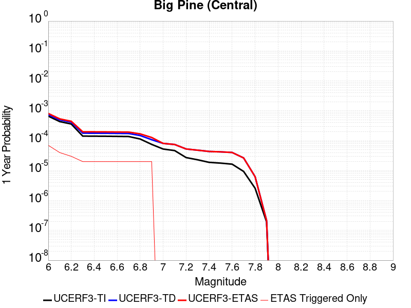 |  |

| Magnitude | 1 wk TI Prob | 1 wk TD Prob | 1 wk ETAS Prob | 1 wk ETAS/TD Gain | 1 wk ETAS Triggered Only | 1 mo TI Prob | 1 mo TD Prob | 1 mo ETAS Prob | 1 mo ETAS/TD Gain | 1 mo ETAS Triggered Only | 1 yr TI Prob | 1 yr TD Prob | 1 yr ETAS Prob | 1 yr ETAS/TD Gain | 1 yr ETAS Triggered Only | 10 yr TI Prob | 10 yr TD Prob | 10 yr ETAS Prob | 10 yr ETAS/TD Gain | 10 yr ETAS Triggered Only |
|-----|-----|-----|-----|-----|-----|-----|-----|-----|-----|-----|-----|-----|-----|-----|-----|-----|-----|-----|-----|-----|
| 6.0 | 1.2706755E-5 | 1.4250602E-5 | 5.425003E-5 | 3.806859 | 4.0E-5 | 5.4456385E-5 | 6.107279E-5 | 1.0107034E-4 | 1.6549162 | 4.0E-5 | 6.628048E-4 | 7.433441E-4 | 8.1329205E-4 | 1.094099 | 7.0E-5 | 0.006608314 | 0.007413639 | 0.007502972 | 1.0120498 | 9.0E-5 |
| 6.1 | 8.342579E-6 | 9.510835E-6 | 4.9510454E-5 | 5.2056894 | 4.0E-5 | 3.5753423E-5 | 4.076021E-5 | 8.075858E-5 | 1.9813092 | 4.0E-5 | 4.3521097E-4 | 4.9616426E-4 | 5.361444E-4 | 1.0805784 | 4.0E-5 | 0.0043435963 | 0.004954155 | 0.0050039073 | 1.0100425 | 5.0E-5 |
| 6.2 | 6.923899E-6 | 7.967221E-6 | 3.7966984E-5 | 4.765398 | 3.0E-5 | 2.9673516E-5 | 3.4144894E-5 | 6.4143875E-5 | 1.8785787 | 3.0E-5 | 3.6121515E-4 | 4.1565404E-4 | 4.4564158E-4 | 1.0721455 | 3.0E-5 | 0.003606286 | 0.0041521094 | 0.0041919434 | 1.0095936 | 4.0E-5 |
| 6.3 | 2.728396E-6 | 3.4243646E-6 | 2.3424296E-5 | 6.8404794 | 2.0E-5 | 1.1693074E-5 | 1.4675771E-5 | 3.467548E-5 | 2.3627703 | 2.0E-5 | 1.4235388E-4 | 1.7866373E-4 | 1.9866016E-4 | 1.1119221 | 2.0E-5 | 0.0014226272 | 0.0017867433 | 0.0018166897 | 1.0167603 | 3.0E-5 |
| 6.4 | 2.7136944E-6 | 3.4086581E-6 | 2.340859E-5 | 6.8673916 | 2.0E-5 | 1.1630066E-5 | 1.4608458E-5 | 3.4608165E-5 | 2.3690498 | 2.0E-5 | 1.4158686E-4 | 1.7784433E-4 | 1.9784077E-4 | 1.1124378 | 2.0E-5 | 0.0014149669 | 0.0017785623 | 0.001808509 | 1.0168376 | 3.0E-5 |
| 6.5 | 2.6971882E-6 | 3.3910032E-6 | 2.3390936E-5 | 6.8979397 | 2.0E-5 | 1.1559327E-5 | 1.4532795E-5 | 3.4532502E-5 | 2.3761778 | 2.0E-5 | 1.4072572E-4 | 1.7692328E-4 | 1.9691975E-4 | 1.1130234 | 2.0E-5 | 0.0014063664 | 0.0017693666 | 0.0017993135 | 1.0169252 | 3.0E-5 |
| 6.6 | 2.669092E-6 | 3.3610236E-6 | 2.3360957E-5 | 6.950548 | 2.0E-5 | 1.1438916E-5 | 1.4404312E-5 | 3.4404024E-5 | 2.388453 | 2.0E-5 | 1.3925991E-4 | 1.7535927E-4 | 1.9535575E-4 | 1.1140316 | 2.0E-5 | 0.0013917267 | 0.0017537511 | 0.0017836984 | 1.0170761 | 3.0E-5 |
| 6.7 | 2.6408059E-6 | 3.3310494E-6 | 2.3330982E-5 | 7.004094 | 2.0E-5 | 1.1317691E-5 | 1.4275853E-5 | 3.4275567E-5 | 2.400947 | 2.0E-5 | 1.3778417E-4 | 1.737955E-4 | 1.9379203E-4 | 1.1150578 | 2.0E-5 | 0.0013769877 | 0.0017381381 | 0.001768086 | 1.0172298 | 3.0E-5 |
| 6.8 | 2.1786943E-6 | 2.8545066E-6 | 2.2854449E-5 | 8.006445 | 2.0E-5 | 9.337228E-6 | 1.2233547E-5 | 3.2233304E-5 | 2.6348288 | 2.0E-5 | 1.1367482E-4 | 1.4893398E-4 | 1.68931E-4 | 1.1342677 | 2.0E-5 | 0.0011361669 | 0.0014898704 | 0.0015198257 | 1.020106 | 3.0E-5 |
| 6.9 | 1.4411696E-6 | 2.0685677E-6 | 2.2068527E-5 | 10.668506 | 2.0E-5 | 6.1764263E-6 | 8.865261E-6 | 2.8865084E-5 | 3.2559767 | 2.0E-5 | 7.51954E-5 | 1.0792949E-4 | 1.2792733E-4 | 1.1852862 | 2.0E-5 | 7.5169955E-4 | 0.0010802548 | 0.0011002332 | 1.0184941 | 2.0E-5 |
| 7.0 | 1.0073411E-6 | 1.5543274E-6 | 1.5543274E-6 | 1.0 | 0.0 | 4.317169E-6 | 6.661387E-6 | 6.661387E-6 | 1.0 | 0.0 | 5.2560266E-5 | 8.109952E-5 | 8.109952E-5 | 1.0 | 0.0 | 5.2547833E-4 | 8.1217213E-4 | 8.1217213E-4 | 1.0 | 0.0 |
| 7.1 | 8.947104E-7 | 1.430316E-6 | 1.430316E-6 | 1.0 | 0.0 | 3.834468E-6 | 6.1299124E-6 | 6.1299124E-6 | 1.0 | 0.0 | 4.6683643E-5 | 7.462928E-5 | 7.462928E-5 | 1.0 | 0.0 | 4.6673836E-4 | 7.4751483E-4 | 7.4751483E-4 | 1.0 | 0.0 |
| 7.2 | 5.215166E-7 | 1.0112277E-6 | 1.0112277E-6 | 1.0 | 0.0 | 2.2350691E-6 | 4.333826E-6 | 4.333826E-6 | 1.0 | 0.0 | 2.7211627E-5 | 5.27631E-5 | 5.27631E-5 | 1.0 | 0.0 | 2.7208295E-4 | 5.289683E-4 | 5.289683E-4 | 1.0 | 0.0 |
| 7.3 | 4.4024807E-7 | 9.220183E-7 | 9.220183E-7 | 1.0 | 0.0 | 1.8867761E-6 | 3.951501E-6 | 3.951501E-6 | 1.0 | 0.0 | 2.2971257E-5 | 4.8108504E-5 | 4.8108504E-5 | 1.0 | 0.0 | 2.2968883E-4 | 4.824433E-4 | 4.824433E-4 | 1.0 | 0.0 |
| 7.4 | 3.6130905E-7 | 8.359109E-7 | 8.359109E-7 | 1.0 | 0.0 | 1.5484665E-6 | 3.5824705E-6 | 3.5824705E-6 | 1.0 | 0.0 | 1.8852415E-5 | 4.3615746E-5 | 4.3615746E-5 | 1.0 | 0.0 | 1.8850817E-4 | 4.3752496E-4 | 4.3752496E-4 | 1.0 | 0.0 |
| 7.5 | 3.408184E-7 | 8.1087245E-7 | 8.1087245E-7 | 1.0 | 0.0 | 1.4606494E-6 | 3.475163E-6 | 3.475163E-6 | 1.0 | 0.0 | 1.7783263E-5 | 4.230933E-5 | 4.230933E-5 | 1.0 | 0.0 | 1.778184E-4 | 4.2444657E-4 | 4.2444657E-4 | 1.0 | 0.0 |
| 7.6 | 3.1428627E-7 | 7.732167E-7 | 7.732167E-7 | 1.0 | 0.0 | 1.3469405E-6 | 3.313782E-6 | 3.313782E-6 | 1.0 | 0.0 | 1.6398877E-5 | 4.0344585E-5 | 4.0344585E-5 | 1.0 | 0.0 | 1.6397667E-4 | 4.0477706E-4 | 4.0477706E-4 | 1.0 | 0.0 |
| 7.7 | 1.7972785E-7 | 5.0782415E-7 | 5.0782415E-7 | 1.0 | 0.0 | 7.70262E-7 | 2.1763874E-6 | 2.1763874E-6 | 1.0 | 0.0 | 9.377899E-6 | 2.6497206E-5 | 2.6497206E-5 | 1.0 | 0.0 | 9.377503E-5 | 2.6633305E-4 | 2.6633305E-4 | 1.0 | 0.0 |
| 7.8 | 4.9230927E-8 | 1.1981747E-7 | 1.1981747E-7 | 1.0 | 0.0 | 2.1098968E-7 | 5.135033E-7 | 5.135033E-7 | 1.0 | 0.0 | 2.5687964E-6 | 6.2518866E-6 | 6.2518866E-6 | 1.0 | 0.0 | 2.5687666E-5 | 6.2971965E-5 | 6.2971965E-5 | 1.0 | 0.0 |
| 7.9 | 3.6805972E-9 | 4.1051638E-9 | 4.1051638E-9 | 1.0 | 0.0 | 1.5773987E-8 | 1.7593557E-8 | 1.7593557E-8 | 1.0 | 0.0 | 1.9204828E-7 | 2.1420155E-7 | 2.1420155E-7 | 1.0 | 0.0 | 1.920481E-6 | 2.1898923E-6 | 2.1898923E-6 | 1.0 | 0.0 |

## Independence rev 2011
*[(top)](#table-of-contents)*

| 1 Week | 1 Month | 1 Year | 10 Year |
|-----|-----|-----|-----|
|  |  |  |  |

| Magnitude | 1 wk TI Prob | 1 wk TD Prob | 1 wk ETAS Prob | 1 wk ETAS/TD Gain | 1 wk ETAS Triggered Only | 1 mo TI Prob | 1 mo TD Prob | 1 mo ETAS Prob | 1 mo ETAS/TD Gain | 1 mo ETAS Triggered Only | 1 yr TI Prob | 1 yr TD Prob | 1 yr ETAS Prob | 1 yr ETAS/TD Gain | 1 yr ETAS Triggered Only | 10 yr TI Prob | 10 yr TD Prob | 10 yr ETAS Prob | 10 yr ETAS/TD Gain | 10 yr ETAS Triggered Only |
|-----|-----|-----|-----|-----|-----|-----|-----|-----|-----|-----|-----|-----|-----|-----|-----|-----|-----|-----|-----|-----|
| 6.0 | 4.422171E-6 | 4.3262253E-6 | 5.432601E-5 | 12.557369 | 5.0E-5 | 1.8952025E-5 | 1.8540852E-5 | 6.853992E-5 | 3.696698 | 5.0E-5 | 2.3071647E-4 | 2.2571447E-4 | 3.056964E-4 | 1.3543501 | 8.0E-5 | 0.0023047708 | 0.0022551457 | 0.0023449427 | 1.0398188 | 9.0E-5 |
| 6.1 | 4.422171E-6 | 4.3262253E-6 | 5.432601E-5 | 12.557369 | 5.0E-5 | 1.8952025E-5 | 1.8540852E-5 | 6.853992E-5 | 3.696698 | 5.0E-5 | 2.3071647E-4 | 2.2571447E-4 | 3.056964E-4 | 1.3543501 | 8.0E-5 | 0.0023047708 | 0.0022551457 | 0.0023449427 | 1.0398188 | 9.0E-5 |
| 6.2 | 4.422171E-6 | 4.3262253E-6 | 5.432601E-5 | 12.557369 | 5.0E-5 | 1.8952025E-5 | 1.8540852E-5 | 6.853992E-5 | 3.696698 | 5.0E-5 | 2.3071647E-4 | 2.2571447E-4 | 3.056964E-4 | 1.3543501 | 8.0E-5 | 0.0023047708 | 0.0022551457 | 0.0023449427 | 1.0398188 | 9.0E-5 |
| 6.3 | 4.422171E-6 | 4.3262253E-6 | 5.432601E-5 | 12.557369 | 5.0E-5 | 1.8952025E-5 | 1.8540852E-5 | 6.853992E-5 | 3.696698 | 5.0E-5 | 2.3071647E-4 | 2.2571447E-4 | 3.056964E-4 | 1.3543501 | 8.0E-5 | 0.0023047708 | 0.0022551457 | 0.0023449427 | 1.0398188 | 9.0E-5 |
| 6.4 | 4.422171E-6 | 4.3262253E-6 | 5.432601E-5 | 12.557369 | 5.0E-5 | 1.8952025E-5 | 1.8540852E-5 | 6.853992E-5 | 3.696698 | 5.0E-5 | 2.3071647E-4 | 2.2571447E-4 | 3.056964E-4 | 1.3543501 | 8.0E-5 | 0.0023047708 | 0.0022551457 | 0.0023449427 | 1.0398188 | 9.0E-5 |
| 6.5 | 4.422171E-6 | 4.3262253E-6 | 5.432601E-5 | 12.557369 | 5.0E-5 | 1.8952025E-5 | 1.8540852E-5 | 6.853992E-5 | 3.696698 | 5.0E-5 | 2.3071647E-4 | 2.2571447E-4 | 3.056964E-4 | 1.3543501 | 8.0E-5 | 0.0023047708 | 0.0022551457 | 0.0023449427 | 1.0398188 | 9.0E-5 |
| 6.6 | 2.663744E-6 | 2.5319846E-6 | 5.2531857E-5 | 20.747307 | 5.0E-5 | 1.1415996E-5 | 1.08513195E-5 | 6.0850776E-5 | 5.6076846 | 5.0E-5 | 1.3898089E-4 | 1.321073E-4 | 2.0209805E-4 | 1.5298023 | 7.0E-5 | 0.0013889399 | 0.0013203359 | 0.0014002303 | 1.0605106 | 8.0E-5 |
| 6.7 | 2.663744E-6 | 2.5319846E-6 | 5.2531857E-5 | 20.747307 | 5.0E-5 | 1.1415996E-5 | 1.08513195E-5 | 6.0850776E-5 | 5.6076846 | 5.0E-5 | 1.3898089E-4 | 1.321073E-4 | 2.0209805E-4 | 1.5298023 | 7.0E-5 | 0.0013889399 | 0.0013203359 | 0.0014002303 | 1.0605106 | 8.0E-5 |
| 6.8 | 1.9716529E-6 | 1.8322567E-6 | 5.1832165E-5 | 28.288704 | 5.0E-5 | 8.449913E-6 | 7.852505E-6 | 5.7852114E-5 | 7.3673444 | 5.0E-5 | 1.0287284E-4 | 9.560019E-5 | 1.655935E-4 | 1.7321461 | 7.0E-5 | 0.0010282523 | 9.5560355E-4 | 0.0010355271 | 1.0836368 | 8.0E-5 |
| 6.9 | 1.8788617E-6 | 1.7429976E-6 | 5.174291E-5 | 29.686163 | 5.0E-5 | 8.0522395E-6 | 7.4699688E-6 | 5.7469595E-5 | 7.6934185 | 5.0E-5 | 9.80316E-5 | 9.09432E-5 | 1.6093683E-4 | 1.7696413 | 7.0E-5 | 9.798837E-4 | 9.090718E-4 | 9.790082E-4 | 1.0769316 | 7.0E-5 |
| 7.0 | 1.5045488E-6 | 1.3849498E-6 | 5.138488E-5 | 37.102345 | 5.0E-5 | 6.44805E-6 | 5.9354857E-6 | 5.593519E-5 | 9.423861 | 5.0E-5 | 7.8502184E-5 | 7.226219E-5 | 1.4225714E-4 | 1.9686247 | 7.0E-5 | 7.8474457E-4 | 7.223921E-4 | 7.9234154E-4 | 1.0968302 | 7.0E-5 |
| 7.1 | 1.272341E-6 | 1.1625089E-6 | 5.116245E-5 | 44.010376 | 5.0E-5 | 5.4528787E-6 | 4.9821715E-6 | 5.4981923E-5 | 11.035734 | 5.0E-5 | 6.6386776E-5 | 6.0656283E-5 | 1.3065204E-4 | 2.1539736 | 7.0E-5 | 6.636695E-4 | 6.064005E-4 | 6.76358E-4 | 1.1153653 | 7.0E-5 |
| 7.2 | 1.0416892E-6 | 9.409871E-7 | 3.094096E-5 | 32.881386 | 3.0E-5 | 4.464375E-6 | 4.032796E-6 | 3.4032673E-5 | 8.438978 | 3.0E-5 | 5.4352407E-5 | 4.9098202E-5 | 9.909575E-5 | 2.0183172 | 5.0E-5 | 5.4339116E-4 | 4.908754E-4 | 5.4085086E-4 | 1.1018088 | 5.0E-5 |
| 7.3 | 7.9450155E-7 | 7.2350036E-7 | 3.072348E-5 | 42.46505 | 3.0E-5 | 3.4050022E-6 | 3.1007123E-6 | 3.310062E-5 | 10.675166 | 3.0E-5 | 4.1455114E-5 | 3.7750528E-5 | 8.774864E-5 | 2.3244348 | 5.0E-5 | 4.144738E-4 | 3.7744228E-4 | 4.274234E-4 | 1.1324205 | 5.0E-5 |
| 7.4 | 5.3893444E-7 | 5.0195166E-7 | 2.0501942E-5 | 40.844456 | 2.0E-5 | 2.309717E-6 | 2.1512196E-6 | 2.2151176E-5 | 10.297031 | 2.0E-5 | 2.8120441E-5 | 2.6190788E-5 | 6.618974E-5 | 2.5272145 | 4.0E-5 | 2.8116882E-4 | 2.6187746E-4 | 3.01867E-4 | 1.1527032 | 4.0E-5 |
| 7.5 | 3.8852085E-7 | 3.6825622E-7 | 2.0368248E-5 | 55.30999 | 2.0E-5 | 1.6650882E-6 | 1.57824E-6 | 2.157821E-5 | 13.672323 | 2.0E-5 | 2.027226E-5 | 1.9214905E-5 | 5.9214137E-5 | 3.0816772 | 4.0E-5 | 2.0270412E-4 | 1.9213265E-4 | 2.3212496E-4 | 1.2081496 | 4.0E-5 |
| 7.6 | 2.414929E-7 | 2.3457605E-7 | 2.0234571E-5 | 86.26018 | 2.0E-5 | 1.0349692E-6 | 1.0053255E-6 | 2.1005306E-5 | 20.894033 | 2.0E-5 | 1.2600677E-5 | 1.2239771E-5 | 4.2239404E-5 | 3.4509962 | 3.0E-5 | 1.2599962E-4 | 1.223911E-4 | 1.5238742E-4 | 1.2450858 | 3.0E-5 |
| 7.7 | 6.8298014E-8 | 6.8589785E-8 | 6.8589785E-8 | 1.0 | 0.0 | 2.9270575E-7 | 2.939562E-7 | 2.939562E-7 | 1.0 | 0.0 | 3.5636867E-6 | 3.5789112E-6 | 3.5789112E-6 | 1.0 | 0.0 | 3.5636294E-5 | 3.5788584E-5 | 3.5788584E-5 | 1.0 | 0.0 |

## Red Mountain
*[(top)](#table-of-contents)*

| 1 Week | 1 Month | 1 Year | 10 Year |
|-----|-----|-----|-----|
|  |  |  |  |

| Magnitude | 1 wk TI Prob | 1 wk TD Prob | 1 wk ETAS Prob | 1 wk ETAS/TD Gain | 1 wk ETAS Triggered Only | 1 mo TI Prob | 1 mo TD Prob | 1 mo ETAS Prob | 1 mo ETAS/TD Gain | 1 mo ETAS Triggered Only | 1 yr TI Prob | 1 yr TD Prob | 1 yr ETAS Prob | 1 yr ETAS/TD Gain | 1 yr ETAS Triggered Only | 10 yr TI Prob | 10 yr TD Prob | 10 yr ETAS Prob | 10 yr ETAS/TD Gain | 10 yr ETAS Triggered Only |
|-----|-----|-----|-----|-----|-----|-----|-----|-----|-----|-----|-----|-----|-----|-----|-----|-----|-----|-----|-----|-----|
| 6.0 | 4.1810763E-5 | 4.7590016E-5 | 9.758764E-5 | 2.0505905 | 5.0E-5 | 1.7917668E-4 | 2.039422E-4 | 2.6392995E-4 | 1.294141 | 6.0E-5 | 0.0021792934 | 0.0024803334 | 0.0025501598 | 1.028152 | 7.0E-5 | 0.021580452 | 0.02454411 | 0.024622148 | 1.0031794 | 8.0E-5 |
| 6.1 | 4.1810763E-5 | 4.7590016E-5 | 9.758764E-5 | 2.0505905 | 5.0E-5 | 1.7917668E-4 | 2.039422E-4 | 2.6392995E-4 | 1.294141 | 6.0E-5 | 0.0021792934 | 0.0024803334 | 0.0025501598 | 1.028152 | 7.0E-5 | 0.021580452 | 0.02454411 | 0.024622148 | 1.0031794 | 8.0E-5 |
| 6.2 | 4.1810763E-5 | 4.7590016E-5 | 9.758764E-5 | 2.0505905 | 5.0E-5 | 1.7917668E-4 | 2.039422E-4 | 2.6392995E-4 | 1.294141 | 6.0E-5 | 0.0021792934 | 0.0024803334 | 0.0025501598 | 1.028152 | 7.0E-5 | 0.021580452 | 0.02454411 | 0.024622148 | 1.0031794 | 8.0E-5 |
| 6.3 | 4.1810763E-5 | 4.7590016E-5 | 9.758764E-5 | 2.0505905 | 5.0E-5 | 1.7917668E-4 | 2.039422E-4 | 2.6392995E-4 | 1.294141 | 6.0E-5 | 0.0021792934 | 0.0024803334 | 0.0025501598 | 1.028152 | 7.0E-5 | 0.021580452 | 0.02454411 | 0.024622148 | 1.0031794 | 8.0E-5 |
| 6.4 | 4.1810763E-5 | 4.7590016E-5 | 9.758764E-5 | 2.0505905 | 5.0E-5 | 1.7917668E-4 | 2.039422E-4 | 2.6392995E-4 | 1.294141 | 6.0E-5 | 0.0021792934 | 0.0024803334 | 0.0025501598 | 1.028152 | 7.0E-5 | 0.021580452 | 0.02454411 | 0.024622148 | 1.0031794 | 8.0E-5 |
| 6.5 | 3.154503E-5 | 3.5359757E-5 | 8.535799E-5 | 2.413987 | 5.0E-5 | 1.3518598E-4 | 1.5153353E-4 | 2.1152444E-4 | 1.3958919 | 6.0E-5 | 0.0016446467 | 0.0018434518 | 0.0019133227 | 1.0379022 | 7.0E-5 | 0.01632528 | 0.018291244 | 0.018359965 | 1.003757 | 7.0E-5 |
| 6.6 | 3.1535834E-5 | 3.5349138E-5 | 8.534737E-5 | 2.4144115 | 5.0E-5 | 1.3514658E-4 | 1.5148803E-4 | 2.1147894E-4 | 1.3960109 | 6.0E-5 | 0.0016441676 | 0.0018428987 | 0.0019127697 | 1.0379137 | 7.0E-5 | 0.01632056 | 0.018285805 | 0.018354526 | 1.0037581 | 7.0E-5 |
| 6.7 | 2.8267326E-5 | 3.1469353E-5 | 7.1468094E-5 | 2.2710378 | 4.0E-5 | 1.2114006E-4 | 1.3486217E-4 | 1.8485542E-4 | 1.3706989 | 5.0E-5 | 0.0014738824 | 0.0016407954 | 0.0017006969 | 1.0365076 | 6.0E-5 | 0.014641452 | 0.01629557 | 0.016354594 | 1.0036219 | 6.0E-5 |
| 6.8 | 2.8212884E-5 | 3.1407242E-5 | 7.1405986E-5 | 2.2735517 | 4.0E-5 | 1.20906756E-4 | 1.3459599E-4 | 1.8458927E-4 | 1.3714321 | 5.0E-5 | 0.0014710457 | 0.0016375595 | 0.0016974612 | 1.0365798 | 6.0E-5 | 0.014613459 | 0.016263688 | 0.016322711 | 1.0036292 | 6.0E-5 |
| 6.9 | 2.4227871E-5 | 2.6706994E-5 | 6.670593E-5 | 2.497695 | 4.0E-5 | 1.03829596E-4 | 1.1445395E-4 | 1.6444823E-4 | 1.4368069 | 5.0E-5 | 0.0012633923 | 0.0013926621 | 0.0014525785 | 1.043023 | 6.0E-5 | 0.012562336 | 0.0138470335 | 0.013906203 | 1.004273 | 6.0E-5 |
| 7.0 | 2.348524E-5 | 2.5835778E-5 | 6.583474E-5 | 2.5482006 | 4.0E-5 | 1.0064714E-4 | 1.10720495E-4 | 1.6071496E-4 | 1.4515376 | 5.0E-5 | 0.0012246901 | 0.001347264 | 0.0014071832 | 1.0444747 | 6.0E-5 | 0.012179627 | 0.013398598 | 0.013457794 | 1.0044181 | 6.0E-5 |
| 7.1 | 2.2311642E-5 | 2.4462845E-5 | 6.446186E-5 | 2.6350927 | 4.0E-5 | 9.561782E-5 | 1.04836974E-4 | 1.5483172E-4 | 1.476881 | 5.0E-5 | 0.0011635252 | 0.0012757176 | 0.001335641 | 1.0469724 | 6.0E-5 | 0.01157452 | 0.01269146 | 0.012750698 | 1.0046676 | 6.0E-5 |
| 7.2 | 1.6533986E-5 | 1.7670362E-5 | 5.7669655E-5 | 3.2636373 | 4.0E-5 | 7.085802E-5 | 7.572828E-5 | 1.257245E-4 | 1.6602052 | 5.0E-5 | 8.623549E-4 | 9.2166534E-4 | 9.8161E-4 | 1.0650395 | 6.0E-5 | 0.008590161 | 0.009184707 | 0.009244156 | 1.0064726 | 6.0E-5 |
| 7.3 | 1.4703092E-5 | 1.5559537E-5 | 5.5558914E-5 | 3.5707307 | 4.0E-5 | 6.301173E-5 | 6.668237E-5 | 1.1667904E-4 | 1.7497734 | 5.0E-5 | 7.668978E-4 | 8.1161706E-4 | 8.6157647E-4 | 1.0615554 | 5.0E-5 | 0.0076425658 | 0.008092604 | 0.008142199 | 1.0061284 | 5.0E-5 |
| 7.4 | 6.1331984E-6 | 5.5288874E-6 | 1.5528833E-5 | 2.8086722 | 1.0E-5 | 2.6284872E-5 | 2.3695018E-5 | 4.3694545E-5 | 1.8440393 | 2.0E-5 | 3.199713E-4 | 2.884492E-4 | 3.084434E-4 | 1.0693163 | 2.0E-5 | 0.0031951098 | 0.0028808024 | 0.0029007448 | 1.0069225 | 2.0E-5 |
| 7.5 | 5.954766E-6 | 5.338517E-6 | 1.5338464E-5 | 2.8731694 | 1.0E-5 | 2.5520176E-5 | 2.2879161E-5 | 4.2878703E-5 | 1.874138 | 2.0E-5 | 3.1066386E-4 | 2.785187E-4 | 2.9851313E-4 | 1.0717884 | 2.0E-5 | 0.003102299 | 0.0027817504 | 0.0028016947 | 1.0071697 | 2.0E-5 |
| 7.6 | 4.9726646E-6 | 4.315309E-6 | 1.4315266E-5 | 3.317321 | 1.0E-5 | 2.1311245E-5 | 1.8494053E-5 | 2.8493867E-5 | 1.5407044 | 1.0E-5 | 2.5943352E-4 | 2.2514217E-4 | 2.3513992E-4 | 1.0444064 | 1.0E-5 | 0.0025913084 | 0.0022491754 | 0.002259153 | 1.004436 | 1.0E-5 |
| 7.7 | 3.3613894E-6 | 2.8526886E-6 | 1.285266E-5 | 4.505455 | 1.0E-5 | 1.4405875E-5 | 1.22257525E-5 | 2.2225631E-5 | 1.8179356 | 1.0E-5 | 1.7537741E-4 | 1.4883863E-4 | 1.5883715E-4 | 1.0671768 | 1.0E-5 | 0.0017523908 | 0.0014874157 | 0.0014974009 | 1.006713 | 1.0E-5 |
| 7.8 | 1.1828961E-6 | 1.0122935E-6 | 1.0122935E-6 | 1.0 | 0.0 | 5.069545E-6 | 4.338394E-6 | 4.338394E-6 | 1.0 | 0.0 | 6.171996E-5 | 5.281869E-5 | 5.281869E-5 | 1.0 | 0.0 | 6.170282E-4 | 5.280643E-4 | 5.280643E-4 | 1.0 | 0.0 |
| 7.9 | 2.2967266E-7 | 1.861919E-7 | 1.861919E-7 | 1.0 | 0.0 | 9.843111E-7 | 7.97965E-7 | 7.97965E-7 | 1.0 | 0.0 | 1.19839215E-5 | 9.715184E-6 | 9.715184E-6 | 1.0 | 0.0 | 1.1983275E-4 | 9.714788E-5 | 9.714788E-5 | 1.0 | 0.0 |

## Blue Cut
*[(top)](#table-of-contents)*

| 1 Week | 1 Month | 1 Year | 10 Year |
|-----|-----|-----|-----|
| 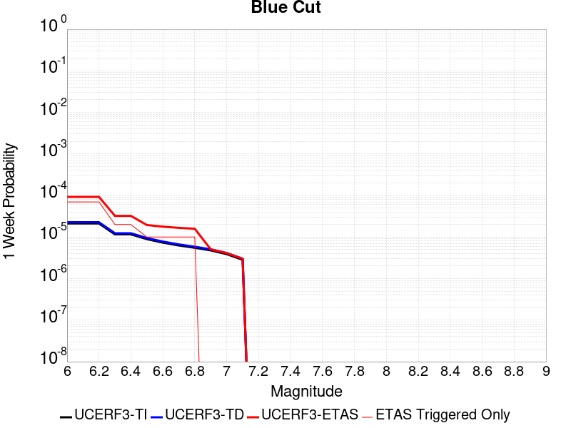 | 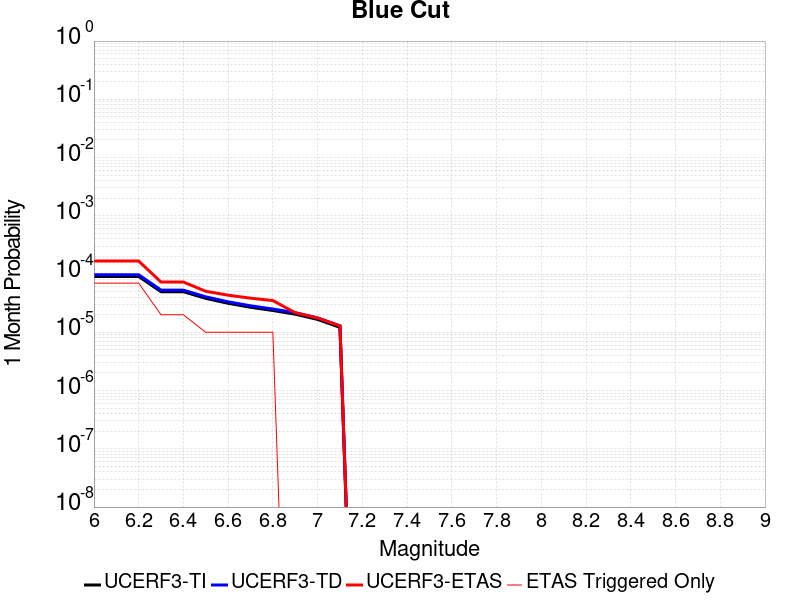 |  |  |

| Magnitude | 1 wk TI Prob | 1 wk TD Prob | 1 wk ETAS Prob | 1 wk ETAS/TD Gain | 1 wk ETAS Triggered Only | 1 mo TI Prob | 1 mo TD Prob | 1 mo ETAS Prob | 1 mo ETAS/TD Gain | 1 mo ETAS Triggered Only | 1 yr TI Prob | 1 yr TD Prob | 1 yr ETAS Prob | 1 yr ETAS/TD Gain | 1 yr ETAS Triggered Only | 10 yr TI Prob | 10 yr TD Prob | 10 yr ETAS Prob | 10 yr ETAS/TD Gain | 10 yr ETAS Triggered Only |
|-----|-----|-----|-----|-----|-----|-----|-----|-----|-----|-----|-----|-----|-----|-----|-----|-----|-----|-----|-----|-----|
| 6.0 | 2.1227985E-5 | 2.2719574E-5 | 9.2717986E-5 | 4.0809736 | 7.0E-5 | 9.097391E-5 | 9.73663E-5 | 1.6735948E-4 | 1.7188646 | 7.0E-5 | 0.0011070445 | 0.0011848481 | 0.0012747415 | 1.0758691 | 9.0E-5 | 0.011015458 | 0.011791152 | 0.01188009 | 1.0075428 | 9.0E-5 |
| 6.1 | 2.1227985E-5 | 2.2719574E-5 | 9.2717986E-5 | 4.0809736 | 7.0E-5 | 9.097391E-5 | 9.73663E-5 | 1.6735948E-4 | 1.7188646 | 7.0E-5 | 0.0011070445 | 0.0011848481 | 0.0012747415 | 1.0758691 | 9.0E-5 | 0.011015458 | 0.011791152 | 0.01188009 | 1.0075428 | 9.0E-5 |
| 6.2 | 2.1227985E-5 | 2.2719574E-5 | 9.2717986E-5 | 4.0809736 | 7.0E-5 | 9.097391E-5 | 9.73663E-5 | 1.6735948E-4 | 1.7188646 | 7.0E-5 | 0.0011070445 | 0.0011848481 | 0.0012747415 | 1.0758691 | 9.0E-5 | 0.011015458 | 0.011791152 | 0.01188009 | 1.0075428 | 9.0E-5 |
| 6.3 | 1.1613981E-5 | 1.2353542E-5 | 3.2353295E-5 | 2.618949 | 2.0E-5 | 4.9773254E-5 | 5.2942745E-5 | 7.2941686E-5 | 1.3777466 | 2.0E-5 | 6.0582085E-4 | 6.443998E-4 | 6.7438046E-4 | 1.046525 | 3.0E-5 | 0.0060417196 | 0.0064265593 | 0.0064563663 | 1.0046381 | 3.0E-5 |
| 6.4 | 1.1613981E-5 | 1.2353542E-5 | 3.2353295E-5 | 2.618949 | 2.0E-5 | 4.9773254E-5 | 5.2942745E-5 | 7.2941686E-5 | 1.3777466 | 2.0E-5 | 6.0582085E-4 | 6.443998E-4 | 6.7438046E-4 | 1.046525 | 3.0E-5 | 0.0060417196 | 0.0064265593 | 0.0064563663 | 1.0046381 | 3.0E-5 |
| 6.5 | 8.931326E-6 | 9.4816E-6 | 1.9481506E-5 | 2.0546644 | 1.0E-5 | 3.8276554E-5 | 4.0634844E-5 | 5.063444E-5 | 1.2460842 | 1.0E-5 | 4.6591737E-4 | 4.946261E-4 | 5.0462113E-4 | 1.0202073 | 1.0E-5 | 0.0046494175 | 0.004936161 | 0.0049461117 | 1.0020158 | 1.0E-5 |
| 6.6 | 7.345353E-6 | 7.79028E-6 | 1.7790202E-5 | 2.283641 | 1.0E-5 | 3.1479703E-5 | 3.338653E-5 | 4.3386193E-5 | 1.299512 | 1.0E-5 | 3.83198E-4 | 4.064132E-4 | 4.164091E-4 | 1.0245955 | 1.0E-5 | 0.0038253788 | 0.0040574907 | 0.0040674503 | 1.0024545 | 1.0E-5 |
| 6.7 | 6.2775666E-6 | 6.655149E-6 | 1.6655082E-5 | 2.502586 | 1.0E-5 | 2.690358E-5 | 2.8521798E-5 | 3.8521513E-5 | 1.350599 | 1.0E-5 | 3.2750185E-4 | 3.472051E-4 | 3.572016E-4 | 1.0287914 | 1.0E-5 | 0.0032701963 | 0.003467367 | 0.0034773324 | 1.002874 | 1.0E-5 |
| 6.8 | 5.5234095E-6 | 5.8551113E-6 | 1.5855052E-5 | 2.7078996 | 1.0E-5 | 2.367154E-5 | 2.5093133E-5 | 3.5092882E-5 | 1.3985054 | 1.0E-5 | 2.8816288E-4 | 3.0547334E-4 | 3.154703E-4 | 1.032726 | 1.0E-5 | 0.002877895 | 0.0030512505 | 0.00306122 | 1.0032673 | 1.0E-5 |
| 6.9 | 4.7780054E-6 | 5.0654203E-6 | 5.0654203E-6 | 1.0 | 0.0 | 2.0477004E-5 | 2.1708804E-5 | 2.1708804E-5 | 1.0 | 0.0 | 2.4927902E-4 | 2.642797E-4 | 2.642797E-4 | 1.0 | 0.0 | 0.0024899957 | 0.002640346 | 0.002640346 | 1.0 | 0.0 |
| 7.0 | 3.883171E-6 | 4.118487E-6 | 4.118487E-6 | 1.0 | 0.0 | 1.6642054E-5 | 1.7650578E-5 | 1.7650578E-5 | 1.0 | 0.0 | 2.0259817E-4 | 2.1488148E-4 | 2.1488148E-4 | 1.0 | 0.0 | 0.0020241356 | 0.0021474129 | 0.0021474129 | 1.0 | 0.0 |
| 7.1 | 2.8358215E-6 | 3.0097158E-6 | 3.0097158E-6 | 1.0 | 0.0 | 1.2153464E-5 | 1.2898756E-5 | 1.2898756E-5 | 1.0 | 0.0 | 1.4795837E-4 | 1.5703762E-4 | 1.5703762E-4 | 1.0 | 0.0 | 0.001478599 | 0.0015699116 | 0.0015699116 | 1.0 | 0.0 |

## Great Valley 09 (Laguna Seca)
*[(top)](#table-of-contents)*

| 1 Week | 1 Month | 1 Year | 10 Year |
|-----|-----|-----|-----|
|  |  |  |  |

| Magnitude | 1 wk TI Prob | 1 wk TD Prob | 1 wk ETAS Prob | 1 wk ETAS/TD Gain | 1 wk ETAS Triggered Only | 1 mo TI Prob | 1 mo TD Prob | 1 mo ETAS Prob | 1 mo ETAS/TD Gain | 1 mo ETAS Triggered Only | 1 yr TI Prob | 1 yr TD Prob | 1 yr ETAS Prob | 1 yr ETAS/TD Gain | 1 yr ETAS Triggered Only | 10 yr TI Prob | 10 yr TD Prob | 10 yr ETAS Prob | 10 yr ETAS/TD Gain | 10 yr ETAS Triggered Only |
|-----|-----|-----|-----|-----|-----|-----|-----|-----|-----|-----|-----|-----|-----|-----|-----|-----|-----|-----|-----|-----|
| 6.0 | 5.4353277E-5 | 7.050019E-5 | 1.5049454E-4 | 2.1346688 | 8.0E-5 | 2.3292181E-4 | 3.0211007E-4 | 3.820859E-4 | 1.2647241 | 8.0E-5 | 0.0028321352 | 0.0036720056 | 0.003751712 | 1.0217065 | 8.0E-5 | 0.02796312 | 0.036115844 | 0.036202595 | 1.002402 | 9.0E-5 |
| 6.1 | 4.5578287E-5 | 5.822054E-5 | 1.0821763E-4 | 1.8587534 | 5.0E-5 | 1.953209E-4 | 2.4949352E-4 | 2.9948103E-4 | 1.200356 | 5.0E-5 | 0.0023754383 | 0.0030333549 | 0.0030832032 | 1.0164334 | 5.0E-5 | 0.023502063 | 0.029919893 | 0.029978096 | 1.0019454 | 6.0E-5 |
| 6.2 | 2.8536782E-5 | 3.4736422E-5 | 3.4736422E-5 | 1.0 | 0.0 | 1.2229476E-4 | 1.4886161E-4 | 1.4886161E-4 | 1.0 | 0.0 | 0.0014879217 | 0.0018108576 | 0.0018108576 | 1.0 | 0.0 | 0.014779986 | 0.017958276 | 0.017958276 | 1.0 | 0.0 |
| 6.3 | 2.3698774E-5 | 2.8213344E-5 | 2.8213344E-5 | 1.0 | 0.0 | 1.01562226E-4 | 1.2090833E-4 | 1.2090833E-4 | 1.0 | 0.0 | 0.0012358186 | 0.001471051 | 0.001471051 | 1.0 | 0.0 | 0.012289686 | 0.014611455 | 0.014611455 | 1.0 | 0.0 |
| 6.4 | 1.9191197E-5 | 2.212289E-5 | 2.212289E-5 | 1.0 | 0.0 | 8.2245395E-5 | 9.4808805E-5 | 9.4808805E-5 | 1.0 | 0.0 | 0.0010008777 | 0.0011536906 | 0.0011536906 | 1.0 | 0.0 | 0.009963818 | 0.011477022 | 0.011477022 | 1.0 | 0.0 |
| 6.5 | 1.5203241E-5 | 1.6801298E-5 | 1.6801298E-5 | 1.0 | 0.0 | 6.5155116E-5 | 7.200338E-5 | 7.200338E-5 | 1.0 | 0.0 | 7.9297484E-4 | 8.76301E-4 | 8.76301E-4 | 1.0 | 0.0 | 0.007901512 | 0.008729581 | 0.008729581 | 1.0 | 0.0 |
| 6.6 | 1.0984925E-5 | 1.12425605E-5 | 1.12425605E-5 | 1.0 | 0.0 | 4.70774E-5 | 4.8181533E-5 | 4.8181533E-5 | 1.0 | 0.0 | 5.730166E-4 | 5.8645604E-4 | 5.8645604E-4 | 1.0 | 0.0 | 0.005715413 | 0.0058494755 | 0.0058494755 | 1.0 | 0.0 |
| 6.7 | 9.134616E-6 | 9.019868E-6 | 9.019868E-6 | 1.0 | 0.0 | 3.9147766E-5 | 3.865602E-5 | 3.865602E-5 | 1.0 | 0.0 | 4.7651984E-4 | 4.7053778E-4 | 4.7053778E-4 | 1.0 | 0.0 | 0.004754993 | 0.00469566 | 0.00469566 | 1.0 | 0.0 |
| 6.8 | 7.785589E-6 | 7.4519185E-6 | 7.4519185E-6 | 1.0 | 0.0 | 3.3366385E-5 | 3.1936415E-5 | 3.1936415E-5 | 1.0 | 0.0 | 4.0616E-4 | 3.887585E-4 | 3.887585E-4 | 1.0 | 0.0 | 0.0040541845 | 0.003880988 | 0.003880988 | 1.0 | 0.0 |
| 6.9 | 5.579095E-6 | 4.8984666E-6 | 4.8984666E-6 | 1.0 | 0.0 | 2.3910188E-5 | 2.0993268E-5 | 2.0993268E-5 | 1.0 | 0.0 | 2.9106764E-4 | 2.5556443E-4 | 2.5556443E-4 | 1.0 | 0.0 | 0.002906867 | 0.0025528427 | 0.0025528427 | 1.0 | 0.0 |
| 7.0 | 2.6816688E-6 | 1.521587E-6 | 1.521587E-6 | 1.0 | 0.0 | 1.1492816E-5 | 6.521071E-6 | 6.521071E-6 | 1.0 | 0.0 | 1.3991605E-4 | 7.939124E-5 | 7.939124E-5 | 1.0 | 0.0 | 0.0013982799 | 7.936375E-4 | 7.936375E-4 | 1.0 | 0.0 |
| 7.1 | 1.9951021E-6 | 7.45357E-7 | 7.45357E-7 | 1.0 | 0.0 | 8.55041E-6 | 3.1943835E-6 | 3.1943835E-6 | 1.0 | 0.0 | 1.0409627E-4 | 3.889097E-5 | 3.889097E-5 | 1.0 | 0.0 | 0.0010404752 | 3.8884574E-4 | 3.8884574E-4 | 1.0 | 0.0 |
| 7.2 | 1.9951021E-6 | 7.45357E-7 | 7.45357E-7 | 1.0 | 0.0 | 8.55041E-6 | 3.1943835E-6 | 3.1943835E-6 | 1.0 | 0.0 | 1.0409627E-4 | 3.889097E-5 | 3.889097E-5 | 1.0 | 0.0 | 0.0010404752 | 3.8884574E-4 | 3.8884574E-4 | 1.0 | 0.0 |
| 7.3 | 1.7087556E-6 | 6.578663E-7 | 6.578663E-7 | 1.0 | 0.0 | 7.3232177E-6 | 2.819424E-6 | 2.819424E-6 | 1.0 | 0.0 | 8.915652E-5 | 3.432599E-5 | 3.432599E-5 | 1.0 | 0.0 | 8.9120766E-4 | 3.432109E-4 | 3.432109E-4 | 1.0 | 0.0 |
| 7.4 | 1.3804846E-6 | 6.0737113E-7 | 6.0737113E-7 | 1.0 | 0.0 | 5.916349E-6 | 2.6030168E-6 | 2.6030168E-6 | 1.0 | 0.0 | 7.2029165E-5 | 3.169131E-5 | 3.169131E-5 | 1.0 | 0.0 | 7.200583E-4 | 3.168719E-4 | 3.168719E-4 | 1.0 | 0.0 |
| 7.5 | 1.3804846E-6 | 6.0737113E-7 | 6.0737113E-7 | 1.0 | 0.0 | 5.916349E-6 | 2.6030168E-6 | 2.6030168E-6 | 1.0 | 0.0 | 7.2029165E-5 | 3.169131E-5 | 3.169131E-5 | 1.0 | 0.0 | 7.200583E-4 | 3.168719E-4 | 3.168719E-4 | 1.0 | 0.0 |

## Lost Hills
*[(top)](#table-of-contents)*

| 1 Week | 1 Month | 1 Year | 10 Year |
|-----|-----|-----|-----|
|  |  |  |  |

| Magnitude | 1 wk TI Prob | 1 wk TD Prob | 1 wk ETAS Prob | 1 wk ETAS/TD Gain | 1 wk ETAS Triggered Only | 1 mo TI Prob | 1 mo TD Prob | 1 mo ETAS Prob | 1 mo ETAS/TD Gain | 1 mo ETAS Triggered Only | 1 yr TI Prob | 1 yr TD Prob | 1 yr ETAS Prob | 1 yr ETAS/TD Gain | 1 yr ETAS Triggered Only | 10 yr TI Prob | 10 yr TD Prob | 10 yr ETAS Prob | 10 yr ETAS/TD Gain | 10 yr ETAS Triggered Only |
|-----|-----|-----|-----|-----|-----|-----|-----|-----|-----|-----|-----|-----|-----|-----|-----|-----|-----|-----|-----|-----|
| 6.0 | 2.233523E-5 | 2.5106583E-5 | 8.510508E-5 | 3.3897514 | 6.0E-5 | 9.571891E-5 | 1.0759615E-4 | 1.675897E-4 | 1.5575808 | 6.0E-5 | 0.0011647546 | 0.001309364 | 0.0013792723 | 1.0533911 | 7.0E-5 | 0.011586686 | 0.013033091 | 0.013121918 | 1.0068156 | 9.0E-5 |
| 6.1 | 2.233523E-5 | 2.5106583E-5 | 8.510508E-5 | 3.3897514 | 6.0E-5 | 9.571891E-5 | 1.0759615E-4 | 1.675897E-4 | 1.5575808 | 6.0E-5 | 0.0011647546 | 0.001309364 | 0.0013792723 | 1.0533911 | 7.0E-5 | 0.011586686 | 0.013033091 | 0.013121918 | 1.0068156 | 9.0E-5 |
| 6.2 | 2.233523E-5 | 2.5106583E-5 | 8.510508E-5 | 3.3897514 | 6.0E-5 | 9.571891E-5 | 1.0759615E-4 | 1.675897E-4 | 1.5575808 | 6.0E-5 | 0.0011647546 | 0.001309364 | 0.0013792723 | 1.0533911 | 7.0E-5 | 0.011586686 | 0.013033091 | 0.013121918 | 1.0068156 | 9.0E-5 |
| 6.3 | 2.233523E-5 | 2.5106583E-5 | 8.510508E-5 | 3.3897514 | 6.0E-5 | 9.571891E-5 | 1.0759615E-4 | 1.675897E-4 | 1.5575808 | 6.0E-5 | 0.0011647546 | 0.001309364 | 0.0013792723 | 1.0533911 | 7.0E-5 | 0.011586686 | 0.013033091 | 0.013121918 | 1.0068156 | 9.0E-5 |
| 6.4 | 1.2288092E-5 | 1.3781108E-5 | 3.378083E-5 | 2.4512422 | 2.0E-5 | 5.2662188E-5 | 5.906108E-5 | 7.90599E-5 | 1.3386124 | 2.0E-5 | 6.409735E-4 | 7.189252E-4 | 7.4890367E-4 | 1.0416989 | 3.0E-5 | 0.006391279 | 0.0071752006 | 0.007224842 | 1.0069184 | 5.0E-5 |
| 6.5 | 1.2288092E-5 | 1.3781108E-5 | 3.378083E-5 | 2.4512422 | 2.0E-5 | 5.2662188E-5 | 5.906108E-5 | 7.90599E-5 | 1.3386124 | 2.0E-5 | 6.409735E-4 | 7.189252E-4 | 7.4890367E-4 | 1.0416989 | 3.0E-5 | 0.006391279 | 0.0071752006 | 0.007224842 | 1.0069184 | 5.0E-5 |
| 6.6 | 8.58281E-6 | 9.63377E-6 | 2.9633577E-5 | 3.0760105 | 2.0E-5 | 3.6782953E-5 | 4.12874E-5 | 6.128658E-5 | 1.4843893 | 2.0E-5 | 4.4774043E-4 | 5.026414E-4 | 5.326263E-4 | 1.0596547 | 3.0E-5 | 0.0044683935 | 0.005023205 | 0.0050630043 | 1.007923 | 4.0E-5 |
| 6.7 | 7.205685E-6 | 8.088302E-6 | 2.808814E-5 | 3.472687 | 2.0E-5 | 3.088114E-5 | 3.466415E-5 | 5.466346E-5 | 1.576945 | 2.0E-5 | 3.7591302E-4 | 4.2203604E-4 | 4.5202338E-4 | 1.071054 | 3.0E-5 | 0.0037527776 | 0.0042203604 | 0.0042601917 | 1.0094379 | 4.0E-5 |

## Bullion Mountains
*[(top)](#table-of-contents)*

| 1 Week | 1 Month | 1 Year | 10 Year |
|-----|-----|-----|-----|
|  |  |  | 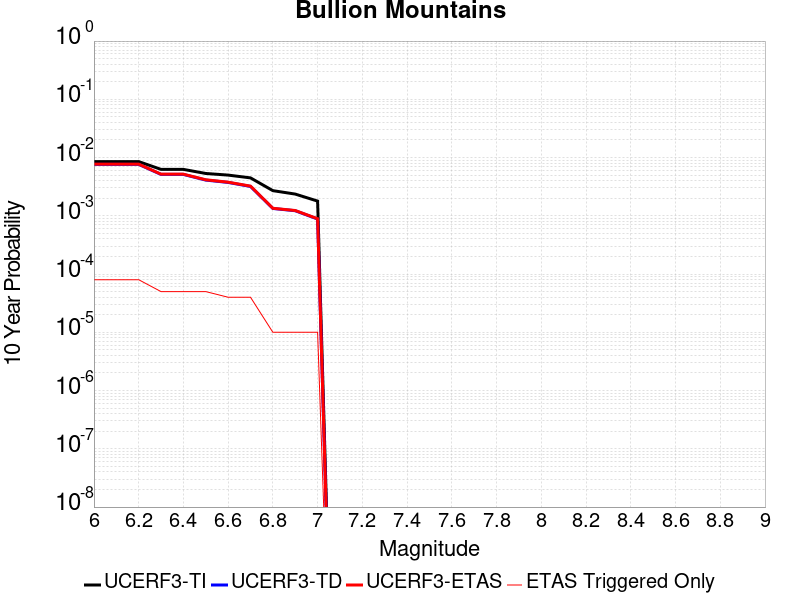 |

| Magnitude | 1 wk TI Prob | 1 wk TD Prob | 1 wk ETAS Prob | 1 wk ETAS/TD Gain | 1 wk ETAS Triggered Only | 1 mo TI Prob | 1 mo TD Prob | 1 mo ETAS Prob | 1 mo ETAS/TD Gain | 1 mo ETAS Triggered Only | 1 yr TI Prob | 1 yr TD Prob | 1 yr ETAS Prob | 1 yr ETAS/TD Gain | 1 yr ETAS Triggered Only | 10 yr TI Prob | 10 yr TD Prob | 10 yr ETAS Prob | 10 yr ETAS/TD Gain | 10 yr ETAS Triggered Only |
|-----|-----|-----|-----|-----|-----|-----|-----|-----|-----|-----|-----|-----|-----|-----|-----|-----|-----|-----|-----|-----|
| 6.0 | 1.6420427E-5 | 1.4692009E-5 | 6.4691274E-5 | 4.4031606 | 5.0E-5 | 7.037136E-5 | 6.296445E-5 | 1.129613E-4 | 1.7940489 | 5.0E-5 | 8.5643446E-4 | 7.6636096E-4 | 8.2631496E-4 | 1.078232 | 6.0E-5 | 0.008531413 | 0.0076409746 | 0.0077203633 | 1.0103899 | 8.0E-5 |
| 6.1 | 1.6420427E-5 | 1.4692009E-5 | 6.4691274E-5 | 4.4031606 | 5.0E-5 | 7.037136E-5 | 6.296445E-5 | 1.129613E-4 | 1.7940489 | 5.0E-5 | 8.5643446E-4 | 7.6636096E-4 | 8.2631496E-4 | 1.078232 | 6.0E-5 | 0.008531413 | 0.0076409746 | 0.0077203633 | 1.0103899 | 8.0E-5 |
| 6.2 | 1.6420427E-5 | 1.4692009E-5 | 6.4691274E-5 | 4.4031606 | 5.0E-5 | 7.037136E-5 | 6.296445E-5 | 1.129613E-4 | 1.7940489 | 5.0E-5 | 8.5643446E-4 | 7.6636096E-4 | 8.2631496E-4 | 1.078232 | 6.0E-5 | 0.008531413 | 0.0076409746 | 0.0077203633 | 1.0103899 | 8.0E-5 |
| 6.3 | 1.2046778E-5 | 9.862255E-6 | 3.986196E-5 | 4.0418706 | 3.0E-5 | 5.1628023E-5 | 4.2266256E-5 | 7.2264986E-5 | 1.7097561 | 3.0E-5 | 6.283899E-4 | 5.144933E-4 | 5.444779E-4 | 1.0582798 | 3.0E-5 | 0.0062661595 | 0.0051353034 | 0.0051850467 | 1.0096865 | 5.0E-5 |
| 6.4 | 1.2046778E-5 | 9.862255E-6 | 3.986196E-5 | 4.0418706 | 3.0E-5 | 5.1628023E-5 | 4.2266256E-5 | 7.2264986E-5 | 1.7097561 | 3.0E-5 | 6.283899E-4 | 5.144933E-4 | 5.444779E-4 | 1.0582798 | 3.0E-5 | 0.0062661595 | 0.0051353034 | 0.0051850467 | 1.0096865 | 5.0E-5 |
| 6.5 | 1.0244343E-5 | 7.879378E-6 | 3.787914E-5 | 4.807377 | 3.0E-5 | 4.390359E-5 | 3.3768443E-5 | 6.376743E-5 | 1.8883734 | 3.0E-5 | 5.343951E-4 | 4.1107394E-4 | 4.410616E-4 | 1.0729495 | 3.0E-5 | 0.005331118 | 0.0041051665 | 0.004154961 | 1.0121298 | 5.0E-5 |
| 6.6 | 9.605408E-6 | 7.1774166E-6 | 2.7177273E-5 | 3.7864978 | 2.0E-5 | 4.1165385E-5 | 3.0760108E-5 | 5.0759492E-5 | 1.6501727 | 2.0E-5 | 5.010733E-4 | 3.7446033E-4 | 3.9445283E-4 | 1.0533901 | 2.0E-5 | 0.00499945 | 0.0037402906 | 0.003780141 | 1.0106543 | 4.0E-5 |
| 6.7 | 8.60418E-6 | 6.123926E-6 | 2.6123804E-5 | 4.2658587 | 2.0E-5 | 3.687454E-5 | 2.6245243E-5 | 4.624472E-5 | 1.7620229 | 2.0E-5 | 4.48855E-4 | 3.195085E-4 | 3.395021E-4 | 1.0625762 | 2.0E-5 | 0.004479495 | 0.0031924031 | 0.0032322754 | 1.0124898 | 4.0E-5 |
| 6.8 | 5.187994E-6 | 2.563117E-6 | 2.563117E-6 | 1.0 | 0.0 | 2.223407E-5 | 1.0984763E-5 | 1.0984763E-5 | 1.0 | 0.0 | 2.7066618E-4 | 1.3373529E-4 | 1.3373529E-4 | 1.0 | 0.0 | 0.0027033675 | 0.0013369396 | 0.0013469262 | 1.0074698 | 1.0E-5 |
| 6.9 | 4.5302368E-6 | 2.3442778E-6 | 2.3442778E-6 | 1.0 | 0.0 | 1.9415156E-5 | 1.0046889E-5 | 1.0046889E-5 | 1.0 | 0.0 | 2.3635388E-4 | 1.2231797E-4 | 1.2231797E-4 | 1.0 | 0.0 | 0.0023610266 | 0.0012228956 | 0.0012328833 | 1.0081673 | 1.0E-5 |
| 7.0 | 3.431668E-6 | 1.6882177E-6 | 1.6882177E-6 | 1.0 | 0.0 | 1.4707065E-5 | 7.2352186E-6 | 7.2352186E-6 | 1.0 | 0.0 | 1.7904381E-4 | 8.808879E-5 | 8.808879E-5 | 1.0 | 0.0 | 0.0017889962 | 8.8088785E-4 | 8.908791E-4 | 1.0113422 | 1.0E-5 |

## Coronado Bank alt1
*[(top)](#table-of-contents)*

| 1 Week | 1 Month | 1 Year | 10 Year |
|-----|-----|-----|-----|
|  |  |  | 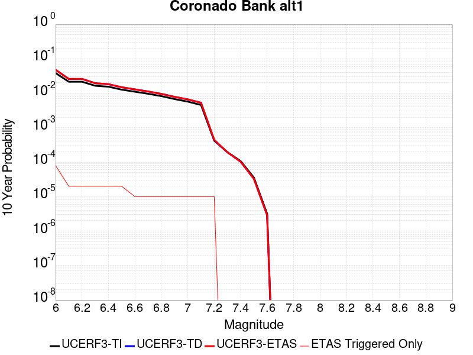 |

| Magnitude | 1 wk TI Prob | 1 wk TD Prob | 1 wk ETAS Prob | 1 wk ETAS/TD Gain | 1 wk ETAS Triggered Only | 1 mo TI Prob | 1 mo TD Prob | 1 mo ETAS Prob | 1 mo ETAS/TD Gain | 1 mo ETAS Triggered Only | 1 yr TI Prob | 1 yr TD Prob | 1 yr ETAS Prob | 1 yr ETAS/TD Gain | 1 yr ETAS Triggered Only | 10 yr TI Prob | 10 yr TD Prob | 10 yr ETAS Prob | 10 yr ETAS/TD Gain | 10 yr ETAS Triggered Only |
|-----|-----|-----|-----|-----|-----|-----|-----|-----|-----|-----|-----|-----|-----|-----|-----|-----|-----|-----|-----|-----|
| 6.0 | 7.533492E-5 | 9.3951705E-5 | 1.3394795E-4 | 1.4257107 | 4.0E-5 | 3.22824E-4 | 4.025903E-4 | 4.825581E-4 | 1.1986332 | 8.0E-5 | 0.0039233007 | 0.004891121 | 0.00497073 | 1.0162761 | 8.0E-5 | 0.03854755 | 0.047904 | 0.047980167 | 1.00159 | 8.0E-5 |
| 6.1 | 4.1807285E-5 | 5.0493105E-5 | 6.04926E-5 | 1.1980368 | 1.0E-5 | 1.7916178E-4 | 2.1638138E-4 | 2.3637705E-4 | 1.0924094 | 2.0E-5 | 0.0021791123 | 0.0026313365 | 0.002651284 | 1.0075808 | 2.0E-5 | 0.021578677 | 0.026011124 | 0.026030604 | 1.0007489 | 2.0E-5 |
| 6.2 | 4.1807285E-5 | 5.0493105E-5 | 6.04926E-5 | 1.1980368 | 1.0E-5 | 1.7916178E-4 | 2.1638138E-4 | 2.3637705E-4 | 1.0924094 | 2.0E-5 | 0.0021791123 | 0.0026313365 | 0.002651284 | 1.0075808 | 2.0E-5 | 0.021578677 | 0.026011124 | 0.026030604 | 1.0007489 | 2.0E-5 |
| 6.3 | 3.1793104E-5 | 3.7711125E-5 | 4.771075E-5 | 1.2651638 | 1.0E-5 | 1.3624904E-4 | 1.6160926E-4 | 1.8160602E-4 | 1.1237353 | 2.0E-5 | 0.0016575698 | 0.001965849 | 0.0019858098 | 1.0101538 | 2.0E-5 | 0.016452603 | 0.019488495 | 0.019508105 | 1.0010062 | 2.0E-5 |
| 6.4 | 2.9878007E-5 | 3.5335797E-5 | 4.5335444E-5 | 1.2829891 | 1.0E-5 | 1.2804232E-4 | 1.5143053E-4 | 1.714275E-4 | 1.1320537 | 2.0E-5 | 0.0015578003 | 0.0018421395 | 0.0018621027 | 1.010837 | 2.0E-5 | 0.015469253 | 0.018272463 | 0.0182921 | 1.0010746 | 2.0E-5 |
| 6.5 | 2.4512565E-5 | 2.8764101E-5 | 3.8763814E-5 | 1.3476455 | 1.0E-5 | 1.0504962E-4 | 1.2326906E-4 | 1.4326659E-4 | 1.1622267 | 2.0E-5 | 0.0012782287 | 0.0014997943 | 0.0015197643 | 1.0133152 | 2.0E-5 | 0.012709012 | 0.0148996925 | 0.014919395 | 1.0013223 | 2.0E-5 |
| 6.6 | 2.1317413E-5 | 2.490667E-5 | 2.490667E-5 | 1.0 | 0.0 | 9.135714E-5 | 1.0673863E-4 | 1.1673757E-4 | 1.0936768 | 1.0E-5 | 0.0011117056 | 0.0012987903 | 0.0013087774 | 1.0076895 | 1.0E-5 | 0.011061605 | 0.012914407 | 0.012924278 | 1.0007644 | 1.0E-5 |
| 6.7 | 1.8585655E-5 | 2.1634882E-5 | 2.1634882E-5 | 1.0 | 0.0 | 7.9650374E-5 | 9.271774E-5 | 1.0271681E-4 | 1.1078442 | 1.0E-5 | 9.6931186E-4 | 0.0011282744 | 0.001138263 | 1.0088531 | 1.0E-5 | 0.0096509475 | 0.011227623 | 0.0112375105 | 1.0008807 | 1.0E-5 |
| 6.8 | 1.5862879E-5 | 1.8419476E-5 | 1.8419476E-5 | 1.0 | 0.0 | 6.798199E-5 | 7.8938334E-5 | 8.8937544E-5 | 1.1266712 | 1.0E-5 | 8.273665E-4 | 9.606697E-4 | 9.7066007E-4 | 1.0103995 | 1.0E-5 | 0.008242928 | 0.009567151 | 0.0095770545 | 1.0010352 | 1.0E-5 |
| 6.9 | 1.3021509E-5 | 1.5095266E-5 | 1.5095266E-5 | 1.0 | 0.0 | 5.5805274E-5 | 6.46925E-5 | 7.4691845E-5 | 1.1545675 | 1.0E-5 | 6.792174E-4 | 7.873646E-4 | 7.973567E-4 | 1.0126905 | 1.0E-5 | 0.006771452 | 0.007847573 | 0.007857494 | 1.0012643 | 1.0E-5 |
| 7.0 | 1.0974371E-5 | 1.2720105E-5 | 1.2720105E-5 | 1.0 | 0.0 | 4.7032172E-5 | 5.4513697E-5 | 6.451315E-5 | 1.1834302 | 1.0E-5 | 5.7246623E-4 | 6.635197E-4 | 6.7351304E-4 | 1.0150611 | 1.0E-5 | 0.0057099373 | 0.0066171354 | 0.0066270693 | 1.0015012 | 1.0E-5 |
| 7.1 | 8.766221E-6 | 1.0163833E-5 | 1.0163833E-5 | 1.0 | 0.0 | 3.7568978E-5 | 4.3558655E-5 | 5.355822E-5 | 1.2295655 | 1.0E-5 | 4.573063E-4 | 5.302148E-4 | 5.4020947E-4 | 1.0188503 | 1.0E-5 | 0.0045636636 | 0.005291197 | 0.0053011444 | 1.0018799 | 1.0E-5 |
| 7.2 | 8.026024E-7 | 8.331776E-7 | 8.331776E-7 | 1.0 | 0.0 | 3.43972E-6 | 3.5707562E-6 | 1.35707205E-5 | 3.8005173 | 1.0E-5 | 4.1877785E-5 | 4.34731E-5 | 5.3472668E-5 | 1.2300173 | 1.0E-5 | 4.1869894E-4 | 4.3464705E-4 | 4.446427E-4 | 1.0229971 | 1.0E-5 |
| 7.3 | 3.7293114E-7 | 3.700106E-7 | 3.700106E-7 | 1.0 | 0.0 | 1.5982754E-6 | 1.5857588E-6 | 1.5857588E-6 | 1.0 | 0.0 | 1.9458828E-5 | 1.9306442E-5 | 1.9306442E-5 | 1.0 | 0.0 | 1.9457124E-4 | 1.9304773E-4 | 1.9304773E-4 | 1.0 | 0.0 |
| 7.4 | 2.0557036E-7 | 1.9674441E-7 | 1.9674441E-7 | 1.0 | 0.0 | 8.810155E-7 | 8.4319004E-7 | 8.4319004E-7 | 1.0 | 0.0 | 1.0726311E-5 | 1.02657905E-5 | 1.02657905E-5 | 1.0 | 0.0 | 1.0725793E-4 | 1.026532E-4 | 1.026532E-4 | 1.0 | 0.0 |
| 7.5 | 6.845446E-8 | 6.2794086E-8 | 6.2794086E-8 | 1.0 | 0.0 | 2.9337625E-7 | 2.6911746E-7 | 2.6911746E-7 | 1.0 | 0.0 | 3.5718497E-6 | 3.2765004E-6 | 3.2765004E-6 | 1.0 | 0.0 | 3.5717923E-5 | 3.276453E-5 | 3.276453E-5 | 1.0 | 0.0 |
| 7.6 | 6.0975145E-9 | 5.531901E-9 | 5.531901E-9 | 1.0 | 0.0 | 2.6132206E-8 | 2.3708148E-8 | 2.3708148E-8 | 1.0 | 0.0 | 3.1815955E-7 | 2.8864667E-7 | 2.8864667E-7 | 1.0 | 0.0 | 3.181591E-6 | 2.886464E-6 | 2.886464E-6 | 1.0 | 0.0 |

## San Diego Trough north alt1
*[(top)](#table-of-contents)*

| 1 Week | 1 Month | 1 Year | 10 Year |
|-----|-----|-----|-----|
|  |  |  |  |

| Magnitude | 1 wk TI Prob | 1 wk TD Prob | 1 wk ETAS Prob | 1 wk ETAS/TD Gain | 1 wk ETAS Triggered Only | 1 mo TI Prob | 1 mo TD Prob | 1 mo ETAS Prob | 1 mo ETAS/TD Gain | 1 mo ETAS Triggered Only | 1 yr TI Prob | 1 yr TD Prob | 1 yr ETAS Prob | 1 yr ETAS/TD Gain | 1 yr ETAS Triggered Only | 10 yr TI Prob | 10 yr TD Prob | 10 yr ETAS Prob | 10 yr ETAS/TD Gain | 10 yr ETAS Triggered Only |
|-----|-----|-----|-----|-----|-----|-----|-----|-----|-----|-----|-----|-----|-----|-----|-----|-----|-----|-----|-----|-----|
| 6.0 | 7.329252E-5 | 8.821269E-5 | 1.2820917E-4 | 1.4534094 | 4.0E-5 | 3.14073E-4 | 3.7800326E-4 | 4.1798814E-4 | 1.1057792 | 4.0E-5 | 0.0038171355 | 0.0045930487 | 0.004642819 | 1.010836 | 5.0E-5 | 0.03752231 | 0.045045137 | 0.045121532 | 1.001696 | 8.0E-5 |
| 6.1 | 3.7940346E-5 | 4.4884906E-5 | 6.488401E-5 | 1.445564 | 2.0E-5 | 1.6259136E-4 | 1.9235026E-4 | 2.1234641E-4 | 1.1039569 | 2.0E-5 | 0.0019777524 | 0.002339431 | 0.0023593842 | 1.0085291 | 2.0E-5 | 0.019602431 | 0.023156732 | 0.023186037 | 1.0012655 | 3.0E-5 |
| 6.2 | 2.8645263E-5 | 3.329672E-5 | 5.3296055E-5 | 1.6006397 | 2.0E-5 | 1.2275964E-4 | 1.4269259E-4 | 1.6268973E-4 | 1.1401415 | 2.0E-5 | 0.0014935739 | 0.0017359206 | 0.0017558859 | 1.0115013 | 2.0E-5 | 0.0148357535 | 0.017226268 | 0.01725575 | 1.0017115 | 3.0E-5 |
| 6.3 | 2.8645263E-5 | 3.329672E-5 | 5.3296055E-5 | 1.6006397 | 2.0E-5 | 1.2275964E-4 | 1.4269259E-4 | 1.6268973E-4 | 1.1401415 | 2.0E-5 | 0.0014935739 | 0.0017359206 | 0.0017558859 | 1.0115013 | 2.0E-5 | 0.0148357535 | 0.017226268 | 0.01725575 | 1.0017115 | 3.0E-5 |
| 6.4 | 2.2204576E-5 | 2.544832E-5 | 4.544781E-5 | 1.7858865 | 2.0E-5 | 9.5159E-5 | 1.0905972E-4 | 1.2905755E-4 | 1.1833657 | 2.0E-5 | 0.001157945 | 0.0013270028 | 0.0013469763 | 1.0150516 | 2.0E-5 | 0.011519298 | 0.013191959 | 0.013221563 | 1.0022441 | 3.0E-5 |
| 6.5 | 2.1004838E-5 | 2.4024695E-5 | 4.4024215E-5 | 1.8324567 | 2.0E-5 | 9.0017624E-5 | 1.0295897E-4 | 1.2295692E-4 | 1.1942321 | 2.0E-5 | 0.0010954136 | 0.0012528135 | 0.0012727884 | 1.0159441 | 2.0E-5 | 0.010900296 | 0.012458592 | 0.012488218 | 1.002378 | 3.0E-5 |
| 6.6 | 1.820557E-5 | 2.070479E-5 | 4.0704377E-5 | 1.96594 | 2.0E-5 | 7.802154E-5 | 8.8731824E-5 | 1.08730055E-4 | 1.2253783 | 2.0E-5 | 9.4949827E-4 | 0.0010797799 | 0.0010997584 | 1.0185022 | 2.0E-5 | 0.009454516 | 0.010746005 | 0.010775683 | 1.0027617 | 3.0E-5 |
| 6.7 | 1.5884485E-5 | 1.7983646E-5 | 3.7983285E-5 | 2.1121016 | 2.0E-5 | 6.807459E-5 | 7.707051E-5 | 9.7068965E-5 | 1.2594826 | 2.0E-5 | 8.284929E-4 | 9.3793223E-4 | 9.5791346E-4 | 1.0213035 | 2.0E-5 | 0.008254109 | 0.009340104 | 0.009359917 | 1.0021213 | 2.0E-5 |
| 6.8 | 1.4331171E-5 | 1.6201066E-5 | 3.620074E-5 | 2.2344668 | 2.0E-5 | 6.141786E-5 | 6.94313E-5 | 8.942991E-5 | 1.2880346 | 2.0E-5 | 7.4750587E-4 | 8.450002E-4 | 8.649833E-4 | 1.0236486 | 2.0E-5 | 0.0074499645 | 0.008418139 | 0.008437971 | 1.0023558 | 2.0E-5 |
| 6.9 | 1.2574203E-5 | 1.4205835E-5 | 2.4205692E-5 | 1.7039261 | 1.0E-5 | 5.3888325E-5 | 6.0880735E-5 | 7.088013E-5 | 1.1642456 | 1.0E-5 | 6.558929E-4 | 7.409723E-4 | 7.5096486E-4 | 1.0134858 | 1.0E-5 | 0.0065396037 | 0.007385203 | 0.0073951297 | 1.0013441 | 1.0E-5 |
| 7.0 | 1.0883844E-5 | 1.2289262E-5 | 2.2289138E-5 | 1.8137085 | 1.0E-5 | 4.664421E-5 | 5.2667205E-5 | 6.266668E-5 | 1.1898614 | 1.0E-5 | 5.677453E-4 | 6.4103556E-4 | 6.510292E-4 | 1.0155897 | 1.0E-5 | 0.00566297 | 0.006391993 | 0.0064019286 | 1.0015545 | 1.0E-5 |
| 7.1 | 9.393088E-6 | 1.060702E-5 | 2.0606914E-5 | 1.9427619 | 1.0E-5 | 4.025547E-5 | 4.545787E-5 | 5.5457414E-5 | 1.2199739 | 1.0E-5 | 4.900001E-4 | 5.533098E-4 | 5.6330423E-4 | 1.0180631 | 1.0E-5 | 0.0048892107 | 0.005519418 | 0.0055293627 | 1.0018017 | 1.0E-5 |
| 7.2 | 8.190791E-6 | 9.258625E-6 | 1.9258532E-5 | 2.0800638 | 1.0E-5 | 3.510292E-5 | 3.9679224E-5 | 4.9678827E-5 | 1.2520111 | 1.0E-5 | 4.2729423E-4 | 4.8298817E-4 | 4.929833E-4 | 1.0206945 | 1.0E-5 | 0.0042647356 | 0.004819465 | 0.0048294165 | 1.002065 | 1.0E-5 |
| 7.3 | 6.268162E-6 | 7.089716E-6 | 7.089716E-6 | 1.0 | 0.0 | 2.6863276E-5 | 3.0384144E-5 | 3.0384144E-5 | 1.0 | 0.0 | 3.2701128E-4 | 3.6986457E-4 | 3.6986457E-4 | 1.0 | 0.0 | 0.003265305 | 0.003692536 | 0.003692536 | 1.0 | 0.0 |
| 7.4 | 4.985186E-6 | 5.6426816E-6 | 5.6426816E-6 | 1.0 | 0.0 | 2.1364907E-5 | 2.4182698E-5 | 2.4182698E-5 | 1.0 | 0.0 | 2.600867E-4 | 2.9438498E-4 | 2.9438498E-4 | 1.0 | 0.0 | 0.002597825 | 0.0029399914 | 0.0029399914 | 1.0 | 0.0 |
| 7.5 | 1.7489613E-6 | 1.969678E-6 | 1.969678E-6 | 1.0 | 0.0 | 7.495527E-6 | 8.4414505E-6 | 8.4414505E-6 | 1.0 | 0.0 | 9.125422E-5 | 1.02770035E-4 | 1.02770035E-4 | 1.0 | 0.0 | 9.1216754E-4 | 0.0010272472 | 0.0010272472 | 1.0 | 0.0 |
| 7.6 | 1.6988751E-7 | 1.7533823E-7 | 1.7533823E-7 | 1.0 | 0.0 | 7.2808916E-7 | 7.5144936E-7 | 7.5144936E-7 | 1.0 | 0.0 | 8.864449E-6 | 9.14886E-6 | 9.14886E-6 | 1.0 | 0.0 | 8.8640954E-5 | 9.1485024E-5 | 9.1485024E-5 | 1.0 | 0.0 |

## Santa Ynez River
*[(top)](#table-of-contents)*

| 1 Week | 1 Month | 1 Year | 10 Year |
|-----|-----|-----|-----|
|  |  |  |  |

| Magnitude | 1 wk TI Prob | 1 wk TD Prob | 1 wk ETAS Prob | 1 wk ETAS/TD Gain | 1 wk ETAS Triggered Only | 1 mo TI Prob | 1 mo TD Prob | 1 mo ETAS Prob | 1 mo ETAS/TD Gain | 1 mo ETAS Triggered Only | 1 yr TI Prob | 1 yr TD Prob | 1 yr ETAS Prob | 1 yr ETAS/TD Gain | 1 yr ETAS Triggered Only | 10 yr TI Prob | 10 yr TD Prob | 10 yr ETAS Prob | 10 yr ETAS/TD Gain | 10 yr ETAS Triggered Only |
|-----|-----|-----|-----|-----|-----|-----|-----|-----|-----|-----|-----|-----|-----|-----|-----|-----|-----|-----|-----|-----|
| 6.0 | 1.6396456E-5 | 1.7209444E-5 | 4.7208927E-5 | 2.7431989 | 3.0E-5 | 7.026863E-5 | 7.3752875E-5 | 1.237492E-4 | 1.6778897 | 5.0E-5 | 8.551848E-4 | 8.976069E-4 | 9.5755304E-4 | 1.0667844 | 6.0E-5 | 0.0085190125 | 0.008943363 | 0.009002826 | 1.0066489 | 6.0E-5 |
| 6.1 | 1.6396456E-5 | 1.7209444E-5 | 4.7208927E-5 | 2.7431989 | 3.0E-5 | 7.026863E-5 | 7.3752875E-5 | 1.237492E-4 | 1.6778897 | 5.0E-5 | 8.551848E-4 | 8.976069E-4 | 9.5755304E-4 | 1.0667844 | 6.0E-5 | 0.0085190125 | 0.008943363 | 0.009002826 | 1.0066489 | 6.0E-5 |
| 6.2 | 1.6396456E-5 | 1.7209444E-5 | 4.7208927E-5 | 2.7431989 | 3.0E-5 | 7.026863E-5 | 7.3752875E-5 | 1.237492E-4 | 1.6778897 | 5.0E-5 | 8.551848E-4 | 8.976069E-4 | 9.5755304E-4 | 1.0667844 | 6.0E-5 | 0.0085190125 | 0.008943363 | 0.009002826 | 1.0066489 | 6.0E-5 |
| 6.3 | 9.736976E-6 | 1.01223395E-5 | 4.0122035E-5 | 3.9637117 | 3.0E-5 | 4.172923E-5 | 4.338076E-5 | 8.3379025E-5 | 1.9220277 | 4.0E-5 | 5.0793495E-4 | 5.280378E-4 | 5.780113E-4 | 1.0946403 | 5.0E-5 | 0.005067755 | 0.0052683367 | 0.005318073 | 1.0094407 | 5.0E-5 |
| 6.4 | 9.736976E-6 | 1.01223395E-5 | 4.0122035E-5 | 3.9637117 | 3.0E-5 | 4.172923E-5 | 4.338076E-5 | 8.3379025E-5 | 1.9220277 | 4.0E-5 | 5.0793495E-4 | 5.280378E-4 | 5.780113E-4 | 1.0946403 | 5.0E-5 | 0.005067755 | 0.0052683367 | 0.005318073 | 1.0094407 | 5.0E-5 |
| 6.5 | 7.081964E-6 | 7.329905E-6 | 2.732976E-5 | 3.7285283 | 2.0E-5 | 3.035092E-5 | 3.141351E-5 | 6.141257E-5 | 1.9549731 | 3.0E-5 | 3.694598E-4 | 3.8239395E-4 | 4.1238248E-4 | 1.0784231 | 3.0E-5 | 0.0036884616 | 0.0038175215 | 0.003847407 | 1.0078285 | 3.0E-5 |
| 6.6 | 5.873247E-6 | 6.0597517E-6 | 2.6059632E-5 | 4.300445 | 2.0E-5 | 2.5170815E-5 | 2.5970112E-5 | 5.5969333E-5 | 2.155144 | 3.0E-5 | 3.064116E-4 | 3.161411E-4 | 3.461316E-4 | 1.0948644 | 3.0E-5 | 0.0030598943 | 0.003157001 | 0.0031869062 | 1.0094727 | 3.0E-5 |
| 6.7 | 4.973277E-6 | 5.11591E-6 | 2.5115807E-5 | 4.909353 | 2.0E-5 | 2.1313872E-5 | 2.1925147E-5 | 5.192449E-5 | 2.3682618 | 3.0E-5 | 2.5946548E-4 | 2.6690646E-4 | 2.9689845E-4 | 1.112369 | 3.0E-5 | 0.0025916274 | 0.0026659078 | 0.0026958277 | 1.0112232 | 3.0E-5 |
| 6.8 | 4.396492E-6 | 4.510987E-6 | 2.4510897E-5 | 5.4336 | 2.0E-5 | 1.884197E-5 | 1.933266E-5 | 4.933208E-5 | 2.5517483 | 3.0E-5 | 2.2937685E-4 | 2.3535005E-4 | 2.6534297E-4 | 1.1274397 | 3.0E-5 | 0.0022914023 | 0.0023510433 | 0.0023809727 | 1.0127302 | 3.0E-5 |
| 6.9 | 3.5255632E-6 | 3.6013423E-6 | 2.3601271E-5 | 6.553465 | 2.0E-5 | 1.5109469E-5 | 1.5434234E-5 | 4.543377E-5 | 2.943701 | 3.0E-5 | 1.8394225E-4 | 1.8789574E-4 | 2.178901E-4 | 1.159633 | 3.0E-5 | 0.0018379007 | 0.001877385 | 0.0019073286 | 1.0159497 | 3.0E-5 |
| 7.0 | 3.211603E-6 | 3.273663E-6 | 2.3273598E-5 | 7.1093445 | 2.0E-5 | 1.376394E-5 | 1.402991E-5 | 4.402949E-5 | 3.138259 | 3.0E-5 | 1.6756308E-4 | 1.708009E-4 | 2.0079578E-4 | 1.175613 | 3.0E-5 | 0.0016743679 | 0.0017067104 | 0.0017366592 | 1.0175477 | 3.0E-5 |
| 7.1 | 2.5094619E-6 | 2.5409295E-6 | 2.2540878E-5 | 8.871116 | 2.0E-5 | 1.0754793E-5 | 1.0889652E-5 | 3.0889434E-5 | 2.836586 | 2.0E-5 | 1.3093173E-4 | 1.325735E-4 | 1.5257086E-4 | 1.1508397 | 2.0E-5 | 0.0013085462 | 0.0013249503 | 0.0013449237 | 1.0150748 | 2.0E-5 |
| 7.2 | 2.0515774E-6 | 2.0619466E-6 | 1.2061926E-5 | 5.8497763 | 1.0E-5 | 8.792445E-6 | 8.836884E-6 | 1.8836796E-5 | 2.1316106 | 1.0E-5 | 1.0704277E-4 | 1.0758379E-4 | 1.1758271E-4 | 1.0929408 | 1.0E-5 | 0.0010699122 | 0.0010753215 | 0.0010853106 | 1.0092895 | 1.0E-5 |
| 7.3 | 1.6845745E-6 | 1.6773996E-6 | 1.1677383E-5 | 6.9615984 | 1.0E-5 | 7.219585E-6 | 7.1888358E-6 | 1.7188764E-5 | 2.3910358 | 1.0E-5 | 8.78949E-5 | 8.752059E-5 | 9.751971E-5 | 1.1142489 | 1.0E-5 | 8.7860145E-4 | 8.7486405E-4 | 8.8485534E-4 | 1.0114204 | 1.0E-5 |
| 7.4 | 1.3600285E-6 | 1.3333447E-6 | 1.1333332E-5 | 8.499927 | 1.0E-5 | 5.82868E-6 | 5.714322E-6 | 1.5714264E-5 | 2.7499788 | 1.0E-5 | 7.096187E-5 | 6.956967E-5 | 7.956898E-5 | 1.1437308 | 1.0E-5 | 7.0939213E-4 | 6.9548114E-4 | 7.054742E-4 | 1.0143685 | 1.0E-5 |
| 7.5 | 9.735342E-7 | 9.2901894E-7 | 9.2901894E-7 | 1.0 | 0.0 | 4.172283E-6 | 3.9815036E-6 | 3.9815036E-6 | 1.0 | 0.0 | 5.079636E-5 | 4.8473747E-5 | 4.8473747E-5 | 1.0 | 0.0 | 5.0784746E-4 | 4.8463346E-4 | 4.8463346E-4 | 1.0 | 0.0 |
| 7.6 | 5.067187E-7 | 4.778609E-7 | 4.778609E-7 | 1.0 | 0.0 | 2.1716498E-6 | 2.0479738E-6 | 2.0479738E-6 | 1.0 | 0.0 | 2.6439517E-5 | 2.4933803E-5 | 2.4933803E-5 | 1.0 | 0.0 | 2.643637E-4 | 2.493108E-4 | 2.493108E-4 | 1.0 | 0.0 |
| 7.7 | 2.769089E-7 | 2.5759346E-7 | 2.5759346E-7 | 1.0 | 0.0 | 1.1867519E-6 | 1.1039714E-6 | 1.1039714E-6 | 1.0 | 0.0 | 1.4448608E-5 | 1.344077E-5 | 1.344077E-5 | 1.0 | 0.0 | 1.444767E-4 | 1.343996E-4 | 1.343996E-4 | 1.0 | 0.0 |
| 7.8 | 1.7044663E-7 | 1.5449208E-7 | 1.5449208E-7 | 1.0 | 0.0 | 7.3048534E-7 | 6.6210873E-7 | 6.6210873E-7 | 1.0 | 0.0 | 8.893623E-6 | 8.061144E-6 | 8.061144E-6 | 1.0 | 0.0 | 8.893267E-5 | 8.060854E-5 | 8.060854E-5 | 1.0 | 0.0 |
| 7.9 | 4.8344287E-8 | 4.0911143E-8 | 4.0911143E-8 | 1.0 | 0.0 | 2.0718979E-7 | 1.7533345E-7 | 1.7533345E-7 | 1.0 | 0.0 | 2.5225327E-6 | 2.1346827E-6 | 2.1346827E-6 | 1.0 | 0.0 | 2.5225041E-5 | 2.1346626E-5 | 2.1346626E-5 | 1.0 | 0.0 |

## San Pedro Basin
*[(top)](#table-of-contents)*

| 1 Week | 1 Month | 1 Year | 10 Year |
|-----|-----|-----|-----|
|  |  | 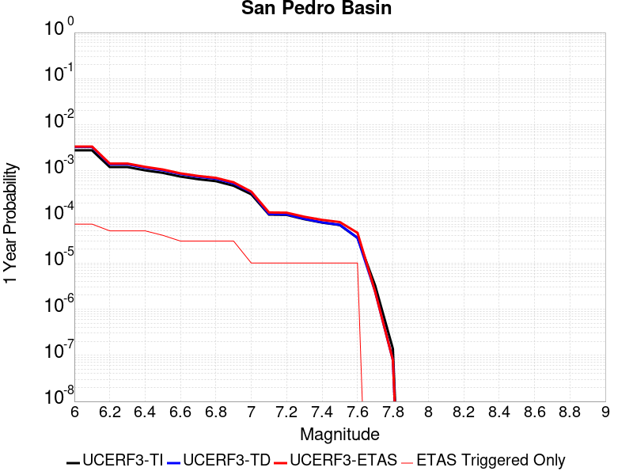 |  |

| Magnitude | 1 wk TI Prob | 1 wk TD Prob | 1 wk ETAS Prob | 1 wk ETAS/TD Gain | 1 wk ETAS Triggered Only | 1 mo TI Prob | 1 mo TD Prob | 1 mo ETAS Prob | 1 mo ETAS/TD Gain | 1 mo ETAS Triggered Only | 1 yr TI Prob | 1 yr TD Prob | 1 yr ETAS Prob | 1 yr ETAS/TD Gain | 1 yr ETAS Triggered Only | 10 yr TI Prob | 10 yr TD Prob | 10 yr ETAS Prob | 10 yr ETAS/TD Gain | 10 yr ETAS Triggered Only |
|-----|-----|-----|-----|-----|-----|-----|-----|-----|-----|-----|-----|-----|-----|-----|-----|-----|-----|-----|-----|-----|
| 6.0 | 5.3449043E-5 | 6.337018E-5 | 1.03367645E-4 | 1.6311717 | 4.0E-5 | 2.2904722E-4 | 2.7156167E-4 | 3.115508E-4 | 1.1472561 | 4.0E-5 | 0.0027850836 | 0.0033018515 | 0.0033716203 | 1.0211302 | 7.0E-5 | 0.027504366 | 0.03258948 | 0.0326572 | 1.0020779 | 7.0E-5 |
| 6.1 | 5.3449043E-5 | 6.337018E-5 | 1.03367645E-4 | 1.6311717 | 4.0E-5 | 2.2904722E-4 | 2.7156167E-4 | 3.115508E-4 | 1.1472561 | 4.0E-5 | 0.0027850836 | 0.0033018515 | 0.0033716203 | 1.0211302 | 7.0E-5 | 0.027504366 | 0.03258948 | 0.0326572 | 1.0020779 | 7.0E-5 |
| 6.2 | 2.3189454E-5 | 2.6642829E-5 | 5.664203E-5 | 2.1259766 | 3.0E-5 | 9.9379584E-5 | 1.1417881E-4 | 1.4417538E-4 | 1.2627158 | 3.0E-5 | 0.0012092749 | 0.0013892875 | 0.0014392181 | 1.0359397 | 5.0E-5 | 0.012027155 | 0.01381089 | 0.0138602 | 1.0035703 | 5.0E-5 |
| 6.3 | 2.3189454E-5 | 2.6642829E-5 | 5.664203E-5 | 2.1259766 | 3.0E-5 | 9.9379584E-5 | 1.1417881E-4 | 1.4417538E-4 | 1.2627158 | 3.0E-5 | 0.0012092749 | 0.0013892875 | 0.0014392181 | 1.0359397 | 5.0E-5 | 0.012027155 | 0.01381089 | 0.0138602 | 1.0035703 | 5.0E-5 |
| 6.4 | 1.966056E-5 | 2.246342E-5 | 5.2462747E-5 | 2.3354745 | 3.0E-5 | 8.425682E-5 | 9.626848E-5 | 1.2626559E-4 | 1.3115985 | 3.0E-5 | 0.001025344 | 0.0011714787 | 0.00122142 | 1.0426311 | 5.0E-5 | 0.010206259 | 0.011657119 | 0.011706537 | 1.0042392 | 5.0E-5 |
| 6.5 | 1.7342953E-5 | 1.9745152E-5 | 3.974476E-5 | 2.0128868 | 2.0E-5 | 7.4324824E-5 | 8.461954E-5 | 1.0461785E-4 | 1.236332 | 2.0E-5 | 9.04529E-4 | 0.0010297929 | 0.0010697518 | 1.0388027 | 4.0E-5 | 0.009008561 | 0.010253932 | 0.010293523 | 1.003861 | 4.0E-5 |
| 6.6 | 1.439804E-5 | 1.6322716E-5 | 2.6322554E-5 | 1.6126331 | 1.0E-5 | 6.170443E-5 | 6.99528E-5 | 7.995211E-5 | 1.1429435 | 1.0E-5 | 7.509924E-4 | 8.513747E-4 | 8.813492E-4 | 1.0352072 | 3.0E-5 | 0.0074845953 | 0.008484333 | 0.008514078 | 1.003506 | 3.0E-5 |
| 6.7 | 1.2634884E-5 | 1.4285298E-5 | 2.4285155E-5 | 1.7000104 | 1.0E-5 | 5.414838E-5 | 6.122144E-5 | 7.122083E-5 | 1.1633315 | 1.0E-5 | 6.590571E-4 | 7.451466E-4 | 7.7512424E-4 | 1.0402305 | 3.0E-5 | 0.006571059 | 0.007429502 | 0.007459279 | 1.0040079 | 3.0E-5 |
| 6.8 | 1.146091E-5 | 1.2933193E-5 | 2.2933064E-5 | 1.7731943 | 1.0E-5 | 4.911726E-5 | 5.542696E-5 | 6.542641E-5 | 1.1804076 | 1.0E-5 | 5.9783855E-4 | 6.74644E-4 | 7.046238E-4 | 1.0444379 | 3.0E-5 | 0.0059623276 | 0.0067288997 | 0.006758698 | 1.0044284 | 3.0E-5 |
| 6.9 | 9.109035E-6 | 1.0235013E-5 | 2.0234911E-5 | 1.9770284 | 1.0E-5 | 3.9038136E-5 | 4.386376E-5 | 5.386332E-5 | 1.2279686 | 1.0E-5 | 4.7518566E-4 | 5.339384E-4 | 5.639224E-4 | 1.0561563 | 3.0E-5 | 0.0047417083 | 0.0053293095 | 0.0053591495 | 1.0055993 | 3.0E-5 |
| 7.0 | 5.9351028E-6 | 6.583965E-6 | 1.65839E-5 | 2.5188315 | 1.0E-5 | 2.5435906E-5 | 2.821682E-5 | 3.8216538E-5 | 1.3543885 | 1.0E-5 | 3.0963816E-4 | 3.4350925E-4 | 3.5350583E-4 | 1.0291013 | 1.0E-5 | 0.0030920706 | 0.0034320997 | 0.0034420653 | 1.0029037 | 1.0E-5 |
| 7.1 | 2.1557585E-6 | 2.2096492E-6 | 1.2209627E-5 | 5.525595 | 1.0E-5 | 9.238933E-6 | 9.469892E-6 | 1.9469797E-5 | 2.0559683 | 1.0E-5 | 1.1247819E-4 | 1.15289986E-4 | 1.2528883E-4 | 1.0867279 | 1.0E-5 | 0.0011242128 | 0.0011523172 | 0.0011623056 | 1.0086682 | 1.0E-5 |
| 7.2 | 2.1251979E-6 | 2.1779954E-6 | 1.2177974E-5 | 5.5913677 | 1.0E-5 | 9.107958E-6 | 9.334234E-6 | 1.933414E-5 | 2.0713153 | 1.0E-5 | 1.1088375E-4 | 1.13638525E-4 | 1.236374E-4 | 1.0879884 | 1.0E-5 | 0.0011082845 | 0.0011358195 | 0.0011458081 | 1.0087942 | 1.0E-5 |
| 7.3 | 1.7145798E-6 | 1.7442885E-6 | 1.1744271E-5 | 6.7329865 | 1.0E-5 | 7.3481783E-6 | 7.475501E-6 | 1.7475426E-5 | 2.337693 | 1.0E-5 | 8.94604E-5 | 9.1010515E-5 | 1.0100961E-4 | 1.1098675 | 1.0E-5 | 8.9424395E-4 | 9.0974156E-4 | 9.197325E-4 | 1.0109822 | 1.0E-5 |
| 7.4 | 1.4467993E-6 | 1.4641878E-6 | 1.1464173E-5 | 7.829715 | 1.0E-5 | 6.200554E-6 | 6.275076E-6 | 1.6275013E-5 | 2.5935962 | 1.0E-5 | 7.548913E-5 | 7.639644E-5 | 8.639568E-5 | 1.1308862 | 1.0E-5 | 7.546349E-4 | 7.6370913E-4 | 7.7370147E-4 | 1.0130839 | 1.0E-5 |
| 7.5 | 1.2803735E-6 | 1.2931506E-6 | 1.12931375E-5 | 8.733042 | 1.0E-5 | 5.487303E-6 | 5.5420624E-6 | 1.5542008E-5 | 2.8043723 | 1.0E-5 | 6.680587E-5 | 6.747259E-5 | 7.7471916E-5 | 1.1481984 | 1.0E-5 | 6.678579E-4 | 6.745281E-4 | 6.845214E-4 | 1.0148152 | 1.0E-5 |
| 7.6 | 6.755009E-7 | 6.76947E-7 | 1.067694E-5 | 15.772195 | 1.0E-5 | 2.8950008E-6 | 2.9011985E-6 | 1.290117E-5 | 4.4468412 | 1.0E-5 | 3.5246063E-5 | 3.532158E-5 | 4.5321227E-5 | 1.2831031 | 1.0E-5 | 3.5240475E-4 | 3.5316538E-4 | 3.6316185E-4 | 1.0283053 | 1.0E-5 |
| 7.7 | 6.211885E-8 | 4.5699714E-8 | 4.5699714E-8 | 1.0 | 0.0 | 2.6622362E-7 | 1.9585592E-7 | 1.9585592E-7 | 1.0 | 0.0 | 3.2412677E-6 | 2.3845432E-6 | 2.3845432E-6 | 1.0 | 0.0 | 3.2412205E-5 | 2.3845198E-5 | 2.3845198E-5 | 1.0 | 0.0 |
| 7.8 | 2.6580573E-9 | 1.5138054E-9 | 1.5138054E-9 | 1.0 | 0.0 | 1.1391674E-8 | 6.4877375E-9 | 6.4877375E-9 | 1.0 | 0.0 | 1.3869362E-7 | 7.89882E-8 | 7.89882E-8 | 1.0 | 0.0 | 1.3869354E-6 | 7.89882E-7 | 7.89882E-7 | 1.0 | 0.0 |

## Kern Canyon (South Kern) 2011
*[(top)](#table-of-contents)*

| 1 Week | 1 Month | 1 Year | 10 Year |
|-----|-----|-----|-----|
|  |  |  |  |

| Magnitude | 1 wk TI Prob | 1 wk TD Prob | 1 wk ETAS Prob | 1 wk ETAS/TD Gain | 1 wk ETAS Triggered Only | 1 mo TI Prob | 1 mo TD Prob | 1 mo ETAS Prob | 1 mo ETAS/TD Gain | 1 mo ETAS Triggered Only | 1 yr TI Prob | 1 yr TD Prob | 1 yr ETAS Prob | 1 yr ETAS/TD Gain | 1 yr ETAS Triggered Only | 10 yr TI Prob | 10 yr TD Prob | 10 yr ETAS Prob | 10 yr ETAS/TD Gain | 10 yr ETAS Triggered Only |
|-----|-----|-----|-----|-----|-----|-----|-----|-----|-----|-----|-----|-----|-----|-----|-----|-----|-----|-----|-----|-----|
| 6.0 | 4.105075E-6 | 4.113726E-6 | 5.411352E-5 | 13.154382 | 5.0E-5 | 1.7593058E-5 | 1.7630138E-5 | 6.7629255E-5 | 3.8360026 | 5.0E-5 | 2.1417443E-4 | 2.1462643E-4 | 2.846114E-4 | 1.326078 | 7.0E-5 | 0.0021396813 | 0.0021442554 | 0.0022141053 | 1.0325754 | 7.0E-5 |
| 6.1 | 4.105075E-6 | 4.113726E-6 | 5.411352E-5 | 13.154382 | 5.0E-5 | 1.7593058E-5 | 1.7630138E-5 | 6.7629255E-5 | 3.8360026 | 5.0E-5 | 2.1417443E-4 | 2.1462643E-4 | 2.846114E-4 | 1.326078 | 7.0E-5 | 0.0021396813 | 0.0021442554 | 0.0022141053 | 1.0325754 | 7.0E-5 |
| 6.2 | 4.105075E-6 | 4.113726E-6 | 5.411352E-5 | 13.154382 | 5.0E-5 | 1.7593058E-5 | 1.7630138E-5 | 6.7629255E-5 | 3.8360026 | 5.0E-5 | 2.1417443E-4 | 2.1462643E-4 | 2.846114E-4 | 1.326078 | 7.0E-5 | 0.0021396813 | 0.0021442554 | 0.0022141053 | 1.0325754 | 7.0E-5 |
| 6.3 | 4.105075E-6 | 4.113726E-6 | 5.411352E-5 | 13.154382 | 5.0E-5 | 1.7593058E-5 | 1.7630138E-5 | 6.7629255E-5 | 3.8360026 | 5.0E-5 | 2.1417443E-4 | 2.1462643E-4 | 2.846114E-4 | 1.326078 | 7.0E-5 | 0.0021396813 | 0.0021442554 | 0.0022141053 | 1.0325754 | 7.0E-5 |
| 6.4 | 4.105075E-6 | 4.113726E-6 | 5.411352E-5 | 13.154382 | 5.0E-5 | 1.7593058E-5 | 1.7630138E-5 | 6.7629255E-5 | 3.8360026 | 5.0E-5 | 2.1417443E-4 | 2.1462643E-4 | 2.846114E-4 | 1.326078 | 7.0E-5 | 0.0021396813 | 0.0021442554 | 0.0022141053 | 1.0325754 | 7.0E-5 |
| 6.5 | 2.9849807E-6 | 2.973154E-6 | 4.2973035E-5 | 14.453686 | 4.0E-5 | 1.2792712E-5 | 1.2742028E-5 | 5.2741518E-5 | 4.139178 | 4.0E-5 | 1.5574014E-4 | 1.551233E-4 | 2.1511399E-4 | 1.3867291 | 6.0E-5 | 0.0015563103 | 0.0015501654 | 0.0016100723 | 1.0386455 | 6.0E-5 |
| 6.6 | 2.9849807E-6 | 2.973154E-6 | 4.2973035E-5 | 14.453686 | 4.0E-5 | 1.2792712E-5 | 1.2742028E-5 | 5.2741518E-5 | 4.139178 | 4.0E-5 | 1.5574014E-4 | 1.551233E-4 | 2.1511399E-4 | 1.3867291 | 6.0E-5 | 0.0015563103 | 0.0015501654 | 0.0016100723 | 1.0386455 | 6.0E-5 |
| 6.7 | 2.6756725E-6 | 2.6582202E-6 | 4.2658114E-5 | 16.047623 | 4.0E-5 | 1.1467117E-5 | 1.1392323E-5 | 5.1391868E-5 | 4.5110965 | 4.0E-5 | 1.396032E-4 | 1.386928E-4 | 1.9868449E-4 | 1.4325508 | 6.0E-5 | 0.0013951553 | 0.0013860734 | 0.0014459903 | 1.0432278 | 6.0E-5 |
| 6.8 | 2.3283721E-6 | 2.3047783E-6 | 4.2304688E-5 | 18.35521 | 4.0E-5 | 9.9787E-6 | 9.877584E-6 | 4.9877188E-5 | 5.0495334 | 4.0E-5 | 1.214839E-4 | 1.2025302E-4 | 1.70247E-4 | 1.41574 | 5.0E-5 | 0.001214175 | 0.001201887 | 0.0012518269 | 1.0415512 | 5.0E-5 |
| 6.9 | 2.0972677E-6 | 2.0696405E-6 | 3.206958E-5 | 15.495241 | 3.0E-5 | 8.988259E-6 | 8.869858E-6 | 3.886959E-5 | 4.382211 | 3.0E-5 | 1.0942656E-4 | 1.0798523E-4 | 1.4798091E-4 | 1.370381 | 4.0E-5 | 0.0010937268 | 0.0010793334 | 0.0011192902 | 1.03702 | 4.0E-5 |
| 7.0 | 1.7132242E-6 | 1.6787029E-6 | 2.167867E-5 | 12.91394 | 2.0E-5 | 7.3423685E-6 | 7.1944214E-6 | 2.7194277E-5 | 3.7799115 | 2.0E-5 | 8.938967E-5 | 8.75886E-5 | 1.0758685E-4 | 1.2283202 | 2.0E-5 | 8.935372E-4 | 8.755446E-4 | 8.9552713E-4 | 1.022823 | 2.0E-5 |
| 7.1 | 1.4215541E-6 | 1.3815746E-6 | 1.138156E-5 | 8.238108 | 1.0E-5 | 6.0923603E-6 | 5.9210206E-6 | 1.5920961E-5 | 2.688888 | 1.0E-5 | 7.417196E-5 | 7.208607E-5 | 8.2085346E-5 | 1.138713 | 1.0E-5 | 7.414721E-4 | 7.206296E-4 | 7.306224E-4 | 1.0138668 | 1.0E-5 |
| 7.2 | 9.097853E-7 | 8.60377E-7 | 1.0860368E-5 | 12.622803 | 1.0E-5 | 3.899074E-6 | 3.6873246E-6 | 1.3687288E-5 | 3.7119834 | 1.0E-5 | 4.7470192E-5 | 4.4892266E-5 | 5.4891814E-5 | 1.2227455 | 1.0E-5 | 4.7460053E-4 | 4.4883305E-4 | 4.5882855E-4 | 1.02227 | 1.0E-5 |
| 7.3 | 6.144169E-7 | 5.628199E-7 | 1.0562814E-5 | 18.767664 | 1.0E-5 | 2.6332125E-6 | 2.4120832E-6 | 1.2412059E-5 | 5.1457844 | 1.0E-5 | 3.205889E-5 | 2.9366722E-5 | 3.9366427E-5 | 1.3405116 | 1.0E-5 | 3.2054266E-4 | 2.9362892E-4 | 3.0362597E-4 | 1.0340466 | 1.0E-5 |
| 7.4 | 4.049844E-7 | 3.5728252E-7 | 3.5728252E-7 | 1.0 | 0.0 | 1.7356463E-6 | 1.5312098E-6 | 1.5312098E-6 | 1.0 | 0.0 | 2.1131287E-5 | 1.8642324E-5 | 1.8642324E-5 | 1.0 | 0.0 | 2.1129279E-4 | 1.8640784E-4 | 1.8640784E-4 | 1.0 | 0.0 |
| 7.5 | 1.9871162E-7 | 1.5830383E-7 | 1.5830383E-7 | 1.0 | 0.0 | 8.5162094E-7 | 6.784448E-7 | 6.784448E-7 | 1.0 | 0.0 | 1.0368436E-5 | 8.260035E-6 | 8.260035E-6 | 1.0 | 0.0 | 1.0367952E-4 | 8.259736E-5 | 8.259736E-5 | 1.0 | 0.0 |
| 7.6 | 2.572245E-8 | 1.735264E-8 | 1.735264E-8 | 1.0 | 0.0 | 1.10239064E-7 | 7.436845E-8 | 7.436845E-8 | 1.0 | 0.0 | 1.3421597E-6 | 9.0543557E-7 | 9.0543557E-7 | 1.0 | 0.0 | 1.3421517E-5 | 9.054324E-6 | 9.054324E-6 | 1.0 | 0.0 |

## Oceanside alt1
*[(top)](#table-of-contents)*

| 1 Week | 1 Month | 1 Year | 10 Year |
|-----|-----|-----|-----|
|  |  |  |  |

| Magnitude | 1 wk TI Prob | 1 wk TD Prob | 1 wk ETAS Prob | 1 wk ETAS/TD Gain | 1 wk ETAS Triggered Only | 1 mo TI Prob | 1 mo TD Prob | 1 mo ETAS Prob | 1 mo ETAS/TD Gain | 1 mo ETAS Triggered Only | 1 yr TI Prob | 1 yr TD Prob | 1 yr ETAS Prob | 1 yr ETAS/TD Gain | 1 yr ETAS Triggered Only | 10 yr TI Prob | 10 yr TD Prob | 10 yr ETAS Prob | 10 yr ETAS/TD Gain | 10 yr ETAS Triggered Only |
|-----|-----|-----|-----|-----|-----|-----|-----|-----|-----|-----|-----|-----|-----|-----|-----|-----|-----|-----|-----|-----|
| 6.0 | 1.1617542E-5 | 1.1423485E-5 | 5.1423027E-5 | 4.5015182 | 4.0E-5 | 4.9788516E-5 | 4.8956965E-5 | 9.8954515E-5 | 2.021255 | 5.0E-5 | 6.060066E-4 | 5.9590413E-4 | 6.558684E-4 | 1.1006273 | 6.0E-5 | 0.0060435664 | 0.0059446604 | 0.0060142446 | 1.0117053 | 7.0E-5 |
| 6.1 | 1.1617542E-5 | 1.1423485E-5 | 5.1423027E-5 | 4.5015182 | 4.0E-5 | 4.9788516E-5 | 4.8956965E-5 | 9.8954515E-5 | 2.021255 | 5.0E-5 | 6.060066E-4 | 5.9590413E-4 | 6.558684E-4 | 1.1006273 | 6.0E-5 | 0.0060435664 | 0.0059446604 | 0.0060142446 | 1.0117053 | 7.0E-5 |
| 6.2 | 1.1617542E-5 | 1.1423485E-5 | 5.1423027E-5 | 4.5015182 | 4.0E-5 | 4.9788516E-5 | 4.8956965E-5 | 9.8954515E-5 | 2.021255 | 5.0E-5 | 6.060066E-4 | 5.9590413E-4 | 6.558684E-4 | 1.1006273 | 6.0E-5 | 0.0060435664 | 0.0059446604 | 0.0060142446 | 1.0117053 | 7.0E-5 |
| 6.3 | 1.1617542E-5 | 1.1423485E-5 | 5.1423027E-5 | 4.5015182 | 4.0E-5 | 4.9788516E-5 | 4.8956965E-5 | 9.8954515E-5 | 2.021255 | 5.0E-5 | 6.060066E-4 | 5.9590413E-4 | 6.558684E-4 | 1.1006273 | 6.0E-5 | 0.0060435664 | 0.0059446604 | 0.0060142446 | 1.0117053 | 7.0E-5 |
| 6.4 | 1.1617542E-5 | 1.1423485E-5 | 5.1423027E-5 | 4.5015182 | 4.0E-5 | 4.9788516E-5 | 4.8956965E-5 | 9.8954515E-5 | 2.021255 | 5.0E-5 | 6.060066E-4 | 5.9590413E-4 | 6.558684E-4 | 1.1006273 | 6.0E-5 | 0.0060435664 | 0.0059446604 | 0.0060142446 | 1.0117053 | 7.0E-5 |
| 6.5 | 1.1617542E-5 | 1.1423485E-5 | 5.1423027E-5 | 4.5015182 | 4.0E-5 | 4.9788516E-5 | 4.8956965E-5 | 9.8954515E-5 | 2.021255 | 5.0E-5 | 6.060066E-4 | 5.9590413E-4 | 6.558684E-4 | 1.1006273 | 6.0E-5 | 0.0060435664 | 0.0059446604 | 0.0060142446 | 1.0117053 | 7.0E-5 |
| 6.6 | 7.561768E-6 | 7.1336085E-6 | 3.7133395E-5 | 5.2054152 | 3.0E-5 | 3.2407173E-5 | 3.0572253E-5 | 7.057103E-5 | 2.3083358 | 4.0E-5 | 3.9448592E-4 | 3.721547E-4 | 4.221361E-4 | 1.1343027 | 5.0E-5 | 0.0039378637 | 0.0037154262 | 0.0037752034 | 1.0160888 | 6.0E-5 |
| 6.7 | 7.1042605E-6 | 6.6556786E-6 | 3.6655478E-5 | 5.507399 | 3.0E-5 | 3.0446476E-5 | 2.852403E-5 | 6.852289E-5 | 2.4022865 | 4.0E-5 | 3.706228E-4 | 3.4722552E-4 | 3.9720815E-4 | 1.1439487 | 5.0E-5 | 0.0037000529 | 0.0034669132 | 0.0035267053 | 1.0172465 | 6.0E-5 |
| 6.8 | 6.285554E-6 | 5.7996986E-6 | 2.5799583E-5 | 4.448435 | 2.0E-5 | 2.693781E-5 | 2.4855617E-5 | 5.485487E-5 | 2.2069407 | 3.0E-5 | 3.2791847E-4 | 3.0257567E-4 | 3.4256358E-4 | 1.1321583 | 4.0E-5 | 0.0032743502 | 0.0030216945 | 0.0030715433 | 1.016497 | 5.0E-5 |
| 6.9 | 6.148883E-6 | 5.6565373E-6 | 2.5656424E-5 | 4.5357122 | 2.0E-5 | 2.635209E-5 | 2.4242081E-5 | 5.4241355E-5 | 2.2374876 | 3.0E-5 | 3.2078946E-4 | 2.951079E-4 | 3.350961E-4 | 1.1355036 | 4.0E-5 | 0.003203268 | 0.002947217 | 0.0029970699 | 1.0169152 | 5.0E-5 |
| 7.0 | 5.253857E-6 | 4.7223966E-6 | 2.4722302E-5 | 5.2351174 | 2.0E-5 | 2.2516335E-5 | 2.0238687E-5 | 5.023808E-5 | 2.4822795 | 3.0E-5 | 2.7410188E-4 | 2.4637848E-4 | 2.7637108E-4 | 1.1217339 | 3.0E-5 | 0.0027376404 | 0.0024610846 | 0.0025009862 | 1.0162129 | 4.0E-5 |
| 7.1 | 4.730754E-6 | 4.1785024E-6 | 1.417846E-5 | 3.393192 | 1.0E-5 | 2.0274503E-5 | 1.7907745E-5 | 3.7907386E-5 | 2.116815 | 2.0E-5 | 2.468141E-4 | 2.1800524E-4 | 2.3800088E-4 | 1.0917209 | 2.0E-5 | 0.0024654015 | 0.0021779404 | 0.002207875 | 1.0137445 | 3.0E-5 |
| 7.2 | 3.7998386E-6 | 3.2140165E-6 | 3.2140165E-6 | 1.0 | 0.0 | 1.6284921E-5 | 1.37742845E-5 | 2.3774146E-5 | 1.7259805 | 1.0E-5 | 1.9825088E-4 | 1.6768913E-4 | 1.7768744E-4 | 1.0596242 | 1.0E-5 | 0.001980741 | 0.0016756381 | 0.0016856213 | 1.0059578 | 1.0E-5 |
| 7.3 | 3.2656465E-6 | 2.6983669E-6 | 2.6983669E-6 | 1.0 | 0.0 | 1.3995553E-5 | 1.1564379E-5 | 1.1564379E-5 | 1.0 | 0.0 | 1.7038253E-4 | 1.4078732E-4 | 1.4078732E-4 | 1.0 | 0.0 | 0.0017025196 | 0.0014069924 | 0.0014069924 | 1.0 | 0.0 |
| 7.4 | 2.593703E-6 | 2.0680227E-6 | 2.0680227E-6 | 1.0 | 0.0 | 1.1115822E-5 | 8.862925E-6 | 8.862925E-6 | 1.0 | 0.0 | 1.3532673E-4 | 1.0790086E-4 | 1.0790086E-4 | 1.0 | 0.0 | 0.0013524436 | 0.0010784935 | 0.0010784935 | 1.0 | 0.0 |
| 7.5 | 1.8715585E-6 | 1.4137277E-6 | 1.4137277E-6 | 1.0 | 0.0 | 8.020941E-6 | 6.058819E-6 | 6.058819E-6 | 1.0 | 0.0 | 9.7650576E-5 | 7.376369E-5 | 7.376369E-5 | 1.0 | 0.0 | 9.7607676E-4 | 7.373981E-4 | 7.373981E-4 | 1.0 | 0.0 |
| 7.6 | 1.2246786E-6 | 8.526946E-7 | 8.526946E-7 | 1.0 | 0.0 | 5.248612E-6 | 3.6544006E-6 | 3.6544006E-6 | 1.0 | 0.0 | 6.389998E-5 | 4.4491466E-5 | 4.4491466E-5 | 1.0 | 0.0 | 6.3881604E-4 | 4.4483008E-4 | 4.4483008E-4 | 1.0 | 0.0 |
| 7.7 | 5.140719E-7 | 2.7346528E-7 | 2.7346528E-7 | 1.0 | 0.0 | 2.2031636E-6 | 1.1719936E-6 | 1.1719936E-6 | 1.0 | 0.0 | 2.6823185E-5 | 1.4268943E-5 | 1.4268943E-5 | 1.0 | 0.0 | 2.6819948E-4 | 1.4268162E-4 | 1.4268162E-4 | 1.0 | 0.0 |
| 7.8 | 1.16056995E-8 | 9.782997E-9 | 9.782997E-9 | 1.0 | 0.0 | 4.9738713E-8 | 4.1927127E-8 | 4.1927127E-8 | 1.0 | 0.0 | 6.0556863E-7 | 5.1046277E-7 | 5.1046277E-7 | 1.0 | 0.0 | 6.05567E-6 | 5.1046277E-6 | 5.1046277E-6 | 1.0 | 0.0 |

## Big Pine (East)
*[(top)](#table-of-contents)*

| 1 Week | 1 Month | 1 Year | 10 Year |
|-----|-----|-----|-----|
|  |  |  |  |

| Magnitude | 1 wk TI Prob | 1 wk TD Prob | 1 wk ETAS Prob | 1 wk ETAS/TD Gain | 1 wk ETAS Triggered Only | 1 mo TI Prob | 1 mo TD Prob | 1 mo ETAS Prob | 1 mo ETAS/TD Gain | 1 mo ETAS Triggered Only | 1 yr TI Prob | 1 yr TD Prob | 1 yr ETAS Prob | 1 yr ETAS/TD Gain | 1 yr ETAS Triggered Only | 10 yr TI Prob | 10 yr TD Prob | 10 yr ETAS Prob | 10 yr ETAS/TD Gain | 10 yr ETAS Triggered Only |
|-----|-----|-----|-----|-----|-----|-----|-----|-----|-----|-----|-----|-----|-----|-----|-----|-----|-----|-----|-----|-----|
| 6.0 | 9.916913E-6 | 1.28172705E-5 | 6.281663E-5 | 4.9009366 | 5.0E-5 | 4.250036E-5 | 5.493013E-5 | 1.2492629E-4 | 2.2742763 | 7.0E-5 | 5.173191E-4 | 6.685912E-4 | 7.385444E-4 | 1.1046277 | 7.0E-5 | 0.0051611643 | 0.006670449 | 0.006739982 | 1.010424 | 7.0E-5 |
| 6.1 | 9.916913E-6 | 1.28172705E-5 | 6.281663E-5 | 4.9009366 | 5.0E-5 | 4.250036E-5 | 5.493013E-5 | 1.2492629E-4 | 2.2742763 | 7.0E-5 | 5.173191E-4 | 6.685912E-4 | 7.385444E-4 | 1.1046277 | 7.0E-5 | 0.0051611643 | 0.006670449 | 0.006739982 | 1.010424 | 7.0E-5 |
| 6.2 | 9.916913E-6 | 1.28172705E-5 | 6.281663E-5 | 4.9009366 | 5.0E-5 | 4.250036E-5 | 5.493013E-5 | 1.2492629E-4 | 2.2742763 | 7.0E-5 | 5.173191E-4 | 6.685912E-4 | 7.385444E-4 | 1.1046277 | 7.0E-5 | 0.0051611643 | 0.006670449 | 0.006739982 | 1.010424 | 7.0E-5 |
| 6.3 | 5.479711E-6 | 8.1132375E-6 | 4.8112914E-5 | 5.9301744 | 4.0E-5 | 2.3484265E-5 | 3.4770575E-5 | 8.4768835E-5 | 2.4379475 | 5.0E-5 | 2.858834E-4 | 4.232527E-4 | 4.7323154E-4 | 1.1180828 | 5.0E-5 | 0.0028551589 | 0.0042272513 | 0.00427704 | 1.011778 | 5.0E-5 |
| 6.4 | 5.465009E-6 | 8.0975315E-6 | 4.809721E-5 | 5.9397373 | 4.0E-5 | 2.3421257E-5 | 3.4703262E-5 | 8.4701525E-5 | 2.4407368 | 5.0E-5 | 2.851165E-4 | 4.2243348E-4 | 4.7241236E-4 | 1.1183119 | 5.0E-5 | 0.0028475097 | 0.00421909 | 0.0042688795 | 1.0118009 | 5.0E-5 |
| 6.5 | 4.826767E-6 | 7.4225877E-6 | 4.742229E-5 | 6.3889165 | 4.0E-5 | 2.068598E-5 | 3.1810716E-5 | 8.180913E-5 | 2.5717473 | 5.0E-5 | 2.518227E-4 | 3.8722943E-4 | 4.3721008E-4 | 1.1290724 | 5.0E-5 | 0.0025153751 | 0.0038682907 | 0.0039180974 | 1.0128756 | 5.0E-5 |
| 6.6 | 4.3146847E-6 | 6.8825234E-6 | 4.6882247E-5 | 6.811782 | 4.0E-5 | 1.8491375E-5 | 2.949621E-5 | 7.9494734E-5 | 2.6950831 | 5.0E-5 | 2.2510924E-4 | 3.5905963E-4 | 4.0904168E-4 | 1.1392026 | 5.0E-5 | 0.0022488134 | 0.0035875062 | 0.0036373269 | 1.0138873 | 5.0E-5 |
| 6.7 | 3.6968106E-6 | 5.9957474E-6 | 3.5995567E-5 | 6.003516 | 3.0E-5 | 1.5843378E-5 | 2.5695816E-5 | 5.5695047E-5 | 2.1674752 | 3.0E-5 | 1.9287605E-4 | 3.128032E-4 | 3.427938E-4 | 1.0958769 | 3.0E-5 | 0.0019270873 | 0.0031262499 | 0.003156156 | 1.0095662 | 3.0E-5 |
| 6.8 | 3.4671132E-6 | 5.7024477E-6 | 3.5702276E-5 | 6.2608685 | 3.0E-5 | 1.4858972E-5 | 2.4438841E-5 | 5.4438107E-5 | 2.227524 | 3.0E-5 | 1.8089297E-4 | 2.9750372E-4 | 3.2749478E-4 | 1.1008091 | 3.0E-5 | 0.0018074579 | 0.0029736666 | 0.0030035775 | 1.0100585 | 3.0E-5 |
| 6.9 | 2.7686972E-6 | 4.8254797E-6 | 2.4825384E-5 | 5.1446457 | 2.0E-5 | 1.1865792E-5 | 2.0680467E-5 | 4.0680054E-5 | 1.9670762 | 2.0E-5 | 1.4445644E-4 | 2.5175634E-4 | 2.717513E-4 | 1.0794219 | 2.0E-5 | 0.0014436257 | 0.002517256 | 0.0025372056 | 1.0079252 | 2.0E-5 |
| 7.0 | 2.1472624E-6 | 3.985277E-6 | 3.985277E-6 | 1.0 | 0.0 | 9.20252E-6 | 1.707965E-5 | 1.707965E-5 | 1.0 | 0.0 | 1.12034926E-4 | 2.0792543E-4 | 2.0792543E-4 | 1.0 | 0.0 | 0.0011197845 | 0.0020798238 | 0.0020798238 | 1.0 | 0.0 |
| 7.1 | 1.7018335E-6 | 3.3450835E-6 | 3.3450835E-6 | 1.0 | 0.0 | 7.293552E-6 | 1.4335996E-5 | 1.4335996E-5 | 1.0 | 0.0 | 8.879537E-5 | 1.7452713E-4 | 1.7452713E-4 | 1.0 | 0.0 | 8.87599E-4 | 0.0017463792 | 0.0017463792 | 1.0 | 0.0 |
| 7.2 | 1.25603E-6 | 2.794679E-6 | 2.794679E-6 | 1.0 | 0.0 | 5.3829745E-6 | 1.1977142E-5 | 1.1977142E-5 | 1.0 | 0.0 | 6.553574E-5 | 1.4581217E-4 | 1.4581217E-4 | 1.0 | 0.0 | 6.551642E-4 | 0.0014596173 | 0.0014596173 | 1.0 | 0.0 |
| 7.3 | 1.112297E-6 | 2.610519E-6 | 2.610519E-6 | 1.0 | 0.0 | 4.7669787E-6 | 1.1187892E-5 | 1.1187892E-5 | 1.0 | 0.0 | 5.803642E-5 | 1.3620428E-4 | 1.3620428E-4 | 1.0 | 0.0 | 5.802127E-4 | 0.001363502 | 0.001363502 | 1.0 | 0.0 |
| 7.4 | 1.0137181E-6 | 2.4836752E-6 | 2.4836752E-6 | 1.0 | 0.0 | 4.3444993E-6 | 1.064428E-5 | 1.064428E-5 | 1.0 | 0.0 | 5.2892992E-5 | 1.2958662E-4 | 1.2958662E-4 | 1.0 | 0.0 | 5.288041E-4 | 0.0012971918 | 0.0012971918 | 1.0 | 0.0 |
| 7.5 | 9.598608E-7 | 2.407328E-6 | 2.407328E-6 | 1.0 | 0.0 | 4.1136827E-6 | 1.03170805E-5 | 1.03170805E-5 | 1.0 | 0.0 | 5.0082934E-5 | 1.2560343E-4 | 1.2560343E-4 | 1.0 | 0.0 | 5.007165E-4 | 0.0012572132 | 0.0012572132 | 1.0 | 0.0 |
| 7.6 | 7.929459E-7 | 2.0450152E-6 | 2.0450152E-6 | 1.0 | 0.0 | 3.3983351E-6 | 8.764322E-6 | 8.764322E-6 | 1.0 | 0.0 | 4.1373947E-5 | 1.0670057E-4 | 1.0670057E-4 | 1.0 | 0.0 | 4.1366243E-4 | 0.0010685825 | 0.0010685825 | 1.0 | 0.0 |
| 7.7 | 4.155788E-7 | 1.1606729E-6 | 1.1606729E-6 | 1.0 | 0.0 | 1.7810507E-6 | 4.974303E-6 | 4.974303E-6 | 1.0 | 0.0 | 2.1684076E-5 | 6.05605E-5 | 6.05605E-5 | 1.0 | 0.0 | 2.1681961E-4 | 6.085995E-4 | 6.085995E-4 | 1.0 | 0.0 |
| 7.8 | 1.14666925E-7 | 2.592197E-7 | 2.592197E-7 | 1.0 | 0.0 | 4.914296E-7 | 1.1109411E-6 | 1.1109411E-6 | 1.0 | 0.0 | 5.9831386E-6 | 1.3525627E-5 | 1.3525627E-5 | 1.0 | 0.0 | 5.9829777E-5 | 1.3636416E-4 | 1.3636416E-4 | 1.0 | 0.0 |
| 7.9 | 2.9231824E-8 | 4.1462318E-8 | 4.1462318E-8 | 1.0 | 0.0 | 1.2527924E-7 | 1.7769564E-7 | 1.7769564E-7 | 1.0 | 0.0 | 1.5252737E-6 | 2.1634426E-6 | 2.1634426E-6 | 1.0 | 0.0 | 1.5252632E-5 | 2.197062E-5 | 2.197062E-5 | 1.0 | 0.0 |

## Cucamonga
*[(top)](#table-of-contents)*

| 1 Week | 1 Month | 1 Year | 10 Year |
|-----|-----|-----|-----|
|  |  |  |  |

| Magnitude | 1 wk TI Prob | 1 wk TD Prob | 1 wk ETAS Prob | 1 wk ETAS/TD Gain | 1 wk ETAS Triggered Only | 1 mo TI Prob | 1 mo TD Prob | 1 mo ETAS Prob | 1 mo ETAS/TD Gain | 1 mo ETAS Triggered Only | 1 yr TI Prob | 1 yr TD Prob | 1 yr ETAS Prob | 1 yr ETAS/TD Gain | 1 yr ETAS Triggered Only | 10 yr TI Prob | 10 yr TD Prob | 10 yr ETAS Prob | 10 yr ETAS/TD Gain | 10 yr ETAS Triggered Only |
|-----|-----|-----|-----|-----|-----|-----|-----|-----|-----|-----|-----|-----|-----|-----|-----|-----|-----|-----|-----|-----|
| 6.0 | 1.1848348E-5 | 1.1737109E-5 | 4.1736756E-5 | 3.5559657 | 3.0E-5 | 5.0777642E-5 | 5.0300943E-5 | 9.0298934E-5 | 1.7951738 | 4.0E-5 | 6.180424E-4 | 6.122446E-4 | 6.522201E-4 | 1.0652933 | 4.0E-5 | 0.0061632637 | 0.006106745 | 0.0061663785 | 1.0097651 | 6.0E-5 |
| 6.1 | 1.1848348E-5 | 1.1737109E-5 | 4.1736756E-5 | 3.5559657 | 3.0E-5 | 5.0777642E-5 | 5.0300943E-5 | 9.0298934E-5 | 1.7951738 | 4.0E-5 | 6.180424E-4 | 6.122446E-4 | 6.522201E-4 | 1.0652933 | 4.0E-5 | 0.0061632637 | 0.006106745 | 0.0061663785 | 1.0097651 | 6.0E-5 |
| 6.2 | 1.1848348E-5 | 1.1737109E-5 | 4.1736756E-5 | 3.5559657 | 3.0E-5 | 5.0777642E-5 | 5.0300943E-5 | 9.0298934E-5 | 1.7951738 | 4.0E-5 | 6.180424E-4 | 6.122446E-4 | 6.522201E-4 | 1.0652933 | 4.0E-5 | 0.0061632637 | 0.006106745 | 0.0061663785 | 1.0097651 | 6.0E-5 |
| 6.3 | 1.1848348E-5 | 1.1737109E-5 | 4.1736756E-5 | 3.5559657 | 3.0E-5 | 5.0777642E-5 | 5.0300943E-5 | 9.0298934E-5 | 1.7951738 | 4.0E-5 | 6.180424E-4 | 6.122446E-4 | 6.522201E-4 | 1.0652933 | 4.0E-5 | 0.0061632637 | 0.006106745 | 0.0061663785 | 1.0097651 | 6.0E-5 |
| 6.4 | 1.1848348E-5 | 1.1737109E-5 | 4.1736756E-5 | 3.5559657 | 3.0E-5 | 5.0777642E-5 | 5.0300943E-5 | 9.0298934E-5 | 1.7951738 | 4.0E-5 | 6.180424E-4 | 6.122446E-4 | 6.522201E-4 | 1.0652933 | 4.0E-5 | 0.0061632637 | 0.006106745 | 0.0061663785 | 1.0097651 | 6.0E-5 |
| 6.5 | 1.16988695E-5 | 1.157614E-5 | 4.1575793E-5 | 3.5915074 | 3.0E-5 | 5.013705E-5 | 4.9611102E-5 | 8.9609115E-5 | 1.8062311 | 4.0E-5 | 6.102476E-4 | 6.0385047E-4 | 6.4382626E-4 | 1.0662016 | 4.0E-5 | 0.006085745 | 0.0060232594 | 0.006082898 | 1.0099014 | 6.0E-5 |
| 6.6 | 1.16988695E-5 | 1.157614E-5 | 4.1575793E-5 | 3.5915074 | 3.0E-5 | 5.013705E-5 | 4.9611102E-5 | 8.9609115E-5 | 1.8062311 | 4.0E-5 | 6.102476E-4 | 6.0385047E-4 | 6.4382626E-4 | 1.0662016 | 4.0E-5 | 0.006085745 | 0.0060232594 | 0.006082898 | 1.0099014 | 6.0E-5 |
| 6.7 | 1.1397107E-5 | 1.1115039E-5 | 3.1114818E-5 | 2.7993438 | 2.0E-5 | 4.884383E-5 | 4.7635025E-5 | 7.7633595E-5 | 1.6297587 | 3.0E-5 | 5.9451134E-4 | 5.798046E-4 | 6.097872E-4 | 1.0517116 | 3.0E-5 | 0.005929234 | 0.005784061 | 0.0058238297 | 1.0068755 | 4.0E-5 |
| 6.8 | 1.058387E-5 | 9.785037E-6 | 9.785037E-6 | 1.0 | 0.0 | 4.5358654E-5 | 4.1935207E-5 | 5.1934785E-5 | 1.2384531 | 1.0E-5 | 5.521017E-4 | 5.1044265E-4 | 5.2043755E-4 | 1.0195808 | 1.0E-5 | 0.00550732 | 0.005093702 | 0.0051136003 | 1.0039064 | 2.0E-5 |
| 6.9 | 9.690046E-6 | 8.579504E-6 | 8.579504E-6 | 1.0 | 0.0 | 4.1528107E-5 | 3.6768783E-5 | 4.6768415E-5 | 1.2719598 | 1.0E-5 | 5.054874E-4 | 4.475684E-4 | 4.5756393E-4 | 1.0223329 | 1.0E-5 | 0.005043391 | 0.0044675954 | 0.004487506 | 1.0044566 | 2.0E-5 |
| 7.0 | 9.381461E-6 | 8.18712E-6 | 8.18712E-6 | 1.0 | 0.0 | 4.020564E-5 | 3.508719E-5 | 4.5086836E-5 | 1.2849944 | 1.0E-5 | 4.893937E-4 | 4.2710314E-4 | 4.3709888E-4 | 1.0234035 | 1.0E-5 | 0.0048831734 | 0.004263747 | 0.004283662 | 1.0046707 | 2.0E-5 |
| 7.1 | 8.946492E-6 | 7.781904E-6 | 7.781904E-6 | 1.0 | 0.0 | 3.8341543E-5 | 3.3350592E-5 | 4.335026E-5 | 1.2998347 | 1.0E-5 | 4.667083E-4 | 4.0596814E-4 | 4.1596408E-4 | 1.0246224 | 1.0E-5 | 0.0046572937 | 0.0040531927 | 0.0040731113 | 1.0049144 | 2.0E-5 |
| 7.2 | 8.251016E-6 | 6.9752878E-6 | 6.9752878E-6 | 1.0 | 0.0 | 3.5361016E-5 | 2.9893748E-5 | 3.989345E-5 | 1.3345081 | 1.0E-5 | 4.3043532E-4 | 3.6389584E-4 | 3.7389222E-4 | 1.0274704 | 1.0E-5 | 0.0042960253 | 0.0036339252 | 0.0036538525 | 1.0054837 | 2.0E-5 |
| 7.3 | 7.717881E-6 | 6.4863584E-6 | 6.4863584E-6 | 1.0 | 0.0 | 3.3076216E-5 | 2.7798384E-5 | 3.7798105E-5 | 1.3597231 | 1.0E-5 | 4.026285E-4 | 3.38393E-4 | 3.483896E-4 | 1.0295415 | 1.0E-5 | 0.004018998 | 0.0033797103 | 0.0033996427 | 1.0058976 | 2.0E-5 |
| 7.4 | 7.275623E-6 | 6.032004E-6 | 6.032004E-6 | 1.0 | 0.0 | 3.118087E-5 | 2.5851192E-5 | 2.5851192E-5 | 1.0 | 0.0 | 3.7956095E-4 | 3.1469302E-4 | 3.1469302E-4 | 1.0 | 0.0 | 0.0037891332 | 0.0031434046 | 0.0031533733 | 1.0031712 | 1.0E-5 |
| 7.5 | 6.5109502E-6 | 5.100593E-6 | 5.100593E-6 | 1.0 | 0.0 | 2.7903774E-5 | 2.1859503E-5 | 2.1859503E-5 | 1.0 | 0.0 | 3.3967546E-4 | 2.661071E-4 | 2.661071E-4 | 1.0 | 0.0 | 0.0033915674 | 0.0026588016 | 0.0026687752 | 1.003751 | 1.0E-5 |
| 7.6 | 5.4495326E-6 | 3.908547E-6 | 3.908547E-6 | 1.0 | 0.0 | 2.335493E-5 | 1.6750808E-5 | 1.6750808E-5 | 1.0 | 0.0 | 2.8430918E-4 | 2.0392207E-4 | 2.0392207E-4 | 1.0 | 0.0 | 0.0028394572 | 0.0020382616 | 0.0020382616 | 1.0 | 0.0 |
| 7.7 | 4.7997164E-6 | 3.2002263E-6 | 3.2002263E-6 | 1.0 | 0.0 | 2.057005E-5 | 1.3715184E-5 | 1.3715184E-5 | 1.0 | 0.0 | 2.504116E-4 | 1.6696959E-4 | 1.6696959E-4 | 1.0 | 0.0 | 0.002501296 | 0.0016693701 | 0.0016693701 | 1.0 | 0.0 |
| 7.8 | 3.3941733E-6 | 2.0641678E-6 | 2.0641678E-6 | 1.0 | 0.0 | 1.4546376E-5 | 8.846404E-6 | 8.846404E-6 | 1.0 | 0.0 | 1.7708774E-4 | 1.07699656E-4 | 1.07699656E-4 | 1.0 | 0.0 | 0.0017694668 | 0.0010766032 | 0.0010766032 | 1.0 | 0.0 |
| 7.9 | 9.750552E-7 | 5.155798E-7 | 5.155798E-7 | 1.0 | 0.0 | 4.178801E-6 | 2.2096258E-6 | 2.2096258E-6 | 1.0 | 0.0 | 5.0875715E-5 | 2.6901867E-5 | 2.6901867E-5 | 1.0 | 0.0 | 5.086407E-4 | 2.689865E-4 | 2.689865E-4 | 1.0 | 0.0 |
| 8.0 | 1.133857E-7 | 6.053372E-8 | 6.053372E-8 | 1.0 | 0.0 | 4.8593864E-7 | 2.594302E-7 | 2.594302E-7 | 1.0 | 0.0 | 5.9162867E-6 | 3.1585582E-6 | 3.1585582E-6 | 1.0 | 0.0 | 5.916129E-5 | 3.158515E-5 | 3.158515E-5 | 1.0 | 0.0 |

## San Clemente
*[(top)](#table-of-contents)*

| 1 Week | 1 Month | 1 Year | 10 Year |
|-----|-----|-----|-----|
| 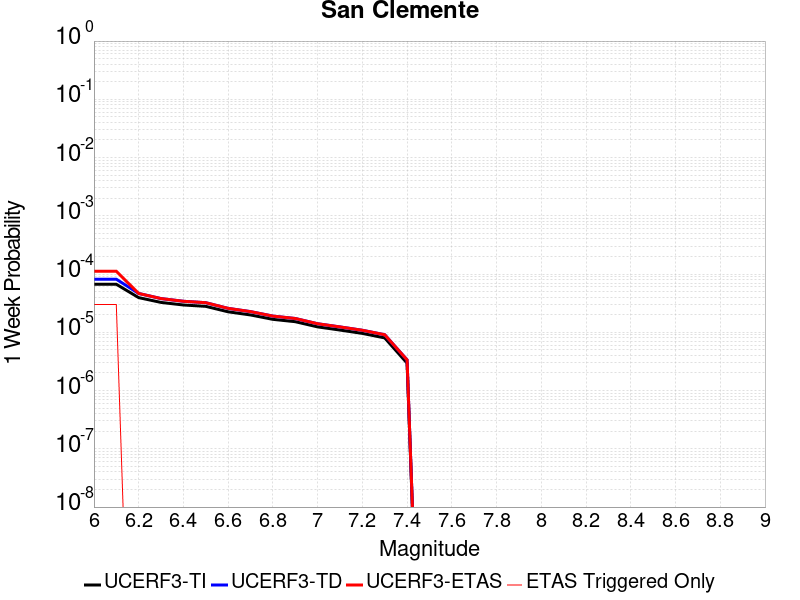 |  |  |  |

| Magnitude | 1 wk TI Prob | 1 wk TD Prob | 1 wk ETAS Prob | 1 wk ETAS/TD Gain | 1 wk ETAS Triggered Only | 1 mo TI Prob | 1 mo TD Prob | 1 mo ETAS Prob | 1 mo ETAS/TD Gain | 1 mo ETAS Triggered Only | 1 yr TI Prob | 1 yr TD Prob | 1 yr ETAS Prob | 1 yr ETAS/TD Gain | 1 yr ETAS Triggered Only | 10 yr TI Prob | 10 yr TD Prob | 10 yr ETAS Prob | 10 yr ETAS/TD Gain | 10 yr ETAS Triggered Only |
|-----|-----|-----|-----|-----|-----|-----|-----|-----|-----|-----|-----|-----|-----|-----|-----|-----|-----|-----|-----|-----|
| 6.0 | 6.681379E-5 | 8.163834E-5 | 1.1163589E-4 | 1.3674444 | 3.0E-5 | 2.8631336E-4 | 3.4983488E-4 | 3.798244E-4 | 1.0857247 | 3.0E-5 | 0.003480294 | 0.00425141 | 0.00429124 | 1.0093687 | 4.0E-5 | 0.03426291 | 0.04175603 | 0.041813523 | 1.0013769 | 6.0E-5 |
| 6.1 | 6.681379E-5 | 8.163834E-5 | 1.1163589E-4 | 1.3674444 | 3.0E-5 | 2.8631336E-4 | 3.4983488E-4 | 3.798244E-4 | 1.0857247 | 3.0E-5 | 0.003480294 | 0.00425141 | 0.00429124 | 1.0093687 | 4.0E-5 | 0.03426291 | 0.04175603 | 0.041813523 | 1.0013769 | 6.0E-5 |
| 6.2 | 3.9400576E-5 | 4.6452373E-5 | 4.6452373E-5 | 1.0 | 0.0 | 1.6884868E-4 | 1.9906677E-4 | 1.9906677E-4 | 1.0 | 0.0 | 0.0020537945 | 0.0024209984 | 0.0024209984 | 1.0 | 0.0 | 0.020349167 | 0.023952903 | 0.023952903 | 1.0 | 0.0 |
| 6.3 | 3.2590255E-5 | 3.792912E-5 | 3.792912E-5 | 1.0 | 0.0 | 1.3966505E-4 | 1.6254342E-4 | 1.6254342E-4 | 1.0 | 0.0 | 0.0016990956 | 0.0019772002 | 0.0019772002 | 1.0 | 0.0 | 0.01686163 | 0.019599883 | 0.019599883 | 1.0 | 0.0 |
| 6.4 | 2.9454652E-5 | 3.4097764E-5 | 3.4097764E-5 | 1.0 | 0.0 | 1.2622811E-4 | 1.4612524E-4 | 1.4612524E-4 | 1.0 | 0.0 | 0.0015357438 | 0.0017776493 | 0.0017776493 | 1.0 | 0.0 | 0.015251739 | 0.01763747 | 0.01763747 | 1.0 | 0.0 |
| 6.5 | 2.790836E-5 | 3.2247463E-5 | 3.2247463E-5 | 1.0 | 0.0 | 1.1960178E-4 | 1.3819624E-4 | 1.3819624E-4 | 1.0 | 0.0 | 0.001455179 | 0.0016812662 | 0.0016812662 | 1.0 | 0.0 | 0.014456868 | 0.016688485 | 0.016688485 | 1.0 | 0.0 |
| 6.6 | 2.2492153E-5 | 2.5762702E-5 | 2.5762702E-5 | 1.0 | 0.0 | 9.639138E-5 | 1.1040699E-4 | 1.1040699E-4 | 1.0 | 0.0 | 0.0011729331 | 0.0013433909 | 0.0013433909 | 1.0 | 0.0 | 0.011667615 | 0.013354417 | 0.013354417 | 1.0 | 0.0 |
| 6.7 | 1.9862755E-5 | 2.2666423E-5 | 2.2666423E-5 | 1.0 | 0.0 | 8.512331E-5 | 9.713826E-5 | 9.713826E-5 | 1.0 | 0.0 | 0.0010358836 | 0.0011820279 | 0.0011820279 | 1.0 | 0.0 | 0.010310682 | 0.011758701 | 0.011758701 | 1.0 | 0.0 |
| 6.8 | 1.6697575E-5 | 1.897771E-5 | 1.897771E-5 | 1.0 | 0.0 | 7.155907E-5 | 8.133056E-5 | 8.133056E-5 | 1.0 | 0.0 | 8.7088346E-4 | 9.897591E-4 | 9.897591E-4 | 1.0 | 0.0 | 0.008674784 | 0.0098545365 | 0.0098545365 | 1.0 | 0.0 |
| 6.9 | 1.5218415E-5 | 1.72694E-5 | 1.72694E-5 | 1.0 | 0.0 | 6.522015E-5 | 7.4009666E-5 | 7.4009666E-5 | 1.0 | 0.0 | 7.93766E-4 | 9.00704E-4 | 9.00704E-4 | 1.0 | 0.0 | 0.007909367 | 0.008971481 | 0.008971481 | 1.0 | 0.0 |
| 7.0 | 1.2392958E-5 | 1.4033016E-5 | 1.4033016E-5 | 1.0 | 0.0 | 5.3111595E-5 | 6.014015E-5 | 6.014015E-5 | 1.0 | 0.0 | 6.4644177E-4 | 7.319679E-4 | 7.319679E-4 | 1.0 | 0.0 | 0.0064456454 | 0.0072963564 | 0.0072963564 | 1.0 | 0.0 |
| 7.1 | 1.0934128E-5 | 1.2375138E-5 | 1.2375138E-5 | 1.0 | 0.0 | 4.6859706E-5 | 5.303527E-5 | 5.303527E-5 | 1.0 | 0.0 | 5.7036756E-4 | 6.455204E-4 | 6.455204E-4 | 1.0 | 0.0 | 0.0056890585 | 0.0064371997 | 0.0064371997 | 1.0 | 0.0 |
| 7.2 | 9.5798805E-6 | 1.0844935E-5 | 1.0844935E-5 | 1.0 | 0.0 | 4.1055984E-5 | 4.6477508E-5 | 4.6477508E-5 | 1.0 | 0.0 | 4.9974193E-4 | 5.657239E-4 | 5.657239E-4 | 1.0 | 0.0 | 0.0049861963 | 0.0056435615 | 0.0056435615 | 1.0 | 0.0 |
| 7.3 | 8.0167365E-6 | 9.083918E-6 | 9.083918E-6 | 1.0 | 0.0 | 3.4356988E-5 | 3.8930535E-5 | 3.8930535E-5 | 1.0 | 0.0 | 4.1821605E-4 | 4.7388324E-4 | 4.7388324E-4 | 1.0 | 0.0 | 0.0041742986 | 0.0047294297 | 0.0047294297 | 1.0 | 0.0 |
| 7.4 | 2.9581017E-6 | 3.3623792E-6 | 3.3623792E-6 | 1.0 | 0.0 | 1.2677518E-5 | 1.4410146E-5 | 1.4410146E-5 | 1.0 | 0.0 | 1.5433785E-4 | 1.7543444E-4 | 1.7543444E-4 | 1.0 | 0.0 | 0.001542307 | 0.0017534546 | 0.0017534546 | 1.0 | 0.0 |

## Elsinore (Temecula) rev
*[(top)](#table-of-contents)*

| 1 Week | 1 Month | 1 Year | 10 Year |
|-----|-----|-----|-----|
|  |  |  |  |

| Magnitude | 1 wk TI Prob | 1 wk TD Prob | 1 wk ETAS Prob | 1 wk ETAS/TD Gain | 1 wk ETAS Triggered Only | 1 mo TI Prob | 1 mo TD Prob | 1 mo ETAS Prob | 1 mo ETAS/TD Gain | 1 mo ETAS Triggered Only | 1 yr TI Prob | 1 yr TD Prob | 1 yr ETAS Prob | 1 yr ETAS/TD Gain | 1 yr ETAS Triggered Only | 10 yr TI Prob | 10 yr TD Prob | 10 yr ETAS Prob | 10 yr ETAS/TD Gain | 10 yr ETAS Triggered Only |
|-----|-----|-----|-----|-----|-----|-----|-----|-----|-----|-----|-----|-----|-----|-----|-----|-----|-----|-----|-----|-----|
| 6.0 | 2.9514995E-5 | 2.251887E-5 | 6.251797E-5 | 2.776248 | 4.0E-5 | 1.264867E-4 | 9.6505995E-5 | 1.3650213E-4 | 1.4144421 | 4.0E-5 | 0.0015388876 | 0.0011743492 | 0.0012143023 | 1.0340214 | 4.0E-5 | 0.015282745 | 0.011688135 | 0.011747434 | 1.0050734 | 6.0E-5 |
| 6.1 | 2.9514995E-5 | 2.251887E-5 | 6.251797E-5 | 2.776248 | 4.0E-5 | 1.264867E-4 | 9.6505995E-5 | 1.3650213E-4 | 1.4144421 | 4.0E-5 | 0.0015388876 | 0.0011743492 | 0.0012143023 | 1.0340214 | 4.0E-5 | 0.015282745 | 0.011688135 | 0.011747434 | 1.0050734 | 6.0E-5 |
| 6.2 | 2.9514995E-5 | 2.251887E-5 | 6.251797E-5 | 2.776248 | 4.0E-5 | 1.264867E-4 | 9.6505995E-5 | 1.3650213E-4 | 1.4144421 | 4.0E-5 | 0.0015388876 | 0.0011743492 | 0.0012143023 | 1.0340214 | 4.0E-5 | 0.015282745 | 0.011688135 | 0.011747434 | 1.0050734 | 6.0E-5 |
| 6.3 | 2.3223649E-5 | 1.840822E-5 | 5.8407484E-5 | 3.1729023 | 4.0E-5 | 9.952613E-5 | 7.889008E-5 | 1.1888693E-4 | 1.5069946 | 4.0E-5 | 0.001211057 | 9.600807E-4 | 0.0010000423 | 1.0416231 | 4.0E-5 | 0.012044783 | 0.009551284 | 0.009610711 | 1.0062219 | 6.0E-5 |
| 6.4 | 2.3223649E-5 | 1.840822E-5 | 5.8407484E-5 | 3.1729023 | 4.0E-5 | 9.952613E-5 | 7.889008E-5 | 1.1888693E-4 | 1.5069946 | 4.0E-5 | 0.001211057 | 9.600807E-4 | 0.0010000423 | 1.0416231 | 4.0E-5 | 0.012044783 | 0.009551284 | 0.009610711 | 1.0062219 | 6.0E-5 |
| 6.5 | 1.8338875E-5 | 1.4750074E-5 | 4.474963E-5 | 3.033858 | 3.0E-5 | 7.8592806E-5 | 6.321312E-5 | 9.321122E-5 | 1.474555 | 3.0E-5 | 9.5644733E-4 | 7.6935673E-4 | 7.993337E-4 | 1.0389636 | 3.0E-5 | 0.009523412 | 0.0076699676 | 0.007719584 | 1.0064689 | 5.0E-5 |
| 6.6 | 1.8223333E-5 | 1.461263E-5 | 3.4612338E-5 | 2.368659 | 2.0E-5 | 7.809766E-5 | 6.26241E-5 | 8.262285E-5 | 1.3193458 | 2.0E-5 | 9.504242E-4 | 7.621905E-4 | 7.821753E-4 | 1.0262202 | 2.0E-5 | 0.009463696 | 0.007598796 | 0.007638492 | 1.005224 | 4.0E-5 |
| 6.7 | 1.7512752E-5 | 1.4026963E-5 | 3.402668E-5 | 2.4258053 | 2.0E-5 | 7.505249E-5 | 6.0114216E-5 | 8.0113015E-5 | 1.33268 | 2.0E-5 | 9.13381E-4 | 7.316534E-4 | 7.516388E-4 | 1.0273154 | 2.0E-5 | 0.00909636 | 0.0072983317 | 0.0073380396 | 1.0054407 | 4.0E-5 |
| 6.8 | 1.7417142E-5 | 1.395093E-5 | 3.395065E-5 | 2.433576 | 2.0E-5 | 7.4642754E-5 | 5.978838E-5 | 7.978718E-5 | 1.3344932 | 2.0E-5 | 9.083966E-4 | 7.27689E-4 | 7.4767444E-4 | 1.0274643 | 2.0E-5 | 0.009046922 | 0.007259359 | 0.007299069 | 1.0054702 | 4.0E-5 |
| 6.9 | 1.6402591E-5 | 1.29883665E-5 | 3.2988108E-5 | 2.5398195 | 2.0E-5 | 7.0294926E-5 | 5.5663284E-5 | 7.5662174E-5 | 1.3592833 | 2.0E-5 | 8.5550465E-4 | 6.774974E-4 | 6.974839E-4 | 1.0295004 | 2.0E-5 | 0.008522186 | 0.0067598647 | 0.006789662 | 1.004408 | 3.0E-5 |
| 7.0 | 1.3912486E-5 | 1.0878067E-5 | 3.087785E-5 | 2.838542 | 2.0E-5 | 5.9623577E-5 | 4.661947E-5 | 6.661854E-5 | 1.4289854 | 2.0E-5 | 7.2567526E-4 | 5.674469E-4 | 5.874356E-4 | 1.0352256 | 2.0E-5 | 0.0072331014 | 0.0056635314 | 0.0056933616 | 1.005267 | 3.0E-5 |
| 7.1 | 1.3405147E-5 | 1.0327192E-5 | 3.0326986E-5 | 2.9366148 | 2.0E-5 | 5.7449364E-5 | 4.4258657E-5 | 6.425777E-5 | 1.451869 | 2.0E-5 | 6.9922156E-4 | 5.3871854E-4 | 5.5870775E-4 | 1.0371051 | 2.0E-5 | 0.0069702556 | 0.005377366 | 0.005407205 | 1.005549 | 3.0E-5 |
| 7.2 | 1.21402E-5 | 8.996479E-6 | 1.8996388E-5 | 2.111536 | 1.0E-5 | 5.202839E-5 | 3.8555776E-5 | 4.855539E-5 | 1.2593545 | 1.0E-5 | 6.332616E-4 | 4.6931725E-4 | 4.7931256E-4 | 1.0212976 | 1.0E-5 | 0.0063146 | 0.0046847262 | 0.0046946793 | 1.0021245 | 1.0E-5 |
| 7.3 | 1.05047775E-5 | 7.571515E-6 | 7.571515E-6 | 1.0 | 0.0 | 4.5019697E-5 | 3.2448956E-5 | 3.2448956E-5 | 1.0 | 0.0 | 5.4797693E-4 | 3.9499588E-4 | 3.9499588E-4 | 1.0 | 0.0 | 0.005466277 | 0.003943348 | 0.003943348 | 1.0 | 0.0 |
| 7.4 | 9.624483E-6 | 6.786621E-6 | 6.786621E-6 | 1.0 | 0.0 | 4.124713E-5 | 2.90852E-5 | 2.90852E-5 | 1.0 | 0.0 | 5.0206814E-4 | 3.5405616E-4 | 3.5405616E-4 | 1.0 | 0.0 | 0.005009353 | 0.0035350726 | 0.0035350726 | 1.0 | 0.0 |
| 7.5 | 8.215151E-6 | 5.6353133E-6 | 5.6353133E-6 | 1.0 | 0.0 | 3.5207315E-5 | 2.4151126E-5 | 2.4151126E-5 | 1.0 | 0.0 | 4.2856473E-4 | 2.9400157E-4 | 2.9400157E-4 | 1.0 | 0.0 | 0.004277392 | 0.002936254 | 0.002936254 | 1.0 | 0.0 |
| 7.6 | 6.975058E-6 | 4.675836E-6 | 4.675836E-6 | 1.0 | 0.0 | 2.9892764E-5 | 2.003915E-5 | 2.003915E-5 | 1.0 | 0.0 | 3.6388362E-4 | 2.439505E-4 | 2.439505E-4 | 1.0 | 0.0 | 0.0036328835 | 0.0024369434 | 0.0024369434 | 1.0 | 0.0 |
| 7.7 | 4.159604E-6 | 2.326789E-6 | 2.326789E-6 | 1.0 | 0.0 | 1.7826753E-5 | 9.971919E-6 | 9.971919E-6 | 1.0 | 0.0 | 2.1701909E-4 | 1.2140209E-4 | 1.2140209E-4 | 1.0 | 0.0 | 0.0021680726 | 0.0012134308 | 0.0012134308 | 1.0 | 0.0 |
| 7.8 | 2.2692414E-7 | 9.384417E-8 | 9.384417E-8 | 1.0 | 0.0 | 9.725317E-7 | 4.0218927E-7 | 4.0218927E-7 | 1.0 | 0.0 | 1.1840509E-5 | 4.8966467E-6 | 4.8966467E-6 | 1.0 | 0.0 | 1.1839878E-4 | 4.8965718E-5 | 4.8965718E-5 | 1.0 | 0.0 |
| 7.9 | 6.676829E-9 | 3.4397174E-9 | 3.4397174E-9 | 1.0 | 0.0 | 2.861498E-8 | 1.4741646E-8 | 1.4741646E-8 | 1.0 | 0.0 | 3.4838732E-7 | 1.7947953E-7 | 1.7947953E-7 | 1.0 | 0.0 | 3.4838679E-6 | 1.794794E-6 | 1.794794E-6 | 1.0 | 0.0 |

## Hosgri
*[(top)](#table-of-contents)*

| 1 Week | 1 Month | 1 Year | 10 Year |
|-----|-----|-----|-----|
|  | 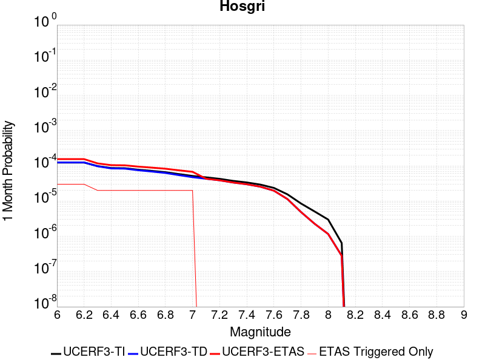 | 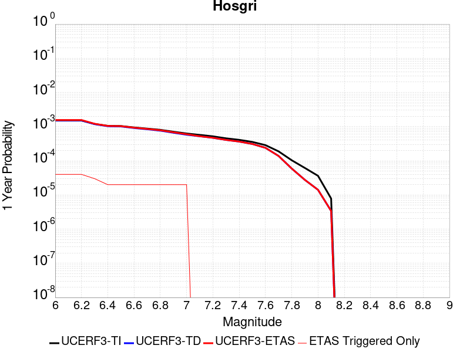 |  |

| Magnitude | 1 wk TI Prob | 1 wk TD Prob | 1 wk ETAS Prob | 1 wk ETAS/TD Gain | 1 wk ETAS Triggered Only | 1 mo TI Prob | 1 mo TD Prob | 1 mo ETAS Prob | 1 mo ETAS/TD Gain | 1 mo ETAS Triggered Only | 1 yr TI Prob | 1 yr TD Prob | 1 yr ETAS Prob | 1 yr ETAS/TD Gain | 1 yr ETAS Triggered Only | 10 yr TI Prob | 10 yr TD Prob | 10 yr ETAS Prob | 10 yr ETAS/TD Gain | 10 yr ETAS Triggered Only |
|-----|-----|-----|-----|-----|-----|-----|-----|-----|-----|-----|-----|-----|-----|-----|-----|-----|-----|-----|-----|-----|
| 6.0 | 2.883978E-5 | 2.9128403E-5 | 5.9127527E-5 | 2.0298927 | 3.0E-5 | 1.235932E-4 | 1.248302E-4 | 1.5482646E-4 | 1.2402965 | 3.0E-5 | 0.0015037085 | 0.0015187752 | 0.0015587145 | 1.026297 | 4.0E-5 | 0.01493574 | 0.01508773 | 0.015136976 | 1.003264 | 5.0E-5 |
| 6.1 | 2.883978E-5 | 2.9128403E-5 | 5.9127527E-5 | 2.0298927 | 3.0E-5 | 1.235932E-4 | 1.248302E-4 | 1.5482646E-4 | 1.2402965 | 3.0E-5 | 0.0015037085 | 0.0015187752 | 0.0015587145 | 1.026297 | 4.0E-5 | 0.01493574 | 0.01508773 | 0.015136976 | 1.003264 | 5.0E-5 |
| 6.2 | 2.883978E-5 | 2.9128403E-5 | 5.9127527E-5 | 2.0298927 | 3.0E-5 | 1.235932E-4 | 1.248302E-4 | 1.5482646E-4 | 1.2402965 | 3.0E-5 | 0.0015037085 | 0.0015187752 | 0.0015587145 | 1.026297 | 4.0E-5 | 0.01493574 | 0.01508773 | 0.015136976 | 1.003264 | 5.0E-5 |
| 6.3 | 2.2914428E-5 | 2.2641956E-5 | 4.2641503E-5 | 1.8832959 | 2.0E-5 | 9.8200995E-5 | 9.703337E-5 | 1.17031435E-4 | 1.2060946 | 2.0E-5 | 0.0011949413 | 0.001180746 | 0.0012107106 | 1.0253776 | 3.0E-5 | 0.011885363 | 0.011746123 | 0.01177577 | 1.002524 | 3.0E-5 |
| 6.4 | 2.0195741E-5 | 1.9696547E-5 | 3.9696155E-5 | 2.0153863 | 2.0E-5 | 8.65503E-5 | 8.4411055E-5 | 1.04409366E-4 | 1.2369158 | 2.0E-5 | 0.0010532405 | 0.001027222 | 0.0010472015 | 1.01945 | 2.0E-5 | 0.010482626 | 0.010225783 | 0.010245578 | 1.0019358 | 2.0E-5 |
| 6.5 | 1.9924333E-5 | 1.9408968E-5 | 3.940858E-5 | 2.0304315 | 2.0E-5 | 8.53872E-5 | 8.317865E-5 | 1.03176986E-4 | 1.2404263 | 2.0E-5 | 0.0010390934 | 0.0010122315 | 0.0010322112 | 1.0197383 | 2.0E-5 | 0.010342481 | 0.010077244 | 0.010097042 | 1.0019647 | 2.0E-5 |
| 6.6 | 1.809694E-5 | 1.7458287E-5 | 3.745794E-5 | 2.1455677 | 2.0E-5 | 7.7556004E-5 | 7.4819094E-5 | 9.4817595E-5 | 1.2672914 | 2.0E-5 | 9.438353E-4 | 9.105431E-4 | 9.3052484E-4 | 1.0219449 | 2.0E-5 | 0.009398366 | 0.009069063 | 0.009088881 | 1.0021853 | 2.0E-5 |
| 6.7 | 1.675989E-5 | 1.6042752E-5 | 3.604243E-5 | 2.246649 | 2.0E-5 | 7.182612E-5 | 6.8752845E-5 | 8.875147E-5 | 1.2908771 | 2.0E-5 | 8.7413215E-4 | 8.3674554E-4 | 8.567288E-4 | 1.0238822 | 2.0E-5 | 0.008707017 | 0.008336853 | 0.008356687 | 1.002379 | 2.0E-5 |
| 6.8 | 1.5401129E-5 | 1.4614069E-5 | 3.461378E-5 | 2.3685243 | 2.0E-5 | 6.6003166E-5 | 6.263023E-5 | 8.2628976E-5 | 1.3193146 | 2.0E-5 | 8.032922E-4 | 7.6225714E-4 | 7.8224187E-4 | 1.0262178 | 2.0E-5 | 0.008003947 | 0.0075972863 | 0.0076171346 | 1.0026125 | 2.0E-5 |
| 6.9 | 1.356559E-5 | 1.2689955E-5 | 3.2689702E-5 | 2.5760298 | 2.0E-5 | 5.8136946E-5 | 5.438439E-5 | 7.43833E-5 | 1.3677326 | 2.0E-5 | 7.0758746E-4 | 6.6192925E-4 | 6.8191596E-4 | 1.0301948 | 2.0E-5 | 0.007053386 | 0.006600378 | 0.006620246 | 1.0030102 | 2.0E-5 |
| 7.0 | 1.2030819E-5 | 1.1095949E-5 | 3.1095726E-5 | 2.8024397 | 2.0E-5 | 5.155963E-5 | 4.75532E-5 | 6.755225E-5 | 1.4205616 | 2.0E-5 | 6.275577E-4 | 5.788065E-4 | 5.9879496E-4 | 1.0345339 | 2.0E-5 | 0.006257884 | 0.0057737473 | 0.005793632 | 1.003444 | 2.0E-5 |
| 7.1 | 1.0972698E-5 | 1.0022167E-5 | 1.0022167E-5 | 1.0 | 0.0 | 4.7025E-5 | 4.2951437E-5 | 4.2951437E-5 | 1.0 | 0.0 | 5.72379E-4 | 5.2280835E-4 | 5.2280835E-4 | 1.0 | 0.0 | 0.0057090693 | 0.005216533 | 0.005216533 | 1.0 | 0.0 |
| 7.2 | 9.961926E-6 | 9.034732E-6 | 9.034732E-6 | 1.0 | 0.0 | 4.2693267E-5 | 3.8719707E-5 | 3.8719707E-5 | 1.0 | 0.0 | 5.1966653E-4 | 4.7131052E-4 | 4.7131052E-4 | 1.0 | 0.0 | 0.00518453 | 0.0047038523 | 0.0047038523 | 1.0 | 0.0 |
| 7.3 | 8.700929E-6 | 7.828089E-6 | 7.828089E-6 | 1.0 | 0.0 | 3.7289166E-5 | 3.354852E-5 | 3.354852E-5 | 1.0 | 0.0 | 4.53901E-4 | 4.083767E-4 | 4.083767E-4 | 1.0 | 0.0 | 0.00452975 | 0.004076999 | 0.004076999 | 1.0 | 0.0 |
| 7.4 | 7.866285E-6 | 6.9987263E-6 | 6.9987263E-6 | 1.0 | 0.0 | 3.3712215E-5 | 2.9994197E-5 | 2.9994197E-5 | 1.0 | 0.0 | 4.103689E-4 | 3.6511818E-4 | 3.6511818E-4 | 1.0 | 0.0 | 0.004096119 | 0.0036459167 | 0.0036459167 | 1.0 | 0.0 |
| 7.5 | 6.8381305E-6 | 5.9596814E-6 | 5.9596814E-6 | 1.0 | 0.0 | 2.9305946E-5 | 2.5541241E-5 | 2.5541241E-5 | 1.0 | 0.0 | 3.5674145E-4 | 3.1092027E-4 | 3.1092027E-4 | 1.0 | 0.0 | 0.0035616932 | 0.003105584 | 0.003105584 | 1.0 | 0.0 |
| 7.6 | 5.503376E-6 | 4.595227E-6 | 4.595227E-6 | 1.0 | 0.0 | 2.3585684E-5 | 1.9693682E-5 | 1.9693682E-5 | 1.0 | 0.0 | 2.8711787E-4 | 2.397442E-4 | 2.397442E-4 | 1.0 | 0.0 | 0.002867472 | 0.0023955852 | 0.0023955852 | 1.0 | 0.0 |
| 7.7 | 3.6144982E-6 | 2.6521896E-6 | 2.6521896E-6 | 1.0 | 0.0 | 1.5490614E-5 | 1.1366477E-5 | 1.1366477E-5 | 1.0 | 0.0 | 1.8858191E-4 | 1.3837808E-4 | 1.3837808E-4 | 1.0 | 0.0 | 0.0018842196 | 0.001383647 | 0.001383647 | 1.0 | 0.0 |
| 7.8 | 1.9853494E-6 | 1.1360784E-6 | 1.1360784E-6 | 1.0 | 0.0 | 8.508612E-6 | 4.8688985E-6 | 4.8688985E-6 | 1.0 | 0.0 | 1.0358743E-4 | 5.9277223E-5 | 5.9277223E-5 | 1.0 | 0.0 | 0.0010353916 | 5.933389E-4 | 5.933389E-4 | 1.0 | 0.0 |
| 7.9 | 1.1818757E-6 | 5.29477E-7 | 5.29477E-7 | 1.0 | 0.0 | 5.0651715E-6 | 2.269185E-6 | 2.269185E-6 | 1.0 | 0.0 | 6.1666724E-5 | 2.7626977E-5 | 2.7626977E-5 | 1.0 | 0.0 | 6.1649614E-4 | 2.7691363E-4 | 2.7691363E-4 | 1.0 | 0.0 |
| 8.0 | 6.962958E-7 | 2.71365E-7 | 2.71365E-7 | 1.0 | 0.0 | 2.9841215E-6 | 1.1629924E-6 | 1.1629924E-6 | 1.0 | 0.0 | 3.6331072E-5 | 1.415934E-5 | 1.415934E-5 | 1.0 | 0.0 | 3.6325134E-4 | 1.4215276E-4 | 1.4215276E-4 | 1.0 | 0.0 |
| 8.1 | 1.5033264E-7 | 6.52693E-8 | 6.52693E-8 | 1.0 | 0.0 | 6.442826E-7 | 2.7972553E-7 | 2.7972553E-7 | 1.0 | 0.0 | 7.844113E-6 | 3.4056532E-6 | 3.4056532E-6 | 1.0 | 0.0 | 7.843835E-5 | 3.4072833E-5 | 3.4072833E-5 | 1.0 | 0.0 |

## Mono Lake 2011 CFM
*[(top)](#table-of-contents)*

| 1 Week | 1 Month | 1 Year | 10 Year |
|-----|-----|-----|-----|
|  |  |  |  |

| Magnitude | 1 wk TI Prob | 1 wk TD Prob | 1 wk ETAS Prob | 1 wk ETAS/TD Gain | 1 wk ETAS Triggered Only | 1 mo TI Prob | 1 mo TD Prob | 1 mo ETAS Prob | 1 mo ETAS/TD Gain | 1 mo ETAS Triggered Only | 1 yr TI Prob | 1 yr TD Prob | 1 yr ETAS Prob | 1 yr ETAS/TD Gain | 1 yr ETAS Triggered Only | 10 yr TI Prob | 10 yr TD Prob | 10 yr ETAS Prob | 10 yr ETAS/TD Gain | 10 yr ETAS Triggered Only |
|-----|-----|-----|-----|-----|-----|-----|-----|-----|-----|-----|-----|-----|-----|-----|-----|-----|-----|-----|-----|-----|
| 6.0 | 2.0341662E-5 | 2.3828192E-5 | 7.3827E-5 | 3.0983047 | 5.0E-5 | 8.717564E-5 | 1.0211982E-4 | 1.521147E-4 | 1.489571 | 5.0E-5 | 0.0010608466 | 0.0012431308 | 0.0012930686 | 1.040171 | 5.0E-5 | 0.010557966 | 0.012413842 | 0.012473096 | 1.0047733 | 6.0E-5 |
| 6.1 | 2.0341662E-5 | 2.3828192E-5 | 7.3827E-5 | 3.0983047 | 5.0E-5 | 8.717564E-5 | 1.0211982E-4 | 1.521147E-4 | 1.489571 | 5.0E-5 | 0.0010608466 | 0.0012431308 | 0.0012930686 | 1.040171 | 5.0E-5 | 0.010557966 | 0.012413842 | 0.012473096 | 1.0047733 | 6.0E-5 |
| 6.2 | 2.0341662E-5 | 2.3828192E-5 | 7.3827E-5 | 3.0983047 | 5.0E-5 | 8.717564E-5 | 1.0211982E-4 | 1.521147E-4 | 1.489571 | 5.0E-5 | 0.0010608466 | 0.0012431308 | 0.0012930686 | 1.040171 | 5.0E-5 | 0.010557966 | 0.012413842 | 0.012473096 | 1.0047733 | 6.0E-5 |
| 6.3 | 2.0341662E-5 | 2.3828192E-5 | 7.3827E-5 | 3.0983047 | 5.0E-5 | 8.717564E-5 | 1.0211982E-4 | 1.521147E-4 | 1.489571 | 5.0E-5 | 0.0010608466 | 0.0012431308 | 0.0012930686 | 1.040171 | 5.0E-5 | 0.010557966 | 0.012413842 | 0.012473096 | 1.0047733 | 6.0E-5 |
| 6.4 | 1.749821E-5 | 2.049101E-5 | 6.049019E-5 | 2.9520357 | 4.0E-5 | 7.499018E-5 | 8.781861E-5 | 1.278151E-4 | 1.4554443 | 4.0E-5 | 9.1262296E-4 | 0.0010691914 | 0.0011091486 | 1.0373714 | 4.0E-5 | 0.009088841 | 0.01069187 | 0.010741335 | 1.0046264 | 5.0E-5 |
| 6.5 | 1.749821E-5 | 2.049101E-5 | 6.049019E-5 | 2.9520357 | 4.0E-5 | 7.499018E-5 | 8.781861E-5 | 1.278151E-4 | 1.4554443 | 4.0E-5 | 9.1262296E-4 | 0.0010691914 | 0.0011091486 | 1.0373714 | 4.0E-5 | 0.009088841 | 0.01069187 | 0.010741335 | 1.0046264 | 5.0E-5 |

## Elsinore (Stepovers Combined)
*[(top)](#table-of-contents)*

| 1 Week | 1 Month | 1 Year | 10 Year |
|-----|-----|-----|-----|
|  |  |  |  |

| Magnitude | 1 wk TI Prob | 1 wk TD Prob | 1 wk ETAS Prob | 1 wk ETAS/TD Gain | 1 wk ETAS Triggered Only | 1 mo TI Prob | 1 mo TD Prob | 1 mo ETAS Prob | 1 mo ETAS/TD Gain | 1 mo ETAS Triggered Only | 1 yr TI Prob | 1 yr TD Prob | 1 yr ETAS Prob | 1 yr ETAS/TD Gain | 1 yr ETAS Triggered Only | 10 yr TI Prob | 10 yr TD Prob | 10 yr ETAS Prob | 10 yr ETAS/TD Gain | 10 yr ETAS Triggered Only |
|-----|-----|-----|-----|-----|-----|-----|-----|-----|-----|-----|-----|-----|-----|-----|-----|-----|-----|-----|-----|-----|
| 6.0 | 2.144392E-5 | 1.976007E-5 | 4.9759477E-5 | 2.5181832 | 3.0E-5 | 9.189928E-5 | 8.468338E-5 | 1.14680835E-4 | 1.3542308 | 3.0E-5 | 0.0011182994 | 0.0010305515 | 0.0010605205 | 1.0290806 | 3.0E-5 | 0.011126885 | 0.010264617 | 0.010324001 | 1.0057853 | 6.0E-5 |
| 6.1 | 2.144392E-5 | 1.976007E-5 | 4.9759477E-5 | 2.5181832 | 3.0E-5 | 9.189928E-5 | 8.468338E-5 | 1.14680835E-4 | 1.3542308 | 3.0E-5 | 0.0011182994 | 0.0010305515 | 0.0010605205 | 1.0290806 | 3.0E-5 | 0.011126885 | 0.010264617 | 0.010324001 | 1.0057853 | 6.0E-5 |
| 6.2 | 2.144392E-5 | 1.976007E-5 | 4.9759477E-5 | 2.5181832 | 3.0E-5 | 9.189928E-5 | 8.468338E-5 | 1.14680835E-4 | 1.3542308 | 3.0E-5 | 0.0011182994 | 0.0010305515 | 0.0010605205 | 1.0290806 | 3.0E-5 | 0.011126885 | 0.010264617 | 0.010324001 | 1.0057853 | 6.0E-5 |
| 6.3 | 1.9751555E-5 | 1.7741326E-5 | 4.7740792E-5 | 2.6909373 | 3.0E-5 | 8.4646774E-5 | 7.603211E-5 | 1.0602983E-4 | 1.3945401 | 3.0E-5 | 0.0010300872 | 9.25312E-4 | 9.552842E-4 | 1.0323915 | 3.0E-5 | 0.010253254 | 0.0092209745 | 0.009270513 | 1.0053724 | 5.0E-5 |
| 6.4 | 1.9751555E-5 | 1.7741326E-5 | 4.7740792E-5 | 2.6909373 | 3.0E-5 | 8.4646774E-5 | 7.603211E-5 | 1.0602983E-4 | 1.3945401 | 3.0E-5 | 0.0010300872 | 9.25312E-4 | 9.552842E-4 | 1.0323915 | 3.0E-5 | 0.010253254 | 0.0092209745 | 0.009270513 | 1.0053724 | 5.0E-5 |
| 6.5 | 1.9751555E-5 | 1.7741326E-5 | 4.7740792E-5 | 2.6909373 | 3.0E-5 | 8.4646774E-5 | 7.603211E-5 | 1.0602983E-4 | 1.3945401 | 3.0E-5 | 0.0010300872 | 9.25312E-4 | 9.552842E-4 | 1.0323915 | 3.0E-5 | 0.010253254 | 0.0092209745 | 0.009270513 | 1.0053724 | 5.0E-5 |
| 6.6 | 1.9188685E-5 | 1.7003247E-5 | 3.700291E-5 | 2.176226 | 2.0E-5 | 8.2234634E-5 | 7.2869116E-5 | 9.286765E-5 | 1.2744447 | 2.0E-5 | 0.0010007467 | 8.8683655E-4 | 9.068188E-4 | 1.0225321 | 2.0E-5 | 0.00996252 | 0.008839546 | 0.008879192 | 1.0044851 | 4.0E-5 |
| 6.7 | 1.7608272E-5 | 1.4732402E-5 | 3.4732107E-5 | 2.3575318 | 2.0E-5 | 7.546184E-5 | 6.313739E-5 | 8.313613E-5 | 1.3167495 | 2.0E-5 | 9.183606E-4 | 7.684364E-4 | 7.88421E-4 | 1.0260068 | 2.0E-5 | 0.009145746 | 0.007664441 | 0.0077041346 | 1.0051789 | 4.0E-5 |
| 6.8 | 1.697165E-5 | 1.3783126E-5 | 3.378285E-5 | 2.4510295 | 2.0E-5 | 7.273361E-5 | 5.906925E-5 | 7.906807E-5 | 1.3385656 | 2.0E-5 | 8.8517193E-4 | 7.189395E-4 | 7.389251E-4 | 1.0277988 | 2.0E-5 | 0.008816543 | 0.0071722106 | 0.007211924 | 1.005537 | 4.0E-5 |
| 6.9 | 1.600365E-5 | 1.2846429E-5 | 3.2846172E-5 | 2.5568328 | 2.0E-5 | 6.858527E-5 | 5.5055007E-5 | 7.5053904E-5 | 1.363253 | 2.0E-5 | 8.347058E-4 | 6.700963E-4 | 6.9008296E-4 | 1.0298264 | 2.0E-5 | 0.008315775 | 0.006686422 | 0.006716221 | 1.0044568 | 3.0E-5 |
| 7.0 | 1.3314581E-5 | 1.044738E-5 | 3.044717E-5 | 2.9143355 | 2.0E-5 | 5.7061243E-5 | 4.4773733E-5 | 6.477284E-5 | 1.4466705 | 2.0E-5 | 6.944992E-4 | 5.449866E-4 | 5.6497566E-4 | 1.0366782 | 2.0E-5 | 0.006923327 | 0.005440055 | 0.005469892 | 1.0054847 | 3.0E-5 |
| 7.1 | 1.2865345E-5 | 9.937339E-6 | 2.993714E-5 | 3.0125911 | 2.0E-5 | 5.5136024E-5 | 4.258792E-5 | 6.258707E-5 | 1.4695967 | 2.0E-5 | 6.710743E-4 | 5.1838707E-4 | 5.3837674E-4 | 1.0385612 | 2.0E-5 | 0.0066905143 | 0.005175021 | 0.0052048657 | 1.0057671 | 3.0E-5 |
| 7.2 | 1.1650051E-5 | 8.633585E-6 | 1.8633498E-5 | 2.1582575 | 1.0E-5 | 4.9927836E-5 | 3.7000562E-5 | 4.7000194E-5 | 1.2702562 | 1.0E-5 | 6.0770183E-4 | 4.503905E-4 | 4.60386E-4 | 1.022193 | 1.0E-5 | 0.0060604266 | 0.00449624 | 0.0045061954 | 1.0022141 | 1.0E-5 |
| 7.3 | 1.0008533E-5 | 7.2008215E-6 | 7.2008215E-6 | 1.0 | 0.0 | 4.2893007E-5 | 3.0860305E-5 | 3.0860305E-5 | 1.0 | 0.0 | 5.220972E-4 | 3.756609E-4 | 3.756609E-4 | 1.0 | 0.0 | 0.005208723 | 0.0037506663 | 0.0037506663 | 1.0 | 0.0 |
| 7.4 | 9.116759E-6 | 6.409854E-6 | 6.409854E-6 | 1.0 | 0.0 | 3.907124E-5 | 2.7470522E-5 | 2.7470522E-5 | 1.0 | 0.0 | 4.7558855E-4 | 3.3440365E-4 | 3.3440365E-4 | 1.0 | 0.0 | 0.00474572 | 0.0033391542 | 0.0033391542 | 1.0 | 0.0 |
| 7.5 | 7.870524E-6 | 5.382316E-6 | 5.382316E-6 | 1.0 | 0.0 | 3.3730383E-5 | 2.306687E-5 | 2.306687E-5 | 1.0 | 0.0 | 4.1059E-4 | 2.8080423E-4 | 2.8080423E-4 | 1.0 | 0.0 | 0.0040983222 | 0.0028046207 | 0.0028046207 | 1.0 | 0.0 |
| 7.6 | 6.9774537E-6 | 4.677398E-6 | 4.677398E-6 | 1.0 | 0.0 | 2.990303E-5 | 2.0045845E-5 | 2.0045845E-5 | 1.0 | 0.0 | 3.640086E-4 | 2.44032E-4 | 2.44032E-4 | 1.0 | 0.0 | 0.003634129 | 0.0024377564 | 0.0024377564 | 1.0 | 0.0 |
| 7.7 | 4.1616954E-6 | 2.3281368E-6 | 2.3281368E-6 | 1.0 | 0.0 | 1.7835715E-5 | 9.977695E-6 | 9.977695E-6 | 1.0 | 0.0 | 2.171282E-4 | 1.2147242E-4 | 1.2147242E-4 | 1.0 | 0.0 | 0.0021691616 | 0.0012141332 | 0.0012141332 | 1.0 | 0.0 |
| 7.8 | 2.2692414E-7 | 9.384417E-8 | 9.384417E-8 | 1.0 | 0.0 | 9.725317E-7 | 4.0218927E-7 | 4.0218927E-7 | 1.0 | 0.0 | 1.1840509E-5 | 4.8966467E-6 | 4.8966467E-6 | 1.0 | 0.0 | 1.1839878E-4 | 4.8965718E-5 | 4.8965718E-5 | 1.0 | 0.0 |
| 7.9 | 6.676829E-9 | 3.4397174E-9 | 3.4397174E-9 | 1.0 | 0.0 | 2.861498E-8 | 1.4741646E-8 | 1.4741646E-8 | 1.0 | 0.0 | 3.4838732E-7 | 1.7947953E-7 | 1.7947953E-7 | 1.0 | 0.0 | 3.4838679E-6 | 1.794794E-6 | 1.794794E-6 | 1.0 | 0.0 |

## San Andreas (Santa Cruz Mts) 2011 CFM
*[(top)](#table-of-contents)*

| 1 Week | 1 Month | 1 Year | 10 Year |
|-----|-----|-----|-----|
|  |  |  |  |

| Magnitude | 1 wk TI Prob | 1 wk TD Prob | 1 wk ETAS Prob | 1 wk ETAS/TD Gain | 1 wk ETAS Triggered Only | 1 mo TI Prob | 1 mo TD Prob | 1 mo ETAS Prob | 1 mo ETAS/TD Gain | 1 mo ETAS Triggered Only | 1 yr TI Prob | 1 yr TD Prob | 1 yr ETAS Prob | 1 yr ETAS/TD Gain | 1 yr ETAS Triggered Only | 10 yr TI Prob | 10 yr TD Prob | 10 yr ETAS Prob | 10 yr ETAS/TD Gain | 10 yr ETAS Triggered Only |
|-----|-----|-----|-----|-----|-----|-----|-----|-----|-----|-----|-----|-----|-----|-----|-----|-----|-----|-----|-----|-----|
| 6.0 | 1.7221631E-4 | 1.3792426E-4 | 1.6792012E-4 | 1.2174807 | 3.0E-5 | 7.378611E-4 | 5.9097214E-4 | 6.4094254E-4 | 1.0845563 | 5.0E-5 | 0.008946515 | 0.0071717235 | 0.0072312932 | 1.0083061 | 6.0E-5 | 0.08594794 | 0.07054796 | 0.07060373 | 1.0007905 | 6.0E-5 |
| 6.1 | 1.7221631E-4 | 1.3792426E-4 | 1.6792012E-4 | 1.2174807 | 3.0E-5 | 7.378611E-4 | 5.9097214E-4 | 6.4094254E-4 | 1.0845563 | 5.0E-5 | 0.008946515 | 0.0071717235 | 0.0072312932 | 1.0083061 | 6.0E-5 | 0.08594794 | 0.07054796 | 0.07060373 | 1.0007905 | 6.0E-5 |
| 6.2 | 1.7221631E-4 | 1.3792426E-4 | 1.6792012E-4 | 1.2174807 | 3.0E-5 | 7.378611E-4 | 5.9097214E-4 | 6.4094254E-4 | 1.0845563 | 5.0E-5 | 0.008946515 | 0.0071717235 | 0.0072312932 | 1.0083061 | 6.0E-5 | 0.08594794 | 0.07054796 | 0.07060373 | 1.0007905 | 6.0E-5 |
| 6.3 | 1.716926E-4 | 1.3711878E-4 | 1.6711467E-4 | 1.2187583 | 3.0E-5 | 7.3561794E-4 | 5.8752164E-4 | 6.374923E-4 | 1.0850532 | 5.0E-5 | 0.008919428 | 0.007129989 | 0.0071895616 | 1.0083551 | 6.0E-5 | 0.08569809 | 0.07015993 | 0.07021572 | 1.0007952 | 6.0E-5 |
| 6.4 | 1.6392978E-4 | 1.3587909E-4 | 1.6587501E-4 | 1.2207545 | 3.0E-5 | 7.02367E-4 | 5.82211E-4 | 6.3218194E-4 | 1.0858295 | 5.0E-5 | 0.008517839 | 0.0070657525 | 0.0071253283 | 1.0084317 | 6.0E-5 | 0.08198654 | 0.069394976 | 0.06945081 | 1.0008047 | 6.0E-5 |
| 6.5 | 1.5742714E-4 | 1.2647794E-4 | 1.5647415E-4 | 1.2371655 | 3.0E-5 | 6.745133E-4 | 5.419374E-4 | 5.919103E-4 | 1.0922116 | 5.0E-5 | 0.00818132 | 0.0065784375 | 0.0066380426 | 1.0090607 | 6.0E-5 | 0.078865945 | 0.06486093 | 0.06491704 | 1.0008651 | 6.0E-5 |
| 6.6 | 1.3038084E-4 | 1.1587992E-4 | 1.4587645E-4 | 1.2588587 | 3.0E-5 | 5.5865536E-4 | 4.96535E-4 | 5.4651016E-4 | 1.1006478 | 5.0E-5 | 0.006780438 | 0.006028784 | 0.0060884226 | 1.0098922 | 6.0E-5 | 0.0657725 | 0.059330538 | 0.05938698 | 1.0009513 | 6.0E-5 |
| 6.7 | 1.2867592E-4 | 1.1314491E-4 | 1.4314151E-4 | 1.2651167 | 3.0E-5 | 5.5135164E-4 | 4.8481792E-4 | 5.347937E-4 | 1.1030815 | 5.0E-5 | 0.0066920654 | 0.005886907 | 0.005946554 | 1.0101321 | 6.0E-5 | 0.06494093 | 0.058041416 | 0.058097932 | 1.0009737 | 6.0E-5 |
| 6.8 | 1.2801298E-4 | 1.12520516E-4 | 1.4251714E-4 | 1.2665881 | 3.0E-5 | 5.485117E-4 | 4.8214293E-4 | 5.3211884E-4 | 1.1036537 | 5.0E-5 | 0.0066577005 | 0.0058545293 | 0.005914178 | 1.0101885 | 6.0E-5 | 0.06461738 | 0.05775524 | 0.057811774 | 1.0009788 | 6.0E-5 |
| 6.9 | 1.269149E-4 | 1.1094256E-4 | 1.4093923E-4 | 1.2703803 | 3.0E-5 | 5.4380763E-4 | 4.7538272E-4 | 5.2535895E-4 | 1.1051284 | 5.0E-5 | 0.006600777 | 0.005772663 | 0.0058323164 | 1.0103338 | 6.0E-5 | 0.06408122 | 0.057027116 | 0.057083696 | 1.0009922 | 6.0E-5 |
| 7.0 | 1.2030331E-4 | 1.0824356E-4 | 1.3824031E-4 | 1.2771227 | 3.0E-5 | 5.154837E-4 | 4.638198E-4 | 5.137966E-4 | 1.1077505 | 5.0E-5 | 0.006257969 | 0.0056326203 | 0.005692282 | 1.0105922 | 6.0E-5 | 0.06084648 | 0.055699922 | 0.05575658 | 1.0010172 | 6.0E-5 |
| 7.1 | 8.049617E-5 | 5.392429E-5 | 8.392267E-5 | 1.5563055 | 3.0E-5 | 3.4493793E-4 | 2.3108382E-4 | 2.8107225E-4 | 1.2163217 | 5.0E-5 | 0.0041915346 | 0.0028098505 | 0.002869682 | 1.0212934 | 6.0E-5 | 0.041133516 | 0.029618833 | 0.029677056 | 1.0019658 | 6.0E-5 |
| 7.2 | 7.093979E-5 | 4.2935415E-5 | 7.293413E-5 | 1.6986939 | 3.0E-5 | 3.0399222E-4 | 1.8399608E-4 | 2.3398687E-4 | 1.2716949 | 5.0E-5 | 0.0036948253 | 0.0022378736 | 0.0022977393 | 1.0267512 | 6.0E-5 | 0.03633994 | 0.023941126 | 0.02399969 | 1.0024462 | 6.0E-5 |
| 7.3 | 6.193693E-5 | 2.8891074E-5 | 5.8890208E-5 | 2.038353 | 3.0E-5 | 2.6541698E-4 | 1.2381302E-4 | 1.7380682E-4 | 1.4037848 | 5.0E-5 | 0.0032266637 | 0.001506383 | 0.0015662925 | 1.0397705 | 6.0E-5 | 0.031802133 | 0.016497677 | 0.016556688 | 1.0035769 | 6.0E-5 |
| 7.4 | 5.906492E-5 | 2.7020369E-5 | 5.701956E-5 | 2.1102436 | 3.0E-5 | 2.5311083E-4 | 1.1579645E-4 | 1.6579065E-4 | 1.4317422 | 5.0E-5 | 0.0030772698 | 0.0014089114 | 0.0014688269 | 1.0425261 | 6.0E-5 | 0.030350044 | 0.0154695045 | 0.015528576 | 1.0038186 | 6.0E-5 |
| 7.5 | 5.424296E-5 | 2.4675093E-5 | 5.4674354E-5 | 2.215771 | 3.0E-5 | 2.324491E-4 | 1.0574612E-4 | 1.5574084E-4 | 1.4727806 | 5.0E-5 | 0.002826395 | 0.0012866998 | 0.0013466226 | 1.0465709 | 6.0E-5 | 0.027907165 | 0.014161854 | 0.014221004 | 1.0041767 | 6.0E-5 |
| 7.6 | 4.43084E-5 | 1.990151E-5 | 4.990091E-5 | 2.5073934 | 3.0E-5 | 1.8987931E-4 | 8.528939E-5 | 1.3528514E-4 | 1.5861894 | 5.0E-5 | 0.0023093296 | 0.001037904 | 0.0010978418 | 1.0577488 | 6.0E-5 | 0.022854783 | 0.011411123 | 0.011470439 | 1.005198 | 6.0E-5 |
| 7.7 | 4.118098E-5 | 1.8933848E-5 | 4.8933278E-5 | 2.584434 | 3.0E-5 | 1.7647797E-4 | 8.1142534E-5 | 1.3113848E-4 | 1.6161497 | 5.0E-5 | 0.002146502 | 9.874629E-4 | 0.0010474037 | 1.0607017 | 6.0E-5 | 0.021258866 | 0.010868995 | 0.010928343 | 1.0054603 | 6.0E-5 |
| 7.8 | 3.5408906E-5 | 1.856201E-5 | 4.8561455E-5 | 2.6161742 | 3.0E-5 | 1.5174363E-4 | 7.954905E-5 | 1.2954506E-4 | 1.6284931 | 5.0E-5 | 0.0018459131 | 9.6807955E-4 | 0.0010280214 | 1.0619184 | 6.0E-5 | 0.018306552 | 0.0106506655 | 0.010710026 | 1.0055734 | 6.0E-5 |
| 7.9 | 2.5860836E-5 | 1.7313954E-5 | 4.7313435E-5 | 2.7326765 | 3.0E-5 | 1.10827445E-4 | 7.420055E-5 | 1.2419684E-4 | 1.6737994 | 5.0E-5 | 0.001348489 | 9.030175E-4 | 9.629633E-4 | 1.0663838 | 6.0E-5 | 0.013403354 | 0.009906601 | 0.0099660065 | 1.0059966 | 6.0E-5 |
| 8.0 | 1.9777332E-5 | 1.4837888E-5 | 4.483744E-5 | 3.0218213 | 3.0E-5 | 8.4757245E-5 | 6.3589396E-5 | 1.1358622E-4 | 1.7862446 | 5.0E-5 | 0.0010314309 | 7.739261E-4 | 8.3387963E-4 | 1.0774667 | 6.0E-5 | 0.010266567 | 0.008508087 | 0.008567576 | 1.0069921 | 6.0E-5 |
| 8.1 | 1.468494E-5 | 1.2105831E-5 | 3.210559E-5 | 2.6520765 | 2.0E-5 | 6.293394E-5 | 5.1881103E-5 | 9.1879025E-5 | 1.7709537 | 4.0E-5 | 7.6595135E-4 | 6.3146953E-4 | 6.8143796E-4 | 1.0791304 | 5.0E-5 | 0.0076331664 | 0.0069684954 | 0.007018147 | 1.0071251 | 5.0E-5 |
| 8.2 | 8.63836E-6 | 5.4678667E-6 | 1.5467813E-5 | 2.8288567 | 1.0E-5 | 3.7021015E-5 | 2.3433504E-5 | 3.343327E-5 | 1.4267294 | 1.0E-5 | 4.5063766E-4 | 2.8526565E-4 | 2.9526278E-4 | 1.035045 | 1.0E-5 | 0.004497249 | 0.003245162 | 0.0032551298 | 1.0030715 | 1.0E-5 |
| 8.3 | 1.983087E-6 | 7.6564595E-7 | 7.6564595E-7 | 1.0 | 0.0 | 8.498917E-6 | 3.281336E-6 | 3.281336E-6 | 1.0 | 0.0 | 1.034694E-4 | 3.9949547E-5 | 3.9949547E-5 | 1.0 | 0.0 | 0.0010342124 | 4.717979E-4 | 4.717979E-4 | 1.0 | 0.0 |

## Dry Mountain
*[(top)](#table-of-contents)*

| 1 Week | 1 Month | 1 Year | 10 Year |
|-----|-----|-----|-----|
|  |  |  |  |

| Magnitude | 1 wk TI Prob | 1 wk TD Prob | 1 wk ETAS Prob | 1 wk ETAS/TD Gain | 1 wk ETAS Triggered Only | 1 mo TI Prob | 1 mo TD Prob | 1 mo ETAS Prob | 1 mo ETAS/TD Gain | 1 mo ETAS Triggered Only | 1 yr TI Prob | 1 yr TD Prob | 1 yr ETAS Prob | 1 yr ETAS/TD Gain | 1 yr ETAS Triggered Only | 10 yr TI Prob | 10 yr TD Prob | 10 yr ETAS Prob | 10 yr ETAS/TD Gain | 10 yr ETAS Triggered Only |
|-----|-----|-----|-----|-----|-----|-----|-----|-----|-----|-----|-----|-----|-----|-----|-----|-----|-----|-----|-----|-----|
| 6.0 | 6.222801E-6 | 6.439381E-6 | 4.6439123E-5 | 7.211737 | 4.0E-5 | 2.6668875E-5 | 2.7597147E-5 | 7.759577E-5 | 2.8117316 | 5.0E-5 | 3.2464517E-4 | 3.3595937E-4 | 3.9593922E-4 | 1.1785331 | 6.0E-5 | 0.0032417132 | 0.0033560768 | 0.0034158754 | 1.017818 | 6.0E-5 |
| 6.1 | 6.222801E-6 | 6.439381E-6 | 4.6439123E-5 | 7.211737 | 4.0E-5 | 2.6668875E-5 | 2.7597147E-5 | 7.759577E-5 | 2.8117316 | 5.0E-5 | 3.2464517E-4 | 3.3595937E-4 | 3.9593922E-4 | 1.1785331 | 6.0E-5 | 0.0032417132 | 0.0033560768 | 0.0034158754 | 1.017818 | 6.0E-5 |
| 6.2 | 6.222801E-6 | 6.439381E-6 | 4.6439123E-5 | 7.211737 | 4.0E-5 | 2.6668875E-5 | 2.7597147E-5 | 7.759577E-5 | 2.8117316 | 5.0E-5 | 3.2464517E-4 | 3.3595937E-4 | 3.9593922E-4 | 1.1785331 | 6.0E-5 | 0.0032417132 | 0.0033560768 | 0.0034158754 | 1.017818 | 6.0E-5 |
| 6.3 | 6.222801E-6 | 6.439381E-6 | 4.6439123E-5 | 7.211737 | 4.0E-5 | 2.6668875E-5 | 2.7597147E-5 | 7.759577E-5 | 2.8117316 | 5.0E-5 | 3.2464517E-4 | 3.3595937E-4 | 3.9593922E-4 | 1.1785331 | 6.0E-5 | 0.0032417132 | 0.0033560768 | 0.0034158754 | 1.017818 | 6.0E-5 |
| 6.4 | 6.222801E-6 | 6.439381E-6 | 4.6439123E-5 | 7.211737 | 4.0E-5 | 2.6668875E-5 | 2.7597147E-5 | 7.759577E-5 | 2.8117316 | 5.0E-5 | 3.2464517E-4 | 3.3595937E-4 | 3.9593922E-4 | 1.1785331 | 6.0E-5 | 0.0032417132 | 0.0033560768 | 0.0034158754 | 1.017818 | 6.0E-5 |
| 6.5 | 2.8528623E-6 | 2.9521684E-6 | 3.295208E-5 | 11.161992 | 3.0E-5 | 1.22264955E-5 | 1.2652138E-5 | 5.265163E-5 | 4.161481 | 4.0E-5 | 1.4884741E-4 | 1.540376E-4 | 1.9403143E-4 | 1.2596369 | 4.0E-5 | 0.0014874774 | 0.0015401616 | 0.0015801 | 1.0259314 | 4.0E-5 |
| 6.6 | 2.8528623E-6 | 2.9521684E-6 | 3.295208E-5 | 11.161992 | 3.0E-5 | 1.22264955E-5 | 1.2652138E-5 | 5.265163E-5 | 4.161481 | 4.0E-5 | 1.4884741E-4 | 1.540376E-4 | 1.9403143E-4 | 1.2596369 | 4.0E-5 | 0.0014874774 | 0.0015401616 | 0.0015801 | 1.0259314 | 4.0E-5 |
| 6.7 | 2.541E-6 | 2.6293578E-6 | 1.2629332E-5 | 4.8032 | 1.0E-5 | 1.0889954E-5 | 1.1268677E-5 | 3.126845E-5 | 2.7748113 | 2.0E-5 | 1.3257713E-4 | 1.3719614E-4 | 1.571934E-4 | 1.1457567 | 2.0E-5 | 0.0013249806 | 0.0013719613 | 0.0013919339 | 1.0145577 | 2.0E-5 |

## Elysian Park (Upper)
*[(top)](#table-of-contents)*

| 1 Week | 1 Month | 1 Year | 10 Year |
|-----|-----|-----|-----|
|  |  | 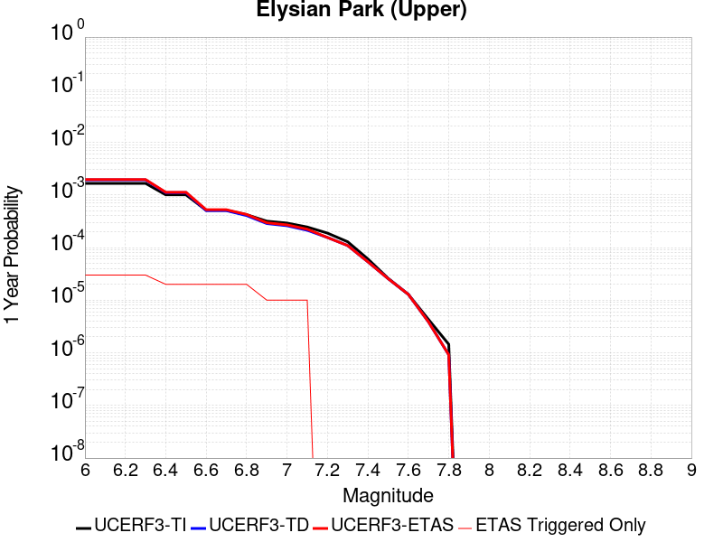 |  |

| Magnitude | 1 wk TI Prob | 1 wk TD Prob | 1 wk ETAS Prob | 1 wk ETAS/TD Gain | 1 wk ETAS Triggered Only | 1 mo TI Prob | 1 mo TD Prob | 1 mo ETAS Prob | 1 mo ETAS/TD Gain | 1 mo ETAS Triggered Only | 1 yr TI Prob | 1 yr TD Prob | 1 yr ETAS Prob | 1 yr ETAS/TD Gain | 1 yr ETAS Triggered Only | 10 yr TI Prob | 10 yr TD Prob | 10 yr ETAS Prob | 10 yr ETAS/TD Gain | 10 yr ETAS Triggered Only |
|-----|-----|-----|-----|-----|-----|-----|-----|-----|-----|-----|-----|-----|-----|-----|-----|-----|-----|-----|-----|-----|
| 6.0 | 3.1876025E-5 | 3.7035275E-5 | 4.7034904E-5 | 1.2700028 | 1.0E-5 | 1.3660437E-4 | 1.5871569E-4 | 1.7871251E-4 | 1.1259915 | 2.0E-5 | 0.0016618895 | 0.001931122 | 0.001961064 | 1.015505 | 3.0E-5 | 0.016495159 | 0.019189863 | 0.019238902 | 1.0025555 | 5.0E-5 |
| 6.1 | 3.1876025E-5 | 3.7035275E-5 | 4.7034904E-5 | 1.2700028 | 1.0E-5 | 1.3660437E-4 | 1.5871569E-4 | 1.7871251E-4 | 1.1259915 | 2.0E-5 | 0.0016618895 | 0.001931122 | 0.001961064 | 1.015505 | 3.0E-5 | 0.016495159 | 0.019189863 | 0.019238902 | 1.0025555 | 5.0E-5 |
| 6.2 | 3.1876025E-5 | 3.7035275E-5 | 4.7034904E-5 | 1.2700028 | 1.0E-5 | 1.3660437E-4 | 1.5871569E-4 | 1.7871251E-4 | 1.1259915 | 2.0E-5 | 0.0016618895 | 0.001931122 | 0.001961064 | 1.015505 | 3.0E-5 | 0.016495159 | 0.019189863 | 0.019238902 | 1.0025555 | 5.0E-5 |
| 6.3 | 3.1876025E-5 | 3.7035275E-5 | 4.7034904E-5 | 1.2700028 | 1.0E-5 | 1.3660437E-4 | 1.5871569E-4 | 1.7871251E-4 | 1.1259915 | 2.0E-5 | 0.0016618895 | 0.001931122 | 0.001961064 | 1.015505 | 3.0E-5 | 0.016495159 | 0.019189863 | 0.019238902 | 1.0025555 | 5.0E-5 |
| 6.4 | 1.9273462E-5 | 2.120244E-5 | 3.1202228E-5 | 1.4716338 | 1.0E-5 | 8.259794E-5 | 9.086542E-5 | 1.108636E-4 | 1.2200857 | 2.0E-5 | 0.001005166 | 0.0011058967 | 0.0011258746 | 1.0180649 | 2.0E-5 | 0.010006315 | 0.011020744 | 0.011060303 | 1.0035895 | 4.0E-5 |
| 6.5 | 1.9273462E-5 | 2.120244E-5 | 3.1202228E-5 | 1.4716338 | 1.0E-5 | 8.259794E-5 | 9.086542E-5 | 1.108636E-4 | 1.2200857 | 2.0E-5 | 0.001005166 | 0.0011058967 | 0.0011258746 | 1.0180649 | 2.0E-5 | 0.010006315 | 0.011020744 | 0.011060303 | 1.0035895 | 4.0E-5 |
| 6.6 | 9.813258E-6 | 9.665589E-6 | 1.9665491E-5 | 2.034588 | 1.0E-5 | 4.205614E-5 | 4.1423333E-5 | 6.142251E-5 | 1.4827996 | 2.0E-5 | 5.119132E-4 | 5.042196E-4 | 5.242095E-4 | 1.0396453 | 2.0E-5 | 0.005107356 | 0.0050314795 | 0.0050613284 | 1.0059325 | 3.0E-5 |
| 6.7 | 9.801478E-6 | 9.653158E-6 | 1.9653062E-5 | 2.0359204 | 1.0E-5 | 4.2005657E-5 | 4.137006E-5 | 6.136923E-5 | 1.4834214 | 2.0E-5 | 5.112989E-4 | 5.0357135E-4 | 5.2356126E-4 | 1.0396963 | 2.0E-5 | 0.0051012407 | 0.005025026 | 0.0050548753 | 1.0059401 | 3.0E-5 |
| 6.8 | 8.102489E-6 | 7.772994E-6 | 1.7772916E-5 | 2.2864957 | 1.0E-5 | 3.4724493E-5 | 3.3312434E-5 | 5.3311767E-5 | 1.6003565 | 2.0E-5 | 4.2268867E-4 | 4.0550836E-4 | 4.2550027E-4 | 1.0493008 | 2.0E-5 | 0.004218856 | 0.0040481784 | 0.0040780567 | 1.0073807 | 3.0E-5 |
| 6.9 | 6.08275E-6 | 5.481441E-6 | 5.481441E-6 | 1.0 | 0.0 | 2.6068668E-5 | 2.3491682E-5 | 3.3491448E-5 | 1.4256725 | 1.0E-5 | 3.173398E-4 | 2.8597447E-4 | 2.959716E-4 | 1.0349581 | 1.0E-5 | 0.0031688702 | 0.0028561424 | 0.0028760852 | 1.0069824 | 2.0E-5 |
| 7.0 | 5.5995934E-6 | 4.9827686E-6 | 4.9827686E-6 | 1.0 | 0.0 | 2.3998036E-5 | 2.1354552E-5 | 3.135434E-5 | 1.4682742 | 1.0E-5 | 2.9213692E-4 | 2.5996132E-4 | 2.6995872E-4 | 1.0384573 | 1.0E-5 | 0.0029175316 | 0.0025966396 | 0.0026165876 | 1.0076822 | 2.0E-5 |
| 7.1 | 4.709881E-6 | 4.0873906E-6 | 4.0873906E-6 | 1.0 | 0.0 | 2.0185047E-5 | 1.7517272E-5 | 2.7517097E-5 | 1.5708551 | 1.0E-5 | 2.4572524E-4 | 2.1325232E-4 | 2.232502E-4 | 1.0468827 | 1.0E-5 | 0.002454537 | 0.0021305184 | 0.0021504757 | 1.0093673 | 2.0E-5 |
| 7.2 | 3.6063436E-6 | 2.9779412E-6 | 2.9779412E-6 | 1.0 | 0.0 | 1.5455667E-5 | 1.27625435E-5 | 1.27625435E-5 | 1.0 | 0.0 | 1.881565E-4 | 1.55373E-4 | 1.55373E-4 | 1.0 | 0.0 | 0.0018799726 | 0.0015526549 | 0.0015626394 | 1.0064306 | 1.0E-5 |
| 7.3 | 2.471135E-6 | 2.0954562E-6 | 2.0954562E-6 | 1.0 | 0.0 | 1.0590536E-5 | 8.980496E-6 | 8.980496E-6 | 1.0 | 0.0 | 1.2893214E-4 | 1.0933213E-4 | 1.0933213E-4 | 1.0 | 0.0 | 0.0012885736 | 0.0010927906 | 0.0011027798 | 1.0091408 | 1.0E-5 |
| 7.4 | 1.163943E-6 | 1.0275061E-6 | 1.0275061E-6 | 1.0 | 0.0 | 4.988318E-6 | 4.40359E-6 | 4.40359E-6 | 1.0 | 0.0 | 6.0731076E-5 | 5.361242E-5 | 5.361242E-5 | 1.0 | 0.0 | 6.071448E-4 | 5.3599785E-4 | 5.459925E-4 | 1.0186468 | 1.0E-5 |
| 7.5 | 4.99459E-7 | 4.917601E-7 | 4.917601E-7 | 1.0 | 0.0 | 2.140537E-6 | 2.1075416E-6 | 2.1075416E-6 | 1.0 | 0.0 | 2.6060725E-5 | 2.5659032E-5 | 2.5659032E-5 | 1.0 | 0.0 | 2.605767E-4 | 2.5656226E-4 | 2.5656226E-4 | 1.0 | 0.0 |
| 7.6 | 2.4667852E-7 | 2.4778313E-7 | 2.4778313E-7 | 1.0 | 0.0 | 1.0571932E-6 | 1.0619274E-6 | 1.0619274E-6 | 1.0 | 0.0 | 1.2871251E-5 | 1.2928893E-5 | 1.2928893E-5 | 1.0 | 0.0 | 1.2870505E-4 | 1.2928178E-4 | 1.2928178E-4 | 1.0 | 0.0 |
| 7.7 | 8.2312795E-8 | 7.3864214E-8 | 7.3864214E-8 | 1.0 | 0.0 | 3.527691E-7 | 3.165609E-7 | 3.165609E-7 | 1.0 | 0.0 | 4.294955E-6 | 3.854123E-6 | 3.854123E-6 | 1.0 | 0.0 | 4.2948723E-5 | 3.854068E-5 | 3.854068E-5 | 1.0 | 0.0 |
| 7.8 | 2.7819295E-8 | 1.7565618E-8 | 1.7565618E-8 | 1.0 | 0.0 | 1.1922555E-7 | 7.528122E-8 | 7.528122E-8 | 1.0 | 0.0 | 1.45157E-6 | 9.1654863E-7 | 9.1654863E-7 | 1.0 | 0.0 | 1.45156055E-5 | 9.165463E-6 | 9.165463E-6 | 1.0 | 0.0 |

## White Wolf
*[(top)](#table-of-contents)*

| 1 Week | 1 Month | 1 Year | 10 Year |
|-----|-----|-----|-----|
|  |  |  |  |

| Magnitude | 1 wk TI Prob | 1 wk TD Prob | 1 wk ETAS Prob | 1 wk ETAS/TD Gain | 1 wk ETAS Triggered Only | 1 mo TI Prob | 1 mo TD Prob | 1 mo ETAS Prob | 1 mo ETAS/TD Gain | 1 mo ETAS Triggered Only | 1 yr TI Prob | 1 yr TD Prob | 1 yr ETAS Prob | 1 yr ETAS/TD Gain | 1 yr ETAS Triggered Only | 10 yr TI Prob | 10 yr TD Prob | 10 yr ETAS Prob | 10 yr ETAS/TD Gain | 10 yr ETAS Triggered Only |
|-----|-----|-----|-----|-----|-----|-----|-----|-----|-----|-----|-----|-----|-----|-----|-----|-----|-----|-----|-----|-----|
| 6.0 | 2.0037822E-5 | 1.0468583E-6 | 3.1046828E-5 | 29.657143 | 3.0E-5 | 8.587355E-5 | 4.4865283E-6 | 5.4486303E-5 | 12.144424 | 5.0E-5 | 0.001045009 | 5.4622164E-5 | 1.0461943E-4 | 1.9153293 | 5.0E-5 | 0.010401085 | 5.4609246E-4 | 6.060597E-4 | 1.1098115 | 6.0E-5 |
| 6.1 | 2.0037822E-5 | 1.0468583E-6 | 3.1046828E-5 | 29.657143 | 3.0E-5 | 8.587355E-5 | 4.4865283E-6 | 5.4486303E-5 | 12.144424 | 5.0E-5 | 0.001045009 | 5.4622164E-5 | 1.0461943E-4 | 1.9153293 | 5.0E-5 | 0.010401085 | 5.4609246E-4 | 6.060597E-4 | 1.1098115 | 6.0E-5 |
| 6.2 | 2.0037822E-5 | 1.0468583E-6 | 3.1046828E-5 | 29.657143 | 3.0E-5 | 8.587355E-5 | 4.4865283E-6 | 5.4486303E-5 | 12.144424 | 5.0E-5 | 0.001045009 | 5.4622164E-5 | 1.0461943E-4 | 1.9153293 | 5.0E-5 | 0.010401085 | 5.4609246E-4 | 6.060597E-4 | 1.1098115 | 6.0E-5 |
| 6.3 | 2.0037822E-5 | 1.0468583E-6 | 3.1046828E-5 | 29.657143 | 3.0E-5 | 8.587355E-5 | 4.4865283E-6 | 5.4486303E-5 | 12.144424 | 5.0E-5 | 0.001045009 | 5.4622164E-5 | 1.0461943E-4 | 1.9153293 | 5.0E-5 | 0.010401085 | 5.4609246E-4 | 6.060597E-4 | 1.1098115 | 6.0E-5 |
| 6.4 | 1.132487E-5 | 1.0468583E-6 | 3.1046828E-5 | 29.657143 | 3.0E-5 | 4.8534253E-5 | 4.4865283E-6 | 5.4486303E-5 | 12.144424 | 5.0E-5 | 5.907443E-4 | 5.4622164E-5 | 1.0461943E-4 | 1.9153293 | 5.0E-5 | 0.005891764 | 5.4609246E-4 | 6.060597E-4 | 1.1098115 | 6.0E-5 |
| 6.5 | 1.132487E-5 | 1.0468583E-6 | 3.1046828E-5 | 29.657143 | 3.0E-5 | 4.8534253E-5 | 4.4865283E-6 | 5.4486303E-5 | 12.144424 | 5.0E-5 | 5.907443E-4 | 5.4622164E-5 | 1.0461943E-4 | 1.9153293 | 5.0E-5 | 0.005891764 | 5.4609246E-4 | 6.060597E-4 | 1.1098115 | 6.0E-5 |
| 6.6 | 9.347473E-6 | 1.0468583E-6 | 3.1046828E-5 | 29.657143 | 3.0E-5 | 4.0059982E-5 | 4.4865283E-6 | 5.4486303E-5 | 12.144424 | 5.0E-5 | 4.8762115E-4 | 5.4622164E-5 | 1.0461943E-4 | 1.9153293 | 5.0E-5 | 0.0048655253 | 5.4609246E-4 | 6.060597E-4 | 1.1098115 | 6.0E-5 |
| 6.7 | 7.842647E-6 | 1.0047773E-6 | 3.1004747E-5 | 30.857332 | 3.0E-5 | 3.361091E-5 | 4.306182E-6 | 5.4305965E-5 | 12.611165 | 5.0E-5 | 4.0913603E-4 | 5.2426552E-5 | 1.0242393E-4 | 1.9536653 | 5.0E-5 | 0.004083836 | 5.241468E-4 | 5.8411533E-4 | 1.1144117 | 6.0E-5 |
| 6.8 | 6.26597E-6 | 9.734289E-7 | 3.09734E-5 | 31.818863 | 3.0E-5 | 2.685388E-5 | 4.1718313E-6 | 5.417162E-5 | 12.985094 | 5.0E-5 | 3.2689696E-4 | 5.0790914E-5 | 1.0078838E-4 | 1.984378 | 5.0E-5 | 0.003264165 | 5.07798E-4 | 5.677675E-4 | 1.1180972 | 6.0E-5 |
| 6.9 | 5.258436E-6 | 9.1827343E-7 | 3.0918247E-5 | 33.66998 | 3.0E-5 | 2.2535958E-5 | 3.935452E-6 | 5.3935255E-5 | 13.704971 | 5.0E-5 | 2.7434074E-4 | 4.7913123E-5 | 9.791073E-5 | 2.0435054 | 5.0E-5 | 0.0027400232 | 4.7903272E-4 | 5.39004E-4 | 1.1251924 | 6.0E-5 |
| 7.0 | 4.675028E-6 | 8.660704E-7 | 3.0866046E-5 | 35.639187 | 3.0E-5 | 2.003568E-5 | 3.7117254E-6 | 5.371154E-5 | 14.470775 | 5.0E-5 | 2.4390711E-4 | 4.518937E-5 | 9.5187104E-5 | 2.106405 | 5.0E-5 | 0.0024363957 | 4.518065E-4 | 5.117794E-4 | 1.1327403 | 6.0E-5 |
| 7.1 | 2.8270078E-6 | 6.8737717E-7 | 2.0687363E-5 | 30.096088 | 2.0E-5 | 1.2115692E-5 | 2.945899E-6 | 4.294578E-5 | 14.578158 | 4.0E-5 | 1.4749856E-4 | 3.586577E-5 | 7.586434E-5 | 2.1152294 | 4.0E-5 | 0.001474007 | 3.5860392E-4 | 4.08586E-4 | 1.1393796 | 5.0E-5 |
| 7.2 | 1.6881406E-6 | 2.2703432E-7 | 1.0227032E-5 | 45.046196 | 1.0E-5 | 7.2348685E-6 | 9.730038E-7 | 2.0972984E-5 | 21.554882 | 2.0E-5 | 8.808096E-5 | 1.1846259E-5 | 3.1846022E-5 | 2.6882768 | 2.0E-5 | 8.8046055E-4 | 1.1845643E-4 | 1.3845407E-4 | 1.1688185 | 2.0E-5 |
| 7.3 | 9.086107E-7 | 1.5264496E-7 | 1.0152644E-5 | 66.51149 | 1.0E-5 | 3.8940398E-6 | 6.5419255E-7 | 1.0654186E-5 | 16.28601 | 1.0E-5 | 4.7408903E-5 | 7.964766E-6 | 1.7964687E-5 | 2.2555196 | 1.0E-5 | 4.739879E-4 | 7.964489E-5 | 8.964409E-5 | 1.1255473 | 1.0E-5 |
| 7.4 | 1.9717383E-7 | 9.003399E-8 | 1.0090033E-5 | 112.069145 | 1.0E-5 | 8.450304E-7 | 3.8585992E-7 | 1.03858565E-5 | 26.91613 | 1.0E-5 | 1.0288197E-5 | 4.697835E-6 | 1.4697788E-5 | 3.1286302 | 1.0E-5 | 1.028772E-4 | 4.6977384E-5 | 5.6976914E-5 | 1.2128584 | 1.0E-5 |
| 7.5 | 1.086975E-7 | 6.659662E-8 | 6.659662E-8 | 1.0 | 0.0 | 4.6584634E-7 | 2.8541407E-7 | 2.8541407E-7 | 1.0 | 0.0 | 5.6716644E-6 | 3.474911E-6 | 3.474911E-6 | 1.0 | 0.0 | 5.6715195E-5 | 3.474859E-5 | 3.474859E-5 | 1.0 | 0.0 |
| 7.6 | 2.4217808E-8 | 1.5820849E-8 | 1.5820849E-8 | 1.0 | 0.0 | 1.03790605E-7 | 6.780364E-8 | 6.780364E-8 | 1.0 | 0.0 | 1.2636499E-6 | 8.25509E-7 | 8.25509E-7 | 1.0 | 0.0 | 1.2636427E-5 | 8.255064E-6 | 8.255064E-6 | 1.0 | 0.0 |

## Calaveras (So) 2011 CFM
*[(top)](#table-of-contents)*

| 1 Week | 1 Month | 1 Year | 10 Year |
|-----|-----|-----|-----|
|  |  |  |  |

| Magnitude | 1 wk TI Prob | 1 wk TD Prob | 1 wk ETAS Prob | 1 wk ETAS/TD Gain | 1 wk ETAS Triggered Only | 1 mo TI Prob | 1 mo TD Prob | 1 mo ETAS Prob | 1 mo ETAS/TD Gain | 1 mo ETAS Triggered Only | 1 yr TI Prob | 1 yr TD Prob | 1 yr ETAS Prob | 1 yr ETAS/TD Gain | 1 yr ETAS Triggered Only | 10 yr TI Prob | 10 yr TD Prob | 10 yr ETAS Prob | 10 yr ETAS/TD Gain | 10 yr ETAS Triggered Only |
|-----|-----|-----|-----|-----|-----|-----|-----|-----|-----|-----|-----|-----|-----|-----|-----|-----|-----|-----|-----|-----|
| 6.0 | 1.5950744E-4 | 3.0713255E-4 | 3.271264E-4 | 1.0650985 | 2.0E-5 | 6.834242E-4 | 0.001315409 | 0.0013453695 | 1.0227766 | 3.0E-5 | 0.00828899 | 0.015858326 | 0.015897691 | 1.0024823 | 4.0E-5 | 0.079865426 | 0.14440185 | 0.14444463 | 1.0002962 | 5.0E-5 |
| 6.1 | 1.3584697E-4 | 2.603514E-4 | 2.8034617E-4 | 1.0767993 | 2.0E-5 | 5.8207137E-4 | 0.0011151754 | 0.001145142 | 1.0268716 | 3.0E-5 | 0.007063716 | 0.013461385 | 0.013490981 | 1.0021986 | 3.0E-5 | 0.06843361 | 0.124029994 | 0.124065034 | 1.0002825 | 4.0E-5 |
| 6.2 | 1.14676266E-4 | 2.1714384E-4 | 2.371395E-4 | 1.0920849 | 2.0E-5 | 4.9137714E-4 | 9.30223E-4 | 9.601951E-4 | 1.0322204 | 3.0E-5 | 0.0059661185 | 0.011245058 | 0.011274721 | 1.0026379 | 3.0E-5 | 0.058084648 | 0.10502057 | 0.10504741 | 1.0002557 | 3.0E-5 |
| 6.3 | 8.691518E-5 | 1.5987935E-4 | 1.6987773E-4 | 1.0625372 | 1.0E-5 | 3.7244044E-4 | 6.849807E-4 | 6.9497386E-4 | 1.014589 | 1.0E-5 | 0.004525038 | 0.008301122 | 0.008311039 | 1.0011947 | 1.0E-5 | 0.044339992 | 0.0793365 | 0.0793457 | 1.000116 | 1.0E-5 |
| 6.4 | 8.50982E-5 | 1.5694331E-4 | 1.6694174E-4 | 1.0637072 | 1.0E-5 | 3.646556E-4 | 6.724042E-4 | 6.823975E-4 | 1.0148621 | 1.0E-5 | 0.0044306475 | 0.008149155 | 0.008159074 | 1.0012171 | 1.0E-5 | 0.04343345 | 0.07794268 | 0.07795189 | 1.0001183 | 1.0E-5 |
| 6.5 | 8.4062965E-5 | 1.5518743E-4 | 1.6518588E-4 | 1.0644282 | 1.0E-5 | 3.602201E-4 | 6.6488347E-4 | 6.748768E-4 | 1.0150303 | 1.0E-5 | 0.004376863 | 0.008058365 | 0.008068285 | 1.001231 | 1.0E-5 | 0.042916555 | 0.07711388 | 0.07712311 | 1.0001197 | 1.0E-5 |
| 6.6 | 8.194716E-5 | 1.5154552E-4 | 1.6154401E-4 | 1.0659767 | 1.0E-5 | 3.5115483E-4 | 6.492843E-4 | 6.592778E-4 | 1.0153916 | 1.0E-5 | 0.0042669317 | 0.007870209 | 0.007880131 | 1.0012606 | 1.0E-5 | 0.04185927 | 0.07539919 | 0.07540844 | 1.0001227 | 1.0E-5 |
| 6.7 | 8.012326E-5 | 1.4822475E-4 | 1.5822327E-4 | 1.0674552 | 1.0E-5 | 3.433402E-4 | 6.350612E-4 | 6.4505485E-4 | 1.0157365 | 1.0E-5 | 0.004172157 | 0.007698701 | 0.007708624 | 1.0012889 | 1.0E-5 | 0.040946912 | 0.07384132 | 0.07385058 | 1.0001254 | 1.0E-5 |
| 6.8 | 7.119773E-5 | 1.2881879E-4 | 1.388175E-4 | 1.0776185 | 1.0E-5 | 3.0509746E-4 | 5.519494E-4 | 5.619438E-4 | 1.0181077 | 1.0E-5 | 0.0037082357 | 0.006696066 | 0.006705999 | 1.0014834 | 1.0E-5 | 0.036469642 | 0.06468575 | 0.0646951 | 1.0001446 | 1.0E-5 |
| 6.9 | 5.7343088E-5 | 9.919277E-5 | 9.919277E-5 | 1.0 | 0.0 | 2.4573295E-4 | 4.25043E-4 | 4.25043E-4 | 1.0 | 0.0 | 0.0029876942 | 0.005162694 | 0.005162694 | 1.0 | 0.0 | 0.02947844 | 0.05051036 | 0.05051036 | 1.0 | 0.0 |
| 7.0 | 4.8746577E-5 | 8.2850725E-5 | 8.2850725E-5 | 1.0 | 0.0 | 2.0889717E-4 | 3.5502657E-4 | 3.5502657E-4 | 1.0 | 0.0 | 0.0025403565 | 0.004313948 | 0.004313948 | 1.0 | 0.0 | 0.025115121 | 0.042485245 | 0.042485245 | 1.0 | 0.0 |
| 7.1 | 4.2998014E-5 | 7.265203E-5 | 7.265203E-5 | 1.0 | 0.0 | 1.8426418E-4 | 3.1132903E-4 | 3.1132903E-4 | 1.0 | 0.0 | 0.002241108 | 0.003783903 | 0.003783903 | 1.0 | 0.0 | 0.022186412 | 0.037423562 | 0.037423562 | 1.0 | 0.0 |
| 7.2 | 3.221292E-5 | 5.390791E-5 | 5.390791E-5 | 1.0 | 0.0 | 1.3804805E-4 | 2.3101359E-4 | 2.3101359E-4 | 1.0 | 0.0 | 0.0016794393 | 0.0028089907 | 0.0028089907 | 1.0 | 0.0 | 0.016668037 | 0.02803602 | 0.02803602 | 1.0 | 0.0 |
| 7.3 | 2.3756531E-5 | 3.9473416E-5 | 3.9473416E-5 | 1.0 | 0.0 | 1.0180973E-4 | 1.6916092E-4 | 1.6916092E-4 | 1.0 | 0.0 | 0.0012388286 | 0.0020576057 | 0.0020576057 | 1.0 | 0.0 | 0.012319452 | 0.020643145 | 0.020643145 | 1.0 | 0.0 |
| 7.4 | 1.5997684E-5 | 2.7342163E-5 | 2.7342163E-5 | 1.0 | 0.0 | 6.8559704E-5 | 1.1717545E-4 | 1.1717545E-4 | 1.0 | 0.0 | 8.343947E-4 | 0.00142568 | 0.00142568 | 1.0 | 0.0 | 0.008312687 | 0.014376011 | 0.014376011 | 1.0 | 0.0 |
| 7.5 | 1.3814293E-5 | 2.4783874E-5 | 2.4783874E-5 | 1.0 | 0.0 | 5.9202768E-5 | 1.062123E-4 | 1.062123E-4 | 1.0 | 0.0 | 7.205553E-4 | 0.00129237 | 0.00129237 | 1.0 | 0.0 | 0.007182234 | 0.013055085 | 0.013055085 | 1.0 | 0.0 |
| 7.6 | 8.817309E-6 | 1.6430757E-5 | 1.6430757E-5 | 1.0 | 0.0 | 3.7787922E-5 | 7.0415634E-5 | 7.0415634E-5 | 1.0 | 0.0 | 4.5997082E-4 | 8.569745E-4 | 8.569745E-4 | 1.0 | 0.0 | 0.004590199 | 0.008719284 | 0.008719284 | 1.0 | 0.0 |
| 7.7 | 4.0352206E-6 | 7.707318E-6 | 7.707318E-6 | 1.0 | 0.0 | 1.7293689E-5 | 3.3030945E-5 | 3.3030945E-5 | 1.0 | 0.0 | 2.1053031E-4 | 4.0207763E-4 | 4.0207763E-4 | 1.0 | 0.0 | 0.0021033096 | 0.004165172 | 0.004165172 | 1.0 | 0.0 |
| 7.8 | 3.413169E-6 | 6.787282E-6 | 6.787282E-6 | 1.0 | 0.0 | 1.4627784E-5 | 2.9088029E-5 | 2.9088029E-5 | 1.0 | 0.0 | 1.7807873E-4 | 3.5408925E-4 | 3.5408925E-4 | 1.0 | 0.0 | 0.0017793609 | 0.0036665166 | 0.0036665166 | 1.0 | 0.0 |
| 7.9 | 2.4740732E-6 | 5.2791843E-6 | 5.2791843E-6 | 1.0 | 0.0 | 1.06031275E-5 | 2.262488E-5 | 2.262488E-5 | 1.0 | 0.0 | 1.2908543E-4 | 2.7542314E-4 | 2.7542314E-4 | 1.0 | 0.0 | 0.0012901047 | 0.0028347955 | 0.0028347955 | 1.0 | 0.0 |
| 8.0 | 1.5231818E-6 | 3.2889548E-6 | 3.2889548E-6 | 1.0 | 0.0 | 6.527906E-6 | 1.40954435E-5 | 1.40954435E-5 | 1.0 | 0.0 | 7.9474354E-5 | 1.7159856E-4 | 1.7159856E-4 | 1.0 | 0.0 | 7.944594E-4 | 0.0017564303 | 0.0017564303 | 1.0 | 0.0 |
| 8.1 | 1.0104524E-6 | 2.045782E-6 | 2.045782E-6 | 1.0 | 0.0 | 4.330503E-6 | 8.767608E-6 | 8.767608E-6 | 1.0 | 0.0 | 5.2722597E-5 | 1.0674043E-4 | 1.0674043E-4 | 1.0 | 0.0 | 5.271009E-4 | 0.001092934 | 0.001092934 | 1.0 | 0.0 |

## Tin Mountain
*[(top)](#table-of-contents)*

| 1 Week | 1 Month | 1 Year | 10 Year |
|-----|-----|-----|-----|
|  |  | 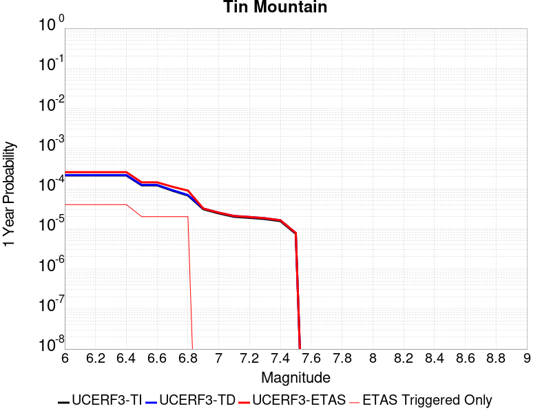 |  |

| Magnitude | 1 wk TI Prob | 1 wk TD Prob | 1 wk ETAS Prob | 1 wk ETAS/TD Gain | 1 wk ETAS Triggered Only | 1 mo TI Prob | 1 mo TD Prob | 1 mo ETAS Prob | 1 mo ETAS/TD Gain | 1 mo ETAS Triggered Only | 1 yr TI Prob | 1 yr TD Prob | 1 yr ETAS Prob | 1 yr ETAS/TD Gain | 1 yr ETAS Triggered Only | 10 yr TI Prob | 10 yr TD Prob | 10 yr ETAS Prob | 10 yr ETAS/TD Gain | 10 yr ETAS Triggered Only |
|-----|-----|-----|-----|-----|-----|-----|-----|-----|-----|-----|-----|-----|-----|-----|-----|-----|-----|-----|-----|-----|
| 6.0 | 4.083776E-6 | 4.1815365E-6 | 3.4181412E-5 | 8.174366 | 3.0E-5 | 1.750178E-5 | 1.792077E-5 | 5.7920053E-5 | 3.232007 | 4.0E-5 | 2.1306332E-4 | 2.1816725E-4 | 2.581585E-4 | 1.1833056 | 4.0E-5 | 0.0021285915 | 0.0021798965 | 0.0022297874 | 1.0228869 | 5.0E-5 |
| 6.1 | 4.083776E-6 | 4.1815365E-6 | 3.4181412E-5 | 8.174366 | 3.0E-5 | 1.750178E-5 | 1.792077E-5 | 5.7920053E-5 | 3.232007 | 4.0E-5 | 2.1306332E-4 | 2.1816725E-4 | 2.581585E-4 | 1.1833056 | 4.0E-5 | 0.0021285915 | 0.0021798965 | 0.0022297874 | 1.0228869 | 5.0E-5 |
| 6.2 | 4.083776E-6 | 4.1815365E-6 | 3.4181412E-5 | 8.174366 | 3.0E-5 | 1.750178E-5 | 1.792077E-5 | 5.7920053E-5 | 3.232007 | 4.0E-5 | 2.1306332E-4 | 2.1816725E-4 | 2.581585E-4 | 1.1833056 | 4.0E-5 | 0.0021285915 | 0.0021798965 | 0.0022297874 | 1.0228869 | 5.0E-5 |
| 6.3 | 4.083776E-6 | 4.1815365E-6 | 3.4181412E-5 | 8.174366 | 3.0E-5 | 1.750178E-5 | 1.792077E-5 | 5.7920053E-5 | 3.232007 | 4.0E-5 | 2.1306332E-4 | 2.1816725E-4 | 2.581585E-4 | 1.1833056 | 4.0E-5 | 0.0021285915 | 0.0021798965 | 0.0022297874 | 1.0228869 | 5.0E-5 |
| 6.4 | 4.083776E-6 | 4.1815365E-6 | 3.4181412E-5 | 8.174366 | 3.0E-5 | 1.750178E-5 | 1.792077E-5 | 5.7920053E-5 | 3.232007 | 4.0E-5 | 2.1306332E-4 | 2.1816725E-4 | 2.581585E-4 | 1.1833056 | 4.0E-5 | 0.0021285915 | 0.0021798965 | 0.0022297874 | 1.0228869 | 5.0E-5 |
| 6.5 | 2.3143427E-6 | 2.3731573E-6 | 2.237311E-5 | 9.427572 | 2.0E-5 | 9.9185745E-6 | 1.0170638E-5 | 3.0170435E-5 | 2.966425 | 2.0E-5 | 1.2075195E-4 | 1.2382126E-4 | 1.4381878E-4 | 1.1615032 | 2.0E-5 | 0.0012068636 | 0.0012375986 | 0.0012575738 | 1.0161403 | 2.0E-5 |
| 6.6 | 2.3143427E-6 | 2.3731573E-6 | 2.237311E-5 | 9.427572 | 2.0E-5 | 9.9185745E-6 | 1.0170638E-5 | 3.0170435E-5 | 2.966425 | 2.0E-5 | 1.2075195E-4 | 1.2382126E-4 | 1.4381878E-4 | 1.1615032 | 2.0E-5 | 0.0012068636 | 0.0012375986 | 0.0012575738 | 1.0161403 | 2.0E-5 |
| 6.7 | 1.7029532E-6 | 1.7497915E-6 | 2.1749756E-5 | 12.4299135 | 2.0E-5 | 7.2983503E-6 | 7.499088E-6 | 2.7498938E-5 | 3.666971 | 2.0E-5 | 8.885379E-5 | 9.1298105E-5 | 1.1129628E-4 | 1.2190425 | 2.0E-5 | 8.881827E-4 | 9.1265864E-4 | 9.3264034E-4 | 1.021894 | 2.0E-5 |
| 6.8 | 1.2914646E-6 | 1.3299378E-6 | 2.1329912E-5 | 16.038277 | 2.0E-5 | 5.534837E-6 | 5.6997237E-6 | 2.569961E-5 | 4.508922 | 2.0E-5 | 6.738455E-5 | 6.939237E-5 | 8.939098E-5 | 1.2881961 | 2.0E-5 | 6.736412E-4 | 6.9375033E-4 | 7.1373646E-4 | 1.0288088 | 2.0E-5 |
| 6.9 | 5.8708974E-7 | 6.1169936E-7 | 6.1169936E-7 | 1.0 | 0.0 | 2.5160964E-6 | 2.6215664E-6 | 2.6215664E-6 | 1.0 | 0.0 | 3.0633044E-5 | 3.1917145E-5 | 3.1917145E-5 | 1.0 | 0.0 | 3.0628822E-4 | 3.191297E-4 | 3.191297E-4 | 1.0 | 0.0 |
| 7.0 | 4.6248786E-7 | 4.832015E-7 | 4.832015E-7 | 1.0 | 0.0 | 1.9820893E-6 | 2.0708624E-6 | 2.0708624E-6 | 1.0 | 0.0 | 2.413167E-5 | 2.5212494E-5 | 2.5212494E-5 | 1.0 | 0.0 | 2.412905E-4 | 2.5210003E-4 | 2.5210003E-4 | 1.0 | 0.0 |
| 7.1 | 3.804606E-7 | 3.987147E-7 | 3.987147E-7 | 1.0 | 0.0 | 1.6305444E-6 | 1.7087764E-6 | 1.7087764E-6 | 1.0 | 0.0 | 1.9851697E-5 | 2.0804187E-5 | 2.0804187E-5 | 1.0 | 0.0 | 1.9849923E-4 | 2.0802575E-4 | 2.0802575E-4 | 1.0 | 0.0 |
| 7.2 | 3.5864858E-7 | 3.7616863E-7 | 3.7616863E-7 | 1.0 | 0.0 | 1.5370645E-6 | 1.6121504E-6 | 1.6121504E-6 | 1.0 | 0.0 | 1.87136E-5 | 1.9627789E-5 | 1.9627789E-5 | 1.0 | 0.0 | 1.8712023E-4 | 1.9626386E-4 | 1.9626386E-4 | 1.0 | 0.0 |
| 7.3 | 3.342063E-7 | 3.506347E-7 | 3.506347E-7 | 1.0 | 0.0 | 1.4323119E-6 | 1.5027196E-6 | 1.5027196E-6 | 1.0 | 0.0 | 1.7438259E-5 | 1.829549E-5 | 1.829549E-5 | 1.0 | 0.0 | 1.743689E-4 | 1.8294314E-4 | 1.8294314E-4 | 1.0 | 0.0 |
| 7.4 | 2.971242E-7 | 3.1165817E-7 | 3.1165817E-7 | 1.0 | 0.0 | 1.2733886E-6 | 1.3356774E-6 | 1.3356774E-6 | 1.0 | 0.0 | 1.5503398E-5 | 1.6261785E-5 | 1.6261785E-5 | 1.0 | 0.0 | 1.5502315E-4 | 1.6260923E-4 | 1.6260923E-4 | 1.0 | 0.0 |
| 7.5 | 1.4326713E-7 | 1.5012525E-7 | 1.5012525E-7 | 1.0 | 0.0 | 6.140018E-7 | 6.433939E-7 | 6.433939E-7 | 1.0 | 0.0 | 7.4754466E-6 | 7.8333205E-6 | 7.8333205E-6 | 1.0 | 0.0 | 7.475195E-5 | 7.833321E-5 | 7.833321E-5 | 1.0 | 0.0 |

## Raymond
*[(top)](#table-of-contents)*

| 1 Week | 1 Month | 1 Year | 10 Year |
|-----|-----|-----|-----|
| 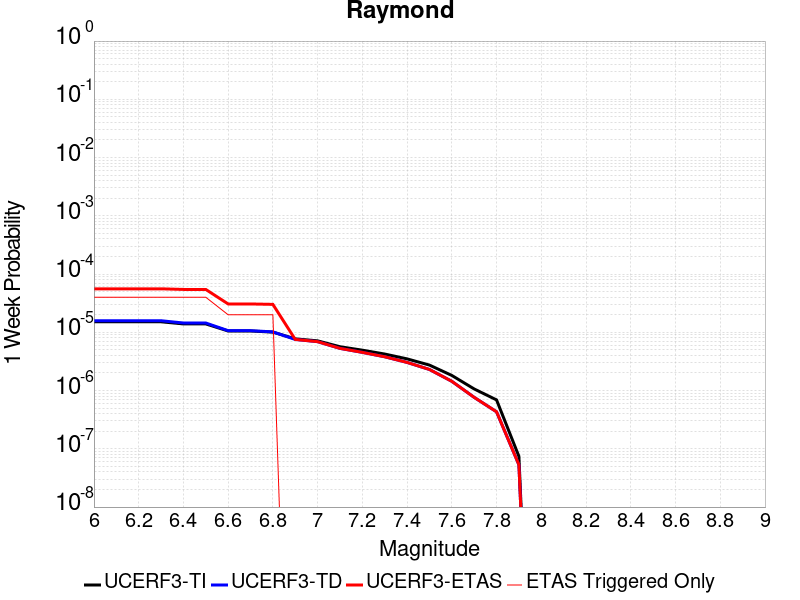 |  |  |  |

| Magnitude | 1 wk TI Prob | 1 wk TD Prob | 1 wk ETAS Prob | 1 wk ETAS/TD Gain | 1 wk ETAS Triggered Only | 1 mo TI Prob | 1 mo TD Prob | 1 mo ETAS Prob | 1 mo ETAS/TD Gain | 1 mo ETAS Triggered Only | 1 yr TI Prob | 1 yr TD Prob | 1 yr ETAS Prob | 1 yr ETAS/TD Gain | 1 yr ETAS Triggered Only | 10 yr TI Prob | 10 yr TD Prob | 10 yr ETAS Prob | 10 yr ETAS/TD Gain | 10 yr ETAS Triggered Only |
|-----|-----|-----|-----|-----|-----|-----|-----|-----|-----|-----|-----|-----|-----|-----|-----|-----|-----|-----|-----|-----|
| 6.0 | 1.5157413E-5 | 1.5810125E-5 | 5.5809494E-5 | 3.5299842 | 4.0E-5 | 6.4958724E-5 | 6.775606E-5 | 1.1775267E-4 | 1.7378913 | 5.0E-5 | 7.905855E-4 | 8.246429E-4 | 8.7460165E-4 | 1.0605823 | 5.0E-5 | 0.007877788 | 0.008218355 | 0.008267944 | 1.0060339 | 5.0E-5 |
| 6.1 | 1.5157413E-5 | 1.5810125E-5 | 5.5809494E-5 | 3.5299842 | 4.0E-5 | 6.4958724E-5 | 6.775606E-5 | 1.1775267E-4 | 1.7378913 | 5.0E-5 | 7.905855E-4 | 8.246429E-4 | 8.7460165E-4 | 1.0605823 | 5.0E-5 | 0.007877788 | 0.008218355 | 0.008267944 | 1.0060339 | 5.0E-5 |
| 6.2 | 1.5157413E-5 | 1.5810125E-5 | 5.5809494E-5 | 3.5299842 | 4.0E-5 | 6.4958724E-5 | 6.775606E-5 | 1.1775267E-4 | 1.7378913 | 5.0E-5 | 7.905855E-4 | 8.246429E-4 | 8.7460165E-4 | 1.0605823 | 5.0E-5 | 0.007877788 | 0.008218355 | 0.008267944 | 1.0060339 | 5.0E-5 |
| 6.3 | 1.5157413E-5 | 1.5810125E-5 | 5.5809494E-5 | 3.5299842 | 4.0E-5 | 6.4958724E-5 | 6.775606E-5 | 1.1775267E-4 | 1.7378913 | 5.0E-5 | 7.905855E-4 | 8.246429E-4 | 8.7460165E-4 | 1.0605823 | 5.0E-5 | 0.007877788 | 0.008218355 | 0.008267944 | 1.0060339 | 5.0E-5 |
| 6.4 | 1.3941944E-5 | 1.4454688E-5 | 5.445411E-5 | 3.7672284 | 4.0E-5 | 5.9749822E-5 | 6.194732E-5 | 1.11944224E-4 | 1.8070874 | 5.0E-5 | 7.2721124E-4 | 7.53971E-4 | 8.039333E-4 | 1.0662656 | 5.0E-5 | 0.007248361 | 0.007516471 | 0.0075660953 | 1.006602 | 5.0E-5 |
| 6.5 | 1.3941944E-5 | 1.4454688E-5 | 5.445411E-5 | 3.7672284 | 4.0E-5 | 5.9749822E-5 | 6.194732E-5 | 1.11944224E-4 | 1.8070874 | 5.0E-5 | 7.2721124E-4 | 7.53971E-4 | 8.039333E-4 | 1.0662656 | 5.0E-5 | 0.007248361 | 0.007516471 | 0.0075660953 | 1.006602 | 5.0E-5 |
| 6.6 | 1.0542609E-5 | 1.067111E-5 | 3.0670897E-5 | 2.8741992 | 2.0E-5 | 4.5181827E-5 | 4.573256E-5 | 7.573119E-5 | 1.6559578 | 3.0E-5 | 5.499499E-4 | 5.566571E-4 | 5.8664044E-4 | 1.0538632 | 3.0E-5 | 0.005485909 | 0.0055531966 | 0.0055830297 | 1.0053723 | 3.0E-5 |
| 6.7 | 1.0542609E-5 | 1.067111E-5 | 3.0670897E-5 | 2.8741992 | 2.0E-5 | 4.5181827E-5 | 4.573256E-5 | 7.573119E-5 | 1.6559578 | 3.0E-5 | 5.499499E-4 | 5.566571E-4 | 5.8664044E-4 | 1.0538632 | 3.0E-5 | 0.005485909 | 0.0055531966 | 0.0055830297 | 1.0053723 | 3.0E-5 |
| 6.8 | 1.0079132E-5 | 1.0176644E-5 | 3.017644E-5 | 2.9652646 | 2.0E-5 | 4.3195567E-5 | 4.3613487E-5 | 7.361218E-5 | 1.6878306 | 3.0E-5 | 5.257791E-4 | 5.308702E-4 | 5.6085427E-4 | 1.056481 | 3.0E-5 | 0.0052453685 | 0.0052965777 | 0.0053264187 | 1.0056341 | 3.0E-5 |
| 6.9 | 7.721598E-6 | 7.548902E-6 | 7.548902E-6 | 1.0 | 0.0 | 3.3092143E-5 | 3.2352043E-5 | 4.235172E-5 | 1.3090895 | 1.0E-5 | 4.0282236E-4 | 3.9381615E-4 | 4.038122E-4 | 1.0253825 | 1.0E-5 | 0.0040209293 | 0.003931324 | 0.0039412845 | 1.0025337 | 1.0E-5 |
| 7.0 | 7.137566E-6 | 6.911303E-6 | 6.911303E-6 | 1.0 | 0.0 | 3.058921E-5 | 2.961954E-5 | 3.9619244E-5 | 1.337605 | 1.0E-5 | 3.7236E-4 | 3.605593E-4 | 3.705557E-4 | 1.0277247 | 1.0E-5 | 0.0037173668 | 0.003599869 | 0.003609833 | 1.0027679 | 1.0E-5 |
| 7.1 | 5.654976E-6 | 5.299538E-6 | 5.299538E-6 | 1.0 | 0.0 | 2.4235387E-5 | 2.2712107E-5 | 3.271188E-5 | 1.4402838 | 1.0E-5 | 2.9502588E-4 | 2.7648505E-4 | 2.8648227E-4 | 1.0361583 | 1.0E-5 | 0.0029463451 | 0.0027614492 | 0.0027714216 | 1.0036113 | 1.0E-5 |
| 7.2 | 4.9358455E-6 | 4.526655E-6 | 4.526655E-6 | 1.0 | 0.0 | 2.1153453E-5 | 1.9399806E-5 | 1.9399806E-5 | 1.0 | 0.0 | 2.5751285E-4 | 2.3616718E-4 | 2.3616718E-4 | 1.0 | 0.0 | 0.0025721465 | 0.002359192 | 0.002359192 | 1.0 | 0.0 |
| 7.3 | 4.2368597E-6 | 3.8056128E-6 | 3.8056128E-6 | 1.0 | 0.0 | 1.8157843E-5 | 1.6309668E-5 | 1.6309668E-5 | 1.0 | 0.0 | 2.2104931E-4 | 1.9855222E-4 | 1.9855222E-4 | 1.0 | 0.0 | 0.0022082955 | 0.0019837746 | 0.0019837746 | 1.0 | 0.0 |
| 7.4 | 3.4999923E-6 | 3.0437407E-6 | 3.0437407E-6 | 1.0 | 0.0 | 1.49998805E-5 | 1.3044538E-5 | 1.3044538E-5 | 1.0 | 0.0 | 1.8260824E-4 | 1.5880575E-4 | 1.5880575E-4 | 1.0 | 0.0 | 0.0018245826 | 0.0015869461 | 0.0015869461 | 1.0 | 0.0 |
| 7.5 | 2.738017E-6 | 2.3020405E-6 | 2.3020405E-6 | 1.0 | 0.0 | 1.1734306E-5 | 9.865851E-6 | 9.865851E-6 | 1.0 | 0.0 | 1.428558E-4 | 1.20110184E-4 | 1.20110184E-4 | 1.0 | 0.0 | 0.0014276401 | 0.0012004747 | 0.0012004747 | 1.0 | 0.0 |
| 7.6 | 1.8186392E-6 | 1.442302E-6 | 1.442302E-6 | 1.0 | 0.0 | 7.794145E-6 | 6.1812802E-6 | 6.1812802E-6 | 1.0 | 0.0 | 9.488958E-5 | 7.5254524E-5 | 7.5254524E-5 | 1.0 | 0.0 | 9.4849075E-4 | 7.5230957E-4 | 7.5230957E-4 | 1.0 | 0.0 |
| 7.7 | 1.0660348E-6 | 7.6437E-7 | 7.6437E-7 | 1.0 | 0.0 | 4.5687125E-6 | 3.2758674E-6 | 3.2758674E-6 | 1.0 | 0.0 | 5.5622655E-5 | 3.988297E-5 | 3.988297E-5 | 1.0 | 0.0 | 5.5608735E-4 | 3.9877492E-4 | 3.9877492E-4 | 1.0 | 0.0 |
| 7.8 | 6.913602E-7 | 4.3202903E-7 | 4.3202903E-7 | 1.0 | 0.0 | 2.962969E-6 | 1.8515517E-6 | 1.8515517E-6 | 1.0 | 0.0 | 3.607355E-5 | 2.2542416E-5 | 2.2542416E-5 | 1.0 | 0.0 | 3.6067693E-4 | 2.2541684E-4 | 2.2541684E-4 | 1.0 | 0.0 |
| 7.9 | 7.425201E-8 | 5.322267E-8 | 5.322267E-8 | 1.0 | 0.0 | 3.1822285E-7 | 2.2809714E-7 | 2.2809714E-7 | 1.0 | 0.0 | 3.874356E-6 | 2.7770805E-6 | 2.7770805E-6 | 1.0 | 0.0 | 3.8742884E-5 | 2.7770588E-5 | 2.7770588E-5 | 1.0 | 0.0 |

## Cerro Prieto
*[(top)](#table-of-contents)*

| 1 Week | 1 Month | 1 Year | 10 Year |
|-----|-----|-----|-----|
|  |  |  |  |

| Magnitude | 1 wk TI Prob | 1 wk TD Prob | 1 wk ETAS Prob | 1 wk ETAS/TD Gain | 1 wk ETAS Triggered Only | 1 mo TI Prob | 1 mo TD Prob | 1 mo ETAS Prob | 1 mo ETAS/TD Gain | 1 mo ETAS Triggered Only | 1 yr TI Prob | 1 yr TD Prob | 1 yr ETAS Prob | 1 yr ETAS/TD Gain | 1 yr ETAS Triggered Only | 10 yr TI Prob | 10 yr TD Prob | 10 yr ETAS Prob | 10 yr ETAS/TD Gain | 10 yr ETAS Triggered Only |
|-----|-----|-----|-----|-----|-----|-----|-----|-----|-----|-----|-----|-----|-----|-----|-----|-----|-----|-----|-----|-----|
| 6.0 | 2.9101528E-4 | 5.9654453E-4 | 6.1653263E-4 | 1.0335064 | 2.0E-5 | 0.0012466122 | 0.0025543566 | 0.00258428 | 1.0117147 | 3.0E-5 | 0.015072231 | 0.030802928 | 0.030832004 | 1.0009439 | 3.0E-5 | 0.14089979 | 0.25386256 | 0.25389987 | 1.000147 | 5.0E-5 |
| 6.1 | 2.9101528E-4 | 5.9654453E-4 | 6.1653263E-4 | 1.0335064 | 2.0E-5 | 0.0012466122 | 0.0025543566 | 0.00258428 | 1.0117147 | 3.0E-5 | 0.015072231 | 0.030802928 | 0.030832004 | 1.0009439 | 3.0E-5 | 0.14089979 | 0.25386256 | 0.25389987 | 1.000147 | 5.0E-5 |
| 6.2 | 2.9101528E-4 | 5.9654453E-4 | 6.1653263E-4 | 1.0335064 | 2.0E-5 | 0.0012466122 | 0.0025543566 | 0.00258428 | 1.0117147 | 3.0E-5 | 0.015072231 | 0.030802928 | 0.030832004 | 1.0009439 | 3.0E-5 | 0.14089979 | 0.25386256 | 0.25389987 | 1.000147 | 5.0E-5 |
| 6.3 | 2.9101528E-4 | 5.9654453E-4 | 6.1653263E-4 | 1.0335064 | 2.0E-5 | 0.0012466122 | 0.0025543566 | 0.00258428 | 1.0117147 | 3.0E-5 | 0.015072231 | 0.030802928 | 0.030832004 | 1.0009439 | 3.0E-5 | 0.14089979 | 0.25386256 | 0.25389987 | 1.000147 | 5.0E-5 |
| 6.4 | 2.508648E-4 | 5.140412E-4 | 5.3403096E-4 | 1.0388874 | 2.0E-5 | 0.0010746918 | 0.0022013725 | 0.0022313064 | 1.0135978 | 3.0E-5 | 0.013006088 | 0.026629416 | 0.026658617 | 1.0010966 | 3.0E-5 | 0.12270685 | 0.2242222 | 0.22426099 | 1.000173 | 5.0E-5 |
| 6.5 | 2.508648E-4 | 5.140412E-4 | 5.3403096E-4 | 1.0388874 | 2.0E-5 | 0.0010746918 | 0.0022013725 | 0.0022313064 | 1.0135978 | 3.0E-5 | 0.013006088 | 0.026629416 | 0.026658617 | 1.0010966 | 3.0E-5 | 0.12270685 | 0.2242222 | 0.22426099 | 1.000173 | 5.0E-5 |
| 6.6 | 2.294914E-4 | 4.7123645E-4 | 4.8123175E-4 | 1.0212108 | 1.0E-5 | 9.831638E-4 | 0.0020182093 | 0.002038169 | 1.0098897 | 2.0E-5 | 0.011904482 | 0.024394194 | 0.024413705 | 1.0007999 | 2.0E-5 | 0.11286586 | 0.20837563 | 0.2084073 | 1.000152 | 4.0E-5 |
| 6.7 | 1.9621674E-4 | 4.0426268E-4 | 4.1425863E-4 | 1.0247264 | 1.0E-5 | 8.4065786E-4 | 0.0017315624 | 0.0017515278 | 1.0115303 | 2.0E-5 | 0.010187071 | 0.020888962 | 0.020908544 | 1.0009375 | 2.0E-5 | 0.09732539 | 0.18264732 | 0.18268001 | 1.000179 | 4.0E-5 |
| 6.8 | 1.5476145E-4 | 3.0572579E-4 | 3.0572579E-4 | 1.0 | 0.0 | 6.6309475E-4 | 0.0013096977 | 0.0013096977 | 1.0 | 0.0 | 0.008043335 | 0.015826825 | 0.015826825 | 1.0 | 0.0 | 0.07758363 | 0.14310057 | 0.14311773 | 1.0001198 | 2.0E-5 |
| 6.9 | 1.20509176E-4 | 2.2588465E-4 | 2.2588465E-4 | 1.0 | 0.0 | 5.1636563E-4 | 9.6778123E-4 | 9.6778123E-4 | 1.0 | 0.0 | 0.006268645 | 0.011734025 | 0.011734025 | 1.0 | 0.0 | 0.060947374 | 0.10917958 | 0.10918849 | 1.0000815 | 1.0E-5 |
| 7.0 | 9.3269155E-5 | 1.6721459E-4 | 1.6721459E-4 | 1.0 | 0.0 | 3.9966372E-4 | 7.1648025E-4 | 7.1648025E-4 | 1.0 | 0.0 | 0.0048550544 | 0.008695914 | 0.008695914 | 1.0 | 0.0 | 0.04750344 | 0.082943216 | 0.08295239 | 1.0001105 | 1.0E-5 |
| 7.1 | 5.029709E-5 | 8.174011E-5 | 8.174011E-5 | 1.0 | 0.0 | 2.1554115E-4 | 3.50287E-4 | 3.50287E-4 | 1.0 | 0.0 | 0.0026210553 | 0.004259821 | 0.004259821 | 1.0 | 0.0 | 0.025903556 | 0.04226813 | 0.04227771 | 1.0002266 | 1.0E-5 |
| 7.2 | 6.5445185E-8 | 6.824737E-8 | 6.824737E-8 | 1.0 | 0.0 | 2.8047933E-7 | 2.9248872E-7 | 2.9248872E-7 | 1.0 | 0.0 | 3.4148304E-6 | 3.56105E-6 | 3.56105E-6 | 1.0 | 0.0 | 3.414778E-5 | 3.56105E-5 | 3.56105E-5 | 1.0 | 0.0 |

## Sheephole
*[(top)](#table-of-contents)*

| 1 Week | 1 Month | 1 Year | 10 Year |
|-----|-----|-----|-----|
|  |  |  | 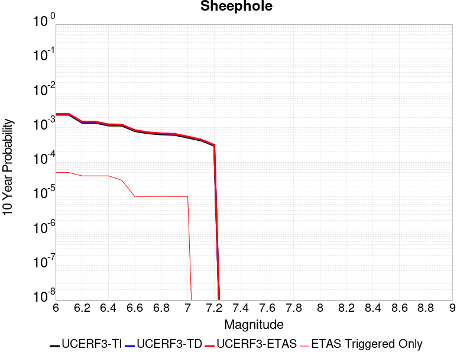 |

| Magnitude | 1 wk TI Prob | 1 wk TD Prob | 1 wk ETAS Prob | 1 wk ETAS/TD Gain | 1 wk ETAS Triggered Only | 1 mo TI Prob | 1 mo TD Prob | 1 mo ETAS Prob | 1 mo ETAS/TD Gain | 1 mo ETAS Triggered Only | 1 yr TI Prob | 1 yr TD Prob | 1 yr ETAS Prob | 1 yr ETAS/TD Gain | 1 yr ETAS Triggered Only | 10 yr TI Prob | 10 yr TD Prob | 10 yr ETAS Prob | 10 yr ETAS/TD Gain | 10 yr ETAS Triggered Only |
|-----|-----|-----|-----|-----|-----|-----|-----|-----|-----|-----|-----|-----|-----|-----|-----|-----|-----|-----|-----|-----|
| 6.0 | 4.5579695E-6 | 4.7412627E-6 | 2.4741168E-5 | 5.2182655 | 2.0E-5 | 1.9534009E-5 | 2.031957E-5 | 4.0319163E-5 | 1.9842528 | 2.0E-5 | 2.3780059E-4 | 2.473682E-4 | 2.8735833E-4 | 1.1616622 | 4.0E-5 | 0.0023754628 | 0.002471473 | 0.0025213496 | 1.0201808 | 5.0E-5 |
| 6.1 | 4.5579695E-6 | 4.7412627E-6 | 2.4741168E-5 | 5.2182655 | 2.0E-5 | 1.9534009E-5 | 2.031957E-5 | 4.0319163E-5 | 1.9842528 | 2.0E-5 | 2.3780059E-4 | 2.473682E-4 | 2.8735833E-4 | 1.1616622 | 4.0E-5 | 0.0023754628 | 0.002471473 | 0.0025213496 | 1.0201808 | 5.0E-5 |
| 6.2 | 2.6677674E-6 | 2.7873941E-6 | 1.2787366E-5 | 4.58757 | 1.0E-5 | 1.1433239E-5 | 1.1945926E-5 | 2.1945807E-5 | 1.8370954 | 1.0E-5 | 1.3919079E-4 | 1.4543302E-4 | 1.7542866E-4 | 1.2062505 | 3.0E-5 | 0.0013910364 | 0.0014534844 | 0.0014934263 | 1.0274801 | 4.0E-5 |
| 6.3 | 2.6677674E-6 | 2.7873941E-6 | 1.2787366E-5 | 4.58757 | 1.0E-5 | 1.1433239E-5 | 1.1945926E-5 | 2.1945807E-5 | 1.8370954 | 1.0E-5 | 1.3919079E-4 | 1.4543302E-4 | 1.7542866E-4 | 1.2062505 | 3.0E-5 | 0.0013910364 | 0.0014534844 | 0.0014934263 | 1.0274801 | 4.0E-5 |
| 6.4 | 2.2159759E-6 | 2.3228788E-6 | 1.2322856E-5 | 5.304993 | 1.0E-5 | 9.497005E-6 | 9.955161E-6 | 1.9955061E-5 | 2.0044942 | 1.0E-5 | 1.156199E-4 | 1.2119815E-4 | 1.5119452E-4 | 1.2474985 | 3.0E-5 | 0.0011555976 | 0.0012113999 | 0.0012513514 | 1.0329796 | 4.0E-5 |
| 6.5 | 2.1986082E-6 | 2.304759E-6 | 2.304759E-6 | 1.0 | 0.0 | 9.4225725E-6 | 9.877506E-6 | 9.877506E-6 | 1.0 | 0.0 | 1.1471378E-4 | 1.2025281E-4 | 1.402504E-4 | 1.1662962 | 2.0E-5 | 0.0011465458 | 0.0012019566 | 0.0012319206 | 1.0249293 | 3.0E-5 |
| 6.6 | 1.5232331E-6 | 1.6018919E-6 | 1.6018919E-6 | 1.0 | 0.0 | 6.5281256E-6 | 6.865234E-6 | 6.865234E-6 | 1.0 | 0.0 | 7.947703E-5 | 8.35812E-5 | 8.35812E-5 | 1.0 | 0.0 | 7.9448614E-4 | 8.3551643E-4 | 8.4550807E-4 | 1.0119586 | 1.0E-5 |
| 6.7 | 1.3137362E-6 | 1.382819E-6 | 1.382819E-6 | 1.0 | 0.0 | 5.6302856E-6 | 5.926355E-6 | 5.926355E-6 | 1.0 | 0.0 | 6.854657E-5 | 7.215112E-5 | 7.215112E-5 | 1.0 | 0.0 | 6.8525434E-4 | 7.212908E-4 | 7.312836E-4 | 1.013854 | 1.0E-5 |
| 6.8 | 1.2275751E-6 | 1.2922847E-6 | 1.2922847E-6 | 1.0 | 0.0 | 5.2610258E-6 | 5.5383516E-6 | 5.5383516E-6 | 1.0 | 0.0 | 6.4051106E-5 | 6.7427485E-5 | 6.7427485E-5 | 1.0 | 0.0 | 6.4032647E-4 | 6.740836E-4 | 6.8407686E-4 | 1.014825 | 1.0E-5 |
| 6.9 | 1.1837088E-6 | 1.246102E-6 | 1.246102E-6 | 1.0 | 0.0 | 5.0730278E-6 | 5.340427E-6 | 5.340427E-6 | 1.0 | 0.0 | 6.176237E-5 | 6.501789E-5 | 6.501789E-5 | 1.0 | 0.0 | 6.17452E-4 | 6.5000186E-4 | 6.5999536E-4 | 1.0153745 | 1.0E-5 |
| 7.0 | 9.849371E-7 | 1.0366288E-6 | 1.0366288E-6 | 1.0 | 0.0 | 4.2211523E-6 | 4.442688E-6 | 4.442688E-6 | 1.0 | 0.0 | 5.1391315E-5 | 5.4088487E-5 | 5.4088487E-5 | 1.0 | 0.0 | 5.137943E-4 | 5.407633E-4 | 5.5075786E-4 | 1.0184823 | 1.0E-5 |
| 7.1 | 8.1643645E-7 | 8.591669E-7 | 8.591669E-7 | 1.0 | 0.0 | 3.4990085E-6 | 3.682139E-6 | 3.682139E-6 | 1.0 | 0.0 | 4.2599597E-5 | 4.482921E-5 | 4.482921E-5 | 1.0 | 0.0 | 4.259143E-4 | 4.4821028E-4 | 4.4821028E-4 | 1.0 | 0.0 |
| 7.2 | 5.7295756E-7 | 6.029502E-7 | 6.029502E-7 | 1.0 | 0.0 | 2.45553E-6 | 2.58407E-6 | 2.58407E-6 | 1.0 | 0.0 | 2.9895667E-5 | 3.1460666E-5 | 3.1460666E-5 | 1.0 | 0.0 | 2.9891645E-4 | 3.145688E-4 | 3.145688E-4 | 1.0 | 0.0 |

## Ortigalita (South)
*[(top)](#table-of-contents)*

| 1 Week | 1 Month | 1 Year | 10 Year |
|-----|-----|-----|-----|
|  |  |  |  |

| Magnitude | 1 wk TI Prob | 1 wk TD Prob | 1 wk ETAS Prob | 1 wk ETAS/TD Gain | 1 wk ETAS Triggered Only | 1 mo TI Prob | 1 mo TD Prob | 1 mo ETAS Prob | 1 mo ETAS/TD Gain | 1 mo ETAS Triggered Only | 1 yr TI Prob | 1 yr TD Prob | 1 yr ETAS Prob | 1 yr ETAS/TD Gain | 1 yr ETAS Triggered Only | 10 yr TI Prob | 10 yr TD Prob | 10 yr ETAS Prob | 10 yr ETAS/TD Gain | 10 yr ETAS Triggered Only |
|-----|-----|-----|-----|-----|-----|-----|-----|-----|-----|-----|-----|-----|-----|-----|-----|-----|-----|-----|-----|-----|
| 6.0 | 3.72394E-5 | 4.32556E-5 | 7.3254305E-5 | 1.6935219 | 3.0E-5 | 1.5958765E-4 | 1.8536886E-4 | 2.2536144E-4 | 1.2157459 | 4.0E-5 | 0.0019412481 | 0.0022546863 | 0.0023045735 | 1.0221261 | 5.0E-5 | 0.019243775 | 0.022334501 | 0.022383384 | 1.0021887 | 5.0E-5 |
| 6.1 | 2.7299884E-5 | 3.1492036E-5 | 5.1491406E-5 | 1.6350613 | 2.0E-5 | 1.16994255E-4 | 1.349592E-4 | 1.6495516E-4 | 1.2222594 | 3.0E-5 | 0.0014234743 | 0.0016419457 | 0.0016718964 | 1.018241 | 3.0E-5 | 0.014143906 | 0.016304072 | 0.016333584 | 1.0018101 | 3.0E-5 |
| 6.2 | 2.7299884E-5 | 3.1492036E-5 | 5.1491406E-5 | 1.6350613 | 2.0E-5 | 1.16994255E-4 | 1.349592E-4 | 1.6495516E-4 | 1.2222594 | 3.0E-5 | 0.0014234743 | 0.0016419457 | 0.0016718964 | 1.018241 | 3.0E-5 | 0.014143906 | 0.016304072 | 0.016333584 | 1.0018101 | 3.0E-5 |
| 6.3 | 2.0546433E-5 | 2.3631454E-5 | 3.3631215E-5 | 1.4231548 | 1.0E-5 | 8.805317E-5 | 1.0127383E-4 | 1.21271805E-4 | 1.1974643 | 2.0E-5 | 0.00107152 | 0.0012323305 | 0.0012523058 | 1.0162094 | 2.0E-5 | 0.010663681 | 0.012257031 | 0.012276786 | 1.0016117 | 2.0E-5 |
| 6.4 | 2.0546433E-5 | 2.3631454E-5 | 3.3631215E-5 | 1.4231548 | 1.0E-5 | 8.805317E-5 | 1.0127383E-4 | 1.21271805E-4 | 1.1974643 | 2.0E-5 | 0.00107152 | 0.0012323305 | 0.0012523058 | 1.0162094 | 2.0E-5 | 0.010663681 | 0.012257031 | 0.012276786 | 1.0016117 | 2.0E-5 |
| 6.5 | 1.7779594E-5 | 2.0446974E-5 | 3.044677E-5 | 1.4890599 | 1.0E-5 | 7.619603E-5 | 8.762703E-5 | 1.07625274E-4 | 1.2282201 | 2.0E-5 | 9.272918E-4 | 0.0010663505 | 0.0010863291 | 1.0187355 | 2.0E-5 | 0.009234319 | 0.010613804 | 0.010633592 | 1.0018643 | 2.0E-5 |
| 6.6 | 1.6272212E-5 | 1.8714967E-5 | 1.8714967E-5 | 1.0 | 0.0 | 6.973618E-5 | 8.0204605E-5 | 9.020381E-5 | 1.1246711 | 1.0E-5 | 8.487073E-4 | 9.760659E-4 | 9.86056E-4 | 1.0102352 | 1.0E-5 | 0.008454733 | 0.009719091 | 0.009728993 | 1.0010189 | 1.0E-5 |
| 6.7 | 1.3051484E-5 | 1.5038758E-5 | 1.5038758E-5 | 1.0 | 0.0 | 5.593373E-5 | 6.445028E-5 | 7.4449636E-5 | 1.1551484 | 1.0E-5 | 6.807804E-4 | 7.844092E-4 | 7.9440133E-4 | 1.0127385 | 1.0E-5 | 0.006786986 | 0.007817388 | 0.00782731 | 1.0012692 | 1.0E-5 |
| 6.8 | 1.04277415E-5 | 1.1987235E-5 | 1.1987235E-5 | 1.0 | 0.0 | 4.4689557E-5 | 5.1372896E-5 | 6.137238E-5 | 1.1946452 | 1.0E-5 | 5.439595E-4 | 6.2529295E-4 | 6.352867E-4 | 1.0159825 | 1.0E-5 | 0.0054262993 | 0.00623609 | 0.0062460275 | 1.0015936 | 1.0E-5 |
| 6.9 | 7.639968E-6 | 8.791503E-6 | 8.791503E-6 | 1.0 | 0.0 | 3.274231E-5 | 3.767736E-5 | 4.7676982E-5 | 1.2654014 | 1.0E-5 | 3.9856473E-4 | 4.586312E-4 | 4.686266E-4 | 1.021794 | 1.0E-5 | 0.003978506 | 0.004577433 | 0.004587387 | 1.0021746 | 1.0E-5 |
| 7.0 | 3.919831E-6 | 4.5334014E-6 | 4.5334014E-6 | 1.0 | 0.0 | 1.679917E-5 | 1.942873E-5 | 1.942873E-5 | 1.0 | 0.0 | 2.045107E-4 | 2.3652123E-4 | 2.3652123E-4 | 1.0 | 0.0 | 0.0020432258 | 0.0023629034 | 0.0023629034 | 1.0 | 0.0 |
| 7.1 | 1.6017933E-6 | 1.8570418E-6 | 1.8570418E-6 | 1.0 | 0.0 | 6.8648105E-6 | 7.958732E-6 | 7.958732E-6 | 1.0 | 0.0 | 8.357586E-5 | 9.689432E-5 | 9.689432E-5 | 1.0 | 0.0 | 8.3544437E-4 | 9.686254E-4 | 9.686254E-4 | 1.0 | 0.0 |

## Kern Canyon (Lake Isabella) 2011
*[(top)](#table-of-contents)*

| 1 Week | 1 Month | 1 Year | 10 Year |
|-----|-----|-----|-----|
|  |  |  |  |

| Magnitude | 1 wk TI Prob | 1 wk TD Prob | 1 wk ETAS Prob | 1 wk ETAS/TD Gain | 1 wk ETAS Triggered Only | 1 mo TI Prob | 1 mo TD Prob | 1 mo ETAS Prob | 1 mo ETAS/TD Gain | 1 mo ETAS Triggered Only | 1 yr TI Prob | 1 yr TD Prob | 1 yr ETAS Prob | 1 yr ETAS/TD Gain | 1 yr ETAS Triggered Only | 10 yr TI Prob | 10 yr TD Prob | 10 yr ETAS Prob | 10 yr ETAS/TD Gain | 10 yr ETAS Triggered Only |
|-----|-----|-----|-----|-----|-----|-----|-----|-----|-----|-----|-----|-----|-----|-----|-----|-----|-----|-----|-----|-----|
| 6.0 | 4.2387383E-6 | 4.0016344E-6 | 2.4001554E-5 | 5.997938 | 2.0E-5 | 1.8165894E-5 | 1.7149758E-5 | 4.7149242E-5 | 2.7492657 | 3.0E-5 | 2.2114732E-4 | 2.0878017E-4 | 2.4877183E-4 | 1.1915491 | 4.0E-5 | 0.0022092736 | 0.002086024 | 0.0021359199 | 1.023919 | 5.0E-5 |
| 6.1 | 4.2387383E-6 | 4.0016344E-6 | 2.4001554E-5 | 5.997938 | 2.0E-5 | 1.8165894E-5 | 1.7149758E-5 | 4.7149242E-5 | 2.7492657 | 3.0E-5 | 2.2114732E-4 | 2.0878017E-4 | 2.4877183E-4 | 1.1915491 | 4.0E-5 | 0.0022092736 | 0.002086024 | 0.0021359199 | 1.023919 | 5.0E-5 |
| 6.2 | 4.2387383E-6 | 4.0016344E-6 | 2.4001554E-5 | 5.997938 | 2.0E-5 | 1.8165894E-5 | 1.7149758E-5 | 4.7149242E-5 | 2.7492657 | 3.0E-5 | 2.2114732E-4 | 2.0878017E-4 | 2.4877183E-4 | 1.1915491 | 4.0E-5 | 0.0022092736 | 0.002086024 | 0.0021359199 | 1.023919 | 5.0E-5 |
| 6.3 | 4.2387383E-6 | 4.0016344E-6 | 2.4001554E-5 | 5.997938 | 2.0E-5 | 1.8165894E-5 | 1.7149758E-5 | 4.7149242E-5 | 2.7492657 | 3.0E-5 | 2.2114732E-4 | 2.0878017E-4 | 2.4877183E-4 | 1.1915491 | 4.0E-5 | 0.0022092736 | 0.002086024 | 0.0021359199 | 1.023919 | 5.0E-5 |
| 6.4 | 4.2387383E-6 | 4.0016344E-6 | 2.4001554E-5 | 5.997938 | 2.0E-5 | 1.8165894E-5 | 1.7149758E-5 | 4.7149242E-5 | 2.7492657 | 3.0E-5 | 2.2114732E-4 | 2.0878017E-4 | 2.4877183E-4 | 1.1915491 | 4.0E-5 | 0.0022092736 | 0.002086024 | 0.0021359199 | 1.023919 | 5.0E-5 |
| 6.5 | 2.7857532E-6 | 2.5178624E-6 | 1.2517838E-5 | 4.971613 | 1.0E-5 | 1.1938888E-5 | 1.0790796E-5 | 3.079058E-5 | 2.8534114 | 2.0E-5 | 1.4534626E-4 | 1.3137035E-4 | 1.613664E-4 | 1.228332 | 3.0E-5 | 0.0014525123 | 0.0013129596 | 0.0013529072 | 1.0304255 | 4.0E-5 |
| 6.6 | 2.2233348E-6 | 1.944119E-6 | 1.1944099E-5 | 6.1437078 | 1.0E-5 | 9.528543E-6 | 8.331913E-6 | 1.833183E-5 | 2.2001946 | 1.0E-5 | 1.1600384E-4 | 1.014364E-4 | 1.1143539E-4 | 1.0985739 | 1.0E-5 | 0.001159433 | 0.0010139096 | 0.0010338894 | 1.0197057 | 2.0E-5 |
| 6.7 | 2.1635126E-6 | 1.8834991E-6 | 1.18834805E-5 | 6.3092575 | 1.0E-5 | 9.272164E-6 | 8.072114E-6 | 1.8072033E-5 | 2.238823 | 1.0E-5 | 1.1288274E-4 | 9.827364E-5 | 1.0827266E-4 | 1.1017467 | 1.0E-5 | 0.0011282542 | 9.8231E-4 | 0.0010022903 | 1.0203402 | 2.0E-5 |
| 6.8 | 1.8685711E-6 | 1.583138E-6 | 1.1583122E-5 | 7.316559 | 1.0E-5 | 8.008137E-6 | 6.7848596E-6 | 1.6784792E-5 | 2.4738598 | 1.0E-5 | 9.74947E-5 | 8.2602586E-5 | 9.260176E-5 | 1.1210515 | 1.0E-5 | 9.745194E-4 | 8.2572375E-4 | 8.457072E-4 | 1.0242012 | 2.0E-5 |
| 6.9 | 1.5815071E-6 | 1.3064887E-6 | 1.3064887E-6 | 1.0 | 0.0 | 6.77787E-6 | 5.5992255E-6 | 5.5992255E-6 | 1.0 | 0.0 | 8.251744E-5 | 6.816846E-5 | 6.816846E-5 | 1.0 | 0.0 | 8.248681E-4 | 6.8147824E-4 | 6.914714E-4 | 1.0146639 | 1.0E-5 |
| 7.0 | 1.3772564E-6 | 1.1210681E-6 | 1.1210681E-6 | 1.0 | 0.0 | 5.9025137E-6 | 4.8045686E-6 | 4.8045686E-6 | 1.0 | 0.0 | 7.186073E-5 | 5.8494075E-5 | 5.8494075E-5 | 1.0 | 0.0 | 7.18375E-4 | 5.8478885E-4 | 5.94783E-4 | 1.0170902 | 1.0E-5 |
| 7.1 | 1.0916998E-6 | 8.7637505E-7 | 8.7637505E-7 | 1.0 | 0.0 | 4.678705E-6 | 3.7558877E-6 | 3.7558877E-6 | 1.0 | 0.0 | 5.6961744E-5 | 4.5726985E-5 | 4.5726985E-5 | 1.0 | 0.0 | 5.6947145E-4 | 4.571771E-4 | 4.571771E-4 | 1.0 | 0.0 |
| 7.2 | 7.6277024E-7 | 5.901439E-7 | 5.901439E-7 | 1.0 | 0.0 | 3.2690114E-6 | 2.5291856E-6 | 2.5291856E-6 | 1.0 | 0.0 | 3.9799485E-5 | 3.0792406E-5 | 3.0792406E-5 | 1.0 | 0.0 | 3.9792358E-4 | 3.07882E-4 | 3.07882E-4 | 1.0 | 0.0 |
| 7.3 | 5.3265916E-7 | 4.3824264E-7 | 4.3824264E-7 | 1.0 | 0.0 | 2.282823E-6 | 1.8781814E-6 | 1.8781814E-6 | 1.0 | 0.0 | 2.7793016E-5 | 2.2866623E-5 | 2.2866623E-5 | 1.0 | 0.0 | 2.778954E-4 | 2.2864307E-4 | 2.2864307E-4 | 1.0 | 0.0 |
| 7.4 | 3.4946007E-7 | 3.0065647E-7 | 3.0065647E-7 | 1.0 | 0.0 | 1.497685E-6 | 1.2885271E-6 | 1.2885271E-6 | 1.0 | 0.0 | 1.8234163E-5 | 1.5687707E-5 | 1.5687707E-5 | 1.0 | 0.0 | 1.8232666E-4 | 1.5686621E-4 | 1.5686621E-4 | 1.0 | 0.0 |
| 7.5 | 1.8317026E-7 | 1.4244755E-7 | 1.4244755E-7 | 1.0 | 0.0 | 7.850152E-7 | 6.1048934E-7 | 6.1048934E-7 | 1.0 | 0.0 | 9.557518E-6 | 7.432683E-6 | 7.432683E-6 | 1.0 | 0.0 | 9.5571064E-5 | 7.432442E-5 | 7.432442E-5 | 1.0 | 0.0 |
| 7.6 | 2.572245E-8 | 1.735264E-8 | 1.735264E-8 | 1.0 | 0.0 | 1.10239064E-7 | 7.436845E-8 | 7.436845E-8 | 1.0 | 0.0 | 1.3421597E-6 | 9.0543557E-7 | 9.0543557E-7 | 1.0 | 0.0 | 1.3421517E-5 | 9.054324E-6 | 9.054324E-6 | 1.0 | 0.0 |

## Santa Cruz Catalina Ridge alt1
*[(top)](#table-of-contents)*

| 1 Week | 1 Month | 1 Year | 10 Year |
|-----|-----|-----|-----|
|  |  |  |  |

| Magnitude | 1 wk TI Prob | 1 wk TD Prob | 1 wk ETAS Prob | 1 wk ETAS/TD Gain | 1 wk ETAS Triggered Only | 1 mo TI Prob | 1 mo TD Prob | 1 mo ETAS Prob | 1 mo ETAS/TD Gain | 1 mo ETAS Triggered Only | 1 yr TI Prob | 1 yr TD Prob | 1 yr ETAS Prob | 1 yr ETAS/TD Gain | 1 yr ETAS Triggered Only | 10 yr TI Prob | 10 yr TD Prob | 10 yr ETAS Prob | 10 yr ETAS/TD Gain | 10 yr ETAS Triggered Only |
|-----|-----|-----|-----|-----|-----|-----|-----|-----|-----|-----|-----|-----|-----|-----|-----|-----|-----|-----|-----|-----|
| 6.0 | 3.2833184E-5 | 3.6558402E-5 | 6.65573E-5 | 1.8205749 | 3.0E-5 | 1.4070606E-4 | 1.5667039E-4 | 1.8666568E-4 | 1.1914548 | 3.0E-5 | 0.00171175 | 0.0019059594 | 0.0019359023 | 1.0157101 | 3.0E-5 | 0.016986247 | 0.018913032 | 0.018962087 | 1.0025936 | 5.0E-5 |
| 6.1 | 1.9835548E-5 | 2.1659505E-5 | 4.1659074E-5 | 1.9233621 | 2.0E-5 | 8.500672E-5 | 9.282326E-5 | 1.12821406E-4 | 1.2154433 | 2.0E-5 | 0.0010344655 | 0.0011295575 | 0.001149535 | 1.017686 | 2.0E-5 | 0.010296632 | 0.011240296 | 0.011279846 | 1.0035186 | 4.0E-5 |
| 6.2 | 1.9835548E-5 | 2.1659505E-5 | 4.1659074E-5 | 1.9233621 | 2.0E-5 | 8.500672E-5 | 9.282326E-5 | 1.12821406E-4 | 1.2154433 | 2.0E-5 | 0.0010344655 | 0.0011295575 | 0.001149535 | 1.017686 | 2.0E-5 | 0.010296632 | 0.011240296 | 0.011279846 | 1.0035186 | 4.0E-5 |
| 6.3 | 1.5728183E-5 | 1.703395E-5 | 3.703361E-5 | 2.174106 | 2.0E-5 | 6.7404755E-5 | 7.300063E-5 | 9.299917E-5 | 1.2739502 | 2.0E-5 | 8.2034385E-4 | 8.884264E-4 | 9.084086E-4 | 1.0224917 | 2.0E-5 | 0.008173222 | 0.008849427 | 0.008889073 | 1.0044801 | 4.0E-5 |
| 6.4 | 1.5728183E-5 | 1.703395E-5 | 3.703361E-5 | 2.174106 | 2.0E-5 | 6.7404755E-5 | 7.300063E-5 | 9.299917E-5 | 1.2739502 | 2.0E-5 | 8.2034385E-4 | 8.884264E-4 | 9.084086E-4 | 1.0224917 | 2.0E-5 | 0.008173222 | 0.008849427 | 0.008889073 | 1.0044801 | 4.0E-5 |
| 6.5 | 1.3707734E-5 | 1.4794522E-5 | 3.4794226E-5 | 2.3518317 | 2.0E-5 | 5.8746107E-5 | 6.3403575E-5 | 8.34023E-5 | 1.3154197 | 2.0E-5 | 7.1499916E-4 | 7.716686E-4 | 7.916532E-4 | 1.0258979 | 2.0E-5 | 0.0071270303 | 0.0076902895 | 0.007729982 | 1.0051614 | 4.0E-5 |
| 6.6 | 1.2539813E-5 | 1.3510219E-5 | 3.350995E-5 | 2.480341 | 2.0E-5 | 5.3740947E-5 | 5.789967E-5 | 7.789851E-5 | 1.3454051 | 2.0E-5 | 6.540996E-4 | 7.0470315E-4 | 7.2468905E-4 | 1.0283607 | 2.0E-5 | 0.0065217763 | 0.0070249885 | 0.0070647076 | 1.005654 | 4.0E-5 |
| 6.7 | 1.1504083E-5 | 1.2377375E-5 | 3.2377127E-5 | 2.6158316 | 2.0E-5 | 4.930228E-5 | 5.3044827E-5 | 7.304377E-5 | 1.3770196 | 2.0E-5 | 6.0008996E-4 | 6.456314E-4 | 6.6561846E-4 | 1.0309575 | 2.0E-5 | 0.005984721 | 0.006437786 | 0.0064775283 | 1.0061734 | 4.0E-5 |
| 6.8 | 1.012739E-5 | 1.0877071E-5 | 3.0876854E-5 | 2.8387103 | 2.0E-5 | 4.340238E-5 | 4.6615194E-5 | 6.6614266E-5 | 1.4290247 | 2.0E-5 | 5.282958E-4 | 5.673937E-4 | 5.8738235E-4 | 1.0352288 | 2.0E-5 | 0.0052704164 | 0.0056596193 | 0.0056993933 | 1.0070276 | 4.0E-5 |
| 6.9 | 8.9607865E-6 | 9.609117E-6 | 2.9608926E-5 | 3.0813367 | 2.0E-5 | 3.8402806E-5 | 4.1181287E-5 | 6.1180464E-5 | 1.4856374 | 2.0E-5 | 4.6745385E-4 | 5.012679E-4 | 5.2125787E-4 | 1.0398788 | 2.0E-5 | 0.0046647177 | 0.005001492 | 0.0050313417 | 1.0059682 | 3.0E-5 |
| 7.0 | 8.046829E-6 | 8.619746E-6 | 2.8619574E-5 | 3.320234 | 2.0E-5 | 3.4485955E-5 | 3.694125E-5 | 5.694051E-5 | 1.5413802 | 2.0E-5 | 4.1978562E-4 | 4.496677E-4 | 4.6965873E-4 | 1.0444573 | 2.0E-5 | 0.004189935 | 0.0044876686 | 0.0045175343 | 1.006655 | 3.0E-5 |
| 7.1 | 7.136131E-6 | 7.637656E-6 | 2.7637503E-5 | 3.6185844 | 2.0E-5 | 3.0583058E-5 | 3.2732405E-5 | 5.273175E-5 | 1.6109953 | 2.0E-5 | 3.7228514E-4 | 3.9844486E-4 | 4.184369E-4 | 1.0501752 | 2.0E-5 | 0.0037166206 | 0.003977381 | 0.0040072617 | 1.0075127 | 3.0E-5 |
| 7.2 | 6.362014E-6 | 6.8049585E-6 | 1.680489E-5 | 2.4695067 | 1.0E-5 | 2.726549E-5 | 2.9163786E-5 | 3.9163493E-5 | 1.342881 | 1.0E-5 | 3.3190678E-4 | 3.550119E-4 | 3.6500834E-4 | 1.0281581 | 1.0E-5 | 0.0033141149 | 0.003544516 | 0.003564445 | 1.0056225 | 2.0E-5 |
| 7.3 | 5.004101E-6 | 5.351715E-6 | 1.5351661E-5 | 2.8685498 | 1.0E-5 | 2.1445969E-5 | 2.2935723E-5 | 3.293549E-5 | 1.435991 | 1.0E-5 | 2.6107338E-4 | 2.792072E-4 | 2.8920438E-4 | 1.0358057 | 1.0E-5 | 0.002607669 | 0.0027886187 | 0.0028085627 | 1.007152 | 2.0E-5 |
| 7.4 | 3.4901443E-6 | 3.7320526E-6 | 1.3732015E-5 | 3.6794808 | 1.0E-5 | 1.4957676E-5 | 1.5994416E-5 | 2.5994255E-5 | 1.6252083 | 1.0E-5 | 1.8209449E-4 | 1.9471499E-4 | 2.0471304E-4 | 1.0513471 | 1.0E-5 | 0.0018194534 | 0.0019454823 | 0.0019654434 | 1.0102602 | 2.0E-5 |
| 7.5 | 1.1215045E-6 | 1.189387E-6 | 1.1189375E-5 | 9.407682 | 1.0E-5 | 4.806439E-6 | 5.097363E-6 | 1.5097312E-5 | 2.9617887 | 1.0E-5 | 5.851682E-5 | 6.205866E-5 | 7.205804E-5 | 1.1611278 | 1.0E-5 | 5.850142E-4 | 6.2041637E-4 | 6.4040394E-4 | 1.0322164 | 2.0E-5 |
| 7.6 | 2.8599047E-7 | 2.9951994E-7 | 2.9951994E-7 | 1.0 | 0.0 | 1.2256729E-6 | 1.2836562E-6 | 1.2836562E-6 | 1.0 | 0.0 | 1.4922465E-5 | 1.5628404E-5 | 1.5628404E-5 | 1.0 | 0.0 | 1.4921463E-4 | 1.5627318E-4 | 1.5627318E-4 | 1.0 | 0.0 |
| 7.7 | 2.0781519E-7 | 2.1744323E-7 | 2.1744323E-7 | 1.0 | 0.0 | 8.906362E-7 | 9.3189925E-7 | 9.3189925E-7 | 1.0 | 0.0 | 1.08434415E-5 | 1.13458145E-5 | 1.13458145E-5 | 1.0 | 0.0 | 1.0842913E-4 | 1.1345245E-4 | 1.1345245E-4 | 1.0 | 0.0 |
| 7.8 | 3.614776E-8 | 3.764102E-8 | 3.764102E-8 | 1.0 | 0.0 | 1.5491896E-7 | 1.6131864E-7 | 1.6131864E-7 | 1.0 | 0.0 | 1.8861368E-6 | 1.9640527E-6 | 1.9640527E-6 | 1.0 | 0.0 | 1.8861208E-5 | 1.9640367E-5 | 1.9640367E-5 | 1.0 | 0.0 |

## San Gorgonio Pass
*[(top)](#table-of-contents)*

| 1 Week | 1 Month | 1 Year | 10 Year |
|-----|-----|-----|-----|
|  |  |  |  |

| Magnitude | 1 wk TI Prob | 1 wk TD Prob | 1 wk ETAS Prob | 1 wk ETAS/TD Gain | 1 wk ETAS Triggered Only | 1 mo TI Prob | 1 mo TD Prob | 1 mo ETAS Prob | 1 mo ETAS/TD Gain | 1 mo ETAS Triggered Only | 1 yr TI Prob | 1 yr TD Prob | 1 yr ETAS Prob | 1 yr ETAS/TD Gain | 1 yr ETAS Triggered Only | 10 yr TI Prob | 10 yr TD Prob | 10 yr ETAS Prob | 10 yr ETAS/TD Gain | 10 yr ETAS Triggered Only |
|-----|-----|-----|-----|-----|-----|-----|-----|-----|-----|-----|-----|-----|-----|-----|-----|-----|-----|-----|-----|-----|
| 6.0 | 7.644328E-6 | 1.331474E-5 | 3.3314474E-5 | 2.5020747 | 2.0E-5 | 3.2760996E-5 | 5.706197E-5 | 7.706083E-5 | 1.3504761 | 2.0E-5 | 3.987921E-4 | 6.945166E-4 | 7.344888E-4 | 1.057554 | 4.0E-5 | 0.003980772 | 0.006930024 | 0.0069697467 | 1.0057319 | 4.0E-5 |
| 6.1 | 7.644328E-6 | 1.331474E-5 | 3.3314474E-5 | 2.5020747 | 2.0E-5 | 3.2760996E-5 | 5.706197E-5 | 7.706083E-5 | 1.3504761 | 2.0E-5 | 3.987921E-4 | 6.945166E-4 | 7.344888E-4 | 1.057554 | 4.0E-5 | 0.003980772 | 0.006930024 | 0.0069697467 | 1.0057319 | 4.0E-5 |
| 6.2 | 7.644328E-6 | 1.331474E-5 | 3.3314474E-5 | 2.5020747 | 2.0E-5 | 3.2760996E-5 | 5.706197E-5 | 7.706083E-5 | 1.3504761 | 2.0E-5 | 3.987921E-4 | 6.945166E-4 | 7.344888E-4 | 1.057554 | 4.0E-5 | 0.003980772 | 0.006930024 | 0.0069697467 | 1.0057319 | 4.0E-5 |
| 6.3 | 7.644328E-6 | 1.331474E-5 | 3.3314474E-5 | 2.5020747 | 2.0E-5 | 3.2760996E-5 | 5.706197E-5 | 7.706083E-5 | 1.3504761 | 2.0E-5 | 3.987921E-4 | 6.945166E-4 | 7.344888E-4 | 1.057554 | 4.0E-5 | 0.003980772 | 0.006930024 | 0.0069697467 | 1.0057319 | 4.0E-5 |
| 6.4 | 7.644328E-6 | 1.331474E-5 | 3.3314474E-5 | 2.5020747 | 2.0E-5 | 3.2760996E-5 | 5.706197E-5 | 7.706083E-5 | 1.3504761 | 2.0E-5 | 3.987921E-4 | 6.945166E-4 | 7.344888E-4 | 1.057554 | 4.0E-5 | 0.003980772 | 0.006930024 | 0.0069697467 | 1.0057319 | 4.0E-5 |
| 6.5 | 7.644328E-6 | 1.331474E-5 | 3.3314474E-5 | 2.5020747 | 2.0E-5 | 3.2760996E-5 | 5.706197E-5 | 7.706083E-5 | 1.3504761 | 2.0E-5 | 3.987921E-4 | 6.945166E-4 | 7.344888E-4 | 1.057554 | 4.0E-5 | 0.003980772 | 0.006930024 | 0.0069697467 | 1.0057319 | 4.0E-5 |
| 6.6 | 7.644328E-6 | 1.331474E-5 | 3.3314474E-5 | 2.5020747 | 2.0E-5 | 3.2760996E-5 | 5.706197E-5 | 7.706083E-5 | 1.3504761 | 2.0E-5 | 3.987921E-4 | 6.945166E-4 | 7.344888E-4 | 1.057554 | 4.0E-5 | 0.003980772 | 0.006930024 | 0.0069697467 | 1.0057319 | 4.0E-5 |
| 6.7 | 6.987586E-6 | 1.2619013E-5 | 3.2618762E-5 | 2.58489 | 2.0E-5 | 2.9946454E-5 | 5.408041E-5 | 7.4079326E-5 | 1.3697997 | 2.0E-5 | 3.645371E-4 | 6.582382E-4 | 6.982119E-4 | 1.0607283 | 4.0E-5 | 0.0036393967 | 0.0065694 | 0.006609137 | 1.0060488 | 4.0E-5 |
| 6.8 | 6.987586E-6 | 1.2619013E-5 | 3.2618762E-5 | 2.58489 | 2.0E-5 | 2.9946454E-5 | 5.408041E-5 | 7.4079326E-5 | 1.3697997 | 2.0E-5 | 3.645371E-4 | 6.582382E-4 | 6.982119E-4 | 1.0607283 | 4.0E-5 | 0.0036393967 | 0.0065694 | 0.006609137 | 1.0060488 | 4.0E-5 |
| 6.9 | 5.504702E-6 | 1.1049877E-5 | 3.1049654E-5 | 2.809955 | 2.0E-5 | 2.3591367E-5 | 4.7355785E-5 | 6.7354835E-5 | 1.4223149 | 2.0E-5 | 2.8718702E-4 | 5.764092E-4 | 6.163861E-4 | 1.0693551 | 4.0E-5 | 0.0028681618 | 0.0057553523 | 0.005795122 | 1.0069101 | 4.0E-5 |
| 7.0 | 5.4825764E-6 | 1.1026218E-5 | 3.1025997E-5 | 2.8138387 | 2.0E-5 | 2.3496545E-5 | 4.725439E-5 | 6.7253444E-5 | 1.4232211 | 2.0E-5 | 2.8603288E-4 | 5.751754E-4 | 6.151524E-4 | 1.069504 | 4.0E-5 | 0.00285665 | 0.0057430784 | 0.0057828487 | 1.0069249 | 4.0E-5 |
| 7.1 | 5.4692787E-6 | 1.1011928E-5 | 3.1011707E-5 | 2.8161924 | 2.0E-5 | 2.3439556E-5 | 4.719315E-5 | 6.719221E-5 | 1.4237703 | 2.0E-5 | 2.8533922E-4 | 5.744302E-4 | 6.1440724E-4 | 1.0695943 | 4.0E-5 | 0.0028497311 | 0.0057356646 | 0.0057754354 | 1.0069339 | 4.0E-5 |
| 7.2 | 5.453661E-6 | 1.0994954E-5 | 3.0994735E-5 | 2.8189962 | 2.0E-5 | 2.3372622E-5 | 4.712041E-5 | 6.7119465E-5 | 1.4244245 | 2.0E-5 | 2.8452452E-4 | 5.7354505E-4 | 6.135221E-4 | 1.0697017 | 4.0E-5 | 0.002841605 | 0.005726859 | 0.0057666297 | 1.0069447 | 4.0E-5 |
| 7.3 | 5.4422303E-6 | 1.09818775E-5 | 3.0981657E-5 | 2.8211622 | 2.0E-5 | 2.3323635E-5 | 4.7064368E-5 | 6.7063425E-5 | 1.42493 | 2.0E-5 | 2.8392827E-4 | 5.728631E-4 | 6.128402E-4 | 1.0697848 | 4.0E-5 | 0.0028356577 | 0.0057200743 | 0.0057598455 | 1.0069529 | 4.0E-5 |
| 7.4 | 5.398595E-6 | 1.0929241E-5 | 3.0929023E-5 | 2.8299332 | 2.0E-5 | 2.313663E-5 | 4.6838795E-5 | 6.6837856E-5 | 1.4269764 | 2.0E-5 | 2.8165206E-4 | 5.701182E-4 | 6.100954E-4 | 1.0701209 | 4.0E-5 | 0.0028129534 | 0.0056927665 | 0.0057325386 | 1.0069865 | 4.0E-5 |
| 7.5 | 5.3578788E-6 | 1.0855785E-5 | 3.085557E-5 | 2.8423157 | 2.0E-5 | 2.2962136E-5 | 4.6523994E-5 | 6.652306E-5 | 1.4298657 | 2.0E-5 | 2.7952815E-4 | 5.662875E-4 | 6.062648E-4 | 1.0705955 | 4.0E-5 | 0.002791768 | 0.0056546913 | 0.0056944652 | 1.0070338 | 4.0E-5 |
| 7.6 | 4.8091474E-6 | 9.604131E-6 | 1.9604035E-5 | 2.0412085 | 1.0E-5 | 2.0610469E-5 | 4.1159943E-5 | 5.1159528E-5 | 1.2429447 | 1.0E-5 | 2.5090357E-4 | 5.010119E-4 | 5.309968E-4 | 1.0598488 | 3.0E-5 | 0.0025062046 | 0.0050054584 | 0.005035308 | 1.0059634 | 3.0E-5 |
| 7.7 | 1.5991155E-6 | 3.353035E-6 | 3.353035E-6 | 1.0 | 0.0 | 6.853334E-6 | 1.4370073E-5 | 1.4370073E-5 | 1.0 | 0.0 | 8.343615E-5 | 1.7494184E-4 | 1.8494009E-4 | 1.0571519 | 1.0E-5 | 8.340483E-4 | 0.0017535852 | 0.0017635676 | 1.0056926 | 1.0E-5 |
| 7.8 | 9.258398E-7 | 2.0581049E-6 | 2.0581049E-6 | 1.0 | 0.0 | 3.967879E-6 | 8.82042E-6 | 8.82042E-6 | 1.0 | 0.0 | 4.8307855E-5 | 1.0738334E-4 | 1.1738227E-4 | 1.0931143 | 1.0E-5 | 4.8297356E-4 | 0.0010788103 | 0.0010887996 | 1.0092595 | 1.0E-5 |
| 7.9 | 5.975575E-7 | 1.2292295E-6 | 1.2292295E-6 | 1.0 | 0.0 | 2.5609581E-6 | 5.2681157E-6 | 5.2681157E-6 | 1.0 | 0.0 | 3.117922E-5 | 6.413743E-5 | 7.413679E-5 | 1.1559052 | 1.0E-5 | 3.1174847E-4 | 6.464778E-4 | 6.5647135E-4 | 1.0154585 | 1.0E-5 |
| 8.0 | 3.4413725E-7 | 6.714992E-7 | 6.714992E-7 | 1.0 | 0.0 | 1.4748731E-6 | 2.8778506E-6 | 2.8778506E-6 | 1.0 | 0.0 | 1.7956432E-5 | 3.5037272E-5 | 4.5036923E-5 | 1.2854004 | 1.0E-5 | 1.7954981E-4 | 3.5392298E-4 | 3.6391945E-4 | 1.0282447 | 1.0E-5 |
| 8.1 | 1.1787731E-8 | 9.6332045E-9 | 9.6332045E-9 | 1.0 | 0.0 | 5.0518846E-8 | 4.1285162E-8 | 4.1285162E-8 | 1.0 | 0.0 | 6.1506677E-7 | 5.0264674E-7 | 5.0264674E-7 | 1.0 | 0.0 | 6.1506507E-6 | 5.2417968E-6 | 5.2417968E-6 | 1.0 | 0.0 |

## Pine Mtn
*[(top)](#table-of-contents)*

| 1 Week | 1 Month | 1 Year | 10 Year |
|-----|-----|-----|-----|
|  |  |  | 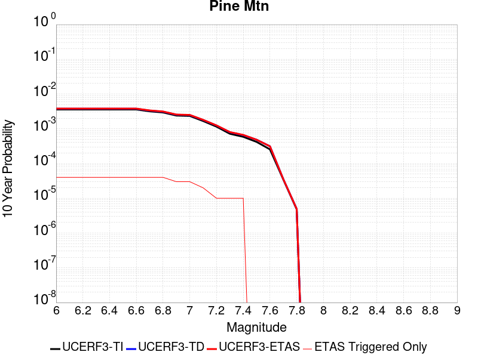 |

| Magnitude | 1 wk TI Prob | 1 wk TD Prob | 1 wk ETAS Prob | 1 wk ETAS/TD Gain | 1 wk ETAS Triggered Only | 1 mo TI Prob | 1 mo TD Prob | 1 mo ETAS Prob | 1 mo ETAS/TD Gain | 1 mo ETAS Triggered Only | 1 yr TI Prob | 1 yr TD Prob | 1 yr ETAS Prob | 1 yr ETAS/TD Gain | 1 yr ETAS Triggered Only | 10 yr TI Prob | 10 yr TD Prob | 10 yr ETAS Prob | 10 yr ETAS/TD Gain | 10 yr ETAS Triggered Only |
|-----|-----|-----|-----|-----|-----|-----|-----|-----|-----|-----|-----|-----|-----|-----|-----|-----|-----|-----|-----|-----|
| 6.0 | 6.894797E-6 | 7.2254716E-6 | 1.72254E-5 | 2.3839827 | 1.0E-5 | 2.9548795E-5 | 3.0965955E-5 | 5.0965336E-5 | 1.6458505 | 2.0E-5 | 3.596972E-4 | 3.7694827E-4 | 3.9694074E-4 | 1.0530376 | 2.0E-5 | 0.0035911554 | 0.0037633865 | 0.003803236 | 1.0105888 | 4.0E-5 |
| 6.1 | 6.894797E-6 | 7.2254716E-6 | 1.72254E-5 | 2.3839827 | 1.0E-5 | 2.9548795E-5 | 3.0965955E-5 | 5.0965336E-5 | 1.6458505 | 2.0E-5 | 3.596972E-4 | 3.7694827E-4 | 3.9694074E-4 | 1.0530376 | 2.0E-5 | 0.0035911554 | 0.0037633865 | 0.003803236 | 1.0105888 | 4.0E-5 |
| 6.2 | 6.894797E-6 | 7.2254716E-6 | 1.72254E-5 | 2.3839827 | 1.0E-5 | 2.9548795E-5 | 3.0965955E-5 | 5.0965336E-5 | 1.6458505 | 2.0E-5 | 3.596972E-4 | 3.7694827E-4 | 3.9694074E-4 | 1.0530376 | 2.0E-5 | 0.0035911554 | 0.0037633865 | 0.003803236 | 1.0105888 | 4.0E-5 |
| 6.3 | 6.894797E-6 | 7.2254716E-6 | 1.72254E-5 | 2.3839827 | 1.0E-5 | 2.9548795E-5 | 3.0965955E-5 | 5.0965336E-5 | 1.6458505 | 2.0E-5 | 3.596972E-4 | 3.7694827E-4 | 3.9694074E-4 | 1.0530376 | 2.0E-5 | 0.0035911554 | 0.0037633865 | 0.003803236 | 1.0105888 | 4.0E-5 |
| 6.4 | 6.894797E-6 | 7.2254716E-6 | 1.72254E-5 | 2.3839827 | 1.0E-5 | 2.9548795E-5 | 3.0965955E-5 | 5.0965336E-5 | 1.6458505 | 2.0E-5 | 3.596972E-4 | 3.7694827E-4 | 3.9694074E-4 | 1.0530376 | 2.0E-5 | 0.0035911554 | 0.0037633865 | 0.003803236 | 1.0105888 | 4.0E-5 |
| 6.5 | 6.894797E-6 | 7.2254716E-6 | 1.72254E-5 | 2.3839827 | 1.0E-5 | 2.9548795E-5 | 3.0965955E-5 | 5.0965336E-5 | 1.6458505 | 2.0E-5 | 3.596972E-4 | 3.7694827E-4 | 3.9694074E-4 | 1.0530376 | 2.0E-5 | 0.0035911554 | 0.0037633865 | 0.003803236 | 1.0105888 | 4.0E-5 |
| 6.6 | 6.894797E-6 | 7.2254716E-6 | 1.72254E-5 | 2.3839827 | 1.0E-5 | 2.9548795E-5 | 3.0965955E-5 | 5.0965336E-5 | 1.6458505 | 2.0E-5 | 3.596972E-4 | 3.7694827E-4 | 3.9694074E-4 | 1.0530376 | 2.0E-5 | 0.0035911554 | 0.0037633865 | 0.003803236 | 1.0105888 | 4.0E-5 |
| 6.7 | 6.0867933E-6 | 6.397124E-6 | 1.639706E-5 | 2.5631926 | 1.0E-5 | 2.6085996E-5 | 2.7415968E-5 | 4.741542E-5 | 1.7294818 | 2.0E-5 | 3.1755073E-4 | 3.337405E-4 | 3.537338E-4 | 1.0599068 | 2.0E-5 | 0.0031709734 | 0.0033326119 | 0.0033724785 | 1.0119627 | 4.0E-5 |
| 6.8 | 5.6530425E-6 | 5.950606E-6 | 1.5950547E-5 | 2.6804912 | 1.0E-5 | 2.42271E-5 | 2.5502359E-5 | 4.550185E-5 | 1.7842212 | 2.0E-5 | 2.94925E-4 | 3.1044905E-4 | 3.3044282E-4 | 1.0644028 | 2.0E-5 | 0.002945339 | 0.0031003582 | 0.0031402342 | 1.0128617 | 4.0E-5 |
| 6.9 | 4.6015225E-6 | 4.8638444E-6 | 1.48637955E-5 | 3.0559769 | 1.0E-5 | 1.9720663E-5 | 2.084489E-5 | 4.0844472E-5 | 1.9594477 | 2.0E-5 | 2.4007261E-4 | 2.5375842E-4 | 2.7375337E-4 | 1.0787951 | 2.0E-5 | 0.0023981342 | 0.002534831 | 0.0025647548 | 1.011805 | 3.0E-5 |
| 7.0 | 4.4875965E-6 | 4.7474837E-6 | 1.4747436E-5 | 3.106369 | 1.0E-5 | 1.9232413E-5 | 2.0346208E-5 | 4.03458E-5 | 1.9829642 | 2.0E-5 | 2.3412947E-4 | 2.4768838E-4 | 2.676834E-4 | 1.0807266 | 2.0E-5 | 0.0023388295 | 0.0024742668 | 0.0025041925 | 1.0120949 | 3.0E-5 |
| 7.1 | 3.203907E-6 | 3.42942E-6 | 3.42942E-6 | 1.0 | 0.0 | 1.3730958E-5 | 1.4697435E-5 | 2.4697289E-5 | 1.6803808 | 1.0E-5 | 1.6716159E-4 | 1.7892725E-4 | 1.8892546E-4 | 1.0558786 | 1.0E-5 | 0.0016703589 | 0.001787898 | 0.0018078622 | 1.0111663 | 2.0E-5 |
| 7.2 | 2.2060601E-6 | 2.3784874E-6 | 2.3784874E-6 | 1.0 | 0.0 | 9.4545085E-6 | 1.019348E-5 | 2.0193378E-5 | 1.9810092 | 1.0E-5 | 1.15102564E-4 | 1.2409901E-4 | 1.3409776E-4 | 1.0805708 | 1.0E-5 | 0.0011504296 | 0.0012403419 | 0.0012503295 | 1.0080523 | 1.0E-5 |
| 7.3 | 1.3765207E-6 | 1.5216535E-6 | 1.5216535E-6 | 1.0 | 0.0 | 5.899361E-6 | 6.5213567E-6 | 1.6521291E-5 | 2.5334132 | 1.0E-5 | 7.182235E-5 | 7.939472E-5 | 8.939392E-5 | 1.125943 | 1.0E-5 | 7.1799144E-4 | 7.9367263E-4 | 8.036647E-4 | 1.0125897 | 1.0E-5 |
| 7.4 | 1.1245983E-6 | 1.2587126E-6 | 1.2587126E-6 | 1.0 | 0.0 | 4.819698E-6 | 5.394472E-6 | 1.5394418E-5 | 2.8537395 | 1.0E-5 | 5.8678244E-5 | 6.56758E-5 | 7.567515E-5 | 1.152253 | 1.0E-5 | 5.866275E-4 | 6.565722E-4 | 6.6656567E-4 | 1.0152206 | 1.0E-5 |
| 7.5 | 8.031682E-7 | 9.276999E-7 | 9.276999E-7 | 1.0 | 0.0 | 3.4421448E-6 | 3.975851E-6 | 3.975851E-6 | 1.0 | 0.0 | 4.1907308E-5 | 4.840498E-5 | 4.840498E-5 | 1.0 | 0.0 | 4.1899405E-4 | 4.8395112E-4 | 4.8395112E-4 | 1.0 | 0.0 |
| 7.6 | 4.8953444E-7 | 6.0030544E-7 | 6.0030544E-7 | 1.0 | 0.0 | 2.098003E-6 | 2.5727354E-6 | 2.5727354E-6 | 1.0 | 0.0 | 2.5542888E-5 | 3.1322652E-5 | 3.1322652E-5 | 1.0 | 0.0 | 2.5539953E-4 | 3.1318725E-4 | 3.1318725E-4 | 1.0 | 0.0 |
| 7.7 | 6.634529E-8 | 6.788826E-8 | 6.788826E-8 | 1.0 | 0.0 | 2.843369E-7 | 2.9094966E-7 | 2.9094966E-7 | 1.0 | 0.0 | 3.4617963E-6 | 3.5423066E-6 | 3.5423066E-6 | 1.0 | 0.0 | 3.4617424E-5 | 3.542255E-5 | 3.542255E-5 | 1.0 | 0.0 |
| 7.8 | 9.235578E-9 | 9.488566E-9 | 9.488566E-9 | 1.0 | 0.0 | 3.9581046E-8 | 4.0665284E-8 | 4.0665284E-8 | 1.0 | 0.0 | 4.818991E-7 | 4.950997E-7 | 4.950997E-7 | 1.0 | 0.0 | 4.8189804E-6 | 4.950988E-6 | 4.950988E-6 | 1.0 | 0.0 |

## Los Alamos extension
*[(top)](#table-of-contents)*

| 1 Week | 1 Month | 1 Year | 10 Year |
|-----|-----|-----|-----|
|  |  |  |  |

| Magnitude | 1 wk TI Prob | 1 wk TD Prob | 1 wk ETAS Prob | 1 wk ETAS/TD Gain | 1 wk ETAS Triggered Only | 1 mo TI Prob | 1 mo TD Prob | 1 mo ETAS Prob | 1 mo ETAS/TD Gain | 1 mo ETAS Triggered Only | 1 yr TI Prob | 1 yr TD Prob | 1 yr ETAS Prob | 1 yr ETAS/TD Gain | 1 yr ETAS Triggered Only | 10 yr TI Prob | 10 yr TD Prob | 10 yr ETAS Prob | 10 yr ETAS/TD Gain | 10 yr ETAS Triggered Only |
|-----|-----|-----|-----|-----|-----|-----|-----|-----|-----|-----|-----|-----|-----|-----|-----|-----|-----|-----|-----|-----|
| 6.0 | 4.0146506E-6 | 4.086164E-6 | 3.4086042E-5 | 8.341819 | 3.0E-5 | 1.7205533E-5 | 1.7512022E-5 | 5.7511323E-5 | 3.2841053 | 4.0E-5 | 2.0945723E-4 | 2.1318911E-4 | 2.5318057E-4 | 1.1875869 | 4.0E-5 | 0.0020925992 | 0.002129955 | 0.0021698698 | 1.0187397 | 4.0E-5 |
| 6.1 | 4.0146506E-6 | 4.086164E-6 | 3.4086042E-5 | 8.341819 | 3.0E-5 | 1.7205533E-5 | 1.7512022E-5 | 5.7511323E-5 | 3.2841053 | 4.0E-5 | 2.0945723E-4 | 2.1318911E-4 | 2.5318057E-4 | 1.1875869 | 4.0E-5 | 0.0020925992 | 0.002129955 | 0.0021698698 | 1.0187397 | 4.0E-5 |
| 6.2 | 4.0146506E-6 | 4.086164E-6 | 3.4086042E-5 | 8.341819 | 3.0E-5 | 1.7205533E-5 | 1.7512022E-5 | 5.7511323E-5 | 3.2841053 | 4.0E-5 | 2.0945723E-4 | 2.1318911E-4 | 2.5318057E-4 | 1.1875869 | 4.0E-5 | 0.0020925992 | 0.002129955 | 0.0021698698 | 1.0187397 | 4.0E-5 |
| 6.3 | 4.0146506E-6 | 4.086164E-6 | 3.4086042E-5 | 8.341819 | 3.0E-5 | 1.7205533E-5 | 1.7512022E-5 | 5.7511323E-5 | 3.2841053 | 4.0E-5 | 2.0945723E-4 | 2.1318911E-4 | 2.5318057E-4 | 1.1875869 | 4.0E-5 | 0.0020925992 | 0.002129955 | 0.0021698698 | 1.0187397 | 4.0E-5 |
| 6.4 | 4.0146506E-6 | 4.086164E-6 | 3.4086042E-5 | 8.341819 | 3.0E-5 | 1.7205533E-5 | 1.7512022E-5 | 5.7511323E-5 | 3.2841053 | 4.0E-5 | 2.0945723E-4 | 2.1318911E-4 | 2.5318057E-4 | 1.1875869 | 4.0E-5 | 0.0020925992 | 0.002129955 | 0.0021698698 | 1.0187397 | 4.0E-5 |
| 6.5 | 4.0146506E-6 | 4.086164E-6 | 3.4086042E-5 | 8.341819 | 3.0E-5 | 1.7205533E-5 | 1.7512022E-5 | 5.7511323E-5 | 3.2841053 | 4.0E-5 | 2.0945723E-4 | 2.1318911E-4 | 2.5318057E-4 | 1.1875869 | 4.0E-5 | 0.0020925992 | 0.002129955 | 0.0021698698 | 1.0187397 | 4.0E-5 |
| 6.6 | 4.0146506E-6 | 4.086164E-6 | 3.4086042E-5 | 8.341819 | 3.0E-5 | 1.7205533E-5 | 1.7512022E-5 | 5.7511323E-5 | 3.2841053 | 4.0E-5 | 2.0945723E-4 | 2.1318911E-4 | 2.5318057E-4 | 1.1875869 | 4.0E-5 | 0.0020925992 | 0.002129955 | 0.0021698698 | 1.0187397 | 4.0E-5 |
| 6.7 | 4.0146506E-6 | 4.086164E-6 | 3.4086042E-5 | 8.341819 | 3.0E-5 | 1.7205533E-5 | 1.7512022E-5 | 5.7511323E-5 | 3.2841053 | 4.0E-5 | 2.0945723E-4 | 2.1318911E-4 | 2.5318057E-4 | 1.1875869 | 4.0E-5 | 0.0020925992 | 0.002129955 | 0.0021698698 | 1.0187397 | 4.0E-5 |
| 6.8 | 3.6584688E-6 | 3.7188636E-6 | 3.3718752E-5 | 9.066951 | 3.0E-5 | 1.5679057E-5 | 1.5937894E-5 | 4.5937417E-5 | 2.8822763 | 3.0E-5 | 1.9087581E-4 | 1.9402753E-4 | 2.240217E-4 | 1.1545873 | 3.0E-5 | 0.0019071194 | 0.0019386737 | 0.0019686155 | 1.0154445 | 3.0E-5 |
| 6.9 | 3.644631E-6 | 3.7045736E-6 | 3.3704462E-5 | 9.098068 | 3.0E-5 | 1.5619753E-5 | 1.5876652E-5 | 4.5876175E-5 | 2.889537 | 3.0E-5 | 1.901539E-4 | 1.9328203E-4 | 2.2327623E-4 | 1.1551836 | 3.0E-5 | 0.0018999127 | 0.0019312317 | 0.0019611737 | 1.0155041 | 3.0E-5 |
| 7.0 | 3.6318522E-6 | 3.691334E-6 | 3.3691224E-5 | 9.127113 | 3.0E-5 | 1.5564989E-5 | 1.5819913E-5 | 4.5819437E-5 | 2.8963141 | 3.0E-5 | 1.8948725E-4 | 1.9259135E-4 | 2.2258557E-4 | 1.1557403 | 3.0E-5 | 0.0018932576 | 0.0019243368 | 0.0019542791 | 1.0155598 | 3.0E-5 |
| 7.1 | 3.5001724E-6 | 3.5554046E-6 | 2.3555334E-5 | 6.625219 | 2.0E-5 | 1.5000653E-5 | 1.5237365E-5 | 3.523706E-5 | 2.312543 | 2.0E-5 | 1.8261763E-4 | 1.8550004E-4 | 2.0549633E-4 | 1.1077967 | 2.0E-5 | 0.0018246764 | 0.0018535426 | 0.0018735057 | 1.0107702 | 2.0E-5 |
| 7.2 | 2.5204702E-6 | 2.5436989E-6 | 1.2543674E-5 | 4.931273 | 1.0E-5 | 1.080197E-5 | 1.0901522E-5 | 2.0901412E-5 | 1.9172932 | 1.0E-5 | 1.3150605E-4 | 1.3271799E-4 | 1.4271667E-4 | 1.0753378 | 1.0E-5 | 0.0013142825 | 0.001326393 | 0.0013363797 | 1.0075293 | 1.0E-5 |
| 7.3 | 2.1399692E-6 | 2.1501362E-6 | 1.2150114E-5 | 5.650858 | 1.0E-5 | 9.1712645E-6 | 9.2148375E-6 | 1.9214745E-5 | 2.0851963 | 1.0E-5 | 1.1165442E-4 | 1.121849E-4 | 1.2218377E-4 | 1.0891286 | 1.0E-5 | 0.0011159834 | 0.001121286 | 0.0011312747 | 1.0089084 | 1.0E-5 |
| 7.4 | 1.9660122E-6 | 1.970241E-6 | 1.1970222E-5 | 6.075511 | 1.0E-5 | 8.42574E-6 | 8.4438625E-6 | 1.8443778E-5 | 2.184282 | 1.0E-5 | 1.0257855E-4 | 1.0279921E-4 | 1.1279818E-4 | 1.097267 | 1.0E-5 | 0.0010253121 | 0.0010275197 | 0.0010375094 | 1.0097222 | 1.0E-5 |
| 7.5 | 1.7204633E-6 | 1.7151029E-6 | 1.7151029E-6 | 1.0 | 0.0 | 7.373393E-6 | 7.3504207E-6 | 7.3504207E-6 | 1.0 | 0.0 | 8.976737E-5 | 8.948772E-5 | 8.948772E-5 | 1.0 | 0.0 | 8.9731114E-4 | 8.945199E-4 | 8.945199E-4 | 1.0 | 0.0 |
| 7.6 | 1.3717638E-6 | 1.3535872E-6 | 1.3535872E-6 | 1.0 | 0.0 | 5.878974E-6 | 5.801075E-6 | 5.801075E-6 | 1.0 | 0.0 | 7.157416E-5 | 7.062583E-5 | 7.062583E-5 | 1.0 | 0.0 | 7.1551115E-4 | 7.0603646E-4 | 7.0603646E-4 | 1.0 | 0.0 |
| 7.7 | 8.272564E-7 | 7.9576733E-7 | 7.9576733E-7 | 1.0 | 0.0 | 3.5453797E-6 | 3.4104269E-6 | 3.4104269E-6 | 1.0 | 0.0 | 4.3164142E-5 | 4.1521158E-5 | 4.1521158E-5 | 1.0 | 0.0 | 4.315576E-4 | 4.151342E-4 | 4.151342E-4 | 1.0 | 0.0 |
| 7.8 | 3.9708277E-7 | 3.671937E-7 | 3.671937E-7 | 1.0 | 0.0 | 1.7017821E-6 | 1.5736864E-6 | 1.5736864E-6 | 1.0 | 0.0 | 2.0719E-5 | 1.9159465E-5 | 1.9159465E-5 | 1.0 | 0.0 | 2.071707E-4 | 1.9157819E-4 | 1.9157819E-4 | 1.0 | 0.0 |
| 7.9 | 9.292528E-8 | 7.889168E-8 | 7.889168E-8 | 1.0 | 0.0 | 3.9825116E-7 | 3.3810713E-7 | 3.3810713E-7 | 1.0 | 0.0 | 4.848697E-6 | 4.1164467E-6 | 4.1164467E-6 | 1.0 | 0.0 | 4.8485912E-5 | 4.1163716E-5 | 4.1163716E-5 | 1.0 | 0.0 |
| 8.0 | 7.880441E-11 | 8.2353124E-11 | 8.2353124E-11 | 1.0 | 0.0 | 3.3773329E-10 | 3.52942E-10 | 3.52942E-10 | 1.0 | 0.0 | 4.1119033E-9 | 4.2970694E-9 | 4.2970694E-9 | 1.0 | 0.0 | 4.1119034E-8 | 4.2970694E-8 | 4.2970694E-8 | 1.0 | 0.0 |

## Carlsbad
*[(top)](#table-of-contents)*

| 1 Week | 1 Month | 1 Year | 10 Year |
|-----|-----|-----|-----|
|  |  |  |  |

| Magnitude | 1 wk TI Prob | 1 wk TD Prob | 1 wk ETAS Prob | 1 wk ETAS/TD Gain | 1 wk ETAS Triggered Only | 1 mo TI Prob | 1 mo TD Prob | 1 mo ETAS Prob | 1 mo ETAS/TD Gain | 1 mo ETAS Triggered Only | 1 yr TI Prob | 1 yr TD Prob | 1 yr ETAS Prob | 1 yr ETAS/TD Gain | 1 yr ETAS Triggered Only | 10 yr TI Prob | 10 yr TD Prob | 10 yr ETAS Prob | 10 yr ETAS/TD Gain | 10 yr ETAS Triggered Only |
|-----|-----|-----|-----|-----|-----|-----|-----|-----|-----|-----|-----|-----|-----|-----|-----|-----|-----|-----|-----|-----|
| 6.0 | 4.9038536E-6 | 4.9872688E-6 | 2.498717E-5 | 5.010191 | 2.0E-5 | 2.1016345E-5 | 2.1373837E-5 | 5.1373197E-5 | 2.4035552 | 3.0E-5 | 2.5584397E-4 | 2.6019584E-4 | 3.0018543E-4 | 1.1536903 | 4.0E-5 | 0.002555496 | 0.002598959 | 0.002638855 | 1.0153508 | 4.0E-5 |
| 6.1 | 4.9038536E-6 | 4.9872688E-6 | 2.498717E-5 | 5.010191 | 2.0E-5 | 2.1016345E-5 | 2.1373837E-5 | 5.1373197E-5 | 2.4035552 | 3.0E-5 | 2.5584397E-4 | 2.6019584E-4 | 3.0018543E-4 | 1.1536903 | 4.0E-5 | 0.002555496 | 0.002598959 | 0.002638855 | 1.0153508 | 4.0E-5 |
| 6.2 | 4.3820614E-6 | 4.4547814E-6 | 2.4454692E-5 | 5.489538 | 2.0E-5 | 1.8780129E-5 | 1.9091782E-5 | 4.909121E-5 | 2.5713267 | 3.0E-5 | 2.2862408E-4 | 2.3241801E-4 | 2.724087E-4 | 1.1720637 | 4.0E-5 | 0.00228389 | 0.002321785 | 0.0023616923 | 1.0171881 | 4.0E-5 |
| 6.3 | 4.302872E-6 | 4.373019E-6 | 2.4372932E-5 | 5.5734797 | 2.0E-5 | 1.8440749E-5 | 1.8741377E-5 | 4.8740814E-5 | 2.600706 | 3.0E-5 | 2.24493E-4 | 2.2815271E-4 | 2.6814357E-4 | 1.1752812 | 4.0E-5 | 0.0022426634 | 0.0022792201 | 0.002319129 | 1.0175098 | 4.0E-5 |
| 6.4 | 4.0835243E-6 | 4.147667E-6 | 2.4147585E-5 | 5.821968 | 2.0E-5 | 1.75007E-5 | 1.7775597E-5 | 4.7775062E-5 | 2.6876771 | 3.0E-5 | 2.1305021E-4 | 2.1639673E-4 | 2.5638807E-4 | 1.1848056 | 4.0E-5 | 0.0021284607 | 0.0021618942 | 0.0022018077 | 1.0184623 | 4.0E-5 |
| 6.5 | 3.987806E-6 | 4.048899E-6 | 2.4048819E-5 | 5.9395943 | 2.0E-5 | 1.7090486E-5 | 1.7352311E-5 | 4.735179E-5 | 2.7288463 | 3.0E-5 | 2.080568E-4 | 2.1124425E-4 | 2.512358E-4 | 1.1893142 | 4.0E-5 | 0.002078621 | 0.0021104682 | 0.0021503838 | 1.0189131 | 4.0E-5 |
| 6.6 | 3.8707576E-6 | 3.927501E-6 | 2.3927423E-5 | 6.0922766 | 2.0E-5 | 1.6588854E-5 | 1.683204E-5 | 4.6831534E-5 | 2.7822852 | 3.0E-5 | 2.0195059E-4 | 2.0491115E-4 | 2.4490294E-4 | 1.1951666 | 4.0E-5 | 0.0020176715 | 0.0020472556 | 0.0020871738 | 1.0194983 | 4.0E-5 |
| 6.7 | 3.3093434E-6 | 3.3424044E-6 | 2.3342338E-5 | 6.9836965 | 2.0E-5 | 1.4182823E-5 | 1.4324512E-5 | 4.4324082E-5 | 3.0942822 | 3.0E-5 | 1.7266218E-4 | 1.7438704E-4 | 2.1438005E-4 | 1.2293348 | 4.0E-5 | 0.001725281 | 0.001742508 | 0.0017824383 | 1.0229154 | 4.0E-5 |
| 6.8 | 3.136983E-6 | 3.1664663E-6 | 2.3166403E-5 | 7.3161693 | 2.0E-5 | 1.3444143E-5 | 1.35704995E-5 | 4.3570093E-5 | 3.2106476 | 3.0E-5 | 1.6367015E-4 | 1.6520836E-4 | 2.0520175E-4 | 1.2420785 | 4.0E-5 | 0.0016354966 | 0.0016508611 | 0.0016907951 | 1.0241898 | 4.0E-5 |
| 6.9 | 2.9056644E-6 | 2.9267715E-6 | 2.2926713E-5 | 7.8334484 | 2.0E-5 | 1.2452788E-5 | 1.2543246E-5 | 4.254287E-5 | 3.3916955 | 3.0E-5 | 1.5160214E-4 | 1.5270336E-4 | 1.9269726E-4 | 1.2619058 | 4.0E-5 | 0.0015149876 | 0.0015259896 | 0.0015659287 | 1.0261725 | 4.0E-5 |
| 7.0 | 2.5071035E-6 | 2.51141E-6 | 2.251136E-5 | 8.963634 | 2.0E-5 | 1.0744685E-5 | 1.0763142E-5 | 4.0762818E-5 | 3.7872603 | 3.0E-5 | 1.308087E-4 | 1.310334E-4 | 1.6102947E-4 | 1.2289193 | 3.0E-5 | 0.0013073172 | 0.0013095647 | 0.0013395253 | 1.0228784 | 3.0E-5 |
| 7.1 | 2.1786877E-6 | 2.1678952E-6 | 1.2167873E-5 | 5.612759 | 1.0E-5 | 9.3372E-6 | 9.290947E-6 | 2.929076E-5 | 3.1526132 | 2.0E-5 | 1.13674476E-4 | 1.13111426E-4 | 1.3310916E-4 | 1.1767968 | 2.0E-5 | 0.0011361635 | 0.0011305414 | 0.0011505189 | 1.0176706 | 2.0E-5 |
| 7.2 | 1.6628418E-6 | 1.6213987E-6 | 1.6213987E-6 | 1.0 | 0.0 | 7.1264453E-6 | 6.9488333E-6 | 1.6948763E-5 | 2.4390805 | 1.0E-5 | 8.676102E-5 | 8.459878E-5 | 9.4597934E-5 | 1.118195 | 1.0E-5 | 8.672715E-4 | 8.4566796E-4 | 8.556595E-4 | 1.011815 | 1.0E-5 |
| 7.3 | 1.0595926E-6 | 9.816912E-7 | 9.816912E-7 | 1.0 | 0.0 | 4.541103E-6 | 4.207241E-6 | 4.207241E-6 | 1.0 | 0.0 | 5.5286528E-5 | 5.1221967E-5 | 5.1221967E-5 | 1.0 | 0.0 | 5.527277E-4 | 5.121025E-4 | 5.121025E-4 | 1.0 | 0.0 |
| 7.4 | 7.956623E-7 | 7.173889E-7 | 7.173889E-7 | 1.0 | 0.0 | 3.4099767E-6 | 3.0745202E-6 | 3.0745202E-6 | 1.0 | 0.0 | 4.1515676E-5 | 3.7431648E-5 | 3.7431648E-5 | 1.0 | 0.0 | 4.150792E-4 | 3.7425413E-4 | 3.7425413E-4 | 1.0 | 0.0 |
| 7.5 | 5.1043804E-7 | 4.448447E-7 | 4.448447E-7 | 1.0 | 0.0 | 2.1875896E-6 | 1.9064759E-6 | 1.9064759E-6 | 1.0 | 0.0 | 2.663358E-5 | 2.3211102E-5 | 2.3211102E-5 | 1.0 | 0.0 | 2.6630386E-4 | 2.3208735E-4 | 2.3208735E-4 | 1.0 | 0.0 |
| 7.6 | 2.3723294E-7 | 1.9896439E-7 | 1.9896439E-7 | 1.0 | 0.0 | 1.0167122E-6 | 8.527042E-7 | 8.527042E-7 | 1.0 | 0.0 | 1.2378401E-5 | 1.0381627E-5 | 1.0381627E-5 | 1.0 | 0.0 | 1.237771E-4 | 1.038117E-4 | 1.038117E-4 | 1.0 | 0.0 |
| 7.7 | 1.9992152E-8 | 9.860285E-9 | 9.860285E-9 | 1.0 | 0.0 | 8.568065E-8 | 4.2258364E-8 | 4.2258364E-8 | 1.0 | 0.0 | 1.0431614E-6 | 5.144956E-7 | 5.144956E-7 | 1.0 | 0.0 | 1.0431565E-5 | 5.144956E-6 | 5.144956E-6 | 1.0 | 0.0 |

## San Diego Trough south
*[(top)](#table-of-contents)*

| 1 Week | 1 Month | 1 Year | 10 Year |
|-----|-----|-----|-----|
|  |  |  |  |

| Magnitude | 1 wk TI Prob | 1 wk TD Prob | 1 wk ETAS Prob | 1 wk ETAS/TD Gain | 1 wk ETAS Triggered Only | 1 mo TI Prob | 1 mo TD Prob | 1 mo ETAS Prob | 1 mo ETAS/TD Gain | 1 mo ETAS Triggered Only | 1 yr TI Prob | 1 yr TD Prob | 1 yr ETAS Prob | 1 yr ETAS/TD Gain | 1 yr ETAS Triggered Only | 10 yr TI Prob | 10 yr TD Prob | 10 yr ETAS Prob | 10 yr ETAS/TD Gain | 10 yr ETAS Triggered Only |
|-----|-----|-----|-----|-----|-----|-----|-----|-----|-----|-----|-----|-----|-----|-----|-----|-----|-----|-----|-----|-----|
| 6.0 | 8.279495E-5 | 1.0425541E-4 | 1.4425124E-4 | 1.3836331 | 4.0E-5 | 3.5478722E-4 | 4.4673498E-4 | 4.867171E-4 | 1.0894985 | 4.0E-5 | 0.004310982 | 0.0054259133 | 0.0054656966 | 1.0073321 | 4.0E-5 | 0.042283054 | 0.05299303 | 0.05303091 | 1.0007148 | 4.0E-5 |
| 6.1 | 4.6961468E-5 | 5.773024E-5 | 8.772851E-5 | 1.5196283 | 3.0E-5 | 2.0124791E-4 | 2.473905E-4 | 2.7738308E-4 | 1.1212357 | 3.0E-5 | 0.00244744 | 0.003007886 | 0.0030377957 | 1.0099437 | 3.0E-5 | 0.024206603 | 0.029679636 | 0.029708745 | 1.0009807 | 3.0E-5 |
| 6.2 | 3.5079658E-5 | 4.214258E-5 | 7.2141316E-5 | 1.7118391 | 3.0E-5 | 1.5033272E-4 | 1.8059829E-4 | 2.1059287E-4 | 1.1660845 | 3.0E-5 | 0.0018287642 | 0.002196587 | 0.002226521 | 1.0136275 | 3.0E-5 | 0.018137876 | 0.021751188 | 0.021780536 | 1.0013492 | 3.0E-5 |
| 6.3 | 3.5079658E-5 | 4.214258E-5 | 7.2141316E-5 | 1.7118391 | 3.0E-5 | 1.5033272E-4 | 1.8059829E-4 | 2.1059287E-4 | 1.1660845 | 3.0E-5 | 0.0018287642 | 0.002196587 | 0.002226521 | 1.0136275 | 3.0E-5 | 0.018137876 | 0.021751188 | 0.021780536 | 1.0013492 | 3.0E-5 |
| 6.4 | 2.7196904E-5 | 3.208715E-5 | 5.208651E-5 | 1.6232824 | 2.0E-5 | 1.16552954E-4 | 1.3750911E-4 | 1.5750635E-4 | 1.145425 | 2.0E-5 | 0.0014181085 | 0.0016728995 | 0.001692866 | 1.0119352 | 2.0E-5 | 0.014090929 | 0.016604666 | 0.016624333 | 1.0011845 | 2.0E-5 |
| 6.5 | 2.5584688E-5 | 3.0101632E-5 | 4.010133E-5 | 1.3321979 | 1.0E-5 | 1.0964406E-4 | 1.2900059E-4 | 1.3899931E-4 | 1.077509 | 1.0E-5 | 0.0013340989 | 0.0015694627 | 0.001579447 | 1.0063616 | 1.0E-5 | 0.013261181 | 0.015585332 | 0.015595176 | 1.0006316 | 1.0E-5 |
| 6.6 | 2.2034688E-5 | 2.574271E-5 | 3.5742454E-5 | 1.3884495 | 1.0E-5 | 9.443096E-5 | 1.1032127E-4 | 1.2032017E-4 | 1.0906343 | 1.0E-5 | 0.0011490905 | 0.0013423412 | 0.0013523278 | 1.0074396 | 1.0E-5 | 0.011431668 | 0.013343325 | 0.013353191 | 1.0007395 | 1.0E-5 |
| 6.7 | 1.9394853E-5 | 2.254176E-5 | 3.2541535E-5 | 1.443611 | 1.0E-5 | 8.311815E-5 | 9.6604E-5 | 1.0660303E-4 | 1.1035054 | 1.0E-5 | 0.0010114936 | 0.0011755243 | 0.0011855126 | 1.0084969 | 1.0E-5 | 0.01006902 | 0.011693766 | 0.01170365 | 1.0008452 | 1.0E-5 |
| 6.8 | 1.7615313E-5 | 2.0403182E-5 | 3.0402978E-5 | 1.4901096 | 1.0E-5 | 7.549201E-5 | 8.743931E-5 | 9.743843E-5 | 1.1143551 | 1.0E-5 | 9.1872766E-4 | 0.0010640579 | 0.0010740473 | 1.009388 | 1.0E-5 | 0.009149387 | 0.010590198 | 0.010600092 | 1.0009342 | 1.0E-5 |
| 6.9 | 1.5621423E-5 | 1.8026114E-5 | 2.8025934E-5 | 1.5547407 | 1.0E-5 | 6.6947236E-5 | 7.725251E-5 | 8.7251734E-5 | 1.1294357 | 1.0E-5 | 8.147778E-4 | 9.40147E-4 | 9.501376E-4 | 1.0106267 | 1.0E-5 | 0.008117969 | 0.009362142 | 0.009372048 | 1.0010581 | 1.0E-5 |
| 7.0 | 1.3444376E-5 | 1.544809E-5 | 2.5447935E-5 | 1.6473193 | 1.0E-5 | 5.7617483E-5 | 6.620443E-5 | 7.620377E-5 | 1.1510373 | 1.0E-5 | 7.0126704E-4 | 8.057436E-4 | 8.1573555E-4 | 1.0124009 | 1.0E-5 | 0.006990582 | 0.008028555 | 0.008038475 | 1.0012356 | 1.0E-5 |
| 7.1 | 1.2268361E-5 | 1.407303E-5 | 2.407289E-5 | 1.710569 | 1.0E-5 | 5.2577634E-5 | 6.0311606E-5 | 7.0311005E-5 | 1.1657956 | 1.0E-5 | 6.399447E-4 | 7.3404907E-4 | 7.440417E-4 | 1.0136131 | 1.0E-5 | 0.0063810493 | 0.0073165493 | 0.007326476 | 1.0013567 | 1.0E-5 |
| 7.2 | 1.0922655E-5 | 1.2513563E-5 | 2.2513437E-5 | 1.7991229 | 1.0E-5 | 4.681054E-5 | 5.3628468E-5 | 6.362793E-5 | 1.1864581 | 1.0E-5 | 5.697693E-4 | 6.5273355E-4 | 6.62727E-4 | 1.0153102 | 1.0E-5 | 0.0056831064 | 0.0065084435 | 0.006518379 | 1.0015265 | 1.0E-5 |
| 7.3 | 6.1106753E-6 | 6.928925E-6 | 6.928925E-6 | 1.0 | 0.0 | 2.6188345E-5 | 2.9695057E-5 | 2.9695057E-5 | 1.0 | 0.0 | 3.1879646E-4 | 3.6147775E-4 | 3.6147775E-4 | 1.0 | 0.0 | 0.0031833951 | 0.003608943 | 0.003608943 | 1.0 | 0.0 |
| 7.4 | 4.933187E-6 | 5.5895525E-6 | 5.5895525E-6 | 1.0 | 0.0 | 2.114206E-5 | 2.3955008E-5 | 2.3955008E-5 | 1.0 | 0.0 | 2.5737417E-4 | 2.9161357E-4 | 2.9161357E-4 | 1.0 | 0.0 | 0.002570763 | 0.0029123505 | 0.0029123505 | 1.0 | 0.0 |
| 7.5 | 1.7489613E-6 | 1.969678E-6 | 1.969678E-6 | 1.0 | 0.0 | 7.495527E-6 | 8.4414505E-6 | 8.4414505E-6 | 1.0 | 0.0 | 9.125422E-5 | 1.02770035E-4 | 1.02770035E-4 | 1.0 | 0.0 | 9.1216754E-4 | 0.0010272472 | 0.0010272472 | 1.0 | 0.0 |
| 7.6 | 1.6988751E-7 | 1.7533823E-7 | 1.7533823E-7 | 1.0 | 0.0 | 7.2808916E-7 | 7.5144936E-7 | 7.5144936E-7 | 1.0 | 0.0 | 8.864449E-6 | 9.14886E-6 | 9.14886E-6 | 1.0 | 0.0 | 8.8640954E-5 | 9.1485024E-5 | 9.1485024E-5 | 1.0 | 0.0 |

## Ventura-Pitas Point
*[(top)](#table-of-contents)*

| 1 Week | 1 Month | 1 Year | 10 Year |
|-----|-----|-----|-----|
|  |  |  |  |

| Magnitude | 1 wk TI Prob | 1 wk TD Prob | 1 wk ETAS Prob | 1 wk ETAS/TD Gain | 1 wk ETAS Triggered Only | 1 mo TI Prob | 1 mo TD Prob | 1 mo ETAS Prob | 1 mo ETAS/TD Gain | 1 mo ETAS Triggered Only | 1 yr TI Prob | 1 yr TD Prob | 1 yr ETAS Prob | 1 yr ETAS/TD Gain | 1 yr ETAS Triggered Only | 10 yr TI Prob | 10 yr TD Prob | 10 yr ETAS Prob | 10 yr ETAS/TD Gain | 10 yr ETAS Triggered Only |
|-----|-----|-----|-----|-----|-----|-----|-----|-----|-----|-----|-----|-----|-----|-----|-----|-----|-----|-----|-----|-----|
| 6.0 | 3.3179622E-5 | 3.373519E-5 | 4.373485E-5 | 1.2964164 | 1.0E-5 | 1.4219063E-4 | 1.4457281E-4 | 1.5457136E-4 | 1.0691593 | 1.0E-5 | 0.0017297962 | 0.0017590097 | 0.0017889569 | 1.017025 | 3.0E-5 | 0.017163932 | 0.017476497 | 0.017515799 | 1.0022488 | 4.0E-5 |
| 6.1 | 3.3179622E-5 | 3.373519E-5 | 4.373485E-5 | 1.2964164 | 1.0E-5 | 1.4219063E-4 | 1.4457281E-4 | 1.5457136E-4 | 1.0691593 | 1.0E-5 | 0.0017297962 | 0.0017590097 | 0.0017889569 | 1.017025 | 3.0E-5 | 0.017163932 | 0.017476497 | 0.017515799 | 1.0022488 | 4.0E-5 |
| 6.2 | 3.3179622E-5 | 3.373519E-5 | 4.373485E-5 | 1.2964164 | 1.0E-5 | 1.4219063E-4 | 1.4457281E-4 | 1.5457136E-4 | 1.0691593 | 1.0E-5 | 0.0017297962 | 0.0017590097 | 0.0017889569 | 1.017025 | 3.0E-5 | 0.017163932 | 0.017476497 | 0.017515799 | 1.0022488 | 4.0E-5 |
| 6.3 | 3.3179622E-5 | 3.373519E-5 | 4.373485E-5 | 1.2964164 | 1.0E-5 | 1.4219063E-4 | 1.4457281E-4 | 1.5457136E-4 | 1.0691593 | 1.0E-5 | 0.0017297962 | 0.0017590097 | 0.0017889569 | 1.017025 | 3.0E-5 | 0.017163932 | 0.017476497 | 0.017515799 | 1.0022488 | 4.0E-5 |
| 6.4 | 1.8754668E-5 | 1.7019594E-5 | 2.7019423E-5 | 1.5875481 | 1.0E-5 | 8.037467E-5 | 7.2939205E-5 | 8.293848E-5 | 1.1370904 | 1.0E-5 | 9.781223E-4 | 8.8769617E-4 | 9.076784E-4 | 1.0225103 | 2.0E-5 | 0.009738282 | 0.008843943 | 0.008863766 | 1.0022415 | 2.0E-5 |
| 6.5 | 1.8754668E-5 | 1.7019594E-5 | 2.7019423E-5 | 1.5875481 | 1.0E-5 | 8.037467E-5 | 7.2939205E-5 | 8.293848E-5 | 1.1370904 | 1.0E-5 | 9.781223E-4 | 8.8769617E-4 | 9.076784E-4 | 1.0225103 | 2.0E-5 | 0.009738282 | 0.008843943 | 0.008863766 | 1.0022415 | 2.0E-5 |
| 6.6 | 1.4361558E-5 | 1.2122258E-5 | 2.2122136E-5 | 1.8249189 | 1.0E-5 | 6.154808E-5 | 5.1951512E-5 | 6.1950996E-5 | 1.1924772 | 1.0E-5 | 7.490902E-4 | 6.323284E-4 | 6.4232206E-4 | 1.0158045 | 1.0E-5 | 0.0074657016 | 0.006305652 | 0.0063155894 | 1.0015758 | 1.0E-5 |
| 6.7 | 1.4361558E-5 | 1.2122258E-5 | 2.2122136E-5 | 1.8249189 | 1.0E-5 | 6.154808E-5 | 5.1951512E-5 | 6.1950996E-5 | 1.1924772 | 1.0E-5 | 7.490902E-4 | 6.323284E-4 | 6.4232206E-4 | 1.0158045 | 1.0E-5 | 0.0074657016 | 0.006305652 | 0.0063155894 | 1.0015758 | 1.0E-5 |
| 6.8 | 1.3663846E-5 | 1.1344401E-5 | 2.1344287E-5 | 1.8814821 | 1.0E-5 | 5.8558027E-5 | 4.8617967E-5 | 5.861748E-5 | 1.2056752 | 1.0E-5 | 7.127108E-4 | 5.917649E-4 | 6.01759E-4 | 1.0168886 | 1.0E-5 | 0.007104293 | 0.0059022107 | 0.0059121517 | 1.0016843 | 1.0E-5 |
| 6.9 | 1.3644157E-5 | 1.1322501E-5 | 2.1322388E-5 | 1.883187 | 1.0E-5 | 5.8473648E-5 | 4.8524114E-5 | 5.852363E-5 | 1.206073 | 1.0E-5 | 7.116841E-4 | 5.906229E-4 | 6.00617E-4 | 1.0169213 | 1.0E-5 | 0.007094092 | 0.0058908514 | 0.0059007923 | 1.0016875 | 1.0E-5 |
| 7.0 | 1.3568845E-5 | 1.12420685E-5 | 2.1241956E-5 | 1.889506 | 1.0E-5 | 5.8150898E-5 | 4.8179416E-5 | 5.817893E-5 | 1.2075475 | 1.0E-5 | 7.077572E-4 | 5.8642845E-4 | 5.964226E-4 | 1.0170424 | 1.0E-5 | 0.007055073 | 0.005849128 | 0.0058590695 | 1.0016997 | 1.0E-5 |
| 7.1 | 1.306572E-5 | 1.0720521E-5 | 2.0720414E-5 | 1.9327805 | 1.0E-5 | 5.599474E-5 | 4.594429E-5 | 5.594383E-5 | 1.2176449 | 1.0E-5 | 6.815227E-4 | 5.5923004E-4 | 5.692244E-4 | 1.0178717 | 1.0E-5 | 0.0067943637 | 0.005578536 | 0.0055884803 | 1.0017825 | 1.0E-5 |
| 7.2 | 1.232604E-5 | 9.995121E-6 | 1.9995021E-5 | 2.000478 | 1.0E-5 | 5.2824813E-5 | 4.283554E-5 | 5.2835112E-5 | 1.233441 | 1.0E-5 | 6.429523E-4 | 5.2139966E-4 | 5.3139444E-4 | 1.0191691 | 1.0E-5 | 0.0064109527 | 0.005202059 | 0.005212007 | 1.0019124 | 1.0E-5 |
| 7.3 | 1.0917261E-5 | 8.843812E-6 | 1.8843724E-5 | 2.1307242 | 1.0E-5 | 4.678742E-5 | 3.7901507E-5 | 4.790113E-5 | 1.2638317 | 1.0E-5 | 5.69488E-4 | 4.6135474E-4 | 4.713501E-4 | 1.0216653 | 1.0E-5 | 0.0056803077 | 0.004604239 | 0.004614193 | 1.0021619 | 1.0E-5 |
| 7.4 | 1.039959E-5 | 8.42354E-6 | 1.8423456E-5 | 2.1871393 | 1.0E-5 | 4.456891E-5 | 3.6100395E-5 | 4.6100035E-5 | 1.2769953 | 1.0E-5 | 5.424914E-4 | 4.394352E-4 | 4.494308E-4 | 1.0227464 | 1.0E-5 | 0.0054116896 | 0.0043859277 | 0.004395884 | 1.00227 | 1.0E-5 |
| 7.5 | 9.015877E-6 | 7.29752E-6 | 1.7297447E-5 | 2.3703187 | 1.0E-5 | 3.86389E-5 | 3.1274718E-5 | 4.1274405E-5 | 1.3197371 | 1.0E-5 | 4.7032707E-4 | 3.8070456E-4 | 3.9070076E-4 | 1.026257 | 1.0E-5 | 0.004693329 | 0.003800772 | 0.003810734 | 1.002621 | 1.0E-5 |
| 7.6 | 4.900162E-6 | 3.874119E-6 | 3.874119E-6 | 1.0 | 0.0 | 2.1000526E-5 | 1.6603262E-5 | 1.6603262E-5 | 1.0 | 0.0 | 2.556514E-4 | 2.0212609E-4 | 2.0212609E-4 | 1.0 | 0.0 | 0.0025535747 | 0.002019436 | 0.002019436 | 1.0 | 0.0 |
| 7.7 | 3.8850626E-6 | 3.12676E-6 | 3.12676E-6 | 1.0 | 0.0 | 1.6650163E-5 | 1.3400332E-5 | 1.3400332E-5 | 1.0 | 0.0 | 2.0269687E-4 | 1.6313691E-4 | 1.6313691E-4 | 1.0 | 0.0 | 0.002025121 | 0.0016301809 | 0.0016301809 | 1.0 | 0.0 |
| 7.8 | 2.4654719E-6 | 2.029902E-6 | 2.029902E-6 | 1.0 | 0.0 | 1.0566265E-5 | 8.699551E-6 | 8.699551E-6 | 1.0 | 0.0 | 1.2863669E-4 | 1.0591193E-4 | 1.0591193E-4 | 1.0 | 0.0 | 0.0012856225 | 0.0010586192 | 0.0010586192 | 1.0 | 0.0 |
| 7.9 | 4.095894E-7 | 3.2765078E-7 | 3.2765078E-7 | 1.0 | 0.0 | 1.7553821E-6 | 1.4042168E-6 | 1.4042168E-6 | 1.0 | 0.0 | 2.1371567E-5 | 1.709621E-5 | 1.709621E-5 | 1.0 | 0.0 | 2.1369511E-4 | 1.7094925E-4 | 1.7094925E-4 | 1.0 | 0.0 |
| 8.0 | 7.791402E-9 | 5.6836056E-9 | 5.6836056E-9 | 1.0 | 0.0 | 3.3391725E-8 | 2.4358311E-8 | 2.4358311E-8 | 1.0 | 0.0 | 4.0654416E-7 | 2.965624E-7 | 2.965624E-7 | 1.0 | 0.0 | 4.065434E-6 | 2.9656223E-6 | 2.9656223E-6 | 1.0 | 0.0 |

## San Cayetano
*[(top)](#table-of-contents)*

| 1 Week | 1 Month | 1 Year | 10 Year |
|-----|-----|-----|-----|
|  |  |  |  |

| Magnitude | 1 wk TI Prob | 1 wk TD Prob | 1 wk ETAS Prob | 1 wk ETAS/TD Gain | 1 wk ETAS Triggered Only | 1 mo TI Prob | 1 mo TD Prob | 1 mo ETAS Prob | 1 mo ETAS/TD Gain | 1 mo ETAS Triggered Only | 1 yr TI Prob | 1 yr TD Prob | 1 yr ETAS Prob | 1 yr ETAS/TD Gain | 1 yr ETAS Triggered Only | 10 yr TI Prob | 10 yr TD Prob | 10 yr ETAS Prob | 10 yr ETAS/TD Gain | 10 yr ETAS Triggered Only |
|-----|-----|-----|-----|-----|-----|-----|-----|-----|-----|-----|-----|-----|-----|-----|-----|-----|-----|-----|-----|-----|
| 6.0 | 2.3476267E-5 | 1.8169216E-5 | 3.816885E-5 | 2.100743 | 2.0E-5 | 1.0060869E-4 | 7.786576E-5 | 9.7864206E-5 | 1.2568322 | 2.0E-5 | 0.0012242225 | 9.4760704E-4 | 9.775786E-4 | 1.0316287 | 3.0E-5 | 0.012175002 | 0.00943675 | 0.0094664665 | 1.003149 | 3.0E-5 |
| 6.1 | 2.3476267E-5 | 1.8169216E-5 | 3.816885E-5 | 2.100743 | 2.0E-5 | 1.0060869E-4 | 7.786576E-5 | 9.7864206E-5 | 1.2568322 | 2.0E-5 | 0.0012242225 | 9.4760704E-4 | 9.775786E-4 | 1.0316287 | 3.0E-5 | 0.012175002 | 0.00943675 | 0.0094664665 | 1.003149 | 3.0E-5 |
| 6.2 | 2.3476267E-5 | 1.8169216E-5 | 3.816885E-5 | 2.100743 | 2.0E-5 | 1.0060869E-4 | 7.786576E-5 | 9.7864206E-5 | 1.2568322 | 2.0E-5 | 0.0012242225 | 9.4760704E-4 | 9.775786E-4 | 1.0316287 | 3.0E-5 | 0.012175002 | 0.00943675 | 0.0094664665 | 1.003149 | 3.0E-5 |
| 6.3 | 2.3476267E-5 | 1.8169216E-5 | 3.816885E-5 | 2.100743 | 2.0E-5 | 1.0060869E-4 | 7.786576E-5 | 9.7864206E-5 | 1.2568322 | 2.0E-5 | 0.0012242225 | 9.4760704E-4 | 9.775786E-4 | 1.0316287 | 3.0E-5 | 0.012175002 | 0.00943675 | 0.0094664665 | 1.003149 | 3.0E-5 |
| 6.4 | 2.3476267E-5 | 1.8169216E-5 | 3.816885E-5 | 2.100743 | 2.0E-5 | 1.0060869E-4 | 7.786576E-5 | 9.7864206E-5 | 1.2568322 | 2.0E-5 | 0.0012242225 | 9.4760704E-4 | 9.775786E-4 | 1.0316287 | 3.0E-5 | 0.012175002 | 0.00943675 | 0.0094664665 | 1.003149 | 3.0E-5 |
| 6.5 | 2.3476267E-5 | 1.8169216E-5 | 3.816885E-5 | 2.100743 | 2.0E-5 | 1.0060869E-4 | 7.786576E-5 | 9.7864206E-5 | 1.2568322 | 2.0E-5 | 0.0012242225 | 9.4760704E-4 | 9.775786E-4 | 1.0316287 | 3.0E-5 | 0.012175002 | 0.00943675 | 0.0094664665 | 1.003149 | 3.0E-5 |
| 6.6 | 2.3476267E-5 | 1.8169216E-5 | 3.816885E-5 | 2.100743 | 2.0E-5 | 1.0060869E-4 | 7.786576E-5 | 9.7864206E-5 | 1.2568322 | 2.0E-5 | 0.0012242225 | 9.4760704E-4 | 9.775786E-4 | 1.0316287 | 3.0E-5 | 0.012175002 | 0.00943675 | 0.0094664665 | 1.003149 | 3.0E-5 |
| 6.7 | 2.3476267E-5 | 1.8169216E-5 | 3.816885E-5 | 2.100743 | 2.0E-5 | 1.0060869E-4 | 7.786576E-5 | 9.7864206E-5 | 1.2568322 | 2.0E-5 | 0.0012242225 | 9.4760704E-4 | 9.775786E-4 | 1.0316287 | 3.0E-5 | 0.012175002 | 0.00943675 | 0.0094664665 | 1.003149 | 3.0E-5 |
| 6.8 | 2.3241924E-5 | 1.7936945E-5 | 3.793659E-5 | 2.114997 | 2.0E-5 | 9.960445E-5 | 7.687038E-5 | 9.686885E-5 | 1.2601582 | 2.0E-5 | 0.0012120095 | 9.354987E-4 | 9.654706E-4 | 1.0320385 | 3.0E-5 | 0.012054204 | 0.0093166195 | 0.00934634 | 1.00319 | 3.0E-5 |
| 6.9 | 2.2761007E-5 | 1.7432383E-5 | 3.7432037E-5 | 2.14727 | 2.0E-5 | 9.7543525E-5 | 7.47081E-5 | 9.47066E-5 | 1.2676886 | 2.0E-5 | 0.0011869454 | 9.09195E-4 | 9.391677E-4 | 1.0329663 | 3.0E-5 | 0.011806256 | 0.009055741 | 0.00908547 | 1.0032828 | 3.0E-5 |
| 7.0 | 2.240283E-5 | 1.7066137E-5 | 3.7065794E-5 | 2.1718915 | 2.0E-5 | 9.600859E-5 | 7.313856E-5 | 9.3137096E-5 | 1.2734336 | 2.0E-5 | 0.0011682777 | 8.9010154E-4 | 9.200749E-4 | 1.033674 | 3.0E-5 | 0.011621549 | 0.008866336 | 0.0088960705 | 1.0033536 | 3.0E-5 |
| 7.1 | 2.1871154E-5 | 1.658602E-5 | 3.6585687E-5 | 2.2058148 | 2.0E-5 | 9.373015E-5 | 7.108103E-5 | 9.10796E-5 | 1.2813491 | 2.0E-5 | 0.0011405671 | 8.6507126E-4 | 8.8505395E-4 | 1.0230995 | 2.0E-5 | 0.011347309 | 0.008617996 | 0.008637824 | 1.0023007 | 2.0E-5 |
| 7.2 | 2.0714133E-5 | 1.5564563E-5 | 3.556425E-5 | 2.2849503 | 2.0E-5 | 8.8771834E-5 | 6.670358E-5 | 8.6702246E-5 | 1.299814 | 2.0E-5 | 0.0010802611 | 8.118168E-4 | 8.318005E-4 | 1.0246161 | 2.0E-5 | 0.010750249 | 0.008089443 | 0.008109281 | 1.0024524 | 2.0E-5 |
| 7.3 | 1.8408395E-5 | 1.3996829E-5 | 3.3996548E-5 | 2.4288752 | 2.0E-5 | 7.8890735E-5 | 5.9985046E-5 | 7.9983845E-5 | 1.3333964 | 2.0E-5 | 9.600714E-4 | 7.300762E-4 | 7.500616E-4 | 1.0273744 | 2.0E-5 | 0.009559342 | 0.0072776447 | 0.007297499 | 1.0027281 | 2.0E-5 |
| 7.4 | 1.6856795E-5 | 1.285006E-5 | 3.2849803E-5 | 2.5563931 | 2.0E-5 | 7.2241404E-5 | 5.5070537E-5 | 7.506944E-5 | 1.3631506 | 2.0E-5 | 8.7918417E-4 | 6.7028037E-4 | 6.9026696E-4 | 1.0298183 | 2.0E-5 | 0.00875714 | 0.0066834087 | 0.006703275 | 1.0029725 | 2.0E-5 |
| 7.5 | 1.2822778E-5 | 9.577415E-6 | 2.9577222E-5 | 3.0882263 | 2.0E-5 | 5.495361E-5 | 4.1045427E-5 | 6.104461E-5 | 1.487245 | 2.0E-5 | 6.688548E-4 | 4.9961504E-4 | 5.1960506E-4 | 1.0400108 | 2.0E-5 | 0.006668452 | 0.0049851923 | 0.0050050924 | 1.0039918 | 2.0E-5 |
| 7.6 | 5.6272684E-6 | 3.854899E-6 | 3.854899E-6 | 1.0 | 0.0 | 2.4116642E-5 | 1.6520893E-5 | 1.6520893E-5 | 1.0 | 0.0 | 2.9358055E-4 | 2.0112342E-4 | 2.0112342E-4 | 1.0 | 0.0 | 0.0029319301 | 0.0020094248 | 0.0020094248 | 1.0 | 0.0 |
| 7.7 | 3.5261346E-6 | 2.3407094E-6 | 2.3407094E-6 | 1.0 | 0.0 | 1.5111918E-5 | 1.0031574E-5 | 1.0031574E-5 | 1.0 | 0.0 | 1.8397206E-4 | 1.2212765E-4 | 1.2212765E-4 | 1.0 | 0.0 | 0.0018381984 | 0.0012206127 | 0.0012206127 | 1.0 | 0.0 |
| 7.8 | 1.4826929E-6 | 1.0564395E-6 | 1.0564395E-6 | 1.0 | 0.0 | 6.354383E-6 | 4.52759E-6 | 4.52759E-6 | 1.0 | 0.0 | 7.736187E-5 | 5.5122033E-5 | 5.5122033E-5 | 1.0 | 0.0 | 7.733494E-4 | 5.510856E-4 | 5.510856E-4 | 1.0 | 0.0 |
| 7.9 | 2.7568166E-7 | 1.6977887E-7 | 1.6977887E-7 | 1.0 | 0.0 | 1.1814923E-6 | 7.276235E-7 | 7.276235E-7 | 1.0 | 0.0 | 1.4384574E-5 | 8.85878E-6 | 8.85878E-6 | 1.0 | 0.0 | 1.4383643E-4 | 8.858431E-5 | 8.858431E-5 | 1.0 | 0.0 |
| 8.0 | 5.407832E-8 | 2.688677E-8 | 2.688677E-8 | 1.0 | 0.0 | 2.3176422E-7 | 1.15229014E-7 | 1.15229014E-7 | 1.0 | 0.0 | 2.8217257E-6 | 1.4029123E-6 | 1.4029123E-6 | 1.0 | 0.0 | 2.8216898E-5 | 1.40290385E-5 | 1.40290385E-5 | 1.0 | 0.0 |

## San Jacinto (Superstition Mtn)
*[(top)](#table-of-contents)*

| 1 Week | 1 Month | 1 Year | 10 Year |
|-----|-----|-----|-----|
|  |  |  |  |

| Magnitude | 1 wk TI Prob | 1 wk TD Prob | 1 wk ETAS Prob | 1 wk ETAS/TD Gain | 1 wk ETAS Triggered Only | 1 mo TI Prob | 1 mo TD Prob | 1 mo ETAS Prob | 1 mo ETAS/TD Gain | 1 mo ETAS Triggered Only | 1 yr TI Prob | 1 yr TD Prob | 1 yr ETAS Prob | 1 yr ETAS/TD Gain | 1 yr ETAS Triggered Only | 10 yr TI Prob | 10 yr TD Prob | 10 yr ETAS Prob | 10 yr ETAS/TD Gain | 10 yr ETAS Triggered Only |
|-----|-----|-----|-----|-----|-----|-----|-----|-----|-----|-----|-----|-----|-----|-----|-----|-----|-----|-----|-----|-----|
| 6.0 | 6.4193904E-5 | 9.599558E-5 | 1.2599271E-4 | 1.3124844 | 3.0E-5 | 2.7508775E-4 | 4.1135435E-4 | 4.41342E-4 | 1.0728998 | 3.0E-5 | 0.0033440501 | 0.0049981694 | 0.005028019 | 1.0059721 | 3.0E-5 | 0.03294174 | 0.048820045 | 0.04885809 | 1.0007794 | 4.0E-5 |
| 6.1 | 6.4193904E-5 | 9.599558E-5 | 1.2599271E-4 | 1.3124844 | 3.0E-5 | 2.7508775E-4 | 4.1135435E-4 | 4.41342E-4 | 1.0728998 | 3.0E-5 | 0.0033440501 | 0.0049981694 | 0.005028019 | 1.0059721 | 3.0E-5 | 0.03294174 | 0.048820045 | 0.04885809 | 1.0007794 | 4.0E-5 |
| 6.2 | 5.7023593E-5 | 8.3144616E-5 | 1.1314212E-4 | 1.3607872 | 3.0E-5 | 2.4436394E-4 | 3.5629462E-4 | 3.8628394E-4 | 1.08417 | 3.0E-5 | 0.002971072 | 0.0043309047 | 0.004360775 | 1.006897 | 3.0E-5 | 0.029316625 | 0.042502448 | 0.04254075 | 1.0009011 | 4.0E-5 |
| 6.3 | 5.6940098E-5 | 8.298998E-5 | 1.1298749E-4 | 1.3614595 | 3.0E-5 | 2.4400617E-4 | 3.5563204E-4 | 3.856214E-4 | 1.0843269 | 3.0E-5 | 0.002966728 | 0.00432287 | 0.0043527405 | 1.0069098 | 3.0E-5 | 0.029274331 | 0.04242582 | 0.042464122 | 1.0009028 | 4.0E-5 |
| 6.4 | 5.4171585E-5 | 7.748391E-5 | 1.0748159E-4 | 1.3871472 | 3.0E-5 | 2.3214328E-4 | 3.3204095E-4 | 3.62031E-4 | 1.0903203 | 3.0E-5 | 0.0028226813 | 0.0040367534 | 0.004066632 | 1.0074017 | 3.0E-5 | 0.02787096 | 0.039715026 | 0.039753437 | 1.0009671 | 4.0E-5 |
| 6.5 | 4.375144E-5 | 5.6421442E-5 | 8.641975E-5 | 1.5316827 | 3.0E-5 | 1.874927E-4 | 2.417904E-4 | 2.7178315E-4 | 1.1240444 | 3.0E-5 | 0.0022803338 | 0.002941 | 0.0029709118 | 1.0101706 | 3.0E-5 | 0.022570757 | 0.029235592 | 0.029274423 | 1.0013282 | 4.0E-5 |
| 6.6 | 2.772192E-5 | 2.5488029E-5 | 5.5487264E-5 | 2.1769931 | 3.0E-5 | 1.1880282E-4 | 1.0922994E-4 | 1.3922667E-4 | 1.2746199 | 3.0E-5 | 0.0014454646 | 0.0013290826 | 0.0013590427 | 1.022542 | 3.0E-5 | 0.014360986 | 0.013540891 | 0.013570485 | 1.0021855 | 3.0E-5 |
| 6.7 | 2.7124124E-5 | 2.4699055E-5 | 5.4698314E-5 | 2.2145913 | 3.0E-5 | 1.1624106E-4 | 1.0584891E-4 | 1.3584572E-4 | 1.2833929 | 3.0E-5 | 0.0014143161 | 0.0012879678 | 0.0013179291 | 1.0232625 | 3.0E-5 | 0.014053487 | 0.013134248 | 0.013163854 | 1.0022541 | 3.0E-5 |
| 6.8 | 2.5475807E-5 | 2.2164071E-5 | 4.216363E-5 | 1.9023414 | 2.0E-5 | 1.0917746E-4 | 9.498548E-5 | 1.1498358E-4 | 1.2105385 | 2.0E-5 | 0.001328425 | 0.0011558468 | 0.0011758236 | 1.0172833 | 2.0E-5 | 0.0132051185 | 0.011821818 | 0.011841581 | 1.0016718 | 2.0E-5 |
| 6.9 | 2.1162023E-5 | 1.762564E-5 | 3.7625286E-5 | 2.1346905 | 2.0E-5 | 9.069123E-5 | 7.553629E-5 | 9.5534786E-5 | 1.2647533 | 2.0E-5 | 0.0011036064 | 9.1927015E-4 | 9.3925174E-4 | 1.0217364 | 2.0E-5 | 0.010981417 | 0.009446762 | 0.009466573 | 1.0020971 | 2.0E-5 |
| 7.0 | 1.8754288E-5 | 1.616099E-5 | 3.6160665E-5 | 2.2375278 | 2.0E-5 | 8.037304E-5 | 6.9259564E-5 | 8.9258174E-5 | 1.2887487 | 2.0E-5 | 9.781026E-4 | 8.429114E-4 | 8.628945E-4 | 1.0237073 | 2.0E-5 | 0.009738087 | 0.008669995 | 0.008689821 | 1.0022868 | 2.0E-5 |
| 7.1 | 1.8678527E-5 | 1.6086136E-5 | 3.6085814E-5 | 2.2432866 | 2.0E-5 | 8.0048376E-5 | 6.8938774E-5 | 8.893739E-5 | 1.2900925 | 2.0E-5 | 9.7415317E-4 | 8.3900883E-4 | 8.5899205E-4 | 1.0238177 | 2.0E-5 | 0.009698939 | 0.008631011 | 0.0086508375 | 1.0022973 | 2.0E-5 |
| 7.2 | 1.7804578E-5 | 1.5380709E-5 | 3.5380403E-5 | 2.3003101 | 2.0E-5 | 7.6303106E-5 | 6.591567E-5 | 8.5914355E-5 | 1.303398 | 2.0E-5 | 9.285943E-4 | 8.022301E-4 | 8.2221406E-4 | 1.0249104 | 2.0E-5 | 0.009247236 | 0.008262424 | 0.008282258 | 1.0024006 | 2.0E-5 |
| 7.3 | 1.6583685E-5 | 1.4529837E-5 | 3.452955E-5 | 2.376458 | 2.0E-5 | 7.1070994E-5 | 6.226926E-5 | 8.226801E-5 | 1.3211658 | 2.0E-5 | 8.649459E-4 | 7.5786654E-4 | 7.778514E-4 | 1.0263699 | 2.0E-5 | 0.00861587 | 0.007817646 | 0.007837489 | 1.0025383 | 2.0E-5 |
| 7.4 | 1.6387552E-5 | 1.4394727E-5 | 3.439444E-5 | 2.3893776 | 2.0E-5 | 7.023047E-5 | 6.169024E-5 | 8.168901E-5 | 1.3241804 | 2.0E-5 | 8.5472054E-4 | 7.508219E-4 | 7.7080686E-4 | 1.0266175 | 2.0E-5 | 0.008514405 | 0.0077470187 | 0.007766864 | 1.0025617 | 2.0E-5 |
| 7.5 | 1.5790754E-5 | 1.40354305E-5 | 3.403515E-5 | 2.424945 | 2.0E-5 | 6.767291E-5 | 6.015047E-5 | 8.0149264E-5 | 1.3324795 | 2.0E-5 | 8.236062E-4 | 7.320879E-4 | 7.5207325E-4 | 1.0272992 | 2.0E-5 | 0.008205604 | 0.007557581 | 0.00757743 | 1.0026263 | 2.0E-5 |
| 7.6 | 1.4248672E-5 | 1.3054444E-5 | 3.3054184E-5 | 2.5320253 | 2.0E-5 | 6.106431E-5 | 5.5946428E-5 | 7.594531E-5 | 1.3574648 | 2.0E-5 | 7.432043E-4 | 6.809366E-4 | 7.00923E-4 | 1.0293514 | 2.0E-5 | 0.007407237 | 0.007040175 | 0.007060034 | 1.0028208 | 2.0E-5 |
| 7.7 | 1.15449975E-5 | 1.0903222E-5 | 3.0903004E-5 | 2.8343003 | 2.0E-5 | 4.947762E-5 | 4.672726E-5 | 6.672632E-5 | 1.4279957 | 2.0E-5 | 6.022235E-4 | 5.6875666E-4 | 5.887453E-4 | 1.0351444 | 2.0E-5 | 0.006005941 | 0.0059102564 | 0.0059301383 | 1.003364 | 2.0E-5 |
| 7.8 | 9.1391985E-6 | 9.5139185E-6 | 2.9513729E-5 | 3.102163 | 2.0E-5 | 3.9167408E-5 | 4.0773306E-5 | 6.077249E-5 | 1.490497 | 2.0E-5 | 4.767588E-4 | 4.963025E-4 | 5.162926E-4 | 1.040278 | 2.0E-5 | 0.0047573727 | 0.005176809 | 0.0051967055 | 1.0038434 | 2.0E-5 |
| 7.9 | 6.973017E-6 | 7.3817937E-6 | 1.738172E-5 | 2.3546743 | 1.0E-5 | 2.9884017E-5 | 3.163588E-5 | 4.163556E-5 | 1.3160868 | 1.0E-5 | 3.6377716E-4 | 3.8509927E-4 | 3.950954E-4 | 1.0259573 | 1.0E-5 | 0.0036318225 | 0.004051976 | 0.0040619355 | 1.002458 | 1.0E-5 |
| 8.0 | 5.7638235E-6 | 6.259641E-6 | 1.6259579E-5 | 2.5975256 | 1.0E-5 | 2.4701867E-5 | 2.682676E-5 | 3.6826492E-5 | 1.3727521 | 1.0E-5 | 3.0070372E-4 | 3.2656736E-4 | 3.365641E-4 | 1.0306115 | 1.0E-5 | 0.0030029714 | 0.0034535413 | 0.0034635067 | 1.0028856 | 1.0E-5 |
| 8.1 | 5.1124434E-6 | 5.4953657E-6 | 1.549531E-5 | 2.8197052 | 1.0E-5 | 2.1910288E-5 | 2.3551356E-5 | 3.355112E-5 | 1.424594 | 1.0E-5 | 2.6672508E-4 | 2.8670052E-4 | 2.9669766E-4 | 1.0348696 | 1.0E-5 | 0.0026640517 | 0.0030403896 | 0.0030503592 | 1.0032791 | 1.0E-5 |
| 8.2 | 1.1075938E-6 | 5.3348367E-7 | 5.3348367E-7 | 1.0 | 0.0 | 4.7468216E-6 | 2.2863567E-6 | 2.2863567E-6 | 1.0 | 0.0 | 5.779102E-5 | 2.7836059E-5 | 2.7836059E-5 | 1.0 | 0.0 | 5.777599E-4 | 3.133962E-4 | 3.133962E-4 | 1.0 | 0.0 |
| 8.3 | 1.3584393E-8 | 4.4718784E-9 | 4.4718784E-9 | 1.0 | 0.0 | 5.8218827E-8 | 1.9165192E-8 | 1.9165192E-8 | 1.0 | 0.0 | 7.0881396E-7 | 2.3333622E-7 | 2.3333622E-7 | 1.0 | 0.0 | 7.0881174E-6 | 2.6140672E-6 | 2.6140672E-6 | 1.0 | 0.0 |

## La Panza 2011
*[(top)](#table-of-contents)*

| 1 Week | 1 Month | 1 Year | 10 Year |
|-----|-----|-----|-----|
|  |  |  | 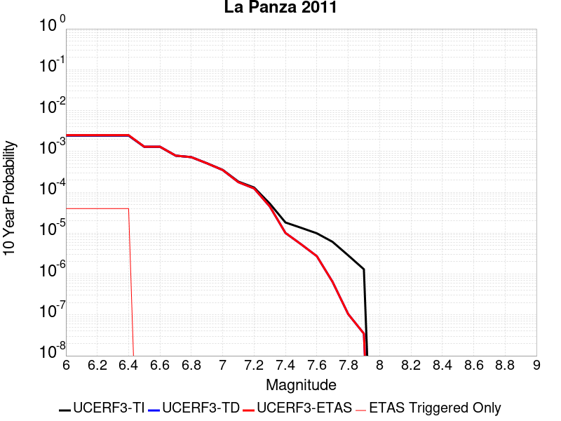 |

| Magnitude | 1 wk TI Prob | 1 wk TD Prob | 1 wk ETAS Prob | 1 wk ETAS/TD Gain | 1 wk ETAS Triggered Only | 1 mo TI Prob | 1 mo TD Prob | 1 mo ETAS Prob | 1 mo ETAS/TD Gain | 1 mo ETAS Triggered Only | 1 yr TI Prob | 1 yr TD Prob | 1 yr ETAS Prob | 1 yr ETAS/TD Gain | 1 yr ETAS Triggered Only | 10 yr TI Prob | 10 yr TD Prob | 10 yr ETAS Prob | 10 yr ETAS/TD Gain | 10 yr ETAS Triggered Only |
|-----|-----|-----|-----|-----|-----|-----|-----|-----|-----|-----|-----|-----|-----|-----|-----|-----|-----|-----|-----|-----|
| 6.0 | 4.6754544E-6 | 4.7175886E-6 | 2.4717494E-5 | 5.239434 | 2.0E-5 | 2.0037509E-5 | 2.021809E-5 | 4.021769E-5 | 1.9891931 | 2.0E-5 | 2.4392935E-4 | 2.4612944E-4 | 2.8611958E-4 | 1.1624761 | 4.0E-5 | 0.0024366176 | 0.0024587628 | 0.0024986644 | 1.0162283 | 4.0E-5 |
| 6.1 | 4.6754544E-6 | 4.7175886E-6 | 2.4717494E-5 | 5.239434 | 2.0E-5 | 2.0037509E-5 | 2.021809E-5 | 4.021769E-5 | 1.9891931 | 2.0E-5 | 2.4392935E-4 | 2.4612944E-4 | 2.8611958E-4 | 1.1624761 | 4.0E-5 | 0.0024366176 | 0.0024587628 | 0.0024986644 | 1.0162283 | 4.0E-5 |
| 6.2 | 4.6754544E-6 | 4.7175886E-6 | 2.4717494E-5 | 5.239434 | 2.0E-5 | 2.0037509E-5 | 2.021809E-5 | 4.021769E-5 | 1.9891931 | 2.0E-5 | 2.4392935E-4 | 2.4612944E-4 | 2.8611958E-4 | 1.1624761 | 4.0E-5 | 0.0024366176 | 0.0024587628 | 0.0024986644 | 1.0162283 | 4.0E-5 |
| 6.3 | 4.6754544E-6 | 4.7175886E-6 | 2.4717494E-5 | 5.239434 | 2.0E-5 | 2.0037509E-5 | 2.021809E-5 | 4.021769E-5 | 1.9891931 | 2.0E-5 | 2.4392935E-4 | 2.4612944E-4 | 2.8611958E-4 | 1.1624761 | 4.0E-5 | 0.0024366176 | 0.0024587628 | 0.0024986644 | 1.0162283 | 4.0E-5 |
| 6.4 | 4.6754544E-6 | 4.7175886E-6 | 2.4717494E-5 | 5.239434 | 2.0E-5 | 2.0037509E-5 | 2.021809E-5 | 4.021769E-5 | 1.9891931 | 2.0E-5 | 2.4392935E-4 | 2.4612944E-4 | 2.8611958E-4 | 1.1624761 | 4.0E-5 | 0.0024366176 | 0.0024587628 | 0.0024986644 | 1.0162283 | 4.0E-5 |
| 6.5 | 2.485343E-6 | 2.5006007E-6 | 2.5006007E-6 | 1.0 | 0.0 | 1.0651426E-5 | 1.0716818E-5 | 1.0716818E-5 | 1.0 | 0.0 | 1.296734E-4 | 1.3046984E-4 | 1.3046984E-4 | 1.0 | 0.0 | 0.0012959775 | 0.0013039707 | 0.0013039707 | 1.0 | 0.0 |
| 6.6 | 2.485343E-6 | 2.5006007E-6 | 2.5006007E-6 | 1.0 | 0.0 | 1.0651426E-5 | 1.0716818E-5 | 1.0716818E-5 | 1.0 | 0.0 | 1.296734E-4 | 1.3046984E-4 | 1.3046984E-4 | 1.0 | 0.0 | 0.0012959775 | 0.0013039707 | 0.0013039707 | 1.0 | 0.0 |
| 6.7 | 1.5108508E-6 | 1.514639E-6 | 1.514639E-6 | 1.0 | 0.0 | 6.4750584E-6 | 6.4912947E-6 | 6.4912947E-6 | 1.0 | 0.0 | 7.8830984E-5 | 7.902876E-5 | 7.902876E-5 | 1.0 | 0.0 | 7.880303E-4 | 7.9001737E-4 | 7.9001737E-4 | 1.0 | 0.0 |
| 6.8 | 1.3865837E-6 | 1.3885118E-6 | 1.3885118E-6 | 1.0 | 0.0 | 5.942488E-6 | 5.950752E-6 | 5.950752E-6 | 1.0 | 0.0 | 7.234739E-5 | 7.244809E-5 | 7.244809E-5 | 1.0 | 0.0 | 7.232384E-4 | 7.242546E-4 | 7.242546E-4 | 1.0 | 0.0 |
| 6.9 | 9.826583E-7 | 9.796303E-7 | 9.796303E-7 | 1.0 | 0.0 | 4.2113857E-6 | 4.198409E-6 | 4.198409E-6 | 1.0 | 0.0 | 5.1272415E-5 | 5.1114486E-5 | 5.1114486E-5 | 1.0 | 0.0 | 5.126059E-4 | 5.1103265E-4 | 5.1103265E-4 | 1.0 | 0.0 |
| 7.0 | 6.7797646E-7 | 6.710231E-7 | 6.710231E-7 | 1.0 | 0.0 | 2.9056102E-6 | 2.8758104E-6 | 2.8758104E-6 | 1.0 | 0.0 | 3.537523E-5 | 3.501246E-5 | 3.501246E-5 | 1.0 | 0.0 | 3.5369597E-4 | 3.5007254E-4 | 3.5007254E-4 | 1.0 | 0.0 |
| 7.1 | 3.4979826E-7 | 3.3874045E-7 | 3.3874045E-7 | 1.0 | 0.0 | 1.4991346E-6 | 1.4517441E-6 | 1.4517441E-6 | 1.0 | 0.0 | 1.825181E-5 | 1.7674853E-5 | 1.7674853E-5 | 1.0 | 0.0 | 1.825031E-4 | 1.7673563E-4 | 1.7673563E-4 | 1.0 | 0.0 |
| 7.2 | 2.5088332E-7 | 2.3832064E-7 | 2.3832064E-7 | 1.0 | 0.0 | 1.0752137E-6 | 1.0213738E-6 | 1.0213738E-6 | 1.0 | 0.0 | 1.3090649E-5 | 1.2435164E-5 | 1.2435164E-5 | 1.0 | 0.0 | 1.3089878E-4 | 1.2434553E-4 | 1.2434553E-4 | 1.0 | 0.0 |
| 7.3 | 1.0159086E-7 | 8.644785E-8 | 8.644785E-8 | 1.0 | 0.0 | 4.3538932E-7 | 3.704907E-7 | 3.704907E-7 | 1.0 | 0.0 | 5.300852E-6 | 4.510716E-6 | 4.510716E-6 | 1.0 | 0.0 | 5.3007258E-5 | 4.510628E-5 | 4.510628E-5 | 1.0 | 0.0 |
| 7.4 | 3.5006252E-8 | 1.9403883E-8 | 1.9403883E-8 | 1.0 | 0.0 | 1.5002678E-7 | 8.315949E-8 | 8.315949E-8 | 1.0 | 0.0 | 1.8265745E-6 | 1.0124663E-6 | 1.0124663E-6 | 1.0 | 0.0 | 1.8265595E-5 | 1.012462E-5 | 1.012462E-5 | 1.0 | 0.0 |
| 7.5 | 2.592274E-8 | 1.0238468E-8 | 1.0238468E-8 | 1.0 | 0.0 | 1.1109746E-7 | 4.3879147E-8 | 4.3879147E-8 | 1.0 | 0.0 | 1.3526106E-6 | 5.342285E-7 | 5.342285E-7 | 1.0 | 0.0 | 1.3526024E-5 | 5.342273E-6 | 5.342273E-6 | 1.0 | 0.0 |
| 7.6 | 1.9016717E-8 | 5.2442264E-9 | 5.2442264E-9 | 1.0 | 0.0 | 8.150022E-8 | 2.2475257E-8 | 2.2475257E-8 | 1.0 | 0.0 | 9.922647E-7 | 2.736362E-7 | 2.736362E-7 | 1.0 | 0.0 | 9.922603E-6 | 2.736359E-6 | 2.736359E-6 | 1.0 | 0.0 |
| 7.7 | 1.17738495E-8 | 1.2393437E-9 | 1.2393437E-9 | 1.0 | 0.0 | 5.0459356E-8 | 5.3114735E-9 | 5.3114735E-9 | 1.0 | 0.0 | 6.1434247E-7 | 6.466719E-8 | 6.466719E-8 | 1.0 | 0.0 | 6.143408E-6 | 6.466717E-7 | 6.466717E-7 | 1.0 | 0.0 |
| 7.8 | 5.489079E-9 | 2.009185E-10 | 2.009185E-10 | 1.0 | 0.0 | 2.3524624E-8 | 8.61079E-10 | 8.61079E-10 | 1.0 | 0.0 | 2.8641225E-7 | 1.0483639E-8 | 1.0483639E-8 | 1.0 | 0.0 | 2.8641189E-6 | 1.0483638E-7 | 1.0483638E-7 | 1.0 | 0.0 |
| 7.9 | 2.5081048E-9 | 6.675449E-11 | 6.675449E-11 | 1.0 | 0.0 | 1.0749021E-8 | 2.8609015E-10 | 2.8609015E-10 | 1.0 | 0.0 | 1.3086932E-7 | 3.483148E-9 | 3.483148E-9 | 1.0 | 0.0 | 1.3086925E-6 | 3.483148E-8 | 3.483148E-8 | 1.0 | 0.0 |

## San Jacinto (Clark) rev
*[(top)](#table-of-contents)*

| 1 Week | 1 Month | 1 Year | 10 Year |
|-----|-----|-----|-----|
|  |  |  |  |

| Magnitude | 1 wk TI Prob | 1 wk TD Prob | 1 wk ETAS Prob | 1 wk ETAS/TD Gain | 1 wk ETAS Triggered Only | 1 mo TI Prob | 1 mo TD Prob | 1 mo ETAS Prob | 1 mo ETAS/TD Gain | 1 mo ETAS Triggered Only | 1 yr TI Prob | 1 yr TD Prob | 1 yr ETAS Prob | 1 yr ETAS/TD Gain | 1 yr ETAS Triggered Only | 10 yr TI Prob | 10 yr TD Prob | 10 yr ETAS Prob | 10 yr ETAS/TD Gain | 10 yr ETAS Triggered Only |
|-----|-----|-----|-----|-----|-----|-----|-----|-----|-----|-----|-----|-----|-----|-----|-----|-----|-----|-----|-----|-----|
| 6.0 | 4.482615E-5 | 2.1153059E-5 | 6.115221E-5 | 2.8909395 | 4.0E-5 | 1.9209793E-4 | 9.065287E-5 | 1.3064925E-4 | 1.4412036 | 4.0E-5 | 0.0023362834 | 0.0011031491 | 0.001143105 | 1.0362198 | 4.0E-5 | 0.02311874 | 0.011485709 | 0.011525249 | 1.0034426 | 4.0E-5 |
| 6.1 | 4.482615E-5 | 2.1153059E-5 | 6.115221E-5 | 2.8909395 | 4.0E-5 | 1.9209793E-4 | 9.065287E-5 | 1.3064925E-4 | 1.4412036 | 4.0E-5 | 0.0023362834 | 0.0011031491 | 0.001143105 | 1.0362198 | 4.0E-5 | 0.02311874 | 0.011485709 | 0.011525249 | 1.0034426 | 4.0E-5 |
| 6.2 | 4.482615E-5 | 2.1153059E-5 | 6.115221E-5 | 2.8909395 | 4.0E-5 | 1.9209793E-4 | 9.065287E-5 | 1.3064925E-4 | 1.4412036 | 4.0E-5 | 0.0023362834 | 0.0011031491 | 0.001143105 | 1.0362198 | 4.0E-5 | 0.02311874 | 0.011485709 | 0.011525249 | 1.0034426 | 4.0E-5 |
| 6.3 | 4.482615E-5 | 2.1153059E-5 | 6.115221E-5 | 2.8909395 | 4.0E-5 | 1.9209793E-4 | 9.065287E-5 | 1.3064925E-4 | 1.4412036 | 4.0E-5 | 0.0023362834 | 0.0011031491 | 0.001143105 | 1.0362198 | 4.0E-5 | 0.02311874 | 0.011485709 | 0.011525249 | 1.0034426 | 4.0E-5 |
| 6.4 | 4.482615E-5 | 2.1153059E-5 | 6.115221E-5 | 2.8909395 | 4.0E-5 | 1.9209793E-4 | 9.065287E-5 | 1.3064925E-4 | 1.4412036 | 4.0E-5 | 0.0023362834 | 0.0011031491 | 0.001143105 | 1.0362198 | 4.0E-5 | 0.02311874 | 0.011485709 | 0.011525249 | 1.0034426 | 4.0E-5 |
| 6.5 | 3.7294863E-5 | 1.7354667E-5 | 5.7353973E-5 | 3.3048155 | 4.0E-5 | 1.5982533E-4 | 7.437504E-5 | 1.1437207E-4 | 1.5377748 | 4.0E-5 | 0.0019441366 | 9.051445E-4 | 9.4510824E-4 | 1.0441518 | 4.0E-5 | 0.01927216 | 0.009485902 | 0.0095255235 | 1.0041767 | 4.0E-5 |
| 6.6 | 3.7294863E-5 | 1.7354667E-5 | 5.7353973E-5 | 3.3048155 | 4.0E-5 | 1.5982533E-4 | 7.437504E-5 | 1.1437207E-4 | 1.5377748 | 4.0E-5 | 0.0019441366 | 9.051445E-4 | 9.4510824E-4 | 1.0441518 | 4.0E-5 | 0.01927216 | 0.009485902 | 0.0095255235 | 1.0041767 | 4.0E-5 |
| 6.7 | 3.6039248E-5 | 1.6602684E-5 | 5.660202E-5 | 3.409209 | 4.0E-5 | 1.5444479E-4 | 7.115244E-5 | 1.11149595E-4 | 1.5621333 | 4.0E-5 | 0.0018787434 | 8.659408E-4 | 9.059062E-4 | 1.0461526 | 4.0E-5 | 0.01862939 | 0.009088189 | 0.0091278255 | 1.0043613 | 4.0E-5 |
| 6.8 | 3.5031844E-5 | 1.6231123E-5 | 5.6230474E-5 | 3.4643612 | 4.0E-5 | 1.5012783E-4 | 6.956012E-5 | 1.0955734E-4 | 1.5750021 | 4.0E-5 | 0.0018262739 | 8.4656954E-4 | 8.865357E-4 | 1.0472095 | 4.0E-5 | 0.01811338 | 0.008888788 | 0.008928432 | 1.0044601 | 4.0E-5 |
| 6.9 | 3.435112E-5 | 1.6061658E-5 | 5.6061017E-5 | 3.490363 | 4.0E-5 | 1.4721078E-4 | 6.8833884E-5 | 1.0883113E-4 | 1.5810691 | 4.0E-5 | 0.0017908178 | 8.377344E-4 | 8.777009E-4 | 1.0477078 | 4.0E-5 | 0.017764548 | 0.008796512 | 0.00883616 | 1.0045073 | 4.0E-5 |
| 7.0 | 2.8959772E-5 | 1.43355255E-5 | 5.4334952E-5 | 3.790231 | 4.0E-5 | 1.241074E-4 | 6.1436534E-5 | 1.01434074E-4 | 1.6510384 | 4.0E-5 | 0.0015099603 | 7.477359E-4 | 7.87706E-4 | 1.0534549 | 4.0E-5 | 0.014997416 | 0.007868331 | 0.007908016 | 1.0050436 | 4.0E-5 |
| 7.1 | 2.6002877E-5 | 1.2827699E-5 | 5.2827185E-5 | 4.118212 | 4.0E-5 | 1.11436144E-4 | 5.4974706E-5 | 9.497251E-5 | 1.7275673 | 4.0E-5 | 0.0013558907 | 6.6911365E-4 | 7.0908683E-4 | 1.0597405 | 4.0E-5 | 0.013476475 | 0.0070483433 | 0.0070880614 | 1.0056351 | 4.0E-5 |
| 7.2 | 2.2544838E-5 | 1.1260331E-5 | 5.125988E-5 | 4.5522532 | 4.0E-5 | 9.661716E-5 | 4.825768E-5 | 8.825575E-5 | 1.8288436 | 4.0E-5 | 0.001175679 | 5.873803E-4 | 6.273568E-4 | 1.068059 | 4.0E-5 | 0.011694785 | 0.00619256 | 0.0062323124 | 1.0064194 | 4.0E-5 |
| 7.3 | 1.75334E-5 | 1.0810585E-5 | 5.081015E-5 | 4.7000375 | 4.0E-5 | 7.514098E-5 | 4.6330264E-5 | 8.632841E-5 | 1.8633265 | 4.0E-5 | 9.144575E-4 | 5.6392635E-4 | 6.039038E-4 | 1.0708913 | 4.0E-5 | 0.009107036 | 0.0059332196 | 0.005972982 | 1.0067017 | 4.0E-5 |
| 7.4 | 1.5924552E-5 | 1.0610475E-5 | 5.061005E-5 | 4.7698193 | 4.0E-5 | 6.82463E-5 | 4.547268E-5 | 8.547086E-5 | 1.8796091 | 4.0E-5 | 8.305819E-4 | 5.534906E-4 | 5.934685E-4 | 1.0722287 | 4.0E-5 | 0.008274844 | 0.0058205863 | 0.0058603534 | 1.0068321 | 4.0E-5 |
| 7.5 | 1.3428931E-5 | 9.851045E-6 | 4.9850652E-5 | 5.060443 | 4.0E-5 | 5.7551293E-5 | 4.221809E-5 | 8.22164E-5 | 1.9474212 | 4.0E-5 | 7.004617E-4 | 5.1388505E-4 | 5.538645E-4 | 1.0777984 | 4.0E-5 | 0.006982579 | 0.005406209 | 0.0054459926 | 1.0073589 | 4.0E-5 |
| 7.6 | 1.0688787E-5 | 8.614091E-6 | 4.8613747E-5 | 5.6435146 | 4.0E-5 | 4.5808283E-5 | 3.6917012E-5 | 7.691553E-5 | 2.0834713 | 4.0E-5 | 5.5757316E-4 | 4.4937237E-4 | 4.893544E-4 | 1.088973 | 4.0E-5 | 0.005561762 | 0.0047413614 | 0.0047811717 | 1.0083964 | 4.0E-5 |
| 7.7 | 8.81236E-6 | 7.4673385E-6 | 4.746704E-5 | 6.356621 | 4.0E-5 | 3.776671E-5 | 3.200249E-5 | 7.200121E-5 | 2.249863 | 4.0E-5 | 4.597127E-4 | 3.8956082E-4 | 4.2954527E-4 | 1.1026397 | 4.0E-5 | 0.0045876284 | 0.0041344194 | 0.004174254 | 1.0096349 | 4.0E-5 |
| 7.8 | 7.780431E-6 | 6.695928E-6 | 4.669566E-5 | 6.97374 | 4.0E-5 | 3.3344273E-5 | 2.8696519E-5 | 6.869537E-5 | 2.3938572 | 4.0E-5 | 4.0589093E-4 | 3.4932428E-4 | 3.893103E-4 | 1.1144668 | 4.0E-5 | 0.0040515037 | 0.0037226272 | 0.0037624782 | 1.0107051 | 4.0E-5 |
| 7.9 | 6.5437994E-6 | 5.7797783E-6 | 4.5779547E-5 | 7.9206405 | 4.0E-5 | 2.8044553E-5 | 2.4770245E-5 | 6.476925E-5 | 2.6148007 | 4.0E-5 | 3.4138895E-4 | 3.0153614E-4 | 3.415241E-4 | 1.132614 | 4.0E-5 | 0.0034086495 | 0.0032343294 | 0.0032742 | 1.0123273 | 4.0E-5 |
| 8.0 | 5.4488164E-6 | 4.812793E-6 | 4.48126E-5 | 9.311142 | 4.0E-5 | 2.3351862E-5 | 2.0626094E-5 | 6.062527E-5 | 2.9392512 | 4.0E-5 | 2.8427184E-4 | 2.510939E-4 | 2.9108385E-4 | 1.159263 | 4.0E-5 | 0.0028390845 | 0.0027107038 | 0.0027505953 | 1.0147163 | 4.0E-5 |
| 8.1 | 2.8397242E-6 | 1.3665673E-6 | 1.1366554E-5 | 8.3175955 | 1.0E-5 | 1.217019E-5 | 5.856704E-6 | 1.5856645E-5 | 2.7074351 | 1.0E-5 | 1.4816198E-4 | 7.1303046E-5 | 8.1302336E-5 | 1.1402365 | 1.0E-5 | 0.0014806325 | 8.113543E-4 | 8.213462E-4 | 1.012315 | 1.0E-5 |
| 8.2 | 2.030244E-6 | 6.3151083E-7 | 6.3151083E-7 | 1.0 | 0.0 | 8.701017E-6 | 2.7064723E-6 | 2.7064723E-6 | 1.0 | 0.0 | 1.05929736E-4 | 3.2950808E-5 | 3.2950808E-5 | 1.0 | 0.0 | 0.0010587925 | 3.9470522E-4 | 3.9470522E-4 | 1.0 | 0.0 |
| 8.3 | 1.0659804E-6 | 2.9230563E-7 | 2.9230563E-7 | 1.0 | 0.0 | 4.568479E-6 | 1.2527379E-6 | 1.2527379E-6 | 1.0 | 0.0 | 5.5619817E-5 | 1.5251981E-5 | 1.5251981E-5 | 1.0 | 0.0 | 5.5605895E-4 | 1.8556409E-4 | 1.8556409E-4 | 1.0 | 0.0 |

## Hartley Springs 2011 CFM
*[(top)](#table-of-contents)*

| 1 Week | 1 Month | 1 Year | 10 Year |
|-----|-----|-----|-----|
|  | 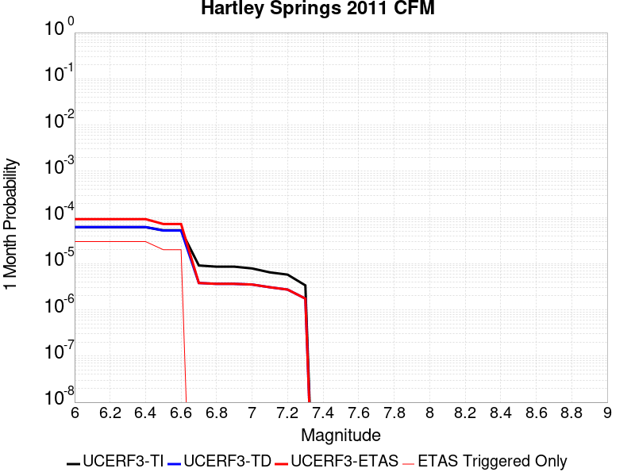 |  | 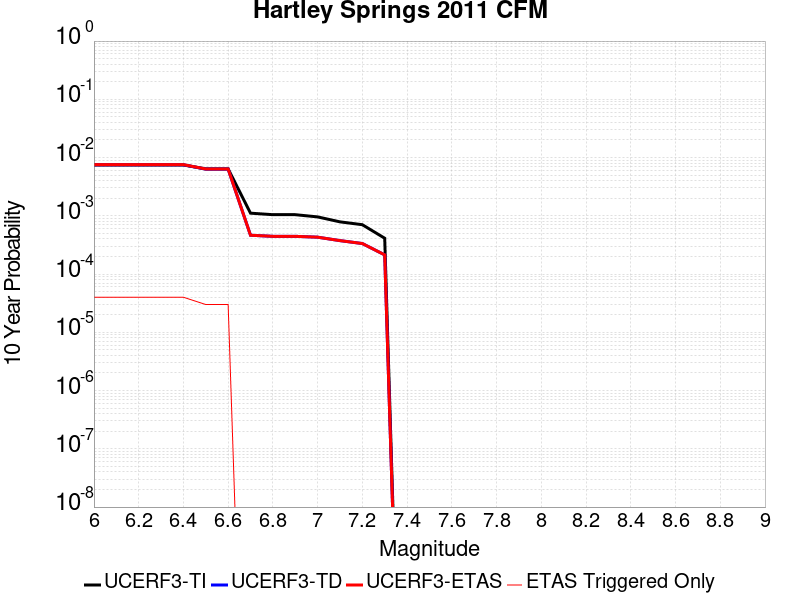 |

| Magnitude | 1 wk TI Prob | 1 wk TD Prob | 1 wk ETAS Prob | 1 wk ETAS/TD Gain | 1 wk ETAS Triggered Only | 1 mo TI Prob | 1 mo TD Prob | 1 mo ETAS Prob | 1 mo ETAS/TD Gain | 1 mo ETAS Triggered Only | 1 yr TI Prob | 1 yr TD Prob | 1 yr ETAS Prob | 1 yr ETAS/TD Gain | 1 yr ETAS Triggered Only | 10 yr TI Prob | 10 yr TD Prob | 10 yr ETAS Prob | 10 yr ETAS/TD Gain | 10 yr ETAS Triggered Only |
|-----|-----|-----|-----|-----|-----|-----|-----|-----|-----|-----|-----|-----|-----|-----|-----|-----|-----|-----|-----|-----|
| 6.0 | 1.4352418E-5 | 1.4434111E-5 | 4.443368E-5 | 3.0783799 | 3.0E-5 | 6.1508916E-5 | 6.185994E-5 | 9.1858084E-5 | 1.4849366 | 3.0E-5 | 7.486137E-4 | 7.5304887E-4 | 7.830263E-4 | 1.039808 | 3.0E-5 | 0.007460968 | 0.007521092 | 0.007560791 | 1.0052783 | 4.0E-5 |
| 6.1 | 1.4352418E-5 | 1.4434111E-5 | 4.443368E-5 | 3.0783799 | 3.0E-5 | 6.1508916E-5 | 6.185994E-5 | 9.1858084E-5 | 1.4849366 | 3.0E-5 | 7.486137E-4 | 7.5304887E-4 | 7.830263E-4 | 1.039808 | 3.0E-5 | 0.007460968 | 0.007521092 | 0.007560791 | 1.0052783 | 4.0E-5 |
| 6.2 | 1.4352418E-5 | 1.4434111E-5 | 4.443368E-5 | 3.0783799 | 3.0E-5 | 6.1508916E-5 | 6.185994E-5 | 9.1858084E-5 | 1.4849366 | 3.0E-5 | 7.486137E-4 | 7.5304887E-4 | 7.830263E-4 | 1.039808 | 3.0E-5 | 0.007460968 | 0.007521092 | 0.007560791 | 1.0052783 | 4.0E-5 |
| 6.3 | 1.4352418E-5 | 1.4434111E-5 | 4.443368E-5 | 3.0783799 | 3.0E-5 | 6.1508916E-5 | 6.185994E-5 | 9.1858084E-5 | 1.4849366 | 3.0E-5 | 7.486137E-4 | 7.5304887E-4 | 7.830263E-4 | 1.039808 | 3.0E-5 | 0.007460968 | 0.007521092 | 0.007560791 | 1.0052783 | 4.0E-5 |
| 6.4 | 1.4352418E-5 | 1.4434111E-5 | 4.443368E-5 | 3.0783799 | 3.0E-5 | 6.1508916E-5 | 6.185994E-5 | 9.1858084E-5 | 1.4849366 | 3.0E-5 | 7.486137E-4 | 7.5304887E-4 | 7.830263E-4 | 1.039808 | 3.0E-5 | 0.007460968 | 0.007521092 | 0.007560791 | 1.0052783 | 4.0E-5 |
| 6.5 | 1.2279858E-5 | 1.2133036E-5 | 3.2132793E-5 | 2.6483722 | 2.0E-5 | 5.26269E-5 | 5.199858E-5 | 7.199754E-5 | 1.3846059 | 2.0E-5 | 6.4054417E-4 | 6.33057E-4 | 6.530443E-4 | 1.0315727 | 2.0E-5 | 0.0063870098 | 0.006328048 | 0.0063578584 | 1.0047108 | 3.0E-5 |
| 6.6 | 1.2279858E-5 | 1.2133036E-5 | 3.2132793E-5 | 2.6483722 | 2.0E-5 | 5.26269E-5 | 5.199858E-5 | 7.199754E-5 | 1.3846059 | 2.0E-5 | 6.4054417E-4 | 6.33057E-4 | 6.530443E-4 | 1.0315727 | 2.0E-5 | 0.0063870098 | 0.006328048 | 0.0063578584 | 1.0047108 | 3.0E-5 |
| 6.7 | 2.1282601E-6 | 8.894127E-7 | 8.894127E-7 | 1.0 | 0.0 | 9.121083E-6 | 3.8117648E-6 | 3.8117648E-6 | 1.0 | 0.0 | 1.11043526E-4 | 4.6407506E-5 | 4.6407506E-5 | 1.0 | 0.0 | 0.0011098806 | 4.6400347E-4 | 4.6400347E-4 | 1.0 | 0.0 |
| 6.8 | 2.00516E-6 | 8.516916E-7 | 8.516916E-7 | 1.0 | 0.0 | 8.593515E-6 | 3.6501033E-6 | 3.6501033E-6 | 1.0 | 0.0 | 1.04621024E-4 | 4.443936E-5 | 4.443936E-5 | 1.0 | 0.0 | 0.0010457177 | 4.4432987E-4 | 4.4432987E-4 | 1.0 | 0.0 |
| 6.9 | 2.00516E-6 | 8.516916E-7 | 8.516916E-7 | 1.0 | 0.0 | 8.593515E-6 | 3.6501033E-6 | 3.6501033E-6 | 1.0 | 0.0 | 1.04621024E-4 | 4.443936E-5 | 4.443936E-5 | 1.0 | 0.0 | 0.0010457177 | 4.4432987E-4 | 4.4432987E-4 | 1.0 | 0.0 |
| 7.0 | 1.8366732E-6 | 8.2366813E-7 | 8.2366813E-7 | 1.0 | 0.0 | 7.871433E-6 | 3.5300031E-6 | 3.5300031E-6 | 1.0 | 0.0 | 9.583048E-5 | 4.2977194E-5 | 4.2977194E-5 | 1.0 | 0.0 | 9.5789164E-4 | 4.297139E-4 | 4.297139E-4 | 1.0 | 0.0 |
| 7.1 | 1.5097997E-6 | 7.1897E-7 | 7.1897E-7 | 1.0 | 0.0 | 6.470554E-6 | 3.0812978E-6 | 3.0812978E-6 | 1.0 | 0.0 | 7.877615E-5 | 3.7514397E-5 | 3.7514397E-5 | 1.0 | 0.0 | 7.874823E-4 | 3.7510434E-4 | 3.7510434E-4 | 1.0 | 0.0 |
| 7.2 | 1.3490993E-6 | 6.404769E-7 | 6.404769E-7 | 1.0 | 0.0 | 5.7818415E-6 | 2.7448996E-6 | 2.7448996E-6 | 1.0 | 0.0 | 7.0391645E-5 | 3.3418873E-5 | 3.3418873E-5 | 1.0 | 0.0 | 7.0369354E-4 | 3.3416142E-4 | 3.3416142E-4 | 1.0 | 0.0 |
| 7.3 | 7.900015E-7 | 4.0888176E-7 | 4.0888176E-7 | 1.0 | 0.0 | 3.3857161E-6 | 1.7523504E-6 | 1.7523504E-6 | 1.0 | 0.0 | 4.1220315E-5 | 2.1334865E-5 | 2.1334865E-5 | 1.0 | 0.0 | 4.121267E-4 | 2.1334866E-4 | 2.1334866E-4 | 1.0 | 0.0 |

## Camp Rock 2011
*[(top)](#table-of-contents)*

| 1 Week | 1 Month | 1 Year | 10 Year |
|-----|-----|-----|-----|
|  |  |  |  |

| Magnitude | 1 wk TI Prob | 1 wk TD Prob | 1 wk ETAS Prob | 1 wk ETAS/TD Gain | 1 wk ETAS Triggered Only | 1 mo TI Prob | 1 mo TD Prob | 1 mo ETAS Prob | 1 mo ETAS/TD Gain | 1 mo ETAS Triggered Only | 1 yr TI Prob | 1 yr TD Prob | 1 yr ETAS Prob | 1 yr ETAS/TD Gain | 1 yr ETAS Triggered Only | 10 yr TI Prob | 10 yr TD Prob | 10 yr ETAS Prob | 10 yr ETAS/TD Gain | 10 yr ETAS Triggered Only |
|-----|-----|-----|-----|-----|-----|-----|-----|-----|-----|-----|-----|-----|-----|-----|-----|-----|-----|-----|-----|-----|
| 6.0 | 1.6710783E-5 | 4.249999E-6 | 3.424987E-5 | 8.058795 | 3.0E-5 | 7.161568E-5 | 1.8214158E-5 | 4.8213613E-5 | 2.6470404 | 3.0E-5 | 8.7157206E-4 | 2.2173533E-4 | 2.6172647E-4 | 1.1803552 | 4.0E-5 | 0.008681616 | 0.0022151938 | 0.0022551052 | 1.018017 | 4.0E-5 |
| 6.1 | 1.6710783E-5 | 4.249999E-6 | 3.424987E-5 | 8.058795 | 3.0E-5 | 7.161568E-5 | 1.8214158E-5 | 4.8213613E-5 | 2.6470404 | 3.0E-5 | 8.7157206E-4 | 2.2173533E-4 | 2.6172647E-4 | 1.1803552 | 4.0E-5 | 0.008681616 | 0.0022151938 | 0.0022551052 | 1.018017 | 4.0E-5 |
| 6.2 | 1.6710783E-5 | 4.249999E-6 | 3.424987E-5 | 8.058795 | 3.0E-5 | 7.161568E-5 | 1.8214158E-5 | 4.8213613E-5 | 2.6470404 | 3.0E-5 | 8.7157206E-4 | 2.2173533E-4 | 2.6172647E-4 | 1.1803552 | 4.0E-5 | 0.008681616 | 0.0022151938 | 0.0022551052 | 1.018017 | 4.0E-5 |
| 6.3 | 1.6710783E-5 | 4.249999E-6 | 3.424987E-5 | 8.058795 | 3.0E-5 | 7.161568E-5 | 1.8214158E-5 | 4.8213613E-5 | 2.6470404 | 3.0E-5 | 8.7157206E-4 | 2.2173533E-4 | 2.6172647E-4 | 1.1803552 | 4.0E-5 | 0.008681616 | 0.0022151938 | 0.0022551052 | 1.018017 | 4.0E-5 |
| 6.4 | 7.982846E-6 | 3.6820359E-6 | 2.3681961E-5 | 6.4317575 | 2.0E-5 | 3.421175E-5 | 1.578006E-5 | 3.5779743E-5 | 2.2674022 | 2.0E-5 | 4.1644843E-4 | 1.9210564E-4 | 2.2209987E-4 | 1.1561341 | 3.0E-5 | 0.0041566887 | 0.0019194306 | 0.001949373 | 1.0155996 | 3.0E-5 |
| 6.5 | 7.982846E-6 | 3.6820359E-6 | 2.3681961E-5 | 6.4317575 | 2.0E-5 | 3.421175E-5 | 1.578006E-5 | 3.5779743E-5 | 2.2674022 | 2.0E-5 | 4.1644843E-4 | 1.9210564E-4 | 2.2209987E-4 | 1.1561341 | 3.0E-5 | 0.0041566887 | 0.0019194306 | 0.001949373 | 1.0155996 | 3.0E-5 |
| 6.6 | 7.048869E-6 | 3.4242998E-6 | 2.342423E-5 | 6.84059 | 2.0E-5 | 3.0209088E-5 | 1.467549E-5 | 3.4675195E-5 | 2.3627965 | 2.0E-5 | 3.677336E-4 | 1.7865976E-4 | 2.086544E-4 | 1.167887 | 3.0E-5 | 0.0036712566 | 0.0017851929 | 0.0018151393 | 1.0167749 | 3.0E-5 |
| 6.7 | 6.987307E-6 | 3.3622775E-6 | 2.336221E-5 | 6.948329 | 2.0E-5 | 2.9945259E-5 | 1.4409683E-5 | 3.4409393E-5 | 2.3879356 | 2.0E-5 | 3.6452254E-4 | 1.7542407E-4 | 2.0541881E-4 | 1.1709841 | 3.0E-5 | 0.0036392517 | 0.0017528872 | 0.0017828345 | 1.0170846 | 3.0E-5 |
| 6.8 | 6.3737602E-6 | 3.1178672E-6 | 2.3117806E-5 | 7.4146214 | 2.0E-5 | 2.731583E-5 | 1.3362222E-5 | 3.3361954E-5 | 2.496737 | 2.0E-5 | 3.3251947E-4 | 1.6267318E-4 | 1.926683E-4 | 1.1843889 | 3.0E-5 | 0.0033202237 | 0.0016255698 | 0.001655521 | 1.0184251 | 3.0E-5 |
| 6.9 | 6.112211E-6 | 2.933078E-6 | 2.293302E-5 | 7.818755 | 2.0E-5 | 2.6194928E-5 | 1.2570275E-5 | 3.2570024E-5 | 2.5910351 | 2.0E-5 | 3.1887658E-4 | 1.5303263E-4 | 1.8302804E-4 | 1.1960067 | 3.0E-5 | 0.003184194 | 0.0015293002 | 0.0015592544 | 1.0195868 | 3.0E-5 |
| 7.0 | 5.5140117E-6 | 2.64191E-6 | 2.2641858E-5 | 8.570261 | 2.0E-5 | 2.3631264E-5 | 1.1322423E-5 | 3.1322197E-5 | 2.7663863 | 2.0E-5 | 2.8767265E-4 | 1.3784204E-4 | 1.678379E-4 | 1.2176105 | 3.0E-5 | 0.0028730053 | 0.0013775907 | 0.0014075494 | 1.0217471 | 3.0E-5 |
| 7.1 | 4.8151105E-6 | 2.1342612E-6 | 2.2134218E-5 | 10.370905 | 2.0E-5 | 2.0636026E-5 | 9.146803E-6 | 2.914662E-5 | 3.1865366 | 2.0E-5 | 2.5121463E-4 | 1.1135685E-4 | 1.413535E-4 | 1.2693741 | 3.0E-5 | 0.0025093083 | 0.0011130325 | 0.001142999 | 1.0269234 | 3.0E-5 |
| 7.2 | 3.818335E-6 | 1.2937372E-6 | 1.1293724E-5 | 8.729535 | 1.0E-5 | 1.6364189E-5 | 5.5445767E-6 | 1.5544521E-5 | 2.803554 | 1.0E-5 | 1.9921579E-4 | 6.750321E-5 | 7.750254E-5 | 1.1481311 | 1.0E-5 | 0.0019903728 | 6.7483535E-4 | 6.848286E-4 | 1.0148084 | 1.0E-5 |
| 7.3 | 2.7166698E-6 | 7.383078E-7 | 7.383078E-7 | 1.0 | 0.0 | 1.1642818E-5 | 3.1641725E-6 | 3.1641725E-6 | 1.0 | 0.0 | 1.4174209E-4 | 3.852314E-5 | 3.852314E-5 | 1.0 | 0.0 | 0.0014165172 | 3.8516664E-4 | 3.8516664E-4 | 1.0 | 0.0 |
| 7.4 | 2.0893426E-6 | 5.4614605E-7 | 5.4614605E-7 | 1.0 | 0.0 | 8.954295E-6 | 2.340624E-6 | 2.340624E-6 | 1.0 | 0.0 | 1.0901308E-4 | 2.8496728E-5 | 2.8496728E-5 | 1.0 | 0.0 | 0.0010895962 | 2.849313E-4 | 2.849313E-4 | 1.0 | 0.0 |
| 7.5 | 1.1681728E-6 | 3.6028484E-7 | 3.6028484E-7 | 1.0 | 0.0 | 5.0064455E-6 | 1.544077E-6 | 1.544077E-6 | 1.0 | 0.0 | 6.0951766E-5 | 1.879898E-5 | 1.879898E-5 | 1.0 | 0.0 | 6.093505E-4 | 1.8797436E-4 | 1.8797436E-4 | 1.0 | 0.0 |
| 7.6 | 1.3154387E-7 | 7.1196716E-8 | 7.1196716E-8 | 1.0 | 0.0 | 5.6375933E-7 | 3.0512876E-7 | 3.0512876E-7 | 1.0 | 0.0 | 6.863748E-6 | 3.714938E-6 | 3.714938E-6 | 1.0 | 0.0 | 6.863536E-5 | 3.7148915E-5 | 3.7148915E-5 | 1.0 | 0.0 |

## Newport-Inglewood (Offshore)
*[(top)](#table-of-contents)*

| 1 Week | 1 Month | 1 Year | 10 Year |
|-----|-----|-----|-----|
|  |  |  | 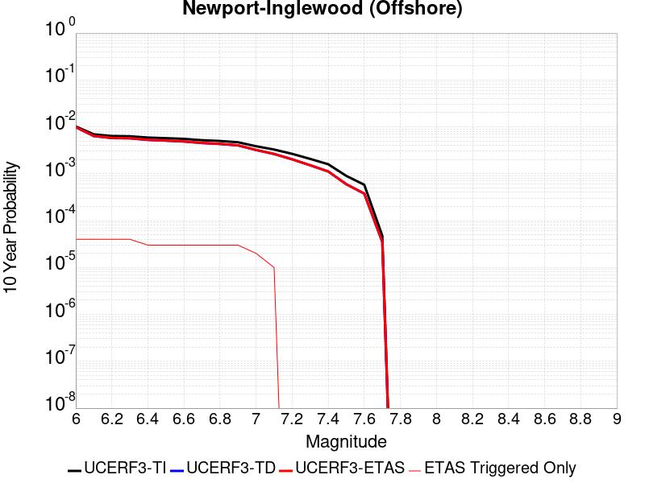 |

| Magnitude | 1 wk TI Prob | 1 wk TD Prob | 1 wk ETAS Prob | 1 wk ETAS/TD Gain | 1 wk ETAS Triggered Only | 1 mo TI Prob | 1 mo TD Prob | 1 mo ETAS Prob | 1 mo ETAS/TD Gain | 1 mo ETAS Triggered Only | 1 yr TI Prob | 1 yr TD Prob | 1 yr ETAS Prob | 1 yr ETAS/TD Gain | 1 yr ETAS Triggered Only | 10 yr TI Prob | 10 yr TD Prob | 10 yr ETAS Prob | 10 yr ETAS/TD Gain | 10 yr ETAS Triggered Only |
|-----|-----|-----|-----|-----|-----|-----|-----|-----|-----|-----|-----|-----|-----|-----|-----|-----|-----|-----|-----|-----|
| 6.0 | 1.9626508E-5 | 1.8965342E-5 | 4.8964772E-5 | 2.5818028 | 3.0E-5 | 8.411089E-5 | 8.1277576E-5 | 1.2127433E-4 | 1.4921006 | 4.0E-5 | 0.001023569 | 9.891179E-4 | 0.0010290783 | 1.0404 | 4.0E-5 | 0.010188672 | 0.009848497 | 0.009888102 | 1.0040215 | 4.0E-5 |
| 6.1 | 1.331886E-5 | 1.2218078E-5 | 4.221771E-5 | 3.4553478 | 3.0E-5 | 5.707958E-5 | 5.2362153E-5 | 9.236006E-5 | 1.7638706 | 4.0E-5 | 6.947222E-4 | 6.3732424E-4 | 6.772987E-4 | 1.0627224 | 4.0E-5 | 0.006925544 | 0.006355142 | 0.006394888 | 1.0062541 | 4.0E-5 |
| 6.2 | 1.2250852E-5 | 1.1076016E-5 | 4.1075684E-5 | 3.7085252 | 3.0E-5 | 5.2502597E-5 | 4.746778E-5 | 8.746588E-5 | 1.8426368 | 4.0E-5 | 6.3903164E-4 | 5.7776796E-4 | 6.1774487E-4 | 1.0691919 | 4.0E-5 | 0.006371971 | 0.0057627796 | 0.0058025494 | 1.0069011 | 4.0E-5 |
| 6.3 | 1.2106258E-5 | 1.0918878E-5 | 4.091855E-5 | 3.7475052 | 3.0E-5 | 5.1882926E-5 | 4.6794354E-5 | 8.679248E-5 | 1.854764 | 4.0E-5 | 6.3149154E-4 | 5.695733E-4 | 6.095505E-4 | 1.070188 | 4.0E-5 | 0.0062970007 | 0.005681252 | 0.0057210247 | 1.0070007 | 4.0E-5 |
| 6.4 | 1.1348758E-5 | 1.0109348E-5 | 3.0109146E-5 | 2.9783468 | 2.0E-5 | 4.8636626E-5 | 4.3325064E-5 | 7.332376E-5 | 1.6924099 | 3.0E-5 | 5.919901E-4 | 5.2735576E-4 | 5.5734E-4 | 1.0568576 | 3.0E-5 | 0.005904155 | 0.0052611395 | 0.0052909814 | 1.0056722 | 3.0E-5 |
| 6.5 | 1.100837E-5 | 9.743376E-6 | 2.9743182E-5 | 3.0526567 | 2.0E-5 | 4.7177873E-5 | 4.175666E-5 | 7.175541E-5 | 1.7184182 | 3.0E-5 | 5.7423924E-4 | 5.082695E-4 | 5.382543E-4 | 1.0589938 | 3.0E-5 | 0.005727576 | 0.005071162 | 0.0051010097 | 1.0058858 | 3.0E-5 |
| 6.6 | 1.0634696E-5 | 9.34553E-6 | 2.9345343E-5 | 3.1400406 | 2.0E-5 | 4.557647E-5 | 4.0051662E-5 | 7.005046E-5 | 1.7490026 | 3.0E-5 | 5.5475225E-4 | 4.875206E-4 | 5.17506E-4 | 1.0615059 | 3.0E-5 | 0.0055336943 | 0.0048645977 | 0.0048944517 | 1.006137 | 3.0E-5 |
| 6.7 | 9.9780855E-6 | 8.667898E-6 | 2.8667726E-5 | 3.3073442 | 2.0E-5 | 4.276252E-5 | 3.7147613E-5 | 6.7146495E-5 | 1.8075589 | 3.0E-5 | 5.205093E-4 | 4.5217903E-4 | 4.8216546E-4 | 1.0663154 | 3.0E-5 | 0.0051929182 | 0.0045126686 | 0.0045425333 | 1.0066179 | 3.0E-5 |
| 6.8 | 9.59546E-6 | 8.272933E-6 | 2.8272767E-5 | 3.4175024 | 2.0E-5 | 4.1122752E-5 | 3.545495E-5 | 6.545388E-5 | 1.8461143 | 3.0E-5 | 5.0055445E-4 | 4.3157916E-4 | 4.6156623E-4 | 1.0694822 | 3.0E-5 | 0.004994285 | 0.004307486 | 0.004337357 | 1.0069346 | 3.0E-5 |
| 6.9 | 9.000614E-6 | 7.706823E-6 | 2.7706668E-5 | 3.595083 | 2.0E-5 | 3.857349E-5 | 3.3028828E-5 | 6.302784E-5 | 1.9082674 | 3.0E-5 | 4.6953102E-4 | 4.0205245E-4 | 4.3204037E-4 | 1.0745871 | 3.0E-5 | 0.004685402 | 0.0040133223 | 0.004043202 | 1.0074451 | 3.0E-5 |
| 7.0 | 7.4070194E-6 | 6.148865E-6 | 2.6148742E-5 | 4.252613 | 2.0E-5 | 3.1743984E-5 | 2.6352012E-5 | 4.6351484E-5 | 1.7589353 | 2.0E-5 | 3.8641447E-4 | 3.2078868E-4 | 3.4078225E-4 | 1.0623263 | 2.0E-5 | 0.0038574322 | 0.0032032758 | 0.0032232117 | 1.0062236 | 2.0E-5 |
| 7.1 | 6.299615E-6 | 5.0565613E-6 | 1.5056511E-5 | 2.9776185 | 1.0E-5 | 2.699807E-5 | 2.1670798E-5 | 3.167058E-5 | 1.4614404 | 1.0E-5 | 3.2865192E-4 | 2.6381016E-4 | 2.7380753E-4 | 1.037896 | 1.0E-5 | 0.003281663 | 0.0026349847 | 0.0026449582 | 1.0037851 | 1.0E-5 |
| 7.2 | 5.096653E-6 | 3.892733E-6 | 3.892733E-6 | 1.0 | 0.0 | 2.1842614E-5 | 1.6683034E-5 | 1.6683034E-5 | 1.0 | 0.0 | 2.6590136E-4 | 2.0309711E-4 | 2.0309711E-4 | 1.0 | 0.0 | 0.0026558342 | 0.0020291263 | 0.0020291263 | 1.0 | 0.0 |
| 7.3 | 3.9753018E-6 | 2.9098787E-6 | 2.9098787E-6 | 1.0 | 0.0 | 1.7036897E-5 | 1.24708495E-5 | 1.24708495E-5 | 1.0 | 0.0 | 2.0740448E-4 | 1.518221E-4 | 1.518221E-4 | 1.0 | 0.0 | 0.00207211 | 0.0015171919 | 0.0015171919 | 1.0 | 0.0 |
| 7.4 | 3.0568392E-6 | 2.1449732E-6 | 2.1449732E-6 | 1.0 | 0.0 | 1.3100675E-5 | 9.19271E-6 | 9.19271E-6 | 1.0 | 0.0 | 1.5948903E-4 | 1.11915564E-4 | 1.11915564E-4 | 1.0 | 0.0 | 0.0015937461 | 0.0011185983 | 0.0011185983 | 1.0 | 0.0 |
| 7.5 | 1.7279019E-6 | 1.1469651E-6 | 1.1469651E-6 | 1.0 | 0.0 | 7.405273E-6 | 4.9155556E-6 | 4.9155556E-6 | 1.0 | 0.0 | 9.015547E-5 | 5.9845286E-5 | 5.9845286E-5 | 1.0 | 0.0 | 9.01189E-4 | 5.982956E-4 | 5.982956E-4 | 1.0 | 0.0 |
| 7.6 | 1.1156416E-6 | 7.222962E-7 | 7.222962E-7 | 1.0 | 0.0 | 4.7813123E-6 | 3.0955514E-6 | 3.0955514E-6 | 1.0 | 0.0 | 5.821092E-5 | 3.768771E-5 | 3.768771E-5 | 1.0 | 0.0 | 5.8195676E-4 | 3.7681553E-4 | 3.7681553E-4 | 1.0 | 0.0 |
| 7.7 | 9.117973E-8 | 6.7342256E-8 | 6.7342256E-8 | 1.0 | 0.0 | 3.907702E-7 | 2.8860964E-7 | 2.8860964E-7 | 1.0 | 0.0 | 4.757617E-6 | 3.5138169E-6 | 3.5138169E-6 | 1.0 | 0.0 | 4.7575148E-5 | 3.5137644E-5 | 3.5137644E-5 | 1.0 | 0.0 |

## San Andreas (Peninsula) 2011 CFM
*[(top)](#table-of-contents)*

| 1 Week | 1 Month | 1 Year | 10 Year |
|-----|-----|-----|-----|
|  |  |  |  |

| Magnitude | 1 wk TI Prob | 1 wk TD Prob | 1 wk ETAS Prob | 1 wk ETAS/TD Gain | 1 wk ETAS Triggered Only | 1 mo TI Prob | 1 mo TD Prob | 1 mo ETAS Prob | 1 mo ETAS/TD Gain | 1 mo ETAS Triggered Only | 1 yr TI Prob | 1 yr TD Prob | 1 yr ETAS Prob | 1 yr ETAS/TD Gain | 1 yr ETAS Triggered Only | 10 yr TI Prob | 10 yr TD Prob | 10 yr ETAS Prob | 10 yr ETAS/TD Gain | 10 yr ETAS Triggered Only |
|-----|-----|-----|-----|-----|-----|-----|-----|-----|-----|-----|-----|-----|-----|-----|-----|-----|-----|-----|-----|-----|
| 6.0 | 8.6200685E-5 | 2.5207937E-5 | 4.5207435E-5 | 1.7933809 | 2.0E-5 | 3.6937918E-4 | 1.0802955E-4 | 1.3802631E-4 | 1.2776718 | 3.0E-5 | 0.0044879215 | 0.0013144679 | 0.0013544153 | 1.0303906 | 4.0E-5 | 0.043983612 | 0.01477218 | 0.014811588 | 1.0026678 | 4.0E-5 |
| 6.1 | 8.6200685E-5 | 2.5207937E-5 | 4.5207435E-5 | 1.7933809 | 2.0E-5 | 3.6937918E-4 | 1.0802955E-4 | 1.3802631E-4 | 1.2776718 | 3.0E-5 | 0.0044879215 | 0.0013144679 | 0.0013544153 | 1.0303906 | 4.0E-5 | 0.043983612 | 0.01477218 | 0.014811588 | 1.0026678 | 4.0E-5 |
| 6.2 | 8.6200685E-5 | 2.5207937E-5 | 4.5207435E-5 | 1.7933809 | 2.0E-5 | 3.6937918E-4 | 1.0802955E-4 | 1.3802631E-4 | 1.2776718 | 3.0E-5 | 0.0044879215 | 0.0013144679 | 0.0013544153 | 1.0303906 | 4.0E-5 | 0.043983612 | 0.01477218 | 0.014811588 | 1.0026678 | 4.0E-5 |
| 6.3 | 8.551163E-5 | 2.4899866E-5 | 4.4899367E-5 | 1.8031971 | 2.0E-5 | 3.6642692E-4 | 1.06709354E-4 | 1.3670615E-4 | 1.2811075 | 3.0E-5 | 0.004452125 | 0.0012984137 | 0.0013383618 | 1.0307668 | 4.0E-5 | 0.043639794 | 0.01459892 | 0.014638336 | 1.0027 | 4.0E-5 |
| 6.4 | 8.551163E-5 | 2.4899866E-5 | 4.4899367E-5 | 1.8031971 | 2.0E-5 | 3.6642692E-4 | 1.06709354E-4 | 1.3670615E-4 | 1.2811075 | 3.0E-5 | 0.004452125 | 0.0012984137 | 0.0013383618 | 1.0307668 | 4.0E-5 | 0.043639794 | 0.01459892 | 0.014638336 | 1.0027 | 4.0E-5 |
| 6.5 | 8.511146E-5 | 2.4721267E-5 | 4.472077E-5 | 1.809 | 2.0E-5 | 3.647124E-4 | 1.0594399E-4 | 1.359408E-4 | 1.2831385 | 3.0E-5 | 0.004431336 | 0.0012891064 | 0.0013290549 | 1.0309893 | 4.0E-5 | 0.04344007 | 0.014498963 | 0.014538383 | 1.0027188 | 4.0E-5 |
| 6.6 | 8.4985084E-5 | 2.4651948E-5 | 4.4651457E-5 | 1.8112749 | 2.0E-5 | 3.6417096E-4 | 1.0564694E-4 | 1.3564377E-4 | 1.2839347 | 3.0E-5 | 0.0044247704 | 0.0012854942 | 0.0013254427 | 1.0310764 | 4.0E-5 | 0.043376986 | 0.0144609315 | 0.0145003535 | 1.0027261 | 4.0E-5 |
| 6.7 | 8.462618E-5 | 2.4480485E-5 | 4.4479995E-5 | 1.8169572 | 2.0E-5 | 3.6263323E-4 | 1.0491216E-4 | 1.34909E-4 | 1.2859235 | 3.0E-5 | 0.004406125 | 0.0012765586 | 0.0013165076 | 1.0312942 | 4.0E-5 | 0.043197807 | 0.014365727 | 0.014405152 | 1.0027444 | 4.0E-5 |
| 6.8 | 8.42337E-5 | 2.4376272E-5 | 4.4375785E-5 | 1.82045 | 2.0E-5 | 3.6095164E-4 | 1.04465566E-4 | 1.3446243E-4 | 1.287146 | 3.0E-5 | 0.004385734 | 0.0012711277 | 0.0013110769 | 1.0314281 | 4.0E-5 | 0.043001823 | 0.014306363 | 0.01434579 | 1.002756 | 4.0E-5 |
| 6.9 | 8.365989E-5 | 2.4180892E-5 | 4.4180408E-5 | 1.8270793 | 2.0E-5 | 3.5849313E-4 | 1.0362829E-4 | 1.3362517E-4 | 1.2894663 | 3.0E-5 | 0.004355922 | 0.0012609458 | 0.0013008954 | 1.0316823 | 4.0E-5 | 0.04271523 | 0.014198911 | 0.014238343 | 1.0027771 | 4.0E-5 |
| 7.0 | 8.30936E-5 | 2.3942457E-5 | 4.394198E-5 | 1.8353162 | 2.0E-5 | 3.560668E-4 | 1.026065E-4 | 1.3260343E-4 | 1.2923491 | 3.0E-5 | 0.004326499 | 0.0012485199 | 0.0012884699 | 1.0319979 | 4.0E-5 | 0.042432297 | 0.014069902 | 0.01410934 | 1.002803 | 4.0E-5 |
| 7.1 | 8.041264E-5 | 2.3628894E-5 | 4.362842E-5 | 1.8464013 | 2.0E-5 | 3.4458007E-4 | 1.0126277E-4 | 1.3125973E-4 | 1.2962289 | 3.0E-5 | 0.0041871946 | 0.0012321785 | 0.0012721292 | 1.0324228 | 4.0E-5 | 0.041091725 | 0.013892905 | 0.013932349 | 1.0028392 | 4.0E-5 |
| 7.2 | 7.8427016E-5 | 2.3052688E-5 | 4.3052227E-5 | 1.8675579 | 2.0E-5 | 3.3607247E-4 | 9.87935E-5 | 1.2879053E-4 | 1.3036337 | 3.0E-5 | 0.004084008 | 0.0012021487 | 0.0012421006 | 1.0332338 | 4.0E-5 | 0.040097635 | 0.013576745 | 0.013616202 | 1.0029062 | 4.0E-5 |
| 7.3 | 7.721087E-5 | 2.2837554E-5 | 4.28371E-5 | 1.8757305 | 2.0E-5 | 3.3086175E-4 | 9.787157E-5 | 1.2786864E-4 | 1.3064941 | 3.0E-5 | 0.004020803 | 0.0011909365 | 0.001230889 | 1.033547 | 4.0E-5 | 0.03948827 | 0.013460464 | 0.013499925 | 1.0029317 | 4.0E-5 |
| 7.4 | 7.3536525E-5 | 2.095521E-5 | 4.095479E-5 | 1.9543966 | 2.0E-5 | 3.1511846E-4 | 8.980496E-5 | 1.19802266E-4 | 1.3340273 | 3.0E-5 | 0.0038298194 | 0.0010928282 | 0.0011327845 | 1.0365623 | 4.0E-5 | 0.037644852 | 0.0124172745 | 0.0124567775 | 1.0031813 | 4.0E-5 |
| 7.5 | 6.806207E-5 | 1.876151E-5 | 3.8761136E-5 | 2.0659924 | 2.0E-5 | 2.9166197E-4 | 8.0404E-5 | 1.1040159E-4 | 1.3730857 | 3.0E-5 | 0.0035452035 | 9.784801E-4 | 0.001018441 | 1.0408397 | 4.0E-5 | 0.034891766 | 0.011170478 | 0.011210031 | 1.0035409 | 4.0E-5 |
| 7.6 | 5.6731416E-5 | 1.4173155E-5 | 3.4172874E-5 | 2.4110985 | 2.0E-5 | 2.43112E-4 | 6.074068E-5 | 9.073886E-5 | 1.4938729 | 3.0E-5 | 0.0029558712 | 7.3926704E-4 | 7.792374E-4 | 1.0540676 | 4.0E-5 | 0.02916862 | 0.00848332 | 0.00852298 | 1.0046751 | 4.0E-5 |
| 7.7 | 4.946994E-5 | 1.3242368E-5 | 3.3242104E-5 | 2.510284 | 2.0E-5 | 2.1199681E-4 | 5.675177E-5 | 8.675007E-5 | 1.5285878 | 3.0E-5 | 0.002578006 | 6.907339E-4 | 7.3070626E-4 | 1.0578694 | 4.0E-5 | 0.02548303 | 0.007905742 | 0.007945426 | 1.0050197 | 4.0E-5 |
| 7.8 | 3.9718198E-5 | 1.2979126E-5 | 3.2978867E-5 | 2.5409157 | 2.0E-5 | 1.7020974E-4 | 5.562364E-5 | 8.562197E-5 | 1.539309 | 3.0E-5 | 0.0020703338 | 6.7700754E-4 | 7.1698043E-4 | 1.0590435 | 4.0E-5 | 0.020511515 | 0.007716547 | 0.0077562383 | 1.0051436 | 4.0E-5 |
| 7.9 | 2.4115114E-5 | 1.2183215E-5 | 3.2182972E-5 | 2.6415827 | 2.0E-5 | 1.0334639E-4 | 5.2212738E-5 | 8.221117E-5 | 1.5745424 | 3.0E-5 | 0.001257516 | 6.355048E-4 | 6.7547936E-4 | 1.0629021 | 4.0E-5 | 0.012504238 | 0.0071578487 | 0.007197562 | 1.0055482 | 4.0E-5 |
| 8.0 | 1.7756569E-5 | 1.1408184E-5 | 3.1407955E-5 | 2.7531073 | 2.0E-5 | 7.6097356E-5 | 4.8891303E-5 | 7.888983E-5 | 1.613576 | 3.0E-5 | 9.260915E-4 | 5.9508916E-4 | 6.350654E-4 | 1.0671768 | 4.0E-5 | 0.009222416 | 0.006658535 | 0.0066982685 | 1.0059674 | 4.0E-5 |
| 8.1 | 1.3159258E-5 | 9.744603E-6 | 2.9744408E-5 | 3.0523982 | 2.0E-5 | 5.6395602E-5 | 4.1761916E-5 | 7.176066E-5 | 1.7183279 | 3.0E-5 | 6.864001E-4 | 5.083328E-4 | 5.483125E-4 | 1.0786486 | 4.0E-5 | 0.0068428386 | 0.005688865 | 0.005728638 | 1.0069913 | 4.0E-5 |
| 8.2 | 8.635426E-6 | 5.465718E-6 | 1.5465663E-5 | 2.8295758 | 1.0E-5 | 3.700844E-5 | 2.3424296E-5 | 3.342406E-5 | 1.4268972 | 1.0E-5 | 4.5048463E-4 | 2.8515357E-4 | 2.951507E-4 | 1.0350589 | 1.0E-5 | 0.004495725 | 0.0032439749 | 0.0032539424 | 1.0030726 | 1.0E-5 |
| 8.3 | 1.983087E-6 | 7.6564595E-7 | 7.6564595E-7 | 1.0 | 0.0 | 8.498917E-6 | 3.281336E-6 | 3.281336E-6 | 1.0 | 0.0 | 1.034694E-4 | 3.9949547E-5 | 3.9949547E-5 | 1.0 | 0.0 | 0.0010342124 | 4.717979E-4 | 4.717979E-4 | 1.0 | 0.0 |

## Cedar Mtn-Mahogany Mtn
*[(top)](#table-of-contents)*

| 1 Week | 1 Month | 1 Year | 10 Year |
|-----|-----|-----|-----|
|  | 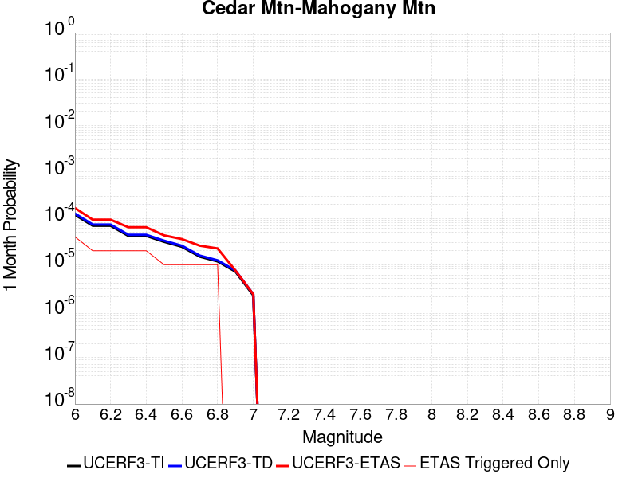 |  |  |

| Magnitude | 1 wk TI Prob | 1 wk TD Prob | 1 wk ETAS Prob | 1 wk ETAS/TD Gain | 1 wk ETAS Triggered Only | 1 mo TI Prob | 1 mo TD Prob | 1 mo ETAS Prob | 1 mo ETAS/TD Gain | 1 mo ETAS Triggered Only | 1 yr TI Prob | 1 yr TD Prob | 1 yr ETAS Prob | 1 yr ETAS/TD Gain | 1 yr ETAS Triggered Only | 10 yr TI Prob | 10 yr TD Prob | 10 yr ETAS Prob | 10 yr ETAS/TD Gain | 10 yr ETAS Triggered Only |
|-----|-----|-----|-----|-----|-----|-----|-----|-----|-----|-----|-----|-----|-----|-----|-----|-----|-----|-----|-----|-----|
| 6.0 | 2.7763876E-5 | 2.9588866E-5 | 5.958798E-5 | 2.013865 | 3.0E-5 | 1.1898261E-4 | 1.2680366E-4 | 1.6679858E-4 | 1.3154083 | 4.0E-5 | 0.0014476506 | 0.0015428112 | 0.0015827495 | 1.0258867 | 4.0E-5 | 0.0143825635 | 0.015328225 | 0.015367612 | 1.0025696 | 4.0E-5 |
| 6.1 | 1.6162443E-5 | 1.7142966E-5 | 3.714262E-5 | 2.1666393 | 2.0E-5 | 6.926578E-5 | 7.346788E-5 | 9.346641E-5 | 1.2722077 | 2.0E-5 | 8.4298453E-4 | 8.941221E-4 | 9.141043E-4 | 1.0223483 | 2.0E-5 | 0.008397939 | 0.008907059 | 0.008926881 | 1.0022254 | 2.0E-5 |
| 6.2 | 1.6162443E-5 | 1.7142966E-5 | 3.714262E-5 | 2.1666393 | 2.0E-5 | 6.926578E-5 | 7.346788E-5 | 9.346641E-5 | 1.2722077 | 2.0E-5 | 8.4298453E-4 | 8.941221E-4 | 9.141043E-4 | 1.0223483 | 2.0E-5 | 0.008397939 | 0.008907059 | 0.008926881 | 1.0022254 | 2.0E-5 |
| 6.3 | 9.746053E-6 | 1.0303152E-5 | 3.0302946E-5 | 2.9411335 | 2.0E-5 | 4.1768133E-5 | 4.415564E-5 | 6.415476E-5 | 1.4529233 | 2.0E-5 | 5.0840835E-4 | 5.3746643E-4 | 5.5745564E-4 | 1.0371916 | 2.0E-5 | 0.0050724675 | 0.005362084 | 0.005381977 | 1.0037099 | 2.0E-5 |
| 6.4 | 9.746053E-6 | 1.0303152E-5 | 3.0302946E-5 | 2.9411335 | 2.0E-5 | 4.1768133E-5 | 4.415564E-5 | 6.415476E-5 | 1.4529233 | 2.0E-5 | 5.0840835E-4 | 5.3746643E-4 | 5.5745564E-4 | 1.0371916 | 2.0E-5 | 0.0050724675 | 0.005362084 | 0.005381977 | 1.0037099 | 2.0E-5 |
| 6.5 | 7.290083E-6 | 7.695325E-6 | 1.7695247E-5 | 2.2994804 | 1.0E-5 | 3.124284E-5 | 3.297956E-5 | 4.2979227E-5 | 1.3032081 | 1.0E-5 | 3.8031515E-4 | 4.014543E-4 | 4.1145028E-4 | 1.0248995 | 1.0E-5 | 0.0037966494 | 0.004007511 | 0.004017471 | 1.0024853 | 1.0E-5 |
| 6.6 | 5.67907E-6 | 5.9891527E-6 | 1.5989093E-5 | 2.6696754 | 1.0E-5 | 2.4338644E-5 | 2.5667552E-5 | 3.5667297E-5 | 1.3895869 | 1.0E-5 | 2.962827E-4 | 3.12459E-4 | 3.2245586E-4 | 1.0319942 | 1.0E-5 | 0.0029588798 | 0.003120333 | 0.0031303016 | 1.0031948 | 1.0E-5 |
| 6.7 | 3.4853963E-6 | 3.672631E-6 | 1.3672594E-5 | 3.7228336 | 1.0E-5 | 1.4937327E-5 | 1.5739755E-5 | 2.5739599E-5 | 1.6353239 | 1.0E-5 | 1.8184677E-4 | 1.916153E-4 | 2.0161338E-4 | 1.0521779 | 1.0E-5 | 0.0018169804 | 0.0019145629 | 0.0019245436 | 1.0052131 | 1.0E-5 |
| 6.8 | 2.7535168E-6 | 2.9015764E-6 | 1.2901547E-5 | 4.4463925 | 1.0E-5 | 1.1800733E-5 | 1.2435271E-5 | 2.2435146E-5 | 1.8041543 | 1.0E-5 | 1.4366445E-4 | 1.5138938E-4 | 1.6138787E-4 | 1.0660448 | 1.0E-5 | 0.0014357162 | 0.0015129098 | 0.0015228946 | 1.0065998 | 1.0E-5 |
| 6.9 | 1.6594106E-6 | 1.7496985E-6 | 1.7496985E-6 | 1.0 | 0.0 | 7.1117406E-6 | 7.4986883E-6 | 7.4986883E-6 | 1.0 | 0.0 | 8.6582E-5 | 9.129302E-5 | 9.129302E-5 | 1.0 | 0.0 | 8.654827E-4 | 9.125856E-4 | 9.125856E-4 | 1.0 | 0.0 |
| 7.0 | 5.10215E-7 | 5.389254E-7 | 5.389254E-7 | 1.0 | 0.0 | 2.186634E-6 | 2.3096788E-6 | 2.3096788E-6 | 1.0 | 0.0 | 2.6621943E-5 | 2.8120105E-5 | 2.8120105E-5 | 1.0 | 0.0 | 2.6618753E-4 | 2.81178E-4 | 2.81178E-4 | 1.0 | 0.0 |

## Cleghorn
*[(top)](#table-of-contents)*

| 1 Week | 1 Month | 1 Year | 10 Year |
|-----|-----|-----|-----|
|  | 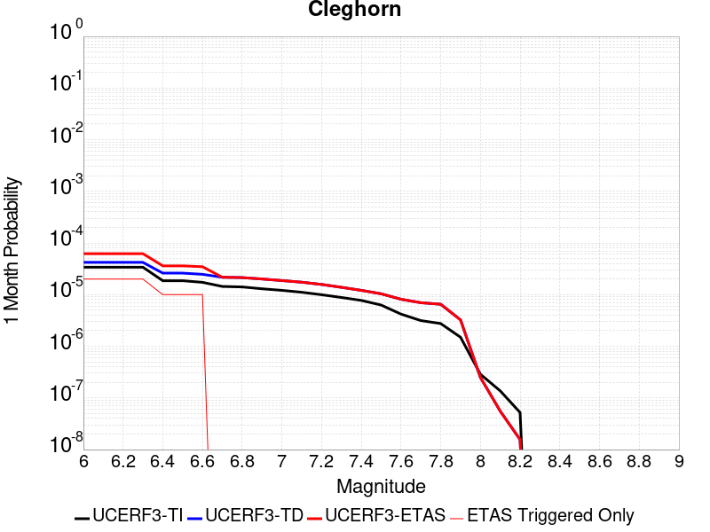 |  |  |

| Magnitude | 1 wk TI Prob | 1 wk TD Prob | 1 wk ETAS Prob | 1 wk ETAS/TD Gain | 1 wk ETAS Triggered Only | 1 mo TI Prob | 1 mo TD Prob | 1 mo ETAS Prob | 1 mo ETAS/TD Gain | 1 mo ETAS Triggered Only | 1 yr TI Prob | 1 yr TD Prob | 1 yr ETAS Prob | 1 yr ETAS/TD Gain | 1 yr ETAS Triggered Only | 10 yr TI Prob | 10 yr TD Prob | 10 yr ETAS Prob | 10 yr ETAS/TD Gain | 10 yr ETAS Triggered Only |
|-----|-----|-----|-----|-----|-----|-----|-----|-----|-----|-----|-----|-----|-----|-----|-----|-----|-----|-----|-----|-----|
| 6.0 | 7.9267165E-6 | 9.831764E-6 | 2.9831568E-5 | 3.0342028 | 2.0E-5 | 3.39712E-5 | 4.2135514E-5 | 6.213467E-5 | 1.4746389 | 2.0E-5 | 4.1352084E-4 | 5.1288976E-4 | 5.328795E-4 | 1.0389748 | 2.0E-5 | 0.004127522 | 0.005132214 | 0.0051620603 | 1.0058154 | 3.0E-5 |
| 6.1 | 7.9267165E-6 | 9.831764E-6 | 2.9831568E-5 | 3.0342028 | 2.0E-5 | 3.39712E-5 | 4.2135514E-5 | 6.213467E-5 | 1.4746389 | 2.0E-5 | 4.1352084E-4 | 5.1288976E-4 | 5.328795E-4 | 1.0389748 | 2.0E-5 | 0.004127522 | 0.005132214 | 0.0051620603 | 1.0058154 | 3.0E-5 |
| 6.2 | 7.9267165E-6 | 9.831764E-6 | 2.9831568E-5 | 3.0342028 | 2.0E-5 | 3.39712E-5 | 4.2135514E-5 | 6.213467E-5 | 1.4746389 | 2.0E-5 | 4.1352084E-4 | 5.1288976E-4 | 5.328795E-4 | 1.0389748 | 2.0E-5 | 0.004127522 | 0.005132214 | 0.0051620603 | 1.0058154 | 3.0E-5 |
| 6.3 | 7.9267165E-6 | 9.831764E-6 | 2.9831568E-5 | 3.0342028 | 2.0E-5 | 3.39712E-5 | 4.2135514E-5 | 6.213467E-5 | 1.4746389 | 2.0E-5 | 4.1352084E-4 | 5.1288976E-4 | 5.328795E-4 | 1.0389748 | 2.0E-5 | 0.004127522 | 0.005132214 | 0.0051620603 | 1.0058154 | 3.0E-5 |
| 6.4 | 4.3445207E-6 | 6.0916254E-6 | 1.6091564E-5 | 2.641588 | 1.0E-5 | 1.8619241E-5 | 2.6106709E-5 | 3.610645E-5 | 1.3830333 | 1.0E-5 | 2.2666567E-4 | 3.1780385E-4 | 3.2780066E-4 | 1.031456 | 1.0E-5 | 0.0022643462 | 0.0031877246 | 0.003207661 | 1.0062541 | 2.0E-5 |
| 6.5 | 4.3445207E-6 | 6.0916254E-6 | 1.6091564E-5 | 2.641588 | 1.0E-5 | 1.8619241E-5 | 2.6106709E-5 | 3.610645E-5 | 1.3830333 | 1.0E-5 | 2.2666567E-4 | 3.1780385E-4 | 3.2780066E-4 | 1.031456 | 1.0E-5 | 0.0022643462 | 0.0031877246 | 0.003207661 | 1.0062541 | 2.0E-5 |
| 6.6 | 4.040109E-6 | 5.774033E-6 | 1.5773976E-5 | 2.7318816 | 1.0E-5 | 1.7314638E-5 | 2.4745626E-5 | 3.474538E-5 | 1.4041018 | 1.0E-5 | 2.1078532E-4 | 3.0123728E-4 | 3.1123427E-4 | 1.0331864 | 1.0E-5 | 0.002105855 | 0.0030225143 | 0.003042454 | 1.006597 | 2.0E-5 |
| 6.7 | 3.3632055E-6 | 5.06753E-6 | 5.06753E-6 | 1.0 | 0.0 | 1.4413658E-5 | 2.1717806E-5 | 2.1717806E-5 | 1.0 | 0.0 | 1.7547216E-4 | 2.643825E-4 | 2.643825E-4 | 1.0 | 0.0 | 0.0017533366 | 0.0026548486 | 0.002664822 | 1.0037566 | 1.0E-5 |
| 6.8 | 3.2902772E-6 | 4.9894375E-6 | 4.9894375E-6 | 1.0 | 0.0 | 1.4101111E-5 | 2.138313E-5 | 2.138313E-5 | 1.0 | 0.0 | 1.716675E-4 | 2.6030882E-4 | 2.6030882E-4 | 1.0 | 0.0 | 0.0017153495 | 0.0026142076 | 0.0026241813 | 1.0038153 | 1.0E-5 |
| 6.9 | 3.031547E-6 | 4.6911987E-6 | 4.6911987E-6 | 1.0 | 0.0 | 1.299228E-5 | 2.0104984E-5 | 2.0104984E-5 | 1.0 | 0.0 | 1.5816953E-4 | 2.4475096E-4 | 2.4475096E-4 | 1.0 | 0.0 | 0.00158057 | 0.0024589805 | 0.002468956 | 1.0040567 | 1.0E-5 |
| 7.0 | 2.8259715E-6 | 4.3707637E-6 | 4.3707637E-6 | 1.0 | 0.0 | 1.211125E-5 | 1.8731711E-5 | 1.8731711E-5 | 1.0 | 0.0 | 1.4744449E-4 | 2.2803496E-4 | 2.2803496E-4 | 1.0 | 0.0 | 0.001473467 | 0.0022921748 | 0.0023021519 | 1.0043527 | 1.0E-5 |
| 7.1 | 2.5962665E-6 | 4.065983E-6 | 4.065983E-6 | 1.0 | 0.0 | 1.1126809E-5 | 1.7425526E-5 | 1.7425526E-5 | 1.0 | 0.0 | 1.3546048E-4 | 2.1213535E-4 | 2.1213535E-4 | 1.0 | 0.0 | 0.0013537793 | 0.0021334959 | 0.0021434745 | 1.0046772 | 1.0E-5 |
| 7.2 | 2.3247253E-6 | 3.6765352E-6 | 3.6765352E-6 | 1.0 | 0.0 | 9.96307E-6 | 1.5756486E-5 | 1.5756486E-5 | 1.0 | 0.0 | 1.21293626E-4 | 1.9181852E-4 | 1.9181852E-4 | 1.0 | 0.0 | 0.0012122744 | 0.0019307166 | 0.0019406972 | 1.0051694 | 1.0E-5 |
| 7.3 | 2.056928E-6 | 3.235253E-6 | 3.235253E-6 | 1.0 | 0.0 | 8.815376E-6 | 1.3865297E-5 | 1.3865297E-5 | 1.0 | 0.0 | 1.0732192E-4 | 1.6879707E-4 | 1.6879707E-4 | 1.0 | 0.0 | 0.001072701 | 0.0017009423 | 0.0017109253 | 1.0058692 | 1.0E-5 |
| 7.4 | 1.8055999E-6 | 2.8256538E-6 | 2.8256538E-6 | 1.0 | 0.0 | 7.738263E-6 | 1.210989E-5 | 1.210989E-5 | 1.0 | 0.0 | 9.4209274E-5 | 1.4742807E-4 | 1.4742807E-4 | 1.0 | 0.0 | 9.4169343E-4 | 0.0014876705 | 0.0014976555 | 1.006712 | 1.0E-5 |
| 7.5 | 1.4683443E-6 | 2.4248943E-6 | 2.4248943E-6 | 1.0 | 0.0 | 6.292889E-6 | 1.0392363E-5 | 1.0392363E-5 | 1.0 | 0.0 | 7.661323E-5 | 1.2651978E-4 | 1.2651978E-4 | 1.0 | 0.0 | 7.658682E-4 | 0.0012788812 | 0.0012888685 | 1.0078093 | 1.0E-5 |
| 7.6 | 9.804088E-7 | 1.9004091E-6 | 1.9004091E-6 | 1.0 | 0.0 | 4.201745E-6 | 8.144585E-6 | 8.144585E-6 | 1.0 | 0.0 | 5.1155046E-5 | 9.915586E-5 | 9.915586E-5 | 1.0 | 0.0 | 5.114327E-4 | 0.0010055583 | 0.0010055583 | 1.0 | 0.0 |
| 7.7 | 7.3434086E-7 | 1.6285549E-6 | 1.6285549E-6 | 1.0 | 0.0 | 3.1471714E-6 | 6.9795024E-6 | 6.9795024E-6 | 1.0 | 0.0 | 3.831614E-5 | 8.4972155E-5 | 8.4972155E-5 | 1.0 | 0.0 | 3.8309532E-4 | 8.6387293E-4 | 8.6387293E-4 | 1.0 | 0.0 |
| 7.8 | 6.434184E-7 | 1.5221389E-6 | 1.5221389E-6 | 1.0 | 0.0 | 2.7575045E-6 | 6.523436E-6 | 6.523436E-6 | 1.0 | 0.0 | 3.35721E-5 | 7.9419966E-5 | 7.9419966E-5 | 1.0 | 0.0 | 3.3567028E-4 | 8.080443E-4 | 8.080443E-4 | 1.0 | 0.0 |
| 7.9 | 3.4943926E-7 | 7.5750586E-7 | 7.5750586E-7 | 1.0 | 0.0 | 1.497596E-6 | 3.2464498E-6 | 3.2464498E-6 | 1.0 | 0.0 | 1.8233079E-5 | 3.9524817E-5 | 3.9524817E-5 | 1.0 | 0.0 | 1.8231584E-4 | 4.0401975E-4 | 4.0401975E-4 | 1.0 | 0.0 |
| 8.0 | 6.717524E-8 | 5.837515E-8 | 5.837515E-8 | 1.0 | 0.0 | 2.8789387E-7 | 2.501792E-7 | 2.501792E-7 | 1.0 | 0.0 | 3.505102E-6 | 3.0459275E-6 | 3.0459275E-6 | 1.0 | 0.0 | 3.5050467E-5 | 3.2751934E-5 | 3.2751934E-5 | 1.0 | 0.0 |
| 8.1 | 3.1984914E-8 | 1.2949885E-8 | 1.2949885E-8 | 1.0 | 0.0 | 1.370782E-7 | 5.549951E-8 | 5.549951E-8 | 1.0 | 0.0 | 1.6689258E-6 | 6.757063E-7 | 6.757063E-7 | 1.0 | 0.0 | 1.6689133E-5 | 7.741151E-6 | 7.741151E-6 | 1.0 | 0.0 |
| 8.2 | 1.21887656E-8 | 3.6471115E-9 | 3.6471115E-9 | 1.0 | 0.0 | 5.2237567E-8 | 1.563048E-8 | 1.563048E-8 | 1.0 | 0.0 | 6.359922E-7 | 1.9030107E-7 | 1.9030107E-7 | 1.0 | 0.0 | 6.3599036E-6 | 2.245849E-6 | 2.245849E-6 | 1.0 | 0.0 |

## Sierra Madre
*[(top)](#table-of-contents)*

| 1 Week | 1 Month | 1 Year | 10 Year |
|-----|-----|-----|-----|
|  |  |  |  |

| Magnitude | 1 wk TI Prob | 1 wk TD Prob | 1 wk ETAS Prob | 1 wk ETAS/TD Gain | 1 wk ETAS Triggered Only | 1 mo TI Prob | 1 mo TD Prob | 1 mo ETAS Prob | 1 mo ETAS/TD Gain | 1 mo ETAS Triggered Only | 1 yr TI Prob | 1 yr TD Prob | 1 yr ETAS Prob | 1 yr ETAS/TD Gain | 1 yr ETAS Triggered Only | 10 yr TI Prob | 10 yr TD Prob | 10 yr ETAS Prob | 10 yr ETAS/TD Gain | 10 yr ETAS Triggered Only |
|-----|-----|-----|-----|-----|-----|-----|-----|-----|-----|-----|-----|-----|-----|-----|-----|-----|-----|-----|-----|-----|
| 6.0 | 1.3379373E-5 | 1.1000776E-5 | 2.1000666E-5 | 1.9090167 | 1.0E-5 | 5.7338908E-5 | 4.714534E-5 | 6.71444E-5 | 1.4242 | 2.0E-5 | 6.978776E-4 | 5.738448E-4 | 6.038276E-4 | 1.052249 | 3.0E-5 | 0.0069569005 | 0.0057238447 | 0.005753673 | 1.0052112 | 3.0E-5 |
| 6.1 | 1.3379373E-5 | 1.1000776E-5 | 2.1000666E-5 | 1.9090167 | 1.0E-5 | 5.7338908E-5 | 4.714534E-5 | 6.71444E-5 | 1.4242 | 2.0E-5 | 6.978776E-4 | 5.738448E-4 | 6.038276E-4 | 1.052249 | 3.0E-5 | 0.0069569005 | 0.0057238447 | 0.005753673 | 1.0052112 | 3.0E-5 |
| 6.2 | 1.3379373E-5 | 1.1000776E-5 | 2.1000666E-5 | 1.9090167 | 1.0E-5 | 5.7338908E-5 | 4.714534E-5 | 6.71444E-5 | 1.4242 | 2.0E-5 | 6.978776E-4 | 5.738448E-4 | 6.038276E-4 | 1.052249 | 3.0E-5 | 0.0069569005 | 0.0057238447 | 0.005753673 | 1.0052112 | 3.0E-5 |
| 6.3 | 1.3379373E-5 | 1.1000776E-5 | 2.1000666E-5 | 1.9090167 | 1.0E-5 | 5.7338908E-5 | 4.714534E-5 | 6.71444E-5 | 1.4242 | 2.0E-5 | 6.978776E-4 | 5.738448E-4 | 6.038276E-4 | 1.052249 | 3.0E-5 | 0.0069569005 | 0.0057238447 | 0.005753673 | 1.0052112 | 3.0E-5 |
| 6.4 | 1.3379373E-5 | 1.1000776E-5 | 2.1000666E-5 | 1.9090167 | 1.0E-5 | 5.7338908E-5 | 4.714534E-5 | 6.71444E-5 | 1.4242 | 2.0E-5 | 6.978776E-4 | 5.738448E-4 | 6.038276E-4 | 1.052249 | 3.0E-5 | 0.0069569005 | 0.0057238447 | 0.005753673 | 1.0052112 | 3.0E-5 |
| 6.5 | 1.26563245E-5 | 1.0230232E-5 | 1.0230232E-5 | 1.0 | 0.0 | 5.4240263E-5 | 4.384312E-5 | 5.3842683E-5 | 1.228076 | 1.0E-5 | 6.601751E-4 | 5.3366035E-4 | 5.43655E-4 | 1.0187285 | 1.0E-5 | 0.006582173 | 0.0053239604 | 0.005333907 | 1.0018682 | 1.0E-5 |
| 6.6 | 1.26563245E-5 | 1.0230232E-5 | 1.0230232E-5 | 1.0 | 0.0 | 5.4240263E-5 | 4.384312E-5 | 5.3842683E-5 | 1.228076 | 1.0E-5 | 6.601751E-4 | 5.3366035E-4 | 5.43655E-4 | 1.0187285 | 1.0E-5 | 0.006582173 | 0.0053239604 | 0.005333907 | 1.0018682 | 1.0E-5 |
| 6.7 | 1.2502474E-5 | 1.00663765E-5 | 1.00663765E-5 | 1.0 | 0.0 | 5.3580934E-5 | 4.3140906E-5 | 5.3140473E-5 | 1.2317885 | 1.0E-5 | 6.521526E-4 | 5.25115E-4 | 5.351097E-4 | 1.0190334 | 1.0E-5 | 0.0065024206 | 0.0052389116 | 0.005248859 | 1.0018988 | 1.0E-5 |
| 6.8 | 1.2454966E-5 | 1.0018662E-5 | 1.0018662E-5 | 1.0 | 0.0 | 5.3377335E-5 | 4.293642E-5 | 5.293599E-5 | 1.2328925 | 1.0E-5 | 6.4967526E-4 | 5.226266E-4 | 5.3262134E-4 | 1.0191242 | 1.0E-5 | 0.006477792 | 0.0052141445 | 0.0052240924 | 1.0019078 | 1.0E-5 |
| 6.9 | 1.2225574E-5 | 9.792639E-6 | 9.792639E-6 | 1.0 | 0.0 | 5.2394265E-5 | 4.196778E-5 | 5.1967363E-5 | 1.238268 | 1.0E-5 | 6.3771347E-4 | 5.10839E-4 | 5.208339E-4 | 1.0195656 | 1.0E-5 | 0.006358865 | 0.0050968137 | 0.005106763 | 1.001952 | 1.0E-5 |
| 7.0 | 1.182946E-5 | 9.399179E-6 | 9.399179E-6 | 1.0 | 0.0 | 5.06967E-5 | 4.0281582E-5 | 5.0281178E-5 | 1.2482424 | 1.0E-5 | 6.1705755E-4 | 4.903189E-4 | 5.00314E-4 | 1.0203849 | 1.0E-5 | 0.006153469 | 0.004892533 | 0.0049024844 | 1.002034 | 1.0E-5 |
| 7.1 | 1.14369095E-5 | 8.986194E-6 | 8.986194E-6 | 1.0 | 0.0 | 4.9014405E-5 | 3.85117E-5 | 4.8511312E-5 | 1.2596513 | 1.0E-5 | 5.9658696E-4 | 4.6878002E-4 | 4.7877536E-4 | 1.021322 | 1.0E-5 | 0.005949879 | 0.0046780678 | 0.004688021 | 1.0021276 | 1.0E-5 |
| 7.2 | 1.0836419E-5 | 8.39959E-6 | 8.39959E-6 | 1.0 | 0.0 | 4.644097E-5 | 3.599775E-5 | 4.599739E-5 | 1.2777852 | 1.0E-5 | 5.652721E-4 | 4.3818538E-4 | 4.48181E-4 | 1.0228114 | 1.0E-5 | 0.0056383642 | 0.0043733614 | 0.0043833177 | 1.0022765 | 1.0E-5 |
| 7.3 | 1.0403439E-5 | 8.020854E-6 | 8.020854E-6 | 1.0 | 0.0 | 4.4585406E-5 | 3.437464E-5 | 4.4374297E-5 | 1.2909021 | 1.0E-5 | 5.426921E-4 | 4.184318E-4 | 4.284276E-4 | 1.0238887 | 1.0E-5 | 0.005413687 | 0.004176585 | 0.004186543 | 1.0023843 | 1.0E-5 |
| 7.4 | 9.768864E-6 | 7.4144855E-6 | 7.4144855E-6 | 1.0 | 0.0 | 4.186589E-5 | 3.1775984E-5 | 3.1775984E-5 | 1.0 | 0.0 | 5.09598E-4 | 3.868048E-4 | 3.868048E-4 | 1.0 | 0.0 | 0.0050843097 | 0.0038614576 | 0.0038614576 | 1.0 | 0.0 |
| 7.5 | 8.687089E-6 | 6.450183E-6 | 6.450183E-6 | 1.0 | 0.0 | 3.722985E-5 | 2.7643353E-5 | 2.7643353E-5 | 1.0 | 0.0 | 4.5317915E-4 | 3.3650672E-4 | 3.3650672E-4 | 1.0 | 0.0 | 0.004522561 | 0.003360109 | 0.003360109 | 1.0 | 0.0 |
| 7.6 | 6.3506063E-6 | 4.430329E-6 | 4.430329E-6 | 1.0 | 0.0 | 2.72166E-5 | 1.8986988E-5 | 1.8986988E-5 | 1.0 | 0.0 | 3.3131172E-4 | 2.3114232E-4 | 2.3114232E-4 | 1.0 | 0.0 | 0.003308182 | 0.0023090935 | 0.0023090935 | 1.0 | 0.0 |
| 7.7 | 4.62223E-6 | 2.9329542E-6 | 2.9329542E-6 | 1.0 | 0.0 | 1.9809406E-5 | 1.2569743E-5 | 1.2569743E-5 | 1.0 | 0.0 | 2.4115283E-4 | 1.5302589E-4 | 1.5302589E-4 | 1.0 | 0.0 | 0.0024089129 | 0.0015292577 | 0.0015292577 | 1.0 | 0.0 |
| 7.8 | 3.2145008E-6 | 1.949411E-6 | 1.949411E-6 | 1.0 | 0.0 | 1.3776359E-5 | 8.354592E-6 | 8.354592E-6 | 1.0 | 0.0 | 1.6771426E-4 | 1.01712416E-4 | 1.01712416E-4 | 1.0 | 0.0 | 0.0016758774 | 0.0010166786 | 0.0010166786 | 1.0 | 0.0 |
| 7.9 | 1.0391769E-6 | 5.602482E-7 | 5.602482E-7 | 1.0 | 0.0 | 4.4536077E-6 | 2.4010617E-6 | 2.4010617E-6 | 1.0 | 0.0 | 5.4221324E-5 | 2.9232539E-5 | 2.9232539E-5 | 1.0 | 0.0 | 5.4208096E-4 | 2.9228735E-4 | 2.9228735E-4 | 1.0 | 0.0 |
| 8.0 | 1.210983E-7 | 6.613497E-8 | 6.613497E-8 | 1.0 | 0.0 | 5.1899264E-7 | 2.8343558E-7 | 2.8343558E-7 | 1.0 | 0.0 | 6.3187167E-6 | 3.4508228E-6 | 3.4508228E-6 | 1.0 | 0.0 | 6.318537E-5 | 3.450771E-5 | 3.450771E-5 | 1.0 | 0.0 |

## Rinconada 2011 CFM
*[(top)](#table-of-contents)*

| 1 Week | 1 Month | 1 Year | 10 Year |
|-----|-----|-----|-----|
|  | 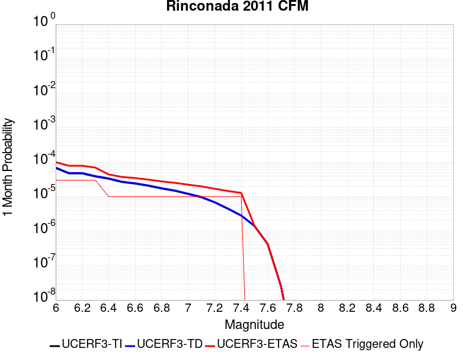 |  |  |

| Magnitude | 1 wk TI Prob | 1 wk TD Prob | 1 wk ETAS Prob | 1 wk ETAS/TD Gain | 1 wk ETAS Triggered Only | 1 mo TI Prob | 1 mo TD Prob | 1 mo ETAS Prob | 1 mo ETAS/TD Gain | 1 mo ETAS Triggered Only | 1 yr TI Prob | 1 yr TD Prob | 1 yr ETAS Prob | 1 yr ETAS/TD Gain | 1 yr ETAS Triggered Only | 10 yr TI Prob | 10 yr TD Prob | 10 yr ETAS Prob | 10 yr ETAS/TD Gain | 10 yr ETAS Triggered Only |
|-----|-----|-----|-----|-----|-----|-----|-----|-----|-----|-----|-----|-----|-----|-----|-----|-----|-----|-----|-----|-----|
| 6.0 | 1.5752368E-5 | 1.6274716E-5 | 3.627439E-5 | 2.2288802 | 2.0E-5 | 6.75084E-5 | 6.974694E-5 | 9.9744844E-5 | 1.4300964 | 3.0E-5 | 8.2160486E-4 | 8.488413E-4 | 8.788158E-4 | 1.0353123 | 3.0E-5 | 0.008185739 | 0.00845637 | 0.008486116 | 1.0035176 | 3.0E-5 |
| 6.1 | 1.0966133E-5 | 1.1323029E-5 | 3.13228E-5 | 2.7662919 | 2.0E-5 | 4.6996865E-5 | 4.852637E-5 | 7.8524914E-5 | 1.6181905 | 3.0E-5 | 5.720366E-4 | 5.9064914E-4 | 6.206314E-4 | 1.0507616 | 3.0E-5 | 0.0057056635 | 0.005890889 | 0.0059207124 | 1.0050626 | 3.0E-5 |
| 6.2 | 1.0966133E-5 | 1.1323029E-5 | 3.13228E-5 | 2.7662919 | 2.0E-5 | 4.6996865E-5 | 4.852637E-5 | 7.8524914E-5 | 1.6181905 | 3.0E-5 | 5.720366E-4 | 5.9064914E-4 | 6.206314E-4 | 1.0507616 | 3.0E-5 | 0.0057056635 | 0.005890889 | 0.0059207124 | 1.0050626 | 3.0E-5 |
| 6.3 | 8.926149E-6 | 9.212772E-6 | 2.9212588E-5 | 3.1708794 | 2.0E-5 | 3.8254362E-5 | 3.948271E-5 | 6.9481524E-5 | 1.7597963 | 3.0E-5 | 4.6564735E-4 | 4.8059633E-4 | 5.105819E-4 | 1.0623925 | 3.0E-5 | 0.0046467283 | 0.0047956146 | 0.0048254705 | 1.0062257 | 3.0E-5 |
| 6.4 | 7.676955E-6 | 7.920191E-6 | 1.7920112E-5 | 2.2625859 | 1.0E-5 | 3.290082E-5 | 3.3943234E-5 | 4.3942895E-5 | 1.2945995 | 1.0E-5 | 4.0049385E-4 | 4.131807E-4 | 4.2317656E-4 | 1.0241925 | 1.0E-5 | 0.0039977287 | 0.004124151 | 0.00413411 | 1.0024147 | 1.0E-5 |
| 6.5 | 6.1671026E-6 | 6.358955E-6 | 1.6358892E-5 | 2.5725753 | 1.0E-5 | 2.6430173E-5 | 2.725238E-5 | 3.7252106E-5 | 1.3669305 | 1.0E-5 | 3.2173982E-4 | 3.317473E-4 | 3.4174396E-4 | 1.0301335 | 1.0E-5 | 0.003212744 | 0.0033125326 | 0.0033224996 | 1.0030088 | 1.0E-5 |
| 6.6 | 5.553456E-6 | 5.7248126E-6 | 1.5724756E-5 | 2.746772 | 1.0E-5 | 2.3800309E-5 | 2.4534682E-5 | 3.4534438E-5 | 1.4075763 | 1.0E-5 | 2.897302E-4 | 2.9866886E-4 | 3.0866588E-4 | 1.033472 | 1.0E-5 | 0.0028935277 | 0.0029826832 | 0.0029926535 | 1.0033426 | 1.0E-5 |
| 6.7 | 4.787857E-6 | 4.93331E-6 | 1.493326E-5 | 3.0270267 | 1.0E-5 | 2.0519226E-5 | 2.1142585E-5 | 3.1142372E-5 | 1.472969 | 1.0E-5 | 2.4979294E-4 | 2.573806E-4 | 2.6737803E-4 | 1.0388429 | 1.0E-5 | 0.0024951235 | 0.002570831 | 0.0025808052 | 1.0038798 | 1.0E-5 |
| 6.8 | 3.9955166E-6 | 4.1134763E-6 | 1.4113435E-5 | 3.4310238 | 1.0E-5 | 1.7123532E-5 | 1.7629065E-5 | 2.7628888E-5 | 1.567235 | 1.0E-5 | 2.0845905E-4 | 2.1461275E-4 | 2.2461062E-4 | 1.0465856 | 1.0E-5 | 0.002082636 | 0.0021440587 | 0.0021540371 | 1.004654 | 1.0E-5 |
| 6.9 | 3.4250072E-6 | 3.5224466E-6 | 1.3522412E-5 | 3.8389258 | 1.0E-5 | 1.46785205E-5 | 1.5096112E-5 | 2.5095962E-5 | 1.6624122 | 1.0E-5 | 1.7869633E-4 | 1.8377969E-4 | 1.9377784E-4 | 1.054403 | 1.0E-5 | 0.001785527 | 0.0018362795 | 0.0018462611 | 1.0054358 | 1.0E-5 |
| 7.0 | 2.7712713E-6 | 2.8467002E-6 | 1.2846672E-5 | 4.5128293 | 1.0E-5 | 1.1876823E-5 | 1.22000865E-5 | 2.2199965E-5 | 1.8196563 | 1.0E-5 | 1.4459073E-4 | 1.4852594E-4 | 1.5852446E-4 | 1.0673183 | 1.0E-5 | 0.0014449668 | 0.0014842683 | 0.0014942535 | 1.0067273 | 1.0E-5 |
| 7.1 | 2.227358E-6 | 2.2856987E-6 | 1.2285675E-5 | 5.37502 | 1.0E-5 | 9.545785E-6 | 9.795815E-6 | 1.9795716E-5 | 2.0208342 | 1.0E-5 | 1.16213734E-4 | 1.1925753E-4 | 1.2925634E-4 | 1.0838422 | 1.0E-5 | 0.0011615298 | 0.0011919363 | 0.0012019244 | 1.0083797 | 1.0E-5 |
| 7.2 | 1.581796E-6 | 1.6209015E-6 | 1.1620885E-5 | 7.169397 | 1.0E-5 | 6.779108E-6 | 6.946702E-6 | 1.6946633E-5 | 2.439522 | 1.0E-5 | 8.253252E-5 | 8.4572814E-5 | 9.457197E-5 | 1.1182313 | 1.0E-5 | 8.250187E-4 | 8.4540684E-4 | 8.553984E-4 | 1.0118186 | 1.0E-5 |
| 7.3 | 1.0306567E-6 | 1.054648E-6 | 1.1054637E-5 | 10.481827 | 1.0E-5 | 4.4170924E-6 | 4.519912E-6 | 1.4519866E-5 | 3.2124224 | 1.0E-5 | 5.3776774E-5 | 5.502854E-5 | 6.502799E-5 | 1.1817139 | 1.0E-5 | 5.376376E-4 | 5.501494E-4 | 5.601439E-4 | 1.0181669 | 1.0E-5 |
| 7.4 | 6.535541E-7 | 6.682744E-7 | 1.0668267E-5 | 15.9639015 | 1.0E-5 | 2.800943E-6 | 2.8640302E-6 | 1.2864001E-5 | 4.4915733 | 1.0E-5 | 3.4100947E-5 | 3.4869012E-5 | 4.4868662E-5 | 1.2867776 | 1.0E-5 | 3.4095717E-4 | 3.486355E-4 | 3.5863204E-4 | 1.0286733 | 1.0E-5 |
| 7.5 | 3.2656962E-7 | 3.3316712E-7 | 3.3316712E-7 | 1.0 | 0.0 | 1.3995833E-6 | 1.4278584E-6 | 1.4278584E-6 | 1.0 | 0.0 | 1.7039794E-5 | 1.7384036E-5 | 1.7384036E-5 | 1.0 | 0.0 | 1.7038487E-4 | 1.738268E-4 | 1.738268E-4 | 1.0 | 0.0 |
| 7.6 | 9.754343E-8 | 9.821017E-8 | 9.821017E-8 | 1.0 | 0.0 | 4.180432E-7 | 4.2090065E-7 | 4.2090065E-7 | 1.0 | 0.0 | 5.089664E-6 | 5.1244533E-6 | 5.1244533E-6 | 1.0 | 0.0 | 5.0895473E-5 | 5.124336E-5 | 5.124336E-5 | 1.0 | 0.0 |
| 7.7 | 6.0001453E-9 | 5.8491207E-9 | 5.8491207E-9 | 1.0 | 0.0 | 2.5714908E-8 | 2.506766E-8 | 2.506766E-8 | 1.0 | 0.0 | 3.1307894E-7 | 3.051987E-7 | 3.051987E-7 | 1.0 | 0.0 | 3.1307852E-6 | 3.0519832E-6 | 3.0519832E-6 | 1.0 | 0.0 |
| 7.8 | 7.400003E-11 | 7.4654505E-11 | 7.4654505E-11 | 1.0 | 0.0 | 3.171432E-10 | 3.1994773E-10 | 3.1994773E-10 | 1.0 | 0.0 | 3.861218E-9 | 3.895363E-9 | 3.895363E-9 | 1.0 | 0.0 | 3.861218E-8 | 3.895363E-8 | 3.895363E-8 | 1.0 | 0.0 |

## San Gabriel
*[(top)](#table-of-contents)*

| 1 Week | 1 Month | 1 Year | 10 Year |
|-----|-----|-----|-----|
|  |  |  |  |

| Magnitude | 1 wk TI Prob | 1 wk TD Prob | 1 wk ETAS Prob | 1 wk ETAS/TD Gain | 1 wk ETAS Triggered Only | 1 mo TI Prob | 1 mo TD Prob | 1 mo ETAS Prob | 1 mo ETAS/TD Gain | 1 mo ETAS Triggered Only | 1 yr TI Prob | 1 yr TD Prob | 1 yr ETAS Prob | 1 yr ETAS/TD Gain | 1 yr ETAS Triggered Only | 10 yr TI Prob | 10 yr TD Prob | 10 yr ETAS Prob | 10 yr ETAS/TD Gain | 10 yr ETAS Triggered Only |
|-----|-----|-----|-----|-----|-----|-----|-----|-----|-----|-----|-----|-----|-----|-----|-----|-----|-----|-----|-----|-----|
| 6.0 | 1.083775E-5 | 1.198525E-5 | 3.198501E-5 | 2.6686978 | 2.0E-5 | 4.6446676E-5 | 5.1364408E-5 | 8.1362865E-5 | 1.584032 | 3.0E-5 | 5.653415E-4 | 6.251936E-4 | 6.5517484E-4 | 1.0479552 | 3.0E-5 | 0.0056390543 | 0.0062463325 | 0.006276145 | 1.0047728 | 3.0E-5 |
| 6.1 | 1.083775E-5 | 1.198525E-5 | 3.198501E-5 | 2.6686978 | 2.0E-5 | 4.6446676E-5 | 5.1364408E-5 | 8.1362865E-5 | 1.584032 | 3.0E-5 | 5.653415E-4 | 6.251936E-4 | 6.5517484E-4 | 1.0479552 | 3.0E-5 | 0.0056390543 | 0.0062463325 | 0.006276145 | 1.0047728 | 3.0E-5 |
| 6.2 | 1.083775E-5 | 1.198525E-5 | 3.198501E-5 | 2.6686978 | 2.0E-5 | 4.6446676E-5 | 5.1364408E-5 | 8.1362865E-5 | 1.584032 | 3.0E-5 | 5.653415E-4 | 6.251936E-4 | 6.5517484E-4 | 1.0479552 | 3.0E-5 | 0.0056390543 | 0.0062463325 | 0.006276145 | 1.0047728 | 3.0E-5 |
| 6.3 | 1.083775E-5 | 1.198525E-5 | 3.198501E-5 | 2.6686978 | 2.0E-5 | 4.6446676E-5 | 5.1364408E-5 | 8.1362865E-5 | 1.584032 | 3.0E-5 | 5.653415E-4 | 6.251936E-4 | 6.5517484E-4 | 1.0479552 | 3.0E-5 | 0.0056390543 | 0.0062463325 | 0.006276145 | 1.0047728 | 3.0E-5 |
| 6.4 | 1.083775E-5 | 1.198525E-5 | 3.198501E-5 | 2.6686978 | 2.0E-5 | 4.6446676E-5 | 5.1364408E-5 | 8.1362865E-5 | 1.584032 | 3.0E-5 | 5.653415E-4 | 6.251936E-4 | 6.5517484E-4 | 1.0479552 | 3.0E-5 | 0.0056390543 | 0.0062463325 | 0.006276145 | 1.0047728 | 3.0E-5 |
| 6.5 | 6.7317824E-6 | 7.717007E-6 | 1.771693E-5 | 2.295829 | 1.0E-5 | 2.8850178E-5 | 3.3072472E-5 | 5.3071813E-5 | 1.6047125 | 2.0E-5 | 3.511943E-4 | 4.0258403E-4 | 4.2257598E-4 | 1.049659 | 2.0E-5 | 0.003506398 | 0.004029533 | 0.0040494525 | 1.0049434 | 2.0E-5 |
| 6.6 | 6.7317824E-6 | 7.717007E-6 | 1.771693E-5 | 2.295829 | 1.0E-5 | 2.8850178E-5 | 3.3072472E-5 | 5.3071813E-5 | 1.6047125 | 2.0E-5 | 3.511943E-4 | 4.0258403E-4 | 4.2257598E-4 | 1.049659 | 2.0E-5 | 0.003506398 | 0.004029533 | 0.0040494525 | 1.0049434 | 2.0E-5 |
| 6.7 | 6.274881E-6 | 7.2459275E-6 | 1.7245855E-5 | 2.3800757 | 1.0E-5 | 2.6892068E-5 | 3.105361E-5 | 5.105299E-5 | 1.6440275 | 2.0E-5 | 3.2736175E-4 | 3.7801306E-4 | 3.980055E-4 | 1.0528883 | 2.0E-5 | 0.0032687993 | 0.0037846796 | 0.0038046038 | 1.0052645 | 2.0E-5 |
| 6.8 | 5.996209E-6 | 6.958647E-6 | 6.958647E-6 | 1.0 | 0.0 | 2.5697784E-5 | 2.9822439E-5 | 3.9822142E-5 | 1.335308 | 1.0E-5 | 3.128256E-4 | 3.6302864E-4 | 3.7302502E-4 | 1.027536 | 1.0E-5 | 0.003123856 | 0.0036353325 | 0.0036452962 | 1.0027407 | 1.0E-5 |
| 6.9 | 5.686331E-6 | 6.6236917E-6 | 6.6236917E-6 | 1.0 | 0.0 | 2.4369761E-5 | 2.8386947E-5 | 3.8386665E-5 | 1.3522646 | 1.0E-5 | 2.9666146E-4 | 3.4555717E-4 | 3.5555373E-4 | 1.0289288 | 1.0E-5 | 0.0029626573 | 0.0034611735 | 0.003471139 | 1.0028791 | 1.0E-5 |
| 7.0 | 5.2329838E-6 | 6.1475757E-6 | 6.1475757E-6 | 1.0 | 0.0 | 2.242688E-5 | 2.6346492E-5 | 3.6346228E-5 | 1.3795471 | 1.0E-5 | 2.7301308E-4 | 3.207221E-4 | 3.3071887E-4 | 1.0311697 | 1.0E-5 | 0.002726779 | 0.0032135549 | 0.0032235228 | 1.0031018 | 1.0E-5 |
| 7.1 | 5.135671E-6 | 6.0377E-6 | 6.0377E-6 | 1.0 | 0.0 | 2.2009834E-5 | 2.5875606E-5 | 3.5875346E-5 | 1.3864543 | 1.0E-5 | 2.6793676E-4 | 3.1499073E-4 | 3.2498757E-4 | 1.031737 | 1.0E-5 | 0.0026761394 | 0.0031564054 | 0.0031663738 | 1.0031582 | 1.0E-5 |
| 7.2 | 4.989062E-6 | 5.8710784E-6 | 5.8710784E-6 | 1.0 | 0.0 | 2.1381518E-5 | 2.5161527E-5 | 2.5161527E-5 | 1.0 | 0.0 | 2.6028889E-4 | 3.0629928E-4 | 3.0629928E-4 | 1.0 | 0.0 | 0.0025998424 | 0.003069734 | 0.003069734 | 1.0 | 0.0 |
| 7.3 | 4.8219395E-6 | 5.7026323E-6 | 5.7026323E-6 | 1.0 | 0.0 | 2.0665291E-5 | 2.4439627E-5 | 2.4439627E-5 | 1.0 | 0.0 | 2.5157086E-4 | 2.975126E-4 | 2.975126E-4 | 1.0 | 0.0 | 0.0025128627 | 0.002982106 | 0.002982106 | 1.0 | 0.0 |
| 7.4 | 4.7118383E-6 | 5.5911896E-6 | 5.5911896E-6 | 1.0 | 0.0 | 2.0193436E-5 | 2.3962024E-5 | 2.3962024E-5 | 1.0 | 0.0 | 2.4582737E-4 | 2.9169934E-4 | 2.9169934E-4 | 1.0 | 0.0 | 0.002455556 | 0.0029241266 | 0.0029241266 | 1.0 | 0.0 |
| 7.5 | 4.5506545E-6 | 5.4365555E-6 | 5.4365555E-6 | 1.0 | 0.0 | 1.9502659E-5 | 2.329932E-5 | 2.329932E-5 | 1.0 | 0.0 | 2.37419E-4 | 2.8363304E-4 | 2.8363304E-4 | 1.0 | 0.0 | 0.002371655 | 0.0028436715 | 0.0028436715 | 1.0 | 0.0 |
| 7.6 | 4.343636E-6 | 5.2294336E-6 | 5.2294336E-6 | 1.0 | 0.0 | 1.861545E-5 | 2.241167E-5 | 2.241167E-5 | 1.0 | 0.0 | 2.2661954E-4 | 2.7282868E-4 | 2.7282868E-4 | 1.0 | 0.0 | 0.0022638857 | 0.0027358893 | 0.0027358893 | 1.0 | 0.0 |
| 7.7 | 2.936235E-6 | 2.743946E-6 | 2.743946E-6 | 1.0 | 0.0 | 1.2583803E-5 | 1.1759716E-5 | 1.1759716E-5 | 1.0 | 0.0 | 1.5319703E-4 | 1.4316518E-4 | 1.4316518E-4 | 1.0 | 0.0 | 0.0015309147 | 0.0014379849 | 0.0014379849 | 1.0 | 0.0 |
| 7.8 | 1.4541639E-6 | 9.122518E-7 | 9.122518E-7 | 1.0 | 0.0 | 6.232116E-6 | 3.9096444E-6 | 3.9096444E-6 | 1.0 | 0.0 | 7.587337E-5 | 4.7598885E-5 | 4.7598885E-5 | 1.0 | 0.0 | 7.584747E-4 | 4.8078224E-4 | 4.8078224E-4 | 1.0 | 0.0 |
| 7.9 | 8.098958E-7 | 2.4165956E-7 | 2.4165956E-7 | 1.0 | 0.0 | 3.4709774E-6 | 1.0356835E-6 | 1.0356835E-6 | 1.0 | 0.0 | 4.225833E-5 | 1.2609373E-5 | 1.2609373E-5 | 1.0 | 0.0 | 4.2250296E-4 | 1.2917137E-4 | 1.2917137E-4 | 1.0 | 0.0 |
| 8.0 | 5.2473234E-7 | 7.672734E-8 | 7.672734E-8 | 1.0 | 0.0 | 2.248851E-6 | 3.2883142E-7 | 3.2883142E-7 | 1.0 | 0.0 | 2.7379416E-5 | 4.003515E-6 | 4.003515E-6 | 1.0 | 0.0 | 2.7376044E-4 | 4.215796E-5 | 4.215796E-5 | 1.0 | 0.0 |
| 8.1 | 3.3162388E-7 | 4.1457096E-8 | 4.1457096E-8 | 1.0 | 0.0 | 1.4212444E-6 | 1.7767324E-7 | 1.7767324E-7 | 1.0 | 0.0 | 1.7303513E-5 | 2.1631695E-6 | 2.1631695E-6 | 1.0 | 0.0 | 1.7302166E-4 | 2.294416E-5 | 2.294416E-5 | 1.0 | 0.0 |
| 8.2 | 1.0235345E-7 | 1.4032201E-8 | 1.4032201E-8 | 1.0 | 0.0 | 4.3865757E-7 | 6.013801E-8 | 6.013801E-8 | 1.0 | 0.0 | 5.340643E-6 | 7.3217996E-7 | 7.3217996E-7 | 1.0 | 0.0 | 5.3405143E-5 | 7.921925E-6 | 7.921925E-6 | 1.0 | 0.0 |

## Simi-Santa Rosa
*[(top)](#table-of-contents)*

| 1 Week | 1 Month | 1 Year | 10 Year |
|-----|-----|-----|-----|
|  |  |  |  |

| Magnitude | 1 wk TI Prob | 1 wk TD Prob | 1 wk ETAS Prob | 1 wk ETAS/TD Gain | 1 wk ETAS Triggered Only | 1 mo TI Prob | 1 mo TD Prob | 1 mo ETAS Prob | 1 mo ETAS/TD Gain | 1 mo ETAS Triggered Only | 1 yr TI Prob | 1 yr TD Prob | 1 yr ETAS Prob | 1 yr ETAS/TD Gain | 1 yr ETAS Triggered Only | 10 yr TI Prob | 10 yr TD Prob | 10 yr ETAS Prob | 10 yr ETAS/TD Gain | 10 yr ETAS Triggered Only |
|-----|-----|-----|-----|-----|-----|-----|-----|-----|-----|-----|-----|-----|-----|-----|-----|-----|-----|-----|-----|-----|
| 6.0 | 2.198912E-5 | 2.2275388E-5 | 5.227472E-5 | 2.3467479 | 3.0E-5 | 9.4235686E-5 | 9.54627E-5 | 1.2545985E-4 | 1.3142289 | 3.0E-5 | 0.0011467156 | 0.0011616825 | 0.0011916477 | 1.0257946 | 3.0E-5 | 0.011408163 | 0.011560547 | 0.0115902005 | 1.002565 | 3.0E-5 |
| 6.1 | 2.198912E-5 | 2.2275388E-5 | 5.227472E-5 | 2.3467479 | 3.0E-5 | 9.4235686E-5 | 9.54627E-5 | 1.2545985E-4 | 1.3142289 | 3.0E-5 | 0.0011467156 | 0.0011616825 | 0.0011916477 | 1.0257946 | 3.0E-5 | 0.011408163 | 0.011560547 | 0.0115902005 | 1.002565 | 3.0E-5 |
| 6.2 | 1.69983E-5 | 1.6668506E-5 | 4.6668007E-5 | 2.7997713 | 3.0E-5 | 7.284782E-5 | 7.143466E-5 | 1.0143252E-4 | 1.4199342 | 3.0E-5 | 8.865613E-4 | 8.6939917E-4 | 8.993731E-4 | 1.0344766 | 3.0E-5 | 0.008830327 | 0.0086629 | 0.00869264 | 1.003433 | 3.0E-5 |
| 6.3 | 1.69983E-5 | 1.6668506E-5 | 4.6668007E-5 | 2.7997713 | 3.0E-5 | 7.284782E-5 | 7.143466E-5 | 1.0143252E-4 | 1.4199342 | 3.0E-5 | 8.865613E-4 | 8.6939917E-4 | 8.993731E-4 | 1.0344766 | 3.0E-5 | 0.008830327 | 0.0086629 | 0.00869264 | 1.003433 | 3.0E-5 |
| 6.4 | 1.4666188E-5 | 1.4052489E-5 | 2.4052348E-5 | 1.7116077 | 1.0E-5 | 6.285358E-5 | 6.0223705E-5 | 7.0223105E-5 | 1.1660376 | 1.0E-5 | 7.6497364E-4 | 7.330018E-4 | 7.429945E-4 | 1.0136325 | 1.0E-5 | 0.0076234564 | 0.0073083164 | 0.0073182434 | 1.0013583 | 1.0E-5 |
| 6.5 | 1.4666188E-5 | 1.4052489E-5 | 2.4052348E-5 | 1.7116077 | 1.0E-5 | 6.285358E-5 | 6.0223705E-5 | 7.0223105E-5 | 1.1660376 | 1.0E-5 | 7.6497364E-4 | 7.330018E-4 | 7.429945E-4 | 1.0136325 | 1.0E-5 | 0.0076234564 | 0.0073083164 | 0.0073182434 | 1.0013583 | 1.0E-5 |
| 6.6 | 1.4377586E-5 | 1.3729529E-5 | 2.3729392E-5 | 1.7283471 | 1.0E-5 | 6.1616774E-5 | 5.883965E-5 | 6.8839065E-5 | 1.1699435 | 1.0E-5 | 7.4992597E-4 | 7.1616215E-4 | 7.26155E-4 | 1.0139533 | 1.0E-5 | 0.007474003 | 0.0071410104 | 0.007150939 | 1.0013903 | 1.0E-5 |
| 6.7 | 1.3881404E-5 | 1.3207497E-5 | 2.3207365E-5 | 1.7571357 | 1.0E-5 | 5.9490372E-5 | 5.6602472E-5 | 6.6601904E-5 | 1.1766608 | 1.0E-5 | 7.240546E-4 | 6.889419E-4 | 6.98935E-4 | 1.014505 | 1.0E-5 | 0.007217 | 0.0068705105 | 0.006880442 | 1.0014455 | 1.0E-5 |
| 6.8 | 1.0176516E-5 | 9.1541E-6 | 1.9154008E-5 | 2.0923967 | 1.0E-5 | 4.3612912E-5 | 3.923136E-5 | 4.9230966E-5 | 1.2548882 | 1.0E-5 | 5.308578E-4 | 4.775537E-4 | 4.875489E-4 | 1.02093 | 1.0E-5 | 0.0052959146 | 0.004766908 | 0.00477686 | 1.0020878 | 1.0E-5 |
| 6.9 | 9.699797E-6 | 8.774672E-6 | 1.8774585E-5 | 2.1396337 | 1.0E-5 | 4.15699E-5 | 3.760529E-5 | 4.760491E-5 | 1.26591 | 1.0E-5 | 5.05996E-4 | 4.5776463E-4 | 4.6776005E-4 | 1.0218353 | 1.0E-5 | 0.005048454 | 0.0045698346 | 0.004579789 | 1.0021783 | 1.0E-5 |
| 7.0 | 7.4049476E-6 | 6.559291E-6 | 1.6559225E-5 | 2.5245452 | 1.0E-5 | 3.1735104E-5 | 2.8111013E-5 | 3.811073E-5 | 1.3557224 | 1.0E-5 | 3.8630638E-4 | 3.422105E-4 | 3.5220708E-4 | 1.0292118 | 1.0E-5 | 0.0038563553 | 0.0034180775 | 0.0034280433 | 1.0029156 | 1.0E-5 |
| 7.1 | 3.873439E-6 | 2.759473E-6 | 1.2759446E-5 | 4.6238704 | 1.0E-5 | 1.6600346E-5 | 1.1826261E-5 | 2.1826143E-5 | 1.8455658 | 1.0E-5 | 2.0209046E-4 | 1.4397544E-4 | 1.53974E-4 | 1.0694463 | 1.0E-5 | 0.0020190678 | 0.0014388453 | 0.0014488308 | 1.00694 | 1.0E-5 |
| 7.2 | 3.417706E-6 | 2.367616E-6 | 1.2367592E-5 | 5.223648 | 1.0E-5 | 1.4647229E-5 | 1.0146887E-5 | 2.0146785E-5 | 1.9855139 | 1.0E-5 | 1.7831543E-4 | 1.2353157E-4 | 1.3353034E-4 | 1.080941 | 1.0E-5 | 0.0017817242 | 0.0012346513 | 0.0012446389 | 1.0080894 | 1.0E-5 |
| 7.3 | 1.90225E-6 | 1.4073756E-6 | 1.1407362E-5 | 8.105413 | 1.0E-5 | 8.152474E-6 | 6.031596E-6 | 1.6031536E-5 | 2.657926 | 1.0E-5 | 9.9251854E-5 | 7.343223E-5 | 8.343149E-5 | 1.13617 | 1.0E-5 | 9.920754E-4 | 7.340819E-4 | 7.440745E-4 | 1.0136125 | 1.0E-5 |
| 7.4 | 1.5170556E-6 | 1.1024792E-6 | 1.1102468E-5 | 10.070456 | 1.0E-5 | 6.5016507E-6 | 4.7249023E-6 | 1.4724855E-5 | 3.1164358 | 1.0E-5 | 7.915472E-5 | 5.752418E-5 | 6.75236E-5 | 1.1738299 | 1.0E-5 | 7.9126534E-4 | 5.75094E-4 | 5.850883E-4 | 1.0173784 | 1.0E-5 |
| 7.5 | 1.178732E-6 | 8.5351127E-7 | 1.0853502E-5 | 12.716297 | 1.0E-5 | 5.0516987E-6 | 3.6579004E-6 | 1.3657864E-5 | 3.7337987 | 1.0E-5 | 6.1502695E-5 | 4.4534037E-5 | 5.4533593E-5 | 1.2245374 | 1.0E-5 | 6.148568E-4 | 4.4525208E-4 | 4.5524762E-4 | 1.0224491 | 1.0E-5 |
| 7.6 | 6.8722386E-7 | 4.793211E-7 | 1.0479316E-5 | 21.862831 | 1.0E-5 | 2.9452417E-6 | 2.0542318E-6 | 1.2054211E-5 | 5.86799 | 1.0E-5 | 3.5857727E-5 | 2.5009986E-5 | 3.5009736E-5 | 1.3998303 | 1.0E-5 | 3.5851944E-4 | 2.5007184E-4 | 2.6006933E-4 | 1.0399785 | 1.0E-5 |
| 7.7 | 5.5126515E-7 | 3.6731117E-7 | 1.0367307E-5 | 28.224863 | 1.0E-5 | 2.3625628E-6 | 1.5741898E-6 | 1.1574174E-5 | 7.352464 | 1.0E-5 | 2.8763823E-5 | 1.9165593E-5 | 2.9165401E-5 | 1.5217583 | 1.0E-5 | 2.87601E-4 | 1.9163951E-4 | 2.016376E-4 | 1.0521713 | 1.0E-5 |
| 7.8 | 3.3860243E-7 | 2.0075514E-7 | 2.0075514E-7 | 1.0 | 0.0 | 1.4511525E-6 | 8.6037886E-7 | 8.6037886E-7 | 1.0 | 0.0 | 1.7667637E-5 | 1.0475063E-5 | 1.0475063E-5 | 1.0 | 0.0 | 1.7666233E-4 | 1.0474575E-4 | 1.0474575E-4 | 1.0 | 0.0 |
| 7.9 | 2.7955386E-7 | 1.4648724E-7 | 1.4648724E-7 | 1.0 | 0.0 | 1.1980875E-6 | 6.278023E-7 | 6.278023E-7 | 1.0 | 0.0 | 1.4586617E-5 | 7.643467E-6 | 7.643467E-6 | 1.0 | 0.0 | 1.458566E-4 | 7.643208E-5 | 7.643208E-5 | 1.0 | 0.0 |
| 8.0 | 5.6259015E-8 | 3.335318E-8 | 3.335318E-8 | 1.0 | 0.0 | 2.4111003E-7 | 1.429422E-7 | 1.429422E-7 | 1.0 | 0.0 | 2.9355108E-6 | 1.7403199E-6 | 1.7403199E-6 | 1.0 | 0.0 | 2.935472E-5 | 1.7403077E-5 | 1.7403077E-5 | 1.0 | 0.0 |

## Elmore Ranch
*[(top)](#table-of-contents)*

| 1 Week | 1 Month | 1 Year | 10 Year |
|-----|-----|-----|-----|
|  |  |  |  |

| Magnitude | 1 wk TI Prob | 1 wk TD Prob | 1 wk ETAS Prob | 1 wk ETAS/TD Gain | 1 wk ETAS Triggered Only | 1 mo TI Prob | 1 mo TD Prob | 1 mo ETAS Prob | 1 mo ETAS/TD Gain | 1 mo ETAS Triggered Only | 1 yr TI Prob | 1 yr TD Prob | 1 yr ETAS Prob | 1 yr ETAS/TD Gain | 1 yr ETAS Triggered Only | 10 yr TI Prob | 10 yr TD Prob | 10 yr ETAS Prob | 10 yr ETAS/TD Gain | 10 yr ETAS Triggered Only |
|-----|-----|-----|-----|-----|-----|-----|-----|-----|-----|-----|-----|-----|-----|-----|-----|-----|-----|-----|-----|-----|
| 6.0 | 9.102099E-5 | 8.953848E-5 | 9.953759E-5 | 1.1116738 | 1.0E-5 | 3.9003167E-4 | 3.836898E-4 | 3.9368597E-4 | 1.0260527 | 1.0E-5 | 0.0047383 | 0.004662132 | 0.004691992 | 1.0064049 | 3.0E-5 | 0.046385348 | 0.04583787 | 0.045866497 | 1.0006245 | 3.0E-5 |
| 6.1 | 3.8306698E-5 | 4.14921E-5 | 4.14921E-5 | 1.0 | 0.0 | 1.6416123E-4 | 1.7781362E-4 | 1.7781362E-4 | 1.0 | 0.0 | 0.0019968306 | 0.0021632186 | 0.0021831754 | 1.0092255 | 2.0E-5 | 0.019789828 | 0.021595007 | 0.021614576 | 1.0009061 | 2.0E-5 |
| 6.2 | 3.8306698E-5 | 4.14921E-5 | 4.14921E-5 | 1.0 | 0.0 | 1.6416123E-4 | 1.7781362E-4 | 1.7781362E-4 | 1.0 | 0.0 | 0.0019968306 | 0.0021632186 | 0.0021831754 | 1.0092255 | 2.0E-5 | 0.019789828 | 0.021595007 | 0.021614576 | 1.0009061 | 2.0E-5 |
| 6.3 | 3.3197924E-5 | 3.6550366E-5 | 3.6550366E-5 | 1.0 | 0.0 | 1.4226905E-4 | 1.56639E-4 | 1.56639E-4 | 1.0 | 0.0 | 0.0017307495 | 0.0019059771 | 0.0019059771 | 1.0 | 0.0 | 0.017173318 | 0.019057386 | 0.019057386 | 1.0 | 0.0 |
| 6.4 | 2.5148964E-5 | 2.7420736E-5 | 2.7420736E-5 | 1.0 | 0.0 | 1.0777682E-4 | 1.17515796E-4 | 1.17515796E-4 | 1.0 | 0.0 | 0.0013113929 | 0.0014304637 | 0.0014304637 | 1.0 | 0.0 | 0.01303681 | 0.014365338 | 0.014365338 | 1.0 | 0.0 |
| 6.5 | 2.5148964E-5 | 2.7420736E-5 | 2.7420736E-5 | 1.0 | 0.0 | 1.0777682E-4 | 1.17515796E-4 | 1.17515796E-4 | 1.0 | 0.0 | 0.0013113929 | 0.0014304637 | 0.0014304637 | 1.0 | 0.0 | 0.01303681 | 0.014365338 | 0.014365338 | 1.0 | 0.0 |

## Channel Islands Western Deep Ramp
*[(top)](#table-of-contents)*

| 1 Week | 1 Month | 1 Year | 10 Year |
|-----|-----|-----|-----|
|  |  |  | 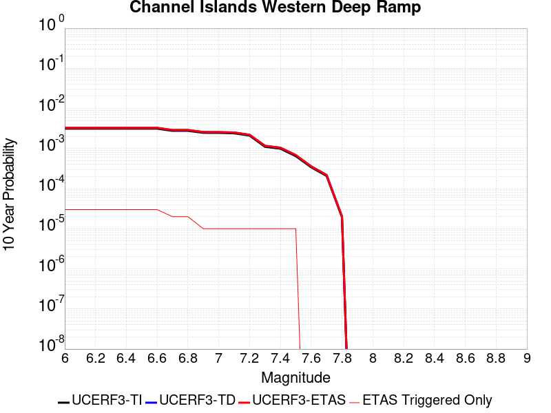 |

| Magnitude | 1 wk TI Prob | 1 wk TD Prob | 1 wk ETAS Prob | 1 wk ETAS/TD Gain | 1 wk ETAS Triggered Only | 1 mo TI Prob | 1 mo TD Prob | 1 mo ETAS Prob | 1 mo ETAS/TD Gain | 1 mo ETAS Triggered Only | 1 yr TI Prob | 1 yr TD Prob | 1 yr ETAS Prob | 1 yr ETAS/TD Gain | 1 yr ETAS Triggered Only | 10 yr TI Prob | 10 yr TD Prob | 10 yr ETAS Prob | 10 yr ETAS/TD Gain | 10 yr ETAS Triggered Only |
|-----|-----|-----|-----|-----|-----|-----|-----|-----|-----|-----|-----|-----|-----|-----|-----|-----|-----|-----|-----|-----|
| 6.0 | 6.0213506E-6 | 6.2548684E-6 | 1.6254806E-5 | 2.5987446 | 1.0E-5 | 2.5805533E-5 | 2.6806329E-5 | 3.680606E-5 | 1.3730363 | 1.0E-5 | 3.1413708E-4 | 3.2632265E-4 | 3.5631284E-4 | 1.0919036 | 3.0E-5 | 0.0031369338 | 0.0032588763 | 0.0032887785 | 1.0091757 | 3.0E-5 |
| 6.1 | 6.0213506E-6 | 6.2548684E-6 | 1.6254806E-5 | 2.5987446 | 1.0E-5 | 2.5805533E-5 | 2.6806329E-5 | 3.680606E-5 | 1.3730363 | 1.0E-5 | 3.1413708E-4 | 3.2632265E-4 | 3.5631284E-4 | 1.0919036 | 3.0E-5 | 0.0031369338 | 0.0032588763 | 0.0032887785 | 1.0091757 | 3.0E-5 |
| 6.2 | 6.0213506E-6 | 6.2548684E-6 | 1.6254806E-5 | 2.5987446 | 1.0E-5 | 2.5805533E-5 | 2.6806329E-5 | 3.680606E-5 | 1.3730363 | 1.0E-5 | 3.1413708E-4 | 3.2632265E-4 | 3.5631284E-4 | 1.0919036 | 3.0E-5 | 0.0031369338 | 0.0032588763 | 0.0032887785 | 1.0091757 | 3.0E-5 |
| 6.3 | 6.0213506E-6 | 6.2548684E-6 | 1.6254806E-5 | 2.5987446 | 1.0E-5 | 2.5805533E-5 | 2.6806329E-5 | 3.680606E-5 | 1.3730363 | 1.0E-5 | 3.1413708E-4 | 3.2632265E-4 | 3.5631284E-4 | 1.0919036 | 3.0E-5 | 0.0031369338 | 0.0032588763 | 0.0032887785 | 1.0091757 | 3.0E-5 |
| 6.4 | 6.0213506E-6 | 6.2548684E-6 | 1.6254806E-5 | 2.5987446 | 1.0E-5 | 2.5805533E-5 | 2.6806329E-5 | 3.680606E-5 | 1.3730363 | 1.0E-5 | 3.1413708E-4 | 3.2632265E-4 | 3.5631284E-4 | 1.0919036 | 3.0E-5 | 0.0031369338 | 0.0032588763 | 0.0032887785 | 1.0091757 | 3.0E-5 |
| 6.5 | 6.0213506E-6 | 6.2548684E-6 | 1.6254806E-5 | 2.5987446 | 1.0E-5 | 2.5805533E-5 | 2.6806329E-5 | 3.680606E-5 | 1.3730363 | 1.0E-5 | 3.1413708E-4 | 3.2632265E-4 | 3.5631284E-4 | 1.0919036 | 3.0E-5 | 0.0031369338 | 0.0032588763 | 0.0032887785 | 1.0091757 | 3.0E-5 |
| 6.6 | 6.0213506E-6 | 6.2548684E-6 | 1.6254806E-5 | 2.5987446 | 1.0E-5 | 2.5805533E-5 | 2.6806329E-5 | 3.680606E-5 | 1.3730363 | 1.0E-5 | 3.1413708E-4 | 3.2632265E-4 | 3.5631284E-4 | 1.0919036 | 3.0E-5 | 0.0031369338 | 0.0032588763 | 0.0032887785 | 1.0091757 | 3.0E-5 |
| 6.7 | 5.313309E-6 | 5.5252403E-6 | 1.5525186E-5 | 2.809866 | 1.0E-5 | 2.2771126E-5 | 2.367941E-5 | 3.3679175E-5 | 1.4222978 | 1.0E-5 | 2.772032E-4 | 2.8826276E-4 | 3.08257E-4 | 1.0693611 | 2.0E-5 | 0.0027685766 | 0.0028792918 | 0.0028992342 | 1.0069262 | 2.0E-5 |
| 6.8 | 5.313309E-6 | 5.5252403E-6 | 1.5525186E-5 | 2.809866 | 1.0E-5 | 2.2771126E-5 | 2.367941E-5 | 3.3679175E-5 | 1.4222978 | 1.0E-5 | 2.772032E-4 | 2.8826276E-4 | 3.08257E-4 | 1.0693611 | 2.0E-5 | 0.0027685766 | 0.0028792918 | 0.0028992342 | 1.0069262 | 2.0E-5 |
| 6.9 | 4.744377E-6 | 4.9394303E-6 | 1.4939381E-5 | 3.024515 | 1.0E-5 | 2.0332885E-5 | 2.1168837E-5 | 3.1168624E-5 | 1.4723825 | 1.0E-5 | 2.4752476E-4 | 2.5770385E-4 | 2.6770125E-4 | 1.0387943 | 1.0E-5 | 0.0024724922 | 0.0025744175 | 0.0025843917 | 1.0038744 | 1.0E-5 |
| 7.0 | 4.722209E-6 | 4.9164732E-6 | 1.4916424E-5 | 3.0339684 | 1.0E-5 | 2.0237881E-5 | 2.107045E-5 | 3.1070238E-5 | 1.4745883 | 1.0E-5 | 2.4636835E-4 | 2.5650626E-4 | 2.665037E-4 | 1.0389754 | 1.0E-5 | 0.002460954 | 0.0025624693 | 0.0025724438 | 1.0038925 | 1.0E-5 |
| 7.1 | 4.611174E-6 | 4.801409E-6 | 1.48013605E-5 | 3.082712 | 1.0E-5 | 1.9762025E-5 | 2.0577325E-5 | 3.057712E-5 | 1.4859618 | 1.0E-5 | 2.4057609E-4 | 2.5050386E-4 | 2.6050137E-4 | 1.0399096 | 1.0E-5 | 0.002403158 | 0.002502582 | 0.002512557 | 1.0039859 | 1.0E-5 |
| 7.2 | 4.043994E-6 | 4.2120264E-6 | 1.4211984E-5 | 3.374144 | 1.0E-5 | 1.7331287E-5 | 1.8051438E-5 | 2.8051258E-5 | 1.5539625 | 1.0E-5 | 2.10988E-4 | 2.1975765E-4 | 2.2975546E-4 | 1.0454947 | 1.0E-5 | 0.002107878 | 0.0021957543 | 0.0022057323 | 1.0045443 | 1.0E-5 |
| 7.3 | 2.1233036E-6 | 2.2297875E-6 | 1.2229765E-5 | 5.4847226 | 1.0E-5 | 9.099841E-6 | 9.556197E-6 | 1.9556102E-5 | 2.0464313 | 1.0E-5 | 1.1078493E-4 | 1.1634055E-4 | 1.2633938E-4 | 1.0859445 | 1.0E-5 | 0.0011072971 | 0.001162802 | 0.0011727903 | 1.0085899 | 1.0E-5 |
| 7.4 | 1.9051884E-6 | 2.0014973E-6 | 1.2001477E-5 | 5.9962497 | 1.0E-5 | 8.165067E-6 | 8.577817E-6 | 1.8577732E-5 | 2.1657877 | 1.0E-5 | 9.940516E-5 | 1.0442998E-4 | 1.14428934E-4 | 1.095748 | 1.0E-5 | 9.93607E-4 | 0.0010438144 | 0.0010538038 | 1.0095702 | 1.0E-5 |
| 7.5 | 1.2408497E-6 | 1.3038839E-6 | 1.130387E-5 | 8.669384 | 1.0E-5 | 5.317916E-6 | 5.588062E-6 | 1.5588006E-5 | 2.789519 | 1.0E-5 | 6.4743705E-5 | 6.8032554E-5 | 7.803187E-5 | 1.1469785 | 1.0E-5 | 6.4724847E-4 | 6.8011944E-4 | 6.9011265E-4 | 1.0146933 | 1.0E-5 |
| 7.6 | 6.5440025E-7 | 6.886718E-7 | 6.886718E-7 | 1.0 | 0.0 | 2.8045695E-6 | 2.9514472E-6 | 2.9514472E-6 | 1.0 | 0.0 | 3.4145098E-5 | 3.593329E-5 | 3.593329E-5 | 1.0 | 0.0 | 3.4139853E-4 | 3.5927625E-4 | 3.5927625E-4 | 1.0 | 0.0 |
| 7.7 | 3.985963E-7 | 4.1930787E-7 | 4.1930787E-7 | 1.0 | 0.0 | 1.7082689E-6 | 1.7970326E-6 | 1.7970326E-6 | 1.0 | 0.0 | 2.0797976E-5 | 2.1878664E-5 | 2.1878664E-5 | 1.0 | 0.0 | 2.0796029E-4 | 2.1876628E-4 | 2.1876628E-4 | 1.0 | 0.0 |
| 7.8 | 3.706329E-8 | 3.8591796E-8 | 3.8591796E-8 | 1.0 | 0.0 | 1.5884267E-7 | 1.653934E-7 | 1.653934E-7 | 1.0 | 0.0 | 1.9339077E-6 | 2.0136629E-6 | 2.0136629E-6 | 1.0 | 0.0 | 1.933891E-5 | 2.0136458E-5 | 2.0136458E-5 | 1.0 | 0.0 |

## Hollywood
*[(top)](#table-of-contents)*

| 1 Week | 1 Month | 1 Year | 10 Year |
|-----|-----|-----|-----|
|  |  |  |  |

| Magnitude | 1 wk TI Prob | 1 wk TD Prob | 1 wk ETAS Prob | 1 wk ETAS/TD Gain | 1 wk ETAS Triggered Only | 1 mo TI Prob | 1 mo TD Prob | 1 mo ETAS Prob | 1 mo ETAS/TD Gain | 1 mo ETAS Triggered Only | 1 yr TI Prob | 1 yr TD Prob | 1 yr ETAS Prob | 1 yr ETAS/TD Gain | 1 yr ETAS Triggered Only | 10 yr TI Prob | 10 yr TD Prob | 10 yr ETAS Prob | 10 yr ETAS/TD Gain | 10 yr ETAS Triggered Only |
|-----|-----|-----|-----|-----|-----|-----|-----|-----|-----|-----|-----|-----|-----|-----|-----|-----|-----|-----|-----|-----|
| 6.0 | 1.24487615E-5 | 1.2593229E-5 | 2.2593103E-5 | 1.7940675 | 1.0E-5 | 5.3350745E-5 | 5.3969892E-5 | 7.396881E-5 | 1.370557 | 2.0E-5 | 6.4935174E-4 | 6.5689E-4 | 6.7687687E-4 | 1.0304265 | 2.0E-5 | 0.0064745755 | 0.0065499707 | 0.0065797744 | 1.0045502 | 3.0E-5 |
| 6.1 | 1.24487615E-5 | 1.2593229E-5 | 2.2593103E-5 | 1.7940675 | 1.0E-5 | 5.3350745E-5 | 5.3969892E-5 | 7.396881E-5 | 1.370557 | 2.0E-5 | 6.4935174E-4 | 6.5689E-4 | 6.7687687E-4 | 1.0304265 | 2.0E-5 | 0.0064745755 | 0.0065499707 | 0.0065797744 | 1.0045502 | 3.0E-5 |
| 6.2 | 1.24487615E-5 | 1.2593229E-5 | 2.2593103E-5 | 1.7940675 | 1.0E-5 | 5.3350745E-5 | 5.3969892E-5 | 7.396881E-5 | 1.370557 | 2.0E-5 | 6.4935174E-4 | 6.5689E-4 | 6.7687687E-4 | 1.0304265 | 2.0E-5 | 0.0064745755 | 0.0065499707 | 0.0065797744 | 1.0045502 | 3.0E-5 |
| 6.3 | 1.24487615E-5 | 1.2593229E-5 | 2.2593103E-5 | 1.7940675 | 1.0E-5 | 5.3350745E-5 | 5.3969892E-5 | 7.396881E-5 | 1.370557 | 2.0E-5 | 6.4935174E-4 | 6.5689E-4 | 6.7687687E-4 | 1.0304265 | 2.0E-5 | 0.0064745755 | 0.0065499707 | 0.0065797744 | 1.0045502 | 3.0E-5 |
| 6.4 | 1.2431024E-5 | 1.25738425E-5 | 2.2573717E-5 | 1.7952918 | 1.0E-5 | 5.327473E-5 | 5.388681E-5 | 7.3885734E-5 | 1.3711283 | 2.0E-5 | 6.4842677E-4 | 6.558791E-4 | 6.75866E-4 | 1.0304735 | 2.0E-5 | 0.0064653796 | 0.0065399213 | 0.006569725 | 1.0045573 | 3.0E-5 |
| 6.5 | 1.1242222E-5 | 1.1317804E-5 | 2.131769E-5 | 1.8835536 | 1.0E-5 | 4.8180063E-5 | 4.8503985E-5 | 6.850302E-5 | 1.4123173 | 2.0E-5 | 5.864344E-4 | 5.903787E-4 | 6.1036693E-4 | 1.0338565 | 2.0E-5 | 0.0058488925 | 0.00588839 | 0.005918213 | 1.0050647 | 3.0E-5 |
| 6.6 | 1.1234066E-5 | 1.1308918E-5 | 2.1308804E-5 | 1.8842479 | 1.0E-5 | 4.8145106E-5 | 4.8465907E-5 | 6.8464935E-5 | 1.4126413 | 2.0E-5 | 5.86009E-4 | 5.899153E-4 | 6.0990354E-4 | 1.0338832 | 2.0E-5 | 0.005844661 | 0.0058837803 | 0.005913604 | 1.0050688 | 3.0E-5 |
| 6.7 | 1.12294E-5 | 1.1303661E-5 | 2.1303547E-5 | 1.8846592 | 1.0E-5 | 4.812511E-5 | 4.8443377E-5 | 6.844241E-5 | 1.4128331 | 2.0E-5 | 5.857657E-4 | 5.896412E-4 | 6.096294E-4 | 1.033899 | 2.0E-5 | 0.0058422405 | 0.005881054 | 0.005910877 | 1.0050712 | 3.0E-5 |
| 6.8 | 1.0252819E-5 | 1.0218449E-5 | 2.0218346E-5 | 1.9786122 | 1.0E-5 | 4.3939912E-5 | 4.3792625E-5 | 6.379175E-5 | 1.4566779 | 2.0E-5 | 5.3483713E-4 | 5.330469E-4 | 5.530362E-4 | 1.0375001 | 2.0E-5 | 0.005335517 | 0.0053179096 | 0.0053477497 | 1.0056113 | 3.0E-5 |
| 6.9 | 9.252289E-6 | 9.110309E-6 | 1.9110219E-5 | 2.0976474 | 1.0E-5 | 3.9652066E-5 | 3.9043607E-5 | 5.9042828E-5 | 1.5122278 | 2.0E-5 | 4.8265693E-4 | 4.752539E-4 | 4.952444E-4 | 1.0420628 | 2.0E-5 | 0.0048161 | 0.004742549 | 0.0047724065 | 1.0062957 | 3.0E-5 |
| 7.0 | 8.474604E-6 | 8.25826E-6 | 1.8258177E-5 | 2.2108989 | 1.0E-5 | 3.6319227E-5 | 3.5392073E-5 | 5.5391367E-5 | 1.5650783 | 2.0E-5 | 4.4209688E-4 | 4.3081472E-4 | 4.508061E-4 | 1.0464036 | 2.0E-5 | 0.004412184 | 0.0042999457 | 0.004329817 | 1.0069468 | 3.0E-5 |
| 7.1 | 6.643643E-6 | 6.2683707E-6 | 1.6268308E-5 | 2.595301 | 1.0E-5 | 2.8472443E-5 | 2.686417E-5 | 4.6863635E-5 | 1.7444661 | 2.0E-5 | 3.4659685E-4 | 3.2702263E-4 | 3.470161E-4 | 1.0611378 | 2.0E-5 | 0.0034605677 | 0.0032654598 | 0.003295362 | 1.0091571 | 3.0E-5 |
| 7.2 | 5.549002E-6 | 5.1087086E-6 | 1.5108657E-5 | 2.9574318 | 1.0E-5 | 2.378122E-5 | 2.1894282E-5 | 3.1894062E-5 | 1.4567302 | 1.0E-5 | 2.8949787E-4 | 2.665304E-4 | 2.7652775E-4 | 1.0375092 | 1.0E-5 | 0.0028912104 | 0.002662124 | 0.0026820707 | 1.0074928 | 2.0E-5 |
| 7.3 | 4.3059727E-6 | 3.9598913E-6 | 1.39598515E-5 | 3.5253117 | 1.0E-5 | 1.8454039E-5 | 1.6970853E-5 | 2.6970683E-5 | 1.5892355 | 1.0E-5 | 2.2465475E-4 | 2.0660064E-4 | 2.1659858E-4 | 1.0483925 | 1.0E-5 | 0.0022442779 | 0.0020640958 | 0.0020840545 | 1.0096694 | 2.0E-5 |
| 7.4 | 2.8550733E-6 | 2.7013002E-6 | 1.2701273E-5 | 4.701911 | 1.0E-5 | 1.2235971E-5 | 1.1576949E-5 | 2.1576834E-5 | 1.8637754 | 1.0E-5 | 1.4896276E-4 | 1.4094029E-4 | 1.5093888E-4 | 1.070942 | 1.0E-5 | 0.0014886294 | 0.0014085141 | 0.001428486 | 1.0141793 | 2.0E-5 |
| 7.5 | 1.9927045E-6 | 1.8976393E-6 | 1.189762E-5 | 6.2696953 | 1.0E-5 | 8.540134E-6 | 8.132714E-6 | 1.8132634E-5 | 2.2295918 | 1.0E-5 | 1.0397117E-4 | 9.901134E-5 | 1.0901035E-4 | 1.1009885 | 1.0E-5 | 0.0010392254 | 9.896759E-4 | 9.996659E-4 | 1.0100943 | 1.0E-5 |
| 7.6 | 1.345084E-6 | 1.2216018E-6 | 1.1221589E-5 | 9.185964 | 1.0E-5 | 5.764633E-6 | 5.2354258E-6 | 1.5235373E-5 | 2.9100542 | 1.0E-5 | 7.018215E-5 | 6.373946E-5 | 7.3738825E-5 | 1.1568787 | 1.0E-5 | 7.0159987E-4 | 6.372138E-4 | 6.4720743E-4 | 1.0156833 | 1.0E-5 |
| 7.7 | 7.6835164E-7 | 6.2777013E-7 | 1.0627764E-5 | 16.929388 | 1.0E-5 | 3.2929315E-6 | 2.6904406E-6 | 1.2690414E-5 | 4.716853 | 1.0E-5 | 4.00907E-5 | 3.2755637E-5 | 4.275531E-5 | 1.3052809 | 1.0E-5 | 4.0083472E-4 | 3.2750957E-4 | 3.375063E-4 | 1.0305234 | 1.0E-5 |
| 7.8 | 3.6562128E-7 | 2.4534745E-7 | 2.4534745E-7 | 1.0 | 0.0 | 1.5669474E-6 | 1.0514887E-6 | 1.0514887E-6 | 1.0 | 0.0 | 1.9077417E-5 | 1.2801803E-5 | 1.2801803E-5 | 1.0 | 0.0 | 1.907578E-4 | 1.2801103E-4 | 1.2801103E-4 | 1.0 | 0.0 |
| 7.9 | 7.5024424E-8 | 5.381742E-8 | 5.381742E-8 | 1.0 | 0.0 | 3.215332E-7 | 2.3064608E-7 | 2.3064608E-7 | 1.0 | 0.0 | 3.91466E-6 | 2.8081138E-6 | 2.8081138E-6 | 1.0 | 0.0 | 3.9145907E-5 | 2.8080913E-5 | 2.8080913E-5 | 1.0 | 0.0 |

## Santa Monica alt 1
*[(top)](#table-of-contents)*

| 1 Week | 1 Month | 1 Year | 10 Year |
|-----|-----|-----|-----|
| 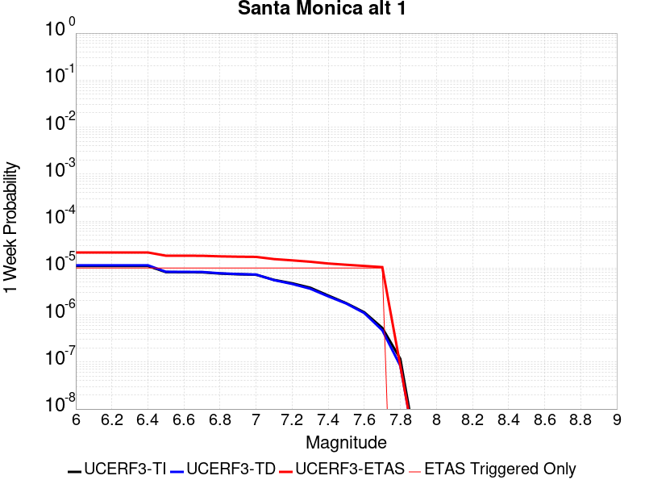 |  |  |  |

| Magnitude | 1 wk TI Prob | 1 wk TD Prob | 1 wk ETAS Prob | 1 wk ETAS/TD Gain | 1 wk ETAS Triggered Only | 1 mo TI Prob | 1 mo TD Prob | 1 mo ETAS Prob | 1 mo ETAS/TD Gain | 1 mo ETAS Triggered Only | 1 yr TI Prob | 1 yr TD Prob | 1 yr ETAS Prob | 1 yr ETAS/TD Gain | 1 yr ETAS Triggered Only | 10 yr TI Prob | 10 yr TD Prob | 10 yr ETAS Prob | 10 yr ETAS/TD Gain | 10 yr ETAS Triggered Only |
|-----|-----|-----|-----|-----|-----|-----|-----|-----|-----|-----|-----|-----|-----|-----|-----|-----|-----|-----|-----|-----|
| 6.0 | 1.1066008E-5 | 1.1480312E-5 | 2.1480198E-5 | 1.8710464 | 1.0E-5 | 4.742488E-5 | 4.920049E-5 | 6.919951E-5 | 1.4064801 | 2.0E-5 | 5.7724497E-4 | 5.9886527E-4 | 6.188533E-4 | 1.0333765 | 2.0E-5 | 0.005757478 | 0.0059739016 | 0.006003722 | 1.0049919 | 3.0E-5 |
| 6.1 | 1.1066008E-5 | 1.1480312E-5 | 2.1480198E-5 | 1.8710464 | 1.0E-5 | 4.742488E-5 | 4.920049E-5 | 6.919951E-5 | 1.4064801 | 2.0E-5 | 5.7724497E-4 | 5.9886527E-4 | 6.188533E-4 | 1.0333765 | 2.0E-5 | 0.005757478 | 0.0059739016 | 0.006003722 | 1.0049919 | 3.0E-5 |
| 6.2 | 1.1066008E-5 | 1.1480312E-5 | 2.1480198E-5 | 1.8710464 | 1.0E-5 | 4.742488E-5 | 4.920049E-5 | 6.919951E-5 | 1.4064801 | 2.0E-5 | 5.7724497E-4 | 5.9886527E-4 | 6.188533E-4 | 1.0333765 | 2.0E-5 | 0.005757478 | 0.0059739016 | 0.006003722 | 1.0049919 | 3.0E-5 |
| 6.3 | 1.1066008E-5 | 1.1480312E-5 | 2.1480198E-5 | 1.8710464 | 1.0E-5 | 4.742488E-5 | 4.920049E-5 | 6.919951E-5 | 1.4064801 | 2.0E-5 | 5.7724497E-4 | 5.9886527E-4 | 6.188533E-4 | 1.0333765 | 2.0E-5 | 0.005757478 | 0.0059739016 | 0.006003722 | 1.0049919 | 3.0E-5 |
| 6.4 | 1.1066008E-5 | 1.1480312E-5 | 2.1480198E-5 | 1.8710464 | 1.0E-5 | 4.742488E-5 | 4.920049E-5 | 6.919951E-5 | 1.4064801 | 2.0E-5 | 5.7724497E-4 | 5.9886527E-4 | 6.188533E-4 | 1.0333765 | 2.0E-5 | 0.005757478 | 0.0059739016 | 0.006003722 | 1.0049919 | 3.0E-5 |
| 6.5 | 8.183544E-6 | 8.335434E-6 | 1.8335351E-5 | 2.1996875 | 1.0E-5 | 3.5071862E-5 | 3.572281E-5 | 5.5722092E-5 | 1.5598464 | 2.0E-5 | 4.2691626E-4 | 4.3483998E-4 | 4.548313E-4 | 1.0459739 | 2.0E-5 | 0.0042609703 | 0.004340057 | 0.0043699266 | 1.0068823 | 3.0E-5 |
| 6.6 | 8.1543285E-6 | 8.303648E-6 | 1.8303565E-5 | 2.20428 | 1.0E-5 | 3.4946657E-5 | 3.558659E-5 | 5.5585875E-5 | 1.5619895 | 2.0E-5 | 4.2539247E-4 | 4.3318217E-4 | 4.531735E-4 | 1.04615 | 2.0E-5 | 0.0042457907 | 0.004323543 | 0.0043534134 | 1.0069088 | 3.0E-5 |
| 6.7 | 8.110878E-6 | 8.257045E-6 | 1.8256962E-5 | 2.211077 | 1.0E-5 | 3.4760444E-5 | 3.5386864E-5 | 5.5386157E-5 | 1.5651615 | 2.0E-5 | 4.231262E-4 | 4.3075148E-4 | 4.5074287E-4 | 1.0464104 | 2.0E-5 | 0.0042232145 | 0.004299331 | 0.0043292018 | 1.0069479 | 3.0E-5 |
| 6.8 | 7.644036E-6 | 7.751063E-6 | 1.7750985E-5 | 2.2901356 | 1.0E-5 | 3.275974E-5 | 3.3218425E-5 | 5.3217762E-5 | 1.6020554 | 2.0E-5 | 3.9877684E-4 | 4.043607E-4 | 4.2435262E-4 | 1.0494407 | 2.0E-5 | 0.00398062 | 0.004036396 | 0.0040662745 | 1.0074024 | 3.0E-5 |
| 6.9 | 7.3698293E-6 | 7.4557215E-6 | 1.7455646E-5 | 2.3412418 | 1.0E-5 | 3.15846E-5 | 3.195271E-5 | 5.195207E-5 | 1.625905 | 2.0E-5 | 3.8447464E-4 | 3.889562E-4 | 4.089484E-4 | 1.0513997 | 2.0E-5 | 0.0038381014 | 0.0038828978 | 0.0039127814 | 1.0076962 | 3.0E-5 |
| 7.0 | 7.209872E-6 | 7.2856283E-6 | 1.7285556E-5 | 2.3725553 | 1.0E-5 | 3.0899086E-5 | 3.1223753E-5 | 5.122313E-5 | 1.640518 | 2.0E-5 | 3.7613141E-4 | 3.800843E-4 | 4.0007668E-4 | 1.0525999 | 2.0E-5 | 0.0037549543 | 0.003794485 | 0.0038243711 | 1.0078762 | 3.0E-5 |
| 7.1 | 5.603456E-6 | 5.5238947E-6 | 1.552384E-5 | 2.8103068 | 1.0E-5 | 2.4014591E-5 | 2.3673623E-5 | 4.367315E-5 | 1.8448021 | 2.0E-5 | 2.923384E-4 | 2.8818863E-4 | 3.0818288E-4 | 1.069379 | 2.0E-5 | 0.0029195412 | 0.002878191 | 0.0029081046 | 1.0103933 | 3.0E-5 |
| 7.2 | 4.7483613E-6 | 4.591135E-6 | 1.4591089E-5 | 3.1781006 | 1.0E-5 | 2.0349962E-5 | 1.9676147E-5 | 2.967595E-5 | 1.5082196 | 1.0E-5 | 2.4773262E-4 | 2.3953087E-4 | 2.4952847E-4 | 1.0417383 | 1.0E-5 | 0.0024745662 | 0.0023927412 | 0.0024126933 | 1.0083386 | 2.0E-5 |
| 7.3 | 3.829015E-6 | 3.6342271E-6 | 1.36341905E-5 | 3.7516067 | 1.0E-5 | 1.6409962E-5 | 1.5575166E-5 | 2.5575011E-5 | 1.6420377 | 1.0E-5 | 1.9977297E-4 | 1.8961124E-4 | 1.9960933E-4 | 1.0527295 | 1.0E-5 | 0.0019959346 | 0.0018945034 | 0.0019144656 | 1.0105369 | 2.0E-5 |
| 7.4 | 2.610755E-6 | 2.4995722E-6 | 1.2499547E-5 | 5.0006747 | 1.0E-5 | 1.1188902E-5 | 1.0712408E-5 | 2.0712301E-5 | 1.9334869 | 1.0E-5 | 1.3621636E-4 | 1.304158E-4 | 1.404145E-4 | 1.0766678 | 1.0E-5 | 0.001361329 | 0.0013033971 | 0.0013233711 | 1.0153245 | 2.0E-5 |
| 7.5 | 1.792146E-6 | 1.7584194E-6 | 1.1758402E-5 | 6.6869154 | 1.0E-5 | 7.680603E-6 | 7.5360617E-6 | 1.7535986E-5 | 2.326943 | 1.0E-5 | 9.3507326E-5 | 9.174772E-5 | 1.017468E-4 | 1.1089846 | 1.0E-5 | 9.3467993E-4 | 9.1710157E-4 | 9.270924E-4 | 1.010894 | 1.0E-5 |
| 7.6 | 1.1473018E-6 | 1.102916E-6 | 1.1102905E-5 | 10.066863 | 1.0E-5 | 4.9169985E-6 | 4.7267745E-6 | 1.4726727E-5 | 3.1155975 | 1.0E-5 | 5.986281E-5 | 5.7546975E-5 | 6.75464E-5 | 1.1737611 | 1.0E-5 | 5.984669E-4 | 5.753224E-4 | 5.853166E-4 | 1.0173715 | 1.0E-5 |
| 7.7 | 5.330919E-7 | 4.7452562E-7 | 1.0474521E-5 | 22.073668 | 1.0E-5 | 2.2846775E-6 | 2.0336797E-6 | 1.2033659E-5 | 5.9171853 | 1.0E-5 | 2.7815593E-5 | 2.4759782E-5 | 3.4759534E-5 | 1.4038708 | 1.0E-5 | 2.7812112E-4 | 2.4757136E-4 | 2.5756887E-4 | 1.0403824 | 1.0E-5 |
| 7.8 | 1.1668574E-7 | 8.296564E-8 | 8.296564E-8 | 1.0 | 0.0 | 5.000816E-7 | 3.5556698E-7 | 3.5556698E-7 | 1.0 | 0.0 | 6.0884768E-6 | 4.3290197E-6 | 4.3290197E-6 | 1.0 | 0.0 | 6.08831E-5 | 4.3289383E-5 | 4.3289383E-5 | 1.0 | 0.0 |
| 7.9 | 8.007447E-10 | 6.161581E-10 | 6.161581E-10 | 1.0 | 0.0 | 3.4317629E-9 | 2.640678E-9 | 2.640678E-9 | 1.0 | 0.0 | 4.1781714E-8 | 3.2150254E-8 | 3.2150254E-8 | 1.0 | 0.0 | 4.1781706E-7 | 3.2150248E-7 | 3.2150248E-7 | 1.0 | 0.0 |

## Great Valley 08 (Quinto)
*[(top)](#table-of-contents)*

| 1 Week | 1 Month | 1 Year | 10 Year |
|-----|-----|-----|-----|
|  | 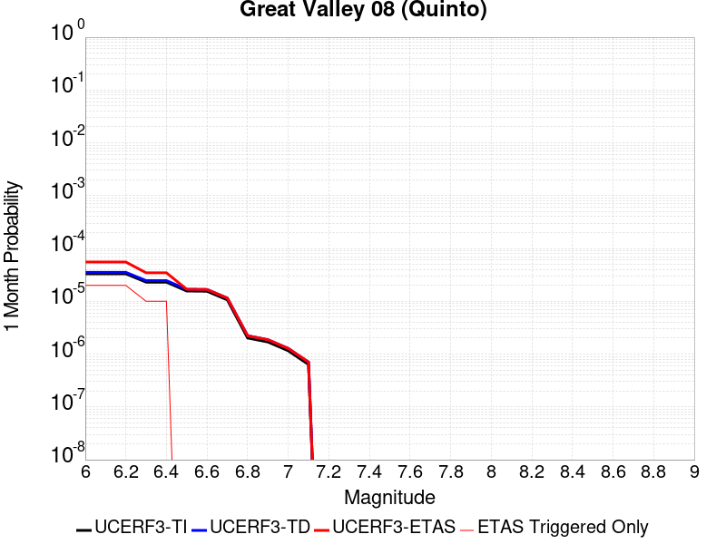 | 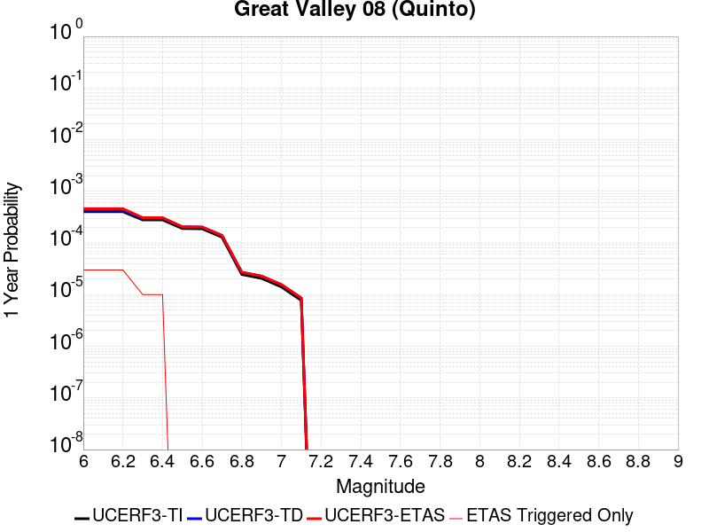 |  |

| Magnitude | 1 wk TI Prob | 1 wk TD Prob | 1 wk ETAS Prob | 1 wk ETAS/TD Gain | 1 wk ETAS Triggered Only | 1 mo TI Prob | 1 mo TD Prob | 1 mo ETAS Prob | 1 mo ETAS/TD Gain | 1 mo ETAS Triggered Only | 1 yr TI Prob | 1 yr TD Prob | 1 yr ETAS Prob | 1 yr ETAS/TD Gain | 1 yr ETAS Triggered Only | 10 yr TI Prob | 10 yr TD Prob | 10 yr ETAS Prob | 10 yr ETAS/TD Gain | 10 yr ETAS Triggered Only |
|-----|-----|-----|-----|-----|-----|-----|-----|-----|-----|-----|-----|-----|-----|-----|-----|-----|-----|-----|-----|-----|
| 6.0 | 7.737697E-6 | 8.253038E-6 | 2.8252873E-5 | 3.42333 | 2.0E-5 | 3.3161137E-5 | 3.536979E-5 | 5.536908E-5 | 1.5654343 | 2.0E-5 | 4.0366207E-4 | 4.3056096E-4 | 4.6054804E-4 | 1.0696466 | 3.0E-5 | 0.004029296 | 0.0042991205 | 0.0043289918 | 1.0069481 | 3.0E-5 |
| 6.1 | 7.737697E-6 | 8.253038E-6 | 2.8252873E-5 | 3.42333 | 2.0E-5 | 3.3161137E-5 | 3.536979E-5 | 5.536908E-5 | 1.5654343 | 2.0E-5 | 4.0366207E-4 | 4.3056096E-4 | 4.6054804E-4 | 1.0696466 | 3.0E-5 | 0.004029296 | 0.0042991205 | 0.0043289918 | 1.0069481 | 3.0E-5 |
| 6.2 | 7.737697E-6 | 8.253038E-6 | 2.8252873E-5 | 3.42333 | 2.0E-5 | 3.3161137E-5 | 3.536979E-5 | 5.536908E-5 | 1.5654343 | 2.0E-5 | 4.0366207E-4 | 4.3056096E-4 | 4.6054804E-4 | 1.0696466 | 3.0E-5 | 0.004029296 | 0.0042991205 | 0.0043289918 | 1.0069481 | 3.0E-5 |
| 6.3 | 5.374012E-6 | 5.7505736E-6 | 1.5750516E-5 | 2.738947 | 1.0E-5 | 2.3031276E-5 | 2.4645145E-5 | 3.4644898E-5 | 1.4057494 | 1.0E-5 | 2.803697E-4 | 3.0002446E-4 | 3.1002148E-4 | 1.0333207 | 1.0E-5 | 0.0028001624 | 0.0029972875 | 0.0030072576 | 1.0033263 | 1.0E-5 |
| 6.4 | 5.374012E-6 | 5.7505736E-6 | 1.5750516E-5 | 2.738947 | 1.0E-5 | 2.3031276E-5 | 2.4645145E-5 | 3.4644898E-5 | 1.4057494 | 1.0E-5 | 2.803697E-4 | 3.0002446E-4 | 3.1002148E-4 | 1.0333207 | 1.0E-5 | 0.0028001624 | 0.0029972875 | 0.0030072576 | 1.0033263 | 1.0E-5 |
| 6.5 | 3.65427E-6 | 3.941324E-6 | 3.941324E-6 | 1.0 | 0.0 | 1.5661062E-5 | 1.689132E-5 | 1.689132E-5 | 1.0 | 0.0 | 1.9065675E-4 | 2.0563944E-4 | 2.0563944E-4 | 1.0 | 0.0 | 0.0019049325 | 0.0020551833 | 0.0020551833 | 1.0 | 0.0 |
| 6.6 | 3.6143538E-6 | 3.8985104E-6 | 3.8985104E-6 | 1.0 | 0.0 | 1.5489995E-5 | 1.6707834E-5 | 1.6707834E-5 | 1.0 | 0.0 | 1.8857437E-4 | 2.0340596E-4 | 2.0340596E-4 | 1.0 | 0.0 | 0.0018841444 | 0.0020328893 | 0.0020328893 | 1.0 | 0.0 |
| 6.7 | 2.4821015E-6 | 2.6857067E-6 | 2.6857067E-6 | 1.0 | 0.0 | 1.0637535E-5 | 1.1510153E-5 | 1.1510153E-5 | 1.0 | 0.0 | 1.2950429E-4 | 1.4013276E-4 | 1.4013276E-4 | 1.0 | 0.0 | 0.0012942884 | 0.0014009989 | 0.0014009989 | 1.0 | 0.0 |
| 6.8 | 4.7110538E-7 | 5.193021E-7 | 5.193021E-7 | 1.0 | 0.0 | 2.0190216E-6 | 2.2255786E-6 | 2.2255786E-6 | 1.0 | 0.0 | 2.458131E-5 | 2.70961E-5 | 2.70961E-5 | 1.0 | 0.0 | 2.457859E-4 | 2.7092977E-4 | 2.7092977E-4 | 1.0 | 0.0 |
| 6.9 | 3.958685E-7 | 4.3703452E-7 | 4.3703452E-7 | 1.0 | 0.0 | 1.6965782E-6 | 1.8730038E-6 | 1.8730038E-6 | 1.0 | 0.0 | 2.0655643E-5 | 2.28036E-5 | 2.28036E-5 | 1.0 | 0.0 | 2.0653724E-4 | 2.2801422E-4 | 2.2801422E-4 | 1.0 | 0.0 |
| 7.0 | 2.70294E-7 | 2.9920008E-7 | 2.9920008E-7 | 1.0 | 0.0 | 1.1584025E-6 | 1.2822856E-6 | 1.2822856E-6 | 1.0 | 0.0 | 1.4103458E-5 | 1.5611728E-5 | 1.5611728E-5 | 1.0 | 0.0 | 1.4102564E-4 | 1.5610759E-4 | 1.5610759E-4 | 1.0 | 0.0 |
| 7.1 | 1.4828602E-7 | 1.6469107E-7 | 1.6469107E-7 | 1.0 | 0.0 | 6.3551136E-7 | 7.058187E-7 | 7.058187E-7 | 1.0 | 0.0 | 7.737323E-6 | 8.593317E-6 | 8.593317E-6 | 1.0 | 0.0 | 7.737054E-5 | 8.593065E-5 | 8.593065E-5 | 1.0 | 0.0 |

## Great Valley 03a Dunnigan Hills
*[(top)](#table-of-contents)*

| 1 Week | 1 Month | 1 Year | 10 Year |
|-----|-----|-----|-----|
|  |  |  |  |

| Magnitude | 1 wk TI Prob | 1 wk TD Prob | 1 wk ETAS Prob | 1 wk ETAS/TD Gain | 1 wk ETAS Triggered Only | 1 mo TI Prob | 1 mo TD Prob | 1 mo ETAS Prob | 1 mo ETAS/TD Gain | 1 mo ETAS Triggered Only | 1 yr TI Prob | 1 yr TD Prob | 1 yr ETAS Prob | 1 yr ETAS/TD Gain | 1 yr ETAS Triggered Only | 10 yr TI Prob | 10 yr TD Prob | 10 yr ETAS Prob | 10 yr ETAS/TD Gain | 10 yr ETAS Triggered Only |
|-----|-----|-----|-----|-----|-----|-----|-----|-----|-----|-----|-----|-----|-----|-----|-----|-----|-----|-----|-----|-----|
| 6.0 | 1.6591328E-5 | 1.8107954E-5 | 3.810759E-5 | 2.104467 | 2.0E-5 | 7.110376E-5 | 7.7603596E-5 | 9.7602046E-5 | 1.2577 | 2.0E-5 | 8.6534437E-4 | 9.444834E-4 | 9.7445503E-4 | 1.0317334 | 3.0E-5 | 0.008619824 | 0.009411525 | 0.009441243 | 1.0031576 | 3.0E-5 |
| 6.1 | 8.041125E-6 | 8.769726E-6 | 2.8769551E-5 | 3.2805529 | 2.0E-5 | 3.4461507E-5 | 3.7584115E-5 | 5.7583366E-5 | 1.5321198 | 2.0E-5 | 4.194881E-4 | 4.5751085E-4 | 4.7750172E-4 | 1.0436949 | 2.0E-5 | 0.004186971 | 0.004567687 | 0.004587596 | 1.0043585 | 2.0E-5 |
| 6.2 | 3.2807004E-6 | 3.5795688E-6 | 2.3579498E-5 | 6.587245 | 2.0E-5 | 1.4060069E-5 | 1.5340942E-5 | 3.5340636E-5 | 2.303681 | 2.0E-5 | 1.7116789E-4 | 1.8676413E-4 | 2.067604E-4 | 1.107067 | 2.0E-5 | 0.0017103611 | 0.0018664796 | 0.0018864423 | 1.0106953 | 2.0E-5 |
| 6.3 | 1.9339366E-6 | 2.1103806E-6 | 1.2110359E-5 | 5.7384715 | 1.0E-5 | 8.288273E-6 | 9.044474E-6 | 1.9044382E-5 | 2.1056376 | 1.0E-5 | 1.00905054E-4 | 1.1011375E-4 | 1.2011265E-4 | 1.0908052 | 1.0E-5 | 0.0010085925 | 0.0011008718 | 0.0011108608 | 1.0090737 | 1.0E-5 |
| 6.4 | 1.3142635E-6 | 1.4339867E-6 | 1.1433972E-5 | 7.9735556 | 1.0E-5 | 5.6325457E-6 | 6.145657E-6 | 1.6145596E-5 | 2.6271553 | 1.0E-5 | 6.857408E-5 | 7.482337E-5 | 8.482263E-5 | 1.133638 | 1.0E-5 | 6.8552926E-4 | 7.4823375E-4 | 7.5822626E-4 | 1.0133548 | 1.0E-5 |

## Great Valley 07 (Orestimba)
*[(top)](#table-of-contents)*

| 1 Week | 1 Month | 1 Year | 10 Year |
|-----|-----|-----|-----|
|  | 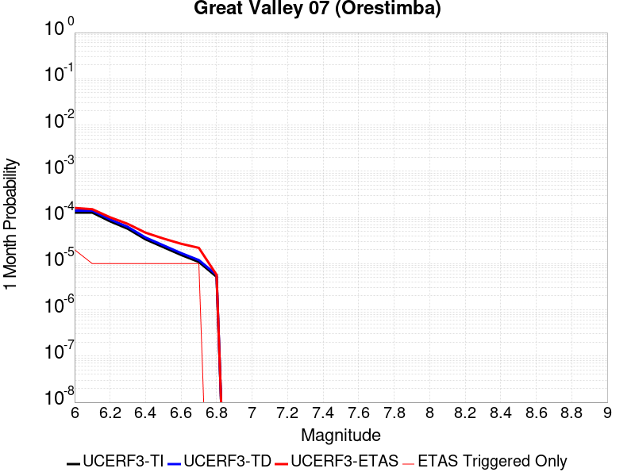 |  |  |

| Magnitude | 1 wk TI Prob | 1 wk TD Prob | 1 wk ETAS Prob | 1 wk ETAS/TD Gain | 1 wk ETAS Triggered Only | 1 mo TI Prob | 1 mo TD Prob | 1 mo ETAS Prob | 1 mo ETAS/TD Gain | 1 mo ETAS Triggered Only | 1 yr TI Prob | 1 yr TD Prob | 1 yr ETAS Prob | 1 yr ETAS/TD Gain | 1 yr ETAS Triggered Only | 10 yr TI Prob | 10 yr TD Prob | 10 yr ETAS Prob | 10 yr ETAS/TD Gain | 10 yr ETAS Triggered Only |
|-----|-----|-----|-----|-----|-----|-----|-----|-----|-----|-----|-----|-----|-----|-----|-----|-----|-----|-----|-----|-----|
| 6.0 | 2.9687902E-5 | 3.27575E-5 | 4.2757172E-5 | 1.3052636 | 1.0E-5 | 1.2722766E-4 | 1.4038214E-4 | 1.6037932E-4 | 1.1424483 | 2.0E-5 | 0.0015478961 | 0.0017078844 | 0.0017378331 | 1.0175356 | 3.0E-5 | 0.015371585 | 0.016955135 | 0.016984627 | 1.0017394 | 3.0E-5 |
| 6.1 | 2.9687902E-5 | 3.27575E-5 | 4.2757172E-5 | 1.3052636 | 1.0E-5 | 1.2722766E-4 | 1.4038214E-4 | 1.5038073E-4 | 1.0712241 | 1.0E-5 | 0.0015478961 | 0.0017078844 | 0.0017178673 | 1.0058452 | 1.0E-5 | 0.015371585 | 0.016955135 | 0.016964966 | 1.0005798 | 1.0E-5 |
| 6.2 | 1.9231524E-5 | 2.1159167E-5 | 3.1158954E-5 | 1.4725984 | 1.0E-5 | 8.2418206E-5 | 9.067912E-5 | 1.0067821E-4 | 1.110269 | 1.0E-5 | 0.0010029797 | 0.0011034822 | 0.0011134712 | 1.0090523 | 1.0E-5 | 0.00998465 | 0.010982441 | 0.0109923305 | 1.0009005 | 1.0E-5 |
| 6.3 | 1.324766E-5 | 1.4548534E-5 | 2.4548388E-5 | 1.6873446 | 1.0E-5 | 5.6774446E-5 | 6.234942E-5 | 7.23488E-5 | 1.1603764 | 1.0E-5 | 6.910097E-4 | 7.5884897E-4 | 7.6884136E-4 | 1.0131679 | 1.0E-5 | 0.006888649 | 0.0075635235 | 0.007573448 | 1.0013121 | 1.0E-5 |
| 6.4 | 7.818645E-6 | 8.57284E-6 | 1.8572755E-5 | 2.1664646 | 1.0E-5 | 3.3508048E-5 | 3.6740246E-5 | 4.673988E-5 | 1.2721711 | 1.0E-5 | 4.078841E-4 | 4.4722404E-4 | 4.5721958E-4 | 1.0223502 | 1.0E-5 | 0.004071363 | 0.0044635804 | 0.004473536 | 1.0022304 | 1.0E-5 |
| 6.5 | 5.3076565E-6 | 5.8178007E-6 | 1.5817743E-5 | 2.7188525 | 1.0E-5 | 2.27469E-5 | 2.4933206E-5 | 3.4932957E-5 | 1.4010615 | 1.0E-5 | 2.7690834E-4 | 3.035216E-4 | 3.1351857E-4 | 1.0329366 | 1.0E-5 | 0.0027656353 | 0.00303128 | 0.0030412497 | 1.003289 | 1.0E-5 |
| 6.6 | 3.6003578E-6 | 3.9484953E-6 | 1.39484555E-5 | 3.5326002 | 1.0E-5 | 1.5430012E-5 | 1.6922022E-5 | 2.6921853E-5 | 1.590936 | 1.0E-5 | 1.8784421E-4 | 2.0600771E-4 | 2.1600565E-4 | 1.0485319 | 1.0E-5 | 0.0018768552 | 0.0020583214 | 0.0020683007 | 1.0048484 | 1.0E-5 |
| 6.7 | 2.5361826E-6 | 2.7834678E-6 | 1.278344E-5 | 4.592631 | 1.0E-5 | 1.0869308E-5 | 1.1929101E-5 | 2.1928981E-5 | 1.8382761 | 1.0E-5 | 1.3232579E-4 | 1.4522845E-4 | 1.55227E-4 | 1.0688471 | 1.0E-5 | 0.0013224703 | 0.0014514653 | 0.0014614508 | 1.0068796 | 1.0E-5 |
| 6.8 | 1.2115831E-6 | 1.3313797E-6 | 1.3313797E-6 | 1.0 | 0.0 | 5.1924885E-6 | 5.7059065E-6 | 5.7059065E-6 | 1.0 | 0.0 | 6.3216714E-5 | 6.9468166E-5 | 6.9468166E-5 | 1.0 | 0.0 | 6.3198735E-4 | 6.945596E-4 | 6.945596E-4 | 1.0 | 0.0 |

## Emerson-Copper Mtn 2011
*[(top)](#table-of-contents)*

| 1 Week | 1 Month | 1 Year | 10 Year |
|-----|-----|-----|-----|
| 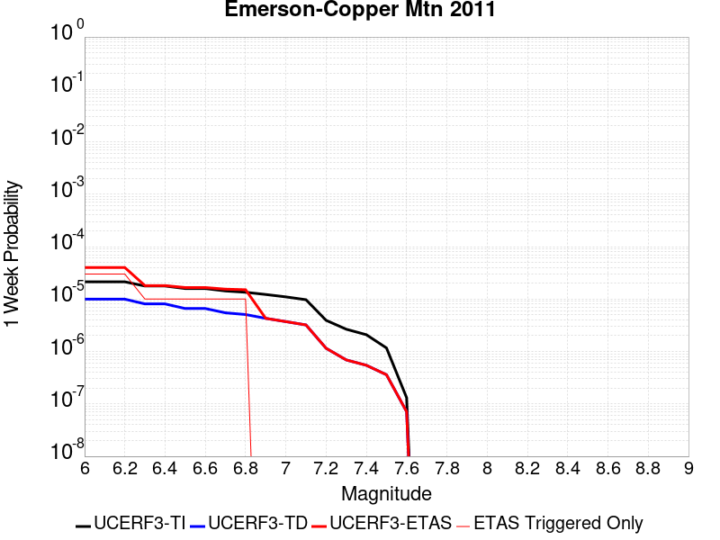 | 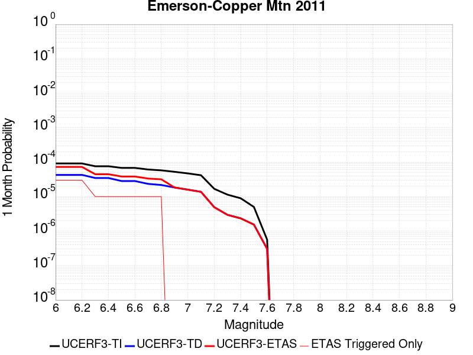 |  |  |

| Magnitude | 1 wk TI Prob | 1 wk TD Prob | 1 wk ETAS Prob | 1 wk ETAS/TD Gain | 1 wk ETAS Triggered Only | 1 mo TI Prob | 1 mo TD Prob | 1 mo ETAS Prob | 1 mo ETAS/TD Gain | 1 mo ETAS Triggered Only | 1 yr TI Prob | 1 yr TD Prob | 1 yr ETAS Prob | 1 yr ETAS/TD Gain | 1 yr ETAS Triggered Only | 10 yr TI Prob | 10 yr TD Prob | 10 yr ETAS Prob | 10 yr ETAS/TD Gain | 10 yr ETAS Triggered Only |
|-----|-----|-----|-----|-----|-----|-----|-----|-----|-----|-----|-----|-----|-----|-----|-----|-----|-----|-----|-----|-----|
| 6.0 | 2.1364202E-5 | 9.967999E-6 | 3.99677E-5 | 4.009601 | 3.0E-5 | 9.1557646E-5 | 4.2719344E-5 | 7.271807E-5 | 1.702228 | 3.0E-5 | 0.0011141442 | 5.1999267E-4 | 5.4997706E-4 | 1.0576631 | 3.0E-5 | 0.011085749 | 0.0051886286 | 0.005218473 | 1.0057518 | 3.0E-5 |
| 6.1 | 2.1364202E-5 | 9.967999E-6 | 3.99677E-5 | 4.009601 | 3.0E-5 | 9.1557646E-5 | 4.2719344E-5 | 7.271807E-5 | 1.702228 | 3.0E-5 | 0.0011141442 | 5.1999267E-4 | 5.4997706E-4 | 1.0576631 | 3.0E-5 | 0.011085749 | 0.0051886286 | 0.005218473 | 1.0057518 | 3.0E-5 |
| 6.2 | 2.1364202E-5 | 9.967999E-6 | 3.99677E-5 | 4.009601 | 3.0E-5 | 9.1557646E-5 | 4.2719344E-5 | 7.271807E-5 | 1.702228 | 3.0E-5 | 0.0011141442 | 5.1999267E-4 | 5.4997706E-4 | 1.0576631 | 3.0E-5 | 0.011085749 | 0.0051886286 | 0.005218473 | 1.0057518 | 3.0E-5 |
| 6.3 | 1.7751237E-5 | 8.089109E-6 | 1.8089027E-5 | 2.2362201 | 1.0E-5 | 7.607452E-5 | 3.4667184E-5 | 4.4666835E-5 | 1.2884473 | 1.0E-5 | 9.258136E-4 | 4.2199748E-4 | 4.3199325E-4 | 1.0236868 | 1.0E-5 | 0.00921966 | 0.004212584 | 0.0042225416 | 1.0023638 | 1.0E-5 |
| 6.4 | 1.7751237E-5 | 8.089109E-6 | 1.8089027E-5 | 2.2362201 | 1.0E-5 | 7.607452E-5 | 3.4667184E-5 | 4.4666835E-5 | 1.2884473 | 1.0E-5 | 9.258136E-4 | 4.2199748E-4 | 4.3199325E-4 | 1.0236868 | 1.0E-5 | 0.00921966 | 0.004212584 | 0.0042225416 | 1.0023638 | 1.0E-5 |
| 6.5 | 1.5886664E-5 | 6.6037437E-6 | 1.6603677E-5 | 2.5142825 | 1.0E-5 | 6.808392E-5 | 2.830148E-5 | 3.8301197E-5 | 1.3533285 | 1.0E-5 | 8.286065E-4 | 3.4452073E-4 | 3.5451728E-4 | 1.0290158 | 1.0E-5 | 0.008255237 | 0.0034403303 | 0.003450296 | 1.0028967 | 1.0E-5 |
| 6.6 | 1.5886664E-5 | 6.6037437E-6 | 1.6603677E-5 | 2.5142825 | 1.0E-5 | 6.808392E-5 | 2.830148E-5 | 3.8301197E-5 | 1.3533285 | 1.0E-5 | 8.286065E-4 | 3.4452073E-4 | 3.5451728E-4 | 1.0290158 | 1.0E-5 | 0.008255237 | 0.0034403303 | 0.003450296 | 1.0028967 | 1.0E-5 |
| 6.7 | 1.428471E-5 | 5.4703055E-6 | 1.547025E-5 | 2.8280416 | 1.0E-5 | 6.121875E-5 | 2.3443978E-5 | 3.3443743E-5 | 1.4265388 | 1.0E-5 | 7.450834E-4 | 2.8539696E-4 | 2.9539413E-4 | 1.0350289 | 1.0E-5 | 0.007425902 | 0.0028506925 | 0.002860664 | 1.003498 | 1.0E-5 |
| 6.8 | 1.3490684E-5 | 5.0735894E-6 | 1.5073539E-5 | 2.9709811 | 1.0E-5 | 5.7815934E-5 | 2.1743796E-5 | 3.1743577E-5 | 1.4598913 | 1.0E-5 | 7.0368167E-4 | 2.6470242E-4 | 2.7469976E-4 | 1.0377682 | 1.0E-5 | 0.007014576 | 0.002644252 | 0.0026542256 | 1.0037718 | 1.0E-5 |
| 6.9 | 1.2235421E-5 | 4.289545E-6 | 4.289545E-6 | 1.0 | 0.0 | 5.2436466E-5 | 1.8383655E-5 | 1.8383655E-5 | 1.0 | 0.0 | 6.38227E-4 | 2.238016E-4 | 2.238016E-4 | 1.0 | 0.0 | 0.0063639707 | 0.0022361164 | 0.0022361164 | 1.0 | 0.0 |
| 7.0 | 1.1009851E-5 | 3.7188345E-6 | 3.7188345E-6 | 1.0 | 0.0 | 4.7184225E-5 | 1.5937783E-5 | 1.5937783E-5 | 1.0 | 0.0 | 5.743165E-4 | 1.9402867E-4 | 1.9402867E-4 | 1.0 | 0.0 | 0.005728345 | 0.0019389305 | 0.0019389305 | 1.0 | 0.0 |
| 7.1 | 9.726373E-6 | 3.2115693E-6 | 3.2115693E-6 | 1.0 | 0.0 | 4.168379E-5 | 1.3763814E-5 | 1.3763814E-5 | 1.0 | 0.0 | 5.07382E-4 | 1.6756494E-4 | 1.6756494E-4 | 1.0 | 0.0 | 0.0050622504 | 0.0016747171 | 0.0016747171 | 1.0 | 0.0 |
| 7.2 | 3.9335127E-6 | 1.1524114E-6 | 1.1524114E-6 | 1.0 | 0.0 | 1.6857803E-5 | 4.9388973E-6 | 4.9388973E-6 | 1.0 | 0.0 | 2.0522442E-4 | 6.0129474E-5 | 6.0129474E-5 | 1.0 | 0.0 | 0.00205035 | 6.01138E-4 | 6.01138E-4 | 1.0 | 0.0 |
| 7.3 | 2.661632E-6 | 6.91098E-7 | 6.91098E-7 | 1.0 | 0.0 | 1.14069435E-5 | 2.9618452E-6 | 2.9618452E-6 | 1.0 | 0.0 | 1.3887069E-4 | 3.605988E-5 | 3.605988E-5 | 1.0 | 0.0 | 0.0013878393 | 3.6054134E-4 | 3.6054134E-4 | 1.0 | 0.0 |
| 7.4 | 2.0893426E-6 | 5.4614605E-7 | 5.4614605E-7 | 1.0 | 0.0 | 8.954295E-6 | 2.340624E-6 | 2.340624E-6 | 1.0 | 0.0 | 1.0901308E-4 | 2.8496728E-5 | 2.8496728E-5 | 1.0 | 0.0 | 0.0010895962 | 2.849313E-4 | 2.849313E-4 | 1.0 | 0.0 |
| 7.5 | 1.1681728E-6 | 3.6028484E-7 | 3.6028484E-7 | 1.0 | 0.0 | 5.0064455E-6 | 1.544077E-6 | 1.544077E-6 | 1.0 | 0.0 | 6.0951766E-5 | 1.879898E-5 | 1.879898E-5 | 1.0 | 0.0 | 6.093505E-4 | 1.8797436E-4 | 1.8797436E-4 | 1.0 | 0.0 |
| 7.6 | 1.3154387E-7 | 7.1196716E-8 | 7.1196716E-8 | 1.0 | 0.0 | 5.6375933E-7 | 3.0512876E-7 | 3.0512876E-7 | 1.0 | 0.0 | 6.863748E-6 | 3.714938E-6 | 3.714938E-6 | 1.0 | 0.0 | 6.863536E-5 | 3.7148915E-5 | 3.7148915E-5 | 1.0 | 0.0 |

## Fontana (Seismicity)
*[(top)](#table-of-contents)*

| 1 Week | 1 Month | 1 Year | 10 Year |
|-----|-----|-----|-----|
|  |  |  |  |

| Magnitude | 1 wk TI Prob | 1 wk TD Prob | 1 wk ETAS Prob | 1 wk ETAS/TD Gain | 1 wk ETAS Triggered Only | 1 mo TI Prob | 1 mo TD Prob | 1 mo ETAS Prob | 1 mo ETAS/TD Gain | 1 mo ETAS Triggered Only | 1 yr TI Prob | 1 yr TD Prob | 1 yr ETAS Prob | 1 yr ETAS/TD Gain | 1 yr ETAS Triggered Only | 10 yr TI Prob | 10 yr TD Prob | 10 yr ETAS Prob | 10 yr ETAS/TD Gain | 10 yr ETAS Triggered Only |
|-----|-----|-----|-----|-----|-----|-----|-----|-----|-----|-----|-----|-----|-----|-----|-----|-----|-----|-----|-----|-----|
| 6.0 | 7.1789214E-6 | 7.5520006E-6 | 2.755185E-5 | 3.648285 | 2.0E-5 | 3.076644E-5 | 3.2365548E-5 | 5.23649E-5 | 1.6179211 | 2.0E-5 | 3.7451705E-4 | 3.9402005E-4 | 4.2400823E-4 | 1.0761082 | 3.0E-5 | 0.003738865 | 0.003937214 | 0.003967096 | 1.0075896 | 3.0E-5 |
| 6.1 | 7.1789214E-6 | 7.5520006E-6 | 2.755185E-5 | 3.648285 | 2.0E-5 | 3.076644E-5 | 3.2365548E-5 | 5.23649E-5 | 1.6179211 | 2.0E-5 | 3.7451705E-4 | 3.9402005E-4 | 4.2400823E-4 | 1.0761082 | 3.0E-5 | 0.003738865 | 0.003937214 | 0.003967096 | 1.0075896 | 3.0E-5 |
| 6.2 | 7.1789214E-6 | 7.5520006E-6 | 2.755185E-5 | 3.648285 | 2.0E-5 | 3.076644E-5 | 3.2365548E-5 | 5.23649E-5 | 1.6179211 | 2.0E-5 | 3.7451705E-4 | 3.9402005E-4 | 4.2400823E-4 | 1.0761082 | 3.0E-5 | 0.003738865 | 0.003937214 | 0.003967096 | 1.0075896 | 3.0E-5 |
| 6.3 | 7.1789214E-6 | 7.5520006E-6 | 2.755185E-5 | 3.648285 | 2.0E-5 | 3.076644E-5 | 3.2365548E-5 | 5.23649E-5 | 1.6179211 | 2.0E-5 | 3.7451705E-4 | 3.9402005E-4 | 4.2400823E-4 | 1.0761082 | 3.0E-5 | 0.003738865 | 0.003937214 | 0.003967096 | 1.0075896 | 3.0E-5 |
| 6.4 | 7.1789214E-6 | 7.5520006E-6 | 2.755185E-5 | 3.648285 | 2.0E-5 | 3.076644E-5 | 3.2365548E-5 | 5.23649E-5 | 1.6179211 | 2.0E-5 | 3.7451705E-4 | 3.9402005E-4 | 4.2400823E-4 | 1.0761082 | 3.0E-5 | 0.003738865 | 0.003937214 | 0.003967096 | 1.0075896 | 3.0E-5 |
| 6.5 | 5.2611317E-6 | 5.532726E-6 | 1.553267E-5 | 2.8074174 | 1.0E-5 | 2.2547512E-5 | 2.3711682E-5 | 3.3711443E-5 | 1.421723 | 1.0E-5 | 2.744814E-4 | 2.8868974E-4 | 2.9868685E-4 | 1.0346292 | 1.0E-5 | 0.002741426 | 0.0028868972 | 0.0028968684 | 1.003454 | 1.0E-5 |
| 6.6 | 5.2611317E-6 | 5.532726E-6 | 1.553267E-5 | 2.8074174 | 1.0E-5 | 2.2547512E-5 | 2.3711682E-5 | 3.3711443E-5 | 1.421723 | 1.0E-5 | 2.744814E-4 | 2.8868974E-4 | 2.9868685E-4 | 1.0346292 | 1.0E-5 | 0.002741426 | 0.0028868972 | 0.0028968684 | 1.003454 | 1.0E-5 |

## Santa Susana alt 1
*[(top)](#table-of-contents)*

| 1 Week | 1 Month | 1 Year | 10 Year |
|-----|-----|-----|-----|
|  |  |  |  |

| Magnitude | 1 wk TI Prob | 1 wk TD Prob | 1 wk ETAS Prob | 1 wk ETAS/TD Gain | 1 wk ETAS Triggered Only | 1 mo TI Prob | 1 mo TD Prob | 1 mo ETAS Prob | 1 mo ETAS/TD Gain | 1 mo ETAS Triggered Only | 1 yr TI Prob | 1 yr TD Prob | 1 yr ETAS Prob | 1 yr ETAS/TD Gain | 1 yr ETAS Triggered Only | 10 yr TI Prob | 10 yr TD Prob | 10 yr ETAS Prob | 10 yr ETAS/TD Gain | 10 yr ETAS Triggered Only |
|-----|-----|-----|-----|-----|-----|-----|-----|-----|-----|-----|-----|-----|-----|-----|-----|-----|-----|-----|-----|-----|
| 6.0 | 2.674877E-5 | 2.7198214E-5 | 4.719767E-5 | 1.7353225 | 2.0E-5 | 1.1463255E-4 | 1.16559204E-4 | 1.3655688E-4 | 1.1715666 | 2.0E-5 | 0.0013947578 | 0.0014182981 | 0.0014382697 | 1.0140814 | 2.0E-5 | 0.013860362 | 0.014104388 | 0.014124106 | 1.001398 | 2.0E-5 |
| 6.1 | 2.674877E-5 | 2.7198214E-5 | 4.719767E-5 | 1.7353225 | 2.0E-5 | 1.1463255E-4 | 1.16559204E-4 | 1.3655688E-4 | 1.1715666 | 2.0E-5 | 0.0013947578 | 0.0014182981 | 0.0014382697 | 1.0140814 | 2.0E-5 | 0.013860362 | 0.014104388 | 0.014124106 | 1.001398 | 2.0E-5 |
| 6.2 | 2.674877E-5 | 2.7198214E-5 | 4.719767E-5 | 1.7353225 | 2.0E-5 | 1.1463255E-4 | 1.16559204E-4 | 1.3655688E-4 | 1.1715666 | 2.0E-5 | 0.0013947578 | 0.0014182981 | 0.0014382697 | 1.0140814 | 2.0E-5 | 0.013860362 | 0.014104388 | 0.014124106 | 1.001398 | 2.0E-5 |
| 6.3 | 2.674877E-5 | 2.7198214E-5 | 4.719767E-5 | 1.7353225 | 2.0E-5 | 1.1463255E-4 | 1.16559204E-4 | 1.3655688E-4 | 1.1715666 | 2.0E-5 | 0.0013947578 | 0.0014182981 | 0.0014382697 | 1.0140814 | 2.0E-5 | 0.013860362 | 0.014104388 | 0.014124106 | 1.001398 | 2.0E-5 |
| 6.4 | 2.674877E-5 | 2.7198214E-5 | 4.719767E-5 | 1.7353225 | 2.0E-5 | 1.1463255E-4 | 1.16559204E-4 | 1.3655688E-4 | 1.1715666 | 2.0E-5 | 0.0013947578 | 0.0014182981 | 0.0014382697 | 1.0140814 | 2.0E-5 | 0.013860362 | 0.014104388 | 0.014124106 | 1.001398 | 2.0E-5 |
| 6.5 | 2.674877E-5 | 2.7198214E-5 | 4.719767E-5 | 1.7353225 | 2.0E-5 | 1.1463255E-4 | 1.16559204E-4 | 1.3655688E-4 | 1.1715666 | 2.0E-5 | 0.0013947578 | 0.0014182981 | 0.0014382697 | 1.0140814 | 2.0E-5 | 0.013860362 | 0.014104388 | 0.014124106 | 1.001398 | 2.0E-5 |
| 6.6 | 2.6647976E-5 | 2.7074553E-5 | 4.7074012E-5 | 1.7386811 | 2.0E-5 | 1.14200615E-4 | 1.16029274E-4 | 1.3602695E-4 | 1.1723503 | 2.0E-5 | 0.0013895056 | 0.0014118546 | 0.0014318264 | 1.0141457 | 2.0E-5 | 0.013808494 | 0.014040773 | 0.014060492 | 1.0014044 | 2.0E-5 |
| 6.7 | 2.6647976E-5 | 2.7074553E-5 | 4.7074012E-5 | 1.7386811 | 2.0E-5 | 1.14200615E-4 | 1.16029274E-4 | 1.3602695E-4 | 1.1723503 | 2.0E-5 | 0.0013895056 | 0.0014118546 | 0.0014318264 | 1.0141457 | 2.0E-5 | 0.013808494 | 0.014040773 | 0.014060492 | 1.0014044 | 2.0E-5 |
| 6.8 | 1.9073179E-5 | 1.7637467E-5 | 2.763729E-5 | 1.5669649 | 1.0E-5 | 8.1739636E-5 | 7.558706E-5 | 8.5586296E-5 | 1.1322877 | 1.0E-5 | 9.947256E-4 | 9.19902E-4 | 9.2989276E-4 | 1.0108607 | 1.0E-5 | 0.009902848 | 0.009163361 | 0.009173269 | 1.0010813 | 1.0E-5 |
| 6.9 | 1.9041876E-5 | 1.7619597E-5 | 2.7619422E-5 | 1.5675398 | 1.0E-5 | 8.160549E-5 | 7.551048E-5 | 8.5509724E-5 | 1.132422 | 1.0E-5 | 9.930939E-4 | 9.189705E-4 | 9.2896126E-4 | 1.0108718 | 1.0E-5 | 0.0098866755 | 0.009154123 | 0.009164032 | 1.0010824 | 1.0E-5 |
| 7.0 | 1.5917482E-5 | 1.3864049E-5 | 2.386391E-5 | 1.72128 | 1.0E-5 | 6.8215995E-5 | 5.9416023E-5 | 6.941543E-5 | 1.1682948 | 1.0E-5 | 8.302132E-4 | 7.2315463E-4 | 7.3314743E-4 | 1.0138183 | 1.0E-5 | 0.008271185 | 0.0072090672 | 0.007218995 | 1.0013771 | 1.0E-5 |
| 7.1 | 1.577788E-5 | 1.3744056E-5 | 2.3743918E-5 | 1.7275773 | 1.0E-5 | 6.761774E-5 | 5.890179E-5 | 6.89012E-5 | 1.1697642 | 1.0E-5 | 8.2293496E-4 | 7.16898E-4 | 7.2689087E-4 | 1.013939 | 1.0E-5 | 0.008198941 | 0.0071469042 | 0.007156833 | 1.0013893 | 1.0E-5 |
| 7.2 | 1.5416446E-5 | 1.34701295E-5 | 2.3469995E-5 | 1.7423733 | 1.0E-5 | 6.606882E-5 | 5.7727877E-5 | 6.77273E-5 | 1.1732166 | 1.0E-5 | 8.0409093E-4 | 7.026149E-4 | 7.1260787E-4 | 1.0142225 | 1.0E-5 | 0.008011877 | 0.0070049763 | 0.0070149065 | 1.0014175 | 1.0E-5 |
| 7.3 | 1.4534083E-5 | 1.2718032E-5 | 2.2717904E-5 | 1.7862751 | 1.0E-5 | 6.228744E-5 | 5.4504737E-5 | 6.450419E-5 | 1.1834604 | 1.0E-5 | 7.580857E-4 | 6.633976E-4 | 6.733909E-4 | 1.0150639 | 1.0E-5 | 0.007555048 | 0.0066151717 | 0.0066251056 | 1.0015017 | 1.0E-5 |
| 7.4 | 1.2858995E-5 | 1.1229814E-5 | 2.1229702E-5 | 1.8904767 | 1.0E-5 | 5.5108816E-5 | 4.812691E-5 | 5.812643E-5 | 1.2077739 | 1.0E-5 | 6.7074323E-4 | 5.8579154E-4 | 5.957857E-4 | 1.0170609 | 1.0E-5 | 0.0066872234 | 0.0058433902 | 0.005853332 | 1.0017014 | 1.0E-5 |
| 7.5 | 8.827668E-6 | 7.805494E-6 | 1.7805416E-5 | 2.281139 | 1.0E-5 | 3.7832317E-5 | 3.3451703E-5 | 4.3451368E-5 | 1.2989285 | 1.0E-5 | 4.605111E-4 | 4.072008E-4 | 4.1719674E-4 | 1.0245479 | 1.0E-5 | 0.0045955796 | 0.0040648985 | 0.004074858 | 1.0024501 | 1.0E-5 |
| 7.6 | 3.2533426E-6 | 2.8720106E-6 | 2.8720106E-6 | 1.0 | 0.0 | 1.3942822E-5 | 1.230856E-5 | 1.230856E-5 | 1.0 | 0.0 | 1.6974064E-4 | 1.4984679E-4 | 1.4984679E-4 | 1.0 | 0.0 | 0.0016961104 | 0.0014974943 | 0.0014974943 | 1.0 | 0.0 |
| 7.7 | 1.2751709E-6 | 1.1491339E-6 | 1.1491339E-6 | 1.0 | 0.0 | 5.4650063E-6 | 4.9248506E-6 | 4.9248506E-6 | 1.0 | 0.0 | 6.653442E-5 | 5.99585E-5 | 5.99585E-5 | 1.0 | 0.0 | 6.6514505E-4 | 5.9943215E-4 | 5.9943215E-4 | 1.0 | 0.0 |
| 7.8 | 3.067544E-7 | 3.240052E-7 | 3.240052E-7 | 1.0 | 0.0 | 1.3146611E-6 | 1.3885931E-6 | 1.3885931E-6 | 1.0 | 0.0 | 1.600588E-5 | 1.6906E-5 | 1.6906E-5 | 1.0 | 0.0 | 1.6004729E-4 | 1.6904817E-4 | 1.6904817E-4 | 1.0 | 0.0 |
| 7.9 | 7.622999E-8 | 8.0879715E-8 | 8.0879715E-8 | 1.0 | 0.0 | 3.2669993E-7 | 3.4662733E-7 | 3.4662733E-7 | 1.0 | 0.0 | 3.977564E-6 | 4.220182E-6 | 4.220182E-6 | 1.0 | 0.0 | 3.977493E-5 | 4.2201224E-5 | 4.2201224E-5 | 1.0 | 0.0 |

## Puente Hills
*[(top)](#table-of-contents)*

| 1 Week | 1 Month | 1 Year | 10 Year |
|-----|-----|-----|-----|
|  |  |  |  |

| Magnitude | 1 wk TI Prob | 1 wk TD Prob | 1 wk ETAS Prob | 1 wk ETAS/TD Gain | 1 wk ETAS Triggered Only | 1 mo TI Prob | 1 mo TD Prob | 1 mo ETAS Prob | 1 mo ETAS/TD Gain | 1 mo ETAS Triggered Only | 1 yr TI Prob | 1 yr TD Prob | 1 yr ETAS Prob | 1 yr ETAS/TD Gain | 1 yr ETAS Triggered Only | 10 yr TI Prob | 10 yr TD Prob | 10 yr ETAS Prob | 10 yr ETAS/TD Gain | 10 yr ETAS Triggered Only |
|-----|-----|-----|-----|-----|-----|-----|-----|-----|-----|-----|-----|-----|-----|-----|-----|-----|-----|-----|-----|-----|
| 6.0 | 1.2101656E-5 | 8.098448E-6 | 1.8098368E-5 | 2.2347944 | 1.0E-5 | 5.1863204E-5 | 3.4707205E-5 | 5.470651E-5 | 1.5762292 | 2.0E-5 | 6.312516E-4 | 4.2248392E-4 | 4.424755E-4 | 1.047319 | 2.0E-5 | 0.0062946146 | 0.0042173676 | 0.004247241 | 1.0070834 | 3.0E-5 |
| 6.1 | 1.2101656E-5 | 8.098448E-6 | 1.8098368E-5 | 2.2347944 | 1.0E-5 | 5.1863204E-5 | 3.4707205E-5 | 5.470651E-5 | 1.5762292 | 2.0E-5 | 6.312516E-4 | 4.2248392E-4 | 4.424755E-4 | 1.047319 | 2.0E-5 | 0.0062946146 | 0.0042173676 | 0.004247241 | 1.0070834 | 3.0E-5 |
| 6.2 | 1.2101656E-5 | 8.098448E-6 | 1.8098368E-5 | 2.2347944 | 1.0E-5 | 5.1863204E-5 | 3.4707205E-5 | 5.470651E-5 | 1.5762292 | 2.0E-5 | 6.312516E-4 | 4.2248392E-4 | 4.424755E-4 | 1.047319 | 2.0E-5 | 0.0062946146 | 0.0042173676 | 0.004247241 | 1.0070834 | 3.0E-5 |
| 6.3 | 1.2101656E-5 | 8.098448E-6 | 1.8098368E-5 | 2.2347944 | 1.0E-5 | 5.1863204E-5 | 3.4707205E-5 | 5.470651E-5 | 1.5762292 | 2.0E-5 | 6.312516E-4 | 4.2248392E-4 | 4.424755E-4 | 1.047319 | 2.0E-5 | 0.0062946146 | 0.0042173676 | 0.004247241 | 1.0070834 | 3.0E-5 |
| 6.4 | 1.2101656E-5 | 8.098448E-6 | 1.8098368E-5 | 2.2347944 | 1.0E-5 | 5.1863204E-5 | 3.4707205E-5 | 5.470651E-5 | 1.5762292 | 2.0E-5 | 6.312516E-4 | 4.2248392E-4 | 4.424755E-4 | 1.047319 | 2.0E-5 | 0.0062946146 | 0.0042173676 | 0.004247241 | 1.0070834 | 3.0E-5 |
| 6.5 | 1.2101656E-5 | 8.098448E-6 | 1.8098368E-5 | 2.2347944 | 1.0E-5 | 5.1863204E-5 | 3.4707205E-5 | 5.470651E-5 | 1.5762292 | 2.0E-5 | 6.312516E-4 | 4.2248392E-4 | 4.424755E-4 | 1.047319 | 2.0E-5 | 0.0062946146 | 0.0042173676 | 0.004247241 | 1.0070834 | 3.0E-5 |
| 6.6 | 1.0222488E-5 | 6.399079E-6 | 6.399079E-6 | 1.0 | 0.0 | 4.3809923E-5 | 2.742435E-5 | 2.742435E-5 | 1.0 | 0.0 | 5.332553E-4 | 3.3384276E-4 | 3.3384276E-4 | 1.0 | 0.0 | 0.0053197746 | 0.0033336577 | 0.0033436243 | 1.0029896 | 1.0E-5 |
| 6.7 | 1.0222488E-5 | 6.399079E-6 | 6.399079E-6 | 1.0 | 0.0 | 4.3809923E-5 | 2.742435E-5 | 2.742435E-5 | 1.0 | 0.0 | 5.332553E-4 | 3.3384276E-4 | 3.3384276E-4 | 1.0 | 0.0 | 0.0053197746 | 0.0033336577 | 0.0033436243 | 1.0029896 | 1.0E-5 |
| 6.8 | 8.6367845E-6 | 5.028129E-6 | 5.028129E-6 | 1.0 | 0.0 | 3.7014266E-5 | 2.1548949E-5 | 2.1548949E-5 | 1.0 | 0.0 | 4.505555E-4 | 2.6232743E-4 | 2.6232743E-4 | 1.0 | 0.0 | 0.004496431 | 0.002620234 | 0.0026302077 | 1.0038065 | 1.0E-5 |
| 6.9 | 8.066481E-6 | 4.8360116E-6 | 4.8360116E-6 | 1.0 | 0.0 | 3.4570177E-5 | 2.0725602E-5 | 2.0725602E-5 | 1.0 | 0.0 | 4.2081063E-4 | 2.523055E-4 | 2.523055E-4 | 1.0 | 0.0 | 0.0042001465 | 0.0025202443 | 0.0025302193 | 1.0039579 | 1.0E-5 |
| 7.0 | 7.393828E-6 | 4.4172275E-6 | 4.4172275E-6 | 1.0 | 0.0 | 3.168745E-5 | 1.8930841E-5 | 1.8930841E-5 | 1.0 | 0.0 | 3.857264E-4 | 2.3045906E-4 | 2.3045906E-4 | 1.0 | 0.0 | 0.0038505755 | 0.0023022462 | 0.0023122232 | 1.0043336 | 1.0E-5 |
| 7.1 | 6.4660953E-6 | 3.8043859E-6 | 3.8043859E-6 | 1.0 | 0.0 | 2.7711543E-5 | 1.630441E-5 | 1.630441E-5 | 1.0 | 0.0 | 3.373358E-4 | 1.9848847E-4 | 1.9848847E-4 | 1.0 | 0.0 | 0.0033682417 | 0.0019831478 | 0.0019931279 | 1.0050325 | 1.0E-5 |
| 7.2 | 5.143232E-6 | 2.7864896E-6 | 2.7864896E-6 | 1.0 | 0.0 | 2.2042237E-5 | 1.1942045E-5 | 1.1942045E-5 | 1.0 | 0.0 | 2.6833118E-4 | 1.453848E-4 | 1.453848E-4 | 1.0 | 0.0 | 0.002680074 | 0.0014529065 | 0.001462892 | 1.0068728 | 1.0E-5 |
| 7.3 | 3.928255E-6 | 2.091338E-6 | 2.091338E-6 | 1.0 | 0.0 | 1.683527E-5 | 8.962847E-6 | 8.962847E-6 | 1.0 | 0.0 | 2.0495013E-4 | 1.0911726E-4 | 1.0911726E-4 | 1.0 | 0.0 | 0.002047612 | 0.0010906435 | 0.0011006326 | 1.0091588 | 1.0E-5 |
| 7.4 | 2.7894434E-6 | 1.3546429E-6 | 1.3546429E-6 | 1.0 | 0.0 | 1.1954703E-5 | 5.8056E-6 | 5.8056E-6 | 1.0 | 0.0 | 1.4553878E-4 | 7.068093E-5 | 7.068093E-5 | 1.0 | 0.0 | 0.001454435 | 7.0658885E-4 | 7.1658177E-4 | 1.0141425 | 1.0E-5 |
| 7.5 | 2.041735E-6 | 8.786996E-7 | 8.786996E-7 | 1.0 | 0.0 | 8.750263E-6 | 3.7658504E-6 | 3.7658504E-6 | 1.0 | 0.0 | 1.06529245E-4 | 4.5848297E-5 | 4.5848297E-5 | 1.0 | 0.0 | 0.0010647819 | 4.5839173E-4 | 4.5839173E-4 | 1.0 | 0.0 |
| 7.6 | 1.6959062E-6 | 6.698339E-7 | 6.698339E-7 | 1.0 | 0.0 | 7.268149E-6 | 2.8707138E-6 | 2.8707138E-6 | 1.0 | 0.0 | 8.848612E-5 | 3.4950408E-5 | 3.4950408E-5 | 1.0 | 0.0 | 8.84509E-4 | 3.4945202E-4 | 3.4945202E-4 | 1.0 | 0.0 |
| 7.7 | 1.4767965E-6 | 5.407146E-7 | 5.407146E-7 | 1.0 | 0.0 | 6.3291122E-6 | 2.3173466E-6 | 2.3173466E-6 | 1.0 | 0.0 | 7.705422E-5 | 2.8213353E-5 | 2.8213353E-5 | 1.0 | 0.0 | 7.702751E-4 | 2.8210029E-4 | 2.8210029E-4 | 1.0 | 0.0 |
| 7.8 | 1.8432911E-7 | 7.2811105E-8 | 7.2811105E-8 | 1.0 | 0.0 | 7.8998164E-7 | 3.1204758E-7 | 3.1204758E-7 | 1.0 | 0.0 | 9.617985E-6 | 3.799176E-6 | 3.799176E-6 | 1.0 | 0.0 | 9.617568E-5 | 3.7991435E-5 | 3.7991435E-5 | 1.0 | 0.0 |

## San Andreas (North Coast) 2011 CFM
*[(top)](#table-of-contents)*

| 1 Week | 1 Month | 1 Year | 10 Year |
|-----|-----|-----|-----|
|  |  | 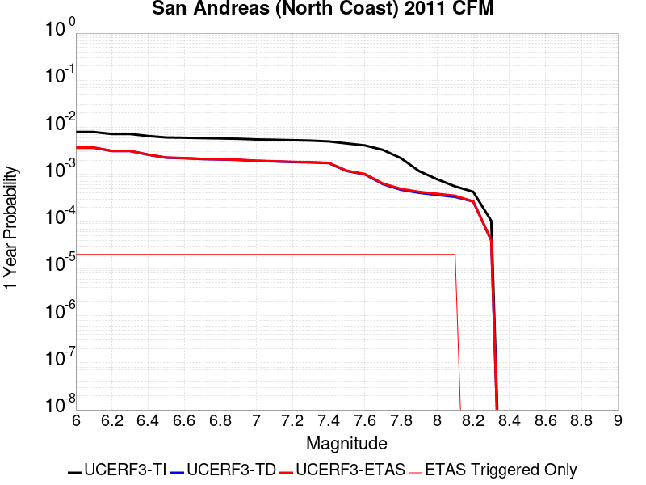 |  |

| Magnitude | 1 wk TI Prob | 1 wk TD Prob | 1 wk ETAS Prob | 1 wk ETAS/TD Gain | 1 wk ETAS Triggered Only | 1 mo TI Prob | 1 mo TD Prob | 1 mo ETAS Prob | 1 mo ETAS/TD Gain | 1 mo ETAS Triggered Only | 1 yr TI Prob | 1 yr TD Prob | 1 yr ETAS Prob | 1 yr ETAS/TD Gain | 1 yr ETAS Triggered Only | 10 yr TI Prob | 10 yr TD Prob | 10 yr ETAS Prob | 10 yr ETAS/TD Gain | 10 yr ETAS Triggered Only |
|-----|-----|-----|-----|-----|-----|-----|-----|-----|-----|-----|-----|-----|-----|-----|-----|-----|-----|-----|-----|-----|
| 6.0 | 1.5333705E-4 | 7.109695E-5 | 7.109695E-5 | 1.0 | 0.0 | 6.5699324E-4 | 3.046658E-4 | 3.1466273E-4 | 1.0328128 | 1.0E-5 | 0.007969595 | 0.0037030308 | 0.0037229569 | 1.005381 | 2.0E-5 | 0.0768977 | 0.039364267 | 0.039383482 | 1.000488 | 2.0E-5 |
| 6.1 | 1.5333705E-4 | 7.109695E-5 | 7.109695E-5 | 1.0 | 0.0 | 6.5699324E-4 | 3.046658E-4 | 3.1466273E-4 | 1.0328128 | 1.0E-5 | 0.007969595 | 0.0037030308 | 0.0037229569 | 1.005381 | 2.0E-5 | 0.0768977 | 0.039364267 | 0.039383482 | 1.000488 | 2.0E-5 |
| 6.2 | 1.3912938E-4 | 6.049243E-5 | 6.049243E-5 | 1.0 | 0.0 | 5.961325E-4 | 2.5922767E-4 | 2.6922507E-4 | 1.0385661 | 1.0E-5 | 0.007233787 | 0.0031515562 | 0.0031714933 | 1.0063261 | 2.0E-5 | 0.07002798 | 0.03369792 | 0.03371725 | 1.0005735 | 2.0E-5 |
| 6.3 | 1.3912938E-4 | 6.049243E-5 | 6.049243E-5 | 1.0 | 0.0 | 5.961325E-4 | 2.5922767E-4 | 2.6922507E-4 | 1.0385661 | 1.0E-5 | 0.007233787 | 0.0031515562 | 0.0031714933 | 1.0063261 | 2.0E-5 | 0.07002798 | 0.03369792 | 0.03371725 | 1.0005735 | 2.0E-5 |
| 6.4 | 1.2623647E-4 | 5.0433562E-5 | 5.0433562E-5 | 1.0 | 0.0 | 5.4090127E-4 | 2.1612605E-4 | 2.2612388E-4 | 1.0462593 | 1.0E-5 | 0.0065656058 | 0.0026281793 | 0.0026481268 | 1.0075898 | 2.0E-5 | 0.06374981 | 0.02830552 | 0.028324952 | 1.0006865 | 2.0E-5 |
| 6.5 | 1.1736096E-4 | 4.3516375E-5 | 4.3516375E-5 | 1.0 | 0.0 | 5.028786E-4 | 1.8648551E-4 | 1.9648364E-4 | 1.0536134 | 1.0E-5 | 0.006105373 | 0.0022681132 | 0.0022880677 | 1.0087979 | 2.0E-5 | 0.05940335 | 0.024576947 | 0.024596455 | 1.0007938 | 2.0E-5 |
| 6.6 | 1.1586959E-4 | 4.2416294E-5 | 4.2416294E-5 | 1.0 | 0.0 | 4.964894E-4 | 1.8177154E-4 | 1.9176972E-4 | 1.0550041 | 1.0E-5 | 0.006028018 | 0.0022108385 | 0.0022307942 | 1.0090263 | 2.0E-5 | 0.058671024 | 0.023982164 | 0.024001684 | 1.000814 | 2.0E-5 |
| 6.7 | 1.13693764E-4 | 4.0728228E-5 | 4.0728228E-5 | 1.0 | 0.0 | 4.87168E-4 | 1.7453796E-4 | 1.8453621E-4 | 1.0572841 | 1.0E-5 | 0.005915152 | 0.0021229447 | 0.0021429022 | 1.0094008 | 2.0E-5 | 0.057601593 | 0.023075242 | 0.02309478 | 1.0008467 | 2.0E-5 |
| 6.8 | 1.1204889E-4 | 3.9945848E-5 | 3.9945848E-5 | 1.0 | 0.0 | 4.8012115E-4 | 1.7118535E-4 | 1.8118364E-4 | 1.0584062 | 1.0E-5 | 0.005829819 | 0.0020822054 | 0.0021021636 | 1.0095851 | 2.0E-5 | 0.05679232 | 0.022635331 | 0.02265488 | 1.0008636 | 2.0E-5 |
| 6.9 | 1.1005794E-4 | 3.9001738E-5 | 3.9001738E-5 | 1.0 | 0.0 | 4.7159163E-4 | 1.6713967E-4 | 1.77138E-4 | 1.0598202 | 1.0E-5 | 0.0057265228 | 0.0020330423 | 0.0020530017 | 1.0098175 | 2.0E-5 | 0.055811852 | 0.02210134 | 0.022120899 | 1.0008849 | 2.0E-5 |
| 7.0 | 1.0647948E-4 | 3.7159174E-5 | 3.7159174E-5 | 1.0 | 0.0 | 4.562608E-4 | 1.5924397E-4 | 1.6924237E-4 | 1.0627867 | 1.0E-5 | 0.0055408357 | 0.0019370868 | 0.001957048 | 1.0103048 | 2.0E-5 | 0.054047033 | 0.02105931 | 0.02107889 | 1.0009297 | 2.0E-5 |
| 7.1 | 1.04795035E-4 | 3.620866E-5 | 3.620866E-5 | 1.0 | 0.0 | 4.4904428E-4 | 1.5517084E-4 | 1.6516929E-4 | 1.0644351 | 1.0E-5 | 0.0054534175 | 0.0018875834 | 0.0019075456 | 1.0105755 | 2.0E-5 | 0.053215165 | 0.02052821 | 0.0205478 | 1.0009543 | 2.0E-5 |
| 7.2 | 1.02724036E-4 | 3.5117457E-5 | 3.5117457E-5 | 1.0 | 0.0 | 4.401716E-4 | 1.5049479E-4 | 1.6049329E-4 | 1.0664375 | 1.0E-5 | 0.0053459285 | 0.0018307496 | 0.0018507129 | 1.0109044 | 2.0E-5 | 0.052191395 | 0.01991573 | 0.01993533 | 1.0009842 | 2.0E-5 |
| 7.3 | 1.00650694E-4 | 3.45853E-5 | 3.45853E-5 | 1.0 | 0.0 | 4.312888E-4 | 1.4821437E-4 | 1.5821289E-4 | 1.0674598 | 1.0E-5 | 0.005238306 | 0.0018030318 | 0.0018229957 | 1.0110724 | 2.0E-5 | 0.051165357 | 0.01959264 | 0.019612249 | 1.0010008 | 2.0E-5 |
| 7.4 | 9.672919E-5 | 3.3374814E-5 | 3.3374814E-5 | 1.0 | 0.0 | 4.144878E-4 | 1.4302715E-4 | 1.5302573E-4 | 1.0699068 | 1.0E-5 | 0.005034718 | 0.00173998 | 0.0017599452 | 1.0114744 | 2.0E-5 | 0.049221683 | 0.01886682 | 0.018886443 | 1.0010401 | 2.0E-5 |
| 7.5 | 8.7600405E-5 | 2.2694192E-5 | 2.2694192E-5 | 1.0 | 0.0 | 3.753763E-4 | 9.725721E-5 | 1.0725624E-4 | 1.1028101 | 1.0E-5 | 0.0045606326 | 0.0011834651 | 0.0012034414 | 1.0168796 | 2.0E-5 | 0.04468165 | 0.013127938 | 0.0131476745 | 1.0015035 | 2.0E-5 |
| 7.6 | 7.9562284E-5 | 1.922004E-5 | 1.922004E-5 | 1.0 | 0.0 | 3.4093665E-4 | 8.236901E-5 | 9.236819E-5 | 1.1213949 | 1.0E-5 | 0.0041430052 | 0.0010023828 | 0.0010223628 | 1.0199325 | 2.0E-5 | 0.040666126 | 0.0112194 | 0.011239175 | 1.0017626 | 2.0E-5 |
| 7.7 | 6.3866544E-5 | 1.1936281E-5 | 1.1936281E-5 | 1.0 | 0.0 | 2.7368503E-4 | 5.115449E-5 | 6.115397E-5 | 1.1954763 | 1.0E-5 | 0.0033270244 | 6.226282E-4 | 6.426157E-4 | 1.0321019 | 2.0E-5 | 0.032776527 | 0.0072073294 | 0.007227185 | 1.0027549 | 2.0E-5 |
| 7.8 | 4.2543215E-5 | 9.0726735E-6 | 9.0726735E-6 | 1.0 | 0.0 | 1.8231533E-4 | 3.888231E-5 | 4.888192E-5 | 1.2571764 | 1.0E-5 | 0.0022174292 | 4.7328937E-4 | 4.932799E-4 | 1.0422374 | 2.0E-5 | 0.021954332 | 0.0054884683 | 0.0055083586 | 1.003624 | 2.0E-5 |
| 7.9 | 2.2636612E-5 | 7.811842E-6 | 7.811842E-6 | 1.0 | 0.0 | 9.7010445E-5 | 3.3478893E-5 | 4.3478558E-5 | 1.2986857 | 1.0E-5 | 0.0011804621 | 4.0752938E-4 | 4.2752124E-4 | 1.0490562 | 2.0E-5 | 0.011742111 | 0.0046821116 | 0.004702018 | 1.0042516 | 2.0E-5 |
| 8.0 | 1.5167874E-5 | 7.0475517E-6 | 7.0475517E-6 | 1.0 | 0.0 | 6.500356E-5 | 3.0203442E-5 | 4.020314E-5 | 1.331078 | 1.0E-5 | 7.9113094E-4 | 3.6766496E-4 | 3.876576E-4 | 1.0543773 | 2.0E-5 | 0.007883203 | 0.004214701 | 0.0042346166 | 1.0047253 | 2.0E-5 |
| 8.1 | 1.0681047E-5 | 6.3854363E-6 | 6.3854363E-6 | 1.0 | 0.0 | 4.5775112E-5 | 2.7365868E-5 | 3.7365597E-5 | 1.3654087 | 1.0E-5 | 5.5716943E-4 | 3.331286E-4 | 3.5312193E-4 | 1.0600169 | 2.0E-5 | 0.0055577457 | 0.003816698 | 0.0038366215 | 1.0052202 | 2.0E-5 |
| 8.2 | 8.226114E-6 | 5.1139064E-6 | 5.1139064E-6 | 1.0 | 0.0 | 3.52543E-5 | 2.1916558E-5 | 2.1916558E-5 | 1.0 | 0.0 | 4.2913653E-4 | 2.6680148E-4 | 2.6680148E-4 | 1.0 | 0.0 | 0.004283088 | 0.0030445685 | 0.0030445685 | 1.0 | 0.0 |
| 8.3 | 1.983087E-6 | 7.6564595E-7 | 7.6564595E-7 | 1.0 | 0.0 | 8.498917E-6 | 3.281336E-6 | 3.281336E-6 | 1.0 | 0.0 | 1.034694E-4 | 3.9949547E-5 | 3.9949547E-5 | 1.0 | 0.0 | 0.0010342124 | 4.717979E-4 | 4.717979E-4 | 1.0 | 0.0 |

## San Gregorio (North) 2011 CFM
*[(top)](#table-of-contents)*

| 1 Week | 1 Month | 1 Year | 10 Year |
|-----|-----|-----|-----|
|  |  |  |  |

| Magnitude | 1 wk TI Prob | 1 wk TD Prob | 1 wk ETAS Prob | 1 wk ETAS/TD Gain | 1 wk ETAS Triggered Only | 1 mo TI Prob | 1 mo TD Prob | 1 mo ETAS Prob | 1 mo ETAS/TD Gain | 1 mo ETAS Triggered Only | 1 yr TI Prob | 1 yr TD Prob | 1 yr ETAS Prob | 1 yr ETAS/TD Gain | 1 yr ETAS Triggered Only | 10 yr TI Prob | 10 yr TD Prob | 10 yr ETAS Prob | 10 yr ETAS/TD Gain | 10 yr ETAS Triggered Only |
|-----|-----|-----|-----|-----|-----|-----|-----|-----|-----|-----|-----|-----|-----|-----|-----|-----|-----|-----|-----|-----|
| 6.0 | 5.0283932E-5 | 4.3057098E-5 | 5.305667E-5 | 1.2322397 | 1.0E-5 | 2.1548476E-4 | 1.8451746E-4 | 1.9451561E-4 | 1.0541854 | 1.0E-5 | 0.0026203706 | 0.002244199 | 0.0022541767 | 1.0044459 | 1.0E-5 | 0.02589687 | 0.022295918 | 0.022315472 | 1.000877 | 2.0E-5 |
| 6.1 | 5.0283932E-5 | 4.3057098E-5 | 5.305667E-5 | 1.2322397 | 1.0E-5 | 2.1548476E-4 | 1.8451746E-4 | 1.9451561E-4 | 1.0541854 | 1.0E-5 | 0.0026203706 | 0.002244199 | 0.0022541767 | 1.0044459 | 1.0E-5 | 0.02589687 | 0.022295918 | 0.022315472 | 1.000877 | 2.0E-5 |
| 6.2 | 4.2998647E-5 | 3.4440873E-5 | 4.4440527E-5 | 1.2903427 | 1.0E-5 | 1.842669E-4 | 1.4759546E-4 | 1.5759398E-4 | 1.0677427 | 1.0E-5 | 0.0022411412 | 0.001795506 | 0.001805488 | 1.0055594 | 1.0E-5 | 0.022186736 | 0.017884884 | 0.017904526 | 1.0010983 | 2.0E-5 |
| 6.3 | 4.2998647E-5 | 3.4440873E-5 | 4.4440527E-5 | 1.2903427 | 1.0E-5 | 1.842669E-4 | 1.4759546E-4 | 1.5759398E-4 | 1.0677427 | 1.0E-5 | 0.0022411412 | 0.001795506 | 0.001805488 | 1.0055594 | 1.0E-5 | 0.022186736 | 0.017884884 | 0.017904526 | 1.0010983 | 2.0E-5 |
| 6.4 | 4.1101295E-5 | 3.2326076E-5 | 4.232575E-5 | 1.3093379 | 1.0E-5 | 1.7613651E-4 | 1.3853304E-4 | 1.4853165E-4 | 1.0721749 | 1.0E-5 | 0.0021423528 | 0.0016853481 | 0.0016953313 | 1.0059235 | 1.0E-5 | 0.02121817 | 0.016800618 | 0.01681045 | 1.0005852 | 1.0E-5 |
| 6.5 | 4.1032585E-5 | 3.224411E-5 | 4.2243788E-5 | 1.3101242 | 1.0E-5 | 1.7584208E-4 | 1.381818E-4 | 1.4818042E-4 | 1.0723585 | 1.0E-5 | 0.0021387753 | 0.0016810785 | 0.0016910617 | 1.0059385 | 1.0E-5 | 0.021183075 | 0.01675857 | 0.016768403 | 1.0005867 | 1.0E-5 |
| 6.6 | 4.011629E-5 | 3.1265718E-5 | 4.1265404E-5 | 1.3198291 | 1.0E-5 | 1.7191563E-4 | 1.3398913E-4 | 1.4398778E-4 | 1.0746229 | 1.0E-5 | 0.0020910634 | 0.0016301107 | 0.0016400943 | 1.0061245 | 1.0E-5 | 0.020714961 | 0.016257357 | 0.016267195 | 1.0006051 | 1.0E-5 |
| 6.7 | 3.8583938E-5 | 2.9452754E-5 | 3.945246E-5 | 1.3395168 | 1.0E-5 | 1.6534925E-4 | 1.2622007E-4 | 1.362188E-4 | 1.0792167 | 1.0E-5 | 0.0020112682 | 0.0015356604 | 0.001545645 | 1.0065019 | 1.0E-5 | 0.019931622 | 0.015326062 | 0.015335909 | 1.0006425 | 1.0E-5 |
| 6.8 | 3.44341E-5 | 2.4450024E-5 | 3.444978E-5 | 1.4089875 | 1.0E-5 | 1.4756636E-4 | 1.0478167E-4 | 1.1478062E-4 | 1.0954266 | 1.0E-5 | 0.0017951399 | 0.0012749807 | 0.001284968 | 1.0078332 | 1.0E-5 | 0.017807078 | 0.012751525 | 0.012761398 | 1.0007743 | 1.0E-5 |
| 6.9 | 3.221199E-5 | 2.1777196E-5 | 3.1776977E-5 | 1.459186 | 1.0E-5 | 1.3804408E-4 | 9.3327544E-5 | 1.0332661E-4 | 1.1071395 | 1.0E-5 | 0.0016793909 | 0.0011356788 | 0.0011456675 | 1.0087953 | 1.0E-5 | 0.01666756 | 0.011372544 | 0.01138243 | 1.0008693 | 1.0E-5 |
| 7.0 | 2.9186718E-5 | 1.814604E-5 | 1.814604E-5 | 1.0 | 0.0 | 1.2507994E-4 | 7.776645E-5 | 7.776645E-5 | 1.0 | 0.0 | 0.0015217843 | 9.463997E-4 | 9.463997E-4 | 1.0 | 0.0 | 0.015114053 | 0.0094966395 | 0.0094966395 | 1.0 | 0.0 |
| 7.1 | 2.6840138E-5 | 1.5283675E-5 | 1.5283675E-5 | 1.0 | 0.0 | 1.1502409E-4 | 6.549983E-5 | 6.549983E-5 | 1.0 | 0.0 | 0.0013995186 | 7.971706E-4 | 7.971706E-4 | 1.0 | 0.0 | 0.013907375 | 0.0080155255 | 0.0080155255 | 1.0 | 0.0 |
| 7.2 | 2.453002E-5 | 1.2605825E-5 | 1.2605825E-5 | 1.0 | 0.0 | 1.05124425E-4 | 5.4023847E-5 | 5.4023847E-5 | 1.0 | 0.0 | 0.0012791384 | 6.5754243E-4 | 6.5754243E-4 | 1.0 | 0.0 | 0.012718005 | 0.006627395 | 0.006627395 | 1.0 | 0.0 |
| 7.3 | 2.3330727E-5 | 1.1487833E-5 | 1.1487833E-5 | 1.0 | 0.0 | 9.9985E-5 | 4.923264E-5 | 4.923264E-5 | 1.0 | 0.0 | 0.0012166376 | 5.99243E-4 | 5.99243E-4 | 1.0 | 0.0 | 0.012099981 | 0.0060462817 | 0.0060462817 | 1.0 | 0.0 |
| 7.4 | 2.2136466E-5 | 1.0368137E-5 | 1.0368137E-5 | 1.0 | 0.0 | 9.486712E-5 | 4.4434113E-5 | 4.4434113E-5 | 1.0 | 0.0 | 0.0011543952 | 5.408513E-4 | 5.408513E-4 | 1.0 | 0.0 | 0.011484168 | 0.0054640025 | 0.0054640025 | 1.0 | 0.0 |
| 7.5 | 2.0994974E-5 | 9.426374E-6 | 9.426374E-6 | 1.0 | 0.0 | 8.997535E-5 | 4.0398125E-5 | 4.0398125E-5 | 1.0 | 0.0 | 0.0010948994 | 4.917364E-4 | 4.917364E-4 | 1.0 | 0.0 | 0.010895205 | 0.004973108 | 0.004973108 | 1.0 | 0.0 |
| 7.6 | 1.7091823E-5 | 6.892992E-6 | 6.892992E-6 | 1.0 | 0.0 | 7.3248615E-5 | 2.9541061E-5 | 2.9541061E-5 | 1.0 | 0.0 | 8.9143694E-4 | 3.5960317E-4 | 3.5960317E-4 | 1.0 | 0.0 | 0.008878695 | 0.0036480771 | 0.0036480771 | 1.0 | 0.0 |
| 7.7 | 1.2772179E-5 | 4.0202267E-6 | 4.0202267E-6 | 1.0 | 0.0 | 5.473676E-5 | 1.722943E-5 | 1.722943E-5 | 1.0 | 0.0 | 6.6621625E-4 | 2.0974813E-4 | 2.0974813E-4 | 1.0 | 0.0 | 0.006642225 | 0.0021365841 | 0.0021365841 | 1.0 | 0.0 |
| 7.8 | 7.041923E-6 | 1.9402341E-6 | 1.9402341E-6 | 1.0 | 0.0 | 3.017932E-5 | 8.315263E-6 | 8.315263E-6 | 1.0 | 0.0 | 3.6737128E-4 | 1.01233614E-4 | 1.01233614E-4 | 1.0 | 0.0 | 0.0036676454 | 0.0010376878 | 0.0010376878 | 1.0 | 0.0 |
| 7.9 | 2.946768E-6 | 1.0031822E-6 | 1.0031822E-6 | 1.0 | 0.0 | 1.2628945E-5 | 4.299345E-6 | 4.299345E-6 | 1.0 | 0.0 | 1.5374656E-4 | 5.2343268E-5 | 5.2343268E-5 | 1.0 | 0.0 | 0.0015364023 | 5.339059E-4 | 5.339059E-4 | 1.0 | 0.0 |
| 8.0 | 1.1433375E-6 | 5.180804E-7 | 5.180804E-7 | 1.0 | 0.0 | 4.9000087E-6 | 2.2203426E-6 | 2.2203426E-6 | 1.0 | 0.0 | 5.965597E-5 | 2.7032334E-5 | 2.7032334E-5 | 1.0 | 0.0 | 5.963996E-4 | 2.7394458E-4 | 2.7394458E-4 | 1.0 | 0.0 |
| 8.1 | 2.6675295E-7 | 1.6288074E-7 | 1.6288074E-7 | 1.0 | 0.0 | 1.1432264E-6 | 6.9806015E-7 | 6.9806015E-7 | 1.0 | 0.0 | 1.3918692E-5 | 8.498849E-6 | 8.498849E-6 | 1.0 | 0.0 | 1.391782E-4 | 8.6366665E-5 | 8.6366665E-5 | 1.0 | 0.0 |
| 8.2 | 1.2704569E-8 | 9.429871E-9 | 9.429871E-9 | 1.0 | 0.0 | 5.444815E-8 | 4.041373E-8 | 4.041373E-8 | 1.0 | 0.0 | 6.629061E-7 | 4.920371E-7 | 4.920371E-7 | 1.0 | 0.0 | 6.629041E-6 | 5.1106863E-6 | 5.1106863E-6 | 1.0 | 0.0 |

## Monterey Bay-Tularcitos
*[(top)](#table-of-contents)*

| 1 Week | 1 Month | 1 Year | 10 Year |
|-----|-----|-----|-----|
|  |  |  |  |

| Magnitude | 1 wk TI Prob | 1 wk TD Prob | 1 wk ETAS Prob | 1 wk ETAS/TD Gain | 1 wk ETAS Triggered Only | 1 mo TI Prob | 1 mo TD Prob | 1 mo ETAS Prob | 1 mo ETAS/TD Gain | 1 mo ETAS Triggered Only | 1 yr TI Prob | 1 yr TD Prob | 1 yr ETAS Prob | 1 yr ETAS/TD Gain | 1 yr ETAS Triggered Only | 10 yr TI Prob | 10 yr TD Prob | 10 yr ETAS Prob | 10 yr ETAS/TD Gain | 10 yr ETAS Triggered Only |
|-----|-----|-----|-----|-----|-----|-----|-----|-----|-----|-----|-----|-----|-----|-----|-----|-----|-----|-----|-----|-----|
| 6.0 | 3.0131365E-5 | 3.279877E-5 | 5.2798114E-5 | 1.609759 | 2.0E-5 | 1.2912804E-4 | 1.4055918E-4 | 1.6055637E-4 | 1.1422688 | 2.0E-5 | 0.001571 | 0.0017100703 | 0.001730036 | 1.0116755 | 2.0E-5 | 0.015599402 | 0.016979916 | 0.016999578 | 1.0011579 | 2.0E-5 |
| 6.1 | 3.0131365E-5 | 3.279877E-5 | 5.2798114E-5 | 1.609759 | 2.0E-5 | 1.2912804E-4 | 1.4055918E-4 | 1.6055637E-4 | 1.1422688 | 2.0E-5 | 0.001571 | 0.0017100703 | 0.001730036 | 1.0116755 | 2.0E-5 | 0.015599402 | 0.016979916 | 0.016999578 | 1.0011579 | 2.0E-5 |
| 6.2 | 3.0131365E-5 | 3.279877E-5 | 5.2798114E-5 | 1.609759 | 2.0E-5 | 1.2912804E-4 | 1.4055918E-4 | 1.6055637E-4 | 1.1422688 | 2.0E-5 | 0.001571 | 0.0017100703 | 0.001730036 | 1.0116755 | 2.0E-5 | 0.015599402 | 0.016979916 | 0.016999578 | 1.0011579 | 2.0E-5 |
| 6.3 | 1.6998249E-5 | 1.8330798E-5 | 1.8330798E-5 | 1.0 | 0.0 | 7.28476E-5 | 7.85583E-5 | 7.85583E-5 | 1.0 | 0.0 | 8.865586E-4 | 9.5604634E-4 | 9.5604634E-4 | 1.0 | 0.0 | 0.0088303005 | 0.009521258 | 0.009521258 | 1.0 | 0.0 |
| 6.4 | 1.6998249E-5 | 1.8330798E-5 | 1.8330798E-5 | 1.0 | 0.0 | 7.28476E-5 | 7.85583E-5 | 7.85583E-5 | 1.0 | 0.0 | 8.865586E-4 | 9.5604634E-4 | 9.5604634E-4 | 1.0 | 0.0 | 0.0088303005 | 0.009521258 | 0.009521258 | 1.0 | 0.0 |
| 6.5 | 1.27470785E-5 | 1.3693312E-5 | 1.3693312E-5 | 1.0 | 0.0 | 5.4629192E-5 | 5.8684363E-5 | 5.8684363E-5 | 1.0 | 0.0 | 6.649074E-4 | 7.1425823E-4 | 7.1425823E-4 | 1.0 | 0.0 | 0.0066292146 | 0.007120678 | 0.007120678 | 1.0 | 0.0 |
| 6.6 | 1.2739422E-5 | 1.36854E-5 | 1.36854E-5 | 1.0 | 0.0 | 5.4596385E-5 | 5.8650454E-5 | 5.8650454E-5 | 1.0 | 0.0 | 6.645082E-4 | 7.1384566E-4 | 7.1384566E-4 | 1.0 | 0.0 | 0.0066252467 | 0.007116579 | 0.007116579 | 1.0 | 0.0 |
| 6.7 | 1.0160109E-5 | 1.0885755E-5 | 1.0885755E-5 | 1.0 | 0.0 | 4.35426E-5 | 4.665244E-5 | 4.665244E-5 | 1.0 | 0.0 | 5.300022E-4 | 5.6785246E-4 | 5.6785246E-4 | 1.0 | 0.0 | 0.005287399 | 0.0056647263 | 0.0056647263 | 1.0 | 0.0 |
| 6.8 | 8.349859E-6 | 8.932587E-6 | 8.932587E-6 | 1.0 | 0.0 | 3.578462E-5 | 3.8281985E-5 | 3.8281985E-5 | 1.0 | 0.0 | 4.3559066E-4 | 4.6598914E-4 | 4.6598914E-4 | 1.0 | 0.0 | 0.004347378 | 0.004650685 | 0.004650685 | 1.0 | 0.0 |
| 6.9 | 5.193639E-6 | 5.53643E-6 | 5.53643E-6 | 1.0 | 0.0 | 2.2258262E-5 | 2.372736E-5 | 2.372736E-5 | 1.0 | 0.0 | 2.7096065E-4 | 2.8884556E-4 | 2.8884556E-4 | 1.0 | 0.0 | 0.0027063051 | 0.0028850224 | 0.0028850224 | 1.0 | 0.0 |
| 7.0 | 4.359381E-6 | 4.643366E-6 | 4.643366E-6 | 1.0 | 0.0 | 1.8682927E-5 | 1.9900004E-5 | 1.9900004E-5 | 1.0 | 0.0 | 2.274409E-4 | 2.422586E-4 | 2.422586E-4 | 1.0 | 0.0 | 0.0022720827 | 0.002420238 | 0.002420238 | 1.0 | 0.0 |
| 7.1 | 3.0398533E-6 | 3.2310427E-6 | 3.2310427E-6 | 1.0 | 0.0 | 1.3027877E-5 | 1.3847267E-5 | 1.3847267E-5 | 1.0 | 0.0 | 1.5860285E-4 | 1.6858005E-4 | 1.6858005E-4 | 1.0 | 0.0 | 0.001584897 | 0.0016847793 | 0.0016847793 | 1.0 | 0.0 |
| 7.2 | 1.642335E-6 | 1.7333153E-6 | 1.7333153E-6 | 1.0 | 0.0 | 7.0385595E-6 | 7.428485E-6 | 7.428485E-6 | 1.0 | 0.0 | 8.569109E-5 | 9.044012E-5 | 9.044012E-5 | 1.0 | 0.0 | 8.5658056E-4 | 9.042358E-4 | 9.042358E-4 | 1.0 | 0.0 |
| 7.3 | 3.356842E-7 | 3.2952389E-7 | 3.2952389E-7 | 1.0 | 0.0 | 1.4386458E-6 | 1.4122445E-6 | 1.4122445E-6 | 1.0 | 0.0 | 1.7515373E-5 | 1.7193941E-5 | 1.7193941E-5 | 1.0 | 0.0 | 1.7513991E-4 | 1.719262E-4 | 1.719262E-4 | 1.0 | 0.0 |
| 7.4 | 2.1973483E-7 | 2.1006414E-7 | 2.1006414E-7 | 1.0 | 0.0 | 9.417204E-7 | 9.002746E-7 | 9.002746E-7 | 1.0 | 0.0 | 1.1465385E-5 | 1.0960788E-5 | 1.0960788E-5 | 1.0 | 0.0 | 1.1464794E-4 | 1.0960251E-4 | 1.0960251E-4 | 1.0 | 0.0 |
| 7.5 | 1.1944135E-7 | 1.0696035E-7 | 1.0696035E-7 | 1.0 | 0.0 | 5.118914E-7 | 4.5840142E-7 | 4.5840142E-7 | 1.0 | 0.0 | 6.23226E-6 | 5.581023E-6 | 5.581023E-6 | 1.0 | 0.0 | 6.2320854E-5 | 5.5808843E-5 | 5.5808843E-5 | 1.0 | 0.0 |
| 7.6 | 4.636058E-8 | 3.3364433E-8 | 3.3364433E-8 | 1.0 | 0.0 | 1.9868818E-7 | 1.4299042E-7 | 1.4299042E-7 | 1.0 | 0.0 | 2.419026E-6 | 1.740907E-6 | 1.740907E-6 | 1.0 | 0.0 | 2.4189996E-5 | 1.7408936E-5 | 1.7408936E-5 | 1.0 | 0.0 |
| 7.7 | 1.8588572E-8 | 8.003168E-9 | 8.003168E-9 | 1.0 | 0.0 | 7.9665305E-8 | 3.429929E-8 | 3.429929E-8 | 1.0 | 0.0 | 9.699246E-7 | 4.1759378E-7 | 4.1759378E-7 | 1.0 | 0.0 | 9.699204E-6 | 4.1759304E-6 | 4.1759304E-6 | 1.0 | 0.0 |
| 7.8 | 2.7960154E-9 | 7.608624E-10 | 7.608624E-10 | 1.0 | 0.0 | 1.1982923E-8 | 3.2608392E-9 | 3.2608392E-9 | 1.0 | 0.0 | 1.4589209E-7 | 3.9700716E-8 | 3.9700716E-8 | 1.0 | 0.0 | 1.4589199E-6 | 3.970071E-7 | 3.970071E-7 | 1.0 | 0.0 |

## Robinson Creek
*[(top)](#table-of-contents)*

| 1 Week | 1 Month | 1 Year | 10 Year |
|-----|-----|-----|-----|
|  |  |  |  |

| Magnitude | 1 wk TI Prob | 1 wk TD Prob | 1 wk ETAS Prob | 1 wk ETAS/TD Gain | 1 wk ETAS Triggered Only | 1 mo TI Prob | 1 mo TD Prob | 1 mo ETAS Prob | 1 mo ETAS/TD Gain | 1 mo ETAS Triggered Only | 1 yr TI Prob | 1 yr TD Prob | 1 yr ETAS Prob | 1 yr ETAS/TD Gain | 1 yr ETAS Triggered Only | 10 yr TI Prob | 10 yr TD Prob | 10 yr ETAS Prob | 10 yr ETAS/TD Gain | 10 yr ETAS Triggered Only |
|-----|-----|-----|-----|-----|-----|-----|-----|-----|-----|-----|-----|-----|-----|-----|-----|-----|-----|-----|-----|-----|
| 6.0 | 1.3705327E-5 | 1.5285013E-5 | 1.5285013E-5 | 1.0 | 0.0 | 5.8735794E-5 | 6.55072E-5 | 6.55072E-5 | 1.0 | 0.0 | 7.1487366E-4 | 7.9755014E-4 | 7.9755014E-4 | 1.0 | 0.0 | 0.0071257832 | 0.007975501 | 0.007995342 | 1.0024877 | 2.0E-5 |
| 6.1 | 1.3705327E-5 | 1.5285013E-5 | 1.5285013E-5 | 1.0 | 0.0 | 5.8735794E-5 | 6.55072E-5 | 6.55072E-5 | 1.0 | 0.0 | 7.1487366E-4 | 7.9755014E-4 | 7.9755014E-4 | 1.0 | 0.0 | 0.0071257832 | 0.007975501 | 0.007995342 | 1.0024877 | 2.0E-5 |
| 6.2 | 1.3705327E-5 | 1.5285013E-5 | 1.5285013E-5 | 1.0 | 0.0 | 5.8735794E-5 | 6.55072E-5 | 6.55072E-5 | 1.0 | 0.0 | 7.1487366E-4 | 7.9755014E-4 | 7.9755014E-4 | 1.0 | 0.0 | 0.0071257832 | 0.007975501 | 0.007995342 | 1.0024877 | 2.0E-5 |
| 6.3 | 1.3705327E-5 | 1.5285013E-5 | 1.5285013E-5 | 1.0 | 0.0 | 5.8735794E-5 | 6.55072E-5 | 6.55072E-5 | 1.0 | 0.0 | 7.1487366E-4 | 7.9755014E-4 | 7.9755014E-4 | 1.0 | 0.0 | 0.0071257832 | 0.007975501 | 0.007995342 | 1.0024877 | 2.0E-5 |
| 6.4 | 1.3705327E-5 | 1.5285013E-5 | 1.5285013E-5 | 1.0 | 0.0 | 5.8735794E-5 | 6.55072E-5 | 6.55072E-5 | 1.0 | 0.0 | 7.1487366E-4 | 7.9755014E-4 | 7.9755014E-4 | 1.0 | 0.0 | 0.0071257832 | 0.007975501 | 0.007995342 | 1.0024877 | 2.0E-5 |

## Laguna Salada
*[(top)](#table-of-contents)*

| 1 Week | 1 Month | 1 Year | 10 Year |
|-----|-----|-----|-----|
|  |  |  |  |

| Magnitude | 1 wk TI Prob | 1 wk TD Prob | 1 wk ETAS Prob | 1 wk ETAS/TD Gain | 1 wk ETAS Triggered Only | 1 mo TI Prob | 1 mo TD Prob | 1 mo ETAS Prob | 1 mo ETAS/TD Gain | 1 mo ETAS Triggered Only | 1 yr TI Prob | 1 yr TD Prob | 1 yr ETAS Prob | 1 yr ETAS/TD Gain | 1 yr ETAS Triggered Only | 10 yr TI Prob | 10 yr TD Prob | 10 yr ETAS Prob | 10 yr ETAS/TD Gain | 10 yr ETAS Triggered Only |
|-----|-----|-----|-----|-----|-----|-----|-----|-----|-----|-----|-----|-----|-----|-----|-----|-----|-----|-----|-----|-----|
| 6.0 | 4.6465593E-5 | 4.634507E-5 | 5.634461E-5 | 1.2157627 | 1.0E-5 | 1.9912305E-4 | 1.9860751E-4 | 2.0860552E-4 | 1.0503405 | 1.0E-5 | 0.0024216278 | 0.0024154421 | 0.002425418 | 1.00413 | 1.0E-5 | 0.02395408 | 0.023965387 | 0.023984907 | 1.0008146 | 2.0E-5 |
| 6.1 | 3.982297E-5 | 3.7244878E-5 | 3.7244878E-5 | 1.0 | 0.0 | 1.706587E-4 | 1.5961178E-4 | 1.5961178E-4 | 1.0 | 0.0 | 0.0020757897 | 0.0019416384 | 0.0019416384 | 1.0 | 0.0 | 0.020565065 | 0.019322045 | 0.019322045 | 1.0 | 0.0 |
| 6.2 | 3.6067784E-5 | 3.2600165E-5 | 3.2600165E-5 | 1.0 | 0.0 | 1.5456705E-4 | 1.3970808E-4 | 1.3970808E-4 | 1.0 | 0.0 | 0.0018802295 | 0.0016997134 | 0.0016997134 | 1.0 | 0.0 | 0.018644003 | 0.016963193 | 0.016963193 | 1.0 | 0.0 |
| 6.3 | 3.2859112E-5 | 2.8847233E-5 | 2.8847233E-5 | 1.0 | 0.0 | 1.4081717E-4 | 1.2362566E-4 | 1.2362566E-4 | 1.0 | 0.0 | 0.0017131006 | 0.0015041964 | 0.0015041964 | 1.0 | 0.0 | 0.016999546 | 0.015031838 | 0.015031838 | 1.0 | 0.0 |
| 6.4 | 2.9132116E-5 | 2.4851877E-5 | 2.4851877E-5 | 1.0 | 0.0 | 1.2484594E-4 | 1.0650421E-4 | 1.0650421E-4 | 1.0 | 0.0 | 0.0015189396 | 0.001296006 | 0.001296006 | 1.0 | 0.0 | 0.015085992 | 0.012965128 | 0.012965128 | 1.0 | 0.0 |
| 6.5 | 2.7075037E-5 | 2.2824677E-5 | 2.2824677E-5 | 1.0 | 0.0 | 1.1603071E-4 | 9.7816875E-5 | 9.7816875E-5 | 1.0 | 0.0 | 0.0014117584 | 0.0011903581 | 0.0011903581 | 1.0 | 0.0 | 0.014028233 | 0.011916272 | 0.011916272 | 1.0 | 0.0 |
| 6.6 | 2.2367465E-5 | 1.8572848E-5 | 1.8572848E-5 | 1.0 | 0.0 | 9.5857045E-5 | 7.959595E-5 | 7.959595E-5 | 1.0 | 0.0 | 0.0011664346 | 9.687322E-4 | 9.687322E-4 | 1.0 | 0.0 | 0.011603311 | 0.009708806 | 0.009708806 | 1.0 | 0.0 |
| 6.7 | 1.9458053E-5 | 1.5913607E-5 | 1.5913607E-5 | 1.0 | 0.0 | 8.338899E-5 | 6.819984E-5 | 6.819984E-5 | 1.0 | 0.0 | 0.001014788 | 8.300971E-4 | 8.300971E-4 | 1.0 | 0.0 | 0.010101665 | 0.008315945 | 0.008315945 | 1.0 | 0.0 |
| 6.8 | 1.0767866E-5 | 9.183346E-6 | 9.183346E-6 | 1.0 | 0.0 | 4.614718E-5 | 3.9356994E-5 | 3.9356994E-5 | 1.0 | 0.0 | 5.6169706E-4 | 4.7913467E-4 | 4.7913467E-4 | 1.0 | 0.0 | 0.0056027942 | 0.0048085325 | 0.0048085325 | 1.0 | 0.0 |
| 6.9 | 2.1384765E-6 | 1.7913964E-6 | 1.7913964E-6 | 1.0 | 0.0 | 9.164866E-6 | 7.677392E-6 | 7.677392E-6 | 1.0 | 0.0 | 1.1157654E-4 | 9.346863E-5 | 9.346863E-5 | 1.0 | 0.0 | 0.0011152053 | 9.343315E-4 | 9.343315E-4 | 1.0 | 0.0 |
| 7.0 | 2.0952946E-6 | 1.7493335E-6 | 1.7493335E-6 | 1.0 | 0.0 | 8.979802E-6 | 7.497124E-6 | 7.497124E-6 | 1.0 | 0.0 | 1.0932361E-4 | 9.127405E-5 | 9.127405E-5 | 1.0 | 0.0 | 0.0010926984 | 9.124038E-4 | 9.124038E-4 | 1.0 | 0.0 |
| 7.1 | 1.7887576E-6 | 1.4500541E-6 | 1.4500541E-6 | 1.0 | 0.0 | 7.666081E-6 | 6.2145045E-6 | 6.2145045E-6 | 1.0 | 0.0 | 9.333054E-5 | 7.565928E-5 | 7.565928E-5 | 1.0 | 0.0 | 9.329135E-4 | 7.5636554E-4 | 7.5636554E-4 | 1.0 | 0.0 |
| 7.2 | 9.723109E-7 | 7.135829E-7 | 7.135829E-7 | 1.0 | 0.0 | 4.16704E-6 | 3.0582096E-6 | 3.0582096E-6 | 1.0 | 0.0 | 5.073253E-5 | 3.7233232E-5 | 3.7233232E-5 | 1.0 | 0.0 | 5.072095E-4 | 3.722862E-4 | 3.722862E-4 | 1.0 | 0.0 |

## Carson Range (Genoa)
*[(top)](#table-of-contents)*

| 1 Week | 1 Month | 1 Year | 10 Year |
|-----|-----|-----|-----|
| 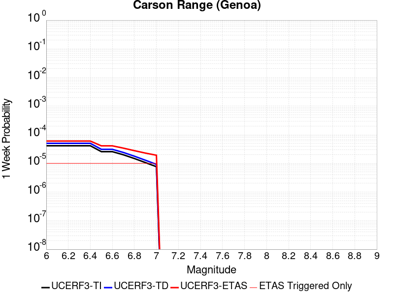 |  |  |  |

| Magnitude | 1 wk TI Prob | 1 wk TD Prob | 1 wk ETAS Prob | 1 wk ETAS/TD Gain | 1 wk ETAS Triggered Only | 1 mo TI Prob | 1 mo TD Prob | 1 mo ETAS Prob | 1 mo ETAS/TD Gain | 1 mo ETAS Triggered Only | 1 yr TI Prob | 1 yr TD Prob | 1 yr ETAS Prob | 1 yr ETAS/TD Gain | 1 yr ETAS Triggered Only | 10 yr TI Prob | 10 yr TD Prob | 10 yr ETAS Prob | 10 yr ETAS/TD Gain | 10 yr ETAS Triggered Only |
|-----|-----|-----|-----|-----|-----|-----|-----|-----|-----|-----|-----|-----|-----|-----|-----|-----|-----|-----|-----|-----|
| 6.0 | 4.1268457E-5 | 5.014691E-5 | 6.014641E-5 | 1.1994041 | 1.0E-5 | 1.7685282E-4 | 2.1489977E-4 | 2.2489764E-4 | 1.0465233 | 1.0E-5 | 0.0021510567 | 0.002613659 | 0.0026336068 | 1.0076321 | 2.0E-5 | 0.02130354 | 0.025868865 | 0.025888346 | 1.0007532 | 2.0E-5 |
| 6.1 | 4.1268457E-5 | 5.014691E-5 | 6.014641E-5 | 1.1994041 | 1.0E-5 | 1.7685282E-4 | 2.1489977E-4 | 2.2489764E-4 | 1.0465233 | 1.0E-5 | 0.0021510567 | 0.002613659 | 0.0026336068 | 1.0076321 | 2.0E-5 | 0.02130354 | 0.025868865 | 0.025888346 | 1.0007532 | 2.0E-5 |
| 6.2 | 4.1268457E-5 | 5.014691E-5 | 6.014641E-5 | 1.1994041 | 1.0E-5 | 1.7685282E-4 | 2.1489977E-4 | 2.2489764E-4 | 1.0465233 | 1.0E-5 | 0.0021510567 | 0.002613659 | 0.0026336068 | 1.0076321 | 2.0E-5 | 0.02130354 | 0.025868865 | 0.025888346 | 1.0007532 | 2.0E-5 |
| 6.3 | 4.1268457E-5 | 5.014691E-5 | 6.014641E-5 | 1.1994041 | 1.0E-5 | 1.7685282E-4 | 2.1489977E-4 | 2.2489764E-4 | 1.0465233 | 1.0E-5 | 0.0021510567 | 0.002613659 | 0.0026336068 | 1.0076321 | 2.0E-5 | 0.02130354 | 0.025868865 | 0.025888346 | 1.0007532 | 2.0E-5 |
| 6.4 | 4.1268457E-5 | 5.014691E-5 | 6.014641E-5 | 1.1994041 | 1.0E-5 | 1.7685282E-4 | 2.1489977E-4 | 2.2489764E-4 | 1.0465233 | 1.0E-5 | 0.0021510567 | 0.002613659 | 0.0026336068 | 1.0076321 | 2.0E-5 | 0.02130354 | 0.025868865 | 0.025888346 | 1.0007532 | 2.0E-5 |
| 6.5 | 2.5677185E-5 | 3.0978295E-5 | 4.0977986E-5 | 1.3227967 | 1.0E-5 | 1.1004044E-4 | 1.3275839E-4 | 1.4275707E-4 | 1.0753148 | 1.0E-5 | 0.0013389189 | 0.0016153152 | 0.001635283 | 1.0123615 | 2.0E-5 | 0.0133088045 | 0.01605366 | 0.016073339 | 1.0012258 | 2.0E-5 |
| 6.6 | 2.5677185E-5 | 3.0978295E-5 | 4.0977986E-5 | 1.3227967 | 1.0E-5 | 1.1004044E-4 | 1.3275839E-4 | 1.4275707E-4 | 1.0753148 | 1.0E-5 | 0.0013389189 | 0.0016153152 | 0.001635283 | 1.0123615 | 2.0E-5 | 0.0133088045 | 0.01605366 | 0.016073339 | 1.0012258 | 2.0E-5 |
| 6.7 | 1.9969408E-5 | 2.4063473E-5 | 3.4063232E-5 | 1.4155576 | 1.0E-5 | 8.558037E-5 | 1.0312596E-4 | 1.1312493E-4 | 1.0969588 | 1.0E-5 | 0.0010414429 | 0.0012549888 | 0.0012649763 | 1.0079582 | 1.0E-5 | 0.010365757 | 0.012494174 | 0.01250405 | 1.0007904 | 1.0E-5 |
| 6.8 | 1.4783156E-5 | 1.7817569E-5 | 2.7817392E-5 | 1.5612338 | 1.0E-5 | 6.335485E-5 | 7.635951E-5 | 8.635875E-5 | 1.1309495 | 1.0E-5 | 7.710722E-4 | 9.294107E-4 | 9.394014E-4 | 1.0107495 | 1.0E-5 | 0.0076840227 | 0.009268024 | 0.009277931 | 1.001069 | 1.0E-5 |
| 6.9 | 1.06660555E-5 | 1.2877027E-5 | 2.2876899E-5 | 1.7765667 | 1.0E-5 | 4.5710865E-5 | 5.518674E-5 | 6.518619E-5 | 1.181193 | 1.0E-5 | 5.5638765E-4 | 6.718067E-4 | 6.8179995E-4 | 1.0148753 | 1.0E-5 | 0.005549967 | 0.0067090564 | 0.006718989 | 1.0014806 | 1.0E-5 |
| 7.0 | 7.664838E-6 | 9.258307E-6 | 1.9258214E-5 | 2.080101 | 1.0E-5 | 3.2848893E-5 | 3.9678456E-5 | 4.967806E-5 | 1.252016 | 1.0E-5 | 3.998619E-4 | 4.830852E-4 | 4.9308036E-4 | 1.0206903 | 1.0E-5 | 0.0039914316 | 0.00483085 | 0.0048408015 | 1.00206 | 1.0E-5 |

## Northridge Hills
*[(top)](#table-of-contents)*

| 1 Week | 1 Month | 1 Year | 10 Year |
|-----|-----|-----|-----|
|  |  |  |  |

| Magnitude | 1 wk TI Prob | 1 wk TD Prob | 1 wk ETAS Prob | 1 wk ETAS/TD Gain | 1 wk ETAS Triggered Only | 1 mo TI Prob | 1 mo TD Prob | 1 mo ETAS Prob | 1 mo ETAS/TD Gain | 1 mo ETAS Triggered Only | 1 yr TI Prob | 1 yr TD Prob | 1 yr ETAS Prob | 1 yr ETAS/TD Gain | 1 yr ETAS Triggered Only | 10 yr TI Prob | 10 yr TD Prob | 10 yr ETAS Prob | 10 yr ETAS/TD Gain | 10 yr ETAS Triggered Only |
|-----|-----|-----|-----|-----|-----|-----|-----|-----|-----|-----|-----|-----|-----|-----|-----|-----|-----|-----|-----|-----|
| 6.0 | 5.095982E-6 | 3.6152135E-6 | 1.36151775E-5 | 3.7660785 | 1.0E-5 | 2.183974E-5 | 1.549368E-5 | 3.549337E-5 | 2.290829 | 2.0E-5 | 2.658664E-4 | 1.8861935E-4 | 2.0861557E-4 | 1.1060137 | 2.0E-5 | 0.0026554854 | 0.0018846049 | 0.0019045672 | 1.0105923 | 2.0E-5 |
| 6.1 | 5.095982E-6 | 3.6152135E-6 | 1.36151775E-5 | 3.7660785 | 1.0E-5 | 2.183974E-5 | 1.549368E-5 | 3.549337E-5 | 2.290829 | 2.0E-5 | 2.658664E-4 | 1.8861935E-4 | 2.0861557E-4 | 1.1060137 | 2.0E-5 | 0.0026554854 | 0.0018846049 | 0.0019045672 | 1.0105923 | 2.0E-5 |
| 6.2 | 5.095982E-6 | 3.6152135E-6 | 1.36151775E-5 | 3.7660785 | 1.0E-5 | 2.183974E-5 | 1.549368E-5 | 3.549337E-5 | 2.290829 | 2.0E-5 | 2.658664E-4 | 1.8861935E-4 | 2.0861557E-4 | 1.1060137 | 2.0E-5 | 0.0026554854 | 0.0018846049 | 0.0019045672 | 1.0105923 | 2.0E-5 |
| 6.3 | 5.095982E-6 | 3.6152135E-6 | 1.36151775E-5 | 3.7660785 | 1.0E-5 | 2.183974E-5 | 1.549368E-5 | 3.549337E-5 | 2.290829 | 2.0E-5 | 2.658664E-4 | 1.8861935E-4 | 2.0861557E-4 | 1.1060137 | 2.0E-5 | 0.0026554854 | 0.0018846049 | 0.0019045672 | 1.0105923 | 2.0E-5 |
| 6.4 | 5.095982E-6 | 3.6152135E-6 | 1.36151775E-5 | 3.7660785 | 1.0E-5 | 2.183974E-5 | 1.549368E-5 | 3.549337E-5 | 2.290829 | 2.0E-5 | 2.658664E-4 | 1.8861935E-4 | 2.0861557E-4 | 1.1060137 | 2.0E-5 | 0.0026554854 | 0.0018846049 | 0.0019045672 | 1.0105923 | 2.0E-5 |
| 6.5 | 5.095982E-6 | 3.6152135E-6 | 1.36151775E-5 | 3.7660785 | 1.0E-5 | 2.183974E-5 | 1.549368E-5 | 3.549337E-5 | 2.290829 | 2.0E-5 | 2.658664E-4 | 1.8861935E-4 | 2.0861557E-4 | 1.1060137 | 2.0E-5 | 0.0026554854 | 0.0018846049 | 0.0019045672 | 1.0105923 | 2.0E-5 |
| 6.6 | 5.095982E-6 | 3.6152135E-6 | 1.36151775E-5 | 3.7660785 | 1.0E-5 | 2.183974E-5 | 1.549368E-5 | 3.549337E-5 | 2.290829 | 2.0E-5 | 2.658664E-4 | 1.8861935E-4 | 2.0861557E-4 | 1.1060137 | 2.0E-5 | 0.0026554854 | 0.0018846049 | 0.0019045672 | 1.0105923 | 2.0E-5 |
| 6.7 | 5.095982E-6 | 3.6152135E-6 | 1.36151775E-5 | 3.7660785 | 1.0E-5 | 2.183974E-5 | 1.549368E-5 | 3.549337E-5 | 2.290829 | 2.0E-5 | 2.658664E-4 | 1.8861935E-4 | 2.0861557E-4 | 1.1060137 | 2.0E-5 | 0.0026554854 | 0.0018846049 | 0.0019045672 | 1.0105923 | 2.0E-5 |
| 6.8 | 5.095982E-6 | 3.6152135E-6 | 1.36151775E-5 | 3.7660785 | 1.0E-5 | 2.183974E-5 | 1.549368E-5 | 3.549337E-5 | 2.290829 | 2.0E-5 | 2.658664E-4 | 1.8861935E-4 | 2.0861557E-4 | 1.1060137 | 2.0E-5 | 0.0026554854 | 0.0018846049 | 0.0019045672 | 1.0105923 | 2.0E-5 |
| 6.9 | 5.0942654E-6 | 3.6134284E-6 | 1.3613392E-5 | 3.7674448 | 1.0E-5 | 2.1832384E-5 | 1.548603E-5 | 3.5485722E-5 | 2.2914665 | 2.0E-5 | 2.6577685E-4 | 1.8852622E-4 | 2.0852246E-4 | 1.106066 | 2.0E-5 | 0.002654592 | 0.0018836753 | 0.0019036377 | 1.0105976 | 2.0E-5 |
| 7.0 | 4.851143E-6 | 3.3587432E-6 | 1.335871E-5 | 3.977294 | 1.0E-5 | 2.0790447E-5 | 1.4394534E-5 | 3.439425E-5 | 2.3893962 | 2.0E-5 | 2.5309427E-4 | 1.752394E-4 | 1.952359E-4 | 1.1141096 | 2.0E-5 | 0.0025280623 | 0.0017510166 | 0.0017709816 | 1.0114019 | 2.0E-5 |
| 7.1 | 4.7910607E-6 | 3.2970245E-6 | 1.3296992E-5 | 4.0330276 | 1.0E-5 | 2.0532956E-5 | 1.4130029E-5 | 3.4129745E-5 | 2.4154053 | 2.0E-5 | 2.4996005E-4 | 1.7201956E-4 | 1.9201612E-4 | 1.1162459 | 2.0E-5 | 0.0024967908 | 0.0017188682 | 0.0017388337 | 1.0116155 | 2.0E-5 |
| 7.2 | 4.580079E-6 | 3.106803E-6 | 1.3106772E-5 | 4.218733 | 1.0E-5 | 1.9628762E-5 | 1.3314802E-5 | 2.331467E-5 | 1.7510339 | 1.0E-5 | 2.3895396E-4 | 1.6209569E-4 | 1.7209406E-4 | 1.061682 | 1.0E-5 | 0.0023869718 | 0.001619778 | 0.0016297618 | 1.0061637 | 1.0E-5 |
| 7.3 | 4.290062E-6 | 2.8682362E-6 | 1.2868208E-5 | 4.4864535 | 1.0E-5 | 1.838585E-5 | 1.2292383E-5 | 2.2292259E-5 | 1.813502 | 1.0E-5 | 2.2382473E-4 | 1.4964951E-4 | 1.5964801E-4 | 1.0668128 | 1.0E-5 | 0.0022359942 | 0.0014954903 | 0.0015054754 | 1.0066768 | 1.0E-5 |
| 7.4 | 4.0259683E-6 | 2.6739135E-6 | 1.2673887E-5 | 4.7398267 | 1.0E-5 | 1.7254037E-5 | 1.1459579E-5 | 2.1459464E-5 | 1.8726224 | 1.0E-5 | 2.1004764E-4 | 1.3951147E-4 | 1.4951007E-4 | 1.0716687 | 1.0E-5 | 0.002098492 | 0.0013942417 | 0.0014042277 | 1.0071623 | 1.0E-5 |
| 7.5 | 3.5477108E-6 | 2.285198E-6 | 1.2285175E-5 | 5.3759785 | 1.0E-5 | 1.5204386E-5 | 9.793668E-6 | 1.979357E-5 | 2.0210578 | 1.0E-5 | 1.8509767E-4 | 1.192314E-4 | 1.292302E-4 | 1.0838605 | 1.0E-5 | 0.0018494357 | 0.0011916759 | 0.001201664 | 1.0083815 | 1.0E-5 |
| 7.6 | 2.9990608E-6 | 1.8528159E-6 | 1.1852798E-5 | 6.39718 | 1.0E-5 | 1.2853055E-5 | 7.940615E-6 | 1.7940536E-5 | 2.2593381 | 1.0E-5 | 1.564747E-4 | 9.667271E-5 | 1.06671745E-4 | 1.1034318 | 1.0E-5 | 0.0015636457 | 9.6630736E-4 | 9.762977E-4 | 1.0103387 | 1.0E-5 |
| 7.7 | 2.4542855E-6 | 1.4461142E-6 | 1.14461E-5 | 7.915073 | 1.0E-5 | 1.05183235E-5 | 6.1976175E-6 | 1.6197555E-5 | 2.6135132 | 1.0E-5 | 1.2805307E-4 | 7.545339E-5 | 8.545263E-5 | 1.1325221 | 1.0E-5 | 0.001279793 | 7.5427827E-4 | 7.642707E-4 | 1.0132477 | 1.0E-5 |
| 7.8 | 1.3623128E-6 | 8.0160027E-7 | 8.0160027E-7 | 1.0 | 0.0 | 5.8384703E-6 | 3.4354252E-6 | 3.4354252E-6 | 1.0 | 0.0 | 7.108106E-5 | 4.18255E-5 | 4.18255E-5 | 1.0 | 0.0 | 7.1058323E-4 | 4.1817653E-4 | 4.1817653E-4 | 1.0 | 0.0 |
| 7.9 | 7.716622E-7 | 4.218644E-7 | 4.218644E-7 | 1.0 | 0.0 | 3.3071194E-6 | 1.807989E-6 | 1.807989E-6 | 1.0 | 0.0 | 4.0263436E-5 | 2.2012046E-5 | 2.2012046E-5 | 1.0 | 0.0 | 4.0256142E-4 | 2.2009875E-4 | 2.2009875E-4 | 1.0 | 0.0 |
| 8.0 | 1.2117711E-7 | 6.6217325E-8 | 6.6217325E-8 | 1.0 | 0.0 | 5.1933034E-7 | 2.8378852E-7 | 2.8378852E-7 | 1.0 | 0.0 | 6.3228285E-6 | 3.45512E-6 | 3.45512E-6 | 1.0 | 0.0 | 6.3226486E-5 | 3.4550678E-5 | 3.4550678E-5 | 1.0 | 0.0 |

## Earthquake Valley (No  Extension)
*[(top)](#table-of-contents)*

| 1 Week | 1 Month | 1 Year | 10 Year |
|-----|-----|-----|-----|
| 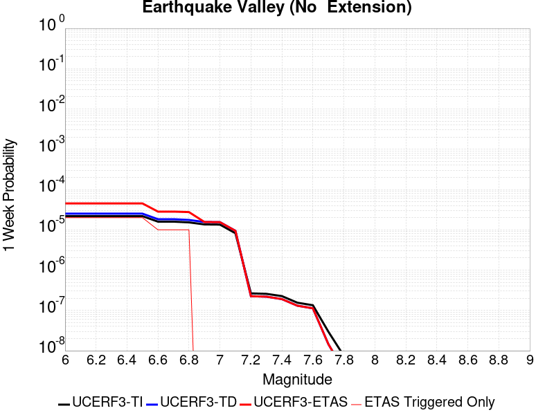 |  |  | 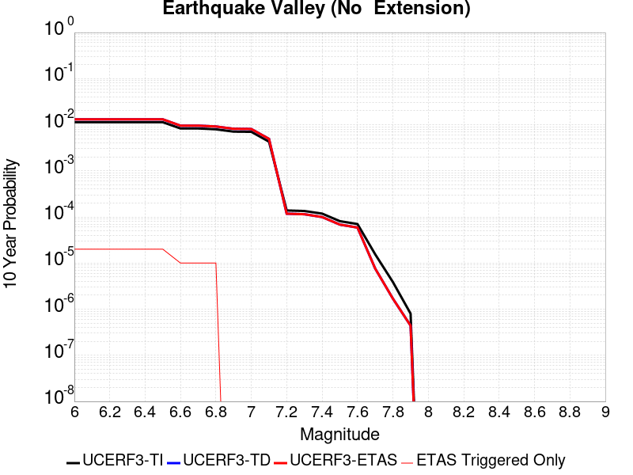 |

| Magnitude | 1 wk TI Prob | 1 wk TD Prob | 1 wk ETAS Prob | 1 wk ETAS/TD Gain | 1 wk ETAS Triggered Only | 1 mo TI Prob | 1 mo TD Prob | 1 mo ETAS Prob | 1 mo ETAS/TD Gain | 1 mo ETAS Triggered Only | 1 yr TI Prob | 1 yr TD Prob | 1 yr ETAS Prob | 1 yr ETAS/TD Gain | 1 yr ETAS Triggered Only | 10 yr TI Prob | 10 yr TD Prob | 10 yr ETAS Prob | 10 yr ETAS/TD Gain | 10 yr ETAS Triggered Only |
|-----|-----|-----|-----|-----|-----|-----|-----|-----|-----|-----|-----|-----|-----|-----|-----|-----|-----|-----|-----|-----|
| 6.0 | 2.1859703E-5 | 2.5198351E-5 | 4.519785E-5 | 1.7936827 | 2.0E-5 | 9.3681076E-5 | 1.0798928E-4 | 1.2798712E-4 | 1.1851835 | 2.0E-5 | 0.0011399703 | 0.0013141216 | 0.0013340954 | 1.0151993 | 2.0E-5 | 0.011341401 | 0.013077869 | 0.0130976075 | 1.0015093 | 2.0E-5 |
| 6.1 | 2.1859703E-5 | 2.5198351E-5 | 4.519785E-5 | 1.7936827 | 2.0E-5 | 9.3681076E-5 | 1.0798928E-4 | 1.2798712E-4 | 1.1851835 | 2.0E-5 | 0.0011399703 | 0.0013141216 | 0.0013340954 | 1.0151993 | 2.0E-5 | 0.011341401 | 0.013077869 | 0.0130976075 | 1.0015093 | 2.0E-5 |
| 6.2 | 2.1859703E-5 | 2.5198351E-5 | 4.519785E-5 | 1.7936827 | 2.0E-5 | 9.3681076E-5 | 1.0798928E-4 | 1.2798712E-4 | 1.1851835 | 2.0E-5 | 0.0011399703 | 0.0013141216 | 0.0013340954 | 1.0151993 | 2.0E-5 | 0.011341401 | 0.013077869 | 0.0130976075 | 1.0015093 | 2.0E-5 |
| 6.3 | 2.1859703E-5 | 2.5198351E-5 | 4.519785E-5 | 1.7936827 | 2.0E-5 | 9.3681076E-5 | 1.0798928E-4 | 1.2798712E-4 | 1.1851835 | 2.0E-5 | 0.0011399703 | 0.0013141216 | 0.0013340954 | 1.0151993 | 2.0E-5 | 0.011341401 | 0.013077869 | 0.0130976075 | 1.0015093 | 2.0E-5 |
| 6.4 | 2.1859703E-5 | 2.5198351E-5 | 4.519785E-5 | 1.7936827 | 2.0E-5 | 9.3681076E-5 | 1.0798928E-4 | 1.2798712E-4 | 1.1851835 | 2.0E-5 | 0.0011399703 | 0.0013141216 | 0.0013340954 | 1.0151993 | 2.0E-5 | 0.011341401 | 0.013077869 | 0.0130976075 | 1.0015093 | 2.0E-5 |
| 6.5 | 2.1859703E-5 | 2.5198351E-5 | 4.519785E-5 | 1.7936827 | 2.0E-5 | 9.3681076E-5 | 1.0798928E-4 | 1.2798712E-4 | 1.1851835 | 2.0E-5 | 0.0011399703 | 0.0013141216 | 0.0013340954 | 1.0151993 | 2.0E-5 | 0.011341401 | 0.013077869 | 0.0130976075 | 1.0015093 | 2.0E-5 |
| 6.6 | 1.597E-5 | 1.835627E-5 | 2.8356086E-5 | 1.544763 | 1.0E-5 | 6.8441055E-5 | 7.866784E-5 | 8.866706E-5 | 1.1271068 | 1.0E-5 | 8.329513E-4 | 9.5744745E-4 | 9.6743787E-4 | 1.0104344 | 1.0E-5 | 0.008298361 | 0.009541833 | 0.009551737 | 1.0010381 | 1.0E-5 |
| 6.7 | 1.597E-5 | 1.835627E-5 | 2.8356086E-5 | 1.544763 | 1.0E-5 | 6.8441055E-5 | 7.866784E-5 | 8.866706E-5 | 1.1271068 | 1.0E-5 | 8.329513E-4 | 9.5744745E-4 | 9.6743787E-4 | 1.0104344 | 1.0E-5 | 0.008298361 | 0.009541833 | 0.009551737 | 1.0010381 | 1.0E-5 |
| 6.8 | 1.5315149E-5 | 1.7602086E-5 | 2.760191E-5 | 1.5681045 | 1.0E-5 | 6.5634704E-5 | 7.543582E-5 | 8.543506E-5 | 1.132553 | 1.0E-5 | 7.988095E-4 | 9.1813074E-4 | 9.2812156E-4 | 1.0108817 | 1.0E-5 | 0.007959441 | 0.009151915 | 0.009161824 | 1.0010827 | 1.0E-5 |
| 6.9 | 1.3634728E-5 | 1.5675814E-5 | 1.5675814E-5 | 1.0 | 0.0 | 5.8433237E-5 | 6.7180794E-5 | 6.7180794E-5 | 1.0 | 0.0 | 7.1119244E-4 | 8.1770134E-4 | 8.1770134E-4 | 1.0 | 0.0 | 0.007089207 | 0.008154998 | 0.008154998 | 1.0 | 0.0 |
| 7.0 | 1.3496271E-5 | 1.5517848E-5 | 1.5517848E-5 | 1.0 | 0.0 | 5.783988E-5 | 6.6503824E-5 | 6.6503824E-5 | 1.0 | 0.0 | 7.03973E-4 | 8.0946536E-4 | 8.0946536E-4 | 1.0 | 0.0 | 0.007017471 | 0.008073238 | 0.008073238 | 1.0 | 0.0 |
| 7.1 | 8.242798E-6 | 9.472594E-6 | 9.472594E-6 | 1.0 | 0.0 | 3.53258E-5 | 4.0596577E-5 | 4.0596577E-5 | 1.0 | 0.0 | 4.300067E-4 | 4.9421826E-4 | 4.9421826E-4 | 1.0 | 0.0 | 0.004291756 | 0.0049377684 | 0.0049377684 | 1.0 | 0.0 |
| 7.2 | 2.6506527E-7 | 2.2559628E-7 | 2.2559628E-7 | 1.0 | 0.0 | 1.1359936E-6 | 9.668408E-7 | 9.668408E-7 | 1.0 | 0.0 | 1.3830633E-5 | 1.1771229E-5 | 1.1771229E-5 | 1.0 | 0.0 | 1.3829772E-4 | 1.1770646E-4 | 1.1770646E-4 | 1.0 | 0.0 |
| 7.3 | 2.5810488E-7 | 2.1954757E-7 | 2.1954757E-7 | 1.0 | 0.0 | 1.1061633E-6 | 9.4091786E-7 | 9.4091786E-7 | 1.0 | 0.0 | 1.3467455E-5 | 1.1455619E-5 | 1.1455619E-5 | 1.0 | 0.0 | 1.3466639E-4 | 1.145507E-4 | 1.145507E-4 | 1.0 | 0.0 |
| 7.4 | 2.2676066E-7 | 1.9109943E-7 | 1.9109943E-7 | 1.0 | 0.0 | 9.71831E-7 | 8.189973E-7 | 8.189973E-7 | 1.0 | 0.0 | 1.1831979E-5 | 9.971251E-6 | 9.971251E-6 | 1.0 | 0.0 | 1.1831349E-4 | 9.970842E-5 | 9.970842E-5 | 1.0 | 0.0 |
| 7.5 | 1.5553917E-7 | 1.311138E-7 | 1.311138E-7 | 1.0 | 0.0 | 6.6659624E-7 | 5.619162E-7 | 5.619162E-7 | 1.0 | 0.0 | 8.115779E-6 | 6.84131E-6 | 6.84131E-6 | 1.0 | 0.0 | 8.115482E-5 | 6.841121E-5 | 6.841121E-5 | 1.0 | 0.0 |
| 7.6 | 1.3448629E-7 | 1.1287708E-7 | 1.1287708E-7 | 1.0 | 0.0 | 5.7636964E-7 | 4.8375887E-7 | 4.8375887E-7 | 1.0 | 0.0 | 7.017278E-6 | 5.8897504E-6 | 5.8897504E-6 | 1.0 | 0.0 | 7.0170565E-5 | 5.8896156E-5 | 5.8896156E-5 | 1.0 | 0.0 |
| 7.7 | 2.9719402E-8 | 1.4581234E-8 | 1.4581234E-8 | 1.0 | 0.0 | 1.2736886E-7 | 6.2491004E-8 | 6.2491004E-8 | 1.0 | 0.0 | 1.5507147E-6 | 7.6082773E-7 | 7.6082773E-7 | 1.0 | 0.0 | 1.550704E-5 | 7.608257E-6 | 7.608257E-6 | 1.0 | 0.0 |
| 7.8 | 7.4390196E-9 | 3.249962E-9 | 3.249962E-9 | 1.0 | 0.0 | 3.1881513E-8 | 1.39284095E-8 | 1.39284095E-8 | 1.0 | 0.0 | 3.8815733E-7 | 1.6957837E-7 | 1.6957837E-7 | 1.0 | 0.0 | 3.8815665E-6 | 1.6957828E-6 | 1.6957828E-6 | 1.0 | 0.0 |
| 7.9 | 1.5373532E-9 | 8.4400953E-10 | 8.4400953E-10 | 1.0 | 0.0 | 6.5886567E-9 | 3.6171839E-9 | 3.6171839E-9 | 1.0 | 0.0 | 8.021689E-8 | 4.403921E-8 | 4.403921E-8 | 1.0 | 0.0 | 8.0216864E-7 | 4.403921E-7 | 4.403921E-7 | 1.0 | 0.0 |

## Malibu Coast (Extension) alt 1
*[(top)](#table-of-contents)*

| 1 Week | 1 Month | 1 Year | 10 Year |
|-----|-----|-----|-----|
| 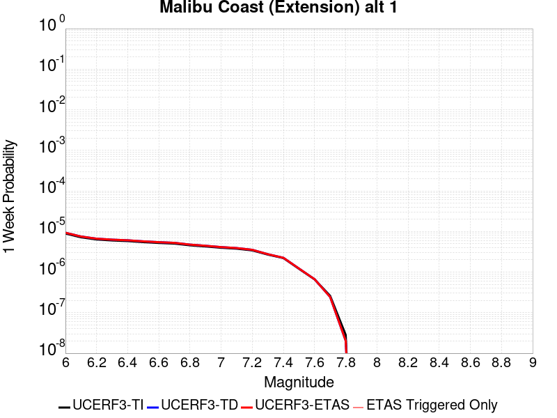 |  |  |  |

| Magnitude | 1 wk TI Prob | 1 wk TD Prob | 1 wk ETAS Prob | 1 wk ETAS/TD Gain | 1 wk ETAS Triggered Only | 1 mo TI Prob | 1 mo TD Prob | 1 mo ETAS Prob | 1 mo ETAS/TD Gain | 1 mo ETAS Triggered Only | 1 yr TI Prob | 1 yr TD Prob | 1 yr ETAS Prob | 1 yr ETAS/TD Gain | 1 yr ETAS Triggered Only | 10 yr TI Prob | 10 yr TD Prob | 10 yr ETAS Prob | 10 yr ETAS/TD Gain | 10 yr ETAS Triggered Only |
|-----|-----|-----|-----|-----|-----|-----|-----|-----|-----|-----|-----|-----|-----|-----|-----|-----|-----|-----|-----|-----|
| 6.0 | 8.930738E-6 | 9.3292765E-6 | 9.3292765E-6 | 1.0 | 0.0 | 3.827403E-5 | 3.998201E-5 | 4.9981612E-5 | 1.2501025 | 1.0E-5 | 4.6588664E-4 | 4.86674E-4 | 5.066643E-4 | 1.0410752 | 2.0E-5 | 0.0046491115 | 0.004856264 | 0.0048761675 | 1.0040984 | 2.0E-5 |
| 6.1 | 7.199952E-6 | 7.5302974E-6 | 7.5302974E-6 | 1.0 | 0.0 | 3.0856572E-5 | 3.2272306E-5 | 4.2271986E-5 | 1.3098532 | 1.0E-5 | 3.75614E-4 | 3.928451E-4 | 4.0284116E-4 | 1.0254453 | 1.0E-5 | 0.0037497976 | 0.0039215726 | 0.0039315335 | 1.00254 | 1.0E-5 |
| 6.2 | 6.3721413E-6 | 6.666792E-6 | 6.666792E-6 | 1.0 | 0.0 | 2.7308892E-5 | 2.8571656E-5 | 3.8571372E-5 | 1.3499873 | 1.0E-5 | 3.3243504E-4 | 3.4780474E-4 | 3.5780127E-4 | 1.0287417 | 1.0E-5 | 0.0033193815 | 0.0034726441 | 0.0034826095 | 1.0028696 | 1.0E-5 |
| 6.3 | 6.016345E-6 | 6.295159E-6 | 6.295159E-6 | 1.0 | 0.0 | 2.578408E-5 | 2.6978976E-5 | 3.6978705E-5 | 1.370649 | 1.0E-5 | 3.1387596E-4 | 3.2841985E-4 | 3.3841658E-4 | 1.0304388 | 1.0E-5 | 0.00313433 | 0.0032793812 | 0.0032893484 | 1.0030394 | 1.0E-5 |
| 6.4 | 5.8104883E-6 | 6.0795455E-6 | 6.0795455E-6 | 1.0 | 0.0 | 2.4901856E-5 | 2.6054937E-5 | 3.6054676E-5 | 1.3837944 | 1.0E-5 | 3.031379E-4 | 3.17173E-4 | 3.271698E-4 | 1.0315186 | 1.0E-5 | 0.0030272473 | 0.0031672379 | 0.003177206 | 1.0031474 | 1.0E-5 |
| 6.5 | 5.476925E-6 | 5.727514E-6 | 5.727514E-6 | 1.0 | 0.0 | 2.3472323E-5 | 2.454626E-5 | 3.4546014E-5 | 1.407384 | 1.0E-5 | 2.8573806E-4 | 2.9881002E-4 | 3.0880704E-4 | 1.0334561 | 1.0E-5 | 0.0028537093 | 0.0029841145 | 0.0029940845 | 1.0033411 | 1.0E-5 |
| 6.6 | 5.222387E-6 | 5.4585807E-6 | 5.4585807E-6 | 1.0 | 0.0 | 2.2381464E-5 | 2.3393708E-5 | 3.3393473E-5 | 1.4274553 | 1.0E-5 | 2.7246025E-4 | 2.8478145E-4 | 2.947786E-4 | 1.0351046 | 1.0E-5 | 0.0027212645 | 0.002844196 | 0.0028541675 | 1.003506 | 1.0E-5 |
| 6.7 | 5.0337076E-6 | 5.259104E-6 | 5.259104E-6 | 1.0 | 0.0 | 2.1572854E-5 | 2.2538823E-5 | 3.25386E-5 | 1.4436688 | 1.0E-5 | 2.6261783E-4 | 2.743759E-4 | 2.8437315E-4 | 1.0364363 | 1.0E-5 | 0.002623077 | 0.0027404015 | 0.0027503741 | 1.0036391 | 1.0E-5 |
| 6.8 | 4.5675624E-6 | 4.7587173E-6 | 4.7587173E-6 | 1.0 | 0.0 | 1.9575122E-5 | 2.0394344E-5 | 3.039414E-5 | 1.490322 | 1.0E-5 | 2.3830103E-4 | 2.4827302E-4 | 2.5827056E-4 | 1.0402682 | 1.0E-5 | 0.0023804565 | 0.0024799763 | 0.0024899517 | 1.0040222 | 1.0E-5 |
| 6.9 | 4.2802412E-6 | 4.4520216E-6 | 4.4520216E-6 | 1.0 | 0.0 | 1.8343762E-5 | 1.9079953E-5 | 1.9079953E-5 | 1.0 | 0.0 | 2.2331243E-4 | 2.3227383E-4 | 2.3227383E-4 | 1.0 | 0.0 | 0.0022308815 | 0.0023203273 | 0.0023203273 | 1.0 | 0.0 |
| 7.0 | 3.9794063E-6 | 4.1301E-6 | 4.1301E-6 | 1.0 | 0.0 | 1.7054486E-5 | 1.770031E-5 | 1.770031E-5 | 1.0 | 0.0 | 2.0761859E-4 | 2.1548007E-4 | 2.1548007E-4 | 1.0 | 0.0 | 0.0020742472 | 0.002152725 | 0.002152725 | 1.0 | 0.0 |
| 7.1 | 3.7730424E-6 | 3.911218E-6 | 3.911218E-6 | 1.0 | 0.0 | 1.6170083E-5 | 1.6762255E-5 | 1.6762255E-5 | 1.0 | 0.0 | 1.9685295E-4 | 2.0406146E-4 | 2.0406146E-4 | 1.0 | 0.0 | 0.0019667868 | 0.0020387538 | 0.0020387538 | 1.0 | 0.0 |
| 7.2 | 3.424985E-6 | 3.541338E-6 | 3.541338E-6 | 1.0 | 0.0 | 1.4678424E-5 | 1.5177075E-5 | 1.5177075E-5 | 1.0 | 0.0 | 1.7869516E-4 | 1.8476533E-4 | 1.8476533E-4 | 1.0 | 0.0 | 0.0017855153 | 0.0018461292 | 0.0018461292 | 1.0 | 0.0 |
| 7.3 | 2.6966375E-6 | 2.759654E-6 | 2.759654E-6 | 1.0 | 0.0 | 1.15569665E-5 | 1.1827035E-5 | 1.1827035E-5 | 1.0 | 0.0 | 1.4069698E-4 | 1.4398468E-4 | 1.4398468E-4 | 1.0 | 0.0 | 0.0014060794 | 0.001438918 | 0.001438918 | 1.0 | 0.0 |
| 7.4 | 2.215957E-6 | 2.249379E-6 | 2.249379E-6 | 1.0 | 0.0 | 9.496924E-6 | 9.64016E-6 | 9.64016E-6 | 1.0 | 0.0 | 1.1561892E-4 | 1.1736266E-4 | 1.1736266E-4 | 1.0 | 0.0 | 0.0011555878 | 0.0011730106 | 0.0011730106 | 1.0 | 0.0 |
| 7.5 | 1.2040218E-6 | 1.2219067E-6 | 1.2219067E-6 | 1.0 | 0.0 | 5.160083E-6 | 5.2367327E-6 | 5.2367327E-6 | 1.0 | 0.0 | 6.2822204E-5 | 6.3755375E-5 | 6.3755375E-5 | 1.0 | 0.0 | 6.280445E-4 | 6.3737266E-4 | 6.3737266E-4 | 1.0 | 0.0 |
| 7.6 | 6.6157446E-7 | 6.6789755E-7 | 6.6789755E-7 | 1.0 | 0.0 | 2.835316E-6 | 2.8624152E-6 | 2.8624152E-6 | 1.0 | 0.0 | 3.4519428E-5 | 3.4849363E-5 | 3.4849363E-5 | 1.0 | 0.0 | 3.4514067E-4 | 3.484405E-4 | 3.484405E-4 | 1.0 | 0.0 |
| 7.7 | 2.6012302E-7 | 2.4357584E-7 | 2.4357584E-7 | 1.0 | 0.0 | 1.1148124E-6 | 1.0438962E-6 | 1.0438962E-6 | 1.0 | 0.0 | 1.3572758E-5 | 1.2709373E-5 | 1.2709373E-5 | 1.0 | 0.0 | 1.3571928E-4 | 1.2708752E-4 | 1.2708752E-4 | 1.0 | 0.0 |
| 7.8 | 2.8323132E-8 | 2.0266642E-8 | 2.0266642E-8 | 1.0 | 0.0 | 1.2138484E-7 | 8.685703E-8 | 8.685703E-8 | 1.0 | 0.0 | 1.4778595E-6 | 1.0574839E-6 | 1.0574839E-6 | 1.0 | 0.0 | 1.4778497E-5 | 1.0574797E-5 | 1.0574797E-5 | 1.0 | 0.0 |

## Malibu Coast alt 1
*[(top)](#table-of-contents)*

| 1 Week | 1 Month | 1 Year | 10 Year |
|-----|-----|-----|-----|
|  |  |  |  |

| Magnitude | 1 wk TI Prob | 1 wk TD Prob | 1 wk ETAS Prob | 1 wk ETAS/TD Gain | 1 wk ETAS Triggered Only | 1 mo TI Prob | 1 mo TD Prob | 1 mo ETAS Prob | 1 mo ETAS/TD Gain | 1 mo ETAS Triggered Only | 1 yr TI Prob | 1 yr TD Prob | 1 yr ETAS Prob | 1 yr ETAS/TD Gain | 1 yr ETAS Triggered Only | 10 yr TI Prob | 10 yr TD Prob | 10 yr ETAS Prob | 10 yr ETAS/TD Gain | 10 yr ETAS Triggered Only |
|-----|-----|-----|-----|-----|-----|-----|-----|-----|-----|-----|-----|-----|-----|-----|-----|-----|-----|-----|-----|-----|
| 6.0 | 1.6572556E-5 | 1.759807E-5 | 2.7597893E-5 | 1.5682342 | 1.0E-5 | 7.102331E-5 | 7.5418226E-5 | 8.5417465E-5 | 1.132584 | 1.0E-5 | 8.6436566E-4 | 9.1784896E-4 | 9.278398E-4 | 1.010885 | 1.0E-5 | 0.0086101135 | 0.009142514 | 0.009162331 | 1.0021676 | 2.0E-5 |
| 6.1 | 1.6572556E-5 | 1.759807E-5 | 2.7597893E-5 | 1.5682342 | 1.0E-5 | 7.102331E-5 | 7.5418226E-5 | 8.5417465E-5 | 1.132584 | 1.0E-5 | 8.6436566E-4 | 9.1784896E-4 | 9.278398E-4 | 1.010885 | 1.0E-5 | 0.0086101135 | 0.009142514 | 0.009162331 | 1.0021676 | 2.0E-5 |
| 6.2 | 1.1085717E-5 | 1.155715E-5 | 2.1557034E-5 | 1.8652552 | 1.0E-5 | 4.750935E-5 | 4.9529724E-5 | 5.9529226E-5 | 1.2018889 | 1.0E-5 | 5.782728E-4 | 6.0286105E-4 | 6.12855E-4 | 1.0165776 | 1.0E-5 | 0.0057677035 | 0.0060126274 | 0.006032507 | 1.0033064 | 2.0E-5 |
| 6.3 | 1.0208568E-5 | 1.0592241E-5 | 2.0592135E-5 | 1.9440774 | 1.0E-5 | 4.375027E-5 | 4.5394543E-5 | 5.5394088E-5 | 1.2202808 | 1.0E-5 | 5.325294E-4 | 5.5254134E-4 | 5.6253583E-4 | 1.0180882 | 1.0E-5 | 0.0053125503 | 0.0055119833 | 0.005531873 | 1.0036085 | 2.0E-5 |
| 6.4 | 9.0682315E-6 | 9.342641E-6 | 1.9342548E-5 | 2.0703511 | 1.0E-5 | 3.8863272E-5 | 4.0039286E-5 | 5.0038885E-5 | 1.2497448 | 1.0E-5 | 4.730576E-4 | 4.873713E-4 | 4.973664E-4 | 1.0205083 | 1.0E-5 | 0.0047205184 | 0.004863238 | 0.004883141 | 1.0040925 | 2.0E-5 |
| 6.5 | 7.605796E-6 | 7.74859E-6 | 1.7748513E-5 | 2.2905474 | 1.0E-5 | 3.259586E-5 | 3.320783E-5 | 4.3207496E-5 | 1.3011239 | 1.0E-5 | 3.9678233E-4 | 4.0423166E-4 | 4.142276E-4 | 1.0247283 | 1.0E-5 | 0.0039607463 | 0.0040351013 | 0.004055021 | 1.0049365 | 2.0E-5 |
| 6.6 | 5.889873E-6 | 5.8795417E-6 | 1.5879483E-5 | 2.7008028 | 1.0E-5 | 2.5242069E-5 | 2.5197793E-5 | 3.519754E-5 | 1.3968501 | 1.0E-5 | 3.0727885E-4 | 3.0674002E-4 | 3.1673696E-4 | 1.0325909 | 1.0E-5 | 0.003068543 | 0.0030631793 | 0.003083118 | 1.0065092 | 2.0E-5 |
| 6.7 | 5.66586E-6 | 5.6416443E-6 | 1.5641588E-5 | 2.772523 | 1.0E-5 | 2.428203E-5 | 2.4178253E-5 | 3.417801E-5 | 1.4135848 | 1.0E-5 | 2.955936E-4 | 2.9433056E-4 | 3.043276E-4 | 1.0339653 | 1.0E-5 | 0.0029520073 | 0.0029394194 | 0.0029593604 | 1.0067841 | 2.0E-5 |
| 6.8 | 5.521556E-6 | 5.48943E-6 | 1.5489375E-5 | 2.8216727 | 1.0E-5 | 2.3663597E-5 | 2.3525918E-5 | 3.352568E-5 | 1.4250531 | 1.0E-5 | 2.880662E-4 | 2.8639048E-4 | 2.9638762E-4 | 1.0349073 | 1.0E-5 | 0.0028769306 | 0.0028602257 | 0.0028801684 | 1.0069724 | 2.0E-5 |
| 6.9 | 5.29752E-6 | 5.2499345E-6 | 1.5249882E-5 | 2.9047756 | 1.0E-5 | 2.270346E-5 | 2.2499526E-5 | 3.24993E-5 | 1.4444438 | 1.0E-5 | 2.7637955E-4 | 2.7389737E-4 | 2.8389462E-4 | 1.0365 | 1.0E-5 | 0.0027603607 | 0.0027356083 | 0.0027555537 | 1.007291 | 2.0E-5 |
| 7.0 | 5.106743E-6 | 5.0476815E-6 | 1.5047631E-5 | 2.9810975 | 1.0E-5 | 2.1885859E-5 | 2.1632743E-5 | 3.1632528E-5 | 1.4622523 | 1.0E-5 | 2.6642776E-4 | 2.6334688E-4 | 2.7334425E-4 | 1.0379627 | 1.0E-5 | 0.0026610855 | 0.0026303576 | 0.0026503052 | 1.0075835 | 2.0E-5 |
| 7.1 | 4.8469647E-6 | 4.770376E-6 | 1.4770329E-5 | 3.0962608 | 1.0E-5 | 2.0772539E-5 | 2.044431E-5 | 3.0444104E-5 | 1.4891237 | 1.0E-5 | 2.528763E-4 | 2.488811E-4 | 2.588786E-4 | 1.0401698 | 1.0E-5 | 0.0025258875 | 0.0024860317 | 0.002505982 | 1.0080249 | 2.0E-5 |
| 7.2 | 4.545514E-6 | 4.4481967E-6 | 1.4448152E-5 | 3.2480922 | 1.0E-5 | 1.9480629E-5 | 1.906356E-5 | 2.906337E-5 | 1.524551 | 1.0E-5 | 2.3715083E-4 | 2.3207419E-4 | 2.4207187E-4 | 1.0430796 | 1.0E-5 | 0.0023689792 | 0.002318326 | 0.0023382795 | 1.0086069 | 2.0E-5 |
| 7.3 | 3.794097E-6 | 3.6519373E-6 | 1.3651901E-5 | 3.7382627 | 1.0E-5 | 1.6260314E-5 | 1.5651065E-5 | 2.565091E-5 | 1.6389241 | 1.0E-5 | 1.9795135E-4 | 1.9053511E-4 | 2.0053319E-4 | 1.0524738 | 1.0E-5 | 0.001977751 | 0.0019037221 | 0.001923684 | 1.0104858 | 2.0E-5 |
| 7.4 | 2.808217E-6 | 2.7190777E-6 | 1.2719051E-5 | 4.6777077 | 1.0E-5 | 1.203516E-5 | 1.1653137E-5 | 2.165302E-5 | 1.858128 | 1.0E-5 | 1.4651821E-4 | 1.4186774E-4 | 1.5186632E-4 | 1.0704782 | 1.0E-5 | 0.0014642165 | 0.0014177744 | 0.001437746 | 1.0140866 | 2.0E-5 |
| 7.5 | 1.83809E-6 | 1.8190703E-6 | 1.1819052E-5 | 6.4973035 | 1.0E-5 | 7.877505E-6 | 7.795992E-6 | 1.7795914E-5 | 2.2827003 | 1.0E-5 | 9.59044E-5 | 9.4912095E-5 | 1.04911145E-4 | 1.1053506 | 1.0E-5 | 9.5863023E-4 | 9.487176E-4 | 9.587081E-4 | 1.0105306 | 1.0E-5 |
| 7.6 | 1.1292672E-6 | 1.1001456E-6 | 1.11001345E-5 | 10.089696 | 1.0E-5 | 4.839708E-6 | 4.7149015E-6 | 1.4714854E-5 | 3.1209252 | 1.0E-5 | 5.8921847E-5 | 5.7402427E-5 | 6.740185E-5 | 1.1741986 | 1.0E-5 | 5.890623E-4 | 5.7387765E-4 | 5.838719E-4 | 1.0174153 | 1.0E-5 |
| 7.7 | 5.065272E-7 | 4.6091537E-7 | 1.0460911E-5 | 22.695946 | 1.0E-5 | 2.170829E-6 | 1.9753502E-6 | 1.197533E-5 | 6.0623837 | 1.0E-5 | 2.6429525E-5 | 2.4049634E-5 | 3.4049393E-5 | 1.4157968 | 1.0E-5 | 2.642638E-4 | 2.4047145E-4 | 2.5046905E-4 | 1.041575 | 1.0E-5 |
| 7.8 | 8.952991E-8 | 6.707853E-8 | 6.707853E-8 | 1.0 | 0.0 | 3.8369956E-7 | 2.874794E-7 | 2.874794E-7 | 1.0 | 0.0 | 4.671532E-6 | 3.5000562E-6 | 3.5000562E-6 | 1.0 | 0.0 | 4.671434E-5 | 3.500003E-5 | 3.500003E-5 | 1.0 | 0.0 |
| 7.9 | 8.007447E-10 | 6.161581E-10 | 6.161581E-10 | 1.0 | 0.0 | 3.4317629E-9 | 2.640678E-9 | 2.640678E-9 | 1.0 | 0.0 | 4.1781714E-8 | 3.2150254E-8 | 3.2150254E-8 | 1.0 | 0.0 | 4.1781706E-7 | 3.2150248E-7 | 3.2150248E-7 | 1.0 | 0.0 |

## Casmalia 2011 CFM
*[(top)](#table-of-contents)*

| 1 Week | 1 Month | 1 Year | 10 Year |
|-----|-----|-----|-----|
|  |  |  |  |

| Magnitude | 1 wk TI Prob | 1 wk TD Prob | 1 wk ETAS Prob | 1 wk ETAS/TD Gain | 1 wk ETAS Triggered Only | 1 mo TI Prob | 1 mo TD Prob | 1 mo ETAS Prob | 1 mo ETAS/TD Gain | 1 mo ETAS Triggered Only | 1 yr TI Prob | 1 yr TD Prob | 1 yr ETAS Prob | 1 yr ETAS/TD Gain | 1 yr ETAS Triggered Only | 10 yr TI Prob | 10 yr TD Prob | 10 yr ETAS Prob | 10 yr ETAS/TD Gain | 10 yr ETAS Triggered Only |
|-----|-----|-----|-----|-----|-----|-----|-----|-----|-----|-----|-----|-----|-----|-----|-----|-----|-----|-----|-----|-----|
| 6.0 | 4.1704893E-6 | 4.2624843E-6 | 2.42624E-5 | 5.6920795 | 2.0E-5 | 1.7873403E-5 | 1.8267663E-5 | 3.82673E-5 | 2.0948107 | 2.0E-5 | 2.1758694E-4 | 2.223863E-4 | 2.4238185E-4 | 1.0899136 | 2.0E-5 | 0.0021737402 | 0.0022216584 | 0.002241614 | 1.0089823 | 2.0E-5 |
| 6.1 | 4.1704893E-6 | 4.2624843E-6 | 2.42624E-5 | 5.6920795 | 2.0E-5 | 1.7873403E-5 | 1.8267663E-5 | 3.82673E-5 | 2.0948107 | 2.0E-5 | 2.1758694E-4 | 2.223863E-4 | 2.4238185E-4 | 1.0899136 | 2.0E-5 | 0.0021737402 | 0.0022216584 | 0.002241614 | 1.0089823 | 2.0E-5 |
| 6.2 | 3.457312E-6 | 3.537023E-6 | 2.3536952E-5 | 6.6544523 | 2.0E-5 | 1.4816967E-5 | 1.5158583E-5 | 3.515828E-5 | 2.3193645 | 2.0E-5 | 1.8038164E-4 | 1.845402E-4 | 2.0453651E-4 | 1.1083574 | 2.0E-5 | 0.001802353 | 0.0018438791 | 0.0018638422 | 1.0108267 | 2.0E-5 |
| 6.3 | 3.457312E-6 | 3.537023E-6 | 2.3536952E-5 | 6.6544523 | 2.0E-5 | 1.4816967E-5 | 1.5158583E-5 | 3.515828E-5 | 2.3193645 | 2.0E-5 | 1.8038164E-4 | 1.845402E-4 | 2.0453651E-4 | 1.1083574 | 2.0E-5 | 0.001802353 | 0.0018438791 | 0.0018638422 | 1.0108267 | 2.0E-5 |
| 6.4 | 3.0957337E-6 | 3.169227E-6 | 2.3169163E-5 | 7.310667 | 2.0E-5 | 1.3267363E-5 | 1.3582331E-5 | 3.358206E-5 | 2.4724813 | 2.0E-5 | 1.6151817E-4 | 1.653524E-4 | 1.8534908E-4 | 1.1209338 | 2.0E-5 | 0.0016140083 | 0.0016522998 | 0.0016722667 | 1.0120844 | 2.0E-5 |
| 6.5 | 3.0957337E-6 | 3.169227E-6 | 2.3169163E-5 | 7.310667 | 2.0E-5 | 1.3267363E-5 | 1.3582331E-5 | 3.358206E-5 | 2.4724813 | 2.0E-5 | 1.6151817E-4 | 1.653524E-4 | 1.8534908E-4 | 1.1209338 | 2.0E-5 | 0.0016140083 | 0.0016522998 | 0.0016722667 | 1.0120844 | 2.0E-5 |
| 6.6 | 2.9459152E-6 | 3.0165766E-6 | 2.3016517E-5 | 7.6300125 | 2.0E-5 | 1.262529E-5 | 1.2928121E-5 | 3.2927863E-5 | 2.5469952 | 2.0E-5 | 1.5370206E-4 | 1.5738855E-4 | 1.773854E-4 | 1.1270541 | 2.0E-5 | 0.0015359579 | 0.0015727765 | 0.0015927451 | 1.0126964 | 2.0E-5 |
| 6.7 | 2.8634809E-6 | 2.932474E-6 | 2.2932416E-5 | 7.82016 | 2.0E-5 | 1.2272003E-5 | 1.2567685E-5 | 3.2567434E-5 | 2.591363 | 2.0E-5 | 1.4940138E-4 | 1.5300087E-4 | 1.7299781E-4 | 1.1306982 | 2.0E-5 | 0.0014930099 | 0.0015289608 | 0.0015489302 | 1.0130608 | 2.0E-5 |
| 6.8 | 2.7999822E-6 | 2.867598E-6 | 2.286754E-5 | 7.974458 | 2.0E-5 | 1.1999869E-5 | 1.2289648E-5 | 3.22894E-5 | 2.6273658 | 2.0E-5 | 1.460886E-4 | 1.4961624E-4 | 1.6961325E-4 | 1.1336553 | 2.0E-5 | 0.001459926 | 0.0014951604 | 0.0015151305 | 1.0133564 | 2.0E-5 |
| 6.9 | 2.551052E-6 | 2.6119662E-6 | 2.2611914E-5 | 8.657047 | 2.0E-5 | 1.0933034E-5 | 1.1194093E-5 | 3.1193867E-5 | 2.7866366 | 2.0E-5 | 1.3310155E-4 | 1.3627959E-4 | 1.5627687E-4 | 1.1467371 | 2.0E-5 | 0.0013302186 | 0.0013619643 | 0.0013819371 | 1.0146646 | 2.0E-5 |
| 7.0 | 2.3081875E-6 | 2.3624102E-6 | 2.2362363E-5 | 9.46591 | 2.0E-5 | 9.892195E-6 | 1.0124576E-5 | 3.0124373E-5 | 2.9753714 | 2.0E-5 | 1.20430814E-4 | 1.2325977E-4 | 1.432573E-4 | 1.162239 | 2.0E-5 | 0.0012036557 | 0.0012319168 | 0.0012518922 | 1.0162148 | 2.0E-5 |
| 7.1 | 2.093245E-6 | 2.1417256E-6 | 2.1417256E-6 | 1.0 | 0.0 | 8.971019E-6 | 9.1787915E-6 | 9.1787915E-6 | 1.0 | 0.0 | 1.09216686E-4 | 1.1174608E-4 | 1.1174608E-4 | 1.0 | 0.0 | 0.0010916302 | 0.0011169009 | 0.0011169009 | 1.0 | 0.0 |
| 7.2 | 1.9714576E-6 | 2.0165105E-6 | 2.0165105E-6 | 1.0 | 0.0 | 8.449076E-6 | 8.642159E-6 | 8.642159E-6 | 1.0 | 0.0 | 1.0286264E-4 | 1.0521322E-4 | 1.0521322E-4 | 1.0 | 0.0 | 0.0010281504 | 0.001051636 | 0.001051636 | 1.0 | 0.0 |
| 7.3 | 1.6689512E-6 | 1.7047145E-6 | 1.7047145E-6 | 1.0 | 0.0 | 7.1526288E-6 | 7.3058986E-6 | 7.3058986E-6 | 1.0 | 0.0 | 8.7079774E-5 | 8.894569E-5 | 8.894569E-5 | 1.0 | 0.0 | 8.7045657E-4 | 8.891017E-4 | 8.891017E-4 | 1.0 | 0.0 |
| 7.4 | 1.4490954E-6 | 1.4778922E-6 | 1.4778922E-6 | 1.0 | 0.0 | 6.210394E-6 | 6.333808E-6 | 6.333808E-6 | 1.0 | 0.0 | 7.560892E-5 | 7.711139E-5 | 7.711139E-5 | 1.0 | 0.0 | 7.55832E-4 | 7.7084696E-4 | 7.7084696E-4 | 1.0 | 0.0 |
| 7.5 | 1.226873E-6 | 1.2481714E-6 | 1.2481714E-6 | 1.0 | 0.0 | 5.2580162E-6 | 5.3492954E-6 | 5.3492954E-6 | 1.0 | 0.0 | 6.401447E-5 | 6.512573E-5 | 6.512573E-5 | 1.0 | 0.0 | 6.399603E-4 | 6.5106695E-4 | 6.5106695E-4 | 1.0 | 0.0 |
| 7.6 | 9.2561345E-7 | 9.3619366E-7 | 9.3619366E-7 | 1.0 | 0.0 | 3.966909E-6 | 4.0122522E-6 | 4.0122522E-6 | 1.0 | 0.0 | 4.8296046E-5 | 4.884808E-5 | 4.884808E-5 | 1.0 | 0.0 | 4.828555E-4 | 4.8837386E-4 | 4.8837386E-4 | 1.0 | 0.0 |
| 7.7 | 5.4367933E-7 | 5.3929017E-7 | 5.3929017E-7 | 1.0 | 0.0 | 2.3300522E-6 | 2.3112416E-6 | 2.3112416E-6 | 1.0 | 0.0 | 2.8368017E-5 | 2.8139004E-5 | 2.8139004E-5 | 1.0 | 0.0 | 2.8364395E-4 | 2.8135453E-4 | 2.8135453E-4 | 1.0 | 0.0 |
| 7.8 | 1.8825742E-7 | 1.7342425E-7 | 1.7342425E-7 | 1.0 | 0.0 | 8.068173E-7 | 7.432466E-7 | 7.432466E-7 | 1.0 | 0.0 | 9.822956E-6 | 9.048989E-6 | 9.048989E-6 | 1.0 | 0.0 | 9.822522E-5 | 9.048623E-5 | 9.048623E-5 | 1.0 | 0.0 |
| 7.9 | 6.342771E-8 | 4.679002E-8 | 4.679002E-8 | 1.0 | 0.0 | 2.7183304E-7 | 2.0052863E-7 | 2.0052863E-7 | 1.0 | 0.0 | 3.3095623E-6 | 2.4414335E-6 | 2.4414335E-6 | 1.0 | 0.0 | 3.309513E-5 | 2.441407E-5 | 2.441407E-5 | 1.0 | 0.0 |
| 8.0 | 1.2574819E-8 | 6.4727095E-9 | 6.4727095E-9 | 1.0 | 0.0 | 5.3892084E-8 | 2.7740182E-8 | 2.7740182E-8 | 1.0 | 0.0 | 6.561359E-7 | 3.3773665E-7 | 3.3773665E-7 | 1.0 | 0.0 | 6.56134E-6 | 3.3773617E-6 | 3.3773617E-6 | 1.0 | 0.0 |

## South Cuyama
*[(top)](#table-of-contents)*

| 1 Week | 1 Month | 1 Year | 10 Year |
|-----|-----|-----|-----|
|  |  |  | 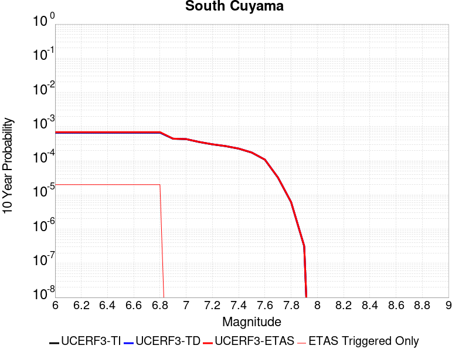 |

| Magnitude | 1 wk TI Prob | 1 wk TD Prob | 1 wk ETAS Prob | 1 wk ETAS/TD Gain | 1 wk ETAS Triggered Only | 1 mo TI Prob | 1 mo TD Prob | 1 mo ETAS Prob | 1 mo ETAS/TD Gain | 1 mo ETAS Triggered Only | 1 yr TI Prob | 1 yr TD Prob | 1 yr ETAS Prob | 1 yr ETAS/TD Gain | 1 yr ETAS Triggered Only | 10 yr TI Prob | 10 yr TD Prob | 10 yr ETAS Prob | 10 yr ETAS/TD Gain | 10 yr ETAS Triggered Only |
|-----|-----|-----|-----|-----|-----|-----|-----|-----|-----|-----|-----|-----|-----|-----|-----|-----|-----|-----|-----|-----|
| 6.0 | 1.2747308E-6 | 1.2818697E-6 | 1.1281857E-5 | 8.801095 | 1.0E-5 | 5.4631205E-6 | 5.4937163E-6 | 1.549366E-5 | 2.8202515 | 1.0E-5 | 6.6511464E-5 | 6.6884015E-5 | 7.688334E-5 | 1.1495025 | 1.0E-5 | 6.649156E-4 | 6.686458E-4 | 6.886324E-4 | 1.0298913 | 2.0E-5 |
| 6.1 | 1.2747308E-6 | 1.2818697E-6 | 1.1281857E-5 | 8.801095 | 1.0E-5 | 5.4631205E-6 | 5.4937163E-6 | 1.549366E-5 | 2.8202515 | 1.0E-5 | 6.6511464E-5 | 6.6884015E-5 | 7.688334E-5 | 1.1495025 | 1.0E-5 | 6.649156E-4 | 6.686458E-4 | 6.886324E-4 | 1.0298913 | 2.0E-5 |
| 6.2 | 1.2747308E-6 | 1.2818697E-6 | 1.1281857E-5 | 8.801095 | 1.0E-5 | 5.4631205E-6 | 5.4937163E-6 | 1.549366E-5 | 2.8202515 | 1.0E-5 | 6.6511464E-5 | 6.6884015E-5 | 7.688334E-5 | 1.1495025 | 1.0E-5 | 6.649156E-4 | 6.686458E-4 | 6.886324E-4 | 1.0298913 | 2.0E-5 |
| 6.3 | 1.2747308E-6 | 1.2818697E-6 | 1.1281857E-5 | 8.801095 | 1.0E-5 | 5.4631205E-6 | 5.4937163E-6 | 1.549366E-5 | 2.8202515 | 1.0E-5 | 6.6511464E-5 | 6.6884015E-5 | 7.688334E-5 | 1.1495025 | 1.0E-5 | 6.649156E-4 | 6.686458E-4 | 6.886324E-4 | 1.0298913 | 2.0E-5 |
| 6.4 | 1.2747308E-6 | 1.2818697E-6 | 1.1281857E-5 | 8.801095 | 1.0E-5 | 5.4631205E-6 | 5.4937163E-6 | 1.549366E-5 | 2.8202515 | 1.0E-5 | 6.6511464E-5 | 6.6884015E-5 | 7.688334E-5 | 1.1495025 | 1.0E-5 | 6.649156E-4 | 6.686458E-4 | 6.886324E-4 | 1.0298913 | 2.0E-5 |
| 6.5 | 1.2747308E-6 | 1.2818697E-6 | 1.1281857E-5 | 8.801095 | 1.0E-5 | 5.4631205E-6 | 5.4937163E-6 | 1.549366E-5 | 2.8202515 | 1.0E-5 | 6.6511464E-5 | 6.6884015E-5 | 7.688334E-5 | 1.1495025 | 1.0E-5 | 6.649156E-4 | 6.686458E-4 | 6.886324E-4 | 1.0298913 | 2.0E-5 |
| 6.6 | 1.2747308E-6 | 1.2818697E-6 | 1.1281857E-5 | 8.801095 | 1.0E-5 | 5.4631205E-6 | 5.4937163E-6 | 1.549366E-5 | 2.8202515 | 1.0E-5 | 6.6511464E-5 | 6.6884015E-5 | 7.688334E-5 | 1.1495025 | 1.0E-5 | 6.649156E-4 | 6.686458E-4 | 6.886324E-4 | 1.0298913 | 2.0E-5 |
| 6.7 | 1.2747308E-6 | 1.2818697E-6 | 1.1281857E-5 | 8.801095 | 1.0E-5 | 5.4631205E-6 | 5.4937163E-6 | 1.549366E-5 | 2.8202515 | 1.0E-5 | 6.6511464E-5 | 6.6884015E-5 | 7.688334E-5 | 1.1495025 | 1.0E-5 | 6.649156E-4 | 6.686458E-4 | 6.886324E-4 | 1.0298913 | 2.0E-5 |
| 6.8 | 1.2747308E-6 | 1.2818697E-6 | 1.1281857E-5 | 8.801095 | 1.0E-5 | 5.4631205E-6 | 5.4937163E-6 | 1.549366E-5 | 2.8202515 | 1.0E-5 | 6.6511464E-5 | 6.6884015E-5 | 7.688334E-5 | 1.1495025 | 1.0E-5 | 6.649156E-4 | 6.686458E-4 | 6.886324E-4 | 1.0298913 | 2.0E-5 |
| 6.9 | 8.4566324E-7 | 8.507883E-7 | 8.507883E-7 | 1.0 | 0.0 | 3.624266E-6 | 3.6462304E-6 | 3.6462304E-6 | 1.0 | 0.0 | 4.4124543E-5 | 4.439196E-5 | 4.439196E-5 | 1.0 | 0.0 | 4.4115784E-4 | 4.4383196E-4 | 4.4383196E-4 | 1.0 | 0.0 |
| 7.0 | 8.2277904E-7 | 8.27782E-7 | 8.27782E-7 | 1.0 | 0.0 | 3.526191E-6 | 3.5476323E-6 | 3.5476323E-6 | 1.0 | 0.0 | 4.293053E-5 | 4.3191576E-5 | 4.3191576E-5 | 1.0 | 0.0 | 4.292224E-4 | 4.3183283E-4 | 4.3183283E-4 | 1.0 | 0.0 |
| 7.1 | 6.7661887E-7 | 6.80913E-7 | 6.80913E-7 | 1.0 | 0.0 | 2.899792E-6 | 2.9181954E-6 | 2.9181954E-6 | 1.0 | 0.0 | 3.5304394E-5 | 3.5528454E-5 | 3.5528454E-5 | 1.0 | 0.0 | 3.5298787E-4 | 3.552281E-4 | 3.552281E-4 | 1.0 | 0.0 |
| 7.2 | 5.783336E-7 | 5.8211907E-7 | 5.8211907E-7 | 1.0 | 0.0 | 2.4785702E-6 | 2.4947938E-6 | 2.4947938E-6 | 1.0 | 0.0 | 3.0176174E-5 | 3.0373692E-5 | 3.0373692E-5 | 1.0 | 0.0 | 3.0172078E-4 | 3.0369565E-4 | 3.0369565E-4 | 1.0 | 0.0 |
| 7.3 | 5.136759E-7 | 5.170938E-7 | 5.170938E-7 | 1.0 | 0.0 | 2.2014663E-6 | 2.2161144E-6 | 2.2161144E-6 | 1.0 | 0.0 | 2.6802521E-5 | 2.698086E-5 | 2.698086E-5 | 1.0 | 0.0 | 2.679929E-4 | 2.6977606E-4 | 2.6977606E-4 | 1.0 | 0.0 |
| 7.4 | 4.3370295E-7 | 4.3665364E-7 | 4.3665364E-7 | 1.0 | 0.0 | 1.8587256E-6 | 1.8713713E-6 | 1.8713713E-6 | 1.0 | 0.0 | 2.2629749E-5 | 2.278371E-5 | 2.278371E-5 | 1.0 | 0.0 | 2.2627445E-4 | 2.278139E-4 | 2.278139E-4 | 1.0 | 0.0 |
| 7.5 | 3.3242574E-7 | 3.3476465E-7 | 3.3476465E-7 | 1.0 | 0.0 | 1.4246809E-6 | 1.4347048E-6 | 1.4347048E-6 | 1.0 | 0.0 | 1.7345352E-5 | 1.7467393E-5 | 1.7467393E-5 | 1.0 | 0.0 | 1.7343998E-4 | 1.7466032E-4 | 1.7466032E-4 | 1.0 | 0.0 |
| 7.6 | 2.0627535E-7 | 2.07789E-7 | 2.07789E-7 | 1.0 | 0.0 | 8.840369E-7 | 8.90524E-7 | 8.90524E-7 | 1.0 | 0.0 | 1.0763096E-5 | 1.0842076E-5 | 1.0842076E-5 | 1.0 | 0.0 | 1.0762575E-4 | 1.0841556E-4 | 1.0841556E-4 | 1.0 | 0.0 |
| 7.7 | 6.15236E-8 | 6.1983044E-8 | 6.1983044E-8 | 1.0 | 0.0 | 2.6367252E-7 | 2.656416E-7 | 2.656416E-7 | 1.0 | 0.0 | 3.2102084E-6 | 3.2341818E-6 | 3.2341818E-6 | 1.0 | 0.0 | 3.210162E-5 | 3.234136E-5 | 3.234136E-5 | 1.0 | 0.0 |
| 7.8 | 1.1765573E-8 | 1.1873414E-8 | 1.1873414E-8 | 1.0 | 0.0 | 5.0423886E-8 | 5.0886058E-8 | 5.0886058E-8 | 1.0 | 0.0 | 6.1391063E-7 | 6.195376E-7 | 6.195376E-7 | 1.0 | 0.0 | 6.1390897E-6 | 6.19536E-6 | 6.19536E-6 | 1.0 | 0.0 |
| 7.9 | 6.0381755E-10 | 6.10058E-10 | 6.10058E-10 | 1.0 | 0.0 | 2.5877895E-9 | 2.614534E-9 | 2.614534E-9 | 1.0 | 0.0 | 3.1506335E-8 | 3.1831952E-8 | 3.1831952E-8 | 1.0 | 0.0 | 3.1506332E-7 | 3.183195E-7 | 3.183195E-7 | 1.0 | 0.0 |

## Clamshell-Sawpit
*[(top)](#table-of-contents)*

| 1 Week | 1 Month | 1 Year | 10 Year |
|-----|-----|-----|-----|
|  |  |  |  |

| Magnitude | 1 wk TI Prob | 1 wk TD Prob | 1 wk ETAS Prob | 1 wk ETAS/TD Gain | 1 wk ETAS Triggered Only | 1 mo TI Prob | 1 mo TD Prob | 1 mo ETAS Prob | 1 mo ETAS/TD Gain | 1 mo ETAS Triggered Only | 1 yr TI Prob | 1 yr TD Prob | 1 yr ETAS Prob | 1 yr ETAS/TD Gain | 1 yr ETAS Triggered Only | 10 yr TI Prob | 10 yr TD Prob | 10 yr ETAS Prob | 10 yr ETAS/TD Gain | 10 yr ETAS Triggered Only |
|-----|-----|-----|-----|-----|-----|-----|-----|-----|-----|-----|-----|-----|-----|-----|-----|-----|-----|-----|-----|-----|
| 6.0 | 3.202998E-6 | 3.0127642E-6 | 1.3012734E-5 | 4.319201 | 1.0E-5 | 1.3727062E-5 | 1.2911787E-5 | 3.291153E-5 | 2.5489523 | 2.0E-5 | 1.6711417E-4 | 1.5719047E-4 | 1.7718734E-4 | 1.1272142 | 2.0E-5 | 0.0016698855 | 0.0015708723 | 0.0015908409 | 1.0127118 | 2.0E-5 |
| 6.1 | 3.202998E-6 | 3.0127642E-6 | 1.3012734E-5 | 4.319201 | 1.0E-5 | 1.3727062E-5 | 1.2911787E-5 | 3.291153E-5 | 2.5489523 | 2.0E-5 | 1.6711417E-4 | 1.5719047E-4 | 1.7718734E-4 | 1.1272142 | 2.0E-5 | 0.0016698855 | 0.0015708723 | 0.0015908409 | 1.0127118 | 2.0E-5 |
| 6.2 | 3.202998E-6 | 3.0127642E-6 | 1.3012734E-5 | 4.319201 | 1.0E-5 | 1.3727062E-5 | 1.2911787E-5 | 3.291153E-5 | 2.5489523 | 2.0E-5 | 1.6711417E-4 | 1.5719047E-4 | 1.7718734E-4 | 1.1272142 | 2.0E-5 | 0.0016698855 | 0.0015708723 | 0.0015908409 | 1.0127118 | 2.0E-5 |
| 6.3 | 3.202998E-6 | 3.0127642E-6 | 1.3012734E-5 | 4.319201 | 1.0E-5 | 1.3727062E-5 | 1.2911787E-5 | 3.291153E-5 | 2.5489523 | 2.0E-5 | 1.6711417E-4 | 1.5719047E-4 | 1.7718734E-4 | 1.1272142 | 2.0E-5 | 0.0016698855 | 0.0015708723 | 0.0015908409 | 1.0127118 | 2.0E-5 |
| 6.4 | 3.202998E-6 | 3.0127642E-6 | 1.3012734E-5 | 4.319201 | 1.0E-5 | 1.3727062E-5 | 1.2911787E-5 | 3.291153E-5 | 2.5489523 | 2.0E-5 | 1.6711417E-4 | 1.5719047E-4 | 1.7718734E-4 | 1.1272142 | 2.0E-5 | 0.0016698855 | 0.0015708723 | 0.0015908409 | 1.0127118 | 2.0E-5 |
| 6.5 | 2.5862723E-6 | 2.3807747E-6 | 1.2380751E-5 | 5.200303 | 1.0E-5 | 1.1083977E-5 | 1.0203283E-5 | 2.020318E-5 | 1.9800668 | 1.0E-5 | 1.3493907E-4 | 1.2421819E-4 | 1.3421694E-4 | 1.0804935 | 1.0E-5 | 0.0013485716 | 0.0012415178 | 0.0012515055 | 1.0080446 | 1.0E-5 |
| 6.6 | 2.5862723E-6 | 2.3807747E-6 | 1.2380751E-5 | 5.200303 | 1.0E-5 | 1.1083977E-5 | 1.0203283E-5 | 2.020318E-5 | 1.9800668 | 1.0E-5 | 1.3493907E-4 | 1.2421819E-4 | 1.3421694E-4 | 1.0804935 | 1.0E-5 | 0.0013485716 | 0.0012415178 | 0.0012515055 | 1.0080446 | 1.0E-5 |
| 6.7 | 2.5862723E-6 | 2.3807747E-6 | 1.2380751E-5 | 5.200303 | 1.0E-5 | 1.1083977E-5 | 1.0203283E-5 | 2.020318E-5 | 1.9800668 | 1.0E-5 | 1.3493907E-4 | 1.2421819E-4 | 1.3421694E-4 | 1.0804935 | 1.0E-5 | 0.0013485716 | 0.0012415178 | 0.0012515055 | 1.0080446 | 1.0E-5 |
| 6.8 | 2.4098806E-6 | 2.1977307E-6 | 1.2197709E-5 | 5.550138 | 1.0E-5 | 1.0328019E-5 | 9.4188135E-6 | 1.941872E-5 | 2.0616949 | 1.0E-5 | 1.2573638E-4 | 1.14668284E-4 | 1.2466715E-4 | 1.087198 | 1.0E-5 | 0.0012566525 | 0.0011461178 | 0.0011561064 | 1.0087152 | 1.0E-5 |
| 6.9 | 2.0073985E-6 | 1.7784247E-6 | 1.7784247E-6 | 1.0 | 0.0 | 8.603109E-6 | 7.6217984E-6 | 7.6217984E-6 | 1.0 | 0.0 | 1.0473781E-4 | 9.279157E-5 | 9.279157E-5 | 1.0 | 0.0 | 0.0010468846 | 9.2754007E-4 | 9.2754007E-4 | 1.0 | 0.0 |
| 7.0 | 1.8166766E-6 | 1.5807094E-6 | 1.5807094E-6 | 1.0 | 0.0 | 7.785734E-6 | 6.774452E-6 | 6.774452E-6 | 1.0 | 0.0 | 9.478718E-5 | 8.247593E-5 | 8.247593E-5 | 1.0 | 0.0 | 9.4746763E-4 | 8.244633E-4 | 8.244633E-4 | 1.0 | 0.0 |
| 7.1 | 1.5471421E-6 | 1.3052961E-6 | 1.3052961E-6 | 1.0 | 0.0 | 6.6305925E-6 | 5.5941146E-6 | 5.5941146E-6 | 1.0 | 0.0 | 8.072447E-5 | 6.810627E-5 | 6.810627E-5 | 1.0 | 0.0 | 8.0695155E-4 | 6.8085943E-4 | 6.8085943E-4 | 1.0 | 0.0 |
| 7.2 | 1.3608037E-6 | 1.1153442E-6 | 1.1153442E-6 | 1.0 | 0.0 | 5.8320024E-6 | 4.780038E-6 | 4.780038E-6 | 1.0 | 0.0 | 7.1002316E-5 | 5.8195455E-5 | 5.8195455E-5 | 1.0 | 0.0 | 7.097964E-4 | 5.818068E-4 | 5.818068E-4 | 1.0 | 0.0 |
| 7.3 | 1.0749634E-6 | 8.384255E-7 | 8.384255E-7 | 1.0 | 0.0 | 4.6069777E-6 | 3.5932474E-6 | 3.5932474E-6 | 1.0 | 0.0 | 5.608851E-5 | 4.3746935E-5 | 4.3746935E-5 | 1.0 | 0.0 | 5.6074356E-4 | 4.3738607E-4 | 4.3738607E-4 | 1.0 | 0.0 |
| 7.4 | 8.416856E-7 | 6.2000527E-7 | 6.2000527E-7 | 1.0 | 0.0 | 3.607219E-6 | 2.657163E-6 | 2.657163E-6 | 1.0 | 0.0 | 4.3917007E-5 | 3.2350497E-5 | 3.2350497E-5 | 1.0 | 0.0 | 4.390833E-4 | 3.2345986E-4 | 3.2345986E-4 | 1.0 | 0.0 |
| 7.5 | 6.2779594E-7 | 4.4968908E-7 | 4.4968908E-7 | 1.0 | 0.0 | 2.6905511E-6 | 1.9272377E-6 | 1.9272377E-6 | 1.0 | 0.0 | 3.275697E-5 | 2.3463885E-5 | 2.3463885E-5 | 1.0 | 0.0 | 3.275214E-4 | 2.3461595E-4 | 2.3461595E-4 | 1.0 | 0.0 |
| 7.6 | 4.3822078E-7 | 3.059551E-7 | 3.059551E-7 | 1.0 | 0.0 | 1.8780877E-6 | 1.3112356E-6 | 1.3112356E-6 | 1.0 | 0.0 | 2.2865479E-5 | 1.5964191E-5 | 1.5964191E-5 | 1.0 | 0.0 | 2.2863125E-4 | 1.5963199E-4 | 1.5963199E-4 | 1.0 | 0.0 |
| 7.7 | 1.8704569E-7 | 1.12379E-7 | 1.12379E-7 | 1.0 | 0.0 | 8.0162414E-7 | 4.8162417E-7 | 4.8162417E-7 | 1.0 | 0.0 | 9.75973E-6 | 5.8637593E-6 | 5.8637593E-6 | 1.0 | 0.0 | 9.7593016E-5 | 5.863611E-5 | 5.863611E-5 | 1.0 | 0.0 |
| 7.8 | 3.5378733E-8 | 2.1838002E-8 | 2.1838002E-8 | 1.0 | 0.0 | 1.5162313E-7 | 9.359143E-8 | 9.359143E-8 | 1.0 | 0.0 | 1.84601E-6 | 1.1394751E-6 | 1.1394751E-6 | 1.0 | 0.0 | 1.8459947E-5 | 1.1394695E-5 | 1.1394695E-5 | 1.0 | 0.0 |
| 7.9 | 7.504945E-9 | 5.1921663E-9 | 5.1921663E-9 | 1.0 | 0.0 | 3.2164053E-8 | 2.2252141E-8 | 2.2252141E-8 | 1.0 | 0.0 | 3.9159727E-7 | 2.709198E-7 | 2.709198E-7 | 1.0 | 0.0 | 3.915966E-6 | 2.7091953E-6 | 2.7091953E-6 | 1.0 | 0.0 |
| 8.0 | 1.6554036E-10 | 1.418149E-10 | 1.418149E-10 | 1.0 | 0.0 | 7.0945894E-10 | 6.0777794E-10 | 6.0777794E-10 | 1.0 | 0.0 | 8.637662E-9 | 7.3996964E-9 | 7.3996964E-9 | 1.0 | 0.0 | 8.6376616E-8 | 7.3996965E-8 | 7.3996965E-8 | 1.0 | 0.0 |

## Great Valley 11
*[(top)](#table-of-contents)*

| 1 Week | 1 Month | 1 Year | 10 Year |
|-----|-----|-----|-----|
|  |  |  |  |

| Magnitude | 1 wk TI Prob | 1 wk TD Prob | 1 wk ETAS Prob | 1 wk ETAS/TD Gain | 1 wk ETAS Triggered Only | 1 mo TI Prob | 1 mo TD Prob | 1 mo ETAS Prob | 1 mo ETAS/TD Gain | 1 mo ETAS Triggered Only | 1 yr TI Prob | 1 yr TD Prob | 1 yr ETAS Prob | 1 yr ETAS/TD Gain | 1 yr ETAS Triggered Only | 10 yr TI Prob | 10 yr TD Prob | 10 yr ETAS Prob | 10 yr ETAS/TD Gain | 10 yr ETAS Triggered Only |
|-----|-----|-----|-----|-----|-----|-----|-----|-----|-----|-----|-----|-----|-----|-----|-----|-----|-----|-----|-----|-----|
| 6.0 | 2.8099583E-5 | 2.983214E-5 | 4.9831542E-5 | 1.6703979 | 2.0E-5 | 1.20421224E-4 | 1.2784619E-4 | 1.4784362E-4 | 1.156418 | 2.0E-5 | 0.0014651422 | 0.0015554894 | 0.0015754583 | 1.0128376 | 2.0E-5 | 0.0145552 | 0.015453546 | 0.015473237 | 1.0012742 | 2.0E-5 |
| 6.1 | 2.483194E-5 | 2.5907144E-5 | 3.5906884E-5 | 1.385984 | 1.0E-5 | 1.0641825E-4 | 1.11026246E-4 | 1.21025136E-4 | 1.0900588 | 1.0E-5 | 0.0012948721 | 0.0013509697 | 0.0013609562 | 1.007392 | 1.0E-5 | 0.012873529 | 0.013433979 | 0.013443844 | 1.0007343 | 1.0E-5 |
| 6.2 | 2.483194E-5 | 2.5907144E-5 | 3.5906884E-5 | 1.385984 | 1.0E-5 | 1.0641825E-4 | 1.11026246E-4 | 1.21025136E-4 | 1.0900588 | 1.0E-5 | 0.0012948721 | 0.0013509697 | 0.0013609562 | 1.007392 | 1.0E-5 | 0.012873529 | 0.013433979 | 0.013443844 | 1.0007343 | 1.0E-5 |
| 6.3 | 2.0257901E-5 | 2.0398915E-5 | 2.0398915E-5 | 1.0 | 0.0 | 8.681669E-5 | 8.742122E-5 | 8.742122E-5 | 1.0 | 0.0 | 0.0010564806 | 0.0010638753 | 0.0010638753 | 1.0 | 0.0 | 0.01051472 | 0.010591993 | 0.010591993 | 1.0 | 0.0 |
| 6.4 | 1.8054898E-5 | 1.7780852E-5 | 1.7780852E-5 | 1.0 | 0.0 | 7.737584E-5 | 7.6201635E-5 | 7.6201635E-5 | 1.0 | 0.0 | 9.416436E-4 | 9.2739763E-4 | 9.2739763E-4 | 1.0 | 0.0 | 0.009376635 | 0.009239015 | 0.009239015 | 1.0 | 0.0 |
| 6.5 | 1.34804895E-5 | 1.2321004E-5 | 1.2321004E-5 | 1.0 | 0.0 | 5.777225E-5 | 5.2803258E-5 | 5.2803258E-5 | 1.0 | 0.0 | 7.031501E-4 | 6.426942E-4 | 6.426942E-4 | 1.0 | 0.0 | 0.007009294 | 0.006408792 | 0.006408792 | 1.0 | 0.0 |
| 6.6 | 1.294883E-5 | 1.1732261E-5 | 1.1732261E-5 | 1.0 | 0.0 | 5.5493805E-5 | 5.028017E-5 | 5.028017E-5 | 1.0 | 0.0 | 6.754276E-4 | 6.1199325E-4 | 6.1199325E-4 | 1.0 | 0.0 | 0.006733784 | 0.0061035044 | 0.0061035044 | 1.0 | 0.0 |
| 6.7 | 1.1272237E-5 | 9.811834E-6 | 9.811834E-6 | 1.0 | 0.0 | 4.8308695E-5 | 4.205006E-5 | 4.205006E-5 | 1.0 | 0.0 | 5.879996E-4 | 5.1184196E-4 | 5.1184196E-4 | 1.0 | 0.0 | 0.005864462 | 0.005106915 | 0.005106915 | 1.0 | 0.0 |
| 6.8 | 9.8337505E-6 | 8.193719E-6 | 8.193719E-6 | 1.0 | 0.0 | 4.2143965E-5 | 3.5115478E-5 | 3.5115478E-5 | 1.0 | 0.0 | 5.1298196E-4 | 4.2744912E-4 | 4.2744912E-4 | 1.0 | 0.0 | 0.005117994 | 0.0042664795 | 0.0042664795 | 1.0 | 0.0 |
| 6.9 | 7.4224813E-6 | 5.4130837E-6 | 5.4130837E-6 | 1.0 | 0.0 | 3.1810247E-5 | 2.3198732E-5 | 2.3198732E-5 | 1.0 | 0.0 | 3.872209E-4 | 2.8240937E-4 | 2.8240937E-4 | 1.0 | 0.0 | 0.0038654688 | 0.0028206457 | 0.0028206457 | 1.0 | 0.0 |
| 7.0 | 4.4628923E-6 | 2.0110294E-6 | 2.0110294E-6 | 1.0 | 0.0 | 1.912654E-5 | 8.61867E-6 | 8.61867E-6 | 1.0 | 0.0 | 2.3284076E-4 | 1.0492737E-4 | 1.0492737E-4 | 1.0 | 0.0 | 0.0023259693 | 0.0010487898 | 0.0010487898 | 1.0 | 0.0 |
| 7.1 | 3.5546527E-6 | 1.1855383E-6 | 1.1855383E-6 | 1.0 | 0.0 | 1.5234136E-5 | 5.080869E-6 | 5.080869E-6 | 1.0 | 0.0 | 1.8545982E-4 | 6.185789E-5 | 6.185789E-5 | 1.0 | 0.0 | 0.0018530512 | 6.1841356E-4 | 6.1841356E-4 | 1.0 | 0.0 |
| 7.2 | 3.2039936E-6 | 1.1253728E-6 | 1.1253728E-6 | 1.0 | 0.0 | 1.3731329E-5 | 4.8230177E-6 | 4.8230177E-6 | 1.0 | 0.0 | 1.671661E-4 | 5.8718724E-5 | 5.8718724E-5 | 1.0 | 0.0 | 0.0016704041 | 5.870388E-4 | 5.870388E-4 | 1.0 | 0.0 |
| 7.3 | 2.8120473E-6 | 1.0305271E-6 | 1.0305271E-6 | 1.0 | 0.0 | 1.2051575E-5 | 4.4165376E-6 | 4.4165376E-6 | 1.0 | 0.0 | 1.4671806E-4 | 5.3770087E-5 | 5.3770087E-5 | 1.0 | 0.0 | 0.0014662122 | 5.375774E-4 | 5.375774E-4 | 1.0 | 0.0 |
| 7.4 | 2.4837766E-6 | 9.80032E-7 | 9.80032E-7 | 1.0 | 0.0 | 1.0644713E-5 | 4.2001307E-6 | 4.2001307E-6 | 1.0 | 0.0 | 1.2959167E-4 | 5.113546E-5 | 5.113546E-5 | 1.0 | 0.0 | 0.0012951613 | 5.1124353E-4 | 5.1124353E-4 | 1.0 | 0.0 |
| 7.5 | 1.5002679E-6 | 6.545985E-7 | 6.545985E-7 | 1.0 | 0.0 | 6.4297037E-6 | 2.8054194E-6 | 2.8054194E-6 | 1.0 | 0.0 | 7.827883E-5 | 3.4155488E-5 | 3.4155488E-5 | 1.0 | 0.0 | 7.825126E-4 | 3.4150656E-4 | 3.4150656E-4 | 1.0 | 0.0 |

## Quien Sabe 2011 CFM
*[(top)](#table-of-contents)*

| 1 Week | 1 Month | 1 Year | 10 Year |
|-----|-----|-----|-----|
| 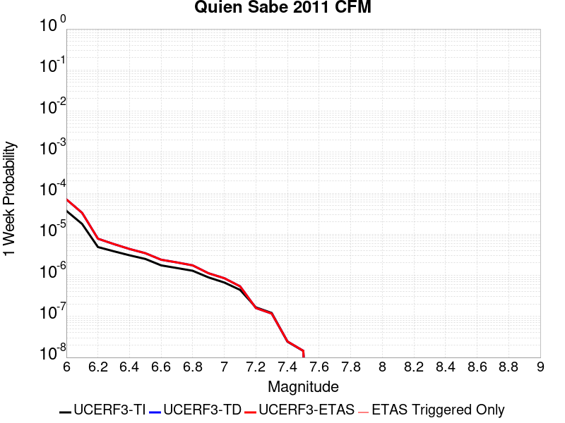 |  |  | 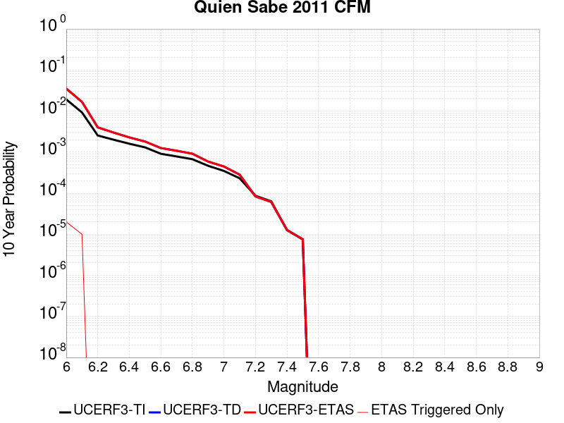 |

| Magnitude | 1 wk TI Prob | 1 wk TD Prob | 1 wk ETAS Prob | 1 wk ETAS/TD Gain | 1 wk ETAS Triggered Only | 1 mo TI Prob | 1 mo TD Prob | 1 mo ETAS Prob | 1 mo ETAS/TD Gain | 1 mo ETAS Triggered Only | 1 yr TI Prob | 1 yr TD Prob | 1 yr ETAS Prob | 1 yr ETAS/TD Gain | 1 yr ETAS Triggered Only | 10 yr TI Prob | 10 yr TD Prob | 10 yr ETAS Prob | 10 yr ETAS/TD Gain | 10 yr ETAS Triggered Only |
|-----|-----|-----|-----|-----|-----|-----|-----|-----|-----|-----|-----|-----|-----|-----|-----|-----|-----|-----|-----|-----|
| 6.0 | 3.729899E-5 | 7.094885E-5 | 7.094885E-5 | 1.0 | 0.0 | 1.5984301E-4 | 3.0394195E-4 | 3.0394195E-4 | 1.0 | 0.0 | 0.0019443515 | 0.0036850597 | 0.0036950228 | 1.0027037 | 1.0E-5 | 0.019274272 | 0.035349693 | 0.035368986 | 1.0005457 | 2.0E-5 |
| 6.1 | 1.7825725E-5 | 3.3210796E-5 | 3.3210796E-5 | 1.0 | 0.0 | 7.639373E-5 | 1.4227985E-4 | 1.4227985E-4 | 1.0 | 0.0 | 9.296967E-4 | 0.0017266083 | 0.0017266083 | 1.0 | 0.0 | 0.009258169 | 0.016698873 | 0.016708706 | 1.0005889 | 1.0E-5 |
| 6.2 | 4.8865336E-6 | 7.807397E-6 | 7.807397E-6 | 1.0 | 0.0 | 2.0942118E-5 | 3.3456672E-5 | 3.3456672E-5 | 1.0 | 0.0 | 2.5494045E-4 | 4.0691794E-4 | 4.0691794E-4 | 1.0 | 0.0 | 0.0025464818 | 0.0040135398 | 0.0040135398 | 1.0 | 0.0 |
| 6.3 | 3.858491E-6 | 5.7896764E-6 | 5.7896764E-6 | 1.0 | 0.0 | 1.6536285E-5 | 2.4812689E-5 | 2.4812689E-5 | 1.0 | 0.0 | 2.0131067E-4 | 3.020573E-4 | 3.020573E-4 | 1.0 | 0.0 | 0.002011284 | 0.0030020247 | 0.0030020247 | 1.0 | 0.0 |
| 6.4 | 3.0771805E-6 | 4.3848822E-6 | 4.3848822E-6 | 1.0 | 0.0 | 1.318785E-5 | 1.879223E-5 | 1.879223E-5 | 1.0 | 0.0 | 1.6055023E-4 | 2.287738E-4 | 2.287738E-4 | 1.0 | 0.0 | 0.001604343 | 0.0022864633 | 0.0022864633 | 1.0 | 0.0 |
| 6.5 | 2.5081235E-6 | 3.4635768E-6 | 3.4635768E-6 | 1.0 | 0.0 | 1.0749056E-5 | 1.4843825E-5 | 1.4843825E-5 | 1.0 | 0.0 | 1.308619E-4 | 1.8071005E-4 | 1.8071005E-4 | 1.0 | 0.0 | 0.0013078486 | 0.0018122483 | 0.0018122483 | 1.0 | 0.0 |
| 6.6 | 1.7505364E-6 | 2.4023664E-6 | 2.4023664E-6 | 1.0 | 0.0 | 7.502277E-6 | 1.0295819E-5 | 1.0295819E-5 | 1.0 | 0.0 | 9.13364E-5 | 1.253451E-4 | 1.253451E-4 | 1.0 | 0.0 | 9.129886E-4 | 0.0012582706 | 0.0012582706 | 1.0 | 0.0 |
| 6.7 | 1.505737E-6 | 2.063768E-6 | 2.063768E-6 | 1.0 | 0.0 | 6.4531428E-6 | 8.844693E-6 | 8.844693E-6 | 1.0 | 0.0 | 7.8564175E-5 | 1.0767942E-4 | 1.0767942E-4 | 1.0 | 0.0 | 7.853641E-4 | 0.0010818074 | 0.0010818074 | 1.0 | 0.0 |
| 6.8 | 1.2924105E-6 | 1.7484224E-6 | 1.7484224E-6 | 1.0 | 0.0 | 5.5388905E-6 | 7.4932204E-6 | 7.4932204E-6 | 1.0 | 0.0 | 6.74339E-5 | 9.1226684E-5 | 9.1226684E-5 | 1.0 | 0.0 | 6.741344E-4 | 9.1608387E-4 | 9.1608387E-4 | 1.0 | 0.0 |
| 6.9 | 8.9075286E-7 | 1.1249912E-6 | 1.1249912E-6 | 1.0 | 0.0 | 3.8175067E-6 | 4.8213833E-6 | 4.8213833E-6 | 1.0 | 0.0 | 4.6477155E-5 | 5.869898E-5 | 5.869898E-5 | 1.0 | 0.0 | 4.6467435E-4 | 5.903731E-4 | 5.903731E-4 | 1.0 | 0.0 |
| 7.0 | 6.6891175E-7 | 8.516645E-7 | 8.516645E-7 | 1.0 | 0.0 | 2.8667614E-6 | 3.6499866E-6 | 3.6499866E-6 | 1.0 | 0.0 | 3.4902263E-5 | 4.443788E-5 | 4.443788E-5 | 1.0 | 0.0 | 3.4896782E-4 | 4.4676356E-4 | 4.4676356E-4 | 1.0 | 0.0 |
| 7.1 | 4.4205015E-7 | 5.391929E-7 | 5.391929E-7 | 1.0 | 0.0 | 1.8944993E-6 | 2.3108257E-6 | 2.3108257E-6 | 1.0 | 0.0 | 2.3065284E-5 | 2.8134109E-5 | 2.8134109E-5 | 1.0 | 0.0 | 2.3062891E-4 | 2.826615E-4 | 2.826615E-4 | 1.0 | 0.0 |
| 7.2 | 1.6620965E-7 | 1.5987632E-7 | 1.5987632E-7 | 1.0 | 0.0 | 7.123269E-7 | 6.851841E-7 | 6.851841E-7 | 1.0 | 0.0 | 8.672545E-6 | 8.342088E-6 | 8.342088E-6 | 1.0 | 0.0 | 8.6722066E-5 | 8.354316E-5 | 8.354316E-5 | 1.0 | 0.0 |
| 7.3 | 1.2142488E-7 | 1.1726676E-7 | 1.1726676E-7 | 1.0 | 0.0 | 5.2039223E-7 | 5.025717E-7 | 5.025717E-7 | 1.0 | 0.0 | 6.335757E-6 | 6.118797E-6 | 6.118797E-6 | 1.0 | 0.0 | 6.3355765E-5 | 6.120608E-5 | 6.120608E-5 | 1.0 | 0.0 |
| 7.4 | 2.4192937E-8 | 2.4545901E-8 | 2.4545901E-8 | 1.0 | 0.0 | 1.0368401E-7 | 1.0519671E-7 | 1.0519671E-7 | 1.0 | 0.0 | 1.2623522E-6 | 1.2807693E-6 | 1.2807693E-6 | 1.0 | 0.0 | 1.2623449E-5 | 1.2768185E-5 | 1.2768185E-5 | 1.0 | 0.0 |
| 7.5 | 1.4432802E-8 | 1.4508743E-8 | 1.4508743E-8 | 1.0 | 0.0 | 6.185486E-8 | 6.218033E-8 | 6.218033E-8 | 1.0 | 0.0 | 7.530827E-7 | 7.5704526E-7 | 7.5704526E-7 | 1.0 | 0.0 | 7.530801E-6 | 7.528889E-6 | 7.528889E-6 | 1.0 | 0.0 |

## Calaveras (No) 2011 CFM
*[(top)](#table-of-contents)*

| 1 Week | 1 Month | 1 Year | 10 Year |
|-----|-----|-----|-----|
|  |  |  |  |

| Magnitude | 1 wk TI Prob | 1 wk TD Prob | 1 wk ETAS Prob | 1 wk ETAS/TD Gain | 1 wk ETAS Triggered Only | 1 mo TI Prob | 1 mo TD Prob | 1 mo ETAS Prob | 1 mo ETAS/TD Gain | 1 mo ETAS Triggered Only | 1 yr TI Prob | 1 yr TD Prob | 1 yr ETAS Prob | 1 yr ETAS/TD Gain | 1 yr ETAS Triggered Only | 10 yr TI Prob | 10 yr TD Prob | 10 yr ETAS Prob | 10 yr ETAS/TD Gain | 10 yr ETAS Triggered Only |
|-----|-----|-----|-----|-----|-----|-----|-----|-----|-----|-----|-----|-----|-----|-----|-----|-----|-----|-----|-----|-----|
| 6.0 | 4.8694856E-5 | 6.747457E-5 | 7.7473895E-5 | 1.148194 | 1.0E-5 | 2.0867554E-4 | 2.891453E-4 | 2.991424E-4 | 1.0345746 | 1.0E-5 | 0.0025376645 | 0.0035146773 | 0.003534607 | 1.0056704 | 2.0E-5 | 0.02508881 | 0.034771074 | 0.034790378 | 1.0005552 | 2.0E-5 |
| 6.1 | 4.8694856E-5 | 6.747457E-5 | 7.7473895E-5 | 1.148194 | 1.0E-5 | 2.0867554E-4 | 2.891453E-4 | 2.991424E-4 | 1.0345746 | 1.0E-5 | 0.0025376645 | 0.0035146773 | 0.003534607 | 1.0056704 | 2.0E-5 | 0.02508881 | 0.034771074 | 0.034790378 | 1.0005552 | 2.0E-5 |
| 6.2 | 4.7541962E-5 | 6.5805805E-5 | 7.580515E-5 | 1.1519523 | 1.0E-5 | 2.0373536E-4 | 2.8199502E-4 | 2.9199218E-4 | 1.0354517 | 1.0E-5 | 0.0024776561 | 0.003427919 | 0.0034478505 | 1.0058144 | 2.0E-5 | 0.024502134 | 0.0339325 | 0.03395182 | 1.0005695 | 2.0E-5 |
| 6.3 | 4.6717287E-5 | 6.463939E-5 | 7.4638745E-5 | 1.1546944 | 1.0E-5 | 2.0020158E-4 | 2.7699716E-4 | 2.869944E-4 | 1.0360914 | 1.0E-5 | 0.0024347296 | 0.0033672696 | 0.0033872023 | 1.0059196 | 2.0E-5 | 0.024082264 | 0.033345006 | 0.03336434 | 1.0005798 | 2.0E-5 |
| 6.4 | 4.6276386E-5 | 6.400103E-5 | 6.400103E-5 | 1.0 | 0.0 | 1.983123E-4 | 2.7426204E-4 | 2.7426204E-4 | 1.0 | 0.0 | 0.0024117786 | 0.00333408 | 0.00333408 | 1.0 | 0.0 | 0.02385771 | 0.03302388 | 0.03302388 | 1.0 | 0.0 |
| 6.5 | 4.5720994E-5 | 6.32025E-5 | 6.32025E-5 | 1.0 | 0.0 | 1.9593239E-4 | 2.7084045E-4 | 2.7084045E-4 | 1.0 | 0.0 | 0.002382867 | 0.0032925585 | 0.0032925585 | 1.0 | 0.0 | 0.023574775 | 0.032621842 | 0.032621842 | 1.0 | 0.0 |
| 6.6 | 4.549134E-5 | 6.285557E-5 | 6.285557E-5 | 1.0 | 0.0 | 1.949483E-4 | 2.693539E-4 | 2.693539E-4 | 1.0 | 0.0 | 0.0023709119 | 0.0032745146 | 0.0032745146 | 1.0 | 0.0 | 0.023457756 | 0.03244731 | 0.03244731 | 1.0 | 0.0 |
| 6.7 | 3.701047E-5 | 5.03607E-5 | 5.03607E-5 | 1.0 | 0.0 | 1.5860666E-4 | 2.1581395E-4 | 2.1581395E-4 | 1.0 | 0.0 | 0.0019293258 | 0.002624412 | 0.002624412 | 1.0 | 0.0 | 0.019126613 | 0.026125198 | 0.026125198 | 1.0 | 0.0 |
| 6.8 | 3.5523568E-5 | 4.834225E-5 | 4.834225E-5 | 1.0 | 0.0 | 1.5223498E-4 | 2.0716486E-4 | 2.0716486E-4 | 1.0 | 0.0 | 0.0018518851 | 0.0025193577 | 0.0025193577 | 1.0 | 0.0 | 0.018365284 | 0.025097623 | 0.025097623 | 1.0 | 0.0 |
| 6.9 | 3.2946147E-5 | 4.4663826E-5 | 4.4663826E-5 | 1.0 | 0.0 | 1.4119013E-4 | 1.9140259E-4 | 1.9140259E-4 | 1.0 | 0.0 | 0.0017176344 | 0.0023278783 | 0.0023278783 | 1.0 | 0.0 | 0.017044188 | 0.023219762 | 0.023219762 | 1.0 | 0.0 |
| 7.0 | 2.7682381E-5 | 3.7023216E-5 | 3.7023216E-5 | 1.0 | 0.0 | 1.1863338E-4 | 1.5866144E-4 | 1.5866144E-4 | 1.0 | 0.0 | 0.0014434044 | 0.0019300217 | 0.0019300217 | 1.0 | 0.0 | 0.01434065 | 0.019311164 | 0.019311164 | 1.0 | 0.0 |
| 7.1 | 2.471967E-5 | 3.328756E-5 | 3.328756E-5 | 1.0 | 0.0 | 1.05937135E-4 | 1.4265333E-4 | 1.4265333E-4 | 1.0 | 0.0 | 0.0012890215 | 0.0017354497 | 0.0017354497 | 1.0 | 0.0 | 0.0128157 | 0.017386293 | 0.017386293 | 1.0 | 0.0 |
| 7.2 | 1.9748062E-5 | 2.6775411E-5 | 2.6775411E-5 | 1.0 | 0.0 | 8.463181E-5 | 1.1474685E-4 | 1.1474685E-4 | 1.0 | 0.0 | 0.0010299052 | 0.001396171 | 0.001396171 | 1.0 | 0.0 | 0.01025145 | 0.014031046 | 0.014031046 | 1.0 | 0.0 |
| 7.3 | 1.1603734E-5 | 1.5784257E-5 | 1.5784257E-5 | 1.0 | 0.0 | 4.9729337E-5 | 6.7645145E-5 | 6.7645145E-5 | 1.0 | 0.0 | 6.052865E-4 | 8.232826E-4 | 8.232826E-4 | 1.0 | 0.0 | 0.0060364045 | 0.008308739 | 0.008308739 | 1.0 | 0.0 |
| 7.4 | 4.885381E-6 | 6.035117E-6 | 6.035117E-6 | 1.0 | 0.0 | 2.0937177E-5 | 2.5864532E-5 | 2.5864532E-5 | 1.0 | 0.0 | 2.5488032E-4 | 3.1485534E-4 | 3.1485534E-4 | 1.0 | 0.0 | 0.0025458818 | 0.0032009764 | 0.0032009764 | 1.0 | 0.0 |
| 7.5 | 3.0571264E-6 | 4.1554085E-6 | 4.1554085E-6 | 1.0 | 0.0 | 1.3101904E-5 | 1.7808772E-5 | 1.7808772E-5 | 1.0 | 0.0 | 1.5950401E-4 | 2.1680034E-4 | 2.1680034E-4 | 1.0 | 0.0 | 0.0015938957 | 0.0022209007 | 0.0022209007 | 1.0 | 0.0 |
| 7.6 | 1.764948E-6 | 2.795641E-6 | 2.795641E-6 | 1.0 | 0.0 | 7.564041E-6 | 1.1981264E-5 | 1.1981264E-5 | 1.0 | 0.0 | 9.208831E-5 | 1.458622E-4 | 1.458622E-4 | 1.0 | 0.0 | 9.205016E-4 | 0.0015124046 | 0.0015124046 | 1.0 | 0.0 |
| 7.7 | 1.3173734E-6 | 2.0585271E-6 | 2.0585271E-6 | 1.0 | 0.0 | 5.645874E-6 | 8.82223E-6 | 8.82223E-6 | 1.0 | 0.0 | 6.873634E-5 | 1.0740537E-4 | 1.0740537E-4 | 1.0 | 0.0 | 6.8715087E-4 | 0.0011261607 | 0.0011261607 | 1.0 | 0.0 |
| 7.8 | 9.4429885E-7 | 1.5490102E-6 | 1.5490102E-6 | 1.0 | 0.0 | 4.0469886E-6 | 6.6385983E-6 | 6.6385983E-6 | 1.0 | 0.0 | 4.9270973E-5 | 8.082195E-5 | 8.082195E-5 | 1.0 | 0.0 | 4.926005E-4 | 8.501931E-4 | 8.501931E-4 | 1.0 | 0.0 |
| 7.9 | 6.388233E-7 | 1.11492E-6 | 1.11492E-6 | 1.0 | 0.0 | 2.7378112E-6 | 4.7782196E-6 | 4.7782196E-6 | 1.0 | 0.0 | 3.3332344E-5 | 5.8173282E-5 | 5.8173282E-5 | 1.0 | 0.0 | 3.3327343E-4 | 6.096674E-4 | 6.096674E-4 | 1.0 | 0.0 |
| 8.0 | 3.087986E-7 | 5.754721E-7 | 5.754721E-7 | 1.0 | 0.0 | 1.323422E-6 | 2.4663066E-6 | 2.4663066E-6 | 1.0 | 0.0 | 1.6112543E-5 | 3.0026871E-5 | 3.0026871E-5 | 1.0 | 0.0 | 1.6111376E-4 | 3.110238E-4 | 3.110238E-4 | 1.0 | 0.0 |
| 8.1 | 1.6725647E-7 | 2.7410795E-7 | 2.7410795E-7 | 1.0 | 0.0 | 7.168133E-7 | 1.1747478E-6 | 1.1747478E-6 | 1.0 | 0.0 | 8.7271665E-6 | 1.4302462E-5 | 1.4302462E-5 | 1.0 | 0.0 | 8.726824E-5 | 1.4847395E-4 | 1.4847395E-4 | 1.0 | 0.0 |

## Eureka Peak
*[(top)](#table-of-contents)*

| 1 Week | 1 Month | 1 Year | 10 Year |
|-----|-----|-----|-----|
|  |  |  | 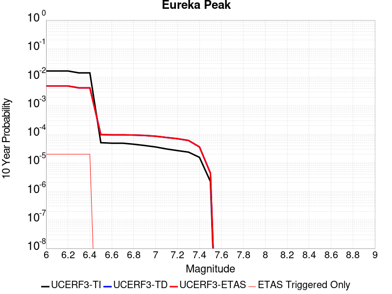 |

| Magnitude | 1 wk TI Prob | 1 wk TD Prob | 1 wk ETAS Prob | 1 wk ETAS/TD Gain | 1 wk ETAS Triggered Only | 1 mo TI Prob | 1 mo TD Prob | 1 mo ETAS Prob | 1 mo ETAS/TD Gain | 1 mo ETAS Triggered Only | 1 yr TI Prob | 1 yr TD Prob | 1 yr ETAS Prob | 1 yr ETAS/TD Gain | 1 yr ETAS Triggered Only | 10 yr TI Prob | 10 yr TD Prob | 10 yr ETAS Prob | 10 yr ETAS/TD Gain | 10 yr ETAS Triggered Only |
|-----|-----|-----|-----|-----|-----|-----|-----|-----|-----|-----|-----|-----|-----|-----|-----|-----|-----|-----|-----|-----|
| 6.0 | 3.1949054E-5 | 9.310979E-6 | 9.310979E-6 | 1.0 | 0.0 | 1.3691733E-4 | 3.9904025E-5 | 3.9904025E-5 | 1.0 | 0.0 | 0.0016656938 | 4.858013E-4 | 4.9579644E-4 | 1.0205746 | 1.0E-5 | 0.016532637 | 0.004921293 | 0.004941195 | 1.0040439 | 2.0E-5 |
| 6.1 | 3.1949054E-5 | 9.310979E-6 | 9.310979E-6 | 1.0 | 0.0 | 1.3691733E-4 | 3.9904025E-5 | 3.9904025E-5 | 1.0 | 0.0 | 0.0016656938 | 4.858013E-4 | 4.9579644E-4 | 1.0205746 | 1.0E-5 | 0.016532637 | 0.004921293 | 0.004941195 | 1.0040439 | 2.0E-5 |
| 6.2 | 3.1949054E-5 | 9.310979E-6 | 9.310979E-6 | 1.0 | 0.0 | 1.3691733E-4 | 3.9904025E-5 | 3.9904025E-5 | 1.0 | 0.0 | 0.0016656938 | 4.858013E-4 | 4.9579644E-4 | 1.0205746 | 1.0E-5 | 0.016532637 | 0.004921293 | 0.004941195 | 1.0040439 | 2.0E-5 |
| 6.3 | 2.7339745E-5 | 7.980821E-6 | 7.980821E-6 | 1.0 | 0.0 | 1.1716507E-4 | 3.4203495E-5 | 3.4203495E-5 | 1.0 | 0.0 | 0.0014255513 | 4.164239E-4 | 4.2641972E-4 | 1.024004 | 1.0E-5 | 0.0141644105 | 0.0042259954 | 0.004245911 | 1.0047126 | 2.0E-5 |
| 6.4 | 2.7339745E-5 | 7.980821E-6 | 7.980821E-6 | 1.0 | 0.0 | 1.1716507E-4 | 3.4203495E-5 | 3.4203495E-5 | 1.0 | 0.0 | 0.0014255513 | 4.164239E-4 | 4.2641972E-4 | 1.024004 | 1.0E-5 | 0.0141644105 | 0.0042259954 | 0.004245911 | 1.0047126 | 2.0E-5 |
| 6.5 | 9.738388E-8 | 1.8620014E-7 | 1.8620014E-7 | 1.0 | 0.0 | 4.1735944E-7 | 7.980003E-7 | 7.980003E-7 | 1.0 | 0.0 | 5.081339E-6 | 9.715612E-6 | 9.715612E-6 | 1.0 | 0.0 | 5.0812232E-5 | 9.715195E-5 | 9.715195E-5 | 1.0 | 0.0 |
| 6.6 | 9.3495956E-8 | 1.8328839E-7 | 1.8328839E-7 | 1.0 | 0.0 | 4.0069688E-7 | 7.855215E-7 | 7.855215E-7 | 1.0 | 0.0 | 4.8784736E-6 | 9.563682E-6 | 9.563682E-6 | 1.0 | 0.0 | 4.8783666E-5 | 9.563279E-5 | 9.563279E-5 | 1.0 | 0.0 |
| 6.7 | 9.3495956E-8 | 1.8328839E-7 | 1.8328839E-7 | 1.0 | 0.0 | 4.0069688E-7 | 7.855215E-7 | 7.855215E-7 | 1.0 | 0.0 | 4.8784736E-6 | 9.563682E-6 | 9.563682E-6 | 1.0 | 0.0 | 4.8783666E-5 | 9.563279E-5 | 9.563279E-5 | 1.0 | 0.0 |
| 6.8 | 8.591428E-8 | 1.8021817E-7 | 1.8021817E-7 | 1.0 | 0.0 | 3.68204E-7 | 7.7236336E-7 | 7.7236336E-7 | 1.0 | 0.0 | 4.4828744E-6 | 9.403484E-6 | 9.403484E-6 | 1.0 | 0.0 | 4.482784E-5 | 9.403094E-5 | 9.403094E-5 | 1.0 | 0.0 |
| 6.9 | 7.749723E-8 | 1.7439834E-7 | 1.7439834E-7 | 1.0 | 0.0 | 3.3213098E-7 | 7.4742127E-7 | 7.4742127E-7 | 1.0 | 0.0 | 4.043687E-6 | 9.099816E-6 | 9.099816E-6 | 1.0 | 0.0 | 4.0436134E-5 | 9.0994516E-5 | 9.0994516E-5 | 1.0 | 0.0 |
| 7.0 | 6.897872E-8 | 1.6416043E-7 | 1.6416043E-7 | 1.0 | 0.0 | 2.9562307E-7 | 7.035445E-7 | 7.035445E-7 | 1.0 | 0.0 | 3.5992048E-6 | 8.565621E-6 | 8.565621E-6 | 1.0 | 0.0 | 3.5991467E-5 | 8.565299E-5 | 8.565299E-5 | 1.0 | 0.0 |
| 7.1 | 5.859318E-8 | 1.4787899E-7 | 1.4787899E-7 | 1.0 | 0.0 | 2.5111362E-7 | 6.33767E-7 | 6.33767E-7 | 1.0 | 0.0 | 3.057304E-6 | 7.716087E-6 | 7.716087E-6 | 1.0 | 0.0 | 3.0572617E-5 | 7.715825E-5 | 7.715825E-5 | 1.0 | 0.0 |
| 7.2 | 5.1375338E-8 | 1.3421746E-7 | 1.3421746E-7 | 1.0 | 0.0 | 2.2018E-7 | 5.7521754E-7 | 5.7521754E-7 | 1.0 | 0.0 | 2.680688E-6 | 7.003252E-6 | 7.003252E-6 | 1.0 | 0.0 | 2.6806558E-5 | 7.003037E-5 | 7.003037E-5 | 1.0 | 0.0 |
| 7.3 | 4.5441396E-8 | 1.1636931E-7 | 1.1636931E-7 | 1.0 | 0.0 | 1.9474882E-7 | 4.987255E-7 | 4.987255E-7 | 1.0 | 0.0 | 2.3710643E-6 | 6.0719667E-6 | 6.0719667E-6 | 1.0 | 0.0 | 2.371039E-5 | 6.0718063E-5 | 6.0718063E-5 | 1.0 | 0.0 |
| 7.4 | 2.981918E-8 | 6.911723E-8 | 6.911723E-8 | 1.0 | 0.0 | 1.2779647E-7 | 2.9621668E-7 | 2.9621668E-7 | 1.0 | 0.0 | 1.5559209E-6 | 3.6064325E-6 | 3.6064325E-6 | 1.0 | 0.0 | 1.55591E-5 | 3.6063782E-5 | 3.6063782E-5 | 1.0 | 0.0 |
| 7.5 | 4.24214E-9 | 8.34289E-9 | 8.34289E-9 | 1.0 | 0.0 | 1.81806E-8 | 3.5755242E-8 | 3.5755242E-8 | 1.0 | 0.0 | 2.213488E-7 | 4.3532006E-7 | 4.3532006E-7 | 1.0 | 0.0 | 2.2134857E-6 | 4.3531986E-6 | 4.3531986E-6 | 1.0 | 0.0 |

## Pittville 2011 CFM
*[(top)](#table-of-contents)*

| 1 Week | 1 Month | 1 Year | 10 Year |
|-----|-----|-----|-----|
|  |  |  |  |

| Magnitude | 1 wk TI Prob | 1 wk TD Prob | 1 wk ETAS Prob | 1 wk ETAS/TD Gain | 1 wk ETAS Triggered Only | 1 mo TI Prob | 1 mo TD Prob | 1 mo ETAS Prob | 1 mo ETAS/TD Gain | 1 mo ETAS Triggered Only | 1 yr TI Prob | 1 yr TD Prob | 1 yr ETAS Prob | 1 yr ETAS/TD Gain | 1 yr ETAS Triggered Only | 10 yr TI Prob | 10 yr TD Prob | 10 yr ETAS Prob | 10 yr ETAS/TD Gain | 10 yr ETAS Triggered Only |
|-----|-----|-----|-----|-----|-----|-----|-----|-----|-----|-----|-----|-----|-----|-----|-----|-----|-----|-----|-----|-----|
| 6.0 | 2.5031832E-5 | 2.7056969E-5 | 2.7056969E-5 | 1.0 | 0.0 | 1.0727487E-4 | 1.1595384E-4 | 1.2595268E-4 | 1.0862312 | 1.0E-5 | 0.001305289 | 0.0014109211 | 0.0014308929 | 1.0141551 | 2.0E-5 | 0.012976485 | 0.014029415 | 0.014049135 | 1.0014056 | 2.0E-5 |
| 6.1 | 1.2540113E-5 | 1.3513067E-5 | 1.3513067E-5 | 1.0 | 0.0 | 5.3742235E-5 | 5.7911984E-5 | 5.7911984E-5 | 1.0 | 0.0 | 6.541153E-4 | 7.048728E-4 | 7.1486575E-4 | 1.014177 | 1.0E-5 | 0.0065219323 | 0.0070286044 | 0.007038534 | 1.0014127 | 1.0E-5 |
| 6.2 | 6.603218E-6 | 7.107189E-6 | 7.107189E-6 | 1.0 | 0.0 | 2.8299199E-5 | 3.0459063E-5 | 3.0459063E-5 | 1.0 | 0.0 | 3.4448825E-4 | 3.7078248E-4 | 3.8077877E-4 | 1.02696 | 1.0E-5 | 0.0034395473 | 0.0037022792 | 0.0037122422 | 1.002691 | 1.0E-5 |
| 6.3 | 6.603218E-6 | 7.107189E-6 | 7.107189E-6 | 1.0 | 0.0 | 2.8299199E-5 | 3.0459063E-5 | 3.0459063E-5 | 1.0 | 0.0 | 3.4448825E-4 | 3.7078248E-4 | 3.8077877E-4 | 1.02696 | 1.0E-5 | 0.0034395473 | 0.0037022792 | 0.0037122422 | 1.002691 | 1.0E-5 |
| 6.4 | 3.9389015E-6 | 4.239175E-6 | 4.239175E-6 | 1.0 | 0.0 | 1.6880897E-5 | 1.8167784E-5 | 1.8167784E-5 | 1.0 | 0.0 | 2.0550552E-4 | 2.2117342E-4 | 2.2117342E-4 | 1.0 | 0.0 | 0.0020531558 | 0.002209838 | 0.002209838 | 1.0 | 0.0 |
| 6.5 | 2.4533072E-6 | 2.6412686E-6 | 2.6412686E-6 | 1.0 | 0.0 | 1.0514132E-5 | 1.1319685E-5 | 1.1319685E-5 | 1.0 | 0.0 | 1.2800204E-4 | 1.3781038E-4 | 1.3781038E-4 | 1.0 | 0.0 | 0.0012792832 | 0.0013774394 | 0.0013774394 | 1.0 | 0.0 |
| 6.6 | 1.3482367E-6 | 1.452993E-6 | 1.452993E-6 | 1.0 | 0.0 | 5.778144E-6 | 6.2271047E-6 | 6.2271047E-6 | 1.0 | 0.0 | 7.0346636E-5 | 7.58135E-5 | 7.58135E-5 | 1.0 | 0.0 | 7.032437E-4 | 7.5798744E-4 | 7.5798744E-4 | 1.0 | 0.0 |

## Hosgri (Extension)
*[(top)](#table-of-contents)*

| 1 Week | 1 Month | 1 Year | 10 Year |
|-----|-----|-----|-----|
|  | 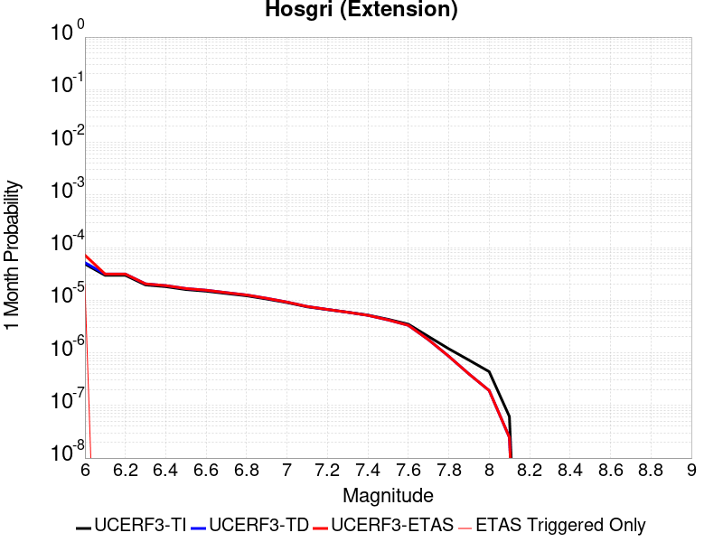 |  | 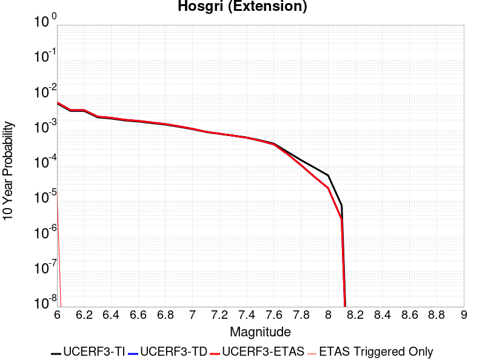 |

| Magnitude | 1 wk TI Prob | 1 wk TD Prob | 1 wk ETAS Prob | 1 wk ETAS/TD Gain | 1 wk ETAS Triggered Only | 1 mo TI Prob | 1 mo TD Prob | 1 mo ETAS Prob | 1 mo ETAS/TD Gain | 1 mo ETAS Triggered Only | 1 yr TI Prob | 1 yr TD Prob | 1 yr ETAS Prob | 1 yr ETAS/TD Gain | 1 yr ETAS Triggered Only | 10 yr TI Prob | 10 yr TD Prob | 10 yr ETAS Prob | 10 yr ETAS/TD Gain | 10 yr ETAS Triggered Only |
|-----|-----|-----|-----|-----|-----|-----|-----|-----|-----|-----|-----|-----|-----|-----|-----|-----|-----|-----|-----|-----|
| 6.0 | 1.1369135E-5 | 1.2083073E-5 | 3.2082833E-5 | 2.655188 | 2.0E-5 | 4.8723956E-5 | 5.17837E-5 | 7.178266E-5 | 1.386202 | 2.0E-5 | 5.9305265E-4 | 6.303069E-4 | 6.502943E-4 | 1.0317106 | 2.0E-5 | 0.005914725 | 0.00628744 | 0.0063073146 | 1.003161 | 2.0E-5 |
| 6.1 | 6.934979E-6 | 7.324556E-6 | 7.324556E-6 | 1.0 | 0.0 | 2.9721E-5 | 3.13906E-5 | 3.13906E-5 | 1.0 | 0.0 | 3.617931E-4 | 3.821177E-4 | 3.821177E-4 | 1.0 | 0.0 | 0.0036120464 | 0.003815019 | 0.003815019 | 1.0 | 0.0 |
| 6.2 | 6.934979E-6 | 7.324556E-6 | 7.324556E-6 | 1.0 | 0.0 | 2.9721E-5 | 3.13906E-5 | 3.13906E-5 | 1.0 | 0.0 | 3.617931E-4 | 3.821177E-4 | 3.821177E-4 | 1.0 | 0.0 | 0.0036120464 | 0.003815019 | 0.003815019 | 1.0 | 0.0 |
| 6.3 | 4.5484676E-6 | 4.769331E-6 | 4.769331E-6 | 1.0 | 0.0 | 1.9493287E-5 | 2.0439833E-5 | 2.0439833E-5 | 1.0 | 0.0 | 2.3730492E-4 | 2.4882698E-4 | 2.4882698E-4 | 1.0 | 0.0 | 0.0023705168 | 0.0024855263 | 0.0024855263 | 1.0 | 0.0 |
| 6.4 | 4.218095E-6 | 4.416863E-6 | 4.416863E-6 | 1.0 | 0.0 | 1.8077424E-5 | 1.8929275E-5 | 1.8929275E-5 | 1.0 | 0.0 | 2.2007042E-4 | 2.3043988E-4 | 2.3043988E-4 | 1.0 | 0.0 | 0.002198526 | 0.002302043 | 0.002302043 | 1.0 | 0.0 |
| 6.5 | 3.717374E-6 | 3.883879E-6 | 3.883879E-6 | 1.0 | 0.0 | 1.5931506E-5 | 1.664509E-5 | 1.664509E-5 | 1.0 | 0.0 | 1.9394881E-4 | 2.026353E-4 | 2.026353E-4 | 1.0 | 0.0 | 0.0019377962 | 0.0020245241 | 0.0020245241 | 1.0 | 0.0 |
| 6.6 | 3.4605036E-6 | 3.6083072E-6 | 3.6083072E-6 | 1.0 | 0.0 | 1.4830645E-5 | 1.5464082E-5 | 1.5464082E-5 | 1.0 | 0.0 | 1.8054814E-4 | 1.8825909E-4 | 1.8825909E-4 | 1.0 | 0.0 | 0.0018040152 | 0.0018810107 | 0.0018810107 | 1.0 | 0.0 |
| 6.7 | 3.123439E-6 | 3.2465698E-6 | 3.2465698E-6 | 1.0 | 0.0 | 1.33860985E-5 | 1.39137965E-5 | 1.39137965E-5 | 1.0 | 0.0 | 1.6296357E-4 | 1.6938741E-4 | 1.6938741E-4 | 1.0 | 0.0 | 0.001628441 | 0.001692594 | 0.001692594 | 1.0 | 0.0 |
| 6.8 | 2.8290783E-6 | 2.9305413E-6 | 2.9305413E-6 | 1.0 | 0.0 | 1.2124565E-5 | 1.2559403E-5 | 1.2559403E-5 | 1.0 | 0.0 | 1.4760658E-4 | 1.5290009E-4 | 1.5290009E-4 | 1.0 | 0.0 | 0.0014750857 | 0.0015279576 | 0.0015279576 | 1.0 | 0.0 |
| 6.9 | 2.454112E-6 | 2.5283207E-6 | 2.5283207E-6 | 1.0 | 0.0 | 1.0517581E-5 | 1.0835615E-5 | 1.0835615E-5 | 1.0 | 0.0 | 1.2804402E-4 | 1.3191569E-4 | 1.3191569E-4 | 1.0 | 0.0 | 0.0012797028 | 0.0013183799 | 0.0013183799 | 1.0 | 0.0 |
| 7.0 | 2.1008145E-6 | 2.1498715E-6 | 2.1498715E-6 | 1.0 | 0.0 | 9.003459E-6 | 9.2137025E-6 | 9.2137025E-6 | 1.0 | 0.0 | 1.096116E-4 | 1.1217109E-4 | 1.1217109E-4 | 1.0 | 0.0 | 0.0010955755 | 0.0011211485 | 0.0011211485 | 1.0 | 0.0 |
| 7.1 | 1.744384E-6 | 1.7686364E-6 | 1.7686364E-6 | 1.0 | 0.0 | 7.47591E-6 | 7.579848E-6 | 7.579848E-6 | 1.0 | 0.0 | 9.1015405E-5 | 9.228076E-5 | 9.228076E-5 | 1.0 | 0.0 | 9.097813E-4 | 9.224261E-4 | 9.224261E-4 | 1.0 | 0.0 |
| 7.2 | 1.5456587E-6 | 1.5562894E-6 | 1.5562894E-6 | 1.0 | 0.0 | 6.6242346E-6 | 6.6697944E-6 | 6.6697944E-6 | 1.0 | 0.0 | 8.064707E-5 | 8.120173E-5 | 8.120173E-5 | 1.0 | 0.0 | 8.0617814E-4 | 8.117219E-4 | 8.117219E-4 | 1.0 | 0.0 |
| 7.3 | 1.3775123E-6 | 1.3766092E-6 | 1.3766092E-6 | 1.0 | 0.0 | 5.9036106E-6 | 5.8997407E-6 | 5.8997407E-6 | 1.0 | 0.0 | 7.187409E-5 | 7.182699E-5 | 7.182699E-5 | 1.0 | 0.0 | 7.185085E-4 | 7.180387E-4 | 7.180387E-4 | 1.0 | 0.0 |
| 7.4 | 1.214491E-6 | 1.2023471E-6 | 1.2023471E-6 | 1.0 | 0.0 | 5.2049513E-6 | 5.152906E-6 | 5.152906E-6 | 1.0 | 0.0 | 6.336844E-5 | 6.2734835E-5 | 6.2734835E-5 | 1.0 | 0.0 | 6.335037E-4 | 6.2717206E-4 | 6.2717206E-4 | 1.0 | 0.0 |
| 7.5 | 1.0101123E-6 | 9.842256E-7 | 9.842256E-7 | 1.0 | 0.0 | 4.3290456E-6 | 4.218103E-6 | 4.218103E-6 | 1.0 | 0.0 | 5.2704854E-5 | 5.13542E-5 | 5.13542E-5 | 1.0 | 0.0 | 5.2692357E-4 | 5.1342393E-4 | 5.1342393E-4 | 1.0 | 0.0 |
| 7.6 | 8.1558215E-7 | 7.765977E-7 | 7.765977E-7 | 1.0 | 0.0 | 3.4953473E-6 | 3.3282718E-6 | 3.3282718E-6 | 1.0 | 0.0 | 4.255502E-5 | 4.0520958E-5 | 4.0520958E-5 | 1.0 | 0.0 | 4.2546875E-4 | 4.0513615E-4 | 4.0513615E-4 | 1.0 | 0.0 |
| 7.7 | 4.757816E-7 | 4.1308996E-7 | 4.1308996E-7 | 1.0 | 0.0 | 2.0390623E-6 | 1.7703843E-6 | 1.7703843E-6 | 1.0 | 0.0 | 2.4825302E-5 | 2.1554217E-5 | 2.1554217E-5 | 1.0 | 0.0 | 2.482253E-4 | 2.1552139E-4 | 2.1552139E-4 | 1.0 | 0.0 |
| 7.8 | 2.782787E-7 | 2.004783E-7 | 2.004783E-7 | 1.0 | 0.0 | 1.1926223E-6 | 8.591924E-7 | 8.591924E-7 | 1.0 | 0.0 | 1.452008E-5 | 1.0460618E-5 | 1.0460618E-5 | 1.0 | 0.0 | 1.4519131E-4 | 1.04601284E-4 | 1.04601284E-4 | 1.0 | 0.0 |
| 7.9 | 1.6948086E-7 | 9.243938E-8 | 9.243938E-8 | 1.0 | 0.0 | 7.2634634E-7 | 3.961687E-7 | 3.961687E-7 | 1.0 | 0.0 | 8.843231E-6 | 4.8233433E-6 | 4.8233433E-6 | 1.0 | 0.0 | 8.842879E-5 | 4.8232392E-5 | 4.8232392E-5 | 1.0 | 0.0 |
| 8.0 | 1.0225492E-7 | 4.473497E-8 | 4.473497E-8 | 1.0 | 0.0 | 4.382353E-7 | 1.917213E-7 | 1.917213E-7 | 1.0 | 0.0 | 5.335502E-6 | 2.3342043E-6 | 2.3342043E-6 | 1.0 | 0.0 | 5.335374E-5 | 2.33418E-5 | 2.33418E-5 | 1.0 | 0.0 |
| 8.1 | 1.43711345E-8 | 5.78716E-9 | 5.78716E-9 | 1.0 | 0.0 | 6.1590576E-8 | 2.4802116E-8 | 2.4802116E-8 | 1.0 | 0.0 | 7.4986497E-7 | 3.019657E-7 | 3.019657E-7 | 1.0 | 0.0 | 7.4986247E-6 | 3.0196536E-6 | 3.0196536E-6 | 1.0 | 0.0 |

## Likely 2011 CFM
*[(top)](#table-of-contents)*

| 1 Week | 1 Month | 1 Year | 10 Year |
|-----|-----|-----|-----|
|  |  |  |  |

| Magnitude | 1 wk TI Prob | 1 wk TD Prob | 1 wk ETAS Prob | 1 wk ETAS/TD Gain | 1 wk ETAS Triggered Only | 1 mo TI Prob | 1 mo TD Prob | 1 mo ETAS Prob | 1 mo ETAS/TD Gain | 1 mo ETAS Triggered Only | 1 yr TI Prob | 1 yr TD Prob | 1 yr ETAS Prob | 1 yr ETAS/TD Gain | 1 yr ETAS Triggered Only | 10 yr TI Prob | 10 yr TD Prob | 10 yr ETAS Prob | 10 yr ETAS/TD Gain | 10 yr ETAS Triggered Only |
|-----|-----|-----|-----|-----|-----|-----|-----|-----|-----|-----|-----|-----|-----|-----|-----|-----|-----|-----|-----|-----|
| 6.0 | 2.5315949E-5 | 2.7104748E-5 | 3.7104477E-5 | 1.368929 | 1.0E-5 | 1.0849241E-4 | 1.16158284E-4 | 1.2615713E-4 | 1.0860795 | 1.0E-5 | 0.0013200947 | 0.0014133542 | 0.00142334 | 1.0070654 | 1.0E-5 | 0.013122803 | 0.01404831 | 0.01405817 | 1.0007018 | 1.0E-5 |
| 6.1 | 2.5315949E-5 | 2.7104748E-5 | 3.7104477E-5 | 1.368929 | 1.0E-5 | 1.0849241E-4 | 1.16158284E-4 | 1.2615713E-4 | 1.0860795 | 1.0E-5 | 0.0013200947 | 0.0014133542 | 0.00142334 | 1.0070654 | 1.0E-5 | 0.013122803 | 0.01404831 | 0.01405817 | 1.0007018 | 1.0E-5 |
| 6.2 | 1.6375941E-5 | 1.7465842E-5 | 2.7465667E-5 | 1.5725361 | 1.0E-5 | 7.0180715E-5 | 7.485153E-5 | 8.4850784E-5 | 1.1335878 | 1.0E-5 | 8.5411523E-4 | 9.109487E-4 | 9.2093955E-4 | 1.0109676 | 1.0E-5 | 0.008508399 | 0.009073433 | 0.009083342 | 1.0010921 | 1.0E-5 |
| 6.3 | 1.1945543E-5 | 1.2712587E-5 | 2.271246E-5 | 1.7866119 | 1.0E-5 | 5.119418E-5 | 5.4481407E-5 | 6.448086E-5 | 1.1835389 | 1.0E-5 | 6.2311086E-4 | 6.631146E-4 | 6.73108E-4 | 1.0150703 | 1.0E-5 | 0.0062136655 | 0.0066119144 | 0.0066218483 | 1.0015024 | 1.0E-5 |
| 6.4 | 9.192729E-6 | 9.768488E-6 | 1.976839E-5 | 2.02369 | 1.0E-5 | 3.939681E-5 | 4.1864292E-5 | 5.1863874E-5 | 1.238857 | 1.0E-5 | 4.7955062E-4 | 5.0958124E-4 | 5.195762E-4 | 1.019614 | 1.0E-5 | 0.004785171 | 0.0050844094 | 0.005094358 | 1.0019568 | 1.0E-5 |
| 6.5 | 7.67906E-6 | 8.152622E-6 | 1.8152541E-5 | 2.2265892 | 1.0E-5 | 3.2909844E-5 | 3.4939352E-5 | 4.4939003E-5 | 1.2862003 | 1.0E-5 | 4.006037E-4 | 4.2530545E-4 | 4.3530122E-4 | 1.0235025 | 1.0E-5 | 0.0039988225 | 0.004245108 | 0.0042550657 | 1.0023457 | 1.0E-5 |
| 6.6 | 6.4884057E-6 | 6.8847507E-6 | 1.6884682E-5 | 2.4524755 | 1.0E-5 | 2.7807157E-5 | 2.9505749E-5 | 3.9505452E-5 | 1.338907 | 1.0E-5 | 3.3849955E-4 | 3.591747E-4 | 3.6917112E-4 | 1.0278316 | 1.0E-5 | 0.003379844 | 0.0035860867 | 0.003596051 | 1.0027785 | 1.0E-5 |
| 6.7 | 4.6060636E-6 | 4.884041E-6 | 4.884041E-6 | 1.0 | 0.0 | 1.9740122E-5 | 2.0931442E-5 | 2.0931442E-5 | 1.0 | 0.0 | 2.403095E-4 | 2.5481134E-4 | 2.5481134E-4 | 1.0 | 0.0 | 0.002400498 | 0.0025452746 | 0.0025452746 | 1.0 | 0.0 |
| 6.8 | 3.2795615E-6 | 3.4773732E-6 | 3.4773732E-6 | 1.0 | 0.0 | 1.4055187E-5 | 1.4902946E-5 | 1.4902946E-5 | 1.0 | 0.0 | 1.7110848E-4 | 1.8142881E-4 | 1.8142881E-4 | 1.0 | 0.0 | 0.0017097679 | 0.0018128622 | 0.0018128622 | 1.0 | 0.0 |
| 6.9 | 2.3289967E-6 | 2.4705569E-6 | 2.4705569E-6 | 1.0 | 0.0 | 9.981376E-6 | 1.058806E-5 | 1.058806E-5 | 1.0 | 0.0 | 1.2151648E-4 | 1.2890245E-4 | 1.2890245E-4 | 1.0 | 0.0 | 0.0012145005 | 0.0012883197 | 0.0012883197 | 1.0 | 0.0 |
| 7.0 | 1.211292E-6 | 1.2863958E-6 | 1.2863958E-6 | 1.0 | 0.0 | 5.1912407E-6 | 5.5131145E-6 | 5.5131145E-6 | 1.0 | 0.0 | 6.320152E-5 | 6.712041E-5 | 6.712041E-5 | 1.0 | 0.0 | 6.3183554E-4 | 6.710312E-4 | 6.710312E-4 | 1.0 | 0.0 |

## San Juan
*[(top)](#table-of-contents)*

| 1 Week | 1 Month | 1 Year | 10 Year |
|-----|-----|-----|-----|
|  |  |  |  |

| Magnitude | 1 wk TI Prob | 1 wk TD Prob | 1 wk ETAS Prob | 1 wk ETAS/TD Gain | 1 wk ETAS Triggered Only | 1 mo TI Prob | 1 mo TD Prob | 1 mo ETAS Prob | 1 mo ETAS/TD Gain | 1 mo ETAS Triggered Only | 1 yr TI Prob | 1 yr TD Prob | 1 yr ETAS Prob | 1 yr ETAS/TD Gain | 1 yr ETAS Triggered Only | 10 yr TI Prob | 10 yr TD Prob | 10 yr ETAS Prob | 10 yr ETAS/TD Gain | 10 yr ETAS Triggered Only |
|-----|-----|-----|-----|-----|-----|-----|-----|-----|-----|-----|-----|-----|-----|-----|-----|-----|-----|-----|-----|-----|
| 6.0 | 8.682808E-6 | 8.74917E-6 | 1.8749082E-5 | 2.1429555 | 1.0E-5 | 3.72115E-5 | 3.749593E-5 | 5.749518E-5 | 1.5333712 | 2.0E-5 | 4.5295584E-4 | 4.5642213E-4 | 4.76413E-4 | 1.043799 | 2.0E-5 | 0.004520337 | 0.004555389 | 0.0045752977 | 1.0043705 | 2.0E-5 |
| 6.1 | 8.682808E-6 | 8.74917E-6 | 1.8749082E-5 | 2.1429555 | 1.0E-5 | 3.72115E-5 | 3.749593E-5 | 5.749518E-5 | 1.5333712 | 2.0E-5 | 4.5295584E-4 | 4.5642213E-4 | 4.76413E-4 | 1.043799 | 2.0E-5 | 0.004520337 | 0.004555389 | 0.0045752977 | 1.0043705 | 2.0E-5 |
| 6.2 | 8.682808E-6 | 8.74917E-6 | 1.8749082E-5 | 2.1429555 | 1.0E-5 | 3.72115E-5 | 3.749593E-5 | 5.749518E-5 | 1.5333712 | 2.0E-5 | 4.5295584E-4 | 4.5642213E-4 | 4.76413E-4 | 1.043799 | 2.0E-5 | 0.004520337 | 0.004555389 | 0.0045752977 | 1.0043705 | 2.0E-5 |
| 6.3 | 6.3054235E-6 | 6.282591E-6 | 6.282591E-6 | 1.0 | 0.0 | 2.7022963E-5 | 2.692512E-5 | 2.692512E-5 | 1.0 | 0.0 | 3.2895492E-4 | 3.2776545E-4 | 3.2776545E-4 | 1.0 | 0.0 | 0.003284684 | 0.0032730205 | 0.0032730205 | 1.0 | 0.0 |
| 6.4 | 6.1490473E-6 | 6.1144706E-6 | 6.1144706E-6 | 1.0 | 0.0 | 2.6352795E-5 | 2.6204618E-5 | 2.6204618E-5 | 1.0 | 0.0 | 3.2079802E-4 | 3.189959E-4 | 3.189959E-4 | 1.0 | 0.0 | 0.0032033534 | 0.0031855768 | 0.0031855768 | 1.0 | 0.0 |
| 6.5 | 5.204848E-6 | 5.137238E-6 | 5.137238E-6 | 1.0 | 0.0 | 2.23063E-5 | 2.2016555E-5 | 2.2016555E-5 | 1.0 | 0.0 | 2.7154534E-4 | 2.6801953E-4 | 2.6801953E-4 | 1.0 | 0.0 | 0.0027121378 | 0.0026771172 | 0.0026771172 | 1.0 | 0.0 |
| 6.6 | 4.5179986E-6 | 4.415036E-6 | 4.415036E-6 | 1.0 | 0.0 | 1.9362706E-5 | 1.892145E-5 | 1.892145E-5 | 1.0 | 0.0 | 2.3571544E-4 | 2.303451E-4 | 2.303451E-4 | 1.0 | 0.0 | 0.0023546559 | 0.0023012008 | 0.0023012008 | 1.0 | 0.0 |
| 6.7 | 3.9442616E-6 | 3.8198336E-6 | 3.8198336E-6 | 1.0 | 0.0 | 1.6903869E-5 | 1.6370615E-5 | 1.6370615E-5 | 1.0 | 0.0 | 2.0578515E-4 | 1.9929469E-4 | 1.9929469E-4 | 1.0 | 0.0 | 0.002055947 | 0.001991285 | 0.001991285 | 1.0 | 0.0 |
| 6.8 | 3.4536245E-6 | 3.3163408E-6 | 3.3163408E-6 | 1.0 | 0.0 | 1.4801163E-5 | 1.4212815E-5 | 1.4212815E-5 | 1.0 | 0.0 | 1.8018926E-4 | 1.7302789E-4 | 1.7302789E-4 | 1.0 | 0.0 | 0.0018004322 | 0.001729051 | 0.001729051 | 1.0 | 0.0 |
| 6.9 | 3.059865E-6 | 2.9120363E-6 | 2.9120363E-6 | 1.0 | 0.0 | 1.3113641E-5 | 1.2480099E-5 | 1.2480099E-5 | 1.0 | 0.0 | 1.596469E-4 | 1.5193518E-4 | 1.5193518E-4 | 1.0 | 0.0 | 0.0015953224 | 0.0015184281 | 0.0015184281 | 1.0 | 0.0 |
| 7.0 | 2.6504351E-6 | 2.492005E-6 | 2.492005E-6 | 1.0 | 0.0 | 1.1358958E-5 | 1.0679981E-5 | 1.0679981E-5 | 1.0 | 0.0 | 1.3828653E-4 | 1.3002155E-4 | 1.3002155E-4 | 1.0 | 0.0 | 0.0013820052 | 0.001299567 | 0.001299567 | 1.0 | 0.0 |
| 7.1 | 2.2039317E-6 | 2.0338366E-6 | 2.0338366E-6 | 1.0 | 0.0 | 9.445387E-6 | 8.716416E-6 | 8.716416E-6 | 1.0 | 0.0 | 1.1499152E-4 | 1.0611773E-4 | 1.0611773E-4 | 1.0 | 0.0 | 0.0011493203 | 0.0010607811 | 0.0010607811 | 1.0 | 0.0 |
| 7.2 | 1.0786707E-6 | 8.770239E-7 | 8.770239E-7 | 1.0 | 0.0 | 4.622866E-6 | 3.7586685E-6 | 3.7586685E-6 | 1.0 | 0.0 | 5.628194E-5 | 4.576084E-5 | 4.576084E-5 | 1.0 | 0.0 | 5.6267687E-4 | 4.5757365E-4 | 4.5757365E-4 | 1.0 | 0.0 |
| 7.3 | 6.846433E-7 | 4.868812E-7 | 4.868812E-7 | 1.0 | 0.0 | 2.9341822E-6 | 2.086632E-6 | 2.086632E-6 | 1.0 | 0.0 | 3.5723086E-5 | 2.5404452E-5 | 2.5404452E-5 | 1.0 | 0.0 | 3.571734E-4 | 2.5405022E-4 | 2.5405022E-4 | 1.0 | 0.0 |
| 7.4 | 5.23043E-7 | 3.2627884E-7 | 3.2627884E-7 | 1.0 | 0.0 | 2.2416111E-6 | 1.3983371E-6 | 1.3983371E-6 | 1.0 | 0.0 | 2.7291273E-5 | 1.7024622E-5 | 1.7024622E-5 | 1.0 | 0.0 | 2.7287923E-4 | 1.7026608E-4 | 1.7026608E-4 | 1.0 | 0.0 |
| 7.5 | 4.648444E-7 | 2.723464E-7 | 2.723464E-7 | 1.0 | 0.0 | 1.9921886E-6 | 1.1671983E-6 | 1.1671983E-6 | 1.0 | 0.0 | 2.4254627E-5 | 1.4210547E-5 | 1.4210547E-5 | 1.0 | 0.0 | 2.425198E-4 | 1.4212691E-4 | 1.4212691E-4 | 1.0 | 0.0 |
| 7.6 | 3.9906567E-7 | 2.2083036E-7 | 2.2083036E-7 | 1.0 | 0.0 | 1.7102802E-6 | 9.4641547E-7 | 9.4641547E-7 | 1.0 | 0.0 | 2.0822463E-5 | 1.1522548E-5 | 1.1522548E-5 | 1.0 | 0.0 | 2.0820512E-4 | 1.15244526E-4 | 1.15244526E-4 | 1.0 | 0.0 |
| 7.7 | 1.8784601E-7 | 5.366277E-8 | 5.366277E-8 | 1.0 | 0.0 | 8.0505407E-7 | 2.2998329E-7 | 2.2998329E-7 | 1.0 | 0.0 | 9.80149E-6 | 2.800043E-6 | 2.800043E-6 | 1.0 | 0.0 | 9.801057E-5 | 2.8008939E-5 | 2.8008939E-5 | 1.0 | 0.0 |
| 7.8 | 1.00154914E-7 | 1.2412917E-8 | 1.2412917E-8 | 1.0 | 0.0 | 4.2923529E-7 | 5.3198217E-8 | 5.3198217E-8 | 1.0 | 0.0 | 5.225927E-6 | 6.476881E-7 | 6.476881E-7 | 1.0 | 0.0 | 5.225804E-5 | 6.4827886E-6 | 6.4827886E-6 | 1.0 | 0.0 |
| 7.9 | 6.171429E-8 | 4.2946513E-9 | 4.2946513E-9 | 1.0 | 0.0 | 2.6448978E-7 | 1.8405647E-8 | 1.8405647E-8 | 1.0 | 0.0 | 3.2201583E-6 | 2.2408874E-7 | 2.2408874E-7 | 1.0 | 0.0 | 3.2201115E-5 | 2.2462114E-6 | 2.2462114E-6 | 1.0 | 0.0 |
| 8.0 | 1.3974572E-8 | 3.3737857E-10 | 3.3737857E-10 | 1.0 | 0.0 | 5.989102E-8 | 1.4459075E-9 | 1.4459075E-9 | 1.0 | 0.0 | 7.2917294E-7 | 1.760392E-8 | 1.760392E-8 | 1.0 | 0.0 | 7.2917055E-6 | 1.8038004E-7 | 1.8038004E-7 | 1.0 | 0.0 |
| 8.1 | 1.8403477E-9 | 1.1291601E-10 | 1.1291601E-10 | 1.0 | 0.0 | 7.887204E-9 | 4.839261E-10 | 4.839261E-10 | 1.0 | 0.0 | 9.602671E-8 | 5.8917977E-9 | 5.8917977E-9 | 1.0 | 0.0 | 9.602667E-7 | 6.0206084E-8 | 6.0206084E-8 | 1.0 | 0.0 |

## Hayward (So) 2011 CFM
*[(top)](#table-of-contents)*

| 1 Week | 1 Month | 1 Year | 10 Year |
|-----|-----|-----|-----|
|  |  |  |  |

| Magnitude | 1 wk TI Prob | 1 wk TD Prob | 1 wk ETAS Prob | 1 wk ETAS/TD Gain | 1 wk ETAS Triggered Only | 1 mo TI Prob | 1 mo TD Prob | 1 mo ETAS Prob | 1 mo ETAS/TD Gain | 1 mo ETAS Triggered Only | 1 yr TI Prob | 1 yr TD Prob | 1 yr ETAS Prob | 1 yr ETAS/TD Gain | 1 yr ETAS Triggered Only | 10 yr TI Prob | 10 yr TD Prob | 10 yr ETAS Prob | 10 yr ETAS/TD Gain | 10 yr ETAS Triggered Only |
|-----|-----|-----|-----|-----|-----|-----|-----|-----|-----|-----|-----|-----|-----|-----|-----|-----|-----|-----|-----|-----|
| 6.0 | 1.8091932E-4 | 3.570673E-4 | 3.570673E-4 | 1.0 | 0.0 | 7.751381E-4 | 0.0015294008 | 0.0015393855 | 1.0065285 | 1.0E-5 | 0.00939654 | 0.018463885 | 0.018483516 | 1.0010632 | 2.0E-5 | 0.090090066 | 0.1667085 | 0.16672516 | 1.0001 | 2.0E-5 |
| 6.1 | 1.8091932E-4 | 3.570673E-4 | 3.570673E-4 | 1.0 | 0.0 | 7.751381E-4 | 0.0015294008 | 0.0015393855 | 1.0065285 | 1.0E-5 | 0.00939654 | 0.018463885 | 0.018483516 | 1.0010632 | 2.0E-5 | 0.090090066 | 0.1667085 | 0.16672516 | 1.0001 | 2.0E-5 |
| 6.2 | 1.8091932E-4 | 3.570673E-4 | 3.570673E-4 | 1.0 | 0.0 | 7.751381E-4 | 0.0015294008 | 0.0015393855 | 1.0065285 | 1.0E-5 | 0.00939654 | 0.018463885 | 0.018483516 | 1.0010632 | 2.0E-5 | 0.090090066 | 0.1667085 | 0.16672516 | 1.0001 | 2.0E-5 |
| 6.3 | 1.7322872E-4 | 3.4263515E-4 | 3.4263515E-4 | 1.0 | 0.0 | 7.4219756E-4 | 0.0014676197 | 0.001477605 | 1.0068038 | 1.0E-5 | 0.0089988755 | 0.017724147 | 0.01773397 | 1.0005542 | 1.0E-5 | 0.08643075 | 0.16065954 | 0.16066793 | 1.0000522 | 1.0E-5 |
| 6.4 | 1.6334097E-4 | 3.2345165E-4 | 3.2345165E-4 | 1.0 | 0.0 | 6.998449E-4 | 0.0013854936 | 0.0013954798 | 1.0072076 | 1.0E-5 | 0.008487372 | 0.016739927 | 0.01674976 | 1.0005873 | 1.0E-5 | 0.081704415 | 0.15256606 | 0.15257452 | 1.0000556 | 1.0E-5 |
| 6.5 | 1.5600289E-4 | 3.101982E-4 | 3.101982E-4 | 1.0 | 0.0 | 6.684125E-4 | 0.0013287518 | 0.0013387385 | 1.0075159 | 1.0E-5 | 0.008107598 | 0.016059443 | 0.016069284 | 1.0006127 | 1.0E-5 | 0.078181036 | 0.14684291 | 0.14685144 | 1.000058 | 1.0E-5 |
| 6.6 | 1.4046066E-4 | 2.8034003E-4 | 2.8034003E-4 | 1.0 | 0.0 | 6.018354E-4 | 0.0012009109 | 0.0012009109 | 1.0 | 0.0 | 0.0073027555 | 0.014524571 | 0.014524571 | 1.0 | 0.0 | 0.07067384 | 0.13393044 | 0.13393044 | 1.0 | 0.0 |
| 6.7 | 1.14696966E-4 | 2.3272466E-4 | 2.3272466E-4 | 1.0 | 0.0 | 4.914658E-4 | 9.970153E-4 | 9.970153E-4 | 1.0 | 0.0 | 0.0059671924 | 0.012072163 | 0.012072163 | 1.0 | 0.0 | 0.058094822 | 0.11274141 | 0.11274141 | 1.0 | 0.0 |
| 6.8 | 9.3874296E-5 | 1.8862431E-4 | 1.8862431E-4 | 1.0 | 0.0 | 4.0225635E-4 | 8.081431E-4 | 8.081431E-4 | 1.0 | 0.0 | 0.0048864787 | 0.009795489 | 0.009795489 | 1.0 | 0.0 | 0.047804173 | 0.092592984 | 0.092592984 | 1.0 | 0.0 |
| 6.9 | 5.551852E-5 | 1.0729875E-4 | 1.0729875E-4 | 1.0 | 0.0 | 2.3791482E-4 | 4.5977137E-4 | 4.5977137E-4 | 1.0 | 0.0 | 0.0028927654 | 0.005583468 | 0.005583468 | 1.0 | 0.0 | 0.028553981 | 0.054246075 | 0.054246075 | 1.0 | 0.0 |
| 7.0 | 4.2662363E-5 | 8.246792E-5 | 8.246792E-5 | 1.0 | 0.0 | 1.8282588E-4 | 3.5338648E-4 | 3.5338648E-4 | 1.0 | 0.0 | 0.0022236328 | 0.0042940658 | 0.0042940658 | 1.0 | 0.0 | 0.022015138 | 0.04206509 | 0.04206509 | 1.0 | 0.0 |
| 7.1 | 3.305886E-5 | 6.302183E-5 | 6.302183E-5 | 1.0 | 0.0 | 1.4167312E-4 | 2.7006568E-4 | 2.7006568E-4 | 1.0 | 0.0 | 0.0017235056 | 0.003283111 | 0.003283111 | 1.0 | 0.0 | 0.017101998 | 0.032453902 | 0.032453902 | 1.0 | 0.0 |
| 7.2 | 2.9856887E-5 | 5.701622E-5 | 5.701622E-5 | 1.0 | 0.0 | 1.2795182E-4 | 2.4433242E-4 | 2.4433242E-4 | 1.0 | 0.0 | 0.0015567001 | 0.0029707062 | 0.0029707062 | 1.0 | 0.0 | 0.015458403 | 0.029454801 | 0.029454801 | 1.0 | 0.0 |
| 7.3 | 2.4559737E-5 | 4.599286E-5 | 4.599286E-5 | 1.0 | 0.0 | 1.0525176E-4 | 1.9709744E-4 | 1.9709744E-4 | 1.0 | 0.0 | 0.0012806869 | 0.0023970334 | 0.0023970334 | 1.0 | 0.0 | 0.012733313 | 0.023858516 | 0.023858516 | 1.0 | 0.0 |
| 7.4 | 1.9002231E-5 | 3.505084E-5 | 3.505084E-5 | 1.0 | 0.0 | 8.143559E-5 | 1.502093E-4 | 1.502093E-4 | 1.0 | 0.0 | 9.910273E-4 | 0.001827274 | 0.001827274 | 1.0 | 0.0 | 0.009866194 | 0.018258808 | 0.018258808 | 1.0 | 0.0 |
| 7.5 | 1.2783333E-5 | 2.3331182E-5 | 2.3331182E-5 | 1.0 | 0.0 | 5.4784563E-5 | 9.998698E-5 | 9.998698E-5 | 1.0 | 0.0 | 6.667979E-4 | 0.0012166675 | 0.0012166675 | 1.0 | 0.0 | 0.006648007 | 0.012209443 | 0.012209443 | 1.0 | 0.0 |
| 7.6 | 4.8149627E-6 | 8.888056E-6 | 8.888056E-6 | 1.0 | 0.0 | 2.063539E-5 | 3.8091122E-5 | 3.8091122E-5 | 1.0 | 0.0 | 2.5120692E-4 | 4.6366194E-4 | 4.6366194E-4 | 1.0 | 0.0 | 0.0025092314 | 0.0046805087 | 0.0046805087 | 1.0 | 0.0 |
| 7.7 | 6.0838227E-7 | 1.205754E-6 | 1.205754E-6 | 1.0 | 0.0 | 2.6073499E-6 | 5.1675065E-6 | 5.1675065E-6 | 1.0 | 0.0 | 3.174402E-5 | 6.291258E-5 | 6.291258E-5 | 1.0 | 0.0 | 3.1739488E-4 | 6.5296254E-4 | 6.5296254E-4 | 1.0 | 0.0 |
| 7.8 | 4.5542808E-7 | 9.792941E-7 | 9.792941E-7 | 1.0 | 0.0 | 1.9518332E-6 | 4.196968E-6 | 4.196968E-6 | 1.0 | 0.0 | 2.376331E-5 | 5.109689E-5 | 5.109689E-5 | 1.0 | 0.0 | 2.3760769E-4 | 5.321693E-4 | 5.321693E-4 | 1.0 | 0.0 |
| 7.9 | 3.3016747E-7 | 7.3869535E-7 | 7.3869535E-7 | 1.0 | 0.0 | 1.4150027E-6 | 3.1658333E-6 | 3.1658333E-6 | 1.0 | 0.0 | 1.7227521E-5 | 3.854334E-5 | 3.854334E-5 | 1.0 | 0.0 | 1.7226185E-4 | 3.9932923E-4 | 3.9932923E-4 | 1.0 | 0.0 |
| 8.0 | 2.347038E-7 | 5.471963E-7 | 5.471963E-7 | 1.0 | 0.0 | 1.0058731E-6 | 2.3451248E-6 | 2.3451248E-6 | 1.0 | 0.0 | 1.2246436E-5 | 2.8551523E-5 | 2.8551523E-5 | 1.0 | 0.0 | 1.2245761E-4 | 2.9357258E-4 | 2.9357258E-4 | 1.0 | 0.0 |
| 8.1 | 1.18822804E-7 | 2.6060948E-7 | 2.6060948E-7 | 1.0 | 0.0 | 5.092405E-7 | 1.1168972E-6 | 1.1168972E-6 | 1.0 | 0.0 | 6.1999854E-6 | 1.359814E-5 | 1.359814E-5 | 1.0 | 0.0 | 6.199812E-5 | 1.3918082E-4 | 1.3918082E-4 | 1.0 | 0.0 |

## Great Valley 05 Pittsburg - Kirby Hills alt1
*[(top)](#table-of-contents)*

| 1 Week | 1 Month | 1 Year | 10 Year |
|-----|-----|-----|-----|
|  |  |  |  |

| Magnitude | 1 wk TI Prob | 1 wk TD Prob | 1 wk ETAS Prob | 1 wk ETAS/TD Gain | 1 wk ETAS Triggered Only | 1 mo TI Prob | 1 mo TD Prob | 1 mo ETAS Prob | 1 mo ETAS/TD Gain | 1 mo ETAS Triggered Only | 1 yr TI Prob | 1 yr TD Prob | 1 yr ETAS Prob | 1 yr ETAS/TD Gain | 1 yr ETAS Triggered Only | 10 yr TI Prob | 10 yr TD Prob | 10 yr ETAS Prob | 10 yr ETAS/TD Gain | 10 yr ETAS Triggered Only |
|-----|-----|-----|-----|-----|-----|-----|-----|-----|-----|-----|-----|-----|-----|-----|-----|-----|-----|-----|-----|-----|
| 6.0 | 4.187212E-5 | 5.344289E-5 | 7.344182E-5 | 1.3742112 | 2.0E-5 | 1.794396E-4 | 2.2902661E-4 | 2.4902204E-4 | 1.0873061 | 2.0E-5 | 0.002182488 | 0.0027857998 | 0.002805744 | 1.0071592 | 2.0E-5 | 0.021611776 | 0.027603218 | 0.027622666 | 1.0007045 | 2.0E-5 |
| 6.1 | 4.187212E-5 | 5.344289E-5 | 7.344182E-5 | 1.3742112 | 2.0E-5 | 1.794396E-4 | 2.2902661E-4 | 2.4902204E-4 | 1.0873061 | 2.0E-5 | 0.002182488 | 0.0027857998 | 0.002805744 | 1.0071592 | 2.0E-5 | 0.021611776 | 0.027603218 | 0.027622666 | 1.0007045 | 2.0E-5 |
| 6.2 | 1.7353306E-5 | 2.2154672E-5 | 3.215445E-5 | 1.451362 | 1.0E-5 | 7.436919E-5 | 9.4947456E-5 | 1.04946506E-4 | 1.1053114 | 1.0E-5 | 9.050688E-4 | 0.0011557573 | 0.0011657458 | 1.0086423 | 1.0E-5 | 0.009013915 | 0.0115352 | 0.011545085 | 1.0008569 | 1.0E-5 |
| 6.3 | 1.7353306E-5 | 2.2154672E-5 | 3.215445E-5 | 1.451362 | 1.0E-5 | 7.436919E-5 | 9.4947456E-5 | 1.04946506E-4 | 1.1053114 | 1.0E-5 | 9.050688E-4 | 0.0011557573 | 0.0011657458 | 1.0086423 | 1.0E-5 | 0.009013915 | 0.0115352 | 0.011545085 | 1.0008569 | 1.0E-5 |
| 6.4 | 1.4028824E-5 | 1.7901062E-5 | 2.7900882E-5 | 1.558616 | 1.0E-5 | 6.0122147E-5 | 7.671883E-5 | 8.6718064E-5 | 1.130336 | 1.0E-5 | 7.3174125E-4 | 9.340303E-4 | 9.440209E-4 | 1.0106963 | 1.0E-5 | 0.0072933645 | 0.009338211 | 0.009348118 | 1.0010608 | 1.0E-5 |

## West Napa 2011 CFM
*[(top)](#table-of-contents)*

| 1 Week | 1 Month | 1 Year | 10 Year |
|-----|-----|-----|-----|
|  |  |  | 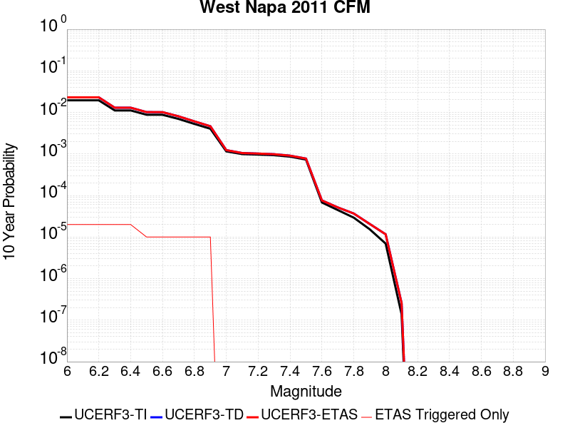 |

| Magnitude | 1 wk TI Prob | 1 wk TD Prob | 1 wk ETAS Prob | 1 wk ETAS/TD Gain | 1 wk ETAS Triggered Only | 1 mo TI Prob | 1 mo TD Prob | 1 mo ETAS Prob | 1 mo ETAS/TD Gain | 1 mo ETAS Triggered Only | 1 yr TI Prob | 1 yr TD Prob | 1 yr ETAS Prob | 1 yr ETAS/TD Gain | 1 yr ETAS Triggered Only | 10 yr TI Prob | 10 yr TD Prob | 10 yr ETAS Prob | 10 yr ETAS/TD Gain | 10 yr ETAS Triggered Only |
|-----|-----|-----|-----|-----|-----|-----|-----|-----|-----|-----|-----|-----|-----|-----|-----|-----|-----|-----|-----|-----|
| 6.0 | 3.773104E-5 | 4.4528504E-5 | 4.4528504E-5 | 1.0 | 0.0 | 1.6169442E-4 | 1.9082428E-4 | 1.9082428E-4 | 1.0 | 0.0 | 0.001966852 | 0.0023211278 | 0.0023311046 | 1.0042982 | 1.0E-5 | 0.019495348 | 0.023002012 | 0.02302155 | 1.0008495 | 2.0E-5 |
| 6.1 | 3.773104E-5 | 4.4528504E-5 | 4.4528504E-5 | 1.0 | 0.0 | 1.6169442E-4 | 1.9082428E-4 | 1.9082428E-4 | 1.0 | 0.0 | 0.001966852 | 0.0023211278 | 0.0023311046 | 1.0042982 | 1.0E-5 | 0.019495348 | 0.023002012 | 0.02302155 | 1.0008495 | 2.0E-5 |
| 6.2 | 3.773104E-5 | 4.4528504E-5 | 4.4528504E-5 | 1.0 | 0.0 | 1.6169442E-4 | 1.9082428E-4 | 1.9082428E-4 | 1.0 | 0.0 | 0.001966852 | 0.0023211278 | 0.0023311046 | 1.0042982 | 1.0E-5 | 0.019495348 | 0.023002012 | 0.02302155 | 1.0008495 | 2.0E-5 |
| 6.3 | 2.147964E-5 | 2.4987066E-5 | 2.4987066E-5 | 1.0 | 0.0 | 9.2052345E-5 | 1.0708355E-4 | 1.0708355E-4 | 1.0 | 0.0 | 0.001120161 | 0.0013030542 | 0.0013130412 | 1.0076643 | 1.0E-5 | 0.011145315 | 0.012964482 | 0.012984224 | 1.0015227 | 2.0E-5 |
| 6.4 | 2.147964E-5 | 2.4987066E-5 | 2.4987066E-5 | 1.0 | 0.0 | 9.2052345E-5 | 1.0708355E-4 | 1.0708355E-4 | 1.0 | 0.0 | 0.001120161 | 0.0013030542 | 0.0013130412 | 1.0076643 | 1.0E-5 | 0.011145315 | 0.012964482 | 0.012984224 | 1.0015227 | 2.0E-5 |
| 6.5 | 1.688201E-5 | 1.9547371E-5 | 1.9547371E-5 | 1.0 | 0.0 | 7.234947E-5 | 8.377217E-5 | 8.377217E-5 | 1.0 | 0.0 | 8.804988E-4 | 0.0010195216 | 0.0010295114 | 1.0097985 | 1.0E-5 | 0.008770182 | 0.01015684 | 0.010166738 | 1.0009745 | 1.0E-5 |
| 6.6 | 1.6846381E-5 | 1.9507064E-5 | 1.9507064E-5 | 1.0 | 0.0 | 7.219678E-5 | 8.3599436E-5 | 8.3599436E-5 | 1.0 | 0.0 | 8.7864127E-4 | 0.0010174206 | 0.0010274104 | 1.0098188 | 1.0E-5 | 0.008751754 | 0.010136021 | 0.010145919 | 1.0009766 | 1.0E-5 |
| 6.7 | 1.3396501E-5 | 1.5467684E-5 | 1.5467684E-5 | 1.0 | 0.0 | 5.7412315E-5 | 6.628875E-5 | 6.628875E-5 | 1.0 | 0.0 | 6.9877075E-4 | 8.068302E-4 | 8.168221E-4 | 1.0123842 | 1.0E-5 | 0.0069657755 | 0.008046459 | 0.008056379 | 1.0012327 | 1.0E-5 |
| 6.8 | 1.0139058E-5 | 1.16721785E-5 | 1.16721785E-5 | 1.0 | 0.0 | 4.3452383E-5 | 5.0022976E-5 | 5.0022976E-5 | 1.0 | 0.0 | 5.289043E-4 | 6.0891506E-4 | 6.1890896E-4 | 1.0164126 | 1.0E-5 | 0.005276473 | 0.0060791126 | 0.006089052 | 1.001635 | 1.0E-5 |
| 6.9 | 7.761281E-6 | 8.890723E-6 | 8.890723E-6 | 1.0 | 0.0 | 3.326221E-5 | 3.810283E-5 | 3.810283E-5 | 1.0 | 0.0 | 4.0489217E-4 | 4.6385458E-4 | 4.7384994E-4 | 1.0215485 | 1.0E-5 | 0.0040415525 | 0.0046351026 | 0.004645056 | 1.0021474 | 1.0E-5 |
| 7.0 | 2.2109202E-6 | 2.3666319E-6 | 2.3666319E-6 | 1.0 | 0.0 | 9.475338E-6 | 1.01426685E-5 | 1.01426685E-5 | 1.0 | 0.0 | 1.1535613E-4 | 1.2348007E-4 | 1.2348007E-4 | 1.0 | 0.0 | 0.0011529627 | 0.0012353238 | 0.0012353238 | 1.0 | 0.0 |
| 7.1 | 1.9008926E-6 | 2.0133207E-6 | 2.0133207E-6 | 1.0 | 0.0 | 8.146657E-6 | 8.628488E-6 | 8.628488E-6 | 1.0 | 0.0 | 9.918104E-5 | 1.05046805E-4 | 1.05046805E-4 | 1.0 | 0.0 | 9.913679E-4 | 0.0010511756 | 0.0010511756 | 1.0 | 0.0 |
| 7.2 | 1.8495944E-6 | 1.9561273E-6 | 1.9561273E-6 | 1.0 | 0.0 | 7.926808E-6 | 8.383376E-6 | 8.383376E-6 | 1.0 | 0.0 | 9.650462E-5 | 1.0206285E-4 | 1.0206285E-4 | 1.0 | 0.0 | 9.6462725E-4 | 0.0010213639 | 0.0010213639 | 1.0 | 0.0 |
| 7.3 | 1.7883189E-6 | 1.8880897E-6 | 1.8880897E-6 | 1.0 | 0.0 | 7.664201E-6 | 8.091788E-6 | 8.091788E-6 | 1.0 | 0.0 | 9.330765E-5 | 9.85131E-5 | 9.85131E-5 | 1.0 | 0.0 | 9.3268487E-4 | 9.858976E-4 | 9.858976E-4 | 1.0 | 0.0 |
| 7.4 | 1.6520572E-6 | 1.7415113E-6 | 1.7415113E-6 | 1.0 | 0.0 | 7.0802257E-6 | 7.463598E-6 | 7.463598E-6 | 1.0 | 0.0 | 8.6198335E-5 | 9.086554E-5 | 9.086554E-5 | 1.0 | 0.0 | 8.616491E-4 | 9.0948684E-4 | 9.0948684E-4 | 1.0 | 0.0 |
| 7.5 | 1.4040345E-6 | 1.4800271E-6 | 1.4800271E-6 | 1.0 | 0.0 | 6.0172765E-6 | 6.342958E-6 | 6.342958E-6 | 1.0 | 0.0 | 7.325788E-5 | 7.72228E-5 | 7.72228E-5 | 1.0 | 0.0 | 7.3233736E-4 | 7.7311805E-4 | 7.7311805E-4 | 1.0 | 0.0 |
| 7.6 | 1.3013842E-7 | 1.4416163E-7 | 1.4416163E-7 | 1.0 | 0.0 | 5.57736E-7 | 6.178354E-7 | 6.178354E-7 | 1.0 | 0.0 | 6.790414E-6 | 7.52212E-6 | 7.52212E-6 | 1.0 | 0.0 | 6.790207E-5 | 7.61463E-5 | 7.61463E-5 | 1.0 | 0.0 |
| 7.7 | 8.541512E-8 | 9.716462E-8 | 9.716462E-8 | 1.0 | 0.0 | 3.6606474E-7 | 4.1641974E-7 | 4.1641974E-7 | 1.0 | 0.0 | 4.456829E-6 | 5.069898E-6 | 5.069898E-6 | 1.0 | 0.0 | 4.4567398E-5 | 5.160189E-5 | 5.160189E-5 | 1.0 | 0.0 |
| 7.8 | 5.6074793E-8 | 6.895456E-8 | 6.895456E-8 | 1.0 | 0.0 | 2.403205E-7 | 2.955195E-7 | 2.955195E-7 | 1.0 | 0.0 | 2.9258983E-6 | 3.597944E-6 | 3.597944E-6 | 1.0 | 0.0 | 2.9258597E-5 | 3.6812045E-5 | 3.6812045E-5 | 1.0 | 0.0 |
| 7.9 | 2.9475839E-8 | 3.8567407E-8 | 3.8567407E-8 | 1.0 | 0.0 | 1.2632502E-7 | 1.6528887E-7 | 1.6528887E-7 | 1.0 | 0.0 | 1.538006E-6 | 2.01239E-6 | 2.01239E-6 | 1.0 | 0.0 | 1.5379954E-5 | 2.0664074E-5 | 2.0664074E-5 | 1.0 | 0.0 |
| 8.0 | 1.3337122E-8 | 2.1632943E-8 | 2.1632943E-8 | 1.0 | 0.0 | 5.7159088E-8 | 9.2712604E-8 | 9.2712604E-8 | 1.0 | 0.0 | 6.959117E-7 | 1.1287754E-6 | 1.1287754E-6 | 1.0 | 0.0 | 6.959095E-6 | 1.1644432E-5 | 1.1644432E-5 | 1.0 | 0.0 |
| 8.1 | 2.6589986E-10 | 4.8617654E-10 | 4.8617654E-10 | 1.0 | 0.0 | 1.1395708E-9 | 2.0836133E-9 | 2.0836133E-9 | 1.0 | 0.0 | 1.3874274E-8 | 2.536799E-8 | 2.536799E-8 | 1.0 | 0.0 | 1.3874273E-7 | 2.6036727E-7 | 2.6036727E-7 | 1.0 | 0.0 |

## Calaveras (So) - Paicines extension 2011 CFM
*[(top)](#table-of-contents)*

| 1 Week | 1 Month | 1 Year | 10 Year |
|-----|-----|-----|-----|
|  |  |  |  |

| Magnitude | 1 wk TI Prob | 1 wk TD Prob | 1 wk ETAS Prob | 1 wk ETAS/TD Gain | 1 wk ETAS Triggered Only | 1 mo TI Prob | 1 mo TD Prob | 1 mo ETAS Prob | 1 mo ETAS/TD Gain | 1 mo ETAS Triggered Only | 1 yr TI Prob | 1 yr TD Prob | 1 yr ETAS Prob | 1 yr ETAS/TD Gain | 1 yr ETAS Triggered Only | 10 yr TI Prob | 10 yr TD Prob | 10 yr ETAS Prob | 10 yr ETAS/TD Gain | 10 yr ETAS Triggered Only |
|-----|-----|-----|-----|-----|-----|-----|-----|-----|-----|-----|-----|-----|-----|-----|-----|-----|-----|-----|-----|-----|
| 6.0 | 1.5183659E-4 | 3.0520977E-4 | 3.1520674E-4 | 1.0327543 | 1.0E-5 | 6.5056595E-4 | 0.0013068188 | 0.0013168057 | 1.0076421 | 1.0E-5 | 0.007891912 | 0.015696203 | 0.015706047 | 1.000627 | 1.0E-5 | 0.076174594 | 0.13848905 | 0.13849767 | 1.0000622 | 1.0E-5 |
| 6.1 | 1.5024997E-4 | 3.021517E-4 | 3.1214865E-4 | 1.033086 | 1.0E-5 | 6.437695E-4 | 0.0012937278 | 0.0013037149 | 1.0077196 | 1.0E-5 | 0.0078097614 | 0.015539596 | 0.015549441 | 1.0006335 | 1.0E-5 | 0.075409345 | 0.13715863 | 0.13716726 | 1.000063 | 1.0E-5 |
| 6.2 | 1.2743923E-4 | 2.5313982E-4 | 2.6313728E-4 | 1.0394939 | 1.0E-5 | 5.460538E-4 | 0.0010839999 | 0.001093989 | 1.0092151 | 1.0E-5 | 0.0066279583 | 0.013046881 | 0.013056751 | 1.0007565 | 1.0E-5 | 0.064337276 | 0.117256075 | 0.1172649 | 1.0000753 | 1.0E-5 |
| 6.3 | 1.1525114E-4 | 2.2599236E-4 | 2.359901E-4 | 1.0442393 | 1.0E-5 | 4.9383997E-4 | 9.678718E-4 | 9.77862E-4 | 1.010322 | 1.0E-5 | 0.0059959386 | 0.011668079 | 0.011677962 | 1.000847 | 1.0E-5 | 0.058367174 | 0.106372125 | 0.10638106 | 1.000084 | 1.0E-5 |
| 6.4 | 1.07200925E-4 | 2.0840544E-4 | 2.1840337E-4 | 1.0479734 | 1.0E-5 | 4.5935164E-4 | 8.926123E-4 | 9.026034E-4 | 1.011193 | 1.0E-5 | 0.0055782744 | 0.010772959 | 0.010782851 | 1.0009183 | 1.0E-5 | 0.0544031 | 0.099194765 | 0.09920377 | 1.0000908 | 1.0E-5 |
| 6.5 | 9.69631E-5 | 1.8734725E-4 | 1.9734538E-4 | 1.0533668 | 1.0E-5 | 4.1548995E-4 | 8.024631E-4 | 8.124551E-4 | 1.0124516 | 1.0E-5 | 0.0050468626 | 0.009694842 | 0.009704744 | 1.0010215 | 1.0E-5 | 0.04933773 | 0.090086564 | 0.09009567 | 1.000101 | 1.0E-5 |
| 6.6 | 8.0552316E-5 | 1.507068E-4 | 1.6070528E-4 | 1.066344 | 1.0E-5 | 3.4517853E-4 | 6.4569083E-4 | 6.556844E-4 | 1.0154773 | 1.0E-5 | 0.0041944524 | 0.007826508 | 0.00783643 | 1.0012677 | 1.0E-5 | 0.04116161 | 0.0748563 | 0.07486556 | 1.0001236 | 1.0E-5 |
| 6.7 | 7.815757E-5 | 1.4611272E-4 | 1.5611126E-4 | 1.0684303 | 1.0E-5 | 3.34918E-4 | 6.26014E-4 | 6.360078E-4 | 1.015964 | 1.0E-5 | 0.004070005 | 0.007589312 | 0.0075992355 | 1.0013076 | 1.0E-5 | 0.039962657 | 0.07270582 | 0.072715096 | 1.0001276 | 1.0E-5 |
| 6.8 | 6.965264E-5 | 1.2722758E-4 | 1.3722632E-4 | 1.0785893 | 1.0E-5 | 2.9847719E-4 | 5.4513285E-4 | 5.551274E-4 | 1.0183342 | 1.0E-5 | 0.0036279052 | 0.0066135945 | 0.0066235284 | 1.001502 | 1.0E-5 | 0.03569247 | 0.063801065 | 0.06381043 | 1.0001467 | 1.0E-5 |
| 6.9 | 5.8000453E-5 | 1.01439E-4 | 1.01439E-4 | 1.0 | 0.0 | 2.4854968E-4 | 4.346666E-4 | 4.346666E-4 | 1.0 | 0.0 | 0.0030218933 | 0.005279322 | 0.005279322 | 1.0 | 0.0 | 0.029811295 | 0.051502965 | 0.051502965 | 1.0 | 0.0 |
| 7.0 | 4.9865852E-5 | 8.568029E-5 | 8.568029E-5 | 1.0 | 0.0 | 2.1369329E-4 | 3.6715003E-4 | 3.6715003E-4 | 1.0 | 0.0 | 0.0025986114 | 0.004460979 | 0.004460979 | 1.0 | 0.0 | 0.025684336 | 0.043782018 | 0.043782018 | 1.0 | 0.0 |
| 7.1 | 4.283875E-5 | 7.1124625E-5 | 7.1124625E-5 | 1.0 | 0.0 | 1.8358172E-4 | 3.0478454E-4 | 3.0478454E-4 | 1.0 | 0.0 | 0.0022328163 | 0.003704494 | 0.003704494 | 1.0 | 0.0 | 0.022105146 | 0.03673582 | 0.03673582 | 1.0 | 0.0 |
| 7.2 | 3.450115E-5 | 5.5778568E-5 | 5.5778568E-5 | 1.0 | 0.0 | 1.478537E-4 | 2.3902925E-4 | 2.3902925E-4 | 1.0 | 0.0 | 0.0017986323 | 0.0029063264 | 0.0029063264 | 1.0 | 0.0 | 0.017841442 | 0.029079042 | 0.029079042 | 1.0 | 0.0 |
| 7.3 | 2.5709045E-5 | 4.059001E-5 | 4.059001E-5 | 1.0 | 0.0 | 1.1017697E-4 | 1.7394568E-4 | 1.7394568E-4 | 1.0 | 0.0 | 0.0013405791 | 0.0021157486 | 0.0021157486 | 1.0 | 0.0 | 0.013325208 | 0.02129686 | 0.02129686 | 1.0 | 0.0 |
| 7.4 | 1.8003093E-5 | 2.8511378E-5 | 2.8511378E-5 | 1.0 | 0.0 | 7.715383E-5 | 1.2218591E-4 | 1.2218591E-4 | 1.0 | 0.0 | 9.3894306E-4 | 0.0014866006 | 0.0014866006 | 1.0 | 0.0 | 0.009349857 | 0.015051589 | 0.015051589 | 1.0 | 0.0 |
| 7.5 | 1.5595824E-5 | 2.5823752E-5 | 2.5823752E-5 | 1.0 | 0.0 | 6.683753E-5 | 1.10668545E-4 | 1.10668545E-4 | 1.0 | 0.0 | 8.134431E-4 | 0.0013465589 | 0.0013465589 | 1.0 | 0.0 | 0.008104719 | 0.013651571 | 0.013651571 | 1.0 | 0.0 |
| 7.6 | 1.1110309E-5 | 1.9223195E-5 | 1.9223195E-5 | 1.0 | 0.0 | 4.761474E-5 | 8.2382525E-5 | 8.2382525E-5 | 1.0 | 0.0 | 5.795553E-4 | 0.0010025471 | 0.0010025471 | 1.0 | 0.0 | 0.0057804612 | 0.01020344 | 0.01020344 | 1.0 | 0.0 |
| 7.7 | 6.2140443E-6 | 1.04376995E-5 | 1.04376995E-5 | 1.0 | 0.0 | 2.6631347E-5 | 4.4732235E-5 | 4.4732235E-5 | 1.0 | 0.0 | 3.241884E-4 | 5.4447894E-4 | 5.4447894E-4 | 1.0 | 0.0 | 0.0032371588 | 0.005620102 | 0.005620102 | 1.0 | 0.0 |
| 7.8 | 5.305533E-6 | 9.433651E-6 | 9.433651E-6 | 1.0 | 0.0 | 2.27378E-5 | 4.0429306E-5 | 4.0429306E-5 | 1.0 | 0.0 | 2.7679754E-4 | 4.9211574E-4 | 4.9211574E-4 | 1.0 | 0.0 | 0.0027645302 | 0.005074622 | 0.005074622 | 1.0 | 0.0 |
| 7.9 | 3.363505E-6 | 7.3854467E-6 | 7.3854467E-6 | 1.0 | 0.0 | 1.4414942E-5 | 3.1651532E-5 | 3.1651532E-5 | 1.0 | 0.0 | 1.7548777E-4 | 3.8528934E-4 | 3.8528934E-4 | 1.0 | 0.0 | 0.0017534926 | 0.003948784 | 0.003948784 | 1.0 | 0.0 |
| 8.0 | 2.0271132E-6 | 4.4134235E-6 | 4.4134235E-6 | 1.0 | 0.0 | 8.687599E-6 | 1.8914534E-5 | 1.8914534E-5 | 1.0 | 0.0 | 1.05766376E-4 | 2.3026018E-4 | 2.3026018E-4 | 1.0 | 0.0 | 0.0010571606 | 0.002351194 | 0.002351194 | 1.0 | 0.0 |
| 8.1 | 1.2206116E-6 | 2.3752666E-6 | 2.3752666E-6 | 1.0 | 0.0 | 5.2311816E-6 | 1.0179674E-5 | 1.0179674E-5 | 1.0 | 0.0 | 6.3687774E-5 | 1.2393051E-4 | 1.2393051E-4 | 1.0 | 0.0 | 6.366953E-4 | 0.0012705618 | 0.0012705618 | 1.0 | 0.0 |

## Point Reyes 2011 CFM
*[(top)](#table-of-contents)*

| 1 Week | 1 Month | 1 Year | 10 Year |
|-----|-----|-----|-----|
|  |  |  |  |

| Magnitude | 1 wk TI Prob | 1 wk TD Prob | 1 wk ETAS Prob | 1 wk ETAS/TD Gain | 1 wk ETAS Triggered Only | 1 mo TI Prob | 1 mo TD Prob | 1 mo ETAS Prob | 1 mo ETAS/TD Gain | 1 mo ETAS Triggered Only | 1 yr TI Prob | 1 yr TD Prob | 1 yr ETAS Prob | 1 yr ETAS/TD Gain | 1 yr ETAS Triggered Only | 10 yr TI Prob | 10 yr TD Prob | 10 yr ETAS Prob | 10 yr ETAS/TD Gain | 10 yr ETAS Triggered Only |
|-----|-----|-----|-----|-----|-----|-----|-----|-----|-----|-----|-----|-----|-----|-----|-----|-----|-----|-----|-----|-----|
| 6.0 | 8.8644965E-6 | 8.96716E-6 | 1.896707E-5 | 2.1151702 | 1.0E-5 | 3.7990147E-5 | 3.8430157E-5 | 4.842977E-5 | 1.2602023 | 1.0E-5 | 4.624319E-4 | 4.67793E-4 | 4.8778363E-4 | 1.0427339 | 2.0E-5 | 0.0046147075 | 0.004668711 | 0.0046886182 | 1.0042639 | 2.0E-5 |
| 6.1 | 4.526405E-6 | 4.5392153E-6 | 1.45391705E-5 | 3.203014 | 1.0E-5 | 1.9398734E-5 | 1.945364E-5 | 2.9453447E-5 | 1.5140326 | 1.0E-5 | 2.36154E-4 | 2.3682338E-4 | 2.4682103E-4 | 1.0422156 | 1.0E-5 | 0.002359032 | 0.0023658164 | 0.0023757927 | 1.0042169 | 1.0E-5 |
| 6.2 | 4.526405E-6 | 4.5392153E-6 | 1.45391705E-5 | 3.203014 | 1.0E-5 | 1.9398734E-5 | 1.945364E-5 | 2.9453447E-5 | 1.5140326 | 1.0E-5 | 2.36154E-4 | 2.3682338E-4 | 2.4682103E-4 | 1.0422156 | 1.0E-5 | 0.002359032 | 0.0023658164 | 0.0023757927 | 1.0042169 | 1.0E-5 |
| 6.3 | 2.6842322E-6 | 2.660673E-6 | 1.26606465E-5 | 4.7584376 | 1.0E-5 | 1.1503801E-5 | 1.1402836E-5 | 2.1402722E-5 | 1.8769648 | 1.0E-5 | 1.4004979E-4 | 1.3882088E-4 | 1.4881948E-4 | 1.0720253 | 1.0E-5 | 0.0013996155 | 0.0013873635 | 0.0013973496 | 1.0071979 | 1.0E-5 |
| 6.4 | 2.6842322E-6 | 2.660673E-6 | 1.26606465E-5 | 4.7584376 | 1.0E-5 | 1.1503801E-5 | 1.1402836E-5 | 2.1402722E-5 | 1.8769648 | 1.0E-5 | 1.4004979E-4 | 1.3882088E-4 | 1.4881948E-4 | 1.0720253 | 1.0E-5 | 0.0013996155 | 0.0013873635 | 0.0013973496 | 1.0071979 | 1.0E-5 |
| 6.5 | 1.9281833E-6 | 1.8906233E-6 | 1.8906233E-6 | 1.0 | 0.0 | 8.263617E-6 | 8.1026465E-6 | 8.1026465E-6 | 1.0 | 0.0 | 1.0060489E-4 | 9.864534E-5 | 9.864534E-5 | 1.0 | 0.0 | 0.0010055936 | 9.860265E-4 | 9.860265E-4 | 1.0 | 0.0 |
| 6.6 | 1.4726726E-6 | 1.4269547E-6 | 1.4269547E-6 | 1.0 | 0.0 | 6.3114385E-6 | 6.115506E-6 | 6.115506E-6 | 1.0 | 0.0 | 7.683905E-5 | 7.445379E-5 | 7.445379E-5 | 1.0 | 0.0 | 7.6812494E-4 | 7.442957E-4 | 7.442957E-4 | 1.0 | 0.0 |
| 6.7 | 8.572307E-7 | 8.007182E-7 | 8.007182E-7 | 1.0 | 0.0 | 3.6738406E-6 | 3.431645E-6 | 3.431645E-6 | 1.0 | 0.0 | 4.472809E-5 | 4.1779494E-5 | 4.1779494E-5 | 1.0 | 0.0 | 4.471909E-4 | 4.177204E-4 | 4.177204E-4 | 1.0 | 0.0 |
| 6.8 | 6.6745434E-7 | 6.07727E-7 | 6.07727E-7 | 1.0 | 0.0 | 2.8605155E-6 | 2.6045416E-6 | 2.6045416E-6 | 1.0 | 0.0 | 3.482622E-5 | 3.1709842E-5 | 3.1709842E-5 | 1.0 | 0.0 | 3.4820763E-4 | 3.170566E-4 | 3.170566E-4 | 1.0 | 0.0 |
| 6.9 | 4.291521E-7 | 3.6535639E-7 | 3.6535639E-7 | 1.0 | 0.0 | 1.839222E-6 | 1.5658121E-6 | 1.5658121E-6 | 1.0 | 0.0 | 2.2392298E-5 | 1.90636E-5 | 1.90636E-5 | 1.0 | 0.0 | 2.2390042E-4 | 1.906224E-4 | 1.906224E-4 | 1.0 | 0.0 |
| 7.0 | 2.6812808E-7 | 2.0187117E-7 | 2.0187117E-7 | 1.0 | 0.0 | 1.1491198E-6 | 8.6516184E-7 | 8.6516184E-7 | 1.0 | 0.0 | 1.3990444E-5 | 1.0533295E-5 | 1.0533295E-5 | 1.0 | 0.0 | 1.3989564E-4 | 1.05330415E-4 | 1.05330415E-4 | 1.0 | 0.0 |
| 7.1 | 1.9451231E-7 | 1.2725201E-7 | 1.2725201E-7 | 1.0 | 0.0 | 8.336239E-7 | 5.4536565E-7 | 5.4536565E-7 | 1.0 | 0.0 | 1.0149324E-5 | 6.639806E-6 | 6.639806E-6 | 1.0 | 0.0 | 1.014886E-4 | 6.639846E-5 | 6.639846E-5 | 1.0 | 0.0 |
| 7.2 | 1.6715143E-7 | 1.0042555E-7 | 1.0042555E-7 | 1.0 | 0.0 | 7.1636305E-7 | 4.3039515E-7 | 4.3039515E-7 | 1.0 | 0.0 | 8.721685E-6 | 5.2400483E-6 | 5.2400483E-6 | 1.0 | 0.0 | 8.721343E-5 | 5.240162E-5 | 5.240162E-5 | 1.0 | 0.0 |
| 7.3 | 1.5503173E-7 | 9.012816E-8 | 9.012816E-8 | 1.0 | 0.0 | 6.644215E-7 | 3.8626348E-7 | 3.8626348E-7 | 1.0 | 0.0 | 8.089301E-6 | 4.7027474E-6 | 4.7027474E-6 | 1.0 | 0.0 | 8.089007E-5 | 4.7028854E-5 | 4.7028854E-5 | 1.0 | 0.0 |
| 7.4 | 1.4251614E-7 | 8.097342E-8 | 8.097342E-8 | 1.0 | 0.0 | 6.1078333E-7 | 3.4702887E-7 | 3.4702887E-7 | 1.0 | 0.0 | 7.4362615E-6 | 4.225068E-6 | 4.225068E-6 | 1.0 | 0.0 | 7.436013E-5 | 4.2252257E-5 | 4.2252257E-5 | 1.0 | 0.0 |
| 7.5 | 1.2710186E-7 | 7.029377E-8 | 7.029377E-8 | 1.0 | 0.0 | 5.447221E-7 | 3.0125898E-7 | 3.0125898E-7 | 1.0 | 0.0 | 6.6319717E-6 | 3.6678218E-6 | 3.6678218E-6 | 1.0 | 0.0 | 6.6317734E-5 | 3.667999E-5 | 3.667999E-5 | 1.0 | 0.0 |
| 7.6 | 1.0144708E-7 | 5.494996E-8 | 5.494996E-8 | 1.0 | 0.0 | 4.347731E-7 | 2.354998E-7 | 2.354998E-7 | 1.0 | 0.0 | 5.2933497E-6 | 2.8672061E-6 | 2.8672061E-6 | 1.0 | 0.0 | 5.293224E-5 | 2.8674069E-5 | 2.8674069E-5 | 1.0 | 0.0 |
| 7.7 | 7.090527E-8 | 3.9821334E-8 | 3.9821334E-8 | 1.0 | 0.0 | 3.038797E-7 | 1.7066284E-7 | 1.7066284E-7 | 1.0 | 0.0 | 3.699729E-6 | 2.0778182E-6 | 2.0778182E-6 | 1.0 | 0.0 | 3.6996673E-5 | 2.0780362E-5 | 2.0780362E-5 | 1.0 | 0.0 |
| 7.8 | 3.8712045E-8 | 2.7438638E-8 | 2.7438638E-8 | 1.0 | 0.0 | 1.6590876E-7 | 1.1759416E-7 | 1.1759416E-7 | 1.0 | 0.0 | 2.0199373E-6 | 1.4317079E-6 | 1.4317079E-6 | 1.0 | 0.0 | 2.0199188E-5 | 1.4319363E-5 | 1.4319363E-5 | 1.0 | 0.0 |
| 7.9 | 1.7068782E-8 | 1.183186E-8 | 1.183186E-8 | 1.0 | 0.0 | 7.315192E-8 | 5.0707975E-8 | 5.0707975E-8 | 1.0 | 0.0 | 8.906242E-7 | 6.173694E-7 | 6.173694E-7 | 1.0 | 0.0 | 8.906207E-6 | 6.1760525E-6 | 6.1760525E-6 | 1.0 | 0.0 |
| 8.0 | 1.0172592E-8 | 7.0268076E-9 | 7.0268076E-9 | 1.0 | 0.0 | 4.359682E-8 | 3.011489E-8 | 3.011489E-8 | 1.0 | 0.0 | 5.3079117E-7 | 3.6664872E-7 | 3.6664872E-7 | 1.0 | 0.0 | 5.307899E-6 | 3.6688568E-6 | 3.6688568E-6 | 1.0 | 0.0 |
| 8.1 | 3.7861243E-9 | 3.5448604E-9 | 3.5448604E-9 | 1.0 | 0.0 | 1.6226247E-8 | 1.5192258E-8 | 1.5192258E-8 | 1.0 | 0.0 | 1.9755454E-7 | 1.8496571E-7 | 1.8496571E-7 | 1.0 | 0.0 | 1.9755437E-6 | 1.8514592E-6 | 1.8514592E-6 | 1.0 | 0.0 |

## Reliz 2011 CFM
*[(top)](#table-of-contents)*

| 1 Week | 1 Month | 1 Year | 10 Year |
|-----|-----|-----|-----|
|  |  | 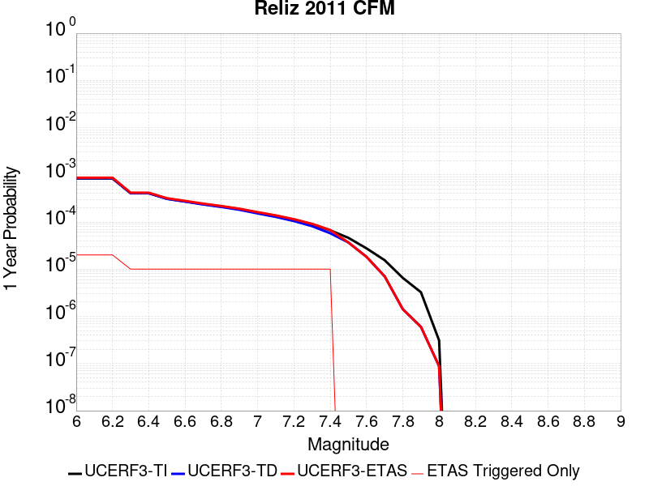 |  |

| Magnitude | 1 wk TI Prob | 1 wk TD Prob | 1 wk ETAS Prob | 1 wk ETAS/TD Gain | 1 wk ETAS Triggered Only | 1 mo TI Prob | 1 mo TD Prob | 1 mo ETAS Prob | 1 mo ETAS/TD Gain | 1 mo ETAS Triggered Only | 1 yr TI Prob | 1 yr TD Prob | 1 yr ETAS Prob | 1 yr ETAS/TD Gain | 1 yr ETAS Triggered Only | 10 yr TI Prob | 10 yr TD Prob | 10 yr ETAS Prob | 10 yr ETAS/TD Gain | 10 yr ETAS Triggered Only |
|-----|-----|-----|-----|-----|-----|-----|-----|-----|-----|-----|-----|-----|-----|-----|-----|-----|-----|-----|-----|-----|
| 6.0 | 1.6002472E-5 | 1.6282795E-5 | 3.628247E-5 | 2.2282703 | 2.0E-5 | 6.8580215E-5 | 6.978165E-5 | 8.978025E-5 | 1.2865883 | 2.0E-5 | 8.3464425E-4 | 8.492802E-4 | 8.6926325E-4 | 1.0235294 | 2.0E-5 | 0.008315164 | 0.008462543 | 0.008482373 | 1.0023433 | 2.0E-5 |
| 6.1 | 1.6002472E-5 | 1.6282795E-5 | 3.628247E-5 | 2.2282703 | 2.0E-5 | 6.8580215E-5 | 6.978165E-5 | 8.978025E-5 | 1.2865883 | 2.0E-5 | 8.3464425E-4 | 8.492802E-4 | 8.6926325E-4 | 1.0235294 | 2.0E-5 | 0.008315164 | 0.008462543 | 0.008482373 | 1.0023433 | 2.0E-5 |
| 6.2 | 1.6002472E-5 | 1.6282795E-5 | 3.628247E-5 | 2.2282703 | 2.0E-5 | 6.8580215E-5 | 6.978165E-5 | 8.978025E-5 | 1.2865883 | 2.0E-5 | 8.3464425E-4 | 8.492802E-4 | 8.6926325E-4 | 1.0235294 | 2.0E-5 | 0.008315164 | 0.008462543 | 0.008482373 | 1.0023433 | 2.0E-5 |
| 6.3 | 7.792404E-6 | 7.803792E-6 | 1.7803713E-5 | 2.2814183 | 1.0E-5 | 3.339559E-5 | 3.3444398E-5 | 4.3444066E-5 | 1.2989937 | 1.0E-5 | 4.0651546E-4 | 4.0711026E-4 | 4.1710617E-4 | 1.0245534 | 1.0E-5 | 0.0040577264 | 0.0040639215 | 0.004073881 | 1.0024507 | 1.0E-5 |
| 6.4 | 7.792404E-6 | 7.803792E-6 | 1.7803713E-5 | 2.2814183 | 1.0E-5 | 3.339559E-5 | 3.3444398E-5 | 4.3444066E-5 | 1.2989937 | 1.0E-5 | 4.0651546E-4 | 4.0711026E-4 | 4.1710617E-4 | 1.0245534 | 1.0E-5 | 0.0040577264 | 0.0040639215 | 0.004073881 | 1.0024507 | 1.0E-5 |
| 6.5 | 5.9659374E-6 | 5.928728E-6 | 1.5928668E-5 | 2.6866925 | 1.0E-5 | 2.5568053E-5 | 2.5408588E-5 | 3.5408335E-5 | 1.3935577 | 1.0E-5 | 3.1124658E-4 | 3.0930588E-4 | 3.1930278E-4 | 1.0323205 | 1.0E-5 | 0.00310811 | 0.003088972 | 0.0030989412 | 1.0032274 | 1.0E-5 |
| 6.6 | 5.2350692E-6 | 5.178976E-6 | 1.51789245E-5 | 2.9308736 | 1.0E-5 | 2.2435817E-5 | 2.2195423E-5 | 3.21952E-5 | 1.4505334 | 1.0E-5 | 2.7312184E-4 | 2.7019592E-4 | 2.801932E-4 | 1.0370002 | 1.0E-5 | 0.002727864 | 0.0026988846 | 0.0027088576 | 1.0036952 | 1.0E-5 |
| 6.7 | 4.580206E-6 | 4.50611E-6 | 1.4506065E-5 | 3.219199 | 1.0E-5 | 1.9629308E-5 | 1.931176E-5 | 2.9311566E-5 | 1.5178093 | 1.0E-5 | 2.389606E-4 | 2.3509537E-4 | 2.4509302E-4 | 1.0425259 | 1.0E-5 | 0.002387038 | 0.002348669 | 0.0023586457 | 1.0042478 | 1.0E-5 |
| 6.8 | 4.0765017E-6 | 3.988228E-6 | 1.3988189E-5 | 3.5073693 | 1.0E-5 | 1.7470604E-5 | 1.7092294E-5 | 2.7092123E-5 | 1.5850489 | 1.0E-5 | 2.1268385E-4 | 2.0807884E-4 | 2.1807676E-4 | 1.0480487 | 1.0E-5 | 0.002124804 | 0.0020790389 | 0.002089018 | 1.0048 | 1.0E-5 |
| 6.9 | 3.5752896E-6 | 3.4725074E-6 | 1.3472472E-5 | 3.8797534 | 1.0E-5 | 1.532258E-5 | 1.488209E-5 | 2.4881941E-5 | 1.6719387 | 1.0E-5 | 1.8653645E-4 | 1.811744E-4 | 1.911726E-4 | 1.0551854 | 1.0E-5 | 0.0018637994 | 0.001810464 | 0.0018204459 | 1.0055134 | 1.0E-5 |
| 7.0 | 3.0259848E-6 | 2.9079317E-6 | 1.2907903E-5 | 4.4388604 | 1.0E-5 | 1.2968442E-5 | 1.2462505E-5 | 2.246238E-5 | 1.8023969 | 1.0E-5 | 1.5787935E-4 | 1.5172044E-4 | 1.6171893E-4 | 1.0659007 | 1.0E-5 | 0.0015776722 | 0.0015163644 | 0.0015263492 | 1.0065848 | 1.0E-5 |
| 7.1 | 2.5861116E-6 | 2.455157E-6 | 1.24551325E-5 | 5.073049 | 1.0E-5 | 1.1083288E-5 | 1.0522059E-5 | 2.0521953E-5 | 1.9503744 | 1.0E-5 | 1.3493067E-4 | 1.2809855E-4 | 1.3809727E-4 | 1.0780549 | 1.0E-5 | 0.0013484878 | 0.0012804423 | 0.0012904295 | 1.0077997 | 1.0E-5 |
| 7.2 | 2.1482588E-6 | 2.0032267E-6 | 1.2003206E-5 | 5.991936 | 1.0E-5 | 9.20679E-6 | 8.585229E-6 | 1.8585144E-5 | 2.1647813 | 1.0E-5 | 1.12086906E-4 | 1.0452016E-4 | 1.1451911E-4 | 1.0956653 | 1.0E-5 | 0.0011203039 | 0.0010449048 | 0.0010548944 | 1.0095602 | 1.0E-5 |
| 7.3 | 1.7194744E-6 | 1.561114E-6 | 1.1561098E-5 | 7.405672 | 1.0E-5 | 7.3691554E-6 | 6.6904713E-6 | 1.6690405E-5 | 2.494653 | 1.0E-5 | 8.971577E-5 | 8.145344E-5 | 9.145263E-5 | 1.1227595 | 1.0E-5 | 8.967956E-4 | 8.144305E-4 | 8.2442234E-4 | 1.0122685 | 1.0E-5 |
| 7.4 | 1.2755178E-6 | 1.1056196E-6 | 1.1105609E-5 | 10.044692 | 1.0E-5 | 5.4664933E-6 | 4.738361E-6 | 1.4738313E-5 | 3.1104245 | 1.0E-5 | 6.655252E-5 | 5.768802E-5 | 6.768744E-5 | 1.1733363 | 1.0E-5 | 6.6532596E-4 | 5.769249E-4 | 5.869191E-4 | 1.0173233 | 1.0E-5 |
| 7.5 | 8.8463224E-7 | 7.0579193E-7 | 7.0579193E-7 | 1.0 | 0.0 | 3.7912755E-6 | 3.0248189E-6 | 3.0248189E-6 | 1.0 | 0.0 | 4.6157802E-5 | 3.682655E-5 | 3.682655E-5 | 1.0 | 0.0 | 4.6148215E-4 | 3.683988E-4 | 3.683988E-4 | 1.0 | 0.0 |
| 7.6 | 5.291355E-7 | 3.5006548E-7 | 3.5006548E-7 | 1.0 | 0.0 | 2.2677216E-6 | 1.5002796E-6 | 1.5002796E-6 | 1.0 | 0.0 | 2.760916E-5 | 1.8265751E-5 | 1.8265751E-5 | 1.0 | 0.0 | 2.760573E-4 | 1.8283579E-4 | 1.8283579E-4 | 1.0 | 0.0 |
| 7.7 | 2.9663357E-7 | 1.3509886E-7 | 1.3509886E-7 | 1.0 | 0.0 | 1.2712861E-6 | 5.7899496E-7 | 5.7899496E-7 | 1.0 | 0.0 | 1.5477797E-5 | 7.0492406E-6 | 7.0492406E-6 | 1.0 | 0.0 | 1.547672E-4 | 7.0675895E-5 | 7.0675895E-5 | 1.0 | 0.0 |
| 7.8 | 1.2509386E-7 | 2.7148959E-8 | 2.7148959E-8 | 1.0 | 0.0 | 5.3611643E-7 | 1.1635268E-7 | 1.1635268E-7 | 1.0 | 0.0 | 6.527198E-6 | 1.4165929E-6 | 1.4165929E-6 | 1.0 | 0.0 | 6.527006E-5 | 1.4322827E-5 | 1.4322827E-5 | 1.0 | 0.0 |
| 7.9 | 6.213493E-8 | 1.1477568E-8 | 1.1477568E-8 | 1.0 | 0.0 | 2.6629255E-7 | 4.9189577E-8 | 4.9189577E-8 | 1.0 | 0.0 | 3.242107E-6 | 5.9888293E-7 | 5.9888293E-7 | 1.0 | 0.0 | 3.2420594E-5 | 6.1203536E-6 | 6.1203536E-6 | 1.0 | 0.0 |
| 8.0 | 5.92383E-9 | 1.6775827E-9 | 1.6775827E-9 | 1.0 | 0.0 | 2.5387841E-8 | 7.18964E-9 | 7.18964E-9 | 1.0 | 0.0 | 3.0909692E-7 | 8.753386E-8 | 8.753386E-8 | 1.0 | 0.0 | 3.090965E-6 | 8.992677E-7 | 8.992677E-7 | 1.0 | 0.0 |

## Earthquake Valley (So Extension)
*[(top)](#table-of-contents)*

| 1 Week | 1 Month | 1 Year | 10 Year |
|-----|-----|-----|-----|
|  |  |  |  |

| Magnitude | 1 wk TI Prob | 1 wk TD Prob | 1 wk ETAS Prob | 1 wk ETAS/TD Gain | 1 wk ETAS Triggered Only | 1 mo TI Prob | 1 mo TD Prob | 1 mo ETAS Prob | 1 mo ETAS/TD Gain | 1 mo ETAS Triggered Only | 1 yr TI Prob | 1 yr TD Prob | 1 yr ETAS Prob | 1 yr ETAS/TD Gain | 1 yr ETAS Triggered Only | 10 yr TI Prob | 10 yr TD Prob | 10 yr ETAS Prob | 10 yr ETAS/TD Gain | 10 yr ETAS Triggered Only |
|-----|-----|-----|-----|-----|-----|-----|-----|-----|-----|-----|-----|-----|-----|-----|-----|-----|-----|-----|-----|-----|
| 6.0 | 3.0194888E-5 | 3.707208E-5 | 4.707171E-5 | 1.2697347 | 1.0E-5 | 1.2940024E-4 | 1.5887374E-4 | 1.6887215E-4 | 1.0629331 | 1.0E-5 | 0.0015743093 | 0.0019330877 | 0.0019430685 | 1.0051631 | 1.0E-5 | 0.01563203 | 0.0192131 | 0.019232718 | 1.0010209 | 2.0E-5 |
| 6.1 | 3.0194888E-5 | 3.707208E-5 | 4.707171E-5 | 1.2697347 | 1.0E-5 | 1.2940024E-4 | 1.5887374E-4 | 1.6887215E-4 | 1.0629331 | 1.0E-5 | 0.0015743093 | 0.0019330877 | 0.0019430685 | 1.0051631 | 1.0E-5 | 0.01563203 | 0.0192131 | 0.019232718 | 1.0010209 | 2.0E-5 |
| 6.2 | 3.0194888E-5 | 3.707208E-5 | 4.707171E-5 | 1.2697347 | 1.0E-5 | 1.2940024E-4 | 1.5887374E-4 | 1.6887215E-4 | 1.0629331 | 1.0E-5 | 0.0015743093 | 0.0019330877 | 0.0019430685 | 1.0051631 | 1.0E-5 | 0.01563203 | 0.0192131 | 0.019232718 | 1.0010209 | 2.0E-5 |
| 6.3 | 1.5795305E-5 | 1.8446612E-5 | 1.8446612E-5 | 1.0 | 0.0 | 6.769241E-5 | 7.905514E-5 | 7.905514E-5 | 1.0 | 0.0 | 8.238434E-4 | 9.621823E-4 | 9.621823E-4 | 1.0 | 0.0 | 0.008207959 | 0.0095910635 | 0.0095910635 | 1.0 | 0.0 |
| 6.4 | 1.5795305E-5 | 1.8446612E-5 | 1.8446612E-5 | 1.0 | 0.0 | 6.769241E-5 | 7.905514E-5 | 7.905514E-5 | 1.0 | 0.0 | 8.238434E-4 | 9.621823E-4 | 9.621823E-4 | 1.0 | 0.0 | 0.008207959 | 0.0095910635 | 0.0095910635 | 1.0 | 0.0 |
| 6.5 | 1.5795305E-5 | 1.8446612E-5 | 1.8446612E-5 | 1.0 | 0.0 | 6.769241E-5 | 7.905514E-5 | 7.905514E-5 | 1.0 | 0.0 | 8.238434E-4 | 9.621823E-4 | 9.621823E-4 | 1.0 | 0.0 | 0.008207959 | 0.0095910635 | 0.0095910635 | 1.0 | 0.0 |
| 6.6 | 1.5795305E-5 | 1.8446612E-5 | 1.8446612E-5 | 1.0 | 0.0 | 6.769241E-5 | 7.905514E-5 | 7.905514E-5 | 1.0 | 0.0 | 8.238434E-4 | 9.621823E-4 | 9.621823E-4 | 1.0 | 0.0 | 0.008207959 | 0.0095910635 | 0.0095910635 | 1.0 | 0.0 |
| 6.7 | 1.1363076E-5 | 1.3138288E-5 | 1.3138288E-5 | 1.0 | 0.0 | 4.8697988E-5 | 5.6306162E-5 | 5.6306162E-5 | 1.0 | 0.0 | 5.927367E-4 | 6.8538805E-4 | 6.8538805E-4 | 1.0 | 0.0 | 0.0059115817 | 0.006840215 | 0.006840215 | 1.0 | 0.0 |
| 6.8 | 1.0049611E-5 | 1.1594328E-5 | 1.1594328E-5 | 1.0 | 0.0 | 4.306905E-5 | 4.968944E-5 | 4.968944E-5 | 1.0 | 0.0 | 5.242395E-4 | 6.0487416E-4 | 6.0487416E-4 | 1.0 | 0.0 | 0.0052300454 | 0.0060394546 | 0.0060394546 | 1.0 | 0.0 |
| 6.9 | 1.0049611E-5 | 1.1594328E-5 | 1.1594328E-5 | 1.0 | 0.0 | 4.306905E-5 | 4.968944E-5 | 4.968944E-5 | 1.0 | 0.0 | 5.242395E-4 | 6.0487416E-4 | 6.0487416E-4 | 1.0 | 0.0 | 0.0052300454 | 0.0060394546 | 0.0060394546 | 1.0 | 0.0 |
| 7.0 | 1.0049611E-5 | 1.1594328E-5 | 1.1594328E-5 | 1.0 | 0.0 | 4.306905E-5 | 4.968944E-5 | 4.968944E-5 | 1.0 | 0.0 | 5.242395E-4 | 6.0487416E-4 | 6.0487416E-4 | 1.0 | 0.0 | 0.0052300454 | 0.0060394546 | 0.0060394546 | 1.0 | 0.0 |
| 7.1 | 8.140254E-6 | 9.3834515E-6 | 9.3834515E-6 | 1.0 | 0.0 | 3.4886336E-5 | 4.021455E-5 | 4.021455E-5 | 1.0 | 0.0 | 4.2465836E-4 | 4.895692E-4 | 4.895692E-4 | 1.0 | 0.0 | 0.0042384774 | 0.004891483 | 0.004891483 | 1.0 | 0.0 |
| 7.2 | 1.673835E-7 | 1.4153493E-7 | 1.4153493E-7 | 1.0 | 0.0 | 7.173577E-7 | 6.065781E-7 | 6.065781E-7 | 1.0 | 0.0 | 8.733795E-6 | 7.3850674E-6 | 7.3850674E-6 | 1.0 | 0.0 | 8.733451E-5 | 7.3848576E-5 | 7.3848576E-5 | 1.0 | 0.0 |
| 7.3 | 1.6632116E-7 | 1.4051723E-7 | 1.4051723E-7 | 1.0 | 0.0 | 7.1280476E-7 | 6.022166E-7 | 6.022166E-7 | 1.0 | 0.0 | 8.678364E-6 | 7.331966E-6 | 7.331966E-6 | 1.0 | 0.0 | 8.6780245E-5 | 7.33176E-5 | 7.33176E-5 | 1.0 | 0.0 |
| 7.4 | 1.6569169E-7 | 1.3996352E-7 | 1.3996352E-7 | 1.0 | 0.0 | 7.1010703E-7 | 5.9984353E-7 | 5.9984353E-7 | 1.0 | 0.0 | 8.645519E-6 | 7.303074E-6 | 7.303074E-6 | 1.0 | 0.0 | 8.645182E-5 | 7.30287E-5 | 7.30287E-5 | 1.0 | 0.0 |
| 7.5 | 1.1764555E-7 | 1.0095245E-7 | 1.0095245E-7 | 1.0 | 0.0 | 5.041951E-7 | 4.3265328E-7 | 4.3265328E-7 | 1.0 | 0.0 | 6.138558E-6 | 5.267543E-6 | 5.267543E-6 | 1.0 | 0.0 | 6.1383886E-5 | 5.2674397E-5 | 5.2674397E-5 | 1.0 | 0.0 |
| 7.6 | 1.07927605E-7 | 9.2600665E-8 | 9.2600665E-8 | 1.0 | 0.0 | 4.6254678E-7 | 3.9685995E-7 | 3.9685995E-7 | 1.0 | 0.0 | 5.6314925E-6 | 4.8317615E-6 | 4.8317615E-6 | 1.0 | 0.0 | 5.63135E-5 | 4.831677E-5 | 4.831677E-5 | 1.0 | 0.0 |
| 7.7 | 2.1826905E-8 | 1.1179958E-8 | 1.1179958E-8 | 1.0 | 0.0 | 9.3543875E-8 | 4.791411E-8 | 4.791411E-8 | 1.0 | 0.0 | 1.1388961E-6 | 5.8335416E-7 | 5.8335416E-7 | 1.0 | 0.0 | 1.1388902E-5 | 5.8335318E-6 | 5.8335318E-6 | 1.0 | 0.0 |
| 7.8 | 2.6169649E-9 | 1.1968753E-9 | 1.1968753E-9 | 1.0 | 0.0 | 1.1215564E-8 | 5.1294657E-9 | 5.1294657E-9 | 1.0 | 0.0 | 1.3654947E-7 | 6.245124E-8 | 6.245124E-8 | 1.0 | 0.0 | 1.365494E-6 | 6.2451244E-7 | 6.2451244E-7 | 1.0 | 0.0 |

## Davis Creek
*[(top)](#table-of-contents)*

| 1 Week | 1 Month | 1 Year | 10 Year |
|-----|-----|-----|-----|
|  |  | 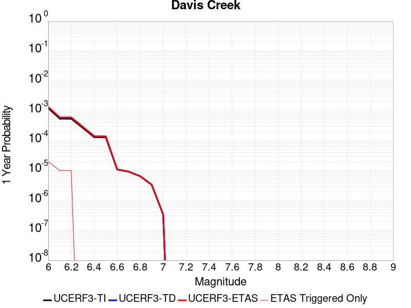 |  |

| Magnitude | 1 wk TI Prob | 1 wk TD Prob | 1 wk ETAS Prob | 1 wk ETAS/TD Gain | 1 wk ETAS Triggered Only | 1 mo TI Prob | 1 mo TD Prob | 1 mo ETAS Prob | 1 mo ETAS/TD Gain | 1 mo ETAS Triggered Only | 1 yr TI Prob | 1 yr TD Prob | 1 yr ETAS Prob | 1 yr ETAS/TD Gain | 1 yr ETAS Triggered Only | 10 yr TI Prob | 10 yr TD Prob | 10 yr ETAS Prob | 10 yr ETAS/TD Gain | 10 yr ETAS Triggered Only |
|-----|-----|-----|-----|-----|-----|-----|-----|-----|-----|-----|-----|-----|-----|-----|-----|-----|-----|-----|-----|-----|
| 6.0 | 2.331472E-5 | 2.5417214E-5 | 3.541696E-5 | 1.3934242 | 1.0E-5 | 9.99164E-5 | 1.0892704E-4 | 1.1892595E-4 | 1.0917946 | 1.0E-5 | 0.0012158032 | 0.0013254983 | 0.0013454718 | 1.0150687 | 2.0E-5 | 0.01209173 | 0.013187704 | 0.01320744 | 1.0014966 | 2.0E-5 |
| 6.1 | 1.0407654E-5 | 1.1316986E-5 | 1.1316986E-5 | 1.0 | 0.0 | 4.4603472E-5 | 4.8500624E-5 | 4.8500624E-5 | 1.0 | 0.0 | 5.4291193E-4 | 5.9036224E-4 | 6.003563E-4 | 1.0169288 | 1.0E-5 | 0.0054158745 | 0.005890611 | 0.005900552 | 1.0016876 | 1.0E-5 |
| 6.2 | 1.0407654E-5 | 1.1316986E-5 | 1.1316986E-5 | 1.0 | 0.0 | 4.4603472E-5 | 4.8500624E-5 | 4.8500624E-5 | 1.0 | 0.0 | 5.4291193E-4 | 5.9036224E-4 | 6.003563E-4 | 1.0169288 | 1.0E-5 | 0.0054158745 | 0.005890611 | 0.005900552 | 1.0016876 | 1.0E-5 |
| 6.3 | 5.1323277E-6 | 5.568556E-6 | 5.568556E-6 | 1.0 | 0.0 | 2.1995505E-5 | 2.386507E-5 | 2.386507E-5 | 1.0 | 0.0 | 2.6776237E-4 | 2.905271E-4 | 2.905271E-4 | 1.0 | 0.0 | 0.0026743996 | 0.0029023192 | 0.0029023192 | 1.0 | 0.0 |
| 6.4 | 2.4985154E-6 | 2.704538E-6 | 2.704538E-6 | 1.0 | 0.0 | 1.07078795E-5 | 1.1590847E-5 | 1.1590847E-5 | 1.0 | 0.0 | 1.3036063E-4 | 1.4111304E-4 | 1.4111304E-4 | 1.0 | 0.0 | 0.0013028418 | 0.001410589 | 0.001410589 | 1.0 | 0.0 |
| 6.5 | 2.4846438E-6 | 2.6904722E-6 | 2.6904722E-6 | 1.0 | 0.0 | 1.064843E-5 | 1.1530565E-5 | 1.1530565E-5 | 1.0 | 0.0 | 1.2963692E-4 | 1.403792E-4 | 1.403792E-4 | 1.0 | 0.0 | 0.0012956132 | 0.0014032599 | 0.0014032599 | 1.0 | 0.0 |
| 6.6 | 2.072566E-7 | 2.1018087E-7 | 2.1018087E-7 | 1.0 | 0.0 | 8.882423E-7 | 9.0077486E-7 | 9.0077486E-7 | 1.0 | 0.0 | 1.0814296E-5 | 1.0966881E-5 | 1.0966881E-5 | 1.0 | 0.0 | 1.081377E-4 | 1.09663575E-4 | 1.09663575E-4 | 1.0 | 0.0 |
| 6.7 | 1.7544528E-7 | 1.7790826E-7 | 1.7790826E-7 | 1.0 | 0.0 | 7.5190815E-7 | 7.6246374E-7 | 7.6246374E-7 | 1.0 | 0.0 | 9.154443E-6 | 9.282958E-6 | 9.282958E-6 | 1.0 | 0.0 | 9.1540656E-5 | 9.282586E-5 | 9.282586E-5 | 1.0 | 0.0 |
| 6.8 | 1.2320395E-7 | 1.2481138E-7 | 1.2481138E-7 | 1.0 | 0.0 | 5.280168E-7 | 5.349058E-7 | 5.349058E-7 | 1.0 | 0.0 | 6.428586E-6 | 6.5124595E-6 | 6.5124595E-6 | 1.0 | 0.0 | 6.4284E-5 | 6.5122804E-5 | 6.5122804E-5 | 1.0 | 0.0 |
| 6.9 | 6.399997E-8 | 6.486058E-8 | 6.486058E-8 | 1.0 | 0.0 | 2.7428555E-7 | 2.7797387E-7 | 2.7797387E-7 | 1.0 | 0.0 | 3.3394215E-6 | 3.3843273E-6 | 3.3843273E-6 | 1.0 | 0.0 | 3.3393713E-5 | 3.384282E-5 | 3.384282E-5 | 1.0 | 0.0 |
| 7.0 | 6.4455685E-9 | 6.535264E-9 | 6.535264E-9 | 1.0 | 0.0 | 2.7623864E-8 | 2.8008275E-8 | 2.8008275E-8 | 1.0 | 0.0 | 3.3632048E-7 | 3.4100074E-7 | 3.4100074E-7 | 1.0 | 0.0 | 3.3631998E-6 | 3.4100074E-6 | 3.4100074E-6 | 1.0 | 0.0 |

## North Frontal  (East)
*[(top)](#table-of-contents)*

| 1 Week | 1 Month | 1 Year | 10 Year |
|-----|-----|-----|-----|
|  |  | 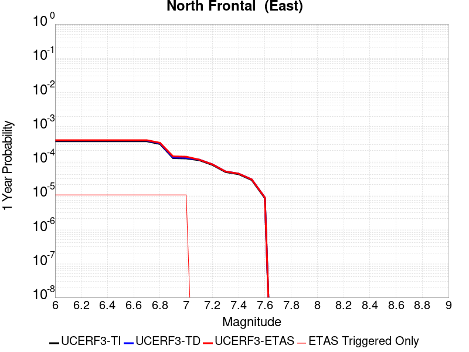 |  |

| Magnitude | 1 wk TI Prob | 1 wk TD Prob | 1 wk ETAS Prob | 1 wk ETAS/TD Gain | 1 wk ETAS Triggered Only | 1 mo TI Prob | 1 mo TD Prob | 1 mo ETAS Prob | 1 mo ETAS/TD Gain | 1 mo ETAS Triggered Only | 1 yr TI Prob | 1 yr TD Prob | 1 yr ETAS Prob | 1 yr ETAS/TD Gain | 1 yr ETAS Triggered Only | 10 yr TI Prob | 10 yr TD Prob | 10 yr ETAS Prob | 10 yr ETAS/TD Gain | 10 yr ETAS Triggered Only |
|-----|-----|-----|-----|-----|-----|-----|-----|-----|-----|-----|-----|-----|-----|-----|-----|-----|-----|-----|-----|-----|
| 6.0 | 7.135738E-6 | 7.4771765E-6 | 7.4771765E-6 | 1.0 | 0.0 | 3.0581377E-5 | 3.204476E-5 | 3.204476E-5 | 1.0 | 0.0 | 3.7226462E-4 | 3.9009505E-4 | 4.0009117E-4 | 1.0256248 | 1.0E-5 | 0.0037164164 | 0.0038960609 | 0.003915983 | 1.0051134 | 2.0E-5 |
| 6.1 | 7.135738E-6 | 7.4771765E-6 | 7.4771765E-6 | 1.0 | 0.0 | 3.0581377E-5 | 3.204476E-5 | 3.204476E-5 | 1.0 | 0.0 | 3.7226462E-4 | 3.9009505E-4 | 4.0009117E-4 | 1.0256248 | 1.0E-5 | 0.0037164164 | 0.0038960609 | 0.003915983 | 1.0051134 | 2.0E-5 |
| 6.2 | 7.135738E-6 | 7.4771765E-6 | 7.4771765E-6 | 1.0 | 0.0 | 3.0581377E-5 | 3.204476E-5 | 3.204476E-5 | 1.0 | 0.0 | 3.7226462E-4 | 3.9009505E-4 | 4.0009117E-4 | 1.0256248 | 1.0E-5 | 0.0037164164 | 0.0038960609 | 0.003915983 | 1.0051134 | 2.0E-5 |
| 6.3 | 7.135738E-6 | 7.4771765E-6 | 7.4771765E-6 | 1.0 | 0.0 | 3.0581377E-5 | 3.204476E-5 | 3.204476E-5 | 1.0 | 0.0 | 3.7226462E-4 | 3.9009505E-4 | 4.0009117E-4 | 1.0256248 | 1.0E-5 | 0.0037164164 | 0.0038960609 | 0.003915983 | 1.0051134 | 2.0E-5 |
| 6.4 | 7.135738E-6 | 7.4771765E-6 | 7.4771765E-6 | 1.0 | 0.0 | 3.0581377E-5 | 3.204476E-5 | 3.204476E-5 | 1.0 | 0.0 | 3.7226462E-4 | 3.9009505E-4 | 4.0009117E-4 | 1.0256248 | 1.0E-5 | 0.0037164164 | 0.0038960609 | 0.003915983 | 1.0051134 | 2.0E-5 |
| 6.5 | 7.135738E-6 | 7.4771765E-6 | 7.4771765E-6 | 1.0 | 0.0 | 3.0581377E-5 | 3.204476E-5 | 3.204476E-5 | 1.0 | 0.0 | 3.7226462E-4 | 3.9009505E-4 | 4.0009117E-4 | 1.0256248 | 1.0E-5 | 0.0037164164 | 0.0038960609 | 0.003915983 | 1.0051134 | 2.0E-5 |
| 6.6 | 7.135738E-6 | 7.4771765E-6 | 7.4771765E-6 | 1.0 | 0.0 | 3.0581377E-5 | 3.204476E-5 | 3.204476E-5 | 1.0 | 0.0 | 3.7226462E-4 | 3.9009505E-4 | 4.0009117E-4 | 1.0256248 | 1.0E-5 | 0.0037164164 | 0.0038960609 | 0.003915983 | 1.0051134 | 2.0E-5 |
| 6.7 | 7.135738E-6 | 7.4771765E-6 | 7.4771765E-6 | 1.0 | 0.0 | 3.0581377E-5 | 3.204476E-5 | 3.204476E-5 | 1.0 | 0.0 | 3.7226462E-4 | 3.9009505E-4 | 4.0009117E-4 | 1.0256248 | 1.0E-5 | 0.0037164164 | 0.0038960609 | 0.003915983 | 1.0051134 | 2.0E-5 |
| 6.8 | 5.959142E-6 | 6.236683E-6 | 6.236683E-6 | 1.0 | 0.0 | 2.553893E-5 | 2.6728469E-5 | 2.6728469E-5 | 1.0 | 0.0 | 3.108921E-4 | 3.253886E-4 | 3.3538532E-4 | 1.0307225 | 1.0E-5 | 0.0031045752 | 0.0032508948 | 0.0032708298 | 1.0061321 | 2.0E-5 |
| 6.9 | 2.2946929E-6 | 2.3824605E-6 | 2.3824605E-6 | 1.0 | 0.0 | 9.834361E-6 | 1.0210508E-5 | 1.0210508E-5 | 1.0 | 0.0 | 1.1972676E-4 | 1.2430632E-4 | 1.3430507E-4 | 1.0804365 | 1.0E-5 | 0.0011966228 | 0.0012424142 | 0.0012623895 | 1.0160776 | 2.0E-5 |
| 7.0 | 2.2468673E-6 | 2.3321538E-6 | 2.3321538E-6 | 1.0 | 0.0 | 9.629396E-6 | 9.994909E-6 | 9.994909E-6 | 1.0 | 0.0 | 1.1723159E-4 | 1.21681696E-4 | 1.3168047E-4 | 1.0821717 | 1.0E-5 | 0.0011716976 | 0.0012161969 | 0.0012361726 | 1.0164247 | 2.0E-5 |
| 7.1 | 1.9921076E-6 | 2.0646032E-6 | 2.0646032E-6 | 1.0 | 0.0 | 8.537577E-6 | 8.848272E-6 | 8.848272E-6 | 1.0 | 0.0 | 1.0394004E-4 | 1.0772282E-4 | 1.0772282E-4 | 1.0 | 0.0 | 0.0010389143 | 0.0010767487 | 0.001086738 | 1.0092772 | 1.0E-5 |
| 7.2 | 1.4524545E-6 | 1.5045148E-6 | 1.5045148E-6 | 1.0 | 0.0 | 6.2247905E-6 | 6.447906E-6 | 6.447906E-6 | 1.0 | 0.0 | 7.5784184E-5 | 7.850068E-5 | 7.850068E-5 | 1.0 | 0.0 | 7.575835E-4 | 7.8475394E-4 | 7.947461E-4 | 1.0127329 | 1.0E-5 |
| 7.3 | 8.9802575E-7 | 9.3087283E-7 | 9.3087283E-7 | 1.0 | 0.0 | 3.848676E-6 | 3.9894494E-6 | 3.9894494E-6 | 1.0 | 0.0 | 4.685662E-5 | 4.857058E-5 | 4.857058E-5 | 1.0 | 0.0 | 4.6846745E-4 | 4.8561094E-4 | 4.956061E-4 | 1.0205827 | 1.0E-5 |
| 7.4 | 7.776139E-7 | 8.0604747E-7 | 8.0604747E-7 | 1.0 | 0.0 | 3.3326266E-6 | 3.4544853E-6 | 3.4544853E-6 | 1.0 | 0.0 | 4.0573974E-5 | 4.2057654E-5 | 4.2057654E-5 | 1.0 | 0.0 | 4.0566566E-4 | 4.205077E-4 | 4.305035E-4 | 1.0237708 | 1.0E-5 |
| 7.5 | 5.244417E-7 | 5.441219E-7 | 5.441219E-7 | 1.0 | 0.0 | 2.2476054E-6 | 2.3319494E-6 | 2.3319494E-6 | 1.0 | 0.0 | 2.7364253E-5 | 2.839118E-5 | 2.839118E-5 | 1.0 | 0.0 | 2.7360884E-4 | 2.8388205E-4 | 2.9387922E-4 | 1.0352159 | 1.0E-5 |
| 7.6 | 1.5489647E-7 | 1.6089504E-7 | 1.6089504E-7 | 1.0 | 0.0 | 6.6384183E-7 | 6.895501E-7 | 6.895501E-7 | 1.0 | 0.0 | 8.082245E-6 | 8.395261E-6 | 8.395261E-6 | 1.0 | 0.0 | 8.08195E-5 | 8.395143E-5 | 8.395143E-5 | 1.0 | 0.0 |

## Monte Vista - Shannon 2011 CFM
*[(top)](#table-of-contents)*

| 1 Week | 1 Month | 1 Year | 10 Year |
|-----|-----|-----|-----|
|  |  |  |  |

| Magnitude | 1 wk TI Prob | 1 wk TD Prob | 1 wk ETAS Prob | 1 wk ETAS/TD Gain | 1 wk ETAS Triggered Only | 1 mo TI Prob | 1 mo TD Prob | 1 mo ETAS Prob | 1 mo ETAS/TD Gain | 1 mo ETAS Triggered Only | 1 yr TI Prob | 1 yr TD Prob | 1 yr ETAS Prob | 1 yr ETAS/TD Gain | 1 yr ETAS Triggered Only | 10 yr TI Prob | 10 yr TD Prob | 10 yr ETAS Prob | 10 yr ETAS/TD Gain | 10 yr ETAS Triggered Only |
|-----|-----|-----|-----|-----|-----|-----|-----|-----|-----|-----|-----|-----|-----|-----|-----|-----|-----|-----|-----|-----|
| 6.0 | 2.7907707E-5 | 2.7584067E-5 | 4.7583515E-5 | 1.7250363 | 2.0E-5 | 1.19598975E-4 | 1.1821277E-4 | 1.3821041E-4 | 1.1691664 | 2.0E-5 | 0.0014551448 | 0.001438414 | 0.0014583853 | 1.0138842 | 2.0E-5 | 0.014456532 | 0.014320111 | 0.014339825 | 1.0013766 | 2.0E-5 |
| 6.1 | 2.7907707E-5 | 2.7584067E-5 | 4.7583515E-5 | 1.7250363 | 2.0E-5 | 1.19598975E-4 | 1.1821277E-4 | 1.3821041E-4 | 1.1691664 | 2.0E-5 | 0.0014551448 | 0.001438414 | 0.0014583853 | 1.0138842 | 2.0E-5 | 0.014456532 | 0.014320111 | 0.014339825 | 1.0013766 | 2.0E-5 |
| 6.2 | 2.7907707E-5 | 2.7584067E-5 | 4.7583515E-5 | 1.7250363 | 2.0E-5 | 1.19598975E-4 | 1.1821277E-4 | 1.3821041E-4 | 1.1691664 | 2.0E-5 | 0.0014551448 | 0.001438414 | 0.0014583853 | 1.0138842 | 2.0E-5 | 0.014456532 | 0.014320111 | 0.014339825 | 1.0013766 | 2.0E-5 |
| 6.3 | 2.7907707E-5 | 2.7584067E-5 | 4.7583515E-5 | 1.7250363 | 2.0E-5 | 1.19598975E-4 | 1.1821277E-4 | 1.3821041E-4 | 1.1691664 | 2.0E-5 | 0.0014551448 | 0.001438414 | 0.0014583853 | 1.0138842 | 2.0E-5 | 0.014456532 | 0.014320111 | 0.014339825 | 1.0013766 | 2.0E-5 |
| 6.4 | 2.7907707E-5 | 2.7584067E-5 | 4.7583515E-5 | 1.7250363 | 2.0E-5 | 1.19598975E-4 | 1.1821277E-4 | 1.3821041E-4 | 1.1691664 | 2.0E-5 | 0.0014551448 | 0.001438414 | 0.0014583853 | 1.0138842 | 2.0E-5 | 0.014456532 | 0.014320111 | 0.014339825 | 1.0013766 | 2.0E-5 |
| 6.5 | 1.7990213E-5 | 1.6639742E-5 | 2.6639576E-5 | 1.6009609 | 1.0E-5 | 7.709863E-5 | 7.13116E-5 | 8.131089E-5 | 1.1402197 | 1.0E-5 | 9.382716E-4 | 8.679393E-4 | 8.779306E-4 | 1.0115116 | 1.0E-5 | 0.0093431985 | 0.008668857 | 0.008678771 | 1.0011436 | 1.0E-5 |
| 6.6 | 9.650407E-6 | 7.457001E-6 | 7.457001E-6 | 1.0 | 0.0 | 4.135823E-5 | 3.195823E-5 | 3.195823E-5 | 1.0 | 0.0 | 5.0342013E-4 | 3.890298E-4 | 3.890298E-4 | 1.0 | 0.0 | 0.005022812 | 0.0039011573 | 0.0039011573 | 1.0 | 0.0 |
| 6.7 | 9.62828E-6 | 7.434916E-6 | 7.434916E-6 | 1.0 | 0.0 | 4.1263404E-5 | 3.186358E-5 | 3.186358E-5 | 1.0 | 0.0 | 5.022661E-4 | 3.8787787E-4 | 3.8787787E-4 | 1.0 | 0.0 | 0.0050113243 | 0.003889678 | 0.003889678 | 1.0 | 0.0 |
| 6.8 | 6.887523E-6 | 4.461425E-6 | 4.461425E-6 | 1.0 | 0.0 | 2.9517621E-5 | 1.9120265E-5 | 1.9120265E-5 | 1.0 | 0.0 | 3.5931775E-4 | 2.3276659E-4 | 2.3276659E-4 | 1.0 | 0.0 | 0.0035873733 | 0.0023423703 | 0.0023423703 | 1.0 | 0.0 |
| 6.9 | 6.2722347E-6 | 3.8032956E-6 | 3.8032956E-6 | 1.0 | 0.0 | 2.6880729E-5 | 1.6299748E-5 | 1.6299748E-5 | 1.0 | 0.0 | 3.2722374E-4 | 1.9843338E-4 | 1.9843338E-4 | 1.0 | 0.0 | 0.003267423 | 0.0019996904 | 0.0019996904 | 1.0 | 0.0 |
| 7.0 | 5.5320347E-6 | 3.0304461E-6 | 3.0304461E-6 | 1.0 | 0.0 | 2.3708504E-5 | 1.2987572E-5 | 1.2987572E-5 | 1.0 | 0.0 | 2.8861282E-4 | 1.5811404E-4 | 1.5811404E-4 | 1.0 | 0.0 | 0.0028823826 | 0.0015971304 | 0.0015971304 | 1.0 | 0.0 |
| 7.1 | 3.8794055E-6 | 1.283645E-6 | 1.283645E-6 | 1.0 | 0.0 | 1.6625918E-5 | 5.5013243E-6 | 5.5013243E-6 | 1.0 | 0.0 | 2.0240174E-4 | 6.697658E-5 | 6.697658E-5 | 1.0 | 0.0 | 0.002022175 | 6.86504E-4 | 6.86504E-4 | 1.0 | 0.0 |
| 7.2 | 3.4813652E-6 | 9.669686E-7 | 9.669686E-7 | 1.0 | 0.0 | 1.49200505E-5 | 4.144145E-6 | 4.144145E-6 | 1.0 | 0.0 | 1.8163648E-4 | 5.0453804E-5 | 5.0453804E-5 | 1.0 | 0.0 | 0.0018148809 | 5.213506E-4 | 5.213506E-4 | 1.0 | 0.0 |
| 7.3 | 3.1682148E-6 | 7.7177793E-7 | 7.7177793E-7 | 1.0 | 0.0 | 1.3577992E-5 | 3.3076153E-6 | 3.3076153E-6 | 1.0 | 0.0 | 1.6529951E-4 | 4.0269475E-5 | 4.0269475E-5 | 1.0 | 0.0 | 0.0016517661 | 4.195245E-4 | 4.195245E-4 | 1.0 | 0.0 |
| 7.4 | 2.9707667E-6 | 7.344474E-7 | 7.344474E-7 | 1.0 | 0.0 | 1.2731795E-5 | 3.147628E-6 | 3.147628E-6 | 1.0 | 0.0 | 1.5499859E-4 | 3.8321698E-5 | 3.8321698E-5 | 1.0 | 0.0 | 0.0015489052 | 3.998471E-4 | 3.998471E-4 | 1.0 | 0.0 |
| 7.5 | 2.3462758E-6 | 6.0069135E-7 | 6.0069135E-7 | 1.0 | 0.0 | 1.0055429E-5 | 2.5743889E-6 | 2.5743889E-6 | 1.0 | 0.0 | 1.2241797E-4 | 3.1342737E-5 | 3.1342737E-5 | 1.0 | 0.0 | 0.0012235056 | 3.2833643E-4 | 3.2833643E-4 | 1.0 | 0.0 |
| 7.6 | 2.112783E-6 | 5.250731E-7 | 5.250731E-7 | 1.0 | 0.0 | 9.054753E-6 | 2.2503114E-6 | 2.2503114E-6 | 1.0 | 0.0 | 1.1023604E-4 | 2.7397198E-5 | 2.7397198E-5 | 1.0 | 0.0 | 0.0011018137 | 2.8845918E-4 | 2.8845918E-4 | 1.0 | 0.0 |
| 7.7 | 1.7022471E-6 | 4.23102E-7 | 4.23102E-7 | 1.0 | 0.0 | 7.2953244E-6 | 1.8132929E-6 | 1.8132929E-6 | 1.0 | 0.0 | 8.881695E-5 | 2.207662E-5 | 2.207662E-5 | 1.0 | 0.0 | 8.878146E-4 | 2.3394964E-4 | 2.3394964E-4 | 1.0 | 0.0 |
| 7.8 | 7.230914E-7 | 3.728293E-7 | 3.728293E-7 | 1.0 | 0.0 | 3.0989595E-6 | 1.597839E-6 | 1.597839E-6 | 1.0 | 0.0 | 3.772918E-5 | 1.9453517E-5 | 1.9453517E-5 | 1.0 | 0.0 | 3.7722773E-4 | 2.072548E-4 | 2.072548E-4 | 1.0 | 0.0 |
| 7.9 | 4.3588446E-7 | 3.4304335E-7 | 3.4304335E-7 | 1.0 | 0.0 | 1.868075E-6 | 1.4701849E-6 | 1.4701849E-6 | 1.0 | 0.0 | 2.2743576E-5 | 1.7899356E-5 | 1.7899356E-5 | 1.0 | 0.0 | 2.2741247E-4 | 1.899464E-4 | 1.899464E-4 | 1.0 | 0.0 |
| 8.0 | 2.3317523E-7 | 3.1513432E-7 | 3.1513432E-7 | 1.0 | 0.0 | 9.99322E-7 | 1.350575E-6 | 1.350575E-6 | 1.0 | 0.0 | 1.2166677E-5 | 1.6443128E-5 | 1.6443128E-5 | 1.0 | 0.0 | 1.21660116E-4 | 1.7399403E-4 | 1.7399403E-4 | 1.0 | 0.0 |
| 8.1 | 1.4662456E-7 | 2.03077E-7 | 2.03077E-7 | 1.0 | 0.0 | 6.283908E-7 | 8.703297E-7 | 8.703297E-7 | 1.0 | 0.0 | 7.650631E-6 | 1.05962135E-5 | 1.05962135E-5 | 1.0 | 0.0 | 7.650368E-5 | 1.1132272E-4 | 1.1132272E-4 | 1.0 | 0.0 |
| 8.2 | 5.4931775E-9 | 5.0752176E-9 | 5.0752176E-9 | 1.0 | 0.0 | 2.3542189E-8 | 2.1750932E-8 | 2.1750932E-8 | 1.0 | 0.0 | 2.8662612E-7 | 2.6481757E-7 | 2.6481757E-7 | 1.0 | 0.0 | 2.8662573E-6 | 2.754138E-6 | 2.754138E-6 | 1.0 | 0.0 |

## Anacapa-Dume alt 1
*[(top)](#table-of-contents)*

| 1 Week | 1 Month | 1 Year | 10 Year |
|-----|-----|-----|-----|
|  |  |  |  |

| Magnitude | 1 wk TI Prob | 1 wk TD Prob | 1 wk ETAS Prob | 1 wk ETAS/TD Gain | 1 wk ETAS Triggered Only | 1 mo TI Prob | 1 mo TD Prob | 1 mo ETAS Prob | 1 mo ETAS/TD Gain | 1 mo ETAS Triggered Only | 1 yr TI Prob | 1 yr TD Prob | 1 yr ETAS Prob | 1 yr ETAS/TD Gain | 1 yr ETAS Triggered Only | 10 yr TI Prob | 10 yr TD Prob | 10 yr ETAS Prob | 10 yr ETAS/TD Gain | 10 yr ETAS Triggered Only |
|-----|-----|-----|-----|-----|-----|-----|-----|-----|-----|-----|-----|-----|-----|-----|-----|-----|-----|-----|-----|-----|
| 6.0 | 5.1871802E-6 | 5.3673916E-6 | 2.5367284E-5 | 4.726185 | 2.0E-5 | 2.2230583E-5 | 2.3002909E-5 | 4.300245E-5 | 1.8694352 | 2.0E-5 | 2.7062374E-4 | 2.8002527E-4 | 3.0001966E-4 | 1.0714021 | 2.0E-5 | 0.002702944 | 0.0027968097 | 0.0028167537 | 1.007131 | 2.0E-5 |
| 6.1 | 5.1871802E-6 | 5.3673916E-6 | 2.5367284E-5 | 4.726185 | 2.0E-5 | 2.2230583E-5 | 2.3002909E-5 | 4.300245E-5 | 1.8694352 | 2.0E-5 | 2.7062374E-4 | 2.8002527E-4 | 3.0001966E-4 | 1.0714021 | 2.0E-5 | 0.002702944 | 0.0027968097 | 0.0028167537 | 1.007131 | 2.0E-5 |
| 6.2 | 5.1871802E-6 | 5.3673916E-6 | 2.5367284E-5 | 4.726185 | 2.0E-5 | 2.2230583E-5 | 2.3002909E-5 | 4.300245E-5 | 1.8694352 | 2.0E-5 | 2.7062374E-4 | 2.8002527E-4 | 3.0001966E-4 | 1.0714021 | 2.0E-5 | 0.002702944 | 0.0027968097 | 0.0028167537 | 1.007131 | 2.0E-5 |
| 6.3 | 5.1871802E-6 | 5.3673916E-6 | 2.5367284E-5 | 4.726185 | 2.0E-5 | 2.2230583E-5 | 2.3002909E-5 | 4.300245E-5 | 1.8694352 | 2.0E-5 | 2.7062374E-4 | 2.8002527E-4 | 3.0001966E-4 | 1.0714021 | 2.0E-5 | 0.002702944 | 0.0027968097 | 0.0028167537 | 1.007131 | 2.0E-5 |
| 6.4 | 5.1871802E-6 | 5.3673916E-6 | 2.5367284E-5 | 4.726185 | 2.0E-5 | 2.2230583E-5 | 2.3002909E-5 | 4.300245E-5 | 1.8694352 | 2.0E-5 | 2.7062374E-4 | 2.8002527E-4 | 3.0001966E-4 | 1.0714021 | 2.0E-5 | 0.002702944 | 0.0027968097 | 0.0028167537 | 1.007131 | 2.0E-5 |
| 6.5 | 5.1871802E-6 | 5.3673916E-6 | 2.5367284E-5 | 4.726185 | 2.0E-5 | 2.2230583E-5 | 2.3002909E-5 | 4.300245E-5 | 1.8694352 | 2.0E-5 | 2.7062374E-4 | 2.8002527E-4 | 3.0001966E-4 | 1.0714021 | 2.0E-5 | 0.002702944 | 0.0027968097 | 0.0028167537 | 1.007131 | 2.0E-5 |
| 6.6 | 5.1871802E-6 | 5.3673916E-6 | 2.5367284E-5 | 4.726185 | 2.0E-5 | 2.2230583E-5 | 2.3002909E-5 | 4.300245E-5 | 1.8694352 | 2.0E-5 | 2.7062374E-4 | 2.8002527E-4 | 3.0001966E-4 | 1.0714021 | 2.0E-5 | 0.002702944 | 0.0027968097 | 0.0028167537 | 1.007131 | 2.0E-5 |
| 6.7 | 4.7693475E-6 | 4.9366927E-6 | 2.4936593E-5 | 5.0512753 | 2.0E-5 | 2.04399E-5 | 2.1157086E-5 | 4.115666E-5 | 1.9452897 | 2.0E-5 | 2.4882736E-4 | 2.5755784E-4 | 2.775527E-4 | 1.0776324 | 2.0E-5 | 0.0024854892 | 0.0025726694 | 0.0025926179 | 1.007754 | 2.0E-5 |
| 6.8 | 4.753408E-6 | 4.920241E-6 | 2.4920142E-5 | 5.0648217 | 2.0E-5 | 2.037159E-5 | 2.108658E-5 | 4.1086158E-5 | 1.9484506 | 2.0E-5 | 2.4799586E-4 | 2.5669963E-4 | 2.7669448E-4 | 1.0778921 | 2.0E-5 | 0.002477193 | 0.002564107 | 0.0025840558 | 1.00778 | 2.0E-5 |
| 6.9 | 3.800069E-6 | 3.937127E-6 | 2.3937047E-5 | 6.0798264 | 2.0E-5 | 1.6285909E-5 | 1.6873293E-5 | 3.6872956E-5 | 2.185285 | 2.0E-5 | 1.9826289E-4 | 2.054132E-4 | 2.2540911E-4 | 1.0973448 | 2.0E-5 | 0.001980861 | 0.0020522573 | 0.0020722162 | 1.0097253 | 2.0E-5 |
| 7.0 | 3.6671938E-6 | 3.799919E-6 | 2.3799843E-5 | 6.26325 | 2.0E-5 | 1.571645E-5 | 1.6285267E-5 | 3.6284942E-5 | 2.2280838 | 2.0E-5 | 1.9133097E-4 | 1.9825532E-4 | 2.1825136E-4 | 1.10086 | 2.0E-5 | 0.0019116632 | 0.0019808079 | 0.0020007682 | 1.0100769 | 2.0E-5 |
| 7.1 | 3.2394885E-6 | 3.3587942E-6 | 2.3358727E-5 | 6.9544983 | 2.0E-5 | 1.3883448E-5 | 1.4394753E-5 | 3.4394467E-5 | 2.3893752 | 2.0E-5 | 1.6901788E-4 | 1.7524212E-4 | 1.9523862E-4 | 1.1141078 | 2.0E-5 | 0.0016888938 | 0.0017510506 | 0.0017710156 | 1.0114018 | 2.0E-5 |
| 7.2 | 3.0935948E-6 | 3.2079267E-6 | 2.3207862E-5 | 7.234536 | 2.0E-5 | 1.3258196E-5 | 1.3748186E-5 | 3.374791E-5 | 2.4547174 | 2.0E-5 | 1.6140658E-4 | 1.6737141E-4 | 1.8736806E-4 | 1.1194748 | 2.0E-5 | 0.001612894 | 0.0016724645 | 0.0016924312 | 1.0119385 | 2.0E-5 |
| 7.3 | 2.5604163E-6 | 2.6470739E-6 | 2.264702E-5 | 8.555492 | 2.0E-5 | 1.0973167E-5 | 1.1344553E-5 | 3.1344327E-5 | 2.7629406 | 2.0E-5 | 1.3359012E-4 | 1.3811122E-4 | 1.5810847E-4 | 1.1447908 | 2.0E-5 | 0.0013350984 | 0.0013802585 | 0.0014002309 | 1.01447 | 2.0E-5 |
| 7.4 | 2.1429005E-6 | 2.2106035E-6 | 2.221056E-5 | 10.047283 | 2.0E-5 | 9.1838265E-6 | 9.473981E-6 | 2.9473791E-5 | 3.111025 | 2.0E-5 | 1.11807356E-4 | 1.1533964E-4 | 1.3533734E-4 | 1.173381 | 2.0E-5 | 0.0011175112 | 0.0011528004 | 0.0011727774 | 1.0173291 | 2.0E-5 |
| 7.5 | 1.7237151E-6 | 1.7761457E-6 | 2.177611E-5 | 12.260317 | 2.0E-5 | 7.3873293E-6 | 7.6120314E-6 | 2.7611879E-5 | 3.6273997 | 2.0E-5 | 8.993702E-5 | 9.267256E-5 | 1.1267071E-4 | 1.2157936 | 2.0E-5 | 8.990063E-4 | 9.263415E-4 | 9.46323E-4 | 1.0215703 | 2.0E-5 |
| 7.6 | 9.541696E-7 | 9.823211E-7 | 2.0982301E-5 | 21.35992 | 2.0E-5 | 4.089292E-6 | 4.2099414E-6 | 2.4209858E-5 | 5.7506404 | 2.0E-5 | 4.9785995E-5 | 5.125484E-5 | 7.125382E-5 | 1.390187 | 2.0E-5 | 4.9774844E-4 | 5.124315E-4 | 5.324212E-4 | 1.0390096 | 2.0E-5 |
| 7.7 | 2.7226676E-7 | 2.7172473E-7 | 1.0271722E-5 | 37.80194 | 1.0E-5 | 1.166857E-6 | 1.1645341E-6 | 1.1164522E-5 | 9.587115 | 1.0E-5 | 1.4206392E-5 | 1.4178111E-5 | 2.4177969E-5 | 1.7053026 | 1.0E-5 | 1.4205484E-4 | 1.4177214E-4 | 1.5177071E-4 | 1.0705258 | 1.0E-5 |
| 7.8 | 4.5017995E-8 | 4.215797E-8 | 4.215797E-8 | 1.0 | 0.0 | 1.9293425E-7 | 1.80677E-7 | 1.80677E-7 | 1.0 | 0.0 | 2.348972E-6 | 2.1997405E-6 | 2.1997405E-6 | 1.0 | 0.0 | 2.348947E-5 | 2.1997208E-5 | 2.1997208E-5 | 1.0 | 0.0 |
| 7.9 | 8.007447E-10 | 6.161581E-10 | 6.161581E-10 | 1.0 | 0.0 | 3.4317629E-9 | 2.640678E-9 | 2.640678E-9 | 1.0 | 0.0 | 4.1781714E-8 | 3.2150254E-8 | 3.2150254E-8 | 1.0 | 0.0 | 4.1781706E-7 | 3.2150248E-7 | 3.2150248E-7 | 1.0 | 0.0 |

## Oak Ridge (Onshore)
*[(top)](#table-of-contents)*

| 1 Week | 1 Month | 1 Year | 10 Year |
|-----|-----|-----|-----|
|  |  |  |  |

| Magnitude | 1 wk TI Prob | 1 wk TD Prob | 1 wk ETAS Prob | 1 wk ETAS/TD Gain | 1 wk ETAS Triggered Only | 1 mo TI Prob | 1 mo TD Prob | 1 mo ETAS Prob | 1 mo ETAS/TD Gain | 1 mo ETAS Triggered Only | 1 yr TI Prob | 1 yr TD Prob | 1 yr ETAS Prob | 1 yr ETAS/TD Gain | 1 yr ETAS Triggered Only | 10 yr TI Prob | 10 yr TD Prob | 10 yr ETAS Prob | 10 yr ETAS/TD Gain | 10 yr ETAS Triggered Only |
|-----|-----|-----|-----|-----|-----|-----|-----|-----|-----|-----|-----|-----|-----|-----|-----|-----|-----|-----|-----|-----|
| 6.0 | 3.155064E-5 | 2.9526076E-5 | 3.952578E-5 | 1.3386737 | 1.0E-5 | 1.3521002E-4 | 1.265344E-4 | 1.3653314E-4 | 1.0790199 | 1.0E-5 | 0.001644939 | 0.0015395058 | 0.0015494904 | 1.0064856 | 1.0E-5 | 0.01632816 | 0.015293054 | 0.015302902 | 1.0006438 | 1.0E-5 |
| 6.1 | 3.155064E-5 | 2.9526076E-5 | 3.952578E-5 | 1.3386737 | 1.0E-5 | 1.3521002E-4 | 1.265344E-4 | 1.3653314E-4 | 1.0790199 | 1.0E-5 | 0.001644939 | 0.0015395058 | 0.0015494904 | 1.0064856 | 1.0E-5 | 0.01632816 | 0.015293054 | 0.015302902 | 1.0006438 | 1.0E-5 |
| 6.2 | 3.155064E-5 | 2.9526076E-5 | 3.952578E-5 | 1.3386737 | 1.0E-5 | 1.3521002E-4 | 1.265344E-4 | 1.3653314E-4 | 1.0790199 | 1.0E-5 | 0.001644939 | 0.0015395058 | 0.0015494904 | 1.0064856 | 1.0E-5 | 0.01632816 | 0.015293054 | 0.015302902 | 1.0006438 | 1.0E-5 |
| 6.3 | 3.155064E-5 | 2.9526076E-5 | 3.952578E-5 | 1.3386737 | 1.0E-5 | 1.3521002E-4 | 1.265344E-4 | 1.3653314E-4 | 1.0790199 | 1.0E-5 | 0.001644939 | 0.0015395058 | 0.0015494904 | 1.0064856 | 1.0E-5 | 0.01632816 | 0.015293054 | 0.015302902 | 1.0006438 | 1.0E-5 |
| 6.4 | 3.155064E-5 | 2.9526076E-5 | 3.952578E-5 | 1.3386737 | 1.0E-5 | 1.3521002E-4 | 1.265344E-4 | 1.3653314E-4 | 1.0790199 | 1.0E-5 | 0.001644939 | 0.0015395058 | 0.0015494904 | 1.0064856 | 1.0E-5 | 0.01632816 | 0.015293054 | 0.015302902 | 1.0006438 | 1.0E-5 |
| 6.5 | 3.155064E-5 | 2.9526076E-5 | 3.952578E-5 | 1.3386737 | 1.0E-5 | 1.3521002E-4 | 1.265344E-4 | 1.3653314E-4 | 1.0790199 | 1.0E-5 | 0.001644939 | 0.0015395058 | 0.0015494904 | 1.0064856 | 1.0E-5 | 0.01632816 | 0.015293054 | 0.015302902 | 1.0006438 | 1.0E-5 |
| 6.6 | 3.155064E-5 | 2.9526076E-5 | 3.952578E-5 | 1.3386737 | 1.0E-5 | 1.3521002E-4 | 1.265344E-4 | 1.3653314E-4 | 1.0790199 | 1.0E-5 | 0.001644939 | 0.0015395058 | 0.0015494904 | 1.0064856 | 1.0E-5 | 0.01632816 | 0.015293054 | 0.015302902 | 1.0006438 | 1.0E-5 |
| 6.7 | 3.098897E-5 | 2.8864279E-5 | 3.886399E-5 | 1.346439 | 1.0E-5 | 1.328031E-4 | 1.236984E-4 | 1.3369716E-4 | 1.0808318 | 1.0E-5 | 0.0016156785 | 0.0015050253 | 0.0015150103 | 1.0066344 | 1.0E-5 | 0.016039822 | 0.014952909 | 0.01496276 | 1.0006588 | 1.0E-5 |
| 6.8 | 3.0449872E-5 | 2.8239476E-5 | 3.8239195E-5 | 1.3541042 | 1.0E-5 | 1.3049292E-4 | 1.2102092E-4 | 1.3101971E-4 | 1.0826204 | 1.0E-5 | 0.0015875935 | 0.001472471 | 0.0014824563 | 1.0067813 | 1.0E-5 | 0.015762992 | 0.014631658 | 0.014641511 | 1.0006734 | 1.0E-5 |
| 6.9 | 2.697928E-5 | 2.4219877E-5 | 3.4219636E-5 | 1.412874 | 1.0E-5 | 1.15620365E-4 | 1.03795464E-4 | 1.1379443E-4 | 1.0963333 | 1.0E-5 | 0.0014067689 | 0.0012629988 | 0.0012729861 | 1.0079076 | 1.0E-5 | 0.0139789665 | 0.012561066 | 0.01257094 | 1.0007861 | 1.0E-5 |
| 7.0 | 2.4893961E-5 | 2.1862146E-5 | 3.1861928E-5 | 1.4574016 | 1.0E-5 | 1.0668404E-4 | 9.369165E-5 | 1.0369071E-4 | 1.1067231 | 1.0E-5 | 0.0012981043 | 0.0011401166 | 0.0011501053 | 1.008761 | 1.0E-5 | 0.012905477 | 0.011345102 | 0.011354988 | 1.0008714 | 1.0E-5 |
| 7.1 | 2.0945363E-5 | 1.7354592E-5 | 2.735442E-5 | 1.5762063 | 1.0E-5 | 8.976275E-5 | 7.437473E-5 | 8.437399E-5 | 1.1344442 | 1.0E-5 | 0.0010923136 | 9.0514094E-4 | 9.151319E-4 | 1.011038 | 1.0E-5 | 0.0108696 | 0.009015621 | 0.00902553 | 1.0010992 | 1.0E-5 |
| 7.2 | 2.0439404E-5 | 1.680953E-5 | 2.680936E-5 | 1.5948906 | 1.0E-5 | 8.7594504E-5 | 7.203888E-5 | 8.203816E-5 | 1.138804 | 1.0E-5 | 0.0010659413 | 8.767251E-4 | 8.8671636E-4 | 1.011396 | 1.0E-5 | 0.010608427 | 0.008733723 | 0.008743636 | 1.001135 | 1.0E-5 |
| 7.3 | 1.8463334E-5 | 1.5381947E-5 | 2.5381793E-5 | 1.6501027 | 1.0E-5 | 7.912617E-5 | 6.592098E-5 | 7.5920325E-5 | 1.1516868 | 1.0E-5 | 9.6293533E-4 | 8.0229685E-4 | 8.1228884E-4 | 1.0124543 | 1.0E-5 | 0.009587734 | 0.0079950085 | 0.008004929 | 1.0012407 | 1.0E-5 |
| 7.4 | 1.763139E-5 | 1.4516977E-5 | 2.4516832E-5 | 1.6888386 | 1.0E-5 | 7.556091E-5 | 6.221415E-5 | 7.221353E-5 | 1.1607251 | 1.0E-5 | 9.1956573E-4 | 7.57198E-4 | 7.671905E-4 | 1.0131966 | 1.0E-5 | 0.009157699 | 0.007547126 | 0.0075570503 | 1.001315 | 1.0E-5 |
| 7.5 | 1.3594944E-5 | 1.1163363E-5 | 2.116325E-5 | 1.8957775 | 1.0E-5 | 5.8262744E-5 | 4.7842117E-5 | 5.784164E-5 | 1.2090108 | 1.0E-5 | 7.0911803E-4 | 5.8232463E-4 | 5.9231883E-4 | 1.0171626 | 1.0E-5 | 0.007068595 | 0.005808362 | 0.0058183037 | 1.0017116 | 1.0E-5 |
| 7.6 | 6.9889534E-6 | 5.6367194E-6 | 5.6367194E-6 | 1.0 | 0.0 | 2.9952313E-5 | 2.4157147E-5 | 2.4157147E-5 | 1.0 | 0.0 | 3.646084E-4 | 2.94074E-4 | 2.94074E-4 | 1.0 | 0.0 | 0.0036401073 | 0.0029368924 | 0.0029368924 | 1.0 | 0.0 |
| 7.7 | 4.0824193E-6 | 3.2832731E-6 | 3.2832731E-6 | 1.0 | 0.0 | 1.7495966E-5 | 1.4071096E-5 | 1.4071096E-5 | 1.0 | 0.0 | 2.1299256E-4 | 1.7130225E-4 | 1.7130225E-4 | 1.0 | 0.0 | 0.0021278851 | 0.0017117155 | 0.0017117155 | 1.0 | 0.0 |
| 7.8 | 1.7023609E-6 | 1.43706E-6 | 1.43706E-6 | 1.0 | 0.0 | 7.295812E-6 | 6.158814E-6 | 6.158814E-6 | 1.0 | 0.0 | 8.882289E-5 | 7.4981006E-5 | 7.4981006E-5 | 1.0 | 0.0 | 8.8787393E-4 | 7.4955984E-4 | 7.4955984E-4 | 1.0 | 0.0 |
| 7.9 | 2.721225E-7 | 2.261692E-7 | 2.261692E-7 | 1.0 | 0.0 | 1.1662388E-6 | 9.692963E-7 | 9.692963E-7 | 1.0 | 0.0 | 1.4198865E-5 | 1.1801121E-5 | 1.1801121E-5 | 1.0 | 0.0 | 1.4197957E-4 | 1.1800523E-4 | 1.1800523E-4 | 1.0 | 0.0 |
| 8.0 | 9.364255E-9 | 5.1204916E-9 | 5.1204916E-9 | 1.0 | 0.0 | 4.0132523E-8 | 2.1944963E-8 | 2.1944963E-8 | 1.0 | 0.0 | 4.8861335E-7 | 2.671799E-7 | 2.671799E-7 | 1.0 | 0.0 | 4.8861225E-6 | 2.6717962E-6 | 2.6717962E-6 | 1.0 | 0.0 |

## Honey Lake 2011 CFM
*[(top)](#table-of-contents)*

| 1 Week | 1 Month | 1 Year | 10 Year |
|-----|-----|-----|-----|
|  |  |  |  |

| Magnitude | 1 wk TI Prob | 1 wk TD Prob | 1 wk ETAS Prob | 1 wk ETAS/TD Gain | 1 wk ETAS Triggered Only | 1 mo TI Prob | 1 mo TD Prob | 1 mo ETAS Prob | 1 mo ETAS/TD Gain | 1 mo ETAS Triggered Only | 1 yr TI Prob | 1 yr TD Prob | 1 yr ETAS Prob | 1 yr ETAS/TD Gain | 1 yr ETAS Triggered Only | 10 yr TI Prob | 10 yr TD Prob | 10 yr ETAS Prob | 10 yr ETAS/TD Gain | 10 yr ETAS Triggered Only |
|-----|-----|-----|-----|-----|-----|-----|-----|-----|-----|-----|-----|-----|-----|-----|-----|-----|-----|-----|-----|-----|
| 6.0 | 6.155506E-5 | 7.954708E-5 | 7.954708E-5 | 1.0 | 0.0 | 2.6378073E-4 | 3.4087323E-4 | 3.4087323E-4 | 1.0 | 0.0 | 0.0032068014 | 0.0041426765 | 0.0041426765 | 1.0 | 0.0 | 0.03160919 | 0.040703055 | 0.040712647 | 1.0002357 | 1.0E-5 |
| 6.1 | 6.155506E-5 | 7.954708E-5 | 7.954708E-5 | 1.0 | 0.0 | 2.6378073E-4 | 3.4087323E-4 | 3.4087323E-4 | 1.0 | 0.0 | 0.0032068014 | 0.0041426765 | 0.0041426765 | 1.0 | 0.0 | 0.03160919 | 0.040703055 | 0.040703055 | 1.0 | 0.0 |
| 6.2 | 4.1335024E-5 | 5.257652E-5 | 5.257652E-5 | 1.0 | 0.0 | 1.7713808E-4 | 2.2530954E-4 | 2.2530954E-4 | 1.0 | 0.0 | 0.0021545228 | 0.0027398444 | 0.0027398444 | 1.0 | 0.0 | 0.021337535 | 0.027076809 | 0.027076809 | 1.0 | 0.0 |
| 6.3 | 4.1335024E-5 | 5.257652E-5 | 5.257652E-5 | 1.0 | 0.0 | 1.7713808E-4 | 2.2530954E-4 | 2.2530954E-4 | 1.0 | 0.0 | 0.0021545228 | 0.0027398444 | 0.0027398444 | 1.0 | 0.0 | 0.021337535 | 0.027076809 | 0.027076809 | 1.0 | 0.0 |
| 6.4 | 3.2393702E-5 | 4.0887273E-5 | 4.0887273E-5 | 1.0 | 0.0 | 1.3882275E-4 | 1.7522006E-4 | 1.7522006E-4 | 1.0 | 0.0 | 0.0016888566 | 0.0021313233 | 0.0021313233 | 1.0 | 0.0 | 0.016760793 | 0.021119867 | 0.021119867 | 1.0 | 0.0 |
| 6.5 | 2.7205504E-5 | 3.4211767E-5 | 3.4211767E-5 | 1.0 | 0.0 | 1.1658981E-4 | 1.4661417E-4 | 1.4661417E-4 | 1.0 | 0.0 | 0.0014185566 | 0.0017836596 | 0.0017836596 | 1.0 | 0.0 | 0.014095354 | 0.017702963 | 0.017702963 | 1.0 | 0.0 |
| 6.6 | 2.069265E-5 | 2.5955416E-5 | 2.5955416E-5 | 1.0 | 0.0 | 8.867977E-5 | 1.1123324E-4 | 1.1123324E-4 | 1.0 | 0.0 | 0.0010791414 | 0.0013535074 | 0.0013535074 | 1.0 | 0.0 | 0.010739161 | 0.0134610105 | 0.0134610105 | 1.0 | 0.0 |
| 6.7 | 1.8060919E-5 | 2.265683E-5 | 2.265683E-5 | 1.0 | 0.0 | 7.7401644E-5 | 9.7097545E-5 | 9.7097545E-5 | 1.0 | 0.0 | 9.419576E-4 | 0.0011816025 | 0.0011816025 | 1.0 | 0.0 | 0.009379748 | 0.0117612425 | 0.0117612425 | 1.0 | 0.0 |
| 6.8 | 1.4474663E-5 | 1.8181274E-5 | 1.8181274E-5 | 1.0 | 0.0 | 6.203279E-5 | 7.791785E-5 | 7.791785E-5 | 1.0 | 0.0 | 7.5498753E-4 | 9.4831345E-4 | 9.4831345E-4 | 1.0 | 0.0 | 0.007524277 | 0.009450195 | 0.009450195 | 1.0 | 0.0 |
| 6.9 | 8.564552E-6 | 1.0802311E-5 | 1.0802311E-5 | 1.0 | 0.0 | 3.6704707E-5 | 4.6295176E-5 | 4.6295176E-5 | 1.0 | 0.0 | 4.4678818E-4 | 5.635644E-4 | 5.635644E-4 | 1.0 | 0.0 | 0.0044589094 | 0.0056278505 | 0.0056278505 | 1.0 | 0.0 |

## Butano 2011 CFM
*[(top)](#table-of-contents)*

| 1 Week | 1 Month | 1 Year | 10 Year |
|-----|-----|-----|-----|
|  |  |  |  |

| Magnitude | 1 wk TI Prob | 1 wk TD Prob | 1 wk ETAS Prob | 1 wk ETAS/TD Gain | 1 wk ETAS Triggered Only | 1 mo TI Prob | 1 mo TD Prob | 1 mo ETAS Prob | 1 mo ETAS/TD Gain | 1 mo ETAS Triggered Only | 1 yr TI Prob | 1 yr TD Prob | 1 yr ETAS Prob | 1 yr ETAS/TD Gain | 1 yr ETAS Triggered Only | 10 yr TI Prob | 10 yr TD Prob | 10 yr ETAS Prob | 10 yr ETAS/TD Gain | 10 yr ETAS Triggered Only |
|-----|-----|-----|-----|-----|-----|-----|-----|-----|-----|-----|-----|-----|-----|-----|-----|-----|-----|-----|-----|-----|
| 6.0 | 9.561135E-6 | 6.2254967E-6 | 1.6225435E-5 | 2.6062875 | 1.0E-5 | 4.097565E-5 | 2.6680438E-5 | 3.6680172E-5 | 1.3747964 | 1.0E-5 | 4.9876433E-4 | 3.2478812E-4 | 3.3478488E-4 | 1.0307794 | 1.0E-5 | 0.004976464 | 0.0032607901 | 0.0032707574 | 1.0030568 | 1.0E-5 |
| 6.1 | 9.561135E-6 | 6.2254967E-6 | 1.6225435E-5 | 2.6062875 | 1.0E-5 | 4.097565E-5 | 2.6680438E-5 | 3.6680172E-5 | 1.3747964 | 1.0E-5 | 4.9876433E-4 | 3.2478812E-4 | 3.3478488E-4 | 1.0307794 | 1.0E-5 | 0.004976464 | 0.0032607901 | 0.0032707574 | 1.0030568 | 1.0E-5 |
| 6.2 | 8.364741E-6 | 4.9785817E-6 | 1.4978532E-5 | 3.008594 | 1.0E-5 | 3.5848396E-5 | 2.1336613E-5 | 3.13364E-5 | 1.468668 | 1.0E-5 | 4.3636683E-4 | 2.5974386E-4 | 2.697413E-4 | 1.0384895 | 1.0E-5 | 0.0043551093 | 0.0026120064 | 0.0026219804 | 1.0038185 | 1.0E-5 |
| 6.3 | 8.364741E-6 | 4.9785817E-6 | 1.4978532E-5 | 3.008594 | 1.0E-5 | 3.5848396E-5 | 2.1336613E-5 | 3.13364E-5 | 1.468668 | 1.0E-5 | 4.3636683E-4 | 2.5974386E-4 | 2.697413E-4 | 1.0384895 | 1.0E-5 | 0.0043551093 | 0.0026120064 | 0.0026219804 | 1.0038185 | 1.0E-5 |
| 6.4 | 7.768282E-6 | 4.3565296E-6 | 1.4356486E-5 | 3.2953951 | 1.0E-5 | 3.329221E-5 | 1.8670715E-5 | 2.8670527E-5 | 1.5355881 | 1.0E-5 | 4.0525728E-4 | 2.272936E-4 | 2.3729133E-4 | 1.043986 | 1.0E-5 | 0.0040451903 | 0.0022881997 | 0.0022981768 | 1.0043602 | 1.0E-5 |
| 6.5 | 7.673437E-6 | 4.256093E-6 | 1.425605E-5 | 3.349563 | 1.0E-5 | 3.2885746E-5 | 1.8240276E-5 | 2.8240094E-5 | 1.5482273 | 1.0E-5 | 4.0031038E-4 | 2.2205409E-4 | 2.3205187E-4 | 1.045024 | 1.0E-5 | 0.0039959005 | 0.0022359102 | 0.0022458876 | 1.0044625 | 1.0E-5 |
| 6.6 | 7.5244197E-6 | 4.101056E-6 | 1.4101015E-5 | 3.4383864 | 1.0E-5 | 3.2247113E-5 | 1.7575843E-5 | 2.7575667E-5 | 1.5689528 | 1.0E-5 | 3.9253788E-4 | 2.1396621E-4 | 2.2396407E-4 | 1.0467263 | 1.0E-5 | 0.003918452 | 0.00215519 | 0.0021651685 | 1.00463 | 1.0E-5 |
| 6.7 | 6.4921405E-6 | 3.0411225E-6 | 1.3041092E-5 | 4.2882495 | 1.0E-5 | 2.7823162E-5 | 1.30333165E-5 | 2.3033186E-5 | 1.7672545 | 1.0E-5 | 3.3869434E-4 | 1.5866917E-4 | 1.6866757E-4 | 1.0630143 | 1.0E-5 | 0.003381786 | 0.0016030329 | 0.0016130169 | 1.0062282 | 1.0E-5 |
| 6.8 | 6.2890294E-6 | 2.8278887E-6 | 1.2827861E-5 | 4.5361967 | 1.0E-5 | 2.6952705E-5 | 1.2119467E-5 | 2.2119346E-5 | 1.8251088 | 1.0E-5 | 3.2809976E-4 | 1.475446E-4 | 1.5754312E-4 | 1.0677661 | 1.0E-5 | 0.0032761577 | 0.0014919417 | 0.0015019268 | 1.0066926 | 1.0E-5 |
| 6.9 | 6.0965517E-6 | 2.6344032E-6 | 1.2634377E-5 | 4.795916 | 1.0E-5 | 2.6127816E-5 | 1.129025E-5 | 2.1290138E-5 | 1.88571 | 1.0E-5 | 3.1805973E-4 | 1.3745019E-4 | 1.4744882E-4 | 1.0727437 | 1.0E-5 | 0.0031760489 | 0.0013911276 | 0.0014011137 | 1.0071784 | 1.0E-5 |
| 7.0 | 5.566252E-6 | 2.1518151E-6 | 1.2151793E-5 | 5.647229 | 1.0E-5 | 2.3855147E-5 | 9.2220325E-6 | 1.922194E-5 | 2.0843496 | 1.0E-5 | 2.9039773E-4 | 1.122725E-4 | 1.2227138E-4 | 1.089059 | 1.0E-5 | 0.0029001853 | 0.0011396318 | 0.0011496205 | 1.0087647 | 1.0E-5 |
| 7.1 | 3.878588E-6 | 1.6032967E-6 | 1.1603281E-5 | 7.2371387 | 1.0E-5 | 1.6622414E-5 | 6.871253E-6 | 1.6871185E-5 | 2.4553287 | 1.0E-5 | 2.023591E-4 | 8.36543E-5 | 9.365346E-5 | 1.1195296 | 1.0E-5 | 0.0020217493 | 8.53303E-4 | 8.632945E-4 | 1.0117092 | 1.0E-5 |
| 7.2 | 3.7038085E-6 | 1.4843619E-6 | 1.1484347E-5 | 7.7368917 | 1.0E-5 | 1.587337E-5 | 6.361535E-6 | 1.6361471E-5 | 2.5719376 | 1.0E-5 | 1.9324113E-4 | 7.744894E-5 | 8.744816E-5 | 1.1291074 | 1.0E-5 | 0.0019307317 | 7.912618E-4 | 8.012539E-4 | 1.0126281 | 1.0E-5 |
| 7.3 | 3.5277278E-6 | 1.3924841E-6 | 1.139247E-5 | 8.1814 | 1.0E-5 | 1.5118746E-5 | 5.9677755E-6 | 1.5967715E-5 | 2.6756563 | 1.0E-5 | 1.8405518E-4 | 7.2655246E-5 | 8.2654515E-5 | 1.1376263 | 1.0E-5 | 0.0018390282 | 7.432707E-4 | 7.5326324E-4 | 1.0134441 | 1.0E-5 |
| 7.4 | 3.3711294E-6 | 1.3297448E-6 | 1.1329731E-5 | 8.52023 | 1.0E-5 | 1.4447617E-5 | 5.6988933E-6 | 1.5698837E-5 | 2.7547166 | 1.0E-5 | 1.7588554E-4 | 6.938182E-5 | 7.938113E-5 | 1.14412 | 1.0E-5 | 0.0017574639 | 7.1050716E-4 | 7.205001E-4 | 1.0140644 | 1.0E-5 |
| 7.5 | 3.0496426E-6 | 1.218759E-6 | 1.1218747E-5 | 9.205057 | 1.0E-5 | 1.3069831E-5 | 5.2232426E-6 | 1.52231905E-5 | 2.9145095 | 1.0E-5 | 1.5911358E-4 | 6.359112E-5 | 7.359049E-5 | 1.1572447 | 1.0E-5 | 0.001589997 | 6.525681E-4 | 6.625616E-4 | 1.0153141 | 1.0E-5 |
| 7.6 | 2.2179781E-6 | 8.869861E-7 | 1.0886977E-5 | 12.274124 | 1.0E-5 | 9.505586E-6 | 3.8013632E-6 | 1.3801326E-5 | 3.6306252 | 1.0E-5 | 1.1572436E-4 | 4.6280613E-5 | 5.628015E-5 | 1.2160631 | 1.0E-5 | 0.0011566412 | 4.794437E-4 | 4.894389E-4 | 1.0208476 | 1.0E-5 |
| 7.7 | 1.7519328E-6 | 6.930116E-7 | 1.0693005E-5 | 15.429763 | 1.0E-5 | 7.508262E-6 | 2.9700464E-6 | 1.29700165E-5 | 4.366941 | 1.0E-5 | 9.140925E-5 | 3.6159712E-5 | 4.615935E-5 | 1.2765409 | 1.0E-5 | 9.137166E-4 | 3.7754176E-4 | 3.87538E-4 | 1.0264771 | 1.0E-5 |
| 7.8 | 1.1478974E-6 | 6.1734966E-7 | 1.0617344E-5 | 17.198265 | 1.0E-5 | 4.9195505E-6 | 2.6457815E-6 | 1.2645755E-5 | 4.7795916 | 1.0E-5 | 5.9893882E-5 | 3.2211912E-5 | 4.221159E-5 | 1.3104341 | 1.0E-5 | 5.9877743E-4 | 3.377461E-4 | 3.4774272E-4 | 1.029598 | 1.0E-5 |
| 7.9 | 6.1154634E-7 | 5.5814814E-7 | 1.0558142E-5 | 18.916382 | 1.0E-5 | 2.6209104E-6 | 2.392061E-6 | 1.2392037E-5 | 5.1804852 | 1.0E-5 | 3.1909116E-5 | 2.9122955E-5 | 3.9122664E-5 | 1.3433617 | 1.0E-5 | 3.1904536E-4 | 3.0562587E-4 | 3.156228E-4 | 1.0327097 | 1.0E-5 |
| 8.0 | 4.6520046E-7 | 5.189108E-7 | 1.0518906E-5 | 20.271126 | 1.0E-5 | 1.9937147E-6 | 2.2239014E-6 | 1.2223879E-5 | 5.496592 | 1.0E-5 | 2.4273206E-5 | 2.7075665E-5 | 3.7075395E-5 | 1.3693254 | 1.0E-5 | 2.4270554E-4 | 2.841832E-4 | 2.9418035E-4 | 1.0351785 | 1.0E-5 |
| 8.1 | 2.8425194E-7 | 3.0568935E-7 | 3.0568935E-7 | 1.0 | 0.0 | 1.218222E-6 | 1.3100965E-6 | 1.3100965E-6 | 1.0 | 0.0 | 1.4831752E-5 | 1.5950309E-5 | 1.5950309E-5 | 1.0 | 0.0 | 1.4830762E-4 | 1.673984E-4 | 1.673984E-4 | 1.0 | 0.0 |
| 8.2 | 5.585778E-8 | 4.051519E-8 | 4.051519E-8 | 1.0 | 0.0 | 2.3939046E-7 | 1.7363652E-7 | 1.7363652E-7 | 1.0 | 0.0 | 2.914575E-6 | 2.1140224E-6 | 2.1140224E-6 | 1.0 | 0.0 | 2.9145367E-5 | 2.2970038E-5 | 2.2970038E-5 | 1.0 | 0.0 |
| 8.3 | 1.0371215E-10 | 5.3552607E-11 | 5.3552607E-11 | 1.0 | 0.0 | 4.4448079E-10 | 2.2951097E-10 | 2.2951097E-10 | 1.0 | 0.0 | 5.4115543E-9 | 2.7942968E-9 | 2.7942968E-9 | 1.0 | 0.0 | 5.4115542E-8 | 3.213309E-8 | 3.213309E-8 | 1.0 | 0.0 |

## Yorba Linda
*[(top)](#table-of-contents)*

| 1 Week | 1 Month | 1 Year | 10 Year |
|-----|-----|-----|-----|
|  | 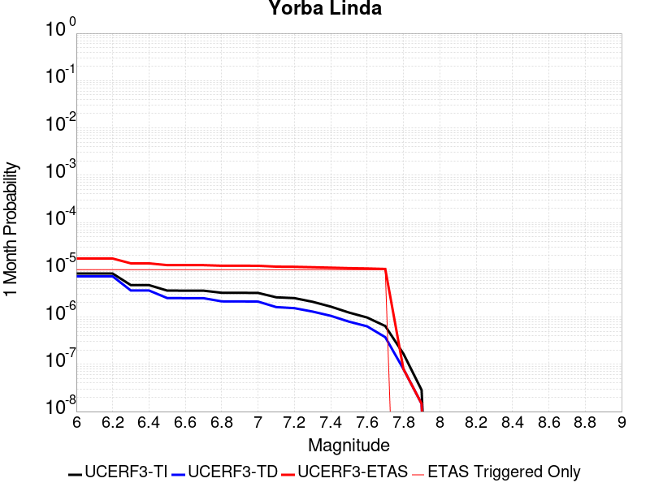 | 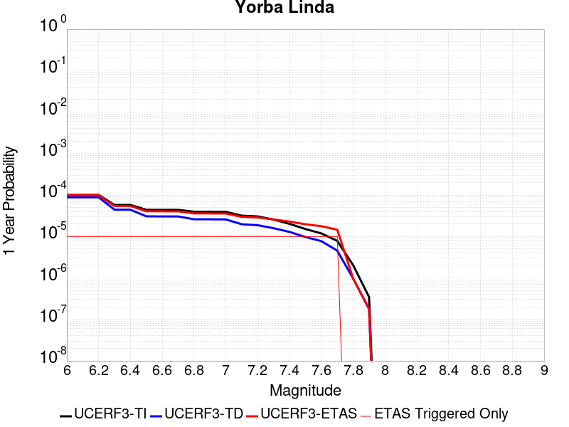 | 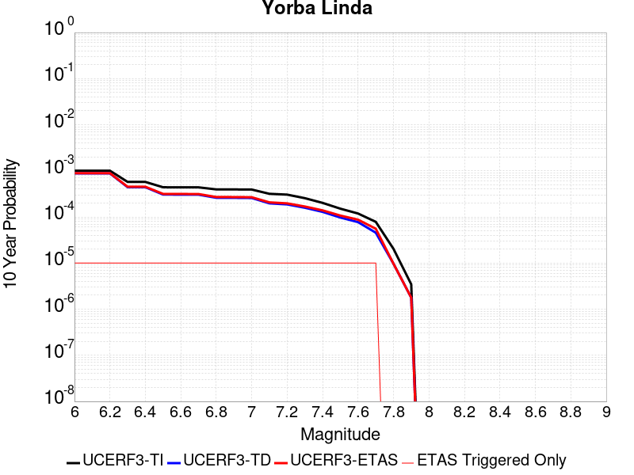 |

| Magnitude | 1 wk TI Prob | 1 wk TD Prob | 1 wk ETAS Prob | 1 wk ETAS/TD Gain | 1 wk ETAS Triggered Only | 1 mo TI Prob | 1 mo TD Prob | 1 mo ETAS Prob | 1 mo ETAS/TD Gain | 1 mo ETAS Triggered Only | 1 yr TI Prob | 1 yr TD Prob | 1 yr ETAS Prob | 1 yr ETAS/TD Gain | 1 yr ETAS Triggered Only | 10 yr TI Prob | 10 yr TD Prob | 10 yr ETAS Prob | 10 yr ETAS/TD Gain | 10 yr ETAS Triggered Only |
|-----|-----|-----|-----|-----|-----|-----|-----|-----|-----|-----|-----|-----|-----|-----|-----|-----|-----|-----|-----|-----|
| 6.0 | 1.9346849E-6 | 1.6909112E-6 | 1.1690894E-5 | 6.9139614 | 1.0E-5 | 8.29148E-6 | 7.2467474E-6 | 1.7246675E-5 | 2.3799195 | 1.0E-5 | 1.009441E-4 | 8.822652E-5 | 9.8225646E-5 | 1.1133347 | 1.0E-5 | 0.0010089825 | 8.8200805E-4 | 8.919992E-4 | 1.0113277 | 1.0E-5 |
| 6.1 | 1.9346849E-6 | 1.6909112E-6 | 1.1690894E-5 | 6.9139614 | 1.0E-5 | 8.29148E-6 | 7.2467474E-6 | 1.7246675E-5 | 2.3799195 | 1.0E-5 | 1.009441E-4 | 8.822652E-5 | 9.8225646E-5 | 1.1133347 | 1.0E-5 | 0.0010089825 | 8.8200805E-4 | 8.919992E-4 | 1.0113277 | 1.0E-5 |
| 6.2 | 1.9346849E-6 | 1.6909112E-6 | 1.1690894E-5 | 6.9139614 | 1.0E-5 | 8.29148E-6 | 7.2467474E-6 | 1.7246675E-5 | 2.3799195 | 1.0E-5 | 1.009441E-4 | 8.822652E-5 | 9.8225646E-5 | 1.1133347 | 1.0E-5 | 0.0010089825 | 8.8200805E-4 | 8.919992E-4 | 1.0113277 | 1.0E-5 |
| 6.3 | 1.1028608E-6 | 8.481863E-7 | 1.0848178E-5 | 12.789853 | 1.0E-5 | 4.7265376E-6 | 3.6350793E-6 | 1.3635043E-5 | 3.7509615 | 1.0E-5 | 5.754407E-5 | 4.425626E-5 | 5.4255815E-5 | 1.2259468 | 1.0E-5 | 5.7529175E-4 | 4.42481E-4 | 4.5247655E-4 | 1.0225898 | 1.0E-5 |
| 6.4 | 1.1028608E-6 | 8.481863E-7 | 1.0848178E-5 | 12.789853 | 1.0E-5 | 4.7265376E-6 | 3.6350793E-6 | 1.3635043E-5 | 3.7509615 | 1.0E-5 | 5.754407E-5 | 4.425626E-5 | 5.4255815E-5 | 1.2259468 | 1.0E-5 | 5.7529175E-4 | 4.42481E-4 | 4.5247655E-4 | 1.0225898 | 1.0E-5 |
| 6.5 | 8.4451364E-7 | 5.869109E-7 | 1.0586905E-5 | 18.038351 | 1.0E-5 | 3.619339E-6 | 2.5153304E-6 | 1.2515306E-5 | 4.975611 | 1.0E-5 | 4.406456E-5 | 3.0623738E-5 | 4.0623432E-5 | 1.326534 | 1.0E-5 | 4.4055824E-4 | 3.0619733E-4 | 3.1619426E-4 | 1.0326487 | 1.0E-5 |
| 6.6 | 8.422957E-7 | 5.844643E-7 | 1.0584458E-5 | 18.109674 | 1.0E-5 | 3.6098338E-6 | 2.5048448E-6 | 1.250482E-5 | 4.9922533 | 1.0E-5 | 4.3948843E-5 | 3.049608E-5 | 4.0495775E-5 | 1.327901 | 1.0E-5 | 4.394015E-4 | 3.049211E-4 | 3.1491803E-4 | 1.0327854 | 1.0E-5 |
| 6.7 | 8.4119705E-7 | 5.832485E-7 | 1.0583242E-5 | 18.14534 | 1.0E-5 | 3.6051254E-6 | 2.499634E-6 | 1.24996095E-5 | 5.0005755 | 1.0E-5 | 4.3891516E-5 | 3.0432642E-5 | 4.0432336E-5 | 1.3285846 | 1.0E-5 | 4.388285E-4 | 3.042869E-4 | 3.1428385E-4 | 1.0328537 | 1.0E-5 |
| 6.8 | 7.5919155E-7 | 4.9949944E-7 | 1.0499494E-5 | 21.020033 | 1.0E-5 | 3.253674E-6 | 2.1407102E-6 | 1.2140689E-5 | 5.6713367 | 1.0E-5 | 3.961276E-5 | 2.6062853E-5 | 3.6062593E-5 | 1.3836778 | 1.0E-5 | 3.9605703E-4 | 2.6059969E-4 | 2.7059708E-4 | 1.038363 | 1.0E-5 |
| 6.9 | 7.5804564E-7 | 4.981178E-7 | 1.0498113E-5 | 21.075562 | 1.0E-5 | 3.248763E-6 | 2.134789E-6 | 1.21347675E-5 | 5.6842937 | 1.0E-5 | 3.955297E-5 | 2.5990763E-5 | 3.5990503E-5 | 1.384742 | 1.0E-5 | 3.9545933E-4 | 2.5987893E-4 | 2.6987636E-4 | 1.0384694 | 1.0E-5 |
| 7.0 | 7.539293E-7 | 4.943313E-7 | 1.04943265E-5 | 21.22934 | 1.0E-5 | 3.2311218E-6 | 2.118561E-6 | 1.2118539E-5 | 5.7201753 | 1.0E-5 | 3.9338196E-5 | 2.5793192E-5 | 3.5792935E-5 | 1.3876892 | 1.0E-5 | 3.9331234E-4 | 2.579037E-4 | 2.679011E-4 | 1.0387641 | 1.0E-5 |
| 7.1 | 6.0900885E-7 | 3.7817128E-7 | 1.0378168E-5 | 27.443035 | 1.0E-5 | 2.6100352E-6 | 1.6207331E-6 | 1.1620717E-5 | 7.1700373 | 1.0E-5 | 3.1776715E-5 | 1.973225E-5 | 2.9732053E-5 | 1.5067745 | 1.0E-5 | 3.1772171E-4 | 1.9730533E-4 | 2.0730335E-4 | 1.0506729 | 1.0E-5 |
| 7.2 | 5.849925E-7 | 3.5878818E-7 | 1.03587845E-5 | 28.871588 | 1.0E-5 | 2.5071083E-6 | 1.5376628E-6 | 1.1537647E-5 | 7.5033665 | 1.0E-5 | 3.0523614E-5 | 1.8720886E-5 | 2.87207E-5 | 1.5341527 | 1.0E-5 | 3.0519423E-4 | 1.8719342E-4 | 1.9719155E-4 | 1.0534106 | 1.0E-5 |
| 7.3 | 4.89808E-7 | 3.0379488E-7 | 1.0303792E-5 | 33.916935 | 1.0E-5 | 2.0991754E-6 | 1.3019775E-6 | 1.1301964E-5 | 8.680614 | 1.0E-5 | 2.5557161E-5 | 1.5851463E-5 | 2.5851305E-5 | 1.6308466 | 1.0E-5 | 2.5554223E-4 | 1.5850355E-4 | 1.6850197E-4 | 1.0630801 | 1.0E-5 |
| 7.4 | 3.8700415E-7 | 2.4722343E-7 | 1.0247221E-5 | 41.44923 | 1.0E-5 | 1.6585881E-6 | 1.0595286E-6 | 1.1059518E-5 | 10.438149 | 1.0E-5 | 2.0193123E-5 | 1.2899685E-5 | 2.2899556E-5 | 1.7752028 | 1.0E-5 | 2.0191289E-4 | 1.2898949E-4 | 1.3898821E-4 | 1.0775157 | 1.0E-5 |
| 7.5 | 2.900565E-7 | 1.8637462E-7 | 1.01863725E-5 | 54.655365 | 1.0E-5 | 1.2430987E-6 | 7.9874815E-7 | 1.079874E-5 | 13.519581 | 1.0E-5 | 1.5134622E-5 | 9.724716E-6 | 1.9724619E-5 | 2.0282977 | 1.0E-5 | 1.5133592E-4 | 9.7242984E-5 | 1.0724201E-4 | 1.1028252 | 1.0E-5 |
| 7.6 | 2.2770318E-7 | 1.4814276E-7 | 1.0148141E-5 | 68.50245 | 1.0E-5 | 9.758704E-7 | 6.348974E-7 | 1.0634891E-5 | 16.750566 | 1.0E-5 | 1.1881158E-5 | 7.729848E-6 | 1.7729772E-5 | 2.2936764 | 1.0E-5 | 1.1880523E-4 | 7.729585E-5 | 8.729508E-5 | 1.1293631 | 1.0E-5 |
| 7.7 | 1.5017194E-7 | 8.7355275E-8 | 1.0087354E-5 | 115.475044 | 1.0E-5 | 6.4359386E-7 | 3.7437968E-7 | 1.0374376E-5 | 27.71084 | 1.0E-5 | 7.835727E-6 | 4.5580637E-6 | 1.4558018E-5 | 3.1939042 | 1.0E-5 | 7.835451E-5 | 4.5579727E-5 | 5.557927E-5 | 1.2193857 | 1.0E-5 |
| 7.8 | 3.895753E-8 | 1.8532088E-8 | 1.8532088E-8 | 1.0 | 0.0 | 1.6696083E-7 | 7.942323E-8 | 7.942323E-8 | 1.0 | 0.0 | 2.0327461E-6 | 9.669774E-7 | 9.669774E-7 | 1.0 | 0.0 | 2.0327276E-5 | 9.669734E-6 | 9.669734E-6 | 1.0 | 0.0 |
| 7.9 | 6.648505E-9 | 3.4183114E-9 | 3.4183114E-9 | 1.0 | 0.0 | 2.8493591E-8 | 1.4649906E-8 | 1.4649906E-8 | 1.0 | 0.0 | 3.4690942E-7 | 1.783626E-7 | 1.783626E-7 | 1.0 | 0.0 | 3.4690888E-6 | 1.7836247E-6 | 1.7836247E-6 | 1.0 | 0.0 |

## Eaton Roughs 2011 CFM
*[(top)](#table-of-contents)*

| 1 Week | 1 Month | 1 Year | 10 Year |
|-----|-----|-----|-----|
|  | 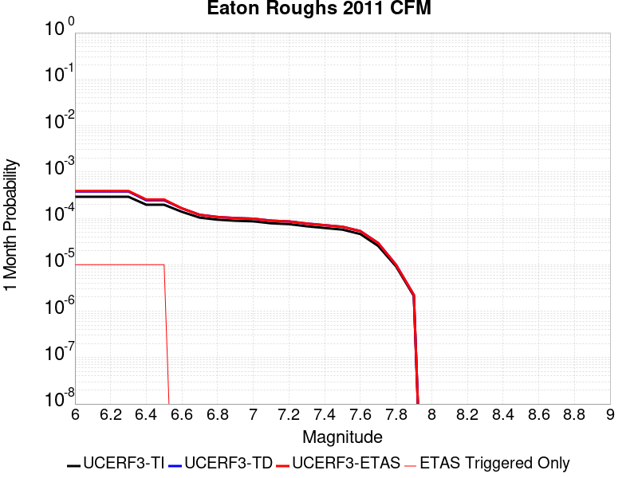 | 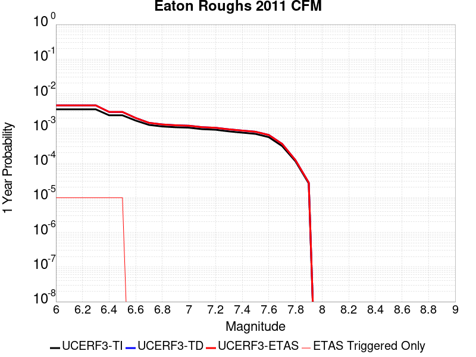 |  |

| Magnitude | 1 wk TI Prob | 1 wk TD Prob | 1 wk ETAS Prob | 1 wk ETAS/TD Gain | 1 wk ETAS Triggered Only | 1 mo TI Prob | 1 mo TD Prob | 1 mo ETAS Prob | 1 mo ETAS/TD Gain | 1 mo ETAS Triggered Only | 1 yr TI Prob | 1 yr TD Prob | 1 yr ETAS Prob | 1 yr ETAS/TD Gain | 1 yr ETAS Triggered Only | 10 yr TI Prob | 10 yr TD Prob | 10 yr ETAS Prob | 10 yr ETAS/TD Gain | 10 yr ETAS Triggered Only |
|-----|-----|-----|-----|-----|-----|-----|-----|-----|-----|-----|-----|-----|-----|-----|-----|-----|-----|-----|-----|-----|
| 6.0 | 6.8044945E-5 | 8.8434645E-5 | 9.843376E-5 | 1.1130679 | 1.0E-5 | 2.9158857E-4 | 3.7895713E-4 | 3.8895337E-4 | 1.0263782 | 1.0E-5 | 0.0035443127 | 0.0046046837 | 0.0046146377 | 1.0021617 | 1.0E-5 | 0.03488314 | 0.04516368 | 0.045173228 | 1.0002114 | 1.0E-5 |
| 6.1 | 6.8044945E-5 | 8.8434645E-5 | 9.843376E-5 | 1.1130679 | 1.0E-5 | 2.9158857E-4 | 3.7895713E-4 | 3.8895337E-4 | 1.0263782 | 1.0E-5 | 0.0035443127 | 0.0046046837 | 0.0046146377 | 1.0021617 | 1.0E-5 | 0.03488314 | 0.04516368 | 0.045173228 | 1.0002114 | 1.0E-5 |
| 6.2 | 6.8044945E-5 | 8.8434645E-5 | 9.843376E-5 | 1.1130679 | 1.0E-5 | 2.9158857E-4 | 3.7895713E-4 | 3.8895337E-4 | 1.0263782 | 1.0E-5 | 0.0035443127 | 0.0046046837 | 0.0046146377 | 1.0021617 | 1.0E-5 | 0.03488314 | 0.04516368 | 0.045173228 | 1.0002114 | 1.0E-5 |
| 6.3 | 6.8044945E-5 | 8.8434645E-5 | 9.843376E-5 | 1.1130679 | 1.0E-5 | 2.9158857E-4 | 3.7895713E-4 | 3.8895337E-4 | 1.0263782 | 1.0E-5 | 0.0035443127 | 0.0046046837 | 0.0046146377 | 1.0021617 | 1.0E-5 | 0.03488314 | 0.04516368 | 0.045173228 | 1.0002114 | 1.0E-5 |
| 6.4 | 4.5830013E-5 | 5.71553E-5 | 6.715473E-5 | 1.1749519 | 1.0E-5 | 1.9639956E-4 | 2.4493135E-4 | 2.549289E-4 | 1.0408177 | 1.0E-5 | 0.0023885423 | 0.002978342 | 0.0029883122 | 1.0033475 | 1.0E-5 | 0.023630321 | 0.029421948 | 0.029431652 | 1.0003299 | 1.0E-5 |
| 6.5 | 4.5830013E-5 | 5.71553E-5 | 6.715473E-5 | 1.1749519 | 1.0E-5 | 1.9639956E-4 | 2.4493135E-4 | 2.549289E-4 | 1.0408177 | 1.0E-5 | 0.0023885423 | 0.002978342 | 0.0029883122 | 1.0033475 | 1.0E-5 | 0.023630321 | 0.029421948 | 0.029431652 | 1.0003299 | 1.0E-5 |
| 6.6 | 3.222194E-5 | 3.8262962E-5 | 3.8262962E-5 | 1.0 | 0.0 | 1.3808672E-4 | 1.6397446E-4 | 1.6397446E-4 | 1.0 | 0.0 | 0.0016799092 | 0.0019946485 | 0.0019946485 | 1.0 | 0.0 | 0.016672665 | 0.019776754 | 0.019776754 | 1.0 | 0.0 |
| 6.7 | 2.4155654E-5 | 2.7786275E-5 | 2.7786275E-5 | 1.0 | 0.0 | 1.0352012E-4 | 1.1907864E-4 | 1.1907864E-4 | 1.0 | 0.0 | 0.0012596287 | 0.0014488265 | 0.0014488265 | 1.0 | 0.0 | 0.012525126 | 0.01439499 | 0.01439499 | 1.0 | 0.0 |
| 6.8 | 2.1814667E-5 | 2.4940904E-5 | 2.4940904E-5 | 1.0 | 0.0 | 9.348808E-5 | 1.0688523E-4 | 1.0688523E-4 | 1.0 | 0.0 | 0.001137623 | 0.0013005546 | 0.0013005546 | 1.0 | 0.0 | 0.011318169 | 0.012930086 | 0.012930086 | 1.0 | 0.0 |
| 6.9 | 2.0700467E-5 | 2.362897E-5 | 2.362897E-5 | 1.0 | 0.0 | 8.871327E-5 | 1.01263104E-4 | 1.01263104E-4 | 1.0 | 0.0 | 0.0010795488 | 0.0012321841 | 0.0012321841 | 1.0 | 0.0 | 0.010743194 | 0.012254083 | 0.012254083 | 1.0 | 0.0 |
| 7.0 | 2.0104066E-5 | 2.2936536E-5 | 2.2936536E-5 | 1.0 | 0.0 | 8.615744E-5 | 9.829576E-5 | 9.829576E-5 | 1.0 | 0.0 | 0.0010484619 | 0.0011960969 | 0.0011960969 | 1.0 | 0.0 | 0.010435291 | 0.01189712 | 0.01189712 | 1.0 | 0.0 |
| 7.1 | 1.8225232E-5 | 2.0773083E-5 | 2.0773083E-5 | 1.0 | 0.0 | 7.81058E-5 | 8.902447E-5 | 8.902447E-5 | 1.0 | 0.0 | 9.5052324E-4 | 0.0010833355 | 0.0010833355 | 1.0 | 0.0 | 0.009464677 | 0.010780873 | 0.010780873 | 1.0 | 0.0 |
| 7.2 | 1.7526572E-5 | 1.9993524E-5 | 1.9993524E-5 | 1.0 | 0.0 | 7.511172E-5 | 8.568373E-5 | 8.568373E-5 | 1.0 | 0.0 | 9.141015E-4 | 0.0010427017 | 0.0010427017 | 1.0 | 0.0 | 0.009103506 | 0.010378398 | 0.010378398 | 1.0 | 0.0 |
| 7.3 | 1.5727232E-5 | 1.8021543E-5 | 1.8021543E-5 | 1.0 | 0.0 | 6.740067E-5 | 7.72329E-5 | 7.72329E-5 | 1.0 | 0.0 | 8.2029426E-4 | 9.399062E-4 | 9.399062E-4 | 1.0 | 0.0 | 0.008172729 | 0.009359558 | 0.009359558 | 1.0 | 0.0 |
| 7.4 | 1.4457361E-5 | 1.6598395E-5 | 1.6598395E-5 | 1.0 | 0.0 | 6.195865E-5 | 7.113405E-5 | 7.113405E-5 | 1.0 | 0.0 | 7.540854E-4 | 8.657138E-4 | 8.657138E-4 | 1.0 | 0.0 | 0.007515317 | 0.008623603 | 0.008623603 | 1.0 | 0.0 |
| 7.5 | 1.33280955E-5 | 1.5345471E-5 | 1.5345471E-5 | 1.0 | 0.0 | 5.711916E-5 | 6.576465E-5 | 6.576465E-5 | 1.0 | 0.0 | 6.9520384E-4 | 8.0039137E-4 | 8.0039137E-4 | 1.0 | 0.0 | 0.00693033 | 0.007975256 | 0.007975256 | 1.0 | 0.0 |
| 7.6 | 1.0699478E-5 | 1.2387852E-5 | 1.2387852E-5 | 1.0 | 0.0 | 4.5854096E-5 | 5.3089716E-5 | 5.3089716E-5 | 1.0 | 0.0 | 5.581306E-4 | 6.461761E-4 | 6.461761E-4 | 1.0 | 0.0 | 0.005567309 | 0.0064430824 | 0.0064430824 | 1.0 | 0.0 |
| 7.7 | 5.9390236E-6 | 6.8529853E-6 | 6.8529853E-6 | 1.0 | 0.0 | 2.545271E-5 | 2.9369607E-5 | 2.9369607E-5 | 1.0 | 0.0 | 3.0984267E-4 | 3.5751655E-4 | 3.5751655E-4 | 1.0 | 0.0 | 0.0030941102 | 0.0035694393 | 0.0035694393 | 1.0 | 0.0 |
| 7.8 | 2.1622036E-6 | 2.329702E-6 | 2.329702E-6 | 1.0 | 0.0 | 9.266554E-6 | 9.984399E-6 | 9.984399E-6 | 1.0 | 0.0 | 1.1281446E-4 | 1.21553356E-4 | 1.21553356E-4 | 1.0 | 0.0 | 0.001127572 | 0.0012148687 | 0.0012148687 | 1.0 | 0.0 |
| 7.9 | 4.9586197E-7 | 5.2189216E-7 | 5.2189216E-7 | 1.0 | 0.0 | 2.125121E-6 | 2.2366787E-6 | 2.2366787E-6 | 1.0 | 0.0 | 2.5873042E-5 | 2.7231245E-5 | 2.7231245E-5 | 1.0 | 0.0 | 2.5870028E-4 | 2.7228118E-4 | 2.7228118E-4 | 1.0 | 0.0 |

## San Luis Range 2011 CFM
*[(top)](#table-of-contents)*

| 1 Week | 1 Month | 1 Year | 10 Year |
|-----|-----|-----|-----|
| 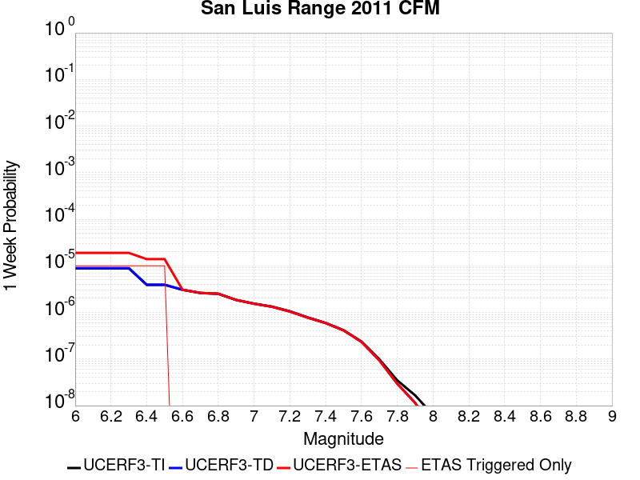 | 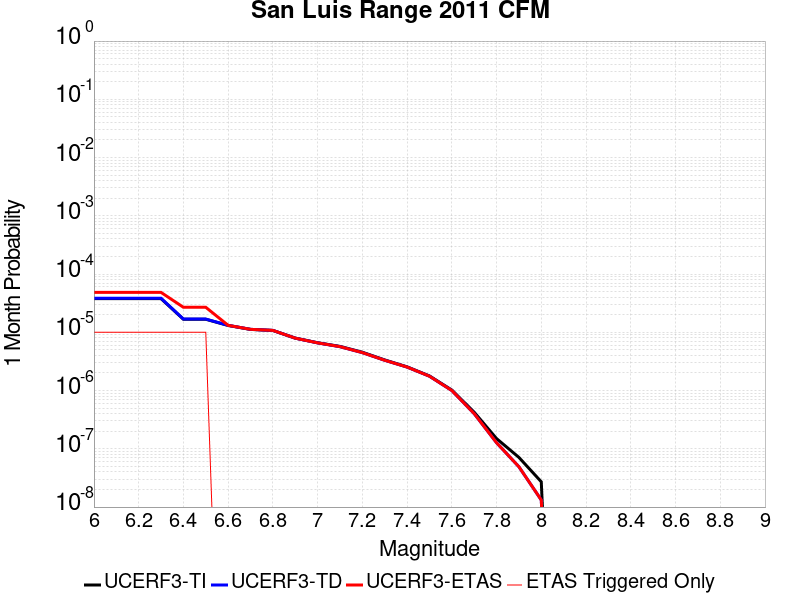 |  |  |

| Magnitude | 1 wk TI Prob | 1 wk TD Prob | 1 wk ETAS Prob | 1 wk ETAS/TD Gain | 1 wk ETAS Triggered Only | 1 mo TI Prob | 1 mo TD Prob | 1 mo ETAS Prob | 1 mo ETAS/TD Gain | 1 mo ETAS Triggered Only | 1 yr TI Prob | 1 yr TD Prob | 1 yr ETAS Prob | 1 yr ETAS/TD Gain | 1 yr ETAS Triggered Only | 10 yr TI Prob | 10 yr TD Prob | 10 yr ETAS Prob | 10 yr ETAS/TD Gain | 10 yr ETAS Triggered Only |
|-----|-----|-----|-----|-----|-----|-----|-----|-----|-----|-----|-----|-----|-----|-----|-----|-----|-----|-----|-----|-----|
| 6.0 | 8.8368415E-6 | 8.965455E-6 | 1.8965366E-5 | 2.1153824 | 1.0E-5 | 3.787163E-5 | 3.8422855E-5 | 4.8422473E-5 | 1.2602518 | 1.0E-5 | 4.609895E-4 | 4.6770574E-4 | 4.7770108E-4 | 1.021371 | 1.0E-5 | 0.0046003438 | 0.004667997 | 0.00467795 | 1.0021323 | 1.0E-5 |
| 6.1 | 8.8368415E-6 | 8.965455E-6 | 1.8965366E-5 | 2.1153824 | 1.0E-5 | 3.787163E-5 | 3.8422855E-5 | 4.8422473E-5 | 1.2602518 | 1.0E-5 | 4.609895E-4 | 4.6770574E-4 | 4.7770108E-4 | 1.021371 | 1.0E-5 | 0.0046003438 | 0.004667997 | 0.00467795 | 1.0021323 | 1.0E-5 |
| 6.2 | 8.8368415E-6 | 8.965455E-6 | 1.8965366E-5 | 2.1153824 | 1.0E-5 | 3.787163E-5 | 3.8422855E-5 | 4.8422473E-5 | 1.2602518 | 1.0E-5 | 4.609895E-4 | 4.6770574E-4 | 4.7770108E-4 | 1.021371 | 1.0E-5 | 0.0046003438 | 0.004667997 | 0.00467795 | 1.0021323 | 1.0E-5 |
| 6.3 | 8.8368415E-6 | 8.965455E-6 | 1.8965366E-5 | 2.1153824 | 1.0E-5 | 3.787163E-5 | 3.8422855E-5 | 4.8422473E-5 | 1.2602518 | 1.0E-5 | 4.609895E-4 | 4.6770574E-4 | 4.7770108E-4 | 1.021371 | 1.0E-5 | 0.0046003438 | 0.004667997 | 0.00467795 | 1.0021323 | 1.0E-5 |
| 6.4 | 3.9094193E-6 | 3.941204E-6 | 1.3941164E-5 | 3.5372858 | 1.0E-5 | 1.6754546E-5 | 1.6890766E-5 | 2.6890597E-5 | 1.5920295 | 1.0E-5 | 2.039675E-4 | 2.0562594E-4 | 2.1562389E-4 | 1.048622 | 1.0E-5 | 0.0020378039 | 0.0020543856 | 0.0020643652 | 1.0048577 | 1.0E-5 |
| 6.5 | 3.9094193E-6 | 3.941204E-6 | 1.3941164E-5 | 3.5372858 | 1.0E-5 | 1.6754546E-5 | 1.6890766E-5 | 2.6890597E-5 | 1.5920295 | 1.0E-5 | 2.039675E-4 | 2.0562594E-4 | 2.1562389E-4 | 1.048622 | 1.0E-5 | 0.0020378039 | 0.0020543856 | 0.0020643652 | 1.0048577 | 1.0E-5 |
| 6.6 | 3.0587726E-6 | 3.0753893E-6 | 3.0753893E-6 | 1.0 | 0.0 | 1.3108959E-5 | 1.3180174E-5 | 1.3180174E-5 | 1.0 | 0.0 | 1.595899E-4 | 1.6045693E-4 | 1.6045693E-4 | 1.0 | 0.0 | 0.0015947534 | 0.0016034227 | 0.0016034227 | 1.0 | 0.0 |
| 6.7 | 2.6160574E-6 | 2.6251284E-6 | 2.6251284E-6 | 1.0 | 0.0 | 1.1211626E-5 | 1.1250502E-5 | 1.1250502E-5 | 1.0 | 0.0 | 1.3649299E-4 | 1.3696631E-4 | 1.3696631E-4 | 1.0 | 0.0 | 0.0013640919 | 0.0013688251 | 0.0013688251 | 1.0 | 0.0 |
| 6.8 | 2.5110312E-6 | 2.5181412E-6 | 2.5181412E-6 | 1.0 | 0.0 | 1.0761518E-5 | 1.079199E-5 | 1.079199E-5 | 1.0 | 0.0 | 1.310136E-4 | 1.313846E-4 | 1.313846E-4 | 1.0 | 0.0 | 0.0013093639 | 0.0013130752 | 0.0013130752 | 1.0 | 0.0 |
| 6.9 | 1.8564405E-6 | 1.852488E-6 | 1.852488E-6 | 1.0 | 0.0 | 7.95615E-6 | 7.93921E-6 | 7.93921E-6 | 1.0 | 0.0 | 9.686181E-5 | 9.665562E-5 | 9.665562E-5 | 1.0 | 0.0 | 9.68196E-4 | 9.6613786E-4 | 9.6613786E-4 | 1.0 | 0.0 |
| 7.0 | 1.546127E-6 | 1.5369549E-6 | 1.5369549E-6 | 1.0 | 0.0 | 6.626242E-6 | 6.5869326E-6 | 6.5869326E-6 | 1.0 | 0.0 | 8.06715E-5 | 8.019296E-5 | 8.019296E-5 | 1.0 | 0.0 | 8.0642226E-4 | 8.016409E-4 | 8.016409E-4 | 1.0 | 0.0 |
| 7.1 | 1.3368208E-6 | 1.3235336E-6 | 1.3235336E-6 | 1.0 | 0.0 | 5.7292195E-6 | 5.6722747E-6 | 5.6722747E-6 | 1.0 | 0.0 | 6.975101E-5 | 6.905776E-5 | 6.905776E-5 | 1.0 | 0.0 | 6.972912E-4 | 6.903635E-4 | 6.903635E-4 | 1.0 | 0.0 |
| 7.2 | 1.0623363E-6 | 1.0454378E-6 | 1.0454378E-6 | 1.0 | 0.0 | 4.5528623E-6 | 4.4804397E-6 | 4.4804397E-6 | 1.0 | 0.0 | 5.5429686E-5 | 5.4547992E-5 | 5.4547992E-5 | 1.0 | 0.0 | 5.5415864E-4 | 5.453463E-4 | 5.453463E-4 | 1.0 | 0.0 |
| 7.3 | 7.831679E-7 | 7.727399E-7 | 7.727399E-7 | 1.0 | 0.0 | 3.3564295E-6 | 3.3117383E-6 | 3.3117383E-6 | 1.0 | 0.0 | 4.086376E-5 | 4.031967E-5 | 4.031967E-5 | 1.0 | 0.0 | 4.0856248E-4 | 4.0312367E-4 | 4.0312367E-4 | 1.0 | 0.0 |
| 7.4 | 5.9558846E-7 | 5.910646E-7 | 5.910646E-7 | 1.0 | 0.0 | 2.5525194E-6 | 2.5331315E-6 | 2.5331315E-6 | 1.0 | 0.0 | 3.107648E-5 | 3.084044E-5 | 3.084044E-5 | 1.0 | 0.0 | 3.1072134E-4 | 3.083617E-4 | 3.083617E-4 | 1.0 | 0.0 |
| 7.5 | 4.1616502E-7 | 4.1196404E-7 | 4.1196404E-7 | 1.0 | 0.0 | 1.7835631E-6 | 1.765559E-6 | 1.765559E-6 | 1.0 | 0.0 | 2.1714664E-5 | 2.1495469E-5 | 2.1495469E-5 | 1.0 | 0.0 | 2.1712543E-4 | 2.1493394E-4 | 2.1493394E-4 | 1.0 | 0.0 |
| 7.6 | 2.3816014E-7 | 2.3376614E-7 | 2.3376614E-7 | 1.0 | 0.0 | 1.0206859E-6 | 1.0018545E-6 | 1.0018545E-6 | 1.0 | 0.0 | 1.242678E-5 | 1.219751E-5 | 1.219751E-5 | 1.0 | 0.0 | 1.2426086E-4 | 1.2196843E-4 | 1.2196843E-4 | 1.0 | 0.0 |
| 7.7 | 9.918777E-8 | 9.3868096E-8 | 9.3868096E-8 | 1.0 | 0.0 | 4.2509038E-7 | 4.022918E-7 | 4.022918E-7 | 1.0 | 0.0 | 5.1754632E-6 | 4.8978914E-6 | 4.8978914E-6 | 1.0 | 0.0 | 5.1753424E-5 | 4.897784E-5 | 4.897784E-5 | 1.0 | 0.0 |
| 7.8 | 3.4982556E-8 | 2.968672E-8 | 2.968672E-8 | 1.0 | 0.0 | 1.4992524E-7 | 1.272288E-7 | 1.272288E-7 | 1.0 | 0.0 | 1.8253382E-6 | 1.5490094E-6 | 1.5490094E-6 | 1.0 | 0.0 | 1.8253233E-5 | 1.5489988E-5 | 1.5489988E-5 | 1.0 | 0.0 |
| 7.9 | 1.6624908E-8 | 1.1476994E-8 | 1.1476994E-8 | 1.0 | 0.0 | 7.12496E-8 | 4.9187115E-8 | 4.9187115E-8 | 1.0 | 0.0 | 8.6746354E-7 | 5.988529E-7 | 5.988529E-7 | 1.0 | 0.0 | 8.674601E-6 | 5.9885133E-6 | 5.9885133E-6 | 1.0 | 0.0 |
| 8.0 | 6.3352315E-9 | 3.0886564E-9 | 3.0886564E-9 | 1.0 | 0.0 | 2.715099E-8 | 1.32370985E-8 | 1.32370985E-8 | 1.0 | 0.0 | 3.3056327E-7 | 1.6116167E-7 | 1.6116167E-7 | 1.0 | 0.0 | 3.3056278E-6 | 1.6116155E-6 | 1.6116155E-6 | 1.0 | 0.0 |

## Thirty Mile Bank
*[(top)](#table-of-contents)*

| 1 Week | 1 Month | 1 Year | 10 Year |
|-----|-----|-----|-----|
|  |  | 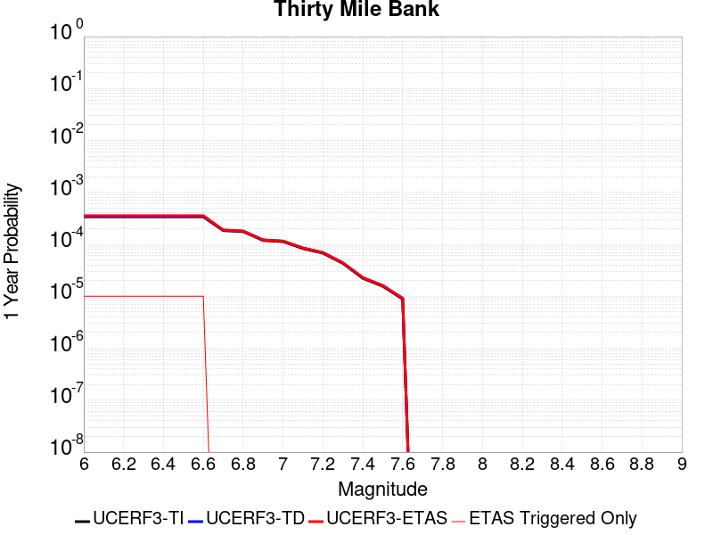 |  |

| Magnitude | 1 wk TI Prob | 1 wk TD Prob | 1 wk ETAS Prob | 1 wk ETAS/TD Gain | 1 wk ETAS Triggered Only | 1 mo TI Prob | 1 mo TD Prob | 1 mo ETAS Prob | 1 mo ETAS/TD Gain | 1 mo ETAS Triggered Only | 1 yr TI Prob | 1 yr TD Prob | 1 yr ETAS Prob | 1 yr ETAS/TD Gain | 1 yr ETAS Triggered Only | 10 yr TI Prob | 10 yr TD Prob | 10 yr ETAS Prob | 10 yr ETAS/TD Gain | 10 yr ETAS Triggered Only |
|-----|-----|-----|-----|-----|-----|-----|-----|-----|-----|-----|-----|-----|-----|-----|-----|-----|-----|-----|-----|-----|
| 6.0 | 6.5124755E-6 | 6.6592643E-6 | 1.6659198E-5 | 2.5016575 | 1.0E-5 | 2.791031E-5 | 2.8539416E-5 | 3.8539132E-5 | 1.3503826 | 1.0E-5 | 3.3975503E-4 | 3.4741635E-4 | 3.5741288E-4 | 1.0287739 | 1.0E-5 | 0.0033923604 | 0.003469164 | 0.0034791294 | 1.0028726 | 1.0E-5 |
| 6.1 | 6.5124755E-6 | 6.6592643E-6 | 1.6659198E-5 | 2.5016575 | 1.0E-5 | 2.791031E-5 | 2.8539416E-5 | 3.8539132E-5 | 1.3503826 | 1.0E-5 | 3.3975503E-4 | 3.4741635E-4 | 3.5741288E-4 | 1.0287739 | 1.0E-5 | 0.0033923604 | 0.003469164 | 0.0034791294 | 1.0028726 | 1.0E-5 |
| 6.2 | 6.5124755E-6 | 6.6592643E-6 | 1.6659198E-5 | 2.5016575 | 1.0E-5 | 2.791031E-5 | 2.8539416E-5 | 3.8539132E-5 | 1.3503826 | 1.0E-5 | 3.3975503E-4 | 3.4741635E-4 | 3.5741288E-4 | 1.0287739 | 1.0E-5 | 0.0033923604 | 0.003469164 | 0.0034791294 | 1.0028726 | 1.0E-5 |
| 6.3 | 6.5124755E-6 | 6.6592643E-6 | 1.6659198E-5 | 2.5016575 | 1.0E-5 | 2.791031E-5 | 2.8539416E-5 | 3.8539132E-5 | 1.3503826 | 1.0E-5 | 3.3975503E-4 | 3.4741635E-4 | 3.5741288E-4 | 1.0287739 | 1.0E-5 | 0.0033923604 | 0.003469164 | 0.0034791294 | 1.0028726 | 1.0E-5 |
| 6.4 | 6.5124755E-6 | 6.6592643E-6 | 1.6659198E-5 | 2.5016575 | 1.0E-5 | 2.791031E-5 | 2.8539416E-5 | 3.8539132E-5 | 1.3503826 | 1.0E-5 | 3.3975503E-4 | 3.4741635E-4 | 3.5741288E-4 | 1.0287739 | 1.0E-5 | 0.0033923604 | 0.003469164 | 0.0034791294 | 1.0028726 | 1.0E-5 |
| 6.5 | 6.5124755E-6 | 6.6592643E-6 | 1.6659198E-5 | 2.5016575 | 1.0E-5 | 2.791031E-5 | 2.8539416E-5 | 3.8539132E-5 | 1.3503826 | 1.0E-5 | 3.3975503E-4 | 3.4741635E-4 | 3.5741288E-4 | 1.0287739 | 1.0E-5 | 0.0033923604 | 0.003469164 | 0.0034791294 | 1.0028726 | 1.0E-5 |
| 6.6 | 6.5124755E-6 | 6.6592643E-6 | 1.6659198E-5 | 2.5016575 | 1.0E-5 | 2.791031E-5 | 2.8539416E-5 | 3.8539132E-5 | 1.3503826 | 1.0E-5 | 3.3975503E-4 | 3.4741635E-4 | 3.5741288E-4 | 1.0287739 | 1.0E-5 | 0.0033923604 | 0.003469164 | 0.0034791294 | 1.0028726 | 1.0E-5 |
| 6.7 | 3.5261137E-6 | 3.6098995E-6 | 3.6098995E-6 | 1.0 | 0.0 | 1.5111828E-5 | 1.547091E-5 | 1.547091E-5 | 1.0 | 0.0 | 1.8397097E-4 | 1.883427E-4 | 1.883427E-4 | 1.0 | 0.0 | 0.0018381875 | 0.0018818958 | 0.0018818958 | 1.0 | 0.0 |
| 6.8 | 3.370743E-6 | 3.4509355E-6 | 3.4509355E-6 | 1.0 | 0.0 | 1.4445961E-5 | 1.47896435E-5 | 1.47896435E-5 | 1.0 | 0.0 | 1.7586538E-4 | 1.8004965E-4 | 1.8004965E-4 | 1.0 | 0.0 | 0.0017572626 | 0.0017990996 | 0.0017990996 | 1.0 | 0.0 |
| 6.9 | 2.2756835E-6 | 2.333161E-6 | 2.333161E-6 | 1.0 | 0.0 | 9.752893E-6 | 9.999225E-6 | 9.999225E-6 | 1.0 | 0.0 | 1.18735006E-4 | 1.2173401E-4 | 1.2173401E-4 | 1.0 | 0.0 | 0.0011867158 | 0.0012166979 | 0.0012166979 | 1.0 | 0.0 |
| 7.0 | 2.1617404E-6 | 2.21598E-6 | 2.21598E-6 | 1.0 | 0.0 | 9.264569E-6 | 9.497024E-6 | 9.497024E-6 | 1.0 | 0.0 | 1.1279029E-4 | 1.1562037E-4 | 1.1562037E-4 | 1.0 | 0.0 | 0.0011273306 | 0.0011556263 | 0.0011556263 | 1.0 | 0.0 |
| 7.1 | 1.5900777E-6 | 1.6327014E-6 | 1.6327014E-6 | 1.0 | 0.0 | 6.814601E-6 | 6.997274E-6 | 6.997274E-6 | 1.0 | 0.0 | 8.296461E-5 | 8.518861E-5 | 8.518861E-5 | 1.0 | 0.0 | 8.293364E-4 | 8.5157226E-4 | 8.5157226E-4 | 1.0 | 0.0 |
| 7.2 | 1.2971728E-6 | 1.3328992E-6 | 1.3328992E-6 | 1.0 | 0.0 | 5.5593005E-6 | 5.712413E-6 | 5.712413E-6 | 1.0 | 0.0 | 6.768238E-5 | 6.954651E-5 | 6.954651E-5 | 1.0 | 0.0 | 6.7661767E-4 | 6.952578E-4 | 6.952578E-4 | 1.0 | 0.0 |
| 7.3 | 8.2454284E-7 | 8.448891E-7 | 8.448891E-7 | 1.0 | 0.0 | 3.5337503E-6 | 3.6209485E-6 | 3.6209485E-6 | 1.0 | 0.0 | 4.302256E-5 | 4.408422E-5 | 4.408422E-5 | 1.0 | 0.0 | 4.301423E-4 | 4.4076078E-4 | 4.4076078E-4 | 1.0 | 0.0 |
| 7.4 | 4.2619024E-7 | 4.3863466E-7 | 4.3863466E-7 | 1.0 | 0.0 | 1.8265283E-6 | 1.8798615E-6 | 1.8798615E-6 | 1.0 | 0.0 | 2.2237757E-5 | 2.2887078E-5 | 2.2887078E-5 | 1.0 | 0.0 | 2.223553E-4 | 2.288476E-4 | 2.288476E-4 | 1.0 | 0.0 |
| 7.5 | 2.993922E-7 | 3.086453E-7 | 3.086453E-7 | 1.0 | 0.0 | 1.2831089E-6 | 1.3227649E-6 | 1.3227649E-6 | 1.0 | 0.0 | 1.5621737E-5 | 1.6104546E-5 | 1.6104546E-5 | 1.0 | 0.0 | 1.562064E-4 | 1.6103406E-4 | 1.6103406E-4 | 1.0 | 0.0 |
| 7.6 | 1.6988751E-7 | 1.7533823E-7 | 1.7533823E-7 | 1.0 | 0.0 | 7.2808916E-7 | 7.5144936E-7 | 7.5144936E-7 | 1.0 | 0.0 | 8.864449E-6 | 9.14886E-6 | 9.14886E-6 | 1.0 | 0.0 | 8.8640954E-5 | 9.1485024E-5 | 9.1485024E-5 | 1.0 | 0.0 |

## Mount Diablo Thrust South
*[(top)](#table-of-contents)*

| 1 Week | 1 Month | 1 Year | 10 Year |
|-----|-----|-----|-----|
|  | 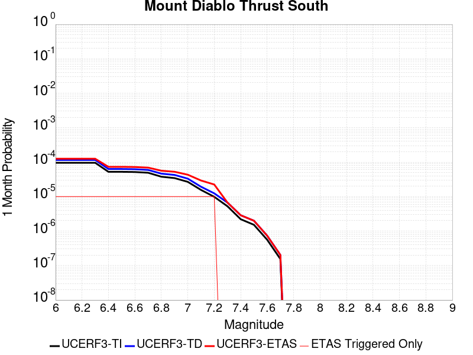 |  |  |

| Magnitude | 1 wk TI Prob | 1 wk TD Prob | 1 wk ETAS Prob | 1 wk ETAS/TD Gain | 1 wk ETAS Triggered Only | 1 mo TI Prob | 1 mo TD Prob | 1 mo ETAS Prob | 1 mo ETAS/TD Gain | 1 mo ETAS Triggered Only | 1 yr TI Prob | 1 yr TD Prob | 1 yr ETAS Prob | 1 yr ETAS/TD Gain | 1 yr ETAS Triggered Only | 10 yr TI Prob | 10 yr TD Prob | 10 yr ETAS Prob | 10 yr ETAS/TD Gain | 10 yr ETAS Triggered Only |
|-----|-----|-----|-----|-----|-----|-----|-----|-----|-----|-----|-----|-----|-----|-----|-----|-----|-----|-----|-----|-----|
| 6.0 | 2.2377444E-5 | 2.6956272E-5 | 3.6956E-5 | 1.3709612 | 1.0E-5 | 9.5899806E-5 | 1.1552288E-4 | 1.2552172E-4 | 1.086553 | 1.0E-5 | 0.0011669548 | 0.0014057814 | 0.0014157672 | 1.0071034 | 1.0E-5 | 0.011608457 | 0.013988668 | 0.013998529 | 1.0007049 | 1.0E-5 |
| 6.1 | 2.2377444E-5 | 2.6956272E-5 | 3.6956E-5 | 1.3709612 | 1.0E-5 | 9.5899806E-5 | 1.1552288E-4 | 1.2552172E-4 | 1.086553 | 1.0E-5 | 0.0011669548 | 0.0014057814 | 0.0014157672 | 1.0071034 | 1.0E-5 | 0.011608457 | 0.013988668 | 0.013998529 | 1.0007049 | 1.0E-5 |
| 6.2 | 2.2377444E-5 | 2.6956272E-5 | 3.6956E-5 | 1.3709612 | 1.0E-5 | 9.5899806E-5 | 1.1552288E-4 | 1.2552172E-4 | 1.086553 | 1.0E-5 | 0.0011669548 | 0.0014057814 | 0.0014157672 | 1.0071034 | 1.0E-5 | 0.011608457 | 0.013988668 | 0.013998529 | 1.0007049 | 1.0E-5 |
| 6.3 | 2.2377444E-5 | 2.6956272E-5 | 3.6956E-5 | 1.3709612 | 1.0E-5 | 9.5899806E-5 | 1.1552288E-4 | 1.2552172E-4 | 1.086553 | 1.0E-5 | 0.0011669548 | 0.0014057814 | 0.0014157672 | 1.0071034 | 1.0E-5 | 0.011608457 | 0.013988668 | 0.013998529 | 1.0007049 | 1.0E-5 |
| 6.4 | 1.2228463E-5 | 1.4747731E-5 | 2.4747584E-5 | 1.6780604 | 1.0E-5 | 5.2406645E-5 | 6.320311E-5 | 7.320247E-5 | 1.15821 | 1.0E-5 | 6.378641E-4 | 7.69239E-4 | 7.792313E-4 | 1.0129899 | 1.0E-5 | 0.0063603627 | 0.007667325 | 0.007677248 | 1.0012943 | 1.0E-5 |
| 6.5 | 1.2228463E-5 | 1.4747731E-5 | 2.4747584E-5 | 1.6780604 | 1.0E-5 | 5.2406645E-5 | 6.320311E-5 | 7.320247E-5 | 1.15821 | 1.0E-5 | 6.378641E-4 | 7.69239E-4 | 7.792313E-4 | 1.0129899 | 1.0E-5 | 0.0063603627 | 0.007667325 | 0.007677248 | 1.0012943 | 1.0E-5 |
| 6.6 | 1.2068118E-5 | 1.455253E-5 | 2.4552384E-5 | 1.6871557 | 1.0E-5 | 5.1719482E-5 | 6.236657E-5 | 7.236594E-5 | 1.1603323 | 1.0E-5 | 6.2950276E-4 | 7.5906125E-4 | 7.6905364E-4 | 1.0131642 | 1.0E-5 | 0.006277225 | 0.0075662453 | 0.0075761694 | 1.0013117 | 1.0E-5 |
| 6.7 | 1.1499428E-5 | 1.3875192E-5 | 2.3875053E-5 | 1.7207007 | 1.0E-5 | 4.9282335E-5 | 5.9463826E-5 | 6.946323E-5 | 1.1681595 | 1.0E-5 | 5.9984723E-4 | 7.2374434E-4 | 7.337371E-4 | 1.013807 | 1.0E-5 | 0.0059823063 | 0.007215418 | 0.007225346 | 1.0013759 | 1.0E-5 |
| 6.8 | 8.82118E-6 | 1.0830484E-5 | 2.0830375E-5 | 1.9233098 | 1.0E-5 | 3.780451E-5 | 4.6415564E-5 | 5.64151E-5 | 1.2154349 | 1.0E-5 | 4.601727E-4 | 5.6496856E-4 | 5.7496293E-4 | 1.0176901 | 1.0E-5 | 0.0045922096 | 0.00563615 | 0.0056460937 | 1.0017643 | 1.0E-5 |
| 6.9 | 8.047112E-6 | 9.939452E-6 | 1.9939353E-5 | 2.0060816 | 1.0E-5 | 3.4487166E-5 | 4.2596985E-5 | 5.259656E-5 | 1.2347484 | 1.0E-5 | 4.1980037E-4 | 5.1850016E-4 | 5.28495E-4 | 1.0192764 | 1.0E-5 | 0.004190082 | 0.005173695 | 0.005183643 | 1.0019228 | 1.0E-5 |
| 7.0 | 6.2574763E-6 | 7.748516E-6 | 1.7748438E-5 | 2.2905598 | 1.0E-5 | 2.681748E-5 | 3.320752E-5 | 4.320719E-5 | 1.3011266 | 1.0E-5 | 3.264539E-4 | 4.0423026E-4 | 4.1422623E-4 | 1.0247284 | 1.0E-5 | 0.0032597475 | 0.004035568 | 0.0040455274 | 1.002468 | 1.0E-5 |
| 7.1 | 3.6485903E-6 | 4.5129427E-6 | 1.4512898E-5 | 3.215839 | 1.0E-5 | 1.5636722E-5 | 1.9341043E-5 | 2.9340848E-5 | 1.5170252 | 1.0E-5 | 1.9036046E-4 | 2.3545216E-4 | 2.454498E-4 | 1.0424615 | 1.0E-5 | 0.0019019748 | 0.0023519797 | 0.0023619563 | 1.0042417 | 1.0E-5 |
| 7.2 | 2.3034274E-6 | 2.905533E-6 | 1.2905504E-5 | 4.4416995 | 1.0E-5 | 9.871795E-6 | 1.2452226E-5 | 2.24521E-5 | 1.8030592 | 1.0E-5 | 1.2018247E-4 | 1.5159555E-4 | 1.6159403E-4 | 1.065955 | 1.0E-5 | 0.0012011749 | 0.0015148793 | 0.0015248641 | 1.0065912 | 1.0E-5 |
| 7.3 | 1.224035E-6 | 1.5679833E-6 | 1.5679833E-6 | 1.0 | 0.0 | 5.245854E-6 | 6.7199117E-6 | 6.7199117E-6 | 1.0 | 0.0 | 6.38664E-5 | 8.1811966E-5 | 8.1811966E-5 | 1.0 | 0.0 | 6.384805E-4 | 8.1778906E-4 | 8.1778906E-4 | 1.0 | 0.0 |
| 7.4 | 5.1601154E-7 | 6.723377E-7 | 6.723377E-7 | 1.0 | 0.0 | 2.2114762E-6 | 2.8814443E-6 | 2.8814443E-6 | 1.0 | 0.0 | 2.6924388E-5 | 3.5081033E-5 | 3.5081033E-5 | 1.0 | 0.0 | 2.6921128E-4 | 3.5073838E-4 | 3.5073838E-4 | 1.0 | 0.0 |
| 7.5 | 3.552894E-7 | 4.6653233E-7 | 4.6653233E-7 | 1.0 | 0.0 | 1.5226678E-6 | 1.999423E-6 | 1.999423E-6 | 1.0 | 0.0 | 1.8538323E-5 | 2.4342717E-5 | 2.4342717E-5 | 1.0 | 0.0 | 1.8536777E-4 | 2.4340842E-4 | 2.4340842E-4 | 1.0 | 0.0 |
| 7.6 | 1.3124082E-7 | 1.719204E-7 | 1.719204E-7 | 1.0 | 0.0 | 5.6246057E-7 | 7.368016E-7 | 7.368016E-7 | 1.0 | 0.0 | 6.8479358E-6 | 8.970531E-6 | 8.970531E-6 | 1.0 | 0.0 | 6.8477246E-5 | 8.967385E-5 | 8.967385E-5 | 1.0 | 0.0 |
| 7.7 | 3.6193022E-8 | 4.7334765E-8 | 4.7334765E-8 | 1.0 | 0.0 | 1.5511293E-7 | 2.0286328E-7 | 2.0286328E-7 | 1.0 | 0.0 | 1.8884983E-6 | 2.4698586E-6 | 2.4698586E-6 | 1.0 | 0.0 | 1.8884823E-5 | 2.469954E-5 | 2.469954E-5 | 1.0 | 0.0 |

## Rocky Ledge 2011 CFM
*[(top)](#table-of-contents)*

| 1 Week | 1 Month | 1 Year | 10 Year |
|-----|-----|-----|-----|
|  |  |  |  |

| Magnitude | 1 wk TI Prob | 1 wk TD Prob | 1 wk ETAS Prob | 1 wk ETAS/TD Gain | 1 wk ETAS Triggered Only | 1 mo TI Prob | 1 mo TD Prob | 1 mo ETAS Prob | 1 mo ETAS/TD Gain | 1 mo ETAS Triggered Only | 1 yr TI Prob | 1 yr TD Prob | 1 yr ETAS Prob | 1 yr ETAS/TD Gain | 1 yr ETAS Triggered Only | 10 yr TI Prob | 10 yr TD Prob | 10 yr ETAS Prob | 10 yr ETAS/TD Gain | 10 yr ETAS Triggered Only |
|-----|-----|-----|-----|-----|-----|-----|-----|-----|-----|-----|-----|-----|-----|-----|-----|-----|-----|-----|-----|-----|
| 6.0 | 8.7550525E-6 | 9.486605E-6 | 1.9486512E-5 | 2.054108 | 1.0E-5 | 3.7521113E-5 | 4.0656712E-5 | 5.0656305E-5 | 1.2459519 | 1.0E-5 | 4.567238E-4 | 4.949655E-4 | 5.049606E-4 | 1.0201935 | 1.0E-5 | 0.0045578624 | 0.0049467194 | 0.0049566696 | 1.0020115 | 1.0E-5 |
| 6.1 | 8.7550525E-6 | 9.486605E-6 | 1.9486512E-5 | 2.054108 | 1.0E-5 | 3.7521113E-5 | 4.0656712E-5 | 5.0656305E-5 | 1.2459519 | 1.0E-5 | 4.567238E-4 | 4.949655E-4 | 5.049606E-4 | 1.0201935 | 1.0E-5 | 0.0045578624 | 0.0049467194 | 0.0049566696 | 1.0020115 | 1.0E-5 |
| 6.2 | 7.442295E-6 | 8.06304E-6 | 1.806296E-5 | 2.240217 | 1.0E-5 | 3.189516E-5 | 3.4555887E-5 | 4.455554E-5 | 1.2893763 | 1.0E-5 | 3.8825438E-4 | 4.2071793E-4 | 4.307137E-4 | 1.0237589 | 1.0E-5 | 0.0038757676 | 0.004207179 | 0.004217137 | 1.0023669 | 1.0E-5 |

## Owens Valley Keough Hot Springs
*[(top)](#table-of-contents)*

| 1 Week | 1 Month | 1 Year | 10 Year |
|-----|-----|-----|-----|
|  |  |  |  |

| Magnitude | 1 wk TI Prob | 1 wk TD Prob | 1 wk ETAS Prob | 1 wk ETAS/TD Gain | 1 wk ETAS Triggered Only | 1 mo TI Prob | 1 mo TD Prob | 1 mo ETAS Prob | 1 mo ETAS/TD Gain | 1 mo ETAS Triggered Only | 1 yr TI Prob | 1 yr TD Prob | 1 yr ETAS Prob | 1 yr ETAS/TD Gain | 1 yr ETAS Triggered Only | 10 yr TI Prob | 10 yr TD Prob | 10 yr ETAS Prob | 10 yr ETAS/TD Gain | 10 yr ETAS Triggered Only |
|-----|-----|-----|-----|-----|-----|-----|-----|-----|-----|-----|-----|-----|-----|-----|-----|-----|-----|-----|-----|-----|
| 6.0 | 1.5708529E-5 | 4.950463E-6 | 1.4950414E-5 | 3.020003 | 1.0E-5 | 6.7320536E-5 | 2.1216127E-5 | 3.1215914E-5 | 1.4713296 | 1.0E-5 | 8.193192E-4 | 2.5828084E-4 | 2.6827827E-4 | 1.0387075 | 1.0E-5 | 0.008163051 | 0.0025804387 | 0.002590413 | 1.0038654 | 1.0E-5 |
| 6.1 | 1.5708529E-5 | 4.950463E-6 | 1.4950414E-5 | 3.020003 | 1.0E-5 | 6.7320536E-5 | 2.1216127E-5 | 3.1215914E-5 | 1.4713296 | 1.0E-5 | 8.193192E-4 | 2.5828084E-4 | 2.6827827E-4 | 1.0387075 | 1.0E-5 | 0.008163051 | 0.0025804387 | 0.002590413 | 1.0038654 | 1.0E-5 |
| 6.2 | 1.5708529E-5 | 4.950463E-6 | 1.4950414E-5 | 3.020003 | 1.0E-5 | 6.7320536E-5 | 2.1216127E-5 | 3.1215914E-5 | 1.4713296 | 1.0E-5 | 8.193192E-4 | 2.5828084E-4 | 2.6827827E-4 | 1.0387075 | 1.0E-5 | 0.008163051 | 0.0025804387 | 0.002590413 | 1.0038654 | 1.0E-5 |
| 6.3 | 1.5708529E-5 | 4.950463E-6 | 1.4950414E-5 | 3.020003 | 1.0E-5 | 6.7320536E-5 | 2.1216127E-5 | 3.1215914E-5 | 1.4713296 | 1.0E-5 | 8.193192E-4 | 2.5828084E-4 | 2.6827827E-4 | 1.0387075 | 1.0E-5 | 0.008163051 | 0.0025804387 | 0.002590413 | 1.0038654 | 1.0E-5 |
| 6.4 | 1.4622509E-5 | 3.7263276E-6 | 1.37262905E-5 | 3.6835973 | 1.0E-5 | 6.266639E-5 | 1.5969896E-5 | 2.5969737E-5 | 1.6261681 | 1.0E-5 | 7.626962E-4 | 1.9441944E-4 | 2.044175E-4 | 1.0514252 | 1.0E-5 | 0.007600839 | 0.0019429466 | 0.0019529272 | 1.0051368 | 1.0E-5 |
| 6.5 | 1.3335527E-5 | 2.2775241E-6 | 1.2277502E-5 | 5.3907228 | 1.0E-5 | 5.7151006E-5 | 9.760785E-6 | 1.9760688E-5 | 2.0244977 | 1.0E-5 | 6.955913E-4 | 1.1883176E-4 | 1.2883058E-4 | 1.0841426 | 1.0E-5 | 0.0069341804 | 0.001187878 | 0.0011978662 | 1.0084084 | 1.0E-5 |
| 6.6 | 1.3332855E-5 | 2.2746733E-6 | 1.22746505E-5 | 5.3962255 | 1.0E-5 | 5.7139558E-5 | 9.748568E-6 | 1.974847E-5 | 2.0257816 | 1.0E-5 | 6.9545204E-4 | 1.1868303E-4 | 1.2868184E-4 | 1.0842481 | 1.0E-5 | 0.0069327964 | 0.0011863923 | 0.0011963804 | 1.0084189 | 1.0E-5 |
| 6.7 | 1.3318214E-5 | 2.2639038E-6 | 1.2263881E-5 | 5.4171386 | 1.0E-5 | 5.707681E-5 | 9.702413E-6 | 1.9702316E-5 | 2.0306613 | 1.0E-5 | 6.946886E-4 | 1.18121156E-4 | 1.2811998E-4 | 1.0846488 | 1.0E-5 | 0.0069252094 | 0.0011807795 | 0.0011907677 | 1.008459 | 1.0E-5 |
| 6.8 | 1.2441338E-5 | 1.677594E-6 | 1.1677577E-5 | 6.960908 | 1.0E-5 | 5.331893E-5 | 7.1896707E-6 | 1.7189599E-5 | 2.3908744 | 1.0E-5 | 6.489646E-4 | 8.753102E-5 | 9.7530145E-5 | 1.1142352 | 1.0E-5 | 0.0064707273 | 8.751236E-4 | 8.8511483E-4 | 1.0114169 | 1.0E-5 |
| 6.9 | 1.1130476E-5 | 1.0302234E-6 | 1.0302234E-6 | 1.0 | 0.0 | 4.7701167E-5 | 4.4152357E-6 | 4.4152357E-6 | 1.0 | 0.0 | 5.806069E-4 | 5.3754186E-5 | 5.3754186E-5 | 1.0 | 0.0 | 0.0057909233 | 5.375404E-4 | 5.375404E-4 | 1.0 | 0.0 |
| 7.0 | 1.0986073E-5 | 9.577824E-7 | 9.577824E-7 | 1.0 | 0.0 | 4.7082318E-5 | 4.1047756E-6 | 4.1047756E-6 | 1.0 | 0.0 | 5.730765E-4 | 4.9974507E-5 | 4.9974507E-5 | 1.0 | 0.0 | 0.0057160086 | 4.997603E-4 | 4.997603E-4 | 1.0 | 0.0 |
| 7.1 | 1.0451338E-5 | 7.9988575E-7 | 7.9988575E-7 | 1.0 | 0.0 | 4.4790682E-5 | 3.4280772E-6 | 3.4280772E-6 | 1.0 | 0.0 | 5.451901E-4 | 4.1736046E-5 | 4.1736046E-5 | 1.0 | 0.0 | 0.005438545 | 4.1740583E-4 | 4.1740583E-4 | 1.0 | 0.0 |
| 7.2 | 9.989061E-6 | 6.543693E-7 | 6.543693E-7 | 1.0 | 0.0 | 4.280956E-5 | 2.8044367E-6 | 2.8044367E-6 | 1.0 | 0.0 | 5.2108173E-4 | 3.4143486E-5 | 3.4143486E-5 | 1.0 | 0.0 | 0.0051986156 | 3.41488E-4 | 3.41488E-4 | 1.0 | 0.0 |
| 7.3 | 9.465365E-6 | 5.458855E-7 | 5.458855E-7 | 1.0 | 0.0 | 4.056522E-5 | 2.3395073E-6 | 2.3395073E-6 | 1.0 | 0.0 | 4.937696E-4 | 2.8483131E-5 | 2.8483131E-5 | 1.0 | 0.0 | 0.0049267393 | 2.8489542E-4 | 2.8489542E-4 | 1.0 | 0.0 |
| 7.4 | 6.3824805E-6 | 4.0153776E-7 | 4.0153776E-7 | 1.0 | 0.0 | 2.73532E-5 | 1.7208749E-6 | 1.7208749E-6 | 1.0 | 0.0 | 3.3297433E-4 | 2.0951453E-5 | 2.0951453E-5 | 1.0 | 0.0 | 0.0033247585 | 2.0955436E-4 | 2.0955436E-4 | 1.0 | 0.0 |
| 7.5 | 1.6192645E-6 | 2.5156373E-7 | 2.5156373E-7 | 1.0 | 0.0 | 6.9396865E-6 | 1.0781299E-6 | 1.0781299E-6 | 1.0 | 0.0 | 8.448741E-5 | 1.3126153E-5 | 1.3126153E-5 | 1.0 | 0.0 | 8.4455294E-4 | 1.3125391E-4 | 1.3125391E-4 | 1.0 | 0.0 |
| 7.6 | 5.7062545E-7 | 1.0790214E-7 | 1.0790214E-7 | 1.0 | 0.0 | 2.4455355E-6 | 4.6243767E-7 | 4.6243767E-7 | 1.0 | 0.0 | 2.9773988E-5 | 5.630165E-6 | 5.630165E-6 | 1.0 | 0.0 | 2.977E-4 | 5.6300305E-5 | 5.6300305E-5 | 1.0 | 0.0 |
| 7.7 | 2.5988817E-7 | 4.5445965E-8 | 4.5445965E-8 | 1.0 | 0.0 | 1.113806E-6 | 1.9476842E-7 | 1.9476842E-7 | 1.0 | 0.0 | 1.3560503E-5 | 2.3713033E-6 | 2.3713033E-6 | 1.0 | 0.0 | 1.3559677E-4 | 2.3712824E-5 | 2.3712824E-5 | 1.0 | 0.0 |

## Sisar
*[(top)](#table-of-contents)*

| 1 Week | 1 Month | 1 Year | 10 Year |
|-----|-----|-----|-----|
|  |  |  |  |

| Magnitude | 1 wk TI Prob | 1 wk TD Prob | 1 wk ETAS Prob | 1 wk ETAS/TD Gain | 1 wk ETAS Triggered Only | 1 mo TI Prob | 1 mo TD Prob | 1 mo ETAS Prob | 1 mo ETAS/TD Gain | 1 mo ETAS Triggered Only | 1 yr TI Prob | 1 yr TD Prob | 1 yr ETAS Prob | 1 yr ETAS/TD Gain | 1 yr ETAS Triggered Only | 10 yr TI Prob | 10 yr TD Prob | 10 yr ETAS Prob | 10 yr ETAS/TD Gain | 10 yr ETAS Triggered Only |
|-----|-----|-----|-----|-----|-----|-----|-----|-----|-----|-----|-----|-----|-----|-----|-----|-----|-----|-----|-----|-----|
| 6.0 | 4.544193E-6 | 3.8396115E-6 | 1.38395735E-5 | 3.6044202 | 1.0E-5 | 1.9474966E-5 | 1.6455377E-5 | 2.645521E-5 | 1.6076941 | 1.0E-5 | 2.3708193E-4 | 2.0032612E-4 | 2.1032411E-4 | 1.0499086 | 1.0E-5 | 0.0023682916 | 0.002001489 | 0.002011469 | 1.0049863 | 1.0E-5 |
| 6.1 | 4.544193E-6 | 3.8396115E-6 | 1.38395735E-5 | 3.6044202 | 1.0E-5 | 1.9474966E-5 | 1.6455377E-5 | 2.645521E-5 | 1.6076941 | 1.0E-5 | 2.3708193E-4 | 2.0032612E-4 | 2.1032411E-4 | 1.0499086 | 1.0E-5 | 0.0023682916 | 0.002001489 | 0.002011469 | 1.0049863 | 1.0E-5 |
| 6.2 | 4.544193E-6 | 3.8396115E-6 | 1.38395735E-5 | 3.6044202 | 1.0E-5 | 1.9474966E-5 | 1.6455377E-5 | 2.645521E-5 | 1.6076941 | 1.0E-5 | 2.3708193E-4 | 2.0032612E-4 | 2.1032411E-4 | 1.0499086 | 1.0E-5 | 0.0023682916 | 0.002001489 | 0.002011469 | 1.0049863 | 1.0E-5 |
| 6.3 | 4.544193E-6 | 3.8396115E-6 | 1.38395735E-5 | 3.6044202 | 1.0E-5 | 1.9474966E-5 | 1.6455377E-5 | 2.645521E-5 | 1.6076941 | 1.0E-5 | 2.3708193E-4 | 2.0032612E-4 | 2.1032411E-4 | 1.0499086 | 1.0E-5 | 0.0023682916 | 0.002001489 | 0.002011469 | 1.0049863 | 1.0E-5 |
| 6.4 | 4.544193E-6 | 3.8396115E-6 | 1.38395735E-5 | 3.6044202 | 1.0E-5 | 1.9474966E-5 | 1.6455377E-5 | 2.645521E-5 | 1.6076941 | 1.0E-5 | 2.3708193E-4 | 2.0032612E-4 | 2.1032411E-4 | 1.0499086 | 1.0E-5 | 0.0023682916 | 0.002001489 | 0.002011469 | 1.0049863 | 1.0E-5 |
| 6.5 | 4.544193E-6 | 3.8396115E-6 | 1.38395735E-5 | 3.6044202 | 1.0E-5 | 1.9474966E-5 | 1.6455377E-5 | 2.645521E-5 | 1.6076941 | 1.0E-5 | 2.3708193E-4 | 2.0032612E-4 | 2.1032411E-4 | 1.0499086 | 1.0E-5 | 0.0023682916 | 0.002001489 | 0.002011469 | 1.0049863 | 1.0E-5 |
| 6.6 | 4.544193E-6 | 3.8396115E-6 | 1.38395735E-5 | 3.6044202 | 1.0E-5 | 1.9474966E-5 | 1.6455377E-5 | 2.645521E-5 | 1.6076941 | 1.0E-5 | 2.3708193E-4 | 2.0032612E-4 | 2.1032411E-4 | 1.0499086 | 1.0E-5 | 0.0023682916 | 0.002001489 | 0.002011469 | 1.0049863 | 1.0E-5 |
| 6.7 | 4.544193E-6 | 3.8396115E-6 | 1.38395735E-5 | 3.6044202 | 1.0E-5 | 1.9474966E-5 | 1.6455377E-5 | 2.645521E-5 | 1.6076941 | 1.0E-5 | 2.3708193E-4 | 2.0032612E-4 | 2.1032411E-4 | 1.0499086 | 1.0E-5 | 0.0023682916 | 0.002001489 | 0.002011469 | 1.0049863 | 1.0E-5 |
| 6.8 | 4.544193E-6 | 3.8396115E-6 | 1.38395735E-5 | 3.6044202 | 1.0E-5 | 1.9474966E-5 | 1.6455377E-5 | 2.645521E-5 | 1.6076941 | 1.0E-5 | 2.3708193E-4 | 2.0032612E-4 | 2.1032411E-4 | 1.0499086 | 1.0E-5 | 0.0023682916 | 0.002001489 | 0.002011469 | 1.0049863 | 1.0E-5 |
| 6.9 | 4.542225E-6 | 3.8375733E-6 | 1.3837535E-5 | 3.6058033 | 1.0E-5 | 1.9466532E-5 | 1.6446642E-5 | 2.6446476E-5 | 1.6080168 | 1.0E-5 | 2.3697925E-4 | 2.0021979E-4 | 2.102178E-4 | 1.0499351 | 1.0E-5 | 0.002367267 | 0.0020004278 | 0.0020104079 | 1.0049889 | 1.0E-5 |
| 7.0 | 4.5278484E-6 | 3.8226376E-6 | 1.38226E-5 | 3.615985 | 1.0E-5 | 1.940492E-5 | 1.6382632E-5 | 2.6382468E-5 | 1.6103926 | 1.0E-5 | 2.3622929E-4 | 1.9944062E-4 | 2.0943861E-4 | 1.0501302 | 1.0E-5 | 0.0023597833 | 0.00199265 | 0.0020026301 | 1.0050085 | 1.0E-5 |
| 7.1 | 4.5132488E-6 | 3.807425E-6 | 1.38073865E-5 | 3.6264372 | 1.0E-5 | 1.9342351E-5 | 1.6317435E-5 | 2.6317271E-5 | 1.6128314 | 1.0E-5 | 2.3546767E-4 | 1.98647E-4 | 2.0864501E-4 | 1.0503305 | 1.0E-5 | 0.0023521832 | 0.001984728 | 0.001994708 | 1.0050285 | 1.0E-5 |
| 7.2 | 4.448859E-6 | 3.7398854E-6 | 1.3739848E-5 | 3.6738687 | 1.0E-5 | 1.9066398E-5 | 1.6027983E-5 | 2.6027823E-5 | 1.6238987 | 1.0E-5 | 2.3210866E-4 | 1.9512356E-4 | 2.0512161E-4 | 1.0512396 | 1.0E-5 | 0.0023186638 | 0.0019495559 | 0.0019595365 | 1.0051193 | 1.0E-5 |
| 7.3 | 4.3424366E-6 | 3.6337199E-6 | 1.3633684E-5 | 3.7519908 | 1.0E-5 | 1.861031E-5 | 1.5572994E-5 | 2.5572837E-5 | 1.6421273 | 1.0E-5 | 2.2655698E-4 | 1.8958503E-4 | 1.9958314E-4 | 1.0527368 | 1.0E-5 | 0.0022632615 | 0.0018942665 | 0.0019042476 | 1.005269 | 1.0E-5 |
| 7.4 | 4.218641E-6 | 3.533073E-6 | 1.3533037E-5 | 3.8303874 | 1.0E-5 | 1.8079765E-5 | 1.5141655E-5 | 2.5141504E-5 | 1.6604198 | 1.0E-5 | 2.2009891E-4 | 1.8433439E-4 | 1.9433255E-4 | 1.0542393 | 1.0E-5 | 0.0021988105 | 0.0018418481 | 0.0018518298 | 1.0054194 | 1.0E-5 |
| 7.5 | 3.983779E-6 | 3.3478434E-6 | 1.334781E-5 | 3.9869874 | 1.0E-5 | 1.7073227E-5 | 1.4347824E-5 | 2.434768E-5 | 1.6969599 | 1.0E-5 | 2.0784672E-4 | 1.7467108E-4 | 1.8466933E-4 | 1.0572405 | 1.0E-5 | 0.0020765243 | 0.0017453709 | 0.0017553534 | 1.0057194 | 1.0E-5 |
| 7.6 | 2.777393E-6 | 2.352273E-6 | 1.23522495E-5 | 5.2511973 | 1.0E-5 | 1.1903058E-5 | 1.0081131E-5 | 2.008103E-5 | 1.9919422 | 1.0E-5 | 1.449101E-4 | 1.2273094E-4 | 1.327297E-4 | 1.081469 | 1.0E-5 | 0.0014481564 | 0.0012266394 | 0.0012366271 | 1.0081424 | 1.0E-5 |
| 7.7 | 1.9028433E-6 | 1.5938805E-6 | 1.1593865E-5 | 7.2739863 | 1.0E-5 | 8.155017E-6 | 6.8308987E-6 | 1.683083E-5 | 2.4639263 | 1.0E-5 | 9.928281E-5 | 8.316306E-5 | 9.3162234E-5 | 1.1202357 | 1.0E-5 | 9.923846E-4 | 8.3132414E-4 | 8.4131584E-4 | 1.012019 | 1.0E-5 |
| 7.8 | 4.9095956E-7 | 4.3584043E-7 | 4.3584043E-7 | 1.0 | 0.0 | 2.1041105E-6 | 1.8678862E-6 | 1.8678862E-6 | 1.0 | 0.0 | 2.5617246E-5 | 2.2741278E-5 | 2.2741278E-5 | 1.0 | 0.0 | 2.5614293E-4 | 2.273897E-4 | 2.273897E-4 | 1.0 | 0.0 |
| 7.9 | 1.16657894E-7 | 1.03356285E-7 | 1.03356285E-7 | 1.0 | 0.0 | 4.999623E-7 | 4.4295544E-7 | 4.4295544E-7 | 1.0 | 0.0 | 6.087024E-6 | 5.3929693E-6 | 5.3929693E-6 | 1.0 | 0.0 | 6.0868573E-5 | 5.3928416E-5 | 5.3928416E-5 | 1.0 | 0.0 |
| 8.0 | 2.5100346E-9 | 1.7067109E-9 | 1.7067109E-9 | 1.0 | 0.0 | 1.0757291E-8 | 7.3144757E-9 | 7.3144757E-9 | 1.0 | 0.0 | 1.3097001E-7 | 8.905374E-8 | 8.905374E-8 | 1.0 | 0.0 | 1.3096993E-6 | 8.9053714E-7 | 8.9053714E-7 | 1.0 | 0.0 |

## Big Lagoon - Bald Mtn 2011 CFM
*[(top)](#table-of-contents)*

| 1 Week | 1 Month | 1 Year | 10 Year |
|-----|-----|-----|-----|
|  |  |  | 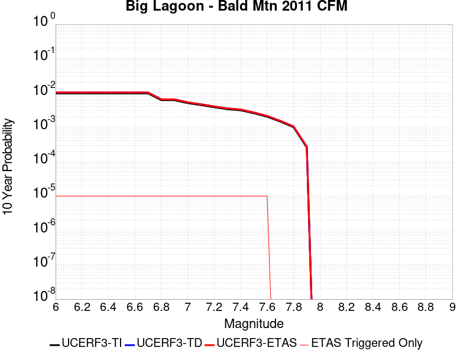 |

| Magnitude | 1 wk TI Prob | 1 wk TD Prob | 1 wk ETAS Prob | 1 wk ETAS/TD Gain | 1 wk ETAS Triggered Only | 1 mo TI Prob | 1 mo TD Prob | 1 mo ETAS Prob | 1 mo ETAS/TD Gain | 1 mo ETAS Triggered Only | 1 yr TI Prob | 1 yr TD Prob | 1 yr ETAS Prob | 1 yr ETAS/TD Gain | 1 yr ETAS Triggered Only | 10 yr TI Prob | 10 yr TD Prob | 10 yr ETAS Prob | 10 yr ETAS/TD Gain | 10 yr ETAS Triggered Only |
|-----|-----|-----|-----|-----|-----|-----|-----|-----|-----|-----|-----|-----|-----|-----|-----|-----|-----|-----|-----|-----|
| 6.0 | 1.8699735E-5 | 1.985018E-5 | 1.985018E-5 | 1.0 | 0.0 | 8.013926E-5 | 8.5069645E-5 | 8.5069645E-5 | 1.0 | 0.0 | 9.752587E-4 | 0.0010352687 | 0.0010452583 | 1.0096493 | 1.0E-5 | 0.009709897 | 0.010308274 | 0.010318171 | 1.0009601 | 1.0E-5 |
| 6.1 | 1.8699735E-5 | 1.985018E-5 | 1.985018E-5 | 1.0 | 0.0 | 8.013926E-5 | 8.5069645E-5 | 8.5069645E-5 | 1.0 | 0.0 | 9.752587E-4 | 0.0010352687 | 0.0010452583 | 1.0096493 | 1.0E-5 | 0.009709897 | 0.010308274 | 0.010318171 | 1.0009601 | 1.0E-5 |
| 6.2 | 1.8699735E-5 | 1.985018E-5 | 1.985018E-5 | 1.0 | 0.0 | 8.013926E-5 | 8.5069645E-5 | 8.5069645E-5 | 1.0 | 0.0 | 9.752587E-4 | 0.0010352687 | 0.0010452583 | 1.0096493 | 1.0E-5 | 0.009709897 | 0.010308274 | 0.010318171 | 1.0009601 | 1.0E-5 |
| 6.3 | 1.8699735E-5 | 1.985018E-5 | 1.985018E-5 | 1.0 | 0.0 | 8.013926E-5 | 8.5069645E-5 | 8.5069645E-5 | 1.0 | 0.0 | 9.752587E-4 | 0.0010352687 | 0.0010452583 | 1.0096493 | 1.0E-5 | 0.009709897 | 0.010308274 | 0.010318171 | 1.0009601 | 1.0E-5 |
| 6.4 | 1.8699735E-5 | 1.985018E-5 | 1.985018E-5 | 1.0 | 0.0 | 8.013926E-5 | 8.5069645E-5 | 8.5069645E-5 | 1.0 | 0.0 | 9.752587E-4 | 0.0010352687 | 0.0010452583 | 1.0096493 | 1.0E-5 | 0.009709897 | 0.010308274 | 0.010318171 | 1.0009601 | 1.0E-5 |
| 6.5 | 1.8699735E-5 | 1.985018E-5 | 1.985018E-5 | 1.0 | 0.0 | 8.013926E-5 | 8.5069645E-5 | 8.5069645E-5 | 1.0 | 0.0 | 9.752587E-4 | 0.0010352687 | 0.0010452583 | 1.0096493 | 1.0E-5 | 0.009709897 | 0.010308274 | 0.010318171 | 1.0009601 | 1.0E-5 |
| 6.6 | 1.8699735E-5 | 1.985018E-5 | 1.985018E-5 | 1.0 | 0.0 | 8.013926E-5 | 8.5069645E-5 | 8.5069645E-5 | 1.0 | 0.0 | 9.752587E-4 | 0.0010352687 | 0.0010452583 | 1.0096493 | 1.0E-5 | 0.009709897 | 0.010308274 | 0.010318171 | 1.0009601 | 1.0E-5 |
| 6.7 | 1.8699735E-5 | 1.985018E-5 | 1.985018E-5 | 1.0 | 0.0 | 8.013926E-5 | 8.5069645E-5 | 8.5069645E-5 | 1.0 | 0.0 | 9.752587E-4 | 0.0010352687 | 0.0010452583 | 1.0096493 | 1.0E-5 | 0.009709897 | 0.010308274 | 0.010318171 | 1.0009601 | 1.0E-5 |
| 6.8 | 1.18505095E-5 | 1.2499804E-5 | 1.2499804E-5 | 1.0 | 0.0 | 5.078691E-5 | 5.3569514E-5 | 5.3569514E-5 | 1.0 | 0.0 | 6.181552E-4 | 6.520185E-4 | 6.6201197E-4 | 1.015327 | 1.0E-5 | 0.006164385 | 0.0065015587 | 0.0065114936 | 1.0015281 | 1.0E-5 |
| 6.9 | 1.18505095E-5 | 1.2499804E-5 | 1.2499804E-5 | 1.0 | 0.0 | 5.078691E-5 | 5.3569514E-5 | 5.3569514E-5 | 1.0 | 0.0 | 6.181552E-4 | 6.520185E-4 | 6.6201197E-4 | 1.015327 | 1.0E-5 | 0.006164385 | 0.0065015587 | 0.0065114936 | 1.0015281 | 1.0E-5 |
| 7.0 | 9.719786E-6 | 1.0235487E-5 | 1.0235487E-5 | 1.0 | 0.0 | 4.1655563E-5 | 4.386565E-5 | 4.386565E-5 | 1.0 | 0.0 | 5.0703844E-4 | 5.3393573E-4 | 5.439304E-4 | 1.0187188 | 1.0E-5 | 0.005058831 | 0.0053267754 | 0.0053367224 | 1.0018673 | 1.0E-5 |
| 7.1 | 8.523418E-6 | 8.969463E-6 | 8.969463E-6 | 1.0 | 0.0 | 3.652842E-5 | 3.844E-5 | 3.844E-5 | 1.0 | 0.0 | 4.4464276E-4 | 4.6790804E-4 | 4.7790338E-4 | 1.0213617 | 1.0E-5 | 0.0044375416 | 0.004669392 | 0.0046793455 | 1.0021316 | 1.0E-5 |
| 7.2 | 7.378894E-6 | 7.761112E-6 | 7.761112E-6 | 1.0 | 0.0 | 3.162345E-5 | 3.326149E-5 | 3.326149E-5 | 1.0 | 0.0 | 3.8494746E-4 | 4.048843E-4 | 4.1488025E-4 | 1.0246884 | 1.0E-5 | 0.0038428132 | 0.0040415623 | 0.004051522 | 1.0024643 | 1.0E-5 |
| 7.3 | 6.4640294E-6 | 6.7924434E-6 | 6.7924434E-6 | 1.0 | 0.0 | 2.7702688E-5 | 2.9110151E-5 | 2.9110151E-5 | 1.0 | 0.0 | 3.3722803E-4 | 3.5435913E-4 | 3.6435557E-4 | 1.0282099 | 1.0E-5 | 0.0033671674 | 0.0035380109 | 0.0035479753 | 1.0028164 | 1.0E-5 |
| 7.4 | 5.9959093E-6 | 6.2988E-6 | 6.2988E-6 | 1.0 | 0.0 | 2.5696501E-5 | 2.6994581E-5 | 2.6994581E-5 | 1.0 | 0.0 | 3.1280998E-4 | 3.2861007E-4 | 3.3860677E-4 | 1.0304213 | 1.0E-5 | 0.0031237002 | 0.0032813034 | 0.0032912707 | 1.0030376 | 1.0E-5 |
| 7.5 | 4.929265E-6 | 5.176396E-6 | 5.176396E-6 | 1.0 | 0.0 | 2.112525E-5 | 2.2184367E-5 | 2.2184367E-5 | 1.0 | 0.0 | 2.5716957E-4 | 2.700616E-4 | 2.8005888E-4 | 1.0370185 | 1.0E-5 | 0.0025687215 | 0.002697375 | 0.0027073477 | 1.0036973 | 1.0E-5 |
| 7.6 | 3.8982403E-6 | 4.0889267E-6 | 4.0889267E-6 | 1.0 | 0.0 | 1.6706637E-5 | 1.7523857E-5 | 1.7523857E-5 | 1.0 | 0.0 | 2.0338432E-4 | 2.1333233E-4 | 2.233302E-4 | 1.0468652 | 1.0E-5 | 0.0020319829 | 0.002131303 | 0.0021412817 | 1.004682 | 1.0E-5 |
| 7.7 | 2.820968E-6 | 2.9572116E-6 | 2.9572116E-6 | 1.0 | 0.0 | 1.2089806E-5 | 1.2673704E-5 | 1.2673704E-5 | 1.0 | 0.0 | 1.4718344E-4 | 1.5429159E-4 | 1.5429159E-4 | 1.0 | 0.0 | 0.00147086 | 0.0015418624 | 0.0015418624 | 1.0 | 0.0 |
| 7.8 | 1.9314455E-6 | 2.0260186E-6 | 2.0260186E-6 | 1.0 | 0.0 | 8.277597E-6 | 8.682909E-6 | 8.682909E-6 | 1.0 | 0.0 | 1.0077508E-4 | 1.0570941E-4 | 1.0570941E-4 | 1.0 | 0.0 | 0.0010072939 | 0.0010566041 | 0.0010566041 | 1.0 | 0.0 |
| 7.9 | 4.9586197E-7 | 5.2189216E-7 | 5.2189216E-7 | 1.0 | 0.0 | 2.125121E-6 | 2.2366787E-6 | 2.2366787E-6 | 1.0 | 0.0 | 2.5873042E-5 | 2.7231245E-5 | 2.7231245E-5 | 1.0 | 0.0 | 2.5870028E-4 | 2.7228118E-4 | 2.7228118E-4 | 1.0 | 0.0 |

## Mount Diablo Thrust North CFM
*[(top)](#table-of-contents)*

| 1 Week | 1 Month | 1 Year | 10 Year |
|-----|-----|-----|-----|
|  |  |  |  |

| Magnitude | 1 wk TI Prob | 1 wk TD Prob | 1 wk ETAS Prob | 1 wk ETAS/TD Gain | 1 wk ETAS Triggered Only | 1 mo TI Prob | 1 mo TD Prob | 1 mo ETAS Prob | 1 mo ETAS/TD Gain | 1 mo ETAS Triggered Only | 1 yr TI Prob | 1 yr TD Prob | 1 yr ETAS Prob | 1 yr ETAS/TD Gain | 1 yr ETAS Triggered Only | 10 yr TI Prob | 10 yr TD Prob | 10 yr ETAS Prob | 10 yr ETAS/TD Gain | 10 yr ETAS Triggered Only |
|-----|-----|-----|-----|-----|-----|-----|-----|-----|-----|-----|-----|-----|-----|-----|-----|-----|-----|-----|-----|-----|
| 6.0 | 1.479628E-5 | 1.8769993E-5 | 2.8769806E-5 | 1.5327553 | 1.0E-5 | 6.341109E-5 | 8.0440404E-5 | 9.04396E-5 | 1.1243056 | 1.0E-5 | 7.717565E-4 | 9.789314E-4 | 9.889216E-4 | 1.0102053 | 1.0E-5 | 0.007690818 | 0.009747856 | 0.009757758 | 1.0010159 | 1.0E-5 |
| 6.1 | 1.479628E-5 | 1.8769993E-5 | 2.8769806E-5 | 1.5327553 | 1.0E-5 | 6.341109E-5 | 8.0440404E-5 | 9.04396E-5 | 1.1243056 | 1.0E-5 | 7.717565E-4 | 9.789314E-4 | 9.889216E-4 | 1.0102053 | 1.0E-5 | 0.007690818 | 0.009747856 | 0.009757758 | 1.0010159 | 1.0E-5 |
| 6.2 | 1.479628E-5 | 1.8769993E-5 | 2.8769806E-5 | 1.5327553 | 1.0E-5 | 6.341109E-5 | 8.0440404E-5 | 9.04396E-5 | 1.1243056 | 1.0E-5 | 7.717565E-4 | 9.789314E-4 | 9.889216E-4 | 1.0102053 | 1.0E-5 | 0.007690818 | 0.009747856 | 0.009757758 | 1.0010159 | 1.0E-5 |
| 6.3 | 1.479628E-5 | 1.8769993E-5 | 2.8769806E-5 | 1.5327553 | 1.0E-5 | 6.341109E-5 | 8.0440404E-5 | 9.04396E-5 | 1.1243056 | 1.0E-5 | 7.717565E-4 | 9.789314E-4 | 9.889216E-4 | 1.0102053 | 1.0E-5 | 0.007690818 | 0.009747856 | 0.009757758 | 1.0010159 | 1.0E-5 |
| 6.4 | 1.479628E-5 | 1.8769993E-5 | 2.8769806E-5 | 1.5327553 | 1.0E-5 | 6.341109E-5 | 8.0440404E-5 | 9.04396E-5 | 1.1243056 | 1.0E-5 | 7.717565E-4 | 9.789314E-4 | 9.889216E-4 | 1.0102053 | 1.0E-5 | 0.007690818 | 0.009747856 | 0.009757758 | 1.0010159 | 1.0E-5 |
| 6.5 | 1.479628E-5 | 1.8769993E-5 | 2.8769806E-5 | 1.5327553 | 1.0E-5 | 6.341109E-5 | 8.0440404E-5 | 9.04396E-5 | 1.1243056 | 1.0E-5 | 7.717565E-4 | 9.789314E-4 | 9.889216E-4 | 1.0102053 | 1.0E-5 | 0.007690818 | 0.009747856 | 0.009757758 | 1.0010159 | 1.0E-5 |
| 6.6 | 1.479016E-5 | 1.8763105E-5 | 2.8762917E-5 | 1.5329509 | 1.0E-5 | 6.338486E-5 | 8.0410886E-5 | 9.041008E-5 | 1.1243513 | 1.0E-5 | 7.714374E-4 | 9.785723E-4 | 9.885626E-4 | 1.010209 | 1.0E-5 | 0.007687649 | 0.009744297 | 0.0097542 | 1.0010163 | 1.0E-5 |
| 6.7 | 1.479016E-5 | 1.8763105E-5 | 2.8762917E-5 | 1.5329509 | 1.0E-5 | 6.338486E-5 | 8.0410886E-5 | 9.041008E-5 | 1.1243513 | 1.0E-5 | 7.714374E-4 | 9.785723E-4 | 9.885626E-4 | 1.010209 | 1.0E-5 | 0.007687649 | 0.009744297 | 0.0097542 | 1.0010163 | 1.0E-5 |
| 6.8 | 1.4771667E-5 | 1.8741875E-5 | 2.8741688E-5 | 1.5335546 | 1.0E-5 | 6.330561E-5 | 8.031991E-5 | 9.03191E-5 | 1.1244922 | 1.0E-5 | 7.704732E-4 | 9.774657E-4 | 9.87456E-4 | 1.0102205 | 1.0E-5 | 0.007678074 | 0.009733327 | 0.0097432295 | 1.0010175 | 1.0E-5 |
| 6.9 | 1.2548234E-5 | 1.5822226E-5 | 2.5822068E-5 | 1.6320122 | 1.0E-5 | 5.3777036E-5 | 6.78078E-5 | 7.7807126E-5 | 1.1474657 | 1.0E-5 | 6.545387E-4 | 8.2525087E-4 | 8.352426E-4 | 1.0121075 | 1.0E-5 | 0.006526142 | 0.008223341 | 0.0082332585 | 1.001206 | 1.0E-5 |
| 7.0 | 1.01754185E-5 | 1.2809161E-5 | 2.2809032E-5 | 1.7806813 | 1.0E-5 | 4.360821E-5 | 5.4895256E-5 | 6.489471E-5 | 1.1821551 | 1.0E-5 | 5.308006E-4 | 6.681465E-4 | 6.7813974E-4 | 1.0149568 | 1.0E-5 | 0.005295345 | 0.006662407 | 0.0066723404 | 1.001491 | 1.0E-5 |
| 7.1 | 8.398341E-6 | 1.0554875E-5 | 2.055477E-5 | 1.9474195 | 1.0E-5 | 3.5992394E-5 | 4.52344E-5 | 5.5233948E-5 | 1.2210606 | 1.0E-5 | 4.3811928E-4 | 5.5059075E-4 | 5.6058523E-4 | 1.0181524 | 1.0E-5 | 0.0043725655 | 0.0054929866 | 0.005502932 | 1.0018106 | 1.0E-5 |
| 7.2 | 6.024759E-6 | 7.648535E-6 | 1.7648457E-5 | 2.30743 | 1.0E-5 | 2.582014E-5 | 3.2779026E-5 | 4.2778698E-5 | 1.3050631 | 1.0E-5 | 3.1431485E-4 | 3.9901226E-4 | 4.0900827E-4 | 1.0250518 | 1.0E-5 | 0.0031387066 | 0.003983419 | 0.0039933794 | 1.0025004 | 1.0E-5 |
| 7.3 | 3.2099704E-6 | 4.135676E-6 | 4.135676E-6 | 1.0 | 0.0 | 1.3756943E-5 | 1.7724205E-5 | 1.7724205E-5 | 1.0 | 0.0 | 1.674779E-4 | 2.1577101E-4 | 2.1577101E-4 | 1.0 | 0.0 | 0.0016735174 | 0.0021559391 | 0.0021559391 | 1.0 | 0.0 |
| 7.4 | 2.2041513E-6 | 2.873495E-6 | 2.873495E-6 | 1.0 | 0.0 | 9.4463285E-6 | 1.2314921E-5 | 1.2314921E-5 | 1.0 | 0.0 | 1.1500298E-4 | 1.4992392E-4 | 1.4992392E-4 | 1.0 | 0.0 | 0.0011494348 | 0.0014985732 | 0.0014985732 | 1.0 | 0.0 |
| 7.5 | 1.8869501E-6 | 2.4697174E-6 | 2.4697174E-6 | 1.0 | 0.0 | 8.086904E-6 | 1.058446E-5 | 1.058446E-5 | 1.0 | 0.0 | 9.845361E-5 | 1.2885826E-4 | 1.2885826E-4 | 1.0 | 0.0 | 9.841E-4 | 0.0012881672 | 0.0012881672 | 1.0 | 0.0 |
| 7.6 | 1.3012458E-6 | 1.7005538E-6 | 1.7005538E-6 | 1.0 | 0.0 | 5.576756E-6 | 7.2880675E-6 | 7.2880675E-6 | 1.0 | 0.0 | 6.7894885E-5 | 8.872866E-5 | 8.872866E-5 | 1.0 | 0.0 | 6.787415E-4 | 8.8716054E-4 | 8.8716054E-4 | 1.0 | 0.0 |
| 7.7 | 3.603383E-7 | 4.7166864E-7 | 4.7166864E-7 | 1.0 | 0.0 | 1.5443061E-6 | 2.0214356E-6 | 2.0214356E-6 | 1.0 | 0.0 | 1.8801764E-5 | 2.4610707E-5 | 2.4610707E-5 | 1.0 | 0.0 | 1.8800174E-4 | 2.4611194E-4 | 2.4611194E-4 | 1.0 | 0.0 |

## Northridge
*[(top)](#table-of-contents)*

| 1 Week | 1 Month | 1 Year | 10 Year |
|-----|-----|-----|-----|
|  |  |  |  |

| Magnitude | 1 wk TI Prob | 1 wk TD Prob | 1 wk ETAS Prob | 1 wk ETAS/TD Gain | 1 wk ETAS Triggered Only | 1 mo TI Prob | 1 mo TD Prob | 1 mo ETAS Prob | 1 mo ETAS/TD Gain | 1 mo ETAS Triggered Only | 1 yr TI Prob | 1 yr TD Prob | 1 yr ETAS Prob | 1 yr ETAS/TD Gain | 1 yr ETAS Triggered Only | 10 yr TI Prob | 10 yr TD Prob | 10 yr ETAS Prob | 10 yr ETAS/TD Gain | 10 yr ETAS Triggered Only |
|-----|-----|-----|-----|-----|-----|-----|-----|-----|-----|-----|-----|-----|-----|-----|-----|-----|-----|-----|-----|-----|
| 6.0 | 1.8340852E-5 | 7.5878907E-6 | 7.5878907E-6 | 1.0 | 0.0 | 7.860128E-5 | 3.251914E-5 | 4.2518812E-5 | 1.3075012 | 1.0E-5 | 9.565505E-4 | 3.9585077E-4 | 4.0584683E-4 | 1.0252521 | 1.0E-5 | 0.009524435 | 0.0039516874 | 0.003961648 | 1.0025206 | 1.0E-5 |
| 6.1 | 1.8340852E-5 | 7.5878907E-6 | 7.5878907E-6 | 1.0 | 0.0 | 7.860128E-5 | 3.251914E-5 | 4.2518812E-5 | 1.3075012 | 1.0E-5 | 9.565505E-4 | 3.9585077E-4 | 4.0584683E-4 | 1.0252521 | 1.0E-5 | 0.009524435 | 0.0039516874 | 0.003961648 | 1.0025206 | 1.0E-5 |
| 6.2 | 1.8340852E-5 | 7.5878907E-6 | 7.5878907E-6 | 1.0 | 0.0 | 7.860128E-5 | 3.251914E-5 | 4.2518812E-5 | 1.3075012 | 1.0E-5 | 9.565505E-4 | 3.9585077E-4 | 4.0584683E-4 | 1.0252521 | 1.0E-5 | 0.009524435 | 0.0039516874 | 0.003961648 | 1.0025206 | 1.0E-5 |
| 6.3 | 1.8340852E-5 | 7.5878907E-6 | 7.5878907E-6 | 1.0 | 0.0 | 7.860128E-5 | 3.251914E-5 | 4.2518812E-5 | 1.3075012 | 1.0E-5 | 9.565505E-4 | 3.9585077E-4 | 4.0584683E-4 | 1.0252521 | 1.0E-5 | 0.009524435 | 0.0039516874 | 0.003961648 | 1.0025206 | 1.0E-5 |
| 6.4 | 1.7361892E-5 | 7.5878907E-6 | 7.5878907E-6 | 1.0 | 0.0 | 7.440598E-5 | 3.251914E-5 | 4.2518812E-5 | 1.3075012 | 1.0E-5 | 9.055163E-4 | 3.9585077E-4 | 4.0584683E-4 | 1.0252521 | 1.0E-5 | 0.009018354 | 0.0039516874 | 0.003961648 | 1.0025206 | 1.0E-5 |
| 6.5 | 1.7361892E-5 | 7.5878907E-6 | 7.5878907E-6 | 1.0 | 0.0 | 7.440598E-5 | 3.251914E-5 | 4.2518812E-5 | 1.3075012 | 1.0E-5 | 9.055163E-4 | 3.9585077E-4 | 4.0584683E-4 | 1.0252521 | 1.0E-5 | 0.009018354 | 0.0039516874 | 0.003961648 | 1.0025206 | 1.0E-5 |
| 6.6 | 1.5458201E-5 | 7.5878907E-6 | 7.5878907E-6 | 1.0 | 0.0 | 6.624775E-5 | 3.251914E-5 | 4.2518812E-5 | 1.3075012 | 1.0E-5 | 8.0626784E-4 | 3.9585077E-4 | 4.0584683E-4 | 1.0252521 | 1.0E-5 | 0.008033488 | 0.0039516874 | 0.003961648 | 1.0025206 | 1.0E-5 |
| 6.7 | 1.2538368E-5 | 6.381497E-6 | 6.381497E-6 | 1.0 | 0.0 | 5.3734755E-5 | 2.7348988E-5 | 3.7348713E-5 | 1.3656342 | 1.0E-5 | 6.5402425E-4 | 3.329235E-4 | 3.4292016E-4 | 1.0300269 | 1.0E-5 | 0.0065210275 | 0.0033243035 | 0.0033342703 | 1.0029981 | 1.0E-5 |
| 6.8 | 1.1438097E-5 | 6.350156E-6 | 6.350156E-6 | 1.0 | 0.0 | 4.9019498E-5 | 2.7214674E-5 | 3.7214402E-5 | 1.3674388 | 1.0E-5 | 5.9664896E-4 | 3.3128873E-4 | 3.412854E-4 | 1.0301752 | 1.0E-5 | 0.005950495 | 0.0033080047 | 0.0033179715 | 1.003013 | 1.0E-5 |
| 6.9 | 1.1204891E-5 | 6.2866116E-6 | 6.2866116E-6 | 1.0 | 0.0 | 4.8020076E-5 | 2.6942345E-5 | 3.6942074E-5 | 1.371153 | 1.0E-5 | 5.8448757E-4 | 3.2797412E-4 | 3.3797082E-4 | 1.0304803 | 1.0E-5 | 0.0058295266 | 0.0032749567 | 0.003284924 | 1.0030435 | 1.0E-5 |
| 7.0 | 1.061046E-5 | 6.1152687E-6 | 6.1152687E-6 | 1.0 | 0.0 | 4.5472607E-5 | 2.6208034E-5 | 3.620777E-5 | 1.3815523 | 1.0E-5 | 5.534883E-4 | 3.190365E-4 | 3.2903333E-4 | 1.0313344 | 1.0E-5 | 0.0055211177 | 0.0031858315 | 0.0031957994 | 1.0031289 | 1.0E-5 |
| 7.1 | 1.0266979E-5 | 6.0041907E-6 | 6.0041907E-6 | 1.0 | 0.0 | 4.40006E-5 | 2.5731995E-5 | 3.5731737E-5 | 1.3886112 | 1.0E-5 | 5.355756E-4 | 3.1324243E-4 | 3.2323928E-4 | 1.0319141 | 1.0E-5 | 0.0053428668 | 0.0031280548 | 0.0031380234 | 1.0031868 | 1.0E-5 |
| 7.2 | 9.91273E-6 | 5.819906E-6 | 5.819906E-6 | 1.0 | 0.0 | 4.248244E-5 | 2.4942217E-5 | 2.4942217E-5 | 1.0 | 0.0 | 5.171009E-4 | 3.036296E-4 | 3.036296E-4 | 1.0 | 0.0 | 0.0051589934 | 0.0030321924 | 0.0030321924 | 1.0 | 0.0 |
| 7.3 | 8.4959265E-6 | 5.1930183E-6 | 5.1930183E-6 | 1.0 | 0.0 | 3.6410605E-5 | 2.2255605E-5 | 2.2255605E-5 | 1.0 | 0.0 | 4.4320893E-4 | 2.7092852E-4 | 2.7092852E-4 | 1.0 | 0.0 | 0.00442326 | 0.0027060085 | 0.0027060085 | 1.0 | 0.0 |
| 7.4 | 8.0847185E-6 | 4.9818977E-6 | 4.9818977E-6 | 1.0 | 0.0 | 3.4648332E-5 | 2.1350817E-5 | 2.1350817E-5 | 1.0 | 0.0 | 4.2176177E-4 | 2.5991542E-4 | 2.5991542E-4 | 1.0 | 0.0 | 0.0042096223 | 0.0025961401 | 0.0025961401 | 1.0 | 0.0 |
| 7.5 | 6.8220684E-6 | 4.2532647E-6 | 4.2532647E-6 | 1.0 | 0.0 | 2.9237108E-5 | 1.8228153E-5 | 1.8228153E-5 | 1.0 | 0.0 | 3.5590364E-4 | 2.2190536E-4 | 2.2190536E-4 | 1.0 | 0.0 | 0.0035533418 | 0.0022168586 | 0.0022168586 | 1.0 | 0.0 |
| 7.6 | 4.4224143E-6 | 2.8999295E-6 | 2.8999295E-6 | 1.0 | 0.0 | 1.8953066E-5 | 1.24282105E-5 | 1.24282105E-5 | 1.0 | 0.0 | 2.3072914E-4 | 1.5130307E-4 | 1.5130307E-4 | 1.0 | 0.0 | 0.0023048974 | 0.0015120122 | 0.0015120122 | 1.0 | 0.0 |
| 7.7 | 2.5297056E-6 | 1.6045943E-6 | 1.6045943E-6 | 1.0 | 0.0 | 1.0841551E-5 | 6.876815E-6 | 6.876815E-6 | 1.0 | 0.0 | 1.319879E-4 | 8.372205E-5 | 8.372205E-5 | 1.0 | 0.0 | 0.0013190953 | 8.369098E-4 | 8.369098E-4 | 1.0 | 0.0 |
| 7.8 | 1.2508156E-6 | 8.780148E-7 | 8.780148E-7 | 1.0 | 0.0 | 5.3606273E-6 | 3.7629154E-6 | 3.7629154E-6 | 1.0 | 0.0 | 6.526368E-5 | 4.5812543E-5 | 4.5812543E-5 | 1.0 | 0.0 | 6.524452E-4 | 4.580323E-4 | 4.580323E-4 | 1.0 | 0.0 |
| 7.9 | 2.262199E-7 | 1.466491E-7 | 1.466491E-7 | 1.0 | 0.0 | 9.695135E-7 | 6.2849597E-7 | 6.2849597E-7 | 1.0 | 0.0 | 1.1803763E-5 | 7.651913E-6 | 7.651913E-6 | 1.0 | 0.0 | 1.1803136E-4 | 7.651657E-5 | 7.651657E-5 | 1.0 | 0.0 |
| 8.0 | 2.865362E-9 | 1.27525E-9 | 1.27525E-9 | 1.0 | 0.0 | 1.2280123E-8 | 5.465357E-9 | 5.465357E-9 | 1.0 | 0.0 | 1.4951048E-7 | 6.654073E-8 | 6.654073E-8 | 1.0 | 0.0 | 1.4951038E-6 | 6.6540724E-7 | 6.6540724E-7 | 1.0 | 0.0 |

## Concord 2011 CFM
*[(top)](#table-of-contents)*

| 1 Week | 1 Month | 1 Year | 10 Year |
|-----|-----|-----|-----|
|  |  |  |  |

| Magnitude | 1 wk TI Prob | 1 wk TD Prob | 1 wk ETAS Prob | 1 wk ETAS/TD Gain | 1 wk ETAS Triggered Only | 1 mo TI Prob | 1 mo TD Prob | 1 mo ETAS Prob | 1 mo ETAS/TD Gain | 1 mo ETAS Triggered Only | 1 yr TI Prob | 1 yr TD Prob | 1 yr ETAS Prob | 1 yr ETAS/TD Gain | 1 yr ETAS Triggered Only | 10 yr TI Prob | 10 yr TD Prob | 10 yr ETAS Prob | 10 yr ETAS/TD Gain | 10 yr ETAS Triggered Only |
|-----|-----|-----|-----|-----|-----|-----|-----|-----|-----|-----|-----|-----|-----|-----|-----|-----|-----|-----|-----|-----|
| 6.0 | 5.7865112E-5 | 9.7585355E-5 | 1.0758438E-4 | 1.1024644 | 1.0E-5 | 2.4796976E-4 | 4.181607E-4 | 4.281565E-4 | 1.0239042 | 1.0E-5 | 0.0030148525 | 0.005079743 | 0.0050896923 | 1.0019586 | 1.0E-5 | 0.029742775 | 0.049266078 | 0.049275585 | 1.000193 | 1.0E-5 |
| 6.1 | 5.7865112E-5 | 9.7585355E-5 | 1.0758438E-4 | 1.1024644 | 1.0E-5 | 2.4796976E-4 | 4.181607E-4 | 4.281565E-4 | 1.0239042 | 1.0E-5 | 0.0030148525 | 0.005079743 | 0.0050896923 | 1.0019586 | 1.0E-5 | 0.029742775 | 0.049266078 | 0.049275585 | 1.000193 | 1.0E-5 |
| 6.2 | 5.6789337E-5 | 9.578793E-5 | 1.0578697E-4 | 1.1043873 | 1.0E-5 | 2.4336016E-4 | 4.1045985E-4 | 4.2045576E-4 | 1.0243529 | 1.0E-5 | 0.0029588845 | 0.0049864696 | 0.0049964194 | 1.0019954 | 1.0E-5 | 0.029197963 | 0.04838257 | 0.048392083 | 1.0001967 | 1.0E-5 |
| 6.3 | 5.203322E-5 | 8.803241E-5 | 9.803152E-5 | 1.1135845 | 1.0E-5 | 2.2298045E-4 | 3.772316E-4 | 3.872278E-4 | 1.0264989 | 1.0E-5 | 0.0027114071 | 0.0045839064 | 0.0045938604 | 1.0021715 | 1.0E-5 | 0.026785625 | 0.04455397 | 0.044563524 | 1.0002145 | 1.0E-5 |
| 6.4 | 4.7120942E-5 | 7.897583E-5 | 8.897504E-5 | 1.126611 | 1.0E-5 | 2.0193127E-4 | 3.3842813E-4 | 3.4842474E-4 | 1.0295384 | 1.0E-5 | 0.0024557412 | 0.004113323 | 0.0041232817 | 1.0024211 | 1.0E-5 | 0.024287801 | 0.040080756 | 0.040090356 | 1.0002395 | 1.0E-5 |
| 6.5 | 2.9598437E-5 | 4.6675777E-5 | 5.6675308E-5 | 1.2142339 | 1.0E-5 | 1.2684427E-4 | 2.000249E-4 | 2.1002289E-4 | 1.0499837 | 1.0E-5 | 0.001543235 | 0.0024327936 | 0.0024427692 | 1.0041004 | 1.0E-5 | 0.015325619 | 0.023909668 | 0.02391943 | 1.0004083 | 1.0E-5 |
| 6.6 | 2.0443718E-5 | 2.9984873E-5 | 3.9984574E-5 | 1.3334914 | 1.0E-5 | 8.7613E-5 | 1.2850047E-4 | 1.3849919E-4 | 1.0778108 | 1.0E-5 | 0.0010661662 | 0.0015634067 | 0.001573391 | 1.0063863 | 1.0E-5 | 0.010610655 | 0.0154669015 | 0.015476747 | 1.0006366 | 1.0E-5 |
| 6.7 | 1.798539E-5 | 2.5557883E-5 | 3.5557627E-5 | 1.3912587 | 1.0E-5 | 7.7077966E-5 | 1.0952931E-4 | 1.1952822E-4 | 1.0912898 | 1.0E-5 | 9.380202E-4 | 0.0013327252 | 0.0013427117 | 1.0074934 | 1.0E-5 | 0.009340706 | 0.013217516 | 0.013227384 | 1.0007466 | 1.0E-5 |
| 6.8 | 1.613555E-5 | 2.1959608E-5 | 3.195939E-5 | 1.4553715 | 1.0E-5 | 6.915052E-5 | 9.4109295E-5 | 1.0410835E-4 | 1.1062495 | 1.0E-5 | 8.4158237E-4 | 0.0011451923 | 0.0011551809 | 1.0087222 | 1.0E-5 | 0.008384023 | 0.011378321 | 0.011388207 | 1.0008689 | 1.0E-5 |
| 6.9 | 1.2916435E-5 | 1.708134E-5 | 2.7081169E-5 | 1.5854242 | 1.0E-5 | 5.5354973E-5 | 7.320372E-5 | 8.320299E-5 | 1.1365951 | 1.0E-5 | 6.7373837E-4 | 8.908967E-4 | 9.0088777E-4 | 1.0112146 | 1.0E-5 | 0.006716994 | 0.008867833 | 0.008877745 | 1.0011177 | 1.0E-5 |
| 7.0 | 9.81129E-6 | 1.2631038E-5 | 2.2630911E-5 | 1.7916906 | 1.0E-5 | 4.2047708E-5 | 5.4131906E-5 | 6.413137E-5 | 1.184724 | 1.0E-5 | 5.118106E-4 | 6.588583E-4 | 6.688517E-4 | 1.0151677 | 1.0E-5 | 0.005106334 | 0.0065697595 | 0.006579694 | 1.0015122 | 1.0E-5 |
| 7.1 | 8.0889195E-6 | 1.04184555E-5 | 2.041835E-5 | 1.9598252 | 1.0E-5 | 3.4666336E-5 | 4.4649765E-5 | 5.4649317E-5 | 1.2239554 | 1.0E-5 | 4.219809E-4 | 5.434764E-4 | 5.534709E-4 | 1.01839 | 1.0E-5 | 0.004211805 | 0.0054219896 | 0.005431935 | 1.0018344 | 1.0E-5 |
| 7.2 | 6.267438E-6 | 8.115879E-6 | 1.8115798E-5 | 2.2321424 | 1.0E-5 | 2.6860173E-5 | 3.478188E-5 | 4.4781533E-5 | 1.287496 | 1.0E-5 | 3.2697353E-4 | 4.2338783E-4 | 4.333836E-4 | 1.023609 | 1.0E-5 | 0.0032649285 | 0.004226169 | 0.004236127 | 1.0023562 | 1.0E-5 |
| 7.3 | 3.6761196E-6 | 4.840281E-6 | 4.840281E-6 | 1.0 | 0.0 | 1.5754704E-5 | 2.0743897E-5 | 2.0743897E-5 | 1.0 | 0.0 | 1.9179663E-4 | 2.5252788E-4 | 2.5252788E-4 | 1.0 | 0.0 | 0.0019163118 | 0.0025226264 | 0.0025226264 | 1.0 | 0.0 |
| 7.4 | 2.8044356E-6 | 3.7096993E-6 | 3.7096993E-6 | 1.0 | 0.0 | 1.2018954E-5 | 1.5898615E-5 | 1.5898615E-5 | 1.0 | 0.0 | 1.4632095E-4 | 1.9354856E-4 | 1.9354856E-4 | 1.0 | 0.0 | 0.0014622464 | 0.0019340349 | 0.0019340349 | 1.0 | 0.0 |
| 7.5 | 2.4578699E-6 | 3.2448306E-6 | 3.2448306E-6 | 1.0 | 0.0 | 1.0533685E-5 | 1.3906343E-5 | 1.3906343E-5 | 1.0 | 0.0 | 1.2824008E-4 | 1.6929668E-4 | 1.6929668E-4 | 1.0 | 0.0 | 0.0012816609 | 0.0016918926 | 0.0016918926 | 1.0 | 0.0 |
| 7.6 | 1.7713267E-6 | 2.335189E-6 | 2.335189E-6 | 1.0 | 0.0 | 7.591378E-6 | 1.0007916E-5 | 1.0007916E-5 | 1.0 | 0.0 | 9.2421105E-5 | 1.2183965E-4 | 1.2183965E-4 | 1.0 | 0.0 | 9.2382677E-4 | 0.0012178655 | 0.0012178655 | 1.0 | 0.0 |
| 7.7 | 5.1912366E-7 | 6.829346E-7 | 6.829346E-7 | 1.0 | 0.0 | 2.2248137E-6 | 2.9268595E-6 | 2.9268595E-6 | 1.0 | 0.0 | 2.708677E-5 | 3.5633944E-5 | 3.5633944E-5 | 1.0 | 0.0 | 2.708347E-4 | 3.5630353E-4 | 3.5630353E-4 | 1.0 | 0.0 |

## Sargent 2011 CFM
*[(top)](#table-of-contents)*

| 1 Week | 1 Month | 1 Year | 10 Year |
|-----|-----|-----|-----|
|  |  |  |  |

| Magnitude | 1 wk TI Prob | 1 wk TD Prob | 1 wk ETAS Prob | 1 wk ETAS/TD Gain | 1 wk ETAS Triggered Only | 1 mo TI Prob | 1 mo TD Prob | 1 mo ETAS Prob | 1 mo ETAS/TD Gain | 1 mo ETAS Triggered Only | 1 yr TI Prob | 1 yr TD Prob | 1 yr ETAS Prob | 1 yr ETAS/TD Gain | 1 yr ETAS Triggered Only | 10 yr TI Prob | 10 yr TD Prob | 10 yr ETAS Prob | 10 yr ETAS/TD Gain | 10 yr ETAS Triggered Only |
|-----|-----|-----|-----|-----|-----|-----|-----|-----|-----|-----|-----|-----|-----|-----|-----|-----|-----|-----|-----|-----|
| 6.0 | 3.7327867E-5 | 3.665065E-5 | 3.665065E-5 | 1.0 | 0.0 | 1.5996677E-4 | 1.5706717E-4 | 1.5706717E-4 | 1.0 | 0.0 | 0.0019458556 | 0.0019110267 | 0.0019210076 | 1.0052228 | 1.0E-5 | 0.01928905 | 0.019017996 | 0.019027807 | 1.0005158 | 1.0E-5 |
| 6.1 | 2.3771476E-5 | 1.8478724E-5 | 1.8478724E-5 | 1.0 | 0.0 | 1.01873775E-4 | 7.919262E-5 | 7.919262E-5 | 1.0 | 0.0 | 0.0012396075 | 9.638239E-4 | 9.638239E-4 | 1.0 | 0.0 | 0.012327154 | 0.009635902 | 0.009635902 | 1.0 | 0.0 |
| 6.2 | 2.3112721E-5 | 1.7710081E-5 | 1.7710081E-5 | 1.0 | 0.0 | 9.9050754E-5 | 7.5898635E-5 | 7.5898635E-5 | 1.0 | 0.0 | 0.0012052758 | 9.2375383E-4 | 9.2375383E-4 | 1.0 | 0.0 | 0.011987597 | 0.009238554 | 0.009238554 | 1.0 | 0.0 |
| 6.3 | 1.728509E-5 | 1.0458513E-5 | 1.0458513E-5 | 1.0 | 0.0 | 7.407686E-5 | 4.4821696E-5 | 4.4821696E-5 | 1.0 | 0.0 | 9.015125E-4 | 5.456136E-4 | 5.456136E-4 | 1.0 | 0.0 | 0.008978641 | 0.0054789106 | 0.0054789106 | 1.0 | 0.0 |
| 6.4 | 1.48395575E-5 | 7.4555796E-6 | 7.4555796E-6 | 1.0 | 0.0 | 6.3596555E-5 | 3.195231E-5 | 3.195231E-5 | 1.0 | 0.0 | 7.7401294E-4 | 3.889874E-4 | 3.889874E-4 | 1.0 | 0.0 | 0.0077132257 | 0.00391845 | 0.00391845 | 1.0 | 0.0 |
| 6.5 | 1.4358964E-5 | 6.894356E-6 | 6.894356E-6 | 1.0 | 0.0 | 6.1536964E-5 | 2.9547118E-5 | 2.9547118E-5 | 1.0 | 0.0 | 7.48955E-4 | 3.5971415E-4 | 3.5971415E-4 | 1.0 | 0.0 | 0.0074643586 | 0.0036266989 | 0.0036266989 | 1.0 | 0.0 |
| 6.6 | 9.772591E-6 | 1.3732375E-6 | 1.3732375E-6 | 1.0 | 0.0 | 4.188186E-5 | 5.8852906E-6 | 5.8852906E-6 | 1.0 | 0.0 | 5.097923E-4 | 7.165109E-5 | 7.165109E-5 | 1.0 | 0.0 | 0.005086244 | 7.480871E-4 | 7.480871E-4 | 1.0 | 0.0 |
| 6.7 | 9.752745E-6 | 1.3519289E-6 | 1.3519289E-6 | 1.0 | 0.0 | 4.179681E-5 | 5.7939683E-6 | 5.7939683E-6 | 1.0 | 0.0 | 5.0875737E-4 | 7.053931E-5 | 7.053931E-5 | 1.0 | 0.0 | 0.005075942 | 7.369768E-4 | 7.369768E-4 | 1.0 | 0.0 |
| 6.8 | 9.608213E-6 | 1.235796E-6 | 1.235796E-6 | 1.0 | 0.0 | 4.1177405E-5 | 5.296258E-6 | 5.296258E-6 | 1.0 | 0.0 | 5.012196E-4 | 6.448006E-5 | 6.448006E-5 | 1.0 | 0.0 | 0.005000906 | 6.7611714E-4 | 6.7611714E-4 | 1.0 | 0.0 |
| 6.9 | 9.427164E-6 | 1.1205796E-6 | 1.1205796E-6 | 1.0 | 0.0 | 4.04015E-5 | 4.8024754E-6 | 4.8024754E-6 | 1.0 | 0.0 | 4.9177726E-4 | 5.8468588E-5 | 5.8468588E-5 | 1.0 | 0.0 | 0.004906904 | 6.1537215E-4 | 6.1537215E-4 | 1.0 | 0.0 |
| 7.0 | 9.247601E-6 | 9.87042E-7 | 9.87042E-7 | 1.0 | 0.0 | 3.9631974E-5 | 4.2301726E-6 | 4.2301726E-6 | 1.0 | 0.0 | 4.8241246E-4 | 5.1501152E-5 | 5.1501152E-5 | 1.0 | 0.0 | 0.0048136655 | 5.452185E-4 | 5.452185E-4 | 1.0 | 0.0 |
| 7.1 | 8.995454E-6 | 8.267614E-7 | 8.267614E-7 | 1.0 | 0.0 | 3.8551374E-5 | 3.5432583E-6 | 3.5432583E-6 | 1.0 | 0.0 | 4.6926187E-4 | 4.313833E-5 | 4.313833E-5 | 1.0 | 0.0 | 0.004682722 | 4.6070307E-4 | 4.6070307E-4 | 1.0 | 0.0 |
| 7.2 | 8.520861E-6 | 5.27322E-7 | 5.27322E-7 | 1.0 | 0.0 | 3.6517464E-5 | 2.2599497E-6 | 2.2599497E-6 | 1.0 | 0.0 | 4.445094E-4 | 2.7514547E-5 | 2.7514547E-5 | 1.0 | 0.0 | 0.004436213 | 3.0276953E-4 | 3.0276953E-4 | 1.0 | 0.0 |
| 7.3 | 8.043592E-6 | 3.453237E-7 | 3.453237E-7 | 1.0 | 0.0 | 3.4472083E-5 | 1.4799579E-6 | 1.4799579E-6 | 1.0 | 0.0 | 4.196168E-4 | 1.801834E-5 | 1.801834E-5 | 1.0 | 0.0 | 0.004188253 | 2.0650218E-4 | 2.0650218E-4 | 1.0 | 0.0 |
| 7.4 | 7.662316E-6 | 2.9259107E-7 | 2.9259107E-7 | 1.0 | 0.0 | 3.2838085E-5 | 1.2539612E-6 | 1.2539612E-6 | 1.0 | 0.0 | 3.9973034E-4 | 1.526687E-5 | 1.526687E-5 | 1.0 | 0.0 | 0.0039901207 | 1.7718194E-4 | 1.7718194E-4 | 1.0 | 0.0 |
| 7.5 | 6.961638E-6 | 2.3549052E-7 | 2.3549052E-7 | 1.0 | 0.0 | 2.9835252E-5 | 1.0092447E-6 | 1.0092447E-6 | 1.0 | 0.0 | 3.6318362E-4 | 1.2287485E-5 | 1.2287485E-5 | 1.0 | 0.0 | 0.0036259065 | 1.4393168E-4 | 1.4393168E-4 | 1.0 | 0.0 |
| 7.6 | 6.282332E-6 | 1.6871925E-7 | 1.6871925E-7 | 1.0 | 0.0 | 2.6924003E-5 | 7.230823E-7 | 7.230823E-7 | 1.0 | 0.0 | 3.2775043E-4 | 8.803492E-6 | 8.803492E-6 | 1.0 | 0.0 | 0.0032726745 | 1.0492336E-4 | 1.0492336E-4 | 1.0 | 0.0 |
| 7.7 | 4.934408E-6 | 4.9918345E-8 | 4.9918345E-8 | 1.0 | 0.0 | 2.114729E-5 | 2.1393575E-7 | 2.1393575E-7 | 1.0 | 0.0 | 2.5743784E-4 | 2.6046646E-6 | 2.6046646E-6 | 1.0 | 0.0 | 0.0025713982 | 3.2479504E-5 | 3.2479504E-5 | 1.0 | 0.0 |
| 7.8 | 2.373212E-6 | 3.5100808E-8 | 3.5100808E-8 | 1.0 | 0.0 | 1.0170869E-5 | 1.5043203E-7 | 1.5043203E-7 | 1.0 | 0.0 | 1.238233E-4 | 1.8315084E-6 | 1.8315084E-6 | 1.0 | 0.0 | 0.0012375432 | 2.4073881E-5 | 2.4073881E-5 | 1.0 | 0.0 |
| 7.9 | 1.8227792E-6 | 3.055616E-8 | 3.055616E-8 | 1.0 | 0.0 | 7.811887E-6 | 1.3095496E-7 | 1.3095496E-7 | 1.0 | 0.0 | 9.510558E-5 | 1.5943755E-6 | 1.5943755E-6 | 1.0 | 0.0 | 9.5064886E-4 | 2.1365537E-5 | 2.1365537E-5 | 1.0 | 0.0 |
| 8.0 | 1.9095137E-7 | 1.3250629E-8 | 1.3250629E-8 | 1.0 | 0.0 | 8.1836276E-7 | 5.678841E-8 | 5.678841E-8 | 1.0 | 0.0 | 9.963521E-6 | 6.9139867E-7 | 6.9139867E-7 | 1.0 | 0.0 | 9.963074E-5 | 8.455456E-6 | 8.455456E-6 | 1.0 | 0.0 |

## Del Valle
*[(top)](#table-of-contents)*

| 1 Week | 1 Month | 1 Year | 10 Year |
|-----|-----|-----|-----|
|  |  |  |  |

| Magnitude | 1 wk TI Prob | 1 wk TD Prob | 1 wk ETAS Prob | 1 wk ETAS/TD Gain | 1 wk ETAS Triggered Only | 1 mo TI Prob | 1 mo TD Prob | 1 mo ETAS Prob | 1 mo ETAS/TD Gain | 1 mo ETAS Triggered Only | 1 yr TI Prob | 1 yr TD Prob | 1 yr ETAS Prob | 1 yr ETAS/TD Gain | 1 yr ETAS Triggered Only | 10 yr TI Prob | 10 yr TD Prob | 10 yr ETAS Prob | 10 yr ETAS/TD Gain | 10 yr ETAS Triggered Only |
|-----|-----|-----|-----|-----|-----|-----|-----|-----|-----|-----|-----|-----|-----|-----|-----|-----|-----|-----|-----|-----|
| 6.0 | 1.0716125E-5 | 8.767882E-6 | 1.8767794E-5 | 2.1405163 | 1.0E-5 | 4.592544E-5 | 3.7576207E-5 | 4.7575828E-5 | 1.2661159 | 1.0E-5 | 5.589988E-4 | 4.5741402E-4 | 4.6740944E-4 | 1.021852 | 1.0E-5 | 0.0055759475 | 0.004566694 | 0.0045766486 | 1.0021797 | 1.0E-5 |
| 6.1 | 1.0716125E-5 | 8.767882E-6 | 1.8767794E-5 | 2.1405163 | 1.0E-5 | 4.592544E-5 | 3.7576207E-5 | 4.7575828E-5 | 1.2661159 | 1.0E-5 | 5.589988E-4 | 4.5741402E-4 | 4.6740944E-4 | 1.021852 | 1.0E-5 | 0.0055759475 | 0.004566694 | 0.0045766486 | 1.0021797 | 1.0E-5 |
| 6.2 | 1.0716125E-5 | 8.767882E-6 | 1.8767794E-5 | 2.1405163 | 1.0E-5 | 4.592544E-5 | 3.7576207E-5 | 4.7575828E-5 | 1.2661159 | 1.0E-5 | 5.589988E-4 | 4.5741402E-4 | 4.6740944E-4 | 1.021852 | 1.0E-5 | 0.0055759475 | 0.004566694 | 0.0045766486 | 1.0021797 | 1.0E-5 |
| 6.3 | 7.1293784E-6 | 4.8658226E-6 | 1.4865774E-5 | 3.055141 | 1.0E-5 | 3.055412E-5 | 2.0853362E-5 | 3.0853153E-5 | 1.479529 | 1.0E-5 | 3.7193293E-4 | 2.5386084E-4 | 2.638583E-4 | 1.0393816 | 1.0E-5 | 0.0037131102 | 0.0025358086 | 0.0025457833 | 1.0039335 | 1.0E-5 |
| 6.4 | 7.1293784E-6 | 4.8658226E-6 | 1.4865774E-5 | 3.055141 | 1.0E-5 | 3.055412E-5 | 2.0853362E-5 | 3.0853153E-5 | 1.479529 | 1.0E-5 | 3.7193293E-4 | 2.5386084E-4 | 2.638583E-4 | 1.0393816 | 1.0E-5 | 0.0037131102 | 0.0025358086 | 0.0025457833 | 1.0039335 | 1.0E-5 |
| 6.5 | 7.1293784E-6 | 4.8658226E-6 | 1.4865774E-5 | 3.055141 | 1.0E-5 | 3.055412E-5 | 2.0853362E-5 | 3.0853153E-5 | 1.479529 | 1.0E-5 | 3.7193293E-4 | 2.5386084E-4 | 2.638583E-4 | 1.0393816 | 1.0E-5 | 0.0037131102 | 0.0025358086 | 0.0025457833 | 1.0039335 | 1.0E-5 |
| 6.6 | 7.1293784E-6 | 4.8658226E-6 | 1.4865774E-5 | 3.055141 | 1.0E-5 | 3.055412E-5 | 2.0853362E-5 | 3.0853153E-5 | 1.479529 | 1.0E-5 | 3.7193293E-4 | 2.5386084E-4 | 2.638583E-4 | 1.0393816 | 1.0E-5 | 0.0037131102 | 0.0025358086 | 0.0025457833 | 1.0039335 | 1.0E-5 |
| 6.7 | 7.12272E-6 | 4.8631982E-6 | 1.486315E-5 | 3.05625 | 1.0E-5 | 3.0525585E-5 | 2.0842115E-5 | 3.0841908E-5 | 1.4797877 | 1.0E-5 | 3.7158563E-4 | 2.5372393E-4 | 2.6372142E-4 | 1.039403 | 1.0E-5 | 0.003709649 | 0.0025344428 | 0.0025444175 | 1.0039357 | 1.0E-5 |
| 6.8 | 6.7558703E-6 | 4.559404E-6 | 4.559404E-6 | 1.0 | 0.0 | 2.895341E-5 | 1.954016E-5 | 1.954016E-5 | 1.0 | 0.0 | 3.5245073E-4 | 2.3787611E-4 | 2.3787611E-4 | 1.0 | 0.0 | 0.0035189227 | 0.0023763045 | 0.0023763045 | 1.0 | 0.0 |
| 6.9 | 6.6700386E-6 | 4.5025436E-6 | 4.5025436E-6 | 1.0 | 0.0 | 2.8585566E-5 | 1.9296476E-5 | 1.9296476E-5 | 1.0 | 0.0 | 3.479737E-4 | 2.349099E-4 | 2.349099E-4 | 1.0 | 0.0 | 0.003474293 | 0.0023467052 | 0.0023467052 | 1.0 | 0.0 |
| 7.0 | 6.3181424E-6 | 4.098708E-6 | 4.098708E-6 | 1.0 | 0.0 | 2.7077473E-5 | 1.7565775E-5 | 1.7565775E-5 | 1.0 | 0.0 | 3.2961834E-4 | 2.1384275E-4 | 2.1384275E-4 | 1.0 | 0.0 | 0.0032912986 | 0.0021364389 | 0.0021364389 | 1.0 | 0.0 |
| 7.1 | 6.248759E-6 | 4.033899E-6 | 4.033899E-6 | 1.0 | 0.0 | 2.678012E-5 | 1.7288028E-5 | 1.7288028E-5 | 1.0 | 0.0 | 3.2599916E-4 | 2.1046183E-4 | 2.1046183E-4 | 1.0 | 0.0 | 0.0032552136 | 0.0021026938 | 0.0021026938 | 1.0 | 0.0 |
| 7.2 | 6.0411944E-6 | 3.869892E-6 | 3.869892E-6 | 1.0 | 0.0 | 2.5890577E-5 | 1.658515E-5 | 1.658515E-5 | 1.0 | 0.0 | 3.1517216E-4 | 2.019059E-4 | 2.019059E-4 | 1.0 | 0.0 | 0.0031472554 | 0.0020172922 | 0.0020172922 | 1.0 | 0.0 |
| 7.3 | 4.7691183E-6 | 3.0780905E-6 | 3.0780905E-6 | 1.0 | 0.0 | 2.0438918E-5 | 1.3191751E-5 | 1.3191751E-5 | 1.0 | 0.0 | 2.488154E-4 | 1.6059795E-4 | 1.6059795E-4 | 1.0 | 0.0 | 0.00248537 | 0.0016048512 | 0.0016048512 | 1.0 | 0.0 |
| 7.4 | 3.5524722E-6 | 2.1893159E-6 | 2.1893159E-6 | 1.0 | 0.0 | 1.5224792E-5 | 9.382749E-6 | 9.382749E-6 | 1.0 | 0.0 | 1.8534607E-4 | 1.14229064E-4 | 1.14229064E-4 | 1.0 | 0.0 | 0.0018519156 | 0.0011417117 | 0.0011417117 | 1.0 | 0.0 |
| 7.5 | 2.7133442E-6 | 1.5915855E-6 | 1.5915855E-6 | 1.0 | 0.0 | 1.1628566E-5 | 6.821063E-6 | 6.821063E-6 | 1.0 | 0.0 | 1.415686E-4 | 8.30433E-5 | 8.30433E-5 | 1.0 | 0.0 | 0.0014147845 | 8.301246E-4 | 8.301246E-4 | 1.0 | 0.0 |
| 7.6 | 1.915338E-6 | 1.1738952E-6 | 1.1738952E-6 | 1.0 | 0.0 | 8.208566E-6 | 5.0309695E-6 | 5.0309695E-6 | 1.0 | 0.0 | 9.993471E-5 | 6.125034E-5 | 6.125034E-5 | 1.0 | 0.0 | 9.988978E-4 | 6.123355E-4 | 6.123355E-4 | 1.0 | 0.0 |
| 7.7 | 1.2120448E-6 | 7.1801645E-7 | 7.1801645E-7 | 1.0 | 0.0 | 5.194467E-6 | 3.0772098E-6 | 3.0772098E-6 | 1.0 | 0.0 | 6.3240805E-5 | 3.746439E-5 | 3.746439E-5 | 1.0 | 0.0 | 6.322281E-4 | 3.745811E-4 | 3.745811E-4 | 1.0 | 0.0 |
| 7.8 | 6.272381E-7 | 3.93245E-7 | 3.93245E-7 | 1.0 | 0.0 | 2.6881603E-6 | 1.6853346E-6 | 1.6853346E-6 | 1.0 | 0.0 | 3.272786E-5 | 2.0518757E-5 | 2.0518757E-5 | 1.0 | 0.0 | 3.272304E-4 | 2.0516879E-4 | 2.0516879E-4 | 1.0 | 0.0 |
| 7.9 | 2.0292627E-7 | 1.2004223E-7 | 1.2004223E-7 | 1.0 | 0.0 | 8.6968373E-7 | 5.144666E-7 | 5.144666E-7 | 1.0 | 0.0 | 1.0588348E-5 | 6.2636127E-6 | 6.2636127E-6 | 1.0 | 0.0 | 1.0587843E-4 | 6.263438E-5 | 6.263438E-5 | 1.0 | 0.0 |
| 8.0 | 4.374492E-8 | 2.1898856E-8 | 2.1898856E-8 | 1.0 | 0.0 | 1.8747821E-7 | 9.3852236E-8 | 9.3852236E-8 | 1.0 | 0.0 | 2.2825448E-6 | 1.1426505E-6 | 1.1426505E-6 | 1.0 | 0.0 | 2.2825214E-5 | 1.1426449E-5 | 1.1426449E-5 | 1.0 | 0.0 |

## Surprise Valley 2011 CFM
*[(top)](#table-of-contents)*

| 1 Week | 1 Month | 1 Year | 10 Year |
|-----|-----|-----|-----|
|  |  |  |  |

| Magnitude | 1 wk TI Prob | 1 wk TD Prob | 1 wk ETAS Prob | 1 wk ETAS/TD Gain | 1 wk ETAS Triggered Only | 1 mo TI Prob | 1 mo TD Prob | 1 mo ETAS Prob | 1 mo ETAS/TD Gain | 1 mo ETAS Triggered Only | 1 yr TI Prob | 1 yr TD Prob | 1 yr ETAS Prob | 1 yr ETAS/TD Gain | 1 yr ETAS Triggered Only | 10 yr TI Prob | 10 yr TD Prob | 10 yr ETAS Prob | 10 yr ETAS/TD Gain | 10 yr ETAS Triggered Only |
|-----|-----|-----|-----|-----|-----|-----|-----|-----|-----|-----|-----|-----|-----|-----|-----|-----|-----|-----|-----|-----|
| 6.0 | 4.0396248E-5 | 4.485131E-5 | 4.485131E-5 | 1.0 | 0.0 | 1.7311527E-4 | 1.9220692E-4 | 2.02205E-4 | 1.0520172 | 1.0E-5 | 0.002105641 | 0.0023378176 | 0.0023477941 | 1.0042675 | 1.0E-5 | 0.020858008 | 0.023153966 | 0.023163736 | 1.0004219 | 1.0E-5 |
| 6.1 | 4.0396248E-5 | 4.485131E-5 | 4.485131E-5 | 1.0 | 0.0 | 1.7311527E-4 | 1.9220692E-4 | 2.02205E-4 | 1.0520172 | 1.0E-5 | 0.002105641 | 0.0023378176 | 0.0023477941 | 1.0042675 | 1.0E-5 | 0.020858008 | 0.023153966 | 0.023163736 | 1.0004219 | 1.0E-5 |
| 6.2 | 2.2295266E-5 | 2.440125E-5 | 2.440125E-5 | 1.0 | 0.0 | 9.554764E-5 | 1.0457276E-4 | 1.0457276E-4 | 1.0 | 0.0 | 0.0011626717 | 0.0012724606 | 0.0012724606 | 1.0 | 0.0 | 0.011566074 | 0.012654981 | 0.012654981 | 1.0 | 0.0 |
| 6.3 | 1.572643E-5 | 1.7096807E-5 | 1.7096807E-5 | 1.0 | 0.0 | 6.7397246E-5 | 7.327003E-5 | 7.327003E-5 | 1.0 | 0.0 | 8.202525E-4 | 8.91708E-4 | 8.91708E-4 | 1.0 | 0.0 | 0.008172315 | 0.008882407 | 0.008882407 | 1.0 | 0.0 |
| 6.4 | 1.5714395E-5 | 1.7084629E-5 | 1.7084629E-5 | 1.0 | 0.0 | 6.734567E-5 | 7.3217845E-5 | 7.3217845E-5 | 1.0 | 0.0 | 8.1962504E-4 | 8.9107314E-4 | 8.9107314E-4 | 1.0 | 0.0 | 0.008166086 | 0.008876109 | 0.008876109 | 1.0 | 0.0 |
| 6.5 | 1.2733495E-5 | 1.38016E-5 | 1.38016E-5 | 1.0 | 0.0 | 5.457098E-5 | 5.9148413E-5 | 5.9148413E-5 | 1.0 | 0.0 | 6.641992E-4 | 7.1990065E-4 | 7.1990065E-4 | 1.0 | 0.0 | 0.0066221743 | 0.0071763797 | 0.0071763797 | 1.0 | 0.0 |
| 6.6 | 1.0983784E-5 | 1.1886554E-5 | 1.1886554E-5 | 1.0 | 0.0 | 4.7072506E-5 | 5.094141E-5 | 5.094141E-5 | 1.0 | 0.0 | 5.7295704E-4 | 6.200405E-4 | 6.200405E-4 | 1.0 | 0.0 | 0.0057148207 | 0.0061836545 | 0.0061836545 | 1.0 | 0.0 |
| 6.7 | 9.104806E-6 | 9.839491E-6 | 9.839491E-6 | 1.0 | 0.0 | 3.902001E-5 | 4.2168587E-5 | 4.2168587E-5 | 1.0 | 0.0 | 4.7496508E-4 | 5.132855E-4 | 5.132855E-4 | 1.0 | 0.0 | 0.004739512 | 0.005121397 | 0.005121397 | 1.0 | 0.0 |
| 6.8 | 6.2162403E-6 | 6.7041337E-6 | 6.7041337E-6 | 1.0 | 0.0 | 2.6640759E-5 | 2.8731698E-5 | 2.8731698E-5 | 1.0 | 0.0 | 3.2430296E-4 | 3.497545E-4 | 3.497545E-4 | 1.0 | 0.0 | 0.003238301 | 0.0034922638 | 0.0034922638 | 1.0 | 0.0 |
| 6.9 | 4.1792696E-6 | 4.50323E-6 | 4.50323E-6 | 1.0 | 0.0 | 1.7911032E-5 | 1.9299423E-5 | 1.9299423E-5 | 1.0 | 0.0 | 2.1804498E-4 | 2.3494668E-4 | 2.3494668E-4 | 1.0 | 0.0 | 0.0021783116 | 0.0023471361 | 0.0023471361 | 1.0 | 0.0 |
| 7.0 | 2.7478413E-6 | 2.9622424E-6 | 2.9622424E-6 | 1.0 | 0.0 | 1.177641E-5 | 1.269527E-5 | 1.269527E-5 | 1.0 | 0.0 | 1.4336836E-4 | 1.545552E-4 | 1.545552E-4 | 1.0 | 0.0 | 0.001432759 | 0.0015445995 | 0.0015445995 | 1.0 | 0.0 |
| 7.1 | 8.128648E-7 | 8.724922E-7 | 8.724922E-7 | 1.0 | 0.0 | 3.4837017E-6 | 3.7392501E-6 | 3.7392501E-6 | 1.0 | 0.0 | 4.2413245E-5 | 4.552502E-5 | 4.552502E-5 | 1.0 | 0.0 | 4.2405148E-4 | 4.5521575E-4 | 4.5521575E-4 | 1.0 | 0.0 |
| 7.2 | 4.8641045E-8 | 4.9402068E-8 | 4.9402068E-8 | 1.0 | 0.0 | 2.084616E-7 | 2.1172312E-7 | 2.1172312E-7 | 1.0 | 0.0 | 2.538017E-6 | 2.577726E-6 | 2.577726E-6 | 1.0 | 0.0 | 2.537988E-5 | 2.5776973E-5 | 2.5776973E-5 | 1.0 | 0.0 |
| 7.3 | 5.3911844E-9 | 5.4758145E-9 | 5.4758145E-9 | 1.0 | 0.0 | 2.3105075E-8 | 2.3467775E-8 | 2.3467775E-8 | 1.0 | 0.0 | 2.8130427E-7 | 2.8572015E-7 | 2.8572015E-7 | 1.0 | 0.0 | 2.8130391E-6 | 2.8571992E-6 | 2.8571992E-6 | 1.0 | 0.0 |

## Hunting Creek - Berryessa 2011 CFM
*[(top)](#table-of-contents)*

| 1 Week | 1 Month | 1 Year | 10 Year |
|-----|-----|-----|-----|
|  |  | 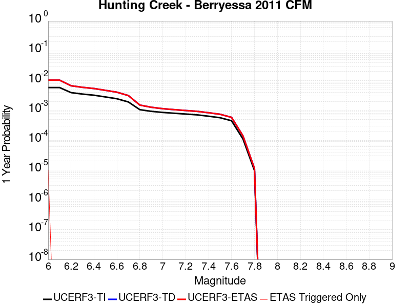 | 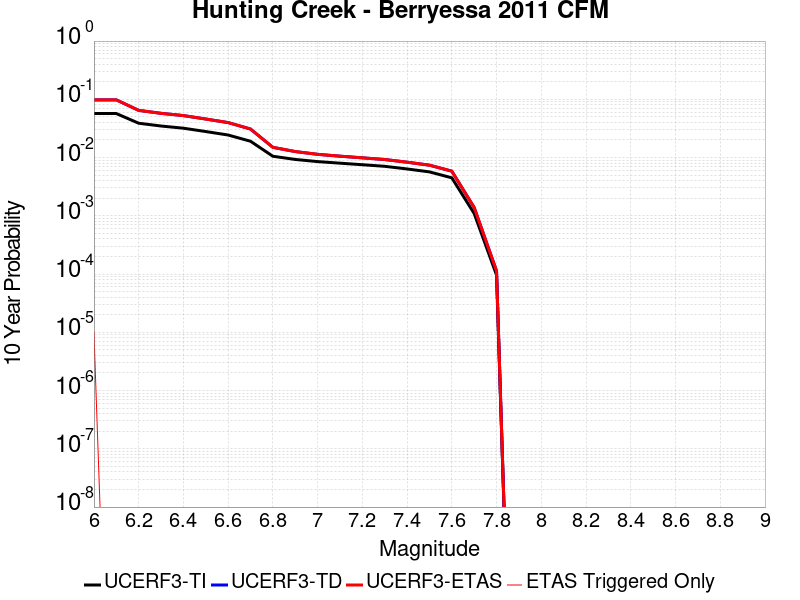 |

| Magnitude | 1 wk TI Prob | 1 wk TD Prob | 1 wk ETAS Prob | 1 wk ETAS/TD Gain | 1 wk ETAS Triggered Only | 1 mo TI Prob | 1 mo TD Prob | 1 mo ETAS Prob | 1 mo ETAS/TD Gain | 1 mo ETAS Triggered Only | 1 yr TI Prob | 1 yr TD Prob | 1 yr ETAS Prob | 1 yr ETAS/TD Gain | 1 yr ETAS Triggered Only | 10 yr TI Prob | 10 yr TD Prob | 10 yr ETAS Prob | 10 yr ETAS/TD Gain | 10 yr ETAS Triggered Only |
|-----|-----|-----|-----|-----|-----|-----|-----|-----|-----|-----|-----|-----|-----|-----|-----|-----|-----|-----|-----|-----|
| 6.0 | 1.1270982E-4 | 2.0028367E-4 | 2.1028167E-4 | 1.0499191 | 1.0E-5 | 4.8295266E-4 | 8.579912E-4 | 8.679827E-4 | 1.0116451 | 1.0E-5 | 0.0058641075 | 0.010386173 | 0.010396069 | 1.0009528 | 1.0E-5 | 0.057117578 | 0.09804048 | 0.0980495 | 1.000092 | 1.0E-5 |
| 6.1 | 1.1239393E-4 | 1.9976508E-4 | 1.9976508E-4 | 1.0 | 0.0 | 4.8159933E-4 | 8.557703E-4 | 8.557703E-4 | 1.0 | 0.0 | 0.0058477195 | 0.010359417 | 0.010359417 | 1.0 | 0.0 | 0.056962132 | 0.09779895 | 0.09779895 | 1.0 | 0.0 |
| 6.2 | 7.596265E-5 | 1.2933646E-4 | 1.2933646E-4 | 1.0 | 0.0 | 3.2551357E-4 | 5.5415573E-4 | 5.5415573E-4 | 1.0 | 0.0 | 0.0039559277 | 0.0067213587 | 0.0067213587 | 1.0 | 0.0 | 0.038862433 | 0.06459229 | 0.06459229 | 1.0 | 0.0 |
| 6.3 | 6.78794E-5 | 1.1448377E-4 | 1.1448377E-4 | 1.0 | 0.0 | 2.9087928E-4 | 4.9052597E-4 | 4.9052597E-4 | 1.0 | 0.0 | 0.003535705 | 0.005952661 | 0.005952661 | 1.0 | 0.0 | 0.034799766 | 0.057466213 | 0.057466213 | 1.0 | 0.0 |
| 6.4 | 6.2165134E-5 | 1.0434825E-4 | 1.0434825E-4 | 1.0 | 0.0 | 2.6639478E-4 | 4.4711027E-4 | 4.4711027E-4 | 1.0 | 0.0 | 0.0032385332 | 0.0054274183 | 0.0054274183 | 1.0 | 0.0 | 0.03191742 | 0.05255138 | 0.05255138 | 1.0 | 0.0 |
| 6.5 | 5.4368087E-5 | 9.070258E-5 | 9.070258E-5 | 1.0 | 0.0 | 2.3298527E-4 | 3.886537E-4 | 3.886537E-4 | 1.0 | 0.0 | 0.0028329059 | 0.0047197016 | 0.0047197016 | 1.0 | 0.0 | 0.027970633 | 0.045881182 | 0.045881182 | 1.0 | 0.0 |
| 6.6 | 4.729947E-5 | 7.847101E-5 | 7.847101E-5 | 1.0 | 0.0 | 2.0269625E-4 | 3.3624718E-4 | 3.3624718E-4 | 1.0 | 0.0 | 0.002465034 | 0.004084746 | 0.004084746 | 1.0 | 0.0 | 0.02437869 | 0.03985269 | 0.03985269 | 1.0 | 0.0 |
| 6.7 | 3.6875328E-5 | 6.0443555E-5 | 6.0443555E-5 | 1.0 | 0.0 | 1.5802756E-4 | 2.5900968E-4 | 2.5900968E-4 | 1.0 | 0.0 | 0.0019222875 | 0.0031482724 | 0.0031482724 | 1.0 | 0.0 | 0.019057442 | 0.03089371 | 0.03089371 | 1.0 | 0.0 |
| 6.8 | 2.0292036E-5 | 2.8976721E-5 | 2.8976721E-5 | 1.0 | 0.0 | 8.6962966E-5 | 1.2417998E-4 | 1.2417998E-4 | 1.0 | 0.0 | 0.0010582599 | 0.0015108302 | 0.0015108302 | 1.0 | 0.0 | 0.010532344 | 0.0149790775 | 0.0149790775 | 1.0 | 0.0 |
| 6.9 | 1.7871042E-5 | 2.4472653E-5 | 2.4472653E-5 | 1.0 | 0.0 | 7.658793E-5 | 1.04878585E-4 | 1.04878585E-4 | 1.0 | 0.0 | 9.320591E-4 | 0.0012761486 | 0.0012761486 | 1.0 | 0.0 | 0.009281595 | 0.012680395 | 0.012680395 | 1.0 | 0.0 |
| 7.0 | 1.6415532E-5 | 2.1906566E-5 | 2.1906566E-5 | 1.0 | 0.0 | 7.035038E-5 | 9.388191E-5 | 9.388191E-5 | 1.0 | 0.0 | 8.561793E-4 | 0.0011424144 | 0.0011424144 | 1.0 | 0.0 | 0.008528882 | 0.011365017 | 0.011365017 | 1.0 | 0.0 |
| 7.1 | 1.5409885E-5 | 2.0346588E-5 | 2.0346588E-5 | 1.0 | 0.0 | 6.6040695E-5 | 8.719676E-5 | 8.719676E-5 | 1.0 | 0.0 | 8.0374884E-4 | 0.0010611062 | 0.0010611062 | 1.0 | 0.0 | 0.00800848 | 0.010560924 | 0.010560924 | 1.0 | 0.0 |
| 7.2 | 1.4497423E-5 | 1.905519E-5 | 1.905519E-5 | 1.0 | 0.0 | 6.213033E-5 | 8.166256E-5 | 8.166256E-5 | 1.0 | 0.0 | 7.5617427E-4 | 9.937913E-4 | 9.937913E-4 | 1.0 | 0.0 | 0.0075360634 | 0.00989425 | 0.00989425 | 1.0 | 0.0 |
| 7.3 | 1.3615175E-5 | 1.7826347E-5 | 1.7826347E-5 | 1.0 | 0.0 | 5.8349444E-5 | 7.6396405E-5 | 7.6396405E-5 | 1.0 | 0.0 | 7.101729E-4 | 9.297323E-4 | 9.297323E-4 | 1.0 | 0.0 | 0.0070790765 | 0.009259124 | 0.009259124 | 1.0 | 0.0 |
| 7.4 | 1.2252825E-5 | 1.6026455E-5 | 1.6026455E-5 | 1.0 | 0.0 | 5.251105E-5 | 6.868302E-5 | 6.868302E-5 | 1.0 | 0.0 | 6.391345E-4 | 8.3589775E-4 | 8.3589775E-4 | 1.0 | 0.0 | 0.0063729943 | 0.008328172 | 0.008328172 | 1.0 | 0.0 |
| 7.5 | 1.0913301E-5 | 1.4241286E-5 | 1.4241286E-5 | 1.0 | 0.0 | 4.6770452E-5 | 6.103267E-5 | 6.103267E-5 | 1.0 | 0.0 | 5.6928146E-4 | 7.428222E-4 | 7.428222E-4 | 1.0 | 0.0 | 0.0056782532 | 0.0074039865 | 0.0074039865 | 1.0 | 0.0 |
| 7.6 | 8.623192E-6 | 1.12347825E-5 | 1.12347825E-5 | 1.0 | 0.0 | 3.6956015E-5 | 4.8148195E-5 | 4.8148195E-5 | 1.0 | 0.0 | 4.4984656E-4 | 5.8604917E-4 | 5.8604917E-4 | 1.0 | 0.0 | 0.00448937 | 0.005845504 | 0.005845504 | 1.0 | 0.0 |
| 7.7 | 2.0993634E-6 | 2.66264E-6 | 2.66264E-6 | 1.0 | 0.0 | 8.997241E-6 | 1.1411265E-5 | 1.1411265E-5 | 1.0 | 0.0 | 1.09535904E-4 | 1.3892337E-4 | 1.3892337E-4 | 1.0 | 0.0 | 0.0010948193 | 0.0013883994 | 0.0013883994 | 1.0 | 0.0 |
| 7.8 | 1.8428308E-7 | 2.1674624E-7 | 2.1674624E-7 | 1.0 | 0.0 | 7.897844E-7 | 9.289122E-7 | 9.289122E-7 | 1.0 | 0.0 | 9.615583E-6 | 1.130945E-5 | 1.130945E-5 | 1.0 | 0.0 | 9.615166E-5 | 1.1308173E-4 | 1.1308173E-4 | 1.0 | 0.0 |

## Shoreline
*[(top)](#table-of-contents)*

| 1 Week | 1 Month | 1 Year | 10 Year |
|-----|-----|-----|-----|
|  |  |  |  |

| Magnitude | 1 wk TI Prob | 1 wk TD Prob | 1 wk ETAS Prob | 1 wk ETAS/TD Gain | 1 wk ETAS Triggered Only | 1 mo TI Prob | 1 mo TD Prob | 1 mo ETAS Prob | 1 mo ETAS/TD Gain | 1 mo ETAS Triggered Only | 1 yr TI Prob | 1 yr TD Prob | 1 yr ETAS Prob | 1 yr ETAS/TD Gain | 1 yr ETAS Triggered Only | 10 yr TI Prob | 10 yr TD Prob | 10 yr ETAS Prob | 10 yr ETAS/TD Gain | 10 yr ETAS Triggered Only |
|-----|-----|-----|-----|-----|-----|-----|-----|-----|-----|-----|-----|-----|-----|-----|-----|-----|-----|-----|-----|-----|
| 6.0 | 3.9888673E-6 | 4.0479285E-6 | 1.4047888E-5 | 3.4703894 | 1.0E-5 | 1.7095033E-5 | 1.7348182E-5 | 2.7348007E-5 | 1.5764194 | 1.0E-5 | 2.0811215E-4 | 2.1119922E-4 | 2.2119712E-4 | 1.0473386 | 1.0E-5 | 0.0020791737 | 0.0021105339 | 0.0021205128 | 1.0047281 | 1.0E-5 |
| 6.1 | 3.9888673E-6 | 4.0479285E-6 | 1.4047888E-5 | 3.4703894 | 1.0E-5 | 1.7095033E-5 | 1.7348182E-5 | 2.7348007E-5 | 1.5764194 | 1.0E-5 | 2.0811215E-4 | 2.1119922E-4 | 2.2119712E-4 | 1.0473386 | 1.0E-5 | 0.0020791737 | 0.0021105339 | 0.0021205128 | 1.0047281 | 1.0E-5 |
| 6.2 | 1.4039653E-6 | 1.4100885E-6 | 1.1410075E-5 | 8.091743 | 1.0E-5 | 6.0169805E-6 | 6.043223E-6 | 1.6043163E-5 | 2.654736 | 1.0E-5 | 7.325427E-5 | 7.357382E-5 | 8.357308E-5 | 1.1359079 | 1.0E-5 | 7.3230127E-4 | 7.355006E-4 | 7.454933E-4 | 1.0135862 | 1.0E-5 |
| 6.3 | 1.4039653E-6 | 1.4100885E-6 | 1.1410075E-5 | 8.091743 | 1.0E-5 | 6.0169805E-6 | 6.043223E-6 | 1.6043163E-5 | 2.654736 | 1.0E-5 | 7.325427E-5 | 7.357382E-5 | 8.357308E-5 | 1.1359079 | 1.0E-5 | 7.3230127E-4 | 7.355006E-4 | 7.454933E-4 | 1.0135862 | 1.0E-5 |
| 6.4 | 1.3314152E-6 | 1.33616E-6 | 1.1336147E-5 | 8.484123 | 1.0E-5 | 5.7060524E-6 | 5.726388E-6 | 1.5726331E-5 | 2.7462916 | 1.0E-5 | 6.946897E-5 | 6.9716596E-5 | 7.9715894E-5 | 1.1434278 | 1.0E-5 | 6.9447263E-4 | 6.9695263E-4 | 7.0694566E-4 | 1.0143381 | 1.0E-5 |
| 6.5 | 1.1187026E-6 | 1.1203634E-6 | 1.1203634E-6 | 1.0 | 0.0 | 4.794431E-6 | 4.801549E-6 | 4.801549E-6 | 1.0 | 0.0 | 5.8370628E-5 | 5.8457317E-5 | 5.8457317E-5 | 1.0 | 0.0 | 5.83553E-4 | 5.844219E-4 | 5.844219E-4 | 1.0 | 0.0 |
| 6.6 | 9.793089E-7 | 9.784915E-7 | 9.784915E-7 | 1.0 | 0.0 | 4.1970316E-6 | 4.193528E-6 | 4.193528E-6 | 1.0 | 0.0 | 5.1097657E-5 | 5.1055024E-5 | 5.1055024E-5 | 1.0 | 0.0 | 5.108591E-4 | 5.104342E-4 | 5.104342E-4 | 1.0 | 0.0 |
| 6.7 | 8.995986E-7 | 8.972795E-7 | 8.972795E-7 | 1.0 | 0.0 | 3.8554167E-6 | 3.8454777E-6 | 3.8454777E-6 | 1.0 | 0.0 | 4.693869E-5 | 4.68177E-5 | 4.68177E-5 | 1.0 | 0.0 | 4.6928777E-4 | 4.680793E-4 | 4.680793E-4 | 1.0 | 0.0 |
| 6.8 | 7.931612E-7 | 7.8803976E-7 | 7.8803976E-7 | 1.0 | 0.0 | 3.3992578E-6 | 3.377309E-6 | 3.377309E-6 | 1.0 | 0.0 | 4.1385178E-5 | 4.1117964E-5 | 4.1117964E-5 | 1.0 | 0.0 | 4.1377472E-4 | 4.1110412E-4 | 4.1110412E-4 | 1.0 | 0.0 |
| 6.9 | 7.1465956E-7 | 7.078001E-7 | 7.078001E-7 | 1.0 | 0.0 | 3.062823E-6 | 3.0334254E-6 | 3.0334254E-6 | 1.0 | 0.0 | 3.7289232E-5 | 3.693133E-5 | 3.693133E-5 | 1.0 | 0.0 | 3.7282976E-4 | 3.6925232E-4 | 3.6925232E-4 | 1.0 | 0.0 |
| 7.0 | 6.389046E-7 | 6.299453E-7 | 6.299453E-7 | 1.0 | 0.0 | 2.7381598E-6 | 2.699763E-6 | 2.699763E-6 | 1.0 | 0.0 | 3.3336586E-5 | 3.286912E-5 | 3.286912E-5 | 1.0 | 0.0 | 3.3331584E-4 | 3.286428E-4 | 3.286428E-4 | 1.0 | 0.0 |
| 7.1 | 5.4300875E-7 | 5.311126E-7 | 5.311126E-7 | 1.0 | 0.0 | 2.3271782E-6 | 2.276195E-6 | 2.276195E-6 | 1.0 | 0.0 | 2.8333026E-5 | 2.7712322E-5 | 2.7712322E-5 | 1.0 | 0.0 | 2.8329415E-4 | 2.7708875E-4 | 2.7708875E-4 | 1.0 | 0.0 |
| 7.2 | 4.6768855E-7 | 4.5348904E-7 | 4.5348904E-7 | 1.0 | 0.0 | 2.0043778E-6 | 1.9435229E-6 | 1.9435229E-6 | 1.0 | 0.0 | 2.4403027E-5 | 2.3662134E-5 | 2.3662134E-5 | 1.0 | 0.0 | 2.4400349E-4 | 2.3659621E-4 | 2.3659621E-4 | 1.0 | 0.0 |
| 7.3 | 4.0966103E-7 | 3.9385614E-7 | 3.9385614E-7 | 1.0 | 0.0 | 1.7556889E-6 | 1.6879537E-6 | 1.6879537E-6 | 1.0 | 0.0 | 2.1375303E-5 | 2.0550642E-5 | 2.0550642E-5 | 1.0 | 0.0 | 2.1373246E-4 | 2.0548746E-4 | 2.0548746E-4 | 1.0 | 0.0 |
| 7.4 | 3.5105785E-7 | 3.3363924E-7 | 3.3363924E-7 | 1.0 | 0.0 | 1.5045327E-6 | 1.4298816E-6 | 1.4298816E-6 | 1.0 | 0.0 | 1.8317533E-5 | 1.7408669E-5 | 1.7408669E-5 | 1.0 | 0.0 | 1.8316023E-4 | 1.740731E-4 | 1.740731E-4 | 1.0 | 0.0 |
| 7.5 | 2.8737534E-7 | 2.681999E-7 | 2.681999E-7 | 1.0 | 0.0 | 1.2316079E-6 | 1.1494276E-6 | 1.1494276E-6 | 1.0 | 0.0 | 1.4994724E-5 | 1.399419E-5 | 1.399419E-5 | 1.0 | 0.0 | 1.4993713E-4 | 1.3993312E-4 | 1.3993312E-4 | 1.0 | 0.0 |
| 7.6 | 2.0924051E-7 | 1.8778938E-7 | 1.8778938E-7 | 1.0 | 0.0 | 8.967448E-7 | 8.0481135E-7 | 8.0481135E-7 | 1.0 | 0.0 | 1.0917813E-5 | 9.798534E-6 | 9.798534E-6 | 1.0 | 0.0 | 1.0917276E-4 | 9.798103E-5 | 9.798103E-5 | 1.0 | 0.0 |
| 7.7 | 1.392265E-7 | 1.1543341E-7 | 1.1543341E-7 | 1.0 | 0.0 | 5.9668486E-7 | 4.9471447E-7 | 4.9471447E-7 | 1.0 | 0.0 | 7.2646135E-6 | 6.0231323E-6 | 6.0231323E-6 | 1.0 | 0.0 | 7.2643765E-5 | 6.0229693E-5 | 6.0229693E-5 | 1.0 | 0.0 |
| 7.8 | 8.1080074E-8 | 5.5866355E-8 | 5.5866355E-8 | 1.0 | 0.0 | 3.4748598E-7 | 2.394272E-7 | 2.394272E-7 | 1.0 | 0.0 | 4.2306337E-6 | 2.9150222E-6 | 2.9150222E-6 | 1.0 | 0.0 | 4.230553E-5 | 2.9149842E-5 | 2.9149842E-5 | 1.0 | 0.0 |
| 7.9 | 5.0859036E-8 | 2.7243395E-8 | 2.7243395E-8 | 1.0 | 0.0 | 2.1796728E-7 | 1.16757406E-7 | 1.16757406E-7 | 1.0 | 0.0 | 2.6537484E-6 | 1.4215204E-6 | 1.4215204E-6 | 1.0 | 0.0 | 2.6537167E-5 | 1.4215115E-5 | 1.4215115E-5 | 1.0 | 0.0 |
| 8.0 | 3.1760536E-8 | 1.3575991E-8 | 1.3575991E-8 | 1.0 | 0.0 | 1.3611657E-7 | 5.8182817E-8 | 5.8182817E-8 | 1.0 | 0.0 | 1.6572179E-6 | 7.083755E-7 | 7.083755E-7 | 1.0 | 0.0 | 1.6572056E-5 | 7.083733E-6 | 7.083733E-6 | 1.0 | 0.0 |
| 8.1 | 1.2947896E-8 | 5.6625185E-9 | 5.6625185E-9 | 1.0 | 0.0 | 5.5490982E-8 | 2.4267937E-8 | 2.4267937E-8 | 1.0 | 0.0 | 6.756025E-7 | 2.954621E-7 | 2.954621E-7 | 1.0 | 0.0 | 6.7560045E-6 | 2.9546172E-6 | 2.9546172E-6 | 1.0 | 0.0 |

## Johnson Valley (No) 2011 rev
*[(top)](#table-of-contents)*

| 1 Week | 1 Month | 1 Year | 10 Year |
|-----|-----|-----|-----|
|  |  | 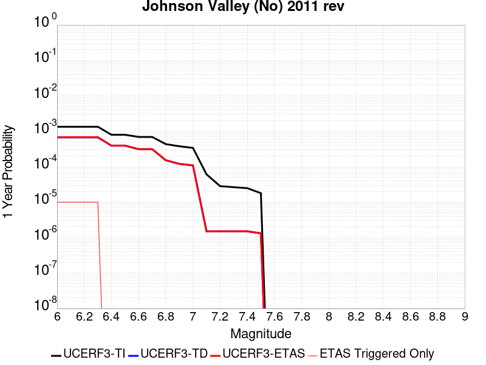 |  |

| Magnitude | 1 wk TI Prob | 1 wk TD Prob | 1 wk ETAS Prob | 1 wk ETAS/TD Gain | 1 wk ETAS Triggered Only | 1 mo TI Prob | 1 mo TD Prob | 1 mo ETAS Prob | 1 mo ETAS/TD Gain | 1 mo ETAS Triggered Only | 1 yr TI Prob | 1 yr TD Prob | 1 yr ETAS Prob | 1 yr ETAS/TD Gain | 1 yr ETAS Triggered Only | 10 yr TI Prob | 10 yr TD Prob | 10 yr ETAS Prob | 10 yr ETAS/TD Gain | 10 yr ETAS Triggered Only |
|-----|-----|-----|-----|-----|-----|-----|-----|-----|-----|-----|-----|-----|-----|-----|-----|-----|-----|-----|-----|-----|
| 6.0 | 2.577707E-5 | 1.2901208E-5 | 1.2901208E-5 | 1.0 | 0.0 | 1.1046848E-4 | 5.528994E-5 | 5.528994E-5 | 1.0 | 0.0 | 0.0013441239 | 6.729868E-4 | 6.8298005E-4 | 1.0148492 | 1.0E-5 | 0.013360229 | 0.006713397 | 0.00672333 | 1.0014795 | 1.0E-5 |
| 6.1 | 2.577707E-5 | 1.2901208E-5 | 1.2901208E-5 | 1.0 | 0.0 | 1.1046848E-4 | 5.528994E-5 | 5.528994E-5 | 1.0 | 0.0 | 0.0013441239 | 6.729868E-4 | 6.8298005E-4 | 1.0148492 | 1.0E-5 | 0.013360229 | 0.006713397 | 0.00672333 | 1.0014795 | 1.0E-5 |
| 6.2 | 2.577707E-5 | 1.2901208E-5 | 1.2901208E-5 | 1.0 | 0.0 | 1.1046848E-4 | 5.528994E-5 | 5.528994E-5 | 1.0 | 0.0 | 0.0013441239 | 6.729868E-4 | 6.8298005E-4 | 1.0148492 | 1.0E-5 | 0.013360229 | 0.006713397 | 0.00672333 | 1.0014795 | 1.0E-5 |
| 6.3 | 2.577707E-5 | 1.2901208E-5 | 1.2901208E-5 | 1.0 | 0.0 | 1.1046848E-4 | 5.528994E-5 | 5.528994E-5 | 1.0 | 0.0 | 0.0013441239 | 6.729868E-4 | 6.8298005E-4 | 1.0148492 | 1.0E-5 | 0.013360229 | 0.006713397 | 0.00672333 | 1.0014795 | 1.0E-5 |
| 6.4 | 1.5296591E-5 | 7.5369735E-6 | 7.5369735E-6 | 1.0 | 0.0 | 6.555518E-5 | 3.230102E-5 | 3.230102E-5 | 1.0 | 0.0 | 7.97842E-4 | 3.9321271E-4 | 3.9321271E-4 | 1.0 | 0.0 | 0.007949836 | 0.003927011 | 0.003927011 | 1.0 | 0.0 |
| 6.5 | 1.5296591E-5 | 7.5369735E-6 | 7.5369735E-6 | 1.0 | 0.0 | 6.555518E-5 | 3.230102E-5 | 3.230102E-5 | 1.0 | 0.0 | 7.97842E-4 | 3.9321271E-4 | 3.9321271E-4 | 1.0 | 0.0 | 0.007949836 | 0.003927011 | 0.003927011 | 1.0 | 0.0 |
| 6.6 | 1.3289383E-5 | 5.9919316E-6 | 5.9919316E-6 | 1.0 | 0.0 | 5.6953253E-5 | 2.567955E-5 | 2.567955E-5 | 1.0 | 0.0 | 6.9318525E-4 | 3.1262063E-4 | 3.1262063E-4 | 1.0 | 0.0 | 0.0069102696 | 0.0031234731 | 0.0031234731 | 1.0 | 0.0 |
| 6.7 | 1.3289383E-5 | 5.9919316E-6 | 5.9919316E-6 | 1.0 | 0.0 | 5.6953253E-5 | 2.567955E-5 | 2.567955E-5 | 1.0 | 0.0 | 6.9318525E-4 | 3.1262063E-4 | 3.1262063E-4 | 1.0 | 0.0 | 0.0069102696 | 0.0031234731 | 0.0031234731 | 1.0 | 0.0 |
| 6.8 | 8.330789E-6 | 2.9214577E-6 | 2.9214577E-6 | 1.0 | 0.0 | 3.570289E-5 | 1.2520505E-5 | 1.2520505E-5 | 1.0 | 0.0 | 4.34596E-4 | 1.524322E-4 | 1.524322E-4 | 1.0 | 0.0 | 0.0043374705 | 0.0015238364 | 0.0015238364 | 1.0 | 0.0 |
| 6.9 | 7.2359003E-6 | 2.3014702E-6 | 2.3014702E-6 | 1.0 | 0.0 | 3.1010633E-5 | 9.863436E-6 | 9.863436E-6 | 1.0 | 0.0 | 3.7748902E-4 | 1.2008605E-4 | 1.2008605E-4 | 1.0 | 0.0 | 0.0037684843 | 0.0012007345 | 0.0012007345 | 1.0 | 0.0 |
| 7.0 | 6.5149957E-6 | 2.0886398E-6 | 2.0886398E-6 | 1.0 | 0.0 | 2.792111E-5 | 8.951313E-6 | 8.951313E-6 | 1.0 | 0.0 | 3.398865E-4 | 1.0898209E-4 | 1.0898209E-4 | 1.0 | 0.0 | 0.003393671 | 0.0010898062 | 0.0010898062 | 1.0 | 0.0 |
| 7.1 | 1.1662233E-6 | 2.8793124E-8 | 2.8793124E-8 | 1.0 | 0.0 | 4.9980904E-6 | 1.2339909E-7 | 1.2339909E-7 | 1.0 | 0.0 | 6.0850052E-5 | 1.5023832E-6 | 1.5023832E-6 | 1.0 | 0.0 | 6.083339E-4 | 1.5023746E-5 | 1.5023746E-5 | 1.0 | 0.0 |
| 7.2 | 5.413881E-7 | 2.8793124E-8 | 2.8793124E-8 | 1.0 | 0.0 | 2.3202326E-6 | 1.2339909E-7 | 1.2339909E-7 | 1.0 | 0.0 | 2.8248465E-5 | 1.5023832E-6 | 1.5023832E-6 | 1.0 | 0.0 | 2.8244875E-4 | 1.5023746E-5 | 1.5023746E-5 | 1.0 | 0.0 |
| 7.3 | 5.076821E-7 | 2.8793124E-8 | 2.8793124E-8 | 1.0 | 0.0 | 2.1757785E-6 | 1.2339909E-7 | 1.2339909E-7 | 1.0 | 0.0 | 2.648978E-5 | 1.5023832E-6 | 1.5023832E-6 | 1.0 | 0.0 | 2.6486625E-4 | 1.5023746E-5 | 1.5023746E-5 | 1.0 | 0.0 |
| 7.4 | 4.7568687E-7 | 2.8775073E-8 | 2.8775073E-8 | 1.0 | 0.0 | 2.0386565E-6 | 1.2332174E-7 | 1.2332174E-7 | 1.0 | 0.0 | 2.482036E-5 | 1.5014413E-6 | 1.5014413E-6 | 1.0 | 0.0 | 2.4817587E-4 | 1.5014328E-5 | 1.5014328E-5 | 1.0 | 0.0 |
| 7.5 | 3.435626E-7 | 2.5350424E-8 | 2.5350424E-8 | 1.0 | 0.0 | 1.4724103E-6 | 1.0864467E-7 | 1.0864467E-7 | 1.0 | 0.0 | 1.7926448E-5 | 1.3227482E-6 | 1.3227482E-6 | 1.0 | 0.0 | 1.7925001E-4 | 1.3227419E-5 | 1.3227419E-5 | 1.0 | 0.0 |

## Ozena
*[(top)](#table-of-contents)*

| 1 Week | 1 Month | 1 Year | 10 Year |
|-----|-----|-----|-----|
|  |  |  |  |

| Magnitude | 1 wk TI Prob | 1 wk TD Prob | 1 wk ETAS Prob | 1 wk ETAS/TD Gain | 1 wk ETAS Triggered Only | 1 mo TI Prob | 1 mo TD Prob | 1 mo ETAS Prob | 1 mo ETAS/TD Gain | 1 mo ETAS Triggered Only | 1 yr TI Prob | 1 yr TD Prob | 1 yr ETAS Prob | 1 yr ETAS/TD Gain | 1 yr ETAS Triggered Only | 10 yr TI Prob | 10 yr TD Prob | 10 yr ETAS Prob | 10 yr ETAS/TD Gain | 10 yr ETAS Triggered Only |
|-----|-----|-----|-----|-----|-----|-----|-----|-----|-----|-----|-----|-----|-----|-----|-----|-----|-----|-----|-----|-----|
| 6.0 | 1.4377547E-6 | 1.4513782E-6 | 1.4513782E-6 | 1.0 | 0.0 | 6.161791E-6 | 6.2201793E-6 | 1.6220118E-5 | 2.6076608 | 1.0E-5 | 7.5017226E-5 | 7.572832E-5 | 8.5727566E-5 | 1.132041 | 1.0E-5 | 7.4991904E-4 | 7.570518E-4 | 7.670442E-4 | 1.0131991 | 1.0E-5 |
| 6.1 | 1.4377547E-6 | 1.4513782E-6 | 1.4513782E-6 | 1.0 | 0.0 | 6.161791E-6 | 6.2201793E-6 | 1.6220118E-5 | 2.6076608 | 1.0E-5 | 7.5017226E-5 | 7.572832E-5 | 8.5727566E-5 | 1.132041 | 1.0E-5 | 7.4991904E-4 | 7.570518E-4 | 7.670442E-4 | 1.0131991 | 1.0E-5 |
| 6.2 | 1.4377547E-6 | 1.4513782E-6 | 1.4513782E-6 | 1.0 | 0.0 | 6.161791E-6 | 6.2201793E-6 | 1.6220118E-5 | 2.6076608 | 1.0E-5 | 7.5017226E-5 | 7.572832E-5 | 8.5727566E-5 | 1.132041 | 1.0E-5 | 7.4991904E-4 | 7.570518E-4 | 7.670442E-4 | 1.0131991 | 1.0E-5 |
| 6.3 | 1.4377547E-6 | 1.4513782E-6 | 1.4513782E-6 | 1.0 | 0.0 | 6.161791E-6 | 6.2201793E-6 | 1.6220118E-5 | 2.6076608 | 1.0E-5 | 7.5017226E-5 | 7.572832E-5 | 8.5727566E-5 | 1.132041 | 1.0E-5 | 7.4991904E-4 | 7.570518E-4 | 7.670442E-4 | 1.0131991 | 1.0E-5 |
| 6.4 | 1.4377547E-6 | 1.4513782E-6 | 1.4513782E-6 | 1.0 | 0.0 | 6.161791E-6 | 6.2201793E-6 | 1.6220118E-5 | 2.6076608 | 1.0E-5 | 7.5017226E-5 | 7.572832E-5 | 8.5727566E-5 | 1.132041 | 1.0E-5 | 7.4991904E-4 | 7.570518E-4 | 7.670442E-4 | 1.0131991 | 1.0E-5 |
| 6.5 | 1.4377547E-6 | 1.4513782E-6 | 1.4513782E-6 | 1.0 | 0.0 | 6.161791E-6 | 6.2201793E-6 | 1.6220118E-5 | 2.6076608 | 1.0E-5 | 7.5017226E-5 | 7.572832E-5 | 8.5727566E-5 | 1.132041 | 1.0E-5 | 7.4991904E-4 | 7.570518E-4 | 7.670442E-4 | 1.0131991 | 1.0E-5 |
| 6.6 | 1.4377547E-6 | 1.4513782E-6 | 1.4513782E-6 | 1.0 | 0.0 | 6.161791E-6 | 6.2201793E-6 | 1.6220118E-5 | 2.6076608 | 1.0E-5 | 7.5017226E-5 | 7.572832E-5 | 8.5727566E-5 | 1.132041 | 1.0E-5 | 7.4991904E-4 | 7.570518E-4 | 7.670442E-4 | 1.0131991 | 1.0E-5 |
| 6.7 | 1.4377547E-6 | 1.4513782E-6 | 1.4513782E-6 | 1.0 | 0.0 | 6.161791E-6 | 6.2201793E-6 | 1.6220118E-5 | 2.6076608 | 1.0E-5 | 7.5017226E-5 | 7.572832E-5 | 8.5727566E-5 | 1.132041 | 1.0E-5 | 7.4991904E-4 | 7.570518E-4 | 7.670442E-4 | 1.0131991 | 1.0E-5 |
| 6.8 | 9.223257E-7 | 9.317624E-7 | 9.317624E-7 | 1.0 | 0.0 | 3.9528186E-6 | 3.9932615E-6 | 1.3993222E-5 | 3.5042088 | 1.0E-5 | 4.81245E-5 | 4.8616912E-5 | 5.8616428E-5 | 1.2056798 | 1.0E-5 | 4.811408E-4 | 4.860668E-4 | 4.960619E-4 | 1.0205632 | 1.0E-5 |
| 6.9 | 9.141515E-7 | 9.235371E-7 | 9.235371E-7 | 1.0 | 0.0 | 3.917786E-6 | 3.9580104E-6 | 1.3957971E-5 | 3.526512 | 1.0E-5 | 4.7698002E-5 | 4.818775E-5 | 5.818727E-5 | 1.2075117 | 1.0E-5 | 4.7687767E-4 | 4.8177704E-4 | 4.917722E-4 | 1.0207465 | 1.0E-5 |
| 7.0 | 8.767648E-7 | 8.8585773E-7 | 8.8585773E-7 | 1.0 | 0.0 | 3.757558E-6 | 3.7965276E-6 | 1.379649E-5 | 3.6339757 | 1.0E-5 | 4.5747307E-5 | 4.6221783E-5 | 5.622132E-5 | 1.2163382 | 1.0E-5 | 4.5737892E-4 | 4.6212564E-4 | 4.7212103E-4 | 1.0216291 | 1.0E-5 |
| 7.1 | 8.199402E-7 | 8.2853984E-7 | 8.2853984E-7 | 1.0 | 0.0 | 3.5140247E-6 | 3.5508804E-6 | 1.3550845E-5 | 3.8161929 | 1.0E-5 | 4.2782412E-5 | 4.323115E-5 | 5.3230717E-5 | 1.2313046 | 1.0E-5 | 4.2774176E-4 | 4.322311E-4 | 4.422268E-4 | 1.0231258 | 1.0E-5 |
| 7.2 | 7.38705E-7 | 7.464262E-7 | 7.464262E-7 | 1.0 | 0.0 | 3.1658747E-6 | 3.198966E-6 | 1.3198934E-5 | 4.1260004 | 1.0E-5 | 3.8543843E-5 | 3.894675E-5 | 4.894636E-5 | 1.2567508 | 1.0E-5 | 3.853716E-4 | 3.8940276E-4 | 3.9939885E-4 | 1.0256704 | 1.0E-5 |
| 7.3 | 6.490017E-7 | 6.557802E-7 | 6.557802E-7 | 1.0 | 0.0 | 2.7814328E-6 | 2.8104837E-6 | 1.2810456E-5 | 4.5580964 | 1.0E-5 | 3.386342E-5 | 3.4217133E-5 | 4.421679E-5 | 1.2922412 | 1.0E-5 | 3.3858258E-4 | 3.4212202E-4 | 3.521186E-4 | 1.0292194 | 1.0E-5 |
| 7.4 | 5.346736E-7 | 5.4022604E-7 | 5.4022604E-7 | 1.0 | 0.0 | 2.291456E-6 | 2.3152527E-6 | 1.23152295E-5 | 5.319173 | 1.0E-5 | 2.789812E-5 | 2.8187867E-5 | 3.8187587E-5 | 1.3547525 | 1.0E-5 | 2.789462E-4 | 2.8184598E-4 | 2.9184314E-4 | 1.0354704 | 1.0E-5 |
| 7.5 | 2.939325E-7 | 2.9666057E-7 | 2.9666057E-7 | 1.0 | 0.0 | 1.25971E-6 | 1.271402E-6 | 1.271402E-6 | 1.0 | 0.0 | 1.5336862E-5 | 1.5479225E-5 | 1.5479225E-5 | 1.0 | 0.0 | 1.5335804E-4 | 1.5478309E-4 | 1.5478309E-4 | 1.0 | 0.0 |
| 7.6 | 1.4151905E-7 | 1.4253266E-7 | 1.4253266E-7 | 1.0 | 0.0 | 6.065101E-7 | 6.108541E-7 | 6.108541E-7 | 1.0 | 0.0 | 7.3842357E-6 | 7.4371237E-6 | 7.4371237E-6 | 1.0 | 0.0 | 7.38399E-5 | 7.436883E-5 | 7.436883E-5 | 1.0 | 0.0 |
| 7.7 | 4.4957577E-8 | 4.5252243E-8 | 4.5252243E-8 | 1.0 | 0.0 | 1.9267533E-7 | 1.9393818E-7 | 1.9393818E-7 | 1.0 | 0.0 | 2.3458194E-6 | 2.3611947E-6 | 2.3611947E-6 | 1.0 | 0.0 | 2.3457947E-5 | 2.3611707E-5 | 2.3611707E-5 | 1.0 | 0.0 |
| 7.8 | 5.9993255E-9 | 6.0412972E-9 | 6.0412972E-9 | 1.0 | 0.0 | 2.5711394E-8 | 2.5891273E-8 | 2.5891273E-8 | 1.0 | 0.0 | 3.1303617E-7 | 3.1522623E-7 | 3.1522623E-7 | 1.0 | 0.0 | 3.1303573E-6 | 3.1522588E-6 | 3.1522588E-6 | 1.0 | 0.0 |

## Las Positas
*[(top)](#table-of-contents)*

| 1 Week | 1 Month | 1 Year | 10 Year |
|-----|-----|-----|-----|
|  |  |  | 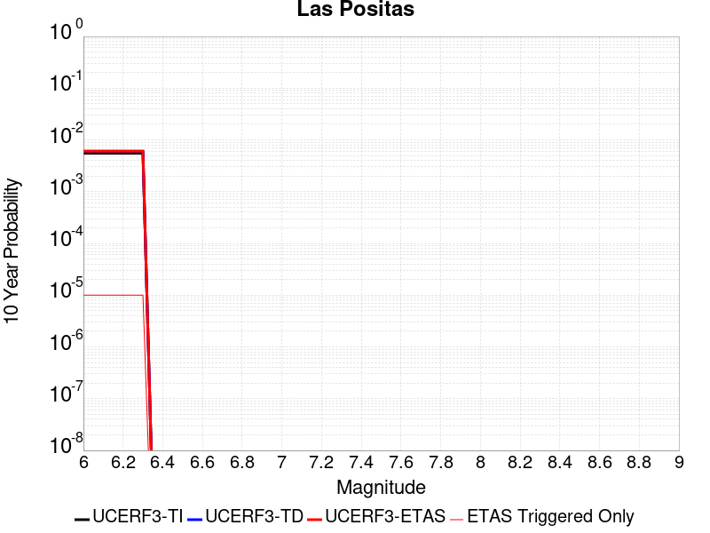 |

| Magnitude | 1 wk TI Prob | 1 wk TD Prob | 1 wk ETAS Prob | 1 wk ETAS/TD Gain | 1 wk ETAS Triggered Only | 1 mo TI Prob | 1 mo TD Prob | 1 mo ETAS Prob | 1 mo ETAS/TD Gain | 1 mo ETAS Triggered Only | 1 yr TI Prob | 1 yr TD Prob | 1 yr ETAS Prob | 1 yr ETAS/TD Gain | 1 yr ETAS Triggered Only | 10 yr TI Prob | 10 yr TD Prob | 10 yr ETAS Prob | 10 yr ETAS/TD Gain | 10 yr ETAS Triggered Only |
|-----|-----|-----|-----|-----|-----|-----|-----|-----|-----|-----|-----|-----|-----|-----|-----|-----|-----|-----|-----|-----|
| 6.0 | 1.0659424E-5 | 1.15911225E-5 | 2.1591006E-5 | 1.8627192 | 1.0E-5 | 4.568245E-5 | 4.9676237E-5 | 5.967574E-5 | 1.2012935 | 1.0E-5 | 5.560419E-4 | 6.048082E-4 | 6.148022E-4 | 1.0165242 | 1.0E-5 | 0.005546526 | 0.006048082 | 0.0060580214 | 1.0016434 | 1.0E-5 |
| 6.1 | 1.0659424E-5 | 1.15911225E-5 | 2.1591006E-5 | 1.8627192 | 1.0E-5 | 4.568245E-5 | 4.9676237E-5 | 5.967574E-5 | 1.2012935 | 1.0E-5 | 5.560419E-4 | 6.048082E-4 | 6.148022E-4 | 1.0165242 | 1.0E-5 | 0.005546526 | 0.006048082 | 0.0060580214 | 1.0016434 | 1.0E-5 |
| 6.2 | 1.0659424E-5 | 1.15911225E-5 | 2.1591006E-5 | 1.8627192 | 1.0E-5 | 4.568245E-5 | 4.9676237E-5 | 5.967574E-5 | 1.2012935 | 1.0E-5 | 5.560419E-4 | 6.048082E-4 | 6.148022E-4 | 1.0165242 | 1.0E-5 | 0.005546526 | 0.006048082 | 0.0060580214 | 1.0016434 | 1.0E-5 |
| 6.3 | 1.0659424E-5 | 1.15911225E-5 | 2.1591006E-5 | 1.8627192 | 1.0E-5 | 4.568245E-5 | 4.9676237E-5 | 5.967574E-5 | 1.2012935 | 1.0E-5 | 5.560419E-4 | 6.048082E-4 | 6.148022E-4 | 1.0165242 | 1.0E-5 | 0.005546526 | 0.006048082 | 0.0060580214 | 1.0016434 | 1.0E-5 |

## Elsinore (Coyote Mountains)
*[(top)](#table-of-contents)*

| 1 Week | 1 Month | 1 Year | 10 Year |
|-----|-----|-----|-----|
|  |  |  |  |

| Magnitude | 1 wk TI Prob | 1 wk TD Prob | 1 wk ETAS Prob | 1 wk ETAS/TD Gain | 1 wk ETAS Triggered Only | 1 mo TI Prob | 1 mo TD Prob | 1 mo ETAS Prob | 1 mo ETAS/TD Gain | 1 mo ETAS Triggered Only | 1 yr TI Prob | 1 yr TD Prob | 1 yr ETAS Prob | 1 yr ETAS/TD Gain | 1 yr ETAS Triggered Only | 10 yr TI Prob | 10 yr TD Prob | 10 yr ETAS Prob | 10 yr ETAS/TD Gain | 10 yr ETAS Triggered Only |
|-----|-----|-----|-----|-----|-----|-----|-----|-----|-----|-----|-----|-----|-----|-----|-----|-----|-----|-----|-----|-----|
| 6.0 | 4.20513E-5 | 4.8630944E-5 | 4.8630944E-5 | 1.0 | 0.0 | 1.8020741E-4 | 2.0840492E-4 | 2.0840492E-4 | 1.0 | 0.0 | 0.0021918174 | 0.0025349057 | 0.0025349057 | 1.0 | 0.0 | 0.021703249 | 0.025111204 | 0.025120951 | 1.0003883 | 1.0E-5 |
| 6.1 | 4.20513E-5 | 4.8630944E-5 | 4.8630944E-5 | 1.0 | 0.0 | 1.8020741E-4 | 2.0840492E-4 | 2.0840492E-4 | 1.0 | 0.0 | 0.0021918174 | 0.0025349057 | 0.0025349057 | 1.0 | 0.0 | 0.021703249 | 0.025111204 | 0.025120951 | 1.0003883 | 1.0E-5 |
| 6.2 | 2.3413893E-5 | 2.4695422E-5 | 2.4695422E-5 | 1.0 | 0.0 | 1.0034139E-4 | 1.0583377E-4 | 1.0583377E-4 | 1.0 | 0.0 | 0.0012209718 | 0.0012878523 | 0.0012878523 | 1.0 | 0.0 | 0.012142851 | 0.012812569 | 0.012812569 | 1.0 | 0.0 |
| 6.3 | 2.3413893E-5 | 2.4695422E-5 | 2.4695422E-5 | 1.0 | 0.0 | 1.0034139E-4 | 1.0583377E-4 | 1.0583377E-4 | 1.0 | 0.0 | 0.0012209718 | 0.0012878523 | 0.0012878523 | 1.0 | 0.0 | 0.012142851 | 0.012812569 | 0.012812569 | 1.0 | 0.0 |
| 6.4 | 1.6894814E-5 | 1.6568214E-5 | 1.6568214E-5 | 1.0 | 0.0 | 7.240433E-5 | 7.100491E-5 | 7.100491E-5 | 1.0 | 0.0 | 8.811662E-4 | 8.641788E-4 | 8.641788E-4 | 1.0 | 0.0 | 0.0087768035 | 0.008611842 | 0.008611842 | 1.0 | 0.0 |
| 6.5 | 1.6894814E-5 | 1.6568214E-5 | 1.6568214E-5 | 1.0 | 0.0 | 7.240433E-5 | 7.100491E-5 | 7.100491E-5 | 1.0 | 0.0 | 8.811662E-4 | 8.641788E-4 | 8.641788E-4 | 1.0 | 0.0 | 0.0087768035 | 0.008611842 | 0.008611842 | 1.0 | 0.0 |
| 6.6 | 1.1910969E-5 | 1.0530538E-5 | 1.0530538E-5 | 1.0 | 0.0 | 5.1046012E-5 | 4.513017E-5 | 4.513017E-5 | 1.0 | 0.0 | 6.21308E-4 | 5.493346E-4 | 5.493346E-4 | 1.0 | 0.0 | 0.0061957375 | 0.0054810685 | 0.0054810685 | 1.0 | 0.0 |
| 6.7 | 9.1486E-6 | 7.2026473E-6 | 7.2026473E-6 | 1.0 | 0.0 | 3.9207694E-5 | 3.0868145E-5 | 3.0868145E-5 | 1.0 | 0.0 | 4.7724912E-4 | 3.7575865E-4 | 3.7575865E-4 | 1.0 | 0.0 | 0.0047622547 | 0.0037516125 | 0.0037516125 | 1.0 | 0.0 |
| 6.8 | 7.90441E-6 | 5.7288153E-6 | 5.7288153E-6 | 1.0 | 0.0 | 3.3875604E-5 | 2.4551842E-5 | 2.4551842E-5 | 1.0 | 0.0 | 4.1235742E-4 | 2.9887896E-4 | 2.9887896E-4 | 1.0 | 0.0 | 0.0041159308 | 0.0029848986 | 0.0029848986 | 1.0 | 0.0 |
| 6.9 | 7.77015E-6 | 5.5827695E-6 | 5.5827695E-6 | 1.0 | 0.0 | 3.3300217E-5 | 2.3925944E-5 | 2.3925944E-5 | 1.0 | 0.0 | 4.0535472E-4 | 2.912607E-4 | 2.912607E-4 | 1.0 | 0.0 | 0.004046161 | 0.0029089167 | 0.0029089167 | 1.0 | 0.0 |
| 7.0 | 7.675798E-6 | 5.4796283E-6 | 5.4796283E-6 | 1.0 | 0.0 | 3.289586E-5 | 2.3483917E-5 | 2.3483917E-5 | 1.0 | 0.0 | 4.004335E-4 | 2.8588044E-4 | 2.8588044E-4 | 1.0 | 0.0 | 0.003997127 | 0.0028552532 | 0.0028552532 | 1.0 | 0.0 |
| 7.1 | 7.447814E-6 | 5.2385003E-6 | 5.2385003E-6 | 1.0 | 0.0 | 3.191881E-5 | 2.245053E-5 | 2.245053E-5 | 1.0 | 0.0 | 3.8854225E-4 | 2.7330214E-4 | 2.7330214E-4 | 1.0 | 0.0 | 0.003878636 | 0.0027297847 | 0.0027297847 | 1.0 | 0.0 |
| 7.2 | 7.128185E-6 | 4.905146E-6 | 4.905146E-6 | 1.0 | 0.0 | 3.0549007E-5 | 2.1021891E-5 | 2.1021891E-5 | 1.0 | 0.0 | 3.7187067E-4 | 2.5591266E-4 | 2.5591266E-4 | 1.0 | 0.0 | 0.00371249 | 0.002556298 | 0.002556298 | 1.0 | 0.0 |
| 7.3 | 7.0913875E-6 | 4.873821E-6 | 4.873821E-6 | 1.0 | 0.0 | 3.0391306E-5 | 2.0887644E-5 | 2.0887644E-5 | 1.0 | 0.0 | 3.6995133E-4 | 2.542786E-4 | 2.542786E-4 | 1.0 | 0.0 | 0.0036933604 | 0.0025399947 | 0.0025399947 | 1.0 | 0.0 |
| 7.4 | 7.051521E-6 | 4.837673E-6 | 4.837673E-6 | 1.0 | 0.0 | 3.0220453E-5 | 2.0732725E-5 | 2.0732725E-5 | 1.0 | 0.0 | 3.6787192E-4 | 2.5239287E-4 | 2.5239287E-4 | 1.0 | 0.0 | 0.0036726352 | 0.0025211805 | 0.0025211805 | 1.0 | 0.0 |
| 7.5 | 6.910666E-6 | 4.7332255E-6 | 4.7332255E-6 | 1.0 | 0.0 | 2.9616802E-5 | 2.02851E-5 | 2.02851E-5 | 1.0 | 0.0 | 3.605249E-4 | 2.4694428E-4 | 2.4694428E-4 | 1.0 | 0.0 | 0.0035994058 | 0.002466817 | 0.002466817 | 1.0 | 0.0 |
| 7.6 | 6.341753E-6 | 4.306345E-6 | 4.306345E-6 | 1.0 | 0.0 | 2.7178658E-5 | 1.8455641E-5 | 1.8455641E-5 | 1.0 | 0.0 | 3.3084993E-4 | 2.2467543E-4 | 2.2467543E-4 | 1.0 | 0.0 | 0.0033035777 | 0.002244598 | 0.002244598 | 1.0 | 0.0 |
| 7.7 | 3.9205916E-6 | 2.2437468E-6 | 2.2437468E-6 | 1.0 | 0.0 | 1.6802427E-5 | 9.616027E-6 | 9.616027E-6 | 1.0 | 0.0 | 2.0455034E-4 | 1.17069576E-4 | 1.17069576E-4 | 1.0 | 0.0 | 0.0020436216 | 0.001170152 | 0.001170152 | 1.0 | 0.0 |
| 7.8 | 2.0846227E-7 | 8.4853966E-8 | 8.4853966E-8 | 1.0 | 0.0 | 8.9340944E-7 | 3.6365984E-7 | 3.6365984E-7 | 1.0 | 0.0 | 1.0877206E-5 | 4.427553E-6 | 4.427553E-6 | 1.0 | 0.0 | 1.0876673E-4 | 4.4274973E-5 | 4.4274973E-5 | 1.0 | 0.0 |
| 7.9 | 4.4969806E-9 | 2.269088E-9 | 2.269088E-9 | 1.0 | 0.0 | 1.9272775E-8 | 9.724664E-9 | 9.724664E-9 | 1.0 | 0.0 | 2.3464601E-7 | 1.1839777E-7 | 1.1839777E-7 | 1.0 | 0.0 | 2.3464577E-6 | 1.1839772E-6 | 1.1839772E-6 | 1.0 | 0.0 |

## Pitas Point (Lower West)
*[(top)](#table-of-contents)*

| 1 Week | 1 Month | 1 Year | 10 Year |
|-----|-----|-----|-----|
|  |  |  |  |

| Magnitude | 1 wk TI Prob | 1 wk TD Prob | 1 wk ETAS Prob | 1 wk ETAS/TD Gain | 1 wk ETAS Triggered Only | 1 mo TI Prob | 1 mo TD Prob | 1 mo ETAS Prob | 1 mo ETAS/TD Gain | 1 mo ETAS Triggered Only | 1 yr TI Prob | 1 yr TD Prob | 1 yr ETAS Prob | 1 yr ETAS/TD Gain | 1 yr ETAS Triggered Only | 10 yr TI Prob | 10 yr TD Prob | 10 yr ETAS Prob | 10 yr ETAS/TD Gain | 10 yr ETAS Triggered Only |
|-----|-----|-----|-----|-----|-----|-----|-----|-----|-----|-----|-----|-----|-----|-----|-----|-----|-----|-----|-----|-----|
| 6.0 | 8.151497E-6 | 7.855796E-6 | 7.855796E-6 | 1.0 | 0.0 | 3.493452E-5 | 3.3667267E-5 | 4.3666932E-5 | 1.2970144 | 1.0E-5 | 4.252448E-4 | 4.0982262E-4 | 4.1981853E-4 | 1.0243908 | 1.0E-5 | 0.0042443196 | 0.004090749 | 0.0041007083 | 1.0024345 | 1.0E-5 |
| 6.1 | 8.151497E-6 | 7.855796E-6 | 7.855796E-6 | 1.0 | 0.0 | 3.493452E-5 | 3.3667267E-5 | 4.3666932E-5 | 1.2970144 | 1.0E-5 | 4.252448E-4 | 4.0982262E-4 | 4.1981853E-4 | 1.0243908 | 1.0E-5 | 0.0042443196 | 0.004090749 | 0.0041007083 | 1.0024345 | 1.0E-5 |
| 6.2 | 8.151497E-6 | 7.855796E-6 | 7.855796E-6 | 1.0 | 0.0 | 3.493452E-5 | 3.3667267E-5 | 4.3666932E-5 | 1.2970144 | 1.0E-5 | 4.252448E-4 | 4.0982262E-4 | 4.1981853E-4 | 1.0243908 | 1.0E-5 | 0.0042443196 | 0.004090749 | 0.0041007083 | 1.0024345 | 1.0E-5 |
| 6.3 | 8.151497E-6 | 7.855796E-6 | 7.855796E-6 | 1.0 | 0.0 | 3.493452E-5 | 3.3667267E-5 | 4.3666932E-5 | 1.2970144 | 1.0E-5 | 4.252448E-4 | 4.0982262E-4 | 4.1981853E-4 | 1.0243908 | 1.0E-5 | 0.0042443196 | 0.004090749 | 0.0041007083 | 1.0024345 | 1.0E-5 |
| 6.4 | 8.151497E-6 | 7.855796E-6 | 7.855796E-6 | 1.0 | 0.0 | 3.493452E-5 | 3.3667267E-5 | 4.3666932E-5 | 1.2970144 | 1.0E-5 | 4.252448E-4 | 4.0982262E-4 | 4.1981853E-4 | 1.0243908 | 1.0E-5 | 0.0042443196 | 0.004090749 | 0.0041007083 | 1.0024345 | 1.0E-5 |
| 6.5 | 8.151497E-6 | 7.855796E-6 | 7.855796E-6 | 1.0 | 0.0 | 3.493452E-5 | 3.3667267E-5 | 4.3666932E-5 | 1.2970144 | 1.0E-5 | 4.252448E-4 | 4.0982262E-4 | 4.1981853E-4 | 1.0243908 | 1.0E-5 | 0.0042443196 | 0.004090749 | 0.0041007083 | 1.0024345 | 1.0E-5 |
| 6.6 | 8.151497E-6 | 7.855796E-6 | 7.855796E-6 | 1.0 | 0.0 | 3.493452E-5 | 3.3667267E-5 | 4.3666932E-5 | 1.2970144 | 1.0E-5 | 4.252448E-4 | 4.0982262E-4 | 4.1981853E-4 | 1.0243908 | 1.0E-5 | 0.0042443196 | 0.004090749 | 0.0041007083 | 1.0024345 | 1.0E-5 |
| 6.7 | 8.151497E-6 | 7.855796E-6 | 7.855796E-6 | 1.0 | 0.0 | 3.493452E-5 | 3.3667267E-5 | 4.3666932E-5 | 1.2970144 | 1.0E-5 | 4.252448E-4 | 4.0982262E-4 | 4.1981853E-4 | 1.0243908 | 1.0E-5 | 0.0042443196 | 0.004090749 | 0.0041007083 | 1.0024345 | 1.0E-5 |
| 6.8 | 8.151497E-6 | 7.855796E-6 | 7.855796E-6 | 1.0 | 0.0 | 3.493452E-5 | 3.3667267E-5 | 4.3666932E-5 | 1.2970144 | 1.0E-5 | 4.252448E-4 | 4.0982262E-4 | 4.1981853E-4 | 1.0243908 | 1.0E-5 | 0.0042443196 | 0.004090749 | 0.0041007083 | 1.0024345 | 1.0E-5 |
| 6.9 | 8.151497E-6 | 7.855796E-6 | 7.855796E-6 | 1.0 | 0.0 | 3.493452E-5 | 3.3667267E-5 | 4.3666932E-5 | 1.2970144 | 1.0E-5 | 4.252448E-4 | 4.0982262E-4 | 4.1981853E-4 | 1.0243908 | 1.0E-5 | 0.0042443196 | 0.004090749 | 0.0041007083 | 1.0024345 | 1.0E-5 |
| 7.0 | 8.103535E-6 | 7.805226E-6 | 7.805226E-6 | 1.0 | 0.0 | 3.4728975E-5 | 3.3450542E-5 | 4.3450207E-5 | 1.2989388 | 1.0E-5 | 4.2274324E-4 | 4.07185E-4 | 4.171809E-4 | 1.0245489 | 1.0E-5 | 0.0042193993 | 0.0040644696 | 0.0040744287 | 1.0024503 | 1.0E-5 |
| 7.1 | 7.853298E-6 | 7.540917E-6 | 7.540917E-6 | 1.0 | 0.0 | 3.3656554E-5 | 3.2317817E-5 | 4.2317497E-5 | 1.3094168 | 1.0E-5 | 4.096915E-4 | 3.9339912E-4 | 4.0339518E-4 | 1.0254095 | 1.0E-5 | 0.00408937 | 0.0039271032 | 0.0039370637 | 1.0025364 | 1.0E-5 |
| 7.2 | 7.771102E-6 | 7.453199E-6 | 7.453199E-6 | 1.0 | 0.0 | 3.33043E-5 | 3.1941894E-5 | 4.1941574E-5 | 1.3130585 | 1.0E-5 | 4.0540437E-4 | 3.8882386E-4 | 3.9881998E-4 | 1.0257086 | 1.0E-5 | 0.0040466557 | 0.003881511 | 0.0038914722 | 1.0025663 | 1.0E-5 |
| 7.3 | 7.3945344E-6 | 7.0493033E-6 | 7.0493033E-6 | 1.0 | 0.0 | 3.1690477E-5 | 3.0210955E-5 | 4.0210653E-5 | 1.3309958 | 1.0E-5 | 3.8576324E-4 | 3.677569E-4 | 3.7775323E-4 | 1.0271819 | 1.0E-5 | 0.0038509427 | 0.003671551 | 0.0036815142 | 1.0027137 | 1.0E-5 |
| 7.4 | 6.964645E-6 | 6.5901527E-6 | 6.5901527E-6 | 1.0 | 0.0 | 2.9848137E-5 | 2.8243208E-5 | 3.8242924E-5 | 1.3540574 | 1.0E-5 | 3.6334046E-4 | 3.438073E-4 | 3.5380386E-4 | 1.0290761 | 1.0E-5 | 0.0036274698 | 0.0034328073 | 0.003442773 | 1.0029031 | 1.0E-5 |
| 7.5 | 6.6525035E-6 | 6.259191E-6 | 6.259191E-6 | 1.0 | 0.0 | 2.851042E-5 | 2.6824831E-5 | 3.6824564E-5 | 1.3727789 | 1.0E-5 | 3.4705905E-4 | 3.2654387E-4 | 3.365406E-4 | 1.0306138 | 1.0E-5 | 0.0034651754 | 0.0032606919 | 0.0032706594 | 1.0030569 | 1.0E-5 |
| 7.6 | 5.613338E-6 | 5.15142E-6 | 5.15142E-6 | 1.0 | 0.0 | 2.405694E-5 | 2.2077327E-5 | 2.2077327E-5 | 1.0 | 0.0 | 2.928539E-4 | 2.6875862E-4 | 2.6875862E-4 | 1.0 | 0.0 | 0.0029246826 | 0.0026843674 | 0.0026843674 | 1.0 | 0.0 |
| 7.7 | 4.494704E-6 | 3.996945E-6 | 3.996945E-6 | 1.0 | 0.0 | 1.9262876E-5 | 1.7129652E-5 | 1.7129652E-5 | 1.0 | 0.0 | 2.3450027E-4 | 2.0853379E-4 | 2.0853379E-4 | 1.0 | 0.0 | 0.0023425296 | 0.0020834052 | 0.0020834052 | 1.0 | 0.0 |
| 7.8 | 2.6075882E-6 | 2.1836663E-6 | 2.1836663E-6 | 1.0 | 0.0 | 1.117533E-5 | 9.358537E-6 | 9.358537E-6 | 1.0 | 0.0 | 1.3605114E-4 | 1.1393427E-4 | 1.1393427E-4 | 1.0 | 0.0 | 0.0013596788 | 0.0011387634 | 0.0011387634 | 1.0 | 0.0 |
| 7.9 | 4.045984E-7 | 3.2424057E-7 | 3.2424057E-7 | 1.0 | 0.0 | 1.733992E-6 | 1.3896017E-6 | 1.3896017E-6 | 1.0 | 0.0 | 2.1111147E-5 | 1.6918271E-5 | 1.6918271E-5 | 1.0 | 0.0 | 2.1109142E-4 | 1.6917015E-4 | 1.6917015E-4 | 1.0 | 0.0 |
| 8.0 | 7.791402E-9 | 5.6836056E-9 | 5.6836056E-9 | 1.0 | 0.0 | 3.3391725E-8 | 2.4358311E-8 | 2.4358311E-8 | 1.0 | 0.0 | 4.0654416E-7 | 2.965624E-7 | 2.965624E-7 | 1.0 | 0.0 | 4.065434E-6 | 2.9656223E-6 | 2.9656223E-6 | 1.0 | 0.0 |

## Rodgers Creek - Healdsburg 2011 CFM
*[(top)](#table-of-contents)*

| 1 Week | 1 Month | 1 Year | 10 Year |
|-----|-----|-----|-----|
|  |  |  | 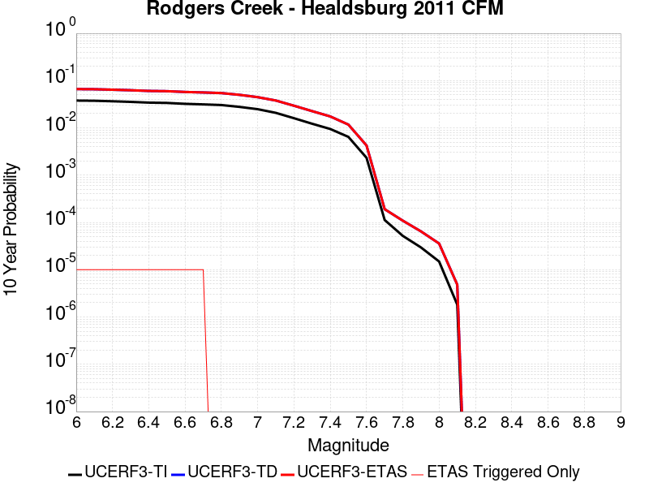 |

| Magnitude | 1 wk TI Prob | 1 wk TD Prob | 1 wk ETAS Prob | 1 wk ETAS/TD Gain | 1 wk ETAS Triggered Only | 1 mo TI Prob | 1 mo TD Prob | 1 mo ETAS Prob | 1 mo ETAS/TD Gain | 1 mo ETAS Triggered Only | 1 yr TI Prob | 1 yr TD Prob | 1 yr ETAS Prob | 1 yr ETAS/TD Gain | 1 yr ETAS Triggered Only | 10 yr TI Prob | 10 yr TD Prob | 10 yr ETAS Prob | 10 yr ETAS/TD Gain | 10 yr ETAS Triggered Only |
|-----|-----|-----|-----|-----|-----|-----|-----|-----|-----|-----|-----|-----|-----|-----|-----|-----|-----|-----|-----|-----|
| 6.0 | 7.390182E-5 | 1.3137296E-4 | 1.3137296E-4 | 1.0 | 0.0 | 3.1668364E-4 | 5.629057E-4 | 5.629057E-4 | 1.0 | 0.0 | 0.0038488081 | 0.0068318076 | 0.006841739 | 1.0014538 | 1.0E-5 | 0.037828278 | 0.06618395 | 0.06619328 | 1.0001411 | 1.0E-5 |
| 6.1 | 7.318768E-5 | 1.303531E-4 | 1.303531E-4 | 1.0 | 0.0 | 3.1362378E-4 | 5.585369E-4 | 5.585369E-4 | 1.0 | 0.0 | 0.0038116854 | 0.006778966 | 0.0067888983 | 1.0014652 | 1.0E-5 | 0.037469655 | 0.06568854 | 0.065697886 | 1.0001422 | 1.0E-5 |
| 6.2 | 7.1379836E-5 | 1.2728151E-4 | 1.2728151E-4 | 1.0 | 0.0 | 3.058777E-4 | 5.453785E-4 | 5.453785E-4 | 1.0 | 0.0 | 0.003717703 | 0.0066197454 | 0.006629679 | 1.0015006 | 1.0E-5 | 0.0365612 | 0.06421061 | 0.06421997 | 1.0001458 | 1.0E-5 |
| 6.3 | 6.9255926E-5 | 1.2382482E-4 | 1.2382482E-4 | 1.0 | 0.0 | 2.9677735E-4 | 5.305703E-4 | 5.305703E-4 | 1.0 | 0.0 | 0.0036072785 | 0.0064406106 | 0.0064505464 | 1.0015427 | 1.0E-5 | 0.035492823 | 0.062541805 | 0.062551185 | 1.0001498 | 1.0E-5 |
| 6.4 | 6.6757144E-5 | 1.195919E-4 | 1.195919E-4 | 1.0 | 0.0 | 2.8607066E-4 | 5.1243644E-4 | 5.1243644E-4 | 1.0 | 0.0 | 0.0034773487 | 0.00622114 | 0.006231078 | 1.0015974 | 1.0E-5 | 0.034234364 | 0.060491614 | 0.06050101 | 1.0001553 | 1.0E-5 |
| 6.5 | 6.5735134E-5 | 1.180849E-4 | 1.180849E-4 | 1.0 | 0.0 | 2.8169158E-4 | 5.059804E-4 | 5.059804E-4 | 1.0 | 0.0 | 0.003424202 | 0.0061429944 | 0.006152933 | 1.0016179 | 1.0E-5 | 0.03371918 | 0.059755705 | 0.059765108 | 1.0001574 | 1.0E-5 |
| 6.6 | 6.289601E-5 | 1.13442366E-4 | 1.13442366E-4 | 1.0 | 0.0 | 2.6952647E-4 | 4.8609133E-4 | 4.8609133E-4 | 1.0 | 0.0 | 0.0032765474 | 0.005902183 | 0.0059121237 | 1.0016843 | 1.0E-5 | 0.032286562 | 0.057495043 | 0.057504468 | 1.0001639 | 1.0E-5 |
| 6.7 | 6.115274E-5 | 1.106132E-4 | 1.106132E-4 | 1.0 | 0.0 | 2.6205686E-4 | 4.739708E-4 | 4.739708E-4 | 1.0 | 0.0 | 0.0031858748 | 0.0057554054 | 0.0057653477 | 1.0017275 | 1.0E-5 | 0.031405866 | 0.05611361 | 0.056123048 | 1.0001682 | 1.0E-5 |
| 6.8 | 5.9232367E-5 | 1.0728657E-4 | 1.0728657E-4 | 1.0 | 0.0 | 2.538283E-4 | 4.5971893E-4 | 4.5971893E-4 | 1.0 | 0.0 | 0.0030859804 | 0.005582791 | 0.005582791 | 1.0 | 0.0 | 0.030434765 | 0.05448041 | 0.05448041 | 1.0 | 0.0 |
| 6.9 | 5.4030377E-5 | 9.8228295E-5 | 9.8228295E-5 | 1.0 | 0.0 | 2.315382E-4 | 4.209108E-4 | 4.209108E-4 | 1.0 | 0.0 | 0.0028153337 | 0.0051126136 | 0.0051126136 | 1.0 | 0.0 | 0.027799325 | 0.05001572 | 0.05001572 | 1.0 | 0.0 |
| 7.0 | 4.8260714E-5 | 8.7408924E-5 | 8.7408924E-5 | 1.0 | 0.0 | 2.0681522E-4 | 3.7455617E-4 | 3.7455617E-4 | 1.0 | 0.0 | 0.0025150678 | 0.0045507406 | 0.0045507406 | 1.0 | 0.0 | 0.024867928 | 0.044667073 | 0.044667073 | 1.0 | 0.0 |
| 7.1 | 4.0294493E-5 | 7.389363E-5 | 7.389363E-5 | 1.0 | 0.0 | 1.7267925E-4 | 3.1664874E-4 | 3.1664874E-4 | 1.0 | 0.0 | 0.0021003427 | 0.0038484214 | 0.0038484214 | 1.0 | 0.0 | 0.02080602 | 0.037923187 | 0.037923187 | 1.0 | 0.0 |
| 7.2 | 3.096388E-5 | 5.698023E-5 | 5.698023E-5 | 1.0 | 0.0 | 1.326956E-4 | 2.4417826E-4 | 2.4417826E-4 | 1.0 | 0.0 | 0.0016143717 | 0.0029688394 | 0.0029688394 | 1.0 | 0.0 | 0.01602694 | 0.029437006 | 0.029437006 | 1.0 | 0.0 |
| 7.3 | 2.3615226E-5 | 4.3629818E-5 | 4.3629818E-5 | 1.0 | 0.0 | 1.0120418E-4 | 1.869716E-4 | 1.869716E-4 | 1.0 | 0.0 | 0.0012314644 | 0.0022740164 | 0.0022740164 | 1.0 | 0.0 | 0.0122466255 | 0.022637889 | 0.022637889 | 1.0 | 0.0 |
| 7.4 | 1.8251132E-5 | 3.3542477E-5 | 3.3542477E-5 | 1.0 | 0.0 | 7.821679E-5 | 1.4374561E-4 | 1.4374561E-4 | 1.0 | 0.0 | 9.518733E-4 | 0.0017487077 | 0.0017487077 | 1.0 | 0.0 | 0.009478063 | 0.017466031 | 0.017466031 | 1.0 | 0.0 |
| 7.5 | 1.2411432E-5 | 2.2461069E-5 | 2.2461069E-5 | 1.0 | 0.0 | 5.3190768E-5 | 9.6258205E-5 | 9.6258205E-5 | 1.0 | 0.0 | 6.4740516E-4 | 0.0011713194 | 0.0011713194 | 1.0 | 0.0 | 0.006455223 | 0.011743137 | 0.011743137 | 1.0 | 0.0 |
| 7.6 | 4.4771446E-6 | 8.08443E-6 | 8.08443E-6 | 1.0 | 0.0 | 1.918762E-5 | 3.4647102E-5 | 3.4647102E-5 | 1.0 | 0.0 | 2.3358424E-4 | 4.2174806E-4 | 4.2174806E-4 | 1.0 | 0.0 | 0.0023333887 | 0.0042453306 | 0.0042453306 | 1.0 | 0.0 |
| 7.7 | 2.157941E-7 | 3.5350925E-7 | 3.5350925E-7 | 1.0 | 0.0 | 9.248315E-7 | 1.5150388E-6 | 1.5150388E-6 | 1.0 | 0.0 | 1.1259765E-5 | 1.844544E-5 | 1.844544E-5 | 1.0 | 0.0 | 1.1259195E-4 | 1.9069649E-4 | 1.9069649E-4 | 1.0 | 0.0 |
| 7.8 | 9.9623286E-8 | 1.9900986E-7 | 1.9900986E-7 | 1.0 | 0.0 | 4.269569E-7 | 8.528991E-7 | 8.528991E-7 | 1.0 | 0.0 | 5.1981874E-6 | 1.03839975E-5 | 1.03839975E-5 | 1.0 | 0.0 | 5.198066E-5 | 1.0902916E-4 | 1.0902916E-4 | 1.0 | 0.0 |
| 7.9 | 5.6745257E-8 | 1.1774714E-7 | 1.1774714E-7 | 1.0 | 0.0 | 2.4319394E-7 | 5.046305E-7 | 5.046305E-7 | 1.0 | 0.0 | 2.960882E-6 | 6.143859E-6 | 6.143859E-6 | 1.0 | 0.0 | 2.9608427E-5 | 6.471445E-5 | 6.471445E-5 | 1.0 | 0.0 |
| 8.0 | 2.8614323E-8 | 6.5789635E-8 | 6.5789635E-8 | 1.0 | 0.0 | 1.2263281E-7 | 2.8195555E-7 | 2.8195555E-7 | 1.0 | 0.0 | 1.4930534E-6 | 3.4328034E-6 | 3.4328034E-6 | 1.0 | 0.0 | 1.4930434E-5 | 3.5830046E-5 | 3.5830046E-5 | 1.0 | 0.0 |
| 8.1 | 3.5045191E-9 | 8.966459E-9 | 8.966459E-9 | 1.0 | 0.0 | 1.5019367E-8 | 3.8427682E-8 | 3.8427682E-8 | 1.0 | 0.0 | 1.8286079E-7 | 4.6785692E-7 | 4.6785692E-7 | 1.0 | 0.0 | 1.8286064E-6 | 4.834128E-6 | 4.834128E-6 | 1.0 | 0.0 |

## Mendocino
*[(top)](#table-of-contents)*

| 1 Week | 1 Month | 1 Year | 10 Year |
|-----|-----|-----|-----|
| 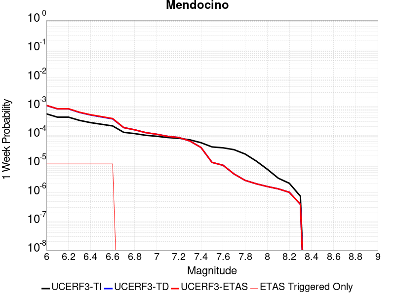 |  |  | 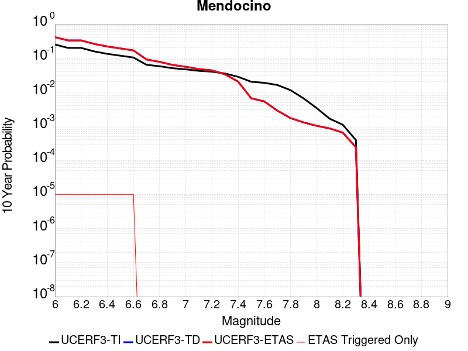 |

| Magnitude | 1 wk TI Prob | 1 wk TD Prob | 1 wk ETAS Prob | 1 wk ETAS/TD Gain | 1 wk ETAS Triggered Only | 1 mo TI Prob | 1 mo TD Prob | 1 mo ETAS Prob | 1 mo ETAS/TD Gain | 1 mo ETAS Triggered Only | 1 yr TI Prob | 1 yr TD Prob | 1 yr ETAS Prob | 1 yr ETAS/TD Gain | 1 yr ETAS Triggered Only | 10 yr TI Prob | 10 yr TD Prob | 10 yr ETAS Prob | 10 yr ETAS/TD Gain | 10 yr ETAS Triggered Only |
|-----|-----|-----|-----|-----|-----|-----|-----|-----|-----|-----|-----|-----|-----|-----|-----|-----|-----|-----|-----|-----|
| 6.0 | 5.5409013E-4 | 0.0010840978 | 0.0010940869 | 1.0092143 | 1.0E-5 | 0.0023725112 | 0.0046357135 | 0.004645667 | 1.0021472 | 1.0E-5 | 0.028505474 | 0.054677837 | 0.054687288 | 1.0001729 | 1.0E-5 | 0.25113493 | 0.41188422 | 0.4118901 | 1.0000143 | 1.0E-5 |
| 6.1 | 4.2515888E-4 | 8.229105E-4 | 8.3290227E-4 | 1.012142 | 1.0E-5 | 0.0018208373 | 0.003520157 | 0.0035301216 | 1.0028307 | 1.0E-5 | 0.021944538 | 0.041751582 | 0.041761164 | 1.0002295 | 1.0E-5 | 0.19899574 | 0.32995522 | 0.3299619 | 1.0000203 | 1.0E-5 |
| 6.2 | 4.2515888E-4 | 8.229105E-4 | 8.3290227E-4 | 1.012142 | 1.0E-5 | 0.0018208373 | 0.003520157 | 0.0035301216 | 1.0028307 | 1.0E-5 | 0.021944538 | 0.041751582 | 0.041761164 | 1.0002295 | 1.0E-5 | 0.19899574 | 0.32995522 | 0.3299619 | 1.0000203 | 1.0E-5 |
| 6.3 | 3.2773745E-4 | 6.193633E-4 | 6.293571E-4 | 1.0161356 | 1.0E-5 | 0.0014038329 | 0.0026503794 | 0.0026603527 | 1.0037631 | 1.0E-5 | 0.016958237 | 0.031593565 | 0.03160325 | 1.0003065 | 1.0E-5 | 0.1572094 | 0.26077798 | 0.26078537 | 1.0000284 | 1.0E-5 |
| 6.4 | 2.7417165E-4 | 5.04789E-4 | 5.1478395E-4 | 1.0198003 | 1.0E-5 | 0.0011744922 | 0.002160561 | 0.0021705395 | 1.0046184 | 1.0E-5 | 0.014205975 | 0.02583886 | 0.025848601 | 1.000377 | 1.0E-5 | 0.13331394 | 0.21948014 | 0.21948795 | 1.0000355 | 1.0E-5 |
| 6.5 | 2.3984899E-4 | 4.323638E-4 | 4.4235948E-4 | 1.0231186 | 1.0E-5 | 0.0010275192 | 0.0018508366 | 0.0018608181 | 1.0053929 | 1.0E-5 | 0.012438473 | 0.02218166 | 0.022191437 | 1.0004408 | 1.0E-5 | 0.11764851 | 0.19203737 | 0.19204545 | 1.0000421 | 1.0E-5 |
| 6.6 | 2.1023539E-4 | 3.6936256E-4 | 3.7935888E-4 | 1.0270637 | 1.0E-5 | 9.0069766E-4 | 0.0015813457 | 0.0015913298 | 1.0063137 | 1.0E-5 | 0.010910975 | 0.018990727 | 0.019000536 | 1.0005165 | 1.0E-5 | 0.10390546 | 0.16749373 | 0.16750205 | 1.0000497 | 1.0E-5 |
| 6.7 | 1.2592976E-4 | 1.8425964E-4 | 1.8425964E-4 | 1.0 | 0.0 | 5.395873E-4 | 7.8937394E-4 | 7.8937394E-4 | 1.0 | 0.0 | 0.006549705 | 0.009556835 | 0.009556835 | 1.0 | 0.0 | 0.063599944 | 0.09096922 | 0.09096922 | 1.0 | 0.0 |
| 6.8 | 1.13663555E-4 | 1.5401552E-4 | 1.5401552E-4 | 1.0 | 0.0 | 4.8703855E-4 | 6.5987057E-4 | 6.5987057E-4 | 1.0 | 0.0 | 0.0059135845 | 0.008000202 | 0.008000202 | 1.0 | 0.0 | 0.057586733 | 0.07739247 | 0.07739247 | 1.0 | 0.0 |
| 6.9 | 9.926894E-5 | 1.2300287E-4 | 1.2300287E-4 | 1.0 | 0.0 | 4.2536893E-4 | 5.2704377E-4 | 5.2704377E-4 | 1.0 | 0.0 | 0.0051665753 | 0.006396927 | 0.006396927 | 1.0 | 0.0 | 0.050480947 | 0.06285957 | 0.06285957 | 1.0 | 0.0 |
| 7.0 | 9.168125E-5 | 1.0784103E-4 | 1.0784103E-4 | 1.0 | 0.0 | 3.9286047E-4 | 4.6208999E-4 | 4.6208999E-4 | 1.0 | 0.0 | 0.004772591 | 0.005611076 | 0.005611076 | 1.0 | 0.0 | 0.04671385 | 0.0556208 | 0.0556208 | 1.0 | 0.0 |
| 7.1 | 8.2854116E-5 | 9.1051006E-5 | 9.1051006E-5 | 1.0 | 0.0 | 3.5504074E-4 | 3.9016042E-4 | 3.9016042E-4 | 1.0 | 0.0 | 0.004314056 | 0.0047399225 | 0.0047399225 | 1.0 | 0.0 | 0.042312626 | 0.047480468 | 0.047480468 | 1.0 | 0.0 |
| 7.2 | 7.8255274E-5 | 8.300352E-5 | 8.300352E-5 | 1.0 | 0.0 | 3.3533663E-4 | 3.556817E-4 | 3.556817E-4 | 1.0 | 0.0 | 0.0040750825 | 0.004321974 | 0.004321974 | 1.0 | 0.0 | 0.040011603 | 0.043524873 | 0.043524873 | 1.0 | 0.0 |
| 7.3 | 6.887904E-5 | 6.258733E-5 | 6.258733E-5 | 1.0 | 0.0 | 2.9516246E-4 | 2.6820437E-4 | 2.6820437E-4 | 1.0 | 0.0 | 0.0035876823 | 0.0032605957 | 0.0032605957 | 1.0 | 0.0 | 0.035303112 | 0.03335046 | 0.03335046 | 1.0 | 0.0 |
| 7.4 | 5.4898497E-5 | 3.7397505E-5 | 3.7397505E-5 | 1.0 | 0.0 | 2.3525805E-4 | 1.6026547E-4 | 1.6026547E-4 | 1.0 | 0.0 | 0.0028605047 | 0.0019495422 | 0.0019495422 | 1.0 | 0.0 | 0.02823963 | 0.020406872 | 0.020406872 | 1.0 | 0.0 |
| 7.5 | 3.9103943E-5 | 1.1304096E-5 | 1.1304096E-5 | 1.0 | 0.0 | 1.6757756E-4 | 4.8445232E-5 | 4.8445232E-5 | 1.0 | 0.0 | 0.0020383475 | 5.896627E-4 | 5.896627E-4 | 1.0 | 0.0 | 0.020197518 | 0.0066229533 | 0.0066229533 | 1.0 | 0.0 |
| 7.6 | 3.641042E-5 | 8.981182E-6 | 8.981182E-6 | 1.0 | 0.0 | 1.5603533E-4 | 3.849022E-5 | 3.849022E-5 | 1.0 | 0.0 | 0.0018980748 | 4.6851902E-4 | 4.6851902E-4 | 1.0 | 0.0 | 0.018819444 | 0.0053467555 | 0.0053467555 | 1.0 | 0.0 |
| 7.7 | 3.1318774E-5 | 4.452091E-6 | 4.452091E-6 | 1.0 | 0.0 | 1.342164E-4 | 1.9080253E-5 | 1.9080253E-5 | 1.0 | 0.0 | 0.0016328598 | 2.322775E-4 | 2.322775E-4 | 1.0 | 0.0 | 0.016209139 | 0.0028640495 | 0.0028640495 | 1.0 | 0.0 |
| 7.8 | 2.209241E-5 | 2.679371E-6 | 2.679371E-6 | 1.0 | 0.0 | 9.467832E-5 | 1.1482968E-5 | 1.1482968E-5 | 1.0 | 0.0 | 0.001152099 | 1.397962E-4 | 1.397962E-4 | 1.0 | 0.0 | 0.011461443 | 0.001736627 | 0.001736627 | 1.0 | 0.0 |
| 7.9 | 1.2640477E-5 | 2.041037E-6 | 2.041037E-6 | 1.0 | 0.0 | 5.4172346E-5 | 8.747273E-6 | 8.747273E-6 | 1.0 | 0.0 | 6.593487E-4 | 1.06492866E-4 | 1.06492866E-4 | 1.0 | 0.0 | 0.006573958 | 0.0012974226 | 0.0012974226 | 1.0 | 0.0 |
| 8.0 | 6.5548907E-6 | 1.6379622E-6 | 1.6379622E-6 | 1.0 | 0.0 | 2.8092087E-5 | 7.019819E-6 | 7.019819E-6 | 1.0 | 0.0 | 3.4196748E-4 | 8.546297E-5 | 8.546297E-5 | 1.0 | 0.0 | 0.0034144172 | 0.0010306032 | 0.0010306032 | 1.0 | 0.0 |
| 8.1 | 3.1916707E-6 | 1.357735E-6 | 1.357735E-6 | 1.0 | 0.0 | 1.3678517E-5 | 5.818851E-6 | 5.818851E-6 | 1.0 | 0.0 | 1.6652321E-4 | 7.084223E-5 | 7.084223E-5 | 1.0 | 0.0 | 0.0016639848 | 8.624329E-4 | 8.624329E-4 | 1.0 | 0.0 |
| 8.2 | 2.1193785E-6 | 1.0297509E-6 | 1.0297509E-6 | 1.0 | 0.0 | 9.083019E-6 | 4.413211E-6 | 4.413211E-6 | 1.0 | 0.0 | 1.1058014E-4 | 5.372954E-5 | 5.372954E-5 | 1.0 | 0.0 | 0.0011052513 | 6.500931E-4 | 6.500931E-4 | 1.0 | 0.0 |
| 8.3 | 7.536878E-7 | 3.9261332E-7 | 3.9261332E-7 | 1.0 | 0.0 | 3.2300866E-6 | 1.6826275E-6 | 1.6826275E-6 | 1.0 | 0.0 | 3.9325594E-5 | 2.048581E-5 | 2.048581E-5 | 1.0 | 0.0 | 3.9318635E-4 | 2.4124846E-4 | 2.4124846E-4 | 1.0 | 0.0 |

## Superstition Hills
*[(top)](#table-of-contents)*

| 1 Week | 1 Month | 1 Year | 10 Year |
|-----|-----|-----|-----|
|  |  |  |  |

| Magnitude | 1 wk TI Prob | 1 wk TD Prob | 1 wk ETAS Prob | 1 wk ETAS/TD Gain | 1 wk ETAS Triggered Only | 1 mo TI Prob | 1 mo TD Prob | 1 mo ETAS Prob | 1 mo ETAS/TD Gain | 1 mo ETAS Triggered Only | 1 yr TI Prob | 1 yr TD Prob | 1 yr ETAS Prob | 1 yr ETAS/TD Gain | 1 yr ETAS Triggered Only | 10 yr TI Prob | 10 yr TD Prob | 10 yr ETAS Prob | 10 yr ETAS/TD Gain | 10 yr ETAS Triggered Only |
|-----|-----|-----|-----|-----|-----|-----|-----|-----|-----|-----|-----|-----|-----|-----|-----|-----|-----|-----|-----|-----|
| 6.0 | 6.6865185E-5 | 1.4137668E-5 | 2.4137526E-5 | 1.7073202 | 1.0E-5 | 2.8653358E-4 | 6.058869E-5 | 7.058808E-5 | 1.1650373 | 1.0E-5 | 0.0034829667 | 7.374338E-4 | 7.474264E-4 | 1.0135505 | 1.0E-5 | 0.03428881 | 0.007520696 | 0.007530621 | 1.0013196 | 1.0E-5 |
| 6.1 | 6.544851E-5 | 1.4137668E-5 | 2.4137526E-5 | 1.7073202 | 1.0E-5 | 2.8046346E-4 | 6.058869E-5 | 7.058808E-5 | 1.1650373 | 1.0E-5 | 0.0034092965 | 7.374338E-4 | 7.474264E-4 | 1.0135505 | 1.0E-5 | 0.033574644 | 0.0075206957 | 0.0075306203 | 1.0013196 | 1.0E-5 |
| 6.2 | 6.544851E-5 | 1.4137668E-5 | 2.4137526E-5 | 1.7073202 | 1.0E-5 | 2.8046346E-4 | 6.058869E-5 | 7.058808E-5 | 1.1650373 | 1.0E-5 | 0.0034092965 | 7.374338E-4 | 7.474264E-4 | 1.0135505 | 1.0E-5 | 0.033574644 | 0.0075206957 | 0.0075306203 | 1.0013196 | 1.0E-5 |
| 6.3 | 5.2402065E-5 | 1.4137667E-5 | 2.4137526E-5 | 1.7073203 | 1.0E-5 | 2.2456095E-4 | 6.0588685E-5 | 7.058808E-5 | 1.1650373 | 1.0E-5 | 0.0027306017 | 7.374338E-4 | 7.474264E-4 | 1.0135505 | 1.0E-5 | 0.02697292 | 0.0075206906 | 0.007530615 | 1.0013196 | 1.0E-5 |
| 6.4 | 4.542238E-5 | 1.4137666E-5 | 2.4137526E-5 | 1.7073203 | 1.0E-5 | 1.9465282E-4 | 6.058868E-5 | 7.0588074E-5 | 1.1650373 | 1.0E-5 | 0.0023673223 | 7.3743373E-4 | 7.4742635E-4 | 1.0135505 | 1.0E-5 | 0.023422617 | 0.007520688 | 0.007530613 | 1.0013196 | 1.0E-5 |
| 6.5 | 2.9672969E-5 | 1.4137665E-5 | 2.4137524E-5 | 1.7073203 | 1.0E-5 | 1.2716366E-4 | 6.0588678E-5 | 7.0588074E-5 | 1.1650374 | 1.0E-5 | 0.0015471181 | 7.374337E-4 | 7.474263E-4 | 1.0135505 | 1.0E-5 | 0.015363912 | 0.0075206826 | 0.0075306077 | 1.0013196 | 1.0E-5 |
| 6.6 | 2.6056105E-5 | 1.3803436E-5 | 2.3803297E-5 | 1.7244474 | 1.0E-5 | 1.1166424E-4 | 5.915633E-5 | 6.9155736E-5 | 1.1690336 | 1.0E-5 | 0.0013586642 | 7.200064E-4 | 7.299992E-4 | 1.0138788 | 1.0E-5 | 0.013503874 | 0.0073450673 | 0.007354994 | 1.0013515 | 1.0E-5 |
| 6.7 | 1.4611248E-5 | 1.338333E-5 | 2.3383196E-5 | 1.7471882 | 1.0E-5 | 6.261813E-5 | 5.7355956E-5 | 6.735538E-5 | 1.1743398 | 1.0E-5 | 7.6210906E-4 | 6.9810095E-4 | 7.08094E-4 | 1.0143145 | 1.0E-5 | 0.0075950073 | 0.0071262526 | 0.0071361815 | 1.0013933 | 1.0E-5 |
| 6.8 | 1.30607E-5 | 1.09787115E-5 | 1.09787115E-5 | 1.0 | 0.0 | 5.597323E-5 | 4.705082E-5 | 4.705082E-5 | 1.0 | 0.0 | 6.8126095E-4 | 5.727019E-4 | 5.727019E-4 | 1.0 | 0.0 | 0.006791762 | 0.005873964 | 0.005873964 | 1.0 | 0.0 |
| 6.9 | 1.0443096E-5 | 8.19507E-6 | 8.19507E-6 | 1.0 | 0.0 | 4.4755358E-5 | 3.512127E-5 | 3.512127E-5 | 1.0 | 0.0 | 5.447602E-4 | 4.2751993E-4 | 4.2751993E-4 | 1.0 | 0.0 | 0.005434267 | 0.004409497 | 0.004409497 | 1.0 | 0.0 |
| 7.0 | 8.045912E-6 | 6.739447E-6 | 6.739447E-6 | 1.0 | 0.0 | 3.4482026E-5 | 2.888303E-5 | 2.888303E-5 | 1.0 | 0.0 | 4.197378E-4 | 3.5159517E-4 | 3.5159517E-4 | 1.0 | 0.0 | 0.0041894587 | 0.0036335257 | 0.0036335257 | 1.0 | 0.0 |
| 7.1 | 8.045912E-6 | 6.739447E-6 | 6.739447E-6 | 1.0 | 0.0 | 3.4482026E-5 | 2.888303E-5 | 2.888303E-5 | 1.0 | 0.0 | 4.197378E-4 | 3.5159517E-4 | 3.5159517E-4 | 1.0 | 0.0 | 0.0041894587 | 0.0036335257 | 0.0036335257 | 1.0 | 0.0 |
| 7.2 | 7.375506E-6 | 6.2463805E-6 | 6.2463805E-6 | 1.0 | 0.0 | 3.1608928E-5 | 2.6769932E-5 | 2.6769932E-5 | 1.0 | 0.0 | 3.8477074E-4 | 3.2587603E-4 | 3.2587603E-4 | 1.0 | 0.0 | 0.003841052 | 0.0033741172 | 0.0033741172 | 1.0 | 0.0 |
| 7.3 | 6.6063913E-6 | 5.798824E-6 | 5.798824E-6 | 1.0 | 0.0 | 2.8312797E-5 | 2.4851872E-5 | 2.4851872E-5 | 1.0 | 0.0 | 3.446538E-4 | 3.0253024E-4 | 3.0253024E-4 | 1.0 | 0.0 | 0.0034411973 | 0.0031383524 | 0.0031383524 | 1.0 | 0.0 |
| 7.4 | 6.4313126E-6 | 5.6802523E-6 | 5.6802523E-6 | 1.0 | 0.0 | 2.7562477E-5 | 2.4343715E-5 | 2.4343715E-5 | 1.0 | 0.0 | 3.355215E-4 | 2.963451E-4 | 2.963451E-4 | 1.0 | 0.0 | 0.0033501536 | 0.003076105 | 0.003076105 | 1.0 | 0.0 |
| 7.5 | 6.0742927E-6 | 5.476088E-6 | 5.476088E-6 | 1.0 | 0.0 | 2.6032423E-5 | 2.3468741E-5 | 2.3468741E-5 | 1.0 | 0.0 | 3.1689866E-4 | 2.8569513E-4 | 2.8569513E-4 | 1.0 | 0.0 | 0.0031644711 | 0.0029679502 | 0.0029679502 | 1.0 | 0.0 |
| 7.6 | 5.6987187E-6 | 5.2943155E-6 | 5.2943155E-6 | 1.0 | 0.0 | 2.4422852E-5 | 2.268973E-5 | 2.268973E-5 | 1.0 | 0.0 | 2.9730765E-4 | 2.762131E-4 | 2.762131E-4 | 1.0 | 0.0 | 0.002969102 | 0.0028712032 | 0.0028712032 | 1.0 | 0.0 |
| 7.7 | 5.1658035E-6 | 4.925336E-6 | 4.925336E-6 | 1.0 | 0.0 | 2.2138971E-5 | 2.1108413E-5 | 2.1108413E-5 | 1.0 | 0.0 | 2.6950863E-4 | 2.5696523E-4 | 2.5696523E-4 | 1.0 | 0.0 | 0.00269182 | 0.0026763005 | 0.0026763005 | 1.0 | 0.0 |
| 7.8 | 3.6864697E-6 | 4.1963563E-6 | 4.1963563E-6 | 1.0 | 0.0 | 1.579906E-5 | 1.7984263E-5 | 1.7984263E-5 | 1.0 | 0.0 | 1.9233658E-4 | 2.1893687E-4 | 2.1893687E-4 | 1.0 | 0.0 | 0.0019217018 | 0.0022895595 | 0.0022895595 | 1.0 | 0.0 |
| 7.9 | 3.0265903E-6 | 3.5636078E-6 | 3.5636078E-6 | 1.0 | 0.0 | 1.2971037E-5 | 1.5272519E-5 | 1.5272519E-5 | 1.0 | 0.0 | 1.5791094E-4 | 1.8592748E-4 | 1.8592748E-4 | 1.0 | 0.0 | 0.0015779877 | 0.0019537222 | 0.0019537222 | 1.0 | 0.0 |
| 8.0 | 2.5271493E-6 | 3.0866524E-6 | 3.0866524E-6 | 1.0 | 0.0 | 1.0830595E-5 | 1.3228446E-5 | 1.3228446E-5 | 1.0 | 0.0 | 1.3185451E-4 | 1.6104484E-4 | 1.6104484E-4 | 1.0 | 0.0 | 0.0013177631 | 0.0016975543 | 0.0016975543 | 1.0 | 0.0 |
| 8.1 | 2.3749135E-6 | 2.9172957E-6 | 2.9172957E-6 | 1.0 | 0.0 | 1.0178161E-5 | 1.2502638E-5 | 1.2502638E-5 | 1.0 | 0.0 | 1.2391206E-4 | 1.522094E-4 | 1.522094E-4 | 1.0 | 0.0 | 0.0012384299 | 0.0016051348 | 0.0016051348 | 1.0 | 0.0 |
| 8.2 | 1.7186406E-9 | 1.1438838E-9 | 1.1438838E-9 | 1.0 | 0.0 | 7.3656024E-9 | 4.902359E-9 | 4.902359E-9 | 1.0 | 0.0 | 8.9676206E-8 | 5.968622E-8 | 5.968622E-8 | 1.0 | 0.0 | 8.9676166E-7 | 6.386644E-7 | 6.386644E-7 | 1.0 | 0.0 |

## Greenville (So) 2011 CFM
*[(top)](#table-of-contents)*

| 1 Week | 1 Month | 1 Year | 10 Year |
|-----|-----|-----|-----|
| 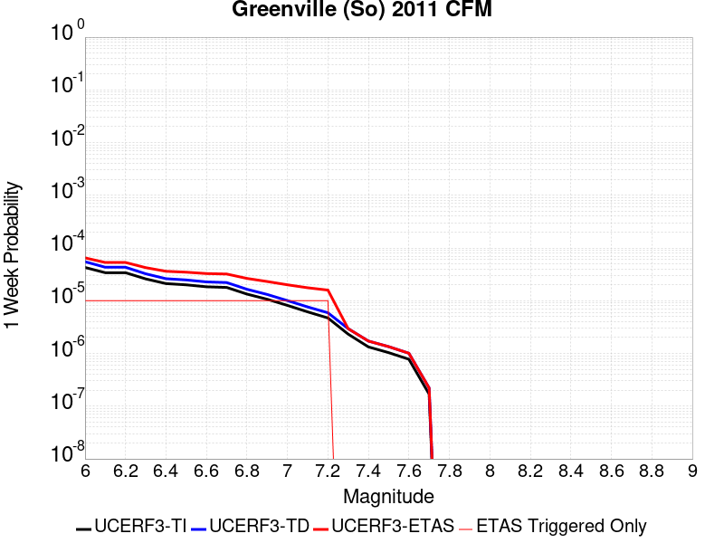 |  |  |  |

| Magnitude | 1 wk TI Prob | 1 wk TD Prob | 1 wk ETAS Prob | 1 wk ETAS/TD Gain | 1 wk ETAS Triggered Only | 1 mo TI Prob | 1 mo TD Prob | 1 mo ETAS Prob | 1 mo ETAS/TD Gain | 1 mo ETAS Triggered Only | 1 yr TI Prob | 1 yr TD Prob | 1 yr ETAS Prob | 1 yr ETAS/TD Gain | 1 yr ETAS Triggered Only | 10 yr TI Prob | 10 yr TD Prob | 10 yr ETAS Prob | 10 yr ETAS/TD Gain | 10 yr ETAS Triggered Only |
|-----|-----|-----|-----|-----|-----|-----|-----|-----|-----|-----|-----|-----|-----|-----|-----|-----|-----|-----|-----|-----|
| 6.0 | 4.279693E-5 | 5.5040568E-5 | 6.504002E-5 | 1.1816741 | 1.0E-5 | 1.8340252E-4 | 2.3586866E-4 | 2.458663E-4 | 1.0423865 | 1.0E-5 | 0.0022306389 | 0.0028681692 | 0.0028781404 | 1.0034765 | 1.0E-5 | 0.022083808 | 0.028338658 | 0.028348375 | 1.0003428 | 1.0E-5 |
| 6.1 | 3.4037297E-5 | 4.319238E-5 | 5.319195E-5 | 1.2315123 | 1.0E-5 | 1.4586597E-4 | 1.8509808E-4 | 1.9509622E-4 | 1.0540154 | 1.0E-5 | 0.0017744715 | 0.0022513992 | 0.0022613765 | 1.0044317 | 1.0E-5 | 0.01760369 | 0.022303047 | 0.022312824 | 1.0004383 | 1.0E-5 |
| 6.2 | 3.4037297E-5 | 4.319238E-5 | 5.319195E-5 | 1.2315123 | 1.0E-5 | 1.4586597E-4 | 1.8509808E-4 | 1.9509622E-4 | 1.0540154 | 1.0E-5 | 0.0017744715 | 0.0022513992 | 0.0022613765 | 1.0044317 | 1.0E-5 | 0.01760369 | 0.022303047 | 0.022312824 | 1.0004383 | 1.0E-5 |
| 6.3 | 2.5956324E-5 | 3.242939E-5 | 4.2429067E-5 | 1.3083522 | 1.0E-5 | 1.11236644E-4 | 1.3897609E-4 | 1.489747E-4 | 1.0719448 | 1.0E-5 | 0.0013534647 | 0.0016907848 | 0.0017007679 | 1.0059044 | 1.0E-5 | 0.013452509 | 0.016786316 | 0.016796147 | 1.0005857 | 1.0E-5 |
| 6.4 | 2.1145053E-5 | 2.6197793E-5 | 3.6197533E-5 | 1.3817016 | 1.0E-5 | 9.061851E-5 | 1.1227157E-4 | 1.2227044E-4 | 1.0890597 | 1.0E-5 | 0.0011027219 | 0.0013660807 | 0.001376067 | 1.0073103 | 1.0E-5 | 0.01097266 | 0.013580576 | 0.013590439 | 1.0007263 | 1.0E-5 |
| 6.5 | 2.0030959E-5 | 2.4795921E-5 | 3.4795674E-5 | 1.4032822 | 1.0E-5 | 8.584414E-5 | 1.0626408E-4 | 1.16263014E-4 | 1.0940952 | 1.0E-5 | 0.0010446513 | 0.0012930284 | 0.0013030154 | 1.0077238 | 1.0E-5 | 0.010397541 | 0.01285873 | 0.012868602 | 1.0007677 | 1.0E-5 |
| 6.6 | 1.8395405E-5 | 2.275458E-5 | 3.2754353E-5 | 1.439462 | 1.0E-5 | 7.8835066E-5 | 9.7516146E-5 | 1.07515174E-4 | 1.1025372 | 1.0E-5 | 9.5939427E-4 | 0.0011866409 | 0.001196629 | 1.0084171 | 1.0E-5 | 0.009552629 | 0.01180643 | 0.011816312 | 1.000837 | 1.0E-5 |
| 6.7 | 1.7883482E-5 | 2.2125625E-5 | 3.2125405E-5 | 1.4519546 | 1.0E-5 | 7.664124E-5 | 9.482082E-5 | 1.0481987E-4 | 1.1054521 | 1.0E-5 | 9.3270757E-4 | 0.0011538607 | 0.0011638491 | 1.0086565 | 1.0E-5 | 0.009288026 | 0.011482077 | 0.011491962 | 1.0008609 | 1.0E-5 |
| 6.8 | 1.3373564E-5 | 1.650608E-5 | 2.6505913E-5 | 1.6058273 | 1.0E-5 | 5.7314013E-5 | 7.0738504E-5 | 8.0737795E-5 | 1.1413558 | 1.0E-5 | 6.975747E-4 | 8.609158E-4 | 8.7090716E-4 | 1.0116055 | 1.0E-5 | 0.0069538904 | 0.008577745 | 0.00858766 | 1.0011559 | 1.0E-5 |
| 6.9 | 1.06692905E-5 | 1.3152695E-5 | 2.3152563E-5 | 1.7602905 | 1.0E-5 | 4.5724726E-5 | 5.636754E-5 | 6.636698E-5 | 1.177397 | 1.0E-5 | 5.5655633E-4 | 6.8606995E-4 | 6.960631E-4 | 1.0145658 | 1.0E-5 | 0.005551645 | 0.006841082 | 0.0068510137 | 1.0014517 | 1.0E-5 |
| 7.0 | 8.157512E-6 | 1.0062752E-5 | 2.0062651E-5 | 1.9937539 | 1.0E-5 | 3.4960296E-5 | 4.312539E-5 | 5.3124957E-5 | 1.231872 | 1.0E-5 | 4.2555845E-4 | 5.2492885E-4 | 5.349236E-4 | 1.0190402 | 1.0E-5 | 0.004247444 | 0.0052376967 | 0.005247644 | 1.0018992 | 1.0E-5 |
| 7.1 | 6.1467113E-6 | 7.627545E-6 | 1.762747E-5 | 2.3110278 | 1.0E-5 | 2.6342783E-5 | 3.2689073E-5 | 4.268875E-5 | 1.3059026 | 1.0E-5 | 3.206762E-4 | 3.9791764E-4 | 4.0791367E-4 | 1.0251209 | 1.0E-5 | 0.0032021382 | 0.0039725704 | 0.003982531 | 1.0025072 | 1.0E-5 |
| 7.2 | 4.713467E-6 | 5.9142685E-6 | 1.591421E-5 | 2.6908162 | 1.0E-5 | 2.0200418E-5 | 2.5346622E-5 | 3.534637E-5 | 1.3945199 | 1.0E-5 | 2.4591232E-4 | 3.0855203E-4 | 3.1854893E-4 | 1.0323994 | 1.0E-5 | 0.0024564038 | 0.0030816782 | 0.0030916475 | 1.003235 | 1.0E-5 |
| 7.3 | 2.3266216E-6 | 2.954067E-6 | 2.954067E-6 | 1.0 | 0.0 | 9.971197E-6 | 1.2660226E-5 | 1.2660226E-5 | 1.0 | 0.0 | 1.2139256E-4 | 1.541275E-4 | 1.541275E-4 | 1.0 | 0.0 | 0.0012132627 | 0.0015404817 | 0.0015404817 | 1.0 | 0.0 |
| 7.4 | 1.3314E-6 | 1.7179866E-6 | 1.7179866E-6 | 1.0 | 0.0 | 5.7059874E-6 | 7.362779E-6 | 7.362779E-6 | 1.0 | 0.0 | 6.946818E-5 | 8.96382E-5 | 8.96382E-5 | 1.0 | 0.0 | 6.9446466E-4 | 8.963211E-4 | 8.963211E-4 | 1.0 | 0.0 |
| 7.5 | 1.0362941E-6 | 1.3469155E-6 | 1.3469155E-6 | 1.0 | 0.0 | 4.4412527E-6 | 5.7724824E-6 | 5.7724824E-6 | 1.0 | 0.0 | 5.407091E-5 | 7.0277754E-5 | 7.0277754E-5 | 1.0 | 0.0 | 5.405776E-4 | 7.028451E-4 | 7.028451E-4 | 1.0 | 0.0 |
| 7.6 | 7.764784E-7 | 1.0088881E-6 | 1.0088881E-6 | 1.0 | 0.0 | 3.3277602E-6 | 4.3237997E-6 | 4.3237997E-6 | 1.0 | 0.0 | 4.0514726E-5 | 5.264103E-5 | 5.264103E-5 | 1.0 | 0.0 | 4.050734E-4 | 5.265317E-4 | 5.265317E-4 | 1.0 | 0.0 |
| 7.7 | 1.6927763E-7 | 2.2140186E-7 | 2.2140186E-7 | 1.0 | 0.0 | 7.2547533E-7 | 9.488648E-7 | 9.488648E-7 | 1.0 | 0.0 | 8.832627E-6 | 1.1552371E-5 | 1.1552371E-5 | 1.0 | 0.0 | 8.8322755E-5 | 1.1554653E-4 | 1.1554653E-4 | 1.0 | 0.0 |

## Calaveras (Central) 2011 CFM
*[(top)](#table-of-contents)*

| 1 Week | 1 Month | 1 Year | 10 Year |
|-----|-----|-----|-----|
|  |  |  |  |

| Magnitude | 1 wk TI Prob | 1 wk TD Prob | 1 wk ETAS Prob | 1 wk ETAS/TD Gain | 1 wk ETAS Triggered Only | 1 mo TI Prob | 1 mo TD Prob | 1 mo ETAS Prob | 1 mo ETAS/TD Gain | 1 mo ETAS Triggered Only | 1 yr TI Prob | 1 yr TD Prob | 1 yr ETAS Prob | 1 yr ETAS/TD Gain | 1 yr ETAS Triggered Only | 10 yr TI Prob | 10 yr TD Prob | 10 yr ETAS Prob | 10 yr ETAS/TD Gain | 10 yr ETAS Triggered Only |
|-----|-----|-----|-----|-----|-----|-----|-----|-----|-----|-----|-----|-----|-----|-----|-----|-----|-----|-----|-----|-----|
| 6.0 | 1.5010907E-4 | 2.4804124E-4 | 2.5803875E-4 | 1.0403059 | 1.0E-5 | 6.4316596E-4 | 0.001062498 | 0.0010724873 | 1.0094018 | 1.0E-5 | 0.0078024664 | 0.012850443 | 0.012860315 | 1.0007682 | 1.0E-5 | 0.07534136 | 0.120411225 | 0.12042002 | 1.0000731 | 1.0E-5 |
| 6.1 | 1.4521465E-4 | 2.3965565E-4 | 2.4965324E-4 | 1.0417166 | 1.0E-5 | 6.222001E-4 | 0.0010265942 | 0.0010365839 | 1.0097309 | 1.0E-5 | 0.0075490056 | 0.012419763 | 0.012429639 | 1.0007951 | 1.0E-5 | 0.07297657 | 0.11668273 | 0.11669156 | 1.0000757 | 1.0E-5 |
| 6.2 | 1.429998E-4 | 2.3896809E-4 | 2.489657E-4 | 1.0418366 | 1.0E-5 | 6.127123E-4 | 0.0010236499 | 0.0010336398 | 1.009759 | 1.0E-5 | 0.007434286 | 0.012384372 | 0.012394248 | 1.0007975 | 1.0E-5 | 0.07190444 | 0.11633677 | 0.11634561 | 1.0000759 | 1.0E-5 |
| 6.3 | 1.3536277E-4 | 2.3227946E-4 | 2.3227946E-4 | 1.0 | 0.0 | 5.799972E-4 | 9.950127E-4 | 9.950127E-4 | 1.0 | 0.0 | 0.0070386264 | 0.012040534 | 0.012040534 | 1.0 | 0.0 | 0.0681982 | 0.113249525 | 0.113249525 | 1.0 | 0.0 |
| 6.4 | 1.2993296E-4 | 2.2651516E-4 | 2.2651516E-4 | 1.0 | 0.0 | 5.5673666E-4 | 9.703276E-4 | 9.703276E-4 | 1.0 | 0.0 | 0.006757223 | 0.011743338 | 0.011743338 | 1.0 | 0.0 | 0.06555412 | 0.11052752 | 0.11052752 | 1.0 | 0.0 |
| 6.5 | 1.0498927E-4 | 1.7981966E-4 | 1.7981966E-4 | 1.0 | 0.0 | 4.498764E-4 | 7.7042676E-4 | 7.7042676E-4 | 1.0 | 0.0 | 0.005463498 | 0.00933952 | 0.00933952 | 1.0 | 0.0 | 0.053311124 | 0.08920739 | 0.08920739 | 1.0 | 0.0 |
| 6.6 | 1.0157505E-4 | 1.7469494E-4 | 1.7469494E-4 | 1.0 | 0.0 | 4.35249E-4 | 7.4847665E-4 | 7.4847665E-4 | 1.0 | 0.0 | 0.0052862884 | 0.009074567 | 0.009074567 | 1.0 | 0.0 | 0.05162293 | 0.08678487 | 0.08678487 | 1.0 | 0.0 |
| 6.7 | 9.660386E-5 | 1.6728783E-4 | 1.6728783E-4 | 1.0 | 0.0 | 4.1395082E-4 | 7.167497E-4 | 7.167497E-4 | 1.0 | 0.0 | 0.0050282106 | 0.008691474 | 0.008691474 | 1.0 | 0.0 | 0.049159497 | 0.08327401 | 0.08327401 | 1.0 | 0.0 |
| 6.8 | 9.089927E-5 | 1.5643238E-4 | 1.5643238E-4 | 1.0 | 0.0 | 3.8951015E-4 | 6.702511E-4 | 6.702511E-4 | 1.0 | 0.0 | 0.0047319788 | 0.008129742 | 0.008129742 | 1.0 | 0.0 | 0.046324775 | 0.078163 | 0.078163 | 1.0 | 0.0 |
| 6.9 | 7.353187E-5 | 1.2295779E-4 | 1.2295779E-4 | 1.0 | 0.0 | 3.150985E-4 | 5.2685605E-4 | 5.2685605E-4 | 1.0 | 0.0 | 0.0038295772 | 0.006395728 | 0.006395728 | 1.0 | 0.0 | 0.037642512 | 0.06218928 | 0.06218928 | 1.0 | 0.0 |
| 7.0 | 5.746064E-5 | 9.3890936E-5 | 9.3890936E-5 | 1.0 | 0.0 | 2.4623662E-4 | 4.0232803E-4 | 4.0232803E-4 | 1.0 | 0.0 | 0.0029938098 | 0.0048874132 | 0.0048874132 | 1.0 | 0.0 | 0.02953797 | 0.04798713 | 0.04798713 | 1.0 | 0.0 |
| 7.1 | 4.9557195E-5 | 8.052768E-5 | 8.052768E-5 | 1.0 | 0.0 | 2.123707E-4 | 3.4507332E-4 | 3.4507332E-4 | 1.0 | 0.0 | 0.0025825473 | 0.004193237 | 0.004193237 | 1.0 | 0.0 | 0.0255274 | 0.041373473 | 0.041373473 | 1.0 | 0.0 |
| 7.2 | 3.687595E-5 | 5.952694E-5 | 5.952694E-5 | 1.0 | 0.0 | 1.5803022E-4 | 2.5509068E-4 | 2.5509068E-4 | 1.0 | 0.0 | 0.0019223199 | 0.003101335 | 0.003101335 | 1.0 | 0.0 | 0.01905776 | 0.030883823 | 0.030883823 | 1.0 | 0.0 |
| 7.3 | 2.5846984E-5 | 4.2473923E-5 | 4.2473923E-5 | 1.0 | 0.0 | 1.1076809E-4 | 1.820185E-4 | 1.820185E-4 | 1.0 | 0.0 | 0.0013477671 | 0.0022138404 | 0.0022138404 | 1.0 | 0.0 | 0.013396223 | 0.022175217 | 0.022175217 | 1.0 | 0.0 |
| 7.4 | 1.7747854E-5 | 2.993759E-5 | 2.993759E-5 | 1.0 | 0.0 | 7.6060016E-5 | 1.2829766E-4 | 1.2829766E-4 | 1.0 | 0.0 | 9.2563726E-4 | 0.0015609078 | 0.0015609078 | 1.0 | 0.0 | 0.009217911 | 0.015708687 | 0.015708687 | 1.0 | 0.0 |
| 7.5 | 1.4883479E-5 | 2.6244672E-5 | 2.6244672E-5 | 1.0 | 0.0 | 6.378478E-5 | 1.12472335E-4 | 1.12472335E-4 | 1.0 | 0.0 | 7.76303E-4 | 0.0013684932 | 0.0013684932 | 1.0 | 0.0 | 0.0077359667 | 0.013801667 | 0.013801667 | 1.0 | 0.0 |
| 7.6 | 8.166975E-6 | 1.4964299E-5 | 1.4964299E-5 | 1.0 | 0.0 | 3.5000852E-5 | 6.413114E-5 | 6.413114E-5 | 1.0 | 0.0 | 4.2605202E-4 | 7.805183E-4 | 7.805183E-4 | 1.0 | 0.0 | 0.004252361 | 0.007939203 | 0.007939203 | 1.0 | 0.0 |
| 7.7 | 3.3858064E-6 | 6.254251E-6 | 6.254251E-6 | 1.0 | 0.0 | 1.4510518E-5 | 2.6803657E-5 | 2.6803657E-5 | 1.0 | 0.0 | 1.7665124E-4 | 3.2628572E-4 | 3.2628572E-4 | 1.0 | 0.0 | 0.0017651088 | 0.003388363 | 0.003388363 | 1.0 | 0.0 |
| 7.8 | 2.7721615E-6 | 5.366695E-6 | 5.366695E-6 | 1.0 | 0.0 | 1.1880637E-5 | 2.2999919E-5 | 2.2999919E-5 | 1.0 | 0.0 | 1.4463716E-4 | 2.7998807E-4 | 2.7998807E-4 | 1.0 | 0.0 | 0.0014454306 | 0.002907615 | 0.002907615 | 1.0 | 0.0 |
| 7.9 | 1.9736292E-6 | 4.128705E-6 | 4.128705E-6 | 1.0 | 0.0 | 8.4583835E-6 | 1.769433E-5 | 1.769433E-5 | 1.0 | 0.0 | 1.0297595E-4 | 2.1540721E-4 | 2.1540721E-4 | 1.0 | 0.0 | 0.0010292825 | 0.0022237299 | 0.0022237299 | 1.0 | 0.0 |
| 8.0 | 1.1767289E-6 | 2.5546633E-6 | 2.5546633E-6 | 1.0 | 0.0 | 5.0431145E-6 | 1.0948511E-5 | 1.0948511E-5 | 1.0 | 0.0 | 6.139818E-5 | 1.3329E-4 | 1.3329E-4 | 1.0 | 0.0 | 6.1381224E-4 | 0.001366126 | 0.001366126 | 1.0 | 0.0 |
| 8.1 | 7.5112825E-7 | 1.541076E-6 | 1.541076E-6 | 1.0 | 0.0 | 3.2191172E-6 | 6.604595E-6 | 6.604595E-6 | 1.0 | 0.0 | 3.9192048E-5 | 8.0408E-5 | 8.0408E-5 | 1.0 | 0.0 | 3.9185135E-4 | 8.2356273E-4 | 8.2356273E-4 | 1.0 | 0.0 |

## Hector Mine
*[(top)](#table-of-contents)*

| 1 Week | 1 Month | 1 Year | 10 Year |
|-----|-----|-----|-----|
|  |  |  |  |

| Magnitude | 1 wk TI Prob | 1 wk TD Prob | 1 wk ETAS Prob | 1 wk ETAS/TD Gain | 1 wk ETAS Triggered Only | 1 mo TI Prob | 1 mo TD Prob | 1 mo ETAS Prob | 1 mo ETAS/TD Gain | 1 mo ETAS Triggered Only | 1 yr TI Prob | 1 yr TD Prob | 1 yr ETAS Prob | 1 yr ETAS/TD Gain | 1 yr ETAS Triggered Only | 10 yr TI Prob | 10 yr TD Prob | 10 yr ETAS Prob | 10 yr ETAS/TD Gain | 10 yr ETAS Triggered Only |
|-----|-----|-----|-----|-----|-----|-----|-----|-----|-----|-----|-----|-----|-----|-----|-----|-----|-----|-----|-----|-----|
| 6.0 | 1.8760093E-5 | 2.7962699E-6 | 2.7962699E-6 | 1.0 | 0.0 | 8.039792E-5 | 1.19839815E-5 | 1.19839815E-5 | 1.0 | 0.0 | 9.78405E-4 | 1.458992E-4 | 1.458992E-4 | 1.0 | 0.0 | 0.009741086 | 0.0014584264 | 0.0014684118 | 1.0068467 | 1.0E-5 |
| 6.1 | 1.8760093E-5 | 2.7962699E-6 | 2.7962699E-6 | 1.0 | 0.0 | 8.039792E-5 | 1.19839815E-5 | 1.19839815E-5 | 1.0 | 0.0 | 9.78405E-4 | 1.458992E-4 | 1.458992E-4 | 1.0 | 0.0 | 0.009741086 | 0.0014584264 | 0.0014684118 | 1.0068467 | 1.0E-5 |
| 6.2 | 1.8760093E-5 | 2.7962699E-6 | 2.7962699E-6 | 1.0 | 0.0 | 8.039792E-5 | 1.19839815E-5 | 1.19839815E-5 | 1.0 | 0.0 | 9.78405E-4 | 1.458992E-4 | 1.458992E-4 | 1.0 | 0.0 | 0.009741086 | 0.0014584264 | 0.0014684118 | 1.0068467 | 1.0E-5 |
| 6.3 | 1.8760093E-5 | 2.7962699E-6 | 2.7962699E-6 | 1.0 | 0.0 | 8.039792E-5 | 1.19839815E-5 | 1.19839815E-5 | 1.0 | 0.0 | 9.78405E-4 | 1.458992E-4 | 1.458992E-4 | 1.0 | 0.0 | 0.009741086 | 0.0014584264 | 0.0014684118 | 1.0068467 | 1.0E-5 |
| 6.4 | 1.0888055E-5 | 2.7962699E-6 | 2.7962699E-6 | 1.0 | 0.0 | 4.666226E-5 | 1.19839815E-5 | 1.19839815E-5 | 1.0 | 0.0 | 5.679649E-4 | 1.458992E-4 | 1.458992E-4 | 1.0 | 0.0 | 0.0056651547 | 0.0014584264 | 0.0014684118 | 1.0068467 | 1.0E-5 |
| 6.5 | 1.0888055E-5 | 2.7962699E-6 | 2.7962699E-6 | 1.0 | 0.0 | 4.666226E-5 | 1.19839815E-5 | 1.19839815E-5 | 1.0 | 0.0 | 5.679649E-4 | 1.458992E-4 | 1.458992E-4 | 1.0 | 0.0 | 0.0056651547 | 0.0014584264 | 0.0014684118 | 1.0068467 | 1.0E-5 |
| 6.6 | 1.0730738E-5 | 2.7962699E-6 | 2.7962699E-6 | 1.0 | 0.0 | 4.5988065E-5 | 1.19839815E-5 | 1.19839815E-5 | 1.0 | 0.0 | 5.5976084E-4 | 1.458992E-4 | 1.458992E-4 | 1.0 | 0.0 | 0.0055835294 | 0.0014584264 | 0.0014684118 | 1.0068467 | 1.0E-5 |
| 6.7 | 7.881326E-6 | 2.770952E-6 | 2.770952E-6 | 1.0 | 0.0 | 3.3776672E-5 | 1.1875478E-5 | 1.1875478E-5 | 1.0 | 0.0 | 4.111534E-4 | 1.4457834E-4 | 1.4457834E-4 | 1.0 | 0.0 | 0.0041039353 | 0.001445235 | 0.0014552205 | 1.0069093 | 1.0E-5 |
| 6.8 | 7.5683483E-6 | 2.7327321E-6 | 2.7327321E-6 | 1.0 | 0.0 | 3.2435375E-5 | 1.1711679E-5 | 1.1711679E-5 | 1.0 | 0.0 | 3.9482914E-4 | 1.4258435E-4 | 1.4258435E-4 | 1.0 | 0.0 | 0.0039412836 | 0.0014253207 | 0.0014353065 | 1.0070059 | 1.0E-5 |
| 6.9 | 6.473048E-6 | 2.513824E-6 | 2.513824E-6 | 1.0 | 0.0 | 2.7741338E-5 | 1.07735095E-5 | 1.07735095E-5 | 1.0 | 0.0 | 3.3769844E-4 | 1.3116356E-4 | 1.3116356E-4 | 1.0 | 0.0 | 0.0033718573 | 0.001311251 | 0.0013212378 | 1.0076163 | 1.0E-5 |
| 7.0 | 4.9959954E-6 | 1.8564588E-6 | 1.8564588E-6 | 1.0 | 0.0 | 2.1411232E-5 | 7.956248E-6 | 7.956248E-6 | 1.0 | 0.0 | 2.6065056E-4 | 9.686658E-5 | 9.686658E-5 | 1.0 | 0.0 | 0.0026034506 | 9.685931E-4 | 9.785835E-4 | 1.0103142 | 1.0E-5 |
| 7.1 | 1.2997541E-6 | 1.5599346E-7 | 1.5599346E-7 | 1.0 | 0.0 | 5.5703626E-6 | 6.685433E-7 | 6.685433E-7 | 1.0 | 0.0 | 6.7817055E-5 | 8.139488E-6 | 8.139488E-6 | 1.0 | 0.0 | 6.779636E-4 | 8.1392296E-5 | 8.1392296E-5 | 1.0 | 0.0 |
| 7.2 | 8.392699E-7 | 9.725453E-8 | 9.725453E-8 | 1.0 | 0.0 | 3.596866E-6 | 4.1680505E-7 | 4.1680505E-7 | 1.0 | 0.0 | 4.3790962E-5 | 5.0745916E-6 | 5.0745916E-6 | 1.0 | 0.0 | 4.3782333E-4 | 5.074495E-5 | 5.074495E-5 | 1.0 | 0.0 |
| 7.3 | 3.13015E-7 | 4.8283802E-8 | 4.8283802E-8 | 1.0 | 0.0 | 1.3414921E-6 | 2.0693057E-7 | 2.0693057E-7 | 1.0 | 0.0 | 1.6332544E-5 | 2.5193776E-6 | 2.5193776E-6 | 1.0 | 0.0 | 1.6331344E-4 | 2.5193574E-5 | 2.5193574E-5 | 1.0 | 0.0 |

## Greenville (No) 2011 CFM
*[(top)](#table-of-contents)*

| 1 Week | 1 Month | 1 Year | 10 Year |
|-----|-----|-----|-----|
|  | 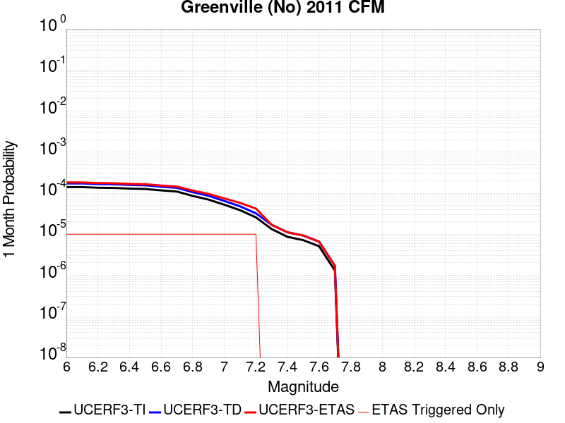 |  |  |

| Magnitude | 1 wk TI Prob | 1 wk TD Prob | 1 wk ETAS Prob | 1 wk ETAS/TD Gain | 1 wk ETAS Triggered Only | 1 mo TI Prob | 1 mo TD Prob | 1 mo ETAS Prob | 1 mo ETAS/TD Gain | 1 mo ETAS Triggered Only | 1 yr TI Prob | 1 yr TD Prob | 1 yr ETAS Prob | 1 yr ETAS/TD Gain | 1 yr ETAS Triggered Only | 10 yr TI Prob | 10 yr TD Prob | 10 yr ETAS Prob | 10 yr ETAS/TD Gain | 10 yr ETAS Triggered Only |
|-----|-----|-----|-----|-----|-----|-----|-----|-----|-----|-----|-----|-----|-----|-----|-----|-----|-----|-----|-----|-----|
| 6.0 | 3.286654E-5 | 4.036671E-5 | 5.0366307E-5 | 1.2477189 | 1.0E-5 | 1.4084899E-4 | 1.7298892E-4 | 1.8298719E-4 | 1.0577972 | 1.0E-5 | 0.0017134876 | 0.0021041434 | 0.0021141223 | 1.0047425 | 1.0E-5 | 0.017003356 | 0.02084759 | 0.02085738 | 1.0004697 | 1.0E-5 |
| 6.1 | 3.286654E-5 | 4.036671E-5 | 5.0366307E-5 | 1.2477189 | 1.0E-5 | 1.4084899E-4 | 1.7298892E-4 | 1.8298719E-4 | 1.0577972 | 1.0E-5 | 0.0017134876 | 0.0021041434 | 0.0021141223 | 1.0047425 | 1.0E-5 | 0.017003356 | 0.02084759 | 0.02085738 | 1.0004697 | 1.0E-5 |
| 6.2 | 3.1697953E-5 | 3.8929615E-5 | 4.8929225E-5 | 1.2568638 | 1.0E-5 | 1.358413E-4 | 1.6683072E-4 | 1.7682907E-4 | 1.059931 | 1.0E-5 | 0.0016526132 | 0.0020293088 | 0.0020392886 | 1.0049177 | 1.0E-5 | 0.01640377 | 0.020112982 | 0.020122781 | 1.0004872 | 1.0E-5 |
| 6.3 | 3.1363317E-5 | 3.8518487E-5 | 4.8518104E-5 | 1.2596056 | 1.0E-5 | 1.344073E-4 | 1.6506898E-4 | 1.7506733E-4 | 1.0605707 | 1.0E-5 | 0.0016351803 | 0.0020078993 | 0.0020178794 | 1.0049703 | 1.0E-5 | 0.016232004 | 0.019902749 | 0.01991255 | 1.0004925 | 1.0E-5 |
| 6.4 | 3.0228604E-5 | 3.712561E-5 | 4.712524E-5 | 1.2693459 | 1.0E-5 | 1.2954473E-4 | 1.5910025E-4 | 1.6909865E-4 | 1.0628434 | 1.0E-5 | 0.0015760659 | 0.001935361 | 0.0019453416 | 1.005157 | 1.0E-5 | 0.015649348 | 0.01919009 | 0.019199898 | 1.000511 | 1.0E-5 |
| 6.5 | 2.9537814E-5 | 3.628106E-5 | 4.6280697E-5 | 1.2756159 | 1.0E-5 | 1.2658449E-4 | 1.5548118E-4 | 1.6547962E-4 | 1.0643065 | 1.0E-5 | 0.0015400766 | 0.0018913761 | 0.0019013572 | 1.0052772 | 1.0E-5 | 0.01529447 | 0.018757751 | 0.018767564 | 1.0005231 | 1.0E-5 |
| 6.6 | 2.7345395E-5 | 3.359038E-5 | 4.359004E-5 | 1.2976943 | 1.0E-5 | 1.1718928E-4 | 1.43951E-4 | 1.5394956E-4 | 1.0694581 | 1.0E-5 | 0.0014258457 | 0.0017512254 | 0.0017612079 | 1.0057002 | 1.0E-5 | 0.014167317 | 0.017378574 | 0.0173884 | 1.0005654 | 1.0E-5 |
| 6.7 | 2.5615784E-5 | 3.1567277E-5 | 4.1566964E-5 | 1.3167738 | 1.0E-5 | 1.09777306E-4 | 1.352815E-4 | 1.4528014E-4 | 1.07391 | 1.0E-5 | 0.0013357193 | 0.0016458385 | 0.0016558219 | 1.006066 | 1.0E-5 | 0.013277191 | 0.016340667 | 0.016350504 | 1.000602 | 1.0E-5 |
| 6.8 | 2.0059057E-5 | 2.4712264E-5 | 3.471202E-5 | 1.4046474 | 1.0E-5 | 8.596455E-5 | 1.059055E-4 | 1.1590444E-4 | 1.0944138 | 1.0E-5 | 0.0010461159 | 0.001288653 | 0.0012986402 | 1.00775 | 1.0E-5 | 0.0104120495 | 0.012814328 | 0.0128242 | 1.0007703 | 1.0E-5 |
| 6.9 | 1.6321746E-5 | 2.018486E-5 | 3.0184658E-5 | 1.4954108 | 1.0E-5 | 6.9948466E-5 | 8.6503744E-5 | 9.650288E-5 | 1.1155919 | 1.0E-5 | 8.5128983E-4 | 0.0010526866 | 0.0010626761 | 1.0094895 | 1.0E-5 | 0.008480361 | 0.010479037 | 0.010488932 | 1.0009443 | 1.0E-5 |
| 7.0 | 1.22527645E-5 | 1.5135808E-5 | 2.5135656E-5 | 1.6606749 | 1.0E-5 | 5.2510793E-5 | 6.486616E-5 | 7.486551E-5 | 1.1541536 | 1.0E-5 | 6.3913135E-4 | 7.894636E-4 | 7.994557E-4 | 1.0126568 | 1.0E-5 | 0.0063729626 | 0.007867573 | 0.007877494 | 1.001261 | 1.0E-5 |
| 7.1 | 8.996482E-6 | 1.1165116E-5 | 2.1165004E-5 | 1.8956367 | 1.0E-5 | 3.8555783E-5 | 4.784963E-5 | 5.784915E-5 | 1.208978 | 1.0E-5 | 4.6931554E-4 | 5.8241474E-4 | 5.924089E-4 | 1.0171599 | 1.0E-5 | 0.004683256 | 0.0058096354 | 0.0058195773 | 1.0017112 | 1.0E-5 |
| 7.2 | 6.0273087E-6 | 7.569621E-6 | 1.7569546E-5 | 2.32106 | 1.0E-5 | 2.5831067E-5 | 3.2440836E-5 | 4.244051E-5 | 1.3082435 | 1.0E-5 | 3.1444785E-4 | 3.9489628E-4 | 4.0489231E-4 | 1.0253131 | 1.0E-5 | 0.0031400328 | 0.003942419 | 0.00395238 | 1.0025265 | 1.0E-5 |
| 7.3 | 3.1209995E-6 | 3.9664565E-6 | 3.9664565E-6 | 1.0 | 0.0 | 1.3375643E-5 | 1.6998989E-5 | 1.6998989E-5 | 1.0 | 0.0 | 1.6283628E-4 | 2.069432E-4 | 2.069432E-4 | 1.0 | 0.0 | 0.0016271701 | 0.0020678395 | 0.0020678395 | 1.0 | 0.0 |
| 7.4 | 2.0254208E-6 | 2.6096657E-6 | 2.6096657E-6 | 1.0 | 0.0 | 8.680347E-6 | 1.1184234E-5 | 1.1184234E-5 | 1.0 | 0.0 | 1.0567809E-4 | 1.361596E-4 | 1.361596E-4 | 1.0 | 0.0 | 0.0010562785 | 0.0013611179 | 0.0013611179 | 1.0 | 0.0 |
| 7.5 | 1.6763418E-6 | 2.1734072E-6 | 2.1734072E-6 | 1.0 | 0.0 | 7.184302E-6 | 9.314569E-6 | 9.314569E-6 | 1.0 | 0.0 | 8.746537E-5 | 1.1339904E-4 | 1.1339904E-4 | 1.0 | 0.0 | 8.743095E-4 | 0.0011337536 | 0.0011337536 | 1.0 | 0.0 |
| 7.6 | 1.1935462E-6 | 1.5458915E-6 | 1.5458915E-6 | 1.0 | 0.0 | 5.115188E-6 | 6.625233E-6 | 6.625233E-6 | 1.0 | 0.0 | 6.2275634E-5 | 8.0659265E-5 | 8.0659265E-5 | 1.0 | 0.0 | 6.2258187E-4 | 8.0655375E-4 | 8.0655375E-4 | 1.0 | 0.0 |
| 7.7 | 3.0464201E-7 | 3.9848686E-7 | 3.9848686E-7 | 1.0 | 0.0 | 1.3056081E-6 | 1.7077997E-6 | 1.7077997E-6 | 1.0 | 0.0 | 1.589566E-5 | 2.0792268E-5 | 2.0792268E-5 | 1.0 | 0.0 | 1.5894524E-4 | 2.0793018E-4 | 2.0793018E-4 | 1.0 | 0.0 |

## San Pedro Escarpment
*[(top)](#table-of-contents)*

| 1 Week | 1 Month | 1 Year | 10 Year |
|-----|-----|-----|-----|
|  |  |  |  |

| Magnitude | 1 wk TI Prob | 1 wk TD Prob | 1 wk ETAS Prob | 1 wk ETAS/TD Gain | 1 wk ETAS Triggered Only | 1 mo TI Prob | 1 mo TD Prob | 1 mo ETAS Prob | 1 mo ETAS/TD Gain | 1 mo ETAS Triggered Only | 1 yr TI Prob | 1 yr TD Prob | 1 yr ETAS Prob | 1 yr ETAS/TD Gain | 1 yr ETAS Triggered Only | 10 yr TI Prob | 10 yr TD Prob | 10 yr ETAS Prob | 10 yr ETAS/TD Gain | 10 yr ETAS Triggered Only |
|-----|-----|-----|-----|-----|-----|-----|-----|-----|-----|-----|-----|-----|-----|-----|-----|-----|-----|-----|-----|-----|
| 6.0 | 1.1740281E-6 | 1.0380334E-6 | 1.1038023E-5 | 10.633593 | 1.0E-5 | 5.031539E-6 | 4.448707E-6 | 1.4448662E-5 | 3.2478342 | 1.0E-5 | 6.125726E-5 | 5.4161726E-5 | 6.4161184E-5 | 1.1846222 | 1.0E-5 | 6.124038E-4 | 5.4149167E-4 | 5.514862E-4 | 1.0184575 | 1.0E-5 |
| 6.1 | 1.1740281E-6 | 1.0380334E-6 | 1.1038023E-5 | 10.633593 | 1.0E-5 | 5.031539E-6 | 4.448707E-6 | 1.4448662E-5 | 3.2478342 | 1.0E-5 | 6.125726E-5 | 5.4161726E-5 | 6.4161184E-5 | 1.1846222 | 1.0E-5 | 6.124038E-4 | 5.4149167E-4 | 5.514862E-4 | 1.0184575 | 1.0E-5 |
| 6.2 | 1.1740281E-6 | 1.0380334E-6 | 1.1038023E-5 | 10.633593 | 1.0E-5 | 5.031539E-6 | 4.448707E-6 | 1.4448662E-5 | 3.2478342 | 1.0E-5 | 6.125726E-5 | 5.4161726E-5 | 6.4161184E-5 | 1.1846222 | 1.0E-5 | 6.124038E-4 | 5.4149167E-4 | 5.514862E-4 | 1.0184575 | 1.0E-5 |
| 6.3 | 1.1740281E-6 | 1.0380334E-6 | 1.1038023E-5 | 10.633593 | 1.0E-5 | 5.031539E-6 | 4.448707E-6 | 1.4448662E-5 | 3.2478342 | 1.0E-5 | 6.125726E-5 | 5.4161726E-5 | 6.4161184E-5 | 1.1846222 | 1.0E-5 | 6.124038E-4 | 5.4149167E-4 | 5.514862E-4 | 1.0184575 | 1.0E-5 |
| 6.4 | 1.1740281E-6 | 1.0380334E-6 | 1.1038023E-5 | 10.633593 | 1.0E-5 | 5.031539E-6 | 4.448707E-6 | 1.4448662E-5 | 3.2478342 | 1.0E-5 | 6.125726E-5 | 5.4161726E-5 | 6.4161184E-5 | 1.1846222 | 1.0E-5 | 6.124038E-4 | 5.4149167E-4 | 5.514862E-4 | 1.0184575 | 1.0E-5 |
| 6.5 | 1.1740281E-6 | 1.0380334E-6 | 1.1038023E-5 | 10.633593 | 1.0E-5 | 5.031539E-6 | 4.448707E-6 | 1.4448662E-5 | 3.2478342 | 1.0E-5 | 6.125726E-5 | 5.4161726E-5 | 6.4161184E-5 | 1.1846222 | 1.0E-5 | 6.124038E-4 | 5.4149167E-4 | 5.514862E-4 | 1.0184575 | 1.0E-5 |
| 6.6 | 1.1740281E-6 | 1.0380334E-6 | 1.1038023E-5 | 10.633593 | 1.0E-5 | 5.031539E-6 | 4.448707E-6 | 1.4448662E-5 | 3.2478342 | 1.0E-5 | 6.125726E-5 | 5.4161726E-5 | 6.4161184E-5 | 1.1846222 | 1.0E-5 | 6.124038E-4 | 5.4149167E-4 | 5.514862E-4 | 1.0184575 | 1.0E-5 |
| 6.7 | 1.1740281E-6 | 1.0380334E-6 | 1.1038023E-5 | 10.633593 | 1.0E-5 | 5.031539E-6 | 4.448707E-6 | 1.4448662E-5 | 3.2478342 | 1.0E-5 | 6.125726E-5 | 5.4161726E-5 | 6.4161184E-5 | 1.1846222 | 1.0E-5 | 6.124038E-4 | 5.4149167E-4 | 5.514862E-4 | 1.0184575 | 1.0E-5 |
| 6.8 | 1.1740281E-6 | 1.0380334E-6 | 1.1038023E-5 | 10.633593 | 1.0E-5 | 5.031539E-6 | 4.448707E-6 | 1.4448662E-5 | 3.2478342 | 1.0E-5 | 6.125726E-5 | 5.4161726E-5 | 6.4161184E-5 | 1.1846222 | 1.0E-5 | 6.124038E-4 | 5.4149167E-4 | 5.514862E-4 | 1.0184575 | 1.0E-5 |
| 6.9 | 1.1740281E-6 | 1.0380334E-6 | 1.1038023E-5 | 10.633593 | 1.0E-5 | 5.031539E-6 | 4.448707E-6 | 1.4448662E-5 | 3.2478342 | 1.0E-5 | 6.125726E-5 | 5.4161726E-5 | 6.4161184E-5 | 1.1846222 | 1.0E-5 | 6.124038E-4 | 5.4149167E-4 | 5.514862E-4 | 1.0184575 | 1.0E-5 |
| 7.0 | 1.1740281E-6 | 1.0380334E-6 | 1.1038023E-5 | 10.633593 | 1.0E-5 | 5.031539E-6 | 4.448707E-6 | 1.4448662E-5 | 3.2478342 | 1.0E-5 | 6.125726E-5 | 5.4161726E-5 | 6.4161184E-5 | 1.1846222 | 1.0E-5 | 6.124038E-4 | 5.4149167E-4 | 5.514862E-4 | 1.0184575 | 1.0E-5 |
| 7.1 | 1.1740281E-6 | 1.0380334E-6 | 1.1038023E-5 | 10.633593 | 1.0E-5 | 5.031539E-6 | 4.448707E-6 | 1.4448662E-5 | 3.2478342 | 1.0E-5 | 6.125726E-5 | 5.4161726E-5 | 6.4161184E-5 | 1.1846222 | 1.0E-5 | 6.124038E-4 | 5.4149167E-4 | 5.514862E-4 | 1.0184575 | 1.0E-5 |
| 7.2 | 1.1722314E-6 | 1.0362206E-6 | 1.103621E-5 | 10.650445 | 1.0E-5 | 5.023839E-6 | 4.440938E-6 | 1.4440894E-5 | 3.2517664 | 1.0E-5 | 6.116352E-5 | 5.4067146E-5 | 6.4066604E-5 | 1.1849452 | 1.0E-5 | 6.114669E-4 | 5.405463E-4 | 5.505409E-4 | 1.0184898 | 1.0E-5 |
| 7.3 | 1.1515234E-6 | 1.0152946E-6 | 1.1015284E-5 | 10.849347 | 1.0E-5 | 4.935091E-6 | 4.351256E-6 | 1.43512125E-5 | 3.298177 | 1.0E-5 | 6.008308E-5 | 5.2975316E-5 | 6.297479E-5 | 1.1887572 | 1.0E-5 | 6.0066837E-4 | 5.2963325E-4 | 5.39628E-4 | 1.018871 | 1.0E-5 |
| 7.4 | 1.1103637E-6 | 9.736538E-7 | 1.0973644E-5 | 11.270581 | 1.0E-5 | 4.7586927E-6 | 4.172796E-6 | 1.4172754E-5 | 3.3964648 | 1.0E-5 | 5.793554E-5 | 5.0802668E-5 | 6.080216E-5 | 1.19683 | 1.0E-5 | 5.792044E-4 | 5.079169E-4 | 5.179118E-4 | 1.0196782 | 1.0E-5 |
| 7.5 | 1.0425391E-6 | 9.11898E-7 | 1.0911889E-5 | 11.966129 | 1.0E-5 | 4.4680173E-6 | 3.9081287E-6 | 1.3908089E-5 | 3.5587595 | 1.0E-5 | 5.439675E-5 | 4.758049E-5 | 5.7580015E-5 | 1.2101601 | 1.0E-5 | 5.438344E-4 | 4.7570938E-4 | 4.8570463E-4 | 1.0210112 | 1.0E-5 |
| 7.6 | 7.0184194E-7 | 5.8865743E-7 | 1.0588652E-5 | 17.987799 | 1.0E-5 | 3.0078907E-6 | 2.5228155E-6 | 1.252279E-5 | 4.963815 | 1.0E-5 | 3.6620455E-5 | 3.0714895E-5 | 4.0714585E-5 | 1.325565 | 1.0E-5 | 3.661442E-4 | 3.0711124E-4 | 3.1710818E-4 | 1.0325515 | 1.0E-5 |
| 7.7 | 3.0871365E-7 | 2.2456504E-7 | 1.0224563E-5 | 45.530518 | 1.0E-5 | 1.3230577E-6 | 9.624213E-7 | 1.0962412E-5 | 11.3904505 | 1.0E-5 | 1.610811E-5 | 1.1717418E-5 | 2.17173E-5 | 1.8534204 | 1.0E-5 | 1.6106942E-4 | 1.1716811E-4 | 1.2716693E-4 | 1.0853374 | 1.0E-5 |
| 7.8 | 5.7512665E-8 | 4.1053934E-8 | 4.1053934E-8 | 1.0 | 0.0 | 2.464828E-7 | 1.7594542E-7 | 1.7594542E-7 | 1.0 | 0.0 | 3.0009242E-6 | 2.1421336E-6 | 2.1421336E-6 | 1.0 | 0.0 | 3.0008836E-5 | 2.142115E-5 | 2.142115E-5 | 1.0 | 0.0 |
| 7.9 | 6.040053E-9 | 3.4534282E-9 | 3.4534282E-9 | 1.0 | 0.0 | 2.5885942E-8 | 1.4800406E-8 | 1.4800406E-8 | 1.0 | 0.0 | 3.151613E-7 | 1.8019493E-7 | 1.8019493E-7 | 1.0 | 0.0 | 3.1516086E-6 | 1.8019481E-6 | 1.8019481E-6 | 1.0 | 0.0 |

## San Andreas (Offshore) 2011 CFM
*[(top)](#table-of-contents)*

| 1 Week | 1 Month | 1 Year | 10 Year |
|-----|-----|-----|-----|
|  |  |  |  |

| Magnitude | 1 wk TI Prob | 1 wk TD Prob | 1 wk ETAS Prob | 1 wk ETAS/TD Gain | 1 wk ETAS Triggered Only | 1 mo TI Prob | 1 mo TD Prob | 1 mo ETAS Prob | 1 mo ETAS/TD Gain | 1 mo ETAS Triggered Only | 1 yr TI Prob | 1 yr TD Prob | 1 yr ETAS Prob | 1 yr ETAS/TD Gain | 1 yr ETAS Triggered Only | 10 yr TI Prob | 10 yr TD Prob | 10 yr ETAS Prob | 10 yr ETAS/TD Gain | 10 yr ETAS Triggered Only |
|-----|-----|-----|-----|-----|-----|-----|-----|-----|-----|-----|-----|-----|-----|-----|-----|-----|-----|-----|-----|-----|
| 6.0 | 1.7072787E-4 | 1.9226626E-4 | 2.0226435E-4 | 1.0520012 | 1.0E-5 | 7.3148566E-4 | 8.237405E-4 | 8.3373225E-4 | 1.0121298 | 1.0E-5 | 0.008869528 | 0.009983436 | 0.009993336 | 1.0009917 | 1.0E-5 | 0.085237645 | 0.09681613 | 0.09682517 | 1.0000933 | 1.0E-5 |
| 6.1 | 1.7072787E-4 | 1.9226626E-4 | 2.0226435E-4 | 1.0520012 | 1.0E-5 | 7.3148566E-4 | 8.237405E-4 | 8.3373225E-4 | 1.0121298 | 1.0E-5 | 0.008869528 | 0.009983436 | 0.009993336 | 1.0009917 | 1.0E-5 | 0.085237645 | 0.09681613 | 0.09682517 | 1.0000933 | 1.0E-5 |
| 6.2 | 1.6312556E-4 | 1.8408237E-4 | 1.8408237E-4 | 1.0 | 0.0 | 6.989222E-4 | 7.8868825E-4 | 7.8868825E-4 | 1.0 | 0.0 | 0.008476226 | 0.0095605 | 0.0095605 | 1.0 | 0.0 | 0.08160117 | 0.092837214 | 0.092837214 | 1.0 | 0.0 |
| 6.3 | 1.5103363E-4 | 1.6881147E-4 | 1.6881147E-4 | 1.0 | 0.0 | 6.471264E-4 | 7.232793E-4 | 7.232793E-4 | 1.0 | 0.0 | 0.007850339 | 0.008770814 | 0.008770814 | 1.0 | 0.0 | 0.075787395 | 0.08546859 | 0.08546859 | 1.0 | 0.0 |
| 6.4 | 1.5047993E-4 | 1.6767075E-4 | 1.6767075E-4 | 1.0 | 0.0 | 6.4475456E-4 | 7.183932E-4 | 7.183932E-4 | 1.0 | 0.0 | 0.007821669 | 0.008711802 | 0.008711802 | 1.0 | 0.0 | 0.0755203 | 0.08494888 | 0.08494888 | 1.0 | 0.0 |
| 6.5 | 1.2760791E-4 | 1.3734949E-4 | 1.3734949E-4 | 1.0 | 0.0 | 5.467764E-4 | 5.8850925E-4 | 5.8850925E-4 | 1.0 | 0.0 | 0.0066367025 | 0.007141834 | 0.007141834 | 1.0 | 0.0 | 0.064419635 | 0.07024954 | 0.07024954 | 1.0 | 0.0 |
| 6.6 | 1.1063525E-4 | 1.15565475E-4 | 1.15565475E-4 | 1.0 | 0.0 | 4.740649E-4 | 4.9518765E-4 | 4.9518765E-4 | 1.0 | 0.0 | 0.0057564764 | 0.006012446 | 0.006012446 | 1.0 | 0.0 | 0.05609626 | 0.059496127 | 0.059496127 | 1.0 | 0.0 |
| 6.7 | 1.0391049E-4 | 1.0645875E-4 | 1.0645875E-4 | 1.0 | 0.0 | 4.4525467E-4 | 4.56173E-4 | 4.56173E-4 | 1.0 | 0.0 | 0.0054075094 | 0.0055399504 | 0.0055399504 | 1.0 | 0.0 | 0.052778035 | 0.05498844 | 0.05498844 | 1.0 | 0.0 |
| 6.8 | 1.0096706E-4 | 1.01582154E-4 | 1.01582154E-4 | 1.0 | 0.0 | 4.3264418E-4 | 4.3528038E-4 | 4.3528038E-4 | 1.0 | 0.0 | 0.0052547283 | 0.0052868384 | 0.0052868384 | 1.0 | 0.0 | 0.051321987 | 0.052686825 | 0.052686825 | 1.0 | 0.0 |
| 6.9 | 9.800265E-5 | 9.588697E-5 | 9.588697E-5 | 1.0 | 0.0 | 4.1994374E-4 | 4.1088034E-4 | 4.1088034E-4 | 1.0 | 0.0 | 0.0051008356 | 0.004991162 | 0.004991162 | 1.0 | 0.0 | 0.049853306 | 0.05001508 | 0.05001508 | 1.0 | 0.0 |
| 7.0 | 9.4642375E-5 | 9.002096E-5 | 9.002096E-5 | 1.0 | 0.0 | 4.0554712E-4 | 3.8574796E-4 | 3.8574796E-4 | 1.0 | 0.0 | 0.004926363 | 0.00468653 | 0.00468653 | 1.0 | 0.0 | 0.048185747 | 0.047194667 | 0.047194667 | 1.0 | 0.0 |
| 7.1 | 9.0996844E-5 | 8.354119E-5 | 8.354119E-5 | 1.0 | 0.0 | 3.8992817E-4 | 3.579854E-4 | 3.579854E-4 | 1.0 | 0.0 | 0.004737046 | 0.0043499186 | 0.0043499186 | 1.0 | 0.0 | 0.04637333 | 0.04404688 | 0.04404688 | 1.0 | 0.0 |
| 7.2 | 8.848287E-5 | 7.981761E-5 | 7.981761E-5 | 1.0 | 0.0 | 3.791572E-4 | 3.420315E-4 | 3.420315E-4 | 1.0 | 0.0 | 0.004606472 | 0.0041564363 | 0.0041564363 | 1.0 | 0.0 | 0.045121472 | 0.042189904 | 0.042189904 | 1.0 | 0.0 |
| 7.3 | 7.9280784E-5 | 6.1274885E-5 | 6.1274885E-5 | 1.0 | 0.0 | 3.3973053E-4 | 2.6258078E-4 | 2.6258078E-4 | 1.0 | 0.0 | 0.004128377 | 0.003192337 | 0.003192337 | 1.0 | 0.0 | 0.040525194 | 0.03290183 | 0.03290183 | 1.0 | 0.0 |
| 7.4 | 6.468038E-5 | 3.7930724E-5 | 3.7930724E-5 | 1.0 | 0.0 | 2.771722E-4 | 1.6255044E-4 | 1.6255044E-4 | 1.0 | 0.0 | 0.0033693502 | 0.0019773128 | 0.0019773128 | 1.0 | 0.0 | 0.0331872 | 0.02081734 | 0.02081734 | 1.0 | 0.0 |
| 7.5 | 4.930574E-5 | 1.2699263E-5 | 1.2699263E-5 | 1.0 | 0.0 | 2.1129321E-4 | 5.4424287E-5 | 5.4424287E-5 | 1.0 | 0.0 | 0.0025694598 | 6.6241587E-4 | 6.6241587E-4 | 1.0 | 0.0 | 0.02539953 | 0.0074798525 | 0.0074798525 | 1.0 | 0.0 |
| 7.6 | 4.612566E-5 | 1.0332297E-5 | 1.0332297E-5 | 1.0 | 0.0 | 1.9766642E-4 | 4.428053E-5 | 4.428053E-5 | 1.0 | 0.0 | 0.0024039324 | 5.3898344E-4 | 5.3898344E-4 | 1.0 | 0.0 | 0.023780935 | 0.006170428 | 0.006170428 | 1.0 | 0.0 |
| 7.7 | 3.9435414E-5 | 5.5710498E-6 | 5.5710498E-6 | 1.0 | 0.0 | 1.6899795E-4 | 2.3875711E-5 | 2.3875711E-5 | 1.0 | 0.0 | 0.0020556084 | 2.906482E-4 | 2.906482E-4 | 1.0 | 0.0 | 0.020366974 | 0.0035397834 | 0.0035397834 | 1.0 | 0.0 |
| 7.8 | 2.7787428E-5 | 3.7526645E-6 | 3.7526645E-6 | 1.0 | 0.0 | 1.1908354E-4 | 1.6082748E-5 | 1.6082748E-5 | 1.0 | 0.0 | 0.0014488777 | 1.9578991E-4 | 1.9578991E-4 | 1.0 | 0.0 | 0.014394675 | 0.0023862 | 0.0023862 | 1.0 | 0.0 |
| 7.9 | 1.590671E-5 | 3.0391298E-6 | 3.0391298E-6 | 1.0 | 0.0 | 6.816983E-5 | 1.3024777E-5 | 1.3024777E-5 | 1.0 | 0.0 | 8.2965166E-4 | 1.5856515E-4 | 1.5856515E-4 | 1.0 | 0.0 | 0.008265611 | 0.0019033558 | 0.0019033558 | 1.0 | 0.0 |
| 8.0 | 9.193638E-6 | 2.5908973E-6 | 2.5908973E-6 | 1.0 | 0.0 | 3.940071E-5 | 1.1103798E-5 | 1.1103798E-5 | 1.0 | 0.0 | 4.7959806E-4 | 1.3518038E-4 | 1.3518038E-4 | 1.0 | 0.0 | 0.0047856434 | 0.0016108477 | 0.0016108477 | 1.0 | 0.0 |
| 8.1 | 5.601576E-6 | 2.2333788E-6 | 2.2333788E-6 | 1.0 | 0.0 | 2.4006533E-5 | 9.571589E-6 | 9.571589E-6 | 1.0 | 0.0 | 2.9224035E-4 | 1.1652788E-4 | 1.1652788E-4 | 1.0 | 0.0 | 0.0029185633 | 0.0014015464 | 0.0014015464 | 1.0 | 0.0 |
| 8.2 | 4.3508785E-6 | 1.8568232E-6 | 1.8568232E-6 | 1.0 | 0.0 | 1.864649E-5 | 7.957789E-6 | 7.957789E-6 | 1.0 | 0.0 | 2.2699735E-4 | 9.6881806E-5 | 9.6881806E-5 | 1.0 | 0.0 | 0.0022676561 | 0.0011590312 | 0.0011590312 | 1.0 | 0.0 |
| 8.3 | 1.9573292E-6 | 7.511501E-7 | 7.511501E-7 | 1.0 | 0.0 | 8.388526E-6 | 3.2192108E-6 | 3.2192108E-6 | 1.0 | 0.0 | 1.0212552E-4 | 3.9193204E-5 | 3.9193204E-5 | 1.0 | 0.0 | 0.001020786 | 4.6391718E-4 | 4.6391718E-4 | 1.0 | 0.0 |

## North Frontal  (West)
*[(top)](#table-of-contents)*

| 1 Week | 1 Month | 1 Year | 10 Year |
|-----|-----|-----|-----|
|  |  |  |  |

| Magnitude | 1 wk TI Prob | 1 wk TD Prob | 1 wk ETAS Prob | 1 wk ETAS/TD Gain | 1 wk ETAS Triggered Only | 1 mo TI Prob | 1 mo TD Prob | 1 mo ETAS Prob | 1 mo ETAS/TD Gain | 1 mo ETAS Triggered Only | 1 yr TI Prob | 1 yr TD Prob | 1 yr ETAS Prob | 1 yr ETAS/TD Gain | 1 yr ETAS Triggered Only | 10 yr TI Prob | 10 yr TD Prob | 10 yr ETAS Prob | 10 yr ETAS/TD Gain | 10 yr ETAS Triggered Only |
|-----|-----|-----|-----|-----|-----|-----|-----|-----|-----|-----|-----|-----|-----|-----|-----|-----|-----|-----|-----|-----|
| 6.0 | 4.7316266E-6 | 4.852674E-6 | 4.852674E-6 | 1.0 | 0.0 | 2.0278241E-5 | 2.0797017E-5 | 2.0797017E-5 | 1.0 | 0.0 | 2.4685962E-4 | 2.5317573E-4 | 2.5317573E-4 | 1.0 | 0.0 | 0.0024658558 | 0.002529019 | 0.0025389937 | 1.0039442 | 1.0E-5 |
| 6.1 | 4.7316266E-6 | 4.852674E-6 | 4.852674E-6 | 1.0 | 0.0 | 2.0278241E-5 | 2.0797017E-5 | 2.0797017E-5 | 1.0 | 0.0 | 2.4685962E-4 | 2.5317573E-4 | 2.5317573E-4 | 1.0 | 0.0 | 0.0024658558 | 0.002529019 | 0.0025389937 | 1.0039442 | 1.0E-5 |
| 6.2 | 4.7316266E-6 | 4.852674E-6 | 4.852674E-6 | 1.0 | 0.0 | 2.0278241E-5 | 2.0797017E-5 | 2.0797017E-5 | 1.0 | 0.0 | 2.4685962E-4 | 2.5317573E-4 | 2.5317573E-4 | 1.0 | 0.0 | 0.0024658558 | 0.002529019 | 0.0025389937 | 1.0039442 | 1.0E-5 |
| 6.3 | 4.7316266E-6 | 4.852674E-6 | 4.852674E-6 | 1.0 | 0.0 | 2.0278241E-5 | 2.0797017E-5 | 2.0797017E-5 | 1.0 | 0.0 | 2.4685962E-4 | 2.5317573E-4 | 2.5317573E-4 | 1.0 | 0.0 | 0.0024658558 | 0.002529019 | 0.0025389937 | 1.0039442 | 1.0E-5 |
| 6.4 | 4.7316266E-6 | 4.852674E-6 | 4.852674E-6 | 1.0 | 0.0 | 2.0278241E-5 | 2.0797017E-5 | 2.0797017E-5 | 1.0 | 0.0 | 2.4685962E-4 | 2.5317573E-4 | 2.5317573E-4 | 1.0 | 0.0 | 0.0024658558 | 0.002529019 | 0.0025389937 | 1.0039442 | 1.0E-5 |
| 6.5 | 4.7316266E-6 | 4.852674E-6 | 4.852674E-6 | 1.0 | 0.0 | 2.0278241E-5 | 2.0797017E-5 | 2.0797017E-5 | 1.0 | 0.0 | 2.4685962E-4 | 2.5317573E-4 | 2.5317573E-4 | 1.0 | 0.0 | 0.0024658558 | 0.002529019 | 0.0025389937 | 1.0039442 | 1.0E-5 |
| 6.6 | 4.7316266E-6 | 4.852674E-6 | 4.852674E-6 | 1.0 | 0.0 | 2.0278241E-5 | 2.0797017E-5 | 2.0797017E-5 | 1.0 | 0.0 | 2.4685962E-4 | 2.5317573E-4 | 2.5317573E-4 | 1.0 | 0.0 | 0.0024658558 | 0.002529019 | 0.0025389937 | 1.0039442 | 1.0E-5 |
| 6.7 | 3.5382777E-6 | 3.6308872E-6 | 3.6308872E-6 | 1.0 | 0.0 | 1.516396E-5 | 1.5560858E-5 | 1.5560858E-5 | 1.0 | 0.0 | 1.8460557E-4 | 1.8943775E-4 | 1.8943775E-4 | 1.0 | 0.0 | 0.0018445229 | 0.0018928396 | 0.0019028207 | 1.0052731 | 1.0E-5 |
| 6.8 | 3.5382777E-6 | 3.6308872E-6 | 3.6308872E-6 | 1.0 | 0.0 | 1.516396E-5 | 1.5560858E-5 | 1.5560858E-5 | 1.0 | 0.0 | 1.8460557E-4 | 1.8943775E-4 | 1.8943775E-4 | 1.0 | 0.0 | 0.0018445229 | 0.0018928396 | 0.0019028207 | 1.0052731 | 1.0E-5 |
| 6.9 | 3.0428037E-6 | 3.1227619E-6 | 3.1227619E-6 | 1.0 | 0.0 | 1.30405215E-5 | 1.3383201E-5 | 1.3383201E-5 | 1.0 | 0.0 | 1.5875678E-4 | 1.6292896E-4 | 1.6292896E-4 | 1.0 | 0.0 | 0.0015864341 | 0.0016281622 | 0.001638146 | 1.0061319 | 1.0E-5 |
| 7.0 | 2.538778E-6 | 2.6060916E-6 | 2.6060916E-6 | 1.0 | 0.0 | 1.0880432E-5 | 1.116892E-5 | 1.116892E-5 | 1.0 | 0.0 | 1.324612E-4 | 1.3597358E-4 | 1.3597358E-4 | 1.0 | 0.0 | 0.0013238228 | 0.0013589506 | 0.001368937 | 1.0073487 | 1.0E-5 |
| 7.1 | 2.2418935E-6 | 2.3012087E-6 | 2.3012087E-6 | 1.0 | 0.0 | 9.60808E-6 | 9.862288E-6 | 9.862288E-6 | 1.0 | 0.0 | 1.1697209E-4 | 1.2006718E-4 | 1.2006718E-4 | 1.0 | 0.0 | 0.0011691054 | 0.0012000671 | 0.0012100551 | 1.0083228 | 1.0E-5 |
| 7.2 | 1.6526745E-6 | 1.6924864E-6 | 1.6924864E-6 | 1.0 | 0.0 | 7.082872E-6 | 7.2534945E-6 | 7.2534945E-6 | 1.0 | 0.0 | 8.623055E-5 | 8.830797E-5 | 8.830797E-5 | 1.0 | 0.0 | 8.61971E-4 | 8.8275387E-4 | 8.9274504E-4 | 1.0113182 | 1.0E-5 |
| 7.3 | 1.0246019E-6 | 1.0442274E-6 | 1.0442274E-6 | 1.0 | 0.0 | 4.391144E-6 | 4.4752533E-6 | 4.4752533E-6 | 1.0 | 0.0 | 5.3460866E-5 | 5.4484964E-5 | 5.4484964E-5 | 1.0 | 0.0 | 5.344801E-4 | 5.4472755E-4 | 5.547221E-4 | 1.0183479 | 1.0E-5 |
| 7.4 | 8.9045164E-7 | 9.056572E-7 | 9.056572E-7 | 1.0 | 0.0 | 3.8162157E-6 | 3.881383E-6 | 3.881383E-6 | 1.0 | 0.0 | 4.646144E-5 | 4.725492E-5 | 4.725492E-5 | 1.0 | 0.0 | 4.6451724E-4 | 4.7245962E-4 | 4.824549E-4 | 1.0211558 | 1.0E-5 |
| 7.5 | 6.3357E-7 | 6.4027137E-7 | 6.4027137E-7 | 1.0 | 0.0 | 2.7152971E-6 | 2.7440176E-6 | 2.7440176E-6 | 1.0 | 0.0 | 3.305824E-5 | 3.340797E-5 | 3.340797E-5 | 1.0 | 0.0 | 3.3053322E-4 | 3.3403604E-4 | 3.440327E-4 | 1.0299269 | 1.0E-5 |
| 7.6 | 2.5087024E-7 | 2.436123E-7 | 2.436123E-7 | 1.0 | 0.0 | 1.0751578E-6 | 1.0440525E-6 | 1.0440525E-6 | 1.0 | 0.0 | 1.3089967E-5 | 1.2711286E-5 | 1.2711286E-5 | 1.0 | 0.0 | 1.3089196E-4 | 1.2710765E-4 | 1.2710765E-4 | 1.0 | 0.0 |
| 7.7 | 3.282987E-8 | 2.2875435E-8 | 2.2875435E-8 | 1.0 | 0.0 | 1.4069944E-7 | 9.8037575E-8 | 9.8037575E-8 | 1.0 | 0.0 | 1.7130144E-6 | 1.193607E-6 | 1.193607E-6 | 1.0 | 0.0 | 1.7130013E-5 | 1.1936014E-5 | 1.1936014E-5 | 1.0 | 0.0 |
| 7.8 | 8.77499E-9 | 5.6817466E-9 | 5.6817466E-9 | 1.0 | 0.0 | 3.7607098E-8 | 2.4350342E-8 | 2.4350342E-8 | 1.0 | 0.0 | 4.578663E-7 | 2.964654E-7 | 2.964654E-7 | 1.0 | 0.0 | 4.5786537E-6 | 2.9646512E-6 | 2.9646512E-6 | 1.0 | 0.0 |

## Almanor 2011 CFM
*[(top)](#table-of-contents)*

| 1 Week | 1 Month | 1 Year | 10 Year |
|-----|-----|-----|-----|
|  |  |  |  |

| Magnitude | 1 wk TI Prob | 1 wk TD Prob | 1 wk ETAS Prob | 1 wk ETAS/TD Gain | 1 wk ETAS Triggered Only | 1 mo TI Prob | 1 mo TD Prob | 1 mo ETAS Prob | 1 mo ETAS/TD Gain | 1 mo ETAS Triggered Only | 1 yr TI Prob | 1 yr TD Prob | 1 yr ETAS Prob | 1 yr ETAS/TD Gain | 1 yr ETAS Triggered Only | 10 yr TI Prob | 10 yr TD Prob | 10 yr ETAS Prob | 10 yr ETAS/TD Gain | 10 yr ETAS Triggered Only |
|-----|-----|-----|-----|-----|-----|-----|-----|-----|-----|-----|-----|-----|-----|-----|-----|-----|-----|-----|-----|-----|
| 6.0 | 6.1479834E-5 | 8.327245E-5 | 9.3271614E-5 | 1.1200777 | 1.0E-5 | 2.6345838E-4 | 3.5683523E-4 | 3.6683163E-4 | 1.0280142 | 1.0E-5 | 0.0032028882 | 0.004336495 | 0.0043464517 | 1.002296 | 1.0E-5 | 0.031571172 | 0.04258658 | 0.042596154 | 1.0002248 | 1.0E-5 |
| 6.1 | 4.4387216E-5 | 5.9767433E-5 | 6.976684E-5 | 1.1673052 | 1.0E-5 | 1.9021705E-4 | 2.561236E-4 | 2.6612106E-4 | 1.0390337 | 1.0E-5 | 0.0023134327 | 0.003114351 | 0.0031243197 | 1.0032009 | 1.0E-5 | 0.022894967 | 0.030755581 | 0.030765275 | 1.0003152 | 1.0E-5 |
| 6.2 | 4.4387216E-5 | 5.9767433E-5 | 6.976684E-5 | 1.1673052 | 1.0E-5 | 1.9021705E-4 | 2.561236E-4 | 2.6612106E-4 | 1.0390337 | 1.0E-5 | 0.0023134327 | 0.003114351 | 0.0031243197 | 1.0032009 | 1.0E-5 | 0.022894967 | 0.030755581 | 0.030765275 | 1.0003152 | 1.0E-5 |
| 6.3 | 2.9523822E-5 | 3.9546965E-5 | 3.9546965E-5 | 1.0 | 0.0 | 1.2652454E-4 | 1.6947731E-4 | 1.6947731E-4 | 1.0 | 0.0 | 0.0015393476 | 0.0020617929 | 0.0020617929 | 1.0 | 0.0 | 0.015287281 | 0.020461112 | 0.020461112 | 1.0 | 0.0 |
| 6.4 | 2.0512744E-5 | 2.7430639E-5 | 2.7430639E-5 | 1.0 | 0.0 | 8.79088E-5 | 1.17555675E-4 | 1.17555675E-4 | 1.0 | 0.0 | 0.001069764 | 0.0014306171 | 0.0014306171 | 1.0 | 0.0 | 0.010646289 | 0.01424458 | 0.01424458 | 1.0 | 0.0 |
| 6.5 | 1.6750226E-5 | 2.2390364E-5 | 2.2390364E-5 | 1.0 | 0.0 | 7.178471E-5 | 9.595619E-5 | 9.595619E-5 | 1.0 | 0.0 | 8.7362836E-4 | 0.0011679606 | 0.0011679606 | 1.0 | 0.0 | 0.008702018 | 0.011649196 | 0.011649196 | 1.0 | 0.0 |
| 6.6 | 1.4745303E-5 | 1.970686E-5 | 1.970686E-5 | 1.0 | 0.0 | 6.319262E-5 | 8.445639E-5 | 8.445639E-5 | 1.0 | 0.0 | 7.690986E-4 | 0.0010280984 | 0.0010280984 | 1.0 | 0.0 | 0.0076644225 | 0.01026513 | 0.01026513 | 1.0 | 0.0 |
| 6.7 | 9.951145E-7 | 1.1616347E-6 | 1.1616347E-6 | 1.0 | 0.0 | 4.26477E-6 | 4.9784257E-6 | 4.9784257E-6 | 1.0 | 0.0 | 5.1922336E-5 | 6.0610826E-5 | 6.0610826E-5 | 1.0 | 0.0 | 5.1910203E-4 | 6.059602E-4 | 6.059602E-4 | 1.0 | 0.0 |
| 6.8 | 5.866312E-7 | 6.849384E-7 | 6.849384E-7 | 1.0 | 0.0 | 2.5141312E-6 | 2.9354478E-6 | 2.9354478E-6 | 1.0 | 0.0 | 3.0609117E-5 | 3.5738623E-5 | 3.5738623E-5 | 1.0 | 0.0 | 3.06049E-4 | 3.5734157E-4 | 3.5734157E-4 | 1.0 | 0.0 |

## Great Valley 03 Mysterious Ridge
*[(top)](#table-of-contents)*

| 1 Week | 1 Month | 1 Year | 10 Year |
|-----|-----|-----|-----|
|  |  |  |  |

| Magnitude | 1 wk TI Prob | 1 wk TD Prob | 1 wk ETAS Prob | 1 wk ETAS/TD Gain | 1 wk ETAS Triggered Only | 1 mo TI Prob | 1 mo TD Prob | 1 mo ETAS Prob | 1 mo ETAS/TD Gain | 1 mo ETAS Triggered Only | 1 yr TI Prob | 1 yr TD Prob | 1 yr ETAS Prob | 1 yr ETAS/TD Gain | 1 yr ETAS Triggered Only | 10 yr TI Prob | 10 yr TD Prob | 10 yr ETAS Prob | 10 yr ETAS/TD Gain | 10 yr ETAS Triggered Only |
|-----|-----|-----|-----|-----|-----|-----|-----|-----|-----|-----|-----|-----|-----|-----|-----|-----|-----|-----|-----|-----|
| 6.0 | 3.1182444E-5 | 3.6034133E-5 | 3.6034133E-5 | 1.0 | 0.0 | 1.336322E-4 | 1.5442389E-4 | 1.6442235E-4 | 1.0647469 | 1.0E-5 | 0.0016257578 | 0.0018786751 | 0.0018886563 | 1.0053129 | 1.0E-5 | 0.016139153 | 0.018646672 | 0.018656485 | 1.0005263 | 1.0E-5 |
| 6.1 | 3.1182444E-5 | 3.6034133E-5 | 3.6034133E-5 | 1.0 | 0.0 | 1.336322E-4 | 1.5442389E-4 | 1.6442235E-4 | 1.0647469 | 1.0E-5 | 0.0016257578 | 0.0018786751 | 0.0018886563 | 1.0053129 | 1.0E-5 | 0.016139153 | 0.018646672 | 0.018656485 | 1.0005263 | 1.0E-5 |
| 6.2 | 3.1182444E-5 | 3.6034133E-5 | 3.6034133E-5 | 1.0 | 0.0 | 1.336322E-4 | 1.5442389E-4 | 1.6442235E-4 | 1.0647469 | 1.0E-5 | 0.0016257578 | 0.0018786751 | 0.0018886563 | 1.0053129 | 1.0E-5 | 0.016139153 | 0.018646672 | 0.018656485 | 1.0005263 | 1.0E-5 |
| 6.3 | 2.106934E-5 | 2.3850303E-5 | 2.3850303E-5 | 1.0 | 0.0 | 9.0294045E-5 | 1.0221176E-4 | 1.0221176E-4 | 1.0 | 0.0 | 0.0010987755 | 0.0012437488 | 0.0012437488 | 1.0 | 0.0 | 0.010933585 | 0.0123711275 | 0.0123711275 | 1.0 | 0.0 |
| 6.4 | 2.106934E-5 | 2.3850303E-5 | 2.3850303E-5 | 1.0 | 0.0 | 9.0294045E-5 | 1.0221176E-4 | 1.0221176E-4 | 1.0 | 0.0 | 0.0010987755 | 0.0012437488 | 0.0012437488 | 1.0 | 0.0 | 0.010933585 | 0.0123711275 | 0.0123711275 | 1.0 | 0.0 |
| 6.5 | 1.9389783E-5 | 2.1884982E-5 | 2.1884982E-5 | 1.0 | 0.0 | 8.309642E-5 | 9.378956E-5 | 9.378956E-5 | 1.0 | 0.0 | 0.0010112294 | 0.0011413175 | 0.0011413175 | 1.0 | 0.0 | 0.010066401 | 0.011357434 | 0.011357434 | 1.0 | 0.0 |
| 6.6 | 1.9370193E-5 | 2.1864902E-5 | 2.1864902E-5 | 1.0 | 0.0 | 8.301247E-5 | 9.3703515E-5 | 9.3703515E-5 | 1.0 | 0.0 | 0.0010102082 | 0.001140271 | 0.001140271 | 1.0 | 0.0 | 0.010056281 | 0.011347076 | 0.011347076 | 1.0 | 0.0 |
| 6.7 | 1.6723505E-5 | 1.8799281E-5 | 1.8799281E-5 | 1.0 | 0.0 | 7.16702E-5 | 8.056597E-5 | 8.056597E-5 | 1.0 | 0.0 | 8.722353E-4 | 9.804688E-4 | 9.804688E-4 | 1.0 | 0.0 | 0.008688197 | 0.009763439 | 0.009763439 | 1.0 | 0.0 |
| 6.8 | 1.426937E-5 | 1.599721E-5 | 1.599721E-5 | 1.0 | 0.0 | 6.115301E-5 | 6.855775E-5 | 6.855775E-5 | 1.0 | 0.0 | 7.4428355E-4 | 8.343854E-4 | 8.343854E-4 | 1.0 | 0.0 | 0.007417957 | 0.008314005 | 0.008314005 | 1.0 | 0.0 |
| 6.9 | 1.2469891E-5 | 1.3956928E-5 | 1.3956928E-5 | 1.0 | 0.0 | 5.3441294E-5 | 5.9814105E-5 | 5.9814105E-5 | 1.0 | 0.0 | 6.504535E-4 | 7.280055E-4 | 7.280055E-4 | 1.0 | 0.0 | 0.006485529 | 0.00725743 | 0.00725743 | 1.0 | 0.0 |
| 7.0 | 8.7746275E-6 | 9.791734E-6 | 9.791734E-6 | 1.0 | 0.0 | 3.7605005E-5 | 4.196394E-5 | 4.196394E-5 | 1.0 | 0.0 | 4.5774475E-4 | 5.1079853E-4 | 5.1079853E-4 | 1.0 | 0.0 | 0.00456803 | 0.005096977 | 0.005096977 | 1.0 | 0.0 |
| 7.1 | 6.1067153E-6 | 6.813725E-6 | 6.813725E-6 | 1.0 | 0.0 | 2.6171374E-5 | 2.9201385E-5 | 2.9201385E-5 | 1.0 | 0.0 | 3.1858988E-4 | 3.5547445E-4 | 3.5547445E-4 | 1.0 | 0.0 | 0.0031813353 | 0.003549609 | 0.003549609 | 1.0 | 0.0 |
| 7.2 | 2.939283E-6 | 3.2741057E-6 | 3.2741057E-6 | 1.0 | 0.0 | 1.2596866E-5 | 1.4031816E-5 | 1.4031816E-5 | 1.0 | 0.0 | 1.5335606E-4 | 1.7082572E-4 | 1.7082572E-4 | 1.0 | 0.0 | 0.0015325027 | 0.001707116 | 0.001707116 | 1.0 | 0.0 |
| 7.3 | 7.2387763E-7 | 8.008505E-7 | 8.008505E-7 | 1.0 | 0.0 | 3.102329E-6 | 3.4322145E-6 | 3.4322145E-6 | 1.0 | 0.0 | 3.77702E-5 | 4.178687E-5 | 4.178687E-5 | 1.0 | 0.0 | 3.7763783E-4 | 4.1783508E-4 | 4.1783508E-4 | 1.0 | 0.0 |
| 7.4 | 3.112171E-8 | 3.2068368E-8 | 3.2068368E-8 | 1.0 | 0.0 | 1.3337875E-7 | 1.3743585E-7 | 1.3743585E-7 | 1.0 | 0.0 | 1.6238852E-6 | 1.6732803E-6 | 1.6732803E-6 | 1.0 | 0.0 | 1.6238733E-5 | 1.6732685E-5 | 1.6732685E-5 | 1.0 | 0.0 |

## Homestead Valley 2011
*[(top)](#table-of-contents)*

| 1 Week | 1 Month | 1 Year | 10 Year |
|-----|-----|-----|-----|
|  |  |  |  |

| Magnitude | 1 wk TI Prob | 1 wk TD Prob | 1 wk ETAS Prob | 1 wk ETAS/TD Gain | 1 wk ETAS Triggered Only | 1 mo TI Prob | 1 mo TD Prob | 1 mo ETAS Prob | 1 mo ETAS/TD Gain | 1 mo ETAS Triggered Only | 1 yr TI Prob | 1 yr TD Prob | 1 yr ETAS Prob | 1 yr ETAS/TD Gain | 1 yr ETAS Triggered Only | 10 yr TI Prob | 10 yr TD Prob | 10 yr ETAS Prob | 10 yr ETAS/TD Gain | 10 yr ETAS Triggered Only |
|-----|-----|-----|-----|-----|-----|-----|-----|-----|-----|-----|-----|-----|-----|-----|-----|-----|-----|-----|-----|-----|
| 6.0 | 1.539795E-5 | 6.286469E-6 | 1.6286407E-5 | 2.590708 | 1.0E-5 | 6.5989545E-5 | 2.6941849E-5 | 3.694158E-5 | 1.3711598 | 1.0E-5 | 8.0312655E-4 | 3.2798824E-4 | 3.3798497E-4 | 1.030479 | 1.0E-5 | 0.008002302 | 0.0032770627 | 0.00328703 | 1.0030415 | 1.0E-5 |
| 6.1 | 1.539795E-5 | 6.286469E-6 | 1.6286407E-5 | 2.590708 | 1.0E-5 | 6.5989545E-5 | 2.6941849E-5 | 3.694158E-5 | 1.3711598 | 1.0E-5 | 8.0312655E-4 | 3.2798824E-4 | 3.3798497E-4 | 1.030479 | 1.0E-5 | 0.008002302 | 0.0032770627 | 0.00328703 | 1.0030415 | 1.0E-5 |
| 6.2 | 1.539795E-5 | 6.286469E-6 | 1.6286407E-5 | 2.590708 | 1.0E-5 | 6.5989545E-5 | 2.6941849E-5 | 3.694158E-5 | 1.3711598 | 1.0E-5 | 8.0312655E-4 | 3.2798824E-4 | 3.3798497E-4 | 1.030479 | 1.0E-5 | 0.008002302 | 0.0032770627 | 0.00328703 | 1.0030415 | 1.0E-5 |
| 6.3 | 1.539795E-5 | 6.286469E-6 | 1.6286407E-5 | 2.590708 | 1.0E-5 | 6.5989545E-5 | 2.6941849E-5 | 3.694158E-5 | 1.3711598 | 1.0E-5 | 8.0312655E-4 | 3.2798824E-4 | 3.3798497E-4 | 1.030479 | 1.0E-5 | 0.008002302 | 0.0032770627 | 0.00328703 | 1.0030415 | 1.0E-5 |
| 6.4 | 1.539795E-5 | 6.286469E-6 | 1.6286407E-5 | 2.590708 | 1.0E-5 | 6.5989545E-5 | 2.6941849E-5 | 3.694158E-5 | 1.3711598 | 1.0E-5 | 8.0312655E-4 | 3.2798824E-4 | 3.3798497E-4 | 1.030479 | 1.0E-5 | 0.008002302 | 0.0032770627 | 0.00328703 | 1.0030415 | 1.0E-5 |
| 6.5 | 1.0265258E-5 | 2.8786876E-6 | 2.8786876E-6 | 1.0 | 0.0 | 4.3993223E-5 | 1.2337214E-5 | 1.2337214E-5 | 1.0 | 0.0 | 5.3548586E-4 | 1.5020218E-4 | 1.5020218E-4 | 1.0 | 0.0 | 0.005341973 | 0.0015016886 | 0.0015016886 | 1.0 | 0.0 |
| 6.6 | 6.664671E-6 | 5.343859E-7 | 5.343859E-7 | 1.0 | 0.0 | 2.8562565E-5 | 2.2902238E-6 | 2.2902238E-6 | 1.0 | 0.0 | 3.476937E-4 | 2.7883236E-5 | 2.7883236E-5 | 1.0 | 0.0 | 0.003471502 | 2.78809E-4 | 2.78809E-4 | 1.0 | 0.0 |
| 6.7 | 6.5954046E-6 | 5.343859E-7 | 5.343859E-7 | 1.0 | 0.0 | 2.8265715E-5 | 2.2902238E-6 | 2.2902238E-6 | 1.0 | 0.0 | 3.4408073E-4 | 2.7883236E-5 | 2.7883236E-5 | 1.0 | 0.0 | 0.0034354846 | 2.78809E-4 | 2.78809E-4 | 1.0 | 0.0 |
| 6.8 | 4.648189E-6 | 2.3257238E-7 | 2.3257238E-7 | 1.0 | 0.0 | 1.9920659E-5 | 9.967384E-7 | 9.967384E-7 | 1.0 | 0.0 | 2.4250703E-4 | 1.2135227E-5 | 1.2135227E-5 | 1.0 | 0.0 | 0.0024224254 | 1.2134612E-4 | 1.2134612E-4 | 1.0 | 0.0 |
| 6.9 | 4.1428534E-6 | 1.9342777E-7 | 1.9342777E-7 | 1.0 | 0.0 | 1.7754966E-5 | 8.289759E-7 | 8.289759E-7 | 1.0 | 0.0 | 2.1614527E-4 | 1.0092737E-5 | 1.0092737E-5 | 1.0 | 0.0 | 0.0021593515 | 1.0092309E-4 | 1.0092309E-4 | 1.0 | 0.0 |
| 7.0 | 3.0673707E-6 | 1.5364343E-7 | 1.5364343E-7 | 1.0 | 0.0 | 1.3145808E-5 | 6.5847166E-7 | 6.5847166E-7 | 1.0 | 0.0 | 1.6003846E-4 | 8.016864E-6 | 8.016864E-6 | 1.0 | 0.0 | 0.0015992324 | 8.016585E-5 | 8.016585E-5 | 1.0 | 0.0 |
| 7.1 | 2.340854E-6 | 1.4684727E-7 | 1.4684727E-7 | 1.0 | 0.0 | 1.0032193E-5 | 6.293453E-7 | 6.293453E-7 | 1.0 | 0.0 | 1.221351E-4 | 7.662254E-6 | 7.662254E-6 | 1.0 | 0.0 | 0.00122068 | 7.661999E-5 | 7.661999E-5 | 1.0 | 0.0 |
| 7.2 | 1.3754182E-6 | 1.3920152E-7 | 1.3920152E-7 | 1.0 | 0.0 | 5.8946357E-6 | 5.965778E-7 | 5.965778E-7 | 1.0 | 0.0 | 7.176483E-5 | 7.2633115E-6 | 7.2633115E-6 | 1.0 | 0.0 | 7.174166E-4 | 7.2630835E-5 | 7.2630835E-5 | 1.0 | 0.0 |
| 7.3 | 1.2573237E-6 | 1.3824703E-7 | 1.3824703E-7 | 1.0 | 0.0 | 5.388519E-6 | 5.9248714E-7 | 5.9248714E-7 | 1.0 | 0.0 | 6.560324E-5 | 7.213508E-6 | 7.213508E-6 | 1.0 | 0.0 | 6.558388E-4 | 7.213283E-5 | 7.213283E-5 | 1.0 | 0.0 |
| 7.4 | 1.0994207E-6 | 1.3103899E-7 | 1.3103899E-7 | 1.0 | 0.0 | 4.7117946E-6 | 5.615955E-7 | 5.615955E-7 | 1.0 | 0.0 | 5.736459E-5 | 6.837405E-6 | 6.837405E-6 | 1.0 | 0.0 | 5.734978E-4 | 6.837204E-5 | 6.837204E-5 | 1.0 | 0.0 |
| 7.5 | 5.5569126E-7 | 6.7717565E-8 | 6.7717565E-8 | 1.0 | 0.0 | 2.3815317E-6 | 2.902181E-7 | 2.902181E-7 | 1.0 | 0.0 | 2.8994764E-5 | 3.5334003E-6 | 3.5334003E-6 | 1.0 | 0.0 | 2.899098E-4 | 3.5333505E-5 | 3.5333505E-5 | 1.0 | 0.0 |

## Compton
*[(top)](#table-of-contents)*

| 1 Week | 1 Month | 1 Year | 10 Year |
|-----|-----|-----|-----|
| 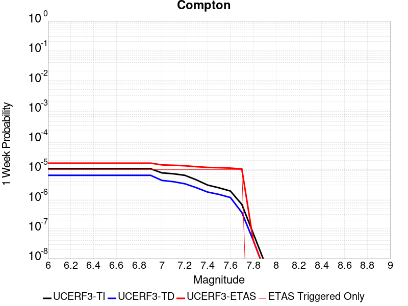 |  |  |  |

| Magnitude | 1 wk TI Prob | 1 wk TD Prob | 1 wk ETAS Prob | 1 wk ETAS/TD Gain | 1 wk ETAS Triggered Only | 1 mo TI Prob | 1 mo TD Prob | 1 mo ETAS Prob | 1 mo ETAS/TD Gain | 1 mo ETAS Triggered Only | 1 yr TI Prob | 1 yr TD Prob | 1 yr ETAS Prob | 1 yr ETAS/TD Gain | 1 yr ETAS Triggered Only | 10 yr TI Prob | 10 yr TD Prob | 10 yr ETAS Prob | 10 yr ETAS/TD Gain | 10 yr ETAS Triggered Only |
|-----|-----|-----|-----|-----|-----|-----|-----|-----|-----|-----|-----|-----|-----|-----|-----|-----|-----|-----|-----|-----|
| 6.0 | 1.06050875E-5 | 6.35892E-6 | 1.6358856E-5 | 2.5725842 | 1.0E-5 | 4.5449582E-5 | 2.7252245E-5 | 3.725197E-5 | 1.3669323 | 1.0E-5 | 5.5320817E-4 | 3.3174842E-4 | 3.4174512E-4 | 1.0301334 | 1.0E-5 | 0.0055183303 | 0.003312816 | 0.0033227827 | 1.0030086 | 1.0E-5 |
| 6.1 | 1.06050875E-5 | 6.35892E-6 | 1.6358856E-5 | 2.5725842 | 1.0E-5 | 4.5449582E-5 | 2.7252245E-5 | 3.725197E-5 | 1.3669323 | 1.0E-5 | 5.5320817E-4 | 3.3174842E-4 | 3.4174512E-4 | 1.0301334 | 1.0E-5 | 0.0055183303 | 0.003312816 | 0.0033227827 | 1.0030086 | 1.0E-5 |
| 6.2 | 1.06050875E-5 | 6.35892E-6 | 1.6358856E-5 | 2.5725842 | 1.0E-5 | 4.5449582E-5 | 2.7252245E-5 | 3.725197E-5 | 1.3669323 | 1.0E-5 | 5.5320817E-4 | 3.3174842E-4 | 3.4174512E-4 | 1.0301334 | 1.0E-5 | 0.0055183303 | 0.003312816 | 0.0033227827 | 1.0030086 | 1.0E-5 |
| 6.3 | 1.06050875E-5 | 6.35892E-6 | 1.6358856E-5 | 2.5725842 | 1.0E-5 | 4.5449582E-5 | 2.7252245E-5 | 3.725197E-5 | 1.3669323 | 1.0E-5 | 5.5320817E-4 | 3.3174842E-4 | 3.4174512E-4 | 1.0301334 | 1.0E-5 | 0.0055183303 | 0.003312816 | 0.0033227827 | 1.0030086 | 1.0E-5 |
| 6.4 | 1.06050875E-5 | 6.35892E-6 | 1.6358856E-5 | 2.5725842 | 1.0E-5 | 4.5449582E-5 | 2.7252245E-5 | 3.725197E-5 | 1.3669323 | 1.0E-5 | 5.5320817E-4 | 3.3174842E-4 | 3.4174512E-4 | 1.0301334 | 1.0E-5 | 0.0055183303 | 0.003312816 | 0.0033227827 | 1.0030086 | 1.0E-5 |
| 6.5 | 1.06050875E-5 | 6.35892E-6 | 1.6358856E-5 | 2.5725842 | 1.0E-5 | 4.5449582E-5 | 2.7252245E-5 | 3.725197E-5 | 1.3669323 | 1.0E-5 | 5.5320817E-4 | 3.3174842E-4 | 3.4174512E-4 | 1.0301334 | 1.0E-5 | 0.0055183303 | 0.003312816 | 0.0033227827 | 1.0030086 | 1.0E-5 |
| 6.6 | 1.06050875E-5 | 6.35892E-6 | 1.6358856E-5 | 2.5725842 | 1.0E-5 | 4.5449582E-5 | 2.7252245E-5 | 3.725197E-5 | 1.3669323 | 1.0E-5 | 5.5320817E-4 | 3.3174842E-4 | 3.4174512E-4 | 1.0301334 | 1.0E-5 | 0.0055183303 | 0.003312816 | 0.0033227827 | 1.0030086 | 1.0E-5 |
| 6.7 | 1.06050875E-5 | 6.35892E-6 | 1.6358856E-5 | 2.5725842 | 1.0E-5 | 4.5449582E-5 | 2.7252245E-5 | 3.725197E-5 | 1.3669323 | 1.0E-5 | 5.5320817E-4 | 3.3174842E-4 | 3.4174512E-4 | 1.0301334 | 1.0E-5 | 0.0055183303 | 0.003312816 | 0.0033227827 | 1.0030086 | 1.0E-5 |
| 6.8 | 1.06050875E-5 | 6.35892E-6 | 1.6358856E-5 | 2.5725842 | 1.0E-5 | 4.5449582E-5 | 2.7252245E-5 | 3.725197E-5 | 1.3669323 | 1.0E-5 | 5.5320817E-4 | 3.3174842E-4 | 3.4174512E-4 | 1.0301334 | 1.0E-5 | 0.0055183303 | 0.003312816 | 0.0033227827 | 1.0030086 | 1.0E-5 |
| 6.9 | 1.06050875E-5 | 6.35892E-6 | 1.6358856E-5 | 2.5725842 | 1.0E-5 | 4.5449582E-5 | 2.7252245E-5 | 3.725197E-5 | 1.3669323 | 1.0E-5 | 5.5320817E-4 | 3.3174842E-4 | 3.4174512E-4 | 1.0301334 | 1.0E-5 | 0.0055183303 | 0.003312816 | 0.0033227827 | 1.0030086 | 1.0E-5 |
| 7.0 | 7.672486E-6 | 4.272077E-6 | 1.4272035E-5 | 3.3407717 | 1.0E-5 | 3.288167E-5 | 1.8308778E-5 | 2.8308594E-5 | 1.5461761 | 1.0E-5 | 4.0026082E-4 | 2.2288719E-4 | 2.3288497E-4 | 1.0448557 | 1.0E-5 | 0.0039954064 | 0.0022266984 | 0.0022366764 | 1.004481 | 1.0E-5 |
| 7.1 | 7.163992E-6 | 3.883783E-6 | 1.3883744E-5 | 3.574799 | 1.0E-5 | 3.0702464E-5 | 1.664468E-5 | 2.6644515E-5 | 1.6007825 | 1.0E-5 | 3.7373835E-4 | 2.0263072E-4 | 2.126287E-4 | 1.0493408 | 1.0E-5 | 0.0037311043 | 0.0020245167 | 0.0020344963 | 1.0049294 | 1.0E-5 |
| 7.2 | 6.3689185E-6 | 3.3101053E-6 | 1.3310072E-5 | 4.021042 | 1.0E-5 | 2.729508E-5 | 1.4186091E-5 | 2.4185949E-5 | 1.7049059 | 1.0E-5 | 3.322669E-4 | 1.7270239E-4 | 1.8270066E-4 | 1.057893 | 1.0E-5 | 0.0033177056 | 0.0017257235 | 0.0017357062 | 1.0057846 | 1.0E-5 |
| 7.3 | 4.4987873E-6 | 2.4480198E-6 | 1.2447996E-5 | 5.084924 | 1.0E-5 | 1.9280375E-5 | 1.0491473E-5 | 2.0491369E-5 | 1.953145 | 1.0E-5 | 2.3471327E-4 | 1.2772651E-4 | 1.3772523E-4 | 1.0782822 | 1.0E-5 | 0.002344655 | 0.0012765612 | 0.0012865484 | 1.0078236 | 1.0E-5 |
| 7.4 | 2.987296E-6 | 1.7394043E-6 | 1.17393865E-5 | 6.7490845 | 1.0E-5 | 1.2802635E-5 | 7.4545687E-6 | 1.7454495E-5 | 2.3414493 | 1.0E-5 | 1.5586092E-4 | 9.075565E-5 | 1.0075475E-4 | 1.110176 | 1.0E-5 | 0.0015575165 | 9.071917E-4 | 9.171826E-4 | 1.011013 | 1.0E-5 |
| 7.5 | 2.4111696E-6 | 1.4471991E-6 | 1.1447185E-5 | 7.909889 | 1.0E-5 | 1.0333543E-5 | 6.2022677E-6 | 1.6202206E-5 | 2.6123035 | 1.0E-5 | 1.2580362E-4 | 7.551004E-5 | 8.550928E-5 | 1.1324227 | 1.0E-5 | 0.0012573242 | 7.548485E-4 | 7.648409E-4 | 1.0132377 | 1.0E-5 |
| 7.6 | 1.8783096E-6 | 1.1360306E-6 | 1.113602E-5 | 9.802569 | 1.0E-5 | 8.049874E-6 | 4.868694E-6 | 1.4868645E-5 | 3.053929 | 1.0E-5 | 9.8002805E-5 | 5.9274775E-5 | 6.927418E-5 | 1.1686958 | 1.0E-5 | 9.795959E-4 | 5.925936E-4 | 6.025877E-4 | 1.016865 | 1.0E-5 |
| 7.7 | 6.6646817E-7 | 3.5601457E-7 | 1.0356011E-5 | 29.088728 | 1.0E-5 | 2.856289E-6 | 1.5257759E-6 | 1.1525761E-5 | 7.5540323 | 1.0E-5 | 3.4774763E-5 | 1.8576176E-5 | 2.857599E-5 | 1.5383139 | 1.0E-5 | 3.4769322E-4 | 1.8574759E-4 | 1.9574573E-4 | 1.0538265 | 1.0E-5 |
| 7.8 | 7.054689E-8 | 4.1342012E-8 | 4.1342012E-8 | 1.0 | 0.0 | 3.0234378E-7 | 1.7718004E-7 | 1.7718004E-7 | 1.0 | 0.0 | 3.6810293E-6 | 2.157165E-6 | 2.157165E-6 | 1.0 | 0.0 | 3.6809684E-5 | 2.157145E-5 | 2.157145E-5 | 1.0 | 0.0 |
| 7.9 | 7.420925E-9 | 4.0130637E-9 | 4.0130637E-9 | 1.0 | 0.0 | 3.1803964E-8 | 1.7198845E-8 | 1.7198845E-8 | 1.0 | 0.0 | 3.872132E-7 | 2.0939592E-7 | 2.0939592E-7 | 1.0 | 0.0 | 3.872125E-6 | 2.0939574E-6 | 2.0939574E-6 | 1.0 | 0.0 |

## Newport-Inglewood alt 1
*[(top)](#table-of-contents)*

| 1 Week | 1 Month | 1 Year | 10 Year |
|-----|-----|-----|-----|
|  |  |  |  |

| Magnitude | 1 wk TI Prob | 1 wk TD Prob | 1 wk ETAS Prob | 1 wk ETAS/TD Gain | 1 wk ETAS Triggered Only | 1 mo TI Prob | 1 mo TD Prob | 1 mo ETAS Prob | 1 mo ETAS/TD Gain | 1 mo ETAS Triggered Only | 1 yr TI Prob | 1 yr TD Prob | 1 yr ETAS Prob | 1 yr ETAS/TD Gain | 1 yr ETAS Triggered Only | 10 yr TI Prob | 10 yr TD Prob | 10 yr ETAS Prob | 10 yr ETAS/TD Gain | 10 yr ETAS Triggered Only |
|-----|-----|-----|-----|-----|-----|-----|-----|-----|-----|-----|-----|-----|-----|-----|-----|-----|-----|-----|-----|-----|
| 6.0 | 2.9668912E-5 | 3.0404828E-5 | 3.0404828E-5 | 1.0 | 0.0 | 1.2714628E-4 | 1.3030265E-4 | 1.3030265E-4 | 1.0 | 0.0 | 0.0015469068 | 0.0015857654 | 0.0015957495 | 1.0062962 | 1.0E-5 | 0.015361829 | 0.01579211 | 0.015801951 | 1.0006232 | 1.0E-5 |
| 6.1 | 2.9668912E-5 | 3.0404828E-5 | 3.0404828E-5 | 1.0 | 0.0 | 1.2714628E-4 | 1.3030265E-4 | 1.3030265E-4 | 1.0 | 0.0 | 0.0015469068 | 0.0015857654 | 0.0015957495 | 1.0062962 | 1.0E-5 | 0.015361829 | 0.01579211 | 0.015801951 | 1.0006232 | 1.0E-5 |
| 6.2 | 2.9668912E-5 | 3.0404828E-5 | 3.0404828E-5 | 1.0 | 0.0 | 1.2714628E-4 | 1.3030265E-4 | 1.3030265E-4 | 1.0 | 0.0 | 0.0015469068 | 0.0015857654 | 0.0015957495 | 1.0062962 | 1.0E-5 | 0.015361829 | 0.01579211 | 0.015801951 | 1.0006232 | 1.0E-5 |
| 6.3 | 2.9668912E-5 | 3.0404828E-5 | 3.0404828E-5 | 1.0 | 0.0 | 1.2714628E-4 | 1.3030265E-4 | 1.3030265E-4 | 1.0 | 0.0 | 0.0015469068 | 0.0015857654 | 0.0015957495 | 1.0062962 | 1.0E-5 | 0.015361829 | 0.01579211 | 0.015801951 | 1.0006232 | 1.0E-5 |
| 6.4 | 1.275942E-5 | 1.02725335E-5 | 1.02725335E-5 | 1.0 | 0.0 | 5.4682085E-5 | 4.4024422E-5 | 4.4024422E-5 | 1.0 | 0.0 | 6.65551E-4 | 5.358697E-4 | 5.358697E-4 | 1.0 | 0.0 | 0.0066356123 | 0.0053462 | 0.0053462 | 1.0 | 0.0 |
| 6.5 | 1.275942E-5 | 1.02725335E-5 | 1.02725335E-5 | 1.0 | 0.0 | 5.4682085E-5 | 4.4024422E-5 | 4.4024422E-5 | 1.0 | 0.0 | 6.65551E-4 | 5.358697E-4 | 5.358697E-4 | 1.0 | 0.0 | 0.0066356123 | 0.0053462 | 0.0053462 | 1.0 | 0.0 |
| 6.6 | 1.1255358E-5 | 8.661911E-6 | 8.661911E-6 | 1.0 | 0.0 | 4.8236358E-5 | 3.7121958E-5 | 3.7121958E-5 | 1.0 | 0.0 | 5.871194E-4 | 4.5186782E-4 | 4.5186782E-4 | 1.0 | 0.0 | 0.005855706 | 0.0045096674 | 0.0045096674 | 1.0 | 0.0 |
| 6.7 | 1.0504745E-5 | 7.8998455E-6 | 7.8998455E-6 | 1.0 | 0.0 | 4.5019555E-5 | 3.385605E-5 | 3.385605E-5 | 1.0 | 0.0 | 5.4797524E-4 | 4.121207E-4 | 4.121207E-4 | 1.0 | 0.0 | 0.0054662596 | 0.004113694 | 0.004113694 | 1.0 | 0.0 |
| 6.8 | 1.0476007E-5 | 7.881227E-6 | 7.881227E-6 | 1.0 | 0.0 | 4.4896402E-5 | 3.3776258E-5 | 3.3776258E-5 | 1.0 | 0.0 | 5.464766E-4 | 4.1114958E-4 | 4.1114958E-4 | 1.0 | 0.0 | 0.005451347 | 0.004104019 | 0.004104019 | 1.0 | 0.0 |
| 6.9 | 9.076797E-6 | 6.4896567E-6 | 6.4896567E-6 | 1.0 | 0.0 | 3.889998E-5 | 2.7812519E-5 | 2.7812519E-5 | 1.0 | 0.0 | 4.7350433E-4 | 3.3856515E-4 | 3.3856515E-4 | 1.0 | 0.0 | 0.004724967 | 0.003380531 | 0.003380531 | 1.0 | 0.0 |
| 7.0 | 8.73795E-6 | 6.2120503E-6 | 6.2120503E-6 | 1.0 | 0.0 | 3.7447822E-5 | 2.6622802E-5 | 2.6622802E-5 | 1.0 | 0.0 | 4.5583185E-4 | 3.2408469E-4 | 3.2408469E-4 | 1.0 | 0.0 | 0.0045489795 | 0.0032361522 | 0.0032361522 | 1.0 | 0.0 |
| 7.1 | 8.391299E-6 | 5.9557533E-6 | 5.9557533E-6 | 1.0 | 0.0 | 3.5962214E-5 | 2.5524409E-5 | 2.5524409E-5 | 1.0 | 0.0 | 4.37752E-4 | 3.1071564E-4 | 3.1071564E-4 | 1.0 | 0.0 | 0.004368907 | 0.0031028416 | 0.0031028416 | 1.0 | 0.0 |
| 7.2 | 7.796882E-6 | 5.4964826E-6 | 5.4964826E-6 | 1.0 | 0.0 | 3.341478E-5 | 2.3556144E-5 | 2.3556144E-5 | 1.0 | 0.0 | 4.06749E-4 | 2.867585E-4 | 2.867585E-4 | 1.0 | 0.0 | 0.0040600533 | 0.002863909 | 0.002863909 | 1.0 | 0.0 |
| 7.3 | 6.4738833E-6 | 4.6477753E-6 | 4.6477753E-6 | 1.0 | 0.0 | 2.774492E-5 | 1.9918885E-5 | 1.9918885E-5 | 1.0 | 0.0 | 3.3774204E-4 | 2.424856E-4 | 2.424856E-4 | 1.0 | 0.0 | 0.0033722918 | 0.0024222268 | 0.0024222268 | 1.0 | 0.0 |
| 7.4 | 5.382145E-6 | 3.8857215E-6 | 3.8857215E-6 | 1.0 | 0.0 | 2.3066134E-5 | 1.6652988E-5 | 1.6652988E-5 | 1.0 | 0.0 | 2.8079396E-4 | 2.0273139E-4 | 2.0273139E-4 | 1.0 | 0.0 | 0.0028043943 | 0.002025479 | 0.002025479 | 1.0 | 0.0 |
| 7.5 | 3.648244E-6 | 2.5737634E-6 | 2.5737634E-6 | 1.0 | 0.0 | 1.5635238E-5 | 1.1030369E-5 | 1.1030369E-5 | 1.0 | 0.0 | 1.9034238E-4 | 1.3428657E-4 | 1.3428657E-4 | 1.0 | 0.0 | 0.0019017943 | 0.0013420646 | 0.0013420646 | 1.0 | 0.0 |
| 7.6 | 2.2906888E-6 | 1.547986E-6 | 1.547986E-6 | 1.0 | 0.0 | 9.817201E-6 | 6.634209E-6 | 6.634209E-6 | 1.0 | 0.0 | 1.1951787E-4 | 8.076857E-5 | 8.076857E-5 | 1.0 | 0.0 | 0.0011945361 | 8.073989E-4 | 8.073989E-4 | 1.0 | 0.0 |
| 7.7 | 6.0479874E-7 | 3.397468E-7 | 3.397468E-7 | 1.0 | 0.0 | 2.5919921E-6 | 1.456057E-6 | 1.456057E-6 | 1.0 | 0.0 | 3.1557047E-5 | 1.7727363E-5 | 1.7727363E-5 | 1.0 | 0.0 | 3.1552566E-4 | 1.7726087E-4 | 1.7726087E-4 | 1.0 | 0.0 |
| 7.8 | 1.16056995E-8 | 9.782997E-9 | 9.782997E-9 | 1.0 | 0.0 | 4.9738713E-8 | 4.1927127E-8 | 4.1927127E-8 | 1.0 | 0.0 | 6.0556863E-7 | 5.1046277E-7 | 5.1046277E-7 | 1.0 | 0.0 | 6.05567E-6 | 5.1046277E-6 | 5.1046277E-6 | 1.0 | 0.0 |

## Santa Susana East (connector)
*[(top)](#table-of-contents)*

| 1 Week | 1 Month | 1 Year | 10 Year |
|-----|-----|-----|-----|
| 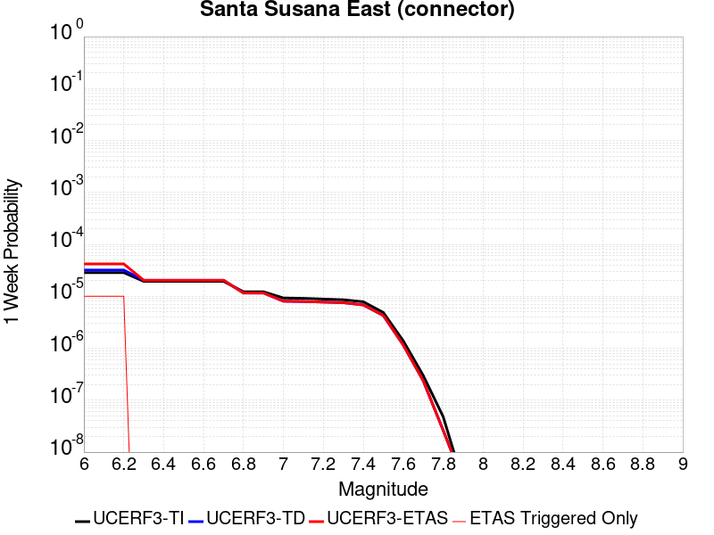 |  |  |  |

| Magnitude | 1 wk TI Prob | 1 wk TD Prob | 1 wk ETAS Prob | 1 wk ETAS/TD Gain | 1 wk ETAS Triggered Only | 1 mo TI Prob | 1 mo TD Prob | 1 mo ETAS Prob | 1 mo ETAS/TD Gain | 1 mo ETAS Triggered Only | 1 yr TI Prob | 1 yr TD Prob | 1 yr ETAS Prob | 1 yr ETAS/TD Gain | 1 yr ETAS Triggered Only | 10 yr TI Prob | 10 yr TD Prob | 10 yr ETAS Prob | 10 yr ETAS/TD Gain | 10 yr ETAS Triggered Only |
|-----|-----|-----|-----|-----|-----|-----|-----|-----|-----|-----|-----|-----|-----|-----|-----|-----|-----|-----|-----|-----|
| 6.0 | 2.858397E-5 | 3.2021693E-5 | 4.2021373E-5 | 1.3122783 | 1.0E-5 | 1.2249697E-4 | 1.3723019E-4 | 1.4722883E-4 | 1.0728602 | 1.0E-5 | 0.0014903803 | 0.00166977 | 0.0016797533 | 1.0059788 | 1.0E-5 | 0.014804244 | 0.016599316 | 0.01660915 | 1.0005925 | 1.0E-5 |
| 6.1 | 2.858397E-5 | 3.2021693E-5 | 4.2021373E-5 | 1.3122783 | 1.0E-5 | 1.2249697E-4 | 1.3723019E-4 | 1.4722883E-4 | 1.0728602 | 1.0E-5 | 0.0014903803 | 0.00166977 | 0.0016797533 | 1.0059788 | 1.0E-5 | 0.014804244 | 0.016599316 | 0.01660915 | 1.0005925 | 1.0E-5 |
| 6.2 | 2.858397E-5 | 3.2021693E-5 | 4.2021373E-5 | 1.3122783 | 1.0E-5 | 1.2249697E-4 | 1.3723019E-4 | 1.4722883E-4 | 1.0728602 | 1.0E-5 | 0.0014903803 | 0.00166977 | 0.0016797533 | 1.0059788 | 1.0E-5 | 0.014804244 | 0.016599316 | 0.01660915 | 1.0005925 | 1.0E-5 |
| 6.3 | 1.943582E-5 | 2.0367343E-5 | 2.0367343E-5 | 1.0 | 0.0 | 8.329371E-5 | 8.7286324E-5 | 8.7286324E-5 | 1.0 | 0.0 | 0.001013629 | 0.001062305 | 0.001062305 | 1.0 | 0.0 | 0.010090181 | 0.010583852 | 0.010583852 | 1.0 | 0.0 |
| 6.4 | 1.943582E-5 | 2.0367343E-5 | 2.0367343E-5 | 1.0 | 0.0 | 8.329371E-5 | 8.7286324E-5 | 8.7286324E-5 | 1.0 | 0.0 | 0.001013629 | 0.001062305 | 0.001062305 | 1.0 | 0.0 | 0.010090181 | 0.010583852 | 0.010583852 | 1.0 | 0.0 |
| 6.5 | 1.943582E-5 | 2.0367343E-5 | 2.0367343E-5 | 1.0 | 0.0 | 8.329371E-5 | 8.7286324E-5 | 8.7286324E-5 | 1.0 | 0.0 | 0.001013629 | 0.001062305 | 0.001062305 | 1.0 | 0.0 | 0.010090181 | 0.010583852 | 0.010583852 | 1.0 | 0.0 |
| 6.6 | 1.943582E-5 | 2.0367343E-5 | 2.0367343E-5 | 1.0 | 0.0 | 8.329371E-5 | 8.7286324E-5 | 8.7286324E-5 | 1.0 | 0.0 | 0.001013629 | 0.001062305 | 0.001062305 | 1.0 | 0.0 | 0.010090181 | 0.010583852 | 0.010583852 | 1.0 | 0.0 |
| 6.7 | 1.9404439E-5 | 2.0354766E-5 | 2.0354766E-5 | 1.0 | 0.0 | 8.3159226E-5 | 8.723242E-5 | 8.723242E-5 | 1.0 | 0.0 | 0.0010119933 | 0.0010616493 | 0.0010616493 | 1.0 | 0.0 | 0.010073971 | 0.010577358 | 0.010577358 | 1.0 | 0.0 |
| 6.8 | 1.2217526E-5 | 1.1593157E-5 | 1.1593157E-5 | 1.0 | 0.0 | 5.2359774E-5 | 4.9684106E-5 | 4.9684106E-5 | 1.0 | 0.0 | 6.372938E-4 | 6.047529E-4 | 6.047529E-4 | 1.0 | 0.0 | 0.0063546924 | 0.006033274 | 0.006033274 | 1.0 | 0.0 |
| 6.9 | 1.2217526E-5 | 1.1593157E-5 | 1.1593157E-5 | 1.0 | 0.0 | 5.2359774E-5 | 4.9684106E-5 | 4.9684106E-5 | 1.0 | 0.0 | 6.372938E-4 | 6.047529E-4 | 6.047529E-4 | 1.0 | 0.0 | 0.0063546924 | 0.006033274 | 0.006033274 | 1.0 | 0.0 |
| 7.0 | 9.276017E-6 | 8.059273E-6 | 8.059273E-6 | 1.0 | 0.0 | 3.9753755E-5 | 3.4539302E-5 | 3.4539302E-5 | 1.0 | 0.0 | 4.8389446E-4 | 4.2043833E-4 | 4.2043833E-4 | 1.0 | 0.0 | 0.0048284214 | 0.0041973097 | 0.0041973097 | 1.0 | 0.0 |
| 7.1 | 9.130355E-6 | 7.942446E-6 | 7.942446E-6 | 1.0 | 0.0 | 3.9129503E-5 | 3.4038632E-5 | 3.4038632E-5 | 1.0 | 0.0 | 4.7629757E-4 | 4.1434498E-4 | 4.1434498E-4 | 1.0 | 0.0 | 0.00475278 | 0.0041366047 | 0.0041366047 | 1.0 | 0.0 |
| 7.2 | 8.851015E-6 | 7.741608E-6 | 7.741608E-6 | 1.0 | 0.0 | 3.7932372E-5 | 3.317792E-5 | 3.317792E-5 | 1.0 | 0.0 | 4.6172875E-4 | 4.038697E-4 | 4.038697E-4 | 1.0 | 0.0 | 0.0046077054 | 0.0040322347 | 0.0040322347 | 1.0 | 0.0 |
| 7.3 | 8.573006E-6 | 7.5503312E-6 | 7.5503312E-6 | 1.0 | 0.0 | 3.6740938E-5 | 3.235818E-5 | 3.235818E-5 | 1.0 | 0.0 | 4.472291E-4 | 3.9389305E-4 | 3.9389305E-4 | 1.0 | 0.0 | 0.004463301 | 0.003932817 | 0.003932817 | 1.0 | 0.0 |
| 7.4 | 7.852282E-6 | 6.8178556E-6 | 6.8178556E-6 | 1.0 | 0.0 | 3.36522E-5 | 2.921907E-5 | 2.921907E-5 | 1.0 | 0.0 | 4.096385E-4 | 3.5568717E-4 | 3.5568717E-4 | 1.0 | 0.0 | 0.0040888423 | 0.0035519868 | 0.0035519868 | 1.0 | 0.0 |
| 7.5 | 4.8869324E-6 | 4.2790975E-6 | 4.2790975E-6 | 1.0 | 0.0 | 2.0943828E-5 | 1.833887E-5 | 1.833887E-5 | 1.0 | 0.0 | 2.5496128E-4 | 2.2325452E-4 | 2.2325452E-4 | 1.0 | 0.0 | 0.0025466895 | 0.00223057 | 0.00223057 | 1.0 | 0.0 |
| 7.6 | 1.3894544E-6 | 1.1568394E-6 | 1.1568394E-6 | 1.0 | 0.0 | 5.954791E-6 | 4.957875E-6 | 4.957875E-6 | 1.0 | 0.0 | 7.249717E-5 | 6.036068E-5 | 6.036068E-5 | 1.0 | 0.0 | 7.247352E-4 | 6.0346466E-4 | 6.0346466E-4 | 1.0 | 0.0 |
| 7.7 | 2.9924632E-7 | 2.3719332E-7 | 2.3719332E-7 | 1.0 | 0.0 | 1.2824837E-6 | 1.0165425E-6 | 1.0165425E-6 | 1.0 | 0.0 | 1.5614127E-5 | 1.2376341E-5 | 1.2376341E-5 | 1.0 | 0.0 | 1.5613029E-4 | 1.2375724E-4 | 1.2375724E-4 | 1.0 | 0.0 |
| 7.8 | 4.8188564E-8 | 2.6321862E-8 | 2.6321862E-8 | 1.0 | 0.0 | 2.065224E-7 | 1.12807975E-7 | 1.12807975E-7 | 1.0 | 0.0 | 2.5144072E-6 | 1.3734362E-6 | 1.3734362E-6 | 1.0 | 0.0 | 2.5143789E-5 | 1.3734286E-5 | 1.3734286E-5 | 1.0 | 0.0 |
| 7.9 | 2.6127251E-9 | 2.7681102E-9 | 2.7681102E-9 | 1.0 | 0.0 | 1.1197393E-8 | 1.186333E-8 | 1.186333E-8 | 1.0 | 0.0 | 1.3632825E-7 | 1.4443603E-7 | 1.4443603E-7 | 1.0 | 0.0 | 1.3632817E-6 | 1.4443604E-6 | 1.4443604E-6 | 1.0 | 0.0 |

## Mission Hills 2011
*[(top)](#table-of-contents)*

| 1 Week | 1 Month | 1 Year | 10 Year |
|-----|-----|-----|-----|
|  |  |  |  |

| Magnitude | 1 wk TI Prob | 1 wk TD Prob | 1 wk ETAS Prob | 1 wk ETAS/TD Gain | 1 wk ETAS Triggered Only | 1 mo TI Prob | 1 mo TD Prob | 1 mo ETAS Prob | 1 mo ETAS/TD Gain | 1 mo ETAS Triggered Only | 1 yr TI Prob | 1 yr TD Prob | 1 yr ETAS Prob | 1 yr ETAS/TD Gain | 1 yr ETAS Triggered Only | 10 yr TI Prob | 10 yr TD Prob | 10 yr ETAS Prob | 10 yr ETAS/TD Gain | 10 yr ETAS Triggered Only |
|-----|-----|-----|-----|-----|-----|-----|-----|-----|-----|-----|-----|-----|-----|-----|-----|-----|-----|-----|-----|-----|
| 6.0 | 1.8765717E-5 | 1.9054629E-5 | 1.9054629E-5 | 1.0 | 0.0 | 8.0422025E-5 | 8.1662074E-5 | 9.1661255E-5 | 1.1224458 | 1.0E-5 | 9.786983E-4 | 9.941256E-4 | 0.0010041157 | 1.0100491 | 1.0E-5 | 0.009743992 | 0.00993045 | 0.00994035 | 1.000997 | 1.0E-5 |
| 6.1 | 1.8765717E-5 | 1.9054629E-5 | 1.9054629E-5 | 1.0 | 0.0 | 8.0422025E-5 | 8.1662074E-5 | 9.1661255E-5 | 1.1224458 | 1.0E-5 | 9.786983E-4 | 9.941256E-4 | 0.0010041157 | 1.0100491 | 1.0E-5 | 0.009743992 | 0.00993045 | 0.00994035 | 1.000997 | 1.0E-5 |
| 6.2 | 1.8765717E-5 | 1.9054629E-5 | 1.9054629E-5 | 1.0 | 0.0 | 8.0422025E-5 | 8.1662074E-5 | 9.1661255E-5 | 1.1224458 | 1.0E-5 | 9.786983E-4 | 9.941256E-4 | 0.0010041157 | 1.0100491 | 1.0E-5 | 0.009743992 | 0.00993045 | 0.00994035 | 1.000997 | 1.0E-5 |
| 6.3 | 1.8765717E-5 | 1.9054629E-5 | 1.9054629E-5 | 1.0 | 0.0 | 8.0422025E-5 | 8.1662074E-5 | 9.1661255E-5 | 1.1224458 | 1.0E-5 | 9.786983E-4 | 9.941256E-4 | 0.0010041157 | 1.0100491 | 1.0E-5 | 0.009743992 | 0.00993045 | 0.00994035 | 1.000997 | 1.0E-5 |
| 6.4 | 4.566357E-6 | 2.5148213E-6 | 2.5148213E-6 | 1.0 | 0.0 | 1.9569954E-5 | 1.0777771E-5 | 2.0777665E-5 | 1.9278256 | 1.0E-5 | 2.3823815E-4 | 1.3121328E-4 | 1.4121197E-4 | 1.0762018 | 1.0E-5 | 0.002379829 | 0.0013115364 | 0.0013215232 | 1.0076146 | 1.0E-5 |
| 6.5 | 4.566357E-6 | 2.5148213E-6 | 2.5148213E-6 | 1.0 | 0.0 | 1.9569954E-5 | 1.0777771E-5 | 2.0777665E-5 | 1.9278256 | 1.0E-5 | 2.3823815E-4 | 1.3121328E-4 | 1.4121197E-4 | 1.0762018 | 1.0E-5 | 0.002379829 | 0.0013115364 | 0.0013215232 | 1.0076146 | 1.0E-5 |
| 6.6 | 4.566357E-6 | 2.5148213E-6 | 2.5148213E-6 | 1.0 | 0.0 | 1.9569954E-5 | 1.0777771E-5 | 2.0777665E-5 | 1.9278256 | 1.0E-5 | 2.3823815E-4 | 1.3121328E-4 | 1.4121197E-4 | 1.0762018 | 1.0E-5 | 0.002379829 | 0.0013115364 | 0.0013215232 | 1.0076146 | 1.0E-5 |
| 6.7 | 2.3266773E-6 | 1.3296132E-6 | 1.3296132E-6 | 1.0 | 0.0 | 9.971435E-6 | 5.69833E-6 | 1.5698273E-5 | 2.7548902 | 1.0E-5 | 1.2139547E-4 | 6.937502E-5 | 7.9374324E-5 | 1.1441342 | 1.0E-5 | 0.0012132917 | 6.935397E-4 | 7.035328E-4 | 1.0144088 | 1.0E-5 |
| 6.8 | 2.032735E-6 | 1.1894101E-6 | 1.1894101E-6 | 1.0 | 0.0 | 8.711692E-6 | 5.0974622E-6 | 1.5097411E-5 | 2.9617505 | 1.0E-5 | 1.06059684E-4 | 6.205988E-5 | 7.2059265E-5 | 1.1611247 | 1.0E-5 | 0.0010600908 | 6.204304E-4 | 6.304242E-4 | 1.0161078 | 1.0E-5 |
| 6.9 | 1.3186259E-6 | 1.0561989E-6 | 1.0561989E-6 | 1.0 | 0.0 | 5.6512413E-6 | 4.526559E-6 | 1.4526514E-5 | 3.2091737 | 1.0E-5 | 6.8801695E-5 | 5.5109493E-5 | 6.510894E-5 | 1.1814469 | 1.0E-5 | 6.8780396E-4 | 5.5096124E-4 | 5.609557E-4 | 1.0181401 | 1.0E-5 |
| 7.0 | 1.2726016E-6 | 1.0159295E-6 | 1.0159295E-6 | 1.0 | 0.0 | 5.4539955E-6 | 4.3539762E-6 | 1.4353933E-5 | 3.2967412 | 1.0E-5 | 6.6400375E-5 | 5.30084E-5 | 6.3007865E-5 | 1.1886394 | 1.0E-5 | 6.6380535E-4 | 5.299604E-4 | 5.399551E-4 | 1.0188594 | 1.0E-5 |
| 7.1 | 1.2063913E-6 | 9.570282E-7 | 9.570282E-7 | 1.0 | 0.0 | 5.170238E-6 | 4.101543E-6 | 1.4101502E-5 | 3.4380968 | 1.0E-5 | 6.294583E-5 | 4.9935166E-5 | 5.9934668E-5 | 1.2002497 | 1.0E-5 | 6.2928005E-4 | 4.9924204E-4 | 5.09237E-4 | 1.0200204 | 1.0E-5 |
| 7.2 | 9.105806E-7 | 7.3767757E-7 | 7.3767757E-7 | 1.0 | 0.0 | 3.9024826E-6 | 3.1614716E-6 | 3.1614716E-6 | 1.0 | 0.0 | 4.7511687E-5 | 3.8490252E-5 | 3.8490252E-5 | 1.0 | 0.0 | 4.7501532E-4 | 3.8483742E-4 | 3.8483742E-4 | 1.0 | 0.0 |
| 7.3 | 7.020432E-7 | 5.7103375E-7 | 5.7103375E-7 | 1.0 | 0.0 | 3.0087533E-6 | 2.4472852E-6 | 2.4472852E-6 | 1.0 | 0.0 | 3.6630954E-5 | 2.9795303E-5 | 2.9795303E-5 | 1.0 | 0.0 | 3.6624918E-4 | 2.979144E-4 | 2.979144E-4 | 1.0 | 0.0 |
| 7.4 | 5.3900635E-7 | 4.4483278E-7 | 4.4483278E-7 | 1.0 | 0.0 | 2.3100251E-6 | 1.9064248E-6 | 1.9064248E-6 | 1.0 | 0.0 | 2.8124194E-5 | 2.3210489E-5 | 2.3210489E-5 | 1.0 | 0.0 | 2.8120633E-4 | 2.3208185E-4 | 2.3208185E-4 | 1.0 | 0.0 |
| 7.5 | 2.907075E-7 | 2.2875324E-7 | 2.2875324E-7 | 1.0 | 0.0 | 1.2458887E-6 | 9.803706E-7 | 9.803706E-7 | 1.0 | 0.0 | 1.5168589E-5 | 1.1935949E-5 | 1.1935949E-5 | 1.0 | 0.0 | 1.5167553E-4 | 1.1935326E-4 | 1.1935326E-4 | 1.0 | 0.0 |
| 7.6 | 1.6903675E-7 | 1.2353401E-7 | 1.2353401E-7 | 1.0 | 0.0 | 7.2444305E-7 | 5.2943136E-7 | 5.2943136E-7 | 1.0 | 0.0 | 8.820059E-6 | 6.4458086E-6 | 6.4458086E-6 | 1.0 | 0.0 | 8.8197085E-5 | 6.445634E-5 | 6.445634E-5 | 1.0 | 0.0 |
| 7.7 | 7.168073E-8 | 3.9134374E-8 | 3.9134374E-8 | 1.0 | 0.0 | 3.072031E-7 | 1.6771872E-7 | 1.6771872E-7 | 1.0 | 0.0 | 3.7401915E-6 | 2.0419736E-6 | 2.0419736E-6 | 1.0 | 0.0 | 3.7401285E-5 | 2.041956E-5 | 2.041956E-5 | 1.0 | 0.0 |
| 7.8 | 6.564101E-8 | 3.3834656E-8 | 3.3834656E-8 | 1.0 | 0.0 | 2.813186E-7 | 1.4500566E-7 | 1.4500566E-7 | 1.0 | 0.0 | 3.4250486E-6 | 1.7654426E-6 | 1.7654426E-6 | 1.0 | 0.0 | 3.424996E-5 | 1.7654296E-5 | 1.7654296E-5 | 1.0 | 0.0 |
| 7.9 | 1.0029074E-8 | 3.728858E-9 | 3.728858E-9 | 1.0 | 0.0 | 4.2981743E-8 | 1.598082E-8 | 1.598082E-8 | 1.0 | 0.0 | 5.2330256E-7 | 1.945665E-7 | 1.945665E-7 | 1.0 | 0.0 | 5.2330133E-6 | 1.9456643E-6 | 1.9456643E-6 | 1.0 | 0.0 |

## San Gabriel (Extension)
*[(top)](#table-of-contents)*

| 1 Week | 1 Month | 1 Year | 10 Year |
|-----|-----|-----|-----|
|  |  |  |  |

| Magnitude | 1 wk TI Prob | 1 wk TD Prob | 1 wk ETAS Prob | 1 wk ETAS/TD Gain | 1 wk ETAS Triggered Only | 1 mo TI Prob | 1 mo TD Prob | 1 mo ETAS Prob | 1 mo ETAS/TD Gain | 1 mo ETAS Triggered Only | 1 yr TI Prob | 1 yr TD Prob | 1 yr ETAS Prob | 1 yr ETAS/TD Gain | 1 yr ETAS Triggered Only | 10 yr TI Prob | 10 yr TD Prob | 10 yr ETAS Prob | 10 yr ETAS/TD Gain | 10 yr ETAS Triggered Only |
|-----|-----|-----|-----|-----|-----|-----|-----|-----|-----|-----|-----|-----|-----|-----|-----|-----|-----|-----|-----|-----|
| 6.0 | 5.6486106E-6 | 5.7168368E-6 | 1.571678E-5 | 2.7492092 | 1.0E-5 | 2.4208108E-5 | 2.4500505E-5 | 3.450026E-5 | 1.4081448 | 1.0E-5 | 2.9469383E-4 | 2.9825408E-4 | 3.082511E-4 | 1.0335184 | 1.0E-5 | 0.0029430336 | 0.0029786646 | 0.0029886349 | 1.0033472 | 1.0E-5 |
| 6.1 | 5.6486106E-6 | 5.7168368E-6 | 1.571678E-5 | 2.7492092 | 1.0E-5 | 2.4208108E-5 | 2.4500505E-5 | 3.450026E-5 | 1.4081448 | 1.0E-5 | 2.9469383E-4 | 2.9825408E-4 | 3.082511E-4 | 1.0335184 | 1.0E-5 | 0.0029430336 | 0.0029786646 | 0.0029886349 | 1.0033472 | 1.0E-5 |
| 6.2 | 5.6486106E-6 | 5.7168368E-6 | 1.571678E-5 | 2.7492092 | 1.0E-5 | 2.4208108E-5 | 2.4500505E-5 | 3.450026E-5 | 1.4081448 | 1.0E-5 | 2.9469383E-4 | 2.9825408E-4 | 3.082511E-4 | 1.0335184 | 1.0E-5 | 0.0029430336 | 0.0029786646 | 0.0029886349 | 1.0033472 | 1.0E-5 |
| 6.3 | 5.6486106E-6 | 5.7168368E-6 | 1.571678E-5 | 2.7492092 | 1.0E-5 | 2.4208108E-5 | 2.4500505E-5 | 3.450026E-5 | 1.4081448 | 1.0E-5 | 2.9469383E-4 | 2.9825408E-4 | 3.082511E-4 | 1.0335184 | 1.0E-5 | 0.0029430336 | 0.0029786646 | 0.0029886349 | 1.0033472 | 1.0E-5 |
| 6.4 | 5.6486106E-6 | 5.7168368E-6 | 1.571678E-5 | 2.7492092 | 1.0E-5 | 2.4208108E-5 | 2.4500505E-5 | 3.450026E-5 | 1.4081448 | 1.0E-5 | 2.9469383E-4 | 2.9825408E-4 | 3.082511E-4 | 1.0335184 | 1.0E-5 | 0.0029430336 | 0.0029786646 | 0.0029886349 | 1.0033472 | 1.0E-5 |
| 6.5 | 4.7134554E-6 | 4.7542608E-6 | 1.4754213E-5 | 3.1033664 | 1.0E-5 | 2.0200367E-5 | 2.0375248E-5 | 3.0375044E-5 | 1.4907815 | 1.0E-5 | 2.459117E-4 | 2.4804127E-4 | 2.5803878E-4 | 1.0403059 | 1.0E-5 | 0.0024563975 | 0.0024777285 | 0.0024877037 | 1.0040259 | 1.0E-5 |
| 6.6 | 4.7134554E-6 | 4.7542608E-6 | 1.4754213E-5 | 3.1033664 | 1.0E-5 | 2.0200367E-5 | 2.0375248E-5 | 3.0375044E-5 | 1.4907815 | 1.0E-5 | 2.459117E-4 | 2.4804127E-4 | 2.5803878E-4 | 1.0403059 | 1.0E-5 | 0.0024563975 | 0.0024777285 | 0.0024877037 | 1.0040259 | 1.0E-5 |
| 6.7 | 4.2468837E-6 | 4.274078E-6 | 1.42740355E-5 | 3.339676 | 1.0E-5 | 1.8200803E-5 | 1.8317352E-5 | 2.8317168E-5 | 1.5459204 | 1.0E-5 | 2.2157225E-4 | 2.2299167E-4 | 2.3298943E-4 | 1.0448347 | 1.0E-5 | 0.0022135144 | 0.0022277513 | 0.002237729 | 1.0044788 | 1.0E-5 |
| 6.8 | 4.1180615E-6 | 4.1414673E-6 | 4.1414673E-6 | 1.0 | 0.0 | 1.7648716E-5 | 1.774903E-5 | 1.774903E-5 | 1.0 | 0.0 | 2.1485193E-4 | 2.1607373E-4 | 2.1607373E-4 | 1.0 | 0.0 | 0.0021464431 | 0.0021587077 | 0.0021587077 | 1.0 | 0.0 |
| 6.9 | 3.863861E-6 | 3.879783E-6 | 3.879783E-6 | 1.0 | 0.0 | 1.65593E-5 | 1.6627539E-5 | 1.6627539E-5 | 1.0 | 0.0 | 2.0159081E-4 | 2.0242216E-4 | 2.0242216E-4 | 1.0 | 0.0 | 0.0020140803 | 0.0020224454 | 0.0020224454 | 1.0 | 0.0 |
| 7.0 | 3.6947372E-6 | 3.705682E-6 | 3.705682E-6 | 1.0 | 0.0 | 1.5834492E-5 | 1.5881402E-5 | 1.5881402E-5 | 1.0 | 0.0 | 1.9276788E-4 | 1.9333958E-4 | 1.9333958E-4 | 1.0 | 0.0 | 0.0019260074 | 0.0019317803 | 0.0019317803 | 1.0 | 0.0 |
| 7.1 | 3.5686835E-6 | 3.5729024E-6 | 3.5729024E-6 | 1.0 | 0.0 | 1.5294268E-5 | 1.5312353E-5 | 1.5312353E-5 | 1.0 | 0.0 | 1.861918E-4 | 1.8641262E-4 | 1.8641262E-4 | 1.0 | 0.0 | 0.0018603588 | 0.0018626284 | 0.0018626284 | 1.0 | 0.0 |
| 7.2 | 2.8023446E-6 | 2.776794E-6 | 2.776794E-6 | 1.0 | 0.0 | 1.2009994E-5 | 1.1900492E-5 | 1.1900492E-5 | 1.0 | 0.0 | 1.4621185E-4 | 1.4487897E-4 | 1.4487897E-4 | 1.0 | 0.0 | 0.001461157 | 0.001447856 | 0.001447856 | 1.0 | 0.0 |
| 7.3 | 2.5843012E-6 | 2.5459692E-6 | 2.5459692E-6 | 1.0 | 0.0 | 1.1075529E-5 | 1.0911252E-5 | 1.0911252E-5 | 1.0 | 0.0 | 1.3483623E-4 | 1.3283649E-4 | 1.3283649E-4 | 1.0 | 0.0 | 0.0013475444 | 0.0013275805 | 0.0013275805 | 1.0 | 0.0 |
| 7.4 | 2.4464468E-6 | 2.396669E-6 | 2.396669E-6 | 1.0 | 0.0 | 1.04847295E-5 | 1.0271398E-5 | 1.0271398E-5 | 1.0 | 0.0 | 1.276441E-4 | 1.250472E-4 | 1.250472E-4 | 1.0 | 0.0 | 0.0012757082 | 0.001249778 | 0.001249778 | 1.0 | 0.0 |
| 7.5 | 2.0420266E-6 | 1.8910376E-6 | 1.8910376E-6 | 1.0 | 0.0 | 8.751514E-6 | 8.104422E-6 | 8.104422E-6 | 1.0 | 0.0 | 1.0654447E-4 | 9.866691E-5 | 9.866691E-5 | 1.0 | 0.0 | 0.001064934 | 9.862344E-4 | 9.862344E-4 | 1.0 | 0.0 |
| 7.6 | 1.8326596E-6 | 1.6398233E-6 | 1.6398233E-6 | 1.0 | 0.0 | 7.854232E-6 | 7.027795E-6 | 7.027795E-6 | 1.0 | 0.0 | 9.562107E-5 | 8.556007E-5 | 8.556007E-5 | 1.0 | 0.0 | 9.5579936E-4 | 8.552735E-4 | 8.552735E-4 | 1.0 | 0.0 |
| 7.7 | 1.4786998E-6 | 1.2523672E-6 | 1.2523672E-6 | 1.0 | 0.0 | 6.3372695E-6 | 5.3672766E-6 | 5.3672766E-6 | 1.0 | 0.0 | 7.715353E-5 | 6.534465E-5 | 6.534465E-5 | 1.0 | 0.0 | 7.7126746E-4 | 6.5325975E-4 | 6.5325975E-4 | 1.0 | 0.0 |
| 7.8 | 7.6975533E-7 | 6.069207E-7 | 6.069207E-7 | 1.0 | 0.0 | 3.2989474E-6 | 2.6010862E-6 | 2.6010862E-6 | 1.0 | 0.0 | 4.0163945E-5 | 3.1667765E-5 | 3.1667765E-5 | 1.0 | 0.0 | 4.0156685E-4 | 3.166365E-4 | 3.166365E-4 | 1.0 | 0.0 |
| 7.9 | 1.7645915E-7 | 9.211899E-8 | 9.211899E-8 | 1.0 | 0.0 | 7.562533E-7 | 3.947956E-7 | 3.947956E-7 | 1.0 | 0.0 | 9.207345E-6 | 4.806626E-6 | 4.806626E-6 | 1.0 | 0.0 | 9.206964E-5 | 4.8069025E-5 | 4.8069025E-5 | 1.0 | 0.0 |
| 8.0 | 1.0463461E-7 | 2.4937416E-8 | 2.4937416E-8 | 1.0 | 0.0 | 4.4843398E-7 | 1.0687464E-7 | 1.0687464E-7 | 1.0 | 0.0 | 5.45967E-6 | 1.3011979E-6 | 1.3011979E-6 | 1.0 | 0.0 | 5.459536E-5 | 1.3015701E-5 | 1.3015701E-5 | 1.0 | 0.0 |
| 8.1 | 7.875717E-8 | 1.3857542E-8 | 1.3857542E-8 | 1.0 | 0.0 | 3.3753068E-7 | 5.9389468E-8 | 5.9389468E-8 | 1.0 | 0.0 | 4.109428E-6 | 7.2306653E-7 | 7.2306653E-7 | 1.0 | 0.0 | 4.109352E-5 | 7.234439E-6 | 7.234439E-6 | 1.0 | 0.0 |
| 8.2 | 1.33163E-8 | 1.7720816E-9 | 1.7720816E-9 | 1.0 | 0.0 | 5.7069855E-8 | 7.594638E-9 | 7.594638E-9 | 1.0 | 0.0 | 6.9482525E-7 | 9.246471E-8 | 9.246471E-8 | 1.0 | 0.0 | 6.9482307E-6 | 9.2664203E-7 | 9.2664203E-7 | 1.0 | 0.0 |

## Maacama 2011 CFM
*[(top)](#table-of-contents)*

| 1 Week | 1 Month | 1 Year | 10 Year |
|-----|-----|-----|-----|
|  |  | 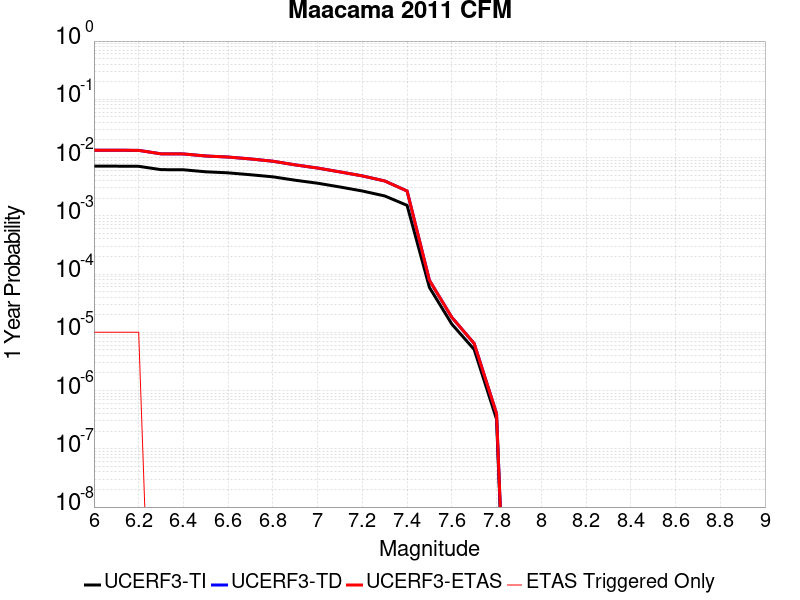 |  |

| Magnitude | 1 wk TI Prob | 1 wk TD Prob | 1 wk ETAS Prob | 1 wk ETAS/TD Gain | 1 wk ETAS Triggered Only | 1 mo TI Prob | 1 mo TD Prob | 1 mo ETAS Prob | 1 mo ETAS/TD Gain | 1 mo ETAS Triggered Only | 1 yr TI Prob | 1 yr TD Prob | 1 yr ETAS Prob | 1 yr ETAS/TD Gain | 1 yr ETAS Triggered Only | 10 yr TI Prob | 10 yr TD Prob | 10 yr ETAS Prob | 10 yr ETAS/TD Gain | 10 yr ETAS Triggered Only |
|-----|-----|-----|-----|-----|-----|-----|-----|-----|-----|-----|-----|-----|-----|-----|-----|-----|-----|-----|-----|-----|
| 6.0 | 1.368203E-4 | 2.579087E-4 | 2.579087E-4 | 1.0 | 0.0 | 5.862409E-4 | 0.0011047592 | 0.0011047592 | 1.0 | 0.0 | 0.0071141496 | 0.013350345 | 0.013360212 | 1.0007391 | 1.0E-5 | 0.06890667 | 0.1241916 | 0.12420036 | 1.0000706 | 1.0E-5 |
| 6.1 | 1.368203E-4 | 2.579087E-4 | 2.579087E-4 | 1.0 | 0.0 | 5.862409E-4 | 0.0011047592 | 0.0011047592 | 1.0 | 0.0 | 0.0071141496 | 0.013350345 | 0.013360212 | 1.0007391 | 1.0E-5 | 0.06890667 | 0.1241916 | 0.12420036 | 1.0000706 | 1.0E-5 |
| 6.2 | 1.360743E-4 | 2.566557E-4 | 2.566557E-4 | 1.0 | 0.0 | 5.8304524E-4 | 0.001099394 | 0.001099394 | 1.0 | 0.0 | 0.007075496 | 0.013285898 | 0.013295765 | 1.0007427 | 1.0E-5 | 0.06854413 | 0.123625994 | 0.123634756 | 1.0000709 | 1.0E-5 |
| 6.3 | 1.1917239E-4 | 2.236021E-4 | 2.236021E-4 | 1.0 | 0.0 | 5.1063887E-4 | 9.578717E-4 | 9.578717E-4 | 1.0 | 0.0 | 0.0061993203 | 0.0115873255 | 0.0115873255 | 1.0 | 0.0 | 0.060292065 | 0.108845875 | 0.108845875 | 1.0 | 0.0 |
| 6.4 | 1.1859289E-4 | 2.2263796E-4 | 2.2263796E-4 | 1.0 | 0.0 | 5.0815626E-4 | 9.537432E-4 | 9.537432E-4 | 1.0 | 0.0 | 0.006169266 | 0.011537647 | 0.011537647 | 1.0 | 0.0 | 0.06000784 | 0.10840272 | 0.10840272 | 1.0 | 0.0 |
| 6.5 | 1.09512424E-4 | 2.0517908E-4 | 2.0517908E-4 | 1.0 | 0.0 | 4.6925453E-4 | 8.7897904E-4 | 8.7897904E-4 | 1.0 | 0.0 | 0.005698218 | 0.010639169 | 0.010639169 | 1.0 | 0.0 | 0.055543028 | 0.1004949 | 0.1004949 | 1.0 | 0.0 |
| 6.6 | 1.0502928E-4 | 1.9675294E-4 | 1.9675294E-4 | 1.0 | 0.0 | 4.500478E-4 | 8.429031E-4 | 8.429031E-4 | 1.0 | 0.0 | 0.0054655746 | 0.010205293 | 0.010205293 | 1.0 | 0.0 | 0.053330887 | 0.0966474 | 0.0966474 | 1.0 | 0.0 |
| 6.7 | 9.739358E-5 | 1.8259176E-4 | 1.8259176E-4 | 1.0 | 0.0 | 4.173343E-4 | 7.822563E-4 | 7.822563E-4 | 1.0 | 0.0 | 0.0050692135 | 0.009475343 | 0.009475343 | 1.0 | 0.0 | 0.049551267 | 0.09012011 | 0.09012011 | 1.0 | 0.0 |
| 6.8 | 8.969524E-5 | 1.6658378E-4 | 1.6658378E-4 | 1.0 | 0.0 | 3.8435153E-4 | 7.1369443E-4 | 7.1369443E-4 | 1.0 | 0.0 | 0.0046694432 | 0.00864909 | 0.00864909 | 1.0 | 0.0 | 0.045725387 | 0.08265246 | 0.08265246 | 1.0 | 0.0 |
| 6.9 | 7.838291E-5 | 1.4418772E-4 | 1.4418772E-4 | 1.0 | 0.0 | 3.358835E-4 | 6.1778206E-4 | 6.1778206E-4 | 1.0 | 0.0 | 0.0040817154 | 0.007491724 | 0.007491724 | 1.0 | 0.0 | 0.04007554 | 0.07205298 | 0.07205298 | 1.0 | 0.0 |
| 7.0 | 6.961957E-5 | 1.2708071E-4 | 1.2708071E-4 | 1.0 | 0.0 | 2.9833548E-4 | 5.445059E-4 | 5.445059E-4 | 1.0 | 0.0 | 0.0036261857 | 0.006606692 | 0.006606692 | 1.0 | 0.0 | 0.035675827 | 0.063871816 | 0.063871816 | 1.0 | 0.0 |
| 7.1 | 5.999398E-5 | 1.09053384E-4 | 1.09053384E-4 | 1.0 | 0.0 | 2.570917E-4 | 4.6728246E-4 | 4.6728246E-4 | 1.0 | 0.0 | 0.0031255994 | 0.00567284 | 0.00567284 | 1.0 | 0.0 | 0.030820016 | 0.055139277 | 0.055139277 | 1.0 | 0.0 |
| 7.2 | 5.116532E-5 | 9.305489E-5 | 9.305489E-5 | 1.0 | 0.0 | 2.1926152E-4 | 3.9874107E-4 | 3.9874107E-4 | 1.0 | 0.0 | 0.002666241 | 0.00484315 | 0.00484315 | 1.0 | 0.0 | 0.026344774 | 0.047303654 | 0.047303654 | 1.0 | 0.0 |
| 7.3 | 4.2087835E-5 | 7.617064E-5 | 7.617064E-5 | 1.0 | 0.0 | 1.8036396E-4 | 3.264016E-4 | 3.264016E-4 | 1.0 | 0.0 | 0.0021937196 | 0.0039662397 | 0.0039662397 | 1.0 | 0.0 | 0.0217219 | 0.038905017 | 0.038905017 | 1.0 | 0.0 |
| 7.4 | 2.8991652E-5 | 5.1163643E-5 | 5.1163643E-5 | 1.0 | 0.0 | 1.2424402E-4 | 2.1925455E-4 | 2.1925455E-4 | 1.0 | 0.0 | 0.0015116213 | 0.0026661097 | 0.0026661097 | 1.0 | 0.0 | 0.015013801 | 0.026332043 | 0.026332043 | 1.0 | 0.0 |
| 7.5 | 1.1292299E-6 | 1.4950216E-6 | 1.4950216E-6 | 1.0 | 0.0 | 4.8395473E-6 | 6.407227E-6 | 6.407227E-6 | 1.0 | 0.0 | 5.8919897E-5 | 7.8006444E-5 | 7.8006444E-5 | 1.0 | 0.0 | 5.890428E-4 | 7.805042E-4 | 7.805042E-4 | 1.0 | 0.0 |
| 7.6 | 2.6535366E-7 | 3.4720998E-7 | 3.4720998E-7 | 1.0 | 0.0 | 1.1372296E-6 | 1.4880419E-6 | 1.4880419E-6 | 1.0 | 0.0 | 1.3845682E-5 | 1.811676E-5 | 1.811676E-5 | 1.0 | 0.0 | 1.3844819E-4 | 1.8170691E-4 | 1.8170691E-4 | 1.0 | 0.0 |
| 7.7 | 9.727789E-8 | 1.2302418E-7 | 1.2302418E-7 | 1.0 | 0.0 | 4.1690518E-7 | 5.2724636E-7 | 5.2724636E-7 | 1.0 | 0.0 | 5.0758085E-6 | 6.419206E-6 | 6.419206E-6 | 1.0 | 0.0 | 5.0756928E-5 | 6.456404E-5 | 6.456404E-5 | 1.0 | 0.0 |
| 7.8 | 6.1939325E-9 | 7.711711E-9 | 7.711711E-9 | 1.0 | 0.0 | 2.6545425E-8 | 3.305019E-8 | 3.305019E-8 | 1.0 | 0.0 | 3.231905E-7 | 4.0238598E-7 | 4.0238598E-7 | 1.0 | 0.0 | 3.2319003E-6 | 4.0597915E-6 | 4.0597915E-6 | 1.0 | 0.0 |

## Los Alamos 2011 CFM
*[(top)](#table-of-contents)*

| 1 Week | 1 Month | 1 Year | 10 Year |
|-----|-----|-----|-----|
|  |  |  |  |

| Magnitude | 1 wk TI Prob | 1 wk TD Prob | 1 wk ETAS Prob | 1 wk ETAS/TD Gain | 1 wk ETAS Triggered Only | 1 mo TI Prob | 1 mo TD Prob | 1 mo ETAS Prob | 1 mo ETAS/TD Gain | 1 mo ETAS Triggered Only | 1 yr TI Prob | 1 yr TD Prob | 1 yr ETAS Prob | 1 yr ETAS/TD Gain | 1 yr ETAS Triggered Only | 10 yr TI Prob | 10 yr TD Prob | 10 yr ETAS Prob | 10 yr ETAS/TD Gain | 10 yr ETAS Triggered Only |
|-----|-----|-----|-----|-----|-----|-----|-----|-----|-----|-----|-----|-----|-----|-----|-----|-----|-----|-----|-----|-----|
| 6.0 | 4.6284417E-6 | 4.7517333E-6 | 1.4751686E-5 | 3.1044853 | 1.0E-5 | 1.9836029E-5 | 2.0364423E-5 | 3.036422E-5 | 1.4910425 | 1.0E-5 | 2.4147688E-4 | 2.479104E-4 | 2.5790793E-4 | 1.0403272 | 1.0E-5 | 0.0024121467 | 0.0024765125 | 0.0024864879 | 1.004028 | 1.0E-5 |
| 6.1 | 4.6284417E-6 | 4.7517333E-6 | 1.4751686E-5 | 3.1044853 | 1.0E-5 | 1.9836029E-5 | 2.0364423E-5 | 3.036422E-5 | 1.4910425 | 1.0E-5 | 2.4147688E-4 | 2.479104E-4 | 2.5790793E-4 | 1.0403272 | 1.0E-5 | 0.0024121467 | 0.0024765125 | 0.0024864879 | 1.004028 | 1.0E-5 |
| 6.2 | 4.6284417E-6 | 4.7517333E-6 | 1.4751686E-5 | 3.1044853 | 1.0E-5 | 1.9836029E-5 | 2.0364423E-5 | 3.036422E-5 | 1.4910425 | 1.0E-5 | 2.4147688E-4 | 2.479104E-4 | 2.5790793E-4 | 1.0403272 | 1.0E-5 | 0.0024121467 | 0.0024765125 | 0.0024864879 | 1.004028 | 1.0E-5 |
| 6.3 | 4.6284417E-6 | 4.7517333E-6 | 1.4751686E-5 | 3.1044853 | 1.0E-5 | 1.9836029E-5 | 2.0364423E-5 | 3.036422E-5 | 1.4910425 | 1.0E-5 | 2.4147688E-4 | 2.479104E-4 | 2.5790793E-4 | 1.0403272 | 1.0E-5 | 0.0024121467 | 0.0024765125 | 0.0024864879 | 1.004028 | 1.0E-5 |
| 6.4 | 4.6284417E-6 | 4.7517333E-6 | 1.4751686E-5 | 3.1044853 | 1.0E-5 | 1.9836029E-5 | 2.0364423E-5 | 3.036422E-5 | 1.4910425 | 1.0E-5 | 2.4147688E-4 | 2.479104E-4 | 2.5790793E-4 | 1.0403272 | 1.0E-5 | 0.0024121467 | 0.0024765125 | 0.0024864879 | 1.004028 | 1.0E-5 |
| 6.5 | 4.6284417E-6 | 4.7517333E-6 | 1.4751686E-5 | 3.1044853 | 1.0E-5 | 1.9836029E-5 | 2.0364423E-5 | 3.036422E-5 | 1.4910425 | 1.0E-5 | 2.4147688E-4 | 2.479104E-4 | 2.5790793E-4 | 1.0403272 | 1.0E-5 | 0.0024121467 | 0.0024765125 | 0.0024864879 | 1.004028 | 1.0E-5 |
| 6.6 | 4.6284417E-6 | 4.7517333E-6 | 1.4751686E-5 | 3.1044853 | 1.0E-5 | 1.9836029E-5 | 2.0364423E-5 | 3.036422E-5 | 1.4910425 | 1.0E-5 | 2.4147688E-4 | 2.479104E-4 | 2.5790793E-4 | 1.0403272 | 1.0E-5 | 0.0024121467 | 0.0024765125 | 0.0024864879 | 1.004028 | 1.0E-5 |
| 6.7 | 4.062321E-6 | 4.166351E-6 | 1.41663095E-5 | 3.4001718 | 1.0E-5 | 1.7409831E-5 | 1.7855677E-5 | 2.7855498E-5 | 1.560036 | 1.0E-5 | 2.1194408E-4 | 2.1737268E-4 | 2.2737052E-4 | 1.0459939 | 1.0E-5 | 0.0021174205 | 0.0021717504 | 0.0021817286 | 1.0045946 | 1.0E-5 |
| 6.8 | 4.062321E-6 | 4.166351E-6 | 1.41663095E-5 | 3.4001718 | 1.0E-5 | 1.7409831E-5 | 1.7855677E-5 | 2.7855498E-5 | 1.560036 | 1.0E-5 | 2.1194408E-4 | 2.1737268E-4 | 2.2737052E-4 | 1.0459939 | 1.0E-5 | 0.0021174205 | 0.0021717504 | 0.0021817286 | 1.0045946 | 1.0E-5 |
| 6.9 | 3.2936077E-6 | 3.37296E-6 | 1.3372926E-5 | 3.964745 | 1.0E-5 | 1.4115385E-5 | 1.4455468E-5 | 2.4455323E-5 | 1.6917697 | 1.0E-5 | 1.7184127E-4 | 1.7598206E-4 | 1.8598029E-4 | 1.056814 | 1.0E-5 | 0.0017170844 | 0.0017585196 | 0.0017685019 | 1.0056766 | 1.0E-5 |
| 7.0 | 3.1687898E-6 | 3.2448177E-6 | 1.3244785E-5 | 4.081827 | 1.0E-5 | 1.3580457E-5 | 1.3906293E-5 | 2.3906154E-5 | 1.7190889 | 1.0E-5 | 1.6532952E-4 | 1.692969E-4 | 1.792952E-4 | 1.0590578 | 1.0E-5 | 0.0016520657 | 0.0016917707 | 0.0017017538 | 1.005901 | 1.0E-5 |
| 7.1 | 2.9379228E-6 | 3.007328E-6 | 3.007328E-6 | 1.0 | 0.0 | 1.25910365E-5 | 1.288849E-5 | 1.288849E-5 | 1.0 | 0.0 | 1.5328509E-4 | 1.5690697E-4 | 1.5690697E-4 | 1.0 | 0.0 | 0.001531794 | 0.001568051 | 0.001568051 | 1.0 | 0.0 |
| 7.2 | 2.0020686E-6 | 2.041632E-6 | 2.041632E-6 | 1.0 | 0.0 | 8.580266E-6 | 8.749822E-6 | 8.749822E-6 | 1.0 | 0.0 | 1.0445973E-4 | 1.0652392E-4 | 1.0652392E-4 | 1.0 | 0.0 | 0.0010441064 | 0.001064733 | 0.001064733 | 1.0 | 0.0 |
| 7.3 | 1.7364243E-6 | 1.7678824E-6 | 1.7678824E-6 | 1.0 | 0.0 | 7.441797E-6 | 7.576617E-6 | 7.576617E-6 | 1.0 | 0.0 | 9.0600115E-5 | 9.224144E-5 | 9.224144E-5 | 1.0 | 0.0 | 9.0563187E-4 | 9.2203467E-4 | 9.2203467E-4 | 1.0 | 0.0 |
| 7.4 | 1.5718434E-6 | 1.5983198E-6 | 1.5983198E-6 | 1.0 | 0.0 | 6.7364545E-6 | 6.8499244E-6 | 6.8499244E-6 | 1.0 | 0.0 | 8.201325E-5 | 8.339467E-5 | 8.339467E-5 | 1.0 | 0.0 | 8.198299E-4 | 8.3363673E-4 | 8.3363673E-4 | 1.0 | 0.0 |
| 7.5 | 1.3841119E-6 | 1.4042814E-6 | 1.4042814E-6 | 1.0 | 0.0 | 5.9318945E-6 | 6.018335E-6 | 6.018335E-6 | 1.0 | 0.0 | 7.221842E-5 | 7.327079E-5 | 7.327079E-5 | 1.0 | 0.0 | 7.2194956E-4 | 7.3246926E-4 | 7.3246926E-4 | 1.0 | 0.0 |
| 7.6 | 1.0843726E-6 | 1.0934443E-6 | 1.0934443E-6 | 1.0 | 0.0 | 4.647303E-6 | 4.6861815E-6 | 4.6861815E-6 | 1.0 | 0.0 | 5.6579443E-5 | 5.705279E-5 | 5.705279E-5 | 1.0 | 0.0 | 5.656504E-4 | 5.70384E-4 | 5.70384E-4 | 1.0 | 0.0 |
| 7.7 | 5.544814E-7 | 5.501884E-7 | 5.501884E-7 | 1.0 | 0.0 | 2.3763469E-6 | 2.3579482E-6 | 2.3579482E-6 | 1.0 | 0.0 | 2.8931638E-5 | 2.8707644E-5 | 2.8707644E-5 | 1.0 | 0.0 | 2.8927872E-4 | 2.870395E-4 | 2.870395E-4 | 1.0 | 0.0 |
| 7.8 | 2.0707465E-7 | 1.9778598E-7 | 1.9778598E-7 | 1.0 | 0.0 | 8.874625E-7 | 8.476539E-7 | 8.476539E-7 | 1.0 | 0.0 | 1.08048025E-5 | 1.0320137E-5 | 1.0320137E-5 | 1.0 | 0.0 | 1.0804277E-4 | 1.0319663E-4 | 1.0319663E-4 | 1.0 | 0.0 |
| 7.9 | 3.9821284E-8 | 3.4331528E-8 | 3.4331528E-8 | 1.0 | 0.0 | 1.7066264E-7 | 1.4713511E-7 | 1.4713511E-7 | 1.0 | 0.0 | 2.0778157E-6 | 1.7913685E-6 | 1.7913685E-6 | 1.0 | 0.0 | 2.0777963E-5 | 1.7913546E-5 | 1.7913546E-5 | 1.0 | 0.0 |
| 8.0 | 7.880441E-11 | 8.2353124E-11 | 8.2353124E-11 | 1.0 | 0.0 | 3.3773329E-10 | 3.52942E-10 | 3.52942E-10 | 1.0 | 0.0 | 4.1119033E-9 | 4.2970694E-9 | 4.2970694E-9 | 1.0 | 0.0 | 4.1119034E-8 | 4.2970694E-8 | 4.2970694E-8 | 1.0 | 0.0 |

## Gillem - Big Crack 2011 CFM
*[(top)](#table-of-contents)*

| 1 Week | 1 Month | 1 Year | 10 Year |
|-----|-----|-----|-----|
|  |  |  |  |

| Magnitude | 1 wk TI Prob | 1 wk TD Prob | 1 wk ETAS Prob | 1 wk ETAS/TD Gain | 1 wk ETAS Triggered Only | 1 mo TI Prob | 1 mo TD Prob | 1 mo ETAS Prob | 1 mo ETAS/TD Gain | 1 mo ETAS Triggered Only | 1 yr TI Prob | 1 yr TD Prob | 1 yr ETAS Prob | 1 yr ETAS/TD Gain | 1 yr ETAS Triggered Only | 10 yr TI Prob | 10 yr TD Prob | 10 yr ETAS Prob | 10 yr ETAS/TD Gain | 10 yr ETAS Triggered Only |
|-----|-----|-----|-----|-----|-----|-----|-----|-----|-----|-----|-----|-----|-----|-----|-----|-----|-----|-----|-----|-----|
| 6.0 | 2.196852E-5 | 2.3604485E-5 | 2.3604485E-5 | 1.0 | 0.0 | 9.4147406E-5 | 1.01158665E-4 | 1.01158665E-4 | 1.0 | 0.0 | 0.0011456419 | 0.0012309998 | 0.0012309998 | 1.0 | 0.0 | 0.011397537 | 0.012250669 | 0.012260547 | 1.0008063 | 1.0E-5 |
| 6.1 | 9.992795E-6 | 1.071189E-5 | 1.071189E-5 | 1.0 | 0.0 | 4.2825563E-5 | 4.5907396E-5 | 4.5907396E-5 | 1.0 | 0.0 | 5.2127644E-4 | 5.587975E-4 | 5.587975E-4 | 1.0 | 0.0 | 0.0052005537 | 0.0055757347 | 0.005585679 | 1.0017835 | 1.0E-5 |
| 6.2 | 9.992795E-6 | 1.071189E-5 | 1.071189E-5 | 1.0 | 0.0 | 4.2825563E-5 | 4.5907396E-5 | 4.5907396E-5 | 1.0 | 0.0 | 5.2127644E-4 | 5.587975E-4 | 5.587975E-4 | 1.0 | 0.0 | 0.0052005537 | 0.0055757347 | 0.005585679 | 1.0017835 | 1.0E-5 |
| 6.3 | 4.6127884E-6 | 4.942657E-6 | 4.942657E-6 | 1.0 | 0.0 | 1.9768944E-5 | 2.1182668E-5 | 2.1182668E-5 | 1.0 | 0.0 | 2.406603E-4 | 2.5787292E-4 | 2.5787292E-4 | 1.0 | 0.0 | 0.0024039985 | 0.0025761751 | 0.0025861494 | 1.0038717 | 1.0E-5 |
| 6.4 | 4.6127884E-6 | 4.942657E-6 | 4.942657E-6 | 1.0 | 0.0 | 1.9768944E-5 | 2.1182668E-5 | 2.1182668E-5 | 1.0 | 0.0 | 2.406603E-4 | 2.5787292E-4 | 2.5787292E-4 | 1.0 | 0.0 | 0.0024039985 | 0.0025761751 | 0.0025861494 | 1.0038717 | 1.0E-5 |
| 6.5 | 2.716712E-6 | 2.9111113E-6 | 2.9111113E-6 | 1.0 | 0.0 | 1.1643E-5 | 1.24761455E-5 | 1.24761455E-5 | 1.0 | 0.0 | 1.417443E-4 | 1.5188892E-4 | 1.5188892E-4 | 1.0 | 0.0 | 0.0014165393 | 0.001518089 | 0.0015280738 | 1.0065773 | 1.0E-5 |
| 6.6 | 1.3818255E-6 | 1.4820689E-6 | 1.4820689E-6 | 1.0 | 0.0 | 5.922096E-6 | 6.3517155E-6 | 6.3517155E-6 | 1.0 | 0.0 | 7.209913E-5 | 7.7330624E-5 | 7.7330624E-5 | 1.0 | 0.0 | 7.2075747E-4 | 7.7315804E-4 | 7.831503E-4 | 1.012924 | 1.0E-5 |

## Great Valley 06 (Midland) 2011 CFM alt1
*[(top)](#table-of-contents)*

| 1 Week | 1 Month | 1 Year | 10 Year |
|-----|-----|-----|-----|
|  |  |  |  |

| Magnitude | 1 wk TI Prob | 1 wk TD Prob | 1 wk ETAS Prob | 1 wk ETAS/TD Gain | 1 wk ETAS Triggered Only | 1 mo TI Prob | 1 mo TD Prob | 1 mo ETAS Prob | 1 mo ETAS/TD Gain | 1 mo ETAS Triggered Only | 1 yr TI Prob | 1 yr TD Prob | 1 yr ETAS Prob | 1 yr ETAS/TD Gain | 1 yr ETAS Triggered Only | 10 yr TI Prob | 10 yr TD Prob | 10 yr ETAS Prob | 10 yr ETAS/TD Gain | 10 yr ETAS Triggered Only |
|-----|-----|-----|-----|-----|-----|-----|-----|-----|-----|-----|-----|-----|-----|-----|-----|-----|-----|-----|-----|-----|
| 6.0 | 1.2712525E-5 | 1.3210576E-5 | 1.3210576E-5 | 1.0 | 0.0 | 5.4481112E-5 | 5.6615667E-5 | 5.6615667E-5 | 1.0 | 0.0 | 6.6310563E-4 | 6.8910315E-4 | 6.9909624E-4 | 1.0145016 | 1.0E-5 | 0.0066113044 | 0.006872179 | 0.00688211 | 1.0014452 | 1.0E-5 |
| 6.1 | 1.2712525E-5 | 1.3210576E-5 | 1.3210576E-5 | 1.0 | 0.0 | 5.4481112E-5 | 5.6615667E-5 | 5.6615667E-5 | 1.0 | 0.0 | 6.6310563E-4 | 6.8910315E-4 | 6.9909624E-4 | 1.0145016 | 1.0E-5 | 0.0066113044 | 0.006872179 | 0.00688211 | 1.0014452 | 1.0E-5 |
| 6.2 | 1.2712525E-5 | 1.3210576E-5 | 1.3210576E-5 | 1.0 | 0.0 | 5.4481112E-5 | 5.6615667E-5 | 5.6615667E-5 | 1.0 | 0.0 | 6.6310563E-4 | 6.8910315E-4 | 6.9909624E-4 | 1.0145016 | 1.0E-5 | 0.0066113044 | 0.006872179 | 0.00688211 | 1.0014452 | 1.0E-5 |
| 6.3 | 1.2712525E-5 | 1.3210576E-5 | 1.3210576E-5 | 1.0 | 0.0 | 5.4481112E-5 | 5.6615667E-5 | 5.6615667E-5 | 1.0 | 0.0 | 6.6310563E-4 | 6.8910315E-4 | 6.9909624E-4 | 1.0145016 | 1.0E-5 | 0.0066113044 | 0.006872179 | 0.00688211 | 1.0014452 | 1.0E-5 |
| 6.4 | 1.2712525E-5 | 1.3210576E-5 | 1.3210576E-5 | 1.0 | 0.0 | 5.4481112E-5 | 5.6615667E-5 | 5.6615667E-5 | 1.0 | 0.0 | 6.6310563E-4 | 6.8910315E-4 | 6.9909624E-4 | 1.0145016 | 1.0E-5 | 0.0066113044 | 0.006872179 | 0.00688211 | 1.0014452 | 1.0E-5 |
| 6.5 | 1.2712525E-5 | 1.3210576E-5 | 1.3210576E-5 | 1.0 | 0.0 | 5.4481112E-5 | 5.6615667E-5 | 5.6615667E-5 | 1.0 | 0.0 | 6.6310563E-4 | 6.8910315E-4 | 6.9909624E-4 | 1.0145016 | 1.0E-5 | 0.0066113044 | 0.006872179 | 0.00688211 | 1.0014452 | 1.0E-5 |
| 6.6 | 5.7574384E-6 | 5.9706463E-6 | 5.9706463E-6 | 1.0 | 0.0 | 2.4674504E-5 | 2.5588255E-5 | 2.5588255E-5 | 1.0 | 0.0 | 3.0037065E-4 | 3.1149638E-4 | 3.1149638E-4 | 1.0 | 0.0 | 0.0029996498 | 0.0031109843 | 0.0031109843 | 1.0 | 0.0 |
| 6.7 | 5.7574384E-6 | 5.9706463E-6 | 5.9706463E-6 | 1.0 | 0.0 | 2.4674504E-5 | 2.5588255E-5 | 2.5588255E-5 | 1.0 | 0.0 | 3.0037065E-4 | 3.1149638E-4 | 3.1149638E-4 | 1.0 | 0.0 | 0.0029996498 | 0.0031109843 | 0.0031109843 | 1.0 | 0.0 |
| 6.8 | 3.3474828E-6 | 3.4693849E-6 | 3.4693849E-6 | 1.0 | 0.0 | 1.4346277E-5 | 1.4868716E-5 | 1.4868716E-5 | 1.0 | 0.0 | 1.7465191E-4 | 1.8101306E-4 | 1.8101306E-4 | 1.0 | 0.0 | 0.0017451472 | 0.0018088033 | 0.0018088033 | 1.0 | 0.0 |
| 6.9 | 2.035106E-6 | 2.1090357E-6 | 2.1090357E-6 | 1.0 | 0.0 | 8.721853E-6 | 9.038697E-6 | 9.038697E-6 | 1.0 | 0.0 | 1.0618339E-4 | 1.10041314E-4 | 1.10041314E-4 | 1.0 | 0.0 | 0.0010613267 | 0.0010999405 | 0.0010999405 | 1.0 | 0.0 |
| 7.0 | 1.2424716E-6 | 1.2878762E-6 | 1.2878762E-6 | 1.0 | 0.0 | 5.3248673E-6 | 5.51946E-6 | 5.51946E-6 | 1.0 | 0.0 | 6.482833E-5 | 6.7197805E-5 | 6.7197805E-5 | 1.0 | 0.0 | 6.480942E-4 | 6.718192E-4 | 6.718192E-4 | 1.0 | 0.0 |
| 7.1 | 6.6904556E-7 | 6.939035E-7 | 6.939035E-7 | 1.0 | 0.0 | 2.867335E-6 | 2.97387E-6 | 2.97387E-6 | 1.0 | 0.0 | 3.4909244E-5 | 3.6206526E-5 | 3.6206526E-5 | 1.0 | 0.0 | 3.490376E-4 | 3.6203177E-4 | 3.6203177E-4 | 1.0 | 0.0 |
| 7.2 | 3.948168E-7 | 4.095705E-7 | 4.095705E-7 | 1.0 | 0.0 | 1.6920709E-6 | 1.7553022E-6 | 1.7553022E-6 | 1.0 | 0.0 | 2.0600768E-5 | 2.1370803E-5 | 2.1370803E-5 | 1.0 | 0.0 | 2.0598859E-4 | 2.1370803E-4 | 2.1370803E-4 | 1.0 | 0.0 |

