# Parent Section Magnitude-Probability Distributions

Only fault sections with at least one triggered aftershock are plotted. Sections are sorted by total supraseismogenic trigger rate (decreasing)

## Table Of Contents

* [Garlock (Central)](#garlock-central)
* [Tank Canyon](#tank-canyon)
* [Little Lake](#little-lake)
* [Airport Lake](#airport-lake)
* [Owl Lake](#owl-lake)
* [Garlock (East)](#garlock-east)
* [Panamint Valley](#panamint-valley)
* [Blackwater](#blackwater)
* [Hunter Mountain-Saline Valley](#hunter-mountain-saline-valley)
* [Ash Hill](#ash-hill)
* [Garlock (West)](#garlock-west)
* [McLean Lake](#mclean-lake)
* [Gravel Hills-Harper Lk](#gravel-hills-harper-lk)
* [So Sierra Nevada](#so-sierra-nevada)
* [Death Valley (So)](#death-valley-so)
* [Goldstone Lake](#goldstone-lake)
* [Coyote Canyon](#coyote-canyon)
* [Lenwood-Lockhart-Old Woman Springs](#lenwood-lockhart-old-woman-springs)
* [San Andreas (Mojave S)](#san-andreas-mojave-s)
* [San Andreas (Mojave N)](#san-andreas-mojave-n)
* [Nelson Lake](#nelson-lake)
* [Towne Pass](#towne-pass)
* [Garlic Springs](#garlic-springs)
* [San Andreas (San Bernardino N)](#san-andreas-san-bernardino-n)
* [Death Valley (No)](#death-valley-no)
* [Death Valley (Black Mtns Frontal)](#death-valley-black-mtns-frontal)
* [Bicycle Lake](#bicycle-lake)
* [Paradise](#paradise)
* [Coyote Lake](#coyote-lake)
* [Death Valley (Fish Lake Valley)](#death-valley-fish-lake-valley)
* [Helendale-So Lockhart](#helendale-so-lockhart)
* [Scodie Lineament](#scodie-lineament)
* [White Wolf (Extension)](#white-wolf-extension)
* [San Jacinto (Stepovers Combined)](#san-jacinto-stepovers-combined)
* [San Andreas (San Bernardino S)](#san-andreas-san-bernardino-s)
* [San Jacinto (San Jacinto Valley) rev](#san-jacinto-san-jacinto-valley-rev)
* [San Jacinto (San Bernardino)](#san-jacinto-san-bernardino)
* [Owens Valley](#owens-valley)
* [Baker](#baker)
* [Oceanside alt1](#oceanside-alt1)
* [Newport-Inglewood (Offshore)](#newport-inglewood-offshore)
* [Santa Ynez (West)](#santa-ynez-west)
* [San Andreas (Big Bend)](#san-andreas-big-bend)
* [Brawley (Seismic Zone) alt 1](#brawley-seismic-zone-alt-1)
* [Sierra Nevada  (No Extension)](#sierra-nevada--no-extension)
* [Calico-Hidalgo](#calico-hidalgo)
* [Elsinore (Glen Ivy) rev](#elsinore-glen-ivy-rev)
* [San Jacinto (Anza) rev](#san-jacinto-anza-rev)
* [San Andreas (Coachella) rev](#san-andreas-coachella-rev)
* [San Andreas (San Gorgonio Pass-Garnet HIll)](#san-andreas-san-gorgonio-pass-garnet-hill)
* [Big Pine (Central)](#big-pine-central)
* [San Jacinto (Coyote Creek)](#san-jacinto-coyote-creek)
* [San Gabriel](#san-gabriel)
* [San Andreas (Parkfield)](#san-andreas-parkfield)
* [Oceanic - West Huasna](#oceanic---west-huasna)
* [Kern Canyon (North Kern) 2011](#kern-canyon-north-kern-2011)
* [Cucamonga](#cucamonga)
* [Cleghorn Lake](#cleghorn-lake)
* [Cady](#cady)
* [Earthquake Valley (So Extension)](#earthquake-valley-so-extension)
* [Santa Ynez (East)](#santa-ynez-east)
* [Camp Rock 2011](#camp-rock-2011)
* [San Andreas (Carrizo) rev](#san-andreas-carrizo-rev)
* [White Wolf](#white-wolf)
* [Big Pine (East)](#big-pine-east)
* [Independence rev 2011](#independence-rev-2011)
* [Cedar Mtn-Mahogany Mtn](#cedar-mtn-mahogany-mtn)
* [Red Pass](#red-pass)
* [Dry Mountain](#dry-mountain)
* [Santa Cruz Catalina Ridge alt1](#santa-cruz-catalina-ridge-alt1)
* [Santa Rosa Island](#santa-rosa-island)
* [San Andreas (North Branch Mill Creek)](#san-andreas-north-branch-mill-creek)
* [Imperial](#imperial)
* [Pine Mtn](#pine-mtn)
* [San Andreas (Cholame) rev](#san-andreas-cholame-rev)
* [Surprise Valley 2011 CFM](#surprise-valley-2011-cfm)
* [Whittier alt 1](#whittier-alt-1)
* [Ortigalita (South)](#ortigalita-south)
* [Chino alt 1](#chino-alt-1)
* [Lake Isabella (Seismicity)](#lake-isabella-seismicity)
* [San Jacinto (Superstition Mtn)](#san-jacinto-superstition-mtn)
* [Kern Canyon (Lake Isabella) 2011](#kern-canyon-lake-isabella-2011)
* [Ozena](#ozena)
* [Pinto Mtn](#pinto-mtn)
* [Earthquake Valley (No  Extension)](#earthquake-valley-no--extension)
* [Rose Canyon](#rose-canyon)
* [San Jacinto (Borrego)](#san-jacinto-borrego)
* [Clamshell-Sawpit](#clamshell-sawpit)
* [Santa Ynez River](#santa-ynez-river)
* [Deep Springs](#deep-springs)

## Garlock (Central)
*[(top)](#table-of-contents)*

| 1 Week | 1 Month | 1 Year | 10 Year |
|-----|-----|-----|-----|
|  |  |  |  |

| Magnitude | 1 wk TI Prob | 1 wk TD Prob | 1 wk ETAS Prob | 1 wk ETAS/TD Gain | 1 wk ETAS Triggered Only | 1 mo TI Prob | 1 mo TD Prob | 1 mo ETAS Prob | 1 mo ETAS/TD Gain | 1 mo ETAS Triggered Only | 1 yr TI Prob | 1 yr TD Prob | 1 yr ETAS Prob | 1 yr ETAS/TD Gain | 1 yr ETAS Triggered Only | 10 yr TI Prob | 10 yr TD Prob | 10 yr ETAS Prob | 10 yr ETAS/TD Gain | 10 yr ETAS Triggered Only |
|-----|-----|-----|-----|-----|-----|-----|-----|-----|-----|-----|-----|-----|-----|-----|-----|-----|-----|-----|-----|-----|
| 6.0 | 5.5131142E-5 | 7.024681E-5 | 0.09778653 | 1392.0424 | 0.09772315 | 2.3625491E-4 | 3.010234E-4 | 0.11249775 | 373.71762 | 0.1122305 | 0.0028726095 | 0.0036588663 | 0.13013376 | 35.56669 | 0.12693936 | 0.028357591 | 0.036079824 | 0.16950984 | 4.698189 | 0.13842434 |
| 6.1 | 5.5131142E-5 | 7.024681E-5 | 0.09778653 | 1392.0424 | 0.09772315 | 2.3625491E-4 | 3.010234E-4 | 0.11249775 | 373.71762 | 0.1122305 | 0.0028726095 | 0.0036588663 | 0.13013376 | 35.56669 | 0.12693936 | 0.028357591 | 0.036079824 | 0.16950984 | 4.698189 | 0.13842434 |
| 6.2 | 4.216245E-5 | 5.1661493E-5 | 0.056869198 | 1100.8043 | 0.05682047 | 1.806837E-4 | 2.2138779E-4 | 0.06649726 | 300.36554 | 0.06629055 | 0.0021976046 | 0.0026920962 | 0.07684213 | 28.543604 | 0.07435019 | 0.021759989 | 0.026689773 | 0.10493898 | 3.9318044 | 0.08039492 |
| 6.3 | 4.216245E-5 | 5.1661493E-5 | 0.056869198 | 1100.8043 | 0.05682047 | 1.806837E-4 | 2.2138779E-4 | 0.06649726 | 300.36554 | 0.06629055 | 0.0021976046 | 0.0026920962 | 0.07684213 | 28.543604 | 0.07435019 | 0.021759989 | 0.026689773 | 0.10493898 | 3.9318044 | 0.08039492 |
| 6.4 | 3.6858168E-5 | 4.411054E-5 | 0.043967217 | 996.7508 | 0.043925047 | 1.5795401E-4 | 1.8903162E-4 | 0.050955173 | 269.559 | 0.05077574 | 0.0019213937 | 0.002299056 | 0.05959198 | 25.920195 | 0.057424944 | 0.019048655 | 0.02284894 | 0.083687074 | 3.6626241 | 0.06226073 |
| 6.5 | 3.39199E-5 | 4.0018083E-5 | 0.038321782 | 957.61163 | 0.038283296 | 1.453629E-4 | 1.7149492E-4 | 0.044089008 | 257.08636 | 0.043925047 | 0.0017683565 | 0.002085973 | 0.052554727 | 25.194347 | 0.05057425 | 0.017543508 | 0.020759864 | 0.07462498 | 3.5946758 | 0.05500705 |
| 6.6 | 3.3571985E-5 | 3.9472274E-5 | 0.038321257 | 970.8399 | 0.038283296 | 1.4387199E-4 | 1.6915603E-4 | 0.044086773 | 260.62784 | 0.043925047 | 0.0017502342 | 0.0020575512 | 0.05252774 | 25.529253 | 0.05057425 | 0.017365133 | 0.020481179 | 0.07436162 | 3.6307297 | 0.05500705 |
| 6.7 | 3.2580007E-5 | 3.8088703E-5 | 0.037111025 | 974.3316 | 0.03707435 | 1.3962112E-4 | 1.632272E-4 | 0.042872354 | 262.65448 | 0.0427161 | 0.0016985617 | 0.0019855013 | 0.05125279 | 25.813526 | 0.049365304 | 0.016856372 | 0.019773813 | 0.07231062 | 3.6568878 | 0.053596616 |
| 6.8 | 3.2185937E-5 | 3.7515918E-5 | 0.03690899 | 983.82214 | 0.03687286 | 1.3793244E-4 | 1.6077272E-4 | 0.042668547 | 265.39667 | 0.042514607 | 0.0016780337 | 0.001955672 | 0.051023334 | 26.089924 | 0.04916381 | 0.016654192 | 0.019480614 | 0.07183557 | 3.6875412 | 0.053395122 |
| 6.9 | 3.165394E-5 | 3.6720503E-5 | 0.036908224 | 1005.1122 | 0.03687286 | 1.3565269E-4 | 1.5736422E-4 | 0.04266528 | 271.12442 | 0.042514607 | 0.0016503202 | 0.001914247 | 0.05058174 | 26.423828 | 0.04876083 | 0.01638118 | 0.019073246 | 0.07085701 | 3.7149947 | 0.05279065 |
| 7.0 | 3.0903822E-5 | 3.5625766E-5 | 0.036101237 | 1013.34625 | 0.036066893 | 1.3243823E-4 | 1.5267303E-4 | 0.041854948 | 274.1476 | 0.041708644 | 0.0016112428 | 0.0018572307 | 0.049723033 | 26.772675 | 0.047954865 | 0.015996104 | 0.018512413 | 0.06953474 | 3.7561142 | 0.051984686 |
| 7.1 | 3.0069863E-5 | 3.4392073E-5 | 0.034689657 | 1008.6528 | 0.034656458 | 1.2886449E-4 | 1.4738638E-4 | 0.040238194 | 273.0116 | 0.040096715 | 0.0015677959 | 0.0017929734 | 0.04744943 | 26.464102 | 0.045738466 | 0.01556781 | 0.017880075 | 0.06636272 | 3.7115462 | 0.049365304 |
| 7.2 | 2.7957109E-5 | 3.128145E-5 | 0.028843598 | 922.0671 | 0.028813219 | 1.1981068E-4 | 1.340566E-4 | 0.03337562 | 248.96664 | 0.03324602 | 0.0014577188 | 0.0016309366 | 0.039449472 | 24.18823 | 0.037880313 | 0.014481937 | 0.016283695 | 0.05671854 | 3.4831493 | 0.04110417 |
| 7.3 | 2.4519275E-5 | 2.6714795E-5 | 0.02057825 | 770.2942 | 0.020552086 | 1.0507837E-4 | 1.1448703E-4 | 0.022880368 | 199.85117 | 0.022768486 | 0.0012785783 | 0.001393003 | 0.027147928 | 19.48878 | 0.025790852 | 0.012712469 | 0.013928054 | 0.04154522 | 2.9828446 | 0.028007254 |
| 7.4 | 2.3225532E-5 | 2.51994E-5 | 0.018763393 | 744.5968 | 0.018738667 | 9.95342E-5 | 1.0799304E-4 | 0.020859329 | 193.15437 | 0.020753577 | 0.0012111551 | 0.0013140367 | 0.025058737 | 19.070044 | 0.023775943 | 0.012045753 | 0.013145725 | 0.03879638 | 2.9512544 | 0.025992343 |
| 7.5 | 2.097765E-5 | 2.2483688E-5 | 0.012514647 | 556.61005 | 0.012492444 | 8.9901114E-5 | 9.635517E-5 | 0.014602312 | 151.54674 | 0.014507354 | 0.0010939965 | 0.0011725046 | 0.018077906 | 15.418196 | 0.016925247 | 0.010886264 | 0.011740365 | 0.030059908 | 2.5603895 | 0.018537175 |
| 7.6 | 1.511254E-5 | 1.5991332E-5 | 0.006665089 | 416.79385 | 0.006649204 | 6.476642E-5 | 6.853253E-5 | 0.0075231898 | 109.77546 | 0.0074551683 | 7.882459E-4 | 8.3407195E-4 | 0.0098936055 | 11.861814 | 0.009067097 | 0.007854558 | 0.008383559 | 0.017974047 | 2.1439638 | 0.00967157 |
| 7.7 | 9.934069E-6 | 1.0678794E-5 | 0.0018240787 | 170.81319 | 0.0018134193 | 4.2573887E-5 | 4.5765457E-5 | 0.0020605836 | 45.024868 | 0.0020149103 | 5.182138E-4 | 5.570524E-4 | 0.0031749767 | 5.6996017 | 0.0026193834 | 0.00517007 | 0.005627684 | 0.008633041 | 1.5340308 | 0.0030223655 |
| 7.8 | 6.7562896E-6 | 8.428449E-6 | 0.0012173644 | 144.43517 | 0.0012089462 | 2.8955206E-5 | 3.6121426E-5 | 0.0014465078 | 40.0457 | 0.0014104373 | 3.5247262E-4 | 4.3968976E-4 | 0.0020509092 | 4.6644464 | 0.0016119282 | 0.0035191406 | 0.004446654 | 0.006452605 | 1.4511147 | 0.0020149103 |
| 7.9 | 3.975453E-6 | 5.37103E-6 | 4.0835093E-4 | 76.02842 | 4.0298206E-4 | 1.7037546E-5 | 2.3018498E-5 | 6.274777E-4 | 27.259714 | 6.044731E-4 | 2.0741238E-4 | 2.8021427E-4 | 0.0010859526 | 3.8754363 | 8.059641E-4 | 0.002072189 | 0.0028336283 | 0.004039149 | 1.4254335 | 0.0012089462 |
| 8.0 | 1.6729537E-6 | 2.0775144E-6 | 2.0775144E-6 | 1.0 | 0.0 | 7.169782E-6 | 8.903603E-6 | 8.903603E-6 | 1.0 | 0.0 | 8.7288594E-5 | 1.0839601E-4 | 3.098652E-4 | 2.8586404 | 2.0149103E-4 | 8.7254314E-4 | 0.0010969337 | 0.0012982038 | 1.1834842 | 2.0149103E-4 |
| 8.1 | 3.6733252E-7 | 3.1489964E-7 | 3.1489964E-7 | 1.0 | 0.0 | 1.5742813E-6 | 1.3495693E-6 | 1.3495693E-6 | 1.0 | 0.0 | 1.9166706E-5 | 1.6430899E-5 | 1.6430899E-5 | 1.0 | 0.0 | 1.9165053E-4 | 1.6638759E-4 | 1.6638759E-4 | 1.0 | 0.0 |

## Tank Canyon
*[(top)](#table-of-contents)*

| 1 Week | 1 Month | 1 Year | 10 Year |
|-----|-----|-----|-----|
|  |  |  |  |

| Magnitude | 1 wk TI Prob | 1 wk TD Prob | 1 wk ETAS Prob | 1 wk ETAS/TD Gain | 1 wk ETAS Triggered Only | 1 mo TI Prob | 1 mo TD Prob | 1 mo ETAS Prob | 1 mo ETAS/TD Gain | 1 mo ETAS Triggered Only | 1 yr TI Prob | 1 yr TD Prob | 1 yr ETAS Prob | 1 yr ETAS/TD Gain | 1 yr ETAS Triggered Only | 10 yr TI Prob | 10 yr TD Prob | 10 yr ETAS Prob | 10 yr ETAS/TD Gain | 10 yr ETAS Triggered Only |
|-----|-----|-----|-----|-----|-----|-----|-----|-----|-----|-----|-----|-----|-----|-----|-----|-----|-----|-----|-----|-----|
| 6.0 | 4.8284557E-5 | 5.7964822E-5 | 0.058889937 | 1015.9599 | 0.058835384 | 2.0691741E-4 | 2.4840087E-4 | 0.07196139 | 289.69864 | 0.07173081 | 0.0025163088 | 0.0030207601 | 0.09241342 | 30.59277 | 0.08966351 | 0.02488006 | 0.029863637 | 0.12584126 | 4.213863 | 0.098932095 |
| 6.1 | 1.7796336E-5 | 2.0873314E-5 | 0.018154688 | 869.75586 | 0.018134193 | 7.626778E-5 | 8.945422E-5 | 0.023863269 | 266.76517 | 0.023775943 | 9.281647E-4 | 0.0010885983 | 0.03208444 | 29.473167 | 0.03102962 | 0.009242975 | 0.010836744 | 0.045316946 | 4.181786 | 0.034857947 |
| 6.2 | 1.7796336E-5 | 2.0873314E-5 | 0.018154688 | 869.75586 | 0.018134193 | 7.626778E-5 | 8.945422E-5 | 0.023863269 | 266.76517 | 0.023775943 | 9.281647E-4 | 0.0010885983 | 0.03208444 | 29.473167 | 0.03102962 | 0.009242975 | 0.010836744 | 0.045316946 | 4.181786 | 0.034857947 |
| 6.3 | 1.3515912E-5 | 1.5759564E-5 | 0.014321397 | 908.7432 | 0.0143058635 | 5.792405E-5 | 6.753938E-5 | 0.017596075 | 260.5306 | 0.01752972 | 7.049971E-4 | 8.2200574E-4 | 0.024578404 | 29.900526 | 0.023775943 | 0.007027647 | 0.0081922645 | 0.035170715 | 4.2931614 | 0.02720129 |
| 6.4 | 1.0870146E-5 | 1.2618021E-5 | 0.009482577 | 751.5107 | 0.009470078 | 4.658551E-5 | 5.4076212E-5 | 0.011941404 | 220.82545 | 0.011887971 | 5.67031E-4 | 6.581969E-4 | 0.017370945 | 26.391714 | 0.016723756 | 0.005655863 | 0.0065644905 | 0.02598082 | 3.9577816 | 0.01954463 |
| 6.5 | 7.964826E-6 | 9.196094E-6 | 0.0056508933 | 614.4884 | 0.005641749 | 3.4134522E-5 | 3.9411298E-5 | 0.006688353 | 169.7065 | 0.006649204 | 4.1550855E-4 | 4.7973756E-4 | 0.010146667 | 21.150454 | 0.00967157 | 0.0041473247 | 0.004788321 | 0.016017789 | 3.3451788 | 0.011283498 |
| 6.6 | 6.6317E-6 | 7.6122988E-6 | 0.004238892 | 556.8478 | 0.004231312 | 2.8421264E-5 | 3.2623782E-5 | 0.0050697355 | 155.4 | 0.0050372756 | 3.4597394E-4 | 3.9713128E-4 | 0.0072451057 | 18.243605 | 0.0068506952 | 0.0034543579 | 0.003965368 | 0.011591665 | 2.9232256 | 0.0076566595 |
| 6.7 | 4.793663E-6 | 5.4307857E-6 | 0.0020203302 | 372.01434 | 0.0020149103 | 2.0544108E-5 | 2.3274613E-5 | 0.0028440834 | 122.19681 | 0.0028208746 | 2.500958E-4 | 2.8333595E-4 | 0.004110581 | 14.507799 | 0.0038283297 | 0.0024981452 | 0.0028304397 | 0.007451616 | 2.6326709 | 0.0046342937 |
| 6.8 | 4.382823E-6 | 4.9692567E-6 | 0.0018183795 | 365.92584 | 0.0018134193 | 1.8783392E-5 | 2.1296666E-5 | 0.0026406243 | 123.992386 | 0.0026193834 | 2.286638E-4 | 2.5926033E-4 | 0.0036837198 | 14.208575 | 0.0034253476 | 0.0022842865 | 0.002590253 | 0.0064086663 | 2.4741468 | 0.0038283297 |
| 6.9 | 2.729601E-6 | 3.0735416E-6 | 4.0605437E-4 | 132.11285 | 4.0298206E-4 | 1.1698237E-5 | 1.3172262E-5 | 6.176374E-4 | 46.889244 | 6.044731E-4 | 1.4241673E-4 | 1.6036171E-4 | 0.0011676553 | 7.2813845 | 0.0010074552 | 0.001423255 | 0.0016026258 | 0.0030108027 | 1.8786685 | 0.0014104373 |
| 7.0 | 1.8987357E-6 | 2.126939E-6 | 2.126939E-6 | 1.0 | 0.0 | 8.137413E-6 | 9.115425E-6 | 2.1060462E-4 | 23.104202 | 2.0149103E-4 | 9.90685E-5 | 1.1097535E-4 | 7.1538135E-4 | 6.4463086 | 6.044731E-4 | 9.902435E-4 | 0.0011092679 | 0.0019143381 | 1.725767 | 8.059641E-4 |
| 7.1 | 1.4928986E-6 | 1.6641272E-6 | 1.6641272E-6 | 1.0 | 0.0 | 6.398121E-6 | 7.1319573E-6 | 2.0862155E-4 | 29.251654 | 2.0149103E-4 | 7.789434E-5 | 8.682871E-5 | 4.897758E-4 | 5.6407123 | 4.0298206E-4 | 7.786704E-4 | 8.6800574E-4 | 0.001270638 | 1.463859 | 4.0298206E-4 |
| 7.2 | 1.069082E-6 | 1.1828573E-6 | 1.1828573E-6 | 1.0 | 0.0 | 4.581772E-6 | 5.0693816E-6 | 2.0655939E-4 | 40.746468 | 2.0149103E-4 | 5.5781646E-5 | 6.171851E-5 | 4.646757E-4 | 7.5289526 | 4.0298206E-4 | 5.576765E-4 | 6.170659E-4 | 0.0010197993 | 1.6526587 | 4.0298206E-4 |
| 7.3 | 8.776551E-7 | 9.770005E-7 | 9.770005E-7 | 1.0 | 0.0 | 3.7613736E-6 | 4.1871413E-6 | 4.1871413E-6 | 1.0 | 0.0 | 4.579376E-5 | 5.097777E-5 | 2.5245853E-4 | 4.952326 | 2.0149103E-4 | 4.5784327E-4 | 5.097118E-4 | 7.111001E-4 | 1.3951024 | 2.0149103E-4 |
| 7.4 | 7.55721E-7 | 8.510244E-7 | 8.510244E-7 | 1.0 | 0.0 | 3.2388E-6 | 3.6472454E-6 | 3.6472454E-6 | 1.0 | 0.0 | 3.9431678E-5 | 4.4404827E-5 | 2.458869E-4 | 5.5373917 | 2.0149103E-4 | 3.942468E-4 | 4.440104E-4 | 6.4541196E-4 | 1.4535965 | 2.0149103E-4 |
| 7.5 | 5.587665E-7 | 6.305619E-7 | 6.305619E-7 | 1.0 | 0.0 | 2.3947114E-6 | 2.702408E-6 | 2.702408E-6 | 1.0 | 0.0 | 2.915522E-5 | 3.290182E-5 | 2.3438623E-4 | 7.1238074 | 2.0149103E-4 | 2.9151395E-4 | 3.290182E-4 | 5.304429E-4 | 1.6121994 | 2.0149103E-4 |

## Little Lake
*[(top)](#table-of-contents)*

| 1 Week | 1 Month | 1 Year | 10 Year |
|-----|-----|-----|-----|
|  |  |  |  |

| Magnitude | 1 wk TI Prob | 1 wk TD Prob | 1 wk ETAS Prob | 1 wk ETAS/TD Gain | 1 wk ETAS Triggered Only | 1 mo TI Prob | 1 mo TD Prob | 1 mo ETAS Prob | 1 mo ETAS/TD Gain | 1 mo ETAS Triggered Only | 1 yr TI Prob | 1 yr TD Prob | 1 yr ETAS Prob | 1 yr ETAS/TD Gain | 1 yr ETAS Triggered Only | 10 yr TI Prob | 10 yr TD Prob | 10 yr ETAS Prob | 10 yr ETAS/TD Gain | 10 yr ETAS Triggered Only |
|-----|-----|-----|-----|-----|-----|-----|-----|-----|-----|-----|-----|-----|-----|-----|-----|-----|-----|-----|-----|-----|
| 6.0 | 2.8424427E-5 | 3.120572E-5 | 0.04556676 | 1460.2053 | 0.045536973 | 1.2181328E-4 | 1.337327E-4 | 0.05130561 | 383.64297 | 0.051178724 | 0.0014820677 | 0.0016271127 | 0.05956211 | 36.606014 | 0.058029417 | 0.014722223 | 0.016165402 | 0.07781613 | 4.8137455 | 0.06266371 |
| 6.1 | 2.8424427E-5 | 3.120572E-5 | 0.04556676 | 1460.2053 | 0.045536973 | 1.2181328E-4 | 1.337327E-4 | 0.05130561 | 383.64297 | 0.051178724 | 0.0014820677 | 0.0016271127 | 0.05956211 | 36.606014 | 0.058029417 | 0.014722223 | 0.016165402 | 0.07781613 | 4.8137455 | 0.06266371 |
| 6.2 | 2.8424427E-5 | 3.120572E-5 | 0.04556676 | 1460.2053 | 0.045536973 | 1.2181328E-4 | 1.337327E-4 | 0.05130561 | 383.64297 | 0.051178724 | 0.0014820677 | 0.0016271127 | 0.05956211 | 36.606014 | 0.058029417 | 0.014722223 | 0.016165402 | 0.07781613 | 4.8137455 | 0.06266371 |
| 6.3 | 1.48860645E-5 | 1.6081389E-5 | 0.031448178 | 1955.5635 | 0.031432603 | 6.379586E-5 | 6.8918576E-5 | 0.03512594 | 509.67303 | 0.03505944 | 7.7643775E-4 | 8.3878887E-4 | 0.040297907 | 48.042965 | 0.039492242 | 0.007737305 | 0.008359048 | 0.050118662 | 5.995738 | 0.042111628 |
| 6.4 | 1.48860645E-5 | 1.6081389E-5 | 0.031448178 | 1955.5635 | 0.031432603 | 6.379586E-5 | 6.8918576E-5 | 0.03512594 | 509.67303 | 0.03505944 | 7.7643775E-4 | 8.3878887E-4 | 0.040297907 | 48.042965 | 0.039492242 | 0.007737305 | 0.008359048 | 0.050118662 | 5.995738 | 0.042111628 |
| 6.5 | 1.2797581E-5 | 1.3765565E-5 | 0.028222121 | 2050.1973 | 0.028208744 | 5.4845623E-5 | 5.899409E-5 | 0.0318927 | 540.6084 | 0.031835582 | 6.675408E-4 | 7.18042E-4 | 0.036557693 | 50.913025 | 0.035865404 | 0.006655392 | 0.00715977 | 0.044968918 | 6.280777 | 0.038081806 |
| 6.6 | 9.661896E-6 | 1.0289038E-5 | 0.024994921 | 2429.2769 | 0.024984889 | 4.1407468E-5 | 4.409522E-5 | 0.027848631 | 631.5567 | 0.027805762 | 5.040193E-4 | 5.367433E-4 | 0.031549707 | 58.77988 | 0.03102962 | 0.005028777 | 0.0053560743 | 0.038424026 | 7.173916 | 0.03324602 |
| 6.7 | 7.767871E-6 | 8.199687E-6 | 0.022373522 | 2728.5825 | 0.022365505 | 3.329045E-5 | 3.5141118E-5 | 0.024616184 | 700.4952 | 0.024581905 | 4.0523586E-4 | 4.2777284E-4 | 0.028020237 | 65.5026 | 0.02760427 | 0.004044977 | 0.004270846 | 0.0335629 | 7.858607 | 0.029417692 |
| 6.8 | 6.4235196E-6 | 6.7357446E-6 | 0.01693187 | 2513.734 | 0.016925247 | 2.752908E-5 | 2.8867229E-5 | 0.018766992 | 650.1141 | 0.018738667 | 3.35115E-4 | 3.5141467E-4 | 0.021701958 | 61.755985 | 0.02135805 | 0.003346101 | 0.00350985 | 0.025997639 | 7.407051 | 0.022566997 |
| 6.9 | 3.1283696E-6 | 3.1121804E-6 | 0.009674652 | 3108.6409 | 0.00967157 | 1.3407229E-5 | 1.3337856E-5 | 0.011095197 | 831.85754 | 0.011082007 | 1.6322079E-4 | 1.6237781E-4 | 0.012652793 | 77.921936 | 0.012492444 | 0.0016310095 | 0.00162274 | 0.01449724 | 8.933804 | 0.012895426 |
| 7.0 | 2.290603E-6 | 2.2286815E-6 | 0.006651418 | 2984.4631 | 0.006649204 | 9.816834E-6 | 9.551463E-6 | 0.0074646487 | 781.51886 | 0.0074551683 | 1.19513395E-4 | 1.162839E-4 | 0.0077720527 | 66.836876 | 0.0076566595 | 0.0011944914 | 0.0011623327 | 0.00901135 | 7.752814 | 0.007858151 |
| 7.1 | 1.293693E-6 | 1.1776827E-6 | 0.0040309937 | 3422.8179 | 0.0040298207 | 5.5443866E-6 | 5.0472063E-6 | 0.0042363377 | 839.3431 | 0.004231312 | 6.750081E-5 | 6.14487E-5 | 0.0044939793 | 73.133835 | 0.0044328026 | 6.7480316E-4 | 6.143856E-4 | 0.0052458323 | 8.538339 | 0.0046342937 |
| 7.2 | 4.715842E-7 | 3.0917857E-7 | 3.0917857E-7 | 1.0 | 0.0 | 2.0210737E-6 | 1.3250503E-6 | 2.0281582E-4 | 153.06271 | 2.0149103E-4 | 2.4606294E-5 | 1.6132375E-5 | 2.1762015E-4 | 13.489655 | 2.0149103E-4 | 2.460357E-4 | 1.6131258E-4 | 3.627711E-4 | 2.2488706 | 2.0149103E-4 |
| 7.3 | 3.9430947E-7 | 2.3097488E-7 | 2.3097488E-7 | 1.0 | 0.0 | 1.6898966E-6 | 9.89892E-7 | 9.89892E-7 | 1.0 | 0.0 | 2.0574296E-5 | 1.2051869E-5 | 1.2051869E-5 | 1.0 | 0.0 | 2.0572392E-4 | 1.20512224E-4 | 1.20512224E-4 | 1.0 | 0.0 |
| 7.4 | 3.547123E-7 | 1.9679135E-7 | 1.9679135E-7 | 1.0 | 0.0 | 1.5201948E-6 | 8.4339126E-7 | 8.4339126E-7 | 1.0 | 0.0 | 1.8508214E-5 | 1.0268241E-5 | 1.0268241E-5 | 1.0 | 0.0 | 1.8506673E-4 | 1.02677724E-4 | 1.02677724E-4 | 1.0 | 0.0 |
| 7.5 | 2.6354266E-7 | 1.4423138E-7 | 1.4423138E-7 | 1.0 | 0.0 | 1.129468E-6 | 6.181344E-7 | 6.181344E-7 | 1.0 | 0.0 | 1.3751187E-5 | 7.5257603E-6 | 7.5257603E-6 | 1.0 | 0.0 | 1.3750336E-4 | 7.5255106E-5 | 7.5255106E-5 | 1.0 | 0.0 |
| 7.6 | 1.269913E-7 | 7.572556E-8 | 7.572556E-8 | 1.0 | 0.0 | 5.4424834E-7 | 3.245381E-7 | 3.245381E-7 | 1.0 | 0.0 | 6.6262032E-6 | 3.9512443E-6 | 3.9512443E-6 | 1.0 | 0.0 | 6.626006E-5 | 3.9511775E-5 | 3.9511775E-5 | 1.0 | 0.0 |

## Airport Lake
*[(top)](#table-of-contents)*

| 1 Week | 1 Month | 1 Year | 10 Year |
|-----|-----|-----|-----|
|  |  |  |  |

| Magnitude | 1 wk TI Prob | 1 wk TD Prob | 1 wk ETAS Prob | 1 wk ETAS/TD Gain | 1 wk ETAS Triggered Only | 1 mo TI Prob | 1 mo TD Prob | 1 mo ETAS Prob | 1 mo ETAS/TD Gain | 1 mo ETAS Triggered Only | 1 yr TI Prob | 1 yr TD Prob | 1 yr ETAS Prob | 1 yr ETAS/TD Gain | 1 yr ETAS Triggered Only | 10 yr TI Prob | 10 yr TD Prob | 10 yr ETAS Prob | 10 yr ETAS/TD Gain | 10 yr ETAS Triggered Only |
|-----|-----|-----|-----|-----|-----|-----|-----|-----|-----|-----|-----|-----|-----|-----|-----|-----|-----|-----|-----|-----|
| 6.0 | 1.2387061E-5 | 1.3103157E-5 | 0.039907806 | 3045.6633 | 0.039895225 | 5.3086325E-5 | 5.615534E-5 | 0.045590572 | 811.86536 | 0.045536973 | 6.461343E-4 | 6.8350515E-4 | 0.05122319 | 74.94192 | 0.05057425 | 0.0064425888 | 0.0068168393 | 0.05964786 | 8.750075 | 0.053193633 |
| 6.1 | 1.2387061E-5 | 1.3103157E-5 | 0.039907806 | 3045.6633 | 0.039895225 | 5.3086325E-5 | 5.615534E-5 | 0.045590572 | 811.86536 | 0.045536973 | 6.461343E-4 | 6.8350515E-4 | 0.05122319 | 74.94192 | 0.05057425 | 0.0064425888 | 0.0068168393 | 0.05964786 | 8.750075 | 0.053193633 |
| 6.2 | 1.2387061E-5 | 1.3103157E-5 | 0.039907806 | 3045.6633 | 0.039895225 | 5.3086325E-5 | 5.615534E-5 | 0.045590572 | 811.86536 | 0.045536973 | 6.461343E-4 | 6.8350515E-4 | 0.05122319 | 74.94192 | 0.05057425 | 0.0064425888 | 0.0068168393 | 0.05964786 | 8.750075 | 0.053193633 |
| 6.3 | 1.2387061E-5 | 1.3103157E-5 | 0.039907806 | 3045.6633 | 0.039895225 | 5.3086325E-5 | 5.615534E-5 | 0.045590572 | 811.86536 | 0.045536973 | 6.461343E-4 | 6.8350515E-4 | 0.05122319 | 74.94192 | 0.05057425 | 0.0064425888 | 0.0068168393 | 0.05964786 | 8.750075 | 0.053193633 |
| 6.4 | 1.2387061E-5 | 1.3103157E-5 | 0.039907806 | 3045.6633 | 0.039895225 | 5.3086325E-5 | 5.615534E-5 | 0.045590572 | 811.86536 | 0.045536973 | 6.461343E-4 | 6.8350515E-4 | 0.05122319 | 74.94192 | 0.05057425 | 0.0064425888 | 0.0068168393 | 0.05964786 | 8.750075 | 0.053193633 |
| 6.5 | 6.9922594E-6 | 7.384925E-6 | 0.030029327 | 4066.3008 | 0.030022165 | 2.996648E-5 | 3.1649324E-5 | 0.034888495 | 1102.3456 | 0.034857947 | 3.6478083E-4 | 3.8526783E-4 | 0.039258055 | 101.89809 | 0.03888777 | 0.003641826 | 0.0038465366 | 0.043789018 | 11.384012 | 0.040096715 |
| 6.6 | 6.9922594E-6 | 7.384925E-6 | 0.030029327 | 4066.3008 | 0.030022165 | 2.996648E-5 | 3.1649324E-5 | 0.034888495 | 1102.3456 | 0.034857947 | 3.6478083E-4 | 3.8526783E-4 | 0.039258055 | 101.89809 | 0.03888777 | 0.003641826 | 0.0038465366 | 0.043789018 | 11.384012 | 0.040096715 |
| 6.7 | 5.477277E-6 | 5.7860684E-6 | 0.02579649 | 4458.3794 | 0.025790852 | 2.3473833E-5 | 2.4797222E-5 | 0.029844731 | 1203.5514 | 0.029820673 | 2.8575645E-4 | 3.0186825E-4 | 0.033134993 | 109.7664 | 0.03284304 | 0.0028538927 | 0.003014966 | 0.036964286 | 12.260266 | 0.034051985 |
| 6.8 | 3.9950432E-6 | 4.2190873E-6 | 0.018138336 | 4299.114 | 0.018134193 | 1.7121502E-5 | 1.8081691E-5 | 0.021375746 | 1182.1761 | 0.02135805 | 2.0843433E-4 | 2.2012512E-4 | 0.02419228 | 109.902405 | 0.023977432 | 0.0020823893 | 0.0021993418 | 0.026526136 | 12.060944 | 0.024380416 |
| 6.9 | 2.95695E-6 | 3.1230243E-6 | 0.013099999 | 4194.652 | 0.013096917 | 1.2672582E-5 | 1.3384334E-5 | 0.015527986 | 1160.1613 | 0.01551481 | 1.5427776E-4 | 1.6294434E-4 | 0.017085433 | 104.85441 | 0.016925247 | 0.001541707 | 0.0016284712 | 0.018928481 | 11.623467 | 0.017328229 |
| 7.0 | 1.456072E-6 | 1.540812E-6 | 0.006449244 | 4185.614 | 0.006447713 | 6.2402937E-6 | 6.603469E-6 | 0.007058743 | 1068.9447 | 0.007052186 | 7.597293E-5 | 8.039528E-5 | 0.007333489 | 91.21791 | 0.007253677 | 7.594696E-4 | 8.0376083E-4 | 0.008252937 | 10.267901 | 0.0074551683 |
| 7.1 | 6.995192E-7 | 7.4089746E-7 | 0.0040305587 | 5440.103 | 0.0040298207 | 2.997936E-6 | 3.1752747E-6 | 0.004032983 | 1270.121 | 0.0040298207 | 3.649926E-5 | 3.865897E-5 | 0.004269807 | 110.44803 | 0.004231312 | 3.6493264E-4 | 3.865897E-4 | 0.0048176786 | 12.461994 | 0.0044328026 |

## Owl Lake
*[(top)](#table-of-contents)*

| 1 Week | 1 Month | 1 Year | 10 Year |
|-----|-----|-----|-----|
|  |  |  |  |

| Magnitude | 1 wk TI Prob | 1 wk TD Prob | 1 wk ETAS Prob | 1 wk ETAS/TD Gain | 1 wk ETAS Triggered Only | 1 mo TI Prob | 1 mo TD Prob | 1 mo ETAS Prob | 1 mo ETAS/TD Gain | 1 mo ETAS Triggered Only | 1 yr TI Prob | 1 yr TD Prob | 1 yr ETAS Prob | 1 yr ETAS/TD Gain | 1 yr ETAS Triggered Only | 10 yr TI Prob | 10 yr TD Prob | 10 yr ETAS Prob | 10 yr ETAS/TD Gain | 10 yr ETAS Triggered Only |
|-----|-----|-----|-----|-----|-----|-----|-----|-----|-----|-----|-----|-----|-----|-----|-----|-----|-----|-----|-----|-----|
| 6.0 | 5.0320643E-5 | 6.635816E-5 | 0.027668798 | 416.96152 | 0.02760427 | 2.1564208E-4 | 2.843674E-4 | 0.033118065 | 116.46226 | 0.03284304 | 0.0026222812 | 0.0034577388 | 0.042813428 | 12.381915 | 0.039492242 | 0.02591553 | 0.034140717 | 0.07559307 | 2.2141616 | 0.04291759 |
| 6.1 | 5.0320643E-5 | 6.635816E-5 | 0.027668798 | 416.96152 | 0.02760427 | 2.1564208E-4 | 2.843674E-4 | 0.033118065 | 116.46226 | 0.03284304 | 0.0026222812 | 0.0034577388 | 0.042813428 | 12.381915 | 0.039492242 | 0.02591553 | 0.034140717 | 0.07559307 | 2.2141616 | 0.04291759 |
| 6.2 | 2.4125871E-5 | 3.0981035E-5 | 0.022597278 | 729.3906 | 0.022566997 | 1.0339249E-4 | 1.3277028E-4 | 0.026121663 | 196.7433 | 0.025992343 | 0.0012580766 | 0.001615439 | 0.031991433 | 19.803555 | 0.030425146 | 0.012509781 | 0.016070465 | 0.048583955 | 3.0231829 | 0.03304453 |
| 6.3 | 1.7433485E-5 | 2.2355514E-5 | 0.018962089 | 848.20636 | 0.018940156 | 7.471279E-5 | 9.580672E-5 | 0.022459168 | 234.42165 | 0.022365505 | 9.0924866E-4 | 0.0011659743 | 0.027329268 | 23.438995 | 0.026193835 | 0.009055373 | 0.011628896 | 0.03911131 | 3.3632865 | 0.027805762 |
| 6.4 | 1.7433485E-5 | 2.2355514E-5 | 0.018962089 | 848.20636 | 0.018940156 | 7.471279E-5 | 9.580672E-5 | 0.022459168 | 234.42165 | 0.022365505 | 9.0924866E-4 | 0.0011659743 | 0.027329268 | 23.438995 | 0.026193835 | 0.009055373 | 0.011628896 | 0.03911131 | 3.3632865 | 0.027805762 |
| 6.5 | 1.5182742E-5 | 1.9429144E-5 | 0.01815327 | 934.3319 | 0.018134193 | 6.506727E-5 | 8.326596E-5 | 0.021641012 | 259.90225 | 0.02155954 | 7.919061E-4 | 0.0010134429 | 0.025771724 | 25.429873 | 0.024783397 | 0.0078909 | 0.010118429 | 0.036246676 | 3.5822434 | 0.026395325 |
| 6.6 | 6.7271576E-6 | 8.547361E-6 | 0.014314288 | 1674.7026 | 0.0143058635 | 2.8830356E-5 | 3.6631063E-5 | 0.016961258 | 463.02936 | 0.016925247 | 3.5095305E-4 | 4.458976E-4 | 0.020183215 | 45.264236 | 0.019746121 | 0.0035039932 | 0.004467813 | 0.024928074 | 5.5794806 | 0.020552086 |
| 6.7 | 6.682835E-6 | 8.479807E-6 | 0.014314222 | 1688.0363 | 0.0143058635 | 2.8640408E-5 | 3.6341557E-5 | 0.016960973 | 466.71014 | 0.016925247 | 3.4864116E-4 | 4.4237426E-4 | 0.02017976 | 45.61694 | 0.019746121 | 0.003480947 | 0.0044327388 | 0.024893722 | 5.615878 | 0.020552086 |
| 6.8 | 6.5774975E-6 | 8.32628E-6 | 0.01431407 | 1719.1434 | 0.0143058635 | 2.8188972E-5 | 3.5683603E-5 | 0.016960327 | 475.2975 | 0.016925247 | 3.4314668E-4 | 4.343669E-4 | 0.02017191 | 46.439796 | 0.019746121 | 0.0034261728 | 0.004352885 | 0.02481551 | 5.700934 | 0.020552086 |
| 6.9 | 6.363419E-6 | 7.999454E-6 | 0.014313748 | 1789.3406 | 0.0143058635 | 2.727151E-5 | 3.428296E-5 | 0.01695895 | 494.6758 | 0.016925247 | 3.3198006E-4 | 4.1732067E-4 | 0.0201552 | 48.296677 | 0.019746121 | 0.0033148455 | 0.0041828766 | 0.024448346 | 5.8448644 | 0.020350594 |
| 7.0 | 6.1342453E-6 | 7.6316555E-6 | 0.014313386 | 1875.5283 | 0.0143058635 | 2.6289357E-5 | 3.2706717E-5 | 0.0169574 | 518.46844 | 0.016925247 | 3.2002592E-4 | 3.9813702E-4 | 0.020136397 | 50.57655 | 0.019746121 | 0.0031956544 | 0.003991571 | 0.024260934 | 6.078042 | 0.020350594 |
| 7.1 | 5.842926E-6 | 7.142211E-6 | 0.013506945 | 1891.1433 | 0.013499899 | 2.504087E-5 | 3.0609146E-5 | 0.016149398 | 527.6004 | 0.016119283 | 3.0482994E-4 | 3.7260808E-4 | 0.018902875 | 50.73126 | 0.018537175 | 0.0030441214 | 0.0037370329 | 0.022807147 | 6.1030097 | 0.019141648 |
| 7.2 | 4.77173E-6 | 5.358483E-6 | 0.008467937 | 1580.2861 | 0.008462624 | 2.045011E-5 | 2.2964748E-5 | 0.010298772 | 448.46002 | 0.010276043 | 2.4895166E-4 | 2.79564E-4 | 0.012365647 | 44.2319 | 0.012089462 | 0.0024867293 | 0.002808645 | 0.015466928 | 5.5069 | 0.012693935 |
| 7.3 | 3.0494948E-6 | 2.710463E-6 | 0.0022191058 | 818.7184 | 0.0022164013 | 1.3069198E-5 | 1.1616219E-5 | 0.0022279918 | 191.8001 | 0.0022164013 | 1.5910587E-4 | 1.4141845E-4 | 0.0027604315 | 19.5196 | 0.0026193834 | 0.0015899199 | 0.0014232415 | 0.004038897 | 2.8378158 | 0.0026193834 |
| 7.4 | 2.7263884E-6 | 2.3056762E-6 | 0.0016142302 | 700.1114 | 0.0016119282 | 1.1684469E-5 | 9.881433E-6 | 0.0016217937 | 164.12537 | 0.0016119282 | 1.4224913E-4 | 1.20299905E-4 | 0.0021349678 | 17.747046 | 0.0020149103 | 0.0014215811 | 0.0012112238 | 0.0032236937 | 2.6615179 | 0.0020149103 |
| 7.5 | 2.6090431E-6 | 2.1656133E-6 | 0.0016140904 | 745.32715 | 0.0016119282 | 1.1181565E-5 | 9.281167E-6 | 0.0016211945 | 174.6757 | 0.0016119282 | 1.3612706E-4 | 1.1299244E-4 | 0.0019262069 | 17.047218 | 0.0018134193 | 0.001360437 | 0.0011379806 | 0.0029493363 | 2.591728 | 0.0018134193 |
| 7.6 | 2.3008756E-6 | 1.8727933E-6 | 0.0012108168 | 646.5298 | 0.0012089462 | 9.860858E-6 | 8.0262325E-6 | 0.0012169627 | 151.62315 | 0.0012089462 | 1.20049335E-4 | 9.7715085E-5 | 0.0015080145 | 15.432771 | 0.0014104373 | 0.001199845 | 9.849932E-4 | 0.002394041 | 2.4305155 | 0.0014104373 |
| 7.7 | 1.7184348E-6 | 1.3419171E-6 | 8.07305E-4 | 601.6057 | 8.059641E-4 | 7.3646997E-6 | 5.7510606E-6 | 8.1171055E-4 | 141.14102 | 8.059641E-4 | 8.966153E-5 | 7.0016955E-5 | 8.7592466E-4 | 12.510179 | 8.059641E-4 | 8.962536E-4 | 7.078345E-4 | 0.0015132282 | 2.1378276 | 8.059641E-4 |
| 7.8 | 8.4612907E-7 | 8.4058576E-7 | 2.0233144E-4 | 240.70293 | 2.0149103E-4 | 3.6262625E-6 | 3.6025056E-6 | 2.0509282E-4 | 56.930603 | 2.0149103E-4 | 4.4148852E-5 | 4.3859643E-5 | 2.4534183E-4 | 5.593795 | 2.0149103E-4 | 4.414008E-4 | 4.4398365E-4 | 6.453852E-4 | 1.4536239 | 2.0149103E-4 |
| 7.9 | 2.716738E-7 | 3.768106E-7 | 3.768106E-7 | 1.0 | 0.0 | 1.1643157E-6 | 1.6149015E-6 | 1.6149015E-6 | 1.0 | 0.0 | 1.4175452E-5 | 1.966126E-5 | 1.966126E-5 | 1.0 | 0.0 | 1.4174548E-4 | 1.9836679E-4 | 1.9836679E-4 | 1.0 | 0.0 |
| 8.0 | 2.1995428E-8 | 3.384878E-8 | 3.384878E-8 | 1.0 | 0.0 | 9.426611E-8 | 1.4506621E-7 | 1.4506621E-7 | 1.0 | 0.0 | 1.1476893E-6 | 1.7661803E-6 | 1.7661803E-6 | 1.0 | 0.0 | 1.14768345E-5 | 1.7963059E-5 | 1.7963059E-5 | 1.0 | 0.0 |

## Garlock (East)
*[(top)](#table-of-contents)*

| 1 Week | 1 Month | 1 Year | 10 Year |
|-----|-----|-----|-----|
|  |  |  |  |

| Magnitude | 1 wk TI Prob | 1 wk TD Prob | 1 wk ETAS Prob | 1 wk ETAS/TD Gain | 1 wk ETAS Triggered Only | 1 mo TI Prob | 1 mo TD Prob | 1 mo ETAS Prob | 1 mo ETAS/TD Gain | 1 mo ETAS Triggered Only | 1 yr TI Prob | 1 yr TD Prob | 1 yr ETAS Prob | 1 yr ETAS/TD Gain | 1 yr ETAS Triggered Only | 10 yr TI Prob | 10 yr TD Prob | 10 yr ETAS Prob | 10 yr ETAS/TD Gain | 10 yr ETAS Triggered Only |
|-----|-----|-----|-----|-----|-----|-----|-----|-----|-----|-----|-----|-----|-----|-----|-----|-----|-----|-----|-----|-----|
| 6.0 | 4.5092507E-5 | 6.290325E-5 | 0.018397434 | 292.47192 | 0.018335683 | 1.9323928E-4 | 2.6956003E-4 | 0.022024726 | 81.70621 | 0.021761032 | 0.0023501497 | 0.0032774 | 0.028983725 | 8.843512 | 0.025790852 | 0.023254504 | 0.032351844 | 0.060427874 | 1.867834 | 0.029014708 |
| 6.1 | 4.5092507E-5 | 6.290325E-5 | 0.018397434 | 292.47192 | 0.018335683 | 1.9323928E-4 | 2.6956003E-4 | 0.022024726 | 81.70621 | 0.021761032 | 0.0023501497 | 0.0032774 | 0.028983725 | 8.843512 | 0.025790852 | 0.023254504 | 0.032351844 | 0.060427874 | 1.867834 | 0.029014708 |
| 6.2 | 2.6674514E-5 | 3.4509674E-5 | 0.013332459 | 386.33975 | 0.013298408 | 1.1431433E-4 | 1.4789042E-4 | 0.015861867 | 107.254196 | 0.015716301 | 0.0013908884 | 0.0017991117 | 0.01990068 | 11.061392 | 0.018134193 | 0.01382215 | 0.017890299 | 0.037678927 | 2.1061096 | 0.020149102 |
| 6.3 | 2.6674514E-5 | 3.4509674E-5 | 0.013332459 | 386.33975 | 0.013298408 | 1.1431433E-4 | 1.4789042E-4 | 0.015861867 | 107.254196 | 0.015716301 | 0.0013908884 | 0.0017991117 | 0.01990068 | 11.061392 | 0.018134193 | 0.01382215 | 0.017890299 | 0.037678927 | 2.1061096 | 0.020149102 |
| 6.4 | 2.5312667E-5 | 3.233893E-5 | 0.013330317 | 412.20648 | 0.013298408 | 1.0847834E-4 | 1.3858822E-4 | 0.01585271 | 114.387146 | 0.015716301 | 0.0013199237 | 0.0016860351 | 0.019789653 | 11.737391 | 0.018134193 | 0.013121112 | 0.016778335 | 0.03658937 | 2.1807508 | 0.020149102 |
| 6.5 | 2.5312667E-5 | 3.233893E-5 | 0.013330317 | 412.20648 | 0.013298408 | 1.0847834E-4 | 1.3858822E-4 | 0.01585271 | 114.387146 | 0.015716301 | 0.0013199237 | 0.0016860351 | 0.019789653 | 11.737391 | 0.018134193 | 0.013121112 | 0.016778335 | 0.03658937 | 2.1807508 | 0.020149102 |
| 6.6 | 2.246556E-5 | 2.8133776E-5 | 0.013124683 | 466.5098 | 0.013096917 | 9.627742E-5 | 1.20567885E-4 | 0.015633507 | 129.66559 | 0.01551481 | 0.0011715472 | 0.0014669491 | 0.019373344 | 13.206555 | 0.017932702 | 0.011653901 | 0.01461866 | 0.033877574 | 2.3174198 | 0.01954463 |
| 6.7 | 2.2241198E-5 | 2.7803519E-5 | 0.013124357 | 472.0394 | 0.013096917 | 9.531594E-5 | 1.1915263E-4 | 0.015632113 | 131.19403 | 0.01551481 | 0.0011598538 | 0.0014497414 | 0.019155247 | 13.212872 | 0.01773121 | 0.011538187 | 0.014448853 | 0.033512507 | 2.3193886 | 0.01934314 |
| 6.8 | 1.9528685E-5 | 2.389819E-5 | 0.012314557 | 515.2925 | 0.012290953 | 8.369167E-5 | 1.0241691E-4 | 0.014809756 | 144.60265 | 0.014708846 | 0.0010184698 | 0.0012462323 | 0.017345427 | 13.918294 | 0.016119283 | 0.010138147 | 0.012436427 | 0.029947126 | 2.4080167 | 0.01773121 |
| 6.9 | 1.3318621E-5 | 1.5198884E-5 | 0.011298525 | 743.3786 | 0.011283498 | 5.7078556E-5 | 6.513648E-5 | 0.012758245 | 195.86942 | 0.012693935 | 6.9470983E-4 | 7.927538E-4 | 0.014684614 | 18.523548 | 0.013902881 | 0.0069254204 | 0.007939888 | 0.02313162 | 2.9133434 | 0.015313319 |
| 7.0 | 1.1760853E-5 | 1.31077895E-5 | 0.01109497 | 846.4409 | 0.011082007 | 5.0402683E-5 | 5.6175057E-5 | 0.012144958 | 216.19841 | 0.012089462 | 6.134799E-4 | 6.8372174E-4 | 0.013973038 | 20.436731 | 0.013298408 | 0.0061178906 | 0.00685652 | 0.021464514 | 3.1305258 | 0.014708846 |
| 7.1 | 1.0064758E-5 | 1.0902931E-5 | 0.010689811 | 980.45306 | 0.010679025 | 4.3133965E-5 | 4.672603E-5 | 0.01173266 | 251.09474 | 0.01168648 | 5.2502943E-4 | 5.687444E-4 | 0.013456836 | 23.660604 | 0.012895426 | 0.005237907 | 0.0057129986 | 0.019736793 | 3.454717 | 0.014104372 |
| 7.2 | 9.768808E-6 | 1.0498807E-5 | 0.0104879225 | 998.96326 | 0.010477534 | 4.186565E-5 | 4.499413E-5 | 0.011529466 | 256.24377 | 0.011484989 | 5.095951E-4 | 5.4766936E-4 | 0.013234653 | 24.165407 | 0.012693935 | 0.0050842804 | 0.0055032647 | 0.019329635 | 3.5123942 | 0.013902881 |
| 7.3 | 9.344516E-6 | 9.944468E-6 | 0.00927844 | 933.0253 | 0.009268587 | 4.004731E-5 | 4.261847E-5 | 0.010318223 | 242.10684 | 0.010276043 | 4.8746695E-4 | 5.1875977E-4 | 0.011997791 | 23.127834 | 0.011484989 | 0.0048639905 | 0.0052149445 | 0.017642241 | 3.383016 | 0.012492444 |
| 7.4 | 9.023491E-6 | 9.490661E-6 | 0.008673523 | 913.9008 | 0.008664114 | 3.867153E-5 | 4.0673647E-5 | 0.0097118495 | 238.775 | 0.00967157 | 4.7072413E-4 | 4.950925E-4 | 0.011370221 | 22.965853 | 0.010880516 | 0.004697283 | 0.0049783974 | 0.016807185 | 3.3760233 | 0.011887971 |
| 7.5 | 7.081253E-6 | 7.087672E-6 | 0.002424963 | 342.13815 | 0.0024178925 | 3.0347876E-5 | 3.0375388E-5 | 0.0034556189 | 113.76378 | 0.0034253476 | 3.6942272E-4 | 3.6975832E-4 | 0.0045995056 | 12.43922 | 0.004231312 | 0.003688092 | 0.0037243143 | 0.008341349 | 2.2397006 | 0.0046342937 |
| 7.6 | 6.116396E-6 | 5.959245E-6 | 0.0012148982 | 203.86783 | 0.0012089462 | 2.6212863E-5 | 2.5539372E-5 | 0.0018389124 | 72.00304 | 0.0018134193 | 3.1909486E-4 | 3.1089774E-4 | 0.0027280385 | 8.774713 | 0.0024178925 | 0.0031863707 | 0.0031357552 | 0.005947784 | 1.896763 | 0.0028208746 |
| 7.7 | 4.797145E-6 | 4.757281E-6 | 2.0624735E-4 | 43.354042 | 2.0149103E-4 | 2.055903E-5 | 2.0388188E-5 | 4.2336204E-4 | 20.765064 | 4.0298206E-4 | 2.5027743E-4 | 2.4819805E-4 | 0.0012554032 | 5.05807 | 0.0010074552 | 0.0024999576 | 0.0025093474 | 0.0039162454 | 1.5606629 | 0.0014104373 |
| 7.8 | 3.4028885E-6 | 3.978462E-6 | 2.0546869E-4 | 51.64526 | 2.0149103E-4 | 1.4583726E-5 | 1.7050439E-5 | 4.2002564E-4 | 24.6343 | 4.0298206E-4 | 1.775424E-4 | 2.0756939E-4 | 8.11917E-4 | 3.911545 | 6.044731E-4 | 0.0017740062 | 0.0021012232 | 0.0031065615 | 1.4784539 | 0.0010074552 |
| 7.9 | 2.5928412E-6 | 3.3724489E-6 | 3.3724489E-6 | 1.0 | 0.0 | 1.1112129E-5 | 1.4453272E-5 | 2.159414E-4 | 14.940658 | 2.0149103E-4 | 1.3528178E-4 | 1.7595445E-4 | 5.788656E-4 | 3.2898607 | 4.0298206E-4 | 0.0013519945 | 0.0017812408 | 0.0025857694 | 1.4516674 | 8.059641E-4 |
| 8.0 | 1.3743648E-6 | 1.6734747E-6 | 1.6734747E-6 | 1.0 | 0.0 | 5.8901214E-6 | 7.1720146E-6 | 7.1720146E-6 | 1.0 | 0.0 | 7.1709874E-5 | 8.731581E-5 | 2.8878925E-4 | 3.3074107 | 2.0149103E-4 | 7.1686733E-4 | 8.837234E-4 | 0.0010850363 | 1.2278008 | 2.0149103E-4 |
| 8.1 | 3.6733252E-7 | 3.1489964E-7 | 3.1489964E-7 | 1.0 | 0.0 | 1.5742813E-6 | 1.3495693E-6 | 1.3495693E-6 | 1.0 | 0.0 | 1.9166706E-5 | 1.6430899E-5 | 1.6430899E-5 | 1.0 | 0.0 | 1.9165053E-4 | 1.6638759E-4 | 1.6638759E-4 | 1.0 | 0.0 |

## Panamint Valley
*[(top)](#table-of-contents)*

| 1 Week | 1 Month | 1 Year | 10 Year |
|-----|-----|-----|-----|
|  |  |  |  |

| Magnitude | 1 wk TI Prob | 1 wk TD Prob | 1 wk ETAS Prob | 1 wk ETAS/TD Gain | 1 wk ETAS Triggered Only | 1 mo TI Prob | 1 mo TD Prob | 1 mo ETAS Prob | 1 mo ETAS/TD Gain | 1 mo ETAS Triggered Only | 1 yr TI Prob | 1 yr TD Prob | 1 yr ETAS Prob | 1 yr ETAS/TD Gain | 1 yr ETAS Triggered Only | 10 yr TI Prob | 10 yr TD Prob | 10 yr ETAS Prob | 10 yr ETAS/TD Gain | 10 yr ETAS Triggered Only |
|-----|-----|-----|-----|-----|-----|-----|-----|-----|-----|-----|-----|-----|-----|-----|-----|-----|-----|-----|-----|-----|
| 6.0 | 3.0211835E-5 | 3.3984514E-5 | 0.01574975 | 463.4391 | 0.015716301 | 1.2947287E-4 | 1.4563995E-4 | 0.019888885 | 136.56203 | 0.019746121 | 0.0015751923 | 0.0017717537 | 0.025907839 | 14.622709 | 0.024178924 | 0.015640736 | 0.017583137 | 0.04450409 | 2.5310667 | 0.027402781 |
| 6.1 | 3.0211835E-5 | 3.3984514E-5 | 0.01574975 | 463.4391 | 0.015716301 | 1.2947287E-4 | 1.4563995E-4 | 0.019888885 | 136.56203 | 0.019746121 | 0.0015751923 | 0.0017717537 | 0.025907839 | 14.622709 | 0.024178924 | 0.015640736 | 0.017583137 | 0.04450409 | 2.5310667 | 0.027402781 |
| 6.2 | 3.0211835E-5 | 3.3984514E-5 | 0.01574975 | 463.4391 | 0.015716301 | 1.2947287E-4 | 1.4563995E-4 | 0.019888885 | 136.56203 | 0.019746121 | 0.0015751923 | 0.0017717537 | 0.025907839 | 14.622709 | 0.024178924 | 0.015640736 | 0.017583137 | 0.04450409 | 2.5310667 | 0.027402781 |
| 6.3 | 2.8573924E-5 | 3.210268E-5 | 0.01534493 | 477.9953 | 0.015313319 | 1.2245393E-4 | 1.3757581E-4 | 0.019478055 | 141.5805 | 0.01934314 | 0.001489857 | 0.0016737265 | 0.025208721 | 15.061434 | 0.023574451 | 0.01479908 | 0.016617801 | 0.042772636 | 2.5739048 | 0.026596816 |
| 6.4 | 2.8573924E-5 | 3.210268E-5 | 0.01534493 | 477.9953 | 0.015313319 | 1.2245393E-4 | 1.3757581E-4 | 0.019478055 | 141.5805 | 0.01934314 | 0.001489857 | 0.0016737265 | 0.025208721 | 15.061434 | 0.023574451 | 0.01479908 | 0.016617801 | 0.042772636 | 2.5739048 | 0.026596816 |
| 6.5 | 2.7468774E-5 | 3.0828433E-5 | 0.01473922 | 478.10474 | 0.014708846 | 1.1771801E-4 | 1.3211532E-4 | 0.018666841 | 141.29202 | 0.018537175 | 0.0014322745 | 0.0016073446 | 0.023735734 | 14.767047 | 0.022164013 | 0.014230782 | 0.015963677 | 0.04074799 | 2.552544 | 0.025186379 |
| 6.6 | 2.6135967E-5 | 2.925248E-5 | 0.014133212 | 483.14578 | 0.014104372 | 1.1200648E-4 | 1.253619E-4 | 0.01785435 | 142.42245 | 0.01773121 | 0.0013628257 | 0.0015252391 | 0.022448344 | 14.717919 | 0.020955067 | 0.013544982 | 0.015154043 | 0.03876812 | 2.558269 | 0.023977432 |
| 6.7 | 2.4498746E-5 | 2.7341335E-5 | 0.013929843 | 509.47925 | 0.013902881 | 1.04990395E-4 | 1.1717203E-4 | 0.01744337 | 148.86975 | 0.017328229 | 0.0012775084 | 0.0014256609 | 0.021747243 | 15.254148 | 0.020350594 | 0.012701893 | 0.014171274 | 0.03721301 | 2.6259465 | 0.02337296 |
| 6.8 | 2.2244329E-5 | 2.4935423E-5 | 0.01292004 | 518.13995 | 0.012895426 | 9.532935E-5 | 1.0686185E-4 | 0.015821483 | 148.05548 | 0.015716301 | 0.0011600169 | 0.0013002884 | 0.01981336 | 15.237667 | 0.018537175 | 0.011539802 | 0.0129325185 | 0.033616584 | 2.599384 | 0.020955067 |
| 6.9 | 1.9902658E-5 | 2.2290267E-5 | 0.011305537 | 507.1961 | 0.011283498 | 8.529431E-5 | 9.552632E-5 | 0.013594136 | 142.30775 | 0.013499899 | 0.0010379635 | 0.0011624309 | 0.01706172 | 14.67762 | 0.015917791 | 0.010331288 | 0.011568608 | 0.029692173 | 2.566616 | 0.018335683 |
| 7.0 | 1.8353881E-5 | 2.0566185E-5 | 0.010296398 | 500.6469 | 0.010276043 | 7.865712E-5 | 8.813792E-5 | 0.012579481 | 142.72496 | 0.012492444 | 9.5722964E-4 | 0.0010725686 | 0.015966913 | 14.886612 | 0.014910337 | 0.009531168 | 0.010678849 | 0.027622692 | 2.5866733 | 0.017126737 |
| 7.1 | 1.7667631E-5 | 1.9772613E-5 | 0.010295612 | 520.7007 | 0.010276043 | 7.571623E-5 | 8.473711E-5 | 0.012374649 | 146.03575 | 0.012290953 | 9.2145515E-4 | 0.0010312037 | 0.015523598 | 15.053863 | 0.014507354 | 0.009176437 | 0.010269073 | 0.02662167 | 2.5924122 | 0.016522264 |
| 7.2 | 1.6381597E-5 | 1.8158249E-5 | 0.009488065 | 522.5209 | 0.009470078 | 7.020495E-5 | 7.781885E-5 | 0.011360439 | 145.9857 | 0.011283498 | 8.544101E-4 | 9.4704994E-4 | 0.014031564 | 14.816076 | 0.013096917 | 0.008511325 | 0.009434792 | 0.024004862 | 2.5442917 | 0.014708846 |
| 7.3 | 1.4520491E-5 | 1.5966476E-5 | 0.008276967 | 518.3966 | 0.008261132 | 6.222919E-5 | 6.842605E-5 | 0.009537857 | 139.38927 | 0.009470078 | 7.57377E-4 | 8.327849E-4 | 0.011905563 | 14.296083 | 0.011082007 | 0.0075480095 | 0.00829975 | 0.020688511 | 2.4926665 | 0.012492444 |
| 7.4 | 1.2852287E-5 | 1.4145411E-5 | 0.007872185 | 556.5186 | 0.007858151 | 5.5080065E-5 | 6.062187E-5 | 0.00892569 | 147.23547 | 0.008865605 | 6.7039346E-4 | 7.378371E-4 | 0.01120764 | 15.189857 | 0.010477534 | 0.0066837464 | 0.0073567946 | 0.019157307 | 2.6040292 | 0.011887971 |
| 7.5 | 1.1637851E-5 | 1.2836797E-5 | 0.0078708865 | 613.15027 | 0.007858151 | 4.987555E-5 | 5.5013777E-5 | 0.008920131 | 162.1436 | 0.008865605 | 6.070656E-4 | 6.6960254E-4 | 0.01114012 | 16.636915 | 0.010477534 | 0.006054099 | 0.0066787465 | 0.018487321 | 2.7680824 | 0.011887971 |
| 7.6 | 3.0068115E-6 | 3.3330316E-6 | 0.003227179 | 968.24133 | 0.0032238564 | 1.2886271E-5 | 1.4284384E-5 | 0.0034395831 | 240.79324 | 0.0034253476 | 1.5687906E-4 | 1.7390578E-4 | 0.0044044815 | 25.326828 | 0.004231312 | 0.0015676835 | 0.0017391363 | 0.00616423 | 3.5444202 | 0.0044328026 |

## Blackwater
*[(top)](#table-of-contents)*

| 1 Week | 1 Month | 1 Year | 10 Year |
|-----|-----|-----|-----|
|  |  |  |  |

| Magnitude | 1 wk TI Prob | 1 wk TD Prob | 1 wk ETAS Prob | 1 wk ETAS/TD Gain | 1 wk ETAS Triggered Only | 1 mo TI Prob | 1 mo TD Prob | 1 mo ETAS Prob | 1 mo ETAS/TD Gain | 1 mo ETAS Triggered Only | 1 yr TI Prob | 1 yr TD Prob | 1 yr ETAS Prob | 1 yr ETAS/TD Gain | 1 yr ETAS Triggered Only | 10 yr TI Prob | 10 yr TD Prob | 10 yr ETAS Prob | 10 yr ETAS/TD Gain | 10 yr ETAS Triggered Only |
|-----|-----|-----|-----|-----|-----|-----|-----|-----|-----|-----|-----|-----|-----|-----|-----|-----|-----|-----|-----|-----|
| 6.0 | 3.0708583E-5 | 3.3095846E-5 | 0.0074880174 | 226.25247 | 0.0074551683 | 1.3160157E-4 | 1.4183241E-4 | 0.009006181 | 63.49875 | 0.008865605 | 0.0016010714 | 0.0017255784 | 0.012989606 | 7.527682 | 0.011283498 | 0.015895851 | 0.017135633 | 0.030602241 | 1.7858833 | 0.0137013905 |
| 6.1 | 3.0708583E-5 | 3.3095846E-5 | 0.0074880174 | 226.25247 | 0.0074551683 | 1.3160157E-4 | 1.4183241E-4 | 0.009006181 | 63.49875 | 0.008865605 | 0.0016010714 | 0.0017255784 | 0.012989606 | 7.527682 | 0.011283498 | 0.015895851 | 0.017135633 | 0.030602241 | 1.7858833 | 0.0137013905 |
| 6.2 | 1.1707779E-5 | 1.2545122E-5 | 0.002833384 | 225.85545 | 0.0028208746 | 5.017523E-5 | 5.3763757E-5 | 0.003478927 | 64.707664 | 0.0034253476 | 6.107122E-4 | 6.5438676E-4 | 0.0048829294 | 7.4618406 | 0.004231312 | 0.006090366 | 0.0065255696 | 0.01173015 | 1.7975674 | 0.005238767 |
| 6.3 | 1.1707779E-5 | 1.2545122E-5 | 0.002833384 | 225.85545 | 0.0028208746 | 5.017523E-5 | 5.3763757E-5 | 0.003478927 | 64.707664 | 0.0034253476 | 6.107122E-4 | 6.5438676E-4 | 0.0048829294 | 7.4618406 | 0.004231312 | 0.006090366 | 0.0065255696 | 0.01173015 | 1.7975674 | 0.005238767 |
| 6.4 | 7.929244E-6 | 8.480098E-6 | 0.0020233733 | 238.60258 | 0.0020149103 | 3.3982033E-5 | 3.6342793E-5 | 0.0024541472 | 67.527756 | 0.0024178925 | 4.136527E-4 | 4.423877E-4 | 0.0034634161 | 7.8289156 | 0.0030223655 | 0.0041288356 | 0.0044154758 | 0.008226901 | 1.863197 | 0.0038283297 |
| 6.5 | 5.8832115E-6 | 6.285991E-6 | 0.0016182042 | 257.43024 | 0.0016119282 | 2.521352E-5 | 2.6939697E-5 | 0.0020417958 | 75.79134 | 0.0020149103 | 3.0693135E-4 | 3.27944E-4 | 0.0025436184 | 7.756259 | 0.0022164013 | 0.0030650778 | 0.0032748538 | 0.00608649 | 1.8585533 | 0.0028208746 |
| 6.6 | 5.8832115E-6 | 6.285991E-6 | 0.0016182042 | 257.43024 | 0.0016119282 | 2.521352E-5 | 2.6939697E-5 | 0.0020417958 | 75.79134 | 0.0020149103 | 3.0693135E-4 | 3.27944E-4 | 0.0025436184 | 7.756259 | 0.0022164013 | 0.0030650778 | 0.0032748538 | 0.00608649 | 1.8585533 | 0.0028208746 |
| 6.7 | 3.0715053E-6 | 3.2814662E-6 | 4.062622E-4 | 123.80509 | 4.0298206E-4 | 1.3163528E-5 | 1.4063357E-5 | 8.2001614E-4 | 58.308704 | 8.059641E-4 | 1.6025416E-4 | 1.7120909E-4 | 9.770353E-4 | 5.706679 | 8.059641E-4 | 0.0016013865 | 0.0017108864 | 0.002716618 | 1.5878423 | 0.0010074552 |
| 6.8 | 2.2722281E-6 | 2.4287538E-6 | 4.0540984E-4 | 166.92094 | 4.0298206E-4 | 9.738084E-6 | 1.0408908E-5 | 4.133868E-4 | 39.71471 | 4.0298206E-4 | 1.1855473E-4 | 1.26722E-4 | 5.29653E-4 | 4.179645 | 4.0298206E-4 | 0.001184915 | 0.0012665876 | 0.001870295 | 1.4766409 | 6.044731E-4 |
| 6.9 | 9.952399E-7 | 1.0653489E-6 | 2.0255617E-4 | 190.1313 | 2.0149103E-4 | 4.265307E-6 | 4.5657757E-6 | 2.0605589E-4 | 45.13053 | 2.0149103E-4 | 5.1928873E-5 | 5.5587418E-5 | 2.5706724E-4 | 4.6245584 | 2.0149103E-4 | 5.191674E-4 | 5.557858E-4 | 9.5854385E-4 | 1.7246643 | 4.0298206E-4 |
| 7.0 | 4.7385504E-7 | 5.0755597E-7 | 2.0199848E-4 | 397.9827 | 2.0149103E-4 | 2.0308057E-6 | 2.1752398E-6 | 2.0366584E-4 | 93.62914 | 2.0149103E-4 | 2.4724779E-5 | 2.6483543E-5 | 2.2796924E-4 | 8.607958 | 2.0149103E-4 | 2.4722028E-4 | 2.6483546E-4 | 4.662731E-4 | 1.7606145 | 2.0149103E-4 |

## Hunter Mountain-Saline Valley
*[(top)](#table-of-contents)*

| 1 Week | 1 Month | 1 Year | 10 Year |
|-----|-----|-----|-----|
|  |  |  |  |

| Magnitude | 1 wk TI Prob | 1 wk TD Prob | 1 wk ETAS Prob | 1 wk ETAS/TD Gain | 1 wk ETAS Triggered Only | 1 mo TI Prob | 1 mo TD Prob | 1 mo ETAS Prob | 1 mo ETAS/TD Gain | 1 mo ETAS Triggered Only | 1 yr TI Prob | 1 yr TD Prob | 1 yr ETAS Prob | 1 yr ETAS/TD Gain | 1 yr ETAS Triggered Only | 10 yr TI Prob | 10 yr TD Prob | 10 yr ETAS Prob | 10 yr ETAS/TD Gain | 10 yr ETAS Triggered Only |
|-----|-----|-----|-----|-----|-----|-----|-----|-----|-----|-----|-----|-----|-----|-----|-----|-----|-----|-----|-----|-----|
| 6.0 | 4.5103672E-5 | 5.4570177E-5 | 0.008516732 | 156.06935 | 0.008462624 | 1.9328714E-4 | 2.3385242E-4 | 0.009701717 | 41.48649 | 0.009470078 | 0.002350731 | 0.0028435152 | 0.014295846 | 5.027526 | 0.011484989 | 0.023260195 | 0.028091887 | 0.040625058 | 1.4461491 | 0.012895426 |
| 6.1 | 4.5103672E-5 | 5.4570177E-5 | 0.008516732 | 156.06935 | 0.008462624 | 1.9328714E-4 | 2.3385242E-4 | 0.009701717 | 41.48649 | 0.009470078 | 0.002350731 | 0.0028435152 | 0.014295846 | 5.027526 | 0.011484989 | 0.023260195 | 0.028091887 | 0.040625058 | 1.4461491 | 0.012895426 |
| 6.2 | 3.9363465E-5 | 4.706337E-5 | 0.008307807 | 176.52385 | 0.008261132 | 1.6868966E-4 | 2.0168544E-4 | 0.009468404 | 46.946392 | 0.009268587 | 0.002051862 | 0.0024528175 | 0.013708639 | 5.588936 | 0.011283498 | 0.020330196 | 0.024273481 | 0.03665929 | 1.5102609 | 0.012693935 |
| 6.3 | 3.9363465E-5 | 4.706337E-5 | 0.008307807 | 176.52385 | 0.008261132 | 1.6868966E-4 | 2.0168544E-4 | 0.009468404 | 46.946392 | 0.009268587 | 0.002051862 | 0.0024528175 | 0.013708639 | 5.588936 | 0.011283498 | 0.020330196 | 0.024273481 | 0.03665929 | 1.5102609 | 0.012693935 |
| 6.4 | 3.2311684E-5 | 3.795099E-5 | 0.008097286 | 213.36166 | 0.008059641 | 1.384713E-4 | 1.6263737E-4 | 0.009228259 | 56.74132 | 0.009067097 | 0.0016845843 | 0.0019783843 | 0.013038467 | 6.5904617 | 0.011082007 | 0.016718714 | 0.019616475 | 0.03186386 | 1.6243418 | 0.012492444 |
| 6.5 | 3.2311684E-5 | 3.795099E-5 | 0.008097286 | 213.36166 | 0.008059641 | 1.384713E-4 | 1.6263737E-4 | 0.009228259 | 56.74132 | 0.009067097 | 0.0016845843 | 0.0019783843 | 0.013038467 | 6.5904617 | 0.011082007 | 0.016718714 | 0.019616475 | 0.03186386 | 1.6243418 | 0.012492444 |
| 6.6 | 2.9305844E-5 | 3.418183E-5 | 0.008093548 | 236.77922 | 0.008059641 | 1.2559042E-4 | 1.4648569E-4 | 0.009212254 | 62.88842 | 0.009067097 | 0.0015279909 | 0.001782067 | 0.012643193 | 7.094679 | 0.010880516 | 0.015175272 | 0.01768569 | 0.029759271 | 1.682675 | 0.012290953 |
| 6.7 | 2.7826512E-5 | 3.2344276E-5 | 0.0080917245 | 250.17487 | 0.008059641 | 1.19251024E-4 | 1.386113E-4 | 0.009204451 | 66.40477 | 0.009067097 | 0.0014509142 | 0.0016863465 | 0.012548514 | 7.441243 | 0.010880516 | 0.014414776 | 0.016743187 | 0.028828349 | 1.7217959 | 0.012290953 |
| 6.8 | 2.3389874E-5 | 2.6866714E-5 | 0.008086291 | 300.97806 | 0.008059641 | 1.0023846E-4 | 1.15138246E-4 | 0.009181191 | 79.740585 | 0.009067097 | 0.00121972 | 0.001400954 | 0.012266227 | 8.755625 | 0.010880516 | 0.01213047 | 0.013927434 | 0.026047206 | 1.8702085 | 0.012290953 |
| 6.9 | 2.069209E-5 | 2.3570032E-5 | 0.008083021 | 342.93637 | 0.008059641 | 8.867737E-5 | 1.01010715E-4 | 0.009167192 | 90.75465 | 0.009067097 | 0.0010791123 | 0.0012291478 | 0.011895047 | 9.677475 | 0.010679025 | 0.010738871 | 0.012228523 | 0.02417015 | 1.9765387 | 0.012089462 |
| 7.0 | 1.7462342E-5 | 1.9633546E-5 | 0.008079116 | 411.49554 | 0.008059641 | 7.483646E-5 | 8.414118E-5 | 0.009150474 | 108.75144 | 0.009067097 | 9.1075303E-4 | 0.0010239601 | 0.01169205 | 11.418463 | 0.010679025 | 0.009070295 | 0.0101960525 | 0.02216225 | 2.1736107 | 0.012089462 |
| 7.1 | 1.4807709E-5 | 1.6441749E-5 | 0.007874463 | 478.93097 | 0.007858151 | 6.3460066E-5 | 7.046283E-5 | 0.008935444 | 126.81074 | 0.008865605 | 7.723524E-4 | 8.575638E-4 | 0.011326113 | 13.207312 | 0.010477534 | 0.007696735 | 0.008545532 | 0.020331914 | 2.379245 | 0.011887971 |
| 7.2 | 1.4180048E-5 | 1.5698337E-5 | 0.007873725 | 501.5643 | 0.007858151 | 6.077022E-5 | 6.727694E-5 | 0.008932286 | 132.7689 | 0.008865605 | 7.396263E-4 | 8.188051E-4 | 0.01128776 | 13.785648 | 0.010477534 | 0.0073716943 | 0.008160833 | 0.019951789 | 2.4448225 | 0.011887971 |
| 7.3 | 1.3730402E-5 | 1.5172075E-5 | 0.007873204 | 518.92725 | 0.007858151 | 5.8843252E-5 | 6.502165E-5 | 0.008930051 | 137.33965 | 0.008865605 | 7.161811E-4 | 7.9136714E-4 | 0.011260609 | 14.229311 | 0.010477534 | 0.007138774 | 0.007888422 | 0.019682616 | 2.495127 | 0.011887971 |
| 7.4 | 1.2810095E-5 | 1.4109277E-5 | 0.007872148 | 557.94135 | 0.007858151 | 5.489925E-5 | 6.0467017E-5 | 0.008925537 | 147.61 | 0.008865605 | 6.681934E-4 | 7.359531E-4 | 0.011205776 | 15.22621 | 0.010477534 | 0.006661878 | 0.007338053 | 0.019138789 | 2.6081562 | 0.011887971 |
| 7.5 | 1.1595659E-5 | 1.2800664E-5 | 0.00787085 | 614.8783 | 0.007858151 | 4.9694736E-5 | 5.4858923E-5 | 0.008919978 | 162.5985 | 0.008865605 | 6.0486543E-4 | 6.6771836E-4 | 0.011138256 | 16.681068 | 0.010477534 | 0.006032217 | 0.0066599925 | 0.01846879 | 2.7730947 | 0.011887971 |
| 7.6 | 2.997694E-6 | 3.3251579E-6 | 0.003227171 | 970.5316 | 0.0032238564 | 1.28471975E-5 | 1.425064E-5 | 0.0034395494 | 241.36105 | 0.0034253476 | 1.564034E-4 | 1.73495E-4 | 0.0044040726 | 25.384434 | 0.004231312 | 0.0015629337 | 0.001735031 | 0.006160143 | 3.550451 | 0.0044328026 |

## Ash Hill
*[(top)](#table-of-contents)*

| 1 Week | 1 Month | 1 Year | 10 Year |
|-----|-----|-----|-----|
|  |  |  | 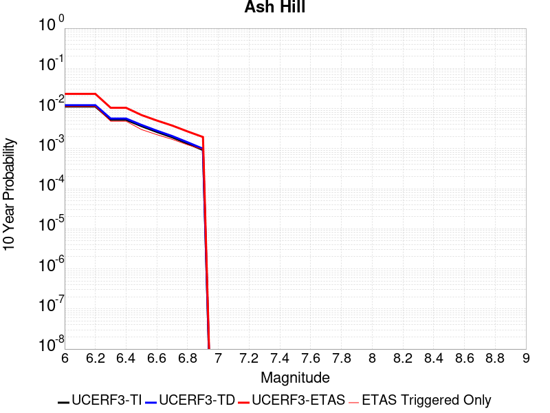 |

| Magnitude | 1 wk TI Prob | 1 wk TD Prob | 1 wk ETAS Prob | 1 wk ETAS/TD Gain | 1 wk ETAS Triggered Only | 1 mo TI Prob | 1 mo TD Prob | 1 mo ETAS Prob | 1 mo ETAS/TD Gain | 1 mo ETAS Triggered Only | 1 yr TI Prob | 1 yr TD Prob | 1 yr ETAS Prob | 1 yr ETAS/TD Gain | 1 yr ETAS Triggered Only | 10 yr TI Prob | 10 yr TD Prob | 10 yr ETAS Prob | 10 yr ETAS/TD Gain | 10 yr ETAS Triggered Only |
|-----|-----|-----|-----|-----|-----|-----|-----|-----|-----|-----|-----|-----|-----|-----|-----|-----|-----|-----|-----|-----|
| 6.0 | 2.1545662E-5 | 2.3194447E-5 | 0.00526184 | 226.85774 | 0.005238767 | 9.2335285E-5 | 9.940143E-5 | 0.0073523577 | 73.96632 | 0.007253677 | 0.0011236023 | 0.0012096206 | 0.010869491 | 8.985868 | 0.00967157 | 0.011179381 | 0.012038348 | 0.022986947 | 1.9094768 | 0.011082007 |
| 6.1 | 2.1545662E-5 | 2.3194447E-5 | 0.00526184 | 226.85774 | 0.005238767 | 9.2335285E-5 | 9.940143E-5 | 0.0073523577 | 73.96632 | 0.007253677 | 0.0011236023 | 0.0012096206 | 0.010869491 | 8.985868 | 0.00967157 | 0.011179381 | 0.012038348 | 0.022986947 | 1.9094768 | 0.011082007 |
| 6.2 | 2.1545662E-5 | 2.3194447E-5 | 0.00526184 | 226.85774 | 0.005238767 | 9.2335285E-5 | 9.940143E-5 | 0.0073523577 | 73.96632 | 0.007253677 | 0.0011236023 | 0.0012096206 | 0.010869491 | 8.985868 | 0.00967157 | 0.011179381 | 0.012038348 | 0.022986947 | 1.9094768 | 0.011082007 |
| 6.3 | 1.0025529E-5 | 1.0746934E-5 | 0.0016226579 | 150.98798 | 0.0016119282 | 4.2965847E-5 | 4.605755E-5 | 0.002262357 | 49.120216 | 0.0022164013 | 5.229836E-4 | 5.6061964E-4 | 0.003984047 | 7.106506 | 0.0034253476 | 0.005217545 | 0.0055933665 | 0.009400283 | 1.6806127 | 0.0038283297 |
| 6.4 | 1.0025529E-5 | 1.0746934E-5 | 0.0016226579 | 150.98798 | 0.0016119282 | 4.2965847E-5 | 4.605755E-5 | 0.002262357 | 49.120216 | 0.0022164013 | 5.229836E-4 | 5.6061964E-4 | 0.003984047 | 7.106506 | 0.0034253476 | 0.005217545 | 0.0055933665 | 0.009400283 | 1.6806127 | 0.0038283297 |
| 6.5 | 6.9617327E-6 | 7.456634E-6 | 0.0010149042 | 136.10756 | 0.0010074552 | 2.9835655E-5 | 3.195666E-5 | 0.0014423488 | 45.13453 | 0.0014104373 | 3.6318856E-4 | 3.8901155E-4 | 0.002403138 | 6.1775494 | 0.0020149103 | 0.0036259557 | 0.0038841602 | 0.006292661 | 1.6200827 | 0.0024178925 |
| 6.6 | 4.9919777E-6 | 5.3466883E-6 | 8.113065E-4 | 151.74 | 8.059641E-4 | 2.1394015E-5 | 2.2914215E-5 | 0.0010303463 | 44.965378 | 0.0010074552 | 2.60441E-4 | 2.7895154E-4 | 0.0016889954 | 6.054798 | 0.0014104373 | 0.0026013597 | 0.0027866727 | 0.004394109 | 1.57683 | 0.0016119282 |
| 6.7 | 3.6630722E-6 | 3.924624E-6 | 8.098856E-4 | 206.36006 | 8.059641E-4 | 1.5698786E-5 | 1.681974E-5 | 0.001024258 | 60.896183 | 0.0010074552 | 1.9111596E-4 | 2.0476682E-4 | 0.0016149152 | 7.8866057 | 0.0014104373 | 0.0019095168 | 0.0020463446 | 0.0036549743 | 1.7860992 | 0.0016119282 |
| 6.8 | 2.5599613E-6 | 2.744925E-6 | 4.0572588E-4 | 147.80946 | 4.0298206E-4 | 1.0971216E-5 | 1.1763939E-5 | 6.1622995E-4 | 52.382957 | 6.044731E-4 | 1.3356637E-4 | 1.4322149E-4 | 0.0011505324 | 8.033238 | 0.0010074552 | 0.0013348613 | 0.0014317769 | 0.0026389922 | 1.8431587 | 0.0012089462 |
| 6.9 | 1.7684905E-6 | 1.8968707E-6 | 1.8968707E-6 | 1.0 | 0.0 | 7.579223E-6 | 8.129446E-6 | 2.0961884E-4 | 25.785133 | 2.0149103E-4 | 9.2273134E-5 | 9.8976E-5 | 7.033893E-4 | 7.1066647 | 6.044731E-4 | 9.223483E-4 | 9.8976E-4 | 0.0017949265 | 1.8134966 | 8.059641E-4 |

## Garlock (West)
*[(top)](#table-of-contents)*

| 1 Week | 1 Month | 1 Year | 10 Year |
|-----|-----|-----|-----|
|  | 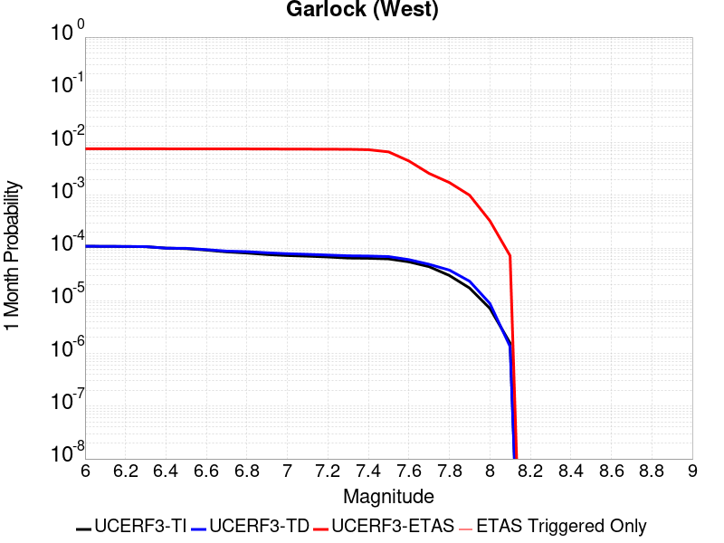 |  |  |

| Magnitude | 1 wk TI Prob | 1 wk TD Prob | 1 wk ETAS Prob | 1 wk ETAS/TD Gain | 1 wk ETAS Triggered Only | 1 mo TI Prob | 1 mo TD Prob | 1 mo ETAS Prob | 1 mo ETAS/TD Gain | 1 mo ETAS Triggered Only | 1 yr TI Prob | 1 yr TD Prob | 1 yr ETAS Prob | 1 yr ETAS/TD Gain | 1 yr ETAS Triggered Only | 10 yr TI Prob | 10 yr TD Prob | 10 yr ETAS Prob | 10 yr ETAS/TD Gain | 10 yr ETAS Triggered Only |
|-----|-----|-----|-----|-----|-----|-----|-----|-----|-----|-----|-----|-----|-----|-----|-----|-----|-----|-----|-----|-----|
| 6.0 | 2.5181727E-5 | 2.51973E-5 | 0.006674234 | 264.87894 | 0.006649204 | 1.0791722E-4 | 1.0798398E-4 | 0.0077638165 | 71.89786 | 0.0076566595 | 0.0013131002 | 0.0013139155 | 0.0101678725 | 7.7386045 | 0.008865605 | 0.013053683 | 0.013141977 | 0.022288756 | 1.6959972 | 0.009268587 |
| 6.1 | 2.5077732E-5 | 2.5098372E-5 | 0.0066741356 | 265.91907 | 0.006649204 | 1.0747157E-4 | 1.0756004E-4 | 0.0077633956 | 72.17732 | 0.0076566595 | 0.001307681 | 0.0013087603 | 0.010162762 | 7.765183 | 0.008865605 | 0.013000126 | 0.013091032 | 0.022238284 | 1.6987418 | 0.009268587 |
| 6.2 | 2.494612E-5 | 2.498005E-5 | 0.006674018 | 267.17392 | 0.006649204 | 1.0690756E-4 | 1.0705298E-4 | 0.0077628926 | 72.51449 | 0.0076566595 | 0.0013008224 | 0.0013025942 | 0.010156651 | 7.797249 | 0.008865605 | 0.012932341 | 0.013030097 | 0.022177914 | 1.7020528 | 0.009268587 |
| 6.3 | 2.4733758E-5 | 2.479942E-5 | 0.0066738385 | 269.1127 | 0.006649204 | 1.0599751E-4 | 1.06278916E-4 | 0.0077621243 | 73.035416 | 0.0076566595 | 0.0012897556 | 0.0012931811 | 0.010147322 | 7.846791 | 0.008865605 | 0.012822957 | 0.012937066 | 0.022085745 | 1.707168 | 0.009268587 |
| 6.4 | 2.3237335E-5 | 2.317873E-5 | 0.0066722287 | 287.86 | 0.006649204 | 9.958477E-5 | 9.933365E-5 | 0.0077552325 | 78.07256 | 0.0076566595 | 0.0012117702 | 0.001208719 | 0.010063608 | 8.325846 | 0.008865605 | 0.012051838 | 0.012101916 | 0.021258336 | 1.7566091 | 0.009268587 |
| 6.5 | 2.2732203E-5 | 2.2993298E-5 | 0.0066720448 | 290.17346 | 0.006649204 | 9.742009E-5 | 9.8539E-5 | 0.0077544437 | 78.69416 | 0.0076566595 | 0.0011854442 | 0.0011990548 | 0.0100540295 | 8.384963 | 0.008865605 | 0.011791403 | 0.012006322 | 0.021163628 | 1.762707 | 0.009268587 |
| 6.6 | 2.1319436E-5 | 2.17735E-5 | 0.006469346 | 297.12018 | 0.006447713 | 9.136581E-5 | 9.331167E-5 | 0.007547784 | 80.88789 | 0.0074551683 | 0.001111811 | 0.0011354799 | 0.0097897565 | 8.621691 | 0.008664114 | 0.011062649 | 0.011377227 | 0.020341164 | 1.7878844 | 0.009067097 |
| 6.7 | 1.970802E-5 | 2.0393396E-5 | 0.006467975 | 317.16028 | 0.006447713 | 8.446021E-5 | 8.739735E-5 | 0.007541914 | 86.29454 | 0.0074551683 | 0.001027818 | 0.001063545 | 0.009718445 | 9.137784 | 0.008664114 | 0.010230771 | 0.010664964 | 0.01963536 | 1.8411089 | 0.009067097 |
| 6.8 | 1.8744462E-5 | 1.9901045E-5 | 0.006467486 | 324.98224 | 0.006447713 | 8.033094E-5 | 8.5287415E-5 | 0.00753982 | 88.40484 | 0.0074551683 | 9.775903E-4 | 0.0010378812 | 0.009693003 | 9.339222 | 0.008664114 | 0.009733009 | 0.01041075 | 0.019383451 | 1.8618689 | 0.009067097 |
| 6.9 | 1.7559682E-5 | 1.8953415E-5 | 0.0064665442 | 341.18097 | 0.006447713 | 7.5253614E-5 | 8.12264E-5 | 0.007535789 | 92.77512 | 0.0074551683 | 9.158276E-4 | 9.884841E-4 | 0.009644034 | 9.756387 | 0.008664114 | 0.0091206245 | 0.009921231 | 0.018898372 | 1.9048413 | 0.009067097 |
| 7.0 | 1.6794445E-5 | 1.8216237E-5 | 0.0064658117 | 354.94772 | 0.006447713 | 7.197421E-5 | 7.8067256E-5 | 0.0075326534 | 96.48928 | 0.0074551683 | 8.759337E-4 | 9.5005584E-4 | 0.009605939 | 10.110921 | 0.008664114 | 0.008724891 | 0.009540141 | 0.018520735 | 1.9413483 | 0.009067097 |
| 7.1 | 1.6337795E-5 | 1.7717046E-5 | 0.006465316 | 364.92065 | 0.006447713 | 7.0017246E-5 | 7.5927994E-5 | 0.00753053 | 99.17989 | 0.0074551683 | 8.521265E-4 | 9.240326E-4 | 0.009580141 | 10.367752 | 0.008664114 | 0.008488664 | 0.009281996 | 0.018264933 | 1.9677806 | 0.009067097 |
| 7.2 | 1.5780008E-5 | 1.7165687E-5 | 0.006464768 | 376.60995 | 0.006447713 | 6.762685E-5 | 7.356516E-5 | 0.007528185 | 102.333565 | 0.0074551683 | 8.2304585E-4 | 8.9528906E-4 | 0.009551646 | 10.668785 | 0.008664114 | 0.008200042 | 0.008996838 | 0.01798236 | 1.9987421 | 0.009067097 |
| 7.3 | 1.5058865E-5 | 1.6618762E-5 | 0.006464225 | 388.9715 | 0.006447713 | 6.45364E-5 | 7.122133E-5 | 0.0075258585 | 105.66861 | 0.0074551683 | 7.854473E-4 | 8.667759E-4 | 0.009523381 | 10.987131 | 0.008664114 | 0.00782677 | 0.008713539 | 0.017701628 | 2.0315087 | 0.009067097 |
| 7.4 | 1.4887923E-5 | 1.6454731E-5 | 0.006464062 | 392.83908 | 0.006447713 | 6.380382E-5 | 7.051838E-5 | 0.007525161 | 106.71205 | 0.0074551683 | 7.7653467E-4 | 8.582243E-4 | 0.009514903 | 11.086733 | 0.008664114 | 0.0077382675 | 0.008628399 | 0.017617261 | 2.0417764 | 0.009067097 |
| 7.5 | 1.4509299E-5 | 1.6046748E-5 | 0.005859193 | 365.13272 | 0.00584324 | 6.218123E-5 | 6.876997E-5 | 0.006918994 | 100.61069 | 0.0068506952 | 7.567935E-4 | 8.36954E-4 | 0.008688527 | 10.381129 | 0.007858151 | 0.0075422134 | 0.008416704 | 0.016608305 | 1.9732552 | 0.008261132 |
| 7.6 | 1.2756717E-5 | 1.4050848E-5 | 0.0034393503 | 244.77884 | 0.0034253476 | 5.4670498E-5 | 6.0216535E-5 | 0.0040897946 | 67.91813 | 0.0040298207 | 6.6541E-4 | 7.328904E-4 | 0.005565131 | 7.593402 | 0.004835785 | 0.006634211 | 0.0073816874 | 0.012581783 | 1.704459 | 0.005238767 |
| 7.7 | 1.0328985E-5 | 1.1460557E-5 | 0.0018248591 | 159.22952 | 0.0018134193 | 4.4266326E-5 | 4.911575E-5 | 0.002063927 | 42.021694 | 0.0020149103 | 5.388092E-4 | 5.978206E-4 | 0.003215638 | 5.378935 | 0.0026193834 | 0.0053750467 | 0.006038511 | 0.009042626 | 1.4974927 | 0.0030223655 |
| 7.8 | 7.0306583E-6 | 8.899601E-6 | 0.001217835 | 136.84154 | 0.0012089462 | 3.0131043E-5 | 3.814059E-5 | 0.0014485241 | 37.978542 | 0.0014104373 | 3.667837E-4 | 4.642629E-4 | 0.0020754428 | 4.470404 | 0.0016119282 | 0.003661789 | 0.0046952725 | 0.006700722 | 1.427121 | 0.0020149103 |
| 7.9 | 4.060633E-6 | 5.4653938E-6 | 4.0844525E-4 | 74.732994 | 4.0298206E-4 | 1.7402595E-5 | 2.3422906E-5 | 6.2788185E-4 | 26.806316 | 6.044731E-4 | 2.11856E-4 | 2.851367E-4 | 0.001090871 | 3.8257828 | 8.059641E-4 | 0.0021165414 | 0.002884201 | 0.0040896605 | 1.4179527 | 0.0012089462 |
| 8.0 | 1.6729537E-6 | 2.0775144E-6 | 2.0775144E-6 | 1.0 | 0.0 | 7.169782E-6 | 8.903603E-6 | 8.903603E-6 | 1.0 | 0.0 | 8.7288594E-5 | 1.0839601E-4 | 3.098652E-4 | 2.8586404 | 2.0149103E-4 | 8.7254314E-4 | 0.0010969337 | 0.0012982038 | 1.1834842 | 2.0149103E-4 |
| 8.1 | 3.6733252E-7 | 3.1489964E-7 | 3.1489964E-7 | 1.0 | 0.0 | 1.5742813E-6 | 1.3495693E-6 | 1.3495693E-6 | 1.0 | 0.0 | 1.9166706E-5 | 1.6430899E-5 | 1.6430899E-5 | 1.0 | 0.0 | 1.9165053E-4 | 1.6638759E-4 | 1.6638759E-4 | 1.0 | 0.0 |

## McLean Lake
*[(top)](#table-of-contents)*

| 1 Week | 1 Month | 1 Year | 10 Year |
|-----|-----|-----|-----|
|  |  |  |  |

| Magnitude | 1 wk TI Prob | 1 wk TD Prob | 1 wk ETAS Prob | 1 wk ETAS/TD Gain | 1 wk ETAS Triggered Only | 1 mo TI Prob | 1 mo TD Prob | 1 mo ETAS Prob | 1 mo ETAS/TD Gain | 1 mo ETAS Triggered Only | 1 yr TI Prob | 1 yr TD Prob | 1 yr ETAS Prob | 1 yr ETAS/TD Gain | 1 yr ETAS Triggered Only | 10 yr TI Prob | 10 yr TD Prob | 10 yr ETAS Prob | 10 yr ETAS/TD Gain | 10 yr ETAS Triggered Only |
|-----|-----|-----|-----|-----|-----|-----|-----|-----|-----|-----|-----|-----|-----|-----|-----|-----|-----|-----|-----|-----|
| 6.0 | 1.7360222E-5 | 1.8501627E-5 | 0.004048248 | 218.80495 | 0.0040298207 | 7.439883E-5 | 7.9290556E-5 | 0.004914692 | 61.983322 | 0.004835785 | 9.0542925E-4 | 9.6498354E-4 | 0.007607771 | 7.8838353 | 0.006649204 | 0.009017491 | 0.0096127745 | 0.018193603 | 1.8926485 | 0.008664114 |
| 6.1 | 9.062689E-6 | 9.592193E-6 | 0.0018229941 | 190.04976 | 0.0018134193 | 3.8839516E-5 | 4.1108804E-5 | 0.002257419 | 54.913277 | 0.0022164013 | 4.727685E-4 | 5.003936E-4 | 0.0033198565 | 6.63449 | 0.0028208746 | 0.0047176396 | 0.004993552 | 0.008802764 | 1.7628263 | 0.0038283297 |
| 6.2 | 9.062689E-6 | 9.592193E-6 | 0.0018229941 | 190.04976 | 0.0018134193 | 3.8839516E-5 | 4.1108804E-5 | 0.002257419 | 54.913277 | 0.0022164013 | 4.727685E-4 | 5.003936E-4 | 0.0033198565 | 6.63449 | 0.0028208746 | 0.0047176396 | 0.004993552 | 0.008802764 | 1.7628263 | 0.0038283297 |
| 6.3 | 7.2575485E-6 | 7.66771E-6 | 0.0012166046 | 158.66599 | 0.0012089462 | 3.110341E-5 | 3.2861237E-5 | 0.0014432521 | 43.91959 | 0.0014104373 | 3.786182E-4 | 4.0001926E-4 | 0.0020113026 | 5.0280147 | 0.0016119282 | 0.0037797375 | 0.0039936965 | 0.0066026193 | 1.65326 | 0.0026193834 |
| 6.4 | 7.2575485E-6 | 7.66771E-6 | 0.0012166046 | 158.66599 | 0.0012089462 | 3.110341E-5 | 3.2861237E-5 | 0.0014432521 | 43.91959 | 0.0014104373 | 3.786182E-4 | 4.0001926E-4 | 0.0020113026 | 5.0280147 | 0.0016119282 | 0.0037797375 | 0.0039936965 | 0.0066026193 | 1.65326 | 0.0026193834 |
| 6.5 | 6.06582E-6 | 6.4038773E-6 | 0.0010138525 | 158.31856 | 0.0010074552 | 2.5996113E-5 | 2.7444936E-5 | 0.001236358 | 45.048676 | 0.0012089462 | 3.164567E-4 | 3.3409733E-4 | 0.0017440633 | 5.2202253 | 0.0014104373 | 0.0031600643 | 0.0033365893 | 0.005746414 | 1.722242 | 0.0024178925 |
| 6.6 | 5.598744E-6 | 5.910262E-6 | 8.118696E-4 | 137.36609 | 8.059641E-4 | 2.3994397E-5 | 2.5329486E-5 | 0.0010327591 | 40.773003 | 0.0010074552 | 2.9209262E-4 | 3.0834923E-4 | 0.0015169226 | 4.9194956 | 0.0012089462 | 0.0029170897 | 0.003079843 | 0.005289418 | 1.7174311 | 0.0022164013 |
| 6.7 | 5.246996E-6 | 5.539162E-6 | 8.1149884E-4 | 146.50209 | 8.059641E-4 | 2.2486933E-5 | 2.3739085E-5 | 0.0010311704 | 43.43766 | 0.0010074552 | 2.73744E-4 | 2.8899137E-4 | 0.0012961554 | 4.4851007 | 0.0010074552 | 0.0027340704 | 0.0028867796 | 0.004694964 | 1.6263673 | 0.0018134193 |
| 6.8 | 4.02324E-6 | 4.2469046E-6 | 8.102076E-4 | 190.77605 | 8.059641E-4 | 1.7242342E-5 | 1.8200926E-5 | 0.0010256377 | 56.350857 | 0.0010074552 | 2.099053E-4 | 2.2157968E-4 | 0.0012288117 | 5.545687 | 0.0010074552 | 0.0020970714 | 0.002214172 | 0.004023576 | 1.8171922 | 0.0018134193 |
| 6.9 | 6.835972E-7 | 7.1399285E-7 | 2.0220489E-4 | 283.20297 | 2.0149103E-4 | 2.9296991E-6 | 3.0599674E-6 | 2.0455038E-4 | 66.847244 | 2.0149103E-4 | 3.56685E-5 | 3.7254784E-5 | 2.3873831E-4 | 6.408259 | 2.0149103E-4 | 3.5662777E-4 | 3.7251666E-4 | 5.7393266E-4 | 1.5406898 | 2.0149103E-4 |

## Gravel Hills-Harper Lk
*[(top)](#table-of-contents)*

| 1 Week | 1 Month | 1 Year | 10 Year |
|-----|-----|-----|-----|
|  |  |  |  |

| Magnitude | 1 wk TI Prob | 1 wk TD Prob | 1 wk ETAS Prob | 1 wk ETAS/TD Gain | 1 wk ETAS Triggered Only | 1 mo TI Prob | 1 mo TD Prob | 1 mo ETAS Prob | 1 mo ETAS/TD Gain | 1 mo ETAS Triggered Only | 1 yr TI Prob | 1 yr TD Prob | 1 yr ETAS Prob | 1 yr ETAS/TD Gain | 1 yr ETAS Triggered Only | 10 yr TI Prob | 10 yr TD Prob | 10 yr ETAS Prob | 10 yr ETAS/TD Gain | 10 yr ETAS Triggered Only |
|-----|-----|-----|-----|-----|-----|-----|-----|-----|-----|-----|-----|-----|-----|-----|-----|-----|-----|-----|-----|-----|
| 6.0 | 3.0679566E-5 | 3.1464646E-5 | 0.0034567046 | 109.85995 | 0.0034253476 | 1.3147724E-4 | 1.3484273E-4 | 0.0047685117 | 35.363503 | 0.0046342937 | 0.0015995599 | 0.0016406906 | 0.0074743438 | 4.5556083 | 0.00584324 | 0.015880952 | 0.01630734 | 0.023244523 | 1.4254025 | 0.007052186 |
| 6.1 | 3.0679566E-5 | 3.1464646E-5 | 0.0034567046 | 109.85995 | 0.0034253476 | 1.3147724E-4 | 1.3484273E-4 | 0.0047685117 | 35.363503 | 0.0046342937 | 0.0015995599 | 0.0016406906 | 0.0074743438 | 4.5556083 | 0.00584324 | 0.015880952 | 0.01630734 | 0.023244523 | 1.4254025 | 0.007052186 |
| 6.2 | 1.514536E-5 | 1.3635206E-5 | 0.0014240532 | 104.43943 | 0.0014104373 | 6.490707E-5 | 5.843536E-5 | 0.0018717487 | 32.031097 | 0.0018134193 | 7.8995706E-4 | 7.1123015E-4 | 0.0031274029 | 4.3971744 | 0.0024178925 | 0.007871548 | 0.0070907404 | 0.009491488 | 1.338575 | 0.0024178925 |
| 6.3 | 1.514536E-5 | 1.3635206E-5 | 0.0014240532 | 104.43943 | 0.0014104373 | 6.490707E-5 | 5.843536E-5 | 0.0018717487 | 32.031097 | 0.0018134193 | 7.8995706E-4 | 7.1123015E-4 | 0.0031274029 | 4.3971744 | 0.0024178925 | 0.007871548 | 0.0070907404 | 0.009491488 | 1.338575 | 0.0024178925 |
| 6.4 | 1.2532521E-5 | 1.06896905E-5 | 0.0010181341 | 95.244484 | 0.0010074552 | 5.37097E-5 | 4.581219E-5 | 0.001254703 | 27.387974 | 0.0012089462 | 6.537194E-4 | 5.576265E-4 | 0.0023700346 | 4.250219 | 0.0018134193 | 0.0065179965 | 0.005562863 | 0.0073661944 | 1.3241733 | 0.0018134193 |
| 6.5 | 1.1094058E-5 | 9.083664E-6 | 8.150405E-4 | 89.72597 | 8.059641E-4 | 4.7545094E-5 | 3.892943E-5 | 0.0010463453 | 26.878006 | 0.0010074552 | 5.787078E-4 | 4.7386673E-4 | 0.0018836356 | 3.9750323 | 0.0014104373 | 0.0057720304 | 0.0047289706 | 0.0061327377 | 1.2968441 | 0.0014104373 |
| 6.6 | 9.688328E-6 | 7.5316952E-6 | 4.1051072E-4 | 54.50443 | 4.0298206E-4 | 4.1520743E-5 | 3.227831E-5 | 6.367319E-4 | 19.726309 | 6.044731E-4 | 5.053978E-4 | 3.9292008E-4 | 0.0013999795 | 3.563013 | 0.0010074552 | 0.0050424994 | 0.0039225104 | 0.0049260138 | 1.255832 | 0.0010074552 |
| 6.7 | 8.974824E-6 | 6.749413E-6 | 2.0823909E-4 | 30.852919 | 2.0149103E-4 | 3.8462964E-5 | 2.8925748E-5 | 2.3041095E-4 | 7.9656005 | 2.0149103E-4 | 4.6818596E-4 | 3.5211627E-4 | 7.5495645E-4 | 2.1440544 | 4.0298206E-4 | 0.004672008 | 0.0035158044 | 0.00391737 | 1.1142172 | 4.0298206E-4 |
| 6.8 | 7.4780046E-6 | 5.1161933E-6 | 2.066062E-4 | 40.382797 | 2.0149103E-4 | 3.20482E-5 | 2.1926366E-5 | 2.2341298E-4 | 10.189239 | 2.0149103E-4 | 3.9011694E-4 | 2.669222E-4 | 4.6835945E-4 | 1.7546666 | 2.0149103E-4 | 0.0038943281 | 0.0026661542 | 0.002867108 | 1.0753722 | 2.0149103E-4 |
| 6.9 | 6.3409307E-6 | 3.9074966E-6 | 2.0539774E-4 | 52.565044 | 2.0149103E-4 | 2.7175134E-5 | 1.6746313E-5 | 2.1823397E-4 | 13.031762 | 2.0149103E-4 | 3.3080703E-4 | 2.0386827E-4 | 4.0531822E-4 | 1.9881378 | 2.0149103E-4 | 0.0033031502 | 0.0020369107 | 0.0022379912 | 1.0987184 | 2.0149103E-4 |
| 7.0 | 5.1239335E-6 | 2.6058565E-6 | 2.6058565E-6 | 1.0 | 0.0 | 2.195953E-5 | 1.116791E-5 | 1.116791E-5 | 1.0 | 0.0 | 2.6732447E-4 | 1.3596108E-4 | 1.3596108E-4 | 1.0 | 0.0 | 0.0026700313 | 0.0013588042 | 0.0013588042 | 1.0 | 0.0 |
| 7.1 | 4.438899E-6 | 2.0984728E-6 | 2.0984728E-6 | 1.0 | 0.0 | 1.9023713E-5 | 8.993425E-6 | 8.993425E-6 | 1.0 | 0.0 | 2.315891E-4 | 1.0948967E-4 | 1.0948967E-4 | 1.0 | 0.0 | 0.002313479 | 0.0010943791 | 0.0010943791 | 1.0 | 0.0 |
| 7.2 | 3.50367E-6 | 1.2615716E-6 | 1.2615716E-6 | 1.0 | 0.0 | 1.5015643E-5 | 5.4067245E-6 | 5.4067245E-6 | 1.0 | 0.0 | 1.8280011E-4 | 6.582497E-5 | 6.582497E-5 | 1.0 | 0.0 | 0.0018264982 | 6.580629E-4 | 6.580629E-4 | 1.0 | 0.0 |
| 7.3 | 2.561638E-6 | 7.1191585E-7 | 7.1191585E-7 | 1.0 | 0.0 | 1.0978401E-5 | 3.0510646E-6 | 3.0510646E-6 | 1.0 | 0.0 | 1.3365384E-4 | 3.71461E-5 | 3.71461E-5 | 1.0 | 0.0 | 0.0013357349 | 3.7140088E-4 | 3.7140088E-4 | 1.0 | 0.0 |
| 7.4 | 2.0368864E-6 | 5.304837E-7 | 5.304837E-7 | 1.0 | 0.0 | 8.729483E-6 | 2.2734996E-6 | 2.2734996E-6 | 1.0 | 0.0 | 1.06276275E-4 | 2.7679513E-5 | 2.7679513E-5 | 1.0 | 0.0 | 0.0010622547 | 2.767612E-4 | 2.767612E-4 | 1.0 | 0.0 |
| 7.5 | 1.1681728E-6 | 3.6030585E-7 | 3.6030585E-7 | 1.0 | 0.0 | 5.0064455E-6 | 1.544167E-6 | 1.544167E-6 | 1.0 | 0.0 | 6.0951766E-5 | 1.8800076E-5 | 1.8800076E-5 | 1.0 | 0.0 | 6.093505E-4 | 1.8798532E-4 | 1.8798532E-4 | 1.0 | 0.0 |
| 7.6 | 1.3154387E-7 | 7.1197384E-8 | 7.1197384E-8 | 1.0 | 0.0 | 5.6375933E-7 | 3.051316E-7 | 3.051316E-7 | 1.0 | 0.0 | 6.863748E-6 | 3.7149728E-6 | 3.7149728E-6 | 1.0 | 0.0 | 6.863536E-5 | 3.7149264E-5 | 3.7149264E-5 | 1.0 | 0.0 |

## So Sierra Nevada
*[(top)](#table-of-contents)*

| 1 Week | 1 Month | 1 Year | 10 Year |
|-----|-----|-----|-----|
|  |  |  |  |

| Magnitude | 1 wk TI Prob | 1 wk TD Prob | 1 wk ETAS Prob | 1 wk ETAS/TD Gain | 1 wk ETAS Triggered Only | 1 mo TI Prob | 1 mo TD Prob | 1 mo ETAS Prob | 1 mo ETAS/TD Gain | 1 mo ETAS Triggered Only | 1 yr TI Prob | 1 yr TD Prob | 1 yr ETAS Prob | 1 yr ETAS/TD Gain | 1 yr ETAS Triggered Only | 10 yr TI Prob | 10 yr TD Prob | 10 yr ETAS Prob | 10 yr ETAS/TD Gain | 10 yr ETAS Triggered Only |
|-----|-----|-----|-----|-----|-----|-----|-----|-----|-----|-----|-----|-----|-----|-----|-----|-----|-----|-----|-----|-----|
| 6.0 | 1.15488665E-5 | 1.1079643E-5 | 0.0034363891 | 310.15344 | 0.0034253476 | 4.9494203E-5 | 4.748339E-5 | 0.004077113 | 85.863976 | 0.0040298207 | 6.024253E-4 | 5.7796965E-4 | 0.0060150833 | 10.407265 | 0.005440258 | 0.006007948 | 0.005765934 | 0.01217647 | 2.111795 | 0.006447713 |
| 6.1 | 1.15488665E-5 | 1.1079643E-5 | 0.0034363891 | 310.15344 | 0.0034253476 | 4.9494203E-5 | 4.748339E-5 | 0.004077113 | 85.863976 | 0.0040298207 | 6.024253E-4 | 5.7796965E-4 | 0.0060150833 | 10.407265 | 0.005440258 | 0.006007948 | 0.005765934 | 0.01217647 | 2.111795 | 0.006447713 |
| 6.2 | 1.15488665E-5 | 1.1079643E-5 | 0.0034363891 | 310.15344 | 0.0034253476 | 4.9494203E-5 | 4.748339E-5 | 0.004077113 | 85.863976 | 0.0040298207 | 6.024253E-4 | 5.7796965E-4 | 0.0060150833 | 10.407265 | 0.005440258 | 0.006007948 | 0.005765934 | 0.01217647 | 2.111795 | 0.006447713 |
| 6.3 | 1.15488665E-5 | 1.1079643E-5 | 0.0034363891 | 310.15344 | 0.0034253476 | 4.9494203E-5 | 4.748339E-5 | 0.004077113 | 85.863976 | 0.0040298207 | 6.024253E-4 | 5.7796965E-4 | 0.0060150833 | 10.407265 | 0.005440258 | 0.006007948 | 0.005765934 | 0.01217647 | 2.111795 | 0.006447713 |
| 6.4 | 1.15488665E-5 | 1.1079643E-5 | 0.0034363891 | 310.15344 | 0.0034253476 | 4.9494203E-5 | 4.748339E-5 | 0.004077113 | 85.863976 | 0.0040298207 | 6.024253E-4 | 5.7796965E-4 | 0.0060150833 | 10.407265 | 0.005440258 | 0.006007948 | 0.005765934 | 0.01217647 | 2.111795 | 0.006447713 |
| 6.5 | 1.15488665E-5 | 1.1079643E-5 | 0.0034363891 | 310.15344 | 0.0034253476 | 4.9494203E-5 | 4.748339E-5 | 0.004077113 | 85.863976 | 0.0040298207 | 6.024253E-4 | 5.7796965E-4 | 0.0060150833 | 10.407265 | 0.005440258 | 0.006007948 | 0.005765934 | 0.01217647 | 2.111795 | 0.006447713 |
| 6.6 | 7.587044E-6 | 6.935635E-6 | 8.128942E-4 | 117.205444 | 8.059641E-4 | 3.2515498E-5 | 2.9723828E-5 | 0.0012386341 | 41.671417 | 0.0012089462 | 3.9580427E-4 | 3.6183043E-4 | 0.0021745935 | 6.0099797 | 0.0018134193 | 0.003951 | 0.0036127048 | 0.0056203357 | 1.5557141 | 0.0020149103 |
| 6.7 | 7.587044E-6 | 6.935635E-6 | 8.128942E-4 | 117.205444 | 8.059641E-4 | 3.2515498E-5 | 2.9723828E-5 | 0.0012386341 | 41.671417 | 0.0012089462 | 3.9580427E-4 | 3.6183043E-4 | 0.0021745935 | 6.0099797 | 0.0018134193 | 0.003951 | 0.0036127048 | 0.0056203357 | 1.5557141 | 0.0020149103 |
| 6.8 | 5.9026956E-6 | 5.1793927E-6 | 8.1113935E-4 | 156.60896 | 8.059641E-4 | 2.5297022E-5 | 2.2197215E-5 | 0.0010296301 | 46.38555 | 0.0010074552 | 3.0794772E-4 | 2.7021873E-4 | 0.0016802748 | 6.2182026 | 0.0014104373 | 0.0030752132 | 0.002699018 | 0.004306596 | 1.5956157 | 0.0016119282 |
| 6.9 | 5.0118915E-6 | 4.2524252E-6 | 8.1021315E-4 | 190.52965 | 8.059641E-4 | 2.1479358E-5 | 1.8224557E-5 | 0.0010256614 | 56.279083 | 0.0010074552 | 2.614798E-4 | 2.2186211E-4 | 0.0016319865 | 7.355859 | 0.0014104373 | 0.0026117235 | 0.0022164788 | 0.0036237899 | 1.634931 | 0.0014104373 |
| 7.0 | 4.4924795E-6 | 3.7139177E-6 | 8.096751E-4 | 218.01105 | 8.059641E-4 | 1.925334E-5 | 1.5916696E-5 | 0.0010233559 | 64.29449 | 0.0010074552 | 2.3438422E-4 | 1.9376918E-4 | 0.0014024811 | 7.237896 | 0.0012089462 | 0.0023413717 | 0.0019360651 | 0.0031426707 | 1.6232257 | 0.0012089462 |
| 7.1 | 3.9118436E-6 | 3.1119775E-6 | 2.0460239E-4 | 65.74674 | 2.0149103E-4 | 1.6764936E-5 | 1.3336982E-5 | 4.1631368E-4 | 31.214983 | 4.0298206E-4 | 2.0409399E-4 | 1.6236622E-4 | 7.6674117E-4 | 4.722295 | 6.044731E-4 | 0.0020390663 | 0.001622532 | 0.0022260244 | 1.3719448 | 6.044731E-4 |
| 7.2 | 3.4200818E-6 | 2.6054543E-6 | 2.0409597E-4 | 78.334114 | 2.0149103E-4 | 1.4657411E-5 | 1.11661875E-5 | 4.1414375E-4 | 37.089092 | 4.0298206E-4 | 1.7843937E-4 | 1.3594035E-4 | 7.403313E-4 | 5.4460006 | 6.044731E-4 | 0.0017829615 | 0.0013586218 | 0.0019622736 | 1.444312 | 6.044731E-4 |
| 7.3 | 2.6593618E-6 | 1.8284203E-6 | 2.0331908E-4 | 111.19932 | 2.0149103E-4 | 1.13972155E-5 | 7.836065E-6 | 2.0932552E-4 | 26.71309 | 2.0149103E-4 | 1.3875226E-4 | 9.540021E-5 | 2.9687202E-4 | 3.1118593 | 2.0149103E-4 | 0.0013866565 | 9.5362146E-4 | 0.0011549203 | 1.2110889 | 2.0149103E-4 |
| 7.4 | 2.2577992E-6 | 1.436438E-6 | 2.0292719E-4 | 141.2711 | 2.0149103E-4 | 9.676246E-6 | 6.15615E-6 | 2.0764595E-4 | 33.72984 | 2.0149103E-4 | 1.1780193E-4 | 7.49488E-5 | 2.7642475E-4 | 3.688181 | 2.0149103E-4 | 0.001177395 | 7.492603E-4 | 9.5060037E-4 | 1.2687185 | 2.0149103E-4 |
| 7.5 | 1.489319E-6 | 7.353936E-7 | 2.0222628E-4 | 274.99054 | 2.0149103E-4 | 6.3827797E-6 | 3.1516831E-6 | 2.0464209E-4 | 64.931046 | 2.0149103E-4 | 7.770758E-5 | 3.8371072E-5 | 2.3985437E-4 | 6.250917 | 2.0149103E-4 | 7.7680405E-4 | 3.836449E-4 | 5.8505865E-4 | 1.5250005 | 2.0149103E-4 |
| 7.6 | 1.0680322E-6 | 4.6596554E-7 | 2.0195691E-4 | 433.41595 | 2.0149103E-4 | 4.577273E-6 | 1.9969937E-6 | 2.0348762E-4 | 101.89698 | 2.0149103E-4 | 5.5726876E-5 | 2.4313129E-5 | 2.2579926E-4 | 9.287133 | 2.0149103E-4 | 5.5712904E-4 | 2.4310495E-4 | 4.44547E-4 | 1.8286217 | 2.0149103E-4 |
| 7.7 | 5.509146E-7 | 1.5580486E-7 | 1.5580486E-7 | 1.0 | 0.0 | 2.3610605E-6 | 6.677349E-7 | 6.677349E-7 | 1.0 | 0.0 | 2.8745531E-5 | 8.129644E-6 | 8.129644E-6 | 1.0 | 0.0 | 2.8741814E-4 | 8.1293576E-5 | 8.1293576E-5 | 1.0 | 0.0 |

## Death Valley (So)
*[(top)](#table-of-contents)*

| 1 Week | 1 Month | 1 Year | 10 Year |
|-----|-----|-----|-----|
|  |  |  |  |

| Magnitude | 1 wk TI Prob | 1 wk TD Prob | 1 wk ETAS Prob | 1 wk ETAS/TD Gain | 1 wk ETAS Triggered Only | 1 mo TI Prob | 1 mo TD Prob | 1 mo ETAS Prob | 1 mo ETAS/TD Gain | 1 mo ETAS Triggered Only | 1 yr TI Prob | 1 yr TD Prob | 1 yr ETAS Prob | 1 yr ETAS/TD Gain | 1 yr ETAS Triggered Only | 10 yr TI Prob | 10 yr TD Prob | 10 yr ETAS Prob | 10 yr ETAS/TD Gain | 10 yr ETAS Triggered Only |
|-----|-----|-----|-----|-----|-----|-----|-----|-----|-----|-----|-----|-----|-----|-----|-----|-----|-----|-----|-----|-----|
| 6.0 | 2.0684236E-5 | 2.5617775E-5 | 0.0032493917 | 126.841286 | 0.0032238564 | 8.864371E-5 | 1.0978594E-4 | 0.004542102 | 41.372345 | 0.0044328026 | 0.0010787029 | 0.0013358411 | 0.00656761 | 4.91646 | 0.005238767 | 0.010734817 | 0.013281397 | 0.019047031 | 1.4341135 | 0.00584324 |
| 6.1 | 2.0684236E-5 | 2.5617775E-5 | 0.0032493917 | 126.841286 | 0.0032238564 | 8.864371E-5 | 1.0978594E-4 | 0.004542102 | 41.372345 | 0.0044328026 | 0.0010787029 | 0.0013358411 | 0.00656761 | 4.91646 | 0.005238767 | 0.010734817 | 0.013281397 | 0.019047031 | 1.4341135 | 0.00584324 |
| 6.2 | 2.0684236E-5 | 2.5617775E-5 | 0.0032493917 | 126.841286 | 0.0032238564 | 8.864371E-5 | 1.0978594E-4 | 0.004542102 | 41.372345 | 0.0044328026 | 0.0010787029 | 0.0013358411 | 0.00656761 | 4.91646 | 0.005238767 | 0.010734817 | 0.013281397 | 0.019047031 | 1.4341135 | 0.00584324 |
| 6.3 | 2.0240292E-5 | 2.511786E-5 | 0.0028459216 | 113.302704 | 0.0028208746 | 8.6741224E-5 | 1.07643624E-4 | 0.0041370303 | 38.432655 | 0.0040298207 | 0.0010555626 | 0.00130979 | 0.006139241 | 4.687195 | 0.004835785 | 0.010505628 | 0.013023956 | 0.01839336 | 1.4122714 | 0.005440258 |
| 6.4 | 2.0240292E-5 | 2.511786E-5 | 0.0028459216 | 113.302704 | 0.0028208746 | 8.6741224E-5 | 1.07643624E-4 | 0.0041370303 | 38.432655 | 0.0040298207 | 0.0010555626 | 0.00130979 | 0.006139241 | 4.687195 | 0.004835785 | 0.010505628 | 0.013023956 | 0.01839336 | 1.4122714 | 0.005440258 |
| 6.5 | 1.9962767E-5 | 2.4807114E-5 | 0.0024426396 | 98.46529 | 0.0024178925 | 8.55519E-5 | 1.0631196E-4 | 0.003732765 | 35.11143 | 0.0036268386 | 0.0010410968 | 0.0012935963 | 0.0057206647 | 4.422295 | 0.0044328026 | 0.010362327 | 0.012863902 | 0.017836379 | 1.386545 | 0.0050372756 |
| 6.6 | 1.8937297E-5 | 2.3310964E-5 | 0.002441147 | 104.72098 | 0.0024178925 | 8.115732E-5 | 9.990039E-5 | 0.0037263767 | 37.300922 | 0.0036268386 | 9.876423E-4 | 0.0012156231 | 0.005643037 | 4.642094 | 0.0044328026 | 0.009832645 | 0.012092789 | 0.016870094 | 1.3950542 | 0.004835785 |
| 6.7 | 1.8621096E-5 | 2.2911607E-5 | 0.0024407485 | 106.528915 | 0.0024178925 | 7.980225E-5 | 9.818898E-5 | 0.0037246714 | 37.9337 | 0.0036268386 | 9.711593E-4 | 0.0011948098 | 0.005622316 | 4.705616 | 0.0044328026 | 0.009669261 | 0.011886904 | 0.016466111 | 1.3852313 | 0.0046342937 |
| 6.8 | 1.7830353E-5 | 2.1805688E-5 | 0.0022381588 | 102.64105 | 0.0022164013 | 7.641356E-5 | 9.344968E-5 | 0.003518477 | 37.651035 | 0.0034253476 | 9.29938E-4 | 0.00113717 | 0.005162408 | 4.5396976 | 0.0040298207 | 0.009260561 | 0.011316354 | 0.015499783 | 1.3696799 | 0.004231312 |
| 6.9 | 1.3135183E-5 | 1.5303925E-5 | 0.0014257196 | 93.160385 | 0.0014104373 | 5.6292425E-5 | 6.558664E-5 | 0.0022818428 | 34.791275 | 0.0022164013 | 6.8514474E-4 | 7.982312E-4 | 0.0034155238 | 4.2788653 | 0.0026193834 | 0.006830362 | 0.007954649 | 0.010753084 | 1.3517988 | 0.0028208746 |
| 7.0 | 1.1507512E-5 | 1.3154199E-5 | 0.0012220845 | 92.90451 | 0.0012089462 | 4.9316975E-5 | 5.6373956E-5 | 0.0014667317 | 26.017895 | 0.0014104373 | 6.002687E-4 | 6.8614254E-4 | 0.0024983175 | 3.641106 | 0.0018134193 | 0.0059864987 | 0.0068409415 | 0.008842068 | 1.2925221 | 0.0020149103 |
| 7.1 | 9.715903E-6 | 1.0865278E-5 | 8.1682066E-4 | 75.177155 | 8.059641E-4 | 4.1638916E-5 | 4.656467E-5 | 0.001053973 | 22.634605 | 0.0010074552 | 5.068359E-4 | 5.667817E-4 | 0.0019764195 | 3.4870915 | 0.0014104373 | 0.0050568148 | 0.0056538144 | 0.0072566294 | 1.2834926 | 0.0016119282 |
| 7.2 | 9.233269E-6 | 1.02863105E-5 | 6.1475317E-4 | 59.76421 | 6.044731E-4 | 3.9570554E-5 | 4.4083466E-5 | 8.5001206E-4 | 19.28188 | 8.059641E-4 | 4.81665E-4 | 5.3658825E-4 | 0.0017448857 | 3.251815 | 0.0012089462 | 0.0048062233 | 0.0053533576 | 0.006756244 | 1.2620573 | 0.0014104373 |
| 7.3 | 8.8041315E-6 | 9.808164E-6 | 4.127863E-4 | 42.08599 | 4.0298206E-4 | 3.7731446E-5 | 4.2034335E-5 | 6.4648205E-4 | 15.379856 | 6.044731E-4 | 4.592835E-4 | 5.1165203E-4 | 0.0015185918 | 2.9680166 | 0.0010074552 | 0.0045833546 | 0.005105167 | 0.0063079414 | 1.2355994 | 0.0012089462 |
| 7.4 | 8.708749E-6 | 9.707175E-6 | 4.1268533E-4 | 42.51343 | 4.0298206E-4 | 3.7322676E-5 | 4.160154E-5 | 6.460495E-4 | 15.529462 | 6.044731E-4 | 4.5430884E-4 | 5.0638523E-4 | 0.0015133303 | 2.988496 | 0.0010074552 | 0.004533812 | 0.0050527398 | 0.0062555773 | 1.2380565 | 0.0012089462 |
| 7.5 | 8.612678E-6 | 9.604817E-6 | 4.12583E-4 | 42.95584 | 4.0298206E-4 | 3.6910955E-5 | 4.1162875E-5 | 6.456111E-4 | 15.684304 | 6.044731E-4 | 4.492982E-4 | 5.01047E-4 | 0.0013066073 | 2.607754 | 8.059641E-4 | 0.004483909 | 0.0049995985 | 0.006002017 | 1.2004998 | 0.0010074552 |
| 7.6 | 8.319024E-6 | 9.283916E-6 | 2.1077308E-4 | 22.703035 | 2.0149103E-4 | 3.5652476E-5 | 3.978763E-5 | 4.4275366E-4 | 11.127923 | 4.0298206E-4 | 4.3398244E-4 | 4.8431093E-4 | 8.8709785E-4 | 1.83167 | 4.0298206E-4 | 0.0043313587 | 0.0048329784 | 0.00543453 | 1.1244681 | 6.044731E-4 |
| 7.7 | 7.4718328E-6 | 8.34517E-6 | 2.0983453E-4 | 25.144428 | 2.0149103E-4 | 3.2021748E-5 | 3.5764548E-5 | 4.387322E-4 | 12.267238 | 4.0298206E-4 | 3.8979502E-4 | 4.353504E-4 | 8.38157E-4 | 1.925247 | 4.0298206E-4 | 0.00389112 | 0.0043453807 | 0.004947227 | 1.1385026 | 6.044731E-4 |
| 7.8 | 3.4586725E-7 | 3.6482615E-7 | 3.6482615E-7 | 1.0 | 0.0 | 1.4822873E-6 | 1.5635396E-6 | 1.5635396E-6 | 1.0 | 0.0 | 1.80467E-5 | 1.9035933E-5 | 1.9035933E-5 | 1.0 | 0.0 | 1.8045233E-4 | 1.9034347E-4 | 1.9034347E-4 | 1.0 | 0.0 |
| 7.9 | 2.5591178E-9 | 2.6696718E-9 | 2.6696718E-9 | 1.0 | 0.0 | 1.0967647E-8 | 1.14414505E-8 | 1.14414505E-8 | 1.0 | 0.0 | 1.335311E-7 | 1.3929966E-7 | 1.3929966E-7 | 1.0 | 0.0 | 1.3353102E-6 | 1.3929966E-6 | 1.3929966E-6 | 1.0 | 0.0 |

## Goldstone Lake
*[(top)](#table-of-contents)*

| 1 Week | 1 Month | 1 Year | 10 Year |
|-----|-----|-----|-----|
|  |  |  |  |

| Magnitude | 1 wk TI Prob | 1 wk TD Prob | 1 wk ETAS Prob | 1 wk ETAS/TD Gain | 1 wk ETAS Triggered Only | 1 mo TI Prob | 1 mo TD Prob | 1 mo ETAS Prob | 1 mo ETAS/TD Gain | 1 mo ETAS Triggered Only | 1 yr TI Prob | 1 yr TD Prob | 1 yr ETAS Prob | 1 yr ETAS/TD Gain | 1 yr ETAS Triggered Only | 10 yr TI Prob | 10 yr TD Prob | 10 yr ETAS Prob | 10 yr ETAS/TD Gain | 10 yr ETAS Triggered Only |
|-----|-----|-----|-----|-----|-----|-----|-----|-----|-----|-----|-----|-----|-----|-----|-----|-----|-----|-----|-----|-----|
| 6.0 | 2.671352E-5 | 3.037609E-5 | 0.0020452251 | 67.3301 | 0.0020149103 | 1.1448149E-4 | 1.3017785E-4 | 0.0027492202 | 21.118956 | 0.0026193834 | 0.001392921 | 0.0015839594 | 0.005607397 | 3.540114 | 0.0040298207 | 0.013842222 | 0.015746197 | 0.020704154 | 1.314867 | 0.0050372756 |
| 6.1 | 2.671352E-5 | 3.037609E-5 | 0.0020452251 | 67.3301 | 0.0020149103 | 1.1448149E-4 | 1.3017785E-4 | 0.0027492202 | 21.118956 | 0.0026193834 | 0.001392921 | 0.0015839594 | 0.005607397 | 3.540114 | 0.0040298207 | 0.013842222 | 0.015746197 | 0.020704154 | 1.314867 | 0.0050372756 |
| 6.2 | 1.4197047E-5 | 1.6096245E-5 | 2.1758403E-4 | 13.51769 | 2.0149103E-4 | 6.0843064E-5 | 6.8982634E-5 | 4.7193692E-4 | 6.841387 | 4.0298206E-4 | 7.4051257E-4 | 8.3963864E-4 | 0.0024502135 | 2.9181762 | 0.0016119282 | 0.007380498 | 0.0083743585 | 0.0105722 | 1.2624488 | 0.0022164013 |
| 6.3 | 1.4197047E-5 | 1.6096245E-5 | 2.1758403E-4 | 13.51769 | 2.0149103E-4 | 6.0843064E-5 | 6.8982634E-5 | 4.7193692E-4 | 6.841387 | 4.0298206E-4 | 7.4051257E-4 | 8.3963864E-4 | 0.0024502135 | 2.9181762 | 0.0016119282 | 0.007380498 | 0.0083743585 | 0.0105722 | 1.2624488 | 0.0022164013 |
| 6.4 | 1.3238931E-5 | 1.500846E-5 | 2.1649647E-4 | 14.424963 | 2.0149103E-4 | 5.6737044E-5 | 6.4320935E-5 | 4.6727707E-4 | 7.2647743 | 4.0298206E-4 | 6.9055456E-4 | 7.82924E-4 | 0.0023935903 | 3.0572445 | 0.0016119282 | 0.006884126 | 0.0078112837 | 0.010010372 | 1.2815272 | 0.0022164013 |
| 6.5 | 1.3238931E-5 | 1.500846E-5 | 2.1649647E-4 | 14.424963 | 2.0149103E-4 | 5.6737044E-5 | 6.4320935E-5 | 4.6727707E-4 | 7.2647743 | 4.0298206E-4 | 6.9055456E-4 | 7.82924E-4 | 0.0023935903 | 3.0572445 | 0.0016119282 | 0.006884126 | 0.0078112837 | 0.010010372 | 1.2815272 | 0.0022164013 |
| 6.6 | 1.1328278E-5 | 1.2855166E-5 | 2.1434361E-4 | 16.673735 | 2.0149103E-4 | 4.8548856E-5 | 5.5092944E-5 | 4.5805282E-4 | 8.314183 | 4.0298206E-4 | 5.90922E-4 | 6.7064585E-4 | 0.0020801371 | 3.1016924 | 0.0014104373 | 0.0058935313 | 0.0066956086 | 0.008496886 | 1.2690237 | 0.0018134193 |
| 6.7 | 8.651175E-6 | 9.824565E-6 | 9.824565E-6 | 1.0 | 0.0 | 3.707594E-5 | 4.2105108E-5 | 4.2105108E-5 | 1.0 | 0.0 | 4.5130608E-4 | 5.1259965E-4 | 0.0013181507 | 2.5715013 | 8.059641E-4 | 0.0045039062 | 0.005123051 | 0.0063258037 | 1.2347727 | 0.0012089462 |
| 6.8 | 1.0215377E-6 | 1.1754702E-6 | 1.1754702E-6 | 1.0 | 0.0 | 4.378012E-6 | 5.0377203E-6 | 5.0377203E-6 | 1.0 | 0.0 | 5.3300988E-5 | 6.1332634E-5 | 2.628113E-4 | 4.285016 | 2.0149103E-4 | 5.3288206E-4 | 6.1316835E-4 | 0.0010159033 | 1.6568098 | 4.0298206E-4 |
| 6.9 | 7.9360774E-7 | 9.2833966E-7 | 9.2833966E-7 | 1.0 | 0.0 | 3.4011714E-6 | 3.9785928E-6 | 3.9785928E-6 | 1.0 | 0.0 | 4.1408475E-5 | 4.843836E-5 | 2.4991963E-4 | 5.159539 | 2.0149103E-4 | 4.140076E-4 | 4.8428503E-4 | 6.856785E-4 | 1.4158573 | 2.0149103E-4 |
| 7.0 | 7.4382757E-7 | 8.7473285E-7 | 8.7473285E-7 | 1.0 | 0.0 | 3.1878285E-6 | 3.74885E-6 | 3.74885E-6 | 1.0 | 0.0 | 3.8811122E-5 | 4.564136E-5 | 4.564136E-5 | 1.0 | 0.0 | 3.8804344E-4 | 4.5632652E-4 | 4.5632652E-4 | 1.0 | 0.0 |
| 7.1 | 6.4709513E-7 | 7.7113E-7 | 7.7113E-7 | 1.0 | 0.0 | 2.773262E-6 | 3.3048389E-6 | 3.3048389E-6 | 1.0 | 0.0 | 3.376394E-5 | 4.0235733E-5 | 4.0235733E-5 | 1.0 | 0.0 | 3.375881E-4 | 4.0229043E-4 | 4.0229043E-4 | 1.0 | 0.0 |
| 7.2 | 6.356704E-7 | 7.5883594E-7 | 7.5883594E-7 | 1.0 | 0.0 | 2.7242988E-6 | 3.2521505E-6 | 3.2521505E-6 | 1.0 | 0.0 | 3.3167835E-5 | 3.959427E-5 | 3.959427E-5 | 1.0 | 0.0 | 3.3162883E-4 | 3.958781E-4 | 3.958781E-4 | 1.0 | 0.0 |
| 7.3 | 5.7695723E-7 | 6.8965653E-7 | 6.8965653E-7 | 1.0 | 0.0 | 2.4726714E-6 | 2.9556677E-6 | 2.9556677E-6 | 1.0 | 0.0 | 3.0104358E-5 | 3.5984718E-5 | 3.5984718E-5 | 1.0 | 0.0 | 3.0100282E-4 | 3.5979465E-4 | 3.5979465E-4 | 1.0 | 0.0 |
| 7.4 | 5.209647E-7 | 6.193514E-7 | 6.193514E-7 | 1.0 | 0.0 | 2.232704E-6 | 2.6543607E-6 | 2.6543607E-6 | 1.0 | 0.0 | 2.718283E-5 | 3.2316417E-5 | 3.2316417E-5 | 1.0 | 0.0 | 2.7179506E-4 | 3.2312275E-4 | 3.2312275E-4 | 1.0 | 0.0 |
| 7.5 | 4.512955E-7 | 5.348885E-7 | 5.348885E-7 | 1.0 | 0.0 | 1.934122E-6 | 2.2923775E-6 | 2.2923775E-6 | 1.0 | 0.0 | 2.3547682E-5 | 2.7909393E-5 | 2.7909393E-5 | 1.0 | 0.0 | 2.3545188E-4 | 2.7906417E-4 | 2.7906417E-4 | 1.0 | 0.0 |
| 7.6 | 2.21172E-7 | 2.603961E-7 | 2.603961E-7 | 1.0 | 0.0 | 9.478797E-7 | 1.1159829E-6 | 1.1159829E-6 | 1.0 | 0.0 | 1.1540374E-5 | 1.3587036E-5 | 1.3587036E-5 | 1.0 | 0.0 | 1.1539775E-4 | 1.3586486E-4 | 1.3586486E-4 | 1.0 | 0.0 |

## Coyote Canyon
*[(top)](#table-of-contents)*

| 1 Week | 1 Month | 1 Year | 10 Year |
|-----|-----|-----|-----|
|  |  |  |  |

| Magnitude | 1 wk TI Prob | 1 wk TD Prob | 1 wk ETAS Prob | 1 wk ETAS/TD Gain | 1 wk ETAS Triggered Only | 1 mo TI Prob | 1 mo TD Prob | 1 mo ETAS Prob | 1 mo ETAS/TD Gain | 1 mo ETAS Triggered Only | 1 yr TI Prob | 1 yr TD Prob | 1 yr ETAS Prob | 1 yr ETAS/TD Gain | 1 yr ETAS Triggered Only | 10 yr TI Prob | 10 yr TD Prob | 10 yr ETAS Prob | 10 yr ETAS/TD Gain | 10 yr ETAS Triggered Only |
|-----|-----|-----|-----|-----|-----|-----|-----|-----|-----|-----|-----|-----|-----|-----|-----|-----|-----|-----|-----|-----|
| 6.0 | 3.5090034E-5 | 4.0364324E-5 | 0.0012492618 | 30.949652 | 0.0012089462 | 1.503772E-4 | 1.7297994E-4 | 0.0019860857 | 11.481595 | 0.0018134193 | 0.0018293047 | 0.0021042528 | 0.0051202583 | 2.4332907 | 0.0030223655 | 0.018143194 | 0.020869201 | 0.02442035 | 1.1701622 | 0.0036268386 |
| 6.1 | 3.5090034E-5 | 4.0364324E-5 | 0.0012492618 | 30.949652 | 0.0012089462 | 1.503772E-4 | 1.7297994E-4 | 0.0019860857 | 11.481595 | 0.0018134193 | 0.0018293047 | 0.0021042528 | 0.0051202583 | 2.4332907 | 0.0030223655 | 0.018143194 | 0.020869201 | 0.02442035 | 1.1701622 | 0.0036268386 |
| 6.2 | 1.841879E-5 | 2.1059794E-5 | 8.2700694E-4 | 39.26947 | 8.059641E-4 | 7.8935285E-5 | 9.0253714E-5 | 0.0012990908 | 14.393766 | 0.0012089462 | 9.606133E-4 | 0.001098387 | 0.003312354 | 3.015653 | 0.0022164013 | 0.0095647145 | 0.010939667 | 0.013530395 | 1.2368196 | 0.0026193834 |
| 6.3 | 1.841879E-5 | 2.1059794E-5 | 8.2700694E-4 | 39.26947 | 8.059641E-4 | 7.8935285E-5 | 9.0253714E-5 | 0.0012990908 | 14.393766 | 0.0012089462 | 9.606133E-4 | 0.001098387 | 0.003312354 | 3.015653 | 0.0022164013 | 0.0095647145 | 0.010939667 | 0.013530395 | 1.2368196 | 0.0026193834 |
| 6.4 | 1.712201E-5 | 1.9565212E-5 | 6.2402646E-4 | 31.894697 | 6.044731E-4 | 7.337798E-5 | 8.3848776E-5 | 0.0010912195 | 13.014136 | 0.0010074552 | 8.930107E-4 | 0.0010204813 | 0.0030333356 | 2.9724557 | 0.0020149103 | 0.008894307 | 0.010167871 | 0.012561178 | 1.2353795 | 0.0024178925 |
| 6.5 | 1.4744935E-5 | 1.6836972E-5 | 6.212999E-4 | 36.90093 | 6.044731E-4 | 6.3191044E-5 | 7.215698E-5 | 0.0010795394 | 14.960984 | 0.0010074552 | 7.6907943E-4 | 8.7825063E-4 | 0.0028913913 | 3.2922165 | 0.0020149103 | 0.007664232 | 0.008756994 | 0.011153713 | 1.273692 | 0.0024178925 |
| 6.6 | 1.2017839E-5 | 1.37240895E-5 | 4.167006E-4 | 30.362717 | 4.0298206E-4 | 5.150401E-5 | 5.88167E-5 | 4.6177505E-4 | 7.8510876 | 4.0298206E-4 | 6.268809E-4 | 7.159466E-4 | 0.0019240272 | 2.6873894 | 0.0012089462 | 0.0062511545 | 0.0071450938 | 0.008345402 | 1.1679906 | 0.0012089462 |
| 6.7 | 1.00956095E-5 | 1.1533517E-5 | 4.1451093E-4 | 35.939682 | 4.0298206E-4 | 4.326618E-5 | 4.942891E-5 | 4.5239105E-4 | 9.152357 | 4.0298206E-4 | 5.266384E-4 | 6.017178E-4 | 0.0018099366 | 3.007949 | 0.0012089462 | 0.005253921 | 0.0060094125 | 0.007211094 | 1.1999665 | 0.0012089462 |

## Lenwood-Lockhart-Old Woman Springs
*[(top)](#table-of-contents)*

| 1 Week | 1 Month | 1 Year | 10 Year |
|-----|-----|-----|-----|
|  |  |  |  |

| Magnitude | 1 wk TI Prob | 1 wk TD Prob | 1 wk ETAS Prob | 1 wk ETAS/TD Gain | 1 wk ETAS Triggered Only | 1 mo TI Prob | 1 mo TD Prob | 1 mo ETAS Prob | 1 mo ETAS/TD Gain | 1 mo ETAS Triggered Only | 1 yr TI Prob | 1 yr TD Prob | 1 yr ETAS Prob | 1 yr ETAS/TD Gain | 1 yr ETAS Triggered Only | 10 yr TI Prob | 10 yr TD Prob | 10 yr ETAS Prob | 10 yr ETAS/TD Gain | 10 yr ETAS Triggered Only |
|-----|-----|-----|-----|-----|-----|-----|-----|-----|-----|-----|-----|-----|-----|-----|-----|-----|-----|-----|-----|-----|
| 6.0 | 3.744542E-5 | 4.396252E-5 | 0.0022602663 | 51.413486 | 0.0022164013 | 1.604705E-4 | 1.8839816E-4 | 0.0030087412 | 15.970119 | 0.0028208746 | 0.0019519776 | 0.0022915069 | 0.005507976 | 2.4036481 | 0.0032238564 | 0.019349206 | 0.022696787 | 0.026438227 | 1.1648444 | 0.0038283297 |
| 6.1 | 3.744542E-5 | 4.396252E-5 | 0.0022602663 | 51.413486 | 0.0022164013 | 1.604705E-4 | 1.8839816E-4 | 0.0030087412 | 15.970119 | 0.0028208746 | 0.0019519776 | 0.0022915069 | 0.005507976 | 2.4036481 | 0.0032238564 | 0.019349206 | 0.022696787 | 0.026438227 | 1.1648444 | 0.0038283297 |
| 6.2 | 3.744542E-5 | 4.396252E-5 | 0.0022602663 | 51.413486 | 0.0022164013 | 1.604705E-4 | 1.8839816E-4 | 0.0030087412 | 15.970119 | 0.0028208746 | 0.0019519776 | 0.0022915069 | 0.005507976 | 2.4036481 | 0.0032238564 | 0.019349206 | 0.022696787 | 0.026438227 | 1.1648444 | 0.0038283297 |
| 6.3 | 2.1079984E-5 | 2.5353434E-5 | 0.0014357549 | 56.629604 | 0.0014104373 | 9.0339665E-5 | 1.0865316E-4 | 0.0017204062 | 15.833928 | 0.0016119282 | 0.0010993304 | 0.0013220694 | 0.0031330914 | 2.3698387 | 0.0018134193 | 0.010939079 | 0.0131442575 | 0.015132683 | 1.1512772 | 0.0020149103 |
| 6.4 | 2.1079984E-5 | 2.5353434E-5 | 0.0014357549 | 56.629604 | 0.0014104373 | 9.0339665E-5 | 1.0865316E-4 | 0.0017204062 | 15.833928 | 0.0016119282 | 0.0010993304 | 0.0013220694 | 0.0031330914 | 2.3698387 | 0.0018134193 | 0.010939079 | 0.0131442575 | 0.015132683 | 1.1512772 | 0.0020149103 |
| 6.5 | 1.7397282E-5 | 2.066241E-5 | 0.0012295836 | 59.50824 | 0.0012089462 | 7.455765E-5 | 8.8550245E-5 | 0.0014988626 | 16.926691 | 0.0014104373 | 9.073613E-4 | 0.0010775778 | 0.002486495 | 2.3074856 | 0.0014104373 | 0.009036654 | 0.010724821 | 0.012319461 | 1.1486869 | 0.0016119282 |
| 6.6 | 1.52050325E-5 | 1.7679693E-5 | 0.0012266046 | 69.37929 | 0.0012089462 | 6.51628E-5 | 7.576796E-5 | 0.0014860983 | 19.61381 | 0.0014104373 | 7.9306826E-4 | 9.220924E-4 | 0.0023312292 | 2.5281947 | 0.0014104373 | 0.007902439 | 0.009183526 | 0.010780651 | 1.1739119 | 0.0016119282 |
| 6.7 | 1.332523E-5 | 1.5264002E-5 | 0.0012241917 | 80.201225 | 0.0012089462 | 5.7106878E-5 | 6.5415545E-5 | 0.0014757605 | 22.559782 | 0.0014104373 | 6.950544E-4 | 7.961491E-4 | 0.0022054634 | 2.7701638 | 0.0014104373 | 0.006928845 | 0.007933599 | 0.009332846 | 1.1763698 | 0.0014104373 |
| 6.8 | 1.1525329E-5 | 1.3030979E-5 | 0.0012219615 | 93.77357 | 0.0012089462 | 4.9393333E-5 | 5.584588E-5 | 0.0012647245 | 22.646694 | 0.0012089462 | 6.011979E-4 | 6.797157E-4 | 0.0018878402 | 2.7773967 | 0.0012089462 | 0.00599574 | 0.006776819 | 0.007977572 | 1.1771854 | 0.0012089462 |
| 6.9 | 1.0253909E-5 | 1.15144385E-5 | 0.0012204468 | 105.99272 | 0.0012089462 | 4.3944583E-5 | 4.9346683E-5 | 0.0012582332 | 25.497828 | 0.0012089462 | 5.3489394E-4 | 6.0063385E-4 | 0.0018088539 | 3.011575 | 0.0012089462 | 0.0053360825 | 0.0059904843 | 0.0071921884 | 1.2006022 | 0.0012089462 |
| 7.0 | 8.104563E-6 | 8.991279E-6 | 0.0010164374 | 113.04703 | 0.0010074552 | 3.4733377E-5 | 3.8533497E-5 | 0.0010459499 | 27.143911 | 0.0010074552 | 4.2279682E-4 | 4.6904673E-4 | 0.0014760294 | 3.1468706 | 0.0010074552 | 0.0042199334 | 0.0046808156 | 0.0056835553 | 1.2142233 | 0.0010074552 |
| 7.1 | 6.7986157E-6 | 7.515816E-6 | 4.1049486E-4 | 54.61747 | 4.0298206E-4 | 2.91366E-5 | 3.2210253E-5 | 4.3517933E-4 | 13.510584 | 4.0298206E-4 | 3.5468035E-4 | 3.920914E-4 | 7.949155E-4 | 2.0273728 | 4.0298206E-4 | 0.003541148 | 0.003914213 | 0.0043156175 | 1.1025505 | 4.0298206E-4 |
| 7.2 | 5.6893327E-6 | 6.2800136E-6 | 4.0925955E-4 | 65.16858 | 4.0298206E-4 | 2.4382627E-5 | 2.6914078E-5 | 4.298853E-4 | 15.9725065 | 4.0298206E-4 | 2.9681803E-4 | 3.2763163E-4 | 7.3048164E-4 | 2.2295823 | 4.0298206E-4 | 0.002964219 | 0.0032716845 | 0.003673348 | 1.1227697 | 4.0298206E-4 |
| 7.3 | 4.253348E-6 | 4.7069107E-6 | 4.7069107E-6 | 1.0 | 0.0 | 1.8228506E-5 | 2.0172329E-5 | 2.0172329E-5 | 1.0 | 0.0 | 2.2190946E-4 | 2.4557224E-4 | 2.4557224E-4 | 1.0 | 0.0 | 0.00221688 | 0.0024531898 | 0.0024531898 | 1.0 | 0.0 |
| 7.4 | 2.5448119E-6 | 2.852045E-6 | 2.852045E-6 | 1.0 | 0.0 | 1.0906291E-5 | 1.2223002E-5 | 1.2223002E-5 | 1.0 | 0.0 | 1.3277601E-4 | 1.4880655E-4 | 1.4880655E-4 | 1.0 | 0.0 | 0.001326967 | 0.0014872311 | 0.0014872311 | 1.0 | 0.0 |
| 7.5 | 4.3706837E-8 | 4.562909E-8 | 4.562909E-8 | 1.0 | 0.0 | 1.8731501E-7 | 1.9555324E-7 | 1.9555324E-7 | 1.0 | 0.0 | 2.2805577E-6 | 2.3808586E-6 | 2.3808586E-6 | 1.0 | 0.0 | 2.2805343E-5 | 2.3808387E-5 | 2.3808387E-5 | 1.0 | 0.0 |

## San Andreas (Mojave S)
*[(top)](#table-of-contents)*

| 1 Week | 1 Month | 1 Year | 10 Year |
|-----|-----|-----|-----|
|  |  | 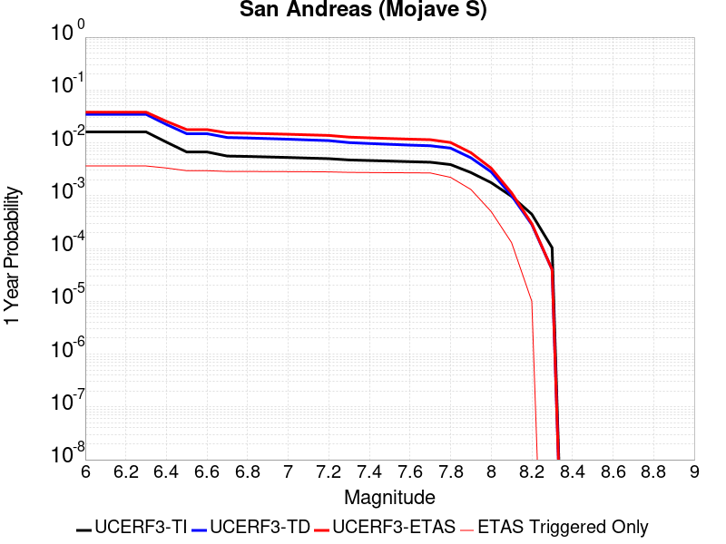 |  |

| Magnitude | 1 wk TI Prob | 1 wk TD Prob | 1 wk ETAS Prob | 1 wk ETAS/TD Gain | 1 wk ETAS Triggered Only | 1 mo TI Prob | 1 mo TD Prob | 1 mo ETAS Prob | 1 mo ETAS/TD Gain | 1 mo ETAS Triggered Only | 1 yr TI Prob | 1 yr TD Prob | 1 yr ETAS Prob | 1 yr ETAS/TD Gain | 1 yr ETAS Triggered Only | 10 yr TI Prob | 10 yr TD Prob | 10 yr ETAS Prob | 10 yr ETAS/TD Gain | 10 yr ETAS Triggered Only |
|-----|-----|-----|-----|-----|-----|-----|-----|-----|-----|-----|-----|-----|-----|-----|-----|-----|-----|-----|-----|-----|
| 6.0 | 3.1064058E-4 | 6.7460834E-4 | 0.0032922246 | 4.880202 | 0.0026193834 | 0.0013306376 | 0.0028881032 | 0.00590174 | 2.0434656 | 0.0030223655 | 0.016080605 | 0.03462235 | 0.037734587 | 1.0898911 | 0.0032238564 | 0.1496549 | 0.28660452 | 0.2891919 | 1.0090277 | 0.0036268386 |
| 6.1 | 3.1064058E-4 | 6.7460834E-4 | 0.0032922246 | 4.880202 | 0.0026193834 | 0.0013306376 | 0.0028881032 | 0.00590174 | 2.0434656 | 0.0030223655 | 0.016080605 | 0.03462235 | 0.037734587 | 1.0898911 | 0.0032238564 | 0.1496549 | 0.28660452 | 0.2891919 | 1.0090277 | 0.0036268386 |
| 6.2 | 3.1064058E-4 | 6.7460834E-4 | 0.0032922246 | 4.880202 | 0.0026193834 | 0.0013306376 | 0.0028881032 | 0.00590174 | 2.0434656 | 0.0030223655 | 0.016080605 | 0.03462235 | 0.037734587 | 1.0898911 | 0.0032238564 | 0.1496549 | 0.28660452 | 0.2891919 | 1.0090277 | 0.0036268386 |
| 6.3 | 3.1064058E-4 | 6.7460834E-4 | 0.0032922246 | 4.880202 | 0.0026193834 | 0.0013306376 | 0.0028881032 | 0.00590174 | 2.0434656 | 0.0030223655 | 0.016080605 | 0.03462235 | 0.037734587 | 1.0898911 | 0.0032238564 | 0.1496549 | 0.28660452 | 0.2891919 | 1.0090277 | 0.0036268386 |
| 6.4 | 1.9872203E-4 | 4.3179357E-4 | 0.003050046 | 7.0636673 | 0.0026193834 | 8.5138786E-4 | 0.0018492596 | 0.0046649175 | 2.5225866 | 0.0028208746 | 0.010316478 | 0.02228844 | 0.02524344 | 1.13258 | 0.0030223655 | 0.098504856 | 0.19699748 | 0.19974804 | 1.0139624 | 0.0034253476 |
| 6.5 | 1.291105E-4 | 2.875267E-4 | 0.0025032908 | 8.70629 | 0.0022164013 | 5.5321335E-4 | 0.0012316781 | 0.0036465924 | 2.96067 | 0.0024178925 | 0.006714592 | 0.0148934 | 0.017473772 | 1.173256 | 0.0026193834 | 0.065152965 | 0.13803436 | 0.14063953 | 1.0188733 | 0.0030223655 |
| 6.6 | 1.291105E-4 | 2.875267E-4 | 0.0025032908 | 8.70629 | 0.0022164013 | 5.5321335E-4 | 0.0012316781 | 0.0036465924 | 2.96067 | 0.0024178925 | 0.006714592 | 0.0148934 | 0.017473772 | 1.173256 | 0.0026193834 | 0.065152965 | 0.13803436 | 0.14063953 | 1.0188733 | 0.0030223655 |
| 6.7 | 1.08001186E-4 | 2.4333889E-4 | 0.002459201 | 10.106074 | 0.0022164013 | 4.6278012E-4 | 0.0010424647 | 0.0034578366 | 3.3169818 | 0.0024178925 | 0.0056198016 | 0.012618446 | 0.015204777 | 1.2049643 | 0.0026193834 | 0.054797906 | 0.119176775 | 0.12183894 | 1.022338 | 0.0030223655 |
| 6.8 | 1.0624356E-4 | 2.3851555E-4 | 0.0024543882 | 10.290265 | 0.0022164013 | 4.5525006E-4 | 0.0010218095 | 0.0034372313 | 3.3638668 | 0.0024178925 | 0.0055285925 | 0.012369843 | 0.014956825 | 1.2091362 | 0.0026193834 | 0.053930566 | 0.11712591 | 0.11979428 | 1.0227821 | 0.0030223655 |
| 6.9 | 1.0393785E-4 | 2.3221898E-4 | 0.0024481057 | 10.542229 | 0.0022164013 | 4.4537184E-4 | 9.948451E-4 | 0.0034103321 | 3.428003 | 0.0024178925 | 0.0054089287 | 0.012045221 | 0.014633054 | 1.214843 | 0.0026193834 | 0.05279156 | 0.11442335 | 0.11709989 | 1.0233915 | 0.0030223655 |
| 7.0 | 1.0155622E-4 | 2.2591476E-4 | 0.0024418153 | 10.80857 | 0.0022164013 | 4.3516833E-4 | 9.6784724E-4 | 0.0033833995 | 3.495799 | 0.0024178925 | 0.005285311 | 0.0117200995 | 0.014308784 | 1.2208756 | 0.0026193834 | 0.05161361 | 0.111683756 | 0.114368565 | 1.0240395 | 0.0030223655 |
| 7.1 | 9.885595E-5 | 2.1879886E-4 | 0.0024347154 | 11.127642 | 0.0022164013 | 4.2359953E-4 | 9.3737274E-4 | 0.0033529988 | 3.5770175 | 0.0024178925 | 0.0051451353 | 0.011352993 | 0.013942638 | 1.2281024 | 0.0026193834 | 0.05027629 | 0.1085682 | 0.11126243 | 1.024816 | 0.0030223655 |
| 7.2 | 9.6411415E-5 | 2.124288E-4 | 0.0024283594 | 11.431403 | 0.0022164013 | 4.1312634E-4 | 9.1009185E-4 | 0.0033257836 | 3.6543386 | 0.0024178925 | 0.005018219 | 0.011024255 | 0.013614763 | 1.2349825 | 0.0026193834 | 0.049064007 | 0.105758004 | 0.10846073 | 1.0255557 | 0.0030223655 |
| 7.3 | 9.1180635E-5 | 1.9471257E-4 | 0.0020077787 | 10.311501 | 0.0018134193 | 3.907156E-4 | 8.342157E-4 | 0.0028474452 | 3.41332 | 0.0020149103 | 0.004746591 | 0.01010939 | 0.012303385 | 1.2170254 | 0.0022164013 | 0.046464786 | 0.09795115 | 0.10031396 | 1.0241224 | 0.0026193834 |
| 7.4 | 8.887388E-5 | 1.8719878E-4 | 0.0020002786 | 10.685319 | 0.0018134193 | 3.8083247E-4 | 8.020339E-4 | 0.0028153283 | 3.510236 | 0.0020149103 | 0.0046267817 | 0.00972114 | 0.011915996 | 1.2257817 | 0.0022164013 | 0.045316286 | 0.09458615 | 0.09695777 | 1.0250738 | 0.0026193834 |
| 7.5 | 8.6750515E-5 | 1.8051457E-4 | 0.0019936066 | 11.04402 | 0.0018134193 | 3.7173493E-4 | 7.7340455E-4 | 0.0027867565 | 3.6032326 | 0.0020149103 | 0.004516484 | 0.009375632 | 0.011571253 | 1.2341838 | 0.0022164013 | 0.04425787 | 0.091549896 | 0.09392948 | 1.0259922 | 0.0026193834 |
| 7.6 | 8.453092E-5 | 1.7439072E-4 | 0.0019874938 | 11.396787 | 0.0018134193 | 3.6222505E-4 | 7.471748E-4 | 0.0027605796 | 3.6946905 | 0.0020149103 | 0.0044011753 | 0.009058985 | 0.011255307 | 1.2424469 | 0.0022164013 | 0.04315024 | 0.08870898 | 0.09109601 | 1.0269084 | 0.0026193834 |
| 7.7 | 8.259102E-5 | 1.6961215E-4 | 0.0019827238 | 11.689752 | 0.0018134193 | 3.539135E-4 | 7.2670676E-4 | 0.0027401529 | 3.7706444 | 0.0020149103 | 0.004300386 | 0.008811831 | 0.011008701 | 1.2493093 | 0.0022164013 | 0.042181134 | 0.08645982 | 0.08885273 | 1.0276766 | 0.0026193834 |
| 7.8 | 7.444844E-5 | 1.5283503E-4 | 0.0013615965 | 8.90893 | 0.0012089462 | 3.1902574E-4 | 6.548429E-4 | 0.0020643566 | 3.1524456 | 0.0014104373 | 0.0038772223 | 0.007943616 | 0.00954274 | 1.2013093 | 0.0016119282 | 0.03810269 | 0.078290746 | 0.08014791 | 1.0237213 | 0.0020149103 |
| 7.9 | 5.2586525E-5 | 1.00064186E-4 | 5.030059E-4 | 5.0268326 | 4.0298206E-4 | 2.2535135E-4 | 4.2877605E-4 | 0.0010329899 | 2.4091597 | 6.044731E-4 | 0.0027402006 | 0.005207864 | 0.006009631 | 1.1539531 | 8.059641E-4 | 0.027066574 | 0.052200034 | 0.053345874 | 1.021951 | 0.0012089462 |
| 8.0 | 3.379877E-5 | 5.4074168E-5 | 5.4074168E-5 | 1.0 | 0.0 | 1.4484383E-4 | 2.3172585E-4 | 2.3172585E-4 | 1.0 | 0.0 | 0.0017620471 | 0.002817614 | 0.0030185373 | 1.0713097 | 2.0149103E-4 | 0.017481409 | 0.028834904 | 0.029030584 | 1.0067862 | 2.0149103E-4 |
| 8.1 | 1.8668277E-5 | 1.9309397E-5 | 1.9309397E-5 | 1.0 | 0.0 | 8.000444E-5 | 8.275194E-5 | 8.275194E-5 | 1.0 | 0.0 | 9.736188E-4 | 0.0010070398 | 0.0010070398 | 1.0 | 0.0 | 0.009693642 | 0.010798888 | 0.010798888 | 1.0 | 0.0 |
| 8.2 | 8.541571E-6 | 5.460819E-6 | 5.460819E-6 | 1.0 | 0.0 | 3.660622E-5 | 2.3403301E-5 | 2.3403301E-5 | 1.0 | 0.0 | 4.455896E-4 | 2.84898E-4 | 2.84898E-4 | 1.0 | 0.0 | 0.0044469717 | 0.0032408056 | 0.0032408056 | 1.0 | 0.0 |
| 8.3 | 1.983087E-6 | 7.6599065E-7 | 7.6599065E-7 | 1.0 | 0.0 | 8.498917E-6 | 3.282813E-6 | 3.282813E-6 | 1.0 | 0.0 | 1.034694E-4 | 3.9967534E-5 | 3.9967534E-5 | 1.0 | 0.0 | 0.0010342124 | 4.719687E-4 | 4.719687E-4 | 1.0 | 0.0 |

## San Andreas (Mojave N)
*[(top)](#table-of-contents)*

| 1 Week | 1 Month | 1 Year | 10 Year |
|-----|-----|-----|-----|
|  |  |  |  |

| Magnitude | 1 wk TI Prob | 1 wk TD Prob | 1 wk ETAS Prob | 1 wk ETAS/TD Gain | 1 wk ETAS Triggered Only | 1 mo TI Prob | 1 mo TD Prob | 1 mo ETAS Prob | 1 mo ETAS/TD Gain | 1 mo ETAS Triggered Only | 1 yr TI Prob | 1 yr TD Prob | 1 yr ETAS Prob | 1 yr ETAS/TD Gain | 1 yr ETAS Triggered Only | 10 yr TI Prob | 10 yr TD Prob | 10 yr ETAS Prob | 10 yr ETAS/TD Gain | 10 yr ETAS Triggered Only |
|-----|-----|-----|-----|-----|-----|-----|-----|-----|-----|-----|-----|-----|-----|-----|-----|-----|-----|-----|-----|-----|
| 6.0 | 9.877682E-5 | 1.9400702E-4 | 0.0026114304 | 13.460494 | 0.0024178925 | 4.2326056E-4 | 8.311939E-4 | 0.0034484002 | 4.148731 | 0.0026193834 | 0.0051410277 | 0.010072956 | 0.0134638 | 1.3366286 | 0.0034253476 | 0.05023708 | 0.09831428 | 0.10176622 | 1.0351114 | 0.0038283297 |
| 6.1 | 9.877682E-5 | 1.9400702E-4 | 0.0026114304 | 13.460494 | 0.0024178925 | 4.2326056E-4 | 8.311939E-4 | 0.0034484002 | 4.148731 | 0.0026193834 | 0.0051410277 | 0.010072956 | 0.0134638 | 1.3366286 | 0.0034253476 | 0.05023708 | 0.09831428 | 0.10176622 | 1.0351114 | 0.0038283297 |
| 6.2 | 9.877682E-5 | 1.9400702E-4 | 0.0026114304 | 13.460494 | 0.0024178925 | 4.2326056E-4 | 8.311939E-4 | 0.0034484002 | 4.148731 | 0.0026193834 | 0.0051410277 | 0.010072956 | 0.0134638 | 1.3366286 | 0.0034253476 | 0.05023708 | 0.09831428 | 0.10176622 | 1.0351114 | 0.0038283297 |
| 6.3 | 9.877682E-5 | 1.9400702E-4 | 0.0026114304 | 13.460494 | 0.0024178925 | 4.2326056E-4 | 8.311939E-4 | 0.0034484002 | 4.148731 | 0.0026193834 | 0.0051410277 | 0.010072956 | 0.0134638 | 1.3366286 | 0.0034253476 | 0.05023708 | 0.09831428 | 0.10176622 | 1.0351114 | 0.0038283297 |
| 6.4 | 9.877682E-5 | 1.9400702E-4 | 0.0026114304 | 13.460494 | 0.0024178925 | 4.2326056E-4 | 8.311939E-4 | 0.0034484002 | 4.148731 | 0.0026193834 | 0.0051410277 | 0.010072956 | 0.0134638 | 1.3366286 | 0.0034253476 | 0.05023708 | 0.09831428 | 0.10176622 | 1.0351114 | 0.0038283297 |
| 6.5 | 9.861474E-5 | 1.9374468E-4 | 0.0026111687 | 13.477369 | 0.0024178925 | 4.2256617E-4 | 8.300703E-4 | 0.0034472796 | 4.152997 | 0.0026193834 | 0.0051326132 | 0.010059402 | 0.013450294 | 1.3370867 | 0.0034253476 | 0.050156746 | 0.098192066 | 0.101644486 | 1.0351598 | 0.0038283297 |
| 6.6 | 9.861474E-5 | 1.9374468E-4 | 0.0026111687 | 13.477369 | 0.0024178925 | 4.2256617E-4 | 8.300703E-4 | 0.0034472796 | 4.152997 | 0.0026193834 | 0.0051326132 | 0.010059402 | 0.013450294 | 1.3370867 | 0.0034253476 | 0.050156746 | 0.098192066 | 0.101644486 | 1.0351598 | 0.0038283297 |
| 6.7 | 9.8552715E-5 | 1.9364421E-4 | 0.0026110683 | 13.483844 | 0.0024178925 | 4.223004E-4 | 8.2964E-4 | 0.0034468502 | 4.1546335 | 0.0026193834 | 0.0051293927 | 0.010054212 | 0.01344512 | 1.3372625 | 0.0034253476 | 0.050125998 | 0.098145254 | 0.10159785 | 1.0351784 | 0.0038283297 |
| 6.8 | 9.8464974E-5 | 1.9349584E-4 | 0.0026109205 | 13.493419 | 0.0024178925 | 4.219245E-4 | 8.290045E-4 | 0.0034462165 | 4.157054 | 0.0026193834 | 0.0051248376 | 0.010046546 | 0.013437482 | 1.3375224 | 0.0034253476 | 0.05008251 | 0.09807528 | 0.101528145 | 1.0352063 | 0.0038283297 |
| 6.9 | 9.825824E-5 | 1.9317595E-4 | 0.0026106013 | 13.5141115 | 0.0024178925 | 4.2103877E-4 | 8.276344E-4 | 0.00344485 | 4.162285 | 0.0026193834 | 0.0051141046 | 0.010030019 | 0.01342101 | 1.3380842 | 0.0034253476 | 0.049980022 | 0.09792438 | 0.10137782 | 1.0352664 | 0.0038283297 |
| 7.0 | 9.781462E-5 | 1.924896E-4 | 0.0026099165 | 13.558741 | 0.0024178925 | 4.1913814E-4 | 8.246948E-4 | 0.003441918 | 4.173566 | 0.0026193834 | 0.005091073 | 0.009994558 | 0.013385671 | 1.3392959 | 0.0034253476 | 0.04976007 | 0.09760077 | 0.10105546 | 1.0353961 | 0.0038283297 |
| 7.1 | 9.7121134E-5 | 1.9150671E-4 | 0.002608936 | 13.623209 | 0.0024178925 | 4.1616702E-4 | 8.204851E-4 | 0.0034377193 | 4.1898623 | 0.0026193834 | 0.005055068 | 0.009943774 | 0.013335061 | 1.3410462 | 0.0034253476 | 0.04941613 | 0.09713728 | 0.10059374 | 1.0355833 | 0.0038283297 |
| 7.2 | 9.663819E-5 | 1.9081456E-4 | 0.0026082457 | 13.669006 | 0.0024178925 | 4.1409794E-4 | 8.175206E-4 | 0.0034347626 | 4.2014384 | 0.0026193834 | 0.0050299936 | 0.00990801 | 0.01329942 | 1.3422896 | 0.0034253476 | 0.049176537 | 0.09681055 | 0.10026825 | 1.0357162 | 0.0038283297 |
| 7.3 | 9.6277574E-5 | 1.9033969E-4 | 0.002607772 | 13.70062 | 0.0024178925 | 4.125529E-4 | 8.154867E-4 | 0.0034327342 | 4.2094297 | 0.0026193834 | 0.0050112694 | 0.009883473 | 0.013274966 | 1.3431479 | 0.0034253476 | 0.04899759 | 0.09658401 | 0.10004258 | 1.0358089 | 0.0038283297 |
| 7.4 | 9.593308E-5 | 1.897375E-4 | 0.0026071712 | 13.740937 | 0.0024178925 | 4.1107697E-4 | 8.129075E-4 | 0.0034301616 | 4.219621 | 0.0026193834 | 0.0049933824 | 0.009852355 | 0.013243956 | 1.3442426 | 0.0034253476 | 0.04882661 | 0.09630218 | 0.099761836 | 1.0359249 | 0.0038283297 |
| 7.5 | 9.561707E-5 | 1.8919831E-4 | 0.0026066334 | 13.777254 | 0.0024178925 | 4.0972308E-4 | 8.1059814E-4 | 0.0034278582 | 4.2288013 | 0.0026193834 | 0.0049769743 | 0.009824493 | 0.013216188 | 1.3452286 | 0.0034253476 | 0.048669744 | 0.09604836 | 0.099508986 | 1.03603 | 0.0038283297 |
| 7.6 | 9.418194E-5 | 1.8572104E-4 | 0.0026031644 | 14.016529 | 0.0024178925 | 4.0357444E-4 | 7.957047E-4 | 0.0034130039 | 4.2892847 | 0.0026193834 | 0.004902454 | 0.009644784 | 0.013037095 | 1.3517249 | 0.0034253476 | 0.047957025 | 0.094430685 | 0.09789751 | 1.0367129 | 0.0038283297 |
| 7.7 | 8.202141E-5 | 1.6021315E-4 | 0.0021748007 | 13.57442 | 0.0020149103 | 3.51473E-4 | 6.8644714E-4 | 0.002901327 | 4.226585 | 0.0022164013 | 0.00427079 | 0.008325525 | 0.011122914 | 1.3360015 | 0.0028208746 | 0.04189639 | 0.08223219 | 0.085190944 | 1.0359805 | 0.0032238564 |
| 7.8 | 7.2859846E-5 | 1.4516473E-4 | 0.0013539355 | 9.32689 | 0.0012089462 | 3.1221908E-4 | 6.219862E-4 | 0.002031546 | 3.266224 | 0.0014104373 | 0.003794643 | 0.0075464295 | 0.009146194 | 1.2119895 | 0.0016119282 | 0.037304975 | 0.07472468 | 0.076589026 | 1.0249496 | 0.0020149103 |
| 7.9 | 5.3874453E-5 | 1.0045676E-4 | 5.0339836E-4 | 5.0110946 | 4.0298206E-4 | 2.3087008E-4 | 4.3045796E-4 | 0.0010346709 | 2.4036515 | 6.044731E-4 | 0.0028072202 | 0.0052282433 | 0.0060299933 | 1.1533499 | 8.059641E-4 | 0.02772022 | 0.05242443 | 0.05357 | 1.0218518 | 0.0012089462 |
| 8.0 | 3.468538E-5 | 5.4260272E-5 | 5.4260272E-5 | 1.0 | 0.0 | 1.4864317E-4 | 2.325233E-4 | 2.325233E-4 | 1.0 | 0.0 | 0.0018082283 | 0.002827298 | 0.003028219 | 1.0710648 | 2.0149103E-4 | 0.017935853 | 0.028947512 | 0.02914317 | 1.006759 | 2.0149103E-4 |
| 8.1 | 1.9152367E-5 | 1.940263E-5 | 1.940263E-5 | 1.0 | 0.0 | 8.207899E-5 | 8.3151484E-5 | 8.3151484E-5 | 1.0 | 0.0 | 9.988535E-4 | 0.0010118998 | 0.0010118998 | 1.0 | 0.0 | 0.009943757 | 0.01085625 | 0.01085625 | 1.0 | 0.0 |
| 8.2 | 8.643924E-6 | 5.4748625E-6 | 5.4748625E-6 | 1.0 | 0.0 | 3.704486E-5 | 2.3463486E-5 | 2.3463486E-5 | 1.0 | 0.0 | 4.5092785E-4 | 2.8563058E-4 | 2.8563058E-4 | 1.0 | 0.0 | 0.0045001395 | 0.0032487072 | 0.0032487072 | 1.0 | 0.0 |
| 8.3 | 1.983087E-6 | 7.6599065E-7 | 7.6599065E-7 | 1.0 | 0.0 | 8.498917E-6 | 3.282813E-6 | 3.282813E-6 | 1.0 | 0.0 | 1.034694E-4 | 3.9967534E-5 | 3.9967534E-5 | 1.0 | 0.0 | 0.0010342124 | 4.719687E-4 | 4.719687E-4 | 1.0 | 0.0 |

## Nelson Lake
*[(top)](#table-of-contents)*

| 1 Week | 1 Month | 1 Year | 10 Year |
|-----|-----|-----|-----|
|  |  |  |  |

| Magnitude | 1 wk TI Prob | 1 wk TD Prob | 1 wk ETAS Prob | 1 wk ETAS/TD Gain | 1 wk ETAS Triggered Only | 1 mo TI Prob | 1 mo TD Prob | 1 mo ETAS Prob | 1 mo ETAS/TD Gain | 1 mo ETAS Triggered Only | 1 yr TI Prob | 1 yr TD Prob | 1 yr ETAS Prob | 1 yr ETAS/TD Gain | 1 yr ETAS Triggered Only | 10 yr TI Prob | 10 yr TD Prob | 10 yr ETAS Prob | 10 yr ETAS/TD Gain | 10 yr ETAS Triggered Only |
|-----|-----|-----|-----|-----|-----|-----|-----|-----|-----|-----|-----|-----|-----|-----|-----|-----|-----|-----|-----|-----|
| 6.0 | 9.913453E-6 | 1.0192255E-5 | 0.0010176372 | 99.844154 | 0.0010074552 | 4.2485535E-5 | 4.3680422E-5 | 0.001454056 | 33.28851 | 0.0014104373 | 5.1713863E-4 | 5.316897E-4 | 0.0029482965 | 5.545145 | 0.0024178925 | 0.0051593683 | 0.005305204 | 0.008111113 | 1.5288975 | 0.0028208746 |
| 6.1 | 9.913453E-6 | 1.0192255E-5 | 0.0010176372 | 99.844154 | 0.0010074552 | 4.2485535E-5 | 4.3680422E-5 | 0.001454056 | 33.28851 | 0.0014104373 | 5.1713863E-4 | 5.316897E-4 | 0.0029482965 | 5.545145 | 0.0024178925 | 0.0051593683 | 0.005305204 | 0.008111113 | 1.5288975 | 0.0028208746 |
| 6.2 | 4.5596407E-6 | 4.696313E-6 | 4.0767647E-4 | 86.80778 | 4.0298206E-4 | 1.954117E-5 | 2.0126909E-5 | 4.2310086E-4 | 21.021652 | 4.0298206E-4 | 2.3788778E-4 | 2.4501883E-4 | 0.0012522271 | 5.1107388 | 0.0010074552 | 0.0023763329 | 0.0024476128 | 0.0036535999 | 1.4927198 | 0.0012089462 |
| 6.3 | 4.5596407E-6 | 4.696313E-6 | 4.0767647E-4 | 86.80778 | 4.0298206E-4 | 1.954117E-5 | 2.0126909E-5 | 4.2310086E-4 | 21.021652 | 4.0298206E-4 | 2.3788778E-4 | 2.4501883E-4 | 0.0012522271 | 5.1107388 | 0.0010074552 | 0.0023763329 | 0.0024476128 | 0.0036535999 | 1.4927198 | 0.0012089462 |
| 6.4 | 3.4025713E-6 | 3.5098972E-6 | 4.0649055E-4 | 115.81266 | 4.0298206E-4 | 1.4582367E-5 | 1.5042335E-5 | 4.1801835E-4 | 27.78946 | 4.0298206E-4 | 1.7752586E-4 | 1.8312587E-4 | 9.889425E-4 | 5.4003425 | 8.059641E-4 | 0.001773841 | 0.0018298327 | 0.0028354444 | 1.5495648 | 0.0010074552 |
| 6.5 | 2.8352947E-6 | 2.927856E-6 | 4.0590874E-4 | 138.63686 | 4.0298206E-4 | 1.2151207E-5 | 1.2547898E-5 | 4.155249E-4 | 33.1151 | 4.0298206E-4 | 1.479309E-4 | 1.5276071E-4 | 9.586017E-4 | 6.275185 | 8.059641E-4 | 0.0014783246 | 0.0015266308 | 0.002532548 | 1.6589131 | 0.0010074552 |
| 6.6 | 2.251518E-6 | 2.3290677E-6 | 4.053102E-4 | 174.02252 | 4.0298206E-4 | 9.649328E-6 | 9.981683E-6 | 4.1295972E-4 | 41.37175 | 4.0298206E-4 | 1.1747423E-4 | 1.2152085E-4 | 7.259205E-4 | 5.9736295 | 6.044731E-4 | 0.0011741214 | 0.0012146058 | 0.0018183446 | 1.4970658 | 6.044731E-4 |
| 6.7 | 1.8911853E-6 | 1.9591396E-6 | 2.0344977E-4 | 103.84649 | 2.0149103E-4 | 8.105055E-6 | 8.39629E-6 | 2.0988563E-4 | 24.997427 | 2.0149103E-4 | 9.867457E-5 | 1.0222061E-4 | 5.051615E-4 | 4.941875 | 4.0298206E-4 | 9.863076E-4 | 0.0010217935 | 0.0014243637 | 1.3939841 | 4.0298206E-4 |
| 6.8 | 1.4874814E-6 | 1.5438305E-6 | 2.0303455E-4 | 131.5135 | 2.0149103E-4 | 6.374905E-6 | 6.6164025E-6 | 2.0810611E-4 | 31.45306 | 2.0149103E-4 | 7.76117E-5 | 8.055224E-5 | 2.8202706E-4 | 3.5011694 | 2.0149103E-4 | 7.75846E-4 | 8.0528157E-4 | 0.0010066103 | 1.2500104 | 2.0149103E-4 |
| 6.9 | 6.835972E-7 | 7.1399285E-7 | 2.0220489E-4 | 283.20297 | 2.0149103E-4 | 2.9296991E-6 | 3.0599674E-6 | 2.0455038E-4 | 66.847244 | 2.0149103E-4 | 3.56685E-5 | 3.7254784E-5 | 2.3873831E-4 | 6.408259 | 2.0149103E-4 | 3.5662777E-4 | 3.7251666E-4 | 5.7393266E-4 | 1.5406898 | 2.0149103E-4 |

## Towne Pass
*[(top)](#table-of-contents)*

| 1 Week | 1 Month | 1 Year | 10 Year |
|-----|-----|-----|-----|
|  |  |  |  |

| Magnitude | 1 wk TI Prob | 1 wk TD Prob | 1 wk ETAS Prob | 1 wk ETAS/TD Gain | 1 wk ETAS Triggered Only | 1 mo TI Prob | 1 mo TD Prob | 1 mo ETAS Prob | 1 mo ETAS/TD Gain | 1 mo ETAS Triggered Only | 1 yr TI Prob | 1 yr TD Prob | 1 yr ETAS Prob | 1 yr ETAS/TD Gain | 1 yr ETAS Triggered Only | 10 yr TI Prob | 10 yr TD Prob | 10 yr ETAS Prob | 10 yr ETAS/TD Gain | 10 yr ETAS Triggered Only |
|-----|-----|-----|-----|-----|-----|-----|-----|-----|-----|-----|-----|-----|-----|-----|-----|-----|-----|-----|-----|-----|
| 6.0 | 3.849728E-6 | 3.8945414E-6 | 0.001212836 | 311.41946 | 0.0012089462 | 1.649873E-5 | 1.669081E-5 | 0.0014271045 | 85.50241 | 0.0014104373 | 2.0085352E-4 | 2.0319603E-4 | 0.002419147 | 11.905484 | 0.0022164013 | 0.0020067208 | 0.0020305314 | 0.004443514 | 2.1883504 | 0.0024178925 |
| 6.1 | 3.849728E-6 | 3.8945414E-6 | 0.001212836 | 311.41946 | 0.0012089462 | 1.649873E-5 | 1.669081E-5 | 0.0014271045 | 85.50241 | 0.0014104373 | 2.0085352E-4 | 2.0319603E-4 | 0.002419147 | 11.905484 | 0.0022164013 | 0.0020067208 | 0.0020305314 | 0.004443514 | 2.1883504 | 0.0024178925 |
| 6.2 | 3.849728E-6 | 3.8945414E-6 | 0.001212836 | 311.41946 | 0.0012089462 | 1.649873E-5 | 1.669081E-5 | 0.0014271045 | 85.50241 | 0.0014104373 | 2.0085352E-4 | 2.0319603E-4 | 0.002419147 | 11.905484 | 0.0022164013 | 0.0020067208 | 0.0020305314 | 0.004443514 | 2.1883504 | 0.0024178925 |
| 6.3 | 3.849728E-6 | 3.8945414E-6 | 0.001212836 | 311.41946 | 0.0012089462 | 1.649873E-5 | 1.669081E-5 | 0.0014271045 | 85.50241 | 0.0014104373 | 2.0085352E-4 | 2.0319603E-4 | 0.002419147 | 11.905484 | 0.0022164013 | 0.0020067208 | 0.0020305314 | 0.004443514 | 2.1883504 | 0.0024178925 |
| 6.4 | 3.849728E-6 | 3.8945414E-6 | 0.001212836 | 311.41946 | 0.0012089462 | 1.649873E-5 | 1.669081E-5 | 0.0014271045 | 85.50241 | 0.0014104373 | 2.0085352E-4 | 2.0319603E-4 | 0.002419147 | 11.905484 | 0.0022164013 | 0.0020067208 | 0.0020305314 | 0.004443514 | 2.1883504 | 0.0024178925 |
| 6.5 | 1.1953545E-6 | 1.203052E-6 | 1.203052E-6 | 1.0 | 0.0 | 5.1229376E-6 | 5.1559277E-6 | 5.1559277E-6 | 1.0 | 0.0 | 6.236998E-5 | 6.277173E-5 | 2.6425012E-4 | 4.209699 | 2.0149103E-4 | 6.235248E-4 | 6.275517E-4 | 8.289163E-4 | 1.3208733 | 2.0149103E-4 |
| 6.6 | 1.1953545E-6 | 1.203052E-6 | 1.203052E-6 | 1.0 | 0.0 | 5.1229376E-6 | 5.1559277E-6 | 5.1559277E-6 | 1.0 | 0.0 | 6.236998E-5 | 6.277173E-5 | 2.6425012E-4 | 4.209699 | 2.0149103E-4 | 6.235248E-4 | 6.275517E-4 | 8.289163E-4 | 1.3208733 | 2.0149103E-4 |
| 6.7 | 8.375951E-7 | 8.4106705E-7 | 8.4106705E-7 | 1.0 | 0.0 | 3.5896885E-6 | 3.6045683E-6 | 3.6045683E-6 | 1.0 | 0.0 | 4.370358E-5 | 4.3884793E-5 | 2.4536697E-4 | 5.5911617 | 2.0149103E-4 | 4.3694986E-4 | 4.38767E-4 | 6.401696E-4 | 1.4590195 | 2.0149103E-4 |
| 6.8 | 6.38041E-7 | 6.392156E-7 | 6.392156E-7 | 1.0 | 0.0 | 2.7344586E-6 | 2.7394929E-6 | 2.7394929E-6 | 1.0 | 0.0 | 3.3291526E-5 | 3.3352855E-5 | 2.3483716E-4 | 7.0409913 | 2.0149103E-4 | 3.3286537E-4 | 3.334823E-4 | 5.3490617E-4 | 1.6040016 | 2.0149103E-4 |
| 6.9 | 5.3460053E-7 | 5.345333E-7 | 5.345333E-7 | 1.0 | 0.0 | 2.2911431E-6 | 2.2908553E-6 | 2.2908553E-6 | 1.0 | 0.0 | 2.789431E-5 | 2.789084E-5 | 2.789084E-5 | 1.0 | 0.0 | 2.789081E-4 | 2.7887672E-4 | 2.7887672E-4 | 1.0 | 0.0 |
| 7.0 | 3.557783E-7 | 3.5324226E-7 | 3.5324226E-7 | 1.0 | 0.0 | 1.5247632E-6 | 1.5138945E-6 | 1.5138945E-6 | 1.0 | 0.0 | 1.8563835E-5 | 1.843152E-5 | 1.843152E-5 | 1.0 | 0.0 | 1.8562283E-4 | 1.8430075E-4 | 1.8430075E-4 | 1.0 | 0.0 |
| 7.1 | 3.037942E-7 | 3.0002218E-7 | 3.0002218E-7 | 1.0 | 0.0 | 1.3019744E-6 | 1.2858087E-6 | 1.2858087E-6 | 1.0 | 0.0 | 1.5851423E-5 | 1.5654618E-5 | 1.5654618E-5 | 1.0 | 0.0 | 1.5850292E-4 | 1.5653588E-4 | 1.5653588E-4 | 1.0 | 0.0 |
| 7.2 | 2.0808248E-7 | 2.0217689E-7 | 2.0217689E-7 | 1.0 | 0.0 | 8.917818E-7 | 8.6647213E-7 | 8.6647213E-7 | 1.0 | 0.0 | 1.0857389E-5 | 1.0549252E-5 | 1.0549252E-5 | 1.0 | 0.0 | 1.0856859E-4 | 1.0548797E-4 | 1.0548797E-4 | 1.0 | 0.0 |
| 7.3 | 1.1162073E-7 | 1.0636894E-7 | 1.0636894E-7 | 1.0 | 0.0 | 4.7837443E-7 | 4.558668E-7 | 4.558668E-7 | 1.0 | 0.0 | 5.8241935E-6 | 5.550166E-6 | 5.550166E-6 | 1.0 | 0.0 | 5.8240406E-5 | 5.5500474E-5 | 5.5500474E-5 | 1.0 | 0.0 |

## Garlic Springs
*[(top)](#table-of-contents)*

| 1 Week | 1 Month | 1 Year | 10 Year |
|-----|-----|-----|-----|
|  |  |  |  |

| Magnitude | 1 wk TI Prob | 1 wk TD Prob | 1 wk ETAS Prob | 1 wk ETAS/TD Gain | 1 wk ETAS Triggered Only | 1 mo TI Prob | 1 mo TD Prob | 1 mo ETAS Prob | 1 mo ETAS/TD Gain | 1 mo ETAS Triggered Only | 1 yr TI Prob | 1 yr TD Prob | 1 yr ETAS Prob | 1 yr ETAS/TD Gain | 1 yr ETAS Triggered Only | 10 yr TI Prob | 10 yr TD Prob | 10 yr ETAS Prob | 10 yr ETAS/TD Gain | 10 yr ETAS Triggered Only |
|-----|-----|-----|-----|-----|-----|-----|-----|-----|-----|-----|-----|-----|-----|-----|-----|-----|-----|-----|-----|-----|
| 6.0 | 1.6760017E-5 | 1.8776833E-5 | 0.0014291876 | 76.11441 | 0.0014104373 | 7.182667E-5 | 8.0470316E-5 | 0.0016922689 | 21.029728 | 0.0016119282 | 8.7413884E-4 | 9.794032E-4 | 0.0029923401 | 3.055269 | 0.0020149103 | 0.008707083 | 0.009762413 | 0.011957177 | 1.2248178 | 0.0022164013 |
| 6.1 | 9.852767E-6 | 1.09735865E-5 | 0.0010184176 | 92.806274 | 0.0010074552 | 4.222546E-5 | 4.702921E-5 | 0.0012559185 | 26.705074 | 0.0012089462 | 5.139737E-4 | 5.7250116E-4 | 0.0017807552 | 3.1104832 | 0.0012089462 | 0.005127866 | 0.005717221 | 0.0071195946 | 1.2452893 | 0.0014104373 |
| 6.2 | 9.852767E-6 | 1.09735865E-5 | 0.0010184176 | 92.806274 | 0.0010074552 | 4.222546E-5 | 4.702921E-5 | 0.0012559185 | 26.705074 | 0.0012089462 | 5.139737E-4 | 5.7250116E-4 | 0.0017807552 | 3.1104832 | 0.0012089462 | 0.005127866 | 0.005717221 | 0.0071195946 | 1.2452893 | 0.0014104373 |
| 6.3 | 4.3167724E-6 | 4.7780286E-6 | 2.062681E-4 | 43.170128 | 2.0149103E-4 | 1.8500323E-5 | 2.0477235E-5 | 2.2196415E-4 | 10.839557 | 2.0149103E-4 | 2.2521814E-4 | 2.4930484E-4 | 4.5074563E-4 | 1.80801 | 2.0149103E-4 | 0.0022499003 | 0.00249251 | 0.0026934987 | 1.0806371 | 2.0149103E-4 |
| 6.4 | 4.3167724E-6 | 4.7780286E-6 | 2.062681E-4 | 43.170128 | 2.0149103E-4 | 1.8500323E-5 | 2.0477235E-5 | 2.2196415E-4 | 10.839557 | 2.0149103E-4 | 2.2521814E-4 | 2.4930484E-4 | 4.5074563E-4 | 1.80801 | 2.0149103E-4 | 0.0022499003 | 0.00249251 | 0.0026934987 | 1.0806371 | 2.0149103E-4 |
| 6.5 | 4.3167724E-6 | 4.7780286E-6 | 2.062681E-4 | 43.170128 | 2.0149103E-4 | 1.8500323E-5 | 2.0477235E-5 | 2.2196415E-4 | 10.839557 | 2.0149103E-4 | 2.2521814E-4 | 2.4930484E-4 | 4.5074563E-4 | 1.80801 | 2.0149103E-4 | 0.0022499003 | 0.00249251 | 0.0026934987 | 1.0806371 | 2.0149103E-4 |
| 6.6 | 4.301311E-6 | 4.760897E-6 | 2.0625097E-4 | 43.321873 | 2.0149103E-4 | 1.8434059E-5 | 2.0403815E-5 | 2.2189073E-4 | 10.874964 | 2.0149103E-4 | 2.2441156E-4 | 2.4841115E-4 | 4.4985214E-4 | 1.8109176 | 2.0149103E-4 | 0.0022418506 | 0.002483593 | 0.0026845837 | 1.0809274 | 2.0149103E-4 |
| 6.7 | 3.8599724E-6 | 4.27106E-6 | 2.0576123E-4 | 48.175686 | 2.0149103E-4 | 1.6542634E-5 | 1.8304541E-5 | 2.197919E-4 | 12.007505 | 2.0149103E-4 | 2.0138794E-4 | 2.228578E-4 | 4.2430393E-4 | 1.9039223 | 2.0149103E-4 | 0.0020120554 | 0.002228578 | 0.00242962 | 1.0902109 | 2.0149103E-4 |

## San Andreas (San Bernardino N)
*[(top)](#table-of-contents)*

| 1 Week | 1 Month | 1 Year | 10 Year |
|-----|-----|-----|-----|
|  |  |  |  |

| Magnitude | 1 wk TI Prob | 1 wk TD Prob | 1 wk ETAS Prob | 1 wk ETAS/TD Gain | 1 wk ETAS Triggered Only | 1 mo TI Prob | 1 mo TD Prob | 1 mo ETAS Prob | 1 mo ETAS/TD Gain | 1 mo ETAS Triggered Only | 1 yr TI Prob | 1 yr TD Prob | 1 yr ETAS Prob | 1 yr ETAS/TD Gain | 1 yr ETAS Triggered Only | 10 yr TI Prob | 10 yr TD Prob | 10 yr ETAS Prob | 10 yr ETAS/TD Gain | 10 yr ETAS Triggered Only |
|-----|-----|-----|-----|-----|-----|-----|-----|-----|-----|-----|-----|-----|-----|-----|-----|-----|-----|-----|-----|-----|
| 6.0 | 1.4273766E-4 | 3.1606483E-4 | 0.0011217742 | 3.5491903 | 8.059641E-4 | 6.115894E-4 | 0.0013538664 | 0.0023599577 | 1.7431245 | 0.0010074552 | 0.0074207084 | 0.016360244 | 0.01754941 | 1.0726864 | 0.0012089462 | 0.07177748 | 0.15026689 | 0.1516366 | 1.0091152 | 0.0016119282 |
| 6.1 | 1.4273766E-4 | 3.1606483E-4 | 0.0011217742 | 3.5491903 | 8.059641E-4 | 6.115894E-4 | 0.0013538664 | 0.0023599577 | 1.7431245 | 0.0010074552 | 0.0074207084 | 0.016360244 | 0.01754941 | 1.0726864 | 0.0012089462 | 0.07177748 | 0.15026689 | 0.1516366 | 1.0091152 | 0.0016119282 |
| 6.2 | 1.4273766E-4 | 3.1606483E-4 | 0.0011217742 | 3.5491903 | 8.059641E-4 | 6.115894E-4 | 0.0013538664 | 0.0023599577 | 1.7431245 | 0.0010074552 | 0.0074207084 | 0.016360244 | 0.01754941 | 1.0726864 | 0.0012089462 | 0.07177748 | 0.15026689 | 0.1516366 | 1.0091152 | 0.0016119282 |
| 6.3 | 1.3730655E-4 | 3.0511338E-4 | 0.0011108316 | 3.6407175 | 8.059641E-4 | 5.883239E-4 | 0.0013069791 | 0.0023131175 | 1.7698199 | 0.0010074552 | 0.0071393442 | 0.015797773 | 0.01698762 | 1.0753174 | 0.0012089462 | 0.06914291 | 0.14556676 | 0.14694405 | 1.0094615 | 0.0016119282 |
| 6.4 | 1.3730655E-4 | 3.0511338E-4 | 0.0011108316 | 3.6407175 | 8.059641E-4 | 5.883239E-4 | 0.0013069791 | 0.0023131175 | 1.7698199 | 0.0010074552 | 0.0071393442 | 0.015797773 | 0.01698762 | 1.0753174 | 0.0012089462 | 0.06914291 | 0.14556676 | 0.14694405 | 1.0094615 | 0.0016119282 |
| 6.5 | 1.2942807E-4 | 2.8925808E-4 | 0.0010949891 | 3.785509 | 8.059641E-4 | 5.545738E-4 | 0.0012390936 | 0.0022453004 | 1.8120507 | 0.0010074552 | 0.0067310524 | 0.01498286 | 0.016173692 | 1.0794797 | 0.0012089462 | 0.06530788 | 0.13870941 | 0.14009775 | 1.0100089 | 0.0016119282 |
| 6.6 | 1.1125901E-4 | 2.536472E-4 | 0.0010594069 | 4.176695 | 8.059641E-4 | 4.767372E-4 | 0.0010866089 | 0.0020929694 | 1.9261478 | 0.0010074552 | 0.005788839 | 0.013149847 | 0.014342896 | 1.0907272 | 0.0012089462 | 0.056403454 | 0.122999296 | 0.124412954 | 1.0114932 | 0.0016119282 |
| 6.7 | 1.02209575E-4 | 2.3499702E-4 | 0.0010407717 | 4.428872 | 8.059641E-4 | 4.3796748E-4 | 0.0010067427 | 0.0020131837 | 1.9997002 | 0.0010074552 | 0.0053192247 | 0.012188629 | 0.01338284 | 1.0979774 | 0.0012089462 | 0.051936906 | 0.114790924 | 0.116217814 | 1.0124303 | 0.0016119282 |
| 6.8 | 9.610582E-5 | 2.2025521E-4 | 0.0010260418 | 4.6584225 | 8.059641E-4 | 4.1181705E-4 | 9.436101E-4 | 0.0019501146 | 2.066653 | 0.0010074552 | 0.0050023515 | 0.011428202 | 0.0126233315 | 1.1045773 | 0.0012089462 | 0.048912346 | 0.1081929 | 0.10963043 | 1.0132867 | 0.0016119282 |
| 6.9 | 9.3877505E-5 | 2.1481077E-4 | 0.0010206018 | 4.751167 | 8.059641E-4 | 4.0227012E-4 | 9.2029345E-4 | 0.0019268214 | 2.0937033 | 0.0010074552 | 0.0048866454 | 0.011147255 | 0.012342725 | 1.1072434 | 0.0012089462 | 0.04780577 | 0.10578323 | 0.10722464 | 1.0136261 | 0.0016119282 |
| 7.0 | 9.1019785E-5 | 2.0808022E-4 | 0.0010138766 | 4.8725276 | 8.059641E-4 | 3.900265E-4 | 8.914682E-4 | 0.0018980253 | 2.1291003 | 0.0010074552 | 0.0047382377 | 0.010799837 | 0.011995727 | 1.1107322 | 0.0012089462 | 0.046384744 | 0.102753714 | 0.10420001 | 1.0140754 | 0.0016119282 |
| 7.1 | 8.771155E-5 | 1.9982594E-4 | 0.0010056291 | 5.0325246 | 8.059641E-4 | 3.758525E-4 | 8.5611636E-4 | 0.0018627091 | 2.1757662 | 0.0010074552 | 0.0045664064 | 0.0103736 | 0.011570005 | 1.1153318 | 0.0012089462 | 0.044737056 | 0.09906527 | 0.100517504 | 1.0146594 | 0.0016119282 |
| 7.2 | 8.0830236E-5 | 1.8388197E-4 | 9.896979E-4 | 5.382245 | 8.059641E-4 | 3.4636928E-4 | 7.8782777E-4 | 0.0017944892 | 2.2777684 | 0.0010074552 | 0.0042088944 | 0.009549725 | 0.010747125 | 1.1253859 | 0.0012089462 | 0.041300658 | 0.09179615 | 0.09326011 | 1.0159479 | 0.0016119282 |
| 7.3 | 7.7668235E-5 | 1.7331762E-4 | 7.7768596E-4 | 4.4870567 | 6.044731E-4 | 3.328214E-4 | 7.425784E-4 | 0.001547944 | 2.084553 | 8.059641E-4 | 0.0040445733 | 0.009003494 | 0.010001878 | 1.1108886 | 0.0010074552 | 0.03971748 | 0.08706327 | 0.08835091 | 1.0147897 | 0.0014104373 |
| 7.4 | 7.520177E-5 | 1.6551897E-4 | 7.69892E-4 | 4.6513824 | 6.044731E-4 | 3.2225347E-4 | 7.0917426E-4 | 0.0015145668 | 2.1356766 | 8.059641E-4 | 0.0039163795 | 0.008600081 | 0.009598873 | 1.1161374 | 0.0010074552 | 0.038480744 | 0.08351955 | 0.08481219 | 1.0154771 | 0.0014104373 |
| 7.5 | 7.274697E-5 | 1.5839566E-4 | 7.6277304E-4 | 4.815618 | 6.044731E-4 | 3.1173544E-4 | 6.78662E-4 | 0.0014840792 | 2.186772 | 8.059641E-4 | 0.003788775 | 0.008231463 | 0.009230625 | 1.1213833 | 0.0010074552 | 0.03724827 | 0.08023631 | 0.08153358 | 1.0161681 | 0.0014104373 |
| 7.6 | 7.1185845E-5 | 1.540943E-4 | 7.584743E-4 | 4.9221435 | 6.044731E-4 | 3.0504653E-4 | 6.6023704E-4 | 0.001465669 | 2.2199132 | 8.059641E-4 | 0.0037076178 | 0.008008812 | 0.009008198 | 1.1247859 | 0.0010074552 | 0.036463667 | 0.07822598 | 0.07952608 | 1.0166198 | 0.0014104373 |
| 7.7 | 6.709961E-5 | 1.4318313E-4 | 7.4756966E-4 | 5.2210736 | 6.044731E-4 | 2.8753807E-4 | 6.1349774E-4 | 0.0014189674 | 2.312914 | 8.059641E-4 | 0.003495157 | 0.0074437927 | 0.008443749 | 1.1343342 | 0.0010074552 | 0.034406938 | 0.07305469 | 0.07436209 | 1.0178962 | 0.0014104373 |
| 7.8 | 6.300812E-5 | 1.3202413E-4 | 7.364174E-4 | 5.5779004 | 6.044731E-4 | 2.7000686E-4 | 5.65695E-4 | 0.0013712032 | 2.4239266 | 8.059641E-4 | 0.0032823787 | 0.006865616 | 0.007866154 | 1.1457318 | 0.0010074552 | 0.032343175 | 0.06771354 | 0.06902847 | 1.0194191 | 0.0014104373 |
| 7.9 | 4.983037E-5 | 9.723488E-5 | 5.001778E-4 | 5.144016 | 4.0298206E-4 | 2.1354125E-4 | 4.1665437E-4 | 0.0010208756 | 2.4501739 | 6.044731E-4 | 0.0025967648 | 0.0050609782 | 0.0058628633 | 1.1584446 | 8.059641E-4 | 0.025666296 | 0.05064886 | 0.051796574 | 1.0226603 | 0.0012089462 |
| 8.0 | 3.2211527E-5 | 5.3304586E-5 | 5.3304586E-5 | 1.0 | 0.0 | 1.380421E-4 | 2.2842824E-4 | 2.2842824E-4 | 1.0 | 0.0 | 0.0016793669 | 0.0027775685 | 0.0029785 | 1.0723407 | 2.0149103E-4 | 0.016667323 | 0.028361378 | 0.028557155 | 1.0069029 | 2.0149103E-4 |
| 8.1 | 1.743376E-5 | 1.8824427E-5 | 1.8824427E-5 | 1.0 | 0.0 | 7.471398E-5 | 8.067362E-5 | 8.067362E-5 | 1.0 | 0.0 | 9.0926304E-4 | 9.817594E-4 | 9.817594E-4 | 1.0 | 0.0 | 0.009055517 | 0.010484105 | 0.010484105 | 1.0 | 0.0 |
| 8.2 | 7.831616E-6 | 5.1551065E-6 | 5.1551065E-6 | 1.0 | 0.0 | 3.3563636E-5 | 2.2093127E-5 | 2.2093127E-5 | 1.0 | 0.0 | 4.0856065E-4 | 2.6895068E-4 | 2.6895068E-4 | 1.0 | 0.0 | 0.004078103 | 0.0030418145 | 0.0030418145 | 1.0 | 0.0 |
| 8.3 | 1.983087E-6 | 7.6599065E-7 | 7.6599065E-7 | 1.0 | 0.0 | 8.498917E-6 | 3.282813E-6 | 3.282813E-6 | 1.0 | 0.0 | 1.034694E-4 | 3.9967534E-5 | 3.9967534E-5 | 1.0 | 0.0 | 0.0010342124 | 4.719687E-4 | 4.719687E-4 | 1.0 | 0.0 |

## Death Valley (No)
*[(top)](#table-of-contents)*

| 1 Week | 1 Month | 1 Year | 10 Year |
|-----|-----|-----|-----|
|  |  |  | 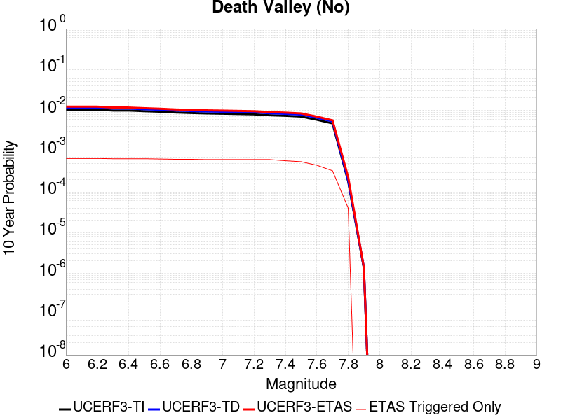 |

| Magnitude | 1 wk TI Prob | 1 wk TD Prob | 1 wk ETAS Prob | 1 wk ETAS/TD Gain | 1 wk ETAS Triggered Only | 1 mo TI Prob | 1 mo TD Prob | 1 mo ETAS Prob | 1 mo ETAS/TD Gain | 1 mo ETAS Triggered Only | 1 yr TI Prob | 1 yr TD Prob | 1 yr ETAS Prob | 1 yr ETAS/TD Gain | 1 yr ETAS Triggered Only | 10 yr TI Prob | 10 yr TD Prob | 10 yr ETAS Prob | 10 yr ETAS/TD Gain | 10 yr ETAS Triggered Only |
|-----|-----|-----|-----|-----|-----|-----|-----|-----|-----|-----|-----|-----|-----|-----|-----|-----|-----|-----|-----|-----|
| 6.0 | 2.0074807E-5 | 2.2500084E-5 | 8.2844606E-4 | 36.81969 | 8.059641E-4 | 8.603206E-5 | 9.642541E-5 | 0.001305255 | 13.536423 | 0.0012089462 | 0.001046937 | 0.0011733545 | 0.002984646 | 2.5436866 | 0.0018134193 | 0.010420183 | 0.011672506 | 0.013663897 | 1.1706053 | 0.0020149103 |
| 6.1 | 2.0074807E-5 | 2.2500084E-5 | 8.2844606E-4 | 36.81969 | 8.059641E-4 | 8.603206E-5 | 9.642541E-5 | 0.001305255 | 13.536423 | 0.0012089462 | 0.001046937 | 0.0011733545 | 0.002984646 | 2.5436866 | 0.0018134193 | 0.010420183 | 0.011672506 | 0.013663897 | 1.1706053 | 0.0020149103 |
| 6.2 | 2.0074807E-5 | 2.2500084E-5 | 8.2844606E-4 | 36.81969 | 8.059641E-4 | 8.603206E-5 | 9.642541E-5 | 0.001305255 | 13.536423 | 0.0012089462 | 0.001046937 | 0.0011733545 | 0.002984646 | 2.5436866 | 0.0018134193 | 0.010420183 | 0.011672506 | 0.013663897 | 1.1706053 | 0.0020149103 |
| 6.3 | 1.9050609E-5 | 2.1336948E-5 | 8.272839E-4 | 38.772366 | 8.059641E-4 | 8.164292E-5 | 9.1440896E-5 | 0.0013002765 | 14.219858 | 0.0012089462 | 9.935491E-4 | 0.001112731 | 0.0029241324 | 2.627888 | 0.0018134193 | 0.009891188 | 0.011072419 | 0.013065019 | 1.1799607 | 0.0020149103 |
| 6.4 | 1.9050609E-5 | 2.1336948E-5 | 8.272839E-4 | 38.772366 | 8.059641E-4 | 8.164292E-5 | 9.1440896E-5 | 0.0013002765 | 14.219858 | 0.0012089462 | 9.935491E-4 | 0.001112731 | 0.0029241324 | 2.627888 | 0.0018134193 | 0.009891188 | 0.011072419 | 0.013065019 | 1.1799607 | 0.0020149103 |
| 6.5 | 1.8367004E-5 | 2.0561009E-5 | 8.2650856E-4 | 40.19786 | 8.059641E-4 | 7.8713354E-5 | 8.811567E-5 | 0.0012969554 | 14.718782 | 0.0012089462 | 9.5791375E-4 | 0.0010722869 | 0.0028837617 | 2.6893566 | 0.0018134193 | 0.009537951 | 0.0106719155 | 0.012665323 | 1.18679 | 0.0020149103 |
| 6.6 | 1.779439E-5 | 1.9910927E-5 | 8.25859E-4 | 41.477676 | 8.059641E-4 | 7.625944E-5 | 8.53298E-5 | 0.0012941728 | 15.166718 | 0.0012089462 | 9.280632E-4 | 0.0010384015 | 0.0028499376 | 2.744543 | 0.0018134193 | 0.009241969 | 0.010336253 | 0.0123303365 | 1.1929214 | 0.0020149103 |
| 6.7 | 1.7025437E-5 | 1.9043426E-5 | 8.249922E-4 | 43.32163 | 8.059641E-4 | 7.296412E-5 | 8.161216E-5 | 0.0012904597 | 15.8121 | 0.0012089462 | 8.87976E-4 | 9.931813E-4 | 0.0028047995 | 2.824056 | 0.0018134193 | 0.008844362 | 0.009888145 | 0.011883132 | 1.2017554 | 0.0020149103 |
| 6.8 | 1.6545107E-5 | 1.8512545E-5 | 8.2446175E-4 | 44.5353 | 8.059641E-4 | 7.090568E-5 | 7.93371E-5 | 0.0012881873 | 16.236885 | 0.0012089462 | 8.629347E-4 | 9.655073E-4 | 0.0027771757 | 2.8763902 | 0.0018134193 | 0.008595915 | 0.009613829 | 0.011609368 | 1.2075697 | 0.0020149103 |
| 6.9 | 1.615478E-5 | 1.8087594E-5 | 8.240371E-4 | 45.55814 | 8.059641E-4 | 6.9232934E-5 | 7.751599E-5 | 0.0012863685 | 16.59488 | 0.0012089462 | 8.4258494E-4 | 9.433546E-4 | 0.0027550634 | 2.9204957 | 0.0018134193 | 0.008393973 | 0.009394196 | 0.0113901775 | 1.2124697 | 0.0020149103 |
| 7.0 | 1.5894311E-5 | 1.780555E-5 | 8.2375534E-4 | 46.263966 | 8.059641E-4 | 6.81167E-5 | 7.6307304E-5 | 0.0012851612 | 16.841917 | 0.0012089462 | 8.2900526E-4 | 9.286515E-4 | 0.0027403869 | 2.9509313 | 0.0018134193 | 0.008259195 | 0.009248397 | 0.011244673 | 1.215851 | 0.0020149103 |
| 7.1 | 1.5602263E-5 | 1.7483504E-5 | 8.2343357E-4 | 47.097744 | 8.059641E-4 | 6.6865134E-5 | 7.492718E-5 | 0.0012837828 | 17.13374 | 0.0012089462 | 8.137789E-4 | 9.118627E-4 | 0.0027236284 | 2.9868844 | 0.0018134193 | 0.008108052 | 0.009081894 | 0.011078505 | 1.2198453 | 0.0020149103 |
| 7.2 | 1.5323829E-5 | 1.717063E-5 | 8.2312094E-4 | 47.937725 | 8.059641E-4 | 6.56719E-5 | 7.358637E-5 | 0.0012824436 | 17.427732 | 0.0012089462 | 7.99262E-4 | 8.9555193E-4 | 0.0027073473 | 3.0231047 | 0.0018134193 | 0.007963934 | 0.008920107 | 0.010917043 | 1.2238692 | 0.0020149103 |
| 7.3 | 1.4556212E-5 | 1.6302456E-5 | 8.2225347E-4 | 50.4374 | 8.059641E-4 | 6.238227E-5 | 6.9865826E-5 | 0.0012787275 | 18.302618 | 0.0012089462 | 7.592395E-4 | 8.5029035E-4 | 0.0026621677 | 3.1308925 | 0.0018134193 | 0.0075665074 | 0.008471014 | 0.010468856 | 1.2358445 | 0.0020149103 |
| 7.4 | 1.411725E-5 | 1.580796E-5 | 6.202715E-4 | 39.237923 | 6.044731E-4 | 6.0501097E-5 | 6.7746674E-5 | 0.0010751336 | 15.869909 | 0.0010074552 | 7.363519E-4 | 8.245094E-4 | 0.0024351086 | 2.953403 | 0.0016119282 | 0.0073391674 | 0.008215138 | 0.01001366 | 1.2189277 | 0.0018134193 |
| 7.5 | 1.3503312E-5 | 1.5126289E-5 | 4.1810225E-4 | 27.640768 | 4.0298206E-4 | 5.7870053E-5 | 6.482538E-5 | 8.7073725E-4 | 13.432044 | 8.059641E-4 | 7.043401E-4 | 7.8896893E-4 | 0.0019969614 | 2.5311027 | 0.0012089462 | 0.007021119 | 0.007862304 | 0.009261652 | 1.1779819 | 0.0014104373 |
| 7.6 | 1.1279839E-5 | 1.2626327E-5 | 2.1411481E-4 | 16.957808 | 2.0149103E-4 | 4.834127E-5 | 5.4111737E-5 | 4.57072E-4 | 8.446818 | 4.0298206E-4 | 5.88396E-4 | 6.5861654E-4 | 0.0010613332 | 1.6114584 | 4.0298206E-4 | 0.005868405 | 0.006567199 | 0.007167702 | 1.0914398 | 6.044731E-4 |
| 7.7 | 9.189108E-6 | 1.0283358E-5 | 2.1177232E-4 | 20.593693 | 2.0149103E-4 | 3.93813E-5 | 4.407082E-5 | 4.4703513E-4 | 10.143563 | 4.0298206E-4 | 4.7936183E-4 | 5.3643517E-4 | 9.3920104E-4 | 1.7508193 | 4.0298206E-4 | 0.004783291 | 0.005351914 | 0.0059531517 | 1.1123408 | 6.044731E-4 |
| 7.8 | 3.4586725E-7 | 3.6482615E-7 | 3.6482615E-7 | 1.0 | 0.0 | 1.4822873E-6 | 1.5635396E-6 | 1.5635396E-6 | 1.0 | 0.0 | 1.80467E-5 | 1.9035933E-5 | 1.9035933E-5 | 1.0 | 0.0 | 1.8045233E-4 | 1.9034347E-4 | 1.9034347E-4 | 1.0 | 0.0 |
| 7.9 | 2.5591178E-9 | 2.6696718E-9 | 2.6696718E-9 | 1.0 | 0.0 | 1.0967647E-8 | 1.14414505E-8 | 1.14414505E-8 | 1.0 | 0.0 | 1.335311E-7 | 1.3929966E-7 | 1.3929966E-7 | 1.0 | 0.0 | 1.3353102E-6 | 1.3929966E-6 | 1.3929966E-6 | 1.0 | 0.0 |

## Death Valley (Black Mtns Frontal)
*[(top)](#table-of-contents)*

| 1 Week | 1 Month | 1 Year | 10 Year |
|-----|-----|-----|-----|
|  |  |  |  |

| Magnitude | 1 wk TI Prob | 1 wk TD Prob | 1 wk ETAS Prob | 1 wk ETAS/TD Gain | 1 wk ETAS Triggered Only | 1 mo TI Prob | 1 mo TD Prob | 1 mo ETAS Prob | 1 mo ETAS/TD Gain | 1 mo ETAS Triggered Only | 1 yr TI Prob | 1 yr TD Prob | 1 yr ETAS Prob | 1 yr ETAS/TD Gain | 1 yr ETAS Triggered Only | 10 yr TI Prob | 10 yr TD Prob | 10 yr ETAS Prob | 10 yr ETAS/TD Gain | 10 yr ETAS Triggered Only |
|-----|-----|-----|-----|-----|-----|-----|-----|-----|-----|-----|-----|-----|-----|-----|-----|-----|-----|-----|-----|-----|
| 6.0 | 1.6707214E-5 | 1.867027E-5 | 0.0010261066 | 54.959393 | 0.0010074552 | 7.160038E-5 | 8.001302E-5 | 0.0012888625 | 16.108158 | 0.0012089462 | 8.71386E-4 | 9.737309E-4 | 0.0027853844 | 2.860528 | 0.0018134193 | 0.00867977 | 0.009695496 | 0.011690872 | 1.2058042 | 0.0020149103 |
| 6.1 | 1.6707214E-5 | 1.867027E-5 | 0.0010261066 | 54.959393 | 0.0010074552 | 7.160038E-5 | 8.001302E-5 | 0.0012888625 | 16.108158 | 0.0012089462 | 8.71386E-4 | 9.737309E-4 | 0.0027853844 | 2.860528 | 0.0018134193 | 0.00867977 | 0.009695496 | 0.011690872 | 1.2058042 | 0.0020149103 |
| 6.2 | 1.6707214E-5 | 1.867027E-5 | 0.0010261066 | 54.959393 | 0.0010074552 | 7.160038E-5 | 8.001302E-5 | 0.0012888625 | 16.108158 | 0.0012089462 | 8.71386E-4 | 9.737309E-4 | 0.0027853844 | 2.860528 | 0.0018134193 | 0.00867977 | 0.009695496 | 0.011690872 | 1.2058042 | 0.0020149103 |
| 6.3 | 1.6707214E-5 | 1.867027E-5 | 0.0010261066 | 54.959393 | 0.0010074552 | 7.160038E-5 | 8.001302E-5 | 0.0012888625 | 16.108158 | 0.0012089462 | 8.71386E-4 | 9.737309E-4 | 0.0027853844 | 2.860528 | 0.0018134193 | 0.00867977 | 0.009695496 | 0.011690872 | 1.2058042 | 0.0020149103 |
| 6.4 | 1.5515609E-5 | 1.7338214E-5 | 0.0010247759 | 59.10505 | 0.0010074552 | 6.649377E-5 | 7.4304546E-5 | 0.0012831609 | 17.268942 | 0.0012089462 | 8.0926094E-4 | 9.042885E-4 | 0.002716068 | 3.0035415 | 0.0018134193 | 0.008063202 | 0.009006773 | 0.011003535 | 1.2216957 | 0.0020149103 |
| 6.5 | 1.5515609E-5 | 1.7338214E-5 | 0.0010247759 | 59.10505 | 0.0010074552 | 6.649377E-5 | 7.4304546E-5 | 0.0012831609 | 17.268942 | 0.0012089462 | 8.0926094E-4 | 9.042885E-4 | 0.002716068 | 3.0035415 | 0.0018134193 | 0.008063202 | 0.009006773 | 0.011003535 | 1.2216957 | 0.0020149103 |
| 6.6 | 1.5041828E-5 | 1.6809145E-5 | 0.0010242474 | 60.933937 | 0.0010074552 | 6.4463384E-5 | 7.203723E-5 | 0.0012808964 | 17.78103 | 0.0012089462 | 7.8455906E-4 | 8.767063E-4 | 0.0026885357 | 3.066632 | 0.0018134193 | 0.00781795 | 0.008733132 | 0.010730446 | 1.2287053 | 0.0020149103 |
| 6.7 | 1.4634985E-5 | 1.6356016E-5 | 0.0010237948 | 62.59438 | 0.0010074552 | 6.271985E-5 | 7.009536E-5 | 0.0012789568 | 18.245955 | 0.0012089462 | 7.6334673E-4 | 8.5308263E-4 | 0.0026649549 | 3.1239119 | 0.0018134193 | 0.007607299 | 0.008498715 | 0.010496502 | 1.2350692 | 0.0020149103 |
| 6.8 | 1.4209158E-5 | 1.5882048E-5 | 8.218334E-4 | 51.74606 | 8.059641E-4 | 6.089497E-5 | 6.8064175E-5 | 0.0010754508 | 15.800541 | 0.0010074552 | 7.4114406E-4 | 8.2837185E-4 | 0.0022376408 | 2.7012515 | 0.0014104373 | 0.007386771 | 0.008253456 | 0.009852081 | 1.1936915 | 0.0016119282 |
| 6.9 | 1.3780098E-5 | 1.5404594E-5 | 8.213563E-4 | 53.318924 | 8.059641E-4 | 5.9056227E-5 | 6.6018045E-5 | 0.0010734067 | 16.259293 | 0.0010074552 | 7.1877235E-4 | 8.0347876E-4 | 0.0022127826 | 2.7540028 | 0.0014104373 | 0.0071645193 | 0.008006332 | 0.009605356 | 1.1997198 | 0.0016119282 |
| 7.0 | 1.3585064E-5 | 1.5188155E-5 | 8.211401E-4 | 54.064503 | 8.059641E-4 | 5.8220405E-5 | 6.50905E-5 | 0.0010724801 | 16.476753 | 0.0010074552 | 7.086029E-4 | 7.9219416E-4 | 0.002201514 | 2.7790082 | 0.0014104373 | 0.007063476 | 0.007894293 | 0.009493497 | 1.2025771 | 0.0016119282 |
| 7.1 | 1.3398601E-5 | 1.49813395E-5 | 8.209334E-4 | 54.797062 | 8.059641E-4 | 5.742131E-5 | 6.420419E-5 | 0.0010715947 | 16.690416 | 0.0010074552 | 6.9888023E-4 | 7.8141113E-4 | 0.0021907461 | 2.803577 | 0.0014104373 | 0.0069668638 | 0.007787224 | 0.0093866 | 1.2053846 | 0.0016119282 |
| 7.2 | 1.3126312E-5 | 1.4679561E-5 | 6.191438E-4 | 42.17727 | 6.044731E-4 | 5.6254412E-5 | 6.291092E-5 | 8.6882437E-4 | 13.81039 | 8.059641E-4 | 6.846822E-4 | 7.6567667E-4 | 0.0019736972 | 2.5777164 | 0.0012089462 | 0.006825765 | 0.00763097 | 0.009030644 | 1.1834202 | 0.0014104373 |
| 7.3 | 1.2922429E-5 | 1.4453788E-5 | 6.1891816E-4 | 42.82048 | 6.044731E-4 | 5.5380664E-5 | 6.194336E-5 | 8.678576E-4 | 14.010501 | 8.059641E-4 | 6.74051E-4 | 7.53905E-4 | 0.0019619397 | 2.60237 | 0.0012089462 | 0.006720101 | 0.007514055 | 0.008913894 | 1.1862961 | 0.0014104373 |
| 7.4 | 1.2768878E-5 | 1.4283772E-5 | 6.1874825E-4 | 43.318268 | 6.044731E-4 | 5.4722615E-5 | 6.1214756E-5 | 8.6712954E-4 | 14.165368 | 8.059641E-4 | 6.660441E-4 | 7.4504025E-4 | 0.0019530858 | 2.62145 | 0.0012089462 | 0.0066405144 | 0.0074260035 | 0.008825967 | 1.1885217 | 0.0014104373 |
| 7.5 | 1.2521929E-5 | 1.40120155E-5 | 4.1698845E-4 | 29.759348 | 4.0298206E-4 | 5.366431E-5 | 6.005014E-5 | 6.6448696E-4 | 11.065535 | 6.044731E-4 | 6.531671E-4 | 7.3087064E-4 | 0.0015362457 | 2.1019392 | 8.059641E-4 | 0.006512506 | 0.0072852457 | 0.008285361 | 1.1372796 | 0.0010074552 |
| 7.6 | 1.1301089E-5 | 1.2648149E-5 | 2.1413663E-4 | 16.930275 | 2.0149103E-4 | 4.8432343E-5 | 5.4205255E-5 | 4.5716547E-4 | 8.4339695 | 4.0298206E-4 | 5.895042E-4 | 6.5975444E-4 | 0.0010624707 | 1.6104032 | 4.0298206E-4 | 0.0058794282 | 0.00657851 | 0.007179007 | 1.0912815 | 6.044731E-4 |
| 7.7 | 9.189108E-6 | 1.0283358E-5 | 2.1177232E-4 | 20.593693 | 2.0149103E-4 | 3.93813E-5 | 4.407082E-5 | 4.4703513E-4 | 10.143563 | 4.0298206E-4 | 4.7936183E-4 | 5.3643517E-4 | 9.3920104E-4 | 1.7508193 | 4.0298206E-4 | 0.004783291 | 0.005351914 | 0.0059531517 | 1.1123408 | 6.044731E-4 |
| 7.8 | 3.4586725E-7 | 3.6482615E-7 | 3.6482615E-7 | 1.0 | 0.0 | 1.4822873E-6 | 1.5635396E-6 | 1.5635396E-6 | 1.0 | 0.0 | 1.80467E-5 | 1.9035933E-5 | 1.9035933E-5 | 1.0 | 0.0 | 1.8045233E-4 | 1.9034347E-4 | 1.9034347E-4 | 1.0 | 0.0 |
| 7.9 | 2.5591178E-9 | 2.6696718E-9 | 2.6696718E-9 | 1.0 | 0.0 | 1.0967647E-8 | 1.14414505E-8 | 1.14414505E-8 | 1.0 | 0.0 | 1.335311E-7 | 1.3929966E-7 | 1.3929966E-7 | 1.0 | 0.0 | 1.3353102E-6 | 1.3929966E-6 | 1.3929966E-6 | 1.0 | 0.0 |

## Bicycle Lake
*[(top)](#table-of-contents)*

| 1 Week | 1 Month | 1 Year | 10 Year |
|-----|-----|-----|-----|
|  |  |  |  |

| Magnitude | 1 wk TI Prob | 1 wk TD Prob | 1 wk ETAS Prob | 1 wk ETAS/TD Gain | 1 wk ETAS Triggered Only | 1 mo TI Prob | 1 mo TD Prob | 1 mo ETAS Prob | 1 mo ETAS/TD Gain | 1 mo ETAS Triggered Only | 1 yr TI Prob | 1 yr TD Prob | 1 yr ETAS Prob | 1 yr ETAS/TD Gain | 1 yr ETAS Triggered Only | 10 yr TI Prob | 10 yr TD Prob | 10 yr ETAS Prob | 10 yr ETAS/TD Gain | 10 yr ETAS Triggered Only |
|-----|-----|-----|-----|-----|-----|-----|-----|-----|-----|-----|-----|-----|-----|-----|-----|-----|-----|-----|-----|-----|
| 6.0 | 1.9621975E-5 | 2.2097078E-5 | 0.00102953 | 46.59123 | 0.0010074552 | 8.4091465E-5 | 9.4699084E-5 | 0.0013035308 | 13.764977 | 0.0012089462 | 0.0010233327 | 0.0011524865 | 0.002762557 | 2.3970406 | 0.0016119282 | 0.01018633 | 0.011478408 | 0.013271012 | 1.1561718 | 0.0018134193 |
| 6.1 | 1.9621975E-5 | 2.2097078E-5 | 0.00102953 | 46.59123 | 0.0010074552 | 8.4091465E-5 | 9.4699084E-5 | 0.0013035308 | 13.764977 | 0.0012089462 | 0.0010233327 | 0.0011524865 | 0.002762557 | 2.3970406 | 0.0016119282 | 0.01018633 | 0.011478408 | 0.013271012 | 1.1561718 | 0.0018134193 |
| 6.2 | 9.9971285E-6 | 1.1255639E-5 | 4.1423316E-4 | 36.802277 | 4.0298206E-4 | 4.2844134E-5 | 4.8237856E-5 | 4.512005E-4 | 9.35366 | 4.0298206E-4 | 5.2150246E-4 | 5.871896E-4 | 0.0013926806 | 2.371773 | 8.059641E-4 | 0.0052028033 | 0.005861487 | 0.0068630367 | 1.1708696 | 0.0010074552 |
| 6.3 | 9.589428E-6 | 1.0798346E-5 | 4.1377606E-4 | 38.318466 | 4.0298206E-4 | 4.10969E-5 | 4.62781E-5 | 4.4924152E-4 | 9.707433 | 4.0298206E-4 | 5.002399E-4 | 5.6334207E-4 | 0.0013688521 | 2.4298775 | 8.059641E-4 | 0.0049911533 | 0.0056242296 | 0.006425661 | 1.1424962 | 8.059641E-4 |
| 6.4 | 9.589428E-6 | 1.0798346E-5 | 4.1377606E-4 | 38.318466 | 4.0298206E-4 | 4.10969E-5 | 4.62781E-5 | 4.4924152E-4 | 9.707433 | 4.0298206E-4 | 5.002399E-4 | 5.6334207E-4 | 0.0013688521 | 2.4298775 | 8.059641E-4 | 0.0049911533 | 0.0056242296 | 0.006425661 | 1.1424962 | 8.059641E-4 |
| 6.5 | 5.557707E-6 | 6.2856016E-6 | 2.0777537E-4 | 33.055767 | 2.0149103E-4 | 2.3818526E-5 | 2.6938165E-5 | 2.2842377E-4 | 8.479559 | 2.0149103E-4 | 2.8995197E-4 | 3.2794967E-4 | 9.3222456E-4 | 2.8425841 | 6.044731E-4 | 0.0028957394 | 0.0032772934 | 0.0038797855 | 1.1838382 | 6.044731E-4 |
| 6.6 | 4.8742945E-6 | 5.5132896E-6 | 2.070032E-4 | 37.546223 | 2.0149103E-4 | 2.0889667E-5 | 2.3628318E-5 | 2.2511459E-4 | 9.527322 | 2.0149103E-4 | 2.54302E-4 | 2.87663E-4 | 8.919622E-4 | 3.1007192 | 6.044731E-4 | 0.002540112 | 0.0028754752 | 0.0034782102 | 1.2096123 | 6.044731E-4 |
| 6.7 | 3.991108E-6 | 4.5159104E-6 | 2.0600604E-4 | 45.617832 | 2.0149103E-4 | 1.7104636E-5 | 1.9353902E-5 | 2.2084103E-4 | 11.410673 | 2.0149103E-4 | 2.0822904E-4 | 2.3563375E-4 | 8.399644E-4 | 3.5647035 | 6.044731E-4 | 0.0020803404 | 0.0023563374 | 0.0029593862 | 1.2559263 | 6.044731E-4 |

## Paradise
*[(top)](#table-of-contents)*

| 1 Week | 1 Month | 1 Year | 10 Year |
|-----|-----|-----|-----|
|  |  |  |  |

| Magnitude | 1 wk TI Prob | 1 wk TD Prob | 1 wk ETAS Prob | 1 wk ETAS/TD Gain | 1 wk ETAS Triggered Only | 1 mo TI Prob | 1 mo TD Prob | 1 mo ETAS Prob | 1 mo ETAS/TD Gain | 1 mo ETAS Triggered Only | 1 yr TI Prob | 1 yr TD Prob | 1 yr ETAS Prob | 1 yr ETAS/TD Gain | 1 yr ETAS Triggered Only | 10 yr TI Prob | 10 yr TD Prob | 10 yr ETAS Prob | 10 yr ETAS/TD Gain | 10 yr ETAS Triggered Only |
|-----|-----|-----|-----|-----|-----|-----|-----|-----|-----|-----|-----|-----|-----|-----|-----|-----|-----|-----|-----|-----|
| 6.0 | 1.4851273E-5 | 1.6694692E-5 | 8.226454E-4 | 49.275867 | 8.059641E-4 | 6.364676E-5 | 7.154685E-5 | 8.774533E-4 | 12.264039 | 8.059641E-4 | 7.7462377E-4 | 8.707584E-4 | 0.0022799675 | 2.6183698 | 0.0014104373 | 0.0077192914 | 0.008675844 | 0.010273788 | 1.184183 | 0.0016119282 |
| 6.1 | 1.4851273E-5 | 1.6694692E-5 | 8.226454E-4 | 49.275867 | 8.059641E-4 | 6.364676E-5 | 7.154685E-5 | 8.774533E-4 | 12.264039 | 8.059641E-4 | 7.7462377E-4 | 8.707584E-4 | 0.0022799675 | 2.6183698 | 0.0014104373 | 0.0077192914 | 0.008675844 | 0.010273788 | 1.184183 | 0.0016119282 |
| 6.2 | 1.4851273E-5 | 1.6694692E-5 | 8.226454E-4 | 49.275867 | 8.059641E-4 | 6.364676E-5 | 7.154685E-5 | 8.774533E-4 | 12.264039 | 8.059641E-4 | 7.7462377E-4 | 8.707584E-4 | 0.0022799675 | 2.6183698 | 0.0014104373 | 0.0077192914 | 0.008675844 | 0.010273788 | 1.184183 | 0.0016119282 |
| 6.3 | 1.0426831E-5 | 1.188862E-5 | 4.148659E-4 | 34.89605 | 4.0298206E-4 | 4.4685654E-5 | 5.0950268E-5 | 4.539118E-4 | 8.908918 | 4.0298206E-4 | 5.43912E-4 | 6.201489E-4 | 0.0012242472 | 1.974118 | 6.044731E-4 | 0.0054258266 | 0.0061847917 | 0.006985771 | 1.1295079 | 8.059641E-4 |
| 6.4 | 1.0426831E-5 | 1.188862E-5 | 4.148659E-4 | 34.89605 | 4.0298206E-4 | 4.4685654E-5 | 5.0950268E-5 | 4.539118E-4 | 8.908918 | 4.0298206E-4 | 5.43912E-4 | 6.201489E-4 | 0.0012242472 | 1.974118 | 6.044731E-4 | 0.0054258266 | 0.0061847917 | 0.006985771 | 1.1295079 | 8.059641E-4 |
| 6.5 | 9.25027E-6 | 1.06199595E-5 | 4.1359774E-4 | 38.94532 | 4.0298206E-4 | 3.964341E-5 | 4.551335E-5 | 4.4847708E-4 | 9.853748 | 4.0298206E-4 | 4.8255164E-4 | 5.53989E-4 | 0.0011581272 | 2.090524 | 6.044731E-4 | 0.0048150513 | 0.0055265795 | 0.006328089 | 1.1450282 | 8.059641E-4 |
| 6.6 | 7.904275E-6 | 9.159525E-6 | 4.121379E-4 | 44.995552 | 4.0298206E-4 | 3.3875025E-5 | 3.9254537E-5 | 4.422208E-4 | 11.265469 | 4.0298206E-4 | 4.1235037E-4 | 4.7782314E-4 | 0.0010820074 | 2.2644517 | 6.044731E-4 | 0.0041158604 | 0.0047683544 | 0.0055704755 | 1.1682175 | 8.059641E-4 |
| 6.7 | 7.2061953E-6 | 8.407248E-6 | 2.0989659E-4 | 24.966146 | 2.0149103E-4 | 3.088333E-5 | 3.6030586E-5 | 2.3751437E-4 | 6.59202 | 2.0149103E-4 | 3.7593965E-4 | 4.3858777E-4 | 8.413931E-4 | 1.9184144 | 4.0298206E-4 | 0.003753043 | 0.004377591 | 0.004979418 | 1.1374791 | 6.044731E-4 |
| 6.8 | 6.6948724E-6 | 7.842166E-6 | 2.0933161E-4 | 26.693087 | 2.0149103E-4 | 2.8691995E-5 | 3.360887E-5 | 2.3509313E-4 | 6.9949727 | 2.0149103E-4 | 3.4926904E-4 | 4.0911473E-4 | 8.119319E-4 | 1.984607 | 4.0298206E-4 | 0.003487206 | 0.0040839734 | 0.0046859775 | 1.1474066 | 6.044731E-4 |
| 6.9 | 6.0421025E-6 | 7.130621E-6 | 2.0862021E-4 | 29.25695 | 2.0149103E-4 | 2.5894467E-5 | 3.0559466E-5 | 2.3204435E-4 | 7.593207 | 2.0149103E-4 | 3.1521954E-4 | 3.7200135E-4 | 7.748335E-4 | 2.082878 | 4.0298206E-4 | 0.0031477278 | 0.0037141247 | 0.00411561 | 1.1080968 | 4.0298206E-4 |
| 7.0 | 4.134091E-6 | 5.0803087E-6 | 5.0803087E-6 | 1.0 | 0.0 | 1.7717413E-5 | 2.177258E-5 | 2.177258E-5 | 1.0 | 0.0 | 2.1568815E-4 | 2.6505045E-4 | 2.6505045E-4 | 1.0 | 0.0 | 0.0021547892 | 0.0026474963 | 0.0026474963 | 1.0 | 0.0 |
| 7.1 | 3.7674888E-6 | 4.6318696E-6 | 4.6318696E-6 | 1.0 | 0.0 | 1.6146281E-5 | 1.9850726E-5 | 1.9850726E-5 | 1.0 | 0.0 | 1.9656324E-4 | 2.4165731E-4 | 2.4165731E-4 | 1.0 | 0.0 | 0.0019638946 | 0.002414096 | 0.002414096 | 1.0 | 0.0 |
| 7.2 | 3.4065345E-6 | 4.156723E-6 | 4.156723E-6 | 1.0 | 0.0 | 1.4599351E-5 | 1.7814415E-5 | 1.7814415E-5 | 1.0 | 0.0 | 1.777326E-4 | 2.1687041E-4 | 2.1687041E-4 | 1.0 | 0.0 | 0.0017759053 | 0.002166736 | 0.002166736 | 1.0 | 0.0 |
| 7.3 | 2.9934936E-6 | 3.6293168E-6 | 3.6293168E-6 | 1.0 | 0.0 | 1.2829195E-5 | 1.555413E-5 | 1.555413E-5 | 1.0 | 0.0 | 1.5618425E-4 | 1.8935655E-4 | 1.8935655E-4 | 1.0 | 0.0 | 0.0015607453 | 0.0018920974 | 0.0018920974 | 1.0 | 0.0 |
| 7.4 | 2.4049796E-6 | 2.8889842E-6 | 2.8889842E-6 | 1.0 | 0.0 | 1.0307015E-5 | 1.238131E-5 | 1.238131E-5 | 1.0 | 0.0 | 1.2548068E-4 | 1.5073347E-4 | 1.5073347E-4 | 1.0 | 0.0 | 0.0012540985 | 0.0015064536 | 0.0015064536 | 1.0 | 0.0 |
| 7.5 | 1.2710091E-6 | 1.5134682E-6 | 1.5134682E-6 | 1.0 | 0.0 | 5.44717E-6 | 6.4862834E-6 | 6.4862834E-6 | 1.0 | 0.0 | 6.631728E-5 | 7.8968886E-5 | 7.8968886E-5 | 1.0 | 0.0 | 6.6297496E-4 | 7.8953087E-4 | 7.8953087E-4 | 1.0 | 0.0 |
| 7.6 | 2.21172E-7 | 2.603961E-7 | 2.603961E-7 | 1.0 | 0.0 | 9.478797E-7 | 1.1159829E-6 | 1.1159829E-6 | 1.0 | 0.0 | 1.1540374E-5 | 1.3587036E-5 | 1.3587036E-5 | 1.0 | 0.0 | 1.1539775E-4 | 1.3586486E-4 | 1.3586486E-4 | 1.0 | 0.0 |

## Coyote Lake
*[(top)](#table-of-contents)*

| 1 Week | 1 Month | 1 Year | 10 Year |
|-----|-----|-----|-----|
|  |  |  |  |

| Magnitude | 1 wk TI Prob | 1 wk TD Prob | 1 wk ETAS Prob | 1 wk ETAS/TD Gain | 1 wk ETAS Triggered Only | 1 mo TI Prob | 1 mo TD Prob | 1 mo ETAS Prob | 1 mo ETAS/TD Gain | 1 mo ETAS Triggered Only | 1 yr TI Prob | 1 yr TD Prob | 1 yr ETAS Prob | 1 yr ETAS/TD Gain | 1 yr ETAS Triggered Only | 10 yr TI Prob | 10 yr TD Prob | 10 yr ETAS Prob | 10 yr ETAS/TD Gain | 10 yr ETAS Triggered Only |
|-----|-----|-----|-----|-----|-----|-----|-----|-----|-----|-----|-----|-----|-----|-----|-----|-----|-----|-----|-----|-----|
| 6.0 | 1.980352E-5 | 2.1706745E-5 | 0.0012306267 | 56.693287 | 0.0012089462 | 8.486947E-5 | 9.302599E-5 | 0.0013018597 | 13.99458 | 0.0012089462 | 0.0010327959 | 0.0011320751 | 0.0025409155 | 2.2444763 | 0.0014104373 | 0.010280091 | 0.011270258 | 0.0126648 | 1.1237364 | 0.0014104373 |
| 6.1 | 1.980352E-5 | 2.1706745E-5 | 0.0012306267 | 56.693287 | 0.0012089462 | 8.486947E-5 | 9.302599E-5 | 0.0013018597 | 13.99458 | 0.0012089462 | 0.0010327959 | 0.0011320751 | 0.0025409155 | 2.2444763 | 0.0014104373 | 0.010280091 | 0.011270258 | 0.0126648 | 1.1237364 | 0.0014104373 |
| 6.2 | 1.980352E-5 | 2.1706745E-5 | 0.0012306267 | 56.693287 | 0.0012089462 | 8.486947E-5 | 9.302599E-5 | 0.0013018597 | 13.99458 | 0.0012089462 | 0.0010327959 | 0.0011320751 | 0.0025409155 | 2.2444763 | 0.0014104373 | 0.010280091 | 0.011270258 | 0.0126648 | 1.1237364 | 0.0014104373 |
| 6.3 | 1.5344787E-5 | 1.682067E-5 | 0.0010242589 | 60.892876 | 0.0010074552 | 6.576172E-5 | 7.2086936E-5 | 0.0010794695 | 14.974551 | 0.0010074552 | 8.003548E-4 | 8.773662E-4 | 0.0018839375 | 2.1472647 | 0.0010074552 | 0.007974784 | 0.00874507 | 0.009743714 | 1.1141952 | 0.0010074552 |
| 6.4 | 1.5344787E-5 | 1.682067E-5 | 0.0010242589 | 60.892876 | 0.0010074552 | 6.576172E-5 | 7.2086936E-5 | 0.0010794695 | 14.974551 | 0.0010074552 | 8.003548E-4 | 8.773662E-4 | 0.0018839375 | 2.1472647 | 0.0010074552 | 0.007974784 | 0.00874507 | 0.009743714 | 1.1141952 | 0.0010074552 |
| 6.5 | 1.4189697E-5 | 1.5557987E-5 | 8.215096E-4 | 52.803078 | 8.059641E-4 | 6.081157E-5 | 6.6675726E-5 | 8.725861E-4 | 13.087014 | 8.059641E-4 | 7.401293E-4 | 8.115349E-4 | 0.0016168449 | 1.9923296 | 8.059641E-4 | 0.0073766913 | 0.008091656 | 0.008891098 | 1.0987984 | 8.059641E-4 |
| 6.6 | 1.3469301E-5 | 1.4771577E-5 | 6.1923574E-4 | 41.92076 | 6.044731E-4 | 5.7724297E-5 | 6.330556E-5 | 6.677404E-4 | 10.5478945 | 6.044731E-4 | 7.025667E-4 | 7.7053264E-4 | 0.0013745399 | 1.7838829 | 6.044731E-4 | 0.0070034964 | 0.0076845144 | 0.0082843425 | 1.0780567 | 6.044731E-4 |
| 6.7 | 1.3027966E-5 | 1.4281745E-5 | 6.187462E-4 | 43.324272 | 6.044731E-4 | 5.5832945E-5 | 6.120638E-5 | 6.656425E-4 | 10.875378 | 6.044731E-4 | 6.7955407E-4 | 7.4499263E-4 | 0.0013490154 | 1.8107768 | 6.044731E-4 | 0.006774798 | 0.0074308286 | 0.00803081 | 1.0807422 | 6.044731E-4 |
| 6.8 | 5.695434E-6 | 6.2244176E-6 | 2.077142E-4 | 33.370865 | 2.0149103E-4 | 2.4408775E-5 | 2.6675973E-5 | 2.2816163E-4 | 8.553077 | 2.0149103E-4 | 2.971363E-4 | 3.2476155E-4 | 5.261871E-4 | 1.6202261 | 2.0149103E-4 | 0.0029673933 | 0.0032458105 | 0.0034466474 | 1.0618758 | 2.0149103E-4 |
| 6.9 | 4.385688E-6 | 4.7930553E-6 | 2.0628312E-4 | 43.037918 | 2.0149103E-4 | 1.879567E-5 | 2.0541665E-5 | 2.2202857E-4 | 10.808693 | 2.0149103E-4 | 2.2881327E-4 | 2.5009477E-4 | 4.5153542E-4 | 1.8054572 | 2.0149103E-4 | 0.002285778 | 0.0025009478 | 0.002701935 | 1.0803643 | 2.0149103E-4 |

## Death Valley (Fish Lake Valley)
*[(top)](#table-of-contents)*

| 1 Week | 1 Month | 1 Year | 10 Year |
|-----|-----|-----|-----|
|  |  |  |  |

| Magnitude | 1 wk TI Prob | 1 wk TD Prob | 1 wk ETAS Prob | 1 wk ETAS/TD Gain | 1 wk ETAS Triggered Only | 1 mo TI Prob | 1 mo TD Prob | 1 mo ETAS Prob | 1 mo ETAS/TD Gain | 1 mo ETAS Triggered Only | 1 yr TI Prob | 1 yr TD Prob | 1 yr ETAS Prob | 1 yr ETAS/TD Gain | 1 yr ETAS Triggered Only | 10 yr TI Prob | 10 yr TD Prob | 10 yr ETAS Prob | 10 yr ETAS/TD Gain | 10 yr ETAS Triggered Only |
|-----|-----|-----|-----|-----|-----|-----|-----|-----|-----|-----|-----|-----|-----|-----|-----|-----|-----|-----|-----|-----|
| 6.0 | 3.872328E-5 | 4.7267473E-5 | 2.4874898E-4 | 5.262583 | 2.0149103E-4 | 1.6594635E-4 | 2.0256084E-4 | 8.069115E-4 | 3.9835513 | 6.044731E-4 | 0.0020185246 | 0.002463534 | 0.0032675127 | 1.3263518 | 8.059641E-4 | 0.02000288 | 0.024388181 | 0.025371065 | 1.0403017 | 0.0010074552 |
| 6.1 | 3.872328E-5 | 4.7267473E-5 | 2.4874898E-4 | 5.262583 | 2.0149103E-4 | 1.6594635E-4 | 2.0256084E-4 | 8.069115E-4 | 3.9835513 | 6.044731E-4 | 0.0020185246 | 0.002463534 | 0.0032675127 | 1.3263518 | 8.059641E-4 | 0.02000288 | 0.024388181 | 0.025371065 | 1.0403017 | 0.0010074552 |
| 6.2 | 3.872328E-5 | 4.7267473E-5 | 2.4874898E-4 | 5.262583 | 2.0149103E-4 | 1.6594635E-4 | 2.0256084E-4 | 8.069115E-4 | 3.9835513 | 6.044731E-4 | 0.0020185246 | 0.002463534 | 0.0032675127 | 1.3263518 | 8.059641E-4 | 0.02000288 | 0.024388181 | 0.025371065 | 1.0403017 | 0.0010074552 |
| 6.3 | 2.8356371E-5 | 3.3609853E-5 | 2.350941E-4 | 6.9947977 | 2.0149103E-4 | 1.2152165E-4 | 1.4403471E-4 | 7.484208E-4 | 5.1961136 | 6.044731E-4 | 0.0014785219 | 0.0017522911 | 0.002556843 | 1.4591428 | 8.059641E-4 | 0.014687235 | 0.017391782 | 0.018381717 | 1.0569196 | 0.0010074552 |
| 6.4 | 2.8356371E-5 | 3.3609853E-5 | 2.350941E-4 | 6.9947977 | 2.0149103E-4 | 1.2152165E-4 | 1.4403471E-4 | 7.484208E-4 | 5.1961136 | 6.044731E-4 | 0.0014785219 | 0.0017522911 | 0.002556843 | 1.4591428 | 8.059641E-4 | 0.014687235 | 0.017391782 | 0.018381717 | 1.0569196 | 0.0010074552 |
| 6.5 | 2.4448687E-5 | 2.8607552E-5 | 2.3009282E-4 | 8.043079 | 2.0149103E-4 | 1.0477588E-4 | 1.2259831E-4 | 7.269973E-4 | 5.9299126 | 6.044731E-4 | 0.0012748998 | 0.0014916632 | 0.002296425 | 1.5395064 | 8.059641E-4 | 0.012676105 | 0.014821377 | 0.0158139 | 1.0669657 | 0.0010074552 |
| 6.6 | 2.1298161E-5 | 2.4660083E-5 | 2.2614615E-4 | 9.170534 | 2.0149103E-4 | 9.127464E-5 | 1.0568198E-4 | 7.100912E-4 | 6.719132 | 6.044731E-4 | 0.0011107022 | 0.0012859525 | 0.0020908802 | 1.6259389 | 8.059641E-4 | 0.011051672 | 0.012788526 | 0.013783096 | 1.0777706 | 0.0010074552 |
| 6.7 | 1.8959729E-5 | 2.1781025E-5 | 2.2326766E-4 | 10.250558 | 2.0149103E-4 | 8.125345E-5 | 9.334405E-5 | 6.977607E-4 | 7.475149 | 6.044731E-4 | 9.888117E-4 | 0.001135897 | 0.0019409456 | 1.7087339 | 8.059641E-4 | 0.009844234 | 0.01130357 | 0.012299637 | 1.0881197 | 0.0010074552 |
| 6.8 | 1.6691629E-5 | 1.9018353E-5 | 2.2050555E-4 | 11.594357 | 2.0149103E-4 | 7.153359E-5 | 8.150477E-5 | 6.859286E-4 | 8.41581 | 6.044731E-4 | 8.7057345E-4 | 9.918857E-4 | 0.0017970504 | 1.8117515 | 8.059641E-4 | 0.008671708 | 0.009876343 | 0.010873849 | 1.1009995 | 0.0010074552 |
| 6.9 | 1.450505E-5 | 1.638954E-5 | 2.1787727E-4 | 13.293678 | 2.0149103E-4 | 6.216302E-5 | 7.0239046E-5 | 6.746697E-4 | 9.605337 | 6.044731E-4 | 7.5657194E-4 | 8.5483363E-4 | 0.0016601088 | 1.9420257 | 8.059641E-4 | 0.007540013 | 0.008516385 | 0.009515261 | 1.1172886 | 0.0010074552 |
| 7.0 | 1.2940855E-5 | 1.4537972E-5 | 2.1602608E-4 | 14.859437 | 2.0149103E-4 | 5.545963E-5 | 6.230414E-5 | 6.667396E-4 | 10.701369 | 6.044731E-4 | 6.750118E-4 | 7.5829466E-4 | 0.0015636476 | 2.062058 | 8.059641E-4 | 0.006729651 | 0.0075576897 | 0.008557531 | 1.1322945 | 0.0010074552 |
| 7.1 | 1.2544658E-5 | 1.4078208E-5 | 2.1556641E-4 | 15.312063 | 2.0149103E-4 | 5.3761712E-5 | 6.0333812E-5 | 6.647704E-4 | 11.018208 | 6.044731E-4 | 6.5435225E-4 | 7.343222E-4 | 0.0015396945 | 2.096756 | 8.059641E-4 | 0.006524288 | 0.007319551 | 0.008319632 | 1.1366315 | 0.0010074552 |
| 7.2 | 1.2489416E-5 | 1.4015674E-5 | 2.1550388E-4 | 15.37592 | 2.0149103E-4 | 5.3524967E-5 | 6.0065824E-5 | 6.645026E-4 | 11.062907 | 6.044731E-4 | 6.514716E-4 | 7.310616E-4 | 0.0015364366 | 2.1016512 | 8.059641E-4 | 0.006495651 | 0.0072871596 | 0.008287273 | 1.1372433 | 0.0010074552 |
| 7.3 | 1.2368307E-5 | 1.3879812E-5 | 2.1536805E-4 | 15.51664 | 2.0149103E-4 | 5.3005948E-5 | 5.9483587E-5 | 6.639207E-4 | 11.16141 | 6.044731E-4 | 6.451563E-4 | 7.2397763E-4 | 0.0015293582 | 2.1124387 | 8.059641E-4 | 0.0064328653 | 0.007216782 | 0.008216966 | 1.1385915 | 0.0010074552 |
| 7.4 | 1.2161707E-5 | 1.36478675E-5 | 2.1513616E-4 | 15.763352 | 2.0149103E-4 | 5.212056E-5 | 5.8489582E-5 | 6.6292734E-4 | 11.334109 | 6.044731E-4 | 6.3438306E-4 | 7.118836E-4 | 0.001517274 | 2.1313512 | 8.059641E-4 | 0.006325751 | 0.0070966207 | 0.008096926 | 1.1409552 | 0.0010074552 |
| 7.5 | 1.1707948E-5 | 1.3145515E-5 | 2.146339E-4 | 16.327538 | 2.0149103E-4 | 5.0175953E-5 | 5.6336736E-5 | 6.607758E-4 | 11.729039 | 6.044731E-4 | 6.10721E-4 | 6.856895E-4 | 0.001491101 | 2.1746008 | 8.059641E-4 | 0.0060904534 | 0.006836321 | 0.0078368895 | 1.1463605 | 0.0010074552 |
| 7.6 | 1.0319538E-5 | 1.1579622E-5 | 2.1306833E-4 | 18.400282 | 2.0149103E-4 | 4.4225842E-5 | 4.9626036E-5 | 4.525881E-4 | 9.119972 | 4.0298206E-4 | 5.383166E-4 | 6.040347E-4 | 0.0010067733 | 1.6667476 | 4.0298206E-4 | 0.0053701443 | 0.0060244603 | 0.006625292 | 1.099732 | 6.044731E-4 |
| 7.7 | 8.937764E-6 | 1.0022779E-5 | 2.115118E-4 | 21.103107 | 2.0149103E-4 | 3.830414E-5 | 4.295409E-5 | 4.4591885E-4 | 10.3812895 | 4.0298206E-4 | 4.6625308E-4 | 5.228456E-4 | 9.2561694E-4 | 1.7703447 | 4.0298206E-4 | 0.0046527605 | 0.005216664 | 0.005817984 | 1.1152691 | 6.044731E-4 |
| 7.8 | 3.108007E-7 | 3.284654E-7 | 3.284654E-7 | 1.0 | 0.0 | 1.3320023E-6 | 1.407708E-6 | 1.407708E-6 | 1.0 | 0.0 | 1.6217007E-5 | 1.7138715E-5 | 1.7138715E-5 | 1.0 | 0.0 | 1.6215823E-4 | 1.7137431E-4 | 1.7137431E-4 | 1.0 | 0.0 |
| 7.9 | 2.5591178E-9 | 2.6696718E-9 | 2.6696718E-9 | 1.0 | 0.0 | 1.0967647E-8 | 1.14414505E-8 | 1.14414505E-8 | 1.0 | 0.0 | 1.335311E-7 | 1.3929966E-7 | 1.3929966E-7 | 1.0 | 0.0 | 1.3353102E-6 | 1.3929966E-6 | 1.3929966E-6 | 1.0 | 0.0 |

## Helendale-So Lockhart
*[(top)](#table-of-contents)*

| 1 Week | 1 Month | 1 Year | 10 Year |
|-----|-----|-----|-----|
|  |  |  |  |

| Magnitude | 1 wk TI Prob | 1 wk TD Prob | 1 wk ETAS Prob | 1 wk ETAS/TD Gain | 1 wk ETAS Triggered Only | 1 mo TI Prob | 1 mo TD Prob | 1 mo ETAS Prob | 1 mo ETAS/TD Gain | 1 mo ETAS Triggered Only | 1 yr TI Prob | 1 yr TD Prob | 1 yr ETAS Prob | 1 yr ETAS/TD Gain | 1 yr ETAS Triggered Only | 10 yr TI Prob | 10 yr TD Prob | 10 yr ETAS Prob | 10 yr ETAS/TD Gain | 10 yr ETAS Triggered Only |
|-----|-----|-----|-----|-----|-----|-----|-----|-----|-----|-----|-----|-----|-----|-----|-----|-----|-----|-----|-----|-----|
| 6.0 | 1.7296055E-5 | 1.8103729E-5 | 6.2256586E-4 | 34.38882 | 6.044731E-4 | 7.412385E-5 | 7.7585224E-5 | 8.834868E-4 | 11.387308 | 8.059641E-4 | 9.0208417E-4 | 9.4421144E-4 | 0.0017494146 | 1.8527784 | 8.059641E-4 | 0.008984311 | 0.009404116 | 0.010402097 | 1.1061217 | 0.0010074552 |
| 6.1 | 1.7296055E-5 | 1.8103729E-5 | 6.2256586E-4 | 34.38882 | 6.044731E-4 | 7.412385E-5 | 7.7585224E-5 | 8.834868E-4 | 11.387308 | 8.059641E-4 | 9.0208417E-4 | 9.4421144E-4 | 0.0017494146 | 1.8527784 | 8.059641E-4 | 0.008984311 | 0.009404116 | 0.010402097 | 1.1061217 | 0.0010074552 |
| 6.2 | 1.7296055E-5 | 1.8103729E-5 | 6.2256586E-4 | 34.38882 | 6.044731E-4 | 7.412385E-5 | 7.7585224E-5 | 8.834868E-4 | 11.387308 | 8.059641E-4 | 9.0208417E-4 | 9.4421144E-4 | 0.0017494146 | 1.8527784 | 8.059641E-4 | 0.008984311 | 0.009404116 | 0.010402097 | 1.1061217 | 0.0010074552 |
| 6.3 | 1.0669118E-5 | 1.1135425E-5 | 4.14113E-4 | 37.188793 | 4.0298206E-4 | 4.5723988E-5 | 4.772239E-5 | 6.5216667E-4 | 13.665842 | 6.044731E-4 | 5.5654737E-4 | 5.80868E-4 | 0.0011849899 | 2.040033 | 6.044731E-4 | 0.0055515557 | 0.0057937936 | 0.0063947644 | 1.1037266 | 6.044731E-4 |
| 6.4 | 1.0669118E-5 | 1.1135425E-5 | 4.14113E-4 | 37.188793 | 4.0298206E-4 | 4.5723988E-5 | 4.772239E-5 | 6.5216667E-4 | 13.665842 | 6.044731E-4 | 5.5654737E-4 | 5.80868E-4 | 0.0011849899 | 2.040033 | 6.044731E-4 | 0.0055515557 | 0.0057937936 | 0.0063947644 | 1.1037266 | 6.044731E-4 |
| 6.5 | 8.790038E-6 | 9.170197E-6 | 4.1214857E-4 | 44.944355 | 4.0298206E-4 | 3.767105E-5 | 3.930026E-5 | 6.437496E-4 | 16.38029 | 6.044731E-4 | 4.585485E-4 | 4.7837716E-4 | 0.0010825611 | 2.2629867 | 6.044731E-4 | 0.0045760344 | 0.004773638 | 0.005375226 | 1.1260228 | 6.044731E-4 |
| 6.6 | 7.396949E-6 | 7.715537E-6 | 4.1069448E-4 | 53.22954 | 4.0298206E-4 | 3.1700827E-5 | 3.3066175E-5 | 6.375193E-4 | 19.280106 | 6.044731E-4 | 3.858892E-4 | 4.025073E-4 | 0.0010067371 | 2.5011647 | 6.044731E-4 | 0.003852198 | 0.00401789 | 0.004619934 | 1.149841 | 6.044731E-4 |
| 6.7 | 6.4600285E-6 | 6.738031E-6 | 4.0971738E-4 | 60.806694 | 4.0298206E-4 | 2.7685543E-5 | 2.887696E-5 | 6.333326E-4 | 21.932108 | 6.044731E-4 | 3.3701936E-4 | 3.5152107E-4 | 9.5578167E-4 | 2.7189884 | 6.044731E-4 | 0.0033650869 | 0.003509732 | 0.0041120835 | 1.1716232 | 6.044731E-4 |
| 6.8 | 5.600104E-6 | 5.836009E-6 | 4.0881571E-4 | 70.05056 | 4.0298206E-4 | 2.4000226E-5 | 2.5011232E-5 | 4.279832E-4 | 17.11164 | 4.0298206E-4 | 2.9216358E-4 | 3.044698E-4 | 7.073292E-4 | 2.3231506 | 4.0298206E-4 | 0.0029177975 | 0.003040588 | 0.0034423447 | 1.1321312 | 4.0298206E-4 |
| 6.9 | 4.839122E-6 | 5.0395092E-6 | 4.0801955E-4 | 80.96414 | 4.0298206E-4 | 2.0738931E-5 | 2.159772E-5 | 4.2457107E-4 | 19.658144 | 4.0298206E-4 | 2.5246723E-4 | 2.6292098E-4 | 6.657971E-4 | 2.5323088 | 4.0298206E-4 | 0.002521806 | 0.002626147 | 0.0030280706 | 1.153047 | 4.0298206E-4 |
| 7.0 | 3.6937633E-6 | 3.845208E-6 | 4.068257E-4 | 105.800705 | 4.0298206E-4 | 1.5830317E-5 | 1.647936E-5 | 4.194548E-4 | 25.45334 | 4.0298206E-4 | 1.9271708E-4 | 2.0061806E-4 | 6.0351926E-4 | 3.0082998 | 4.0298206E-4 | 0.0019255003 | 0.002004401 | 0.0024065753 | 1.2006457 | 4.0298206E-4 |
| 7.1 | 2.7858857E-6 | 2.8978538E-6 | 2.8978538E-6 | 1.0 | 0.0 | 1.1939455E-5 | 1.2419316E-5 | 1.2419316E-5 | 1.0 | 0.0 | 1.4535317E-4 | 1.511949E-4 | 1.511949E-4 | 1.0 | 0.0 | 0.0014525814 | 0.0015109418 | 0.0015109418 | 1.0 | 0.0 |
| 7.2 | 2.1672065E-6 | 2.2540128E-6 | 2.2540128E-6 | 1.0 | 0.0 | 9.2879945E-6 | 9.66002E-6 | 9.66002E-6 | 1.0 | 0.0 | 1.1307546E-4 | 1.1760458E-4 | 1.1760458E-4 | 1.0 | 0.0 | 0.0011301794 | 0.0011754417 | 0.0011754417 | 1.0 | 0.0 |
| 7.3 | 1.4823496E-6 | 1.5422102E-6 | 1.5422102E-6 | 1.0 | 0.0 | 6.3529114E-6 | 6.6094562E-6 | 6.6094562E-6 | 1.0 | 0.0 | 7.734395E-5 | 8.046731E-5 | 8.046731E-5 | 1.0 | 0.0 | 7.731704E-4 | 8.0439687E-4 | 8.0439687E-4 | 1.0 | 0.0 |
| 7.4 | 4.2321457E-7 | 4.4108765E-7 | 4.4108765E-7 | 1.0 | 0.0 | 1.8137755E-6 | 1.8903745E-6 | 1.8903745E-6 | 1.0 | 0.0 | 2.2082493E-5 | 2.3015113E-5 | 2.3015113E-5 | 1.0 | 0.0 | 2.2080299E-4 | 2.3013182E-4 | 2.3013182E-4 | 1.0 | 0.0 |
| 7.5 | 5.6942316E-8 | 5.9415648E-8 | 5.9415648E-8 | 1.0 | 0.0 | 2.440385E-7 | 2.5463845E-7 | 2.5463845E-7 | 1.0 | 0.0 | 2.9711643E-6 | 3.1002196E-6 | 3.1002196E-6 | 1.0 | 0.0 | 2.9711247E-5 | 3.1001844E-5 | 3.1001844E-5 | 1.0 | 0.0 |

## Scodie Lineament
*[(top)](#table-of-contents)*

| 1 Week | 1 Month | 1 Year | 10 Year |
|-----|-----|-----|-----|
| 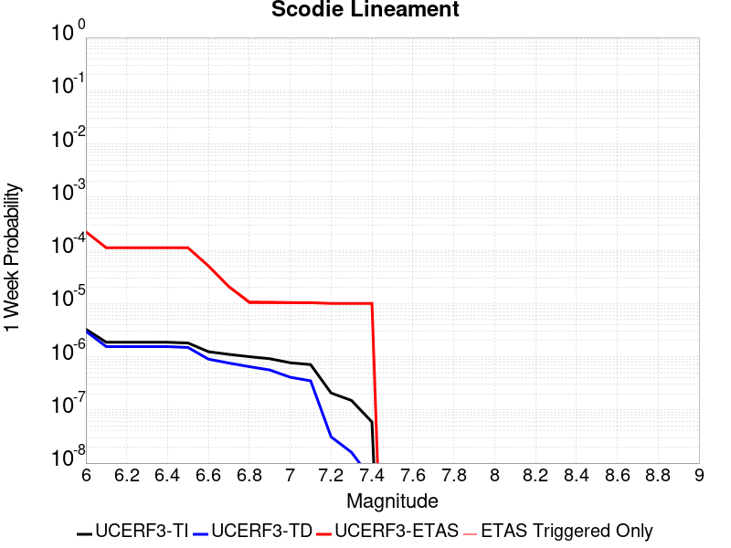 |  |  |  |

| Magnitude | 1 wk TI Prob | 1 wk TD Prob | 1 wk ETAS Prob | 1 wk ETAS/TD Gain | 1 wk ETAS Triggered Only | 1 mo TI Prob | 1 mo TD Prob | 1 mo ETAS Prob | 1 mo ETAS/TD Gain | 1 mo ETAS Triggered Only | 1 yr TI Prob | 1 yr TD Prob | 1 yr ETAS Prob | 1 yr ETAS/TD Gain | 1 yr ETAS Triggered Only | 10 yr TI Prob | 10 yr TD Prob | 10 yr ETAS Prob | 10 yr ETAS/TD Gain | 10 yr ETAS Triggered Only |
|-----|-----|-----|-----|-----|-----|-----|-----|-----|-----|-----|-----|-----|-----|-----|-----|-----|-----|-----|-----|-----|
| 6.0 | 3.2919327E-6 | 3.0133422E-6 | 6.074846E-4 | 201.59828 | 6.044731E-4 | 1.4108206E-5 | 1.2914278E-5 | 6.1737956E-4 | 47.80597 | 6.044731E-4 | 1.7175387E-4 | 1.5722317E-4 | 9.630606E-4 | 6.125437 | 8.059641E-4 | 0.0017162118 | 0.0015714309 | 0.0023761285 | 1.5120796 | 8.059641E-4 |
| 6.1 | 1.8663811E-6 | 1.5490499E-6 | 4.045305E-4 | 261.1475 | 4.0298206E-4 | 7.998751E-6 | 6.6387715E-6 | 4.0961817E-4 | 61.7009 | 4.0298206E-4 | 9.738045E-5 | 8.082454E-5 | 4.8377403E-4 | 5.9854846 | 4.0298206E-4 | 9.7337784E-4 | 8.080003E-4 | 0.0012106567 | 1.498337 | 4.0298206E-4 |
| 6.2 | 1.8663811E-6 | 1.5490499E-6 | 4.045305E-4 | 261.1475 | 4.0298206E-4 | 7.998751E-6 | 6.6387715E-6 | 4.0961817E-4 | 61.7009 | 4.0298206E-4 | 9.738045E-5 | 8.082454E-5 | 4.8377403E-4 | 5.9854846 | 4.0298206E-4 | 9.7337784E-4 | 8.080003E-4 | 0.0012106567 | 1.498337 | 4.0298206E-4 |
| 6.3 | 1.8663811E-6 | 1.5490499E-6 | 4.045305E-4 | 261.1475 | 4.0298206E-4 | 7.998751E-6 | 6.6387715E-6 | 4.0961817E-4 | 61.7009 | 4.0298206E-4 | 9.738045E-5 | 8.082454E-5 | 4.8377403E-4 | 5.9854846 | 4.0298206E-4 | 9.7337784E-4 | 8.080003E-4 | 0.0012106567 | 1.498337 | 4.0298206E-4 |
| 6.4 | 1.8663811E-6 | 1.5490499E-6 | 4.045305E-4 | 261.1475 | 4.0298206E-4 | 7.998751E-6 | 6.6387715E-6 | 4.0961817E-4 | 61.7009 | 4.0298206E-4 | 9.738045E-5 | 8.082454E-5 | 4.8377403E-4 | 5.9854846 | 4.0298206E-4 | 9.7337784E-4 | 8.080003E-4 | 0.0012106567 | 1.498337 | 4.0298206E-4 |
| 6.5 | 1.8106311E-6 | 1.4909839E-6 | 4.0447246E-4 | 271.27887 | 4.0298206E-4 | 7.759824E-6 | 6.3899183E-6 | 4.0936942E-4 | 64.06489 | 4.0298206E-4 | 9.447177E-5 | 7.7794975E-5 | 4.807457E-4 | 6.17965 | 4.0298206E-4 | 9.4431615E-4 | 7.7772606E-4 | 0.0011803948 | 1.5177512 | 4.0298206E-4 |
| 6.6 | 1.2414679E-6 | 8.997558E-7 | 4.0388145E-4 | 448.879 | 4.0298206E-4 | 5.320566E-6 | 3.856091E-6 | 4.068366E-4 | 105.50493 | 4.0298206E-4 | 6.477596E-5 | 4.6946985E-5 | 4.4991012E-4 | 9.583366 | 4.0298206E-4 | 6.475708E-4 | 4.693793E-4 | 8.7217224E-4 | 1.8581395 | 4.0298206E-4 |
| 6.7 | 1.1062215E-6 | 7.594311E-7 | 7.594311E-7 | 1.0 | 0.0 | 4.7409408E-6 | 3.2547011E-6 | 3.2547011E-6 | 1.0 | 0.0 | 5.7719422E-5 | 3.9625334E-5 | 3.9625334E-5 | 1.0 | 0.0 | 5.770443E-4 | 3.961897E-4 | 3.961897E-4 | 1.0 | 0.0 |
| 6.8 | 1.0006736E-6 | 6.500397E-7 | 6.500397E-7 | 1.0 | 0.0 | 4.288594E-6 | 2.7858816E-6 | 2.7858816E-6 | 1.0 | 0.0 | 5.221238E-5 | 3.3917644E-5 | 3.3917644E-5 | 1.0 | 0.0 | 5.220012E-4 | 3.3913075E-4 | 3.3913075E-4 | 1.0 | 0.0 |
| 6.9 | 9.167364E-7 | 5.631625E-7 | 5.631625E-7 | 1.0 | 0.0 | 3.9288643E-6 | 2.4135516E-6 | 2.4135516E-6 | 1.0 | 0.0 | 4.7832873E-5 | 2.9384651E-5 | 2.9384651E-5 | 1.0 | 0.0 | 4.782258E-4 | 2.9381333E-4 | 2.9381333E-4 | 1.0 | 0.0 |
| 7.0 | 7.6987664E-7 | 4.113383E-7 | 4.113383E-7 | 1.0 | 0.0 | 3.2994672E-6 | 1.7628774E-6 | 1.7628774E-6 | 1.0 | 0.0 | 4.0170275E-5 | 2.1462862E-5 | 2.1462862E-5 | 1.0 | 0.0 | 4.0163012E-4 | 2.1461173E-4 | 2.1461173E-4 | 1.0 | 0.0 |
| 7.1 | 7.1038727E-7 | 3.5211494E-7 | 3.5211494E-7 | 1.0 | 0.0 | 3.0445133E-6 | 1.5090633E-6 | 1.5090633E-6 | 1.0 | 0.0 | 3.706632E-5 | 1.8372726E-5 | 1.8372726E-5 | 1.0 | 0.0 | 3.7060137E-4 | 1.8371557E-4 | 1.8371557E-4 | 1.0 | 0.0 |
| 7.2 | 2.0799602E-7 | 3.1186854E-8 | 3.1186854E-8 | 1.0 | 0.0 | 8.914113E-7 | 1.3365793E-7 | 1.3365793E-7 | 1.0 | 0.0 | 1.0852878E-5 | 1.6272843E-6 | 1.6272843E-6 | 1.0 | 0.0 | 1.08523476E-4 | 1.627273E-5 | 1.627273E-5 | 1.0 | 0.0 |
| 7.3 | 1.5048182E-7 | 1.5945696E-8 | 1.5945696E-8 | 1.0 | 0.0 | 6.449219E-7 | 6.83387E-8 | 6.83387E-8 | 1.0 | 0.0 | 7.851896E-6 | 8.320234E-7 | 8.320234E-7 | 1.0 | 0.0 | 7.851618E-5 | 8.320206E-6 | 8.320206E-6 | 1.0 | 0.0 |
| 7.4 | 5.9334678E-8 | 4.8683537E-9 | 4.8683537E-9 | 1.0 | 0.0 | 2.5429145E-7 | 2.0864372E-8 | 2.0864372E-8 | 1.0 | 0.0 | 3.095994E-6 | 2.5402372E-7 | 2.5402372E-7 | 1.0 | 0.0 | 3.095951E-5 | 2.5402353E-6 | 2.5402353E-6 | 1.0 | 0.0 |

## White Wolf (Extension)
*[(top)](#table-of-contents)*

| 1 Week | 1 Month | 1 Year | 10 Year |
|-----|-----|-----|-----|
|  |  |  |  |

| Magnitude | 1 wk TI Prob | 1 wk TD Prob | 1 wk ETAS Prob | 1 wk ETAS/TD Gain | 1 wk ETAS Triggered Only | 1 mo TI Prob | 1 mo TD Prob | 1 mo ETAS Prob | 1 mo ETAS/TD Gain | 1 mo ETAS Triggered Only | 1 yr TI Prob | 1 yr TD Prob | 1 yr ETAS Prob | 1 yr ETAS/TD Gain | 1 yr ETAS Triggered Only | 10 yr TI Prob | 10 yr TD Prob | 10 yr ETAS Prob | 10 yr ETAS/TD Gain | 10 yr ETAS Triggered Only |
|-----|-----|-----|-----|-----|-----|-----|-----|-----|-----|-----|-----|-----|-----|-----|-----|-----|-----|-----|-----|-----|
| 6.0 | 8.222555E-6 | 6.0666657E-6 | 6.105361E-4 | 100.63783 | 6.044731E-4 | 3.5239045E-5 | 2.5999774E-5 | 6.304572E-4 | 24.248564 | 6.044731E-4 | 4.289509E-4 | 3.1650788E-4 | 0.0011222169 | 3.5456207 | 8.059641E-4 | 0.0042812387 | 0.003161223 | 0.0039646393 | 1.2541473 | 8.059641E-4 |
| 6.1 | 8.222555E-6 | 6.0666657E-6 | 6.105361E-4 | 100.63783 | 6.044731E-4 | 3.5239045E-5 | 2.5999774E-5 | 6.304572E-4 | 24.248564 | 6.044731E-4 | 4.289509E-4 | 3.1650788E-4 | 0.0011222169 | 3.5456207 | 8.059641E-4 | 0.0042812387 | 0.003161223 | 0.0039646393 | 1.2541473 | 8.059641E-4 |
| 6.2 | 8.222555E-6 | 6.0666657E-6 | 6.105361E-4 | 100.63783 | 6.044731E-4 | 3.5239045E-5 | 2.5999774E-5 | 6.304572E-4 | 24.248564 | 6.044731E-4 | 4.289509E-4 | 3.1650788E-4 | 0.0011222169 | 3.5456207 | 8.059641E-4 | 0.0042812387 | 0.003161223 | 0.0039646393 | 1.2541473 | 8.059641E-4 |
| 6.3 | 8.222555E-6 | 6.0666657E-6 | 6.105361E-4 | 100.63783 | 6.044731E-4 | 3.5239045E-5 | 2.5999774E-5 | 6.304572E-4 | 24.248564 | 6.044731E-4 | 4.289509E-4 | 3.1650788E-4 | 0.0011222169 | 3.5456207 | 8.059641E-4 | 0.0042812387 | 0.003161223 | 0.0039646393 | 1.2541473 | 8.059641E-4 |
| 6.4 | 5.821773E-6 | 3.5571766E-6 | 6.0802815E-4 | 170.93 | 6.044731E-4 | 2.4950215E-5 | 1.5244959E-5 | 6.1970885E-4 | 40.65008 | 6.044731E-4 | 3.0372653E-4 | 1.8559267E-4 | 7.8995357E-4 | 4.2563834 | 6.044731E-4 | 0.0030331176 | 0.001854485 | 0.002457837 | 1.3253475 | 6.044731E-4 |
| 6.5 | 5.766023E-6 | 3.4991106E-6 | 6.079701E-4 | 173.7499 | 6.044731E-4 | 2.4711293E-5 | 1.4996108E-5 | 6.1946013E-4 | 41.30806 | 6.044731E-4 | 3.0081844E-4 | 1.8256342E-4 | 7.869262E-4 | 4.310426 | 6.044731E-4 | 0.0030041158 | 0.0018242426 | 0.002427613 | 1.3307512 | 6.044731E-4 |
| 6.6 | 4.643576E-6 | 2.332624E-6 | 6.0680433E-4 | 260.13806 | 6.044731E-4 | 1.9900888E-5 | 9.996925E-6 | 6.14464E-4 | 61.4653 | 6.044731E-4 | 2.4226638E-4 | 1.2170619E-4 | 7.261057E-4 | 5.9660544 | 6.044731E-4 | 0.0024200242 | 0.0012164378 | 0.0018201756 | 1.4963162 | 6.044731E-4 |
| 6.7 | 3.9529173E-6 | 1.6483477E-6 | 2.0313905E-4 | 123.237976 | 2.0149103E-4 | 1.6940963E-5 | 7.0643296E-6 | 2.0855395E-4 | 29.522114 | 2.0149103E-4 | 2.0623671E-4 | 8.6005006E-5 | 2.874787E-4 | 3.342581 | 2.0149103E-4 | 0.002060454 | 8.597357E-4 | 0.0010610535 | 1.2341624 | 2.0149103E-4 |
| 6.8 | 3.4377522E-6 | 1.2245237E-6 | 2.0271531E-4 | 165.54625 | 2.0149103E-4 | 1.473314E-5 | 5.2479486E-6 | 2.0673792E-4 | 39.394047 | 2.0149103E-4 | 1.7936122E-4 | 6.3891996E-5 | 2.6537015E-4 | 4.153418 | 2.0149103E-4 | 0.0017921652 | 6.387454E-4 | 8.401077E-4 | 1.3152467 | 2.0149103E-4 |
| 6.9 | 3.1367306E-6 | 1.0033783E-6 | 2.0249421E-4 | 201.81242 | 2.0149103E-4 | 1.3443062E-5 | 4.3001864E-6 | 2.0579035E-4 | 47.856148 | 2.0149103E-4 | 1.63657E-4 | 5.235359E-5 | 2.5383406E-4 | 4.848456 | 2.0149103E-4 | 0.0016353652 | 5.2342017E-4 | 7.2480575E-4 | 1.3847493 | 2.0149103E-4 |
| 7.0 | 2.8298145E-6 | 7.4286646E-7 | 2.0223376E-4 | 272.2343 | 2.0149103E-4 | 1.2127721E-5 | 3.1837099E-6 | 2.046741E-4 | 64.287926 | 2.0149103E-4 | 1.47645E-4 | 3.8761027E-5 | 2.4024425E-4 | 6.1980877 | 2.0149103E-4 | 0.0014754693 | 3.8754768E-4 | 5.889606E-4 | 1.5197114 | 2.0149103E-4 |
| 7.1 | 2.4091064E-6 | 5.4227525E-7 | 2.020332E-4 | 372.5658 | 2.0149103E-4 | 1.03247E-5 | 2.3240348E-6 | 2.038146E-4 | 87.6986 | 2.0149103E-4 | 1.2569598E-4 | 2.8294799E-5 | 2.2978013E-4 | 8.120932 | 2.0149103E-4 | 0.001256249 | 2.8291598E-4 | 4.8435002E-4 | 1.7119924 | 2.0149103E-4 |
| 7.2 | 1.3875518E-6 | 1.0743063E-7 | 1.0743063E-7 | 1.0 | 0.0 | 5.9466374E-6 | 4.6041689E-7 | 4.6041689E-7 | 1.0 | 0.0 | 7.23979E-5 | 5.6055624E-6 | 5.6055624E-6 | 1.0 | 0.0 | 7.2374323E-4 | 5.6054323E-5 | 5.6054323E-5 | 1.0 | 0.0 |
| 7.3 | 7.056077E-7 | 5.002034E-8 | 5.002034E-8 | 1.0 | 0.0 | 3.0240296E-6 | 2.1437286E-7 | 2.1437286E-7 | 1.0 | 0.0 | 3.681694E-5 | 2.609987E-6 | 2.609987E-6 | 1.0 | 0.0 | 3.681084E-4 | 2.609961E-5 | 2.609961E-5 | 1.0 | 0.0 |
| 7.4 | 5.9334678E-8 | 4.8683537E-9 | 4.8683537E-9 | 1.0 | 0.0 | 2.5429145E-7 | 2.0864372E-8 | 2.0864372E-8 | 1.0 | 0.0 | 3.095994E-6 | 2.5402372E-7 | 2.5402372E-7 | 1.0 | 0.0 | 3.095951E-5 | 2.5402353E-6 | 2.5402353E-6 | 1.0 | 0.0 |

## San Jacinto (Stepovers Combined)
*[(top)](#table-of-contents)*

| 1 Week | 1 Month | 1 Year | 10 Year |
|-----|-----|-----|-----|
|  |  |  |  |

| Magnitude | 1 wk TI Prob | 1 wk TD Prob | 1 wk ETAS Prob | 1 wk ETAS/TD Gain | 1 wk ETAS Triggered Only | 1 mo TI Prob | 1 mo TD Prob | 1 mo ETAS Prob | 1 mo ETAS/TD Gain | 1 mo ETAS Triggered Only | 1 yr TI Prob | 1 yr TD Prob | 1 yr ETAS Prob | 1 yr ETAS/TD Gain | 1 yr ETAS Triggered Only | 10 yr TI Prob | 10 yr TD Prob | 10 yr ETAS Prob | 10 yr ETAS/TD Gain | 10 yr ETAS Triggered Only |
|-----|-----|-----|-----|-----|-----|-----|-----|-----|-----|-----|-----|-----|-----|-----|-----|-----|-----|-----|-----|-----|
| 6.0 | 4.0667746E-5 | 3.5272755E-5 | 2.3675668E-4 | 6.7121687 | 2.0149103E-4 | 1.742787E-4 | 1.5116022E-4 | 5.5408134E-4 | 3.6655238 | 4.0298206E-4 | 0.0021197782 | 0.0018388226 | 0.0024421841 | 1.3281238 | 6.044731E-4 | 0.020996714 | 0.018986892 | 0.019579887 | 1.0312319 | 6.044731E-4 |
| 6.1 | 4.0667746E-5 | 3.5272755E-5 | 2.3675668E-4 | 6.7121687 | 2.0149103E-4 | 1.742787E-4 | 1.5116022E-4 | 5.5408134E-4 | 3.6655238 | 4.0298206E-4 | 0.0021197782 | 0.0018388226 | 0.0024421841 | 1.3281238 | 6.044731E-4 | 0.020996714 | 0.018986892 | 0.019579887 | 1.0312319 | 6.044731E-4 |
| 6.2 | 4.0667746E-5 | 3.5272755E-5 | 2.3675668E-4 | 6.7121687 | 2.0149103E-4 | 1.742787E-4 | 1.5116022E-4 | 5.5408134E-4 | 3.6655238 | 4.0298206E-4 | 0.0021197782 | 0.0018388226 | 0.0024421841 | 1.3281238 | 6.044731E-4 | 0.020996714 | 0.018986892 | 0.019579887 | 1.0312319 | 6.044731E-4 |
| 6.3 | 4.0667746E-5 | 3.5272755E-5 | 2.3675668E-4 | 6.7121687 | 2.0149103E-4 | 1.742787E-4 | 1.5116022E-4 | 5.5408134E-4 | 3.6655238 | 4.0298206E-4 | 0.0021197782 | 0.0018388226 | 0.0024421841 | 1.3281238 | 6.044731E-4 | 0.020996714 | 0.018986892 | 0.019579887 | 1.0312319 | 6.044731E-4 |
| 6.4 | 4.0577226E-5 | 3.5144654E-5 | 2.366286E-4 | 6.73299 | 2.0149103E-4 | 1.738908E-4 | 1.5061127E-4 | 5.535326E-4 | 3.6752405 | 4.0298206E-4 | 0.0021150648 | 0.0018321523 | 0.002435518 | 1.3293207 | 6.044731E-4 | 0.020950472 | 0.018921461 | 0.019514496 | 1.0313419 | 6.044731E-4 |
| 6.5 | 4.0577226E-5 | 3.5144654E-5 | 2.366286E-4 | 6.73299 | 2.0149103E-4 | 1.738908E-4 | 1.5061127E-4 | 5.535326E-4 | 3.6752405 | 4.0298206E-4 | 0.0021150648 | 0.0018321523 | 0.002435518 | 1.3293207 | 6.044731E-4 | 0.020950472 | 0.018921461 | 0.019514496 | 1.0313419 | 6.044731E-4 |
| 6.6 | 4.053861E-5 | 3.509E-5 | 2.3657396E-4 | 6.7419195 | 2.0149103E-4 | 1.7372532E-4 | 1.5037706E-4 | 5.532985E-4 | 3.6794076 | 4.0298206E-4 | 0.0021130538 | 0.0018293057 | 0.002432673 | 1.3298341 | 6.044731E-4 | 0.020930743 | 0.018893538 | 0.019486591 | 1.0313891 | 6.044731E-4 |
| 6.7 | 4.0516545E-5 | 3.5059067E-5 | 2.3654304E-4 | 6.746986 | 2.0149103E-4 | 1.7363077E-4 | 1.5024451E-4 | 5.53166E-4 | 3.681772 | 4.0298206E-4 | 0.002111905 | 0.001827695 | 0.0024310632 | 1.3301252 | 6.044731E-4 | 0.020919468 | 0.018877735 | 0.019470798 | 1.0314159 | 6.044731E-4 |
| 6.8 | 4.049434E-5 | 3.5030633E-5 | 2.365146E-4 | 6.7516513 | 2.0149103E-4 | 1.7353562E-4 | 1.5012265E-4 | 5.530442E-4 | 3.6839492 | 4.0298206E-4 | 0.0021107488 | 0.0018262138 | 0.002429583 | 1.3303936 | 6.044731E-4 | 0.020908125 | 0.018863149 | 0.019456219 | 1.0314407 | 6.044731E-4 |
| 6.9 | 4.046386E-5 | 3.499319E-5 | 2.3647718E-4 | 6.7578053 | 2.0149103E-4 | 1.73405E-4 | 1.4996222E-4 | 5.5288384E-4 | 3.686821 | 4.0298206E-4 | 0.0021091616 | 0.0018242638 | 0.002427634 | 1.3307474 | 6.044731E-4 | 0.020892553 | 0.01884392 | 0.019437004 | 1.0314734 | 6.044731E-4 |
| 7.0 | 4.036382E-5 | 3.487376E-5 | 2.3635777E-4 | 6.777525 | 2.0149103E-4 | 1.7297632E-4 | 1.4945042E-4 | 5.5237225E-4 | 3.6960235 | 4.0298206E-4 | 0.0021039525 | 0.0018180435 | 0.0024214177 | 1.331881 | 6.044731E-4 | 0.02084144 | 0.018782536 | 0.019375656 | 1.0315783 | 6.044731E-4 |
| 7.1 | 4.0343282E-5 | 3.4852223E-5 | 2.3633623E-4 | 6.7810955 | 2.0149103E-4 | 1.7288832E-4 | 1.4935812E-4 | 5.5228E-4 | 3.6976898 | 4.0298206E-4 | 0.002102883 | 0.0018169218 | 0.0024202967 | 1.3320863 | 6.044731E-4 | 0.020830948 | 0.018771412 | 0.01936454 | 1.0315974 | 6.044731E-4 |
| 7.2 | 4.0257353E-5 | 3.4756722E-5 | 2.3624075E-4 | 6.7969804 | 2.0149103E-4 | 1.725201E-4 | 1.489489E-4 | 5.5187097E-4 | 3.7051027 | 4.0298206E-4 | 0.0020984085 | 0.0018119477 | 0.0024153255 | 1.3329996 | 6.044731E-4 | 0.020787042 | 0.018722152 | 0.019315308 | 1.031682 | 6.044731E-4 |
| 7.3 | 3.9940667E-5 | 3.4584376E-5 | 2.3606844E-4 | 6.8258696 | 2.0149103E-4 | 1.7116306E-4 | 1.4821035E-4 | 5.511327E-4 | 3.7185843 | 4.0298206E-4 | 0.0020819185 | 0.0018029709 | 0.002406354 | 1.3346605 | 6.044731E-4 | 0.020625217 | 0.018630784 | 0.019223996 | 1.0318403 | 6.044731E-4 |
| 7.4 | 3.9721202E-5 | 3.4469766E-5 | 2.3595385E-4 | 6.845241 | 2.0149103E-4 | 1.7022261E-4 | 1.4771923E-4 | 5.5064174E-4 | 3.7276242 | 4.0298206E-4 | 0.0020704903 | 0.0017970012 | 0.002400388 | 1.3357743 | 6.044731E-4 | 0.020513052 | 0.018569905 | 0.019163154 | 1.0319468 | 6.044731E-4 |
| 7.5 | 3.7036873E-5 | 3.3537188E-5 | 2.3502146E-4 | 7.007787 | 2.0149103E-4 | 1.5871979E-4 | 1.437229E-4 | 5.4664706E-4 | 3.8034792 | 4.0298206E-4 | 0.0019307006 | 0.0017484248 | 0.002351841 | 1.34512 | 6.044731E-4 | 0.019140124 | 0.018071463 | 0.018665014 | 1.0328445 | 6.044731E-4 |
| 7.6 | 3.2940967E-5 | 3.1317984E-5 | 2.328027E-4 | 7.4335146 | 2.0149103E-4 | 1.4116794E-4 | 1.3421304E-4 | 5.3714105E-4 | 4.002152 | 4.0298206E-4 | 0.0017173645 | 0.0016328214 | 0.0022363074 | 1.3695972 | 6.044731E-4 | 0.01704153 | 0.016904354 | 0.017498609 | 1.035154 | 6.044731E-4 |
| 7.7 | 2.8236149E-5 | 2.7883889E-5 | 2.2936931E-4 | 8.225872 | 2.0149103E-4 | 1.2100645E-4 | 1.19496915E-4 | 5.224308E-4 | 4.371919 | 4.0298206E-4 | 0.0014722579 | 0.001453905 | 0.0020574993 | 1.4151539 | 6.044731E-4 | 0.014625421 | 0.015115095 | 0.015710432 | 1.0393869 | 6.044731E-4 |
| 7.8 | 2.4329287E-5 | 2.5207537E-5 | 2.2669349E-4 | 8.993084 | 2.0149103E-4 | 1.042642E-4 | 1.0802783E-4 | 5.1096635E-4 | 4.729951 | 4.0298206E-4 | 0.0012686774 | 0.0013144462 | 0.0019181247 | 1.4592645 | 6.044731E-4 | 0.012614589 | 0.013712396 | 0.01430858 | 1.0434778 | 6.044731E-4 |
| 7.9 | 1.9370926E-5 | 2.0421452E-5 | 2.0421452E-5 | 1.0 | 0.0 | 8.301561E-5 | 8.7517576E-5 | 2.8899097E-4 | 3.3020906 | 2.0149103E-4 | 0.0010102465 | 0.0010650064 | 0.0014675593 | 1.3779817 | 4.0298206E-4 | 0.0100566605 | 0.011199483 | 0.011597951 | 1.0355792 | 4.0298206E-4 |
| 8.0 | 1.5583017E-5 | 1.588647E-5 | 1.588647E-5 | 1.0 | 0.0 | 6.6782646E-5 | 6.808309E-5 | 6.808309E-5 | 1.0 | 0.0 | 8.127754E-4 | 8.285971E-4 | 0.0010299212 | 1.2429698 | 2.0149103E-4 | 0.008098091 | 0.008781809 | 0.0089815315 | 1.0227426 | 2.0149103E-4 |
| 8.1 | 1.0024873E-5 | 8.292404E-6 | 8.292404E-6 | 1.0 | 0.0 | 4.2963035E-5 | 3.5538393E-5 | 3.5538393E-5 | 1.0 | 0.0 | 5.229494E-4 | 4.3259456E-4 | 4.3259456E-4 | 1.0 | 0.0 | 0.0052172043 | 0.0046534105 | 0.0046534105 | 1.0 | 0.0 |
| 8.2 | 4.142796E-6 | 1.5610041E-6 | 1.5610041E-6 | 1.0 | 0.0 | 1.775472E-5 | 6.69E-6 | 6.69E-6 | 1.0 | 0.0 | 2.1614227E-4 | 8.144774E-5 | 8.144774E-5 | 1.0 | 0.0 | 0.0021593217 | 9.454649E-4 | 9.454649E-4 | 1.0 | 0.0 |
| 8.3 | 1.2750878E-6 | 3.612133E-7 | 3.612133E-7 | 1.0 | 0.0 | 5.4646503E-6 | 1.548056E-6 | 1.548056E-6 | 1.0 | 0.0 | 6.653009E-5 | 1.8847424E-5 | 1.8847424E-5 | 1.0 | 0.0 | 6.6510175E-4 | 2.2734253E-4 | 2.2734253E-4 | 1.0 | 0.0 |

## San Andreas (San Bernardino S)
*[(top)](#table-of-contents)*

| 1 Week | 1 Month | 1 Year | 10 Year |
|-----|-----|-----|-----|
|  |  |  |  |

| Magnitude | 1 wk TI Prob | 1 wk TD Prob | 1 wk ETAS Prob | 1 wk ETAS/TD Gain | 1 wk ETAS Triggered Only | 1 mo TI Prob | 1 mo TD Prob | 1 mo ETAS Prob | 1 mo ETAS/TD Gain | 1 mo ETAS Triggered Only | 1 yr TI Prob | 1 yr TD Prob | 1 yr ETAS Prob | 1 yr ETAS/TD Gain | 1 yr ETAS Triggered Only | 10 yr TI Prob | 10 yr TD Prob | 10 yr ETAS Prob | 10 yr ETAS/TD Gain | 10 yr ETAS Triggered Only |
|-----|-----|-----|-----|-----|-----|-----|-----|-----|-----|-----|-----|-----|-----|-----|-----|-----|-----|-----|-----|-----|
| 6.0 | 1.2336002E-4 | 3.0004102E-4 | 9.0433273E-4 | 3.0140305 | 6.044731E-4 | 5.2857865E-4 | 0.0012852824 | 0.0018889786 | 1.4696993 | 6.044731E-4 | 0.006416472 | 0.015540994 | 0.016136073 | 1.038291 | 6.044731E-4 | 0.06234337 | 0.14283717 | 0.14335531 | 1.0036274 | 6.044731E-4 |
| 6.1 | 1.2336002E-4 | 3.0004102E-4 | 9.0433273E-4 | 3.0140305 | 6.044731E-4 | 5.2857865E-4 | 0.0012852824 | 0.0018889786 | 1.4696993 | 6.044731E-4 | 0.006416472 | 0.015540994 | 0.016136073 | 1.038291 | 6.044731E-4 | 0.06234337 | 0.14283717 | 0.14335531 | 1.0036274 | 6.044731E-4 |
| 6.2 | 1.2336002E-4 | 3.0004102E-4 | 9.0433273E-4 | 3.0140305 | 6.044731E-4 | 5.2857865E-4 | 0.0012852824 | 0.0018889786 | 1.4696993 | 6.044731E-4 | 0.006416472 | 0.015540994 | 0.016136073 | 1.038291 | 6.044731E-4 | 0.06234337 | 0.14283717 | 0.14335531 | 1.0036274 | 6.044731E-4 |
| 6.3 | 1.1712257E-4 | 2.8792414E-4 | 8.922232E-4 | 3.0988135 | 6.044731E-4 | 5.018573E-4 | 0.0012334028 | 0.0018371303 | 1.4894813 | 6.044731E-4 | 0.006093008 | 0.014918125 | 0.01551358 | 1.0399148 | 6.044731E-4 | 0.059286322 | 0.13754563 | 0.13806696 | 1.0037903 | 6.044731E-4 |
| 6.4 | 1.1712257E-4 | 2.8792414E-4 | 8.922232E-4 | 3.0988135 | 6.044731E-4 | 5.018573E-4 | 0.0012334028 | 0.0018371303 | 1.4894813 | 6.044731E-4 | 0.006093008 | 0.014918125 | 0.01551358 | 1.0399148 | 6.044731E-4 | 0.059286322 | 0.13754563 | 0.13806696 | 1.0037903 | 6.044731E-4 |
| 6.5 | 1.0689076E-4 | 2.680528E-4 | 8.7236386E-4 | 3.254448 | 6.044731E-4 | 4.5802278E-4 | 0.0011483167 | 0.0017520956 | 1.5257949 | 6.044731E-4 | 0.0055621783 | 0.01389575 | 0.0144918235 | 1.0428962 | 6.044731E-4 | 0.05425003 | 0.12879294 | 0.12931956 | 1.0040889 | 6.044731E-4 |
| 6.6 | 9.7648895E-5 | 2.50501E-4 | 8.548227E-4 | 3.412452 | 6.044731E-4 | 4.1842813E-4 | 0.0010731576 | 0.001676982 | 1.5626614 | 6.044731E-4 | 0.005082469 | 0.012991785 | 0.013588405 | 1.0459229 | 6.044731E-4 | 0.049677886 | 0.12095292 | 0.12148428 | 1.0043931 | 6.044731E-4 |
| 6.7 | 8.757013E-5 | 2.3120902E-4 | 8.355424E-4 | 3.6137965 | 6.044731E-4 | 3.7524657E-4 | 9.905418E-4 | 0.0015944161 | 1.6096405 | 6.044731E-4 | 0.00455906 | 0.011997245 | 0.012594466 | 1.0497799 | 6.044731E-4 | 0.04466656 | 0.11226123 | 0.11279784 | 1.00478 | 6.044731E-4 |
| 6.8 | 8.562978E-5 | 2.2680782E-4 | 8.311438E-4 | 3.6645288 | 6.044731E-4 | 3.6693315E-4 | 9.7169366E-4 | 0.0015755794 | 1.6214775 | 6.044731E-4 | 0.004458263 | 0.011770263 | 0.012367622 | 1.0507514 | 6.044731E-4 | 0.043698758 | 0.11027153 | 0.11080935 | 1.0048772 | 6.044731E-4 |
| 6.9 | 6.124075E-5 | 1.7065753E-4 | 7.750275E-4 | 4.54142 | 6.044731E-4 | 2.6243398E-4 | 7.311852E-4 | 0.0013352163 | 1.8260987 | 6.044731E-4 | 0.0031904527 | 0.008866051 | 0.0094651645 | 1.0675739 | 6.044731E-4 | 0.031450346 | 0.08418263 | 0.08473621 | 1.0065761 | 6.044731E-4 |
| 7.0 | 5.8598747E-5 | 1.649477E-4 | 7.693211E-4 | 4.66403 | 6.044731E-4 | 2.5111332E-4 | 7.06728E-4 | 0.0013107739 | 1.8547077 | 6.044731E-4 | 0.0030530186 | 0.008570663 | 0.009169956 | 1.0699236 | 6.044731E-4 | 0.03011414 | 0.081500374 | 0.082055576 | 1.0068123 | 6.044731E-4 |
| 7.1 | 5.613814E-5 | 1.5913323E-4 | 7.635101E-4 | 4.7979302 | 6.044731E-4 | 2.4056983E-4 | 6.818221E-4 | 0.001285883 | 1.885951 | 6.044731E-4 | 0.0029250039 | 0.008269769 | 0.008869243 | 1.0724899 | 6.044731E-4 | 0.028868021 | 0.07879931 | 0.07935615 | 1.0070666 | 6.044731E-4 |
| 7.2 | 4.991222E-5 | 1.4519796E-4 | 7.495833E-4 | 5.162492 | 6.044731E-4 | 2.1389198E-4 | 6.2212895E-4 | 0.001226226 | 1.9710158 | 6.044731E-4 | 0.002601025 | 0.007548217 | 0.008148127 | 1.0794771 | 6.044731E-4 | 0.025707912 | 0.07225321 | 0.07281401 | 1.0077616 | 6.044731E-4 |
| 7.3 | 4.7410045E-5 | 1.3714004E-4 | 7.4153027E-4 | 5.4071026 | 6.044731E-4 | 2.0317009E-4 | 5.8761094E-4 | 0.0011917289 | 2.0280917 | 6.044731E-4 | 0.0024707897 | 0.0071307817 | 0.007730944 | 1.0841651 | 6.044731E-4 | 0.024434982 | 0.06853558 | 0.06909862 | 1.0082154 | 6.044731E-4 |
| 7.4 | 4.5556746E-5 | 1.3121912E-4 | 7.356129E-4 | 5.605989 | 6.044731E-4 | 1.952286E-4 | 5.622468E-4 | 0.00116638 | 2.0744984 | 6.044731E-4 | 0.002374317 | 0.0068239477 | 0.007424296 | 1.0879767 | 6.044731E-4 | 0.023491086 | 0.065788016 | 0.06635272 | 1.0085837 | 6.044731E-4 |
| 7.5 | 4.3084514E-5 | 1.2357246E-4 | 7.2797085E-4 | 5.891044 | 6.044731E-4 | 1.8463485E-4 | 5.2948913E-4 | 0.0011336422 | 2.1410112 | 6.044731E-4 | 0.0022456115 | 0.0064275465 | 0.0070281345 | 1.0934397 | 6.044731E-4 | 0.022230545 | 0.062188786 | 0.06275567 | 1.0091155 | 6.044731E-4 |
| 7.6 | 3.408608E-5 | 9.83552E-5 | 7.0276886E-4 | 7.145213 | 6.044731E-4 | 1.4607502E-4 | 4.214543E-4 | 0.0010256727 | 2.433651 | 6.044731E-4 | 0.0017770125 | 0.0051191594 | 0.005720538 | 1.1174761 | 6.044731E-4 | 0.017628696 | 0.050020292 | 0.05059453 | 1.0114801 | 6.044731E-4 |
| 7.7 | 2.8315713E-5 | 8.248679E-5 | 4.8543562E-4 | 5.8850102 | 4.0298206E-4 | 1.2134742E-4 | 3.5346695E-4 | 7.563066E-4 | 2.139681 | 4.0298206E-4 | 0.0014764034 | 0.0042949775 | 0.0046962285 | 1.0934234 | 4.0298206E-4 | 0.01466633 | 0.0422714 | 0.04265735 | 1.0091302 | 4.0298206E-4 |
| 7.8 | 2.6222975E-5 | 7.463088E-5 | 4.775829E-4 | 6.3992662 | 4.0298206E-4 | 1.1237934E-4 | 3.1980744E-4 | 7.226606E-4 | 2.2596743 | 4.0298206E-4 | 0.0013673597 | 0.0038867102 | 0.004288126 | 1.1032791 | 4.0298206E-4 | 0.013589768 | 0.03843674 | 0.038824234 | 1.0100813 | 4.0298206E-4 |
| 7.9 | 2.1469694E-5 | 5.787864E-5 | 2.59358E-4 | 4.481066 | 2.0149103E-4 | 9.200973E-5 | 2.4802773E-4 | 4.4946882E-4 | 1.8121715 | 2.0149103E-4 | 0.0011196428 | 0.0030155594 | 0.003216443 | 1.0666157 | 2.0149103E-4 | 0.011140184 | 0.030152109 | 0.030347524 | 1.006481 | 2.0149103E-4 |
| 8.0 | 1.2420249E-5 | 3.131896E-5 | 3.131896E-5 | 1.0 | 0.0 | 5.322855E-5 | 1.342172E-4 | 1.342172E-4 | 1.0 | 0.0 | 6.478649E-4 | 0.0016328706 | 0.0016328706 | 1.0 | 0.0 | 0.0064597935 | 0.016522504 | 0.016522504 | 1.0 | 0.0 |
| 8.1 | 4.9197724E-6 | 7.822348E-6 | 7.822348E-6 | 1.0 | 0.0 | 2.1084568E-5 | 3.352392E-5 | 3.352392E-5 | 1.0 | 0.0 | 2.566744E-4 | 4.0807744E-4 | 4.0807744E-4 | 1.0 | 0.0 | 0.002563781 | 0.0043843705 | 0.0043843705 | 1.0 | 0.0 |
| 8.2 | 2.5634774E-6 | 2.9067196E-6 | 2.9067196E-6 | 1.0 | 0.0 | 1.0986286E-5 | 1.2457311E-5 | 1.2457311E-5 | 1.0 | 0.0 | 1.3374983E-4 | 1.5165724E-4 | 1.5165724E-4 | 1.0 | 0.0 | 0.0013366934 | 0.0017049741 | 0.0017049741 | 1.0 | 0.0 |
| 8.3 | 5.2850464E-7 | 3.2088764E-7 | 3.2088764E-7 | 1.0 | 0.0 | 2.2650179E-6 | 1.375232E-6 | 1.375232E-6 | 1.0 | 0.0 | 2.7576245E-5 | 1.6743334E-5 | 1.6743334E-5 | 1.0 | 0.0 | 2.7572823E-4 | 1.9870348E-4 | 1.9870348E-4 | 1.0 | 0.0 |

## San Jacinto (San Jacinto Valley) rev
*[(top)](#table-of-contents)*

| 1 Week | 1 Month | 1 Year | 10 Year |
|-----|-----|-----|-----|
|  |  |  |  |

| Magnitude | 1 wk TI Prob | 1 wk TD Prob | 1 wk ETAS Prob | 1 wk ETAS/TD Gain | 1 wk ETAS Triggered Only | 1 mo TI Prob | 1 mo TD Prob | 1 mo ETAS Prob | 1 mo ETAS/TD Gain | 1 mo ETAS Triggered Only | 1 yr TI Prob | 1 yr TD Prob | 1 yr ETAS Prob | 1 yr ETAS/TD Gain | 1 yr ETAS Triggered Only | 10 yr TI Prob | 10 yr TD Prob | 10 yr ETAS Prob | 10 yr ETAS/TD Gain | 10 yr ETAS Triggered Only |
|-----|-----|-----|-----|-----|-----|-----|-----|-----|-----|-----|-----|-----|-----|-----|-----|-----|-----|-----|-----|-----|
| 6.0 | 3.652694E-5 | 3.4402394E-5 | 2.3588649E-4 | 6.8566885 | 2.0149103E-4 | 1.5653463E-4 | 1.474305E-4 | 5.5035314E-4 | 3.7329667 | 4.0298206E-4 | 0.0019041431 | 0.00179349 | 0.002396879 | 1.3364328 | 6.044731E-4 | 0.018879099 | 0.018526595 | 0.01911987 | 1.0320228 | 6.044731E-4 |
| 6.1 | 3.652694E-5 | 3.4402394E-5 | 2.3588649E-4 | 6.8566885 | 2.0149103E-4 | 1.5653463E-4 | 1.474305E-4 | 5.5035314E-4 | 3.7329667 | 4.0298206E-4 | 0.0019041431 | 0.00179349 | 0.002396879 | 1.3364328 | 6.044731E-4 | 0.018879099 | 0.018526595 | 0.01911987 | 1.0320228 | 6.044731E-4 |
| 6.2 | 3.652694E-5 | 3.4402394E-5 | 2.3588649E-4 | 6.8566885 | 2.0149103E-4 | 1.5653463E-4 | 1.474305E-4 | 5.5035314E-4 | 3.7329667 | 4.0298206E-4 | 0.0019041431 | 0.00179349 | 0.002396879 | 1.3364328 | 6.044731E-4 | 0.018879099 | 0.018526595 | 0.01911987 | 1.0320228 | 6.044731E-4 |
| 6.3 | 3.652694E-5 | 3.4402394E-5 | 2.3588649E-4 | 6.8566885 | 2.0149103E-4 | 1.5653463E-4 | 1.474305E-4 | 5.5035314E-4 | 3.7329667 | 4.0298206E-4 | 0.0019041431 | 0.00179349 | 0.002396879 | 1.3364328 | 6.044731E-4 | 0.018879099 | 0.018526595 | 0.01911987 | 1.0320228 | 6.044731E-4 |
| 6.4 | 3.646941E-5 | 3.432397E-5 | 2.3580808E-4 | 6.8700705 | 2.0149103E-4 | 1.5628811E-4 | 1.4709444E-4 | 5.500172E-4 | 3.7392116 | 4.0298206E-4 | 0.0019011468 | 0.0017894056 | 0.002392797 | 1.3372022 | 6.044731E-4 | 0.018849645 | 0.018486476 | 0.019079775 | 1.0320936 | 6.044731E-4 |
| 6.5 | 3.646941E-5 | 3.432397E-5 | 2.3580808E-4 | 6.8700705 | 2.0149103E-4 | 1.5628811E-4 | 1.4709444E-4 | 5.500172E-4 | 3.7392116 | 4.0298206E-4 | 0.0019011468 | 0.0017894056 | 0.002392797 | 1.3372022 | 6.044731E-4 | 0.018849645 | 0.018486476 | 0.019079775 | 1.0320936 | 6.044731E-4 |
| 6.6 | 3.6442503E-5 | 3.4287354E-5 | 2.3577148E-4 | 6.8763394 | 2.0149103E-4 | 1.561728E-4 | 1.4693754E-4 | 5.498604E-4 | 3.742137 | 4.0298206E-4 | 0.0018997455 | 0.0017874985 | 0.002390891 | 1.3375626 | 6.044731E-4 | 0.018835869 | 0.018467745 | 0.019061055 | 1.0321268 | 6.044731E-4 |
| 6.7 | 3.6432113E-5 | 3.4272925E-5 | 2.3575705E-4 | 6.8788133 | 2.0149103E-4 | 1.5612828E-4 | 1.4687571E-4 | 5.497986E-4 | 3.7432914 | 4.0298206E-4 | 0.0018992044 | 0.0017867472 | 0.0023901402 | 1.3377048 | 6.044731E-4 | 0.018830549 | 0.018460369 | 0.019053683 | 1.0321399 | 6.044731E-4 |
| 6.8 | 3.6409598E-5 | 3.424198E-5 | 2.3572611E-4 | 6.884126 | 2.0149103E-4 | 1.560318E-4 | 1.4674311E-4 | 5.4966606E-4 | 3.7457707 | 4.0298206E-4 | 0.0018980318 | 0.0017851355 | 0.0023885295 | 1.3380102 | 6.044731E-4 | 0.018819023 | 0.018444523 | 0.019037846 | 1.032168 | 6.044731E-4 |
| 6.9 | 3.638078E-5 | 3.4202407E-5 | 2.3568654E-4 | 6.890935 | 2.0149103E-4 | 1.5590832E-4 | 1.4657351E-4 | 5.494965E-4 | 3.748948 | 4.0298206E-4 | 0.0018965311 | 0.001783074 | 0.0023864694 | 1.3384017 | 6.044731E-4 | 0.018804269 | 0.018424258 | 0.019017594 | 1.032204 | 6.044731E-4 |
| 7.0 | 3.6294874E-5 | 3.408442E-5 | 2.3556859E-4 | 6.9113274 | 2.0149103E-4 | 1.5554018E-4 | 1.4606792E-4 | 5.4899114E-4 | 3.7584648 | 4.0298206E-4 | 0.0018920569 | 0.001776929 | 0.002380328 | 1.3395741 | 6.044731E-4 | 0.018760284 | 0.018363839 | 0.018957213 | 1.032312 | 6.044731E-4 |
| 7.1 | 3.6260717E-5 | 3.4040702E-5 | 2.3552487E-4 | 6.9189196 | 2.0149103E-4 | 1.5539382E-4 | 1.4588058E-4 | 5.488039E-4 | 3.7620077 | 4.0298206E-4 | 0.001890278 | 0.0017746518 | 0.002378052 | 1.3400105 | 6.044731E-4 | 0.018742796 | 0.018341439 | 0.018934825 | 1.0323522 | 6.044731E-4 |
| 7.2 | 3.6210204E-5 | 3.397492E-5 | 2.3545911E-4 | 6.93038 | 2.0149103E-4 | 1.5517735E-4 | 1.455987E-4 | 5.485221E-4 | 3.767356 | 4.0298206E-4 | 0.001887647 | 0.0017712255 | 0.0023746279 | 1.3406695 | 6.044731E-4 | 0.01871693 | 0.01830772 | 0.018901126 | 1.0324129 | 6.044731E-4 |
| 7.3 | 3.6119454E-5 | 3.386321E-5 | 2.3534741E-4 | 6.9499445 | 2.0149103E-4 | 1.5478847E-4 | 1.4511998E-4 | 5.480436E-4 | 3.7764862 | 4.0298206E-4 | 0.0018829206 | 0.0017654065 | 0.0023688124 | 1.3417944 | 6.044731E-4 | 0.018670462 | 0.018250274 | 0.018843714 | 1.0325168 | 6.044731E-4 |
| 7.4 | 3.607848E-5 | 3.381071E-5 | 2.3529492E-4 | 6.9591837 | 2.0149103E-4 | 1.5461289E-4 | 1.44895E-4 | 5.4781866E-4 | 3.7807977 | 4.0298206E-4 | 0.0018807866 | 0.0017626719 | 0.0023660795 | 1.3423256 | 6.044731E-4 | 0.018649481 | 0.018223269 | 0.018816726 | 1.032566 | 6.044731E-4 |
| 7.5 | 3.5856774E-5 | 3.3620483E-5 | 2.3510474E-4 | 6.9929023 | 2.0149103E-4 | 1.5366284E-4 | 1.4407984E-4 | 5.470038E-4 | 3.7965329 | 4.0298206E-4 | 0.0018692396 | 0.0017527633 | 0.0023561767 | 1.3442641 | 6.044731E-4 | 0.018535944 | 0.018124366 | 0.018717885 | 1.0327469 | 6.044731E-4 |
| 7.6 | 3.286655E-5 | 3.2143445E-5 | 2.33628E-4 | 7.2682934 | 2.0149103E-4 | 1.4084904E-4 | 1.3775036E-4 | 5.4067693E-4 | 3.9250488 | 4.0298206E-4 | 0.001713488 | 0.0016758227 | 0.0022792828 | 1.3600979 | 6.044731E-4 | 0.017003361 | 0.017344031 | 0.01793802 | 1.0342475 | 6.044731E-4 |
| 7.7 | 2.8882527E-5 | 2.9236293E-5 | 2.3072143E-4 | 7.89161 | 2.0149103E-4 | 1.237764E-4 | 1.2529238E-4 | 5.28224E-4 | 4.21593 | 4.0298206E-4 | 0.0015059357 | 0.0015243685 | 0.0021279203 | 1.3959355 | 6.044731E-4 | 0.014957713 | 0.015830461 | 0.016425364 | 1.0375797 | 6.044731E-4 |
| 7.8 | 2.4950225E-5 | 2.6527203E-5 | 2.280129E-4 | 8.595436 | 2.0149103E-4 | 1.0692515E-4 | 1.1368306E-4 | 5.166193E-4 | 4.5443826 | 4.0298206E-4 | 0.0013010362 | 0.0013832134 | 0.0019868503 | 1.436402 | 6.044731E-4 | 0.012934455 | 0.014411755 | 0.015007516 | 1.0413386 | 6.044731E-4 |
| 7.9 | 1.9881603E-5 | 2.1507445E-5 | 2.1507445E-5 | 1.0 | 0.0 | 8.520408E-5 | 9.217151E-5 | 2.9364397E-4 | 3.185843 | 2.0149103E-4 | 0.001036866 | 0.0011216112 | 0.0015241413 | 1.3588855 | 4.0298206E-4 | 0.010320415 | 0.011777027 | 0.012175263 | 1.0338147 | 4.0298206E-4 |
| 8.0 | 1.563292E-5 | 1.5937347E-5 | 1.5937347E-5 | 1.0 | 0.0 | 6.6996516E-5 | 6.8301124E-5 | 6.8301124E-5 | 1.0 | 0.0 | 8.153773E-4 | 8.3124964E-4 | 0.0010325732 | 1.2421938 | 2.0149103E-4 | 0.00812392 | 0.008810506 | 0.009010222 | 1.0226679 | 2.0149103E-4 |
| 8.1 | 1.0045313E-5 | 8.301802E-6 | 8.301802E-6 | 1.0 | 0.0 | 4.305063E-5 | 3.5578672E-5 | 3.5578672E-5 | 1.0 | 0.0 | 5.2401534E-4 | 4.3308473E-4 | 4.3308473E-4 | 1.0 | 0.0 | 0.0052278144 | 0.0046591135 | 0.0046591135 | 1.0 | 0.0 |
| 8.2 | 4.1554413E-6 | 1.5655598E-6 | 1.5655598E-6 | 1.0 | 0.0 | 1.7808914E-5 | 6.709525E-6 | 6.709525E-6 | 1.0 | 0.0 | 2.1680194E-4 | 8.168544E-5 | 8.168544E-5 | 1.0 | 0.0 | 0.0021659054 | 9.482903E-4 | 9.482903E-4 | 1.0 | 0.0 |
| 8.3 | 1.2758221E-6 | 3.6149942E-7 | 3.6149942E-7 | 1.0 | 0.0 | 5.4677976E-6 | 1.5492824E-6 | 1.5492824E-6 | 1.0 | 0.0 | 6.65684E-5 | 1.8862354E-5 | 1.8862354E-5 | 1.0 | 0.0 | 6.6548464E-4 | 2.2751294E-4 | 2.2751294E-4 | 1.0 | 0.0 |

## San Jacinto (San Bernardino)
*[(top)](#table-of-contents)*

| 1 Week | 1 Month | 1 Year | 10 Year |
|-----|-----|-----|-----|
|  |  |  |  |

| Magnitude | 1 wk TI Prob | 1 wk TD Prob | 1 wk ETAS Prob | 1 wk ETAS/TD Gain | 1 wk ETAS Triggered Only | 1 mo TI Prob | 1 mo TD Prob | 1 mo ETAS Prob | 1 mo ETAS/TD Gain | 1 mo ETAS Triggered Only | 1 yr TI Prob | 1 yr TD Prob | 1 yr ETAS Prob | 1 yr ETAS/TD Gain | 1 yr ETAS Triggered Only | 10 yr TI Prob | 10 yr TD Prob | 10 yr ETAS Prob | 10 yr ETAS/TD Gain | 10 yr ETAS Triggered Only |
|-----|-----|-----|-----|-----|-----|-----|-----|-----|-----|-----|-----|-----|-----|-----|-----|-----|-----|-----|-----|-----|
| 6.0 | 3.409352E-5 | 3.5986508E-5 | 2.3747029E-4 | 6.59887 | 2.0149103E-4 | 1.461069E-4 | 1.542188E-4 | 5.571387E-4 | 3.6126513 | 4.0298206E-4 | 0.0017774 | 0.0018759987 | 0.0024793379 | 1.3216095 | 6.044731E-4 | 0.01763251 | 0.019349935 | 0.019942712 | 1.0306345 | 6.044731E-4 |
| 6.1 | 3.409352E-5 | 3.5986508E-5 | 2.3747029E-4 | 6.59887 | 2.0149103E-4 | 1.461069E-4 | 1.542188E-4 | 5.571387E-4 | 3.6126513 | 4.0298206E-4 | 0.0017774 | 0.0018759987 | 0.0024793379 | 1.3216095 | 6.044731E-4 | 0.01763251 | 0.019349935 | 0.019942712 | 1.0306345 | 6.044731E-4 |
| 6.2 | 3.409352E-5 | 3.5986508E-5 | 2.3747029E-4 | 6.59887 | 2.0149103E-4 | 1.461069E-4 | 1.542188E-4 | 5.571387E-4 | 3.6126513 | 4.0298206E-4 | 0.0017774 | 0.0018759987 | 0.0024793379 | 1.3216095 | 6.044731E-4 | 0.01763251 | 0.019349935 | 0.019942712 | 1.0306345 | 6.044731E-4 |
| 6.3 | 3.409352E-5 | 3.5986508E-5 | 2.3747029E-4 | 6.59887 | 2.0149103E-4 | 1.461069E-4 | 1.542188E-4 | 5.571387E-4 | 3.6126513 | 4.0298206E-4 | 0.0017774 | 0.0018759987 | 0.0024793379 | 1.3216095 | 6.044731E-4 | 0.01763251 | 0.019349935 | 0.019942712 | 1.0306345 | 6.044731E-4 |
| 6.4 | 3.400795E-5 | 3.5879173E-5 | 2.3736298E-4 | 6.61562 | 2.0149103E-4 | 1.4574021E-4 | 1.5375883E-4 | 5.566789E-4 | 3.6204681 | 4.0298206E-4 | 0.0017729428 | 0.0018704084 | 0.0024737509 | 1.3225726 | 6.044731E-4 | 0.017588645 | 0.019295016 | 0.019887827 | 1.0307235 | 6.044731E-4 |
| 6.5 | 3.341482E-5 | 3.5139812E-5 | 2.3662376E-4 | 6.7337804 | 2.0149103E-4 | 1.4319851E-4 | 1.5059051E-4 | 5.535119E-4 | 3.6756096 | 4.0298206E-4 | 0.0017420477 | 0.0018318989 | 0.0024352646 | 1.3293663 | 6.044731E-4 | 0.017284546 | 0.018916558 | 0.019509597 | 1.0313503 | 6.044731E-4 |
| 6.6 | 3.3364955E-5 | 3.5077028E-5 | 2.36561E-4 | 6.744043 | 2.0149103E-4 | 1.4298483E-4 | 1.5032147E-4 | 5.53243E-4 | 3.6803987 | 4.0298206E-4 | 0.0017394501 | 0.001828629 | 0.0024319969 | 1.3299563 | 6.044731E-4 | 0.017258976 | 0.018884424 | 0.019477481 | 1.0314046 | 6.044731E-4 |
| 6.7 | 3.335922E-5 | 3.5066805E-5 | 2.3655077E-4 | 6.745718 | 2.0149103E-4 | 1.4296026E-4 | 1.5027766E-4 | 5.5319915E-4 | 3.6811805 | 4.0298206E-4 | 0.0017391514 | 0.0018280965 | 0.0024314644 | 1.3300526 | 6.044731E-4 | 0.017256035 | 0.018879214 | 0.019472277 | 1.0314134 | 6.044731E-4 |
| 6.8 | 3.327683E-5 | 3.496087E-5 | 2.3644486E-4 | 6.7631288 | 2.0149103E-4 | 1.4260718E-4 | 1.498237E-4 | 5.527454E-4 | 3.6893053 | 4.0298206E-4 | 0.0017348597 | 0.0018225788 | 0.0024259503 | 1.3310536 | 6.044731E-4 | 0.017213784 | 0.018824987 | 0.019418081 | 1.0315057 | 6.044731E-4 |
| 6.9 | 3.3235785E-5 | 3.4901823E-5 | 2.3638582E-4 | 6.7728786 | 2.0149103E-4 | 1.4243131E-4 | 1.4957068E-4 | 5.5249245E-4 | 3.6938555 | 4.0298206E-4 | 0.0017327217 | 0.0018195034 | 0.0024228767 | 1.3316143 | 6.044731E-4 | 0.017192734 | 0.018794855 | 0.019387968 | 1.0315572 | 6.044731E-4 |
| 7.0 | 3.3197095E-5 | 3.4841752E-5 | 2.3632577E-4 | 6.782832 | 2.0149103E-4 | 1.422655E-4 | 1.4931326E-4 | 5.522352E-4 | 3.6985004 | 4.0298206E-4 | 0.0017307063 | 0.0018163746 | 0.0024197497 | 1.3321865 | 6.044731E-4 | 0.017172894 | 0.018764233 | 0.019357363 | 1.0316097 | 6.044731E-4 |
| 7.1 | 3.3129716E-5 | 3.4721965E-5 | 2.36206E-4 | 6.8027835 | 2.0149103E-4 | 1.4197677E-4 | 1.4879994E-4 | 5.5172207E-4 | 3.7078109 | 4.0298206E-4 | 0.0017271966 | 0.0018101353 | 0.0024135143 | 1.3333336 | 6.044731E-4 | 0.017138338 | 0.018703312 | 0.01929648 | 1.0317146 | 6.044731E-4 |
| 7.2 | 3.3034008E-5 | 3.458941E-5 | 2.3607348E-4 | 6.8250213 | 2.0149103E-4 | 1.4156665E-4 | 1.4823192E-4 | 5.5115425E-4 | 3.7181888 | 4.0298206E-4 | 0.0017222111 | 0.0018032312 | 0.0024066144 | 1.3346121 | 6.044731E-4 | 0.017089253 | 0.018635705 | 0.019228913 | 1.0318319 | 6.044731E-4 |
| 7.3 | 3.2956614E-5 | 3.445717E-5 | 2.3594126E-4 | 6.847378 | 2.0149103E-4 | 1.4123498E-4 | 1.4766524E-4 | 5.505878E-4 | 3.7286217 | 4.0298206E-4 | 0.0017181796 | 0.0017963431 | 0.0023997305 | 1.3358976 | 6.044731E-4 | 0.017049557 | 0.018568452 | 0.019161701 | 1.0319493 | 6.044731E-4 |
| 7.4 | 3.2915937E-5 | 3.4378863E-5 | 2.3586297E-4 | 6.860697 | 2.0149103E-4 | 1.4106068E-4 | 1.4732967E-4 | 5.502524E-4 | 3.7348373 | 4.0298206E-4 | 0.0017160608 | 0.0017922645 | 0.0023956543 | 1.3366634 | 6.044731E-4 | 0.017028693 | 0.018528719 | 0.019121991 | 1.0320191 | 6.044731E-4 |
| 7.5 | 3.281791E-5 | 3.4243778E-5 | 2.3572792E-4 | 6.883817 | 2.0149103E-4 | 1.406406E-4 | 1.4675081E-4 | 5.4967374E-4 | 3.7456267 | 4.0298206E-4 | 0.0017109542 | 0.0017852283 | 0.0023886224 | 1.3379927 | 6.044731E-4 | 0.016978411 | 0.018459605 | 0.01905292 | 1.0321412 | 6.044731E-4 |
| 7.6 | 3.2521442E-5 | 3.396873E-5 | 2.3545291E-4 | 6.931461 | 2.0149103E-4 | 1.3937015E-4 | 1.4557215E-4 | 5.4849556E-4 | 3.7678604 | 4.0298206E-4 | 0.0016955109 | 0.0017709016 | 0.0023743042 | 1.3407319 | 6.044731E-4 | 0.016826328 | 0.018317232 | 0.018910633 | 1.0323957 | 6.044731E-4 |
| 7.7 | 3.0287873E-5 | 3.245276E-5 | 2.3393726E-4 | 7.2085466 | 2.0149103E-4 | 1.297987E-4 | 1.3907586E-4 | 5.4200186E-4 | 3.8971672 | 4.0298206E-4 | 0.0015791537 | 0.0016919347 | 0.002295385 | 1.356663 | 6.044731E-4 | 0.01567979 | 0.01752809 | 0.018121969 | 1.0338815 | 6.044731E-4 |
| 7.8 | 2.6316151E-5 | 2.9663592E-5 | 2.3114865E-4 | 7.7923355 | 2.0149103E-4 | 1.1277862E-4 | 1.2712348E-4 | 5.300543E-4 | 4.169602 | 4.0298206E-4 | 0.0013722149 | 0.0015466306 | 0.0021501689 | 1.3902278 | 6.044731E-4 | 0.013637724 | 0.016069634 | 0.016664393 | 1.0370114 | 6.044731E-4 |
| 7.9 | 2.0761147E-5 | 2.34181E-5 | 2.34181E-5 | 1.0 | 0.0 | 8.897331E-5 | 1.0035944E-4 | 3.0183024E-4 | 3.0074925 | 2.0149103E-4 | 0.0010827117 | 0.0012211921 | 0.001623682 | 1.3295877 | 4.0298206E-4 | 0.010774517 | 0.012793174 | 0.013191001 | 1.0310968 | 4.0298206E-4 |
| 8.0 | 1.5738568E-5 | 1.6033575E-5 | 1.6033575E-5 | 1.0 | 0.0 | 6.744926E-5 | 6.871352E-5 | 6.871352E-5 | 1.0 | 0.0 | 8.2088535E-4 | 8.3626667E-4 | 0.0010375892 | 1.2407396 | 2.0149103E-4 | 0.008178596 | 0.008865921 | 0.009065625 | 1.022525 | 2.0149103E-4 |
| 8.1 | 1.0105832E-5 | 8.3304985E-6 | 8.3304985E-6 | 1.0 | 0.0 | 4.3309992E-5 | 3.570165E-5 | 3.570165E-5 | 1.0 | 0.0 | 5.2717153E-4 | 4.345814E-4 | 4.345814E-4 | 1.0 | 0.0 | 0.005259227 | 0.004677232 | 0.004677232 | 1.0 | 0.0 |
| 8.2 | 4.189207E-6 | 1.5784357E-6 | 1.5784357E-6 | 1.0 | 0.0 | 1.7953622E-5 | 6.7647065E-6 | 6.7647065E-6 | 1.0 | 0.0 | 2.1856341E-4 | 8.235722E-5 | 8.235722E-5 | 1.0 | 0.0 | 0.0021834858 | 9.565867E-4 | 9.565867E-4 | 1.0 | 0.0 |
| 8.3 | 1.2758221E-6 | 3.6149942E-7 | 3.6149942E-7 | 1.0 | 0.0 | 5.4677976E-6 | 1.5492824E-6 | 1.5492824E-6 | 1.0 | 0.0 | 6.65684E-5 | 1.8862354E-5 | 1.8862354E-5 | 1.0 | 0.0 | 6.6548464E-4 | 2.2751294E-4 | 2.2751294E-4 | 1.0 | 0.0 |

## Owens Valley
*[(top)](#table-of-contents)*

| 1 Week | 1 Month | 1 Year | 10 Year |
|-----|-----|-----|-----|
|  |  |  |  |

| Magnitude | 1 wk TI Prob | 1 wk TD Prob | 1 wk ETAS Prob | 1 wk ETAS/TD Gain | 1 wk ETAS Triggered Only | 1 mo TI Prob | 1 mo TD Prob | 1 mo ETAS Prob | 1 mo ETAS/TD Gain | 1 mo ETAS Triggered Only | 1 yr TI Prob | 1 yr TD Prob | 1 yr ETAS Prob | 1 yr ETAS/TD Gain | 1 yr ETAS Triggered Only | 10 yr TI Prob | 10 yr TD Prob | 10 yr ETAS Prob | 10 yr ETAS/TD Gain | 10 yr ETAS Triggered Only |
|-----|-----|-----|-----|-----|-----|-----|-----|-----|-----|-----|-----|-----|-----|-----|-----|-----|-----|-----|-----|-----|
| 6.0 | 4.83821E-5 | 3.626567E-6 | 2.0511687E-4 | 56.559517 | 2.0149103E-4 | 2.0733538E-4 | 1.5542342E-5 | 4.1851815E-4 | 26.92761 | 4.0298206E-4 | 0.002521386 | 1.8921259E-4 | 5.921184E-4 | 3.1293817 | 4.0298206E-4 | 0.024929691 | 0.001925011 | 0.0025283205 | 1.3134058 | 6.044731E-4 |
| 6.1 | 4.83821E-5 | 3.626567E-6 | 2.0511687E-4 | 56.559517 | 2.0149103E-4 | 2.0733538E-4 | 1.5542342E-5 | 4.1851815E-4 | 26.92761 | 4.0298206E-4 | 0.002521386 | 1.8921259E-4 | 5.921184E-4 | 3.1293817 | 4.0298206E-4 | 0.024929691 | 0.001925011 | 0.0025283205 | 1.3134058 | 6.044731E-4 |
| 6.2 | 4.83821E-5 | 3.626567E-6 | 2.0511687E-4 | 56.559517 | 2.0149103E-4 | 2.0733538E-4 | 1.5542342E-5 | 4.1851815E-4 | 26.92761 | 4.0298206E-4 | 0.002521386 | 1.8921259E-4 | 5.921184E-4 | 3.1293817 | 4.0298206E-4 | 0.024929691 | 0.001925011 | 0.0025283205 | 1.3134058 | 6.044731E-4 |
| 6.3 | 3.953008E-5 | 3.1553948E-6 | 2.046458E-4 | 64.85584 | 2.0149103E-4 | 1.6940363E-4 | 1.3523055E-5 | 4.1649968E-4 | 30.79923 | 4.0298206E-4 | 0.002060538 | 1.6463149E-4 | 5.675472E-4 | 3.4473796 | 4.0298206E-4 | 0.020415364 | 0.0016592 | 0.00226267 | 1.3637116 | 6.044731E-4 |
| 6.4 | 3.953008E-5 | 3.1553948E-6 | 2.046458E-4 | 64.85584 | 2.0149103E-4 | 1.6940363E-4 | 1.3523055E-5 | 4.1649968E-4 | 30.79923 | 4.0298206E-4 | 0.002060538 | 1.6463149E-4 | 5.675472E-4 | 3.4473796 | 4.0298206E-4 | 0.020415364 | 0.0016592 | 0.00226267 | 1.3637116 | 6.044731E-4 |
| 6.5 | 3.457342E-5 | 2.9715961E-6 | 2.0446203E-4 | 68.80546 | 2.0149103E-4 | 1.4816338E-4 | 1.2735354E-5 | 4.1571227E-4 | 32.642384 | 4.0298206E-4 | 0.0018023965 | 1.550426E-4 | 5.5796216E-4 | 3.598767 | 4.0298206E-4 | 0.017878477 | 0.001555719 | 0.0021592516 | 1.3879446 | 6.044731E-4 |
| 6.6 | 3.1127765E-5 | 2.8744932E-6 | 2.0436494E-4 | 71.09599 | 2.0149103E-4 | 1.3339789E-4 | 1.2319203E-5 | 4.152963E-4 | 33.711296 | 4.0298206E-4 | 0.0016229092 | 1.4997667E-4 | 5.528983E-4 | 3.6865623 | 4.0298206E-4 | 0.016111081 | 0.0015012559 | 0.001903633 | 1.268027 | 4.0298206E-4 |
| 6.7 | 2.806885E-5 | 2.8104134E-6 | 2.0430089E-4 | 72.694244 | 2.0149103E-4 | 1.2028952E-4 | 1.20445775E-5 | 4.150218E-4 | 34.45715 | 4.0298206E-4 | 0.001463541 | 1.4663354E-4 | 5.495565E-4 | 3.7478228 | 4.0298206E-4 | 0.014539397 | 0.0014657511 | 0.0018681425 | 1.2745291 | 4.0298206E-4 |
| 6.8 | 2.524524E-5 | 2.2353688E-6 | 2.0372595E-4 | 91.13751 | 2.0149103E-4 | 1.0818939E-4 | 9.580118E-6 | 4.1255832E-4 | 43.06401 | 4.0298206E-4 | 0.0013164099 | 1.16632E-4 | 5.1956705E-4 | 4.454756 | 4.0298206E-4 | 0.01308639 | 0.0011659812 | 0.0015684933 | 1.3452133 | 4.0298206E-4 |
| 6.9 | 2.2704568E-5 | 1.6081682E-6 | 2.0309888E-4 | 126.29206 | 2.0149103E-4 | 9.730166E-5 | 6.8921313E-6 | 4.0987143E-4 | 59.46947 | 4.0298206E-4 | 0.0011840039 | 8.390849E-5 | 4.8685673E-4 | 5.8022346 | 4.0298206E-4 | 0.011777153 | 8.3897985E-4 | 0.0012416238 | 1.4799209 | 4.0298206E-4 |
| 7.0 | 2.0871712E-5 | 1.5395453E-6 | 2.0303027E-4 | 131.87677 | 2.0149103E-4 | 8.944713E-5 | 6.598035E-6 | 4.0957745E-4 | 62.075672 | 4.0298206E-4 | 0.0010884746 | 8.032813E-5 | 4.8327784E-4 | 6.0162964 | 4.0298206E-4 | 0.010831586 | 8.0316263E-4 | 0.001205821 | 1.5013411 | 4.0298206E-4 |
| 7.1 | 1.944928E-5 | 1.3864178E-6 | 2.0287717E-4 | 146.33192 | 2.0149103E-4 | 8.335139E-5 | 5.941777E-6 | 4.0892145E-4 | 68.8214 | 4.0298206E-4 | 0.0010143308 | 7.233874E-5 | 4.7529166E-4 | 6.570361 | 4.0298206E-4 | 0.010097133 | 7.2330976E-4 | 0.0011260003 | 1.5567333 | 4.0298206E-4 |
| 7.2 | 1.7876306E-5 | 1.2489141E-6 | 2.027397E-4 | 162.33278 | 2.0149103E-4 | 7.6610486E-5 | 5.352478E-6 | 4.083324E-4 | 76.288475 | 4.0298206E-4 | 9.3233347E-4 | 6.516448E-5 | 4.681203E-4 | 7.1836724 | 4.0298206E-4 | 0.009284316 | 6.5159105E-4 | 0.0010543106 | 1.6180556 | 4.0298206E-4 |
| 7.3 | 1.2618672E-5 | 1.1115209E-6 | 2.0260233E-4 | 182.27487 | 2.0149103E-4 | 5.40789E-5 | 4.763652E-6 | 2.0625372E-4 | 43.297394 | 2.0149103E-4 | 6.582117E-4 | 5.799593E-5 | 2.594753E-4 | 4.4740257 | 2.0149103E-4 | 0.0065626553 | 5.7994033E-4 | 7.813145E-4 | 1.3472326 | 2.0149103E-4 |
| 7.4 | 7.4874442E-6 | 8.5486437E-7 | 2.0234572E-4 | 236.6992 | 2.0149103E-4 | 3.208865E-5 | 3.6636993E-6 | 2.0515399E-4 | 55.996407 | 2.0149103E-4 | 3.906093E-4 | 4.4604632E-5 | 2.4608668E-4 | 5.5170655 | 2.0149103E-4 | 0.003899234 | 4.4604883E-4 | 6.4745E-4 | 1.4515227 | 2.0149103E-4 |
| 7.5 | 2.4734156E-6 | 6.068616E-7 | 2.0209777E-4 | 333.0212 | 2.0149103E-4 | 1.060031E-5 | 2.6008327E-6 | 2.0409134E-4 | 78.471535 | 2.0149103E-4 | 1.2905113E-4 | 3.166468E-5 | 2.3314933E-4 | 7.363072 | 2.0149103E-4 | 0.0012897621 | 3.1660203E-4 | 5.1802926E-4 | 1.6362159 | 2.0149103E-4 |
| 7.6 | 1.1328841E-6 | 3.196531E-7 | 2.0181062E-4 | 631.3426 | 2.0149103E-4 | 4.8552088E-6 | 1.3699412E-6 | 2.028607E-4 | 148.07986 | 2.0149103E-4 | 5.9110564E-5 | 1.6678909E-5 | 2.1816658E-4 | 13.080388 | 2.0149103E-4 | 5.9094845E-4 | 1.6677675E-4 | 3.6823418E-4 | 2.2079468 | 2.0149103E-4 |
| 7.7 | 4.8613185E-7 | 8.964689E-8 | 8.964689E-8 | 1.0 | 0.0 | 2.0834207E-6 | 3.8420092E-7 | 3.8420092E-7 | 1.0 | 0.0 | 2.536535E-5 | 4.6776368E-6 | 4.6776368E-6 | 1.0 | 0.0 | 2.5362454E-4 | 4.677545E-5 | 4.677545E-5 | 1.0 | 0.0 |

## Baker
*[(top)](#table-of-contents)*

| 1 Week | 1 Month | 1 Year | 10 Year |
|-----|-----|-----|-----|
|  |  |  |  |

| Magnitude | 1 wk TI Prob | 1 wk TD Prob | 1 wk ETAS Prob | 1 wk ETAS/TD Gain | 1 wk ETAS Triggered Only | 1 mo TI Prob | 1 mo TD Prob | 1 mo ETAS Prob | 1 mo ETAS/TD Gain | 1 mo ETAS Triggered Only | 1 yr TI Prob | 1 yr TD Prob | 1 yr ETAS Prob | 1 yr ETAS/TD Gain | 1 yr ETAS Triggered Only | 10 yr TI Prob | 10 yr TD Prob | 10 yr ETAS Prob | 10 yr ETAS/TD Gain | 10 yr ETAS Triggered Only |
|-----|-----|-----|-----|-----|-----|-----|-----|-----|-----|-----|-----|-----|-----|-----|-----|-----|-----|-----|-----|-----|
| 6.0 | 5.695525E-6 | 5.8348373E-6 | 2.073247E-4 | 35.532215 | 2.0149103E-4 | 2.4409164E-5 | 2.5006228E-5 | 2.2649222E-4 | 9.057432 | 2.0149103E-4 | 2.9714106E-4 | 3.044123E-4 | 7.072717E-4 | 2.3234005 | 4.0298206E-4 | 0.0029674405 | 0.0030403486 | 0.0034421056 | 1.1321417 | 4.0298206E-4 |
| 6.1 | 5.695525E-6 | 5.8348373E-6 | 2.073247E-4 | 35.532215 | 2.0149103E-4 | 2.4409164E-5 | 2.5006228E-5 | 2.2649222E-4 | 9.057432 | 2.0149103E-4 | 2.9714106E-4 | 3.044123E-4 | 7.072717E-4 | 2.3234005 | 4.0298206E-4 | 0.0029674405 | 0.0030403486 | 0.0034421056 | 1.1321417 | 4.0298206E-4 |
| 6.2 | 5.695525E-6 | 5.8348373E-6 | 2.073247E-4 | 35.532215 | 2.0149103E-4 | 2.4409164E-5 | 2.5006228E-5 | 2.2649222E-4 | 9.057432 | 2.0149103E-4 | 2.9714106E-4 | 3.044123E-4 | 7.072717E-4 | 2.3234005 | 4.0298206E-4 | 0.0029674405 | 0.0030403486 | 0.0034421056 | 1.1321417 | 4.0298206E-4 |
| 6.3 | 3.2995713E-6 | 3.383667E-6 | 2.0487401E-4 | 60.547924 | 2.0149103E-4 | 1.4140943E-5 | 1.4501353E-5 | 2.1598946E-4 | 14.894436 | 2.0149103E-4 | 1.7215237E-4 | 1.7654014E-4 | 5.7945104E-4 | 3.2822626 | 4.0298206E-4 | 0.0017201907 | 0.001764046 | 0.0021663173 | 1.2280389 | 4.0298206E-4 |
| 6.4 | 3.2995713E-6 | 3.383667E-6 | 2.0487401E-4 | 60.547924 | 2.0149103E-4 | 1.4140943E-5 | 1.4501353E-5 | 2.1598946E-4 | 14.894436 | 2.0149103E-4 | 1.7215237E-4 | 1.7654014E-4 | 5.7945104E-4 | 3.2822626 | 4.0298206E-4 | 0.0017201907 | 0.001764046 | 0.0021663173 | 1.2280389 | 4.0298206E-4 |
| 6.5 | 2.782202E-6 | 2.8558404E-6 | 2.8558404E-6 | 1.0 | 0.0 | 1.1923668E-5 | 1.223926E-5 | 1.223926E-5 | 1.0 | 0.0 | 1.4516099E-4 | 1.4900314E-4 | 3.5046414E-4 | 2.352059 | 2.0149103E-4 | 0.001450662 | 0.0014890651 | 0.0016902561 | 1.1351123 | 2.0149103E-4 |
| 6.6 | 2.3163404E-6 | 2.38092E-6 | 2.38092E-6 | 1.0 | 0.0 | 9.927136E-6 | 1.0203904E-5 | 1.0203904E-5 | 1.0 | 0.0 | 1.20856166E-4 | 1.2422565E-4 | 1.2422565E-4 | 1.0 | 0.0 | 0.0012079047 | 0.0012415823 | 0.0012415823 | 1.0 | 0.0 |
| 6.7 | 2.037056E-6 | 2.0965003E-6 | 2.0965003E-6 | 1.0 | 0.0 | 8.7302105E-6 | 8.984972E-6 | 8.984972E-6 | 1.0 | 0.0 | 1.0628513E-4 | 1.093867E-4 | 1.093867E-4 | 1.0 | 0.0 | 0.0010623431 | 0.0010933448 | 0.0010933448 | 1.0 | 0.0 |
| 6.8 | 1.8356744E-6 | 1.8915287E-6 | 1.8915287E-6 | 1.0 | 0.0 | 7.867153E-6 | 8.106527E-6 | 8.106527E-6 | 1.0 | 0.0 | 9.577837E-5 | 9.869264E-5 | 9.869264E-5 | 1.0 | 0.0 | 9.57371E-4 | 9.86502E-4 | 9.86502E-4 | 1.0 | 0.0 |
| 6.9 | 1.6310546E-6 | 1.6832072E-6 | 1.6832072E-6 | 1.0 | 0.0 | 6.9902153E-6 | 7.213726E-6 | 7.213726E-6 | 1.0 | 0.0 | 8.510255E-5 | 8.782368E-5 | 8.782368E-5 | 1.0 | 0.0 | 8.5069967E-4 | 8.7790104E-4 | 8.7790104E-4 | 1.0 | 0.0 |
| 7.0 | 1.2058036E-6 | 1.2508665E-6 | 1.2508665E-6 | 1.0 | 0.0 | 5.1677193E-6 | 5.3608455E-6 | 5.3608455E-6 | 1.0 | 0.0 | 6.291517E-5 | 6.5266366E-5 | 6.5266366E-5 | 1.0 | 0.0 | 6.289736E-4 | 6.524743E-4 | 6.524743E-4 | 1.0 | 0.0 |
| 7.1 | 1.052382E-6 | 1.0951609E-6 | 1.0951609E-6 | 1.0 | 0.0 | 4.5102006E-6 | 4.693538E-6 | 4.693538E-6 | 1.0 | 0.0 | 5.491031E-5 | 5.7142337E-5 | 5.7142337E-5 | 1.0 | 0.0 | 5.4896745E-4 | 5.7127734E-4 | 5.7127734E-4 | 1.0 | 0.0 |
| 7.2 | 1.0067454E-6 | 1.0487711E-6 | 1.0487711E-6 | 1.0 | 0.0 | 4.3146156E-6 | 4.4947255E-6 | 4.4947255E-6 | 1.0 | 0.0 | 5.252918E-5 | 5.4721917E-5 | 5.4721917E-5 | 1.0 | 0.0 | 5.251676E-4 | 5.470853E-4 | 5.470853E-4 | 1.0 | 0.0 |
| 7.3 | 9.3596316E-7 | 9.767723E-7 | 9.767723E-7 | 1.0 | 0.0 | 4.0112645E-6 | 4.1861604E-6 | 4.1861604E-6 | 1.0 | 0.0 | 4.8836053E-5 | 5.096532E-5 | 5.096532E-5 | 1.0 | 0.0 | 4.8825322E-4 | 5.095371E-4 | 5.095371E-4 | 1.0 | 0.0 |
| 7.4 | 8.8117395E-7 | 9.2076635E-7 | 9.2076635E-7 | 1.0 | 0.0 | 3.7764542E-6 | 3.9461356E-6 | 3.9461356E-6 | 1.0 | 0.0 | 4.5977362E-5 | 4.8043148E-5 | 4.8043148E-5 | 1.0 | 0.0 | 4.596785E-4 | 4.8032837E-4 | 4.8032837E-4 | 1.0 | 0.0 |
| 7.5 | 8.292386E-7 | 8.6745956E-7 | 8.6745956E-7 | 1.0 | 0.0 | 3.5538749E-6 | 3.7176785E-6 | 3.7176785E-6 | 1.0 | 0.0 | 4.326757E-5 | 4.5261804E-5 | 4.5261804E-5 | 1.0 | 0.0 | 4.3259145E-4 | 4.5252658E-4 | 4.5252658E-4 | 1.0 | 0.0 |
| 7.6 | 7.553842E-7 | 7.9144706E-7 | 7.9144706E-7 | 1.0 | 0.0 | 3.2373566E-6 | 3.3919116E-6 | 3.3919116E-6 | 1.0 | 0.0 | 3.9414106E-5 | 4.129575E-5 | 4.129575E-5 | 1.0 | 0.0 | 3.9407116E-4 | 4.1288146E-4 | 4.1288146E-4 | 1.0 | 0.0 |
| 7.7 | 6.5285366E-7 | 6.852797E-7 | 6.852797E-7 | 1.0 | 0.0 | 2.797941E-6 | 2.9369096E-6 | 2.9369096E-6 | 1.0 | 0.0 | 3.40644E-5 | 3.5756293E-5 | 3.5756293E-5 | 1.0 | 0.0 | 3.405918E-4 | 3.5750607E-4 | 3.5750607E-4 | 1.0 | 0.0 |
| 7.8 | 3.4586725E-7 | 3.6482615E-7 | 3.6482615E-7 | 1.0 | 0.0 | 1.4822873E-6 | 1.5635396E-6 | 1.5635396E-6 | 1.0 | 0.0 | 1.80467E-5 | 1.9035933E-5 | 1.9035933E-5 | 1.0 | 0.0 | 1.8045233E-4 | 1.9034347E-4 | 1.9034347E-4 | 1.0 | 0.0 |
| 7.9 | 2.5591178E-9 | 2.6696718E-9 | 2.6696718E-9 | 1.0 | 0.0 | 1.0967647E-8 | 1.14414505E-8 | 1.14414505E-8 | 1.0 | 0.0 | 1.335311E-7 | 1.3929966E-7 | 1.3929966E-7 | 1.0 | 0.0 | 1.3353102E-6 | 1.3929966E-6 | 1.3929966E-6 | 1.0 | 0.0 |

## Oceanside alt1
*[(top)](#table-of-contents)*

| 1 Week | 1 Month | 1 Year | 10 Year |
|-----|-----|-----|-----|
|  |  |  |  |

| Magnitude | 1 wk TI Prob | 1 wk TD Prob | 1 wk ETAS Prob | 1 wk ETAS/TD Gain | 1 wk ETAS Triggered Only | 1 mo TI Prob | 1 mo TD Prob | 1 mo ETAS Prob | 1 mo ETAS/TD Gain | 1 mo ETAS Triggered Only | 1 yr TI Prob | 1 yr TD Prob | 1 yr ETAS Prob | 1 yr ETAS/TD Gain | 1 yr ETAS Triggered Only | 10 yr TI Prob | 10 yr TD Prob | 10 yr ETAS Prob | 10 yr ETAS/TD Gain | 10 yr ETAS Triggered Only |
|-----|-----|-----|-----|-----|-----|-----|-----|-----|-----|-----|-----|-----|-----|-----|-----|-----|-----|-----|-----|-----|
| 6.0 | 1.1617542E-5 | 1.1423493E-5 | 4.1440094E-4 | 36.276207 | 4.0298206E-4 | 4.9788516E-5 | 4.8956997E-5 | 4.5191933E-4 | 9.230945 | 4.0298206E-4 | 6.060066E-4 | 5.9590454E-4 | 9.986465E-4 | 1.6758498 | 4.0298206E-4 | 0.0060435664 | 0.005944664 | 0.0063452506 | 1.0673859 | 4.0298206E-4 |
| 6.1 | 1.1617542E-5 | 1.1423493E-5 | 4.1440094E-4 | 36.276207 | 4.0298206E-4 | 4.9788516E-5 | 4.8956997E-5 | 4.5191933E-4 | 9.230945 | 4.0298206E-4 | 6.060066E-4 | 5.9590454E-4 | 9.986465E-4 | 1.6758498 | 4.0298206E-4 | 0.0060435664 | 0.005944664 | 0.0063452506 | 1.0673859 | 4.0298206E-4 |
| 6.2 | 1.1617542E-5 | 1.1423493E-5 | 4.1440094E-4 | 36.276207 | 4.0298206E-4 | 4.9788516E-5 | 4.8956997E-5 | 4.5191933E-4 | 9.230945 | 4.0298206E-4 | 6.060066E-4 | 5.9590454E-4 | 9.986465E-4 | 1.6758498 | 4.0298206E-4 | 0.0060435664 | 0.005944664 | 0.0063452506 | 1.0673859 | 4.0298206E-4 |
| 6.3 | 1.1617542E-5 | 1.1423493E-5 | 4.1440094E-4 | 36.276207 | 4.0298206E-4 | 4.9788516E-5 | 4.8956997E-5 | 4.5191933E-4 | 9.230945 | 4.0298206E-4 | 6.060066E-4 | 5.9590454E-4 | 9.986465E-4 | 1.6758498 | 4.0298206E-4 | 0.0060435664 | 0.005944664 | 0.0063452506 | 1.0673859 | 4.0298206E-4 |
| 6.4 | 1.1617542E-5 | 1.1423493E-5 | 4.1440094E-4 | 36.276207 | 4.0298206E-4 | 4.9788516E-5 | 4.8956997E-5 | 4.5191933E-4 | 9.230945 | 4.0298206E-4 | 6.060066E-4 | 5.9590454E-4 | 9.986465E-4 | 1.6758498 | 4.0298206E-4 | 0.0060435664 | 0.005944664 | 0.0063452506 | 1.0673859 | 4.0298206E-4 |
| 6.5 | 1.1617542E-5 | 1.1423493E-5 | 4.1440094E-4 | 36.276207 | 4.0298206E-4 | 4.9788516E-5 | 4.8956997E-5 | 4.5191933E-4 | 9.230945 | 4.0298206E-4 | 6.060066E-4 | 5.9590454E-4 | 9.986465E-4 | 1.6758498 | 4.0298206E-4 | 0.0060435664 | 0.005944664 | 0.0063452506 | 1.0673859 | 4.0298206E-4 |
| 6.6 | 7.561768E-6 | 7.1336153E-6 | 2.0862321E-4 | 29.245089 | 2.0149103E-4 | 3.2407173E-5 | 3.0572286E-5 | 2.3205717E-4 | 7.590442 | 2.0149103E-4 | 3.9448592E-4 | 3.7215507E-4 | 5.7357113E-4 | 1.5412154 | 2.0149103E-4 | 0.0039378637 | 0.00371543 | 0.0039161723 | 1.0540293 | 2.0149103E-4 |
| 6.7 | 7.1042605E-6 | 6.6556854E-6 | 2.0814537E-4 | 31.27332 | 2.0149103E-4 | 3.0446476E-5 | 2.8524059E-5 | 2.3000935E-4 | 8.063696 | 2.0149103E-4 | 3.706228E-4 | 3.472259E-4 | 5.4864696E-4 | 1.5800866 | 2.0149103E-4 | 0.0037000529 | 0.003466917 | 0.0036677094 | 1.0579168 | 2.0149103E-4 |
| 6.8 | 6.285554E-6 | 5.799706E-6 | 5.799706E-6 | 1.0 | 0.0 | 2.693781E-5 | 2.4855648E-5 | 2.4855648E-5 | 1.0 | 0.0 | 3.2791847E-4 | 3.0257605E-4 | 3.0257605E-4 | 1.0 | 0.0 | 0.0032743502 | 0.0030216982 | 0.0030216982 | 1.0 | 0.0 |
| 6.9 | 6.148883E-6 | 5.6565445E-6 | 5.6565445E-6 | 1.0 | 0.0 | 2.635209E-5 | 2.424211E-5 | 2.424211E-5 | 1.0 | 0.0 | 3.2078946E-4 | 2.9510827E-4 | 2.9510827E-4 | 1.0 | 0.0 | 0.003203268 | 0.0029472208 | 0.0029472208 | 1.0 | 0.0 |
| 7.0 | 5.253857E-6 | 4.722404E-6 | 4.722404E-6 | 1.0 | 0.0 | 2.2516335E-5 | 2.0238718E-5 | 2.0238718E-5 | 1.0 | 0.0 | 2.7410188E-4 | 2.4637886E-4 | 2.4637886E-4 | 1.0 | 0.0 | 0.0027376404 | 0.0024610884 | 0.0024610884 | 1.0 | 0.0 |
| 7.1 | 4.730754E-6 | 4.17851E-6 | 4.17851E-6 | 1.0 | 0.0 | 2.0274503E-5 | 1.7907778E-5 | 1.7907778E-5 | 1.0 | 0.0 | 2.468141E-4 | 2.1800565E-4 | 2.1800565E-4 | 1.0 | 0.0 | 0.0024654015 | 0.0021779444 | 0.0021779444 | 1.0 | 0.0 |
| 7.2 | 3.7998386E-6 | 3.214026E-6 | 3.214026E-6 | 1.0 | 0.0 | 1.6284921E-5 | 1.37743245E-5 | 1.37743245E-5 | 1.0 | 0.0 | 1.9825088E-4 | 1.6768962E-4 | 1.6768962E-4 | 1.0 | 0.0 | 0.001980741 | 0.001675643 | 0.001675643 | 1.0 | 0.0 |
| 7.3 | 3.2656465E-6 | 2.698376E-6 | 2.698376E-6 | 1.0 | 0.0 | 1.3995553E-5 | 1.1564418E-5 | 1.1564418E-5 | 1.0 | 0.0 | 1.7038253E-4 | 1.407878E-4 | 1.407878E-4 | 1.0 | 0.0 | 0.0017025196 | 0.0014069972 | 0.0014069972 | 1.0 | 0.0 |
| 7.4 | 2.593703E-6 | 2.0680277E-6 | 2.0680277E-6 | 1.0 | 0.0 | 1.1115822E-5 | 8.862946E-6 | 8.862946E-6 | 1.0 | 0.0 | 1.3532673E-4 | 1.0790111E-4 | 1.0790111E-4 | 1.0 | 0.0 | 0.0013524436 | 0.0010784961 | 0.0010784961 | 1.0 | 0.0 |
| 7.5 | 1.8715585E-6 | 1.4137177E-6 | 1.4137177E-6 | 1.0 | 0.0 | 8.020941E-6 | 6.0587763E-6 | 6.0587763E-6 | 1.0 | 0.0 | 9.7650576E-5 | 7.376316E-5 | 7.376316E-5 | 1.0 | 0.0 | 9.7607676E-4 | 7.3739287E-4 | 7.3739287E-4 | 1.0 | 0.0 |
| 7.6 | 1.2246786E-6 | 8.5268175E-7 | 8.5268175E-7 | 1.0 | 0.0 | 5.248612E-6 | 3.6543456E-6 | 3.6543456E-6 | 1.0 | 0.0 | 6.389998E-5 | 4.4490793E-5 | 4.4490793E-5 | 1.0 | 0.0 | 6.3881604E-4 | 4.4482335E-4 | 4.4482335E-4 | 1.0 | 0.0 |
| 7.7 | 5.140719E-7 | 2.734703E-7 | 2.734703E-7 | 1.0 | 0.0 | 2.2031636E-6 | 1.1720151E-6 | 1.1720151E-6 | 1.0 | 0.0 | 2.6823185E-5 | 1.4269205E-5 | 1.4269205E-5 | 1.0 | 0.0 | 2.6819948E-4 | 1.4268424E-4 | 1.4268424E-4 | 1.0 | 0.0 |
| 7.8 | 1.16056995E-8 | 9.782373E-9 | 9.782373E-9 | 1.0 | 0.0 | 4.9738713E-8 | 4.1924455E-8 | 4.1924455E-8 | 1.0 | 0.0 | 6.0556863E-7 | 5.1043025E-7 | 5.1043025E-7 | 1.0 | 0.0 | 6.05567E-6 | 5.1043025E-6 | 5.1043025E-6 | 1.0 | 0.0 |

## Newport-Inglewood (Offshore)
*[(top)](#table-of-contents)*

| 1 Week | 1 Month | 1 Year | 10 Year |
|-----|-----|-----|-----|
| 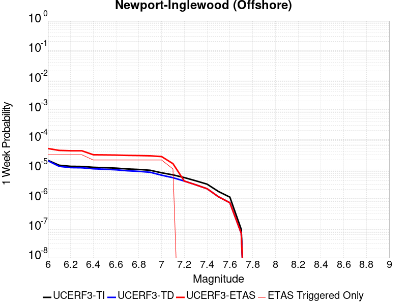 |  |  |  |

| Magnitude | 1 wk TI Prob | 1 wk TD Prob | 1 wk ETAS Prob | 1 wk ETAS/TD Gain | 1 wk ETAS Triggered Only | 1 mo TI Prob | 1 mo TD Prob | 1 mo ETAS Prob | 1 mo ETAS/TD Gain | 1 mo ETAS Triggered Only | 1 yr TI Prob | 1 yr TD Prob | 1 yr ETAS Prob | 1 yr ETAS/TD Gain | 1 yr ETAS Triggered Only | 10 yr TI Prob | 10 yr TD Prob | 10 yr ETAS Prob | 10 yr ETAS/TD Gain | 10 yr ETAS Triggered Only |
|-----|-----|-----|-----|-----|-----|-----|-----|-----|-----|-----|-----|-----|-----|-----|-----|-----|-----|-----|-----|-----|
| 6.0 | 1.9626508E-5 | 1.8965357E-5 | 2.2045257E-4 | 11.623961 | 2.0149103E-4 | 8.411089E-5 | 8.1277634E-5 | 4.8422694E-4 | 5.95769 | 4.0298206E-4 | 0.001023569 | 9.891186E-4 | 0.0013917021 | 1.4070123 | 4.0298206E-4 | 0.010188672 | 0.009848503 | 0.010247516 | 1.0405151 | 4.0298206E-4 |
| 6.1 | 1.331886E-5 | 1.2218092E-5 | 2.1370666E-4 | 17.491001 | 2.0149103E-4 | 5.707958E-5 | 5.2362207E-5 | 4.5532317E-4 | 8.695645 | 4.0298206E-4 | 6.947222E-4 | 6.3732493E-4 | 0.0010400502 | 1.6318994 | 4.0298206E-4 | 0.006925544 | 0.006355149 | 0.00675557 | 1.0630074 | 4.0298206E-4 |
| 6.2 | 1.2250852E-5 | 1.1076029E-5 | 2.1256483E-4 | 19.19143 | 2.0149103E-4 | 5.2502597E-5 | 4.7467838E-5 | 4.504308E-4 | 9.489178 | 4.0298206E-4 | 6.3903164E-4 | 5.777687E-4 | 9.80518E-4 | 1.6970769 | 4.0298206E-4 | 0.006371971 | 0.0057627866 | 0.0061634467 | 1.0695254 | 4.0298206E-4 |
| 6.3 | 1.2106258E-5 | 1.0918891E-5 | 2.1240773E-4 | 19.453232 | 2.0149103E-4 | 5.1882926E-5 | 4.6794412E-5 | 4.4975762E-4 | 9.611353 | 4.0298206E-4 | 6.3149154E-4 | 5.69574E-4 | 9.7232655E-4 | 1.7071118 | 4.0298206E-4 | 0.0062970007 | 0.005681259 | 0.006081952 | 1.0705289 | 4.0298206E-4 |
| 6.4 | 1.1348758E-5 | 1.0109362E-5 | 1.0109362E-5 | 1.0 | 0.0 | 4.8636626E-5 | 4.3325123E-5 | 2.4480742E-4 | 5.6504726 | 2.0149103E-4 | 5.919901E-4 | 5.273565E-4 | 7.287413E-4 | 1.381876 | 2.0149103E-4 | 0.005904155 | 0.0052611465 | 0.0054615773 | 1.0380964 | 2.0149103E-4 |
| 6.5 | 1.100837E-5 | 9.7433895E-6 | 9.7433895E-6 | 1.0 | 0.0 | 4.7177873E-5 | 4.1756717E-5 | 2.4323934E-4 | 5.825155 | 2.0149103E-4 | 5.7423924E-4 | 5.082702E-4 | 7.0965884E-4 | 1.3962235 | 2.0149103E-4 | 0.005727576 | 0.0050711688 | 0.005271638 | 1.0395311 | 2.0149103E-4 |
| 6.6 | 1.0634696E-5 | 9.345544E-6 | 9.345544E-6 | 1.0 | 0.0 | 4.557647E-5 | 4.0051716E-5 | 2.4153468E-4 | 6.0305696 | 2.0149103E-4 | 5.5475225E-4 | 4.8752132E-4 | 6.889141E-4 | 1.4130954 | 2.0149103E-4 | 0.0055336943 | 0.0048646047 | 0.0050651156 | 1.0412183 | 2.0149103E-4 |
| 6.7 | 9.9780855E-6 | 8.667911E-6 | 8.667911E-6 | 1.0 | 0.0 | 4.276252E-5 | 3.7147664E-5 | 2.3863121E-4 | 6.4238553 | 2.0149103E-4 | 5.205093E-4 | 4.5217964E-4 | 6.535796E-4 | 1.445398 | 2.0149103E-4 | 0.0051929182 | 0.004512675 | 0.004713257 | 1.0444485 | 2.0149103E-4 |
| 6.8 | 9.59546E-6 | 8.27295E-6 | 8.27295E-6 | 1.0 | 0.0 | 4.1122752E-5 | 3.5455025E-5 | 2.3693891E-4 | 6.682802 | 2.0149103E-4 | 5.0055445E-4 | 4.315801E-4 | 6.3298416E-4 | 1.4666667 | 2.0149103E-4 | 0.004994285 | 0.004307495 | 0.004508118 | 1.0465753 | 2.0149103E-4 |
| 6.9 | 9.000614E-6 | 7.70684E-6 | 7.70684E-6 | 1.0 | 0.0 | 3.857349E-5 | 3.30289E-5 | 2.3451328E-4 | 7.100245 | 2.0149103E-4 | 4.6953102E-4 | 4.0205332E-4 | 6.034633E-4 | 1.5009536 | 2.0149103E-4 | 0.004685402 | 0.0040133307 | 0.004214013 | 1.050004 | 2.0149103E-4 |
| 7.0 | 7.4070194E-6 | 6.148904E-6 | 6.148904E-6 | 1.0 | 0.0 | 3.1743984E-5 | 2.635218E-5 | 2.635218E-5 | 1.0 | 0.0 | 3.8641447E-4 | 3.207907E-4 | 3.207907E-4 | 1.0 | 0.0 | 0.0038574322 | 0.0032032963 | 0.0032032963 | 1.0 | 0.0 |
| 7.1 | 6.299615E-6 | 5.0565927E-6 | 5.0565927E-6 | 1.0 | 0.0 | 2.699807E-5 | 2.1670932E-5 | 2.1670932E-5 | 1.0 | 0.0 | 3.2865192E-4 | 2.638118E-4 | 2.638118E-4 | 1.0 | 0.0 | 0.003281663 | 0.002635001 | 0.002635001 | 1.0 | 0.0 |
| 7.2 | 5.096653E-6 | 3.892769E-6 | 3.892769E-6 | 1.0 | 0.0 | 2.1842614E-5 | 1.668319E-5 | 1.668319E-5 | 1.0 | 0.0 | 2.6590136E-4 | 2.0309901E-4 | 2.0309901E-4 | 1.0 | 0.0 | 0.0026558342 | 0.0020291451 | 0.0020291451 | 1.0 | 0.0 |
| 7.3 | 3.9753018E-6 | 2.9099103E-6 | 2.9099103E-6 | 1.0 | 0.0 | 1.7036897E-5 | 1.2470985E-5 | 1.2470985E-5 | 1.0 | 0.0 | 2.0740448E-4 | 1.5182374E-4 | 1.5182374E-4 | 1.0 | 0.0 | 0.00207211 | 0.0015172083 | 0.0015172083 | 1.0 | 0.0 |
| 7.4 | 3.0568392E-6 | 2.1449955E-6 | 2.1449955E-6 | 1.0 | 0.0 | 1.3100675E-5 | 9.192806E-6 | 9.192806E-6 | 1.0 | 0.0 | 1.5948903E-4 | 1.1191672E-4 | 1.1191672E-4 | 1.0 | 0.0 | 0.0015937461 | 0.0011186098 | 0.0011186098 | 1.0 | 0.0 |
| 7.5 | 1.7279019E-6 | 1.1469883E-6 | 1.1469883E-6 | 1.0 | 0.0 | 7.405273E-6 | 4.915655E-6 | 4.915655E-6 | 1.0 | 0.0 | 9.015547E-5 | 5.9846494E-5 | 5.9846494E-5 | 1.0 | 0.0 | 9.01189E-4 | 5.9830764E-4 | 5.9830764E-4 | 1.0 | 0.0 |
| 7.6 | 1.1156416E-6 | 7.223012E-7 | 7.223012E-7 | 1.0 | 0.0 | 4.7813123E-6 | 3.095573E-6 | 3.095573E-6 | 1.0 | 0.0 | 5.821092E-5 | 3.7687976E-5 | 3.7687976E-5 | 1.0 | 0.0 | 5.8195676E-4 | 3.7681818E-4 | 3.7681818E-4 | 1.0 | 0.0 |
| 7.7 | 9.117973E-8 | 6.734145E-8 | 6.734145E-8 | 1.0 | 0.0 | 3.907702E-7 | 2.886062E-7 | 2.886062E-7 | 1.0 | 0.0 | 4.757617E-6 | 3.513775E-6 | 3.513775E-6 | 1.0 | 0.0 | 4.7575148E-5 | 3.5137225E-5 | 3.5137225E-5 | 1.0 | 0.0 |

## Santa Ynez (West)
*[(top)](#table-of-contents)*

| 1 Week | 1 Month | 1 Year | 10 Year |
|-----|-----|-----|-----|
|  |  |  |  |

| Magnitude | 1 wk TI Prob | 1 wk TD Prob | 1 wk ETAS Prob | 1 wk ETAS/TD Gain | 1 wk ETAS Triggered Only | 1 mo TI Prob | 1 mo TD Prob | 1 mo ETAS Prob | 1 mo ETAS/TD Gain | 1 mo ETAS Triggered Only | 1 yr TI Prob | 1 yr TD Prob | 1 yr ETAS Prob | 1 yr ETAS/TD Gain | 1 yr ETAS Triggered Only | 10 yr TI Prob | 10 yr TD Prob | 10 yr ETAS Prob | 10 yr ETAS/TD Gain | 10 yr ETAS Triggered Only |
|-----|-----|-----|-----|-----|-----|-----|-----|-----|-----|-----|-----|-----|-----|-----|-----|-----|-----|-----|-----|-----|
| 6.0 | 4.7352758E-5 | 5.4972126E-5 | 5.4972126E-5 | 1.0 | 0.0 | 2.0292461E-4 | 2.3557522E-4 | 4.3701878E-4 | 1.8551136 | 2.0149103E-4 | 0.0024678076 | 0.0028645284 | 0.0030654422 | 1.0701386 | 2.0149103E-4 | 0.024405818 | 0.028304417 | 0.028500205 | 1.0069172 | 2.0149103E-4 |
| 6.1 | 4.7352758E-5 | 5.4972126E-5 | 5.4972126E-5 | 1.0 | 0.0 | 2.0292461E-4 | 2.3557522E-4 | 4.3701878E-4 | 1.8551136 | 2.0149103E-4 | 0.0024678076 | 0.0028645284 | 0.0030654422 | 1.0701386 | 2.0149103E-4 | 0.024405818 | 0.028304417 | 0.028500205 | 1.0069172 | 2.0149103E-4 |
| 6.2 | 3.0415853E-5 | 3.392511E-5 | 3.392511E-5 | 1.0 | 0.0 | 1.3034715E-4 | 1.4538545E-4 | 3.468472E-4 | 2.3857079 | 2.0149103E-4 | 0.0015858212 | 0.0017686661 | 0.0019698008 | 1.1137211 | 2.0149103E-4 | 0.015745522 | 0.017549807 | 0.017747762 | 1.0112796 | 2.0149103E-4 |
| 6.3 | 3.0415853E-5 | 3.392511E-5 | 3.392511E-5 | 1.0 | 0.0 | 1.3034715E-4 | 1.4538545E-4 | 3.468472E-4 | 2.3857079 | 2.0149103E-4 | 0.0015858212 | 0.0017686661 | 0.0019698008 | 1.1137211 | 2.0149103E-4 | 0.015745522 | 0.017549807 | 0.017747762 | 1.0112796 | 2.0149103E-4 |
| 6.4 | 2.5452082E-5 | 2.7912422E-5 | 2.7912422E-5 | 1.0 | 0.0 | 1.09075794E-4 | 1.196193E-4 | 3.2108623E-4 | 2.6842344 | 2.0149103E-4 | 0.0013271887 | 0.0014554089 | 0.0016566066 | 1.1382414 | 2.0149103E-4 | 0.013192902 | 0.014460951 | 0.014659529 | 1.013732 | 2.0149103E-4 |
| 6.5 | 2.3143784E-5 | 2.5128256E-5 | 2.5128256E-5 | 1.0 | 0.0 | 9.9183875E-5 | 1.0768817E-4 | 3.091575E-4 | 2.8708587 | 2.0149103E-4 | 0.0012068948 | 0.0013103267 | 0.0015115538 | 1.15357 | 2.0149103E-4 | 0.012003611 | 0.01302768 | 0.013226546 | 1.0152649 | 2.0149103E-4 |
| 6.6 | 1.9118515E-5 | 2.035434E-5 | 2.035434E-5 | 1.0 | 0.0 | 8.193392E-5 | 8.7230015E-5 | 2.8870348E-4 | 3.3096805 | 2.0149103E-4 | 9.97089E-4 | 0.001061516 | 0.0012627931 | 1.1896129 | 2.0149103E-4 | 0.00992627 | 0.010565365 | 0.010764727 | 1.0188694 | 2.0149103E-4 |
| 6.7 | 1.722807E-5 | 1.8146347E-5 | 1.8146347E-5 | 1.0 | 0.0 | 7.3832496E-5 | 7.776777E-5 | 7.776777E-5 | 1.0 | 0.0 | 8.985399E-4 | 9.464169E-4 | 9.464169E-4 | 1.0 | 0.0 | 0.008949154 | 0.0094245095 | 0.0094245095 | 1.0 | 0.0 |
| 6.8 | 1.5317364E-5 | 1.5926486E-5 | 1.5926486E-5 | 1.0 | 0.0 | 6.56442E-5 | 6.82546E-5 | 6.82546E-5 | 1.0 | 0.0 | 7.98925E-4 | 8.306873E-4 | 8.306873E-4 | 1.0 | 0.0 | 0.007960589 | 0.00827631 | 0.00827631 | 1.0 | 0.0 |
| 6.9 | 1.3071226E-5 | 1.3329624E-5 | 1.3329624E-5 | 1.0 | 0.0 | 5.6018336E-5 | 5.7125722E-5 | 5.7125722E-5 | 1.0 | 0.0 | 6.8180985E-4 | 6.9528597E-4 | 6.9528597E-4 | 1.0 | 0.0 | 0.0067972173 | 0.006931367 | 0.006931367 | 1.0 | 0.0 |
| 7.0 | 1.1836986E-5 | 1.19327815E-5 | 1.19327815E-5 | 1.0 | 0.0 | 5.0728955E-5 | 5.11395E-5 | 5.11395E-5 | 1.0 | 0.0 | 6.1745E-4 | 6.2244723E-4 | 6.2244723E-4 | 1.0 | 0.0 | 0.006157372 | 0.006207231 | 0.006207231 | 1.0 | 0.0 |
| 7.1 | 1.0597169E-5 | 1.0542201E-5 | 1.0542201E-5 | 1.0 | 0.0 | 4.541565E-5 | 4.5180084E-5 | 4.5180084E-5 | 1.0 | 0.0 | 5.5279525E-4 | 5.4992986E-4 | 5.4992986E-4 | 1.0 | 0.0 | 0.0055142213 | 0.005485821 | 0.005485821 | 1.0 | 0.0 |
| 7.2 | 9.59113E-6 | 9.459144E-6 | 9.459144E-6 | 1.0 | 0.0 | 4.11042E-5 | 4.0538565E-5 | 4.0538565E-5 | 1.0 | 0.0 | 5.0032866E-4 | 4.934463E-4 | 4.934463E-4 | 1.0 | 0.0 | 0.004992037 | 0.0049236254 | 0.0049236254 | 1.0 | 0.0 |
| 7.3 | 8.586084E-6 | 8.379583E-6 | 8.379583E-6 | 1.0 | 0.0 | 3.679698E-5 | 3.5912013E-5 | 3.5912013E-5 | 1.0 | 0.0 | 4.4791115E-4 | 4.3714207E-4 | 4.3714207E-4 | 1.0 | 0.0 | 0.004470094 | 0.004362933 | 0.004362933 | 1.0 | 0.0 |
| 7.4 | 7.2622997E-6 | 6.9515427E-6 | 6.9515427E-6 | 1.0 | 0.0 | 3.112377E-5 | 2.979199E-5 | 2.979199E-5 | 1.0 | 0.0 | 3.78866E-4 | 3.626581E-4 | 3.626581E-4 | 1.0 | 0.0 | 0.0037822074 | 0.0036207628 | 0.0036207628 | 1.0 | 0.0 |
| 7.5 | 5.627296E-6 | 5.251588E-6 | 5.251588E-6 | 1.0 | 0.0 | 2.411676E-5 | 2.2506614E-5 | 2.2506614E-5 | 1.0 | 0.0 | 2.9358198E-4 | 2.739843E-4 | 2.739843E-4 | 1.0 | 0.0 | 0.0029319443 | 0.002736537 | 0.002736537 | 1.0 | 0.0 |
| 7.6 | 2.265244E-6 | 2.0608625E-6 | 2.0608625E-6 | 1.0 | 0.0 | 9.708152E-6 | 8.832238E-6 | 8.832238E-6 | 1.0 | 0.0 | 1.18190335E-4 | 1.0752728E-4 | 1.0752728E-4 | 1.0 | 0.0 | 0.001181275 | 0.0010747612 | 0.0010747612 | 1.0 | 0.0 |
| 7.7 | 1.3099874E-6 | 1.1016252E-6 | 1.1016252E-6 | 1.0 | 0.0 | 5.61422E-6 | 4.7212425E-6 | 4.7212425E-6 | 1.0 | 0.0 | 6.8350986E-5 | 5.7479636E-5 | 5.7479636E-5 | 1.0 | 0.0 | 6.832996E-4 | 5.7465007E-4 | 5.7465007E-4 | 1.0 | 0.0 |
| 7.8 | 7.903951E-7 | 6.0711415E-7 | 6.0711415E-7 | 1.0 | 0.0 | 3.3874032E-6 | 2.6019152E-6 | 2.6019152E-6 | 1.0 | 0.0 | 4.1240855E-5 | 3.167787E-5 | 3.167787E-5 | 1.0 | 0.0 | 4.12332E-4 | 3.167349E-4 | 3.167349E-4 | 1.0 | 0.0 |
| 7.9 | 7.0753297E-9 | 5.0899476E-9 | 5.0899476E-9 | 1.0 | 0.0 | 3.032284E-8 | 2.181406E-8 | 2.181406E-8 | 1.0 | 0.0 | 3.6918053E-7 | 2.6558615E-7 | 2.6558615E-7 | 1.0 | 0.0 | 3.691799E-6 | 2.6558594E-6 | 2.6558594E-6 | 1.0 | 0.0 |

## San Andreas (Big Bend)
*[(top)](#table-of-contents)*

| 1 Week | 1 Month | 1 Year | 10 Year |
|-----|-----|-----|-----|
|  |  |  |  |

| Magnitude | 1 wk TI Prob | 1 wk TD Prob | 1 wk ETAS Prob | 1 wk ETAS/TD Gain | 1 wk ETAS Triggered Only | 1 mo TI Prob | 1 mo TD Prob | 1 mo ETAS Prob | 1 mo ETAS/TD Gain | 1 mo ETAS Triggered Only | 1 yr TI Prob | 1 yr TD Prob | 1 yr ETAS Prob | 1 yr ETAS/TD Gain | 1 yr ETAS Triggered Only | 10 yr TI Prob | 10 yr TD Prob | 10 yr ETAS Prob | 10 yr ETAS/TD Gain | 10 yr ETAS Triggered Only |
|-----|-----|-----|-----|-----|-----|-----|-----|-----|-----|-----|-----|-----|-----|-----|-----|-----|-----|-----|-----|-----|
| 6.0 | 1.0179969E-4 | 2.0072258E-4 | 6.0362375E-4 | 3.007254 | 4.0298206E-4 | 4.362114E-4 | 8.599571E-4 | 0.0012625926 | 1.4682041 | 4.0298206E-4 | 0.0052979486 | 0.010419999 | 0.010818781 | 1.038271 | 4.0298206E-4 | 0.051734097 | 0.10144902 | 0.10181112 | 1.0035692 | 4.0298206E-4 |
| 6.1 | 1.0179969E-4 | 2.0072258E-4 | 6.0362375E-4 | 3.007254 | 4.0298206E-4 | 4.362114E-4 | 8.599571E-4 | 0.0012625926 | 1.4682041 | 4.0298206E-4 | 0.0052979486 | 0.010419999 | 0.010818781 | 1.038271 | 4.0298206E-4 | 0.051734097 | 0.10144902 | 0.10181112 | 1.0035692 | 4.0298206E-4 |
| 6.2 | 1.0179969E-4 | 2.0072258E-4 | 6.0362375E-4 | 3.007254 | 4.0298206E-4 | 4.362114E-4 | 8.599571E-4 | 0.0012625926 | 1.4682041 | 4.0298206E-4 | 0.0052979486 | 0.010419999 | 0.010818781 | 1.038271 | 4.0298206E-4 | 0.051734097 | 0.10144902 | 0.10181112 | 1.0035692 | 4.0298206E-4 |
| 6.3 | 1.0179969E-4 | 2.0072258E-4 | 6.0362375E-4 | 3.007254 | 4.0298206E-4 | 4.362114E-4 | 8.599571E-4 | 0.0012625926 | 1.4682041 | 4.0298206E-4 | 0.0052979486 | 0.010419999 | 0.010818781 | 1.038271 | 4.0298206E-4 | 0.051734097 | 0.10144902 | 0.10181112 | 1.0035692 | 4.0298206E-4 |
| 6.4 | 9.1639464E-5 | 1.8429532E-4 | 5.8720313E-4 | 3.1862075 | 4.0298206E-4 | 3.9268145E-4 | 7.895982E-4 | 0.001192262 | 1.5099604 | 4.0298206E-4 | 0.0047704205 | 0.009571102 | 0.009970227 | 1.0417011 | 4.0298206E-4 | 0.046693064 | 0.09377527 | 0.09414046 | 1.0038943 | 4.0298206E-4 |
| 6.5 | 9.1639464E-5 | 1.8429532E-4 | 5.8720313E-4 | 3.1862075 | 4.0298206E-4 | 3.9268145E-4 | 7.895982E-4 | 0.001192262 | 1.5099604 | 4.0298206E-4 | 0.0047704205 | 0.009571102 | 0.009970227 | 1.0417011 | 4.0298206E-4 | 0.046693064 | 0.09377527 | 0.09414046 | 1.0038943 | 4.0298206E-4 |
| 6.6 | 9.042622E-5 | 1.823659E-4 | 5.852745E-4 | 3.2093415 | 4.0298206E-4 | 3.8748336E-4 | 7.8133424E-4 | 0.0011840014 | 1.5153584 | 4.0298206E-4 | 0.0047074095 | 0.009471365 | 0.00987053 | 1.0421444 | 4.0298206E-4 | 0.046089325 | 0.092869274 | 0.09323484 | 1.0039363 | 4.0298206E-4 |
| 6.7 | 8.9836685E-5 | 1.8150927E-4 | 5.844182E-4 | 3.2197707 | 4.0298206E-4 | 3.8495753E-4 | 7.776651E-4 | 0.0011803338 | 1.5177919 | 4.0298206E-4 | 0.00467679 | 0.00942708 | 0.009826263 | 1.0423443 | 4.0298206E-4 | 0.045795817 | 0.09246355 | 0.09282927 | 1.0039552 | 4.0298206E-4 |
| 6.8 | 8.9471854E-5 | 1.8097709E-4 | 5.838862E-4 | 3.226299 | 4.0298206E-4 | 3.8339442E-4 | 7.7538576E-4 | 0.0011780553 | 1.5193152 | 4.0298206E-4 | 0.004657841 | 0.009399569 | 0.009798762 | 1.0424694 | 4.0298206E-4 | 0.04561414 | 0.092210755 | 0.09257658 | 1.0039673 | 4.0298206E-4 |
| 6.9 | 8.858234E-5 | 1.7979681E-4 | 3.8125162E-4 | 2.1204581 | 2.0149103E-4 | 3.7958333E-4 | 7.703304E-4 | 9.7166625E-4 | 1.2613629 | 2.0149103E-4 | 0.004611638 | 0.009338548 | 0.009538158 | 1.0213748 | 2.0149103E-4 | 0.04517103 | 0.09165087 | 0.0918339 | 1.001997 | 2.0149103E-4 |
| 7.0 | 8.7433385E-5 | 1.7818481E-4 | 3.7963994E-4 | 2.1305966 | 2.0149103E-4 | 3.746607E-4 | 7.634259E-4 | 9.647631E-4 | 1.2637285 | 2.0149103E-4 | 0.004551957 | 0.009255203 | 0.00945483 | 1.0215691 | 2.0149103E-4 | 0.044598386 | 0.09088532 | 0.09106849 | 1.0020155 | 2.0149103E-4 |
| 7.1 | 8.684964E-5 | 1.7730435E-4 | 3.7875967E-4 | 2.1362119 | 2.0149103E-4 | 3.7215967E-4 | 7.596547E-4 | 9.6099265E-4 | 1.2650388 | 2.0149103E-4 | 0.0045216335 | 0.009209678 | 0.009409313 | 1.0216767 | 2.0149103E-4 | 0.04430731 | 0.09046686 | 0.09065013 | 1.0020257 | 2.0149103E-4 |
| 7.2 | 8.606521E-5 | 1.762105E-4 | 3.7766603E-4 | 2.1432662 | 2.0149103E-4 | 3.6879873E-4 | 7.549695E-4 | 9.563084E-4 | 1.2666849 | 2.0149103E-4 | 0.0044808835 | 0.0091531165 | 0.009352763 | 1.0218118 | 2.0149103E-4 | 0.043916024 | 0.089947365 | 0.09013074 | 1.0020386 | 2.0149103E-4 |
| 7.3 | 8.568266E-5 | 1.7563057E-4 | 3.7708622E-4 | 2.147042 | 2.0149103E-4 | 3.6715972E-4 | 7.524855E-4 | 9.538249E-4 | 1.2675658 | 2.0149103E-4 | 0.0044610105 | 0.009123127 | 0.00932278 | 1.0218842 | 2.0149103E-4 | 0.043725148 | 0.08966853 | 0.08985195 | 1.0020456 | 2.0149103E-4 |
| 7.4 | 8.5432206E-5 | 1.7525644E-4 | 3.7671215E-4 | 2.149491 | 2.0149103E-4 | 3.6608664E-4 | 7.50883E-4 | 9.522228E-4 | 1.2681373 | 2.0149103E-4 | 0.004447999 | 0.009103781 | 0.009303438 | 1.0219312 | 2.0149103E-4 | 0.043600157 | 0.08948871 | 0.08967217 | 1.00205 | 2.0149103E-4 |
| 7.5 | 8.4791965E-5 | 1.7394972E-4 | 3.754057E-4 | 2.1581275 | 2.0149103E-4 | 3.633435E-4 | 7.4528606E-4 | 9.466269E-4 | 1.2701524 | 2.0149103E-4 | 0.0044147377 | 0.009036204 | 0.009235875 | 1.0220968 | 2.0149103E-4 | 0.043280575 | 0.088866346 | 0.08904993 | 1.0020659 | 2.0149103E-4 |
| 7.6 | 8.241105E-5 | 1.6840403E-4 | 3.6986114E-4 | 2.1962724 | 2.0149103E-4 | 3.531424E-4 | 7.215321E-4 | 9.2287775E-4 | 1.279053 | 2.0149103E-4 | 0.0042910352 | 0.008749358 | 0.008949087 | 1.0228277 | 2.0149103E-4 | 0.042091176 | 0.086243294 | 0.086427405 | 1.0021348 | 2.0149103E-4 |
| 7.7 | 7.00432E-5 | 1.42045E-4 | 3.4350742E-4 | 2.4183 | 2.0149103E-4 | 3.001506E-4 | 6.0862233E-4 | 8.0999074E-4 | 1.3308594 | 2.0149103E-4 | 0.0036482112 | 0.0073848404 | 0.0075848433 | 1.0270829 | 2.0149103E-4 | 0.035888977 | 0.07351733 | 0.073704004 | 1.0025393 | 2.0149103E-4 |
| 7.8 | 6.415362E-5 | 1.2968935E-4 | 1.2968935E-4 | 1.0 | 0.0 | 2.749151E-4 | 5.556931E-4 | 5.556931E-4 | 1.0 | 0.0 | 0.0033419547 | 0.0067446055 | 0.0067446055 | 1.0 | 0.0 | 0.03292141 | 0.06725231 | 0.06725231 | 1.0 | 0.0 |
| 7.9 | 4.939911E-5 | 9.3411545E-5 | 9.3411545E-5 | 1.0 | 0.0 | 2.116933E-4 | 4.0027377E-4 | 4.0027377E-4 | 1.0 | 0.0 | 0.0025743195 | 0.004862453 | 0.004862453 | 1.0 | 0.0 | 0.025447013 | 0.048914436 | 0.048914436 | 1.0 | 0.0 |
| 8.0 | 3.344983E-5 | 5.222685E-5 | 5.222685E-5 | 1.0 | 0.0 | 1.4334853E-4 | 2.2381016E-4 | 2.2381016E-4 | 1.0 | 0.0 | 0.0017438711 | 0.0027214854 | 0.0027214854 | 1.0 | 0.0 | 0.017302496 | 0.027922187 | 0.027922187 | 1.0 | 0.0 |
| 8.1 | 1.9104898E-5 | 1.9173063E-5 | 1.9173063E-5 | 1.0 | 0.0 | 8.1875565E-5 | 8.216769E-5 | 8.216769E-5 | 1.0 | 0.0 | 9.963791E-4 | 9.999331E-4 | 9.999331E-4 | 1.0 | 0.0 | 0.009919235 | 0.010749801 | 0.010749801 | 1.0 | 0.0 |
| 8.2 | 8.643924E-6 | 5.4748625E-6 | 5.4748625E-6 | 1.0 | 0.0 | 3.704486E-5 | 2.3463486E-5 | 2.3463486E-5 | 1.0 | 0.0 | 4.5092785E-4 | 2.8563058E-4 | 2.8563058E-4 | 1.0 | 0.0 | 0.0045001395 | 0.0032487072 | 0.0032487072 | 1.0 | 0.0 |
| 8.3 | 1.983087E-6 | 7.6599065E-7 | 7.6599065E-7 | 1.0 | 0.0 | 8.498917E-6 | 3.282813E-6 | 3.282813E-6 | 1.0 | 0.0 | 1.034694E-4 | 3.9967534E-5 | 3.9967534E-5 | 1.0 | 0.0 | 0.0010342124 | 4.719687E-4 | 4.719687E-4 | 1.0 | 0.0 |

## Brawley (Seismic Zone) alt 1
*[(top)](#table-of-contents)*

| 1 Week | 1 Month | 1 Year | 10 Year |
|-----|-----|-----|-----|
|  |  |  |  |

| Magnitude | 1 wk TI Prob | 1 wk TD Prob | 1 wk ETAS Prob | 1 wk ETAS/TD Gain | 1 wk ETAS Triggered Only | 1 mo TI Prob | 1 mo TD Prob | 1 mo ETAS Prob | 1 mo ETAS/TD Gain | 1 mo ETAS Triggered Only | 1 yr TI Prob | 1 yr TD Prob | 1 yr ETAS Prob | 1 yr ETAS/TD Gain | 1 yr ETAS Triggered Only | 10 yr TI Prob | 10 yr TD Prob | 10 yr ETAS Prob | 10 yr ETAS/TD Gain | 10 yr ETAS Triggered Only |
|-----|-----|-----|-----|-----|-----|-----|-----|-----|-----|-----|-----|-----|-----|-----|-----|-----|-----|-----|-----|-----|
| 6.0 | 2.2521618E-4 | 4.7632487E-4 | 6.7771995E-4 | 1.4228103 | 2.0149103E-4 | 9.6485513E-4 | 0.0020398323 | 0.0022409123 | 1.0985768 | 2.0149103E-4 | 0.011683988 | 0.024546238 | 0.024939327 | 1.0160143 | 4.0298206E-4 | 0.11088423 | 0.21350002 | 0.21381697 | 1.0014845 | 4.0298206E-4 |
| 6.1 | 2.2521618E-4 | 4.7632487E-4 | 6.7771995E-4 | 1.4228103 | 2.0149103E-4 | 9.6485513E-4 | 0.0020398323 | 0.0022409123 | 1.0985768 | 2.0149103E-4 | 0.011683988 | 0.024546238 | 0.024742782 | 1.0080072 | 2.0149103E-4 | 0.11088423 | 0.21350002 | 0.2136585 | 1.0007423 | 2.0149103E-4 |
| 6.2 | 2.198148E-4 | 4.6717093E-4 | 6.6856784E-4 | 1.4310989 | 2.0149103E-4 | 9.417233E-4 | 0.0020006616 | 0.0022017495 | 1.1005107 | 2.0149103E-4 | 0.011405343 | 0.024080504 | 0.024277141 | 1.008166 | 2.0149103E-4 | 0.10837428 | 0.20993657 | 0.21009576 | 1.0007583 | 2.0149103E-4 |
| 6.3 | 2.1704129E-4 | 4.615278E-4 | 6.629258E-4 | 1.4363725 | 2.0149103E-4 | 9.298453E-4 | 0.0019765133 | 0.002177606 | 1.1017412 | 2.0149103E-4 | 0.011262234 | 0.02379366 | 0.023990357 | 1.0082668 | 2.0149103E-4 | 0.107082725 | 0.20782755 | 0.20798716 | 1.0007681 | 2.0149103E-4 |
| 6.4 | 1.876142E-4 | 4.00449E-4 | 6.0185936E-4 | 1.5029613 | 2.0149103E-4 | 8.038131E-4 | 0.0017150956 | 0.001916241 | 1.1172794 | 2.0149103E-4 | 0.00974259 | 0.020680401 | 0.020877725 | 1.0095416 | 2.0149103E-4 | 0.093263686 | 0.18457815 | 0.18474245 | 1.0008901 | 2.0149103E-4 |
| 6.5 | 1.7390939E-4 | 3.7477075E-4 | 5.761863E-4 | 1.5374366 | 2.0149103E-4 | 7.45113E-4 | 0.0016051838 | 0.0018063515 | 1.1253238 | 2.0149103E-4 | 0.009034078 | 0.019368723 | 0.019566312 | 1.0102015 | 2.0149103E-4 | 0.086755216 | 0.17440031 | 0.17456667 | 1.0009538 | 2.0149103E-4 |
| 6.6 | 1.591791E-4 | 3.4891962E-4 | 5.5034034E-4 | 1.5772697 | 2.0149103E-4 | 6.8201777E-4 | 0.0014945229 | 0.0016957128 | 1.1346182 | 2.0149103E-4 | 0.008271996 | 0.018045569 | 0.018243425 | 1.0109642 | 2.0149103E-4 | 0.07970774 | 0.16380852 | 0.16397701 | 1.0010285 | 2.0149103E-4 |
| 6.7 | 1.4268003E-4 | 3.20582E-4 | 5.2200846E-4 | 1.6283149 | 2.0149103E-4 | 6.1134255E-4 | 0.0013732077 | 0.001574422 | 1.1465287 | 2.0149103E-4 | 0.007417723 | 0.016592601 | 0.01679075 | 1.0119419 | 2.0149103E-4 | 0.07174956 | 0.15193306 | 0.15210395 | 1.0011247 | 2.0149103E-4 |
| 6.8 | 1.239713E-4 | 2.9053655E-4 | 4.9196905E-4 | 1.693312 | 2.0149103E-4 | 5.3119735E-4 | 0.0012445687 | 0.0014458089 | 1.1616948 | 2.0149103E-4 | 0.0064481674 | 0.015048777 | 0.015247236 | 1.0131876 | 2.0149103E-4 | 0.06264243 | 0.13837762 | 0.13855124 | 1.0012546 | 2.0149103E-4 |
| 6.9 | 1.0180238E-4 | 2.625439E-4 | 4.6398205E-4 | 1.7672551 | 2.0149103E-4 | 4.3622297E-4 | 0.0011247073 | 0.0013259717 | 1.1789483 | 2.0149103E-4 | 0.005298089 | 0.013608336 | 0.013807085 | 1.0146049 | 2.0149103E-4 | 0.05173543 | 0.124961674 | 0.12513798 | 1.001411 | 2.0149103E-4 |
| 7.0 | 7.6619996E-5 | 2.23993E-4 | 4.254389E-4 | 1.8993402 | 2.0149103E-4 | 3.283301E-4 | 9.5962E-4 | 0.0011609177 | 1.209768 | 2.0149103E-4 | 0.0039900932 | 0.011621496 | 0.011820645 | 1.0171363 | 2.0149103E-4 | 0.039192066 | 0.107266866 | 0.107446745 | 1.0016769 | 2.0149103E-4 |
| 7.1 | 7.5127435E-5 | 2.2082464E-4 | 4.2227117E-4 | 1.9122467 | 2.0149103E-4 | 3.2193496E-4 | 9.4605127E-4 | 0.0011473517 | 1.2127796 | 2.0149103E-4 | 0.0039125155 | 0.011458045 | 0.011657227 | 1.0173836 | 2.0149103E-4 | 0.038443442 | 0.10583085 | 0.10601102 | 1.0017024 | 2.0149103E-4 |
| 7.2 | 6.788582E-5 | 2.0210193E-4 | 4.0355226E-4 | 1.9967757 | 2.0149103E-4 | 2.9090676E-4 | 8.6586666E-4 | 0.0010671832 | 1.2325029 | 2.0149103E-4 | 0.0035360386 | 0.0104916105 | 0.010690988 | 1.0190035 | 2.0149103E-4 | 0.034803 | 0.09750131 | 0.097683154 | 1.001865 | 2.0149103E-4 |
| 7.3 | 6.399602E-5 | 1.8841137E-4 | 3.8986444E-4 | 2.0692194 | 2.0149103E-4 | 2.7423984E-4 | 8.072303E-4 | 0.0010085587 | 1.2494063 | 2.0149103E-4 | 0.0033337586 | 0.009784332 | 0.009983851 | 1.0203917 | 2.0149103E-4 | 0.03284188 | 0.09139617 | 0.09157924 | 1.0020031 | 2.0149103E-4 |
| 7.4 | 4.506759E-5 | 1.2529209E-4 | 3.2675787E-4 | 2.607969 | 2.0149103E-4 | 1.9313251E-4 | 5.368565E-4 | 7.382393E-4 | 1.3751149 | 2.0149103E-4 | 0.0023488526 | 0.0065168133 | 0.0067169913 | 1.0307171 | 2.0149103E-4 | 0.023241805 | 0.062363707 | 0.06255263 | 1.0030295 | 2.0149103E-4 |
| 7.5 | 3.43289E-5 | 9.33541E-5 | 2.948263E-4 | 3.1581507 | 2.0149103E-4 | 1.4711556E-4 | 4.00028E-4 | 6.014384E-4 | 1.5034909 | 2.0149103E-4 | 0.0017896603 | 0.0048595266 | 0.0050600385 | 1.0412616 | 2.0149103E-4 | 0.01775316 | 0.04705519 | 0.047247197 | 1.0040805 | 2.0149103E-4 |
| 7.6 | 2.5980507E-5 | 7.053101E-5 | 2.7200783E-4 | 3.8565707 | 2.0149103E-4 | 1.1134028E-4 | 3.0224086E-4 | 5.03671E-4 | 1.6664556 | 2.0149103E-4 | 0.001354725 | 0.003673598 | 0.0038743487 | 1.054647 | 2.0149103E-4 | 0.013464959 | 0.035840835 | 0.0360351 | 1.0054203 | 2.0149103E-4 |
| 7.7 | 1.7292105E-5 | 4.9407296E-5 | 4.9407296E-5 | 1.0 | 0.0 | 7.4106916E-5 | 2.117284E-4 | 2.117284E-4 | 1.0 | 0.0 | 9.018782E-4 | 0.0025747516 | 0.0025747516 | 1.0 | 0.0 | 0.008982267 | 0.025290398 | 0.025290398 | 1.0 | 0.0 |
| 7.8 | 1.2927471E-5 | 3.9693266E-5 | 3.9693266E-5 | 1.0 | 0.0 | 5.5402274E-5 | 1.7010293E-4 | 1.7010293E-4 | 1.0 | 0.0 | 6.743139E-4 | 0.0020690386 | 0.0020690386 | 1.0 | 0.0 | 0.0067227143 | 0.020431727 | 0.020431727 | 1.0 | 0.0 |
| 7.9 | 1.0200774E-5 | 2.874569E-5 | 2.874569E-5 | 1.0 | 0.0 | 4.371687E-5 | 1.2319001E-4 | 1.2319001E-4 | 1.0 | 0.0 | 5.321229E-4 | 0.0014988075 | 0.0014988075 | 1.0 | 0.0 | 0.005308505 | 0.014991644 | 0.014991644 | 1.0 | 0.0 |
| 8.0 | 8.650396E-6 | 2.3277367E-5 | 2.3277367E-5 | 1.0 | 0.0 | 3.70726E-5 | 9.975634E-5 | 9.975634E-5 | 1.0 | 0.0 | 4.5126543E-4 | 0.0012138576 | 0.0012138576 | 1.0 | 0.0 | 0.0045035016 | 0.012211097 | 0.012211097 | 1.0 | 0.0 |
| 8.1 | 3.9368224E-6 | 7.3279825E-6 | 7.3279825E-6 | 1.0 | 0.0 | 1.6871985E-5 | 3.140526E-5 | 3.140526E-5 | 1.0 | 0.0 | 2.0539707E-4 | 3.8229208E-4 | 3.8229208E-4 | 1.0 | 0.0 | 0.0020520731 | 0.004001185 | 0.004001185 | 1.0 | 0.0 |
| 8.2 | 1.7101195E-6 | 2.217876E-6 | 2.217876E-6 | 1.0 | 0.0 | 7.329063E-6 | 9.505149E-6 | 9.505149E-6 | 1.0 | 0.0 | 8.922769E-5 | 1.1571907E-4 | 1.1571907E-4 | 1.0 | 0.0 | 8.9191867E-4 | 0.0012666774 | 0.0012666774 | 1.0 | 0.0 |
| 8.3 | 3.0346666E-8 | 1.721586E-8 | 1.721586E-8 | 1.0 | 0.0 | 1.3005713E-7 | 7.378226E-8 | 7.378226E-8 | 1.0 | 0.0 | 1.5834444E-6 | 8.9829894E-7 | 8.9829894E-7 | 1.0 | 0.0 | 1.5834332E-5 | 9.367729E-6 | 9.367729E-6 | 1.0 | 0.0 |

## Sierra Nevada  (No Extension)
*[(top)](#table-of-contents)*

| 1 Week | 1 Month | 1 Year | 10 Year |
|-----|-----|-----|-----|
|  |  |  |  |

| Magnitude | 1 wk TI Prob | 1 wk TD Prob | 1 wk ETAS Prob | 1 wk ETAS/TD Gain | 1 wk ETAS Triggered Only | 1 mo TI Prob | 1 mo TD Prob | 1 mo ETAS Prob | 1 mo ETAS/TD Gain | 1 mo ETAS Triggered Only | 1 yr TI Prob | 1 yr TD Prob | 1 yr ETAS Prob | 1 yr ETAS/TD Gain | 1 yr ETAS Triggered Only | 10 yr TI Prob | 10 yr TD Prob | 10 yr ETAS Prob | 10 yr ETAS/TD Gain | 10 yr ETAS Triggered Only |
|-----|-----|-----|-----|-----|-----|-----|-----|-----|-----|-----|-----|-----|-----|-----|-----|-----|-----|-----|-----|-----|
| 6.0 | 7.7690465E-6 | 6.976322E-6 | 2.0846595E-4 | 29.88193 | 2.0149103E-4 | 3.329549E-5 | 2.9898381E-5 | 4.328684E-4 | 14.477988 | 4.0298206E-4 | 4.0529718E-4 | 3.6398784E-4 | 7.6682324E-4 | 2.1067276 | 4.0298206E-4 | 0.004045588 | 0.0036374326 | 0.004038949 | 1.1103845 | 4.0298206E-4 |
| 6.1 | 7.7690465E-6 | 6.976322E-6 | 2.0846595E-4 | 29.88193 | 2.0149103E-4 | 3.329549E-5 | 2.9898381E-5 | 4.328684E-4 | 14.477988 | 4.0298206E-4 | 4.0529718E-4 | 3.6398784E-4 | 7.6682324E-4 | 2.1067276 | 4.0298206E-4 | 0.004045588 | 0.0036374326 | 0.004038949 | 1.1103845 | 4.0298206E-4 |
| 6.2 | 7.7690465E-6 | 6.976322E-6 | 2.0846595E-4 | 29.88193 | 2.0149103E-4 | 3.329549E-5 | 2.9898381E-5 | 4.328684E-4 | 14.477988 | 4.0298206E-4 | 4.0529718E-4 | 3.6398784E-4 | 7.6682324E-4 | 2.1067276 | 4.0298206E-4 | 0.004045588 | 0.0036374326 | 0.004038949 | 1.1103845 | 4.0298206E-4 |
| 6.3 | 7.7690465E-6 | 6.976322E-6 | 2.0846595E-4 | 29.88193 | 2.0149103E-4 | 3.329549E-5 | 2.9898381E-5 | 4.328684E-4 | 14.477988 | 4.0298206E-4 | 4.0529718E-4 | 3.6398784E-4 | 7.6682324E-4 | 2.1067276 | 4.0298206E-4 | 0.004045588 | 0.0036374326 | 0.004038949 | 1.1103845 | 4.0298206E-4 |
| 6.4 | 7.7690465E-6 | 6.976322E-6 | 2.0846595E-4 | 29.88193 | 2.0149103E-4 | 3.329549E-5 | 2.9898381E-5 | 4.328684E-4 | 14.477988 | 4.0298206E-4 | 4.0529718E-4 | 3.6398784E-4 | 7.6682324E-4 | 2.1067276 | 4.0298206E-4 | 0.004045588 | 0.0036374326 | 0.004038949 | 1.1103845 | 4.0298206E-4 |
| 6.5 | 7.7690465E-6 | 6.976322E-6 | 2.0846595E-4 | 29.88193 | 2.0149103E-4 | 3.329549E-5 | 2.9898381E-5 | 4.328684E-4 | 14.477988 | 4.0298206E-4 | 4.0529718E-4 | 3.6398784E-4 | 7.6682324E-4 | 2.1067276 | 4.0298206E-4 | 0.004045588 | 0.0036374326 | 0.004038949 | 1.1103845 | 4.0298206E-4 |
| 6.6 | 2.653E-6 | 1.614854E-6 | 2.0310556E-4 | 125.77333 | 2.0149103E-4 | 1.136995E-5 | 6.9207845E-6 | 4.0990007E-4 | 59.227398 | 4.0298206E-4 | 1.3842035E-4 | 8.425733E-5 | 4.8720546E-4 | 5.782351 | 4.0298206E-4 | 0.0013833415 | 8.422573E-4 | 0.0012448999 | 1.4780519 | 4.0298206E-4 |
| 6.7 | 2.5902466E-6 | 1.5501876E-6 | 2.0304091E-4 | 130.97829 | 2.0149103E-4 | 1.11010095E-5 | 6.643644E-6 | 4.0962303E-4 | 61.65638 | 4.0298206E-4 | 1.351464E-4 | 8.0883394E-5 | 4.8383288E-4 | 5.981857 | 4.0298206E-4 | 0.0013506424 | 8.0854254E-4 | 0.0012111987 | 1.4980025 | 4.0298206E-4 |
| 6.8 | 2.5853892E-6 | 1.5469877E-6 | 2.030377E-4 | 131.24713 | 2.0149103E-4 | 1.1080193E-5 | 6.629931E-6 | 4.0960932E-4 | 61.78184 | 4.0298206E-4 | 1.34893E-4 | 8.071645E-5 | 4.83666E-4 | 5.9921613 | 4.0298206E-4 | 0.0013481114 | 8.068743E-4 | 0.0012095312 | 1.499033 | 4.0298206E-4 |
| 6.9 | 2.458257E-6 | 1.4220619E-6 | 2.0291281E-4 | 142.68915 | 2.0149103E-4 | 1.0535345E-5 | 6.094537E-6 | 4.0907416E-4 | 67.121445 | 4.0298206E-4 | 1.2826028E-4 | 7.4198484E-5 | 4.7715064E-4 | 6.430733 | 4.0298206E-4 | 0.0012818627 | 7.4173906E-4 | 0.0011444222 | 1.5428905 | 4.0298206E-4 |
| 7.0 | 2.4341468E-6 | 1.3990258E-6 | 2.0288977E-4 | 145.02219 | 2.0149103E-4 | 1.0432016E-5 | 5.9958115E-6 | 4.0897547E-4 | 68.2102 | 4.0298206E-4 | 1.270024E-4 | 7.2996576E-5 | 4.7594923E-4 | 6.5201583 | 4.0298206E-4 | 0.0012692984 | 7.297279E-4 | 0.001132416 | 1.551833 | 4.0298206E-4 |
| 7.1 | 2.3652476E-6 | 1.3339754E-6 | 2.0282474E-4 | 152.04533 | 2.0149103E-4 | 1.0136736E-5 | 5.717025E-6 | 4.086968E-4 | 71.48766 | 4.0298206E-4 | 1.2340778E-4 | 6.9602575E-5 | 4.725566E-4 | 6.7893553 | 4.0298206E-4 | 0.0012333926 | 6.9580943E-4 | 0.0010985112 | 1.5787528 | 4.0298206E-4 |
| 7.2 | 2.272158E-6 | 1.2502821E-6 | 2.0274107E-4 | 162.15625 | 2.0149103E-4 | 9.737784E-6 | 5.3583412E-6 | 4.0833824E-4 | 76.20609 | 4.0298206E-4 | 1.1855107E-4 | 6.5235865E-5 | 4.6819163E-4 | 7.1769056 | 4.0298206E-4 | 0.0011848784 | 6.5216864E-4 | 0.0010548879 | 1.6175078 | 4.0298206E-4 |
| 7.3 | 2.1382127E-6 | 1.1419703E-6 | 2.0263277E-4 | 177.44138 | 2.0149103E-4 | 9.163737E-6 | 4.8941492E-6 | 2.063842E-4 | 42.169575 | 2.0149103E-4 | 1.1156279E-4 | 5.958465E-5 | 2.610637E-4 | 4.3813915 | 2.0149103E-4 | 0.001115068 | 5.956879E-4 | 7.970589E-4 | 1.3380479 | 2.0149103E-4 |
| 7.4 | 1.9048055E-6 | 9.575242E-7 | 2.0244837E-4 | 211.42897 | 2.0149103E-4 | 8.163426E-6 | 4.1036687E-6 | 2.0559388E-4 | 50.100014 | 2.0149103E-4 | 9.9385186E-5 | 4.996103E-5 | 2.51442E-4 | 5.0327625 | 2.0149103E-4 | 9.934074E-4 | 4.994987E-4 | 7.0088904E-4 | 1.403185 | 2.0149103E-4 |
| 7.5 | 1.5373403E-6 | 7.560042E-7 | 2.0224688E-4 | 267.52084 | 2.0149103E-4 | 6.5885843E-6 | 3.2400142E-6 | 2.047304E-4 | 63.188118 | 2.0149103E-4 | 8.021306E-5 | 3.9446462E-5 | 2.4092956E-4 | 6.1077604 | 2.0149103E-4 | 8.0184115E-4 | 3.943951E-4 | 5.9580663E-4 | 1.5106847 | 2.0149103E-4 |
| 7.6 | 1.0680322E-6 | 4.6596554E-7 | 2.0195691E-4 | 433.41595 | 2.0149103E-4 | 4.577273E-6 | 1.9969937E-6 | 2.0348762E-4 | 101.89698 | 2.0149103E-4 | 5.5726876E-5 | 2.4313129E-5 | 2.2579926E-4 | 9.287133 | 2.0149103E-4 | 5.5712904E-4 | 2.4310495E-4 | 4.44547E-4 | 1.8286217 | 2.0149103E-4 |
| 7.7 | 5.509146E-7 | 1.5580486E-7 | 1.5580486E-7 | 1.0 | 0.0 | 2.3610605E-6 | 6.677349E-7 | 6.677349E-7 | 1.0 | 0.0 | 2.8745531E-5 | 8.129644E-6 | 8.129644E-6 | 1.0 | 0.0 | 2.8741814E-4 | 8.1293576E-5 | 8.1293576E-5 | 1.0 | 0.0 |

## Calico-Hidalgo
*[(top)](#table-of-contents)*

| 1 Week | 1 Month | 1 Year | 10 Year |
|-----|-----|-----|-----|
|  |  |  |  |

| Magnitude | 1 wk TI Prob | 1 wk TD Prob | 1 wk ETAS Prob | 1 wk ETAS/TD Gain | 1 wk ETAS Triggered Only | 1 mo TI Prob | 1 mo TD Prob | 1 mo ETAS Prob | 1 mo ETAS/TD Gain | 1 mo ETAS Triggered Only | 1 yr TI Prob | 1 yr TD Prob | 1 yr ETAS Prob | 1 yr ETAS/TD Gain | 1 yr ETAS Triggered Only | 10 yr TI Prob | 10 yr TD Prob | 10 yr ETAS Prob | 10 yr ETAS/TD Gain | 10 yr ETAS Triggered Only |
|-----|-----|-----|-----|-----|-----|-----|-----|-----|-----|-----|-----|-----|-----|-----|-----|-----|-----|-----|-----|-----|
| 6.0 | 4.0906612E-5 | 5.0703686E-5 | 2.5218452E-4 | 4.9736915 | 2.0149103E-4 | 1.7530227E-4 | 2.172857E-4 | 6.201802E-4 | 2.8542154 | 4.0298206E-4 | 0.0021322158 | 0.002642648 | 0.0030445652 | 1.1520888 | 4.0298206E-4 | 0.02111873 | 0.026152607 | 0.02654505 | 1.0150058 | 4.0298206E-4 |
| 6.1 | 4.0906612E-5 | 5.0703686E-5 | 2.5218452E-4 | 4.9736915 | 2.0149103E-4 | 1.7530227E-4 | 2.172857E-4 | 6.201802E-4 | 2.8542154 | 4.0298206E-4 | 0.0021322158 | 0.002642648 | 0.0030445652 | 1.1520888 | 4.0298206E-4 | 0.02111873 | 0.026152607 | 0.02654505 | 1.0150058 | 4.0298206E-4 |
| 6.2 | 4.0906612E-5 | 5.0703686E-5 | 2.5218452E-4 | 4.9736915 | 2.0149103E-4 | 1.7530227E-4 | 2.172857E-4 | 6.201802E-4 | 2.8542154 | 4.0298206E-4 | 0.0021322158 | 0.002642648 | 0.0030445652 | 1.1520888 | 4.0298206E-4 | 0.02111873 | 0.026152607 | 0.02654505 | 1.0150058 | 4.0298206E-4 |
| 6.3 | 2.4242801E-5 | 3.0090669E-5 | 3.0090669E-5 | 1.0 | 0.0 | 1.0389358E-4 | 1.2895382E-4 | 1.2895382E-4 | 1.0 | 0.0 | 0.0012641704 | 0.0015689151 | 0.0015689151 | 1.0 | 0.0 | 0.01257003 | 0.01558206 | 0.01558206 | 1.0 | 0.0 |
| 6.4 | 2.4242801E-5 | 3.0090669E-5 | 3.0090669E-5 | 1.0 | 0.0 | 1.0389358E-4 | 1.2895382E-4 | 1.2895382E-4 | 1.0 | 0.0 | 0.0012641704 | 0.0015689151 | 0.0015689151 | 1.0 | 0.0 | 0.01257003 | 0.01558206 | 0.01558206 | 1.0 | 0.0 |
| 6.5 | 2.0286952E-5 | 2.5315738E-5 | 2.5315738E-5 | 1.0 | 0.0 | 8.694118E-5 | 1.0849161E-4 | 1.0849161E-4 | 1.0 | 0.0 | 0.0010579949 | 0.001320102 | 0.001320102 | 1.0 | 0.0 | 0.010529719 | 0.013124538 | 0.013124538 | 1.0 | 0.0 |
| 6.6 | 2.0269223E-5 | 2.5296687E-5 | 2.5296687E-5 | 1.0 | 0.0 | 8.6865206E-5 | 1.08409964E-4 | 1.08409964E-4 | 1.0 | 0.0 | 0.0010570707 | 0.0013191093 | 0.0013191093 | 1.0 | 0.0 | 0.010520565 | 0.013114728 | 0.013114728 | 1.0 | 0.0 |
| 6.7 | 1.799852E-5 | 2.25406E-5 | 2.25406E-5 | 1.0 | 0.0 | 7.713423E-5 | 9.659908E-5 | 9.659908E-5 | 1.0 | 0.0 | 9.3870464E-4 | 0.0011754738 | 0.0011754738 | 1.0 | 0.0 | 0.009347493 | 0.011694173 | 0.011694173 | 1.0 | 0.0 |
| 6.8 | 1.7458793E-5 | 2.184212E-5 | 2.184212E-5 | 1.0 | 0.0 | 7.4821255E-5 | 9.3605806E-5 | 9.3605806E-5 | 1.0 | 0.0 | 9.10568E-4 | 0.0011390693 | 0.0011390693 | 1.0 | 0.0 | 0.009068459 | 0.011333893 | 0.011333893 | 1.0 | 0.0 |
| 6.9 | 1.542884E-5 | 1.9025927E-5 | 1.9025927E-5 | 1.0 | 0.0 | 6.612192E-5 | 8.153721E-5 | 8.153721E-5 | 1.0 | 0.0 | 8.04737E-4 | 9.922766E-4 | 9.922766E-4 | 1.0 | 0.0 | 0.008018291 | 0.009879857 | 0.009879857 | 1.0 | 0.0 |
| 7.0 | 1.468253E-5 | 1.8030598E-5 | 1.8030598E-5 | 1.0 | 0.0 | 6.292361E-5 | 7.7271776E-5 | 7.7271776E-5 | 1.0 | 0.0 | 7.658257E-4 | 9.4039086E-4 | 9.4039086E-4 | 1.0 | 0.0 | 0.0076319184 | 0.009365481 | 0.009365481 | 1.0 | 0.0 |
| 7.1 | 1.3139281E-5 | 1.6200942E-5 | 1.6200942E-5 | 1.0 | 0.0 | 5.6309986E-5 | 6.943083E-5 | 6.943083E-5 | 1.0 | 0.0 | 6.853584E-4 | 8.4500515E-4 | 8.4500515E-4 | 1.0 | 0.0 | 0.0068324856 | 0.0084192185 | 0.0084192185 | 1.0 | 0.0 |
| 7.2 | 1.1127404E-5 | 1.3866597E-5 | 1.3866597E-5 | 1.0 | 0.0 | 4.7688E-5 | 5.942698E-5 | 5.942698E-5 | 1.0 | 0.0 | 5.8044674E-4 | 7.232942E-4 | 7.232942E-4 | 1.0 | 0.0 | 0.0057893298 | 0.0072105085 | 0.0072105085 | 1.0 | 0.0 |
| 7.3 | 9.808154E-6 | 1.2176215E-5 | 1.2176215E-5 | 1.0 | 0.0 | 4.2034266E-5 | 5.2182797E-5 | 5.2182797E-5 | 1.0 | 0.0 | 5.11647E-4 | 6.3515105E-4 | 6.3515105E-4 | 1.0 | 0.0 | 0.0051047057 | 0.006334433 | 0.006334433 | 1.0 | 0.0 |
| 7.4 | 7.942452E-6 | 9.792144E-6 | 9.792144E-6 | 1.0 | 0.0 | 3.4038632E-5 | 4.1965708E-5 | 4.1965708E-5 | 1.0 | 0.0 | 4.1434157E-4 | 5.1082217E-4 | 5.1082217E-4 | 1.0 | 0.0 | 0.0041356985 | 0.005097421 | 0.005097421 | 1.0 | 0.0 |
| 7.5 | 4.7121216E-6 | 5.772836E-6 | 5.772836E-6 | 1.0 | 0.0 | 2.019465E-5 | 2.4740535E-5 | 2.4740535E-5 | 1.0 | 0.0 | 2.4584212E-4 | 3.0118204E-4 | 3.0118204E-4 | 1.0 | 0.0 | 0.0024557032 | 0.0030084911 | 0.0030084911 | 1.0 | 0.0 |
| 7.6 | 2.21172E-7 | 2.603961E-7 | 2.603961E-7 | 1.0 | 0.0 | 9.478797E-7 | 1.1159829E-6 | 1.1159829E-6 | 1.0 | 0.0 | 1.1540374E-5 | 1.3587036E-5 | 1.3587036E-5 | 1.0 | 0.0 | 1.1539775E-4 | 1.3586486E-4 | 1.3586486E-4 | 1.0 | 0.0 |

## Elsinore (Glen Ivy) rev
*[(top)](#table-of-contents)*

| 1 Week | 1 Month | 1 Year | 10 Year |
|-----|-----|-----|-----|
|  |  |  |  |

| Magnitude | 1 wk TI Prob | 1 wk TD Prob | 1 wk ETAS Prob | 1 wk ETAS/TD Gain | 1 wk ETAS Triggered Only | 1 mo TI Prob | 1 mo TD Prob | 1 mo ETAS Prob | 1 mo ETAS/TD Gain | 1 mo ETAS Triggered Only | 1 yr TI Prob | 1 yr TD Prob | 1 yr ETAS Prob | 1 yr ETAS/TD Gain | 1 yr ETAS Triggered Only | 10 yr TI Prob | 10 yr TD Prob | 10 yr ETAS Prob | 10 yr ETAS/TD Gain | 10 yr ETAS Triggered Only |
|-----|-----|-----|-----|-----|-----|-----|-----|-----|-----|-----|-----|-----|-----|-----|-----|-----|-----|-----|-----|-----|
| 6.0 | 1.6204086E-4 | 2.9360707E-4 | 4.950389E-4 | 1.6860594 | 2.0149103E-4 | 6.94276E-4 | 0.0012578638 | 0.0014591014 | 1.1599836 | 2.0149103E-4 | 0.008420097 | 0.015234485 | 0.015432906 | 1.0130244 | 2.0149103E-4 | 0.081081145 | 0.13969168 | 0.13986503 | 1.0012408 | 2.0149103E-4 |
| 6.1 | 1.6204086E-4 | 2.9360707E-4 | 4.950389E-4 | 1.6860594 | 2.0149103E-4 | 6.94276E-4 | 0.0012578638 | 0.0014591014 | 1.1599836 | 2.0149103E-4 | 0.008420097 | 0.015234485 | 0.015432906 | 1.0130244 | 2.0149103E-4 | 0.081081145 | 0.13969168 | 0.13986503 | 1.0012408 | 2.0149103E-4 |
| 6.2 | 1.6204086E-4 | 2.9360707E-4 | 4.950389E-4 | 1.6860594 | 2.0149103E-4 | 6.94276E-4 | 0.0012578638 | 0.0014591014 | 1.1599836 | 2.0149103E-4 | 0.008420097 | 0.015234485 | 0.015432906 | 1.0130244 | 2.0149103E-4 | 0.081081145 | 0.13969168 | 0.13986503 | 1.0012408 | 2.0149103E-4 |
| 6.3 | 1.0111737E-4 | 1.7703383E-4 | 1.7703383E-4 | 1.0 | 0.0 | 4.332882E-4 | 7.5861247E-4 | 7.5861247E-4 | 1.0 | 0.0 | 0.005262531 | 0.009217682 | 0.009217682 | 1.0 | 0.0 | 0.0513964 | 0.0870191 | 0.0870191 | 1.0 | 0.0 |
| 6.4 | 1.0111737E-4 | 1.7703383E-4 | 1.7703383E-4 | 1.0 | 0.0 | 4.332882E-4 | 7.5861247E-4 | 7.5861247E-4 | 1.0 | 0.0 | 0.005262531 | 0.009217682 | 0.009217682 | 1.0 | 0.0 | 0.0513964 | 0.0870191 | 0.0870191 | 1.0 | 0.0 |
| 6.5 | 3.6624708E-5 | 4.6391084E-5 | 4.6391084E-5 | 1.0 | 0.0 | 1.569536E-4 | 1.9880582E-4 | 1.9880582E-4 | 1.0 | 0.0 | 0.001909235 | 0.0024181372 | 0.0024181372 | 1.0 | 0.0 | 0.01892915 | 0.023739954 | 0.023739954 | 1.0 | 0.0 |
| 6.6 | 2.5051324E-5 | 2.614772E-5 | 2.614772E-5 | 1.0 | 0.0 | 1.073584E-4 | 1.12057096E-4 | 1.12057096E-4 | 1.0 | 0.0 | 0.0013063047 | 0.0013634858 | 0.0013634858 | 1.0 | 0.0 | 0.012986525 | 0.013564618 | 0.013564618 | 1.0 | 0.0 |
| 6.7 | 2.2189772E-5 | 2.2072849E-5 | 2.2072849E-5 | 1.0 | 0.0 | 9.509556E-5 | 9.4594696E-5 | 9.4594696E-5 | 1.0 | 0.0 | 0.0011571734 | 0.0011511183 | 0.0011511183 | 1.0 | 0.0 | 0.011511663 | 0.011465415 | 0.011465415 | 1.0 | 0.0 |
| 6.8 | 1.6654378E-5 | 1.4437705E-5 | 1.4437705E-5 | 1.0 | 0.0 | 7.137396E-5 | 6.187444E-5 | 6.187444E-5 | 1.0 | 0.0 | 8.686314E-4 | 7.530661E-4 | 7.530661E-4 | 1.0 | 0.0 | 0.008652439 | 0.00751048 | 0.00751048 | 1.0 | 0.0 |
| 6.9 | 1.5042909E-5 | 1.2332022E-5 | 1.2332022E-5 | 1.0 | 0.0 | 6.446802E-5 | 5.285047E-5 | 5.285047E-5 | 1.0 | 0.0 | 7.8461546E-4 | 6.4326765E-4 | 6.4326765E-4 | 1.0 | 0.0 | 0.007818509 | 0.00641828 | 0.00641828 | 1.0 | 0.0 |
| 7.0 | 1.4361385E-5 | 1.1451324E-5 | 1.1451324E-5 | 1.0 | 0.0 | 6.154734E-5 | 4.9076196E-5 | 4.9076196E-5 | 1.0 | 0.0 | 7.490812E-4 | 5.973418E-4 | 5.973418E-4 | 1.0 | 0.0 | 0.007465612 | 0.0059613534 | 0.0059613534 | 1.0 | 0.0 |
| 7.1 | 1.3265571E-5 | 1.0244926E-5 | 1.0244926E-5 | 1.0 | 0.0 | 5.6851208E-5 | 4.39061E-5 | 4.39061E-5 | 1.0 | 0.0 | 6.919436E-4 | 5.344282E-4 | 5.344282E-4 | 1.0 | 0.0 | 0.006897931 | 0.0053347866 | 0.0053347866 | 1.0 | 0.0 |
| 7.2 | 1.1596403E-5 | 8.505067E-6 | 8.505067E-6 | 1.0 | 0.0 | 4.9697923E-5 | 3.6449786E-5 | 3.6449786E-5 | 1.0 | 0.0 | 6.049042E-4 | 4.436875E-4 | 4.436875E-4 | 1.0 | 0.0 | 0.006032603 | 0.0044294316 | 0.0044294316 | 1.0 | 0.0 |
| 7.3 | 1.0150827E-5 | 7.2387597E-6 | 7.2387597E-6 | 1.0 | 0.0 | 4.3502816E-5 | 3.1022897E-5 | 3.1022897E-5 | 1.0 | 0.0 | 5.2951806E-4 | 3.7763975E-4 | 3.7763975E-4 | 1.0 | 0.0 | 0.005282581 | 0.0037703665 | 0.0037703665 | 1.0 | 0.0 |
| 7.4 | 9.080705E-6 | 6.352519E-6 | 6.352519E-6 | 1.0 | 0.0 | 3.8916725E-5 | 2.7224805E-5 | 2.7224805E-5 | 1.0 | 0.0 | 4.7370812E-4 | 3.3141294E-4 | 3.3141294E-4 | 1.0 | 0.0 | 0.004726996 | 0.0033093381 | 0.0033093381 | 1.0 | 0.0 |
| 7.5 | 7.671649E-6 | 5.2256332E-6 | 5.2256332E-6 | 1.0 | 0.0 | 3.287808E-5 | 2.2395385E-5 | 2.2395385E-5 | 1.0 | 0.0 | 4.0021708E-4 | 2.7263095E-4 | 2.7263095E-4 | 1.0 | 0.0 | 0.0039949706 | 0.00272309 | 0.00272309 | 1.0 | 0.0 |
| 7.6 | 6.990086E-6 | 4.687545E-6 | 4.687545E-6 | 1.0 | 0.0 | 2.9957167E-5 | 2.008933E-5 | 2.008933E-5 | 1.0 | 0.0 | 3.6466747E-4 | 2.445613E-4 | 2.445613E-4 | 1.0 | 0.0 | 0.0036406964 | 0.002443038 | 0.002443038 | 1.0 | 0.0 |
| 7.7 | 4.163505E-6 | 2.3295343E-6 | 2.3295343E-6 | 1.0 | 0.0 | 1.7843471E-5 | 9.983683E-6 | 9.983683E-6 | 1.0 | 0.0 | 2.172226E-4 | 1.21545316E-4 | 1.21545316E-4 | 1.0 | 0.0 | 0.0021701038 | 0.0012148614 | 0.0012148614 | 1.0 | 0.0 |
| 7.8 | 2.2692414E-7 | 9.3854695E-8 | 9.3854695E-8 | 1.0 | 0.0 | 9.725317E-7 | 4.0223435E-7 | 4.0223435E-7 | 1.0 | 0.0 | 1.1840509E-5 | 4.8971956E-6 | 4.8971956E-6 | 1.0 | 0.0 | 1.1839878E-4 | 4.8971204E-5 | 4.8971204E-5 | 1.0 | 0.0 |
| 7.9 | 6.676829E-9 | 3.439853E-9 | 3.439853E-9 | 1.0 | 0.0 | 2.861498E-8 | 1.4742227E-8 | 1.4742227E-8 | 1.0 | 0.0 | 3.4838732E-7 | 1.7948659E-7 | 1.7948659E-7 | 1.0 | 0.0 | 3.4838679E-6 | 1.7948646E-6 | 1.7948646E-6 | 1.0 | 0.0 |

## San Jacinto (Anza) rev
*[(top)](#table-of-contents)*

| 1 Week | 1 Month | 1 Year | 10 Year |
|-----|-----|-----|-----|
|  |  | 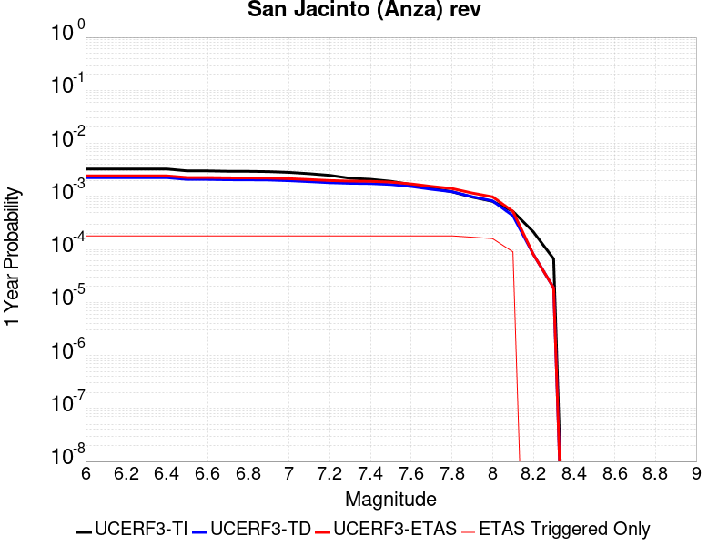 |  |

| Magnitude | 1 wk TI Prob | 1 wk TD Prob | 1 wk ETAS Prob | 1 wk ETAS/TD Gain | 1 wk ETAS Triggered Only | 1 mo TI Prob | 1 mo TD Prob | 1 mo ETAS Prob | 1 mo ETAS/TD Gain | 1 mo ETAS Triggered Only | 1 yr TI Prob | 1 yr TD Prob | 1 yr ETAS Prob | 1 yr ETAS/TD Gain | 1 yr ETAS Triggered Only | 10 yr TI Prob | 10 yr TD Prob | 10 yr ETAS Prob | 10 yr ETAS/TD Gain | 10 yr ETAS Triggered Only |
|-----|-----|-----|-----|-----|-----|-----|-----|-----|-----|-----|-----|-----|-----|-----|-----|-----|-----|-----|-----|-----|
| 6.0 | 6.3015636E-5 | 4.3302647E-5 | 2.4478495E-4 | 5.6528864 | 2.0149103E-4 | 2.7003905E-4 | 1.8556965E-4 | 3.870233E-4 | 2.0855958 | 2.0149103E-4 | 0.0032827691 | 0.0022569813 | 0.0026590538 | 1.1781461 | 4.0298206E-4 | 0.032346968 | 0.023296192 | 0.023689786 | 1.0168952 | 4.0298206E-4 |
| 6.1 | 6.3015636E-5 | 4.3302647E-5 | 2.4478495E-4 | 5.6528864 | 2.0149103E-4 | 2.7003905E-4 | 1.8556965E-4 | 3.870233E-4 | 2.0855958 | 2.0149103E-4 | 0.0032827691 | 0.0022569813 | 0.0026590538 | 1.1781461 | 4.0298206E-4 | 0.032346968 | 0.023296192 | 0.023689786 | 1.0168952 | 4.0298206E-4 |
| 6.2 | 6.3015636E-5 | 4.3302647E-5 | 2.4478495E-4 | 5.6528864 | 2.0149103E-4 | 2.7003905E-4 | 1.8556965E-4 | 3.870233E-4 | 2.0855958 | 2.0149103E-4 | 0.0032827691 | 0.0022569813 | 0.0026590538 | 1.1781461 | 4.0298206E-4 | 0.032346968 | 0.023296192 | 0.023689786 | 1.0168952 | 4.0298206E-4 |
| 6.3 | 6.3015636E-5 | 4.3302647E-5 | 2.4478495E-4 | 5.6528864 | 2.0149103E-4 | 2.7003905E-4 | 1.8556965E-4 | 3.870233E-4 | 2.0855958 | 2.0149103E-4 | 0.0032827691 | 0.0022569813 | 0.0026590538 | 1.1781461 | 4.0298206E-4 | 0.032346968 | 0.023296192 | 0.023689786 | 1.0168952 | 4.0298206E-4 |
| 6.4 | 6.3015636E-5 | 4.3302647E-5 | 2.4478495E-4 | 5.6528864 | 2.0149103E-4 | 2.7003905E-4 | 1.8556965E-4 | 3.870233E-4 | 2.0855958 | 2.0149103E-4 | 0.0032827691 | 0.0022569813 | 0.0026590538 | 1.1781461 | 4.0298206E-4 | 0.032346968 | 0.023296192 | 0.023689786 | 1.0168952 | 4.0298206E-4 |
| 6.5 | 5.811017E-5 | 4.0082516E-5 | 2.4156547E-4 | 6.026705 | 2.0149103E-4 | 2.4901982E-4 | 1.7177092E-4 | 3.7322735E-4 | 2.1728203 | 2.0149103E-4 | 0.0030276014 | 0.002089311 | 0.0024914509 | 1.192475 | 4.0298206E-4 | 0.02986684 | 0.021593736 | 0.021988017 | 1.018259 | 4.0298206E-4 |
| 6.6 | 5.811017E-5 | 4.0082516E-5 | 2.4156547E-4 | 6.026705 | 2.0149103E-4 | 2.4901982E-4 | 1.7177092E-4 | 3.7322735E-4 | 2.1728203 | 2.0149103E-4 | 0.0030276014 | 0.002089311 | 0.0024914509 | 1.192475 | 4.0298206E-4 | 0.02986684 | 0.021593736 | 0.021988017 | 1.018259 | 4.0298206E-4 |
| 6.7 | 5.712442E-5 | 3.9505223E-5 | 2.409883E-4 | 6.100163 | 2.0149103E-4 | 2.4479596E-4 | 1.6929714E-4 | 3.7075407E-4 | 2.1899605 | 2.0149103E-4 | 0.0029763177 | 0.0020592497 | 0.002461402 | 1.1952907 | 4.0298206E-4 | 0.029367693 | 0.021285562 | 0.021679966 | 1.0185292 | 4.0298206E-4 |
| 6.8 | 5.6967532E-5 | 3.9361643E-5 | 2.4084475E-4 | 6.1187673 | 2.0149103E-4 | 2.4412372E-4 | 1.6868189E-4 | 3.7013894E-4 | 2.1943016 | 2.0149103E-4 | 0.0029681553 | 0.002051773 | 0.002453928 | 1.1960038 | 4.0298206E-4 | 0.029288229 | 0.021210281 | 0.021604717 | 1.0185964 | 4.0298206E-4 |
| 6.9 | 5.6211324E-5 | 3.9066435E-5 | 2.405496E-4 | 6.1574492 | 2.0149103E-4 | 2.4088343E-4 | 1.6741687E-4 | 3.6887417E-4 | 2.2033274 | 2.0149103E-4 | 0.0029288116 | 0.0020364004 | 0.0024385618 | 1.1974864 | 4.0298206E-4 | 0.028905109 | 0.021049714 | 0.021444213 | 1.0187414 | 4.0298206E-4 |
| 7.0 | 5.4383527E-5 | 3.792697E-5 | 2.3941036E-4 | 6.312404 | 2.0149103E-4 | 2.3305144E-4 | 1.6253405E-4 | 3.6399235E-4 | 2.2394836 | 2.0149103E-4 | 0.0028337094 | 0.001977061 | 0.0023792463 | 1.2034259 | 4.0298206E-4 | 0.027978465 | 0.020440677 | 0.020835422 | 1.0193118 | 4.0298206E-4 |
| 7.1 | 5.1393665E-5 | 3.6389913E-5 | 2.3787361E-4 | 6.536801 | 2.0149103E-4 | 2.2023996E-4 | 1.5594746E-4 | 3.574071E-4 | 2.2918427 | 2.0149103E-4 | 0.0026781242 | 0.0018970112 | 0.0022992287 | 1.212027 | 4.0298206E-4 | 0.026460782 | 0.019614287 | 0.020009365 | 1.0201423 | 4.0298206E-4 |
| 7.2 | 4.785222E-5 | 3.4741795E-5 | 2.3622582E-4 | 6.799471 | 2.0149103E-4 | 2.0506482E-4 | 1.4888494E-4 | 3.5034597E-4 | 2.3531325 | 2.0149103E-4 | 0.0024938055 | 0.0018111705 | 0.0022134227 | 1.2220951 | 4.0298206E-4 | 0.024660049 | 0.018728992 | 0.019124426 | 1.0211135 | 4.0298206E-4 |
| 7.3 | 4.2143256E-5 | 3.383628E-5 | 2.3532049E-4 | 6.95468 | 2.0149103E-4 | 1.8060145E-4 | 1.4500458E-4 | 3.464664E-4 | 2.389348 | 2.0149103E-4 | 0.002196605 | 0.0017640047 | 0.0021662759 | 1.2280443 | 4.0298206E-4 | 0.02175019 | 0.01823724 | 0.018632874 | 1.0216937 | 4.0298206E-4 |
| 7.4 | 4.0264713E-5 | 3.347446E-5 | 2.3495874E-4 | 7.019045 | 2.0149103E-4 | 1.7255165E-4 | 1.4345412E-4 | 3.4491625E-4 | 2.4043663 | 2.0149103E-4 | 0.002098792 | 0.0017451581 | 0.0021474368 | 1.2305114 | 4.0298206E-4 | 0.020790804 | 0.018041821 | 0.018437533 | 1.021933 | 4.0298206E-4 |
| 7.5 | 3.694492E-5 | 3.218847E-5 | 2.3367301E-4 | 7.259526 | 2.0149103E-4 | 1.5832575E-4 | 1.379433E-4 | 3.3940654E-4 | 2.4604785 | 2.0149103E-4 | 0.0019259118 | 0.001678169 | 0.0020804747 | 1.239729 | 4.0298206E-4 | 0.01909306 | 0.01735827 | 0.017754257 | 1.0228126 | 4.0298206E-4 |
| 7.6 | 3.200565E-5 | 2.9504106E-5 | 2.309892E-4 | 7.8290524 | 2.0149103E-4 | 1.3715986E-4 | 1.2644005E-4 | 3.279056E-4 | 2.593368 | 2.0149103E-4 | 0.001668642 | 0.0015383229 | 0.001940685 | 1.261559 | 4.0298206E-4 | 0.01656168 | 0.0159463 | 0.016342856 | 1.0248682 | 4.0298206E-4 |
| 7.7 | 2.731642E-5 | 2.6092788E-5 | 2.2757857E-4 | 8.721895 | 2.0149103E-4 | 1.1706512E-4 | 1.1182144E-4 | 3.1328996E-4 | 2.8016982 | 2.0149103E-4 | 0.001424336 | 0.0013605768 | 0.0017630106 | 1.2957817 | 4.0298206E-4 | 0.014152412 | 0.014167004 | 0.014564278 | 1.0280421 | 4.0298206E-4 |
| 7.8 | 2.3466424E-5 | 2.3504817E-5 | 2.2499112E-4 | 9.572127 | 2.0149103E-4 | 1.0056651E-4 | 1.0073105E-4 | 3.0220178E-4 | 3.0000858 | 2.0149103E-4 | 0.0012237094 | 0.0012257113 | 0.0016281995 | 1.328371 | 4.0298206E-4 | 0.012169928 | 0.012808893 | 0.013206713 | 1.0310582 | 4.0298206E-4 |
| 7.9 | 1.8611925E-5 | 1.8908117E-5 | 1.8908117E-5 | 1.0 | 0.0 | 7.9762955E-5 | 8.1032274E-5 | 8.1032274E-5 | 1.0 | 0.0 | 9.7068126E-4 | 9.861222E-4 | 0.0011874145 | 1.2041252 | 2.0149103E-4 | 0.0096645225 | 0.010393824 | 0.0105932215 | 1.0191841 | 2.0149103E-4 |
| 8.0 | 1.5460775E-5 | 1.5740965E-5 | 1.5740965E-5 | 1.0 | 0.0 | 6.6258784E-5 | 6.7459536E-5 | 6.7459536E-5 | 1.0 | 0.0 | 8.0640207E-4 | 8.21011E-4 | 0.0010223367 | 1.2452167 | 2.0149103E-4 | 0.008034821 | 0.0087028835 | 0.008902621 | 1.0229508 | 2.0149103E-4 |
| 8.1 | 9.983884E-6 | 8.269952E-6 | 8.269952E-6 | 1.0 | 0.0 | 4.2787375E-5 | 3.544217E-5 | 3.544217E-5 | 1.0 | 0.0 | 5.2081177E-4 | 4.314235E-4 | 4.314235E-4 | 1.0 | 0.0 | 0.0051959283 | 0.004640022 | 0.004640022 | 1.0 | 0.0 |
| 8.2 | 4.1226E-6 | 1.5529788E-6 | 1.5529788E-6 | 1.0 | 0.0 | 1.7668166E-5 | 6.6556063E-6 | 6.6556063E-6 | 1.0 | 0.0 | 2.1508869E-4 | 8.102902E-5 | 8.102902E-5 | 1.0 | 0.0 | 0.0021488064 | 9.4050163E-4 | 9.4050163E-4 | 1.0 | 0.0 |
| 8.3 | 1.2750878E-6 | 3.612133E-7 | 3.612133E-7 | 1.0 | 0.0 | 5.4646503E-6 | 1.548056E-6 | 1.548056E-6 | 1.0 | 0.0 | 6.653009E-5 | 1.8847424E-5 | 1.8847424E-5 | 1.0 | 0.0 | 6.6510175E-4 | 2.2734253E-4 | 2.2734253E-4 | 1.0 | 0.0 |

## San Andreas (Coachella) rev
*[(top)](#table-of-contents)*

| 1 Week | 1 Month | 1 Year | 10 Year |
|-----|-----|-----|-----|
|  |  |  |  |

| Magnitude | 1 wk TI Prob | 1 wk TD Prob | 1 wk ETAS Prob | 1 wk ETAS/TD Gain | 1 wk ETAS Triggered Only | 1 mo TI Prob | 1 mo TD Prob | 1 mo ETAS Prob | 1 mo ETAS/TD Gain | 1 mo ETAS Triggered Only | 1 yr TI Prob | 1 yr TD Prob | 1 yr ETAS Prob | 1 yr ETAS/TD Gain | 1 yr ETAS Triggered Only | 10 yr TI Prob | 10 yr TD Prob | 10 yr ETAS Prob | 10 yr ETAS/TD Gain | 10 yr ETAS Triggered Only |
|-----|-----|-----|-----|-----|-----|-----|-----|-----|-----|-----|-----|-----|-----|-----|-----|-----|-----|-----|-----|-----|
| 6.0 | 1.1925945E-4 | 3.2729402E-4 | 7.301442E-4 | 2.230851 | 4.0298206E-4 | 5.110118E-4 | 0.0014019393 | 0.0018043563 | 1.2870432 | 4.0298206E-4 | 0.0062038354 | 0.016936364 | 0.01733252 | 1.0233909 | 4.0298206E-4 | 0.060334753 | 0.15265316 | 0.15299462 | 1.0022368 | 4.0298206E-4 |
| 6.1 | 1.1925945E-4 | 3.2729402E-4 | 7.301442E-4 | 2.230851 | 4.0298206E-4 | 5.110118E-4 | 0.0014019393 | 0.0018043563 | 1.2870432 | 4.0298206E-4 | 0.0062038354 | 0.016936364 | 0.01733252 | 1.0233909 | 4.0298206E-4 | 0.060334753 | 0.15265316 | 0.15299462 | 1.0022368 | 4.0298206E-4 |
| 6.2 | 1.07432395E-4 | 3.0230157E-4 | 7.0516183E-4 | 2.3326435 | 4.0298206E-4 | 4.603433E-4 | 0.0012949388 | 0.0016973991 | 1.3107948 | 4.0298206E-4 | 0.005590286 | 0.015653009 | 0.016049683 | 1.0253417 | 4.0298206E-4 | 0.05451731 | 0.14182423 | 0.14217007 | 1.0024384 | 4.0298206E-4 |
| 6.3 | 1.0718766E-4 | 3.0175463E-4 | 7.046151E-4 | 2.33506 | 4.0298206E-4 | 4.592948E-4 | 0.0012925972 | 0.0016950583 | 1.3113586 | 4.0298206E-4 | 0.005577586 | 0.015624908 | 0.016021593 | 1.025388 | 4.0298206E-4 | 0.054396555 | 0.14159249 | 0.14193842 | 1.0024431 | 4.0298206E-4 |
| 6.4 | 1.0355944E-4 | 2.9383553E-4 | 6.966992E-4 | 2.3710515 | 4.0298206E-4 | 4.4375064E-4 | 0.0012586913 | 0.0016611662 | 1.3197566 | 4.0298206E-4 | 0.0053892885 | 0.015217941 | 0.015614791 | 1.0260777 | 4.0298206E-4 | 0.052604496 | 0.13815255 | 0.13849987 | 1.002514 | 4.0298206E-4 |
| 6.5 | 1.0227914E-4 | 2.9102986E-4 | 6.9389463E-4 | 2.384273 | 4.0298206E-4 | 4.382655E-4 | 0.0012466786 | 0.0016491583 | 1.3228415 | 4.0298206E-4 | 0.0053228354 | 0.01507372 | 0.015470628 | 1.0263311 | 4.0298206E-4 | 0.051971316 | 0.13693172 | 0.13727953 | 1.00254 | 4.0298206E-4 |
| 6.6 | 1.0116757E-4 | 2.8868738E-4 | 6.915531E-4 | 2.3955085 | 4.0298206E-4 | 4.3350324E-4 | 0.0012366489 | 0.0016391326 | 1.3254632 | 4.0298206E-4 | 0.0052651367 | 0.01495329 | 0.015350247 | 1.0265464 | 4.0298206E-4 | 0.051421247 | 0.1359099 | 0.13625811 | 1.002562 | 4.0298206E-4 |
| 6.7 | 1.0050676E-4 | 2.8727303E-4 | 6.901393E-4 | 2.4023812 | 4.0298206E-4 | 4.3067214E-4 | 0.0012305931 | 0.0016330793 | 1.3270668 | 4.0298206E-4 | 0.005230834 | 0.014880571 | 0.015277555 | 1.0266781 | 4.0298206E-4 | 0.051094085 | 0.13529462 | 0.13564308 | 1.0025755 | 4.0298206E-4 |
| 6.8 | 9.976819E-5 | 2.853096E-4 | 6.8817666E-4 | 2.412035 | 4.0298206E-4 | 4.2750788E-4 | 0.0012221863 | 0.0016246758 | 1.3293194 | 4.0298206E-4 | 0.0051924936 | 0.0147796115 | 0.015176637 | 1.0268631 | 4.0298206E-4 | 0.050728295 | 0.13444631 | 0.13479511 | 1.0025944 | 4.0298206E-4 |
| 6.9 | 9.77719E-5 | 2.8027873E-4 | 6.8314787E-4 | 2.4373875 | 4.0298206E-4 | 4.1895514E-4 | 0.0012006456 | 0.0016031438 | 1.3352349 | 4.0298206E-4 | 0.0050888555 | 0.014520878 | 0.014918008 | 1.0273489 | 4.0298206E-4 | 0.049738888 | 0.1322748 | 0.13262449 | 1.0026436 | 4.0298206E-4 |
| 7.0 | 8.500761E-5 | 2.4762485E-4 | 6.505071E-4 | 2.6269865 | 4.0298206E-4 | 3.6426744E-4 | 0.001060821 | 0.0014633755 | 1.3794745 | 4.0298206E-4 | 0.0044259406 | 0.012839786 | 0.013237594 | 1.0309825 | 4.0298206E-4 | 0.04338823 | 0.11813272 | 0.118488096 | 1.0030082 | 4.0298206E-4 |
| 7.1 | 8.319876E-5 | 2.4365232E-4 | 6.465362E-4 | 2.6535196 | 4.0298206E-4 | 3.5651738E-4 | 0.0010438096 | 0.001446371 | 1.3856655 | 4.0298206E-4 | 0.004331963 | 0.012635092 | 0.013032983 | 1.0314909 | 4.0298206E-4 | 0.042484846 | 0.116353 | 0.11670909 | 1.0030605 | 4.0298206E-4 |
| 7.2 | 7.563917E-5 | 2.2413683E-4 | 6.270286E-4 | 2.797526 | 4.0298206E-4 | 3.2412758E-4 | 9.602359E-4 | 0.001362831 | 1.4192669 | 4.0298206E-4 | 0.0039391145 | 0.011628893 | 0.012027189 | 1.0342505 | 4.0298206E-4 | 0.03870018 | 0.10775925 | 0.1081188 | 1.0033367 | 4.0298206E-4 |
| 7.3 | 7.082985E-5 | 2.0729867E-4 | 6.101972E-4 | 2.9435654 | 4.0298206E-4 | 3.0352117E-4 | 8.881233E-4 | 0.0012907474 | 1.4533427 | 4.0298206E-4 | 0.0036891096 | 0.010759917 | 0.011158563 | 1.0370492 | 4.0298206E-4 | 0.03628465 | 0.100282 | 0.10064457 | 1.0036155 | 4.0298206E-4 |
| 7.4 | 5.146215E-5 | 1.4273795E-4 | 3.442002E-4 | 2.4114137 | 2.0149103E-4 | 2.2053342E-4 | 6.115915E-4 | 8.1295933E-4 | 1.3292521 | 2.0149103E-4 | 0.0026816884 | 0.0074208933 | 0.007620889 | 1.0269504 | 2.0149103E-4 | 0.02649557 | 0.070849575 | 0.07103679 | 1.0026424 | 2.0149103E-4 |
| 7.5 | 4.0285166E-5 | 1.09416E-4 | 3.10885E-4 | 2.841312 | 2.0149103E-4 | 1.7263928E-4 | 4.6884175E-4 | 6.7023834E-4 | 1.429562 | 2.0149103E-4 | 0.002099857 | 0.0056932783 | 0.005893622 | 1.0351895 | 2.0149103E-4 | 0.020801254 | 0.055011146 | 0.055201553 | 1.0034612 | 2.0149103E-4 |
| 7.6 | 3.1168736E-5 | 8.4389096E-5 | 2.8586312E-4 | 3.3874414 | 2.0149103E-4 | 1.3357346E-4 | 3.6161754E-4 | 5.630357E-4 | 1.5569923 | 2.0149103E-4 | 0.0016250437 | 0.0043938323 | 0.0045944382 | 1.0456562 | 2.0149103E-4 | 0.016132116 | 0.04281005 | 0.043002915 | 1.0045052 | 2.0149103E-4 |
| 7.7 | 2.2100989E-5 | 6.238755E-5 | 6.238755E-5 | 1.0 | 0.0 | 9.4715084E-5 | 2.6734784E-4 | 2.6734784E-4 | 1.0 | 0.0 | 0.001152546 | 0.0032501083 | 0.0032501083 | 1.0 | 0.0 | 0.011465867 | 0.0319002 | 0.0319002 | 1.0 | 0.0 |
| 7.8 | 1.7484861E-5 | 5.179572E-5 | 5.179572E-5 | 1.0 | 0.0 | 7.493296E-5 | 2.2196278E-4 | 2.2196278E-4 | 1.0 | 0.0 | 9.1192697E-4 | 0.0026990508 | 0.0026990508 | 1.0 | 0.0 | 0.009081938 | 0.026640115 | 0.026640115 | 1.0 | 0.0 |
| 7.9 | 1.3967285E-5 | 3.822255E-5 | 3.822255E-5 | 1.0 | 0.0 | 5.985842E-5 | 1.6380067E-4 | 1.6380067E-4 | 1.0 | 0.0 | 7.2853256E-4 | 0.00199245 | 0.00199245 | 1.0 | 0.0 | 0.0072614877 | 0.019909438 | 0.019909438 | 1.0 | 0.0 |
| 8.0 | 1.1887396E-5 | 3.106521E-5 | 3.106521E-5 | 1.0 | 0.0 | 5.094499E-5 | 1.3312983E-4 | 1.3312983E-4 | 1.0 | 0.0 | 6.200787E-4 | 0.0016196516 | 0.0016196516 | 1.0 | 0.0 | 0.006183513 | 0.016279267 | 0.016279267 | 1.0 | 0.0 |
| 8.1 | 5.100864E-6 | 8.973418E-6 | 8.973418E-6 | 1.0 | 0.0 | 2.1860664E-5 | 3.8456936E-5 | 3.8456936E-5 | 1.0 | 0.0 | 2.6612106E-4 | 4.6811273E-4 | 4.6811273E-4 | 1.0 | 0.0 | 0.002658026 | 0.004917731 | 0.004917731 | 1.0 | 0.0 |
| 8.2 | 2.3004484E-6 | 2.7864487E-6 | 2.7864487E-6 | 1.0 | 0.0 | 9.859027E-6 | 1.1941868E-5 | 1.1941868E-5 | 1.0 | 0.0 | 1.2002704E-4 | 1.4538258E-4 | 1.4538258E-4 | 1.0 | 0.0 | 0.0011996223 | 0.0015973912 | 0.0015973912 | 1.0 | 0.0 |
| 8.3 | 1.0424446E-7 | 5.8161504E-8 | 5.8161504E-8 | 1.0 | 0.0 | 4.4676187E-7 | 2.4926356E-7 | 2.4926356E-7 | 1.0 | 0.0 | 5.439312E-6 | 3.03478E-6 | 3.03478E-6 | 1.0 | 0.0 | 5.4391792E-5 | 3.190716E-5 | 3.190716E-5 | 1.0 | 0.0 |

## San Andreas (San Gorgonio Pass-Garnet HIll)
*[(top)](#table-of-contents)*

| 1 Week | 1 Month | 1 Year | 10 Year |
|-----|-----|-----|-----|
|  |  | 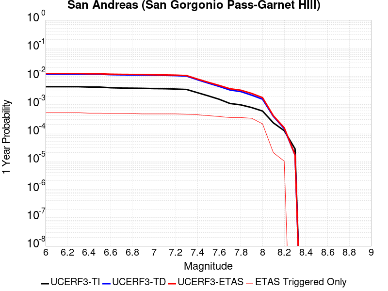 |  |

| Magnitude | 1 wk TI Prob | 1 wk TD Prob | 1 wk ETAS Prob | 1 wk ETAS/TD Gain | 1 wk ETAS Triggered Only | 1 mo TI Prob | 1 mo TD Prob | 1 mo ETAS Prob | 1 mo ETAS/TD Gain | 1 mo ETAS Triggered Only | 1 yr TI Prob | 1 yr TD Prob | 1 yr ETAS Prob | 1 yr ETAS/TD Gain | 1 yr ETAS Triggered Only | 10 yr TI Prob | 10 yr TD Prob | 10 yr ETAS Prob | 10 yr ETAS/TD Gain | 10 yr ETAS Triggered Only |
|-----|-----|-----|-----|-----|-----|-----|-----|-----|-----|-----|-----|-----|-----|-----|-----|-----|-----|-----|-----|-----|
| 6.0 | 8.31567E-5 | 2.3382473E-4 | 6.367126E-4 | 2.7230334 | 4.0298206E-4 | 3.5633717E-4 | 0.0010017233 | 0.0014043017 | 1.4018857 | 4.0298206E-4 | 0.004329778 | 0.012127888 | 0.012525983 | 1.0328248 | 4.0298206E-4 | 0.042463828 | 0.11257892 | 0.112936534 | 1.0031766 | 4.0298206E-4 |
| 6.1 | 8.31567E-5 | 2.3382473E-4 | 6.367126E-4 | 2.7230334 | 4.0298206E-4 | 3.5633717E-4 | 0.0010017233 | 0.0014043017 | 1.4018857 | 4.0298206E-4 | 0.004329778 | 0.012127888 | 0.012525983 | 1.0328248 | 4.0298206E-4 | 0.042463828 | 0.11257892 | 0.112936534 | 1.0031766 | 4.0298206E-4 |
| 6.2 | 8.31567E-5 | 2.3382473E-4 | 6.367126E-4 | 2.7230334 | 4.0298206E-4 | 3.5633717E-4 | 0.0010017233 | 0.0014043017 | 1.4018857 | 4.0298206E-4 | 0.004329778 | 0.012127888 | 0.012525983 | 1.0328248 | 4.0298206E-4 | 0.042463828 | 0.11257892 | 0.112936534 | 1.0031766 | 4.0298206E-4 |
| 6.3 | 8.31567E-5 | 2.3382473E-4 | 6.367126E-4 | 2.7230334 | 4.0298206E-4 | 3.5633717E-4 | 0.0010017233 | 0.0014043017 | 1.4018857 | 4.0298206E-4 | 0.004329778 | 0.012127888 | 0.012525983 | 1.0328248 | 4.0298206E-4 | 0.042463828 | 0.11257892 | 0.112936534 | 1.0031766 | 4.0298206E-4 |
| 6.4 | 8.059055E-5 | 2.2940808E-4 | 6.322977E-4 | 2.7562137 | 4.0298206E-4 | 3.4534236E-4 | 9.828096E-4 | 0.0013853955 | 1.4096277 | 4.0298206E-4 | 0.0041964394 | 0.011900152 | 0.012298338 | 1.0334606 | 4.0298206E-4 | 0.041180745 | 0.11056015 | 0.110918574 | 1.0032419 | 4.0298206E-4 |
| 6.5 | 8.059055E-5 | 2.2940808E-4 | 6.322977E-4 | 2.7562137 | 4.0298206E-4 | 3.4534236E-4 | 9.828096E-4 | 0.0013853955 | 1.4096277 | 4.0298206E-4 | 0.0041964394 | 0.011900152 | 0.012298338 | 1.0334606 | 4.0298206E-4 | 0.041180745 | 0.11056015 | 0.110918574 | 1.0032419 | 4.0298206E-4 |
| 6.6 | 7.619237E-5 | 2.218517E-4 | 6.247444E-4 | 2.816045 | 4.0298206E-4 | 3.2649786E-4 | 9.5044886E-4 | 0.0013530479 | 1.4235883 | 4.0298206E-4 | 0.0039678677 | 0.01151087 | 0.011909214 | 1.0346059 | 4.0298206E-4 | 0.03897764 | 0.10709683 | 0.107456654 | 1.0033598 | 4.0298206E-4 |
| 6.7 | 7.440636E-5 | 2.1860997E-4 | 6.215039E-4 | 2.8429809 | 4.0298206E-4 | 3.188454E-4 | 9.3656575E-4 | 0.0013391704 | 1.4298733 | 4.0298206E-4 | 0.0038750346 | 0.011343609 | 0.011742019 | 1.035122 | 4.0298206E-4 | 0.038081564 | 0.105605274 | 0.1059657 | 1.003413 | 4.0298206E-4 |
| 6.8 | 7.3735864E-5 | 2.1708169E-4 | 6.1997626E-4 | 2.8559585 | 4.0298206E-4 | 3.1597257E-4 | 9.3002064E-4 | 0.001332628 | 1.4329015 | 4.0298206E-4 | 0.0038401815 | 0.011264749 | 0.011663191 | 1.0353707 | 4.0298206E-4 | 0.03774495 | 0.10490683 | 0.10526753 | 1.0034384 | 4.0298206E-4 |
| 6.9 | 7.27575E-5 | 2.1477141E-4 | 6.176669E-4 | 2.875927 | 4.0298206E-4 | 3.117806E-4 | 9.201265E-4 | 0.0013227378 | 1.4375608 | 4.0298206E-4 | 0.003789323 | 0.011145527 | 0.011544017 | 1.0357534 | 4.0298206E-4 | 0.037253562 | 0.103854746 | 0.104215875 | 1.0034772 | 4.0298206E-4 |
| 7.0 | 7.102591E-5 | 2.1061185E-4 | 6.1350904E-4 | 2.9129844 | 4.0298206E-4 | 3.0436125E-4 | 9.023122E-4 | 0.0013049307 | 1.4462075 | 4.0298206E-4 | 0.003699303 | 0.010930831 | 0.011329408 | 1.0364636 | 4.0298206E-4 | 0.03638325 | 0.10195695 | 0.102318846 | 1.0035495 | 4.0298206E-4 |
| 7.1 | 7.028513E-5 | 2.0896831E-4 | 6.118662E-4 | 2.9280334 | 4.0298206E-4 | 3.0118722E-4 | 8.9527335E-4 | 0.0012978946 | 1.4497188 | 4.0298206E-4 | 0.0036607897 | 0.010845989 | 0.011244601 | 1.036752 | 4.0298206E-4 | 0.036010686 | 0.101199985 | 0.10156219 | 1.003579 | 4.0298206E-4 |
| 7.2 | 6.8498244E-5 | 2.0504706E-4 | 6.079465E-4 | 2.964912 | 4.0298206E-4 | 2.9353087E-4 | 8.784794E-4 | 0.0012811074 | 1.4583238 | 4.0298206E-4 | 0.003567883 | 0.010643536 | 0.011042229 | 1.0374587 | 4.0298206E-4 | 0.035111405 | 0.09939202 | 0.09975495 | 1.0036515 | 4.0298206E-4 |
| 7.3 | 6.622592E-5 | 1.9732013E-4 | 6.002227E-4 | 3.0418725 | 4.0298206E-4 | 2.8379448E-4 | 8.453858E-4 | 0.0012480272 | 1.4762813 | 4.0298206E-4 | 0.0034497243 | 0.0102444785 | 0.010643332 | 1.0389335 | 4.0298206E-4 | 0.033966612 | 0.095888525 | 0.096252866 | 1.0037997 | 4.0298206E-4 |
| 7.4 | 5.1050705E-5 | 1.4689034E-4 | 3.4835178E-4 | 2.371509 | 2.0149103E-4 | 2.1877038E-4 | 6.29379E-4 | 8.307432E-4 | 1.3199412 | 2.0149103E-4 | 0.002660276 | 0.0076359594 | 0.0078359125 | 1.0261856 | 2.0149103E-4 | 0.02628654 | 0.07286301 | 0.07304983 | 1.0025638 | 2.0149103E-4 |
| 7.5 | 3.9302922E-5 | 1.1129847E-4 | 3.1276708E-4 | 2.8101652 | 2.0149103E-4 | 1.6843023E-4 | 4.7690657E-4 | 6.783015E-4 | 1.4222944 | 2.0149103E-4 | 0.0020487092 | 0.005790949 | 0.005991273 | 1.0345926 | 2.0149103E-4 | 0.020299247 | 0.05600951 | 0.056199715 | 1.0033959 | 2.0149103E-4 |
| 7.6 | 2.9851626E-5 | 8.4949745E-5 | 2.8642366E-4 | 3.3716836 | 2.0149103E-4 | 1.2792926E-4 | 3.6401965E-4 | 5.654373E-4 | 1.5533154 | 2.0149103E-4 | 0.0015564259 | 0.0044229585 | 0.0046235584 | 1.0453542 | 2.0149103E-4 | 0.0154556995 | 0.04319374 | 0.043386526 | 1.0044633 | 2.0149103E-4 |
| 7.7 | 2.1135214E-5 | 6.3529005E-5 | 6.3529005E-5 | 1.0 | 0.0 | 9.0576345E-5 | 2.7223877E-4 | 2.7223877E-4 | 1.0 | 0.0 | 0.0011022091 | 0.0033094748 | 0.0033094748 | 1.0 | 0.0 | 0.010967582 | 0.032582592 | 0.032582592 | 1.0 | 0.0 |
| 7.8 | 1.883379E-5 | 5.564028E-5 | 5.564028E-5 | 1.0 | 0.0 | 8.0713755E-5 | 2.3843657E-4 | 2.3843657E-4 | 1.0 | 0.0 | 9.822468E-4 | 0.0028991038 | 0.0028991038 | 1.0 | 0.0 | 0.0097791655 | 0.028695205 | 0.028695205 | 1.0 | 0.0 |
| 7.9 | 1.5156185E-5 | 4.1658426E-5 | 4.1658426E-5 | 1.0 | 0.0 | 6.495346E-5 | 1.785239E-4 | 1.785239E-4 | 1.0 | 0.0 | 7.9052144E-4 | 0.0021713632 | 0.0021713632 | 1.0 | 0.0 | 0.007877152 | 0.021759422 | 0.021759422 | 1.0 | 0.0 |
| 8.0 | 1.1405907E-5 | 2.9974231E-5 | 2.9974231E-5 | 1.0 | 0.0 | 4.8881542E-5 | 1.2845467E-4 | 1.2845467E-4 | 1.0 | 0.0 | 5.9497025E-4 | 0.0015628147 | 0.0015628147 | 1.0 | 0.0 | 0.005933798 | 0.015772851 | 0.015772851 | 1.0 | 0.0 |
| 8.1 | 4.3511436E-6 | 7.369219E-6 | 7.369219E-6 | 1.0 | 0.0 | 1.8647626E-5 | 3.1581985E-5 | 3.1581985E-5 | 1.0 | 0.0 | 2.2701119E-4 | 3.8444297E-4 | 3.8444297E-4 | 1.0 | 0.0 | 0.0022677942 | 0.0041163345 | 0.0041163345 | 1.0 | 0.0 |
| 8.2 | 2.3042528E-6 | 2.7329415E-6 | 2.7329415E-6 | 1.0 | 0.0 | 9.875332E-6 | 1.1712554E-5 | 1.1712554E-5 | 1.0 | 0.0 | 1.2022553E-4 | 1.4259106E-4 | 1.4259106E-4 | 1.0 | 0.0 | 0.0012016051 | 0.0015979785 | 0.0015979785 | 1.0 | 0.0 |
| 8.3 | 5.202968E-7 | 3.1598344E-7 | 3.1598344E-7 | 1.0 | 0.0 | 2.2298414E-6 | 1.3542141E-6 | 1.3542141E-6 | 1.0 | 0.0 | 2.714798E-5 | 1.6487444E-5 | 1.6487444E-5 | 1.0 | 0.0 | 2.7144665E-4 | 1.9563142E-4 | 1.9563142E-4 | 1.0 | 0.0 |

## Big Pine (Central)
*[(top)](#table-of-contents)*

| 1 Week | 1 Month | 1 Year | 10 Year |
|-----|-----|-----|-----|
|  |  |  |  |

| Magnitude | 1 wk TI Prob | 1 wk TD Prob | 1 wk ETAS Prob | 1 wk ETAS/TD Gain | 1 wk ETAS Triggered Only | 1 mo TI Prob | 1 mo TD Prob | 1 mo ETAS Prob | 1 mo ETAS/TD Gain | 1 mo ETAS Triggered Only | 1 yr TI Prob | 1 yr TD Prob | 1 yr ETAS Prob | 1 yr ETAS/TD Gain | 1 yr ETAS Triggered Only | 10 yr TI Prob | 10 yr TD Prob | 10 yr ETAS Prob | 10 yr ETAS/TD Gain | 10 yr ETAS Triggered Only |
|-----|-----|-----|-----|-----|-----|-----|-----|-----|-----|-----|-----|-----|-----|-----|-----|-----|-----|-----|-----|-----|
| 6.0 | 1.2706755E-5 | 1.4250529E-5 | 2.1573869E-4 | 15.138996 | 2.0149103E-4 | 5.4456385E-5 | 6.107247E-5 | 2.6255118E-4 | 4.2990108 | 2.0149103E-4 | 6.628048E-4 | 7.433402E-4 | 0.0011460227 | 1.5417204 | 4.0298206E-4 | 0.006608314 | 0.0074135666 | 0.007813562 | 1.0539544 | 4.0298206E-4 |
| 6.1 | 8.342579E-6 | 9.510762E-6 | 2.1099987E-4 | 22.185383 | 2.0149103E-4 | 3.5753423E-5 | 4.0759893E-5 | 2.4224272E-4 | 5.943164 | 2.0149103E-4 | 4.3521097E-4 | 4.961604E-4 | 6.9755147E-4 | 1.405899 | 2.0149103E-4 | 0.0043435963 | 0.0049540824 | 0.005154575 | 1.0404702 | 2.0149103E-4 |
| 6.2 | 6.923899E-6 | 7.967147E-6 | 7.967147E-6 | 1.0 | 0.0 | 2.9673516E-5 | 3.4144578E-5 | 3.4144578E-5 | 1.0 | 0.0 | 3.6121515E-4 | 4.156502E-4 | 4.156502E-4 | 1.0 | 0.0 | 0.003606286 | 0.0041520367 | 0.0041520367 | 1.0 | 0.0 |
| 6.3 | 2.728396E-6 | 3.4242908E-6 | 3.4242908E-6 | 1.0 | 0.0 | 1.1693074E-5 | 1.4675454E-5 | 1.4675454E-5 | 1.0 | 0.0 | 1.4235388E-4 | 1.7865987E-4 | 1.7865987E-4 | 1.0 | 0.0 | 0.0014226272 | 0.0017866704 | 0.0017866704 | 1.0 | 0.0 |
| 6.4 | 2.7136944E-6 | 3.408584E-6 | 3.408584E-6 | 1.0 | 0.0 | 1.1630066E-5 | 1.4608141E-5 | 1.4608141E-5 | 1.0 | 0.0 | 1.4158686E-4 | 1.7784047E-4 | 1.7784047E-4 | 1.0 | 0.0 | 0.0014149669 | 0.0017784894 | 0.0017784894 | 1.0 | 0.0 |
| 6.5 | 2.6971882E-6 | 3.3909291E-6 | 3.3909291E-6 | 1.0 | 0.0 | 1.1559327E-5 | 1.45324775E-5 | 1.45324775E-5 | 1.0 | 0.0 | 1.4072572E-4 | 1.7691942E-4 | 1.7691942E-4 | 1.0 | 0.0 | 0.0014063664 | 0.0017692937 | 0.0017692937 | 1.0 | 0.0 |
| 6.6 | 2.669092E-6 | 3.3609497E-6 | 3.3609497E-6 | 1.0 | 0.0 | 1.1438916E-5 | 1.4403995E-5 | 1.4403995E-5 | 1.0 | 0.0 | 1.3925991E-4 | 1.753554E-4 | 1.753554E-4 | 1.0 | 0.0 | 0.0013917267 | 0.0017536782 | 0.0017536782 | 1.0 | 0.0 |
| 6.7 | 2.6408059E-6 | 3.3309752E-6 | 3.3309752E-6 | 1.0 | 0.0 | 1.1317691E-5 | 1.4275535E-5 | 1.4275535E-5 | 1.0 | 0.0 | 1.3778417E-4 | 1.7379165E-4 | 1.7379165E-4 | 1.0 | 0.0 | 0.0013769877 | 0.0017380653 | 0.0017380653 | 1.0 | 0.0 |
| 6.8 | 2.1786943E-6 | 2.8544325E-6 | 2.8544325E-6 | 1.0 | 0.0 | 9.337228E-6 | 1.2233229E-5 | 1.2233229E-5 | 1.0 | 0.0 | 1.1367482E-4 | 1.4893012E-4 | 1.4893012E-4 | 1.0 | 0.0 | 0.0011361669 | 0.0014897975 | 0.0014897975 | 1.0 | 0.0 |
| 6.9 | 1.4411696E-6 | 2.068499E-6 | 2.068499E-6 | 1.0 | 0.0 | 6.1764263E-6 | 8.864968E-6 | 8.864968E-6 | 1.0 | 0.0 | 7.51954E-5 | 1.079259E-4 | 1.079259E-4 | 1.0 | 0.0 | 7.5169955E-4 | 0.0010801847 | 0.0010801847 | 1.0 | 0.0 |
| 7.0 | 1.0073411E-6 | 1.554261E-6 | 1.554261E-6 | 1.0 | 0.0 | 4.317169E-6 | 6.6611024E-6 | 6.6611024E-6 | 1.0 | 0.0 | 5.2560266E-5 | 8.1096056E-5 | 8.1096056E-5 | 1.0 | 0.0 | 5.2547833E-4 | 8.1210316E-4 | 8.1210316E-4 | 1.0 | 0.0 |
| 7.1 | 8.947104E-7 | 1.4302494E-6 | 1.4302494E-6 | 1.0 | 0.0 | 3.834468E-6 | 6.129627E-6 | 6.129627E-6 | 1.0 | 0.0 | 4.6683643E-5 | 7.46258E-5 | 7.46258E-5 | 1.0 | 0.0 | 4.6673836E-4 | 7.474457E-4 | 7.474457E-4 | 1.0 | 0.0 |
| 7.2 | 5.215166E-7 | 1.0111678E-6 | 1.0111678E-6 | 1.0 | 0.0 | 2.2350691E-6 | 4.3335694E-6 | 4.3335694E-6 | 1.0 | 0.0 | 2.7211627E-5 | 5.2759973E-5 | 5.2759973E-5 | 1.0 | 0.0 | 2.7208295E-4 | 5.2890263E-4 | 5.2890263E-4 | 1.0 | 0.0 |
| 7.3 | 4.4024807E-7 | 9.219589E-7 | 9.219589E-7 | 1.0 | 0.0 | 1.8867761E-6 | 3.9512465E-6 | 3.9512465E-6 | 1.0 | 0.0 | 2.2971257E-5 | 4.810541E-5 | 4.810541E-5 | 1.0 | 0.0 | 2.2968883E-4 | 4.8237795E-4 | 4.8237795E-4 | 1.0 | 0.0 |
| 7.4 | 3.6130905E-7 | 8.358523E-7 | 8.358523E-7 | 1.0 | 0.0 | 1.5484665E-6 | 3.5822195E-6 | 3.5822195E-6 | 1.0 | 0.0 | 1.8852415E-5 | 4.3612687E-5 | 4.3612687E-5 | 1.0 | 0.0 | 1.8850817E-4 | 4.374597E-4 | 4.374597E-4 | 1.0 | 0.0 |
| 7.5 | 3.408184E-7 | 8.108147E-7 | 8.108147E-7 | 1.0 | 0.0 | 1.4606494E-6 | 3.4749157E-6 | 3.4749157E-6 | 1.0 | 0.0 | 1.7783263E-5 | 4.2306317E-5 | 4.2306317E-5 | 1.0 | 0.0 | 1.778184E-4 | 4.2437963E-4 | 4.2437963E-4 | 1.0 | 0.0 |
| 7.6 | 3.1428627E-7 | 7.7316E-7 | 7.7316E-7 | 1.0 | 0.0 | 1.3469405E-6 | 3.3135389E-6 | 3.3135389E-6 | 1.0 | 0.0 | 1.6398877E-5 | 4.0341627E-5 | 4.0341627E-5 | 1.0 | 0.0 | 1.6397667E-4 | 4.0471106E-4 | 4.0471106E-4 | 1.0 | 0.0 |
| 7.7 | 1.7972785E-7 | 5.077752E-7 | 5.077752E-7 | 1.0 | 0.0 | 7.70262E-7 | 2.1761778E-6 | 2.1761778E-6 | 1.0 | 0.0 | 9.377899E-6 | 2.6494654E-5 | 2.6494654E-5 | 1.0 | 0.0 | 9.377503E-5 | 2.662899E-4 | 2.662899E-4 | 1.0 | 0.0 |
| 7.8 | 4.9230927E-8 | 1.198079E-7 | 1.198079E-7 | 1.0 | 0.0 | 2.1098968E-7 | 5.134623E-7 | 5.134623E-7 | 1.0 | 0.0 | 2.5687964E-6 | 6.2513873E-6 | 6.2513873E-6 | 1.0 | 0.0 | 2.5687666E-5 | 6.295415E-5 | 6.295415E-5 | 1.0 | 0.0 |
| 7.9 | 3.6805972E-9 | 4.105293E-9 | 4.105293E-9 | 1.0 | 0.0 | 1.5773987E-8 | 1.7594115E-8 | 1.7594115E-8 | 1.0 | 0.0 | 1.9204828E-7 | 2.1420831E-7 | 2.1420831E-7 | 1.0 | 0.0 | 1.920481E-6 | 2.1900614E-6 | 2.1900614E-6 | 1.0 | 0.0 |

## San Jacinto (Coyote Creek)
*[(top)](#table-of-contents)*

| 1 Week | 1 Month | 1 Year | 10 Year |
|-----|-----|-----|-----|
|  |  |  |  |

| Magnitude | 1 wk TI Prob | 1 wk TD Prob | 1 wk ETAS Prob | 1 wk ETAS/TD Gain | 1 wk ETAS Triggered Only | 1 mo TI Prob | 1 mo TD Prob | 1 mo ETAS Prob | 1 mo ETAS/TD Gain | 1 mo ETAS Triggered Only | 1 yr TI Prob | 1 yr TD Prob | 1 yr ETAS Prob | 1 yr ETAS/TD Gain | 1 yr ETAS Triggered Only | 10 yr TI Prob | 10 yr TD Prob | 10 yr ETAS Prob | 10 yr ETAS/TD Gain | 10 yr ETAS Triggered Only |
|-----|-----|-----|-----|-----|-----|-----|-----|-----|-----|-----|-----|-----|-----|-----|-----|-----|-----|-----|-----|-----|
| 6.0 | 2.7374346E-5 | 2.4145214E-5 | 2.2563139E-4 | 9.344767 | 2.0149103E-4 | 1.1731335E-4 | 1.034754E-4 | 3.0494557E-4 | 2.9470346 | 2.0149103E-4 | 0.0014273542 | 0.0012590875 | 0.0016615621 | 1.3196559 | 4.0298206E-4 | 0.01418221 | 0.012928318 | 0.01332609 | 1.0307676 | 4.0298206E-4 |
| 6.1 | 2.7374346E-5 | 2.4145214E-5 | 2.2563139E-4 | 9.344767 | 2.0149103E-4 | 1.1731335E-4 | 1.034754E-4 | 3.0494557E-4 | 2.9470346 | 2.0149103E-4 | 0.0014273542 | 0.0012590875 | 0.0016615621 | 1.3196559 | 4.0298206E-4 | 0.01418221 | 0.012928318 | 0.01332609 | 1.0307676 | 4.0298206E-4 |
| 6.2 | 2.7374346E-5 | 2.4145214E-5 | 2.2563139E-4 | 9.344767 | 2.0149103E-4 | 1.1731335E-4 | 1.034754E-4 | 3.0494557E-4 | 2.9470346 | 2.0149103E-4 | 0.0014273542 | 0.0012590875 | 0.0016615621 | 1.3196559 | 4.0298206E-4 | 0.01418221 | 0.012928318 | 0.01332609 | 1.0307676 | 4.0298206E-4 |
| 6.3 | 2.7374346E-5 | 2.4145214E-5 | 2.2563139E-4 | 9.344767 | 2.0149103E-4 | 1.1731335E-4 | 1.034754E-4 | 3.0494557E-4 | 2.9470346 | 2.0149103E-4 | 0.0014273542 | 0.0012590875 | 0.0016615621 | 1.3196559 | 4.0298206E-4 | 0.01418221 | 0.012928318 | 0.01332609 | 1.0307676 | 4.0298206E-4 |
| 6.4 | 2.7374346E-5 | 2.4145214E-5 | 2.2563139E-4 | 9.344767 | 2.0149103E-4 | 1.1731335E-4 | 1.034754E-4 | 3.0494557E-4 | 2.9470346 | 2.0149103E-4 | 0.0014273542 | 0.0012590875 | 0.0016615621 | 1.3196559 | 4.0298206E-4 | 0.01418221 | 0.012928318 | 0.01332609 | 1.0307676 | 4.0298206E-4 |
| 6.5 | 2.7282445E-5 | 2.4031293E-5 | 2.2551748E-4 | 9.384326 | 2.0149103E-4 | 1.16919524E-4 | 1.029872E-4 | 3.044575E-4 | 2.9562652 | 2.0149103E-4 | 0.0014225657 | 0.0012531505 | 0.0016556276 | 1.3211721 | 4.0298206E-4 | 0.014134934 | 0.012869646 | 0.013267442 | 1.0309097 | 4.0298206E-4 |
| 6.6 | 2.7282445E-5 | 2.4031293E-5 | 2.2551748E-4 | 9.384326 | 2.0149103E-4 | 1.16919524E-4 | 1.029872E-4 | 3.044575E-4 | 2.9562652 | 2.0149103E-4 | 0.0014225657 | 0.0012531505 | 0.0016556276 | 1.3211721 | 4.0298206E-4 | 0.014134934 | 0.012869646 | 0.013267442 | 1.0309097 | 4.0298206E-4 |
| 6.7 | 2.7216198E-5 | 2.3956412E-5 | 2.2544262E-4 | 9.410533 | 2.0149103E-4 | 1.1663563E-4 | 1.02666316E-4 | 3.0413666E-4 | 2.9623802 | 2.0149103E-4 | 0.0014191137 | 0.0012492483 | 0.001651727 | 1.3221767 | 4.0298206E-4 | 0.014100855 | 0.0128310565 | 0.013228868 | 1.0310038 | 4.0298206E-4 |
| 6.8 | 2.7078617E-5 | 2.387363E-5 | 2.2535985E-4 | 9.439698 | 2.0149103E-4 | 1.1604605E-4 | 1.0231156E-4 | 3.0378197E-4 | 2.9691854 | 2.0149103E-4 | 0.001411945 | 0.0012449342 | 0.0016474145 | 1.3232945 | 4.0298206E-4 | 0.014030075 | 0.012788199 | 0.013186027 | 1.0311091 | 4.0298206E-4 |
| 6.9 | 2.6982952E-5 | 2.3793142E-5 | 2.2527938E-4 | 9.468248 | 2.0149103E-4 | 1.15636096E-4 | 1.0196664E-4 | 3.0343712E-4 | 2.9758472 | 2.0149103E-4 | 0.0014069602 | 0.0012407395 | 0.0016432215 | 1.3243889 | 4.0298206E-4 | 0.013980856 | 0.012746515 | 0.01314436 | 1.0312121 | 4.0298206E-4 |
| 7.0 | 2.6449972E-5 | 2.3370165E-5 | 2.2485649E-4 | 9.621519 | 2.0149103E-4 | 1.1335209E-4 | 1.00154015E-4 | 3.0162488E-4 | 3.0116103 | 2.0149103E-4 | 0.001379188 | 0.0012186957 | 0.0016211866 | 1.3302637 | 4.0298206E-4 | 0.0137065975 | 0.0125278765 | 0.01292581 | 1.0317638 | 4.0298206E-4 |
| 7.1 | 2.6257849E-5 | 2.3196202E-5 | 2.2468256E-4 | 9.686179 | 2.0149103E-4 | 1.1252879E-4 | 9.940852E-5 | 3.0087953E-4 | 3.0266976 | 2.0149103E-4 | 0.0013691769 | 0.0012096294 | 0.0016121239 | 1.3327421 | 4.0298206E-4 | 0.013607717 | 0.012437741 | 0.012835711 | 1.031997 | 4.0298206E-4 |
| 7.2 | 2.5270041E-5 | 2.2390966E-5 | 2.2387749E-4 | 9.998563 | 2.0149103E-4 | 1.0829568E-4 | 9.595777E-5 | 2.9742948E-4 | 3.0995872 | 2.0149103E-4 | 0.0013177024 | 0.0011676621 | 0.0015701735 | 1.3447157 | 4.0298206E-4 | 0.013099162 | 0.012018777 | 0.012416916 | 1.0331264 | 4.0298206E-4 |
| 7.3 | 2.339701E-5 | 2.1122814E-5 | 2.226096E-4 | 10.538822 | 2.0149103E-4 | 1.0026905E-4 | 9.0523215E-5 | 2.9199602E-4 | 3.2256477 | 2.0149103E-4 | 0.001220092 | 0.0011015651 | 0.0015041032 | 1.3654239 | 4.0298206E-4 | 0.012134149 | 0.011357696 | 0.011756101 | 1.0350779 | 4.0298206E-4 |
| 7.4 | 2.296333E-5 | 2.0853171E-5 | 2.2234001E-4 | 10.662168 | 2.0149103E-4 | 9.841056E-5 | 8.936768E-5 | 2.9084072E-4 | 3.2544284 | 2.0149103E-4 | 0.0011974899 | 0.0010875105 | 0.0014900543 | 1.3701516 | 4.0298206E-4 | 0.011910575 | 0.01121681 | 0.011615272 | 1.0355237 | 4.0298206E-4 |
| 7.5 | 2.2188895E-5 | 2.0376096E-5 | 2.2186303E-4 | 10.888397 | 2.0149103E-4 | 9.50918E-5 | 8.732321E-5 | 2.8879664E-4 | 3.3072152 | 2.0149103E-4 | 0.0011571277 | 0.0010626436 | 0.0014651974 | 1.378823 | 4.0298206E-4 | 0.011511209 | 0.010966429 | 0.011364991 | 1.0363439 | 4.0298206E-4 |
| 7.6 | 2.0013189E-5 | 1.8962366E-5 | 2.2044958E-4 | 11.625637 | 2.0149103E-4 | 8.5767984E-5 | 8.1264756E-5 | 2.827394E-4 | 3.4792378 | 2.0149103E-4 | 0.001043725 | 9.889511E-4 | 0.0013915347 | 1.4070814 | 4.0298206E-4 | 0.010388365 | 0.010224434 | 0.010623295 | 1.0390106 | 4.0298206E-4 |
| 7.7 | 1.7230794E-5 | 1.674371E-5 | 2.1823138E-4 | 13.033633 | 2.0149103E-4 | 7.384417E-5 | 7.175679E-5 | 2.7323337E-4 | 3.8077703 | 2.0149103E-4 | 8.986819E-4 | 8.7328954E-4 | 0.0012759197 | 1.46105 | 4.0298206E-4 | 0.008950562 | 0.009062956 | 0.009462286 | 1.0440618 | 4.0298206E-4 |
| 7.8 | 1.4478809E-5 | 1.4990978E-5 | 2.1647899E-4 | 14.4406185 | 2.0149103E-4 | 6.205057E-5 | 6.424547E-5 | 2.6572356E-4 | 4.136067 | 2.0149103E-4 | 7.552038E-4 | 7.819085E-4 | 0.0011845755 | 1.5149796 | 4.0298206E-4 | 0.0075264242 | 0.008141387 | 0.008541089 | 1.049095 | 4.0298206E-4 |
| 7.9 | 1.1114467E-5 | 1.1645102E-5 | 1.1645102E-5 | 1.0 | 0.0 | 4.7632562E-5 | 4.990663E-5 | 4.990663E-5 | 1.0 | 0.0 | 5.797721E-4 | 6.074444E-4 | 8.08813E-4 | 1.3315014 | 2.0149103E-4 | 0.0057826187 | 0.0063803247 | 0.00658053 | 1.0313786 | 2.0149103E-4 |
| 8.0 | 9.327402E-6 | 9.899186E-6 | 9.899186E-6 | 1.0 | 0.0 | 3.9973966E-5 | 4.2424395E-5 | 4.2424395E-5 | 1.0 | 0.0 | 4.8657437E-4 | 5.1639514E-4 | 7.177821E-4 | 1.3899862 | 2.0149103E-4 | 0.0048551033 | 0.0054499684 | 0.0056503615 | 1.0367695 | 2.0149103E-4 |
| 8.1 | 7.0235833E-6 | 6.827495E-6 | 6.827495E-6 | 1.0 | 0.0 | 3.0100724E-5 | 2.9260367E-5 | 2.9260367E-5 | 1.0 | 0.0 | 3.664147E-4 | 3.5618723E-4 | 3.5618723E-4 | 1.0 | 0.0 | 0.003658111 | 0.0037876023 | 0.0037876023 | 1.0 | 0.0 |
| 8.2 | 2.0358202E-6 | 8.994527E-7 | 8.994527E-7 | 1.0 | 0.0 | 8.724915E-6 | 3.854792E-6 | 3.854792E-6 | 1.0 | 0.0 | 1.06220665E-4 | 4.69311E-5 | 4.69311E-5 | 1.0 | 0.0 | 0.001061699 | 5.3254166E-4 | 5.3254166E-4 | 1.0 | 0.0 |
| 8.3 | 2.0051264E-7 | 6.617272E-8 | 6.617272E-8 | 1.0 | 0.0 | 8.5933965E-7 | 2.8359733E-7 | 2.8359733E-7 | 1.0 | 0.0 | 1.046241E-5 | 3.4527925E-6 | 3.4527925E-6 | 1.0 | 0.0 | 1.0461917E-4 | 4.01389E-5 | 4.01389E-5 | 1.0 | 0.0 |

## San Gabriel
*[(top)](#table-of-contents)*

| 1 Week | 1 Month | 1 Year | 10 Year |
|-----|-----|-----|-----|
|  |  |  |  |

| Magnitude | 1 wk TI Prob | 1 wk TD Prob | 1 wk ETAS Prob | 1 wk ETAS/TD Gain | 1 wk ETAS Triggered Only | 1 mo TI Prob | 1 mo TD Prob | 1 mo ETAS Prob | 1 mo ETAS/TD Gain | 1 mo ETAS Triggered Only | 1 yr TI Prob | 1 yr TD Prob | 1 yr ETAS Prob | 1 yr ETAS/TD Gain | 1 yr ETAS Triggered Only | 10 yr TI Prob | 10 yr TD Prob | 10 yr ETAS Prob | 10 yr ETAS/TD Gain | 10 yr ETAS Triggered Only |
|-----|-----|-----|-----|-----|-----|-----|-----|-----|-----|-----|-----|-----|-----|-----|-----|-----|-----|-----|-----|-----|
| 6.0 | 1.083775E-5 | 1.19851875E-5 | 2.134738E-4 | 17.81147 | 2.0149103E-4 | 4.6446676E-5 | 5.1364143E-5 | 2.5284482E-4 | 4.922594 | 2.0149103E-4 | 5.653415E-4 | 6.251903E-4 | 8.2655536E-4 | 1.322086 | 2.0149103E-4 | 0.0056390543 | 0.006246409 | 0.0064466414 | 1.0320556 | 2.0149103E-4 |
| 6.1 | 1.083775E-5 | 1.19851875E-5 | 2.134738E-4 | 17.81147 | 2.0149103E-4 | 4.6446676E-5 | 5.1364143E-5 | 2.5284482E-4 | 4.922594 | 2.0149103E-4 | 5.653415E-4 | 6.251903E-4 | 8.2655536E-4 | 1.322086 | 2.0149103E-4 | 0.0056390543 | 0.006246409 | 0.0064466414 | 1.0320556 | 2.0149103E-4 |
| 6.2 | 1.083775E-5 | 1.19851875E-5 | 2.134738E-4 | 17.81147 | 2.0149103E-4 | 4.6446676E-5 | 5.1364143E-5 | 2.5284482E-4 | 4.922594 | 2.0149103E-4 | 5.653415E-4 | 6.251903E-4 | 8.2655536E-4 | 1.322086 | 2.0149103E-4 | 0.0056390543 | 0.006246409 | 0.0064466414 | 1.0320556 | 2.0149103E-4 |
| 6.3 | 1.083775E-5 | 1.19851875E-5 | 2.134738E-4 | 17.81147 | 2.0149103E-4 | 4.6446676E-5 | 5.1364143E-5 | 2.5284482E-4 | 4.922594 | 2.0149103E-4 | 5.653415E-4 | 6.251903E-4 | 8.2655536E-4 | 1.322086 | 2.0149103E-4 | 0.0056390543 | 0.006246409 | 0.0064466414 | 1.0320556 | 2.0149103E-4 |
| 6.4 | 1.083775E-5 | 1.19851875E-5 | 2.134738E-4 | 17.81147 | 2.0149103E-4 | 4.6446676E-5 | 5.1364143E-5 | 2.5284482E-4 | 4.922594 | 2.0149103E-4 | 5.653415E-4 | 6.251903E-4 | 8.2655536E-4 | 1.322086 | 2.0149103E-4 | 0.0056390543 | 0.006246409 | 0.0064466414 | 1.0320556 | 2.0149103E-4 |
| 6.5 | 6.7317824E-6 | 7.716944E-6 | 2.0920642E-4 | 27.110006 | 2.0149103E-4 | 2.8850178E-5 | 3.3072207E-5 | 2.3455657E-4 | 7.0922565 | 2.0149103E-4 | 3.511943E-4 | 4.0258077E-4 | 6.039907E-4 | 1.500297 | 2.0149103E-4 | 0.003506398 | 0.0040296097 | 0.004230289 | 1.0498011 | 2.0149103E-4 |
| 6.6 | 6.7317824E-6 | 7.716944E-6 | 2.0920642E-4 | 27.110006 | 2.0149103E-4 | 2.8850178E-5 | 3.3072207E-5 | 2.3455657E-4 | 7.0922565 | 2.0149103E-4 | 3.511943E-4 | 4.0258077E-4 | 6.039907E-4 | 1.500297 | 2.0149103E-4 | 0.003506398 | 0.0040296097 | 0.004230289 | 1.0498011 | 2.0149103E-4 |
| 6.7 | 6.274881E-6 | 7.2458647E-6 | 2.0873544E-4 | 28.807526 | 2.0149103E-4 | 2.6892068E-5 | 3.1053343E-5 | 2.3253812E-4 | 7.488344 | 2.0149103E-4 | 3.2736175E-4 | 3.780098E-4 | 5.7942467E-4 | 1.5328298 | 2.0149103E-4 | 0.0032687993 | 0.0037847564 | 0.0039854846 | 1.053036 | 2.0149103E-4 |
| 6.8 | 5.996209E-6 | 6.958585E-6 | 6.958585E-6 | 1.0 | 0.0 | 2.5697784E-5 | 2.9822171E-5 | 2.9822171E-5 | 1.0 | 0.0 | 3.128256E-4 | 3.6302538E-4 | 3.6302538E-4 | 1.0 | 0.0 | 0.003123856 | 0.0036354093 | 0.0036354093 | 1.0 | 0.0 |
| 6.9 | 5.686331E-6 | 6.6236316E-6 | 6.6236316E-6 | 1.0 | 0.0 | 2.4369761E-5 | 2.8386688E-5 | 2.8386688E-5 | 1.0 | 0.0 | 2.9666146E-4 | 3.4555403E-4 | 3.4555403E-4 | 1.0 | 0.0 | 0.0029626573 | 0.0034612515 | 0.0034612515 | 1.0 | 0.0 |
| 7.0 | 5.2329838E-6 | 6.147514E-6 | 6.147514E-6 | 1.0 | 0.0 | 2.242688E-5 | 2.6346226E-5 | 2.6346226E-5 | 1.0 | 0.0 | 2.7301308E-4 | 3.2071886E-4 | 3.2071886E-4 | 1.0 | 0.0 | 0.002726779 | 0.0032136322 | 0.0032136322 | 1.0 | 0.0 |
| 7.1 | 5.135671E-6 | 6.03764E-6 | 6.03764E-6 | 1.0 | 0.0 | 2.2009834E-5 | 2.5875348E-5 | 2.5875348E-5 | 1.0 | 0.0 | 2.6793676E-4 | 3.1498758E-4 | 3.1498758E-4 | 1.0 | 0.0 | 0.0026761394 | 0.0031564834 | 0.0031564834 | 1.0 | 0.0 |
| 7.2 | 4.989062E-6 | 5.87102E-6 | 5.87102E-6 | 1.0 | 0.0 | 2.1381518E-5 | 2.5161276E-5 | 2.5161276E-5 | 1.0 | 0.0 | 2.6028889E-4 | 3.0629625E-4 | 3.0629625E-4 | 1.0 | 0.0 | 0.0025998424 | 0.003069813 | 0.003069813 | 1.0 | 0.0 |
| 7.3 | 4.8219395E-6 | 5.702574E-6 | 5.702574E-6 | 1.0 | 0.0 | 2.0665291E-5 | 2.443938E-5 | 2.443938E-5 | 1.0 | 0.0 | 2.5157086E-4 | 2.9750957E-4 | 2.9750957E-4 | 1.0 | 0.0 | 0.0025128627 | 0.0029821852 | 0.0029821852 | 1.0 | 0.0 |
| 7.4 | 4.7118383E-6 | 5.5911332E-6 | 5.5911332E-6 | 1.0 | 0.0 | 2.0193436E-5 | 2.3961782E-5 | 2.3961782E-5 | 1.0 | 0.0 | 2.4582737E-4 | 2.916964E-4 | 2.916964E-4 | 1.0 | 0.0 | 0.002455556 | 0.0029242067 | 0.0029242067 | 1.0 | 0.0 |
| 7.5 | 4.5506545E-6 | 5.4365014E-6 | 5.4365014E-6 | 1.0 | 0.0 | 1.9502659E-5 | 2.3299088E-5 | 2.3299088E-5 | 1.0 | 0.0 | 2.37419E-4 | 2.8363022E-4 | 2.8363022E-4 | 1.0 | 0.0 | 0.002371655 | 0.002843753 | 0.002843753 | 1.0 | 0.0 |
| 7.6 | 4.343636E-6 | 5.2293817E-6 | 5.2293817E-6 | 1.0 | 0.0 | 1.861545E-5 | 2.2411448E-5 | 2.2411448E-5 | 1.0 | 0.0 | 2.2661954E-4 | 2.7282597E-4 | 2.7282597E-4 | 1.0 | 0.0 | 0.0022638857 | 0.0027359722 | 0.0027359722 | 1.0 | 0.0 |
| 7.7 | 2.936235E-6 | 2.7440458E-6 | 2.7440458E-6 | 1.0 | 0.0 | 1.2583803E-5 | 1.1760143E-5 | 1.1760143E-5 | 1.0 | 0.0 | 1.5319703E-4 | 1.4317037E-4 | 1.4317037E-4 | 1.0 | 0.0 | 0.0015309147 | 0.0014380751 | 0.0014380751 | 1.0 | 0.0 |
| 7.8 | 1.4541639E-6 | 9.1237047E-7 | 9.1237047E-7 | 1.0 | 0.0 | 6.232116E-6 | 3.9101533E-6 | 3.9101533E-6 | 1.0 | 0.0 | 7.587337E-5 | 4.7605077E-5 | 4.7605077E-5 | 1.0 | 0.0 | 7.584747E-4 | 4.8085177E-4 | 4.8085177E-4 | 1.0 | 0.0 |
| 7.9 | 8.098958E-7 | 2.41753E-7 | 2.41753E-7 | 1.0 | 0.0 | 3.4709774E-6 | 1.0360839E-6 | 1.0360839E-6 | 1.0 | 0.0 | 4.225833E-5 | 1.2614248E-5 | 1.2614248E-5 | 1.0 | 0.0 | 4.2250296E-4 | 1.2921814E-4 | 1.2921814E-4 | 1.0 | 0.0 |
| 8.0 | 5.2473234E-7 | 7.6792055E-8 | 7.6792055E-8 | 1.0 | 0.0 | 2.248851E-6 | 3.2910876E-7 | 3.2910876E-7 | 1.0 | 0.0 | 2.7379416E-5 | 4.0068917E-6 | 4.0068917E-6 | 1.0 | 0.0 | 2.7376044E-4 | 4.21918E-5 | 4.21918E-5 | 1.0 | 0.0 |
| 8.1 | 3.3162388E-7 | 4.1496126E-8 | 4.1496126E-8 | 1.0 | 0.0 | 1.4212444E-6 | 1.7784053E-7 | 1.7784053E-7 | 1.0 | 0.0 | 1.7303513E-5 | 2.1652063E-6 | 2.1652063E-6 | 1.0 | 0.0 | 1.7302166E-4 | 2.2965523E-5 | 2.2965523E-5 | 1.0 | 0.0 |
| 8.2 | 1.0235345E-7 | 1.4043474E-8 | 1.4043474E-8 | 1.0 | 0.0 | 4.3865757E-7 | 6.0186316E-8 | 6.0186316E-8 | 1.0 | 0.0 | 5.340643E-6 | 7.327681E-7 | 7.327681E-7 | 1.0 | 0.0 | 5.3405143E-5 | 7.9273705E-6 | 7.9273705E-6 | 1.0 | 0.0 |

## San Andreas (Parkfield)
*[(top)](#table-of-contents)*

| 1 Week | 1 Month | 1 Year | 10 Year |
|-----|-----|-----|-----|
|  |  |  |  |

| Magnitude | 1 wk TI Prob | 1 wk TD Prob | 1 wk ETAS Prob | 1 wk ETAS/TD Gain | 1 wk ETAS Triggered Only | 1 mo TI Prob | 1 mo TD Prob | 1 mo ETAS Prob | 1 mo ETAS/TD Gain | 1 mo ETAS Triggered Only | 1 yr TI Prob | 1 yr TD Prob | 1 yr ETAS Prob | 1 yr ETAS/TD Gain | 1 yr ETAS Triggered Only | 10 yr TI Prob | 10 yr TD Prob | 10 yr ETAS Prob | 10 yr ETAS/TD Gain | 10 yr ETAS Triggered Only |
|-----|-----|-----|-----|-----|-----|-----|-----|-----|-----|-----|-----|-----|-----|-----|-----|-----|-----|-----|-----|-----|
| 6.0 | 5.556969E-4 | 7.7782426E-4 | 9.791586E-4 | 1.258843 | 2.0149103E-4 | 0.0023793848 | 0.0033298214 | 0.0035306416 | 1.0603095 | 2.0149103E-4 | 0.028586963 | 0.040191233 | 0.040384624 | 1.0048118 | 2.0149103E-4 | 0.25176284 | 0.33716413 | 0.3372977 | 1.0003961 | 2.0149103E-4 |
| 6.1 | 1.925858E-4 | 3.0276453E-4 | 3.0276453E-4 | 1.0 | 0.0 | 8.2510663E-4 | 0.0012970108 | 0.0012970108 | 1.0 | 0.0 | 0.0099994885 | 0.015778083 | 0.015778083 | 1.0 | 0.0 | 0.095613256 | 0.1497237 | 0.1497237 | 1.0 | 0.0 |
| 6.2 | 9.4306815E-5 | 1.8242796E-4 | 1.8242796E-4 | 1.0 | 0.0 | 4.0410945E-4 | 7.816011E-4 | 7.816011E-4 | 1.0 | 0.0 | 0.0049089384 | 0.009474681 | 0.009474681 | 1.0 | 0.0 | 0.048019063 | 0.09185409 | 0.09185409 | 1.0 | 0.0 |
| 6.3 | 9.283051E-5 | 1.7939322E-4 | 1.7939322E-4 | 1.0 | 0.0 | 3.9778434E-4 | 7.686027E-4 | 7.686027E-4 | 1.0 | 0.0 | 0.0048322747 | 0.009317789 | 0.009317789 | 1.0 | 0.0 | 0.047285385 | 0.09050704 | 0.09050704 | 1.0 | 0.0 |
| 6.4 | 9.138826E-5 | 1.770153E-4 | 1.770153E-4 | 1.0 | 0.0 | 3.916052E-4 | 7.5841765E-4 | 7.5841765E-4 | 1.0 | 0.0 | 0.0047573745 | 0.00919484 | 0.00919484 | 1.0 | 0.0 | 0.046568092 | 0.08940927 | 0.08940927 | 1.0 | 0.0 |
| 6.5 | 9.000255E-5 | 1.7459576E-4 | 1.7459576E-4 | 1.0 | 0.0 | 3.8566816E-4 | 7.480541E-4 | 7.480541E-4 | 1.0 | 0.0 | 0.0046854047 | 0.009069731 | 0.009069731 | 1.0 | 0.0 | 0.045878403 | 0.088295065 | 0.088295065 | 1.0 | 0.0 |
| 6.6 | 8.8109264E-5 | 1.7140752E-4 | 1.7140752E-4 | 1.0 | 0.0 | 3.7755648E-4 | 7.3439797E-4 | 7.3439797E-4 | 1.0 | 0.0 | 0.0045870654 | 0.008904854 | 0.008904854 | 1.0 | 0.0 | 0.04493529 | 0.0868267 | 0.0868267 | 1.0 | 0.0 |
| 6.7 | 8.738073E-5 | 1.7007832E-4 | 1.7007832E-4 | 1.0 | 0.0 | 3.7443507E-4 | 7.287046E-4 | 7.287046E-4 | 1.0 | 0.0 | 0.0045492216 | 0.008836143 | 0.008836143 | 1.0 | 0.0 | 0.04457213 | 0.08622707 | 0.08622707 | 1.0 | 0.0 |
| 6.8 | 8.710195E-5 | 1.6953335E-4 | 1.6953335E-4 | 1.0 | 0.0 | 3.7324068E-4 | 7.263703E-4 | 7.263703E-4 | 1.0 | 0.0 | 0.0045347405 | 0.008807961 | 0.008807961 | 1.0 | 0.0 | 0.04443313 | 0.08597467 | 0.08597467 | 1.0 | 0.0 |
| 6.9 | 8.6801556E-5 | 1.689429E-4 | 1.689429E-4 | 1.0 | 0.0 | 3.7195362E-4 | 7.2384125E-4 | 7.2384125E-4 | 1.0 | 0.0 | 0.0045191357 | 0.008777418 | 0.008777418 | 1.0 | 0.0 | 0.044283327 | 0.085700735 | 0.085700735 | 1.0 | 0.0 |
| 7.0 | 8.5571606E-5 | 1.6647128E-4 | 1.6647128E-4 | 1.0 | 0.0 | 3.6668387E-4 | 7.132544E-4 | 7.132544E-4 | 1.0 | 0.0 | 0.004455241 | 0.008649553 | 0.008649553 | 1.0 | 0.0 | 0.043669727 | 0.08454914 | 0.08454914 | 1.0 | 0.0 |
| 7.1 | 7.82589E-5 | 1.5128135E-4 | 1.5128135E-4 | 1.0 | 0.0 | 3.3535215E-4 | 6.481883E-4 | 6.481883E-4 | 1.0 | 0.0 | 0.0040752706 | 0.007863307 | 0.007863307 | 1.0 | 0.0 | 0.040013418 | 0.07746111 | 0.07746111 | 1.0 | 0.0 |
| 7.2 | 7.690929E-5 | 1.4865391E-4 | 1.4865391E-4 | 1.0 | 0.0 | 3.2956956E-4 | 6.369334E-4 | 6.369334E-4 | 1.0 | 0.0 | 0.004005129 | 0.007727258 | 0.007727258 | 1.0 | 0.0 | 0.0393371 | 0.07623427 | 0.07623427 | 1.0 | 0.0 |
| 7.3 | 7.5543794E-5 | 1.4561978E-4 | 1.4561978E-4 | 1.0 | 0.0 | 3.2371894E-4 | 6.2393624E-4 | 6.2393624E-4 | 1.0 | 0.0 | 0.003934157 | 0.007570127 | 0.007570127 | 1.0 | 0.0 | 0.038652334 | 0.074797355 | 0.074797355 | 1.0 | 0.0 |
| 7.4 | 7.4214564E-5 | 1.4262961E-4 | 1.4262961E-4 | 1.0 | 0.0 | 3.1802364E-4 | 6.111273E-4 | 6.111273E-4 | 1.0 | 0.0 | 0.003865065 | 0.00741525 | 0.00741525 | 1.0 | 0.0 | 0.03798529 | 0.07337123 | 0.07337123 | 1.0 | 0.0 |
| 7.5 | 6.149578E-5 | 1.11907226E-4 | 1.11907226E-4 | 1.0 | 0.0 | 2.6352672E-4 | 4.7951436E-4 | 4.7951436E-4 | 1.0 | 0.0 | 0.0032037178 | 0.0058224914 | 0.0058224914 | 1.0 | 0.0 | 0.03157923 | 0.058557566 | 0.058557566 | 1.0 | 0.0 |
| 7.6 | 6.0643448E-5 | 1.10193796E-4 | 1.10193796E-4 | 1.0 | 0.0 | 2.598746E-4 | 4.7217376E-4 | 4.7217376E-4 | 1.0 | 0.0 | 0.0031593828 | 0.0057335934 | 0.0057335934 | 1.0 | 0.0 | 0.031148417 | 0.057718582 | 0.057718582 | 1.0 | 0.0 |
| 7.7 | 5.1652263E-5 | 9.174698E-5 | 9.174698E-5 | 1.0 | 0.0 | 2.2134806E-4 | 3.931421E-4 | 3.931421E-4 | 1.0 | 0.0 | 0.002691582 | 0.0047760103 | 0.0047760103 | 1.0 | 0.0 | 0.026592141 | 0.04853623 | 0.04853623 | 1.0 | 0.0 |
| 7.8 | 4.8090482E-5 | 8.559635E-5 | 8.559635E-5 | 1.0 | 0.0 | 2.060858E-4 | 3.6678996E-4 | 3.6678996E-4 | 1.0 | 0.0 | 0.0025062072 | 0.0044565317 | 0.0044565317 | 1.0 | 0.0 | 0.024781305 | 0.04530245 | 0.04530245 | 1.0 | 0.0 |
| 7.9 | 3.970278E-5 | 6.750426E-5 | 6.750426E-5 | 1.0 | 0.0 | 1.7014367E-4 | 2.892719E-4 | 2.892719E-4 | 1.0 | 0.0 | 0.002069531 | 0.0035162016 | 0.0035162016 | 1.0 | 0.0 | 0.020503636 | 0.035881363 | 0.035881363 | 1.0 | 0.0 |
| 8.0 | 2.8982335E-5 | 4.069796E-5 | 4.069796E-5 | 1.0 | 0.0 | 1.2420409E-4 | 1.7440817E-4 | 1.7440817E-4 | 1.0 | 0.0 | 0.0015111357 | 0.0021213528 | 0.0021213528 | 1.0 | 0.0 | 0.015009012 | 0.022010697 | 0.022010697 | 1.0 | 0.0 |
| 8.1 | 1.8836186E-5 | 1.8681134E-5 | 1.8681134E-5 | 1.0 | 0.0 | 8.0724014E-5 | 8.005955E-5 | 8.005955E-5 | 1.0 | 0.0 | 9.823717E-4 | 9.742898E-4 | 9.742898E-4 | 1.0 | 0.0 | 0.009780403 | 0.010488115 | 0.010488115 | 1.0 | 0.0 |
| 8.2 | 8.643924E-6 | 5.4748625E-6 | 5.4748625E-6 | 1.0 | 0.0 | 3.704486E-5 | 2.3463486E-5 | 2.3463486E-5 | 1.0 | 0.0 | 4.5092785E-4 | 2.8563058E-4 | 2.8563058E-4 | 1.0 | 0.0 | 0.0045001395 | 0.0032487072 | 0.0032487072 | 1.0 | 0.0 |
| 8.3 | 1.983087E-6 | 7.6599065E-7 | 7.6599065E-7 | 1.0 | 0.0 | 8.498917E-6 | 3.282813E-6 | 3.282813E-6 | 1.0 | 0.0 | 1.034694E-4 | 3.9967534E-5 | 3.9967534E-5 | 1.0 | 0.0 | 0.0010342124 | 4.719687E-4 | 4.719687E-4 | 1.0 | 0.0 |

## Oceanic - West Huasna
*[(top)](#table-of-contents)*

| 1 Week | 1 Month | 1 Year | 10 Year |
|-----|-----|-----|-----|
|  |  |  |  |

| Magnitude | 1 wk TI Prob | 1 wk TD Prob | 1 wk ETAS Prob | 1 wk ETAS/TD Gain | 1 wk ETAS Triggered Only | 1 mo TI Prob | 1 mo TD Prob | 1 mo ETAS Prob | 1 mo ETAS/TD Gain | 1 mo ETAS Triggered Only | 1 yr TI Prob | 1 yr TD Prob | 1 yr ETAS Prob | 1 yr ETAS/TD Gain | 1 yr ETAS Triggered Only | 10 yr TI Prob | 10 yr TD Prob | 10 yr ETAS Prob | 10 yr ETAS/TD Gain | 10 yr ETAS Triggered Only |
|-----|-----|-----|-----|-----|-----|-----|-----|-----|-----|-----|-----|-----|-----|-----|-----|-----|-----|-----|-----|-----|
| 6.0 | 3.195567E-5 | 2.7926868E-5 | 2.2941227E-4 | 8.214751 | 2.0149103E-4 | 1.3694567E-4 | 1.1968133E-4 | 3.2114825E-4 | 2.6833613 | 2.0149103E-4 | 0.0016660384 | 0.0014561893 | 0.001657387 | 1.1381673 | 2.0149103E-4 | 0.016536033 | 0.014471028 | 0.014669603 | 1.0137223 | 2.0149103E-4 |
| 6.1 | 2.1156782E-5 | 1.7573486E-5 | 2.1906098E-4 | 12.4654255 | 2.0149103E-4 | 9.066878E-5 | 7.531282E-5 | 2.767887E-4 | 3.6751869 | 2.0149103E-4 | 0.0011033333 | 9.165572E-4 | 0.0011178636 | 1.2196331 | 2.0149103E-4 | 0.010978713 | 0.009128777 | 0.00932843 | 1.0218706 | 2.0149103E-4 |
| 6.2 | 1.6195117E-5 | 1.3327152E-5 | 1.3327152E-5 | 1.0 | 0.0 | 6.9405796E-5 | 5.7115132E-5 | 5.7115132E-5 | 1.0 | 0.0 | 8.44688E-4 | 6.9515745E-4 | 6.9515745E-4 | 1.0 | 0.0 | 0.008414844 | 0.006930123 | 0.006930123 | 1.0 | 0.0 |
| 6.3 | 1.3559345E-5 | 1.1179142E-5 | 1.1179142E-5 | 1.0 | 0.0 | 5.811018E-5 | 4.7909736E-5 | 4.7909736E-5 | 1.0 | 0.0 | 7.072618E-4 | 5.831459E-4 | 5.831459E-4 | 1.0 | 0.0 | 0.0070501505 | 0.0058162753 | 0.0058162753 | 1.0 | 0.0 |
| 6.4 | 1.2120619E-5 | 1.0000977E-5 | 1.0000977E-5 | 1.0 | 0.0 | 5.1944477E-5 | 4.2860633E-5 | 4.2860633E-5 | 1.0 | 0.0 | 6.322405E-4 | 5.2170374E-4 | 5.2170374E-4 | 1.0 | 0.0 | 0.006304447 | 0.0052048573 | 0.0052048573 | 1.0 | 0.0 |
| 6.5 | 1.13511915E-5 | 9.3674735E-6 | 9.3674735E-6 | 1.0 | 0.0 | 4.8647056E-5 | 4.01457E-5 | 4.01457E-5 | 1.0 | 0.0 | 5.9211696E-4 | 4.886647E-4 | 4.886647E-4 | 1.0 | 0.0 | 0.0059054173 | 0.0048759608 | 0.0048759608 | 1.0 | 0.0 |
| 6.6 | 9.850605E-6 | 8.135418E-6 | 8.135418E-6 | 1.0 | 0.0 | 4.2216197E-5 | 3.4865614E-5 | 3.4865614E-5 | 1.0 | 0.0 | 5.1386096E-4 | 4.2440637E-4 | 4.2440637E-4 | 1.0 | 0.0 | 0.0051267436 | 0.004235991 | 0.004235991 | 1.0 | 0.0 |
| 6.7 | 8.8558645E-6 | 7.318433E-6 | 7.318433E-6 | 1.0 | 0.0 | 3.7953152E-5 | 3.1364336E-5 | 3.1364336E-5 | 1.0 | 0.0 | 4.6198163E-4 | 3.8179406E-4 | 3.8179406E-4 | 1.0 | 0.0 | 0.004610224 | 0.0038114067 | 0.0038114067 | 1.0 | 0.0 |
| 6.8 | 7.67136E-6 | 6.391756E-6 | 6.391756E-6 | 1.0 | 0.0 | 3.2876844E-5 | 2.7392953E-5 | 2.7392953E-5 | 1.0 | 0.0 | 4.0020206E-4 | 3.3345833E-4 | 3.3345833E-4 | 1.0 | 0.0 | 0.003994821 | 0.0033296007 | 0.0033296007 | 1.0 | 0.0 |
| 6.9 | 6.534529E-6 | 5.4583297E-6 | 5.4583297E-6 | 1.0 | 0.0 | 2.8004823E-5 | 2.3392633E-5 | 2.3392633E-5 | 1.0 | 0.0 | 3.4090536E-4 | 2.847682E-4 | 2.847682E-4 | 1.0 | 0.0 | 0.0034038287 | 0.0028440498 | 0.0028440498 | 1.0 | 0.0 |
| 7.0 | 5.460525E-6 | 4.5699517E-6 | 4.5699517E-6 | 1.0 | 0.0 | 2.3402039E-5 | 1.958536E-5 | 1.958536E-5 | 1.0 | 0.0 | 2.8488258E-4 | 2.3842578E-4 | 2.3842578E-4 | 1.0 | 0.0 | 0.0028451765 | 0.0023817138 | 0.0023817138 | 1.0 | 0.0 |
| 7.1 | 4.4825083E-6 | 3.7524428E-6 | 3.7524428E-6 | 1.0 | 0.0 | 1.9210609E-5 | 1.60818E-5 | 1.60818E-5 | 1.0 | 0.0 | 2.3386406E-4 | 1.9577841E-4 | 1.9577841E-4 | 1.0 | 0.0 | 0.002336181 | 0.0019560715 | 0.0019560715 | 1.0 | 0.0 |
| 7.2 | 2.821708E-6 | 2.4249334E-6 | 2.4249334E-6 | 1.0 | 0.0 | 1.2092979E-5 | 1.039253E-5 | 1.039253E-5 | 1.0 | 0.0 | 1.4722206E-4 | 1.2652173E-4 | 1.2652173E-4 | 1.0 | 0.0 | 0.0014712457 | 0.0012644994 | 0.0012644994 | 1.0 | 0.0 |
| 7.3 | 2.0644757E-6 | 1.7687412E-6 | 1.7687412E-6 | 1.0 | 0.0 | 8.847723E-6 | 7.5802973E-6 | 7.5802973E-6 | 1.0 | 0.0 | 1.0771569E-4 | 9.228622E-5 | 9.228622E-5 | 1.0 | 0.0 | 0.001076635 | 9.2248066E-4 | 9.2248066E-4 | 1.0 | 0.0 |
| 7.4 | 1.6980367E-6 | 1.4379892E-6 | 1.4379892E-6 | 1.0 | 0.0 | 7.27728E-6 | 6.162796E-6 | 6.162796E-6 | 1.0 | 0.0 | 8.8597284E-5 | 7.5029464E-5 | 7.5029464E-5 | 1.0 | 0.0 | 8.8561967E-4 | 7.500429E-4 | 7.500429E-4 | 1.0 | 0.0 |
| 7.5 | 1.3637683E-6 | 1.1302635E-6 | 1.1302635E-6 | 1.0 | 0.0 | 5.844708E-6 | 4.8439774E-6 | 4.8439774E-6 | 1.0 | 0.0 | 7.1156996E-5 | 5.897383E-5 | 5.897383E-5 | 1.0 | 0.0 | 7.1134215E-4 | 5.895833E-4 | 5.895833E-4 | 1.0 | 0.0 |
| 7.6 | 9.802994E-7 | 7.677247E-7 | 7.677247E-7 | 1.0 | 0.0 | 4.2012766E-6 | 3.2902446E-6 | 3.2902446E-6 | 1.0 | 0.0 | 5.1149345E-5 | 4.0057992E-5 | 4.0057992E-5 | 1.0 | 0.0 | 5.113757E-4 | 4.0050913E-4 | 4.0050913E-4 | 1.0 | 0.0 |
| 7.7 | 5.986191E-7 | 4.0050548E-7 | 4.0050548E-7 | 1.0 | 0.0 | 2.5655079E-6 | 1.7164509E-6 | 1.7164509E-6 | 1.0 | 0.0 | 3.1234613E-5 | 2.089759E-5 | 2.089759E-5 | 1.0 | 0.0 | 3.123022E-4 | 2.089576E-4 | 2.089576E-4 | 1.0 | 0.0 |
| 7.8 | 2.9189815E-7 | 1.5285792E-7 | 1.5285792E-7 | 1.0 | 0.0 | 1.2509914E-6 | 6.5510517E-7 | 6.5510517E-7 | 1.0 | 0.0 | 1.5230714E-5 | 7.9758765E-6 | 7.9758765E-6 | 1.0 | 0.0 | 1.522967E-4 | 7.9757214E-5 | 7.9757214E-5 | 1.0 | 0.0 |
| 7.9 | 1.2057845E-7 | 4.621248E-8 | 4.621248E-8 | 1.0 | 0.0 | 5.1676466E-7 | 1.9805347E-7 | 1.9805347E-7 | 1.0 | 0.0 | 6.2915915E-6 | 2.4112983E-6 | 2.4112983E-6 | 1.0 | 0.0 | 6.2914136E-5 | 2.4114026E-5 | 2.4114026E-5 | 1.0 | 0.0 |
| 8.0 | 3.3806387E-9 | 9.011393E-10 | 9.011393E-10 | 1.0 | 0.0 | 1.4488451E-8 | 3.8620254E-9 | 3.8620254E-9 | 1.0 | 0.0 | 1.7639688E-7 | 4.702016E-8 | 4.702016E-8 | 1.0 | 0.0 | 1.7639674E-6 | 4.7129527E-7 | 4.7129527E-7 | 1.0 | 0.0 |

## Kern Canyon (North Kern) 2011
*[(top)](#table-of-contents)*

| 1 Week | 1 Month | 1 Year | 10 Year |
|-----|-----|-----|-----|
|  |  | 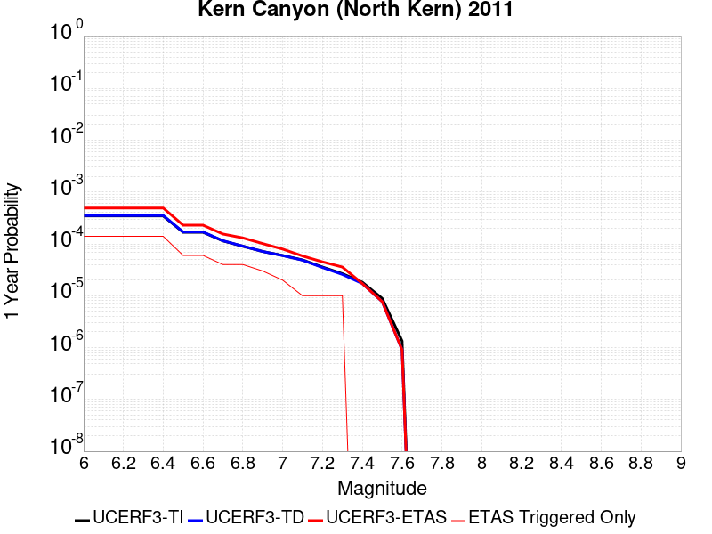 |  |

| Magnitude | 1 wk TI Prob | 1 wk TD Prob | 1 wk ETAS Prob | 1 wk ETAS/TD Gain | 1 wk ETAS Triggered Only | 1 mo TI Prob | 1 mo TD Prob | 1 mo ETAS Prob | 1 mo ETAS/TD Gain | 1 mo ETAS Triggered Only | 1 yr TI Prob | 1 yr TD Prob | 1 yr ETAS Prob | 1 yr ETAS/TD Gain | 1 yr ETAS Triggered Only | 10 yr TI Prob | 10 yr TD Prob | 10 yr ETAS Prob | 10 yr ETAS/TD Gain | 10 yr ETAS Triggered Only |
|-----|-----|-----|-----|-----|-----|-----|-----|-----|-----|-----|-----|-----|-----|-----|-----|-----|-----|-----|-----|-----|
| 6.0 | 6.6264497E-6 | 6.75733E-6 | 6.75733E-6 | 1.0 | 0.0 | 2.8398761E-5 | 2.895971E-5 | 2.895971E-5 | 1.0 | 0.0 | 3.4570007E-4 | 3.5253543E-4 | 5.5395544E-4 | 1.5713469 | 2.0149103E-4 | 0.0034516277 | 0.0035205502 | 0.003721332 | 1.0570314 | 2.0149103E-4 |
| 6.1 | 6.6264497E-6 | 6.75733E-6 | 6.75733E-6 | 1.0 | 0.0 | 2.8398761E-5 | 2.895971E-5 | 2.895971E-5 | 1.0 | 0.0 | 3.4570007E-4 | 3.5253543E-4 | 5.5395544E-4 | 1.5713469 | 2.0149103E-4 | 0.0034516277 | 0.0035205502 | 0.003721332 | 1.0570314 | 2.0149103E-4 |
| 6.2 | 6.6264497E-6 | 6.75733E-6 | 6.75733E-6 | 1.0 | 0.0 | 2.8398761E-5 | 2.895971E-5 | 2.895971E-5 | 1.0 | 0.0 | 3.4570007E-4 | 3.5253543E-4 | 5.5395544E-4 | 1.5713469 | 2.0149103E-4 | 0.0034516277 | 0.0035205502 | 0.003721332 | 1.0570314 | 2.0149103E-4 |
| 6.3 | 6.6264497E-6 | 6.75733E-6 | 6.75733E-6 | 1.0 | 0.0 | 2.8398761E-5 | 2.895971E-5 | 2.895971E-5 | 1.0 | 0.0 | 3.4570007E-4 | 3.5253543E-4 | 5.5395544E-4 | 1.5713469 | 2.0149103E-4 | 0.0034516277 | 0.0035205502 | 0.003721332 | 1.0570314 | 2.0149103E-4 |
| 6.4 | 6.6264497E-6 | 6.75733E-6 | 6.75733E-6 | 1.0 | 0.0 | 2.8398761E-5 | 2.895971E-5 | 2.895971E-5 | 1.0 | 0.0 | 3.4570007E-4 | 3.5253543E-4 | 5.5395544E-4 | 1.5713469 | 2.0149103E-4 | 0.0034516277 | 0.0035205502 | 0.003721332 | 1.0570314 | 2.0149103E-4 |
| 6.5 | 3.2162225E-6 | 3.2570915E-6 | 3.2570915E-6 | 1.0 | 0.0 | 1.3783738E-5 | 1.3958893E-5 | 1.3958893E-5 | 1.0 | 0.0 | 1.6780409E-4 | 1.6993708E-4 | 1.6993708E-4 | 1.0 | 0.0 | 0.0016767744 | 0.001698151 | 0.001698151 | 1.0 | 0.0 |
| 6.6 | 3.2162225E-6 | 3.2570915E-6 | 3.2570915E-6 | 1.0 | 0.0 | 1.3783738E-5 | 1.3958893E-5 | 1.3958893E-5 | 1.0 | 0.0 | 1.6780409E-4 | 1.6993708E-4 | 1.6993708E-4 | 1.0 | 0.0 | 0.0016767744 | 0.001698151 | 0.001698151 | 1.0 | 0.0 |
| 6.7 | 2.1908265E-6 | 2.2071222E-6 | 2.2071222E-6 | 1.0 | 0.0 | 9.389223E-6 | 9.459061E-6 | 9.459061E-6 | 1.0 | 0.0 | 1.1430779E-4 | 1.1515819E-4 | 1.1515819E-4 | 1.0 | 0.0 | 0.0011424901 | 0.0011510046 | 0.0011510046 | 1.0 | 0.0 |
| 6.8 | 1.7303895E-6 | 1.7365529E-6 | 1.7365529E-6 | 1.0 | 0.0 | 7.415934E-6 | 7.4423488E-6 | 7.4423488E-6 | 1.0 | 0.0 | 9.028525E-5 | 9.0606925E-5 | 9.0606925E-5 | 1.0 | 0.0 | 9.024858E-4 | 9.057096E-4 | 9.057096E-4 | 1.0 | 0.0 |
| 6.9 | 1.3700314E-6 | 1.3688622E-6 | 1.3688622E-6 | 1.0 | 0.0 | 5.87155E-6 | 5.8665396E-6 | 5.8665396E-6 | 1.0 | 0.0 | 7.148377E-5 | 7.142282E-5 | 7.142282E-5 | 1.0 | 0.0 | 7.146078E-4 | 7.140032E-4 | 7.140032E-4 | 1.0 | 0.0 |
| 7.0 | 1.1467797E-6 | 1.1413804E-6 | 1.1413804E-6 | 1.0 | 0.0 | 4.9147607E-6 | 4.8916213E-6 | 4.8916213E-6 | 1.0 | 0.0 | 5.983557E-5 | 5.9553895E-5 | 5.9553895E-5 | 1.0 | 0.0 | 5.981946E-4 | 5.953825E-4 | 5.953825E-4 | 1.0 | 0.0 |
| 7.1 | 9.3952065E-7 | 9.3026904E-7 | 9.3026904E-7 | 1.0 | 0.0 | 4.026511E-6 | 3.9868614E-6 | 3.9868614E-6 | 1.0 | 0.0 | 4.9021666E-5 | 4.8538972E-5 | 4.8538972E-5 | 1.0 | 0.0 | 4.901085E-4 | 4.8528548E-4 | 4.8528548E-4 | 1.0 | 0.0 |
| 7.2 | 6.858055E-7 | 6.7193E-7 | 6.7193E-7 | 1.0 | 0.0 | 2.939163E-6 | 2.879697E-6 | 2.879697E-6 | 1.0 | 0.0 | 3.5783723E-5 | 3.5059755E-5 | 3.5059755E-5 | 1.0 | 0.0 | 3.5777962E-4 | 3.5054312E-4 | 3.5054312E-4 | 1.0 | 0.0 |
| 7.3 | 5.1101983E-7 | 4.9393E-7 | 4.9393E-7 | 1.0 | 0.0 | 2.1900833E-6 | 2.116841E-6 | 2.116841E-6 | 1.0 | 0.0 | 2.6663936E-5 | 2.5772239E-5 | 2.5772239E-5 | 1.0 | 0.0 | 2.6660739E-4 | 2.57693E-4 | 2.57693E-4 | 1.0 | 0.0 |
| 7.4 | 3.4999414E-7 | 3.2995905E-7 | 3.2995905E-7 | 1.0 | 0.0 | 1.499974E-6 | 1.4141094E-6 | 1.4141094E-6 | 1.0 | 0.0 | 1.8262032E-5 | 1.721665E-5 | 1.721665E-5 | 1.0 | 0.0 | 1.826053E-4 | 1.7215339E-4 | 1.7215339E-4 | 1.0 | 0.0 |
| 7.5 | 1.7021522E-7 | 1.4750044E-7 | 1.4750044E-7 | 1.0 | 0.0 | 7.2949354E-7 | 6.321446E-7 | 6.321446E-7 | 1.0 | 0.0 | 8.881548E-6 | 7.696334E-6 | 7.696334E-6 | 1.0 | 0.0 | 8.8811925E-5 | 7.696076E-5 | 7.696076E-5 | 1.0 | 0.0 |
| 7.6 | 2.572245E-8 | 1.7352555E-8 | 1.7352555E-8 | 1.0 | 0.0 | 1.10239064E-7 | 7.436809E-8 | 7.436809E-8 | 1.0 | 0.0 | 1.3421597E-6 | 9.054312E-7 | 9.054312E-7 | 1.0 | 0.0 | 1.3421517E-5 | 9.05428E-6 | 9.05428E-6 | 1.0 | 0.0 |

## Cucamonga
*[(top)](#table-of-contents)*

| 1 Week | 1 Month | 1 Year | 10 Year |
|-----|-----|-----|-----|
|  |  |  |  |

| Magnitude | 1 wk TI Prob | 1 wk TD Prob | 1 wk ETAS Prob | 1 wk ETAS/TD Gain | 1 wk ETAS Triggered Only | 1 mo TI Prob | 1 mo TD Prob | 1 mo ETAS Prob | 1 mo ETAS/TD Gain | 1 mo ETAS Triggered Only | 1 yr TI Prob | 1 yr TD Prob | 1 yr ETAS Prob | 1 yr ETAS/TD Gain | 1 yr ETAS Triggered Only | 10 yr TI Prob | 10 yr TD Prob | 10 yr ETAS Prob | 10 yr ETAS/TD Gain | 10 yr ETAS Triggered Only |
|-----|-----|-----|-----|-----|-----|-----|-----|-----|-----|-----|-----|-----|-----|-----|-----|-----|-----|-----|-----|-----|
| 6.0 | 1.1848348E-5 | 1.1737008E-5 | 2.1322568E-4 | 18.166952 | 2.0149103E-4 | 5.0777642E-5 | 5.030051E-5 | 2.517814E-4 | 5.0055437 | 2.0149103E-4 | 6.180424E-4 | 6.1223935E-4 | 8.13607E-4 | 1.3289036 | 2.0149103E-4 | 0.0061632637 | 0.0061067017 | 0.0063069626 | 1.0327935 | 2.0149103E-4 |
| 6.1 | 1.1848348E-5 | 1.1737008E-5 | 2.1322568E-4 | 18.166952 | 2.0149103E-4 | 5.0777642E-5 | 5.030051E-5 | 2.517814E-4 | 5.0055437 | 2.0149103E-4 | 6.180424E-4 | 6.1223935E-4 | 8.13607E-4 | 1.3289036 | 2.0149103E-4 | 0.0061632637 | 0.0061067017 | 0.0063069626 | 1.0327935 | 2.0149103E-4 |
| 6.2 | 1.1848348E-5 | 1.1737008E-5 | 2.1322568E-4 | 18.166952 | 2.0149103E-4 | 5.0777642E-5 | 5.030051E-5 | 2.517814E-4 | 5.0055437 | 2.0149103E-4 | 6.180424E-4 | 6.1223935E-4 | 8.13607E-4 | 1.3289036 | 2.0149103E-4 | 0.0061632637 | 0.0061067017 | 0.0063069626 | 1.0327935 | 2.0149103E-4 |
| 6.3 | 1.1848348E-5 | 1.1737008E-5 | 2.1322568E-4 | 18.166952 | 2.0149103E-4 | 5.0777642E-5 | 5.030051E-5 | 2.517814E-4 | 5.0055437 | 2.0149103E-4 | 6.180424E-4 | 6.1223935E-4 | 8.13607E-4 | 1.3289036 | 2.0149103E-4 | 0.0061632637 | 0.0061067017 | 0.0063069626 | 1.0327935 | 2.0149103E-4 |
| 6.4 | 1.1848348E-5 | 1.1737008E-5 | 2.1322568E-4 | 18.166952 | 2.0149103E-4 | 5.0777642E-5 | 5.030051E-5 | 2.517814E-4 | 5.0055437 | 2.0149103E-4 | 6.180424E-4 | 6.1223935E-4 | 8.13607E-4 | 1.3289036 | 2.0149103E-4 | 0.0061632637 | 0.0061067017 | 0.0063069626 | 1.0327935 | 2.0149103E-4 |
| 6.5 | 1.16988695E-5 | 1.15760395E-5 | 2.1306473E-4 | 18.405668 | 2.0149103E-4 | 5.013705E-5 | 4.9610666E-5 | 2.510917E-4 | 5.061244 | 2.0149103E-4 | 6.102476E-4 | 6.0384517E-4 | 8.052145E-4 | 1.3334785 | 2.0149103E-4 | 0.006085745 | 0.006023216 | 0.0062234937 | 1.0332509 | 2.0149103E-4 |
| 6.6 | 1.16988695E-5 | 1.15760395E-5 | 2.1306473E-4 | 18.405668 | 2.0149103E-4 | 5.013705E-5 | 4.9610666E-5 | 2.510917E-4 | 5.061244 | 2.0149103E-4 | 6.102476E-4 | 6.0384517E-4 | 8.052145E-4 | 1.3334785 | 2.0149103E-4 | 0.006085745 | 0.006023216 | 0.0062234937 | 1.0332509 | 2.0149103E-4 |
| 6.7 | 1.1397107E-5 | 1.11149475E-5 | 2.1260374E-4 | 19.127731 | 2.0149103E-4 | 4.884383E-5 | 4.7634636E-5 | 2.4911607E-4 | 5.229726 | 2.0149103E-4 | 5.9451134E-4 | 5.797998E-4 | 7.8117405E-4 | 1.3473167 | 2.0149103E-4 | 0.005929234 | 0.0057840226 | 0.0059843482 | 1.0346344 | 2.0149103E-4 |
| 6.8 | 1.058387E-5 | 9.784992E-6 | 9.784992E-6 | 1.0 | 0.0 | 4.5358654E-5 | 4.193501E-5 | 4.193501E-5 | 1.0 | 0.0 | 5.521017E-4 | 5.1044027E-4 | 5.1044027E-4 | 1.0 | 0.0 | 0.00550732 | 0.0050936877 | 0.0050936877 | 1.0 | 0.0 |
| 6.9 | 9.690046E-6 | 8.57948E-6 | 8.57948E-6 | 1.0 | 0.0 | 4.1528107E-5 | 3.6768684E-5 | 3.6768684E-5 | 1.0 | 0.0 | 5.054874E-4 | 4.475672E-4 | 4.475672E-4 | 1.0 | 0.0 | 0.005043391 | 0.004467594 | 0.004467594 | 1.0 | 0.0 |
| 7.0 | 9.381461E-6 | 8.187101E-6 | 8.187101E-6 | 1.0 | 0.0 | 4.020564E-5 | 3.5087105E-5 | 3.5087105E-5 | 1.0 | 0.0 | 4.893937E-4 | 4.2710215E-4 | 4.2710215E-4 | 1.0 | 0.0 | 0.0048831734 | 0.0042637475 | 0.0042637475 | 1.0 | 0.0 |
| 7.1 | 8.946492E-6 | 7.781886E-6 | 7.781886E-6 | 1.0 | 0.0 | 3.8341543E-5 | 3.3350516E-5 | 3.3350516E-5 | 1.0 | 0.0 | 4.667083E-4 | 4.0596718E-4 | 4.0596718E-4 | 1.0 | 0.0 | 0.0046572937 | 0.004053192 | 0.004053192 | 1.0 | 0.0 |
| 7.2 | 8.251016E-6 | 6.9752796E-6 | 6.9752796E-6 | 1.0 | 0.0 | 3.5361016E-5 | 2.9893714E-5 | 2.9893714E-5 | 1.0 | 0.0 | 4.3043532E-4 | 3.6389544E-4 | 3.6389544E-4 | 1.0 | 0.0 | 0.0042960253 | 0.0036339292 | 0.0036339292 | 1.0 | 0.0 |
| 7.3 | 7.717881E-6 | 6.4863502E-6 | 6.4863502E-6 | 1.0 | 0.0 | 3.3076216E-5 | 2.7798349E-5 | 2.7798349E-5 | 1.0 | 0.0 | 4.026285E-4 | 3.3839257E-4 | 3.3839257E-4 | 1.0 | 0.0 | 0.004018998 | 0.00337971 | 0.00337971 | 1.0 | 0.0 |
| 7.4 | 7.275623E-6 | 6.031997E-6 | 6.031997E-6 | 1.0 | 0.0 | 3.118087E-5 | 2.585116E-5 | 2.585116E-5 | 1.0 | 0.0 | 3.7956095E-4 | 3.1469265E-4 | 3.1469265E-4 | 1.0 | 0.0 | 0.0037891332 | 0.0031434062 | 0.0031434062 | 1.0 | 0.0 |
| 7.5 | 6.5109502E-6 | 5.1006014E-6 | 5.1006014E-6 | 1.0 | 0.0 | 2.7903774E-5 | 2.1859538E-5 | 2.1859538E-5 | 1.0 | 0.0 | 3.3967546E-4 | 2.661075E-4 | 2.661075E-4 | 1.0 | 0.0 | 0.0033915674 | 0.002658813 | 0.002658813 | 1.0 | 0.0 |
| 7.6 | 5.4495326E-6 | 3.90857E-6 | 3.90857E-6 | 1.0 | 0.0 | 2.335493E-5 | 1.6750908E-5 | 1.6750908E-5 | 1.0 | 0.0 | 2.8430918E-4 | 2.0392328E-4 | 2.0392328E-4 | 1.0 | 0.0 | 0.0028394572 | 0.002038282 | 0.002038282 | 1.0 | 0.0 |
| 7.7 | 4.7997164E-6 | 3.2002547E-6 | 3.2002547E-6 | 1.0 | 0.0 | 2.057005E-5 | 1.3715306E-5 | 1.3715306E-5 | 1.0 | 0.0 | 2.504116E-4 | 1.6697108E-4 | 1.6697108E-4 | 1.0 | 0.0 | 0.002501296 | 0.0016693877 | 0.0016693877 | 1.0 | 0.0 |
| 7.8 | 3.3941733E-6 | 2.0641899E-6 | 2.0641899E-6 | 1.0 | 0.0 | 1.4546376E-5 | 8.846498E-6 | 8.846498E-6 | 1.0 | 0.0 | 1.7708774E-4 | 1.07700806E-4 | 1.07700806E-4 | 1.0 | 0.0 | 0.0017694668 | 0.001076723 | 0.001076723 | 1.0 | 0.0 |
| 7.9 | 9.750552E-7 | 5.155946E-7 | 5.155946E-7 | 1.0 | 0.0 | 4.178801E-6 | 2.2096892E-6 | 2.2096892E-6 | 1.0 | 0.0 | 5.0875715E-5 | 2.690264E-5 | 2.690264E-5 | 1.0 | 0.0 | 5.086407E-4 | 2.6899425E-4 | 2.6899425E-4 | 1.0 | 0.0 |
| 8.0 | 1.133857E-7 | 6.053707E-8 | 6.053707E-8 | 1.0 | 0.0 | 4.8593864E-7 | 2.5944456E-7 | 2.5944456E-7 | 1.0 | 0.0 | 5.9162867E-6 | 3.158733E-6 | 3.158733E-6 | 1.0 | 0.0 | 5.916129E-5 | 3.1586897E-5 | 3.1586897E-5 | 1.0 | 0.0 |

## Cleghorn Lake
*[(top)](#table-of-contents)*

| 1 Week | 1 Month | 1 Year | 10 Year |
|-----|-----|-----|-----|
|  |  |  |  |

| Magnitude | 1 wk TI Prob | 1 wk TD Prob | 1 wk ETAS Prob | 1 wk ETAS/TD Gain | 1 wk ETAS Triggered Only | 1 mo TI Prob | 1 mo TD Prob | 1 mo ETAS Prob | 1 mo ETAS/TD Gain | 1 mo ETAS Triggered Only | 1 yr TI Prob | 1 yr TD Prob | 1 yr ETAS Prob | 1 yr ETAS/TD Gain | 1 yr ETAS Triggered Only | 10 yr TI Prob | 10 yr TD Prob | 10 yr ETAS Prob | 10 yr ETAS/TD Gain | 10 yr ETAS Triggered Only |
|-----|-----|-----|-----|-----|-----|-----|-----|-----|-----|-----|-----|-----|-----|-----|-----|-----|-----|-----|-----|-----|
| 6.0 | 1.5467183E-5 | 1.6794203E-5 | 2.1828186E-4 | 12.997452 | 2.0149103E-4 | 6.6286244E-5 | 7.197348E-5 | 2.7345002E-4 | 3.7993162 | 2.0149103E-4 | 8.067362E-4 | 8.759797E-4 | 0.0010772942 | 1.2298164 | 2.0149103E-4 | 0.008038137 | 0.008730696 | 0.008930427 | 1.022877 | 2.0149103E-4 |
| 6.1 | 1.5467183E-5 | 1.6794203E-5 | 2.1828186E-4 | 12.997452 | 2.0149103E-4 | 6.6286244E-5 | 7.197348E-5 | 2.7345002E-4 | 3.7993162 | 2.0149103E-4 | 8.067362E-4 | 8.759797E-4 | 0.0010772942 | 1.2298164 | 2.0149103E-4 | 0.008038137 | 0.008730696 | 0.008930427 | 1.022877 | 2.0149103E-4 |
| 6.2 | 1.2624631E-5 | 1.3681544E-5 | 2.1516983E-4 | 15.727013 | 2.0149103E-4 | 5.410444E-5 | 5.863415E-5 | 2.6011336E-4 | 4.4362097 | 2.0149103E-4 | 6.585225E-4 | 7.1368564E-4 | 9.1503287E-4 | 1.2821231 | 2.0149103E-4 | 0.0065657445 | 0.0071187317 | 0.007318788 | 1.0281029 | 2.0149103E-4 |
| 6.3 | 1.2624631E-5 | 1.3681544E-5 | 2.1516983E-4 | 15.727013 | 2.0149103E-4 | 5.410444E-5 | 5.863415E-5 | 2.6011336E-4 | 4.4362097 | 2.0149103E-4 | 6.585225E-4 | 7.1368564E-4 | 9.1503287E-4 | 1.2821231 | 2.0149103E-4 | 0.0065657445 | 0.0071187317 | 0.007318788 | 1.0281029 | 2.0149103E-4 |
| 6.4 | 9.417684E-6 | 1.0170118E-5 | 2.116591E-4 | 20.811863 | 2.0149103E-4 | 4.036088E-5 | 4.3585722E-5 | 2.4506796E-4 | 5.6226664 | 2.0149103E-4 | 4.912829E-4 | 5.3056807E-4 | 7.319522E-4 | 1.3795632 | 2.0149103E-4 | 0.004901982 | 0.005297049 | 0.005497473 | 1.0378369 | 2.0149103E-4 |
| 6.5 | 9.368219E-6 | 1.0117545E-5 | 2.1160654E-4 | 20.914812 | 2.0149103E-4 | 4.014889E-5 | 4.3360415E-5 | 2.4484273E-4 | 5.6466875 | 2.0149103E-4 | 4.8870314E-4 | 5.2782625E-4 | 7.2921097E-4 | 1.3815359 | 2.0149103E-4 | 0.004876298 | 0.0052697617 | 0.0054701907 | 1.0380338 | 2.0149103E-4 |
| 6.6 | 7.803798E-6 | 8.441831E-6 | 2.0993117E-4 | 24.867966 | 2.0149103E-4 | 3.3444423E-5 | 3.6179E-5 | 2.3766274E-4 | 6.56908 | 2.0149103E-4 | 4.0710976E-4 | 4.4043022E-4 | 6.418325E-4 | 1.4572854 | 2.0149103E-4 | 0.0040636472 | 0.0043994905 | 0.004600095 | 1.0455972 | 2.0149103E-4 |
| 6.7 | 2.3108669E-6 | 2.4438336E-6 | 2.4438336E-6 | 1.0 | 0.0 | 9.903678E-6 | 1.0473532E-5 | 1.0473532E-5 | 1.0 | 0.0 | 1.205706E-4 | 1.2750797E-4 | 1.2750797E-4 | 1.0 | 0.0 | 0.001205052 | 0.0012743667 | 0.0012743667 | 1.0 | 0.0 |
| 6.8 | 2.0882828E-6 | 2.2062823E-6 | 2.2062823E-6 | 1.0 | 0.0 | 8.949753E-6 | 9.455462E-6 | 9.455462E-6 | 1.0 | 0.0 | 1.08957785E-4 | 1.1511434E-4 | 1.1511434E-4 | 1.0 | 0.0 | 0.0010890438 | 0.0011505639 | 0.0011505639 | 1.0 | 0.0 |
| 6.9 | 1.876935E-6 | 1.981051E-6 | 1.981051E-6 | 1.0 | 0.0 | 8.043982E-6 | 8.490192E-6 | 8.490192E-6 | 1.0 | 0.0 | 9.7931086E-5 | 1.03363345E-4 | 1.03363345E-4 | 1.0 | 0.0 | 9.788794E-4 | 0.0010331686 | 0.0010331686 | 1.0 | 0.0 |
| 7.0 | 1.5357559E-6 | 1.6202807E-6 | 1.6202807E-6 | 1.0 | 0.0 | 6.5817944E-6 | 6.9440425E-6 | 6.9440425E-6 | 1.0 | 0.0 | 8.01304E-5 | 8.454057E-5 | 8.454057E-5 | 1.0 | 0.0 | 8.010151E-4 | 8.450965E-4 | 8.450965E-4 | 1.0 | 0.0 |
| 7.1 | 1.0905424E-6 | 1.1497619E-6 | 1.1497619E-6 | 1.0 | 0.0 | 4.6737446E-6 | 4.9275427E-6 | 4.9275427E-6 | 1.0 | 0.0 | 5.6901354E-5 | 5.999128E-5 | 5.999128E-5 | 1.0 | 0.0 | 5.6886784E-4 | 5.997606E-4 | 5.997606E-4 | 1.0 | 0.0 |
| 7.2 | 6.06668E-7 | 6.387277E-7 | 6.387277E-7 | 1.0 | 0.0 | 2.600003E-6 | 2.7374022E-6 | 2.7374022E-6 | 1.0 | 0.0 | 3.1654577E-5 | 3.3327433E-5 | 3.3327433E-5 | 1.0 | 0.0 | 3.1650066E-4 | 3.3323118E-4 | 3.3323118E-4 | 1.0 | 0.0 |

## Cady
*[(top)](#table-of-contents)*

| 1 Week | 1 Month | 1 Year | 10 Year |
|-----|-----|-----|-----|
|  |  | 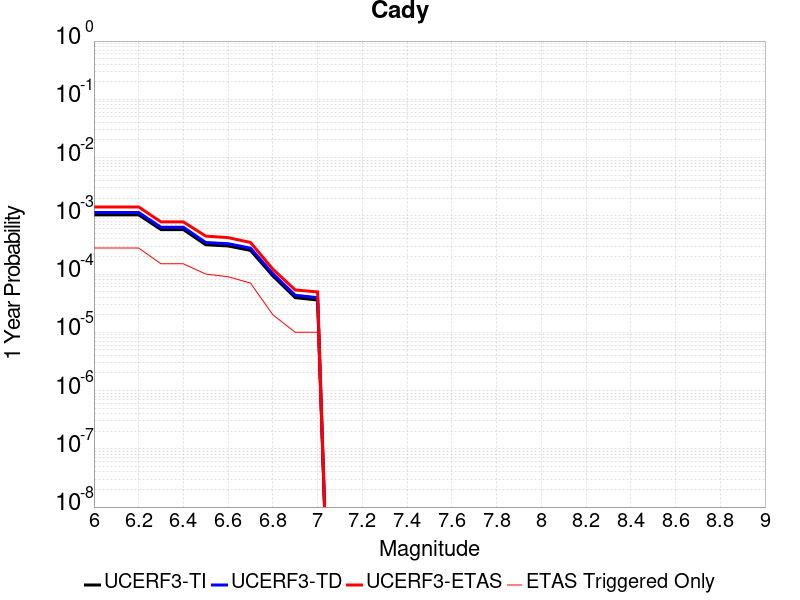 |  |

| Magnitude | 1 wk TI Prob | 1 wk TD Prob | 1 wk ETAS Prob | 1 wk ETAS/TD Gain | 1 wk ETAS Triggered Only | 1 mo TI Prob | 1 mo TD Prob | 1 mo ETAS Prob | 1 mo ETAS/TD Gain | 1 mo ETAS Triggered Only | 1 yr TI Prob | 1 yr TD Prob | 1 yr ETAS Prob | 1 yr ETAS/TD Gain | 1 yr ETAS Triggered Only | 10 yr TI Prob | 10 yr TD Prob | 10 yr ETAS Prob | 10 yr ETAS/TD Gain | 10 yr ETAS Triggered Only |
|-----|-----|-----|-----|-----|-----|-----|-----|-----|-----|-----|-----|-----|-----|-----|-----|-----|-----|-----|-----|-----|
| 6.0 | 1.9892565E-5 | 2.1858728E-5 | 2.1858728E-5 | 1.0 | 0.0 | 8.525106E-5 | 9.3677416E-5 | 9.3677416E-5 | 1.0 | 0.0 | 0.0010374374 | 0.0011400167 | 0.0011400167 | 1.0 | 0.0 | 0.010326075 | 0.011350701 | 0.011549904 | 1.0175499 | 2.0149103E-4 |
| 6.1 | 1.9892565E-5 | 2.1858728E-5 | 2.1858728E-5 | 1.0 | 0.0 | 8.525106E-5 | 9.3677416E-5 | 9.3677416E-5 | 1.0 | 0.0 | 0.0010374374 | 0.0011400167 | 0.0011400167 | 1.0 | 0.0 | 0.010326075 | 0.011350701 | 0.011549904 | 1.0175499 | 2.0149103E-4 |
| 6.2 | 1.9892565E-5 | 2.1858728E-5 | 2.1858728E-5 | 1.0 | 0.0 | 8.525106E-5 | 9.3677416E-5 | 9.3677416E-5 | 1.0 | 0.0 | 0.0010374374 | 0.0011400167 | 0.0011400167 | 1.0 | 0.0 | 0.010326075 | 0.011350701 | 0.011549904 | 1.0175499 | 2.0149103E-4 |
| 6.3 | 1.1117327E-5 | 1.2176583E-5 | 1.2176583E-5 | 1.0 | 0.0 | 4.764482E-5 | 5.2184492E-5 | 5.2184492E-5 | 1.0 | 0.0 | 5.7992124E-4 | 6.351925E-4 | 6.351925E-4 | 1.0 | 0.0 | 0.0057841022 | 0.0063368753 | 0.0065370896 | 1.0315951 | 2.0149103E-4 |
| 6.4 | 1.1117327E-5 | 1.2176583E-5 | 1.2176583E-5 | 1.0 | 0.0 | 4.764482E-5 | 5.2184492E-5 | 5.2184492E-5 | 1.0 | 0.0 | 5.7992124E-4 | 6.351925E-4 | 6.351925E-4 | 1.0 | 0.0 | 0.0057841022 | 0.0063368753 | 0.0065370896 | 1.0315951 | 2.0149103E-4 |
| 6.5 | 6.103093E-6 | 6.672021E-6 | 6.672021E-6 | 1.0 | 0.0 | 2.615585E-5 | 2.8594131E-5 | 2.8594131E-5 | 1.0 | 0.0 | 3.1840094E-4 | 3.480905E-4 | 3.480905E-4 | 1.0 | 0.0 | 0.0031794512 | 0.0034766865 | 0.0036774771 | 1.0577534 | 2.0149103E-4 |
| 6.6 | 5.817237E-6 | 6.3656585E-6 | 6.3656585E-6 | 1.0 | 0.0 | 2.4930776E-5 | 2.728118E-5 | 2.728118E-5 | 1.0 | 0.0 | 3.034899E-4 | 3.3211018E-4 | 3.3211018E-4 | 1.0 | 0.0 | 0.0030307577 | 0.0033173605 | 0.0035181832 | 1.0605369 | 2.0149103E-4 |
| 6.7 | 4.8846314E-6 | 5.3405684E-6 | 5.3405684E-6 | 1.0 | 0.0 | 2.0933967E-5 | 2.2888014E-5 | 2.2888014E-5 | 1.0 | 0.0 | 2.5484123E-4 | 2.7863772E-4 | 2.7863772E-4 | 1.0 | 0.0 | 0.0025454918 | 0.0027840391 | 0.0029849692 | 1.0721722 | 2.0149103E-4 |
| 6.8 | 1.7788773E-6 | 1.9399079E-6 | 1.9399079E-6 | 1.0 | 0.0 | 7.6237375E-6 | 8.313874E-6 | 8.313874E-6 | 1.0 | 0.0 | 9.281505E-5 | 1.01218284E-4 | 1.01218284E-4 | 1.0 | 0.0 | 9.2776294E-4 | 0.0010118765 | 0.0010118765 | 1.0 | 0.0 |
| 6.9 | 7.5455404E-7 | 8.297092E-7 | 8.297092E-7 | 1.0 | 0.0 | 3.233799E-6 | 3.5558937E-6 | 3.5558937E-6 | 1.0 | 0.0 | 3.937079E-5 | 4.3292483E-5 | 4.3292483E-5 | 1.0 | 0.0 | 3.9363815E-4 | 4.3287344E-4 | 4.3287344E-4 | 1.0 | 0.0 |
| 7.0 | 6.8578805E-7 | 7.541816E-7 | 7.541816E-7 | 1.0 | 0.0 | 2.9390883E-6 | 3.2322048E-6 | 3.2322048E-6 | 1.0 | 0.0 | 3.578281E-5 | 3.9351715E-5 | 3.9351715E-5 | 1.0 | 0.0 | 3.577705E-4 | 3.9347992E-4 | 3.9347992E-4 | 1.0 | 0.0 |

## Earthquake Valley (So Extension)
*[(top)](#table-of-contents)*

| 1 Week | 1 Month | 1 Year | 10 Year |
|-----|-----|-----|-----|
| 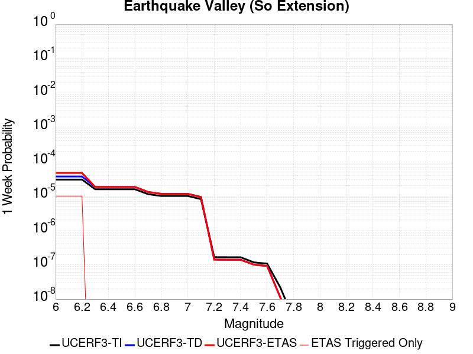 |  |  | 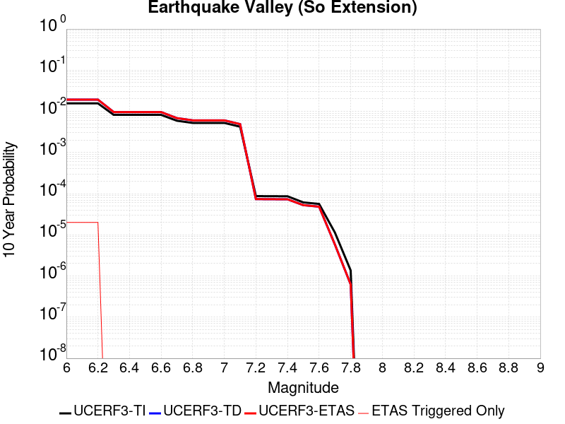 |

| Magnitude | 1 wk TI Prob | 1 wk TD Prob | 1 wk ETAS Prob | 1 wk ETAS/TD Gain | 1 wk ETAS Triggered Only | 1 mo TI Prob | 1 mo TD Prob | 1 mo ETAS Prob | 1 mo ETAS/TD Gain | 1 mo ETAS Triggered Only | 1 yr TI Prob | 1 yr TD Prob | 1 yr ETAS Prob | 1 yr ETAS/TD Gain | 1 yr ETAS Triggered Only | 10 yr TI Prob | 10 yr TD Prob | 10 yr ETAS Prob | 10 yr ETAS/TD Gain | 10 yr ETAS Triggered Only |
|-----|-----|-----|-----|-----|-----|-----|-----|-----|-----|-----|-----|-----|-----|-----|-----|-----|-----|-----|-----|-----|
| 6.0 | 3.0194888E-5 | 3.7072114E-5 | 2.3855567E-4 | 6.4349093 | 2.0149103E-4 | 1.2940024E-4 | 1.5887388E-4 | 3.603329E-4 | 2.2680438 | 2.0149103E-4 | 0.0015743093 | 0.0019331174 | 0.0021342188 | 1.1040297 | 2.0149103E-4 | 0.01563203 | 0.019213019 | 0.019410638 | 1.0102857 | 2.0149103E-4 |
| 6.1 | 3.0194888E-5 | 3.7072114E-5 | 2.3855567E-4 | 6.4349093 | 2.0149103E-4 | 1.2940024E-4 | 1.5887388E-4 | 3.603329E-4 | 2.2680438 | 2.0149103E-4 | 0.0015743093 | 0.0019331174 | 0.0021342188 | 1.1040297 | 2.0149103E-4 | 0.01563203 | 0.019213019 | 0.019410638 | 1.0102857 | 2.0149103E-4 |
| 6.2 | 3.0194888E-5 | 3.7072114E-5 | 2.3855567E-4 | 6.4349093 | 2.0149103E-4 | 1.2940024E-4 | 1.5887388E-4 | 3.603329E-4 | 2.2680438 | 2.0149103E-4 | 0.0015743093 | 0.0019331174 | 0.0021342188 | 1.1040297 | 2.0149103E-4 | 0.01563203 | 0.019213019 | 0.019410638 | 1.0102857 | 2.0149103E-4 |
| 6.3 | 1.5795305E-5 | 1.844658E-5 | 1.844658E-5 | 1.0 | 0.0 | 6.769241E-5 | 7.9055004E-5 | 7.9055004E-5 | 1.0 | 0.0 | 8.238434E-4 | 9.6218096E-4 | 9.6218096E-4 | 1.0 | 0.0 | 0.008207959 | 0.009591061 | 0.009591061 | 1.0 | 0.0 |
| 6.4 | 1.5795305E-5 | 1.844658E-5 | 1.844658E-5 | 1.0 | 0.0 | 6.769241E-5 | 7.9055004E-5 | 7.9055004E-5 | 1.0 | 0.0 | 8.238434E-4 | 9.6218096E-4 | 9.6218096E-4 | 1.0 | 0.0 | 0.008207959 | 0.009591061 | 0.009591061 | 1.0 | 0.0 |
| 6.5 | 1.5795305E-5 | 1.844658E-5 | 1.844658E-5 | 1.0 | 0.0 | 6.769241E-5 | 7.9055004E-5 | 7.9055004E-5 | 1.0 | 0.0 | 8.238434E-4 | 9.6218096E-4 | 9.6218096E-4 | 1.0 | 0.0 | 0.008207959 | 0.009591061 | 0.009591061 | 1.0 | 0.0 |
| 6.6 | 1.5795305E-5 | 1.844658E-5 | 1.844658E-5 | 1.0 | 0.0 | 6.769241E-5 | 7.9055004E-5 | 7.9055004E-5 | 1.0 | 0.0 | 8.238434E-4 | 9.6218096E-4 | 9.6218096E-4 | 1.0 | 0.0 | 0.008207959 | 0.009591061 | 0.009591061 | 1.0 | 0.0 |
| 6.7 | 1.1363076E-5 | 1.3138294E-5 | 1.3138294E-5 | 1.0 | 0.0 | 4.8697988E-5 | 5.6306188E-5 | 5.6306188E-5 | 1.0 | 0.0 | 5.927367E-4 | 6.8538834E-4 | 6.8538834E-4 | 1.0 | 0.0 | 0.0059115817 | 0.0068402183 | 0.0068402183 | 1.0 | 0.0 |
| 6.8 | 1.0049611E-5 | 1.1594334E-5 | 1.1594334E-5 | 1.0 | 0.0 | 4.306905E-5 | 4.9689468E-5 | 4.9689468E-5 | 1.0 | 0.0 | 5.242395E-4 | 6.048745E-4 | 6.048745E-4 | 1.0 | 0.0 | 0.0052300454 | 0.006039458 | 0.006039458 | 1.0 | 0.0 |
| 6.9 | 1.0049611E-5 | 1.1594334E-5 | 1.1594334E-5 | 1.0 | 0.0 | 4.306905E-5 | 4.9689468E-5 | 4.9689468E-5 | 1.0 | 0.0 | 5.242395E-4 | 6.048745E-4 | 6.048745E-4 | 1.0 | 0.0 | 0.0052300454 | 0.006039458 | 0.006039458 | 1.0 | 0.0 |
| 7.0 | 1.0049611E-5 | 1.1594334E-5 | 1.1594334E-5 | 1.0 | 0.0 | 4.306905E-5 | 4.9689468E-5 | 4.9689468E-5 | 1.0 | 0.0 | 5.242395E-4 | 6.048745E-4 | 6.048745E-4 | 1.0 | 0.0 | 0.0052300454 | 0.006039458 | 0.006039458 | 1.0 | 0.0 |
| 7.1 | 8.140254E-6 | 9.383458E-6 | 9.383458E-6 | 1.0 | 0.0 | 3.4886336E-5 | 4.0214578E-5 | 4.0214578E-5 | 1.0 | 0.0 | 4.2465836E-4 | 4.8956956E-4 | 4.8956956E-4 | 1.0 | 0.0 | 0.0042384774 | 0.0048914864 | 0.0048914864 | 1.0 | 0.0 |
| 7.2 | 1.673835E-7 | 1.4154125E-7 | 1.4154125E-7 | 1.0 | 0.0 | 7.173577E-7 | 6.066052E-7 | 6.066052E-7 | 1.0 | 0.0 | 8.733795E-6 | 7.385397E-6 | 7.385397E-6 | 1.0 | 0.0 | 8.733451E-5 | 7.385187E-5 | 7.385187E-5 | 1.0 | 0.0 |
| 7.3 | 1.6632116E-7 | 1.4052354E-7 | 1.4052354E-7 | 1.0 | 0.0 | 7.1280476E-7 | 6.0224363E-7 | 6.0224363E-7 | 1.0 | 0.0 | 8.678364E-6 | 7.332295E-6 | 7.332295E-6 | 1.0 | 0.0 | 8.6780245E-5 | 7.332089E-5 | 7.332089E-5 | 1.0 | 0.0 |
| 7.4 | 1.6569169E-7 | 1.3996983E-7 | 1.3996983E-7 | 1.0 | 0.0 | 7.1010703E-7 | 5.9987053E-7 | 5.9987053E-7 | 1.0 | 0.0 | 8.645519E-6 | 7.303403E-6 | 7.303403E-6 | 1.0 | 0.0 | 8.645182E-5 | 7.303199E-5 | 7.303199E-5 | 1.0 | 0.0 |
| 7.5 | 1.1764555E-7 | 1.0095917E-7 | 1.0095917E-7 | 1.0 | 0.0 | 5.041951E-7 | 4.326821E-7 | 4.326821E-7 | 1.0 | 0.0 | 6.138558E-6 | 5.267894E-6 | 5.267894E-6 | 1.0 | 0.0 | 6.1383886E-5 | 5.2677904E-5 | 5.2677904E-5 | 1.0 | 0.0 |
| 7.6 | 1.07927605E-7 | 9.260736E-8 | 9.260736E-8 | 1.0 | 0.0 | 4.6254678E-7 | 3.9688865E-7 | 3.9688865E-7 | 1.0 | 0.0 | 5.6314925E-6 | 4.832111E-6 | 4.832111E-6 | 1.0 | 0.0 | 5.63135E-5 | 4.8320264E-5 | 4.8320264E-5 | 1.0 | 0.0 |
| 7.7 | 2.1826905E-8 | 1.1180516E-8 | 1.1180516E-8 | 1.0 | 0.0 | 9.3543875E-8 | 4.7916494E-8 | 4.7916494E-8 | 1.0 | 0.0 | 1.1388961E-6 | 5.833832E-7 | 5.833832E-7 | 1.0 | 0.0 | 1.1388902E-5 | 5.8338223E-6 | 5.8338223E-6 | 1.0 | 0.0 |
| 7.8 | 2.6169649E-9 | 1.1969472E-9 | 1.1969472E-9 | 1.0 | 0.0 | 1.1215564E-8 | 5.1297735E-9 | 5.1297735E-9 | 1.0 | 0.0 | 1.3654947E-7 | 6.2454994E-8 | 6.2454994E-8 | 1.0 | 0.0 | 1.365494E-6 | 6.245499E-7 | 6.245499E-7 | 1.0 | 0.0 |

## Santa Ynez (East)
*[(top)](#table-of-contents)*

| 1 Week | 1 Month | 1 Year | 10 Year |
|-----|-----|-----|-----|
|  |  |  |  |

| Magnitude | 1 wk TI Prob | 1 wk TD Prob | 1 wk ETAS Prob | 1 wk ETAS/TD Gain | 1 wk ETAS Triggered Only | 1 mo TI Prob | 1 mo TD Prob | 1 mo ETAS Prob | 1 mo ETAS/TD Gain | 1 mo ETAS Triggered Only | 1 yr TI Prob | 1 yr TD Prob | 1 yr ETAS Prob | 1 yr ETAS/TD Gain | 1 yr ETAS Triggered Only | 10 yr TI Prob | 10 yr TD Prob | 10 yr ETAS Prob | 10 yr ETAS/TD Gain | 10 yr ETAS Triggered Only |
|-----|-----|-----|-----|-----|-----|-----|-----|-----|-----|-----|-----|-----|-----|-----|-----|-----|-----|-----|-----|-----|
| 6.0 | 3.2269712E-5 | 3.67505E-5 | 3.67505E-5 | 1.0 | 0.0 | 1.3829143E-4 | 1.5749598E-4 | 3.5895527E-4 | 2.2791393 | 2.0149103E-4 | 0.0016823979 | 0.0019164166 | 0.0021175216 | 1.104938 | 2.0149103E-4 | 0.016697178 | 0.019056441 | 0.019254092 | 1.0103719 | 2.0149103E-4 |
| 6.1 | 3.2269712E-5 | 3.67505E-5 | 3.67505E-5 | 1.0 | 0.0 | 1.3829143E-4 | 1.5749598E-4 | 3.5895527E-4 | 2.2791393 | 2.0149103E-4 | 0.0016823979 | 0.0019164166 | 0.0021175216 | 1.104938 | 2.0149103E-4 | 0.016697178 | 0.019056441 | 0.019254092 | 1.0103719 | 2.0149103E-4 |
| 6.2 | 3.2269712E-5 | 3.67505E-5 | 3.67505E-5 | 1.0 | 0.0 | 1.3829143E-4 | 1.5749598E-4 | 3.5895527E-4 | 2.2791393 | 2.0149103E-4 | 0.0016823979 | 0.0019164166 | 0.0021175216 | 1.104938 | 2.0149103E-4 | 0.016697178 | 0.019056441 | 0.019254092 | 1.0103719 | 2.0149103E-4 |
| 6.3 | 3.2269712E-5 | 3.67505E-5 | 3.67505E-5 | 1.0 | 0.0 | 1.3829143E-4 | 1.5749598E-4 | 3.5895527E-4 | 2.2791393 | 2.0149103E-4 | 0.0016823979 | 0.0019164166 | 0.0021175216 | 1.104938 | 2.0149103E-4 | 0.016697178 | 0.019056441 | 0.019254092 | 1.0103719 | 2.0149103E-4 |
| 6.4 | 1.4404779E-5 | 1.4849382E-5 | 1.4849382E-5 | 1.0 | 0.0 | 6.1733306E-5 | 6.363868E-5 | 6.363868E-5 | 1.0 | 0.0 | 7.513438E-4 | 7.745306E-4 | 7.745306E-4 | 1.0 | 0.0 | 0.0074880854 | 0.007718862 | 0.007718862 | 1.0 | 0.0 |
| 6.5 | 1.4404779E-5 | 1.4849382E-5 | 1.4849382E-5 | 1.0 | 0.0 | 6.1733306E-5 | 6.363868E-5 | 6.363868E-5 | 1.0 | 0.0 | 7.513438E-4 | 7.745306E-4 | 7.745306E-4 | 1.0 | 0.0 | 0.0074880854 | 0.007718862 | 0.007718862 | 1.0 | 0.0 |
| 6.6 | 1.280208E-5 | 1.3011947E-5 | 1.3011947E-5 | 1.0 | 0.0 | 5.4864904E-5 | 5.5764307E-5 | 5.5764307E-5 | 1.0 | 0.0 | 6.6777546E-4 | 6.787207E-4 | 6.787207E-4 | 1.0 | 0.0 | 0.006657724 | 0.0067666885 | 0.0067666885 | 1.0 | 0.0 |
| 6.7 | 1.2457027E-5 | 1.2628468E-5 | 1.2628468E-5 | 1.0 | 0.0 | 5.3386164E-5 | 5.412089E-5 | 5.412089E-5 | 1.0 | 0.0 | 6.497827E-4 | 6.587243E-4 | 6.587243E-4 | 1.0 | 0.0 | 0.00647886 | 0.006567915 | 0.006567915 | 1.0 | 0.0 |
| 6.8 | 1.2095134E-5 | 1.2230915E-5 | 1.2230915E-5 | 1.0 | 0.0 | 5.1835254E-5 | 5.241716E-5 | 5.241716E-5 | 1.0 | 0.0 | 6.309115E-4 | 6.379937E-4 | 6.379937E-4 | 1.0 | 0.0 | 0.0062912325 | 0.006361809 | 0.006361809 | 1.0 | 0.0 |
| 6.9 | 1.1104036E-5 | 1.1157347E-5 | 1.1157347E-5 | 1.0 | 0.0 | 4.758786E-5 | 4.781633E-5 | 4.781633E-5 | 1.0 | 0.0 | 5.7922816E-4 | 5.820096E-4 | 5.820096E-4 | 1.0 | 0.0 | 0.005777207 | 0.0058049993 | 0.0058049993 | 1.0 | 0.0 |
| 7.0 | 1.0577444E-5 | 1.058168E-5 | 1.058168E-5 | 1.0 | 0.0 | 4.5331115E-5 | 4.5349276E-5 | 4.5349276E-5 | 1.0 | 0.0 | 5.5176654E-4 | 5.519888E-4 | 5.519888E-4 | 1.0 | 0.0 | 0.0055039856 | 0.0055063153 | 0.0055063153 | 1.0 | 0.0 |
| 7.1 | 1.0021775E-5 | 9.980988E-6 | 9.980988E-6 | 1.0 | 0.0 | 4.294976E-5 | 4.2774966E-5 | 4.2774966E-5 | 1.0 | 0.0 | 5.2278786E-4 | 5.2066194E-4 | 5.2066194E-4 | 1.0 | 0.0 | 0.0052155964 | 0.0051945536 | 0.0051945536 | 1.0 | 0.0 |
| 7.2 | 8.874109E-6 | 8.748793E-6 | 8.748793E-6 | 1.0 | 0.0 | 3.8031343E-5 | 3.7494297E-5 | 3.7494297E-5 | 1.0 | 0.0 | 4.629332E-4 | 4.5639853E-4 | 4.5639853E-4 | 1.0 | 0.0 | 0.0046197 | 0.0045547304 | 0.0045547304 | 1.0 | 0.0 |
| 7.3 | 7.5504267E-6 | 7.5051175E-6 | 7.5051175E-6 | 1.0 | 0.0 | 3.235857E-5 | 3.21644E-5 | 3.21644E-5 | 1.0 | 0.0 | 3.9389438E-4 | 3.915322E-4 | 3.915322E-4 | 1.0 | 0.0 | 0.0039319694 | 0.003908531 | 0.003908531 | 1.0 | 0.0 |
| 7.4 | 6.309394E-6 | 6.1831556E-6 | 6.1831556E-6 | 1.0 | 0.0 | 2.703998E-5 | 2.6498974E-5 | 2.6498974E-5 | 1.0 | 0.0 | 3.2916202E-4 | 3.225782E-4 | 3.225782E-4 | 1.0 | 0.0 | 0.003286749 | 0.003221197 | 0.003221197 | 1.0 | 0.0 |
| 7.5 | 4.6103073E-6 | 4.4408903E-6 | 4.4408903E-6 | 1.0 | 0.0 | 1.975831E-5 | 1.9032252E-5 | 1.9032252E-5 | 1.0 | 0.0 | 2.4053088E-4 | 2.3169373E-4 | 2.3169373E-4 | 1.0 | 0.0 | 0.002402707 | 0.002314591 | 0.002314591 | 1.0 | 0.0 |
| 7.6 | 1.2858658E-6 | 1.3008173E-6 | 1.3008173E-6 | 1.0 | 0.0 | 5.5108417E-6 | 5.5749197E-6 | 5.5749197E-6 | 1.0 | 0.0 | 6.7092435E-5 | 6.78726E-5 | 6.78726E-5 | 1.0 | 0.0 | 6.707218E-4 | 6.785256E-4 | 6.785256E-4 | 1.0 | 0.0 |
| 7.7 | 5.3302307E-7 | 5.612138E-7 | 5.612138E-7 | 1.0 | 0.0 | 2.2843826E-6 | 2.4052001E-6 | 2.4052001E-6 | 1.0 | 0.0 | 2.7812002E-5 | 2.9282954E-5 | 2.9282954E-5 | 1.0 | 0.0 | 2.7808524E-4 | 2.9279452E-4 | 2.9279452E-4 | 1.0 | 0.0 |
| 7.8 | 4.613933E-8 | 4.80301E-8 | 4.80301E-8 | 1.0 | 0.0 | 1.9773998E-7 | 2.0584326E-7 | 2.0584326E-7 | 1.0 | 0.0 | 2.4074816E-6 | 2.5061388E-6 | 2.5061388E-6 | 1.0 | 0.0 | 2.4074554E-5 | 2.5061116E-5 | 2.5061116E-5 | 1.0 | 0.0 |

## Camp Rock 2011
*[(top)](#table-of-contents)*

| 1 Week | 1 Month | 1 Year | 10 Year |
|-----|-----|-----|-----|
|  |  |  |  |

| Magnitude | 1 wk TI Prob | 1 wk TD Prob | 1 wk ETAS Prob | 1 wk ETAS/TD Gain | 1 wk ETAS Triggered Only | 1 mo TI Prob | 1 mo TD Prob | 1 mo ETAS Prob | 1 mo ETAS/TD Gain | 1 mo ETAS Triggered Only | 1 yr TI Prob | 1 yr TD Prob | 1 yr ETAS Prob | 1 yr ETAS/TD Gain | 1 yr ETAS Triggered Only | 10 yr TI Prob | 10 yr TD Prob | 10 yr ETAS Prob | 10 yr ETAS/TD Gain | 10 yr ETAS Triggered Only |
|-----|-----|-----|-----|-----|-----|-----|-----|-----|-----|-----|-----|-----|-----|-----|-----|-----|-----|-----|-----|-----|
| 6.0 | 1.6710783E-5 | 4.25026E-6 | 2.0574043E-4 | 48.40655 | 2.0149103E-4 | 7.161568E-5 | 1.8215276E-5 | 2.1970263E-4 | 12.061449 | 2.0149103E-4 | 8.7157206E-4 | 2.2174895E-4 | 4.231953E-4 | 1.9084433 | 2.0149103E-4 | 0.008681616 | 0.0022153298 | 0.0024163744 | 1.0907515 | 2.0149103E-4 |
| 6.1 | 1.6710783E-5 | 4.25026E-6 | 2.0574043E-4 | 48.40655 | 2.0149103E-4 | 7.161568E-5 | 1.8215276E-5 | 2.1970263E-4 | 12.061449 | 2.0149103E-4 | 8.7157206E-4 | 2.2174895E-4 | 4.231953E-4 | 1.9084433 | 2.0149103E-4 | 0.008681616 | 0.0022153298 | 0.0024163744 | 1.0907515 | 2.0149103E-4 |
| 6.2 | 1.6710783E-5 | 4.25026E-6 | 2.0574043E-4 | 48.40655 | 2.0149103E-4 | 7.161568E-5 | 1.8215276E-5 | 2.1970263E-4 | 12.061449 | 2.0149103E-4 | 8.7157206E-4 | 2.2174895E-4 | 4.231953E-4 | 1.9084433 | 2.0149103E-4 | 0.008681616 | 0.0022153298 | 0.0024163744 | 1.0907515 | 2.0149103E-4 |
| 6.3 | 1.6710783E-5 | 4.25026E-6 | 2.0574043E-4 | 48.40655 | 2.0149103E-4 | 7.161568E-5 | 1.8215276E-5 | 2.1970263E-4 | 12.061449 | 2.0149103E-4 | 8.7157206E-4 | 2.2174895E-4 | 4.231953E-4 | 1.9084433 | 2.0149103E-4 | 0.008681616 | 0.0022153298 | 0.0024163744 | 1.0907515 | 2.0149103E-4 |
| 6.4 | 7.982846E-6 | 3.6820884E-6 | 3.6820884E-6 | 1.0 | 0.0 | 3.421175E-5 | 1.5780286E-5 | 1.5780286E-5 | 1.0 | 0.0 | 4.1644843E-4 | 1.9210839E-4 | 1.9210839E-4 | 1.0 | 0.0 | 0.0041566887 | 0.001919458 | 0.001919458 | 1.0 | 0.0 |
| 6.5 | 7.982846E-6 | 3.6820884E-6 | 3.6820884E-6 | 1.0 | 0.0 | 3.421175E-5 | 1.5780286E-5 | 1.5780286E-5 | 1.0 | 0.0 | 4.1644843E-4 | 1.9210839E-4 | 1.9210839E-4 | 1.0 | 0.0 | 0.0041566887 | 0.001919458 | 0.001919458 | 1.0 | 0.0 |
| 6.6 | 7.048869E-6 | 3.4243571E-6 | 3.4243571E-6 | 1.0 | 0.0 | 3.0209088E-5 | 1.4675736E-5 | 1.4675736E-5 | 1.0 | 0.0 | 3.677336E-4 | 1.7866275E-4 | 1.7866275E-4 | 1.0 | 0.0 | 0.0036712566 | 0.0017852228 | 0.0017852228 | 1.0 | 0.0 |
| 6.7 | 6.987307E-6 | 3.3623348E-6 | 3.3623348E-6 | 1.0 | 0.0 | 2.9945259E-5 | 1.4409929E-5 | 1.4409929E-5 | 1.0 | 0.0 | 3.6452254E-4 | 1.7542706E-4 | 1.7542706E-4 | 1.0 | 0.0 | 0.0036392517 | 0.001752917 | 0.001752917 | 1.0 | 0.0 |
| 6.8 | 6.3737602E-6 | 3.1179077E-6 | 3.1179077E-6 | 1.0 | 0.0 | 2.731583E-5 | 1.3362394E-5 | 1.3362394E-5 | 1.0 | 0.0 | 3.3251947E-4 | 1.626753E-4 | 1.626753E-4 | 1.0 | 0.0 | 0.0033202237 | 0.0016255907 | 0.0016255907 | 1.0 | 0.0 |
| 6.9 | 6.112211E-6 | 2.9331156E-6 | 2.9331156E-6 | 1.0 | 0.0 | 2.6194928E-5 | 1.2570436E-5 | 1.2570436E-5 | 1.0 | 0.0 | 3.1887658E-4 | 1.5303459E-4 | 1.5303459E-4 | 1.0 | 0.0 | 0.003184194 | 0.0015293199 | 0.0015293199 | 1.0 | 0.0 |
| 7.0 | 5.5140117E-6 | 2.641923E-6 | 2.641923E-6 | 1.0 | 0.0 | 2.3631264E-5 | 1.132248E-5 | 1.132248E-5 | 1.0 | 0.0 | 2.8767265E-4 | 1.3784273E-4 | 1.3784273E-4 | 1.0 | 0.0 | 0.0028730053 | 0.0013775975 | 0.0013775975 | 1.0 | 0.0 |
| 7.1 | 4.8151105E-6 | 2.1342705E-6 | 2.1342705E-6 | 1.0 | 0.0 | 2.0636026E-5 | 9.146843E-6 | 9.146843E-6 | 1.0 | 0.0 | 2.5121463E-4 | 1.1135734E-4 | 1.1135734E-4 | 1.0 | 0.0 | 0.0025093083 | 0.0011130372 | 0.0011130372 | 1.0 | 0.0 |
| 7.2 | 3.818335E-6 | 1.2937425E-6 | 1.2937425E-6 | 1.0 | 0.0 | 1.6364189E-5 | 5.5445994E-6 | 5.5445994E-6 | 1.0 | 0.0 | 1.9921579E-4 | 6.750349E-5 | 6.750349E-5 | 1.0 | 0.0 | 0.0019903728 | 6.748381E-4 | 6.748381E-4 | 1.0 | 0.0 |
| 7.3 | 2.7166698E-6 | 7.3835776E-7 | 7.3835776E-7 | 1.0 | 0.0 | 1.1642818E-5 | 3.1643867E-6 | 3.1643867E-6 | 1.0 | 0.0 | 1.4174209E-4 | 3.8525748E-5 | 3.8525748E-5 | 1.0 | 0.0 | 0.0014165172 | 3.851927E-4 | 3.851927E-4 | 1.0 | 0.0 |
| 7.4 | 2.0893426E-6 | 5.4618386E-7 | 5.4618386E-7 | 1.0 | 0.0 | 8.954295E-6 | 2.3407858E-6 | 2.3407858E-6 | 1.0 | 0.0 | 1.0901308E-4 | 2.84987E-5 | 2.84987E-5 | 1.0 | 0.0 | 0.0010895962 | 2.84951E-4 | 2.84951E-4 | 1.0 | 0.0 |
| 7.5 | 1.1681728E-6 | 3.6030585E-7 | 3.6030585E-7 | 1.0 | 0.0 | 5.0064455E-6 | 1.544167E-6 | 1.544167E-6 | 1.0 | 0.0 | 6.0951766E-5 | 1.8800076E-5 | 1.8800076E-5 | 1.0 | 0.0 | 6.093505E-4 | 1.8798532E-4 | 1.8798532E-4 | 1.0 | 0.0 |
| 7.6 | 1.3154387E-7 | 7.1197384E-8 | 7.1197384E-8 | 1.0 | 0.0 | 5.6375933E-7 | 3.051316E-7 | 3.051316E-7 | 1.0 | 0.0 | 6.863748E-6 | 3.7149728E-6 | 3.7149728E-6 | 1.0 | 0.0 | 6.863536E-5 | 3.7149264E-5 | 3.7149264E-5 | 1.0 | 0.0 |

## San Andreas (Carrizo) rev
*[(top)](#table-of-contents)*

| 1 Week | 1 Month | 1 Year | 10 Year |
|-----|-----|-----|-----|
|  |  | 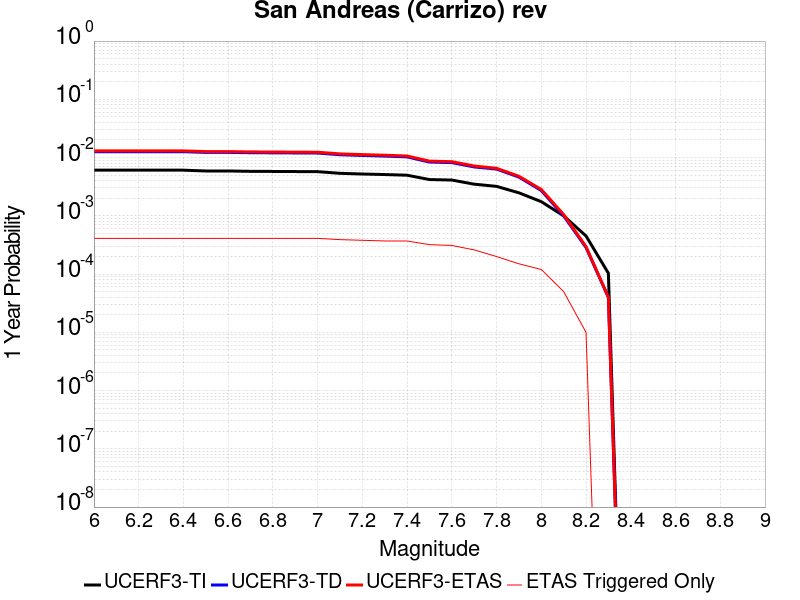 |  |

| Magnitude | 1 wk TI Prob | 1 wk TD Prob | 1 wk ETAS Prob | 1 wk ETAS/TD Gain | 1 wk ETAS Triggered Only | 1 mo TI Prob | 1 mo TD Prob | 1 mo ETAS Prob | 1 mo ETAS/TD Gain | 1 mo ETAS Triggered Only | 1 yr TI Prob | 1 yr TD Prob | 1 yr ETAS Prob | 1 yr ETAS/TD Gain | 1 yr ETAS Triggered Only | 10 yr TI Prob | 10 yr TD Prob | 10 yr ETAS Prob | 10 yr ETAS/TD Gain | 10 yr ETAS Triggered Only |
|-----|-----|-----|-----|-----|-----|-----|-----|-----|-----|-----|-----|-----|-----|-----|-----|-----|-----|-----|-----|-----|
| 6.0 | 1.1674632E-4 | 2.432302E-4 | 4.4467222E-4 | 1.828195 | 2.0149103E-4 | 5.002454E-4 | 0.0010420004 | 0.0012432814 | 1.1931679 | 2.0149103E-4 | 0.006073493 | 0.012613042 | 0.012811992 | 1.0157733 | 2.0149103E-4 | 0.0591016 | 0.12061418 | 0.12079137 | 1.001469 | 2.0149103E-4 |
| 6.1 | 1.1674632E-4 | 2.432302E-4 | 4.4467222E-4 | 1.828195 | 2.0149103E-4 | 5.002454E-4 | 0.0010420004 | 0.0012432814 | 1.1931679 | 2.0149103E-4 | 0.006073493 | 0.012613042 | 0.012811992 | 1.0157733 | 2.0149103E-4 | 0.0591016 | 0.12061418 | 0.12079137 | 1.001469 | 2.0149103E-4 |
| 6.2 | 1.1674632E-4 | 2.432302E-4 | 4.4467222E-4 | 1.828195 | 2.0149103E-4 | 5.002454E-4 | 0.0010420004 | 0.0012432814 | 1.1931679 | 2.0149103E-4 | 0.006073493 | 0.012613042 | 0.012811992 | 1.0157733 | 2.0149103E-4 | 0.0591016 | 0.12061418 | 0.12079137 | 1.001469 | 2.0149103E-4 |
| 6.3 | 1.1674632E-4 | 2.432302E-4 | 4.4467222E-4 | 1.828195 | 2.0149103E-4 | 5.002454E-4 | 0.0010420004 | 0.0012432814 | 1.1931679 | 2.0149103E-4 | 0.006073493 | 0.012613042 | 0.012811992 | 1.0157733 | 2.0149103E-4 | 0.0591016 | 0.12061418 | 0.12079137 | 1.001469 | 2.0149103E-4 |
| 6.4 | 1.1674632E-4 | 2.432302E-4 | 4.4467222E-4 | 1.828195 | 2.0149103E-4 | 5.002454E-4 | 0.0010420004 | 0.0012432814 | 1.1931679 | 2.0149103E-4 | 0.006073493 | 0.012613042 | 0.012811992 | 1.0157733 | 2.0149103E-4 | 0.0591016 | 0.12061418 | 0.12079137 | 1.001469 | 2.0149103E-4 |
| 6.5 | 1.13136164E-4 | 2.3643032E-4 | 4.378737E-4 | 1.8520201 | 2.0149103E-4 | 4.847792E-4 | 0.0010128808 | 0.0012141678 | 1.1987271 | 2.0149103E-4 | 0.0058862255 | 0.012262545 | 0.0124615645 | 1.01623 | 2.0149103E-4 | 0.057327334 | 0.117585555 | 0.11776335 | 1.001512 | 2.0149103E-4 |
| 6.6 | 1.13136164E-4 | 2.3643032E-4 | 4.378737E-4 | 1.8520201 | 2.0149103E-4 | 4.847792E-4 | 0.0010128808 | 0.0012141678 | 1.1987271 | 2.0149103E-4 | 0.0058862255 | 0.012262545 | 0.0124615645 | 1.01623 | 2.0149103E-4 | 0.057327334 | 0.117585555 | 0.11776335 | 1.001512 | 2.0149103E-4 |
| 6.7 | 1.1149675E-4 | 2.3334254E-4 | 4.3478655E-4 | 1.8632975 | 2.0149103E-4 | 4.777557E-4 | 9.996577E-4 | 0.0012009473 | 1.2013586 | 2.0149103E-4 | 0.0058011734 | 0.012103349 | 0.0123024015 | 1.016446 | 2.0149103E-4 | 0.05652051 | 0.1162071 | 0.11638518 | 1.0015324 | 2.0149103E-4 |
| 6.8 | 1.1103589E-4 | 2.3236412E-4 | 4.3380834E-4 | 1.8669333 | 2.0149103E-4 | 4.7578133E-4 | 9.954676E-4 | 0.0011967581 | 1.202207 | 2.0149103E-4 | 0.005777263 | 0.012052901 | 0.012251964 | 1.0165157 | 2.0149103E-4 | 0.056293584 | 0.1157674 | 0.11594556 | 1.001539 | 2.0149103E-4 |
| 6.9 | 1.1053259E-4 | 2.3128795E-4 | 4.3273237E-4 | 1.8709681 | 2.0149103E-4 | 4.7362508E-4 | 9.90859E-4 | 0.0011921504 | 1.2031484 | 2.0149103E-4 | 0.0057511497 | 0.01199741 | 0.012196484 | 1.0165931 | 2.0149103E-4 | 0.05604569 | 0.11528359 | 0.115461856 | 1.0015463 | 2.0149103E-4 |
| 7.0 | 1.1005377E-4 | 2.3029637E-4 | 4.31741E-4 | 1.874719 | 2.0149103E-4 | 4.7157376E-4 | 9.866126E-4 | 0.0011879049 | 1.2040236 | 2.0149103E-4 | 0.0057263062 | 0.011946279 | 0.012145363 | 1.016665 | 2.0149103E-4 | 0.055809796 | 0.11483591 | 0.11501426 | 1.001553 | 2.0149103E-4 |
| 7.1 | 1.0308142E-4 | 2.1539345E-4 | 4.1684107E-4 | 1.9352542 | 2.0149103E-4 | 4.417027E-4 | 9.227892E-4 | 0.0011240944 | 1.2181485 | 2.0149103E-4 | 0.0053644776 | 0.011177397 | 0.011376637 | 1.0178251 | 2.0149103E-4 | 0.052368138 | 0.108092256 | 0.10827197 | 1.0016626 | 2.0149103E-4 |
| 7.2 | 1.0027479E-4 | 2.094724E-4 | 4.1092123E-4 | 1.9616963 | 2.0149103E-4 | 4.296783E-4 | 8.9743105E-4 | 0.0010987412 | 1.2243183 | 2.0149103E-4 | 0.0052187922 | 0.010871782 | 0.011071083 | 1.0183319 | 2.0149103E-4 | 0.050979212 | 0.10539625 | 0.1055765 | 1.0017103 | 2.0149103E-4 |
| 7.3 | 9.816942E-5 | 2.0422463E-4 | 4.056745E-4 | 1.9864132 | 2.0149103E-4 | 4.2065824E-4 | 8.7495585E-4 | 0.0010762706 | 1.2300856 | 2.0149103E-4 | 0.005109493 | 0.010600842 | 0.010800197 | 1.0188056 | 2.0149103E-4 | 0.049935985 | 0.102979995 | 0.10316074 | 1.0017551 | 2.0149103E-4 |
| 7.4 | 9.5634205E-5 | 1.9791997E-4 | 3.993711E-4 | 2.0178416 | 2.0149103E-4 | 4.0979648E-4 | 8.479536E-4 | 0.0010492738 | 1.2374189 | 2.0149103E-4 | 0.0049778637 | 0.010275229 | 0.010474649 | 1.0194079 | 2.0149103E-4 | 0.048678253 | 0.10006632 | 0.100247644 | 1.0018121 | 2.0149103E-4 |
| 7.5 | 8.052417E-5 | 1.611261E-4 | 3.6258466E-4 | 2.2503161 | 2.0149103E-4 | 3.4505792E-4 | 6.903579E-4 | 8.9170976E-4 | 1.2916632 | 2.0149103E-4 | 0.0041929903 | 0.008372796 | 0.0085726 | 1.0238634 | 2.0149103E-4 | 0.04114753 | 0.08281049 | 0.082995296 | 1.0022317 | 2.0149103E-4 |
| 7.6 | 7.897024E-5 | 1.5765853E-4 | 3.591178E-4 | 2.2778203 | 2.0149103E-4 | 3.384E-4 | 6.755046E-4 | 8.768596E-4 | 1.2980808 | 2.0149103E-4 | 0.0041122385 | 0.008193332 | 0.008393172 | 1.0243906 | 2.0149103E-4 | 0.040369697 | 0.08115171 | 0.08133685 | 1.0022814 | 2.0149103E-4 |
| 7.7 | 6.707427E-5 | 1.3276102E-4 | 3.342253E-4 | 2.5174956 | 2.0149103E-4 | 2.8742946E-4 | 5.688518E-4 | 7.702282E-4 | 1.3540051 | 2.0149103E-4 | 0.003493839 | 0.00690381 | 0.00710391 | 1.028984 | 2.0149103E-4 | 0.034394164 | 0.069048055 | 0.06923564 | 1.0027167 | 2.0149103E-4 |
| 7.8 | 6.147705E-5 | 1.2197486E-4 | 1.2197486E-4 | 1.0 | 0.0 | 2.6344648E-4 | 5.226447E-4 | 5.226447E-4 | 1.0 | 0.0 | 0.0032027436 | 0.006344659 | 0.006344659 | 1.0 | 0.0 | 0.031569764 | 0.06351457 | 0.06351457 | 1.0 | 0.0 |
| 7.9 | 4.7636717E-5 | 8.87977E-5 | 8.87977E-5 | 1.0 | 0.0 | 2.0414138E-4 | 3.8050607E-4 | 3.8050607E-4 | 1.0 | 0.0 | 0.0024825884 | 0.0046228287 | 0.0046228287 | 1.0 | 0.0 | 0.024550365 | 0.046628095 | 0.046628095 | 1.0 | 0.0 |
| 8.0 | 3.3554235E-5 | 5.2136907E-5 | 5.2136907E-5 | 1.0 | 0.0 | 1.4379594E-4 | 2.2342477E-4 | 2.2342477E-4 | 1.0 | 0.0 | 0.0017493097 | 0.002716805 | 0.002716805 | 1.0 | 0.0 | 0.017356034 | 0.027880952 | 0.027880952 | 1.0 | 0.0 |
| 8.1 | 1.9175432E-5 | 1.9184976E-5 | 1.9184976E-5 | 1.0 | 0.0 | 8.217783E-5 | 8.2218736E-5 | 8.2218736E-5 | 1.0 | 0.0 | 0.0010000558 | 0.0010005541 | 0.0010005541 | 1.0 | 0.0 | 0.009955673 | 0.0107580265 | 0.0107580265 | 1.0 | 0.0 |
| 8.2 | 8.643924E-6 | 5.4748625E-6 | 5.4748625E-6 | 1.0 | 0.0 | 3.704486E-5 | 2.3463486E-5 | 2.3463486E-5 | 1.0 | 0.0 | 4.5092785E-4 | 2.8563058E-4 | 2.8563058E-4 | 1.0 | 0.0 | 0.0045001395 | 0.0032487072 | 0.0032487072 | 1.0 | 0.0 |
| 8.3 | 1.983087E-6 | 7.6599065E-7 | 7.6599065E-7 | 1.0 | 0.0 | 8.498917E-6 | 3.282813E-6 | 3.282813E-6 | 1.0 | 0.0 | 1.034694E-4 | 3.9967534E-5 | 3.9967534E-5 | 1.0 | 0.0 | 0.0010342124 | 4.719687E-4 | 4.719687E-4 | 1.0 | 0.0 |

## White Wolf
*[(top)](#table-of-contents)*

| 1 Week | 1 Month | 1 Year | 10 Year |
|-----|-----|-----|-----|
|  |  |  |  |

| Magnitude | 1 wk TI Prob | 1 wk TD Prob | 1 wk ETAS Prob | 1 wk ETAS/TD Gain | 1 wk ETAS Triggered Only | 1 mo TI Prob | 1 mo TD Prob | 1 mo ETAS Prob | 1 mo ETAS/TD Gain | 1 mo ETAS Triggered Only | 1 yr TI Prob | 1 yr TD Prob | 1 yr ETAS Prob | 1 yr ETAS/TD Gain | 1 yr ETAS Triggered Only | 10 yr TI Prob | 10 yr TD Prob | 10 yr ETAS Prob | 10 yr ETAS/TD Gain | 10 yr ETAS Triggered Only |
|-----|-----|-----|-----|-----|-----|-----|-----|-----|-----|-----|-----|-----|-----|-----|-----|-----|-----|-----|-----|-----|
| 6.0 | 2.0037822E-5 | 1.0469162E-6 | 2.0253773E-4 | 193.46127 | 2.0149103E-4 | 8.587355E-5 | 4.486776E-6 | 2.059769E-4 | 45.90755 | 2.0149103E-4 | 0.001045009 | 5.4625183E-5 | 2.561052E-4 | 4.6884093 | 2.0149103E-4 | 0.010401085 | 5.461226E-4 | 7.475036E-4 | 1.3687469 | 2.0149103E-4 |
| 6.1 | 2.0037822E-5 | 1.0469162E-6 | 2.0253773E-4 | 193.46127 | 2.0149103E-4 | 8.587355E-5 | 4.486776E-6 | 2.059769E-4 | 45.90755 | 2.0149103E-4 | 0.001045009 | 5.4625183E-5 | 2.561052E-4 | 4.6884093 | 2.0149103E-4 | 0.010401085 | 5.461226E-4 | 7.475036E-4 | 1.3687469 | 2.0149103E-4 |
| 6.2 | 2.0037822E-5 | 1.0469162E-6 | 2.0253773E-4 | 193.46127 | 2.0149103E-4 | 8.587355E-5 | 4.486776E-6 | 2.059769E-4 | 45.90755 | 2.0149103E-4 | 0.001045009 | 5.4625183E-5 | 2.561052E-4 | 4.6884093 | 2.0149103E-4 | 0.010401085 | 5.461226E-4 | 7.475036E-4 | 1.3687469 | 2.0149103E-4 |
| 6.3 | 2.0037822E-5 | 1.0469162E-6 | 2.0253773E-4 | 193.46127 | 2.0149103E-4 | 8.587355E-5 | 4.486776E-6 | 2.059769E-4 | 45.90755 | 2.0149103E-4 | 0.001045009 | 5.4625183E-5 | 2.561052E-4 | 4.6884093 | 2.0149103E-4 | 0.010401085 | 5.461226E-4 | 7.475036E-4 | 1.3687469 | 2.0149103E-4 |
| 6.4 | 1.132487E-5 | 1.0469162E-6 | 2.0253773E-4 | 193.46127 | 2.0149103E-4 | 4.8534253E-5 | 4.486776E-6 | 2.059769E-4 | 45.90755 | 2.0149103E-4 | 5.907443E-4 | 5.4625183E-5 | 2.561052E-4 | 4.6884093 | 2.0149103E-4 | 0.005891764 | 5.461226E-4 | 7.475036E-4 | 1.3687469 | 2.0149103E-4 |
| 6.5 | 1.132487E-5 | 1.0469162E-6 | 2.0253773E-4 | 193.46127 | 2.0149103E-4 | 4.8534253E-5 | 4.486776E-6 | 2.059769E-4 | 45.90755 | 2.0149103E-4 | 5.907443E-4 | 5.4625183E-5 | 2.561052E-4 | 4.6884093 | 2.0149103E-4 | 0.005891764 | 5.461226E-4 | 7.475036E-4 | 1.3687469 | 2.0149103E-4 |
| 6.6 | 9.347473E-6 | 1.0469162E-6 | 2.0253773E-4 | 193.46127 | 2.0149103E-4 | 4.0059982E-5 | 4.486776E-6 | 2.059769E-4 | 45.90755 | 2.0149103E-4 | 4.8762115E-4 | 5.4625183E-5 | 2.561052E-4 | 4.6884093 | 2.0149103E-4 | 0.0048655253 | 5.461226E-4 | 7.475036E-4 | 1.3687469 | 2.0149103E-4 |
| 6.7 | 7.842647E-6 | 1.0048342E-6 | 2.0249566E-4 | 201.52147 | 2.0149103E-4 | 3.361091E-5 | 4.3064256E-6 | 2.0579659E-4 | 47.78826 | 2.0149103E-4 | 4.0913603E-4 | 5.2429517E-5 | 2.5391E-4 | 4.842882 | 2.0149103E-4 | 0.004083836 | 5.2417646E-4 | 7.2556187E-4 | 1.3841939 | 2.0149103E-4 |
| 6.8 | 6.26597E-6 | 9.734822E-7 | 2.0246432E-4 | 207.97948 | 2.0149103E-4 | 2.685388E-5 | 4.17206E-6 | 2.0566225E-4 | 49.29513 | 2.0149103E-4 | 3.2689696E-4 | 5.0793697E-5 | 2.522745E-4 | 4.9666495 | 2.0149103E-4 | 0.003264165 | 5.078258E-4 | 7.092145E-4 | 1.3965704 | 2.0149103E-4 |
| 6.9 | 5.258436E-6 | 9.183254E-7 | 2.0240918E-4 | 220.41118 | 2.0149103E-4 | 2.2535958E-5 | 3.9356746E-6 | 2.0542591E-4 | 52.195858 | 2.0149103E-4 | 2.7434074E-4 | 4.7915833E-5 | 2.493972E-4 | 5.204902 | 2.0149103E-4 | 0.0027400232 | 4.790598E-4 | 6.804543E-4 | 1.4203954 | 2.0149103E-4 |
| 7.0 | 4.675028E-6 | 8.6611794E-7 | 2.0235698E-4 | 233.63675 | 2.0149103E-4 | 2.003568E-5 | 3.7119291E-6 | 2.0520222E-4 | 55.281826 | 2.0149103E-4 | 2.4390711E-4 | 4.5191846E-5 | 2.4667376E-4 | 5.458369 | 2.0149103E-4 | 0.0024363957 | 4.518313E-4 | 6.532313E-4 | 1.4457415 | 2.0149103E-4 |
| 7.1 | 2.8270078E-6 | 6.8741696E-7 | 2.0217831E-4 | 294.11307 | 2.0149103E-4 | 1.2115692E-5 | 2.9460696E-6 | 2.0443651E-4 | 69.39297 | 2.0149103E-4 | 1.4749856E-4 | 3.5867848E-5 | 2.3735166E-4 | 6.617393 | 2.0149103E-4 | 0.001474007 | 3.586247E-4 | 5.6004344E-4 | 1.5616423 | 2.0149103E-4 |
| 7.2 | 1.6881406E-6 | 2.2706382E-7 | 2.2706382E-7 | 1.0 | 0.0 | 7.2348685E-6 | 9.731303E-7 | 9.731303E-7 | 1.0 | 0.0 | 8.808096E-5 | 1.1847799E-5 | 1.1847799E-5 | 1.0 | 0.0 | 8.8046055E-4 | 1.1847183E-4 | 1.1847183E-4 | 1.0 | 0.0 |
| 7.3 | 9.086107E-7 | 1.5266386E-7 | 1.5266386E-7 | 1.0 | 0.0 | 3.8940398E-6 | 6.5427355E-7 | 6.5427355E-7 | 1.0 | 0.0 | 4.7408903E-5 | 7.965752E-6 | 7.965752E-6 | 1.0 | 0.0 | 4.739879E-4 | 7.965475E-5 | 7.965475E-5 | 1.0 | 0.0 |
| 7.4 | 1.9717383E-7 | 9.003913E-8 | 9.003913E-8 | 1.0 | 0.0 | 8.450304E-7 | 3.8588192E-7 | 3.8588192E-7 | 1.0 | 0.0 | 1.0288197E-5 | 4.6981027E-6 | 4.6981027E-6 | 1.0 | 0.0 | 1.028772E-4 | 4.6980065E-5 | 4.6980065E-5 | 1.0 | 0.0 |
| 7.5 | 1.086975E-7 | 6.6597195E-8 | 6.6597195E-8 | 1.0 | 0.0 | 4.6584634E-7 | 2.8541652E-7 | 2.8541652E-7 | 1.0 | 0.0 | 5.6716644E-6 | 3.474941E-6 | 3.474941E-6 | 1.0 | 0.0 | 5.6715195E-5 | 3.474889E-5 | 3.474889E-5 | 1.0 | 0.0 |
| 7.6 | 2.4217808E-8 | 1.5820765E-8 | 1.5820765E-8 | 1.0 | 0.0 | 1.03790605E-7 | 6.780328E-8 | 6.780328E-8 | 1.0 | 0.0 | 1.2636499E-6 | 8.255046E-7 | 8.255046E-7 | 1.0 | 0.0 | 1.2636427E-5 | 8.2550205E-6 | 8.2550205E-6 | 1.0 | 0.0 |

## Big Pine (East)
*[(top)](#table-of-contents)*

| 1 Week | 1 Month | 1 Year | 10 Year |
|-----|-----|-----|-----|
|  |  |  |  |

| Magnitude | 1 wk TI Prob | 1 wk TD Prob | 1 wk ETAS Prob | 1 wk ETAS/TD Gain | 1 wk ETAS Triggered Only | 1 mo TI Prob | 1 mo TD Prob | 1 mo ETAS Prob | 1 mo ETAS/TD Gain | 1 mo ETAS Triggered Only | 1 yr TI Prob | 1 yr TD Prob | 1 yr ETAS Prob | 1 yr ETAS/TD Gain | 1 yr ETAS Triggered Only | 10 yr TI Prob | 10 yr TD Prob | 10 yr ETAS Prob | 10 yr ETAS/TD Gain | 10 yr ETAS Triggered Only |
|-----|-----|-----|-----|-----|-----|-----|-----|-----|-----|-----|-----|-----|-----|-----|-----|-----|-----|-----|-----|-----|
| 6.0 | 9.916913E-6 | 1.2816984E-5 | 2.1430543E-4 | 16.720427 | 2.0149103E-4 | 4.250036E-5 | 5.49289E-5 | 2.5640888E-4 | 4.6680136 | 2.0149103E-4 | 5.173191E-4 | 6.685763E-4 | 8.699326E-4 | 1.3011718 | 2.0149103E-4 | 0.0051611643 | 0.006670441 | 0.0068705883 | 1.0300051 | 2.0149103E-4 |
| 6.1 | 9.916913E-6 | 1.2816984E-5 | 2.1430543E-4 | 16.720427 | 2.0149103E-4 | 4.250036E-5 | 5.49289E-5 | 2.5640888E-4 | 4.6680136 | 2.0149103E-4 | 5.173191E-4 | 6.685763E-4 | 8.699326E-4 | 1.3011718 | 2.0149103E-4 | 0.0051611643 | 0.006670441 | 0.0068705883 | 1.0300051 | 2.0149103E-4 |
| 6.2 | 9.916913E-6 | 1.2816984E-5 | 2.1430543E-4 | 16.720427 | 2.0149103E-4 | 4.250036E-5 | 5.49289E-5 | 2.5640888E-4 | 4.6680136 | 2.0149103E-4 | 5.173191E-4 | 6.685763E-4 | 8.699326E-4 | 1.3011718 | 2.0149103E-4 | 0.0051611643 | 0.006670441 | 0.0068705883 | 1.0300051 | 2.0149103E-4 |
| 6.3 | 5.479711E-6 | 8.112951E-6 | 2.0960235E-4 | 25.835524 | 2.0149103E-4 | 2.3484265E-5 | 3.4769346E-5 | 2.3625337E-4 | 6.794875 | 2.0149103E-4 | 2.858834E-4 | 4.2323777E-4 | 6.246435E-4 | 1.475869 | 2.0149103E-4 | 0.0028551589 | 0.004227244 | 0.004427883 | 1.0474634 | 2.0149103E-4 |
| 6.4 | 5.465009E-6 | 8.097245E-6 | 2.0958665E-4 | 25.8837 | 2.0149103E-4 | 2.3421257E-5 | 3.4702036E-5 | 2.3618608E-4 | 6.806116 | 2.0149103E-4 | 2.851165E-4 | 4.2241855E-4 | 6.238245E-4 | 1.4767923 | 2.0149103E-4 | 0.0028475097 | 0.0042190826 | 0.0044197235 | 1.0475556 | 2.0149103E-4 |
| 6.5 | 4.826767E-6 | 7.422301E-6 | 2.0891184E-4 | 28.146505 | 2.0149103E-4 | 2.068598E-5 | 3.180949E-5 | 2.3329411E-4 | 7.334104 | 2.0149103E-4 | 2.518227E-4 | 3.872145E-4 | 5.8862753E-4 | 1.5201588 | 2.0149103E-4 | 0.0025153751 | 0.003868283 | 0.0040689944 | 1.0518864 | 2.0149103E-4 |
| 6.6 | 4.3146847E-6 | 6.8822374E-6 | 2.0837189E-4 | 30.276766 | 2.0149103E-4 | 1.8491375E-5 | 2.9494982E-5 | 2.3098008E-4 | 7.831165 | 2.0149103E-4 | 2.2510924E-4 | 3.590447E-4 | 5.604634E-4 | 1.560985 | 2.0149103E-4 | 0.0022488134 | 0.0035874986 | 0.0037882666 | 1.0559633 | 2.0149103E-4 |
| 6.7 | 3.6968106E-6 | 5.9954727E-6 | 2.074853E-4 | 34.606995 | 2.0149103E-4 | 1.5843378E-5 | 2.5694639E-5 | 2.271805E-4 | 8.841553 | 2.0149103E-4 | 1.9287605E-4 | 3.1278885E-4 | 5.1421684E-4 | 1.6439744 | 2.0149103E-4 | 0.0019270873 | 0.0031262483 | 0.0033271094 | 1.0642499 | 2.0149103E-4 |
| 6.8 | 3.4671132E-6 | 5.702177E-6 | 2.0719206E-4 | 36.335606 | 2.0149103E-4 | 1.4858972E-5 | 2.4437682E-5 | 2.259238E-4 | 9.244895 | 2.0149103E-4 | 1.8089297E-4 | 2.974896E-4 | 4.989207E-4 | 1.6771029 | 2.0149103E-4 | 0.0018074579 | 0.002973667 | 0.003174559 | 1.067557 | 2.0149103E-4 |
| 6.9 | 2.7686972E-6 | 4.825223E-6 | 4.825223E-6 | 1.0 | 0.0 | 1.1865792E-5 | 2.0679368E-5 | 2.0679368E-5 | 1.0 | 0.0 | 1.4445644E-4 | 2.5174298E-4 | 2.5174298E-4 | 1.0 | 0.0 | 0.0014436257 | 0.0025172636 | 0.0025172636 | 1.0 | 0.0 |
| 7.0 | 2.1472624E-6 | 3.9850406E-6 | 3.9850406E-6 | 1.0 | 0.0 | 9.20252E-6 | 1.7078637E-5 | 1.7078637E-5 | 1.0 | 0.0 | 1.12034926E-4 | 2.079131E-4 | 2.079131E-4 | 1.0 | 0.0 | 0.0011197845 | 0.0020798394 | 0.0020798394 | 1.0 | 0.0 |
| 7.1 | 1.7018335E-6 | 3.344876E-6 | 3.344876E-6 | 1.0 | 0.0 | 7.293552E-6 | 1.4335106E-5 | 1.4335106E-5 | 1.0 | 0.0 | 8.879537E-5 | 1.7451629E-4 | 1.7451629E-4 | 1.0 | 0.0 | 8.87599E-4 | 0.0017464145 | 0.0017464145 | 1.0 | 0.0 |
| 7.2 | 1.25603E-6 | 2.794484E-6 | 2.794484E-6 | 1.0 | 0.0 | 5.3829745E-6 | 1.1976307E-5 | 1.1976307E-5 | 1.0 | 0.0 | 6.553574E-5 | 1.4580201E-4 | 1.4580201E-4 | 1.0 | 0.0 | 6.551642E-4 | 0.001459661 | 0.001459661 | 1.0 | 0.0 |
| 7.3 | 1.112297E-6 | 2.610332E-6 | 2.610332E-6 | 1.0 | 0.0 | 4.7669787E-6 | 1.118709E-5 | 1.118709E-5 | 1.0 | 0.0 | 5.803642E-5 | 1.3619453E-4 | 1.3619453E-4 | 1.0 | 0.0 | 5.802127E-4 | 0.0013635408 | 0.0013635408 | 1.0 | 0.0 |
| 7.4 | 1.0137181E-6 | 2.4834917E-6 | 2.4834917E-6 | 1.0 | 0.0 | 4.3444993E-6 | 1.0643494E-5 | 1.0643494E-5 | 1.0 | 0.0 | 5.2892992E-5 | 1.2957705E-4 | 1.2957705E-4 | 1.0 | 0.0 | 5.288041E-4 | 0.0012972289 | 0.0012972289 | 1.0 | 0.0 |
| 7.5 | 9.598608E-7 | 2.4071483E-6 | 2.4071483E-6 | 1.0 | 0.0 | 4.1136827E-6 | 1.031631E-5 | 1.031631E-5 | 1.0 | 0.0 | 5.0082934E-5 | 1.2559404E-4 | 1.2559404E-4 | 1.0 | 0.0 | 5.007165E-4 | 0.0012572526 | 0.0012572526 | 1.0 | 0.0 |
| 7.6 | 7.929459E-7 | 2.0448588E-6 | 2.0448588E-6 | 1.0 | 0.0 | 3.3983351E-6 | 8.763653E-6 | 8.763653E-6 | 1.0 | 0.0 | 4.1373947E-5 | 1.06692416E-4 | 1.06692416E-4 | 1.0 | 0.0 | 4.1366243E-4 | 0.0010685222 | 0.0010685222 | 1.0 | 0.0 |
| 7.7 | 4.155788E-7 | 1.1605589E-6 | 1.1605589E-6 | 1.0 | 0.0 | 1.7810507E-6 | 4.9738146E-6 | 4.9738146E-6 | 1.0 | 0.0 | 2.1684076E-5 | 6.0554554E-5 | 6.0554554E-5 | 1.0 | 0.0 | 2.1681961E-4 | 6.0857297E-4 | 6.0857297E-4 | 1.0 | 0.0 |
| 7.8 | 1.14666925E-7 | 2.592015E-7 | 2.592015E-7 | 1.0 | 0.0 | 4.914296E-7 | 1.1108631E-6 | 1.1108631E-6 | 1.0 | 0.0 | 5.9831386E-6 | 1.3524678E-5 | 1.3524678E-5 | 1.0 | 0.0 | 5.9829777E-5 | 1.3634123E-4 | 1.3634123E-4 | 1.0 | 0.0 |
| 7.9 | 2.9231824E-8 | 4.1463963E-8 | 4.1463963E-8 | 1.0 | 0.0 | 1.2527924E-7 | 1.7770269E-7 | 1.7770269E-7 | 1.0 | 0.0 | 1.5252737E-6 | 2.1635283E-6 | 2.1635283E-6 | 1.0 | 0.0 | 1.5252632E-5 | 2.1967755E-5 | 2.1967755E-5 | 1.0 | 0.0 |

## Independence rev 2011
*[(top)](#table-of-contents)*

| 1 Week | 1 Month | 1 Year | 10 Year |
|-----|-----|-----|-----|
|  |  |  |  |

| Magnitude | 1 wk TI Prob | 1 wk TD Prob | 1 wk ETAS Prob | 1 wk ETAS/TD Gain | 1 wk ETAS Triggered Only | 1 mo TI Prob | 1 mo TD Prob | 1 mo ETAS Prob | 1 mo ETAS/TD Gain | 1 mo ETAS Triggered Only | 1 yr TI Prob | 1 yr TD Prob | 1 yr ETAS Prob | 1 yr ETAS/TD Gain | 1 yr ETAS Triggered Only | 10 yr TI Prob | 10 yr TD Prob | 10 yr ETAS Prob | 10 yr ETAS/TD Gain | 10 yr ETAS Triggered Only |
|-----|-----|-----|-----|-----|-----|-----|-----|-----|-----|-----|-----|-----|-----|-----|-----|-----|-----|-----|-----|-----|
| 6.0 | 4.422171E-6 | 4.326227E-6 | 2.058164E-4 | 47.57411 | 2.0149103E-4 | 1.8952025E-5 | 1.8540857E-5 | 2.2002816E-4 | 11.867205 | 2.0149103E-4 | 2.3071647E-4 | 2.2571455E-4 | 4.271601E-4 | 1.8924793 | 2.0149103E-4 | 0.0023047708 | 0.0022551466 | 0.002456183 | 1.0891457 | 2.0149103E-4 |
| 6.1 | 4.422171E-6 | 4.326227E-6 | 2.058164E-4 | 47.57411 | 2.0149103E-4 | 1.8952025E-5 | 1.8540857E-5 | 2.2002816E-4 | 11.867205 | 2.0149103E-4 | 2.3071647E-4 | 2.2571455E-4 | 4.271601E-4 | 1.8924793 | 2.0149103E-4 | 0.0023047708 | 0.0022551466 | 0.002456183 | 1.0891457 | 2.0149103E-4 |
| 6.2 | 4.422171E-6 | 4.326227E-6 | 2.058164E-4 | 47.57411 | 2.0149103E-4 | 1.8952025E-5 | 1.8540857E-5 | 2.2002816E-4 | 11.867205 | 2.0149103E-4 | 2.3071647E-4 | 2.2571455E-4 | 4.271601E-4 | 1.8924793 | 2.0149103E-4 | 0.0023047708 | 0.0022551466 | 0.002456183 | 1.0891457 | 2.0149103E-4 |
| 6.3 | 4.422171E-6 | 4.326227E-6 | 2.058164E-4 | 47.57411 | 2.0149103E-4 | 1.8952025E-5 | 1.8540857E-5 | 2.2002816E-4 | 11.867205 | 2.0149103E-4 | 2.3071647E-4 | 2.2571455E-4 | 4.271601E-4 | 1.8924793 | 2.0149103E-4 | 0.0023047708 | 0.0022551466 | 0.002456183 | 1.0891457 | 2.0149103E-4 |
| 6.4 | 4.422171E-6 | 4.326227E-6 | 2.058164E-4 | 47.57411 | 2.0149103E-4 | 1.8952025E-5 | 1.8540857E-5 | 2.2002816E-4 | 11.867205 | 2.0149103E-4 | 2.3071647E-4 | 2.2571455E-4 | 4.271601E-4 | 1.8924793 | 2.0149103E-4 | 0.0023047708 | 0.0022551466 | 0.002456183 | 1.0891457 | 2.0149103E-4 |
| 6.5 | 4.422171E-6 | 4.326227E-6 | 2.058164E-4 | 47.57411 | 2.0149103E-4 | 1.8952025E-5 | 1.8540857E-5 | 2.2002816E-4 | 11.867205 | 2.0149103E-4 | 2.3071647E-4 | 2.2571455E-4 | 4.271601E-4 | 1.8924793 | 2.0149103E-4 | 0.0023047708 | 0.0022551466 | 0.002456183 | 1.0891457 | 2.0149103E-4 |
| 6.6 | 2.663744E-6 | 2.5319862E-6 | 2.0402251E-4 | 80.57805 | 2.0149103E-4 | 1.1415996E-5 | 1.0851327E-5 | 2.1234018E-4 | 19.56813 | 2.0149103E-4 | 1.3898089E-4 | 1.3210738E-4 | 3.335718E-4 | 2.5250049 | 2.0149103E-4 | 0.0013889399 | 0.0013203367 | 0.0015215618 | 1.1524043 | 2.0149103E-4 |
| 6.7 | 2.663744E-6 | 2.5319862E-6 | 2.0402251E-4 | 80.57805 | 2.0149103E-4 | 1.1415996E-5 | 1.0851327E-5 | 2.1234018E-4 | 19.56813 | 2.0149103E-4 | 1.3898089E-4 | 1.3210738E-4 | 3.335718E-4 | 2.5250049 | 2.0149103E-4 | 0.0013889399 | 0.0013203367 | 0.0015215618 | 1.1524043 | 2.0149103E-4 |
| 6.8 | 1.9716529E-6 | 1.8322585E-6 | 2.0332292E-4 | 110.968475 | 2.0149103E-4 | 8.449913E-6 | 7.852514E-6 | 2.0934196E-4 | 26.659231 | 2.0149103E-4 | 1.0287284E-4 | 9.5600284E-5 | 2.9707205E-4 | 3.107439 | 2.0149103E-4 | 0.0010282523 | 9.556045E-4 | 0.001156903 | 1.2106504 | 2.0149103E-4 |
| 6.9 | 1.8788617E-6 | 1.7429993E-6 | 2.0323368E-4 | 116.599976 | 2.0149103E-4 | 8.0522395E-6 | 7.4699765E-6 | 2.0895951E-4 | 27.97325 | 2.0149103E-4 | 9.80316E-5 | 9.0943286E-5 | 2.92416E-4 | 3.2153664 | 2.0149103E-4 | 9.798837E-4 | 9.0907275E-4 | 0.0011103806 | 1.221443 | 2.0149103E-4 |
| 7.0 | 1.5045488E-6 | 1.3849503E-6 | 2.028757E-4 | 146.4859 | 2.0149103E-4 | 6.44805E-6 | 5.9354884E-6 | 2.0742533E-4 | 34.946632 | 2.0149103E-4 | 7.8502184E-5 | 7.226223E-5 | 2.737387E-4 | 3.7881298 | 2.0149103E-4 | 7.8474457E-4 | 7.2239246E-4 | 9.2373794E-4 | 1.2787204 | 2.0149103E-4 |
| 7.1 | 1.272341E-6 | 1.1625096E-6 | 2.026533E-4 | 174.32397 | 2.0149103E-4 | 5.4528787E-6 | 4.982175E-6 | 2.064722E-4 | 41.44218 | 2.0149103E-4 | 6.6386776E-5 | 6.0656326E-5 | 2.6213515E-4 | 4.3216457 | 2.0149103E-4 | 6.636695E-4 | 6.064009E-4 | 8.077698E-4 | 1.3320721 | 2.0149103E-4 |
| 7.2 | 1.0416892E-6 | 9.4098806E-7 | 9.4098806E-7 | 1.0 | 0.0 | 4.464375E-6 | 4.0328E-6 | 4.0328E-6 | 1.0 | 0.0 | 5.4352407E-5 | 4.909825E-5 | 4.909825E-5 | 1.0 | 0.0 | 5.4339116E-4 | 4.9087586E-4 | 4.9087586E-4 | 1.0 | 0.0 |
| 7.3 | 7.9450155E-7 | 7.235002E-7 | 7.235002E-7 | 1.0 | 0.0 | 3.4050022E-6 | 3.1007114E-6 | 3.1007114E-6 | 1.0 | 0.0 | 4.1455114E-5 | 3.775052E-5 | 3.775052E-5 | 1.0 | 0.0 | 4.144738E-4 | 3.7744216E-4 | 3.7744216E-4 | 1.0 | 0.0 |
| 7.4 | 5.3893444E-7 | 5.019512E-7 | 5.019512E-7 | 1.0 | 0.0 | 2.309717E-6 | 2.1512178E-6 | 2.1512178E-6 | 1.0 | 0.0 | 2.8120441E-5 | 2.6190766E-5 | 2.6190766E-5 | 1.0 | 0.0 | 2.8116882E-4 | 2.6187726E-4 | 2.6187726E-4 | 1.0 | 0.0 |
| 7.5 | 3.8852085E-7 | 3.682554E-7 | 3.682554E-7 | 1.0 | 0.0 | 1.6650882E-6 | 1.5782365E-6 | 1.5782365E-6 | 1.0 | 0.0 | 2.027226E-5 | 1.9214862E-5 | 1.9214862E-5 | 1.0 | 0.0 | 2.0270412E-4 | 1.9213221E-4 | 1.9213221E-4 | 1.0 | 0.0 |
| 7.6 | 2.414929E-7 | 2.345755E-7 | 2.345755E-7 | 1.0 | 0.0 | 1.0349692E-6 | 1.0053232E-6 | 1.0053232E-6 | 1.0 | 0.0 | 1.2600677E-5 | 1.2239742E-5 | 1.2239742E-5 | 1.0 | 0.0 | 1.2599962E-4 | 1.223908E-4 | 1.223908E-4 | 1.0 | 0.0 |
| 7.7 | 6.8298014E-8 | 6.85897E-8 | 6.85897E-8 | 1.0 | 0.0 | 2.9270575E-7 | 2.9395582E-7 | 2.9395582E-7 | 1.0 | 0.0 | 3.5636867E-6 | 3.5789067E-6 | 3.5789067E-6 | 1.0 | 0.0 | 3.5636294E-5 | 3.5788536E-5 | 3.5788536E-5 | 1.0 | 0.0 |

## Cedar Mtn-Mahogany Mtn
*[(top)](#table-of-contents)*

| 1 Week | 1 Month | 1 Year | 10 Year |
|-----|-----|-----|-----|
|  |  |  |  |

| Magnitude | 1 wk TI Prob | 1 wk TD Prob | 1 wk ETAS Prob | 1 wk ETAS/TD Gain | 1 wk ETAS Triggered Only | 1 mo TI Prob | 1 mo TD Prob | 1 mo ETAS Prob | 1 mo ETAS/TD Gain | 1 mo ETAS Triggered Only | 1 yr TI Prob | 1 yr TD Prob | 1 yr ETAS Prob | 1 yr ETAS/TD Gain | 1 yr ETAS Triggered Only | 10 yr TI Prob | 10 yr TD Prob | 10 yr ETAS Prob | 10 yr ETAS/TD Gain | 10 yr ETAS Triggered Only |
|-----|-----|-----|-----|-----|-----|-----|-----|-----|-----|-----|-----|-----|-----|-----|-----|-----|-----|-----|-----|-----|
| 6.0 | 2.7763876E-5 | 2.9588866E-5 | 2.3107394E-4 | 7.8094897 | 2.0149103E-4 | 1.1898261E-4 | 1.2680366E-4 | 3.2826915E-4 | 2.5887988 | 2.0149103E-4 | 0.0014476506 | 0.0015428112 | 0.0017439914 | 1.1303984 | 2.0149103E-4 | 0.0143825635 | 0.015328225 | 0.015526627 | 1.0129436 | 2.0149103E-4 |
| 6.1 | 1.6162443E-5 | 1.7142966E-5 | 2.1863055E-4 | 12.753367 | 2.0149103E-4 | 6.926578E-5 | 7.346788E-5 | 2.7494412E-4 | 3.7423716 | 2.0149103E-4 | 8.4298453E-4 | 8.941221E-4 | 0.001095433 | 1.2251492 | 2.0149103E-4 | 0.008397939 | 0.008907059 | 0.009106755 | 1.02242 | 2.0149103E-4 |
| 6.2 | 1.6162443E-5 | 1.7142966E-5 | 2.1863055E-4 | 12.753367 | 2.0149103E-4 | 6.926578E-5 | 7.346788E-5 | 2.7494412E-4 | 3.7423716 | 2.0149103E-4 | 8.4298453E-4 | 8.941221E-4 | 0.001095433 | 1.2251492 | 2.0149103E-4 | 0.008397939 | 0.008907059 | 0.009106755 | 1.02242 | 2.0149103E-4 |
| 6.3 | 9.746053E-6 | 1.0303152E-5 | 2.1179211E-4 | 20.556051 | 2.0149103E-4 | 4.1768133E-5 | 4.415564E-5 | 2.4563778E-4 | 5.562999 | 2.0149103E-4 | 5.0840835E-4 | 5.3746643E-4 | 7.3884916E-4 | 1.374689 | 2.0149103E-4 | 0.0050724675 | 0.005362084 | 0.005562495 | 1.0373755 | 2.0149103E-4 |
| 6.4 | 9.746053E-6 | 1.0303152E-5 | 2.1179211E-4 | 20.556051 | 2.0149103E-4 | 4.1768133E-5 | 4.415564E-5 | 2.4563778E-4 | 5.562999 | 2.0149103E-4 | 5.0840835E-4 | 5.3746643E-4 | 7.3884916E-4 | 1.374689 | 2.0149103E-4 | 0.0050724675 | 0.005362084 | 0.005562495 | 1.0373755 | 2.0149103E-4 |
| 6.5 | 7.290083E-6 | 7.695325E-6 | 7.695325E-6 | 1.0 | 0.0 | 3.124284E-5 | 3.297956E-5 | 3.297956E-5 | 1.0 | 0.0 | 3.8031515E-4 | 4.014543E-4 | 4.014543E-4 | 1.0 | 0.0 | 0.0037966494 | 0.004007511 | 0.004007511 | 1.0 | 0.0 |
| 6.6 | 5.67907E-6 | 5.9891527E-6 | 5.9891527E-6 | 1.0 | 0.0 | 2.4338644E-5 | 2.5667552E-5 | 2.5667552E-5 | 1.0 | 0.0 | 2.962827E-4 | 3.12459E-4 | 3.12459E-4 | 1.0 | 0.0 | 0.0029588798 | 0.003120333 | 0.003120333 | 1.0 | 0.0 |
| 6.7 | 3.4853963E-6 | 3.672631E-6 | 3.672631E-6 | 1.0 | 0.0 | 1.4937327E-5 | 1.5739755E-5 | 1.5739755E-5 | 1.0 | 0.0 | 1.8184677E-4 | 1.916153E-4 | 1.916153E-4 | 1.0 | 0.0 | 0.0018169804 | 0.0019145629 | 0.0019145629 | 1.0 | 0.0 |
| 6.8 | 2.7535168E-6 | 2.9015764E-6 | 2.9015764E-6 | 1.0 | 0.0 | 1.1800733E-5 | 1.2435271E-5 | 1.2435271E-5 | 1.0 | 0.0 | 1.4366445E-4 | 1.5138938E-4 | 1.5138938E-4 | 1.0 | 0.0 | 0.0014357162 | 0.0015129098 | 0.0015129098 | 1.0 | 0.0 |
| 6.9 | 1.6594106E-6 | 1.7496985E-6 | 1.7496985E-6 | 1.0 | 0.0 | 7.1117406E-6 | 7.4986883E-6 | 7.4986883E-6 | 1.0 | 0.0 | 8.6582E-5 | 9.129302E-5 | 9.129302E-5 | 1.0 | 0.0 | 8.654827E-4 | 9.125856E-4 | 9.125856E-4 | 1.0 | 0.0 |
| 7.0 | 5.10215E-7 | 5.389254E-7 | 5.389254E-7 | 1.0 | 0.0 | 2.186634E-6 | 2.3096788E-6 | 2.3096788E-6 | 1.0 | 0.0 | 2.6621943E-5 | 2.8120105E-5 | 2.8120105E-5 | 1.0 | 0.0 | 2.6618753E-4 | 2.81178E-4 | 2.81178E-4 | 1.0 | 0.0 |

## Red Pass
*[(top)](#table-of-contents)*

| 1 Week | 1 Month | 1 Year | 10 Year |
|-----|-----|-----|-----|
|  |  |  |  |

| Magnitude | 1 wk TI Prob | 1 wk TD Prob | 1 wk ETAS Prob | 1 wk ETAS/TD Gain | 1 wk ETAS Triggered Only | 1 mo TI Prob | 1 mo TD Prob | 1 mo ETAS Prob | 1 mo ETAS/TD Gain | 1 mo ETAS Triggered Only | 1 yr TI Prob | 1 yr TD Prob | 1 yr ETAS Prob | 1 yr ETAS/TD Gain | 1 yr ETAS Triggered Only | 10 yr TI Prob | 10 yr TD Prob | 10 yr ETAS Prob | 10 yr ETAS/TD Gain | 10 yr ETAS Triggered Only |
|-----|-----|-----|-----|-----|-----|-----|-----|-----|-----|-----|-----|-----|-----|-----|-----|-----|-----|-----|-----|-----|
| 6.0 | 8.258278E-6 | 8.551265E-6 | 8.551265E-6 | 1.0 | 0.0 | 3.539214E-5 | 3.6647863E-5 | 3.6647863E-5 | 1.0 | 0.0 | 4.308141E-4 | 4.4611428E-4 | 6.475154E-4 | 1.4514564 | 2.0149103E-4 | 0.0042997985 | 0.004453945 | 0.0046545384 | 1.0450373 | 2.0149103E-4 |
| 6.1 | 3.649988E-6 | 3.7753161E-6 | 3.7753161E-6 | 1.0 | 0.0 | 1.5642712E-5 | 1.6179853E-5 | 1.6179853E-5 | 1.0 | 0.0 | 1.9043336E-4 | 1.9697666E-4 | 3.98428E-4 | 2.0227168 | 2.0149103E-4 | 0.0019027026 | 0.001968488 | 0.0021695823 | 1.1021568 | 2.0149103E-4 |
| 6.2 | 3.649988E-6 | 3.7753161E-6 | 3.7753161E-6 | 1.0 | 0.0 | 1.5642712E-5 | 1.6179853E-5 | 1.6179853E-5 | 1.0 | 0.0 | 1.9043336E-4 | 1.9697666E-4 | 3.98428E-4 | 2.0227168 | 2.0149103E-4 | 0.0019027026 | 0.001968488 | 0.0021695823 | 1.1021568 | 2.0149103E-4 |
| 6.3 | 1.3924937E-6 | 1.4411166E-6 | 1.4411166E-6 | 1.0 | 0.0 | 5.9678164E-6 | 6.1762075E-6 | 6.1762075E-6 | 1.0 | 0.0 | 7.265574E-5 | 7.519415E-5 | 7.519415E-5 | 1.0 | 0.0 | 7.263199E-4 | 7.518258E-4 | 7.518258E-4 | 1.0 | 0.0 |
| 6.4 | 1.3924937E-6 | 1.4411166E-6 | 1.4411166E-6 | 1.0 | 0.0 | 5.9678164E-6 | 6.1762075E-6 | 6.1762075E-6 | 1.0 | 0.0 | 7.265574E-5 | 7.519415E-5 | 7.519415E-5 | 1.0 | 0.0 | 7.263199E-4 | 7.518258E-4 | 7.518258E-4 | 1.0 | 0.0 |
| 6.5 | 9.876812E-7 | 1.0221912E-6 | 1.0221912E-6 | 1.0 | 0.0 | 4.2329125E-6 | 4.3808195E-6 | 4.3808195E-6 | 1.0 | 0.0 | 5.153449E-5 | 5.3336476E-5 | 5.3336476E-5 | 1.0 | 0.0 | 5.1522546E-4 | 5.333648E-4 | 5.333648E-4 | 1.0 | 0.0 |

## Dry Mountain
*[(top)](#table-of-contents)*

| 1 Week | 1 Month | 1 Year | 10 Year |
|-----|-----|-----|-----|
|  |  |  |  |

| Magnitude | 1 wk TI Prob | 1 wk TD Prob | 1 wk ETAS Prob | 1 wk ETAS/TD Gain | 1 wk ETAS Triggered Only | 1 mo TI Prob | 1 mo TD Prob | 1 mo ETAS Prob | 1 mo ETAS/TD Gain | 1 mo ETAS Triggered Only | 1 yr TI Prob | 1 yr TD Prob | 1 yr ETAS Prob | 1 yr ETAS/TD Gain | 1 yr ETAS Triggered Only | 10 yr TI Prob | 10 yr TD Prob | 10 yr ETAS Prob | 10 yr ETAS/TD Gain | 10 yr ETAS Triggered Only |
|-----|-----|-----|-----|-----|-----|-----|-----|-----|-----|-----|-----|-----|-----|-----|-----|-----|-----|-----|-----|-----|
| 6.0 | 6.222801E-6 | 6.439381E-6 | 6.439381E-6 | 1.0 | 0.0 | 2.6668875E-5 | 2.7597147E-5 | 2.7597147E-5 | 1.0 | 0.0 | 3.2464517E-4 | 3.3595937E-4 | 5.3738273E-4 | 1.5995467 | 2.0149103E-4 | 0.0032417132 | 0.0033560768 | 0.0035568916 | 1.0598361 | 2.0149103E-4 |
| 6.1 | 6.222801E-6 | 6.439381E-6 | 6.439381E-6 | 1.0 | 0.0 | 2.6668875E-5 | 2.7597147E-5 | 2.7597147E-5 | 1.0 | 0.0 | 3.2464517E-4 | 3.3595937E-4 | 5.3738273E-4 | 1.5995467 | 2.0149103E-4 | 0.0032417132 | 0.0033560768 | 0.0035568916 | 1.0598361 | 2.0149103E-4 |
| 6.2 | 6.222801E-6 | 6.439381E-6 | 6.439381E-6 | 1.0 | 0.0 | 2.6668875E-5 | 2.7597147E-5 | 2.7597147E-5 | 1.0 | 0.0 | 3.2464517E-4 | 3.3595937E-4 | 5.3738273E-4 | 1.5995467 | 2.0149103E-4 | 0.0032417132 | 0.0033560768 | 0.0035568916 | 1.0598361 | 2.0149103E-4 |
| 6.3 | 6.222801E-6 | 6.439381E-6 | 6.439381E-6 | 1.0 | 0.0 | 2.6668875E-5 | 2.7597147E-5 | 2.7597147E-5 | 1.0 | 0.0 | 3.2464517E-4 | 3.3595937E-4 | 5.3738273E-4 | 1.5995467 | 2.0149103E-4 | 0.0032417132 | 0.0033560768 | 0.0035568916 | 1.0598361 | 2.0149103E-4 |
| 6.4 | 6.222801E-6 | 6.439381E-6 | 6.439381E-6 | 1.0 | 0.0 | 2.6668875E-5 | 2.7597147E-5 | 2.7597147E-5 | 1.0 | 0.0 | 3.2464517E-4 | 3.3595937E-4 | 5.3738273E-4 | 1.5995467 | 2.0149103E-4 | 0.0032417132 | 0.0033560768 | 0.0035568916 | 1.0598361 | 2.0149103E-4 |
| 6.5 | 2.8528623E-6 | 2.9521684E-6 | 2.9521684E-6 | 1.0 | 0.0 | 1.22264955E-5 | 1.2652138E-5 | 1.2652138E-5 | 1.0 | 0.0 | 1.4884741E-4 | 1.540376E-4 | 1.540376E-4 | 1.0 | 0.0 | 0.0014874774 | 0.0015401616 | 0.0015401616 | 1.0 | 0.0 |
| 6.6 | 2.8528623E-6 | 2.9521684E-6 | 2.9521684E-6 | 1.0 | 0.0 | 1.22264955E-5 | 1.2652138E-5 | 1.2652138E-5 | 1.0 | 0.0 | 1.4884741E-4 | 1.540376E-4 | 1.540376E-4 | 1.0 | 0.0 | 0.0014874774 | 0.0015401616 | 0.0015401616 | 1.0 | 0.0 |
| 6.7 | 2.541E-6 | 2.6293578E-6 | 2.6293578E-6 | 1.0 | 0.0 | 1.0889954E-5 | 1.1268677E-5 | 1.1268677E-5 | 1.0 | 0.0 | 1.3257713E-4 | 1.3719614E-4 | 1.3719614E-4 | 1.0 | 0.0 | 0.0013249806 | 0.0013719613 | 0.0013719613 | 1.0 | 0.0 |

## Santa Cruz Catalina Ridge alt1
*[(top)](#table-of-contents)*

| 1 Week | 1 Month | 1 Year | 10 Year |
|-----|-----|-----|-----|
|  |  |  |  |

| Magnitude | 1 wk TI Prob | 1 wk TD Prob | 1 wk ETAS Prob | 1 wk ETAS/TD Gain | 1 wk ETAS Triggered Only | 1 mo TI Prob | 1 mo TD Prob | 1 mo ETAS Prob | 1 mo ETAS/TD Gain | 1 mo ETAS Triggered Only | 1 yr TI Prob | 1 yr TD Prob | 1 yr ETAS Prob | 1 yr ETAS/TD Gain | 1 yr ETAS Triggered Only | 10 yr TI Prob | 10 yr TD Prob | 10 yr ETAS Prob | 10 yr ETAS/TD Gain | 10 yr ETAS Triggered Only |
|-----|-----|-----|-----|-----|-----|-----|-----|-----|-----|-----|-----|-----|-----|-----|-----|-----|-----|-----|-----|-----|
| 6.0 | 3.2833184E-5 | 3.65584E-5 | 3.65584E-5 | 1.0 | 0.0 | 1.4070606E-4 | 1.5667039E-4 | 1.5667039E-4 | 1.0 | 0.0 | 0.00171175 | 0.0019059596 | 0.0019059596 | 1.0 | 0.0 | 0.016986247 | 0.018913029 | 0.01911071 | 1.010452 | 2.0149103E-4 |
| 6.1 | 1.9835548E-5 | 2.1659505E-5 | 2.1659505E-5 | 1.0 | 0.0 | 8.500672E-5 | 9.282326E-5 | 9.282326E-5 | 1.0 | 0.0 | 0.0010344655 | 0.0011295575 | 0.0011295575 | 1.0 | 0.0 | 0.010296632 | 0.011240295 | 0.011439522 | 1.0177243 | 2.0149103E-4 |
| 6.2 | 1.9835548E-5 | 2.1659505E-5 | 2.1659505E-5 | 1.0 | 0.0 | 8.500672E-5 | 9.282326E-5 | 9.282326E-5 | 1.0 | 0.0 | 0.0010344655 | 0.0011295575 | 0.0011295575 | 1.0 | 0.0 | 0.010296632 | 0.011240295 | 0.011439522 | 1.0177243 | 2.0149103E-4 |
| 6.3 | 1.5728183E-5 | 1.703395E-5 | 1.703395E-5 | 1.0 | 0.0 | 6.7404755E-5 | 7.300063E-5 | 7.300063E-5 | 1.0 | 0.0 | 8.2034385E-4 | 8.884264E-4 | 8.884264E-4 | 1.0 | 0.0 | 0.008173222 | 0.008849427 | 0.009049134 | 1.0225674 | 2.0149103E-4 |
| 6.4 | 1.5728183E-5 | 1.703395E-5 | 1.703395E-5 | 1.0 | 0.0 | 6.7404755E-5 | 7.300063E-5 | 7.300063E-5 | 1.0 | 0.0 | 8.2034385E-4 | 8.884264E-4 | 8.884264E-4 | 1.0 | 0.0 | 0.008173222 | 0.008849427 | 0.009049134 | 1.0225674 | 2.0149103E-4 |
| 6.5 | 1.3707734E-5 | 1.4794522E-5 | 1.4794522E-5 | 1.0 | 0.0 | 5.8746107E-5 | 6.3403575E-5 | 6.3403575E-5 | 1.0 | 0.0 | 7.1499916E-4 | 7.716686E-4 | 7.716686E-4 | 1.0 | 0.0 | 0.0071270303 | 0.0076902895 | 0.007890231 | 1.0259992 | 2.0149103E-4 |
| 6.6 | 1.2539813E-5 | 1.3510219E-5 | 1.3510219E-5 | 1.0 | 0.0 | 5.3740947E-5 | 5.789967E-5 | 5.789967E-5 | 1.0 | 0.0 | 6.540996E-4 | 7.0470315E-4 | 7.0470315E-4 | 1.0 | 0.0 | 0.0065217763 | 0.0070249885 | 0.007225064 | 1.0284805 | 2.0149103E-4 |
| 6.7 | 1.1504083E-5 | 1.2377375E-5 | 1.2377375E-5 | 1.0 | 0.0 | 4.930228E-5 | 5.3044827E-5 | 5.3044827E-5 | 1.0 | 0.0 | 6.0008996E-4 | 6.456314E-4 | 6.456314E-4 | 1.0 | 0.0 | 0.005984721 | 0.006437786 | 0.0066379798 | 1.0310967 | 2.0149103E-4 |
| 6.8 | 1.012739E-5 | 1.0877071E-5 | 1.0877071E-5 | 1.0 | 0.0 | 4.340238E-5 | 4.6615194E-5 | 4.6615194E-5 | 1.0 | 0.0 | 5.282958E-4 | 5.673937E-4 | 5.673937E-4 | 1.0 | 0.0 | 0.0052704164 | 0.0056596193 | 0.00585997 | 1.0354 | 2.0149103E-4 |
| 6.9 | 8.9607865E-6 | 9.609117E-6 | 9.609117E-6 | 1.0 | 0.0 | 3.8402806E-5 | 4.1181287E-5 | 4.1181287E-5 | 1.0 | 0.0 | 4.6745385E-4 | 5.012679E-4 | 5.012679E-4 | 1.0 | 0.0 | 0.0046647177 | 0.005001492 | 0.005001492 | 1.0 | 0.0 |
| 7.0 | 8.046829E-6 | 8.619746E-6 | 8.619746E-6 | 1.0 | 0.0 | 3.4485955E-5 | 3.694125E-5 | 3.694125E-5 | 1.0 | 0.0 | 4.1978562E-4 | 4.496677E-4 | 4.496677E-4 | 1.0 | 0.0 | 0.004189935 | 0.0044876686 | 0.0044876686 | 1.0 | 0.0 |
| 7.1 | 7.136131E-6 | 7.637656E-6 | 7.637656E-6 | 1.0 | 0.0 | 3.0583058E-5 | 3.2732405E-5 | 3.2732405E-5 | 1.0 | 0.0 | 3.7228514E-4 | 3.9844486E-4 | 3.9844486E-4 | 1.0 | 0.0 | 0.0037166206 | 0.003977381 | 0.003977381 | 1.0 | 0.0 |
| 7.2 | 6.362014E-6 | 6.8049585E-6 | 6.8049585E-6 | 1.0 | 0.0 | 2.726549E-5 | 2.9163786E-5 | 2.9163786E-5 | 1.0 | 0.0 | 3.3190678E-4 | 3.550119E-4 | 3.550119E-4 | 1.0 | 0.0 | 0.0033141149 | 0.003544516 | 0.003544516 | 1.0 | 0.0 |
| 7.3 | 5.004101E-6 | 5.351715E-6 | 5.351715E-6 | 1.0 | 0.0 | 2.1445969E-5 | 2.2935723E-5 | 2.2935723E-5 | 1.0 | 0.0 | 2.6107338E-4 | 2.792072E-4 | 2.792072E-4 | 1.0 | 0.0 | 0.002607669 | 0.0027886187 | 0.0027886187 | 1.0 | 0.0 |
| 7.4 | 3.4901443E-6 | 3.7320526E-6 | 3.7320526E-6 | 1.0 | 0.0 | 1.4957676E-5 | 1.5994416E-5 | 1.5994416E-5 | 1.0 | 0.0 | 1.8209449E-4 | 1.9471499E-4 | 1.9471499E-4 | 1.0 | 0.0 | 0.0018194534 | 0.0019454823 | 0.0019454823 | 1.0 | 0.0 |
| 7.5 | 1.1215045E-6 | 1.189387E-6 | 1.189387E-6 | 1.0 | 0.0 | 4.806439E-6 | 5.097363E-6 | 5.097363E-6 | 1.0 | 0.0 | 5.851682E-5 | 6.205866E-5 | 6.205866E-5 | 1.0 | 0.0 | 5.850142E-4 | 6.2041637E-4 | 6.2041637E-4 | 1.0 | 0.0 |
| 7.6 | 2.8599047E-7 | 2.9951994E-7 | 2.9951994E-7 | 1.0 | 0.0 | 1.2256729E-6 | 1.2836562E-6 | 1.2836562E-6 | 1.0 | 0.0 | 1.4922465E-5 | 1.5628404E-5 | 1.5628404E-5 | 1.0 | 0.0 | 1.4921463E-4 | 1.5627318E-4 | 1.5627318E-4 | 1.0 | 0.0 |
| 7.7 | 2.0781519E-7 | 2.1744323E-7 | 2.1744323E-7 | 1.0 | 0.0 | 8.906362E-7 | 9.3189925E-7 | 9.3189925E-7 | 1.0 | 0.0 | 1.08434415E-5 | 1.13458145E-5 | 1.13458145E-5 | 1.0 | 0.0 | 1.0842913E-4 | 1.1345245E-4 | 1.1345245E-4 | 1.0 | 0.0 |
| 7.8 | 3.614776E-8 | 3.764102E-8 | 3.764102E-8 | 1.0 | 0.0 | 1.5491896E-7 | 1.6131864E-7 | 1.6131864E-7 | 1.0 | 0.0 | 1.8861368E-6 | 1.9640527E-6 | 1.9640527E-6 | 1.0 | 0.0 | 1.8861208E-5 | 1.9640367E-5 | 1.9640367E-5 | 1.0 | 0.0 |

## Santa Rosa Island
*[(top)](#table-of-contents)*

| 1 Week | 1 Month | 1 Year | 10 Year |
|-----|-----|-----|-----|
|  |  |  |  |

| Magnitude | 1 wk TI Prob | 1 wk TD Prob | 1 wk ETAS Prob | 1 wk ETAS/TD Gain | 1 wk ETAS Triggered Only | 1 mo TI Prob | 1 mo TD Prob | 1 mo ETAS Prob | 1 mo ETAS/TD Gain | 1 mo ETAS Triggered Only | 1 yr TI Prob | 1 yr TD Prob | 1 yr ETAS Prob | 1 yr ETAS/TD Gain | 1 yr ETAS Triggered Only | 10 yr TI Prob | 10 yr TD Prob | 10 yr ETAS Prob | 10 yr ETAS/TD Gain | 10 yr ETAS Triggered Only |
|-----|-----|-----|-----|-----|-----|-----|-----|-----|-----|-----|-----|-----|-----|-----|-----|-----|-----|-----|-----|-----|
| 6.0 | 4.1143165E-5 | 4.7091133E-5 | 2.4857267E-4 | 5.2785454 | 2.0149103E-4 | 1.7631594E-4 | 2.0180465E-4 | 4.0325502E-4 | 1.9982445 | 2.0149103E-4 | 0.002144533 | 0.0024544 | 0.0026553965 | 1.0818924 | 2.0149103E-4 | 0.021239553 | 0.024293551 | 0.024490148 | 1.0080925 | 2.0149103E-4 |
| 6.1 | 2.1061249E-5 | 2.3864959E-5 | 2.3864959E-5 | 1.0 | 0.0 | 9.0259375E-5 | 1.0227455E-4 | 1.0227455E-4 | 1.0 | 0.0 | 0.0010983539 | 0.0012445104 | 0.0012445104 | 1.0 | 0.0 | 0.01092941 | 0.012378449 | 0.012378449 | 1.0 | 0.0 |
| 6.2 | 2.1061249E-5 | 2.3864959E-5 | 2.3864959E-5 | 1.0 | 0.0 | 9.0259375E-5 | 1.0227455E-4 | 1.0227455E-4 | 1.0 | 0.0 | 0.0010983539 | 0.0012445104 | 0.0012445104 | 1.0 | 0.0 | 0.01092941 | 0.012378449 | 0.012378449 | 1.0 | 0.0 |
| 6.3 | 1.5158236E-5 | 1.7074419E-5 | 1.7074419E-5 | 1.0 | 0.0 | 6.496225E-5 | 7.3174095E-5 | 7.3174095E-5 | 1.0 | 0.0 | 7.906284E-4 | 8.905424E-4 | 8.905424E-4 | 1.0 | 0.0 | 0.007878214 | 0.008870989 | 0.008870989 | 1.0 | 0.0 |
| 6.4 | 1.2341918E-5 | 1.3852917E-5 | 1.3852917E-5 | 1.0 | 0.0 | 5.2892858E-5 | 5.9368336E-5 | 5.9368336E-5 | 1.0 | 0.0 | 6.437803E-4 | 7.225779E-4 | 7.225779E-4 | 1.0 | 0.0 | 0.006419184 | 0.007203121 | 0.007203121 | 1.0 | 0.0 |
| 6.5 | 9.061158E-6 | 1.0117031E-5 | 1.0117031E-5 | 1.0 | 0.0 | 3.883296E-5 | 4.3358013E-5 | 4.3358013E-5 | 1.0 | 0.0 | 4.726887E-4 | 5.277613E-4 | 5.277613E-4 | 1.0 | 0.0 | 0.004716845 | 0.0052656173 | 0.0052656173 | 1.0 | 0.0 |
| 6.6 | 7.5461685E-6 | 8.400733E-6 | 8.400733E-6 | 1.0 | 0.0 | 3.2340322E-5 | 3.600267E-5 | 3.600267E-5 | 1.0 | 0.0 | 3.936723E-4 | 4.3824865E-4 | 4.3824865E-4 | 1.0 | 0.0 | 0.003929756 | 0.0043742736 | 0.0043742736 | 1.0 | 0.0 |
| 6.7 | 5.5023775E-6 | 6.087381E-6 | 6.087381E-6 | 1.0 | 0.0 | 2.3581404E-5 | 2.6088532E-5 | 2.6088532E-5 | 1.0 | 0.0 | 2.8706578E-4 | 3.1758484E-4 | 3.1758484E-4 | 1.0 | 0.0 | 0.0028669522 | 0.0031716314 | 0.0031716314 | 1.0 | 0.0 |
| 6.8 | 3.7351679E-6 | 4.0831405E-6 | 4.0831405E-6 | 1.0 | 0.0 | 1.6007763E-5 | 1.749907E-5 | 1.749907E-5 | 1.0 | 0.0 | 1.948771E-4 | 2.1303284E-4 | 2.1303284E-4 | 1.0 | 0.0 | 0.0019470629 | 0.0021285315 | 0.0021285315 | 1.0 | 0.0 |
| 6.9 | 2.456366E-6 | 2.6292705E-6 | 2.6292705E-6 | 1.0 | 0.0 | 1.0527241E-5 | 1.1268254E-5 | 1.1268254E-5 | 1.0 | 0.0 | 1.2816161E-4 | 1.3718237E-4 | 1.3718237E-4 | 1.0 | 0.0 | 0.0012808773 | 0.0013709799 | 0.0013709799 | 1.0 | 0.0 |
| 7.0 | 2.3245157E-6 | 2.4827782E-6 | 2.4827782E-6 | 1.0 | 0.0 | 9.962172E-6 | 1.0640435E-5 | 1.0640435E-5 | 1.0 | 0.0 | 1.2128269E-4 | 1.2953962E-4 | 1.2953962E-4 | 1.0 | 0.0 | 0.0012121652 | 0.0012946434 | 0.0012946434 | 1.0 | 0.0 |
| 7.1 | 2.2248344E-6 | 2.37325E-6 | 2.37325E-6 | 1.0 | 0.0 | 9.53497E-6 | 1.0171032E-5 | 1.0171032E-5 | 1.0 | 0.0 | 1.1608207E-4 | 1.2382529E-4 | 1.2382529E-4 | 1.0 | 0.0 | 0.0011602144 | 0.001237565 | 0.001237565 | 1.0 | 0.0 |
| 7.2 | 2.1350402E-6 | 2.276154E-6 | 2.276154E-6 | 1.0 | 0.0 | 9.150141E-6 | 9.754909E-6 | 9.754909E-6 | 1.0 | 0.0 | 1.1139726E-4 | 1.1875956E-4 | 1.1875956E-4 | 1.0 | 0.0 | 0.0011134144 | 0.0011869629 | 0.0011869629 | 1.0 | 0.0 |
| 7.3 | 1.9793572E-6 | 2.108719E-6 | 2.108719E-6 | 1.0 | 0.0 | 8.482932E-6 | 9.037336E-6 | 9.037336E-6 | 1.0 | 0.0 | 1.032748E-4 | 1.10024026E-4 | 1.10024026E-4 | 1.0 | 0.0 | 0.0010322682 | 0.0010996973 | 0.0010996973 | 1.0 | 0.0 |
| 7.4 | 1.6951194E-6 | 1.8045733E-6 | 1.8045733E-6 | 1.0 | 0.0 | 7.264777E-6 | 7.733863E-6 | 7.733863E-6 | 1.0 | 0.0 | 8.844508E-5 | 9.415573E-5 | 9.415573E-5 | 1.0 | 0.0 | 8.840988E-4 | 9.4116E-4 | 9.4116E-4 | 1.0 | 0.0 |
| 7.5 | 8.987207E-7 | 9.5122147E-7 | 9.5122147E-7 | 1.0 | 0.0 | 3.8516546E-6 | 4.076657E-6 | 4.076657E-6 | 1.0 | 0.0 | 4.6892885E-5 | 4.963218E-5 | 4.963218E-5 | 1.0 | 0.0 | 4.688299E-4 | 4.9621216E-4 | 4.9621216E-4 | 1.0 | 0.0 |
| 7.6 | 3.8783037E-7 | 4.052932E-7 | 4.052932E-7 | 1.0 | 0.0 | 1.6621291E-6 | 1.7369698E-6 | 1.7369698E-6 | 1.0 | 0.0 | 2.0236233E-5 | 2.1147409E-5 | 2.1147409E-5 | 1.0 | 0.0 | 2.023439E-4 | 2.1145462E-4 | 2.1145462E-4 | 1.0 | 0.0 |
| 7.7 | 6.181804E-8 | 6.339035E-8 | 6.339035E-8 | 1.0 | 0.0 | 2.6493444E-7 | 2.7167292E-7 | 2.7167292E-7 | 1.0 | 0.0 | 3.225572E-6 | 3.3076128E-6 | 3.3076128E-6 | 1.0 | 0.0 | 3.225525E-5 | 3.307564E-5 | 3.307564E-5 | 1.0 | 0.0 |
| 7.8 | 1.3704449E-9 | 1.3964153E-9 | 1.3964153E-9 | 1.0 | 0.0 | 5.873335E-9 | 5.984637E-9 | 5.984637E-9 | 1.0 | 0.0 | 7.1507856E-8 | 7.286295E-8 | 7.286295E-8 | 1.0 | 0.0 | 7.1507833E-7 | 7.286294E-7 | 7.286294E-7 | 1.0 | 0.0 |

## San Andreas (North Branch Mill Creek)
*[(top)](#table-of-contents)*

| 1 Week | 1 Month | 1 Year | 10 Year |
|-----|-----|-----|-----|
|  |  |  |  |

| Magnitude | 1 wk TI Prob | 1 wk TD Prob | 1 wk ETAS Prob | 1 wk ETAS/TD Gain | 1 wk ETAS Triggered Only | 1 mo TI Prob | 1 mo TD Prob | 1 mo ETAS Prob | 1 mo ETAS/TD Gain | 1 mo ETAS Triggered Only | 1 yr TI Prob | 1 yr TD Prob | 1 yr ETAS Prob | 1 yr ETAS/TD Gain | 1 yr ETAS Triggered Only | 10 yr TI Prob | 10 yr TD Prob | 10 yr ETAS Prob | 10 yr ETAS/TD Gain | 10 yr ETAS Triggered Only |
|-----|-----|-----|-----|-----|-----|-----|-----|-----|-----|-----|-----|-----|-----|-----|-----|-----|-----|-----|-----|-----|
| 6.0 | 1.3461156E-5 | 2.3499893E-5 | 2.2498619E-4 | 9.573924 | 2.0149103E-4 | 5.7689394E-5 | 1.00709956E-4 | 3.021807E-4 | 3.0005047 | 2.0149103E-4 | 7.02142E-4 | 0.0012254574 | 0.0014267014 | 1.1642196 | 2.0149103E-4 | 0.0069992766 | 0.01222957 | 0.012428597 | 1.0162742 | 2.0149103E-4 |
| 6.1 | 1.3461156E-5 | 2.3499893E-5 | 2.2498619E-4 | 9.573924 | 2.0149103E-4 | 5.7689394E-5 | 1.00709956E-4 | 3.021807E-4 | 3.0005047 | 2.0149103E-4 | 7.02142E-4 | 0.0012254574 | 0.0014267014 | 1.1642196 | 2.0149103E-4 | 0.0069992766 | 0.01222957 | 0.012428597 | 1.0162742 | 2.0149103E-4 |
| 6.2 | 1.3461156E-5 | 2.3499893E-5 | 2.2498619E-4 | 9.573924 | 2.0149103E-4 | 5.7689394E-5 | 1.00709956E-4 | 3.021807E-4 | 3.0005047 | 2.0149103E-4 | 7.02142E-4 | 0.0012254574 | 0.0014267014 | 1.1642196 | 2.0149103E-4 | 0.0069992766 | 0.01222957 | 0.012428597 | 1.0162742 | 2.0149103E-4 |
| 6.3 | 1.3461156E-5 | 2.3499893E-5 | 2.2498619E-4 | 9.573924 | 2.0149103E-4 | 5.7689394E-5 | 1.00709956E-4 | 3.021807E-4 | 3.0005047 | 2.0149103E-4 | 7.02142E-4 | 0.0012254574 | 0.0014267014 | 1.1642196 | 2.0149103E-4 | 0.0069992766 | 0.01222957 | 0.012428597 | 1.0162742 | 2.0149103E-4 |
| 6.4 | 1.3461156E-5 | 2.3499893E-5 | 2.2498619E-4 | 9.573924 | 2.0149103E-4 | 5.7689394E-5 | 1.00709956E-4 | 3.021807E-4 | 3.0005047 | 2.0149103E-4 | 7.02142E-4 | 0.0012254574 | 0.0014267014 | 1.1642196 | 2.0149103E-4 | 0.0069992766 | 0.01222957 | 0.012428597 | 1.0162742 | 2.0149103E-4 |
| 6.5 | 1.3450706E-5 | 2.3488852E-5 | 2.2497516E-4 | 9.577954 | 2.0149103E-4 | 5.764461E-5 | 1.0066265E-4 | 3.0213338E-4 | 3.001445 | 2.0149103E-4 | 7.0159714E-4 | 0.001224882 | 0.0014261262 | 1.1642969 | 2.0149103E-4 | 0.006993862 | 0.01222388 | 0.012422907 | 1.016282 | 2.0149103E-4 |
| 6.6 | 1.3074523E-5 | 2.3103135E-5 | 2.2458952E-4 | 9.72117 | 2.0149103E-4 | 5.6032466E-5 | 9.9009696E-5 | 3.0048078E-4 | 3.034862 | 2.0149103E-4 | 6.8198174E-4 | 0.0012047797 | 0.001406028 | 1.1670415 | 2.0149103E-4 | 0.006798926 | 0.012025044 | 0.012224113 | 1.0165545 | 2.0149103E-4 |
| 6.7 | 1.3050216E-5 | 2.3078432E-5 | 2.2456482E-4 | 9.730506 | 2.0149103E-4 | 5.59283E-5 | 9.890384E-5 | 3.0037493E-4 | 3.0370405 | 2.0149103E-4 | 6.8071426E-4 | 0.0012034923 | 0.0014047408 | 1.1672205 | 2.0149103E-4 | 0.0067863287 | 0.012012309 | 0.01221138 | 1.0165722 | 2.0149103E-4 |
| 6.8 | 1.29049395E-5 | 2.292684E-5 | 2.2441325E-4 | 9.788233 | 2.0149103E-4 | 5.530571E-5 | 9.825421E-5 | 2.9972545E-4 | 3.05051 | 2.0149103E-4 | 6.73139E-4 | 0.0011955918 | 0.0013968418 | 1.1683269 | 2.0149103E-4 | 0.0067110364 | 0.011934154 | 0.012133241 | 1.016682 | 2.0149103E-4 |
| 6.9 | 1.2867369E-5 | 2.2886245E-5 | 2.2437266E-4 | 9.803822 | 2.0149103E-4 | 5.51447E-5 | 9.8080236E-5 | 2.995515E-4 | 3.0541475 | 2.0149103E-4 | 6.711799E-4 | 0.0011934759 | 0.0013947265 | 1.1686256 | 2.0149103E-4 | 0.006691564 | 0.011913223 | 0.012112314 | 1.0167117 | 2.0149103E-4 |
| 7.0 | 1.2495996E-5 | 2.2286325E-5 | 2.2377286E-4 | 10.040815 | 2.0149103E-4 | 5.3553173E-5 | 9.550934E-5 | 2.9698113E-4 | 3.1094458 | 2.0149103E-4 | 6.518148E-4 | 0.0011622087 | 0.0013634657 | 1.1731676 | 2.0149103E-4 | 0.0064990623 | 0.0116038285 | 0.011802982 | 1.0171627 | 2.0149103E-4 |
| 7.1 | 1.2452067E-5 | 2.2231397E-5 | 2.2371796E-4 | 10.063152 | 2.0149103E-4 | 5.3364907E-5 | 9.527396E-5 | 2.967458E-4 | 3.114658 | 2.0149103E-4 | 6.4952404E-4 | 0.0011593461 | 0.0013606035 | 1.1735957 | 2.0149103E-4 | 0.0064762887 | 0.0115755 | 0.011774658 | 1.0172052 | 2.0149103E-4 |
| 7.2 | 1.2002777E-5 | 2.1609963E-5 | 2.2309665E-4 | 10.323786 | 2.0149103E-4 | 5.143946E-5 | 9.2610855E-5 | 2.9408323E-4 | 3.1754725 | 2.0149103E-4 | 6.2609545E-4 | 0.0011269567 | 0.0013282206 | 1.1785907 | 2.0149103E-4 | 0.006243344 | 0.011254923 | 0.011454146 | 1.017701 | 2.0149103E-4 |
| 7.3 | 1.1923425E-5 | 2.1479793E-5 | 2.229665E-4 | 10.380291 | 2.0149103E-4 | 5.109939E-5 | 9.205302E-5 | 2.9352552E-4 | 3.188657 | 2.0149103E-4 | 6.219575E-4 | 0.001120172 | 0.0013214373 | 1.1796736 | 2.0149103E-4 | 0.0062021962 | 0.011187789 | 0.011387026 | 1.0178084 | 2.0149103E-4 |
| 7.4 | 1.16105175E-5 | 2.0853771E-5 | 2.223406E-4 | 10.661889 | 2.0149103E-4 | 4.975841E-5 | 8.937026E-5 | 2.9084328E-4 | 3.254363 | 2.0149103E-4 | 6.0564023E-4 | 0.0010875424 | 0.0012888142 | 1.1850704 | 2.0149103E-4 | 0.006039923 | 0.010865397 | 0.011064698 | 1.0183429 | 2.0149103E-4 |
| 7.5 | 1.1037265E-5 | 1.9553907E-5 | 2.21041E-4 | 11.304186 | 2.0149103E-4 | 4.7301706E-5 | 8.379978E-5 | 2.8527394E-4 | 3.4042325 | 2.0149103E-4 | 5.757461E-4 | 0.0010197869 | 0.0012210725 | 1.19738 | 2.0149103E-4 | 0.005742567 | 0.010194898 | 0.010394335 | 1.0195624 | 2.0149103E-4 |
| 7.6 | 1.0720915E-5 | 1.899582E-5 | 2.2048302E-4 | 11.606924 | 2.0149103E-4 | 4.5945973E-5 | 8.140812E-5 | 2.8288274E-4 | 3.4748714 | 2.0149103E-4 | 5.592486E-4 | 9.906954E-4 | 0.0011919868 | 1.203182 | 2.0149103E-4 | 0.005578433 | 0.009906623 | 0.010106117 | 1.0201375 | 2.0149103E-4 |
| 7.7 | 9.276279E-6 | 1.6441649E-5 | 2.1792937E-4 | 13.254715 | 2.0149103E-4 | 3.9754876E-5 | 7.0462316E-5 | 2.7193915E-4 | 3.859356 | 2.0149103E-4 | 4.839081E-4 | 8.575427E-4 | 0.0010588609 | 1.2347618 | 2.0149103E-4 | 0.0048285574 | 0.008586041 | 0.008785802 | 1.0232658 | 2.0149103E-4 |
| 7.8 | 5.8346777E-6 | 1.1155013E-5 | 2.126438E-4 | 19.062622 | 2.0149103E-4 | 2.5005522E-5 | 4.7806327E-5 | 2.4928772E-4 | 5.2145343 | 2.0149103E-4 | 3.043997E-4 | 5.818867E-4 | 7.8326045E-4 | 1.3460704 | 2.0149103E-4 | 0.0030398308 | 0.0058469265 | 0.0060472395 | 1.0342596 | 2.0149103E-4 |
| 7.9 | 4.690204E-6 | 8.509093E-6 | 2.0999841E-4 | 24.679293 | 2.0149103E-4 | 2.0100719E-5 | 3.6467034E-5 | 2.3795072E-4 | 6.525091 | 2.0149103E-4 | 2.4469878E-4 | 4.4389578E-4 | 6.452974E-4 | 1.4537137 | 2.0149103E-4 | 0.002444295 | 0.0044707474 | 0.0046713375 | 1.0448673 | 2.0149103E-4 |
| 8.0 | 2.9570454E-6 | 4.846947E-6 | 4.846947E-6 | 1.0 | 0.0 | 1.267299E-5 | 2.0772464E-5 | 2.0772464E-5 | 1.0 | 0.0 | 1.5428272E-4 | 2.5287544E-4 | 2.5287544E-4 | 1.0 | 0.0 | 0.0015417566 | 0.002549644 | 0.002549644 | 1.0 | 0.0 |
| 8.1 | 1.6376824E-6 | 2.1968929E-6 | 2.1968929E-6 | 1.0 | 0.0 | 7.01862E-6 | 9.41522E-6 | 9.41522E-6 | 1.0 | 0.0 | 8.544835E-5 | 1.14624294E-4 | 1.14624294E-4 | 1.0 | 0.0 | 8.54155E-4 | 0.0011606582 | 0.0011606582 | 1.0 | 0.0 |
| 8.2 | 6.9631557E-7 | 4.5360213E-7 | 4.5360213E-7 | 1.0 | 0.0 | 2.984206E-6 | 1.9440076E-6 | 1.9440076E-6 | 1.0 | 0.0 | 3.63321E-5 | 2.3668037E-5 | 2.3668037E-5 | 1.0 | 0.0 | 3.6326164E-4 | 2.451564E-4 | 2.451564E-4 | 1.0 | 0.0 |
| 8.3 | 1.7876137E-7 | 8.360375E-8 | 8.360375E-8 | 1.0 | 0.0 | 7.661199E-7 | 3.5830175E-7 | 3.5830175E-7 | 1.0 | 0.0 | 9.32747E-6 | 4.3623154E-6 | 4.3623154E-6 | 1.0 | 0.0 | 9.3270784E-5 | 4.5817014E-5 | 4.5817014E-5 | 1.0 | 0.0 |

## Imperial
*[(top)](#table-of-contents)*

| 1 Week | 1 Month | 1 Year | 10 Year |
|-----|-----|-----|-----|
|  |  |  |  |

| Magnitude | 1 wk TI Prob | 1 wk TD Prob | 1 wk ETAS Prob | 1 wk ETAS/TD Gain | 1 wk ETAS Triggered Only | 1 mo TI Prob | 1 mo TD Prob | 1 mo ETAS Prob | 1 mo ETAS/TD Gain | 1 mo ETAS Triggered Only | 1 yr TI Prob | 1 yr TD Prob | 1 yr ETAS Prob | 1 yr ETAS/TD Gain | 1 yr ETAS Triggered Only | 10 yr TI Prob | 10 yr TD Prob | 10 yr ETAS Prob | 10 yr ETAS/TD Gain | 10 yr ETAS Triggered Only |
|-----|-----|-----|-----|-----|-----|-----|-----|-----|-----|-----|-----|-----|-----|-----|-----|-----|-----|-----|-----|-----|
| 6.0 | 2.7496446E-4 | 5.0552754E-4 | 7.069167E-4 | 1.3983743 | 2.0149103E-4 | 0.0011778869 | 0.002164787 | 0.0023658418 | 1.0928751 | 2.0149103E-4 | 0.0142467655 | 0.026038699 | 0.026234943 | 1.0075366 | 2.0149103E-4 | 0.13367249 | 0.2280438 | 0.22819933 | 1.0006821 | 2.0149103E-4 |
| 6.1 | 2.5356023E-4 | 4.8656776E-4 | 6.8796077E-4 | 1.4139054 | 2.0149103E-4 | 0.001086234 | 0.0020836622 | 0.0022847333 | 1.096499 | 2.0149103E-4 | 0.013144928 | 0.025071215 | 0.025267653 | 1.0078353 | 2.0149103E-4 | 0.123940155 | 0.21947981 | 0.21963708 | 1.0007166 | 2.0149103E-4 |
| 6.2 | 2.4820742E-4 | 4.7752203E-4 | 6.789168E-4 | 1.4217498 | 2.0149103E-4 | 0.0010633124 | 0.0020449557 | 0.0022460348 | 1.0983293 | 2.0149103E-4 | 0.01286919 | 0.024611235 | 0.024807768 | 1.0079855 | 2.0149103E-4 | 0.12148927 | 0.21598552 | 0.21614349 | 1.0007313 | 2.0149103E-4 |
| 6.3 | 2.3205351E-4 | 4.5890483E-4 | 6.603034E-4 | 1.4388678 | 2.0149103E-4 | 9.94136E-4 | 0.0019652895 | 0.0021663844 | 1.1023234 | 2.0149103E-4 | 0.012036599 | 0.02366133 | 0.023858054 | 1.0083141 | 2.0149103E-4 | 0.11405133 | 0.20793462 | 0.20809421 | 1.0007675 | 2.0149103E-4 |
| 6.4 | 2.0304754E-4 | 3.987652E-4 | 6.001759E-4 | 1.505086 | 2.0149103E-4 | 8.6991355E-4 | 0.0017078889 | 0.0019090358 | 1.1177752 | 2.0149103E-4 | 0.010539869 | 0.020595672 | 0.020793011 | 1.0095817 | 2.0149103E-4 | 0.100537635 | 0.1850669 | 0.18523109 | 1.0008873 | 2.0149103E-4 |
| 6.5 | 1.854992E-4 | 3.6988858E-4 | 5.713051E-4 | 1.5445329 | 2.0149103E-4 | 7.9475436E-4 | 0.0015842861 | 0.0017854578 | 1.1269795 | 2.0149103E-4 | 0.009633281 | 0.01911948 | 0.01931712 | 1.010337 | 2.0149103E-4 | 0.0922623 | 0.173298 | 0.17346458 | 1.0009612 | 2.0149103E-4 |
| 6.6 | 1.6586106E-4 | 3.403506E-4 | 5.417731E-4 | 1.5918087 | 2.0149103E-4 | 7.106394E-4 | 0.0014578402 | 0.0016590375 | 1.1380105 | 2.0149103E-4 | 0.008617763 | 0.01760642 | 0.017804364 | 1.0112427 | 2.0149103E-4 | 0.08291132 | 0.16077545 | 0.16094454 | 1.0010518 | 2.0149103E-4 |
| 6.7 | 1.4224656E-4 | 3.076692E-4 | 5.0909823E-4 | 1.6546936 | 2.0149103E-4 | 6.094856E-4 | 0.001317924 | 0.0015191495 | 1.1526836 | 2.0149103E-4 | 0.0073952693 | 0.015929576 | 0.016127858 | 1.0124474 | 2.0149103E-4 | 0.07153955 | 0.14648417 | 0.14665614 | 1.001174 | 2.0149103E-4 |
| 6.8 | 1.2317259E-4 | 2.779122E-4 | 4.7934722E-4 | 1.7248154 | 2.0149103E-4 | 5.2777573E-4 | 0.0011905148 | 0.0013917659 | 1.1690454 | 2.0149103E-4 | 0.0064067547 | 0.0143995695 | 0.014598159 | 1.0137913 | 2.0149103E-4 | 0.06225166 | 0.13293684 | 0.13311154 | 1.0013142 | 2.0149103E-4 |
| 6.9 | 9.859898E-5 | 2.5014306E-4 | 4.5158368E-4 | 1.8053018 | 2.0149103E-4 | 4.2249862E-4 | 0.0010716055 | 0.0012728806 | 1.1878258 | 2.0149103E-4 | 0.0051317946 | 0.012969712 | 0.013168589 | 1.015334 | 2.0149103E-4 | 0.05014893 | 0.11940631 | 0.11958375 | 1.001486 | 2.0149103E-4 |
| 7.0 | 7.3191884E-5 | 2.1266776E-4 | 4.1411593E-4 | 1.9472437 | 2.0149103E-4 | 3.136418E-4 | 9.1111806E-4 | 0.0011124256 | 1.2209455 | 2.0149103E-4 | 0.003811904 | 0.011037128 | 0.011236395 | 1.0180542 | 2.0149103E-4 | 0.037471764 | 0.10206493 | 0.10224585 | 1.0017726 | 2.0149103E-4 |
| 7.1 | 7.1760296E-5 | 2.0968143E-4 | 4.111302E-4 | 1.9607373 | 2.0149103E-4 | 3.0750787E-4 | 8.983284E-4 | 0.0010996384 | 1.224094 | 2.0149103E-4 | 0.003737482 | 0.010882978 | 0.011082277 | 1.0183128 | 2.0149103E-4 | 0.03675245 | 0.10070146 | 0.10088266 | 1.0017993 | 2.0149103E-4 |
| 7.2 | 6.46614E-5 | 1.9136685E-4 | 3.9281935E-4 | 2.0527031 | 2.0149103E-4 | 2.7709085E-4 | 8.1988896E-4 | 0.0010212148 | 1.2455525 | 2.0149103E-4 | 0.0033683628 | 0.0099370815 | 0.010136571 | 1.0200752 | 2.0149103E-4 | 0.033177625 | 0.09250898 | 0.09269183 | 1.0019766 | 2.0149103E-4 |
| 7.3 | 6.088115E-5 | 1.78084E-4 | 3.7953915E-4 | 2.1312368 | 2.0149103E-4 | 2.6089314E-4 | 7.6299673E-4 | 9.64334E-4 | 1.263877 | 2.0149103E-4 | 0.0031717476 | 0.009250494 | 0.009450121 | 1.0215802 | 2.0149103E-4 | 0.031268585 | 0.08655989 | 0.08674394 | 1.0021262 | 2.0149103E-4 |
| 7.4 | 4.199346E-5 | 1.1510366E-4 | 3.165715E-4 | 2.7503164 | 2.0149103E-4 | 1.7995955E-4 | 4.9320905E-4 | 6.946007E-4 | 1.4083292 | 2.0149103E-4 | 0.0021888057 | 0.0059884563 | 0.0061887405 | 1.0334451 | 2.0149103E-4 | 0.02167372 | 0.057439793 | 0.057629712 | 1.0033064 | 2.0149103E-4 |
| 7.5 | 3.130448E-5 | 8.33328E-5 | 2.8480703E-4 | 3.4177065 | 2.0149103E-4 | 1.3415517E-4 | 3.57092E-4 | 5.5851106E-4 | 1.5640538 | 2.0149103E-4 | 0.0016321153 | 0.004338988 | 0.0045396048 | 1.0462358 | 2.0149103E-4 | 0.016201803 | 0.04213201 | 0.04232501 | 1.0045809 | 2.0149103E-4 |
| 7.6 | 2.3074248E-5 | 6.0844646E-5 | 2.6232342E-4 | 4.311364 | 2.0149103E-4 | 9.888588E-5 | 2.6073685E-4 | 4.6217535E-4 | 1.772574 | 2.0149103E-4 | 0.0012032706 | 0.0031698733 | 0.0033707258 | 1.0633628 | 2.0149103E-4 | 0.011967761 | 0.031026395 | 0.031221634 | 1.0062927 | 2.0149103E-4 |
| 7.7 | 1.45864815E-5 | 4.0124698E-5 | 4.0124698E-5 | 1.0 | 0.0 | 6.2511994E-5 | 1.7195169E-4 | 1.7195169E-4 | 1.0 | 0.0 | 7.608177E-4 | 0.0020915072 | 0.0020915072 | 1.0 | 0.0 | 0.007582182 | 0.020627763 | 0.020627763 | 1.0 | 0.0 |
| 7.8 | 1.0352979E-5 | 3.0960902E-5 | 3.0960902E-5 | 1.0 | 0.0 | 4.4369157E-5 | 1.3268284E-4 | 1.3268284E-4 | 1.0 | 0.0 | 5.400606E-4 | 0.0016142189 | 0.0016142189 | 1.0 | 0.0 | 0.0053875 | 0.016016833 | 0.016016833 | 1.0 | 0.0 |
| 7.9 | 8.137906E-6 | 2.2149103E-5 | 2.2149103E-5 | 1.0 | 0.0 | 3.4876273E-5 | 9.492128E-5 | 9.492128E-5 | 1.0 | 0.0 | 4.2453592E-4 | 0.0011550548 | 0.0011550548 | 1.0 | 0.0 | 0.004237258 | 0.011617903 | 0.011617903 | 1.0 | 0.0 |
| 8.0 | 6.93792E-6 | 1.8008766E-5 | 1.8008766E-5 | 1.0 | 0.0 | 2.9733603E-5 | 7.717814E-5 | 7.717814E-5 | 1.0 | 0.0 | 3.6194647E-4 | 9.3923963E-4 | 9.3923963E-4 | 1.0 | 0.0 | 0.0036135751 | 0.00950155 | 0.00950155 | 1.0 | 0.0 |
| 8.1 | 3.4286315E-6 | 6.379872E-6 | 6.379872E-6 | 1.0 | 0.0 | 1.4694053E-5 | 2.7342023E-5 | 2.7342023E-5 | 1.0 | 0.0 | 1.7888541E-4 | 3.328384E-4 | 3.328384E-4 | 1.0 | 0.0 | 0.0017874148 | 0.003486031 | 0.003486031 | 1.0 | 0.0 |
| 8.2 | 1.4906886E-6 | 1.9366646E-6 | 1.9366646E-6 | 1.0 | 0.0 | 6.3886496E-6 | 8.299965E-6 | 8.299965E-6 | 1.0 | 0.0 | 7.7779034E-5 | 1.0104742E-4 | 1.0104742E-4 | 1.0 | 0.0 | 7.775182E-4 | 0.0011075331 | 0.0011075331 | 1.0 | 0.0 |
| 8.3 | 2.5758007E-8 | 1.4500102E-8 | 1.4500102E-8 | 1.0 | 0.0 | 1.10391454E-7 | 6.214329E-8 | 6.214329E-8 | 1.0 | 0.0 | 1.3440151E-6 | 7.565946E-7 | 7.565946E-7 | 1.0 | 0.0 | 1.344007E-5 | 7.887763E-6 | 7.887763E-6 | 1.0 | 0.0 |

## Pine Mtn
*[(top)](#table-of-contents)*

| 1 Week | 1 Month | 1 Year | 10 Year |
|-----|-----|-----|-----|
|  |  |  |  |

| Magnitude | 1 wk TI Prob | 1 wk TD Prob | 1 wk ETAS Prob | 1 wk ETAS/TD Gain | 1 wk ETAS Triggered Only | 1 mo TI Prob | 1 mo TD Prob | 1 mo ETAS Prob | 1 mo ETAS/TD Gain | 1 mo ETAS Triggered Only | 1 yr TI Prob | 1 yr TD Prob | 1 yr ETAS Prob | 1 yr ETAS/TD Gain | 1 yr ETAS Triggered Only | 10 yr TI Prob | 10 yr TD Prob | 10 yr ETAS Prob | 10 yr ETAS/TD Gain | 10 yr ETAS Triggered Only |
|-----|-----|-----|-----|-----|-----|-----|-----|-----|-----|-----|-----|-----|-----|-----|-----|-----|-----|-----|-----|-----|
| 6.0 | 6.894797E-6 | 7.225461E-6 | 7.225461E-6 | 1.0 | 0.0 | 2.9548795E-5 | 3.096591E-5 | 2.3245071E-4 | 7.5066643 | 2.0149103E-4 | 3.596972E-4 | 3.7694772E-4 | 5.7836284E-4 | 1.5343316 | 2.0149103E-4 | 0.0035911554 | 0.003763381 | 0.0039641135 | 1.0533384 | 2.0149103E-4 |
| 6.1 | 6.894797E-6 | 7.225461E-6 | 7.225461E-6 | 1.0 | 0.0 | 2.9548795E-5 | 3.096591E-5 | 2.3245071E-4 | 7.5066643 | 2.0149103E-4 | 3.596972E-4 | 3.7694772E-4 | 5.7836284E-4 | 1.5343316 | 2.0149103E-4 | 0.0035911554 | 0.003763381 | 0.0039641135 | 1.0533384 | 2.0149103E-4 |
| 6.2 | 6.894797E-6 | 7.225461E-6 | 7.225461E-6 | 1.0 | 0.0 | 2.9548795E-5 | 3.096591E-5 | 2.3245071E-4 | 7.5066643 | 2.0149103E-4 | 3.596972E-4 | 3.7694772E-4 | 5.7836284E-4 | 1.5343316 | 2.0149103E-4 | 0.0035911554 | 0.003763381 | 0.0039641135 | 1.0533384 | 2.0149103E-4 |
| 6.3 | 6.894797E-6 | 7.225461E-6 | 7.225461E-6 | 1.0 | 0.0 | 2.9548795E-5 | 3.096591E-5 | 2.3245071E-4 | 7.5066643 | 2.0149103E-4 | 3.596972E-4 | 3.7694772E-4 | 5.7836284E-4 | 1.5343316 | 2.0149103E-4 | 0.0035911554 | 0.003763381 | 0.0039641135 | 1.0533384 | 2.0149103E-4 |
| 6.4 | 6.894797E-6 | 7.225461E-6 | 7.225461E-6 | 1.0 | 0.0 | 2.9548795E-5 | 3.096591E-5 | 2.3245071E-4 | 7.5066643 | 2.0149103E-4 | 3.596972E-4 | 3.7694772E-4 | 5.7836284E-4 | 1.5343316 | 2.0149103E-4 | 0.0035911554 | 0.003763381 | 0.0039641135 | 1.0533384 | 2.0149103E-4 |
| 6.5 | 6.894797E-6 | 7.225461E-6 | 7.225461E-6 | 1.0 | 0.0 | 2.9548795E-5 | 3.096591E-5 | 2.3245071E-4 | 7.5066643 | 2.0149103E-4 | 3.596972E-4 | 3.7694772E-4 | 5.7836284E-4 | 1.5343316 | 2.0149103E-4 | 0.0035911554 | 0.003763381 | 0.0039641135 | 1.0533384 | 2.0149103E-4 |
| 6.6 | 6.894797E-6 | 7.225461E-6 | 7.225461E-6 | 1.0 | 0.0 | 2.9548795E-5 | 3.096591E-5 | 2.3245071E-4 | 7.5066643 | 2.0149103E-4 | 3.596972E-4 | 3.7694772E-4 | 5.7836284E-4 | 1.5343316 | 2.0149103E-4 | 0.0035911554 | 0.003763381 | 0.0039641135 | 1.0533384 | 2.0149103E-4 |
| 6.7 | 6.0867933E-6 | 6.3971133E-6 | 6.3971133E-6 | 1.0 | 0.0 | 2.6085996E-5 | 2.7415923E-5 | 2.2890144E-4 | 8.349215 | 2.0149103E-4 | 3.1755073E-4 | 3.3373994E-4 | 5.3516374E-4 | 1.6035352 | 2.0149103E-4 | 0.0031709734 | 0.0033326065 | 0.003533426 | 1.060259 | 2.0149103E-4 |
| 6.8 | 5.6530425E-6 | 5.9505956E-6 | 5.9505956E-6 | 1.0 | 0.0 | 2.42271E-5 | 2.5502315E-5 | 2.2698821E-4 | 8.90069 | 2.0149103E-4 | 2.94925E-4 | 3.104485E-4 | 5.11877E-4 | 1.6488305 | 2.0149103E-4 | 0.002945339 | 0.0031003528 | 0.003301219 | 1.0647882 | 2.0149103E-4 |
| 6.9 | 4.6015225E-6 | 4.863834E-6 | 4.863834E-6 | 1.0 | 0.0 | 1.9720663E-5 | 2.0844845E-5 | 2.2233168E-4 | 10.666027 | 2.0149103E-4 | 2.4007261E-4 | 2.5375787E-4 | 4.551978E-4 | 1.7938272 | 2.0149103E-4 | 0.0023981342 | 0.0025348254 | 0.0027358057 | 1.0792876 | 2.0149103E-4 |
| 7.0 | 4.4875965E-6 | 4.747473E-6 | 4.747473E-6 | 1.0 | 0.0 | 1.9232413E-5 | 2.0346162E-5 | 2.2183309E-4 | 10.9029455 | 2.0149103E-4 | 2.3412947E-4 | 2.4768783E-4 | 4.4912894E-4 | 1.8132863 | 2.0149103E-4 | 0.0023388295 | 0.0024742614 | 0.002675254 | 1.0812334 | 2.0149103E-4 |
| 7.1 | 3.203907E-6 | 3.4294096E-6 | 3.4294096E-6 | 1.0 | 0.0 | 1.3730958E-5 | 1.4697391E-5 | 2.1618546E-4 | 14.7091055 | 2.0149103E-4 | 1.6716159E-4 | 1.789267E-4 | 3.8038168E-4 | 2.125908 | 2.0149103E-4 | 0.0016703589 | 0.0017878925 | 0.0019890233 | 1.112496 | 2.0149103E-4 |
| 7.2 | 2.2060601E-6 | 2.3784817E-6 | 2.3784817E-6 | 1.0 | 0.0 | 9.4545085E-6 | 1.0193455E-5 | 2.1168243E-4 | 20.766504 | 2.0149103E-4 | 1.15102564E-4 | 1.240987E-4 | 3.2556473E-4 | 2.6234338 | 2.0149103E-4 | 0.0011504296 | 0.0012403389 | 0.00144158 | 1.162247 | 2.0149103E-4 |
| 7.3 | 1.3765207E-6 | 1.5216481E-6 | 1.5216481E-6 | 1.0 | 0.0 | 5.899361E-6 | 6.521333E-6 | 2.0801106E-4 | 31.897015 | 2.0149103E-4 | 7.182235E-5 | 7.939443E-5 | 2.8086946E-4 | 3.537647 | 2.0149103E-4 | 7.1799144E-4 | 7.936697E-4 | 9.950008E-4 | 1.2536712 | 2.0149103E-4 |
| 7.4 | 1.1245983E-6 | 1.2587075E-6 | 1.2587075E-6 | 1.0 | 0.0 | 4.819698E-6 | 5.39445E-6 | 2.0688439E-4 | 38.35134 | 2.0149103E-4 | 5.8678244E-5 | 6.567554E-5 | 2.6715334E-4 | 4.0677757 | 2.0149103E-4 | 5.866275E-4 | 6.5656955E-4 | 8.579283E-4 | 1.3066831 | 2.0149103E-4 |
| 7.5 | 8.031682E-7 | 9.276951E-7 | 9.276951E-7 | 1.0 | 0.0 | 3.4421448E-6 | 3.9758306E-6 | 3.9758306E-6 | 1.0 | 0.0 | 4.1907308E-5 | 4.840473E-5 | 4.840473E-5 | 1.0 | 0.0 | 4.1899405E-4 | 4.8394862E-4 | 4.8394862E-4 | 1.0 | 0.0 |
| 7.6 | 4.8953444E-7 | 6.003009E-7 | 6.003009E-7 | 1.0 | 0.0 | 2.098003E-6 | 2.5727159E-6 | 2.5727159E-6 | 1.0 | 0.0 | 2.5542888E-5 | 3.1322415E-5 | 3.1322415E-5 | 1.0 | 0.0 | 2.5539953E-4 | 3.1318486E-4 | 3.1318486E-4 | 1.0 | 0.0 |
| 7.7 | 6.634529E-8 | 6.788826E-8 | 6.788826E-8 | 1.0 | 0.0 | 2.843369E-7 | 2.9094966E-7 | 2.9094966E-7 | 1.0 | 0.0 | 3.4617963E-6 | 3.5423066E-6 | 3.5423066E-6 | 1.0 | 0.0 | 3.4617424E-5 | 3.542255E-5 | 3.542255E-5 | 1.0 | 0.0 |
| 7.8 | 9.235578E-9 | 9.488566E-9 | 9.488566E-9 | 1.0 | 0.0 | 3.9581046E-8 | 4.0665284E-8 | 4.0665284E-8 | 1.0 | 0.0 | 4.818991E-7 | 4.950997E-7 | 4.950997E-7 | 1.0 | 0.0 | 4.8189804E-6 | 4.950988E-6 | 4.950988E-6 | 1.0 | 0.0 |

## San Andreas (Cholame) rev
*[(top)](#table-of-contents)*

| 1 Week | 1 Month | 1 Year | 10 Year |
|-----|-----|-----|-----|
|  |  |  |  |

| Magnitude | 1 wk TI Prob | 1 wk TD Prob | 1 wk ETAS Prob | 1 wk ETAS/TD Gain | 1 wk ETAS Triggered Only | 1 mo TI Prob | 1 mo TD Prob | 1 mo ETAS Prob | 1 mo ETAS/TD Gain | 1 mo ETAS Triggered Only | 1 yr TI Prob | 1 yr TD Prob | 1 yr ETAS Prob | 1 yr ETAS/TD Gain | 1 yr ETAS Triggered Only | 10 yr TI Prob | 10 yr TD Prob | 10 yr ETAS Prob | 10 yr ETAS/TD Gain | 10 yr ETAS Triggered Only |
|-----|-----|-----|-----|-----|-----|-----|-----|-----|-----|-----|-----|-----|-----|-----|-----|-----|-----|-----|-----|-----|
| 6.0 | 1.2302514E-4 | 2.5204287E-4 | 4.534831E-4 | 1.7992301 | 2.0149103E-4 | 5.27144E-4 | 0.0010797381 | 0.0012810116 | 1.1864095 | 2.0149103E-4 | 0.0063991086 | 0.0130670825 | 0.01326594 | 1.0152183 | 2.0149103E-4 | 0.06217949 | 0.12439073 | 0.12456716 | 1.0014184 | 2.0149103E-4 |
| 6.1 | 1.2302514E-4 | 2.5204287E-4 | 4.534831E-4 | 1.7992301 | 2.0149103E-4 | 5.27144E-4 | 0.0010797381 | 0.0012810116 | 1.1864095 | 2.0149103E-4 | 0.0063991086 | 0.0130670825 | 0.01326594 | 1.0152183 | 2.0149103E-4 | 0.06217949 | 0.12439073 | 0.12456716 | 1.0014184 | 2.0149103E-4 |
| 6.2 | 1.2203569E-4 | 2.5021084E-4 | 4.5165146E-4 | 1.8050835 | 2.0149103E-4 | 5.2290526E-4 | 0.0010718931 | 0.0012731681 | 1.1877753 | 2.0149103E-4 | 0.006347804 | 0.01297271 | 0.013171587 | 1.0153304 | 2.0149103E-4 | 0.061695136 | 0.12357691 | 0.123753496 | 1.001429 | 2.0149103E-4 |
| 6.3 | 1.2142645E-4 | 2.4907055E-4 | 4.505114E-4 | 1.8087702 | 2.0149103E-4 | 5.202953E-4 | 0.0010670102 | 0.0012682863 | 1.1886356 | 2.0149103E-4 | 0.006316212 | 0.012913967 | 0.013112856 | 1.0154011 | 2.0149103E-4 | 0.06139677 | 0.12307103 | 0.12324773 | 1.0014358 | 2.0149103E-4 |
| 6.4 | 1.1865206E-4 | 2.44126E-4 | 4.4556786E-4 | 1.8251553 | 2.0149103E-4 | 5.0840975E-4 | 0.0010458364 | 0.0012471167 | 1.1924587 | 2.0149103E-4 | 0.006172335 | 0.012659196 | 0.012858137 | 1.0157151 | 2.0149103E-4 | 0.060036868 | 0.1208638 | 0.12104094 | 1.0014656 | 2.0149103E-4 |
| 6.5 | 1.17443946E-4 | 2.4205919E-4 | 4.4350146E-4 | 1.8322024 | 2.0149103E-4 | 5.032341E-4 | 0.0010369857 | 0.0012382678 | 1.194103 | 2.0149103E-4 | 0.006109677 | 0.012552682 | 0.0127516445 | 1.0158502 | 2.0149103E-4 | 0.059444077 | 0.11993805 | 0.12011538 | 1.0014784 | 2.0149103E-4 |
| 6.6 | 1.13579066E-4 | 2.3514954E-4 | 4.365932E-4 | 1.8566619 | 2.0149103E-4 | 4.866766E-4 | 0.001007396 | 0.001208684 | 1.1998103 | 2.0149103E-4 | 0.0059092017 | 0.012196515 | 0.012395548 | 1.0163189 | 2.0149103E-4 | 0.057545185 | 0.11685214 | 0.11703009 | 1.0015228 | 2.0149103E-4 |
| 6.7 | 1.1271412E-4 | 2.3359268E-4 | 4.3503667E-4 | 1.8623728 | 2.0149103E-4 | 4.829711E-4 | 0.0010007289 | 0.0012020183 | 1.2011428 | 2.0149103E-4 | 0.005864331 | 0.012116249 | 0.012315298 | 1.0164284 | 2.0149103E-4 | 0.057119697 | 0.116155714 | 0.1163338 | 1.0015332 | 2.0149103E-4 |
| 6.8 | 1.1217975E-4 | 2.3247694E-4 | 4.3392114E-4 | 1.8665125 | 2.0149103E-4 | 4.8068175E-4 | 9.959509E-4 | 0.0011972412 | 1.2021087 | 2.0149103E-4 | 0.005836608 | 0.012058721 | 0.012257783 | 1.0165076 | 2.0149103E-4 | 0.056856725 | 0.11565396 | 0.11583215 | 1.0015407 | 2.0149103E-4 |
| 6.9 | 1.1146753E-4 | 2.3096445E-4 | 4.3240894E-4 | 1.8721883 | 2.0149103E-4 | 4.7763053E-4 | 9.894737E-4 | 0.0011907653 | 1.203433 | 2.0149103E-4 | 0.0057996577 | 0.011980731 | 0.012179809 | 1.0166165 | 2.0149103E-4 | 0.056506127 | 0.11497439 | 0.11515272 | 1.001551 | 2.0149103E-4 |
| 7.0 | 1.0965793E-4 | 2.2719789E-4 | 4.2864314E-4 | 1.886651 | 2.0149103E-4 | 4.698779E-4 | 9.733434E-4 | 0.0011746383 | 1.2068077 | 2.0149103E-4 | 0.005705768 | 0.011786487 | 0.011985603 | 1.0168936 | 2.0149103E-4 | 0.055614736 | 0.11327597 | 0.11345463 | 1.0015773 | 2.0149103E-4 |
| 7.1 | 9.927982E-5 | 2.0538924E-4 | 4.068389E-4 | 1.980819 | 2.0149103E-4 | 4.2541555E-4 | 8.7994366E-4 | 0.0010812574 | 1.2287803 | 2.0149103E-4 | 0.0051671406 | 0.010660981 | 0.010860324 | 1.0186983 | 2.0149103E-4 | 0.05048634 | 0.1033706 | 0.10355126 | 1.0017477 | 2.0149103E-4 |
| 7.2 | 9.696786E-5 | 2.0043184E-4 | 4.0188248E-4 | 2.005083 | 2.0149103E-4 | 4.1551032E-4 | 8.5871184E-4 | 0.0010600298 | 1.2344419 | 2.0149103E-4 | 0.00504711 | 0.010404981 | 0.010604375 | 1.0191634 | 2.0149103E-4 | 0.04934009 | 0.1011086 | 0.10128972 | 1.0017914 | 2.0149103E-4 |
| 7.3 | 9.4727984E-5 | 1.9472468E-4 | 3.9617647E-4 | 2.0345469 | 2.0149103E-4 | 4.0591392E-4 | 8.3426846E-4 | 0.0010355914 | 1.2413167 | 2.0149103E-4 | 0.0049308087 | 0.010110183 | 0.010309637 | 1.0197281 | 2.0149103E-4 | 0.048228268 | 0.09847952 | 0.09866116 | 1.0018445 | 2.0149103E-4 |
| 7.4 | 9.220358E-5 | 1.8843076E-4 | 3.8988382E-4 | 2.0691092 | 2.0149103E-4 | 3.9509835E-4 | 8.073114E-4 | 0.0010086397 | 1.2493813 | 2.0149103E-4 | 0.004799717 | 0.009784967 | 0.009984486 | 1.0203904 | 2.0149103E-4 | 0.046973653 | 0.095557496 | 0.09573974 | 1.0019071 | 2.0149103E-4 |
| 7.5 | 7.71631E-5 | 1.5177966E-4 | 3.5324012E-4 | 2.3273218 | 2.0149103E-4 | 3.306571E-4 | 6.503223E-4 | 8.5168227E-4 | 1.3096311 | 2.0149103E-4 | 0.0040183207 | 0.007889002 | 0.008088903 | 1.0253392 | 2.0149103E-4 | 0.03946433 | 0.07828531 | 0.07847102 | 1.0023723 | 2.0149103E-4 |
| 7.6 | 7.5634416E-5 | 1.483744E-4 | 3.4983552E-4 | 2.357789 | 2.0149103E-4 | 3.241072E-4 | 6.3573546E-4 | 8.370984E-4 | 1.3167402 | 2.0149103E-4 | 0.0039388672 | 0.0077126776 | 0.007912614 | 1.0259231 | 2.0149103E-4 | 0.038697794 | 0.07664872 | 0.07683477 | 1.0024272 | 2.0149103E-4 |
| 7.7 | 6.3783E-5 | 1.235872E-4 | 3.2505335E-4 | 2.6301537 | 2.0149103E-4 | 2.7332708E-4 | 5.29552E-4 | 7.309363E-4 | 1.3802919 | 2.0149103E-4 | 0.0033226798 | 0.0064282627 | 0.0066284584 | 1.0311431 | 2.0149103E-4 | 0.032734364 | 0.06454029 | 0.06472878 | 1.0029205 | 2.0149103E-4 |
| 7.8 | 5.863422E-5 | 1.1416107E-4 | 1.1416107E-4 | 1.0 | 0.0 | 2.512653E-4 | 4.8917E-4 | 4.8917E-4 | 1.0 | 0.0 | 0.003054864 | 0.0059394026 | 0.0059394026 | 1.0 | 0.0 | 0.030132094 | 0.059659187 | 0.059659187 | 1.0 | 0.0 |
| 7.9 | 4.595283E-5 | 8.426331E-5 | 8.426331E-5 | 1.0 | 0.0 | 1.9692584E-4 | 3.610785E-4 | 3.610785E-4 | 1.0 | 0.0 | 0.0023949358 | 0.0043872762 | 0.0043872762 | 1.0 | 0.0 | 0.023692891 | 0.044362005 | 0.044362005 | 1.0 | 0.0 |
| 8.0 | 3.2950178E-5 | 5.0772942E-5 | 5.0772942E-5 | 1.0 | 0.0 | 1.412074E-4 | 2.1758018E-4 | 2.1758018E-4 | 1.0 | 0.0 | 0.0017178444 | 0.0026458222 | 0.0026458222 | 1.0 | 0.0 | 0.017046256 | 0.027180137 | 0.027180137 | 1.0 | 0.0 |
| 8.1 | 1.9177472E-5 | 1.9185145E-5 | 1.9185145E-5 | 1.0 | 0.0 | 8.218658E-5 | 8.221946E-5 | 8.221946E-5 | 1.0 | 0.0 | 0.0010001622 | 0.0010005629 | 0.0010005629 | 1.0 | 0.0 | 0.009956728 | 0.010758142 | 0.010758142 | 1.0 | 0.0 |
| 8.2 | 8.643924E-6 | 5.4748625E-6 | 5.4748625E-6 | 1.0 | 0.0 | 3.704486E-5 | 2.3463486E-5 | 2.3463486E-5 | 1.0 | 0.0 | 4.5092785E-4 | 2.8563058E-4 | 2.8563058E-4 | 1.0 | 0.0 | 0.0045001395 | 0.0032487072 | 0.0032487072 | 1.0 | 0.0 |
| 8.3 | 1.983087E-6 | 7.6599065E-7 | 7.6599065E-7 | 1.0 | 0.0 | 8.498917E-6 | 3.282813E-6 | 3.282813E-6 | 1.0 | 0.0 | 1.034694E-4 | 3.9967534E-5 | 3.9967534E-5 | 1.0 | 0.0 | 0.0010342124 | 4.719687E-4 | 4.719687E-4 | 1.0 | 0.0 |

## Surprise Valley 2011 CFM
*[(top)](#table-of-contents)*

| 1 Week | 1 Month | 1 Year | 10 Year |
|-----|-----|-----|-----|
|  |  |  |  |

| Magnitude | 1 wk TI Prob | 1 wk TD Prob | 1 wk ETAS Prob | 1 wk ETAS/TD Gain | 1 wk ETAS Triggered Only | 1 mo TI Prob | 1 mo TD Prob | 1 mo ETAS Prob | 1 mo ETAS/TD Gain | 1 mo ETAS Triggered Only | 1 yr TI Prob | 1 yr TD Prob | 1 yr ETAS Prob | 1 yr ETAS/TD Gain | 1 yr ETAS Triggered Only | 10 yr TI Prob | 10 yr TD Prob | 10 yr ETAS Prob | 10 yr ETAS/TD Gain | 10 yr ETAS Triggered Only |
|-----|-----|-----|-----|-----|-----|-----|-----|-----|-----|-----|-----|-----|-----|-----|-----|-----|-----|-----|-----|-----|
| 6.0 | 4.0396248E-5 | 4.485131E-5 | 4.485131E-5 | 1.0 | 0.0 | 1.7311527E-4 | 1.9220692E-4 | 3.9365923E-4 | 2.0481012 | 2.0149103E-4 | 0.002105641 | 0.0023378176 | 0.0025388377 | 1.0859861 | 2.0149103E-4 | 0.020858008 | 0.023153966 | 0.023350792 | 1.0085007 | 2.0149103E-4 |
| 6.1 | 4.0396248E-5 | 4.485131E-5 | 4.485131E-5 | 1.0 | 0.0 | 1.7311527E-4 | 1.9220692E-4 | 3.9365923E-4 | 2.0481012 | 2.0149103E-4 | 0.002105641 | 0.0023378176 | 0.0025388377 | 1.0859861 | 2.0149103E-4 | 0.020858008 | 0.023153966 | 0.023350792 | 1.0085007 | 2.0149103E-4 |
| 6.2 | 2.2295266E-5 | 2.440125E-5 | 2.440125E-5 | 1.0 | 0.0 | 9.554764E-5 | 1.0457276E-4 | 1.0457276E-4 | 1.0 | 0.0 | 0.0011626717 | 0.0012724606 | 0.0012724606 | 1.0 | 0.0 | 0.011566074 | 0.012654981 | 0.012654981 | 1.0 | 0.0 |
| 6.3 | 1.572643E-5 | 1.7096807E-5 | 1.7096807E-5 | 1.0 | 0.0 | 6.7397246E-5 | 7.327003E-5 | 7.327003E-5 | 1.0 | 0.0 | 8.202525E-4 | 8.91708E-4 | 8.91708E-4 | 1.0 | 0.0 | 0.008172315 | 0.008882407 | 0.008882407 | 1.0 | 0.0 |
| 6.4 | 1.5714395E-5 | 1.7084629E-5 | 1.7084629E-5 | 1.0 | 0.0 | 6.734567E-5 | 7.3217845E-5 | 7.3217845E-5 | 1.0 | 0.0 | 8.1962504E-4 | 8.9107314E-4 | 8.9107314E-4 | 1.0 | 0.0 | 0.008166086 | 0.008876109 | 0.008876109 | 1.0 | 0.0 |
| 6.5 | 1.2733495E-5 | 1.38016E-5 | 1.38016E-5 | 1.0 | 0.0 | 5.457098E-5 | 5.9148413E-5 | 5.9148413E-5 | 1.0 | 0.0 | 6.641992E-4 | 7.1990065E-4 | 7.1990065E-4 | 1.0 | 0.0 | 0.0066221743 | 0.0071763797 | 0.0071763797 | 1.0 | 0.0 |
| 6.6 | 1.0983784E-5 | 1.1886554E-5 | 1.1886554E-5 | 1.0 | 0.0 | 4.7072506E-5 | 5.094141E-5 | 5.094141E-5 | 1.0 | 0.0 | 5.7295704E-4 | 6.200405E-4 | 6.200405E-4 | 1.0 | 0.0 | 0.0057148207 | 0.0061836545 | 0.0061836545 | 1.0 | 0.0 |
| 6.7 | 9.104806E-6 | 9.839491E-6 | 9.839491E-6 | 1.0 | 0.0 | 3.902001E-5 | 4.2168587E-5 | 4.2168587E-5 | 1.0 | 0.0 | 4.7496508E-4 | 5.132855E-4 | 5.132855E-4 | 1.0 | 0.0 | 0.004739512 | 0.005121397 | 0.005121397 | 1.0 | 0.0 |
| 6.8 | 6.2162403E-6 | 6.7041337E-6 | 6.7041337E-6 | 1.0 | 0.0 | 2.6640759E-5 | 2.8731698E-5 | 2.8731698E-5 | 1.0 | 0.0 | 3.2430296E-4 | 3.497545E-4 | 3.497545E-4 | 1.0 | 0.0 | 0.003238301 | 0.0034922638 | 0.0034922638 | 1.0 | 0.0 |
| 6.9 | 4.1792696E-6 | 4.50323E-6 | 4.50323E-6 | 1.0 | 0.0 | 1.7911032E-5 | 1.9299423E-5 | 1.9299423E-5 | 1.0 | 0.0 | 2.1804498E-4 | 2.3494668E-4 | 2.3494668E-4 | 1.0 | 0.0 | 0.0021783116 | 0.0023471361 | 0.0023471361 | 1.0 | 0.0 |
| 7.0 | 2.7478413E-6 | 2.9622424E-6 | 2.9622424E-6 | 1.0 | 0.0 | 1.177641E-5 | 1.269527E-5 | 1.269527E-5 | 1.0 | 0.0 | 1.4336836E-4 | 1.545552E-4 | 1.545552E-4 | 1.0 | 0.0 | 0.001432759 | 0.0015445995 | 0.0015445995 | 1.0 | 0.0 |
| 7.1 | 8.128648E-7 | 8.724922E-7 | 8.724922E-7 | 1.0 | 0.0 | 3.4837017E-6 | 3.7392501E-6 | 3.7392501E-6 | 1.0 | 0.0 | 4.2413245E-5 | 4.552502E-5 | 4.552502E-5 | 1.0 | 0.0 | 4.2405148E-4 | 4.5521575E-4 | 4.5521575E-4 | 1.0 | 0.0 |
| 7.2 | 4.8641045E-8 | 4.9402068E-8 | 4.9402068E-8 | 1.0 | 0.0 | 2.084616E-7 | 2.1172312E-7 | 2.1172312E-7 | 1.0 | 0.0 | 2.538017E-6 | 2.577726E-6 | 2.577726E-6 | 1.0 | 0.0 | 2.537988E-5 | 2.5776973E-5 | 2.5776973E-5 | 1.0 | 0.0 |
| 7.3 | 5.3911844E-9 | 5.4758145E-9 | 5.4758145E-9 | 1.0 | 0.0 | 2.3105075E-8 | 2.3467775E-8 | 2.3467775E-8 | 1.0 | 0.0 | 2.8130427E-7 | 2.8572015E-7 | 2.8572015E-7 | 1.0 | 0.0 | 2.8130391E-6 | 2.8571992E-6 | 2.8571992E-6 | 1.0 | 0.0 |

## Whittier alt 1
*[(top)](#table-of-contents)*

| 1 Week | 1 Month | 1 Year | 10 Year |
|-----|-----|-----|-----|
|  |  |  |  |

| Magnitude | 1 wk TI Prob | 1 wk TD Prob | 1 wk ETAS Prob | 1 wk ETAS/TD Gain | 1 wk ETAS Triggered Only | 1 mo TI Prob | 1 mo TD Prob | 1 mo ETAS Prob | 1 mo ETAS/TD Gain | 1 mo ETAS Triggered Only | 1 yr TI Prob | 1 yr TD Prob | 1 yr ETAS Prob | 1 yr ETAS/TD Gain | 1 yr ETAS Triggered Only | 10 yr TI Prob | 10 yr TD Prob | 10 yr ETAS Prob | 10 yr ETAS/TD Gain | 10 yr ETAS Triggered Only |
|-----|-----|-----|-----|-----|-----|-----|-----|-----|-----|-----|-----|-----|-----|-----|-----|-----|-----|-----|-----|-----|
| 6.0 | 4.2554693E-5 | 4.725218E-5 | 4.725218E-5 | 1.0 | 0.0 | 1.8236451E-4 | 2.0249544E-4 | 2.0249544E-4 | 1.0 | 0.0 | 0.002218027 | 0.0024629154 | 0.0026639102 | 1.0816085 | 2.0149103E-4 | 0.02196019 | 0.024390234 | 0.024586812 | 1.0080596 | 2.0149103E-4 |
| 6.1 | 4.2554693E-5 | 4.725218E-5 | 4.725218E-5 | 1.0 | 0.0 | 1.8236451E-4 | 2.0249544E-4 | 2.0249544E-4 | 1.0 | 0.0 | 0.002218027 | 0.0024629154 | 0.0026639102 | 1.0816085 | 2.0149103E-4 | 0.02196019 | 0.024390234 | 0.024586812 | 1.0080596 | 2.0149103E-4 |
| 6.2 | 4.2554693E-5 | 4.725218E-5 | 4.725218E-5 | 1.0 | 0.0 | 1.8236451E-4 | 2.0249544E-4 | 2.0249544E-4 | 1.0 | 0.0 | 0.002218027 | 0.0024629154 | 0.0026639102 | 1.0816085 | 2.0149103E-4 | 0.02196019 | 0.024390234 | 0.024586812 | 1.0080596 | 2.0149103E-4 |
| 6.3 | 1.9617712E-5 | 1.8268593E-5 | 1.8268593E-5 | 1.0 | 0.0 | 8.40732E-5 | 7.829172E-5 | 7.829172E-5 | 1.0 | 0.0 | 0.0010231105 | 9.52804E-4 | 9.52804E-4 | 1.0 | 0.0 | 0.01018413 | 0.009490474 | 0.009490474 | 1.0 | 0.0 |
| 6.4 | 1.5611336E-5 | 1.3604271E-5 | 1.3604271E-5 | 1.0 | 0.0 | 6.690401E-5 | 5.8302747E-5 | 5.8302747E-5 | 1.0 | 0.0 | 8.142519E-4 | 7.0961076E-4 | 7.0961076E-4 | 1.0 | 0.0 | 0.008112748 | 0.0070754145 | 0.0070754145 | 1.0 | 0.0 |
| 6.5 | 1.5150166E-5 | 1.3100925E-5 | 1.3100925E-5 | 1.0 | 0.0 | 6.492767E-5 | 5.6145647E-5 | 5.6145647E-5 | 1.0 | 0.0 | 7.9020765E-4 | 6.8336475E-4 | 6.8336475E-4 | 1.0 | 0.0 | 0.007874036 | 0.0068145846 | 0.0068145846 | 1.0 | 0.0 |
| 6.6 | 1.295588E-5 | 1.0380725E-5 | 1.0380725E-5 | 1.0 | 0.0 | 5.552402E-5 | 4.4488075E-5 | 4.4488075E-5 | 1.0 | 0.0 | 6.7579525E-4 | 5.4150965E-4 | 5.4150965E-4 | 1.0 | 0.0 | 0.006737438 | 0.0054033357 | 0.0054033357 | 1.0 | 0.0 |
| 6.7 | 1.2542085E-5 | 9.899369E-6 | 9.899369E-6 | 1.0 | 0.0 | 5.3750682E-5 | 4.242519E-5 | 4.242519E-5 | 1.0 | 0.0 | 6.542181E-4 | 5.164061E-4 | 5.164061E-4 | 1.0 | 0.0 | 0.006522954 | 0.0051534795 | 0.0051534795 | 1.0 | 0.0 |
| 6.8 | 1.2195878E-5 | 9.495415E-6 | 9.495415E-6 | 1.0 | 0.0 | 5.2267E-5 | 4.069401E-5 | 4.069401E-5 | 1.0 | 0.0 | 6.36165E-4 | 4.9533875E-4 | 4.9533875E-4 | 1.0 | 0.0 | 0.0063434686 | 0.004943688 | 0.004943688 | 1.0 | 0.0 |
| 6.9 | 1.1580298E-5 | 8.772933E-6 | 8.772933E-6 | 1.0 | 0.0 | 4.9628903E-5 | 3.7597754E-5 | 3.7597754E-5 | 1.0 | 0.0 | 6.040644E-4 | 4.5765814E-4 | 4.5765814E-4 | 1.0 | 0.0 | 0.00602425 | 0.0045684157 | 0.0045684157 | 1.0 | 0.0 |
| 7.0 | 1.0964795E-5 | 8.083994E-6 | 8.083994E-6 | 1.0 | 0.0 | 4.6991136E-5 | 3.4645236E-5 | 3.4645236E-5 | 1.0 | 0.0 | 5.7196687E-4 | 4.2172565E-4 | 4.2172565E-4 | 1.0 | 0.0 | 0.0057049696 | 0.004210462 | 0.004210462 | 1.0 | 0.0 |
| 7.1 | 1.0230601E-5 | 7.3266697E-6 | 7.3266697E-6 | 1.0 | 0.0 | 4.3844695E-5 | 3.1399642E-5 | 3.1399642E-5 | 1.0 | 0.0 | 5.336784E-4 | 3.8222488E-4 | 3.8222488E-4 | 1.0 | 0.0 | 0.005323986 | 0.0038168381 | 0.0038168381 | 1.0 | 0.0 |
| 7.2 | 9.40865E-6 | 6.543289E-6 | 6.543289E-6 | 1.0 | 0.0 | 4.032216E-5 | 2.8042374E-5 | 2.8042374E-5 | 1.0 | 0.0 | 4.908117E-4 | 3.4136363E-4 | 3.4136363E-4 | 1.0 | 0.0 | 0.0048972913 | 0.003409485 | 0.003409485 | 1.0 | 0.0 |
| 7.3 | 8.237384E-6 | 5.5977525E-6 | 5.5977525E-6 | 1.0 | 0.0 | 3.5302593E-5 | 2.3990153E-5 | 2.3990153E-5 | 1.0 | 0.0 | 4.2972428E-4 | 2.92042E-4 | 2.92042E-4 | 1.0 | 0.0 | 0.0042889426 | 0.002916903 | 0.002916903 | 1.0 | 0.0 |
| 7.4 | 7.5316966E-6 | 5.027819E-6 | 5.027819E-6 | 1.0 | 0.0 | 3.2278298E-5 | 2.1547625E-5 | 2.1547625E-5 | 1.0 | 0.0 | 3.9291743E-4 | 2.6231175E-4 | 2.6231175E-4 | 1.0 | 0.0 | 0.0039222343 | 0.0026201333 | 0.0026201333 | 1.0 | 0.0 |
| 7.5 | 6.149649E-6 | 3.933841E-6 | 3.933841E-6 | 1.0 | 0.0 | 2.6355372E-5 | 1.6859214E-5 | 1.6859214E-5 | 1.0 | 0.0 | 3.208294E-4 | 2.052425E-4 | 2.052425E-4 | 1.0 | 0.0 | 0.003203666 | 0.0020506186 | 0.0020506186 | 1.0 | 0.0 |
| 7.6 | 5.457711E-6 | 3.3953788E-6 | 3.3953788E-6 | 1.0 | 0.0 | 2.338998E-5 | 1.4551547E-5 | 1.4551547E-5 | 1.0 | 0.0 | 2.8473578E-4 | 1.771515E-4 | 1.771515E-4 | 1.0 | 0.0 | 0.0028437122 | 0.0017701836 | 0.0017701836 | 1.0 | 0.0 |
| 7.7 | 4.1676276E-6 | 2.3331952E-6 | 2.3331952E-6 | 1.0 | 0.0 | 1.7861139E-5 | 9.999374E-6 | 9.999374E-6 | 1.0 | 0.0 | 2.1743766E-4 | 1.2173632E-4 | 1.2173632E-4 | 1.0 | 0.0 | 0.0021722503 | 0.0012167693 | 0.0012167693 | 1.0 | 0.0 |
| 7.8 | 2.2692414E-7 | 9.3854695E-8 | 9.3854695E-8 | 1.0 | 0.0 | 9.725317E-7 | 4.0223435E-7 | 4.0223435E-7 | 1.0 | 0.0 | 1.1840509E-5 | 4.8971956E-6 | 4.8971956E-6 | 1.0 | 0.0 | 1.1839878E-4 | 4.8971204E-5 | 4.8971204E-5 | 1.0 | 0.0 |
| 7.9 | 6.676829E-9 | 3.439853E-9 | 3.439853E-9 | 1.0 | 0.0 | 2.861498E-8 | 1.4742227E-8 | 1.4742227E-8 | 1.0 | 0.0 | 3.4838732E-7 | 1.7948659E-7 | 1.7948659E-7 | 1.0 | 0.0 | 3.4838679E-6 | 1.7948646E-6 | 1.7948646E-6 | 1.0 | 0.0 |

## Ortigalita (South)
*[(top)](#table-of-contents)*

| 1 Week | 1 Month | 1 Year | 10 Year |
|-----|-----|-----|-----|
|  | 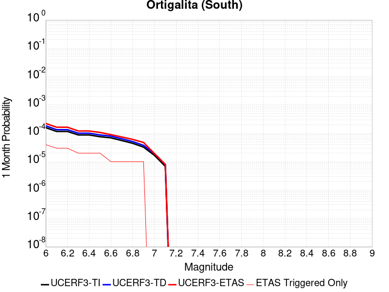 |  |  |

| Magnitude | 1 wk TI Prob | 1 wk TD Prob | 1 wk ETAS Prob | 1 wk ETAS/TD Gain | 1 wk ETAS Triggered Only | 1 mo TI Prob | 1 mo TD Prob | 1 mo ETAS Prob | 1 mo ETAS/TD Gain | 1 mo ETAS Triggered Only | 1 yr TI Prob | 1 yr TD Prob | 1 yr ETAS Prob | 1 yr ETAS/TD Gain | 1 yr ETAS Triggered Only | 10 yr TI Prob | 10 yr TD Prob | 10 yr ETAS Prob | 10 yr ETAS/TD Gain | 10 yr ETAS Triggered Only |
|-----|-----|-----|-----|-----|-----|-----|-----|-----|-----|-----|-----|-----|-----|-----|-----|-----|-----|-----|-----|-----|
| 6.0 | 3.72394E-5 | 4.325562E-5 | 2.4473792E-4 | 5.6579456 | 2.0149103E-4 | 1.5958765E-4 | 1.8536893E-4 | 3.8682262E-4 | 2.0867715 | 2.0149103E-4 | 0.0019412481 | 0.0022546875 | 0.0024557242 | 1.0891639 | 2.0149103E-4 | 0.019243775 | 0.022334497 | 0.022531487 | 1.00882 | 2.0149103E-4 |
| 6.1 | 2.7299884E-5 | 3.149204E-5 | 3.149204E-5 | 1.0 | 0.0 | 1.16994255E-4 | 1.3495922E-4 | 1.3495922E-4 | 1.0 | 0.0 | 0.0014234743 | 0.0016419457 | 0.0016419457 | 1.0 | 0.0 | 0.014143906 | 0.01630407 | 0.01630407 | 1.0 | 0.0 |
| 6.2 | 2.7299884E-5 | 3.149204E-5 | 3.149204E-5 | 1.0 | 0.0 | 1.16994255E-4 | 1.3495922E-4 | 1.3495922E-4 | 1.0 | 0.0 | 0.0014234743 | 0.0016419457 | 0.0016419457 | 1.0 | 0.0 | 0.014143906 | 0.01630407 | 0.01630407 | 1.0 | 0.0 |
| 6.3 | 2.0546433E-5 | 2.363145E-5 | 2.363145E-5 | 1.0 | 0.0 | 8.805317E-5 | 1.0127382E-4 | 1.0127382E-4 | 1.0 | 0.0 | 0.00107152 | 0.0012323303 | 0.0012323303 | 1.0 | 0.0 | 0.010663681 | 0.01225703 | 0.01225703 | 1.0 | 0.0 |
| 6.4 | 2.0546433E-5 | 2.363145E-5 | 2.363145E-5 | 1.0 | 0.0 | 8.805317E-5 | 1.0127382E-4 | 1.0127382E-4 | 1.0 | 0.0 | 0.00107152 | 0.0012323303 | 0.0012323303 | 1.0 | 0.0 | 0.010663681 | 0.01225703 | 0.01225703 | 1.0 | 0.0 |
| 6.5 | 1.7779594E-5 | 2.0446974E-5 | 2.0446974E-5 | 1.0 | 0.0 | 7.619603E-5 | 8.762702E-5 | 8.762702E-5 | 1.0 | 0.0 | 9.272918E-4 | 0.0010663504 | 0.0010663504 | 1.0 | 0.0 | 0.009234319 | 0.010613803 | 0.010613803 | 1.0 | 0.0 |
| 6.6 | 1.6272212E-5 | 1.8714967E-5 | 1.8714967E-5 | 1.0 | 0.0 | 6.973618E-5 | 8.0204605E-5 | 8.0204605E-5 | 1.0 | 0.0 | 8.487073E-4 | 9.760658E-4 | 9.760658E-4 | 1.0 | 0.0 | 0.008454733 | 0.009719091 | 0.009719091 | 1.0 | 0.0 |
| 6.7 | 1.3051484E-5 | 1.5038758E-5 | 1.5038758E-5 | 1.0 | 0.0 | 5.593373E-5 | 6.445028E-5 | 6.445028E-5 | 1.0 | 0.0 | 6.807804E-4 | 7.844092E-4 | 7.844092E-4 | 1.0 | 0.0 | 0.006786986 | 0.007817388 | 0.007817388 | 1.0 | 0.0 |
| 6.8 | 1.04277415E-5 | 1.1987235E-5 | 1.1987235E-5 | 1.0 | 0.0 | 4.4689557E-5 | 5.1372896E-5 | 5.1372896E-5 | 1.0 | 0.0 | 5.439595E-4 | 6.2529295E-4 | 6.2529295E-4 | 1.0 | 0.0 | 0.0054262993 | 0.00623609 | 0.00623609 | 1.0 | 0.0 |
| 6.9 | 7.639968E-6 | 8.791503E-6 | 8.791503E-6 | 1.0 | 0.0 | 3.274231E-5 | 3.767736E-5 | 3.767736E-5 | 1.0 | 0.0 | 3.9856473E-4 | 4.586312E-4 | 4.586312E-4 | 1.0 | 0.0 | 0.003978506 | 0.004577433 | 0.004577433 | 1.0 | 0.0 |
| 7.0 | 3.919831E-6 | 4.5334014E-6 | 4.5334014E-6 | 1.0 | 0.0 | 1.679917E-5 | 1.942873E-5 | 1.942873E-5 | 1.0 | 0.0 | 2.045107E-4 | 2.3652123E-4 | 2.3652123E-4 | 1.0 | 0.0 | 0.0020432258 | 0.0023629034 | 0.0023629034 | 1.0 | 0.0 |
| 7.1 | 1.6017933E-6 | 1.8570418E-6 | 1.8570418E-6 | 1.0 | 0.0 | 6.8648105E-6 | 7.958732E-6 | 7.958732E-6 | 1.0 | 0.0 | 8.357586E-5 | 9.689432E-5 | 9.689432E-5 | 1.0 | 0.0 | 8.3544437E-4 | 9.686254E-4 | 9.686254E-4 | 1.0 | 0.0 |

## Chino alt 1
*[(top)](#table-of-contents)*

| 1 Week | 1 Month | 1 Year | 10 Year |
|-----|-----|-----|-----|
|  |  | 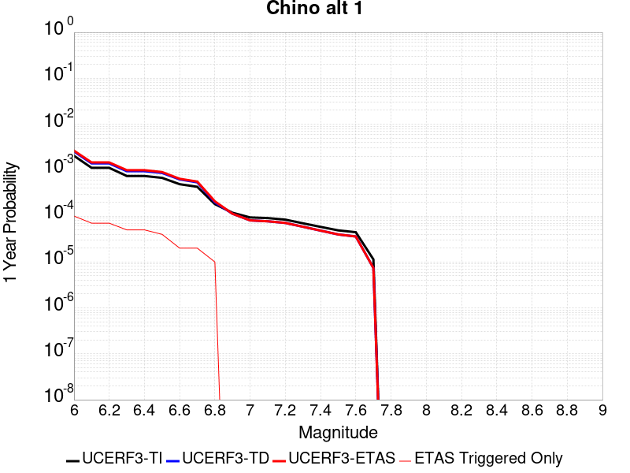 |  |

| Magnitude | 1 wk TI Prob | 1 wk TD Prob | 1 wk ETAS Prob | 1 wk ETAS/TD Gain | 1 wk ETAS Triggered Only | 1 mo TI Prob | 1 mo TD Prob | 1 mo ETAS Prob | 1 mo ETAS/TD Gain | 1 mo ETAS Triggered Only | 1 yr TI Prob | 1 yr TD Prob | 1 yr ETAS Prob | 1 yr ETAS/TD Gain | 1 yr ETAS Triggered Only | 10 yr TI Prob | 10 yr TD Prob | 10 yr ETAS Prob | 10 yr ETAS/TD Gain | 10 yr ETAS Triggered Only |
|-----|-----|-----|-----|-----|-----|-----|-----|-----|-----|-----|-----|-----|-----|-----|-----|-----|-----|-----|-----|-----|
| 6.0 | 3.939946E-5 | 4.8948554E-5 | 2.5042973E-4 | 5.1161823 | 2.0149103E-4 | 1.6884391E-4 | 2.097656E-4 | 4.1121437E-4 | 1.9603518 | 2.0149103E-4 | 0.0020537362 | 0.0025513945 | 0.0027523716 | 1.0787714 | 2.0149103E-4 | 0.020348595 | 0.025277847 | 0.025474245 | 1.0077696 | 2.0149103E-4 |
| 6.1 | 2.1505624E-5 | 2.6879026E-5 | 2.2836465E-4 | 8.4960165 | 2.0149103E-4 | 9.2163704E-5 | 1.1519137E-4 | 3.166592E-4 | 2.7489836 | 2.0149103E-4 | 0.0011215154 | 0.001401664 | 0.0016028726 | 1.1435498 | 2.0149103E-4 | 0.011158722 | 0.013945141 | 0.014143823 | 1.0142473 | 2.0149103E-4 |
| 6.2 | 2.1505624E-5 | 2.6879026E-5 | 2.2836465E-4 | 8.4960165 | 2.0149103E-4 | 9.2163704E-5 | 1.1519137E-4 | 3.166592E-4 | 2.7489836 | 2.0149103E-4 | 0.0011215154 | 0.001401664 | 0.0016028726 | 1.1435498 | 2.0149103E-4 | 0.011158722 | 0.013945141 | 0.014143823 | 1.0142473 | 2.0149103E-4 |
| 6.3 | 1.4290785E-5 | 1.8165128E-5 | 1.8165128E-5 | 1.0 | 0.0 | 6.1244784E-5 | 7.784848E-5 | 7.784848E-5 | 1.0 | 0.0 | 7.454001E-4 | 9.4743853E-4 | 9.4743853E-4 | 1.0 | 0.0 | 0.007429048 | 0.0094444575 | 0.0094444575 | 1.0 | 0.0 |
| 6.4 | 1.4290785E-5 | 1.8165128E-5 | 1.8165128E-5 | 1.0 | 0.0 | 6.1244784E-5 | 7.784848E-5 | 7.784848E-5 | 1.0 | 0.0 | 7.454001E-4 | 9.4743853E-4 | 9.4743853E-4 | 1.0 | 0.0 | 0.007429048 | 0.0094444575 | 0.0094444575 | 1.0 | 0.0 |
| 6.5 | 1.3017944E-5 | 1.6652088E-5 | 1.6652088E-5 | 1.0 | 0.0 | 5.5789995E-5 | 7.136439E-5 | 7.136439E-5 | 1.0 | 0.0 | 6.790315E-4 | 8.685589E-4 | 8.685589E-4 | 1.0 | 0.0 | 0.0067696036 | 0.008661949 | 0.008661949 | 1.0 | 0.0 |
| 6.6 | 9.470016E-6 | 1.2039424E-5 | 1.2039424E-5 | 1.0 | 0.0 | 4.058515E-5 | 5.1596704E-5 | 5.1596704E-5 | 1.0 | 0.0 | 4.940122E-4 | 6.280428E-4 | 6.280428E-4 | 1.0 | 0.0 | 0.004929154 | 0.0062718987 | 0.0062718987 | 1.0 | 0.0 |
| 6.7 | 8.314155E-6 | 1.0407736E-5 | 1.0407736E-5 | 1.0 | 0.0 | 3.5631605E-5 | 4.4604003E-5 | 4.4604003E-5 | 1.0 | 0.0 | 4.3372845E-4 | 5.429507E-4 | 5.429507E-4 | 1.0 | 0.0 | 0.004328829 | 0.005425775 | 0.005425775 | 1.0 | 0.0 |
| 6.8 | 3.4856364E-6 | 3.8133708E-6 | 3.8133708E-6 | 1.0 | 0.0 | 1.4938357E-5 | 1.6342927E-5 | 1.6342927E-5 | 1.0 | 0.0 | 1.8185932E-4 | 1.9895904E-4 | 1.9895904E-4 | 1.0 | 0.0 | 0.0018171056 | 0.0019894864 | 0.0019894864 | 1.0 | 0.0 |
| 6.9 | 2.2645952E-6 | 2.1529022E-6 | 2.1529022E-6 | 1.0 | 0.0 | 9.705372E-6 | 9.226692E-6 | 9.226692E-6 | 1.0 | 0.0 | 1.18156495E-4 | 1.123294E-4 | 1.123294E-4 | 1.0 | 0.0 | 0.0011809369 | 0.0011233423 | 0.0011233423 | 1.0 | 0.0 |
| 7.0 | 1.7864003E-6 | 1.5430785E-6 | 1.5430785E-6 | 1.0 | 0.0 | 7.655979E-6 | 6.613177E-6 | 6.613177E-6 | 1.0 | 0.0 | 9.3207556E-5 | 8.051251E-5 | 8.051251E-5 | 1.0 | 0.0 | 9.316847E-4 | 8.0528046E-4 | 8.0528046E-4 | 1.0 | 0.0 |
| 7.1 | 1.7315456E-6 | 1.4733511E-6 | 1.4733511E-6 | 1.0 | 0.0 | 7.420889E-6 | 6.3143466E-6 | 6.3143466E-6 | 1.0 | 0.0 | 9.034557E-5 | 7.6874516E-5 | 7.6874516E-5 | 1.0 | 0.0 | 9.0308854E-4 | 7.6891703E-4 | 7.6891703E-4 | 1.0 | 0.0 |
| 7.2 | 1.6008337E-6 | 1.3574215E-6 | 1.3574215E-6 | 1.0 | 0.0 | 6.860698E-6 | 5.817508E-6 | 5.817508E-6 | 1.0 | 0.0 | 8.352579E-5 | 7.082591E-5 | 7.082591E-5 | 1.0 | 0.0 | 8.34944E-4 | 7.0845755E-4 | 7.0845755E-4 | 1.0 | 0.0 |
| 7.3 | 1.3320939E-6 | 1.121782E-6 | 1.121782E-6 | 1.0 | 0.0 | 5.7089615E-6 | 4.807629E-6 | 4.807629E-6 | 1.0 | 0.0 | 6.9504385E-5 | 5.8531357E-5 | 5.8531357E-5 | 1.0 | 0.0 | 6.9482654E-4 | 5.8530393E-4 | 5.8530393E-4 | 1.0 | 0.0 |
| 7.4 | 1.114294E-6 | 9.237111E-7 | 9.237111E-7 | 1.0 | 0.0 | 4.775537E-6 | 3.958756E-6 | 3.958756E-6 | 1.0 | 0.0 | 5.8140613E-5 | 4.8196827E-5 | 4.8196827E-5 | 1.0 | 0.0 | 5.81254E-4 | 4.8188053E-4 | 4.8188053E-4 | 1.0 | 0.0 |
| 7.5 | 9.354081E-7 | 7.6234323E-7 | 7.6234323E-7 | 1.0 | 0.0 | 4.0088858E-6 | 3.2671815E-6 | 3.2671815E-6 | 1.0 | 0.0 | 4.8807087E-5 | 3.9777242E-5 | 3.9777242E-5 | 1.0 | 0.0 | 4.879637E-4 | 3.977046E-4 | 3.977046E-4 | 1.0 | 0.0 |
| 7.6 | 8.521771E-7 | 6.88071E-7 | 6.88071E-7 | 1.0 | 0.0 | 3.6521824E-6 | 2.9488726E-6 | 2.9488726E-6 | 1.0 | 0.0 | 4.4464414E-5 | 3.5901965E-5 | 3.5901965E-5 | 1.0 | 0.0 | 4.4455516E-4 | 3.589648E-4 | 3.589648E-4 | 1.0 | 0.0 |
| 7.7 | 2.1803626E-7 | 1.418649E-7 | 1.418649E-7 | 1.0 | 0.0 | 9.344408E-7 | 6.079923E-7 | 6.079923E-7 | 1.0 | 0.0 | 1.1376757E-5 | 7.4022914E-6 | 7.4022914E-6 | 1.0 | 0.0 | 1.13761744E-4 | 7.402141E-5 | 7.402141E-5 | 1.0 | 0.0 |

## Lake Isabella (Seismicity)
*[(top)](#table-of-contents)*

| 1 Week | 1 Month | 1 Year | 10 Year |
|-----|-----|-----|-----|
|  |  |  |  |

| Magnitude | 1 wk TI Prob | 1 wk TD Prob | 1 wk ETAS Prob | 1 wk ETAS/TD Gain | 1 wk ETAS Triggered Only | 1 mo TI Prob | 1 mo TD Prob | 1 mo ETAS Prob | 1 mo ETAS/TD Gain | 1 mo ETAS Triggered Only | 1 yr TI Prob | 1 yr TD Prob | 1 yr ETAS Prob | 1 yr ETAS/TD Gain | 1 yr ETAS Triggered Only | 10 yr TI Prob | 10 yr TD Prob | 10 yr ETAS Prob | 10 yr ETAS/TD Gain | 10 yr ETAS Triggered Only |
|-----|-----|-----|-----|-----|-----|-----|-----|-----|-----|-----|-----|-----|-----|-----|-----|-----|-----|-----|-----|-----|
| 6.0 | 9.431637E-6 | 9.741651E-6 | 9.741651E-6 | 1.0 | 0.0 | 4.0420677E-5 | 4.1749343E-5 | 4.1749343E-5 | 1.0 | 0.0 | 4.920106E-4 | 5.0819275E-4 | 5.0819275E-4 | 1.0 | 0.0 | 0.004909227 | 0.005071599 | 0.005272068 | 1.0395278 | 2.0149103E-4 |
| 6.1 | 9.431637E-6 | 9.741651E-6 | 9.741651E-6 | 1.0 | 0.0 | 4.0420677E-5 | 4.1749343E-5 | 4.1749343E-5 | 1.0 | 0.0 | 4.920106E-4 | 5.0819275E-4 | 5.0819275E-4 | 1.0 | 0.0 | 0.004909227 | 0.005071599 | 0.005272068 | 1.0395278 | 2.0149103E-4 |
| 6.2 | 9.431637E-6 | 9.741651E-6 | 9.741651E-6 | 1.0 | 0.0 | 4.0420677E-5 | 4.1749343E-5 | 4.1749343E-5 | 1.0 | 0.0 | 4.920106E-4 | 5.0819275E-4 | 5.0819275E-4 | 1.0 | 0.0 | 0.004909227 | 0.005071599 | 0.005272068 | 1.0395278 | 2.0149103E-4 |
| 6.3 | 9.431637E-6 | 9.741651E-6 | 9.741651E-6 | 1.0 | 0.0 | 4.0420677E-5 | 4.1749343E-5 | 4.1749343E-5 | 1.0 | 0.0 | 4.920106E-4 | 5.0819275E-4 | 5.0819275E-4 | 1.0 | 0.0 | 0.004909227 | 0.005071599 | 0.005272068 | 1.0395278 | 2.0149103E-4 |
| 6.4 | 5.144063E-6 | 5.3000763E-6 | 5.3000763E-6 | 1.0 | 0.0 | 2.2045799E-5 | 2.2714434E-5 | 2.2714434E-5 | 1.0 | 0.0 | 2.6837454E-4 | 2.765166E-4 | 2.765166E-4 | 1.0 | 0.0 | 0.0026805066 | 0.0027620657 | 0.0029630002 | 1.072748 | 2.0149103E-4 |
| 6.5 | 5.144063E-6 | 5.3000763E-6 | 5.3000763E-6 | 1.0 | 0.0 | 2.2045799E-5 | 2.2714434E-5 | 2.2714434E-5 | 1.0 | 0.0 | 2.6837454E-4 | 2.765166E-4 | 2.765166E-4 | 1.0 | 0.0 | 0.0026805066 | 0.0027620657 | 0.0029630002 | 1.072748 | 2.0149103E-4 |
| 6.6 | 3.4009804E-6 | 3.498786E-6 | 3.498786E-6 | 1.0 | 0.0 | 1.4575549E-5 | 1.4994721E-5 | 1.4994721E-5 | 1.0 | 0.0 | 1.7744285E-4 | 1.8254704E-4 | 1.8254704E-4 | 1.0 | 0.0 | 0.0017730123 | 0.0018241286 | 0.002025252 | 1.1102573 | 2.0149103E-4 |
| 6.7 | 3.3880428E-6 | 3.4856528E-6 | 3.4856528E-6 | 1.0 | 0.0 | 1.4520103E-5 | 1.4938435E-5 | 1.4938435E-5 | 1.0 | 0.0 | 1.767679E-4 | 1.8186188E-4 | 1.8186188E-4 | 1.0 | 0.0 | 0.0017662736 | 0.0018172882 | 0.002018413 | 1.1106731 | 2.0149103E-4 |
| 6.8 | 2.6582E-6 | 2.7337003E-6 | 2.7337003E-6 | 1.0 | 0.0 | 1.1392236E-5 | 1.1715813E-5 | 1.1715813E-5 | 1.0 | 0.0 | 1.3869164E-4 | 1.4263204E-4 | 1.4263204E-4 | 1.0 | 0.0 | 0.0013860512 | 0.0014255369 | 0.0016267407 | 1.1411425 | 2.0149103E-4 |
| 6.9 | 2.406011E-6 | 2.4743288E-6 | 2.4743288E-6 | 1.0 | 0.0 | 1.0311434E-5 | 1.0604231E-5 | 1.0604231E-5 | 1.0 | 0.0 | 1.2553448E-4 | 1.2910018E-4 | 1.2910018E-4 | 1.0 | 0.0 | 0.0012546359 | 0.0012903814 | 0.0014916124 | 1.155947 | 2.0149103E-4 |
| 7.0 | 1.6953097E-6 | 1.7429371E-6 | 1.7429371E-6 | 1.0 | 0.0 | 7.265593E-6 | 7.469715E-6 | 7.469715E-6 | 1.0 | 0.0 | 8.8455E-5 | 9.094104E-5 | 9.094104E-5 | 1.0 | 0.0 | 8.84198E-4 | 9.09141E-4 | 0.0011104489 | 1.2214265 | 2.0149103E-4 |
| 7.1 | 3.5013824E-7 | 3.5714822E-7 | 3.5714822E-7 | 1.0 | 0.0 | 1.5005916E-6 | 1.5306344E-6 | 1.5306344E-6 | 1.0 | 0.0 | 1.826955E-5 | 1.8635317E-5 | 1.8635317E-5 | 1.0 | 0.0 | 1.8268047E-4 | 1.863378E-4 | 1.863378E-4 | 1.0 | 0.0 |
| 7.2 | 2.2321095E-7 | 2.2750574E-7 | 2.2750574E-7 | 1.0 | 0.0 | 9.56618E-7 | 9.750242E-7 | 9.750242E-7 | 1.0 | 0.0 | 1.1646762E-5 | 1.1870856E-5 | 1.1870856E-5 | 1.0 | 0.0 | 1.1646151E-4 | 1.1870232E-4 | 1.1870232E-4 | 1.0 | 0.0 |
| 7.3 | 1.5760406E-7 | 1.6060922E-7 | 1.6060922E-7 | 1.0 | 0.0 | 6.7544585E-7 | 6.8832503E-7 | 6.8832503E-7 | 1.0 | 0.0 | 8.223522E-6 | 8.380326E-6 | 8.380326E-6 | 1.0 | 0.0 | 8.2232174E-5 | 8.3800165E-5 | 8.3800165E-5 | 1.0 | 0.0 |
| 7.4 | 1.1216497E-7 | 1.1431706E-7 | 1.1431706E-7 | 1.0 | 0.0 | 4.8070694E-7 | 4.899302E-7 | 4.899302E-7 | 1.0 | 0.0 | 5.852591E-6 | 5.964884E-6 | 5.964884E-6 | 1.0 | 0.0 | 5.8524372E-5 | 5.9647282E-5 | 5.9647282E-5 | 1.0 | 0.0 |
| 7.5 | 4.885185E-8 | 4.9787737E-8 | 4.9787737E-8 | 1.0 | 0.0 | 2.0936506E-7 | 2.13376E-7 | 2.13376E-7 | 1.0 | 0.0 | 2.5490165E-6 | 2.59785E-6 | 2.59785E-6 | 1.0 | 0.0 | 2.5489873E-5 | 2.5978214E-5 | 2.5978214E-5 | 1.0 | 0.0 |
| 7.6 | 1.504641E-9 | 1.5317903E-9 | 1.5317903E-9 | 1.0 | 0.0 | 6.4484613E-9 | 6.5648154E-9 | 6.5648154E-9 | 1.0 | 0.0 | 7.851001E-8 | 7.992663E-8 | 7.992663E-8 | 1.0 | 0.0 | 7.8509987E-7 | 7.992663E-7 | 7.992663E-7 | 1.0 | 0.0 |

## San Jacinto (Superstition Mtn)
*[(top)](#table-of-contents)*

| 1 Week | 1 Month | 1 Year | 10 Year |
|-----|-----|-----|-----|
|  |  |  |  |

| Magnitude | 1 wk TI Prob | 1 wk TD Prob | 1 wk ETAS Prob | 1 wk ETAS/TD Gain | 1 wk ETAS Triggered Only | 1 mo TI Prob | 1 mo TD Prob | 1 mo ETAS Prob | 1 mo ETAS/TD Gain | 1 mo ETAS Triggered Only | 1 yr TI Prob | 1 yr TD Prob | 1 yr ETAS Prob | 1 yr ETAS/TD Gain | 1 yr ETAS Triggered Only | 10 yr TI Prob | 10 yr TD Prob | 10 yr ETAS Prob | 10 yr ETAS/TD Gain | 10 yr ETAS Triggered Only |
|-----|-----|-----|-----|-----|-----|-----|-----|-----|-----|-----|-----|-----|-----|-----|-----|-----|-----|-----|-----|-----|
| 6.0 | 6.4193904E-5 | 9.599367E-5 | 2.9746536E-4 | 3.0988019 | 2.0149103E-4 | 2.7508775E-4 | 4.1134638E-4 | 6.127545E-4 | 1.4896315 | 2.0149103E-4 | 0.0033440501 | 0.0049980893 | 0.005198573 | 1.0401121 | 2.0149103E-4 | 0.03294174 | 0.048823986 | 0.049015637 | 1.0039254 | 2.0149103E-4 |
| 6.1 | 6.4193904E-5 | 9.599367E-5 | 2.9746536E-4 | 3.0988019 | 2.0149103E-4 | 2.7508775E-4 | 4.1134638E-4 | 6.127545E-4 | 1.4896315 | 2.0149103E-4 | 0.0033440501 | 0.0049980893 | 0.005198573 | 1.0401121 | 2.0149103E-4 | 0.03294174 | 0.048823986 | 0.049015637 | 1.0039254 | 2.0149103E-4 |
| 6.2 | 5.7023593E-5 | 8.3144434E-5 | 2.846187E-4 | 3.4231844 | 2.0149103E-4 | 2.4436394E-4 | 3.5629404E-4 | 5.5771327E-4 | 1.5653175 | 2.0149103E-4 | 0.002971072 | 0.0043308944 | 0.004531513 | 1.0463226 | 2.0149103E-4 | 0.029316625 | 0.04250403 | 0.042696957 | 1.004539 | 2.0149103E-4 |
| 6.3 | 5.6940098E-5 | 8.298979E-5 | 2.844641E-4 | 3.4276998 | 2.0149103E-4 | 2.4400617E-4 | 3.5563146E-4 | 5.5705087E-4 | 1.5663711 | 2.0149103E-4 | 0.002966728 | 0.00432286 | 0.00452348 | 1.0464091 | 2.0149103E-4 | 0.029274331 | 0.042427283 | 0.042620227 | 1.0045476 | 2.0149103E-4 |
| 6.4 | 5.4171585E-5 | 7.7483564E-5 | 2.78959E-4 | 3.6002345 | 2.0149103E-4 | 2.3214328E-4 | 3.3203943E-4 | 5.3346355E-4 | 1.6066271 | 2.0149103E-4 | 0.0028226813 | 0.0040367353 | 0.004237413 | 1.0497129 | 2.0149103E-4 | 0.02787096 | 0.03971653 | 0.03991002 | 1.0048717 | 2.0149103E-4 |
| 6.5 | 4.375144E-5 | 5.642133E-5 | 2.57901E-4 | 4.570984 | 2.0149103E-4 | 1.874927E-4 | 2.4178992E-4 | 4.4323225E-4 | 1.8331295 | 2.0149103E-4 | 0.0022803338 | 0.002940994 | 0.0031418924 | 1.0683097 | 2.0149103E-4 | 0.022570757 | 0.029236801 | 0.029432401 | 1.0066901 | 2.0149103E-4 |
| 6.6 | 2.772192E-5 | 2.5488358E-5 | 2.2697425E-4 | 8.905017 | 2.0149103E-4 | 1.1880282E-4 | 1.09231354E-4 | 3.107004E-4 | 2.844425 | 2.0149103E-4 | 0.0014454646 | 0.0013290998 | 0.0015303231 | 1.1513982 | 2.0149103E-4 | 0.014360986 | 0.01354049 | 0.013739252 | 1.0146792 | 2.0149103E-4 |
| 6.7 | 2.7124124E-5 | 2.4699386E-5 | 2.2618544E-4 | 9.157533 | 2.0149103E-4 | 1.1624106E-4 | 1.05850326E-4 | 3.0732004E-4 | 2.903345 | 2.0149103E-4 | 0.0014143161 | 0.001287985 | 0.0014892166 | 1.1562375 | 2.0149103E-4 | 0.014053487 | 0.013133943 | 0.013332788 | 1.0151397 | 2.0149103E-4 |
| 6.8 | 2.5475807E-5 | 2.216446E-5 | 2.2365103E-4 | 10.090525 | 2.0149103E-4 | 1.0917746E-4 | 9.4987154E-5 | 2.9645904E-4 | 3.1210437 | 2.0149103E-4 | 0.001328425 | 0.001155867 | 0.0013571251 | 1.1741188 | 2.0149103E-4 | 0.0132051185 | 0.011822182 | 0.012021291 | 1.016842 | 2.0149103E-4 |
| 6.9 | 2.1162023E-5 | 1.7626244E-5 | 2.1911373E-4 | 12.4311075 | 2.0149103E-4 | 9.069123E-5 | 7.5538876E-5 | 2.7701468E-4 | 3.6671803 | 2.0149103E-4 | 0.0011036064 | 9.193016E-4 | 0.0011206074 | 1.2189769 | 2.0149103E-4 | 0.010981417 | 0.00944688 | 0.009646467 | 1.0211273 | 2.0149103E-4 |
| 7.0 | 1.8754288E-5 | 1.6161559E-5 | 2.1764933E-4 | 13.467101 | 2.0149103E-4 | 8.037304E-5 | 6.9261994E-5 | 2.7073908E-4 | 3.9089124 | 2.0149103E-4 | 9.781026E-4 | 8.4294105E-4 | 0.0010442622 | 1.2388319 | 2.0149103E-4 | 0.009738087 | 0.008670042 | 0.008869786 | 1.0230384 | 2.0149103E-4 |
| 7.1 | 1.8678527E-5 | 1.6086702E-5 | 2.1757449E-4 | 13.525115 | 2.0149103E-4 | 8.0048376E-5 | 6.89412E-5 | 2.7041833E-4 | 3.922449 | 2.0149103E-4 | 9.7415317E-4 | 8.3903834E-4 | 0.0010403603 | 1.2399437 | 2.0149103E-4 | 0.009698939 | 0.008630998 | 0.00883075 | 1.0231435 | 2.0149103E-4 |
| 7.2 | 1.7804578E-5 | 1.5381282E-5 | 2.1686922E-4 | 14.099555 | 2.0149103E-4 | 7.6303106E-5 | 6.5918124E-5 | 2.6739587E-4 | 4.056485 | 2.0149103E-4 | 9.285943E-4 | 8.022599E-4 | 0.0010035892 | 1.2509528 | 2.0149103E-4 | 0.009247236 | 0.008262311 | 0.008462138 | 1.0241853 | 2.0149103E-4 |
| 7.3 | 1.6583685E-5 | 1.4530388E-5 | 2.160185E-4 | 14.866671 | 2.0149103E-4 | 7.1070994E-5 | 6.227162E-5 | 2.6375012E-4 | 4.2354784 | 2.0149103E-4 | 8.649459E-4 | 7.5789524E-4 | 9.5923356E-4 | 1.2656546 | 2.0149103E-4 | 0.00861587 | 0.007817623 | 0.008017539 | 1.0255724 | 2.0149103E-4 |
| 7.4 | 1.6387552E-5 | 1.4395274E-5 | 2.1588341E-4 | 14.996825 | 2.0149103E-4 | 7.023047E-5 | 6.169258E-5 | 2.6317118E-4 | 4.265848 | 2.0149103E-4 | 8.5472054E-4 | 7.5085036E-4 | 9.521901E-4 | 1.268149 | 2.0149103E-4 | 0.008514405 | 0.0077470057 | 0.007946936 | 1.0258074 | 2.0149103E-4 |
| 7.5 | 1.5790754E-5 | 1.4035962E-5 | 2.1552417E-4 | 15.355141 | 2.0149103E-4 | 6.767291E-5 | 6.0152746E-5 | 2.6163165E-4 | 4.349455 | 2.0149103E-4 | 8.236062E-4 | 7.321156E-4 | 9.334591E-4 | 1.2750161 | 2.0149103E-4 | 0.008205604 | 0.007557569 | 0.0077575375 | 1.0264593 | 2.0149103E-4 |
| 7.6 | 1.4248672E-5 | 1.3054932E-5 | 2.1454334E-4 | 16.433891 | 2.0149103E-4 | 6.106431E-5 | 5.594852E-5 | 2.5742827E-4 | 4.6011634 | 2.0149103E-4 | 7.432043E-4 | 6.8096205E-4 | 8.823159E-4 | 1.2956902 | 2.0149103E-4 | 0.007407237 | 0.0070401574 | 0.0072402298 | 1.0284188 | 2.0149103E-4 |
| 7.7 | 1.15449975E-5 | 1.090368E-5 | 2.1239252E-4 | 19.478975 | 2.0149103E-4 | 4.947762E-5 | 4.6729223E-5 | 2.4821085E-4 | 5.3116837 | 2.0149103E-4 | 6.022235E-4 | 5.687805E-4 | 7.7015697E-4 | 1.3540494 | 2.0149103E-4 | 0.006005941 | 0.0059101824 | 0.0061104824 | 1.0338907 | 2.0149103E-4 |
| 7.8 | 9.1391985E-6 | 9.514299E-6 | 2.1100341E-4 | 22.177505 | 2.0149103E-4 | 3.9167408E-5 | 4.0774932E-5 | 2.4225775E-4 | 5.9413404 | 2.0149103E-4 | 4.767588E-4 | 4.963223E-4 | 6.9771335E-4 | 1.4057666 | 2.0149103E-4 | 0.0047573727 | 0.0051766867 | 0.005377135 | 1.0387213 | 2.0149103E-4 |
| 7.9 | 6.973017E-6 | 7.3821784E-6 | 7.3821784E-6 | 1.0 | 0.0 | 2.9884017E-5 | 3.1637526E-5 | 3.1637526E-5 | 1.0 | 0.0 | 3.6377716E-4 | 3.8511935E-4 | 3.8511935E-4 | 1.0 | 0.0 | 0.0036318225 | 0.0040517948 | 0.0040517948 | 1.0 | 0.0 |
| 8.0 | 5.7638235E-6 | 6.259972E-6 | 6.259972E-6 | 1.0 | 0.0 | 2.4701867E-5 | 2.6828178E-5 | 2.6828178E-5 | 1.0 | 0.0 | 3.0070372E-4 | 3.2658462E-4 | 3.2658462E-4 | 1.0 | 0.0 | 0.0030029714 | 0.0034534496 | 0.0034534496 | 1.0 | 0.0 |
| 8.1 | 5.1124434E-6 | 5.4956718E-6 | 5.4956718E-6 | 1.0 | 0.0 | 2.1910288E-5 | 2.355267E-5 | 2.355267E-5 | 1.0 | 0.0 | 2.6672508E-4 | 2.867165E-4 | 2.867165E-4 | 1.0 | 0.0 | 0.0026640517 | 0.003040336 | 0.003040336 | 1.0 | 0.0 |
| 8.2 | 1.1075938E-6 | 5.336568E-7 | 5.336568E-7 | 1.0 | 0.0 | 4.7468216E-6 | 2.2870988E-6 | 2.2870988E-6 | 1.0 | 0.0 | 5.779102E-5 | 2.7845093E-5 | 2.7845093E-5 | 1.0 | 0.0 | 5.777599E-4 | 3.1346595E-4 | 3.1346595E-4 | 1.0 | 0.0 |
| 8.3 | 1.3584393E-8 | 4.473836E-9 | 4.473836E-9 | 1.0 | 0.0 | 5.8218827E-8 | 1.9173582E-8 | 1.9173582E-8 | 1.0 | 0.0 | 7.0881396E-7 | 2.3343837E-7 | 2.3343837E-7 | 1.0 | 0.0 | 7.0881174E-6 | 2.6163038E-6 | 2.6163038E-6 | 1.0 | 0.0 |

## Kern Canyon (Lake Isabella) 2011
*[(top)](#table-of-contents)*

| 1 Week | 1 Month | 1 Year | 10 Year |
|-----|-----|-----|-----|
|  |  |  |  |

| Magnitude | 1 wk TI Prob | 1 wk TD Prob | 1 wk ETAS Prob | 1 wk ETAS/TD Gain | 1 wk ETAS Triggered Only | 1 mo TI Prob | 1 mo TD Prob | 1 mo ETAS Prob | 1 mo ETAS/TD Gain | 1 mo ETAS Triggered Only | 1 yr TI Prob | 1 yr TD Prob | 1 yr ETAS Prob | 1 yr ETAS/TD Gain | 1 yr ETAS Triggered Only | 10 yr TI Prob | 10 yr TD Prob | 10 yr ETAS Prob | 10 yr ETAS/TD Gain | 10 yr ETAS Triggered Only |
|-----|-----|-----|-----|-----|-----|-----|-----|-----|-----|-----|-----|-----|-----|-----|-----|-----|-----|-----|-----|-----|
| 6.0 | 4.2387383E-6 | 4.001639E-6 | 4.001639E-6 | 1.0 | 0.0 | 1.8165894E-5 | 1.7149778E-5 | 1.7149778E-5 | 1.0 | 0.0 | 2.2114732E-4 | 2.087804E-4 | 2.087804E-4 | 1.0 | 0.0 | 0.0022092736 | 0.0020860266 | 0.0022870973 | 1.0963893 | 2.0149103E-4 |
| 6.1 | 4.2387383E-6 | 4.001639E-6 | 4.001639E-6 | 1.0 | 0.0 | 1.8165894E-5 | 1.7149778E-5 | 1.7149778E-5 | 1.0 | 0.0 | 2.2114732E-4 | 2.087804E-4 | 2.087804E-4 | 1.0 | 0.0 | 0.0022092736 | 0.0020860266 | 0.0022870973 | 1.0963893 | 2.0149103E-4 |
| 6.2 | 4.2387383E-6 | 4.001639E-6 | 4.001639E-6 | 1.0 | 0.0 | 1.8165894E-5 | 1.7149778E-5 | 1.7149778E-5 | 1.0 | 0.0 | 2.2114732E-4 | 2.087804E-4 | 2.087804E-4 | 1.0 | 0.0 | 0.0022092736 | 0.0020860266 | 0.0022870973 | 1.0963893 | 2.0149103E-4 |
| 6.3 | 4.2387383E-6 | 4.001639E-6 | 4.001639E-6 | 1.0 | 0.0 | 1.8165894E-5 | 1.7149778E-5 | 1.7149778E-5 | 1.0 | 0.0 | 2.2114732E-4 | 2.087804E-4 | 2.087804E-4 | 1.0 | 0.0 | 0.0022092736 | 0.0020860266 | 0.0022870973 | 1.0963893 | 2.0149103E-4 |
| 6.4 | 4.2387383E-6 | 4.001639E-6 | 4.001639E-6 | 1.0 | 0.0 | 1.8165894E-5 | 1.7149778E-5 | 1.7149778E-5 | 1.0 | 0.0 | 2.2114732E-4 | 2.087804E-4 | 2.087804E-4 | 1.0 | 0.0 | 0.0022092736 | 0.0020860266 | 0.0022870973 | 1.0963893 | 2.0149103E-4 |
| 6.5 | 2.7857532E-6 | 2.517867E-6 | 2.517867E-6 | 1.0 | 0.0 | 1.1938888E-5 | 1.0790815E-5 | 1.0790815E-5 | 1.0 | 0.0 | 1.4534626E-4 | 1.3137059E-4 | 1.3137059E-4 | 1.0 | 0.0 | 0.0014525123 | 0.001312962 | 0.0015141885 | 1.1532614 | 2.0149103E-4 |
| 6.6 | 2.2233348E-6 | 1.9441236E-6 | 1.9441236E-6 | 1.0 | 0.0 | 9.528543E-6 | 8.331932E-6 | 8.331932E-6 | 1.0 | 0.0 | 1.1600384E-4 | 1.01436635E-4 | 1.01436635E-4 | 1.0 | 0.0 | 0.001159433 | 0.001013912 | 0.0012151988 | 1.1985248 | 2.0149103E-4 |
| 6.7 | 2.1635126E-6 | 1.8835036E-6 | 1.8835036E-6 | 1.0 | 0.0 | 9.272164E-6 | 8.072134E-6 | 8.072134E-6 | 1.0 | 0.0 | 1.1288274E-4 | 9.827388E-5 | 9.827388E-5 | 1.0 | 0.0 | 0.0011282542 | 9.823124E-4 | 0.0011836054 | 1.2049177 | 2.0149103E-4 |
| 6.8 | 1.8685711E-6 | 1.5831425E-6 | 1.5831425E-6 | 1.0 | 0.0 | 8.008137E-6 | 6.784879E-6 | 6.784879E-6 | 1.0 | 0.0 | 9.74947E-5 | 8.260282E-5 | 8.260282E-5 | 1.0 | 0.0 | 9.745194E-4 | 8.2572614E-4 | 0.0010270508 | 1.2438153 | 2.0149103E-4 |
| 6.9 | 1.5815071E-6 | 1.3064928E-6 | 1.3064928E-6 | 1.0 | 0.0 | 6.77787E-6 | 5.599243E-6 | 5.599243E-6 | 1.0 | 0.0 | 8.251744E-5 | 6.816868E-5 | 6.816868E-5 | 1.0 | 0.0 | 8.248681E-4 | 6.8148033E-4 | 8.828341E-4 | 1.2954652 | 2.0149103E-4 |
| 7.0 | 1.3772564E-6 | 1.1210718E-6 | 1.1210718E-6 | 1.0 | 0.0 | 5.9025137E-6 | 4.8045845E-6 | 4.8045845E-6 | 1.0 | 0.0 | 7.186073E-5 | 5.8494268E-5 | 5.8494268E-5 | 1.0 | 0.0 | 7.18375E-4 | 5.847908E-4 | 7.8616396E-4 | 1.3443508 | 2.0149103E-4 |
| 7.1 | 1.0916998E-6 | 8.763777E-7 | 8.763777E-7 | 1.0 | 0.0 | 4.678705E-6 | 3.7558991E-6 | 3.7558991E-6 | 1.0 | 0.0 | 5.6961744E-5 | 4.5727127E-5 | 4.5727127E-5 | 1.0 | 0.0 | 5.6947145E-4 | 4.571785E-4 | 4.571785E-4 | 1.0 | 0.0 |
| 7.2 | 7.6277024E-7 | 5.901454E-7 | 5.901454E-7 | 1.0 | 0.0 | 3.2690114E-6 | 2.5291922E-6 | 2.5291922E-6 | 1.0 | 0.0 | 3.9799485E-5 | 3.0792486E-5 | 3.0792486E-5 | 1.0 | 0.0 | 3.9792358E-4 | 3.0788282E-4 | 3.0788282E-4 | 1.0 | 0.0 |
| 7.3 | 5.3265916E-7 | 4.3824414E-7 | 4.3824414E-7 | 1.0 | 0.0 | 2.282823E-6 | 1.878188E-6 | 1.878188E-6 | 1.0 | 0.0 | 2.7793016E-5 | 2.2866701E-5 | 2.2866701E-5 | 1.0 | 0.0 | 2.778954E-4 | 2.2864387E-4 | 2.2864387E-4 | 1.0 | 0.0 |
| 7.4 | 3.4946007E-7 | 3.006571E-7 | 3.006571E-7 | 1.0 | 0.0 | 1.497685E-6 | 1.2885298E-6 | 1.2885298E-6 | 1.0 | 0.0 | 1.8234163E-5 | 1.568774E-5 | 1.568774E-5 | 1.0 | 0.0 | 1.8232666E-4 | 1.5686655E-4 | 1.5686655E-4 | 1.0 | 0.0 |
| 7.5 | 1.8317026E-7 | 1.4244812E-7 | 1.4244812E-7 | 1.0 | 0.0 | 7.850152E-7 | 6.104918E-7 | 6.104918E-7 | 1.0 | 0.0 | 9.557518E-6 | 7.432713E-6 | 7.432713E-6 | 1.0 | 0.0 | 9.5571064E-5 | 7.432472E-5 | 7.432472E-5 | 1.0 | 0.0 |
| 7.6 | 2.572245E-8 | 1.7352555E-8 | 1.7352555E-8 | 1.0 | 0.0 | 1.10239064E-7 | 7.436809E-8 | 7.436809E-8 | 1.0 | 0.0 | 1.3421597E-6 | 9.054312E-7 | 9.054312E-7 | 1.0 | 0.0 | 1.3421517E-5 | 9.05428E-6 | 9.05428E-6 | 1.0 | 0.0 |

## Ozena
*[(top)](#table-of-contents)*

| 1 Week | 1 Month | 1 Year | 10 Year |
|-----|-----|-----|-----|
|  |  |  |  |

| Magnitude | 1 wk TI Prob | 1 wk TD Prob | 1 wk ETAS Prob | 1 wk ETAS/TD Gain | 1 wk ETAS Triggered Only | 1 mo TI Prob | 1 mo TD Prob | 1 mo ETAS Prob | 1 mo ETAS/TD Gain | 1 mo ETAS Triggered Only | 1 yr TI Prob | 1 yr TD Prob | 1 yr ETAS Prob | 1 yr ETAS/TD Gain | 1 yr ETAS Triggered Only | 10 yr TI Prob | 10 yr TD Prob | 10 yr ETAS Prob | 10 yr ETAS/TD Gain | 10 yr ETAS Triggered Only |
|-----|-----|-----|-----|-----|-----|-----|-----|-----|-----|-----|-----|-----|-----|-----|-----|-----|-----|-----|-----|-----|
| 6.0 | 1.4377547E-6 | 1.4513782E-6 | 1.4513782E-6 | 1.0 | 0.0 | 6.161791E-6 | 6.2201793E-6 | 2.0770996E-4 | 33.39292 | 2.0149103E-4 | 7.5017226E-5 | 7.572832E-5 | 2.772041E-4 | 3.6605074 | 2.0149103E-4 | 7.4991904E-4 | 7.570518E-4 | 9.583903E-4 | 1.2659508 | 2.0149103E-4 |
| 6.1 | 1.4377547E-6 | 1.4513782E-6 | 1.4513782E-6 | 1.0 | 0.0 | 6.161791E-6 | 6.2201793E-6 | 2.0770996E-4 | 33.39292 | 2.0149103E-4 | 7.5017226E-5 | 7.572832E-5 | 2.772041E-4 | 3.6605074 | 2.0149103E-4 | 7.4991904E-4 | 7.570518E-4 | 9.583903E-4 | 1.2659508 | 2.0149103E-4 |
| 6.2 | 1.4377547E-6 | 1.4513782E-6 | 1.4513782E-6 | 1.0 | 0.0 | 6.161791E-6 | 6.2201793E-6 | 2.0770996E-4 | 33.39292 | 2.0149103E-4 | 7.5017226E-5 | 7.572832E-5 | 2.772041E-4 | 3.6605074 | 2.0149103E-4 | 7.4991904E-4 | 7.570518E-4 | 9.583903E-4 | 1.2659508 | 2.0149103E-4 |
| 6.3 | 1.4377547E-6 | 1.4513782E-6 | 1.4513782E-6 | 1.0 | 0.0 | 6.161791E-6 | 6.2201793E-6 | 2.0770996E-4 | 33.39292 | 2.0149103E-4 | 7.5017226E-5 | 7.572832E-5 | 2.772041E-4 | 3.6605074 | 2.0149103E-4 | 7.4991904E-4 | 7.570518E-4 | 9.583903E-4 | 1.2659508 | 2.0149103E-4 |
| 6.4 | 1.4377547E-6 | 1.4513782E-6 | 1.4513782E-6 | 1.0 | 0.0 | 6.161791E-6 | 6.2201793E-6 | 2.0770996E-4 | 33.39292 | 2.0149103E-4 | 7.5017226E-5 | 7.572832E-5 | 2.772041E-4 | 3.6605074 | 2.0149103E-4 | 7.4991904E-4 | 7.570518E-4 | 9.583903E-4 | 1.2659508 | 2.0149103E-4 |
| 6.5 | 1.4377547E-6 | 1.4513782E-6 | 1.4513782E-6 | 1.0 | 0.0 | 6.161791E-6 | 6.2201793E-6 | 2.0770996E-4 | 33.39292 | 2.0149103E-4 | 7.5017226E-5 | 7.572832E-5 | 2.772041E-4 | 3.6605074 | 2.0149103E-4 | 7.4991904E-4 | 7.570518E-4 | 9.583903E-4 | 1.2659508 | 2.0149103E-4 |
| 6.6 | 1.4377547E-6 | 1.4513782E-6 | 1.4513782E-6 | 1.0 | 0.0 | 6.161791E-6 | 6.2201793E-6 | 2.0770996E-4 | 33.39292 | 2.0149103E-4 | 7.5017226E-5 | 7.572832E-5 | 2.772041E-4 | 3.6605074 | 2.0149103E-4 | 7.4991904E-4 | 7.570518E-4 | 9.583903E-4 | 1.2659508 | 2.0149103E-4 |
| 6.7 | 1.4377547E-6 | 1.4513782E-6 | 1.4513782E-6 | 1.0 | 0.0 | 6.161791E-6 | 6.2201793E-6 | 2.0770996E-4 | 33.39292 | 2.0149103E-4 | 7.5017226E-5 | 7.572832E-5 | 2.772041E-4 | 3.6605074 | 2.0149103E-4 | 7.4991904E-4 | 7.570518E-4 | 9.583903E-4 | 1.2659508 | 2.0149103E-4 |
| 6.8 | 9.223257E-7 | 9.317624E-7 | 9.317624E-7 | 1.0 | 0.0 | 3.9528186E-6 | 3.9932615E-6 | 2.0548349E-4 | 51.45756 | 2.0149103E-4 | 4.81245E-5 | 4.8616912E-5 | 2.5009815E-4 | 5.1442623 | 2.0149103E-4 | 4.811408E-4 | 4.860668E-4 | 6.874599E-4 | 1.4143322 | 2.0149103E-4 |
| 6.9 | 9.141515E-7 | 9.235371E-7 | 9.235371E-7 | 1.0 | 0.0 | 3.917786E-6 | 3.9580104E-6 | 2.0544825E-4 | 51.90695 | 2.0149103E-4 | 4.7698002E-5 | 4.818775E-5 | 2.4966907E-4 | 5.181173 | 2.0149103E-4 | 4.7687767E-4 | 4.8177704E-4 | 6.83171E-4 | 1.4180231 | 2.0149103E-4 |
| 7.0 | 8.767648E-7 | 8.8585773E-7 | 8.8585773E-7 | 1.0 | 0.0 | 3.757558E-6 | 3.7965276E-6 | 2.052868E-4 | 54.07225 | 2.0149103E-4 | 4.5747307E-5 | 4.6221783E-5 | 2.4770352E-4 | 5.3590207 | 2.0149103E-4 | 4.5737892E-4 | 4.6212564E-4 | 6.6352356E-4 | 1.4358077 | 2.0149103E-4 |
| 7.1 | 8.199402E-7 | 8.2853984E-7 | 8.2853984E-7 | 1.0 | 0.0 | 3.5140247E-6 | 3.5508804E-6 | 2.050412E-4 | 57.743763 | 2.0149103E-4 | 4.2782412E-5 | 4.323115E-5 | 2.4471348E-4 | 5.660582 | 2.0149103E-4 | 4.2774176E-4 | 4.322311E-4 | 6.336351E-4 | 1.4659635 | 2.0149103E-4 |
| 7.2 | 7.38705E-7 | 7.464262E-7 | 7.464262E-7 | 1.0 | 0.0 | 3.1658747E-6 | 3.198966E-6 | 2.0468935E-4 | 63.986103 | 2.0149103E-4 | 3.8543843E-5 | 3.894675E-5 | 2.4042993E-4 | 6.1732993 | 2.0149103E-4 | 3.853716E-4 | 3.8940276E-4 | 5.908153E-4 | 1.5172346 | 2.0149103E-4 |
| 7.3 | 6.490017E-7 | 6.557802E-7 | 6.557802E-7 | 1.0 | 0.0 | 2.7814328E-6 | 2.8104837E-6 | 2.0430094E-4 | 72.69245 | 2.0149103E-4 | 3.386342E-5 | 3.4217133E-5 | 2.3570127E-4 | 6.8883986 | 2.0149103E-4 | 3.3858258E-4 | 3.4212202E-4 | 5.435441E-4 | 1.5887434 | 2.0149103E-4 |
| 7.4 | 5.346736E-7 | 5.4022604E-7 | 5.4022604E-7 | 1.0 | 0.0 | 2.291456E-6 | 2.3152527E-6 | 2.0380582E-4 | 88.027466 | 2.0149103E-4 | 2.789812E-5 | 2.8187867E-5 | 2.2967323E-4 | 8.147946 | 2.0149103E-4 | 2.789462E-4 | 2.8184598E-4 | 4.8328022E-4 | 1.7146962 | 2.0149103E-4 |
| 7.5 | 2.939325E-7 | 2.9666057E-7 | 2.9666057E-7 | 1.0 | 0.0 | 1.25971E-6 | 1.271402E-6 | 1.271402E-6 | 1.0 | 0.0 | 1.5336862E-5 | 1.5479225E-5 | 1.5479225E-5 | 1.0 | 0.0 | 1.5335804E-4 | 1.5478309E-4 | 1.5478309E-4 | 1.0 | 0.0 |
| 7.6 | 1.4151905E-7 | 1.4253266E-7 | 1.4253266E-7 | 1.0 | 0.0 | 6.065101E-7 | 6.108541E-7 | 6.108541E-7 | 1.0 | 0.0 | 7.3842357E-6 | 7.4371237E-6 | 7.4371237E-6 | 1.0 | 0.0 | 7.38399E-5 | 7.436883E-5 | 7.436883E-5 | 1.0 | 0.0 |
| 7.7 | 4.4957577E-8 | 4.5252243E-8 | 4.5252243E-8 | 1.0 | 0.0 | 1.9267533E-7 | 1.9393818E-7 | 1.9393818E-7 | 1.0 | 0.0 | 2.3458194E-6 | 2.3611947E-6 | 2.3611947E-6 | 1.0 | 0.0 | 2.3457947E-5 | 2.3611707E-5 | 2.3611707E-5 | 1.0 | 0.0 |
| 7.8 | 5.9993255E-9 | 6.0412972E-9 | 6.0412972E-9 | 1.0 | 0.0 | 2.5711394E-8 | 2.5891273E-8 | 2.5891273E-8 | 1.0 | 0.0 | 3.1303617E-7 | 3.1522623E-7 | 3.1522623E-7 | 1.0 | 0.0 | 3.1303573E-6 | 3.1522588E-6 | 3.1522588E-6 | 1.0 | 0.0 |

## Pinto Mtn
*[(top)](#table-of-contents)*

| 1 Week | 1 Month | 1 Year | 10 Year |
|-----|-----|-----|-----|
|  |  |  |  |

| Magnitude | 1 wk TI Prob | 1 wk TD Prob | 1 wk ETAS Prob | 1 wk ETAS/TD Gain | 1 wk ETAS Triggered Only | 1 mo TI Prob | 1 mo TD Prob | 1 mo ETAS Prob | 1 mo ETAS/TD Gain | 1 mo ETAS Triggered Only | 1 yr TI Prob | 1 yr TD Prob | 1 yr ETAS Prob | 1 yr ETAS/TD Gain | 1 yr ETAS Triggered Only | 10 yr TI Prob | 10 yr TD Prob | 10 yr ETAS Prob | 10 yr ETAS/TD Gain | 10 yr ETAS Triggered Only |
|-----|-----|-----|-----|-----|-----|-----|-----|-----|-----|-----|-----|-----|-----|-----|-----|-----|-----|-----|-----|-----|
| 6.0 | 4.4194956E-5 | 4.785362E-5 | 2.4933502E-4 | 5.210369 | 2.0149103E-4 | 1.893932E-4 | 2.0507174E-4 | 4.0652146E-4 | 1.9823377 | 2.0149103E-4 | 0.0023034236 | 0.0024940541 | 0.0026950426 | 1.080587 | 2.0149103E-4 | 0.022796938 | 0.024678145 | 0.024874663 | 1.0079633 | 2.0149103E-4 |
| 6.1 | 4.4194956E-5 | 4.785362E-5 | 2.4933502E-4 | 5.210369 | 2.0149103E-4 | 1.893932E-4 | 2.0507174E-4 | 4.0652146E-4 | 1.9823377 | 2.0149103E-4 | 0.0023034236 | 0.0024940541 | 0.0026950426 | 1.080587 | 2.0149103E-4 | 0.022796938 | 0.024678145 | 0.024874663 | 1.0079633 | 2.0149103E-4 |
| 6.2 | 4.4194956E-5 | 4.785362E-5 | 2.4933502E-4 | 5.210369 | 2.0149103E-4 | 1.893932E-4 | 2.0507174E-4 | 4.0652146E-4 | 1.9823377 | 2.0149103E-4 | 0.0023034236 | 0.0024940541 | 0.0026950426 | 1.080587 | 2.0149103E-4 | 0.022796938 | 0.024678145 | 0.024874663 | 1.0079633 | 2.0149103E-4 |
| 6.3 | 4.4194956E-5 | 4.785362E-5 | 2.4933502E-4 | 5.210369 | 2.0149103E-4 | 1.893932E-4 | 2.0507174E-4 | 4.0652146E-4 | 1.9823377 | 2.0149103E-4 | 0.0023034236 | 0.0024940541 | 0.0026950426 | 1.080587 | 2.0149103E-4 | 0.022796938 | 0.024678145 | 0.024874663 | 1.0079633 | 2.0149103E-4 |
| 6.4 | 3.729929E-5 | 3.9603186E-5 | 2.4108624E-4 | 6.087547 | 2.0149103E-4 | 1.5984432E-4 | 1.6971743E-4 | 3.7117428E-4 | 2.1870134 | 2.0149103E-4 | 0.0019443673 | 0.002064445 | 0.0022655202 | 1.0973991 | 2.0149103E-4 | 0.019274427 | 0.02046269 | 0.020660058 | 1.0096452 | 2.0149103E-4 |
| 6.5 | 3.729929E-5 | 3.9603186E-5 | 2.4108624E-4 | 6.087547 | 2.0149103E-4 | 1.5984432E-4 | 1.6971743E-4 | 3.7117428E-4 | 2.1870134 | 2.0149103E-4 | 0.0019443673 | 0.002064445 | 0.0022655202 | 1.0973991 | 2.0149103E-4 | 0.019274427 | 0.02046269 | 0.020660058 | 1.0096452 | 2.0149103E-4 |
| 6.6 | 3.0204548E-5 | 3.1205298E-5 | 3.1205298E-5 | 1.0 | 0.0 | 1.2944164E-4 | 1.3373033E-4 | 1.3373033E-4 | 1.0 | 0.0 | 0.0015748127 | 0.0016269855 | 0.0016269855 | 1.0 | 0.0 | 0.015636992 | 0.01615461 | 0.01615461 | 1.0 | 0.0 |
| 6.7 | 2.9857754E-5 | 3.081468E-5 | 3.081468E-5 | 1.0 | 0.0 | 1.2795553E-4 | 1.3205643E-4 | 1.3205643E-4 | 1.0 | 0.0 | 0.0015567453 | 0.001606636 | 0.001606636 | 1.0 | 0.0 | 0.015458848 | 0.01595405 | 0.01595405 | 1.0 | 0.0 |
| 6.8 | 2.4819734E-5 | 2.5009364E-5 | 2.5009364E-5 | 1.0 | 0.0 | 1.0636595E-4 | 1.07178705E-4 | 1.07178705E-4 | 1.0 | 0.0 | 0.0012942362 | 0.0013041412 | 0.0013041412 | 1.0 | 0.0 | 0.012867244 | 0.0129672475 | 0.0129672475 | 1.0 | 0.0 |
| 6.9 | 2.331124E-5 | 2.3337643E-5 | 2.3337643E-5 | 1.0 | 0.0 | 9.990149E-5 | 1.00014746E-4 | 1.00014746E-4 | 1.0 | 0.0 | 0.001215622 | 0.0012170197 | 0.0012170197 | 1.0 | 0.0 | 0.012089936 | 0.012105742 | 0.012105742 | 1.0 | 0.0 |
| 7.0 | 2.1818534E-5 | 2.1760772E-5 | 2.1760772E-5 | 1.0 | 0.0 | 9.3504656E-5 | 9.325723E-5 | 9.325723E-5 | 1.0 | 0.0 | 0.0011378246 | 0.0011348352 | 0.0011348352 | 1.0 | 0.0 | 0.011320163 | 0.011292503 | 0.011292503 | 1.0 | 0.0 |
| 7.1 | 2.066081E-5 | 2.0540418E-5 | 2.0540418E-5 | 1.0 | 0.0 | 8.854332E-5 | 8.8027504E-5 | 8.8027504E-5 | 1.0 | 0.0 | 0.0010774818 | 0.0010712275 | 0.0010712275 | 1.0 | 0.0 | 0.010722724 | 0.010662688 | 0.010662688 | 1.0 | 0.0 |
| 7.2 | 1.8990233E-5 | 1.9053701E-5 | 1.9053701E-5 | 1.0 | 0.0 | 8.138417E-5 | 8.1656275E-5 | 8.1656275E-5 | 1.0 | 0.0 | 9.904018E-4 | 9.937311E-4 | 9.937311E-4 | 1.0 | 0.0 | 0.009859995 | 0.009894874 | 0.009894874 | 1.0 | 0.0 |
| 7.3 | 1.3335872E-5 | 1.4906372E-5 | 1.4906372E-5 | 1.0 | 0.0 | 5.7152483E-5 | 6.388296E-5 | 6.388296E-5 | 1.0 | 0.0 | 6.956093E-4 | 7.775102E-4 | 7.775102E-4 | 1.0 | 0.0 | 0.006934359 | 0.0077491994 | 0.0077491994 | 1.0 | 0.0 |
| 7.4 | 9.414066E-6 | 1.186061E-5 | 1.186061E-5 | 1.0 | 0.0 | 4.0345374E-5 | 5.0830247E-5 | 5.0830247E-5 | 1.0 | 0.0 | 4.910942E-4 | 6.1869196E-4 | 6.1869196E-4 | 1.0 | 0.0 | 0.0049001034 | 0.006170644 | 0.006170644 | 1.0 | 0.0 |
| 7.5 | 7.2101157E-6 | 9.157893E-6 | 9.157893E-6 | 1.0 | 0.0 | 3.090013E-5 | 3.924757E-5 | 3.924757E-5 | 1.0 | 0.0 | 3.7614413E-4 | 4.7774217E-4 | 4.7774217E-4 | 1.0 | 0.0 | 0.0037550807 | 0.004767927 | 0.004767927 | 1.0 | 0.0 |
| 7.6 | 3.296375E-6 | 4.5453176E-6 | 4.5453176E-6 | 1.0 | 0.0 | 1.4127245E-5 | 1.9479796E-5 | 1.9479796E-5 | 1.0 | 0.0 | 1.7198564E-4 | 2.3714209E-4 | 2.3714209E-4 | 1.0 | 0.0 | 0.0017185259 | 0.0023690276 | 0.0023690276 | 1.0 | 0.0 |
| 7.7 | 2.5741092E-6 | 3.584251E-6 | 3.584251E-6 | 1.0 | 0.0 | 1.103185E-5 | 1.5360993E-5 | 1.5360993E-5 | 1.0 | 0.0 | 1.3430449E-4 | 1.8700535E-4 | 1.8700535E-4 | 1.0 | 0.0 | 0.0013422335 | 0.0018686098 | 0.0018686098 | 1.0 | 0.0 |

## Earthquake Valley (No  Extension)
*[(top)](#table-of-contents)*

| 1 Week | 1 Month | 1 Year | 10 Year |
|-----|-----|-----|-----|
|  |  |  |  |

| Magnitude | 1 wk TI Prob | 1 wk TD Prob | 1 wk ETAS Prob | 1 wk ETAS/TD Gain | 1 wk ETAS Triggered Only | 1 mo TI Prob | 1 mo TD Prob | 1 mo ETAS Prob | 1 mo ETAS/TD Gain | 1 mo ETAS Triggered Only | 1 yr TI Prob | 1 yr TD Prob | 1 yr ETAS Prob | 1 yr ETAS/TD Gain | 1 yr ETAS Triggered Only | 10 yr TI Prob | 10 yr TD Prob | 10 yr ETAS Prob | 10 yr ETAS/TD Gain | 10 yr ETAS Triggered Only |
|-----|-----|-----|-----|-----|-----|-----|-----|-----|-----|-----|-----|-----|-----|-----|-----|-----|-----|-----|-----|-----|
| 6.0 | 2.1859703E-5 | 2.5198362E-5 | 2.2668432E-4 | 8.995995 | 2.0149103E-4 | 9.3681076E-5 | 1.07989326E-4 | 3.094586E-4 | 2.8656406 | 2.0149103E-4 | 0.0011399703 | 0.001314122 | 0.0015153483 | 1.153126 | 2.0149103E-4 | 0.011341401 | 0.013077871 | 0.013276727 | 1.0152055 | 2.0149103E-4 |
| 6.1 | 2.1859703E-5 | 2.5198362E-5 | 2.2668432E-4 | 8.995995 | 2.0149103E-4 | 9.3681076E-5 | 1.07989326E-4 | 3.094586E-4 | 2.8656406 | 2.0149103E-4 | 0.0011399703 | 0.001314122 | 0.0015153483 | 1.153126 | 2.0149103E-4 | 0.011341401 | 0.013077871 | 0.013276727 | 1.0152055 | 2.0149103E-4 |
| 6.2 | 2.1859703E-5 | 2.5198362E-5 | 2.2668432E-4 | 8.995995 | 2.0149103E-4 | 9.3681076E-5 | 1.07989326E-4 | 3.094586E-4 | 2.8656406 | 2.0149103E-4 | 0.0011399703 | 0.001314122 | 0.0015153483 | 1.153126 | 2.0149103E-4 | 0.011341401 | 0.013077871 | 0.013276727 | 1.0152055 | 2.0149103E-4 |
| 6.3 | 2.1859703E-5 | 2.5198362E-5 | 2.2668432E-4 | 8.995995 | 2.0149103E-4 | 9.3681076E-5 | 1.07989326E-4 | 3.094586E-4 | 2.8656406 | 2.0149103E-4 | 0.0011399703 | 0.001314122 | 0.0015153483 | 1.153126 | 2.0149103E-4 | 0.011341401 | 0.013077871 | 0.013276727 | 1.0152055 | 2.0149103E-4 |
| 6.4 | 2.1859703E-5 | 2.5198362E-5 | 2.2668432E-4 | 8.995995 | 2.0149103E-4 | 9.3681076E-5 | 1.07989326E-4 | 3.094586E-4 | 2.8656406 | 2.0149103E-4 | 0.0011399703 | 0.001314122 | 0.0015153483 | 1.153126 | 2.0149103E-4 | 0.011341401 | 0.013077871 | 0.013276727 | 1.0152055 | 2.0149103E-4 |
| 6.5 | 2.1859703E-5 | 2.5198362E-5 | 2.2668432E-4 | 8.995995 | 2.0149103E-4 | 9.3681076E-5 | 1.07989326E-4 | 3.094586E-4 | 2.8656406 | 2.0149103E-4 | 0.0011399703 | 0.001314122 | 0.0015153483 | 1.153126 | 2.0149103E-4 | 0.011341401 | 0.013077871 | 0.013276727 | 1.0152055 | 2.0149103E-4 |
| 6.6 | 1.597E-5 | 1.8356275E-5 | 2.1984361E-4 | 11.976482 | 2.0149103E-4 | 6.8441055E-5 | 7.866787E-5 | 2.8014305E-4 | 3.561086 | 2.0149103E-4 | 8.329513E-4 | 9.574478E-4 | 0.001158746 | 1.2102445 | 2.0149103E-4 | 0.008298361 | 0.009541836 | 0.009741404 | 1.0209152 | 2.0149103E-4 |
| 6.7 | 1.597E-5 | 1.8356275E-5 | 2.1984361E-4 | 11.976482 | 2.0149103E-4 | 6.8441055E-5 | 7.866787E-5 | 2.8014305E-4 | 3.561086 | 2.0149103E-4 | 8.329513E-4 | 9.574478E-4 | 0.001158746 | 1.2102445 | 2.0149103E-4 | 0.008298361 | 0.009541836 | 0.009741404 | 1.0209152 | 2.0149103E-4 |
| 6.8 | 1.5315149E-5 | 1.7602091E-5 | 2.1908958E-4 | 12.446792 | 2.0149103E-4 | 6.5634704E-5 | 7.543584E-5 | 2.7691168E-4 | 3.6708236 | 2.0149103E-4 | 7.988095E-4 | 9.181311E-4 | 0.0011194372 | 1.2192563 | 2.0149103E-4 | 0.007959441 | 0.009151919 | 0.0093515655 | 1.0218148 | 2.0149103E-4 |
| 6.9 | 1.3634728E-5 | 1.5675821E-5 | 1.5675821E-5 | 1.0 | 0.0 | 5.8433237E-5 | 6.718082E-5 | 6.718082E-5 | 1.0 | 0.0 | 7.1119244E-4 | 8.177017E-4 | 8.177017E-4 | 1.0 | 0.0 | 0.007089207 | 0.008155 | 0.008155 | 1.0 | 0.0 |
| 7.0 | 1.3496271E-5 | 1.5517853E-5 | 1.5517853E-5 | 1.0 | 0.0 | 5.783988E-5 | 6.650385E-5 | 6.650385E-5 | 1.0 | 0.0 | 7.03973E-4 | 8.094657E-4 | 8.094657E-4 | 1.0 | 0.0 | 0.007017471 | 0.0080732405 | 0.0080732405 | 1.0 | 0.0 |
| 7.1 | 8.242798E-6 | 9.4726E-6 | 9.4726E-6 | 1.0 | 0.0 | 3.53258E-5 | 4.0596606E-5 | 4.0596606E-5 | 1.0 | 0.0 | 4.300067E-4 | 4.9421866E-4 | 4.9421866E-4 | 1.0 | 0.0 | 0.004291756 | 0.0049377717 | 0.0049377717 | 1.0 | 0.0 |
| 7.2 | 2.6506527E-7 | 2.2560312E-7 | 2.2560312E-7 | 1.0 | 0.0 | 1.1359936E-6 | 9.668702E-7 | 9.668702E-7 | 1.0 | 0.0 | 1.3830633E-5 | 1.17715845E-5 | 1.17715845E-5 | 1.0 | 0.0 | 1.3829772E-4 | 1.1771003E-4 | 1.1771003E-4 | 1.0 | 0.0 |
| 7.3 | 2.5810488E-7 | 2.1955442E-7 | 2.1955442E-7 | 1.0 | 0.0 | 1.1061633E-6 | 9.409472E-7 | 9.409472E-7 | 1.0 | 0.0 | 1.3467455E-5 | 1.1455976E-5 | 1.1455976E-5 | 1.0 | 0.0 | 1.3466639E-4 | 1.1455427E-4 | 1.1455427E-4 | 1.0 | 0.0 |
| 7.4 | 2.2676066E-7 | 1.9110601E-7 | 1.9110601E-7 | 1.0 | 0.0 | 9.71831E-7 | 8.190255E-7 | 8.190255E-7 | 1.0 | 0.0 | 1.1831979E-5 | 9.9715935E-6 | 9.9715935E-6 | 1.0 | 0.0 | 1.1831349E-4 | 9.9711855E-5 | 9.9711855E-5 | 1.0 | 0.0 |
| 7.5 | 1.5553917E-7 | 1.3112096E-7 | 1.3112096E-7 | 1.0 | 0.0 | 6.6659624E-7 | 5.619469E-7 | 5.619469E-7 | 1.0 | 0.0 | 8.115779E-6 | 6.8416834E-6 | 6.8416834E-6 | 1.0 | 0.0 | 8.115482E-5 | 6.841495E-5 | 6.841495E-5 | 1.0 | 0.0 |
| 7.6 | 1.3448629E-7 | 1.1288419E-7 | 1.1288419E-7 | 1.0 | 0.0 | 5.7636964E-7 | 4.837893E-7 | 4.837893E-7 | 1.0 | 0.0 | 7.017278E-6 | 5.890121E-6 | 5.890121E-6 | 1.0 | 0.0 | 7.0170565E-5 | 5.889986E-5 | 5.889986E-5 | 1.0 | 0.0 |
| 7.7 | 2.9719402E-8 | 1.458206E-8 | 1.458206E-8 | 1.0 | 0.0 | 1.2736886E-7 | 6.249454E-8 | 6.249454E-8 | 1.0 | 0.0 | 1.5507147E-6 | 7.608708E-7 | 7.608708E-7 | 1.0 | 0.0 | 1.550704E-5 | 7.6086876E-6 | 7.6086876E-6 | 1.0 | 0.0 |
| 7.8 | 7.4390196E-9 | 3.2502152E-9 | 3.2502152E-9 | 1.0 | 0.0 | 3.1881513E-8 | 1.3929493E-8 | 1.3929493E-8 | 1.0 | 0.0 | 3.8815733E-7 | 1.6959156E-7 | 1.6959156E-7 | 1.0 | 0.0 | 3.8815665E-6 | 1.6959145E-6 | 1.6959145E-6 | 1.0 | 0.0 |
| 7.9 | 1.5373532E-9 | 8.440161E-10 | 8.440161E-10 | 1.0 | 0.0 | 6.5886567E-9 | 3.6172119E-9 | 3.6172119E-9 | 1.0 | 0.0 | 8.021689E-8 | 4.4039556E-8 | 4.4039556E-8 | 1.0 | 0.0 | 8.0216864E-7 | 4.4039552E-7 | 4.4039552E-7 | 1.0 | 0.0 |

## Rose Canyon
*[(top)](#table-of-contents)*

| 1 Week | 1 Month | 1 Year | 10 Year |
|-----|-----|-----|-----|
|  |  |  |  |

| Magnitude | 1 wk TI Prob | 1 wk TD Prob | 1 wk ETAS Prob | 1 wk ETAS/TD Gain | 1 wk ETAS Triggered Only | 1 mo TI Prob | 1 mo TD Prob | 1 mo ETAS Prob | 1 mo ETAS/TD Gain | 1 mo ETAS Triggered Only | 1 yr TI Prob | 1 yr TD Prob | 1 yr ETAS Prob | 1 yr ETAS/TD Gain | 1 yr ETAS Triggered Only | 10 yr TI Prob | 10 yr TD Prob | 10 yr ETAS Prob | 10 yr ETAS/TD Gain | 10 yr ETAS Triggered Only |
|-----|-----|-----|-----|-----|-----|-----|-----|-----|-----|-----|-----|-----|-----|-----|-----|-----|-----|-----|-----|-----|
| 6.0 | 4.5923203E-5 | 4.9714225E-5 | 4.9714225E-5 | 1.0 | 0.0 | 1.9679888E-4 | 2.1304491E-4 | 4.1449303E-4 | 1.9455664 | 2.0149103E-4 | 0.0023933933 | 0.0025909345 | 0.0027919034 | 1.0775663 | 2.0149103E-4 | 0.023677798 | 0.02563999 | 0.025836315 | 1.0076569 | 2.0149103E-4 |
| 6.1 | 4.5923203E-5 | 4.9714225E-5 | 4.9714225E-5 | 1.0 | 0.0 | 1.9679888E-4 | 2.1304491E-4 | 4.1449303E-4 | 1.9455664 | 2.0149103E-4 | 0.0023933933 | 0.0025909345 | 0.0027919034 | 1.0775663 | 2.0149103E-4 | 0.023677798 | 0.02563999 | 0.025836315 | 1.0076569 | 2.0149103E-4 |
| 6.2 | 2.8844734E-5 | 2.9668723E-5 | 2.9668723E-5 | 1.0 | 0.0 | 1.2361443E-4 | 1.2714567E-4 | 3.286111E-4 | 2.5845244 | 2.0149103E-4 | 0.0015039665 | 0.0015468939 | 0.0017480733 | 1.1300538 | 2.0149103E-4 | 0.0149382865 | 0.015374276 | 0.015572669 | 1.0129043 | 2.0149103E-4 |
| 6.3 | 2.3171577E-5 | 2.3161238E-5 | 2.3161238E-5 | 1.0 | 0.0 | 9.9302975E-5 | 9.9258745E-5 | 3.007298E-4 | 3.0297558 | 2.0149103E-4 | 0.0012083431 | 0.0012078186 | 0.0014090663 | 1.1666207 | 2.0149103E-4 | 0.012017938 | 0.012022437 | 0.012221505 | 1.016558 | 2.0149103E-4 |
| 6.4 | 2.0066604E-5 | 1.9667024E-5 | 1.9667024E-5 | 1.0 | 0.0 | 8.599689E-5 | 8.4284584E-5 | 2.8575864E-4 | 3.390402 | 2.0149103E-4 | 0.0010465092 | 0.0010256917 | 0.001226976 | 1.1962426 | 2.0149103E-4 | 0.010415946 | 0.010217559 | 0.010416991 | 1.0195186 | 2.0149103E-4 |
| 6.5 | 1.776989E-5 | 1.7113807E-5 | 1.7113807E-5 | 1.0 | 0.0 | 7.615444E-5 | 7.334287E-5 | 2.7481912E-4 | 3.7470465 | 2.0149103E-4 | 9.267859E-4 | 8.925905E-4 | 0.0010939017 | 1.2255359 | 2.0149103E-4 | 0.009229303 | 0.008896211 | 0.009095909 | 1.0224476 | 2.0149103E-4 |
| 6.6 | 1.5227364E-5 | 1.433926E-5 | 1.433926E-5 | 1.0 | 0.0 | 6.52585E-5 | 6.1452556E-5 | 2.629312E-4 | 4.278605 | 2.0149103E-4 | 7.942326E-4 | 7.479332E-4 | 9.492735E-4 | 1.2691956 | 2.0149103E-4 | 0.007914 | 0.007458359 | 0.0076583475 | 1.026814 | 2.0149103E-4 |
| 6.7 | 1.2703898E-5 | 1.1673274E-5 | 1.1673274E-5 | 1.0 | 0.0 | 5.4444143E-5 | 5.0027378E-5 | 2.5150835E-4 | 5.027414 | 2.0149103E-4 | 6.626558E-4 | 6.089174E-4 | 8.1028574E-4 | 1.330699 | 2.0149103E-4 | 0.006606833 | 0.0060750856 | 0.0062753526 | 1.0329653 | 2.0149103E-4 |
| 6.8 | 1.1554917E-5 | 1.0609337E-5 | 1.0609337E-5 | 1.0 | 0.0 | 4.9520135E-5 | 4.546782E-5 | 2.469497E-4 | 5.4313073 | 2.0149103E-4 | 6.0274085E-4 | 5.5343413E-4 | 7.5481366E-4 | 1.3638726 | 2.0149103E-4 | 0.0060110865 | 0.0055225673 | 0.0057229456 | 1.0362835 | 2.0149103E-4 |
| 6.9 | 8.732078E-6 | 7.881357E-6 | 7.881357E-6 | 1.0 | 0.0 | 3.7422655E-5 | 3.3776825E-5 | 2.3526106E-4 | 6.965162 | 2.0149103E-4 | 4.5552556E-4 | 4.111582E-4 | 6.1256636E-4 | 1.4898558 | 2.0149103E-4 | 0.0045459294 | 0.0041048084 | 0.004305472 | 1.0488851 | 2.0149103E-4 |
| 7.0 | 5.9337494E-6 | 5.1074853E-6 | 5.1074853E-6 | 1.0 | 0.0 | 2.5430107E-5 | 2.188904E-5 | 2.188904E-5 | 1.0 | 0.0 | 3.0956755E-4 | 2.664666E-4 | 2.664666E-4 | 1.0 | 0.0 | 0.0030913667 | 0.0026614866 | 0.0026614866 | 1.0 | 0.0 |
| 7.1 | 5.013409E-6 | 4.1773833E-6 | 4.1773833E-6 | 1.0 | 0.0 | 2.1485863E-5 | 1.7902948E-5 | 1.7902948E-5 | 1.0 | 0.0 | 2.6155898E-4 | 2.179467E-4 | 2.179467E-4 | 1.0 | 0.0 | 0.0026125133 | 0.0021773411 | 0.0021773411 | 1.0 | 0.0 |
| 7.2 | 4.120763E-6 | 3.2821383E-6 | 3.2821383E-6 | 1.0 | 0.0 | 1.7660293E-5 | 1.4066231E-5 | 1.4066231E-5 | 1.0 | 0.0 | 2.1499286E-4 | 1.7124301E-4 | 1.7124301E-4 | 1.0 | 0.0 | 0.0021478499 | 0.00171112 | 0.00171112 | 1.0 | 0.0 |
| 7.3 | 3.2081239E-6 | 2.4405372E-6 | 2.4405372E-6 | 1.0 | 0.0 | 1.374903E-5 | 1.0459404E-5 | 1.0459404E-5 | 1.0 | 0.0 | 1.6738157E-4 | 1.2733586E-4 | 1.2733586E-4 | 1.0 | 0.0 | 0.0016725556 | 0.001272636 | 0.001272636 | 1.0 | 0.0 |
| 7.4 | 2.4194755E-6 | 1.7680634E-6 | 1.7680634E-6 | 1.0 | 0.0 | 1.0369139E-5 | 7.577393E-6 | 7.577393E-6 | 1.0 | 0.0 | 1.2623696E-4 | 9.2250906E-5 | 9.2250906E-5 | 1.0 | 0.0 | 0.0012616527 | 9.2213147E-4 | 9.2213147E-4 | 1.0 | 0.0 |
| 7.5 | 1.3842889E-6 | 9.3786275E-7 | 9.3786275E-7 | 1.0 | 0.0 | 5.9326535E-6 | 4.019406E-6 | 4.019406E-6 | 1.0 | 0.0 | 7.222766E-5 | 4.8935202E-5 | 4.8935202E-5 | 1.0 | 0.0 | 7.220419E-4 | 4.892478E-4 | 4.892478E-4 | 1.0 | 0.0 |
| 7.6 | 1.0021575E-6 | 6.411463E-7 | 6.411463E-7 | 1.0 | 0.0 | 4.2949537E-6 | 2.7477672E-6 | 2.7477672E-6 | 1.0 | 0.0 | 5.2289808E-5 | 3.3453573E-5 | 3.3453573E-5 | 1.0 | 0.0 | 5.2277505E-4 | 3.344875E-4 | 3.344875E-4 | 1.0 | 0.0 |
| 7.7 | 8.7620116E-8 | 6.4492404E-8 | 6.4492404E-8 | 1.0 | 0.0 | 3.7551473E-7 | 2.76396E-7 | 2.76396E-7 | 1.0 | 0.0 | 4.5718825E-6 | 3.3651165E-6 | 3.3651165E-6 | 1.0 | 0.0 | 4.5717883E-5 | 3.3650686E-5 | 3.3650686E-5 | 1.0 | 0.0 |

## San Jacinto (Borrego)
*[(top)](#table-of-contents)*

| 1 Week | 1 Month | 1 Year | 10 Year |
|-----|-----|-----|-----|
|  |  |  |  |

| Magnitude | 1 wk TI Prob | 1 wk TD Prob | 1 wk ETAS Prob | 1 wk ETAS/TD Gain | 1 wk ETAS Triggered Only | 1 mo TI Prob | 1 mo TD Prob | 1 mo ETAS Prob | 1 mo ETAS/TD Gain | 1 mo ETAS Triggered Only | 1 yr TI Prob | 1 yr TD Prob | 1 yr ETAS Prob | 1 yr ETAS/TD Gain | 1 yr ETAS Triggered Only | 10 yr TI Prob | 10 yr TD Prob | 10 yr ETAS Prob | 10 yr ETAS/TD Gain | 10 yr ETAS Triggered Only |
|-----|-----|-----|-----|-----|-----|-----|-----|-----|-----|-----|-----|-----|-----|-----|-----|-----|-----|-----|-----|-----|
| 6.0 | 3.543992E-5 | 2.7926513E-5 | 2.2941192E-4 | 8.214843 | 2.0149103E-4 | 1.5187653E-4 | 1.1967963E-4 | 3.2114654E-4 | 2.6833851 | 2.0149103E-4 | 0.0018475284 | 0.0014561379 | 0.0016573354 | 1.1381721 | 2.0149103E-4 | 0.018322436 | 0.014869647 | 0.015068143 | 1.013349 | 2.0149103E-4 |
| 6.1 | 3.542281E-5 | 2.7926513E-5 | 2.2941192E-4 | 8.214843 | 2.0149103E-4 | 1.5180321E-4 | 1.1967963E-4 | 3.2114654E-4 | 2.6833851 | 2.0149103E-4 | 0.0018466372 | 0.0014561379 | 0.0016573354 | 1.1381721 | 2.0149103E-4 | 0.018313672 | 0.014869647 | 0.015068143 | 1.013349 | 2.0149103E-4 |
| 6.2 | 3.4688688E-5 | 2.7926511E-5 | 2.2941192E-4 | 8.214843 | 2.0149103E-4 | 1.4865733E-4 | 1.1967963E-4 | 3.2114654E-4 | 2.6833851 | 2.0149103E-4 | 0.0018084005 | 0.0014561379 | 0.0016573354 | 1.1381721 | 2.0149103E-4 | 0.017937548 | 0.014869647 | 0.015068142 | 1.013349 | 2.0149103E-4 |
| 6.3 | 3.2087122E-5 | 2.7771865E-5 | 2.292573E-4 | 8.25502 | 2.0149103E-4 | 1.3750899E-4 | 1.1901691E-4 | 3.2048396E-4 | 2.6927598 | 2.0149103E-4 | 0.0016728862 | 0.00144808 | 0.0016492793 | 1.1389421 | 2.0149103E-4 | 0.016603488 | 0.014790683 | 0.0149891935 | 1.0134213 | 2.0149103E-4 |
| 6.4 | 3.1828724E-5 | 2.7738852E-5 | 2.292243E-4 | 8.263655 | 2.0149103E-4 | 1.364017E-4 | 1.1887544E-4 | 3.2034251E-4 | 2.6947746 | 2.0149103E-4 | 0.0016594254 | 0.0014463598 | 0.0016475595 | 1.1391076 | 2.0149103E-4 | 0.016470885 | 0.014773762 | 0.014972276 | 1.0134369 | 2.0149103E-4 |
| 6.5 | 3.1563577E-5 | 2.747857E-5 | 2.2896407E-4 | 8.332459 | 2.0149103E-4 | 1.3526545E-4 | 1.1776006E-4 | 3.1922737E-4 | 2.710829 | 2.0149103E-4 | 0.0016456128 | 0.0014327979 | 0.0016340002 | 1.1404262 | 2.0149103E-4 | 0.0163348 | 0.014640348 | 0.014838889 | 1.0135612 | 2.0149103E-4 |
| 6.6 | 3.1467625E-5 | 2.7322796E-5 | 2.2880832E-4 | 8.374265 | 2.0149103E-4 | 1.3485427E-4 | 1.1709251E-4 | 3.1855993E-4 | 2.7205834 | 2.0149103E-4 | 0.0016406142 | 0.0014246812 | 0.0016258851 | 1.1412274 | 2.0149103E-4 | 0.016285548 | 0.014560594 | 0.014759151 | 1.0136366 | 2.0149103E-4 |
| 6.7 | 3.1223695E-5 | 2.6940816E-5 | 2.2842642E-4 | 8.478824 | 2.0149103E-4 | 1.3380898E-4 | 1.15455594E-4 | 3.1692337E-4 | 2.7449806 | 2.0149103E-4 | 0.0016279068 | 0.0014047775 | 0.0016059856 | 1.1432312 | 2.0149103E-4 | 0.01616033 | 0.014364966 | 0.014563562 | 1.013825 | 2.0149103E-4 |
| 6.8 | 3.1015585E-5 | 2.6761822E-5 | 2.2824746E-4 | 8.528846 | 2.0149103E-4 | 1.3291716E-4 | 1.1468855E-4 | 3.1615648E-4 | 2.7566524 | 2.0149103E-4 | 0.001617065 | 0.0013954508 | 0.0015966607 | 1.1441898 | 2.0149103E-4 | 0.016053487 | 0.014272246 | 0.014470861 | 1.0139161 | 2.0149103E-4 |
| 6.9 | 2.6641965E-5 | 2.2184247E-5 | 2.2367081E-4 | 10.082417 | 2.0149103E-4 | 1.1417485E-4 | 9.50719E-5 | 2.965438E-4 | 3.1191528 | 2.0149103E-4 | 0.0013891924 | 0.0011568897 | 0.0013581476 | 1.1739646 | 2.0149103E-4 | 0.0138054015 | 0.011882438 | 0.0120815355 | 1.0167556 | 2.0149103E-4 |
| 7.0 | 2.3854353E-5 | 2.0479023E-5 | 2.2196594E-4 | 10.838697 | 2.0149103E-4 | 1.02228936E-4 | 8.77643E-5 | 2.8923765E-4 | 3.2956183 | 2.0149103E-4 | 0.0012439266 | 0.0010680092 | 0.001269285 | 1.1884589 | 2.0149103E-4 | 0.012369866 | 0.0109828 | 0.011182079 | 1.0181446 | 2.0149103E-4 |
| 7.1 | 2.3672901E-5 | 2.031551E-5 | 2.2180245E-4 | 10.917887 | 2.0149103E-4 | 1.0145135E-4 | 8.7063585E-5 | 2.8853706E-4 | 3.314096 | 2.0149103E-4 | 0.0012344702 | 0.0010594862 | 0.0012607637 | 1.1899766 | 2.0149103E-4 | 0.0122763505 | 0.010897976 | 0.011097271 | 1.0182873 | 2.0149103E-4 |
| 7.2 | 2.2717244E-5 | 1.9542893E-5 | 2.2102999E-4 | 11.309994 | 2.0149103E-4 | 9.735599E-5 | 8.375258E-5 | 2.8522674E-4 | 3.4055877 | 2.0149103E-4 | 0.0011846646 | 0.001019213 | 0.0012204986 | 1.1974913 | 2.0149103E-4 | 0.01178369 | 0.010495341 | 0.010694718 | 1.0189966 | 2.0149103E-4 |
| 7.3 | 2.1016205E-5 | 1.8384526E-5 | 2.1987186E-4 | 11.959616 | 2.0149103E-4 | 9.006634E-5 | 7.878846E-5 | 2.802636E-4 | 3.557166 | 2.0149103E-4 | 0.001096006 | 9.5882936E-4 | 0.0011601272 | 1.2099413 | 2.0149103E-4 | 0.010906163 | 0.009890967 | 0.010090465 | 1.0201697 | 2.0149103E-4 |
| 7.4 | 2.0683625E-5 | 1.8187047E-5 | 2.1967442E-4 | 12.078619 | 2.0149103E-4 | 8.86411E-5 | 7.794217E-5 | 2.794175E-4 | 3.5849335 | 2.0149103E-4 | 0.001078671 | 9.485349E-4 | 0.0011498347 | 1.212222 | 2.0149103E-4 | 0.010734501 | 0.009787692 | 0.009987211 | 1.0203847 | 2.0149103E-4 |
| 7.5 | 1.9993966E-5 | 1.7782075E-5 | 2.1926952E-4 | 12.330931 | 2.0149103E-4 | 8.568561E-5 | 7.620667E-5 | 2.7768235E-4 | 3.6438062 | 2.0149103E-4 | 0.001042723 | 9.2742336E-4 | 0.0011287275 | 1.2170575 | 2.0149103E-4 | 0.010378438 | 0.009574614 | 0.009774176 | 1.0208428 | 2.0149103E-4 |
| 7.6 | 1.788966E-5 | 1.6435291E-5 | 2.17923E-4 | 13.259456 | 2.0149103E-4 | 7.666772E-5 | 7.043507E-5 | 2.719119E-4 | 3.8604622 | 2.0149103E-4 | 9.3302975E-4 | 8.572113E-4 | 0.0010585296 | 1.2348526 | 2.0149103E-4 | 0.00929122 | 0.008866487 | 0.0090661915 | 1.0225235 | 2.0149103E-4 |
| 7.7 | 1.5125781E-5 | 1.4237377E-5 | 2.1572554E-4 | 15.152056 | 2.0149103E-4 | 6.4823165E-5 | 6.1015908E-5 | 2.6249464E-4 | 4.3020687 | 2.0149103E-4 | 7.889362E-4 | 7.426163E-4 | 9.439577E-4 | 1.2711244 | 2.0149103E-4 | 0.007861412 | 0.0077142045 | 0.007914141 | 1.025918 | 2.0149103E-4 |
| 7.8 | 1.250089E-5 | 1.26304985E-5 | 2.1411899E-4 | 16.952538 | 2.0149103E-4 | 5.3574146E-5 | 5.412959E-5 | 2.5560972E-4 | 4.722181 | 2.0149103E-4 | 6.5207E-4 | 6.588291E-4 | 8.601874E-4 | 1.3056306 | 2.0149103E-4 | 0.006501599 | 0.0068677636 | 0.007067871 | 1.0291371 | 2.0149103E-4 |
| 7.9 | 9.561E-6 | 9.754616E-6 | 9.754616E-6 | 1.0 | 0.0 | 4.0975072E-5 | 4.1804833E-5 | 4.1804833E-5 | 1.0 | 0.0 | 4.987573E-4 | 5.088555E-4 | 5.088555E-4 | 1.0 | 0.0 | 0.0049763937 | 0.0053523467 | 0.0053523467 | 1.0 | 0.0 |
| 8.0 | 8.01699E-6 | 8.293488E-6 | 8.293488E-6 | 1.0 | 0.0 | 3.4358076E-5 | 3.554304E-5 | 3.554304E-5 | 1.0 | 0.0 | 4.1822926E-4 | 4.3265108E-4 | 4.3265108E-4 | 1.0 | 0.0 | 0.0041744304 | 0.004573375 | 0.004573375 | 1.0 | 0.0 |
| 8.1 | 6.541947E-6 | 6.4622354E-6 | 6.4622354E-6 | 1.0 | 0.0 | 2.8036617E-5 | 2.7695003E-5 | 2.7695003E-5 | 1.0 | 0.0 | 3.4129233E-4 | 3.37135E-4 | 3.37135E-4 | 1.0 | 0.0 | 0.0034076865 | 0.0035806994 | 0.0035806994 | 1.0 | 0.0 |
| 8.2 | 1.7968189E-6 | 7.9713476E-7 | 7.9713476E-7 | 1.0 | 0.0 | 7.70063E-6 | 3.4162877E-6 | 3.4162877E-6 | 1.0 | 0.0 | 9.3751136E-5 | 4.159253E-5 | 4.159253E-5 | 1.0 | 0.0 | 9.371159E-4 | 4.712058E-4 | 4.712058E-4 | 1.0 | 0.0 |
| 8.3 | 1.5167889E-7 | 4.897714E-8 | 4.897714E-8 | 1.0 | 0.0 | 6.500522E-7 | 2.09902E-7 | 2.09902E-7 | 1.0 | 0.0 | 7.9143565E-6 | 2.5555544E-6 | 2.5555544E-6 | 1.0 | 0.0 | 7.914075E-5 | 2.969505E-5 | 2.969505E-5 | 1.0 | 0.0 |

## Clamshell-Sawpit
*[(top)](#table-of-contents)*

| 1 Week | 1 Month | 1 Year | 10 Year |
|-----|-----|-----|-----|
|  |  |  |  |

| Magnitude | 1 wk TI Prob | 1 wk TD Prob | 1 wk ETAS Prob | 1 wk ETAS/TD Gain | 1 wk ETAS Triggered Only | 1 mo TI Prob | 1 mo TD Prob | 1 mo ETAS Prob | 1 mo ETAS/TD Gain | 1 mo ETAS Triggered Only | 1 yr TI Prob | 1 yr TD Prob | 1 yr ETAS Prob | 1 yr ETAS/TD Gain | 1 yr ETAS Triggered Only | 10 yr TI Prob | 10 yr TD Prob | 10 yr ETAS Prob | 10 yr ETAS/TD Gain | 10 yr ETAS Triggered Only |
|-----|-----|-----|-----|-----|-----|-----|-----|-----|-----|-----|-----|-----|-----|-----|-----|-----|-----|-----|-----|-----|
| 6.0 | 3.202998E-6 | 3.0127644E-6 | 3.0127644E-6 | 1.0 | 0.0 | 1.3727062E-5 | 1.2911788E-5 | 2.1440022E-4 | 16.605 | 2.0149103E-4 | 1.6711417E-4 | 1.5719049E-4 | 3.5864985E-4 | 2.2816257 | 2.0149103E-4 | 0.0016698855 | 0.0015708724 | 0.0017720468 | 1.1280655 | 2.0149103E-4 |
| 6.1 | 3.202998E-6 | 3.0127644E-6 | 3.0127644E-6 | 1.0 | 0.0 | 1.3727062E-5 | 1.2911788E-5 | 2.1440022E-4 | 16.605 | 2.0149103E-4 | 1.6711417E-4 | 1.5719049E-4 | 3.5864985E-4 | 2.2816257 | 2.0149103E-4 | 0.0016698855 | 0.0015708724 | 0.0017720468 | 1.1280655 | 2.0149103E-4 |
| 6.2 | 3.202998E-6 | 3.0127644E-6 | 3.0127644E-6 | 1.0 | 0.0 | 1.3727062E-5 | 1.2911788E-5 | 2.1440022E-4 | 16.605 | 2.0149103E-4 | 1.6711417E-4 | 1.5719049E-4 | 3.5864985E-4 | 2.2816257 | 2.0149103E-4 | 0.0016698855 | 0.0015708724 | 0.0017720468 | 1.1280655 | 2.0149103E-4 |
| 6.3 | 3.202998E-6 | 3.0127644E-6 | 3.0127644E-6 | 1.0 | 0.0 | 1.3727062E-5 | 1.2911788E-5 | 2.1440022E-4 | 16.605 | 2.0149103E-4 | 1.6711417E-4 | 1.5719049E-4 | 3.5864985E-4 | 2.2816257 | 2.0149103E-4 | 0.0016698855 | 0.0015708724 | 0.0017720468 | 1.1280655 | 2.0149103E-4 |
| 6.4 | 3.202998E-6 | 3.0127644E-6 | 3.0127644E-6 | 1.0 | 0.0 | 1.3727062E-5 | 1.2911788E-5 | 2.1440022E-4 | 16.605 | 2.0149103E-4 | 1.6711417E-4 | 1.5719049E-4 | 3.5864985E-4 | 2.2816257 | 2.0149103E-4 | 0.0016698855 | 0.0015708724 | 0.0017720468 | 1.1280655 | 2.0149103E-4 |
| 6.5 | 2.5862723E-6 | 2.380775E-6 | 2.380775E-6 | 1.0 | 0.0 | 1.1083977E-5 | 1.0203283E-5 | 1.0203283E-5 | 1.0 | 0.0 | 1.3493907E-4 | 1.2421819E-4 | 1.2421819E-4 | 1.0 | 0.0 | 0.0013485716 | 0.0012415178 | 0.0012415178 | 1.0 | 0.0 |
| 6.6 | 2.5862723E-6 | 2.380775E-6 | 2.380775E-6 | 1.0 | 0.0 | 1.1083977E-5 | 1.0203283E-5 | 1.0203283E-5 | 1.0 | 0.0 | 1.3493907E-4 | 1.2421819E-4 | 1.2421819E-4 | 1.0 | 0.0 | 0.0013485716 | 0.0012415178 | 0.0012415178 | 1.0 | 0.0 |
| 6.7 | 2.5862723E-6 | 2.380775E-6 | 2.380775E-6 | 1.0 | 0.0 | 1.1083977E-5 | 1.0203283E-5 | 1.0203283E-5 | 1.0 | 0.0 | 1.3493907E-4 | 1.2421819E-4 | 1.2421819E-4 | 1.0 | 0.0 | 0.0013485716 | 0.0012415178 | 0.0012415178 | 1.0 | 0.0 |
| 6.8 | 2.4098806E-6 | 2.1977307E-6 | 2.1977307E-6 | 1.0 | 0.0 | 1.0328019E-5 | 9.4188135E-6 | 9.4188135E-6 | 1.0 | 0.0 | 1.2573638E-4 | 1.1466829E-4 | 1.1466829E-4 | 1.0 | 0.0 | 0.0012566525 | 0.0011461178 | 0.0011461178 | 1.0 | 0.0 |
| 6.9 | 2.0073985E-6 | 1.7784248E-6 | 1.7784248E-6 | 1.0 | 0.0 | 8.603109E-6 | 7.621799E-6 | 7.621799E-6 | 1.0 | 0.0 | 1.0473781E-4 | 9.279157E-5 | 9.279157E-5 | 1.0 | 0.0 | 0.0010468846 | 9.275401E-4 | 9.275401E-4 | 1.0 | 0.0 |
| 7.0 | 1.8166766E-6 | 1.5807095E-6 | 1.5807095E-6 | 1.0 | 0.0 | 7.785734E-6 | 6.7744522E-6 | 6.7744522E-6 | 1.0 | 0.0 | 9.478718E-5 | 8.247593E-5 | 8.247593E-5 | 1.0 | 0.0 | 9.4746763E-4 | 8.244633E-4 | 8.244633E-4 | 1.0 | 0.0 |
| 7.1 | 1.5471421E-6 | 1.3052961E-6 | 1.3052961E-6 | 1.0 | 0.0 | 6.6305925E-6 | 5.5941146E-6 | 5.5941146E-6 | 1.0 | 0.0 | 8.072447E-5 | 6.8106274E-5 | 6.8106274E-5 | 1.0 | 0.0 | 8.0695155E-4 | 6.808595E-4 | 6.808595E-4 | 1.0 | 0.0 |
| 7.2 | 1.3608037E-6 | 1.1153443E-6 | 1.1153443E-6 | 1.0 | 0.0 | 5.8320024E-6 | 4.7800386E-6 | 4.7800386E-6 | 1.0 | 0.0 | 7.1002316E-5 | 5.8195463E-5 | 5.8195463E-5 | 1.0 | 0.0 | 7.097964E-4 | 5.818069E-4 | 5.818069E-4 | 1.0 | 0.0 |
| 7.3 | 1.0749634E-6 | 8.384254E-7 | 8.384254E-7 | 1.0 | 0.0 | 4.6069777E-6 | 3.593247E-6 | 3.593247E-6 | 1.0 | 0.0 | 5.608851E-5 | 4.374693E-5 | 4.374693E-5 | 1.0 | 0.0 | 5.6074356E-4 | 4.37386E-4 | 4.37386E-4 | 1.0 | 0.0 |
| 7.4 | 8.416856E-7 | 6.200048E-7 | 6.200048E-7 | 1.0 | 0.0 | 3.607219E-6 | 2.6571608E-6 | 2.6571608E-6 | 1.0 | 0.0 | 4.3917007E-5 | 3.2350472E-5 | 3.2350472E-5 | 1.0 | 0.0 | 4.390833E-4 | 3.2345962E-4 | 3.2345962E-4 | 1.0 | 0.0 |
| 7.5 | 6.2779594E-7 | 4.496886E-7 | 4.496886E-7 | 1.0 | 0.0 | 2.6905511E-6 | 1.9272356E-6 | 1.9272356E-6 | 1.0 | 0.0 | 3.275697E-5 | 2.346386E-5 | 2.346386E-5 | 1.0 | 0.0 | 3.275214E-4 | 2.346157E-4 | 2.346157E-4 | 1.0 | 0.0 |
| 7.6 | 4.3822078E-7 | 3.0595405E-7 | 3.0595405E-7 | 1.0 | 0.0 | 1.8780877E-6 | 1.311231E-6 | 1.311231E-6 | 1.0 | 0.0 | 2.2865479E-5 | 1.5964137E-5 | 1.5964137E-5 | 1.0 | 0.0 | 2.2863125E-4 | 1.5963144E-4 | 1.5963144E-4 | 1.0 | 0.0 |
| 7.7 | 1.8704569E-7 | 1.12379205E-7 | 1.12379205E-7 | 1.0 | 0.0 | 8.0162414E-7 | 4.816251E-7 | 4.816251E-7 | 1.0 | 0.0 | 9.75973E-6 | 5.86377E-6 | 5.86377E-6 | 1.0 | 0.0 | 9.7593016E-5 | 5.863622E-5 | 5.863622E-5 | 1.0 | 0.0 |
| 7.8 | 3.5378733E-8 | 2.1838144E-8 | 2.1838144E-8 | 1.0 | 0.0 | 1.5162313E-7 | 9.359204E-8 | 9.359204E-8 | 1.0 | 0.0 | 1.84601E-6 | 1.1394826E-6 | 1.1394826E-6 | 1.0 | 0.0 | 1.8459947E-5 | 1.139477E-5 | 1.139477E-5 | 1.0 | 0.0 |
| 7.9 | 7.504945E-9 | 5.1920326E-9 | 5.1920326E-9 | 1.0 | 0.0 | 3.2164053E-8 | 2.225157E-8 | 2.225157E-8 | 1.0 | 0.0 | 3.9159727E-7 | 2.7091284E-7 | 2.7091284E-7 | 1.0 | 0.0 | 3.915966E-6 | 2.7091257E-6 | 2.7091257E-6 | 1.0 | 0.0 |
| 8.0 | 1.6554036E-10 | 1.4180768E-10 | 1.4180768E-10 | 1.0 | 0.0 | 7.0945894E-10 | 6.077475E-10 | 6.077475E-10 | 1.0 | 0.0 | 8.637662E-9 | 7.3993256E-9 | 7.3993256E-9 | 1.0 | 0.0 | 8.6376616E-8 | 7.3993256E-8 | 7.3993256E-8 | 1.0 | 0.0 |

## Santa Ynez River
*[(top)](#table-of-contents)*

| 1 Week | 1 Month | 1 Year | 10 Year |
|-----|-----|-----|-----|
|  |  |  |  |

| Magnitude | 1 wk TI Prob | 1 wk TD Prob | 1 wk ETAS Prob | 1 wk ETAS/TD Gain | 1 wk ETAS Triggered Only | 1 mo TI Prob | 1 mo TD Prob | 1 mo ETAS Prob | 1 mo ETAS/TD Gain | 1 mo ETAS Triggered Only | 1 yr TI Prob | 1 yr TD Prob | 1 yr ETAS Prob | 1 yr ETAS/TD Gain | 1 yr ETAS Triggered Only | 10 yr TI Prob | 10 yr TD Prob | 10 yr ETAS Prob | 10 yr ETAS/TD Gain | 10 yr ETAS Triggered Only |
|-----|-----|-----|-----|-----|-----|-----|-----|-----|-----|-----|-----|-----|-----|-----|-----|-----|-----|-----|-----|-----|
| 6.0 | 1.6396456E-5 | 1.7209435E-5 | 1.7209435E-5 | 1.0 | 0.0 | 7.026863E-5 | 7.375284E-5 | 7.375284E-5 | 1.0 | 0.0 | 8.551848E-4 | 8.976064E-4 | 0.0010989166 | 1.2242744 | 2.0149103E-4 | 0.0085190125 | 0.008943358 | 0.009143047 | 1.0223281 | 2.0149103E-4 |
| 6.1 | 1.6396456E-5 | 1.7209435E-5 | 1.7209435E-5 | 1.0 | 0.0 | 7.026863E-5 | 7.375284E-5 | 7.375284E-5 | 1.0 | 0.0 | 8.551848E-4 | 8.976064E-4 | 0.0010989166 | 1.2242744 | 2.0149103E-4 | 0.0085190125 | 0.008943358 | 0.009143047 | 1.0223281 | 2.0149103E-4 |
| 6.2 | 1.6396456E-5 | 1.7209435E-5 | 1.7209435E-5 | 1.0 | 0.0 | 7.026863E-5 | 7.375284E-5 | 7.375284E-5 | 1.0 | 0.0 | 8.551848E-4 | 8.976064E-4 | 0.0010989166 | 1.2242744 | 2.0149103E-4 | 0.0085190125 | 0.008943358 | 0.009143047 | 1.0223281 | 2.0149103E-4 |
| 6.3 | 9.736976E-6 | 1.012233E-5 | 1.012233E-5 | 1.0 | 0.0 | 4.172923E-5 | 4.338072E-5 | 4.338072E-5 | 1.0 | 0.0 | 5.0793495E-4 | 5.280373E-4 | 7.294219E-4 | 1.3813834 | 2.0149103E-4 | 0.005067755 | 0.005268332 | 0.0054687615 | 1.0380442 | 2.0149103E-4 |
| 6.4 | 9.736976E-6 | 1.012233E-5 | 1.012233E-5 | 1.0 | 0.0 | 4.172923E-5 | 4.338072E-5 | 4.338072E-5 | 1.0 | 0.0 | 5.0793495E-4 | 5.280373E-4 | 7.294219E-4 | 1.3813834 | 2.0149103E-4 | 0.005067755 | 0.005268332 | 0.0054687615 | 1.0380442 | 2.0149103E-4 |
| 6.5 | 7.081964E-6 | 7.3298966E-6 | 7.3298966E-6 | 1.0 | 0.0 | 3.035092E-5 | 3.1413474E-5 | 3.1413474E-5 | 1.0 | 0.0 | 3.694598E-4 | 3.8239348E-4 | 3.8239348E-4 | 1.0 | 0.0 | 0.0036884616 | 0.0038175168 | 0.0038175168 | 1.0 | 0.0 |
| 6.6 | 5.873247E-6 | 6.059743E-6 | 6.059743E-6 | 1.0 | 0.0 | 2.5170815E-5 | 2.5970074E-5 | 2.5970074E-5 | 1.0 | 0.0 | 3.064116E-4 | 3.1614062E-4 | 3.1614062E-4 | 1.0 | 0.0 | 0.0030598943 | 0.0031569963 | 0.0031569963 | 1.0 | 0.0 |
| 6.7 | 4.973277E-6 | 5.115901E-6 | 5.115901E-6 | 1.0 | 0.0 | 2.1313872E-5 | 2.1925109E-5 | 2.1925109E-5 | 1.0 | 0.0 | 2.5946548E-4 | 2.66906E-4 | 2.66906E-4 | 1.0 | 0.0 | 0.0025916274 | 0.0026659032 | 0.0026659032 | 1.0 | 0.0 |
| 6.8 | 4.396492E-6 | 4.5109778E-6 | 4.5109778E-6 | 1.0 | 0.0 | 1.884197E-5 | 1.9332621E-5 | 1.9332621E-5 | 1.0 | 0.0 | 2.2937685E-4 | 2.3534958E-4 | 2.3534958E-4 | 1.0 | 0.0 | 0.0022914023 | 0.0023510386 | 0.0023510386 | 1.0 | 0.0 |
| 6.9 | 3.5255632E-6 | 3.6013332E-6 | 3.6013332E-6 | 1.0 | 0.0 | 1.5109469E-5 | 1.5434196E-5 | 1.5434196E-5 | 1.0 | 0.0 | 1.8394225E-4 | 1.8789528E-4 | 1.8789528E-4 | 1.0 | 0.0 | 0.0018379007 | 0.0018773803 | 0.0018773803 | 1.0 | 0.0 |
| 7.0 | 3.211603E-6 | 3.273654E-6 | 3.273654E-6 | 1.0 | 0.0 | 1.376394E-5 | 1.4029872E-5 | 1.4029872E-5 | 1.0 | 0.0 | 1.6756308E-4 | 1.7080043E-4 | 1.7080043E-4 | 1.0 | 0.0 | 0.0016743679 | 0.0017067058 | 0.0017067058 | 1.0 | 0.0 |
| 7.1 | 2.5094619E-6 | 2.5409204E-6 | 2.5409204E-6 | 1.0 | 0.0 | 1.0754793E-5 | 1.0889614E-5 | 1.0889614E-5 | 1.0 | 0.0 | 1.3093173E-4 | 1.3257304E-4 | 1.3257304E-4 | 1.0 | 0.0 | 0.0013085462 | 0.0013249456 | 0.0013249456 | 1.0 | 0.0 |
| 7.2 | 2.0515774E-6 | 2.0619375E-6 | 2.0619375E-6 | 1.0 | 0.0 | 8.792445E-6 | 8.836846E-6 | 8.836846E-6 | 1.0 | 0.0 | 1.0704277E-4 | 1.0758333E-4 | 1.0758333E-4 | 1.0 | 0.0 | 0.0010699122 | 0.0010753168 | 0.0010753168 | 1.0 | 0.0 |
| 7.3 | 1.6845745E-6 | 1.6773907E-6 | 1.6773907E-6 | 1.0 | 0.0 | 7.219585E-6 | 7.1887976E-6 | 7.1887976E-6 | 1.0 | 0.0 | 8.78949E-5 | 8.752012E-5 | 8.752012E-5 | 1.0 | 0.0 | 8.7860145E-4 | 8.7485946E-4 | 8.7485946E-4 | 1.0 | 0.0 |
| 7.4 | 1.3600285E-6 | 1.3333357E-6 | 1.3333357E-6 | 1.0 | 0.0 | 5.82868E-6 | 5.714284E-6 | 5.714284E-6 | 1.0 | 0.0 | 7.096187E-5 | 6.956921E-5 | 6.956921E-5 | 1.0 | 0.0 | 7.0939213E-4 | 6.954765E-4 | 6.954765E-4 | 1.0 | 0.0 |
| 7.5 | 9.735342E-7 | 9.290103E-7 | 9.290103E-7 | 1.0 | 0.0 | 4.172283E-6 | 3.9814668E-6 | 3.9814668E-6 | 1.0 | 0.0 | 5.079636E-5 | 4.8473295E-5 | 4.8473295E-5 | 1.0 | 0.0 | 5.0784746E-4 | 4.8462892E-4 | 4.8462892E-4 | 1.0 | 0.0 |
| 7.6 | 5.067187E-7 | 4.77857E-7 | 4.77857E-7 | 1.0 | 0.0 | 2.1716498E-6 | 2.047957E-6 | 2.047957E-6 | 1.0 | 0.0 | 2.6439517E-5 | 2.4933597E-5 | 2.4933597E-5 | 1.0 | 0.0 | 2.643637E-4 | 2.4930874E-4 | 2.4930874E-4 | 1.0 | 0.0 |
| 7.7 | 2.769089E-7 | 2.5759124E-7 | 2.5759124E-7 | 1.0 | 0.0 | 1.1867519E-6 | 1.1039621E-6 | 1.1039621E-6 | 1.0 | 0.0 | 1.4448608E-5 | 1.34406555E-5 | 1.34406555E-5 | 1.0 | 0.0 | 1.444767E-4 | 1.3439846E-4 | 1.3439846E-4 | 1.0 | 0.0 |
| 7.8 | 1.7044663E-7 | 1.5449015E-7 | 1.5449015E-7 | 1.0 | 0.0 | 7.3048534E-7 | 6.621005E-7 | 6.621005E-7 | 1.0 | 0.0 | 8.893623E-6 | 8.061043E-6 | 8.061043E-6 | 1.0 | 0.0 | 8.893267E-5 | 8.060753E-5 | 8.060753E-5 | 1.0 | 0.0 |
| 7.9 | 4.8344287E-8 | 4.0910923E-8 | 4.0910923E-8 | 1.0 | 0.0 | 2.0718979E-7 | 1.7533252E-7 | 1.7533252E-7 | 1.0 | 0.0 | 2.5225327E-6 | 2.1346711E-6 | 2.1346711E-6 | 1.0 | 0.0 | 2.5225041E-5 | 2.1346512E-5 | 2.1346512E-5 | 1.0 | 0.0 |

## Deep Springs
*[(top)](#table-of-contents)*

| 1 Week | 1 Month | 1 Year | 10 Year |
|-----|-----|-----|-----|
|  |  |  |  |

| Magnitude | 1 wk TI Prob | 1 wk TD Prob | 1 wk ETAS Prob | 1 wk ETAS/TD Gain | 1 wk ETAS Triggered Only | 1 mo TI Prob | 1 mo TD Prob | 1 mo ETAS Prob | 1 mo ETAS/TD Gain | 1 mo ETAS Triggered Only | 1 yr TI Prob | 1 yr TD Prob | 1 yr ETAS Prob | 1 yr ETAS/TD Gain | 1 yr ETAS Triggered Only | 10 yr TI Prob | 10 yr TD Prob | 10 yr ETAS Prob | 10 yr ETAS/TD Gain | 10 yr ETAS Triggered Only |
|-----|-----|-----|-----|-----|-----|-----|-----|-----|-----|-----|-----|-----|-----|-----|-----|-----|-----|-----|-----|-----|
| 6.0 | 1.9810619E-5 | 2.311252E-5 | 2.311252E-5 | 1.0 | 0.0 | 8.489989E-5 | 9.905276E-5 | 3.0052382E-4 | 3.0339775 | 2.0149103E-4 | 0.001033166 | 0.0012058079 | 0.001407056 | 1.166899 | 2.0149103E-4 | 0.010283757 | 0.012042425 | 0.012241489 | 1.0165303 | 2.0149103E-4 |
| 6.1 | 1.9810619E-5 | 2.311252E-5 | 2.311252E-5 | 1.0 | 0.0 | 8.489989E-5 | 9.905276E-5 | 3.0052382E-4 | 3.0339775 | 2.0149103E-4 | 0.001033166 | 0.0012058079 | 0.001407056 | 1.166899 | 2.0149103E-4 | 0.010283757 | 0.012042425 | 0.012241489 | 1.0165303 | 2.0149103E-4 |
| 6.2 | 1.9810619E-5 | 2.311252E-5 | 2.311252E-5 | 1.0 | 0.0 | 8.489989E-5 | 9.905276E-5 | 3.0052382E-4 | 3.0339775 | 2.0149103E-4 | 0.001033166 | 0.0012058079 | 0.001407056 | 1.166899 | 2.0149103E-4 | 0.010283757 | 0.012042425 | 0.012241489 | 1.0165303 | 2.0149103E-4 |
| 6.3 | 1.9810619E-5 | 2.311252E-5 | 2.311252E-5 | 1.0 | 0.0 | 8.489989E-5 | 9.905276E-5 | 3.0052382E-4 | 3.0339775 | 2.0149103E-4 | 0.001033166 | 0.0012058079 | 0.001407056 | 1.166899 | 2.0149103E-4 | 0.010283757 | 0.012042425 | 0.012241489 | 1.0165303 | 2.0149103E-4 |
| 6.4 | 1.9810619E-5 | 2.311252E-5 | 2.311252E-5 | 1.0 | 0.0 | 8.489989E-5 | 9.905276E-5 | 3.0052382E-4 | 3.0339775 | 2.0149103E-4 | 0.001033166 | 0.0012058079 | 0.001407056 | 1.166899 | 2.0149103E-4 | 0.010283757 | 0.012042425 | 0.012241489 | 1.0165303 | 2.0149103E-4 |
| 6.5 | 1.7190405E-5 | 2.0050555E-5 | 2.0050555E-5 | 1.0 | 0.0 | 7.367108E-5 | 8.593095E-5 | 2.8740466E-4 | 3.3446002 | 2.0149103E-4 | 8.9657627E-4 | 0.0010462094 | 0.0012474896 | 1.19239 | 2.0149103E-4 | 0.008929676 | 0.010462056 | 0.010661439 | 1.0190578 | 2.0149103E-4 |
| 6.6 | 1.7190405E-5 | 2.0050555E-5 | 2.0050555E-5 | 1.0 | 0.0 | 7.367108E-5 | 8.593095E-5 | 2.8740466E-4 | 3.3446002 | 2.0149103E-4 | 8.9657627E-4 | 0.0010462094 | 0.0012474896 | 1.19239 | 2.0149103E-4 | 0.008929676 | 0.010462056 | 0.010661439 | 1.0190578 | 2.0149103E-4 |

